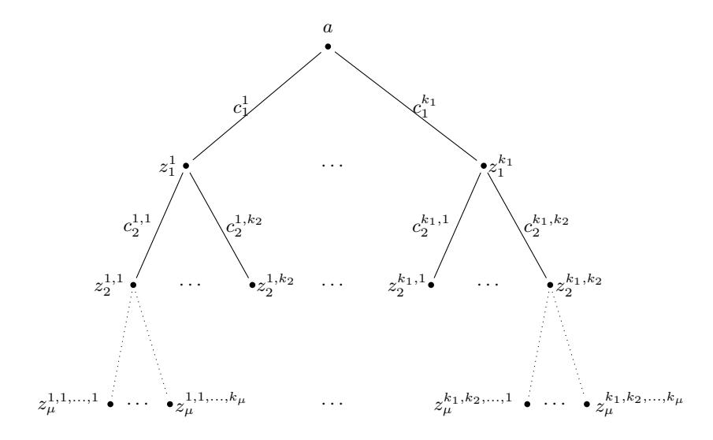
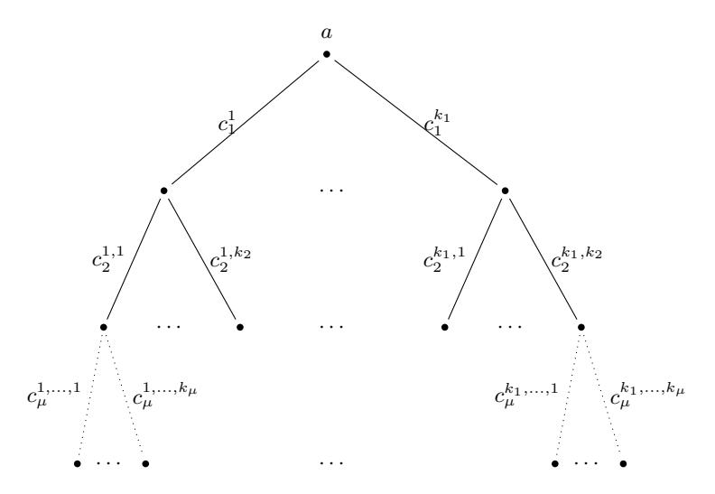

# **A Compressed** *Σ***-Protocol Theory for Lattices**

Thomas Attema<sup>1</sup>*,*2*,*3*,⋆*, Ronald Cramer<sup>1</sup>*,*2*,⋆⋆*, and Lisa Kohl<sup>1</sup>*,⋆ ⋆ ⋆*

<sup>1</sup> CWI, Cryptology Group, Amsterdam, The Netherlands <sup>2</sup> Leiden University, Mathematical Institute, Leiden, The Netherlands

Version 3 - October 14, 2021[4](#page-0-0)

**Abstract.** We show a *lattice-based* solution for commit-and-prove transparent circuit zero-knowledge (ZK) with *polylog-communication*, the *first* not depending on PCPs.

We start from *compressed Σ-protocol theory* (CRYPTO 2020), which is built around basic *Σ*-protocols for opening an arbitrary linear form on a long secret vector that is compactly committed to. These protocols are first compressed using a recursive "folding-technique" adapted from Bulletproofs, at the expense of logarithmic rounds. Proving in ZK that the secret vector satisfies a given constraint – captured by a circuit – is then by (blackbox) reduction to the linear case, via arithmetic secret-sharing techniques adapted from MPC. Commit-and-prove is also facilitated, i.e., when commitment(s) to the secret vector are created ahead of any circuit-ZK proof. On several platforms (incl. DL) this leads to logarithmic communication. Non-interactive versions follow from Fiat-Shamir.

This abstract modular theory strongly suggests that it should somehow be supported by a latticeplatform *as well*. However, when going through the motions and trying to establish low communication (on a SIS-platform), a certain significant lack in current understanding of multi-round protocols is exposed.

Namely, as opposed to the DL-case, the basic *Σ*-protocol in question typically has *poly-small challenge* space. Taking into account the compression-step – which yields *non-constant* rounds – and the necessity for parallelization to reduce error, there is no known tight result that the compound protocol admits an efficient knowledge extractor. We resolve the state of affairs here by a combination of two novel results which are fully general and of independent interest. The first gives a tight analysis of efficient knowledge extraction in case of non-constant rounds combined with poly-small challenge space, whereas the second shows that parallel repetition indeed forces rapid decrease of knowledge error.

Moreover, in our present context, arithmetic secret sharing is not defined over a large finite field but over a quotient of a number ring and this forces our careful adaptation of how the linearization techniques are deployed.

We develop our protocols in an abstract framework that is conceptually simple and can be flexibly instantiated. In particular, the framework applies to arbitrary rings and norms.

**Keywords:** Zero Knowledge, Circuit ZK, Lattices, *Σ*-Protocols, Compression, Short Integer Solution Problem.

## **1 Introduction**

Compressed *Σ*-Protocol Theory [\[AC20\]](#page-33-0) is built around basic *Σ*-protocols for opening an arbitrary linear form on a long secret vector that is compactly committed to. More precisely, these *Σ*-protocols allow a prover to prove that a committed vector **x** satifies a constraint *L*(**x**) = *y* captured by a linear form *L*. They are first compressed using a recursive "folding-technique" adapted from Bulletproofs [\[BCC](#page-33-1)<sup>+</sup>16, [BBB](#page-33-2)<sup>+</sup>18]. Compression reduces the communication complexity from linear down to logarithmic in the dimension of the secret

<sup>3</sup> TNO, Cyber Security and Robustness, The Hague, The Netherlands

*<sup>⋆</sup>* thomas.attema@tno.nl

*<sup>⋆⋆</sup>* cramer@cwi.nl, cramer@math.leidenuniv.nl

*<sup>⋆ ⋆ ⋆</sup>* lisa.kohl@cwi.nl

<span id="page-0-0"></span><sup>4</sup> **Change log** w.r.t. Version 2 - March 13, 2021: Minor (local) correction of the proof of Lemma [5.](#page-11-0) More precisely, adjusted the conditioning in the expected value of the run time random variable.

vector **x**, at the expense of a logarithmic number of rounds. Proving in ZK that the secret vector satisfies an arbitrary (non-linear) constraint – captured by an arithmetic circuit – is then by (blackbox) reduction to the linear case, via arithmetic secret-sharing techniques adapted from MPC. It was shown how to instantiate this theory from different hardness assumptions, i.e., the Discrete Logarithm (DL), Strong-RSA and Knowledge-of-Exponent (KEA) assumption. The latter assumption even results in *constant* communication, instead of logarithmic. Non-interactive versions follow from the Fiat-Shamir transform [\[FS86\]](#page-34-0).

The starting point is always a compact and homomorphic vector commitment scheme, i.e., commitments should have size constant (or logarithmic) in the dimension of the committed vector. After instantiating such a commitment scheme from any of the aforementioned hardness assumption, compressed *Σ*-protocol theory can be described in an abstract and modular manner. This strongly suggests that the theory should also be supported by a lattice platform. This belief was further strengthened by the recent lattice-based Bulletproof instantiation for proving knowledge of a SIS preimage [\[BLNS20\]](#page-33-3).

However, when going through the motions and trying to establish low communication (on a SIS-platform), a certain significant lack in current understanding of multi-round protocols and several challenges are exposed.

### **1.1 Challenges for Lattice Instantiations**

As opposed to the DL-case, the lattice-based *Σ*-protocol typically has polynomially small challenge space. Taking into account the compression-step – which yields non-constant rounds – there is no known result from which a tight knowledge soundness property can be derived. In prior works, this lack in understanding was handled by an alternative non-tight security analysis [\[BCC](#page-33-1)<sup>+</sup>16]. Recent works, while remaining non-tight, have improved the tightness [\[Wik18,](#page-35-0) [HKR19,](#page-34-1) [dLS19,](#page-34-2) [JT20,](#page-34-3) [AL21\]](#page-33-4).

The situation is further complicated by the necessity for parallelization to reduce the knowledge error. While parallel repetition of interactive proofs has been studied extensively in the context of decreasing the *soundness error* [\[HPWP10,](#page-34-4) [CL10,](#page-33-5) [CP15\]](#page-33-6), to the best of our knowledge there does not exist a general parallel repetition theorem for decreasing the *knowledge error*.

Setting aside the knowledge error issues addressed previously, the main difference between the lattice setting and the other settings is a norm bound. Instead of proving knowledge of a preimage for some homomorphism *Ψ*, we aim to prove knowledge of a *short* pre-image. More precisely, for some homomorphism *Ψ*, we aim to construct a protocol for the following relation

$$R_{\Psi,\alpha} = \{ (P; x) : P = \Psi(x), ||x|| \le \alpha \}$$

where (*P*; *x*) ∈ *RΨ,α* is a pair of a public statement *P* and a secret witness *x*. The DL-based protocols are designed for exactly the same abstract relation, but without the norm-bound. This minor difference introduces a number of challenges that have been dealt with in the context of plain *Σ*-protocols for some time now. For example, given a preimage *x* with ∥*x*∥ ≤ *β*, a prover is typically only capable of proving knowledge of a preimage *y* with ∥*y*∥ ≤ *αβ*. The factor *α* ≥ 1 is referred to as the *soundness slack*. In multi-round protocols the soundness slack accumulates and a more careful analysis is warranted.

Finally, in our present lattice context, committed vectors typically have coefficients in the quotient of a number ring R = Z[*X*]*/*(*f*(*X*)) by a rational prime (*p*). However, the structure of the ring R*<sup>p</sup>* may not readily allow for the large sets with invertible pairwise differences required for Shamir secret sharing.

## **1.2 Contributions**

We show a lattice-based solution for commit-and-prove transparent circuit ZK with polylogarithmic communication, the first not depending on PCPs.

To this end, we resolve the lack in understanding regarding knowledge soundness by a combination of two novel results which are fully general and of independent interest. The first gives a tight analysis of efficient knowledge extraction in case of non-constant rounds, whereas the second shows that parallel repetition indeed forces rapid decrease of knowledge error.

By our extractor analysis, we *tightly* prove that (*k*1*, . . . , kµ*)-special soundness implies knowledge soundness, without imposing any restrictions on the size of the challenge sets. In a concurrent and independent work this result was deemed out of reach with current techniques [\[AL21\]](#page-33-4). More concretely, they apply the non-tight analysis of [\[dLS19\]](#page-34-2) and derive a knowledge error *κ* ≤ 8*.*16 log *n/*|C|, where *n* is the size of the input. By contrast, we provide a tight bound and show that *κ* ≤ 2 log *n/*|C|. This inequality contains a simplified expression and is therefore non-tight, for the tight bound we refer to Theorem [1.](#page-8-0) Furthermore, our result answers an open question regarding knowledge extractors, recently made explicit [\[HKR19,](#page-34-1) Question D.4.], in the affirmative. It is generally applicable to all aforementioned platforms and therefore improves upon the analyses of [\[BCC](#page-33-1)<sup>+</sup>16, [Wik18,](#page-35-0) [HKR19,](#page-34-1) [dLS19,](#page-34-2) [JT20,](#page-34-3) [AL21\]](#page-33-4), directly yielding better parameters for multiround protocols such as Bulletproofs. Towards showing that (*k*1*, . . . , kµ*)-special soundness tightly implies knowledge soundness, we observe that for the special case of 2-special soundness (where this implication is well-known) we can give a very simple proof that we have not encountered in the literature before. In contrast to standard proof techniques, our extractor can be modeled by a negative hyper geometric distribution. This simplification turns out to be generalizable to the multi-round scenario. Even though the general proof is building on this simplification, its analysis turns out to be quite involved.

By the second result, we show that parallel repetition indeed forces a rapid decrease of knowledge error, explicitly proving a result that is often taken for granted whereas it actually requires a careful analysis. More precisely, it is known that parallel repetition decreases the *soundness* error. However, *knowledge soundness* is a strictly stronger notion than soundness. Nevertheless, by a careful analysis, we prove that prior results also apply to knowledge sound protocols and allow for a rapid decrease of knowledge error. The (2*,* 2)-special sound signature scheme MQDSS was already presented with a tight knowledge error analysis [\[CHR](#page-33-7)<sup>+</sup>16]. However, their analysis crucially depends on the fact that this signature scheme has a *constant* number of rounds and therefore does not apply to our setting. Our techniques are generic and also apply to this protocol, indeed yielding exactly the same knowledge error.

Furthermore, we describe a careful adaptation of the arithmetic secret sharing based linearization strategy from [\[AC20\]](#page-33-0). First, the evaluation points of Shamir's secret sharing scheme have to be chosen from an *exceptional*, instead of an arbitrary, subset of the ring R*p*, i.e., a subset with invertible differences. In many practical scenarios this minor adaptation suffices. However, some rings do not contain "large enough" exceptional subsets. For this reason, we extend the linearization technique to work for small rings R*<sup>p</sup>* by defining the secret sharing scheme over an appropriately chosen ring extension. Some care is warranted to prevent dishonest provers from choosing secret elements in the extension ring.

Subsequently, we note that working in a lattice-platform is considerably more tedious. Traditionally the security analysis depends strongly on various protocol design choices. Our approach is less sensitive to these choices. This is very convenient when considering variations. More precisely, we develop our protocols in an abstract framework that is conceptually simple and can be flexibly instantiated. In particular, the framework applies to arbitrary rings, challenge sets and norms. Our framework captures general rejection sampling strategies, gives precise bounds on the introduced soundness slack and generalizes beyond factor-2 per-round compression.

The communication complexity of our protocols, when instantiated from the Module Short Integer Solution (MSIS) assumption and appropriately chosen rings, is polylogarithmic in the input size. Due to the soundness slack it does not achieve the logarithmic communication of a DL-based instantiation. Our protocols are transparent, i.e., no trusted setup, and easily ported to the commit-and-prove paradigm, where commitment(s) to the secret vector have been created ahead of any circuit-ZK proof. Moreover, various efficiency improvements, developed for DL-based (compressed) *Σ*-protocol theory, almost directly carry over to the lattice-setting.

## **1.3 Related Work**

*Circuit ZK with Polylogarithmic Complexity from PCPs.* A generic class of (zero-knowledge) proof systems is based on *Probabilistically Checkable Proofs* (PCPs). The security of these protocols only relies on the existence of collision-resistant hash functions and they achieve polylogarithmic communication complexity. However, large concrete costs have long prevented PCP-based protocols from being deployed in practice. Recent advances have rendered PCP-based protocols practical [AHIV17, BBC<sup>+</sup>17, BCR<sup>+</sup>19]. Still, for small problem instances, PCP-based protocols are often outperformed by other approaches relying on more structured hardness assumptions. In particular, PCP approaches rely on Merkle-tree commitments and therefore have an implicit lower bound in the order of a hundred kilobytes, whereas protocols relying on the compression mechanism such as Bulletproofs can go down to as much as a few kilobytes. Even though the soundness slack introduced by the compression mechanism is currently somewhat limiting in terms of concrete efficiency, we expect that on the long run the non-PCP lattice-based approach will lead to more succinct proofs.

Circuit ZK with Sublinear Complexity from Lattice Assumptions. The first protocol of this form achieving a sub-linear communication complexity  $\widetilde{\mathcal{O}}(\sqrt{\lambda n})$ , where n is the input size and  $\lambda$  the security parameter, was presented in [BBC<sup>+</sup>18]. A key component of their protocol is a compact commitment scheme. In our lattice instantiation we use exactly the same compact commitment scheme. While their approach is inherently limited to communication complexity in the order of  $\widetilde{\mathcal{O}}(\sqrt{\lambda n})$ , our approach yields the first lattice-based (non-PCP) protocol that achieves polylogarithmic complexity in the input length. On the other hand, our approach requires a larger number of rounds. Getting a similar communication-complexity/round trade-off as [BBC<sup>+</sup>18] by using a larger per-round compression seems currently out of reach, due to the large soundness slack introduced (which scales exponentially in the compression factor).

Lattice-based proof of knowledge of SIS preimages. The lattice-based Bulletproof instantiation of [BLNS20] is most similar to our compressed  $\Sigma$ -protocol. However, in this work the aforementioned knowledge error issues were overlooked. Moreover, their work only considers proving knowledge of a SIS preimage, i.e., it does not consider generic arithmetic circuit relations. Furthermore, it is not zero-knowledge and it is tailored to a specific lattice-instantiation. By contrast, our protocol is a circuit ZK protocol that can be instantiated from a wide variety of lattices. For the specific scenario of proving knowledge of a SIS preimage, we obtain a comparable communication complexity.

### 1.4 Roadmap

We start by presenting the general result that  $(k_1, \ldots, k_{\mu})$ -special soundness tightly implies knowledge soundness in Section 3. We first outline a very simple proof for the special case of 2-special soundness, which is novel to the best of our knowledge. Subsequently, we show how this proof can be generalized to the multi-round setting. Using results from [CP15], we prove that parallel repetition of multi-round public-coin protocols not only reduces the soundness error, but also the knowledge error (see Section 4). In Section 5, we give an abstract theory for lattice-based compressed  $\Sigma$ -protocols. In Section 6, we show how to instantiate our abstract framework from the Module Short Integer Solution (MSIS) problem. We further provide an asymptotic parameter analysis for our instantiation and comparison with [BLNS20]. In Section 7, we show how to adapt the linearization techniques of [AC20] to the lattice section, where the arithmetic secret sharing is not defined over a large field but over a quotient of a number ring. Finally, in Section 8, we discuss a number of extensions for amortization over many linear forms, reducing the communication complexity and for obtaining commit-and-prove protocols directly.

## <span id="page-3-0"></span>2 Preliminaries

We typically denote the input by x. We sometimes parametrize security directly by the input length |x|, and sometimes by an extra security parameter  $\lambda \in \mathbb{N}$ , whichever is more convenient in the context. Since we always assume the input length |x| to be polynomial in the security parameter  $\lambda$ , this does not make a difference asymptotically.

We say a function  $f: \mathbb{N} \to \mathbb{R}_{>0}$  is *negligible*, if for all  $c \in \mathbb{N}$ , there exists a  $\lambda_0 \in \mathbb{N}$  such that  $f(\lambda) \leq 1/\lambda^c$  for all  $\lambda \geq \lambda_0$ . We write negl( $\lambda$ ) for short to denote a negligible function negl:  $\mathbb{N} \to \mathbb{R}_{>0}$ . We say a function  $f: \mathbb{N} \to \mathbb{R}_{>0}$  is *noticeable*, if there exists a  $c \in \mathbb{N}$  and a  $\lambda_0 \in \mathbb{N}$ , such that  $f(\lambda) \geq 1/\lambda^c$  for all  $\lambda_0 \geq \lambda$ .

We use the notation  $\operatorname{poly}(\lambda)$  for short to denote a function that is *polynomially bounded* in  $\lambda$ , i.e., there exist  $c, \lambda_0 \in \mathbb{N}$  such that  $\operatorname{poly}(\lambda) \leq \lambda^c$  for all  $\lambda \geq \lambda_0$ .

Let X and Y be discrete random variables over a finite support D. The statistical difference of two distributions X and Y is defined as

$$\Delta(X,Y) = \frac{1}{2} \sum_{d \in D} |\Pr[X = d] - \Pr[Y = d]|.$$

We say two ensembles of random variables  $\{X_{\lambda}\}_{{\lambda}\in\mathbb{N}}$ ,  $\{Y_{\lambda}\}_{{\lambda}\in\mathbb{N}}$  are statistically close if there exists a negligible function negl:  $\mathbb{N}\to\mathbb{R}_{>0}$  such that  $\Delta(X_{\lambda},Y_{\lambda})\leq \operatorname{negl}(\lambda)$  for all  $\lambda\in\mathbb{N}$ . We say two ensembles of random variables  $\{X_x\}_{x\in\{0,1\}^*}$ ,  $\{Y_x\}_{x\in\{0,1\}^*}$  are statistically close if there exists a negligible function  $\operatorname{negl}:\mathbb{N}\to\mathbb{R}_{>0}$  such that  $\Delta(X_x,Y_x)\leq \operatorname{negl}(|x|)$  for all  $x\in\{0,1\}^*$ .

### 2.1 Interactive Proofs

Let  $R \subset \{0,1\}^* \times \{0,1\}^*$  be a binary relation. If  $(x;w) \in R$ , we say x is a *statement* and w is a *witness* for x. We only consider NP relations, i.e., relations R for which a witness w can be verified in time  $\operatorname{poly}(|x|)$  for all  $(x;w) \in R$ . In particular it follows that  $|w| = \operatorname{poly}(|x|)$ . The set of statements x that admit a witness w is denoted by  $L_R$ , i.e.,  $L_R = \{x : \exists w \text{ s.t. } (x;w) \in R\}$ . The set of witnesses for a statement x is denoted by R(x), i.e.,  $R(x) = \{w : (x;w) \in R\}$ .

**Definition 1 (Interactive Proof).** An interactive proof  $\Pi = (\mathcal{P}, \mathcal{V})$  for relation R is an interactive protocol between two probabilistic polynomial time machines, a prover  $\mathcal{P}$  and a verifier  $\mathcal{V}$ . It allows a prover to convince a verifier to know a witness w for a public statement x. Both  $\mathcal{P}$  and  $\mathcal{V}$  take as public input a statement x and, additionally,  $\mathcal{P}$  takes as private input a witness  $w \in R(x)$ , which is written as  $\Pi(x;w)$  or Input(x;w). As the output of the protocol,  $\mathcal{V}$  either accepts or rejects the prover's claim of knowing a  $w \in R(x)$ . Accordingly, we say the corresponding transcript (i.e., the set of all messages sent in the protocol execution) is accepting or rejecting.

**Definition 2 (Completeness).** An interactive proof<sup>5</sup> is said to be (perfectly) complete, if V accepts after every honest execution that takes as input a public-private pair  $(x; w) \in R$ . We also consider a relaxed notion of completeness, in which an honest execution is allowed to be rejected with some probability called the completeness error.

Intuitively,  $\Pi$  is said to be *knowledge sound* if any prover that convinces the verifier of knowing a witness for  $x \in L_R$  with large enough probability has to *know* some witness w with  $(x; w) \in R$ . This is formalized by requiring that there exists an efficient algorithm that allows to extract such a witness from the prover.

<span id="page-4-1"></span>**Definition 3 (Knowledge Soundness).** Let  $\Pi = (\mathcal{P}, \mathcal{V})$  be an interactive proof for relation R. Let  $\kappa \colon \mathbb{N} \to [0,1)$  be a function. Then  $\Pi$  is said to be knowledge sound with knowledge error  $\kappa$ , if there exists a polynomial  $q \colon \mathbb{N} \to \mathbb{N}$  and an algorithm  $\mathcal{E}$ , called a knowledge extractor, with the following properties: The extractor  $\mathcal{E}$ , given input x and rewindable oracle access to a (potentially dishonest) prover  $\mathcal{P}^*$ , runs in an expected polynomial number of steps and, whenever  $(\mathcal{P}^*, \mathcal{V})(x)$  outputs accept with probability  $\epsilon(x) \geq \kappa(|x|)$ , successfully outputs a witness  $w \in R(x)$  with probability at least  $(\epsilon(x) - \kappa(|x|))/q(|x|)$ .

**Definition 4 (Proof/ Argument of Knowledge).** An interactive proof that is both complete with completeness error  $\gamma \colon \mathbb{N} \to [0,1)$  and knowledge sound with knowledge error  $\kappa < 1 - \gamma$  is said to be a Proof of Knowledge (PoK). PoKs for which knowledge soundness only holds under computational assumptions are also referred to as Arguments of Knowledge.

<span id="page-4-0"></span><sup>&</sup>lt;sup>5</sup> Note that, originally interactive proofs are required to be complete and knowledge sound by definition [GMR85]. By contrast, we consider these properties separately as desirable properties.

**Definition 5 ((Public-coin)**  $\mu$ -move protocol). An interactive proof with  $\mu$  communication rounds is called a  $\mu$ -move protocol. If additionally all of the verifier's random coins are made public,  $\Pi$  is said to be a public-coin  $\mu$ -move protocol.

Public-coin protocols can be made non-interactive by the Fiat-Shamir transformation [FS86]. For details we refer to Section 5.5. All protocols in this work are public-coin.

Intuitively, an interactive proof is said to be zero-knowledge if a (possibly dishonest) verifier cannot obtain any information about the secret witness w from interacting with an honest prover. For our setting it will be sufficient to only consider honest verifiers, because the randomness will be obtained via applying the Fiat-Shamir transform. Further, for the lattice-based instantiation we will only be able to simulate non-aborting transcripts and therefore can only rely on a relaxed notion of honest verifier zero knowledge. Again, this will not constitute a problem when instantiating the protocols with the Fiat-Shamir transform, because in this case aborting executions are never published.

Definition 6 ((Special/ Non-abort) Honest-Verifier Zero Knowledge). An interactive protocol  $\Pi$  is said to be honest verifier zero-knowledge (HVZK) if there exists a polynomial time simulator that on input  $x \in L_R$  outputs an accepting transcript which is distributed statistically close to the transcripts generated by honest executions of  $\Pi$ . If the simulator proceeds by first sampling the verifier's messages uniformly at random, then  $\Pi$  is said to be special honest verifier zero-knowledge (SHVZK). We say a protocol is non-abort honest-verifier zero knowledge, if the distribution of the transcript produced by the simulator is statistically close to the transcripts generated by an honest execution whenever the honest prover does not abort.

Note that in the literature non-abort (S)HVZK is often simply referred to as (S)HVZK. We use a different notation to highlight that the notion of non-abort (S)HVZK is weaker than (S)HVZK, as in an interactive protocol execution the verifier might learn something from aborting executions.

In the following we introduce the notion of special soundness, which is easier to handle than knowledge soundness.

**Definition 7** (k-Special Soundness). A 3-move public-coin protocol is said to be special sound if there exists a polynomial time algorithm that on input a statement x and two accepting transcripts (a, c, z) and (a, c', z'), with  $c \neq c'$  and common first message a, outputs a witness  $w \in R(x)$ . If the algorithm takes as input k transcripts, with pairwise distinct challenges and a common first message, instead of 2, the protocol is said to be k-special sound.

**Definition 8** ( $\Sigma$ -Protocol). A 3-move protocol that is public-coin, complete, k-special sound and SHVZK is said to be  $\Sigma$ -protocol.

In this paper, we will more generally refer to  $\Sigma$ -protocols also for  $(2\mu + 1)$ -move protocols that are public-coin, complete (with some completeness error),  $(k_1, \ldots, k_{\mu})$ -special sound and (non-abort) SHVZK.

Before extending the definition of special soundness to  $2\mu + 1$ -move protocols, we have to introduce the notion of a tree of transcripts.

**Definition 9 (Tree of transcripts).** A  $(k_1, \ldots, k_{\mu})$ -tree of transcripts for a  $(2\mu + 1)$ -move public-coin protocol is a set of  $K = \prod_{i=1}^{\mu} k_i$  transcripts arranged in the following tree structure. The nodes in this tree correspond to the prover's messages and the edges correspond to the verifier's challenges. Every node at depth i has precisely  $k_i$  children corresponding to  $k_i$  pairwise distinct challenges. Every transcript corresponds to exactly one path from the root node to a leaf node. For a graphic representation we refer to Figure 1.

**Definition 10**  $((k_1, \ldots, k_{\mu})$ -**Special Soundness).** A  $(2\mu + 1)$ -move public-coin protocol is  $(k_1, \ldots, k_{\mu})$ -special sound if there exists an efficient algorithm that on input a  $(k_1, \ldots, k_{\mu})$ -tree of accepting transcripts outputs a witness  $w \in R(x)$ .

Note that it is non-trivial to show that special soundness implies knowledge soundness, because in contrast to the extractor  $\mathcal{E}$  of Definition 3 that has only access to the prover, the algorithm for special soundness obtains the transcripts directly. While it is well known that for 3-move protocols special soundness implies knowledge soundness, previously there was no known generalization to  $2\mu + 1$ -move protocols. We refer to Section 3 for details.



<span id="page-6-0"></span>**Fig. 1.**  $(k_1,\ldots,k_{\mu})$ -tree of transcripts of a  $(2\mu+1)$ -move public-coin protocol.

### <span id="page-6-2"></span>2.2 Negative Hypergeometric Distribution

In order to show that  $(k_1, \ldots, k_{\mu})$ -special soundness implies knowledge soundness (see Section 3), we will use the negative hypergeometric distribution. The negative hypergeometric distribution describes the following distribution: Given a bin with N balls of which M are marked, then the number of attempts when drawing from the bin (without replacement) until  $k \leq M$  marked balls are drawn is distributed according to the negative hypergeometric distribution. The expected number of draws equals  $\frac{k(N+1)}{M+1}$ .

### 2.3 Lattices

A lattice  $\Lambda$  is a discrete additive subgroup of  $\mathbb{R}^m$ . The lattice  $\Lambda$  is said to be q-ary if  $q\mathbb{Z}^m \subset \Lambda \subset \mathbb{Z}^m$ . Let  $A \in \mathbb{Z}_q^{k \times m}$ , then  $\Lambda_q^{\perp}(A) = \{\mathbf{x} \in \mathbb{Z}^m : A\mathbf{x} = 0 \mod q\}$  defines a q-ary lattice in  $\mathbb{Z}^m$ .

We also consider lattices defined over a ring  $\mathcal{R} = \mathbb{Z}[X]/f(X)$ , where f(X) is a monic irreducible polynomial of degree d. Via the coefficient embedding norms on  $\mathbb{C}$ -vector spaces extend to vectors of ring elements, i.e., for  $\mathbf{x} = (x_1, \dots, x_m) \in \mathcal{R}^m$  with  $x_i = \sum_{j=1}^d a_{i,j} X^{j-1} \in \mathcal{R}$  we define

$$\|\mathbf{x}\|_2 = \|(a_{1,1}, \dots, a_{m,d})\|_2$$
, and  $\|\mathbf{x}\|_{\infty} = \max_{i,j} |a_{i,j}|$ .

For a prime  $q \in \mathbb{N}$ , we write  $\mathcal{R}_q = \mathbb{Z}[X]/(q, f(X)) = \mathbb{Z}_q[X]/(f(X))$ . Let  $A \in \mathcal{R}^{k \times m}$ , then  $\Lambda_q^{\perp}(A) = \{\mathbf{x} \in \mathcal{R}^m : A\mathbf{x} = 0 \mod q\}$  defines a q-ary lattice in  $\mathbb{Z}^{dm}$ . Finding a non-zero and short element in a lattice  $\Lambda_q^{\perp}(A)$  is referred to as the Module Short Integer Solution (MSIS) problem [LS15]. The MSIS problem is assumed to be a computationally hard problem.

**Definition 11** (MSIS<sub>k,m,\beta</sub> **Problem).** Let  $\mathcal{R} = \mathbb{Z}[X]/f(X)$  for a monic and irreducible polynomial f(X) and let  $q \in \mathbb{N}$  be a prime. The MSIS<sub>k,m,\beta</sub> problem over  $\mathcal{R}_q$  is defined as follows. Given a matrix  $A \leftarrow_R \mathcal{R}_q^{k \times m}$  sampled uniformly at random, find a non-zero vector  $\mathbf{s} \in \mathcal{R}^m$  such that  $A\mathbf{s} = 0 \mod q$  and  $\|\mathbf{s}\|_2 \leq \beta$ .

Micciancio and Regev [MR09] showed that a MSIS-algorithm is expected to output a MSIS solution with norm

<span id="page-6-1"></span>
$$\|\mathbf{s}\|_2 \ge \min\left(q, 2^{2\sqrt{dk\log\delta\log q}}\right),$$
 (1)

where  $\delta$  is the root Hermite factor of the lattice reduction algorithm that is used. In particular, smaller values of  $\delta$  require better lattice reduction algorithms. In general,  $\delta \approx 1.0045$  is assumed to achieve 128-bit computational security [APS15, ESS<sup>+</sup>19].

In this work, we will be interested in vectors that are short with respect to the  $\ell_{\infty}$ -norm. For this reason we also consider the following variant of the MSIS problem, where "shortness" is defined in terms of the  $\ell_{\infty}$ -norm. Clearly, the hardness of  $\text{MSIS}_{k,m,\beta}^{\infty}$  is implied by the hardness of  $\text{MSIS}_{k,m,\sqrt{dm\beta}}$ .

**Definition 12** (MSIS $_{k,m,\beta}^{\infty}$  **Problem over**  $\mathcal{R}_q$ ). Let  $\mathcal{R} = \mathbb{Z}[X]/f(X)$  for a monic and irreducible polynomial f(X) and let  $q \in \mathbb{N}$  be a prime. The MSIS $_{k,m,\beta}^{\infty}$  problem over  $\mathcal{R}_q$  is defined as follows. Given a matrix  $A \leftarrow_R \mathcal{R}_q^{k \times m}$  sampled uniformly at random, find a non-zero vector  $\mathbf{s} \in \mathcal{R}^m$  such that  $A\mathbf{s} = 0 \mod q$  and  $\|\mathbf{s}\|_{\infty} \leq \beta$ .

#### 2.4 Commitment Schemes

A commitment scheme allows a prover to create a commitment P to an element x such that the prover can later open P to the committed element x. Informally, a commitment scheme is required to be binding, i.e., a prover cannot open a commitment P to two different elements  $x \neq y$ , and hiding, i.e., the commitment P does not reveal any information about the committed vector x. A commitment scheme consists of a setup algorithm, generating the scheme's public parameters, and a commitment function Com. The commitment function takes as input an element x and randomness  $\gamma$  (and public parameters pp) and outputs a commitment P, i.e,  $Com(x, \gamma) = P$ . To open a commitment a prover reveals  $(x, \gamma)$  such that a verifier can verify that  $Com(x, \gamma) = P$ . The commitment scheme is said to be homomorphic if the commitment function Com (considered respective to fixed public parameters) is a group homomorphism.

The primary commitment scheme of interest to us, described in Definition 13, was already implicit in Ajtai's seminal work [Ajt96]. It allows a prover to commit to a *short* vector  $\mathbf{x} \in S_{\eta}^{n} = \{\mathbf{y} \in \mathcal{R}^{n} : \|\mathbf{y}\|_{\infty} \leq \eta\}$  by sampling  $\gamma \leftarrow_{R} S_{\eta}^{r}$  uniformly at random and evaluating the commitment function  $P = \text{CoM}(x, \gamma)$ . Note that, we consider this commitment scheme for secrets and randomness bounded in the  $\ell_{\infty}$ -norm. We will typically instantiate this commitment scheme with norm bound  $\eta = \lceil (p-1)/2 \rceil$  for some prime p < q. This allows a prover to commit to arbitrary vectors in  $\mathcal{R}_{p}^{n}$ . The properties of this commitment scheme are summarized in Lemma 1 and Lemma 2. Note in particular that by Equation 1 it follows that the hardness does not depend on the rank n. It follows that the size of a commitment is constant in the rank m = n + r; we say that this commitment scheme is *compact*.

<span id="page-7-0"></span>**Definition 13 (Compact Lattice-Based Commitment Scheme [Ajt96]).** Let  $\mathcal{R} = \mathbb{Z}[X]/f(X)$  for a monic and irreducible polynomial  $f(x) \in \mathbb{Z}[X]$  of degree d and let  $q \in \mathbb{N}$  be a prime. Let  $\eta \in \mathbb{N}$  and let  $S_{\eta} = \{x \in \mathcal{R} : ||x||_{\infty} \leq \eta\}$ . Then, the following setup and commitment algorithms define a commitment scheme:

```
- Setup: A_1 \leftarrow_R \mathcal{R}_q^{k \times r}, A_2 \leftarrow_R \mathcal{R}_q^{k \times n}.

- Commit: Com: S_\eta^n \times S_\eta^r \to \mathcal{R}_q^k, (\mathbf{x}, \gamma) \mapsto A_1 \gamma + A_2 \mathbf{x} \mod q.
```

<span id="page-7-1"></span>**Lemma 1 (Hiding).** The commitment scheme of Definition 13 is statistically hiding with statistical security parameter  $\lambda$ , where  $\lambda \in \mathbb{N}$  is such that  $r \geq \frac{dk \log q + 2\lambda}{d \log(2n+1)}$ .

Proof. The family of functions  $h_A: \mathcal{R}^r_q \to \mathcal{R}^k_q$ ,  $\mathbf{x} \mapsto A\mathbf{x}$ , indexed by  $A \in \mathcal{R}^{k \times r}_q$  is a universal hash family. The min-entropy of the uniform distribution over  $S^r_\eta$  equals  $dr \log(2\eta + 1) \ge dk \log q + 2\lambda$ . By the leftover hash lemma it therefore follows that the statistical distance between the distribution  $\mathcal{X} = \{(A, A\gamma) : A \leftarrow_R R^{k \times r}_q, \gamma \leftarrow_R S^r_\eta\}$  and the uniform distribution  $\mathcal{U}$  over  $R^{k \times r}_q \times R^k_q$  is at most  $2^{-\lambda}$ , which proves the lemma.  $\square$ 

<span id="page-7-2"></span>**Lemma 2 (Binding).** The commitment scheme of Definition 13 is binding, conditioned on the hardness of the  $MSIS_{k,n+r,2\eta}^{\infty}$ -problem over  $\mathcal{R}_q$ .

Proof. Suppose that  $(\mathbf{x}, \gamma) \neq (\mathbf{x}', \gamma')$  are two distinct openings of the same commitment P. Then  $\mathbf{s} = (\mathbf{x} - \mathbf{x}', \gamma - \gamma') \neq 0$  satisfies  $\|\mathbf{s}\|_{\infty} \leq 2\eta$  and  $[A_1, A_2]\mathbf{s} = 0$ , i.e.,  $\mathbf{s}$  is a solution of the  $\text{MSIS}_{k,n+r,2\eta}^{\infty}$  problem, which completes the proof.

It is generally hard to construct efficient protocols for proving knowledge of an opening  $(\mathbf{x}, \gamma)$  for a commitment P, i.e.,  $(\mathbf{x}, \gamma)$  such that  $Com(\mathbf{x}, \gamma) = P$  and  $\|(\mathbf{x}, \gamma)\|_{\infty} \leq \eta$ . For this reason, we introduce the notion of relaxed openings.

**Definition 14** ( $(\beta, \zeta)$ -Relaxed Commitment Opening). Let  $\beta \in \mathbb{N}$  and  $\zeta \in \mathcal{R}$ . A  $(\beta, \zeta)$ -relaxed opening of a commitment P is a tuple  $(\mathbf{x}, \gamma) \in \mathcal{R}^{n+r}$ , such that  $Com(\mathbf{x}, \gamma) = \zeta P$  and  $\|(\mathbf{x}, \gamma)\|_{\infty} \leq \beta$ .

Hence, a relaxed opening differs in two ways from a standard commitment opening. First, a relaxed opening for P contains an approximation factor  $\zeta$ , such that the opening gives a short preimage for  $\zeta P$  instead of the commitment P. Second, the norm-bound  $\beta$  of relaxed openings can be different from the norm bound  $\eta$  on honestly committed vectors (typically  $\beta > \eta$ ).

As long as it is infeasible to find two distinct relaxed openings  $(\mathbf{x}, \gamma)$  and  $(\mathbf{x}', \gamma')$  of a commitment P with  $(\mathbf{x}, \gamma) \neq (\mathbf{x}', \gamma')$ , proving knowledge of relaxed opening is sufficient in most practical scenarios. In this case, we say the commitment scheme is binding with respect to relaxed openings.

<span id="page-8-2"></span>Lemma 3 (Binding with respect to  $(\beta, \zeta)$ -Relaxed Openings). Let  $\beta \in \mathbb{N}$  and  $\zeta \in \mathcal{R}$ . The commitment scheme of Definition 13 is binding with respect to  $(\beta, \zeta)$ -relaxed openings, conditioned on the hardness of the  $\mathrm{MSIS}_{k,n+r,2\beta}^{\infty}$ -problem over  $\mathcal{R}_q$ .

*Proof.* Suppose that  $(\mathbf{x}, \gamma)$  and  $(\mathbf{x}', \gamma')$  are distinct  $(\beta, \zeta)$ -relaxed openings of a commitment P. Then  $\mathbf{s} = (\mathbf{x} - \mathbf{x}', \gamma - \gamma') \neq 0$  satisfies  $\|\mathbf{s}\|_{\infty} \leq 2\beta$  and  $[A_1, A_2]\mathbf{s} = 0$ , i.e.,  $\mathbf{s}$  is a solution of the  $\mathrm{MSIS}_{k,n+r,2\beta}^{\infty}$  problem, which completes the proof.

## <span id="page-8-1"></span>3 Multi-Round Special Soundness Tightly Implies Knowledge Soundness

In this section we prove that a  $(k_1, \ldots, k_{\mu})$ -special sound protocol is knowledge sound and give a concrete and tight knowledge error. More precisely, we show the existence of an efficient knowledge extractor. From this it follows that Bulletproofs [BCC<sup>+</sup>16, BBB<sup>+</sup>18] and Compressed  $\Sigma$ -Protocols [AC20] are Proofs/Arguments of Knowledge (PoKs). We are the first to prove a tight bound on the knowledge error. Prior works mainly relied on the asymptotic extractor analysis of [BCC<sup>+</sup>16]. This asymptotic analysis results in conservative concrete security estimates. Moreover, the analysis of [BCC<sup>+</sup>16] is restricted to protocols with exponentially large challenge sets. When the challenge sets are small, such as in lattice based protocols, a refined analysis is required. Our result solves both problems. It gives tight security guarantees resulting in optimal concrete parameters for  $(k_1, \ldots, k_{\mu})$ -special sound protocols and it is applicable to protocols with small challenge sets. The main result of this section is summarized in Theorem 1.

<span id="page-8-0"></span>Theorem 1 ( $(k_1, \ldots, k_{\mu})$ -Special Soundness implies Knowledge Soundness). Let  $\mu, k_1, \ldots, k_{\mu} \in \mathbb{N}$  be such that  $K = \prod_{i=1}^{\mu} k_i$  can be upper bounded by a polynomial. Let  $(\mathcal{P}, \mathcal{V})$  be a  $(k_1, \ldots, k_{\mu})$ -special sound  $(2\mu+1)$ -move interactive protocol for relation R, where  $\mathcal{V}$  samples each challenge uniformly at random from a challenge set of size  $N \geq \max_i(k_i)$ . Then  $(\mathcal{P}, \mathcal{V})$  is knowledge sound with knowledge error

<span id="page-8-3"></span>
$$\kappa = \frac{N^{\mu} - \prod_{i=1}^{\mu} (N - k_i + 1)}{N^{\mu}} \le \frac{\sum_{i=1}^{\mu} (k_i - 1)}{N}.$$
 (2)

First, in Section 3.1, we considers the special case of 2-special soundness (for which the above implication is well-known). We give a very simple proof that we have not encountered in literature before. In contrast to standard proof techniques, this simplification turns out to be generalizable to the multi-round scenario. Second, in Section 3.2, we prove Theorem 1 in its full generality.

Remark 1. Theorem 1 has a straightforward generalization to multi-round protocols in which challenges are sampled from possibly different challenge sets in every round. The only difference is the slightly different knowledge error expression. Let challenge i be sampled uniformly at random from a set of cardinality  $N_i$  for  $1 \le i \le \mu$ . Then the knowledge error of a  $(k_1, \ldots, k_\mu)$ -special sound protocol equals

$$\kappa = \frac{\prod_{i=1}^{\mu} N_i - \prod_{i=1}^{\mu} (N_i - k_i + 1)}{\prod_{i=1}^{\mu} N_i} \le \sum_{i=1}^{\mu} \frac{k_i - 1}{N_i}.$$
 (3)

For simplicity, the proofs are restricted to the case where each challenge is sampled from a challenge set of cardinality N.

### <span id="page-9-0"></span>3.1 2-Special Soundness

This section is a warm up in which we present a novel proof for the well-known result that 2-special soundness implies knowledge soundness. Later we show that our techniques generalize to prove a similar result for  $2\mu+1$ -move protocols that are  $(k_1,\ldots,k_\mu)$ -special sound. We make a minor modification to the "collision-game" defined in [Cra96]. The knowledge extractor essentially plays this game in order to extract a collision of two accepting transcripts (a,c,z) and (a,c',z') with common first message a. By the special soundness property a witness can be computed efficiently given this collision. Our modification increases the success probability of the knowledge extractor of [Cra96] from  $(\epsilon(x) - \kappa(|x|))^2$  to  $\epsilon(x) - \kappa(|x|)$ , where  $\kappa(|x|)$  is the knowledge error and  $\epsilon(x)$  the success probability of the prover for a statement x. In contrast to the extractor of [Cra96], which runs in *strict* polynomial time, our extractor runs in *expected* polynomial time. However, this is sufficient for proving knowledge soundness.

If the input x is clear from context, we simply write  $\epsilon$  to denote  $\epsilon(x)$ . All other parameters will implicitly depend on |x| (e.g., we denote  $\kappa(|x|)$  by  $\kappa$ ).

A similar result can be found in [HL10]. However, our approach significantly simplifies the knowledge extractor and its analysis. For instance, the extractor of [HL10] is composed of two algorithms considering different scenarios, whereas this case distinction is not required in our knowledge extractor. This simplification will allow for a generalization to the  $(k_1, \ldots, k_\mu)$ -special sound case.

The collision game. Let us now describe the game. We consider a binary matrix  $H \in \{0,1\}^{R \times N}$ . The R rows correspond to the prover's randomness and the N columns correspond to the verifier's randomness, i.e., the verifier samples a challenge uniformly at random from a challenge set of size N. An entry of H equals 1 if and only if the corresponding protocol transcript is accepting.

The idea of the knowledge extractor is to sample elements from H until two 1-entries in the same row are found. The ij-th entry of H can be obtained by executing the prover with fixed randomness corresponding to the i-th row and verifier's challenge corresponding to the j-th column, and checking if the resulting transcript would be accepted. As the prover's randomness is fixed along one row, finding two 1-entries in the same row corresponds to two finding two accepting transcripts (a, c, e) and (a, c', e'), which by the 2-special soundness allows to extract a witness. The difference to the knowledge extractor of [HL10] is the following:

- 1. Our knowledge extractor checks one entry of H (for position ij sampled at random), and aborts if this is not a 1-entry.
- 2. If the first entry was a 1-entry, our knowledge extractor then samples along row i without replacement.

More precisely, the knowledge extractor will play the following collision-game. An entry of H is selected uniformly at random. If this entry equals 1, continue sampling different elements from this row (without replacement) until a second 1-entry is found or until the row has been exhausted. If the first entry does not equal 1, the game aborts. The collision game outputs success if and only if two 1-entries in the same row have been found.

<span id="page-9-1"></span>In contrast the above collision-game, the collision-game of [Cra96] simply checks 2 random entries of H and outputs success if both of them are 1-entries.

**Lemma 4 (Collision-Game).** *Let H* ∈ {0*,* 1} *<sup>R</sup>*×*<sup>N</sup> and let ϵ denote the fraction of* 1*-entries in H. The expected number of H-entries queried in the collision-game defined above is at most* 2*. Moreover, the success probability of the collision-game is greater than or equal to ϵ* − 1*/N.*

*Proof.* **Expected Number of Queries.** Let *ϵ<sup>i</sup>* be the fraction of 1-entries in row *i*. Assuming that the first entry lies in row *i* and equals 1, the remainder of the collision game can be modeled by a negative hypergeometric distribution. Elements from a population of size *N* − 1, containing *ϵiN* − 1 1-entries, are drawn (without replacement) until a second 1-entry has been found. The expected number of draws equals (*N* − 1 + 1)*/*(*ϵiN* − 1 + 1) = 1*/ϵ<sup>i</sup>* if *ϵ<sup>i</sup> >* 1*/N* (see Section [2.2\)](#page-6-2).If there is no second 1-entry in the row, then the number of draws is always equal to *N* − 1. Hence, the expected number of draws can be upper bounded by 1*/ϵ<sup>i</sup>* . The expected number of *H*-entries queried is therefore at most

$$\frac{1}{R} \sum_{i=1}^{R} \left( 1 + \epsilon_i \frac{1}{\epsilon_i} \right) = 2,$$

which proves the first part of the lemma.

**Success Probability.** The collision-game succeeds if the first entry is a 1 that lies in a row containing at least two 1-entries. For 0 ≤ *k* ≤ *N*, let *δ<sup>k</sup>* be the fraction of rows with exactly *k* 1-entries. Then the success probability equals

$$\sum_{k=2}^{N} \frac{k}{N} \delta_k = \left(\sum_{k=0}^{N} \frac{k}{N} \delta_k\right) - \frac{\delta_1}{N} \ge \epsilon - 1/N,$$

which proves the second part of the lemma.

From Lemma [4](#page-9-1) it immediately follows that 2-special soundness implies knowledge soundness with knowledge error 1*/N*.

**Corollary 1.** *Let* (P*,* V) *be a special sound* 3*-move interactive protocol for relation R, where* V *samples each challenge uniformly at random from a challenge set of size N* ≥ *k. Then* (P*,* V) *is knowledge sound with knowledge error κ* = 1*/N.*

*Remark 2.* Lemma [4](#page-9-1) has a straightforward generalization to the *k*-special soundness scenario. In this generalization the collision game draws until it has obtained *k*, instead of 2, 1-entries in the same row. Hence, it again involves a negative hypergeometric distribution, but now with different parameters. In this case, the expected number of queries is at most *k* and the success probability is greater than or equal to *ϵ*−(*k* −1)*/N*.

## <span id="page-10-0"></span>**3.2 (***k***1***, . . . , kµ***)-Special Soundness**

In this section, we generalize the collision-game of Section [3.1](#page-9-0) to the (*k*1*, . . . , kµ*)-special soundness scenario.

*The* (*k*1*, . . . , kµ*)*-collision game.* To define the (*k*1*, . . . , kµ*)-collision-game, let *H* ∈ {0*,* 1} *<sup>R</sup>*×*N*×···×*<sup>N</sup>* be a (*µ* + 1)-dimensional binary matrix. For *a* ∈ {1*, . . . , R*} and *c*1*, . . . , c<sup>i</sup>* ∈ {1*, . . . , N*}, we let *H*(*a, c*1*, . . . , ci*) ∈ {0*,* 1} *<sup>N</sup>*×···×*<sup>N</sup>* be the (*µ* − *i*) dimensional submatrix of *H* that contains all entries of *H* for which the first *i*+ 1 coordinates are equal to (*a, c*1*, . . . , ci*). The first dimension corresponds to the prover's randomness and the other dimensions correspond to the verifier's random choices, i.e., we consider protocols in which the verifier samples all *µ* challenges uniformly at random from a challenge set of size *N*. For a fixed public input *x*, we define the matrix *H* such that *H*(*a, c*1*, . . . , cµ*) = 1 if and only if a transcript with prover's randomness *a* and verifier's challenges *c*1*, . . . , c<sup>µ</sup>* will lead to an accepting transcript.

In Section [2,](#page-3-0) we have defined (*k*1*, . . . , kµ*)-trees of accepting transcripts for (2*µ* + 1)-move protocols. Similarly, we define (*k*1*, . . . , kµ*)-trees of 1-entries in matrix *H*. Such trees can be defined recursively as follows. For *µ* = 0, a tree of 1-entries is simply a 1-entry in *H*. For arbitrary *µ*, a (*k*1*, . . . , kµ*)-tree is the union of *k*<sup>1</sup> (*k*2*, . . . , kµ*)-trees in *H*(*a, c*1)*, . . . , H*(*a, c<sup>k</sup>*<sup>1</sup> ), respectively, for a fixed *a* and pairwise distinct *c<sup>i</sup>* .



<span id="page-11-1"></span>**Fig. 2.** We say a  $(k_1, \ldots, k_{\mu})$ -tree as depicted above is a  $(k_1, \ldots, k_{\mu})$ -tree of 1-entries in H, if  $H(a, c_1^1, c_2^{1,1}, \ldots, c_{\mu}^{1,\ldots,1}) = H(a, c_1^1, c_2^{1,1}, \ldots, c_{\mu}^{k_1,\ldots,k_{\mu}}) = 1$ .

Hence, a  $(k_1, \ldots, k_{\mu})$ -tree of 1-entries in matrix H is a set of  $K = \prod_{i=1}^{\mu} k_i$  1-entries that are in a  $(k_1, \ldots, k_{\mu})$ -tree structure. For a graphic representation see Figure 2.

We define TREE to be the algorithm playing the  $(k_1,\ldots,k_\mu)$ -collision-game. By playing this game TREE aims to find a  $(k_1,\ldots,k_\mu)$ -tree of 1-entries in matrix H. The algorithm TREE is defined recursively as follows. On input  $a\in\{1,\ldots,R\}$  and  $c_1,\ldots,c_\mu\in\{1,\ldots,N\}$ , TREE $_\mu(a,c_1,\ldots,c_\mu)$  successfully outputs  $H(a,c_1,\ldots,c_\mu)$  if this entry equals 1 and it aborts otherwise. For  $0\leq i\leq \mu-1$  and on input  $a\in\{1,\ldots,R\}$  and  $c_1,\ldots,c_i\in\{1,\ldots,N\}$ , TREE $_i(a,c_1,\ldots,c_i)$  aims to find a  $(k_{i+1},\ldots,k_\mu)$ -tree of 1-entries in matrix  $H(a,c_1,\ldots,c_i)$ . The algorithm TREE $_i(a,c_1,\ldots,c_i)$  proceeds by sampling  $c_{i+1}\in\{1,\ldots,N\}$  uniformly at random and running TREE $_{i+1}(a,c_1,\ldots,c_{i+1})$ . If this instantiation of TREE $_{i+1}$  aborts the algorithm TREE $_i(a,c_1,\ldots,c_i)$  aborts. Otherwise it continues sampling different  $c_{i+1}$ 's (i.e., without replacement) until it has found  $k_{i+1}(k_{i+2},\ldots,k_\mu)$ -trees of 1-entries or until it has exhausted all possible  $c_{i+1}$ 's. In the latter case TREE $_i(a,c_1,\ldots,c_i)$  aborts, in the former case TREE $_i(a,c_1,\ldots,c_i)$  outputs a  $(k_{i+1},\ldots,k_\mu)$ -tree of 1-entries in matrix  $H(a,c_1,\ldots,c_i)$ .

The  $(k_1, \ldots, k_{\mu})$ -collision-game samples  $a \in \{1, \ldots, R\}$  uniformly at random and runs  $\text{Tree}_0(a)$ . If  $\text{Tree}_0(a) = \bot$  it aborts and otherwise it outputs a  $(k_1, \ldots, k_{\mu})$ -tree of 1-entries in H(a). The following lemma gives the expected run-time and success probability of the tree finding algorithm Tree.

<span id="page-11-0"></span>**Lemma 5** ( $(k_1, \ldots, k_\mu)$ -Tree Finding Algorithm). Let  $H \in \{0, 1\}^{R \times N \times \cdots \times N}$  be a  $(\mu + 1)$ -dimensional matrix and let  $\epsilon$  denote the fraction of 1-entries in H. The expected number of entries queried by the  $(k_1, \ldots, k_\mu)$ -tree finding algorithm TREE defined above is at most  $K = \prod_{i=1}^{\mu} k_i$ . Moreover, TREE successfully outputs a  $(k_1, \ldots, k_\mu)$ -tree of 1-entries in H with probability at least

$$\epsilon - \frac{N^{\mu} - \prod_{i=1}^{\mu} (N - k_i + 1)}{N^{\mu}} \ge \epsilon - \frac{\sum_{i=1}^{\mu} (k_i - 1)}{N}.$$

*Proof.* Expected Number of Queries. Let us first bound the expected run time of TREE. To this end, for any M, let the random variable  $T_M$  denote the number of H-entries queried by TREE $_M$ . We aim to find an upper bound for  $\mathbb{E}[T_M]$  in terms of  $\mathbb{E}[T_{M+1}]$ .

Let  $V_{M+1}$  the denote the event that an arbitrary call of  $TREE_M$  to  $TREE_{M+1}$  is successful. Then,

$$T_{M+1} | V_{M+1}$$

denotes the number of H-entries queried by  $\text{Tree}_{M+1}$  conditioned on  $\text{Tree}_{M+1}$  being successful. Similarly,  $T_{M+1} \mid \neg V_{M+1}$  denotes the number of H-entries queried by  $\text{Tree}_{M+1}$  conditioned on  $\text{Tree}_{M+1}$  being unsuccessful. Moreover, let  $S_M$  denote the number of successful calls of  $\text{Tree}_M$  to  $\text{Tree}_{M+1}$  if it would try all N possibilities. Then,

$$\Pr(V_{M+1} \mid S_M = \ell) = \frac{\ell}{N}.$$

Conditioned on the event  $S_M = \ell$  and the event that the first call to  $\text{Tree}_{M+1}$  succeeds, the remainder of algorithm  $\text{Tree}_M$  can be modeled by a negative hypergeometric distribution. Namely, we sample (without replacement) from a total population of size N-1 containing  $\ell-1$  successes until either  $k_{M+1}-1$  successes are found or until the population has been exhausted. The expected number of samples taken from this distribution equals  $(k_{M+1}-1)(N-1+1)/(\ell-1+1)=(k_{M+1}-1)N/\ell$  if  $\ell \geq k_{M+1}$  (see Section 2.2) and it equals  $N-1 \leq (k_{M+1}-1)N/\ell$  otherwise. More precisely, in the first case  $\text{Tree}_M$  will successfully execute  $\text{Tree}_{M+1}$  exactly  $k_{M+1}-1$  times and it will unsuccessfully execute  $\text{Tree}_{M+1}$  an expected number of

$$\frac{(k_{M+1}-1)N}{\ell} - (k_{M+1}-1) = \frac{(k_{M+1}-1)(N-\ell)}{\ell} = \Pr(\neg V_{M+1} \mid S_M = \ell) \frac{(k_{M+1}-1)N}{\ell}$$

times. In the second case, i.e.,  $\ell < k_{M+1}$ , TREE<sub>M</sub> will successfully execute TREE<sub>M+1</sub> exactly  $\ell - 1 < k_{M+1} - 1$  times and it will unsuccessfully execute TREE<sub>M+1</sub> exactly

$$N - \ell = \Pr(\neg V_{M+1} \mid S_M = \ell) \cdot N \le \Pr(\neg V_{M+1} \mid S_M = \ell) \frac{(k_{M+1} - 1)N}{\ell}$$

times. Hence, for both cases we find the same upper bounds on the number of successful and unsuccessful executions of  $\text{Tree}_{M+1}$  by  $\text{Tree}_{M}$ .

Moreover, conditioned on  $S_M = \ell$ , the first execution of  $\text{TREE}_{M+1}$  by  $\text{TREE}_M$  is successful with probability  $\Pr(V_{M+1} \mid S_M = \ell)$ , i.e., with probability  $\Pr(V_{M+1} \mid S_M = \ell)$  the subtree extractor  $\text{TREE}_{M+1}$  enters the negative hypergeometric experiment. Therefore,

$$\mathbb{E}[T_{M} \mid S_{M} = \ell] \leq \mathbb{E}[T_{M+1} \mid S_{M} = \ell] + \Pr(V_{M+1} \mid S_{M} = \ell) \left( (k_{M+1} - 1) \cdot \mathbb{E}[T_{M+1} \mid S_{M} = \ell \wedge V_{M+1}] \right)$$

$$+ \Pr(\neg V_{M+1} \mid S_{M} = \ell) \frac{(k_{M+1} - 1)N}{\ell} \cdot \mathbb{E}[T_{M+1} \mid S_{M} = \ell \wedge \neg V_{M+1}] \right)$$

$$= \mathbb{E}[T_{M+1} \mid S_{M} = \ell] + (k_{M+1} - 1) \left( \Pr(V_{M+1} \mid S_{M} = \ell) \cdot \mathbb{E}[T_{M+1} \mid S_{M} = \ell \wedge V_{M+1}] \right)$$

$$+ \Pr(\neg V_{M+1} \mid S_{M} = \ell) \cdot \mathbb{E}[T_{M+1} \mid S_{M} = \ell \wedge \neg V_{M+1}] \right)$$

$$= k_{M+1} \cdot \mathbb{E}[T_{M+1} \mid S_{M} = \ell],$$

where we use that  $\Pr(V_{M+1} \mid S_M = \ell) = \ell/N$ .

Hence,  $\mathbb{E}[T_M] \leq k_{M+1} \cdot \mathbb{E}[T_{M+1}]$  and by induction it follows that  $\mathbb{E}[T_M] \leq \prod_{i=M+1}^{\mu} k_i$  for all M. In particular, the expected number of H-entries that are queried by TREE is at most  $K = \prod_{i=1}^{\mu} k_i$ , which proves the first part of the lemma.

Success Probability. Let us now bound the success probability of TREE. For  $0 \le j < \mu$ , let

$$\kappa_j = \frac{N^{\mu - j} - \prod_{i=j+1}^{\mu} (N - k_i + 1)}{N^{\mu - j}},$$

and let  $\kappa_{\mu} = 0$ .

<span id="page-12-0"></span>For any  $(a, c_1, \ldots, c_i)$ , let  $\epsilon(a, c_1, \ldots, c_i)$  be the fraction of 1-entries in  $H(a, c_1, \ldots, c_i)$ . We first prove that the following inequality holds, for all i and  $(a, c_1, \ldots, c_i)$ ,

$$\Pr\left(\operatorname{Tree}_{i}(a, c_{1}, \dots, c_{i}) \neq \bot\right) \geq \left(\prod_{j=i+1}^{\mu} \frac{N}{N - k_{j} + 1}\right) \left(\epsilon(a, c_{1}, \dots, c_{i}) - \kappa_{i}\right). \tag{4}$$

The proof of this claim goes by induction on i. For  $i = \mu$  the claim holds trivially, so let's assume the claim holds for all  $i \geq M+1$ . The algorithm  $\text{Tree}_M(a, c_1, \ldots, c_M)$  succeeds if at least  $k_{M+1}$  out of the N possible calls to  $\text{Tree}_{M+1}$  succeed and the first call to  $\text{Tree}_{M+1}$  succeeds. Let  $S_M(a, c_1, \ldots, c_M)$  denote the number of successful calls of  $\text{Tree}_M(a, c_1, \ldots, c_M)$  to  $\text{Tree}_{M+1}$  if it would try all N possibilities. For notational convenience, we write  $S_M = S_M(a, c_1, \ldots, c_M)$ , understanding that  $S_M$  actually depends on  $(a, c_1, \ldots, c_M)$ . Then

<span id="page-13-0"></span>
$$\Pr\left(\text{Tree}_{M}(a, c_{1}, \dots, c_{M}) \neq \bot\right) = \sum_{\ell=k_{M+1}}^{N} \frac{\ell}{N} \Pr(S_{M} = \ell)$$

$$= \frac{1}{N} \left(\mathbb{E}[S_{M}] - \sum_{\ell=0}^{k_{M+1}-1} \ell \Pr(S_{M} = \ell)\right)$$

$$\geq \frac{1}{N} \left(\mathbb{E}[S_{M}] - (k_{M+1} - 1) \sum_{\ell=0}^{k_{M+1}-1} \Pr(S_{M} = \ell)\right).$$
(5)

Moreover,

$$\mathbb{E}[S_M] = \sum_{\ell=0}^N \ell \Pr(S_M = \ell)$$

$$\leq (k_{M+1} - 1) \sum_{\ell=0}^{k_{M+1} - 1} \Pr(S_M = \ell) + N \sum_{\ell=k_M}^N \Pr(S_M = \ell)$$

$$= N - (N - k_{M+1} + 1) \sum_{\ell=0}^{k_{M+1} - 1} \Pr(S_M = \ell).$$

Hence,

$$\sum_{\ell=0}^{k_{M+1}-1} \Pr(S_M = \ell) \le \frac{N - \mathbb{E}[S_M]}{N - k_{M+1} + 1}.$$

<span id="page-13-1"></span>Plugging this inequality in Equation 5 shows that

$$\Pr\left(\text{Tree}_{M}(a, c_{1}, \dots, c_{M}) \neq \bot\right) \geq \frac{1}{N} \left(\mathbb{E}[S_{M}] - \frac{(k_{M+1} - 1)(N - \mathbb{E}[S_{M}])}{N - k_{M+1} + 1}\right)$$

$$= \frac{N}{N - k_{M+1} + 1} \left(\frac{\mathbb{E}[S_{M}]}{N} - \frac{k_{M+1} - 1}{N}\right).$$
(6)

By the induction hypothesis, it follows that

$$\frac{\mathbb{E}[S_M]}{N} = \frac{1}{N} \sum_{c_{M+1}=1}^{N} \Pr\left(\text{Tree}_{M+1}(a, c_1, \dots, c_M, c_{M+1}) \neq \bot\right) 
\geq \frac{1}{N} \sum_{c_{M+1}=1}^{N} \left(\prod_{j=M+2}^{\mu} \frac{N}{N - k_j + 1}\right) \left(\epsilon(a, c_1, \dots, c_M, c_{M+1}) - \kappa_{M+1}\right) 
= \left(\prod_{j=M+2}^{\mu} \frac{N}{N - k_j + 1}\right) \left(\epsilon(a, c_1, \dots, c_M) - \kappa_{M+1}\right).$$

Further, note that for  $0 \le j < \mu$  it holds,

$$\kappa_j = \frac{N^{\mu - j} \kappa_{j+1} + (k_{j+1} - 1) \prod_{i=j+2}^{\mu} (N - k_i + 1)}{N^{\mu - j}}.$$
 (7)

Combining these with Equation 6 shows that

$$\Pr\left(\mathrm{Tree}_{M}(a, c_{1}, \ldots, c_{M}) \neq \bot\right) \geq \left(\prod_{j=M+1}^{\mu} \frac{N}{N - k_{j} + 1}\right) \left(\epsilon(a, c_{1}, \ldots, c_{M}) - \kappa_{M}\right).$$

Hence, by induction, it follows that Equation 4 holds for all i.

Therefore, the success probability of the tree finding algorithm TREE equals

$$\frac{1}{R} \sum_{a=1}^{R} \Pr\left(\text{Tree}_0(a) \neq \bot\right) \ge \frac{1}{R} \sum_{a=1}^{R} \left(\prod_{j=M+1}^{\mu} \frac{N}{N - k_j + 1}\right) (\epsilon(a) - \kappa_0)$$

$$= \epsilon - \kappa_0,$$

which proves the remainder of the lemma.

A knowledge extractor, with rewindable black-box access to a possible dishonest prover  $\mathcal{P}^*$ , essentially runs this tree finding algorithm to obtain a  $(k_1, \ldots, k_{\mu})$ -tree of accepting transcripts. It evaluates one protocol interaction with  $\mathcal{P}^*$  and recursively rewinds  $\mathcal{P}^*$ , fixing its internal randomness and following the tree finding strategy of TREE. By the  $(k_1, \ldots, k_{\mu})$ -special soundness property a witness can then be extracted efficiently from the obtained  $(k_1, \ldots, k_{\mu})$ -tree of accepting transcripts. Hence, from Lemma 5 it immediately follows that a  $(k_1, \ldots, k_{\mu})$ -special sound protocol is knowledge sound with knowledge error  $\kappa$ , where

$$\kappa = \frac{N^{\mu} - \prod_{i=1}^{\mu} (N - k_i + 1)}{N^{\mu}} \le \frac{\sum_{i=1}^{\mu} (k_i - 1)}{N}.$$

The latter inequality follows since we have  $N \ge \max_i(k_i)$  and thus  $\prod_{i=1}^{\mu}(N-k_i+1) \le N^{\mu}-N^{\mu-1}\sum_{i=1}^{\mu}(k_i-1)$ . This proves Theorem 1.

### 3.3 Tightness of Our Extraction Analysis

The knowledge error  $\kappa$  of Theorem 1 is optimal, i.e., there exists a dishonest prover that succeeds in cheating with probability  $\kappa$ . Typically a dishonest prover can cheat in a k-special sound protocol by guessing a set of k-1 challenges and hoping that the verifier selects one of these challenges. The success probability of this attack is equal to (k-1)/N, where N is the size of the challenge set. More generally, a cheating strategy for a  $(k_1, \ldots, k_{\mu})$ -special sound  $(2\mu+1)$ -move protocol goes as follows. For every round i, the cheating prover guesses a set of  $k_i-1$  challenges. The cheating prover succeeds if there exists a round i for which the verifier chooses one of the  $k_i-1$  challenges guessed by the prover. The success probability of this attack is easily seen to be equal to the knowledge error  $\kappa$ . Hence, this knowledge error is optimal. Alternatively, we observe that there exist matrices H with  $\epsilon = \kappa$ , i.e., for which the fraction of 1-entries equals  $\kappa$ , that do not contain a  $(k_1, \ldots, k_{\mu})$ -tree of 1-entries.

Moreover, the tree finding algorithm is optimal in the following sense. The expected number of H-entries that are queried is exactly equal to the number of entries in a tree. Hence, we can not hope to find a tree faster than this. Moreover, taking a closer look at the proof of Lemma 5 shows that the success probability actually has the following lower bound

$$f(\epsilon) = \left(\prod_{j=1}^{\mu} \frac{N}{N - k_j + 1}\right) (\epsilon - \kappa).$$

Hence, if  $\epsilon = 1$  the success probability of TREE is at least f(1) = 1, which is what we would expect.

## **3.4 A Note on Witness Extended Emulation**

Lindell showed that a technical issue arises when using Proofs of Knowledge as subprotocols in larger cryptographic protocols [\[Lin03\]](#page-34-10). To prove security of the compound protocol, a simulator is typically required to run the extractor of the PoK. However, the naive simulation approach does not necessarily run in polynomial time. To this end, Lindell defined the notion of *witness-extended emulation* (WEE), capturing precisely the properties required when using PoKs as subprotocols. Moreover, he showed that any PoK has WEE, thereby solving this technical issue for all PoKs at once. Hence, from our extraction analysis it follows that any (*k*1*, . . . , kµ*)-special sound protocol has WEE.

Previously, there was no proof showing that a (*k*1*, . . . , kµ*)-special sound protocol is knowledge sound. For this reason prior works (e.g., [\[BCC](#page-33-1)<sup>+</sup>16]) resorted to proving witness-extended emulation directly. However, these results are non-tight and only apply to protocols with exponentially large challenge sets.

## <span id="page-15-0"></span>**4 Decreasing the Knowledge Error of Public-Coin Interactive Protocols**

In this section, we establish a novel parallel repetition theorem showing that the knowledge error of a publiccoin interactive argument can be decreased by repeating the protocol in parallel.

We want the knowledge error of a PoK to be negligible in the security parameter. If this is not the case the protocol is typically repeated, say *t* times. The verifier of the composed protocol only accepts if all *t* instances of the basic protocol are accepted. Ideally, and perhaps intuitively, this approach reduces the knowledge error from *κ* down to *κ t* . This is indeed the case if the repetitions are executed sequentially [\[Gol01\]](#page-34-11). However, sequential repetition increases the round complexity. Since the security loss due to the Fiat-Shamir transformation increases exponentially in the number of rounds [\[DFM20\]](#page-34-12), this is unacceptable when considering the non-interactive instantiations of our protocols (see Section [5.5\)](#page-25-0). Further, also in the interactive setting we would like to avoid the additional round complexity introduced by sequential composition.

For this reason, we aim to repeat the protocol in parallel. We write (P *t ,* V *t* ) for the *t*-fold parallel repetition of an interactive argument (P*,* V). However, it is not true in general that parallel repetition decreases the knowledge error exponentially. There even exist interactive protocols for which parallel repetition does not decrease the success probability of a dishonest prover at all [\[BIN97,](#page-33-14) [PW07\]](#page-35-2). Analyzing parallel repetitions is significantly more complicated than analyzing sequential repetitions, because a dishonest prover does not have to treat all *t* parallel instances independently, i.e., a message corresponding to a specific instance may depend on the messages and challenges of the other parallel instances.

If (P*,* V) is a 2-special sound 3-move protocol, then (P *t ,* V *t* ) is 2-special sound too. It therefore follows that the knowledge error of a 2-special sound protocol decreases exponentially in the number of parallel repetitions. However, a similar result does not hold in general, i.e., in general special-soundness is not preserved by parallel repetition (at least not in a non-trivial manner). For example, it is easily seen that the parallel repetition of a *k*-special sound protocol for *k* ̸= 2 is not *k*-special-sound.

Several parallel repetition results, considering multi-round public-coin interactive arguments, have been established [\[HPWP10,](#page-34-4) [CL10,](#page-33-5) [CP15\]](#page-33-6), showing that parallel repetition reduces the soundness error. However, "soundness" is a weaker notion than "knowledge soundness". Informally the soundness error is the success probability of a cheating prover and soundness does not require the existence of a knowledge extractor.

To the best of our knowledge a parallel repetition result for decreasing the *knowledge error* has not been established yet, even though the lattice-based Bulletproof protocols of [\[BLNS20\]](#page-33-3) implicitly rely on such a parallel repetition result. In Theorem [3,](#page-16-0) we show that the knowledge error of a public-coin argument decreases close to exponentially in the number of parallel repetitions. Our proof uses the following result from [\[CP15\]](#page-33-6). This theorem shows that, given oracle access to a (possibly dishonest) prover P ∗ that, for statements *x*, succeeds in convincing V *<sup>t</sup>* with probability *ϵ*(*x*), a prover P(<sup>P</sup> ∗ ) that succeeds in convincing V with probability ≈ *ϵ*(*x*) <sup>1</sup>*/t* can be constructed.

<span id="page-15-1"></span>**Theorem 2 (Theorem 2 of [\[CP15\]](#page-33-6)).** *Let* (P*,* V) *be a public-coin interactive argument for a language L. Let t*: N → N*, and let* (P *t ,* V *t* ) *be the t-fold parallel repetition of* (P*,* V)*. There exists an oracle machine* P(·) such that for every  $\xi \colon \mathbb{N} \to (0,1)$ , every  $\delta \colon \{0,1\}^* \to (0,1)$ , every  $x \in \{0,1\}^*$ , and every PPT prover  $\mathcal{P}^*$ , it holds that if

$$\Pr\left(\left(\mathcal{P}^*, \mathcal{V}^t\right)(x) = 1\right) \ge \underbrace{\left(1 + \xi(|x|)\right)\delta(x)^{t(|x|)}}_{\epsilon(x) :=},$$

then

$$\Pr\left(\left(\mathfrak{P}^{(\mathcal{P}^*)}, \mathcal{V}\right)(x) = 1\right) \ge \delta(x).$$

Furthermore,  $\mathfrak{P}^{(\mathcal{P}^*)}$  runs in time  $\operatorname{poly}(|x|, t(|x|), \xi(|x|)^{-1}, \epsilon(x)^{-1}, (1 - \delta(x))^{-1})$ .

Theorem 3 now shows that the t-fold parallel repetition of knowledge sound interactive argument is knowledge sound and that the knowledge error decreases close to exponential in t. More precisely, the theorem shows that if  $(\mathcal{P}, \mathcal{V})$  has knowledge error  $\kappa$ , then  $(\mathcal{P}^t, \mathcal{V}^t)$  has knowledge error  $\kappa^t + \nu$ , for arbitrary noticeable  $\nu$ . Therefore, by choosing t large enough, we can show that  $(\mathcal{P}^t, \mathcal{V}^t)$  has knowledge error  $1/|x|^c$  for any  $c \in \mathbb{N}$ . Note though that we cannot show that  $(\mathcal{P}^t, \mathcal{V}^t)$  has negligible knowledge error negl $(\lambda)$  for any fixed negligible function negl:  $\mathbb{N} \to \mathbb{N}$ , because the running time of  $\mathfrak{P}^{(\mathcal{P}^*)}$  scales with the inverse success probability of  $\mathcal{P}^*$ .

While it might seem that this barrier is rather an artifact of the proof technique of [CP15] on which we build, it was shown by [DJMW12] that Theorem 2 is tight when considering soundness amplification of protocols in general. More precisely, based on some cryptographic assumptions they showed that parallel repetition does not amplify security beyond negligible, meaning that for any negligible function negl one can find an instantiation that when starting with non-negligible soundness error, the protocol can always be broken with probability negl(|x|), no matter how many parallel repetitions one runs.

<span id="page-16-0"></span>**Theorem 3.** Let  $(\mathcal{P}, \mathcal{V})$  be a public-coin interactive argument for a relation R that is knowledge sound with knowledge error  $\kappa \colon \mathbb{N} \to (0,1)$ . Let  $t \colon \mathbb{N} \to \mathbb{N}$  be upper bounded by a polynomial. Let  $\nu \colon \mathbb{N} \to (0,1)$  be an arbitrary noticeable function. Then,  $(\mathcal{P}^t, \mathcal{V}^t)$  is knowledge sound with knowledge error  $\kappa' = \kappa^t + \nu$ .

*Proof.* We construct a knowledge extractor  $\mathcal{E}'$  for  $(\mathcal{P}^t, \mathcal{V}^t)$  as follows. Let  $\mathcal{P}^*$  be some (potentially dishonest) prover, for which  $(\mathcal{P}^*, \mathcal{V}^t)$  outputs 1 with probability  $\epsilon(x)$ . Let  $\xi \colon \mathbb{N} \to (0, 1)$  such that  $\xi = \nu/\kappa^t$ . Then, by Theorem 2 there exists a prover  $\mathfrak{P}^{(\cdot)}$  such that  $(\mathfrak{P}^{(\mathcal{P}^*)}, \mathcal{V})(x) = 1$  with probability at least  $\delta(x)$ , where

$$\delta(x) = \left(\frac{\epsilon(x)}{1 + \xi(|x|)}\right)^{1/t(|x|)}.$$

By assumption  $(\mathcal{P}, \mathcal{V})$  is knowledge sound with knowledge error  $\kappa$ , therefore, there exists a knowledge extractor  $\mathcal{E}$  for  $(\mathcal{P}, \mathcal{V})$ . Now, we define  $\mathcal{E}'$  as the algorithm that executes the knowledge extractor  $\mathcal{E}$  on the prover  $\mathfrak{P}^{(\mathcal{P}^*)}$ . It is left to show that the following holds:

Claim. If  $\epsilon(x) \ge \kappa'(|x|)$ , then  $\mathcal{E}'$  as defined above runs in an expected polynomial number of steps and there exists a polynomial  $q \colon \mathbb{N} \to \mathbb{N}$  such that  $\mathcal{E}'$  is successful at least with probability  $(\epsilon(x) - \kappa'(|x|))/q(|x|)$ .

We start proving the claim by showing that  $\mathfrak{P}^{(\mathcal{P}^*)}$  runs in an expected polynomial number of steps. By Theorem 2, we have that the run-time of  $\mathfrak{P}^{(\mathcal{P}^*)}$  is in  $\operatorname{poly}(|x|,t(|x|),\xi(|x|)^{-1},\epsilon(x)^{-1},(1-\delta(x))^{-1})$ . By assumption we have that  $t(|x|) \leq \operatorname{poly}(|x|)$  and further  $\xi = \nu/\kappa_t \geq \nu$  and  $\epsilon(x) \geq \kappa'(|x|) \geq \nu(|x|)$  and therefore also  $\xi(|x|)^{-1},\epsilon(x)^{-1} \leq \operatorname{poly}(|x|)$ . It is left to show that  $1-\delta(x)$  is noticeable. Via the Taylor approximation of the function  $f(a) = a^{1/t}$  in a = 1, we obtain

$$\delta(x) = \left(\frac{\epsilon(x)}{1 + \xi(|x|)}\right)^{1/t(|x|)} \le 1 - \frac{1}{t(|x|)} \left(1 - \frac{\epsilon(x)}{1 + \xi(|x|)}\right).$$

Therefore, we also have

$$1 - \delta(x) \ge \frac{1}{t(|x|)} \left( 1 - \frac{\epsilon(x)}{1 + \xi(|x|)} \right) = \frac{1}{t(|x|)} \left( \frac{1 + \xi(|x|) - \epsilon(x)}{1 + \xi(|x|)} \right) \stackrel{\xi, \epsilon \le 1}{\ge} \frac{\xi(|x|)}{2t(|x|)} \ge \frac{\nu(|x|)}{2t(|x|)},$$

as required.

Next, note that if  $\epsilon(x) \ge \kappa'(|x|)$ , then  $\delta(x) \ge \kappa(x)$ . This is a simple consequence of the definition of  $\xi$  and  $\delta$ , because  $\epsilon(x) \ge \kappa(|x|)^{t(|x|)} + \nu(|x|) = \kappa(|x|)^{t(|x|)} (1 + \xi(|x|))$  implies  $\delta(x) = (\epsilon(x)/(1 + \xi(|x|))^{1/t(|x|)} \ge \kappa(|x|)$  as required.

Altogether, this shows that if  $\epsilon(x) \geq \kappa'(|x|)$ , then  $\mathcal{E}'$  runs in an expected polynomial number of steps and there exists a polynomial  $p: \mathbb{N} \to \mathbb{N}$ , such that  $\mathcal{E}'$  outputs a witness  $w \in R(x)$  with probability at least  $(\delta(x) - \kappa(|x|))/p(|x|)$ . It is left to show that if  $\epsilon(x) \geq \kappa'(|x|)$ , there exists a polynomial  $q: \mathbb{N} \to \mathbb{N}$  such that

$$\frac{\delta(x) - \kappa(|x|)}{p(|x|)} \ge \frac{\epsilon(x) - \kappa(|x|)^{t(|x|)} - \nu(|x|)}{q(|x|)}.$$

To express the success probability of  $\mathcal{E}'$  in terms of  $\epsilon(x)$ , let us define the functions  $f(a) = t(a^{1/t} - b)$  and  $g(a) = a - b^t$ , for  $b \in [0,1]$ . Observe that f(a) is concave for  $a \geq 0$ . Moreover,  $f(b^t) = g(b^t) = 0$  and  $f(1) = t(1-b) \geq (1-b) \sum_{i=0}^{t-1} b^i = g(1)$ . Hence  $\max(f(a), 0) \geq g(a)$  for all  $a \in [0,1]$ .

From this inequality we have that whenever  $\delta(x) \geq \kappa(|x|)$ , it holds

$$\begin{split} \delta(x) - \kappa(|x|) &\geq \max(\delta(x) - \kappa(|x|), 0) \\ &= \max\left(\left(\frac{\epsilon(x)}{(1 + \xi(|x|))}\right)^{1/t(|x|)} - \kappa(|x|), 0\right) \\ &\geq \frac{1}{t(|x|)(1 + \xi(|x|))} \left(\epsilon(x) - (1 + \xi(|x|))\kappa(|x|)^{t(|x|)}\right) \\ &\geq \frac{1}{2t(|x|)} \left(\epsilon(x) - \kappa(|x|)^{t(|x|)} - \nu(|x|)\right). \end{split}$$

Thus, choosing q=2tp yields the desired result, which proves the claim and completes the proof of the theorem.

Remark 3. The properties completeness and special honest verifier zero-knowledge are easily seen to be preserved by parallel repetition, although the completeness error increases in the number parallel repetitions.

Remark 4. Let M be the total size of the challenge set, i.e.,  $M = \prod_{i=1}^{\mu} |\mathcal{C}_i|$  where the  $i^{th}$  challenge is sampled from challenge set  $\mathcal{C}_i$ . If M is polynomial in the security parameter the analysis can be simplified significantly. In this case the knowledge extractor can query all possible challenges and still run in polynomial time. Both the results from Section 3 and a parallel repetition theorem then follow by a simple counting argument. This is the approach in the analysis of the 5-round (2,2)-special sound signature scheme MQDSS [CHR<sup>+</sup>16]. It is much more challenging to construct efficient knowledge extractors when M is not polynomial.

### <span id="page-17-0"></span>5 A General Framework for Compressed $\Sigma$ -Protocols over Lattices

The main pivot of compressed  $\Sigma$ -protocol theory [AC20] is a basic  $\Sigma$ -protocol for proving that a committed vector satisfies some linear constraint. Subsequently, a compression mechanism is applied (recursively) to reduce the communication complexity from linear down to polylogarithmic in the input size. The composition of these protocols is referred to as a compressed  $\Sigma$ -protocol. In this section we present a natural abstraction similar to the one presented in [ACF20, Appendix A] extended to the lattice setting. This requires a number of non-trivial adaptations that are explained in the following. Subsequently, we show how to instantiate this abstraction from a concrete lattice assumption.

In the following we first give an abstraction of the standard  $\Sigma$ -protocol to the lattice setting and then explain how the compression mechanism extends to this setting. Note that we give both protocols in a very abstract fashion, with the goal of allowing to instantiate them from a broad variety of lattice-based assumptions. Note that our abstraction is not restricted to instantiations based on lattices, but is tailored to this setting.

## **5.1 Standard** *Σ***-Protocol**

In this section we recall what we will refer to as *standard Σ-protocol* for proving knowledge of a preimage of some given module homomorphism *Ψ*. [6](#page-18-0) This protocol can be viewed as the abstraction of the protocol of Schnorr [\[Sch90\]](#page-35-3) to arbitrary module homomorphisms, where we have to build in several relaxations in order to make it compatible with the lattice setting.

First, in the lattice setting the witness is required to be small, we therefore define a pair (*Y* ; *y*) to be in the target relation if *Y* = *Ψ*(*y*) *and* ∥*y*∥ ≤ *α*, for some *α* ∈ N. Note that this requires to define a norm in the preimage space, we therefore in the following restrict to modules with norm. If the preimage is not required to be small (as, e.g., is the case in the discrete log setting), one does not have to require a norm on the module and can simply ignore the corresponding requirements in the protocols. The requirement of the witness *y* to have small norm is also where the main difficulty stems from, because one now has to transform a witness *y* into a witness *x*, such that

- 1. the norm of *x* is not much larger than *y* (as otherwise the statement becomes meaningless), but
- 2. *x* still hides *y*.

In order to ensure the second without a too large knowledge error, the relation that one can prove knowledge of does not correspond to the target relation *R*, but some relaxed relation *R*′ . In this case, we say the protocol is a protocol for the pair of relations (*R, R*′ ), i.e., an honest prover knows a witness for *R* but can only prove knowledge of a witness for *R*′ .

In fact, there are two sources introducing "soundness slack": First, *x* itself will in general already have larger norm than *y* (in order to ensure hiding). Second, even worse, extracting a witness *y*˜ from two accepting transcripts, introduces additional slack. This slack is more difficult to control, as it depends on the inverse of challenge differences. As challenge differences will not necessarily be invertible over the underlying ring, we introduce an additional relaxation on the relation. Namely, for some fixed element *ζ* (in our examples, we will typically have that *ζ* is a power of two) we will consider relations *R*′ , such that (*X*; *x*) ∈ *R*′ if *Ψ*(*x*) = *ζ* · *X* and ∥*x*∥ ≤ *β*. We refer to *ζ* as an approximation factor.

More formally, let R = {R*λ*}*λ*∈<sup>N</sup> be an ensemble of rings, let *M* = {*Mλ*}*λ*∈<sup>N</sup>*, N* = {*Nλ*}*λ*∈<sup>N</sup> be ensembles of R-modules, let *Ψ* = {*Ψ<sup>λ</sup>* : *M<sup>λ</sup>* → *Nλ*}*λ*∈<sup>N</sup> be an ensemble of efficiently computable R-module homomorphisms and let *ζ* = {*ζλ*}*λ*∈<sup>N</sup> be an ensemble of approximation factors (i.e., *ζ<sup>λ</sup>* ∈ R*<sup>λ</sup>* for all *λ*). Let further ∥·∥ be a norm on *M*, let *α, β* : N → N with *α* ≤ *β*. Then, we define the relations *R*(*Ψ, α*) = {*Rλ*(*Ψ, α*)}*λ*∈<sup>N</sup> and *R*(*Ψ, β, ζ*) = {*Rλ*(*Ψ, β, ζ*)}*λ*∈<sup>N</sup> via

$$\begin{split} R_{\lambda}(\varPsi,\alpha) &= \Big\{ \left( Y;y \right) : y \in M_{\lambda}, Y = \varPsi_{\lambda}(y), \|y\| \leq \alpha(\lambda) \Big\}, \\ R_{\lambda}(\varPsi,\beta,\zeta) &= \Big\{ \left( Y;y \right) : y \in M_{\lambda}, \zeta_{\lambda} \cdot Y = \varPsi_{\lambda}(y), \|y\| \leq \beta(\lambda) \Big\}. \end{split}$$

In the following we abstract the notion of *rejection sampling* [\[Lyu09,](#page-34-14) [Lyu12\]](#page-35-4), which is used in lattice based cryptography to sample a value, such that

- 1. the sample algorithm is somewhat norm-preserving, i.e., the norm of the sampled value is not too much larger than the norm of the witness,
- 2. adding this value to the witness statistically hides the witness or the rejection sampling strategy aborts, and, finally,
- 3. the abort probability is essentially independent of the witness.

**Definition 15 (***V* **-Hiding and** *β***-Bounded Sampling).** *Let* R = {R*λ*}*λ*∈<sup>N</sup> *be an ensemble of rings and let M* = {*Mλ*}*λ*∈<sup>N</sup> *be an ensemble of* R*-modules. Let V* = {*Vλ*}*λ*∈<sup>N</sup> *be an ensemble of sets with V<sup>λ</sup>* ⊆ *M<sup>λ</sup> for all λ. Let* (D*,* F) *such that* D *is an ensemble of efficiently sampleable distributions* D = {D*λ*}*λ*∈<sup>N</sup> *over M, and* F *a PPT algorithm. We say* (D*,* F)*-is V* -hiding*, if there exists a PPT algorithm* F ′ *such that for each λ* ∈ N*:*

<span id="page-18-0"></span><sup>6</sup> For an introduction into modules and module homomorphisms we refer to [\[Lan02\]](#page-34-15).

- $-\mathcal{F}$  on input  $r \in M_{\lambda}$  and  $v \in V_{\lambda}$ , outputs r + v or  $\perp$ ,  $-\mathcal{F}'$  on input  $1^{\lambda}$ , outputs an element  $z \in M_{\lambda}$  or  $\perp$ ,

such that the output distributions of  $(\mathcal{D}, \mathcal{F})$  and  $\mathcal{F}'$  are statistically close. More precisely, there exists a negliable function negl:  $\mathbb{N} \to \mathbb{N}$  such that for all  $\lambda \in \mathbb{N}$  and for all  $v \in V_{\lambda}$  we have

$$\Delta\left(\{\mathcal{F}(r,v)\mid r\leftarrow\mathcal{D}_{\lambda}\},\{\mathcal{F}'(1^{\lambda})\}\right)\leq \operatorname{negl}(\lambda),$$

where the probability is taken over the randomness of  $\mathcal{D}_{\lambda}$  and the random coins of  $\mathcal{F}, \mathcal{F}'$ . If the distribution of  $(\mathcal{D}, \mathcal{F})$  and  $\mathcal{F}'$  are equal, we say  $(\mathcal{D}, \mathcal{F})$ -is perfectly V-hiding.

Note that by the above considerations we can upper bound the abort probability of  $(\mathcal{D}, \mathcal{F})$  by

$$\delta(\lambda) = \Pr[\mathcal{F}'(1^{\lambda}) = \bot] + \operatorname{negl}(\lambda),$$

for all  $\lambda \in \mathbb{N}$ .

Let further  $\beta \colon \mathbb{N} \to \mathbb{N}$ . We say that  $(\mathcal{D}, \mathcal{F})$  is  $\beta$ -bounded if for all  $\lambda \in \mathbb{N}$ ,  $v \in V_{\lambda}$  and r in the support of  $\mathcal{D}_{\lambda}$  it holds  $\|\mathcal{F}(r,v)\| \leq \beta(\lambda)$  whenever  $\mathcal{F}(r,v) \neq \bot$ .

To improve readability, we will in the following omit the security parameter, and, e.g., simply say "Let  $\mathcal{R}$  be a ring...", or "Let  $\alpha \in \mathbb{N}$ ...", even though we assume all variables to be parametrized by the security parameter.

Before stating the  $\Sigma$ -protocol, we introduce the notion of an  $\zeta$ -exceptional subset, which will ensure that the protocol satisfies special soundness.

**Definition 16** ( $\zeta$ -Exceptional Subset). Let  $\mathcal{R}$  be a ring,  $\zeta \in \mathcal{R}$  and  $\mathcal{C} \subseteq \mathcal{R}$  be a set. We say  $\mathcal{C}$  is an  $\zeta$ -exceptional subset of  $\mathcal{R}$ , if for all pairs of distinct elements  $c, c' \in \mathcal{C}$  there exists a non-zero element  $a \in \mathcal{R}$ such that  $a(c-c') = \zeta$ . If C is a 1-exceptional subset of R, we simply say that C is an exceptional subset.

We further need to give bounds on the soundness slack introduced by extraction. To this end, for  $\zeta$ exceptional subsets  $\mathcal{C} \subset \mathcal{R}$  we define  $w(\mathcal{C})$  and  $\bar{w}(\mathcal{C},\zeta)$ :

$$w(\mathcal{C}) = \max_{c \in \mathcal{C}, x \in \mathcal{R} \setminus \{0\}} \frac{\|cx\|}{\|x\|},$$

$$\bar{w}(\mathcal{C}, \zeta) = \max_{c \neq c' \in \mathcal{C}, x \in \mathcal{R} \setminus \{0\}} \max_{a \in \mathcal{R}: a(c-c') = \zeta} \frac{\|ax\|}{\|x\|}.$$
(8)

<span id="page-19-0"></span>The value  $w(\mathcal{C})$  gives an upper bound on how much the norm of an element in  $\mathcal{R}$  increases when multiplied by an element in  $\mathcal{C}$ , i.e.,  $w(\mathcal{C})$  is such that  $||cx|| \leq w(\mathcal{C})||x||$  for all  $c \in \mathcal{C}$  and  $x \in \mathcal{R}$ . Note that if  $\mathcal{R} = \mathbb{Z}$  and with absolute value  $|\cdot|$ , we simply have  $w(\mathcal{C}) = \max\{|c|: c \in \mathcal{C}\}.$ 

The value  $\bar{w}(\mathcal{C},1)$  gives an upper bound on how much the norm of an element in  $\mathcal{R}$  increases when multiplied with the inverse of challenge differences, i.e.,  $\bar{w}(\mathcal{C},1)$  is such that  $\|(c-c')^{-1}x\| \leq \bar{w}(\mathcal{C},1)\|x\|$  for all  $x \in \mathcal{R}$  and distinct  $c, c' \in \mathcal{C}$ . In general, the value  $\bar{w}(\mathcal{C}, \zeta)$  gives an upper bound on how much the norm of an element in  $\mathcal{R}$  increases when multiplied with an a such that  $a(c-c')=\zeta$  for challenges  $c\neq c'$ . Note that  $\bar{w}(\mathcal{C},\zeta)$  is only well-defined if  $\mathcal{C}$  is  $\zeta$ -exceptional.

The maximum over  $a \in \mathcal{R}$  in Equation 8 can be replaced by a minimum, potentially resulting in tighter norm bounds. More precisely, the extractor can choose the element a that minimizes ||ax||/||x||. However, this requires the minimum to be efficiently computable. To avoid this additional assumption we take the maximum over all a. Moreover, in most practical applications  $\mathcal{R}$  does not have zero-divisors and  $a \in R$  is uniquely defined.

For a module M over  $\mathcal{R}$  with norm  $\|\cdot\|$ , similarly we define

$$w_M(\mathcal{C}) = \max_{c \in \mathcal{C}, x \in M \setminus \{0\}} \frac{\|cx\|}{\|x\|} \text{ and } \bar{w}_M(\mathcal{C}, \zeta) = \max_{c \neq c' \in \mathcal{C}, x \in M \setminus \{0\}} \max_{a \in \mathcal{R}: a(c-c') = \zeta} \frac{\|ax\|}{\|x\|}.$$

Note that for  $M = \mathbb{R}^n$  and  $\|\cdot\|$  over M defined as  $\ell_p$ -norm (for  $p \in \mathbb{N} \cup \{\infty\}$ ), we have  $w_M(\mathcal{C}) = w(\mathcal{C})$  and  $\bar{w}_M(\mathcal{C},\zeta) = \bar{w}(\mathcal{C},\zeta).$ 

<span id="page-19-1"></span>We now state the standard  $\Sigma$ -protocol  $\Pi_0$  for the pair of relations  $(R(\Psi, \alpha), R(\Psi, 2\beta, \zeta))$  in Protocol 1. Further, we summarize its properties in Theorem 4.

<span id="page-20-0"></span>**Protocol 1** Standard *Σ*-Protocol *Π*<sup>0</sup> for the pair of relations (*R*(*Ψ, α*)*, R*(*Ψ,* 2*βσ, ζ*)), where *σ* = ¯*wM*(C*, ζ*). Here, (D*,* F) is *V* -hiding and *β*-bounded, where *V* = {*cy* | *y* ∈ *M,*∥*y*∥ ≤ *α, c* ∈ C}.

$$\begin{array}{c} \text{Input}(Y;y) \\ Y = \Psi(y) \end{array}$$
 Verifier 
$$\begin{array}{c} w \\ \leftarrow_R \mathcal{D}, W = \Psi(w) \end{array} \qquad \begin{array}{c} w \\ \leftarrow c_0 \end{array} \\ \text{If } \mathcal{F}(w,c_0y) = \bot: \\ \text{Abort} \\ \text{Else: } x = w + c_0y \end{array} \qquad \begin{array}{c} x \\ & \|x\| \stackrel{?}{\leq} \beta, \Psi(x) \stackrel{?}{=} W + c_0Y \end{array}$$

**Theorem 4 (Standard** *Σ***-Protocol).** *Let* R *be a ring, let M, N be* R*-modules and let Ψ* : *M* → *N be an efficiently computable* R*-module homomorphism.*

*Further, let ζ* ∈ R *and* C ⊂ *R be a finite ζ-exceptional subset of* R*, let α, β* ∈ N *and δ* ∈ [0*,* 1)*, let V* = {*cy* | *y* ∈ *M,* ∥*y*∥ ≤ *α, c* ∈ C} *and let* (D*,* F) *be a β-bounded V -hiding distribution with abort probability δ.*

*Then, the protocol Π*<sup>0</sup> *(as defined in Protocol [1\)](#page-20-0) is a* 3*-move protocol for relations* (*R*(*Ψ, α*)*, R*(*Ψ,* 2*βσ, ζ*)) *defined via*

$$\begin{split} R(\varPsi,\alpha) &= \Big\{ \left. (Y;y) : y \in M, Y = \varPsi(y), \|y\| \leq \alpha \Big\}, \\ R(\varPsi,2\beta\sigma,\zeta) &= \Big\{ \left. (Y;y) : y \in M, \zeta \cdot Y = \varPsi(y), \|y\| \leq 2\beta\sigma \Big\}, \end{split}$$

*where σ* = ¯*wM*(C*, ζ*)*.*

*It is complete with completeness error δ, unconditionally* 2*-special sound and statistical non-abort special honest verifier zero-knowledge.*

*Proof.* **Completeness** follows directly, because (D*,* F) is *β*-bounded and has abort probability *δ*, and *Ψ* is a module homomorphism.

2**-Special Soundness:** Let (*W, c, x*), (*W, c*′ *, x*′ ) be two accepting transcripts for *c* ̸= *c* ′ ∈ C. Define *y*˜ = *a*(*x* − *x* ′ )*,* where *a* is such that *a*(*c* − *c* ′ ) = *ζ*. Then, we have ∥*y*˜∥ = ∥*a*(*x* − *x* ′ )∥ ≤ *w*¯*M*(C*, ζ*)(∥*x*∥ + ∥*x* ′∥) ≤ 2*βw*¯*M*(C*, ζ*). Further, we have *Ψ*(˜*y*) = *a*(*Ψ*(*x*) − *Ψ*(*x* ′ )) = *a*(*c* − *c* ′ ) · *Y* = *ζ* · *Y* as required.

**Non-abort SHVZK:** We simulate a transcript as follows: Let F ′ be the PPT algorithm corresponding to the *V* -hiding of (D*,* F). Given a challenge *c*, the simulator runs F ′ on input 1 *λ* . If F ′ outputs ⊥, the simulator return (⊥*, c,* ⊥). Else, the simulator sets *x* ← F′ (1*<sup>λ</sup>* ), computes the first message as *W* = *Ψ*(*x*) − *cY* and outputs (*W, c, x*). Since by the *V* -hiding property the output distributions of F and F ′ are statistically close, and *W* can be derived deterministically from the values *c, x* and *Y* , statistical non-abort SHVZK follows.

*Remark 5.* In some settings it is beneficial to introduce another relaxation. For example, if *ζ* = 1 (i.e., if challenge difference are invertible), the aforementioned approach requires *inverses* of challenge differences to be of small norm. The following relaxed relation only requires challenge differences, and not necessarily their inverses, to be of small norm. It introduces an adapted approximation factor *c*¯ ∈ C¯ = {*c*−*c* ′ ; *c, c*′ ∈ C*, c* ̸= *c* ′} and is defined as follows

$$R(\Psi, \beta, \bar{\mathcal{C}}) = \Big\{ (Y; y, \bar{c}) : y \in M, \bar{c} \cdot Y = \Psi(y), ||y|| \le \beta, \bar{c} \in \bar{\mathcal{C}} \Big\}.$$

The approximation factor  $\bar{c}$  is not fixed and part of the secret witness. This relaxation allows for more efficient  $\Sigma$ -protocols. However, when composed with other protocols the fact that the approximation factors are not fixed introduces additional difficulties. These can be handled, but in most settings the required adjustments negate the benefits of this relaxed relation, we therefore do not consider it further.

From non-abort SHVZK to SHVZK. Rejection sampling, and therefore also our abstraction of rejection sampling, in general does not allow to simulate the first message for aborting transcripts (see e.g. [Lyu09, Lyu12]). For this reason, the standard  $\Sigma$ -protocol presented above provides only non-abort SHVZK. When applying the Fiat-Shamir transform and using the proof system in the non-interactive setting this is not a problem, because the prover simply does not output aborting transcripts (for more details see Section 5.5). But, when using the  $\Sigma$ -protocol in the interactive setting, we have to apply an additional measure in order to guarantee zero-knowledge also in the cases where the prover has to abort. In [DOTT20] it was recently shown how to deal with this problem for the purpose of constructing lattice-based multi-signature scheme, which is more challenging and therefore requires to either rely on random oracles or trapdoor commitments. We observe that in our case to go from non-abort SHVZK to standard SHVZK it suffices to replace the first message by a statistically hiding commitment, on the cost of going from perfect soundness to computational soundness. Note that replacing the commitment by a trapdoor commitment scheme in the transformation below, one can even achieve standard zero-knowledge.

<span id="page-21-0"></span>**Lemma 6.** If  $\Pi$  is a  $\Sigma$  protocol that is complete, 2-special sound and non-abort special honest verifier zero-knowledge for the pair of relations (R, R') and Com is a statistically hiding and computationally binding commitment scheme, then there exists a  $\Sigma$  protocol  $\Pi'$  that is complete, computationally 2-special sound and special honest verifier zero-knowledge.

*Proof.* The idea of the protocol is simply to replace the first message of the protocol by a commitment to the first message. The protocol  $\Pi'$  can be described as follows. First, the prover computes the first message W according to  $\Pi$ . Further, the prover samples randomness  $\gamma$  for the commitment scheme and sends  $\operatorname{Com}(W;\gamma)$  to the Verifier, who responds with a challenge c. In the last round the prover computes x according to the second prover's message in  $\Pi$  depending on W and the challenge c. If  $\Pi$  does not abort, the prover sends  $W, \gamma, x$  to the verifier. The verifier accepts if  $W, \gamma$  is a valid opening of the commitment sent in the first round, and W, c, x is an accepting transcript for W. It is left to show that W indeed satisfies the required properties.

### Completeness follows directly.

Computational 2-Special Soundness: Let  $(C, c, W, \gamma, x)$  and  $(C, c', W', \gamma', x')$  be two accepting transcripts. Then, either we have that W' = W and we can rely on the 2-Special Soundness of  $\Pi$ , or the prover broke the computational binding property of COM by finding two valid openings  $W, \gamma$  and  $W', \gamma'$  with  $W \neq W'$ .

Special Honest Verifier Zero Knowledge: Given a challenge c, the simulator runs the simulator for the underlying protocol  $\Pi$ . If the underlying simulator returns  $(\bot, c, \bot)$ , the simulator samples randomness  $\gamma$  and outputs  $(Com(0; \gamma), c, \bot)$ . If the underlying simulator returns (W, c, x), then the simulator samples randomness  $\gamma$  and outputs  $(Com(W; \gamma), c, W, \gamma, x)$ . SHVZK follows by the statistical hiding property of Com and the non-abort SHVZK property of the underlying protocol  $\Pi$ .

Remark 6. Applying this transformation to the standard  $\Sigma$ -protocol, the prover does not have to send W, because the verifier can first compute W as  $\Psi(x) - cY$  and then verify if  $W, \gamma$  is indeed a valid opening. Therefore, instantiating COM with a compressing commitment scheme leads to an overall improvement in the communication complexity.

Example. The basic  $\Sigma$ -protocol of [AC20], for proving that a committed vector satisfies a linear constraint, is a special case of protocol  $\Pi_0$ . It can be derived by instantiating  $\Pi_0$  with

$$\Psi \colon \mathbb{Z}_q^n \times \mathbb{Z}_q \to \mathbb{G} \times \mathbb{Z}_q, \quad (\mathbf{x}, \gamma) \mapsto (\text{Com}(\mathbf{x}, \gamma), L(\mathbf{x})),$$

for some prime q and where  $\mathbb{G}$  is a group of order q, CoM is the Pedersen vector commitment scheme and L is a linear form. Both  $M = \mathbb{Z}_q^n \times \mathbb{Z}_q$  and  $N = \mathbb{G} \times \mathbb{Z}_q$  are  $\mathbb{Z}_q$  modules and, since  $\mathcal{C} = \mathbb{Z}_q$  is a field, the subset  $\mathcal{C} = \mathbb{Z}_q$  is exceptional as required. Further, we can choose  $\mathcal{D}$  as the uniform distribution, which is trivially V-hiding for any set  $V \subseteq \mathbb{Z}_q$  without abort, i.e., the resulting protocol is perfectly correct. Finally, note that as this instantiation does not require the witness to be small, we do not need to consider a norm (i.e., the verifier will only check if the equation is satisfied).

### <span id="page-22-0"></span>5.2 Compression Mechanism

Observe that the final message x of protocol  $\Pi_0$  is a witness for statement  $X := W + c_0 Y$ , i.e., the final message can be viewed as a trivial proof of knowledge for  $X \in L_{R(\Psi,\beta)}$ . In the following, we will present a general view on the compression mechanism that allows to replace this trivial PoK by a more efficient one, using Bulletproof's folding mechanism [BCC<sup>+</sup>16, BBB<sup>+</sup>18]. This protocol does not need to be SHVZK, since it is a replacement for the trivial PoK.

Compression function. The Bulletproof folding mechanism relies on an compression function that allows to compress the witness iteratively. In the following, we outline the properties the compression function has to satisfy. The main purpose of giving this abstraction is to improve readability of the protocols. In Appendix A, we further give an abstraction generalizing to larger compression rate and the corresponding compression mechanism.

**Definition 17 (Extractable compression function).** Let M, M' be  $\mathcal{R}$ -modules, such that M is of even rank n and M' of rank n/2. Let  $\mathcal{C} \subset \mathcal{R}$  be an exceptional subset of  $\mathcal{R}$ . Let  $\mathsf{Comp} = \{\mathsf{Comp}_c \colon M \to M' \colon c \in \mathcal{C}\}$  and  $\Phi = \{\Phi_c \colon M' \to M \colon c \in \mathcal{C}\}$ , where  $\Phi_c$  is an  $\mathcal{R}$ -module homomorphism for each  $c \in \mathcal{C}$ . Then, we say  $(\mathsf{Comp}, \Phi)$  is an extractable compression function for  $\mathcal{C}$ , if the following holds: There exist maps  $\pi_L, \pi_R \colon M \to M$ , such that for all  $c \in \mathcal{C}$ :

$$\Phi_c(\mathsf{Comp}_c(x)) = \pi_L(x) + c \cdot x + c^2 \cdot \pi_R(x).$$

We further say that  $(\mathsf{Comp}, \Phi)$  is  $(\tau, \tau')$ -norm preserving, if for all  $c \in \mathcal{C}, x \in M, z \in M'$ :

$$\|\mathsf{Comp}_c(x)\| < \tau \cdot \|x\| \ and \ \|\Phi_c(z)\| < \tau' \cdot \|z\|.$$

The reason why  $\Phi_c \circ \mathsf{Comp}_c$  has to be of this specific form is to allow extractability even if the maps  $\pi_L, \pi_R$  are not evaluated honestly. More precisely, let  $\Psi \colon M \to N$ . Then, given pairwise distinct  $c_1, c_2, c_3 \in \mathcal{C}$  and  $z_1, z_2, z_3 \in M'$  such that  $\Psi \circ \Phi_{c_i}(z_i) = A + c_i X + c_i^2 B$  for  $i \in [3]$  (for arbitrary  $A, B \in N$ ), it is possible to extract an  $x \in M$  with  $\Psi(x) = X$  (resulting in 3-special soundness of the compression mechanism). In the lattice setting it is further crucial that we can give a meaningful bound on the norm of the extracted x. In the proof of Theorem 5 we will show that this is indeed the case (with bound depending on  $\tau$  and  $\tau'$ ).

Example 1 (Bulletproof compression function [BCC<sup>+</sup>16, BBB<sup>+</sup>18]). Let  $M = \mathbb{R}^n$  and  $M' = \mathbb{R}^{n/2}$ . Then, the Bulletproof compression function is obtained as

$$\mathsf{Comp}_c((x_L, x_R)) = x_L + c \cdot x_R,$$
  
$$\Phi_c(z) = (cz, z),$$

and

$$\pi_L((x_L, x_R)) = (0, x_L),$$
  
 $\pi_R((x_L, x_R)) = (x_R, 0).$ 

Recall that  $w(\mathcal{C}) = \max_{c \in \mathcal{C}, x \in \mathcal{R} \setminus \{0\}} \|cx\|_{\infty} / \|x\|_{\infty}$ . The Bulletproof compression function is  $(1 + w(\mathcal{C}), w(\mathcal{C}))$ -norm preserving, as for all  $c \in \mathcal{C}, x \in M$ 

$$||x_L + c \cdot x_R||_{\infty} \le ||x||_{\infty} + w(\mathcal{C})||x||_{\infty},$$
  
 $||(cz, z)||_{\infty} \le w(\mathcal{C})||z||_{\infty},$ 

whenever  $w(\mathcal{C}) \geq 1$  (which will be the case for our instantiations).

Using the Bulletproof compression function with the p-norm  $\|\cdot\|_p$  for arbitrary  $p \in \mathbb{N} \cup \{\infty\}$  instead of restricting to the infinity norm, we obtain that the Bulletproof compression function is  $(1+w_p(\mathcal{C}), 1+w_p(\mathcal{C}))$ -norm preserving, because in general we can only guarantee

$$||(cz,z)||_p \le w_p(\mathcal{C})||z||_p + ||z||_p,$$

where now  $w_p(\mathcal{C}) = \max_{c \in \mathcal{C}, x \in \mathcal{R} \setminus \{0\}} \|cx\|_p / \|x\|_p$ .

The idea of the compression mechanism is as follows: First the prover commits to  $A = \Psi(\pi_L(x))$  and  $B = \Psi(\pi_R(x))$ . Next, the verifier sends a challenge  $c \in \mathcal{C}$ . Using the compression mechanism, the prover then compresses x as  $z = \mathsf{Comp}_c(x)$ . Now, the verifier can check if indeed  $\Psi(\Phi_c(z)) = A + cX + c^2B$ . As  $\mathsf{Comp}_c(x)$  is 2-compressing, this strategy reduces communication complexity by roughly a factor 2. Note that this factor 2 reduction comes at the cost of sending two elements  $A, B \in N$ . Hence, in practice the reduction of the communication cost depends on the size of the  $\mathcal{R}$ -module N. Finally, by extrability it follows that the compression mechanism is 3-special sound.

The compression mechanism is graphically displayed in Protocol 2 and its properties are summarized in Theorem 5.

<span id="page-23-1"></span>**Protocol 2** Generic Compression Mechanism  $\Pi_1$  for relations  $(R(\Psi, \beta), R(\Psi, \beta\sigma, \zeta^3))$ , where  $\sigma = 6\tau\tau'w_M(\mathcal{C})^2\bar{w}_M(\mathcal{C}, \zeta)^3$ . Recall that  $(\mathsf{Comp}, \Phi)$  is a  $(\tau, \tau')$ -norm preserving extractable compression map, i.e. for all  $c \in \mathcal{C}$ :

$$\varPhi_c(\mathsf{Comp}_c(x)) = \pi_L(x) + cx + c^2\pi_R(x).$$

$$\begin{array}{c} \operatorname{Input}(X;x) \\ X = \Psi(x) \in N \end{array} \qquad \qquad \qquad \qquad \qquad \qquad \qquad \qquad \qquad \qquad \qquad \qquad \qquad \qquad \qquad \qquad \qquad \qquad$$

<span id="page-23-0"></span>**Theorem 5 (Compression Mechanism).** Let M, M', N be  $\mathcal{R}$ -modules, such that M has even rank n and M' has rank n/2 over  $\mathcal{R}$ , and let  $\Psi \colon M \to N$  be an  $\mathcal{R}$ -module homomorphism. Further, let  $\zeta \in \mathcal{R}$  and let  $\mathcal{C}$  be a finite  $\zeta$ -exceptional subset of  $\mathcal{R}$ , let  $(\mathsf{Comp}, \Phi)$  be a  $(\tau, \tau')$ -norm preserving extractable compression function for  $\mathcal{C}$  with projection maps  $\pi_L, \pi_R$ , and let  $\sigma = 6\tau\tau'w_M(\mathcal{C})^2\bar{w}_M(\mathcal{C}, \zeta)^3$ . Then,  $\Pi_1$  as given in Protocol 2 is a 3-move protocol for relations  $(R(\Psi, \beta), R(\Psi, \beta\sigma, \zeta^3))$  which satisfies perfect completeness and unconditional 3-special soundness.

*Proof.* Completeness follows, because we have  $\mathsf{Comp}_c$  is  $\tau$ -preserving for all  $c \in \mathcal{C}$ , i.e.,  $\|z\| = \|\mathsf{Comp}_c(x)\| \le \tau \cdot \|x\|$ , as required. Further, by the considerations above, also the second verification equation will always be true for an honest prover.

3-Special Soundness: Let  $(A, B, c_1, z_1)$ ,  $(A, B, c_2, z_2)$  and  $(A, B, c_3, z_3)$  be three accepting transcripts for pairwise distinct challenges  $c_1, c_2, c_3 \in \mathcal{C} \subset \mathcal{R}$ . Let

$$(a_1, a_2, a_3) = (c_3^2 - c_2^2, c_1^2 - c_3^2, c_2^2 - c_1^2).$$

Then,

$$\begin{pmatrix} 1 & 1 & 1 \\ c_1 & c_2 & c_3 \\ c_1^2 & c_2^2 & c_3^2 \end{pmatrix} \begin{pmatrix} a_1 \\ a_2 \\ a_3 \end{pmatrix} = \tilde{c} \begin{pmatrix} 0 \\ 1 \\ 0 \end{pmatrix},$$

where  $\tilde{c} = (c_1 - c_2)(c_1 - c_3)(c_2 - c_3) \in \mathcal{R}^*$ .

Let a such that  $a \cdot \tilde{c} = \zeta^3$  (such an a exists because C is  $\zeta$ -exceptional) and let

$$\tilde{x} = a \cdot \sum_{i=1}^{3} a_i \cdot \Phi_{c_i}(z_i) \in M.$$

Then, we have

$$\Psi(\tilde{x}) = a \cdot \sum_{i=1}^{3} a_i \cdot \Psi(\Phi_{c_i}(z_i)) = a \cdot \sum_{i=1}^{3} a_i (A + c_i X + c_i^2 B) = a \cdot (0 \cdot A + \tilde{c} \cdot X + 0 \cdot B) = \zeta^3 \cdot X.$$

Further, we have

$$\|\bar{x}\| \leq \bar{w}_M(\mathcal{C},\zeta)^3 \cdot \sum_{i=1}^3 2 \cdot w_M(\mathcal{C})^2 \cdot \tau' \cdot \|z_i\| \leq 6 \cdot \bar{w}_M(\mathcal{C},\zeta)^3 \cdot w_M(\mathcal{C})^2 \cdot \tau' \cdot \tau \cdot \beta = \beta \cdot \sigma,$$

where  $\sigma = 6\tau \tau' w_M(\mathcal{C})^2 \bar{w}_M(\mathcal{C}, \zeta)^3$ . This completes the proof.

### 5.3 Compressed $\Sigma$ -Protocol

In this setting we build on the previous sections in order to present the compressed  $\Sigma$ -Protocol  $\Pi_{\text{comp}}$ , allowing to reduce complexity to polylogarithmic in the input length (when choosing a suitable instantiation).

The introduced soundness slack makes concatenating protocols a bit more involved than in the plain setting. For more details and a formal treatment of this issue we refer to the Appendix B. Informally

$$\Pi_{\text{comp}} = \Pi_1 \diamond \cdots \diamond \Pi_1 \diamond \Pi_0,$$

for the appropriate instantiations of  $\Pi_0$  and  $\Pi_1$ . Recall, that in the composition  $\Pi_b \diamond \Pi_a$ , the final message of protocol  $\Pi_a$  is replaced by an execution of  $\Pi_b$ .

Building on the composition theorem and the results of the previous sections, where the compression function is instantiated with the Bulletproof compression function, we obtain the following corollary.

<span id="page-24-0"></span>Corollary 2 (Generic Compressed  $\Sigma$ -Protocol). Let  $\mu \in \mathbb{N}$ . Let  $M = \mathbb{R}^{2^{\mu}}$  and  $\|\cdot\|_{\infty}$  the infinity norm on M (for some underlying norm on  $\mathbb{R}$ ). Let  $\Psi \colon M \to N$  be an  $\mathbb{R}$ -module homomorphism, let  $\zeta \in \mathbb{R}$  and let C be a finite  $\zeta$ -exceptional subset of  $\mathbb{R}$ . Let  $\alpha, \beta \in \mathbb{N}$  and  $\delta \in [0,1)$ , let  $V = \{cy \mid y \in M, \|y\|_{\infty} \leq \alpha, c \in C\}$  and let  $(\mathcal{D}, \mathcal{F})$  be a  $\beta$ -bounded V-hiding distribution with abort probability  $\delta$ . Then, there exists a  $(2\mu + 3)$ -move public-coin protocol  $\Pi_{\mathsf{comp}}$  for the pair of relations

$$(R(\Psi, \alpha), R(\Psi, 2\beta \cdot \bar{w}(\mathcal{C}, \zeta) \cdot \sigma^{\mu}, \zeta^{3\mu+1})),$$

where  $\sigma = 6 \cdot w(\mathcal{C})^3 \cdot (1 + w(\mathcal{C})) \cdot \bar{w}(\mathcal{C}, \zeta)^3$ .

It is complete with completeness error  $\delta$ , unconditionally  $(2,3,\ldots,3)$ -special sound and non-abort special honest-verifier zero-knowledge. Moreover, the communication costs are:

- $-\mathcal{P} \rightarrow \mathcal{V}: 2\mu + 1$  elements of N and 1 element of  $\mathcal{R}$ .
- $\mathcal{V} \rightarrow \mathcal{P}: \mu + 1 \text{ elements of } \mathcal{C}.$

Remark 7. When instantiating the norm in the corollary above with the p-norm  $\|\cdot\|_p$  for arbitrary  $p \in \mathbb{N} \cup \{\infty\}$  instead of restricting to the infinity norm, then  $\sigma$  in the above corollary increases to  $\sigma = 6 \cdot w(\mathcal{C})^2 \cdot (1 + w(\mathcal{C}))^2 \cdot \bar{w}(\mathcal{C},\zeta)^3$ . This is due to the fact that the Bulletproof compression function instantiated with an arbitrary p-norm can only guaranteed to be  $(w(\mathcal{C}) + 1, w(\mathcal{C}) + 1)$ -norm preserving in general.

### 5.4 From Compressed $\Sigma$ -Protocols to Proof of Knowledge

With our tight knowledge extractor theorem (Theorem 1), we obtain the following corollary.

Corollary 3. Let  $\mu \in \mathbb{N}$ ,  $C \subset \mathcal{R}$  and  $\Pi_{\mathsf{comp}}$  as in Corollary 2. Then, the protocol  $\Pi_{\mathsf{comp}}$  is knowledge sound with knowledge error

$$\kappa \le \frac{2\mu + 1}{|\mathcal{C}|}.$$

In order to bring the knowledge error down to  $1/\lambda^d$  for arbitrary constant  $d \in \mathbb{N}$ , we can apply the parallel repetition theorem (Theorem 3).

Corollary 4. Let  $\mu \in \mathbb{N}$ ,  $\delta \in [0,1)$ ,  $\mathcal{C} \subset \mathcal{R}$  and  $\Pi_{\mathsf{comp}}$  as in Corollary 2. Let  $t \in \mathbb{N}$  such that  $|\mathcal{C}|^t$  is negligible. Let  $d \in \mathbb{N}$  be an arbitrary constant. Then, the t-times parallel repetition  $\Pi^t_{\mathsf{comp}}$  of  $\Pi_{\mathsf{comp}}$  is complete with completeness error  $1 - (1 - \delta)^t$ , knowledge sound with knowledge error

$$\kappa \le \frac{1}{\lambda^d}$$

and non-abort honest verifier zero-knowledge.

Note that the above requires that  $1 - (1 - \delta)^t$  is noticeable. This can be achieved by chosing a rejection sampling strategy such that  $\delta$  is constant and  $t \in \mathcal{O}(\log \lambda)$ .

Applying Lemma 6, one can further obtain an interactive protocol that satisfies honest verifier zero-knowledge (or even standard zero-knowledge, when building on trapdoor commitment schemes), at the cost of increasing the knowledge error by the advantage an adversary has to break the binding property of the commitment scheme.

### <span id="page-25-0"></span>5.5 From Interactive to Non-Interactive Proofs

The Fiat-Shamir paradigm [FS87] yields a generic conversion from interactive public-coin zero-knowledge proofs to non-interactive zero-knowledge proofs. The idea of the Fiat-Shamir paradigm is that the next challenge is computed as a hash of the statement, together with all previous messages of the protocol. The prover can thus generate a proof without interacting with the verifier, and the verifier check if the challenges were indeed computed correctly and the transcript verifies. The Fiat-Shamir paradigm can be proven secure in the (quantum) random-oracle model [DFMS19, LZ19, DFM20].

Unfortunately, when applying the Fiat-Shamir transform in our setting, the following issue arises: For a  $(2\mu+3)$ -move public coin protocol the security loss of the reduction equals  $Q^{\mu+1}$ , where Q is the number of random oracle queries by the adversary, i.e., the security loss is exponential in the number of rounds. Since we have to rely on parallel repetition in order to reduce the soundness error, we are stuck with soundness error  $1/|x|^c$  (for arbitrary large c). Therefore, applying Fiat-Shamir to our protocol would result in losing any asymptotic security guarantees.

We still believe that applying Fiat-Shamir does not actually render our protocol insecure. Namely, the parallel repetition result of Section 4 is generically applicable to public-coin interactive arguments, i.e., it does not make use of the fact that a single invocation of protocol  $\Pi_{\mathsf{comp}}$  is  $(2,3,\ldots,3)$ -special sound. We

believe that parallel repetition of a  $(2,3,\ldots,3)$ -special sound protocol should allow the knowledge error to become negligible. Unfortunately, we do not have a proof for this claim.

Note that, when choosing concrete parameters, the Bulletproof line of work [BCC<sup>+</sup>16, BBB<sup>+</sup>18] implicitly assumes that the Fiat-Shamir security loss is linear in Q, i.e., it does not depend on the number of rounds  $\mu$ . Intuitively, the best strategy of a cheating prover, attacking a single instantiation of  $\Pi_{\text{comp}}$ , is to decide on one round and query the random oracle until it returns a "good" challenge, i.e., a challenge for which the prover can generate an accepting transcript (in our protocol getting a "good" challenge in one round will indeed be sufficient to generate a complete accepting transcript, independent of future challenges). This attack therefore succeeds with probability at most  $Q \cdot 2/|\mathcal{C}| \leq Q \cdot \kappa$ , indicating that the security loss might indeed be linear in Q. This belief was only recently supported by [GT20], who gave a proof in the algebraic group model that the loss for [BBB<sup>+</sup>18] is indeed only in the order of Q. Unfortunately there are no known similar results in the standard model that would apply to the lattice setting.

Moreover, this claim no longer holds if we consider the parallel repetition of protocol  $\Pi_{\mathsf{comp}}$ . The reason is that a cheating prover does not have to attack every parallel instance simultaneously. For example, it can decide to attack the first instance in the first round of the protocol while attacking the second instance in the second round. This additional degree of freedom implies that the security loss is exponential in the minimum of the number of rounds and the number of parallel repetitions.

## <span id="page-26-0"></span>6 Compressed $\Sigma$ -Protocols from the MSIS Assumption

The compressed  $\Sigma$ -protocol  $\Pi_{\text{comp}}$  of Corollary 2 is typically instantiated with  $\Psi(\mathbf{x}, \gamma) = (\text{Com}(\mathbf{x}, \gamma), L(\mathbf{x}))$  for a commitment scheme CoM and a linear form L, where  $\gamma$  is the commitment randomness. This allows a prover to show that a committed vector  $\mathbf{x}$  satisfies a linear constraint. When instantiated with a compact or compressing commitment scheme, for which the size of a commitment is at most polylogarithmic in the size of the secret vector, protocol  $\Pi_{\text{comp}}$  achieves communication complexity polylogarithmic in the input size. In Section 7, we show how to linearize non-linear constraints and thereby prove that committed vectors satisfy arbitrary non-linear constraints. Therefore compressed  $\Sigma$ -protocol  $\Pi_{\text{comp}}$  is only required to handle linear instances.

The generalizations of Section 5 were introduced to handle *lattice-based* commitment schemes. In this section, we instantiate compressed  $\Sigma$ -protocol  $\Pi_{\text{comp}}$  for the following lattice-based commitment function (Definition 13)

Com: 
$$\mathbb{R}^n \times \mathbb{R}^r \to \mathbb{R}^k_q$$
,  $(\mathbf{x}, \gamma) \mapsto A_1 \gamma + A_2 \mathbf{x} \mod q$ .

Recall that,  $\mathcal{R} = \mathbb{Z}[X]/f(X)$  for a monic irreducible polynomial f(X),  $\mathcal{R}_q = \mathcal{R}/(q)$  for a rational prime q, and  $A_1 \in \mathcal{R}_q^{k \times r}$  and  $A_2 \in \mathcal{R}_q^{k \times n}$  are sampled uniformly at random in the setup phase. This commitment scheme allows a prover to commit to "short" ring elements. We use it to commit to secret vectors of  $\mathcal{R}_p^n$  via their unique representation in  $\{x \in \mathcal{R} : \|x\|_{\infty} \leq \lceil (p-1)/2 \rceil \}$ . Subsequently, we aim to prove that a committed vector  $\mathbf{x} \in \mathcal{R}_p^n$  satisfies an  $\mathcal{R}_p$ -linear constraint  $L(\mathbf{x}) = y$  for a linear form  $L: \mathcal{R}_p^n \to \mathcal{R}_p$ . To this end, we instantiate protocol  $\Pi_{\text{comp}}$  with  $\alpha = \lceil (p-1)/2 \rceil$  for the  $\mathcal{R}$ -module homomorphism

$$\Psi \colon \mathcal{R}^n \times \mathcal{R}^r \to \mathcal{R}_q^k \times \mathcal{R}_p, \quad (\mathbf{x}, \gamma) \mapsto (\text{Com}(\mathbf{x}, \gamma), L(\mathbf{x}) \mod p).$$

Note that the protocol of Corollary 2 contains an approximation factor  $\zeta^{3\mu+1}$ . This means that, in the instantiation of this section, a prover claims to know an exact opening  $(\mathbf{x}, \gamma)$  of a commitment P satisfying  $L(\mathbf{x}) = y$ , but is only capable of proving knowledge of a relaxed opening  $(\mathbf{x}', \gamma')$  such that  $\mathrm{Com}(\mathbf{x}', \gamma') = \zeta^{3\mu+1} \cdot P$  and  $L(\mathbf{x}) = \zeta^{3\mu+1} \cdot y \in \mathcal{R}_p$ . For this reason, we require the approximation factor  $\zeta$  to be invertible in  $\mathcal{R}_p$ . In this case, a commitment to a vector  $\mathbf{x}' \in \mathcal{R}_p^n$  is also a commitment to the vector  $\tilde{\mathbf{x}} = \zeta^{-3\mu-1}\mathbf{x}' \in \mathcal{R}_p^n$  satisfying the linear constraint  $L(\tilde{\mathbf{x}}) = y$ . Hence, if  $\zeta \in \mathcal{R}_p^*$ , we derive precisely the desired functionality of proving that a committed vector satisfies a linear constraint.

The lattice instantiation requires a distribution-algorithm pair  $(\mathcal{D}, \mathcal{F})$  that is V-hiding, for  $V = \{cy \mid y \in M, ||y||_{\infty} \leq \alpha, c \in \mathcal{C}\}$ , and  $\beta$ -bounded for some reasonably small  $\beta \in \mathbb{N}$ . We let  $\mathcal{D}$  be a uniform distribution over an appropriate subset of  $\mathcal{R}^{n+r}$ . The following lemma shows that this approach gives the

required properties. The smallest lattice-based signatures take  $\mathcal{D}$  to be a Gaussian distribution. Namely, when the secrets have a bounded  $\ell_2$ -norm, the Gaussian distribution results in better protocol parameters. In our scenario this is not the case; our secrets are bounded in the  $\ell_{\infty}$ -norm. Additionally, uniform sampling is less prone to side-channel attacks. For this reason, the digital signature scheme Dilithium also deploys a uniform rejection sampling approach [DKL<sup>+</sup>18].

**Lemma 7 (Uniform Rejection Sampling).** Let  $\mathcal{R} = \mathbb{Z}[X]/f(X)$  for a monic and irreducible polynomial  $f(X) \in \mathbb{Z}[X]$  of degree d,  $\mathcal{C} \subset \mathcal{R}$  and  $m, \eta \in \mathbb{N}$ . Let  $\|z\|_{\infty}$  be the  $\ell_{\infty}$ -norm of the coefficient vector of  $z \in \mathcal{R}^m$  and let  $w(\mathcal{C}) = \max_{c \in \mathcal{R}, x \in \mathcal{R} \setminus \{0\}} \|cx\|_{\infty}/\|x\|_{\infty}$ . Let  $V = \{cx \in \mathcal{R}^m : c \in \mathcal{C} \subset \mathcal{R}, \|x\|_{\infty} \leq \lceil (p-1)/2 \rceil \}$ . Let  $\mathcal{D}$  be the uniform distribution over  $\{x \in \mathcal{R}^m : \|x\|_{\infty} \leq \eta\}$  and let

$$\mathcal{F}(r,v) = \begin{cases} \bot, & \text{if } ||v+r||_{\infty} > \eta - w(\mathcal{C}) \lceil (p-1)/2 \rceil, \\ v+r, & \text{otherwise.} \end{cases}$$

Then  $(\mathcal{D}, \mathcal{F})$  is perfectly V-hiding and  $(\eta - w(\mathcal{C}) \lceil (p-1)/2 \rceil)$ -bounded, with abort probability

$$\delta < 1 - e^{-\frac{w(\mathcal{C})pmd}{2\eta + 1}}.$$

*Proof.* Note that, for all  $v \in V$ , it holds that  $||v||_{\infty} \leq w(\mathcal{C}) \lceil (p-1)/2 \rceil$ . Hence, the abort probability of the probabilistic algorithm  $\{\mathcal{F}(r,v) \mid r \leftarrow \mathcal{D}\}$  equals

$$\delta = 1 - \left(1 - \frac{2w(\mathcal{C}) \lceil (p-1)/2 \rceil}{2\eta + 1}\right)^{md}$$

$$\leq 1 - e^{md \log\left(1 - \frac{w(\mathcal{C})p}{2\eta + 1}\right)}$$

$$\leq 1 - e^{-\frac{w(\mathcal{C})pmd}{2\eta + 1}}.$$

Now let  $\mathcal{F}'$  be the algorithm that aborts with probability  $\delta$  and otherwise outputs a  $z \in \{x \in \mathcal{R}^m : \|x\|_{\infty} \leq \eta - w(\mathcal{C}) \lceil (p-1)/2 \rceil \}$  sampled uniformly at random. Then it is easily seen that  $\{\mathcal{F}(r,v) \mid r \leftarrow \mathcal{D}\}$  and  $\{\mathcal{F}'\}$  have exactly the same output distributions, i.e.,  $(\mathcal{D}, \mathcal{F})$  is V-hiding.

Finally, 
$$(\mathcal{D}, \mathcal{F})$$
 is clearly  $(\eta - w(\mathcal{C}) \lceil (p-1)/2 \rceil)$ -bounded.

The resulting instantiation of  $\Pi_{\text{comp}}$ , denoted by  $\Lambda_{\text{comp}}(\eta)$ , is parameterized by  $\eta \in \mathbb{N}$  allowing for a trade-off between the abort probability and communication complexity of the protocol. Its properties are summarized in Corollary 5.

<span id="page-27-0"></span>Corollary 5 (Lattice-Based Compressed  $\Sigma$ -Protocol). Let  $n, r, \mu, \eta \in \mathbb{N}$  such that  $n + r = 2^{\mu}$  and let  $p, q \in \mathbb{N}$  be primes. Let  $\mathcal{R} = \mathbb{Z}[X]/f(X)$  for a monic and irreducible polynomial  $f(X) \in \mathbb{Z}[X]$  of degree d. Let  $\zeta \in \mathcal{R}$  such that  $\zeta \in \mathcal{R}_p^*$  and let  $\mathcal{C}$  be a  $\zeta$ -exceptional subset of  $\mathcal{R}$ . Let  $A_1 \in \mathcal{R}_q^{k \times r}$ ,  $A_2 \in \mathcal{R}_q^{k \times n}$  and

$$\Psi \colon \mathcal{R}^n \times \mathcal{R}^r \to \mathcal{R}_q^k \times \mathcal{R}_p, \quad (\mathbf{x}, \gamma) \mapsto (A_1 \gamma + A_2 \mathbf{x} \mod q, L(\mathbf{x}) \mod p).$$

Then, there exists a  $(2\mu + 3)$ -move public-coin protocol  $\Lambda_{comp}(\eta)$  for the pair of relations

$$R = \left\{ (P; x) : P = \Psi(x), \|x\|_{\infty} \le \lceil (p-1)/2 \rceil \right\},$$

$$R' = \left\{ (P; x) : \zeta^{3\mu+1} \cdot P = \Psi(x), \|x\|_{\infty} \le 2\sigma^{\mu} \bar{w}(\mathcal{C}, \zeta)(\eta - w(\mathcal{C})\lceil (p-1)/2 \rceil) \right\},$$

where  $\sigma = 6 \cdot w(\mathcal{C})^3 \cdot (1 + w(\mathcal{C})) \cdot \bar{w}(\mathcal{C}, \zeta)^3$  with  $w(\cdot)$  and  $\bar{w}(\cdot)$  defined as in Equation 8.

It is unconditionally  $(2,3,\ldots,3)$ -special sound, non-abort special honest-verifier zero-knowledge and complete with completeness error

$$\delta \le 1 - e^{-\frac{w(\mathcal{C})p(n+r)d}{2\eta + 1}}.$$

Moreover, the communication costs are:

- $-\mathcal{P} \to \mathcal{V}: 2\mu + 1$  elements of  $\mathcal{R}_q^k$ ,  $2\mu + 1$  elements of  $\mathcal{R}_p$  and 1 element of  $\mathcal{R}$ .  $-\mathcal{V} \to \mathcal{P}: \mu + 1$  elements of  $\mathcal{C}$ .
- Remark 8. Corollary 5 does not require  $\zeta$  to be invertible in  $\mathcal{R}_p$ . In particular, this result is still valid for  $\zeta = 0$ . However, in this case 0 is a witness for all statements  $P \in L_{R'}$  and thereby the claim that is being proven becomes vacuous. For this reason, in most practical scenarios we assume that  $\zeta \in \mathcal{R}_p^*$ .

#### 6.1 Parameters

In this section, we consider compressed  $\Sigma$ -protocol  $\Lambda_{\text{comp}}(\eta)$  defined over the cyclotomic number ring  $\mathcal{R} = \mathbb{Z}[X]/(X^d+1)$  with d a power of two and with challenge set  $\mathcal{C} = \{0, \pm 1, \pm X, \dots, \pm X^{d-1}\}$ . We show that this protocol has communication complexity *polylogarithmic* in the input size. We only consider the simplified scenario of proving knowledge of a commitment opening.

Power-of-two cyclotomic number rings  $\mathcal{R}$  and their monomial challenge set  $\mathcal{C}$  have certain convenient properties. In particular,  $w(\mathcal{C}) = 1$  and  $\mathcal{C}$  is a 2-exceptional subset of  $\mathcal{R}$ . More precisely,  $2/(c - c') \in \mathcal{R}$  is a polynomial with coefficients in  $\{-1,0,1\}$  for all distinct  $c,c' \in \mathcal{C}$  [BCK+14]. From this it follows that  $\bar{w}(\mathcal{C},2) \leq d$ . For a more detailed discussion on optimal challenge sets see [LS18, ACX21].

Let us now determine the asymptotic communication complexity. First note that, by Theorem 1,  $\Lambda_{\text{comp}}(\eta)$  has knowledge error  $\kappa \leq (2\log(n+r)+1)/(2d+1) \leq \log(n+r)/d$  (assuming that  $\log(n+r) < d$ ). For this reason  $t = \Theta\left(\lambda/(\log d - \log\log(n+r))\right)$  parallel repetitions are required, where  $\lambda$  is the security parameter. Note that, in the analysis of the lattice-based Bulletproof folding technique it is incorrectly claimed that their protocol achieves  $\mathcal{O}(1/d)$  knowledge error [BLNS20, p. 20]. However, similar to our protocol, it achieves a  $\mathcal{O}(\log(n+r)/d)$  knowledge error.

Moreover, we assume  $\eta = \Theta(tdp(n+r))$ , which by Corollary 5 is enough to achieve a constant completeness error. From Corollary 5 it now follows that the extractor outputs a  $(B, 2^{3\mu+1})$ -relaxed commitment opening, where

$$B = 2d \cdot (12d^3)^{\mu} \left( \eta - \left\lceil \frac{p-1}{2} \right\rceil \right) = \Theta(d^2tp(n+r)^{3 + \log 3 + 3\log d}).$$

Hence, the commitment scheme must be instantiated to be binding with respect to  $(B, 2^{3\mu+1})$ -relaxed commitment openings, i.e., the  $\mathrm{MSIS}_{k,n+r,2B}^{\infty}$  problem over  $\mathcal{R}_q$  must be computationally infeasible (Lemma 3). Recall that commitments are vectors in  $\mathcal{R}_q^k$ . From the Micciancio-Regev bound (Equation 1) it follows that this problem is hard if

$$dk \log q \ge \frac{\log^2(2B\sqrt{n+r})}{4\log \delta} = \Theta\left(\frac{\log^2 d \log^2 t dp(n+r)}{\log \delta}\right),\tag{9}$$

where  $\delta$  is the root Hermite factor. Note that we derive an additional  $\sqrt{n+r}$  factor because we reduce the MSIS-problem from the  $\ell_{\infty}$ -norm to the  $\ell_2$ -norm. When these commitments are considered stand-alone their size is independent of the input rank n, i.e., they are compact. However, the soundness slack of our protocols depends (polynomially) on n. Hence, the commitment scheme must be instantiated such that the bit size  $dk \log q$  of commitments is polylogarithmic.

By Lemma 1 it now follows that r is polylogarithmic in the input size. Together with Corollary 5 and the fact that  $t = \Theta(\lambda/(\log d - \log\log(n+r)))$ , this shows that the prover has to send

$$\mathcal{O}\left(\frac{\lambda \log^2 d \log n \log^2 \lambda dpn}{\log \delta(\log d - \log \log n)}\right)$$

bits of information to the verifier. Hence, this instantiation of  $\Lambda_{\text{comp}}(\alpha, \eta)$  indeed achieves communication complexity polylogarithmic in the input size.

<span id="page-28-0"></span><sup>&</sup>lt;sup>7</sup> This was confirmed to us by the authors in personal communication and also observed in [AL21].

Remark 9. The lattice based Bulletproof instantiation of [BLNS20] considers the case k=1 and they derive a communication complexity of  $\mathcal{O}(d\lambda \log n \log pn/\log \delta)$  (using our notation) under the assumption that  $\log q = \Theta(\log d \log pn)$ . However, to ensure that the underlying commitment scheme is binding they must choose  $d = \Theta(\log q)$ . Moreover, they incorrectly estimate their knowledge error to be  $\mathcal{O}(1/d)$  instead of  $\mathcal{O}(\log n/d)$ . Taking these two issues into account gives their protocol a communication complexity of

$$\mathcal{O}\left(\frac{\lambda \log^2 d \log n \log^2 pn}{\log \delta(\log d - \log \log n)}\right).$$

The additional factor  $\lambda d$  inside the logarithm of our communication complexity can be explained by the fact that, in contrast to [BLNS20], our protocol is zero-knowledge. Besides this factor, our communication complexity is the same.

Remark 10. Because the security loss of the Fiat-Shamir transform is exponential in the number of rounds, the non-interactive variant of the t-fold parallel repetition of protocol  $\Lambda_{\text{comp}}(\eta)$  requires a factor  $\mathcal{O}(\mu) = \mathcal{O}(\log n)$  more parallel repetitions than the interactive variant. Therefore, the communication complexity of the non-interactive variant is a factor  $\mathcal{O}(\log n)$  larger. This issue has been overlooked in prior works.

## <span id="page-29-0"></span>7 Proving Non-Linear Relations

The compressed  $\Sigma$ -protocol  $\Lambda_{\text{comp}}$  of Section 6 allows a prover to show that a committed vector  $\mathbf{x} \in \mathcal{R}_p^n$  satisfies an  $\mathcal{R}_p$ -linear constraint, i.e., prove that  $L(\mathbf{x}) = y$  for a public linear form  $L: \mathcal{R}_p^n \to \mathcal{R}_p$  and a public  $y \in \mathcal{R}_p = \mathbb{F}_p[X]/(f(X))$ . We also say that his protocol allows a prover to open a linear form L on a committed vector  $\mathbf{x}$ . It trivially follows that  $\Lambda_{\text{comp}}$  allows a prover to open affine maps  $L: \mathcal{R}_p^n \to \mathcal{R}_p^m$ . Our protocols have an approximation factor  $\zeta^\ell$  for some  $\ell \in \mathbb{N}$  and  $\zeta \in \mathcal{R}$  such that the challenge set  $\mathcal{C}$  is  $\zeta$ -exceptional. Recall that to be able to prove that a committed vector satisfies a linear constraint exactly we must assume that  $\zeta$  is invertible in  $\mathcal{R}_p$ .

In this section, we consider non-linear constraints. More precisely, we aim to construct a protocol for proving that a committed vector  $\mathbf{x}$  satisfies  $C(\mathbf{x}) = 0$  for a circuit  $C : \mathcal{R}_p^n \to \mathcal{R}_p$ . We follow the linearization strategy of [AC20]. The main idea is to linearize the non-linear multiplication gates of the circuit C by deploying an appropriate arithmetic secret sharing scheme. This explains why  $\Lambda_{\text{comp}}$  is only required to prove linear relations. The linearization technique reduces the unconditional soundness of protocol  $\Lambda_{\text{comp}}$  to computational soundness. More precisely, it requires the commitment scheme to be binding. Hence, our protocols for proving non-linear constraints are arguments of knowledge and not proofs of knowledge. We briefly recall the techniques from [AC20] and subsequently describe the adaptations required for our lattice instantiation.

### 7.1 Discrete-Log Setting

The protocols of [AC20] consider arithmetic circuits  $C: \mathbb{F}_p^n \to \mathbb{F}_p$  defined over a finite field  $\mathbb{F}_p$ . Let us assume that C has m multiplication gates with two variable inputs. We let  $\mathbf{a} = (a_1, \ldots, a_m)$  denote the left input wires,  $\mathbf{b} = (b_1, \ldots, b_m)$  the right input wires and  $\mathbf{c} = (c_1, \ldots, c_m)$  the output wires of the multiplication gates. For a wire w we write  $w(\mathbf{x}) \in \mathbb{F}_p$  for the value it takes when the circuit C is evaluated in  $\mathbf{x} \in \mathbb{F}_p^n$ . It is easily seen that all wires w of C correspond to an affine form  $L_w: \mathbb{F}_p^{n+m} \to \mathbb{F}_p$  such that  $w(\mathbf{x}) = L_w(\mathbf{x}, \mathbf{c}(\mathbf{x}))$  for all  $\mathbf{x} \in \mathbb{F}_p^n$ . A naive protocol for proving knowledge of an  $\mathbf{x}$  such that  $C(\mathbf{x}) = 0$  therefore goes as follows:

- 1. The prover commits to the vector  $(\mathbf{x}, \mathbf{c}(\mathbf{x})) \in \mathbb{F}_p^{n+m}$ ;
- 2. The prover opens the linear forms  $L_o$  and  $L_{a_i}$ ,  $L_{b_i}$ ,  $L_{c_i}$  for  $1 \le i \le m$ , where o is the output wire;

<span id="page-29-1"></span><sup>&</sup>lt;sup>8</sup> An affine map is a linear map plus a constant.

<span id="page-29-2"></span><sup>&</sup>lt;sup>9</sup> The multiplication gates with one constant input value are linear operators. For this reason, we are only interested in the multiplication gates with two variable inputs.

3. The verifier checks that  $L_o(\mathbf{x}, \mathbf{c}) = 0$  and that  $L_{a_i}(\mathbf{x}, \mathbf{c}) L_{b_i}(\mathbf{x}, \mathbf{c}) = L_{c_i}(\mathbf{x}, \mathbf{c})$  for all  $1 \le i \le m$ .

The first verification shows that, on input  $\mathbf{x}$ , the circuit evaluates to 0. The second verification shows that the committed vector  $\mathbf{c}$  of auxiliary information has been constructed honestly, i.e., that it equals  $\mathbf{c}(\mathbf{x})$ .

However, this approach is not zero-knowledge; the input and output wire values of the multiplication gates are revealed. Moreover, the communication complexity is linear in the number of multiplication gates m. To solve these issues, a multiplicative (packed) secret sharing scheme with 1-privacy is used. The secret sharing scheme allows the complexity of the m verifications to be amortized and its 1-privacy guarantees zero-knowledge.

More precisely, the prover samples  $r_1, r_2 \in \mathbb{F}_p$  uniformly at random and determines the unique polynomials  $F(Z), G(Z) \in \mathbb{F}_p[Z]$  of degree at most m that satisfy

$$F(0) = r_1, F(1) = a_1(\mathbf{x}), \dots, F(m) = a_m(\mathbf{x}),$$
  
 $G(0) = r_2, G(1) = b_1(\mathbf{x}), \dots, G(m) = b_m(\mathbf{x}).$ 

Hence, F(Z) and G(Z) define packed secret sharings (Shamir's scheme) of the vectors  $\mathbf{a}(\mathbf{x})$ ,  $\mathbf{b}(\mathbf{x}) \in \mathbb{F}_p^m$ , with 1-privacy. Subsequently, the prover computes the product polynomial H(Z) = F(Z)G(Z) of degree at most 2m, and commits to the vector

$$\mathbf{y} = (\mathbf{x}, \mathbf{c}(\mathbf{x}), F(0), G(0), H(0), H(m+1), \dots, H(2m)) \in \mathbb{F}_{p}^{n+2m+3}.$$

As before any wire value can be computed as an affine form evaluated in  $\mathbf{y}$ . Note that the "absent" evaluations, F(i), G(i) and H(i) for  $1 \leq i \leq m$ , can be computed as affine forms evaluated in the committed vector  $\mathbf{y}$ . Hence, by Lagrange interpolation, it is, in addition, possible to compute any evaluation of the polynomials F(Z), G(Z) and H(Z) as a linear form evaluated in  $\mathbf{y}$ .

Therefore, instead of opening all inputs and outputs of the multiplication gates the prover simply opens  $F(\rho)$ ,  $G(\rho)$  and  $H(\rho)$  for an evaluation point  $\rho \in \mathbb{F}_p \setminus \{1, \ldots, m\}$  selected uniformly at random by the verifier. Since this secret sharing scheme has 1-privacy, these evaluation points do not reveal any information about the secret vector  $\mathbf{x}$ . The verifier subsequently checks that  $F(\rho)G(\rho) = H(\rho)$ . If the committed vector  $\mathbf{y}$  is not created honestly, it follows that the committed polynomials do not satisfy F(Z)G(Z) = H(Z). In this case, the verification passes with probability at most 2m/(p-m). In the discrete log setting the number of multiplication gates m can be assumed to be polynomial and the prime p is exponential in the security parameter, resulting in a negligible cheating probability.

### <span id="page-30-0"></span>7.2 Lattice Setting

In the lattice setting relations are defined over the ring

$$\mathcal{R}_p = \mathbb{Z}[X]/(p, f(X)) = \mathbb{F}_p[X]/\left(\prod_{i=1}^g f_i(X)^{e_i}\right),$$

where  $f_i(X)$  is irreducible modulo p and of degree  $d_i$  for all i. This introduces two difficulties. First, the ring  $\mathcal{R}_p$  is not necessarily a field. Second, the prime p is typically small. Let us now address these issues.

If  $\mathcal{R}_p$  is not a field, Shamir's secret sharing scheme has to be instantiated more carefully. Lagrange interpolation requires differences of evaluation points to be invertible. For this reason, the subset  $\mathcal{S}_p \subset \mathcal{R}_p$  of evaluation points has to be exceptional. The largest exceptional subset of  $\mathcal{R}_p$  has cardinality  $p^D$ , where  $D = \min_i(d_i)$  is the minimum of the degrees of the irreducible factors of f(X) modulo p. So let us assume that  $\mathcal{S}_p = \{s_0, \ldots, s_{p^D-1}\}$  has cardinality  $p^D$ .

The secret sharing of the left input wire values  $\mathbf{a}(\mathbf{x})$  of the multiplication gates is now defined by the unique polynomial  $F(Z) \in \mathcal{R}_p[Z]$  that satisfies

$$F(s_0) = r_1, F(s_1) = a_1(\mathbf{x}), \dots, F(s_m) = a_m(\mathbf{x}),$$

for an element  $r_1 \in \mathcal{R}_p$  sampled uniformly at random by the prover. The polynomials G(Z) and H(Z) = F(Z)G(Z) and the vector  $\mathbf{y} \in \mathcal{R}_p^{n+2m+3}$  are defined as before (now considering evaluation points in  $\mathcal{S}_p$ ). Subsequently, the prover sends a commitment to  $\mathbf{y}$  to the verifier. The verifier selects a random evaluation  $\rho$  point from  $\mathcal{S}_p \setminus \{s_1, \ldots, s_m\}$ , asks the prover to open  $F(\rho)$ ,  $G(\rho)$  and  $H(\rho)$  and checks that  $F(\rho)G(\rho) = H(\rho)$ . A dishonest prover succeeds with probability at most  $2m/(p^D-m)$ . Clearly, this requires  $p^D$  to be larger than 3m. However, note that  $2m/(p^D-m)$  does not necessarily have to be negligible. Namely, it might very well be the case that the knowledge error of compressed  $\Sigma$ -protocol  $\Lambda_{\text{comp}}$  is noticeable and parallel repetitions are required anyway. In practice, we want  $2m/(p^D-m)$  to be of the same order of magnitude as the knowledge error of  $\Lambda_{\text{comp}}$  (see Equation 2). In Appendix C.1, a complete protocol description and theorem summarizing the protocol's properties are given. In Appendix C.2, we show how to handle the situation where  $p^D$  is too small, e.g.,  $p^D \leq 3m$ .

Remark 11. The protocol for proving non-linear relations described thus far requires the prover to be committed to the secret vector  $\mathbf{x} \in \mathcal{R}_p^n$  and the auxiliary input  $\mathsf{aux} = (\mathbf{c}(\mathbf{x}), F(s_0), \dots, H(s_{2m})) \in \mathcal{R}_p^{2m+3}$  in a single commitment. It does not allow a prover to prove non-linear relations about a committed vector  $\mathbf{x}$  that has been committed to without the auxiliary input  $\mathsf{aux}$ , i.e., it is not a commit-and-prove protocol. In Section 8.3, it is explained how to transform this approach into a commit-and-prove protocol.

Remark 12. Thus far we have considered a somewhat non-standard circuit model, i.e., circuits defined over the ring  $\mathcal{R}_p$ . However, our approach is easily adaptable to circuit satisfiability arguments over the field  $\mathbb{F}_p$ . For example, by choosing the ring  $\mathcal{R}$  such that p fully splits. In this case, each NTT coefficient can be used to commit to an  $\mathbb{F}_p$ -element. Running the  $\mathcal{R}_p$ -circuit argument for an  $\mathbb{F}_p$ -circuit then corresponds to d simultaneous  $\mathbb{F}_p$ -circuit satisfiability arguments, where d is the degree of  $\mathcal{R}$ .

### <span id="page-31-0"></span>8 Extensions

In this section we discuss a number of extensions of the techniques presented thus far. These extensions almost directly carry over from the discrete log setting to the lattice setting and demonstrate the plug and play nature of compressed  $\Sigma$ -protocol theory.

#### 8.1 Amortizing over Many Linear Forms

The compressed  $\Sigma$ -protocol  $\Lambda_{\text{comp}}$  allows a prover to open a linear form on a committed vector. The naive approach for opening s linear form  $L_1, \ldots, L_s$  is to consider the following  $\mathcal{R}$ -module homomorphism:

$$\Psi \colon \mathcal{R}^n \times \mathcal{R}^r \to \mathcal{R}_q^k \times \mathcal{R}_p^s, \quad (\mathbf{x}, \gamma) \mapsto (\text{Com}(\mathbf{x}, \gamma), L_1(\mathbf{x}), \cdots, L_s(\mathbf{x})).$$

However, this requires a prover to send 2s elements of  $\mathcal{R}_p$  in every round of the compression mechanism  $\Lambda_1$ , thereby increasing the communication costs with respect to opening a single linear form. A standard amortization technique, known for example from MPC, allows a prover to open s linear forms for the price of one. Instead of opening all s linear forms separately, the prover opens one linear form  $L_\rho(\mathbf{x}) = \sum_{i=1}^s L_i(\mathbf{x})\rho^{i-1}$ , where  $\rho$  is selected uniformly at random by the verifier from an exceptional subset  $\mathcal{S}_p \subset \mathcal{R}_p$  of size  $p^D$ . If  $L_\rho(\mathbf{x}) = \sum_{i=1}^s y_i \rho^{i-1}$ , for a random  $\rho \leftarrow_R \mathcal{S}_p$ , it follows that  $L_i(\mathbf{x}) = y_i$  for all i with probability at least  $1 - (s-1)/p^D$ , i.e., a dishonest prover succeeds with probability at most  $(s-1)/p^D$ . If the cheating probability is too large, the techniques from Appendix C.2 can be applied. This amortization technique reduces the unconditional soundness of  $\Lambda_{\text{comp}}$  to computational soundness, i.e., the amortized protocol is an argument of knowledge and not a proof of knowledge.

As an example, let us consider our protocol for proving non-linear arithmetic circuit relations. This protocol requires the prover to open four linear forms, three corresponding to secret shares and one corresponding to the output of the circuit. These amortization techniques are therefore directly applicable and reduce the communication complexity.

### 8.2 Reducing the Communication Complexity

Bulletproofs [BBB<sup>+</sup>18] and the discrete-log based compressed  $\Sigma$ -protocol of [AC20] apply an additional reduction to "incorporate" the linear form evaluation into the commitment. More precisely, on input a challenge  $\rho$  from an exceptional subset of  $S_p \subset \mathcal{R}_p$  sampled uniformly at random by the verifier, the following homomorphism in considered,

$$\Psi_{\rho} \colon \mathcal{R}^n \times \mathcal{R}^r \to \mathcal{R}_q^k, \quad (\mathbf{x}, \gamma) \mapsto \mathrm{Com}\left((\mathbf{x}, \rho L(\mathbf{x})), \gamma\right).$$

The advantage of this homomorphism is that its codomain is smaller; images of  $\Psi_{\rho}$  are commitments and do not contain linear form evaluations. For details we refer to [AC20, Section 4.1]. Applying the compressed  $\Sigma$ -protocol  $\Lambda_{\text{comp}}$  to this homomorphism results in smaller communication costs than directly applying  $\Lambda_{\text{comp}}$  for the original homomorphism  $\Psi$ . In the discrete log setting, linear form evaluations and commitments have approximately the same size, therefore this improvement reduces the communication costs by roughly a factor 2. In the lattice setting, commitments are elements in  $\mathcal{R}_q^k$  and linear form evaluations are elements in the much smaller ring  $\mathcal{R}_p$ , therefore the reduction is less profitable in this setting. For this reason, we have not included this reduction into our main protocol  $\Lambda_{\text{comp}}$ . Finally, we note that this technique reduces knowledge soundness from unconditional to computational.

### <span id="page-32-0"></span>8.3 Commit-and-Prove Protocols

The linearization approach of Section 7 for proving that a committed vector  $\mathbf{x} \in \mathcal{R}_p^n$  satisfies certain non-linear constraints requires a prover to be committed to the vector  $\mathbf{x}$  together with a vector  $\mathbf{aux} = (\mathbf{c}(\mathbf{x}), F(s_0), \dots, H(s_{2m}))$  of auxiliary information in a single commitment. However, in many practical scenarios, a prover is already committed to the vector  $\mathbf{x}$ , without the auxiliary information  $\mathbf{aux}$ . The secret vector can be contained in a single commitment or it can be dispersed over many different commitments. We wish to construct a protocol for proving non-linear statements about commitments that have been created before the proof of knowledge is evaluated. This is also referred to as commit-and-prove functionality. To achieve this functionality, the secret vector  $\mathbf{x}$  and the auxiliary information  $\mathbf{aux}$  are first compactified into a single (compact) commitment using the compactification techniques from [AC20].

We describe the most straightforward compactification technique, by considering the scenario that P is a commitment to a secret vector  $\mathbf{x} \in \mathcal{R}_p^n$  and  $\mathsf{aux} \in \mathcal{R}_p^t$  is the auxiliary information required to prove a certain non-linear statement about  $\mathbf{x}$ . Note that, the commitment P can also be considered a commitment to the vector  $(\mathbf{x},0) \in \mathcal{R}_p^{n+t}$ . The compactification now goes as follows. The prover sends a commitment Q to  $(0,\mathsf{aux}) \in \mathcal{R}_p^{n+t}$  to the verifier and, by running  $\Lambda_{\text{comp}}$  amortized over n linear forms, proves that the first n coefficients of the committed vector are 0. Prover and verifier compute a commitment P+Q to the vector  $(\mathbf{x},\mathsf{aux})$  containing both the secret vector  $\mathbf{x}$  and the auxiliary information. Using P+Q the non-linear statements about  $\mathbf{x}$  can be proven.

This approach increases the communication complexity of by roughly a factor 2; the prover has to prove linear constraints for both commitment Q and commitment P + Q. Protocol 9 in the full version of [AC20] gives a more advanced protocol for avoiding this factor 2 loss in communication efficiency in the discrete-log setting. This technique caries over to the lattice setting at the cost of introducing a minor amount of additional soundness slack. This additional slack is caused by the fact that the prover has to commit to two additional  $\mathcal{R}_p$  elements.

### 9 Acknowledgements

We thank Jelle Don, Serge Fehr, Michael Klooß, Vadim Lyubashevsky and Gregor Seiler for the helpful and insightful discussions. Furthermore, we thank Andrej Bogdanov for pointing out an oversight regarding the composition theorem in the first version of this work.

Thomas Attema has been supported by EU H2020 project No 780701 (PROMETHEUS). Ronald Cramer has been supported by ERC ADG project No 74079 (ALGSTRONGCRYPTO) and by the NWO Gravitation project QSC. Lisa Kohl has been supported by the NWO Gravitation project QSC.

## **References**

- <span id="page-33-0"></span>AC20. Thomas Attema and Ronald Cramer. Compressed *Σ*-protocol theory and practical application to plug & play secure algorithmics. In Daniele Micciancio and Thomas Ristenpart, editors, *CRYPTO 2020, Part III*, volume 12172 of *LNCS*, pages 513–543. Springer, Heidelberg, August 2020.
- <span id="page-33-15"></span>ACF20. Thomas Attema, Ronald Cramer, and Serge Fehr. Compressing proofs of *k*-out-of-*n* partial knowledge. Cryptology ePrint Archive, Report 2020/753, 2020. <https://eprint.iacr.org/2020/753>.
- <span id="page-33-17"></span>ACX21. Thomas Attema, Ronald Cramer, and Chaoping Xing. A note on short invertible ring elements and applications to cyclotomic and trinomials number fields. *Mathematical Cryptology*, 1(1):45–70, 2021.
- <span id="page-33-8"></span>AHIV17. Scott Ames, Carmit Hazay, Yuval Ishai, and Muthuramakrishnan Venkitasubramaniam. Ligero: Lightweight sublinear arguments without a trusted setup. In Bhavani M. Thuraisingham, David Evans, Tal Malkin, and Dongyan Xu, editors, *ACM CCS 2017*, pages 2087–2104. ACM Press, October / November 2017.
- <span id="page-33-13"></span>Ajt96. Miklós Ajtai. Generating hard instances of lattice problems (extended abstract). In *STOC*, pages 99–108. ACM, 1996.
- <span id="page-33-4"></span>AL21. Martin R. Albrecht and Russel W.F. Lai. Subtractive sets over cyclotomic rings: Limits of schnorr-like arguments over lattices. *IACR Cryptol. ePrint Arch.*, 2021:202, 2021.
- <span id="page-33-12"></span>APS15. Martin R. Albrecht, Rachel Player, and Sam Scott. On the concrete hardness of learning with errors. *J. Mathematical Cryptology*, 9(3):169–203, 2015.
- <span id="page-33-2"></span>BBB<sup>+</sup>18. Benedikt Bünz, Jonathan Bootle, Dan Boneh, Andrew Poelstra, Pieter Wuille, and Greg Maxwell. Bulletproofs: Short proofs for confidential transactions and more. In *2018 IEEE Symposium on Security and Privacy*, pages 315–334. IEEE Computer Society Press, May 2018.
- <span id="page-33-9"></span>BBC<sup>+</sup>17. Eli Ben-Sasson, Iddo Bentov, Alessandro Chiesa, Ariel Gabizon, Daniel Genkin, Matan Hamilis, Evgenya Pergament, Michael Riabzev, Mark Silberstein, Eran Tromer, and Madars Virza. Computational integrity with a public random string from quasi-linear PCPs. In Jean-Sébastien Coron and Jesper Buus Nielsen, editors, *EUROCRYPT 2017, Part III*, volume 10212 of *LNCS*, pages 551–579. Springer, Heidelberg, April / May 2017.
- <span id="page-33-11"></span>BBC<sup>+</sup>18. Carsten Baum, Jonathan Bootle, Andrea Cerulli, Rafaël del Pino, Jens Groth, and Vadim Lyubashevsky. Sub-linear lattice-based zero-knowledge arguments for arithmetic circuits. In Hovav Shacham and Alexandra Boldyreva, editors, *CRYPTO 2018, Part II*, volume 10992 of *LNCS*, pages 669–699. Springer, Heidelberg, August 2018.
- <span id="page-33-1"></span>BCC<sup>+</sup>16. Jonathan Bootle, Andrea Cerulli, Pyrros Chaidos, Jens Groth, and Christophe Petit. Efficient zeroknowledge arguments for arithmetic circuits in the discrete log setting. In Marc Fischlin and Jean-Sébastien Coron, editors, *EUROCRYPT 2016, Part II*, volume 9666 of *LNCS*, pages 327–357. Springer, Heidelberg, May 2016.
- <span id="page-33-16"></span>BCK<sup>+</sup>14. Fabrice Benhamouda, Jan Camenisch, Stephan Krenn, Vadim Lyubashevsky, and Gregory Neven. Better zero-knowledge proofs for lattice encryption and their application to group signatures. In Palash Sarkar and Tetsu Iwata, editors, *ASIACRYPT 2014, Part I*, volume 8873 of *LNCS*, pages 551–572. Springer, Heidelberg, December 2014.
- <span id="page-33-10"></span>BCR<sup>+</sup>19. Eli Ben-Sasson, Alessandro Chiesa, Michael Riabzev, Nicholas Spooner, Madars Virza, and Nicholas P. Ward. Aurora: Transparent succinct arguments for R1CS. In Yuval Ishai and Vincent Rijmen, editors, *EUROCRYPT 2019, Part I*, volume 11476 of *LNCS*, pages 103–128. Springer, Heidelberg, May 2019.
- <span id="page-33-14"></span>BIN97. Mihir Bellare, Russell Impagliazzo, and Moni Naor. Does parallel repetition lower the error in computationally sound protocols? In *38th FOCS*, pages 374–383. IEEE Computer Society Press, October 1997.
- <span id="page-33-3"></span>BLNS20. Jonathan Bootle, Vadim Lyubashevsky, Ngoc Khanh Nguyen, and Gregor Seiler. A non-PCP approach to succinct quantum-safe zero-knowledge. In Daniele Micciancio and Thomas Ristenpart, editors, *CRYPTO 2020, Part II*, volume 12171 of *LNCS*, pages 441–469. Springer, Heidelberg, August 2020.
- <span id="page-33-7"></span>CHR<sup>+</sup>16. Ming-Shing Chen, Andreas Hülsing, Joost Rijneveld, Simona Samardjiska, and Peter Schwabe. From 5 pass MQ-based identification to MQ-based signatures. In Jung Hee Cheon and Tsuyoshi Takagi, editors, *ASIACRYPT 2016, Part II*, volume 10032 of *LNCS*, pages 135–165. Springer, Heidelberg, December 2016.
- <span id="page-33-5"></span>CL10. Kai-Min Chung and Feng-Hao Liu. Parallel repetition theorems for interactive arguments. In Daniele Micciancio, editor, *TCC 2010*, volume 5978 of *LNCS*, pages 19–36. Springer, Heidelberg, February 2010.
- <span id="page-33-6"></span>CP15. Kai-Min Chung and Rafael Pass. Tight parallel repetition theorems for public-coin arguments using KLdivergence. In Yevgeniy Dodis and Jesper Buus Nielsen, editors, *TCC 2015, Part II*, volume 9015 of *LNCS*, pages 229–246. Springer, Heidelberg, March 2015.

- <span id="page-34-8"></span>Cra96. Ronald Cramer. *Modular Design of Secure yet Practical Cryptographic Protocols*. PhD thesis, CWI and University of Amsterdam, 1996.
- <span id="page-34-12"></span>DFM20. Jelle Don, Serge Fehr, and Christian Majenz. The measure-and-reprogram technique 2.0: Multi-round fiat-shamir and more. In Daniele Micciancio and Thomas Ristenpart, editors, *CRYPTO 2020, Part III*, volume 12172 of *LNCS*, pages 602–631. Springer, Heidelberg, August 2020.
- <span id="page-34-18"></span>DFMS19. Jelle Don, Serge Fehr, Christian Majenz, and Christian Schaffner. Security of the Fiat-Shamir transformation in the quantum random-oracle model. In Alexandra Boldyreva and Daniele Micciancio, editors, *CRYPTO 2019, Part II*, volume 11693 of *LNCS*, pages 356–383. Springer, Heidelberg, August 2019.
- <span id="page-34-13"></span>DJMW12. Yevgeniy Dodis, Abhishek Jain, Tal Moran, and Daniel Wichs. Counterexamples to hardness amplification beyond negligible. In Ronald Cramer, editor, *TCC 2012*, volume 7194 of *LNCS*, pages 476–493. Springer, Heidelberg, March 2012.
- <span id="page-34-20"></span>DKL<sup>+</sup>18. Léo Ducas, Eike Kiltz, Tancrède Lepoint, Vadim Lyubashevsky, Peter Schwabe, Gregor Seiler, and Damien Stehlé. CRYSTALS-Dilithium: A lattice-based digital signature scheme. *IACR TCHES*, 2018(1):238–268, 2018. <https://tches.iacr.org/index.php/TCHES/article/view/839>.
- <span id="page-34-2"></span>dLS19. Rafa´'el del Pino, Vadim Lyubashevsky, and Gregor Seiler. Short discrete log proofs for FHE and ring-LWE ciphertexts. In Dongdai Lin and Kazue Sako, editors, *PKC 2019, Part I*, volume 11442 of *LNCS*, pages 344–373. Springer, Heidelberg, April 2019.
- <span id="page-34-16"></span>DOTT20. Ivan Damgård, Claudio Orlandi, Akira Takahashi, and Mehdi Tibouchi. Two-round *n*-out-of-*n* and multisignatures and trapdoor commitment from lattices. Cryptology ePrint Archive, Report 2020/1110, 2020. <https://eprint.iacr.org/2020/1110>.
- <span id="page-34-7"></span>ESS<sup>+</sup>19. Muhammed F. Esgin, Ron Steinfeld, Amin Sakzad, Joseph K. Liu, and Dongxi Liu. Short lattice-based one-out-of-many proofs and applications to ring signatures. In *ACNS*, volume 11464 of *Lecture Notes in Computer Science*, pages 67–88. Springer, 2019.
- <span id="page-34-0"></span>FS86. Amos Fiat and Adi Shamir. How to prove yourself: Practical solutions to identification and signature problems. In *CRYPTO*, volume 263 of *Lecture Notes in Computer Science*, pages 186–194. Springer, 1986.
- <span id="page-34-17"></span>FS87. Amos Fiat and Adi Shamir. How to prove yourself: Practical solutions to identification and signature problems. In Andrew M. Odlyzko, editor, *CRYPTO'86*, volume 263 of *LNCS*, pages 186–194. Springer, Heidelberg, August 1987.
- <span id="page-34-5"></span>GMR85. Shafi Goldwasser, Silvio Micali, and Charles Rackoff. The knowledge complexity of interactive proofsystems (extended abstract). In *STOC*, pages 291–304. ACM, 1985.
- <span id="page-34-11"></span>Gol01. Oded Goldreich. *Foundations of Cryptography: Basic Tools*, volume 1. Cambridge University Press, Cambridge, UK, 2001.
- <span id="page-34-19"></span>GT20. Ashrujit Ghoshal and Stefano Tessaro. Tight state-restoration soundness in the algebraic group model. Cryptology ePrint Archive, Report 2020/1351, 2020. <https://eprint.iacr.org/2020/1351>.
- <span id="page-34-1"></span>HKR19. Max Hoffmann, Michael Klooß, and Andy Rupp. Efficient zero-knowledge arguments in the discrete log setting, revisited. In Lorenzo Cavallaro, Johannes Kinder, XiaoFeng Wang, and Jonathan Katz, editors, *ACM CCS 2019*, pages 2093–2110. ACM Press, November 2019.
- <span id="page-34-9"></span>HL10. Carmit Hazay and Yehuda Lindell. *Efficient Secure Two-Party Protocols - Techniques and Constructions*. Information Security and Cryptography. Springer, 2010.
- <span id="page-34-4"></span>HPWP10. Johan Håstad, Rafael Pass, Douglas Wikström, and Krzysztof Pietrzak. An efficient parallel repetition theorem. In Daniele Micciancio, editor, *TCC 2010*, volume 5978 of *LNCS*, pages 1–18. Springer, Heidelberg, February 2010.
- <span id="page-34-3"></span>JT20. Joseph Jaeger and Stefano Tessaro. Expected-time cryptography: Generic techniques and applications to concrete soundness. In *TCC (3)*, volume 12552 of *Lecture Notes in Computer Science*, pages 414–443. Springer, 2020.
- <span id="page-34-15"></span>Lan02. Serge Lang. *Algebra*, volume 211 of *Graduate Texts in Mathematics*. Springer-Verlag New York, 3 edition, 2002.
- <span id="page-34-10"></span>Lin03. Yehuda Lindell. Parallel coin-tossing and constant-round secure two-party computation. *J. Cryptology*, 16(3):143–184, 2003.
- <span id="page-34-6"></span>LS15. Adeline Langlois and Damien Stehlé. Worst-case to average-case reductions for module lattices. *Des. Codes Cryptogr.*, 75(3):565–599, 2015.
- <span id="page-34-21"></span>LS18. Vadim Lyubashevsky and Gregor Seiler. Short, invertible elements in partially splitting cyclotomic rings and applications to lattice-based zero-knowledge proofs. In Jesper Buus Nielsen and Vincent Rijmen, editors, *EUROCRYPT 2018, Part I*, volume 10820 of *LNCS*, pages 204–224. Springer, Heidelberg, April / May 2018.
- <span id="page-34-14"></span>Lyu09. Vadim Lyubashevsky. Fiat-Shamir with aborts: Applications to lattice and factoring-based signatures. In Mitsuru Matsui, editor, *ASIACRYPT 2009*, volume 5912 of *LNCS*, pages 598–616. Springer, Heidelberg, December 2009.

- <span id="page-35-4"></span>Lyu12. Vadim Lyubashevsky. Lattice signatures without trapdoors. In David Pointcheval and Thomas Johansson, editors, *EUROCRYPT 2012*, volume 7237 of *LNCS*, pages 738–755. Springer, Heidelberg, April 2012.
- <span id="page-35-5"></span>LZ19. Qipeng Liu and Mark Zhandry. Revisiting post-quantum Fiat-Shamir. In Alexandra Boldyreva and Daniele Micciancio, editors, *CRYPTO 2019, Part II*, volume 11693 of *LNCS*, pages 326–355. Springer, Heidelberg, August 2019.
- <span id="page-35-1"></span>MR09. Daniele Micciancio and Oded Regev. *Lattice-based Cryptography*, pages 147–191. Springer Berlin Heidelberg, 2009.
- <span id="page-35-2"></span>PW07. Krzysztof Pietrzak and Douglas Wikström. Parallel repetition of computationally sound protocols revisited. In Salil P. Vadhan, editor, *TCC 2007*, volume 4392 of *LNCS*, pages 86–102. Springer, Heidelberg, February 2007.
- <span id="page-35-3"></span>Sch90. Claus-Peter Schnorr. Efficient identification and signatures for smart cards. In Gilles Brassard, editor, *CRYPTO'89*, volume 435 of *LNCS*, pages 239–252. Springer, Heidelberg, August 1990.
- <span id="page-35-0"></span>Wik18. Douglas Wikström. Special soundness revisited. Cryptology ePrint Archive, Report 2018/1157, 2018. <https://eprint.iacr.org/2018/1157>.

# **Appendix**

## <span id="page-36-0"></span>**A Compression Functions**

The compression mechanism *Π*<sup>2</sup> of Section [5.2](#page-22-0) makes uses a specific compression function. This compression allows a prover to reduce the communication complexity and it has certain extractability properties required by the knowledge extractor of *Π*2. In this section, we generalize the notion of *compression functions* to large compression rates. Subsequently, we define a class of compression functions and prove that these indeed satisfy the properties required.

### **A.1 Generalized compression functions**

**Definition 18 (Extractable compression function).** *Let M, M*′ *be* R*-modules, such that M is of rank n and M*′ *of rank n/k. Let* C ⊂ R *be an exceptional subset of* R*. Let* Comp = {Comp*<sup>c</sup>* : *M* → *M*′ : *c* ∈ C} *and Φ* = {*Φ<sup>c</sup>* : *M*′ → *M* : *c* ∈ C}*, where Φ<sup>c</sup> is an* R*-module homomorphism for each c* ∈ C*. Then, we say* (Comp*, Φ*) *is an* extractable *k*-compression function *for* C*, if the following holds: There exists maps π<sup>i</sup>* : *M* → *M for i* ∈ [2*k* − 2]*, such that for all c* ∈ C*:*

$$\varPhi_c(\mathsf{Comp}_c(x)) = \sum_{i=1}^{k-1} c^{i-1} \pi_i(x) + c^{k-1} \cdot x + \sum_{i=1}^{k-1} c^{k+i-1} \cdot \pi_{k+i-1}(x).$$

*We further say that* (Comp*, Φ*) *is* (*τ, τ* ′ )*-norm preserving, if for all c* ∈ *C, x* ∈ *M, z* ∈ *M*′ *:*

$$\|\mathsf{Comp}_c(x)\| \leq \tau \cdot \|x\| \ \ and \ \|\varPhi_c(z)\| \leq \tau' \cdot \|z\|.$$

## **A.2 Generalized Compression Mechanism**

**Theorem 6 (Compression Mechanism).** *Let M, M*′ *, N be* R*-modules, such that M has rank n and M*′ *has rank n/k over* R*, and let Ψ* : *M* → *N be an* R*-module homomorphism. Let ζ* ∈ R *and let* C ⊂ R *be a finite ζ-exceptional subset of* R*, let* (Comp*, Φ*) *be a* (*τ, τ* ′ )*-norm preserving k-compressing extractable compression function for* C *with projection maps πL, πR, and let σ* = *τ τ* ′ (2*wM*(C))<sup>2</sup>*<sup>k</sup>* 2 *w*¯*M*(C*, ζ*) 2*k* <sup>2</sup>−3*k*+1 *.*

*Then, <sup>Π</sup>*<sup>1</sup> *as given in Protocol [3](#page-37-0) is a* <sup>3</sup>*-move protocol for relations R*(*Ψ, β*)*, R*(*Ψ, β* · *σ, ζ*2*<sup>k</sup>* <sup>2</sup>−3*k*+1) *which satisfies perfect completeness and unconditional* (2*k* − 1)*-special soundness.*

*Proof.* **Completeness** follows, because we have Comp*<sup>c</sup>* is *τ* -preserving for all *c* ∈ C, i.e., ∥*z*∥ = ∥Comp*<sup>c</sup>* (*x*)∥ ≤ *τ* · ∥*x*∥, as required. Further, it is easy to verify that also the second verification equation will always be true for an honest prover.

(2*k* − 1)**-Special Soundness**: Let ({*Ai,j*}*i*∈[2*k*−2]*, c<sup>j</sup> , z<sup>j</sup>* ) be 2*k* − 1 accepting transcripts for pairwise distinct challenges *c*1*, . . . , c*2*k*−<sup>1</sup> ∈ C ⊂ R.

Let

$$\tilde{c} := \prod_{1 \le j_1 < j_2 \le 2k - 1} (c_{j_1} - c_{j_2}).$$

For *i* ∈ [2*k* − 1] let

$$a_i = (-1)^{k-1} \cdot \tilde{c} \cdot \prod_{j=1, j \neq i}^{2k-1} (c_i - c_j)^{-1} \cdot \sum_{1 \le j_1 < \dots : j_{k-1} < 2k-1, j_\ell \ne i} c_{j_1} \cdot \dots \cdot c_{j_{k-1}}$$

<span id="page-37-0"></span>**Protocol 3** Generic Compression Mechanism  $\Pi_1$  for relations  $\left(R(\Psi,\beta),R(\Psi,\beta\cdot\sigma,\zeta^{2k^2-3k+1})\right)$ , where  $\sigma=\tau\tau'(2w_M(\mathcal{C}))^{2k^2}\bar{w}_M(\mathcal{C},\zeta)^{2k^2-3k+1}$ . Recall that  $(\mathsf{Comp},\Phi)$  is a  $(\tau,\tau')$ -norm preserving extractable compression map, i.e., for all  $c\in\mathcal{C}$ :

$$\varPhi_c(\mathsf{Comp}_c(x)) = \sum_{i=1}^{k-1} c^{i-1} \pi_i(x) + c^{k-1} \cdot x + \sum_{i=1}^{k-1} c^{k+i-1} \cdot \pi_{k+i-1}(x).$$

$$\operatorname{Prover} (X; x) \\ X = \Psi(x) \in N \\ \\ A_i = \Psi(\pi_i(x)) \\ \\$$

then

$$\begin{pmatrix} 1 & 1 & \dots & 1 \\ c_1 & c_2 & \dots & c_{2k-1} \\ c_1^2 & c_2^2 & \dots & c_{2k-1}^2 \\ \vdots & \vdots & & \vdots \\ c_1^{2k-2} & c_2^{2k-2} & \dots & c_{2k-1}^{2k-2} \end{pmatrix} \begin{pmatrix} a_1 \\ a_2 \\ \vdots \\ \vdots \\ a_{2k-1} \end{pmatrix} = \tilde{c} \begin{pmatrix} 0 \\ \vdots \\ 1 \\ \vdots \\ 0 \end{pmatrix}.$$

Let  $a \in \mathcal{R}$  such that  $a \cdot \tilde{c} = \zeta^{2k^2 - 3k + 1}$ . (Note that such an a exist, because  $\tilde{c}$  is the product of  $\binom{2k - 1}{2} = 2k^2 - 3k + 1$  elements in  $\mathcal{C}$ , and  $\mathcal{C}$  is a  $\zeta$ -exceptional subset of  $\mathcal{R}$ .) Let us now define

$$\bar{x} = a \cdot \sum_{i=1}^{2k-1} a_i \cdot \varPhi_{c_i}(z_i) \in M.$$

It is easily seen that  $\Psi(\bar{x}) = \zeta^{2k^2 - 3k + 1} \cdot X$  and that

$$\|\bar{x}\| \leq \bar{w}_{M}(\mathcal{C},\zeta)^{2k^{2}-3k+1} \cdot \sum_{i=1}^{2k-1} (2w_{M}(\mathcal{C}))^{\binom{2k-2}{2}-(2k-2)} \cdot \binom{2k-2}{k-1} \cdot w_{M}(\mathcal{C})^{k-1} \cdot \tau' \cdot \|z_{i}\|$$

$$\leq \bar{w}_{M}(\mathcal{C},\zeta)^{2k^{2}-3k+1} \cdot 2k \cdot (2e)^{k-1} \cdot (2w_{M}(\mathcal{C}))^{2k^{2}-5k+3} \cdot w_{M}(\mathcal{C})^{k-1} \cdot \tau' \cdot \beta \cdot \tau$$

$$\leq \bar{w}_{M}(\mathcal{C},\zeta)^{2k^{2}-3k+1} \cdot (2w(\mathcal{C}))^{2k^{2}} \cdot \tau' \cdot \beta \cdot \tau,$$
(10)

which completes the proof.

### A.3 Instantiating Extractable Compression Functions

Example 2 ([AC20]). Let  $M = \mathbb{R}^n$ ,  $M' = \mathbb{R}^{n/k}$ . Then we can define

$$\mathsf{Comp}_c((x_1, \dots, x_k)) = \sum_{i=1}^k c^{i-1} x_i$$

and

$$\Phi_c(z) = (c^{k-1} \cdot z, c^{k-2} \cdot z, \dots, cz, z).$$

If we choose the infinity norm  $\|\cdot\|_{\infty}$  on  $\mathcal{R}$  and we have  $w(C) \geq 1$ , then we obtain that  $(\mathsf{Comp}, \Phi)$  is  $(\sum_{i=0}^{k-1} w(C)^i, w(C)^{k-1})$ -norm preserving.

More generally, if we choose the norm  $\|\cdot\|_p$  for  $p \in \mathbb{N} \cup \{\infty\}$ , then we obtain that  $(\mathsf{Comp}, \Phi)$  is  $(\sum_{i=0}^{k-1} w(C)^i, \sum_{i=0}^{k-1} w(C)^i)$ -norm preserving.

The corresponding projection maps can be defined as follows: Let

$$f(x) = (0, \dots, 0, x_1, \dots, x_{n-n/k})$$

and

$$g(x) = (x_{n/k+1}, \dots, x_n, 0, \dots, 0)$$

Then, 
$$\pi_i = f^{k-i}$$
,  $\pi_{k+i-1} = g^i$  for  $i \in [k-1]$ .

In the following we show that we can generalize this instantiation. Note that we are not aware of any instantiation of f and g that would give an actual efficiency improvement over the choice of f and g above, the abstraction in the following theorem should therefore be viewed as mostly interesting from a theoretical view point.

**Proposition 1.** Let  $k, n \in \mathbb{N}$  and let M be an  $\mathcal{R}$ -module of rank n and let  $\mathcal{C} \subset \mathcal{R}$  be subset of  $\mathcal{R}$ . Suppose  $f, g \in \text{End}(M)$  are such that

1. 
$$f^k = g^k = 0$$
,  
2. for all  $\ell \in [k-1]$ :  $f^{\ell} \circ g^{\ell} + g^{k-\ell} \circ f^{k-\ell} = \text{Id.}$ 

Let  $M' = g^{k-1}(M)$ . Then,  $\dim_{\mathcal{R}} M' = n/k$  and we can obtain a compression function by setting

$$\mathsf{Comp}_c(x) = g^{k-1}(F_c(x))$$

and

$$\Phi_c(z) = F_c(z),$$

where 
$$F_c = \sum_{i=1}^{k} c^{i-1} \cdot f^{k-i}$$
.

We split the proof of the proposition into a number of intermediary lemmas.

**Lemma 8.** Let  $k, n \in \mathbb{N}$  and let M be an  $\mathcal{R}$ -module of rank n. Suppose  $f, g \in \text{End}(M)$  are such that

1. 
$$f^k = g^k = 0$$
,  
2. for all  $\ell \in [k-1]$ :  $f^{\ell} \circ g^{\ell} + g^{k-\ell} \circ f^{k-\ell} = \text{Id}$ .

Then, it holds that  $\dim_{\mathcal{R}} (g^{k-1}(M)) = n/k$ .

*Proof.* By 1. it follows  $\dim_{\mathcal{R}} (g^{k-1}(M)) \leq n/k$ . By 2. we have  $f^{k-1} \circ g^{k-1} + g \circ f = \text{Id}$  and thus  $\dim_{\mathcal{R}} (g^{k-1}(M)) + \dim_{\mathcal{R}} (g(M)) \geq n$ . As by 1. we also have  $\dim_{\mathcal{R}} (g(M)) \leq n - n/k$ , the required follows.

<span id="page-38-0"></span>**Lemma 9.** Let  $k, n \in \mathbb{N}$  and let M be an  $\mathcal{R}$ -module of rank n. Let  $f, g \in \text{End}(M)$  such that

1. 
$$f^k = g^k = 0$$
,  
2. for all  $\ell \in [k-1]$ :  $f^{\ell} \circ g^{\ell} + g^{k-\ell} \circ f^{k-\ell} = \text{Id.}$ 

Then, for all  $\ell \in [k]$ :

$$f^{\ell} \circ g^{\ell} \circ f^{\ell} = f^{\ell}$$
.

*Proof.* For any *ℓ* ∈ [*k*] we have

$$f^{\ell} \stackrel{2\cdot}{=} f^{\ell} \circ (g^{\ell} \circ f^{\ell} + f^{k-\ell} \circ g^{k-\ell}) \stackrel{1\cdot}{=} f^{\ell} \circ g^{\ell} \circ f^{\ell}.$$

**Lemma 10.** *Let k, n* ∈ N *and let M be an* R*-module of rank n. Suppose f, g* ∈ End(*M*) *are such that*

1. 
$$f^k = g^k = 0$$
,  
2. for all  $\ell \in [k-1]$ :  $f^{\ell}g^{\ell} + g^{k-\ell}f^{k-\ell} = 1$ .

*Let F<sup>c</sup>* := P*<sup>k</sup> <sup>i</sup>*=1 *c i*−1 · *f k*−*i . Then, for all c* ∈ R*, x* ∈ *M we have*

$$F_c(g^{k-1}(F_c(x))) = \sum_{i=1}^{k-1} c^{i-1} \cdot f^{k-i}(x) + c^{k-1} \cdot x + \sum_{i=1}^{k-1} c^{k+i-1} \cdot g^i(x).$$

*Proof.* We start by rewriting the left-hand side of the equation as follows:

$$F_{c} \circ g^{k-1} \circ F_{c} = \sum_{j=1}^{k} c^{j-1} \cdot f^{k-j} \circ g^{k-1} \circ \left(\sum_{i=1}^{k} c^{i-1} \cdot f^{k-i}\right)$$

$$= \sum_{j=1}^{k} \sum_{i=1}^{k} c^{i+j-2} \cdot f^{k-j} \circ g^{k-1} \circ f^{k-i}$$

$$= \sum_{\ell=1}^{2k-1} c^{\ell-1} \cdot \sum_{\substack{i+j=\ell+1,1 \leq i,j \leq k \\ t_{\ell}:=}} f^{k-j} \circ g^{k-1} \circ f^{k-i}$$

$$= \sum_{\ell=1}^{k-1} c^{\ell-1} \cdot t_{\ell} + c^{k-1} \cdot t_{k} + \sum_{\ell=1}^{k-1} c^{k+\ell-1} \cdot t_{k+\ell}.$$

In order to prove the lemma it is therefore left to show the following:

- i.) *t<sup>ℓ</sup>* = *f k*−*ℓ* for *ℓ* ∈ [*k* − 1],
- ii.) *t<sup>k</sup>* = Id,
- iii.) *tℓ*+*<sup>k</sup>* = *g ℓ* for *ℓ* ∈ [*k* − 1].

We first consider the first two cases, i.e, *t<sup>ℓ</sup>* for *ℓ* ≤ *k*. We have

$$\begin{split} t_{\ell} &= \sum_{i+j=\ell+1, 1 \leq i, j \leq k} f^{k-j} \circ g^{k-1} \circ f^{k-i} \\ &= \sum_{i=0}^{\ell-1} f^{k-\ell+i} \circ g^{k-1} \circ f^{k-i-1} \\ &= \sum_{i=0}^{\ell-1} f^{k-\ell+i} \circ g^{i} \circ g^{k-i-1} \circ f^{k-i-1} \\ &= \sum_{i=0}^{\ell-1} f^{k-\ell+i} \circ g^{i} \circ (1 - f^{i+1} \circ g^{i+1}) \\ &\stackrel{\text{Lem. } 9}{=} \sum_{i=0}^{\ell-1} f^{k-\ell+i} \circ g^{i} - f^{k-\ell+i+1} \circ g^{i+1} \\ &= f^{k-\ell} \circ g^{0} - f^{k} \circ g^{\ell} \\ &\stackrel{\text{l.}}{=} f^{k-\ell}. \end{split}$$

It is left to consider the last case  $t_{k+\ell}$  for  $\ell \in [k-1]$ . Here, it holds

$$\begin{split} t_{k+\ell} &= \sum_{i+j=k+\ell+1, 1 \leq i, j \leq k} f^{k-j} \circ g^{k-1} \circ f^{k-i} \\ &= \sum_{i=\ell}^{k-1} f^{-\ell+1} \circ g^{k-1} \circ f^{k-i-1} \\ &\stackrel{?}{=} \sum_{i=\ell}^{k-1} f^{-\ell+i} \circ g^{i} (1 - f^{i+1} \circ g^{i+1}) \\ &= \sum_{i=\ell}^{k-1} f^{-\ell+i} \circ g^{i} - f^{-\ell+i} \circ g^{-\ell+i} \circ g^{\ell} \circ f^{\ell} \circ f^{-\ell+i+1} \circ g^{i+1} \\ &\stackrel{?}{=} \sum_{i=\ell}^{k-1} f^{-\ell+i} \circ g^{i} - f^{-\ell+i} \circ g^{-\ell+i} (1 - f^{k-\ell} \circ g^{k-\ell}) \circ f^{-\ell+i+1} \circ g^{i+1} \\ &\stackrel{?}{=} \sum_{i=\ell}^{k-1} f^{-\ell+i} \circ g^{i} - f^{-\ell+i+1} \circ g^{i+1} + f^{k-\ell} \circ g^{k-\ell} f^{-\ell+i+1} \circ g^{-\ell+i+1} \circ g^{\ell} \\ &\stackrel{?}{=} \sum_{i=\ell}^{k-1} f^{-\ell+i} \circ g^{i} - f^{-\ell+i+1} \circ g^{i+1} + f^{k-\ell} \circ g^{k} \\ &\stackrel{?}{=} \sum_{i=\ell}^{k-1} f^{-\ell+i} \circ g^{i} - f^{-\ell+i+1} \circ g^{i+1} \\ &= f^{0} \circ g^{\ell} - f^{k-\ell} \circ g^{k} \\ &\stackrel{?}{=} g^{\ell}, \end{split}$$

as required. This concludes the proof.

### <span id="page-40-0"></span>B Composition of $\Sigma$ -Protocols

In order to deal with the issues arriving when composing protocols which introduce soundness slack, we separate between the relation for which the honest prover knows a witness in the end of the protocol execution, and the relation for which one can extract a witness via the special soundness.

**Definition 19 (Transforming Protocol).** Let  $\mathcal{R}$  be a ring and let  $M, N, \widetilde{M}$  be  $\mathcal{R}$ -modules, and  $\Psi \colon M \to N$  an  $\mathcal{R}$ -module homomorphism. Let  $\Pi$  be a  $(2\mu + 1)$ -move public-coin protocol with challenge space  $\mathcal{C} \subseteq \mathcal{R}$ . Let  $[\Psi'] = \{\Psi'_{\mathbf{c}} \colon \widetilde{M} \to N \mid \mathbf{c} \in \mathcal{C}^{\mu}\}$  be an ensemble of  $\mathcal{R}$ -module homomorphisms. Further, let  $\beta, \sigma \in \mathbb{R}_{>0}$  and  $\gamma \in \mathcal{R}$ .

We say a protocol  $\Pi$  transforms relation  $R(\Psi, \alpha)$  into  $R([\Psi'], \beta)$  and is  $(k_1, \ldots, k_{\mu})$ -special sound with extraction slack  $(\sigma, \Upsilon)$ , if the following holds:

- 1. A pair of honest prover and verifier  $(\mathcal{P}, \mathcal{V})$  holding  $(Y; y) \in R(\Psi, \alpha)$ , will hold some output (X; x) with  $(X; x) \in R(\Psi'_{\mathbf{c}}, \beta)$  at the end of an execution of  $\Pi$  with challenges  $\mathbf{c}$ , where x is the last message of the protocol.
- 2. The verifier accepts if and only if indeed  $(X;x) \in R(\Psi'_{\mathbf{c}},\beta)$ .
- 3. For any  $\beta' \in \mathbb{R}_{>0}$ ,  $\Upsilon' \in \mathcal{R}$ , given an  $(k_1, \ldots, k_{\mu})$ -tree of accepting transcripts with corresponding outputs

$$(X_i; x_i) \in R(\Psi'_{\mathbf{c}}, \beta', \Upsilon'),$$

it is possible to extract a witness  $\tilde{y}$  such that

$$(Y; \tilde{y}) \in R(\Psi, \sigma \cdot \beta', \Upsilon \cdot \Upsilon').$$

**Lemma 11.** If  $\Pi$  is a  $(2\mu + 1)$ -move protocol transforming relation  $R(\Psi, \alpha)$  into  $R([\Psi'], \beta)$  and is  $(k_1, \ldots, k_{\mu})$ -special sound with extraction slack  $(\sigma, \Upsilon)$ , then  $\Pi$  is  $2\mu + 1$ -move protocol for relations  $(R(\Psi, \alpha), R(\Psi, \beta \cdot \sigma, \Upsilon))$  that satisfies perfect completeness and  $(k_1, \ldots, k_{\mu})$ -special soundness.

*Proof.* Perfect completeness follows from the first and second property of a transforming protocol. Further, by the second property of a transforming protocol, at the end of each accepting transcript the verifier will hold a tuple  $(X; x) \in R(\Psi'_{\mathbf{c}}, \beta) = R(\Psi'_{\mathbf{c}}, \beta, 1)$ . Now, given a  $(k_1, \ldots, k_{\mu})$ -tree of accepting transcripts with corresponding outputs  $(X_i; x_i) \in R(\Psi'_{\mathbf{c}}, \beta, 1)$ , by the third property of a transforming protocol, we can extract a witness  $\tilde{y}$  such that  $(Y; \tilde{y}) \in R(\Psi, \beta \cdot \sigma, \Upsilon)$ . This concludes the proof.

**Lemma 12.** Let all variables be as defined in Theorem 4. Let  $[\Psi'] = {\Psi_c = \Psi : M \to N \mid c \in \mathcal{C}}$  (i.e., the constant ensemble of functions  $\Psi$ ). Then, protocol  $\Pi_0$  (as defined in Protocol 1) is a protocol transforming relation  $R(\Psi, \alpha)$  into  $R([\Psi'], \beta)$  that is 2-special sound with extraction slack  $(2\bar{w}_M(\mathcal{C}, \zeta), \zeta)$ .

Proof. Protocol  $\Pi_0$  (as defined in Protocol 1) transforms a statement Y (with  $(Y;y) \in R(\Psi,\alpha)$ ) into a statement X = W + cY, where W is the first message of the prover and c is the challenge. By definition, the verifier accepts if and only if for the second prover's message x it holds  $||x|| \leq \beta$  and  $\Psi(x) = W + cY$ , i.e., if and only if  $(X;x) \in R(\Psi,\beta)$  as required.

It is left to show extractability. Let  $\Upsilon' \in \mathcal{R}$  and  $\beta' \in \mathbb{R}_{>0}$  be arbitrary. Assume to be given  $c \neq c' \in \mathcal{C}$  and tuples (X = W + cY; x) and (X' = W + c'Y; x') such that  $||x||, ||x'|| \leq \beta'$  and  $\Psi(x) = \Upsilon' \cdot (W + cY)$  and  $\Psi(x) = \Upsilon' \cdot (W + c'Y)$ .

Let  $a \in \mathcal{R}$  such that  $a(c-c') = \zeta$ . (Such an a exists, because  $\mathcal{C}$  is assumed to be a  $\zeta$ -exceptional subspace of  $\mathcal{R}$ .) Let  $\tilde{y} = a(x-x')$ . Then we have  $\|\tilde{y}\| \leq \bar{w}(\mathcal{C},\zeta)(\|x\| - \|x'\|) \leq 2\bar{w}(\mathcal{C},\zeta)\beta'$ . Further, we have  $\Psi(\tilde{y}) = \Psi(a(x-x')) = a \cdot \Upsilon' \cdot (c-c')Y = \zeta \cdot \Upsilon' \cdot Y$ , which concludes the proof.

**Lemma 13.** Let all variables be as defined in Theorem 5. Let  $[\Psi'] = \{\Psi'_c = \Psi \circ \Phi_c : M' \to N \mid c \in \mathcal{C}\}$ . Then, protocol  $\Pi_1$  (as defined in Protocol 2) is a protocol transforming relation  $R(\Psi, \beta)$  into relation  $R([\Psi'], \beta \cdot \tau)$  which is 3-special sound with extraction slack  $(\sigma', \zeta^3)$ , where  $\sigma' = 6\tau' w_M(\mathcal{C})^2 \bar{w}_M(\mathcal{C}, \zeta)^3$ .

Proof. Protocol  $\Pi_1$  (as defined in Protocol 2) transforms a statement X (with  $(X;x) \in R(\Psi,\beta)$ ) into a statement  $Z = A + cX + c^2B$ , where A,B are as defined by the first message of the prover and c is the challenge. By definition, the verifier accepts if and only if for the second prover's message z it holds  $||z|| \leq \beta \cdot \tau$  and  $\Psi(\Phi_c(z)) = A + cX + c^2B$ , i.e., if and only if  $(Z;z) \in R(\Psi \circ \Phi_c, \beta \cdot \tau)$  as required.

It is left to show extractability. Let  $\Upsilon' \in \mathcal{R}$  and  $\beta' \in \mathbb{R}_{>0}$  be arbitrary. Assume to be given pairwise distinct challenges  $c_1, c_2, c_3 \in \mathcal{C}$  and pairs  $(Z_1 = A + c_1X + c_1^2B; z_1)$ ,  $(Z_2 = A + c_2X + c_2^2B; z_2)$  and  $(Z_3 = A + c_3X + c_3^2B; z_3)$  such that  $||z_1||, ||z_2||, ||z_3|| \leq \beta'$  and  $\Psi(\Phi_{c_1}(z_1)) = \Upsilon' \cdot (A + c_1X + c_1^2B), \Psi(\Phi_{c_2}(z_1)) = \Upsilon' \cdot (A + c_2X + c_2^2B)$  and  $\Psi(\Phi_{c_3}(z_1)) = \Upsilon' \cdot (A + c_3X + c_3^2B)$ .

$$(a_1, a_2, a_3) = (c_3^2 - c_2^2, c_1^2 - c_3^2, c_2^2 - c_1^2).$$

Then,

$$\begin{pmatrix} 1 & 1 & 1 \\ c_1 & c_2 & c_3 \\ c_1^2 & c_2^2 & c_3^2 \end{pmatrix} \begin{pmatrix} a_1 \\ a_2 \\ a_3 \end{pmatrix} = \tilde{c} \begin{pmatrix} 0 \\ 1 \\ 0 \end{pmatrix},$$

where  $\tilde{c} = (c_1 - c_2)(c_1 - c_3)(c_2 - c_3) \in \mathcal{R}^*$ .

Let a such that  $a \cdot \tilde{c} = \zeta^3$  (such an a exists because C is  $\zeta$ -exceptional) and let

$$\tilde{x} = a \cdot \sum_{i=1}^{3} a_i \cdot \Phi_{c_i}(z_i) \in M.$$

Then, we have

$$\Psi(\tilde{x}) = a \cdot \sum_{i=1}^{3} a_i \cdot \Psi(\Phi_{c_i}(z_i)) = a \cdot \sum_{i=1}^{3} a_i (A + c_i X + c_i^2 B) = a \cdot \Upsilon' \cdot (0 \cdot A + \tilde{c} \cdot X + 0 \cdot B) = \zeta^3 \cdot \Upsilon' \cdot X.$$

Further, we have

$$\|\bar{x}\| \leq \bar{w}_M(\mathcal{C},\zeta)^3 \cdot \sum_{i=1}^3 2 \cdot w_M(\mathcal{C})^2 \cdot \tau' \cdot \|z_i\| \leq 6 \cdot \bar{w}_M(\mathcal{C},\zeta)^3 \cdot w_M(\mathcal{C})^2 \cdot \tau' \cdot \beta' = \beta' \cdot \sigma',$$

where  $\sigma' = 6\tau' w_M(\mathcal{C})^2 \bar{w}_M(\mathcal{C}, \zeta)^3$ . This concludes the proof.

<span id="page-42-0"></span>**Definition 20 (Composition of Transforming Protocols).** Let  $\mathcal{R}$  be a ring and let  $M, N, \widetilde{M}, \widetilde{M}'$  be  $\mathcal{R}$ -modules, and  $\Psi \colon M \to N$  an  $\mathcal{R}$ -module homomorphism. Let  $\mathcal{C} \subseteq \mathcal{R}$ . Let  $[\Psi'] = \{\Psi'_{\mathbf{c}} \colon \widetilde{M} \to N \mid \mathbf{c} \in \mathcal{C}^{\ell}\}$ , and for each  $\mathbf{c} \in \mathcal{C}^{\ell}$  let  $[\Psi''_{\mathbf{c}}] = \{\Psi'_{\mathbf{c},\mathbf{c}'} \colon \widetilde{M}' \to N \mid \mathbf{c} \in \mathcal{C}^{\ell'}\}$  be ensembles of  $\mathcal{R}$ -module homomorphisms.

Let  $\Pi$  be an  $(2\ell+1)$ -move public-coin protocol that transforms relation  $R(\Psi, a)$  into  $R([\Psi'], \beta)$  and is  $(k_1, \ldots, k_\ell)$ -special sound with extraction slack  $(\sigma, \Upsilon)$ . For each  $\mathbf{c} \in \mathcal{C}^\ell$ , let  $\Pi'_{\mathbf{c}}$  be a  $(2\ell'+1)$ -move public-coin protocol that transforms relations  $R(\Psi'_{\mathbf{c}}, \beta)$  into relation  $R([\Psi''_{\mathbf{c}}], \gamma)$  and is  $(k'_1, \ldots, k'_{\ell'})$  sound with extraction slack  $(\sigma', \Upsilon')$ .

Then we define the composition  $\Pi \diamond \Pi'$  of  $\Pi$  and  $\Pi' = \{\Pi_{\mathbf{c}} \mid \mathbf{c} \in \mathcal{C}^{\ell}\}$  as the protocol that is obtained by first running  $\Pi$  on input (Y; y) and Y, and then instead of sending the last message x, running  $\Pi'_{\mathbf{c}}$  on (X; x) and X, where  $\mathbf{c} \in \widetilde{\mathcal{C}}^{\ell}$  are the  $\ell$  challenges of the first run.

Theorem 7 (Composition Theorem). Let all parameters as defined in Definition 20.

Then,  $\Pi \diamond \Pi'$  is a protocol that transforms relation  $R(\Psi, \alpha)$  into relation  $R([\Psi''], \gamma)$  and is  $(k_1, \ldots, k_\ell, k'_1, \ldots, k'_{\ell'})$  sound with extraction slack  $(\sigma \cdot \sigma', \Upsilon \cdot \Upsilon')$ .

Further, if  $\Pi$  satisfies (non-abort) special honest verifier zero-knowledge, then so does  $\Pi \diamond \Pi'$ .

Proof. Transforming Protocol. First, we have to show that the protocol  $\Pi \diamond \Pi'$  indeed satisfies all three required properties of a transforming protocol. It is easy to see that the first and second property indeed hold: Let  $\mathbf{c} \in \mathcal{C}^{\ell}$  and  $\mathbf{c}' \in \mathcal{C}^{\ell'}$  be the challenges sampled by the verifier. If (P, V) in the beginning hold (Y; y) and y with  $(Y; y) \in R(\Psi, \alpha)$ , then after running  $\Pi$  the parties hold (X; x) and X with  $(X; x) \in R(\Psi'_{\mathbf{c}, \mathbf{c}'}), \gamma)$ , as required. Further, as V will accept the final message if and only if indeed  $(X'; x') \in R(\Psi'_{\mathbf{c}, \mathbf{c}'}), \gamma)$ , the second property follows.

as V will accept the final message if and only if indeed  $(X';x') \in R(\Psi''_{(\mathbf{c},\mathbf{c}')},\gamma)$ , the second property follows. **Extractability.** Assume to be given a  $(k_1,\ldots,k_\ell,k'_1,\ldots,k'_{\ell'})$ -tree of accepting transcripts, i.e., where the leafs correspond to outputs  $(X'_{i,j};x'_{i,j}) \in R(\Psi''_{(\mathbf{c}_i,\mathbf{c}'_{i,j})},\gamma)$  (for  $i \in [\prod_{\iota=1}^\ell k_\iota], j \in [\prod_{\iota=1}^{\ell'} k'_\iota]$ ). Then, by the extractability of  $\Pi'$  for each i one can extract an output  $(X_i;x_i) \in R(\Psi'_{\mathbf{c}_i},\sigma'\cdot\gamma,\Upsilon')$  corresponding to a leaf in the subtree tree of  $(k_1,\ldots,k_\ell)$ -accepting transcript. Now, by the extractability of  $\Pi$ , we can extract an output  $(X;x) \in R(\Psi'_{\mathbf{c}_i},\sigma \cdot \sigma' \cdot \gamma,\Upsilon \cdot \Upsilon')$ , as required.

**SHVZK.** We can simulate a transcript for  $\Pi \circ \Pi'$  as follows: First, the simulator uses the simulator of  $\Pi$  to simulate the first half of the transcript. If the protocol does not abort, by the first property of the protocol this implies that the simulator successfully produced (X;x) with  $(X;x) \in R(\Psi'_{\mathbf{c}},\beta)$  (with distribution statistically close to an honest execution). Instead of setting x to be the last message of the protocol, the simulator can now proceed like an honest prover with input (X;x) to simulate  $\Pi'_{\mathbf{c}}$ . Obviously, if the first part of the protocol is statistically close to an honest execution, so is the second. This concludes the proof.

### C Lattice-Based Circuit Satisfiability Argument

In this section, we first give the complete description of the linearization approach presented in Section 7.2. This protocol allows a prover to prove knowledge of a secret vector  $\mathbf{x} \in \mathcal{R}_p^n$  such that  $C(\mathbf{x}) = 0$ . The resulting protocol uses compressed  $\Sigma$ -protocol  $\Lambda_{\text{comp}}(\eta)$  in a black-box manner. Subsequently, we describe the adaptations required when the largest exceptional subset of  $\mathcal{R}_p$  is "too small".

### <span id="page-43-0"></span>C.1 Protocol Description

The linearization approach, denoted by  $\Lambda_{cs}(\eta)$ , is described in Protocol 4. Its properties are summarized in Theorem 8. As before,  $\eta \in \mathbb{N}$  is a parameter allowing for a trade-off between the completeness error and the communication complexity. In this circuit satisfiability argument it is crucial that the approximation factor  $\zeta$  is invertible in  $\mathcal{R}_p$ .

<span id="page-43-2"></span>Theorem 8 ( $\mathcal{R}_p$ -Circuit Satisfiability Argument). Let  $n, r, m, \mu, \eta \in \mathbb{N}$  such that  $n+r+2m+3=2^{\mu}$ and let  $p,q \in \mathbb{N}$  be primes. Let  $\mathcal{R} = \mathbb{Z}[X]/f(X)$  for a monic and irreducible polynomial  $f(X) \in \mathbb{Z}[X]$  of degree d. Further, let  $\zeta \in \mathcal{R}$  such that  $\zeta \in \mathcal{R}_p^*$  and let  $\mathcal{C}$  be a  $\zeta$ -exceptional subset of  $\mathcal{R}$ . Let  $Com : \mathcal{R}_p^n \times \mathcal{R}_p^r \to \mathcal{R}_p^n$  $\mathcal{R}_q^k, (\mathbf{x}, \gamma) \mapsto A_1 \gamma + A_2 \mathbf{x}$  be the commitment scheme form Definition 13. Then  $A_{cs}(\eta)$  is a  $(2\mu + 5)$ -move protocol for relation

$$R_{cs} = \{(C; \mathbf{x}) : C : \mathcal{R}_p^n \to \mathcal{R}_p \text{ a circuit with } m \text{ multiplication gates, } C(\mathbf{x}) = 0\}.$$

It is computationally  $(2m+1,2,3,\ldots,3)$ -special sound, under the assumption that the commitment scheme is binding (with respect to relaxed openings), non-abort special honest-verifier zero-knowledge and complete with completeness error

$$\delta \le 1 - e^{-\frac{w(\mathcal{C})p(n+r+2m+3)d}{2\eta+1}}.$$

Moreover, the communication costs are:

- $-\mathcal{P} \to \mathcal{V}: 2\mu + 2$  elements of  $\mathbb{R}_q^k$ ,  $2\mu + 4$  elements of  $\mathbb{R}_p$  and 1 element of  $\mathbb{R}$ .
- $-\mathcal{V} \to \mathcal{P}$ :  $\mu + 2$  elements of  $\mathcal{C}$ .

<span id="page-43-1"></span>**Protocol 4**  $\mathcal{R}_p$ -Circuit satisfiability argument  $\Lambda_{cs}(\eta)$  for the relation  $R_{cs}$ 

The polynomials F and G are sampled uniformly at random such that their evaluations in  $s_1, \ldots, s_m \in \mathcal{S}_p \subset$  $\mathcal{R}_p$  coincide with the left and, respectively, right inputs of the m multiplication gates of C evaluated at  $\mathbf{x}$ .

$$C: \mathcal{R}^n_p \to \mathcal{R}_p$$

$$C(\mathbf{x}) = 0$$
Prover
$$F, G \leftarrow_R \mathcal{R}_p[Z]_{\leq m}$$

$$H(Z) := G(Z)G(Z)$$

$$\mathbf{y} = (\mathbf{x}, F(s_0), G(s_0), H(s_0),$$

$$H(s_1), \dots, H(s_{2m}))$$

$$\gamma \leftarrow_R \mathcal{R}^r_p$$

$$P = \text{Com}(\mathbf{y}, \gamma)$$

$$z_1 = F(c)$$

$$z_2 = G(c)$$

$$z_3 = H(c)$$

$$P \leftarrow_R \mathcal{S}_p \setminus \{s_1, \dots, s_m\}$$

$$\rho \leftarrow_R \mathcal{S}_p \setminus \{s_1, \dots, s_m\}$$

$$\rho \leftarrow_R \mathcal{S}_p \setminus \{s_1, \dots, s_m\}$$

$$\rho \leftarrow_R \mathcal{S}_p \setminus \{s_1, \dots, s_m\}$$

Run  $\Lambda_{\text{comp}}(\eta)$  to show that

$$C(\mathbf{x}) = 0, F(\rho) = z_1, G(\rho) = z_2, H(\rho) = z_3$$

### <span id="page-44-0"></span>C.2 Handling Small Primes when Proving Non-Linear Relations

In Section 7, it was shown how to prove that committed vectors with coefficients in  $\mathcal{R}_p = \mathbb{Z}[X]/(p, f(X))$  satisfy non-linear constraints. However, this approach requires that  $p^D$  is "large enough", where D is the minimum of the degrees of the irreducible factors of f(X) modulo p. More precisely, we require  $2m/(p^D-m)$  to be in the same order of magnitude as the knowledge error of compressed  $\Sigma$ -protocol  $\Lambda_{\text{comp}}$ . In this section we consider the case that  $p^D$  is too small, e.g.,  $p^D \leq 3m$ . In this case the linearization approach of Section 7 does not work. We show how to handle this scenario by applying Shamir's secret sharing scheme over an appropriate ring extension.

Let  $g(Y) \in \mathcal{R}[Y]$  be a polynomial of degree k that is irreducible modulo p and let  $\mathcal{R}' = \mathcal{R}[Y]/(g(Y))$  be a degree k ring extension of  $\mathcal{R}$ . Then it is easily seen that the largest exceptional subset  $\mathcal{S}'_p$  of  $\mathcal{R}'_p$  has cardinality  $p^{kD}$ . Let us write  $\mathcal{S}'_p = \{s'_0, \dots, s'_{p^{kD}-1}\}$ . The linearization approach is adapted by defining the packed secret sharings over the ring extension  $\mathcal{R}'_p$  instead of over  $\mathcal{R}_p$ .

Let us first introduce some notation. For a vector  $\mathbf{x} = (x_1, \dots, x_{k+m}) \in \mathcal{R}_p^{k+m}$ , we let  $F_{\mathbf{x}}(Z) \in \mathcal{R}_p'[Z]$  be the unique polynomial of degree at most m that satisfies  $F(s_0') = \sum_{i=1}^k x_i Y^{i-1} \in \mathcal{R}_p'$  and  $F(s_j') = x_{j+k} \in \mathcal{R}_p'$  for all  $1 \leq j \leq m$ . Since the set  $\mathcal{S}_p'$  is exceptional, this polynomial is well-defined. Moreover, by Lagrange interpolation the following map is  $\mathcal{R}_p$ -linear

$$L_1: \mathcal{R}_n^{k+m} \to \mathcal{R}_n'[Z], \quad \mathbf{x} \mapsto F_{\mathbf{x}}(Z).$$

Furthermore, for a polynomial  $F(Z) \in \mathcal{R}'_p[Z]$  evaluated in  $\rho \in \mathcal{R}'_p$ , we write  $F(\rho) = \sum_{i=1}^k F_i(\rho)Y^{i-1}$  with  $F_i(\rho) \in \mathcal{R}_p$  for all  $1 \le i \le k$ .

We continue to describe the linearization approach over the ring extension  $\mathcal{R}'_p$ . As before, let  $\mathbf{a}(\mathbf{x}), \mathbf{b}(\mathbf{x}) \in \mathcal{R}^m_p$  be the vectors of left and right input values of the m multiplication of the circuit  $C: \mathcal{R}^n_p \to \mathcal{R}_p$  evaluated in  $\mathbf{x} \in \mathcal{R}^n_p$ . Similarly, let  $\mathbf{c}(\mathbf{x}) \in \mathcal{R}^m_p$  represent the values of the output wires of the multiplication gates. The generalized linearization strategy now goes as follows. The prover samples  $r_1 = \sum_{i=1}^k r_{1,i} Y^{i-1} \in \mathcal{R}'_p$  and  $r_2 = \sum_{i=1}^k r_{2,i} Y^{i-1} \in \mathcal{R}'_p$  uniformly at random, and defines the polynomials

$$F(Z) = L_1(r_{1,1}, \dots, r_{1,k}, \mathbf{a}(\mathbf{x})) \in \mathcal{R}'_p[Z],$$
  
 $G(Z) = L_1(r_{2,1}, \dots, r_{2,k}, \mathbf{b}(\mathbf{x})) \in \mathcal{R}'_p[Z].$ 

As before, F(Z) and G(Z) define packed secret sharings of **a** and **b** with 1-privacy, but now over the ring extension  $\mathcal{R}'_p$ . Note that, this approach guarantees the secret vectors  $\mathbf{a}(\mathbf{x})$  and  $\mathbf{b}(\mathbf{x})$  to have coefficients in the base ring  $\mathcal{R}_p$ . Only the random elements  $r_1$  and  $r_2$  are not necessarily contained in  $\mathcal{R}_p$ .

Subsequently, the prover defines the product polynomial  $H(Z) = F(Z)G(Z) \in \mathcal{R}'_p[Z]$  of degree at most 2m. As before, it follows that  $H(s'_i) = \mathbf{c}(\mathbf{x})_i \in \mathcal{R}_p$  for all  $1 \le i \le m$ . Then, the prover commits to the vector

$$\mathbf{y} = (\mathbf{x}, \mathbf{c}, F_1(s'_0), \dots, H_k(s'_0), H_1(s'_{m+1}), \dots, H_k(s'_{2m})) \in \mathcal{R}_p^{n+(k+1)m+3k}$$

Since the mapping  $L_1$  is linear, it is easily seen that for any  $\rho \in \mathcal{R}'_p$  there exist linear mappings  $L_{F(\rho)}, L_{G(\rho)}, L_{H(\rho)} : \mathcal{R}^{n+(k+1)m+3k}_p \to \mathcal{R}^k_p$  such that

$$F(\rho) = \sum_{i=1}^{k} L_{F(\rho)}(\mathbf{y}) Y^{i-1},$$

$$G(\rho) = \sum_{i=1}^{k} L_{G(\rho)}(\mathbf{y}) Y^{i-1},$$

$$H(\rho) = \sum_{i=1}^{k} L_{H(\rho)}(\mathbf{y}) Y^{i-1}.$$

By a black-box application of compressed  $\Sigma$ -protocol  $\Lambda_{\text{comp}}$  and given a commitment to  $\mathbf{y}$ , the prover opens  $F(\rho)$ ,  $G(\rho)$  and  $H(\rho)$  for an evaluation point  $\rho \in \mathcal{S}'_p \setminus \{s'_1, \ldots, s'_m\}$  sampled uniformly at random by the verifier. The verifier checks that  $H(\rho) = F(\rho)G(\rho)$ . For a dishonest prover, this verification succeeds with probability at most  $2m/(p^{kD}-m)$ . Hence, by choosing the degree k of the ring extension  $\mathcal{R}'_p/\mathcal{R}_p$  large enough the success probability of a dishonest prover can be made arbitrarily small.