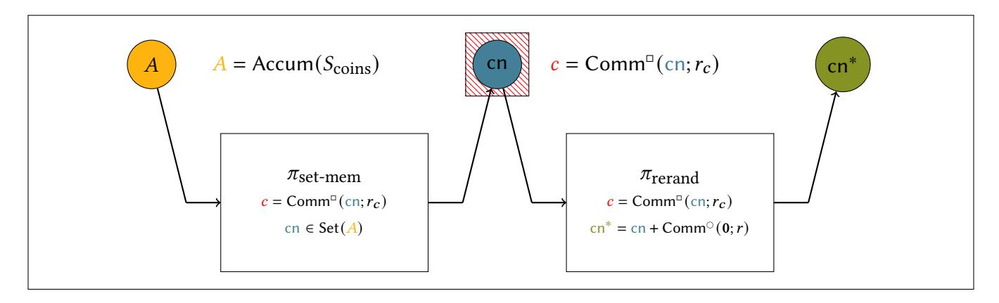

# <span id="page-0-0"></span>**Veksel: Simple, Efficient, Anonymous Payments with Large Anonymity Sets from Well-Studied Assumptions**

Matteo Campanelli Aarhus University matteo@cs.au.dk Mathias Hall-Andersen Aarhus University ma@cs.au.dk

### **ABSTRACT**

We propose Veksel, a simple generic paradigm for constructing efficient non-interactive coin mixes. The central component in our work is a concretely efficient proof  $\pi_{1-\text{many}}$  that a homomorphic commitment  $c^*$  is a rerandomization of a commitment  $c \in$  $\{c_1, \ldots, c_\ell\}$  without revealing c. We formalize anonymous accountbased cryptocurrency as a universal composability functionality and show how to efficiently instantiate the functionality using  $\pi_{1-\text{many}}$  in a straightforward way (Veksel). We instantiate and implement  $\pi_{1-\text{many}}$  from Strong-RSA, DDH and random oracles targeting ≈ 112 bits of security. The resulting NIZK has constant size ( $|\pi_{1\text{-many}}| = 5.3\text{KB}$ ) and constant proving/verification time ( $\approx$ 90ms), on an already accumulated set. Compared to ZCash-which offers comparable marginal verification cost and an anonymity set consisting of every existing transaction-our transaction are larger (6.2 KB) and verification is slower. On the other hand, Veksel relies on more well-studied assumptions, does not require an expensive trusted setup for proofs and is arguably simpler (from an implementation standpoint). Additionally we think that  $\pi_{1-\text{many}}$  might be interesting in other applications, e.g. proving possession of some credential posted on-chain. The efficiency of our concrete NIZK relies on a new Ristretto-friendly elliptic curve, Jabberwock, that is of independent interest: it can be used to efficiently prove statements on "commitments on commitments" in Bulletproofs.

### **KEYWORDS**

blockchains, UC, zero-knowledge, accumulators, implementation

### 1 INTRODUCTION

Cryptocurrencies allow for fully decentralized and publicly verifiable currency systems. An interesting problem in cryptocurrencies is that of guaranteeing some level of privacy by making impossible to an observer to learn anything about the "flow of money". While users in the network only require known pseudonyms to be identified, we know that they are not sufficient to achieve an acceptable level of privacy [29, 31].

Several prior works address this problem (ZeroCash, Monero, OmniRing). The main challenge they face is to build solutions that are private but can still scale. An important requirement for scalability are the efficiency of spending and verifying transactions as well as their size. Often this boils down to the efficiency and proof size of their underlying non-interactive zero-knowledge schemes—or NIZKs—these works rely on (a NIZK is a cryptographic primitive allowing to prove knowledge of a secret without leaking anything about it).

Some protocols (e.g., Monero<sup>1</sup> and OmniRing [27]) inherently trade efficiency against privacy requirements. They need to keep a relatively small anonymity set<sup>2</sup> (a ring of signatures, in their specific constructions) for each transaction: a set of "coins" that a spending transaction can refer to. Other solutions (e.g. Zcash [24]) do not have this limitation, but have other caveats. First, they rely on NIZKs where the setup needs to be performed by a trusted authority. For this type of setup, even *emulating* the trusted authority through a distributed protocol can be expensive in terms of resources and organization[3]. Second, their underlying NIKZ depends on cryptographic assumptions that are not well-studied yet and hard to scrutinize in general (i.e., knowledge-of-exponent-flavored assumptions [20]).

In this work we address the question of how to design cryptocurrencies whose efficiency does not degrade with privacy requirements. A focus on transaction-size is particularly important since nodes need to store transaction histories whose size is often in the tens of millions. Addressing this question, we also focus on solutions that rely on "minimal" cryptographic assumptions. In particular we want to design solutions that rely on transparent proof systems, i.e. that do not require a trusted setup and avoid the use of non-well studied assumptions such as knowledge-of-exponent.

Along the way, we study the problem of formalizing and obtaining privacy in account-based cryptocurrencies. We believe that this model is of interest because many existing cryptocurrencies (e.g. Ethereum) are account-based. Additionally, some of the approaches in literature to balance privacy and accountability are account-based [16]. In this setting where users maintain fixed accounts over time, however, we cannot hope to achieve the same levels of privacy of the UTXO (Unspent Transaction Output) model where each transfer can refer to freshly created pseudonyms. Though weaker, this privacy model is still interesting in some applications. To the best of our knowledge it has not been formally investigated before.

### 1.1 Contribution

Our main contribution is a concrete construction for a cryptocurrency with privacy-preserving properties *that supports arbitrary-sized anonymity sets*. We obtain small concrete transaction sizes compared to other solutions in literature (see Figure 1) and efficient marginal costs of verification and spending (see Figure 2 and Section 5). Our construction relies on standard cryptographic assumptions and on transparent non-interactive zero-knowledge proofs (secure in the random oracle model). Our concrete efficiency relies on improvements on the state of art of zero-knowledge arguments over

<sup>&</sup>lt;sup>1</sup>https://www.getmonero.org/

<sup>&</sup>lt;sup>2</sup>This is roughly the subset of existing transactions a spent transaction can be narrowed down to. If a protocol supports a *full* anonymity set then this set consists of the whole history of transactions so far.

<span id="page-1-0"></span>

|                         | Anonymity Set | Concrete Tx Size |
|-------------------------|---------------|------------------|
| Monero [1]              | $< 2^4$       | 1.4 KB           |
| QuisQuis                | $2^4$         | 13 KB            |
| Lelantus <sub>210</sub> | $2^{10}$      | 2.7 KB           |
| Lelantus <sub>214</sub> | $2^{14}$      | 3.9 KB           |
| Lelantus <sub>216</sub> | $2^{16}$      | 5.6 KB           |
| Omniring <sub>210</sub> | $2^{10}$      | 1.0 KB           |
| Omniring <sub>214</sub> | $2^{14}$      | 1.3 KB           |
| Omniring <sub>216</sub> | $2^{16}$      | 1.4 KB           |
| $Zcash^\dagger$         | Any           | < 1 KB           |
| Zerocoin                | Any           | 45 KB            |
| <b>Veksel</b>           | Any           | < 6.3 KB         |

<sup>†:</sup> relies on large-scale trusted setup and relatively new assumptions.

Figure 1: Comparison of transaction size depending on anonymity sets. Veksel obtains the best concrete size for arbitrary anonimity sets from well-studied assumptions.

accumulators that may be of independent interests (more details below). We implement our construction in Rust; its code is open source and available at [2].

Along the way we make the following contributions:

- We formalize privacy-preserving cryptocurrencies with accounts (Section 6) through a UC functionality.
- We provide a highly general and modular construction for this functionality (Section 3). By a modular description, our construction can be further improved by simply replacing some of its building blocks without having to prove its security again. Its more concrete version is described (in light of following sections) in Appendix A. Our solution support coins of arbitrary value and can be extended to the UTXO setting (see Appendix D).
- We describe a new concrete transparent NIZK to prove a one-out-of-many relation [23], to prove that one public commitment is rerandomized from a set of existing commitments. Our techniques rely on commit-and-prove<sup>3</sup> zero-knowledge proof accumulators in unknown-order groups [7] and on optimized relations in Bulletproofs [11]. One challenge we need to solve is how to commit (and accumulate) to coins. Since coins are also "commitments" it is not immediate to have an efficient proof system that supports this double level of commitments. In our solutions we adopt a new SNARK-friendly elliptic curve that is compatible with Curve25519. We believe this curve (which we dub Jabberwock) and its surrounding techniques can be of independent interest. Among others, its applications can be directly used to obtain efficient anonymous credentials [12].

### 1.2 Prior Works

**Groth & Kohlweiss:** In [23], Groth and Kohlweiss constructed an efficient proof of size  $O(\log n)$  for relation  $\{r : \exists i \text{ st Comm}(0; r) = c_i\}$  where  $c_1, \ldots, c_n$  are Pedersen commitments given as input. Using this they showed how to exploit the homomorphic property

<span id="page-1-1"></span>

|               | Spend (time) | Verify (time) | Tx Size     | Amounts |
|---------------|--------------|---------------|-------------|---------|
| Monero        | O(n)         | O(n)          | O(n)        | Yes     |
| QuisQuis      | O(n)         | O(n)          | O(n)        | Yes     |
| Lelantus      | O(n)         | O(n)          | $O(\log n)$ | Yes     |
| Omniring      | O(n)         | O(n)          | $O(\log n)$ | Yes     |
| Zerocash      | $O(\log n)$  | $O(\log n)$   | O(1)        | Yes     |
| Zerocoin      | O(1)         | O(1)          | O(1)        | No      |
| <b>Veksel</b> | O(1)         | O(1)          | O(1)        | Yes     |

Figure 2: Asymptotic marginal cost of verification / spending time and transaction size. Above n is the anonymity set size.

of the commitment scheme to create concretely efficient anonymous transactions. Similar techniques has since been widely explored in Omniring [27], RingCT3.0 [32] and Lelantus [25]. These works have different concrete efficiency, but share the same asymptotic efficiency:  $O(\log n)$  transaction size and inherent O(n) spending/verification time since the size of the statement proved in zero-knowledge is linear in the anonymity set. Due to the linear verification time these approaches only scale to anonymity sets of size  $\approx 2^{16}$  in practice, even with batch verification techniques.

**Zerocoin:** Zerocoin [30] uses an RSA accumulator to "compress" the set of coins, a coin is spent by opening the unique serial number of the coin and proving its membership in the accumulator in zero-knowledge. This enables O(1) spending/verification assuming the coins have been aggregated ahead of time. Unfortunately the "double discrete-log" proof in Zerocoin relies on cut-and-choose and is therefore concretely inefficient: over 45 KB for 128-bits of security. Additionally Zerocoin does not enable coins to have arbitrary denominations.

**Zcash:** Zcash (which roughly implements Zerocash [6]) applies the same technique of "compressing the statement" using an accumulator (Merkle tree) which enables it to achieve logarithmic marginal spending/verification cost. Zcash verifies the Merkle path inside a zk-SNARK (Groth16 [22] in the current implementation), which hides the index of the coin to be spent and compresses the membership proof down to O(1) with very small constants. In terms of concrete efficiency, Zcash is currently the most efficient decentalized payment system with a "full" anonymity set.

**QuisQuis**: QuisQuis [19] seeks to mitigate the issue of an evergrowing set of "spending tags" which must be maintained by the nodes in Zerocash to avoid double spending. This is achieved by having the spender essentially do a shuffle locally: the spender picks n other unspend coins along with the coin he wishes to spend, then proves that she can spend one of the n+1 coins, correctly rerandomize the remaining n coins and post the n new rerandomized coins on the chain. Since QuisQuis relies on posting the new set of outputs to the chain, the transaction size of this approach is O(n). The anonymity set also inherently consists (at best) of the set of unspent outputs (as oppose to the set of all coins created).

### 1.3 Technical Overview

<sup>&</sup>lt;sup>3</sup>As in [13] we label as "commit-and-prove" a proof system that works efficiently over a commitment representation and can thus be composed with others of the same type.

<span id="page-2-0"></span>

Figure 3: The  $\pi_{1\text{-many}} = (\pi_{\text{set-mem}}, \pi_{\text{rerand}})$  argument consists of two sub-proofs: a) A set membership proof, proving that  $c = \text{Comm}^{\square}(\text{cn}; r_c)$  commits to  $\text{cn} \in A$ . b) A rerandomization proof, showing that the same  $c = \text{Comm}^{\square}(\text{cn}; r_c)$  commits to  $\text{cn} = \text{cn}^* - \text{Comm}^{\square}(\mathbf{0}; r)$  where  $\text{cn}^*$  is a part of the statement (public).

Basic Setting. At a basic level our approach to decentralized payments is similar to that of Zerocoin[30], however we aim at supporting coins of arbitrary (hidden) denominations, in this sense we diverge from the simpler setting in [23, 30] where all coins have the same denomination. For sake of providing intuition, in this section we describe the account-based model where each party has a commitment  $(bal_i)_i$  stored on-chain and locally holds the *private* balance  $v_i$  that is the opening of bal.

To transfer a certain amount v, a sender party S will *create* a coin spendable by the recipient R, that is a commitment to a triple consisting of: **a**) v the value of the coin (payment amount) **b**) the identity of the recipient **c**) a random spending tag t. The sender then broadcasts this commitment together with an encryption through  $pk_R$  of its opening. Naturally the sender should also be able to show they can afford the transfer; we temporarily ignore this issue and discuss how to approach it later in this section. Once they have observed that someone created a new coin, all users keep track of it in a set  $S_{\text{coins}}$  of existing coins.

In order to claim the transfer—to *collect* the coin—user  $\mathcal{R}$  will need to do two things: (i) show that it knows the opening of one among the existing coins; (ii) reveal its tag t so that the coin cannot be spent again. The first step requires some care because we want the transfer to be somewhat private, i.e. with the exception of S and R, no observer of the system should learn anything about the coin being collected. To do that we need to apply a zero-knowledge proof showing we know the opening of some coin in  $S_{\text{coins}}$  such that this coin encodes tag t.

Because we require each coin to denote a custom transferred amount, we now have an additional challenge. When parties observe that  $\mathcal{R}$  collects a coin, they should have a way to update  $\mathcal{R}$ 's balance bal $_{\mathcal{R}}$  without having  $\mathcal{R}$  reveal the value of the coin. While this could be done using the homomorphic properties of commitments by "adding" the coin 4 to the balance, we cannot reveal the coin itself either (that would, at the least, leak the sender!). Thus we

let  $\mathcal{R}$  produce a rerandomization<sup>5</sup> cn\* of the collected coin; parties can now use homomorphically add the latter to bal<sub> $\mathcal{R}$ </sub>.

Following the approach outlined above, collecting a coin requires  $\mathcal{R}$  to prove in zero-knowledge that the rerandomized coin cn\* opens to same amount (and *tagging* information) as one of the coins in  $S_{\text{coins}}^{\ 6}$ . In the remainder of this section we describe our technical solutions to efficiently produce and verify this proof.

Our techniques. As a first step towards our goal, we let parties keep a compressed digest to the set  $S_{\text{coins}}$ , through  $algebraic\ accumulators\ [4,7,9,12]$ . Thus, given a set S, we can produce A=accum(S), a binding (but usually not hiding) compressing commitments to S. An important feature of accumulators is that it allows to prove membership of elements "inside" A efficiently (that is, with short certificates and fast verification). In order to efficiently prove the desired relation in zero-knowledge we adopt a modular approach and we split it in two components, set membership and rerandomization. We thus apply two proof systems that are *specifically efficient* for each of the two relation components. To ensure that they refer to the same content, we use a commit-and-prove approach, and link them through a hiding commitment to the coin  $cn_k$  we are collecting. We now describe this process in more detail.

Recall that coins are commitments to pairs of amounts and additional information (tags and recipient identity). We denote by  $\mathsf{Comm}^{\circ}(\cdot;\cdot)$  the commitment procedure that produces coins and by  $\mathsf{Comm}^{\circ}(\cdot;\cdot)$  the commitment procedure we use to link the two proofs mentioned above. The first parameter in each is the message we are committing to (which possibly has additional structure) while the second parameter denotes the randomness. For our concrete case, the two commitment schemes can be thought of as variants of Pedersen commitments in different groups. In order to prove that a coin  $c_k$  is valid without revealing it,  $\mathcal{R}$  first produces a

 $<sup>^4</sup>$ We temporarily ignore the issue that a coin also commits to other elements, such as the tag t, when performing this homomorphic operation; this can be simply addressed. We refer the reader to our main construction.

 $<sup>^5\</sup>mathrm{In}$  an homomorphic commitment scheme we can always achieve rerandomization by adding a commitment to 0.

 $<sup>^6</sup>$  Obviously cn\* should also open to the same tag and recipient as the collected coin in  $S_{\rm coins}$ . These are public values and we do not to include them in the "zero-knowledge" part of the proof. We solve this instead by exploiting the homomorphic properties of commitments. See main construction.

commitment  $c \leftarrow \mathsf{Comm}^{\square}(\mathsf{cn}_k, r_c)$  where  $r_c$  is some freshly sampled randomness. Then  $\mathcal R$  broadcasts c together with two proofs  $(\pi_{\mathsf{set-mem}}, \pi_{\mathsf{rerand}})$  with the following semantics:

- π<sub>set-mem</sub>: "I know (cn<sub>k</sub>, r<sub>c</sub>) such that cn<sub>k</sub> ∈ Set(A) and c = Comm<sup>□</sup>(cn<sub>k</sub>, r<sub>c</sub>)".
- $\pi_{\text{rerand}}$ : "I know  $(\operatorname{cn}_k, r_c, r)$  such that  $\operatorname{cn}^* = \operatorname{cn}_k + \operatorname{Comm}^{\circ}(0; r)$  and  $c = \operatorname{Comm}^{\circ}(\operatorname{cn}_k, r_c)$ ".

In addition to the above, user  $\mathcal{R}$  needs to prove knowledge of an actual opening of cn\* that refers to the revealed tag, identity  $\mathcal{R}$  and some secret value v. In our concrete construction we use standard sigma protocols to prove knowledge of (v, r) such that  $\operatorname{cn}^* = f^v g^{\operatorname{H}(t||\mathcal{R})} h^r$ , where H is a collision resistant function that maps to a valid exponent for g. In a sense we prove only a partial opening of  $\operatorname{cn}^*$  since  $g^{\operatorname{H}(t||\mathcal{R})}$  can be subtracted publicly from  $\operatorname{cn}^*$ .

We now discuss how we efficiently instantiate  $\pi_{\text{set-mem}}$  and  $\pi_{\text{rerand}}$ . We choose to efficiently instantiate  $\pi_{\text{set-mem}}$  with some of the components in [7]—which describes efficient commit-and-prove zkSNARKs over accumulated sets—and  $\pi_{\text{rerand}}$  with Bulletproofs, a transparent zero-knowledge schemes with short proofs that are compatible with some instantiations of [7].

We need some care in applying these techniques. Notice that the proof of rerandomization involves two different types of commitments in the statements (Comm<sup>o</sup> and Comm<sup>o</sup>). Since their output may correspond to different groups, this can make it hard to *efficiently* instantiate the rerandomize relation for Bulletproofs. To solve these efficiency challenges we restrict what coins we can use in our systems (what coins are *permissible*) and describe a new SNARK-friendly curve whose arithmetic can be efficiently described as field operations when instantiating Bulletproofs over Ristretto25519.

Figure 3 illustrates a simplified version of our approach. We refer the reader to Section 4 for details.

**Outline.** In the next section we describe preliminaries. In Section 3 we describe the bulk of our construction with a simplified model which we also introduce informally in the same section. Our formal model in UC (and respective adaptation of our construction in UC) is deferred to Section 6. Section 4 describes our instantiations (proof schemes, curves, etc.). We evaluate Veksel in Section 5.

### 2 PRELIMINARIES

### 2.1 Notation

When describing an NP relation that we prove through a zero-knowledge argument, we use a semicolon to distinguish between public input and private witness as in R(x; w). In the context of commitments we use a semicolon to distinguish between the committed value and the masking randomness as in Comm(ck, u; r) where u is the committed value.

We assume all cryptographic algorithms implicitly take as input their respective public parameters whenever this yields no unambiguity, For example we may write Comm(u; r) to denote Comm(ck, u; r) whenever ck is obvious from the context.

### 2.2 Commitments

We use the following syntax for commitments:

*Definition 2.1 (Commitments).* A commitment scheme C is a pair of algorithms (Setup, Comm) with syntax:

- Setup $(1^{\lambda}) \rightarrow ck$ : generates a commitment key ck;
- Comm(ck, m; r) → c<sub>m</sub>: produces commitment com<sub>m</sub> to message m with randomness r.

As it is standard, we call *message space* the set of of *m*-s for which Comm is defined and commitment space its range, Rng(Comm). We require commitments to be *perfectly hiding*—the distribution of Comm(ck, m; r) is identical to the uniform distribution over the commitment space—and *computationally binding*—no efficient adversary can produce two pairs (m, r), (m', r') such that  $m \neq m'$  and Comm(ck, m; r) = Comm(ck, m'; r'). Sometimes we want to require binding only with respect to messages from a set  $\mathcal{P}$  of *permissible* messages, a subset of the message space. In that case we say the scheme is binding "with respect to set  $\mathcal{P}$ ".

### 2.3 Accumulators

<span id="page-3-0"></span>Definition 2.2 (Accumulator scheme). An accumulator scheme Acc over universe  $\mathcal{U}_{\lambda}(\mathsf{Acc})$  (where  $\lambda$  is a security parameter) consists of PPT algorithms  $\mathsf{Acc} = (\mathsf{Setup}, \mathsf{Accum}, \mathsf{PrvMem}, \mathsf{VfyMem})$  with the following syntax:

Setup $(1^{\lambda}) \to (pp)$  generates public parameters pp.

Accum(pp, S)  $\rightarrow$  A deterministically computes accumulator A for set  $S \subseteq \mathcal{U}_{\lambda}(\mathsf{Acc})$ .

PrvMem(pp, S, x)  $\rightarrow W$  computes witness W that proves x is in accumulated set S.

VfyMem(pp, A, x, W)  $\rightarrow b \in \{0, 1\}$  verifies through witness whether x is in the set accumulated in A. We do not require parameter x to be in  $\mathcal{U}_{\lambda}(\mathsf{Acc})$  from the syntax.

An accumulator scheme should satisfy correctness—the accumulator works as expected—and soundness—no efficient adversary can choose a set S and then find a witness that checks on Acc.Accum(pp, S) and  $x \notin S^7$ .

REMARK 1 (EFFICIENT INSERTION). Throughout this work we assume an additional (deterministic) algorithm Acc.Add for a scheme Acc such that for all  $\lambda, x \in \mathcal{U}_{\lambda}(\mathrm{Acc}), S \subseteq \mathcal{U}_{\lambda}(\mathrm{Acc})$  A' = Acc.Add(A, x) is such that, if  $A = \mathrm{Acc.Accum}(S)$  then  $A' = \mathrm{Acc.Accum}(S \cup \{x\})$ .

### 2.4 NIZKs

Non-Interactive Zero-Knowledge schemes (or NIZKs) require a reference string which can be either uniformly sampled (a urs), or structured (a srs). In the latter case it needs to be sampled by a trusted party. In this work we use and assume *transparent* NIZKs, i.e. whose algorithms use a reference string urs sampled uniformly.

*Definition 2.3.* A NIZK for a relation family  $\Re = \{\Re_{\lambda}\}_{\lambda \in \mathbb{N}}$  is a tuple of algorithms ZK = (Prove, VerProof) with the following syntax:

 ZK.Prove(urs, R, x, w) → π takes as input a string urs, a relation description R, a statement x and a witness w such that R(x, w); it returns a proof π.

<sup>&</sup>lt;sup>7</sup>These definitions are standard and we refer the reader to [9] for a formal treatment.

ZK.VerProof(urs, R, x, π) → b ∈ {0, 1} takes as input a string urs, a relation description R, a statement x and a proof π; it accepts or rejects the proof.

We require a NIZK to be complete, that is, for any  $\lambda \in \mathbb{N}$ ,  $R \in \mathbb{R}$  and  $(x, w) \in R$  it holds with overwhelming probability that  $\text{VerProof}(\text{urs}, R, x, \pi)$  where  $\text{urs} \leftarrow \{0, 1\}^{\text{poly}(\lambda)}$  and  $\text{proof} \pi \leftarrow \text{Prove}(\text{urs}, R, x, w)$ .

We also require knowledge-soundness and zero-knowledge to hold. Informally, the former states we can efficiently "extract" a valid witness from a proof that passes verification; the latter states that the proof leaks nothing about the witness (this is modeled through a simulator that can output a valid proof for an input in the language without knowing the witness). We use variants of these notions with certain composability properties, e.g. requiring auxiliary inputs and relation generators. For a full formal treatment of these, we refer the reader to Sections 2.2 and 2.5 in [7].

Whenever the relation family is obviously defined, we talk about a "NIZK for a relation R".

REMARK 2 (RELATIONS AND PUBLIC INPUTS). In the algorithms above we have both a relation R and a public input x as inputs. The reason is that in a soundness experiment, R may be constrained to be from a certain distribution on  $\Re$  whereas x can be be chosen arbitrarily by the adversary. See for example Section 2.2 in [7]. In our constructions we often assume prover and verifier to implicitly take as input the relation description<sup>8</sup>.

In the proof of security of our construction we require an additional property for one of our NIZKs, *simulation-extractability*. Namely, extractability should hold even with respect to an adversary that has access to simulated proofs. We refer the reader to [21] for formal definitions.

**Trusted Accumulator-Model.** In our concrete constructions we will use NIZKs for relations parametrized by accumulators. This requires a tweak in the soundness definition: a malicious adversary should be able to select an arbitrary set, but the accumulator over that set should be computed honestly. Given an accumulator scheme Acc, we informally talk about this specific notion as "security under the Trusted Accumulator-Model for Acc". We do not provide formal details since this model corresponds to the notion of partial-extractable soundness in Section 5.2 in [7]9; we refer the reader to this work for further details. This weaker model fits our applications where an accumulator of existing coins is maintained by the network.

**Modular NIZKs through Commit-and-Prove.** We use the framework for black-box modular composition of commit-and-prove NIZKs (or CP-NIZKs) in [13] and [7]. Informally a CP-NIZK is a NIZK that can efficiently prove properties of committed inputs through some commitment scheme  $C^{\square}$ . Let x be a public input and  $c_{\square}$  a commitment. Such a scheme can for example prove knowledge of  $(u, \omega, r)$  such that  $c_{\square} = \text{Comm}^{\square}(u; r)$  and that relation

 $R_{\text{inner}}(x; u, \omega)$  holds. We can think of  $\omega$  as a non-committed part of the witness. Besides the proof, the verifier's inputs are x and  $c_n$ .

In Section 4.2 we will make use of the following folklore composition to obtain efficient NIZKs from CP-NIZKs. Fixed a commitment scheme and given two CP-NIZKs CP, CP' respectively for two "inner" relations R and R', we can prove their conjunction (for a shared witness u)  $R^*(x,x',u,\omega,\omega')=R(x,u,\omega)\wedge R'(x',u,\omega')$  like this: the prover commits to u as  $c_{\square}\leftarrow \text{Comm}^{\square}(u,r)$ ; generates proofs  $\pi$  and  $\pi'$  from the respective schemes; it outputs combined proof  $\pi^*:=(c_{\square},\pi,\pi')$ . The verifier checks each proof over respective inputs  $(x,c_{\square})$  and  $(x',c'_{\square})$ .

The following theorem (informally stated) is a direct consequence of Theorem 3.1 in [13].

<span id="page-4-1"></span>Theorem 2.4 (Black-Box Composition of CP-NIZKs). The construction above is a secure NIZK for the conjunction relation  $R^*$ .

We can see Bulletproof [11] as a CP-NIZK since it works efficiently over an implicit commitment representation (see discussion in [13]). We use this fact in our instantiations (in Section 4).

# <span id="page-4-0"></span>3 A CONSTRUCTION FOR ANONYMOUS ACCOUNT-BASED PAYMENTS

In this section we provide intuitions about our model and our main construction. Our description tries to be as general as possible and to push all features that can be seen as optimizations to our instantiations in Section 4. The bulk of our construction is in Figure 4. A more concrete and optimized version is in Appendix A.

# <span id="page-4-2"></span>3.1 Intuition on the Model and an Auxiliary Syntax

While we present a fully formal model in section 6, here we describe our construction of an anonymous payment system through a simplified syntax which we dub a "Decentralized Unlinkable-Payments" scheme (DUP). Thus we can present our scheme without having to dive into the technicalities of universal composability right away.

**Model Intuition.** The intuition about our architecture is a as follows (more information about syntax further in this section):

- we assume a setup stage where parties are assigned initial balances and public parameters of the system. Each party holds a current *ledger state* which contains their knowledge about the current state of affairs depending on the history of transactions
- a transfer from S to R occurs with party S producing a "create" transaction. This contains a coin and a proof of its validity. At the same time party S will also *privately* send auxiliary information to R which the latter can later use to claim the coin.
- to claim a coin and update their balance, a receiver of a coin will produce a "collect" transaction through the auxiliary information received earlier. Notice that which coin is being collected should remain hidden by the security properties.
- verification and processing of a coin: after a transaction (of type *create* or *collect*) is broadcast, all parties verify their validity and update their state accordingly. Verification of create-transactions should ensure the sender can afford them;

 $<sup>^8{\</sup>rm This}$  parameter is usually short. For example, in Section 4.1 we let relations be described by a specific accumulator.

<sup>&</sup>lt;sup>9</sup>We notice that their model uses a slightly different language and formalizes accumulators as (binding-only) commitments for commit-and-prove NIZKs.

verification of collect-transactions should ensure receivers are collecting existing coins *to them* and that these have not been claimed before.

**Security Intuition.** Our security properties are later modeled though the functionality in section 6, but intuitively our model captures: *anonymity* (the adversary cannot link honest create/collects *and* values of transactions are hidden), *balance conservation* (no money can be created in the system), *security of balances* (the adversary cannot "steal money" from honest parties) and "Faerie gold"-type attacks where a corrupted party can create multiple coins accepted by honest parties of which only a subset can be spent.

**Syntax.** A formal description of the syntax we assume:

Definition 3.1. A DUP scheme consists of a tuple of PPT algorithms DUP = (Setup, CreateCoin, CollectCoin, Vfy, Process) with the following syntax:

Setup(1 $^{\lambda}$ )  $\rightarrow$  (pp,  $\mathcal{L}_0$ , (st<sub>i</sub>)<sub>i \in [m]</sub>) Generates public parameters, an initial ledger  $\mathcal{L}_0$  and the initial private state of all users;

CreateCoin(pp, st<sub>S</sub>, pk<sub>R</sub>, v)  $\rightarrow$  (st'<sub>S</sub>, aux<sub>coin</sub>, tx<sub>create</sub>) Makes a coin c of value v payable to user  $\mathcal{R}$ ; it embeds the coin in a public transaction tx<sub>create</sub>; aux<sub>coin</sub> contains information sent privately to  $\mathcal{R}$ ; it also outputs a new private state st'<sub>S</sub>.

CollectCoin(pp, st<sub>R</sub>, aux<sub>coin</sub>,  $\mathcal{L}$ )  $\rightarrow$  (st'<sub>R</sub>, tx<sub>clct</sub>) It takes as input a a private state st<sub>R</sub>, a string aux<sub>coin</sub> and a ledger  $\mathcal{L}$ ; it outputs a new private state st'<sub>R</sub> and a "collect" transaction tx<sub>clct</sub>.

Vfy(pp, tx,  $\mathcal{L}$ )  $\rightarrow$  accept/reject It verifies a transaction tx with respect to ledger  $\mathcal{L}$ .

Process(pp, tx,  $\mathcal{L}$ )  $\to \mathcal{L}'$  It processes a transaction tx with respect to ledger  $\mathcal{L}$  and returns a new ledger.

### <span id="page-5-0"></span>3.2 Building Blocks for Our Construction

**Commitment schemes** We assume a commitment scheme  $C^{\circ} = (Setup^{\circ}, Comm^{\circ})$ . We concretely instantiate it later in Figure 6 as a Pedersen commitment over pairs. We also make the following assumptions:

- We assume that we can commit to pairs and they are homomorphic with respect to pairs, that is Comm((a, b); r) + Comm((c, d); r') = Comm((a + c, b + d); r + r').
- Given a value v, a tag t and an identity  $\mathcal{R}$  we assume that the concatenation  $t||\mathcal{R}$  is such that  $(v,t||\mathcal{R})$  is always a pair in the message space of the commitment scheme.
- We assume all commitment invocations take as input the public commitment key ck although not explicitly included.
   We assume the same for zero-knowledge proofs over commitment in the protocol.

**Zero-Knowledge Arguments** We assume the following zero-knowledge arguments. We assume the commitment key to be part of the relation description. Although we keep it implicit, one should think of the following relations as parametrized by it.

We use three zero knowledge proofs for the following tasks:

Knowledge of opening: at collection time, we prove knowledge of opening of a coin we are collecting. For technical reasons (see construction) we require the second component

- to be zero, that is this argument shows knowledge of opening to a pair (v, 0).
- Ranges: whenever we transfer an amount ("create" tx), we prove that we can afford the transfer. We also prove that the transferred amount is non-negative (so that we are not subtracting a negative value from our balance increasing it!). This involves proving that the opening of two distinct commitments—an updated balance and a coin—are both in a range [0, B<sub>max</sub>] where we consider B<sub>max</sub> a parameter of the construction. Although the commitments we assume here bind to pairs of values (a, b) (rather than single value), we are interested only in ensuring that the first component a is in range.
- One coin out of many: whenever we claim an amount ("collect" tx), we also need to prove that the coin we are collecting actually exists. We want to do this without revealing that coin we are collecting, thus we prove that a rerandomized commitment c\* (which we revealed publicly) actually refers to "one out of many" in the set of existing coins.

Formally we assume the following NIZKs:

ZKOpen is an extractable NIZK argument for the relation

$$R_{\text{opn}}(c; v, r) = 1 \iff c = \text{Comm}^{\circ}((v, 0); r)$$

ZKDblRange is a NIZK argument for the relation

$$R_{\mathrm{DRng}}(\mathsf{c},\mathsf{c}';(a,b),r,(a',b'),r') = 1 \iff$$

$$a \in [0,B_{\mathrm{max}}] \land a \in [0,B_{\mathrm{max}}]$$

$$\land \ \mathsf{c} = \mathrm{Comm}^{\circ}((a,b);r)$$

$$\land \ \mathsf{c}' = \mathrm{Comm}^{\circ}((a',b');r')$$

ZK-1-many is a simulation-extractable NIZK argument for the relation  $^{10}$ 

$$R_{1-\text{many}}(c^*, S; c, r^*) = 1 \iff c \in S \land c^* = c + \text{Comm}^{\circ}((0, 0); r^*)$$

For simplicity we assume a single uniform reference string urs for all of them that can be sampled from a space large enough parametrized by security parameter  $\lambda$  and maximum balance  $B_{\text{max}}$ .

### 3.3 Construction Description

Our construction is in fig. 4.

**Ledger, states and transactions** We assume a ledger to be structured as a triple  $\mathcal{L}=(S_{\mathrm{null}},S_{\mathrm{coins}},(\mathrm{bal})_{i\in[m]})$  containing: a set  $S_{\mathrm{null}}$  of "nullified" coin tag–recipient identity  $t||\mathcal{R};$  an set  $S_{\mathrm{coins}}$  of coins created so far; a tuple of commitments  $(\mathrm{bal})_{i\in[m]})$  to the balances of parties. Within the construction we implicitly parse the ledger according to this syntax. We let states contain the opening of their committed balances. Notice that, for technical reasons,  $\mathrm{bal}_i$  is not a commitment to a single scalar B representing the balance amount. Instead a private state  $\mathrm{st}_i$ —the opening of  $\mathrm{bal}_i$ —is a triple  $(B, \mathrm{aux}_t, r_i)$  such that  $\mathrm{bal}_i = \mathrm{Comm}((B, \mathrm{aux}_t), r_i)$ , that is it opens to the pair  $(v, \mathrm{aux}_t)$  where  $\mathrm{aux}_t$  is a "hint" to open the balance

 $<sup>^{10}</sup>$ Notice that, in contrast with the first two relations, relation  $R_{1\text{-many}}$  does not require showing any opening of the commitments c and c\*. This implies that a honest prover does not need to know these openings. Although we do not use this property in our construction, this could be useful in efficiently delegating to a service (such as a wallet) that, for example, we trust enough not to publicly reveal which coin we are collecting, but enough not to steal our coin.

and depends on the transfers that user i carried out till any given moment in time (see construction for details). Transactions can be of two types, Create or Collect; we prepend a type description to each transaction.

# <span id="page-6-0"></span>4 EFFICIENT INSTANTIATIONS OF OUR ARGUMENTS

In this section we describe how to instantiate our construction from the previous section through transparent and efficient proof systems. We describe this at different levels of abstraction.

First we replace a set (of coins) with a compressed representation, an accumulator. Thus we replace relation  $R_{1-\mathrm{many}}$  with  $R_{1-\mathrm{many}}^A$  that works over an accumulator A. We then proceed how to decompose the latter efficiently through a commit-and-prove approach. In the rest of the section we describe our specific instantiations using: RSA accumulators, zero-knowledge techniques on them from [7], and Bulletproofs.

Our main technical challenge is how to have commitments over coins (which are themselves commitments) that support efficient proofs over them. We do this introducing a new SNARK-friendly curve (in the pairing-free group of Curve25519) and embedding its arithmetic in a Bulletproof relation in an optimized manner (see also Appendix C).

**On notation.** We will use and describe two commitments schemes in this section,  $C^{\circ}$  and  $C^{\circ}$ . The scheme  $C^{\circ}$  is the scheme we use in our construction for payments in the previous section; we can think of its output as coins and we denote them by a circle as in  $c_{\circ}$ . The elements of the accumulated set are the output of Comm $^{\circ}$ . The commitment scheme  $C^{\circ}$  is the one we use for commit-and-prove NIZKs (see also construction for Theorem 2.4). We denote its output as Comm $^{\circ}$ .

### <span id="page-6-1"></span>4.1 One-out-of-many Relations over Accumulators

Here we define a variant of the one-out-of-many relation  $R_{1\text{-many}}$  introduced in Section 3.2. Instead of taking as input a set we let the relation be parametrized by an accumulator, a binding commitment to the set. Thus we can reduce prover and verifier's complexity to that of proving PrvMem and VfyMem which both run in constant time in our instantiation.

Given an accumulator scheme Acc and an accumulator A, the relation  $R_{1-\text{many}}^A$  is defined as:

$$R_{1-\text{many}}^{A}(c_{\circ}^{*}; c_{\circ}, r_{\circ}^{*}, W) = 1 \iff$$

$$Acc.VfyMem(A, c, W)$$

$$\land c_{\circ}^{*} = c_{\circ} + \text{Comm}^{\circ}((0, 0); r_{\circ}^{*})$$

## <span id="page-6-2"></span>4.2 One-out-of-many from Commit-and-Prove NIZKs

Here we use the construction in Theorem 2.4. For that we need CP-NIZKs that work over commitments to  $c_o$ . As usual we denote the commitment scheme for CP-NIZKs as  $C^{\square}$ .

**Permissible Set.** We assume a permissible set  $\mathcal{P}$  of coins  $c_{\circ}$ . This allows us to model security requirements in a fine-grained way, e.g. we assume computational binding of  $\mathbb{C}^{\square}$  to hold only for coins in  $\mathcal{P}$  and similarly the soundness of the accumulator (we ensure this implicitly; see Figure 5). In this section we keep the permissible set abstract but we specify it completely in Section 4.3.1.

**Breaking Down**  $R_{\mathbf{setmem}}^A$ . We can decompose the above through two commit-and-prove schemes for the following two relations. The first one proves set membership, but does not guarantee that the coin is permissible (this is for technical reasons we explain in Section 4.4). The other relation guarantees that we can open (in  $\mathbb{C}^{\circ}$ ) to a rerandomized permissible commitment (in  $\mathbb{C}^{\circ}$ ).

$$R_{\text{setmem}}^{A}(c_{\square}; c_{\circ}, r_{\square}, W) = 1 \iff$$

$$(\text{Acc.VfyMem}(A, c_{\circ}, W) \lor c_{\circ} \notin \mathcal{P})$$

$$\land c_{\square} = \text{Comm}^{\square}(c_{\circ}; r_{\square})$$

$$R_{\text{rrnd\&prms}}(c_{\square}, c_{\circ}^{*}; c_{\circ}, r_{\square}, r_{\circ}^{*}) = 1 \iff$$

$$c_{\circ}^{*} = c_{\circ} + \text{Comm}^{\square}((0, 0); r_{\circ}^{*})$$

$$\land c_{\circ} \in \mathcal{P}$$

$$\land c_{\square} = \text{Comm}^{\square}(c_{\circ}; r_{\square})$$

We can now obtain a proof scheme for  $R_{1\text{-many}}^A$  by composing  $\mathsf{ZKCP}_{\text{setmem}}^A$  and  $\mathsf{ZKCP}_{\text{rrnd\&prms}}^A$  and applying Theorem 2.4 in the Trusted-Accumulator Model  $^{11}$ .

<span id="page-6-4"></span>COROLLARY 4.1. Let Acc be an accumulator scheme and  $C^{\square}$  a commitment scheme that is computationally binding w.r.t. set  $\mathcal{P}$ . Then the composition of  $\mathsf{ZKCP}^A_{setmem}$  and  $\mathsf{ZKCP}_{rrnd\&prms}$  as for Theorem 2.4 is a NIZK for  $R^A_{I-many}$  in the Trusted-Accumulator Model for Acc.

# <span id="page-6-3"></span>4.3 Instantiating Accumulators and Commitment Schemes

We first describe our accumulator and commitment schemes construction and then describe the concrete groups in which they operate in Section 4.3.1.

We assume a group of unknown order  $\mathbb{G}_?$  for our accumulator construction. For our commitments we assume two groups  $\mathbb{G}^\circ$  and  $\mathbb{G}^\circ$ . The two groups are related as we assume we can represent  $\mathbb{G}^\circ$  elements as pairs  $(\mathbb{F}_{|\mathbb{G}^\square|}, \mathbb{F}_{|\mathbb{G}^\square|})$  (see also Section 4.3.1).

Our accumulator schemes supports sets of  $\mathbb{G}^{\circ}$  elements with a special structure (the first component should be prime, the standard encoding for elements in accumulators in groups of unknown order). The commitment scheme Comm $^{\circ}$  has as message space pairs  $(\mathbb{F}_{|\mathbb{G}^{\circ}|},\mathbb{F}_{|\mathbb{G}^{\circ}|})$  and commitment space  $\mathbb{G}^{\circ}$ . The scheme  $\mathbb{G}^{\circ}$  has as message space elements in  $\mathbb{G}^{\circ}$ .

**Constraints on Permissible Set.** The permissible set  $\mathcal{P}$  is a set of pairs in  $(\mathbb{F}_{|\mathbb{G}^{\square}|}, \mathbb{F}_{|\mathbb{G}^{\square}|})$ . We require that the permissible set  $\mathcal{P}$  is such that there are no "collisions in the second components" that

 $<sup>^{11}\</sup>mathrm{The}$  latter requires the composition results for "partially-extractable" NIZKs in [7].

```
\frac{\mathsf{Setup}(1^\lambda) \to (\mathsf{pp}, \mathcal{L}_0, (\mathsf{st}_i)_{i \in [m]})}{\mathsf{ck} \leftarrow \mathsf{Setup}^{\circ}(1^\lambda)}
                                                                                              urs \leftarrow \$ U_{\text{ZK}}(1^{\lambda}, B_{\text{max}})
                                                                                              for i = 1..m do
                                                                                                  // Create balances for all parties at default v_0
                                                                                                  r_i \leftarrow \mathbb{F}
                                                                                                  \mathsf{bal}_i \leftarrow \mathsf{Comm}^{\circ}(v_0; r_i)
                                                                                                  st_i := (v_0, 0, r_i)
                                                                                               \mathcal{L}_0 := (\emptyset, \emptyset, (\mathsf{bal}_i)_{i \in [m]})
                                                                                              return (pp := ck, \mathcal{L}_0, (st<sub>i</sub>)<sub>i∈[m]</sub>)
CreateCoin(pp, st<sub>S</sub>, \mathcal{R}, v) \rightarrow (st'<sub>S</sub>, aux<sub>coin</sub>, tx<sub>create</sub>)
                                                                                                                                                                             CollectCoin(pp, st<sub>R</sub>, aux<sub>coin</sub>, \mathcal{L}) \rightarrow (st'<sub>R</sub>, tx<sub>clct</sub>)
   Parse st<sub>S</sub> as (B, aux_t, r_S)
                                                                                                                                                                                  Parse st<sub>S</sub> as (B, aux_t, r_R)
    t \leftarrow \$ \{0,1\}^{\lambda}; r_c \leftarrow \$ \mathbb{F}
                                                                                                                                                                                  Parse aux<sub>coin</sub> as (v, t, r_c)
                                                                                                                                                                                  c \leftarrow \mathsf{Comm}^{\bigcirc}((v, t || \mathcal{R}); r_c) // \text{ reconstruct coin}
    c \leftarrow \mathsf{Comm}^{\bigcirc}((v, t || \mathcal{R}); r_c)
                                                                                                                                                                                  // Rerandomize coin
    o_c := ((v, t | | \mathcal{R}), r_c)
                                                                                                                                                                                  r^* \leftarrow \mathbb{F}; c^* \leftarrow c + \mathsf{Comm}^{\bigcirc}((0,0); r^*)
    // Update balance subtracting coin from current balance
                                                                                                                                                                                  // Prove one out of many w.r.t. accumulator
    \mathsf{bal}'_i \leftarrow \mathsf{Comm}^{\circ}((B, \mathsf{aux}_t); r_S) - \mathsf{c}
                                                                                                                                                                                  \pi_{1\text{-many}} \leftarrow \mathsf{ZK}\text{-}1\text{-many}.\mathsf{Prove}(\mathsf{urs}, \mathsf{c}^*, S_{\mathsf{coins}}; r^*)
    o' := ((B - v, aux_t - t | | \mathcal{R}), r_S - r_c)
                                                                                                                                                                                  // Prove "partial" opening of c*
    // Prove coin amount is positive and that {\cal S} can afford it
                                                                                                                                                                                  c_v \leftarrow c^* - \mathsf{Comm}^{\circ}((0, t||\mathcal{R}); 0)
    \pi_{\text{create}} \leftarrow \mathsf{ZKDbIRange.Prove}(\mathsf{urs}, \mathsf{c}, \mathsf{bal}'; o_c, o')
                                                                                                                                                                                  \pi_{\text{opn}} \leftarrow \mathsf{ZKOpen.Prove}(\mathsf{urs}, c_v; v, r_c + r^*)
    \operatorname{st}_{S}' := (B - v, \operatorname{aux}_{t} - t || \mathcal{R}, r_{S} - r_{c})
    Let aux_{coin} := (v, t, r_c)
                                                                                                                                                                                  r_{\mathcal{R}}' \leftarrow r_{\mathcal{R}} + r_c + r^*
                                                                                                                                                                                  \mathsf{st}'_{\mathcal{R}} \coloneqq (B+v, \mathsf{aux}_t + t \,|\, |\mathcal{R}, r'_{\mathcal{R}})
    tx_{create} := (Create, c, \pi_{create})
    return (st'<sub>S</sub>, aux<sub>coin</sub>, S, tx<sub>create</sub>)
                                                                                                                                                                                  \mathsf{tx}_{\mathsf{clct}} := (\mathsf{Collect}, \mathsf{c}^*, t, \mathcal{R}, \pi_{\mathsf{clct}} := (\pi_{1\text{-many}}, \pi_{\mathsf{opn}}))
                                                                                                                                                                                  \textbf{return}~(st_{\mathcal{R}}',tx_{clct})
Process(pp, tx, \mathcal{L}) \rightarrow \mathcal{L}'
                                                                                                                                                                     Vfy(pp, tx, \mathcal{L}) \rightarrow accept/reject
   Run Vfy(pp, tx, \mathcal{L}) and abort if it fails
                                                                                                                                                                        if type(tx) = Create then
                                                                                                                                                                              Parse tx as (Create, c, S, \pi_{create})
    if type(tx) = Create then
        Parse tx as (Create, c, S, \pi_{create})
                                                                                                                                                                              Assert ZKDblRange.Vfy(urs, c, bal<sub>S</sub> - c, , \pi_{create}) = 1
        // add coin to set
                                                                                                                                                                          elseif type(tx) = Collect then
                                                                                                                                                                              Parse tx as (Collect, c^*, t, \mathcal{R}, \pi_{\text{clct}} := (\pi_{1-\text{many}}, \pi_{\text{opn}}))
        S'_{\text{coins}} \leftarrow S_{\text{coins}} \cup \{c\}
        // homomorphically update balance of sender
                                                                                                                                                                              Assert ZK-1-many.Vfy(urs, c^*, S_{coins}, \pi_{1-many}) = 1
        bal'_{S} \leftarrow bal_{S} - c
                                                                                                                                                                              c_v \leftarrow c^* - \text{Comm}^{\circ}((0, t || \mathcal{R}); 0)
    elseif type(tx) = Collect then
                                                                                                                                                                              Assert ZKOpen.Vfy(urs, c_v) = 1
        Parse tx as (Collect, c^*, t, \mathcal{R}, \pi_{clct})
                                                                                                                                                                              Assert t||\mathcal{R} \notin S_{\text{null}}|
        // add tag to nullifier set
        S'_{\text{null}} \leftarrow S_{\text{null}} \cup \{t | | \mathcal{R}\}
        // homomorphically update balance of receiver
        c_v \leftarrow c^* - \mathsf{Comm}^{\bigcirc}((0, t || \mathcal{R}); 0)
        \operatorname{bal}_{\mathcal{R}}' \leftarrow \operatorname{bal}_{\mathcal{R}} + c_v
    Let \mathcal{L}' be \mathcal{L} updated with new set and balance
    return \mathcal{L}'
```

Figure 4: Procedures describing the bulk of our construction; we use them as auxiliary syntax when we show our construction in more detail in Section 6 (where we also take care of authentication/channels) and it is fully unfolded in Appendix A. These procedures have no side-effects (except for sampling randomness) and return pure functions of their inputs.

```
\frac{\operatorname{Setup}(1^{\lambda}) \to (\operatorname{pp}, A_0)}{(\mathbb{G}_?, g_?) \leftarrow \mathcal{G}_?(1^{\lambda})} \qquad \frac{\operatorname{VfyMem}(\operatorname{pp}, A, c_\circ, W)}{\operatorname{Parse } c_\circ \text{ as } c_\circ \coloneqq (\mathbb{x}, \mathbb{y})}
\operatorname{return}(\operatorname{pp} = (\mathbb{G}_?, g_?), A_0 = g_?)
\frac{\operatorname{Add}(\operatorname{pp}, c_\circ, A) \to A'}{\operatorname{Parse } c_\circ \text{ as } c_\circ \coloneqq (\mathbb{x}, \mathbb{y})}
\operatorname{if } c_\circ \notin \mathcal{P} \vee \mathbb{x} \text{ not a prime then}
\operatorname{return} \bot
\operatorname{else}
\operatorname{return} A^{\mathbb{x}}
\frac{\operatorname{VfyMem}(\operatorname{pp}, A, c_\circ, W)}{\operatorname{Parse } c_\circ \text{ as } c_\circ \coloneqq (\mathbb{x}, \mathbb{y})}
\overline{S'} \coloneqq \{\mathbb{x}' : (\mathbb{x}', \mathbb{y}') \in S \setminus \{c_\circ\}\}
\operatorname{prd} \leftarrow \prod_{\mathbb{x}' \in S'} \mathbb{x}'
\operatorname{return} g_?^{\operatorname{prd}}
```

Figure 5: Accumulator Instantiation for Acc.

```
 \begin{array}{ll} \underline{\operatorname{Setup}^{\circ}(1^{\lambda}) \to \operatorname{ck}_{\circ}} & \underline{\operatorname{Setup}^{\circ}(1^{\lambda}) \to \operatorname{ck}_{\circ}} \\ \overline{(\mathbb{G}^{\circ}, f_{\circ}) \leftarrow \mathcal{G}_{\circ}(1^{\lambda})} & \underline{(\mathbb{G}^{\circ}, g_{\circ}) \leftarrow \mathcal{G}_{\circ}(1^{\lambda})} \\ \underline{\operatorname{Sample random } s, s' \text{ in } \mathbb{F}_{|\mathbb{G}^{\circ}|}} & \underline{\operatorname{Sample random } s \text{ in } \mathbb{F}_{|\mathbb{G}^{\circ}|}} \\ g_{\circ} := f_{\circ}^{s}; h_{\circ} := f_{\circ}^{s'} & h_{\circ} := g_{\circ}^{s} \\ \operatorname{return } \operatorname{ck}_{\circ} = (\mathbb{G}^{\circ}, f_{\circ}, g_{\circ}, h_{\circ}) & \underline{\operatorname{return } \operatorname{ck}_{\circ}} = (\mathbb{G}^{\circ}, g_{\circ}, h_{\circ}) \\ \\ \underline{\operatorname{Comm}^{\circ}(\operatorname{ck}_{\circ}, (a, b) \in (\mathbb{F}_{|\mathbb{G}^{\circ}|}, \mathbb{F}_{|\mathbb{G}^{\circ}|}), r) \to c_{\circ}} \\ \underline{\operatorname{Comm}^{\circ}(\operatorname{ck}_{\circ}, (a, b) \in (\mathbb{F}_{|\mathbb{G}^{\circ}|}, \mathbb{F}_{|\mathbb{G}^{\circ}|}), r) \to c_{\circ}} \\ \underline{\operatorname{Comm}^{\circ}(\operatorname{ck}_{\circ}, (a, b) \in (\mathbb{F}_{|\mathbb{G}^{\circ}|}, \mathbb{F}_{|\mathbb{G}^{\circ}|}), r) \to c_{\circ}} \\ \underline{\operatorname{Comm}^{\circ}(\operatorname{ck}_{\circ}, (a, b) \in (\mathbb{F}_{|\mathbb{G}^{\circ}|}, \mathbb{F}_{|\mathbb{G}^{\circ}|}), r) \to c_{\circ}} \\ \underline{\operatorname{Comm}^{\circ}(\operatorname{ck}_{\circ}, (a, b) \in (\mathbb{F}_{|\mathbb{G}^{\circ}|}, \mathbb{F}_{|\mathbb{G}^{\circ}|}), r) \to c_{\circ}} \\ \underline{\operatorname{Comm}^{\circ}(\operatorname{ck}_{\circ}, (a, b) \in (\mathbb{F}_{|\mathbb{G}^{\circ}|}, \mathbb{F}_{|\mathbb{G}^{\circ}|}), r) \to c_{\circ}} \\ \underline{\operatorname{Comm}^{\circ}(\operatorname{ck}_{\circ}, (a, b) \in (\mathbb{F}_{|\mathbb{G}^{\circ}|}, \mathbb{F}_{|\mathbb{G}^{\circ}|}), r) \to c_{\circ}} \\ \underline{\operatorname{Comm}^{\circ}(\operatorname{ck}_{\circ}, (a, b) \in (\mathbb{F}_{|\mathbb{G}^{\circ}|}, \mathbb{F}_{|\mathbb{G}^{\circ}|}), r) \to c_{\circ}} \\ \underline{\operatorname{Comm}^{\circ}(\operatorname{ck}_{\circ}, (a, b) \in (\mathbb{F}_{|\mathbb{G}^{\circ}|}, \mathbb{F}_{|\mathbb{G}^{\circ}|}), r) \to c_{\circ}} \\ \underline{\operatorname{Comm}^{\circ}(\operatorname{ck}_{\circ}, (a, b) \in (\mathbb{F}_{|\mathbb{G}^{\circ}|}, \mathbb{F}_{|\mathbb{G}^{\circ}|}), r) \to c_{\circ}} \\ \underline{\operatorname{Comm}^{\circ}(\operatorname{ck}_{\circ}, (a, b) \in (\mathbb{F}_{|\mathbb{G}^{\circ}|}, \mathbb{F}_{|\mathbb{G}^{\circ}|}), r) \to c_{\circ}} \\ \underline{\operatorname{Comm}^{\circ}(\operatorname{ck}_{\circ}, (a, b) \in (\mathbb{F}_{|\mathbb{G}^{\circ}|}, \mathbb{F}_{|\mathbb{G}^{\circ}|}), r) \to c_{\circ}} \\ \underline{\operatorname{Comm}^{\circ}(\operatorname{ck}_{\circ}, (a, b) \in (\mathbb{F}_{|\mathbb{G}^{\circ}|}, \mathbb{F}_{|\mathbb{G}^{\circ}|}), r) \to c_{\circ}} \\ \underline{\operatorname{Comm}^{\circ}(\operatorname{ck}_{\circ}, (a, b) \in (\mathbb{F}_{|\mathbb{G}^{\circ}|}, \mathbb{F}_{|\mathbb{G}^{\circ}|}), r) \to c_{\circ}} \\ \underline{\operatorname{Comm}^{\circ}(\operatorname{ck}_{\circ}, (a, b) \in (\mathbb{F}_{|\mathbb{G}^{\circ}|}, \mathbb{F}_{|\mathbb{G}^{\circ}|}), r) \to c_{\circ}} \\ \underline{\operatorname{Comm}^{\circ}(\operatorname{ck}_{\circ}, (a, b) \in (\mathbb{F}_{|\mathbb{G}^{\circ}|}, \mathbb{F}_{|\mathbb{G}^{\circ}|}), r) \to c_{\circ}} \\ \underline{\operatorname{Comm}^{\circ}(\operatorname{ck}_{\circ}, (a, b) \in (\mathbb{F}_{|\mathbb{G}^{\circ}|}, \mathbb{F}_{|\mathbb{G}^{\circ}|}), r) \to c_{\circ}} \\ \underline{\operatorname{Comm}^{\circ}(\operatorname{ck}_{\circ}, (a, b) \in (\mathbb{F}_{|\mathbb{G}^{\circ}|}, \mathbb{F}_{|\mathbb{G}^{\circ}|}), r) \to c_{\circ}} \\ \underline{\operatorname{Comm}^{\circ}(\operatorname{
```

Figure 6: Commitment Instantiations for C<sup>o</sup> and C<sup>o</sup>.

is: for all  $(x, y) \in \mathcal{P}$  there exists no  $y' \neq y$  such that  $(x, y') \in \mathcal{P}$ . This is the case for permissible sets over elliptic curves such as the one we define in Section 4.3.1.

**Constructions.** We now proceed to describe our constructions for accumulators and commitments. We denote by  $\mathcal{G}$  a group generation function which we assume returns a group description together with a generator.

In Figure 5 we describe our accumulator instantiation. This construction is secure under under the Strong-RSA assumption  $^{12}$  and is based on the construction from Barić and Pfitzmann [4], later used in the context of efficient proofs in [7, 9, 12] among other works. In the accumulator construction we describe explicitly the structure of the messages (elements in  $\mathbb{G}^{\circ}$ ) as pairs of components and we accumulate using first component only. Notice that we describe the construction through a variant of the syntax in the preliminaries (Definition 2.2): we define only an insertion algorithm and let the setup return an accumulator  $A_0$  to an empty set. We assume the Strong-RSA property holds for  $\mathbb{G}_{?}$  (and its group generation algorithm).

The commitment schems  $C^{\circ}$  and  $C^{\circ}$  are described in Figure 6. They are both standard Pedersen commitments, but we make the following tweaks: in  $C^{\circ}$  the messages are pairs; in  $C^{\circ}$  we describe

explicitly the structure of the messages (elements in  $\mathbb{G}^{\circ}$ ) as pairs of components and we commit to the first component discarding the second. Recall that we can do this in light of the constraint on the second component from  $\mathcal{P}$ . We assume that the discrete-log assumption holds for  $\mathbb{G}^{\circ}$  and  $\mathbb{G}^{\circ}$ .

We do not prove security of the schemes in Figures 5 and 6 since it is standard

Theorem 4.2 (Security of Schemes in Figures 5 and 6).

- If the Strong-RSA assumption holds for G? then the construction in Figure 5 is a secure accumulator for sets S ⊂ P where all the (x, y) ∈ S have all distinct primes x.
- If the DLOG assumption holds for G₀ (resp. G₀) C∘ (resp. C⁰) is a computationally binding (resp. binding w.r.t P) and perfectly hiding commitment scheme with message space (F∣G∘|, F∣G∘|) (resp. G⁰) and commitment space G⁰ (resp. G⁰).

REMARK 3 (ACCUMULATORS WITHOUT TRAPDOORS). We observe that our accumulator scheme construction can be instantiated in class groups [10] or constructions based on hyperelliptic curve constructions [17, 28] assuming the Low-Order Assumption holds for  $G_?$ . We also refer the reader to Appendix E in [7].

REMARK 4 (TRAPDOORS IN RSA GROUPS AND MPC). We note that there exist practical MPC protocols to securely construct RSA moduli, e.g., [15].

<sup>&</sup>lt;sup>12</sup>See [9], Definition 2.

<span id="page-9-1"></span>4.3.1 Group Instantiations and Set of Permissible Coins. We now describe concrete instantiations targeting 128-bits of security.

**Group**  $\mathbb{G}^{-}$  The group  $\mathbb{G}^{-}$ —used in our commit-and-prove NIZKs—is Ristretto25519, the Ristretto subgroup of Curve25519<sup>13</sup>.

Group  $\mathbb{G}^{\circ}$  and the Jabberwock Curve Group  $\mathbb{G}^{\circ} = \mathbb{E}(\mathbb{F}_{|\mathbb{G}^{\square}|})$ —used to represent coins and other commitments in our constructions—is derived from an elliptic curve over the scalar field  $\mathbb{F}^{\circ} = \mathbb{F}_{|\mathbb{G}^{\square}|}$  of the curve  $\mathbb{G}^{\square}$  (Ristretto25519) with:

$$|\mathbb{G}^{\square}| = 2^{252} + 27742317777372353535851937790883648493$$

In particular, we instantiate  $\mathbb{G}^{\circ}$  as the Edwards curve [8, 18] with equation:

$$x^2y^2 = 1 - 698x^2y^2$$

The curve has a cofactor of 4 and a prime order group of  $2^{250}$  – 28148165643402996844773726717916548891.

Similar techniques has previously been used in the  $C\emptyset C\emptyset$  [26] framework and Zcash [24] (JubJub curve<sup>14</sup>).

**Group**  $\mathbb{G}_{?}$  The group  $\mathbb{G}_{?}$  is a 2048-bit RSA group.

**Permissible Set** The set  $\mathcal{P}$  of commitments, parametrized by an integer  $\mu$ , consists of points on  $\mathbb{G}^{\circ}$ , where the  $\mathbb{x}$ -coordinate is a  $\mu$ -bit prime and the  $\mathbb{y}$ -coordinate is the "canonically chosen" square root so that the point can be described by its  $\mathbb{x}$ -coordinate alone.

$$\mathcal{P} = \{ (\mathbf{x}, \mathbf{y}) \in \mathbb{G}^{\circ} \subseteq (\mathbb{F}_{|\mathbb{G}^{\square}|}, \mathbb{F}_{|\mathbb{G}^{\square}|}) \mid \\ \mathbf{x} \in [2^{\mu-1}, 2^{\mu}) \land \mathbf{y} \equiv 0 \mod 2 \}$$

For our concrete instantiations we use  $\mu=251$  bits. We note that the results in Section 4.2 hold for any definition of  $\mathcal{P}$  (with the collision constraint on the second component described earlier). Other choices of  $\mu$  are also possible if one appropriately changes other parameters in the instantiations.

### <span id="page-9-2"></span>4.4 Instantiating Our ZK Building Blocks

4.4.1 ZKCP<sub>rrnd&prms</sub>. We instantiate ZKCP<sub>rrnd&prms</sub> (Section 4.2) with a Bulletproof relation described in Appendix in Section C.

4.4.2  $\mathsf{ZKCP}^A_{setmem}$ . We instantiate  $\mathsf{ZKCP}^A_{setmem}$  (Section 4.2) through a simplified variant of the (commit-and-prove) SNARK for set membership in [7], described below.

$$\begin{split} & \frac{\mathsf{ZKCP}^{A}_{\mathsf{setmem}}.\mathsf{Prove}(c_{\circ};c_{\circ},r,W) \to \pi^{*}}{\mathsf{Parse}\ c_{\circ}\ \mathsf{as}\ c_{\circ} \coloneqq (\mathbb{x},\mathbb{y})} \\ & // \ \mathsf{Make}\ \mathsf{integer}\ \mathsf{commitment}\ \mathsf{to}\ \mathbb{x} \\ & \mathsf{Sample}\ \mathsf{randomness}\ r' \\ & c_{\mathsf{int}} \leftarrow g_{?}^{\mathbb{x}}h_{?}^{r'} \\ & \pi_{\mathsf{modEq}} \leftarrow \mathsf{CP}_{\mathsf{modEq}}.\mathsf{Prove}(c_{\mathsf{int}},c_{\circ};\mathbb{x},r',r) \\ & \pi_{\mathsf{root}} \leftarrow \mathsf{CP}^{A}_{\mathsf{root}}.\mathsf{Prove}(c_{\mathsf{int}};\mathbb{x},r,W) \\ & \mathsf{return}\ \pi^{*} \coloneqq (c_{\mathsf{int}},\pi_{\mathsf{modEq}},\pi_{\mathsf{root}}) \end{split}$$

The corresponding verifier checks both proofs using  $c_{\text{int}}$  and the rest of the public input.

Above we use an integer commitment in the RSA group  $\mathbb{G}_?$  using an appropriately sampled element  $h_?$ . The proof system  $\mathsf{CP}_{\mathsf{modEq}}$  roughly shows knowledge of integers x, r' and of x, r such that  $x \equiv x \mod |\mathbb{F}^{\square}|$ ,  $c_{\mathsf{int}} = g_?^x h_?'$  and  $c_{\square} = g_{\square}^x h_{\square}^r$ . The scheme  $\mathsf{CP}_{\mathsf{root}}^A$  proves knowledge of  $W \in \mathbb{G}_?$ , an integer x that opens  $c_{\mathsf{int}}$  as above and such that W is a x-root for the accumulator A (this is roughly Acc.VfyMem), that is  $W^x = A$ .

Above we skip some technical details from that are not relevant to understand our construction at a high-level. We however elaborate on one of them that is important in our larger context: the full scheme in [7] crucially relies on  $\mathbbm{x}$  being in some correct range. Without this guarantee on range, the construction above does not prove set membership w.r.t. A for elements that are not permissible (that is why we have " $\forall c_0 \notin \mathcal{P}$ " in  $R_{\text{setmem}}^A$ ). On the other hand, once we prove  $c_0 = (\mathbbm{x}, \mathbbm{y})$  is permissible through  $\mathsf{ZKCP}_{\mathsf{rrnd\&prms}}$ , we ensure  $\mathbbm{x}$  is in range, and our scheme is secure as of the analysis in [7]. For further details and a proof of the following theorem, we refer to Section 4 in [7].

Theorem 4.3. The construction above is a NIZK for the relation  $R^A_{setmem}$  (Section 4.2) in the Trusted-Accumulator Model for accumulator scheme Acc in Figure 5.

4.4.3 ZKOpen . We instantiate ZKOpen from Section 6 with a Schnorr proof. On public input  $c_\circ$  (the coin) and a commitment key ck $_\circ$  for C $^\circ$  containing  $f_\circ$  and  $h_\circ$ , the schemes proves (in zero-knowledge) knowledge of (v,r) such that  $c_\circ = f_\circ^v h_\circ^r$ . This protocol is very standard and we do not describe it in further details here.

4.4.4 ZKDblRange. We instantiate ZKDblRange with Bulletproofs.

### <span id="page-9-0"></span>**5 EVALUATION**

### 5.1 Performance of ZK-1-many

<span id="page-9-3"></span>We implemented our instantiation of ZK-1-many in Rust and experimentally evaluate its performance. Our code is open source and available at [2]. The performance of our implementation of ZK-1-many is shown in Figure 7.

| Proof Size        | 5309 B |  |
|-------------------|--------|--|
| Proving Time      | 460 ms |  |
| Verification Time | 93 ms  |  |

Figure 7: Concrete performance of ZK-1-many from our Rust implementation. All benchmarking is done on a single core of AMD EPYC 7601 (@ 2.2 GHz).

### 5.2 Transaction Size in Veksel

We estimate the transaction size of  $\mathbb{V}$ eksel to be 6261 bytes (breakdown shown in Figure 8), based on: implementation of  $\pi_{1\text{-many}}$ , the formula for the size of a Bulletproof (used as  $\pi_{\text{create}}$ ) and the size of a generalized Schnorr for two generators used to 'partially open' the coin (used as  $\pi_{\text{opn}}$ ). We note that both  $\pi_{1\text{-many}}$  and  $\pi_{\text{opn}}$  can be used as signatures of knowledge.

<sup>13</sup> https://ristretto.group/

<sup>14</sup>https://z.cash/technology/jubjub/

<span id="page-10-1"></span>

| $\pi_{1\text{-many}}$                                          | 5309 B |
|----------------------------------------------------------------|--------|
| $\pi_{\text{create}}$ : Bulletproof with 128 constrains.       | 736 B  |
| $\pi_{\mathrm{opn}}$ : Schnorr proof with 2 generators.        | 128 B  |
| t: Spending tag                                                | 16 B   |
| $Enc_{\mathcal{R}}(t  v  r)$ : Elgamal encrypted spending info | 72 B   |
| Total                                                          | 6261 B |

Figure 8: Breakdown of estimated transaction (Create and Collect) size in Veksel.

### <span id="page-10-0"></span>6 FORMALIZING AND CONSTRUCTING ANONYMOUS ACCOUNT-BASED PAYMENTS IN UC

Here we formally describe our functionality for account-based payments with privacy requirements.

Universal Composability (UC). We formalize our model in the Universal Composability framework by Canetti (see [14] for more details). Recall that, in the UC model, we specify an "ideal functionality" in order to state what a protocol is supposed to do. The functionality accepts input from the parties and computes outputs in a specific way that an adversary by definition cannot modify. We say that a protocol securely implements the functionality if running the protocol is, in a certain well-defined sense, "equivalent" to interacting with the functionality. We denote by  $\diamondsuit$  compositions of UC functionalities and protocols e.g.  $\Pi_A \diamondsuit \mathcal{F}_B$  denotes the protocol A in the B-hybrid model (a protocol for A assuming B an ideal functionality B). We denote by  $A \ge B$  that "A implements B", i.e. the exists an efficient simulator  $\text{Sim}_A$  st.  $A \stackrel{\&}{\sim} \text{Sim}_A \diamondsuit B$  for any environment; thoughout this paper we only consider PPT environments.

**Formal Model.** We describe our functionality in Figure 9. See section 3.1 for intuitions about its semantics. In our construction we will make use of an idealized communication  $\mathcal{F}_{Comm}$  functionality described in Figure 10.

Remark 5 (Simplifications in  $\mathcal{F}_{Comm}$ ). In practice the simultaneously delivery in  $\mathcal{F}_{Comm}$  is impossible to implement, however we deliberately simplify the functionality since the omitted details in the modelling of the distributed ledger seem unlikely to affect the security of our anonymous transactions and it simplifies explication.

Remark 6 (Implementation of  $\mathcal{F}_{Comm}$ ). In practice the anonymous message delivery (of M) in  $\mathcal{F}_{Comm}$  can be achieved by having the sender encrypt the message to the receiver using a public-key encryption scheme wherein the correct public key for a ciphertext is indistinguishable from a random public key. The same technique is used in Zerocash. Standard Elgamal encryption is one such scheme. The authenticated broadcast (of B) can be achieved by using digital signatures.

The use of port ids in Figure 10 to identify which player sends a message avoids the explicit use of public keys in the constructions, however in practice  $\mathcal{F}_{Comm}$  will be instantiated by identifying a peer by its public key and signing the broadcast messages.

### <span id="page-10-2"></span> $\mathcal{F}_{Anon}$ Initialize: On input Balance, C on infl: (1) Corrupt the players in C. (2) Set Coins $\leftarrow$ [], Events $\leftarrow$ []. (3) Store the initial balances Balance. (4) Assert MAX-MONEY $\geq \sum_{i=1}^{n} Balance[i]$ . Create coin: Input (Create, i, v) on $P_i$ : (1) Assert $Balance[j] \ge v$ . (2) Set $Balance[j] \leftarrow Balance[j] - v$ . (3) If $i \notin C$ send (Create, j) on leak. (4) If $i \in C$ send (Create, i, i, v) on leak. (5) Receive fresh id on infl. (6) Set Events $[id] \leftarrow (Create, j, i, v)$ **Collect coin:** Input (Collect, id') on $P_i$ : (1) Assert (id', v, j, i) in Coins. (2) Remove (id', v, j, i) from Coins. (3) If $i \notin C$ send (Collect, i) on leak. (4) If $j \in C$ send (Collect, id', j, i, v) on leak. (5) Receive fresh *id* on infl. (6) Set $Events[id] \leftarrow (Collect, j, i, v)$ **Process:** Input (Process, id) on infl: (1) If Events[id] = (Create, j, i, v)(a) Output (id, v) on $P_i$ (b) Add (id, v, j, i) to Coins(2) If Events[id] = (Collect, j, i, v)(a) Output $Balance[i] \leftarrow Balance[i] + v$ on $P_i$ .

Figure 9: Ideal functionality for account based anonymous transactions. The functionality enables the environment to learn when an account creates a transaction, but not the link between create/pickup unless the sender is corrupted. If an assertion is violated, the message is ignored and the state of functionality reverts to before receiving the message.

(3) Remove Event [id]

```
Initialize: Given C on infl

(1) Set msg \leftarrow []

(2) Corrupt the players in C

Message: Input (Msg, B, M, d) on P_i:

(1) If d \in C output (Msg, i, B, M, d) on leak.

(2) If d \notin C output (Msg, i, B, |M|) on leak.

(3) Receive fresh id on infl.

(4) Add (id, i, B, M, d) to msg

Deliver: Input (Deliver, id) on infl:

(1) Assert (id, i, B, M, d) \in msg

(2) For j \in [1, n]:

(a) If d = j output (B, M) on P_j

(b) If d \notin j output (B, M) on (B, M) on (B, M) on (B, M) on (B, M) on (B, M) on (B, M) on (B, M) on (B, M) on (B, M) on (B, M) on (B, M) on (B, M) on (B, M) on (B, M) on (B, M) on (B, M) on (B, M) on (B, M) on (B, M) on (B, M) on (B, M) on (B, M) on (B, M) on (B, M) on (B, M) on (B, M) on (B, M) on (B, M) on (B, M) on (B, M) on (B, M) on (B, M) on (B, M) on (B, M) on (B, M) on (B, M) on (B, M) on (B, M) on (B, M) on (B, M) on (B, M) on (B, M) on (B, M) on (B, M) on (B, M) on (B, M) on (B, M) on (B, M) on (B, M) on (B, M) on (B, M) on (B, M) on (B, M) on (B, M) on (B, M) on (B, M) on (B, M) on (B, M) on (B, M) on (B, M) on (B, M) on (B, M) on (B, M) on (B, M) on (B, M) on (B, M) on (B, M) on (B, M) on (B, M) on (B, M) on (B, M) on (B, M) on (B, M) on (B, M) on (B, M) on (B, M) on (B, M) on (B, M) on (B, M) on (B, M) on (B, M) on (B, M) on (B, M) on (B, M) on (B, M) on (B, M) on (B, M) on (B, M) on (B, M) on (B, M) on (B, M) on (B, M) on (B, M) on (B, M) on (B, M) on (B, M) on (B, M) on (B, M) on (B, M) on (B, M) on (B, M) on (B, M) on (B, M) on (B, M) on (B, M) on (B, M) on (B, M) on (B, M) on (B, M) on (B, M) on (B, M) on (B, M) on (B, M) on (B, M) on (B, M) on (B, M) on (B, M) on (B, M) on (B, M) on (B, M) on (B, M) on (B, M) on (B, M) on (B, M) on (B, M) on (B, M) on (B, M) on (B, M) on (B, M) on (B, M)
```

Figure 10: The above models broadcast and private messages. For simplicity it assumes that every player receives the messages simultaneously and that they have instant "finality".

<span id="page-11-23"></span>**Formal description of our construction.** Here we describe  $\Pi_{Anon} \diamond \mathcal{F}_{Comm}$  through the Interface in Figure 4. We do not formally describe the initialization stage but we assume that honest parties receive initial public parameters, ledger for a common initial balance  $v_0^{15}$  and initial private states as described in Setup in Figure 4. The rest of the protocol looks as follows:

Create Coin: On input (Create, j, v) on  $\Pi_{Anon}.P_i$ 

- (1) Run  $(st_i, aux_{coin}, tx_{create}) \leftarrow CreateCoin(pp, st_i, j, v)$
- (2) Broadcast  $tx_{create}$  and send coin privately by outputting (Msg,  $tx_{create}$ ,  $aux_{coin}$ ,  $\Re$ ) on  $\Re F_{Comm}$ .

**Receive Coin:** On input (Msg, j,  $tx_{create}$ ,  $aux_{coin}$ ) on  $\mathcal{F}_{Comm}$ .  $P_i$ :

- (1) Assert  $Vfy(pp, tx, \mathcal{L}) = 1$
- (2) Update  $\mathcal{L} \leftarrow \text{Process}(pp, tx_{create}, \mathcal{L})$
- (3) Parse  $aux_{coin}$  as  $(v, t, r_c)$
- (4) If  $t \in MyTags$  return early, o.w. add t to MyTags.
- (5) Sample local id randomly.
- (6) Store mycoins[id]  $\leftarrow aux_{coin}$
- (7) Output (id, v) on  $P_i$

**Collect Coin:** On input (Collect, id') on  $\Pi_{Anon}$ .  $P_i$ :

- (1) Assert  $\exists$  entry mycoins[id']
- (2) Update  $(st_i, tx_{clct}) \leftarrow Collect(st_i, mycoins[id'], \mathcal{L})$
- (3) Remove mycoins[id']
- (4) Output (Msg,  $tx_{clct}$ ,  $\bot$ ,  $\bot$ ) on  $\mathcal{F}_{Comm}$ .  $P_{\mathcal{R}}$

**Process Tx:** On input (Msg, S, tx) on  $\mathcal{F}_{Comm}$ .  $P_i$ :

- (1) Assert  $Vfy(pp, tx, \mathcal{L}) = 1$
- (2) Update  $\mathcal{L} \leftarrow \text{Process}(pp, tx, \mathcal{L})$

Completeness of the construction above follows by observation; we prove its security in the Appendix in Section B.

### Acknowledgements

This work was partly supported by the Carlsberg Foundation under the Semper Ardens Research Project CF18-112 (BCM) and the Concordium Blockchain Center.

### REFERENCES

- <span id="page-11-7"></span>[1] Monero block size (estimated from several blocks). https://localmonero.co/blocks/ tx/6a76504dc8f2e2cc05c533f8155d51710c9d3bee932192c251d4b0a992cf84a1.
- <span id="page-11-8"></span>[2] Veksel implementation. https://github.com/matteocam/veksel.
- <span id="page-11-4"></span>[3] Zcash parameter generation. https://z.cash/technology/paramgen/.
- <span id="page-11-20"></span>[4] BARIĆ, N., AND PFITZMANN, B. Collision-free accumulators and fail-stop signature schemes without trees. In *International conference on the theory and applications* of cryptographic techniques (1997), Springer, pp. 480–494.
- <span id="page-11-32"></span>[5] BELLARE, M., BOLDYREVA, A., DESAI, A., AND POINTCHEVAL, D. Key-privacy in public-key encryption. In ASIACRYPT 2001 (Dec. 2001), C. Boyd, Ed., vol. 2248 of LNCS, Springer, Heidelberg, pp. 566–582.
- <span id="page-11-17"></span>[6] BEN-SASSON, E., CHIESA, A., GARMAN, C., GREEN, M., MIERS, I., TROMER, E., AND VIRZA, M. Zerocash: Decentralized anonymous payments from bitcoin. In 2014 IEEE Symposium on Security and Privacy (May 2014), IEEE Computer Society Press, pp. 459–474.
- <span id="page-11-10"></span>[7] BENARROCH, D., CAMPANELLI, M., FIORE, D., GURKAN, K., AND KOLONELOS, D. Zeroknowledge proofs for set membership: Efficient, succinct, modular. Cryptology ePrint Archive, Report 2019/1255, 2019. https://eprint.iacr.org/2019/1255.
- <span id="page-11-28"></span>[8] BERNSTEIN, D. J., AND LANGE, T. Faster addition and doubling on elliptic curves. In ASIACRYPT 2007 (Dec. 2007), K. Kurosawa, Ed., vol. 4833 of LNCS, Springer, Heidelberg, pp. 29–50.
- <span id="page-11-21"></span>[9] BONEH, D., BÜNZ, B., AND FISCH, B. Batching techniques for accumulators with applications to iops and stateless blockchains. In *Annual International Cryptology Conference* (2019), Springer, pp. 561–586.
- <span id="page-11-24"></span>[10] BUCHMANN, J., AND HAMDY, S. A survey on iq cryptography. In Public-Key Cryptography and Computational Number Theory (2011), pp. 1–15.

- <span id="page-11-11"></span>[11] BÜNZ, B., BOOTLE, J., BONEH, D., POELSTRA, A., WUILLE, P., AND MAXWELL, G. Bulletproofs: Short proofs for confidential transactions and more. In 2018 IEEE Symposium on Security and Privacy (SP) (2018), IEEE, pp. 315–334.
- <span id="page-11-12"></span>[12] CAMENISCH, J., AND LYSYANSKAYA, A. Dynamic accumulators and application to efficient revocation of anonymous credentials. In *Annual International Cryptology Conference* (2002), Springer, pp. 61–76.
- <span id="page-11-13"></span>[13] CAMPANELLI, M., FIORE, D., AND QUEROL, A. LegoSNARK: Modular design and composition of succinct zero-knowledge proofs. In ACM CCS 2019 (Nov. 2019), L. Cavallaro, J. Kinder, X. Wang, and J. Katz, Eds., ACM Press, pp. 2075–2092.
- <span id="page-11-31"></span>[14] CANETTI, R. Universally composable security: A new paradigm for cryptographic protocols. In 42nd FOCS (Oct. 2001), IEEE Computer Society Press, pp. 136–145.
- <span id="page-11-27"></span>[15] CHEN, M., HAZAY, C., ISHAI, Y., KASHNIKOV, Y., MICCIANCIO, D., RIVIERE, T., ABHI SHELAT, VENKITASUBRAMANIAM, M., AND WANG, R. Diogenes: Lightweight scalable rsa modulus generation with a dishonest majority. Cryptology ePrint Archive, Report 2020/374, 2020. https://eprint.iacr.org/2020/374.
- <span id="page-11-6"></span>[16] DAMGÅRD, I., GANESH, C., KHOSHAKHLAGH, H., ORLANDI, C., AND SINISCALCHI, L. Balancing privacy and accountability in blockchain transactions. Cryptology ePrint Archive, Report 2020/1511, 2020. https://eprint.iacr.org/2020/1511.
- <span id="page-11-25"></span>[17] DOBSON, S., GALBRAITH, S. D., AND SMITH, B. Trustless groups of unknown order with hyperelliptic curves. Cryptology ePrint Archive, Report 2020/196, 2020. https://eprint.iacr.org/2020/196.
- <span id="page-11-29"></span>[18] EDWARDS, H. M. A normal form for elliptic curves. Bulletin of the American Mathematical Society 44, 03 (Apr. 2007), 393–423.
- <span id="page-11-19"></span>[19] FAUZI, P., MEIKLEJOHN, S., MERCER, R., AND ORLANDI, C. Quisquis: A new design for anonymous cryptocurrencies. In ASIACRYPT 2019, Part I (Dec. 2019), S. D. Galbraith and S. Moriai, Eds., vol. 11921 of LNCS, Springer, Heidelberg, pp. 649– 678
- <span id="page-11-5"></span>[20] GOLDWASSER, S., AND KALAI, Y. T. Cryptographic assumptions: A position paper. In TCC 2016-A, Part I (Jan. 2016), E. Kushilevitz and T. Malkin, Eds., vol. 9562 of LNCS, Springer, Heidelberg, pp. 505–522.
- <span id="page-11-22"></span>[21] GROTH, J. Simulation-sound nizk proofs for a practical language and constant size group signatures. In *International Conference on the Theory and Application* of Cryptology and Information Security (2006), Springer, pp. 444–459.
- <span id="page-11-18"></span>[22] GROTH, J. On the size of pairing-based non-interactive arguments. In EURO-CRYPT 2016, Part II (May 2016), M. Fischlin and J.-S. Coron, Eds., vol. 9666 of LNCS, Springer, Heidelberg, pp. 305–326.
- <span id="page-11-9"></span>[23] GROTH, J., AND KOHLWEISS, M. One-out-of-many proofs: Or how to leak a secret and spend a coin. In Annual International Conference on the Theory and Applications of Cryptographic Techniques (2015), Springer, pp. 253–280.
- <span id="page-11-3"></span>[24] HOPWOOD, D., BOWE, S., HORNBY, T., AND WILCOX, N. Zcash protocol specification, version 2020.1.15, 2020.
- <span id="page-11-15"></span>[25] JIVANYAN, A. Lelantus: Towards confidentiality and anonymity of blockchain transactions from standard assumptions. Cryptology ePrint Archive, Report 2019/373, 2019. https://eprint.iacr.org/2019/373.
- <span id="page-11-30"></span>[26] KOSBA, A., ZHAO, Z., MILLER, A., QIAN, Y., CHAN, H., PAPAMANTHOU, C., PASS, R., SHELAT, A., AND SHI, E. How to use SNARKs in universally composable protocols. Cryptology ePrint Archive, Report 2015/1093, 2015. http://eprint.iacr.org/2015/ 1003
- <span id="page-11-2"></span>[27] LAI, R. W. F., RONGE, V., RUFFING, T., SCHRÖDER, D., THYAGARAJAN, S. A. K., AND WANG, J. Omniring: Scaling private payments without trusted setup. In ACM CCS 2019 (Nov. 2019), L. Cavallaro, J. Kinder, X. Wang, and J. Katz, Eds., ACM Press, pp. 31–48.
- <span id="page-11-26"></span>[28] Lee, J. The security of groups of unknown order based on jacobians of hyperelliptic curves. Cryptology ePrint Archive, Report 2020/289, 2020. https://eprint.iacr.org/2020/289.
- <span id="page-11-0"></span>[29] MEIKLEJOHN, S., AND ORLANDI, C. Privacy-enhancing overlays in bitcoin. In International Conference on Financial Cryptography and Data Security (2015), Springer, pp. 127–141.
- <span id="page-11-16"></span>[30] MIERS, I., GARMAN, C., GREEN, M., AND RUBIN, A. D. Zerocoin: Anonymous distributed E-cash from Bitcoin. In 2013 IEEE Symposium on Security and Privacy (May 2013), IEEE Computer Society Press, pp. 397–411.
- <span id="page-11-1"></span>[31] REID, F., AND HARRIGAN, M. An analysis of anonymity in the bitcoin system. In Security and privacy in social networks. Springer, 2013, pp. 197–223.
- <span id="page-11-14"></span>[32] YUEN, T. H., SUN, S., LIU, J. K., AU, M. H., ESGIN, M. F., ZHANG, Q., AND GU, D. RingCT 3.0 for blockchain confidential transaction: Shorter size and stronger security. In FC 2020 (Feb. 2020), J. Bonneau and N. Heninger, Eds., vol. 12059 of LNCS, Springer, Heidelberg, pp. 464–483.

 $<sup>^{15}\</sup>mathrm{This}$  is without loss of generality and to simplify our description. This system can be extended with mechanisms for minting and for different initial balance allocations. )

# <span id="page-12-0"></span>A EXPLICIT ACCOUNT-BASED CONSTRUCTION

For the sake of completeness, we describe a concrete and optimized version of our construction in Section 3. We assume all the instantiations described in Section 4.3. The main differences with Figure 4 are:

Set of coins: Rather than explicitly maintaining  $S_{\rm coins}$  each party keeps the currenct (group of unknown order) accumulator  $A_{\rm coins}$  containing all coins  $S_{\rm coins}$  and a membership proof of all coins that she posseses (an accumulator of all coins except hers). Hence Collect transactions can be generated in  $O(|{\rm mycoins}|)$  time by proving  $R_{\rm 1-many}^{A_{\rm coins}}$  using Corollary 4.1. Similarly Collect transactions can be verified in O(1) time.

**Identies:** In Figure 4 the abstract identities of the parties  $\mathcal{R} = (pk_{\sigma}, pk_{e})$  takes the concrete form of public keys  $(pk_{\sigma}, pk_{e})$  for a strongly unforgable signature scheme (e.g. Schnorr) and IND-CPA + IK-CPA [5] (key-privacy) secure public key encryption  $pk_{e}$  (e.g. Elgmal) respectively.

 $\mathcal{F}_{\text{Comm}}$ : To send (Msg, B, M,  $\mathcal{R}$ ) interpret  $\mathcal{R} = (\text{pk}_{\sigma}^{(\mathcal{R})}, \text{pk}_{e}^{(\mathcal{R})})$ , encrypt  $c \leftarrow \text{Enc}(\text{pk}_{e}^{(\mathcal{R})}, M)$ , then produce signature  $\sigma \leftarrow \text{Sign}(\text{pk}_{\sigma}^{(\mathcal{S})}, \text{pk}_{\sigma}^{(\mathcal{S})} \|B\|c)$ , broadcast  $(\sigma, \text{pk}_{\sigma}^{(\mathcal{S})}, B, c)$ . Hence in the explicit construction  $\text{aux}_{\text{coin}}$  is encrypted with  $\text{pk}_{e}^{(\mathcal{R})}$  of the reciever and the ciphertext is broadcast on a public bulletin board ('blockchain') with a signature from the sender  $\mathcal{S}$ . The network checks the signatures  $\sigma$  on the transactions.

**Compressing**  $t \| \mathcal{R}$ : Since  $|(t \| \mathcal{R})| > \log_2(|\mathbb{G}^{\circ}|)$  in general, we use a collision resistance function  $H: \{0,1\}^* \to \mathbb{F}_{|\mathbb{G}^{\circ}|}$  before committing to the second component through Comm<sup>o</sup> i.e. compute Comm<sup>o</sup>(v,  $H(t \| \mathcal{R})$ ; r). Since these fields are revealed during 'collect' this hash can be recomputed by the verifier and is never proven in zero-knowledge (does not affect the efficiency of the proof schemes). Given the last two items, a coin with value v and tag t to recipient  $\mathcal{R}$  is concretely computed as  $c \leftarrow f_o^v g_o^H(t \| pk_{\mathcal{R}}) h_o^v$  where r is the randomness and  $pk_{\mathcal{R}}$  is the public key of the recipient;

**Permissibility** A sender must produce a permissible coin c, to ensure that  $c \in \mathcal{P}$  she keep sampling new randomness r until she obtains such a coin (e.g., the m component should be a prime). When validating a transactions, the network checks that  $c \in \mathcal{P}$  and adds it the accumulator (see Figure 5).

### <span id="page-12-1"></span>B SECURITY OF OUR CONSTRUCTION

THEOREM B.1 ( $\Pi_{Anon} \diamond \mathcal{F}_{Comm} \geq \mathcal{F}_{Anon}$ ). For the three different NIWI/NIZK arguments in the construction we require:

ZK-1-many: Simulation sound and zero-knowledge.

ZKOpen: Witness indistinguishable. ZKDblRange: Witness indistinguishable.

PROOF. Construct  $Sim_{Anon}$  as follows: Get initial balances (genesis block)  $(v_1, \ldots, v_n)$ .

**Initialize:** Input  $Balance = (v_1, ..., v_n)$  to  $\mathcal{F}_{Anon}$ . Initialize the empty ledger  $\mathcal{L} \leftarrow \epsilon$ .

**Create coin (honest sender, honest receiver):** Receiving as input (Create, j) on  $\mathcal{F}_{Anon}$ .leak where  $j \notin C$ . Pick  $r \leftarrow \$$   $\mathbb{F}$ , pick

 $t \longleftrightarrow \{0,1\}^{\lambda}$ , let v=0, let i=0, let  $c \leftarrow \mathsf{Comm}^{\bigcirc}((v,t\|i);r)$ . Run ZKDblRange on the statement (c, bal' = bal – c), where bal =  $\mathsf{Comm}^{\bigcirc}(v_i;r_i)$  or bal =  $\mathsf{Comm}^{\bigcirc}(v_i;0)^{16}$  using  $v,v_i,i,t,r,r_i$  as the witness, obtain  $\pi_{\mathsf{create}}$ . Output (Msg, j, (Create, c,  $\pi_{\mathsf{create}}$ ), |(t,v,r)|) on  $\mathcal{F}_{\mathsf{Comm}}$ .leak (pick random id for  $\mathcal{F}_{Anon}$ )

Collect coin (honest sender, honest receiver): Receiving as input (Collect, i) on  $\mathcal{F}_{Anon}$ .leak where  $i \notin C$ . Pick  $r^* \leftarrow \mathbb{F}$ , pick  $t \leftarrow \mathbb{F}$ , pick  $t \leftarrow \mathbb{F}$ , let v = 0, simulate the ZK-1-many proof for the commitment  $c^* \leftarrow \text{Comm}^{\circ}((v, t | i); r)$  using  $\tau$ , get  $\pi_{1\text{-many}}$ . Run ZKOpen.Prove with statement  $(i, t, c_{\Delta} = c^* - \text{Comm}^{\circ}((0, t | i); 0))$  and witness (r, v), get  $\pi_{\text{opn}}$  Output (Msg, i, (Collect,  $c^*$ , t,  $(\pi_{1\text{-many}}, \pi_{\text{opn}})$ ), 0) on  $\mathcal{F}_{Comm}$ .leak (pick random id for  $\mathcal{F}_{Anon}$ )

**Create/collect coin (corrupt sender/receiver):** Since the contents of the coin (id', j, i, v) is revealed during both Create and Collect, simulation is trivial.

**Deliver** On input (Deliver, id) on  $\mathcal{F}_{Comm}$ .infl. Lookup id (from  $\mathcal{F}_{Comm}$ ) and retrieve the associated broadcast message B. If  $Vfy(pp, B, \mathcal{L}) =$  reject ignore the message. If  $Vfy(pp, B, \mathcal{L}) =$  accept, input (Process, id) on  $\mathcal{F}_{Anon}$ .infl, update the ledger  $\mathcal{L} \leftarrow Process(pp, B, \mathcal{L})$  and set of coins  $S_{coins}$ .

Note that the simulator only simulates proofs for ZK-1-many, for the other proofs a random statement and witness is sampled, which is intuitively why witness indistinguishablity is sufficient. Now formally showing  $\mathsf{Sim}_{Anon} \diamondsuit \mathcal{F}_{Anon} \stackrel{\leqslant}{\sim} \Pi_{Anon} \diamondsuit \mathcal{F}_{Comm}$  using a sequence of hybrids:

- (1) Consider the hybrid  $\mathcal{H}^{(\text{Create})}$  which extracts (v, i) from  $\mathcal{F}_{Anon}$  during Create (rather than fixing v = 0 and i = 0) and creates coins  $c \leftarrow \text{Comm}^{\circ}((t, v, i); r)$  for honest parties with the real denomination and destination. Observe that  $\mathcal{H}^{(\text{Create}, v, i)} = \text{Sim}_{Anon} \diamond \mathcal{F}_{Anon}$  by the perfect hiding of the commitment and witness indistinguishablity of ZKRange.
- (2) Consider  $\mathcal{H}^{(\text{Create}+\text{Collect}+Sim)}$ , which additionally extracts (id',v,j,i) from  $\mathcal{F}_{Anon}$  during Collect and retrieves the generated tag t and r (created during simulated Create) associated with id'. Reconstructs the coin  $c \leftarrow \text{Comm}^{\circ}((t,v,i);r)$  (rather than creating a new randomly generated coin), samples  $r^* \leftarrow \mathbb{F}$ , defines  $c^* \leftarrow c + \text{Comm}^{\circ}((0,0);r^*)$  and simulates ZK-1-many with the statement  $(c^*,S_{\text{coins}})$ . Observe that  $\mathcal{H}^{(\text{Create}+\text{Collect}+Sim)} = \mathcal{H}^{(\text{Create},v,i)}$ , by the perfect hiding of C (distribution over statements  $c^*$  are the same), note also that the distribution over witnesses and statements for ZKOpen NIWI is unchanged.
- (3) Observe that in  $\mathcal{H}^{(\text{Create+Collect},Sim)}$ ,  $w = (v,t | i,r+r^*)$  is a witness for the statement  $x = (c^*, S_{\text{coins}})$ . Define  $\mathcal{H}^{(\text{Create+Collect})}$  which generates  $\pi_{1\text{-many}}$  by running the prover (rather than simulation) with the witness w. Observe that  $\mathcal{H}^{(\text{Create+Collect},Sim)} \approx \mathcal{H}^{(\text{Create+Collect})}$  by simulation indistinguishablity and simulation soundness of ZK-1-many.
- (4) Consider  $\mathcal{H}^{(Create+Collect+CRS)}$  which extends  $\mathcal{H}^{(Create+Collect)}$  by sampling the common reference string for the ZK-1-many NIZK without a simulation trapdoor. Observe  $\mathcal{H}^{(Create+Collect)} \approx \mathcal{H}^{(Create+Collect+CRS)}$  by reference string indistinguishablity of the ZK-1-many NIZK.

<sup>&</sup>lt;sup>16</sup>First transaction after genesis.

Now use soundness of ZK-1-many, ZKOpen, ZKDblRange to argue that the outputs on  $\{P_i\}_{i\notin C}$  are indistinguishablity betwen  $\mathcal{H}^{(\text{Create+Collect+CRS})}$  and the real world  $\Pi_{\mathcal{F}_{Anon}} \diamond \mathcal{F}_{Comm}$ : Define  $Balance_{sim}$  with the initial entries  $(v_1,\ldots,v_n)$ . Maintain a set  $C=\{(c,o,r_c)\}$  of created coins computed by extracting from ZKDblRange in every Create broadcast message B:

In **Deliver**, if  $B = (Create, c, \pi_{create})$ 

- (1) Extract  $o_c = ((v, t || j), r_c)$  from  $\pi_{create}$  (with statement c)
- (2) Update  $Balance_{sim}[i] \leftarrow Balance_{sim}[i] v$ .
- (3) Add  $(c, (v, t || j), r_c)$  to C

The set of coins c in C is exactly  $S_{\text{coins}}$ . Additionally maintain a set  $O = \{(c, o, r_c)\}$  of opened coins computed by extracting from ZK-1-many and ZKOpen in every Collect broadcast message B:

In **Deliver**, if  $B = (Collect, c^*, t, (\pi_{1-many}\pi_{opn}))$ :

- (1) Extract  $r^*$  from  $\pi_{1-\text{many}}$  (with the statement  $c^*$  and  $S_{\text{coins}}$ ).
- (2) Extract v and r' from  $\pi_{opn}$  (with the statement  $c^*$ ,  $c_v$ , j, t).
- (3) Compute  $r_c = r' r^*$
- (4) Recompute  $c \leftarrow \mathsf{Comm}^{\bigcirc}((v, t \| j), r_c)$
- (5) Define o = (v, t || j)
- (6) If  $(c, o, \cdot) \notin C$ , this violates soundness of  $\pi_{1\text{-many}}$  or  $\pi_{\text{opn}}$ : since  $r^*$  is the re-randomization and r' is the randomness of  $c^*$ , it follows that c is uniquely defined.
- (7) If  $(c, o', r'_c) \in O$  for some  $o', r'_c$  with  $o' \neq o$ , this breaks computational binding of the commitment: stop and output  $(c, o', o, r_c, r'_c)$  as a collision in the binding game of the commitment scheme C.
- (8) Update  $Balance_{sim}[j] \leftarrow Balance_{sim}[j] + v$ .
- (9) Add  $(c, o, r_c)$  to O

Conclude that every coin  $c \in S_{\text{coins}}$  can occure at most once in the computation of C and that  $O \subseteq C$ . Construct hybrids:

- (1)  $\mathcal{H}^{(\text{Create+Collect+CRS}+v)}$ , which on Process of Events[id] = (Create, j, i, v) outputs (id, v') from O on  $\mathcal{F}_{Anon}$ . P<sub>i</sub> rather than (id, v) from the functionality  $\mathcal{F}_{Anon}$ . By the previous observation that the committed values claimed O is a subset of O we get that:
  - (a) When the simulator inputs (Process, id) on  $\mathcal{F}_{Anon}$  infl it always leads to an output (id, v) on  $\mathcal{F}_{Anon}$ .  $P_i$
  - (b) By  $O \subseteq C$  and the observation that every  $(c, (v, t || j), r_c) \in C$  corresponds to a coin  $(id', v, j, i) \in Coins$  for some j. In conclusion:  $\mathcal{H}^{(Create+Collect+CRS)} \stackrel{\circ}{\approx} \mathcal{H}^{(Create+Collect+CRS+v)}$
- (2)  $\mathcal{H}^{(\text{Create+Collect+CRS}+v+Balance)}$ , which on Process of Events[id] = (Collect, j, i, v) outputs  $Balance_{sim}[i]$  on  $\mathcal{F}_{Anon}.P_i$  rather than Balance[i] from the functionality  $\mathcal{F}_{Anon}$ . Since the balance is just the sum of outputs for the player this follows from  $\mathcal{H}^{(\text{Create+Collect+CRS})} \stackrel{\circ}{\approx} \mathcal{H}^{(\text{Create+Collect+CRS}+v)}$  and by inspection of the 'bookkeeping' done in the functionality and hybrid.

Note that all the ports (input/output) of  $\mathcal{F}_{Anon}$  are now completely controlled by the simulator in  $\mathcal{H}^{(\text{Create+Collect+CRS+}v+Balance)}$ . Lastly show that  $\mathcal{H}^{(\text{Create+Collect+CRS+}v+Balance)}$   $\supseteq \Pi_{Anon} \lozenge \mathcal{F}_{Comm}$ : the  $\mathcal{F}_{Comm}$  functionality ensures that every message to every player is delivered in the same order and simultanously for all honest

players. Hence the local state of the ledger  $\mathcal{L}_i$  of every honest player  $P_i$  is exactly the same at all times. The only distinction between  $\mathcal{H}^{(\text{Create+Collect+CRS+}v+Balance)}$  and  $\Pi_{Anon} \diamondsuit \mathcal{F}_{Comm}$  is that every player maintains its own local ledger state, where hybrid  $\mathcal{H}^{(\text{Create+Collect+CRS+}v+Balance)}$  mainstains a single ledger state for simulation.

### <span id="page-13-0"></span>C BULLETPROOF RELATION FOR $\pi_{rerand}$

Here we describe how we instantiate ZKCP<sub>rrnd&prms</sub> from Section 4.2. We use Bulletproofs over group  $\mathbb{G}^{\square}=$  Curve25519 for a relation (described below) equivalent to  $R_{\rm rrnd\&prms}$  (section 4.1). Let  $g_{\square}$ ,  $h_{\square}$  from  ${\rm ck}_{\square}$  and  $h_{\square}$  from  ${\rm ck}_{\square}$  (Figure 6). Given randomness  $r_{\square}^*$  we parametrize the relation by a fixed group element  $\tilde{h}=h_{\square}^{r_{\square}^*}=(\tilde{\mathbb{x}},\tilde{\mathbb{y}})$ . The family of relations we consider is then:

$$R^{\tilde{h}}\left(c_{\circ}, c_{\circ}^{*}; (\mathbf{x}, \mathbf{y}), r\right) \iff$$

$$c_{\circ}^{*} = (\tilde{\mathbf{x}}, \tilde{\mathbf{y}}) +_{\mathbb{G}^{\circ}} (\mathbf{x}, \mathbf{y})$$

$$\wedge c_{\circ} = g_{\circ}^{\mathbf{x}} h_{\circ}^{r}$$

$$\wedge (\mathbf{x}, \mathbf{y}) \in \mathcal{P}$$

Above we use additive notation for  $\mathbb{G}^{\circ}$  to denote explicitly the group operations expressed in the circuit. We consider permissible set  $\mathcal{P}$  from Section 4.3.1 with  $\mu=251$ . Below we use  $\cdot$  to denote multiplication by constant (linear operation) and  $\times$  to denote multiplication of two free variables. More details follow.

### **Statement**

The statement is defined by a commitment  $c_{\square} = g_{\square}^{\mathbb{X}} h_{\square}^{r} \in \mathbb{G}^{\square}$  and two field elements  $(\mathbb{X}', \mathbb{Y}') \in \mathbb{F}^{\square} \times \mathbb{F}^{\square}$  (representing  $c_{\circ}^{\circ}$ ).

### Witness

The witness consists of: a bit-decomposition of the rerandomization scalar a bitwise decomposition of x (in  $c_{\alpha}$ ), a bitwise decomposition of y:

- (1) A bit-decomposition  $(r_0, \ldots, r_{251}) \in \{0_{\mathbb{F}^{\square}}, 1_{\mathbb{F}^{\square}}\}^{252}$  of the rerandomization randomness  $r = \sum_{i=0}^{251} r_i \cdot 2^i \in \mathbb{F}_{|\mathbb{G}^{\square}|}$ .
- (2) A bit-decomposition  $(x_0, \ldots, x_{249}) \in \{0_{\mathbb{F}^{\square}}, 1_{\mathbb{F}^{\square}}\}^{250}$  of the x-coordinate  $x = \sum_{i=0}^{249} x_i \cdot 2^i \in \mathbb{F}^{\square}$  of the 'input commitment'  $(x, y) \in \mathcal{P}$ .
- (3) A bit-decomposition  $(y_1, \ldots, y_{255}) \in \{0_{\mathbb{F}^{\square}}, 1_{\mathbb{F}^{\square}}\}^{251}$  of the y-coordinate  $y = \sum_{i=1}^{255} y_i \cdot 2^i \in \mathbb{F}^{\square}$  of the 'input commitment'  $(x, y) \in \mathcal{P}$ .

### Relation

We denote by  $\times$  a product between (linear combinations) of variables and by  $\cdot$  a linear combination of variables. Every line represents a single multiplicative constraint. The relation has a total of 1514 constraints.

**Part 1: Permissibility (758 constrains).** Check that the point  $(x, y) \in \mathcal{P}$  (i.e. is 'permissible').

$$\begin{aligned} \forall i \in [0,251] : 0 &= (1-r_i) \times r_i & \text{/ Bit range check} \\ \forall i \in [1,255] : 0 &= (1-y_i) \times y_i & \text{/ Bit range check} \\ \forall i \in [0,249] : 0 &= (1-x_i) \times x_i & \text{/ Bit range check} \\ & \mathbbmspace{2mm} \mathbbmspace{2mm} \mathbbmspace{2mm} \mathbbmspace{2mm} \mathbbmspace{2mm} \mathbbmspace{2mm} \mathbbmspace{2mm} \mathbbmspace{2mm} \mathbbmspace{2mm} \mathbbmspace{2mm} \mathbbmspace{2mm} \mathbbmspace{2mm} \mathbbmspace{2mm} \mathbbmspace{2mm} \mathbbmspace{2mm} \mathbbmspace{2mm} \mathbbmspace{2mm} \mathbbmspace{2mm} \mathbbmspace{2mm} \mathbbmspace{2mm} \mathbbmspace{2mm} \mathbbmspace{2mm} \mathbbmspace{2mm} \mathbbmspace{2mm} \mathbbmspace{2mm} \mathbbmspace{2mm} \mathbbmspace{2mm} \mathbbmspace{2mm} \mathbbmspace{2mm} \mathbbmspace{2mm} \mathbbmspace{2mm} \mathbbmspace{2mm} \mathbbmspace{2mm} \mathbbmspace{2mm} \mathbbmspace{2mm} \mathbbmspace{2mm} \mathbbmspace{2mm} \mathbbmspace{2mm} \mathbbmspace{2mm} \mathbbmspace{2mm} \mathbbmspace{2mm} \mathbbmspace{2mm} \mathbbmspace{2mm} \mathbbmspace{2mm} \mathbbmspace{2mm} \mathbbmspace{2mm} \mathbbmspace{2mm} \mathbbmspace{2mm} \mathbbmspace{2mm} \mathbbmspace{2mm} \mathbbmspace{2mm} \mathbbmspace{2mm} \mathbbmspace{2mm} \mathbbmspace{2mm} \mathbbmspace{2mm} \mathbbmspace{2mm} \mathbbmspace{2mm} \mathbbmspace{2mm} \mathbbmspace{2mm} \mathbbmspace{2mm} \mathbbmspace{2mm} \mathbbmspace{2mm} \mathbbmspace{2mm} \mathbbmspace{2mm} \mathbbmspace{2mm} \mathbbmspace{2mm} \mathbbmspace{2mm} \mathbbmspace{2mm} \mathbbmspace{2mm} \mathbbmspace{2mm} \mathbbmspace{2mm} \mathbbmspace{2mm} \mathbbmspace{2mm} \mathbbmspace{2mm} \mathbbmspace{2mm} \mathbbmspace{2mm} \mathbbmspace{2mm} \mathbbmspace{2mm} \mathbbmspace{2mm} \mathbbmspace{2mm} \mathbbmspace{2mm} \mathbbmspace{2mm} \mathbbmspace{2mm} \mathbbmspace{2mm} \mathbbmspace{2mm} \mathbbmspace{2mm} \mathbbmspace{2mm} \mathbbmspace{2mm} \mathbbmspace{2mm} \mathbbmspace{2mm} \mathbbmspace{2mm} \mathbbmspace{2mm} \mathbbmspace{2mm} \mathbbmspace{2mm} \mathbbmspace{2mm} \mathbbmspace{2mm} \mathbbmspace{2mm} \mathbbmspace{2mm} \mathbbmspace{2mm} \mathbbmspace{2mm} \mathbbmspace{2mm} \mathbbmspace{2mm} \mathbbmspace{2mm} \mathbbmspace{2mm} \mathbbmspace{2mm} \mathbbmspace{2mm} \mathbbmspace{2mm} \mathbbmspace{2mm} \mathbbmspace{2mm} \mathbbmspace{2mm} \mathbbmspace{2mm} \mathbbmspace{2mm} \mathbbmspace{2mm} \mathbbmspace{2mm} \mathbbmspace{2mm} \mathbbmspace{2mm} \mathbbmspace{2mm} \mathbbmspace{2mm} \mathbbmspace{2mm} \mathbbmspace{2mm} \mathbbmspace{2mm} \mathbbmspace{2mm} \mathbbmspace{2mm} \mathbbmspace{2mm} \mathbbmspace{2mm} \mathbbmspace{2mm} \mathbbmspace{2mm} \mathbbmspace{2mm} \mathbbmspace{2mm} \mathbbmspace{2mm} \mathbbmspace{2mm} \mathbbmspace{2mm} \mathbbmspace{2mm} \mathbbmspace{2mm} \mathbbmspace{2mm} \mathbbmspace{2mm} \mathbbmspace{2mm} \mathbbmspace{2mm} \mathbbmspace{2mm} \mathbbmspace{2mm} \mathbbmspace{2mm} \mathbbmspace{2mm} \mathbbmspace{2mm} \mathbb$$

**Part 2: Rerandomization (756 constrains).** Rerandomization of  $(x, y) \in \mathbb{G}^{\circ}$  is done by repeated conditional Edwards addition of  $h_{\circ}^{2^{i}} \in \mathbb{G}^{\circ}$  (constants in the circuit). Recall the group law for addition on Edwards curves:

$$(\mathbf{x}_1, \mathbf{y}_1) +_{\mathbb{G}^{\bigcirc}} (\mathbf{x}_2, \mathbf{y}_2) = \left(\frac{\mathbf{x}_1 \mathbf{y}_2 + \mathbf{x}_2 \mathbf{y}_1}{1 + d\mathbf{x}_1 \mathbf{x}_2 \mathbf{y}_1 \mathbf{y}_2}, \frac{\mathbf{y}_1 \mathbf{y}_2 - \mathbf{x}_1 \mathbf{x}_2}{1 - d\mathbf{x}_1 \mathbf{x}_2 \mathbf{y}_1 \mathbf{y}_2}\right)$$

When d is not a square (as in our case), then the formula is complete. The circuit is optimized by borrowing techniques from the Zcash specification ([24], sec. A.3.3.7), employing 'limb-wise addition' with 3-bit limbs. The scalar  $r = \sum_{i=0}^{251} r_i \cdot 2^i$  is split into 84 'windows'  $j \in [0,83)$  of 3 bits  $(b_0,b_1,b_2) = (r_{3j},r_{3j+1},r_{3j+2})$ , the table of points  $T^{(j)} = [(\mathfrak{u}_i,\mathfrak{v}_i) = h_\circ^{2^3+i}]_{i\in[0,8)}$  is precomputed for each window and the circuit does a lookup in T: verifying  $(\mathfrak{x}^{(j+1)},\mathfrak{y}^{(j+1)}) = T^{(j)}[b^{(j)}] +_{\mathbb{G}^\circ} (\mathfrak{x}^{(j)},\mathfrak{y}^{(j)})$  where  $b^{(j)} = \sum_{i=0}^2 2^i \cdot b_i = r_{3j} + 2 \cdot r_{3j+1} + 4 \cdot r_{3j+2}$ .

Define the constraint  $\mathcal{R}^{(j)}(b_0, b_1, b_2, \mathbf{x}_{in}, \mathbf{y}_{in}, \mathbf{x}_{out}, \mathbf{y}_{out})$ , consisting of two parts, the table lookup (enforcing  $(\mathbf{u}_b, \mathbf{v}_b) = T[b]$ ) and the point addition (enforcing  $(\mathbf{x}_{out}, \mathbf{y}_{out}) = (\mathbf{u}_b, \mathbf{v}_b) +_{\mathbb{G}^{\circ}} (\mathbf{x}_{in}, \mathbf{y}_{in})$ ):

Part 2.1: Table Lookup (3 constraints). Let  $(\mathbf{u}_i, \mathbf{v}_i) = h_{\circ}^{2^{3j}+i}$ . Constrain  $(\mathbf{u}_b, \mathbf{v}_b) = T^{(j)}[b]$  where  $b = \sum_{i=0}^{2} 2^i \cdot b_i$ :

$$\begin{array}{c} b_{\&} = b_{1} \times b_{2} \\ b_{0} \times (-\mathbf{u}_{0} \cdot b_{\&} + \mathbf{u}_{0} \cdot b_{2} + \mathbf{u}_{0} \cdot b_{1} - \mathbf{u}_{0} + \mathbf{u}_{2} \cdot b_{\&} \\ - \mathbf{u}_{2} \cdot b_{1} + \mathbf{u}_{4} \cdot b_{\&} - \mathbf{u}_{4} \cdot b_{2} - \mathbf{u}_{6} \cdot b_{\&} \\ + \mathbf{u}_{1} \cdot b_{\&} - \mathbf{u}_{1} \cdot b_{2} - \mathbf{u}_{1} \cdot b_{1} + \mathbf{u}_{1} - \mathbf{u}_{3} \cdot s_{\&} \\ + \mathbf{u}_{3} \cdot b_{1} - \mathbf{u}_{5} \cdot b_{\&} + \mathbf{u}_{5} \cdot b_{2} + \mathbf{u}_{7} \cdot b_{\&}) = \\ \mathbf{u}_{b} - \mathbf{u}_{0} \cdot b_{\&} + \mathbf{u}_{0} \cdot \mathbf{u}_{2} + \mathbf{u}_{0} \cdot b_{1} - \mathbf{u}_{0} + \mathbf{u}_{2} \cdot b_{\&} \\ - \mathbf{u}_{2} \cdot b_{1} + \mathbf{u}_{4} \cdot b_{\&} - \mathbf{u}_{4} \cdot b_{2} - \mathbf{u}_{6} \cdot b_{\&} \\ b_{0} \times (-\mathbf{v}_{0} \cdot b_{\&} + \mathbf{v}_{0} \cdot b_{2} + \mathbf{v}_{0} \cdot b_{1} - \mathbf{v}_{0} + \mathbf{v}_{2} \cdot b_{\&} \\ - \mathbf{v}_{2} \cdot b_{1} + \mathbf{v}_{4} \cdot b_{\&} - \mathbf{v}_{4} \cdot b_{2} - \mathbf{v}_{6} \cdot b_{\&} \\ + \mathbf{v}_{1} \cdot b_{\&} - \mathbf{v}_{1} \cdot b_{2} - \mathbf{v}_{1} \cdot b_{1} + \mathbf{v}_{1} - \mathbf{v}_{3} \cdot s_{\&} \\ + \mathbf{v}_{3} \cdot b_{1} - \mathbf{v}_{5} \cdot b_{\&} + \mathbf{v}_{5} \cdot b_{2} + \mathbf{v}_{7} \cdot b_{\&}) = \\ \mathbf{v}_{b} - \mathbf{v}_{0} \cdot b_{\&} + \mathbf{v}_{0} \cdot \mathbf{v}_{2} + \mathbf{v}_{0} \cdot b_{1} - \mathbf{v}_{0} + \mathbf{v}_{2} \cdot b_{\&} \\ - \mathbf{v}_{2} \cdot b_{1} + \mathbf{v}_{4} \cdot b_{\&} - \mathbf{v}_{4} \cdot b_{2} - \mathbf{v}_{6} \cdot b_{\&} \end{array}$$

Part 2.2: Point Addition (6 constraints). Constrain

$$(\mathbf{x}_{out}, \mathbf{y}_{out}) = (\mathbf{u}_b, \mathbf{v}_b) +_{\mathbb{G}^{\circ}} (\mathbf{x}_{in}, \mathbf{y}_{in}):$$

$$(\mathbf{x}_{in} + \mathbf{y}_{in}) \times (\mathbf{v}_b - \mathbf{u}_b) = T$$

$$\mathbf{x}_{in} \times \mathbf{v}_b = A$$

$$\mathbf{y}_{in} \times \mathbf{u}_b = B$$

$$(d \cdot A) \times B = C$$

$$(1 + C) \times \mathbf{x}_{out} = (A + B)$$

$$(1 - C) \times \mathbf{y}_{out} = (T - A + B)$$

Where T, A, B, C,  $\mathfrak{U}_b$ ,  $\mathfrak{V}_b$ ,  $b_{\&}$  are otherwise free 'intermediate' variables, local to  $\mathcal{R}^{(j)}$  (not used anywhere else).

**Part 2.3: Constrain windows (84** × **9 constraints)** Constrain every 3-bit window: define  $\mathbf{x}^{(0)} = \mathbf{x}$ ,  $\mathbf{y}^{(0)} = \mathbf{y}$ ,  $\mathbf{x}^{(84)} = \mathbf{x}'$ ,  $\mathbf{y}^{(84)} = \mathbf{y}'$  and add the 84 relations  $\forall j \in [0, 84) : \mathcal{R}_j(r_{3j}, r_{3j+1}, r_{3j+2}, \mathbf{x}^{(j)}, \mathbf{y}^{(j)}, \mathbf{x}^{(j+1)}, \mathbf{y}^{(j+1)})$ 

### <span id="page-14-0"></span>**D** UTXO CONSTRUCTION

Our construction can be adapted to the UTXO setting obtaining stronger unlinkability properties: rather than having one  $\pi_{1\text{-many}}$  proof every transaction would reference two previous  $\sin^{17}$  and create two new coins. In a UTXO instantiation the  $\pi_{\text{create}}$  and  $\pi_{\text{opn}}$  can be combined into a single Bulletproof. The two  $\pi_{1\text{-many}}$  proofs can be optimized as well: the  $\pi_{\text{rerand}}$  can be extended to rerandomize two commitments in parallel, the two  $\pi_{\text{modEq}}$  proofs can be combined to check congruency of a random linear combination. We estimate the size of such a construction to be  $\approx 10$  KB.

<sup>&</sup>lt;sup>17</sup>Where one of them may be a dummy.