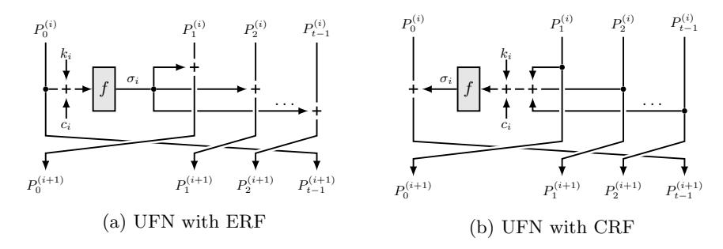
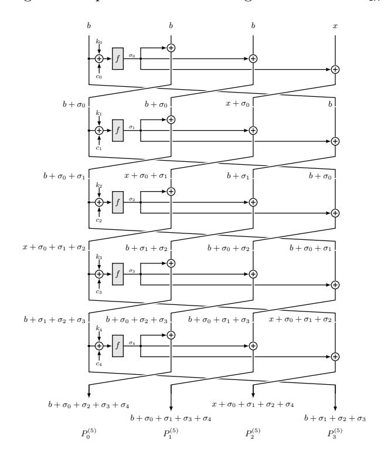
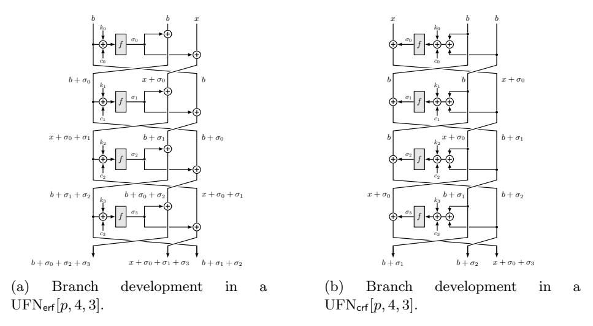
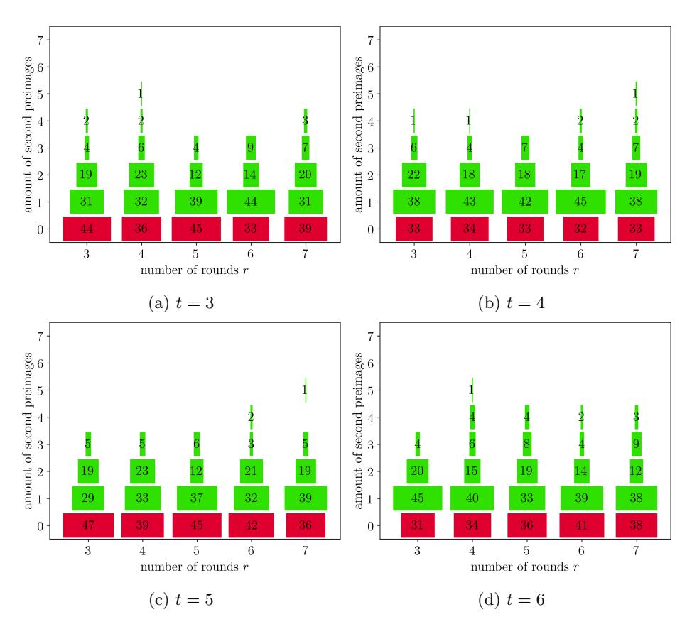
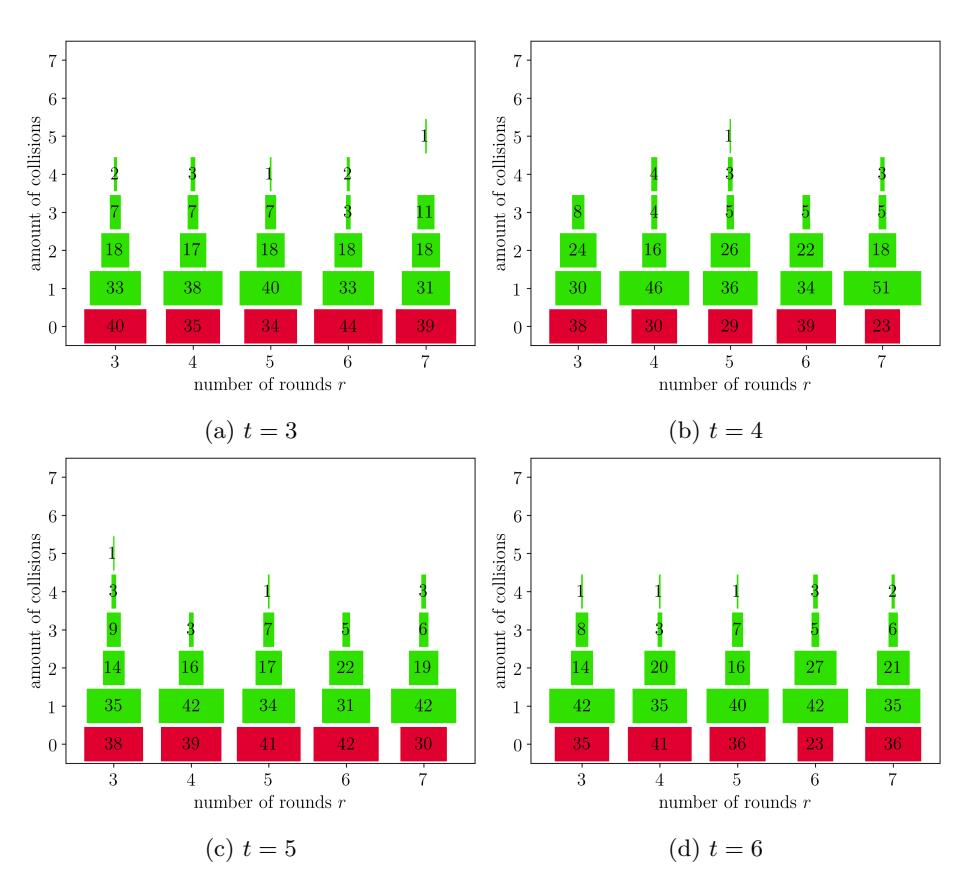

# Interpolation Cryptanalysis of Unbalanced Feistel Networks with Low Degree Round Functions

Arnab Roy<sup>1</sup> , Elena Andreeva<sup>2</sup> , and Jan Ferdinand Sauer<sup>3</sup>

> <sup>1</sup> University of Klagenfurt, Austria arnab.roy@aau.at <sup>2</sup> Technical University of Vienna, Austria elena.andreeva@tuwien.ac.at <sup>3</sup> KU Leuven, Belgium and KIT, Germany ferdinand.sauer@posteo.de

Abstract. In recent years a new type of block ciphers and hash functions over a (large) field, such as MiMC and GMiMC, have been designed. Their security, particularly over a prime field, is mainly determined by algebraic cryptanalysis techniques, such as Gr¨obner basis and interpolation attacks. In SAC 2019, Li and Preneel presented low memory interpolation attack against the MiMC and Feistel-MiMC designs.

In this work we answer the open question posed in their work and show that low memory interpolation attacks can be extended to unbalanced Feistel networks (UFN) with low degree functions, and in particular to the GMiMC design. Our attack applies to UFNs with expanding and contracting round functions keyed either via identical (univariate) or distinct round keys (multivariate). Since interpolation attacks do not necessarily yield the best possible attacks over a binary extension field, we focus our analysis on prime fields Fp.

Our next contribution is to develop an improved technique for a more efficient key recovery against UFNs with expanding round function. We show that the final key recovery step can be reduced not only to the gcd but also to the root finding problem. Despite its higher theoretical complexity, we show that our approach has a particularly interesting application on Sponge hash functions based on UFNs, such as GMiMCHash.

We illustrate for the first time how our root finding technique can be used to find collision, second preimage and preimage attacks on (reduced round) members of the GMiMCHash family. In addition, we support our theoretical analysis with small-scale experimental results. [4](#page-0-0)

## 1 Introduction

In recent years we have seen the advent of novel symmetric cryptographic primitives that aim to facilitate efficiency optimizations for higher level Multi-Party Computation (MPC), Zero-Knowledge (ZK) proofs, or Fully Homomorphic Encryption (FHE) protocols. Examples of such primitives are the LowMC [\[5\]](#page-19-0) block

<span id="page-0-0"></span><sup>4</sup> A version of this article was accepted at Selected Areas in Cryptography (SAC) 2020.

cipher, MiMC [\[4\]](#page-19-1), GMiMC [\[2,](#page-19-2)[3\]](#page-19-3), Starkard and Poseidon [\[12\]](#page-20-0), MARVELlous [\[6,](#page-20-1)[7\]](#page-20-2) families of primitives, Kreyvium [\[10\]](#page-20-3), FLIP [\[17\]](#page-20-4), and Rasta [\[11\]](#page-20-5) stream ciphers.

The main design goals of these novel primitives are to reduce the number of multiplications in the (arithmetic) circuit and/or to reduce the multiplicative depth of the circuit corresponding to the underlying block cipher or hash function. These objectives often mean that the primitives must be designed over one (possibly large) finite field and more generally, require thorough rethinking of the way traditional block ciphers (and hash functions) are designed and cryptanalyzed. A recent effort in that direction was the public STARK-Friendly hash challenge [\[18\]](#page-20-6) which aimed at the evaluation and developing better understanding of the security of the ZK-friendly hash function families Feistel-MiMC, GMiMC, Starkard and Poseidon, and MARVELlous.

The MiMC and Feistel-MiMC (over Fp) family of block ciphers and hash functions are the first ZKP-friendly dedicated symmetric designs. The MiMC block cipher introduced a novel approach towards designing an ZK/MPC-friendly primitive. Unlike previously existing designs, MiMC iterates a low-degree function sufficiently many times to achieve the target security. Both Feistel-MiMC and GMiMC rely on the Feistel iterative structure which builds a permutation from a low degree polynomial round function(s).

The first third party cryptanalysis on the MiMC construction has been conducted by Li and Preneel [\[15\]](#page-20-7). Their main idea of retrieving a key dependent coefficient of interpolating polynomial stems from [\[20\]](#page-20-8). Li and Preneel apply algebraic cryptanalysis based on Lagrange interpolation with low memory complexity against MiMC. In essence, their cryptanalysis boils down to finding a key recovery "shortcut" by reconstructing and evaluating the second highest coefficient in the cipher polynomial representation. In their work the authors left the open question whether a similar cryptanalysis approach applies to the GMiMC design. The main reason behind this question we speculate is – it is not obvious how to extend the algebraic analysis in [\[15\]](#page-20-7) to generalized Feistel networks. Our technical contribution in this article starts with the analytical results that solve this problem.

GMiMC or Generalized MiMC family is an extension of the Feistel-MiMC family and uses generalized Feistel structures with t > 2 branches. GMiMC is proposed for both balanced and unbalanced Feistel networks. In particular, two unbalanced Feistel networks (UFN) are investigated: with expanding round function (ERF); and with contracting round function (CRF). For both ZKSNARK and MPC applications, the UFN with ERF was found to be more efficient compared to balanced Feistel networks. The GMiMC designers also use a fixed-key GMiMC permutation in a Sponge hashing mode to construct the hash function GMiMCHash. Since the general design principle in GMiMC family relies on a Feistel network with a low degree round function, in this work we focus on the (interpolation) cryptanalysis of UFN with low degree round function over Fp.

## 1.1 Related work

The MiMC and GMiMC constructions use an APN function to instantiate the round function in the Feistel network. Traditional differential cryptanalysis techniques are ineffective against those designs [\[2,](#page-19-2)[4\]](#page-19-1). The design rationale and cryptanalysis of these constructions thus, heavily relies on the algebraic analysis of the keyed permutation. Known algebraic cryptanalysis is mainly based on Gr¨obner basis, interpolation, greatest common divisor (GCD), and higher-order differential analysis. We point out that higher-order differential analysis exploits simply the degree of a keyed function over a field.

In CRYPTO 2020, a higher order differential cryptanalysis against the full (round) GMiMC permutation was proposed [\[8\]](#page-20-9). More specifically, the authors showed a zero-sum distinguisher against the GMiMC fixed-key permutation. Yet, they do not provide a collision on the full GMiMCHash using this distinguisher, and to the best of our knowledge no result on finding collision using such distinguisher exists to date. A collision on the reduced round GMiMCHash was given via (algebraic) differential analysis of UFNs. Compared to this our analysis is based on purely algebraic techniques such as polynomial interpolation, GCD computation and root finding.

Bonnetain showed an attack [\[9\]](#page-20-10) on the Feistel-MiMC and GMiMC n-bit key block ciphers with complexity 2n/<sup>2</sup> . The attack followed due to a key schedule weakness and is comparable with the slide attack.

#### Our results

In this article we analyze UFN constructions over Fp, and the concrete GMiMC instantiation. More specifically, we focus on the interpolation cryptanalysis of UFNs with low degree round functions. Thereafter, we apply our analysis to the GMiMC block cipher over Fp. We further use these ideas to cryptanalyze GMiMCHash ERF and CRF instances.

- We exhibit a low memory interpolation attack on UFNs with both contracting and expanding round functions. Then, we apply our analysis to GMiMCerf and GMiMCcrf which are UFNs instantiated with the APN function x 7→ x 3 . This answers the open question of Li and Preneel [\[15\]](#page-20-7) – how to extend the low memory interpolation attack against GMiMC. The main idea starts with an extension of their low memory (LM) interpolation analysis. Namely, we first construct the key-dependent coefficient of the interpolation polynomial and then recover the coefficient with constant memory. To extend Li and Preneel's cryptanalysis to our setting we also need to first fix all but one input to a UFN, such that for both ERF and CRF UFNs we can obtain key-dependent polynomial terms with algebraic degree as low as possible. While the method bears similarity with the main idea of [\[15\]](#page-20-7), we show that a more in-depth analysis (section [3.2\)](#page-7-0) is required to extend the low memory interpolation attacks for UFNs with t > 2 branches compared to the two branch FN used to construct Feistel-MiMC. We present a new attack (in section [5.4\)](#page-10-0) which demonstrates how the multiple output branches in UFNerf can be combined to improve the complexity of the low memory interpolation attack.
- We show how root finding algorithms for polynomials over finite fields can be used instead of the GCD technique. For the target (MPC and ZKP) applications of GMiMCerf and GMiMCcrf block ciphers and hash functions this

method has roughly the same complexity as the GCD one. This is due to the fact that for these applications the size of the prime field is bounded.

- Another important contribution of this work is that we show for the first time how the interpolation analysis together with the root finding technique can be utilized to attack a hash function constructed with UFNs of low degree round function in a Sponge hashing mode, such as the GMiMC<sub>erf</sub> and GMiMC<sub>crf</sub> hash functions. Using this technique we mount collision, second preimage and preimage attacks (in section 7) against these hash functions.
- As a proof-of-concept we apply our cryptanalysis against a few small-scale instantiations of  $\rm GMiMC_{erf}$  and  $\rm GMiMC_{crf}$  block ciphers and provide the experimental results in tables 2 and 3.

For second preimage, preimage and for collision attacks against round reduced GMiMCHash we provide small-scale experiments, the results of which are presented in tables 5 and 6 and figs. 4 and 5.

## 2 Preliminaries

 $\mathbb{F}_p$  denotes the finite field where p is prime. Let  $k_i$  denote the rounds keys, while round constants are denoted by  $c_i$  for  $i \geq 0$ . We denote the tuple of all subkeys by  $K = (k_0, \ldots, k_{r-1})$ . When working with fix but unknown key we denote it by  $\bar{k}_i$  or  $\bar{K}$ . The monic polynomial  $f(x) = \sum_{j=0}^{d-1} a_j x^j + x^d$  with degree d is used to define the round function in a UFN. We denote the output of f(x) in round i by  $\sigma_i$ .  $(x_0, \ldots, x_{t-1}) \in \mathbb{F}_p^t$  is the plaintext or input to a UFN with  $t \ (> 2)$  branches.  $P_j^{(i)}$  denotes the polynomial corresponding to branch j after the i-th round, and  $P_j^{(0)} = x_j$  for  $0 \leq j < t$ . For the inputs analyzed in section 3 and because f(x) is monic, we have  $P_j^{(i)} = x^{d^y} + q(K)x^{d^y-1} + \ldots$  where j depends on j and j. We call the polynomial j in the key j the "second highest coefficient". We illustrate one-round UFNs with ERF and CRF in fig. 1.

#### 2.1 Background

We will consider UFNs with the above polynomial round function f(x). The round function UFN<sub>erf</sub> is defined as  $\sigma_i = f(P_0^{(i)} + k_i + c_i)$  where  $i \ge 0$  and  $P_j^{(i)} = x_j$  for  $i = 0, 0 \le j < t$ . Each round is viewed as a mapping

<span id="page-3-0"></span>
$$(P_0^{(i+1)}, \dots, P_{t-1}^{(i+1)}) \leftarrow (P_1^{(i)} + \sigma_i, \dots, P_{t-1}^{(i)} + \sigma_i, P_0^{(i)})$$

$$\tag{1}$$

in  $\mathbb{F}_p^t$ .

The round function of an UFN<sub>crf</sub> is defined as  $\sigma_i = f(\sum_{j=1}^{t-1} P_j^{(i)} + k_i + c_i)$ . Each round of UFN<sub>crf</sub> is a mapping defined as

$$(P_0^{(i+1)}, \dots, P_{t-1}^{(i+1)}) \leftarrow (P_1^{(i)}, \dots, P_{t-1}^{(i)}, P_0^{(i)} + \sigma_i)$$
 (2)

We will use the notations  $UFN_{\sf erf}[p,r,t]$  and  $UFN_{\sf crf}[p,r,t]$  to indicate the number of rounds r and number of branches t for UFNs over  $\mathbb{F}_p$ .

<span id="page-4-0"></span>

Fig. 1: One round UFN with ERF(left) and CRF(right)

GMiMC uses the monomial round function  $f(x) := x^3$ . Typically, GMiMC is defined for primes of size 128 bit or more for their target MPC or ZK applications. The key scheduling in the GMiMC proposal is defined as  $k_i = k$  for  $i \ge 0$  and  $k \in \mathbb{F}_p$ . However, following the recent attack [9] against GMiMC<sub>erf</sub>, certain types of GMiMC<sub>crf</sub>, and Feistel-MiMC, the round key scheduling is updated [16]. The new key schedule defines  $k_i := (i+1)k$  for  $i \ge 0$ . To the best of our knowledge this thwarts the attack of [9]. Using the new key schedule, the round function for GMiMC<sub>erf</sub> is defined as  $\sigma_i = (P_0^{(i)} + (i+1)k_i + c_i)^3$ , and for GMiMC<sub>crf</sub> it is defined as  $\sigma_i = (\sum_{j=1}^{t-1} P_j^{(i)} + (i+1)k_i + c_i)^3$ .

We will also use the notations  $GMiMC_{eff}[p, r, t]$  and  $GMiMC_{crf}[p, r, t]$  to indicate the number of rounds and number of branches when necessary or GMiMC.

## <span id="page-4-1"></span>2.2 Low Memory Interpolation

The interpolation attack [13] on block ciphers was introduced by Jakobsen and Knudsen in 1997. In this attack, the output of a block cipher  $E_k$  is viewed as a polynomial in the input of the cipher. The adversary first estimates the degree d of the polynomial and then gathers at least (d+1) pairs of plaintext and ciphertext. This allows reconstruction of  $E_k$  without the knowledge of k. The time complexity for reconstructing the polynomial corresponding to  $E_k$  is  $\mathcal{O}(d \log d)$  [19] and the space complexity is  $\mathcal{O}(d)$ .

For polynomials of large degree, the amount of required memory can make interpolation impractical. If the involvement of subkeys in a specific coefficient of the polynomial is "well-understood", a partial recovery of the polynomial can be sufficient to recover the key or reconstruct a decryption oracle. In [15], for example, the reconstruction of only a single coefficient allows the recovery of two subkeys.

This lowers the space complexity to  $\mathcal{O}(1)$ , meaning that the memory constraints are not an issue with this form of low memory interpolation. One such enabling technique is *choosing* the polynomials' evaluation points. Concretely, when interpolating  $f: \mathbb{F}_p \to \mathbb{F}_p$ , points  $(x_j, y_j) = (\alpha^j, f(\alpha^j))$  are used, where  $\alpha \in \mathbb{F}_p$  is a primitive element. The  $y_j$  are retrieved in an online manner, i. e. "on the fly". This removes the need to store a list of (d+1) coordinates.

The low memory interpolation algorithm is developed by rearranging the equation for Lagrange interpolation, which is revisited in eq. (3).

<span id="page-5-1"></span>
$$L(x) = \sum_{j=0}^{d} y_j \prod_{\substack{0 \le i \le d \\ i \ne j}} \frac{x - x_i}{x_j - x_i} = \sum_{j=0}^{d} f(\alpha^j) \prod_{\substack{0 \le i \le d \\ i \ne j}} \frac{x - \alpha^i}{\alpha^j - \alpha^i} = \sum_{j=0}^{d} b_j x^j$$
 (3)

Solving for the coefficient  $b_{d-1}$ , the authors of [15] arrive at

<span id="page-5-2"></span>
$$b_{d-1} = \sum_{j=0}^{d} f(\alpha^j) \frac{\beta_j}{\gamma_j}, \quad \gamma_j = \prod_{\substack{0 \le i \le d \\ i \ne j}} (\alpha^j - \alpha^i), \quad \beta_j = \alpha^j - \sum_{i=0}^{d} \alpha^i$$
 (4)

The recursive form of  $\gamma_{j+1} = \gamma_j \cdot \alpha^d \cdot \alpha^j - \alpha^{-1}/\alpha^j - \alpha^d$  allows its iterative construction. Low memory interpolation can now be achieved by iteratively constructing the summands of eq. (4). Only current values of variables  $\alpha^j$ ,  $\beta_j$ ,  $\gamma_j$ , and the partial result are stored across iterations, resulting in space requirements of  $\mathcal{O}(1)$ . Despite the improvements on space complexity, interpolation of even one coefficient amounts to time complexity  $\mathcal{O}(d \log d)$ .

## <span id="page-5-0"></span>3 Analysis of output polynomials

In this section we will first analyze common properties of the output of Unbalanced Feistel Networks (UFNs) when seen as polynomials of the input and key variable(s). We take output branch j of a UFN<sub>erf</sub>[p, r, t] where the key  $K = (k_0, \ldots, k_{r-1})$  values are regarded as indeterminates. Given inputs of the form  $(x_0, x_1, \ldots, x_{t-1})$ , output branch j can be interpreted as a multivariate polynomial in  $\mathbb{F}_p[x_0, \ldots, x_{t-1}, k_0, \ldots, k_{r-1}]$ .

Fixing all but one of the input variables to an arbitrary constant will give a polynomial  $\mathbb{F}_p[x, k_0, \dots, k_{r-1}]$  corresponding to any output branch.

#### <span id="page-5-4"></span>3.1 ERF analysis

We analyze the output polynomials corresponding to different branches after r rounds of a UFN<sub>erf</sub>. For simplicity we start with the analysis for UFN<sub>erf</sub>[p, r, 3]. To give a clear idea of the analysis throughout this section, we progressively generalize it. The first generalization is for the number of rounds r in Proposition 1 and then for t branches in Proposition 2. We simplify the analysis by combining actual round key  $k'_i$  and round constant  $c_i$  i.e.,  $k_i := k'_i + c_i$ . Furthermore, we assume  $\deg(f) \geqslant 3$ .

<span id="page-5-3"></span>**Proposition 1** Given an input of the form (b,b,x) to the UFN<sub>erf</sub>[p,r,3], after  $r \ge 4$  rounds, the output polynomials  $P_0^{(r)}, P_1^{(r)}, P_2^{(r)} \in \mathbb{F}_p[x,k_0,\ldots,k_{r-1}]$  for the 3 branches have the following properties:

1. 
$$\deg(P_0^{(r)}) = \deg(P_1^{(r)}) = d^{r-2}$$
 and  $\deg(P_2) = d^{r-3}$ 

$$\begin{split} \mathcal{Z}. & \; \mathit{coeff}(P_0^{(r)}, x^{d^{r-2}}) = \mathit{coeff}(P_1^{(r)}, x^{d^{r-2}}) = 1 \\ \mathcal{Z}. & \; \mathit{coeff}(P_0^{(r)}, x^{d^{r-2}-1}) = \mathit{coeff}(P_1^{(r)}, x^{d^{r-2}-1}) = d^{r-3}(a_{d-1} + d\beta) \\ & \; \mathit{where} \; \beta = f(b+k_0) + f\left(b+f(b+k_0) + k_1\right) + k_2 = \sigma_0 + \sigma_1 + k_2. \end{split}$$

<span id="page-6-0"></span>Proof. The proof is detailed in appendix [A.1.](#page-21-0)

We further generalize the result for t branches in the following proposition:

Proposition 2 Given an input of the form (b, . . . , b, x) to the UFNerf[p, r, t], let r > t > 3, then after r rounds, the output polynomials P (r) 0 , P(r) 1 , . . . , P(r) <sup>t</sup>−<sup>1</sup> ∈ Fp[x, k0, . . . , kr−1] have the following properties:

1. 
$$\deg(P_0^{(r)}) = \ldots = \deg(P_{t-2}^{(r)}) = d^{r-(t-1)}$$
 and  $\deg(P_{t-1}^{(r)}) = d^{r-t}$ 

$$\text{2. } \operatorname{coeff}(P_0^{(r)}, x^{d^{r-(t-1)}}) = \ldots = \operatorname{coeff}(P_{t_2}^{(r)}, x^{d^{r-(t-1)}}) = 1$$

3. 
$$\operatorname{coeff}(P_0^{(r)}, x^{d^{r-(t-1)}-1}) = \ldots = \operatorname{coeff}(P_{t-2}^{(r)}, x^{d^{r-(t-1)}-1}) = d^{r-t-1}(a_{d-1} + d\beta)$$
  
where  $\beta = \sum_{i=0}^{t-2} \sigma_i + k_{t-1}$ .

Proof. The proof is detailed in appendix [A.2.](#page-21-1)

<span id="page-6-1"></span>Corollary 1 From Proposition [2](#page-6-0) we summarize and can further conclude

$$\begin{array}{l} \text{1. } \deg(P_t^{(r)}) = \deg(P_1^{(r-1)}) = d^{r-t} \\ \text{2. } \operatorname{coeff}(P_t^{(r)}, x^{d^{r-t}-1}) = \operatorname{coeff}(P_1^{(r-1)}, x^{d^{r-t}-1}) = d^{r-t-1}(a_{d-1} + d\beta) \end{array}$$

Corollary [1](#page-6-1) gives us the algebraic expression of the coefficient of the second highest degree term in the output polynomial P (r) t−1 . In the remainder of this article, we will informally refer to this coefficient as the "second highest coefficient." Lastly, we generalize the result for the position of the indeterminate x.

Proposition 3 Given an input of the form (b, . . . , b, x, b, . . . , b) to the UFNerf[p, r, t], where the position of x is ` ∈ {0, . . . , t − 1}, after r > ` rounds, the output polynomials P (r) 0 , P(r) 1 , . . . , P(r) <sup>t</sup>−<sup>1</sup> ∈ Fp[x, k0, . . . , kr−1] have the following properties:

1. 
$$\deg(P_0^{(r)}) = \ldots = \deg(P_{t-2}^{(r)}) = d^{r-\ell}$$
 and  $\deg(P_{t-1}^{(r)}) = d^{r-\ell-1}$ 

2. 
$$coeff(P_0^{(r)}, x^{d^{r-\ell}}) = \ldots = coeff(P_{t-2}^{(r)}, x^{d^{r-\ell}}) = 1$$

3. 
$$\operatorname{coeff}(P_0^{(r)}, x^{d^{r-\ell}-1}) = \ldots = \operatorname{coeff}(P_{t-2}^{(r)}, x^{d^{r-\ell}-1}) = d^{r-\ell-1}(a_{d-1} + d\beta)$$
  
where  $\beta = \sum_{i=0}^{\ell-1} \sigma_i + k_\ell$ 

Proof. Using the same argumentation as in the proof of Proposition [2,](#page-6-0) we observe that deg(σi) = 0 for i < `. In the `-th round, using the same expansion as in the proof of Proposition [2,](#page-6-0) we have the following expanded form for σ`:

<span id="page-6-2"></span>
$$\sigma_{\ell} = f(x + \sigma_0 + \dots + \sigma_{\ell-1} + k_{\ell})$$
  
=  $f(x + \beta)$   
=  $x^d + (a_{d-1} + d\beta)x^{d-1} + \dots + a_0$ 

<span id="page-6-3"></span>Now we can make an induction over r much in the same way as in Proposition [1.](#page-5-3)

Corollary 2 Let  $\sigma_i$  be the output of the round function in round i of a UFN<sub>erf</sub>[p, r, t] with input of the form  $(b, \ldots, b, x, b, \ldots, b)$ , where indeterminate x is at position  $\ell$ , and  $d \geqslant 3$ . From the proof of Proposition 3 we have

$$\textit{deg}(\sigma_i) = \begin{cases} 0, & 0 \leqslant i < \ell \ d^{i-\ell+1}, & \ell \leqslant i < r \end{cases}$$

Note that generally, the output polynomials in Proposition 3 are of higher degree than those in Proposition 2, unless  $\ell = t - 1$ , in which case Proposition 2 and Proposition 3 coincide.

#### <span id="page-7-0"></span>3.2**CRF** analysis

For the UFN<sub>crf</sub>[p, r, t] we also analyze the degree and coefficients of the highest and second highest term in all the output polynomials, which are described in the following propositions. As in section 3.1, we simplify the analysis by combining actual round key  $k'_i$  and round constant  $c_i$  to  $k_i := k'_i + c_i$ . Recall that for a UFN<sub>crf</sub>, we use  $f(\sum_{i=1}^{t-1} x_i + k_i + c_i)$  as round function in round i on inputs

<span id="page-7-1"></span>**Proposition 4** Given an input of the form (x, b, ..., b) to the UFN<sub>crf</sub>[p, r, t]with  $t \ge 3$  branches, after  $r \ge 2$  rounds, the rightmost output polynomial  $P_{t-1}^{(r)} \in$  $\mathbb{F}_p[x, k_0, \dots, k_{r-1}]$  has the following properties:

- 1.  $deg(P_{t-1}^{(r)}) = d^{r-1}$
- 2.  $coeff(P_{t-1}^{(r)}, x^{d^{r-1}}) = 1,$ 3.  $coeff(P_{t-1}^{(r)}, x^{d^{r-1}-1}) = d^{r-1}(a_{d-1} + d\beta)$ where  $\beta = (t-2)b + f((t-1)b + k_0) + k_1$

*Proof.* The proof is given in appendix A.3

<span id="page-7-2"></span>**Corollary 3** From Proposition 4 we can conclude for  $r \ge t$ 

$$\begin{array}{l} \text{1. } \deg(P_0^{(r)}) = \deg(P_{t-1}^{(r-(t-1))}) = d^{r-t} \\ \text{2. } \operatorname{coeff}(P_0^{(r)}, x^{d^{r-t}-1}) = \operatorname{coeff}(P_{t-1}^{(r-(t-1))}, x^{d^{r-t}-1}) = d^{r-t-1}(a_{d-1} + d\beta) \end{array}$$

Corollary 3 gives us the algebraic expression of the coefficient of the second highest degree term in the output polynomial  $P_0^{(r)}$ . In the remainder of this article, we will informally refer to this coefficient as the "second highest coefficient."

The insight of Proposition 4 allows the algebraic expression of the second highest coefficient in indeterminates  $k_i$ , i. e. a polynomial in  $\mathbb{F}_p[k_0, k_1]$ .

## <span id="page-7-3"></span>Low Memory Interpolation Cryptanalysis of UFNs

Using the results from section 3 we will analyze  $UFN_{\sf erf}$  and  $UFN_{\sf crf}$  with uniformly randomly fixed but unknown key  $\bar{k} \in \mathbb{F}_p^s$   $(s \ge 1)$ , resulting in round keys  $(\bar{k}_0,\ldots,\bar{k}_{r-1})$ . When the key values are known the output polynomials developed in sections 3.1 and 3.2, specifically in Corollaries 1 and 3, are elements of  $\mathbb{F}_p[x]$  (not of  $\mathbb{F}_p[x, k_0, \dots, k_{r-1}]$ ).

Since the interpolation of a single coefficient requires low memory, as outlined in section 2.2, we can recover the second highest coefficient to mount a low memory attack on UFN<sub>erf</sub> and UFN<sub>crf</sub>.

## 4.1 Analysis outline

The general idea of the cryptanalysis can be described in the following steps:

- S1. Obtain the algebraic expression of the second highest coefficient Q(K) of the output polynomial corresponding to the branch with the lowest algebraic degree. For UFN<sub>erf</sub> and UFN<sub>crf</sub> these are rightmost branch and leftmost branch respectively. (Detailed analysis of UFN<sub>erf</sub> and UFN<sub>crf</sub> are in sections 5.1 and 6 respectively.)
- S2. Find value z of second highest coefficient of  $E_{\bar{K}}$  of the same branch as in step 1 by applying the low memory interpolation (used in [15]) technique. (Detailed in Section 5.2)
- S3. Recover the key by evaluating relation Q(K) = z by solving for K. Some of the key recovering techniques may require multiple equations  $Q_i(K) = z_i$ . (Sections 5.3 and 6)

ROUND KEYS. We explore two scenarios single key and multiple keys. In single key,  $k_i = g(k)$ , where g is a linear<sup>5</sup> function (and degree one) over  $\mathbb{F}_p$  and k can have values from  $\mathbb{F}_p$ . For single round keys, we use two different techniques: a novel root finding technique and the gcd technique (previously used by [15]).

In section 5.4, we show that the complexity of the key recovery can be further improved for  $UFN_{erf}$  by combining the output branch polynomials. We call this technique *branch subtraction*. Table 1 gives an overview of the complexities.

In the multiple key scenario, the round keys are derived from  $k = (k_0, k_1) \in \mathbb{F}_p^2$ . In GMiMC, the round key  $k_i = k_{i \pmod{2}}$ , where  $j \in \{0, \dots, r-1\}$ . The analysis for this multiple key scenario is provided in section 5.5.

## <span id="page-8-2"></span>5 Cryptanalysis of UFN<sub>erf</sub>

## <span id="page-8-0"></span>5.1 Algebraic Expression of Second Highest Coefficient

We consider the output polynomial when all but one branch of the inputs have fixed values. By arranging the terms as in Propositions 1 to 3, the polynomial has the form  $x^{d^r} + Q(K)x^{d^r-1} + \cdots + cx^0$ , where Q(K) depends on the number of rounds r, the number of branches t, and the position  $\ell$  of indeterminate x in the UFNs input. The coefficient Q(K) is a polynomial that we refer as "second highest coefficient." This coefficient is computable by applying the results from section 3, as described below.

<span id="page-8-1"></span><sup>&</sup>lt;sup>5</sup> A low degree non-linear function can also be applied. However, the degree of this function will have an effect on the complexity since the time complexity of finding Q(k) depends on the degree.

In a UFN<sub>erf</sub>[p, r, t], the polynomial representing the rightmost output branch has the lowest degree, as shown in Proposition 2. For this polynomial, the coefficient of the second highest degree term has form  $Q(K) = d^{r-t-1}(a_{d-1} + d\beta)$ , with  $\beta = \sum_{i=0}^{t-2} \sigma_i + k_{t-1}$ . Algorithm 1 describes the method to obtain the polynomial Q(K), representing the second highest coefficient.

Complexity (of S1) In the single key case, the computation of Q(K) requires multiplications of polynomials over  $\mathbb{F}_p$ . More specifically, it requires at most  $\mathcal{O}(\log D)$  multiplications of two polynomials with degree at most D. The multiplication of two polynomials of degree at most D over  $\mathbb{F}_p$  requires  $M(D) := 63.43D \log D \log \log D + \mathcal{O}(D \log D)$  field operations [22, Thm. 8.23]. To simplify the expressions we define  $M'(D) = \mathcal{O}(\log D) M(D)$ . Hence, this step has complexity

$$\mathsf{M}'(d^{t-1}) = \mathcal{O}(\log d^{t-1})\,\mathsf{M}(d^{t-1}).$$

Space complexity is  $\mathcal{O}(d^{t-1})$  since only one polynomial of degree at most  $d^{t-1}$  has to be stored at any given time. Note that this space complexity is not due to the interpolation part of the attack.

## <span id="page-9-0"></span>5.2 Value of Second Highest Coefficient

As outlined at the beginning of section 4, the second step of the analysis consists of recovering the value of the second highest coefficient of the rightmost output polynomial branch of the UFN<sub>erf</sub>. For this step we use the low memory interpolation of [15] described in section 2.2.

In general, inputs of form  $\alpha^j$  are required, where  $\alpha \in \mathbb{F}_p$  is a primitive element,  $0 \leq j \leq D$ , and D is the degree of the underlying polynomial that is to be interpolated. In the current analysis this means using inputs of the form  $x_j = (b, \ldots, b, \alpha^j)$ , in accordance with Proposition 2. The evaluation points  $y_j$  for the interpolation are the values of the rightmost output branch.

Complexity (of S2) The time complexity of finding the value of the second highest coefficient using the low memory interpolation method of [15] is  $l_{lm}(D) := \mathcal{O}(D\log(D))$  for polynomials of degree D. Its memory complexity is in  $\mathcal{O}(1)$ , and data complexity is D+1. For UFN<sub>erf</sub>, we have  $D=d^{r-t}$ , resulting in time

**Algorithm 1:** Second highest coefficient of rightmost branch in UFN<sub>erf</sub>[p, r, t] on input  $(b, \ldots, b, x)$ .

```
UFN<sub>erf</sub>[p, r, t] on input (b, \ldots, b, x).

Input: r, t, f, branch constant b, round constants c_0, \ldots, c_{t-1}
Output: polynomial Q(K) for second highest coefficient of rightmost branch

1 s := 0
2 for i \in (0, \ldots, t-2) do

3 \sigma_i := f(s+b+c_i+k_i)
4 s := s+\sigma_i

5 \beta := s+k_{t-1}+c_{t-1}
6 return d^{r-t-1}(a_{d-1}+d\beta)
```

complexity  $\mathcal{O}((r-t)d^{r-t}\log d)$ . The approach requires  $d^{r-t}+1$  pairs of plaintext and ciphertext and uses  $\mathcal{O}(1)$  space. Better time and data complexities can be achieved by combining branches, as described in section 5.4.

#### <span id="page-10-2"></span>5.3 Key recovery with a single key

First, we consider the case of single key e.g.,  $k_i = (i+1) \cdot k$  for  $i \ge 0$  and k is the master key that can take any value in  $\mathbb{F}_p$ . We find the polynomial representing the second highest coefficient and the value of the second highest coefficient as described in the previous two sections. For finding the value of the secret key two different techniques can be employed: Finding the gcd, or finding roots.

<span id="page-10-3"></span>FINDING THE GCD. This technique was introduced in [1] and also used in [15] to analyze two-branch Feistel networks. We first select two different constants b,b' for input to the UFN<sub>erf</sub>. We obtain two polynomials Q(k) and Q'(k) as described in algorithm 1 using b and b' respectively. Next, we interpolate the values of the second highest coefficient say z,z' with as described in section 5.2, twice: The correct key is found from  $\gcd(Q(k)-z,Q'(k)-z')$  with high probability.

Complexity of GCD Finding the gcd of two polynomials of degree at most D over  $\mathbb{F}_p$  has time complexity  $\mathsf{G}(D) := \mathcal{O}\big(D\log^2 D\big)$  [22, Cor. 11.9]. For UFN<sub>erf</sub>s, we have  $D = d^{t-1}$ . Hence the key recovery using the gcd method has time complexity  $\mathcal{O}\big(t^2d^{(t-1)}\log^2 d\big)$  and space complexity  $\mathcal{O}\big(d^{t-1}\big)$ .

<span id="page-10-1"></span>FINDING ROOTS. By construction of Q(k) it satisfies  $Q(\bar{k}) - z = 0$ , i.e., correct key  $\bar{k}$  is a root of above equation Q(k) - z. Exhaustively trying the generally very short list of key candidates [14] on one additional pair of plaintext and ciphertext identifies the correct key.

Complexity of root finding Finding all roots without multiplicity of a polynomial with degree D over  $\mathbb{F}_p$  has time complexity  $\mathsf{R}(D) := \mathcal{O}(\mathsf{M}(D)\log D\log(Dp))$  [22, Cor. 14.16]. Checking at most D key candidates for a polynomial of degree D has time complexity  $\mathcal{O}(D)$ . For UFN<sub>erf</sub>, we have  $D = d^{t-1}$ . Hence the key recovery using the root finding method has time complexity  $\mathcal{O}(\mathsf{M}(d^{t-1})\log d^{t-1}\log(d^{t-1}p))$  and data complexity of  $\mathcal{O}(1)$ .

FINDING ROOTS VERSUS GCD. Asymptotically, the complexity of the root finding method is worse than using the gcd method. However, for our target constructions, i.e., GMiMC block ciphers and hash functions that are aimed for practical applications, the complexities are roughly the same, since the field's size  $\log p \leqslant 2^8$ . More importantly, the root finding method can also be used to find collisions when UFN<sub>erf</sub> (with a fixed key) is used in sponge mode to construct a hash function, as described in section 7.

#### <span id="page-10-0"></span>5.4 Complexity improvements via Branch Subtraction

When analyzing a UFN<sub>erf</sub>[p,r,t]  $E_{\bar{K}}$  with  $\bar{K}=(\bar{k}_0,\ldots,\bar{k}_{r-1})$ , improvements on the complexities discussed above are possible. From Corollary 2 we have  $\deg(\sigma_i)=d^{i-\ell-1}$  for  $i\geqslant \ell$  for input of the form  $(b,\ldots,b,x,b,\ldots,b)$ , where  $b\in \mathbb{F}_p$  is a

constant and indeterminate x is at position  $\ell$ . After round i, by construction of UFN<sub>erf</sub>,  $\sigma_i$  has been added to all branches except the rightmost one. As has been used extensively in the proofs of Propositions 1 to 3, the degree of the output polynomial of any branch is dominated by the largest  $\sigma_i$ . Thus, somehow removing one or more of the highest  $\sigma_i$  from an output branch reduces the degree of the corresponding polynomial. A lower degree in turn allows interpolation with reduced time and data complexity. Since we're using the low memory technique of [15], space complexity cannot be lowered further.

As an example for this effect, consider the output branches  $P_0^{(5)}(x), \ldots, P_3^{(5)}(x)$  in fig. 2. We set  $P'(x) := P_1^{(5)}(x) - P_0^{(5)}(x) = \sigma_1 - \sigma_2$ . While  $\deg(P'(x)) = 0$ , crucially  $\min_i(\deg(P_i^{(5)}(x))) = \deg(P_3^{(5)}(x)) = \deg(\sigma_3) = d$ . This elimination of high degree  $\sigma_i$  is the particular dealerment of a LEDN for the particular of the particular of the particular of the particular of the particular of the particular of the particular of the particular of the particular of the particular of the particular of the particular of the particular of the particular of the particular of the particular of the particular of the particular of the particular of the particular of the particular of the particular of the particular of the particular of the particular of the particular of the particular of the particular of the particular of the particular of the particular of the particular of the particular of the particular of the particular of the particular of the particular of the particular of the particular of the particular of the particular of the particular of the particular of the particular of the particular of the particular of the particular of the particular of the particular of the particular of the particular of the particular of the particular of the particular of the particular of the particular of the particular of the particular of the particular of the particular of the particular of the particular of the particular of the particular of the particular of the particular of the particular of the particular of the particular of the particular of the particular of the particular of the particular of the particular of the particular of the particular of the particular of the particular of the particular of the particular of the particular of the particular of the particular of the particular of the particular of the particular of the particular of the particular of the particular of the particular of the particular of the particular of the particular of the particular of the particular of the p

We represent the output of a UFN<sub>erf</sub>[p, r, t]  $E_K$  with input  $(x_0, \ldots, x_{t-1})$  as a vector  $\vec{o}$  using the following matrix notation. Intuitively, the matrix A permutes the inputs like the last operation in any one round of a UFN<sub>erf</sub>. The matrix Baccumulates the necessary  $\sigma_i$ , following the definition of a UFN<sub>erf</sub>.

<span id="page-11-0"></span>
$$\vec{o} := A^r \cdot \vec{x} + \underbrace{(B_{r \bmod t} | B| \dots | B)}_{r \text{ columns}} \cdot \vec{\sigma}$$

$$(5)$$

where

$$A = \begin{pmatrix} -e_2 - \\ -e_3 - \\ \vdots \\ -e_t - \\ -e_1 - \end{pmatrix}, \ \vec{x} = \begin{pmatrix} x_0 \\ x_1 \\ \vdots \\ x_{t-1} \end{pmatrix}, \ B = \begin{pmatrix} 0 & 1 \\ 0 & 1 \\ \vdots \\ 1 & 0 \end{pmatrix}, \ \vec{\sigma} = \begin{pmatrix} \sigma_0 \\ \sigma_1 \\ \vdots \\ \sigma_{r-1} \end{pmatrix}$$

and  $B_{r m o d t}$  are the right r m o d t columns of B. Summarizing the dimensions, we

have  $A, B \in \mathbb{F}_p^{t \times t}$ ,  $\vec{x} \in \mathbb{F}_p^t$ , and  $\vec{\sigma} \in \mathbb{F}_p^r$ . Note that eq. (5) is not recursive. Increasing r to r+1 leads to different dimensions in the composite matrix on the right hand side as well as in  $\vec{\sigma}$ . Note also that the output branches  $\vec{o}$  are nonlinear in variable x despite the seemingly linear representation above, since the  $\sigma_i$  are nonlinear for  $i \geq \ell$ .

As an example, we consider a UFN<sub>erf</sub> [p, 5, 4] with inputs (b, b, b, x) like in fig. 2. In this instance, we have the following:

$$\vec{o} = \begin{pmatrix} 0 & 1 & 0 & 0 \\ 0 & 0 & 1 & 0 \\ 0 & 0 & 0 & 1 \\ 1 & 0 & 0 & 0 \end{pmatrix}^{5} \cdot \begin{pmatrix} b \\ b \\ b \\ x \end{pmatrix} + \begin{pmatrix} 1 & 0 & 1 & 1 & 1 \\ 1 & 1 & 0 & 1 \\ 1 & 1 & 1 & 0 & 1 \\ 0 & 1 & 1 & 1 & 0 \end{pmatrix} \cdot \begin{pmatrix} \sigma_{0} \\ \sigma_{1} \\ \sigma_{2} \\ \sigma_{3} \\ \sigma_{4} \end{pmatrix} = \begin{pmatrix} b \\ b \\ x \\ b \end{pmatrix} + \begin{pmatrix} \sigma_{0} + \sigma_{2} + \sigma_{3} + \sigma_{4} \\ \sigma_{0} + \sigma_{1} + \sigma_{3} + \sigma_{4} \\ \sigma_{0} + \sigma_{1} + \sigma_{2} + \sigma_{4} \\ \sigma_{1} + \sigma_{2} + \sigma_{3} \end{pmatrix}$$

Thus,  $\vec{o}$  is an alternative representation of  $P_0^{(5)}(x), \ldots, P_3^{(5)}(x)$ , concluding the example.

Given this representation of the output branches  $\vec{o}$  of  $E_K$ , we can apply some linear algebra in the following way: First, we observe the inverse of matrix B.

$$B^{-1} = \frac{1}{t-1} \begin{pmatrix} 2-t & 1 \\ 2-t & 1 \\ & \ddots & \\ 1 & & 2-t \end{pmatrix}$$

Multiplying the vector of output branches  $\vec{o}$  by  $B^{-1}$  limits occurrence of any  $\sigma_i$  in any one component of  $\vec{o}$  to exactly once. This corresponds to every  $\sigma_i$  occurring on only one "combined output branch".

<span id="page-12-1"></span>
$$B^{-1} \cdot \vec{o} = B^{-1} \cdot A^r \cdot \vec{x} + \underbrace{(I_{r \text{mod}t} | I_t | \dots | I_t)}_{r \text{ columns}} \cdot \vec{\sigma}$$

$$(6)$$

where  $I_t \in \mathbb{F}_p^{t \times t}$  is the identity matrix and  $I_{r \text{mod} t}$  are the right r mod t columns of  $I_t$ .

From eq. (6) in combination with Corollary 2 we can derive

<span id="page-12-2"></span>
$$\begin{aligned} &\deg(\mathsf{first\_component}(B^{-1}\cdot\vec{o}))\\ &=\deg(\sigma_{r-t}+\sigma_{r-2t}+\cdots+B^{-1}A^r\vec{x})=\deg(\sigma_{r-t})\\ &=d^{r-2t+2} \end{aligned} \tag{7}$$

for  $\ell = t - 1$ .

Complexity improvements Using the polynomial first\_component( $B^{-1} \cdot \vec{o}$ ) of eq. (7) instead of the rightmost branch in the analysis of sections 5.1 to 5.3 lowers the complexities involved. Step 1 and 3 are unaffected by branch subtraction since the complexities do not depend on the number of rounds r. For S2, the computational complexity is  $I_{lm}(d^{r-2t+2})$  as opposed to  $I_{lm}(d^{r-t})$ . Data complexity with branch subtraction is  $d^{r-2t+2}+1$  as opposed to  $d^{r-t}+1$ 

Data complexity with branch subtraction is  $d^{r-2t+2}+1$  as opposed to  $d^{r-t}+1$  without. Space complexity stays  $\mathcal{O}(1)$  since the same low memory algorithm for recovery is being used. A summary of all the complexities with and without branch subtraction can be found in section 5.6.

In order to achieve these improvements,  $B^{-1}$  needs to be applied to the output branches  $\vec{o}$ . Since we only need the first component of vector  $B^{-1} \cdot \vec{o}$ , we can limit ourselves to one product between two vectors of length r, where each of the components has degree at most  $d^{r-t+1}$ . The time complexity for r many multiplications of two polynomials of degree at most  $d^{r-t+1}$  is  $rM(d^{r-t+1})$ .

#### <span id="page-12-0"></span>5.5 Key recovery with multiple keys

Our target case for multiple keys always reduces to keys  $(k_0, k_1) \in \mathbb{F}_p^2$ , i. e. keys  $k_i$  for  $i \geq 2$  do not influence the analysis, we interpret round keys  $k_i$  as derived from  $k_0$  and  $k_1$ .

We consider the round key scheduling  $k_i = (i+1) \times k_i \pmod{2}$  for  $i \ge 0$ . As opposed to the variant where the same key is added in every round, the methods from section 5.3 building on Proposition 2 are not directly applicable. Instead, we use the results of Proposition 3. Furthermore, we use multiple instances of the equation  $Q_i(K) = z_i$  for different constants  $b_i$  for  $i \in \{0,1,2\}$ . This is an adaptation of the approach used in [15] where the authors analyzed balanced Feistel networks.

In Proposition 3, let  $\ell = 1$ , which corresponds to inputs of the form  $(b_i, x, b_i, \dots, b_i)$ . Then, the second highest coefficient of the rightmost branch of  $E_K$  is of the form  $Q_i(K) = d^{r-2}(a_{d-1} + d\beta_i)$  where  $\beta_i = \sigma_0 + k_1 = f(b_i + k_0) + k_1$ . Thus, we have  $Q_i(K) \in \mathbb{F}_p[k_0, k_1] \subsetneq \mathbb{F}_p[K]$ .

We combine the three equations  $Q_i(K) = z_i$  in the following manner: By solving for  $\beta_i$  we have

<span id="page-13-1"></span>
$$\beta_0 = f(b_0 + k_0) + k_1 = \frac{z_0}{d^{r-1}} - \frac{a_{d-1}}{d}$$

$$\beta_1 = f(b_1 + k_0) + k_1 = \frac{z_1}{d^{r-1}} - \frac{a_{d-1}}{d}$$

$$\beta_2 = f(b_2 + k_0) + k_1 = \frac{z_2}{d^{r-1}} - \frac{a_{d-1}}{d}$$
(8)

For  $0 \leq i, j \leq 2$  we get, through subtracting and rearranging,

$$\Delta_{(i,j)} := f(b_i + k_0) - f(b_j + k_0) - \frac{z_i - z_j}{d^{r-1}} = 0$$
(9)

As in section 5.3, it holds by the factor theorem that  $(k_0 - \bar{k}_0)$  is a factor of  $\Delta_{(i,j)}$  due to the construction of  $Q_i(K)$ .  $\bar{k}_0$  can be found by computing the gcd  $(\Delta_{(0,1)}, \Delta_{(0,2)})$ . Substituting  $k_0$  with  $\bar{k}_0$  in any of eq. (8) yields  $\bar{k}_1$ .

$$\bar{k}_1 = \frac{z_0}{d^{r-1}} - \frac{a_{d-1}}{d} - f\left(b_0 + \bar{k}_0\right) \tag{10}$$

Complexity (of S1 and S2) Computing the algebraic form of the second highest coefficient can be done in constant time and space. For the complexities of recovering the value of the second highest coefficient, we refer to section 5.2, restating the computational complexity of  $I_{lm}(d^{r-1})$  here. Data complexity is  $3d^{r-1} + 3$ .

Complexity (of S3) Computing the gcd of polynomials of degree D has computational complexity  $G(D) = \mathcal{O}(D \log^2 D)$ , as discussed in section 5.3. Since, D = d, the complexity for recovering  $\bar{k}_0$  is G(d). Once, we recover  $k_0$ , the  $k_1$  can be found by using one of the eq. (8).

#### <span id="page-13-0"></span>5.6 Summary of Complexities

In the sections above, a few approaches for key recovery are proposed. In the case of a single key  $\bar{k}$ , i.e.  $\bar{K}=(\bar{k},\ldots,\bar{k})$ , we pointed out a novel method using root finding and applied an existing method using the gcd. The time and data complexities of the different approaches are summarized in table 1. Furthermore,

<span id="page-14-1"></span>

| Primitive | strategy                                         | time                                                                                                                                                                                                                                                                | data                                                                                                                                                        | section                                   |
|-----------|--------------------------------------------------|---------------------------------------------------------------------------------------------------------------------------------------------------------------------------------------------------------------------------------------------------------------------|-------------------------------------------------------------------------------------------------------------------------------------------------------------|-------------------------------------------|
| ERF       | root<br>gcd<br>root (bs)<br>gcd (bs)<br>multikey | $ \begin{aligned} & M'(d^{t-1}) + I_{lm}(d^{r-t}) + R(d^{t-1}) \\ & M'(d^{t-1}) + I_{lm}(d^{r-t}) + G(d^{t-1}) \\ & M'(d^{t-1}) + I_{lm}(d^{r-2t+2}) + R(d^{t-1}) \\ & r M(d^{r-t+1}) + I_{lm}(d^{r-2t+2}) + G(d^{t-1}) \\ & I_{lm}(d^{r-1}) + G(d) \end{aligned} $ | $ \begin{array}{c} \mathcal{O}(d^{r-t}) \\ \mathcal{O}(d^{r-t}) \\ \mathcal{O}(d^{r-2t+2}) \\ \mathcal{O}(d^{r-2t+2}) \\ \mathcal{O}(d^{r-1}) \end{array} $ | 5.3<br>5.3<br>5.3, 5.4<br>5.3, 5.4<br>5.5 |
| CRF       | gcd                                              | $\begin{aligned} & I_{lm}(d^{r-t}) + R(d) \\ & I_{lm}(d^{r-t}) + G(d) \\ & I_{lm}(d^{r-1}) + G(d) \end{aligned}$                                                                                                                                                    | $ \mathcal{O}(d^{r-t}) \\ \mathcal{O}(d^{r-t}) \\ \mathcal{O}(d^{r-t}) $                                                                                    | 6<br>6<br>6                               |

Table 1: Complexities of low memory interpolation cryptanalysis for UFN<sub>erf</sub>[p, r, t] for r > 2t and UFN<sub>crf</sub>[p, r, t] for r > t. The branch subtraction technique of section 5.4 is denoted by "bs".M, M', I<sub>lm</sub>, G and R are defined in section 5.2 and section 5.1.

the sections describing the approaches are pointed out. Since the algebraic degree of the round function d is assumed to be small, space complexities are omitted in this overview. In most cases, the interpolation step dominates the computational as well as data complexity.

#### <span id="page-14-2"></span>5.7 Experimental Verification

We have validated our analysis by running small scale experiments. The UFN instances use randomized key, round constants, and coefficients for the round function. Since our analysis considers monic round functions, the highest coefficient of the round function is always 1. The fixed parameters of our experiments are q=99999989, r=17, t=4. The round function is of degree 3. We use both proposed methods of key recovery, namely root finding and the gcd method, and apply the branch subtraction technique of section 5.4. Given above parameters, the degree of the combined output polynomial for UFN<sub>erf</sub> is  $3^{11}$ .

<span id="page-14-0"></span>It is interesting to observe the average number of roots: Although up to  $3^{4-1}+1=10$  roots could occur in theory, our experiments show that in practice, this number is significantly lower, with an average of only 1.89 roots.

|                       | root       | $\operatorname{gcd}$ |
|-----------------------|------------|----------------------|
| algebraic coefficient | 0.08950    | 0.10453              |
| coefficient value     | 1468.50751 | 3132.21874           |
| key recovery          | 0.80580    | 0.03565              |
| total                 | 1469.40283 | 3132.35892           |

Table 2: Observed average running times in milliseconds for key recovery of UFN<sub>erf</sub>[p, 17, 4] using root finding and the gcd method. The degree of the interpolated polynomial was  $3^{11}$ . (n = 100)

Our experiments are implemented in python using sagemath [\[21\]](#page-20-16). All random values were generated using python's built in "random" module. Measurements were taken on a machine with a standard Intel Core i5-6300U CPU and 7.22 GiB of RAM. Each experiment was run n = 100 times. A summary of the observed average running times can be found in table [2.](#page-14-0) We note that the discrepancy of about factor 2 between the two applied methods comes from the fact that the gcd method requires interpolating two polynomials. For the root finding method, only one polynomial is required.

# <span id="page-15-1"></span>6 Cryptanalysis of UFNcrf

We now analyze UFNs in the CRF variant according to the steps outlined in section [4.](#page-7-3) Since the analysis is extremely similar to the ERF variant, covered in section section [5,](#page-8-2) we only point out significant differences. Notably, recovering the value of the second highest coefficient as well as key recovery with only one round key ¯k, i. e. K¯ = (¯k, . . . , ¯k) are not reiterated herein.

<span id="page-15-0"></span>Algebraic Expression of Second Highest Coefficient. In a UFNcrf[p, r, t], the polynomial representing the leftmost output branch has the lowest degree, as shown in Proposition [4.](#page-7-1) For this branch, the second highest coefficient Q(K) has form d r−t−1 (ad−<sup>1</sup> + dβ), with β = (t − 2)b + f((t − 1)b + k0) + k1, as shown in Corollary [3.](#page-7-2) This coefficient is simpler than that of a UFNerf, as it depends only on k<sup>0</sup> and k1. Consequently, computing Q(K) is simpler, as described in algorithm [2.](#page-15-2)

Algorithm 2: Second highest coefficient of leftmost branch in UFNcrf[p, r, t] on input (x, b, . . . , b).

```
Input: r, t, f, branch constant b, round constants c0, c1
  Output: polynomial q(K) for second highest coefficient of leftmost branch
1 β := f ((t − 1)b + k0 + c0) + (t − 2)b + k1 + c1
2 return d
           r−t−1
                 (ad−1 + dβ)
```

Complexity (of S1) Calculating the algebraic form of the second highest coefficient requires only addition and multiplication of scalars. Thus, the complexity is O(1).

Value of Second Highest Coefficient. We recover the second highest coefficient of the leftmost branch for UFNcrf. Consequently, evaluation points y<sup>j</sup> for the interpolation are the values of the leftmost output branch. Inputs of the form x<sup>j</sup> = (α j , b, . . . , b) are used for the low memory interpolation, where α ∈ F<sup>p</sup> is a primitive element as before. These changes allow application of Corollary [3.](#page-7-2) Complexity (of S2) The complexities do not change from those of UFNerf in section [5.2,](#page-9-0) i.e., it remains Ilm(d r−t ).

<span id="page-16-0"></span>

|                       | root         | $\operatorname{gcd}$ |
|-----------------------|--------------|----------------------|
| algebraic coefficient | 0.03036      | 0.04744              |
| coefficient value     | 11832.86184  | 23482.13424          |
| key recovery          | 0.48999      | 0.02876              |
| total                 | 11 833.38219 | 23482.21044          |

Table 3: Observed average running times in milliseconds for key recovery of UFN<sub>crf</sub>[p, 17, 4] using root finding and the gcd method. The degree of the interpolated polynomial was  $3^{13}$ . (n = 100)

Complexity (of S3) This is the final key recovery step. For the case of single key, the complexity of this step using GCD technique is G(d) and using root finding technique is G(d).

KEY RECOVERY IN THE GENERAL CASE. We now consider UFN<sub>crf</sub>  $E_{\bar{K}}$  with general  $\bar{K}$ , starting with the bivariate case. That is,  $\bar{K}=(\bar{k}_0,\ldots,\bar{k}_{r-1})$  where  $\bar{k}_i$  is derived from  $\bar{k}_0$  and  $\bar{k}_1$ . Like in section 5.5, we consider the round key scheduling  $k_i=(i+1)\times k_i\pmod 2$  for  $i\geqslant 0$ . The algebraic form of the second highest coefficient is  $Q_i(K)=d^{r-1}(a_{d-1}+d\beta_i)$  where  $\beta_i=(t-2)b_i+f((t-1)b_i+k_0)+k_1$ , as shown in Proposition 4.

Combining the three equations  $Q_i(K) = z_i$  works the same way as in section 5.5. Due to the different form of  $\beta_i$ , the equations change slightly: By solving for  $\beta_i$  we have

<span id="page-16-1"></span>
$$\beta_i = (t-2)b_i + f((t-1)b_i + k_0) + k_1 = \frac{z_i}{d^r} - \frac{a_{d-1}}{d}$$
(11)

For  $2 \ge i, j \ge 0$  we get, through subtracting and rearranging,

$$\Delta_{(i,j)} := f((t-1)b_i + k_0) - f((t-1)b_j + k_0) + (t-2)(b_i - b_j) + \frac{z_i - z_j}{d^r} = 0$$
 (12)

Now, as in section 5.3, we recover  $\bar{k}_0$  by finding gcd  $(\Delta_{(0,1)}, \Delta_{(0,2)})$ . Then  $\bar{k}_1$  can be found using one of the eq. (11).

Complexity (of S1-S3). Although the form of q(k) and  $\beta$  are slightly different from those in UFN<sub>erf</sub>, the steps are fundamentally the same as for the ERF variant. Thus, the complexities don't differ from those in section 5.5. We summarize the complexities of the different key recovery approaches for UFN<sub>crf</sub> in table 1.

**Experimental Verification** Just as for UFN<sub>erf</sub> in section 5.7, we performed small scale experiments for UFN<sub>crf</sub> with the same number of rounds r=17 and branches t=4. Because the branch subtraction technique of section 5.4 does not apply to UFN<sub>crf</sub>, the degree of the polynomial that is to be interpolated is  $3^{13}$ . Running times of the experiments can be found in table 3. We note that for the root finding technique, the average length of the key candidate list was 2.1, extremely similar to those of the experiments on UFN<sub>erf</sub> of section 5.7.

## <span id="page-17-0"></span>7 Cryptanalysis of UFN based Sponge hash

Either of the UFNs may be used in a Sponge mode to construct a hash function over  $\mathbb{F}_p$ . The permutation thereof is instantiated with a fixed key UFN. An example of such hash function is recently proposed GMiMCHash [2]. Here we will describe how the root finding technique can be used to find collision in such hash function. We will assume that the rate in Sponge mode is  $r = \log_2 p$  (bits) and the hash value also has the same size. An input message to the hash function  $\in \mathbb{F}_p^s$  for  $s \ge 1$  and consists of message block that are elements of  $\mathbb{F}_p$ .

PREIMAGE AND SECOND PREIMAGE ATTACK Let us consider a message  $M' = (m'_0, m'_1) \in \mathbb{F}_p^2$  of size 2r bits. It is clear that the UFN must have branch size r bits. Suppose, f denotes the permutation instantiated with a fixed key UFN and the rightmost output branch corresponds to the rate in Sponge mode. We find a second preimage M in the following way

- 1. Choose arbitrary message block  $m_0 \in \mathbb{F}_p$ . Suppose,  $h_t \in \mathbb{F}_p$  denotes the first r bits (and the rightmost output branch) of  $f(m_0)$  and  $h_i$  for i = 2, ... t denote the outputs corresponding to the t-1 branches of the UFN. Let h be the hash value of the message  $M' = (m'_0, m'_1)$ .
- 2. Compute the polynomial P(x) corresponding to the first output branch of the UFN for the input  $h_1, h_2, \ldots, h_t + x$ . Note that P(x) is the polynomial corresponding to the hash value of  $(m_0, x)$ .
- 3. Find the roots of P(x) h.

Note that any root of P(x) - h gives a second preimage attack.

Instead of choosing h as hash value of a message if we choose it arbitrarily then the above attack gives a *preimage* attack on the hash function.

**Complexity.** The complexity of finding all roots (without multiplicities) is of a polynomial of degree D over  $\mathbb{F}_p$  is  $\mathsf{R}(D)$ . For UFN<sub>erf</sub> the degree of the polynomial P(x) after r rounds is  $d^{r-t}$ . Hence, the the complexity of the root finding step is  $\mathsf{R}(d^{r-t})$ .

COLLISION ATTACK Choose two message blocks  $m_0, m_0' \in \mathbb{F}_p$ . Then, a collision attack on the hash function is described as following

- 1. Compute the polynomial P(x) representing the hash value of a message of the form  $(m_0, x)$  and P'(x) corresponding to the hash value of the message  $(m'_0, x)$ .
- 2. Compute the roots of Q(x) := P(x) P'(x).

The complexity of the collision attack is same as the complexity of the preimage or second preimage attacks. The degree of the polynomial Q is  $d^{r-t-1}$ .

INCREASING THE RATE If the rate is increased to 2r then the attacks apply similarly. For preimage and second preimage attack we choose the message  $M = ((m'_{00}, m'_{01}), (m'_{10}, m'_{11}))$  where each  $m_{ij} \in \mathbb{F}_p$ . The polynomial is constructed for  $((m_{00}, m_{01}), (m_{10}, x))$ . The collision attack also applies analogously as for rate r.

The hash output is in Fp. The complexities remains the same since the degree of the does not change.

We point out that the number of rounds for the UFNerf given in the GMiMC proposal is not explicitly justified by analyzing the security of the hash function.

#### <span id="page-18-0"></span>7.1 Experimental verification

We evaluate our results from section [7](#page-17-0) by running small scale experiments. We regarded GMiMCerf[p, r, t] permutation with p = 99999989, 3 6 r 6 7, 3 6 t 6 6 with k = 0 to instantiate the hash function for two different sets of experiments: Finding second preimages and finding collisions. The round constants were randomly chosen and fixed. For each combination of (r, t) in the given intervals, 100 experiments were performed. The messages were re-randomized for every experiment. The experiments were implemented in python using sagemath. To generate the random values, pythons "random" module was used. All the measurements were taken on a machine with a standard Intel Core i5-6300U CPU and 7.22 GiB of RAM.

For the experiments on second preimages, across all 2000 experiments, we observed a total of 751 iterations where no second preimage was found. We consider these experiments to have failed. This puts the estimated success probability of finding at least one preimage to 62.5%. Of secondary interest is the average number of second preimages found given that the attack was successful, i. e. at least one second preimage was found. Over all the 1249 successful experiments, an average of 1.55 second preimages were observed per experiment.

For the experiments on collisions, no collision could be found in 712 of the 2000 experiments. We consider these experiments to have failed. The success probability is thus 64.4%. Of secondary interest is the average number of collisions found in the successful experiments, i. e. at least one collision was found. In 1288 successful experiments, an average of 1.57 collisions were observed per experiment. The failure rates of 37.6% and 35.6% respectively are supported by the fact that for our parameters (p and degree of the underlying polynomial), ≈ 36.8% of the polynomials do not have a root [\[14\]](#page-20-15). We elaborate on this in appendix [D.](#page-24-0)

Tables [5](#page-25-0) and [6](#page-25-1) in appendix [C](#page-23-1) summarize running times of our experiments on second preimages and collisions. In fig. [4](#page-26-0) in appendix [C,](#page-23-1) the number of second preimages found in our experiments is plotted. Similarly, fig. [5](#page-27-0) in appendix [C](#page-23-1) visualizes the number of collisions found.

# 8 Attacks on Reduced Round GMiMC

The GMiMC family has two members that are based on UFN: GMiMCerf and GMiMCcrf. The round function used in both variants is f(x) = x 3 , i.e.,d = 3. Due to target applications we can also assume that field size is bounded e.g. log<sup>2</sup> p 6 256. For some specific sizes of the field and number of branches in the UFNs, we show the number of rounds of GMiMC block cipher and hash functions that can be attacked in table [4.](#page-19-5) Our analysis of the GMiMCHash instances does

<span id="page-19-5"></span>

| Primitive                           | type        | $\log_2 p$ | Security | $t/{\rm Arity}$ | Rounds | Time      | Data     | Attack type |
|-------------------------------------|-------------|------------|----------|-----------------|--------|-----------|----------|-------------|
| $\overline{\mathrm{GMiMC}_{erf}}$   | BC          | 128        | 128      | 4               | 60     | $2^{92}$  | $2^{54}$ | KR          |
| $\mathrm{GMiMC}_{erf}$              | Permutation | 61         | 128      | 12              | 102    | $2^{48}$  | _        | ZS [8]      |
| $\mathrm{GMiMC}_{erf}$              | Permutation | 125        | 256      | 14              | 206    | $2^{125}$ | _        | ZS [8]      |
| $\mathrm{GMiMC}_{crf}$              |             | 256        | 256      | 4               | 100    | $2^{159}$ | $2^{96}$ | $_{\rm KR}$ |
| $GMiMC_{erf}Hash$                   | Hash        | 254        | 127      | 1:4             | 60     | $2^{119}$ | _        | Coll        |
| $\mathrm{GMiMC}_{erf}\mathrm{Hash}$ | Hash        | 61         | 128      | 4:12            | 52     | $2^{83}$  | _        | Coll [8]    |

Table 4: Number of attacked rounds for specific GMiMC instances of GMiMC block ciphers and hash functions. For hash function the arity denotes the ratio of no. of branches used for hash output and total number of branches(t) in UFN.

not contradict their security claims in the GMiMC proposal [2] (in terms of number of secure rounds).

Recently, in [8] a collision attack on GMiMCHash-256 was proposed for a field  $\mathbb{F}_q$  with  $q=2^{125}+266\times 2^{64}+1$  and t=14. This means the hash output is  $\mathbb{F}_q^2$ . However, our described method is designed for a hash output in  $\mathbb{F}_p$ . Since the choice of hash outputs over a field in the two cases are incomparable, a direct comparison of our collision attack with the collision attack in [8] (in terms of complexity or number of rounds attacked) is not meaningful. For the attacks on GMiMC block ciphers, we provide key recovery attack on (reduced) 60-round GMiMC<sub>erf</sub> over a prime field of size 128 bits. On the other hand a zero-sum(ZS) distinguisher on the full GMiMC(ERF) permutation (with fixed key) over  $\mathbb{F}_q$  with  $\log q=125$  is proposed in [8].

## References

- <span id="page-19-4"></span> Martin Albrecht, Lorenzo Grassi, Christian Rechberger, Arnab Roy, and Tyge Tiessen. Mimc: Efficient encryption and cryptographic hashing with minimal multiplicative complexity. In *International Conference on the Theory and Application* of Cryptology and Information Security, pages 191–219. Springer, 2016.
- <span id="page-19-2"></span> Martin R. Albrecht, Lorenzo Grassi, Léo Perrin, Sebastian Ramacher, Christian Rechberger, Dragos Rotaru, Arnab Roy, and Markus Schofnegger. Feistel structures for mpc, and more. In Computer Security - ESORICS 2019 - 24th European Symposium on Research in Computer Security, Luxembourg, September 23-27, 2019, Proceedings, Part II, pages 151-171, 2019.
- <span id="page-19-3"></span>3. Martin R. Albrecht, Lorenzo Grassi, Leo Perrin, Sebastian Ramacher, Christian Rechberger, Dragos Rotaru, Arnab Roy, and Markus Schofnegger. Feistel structures for mpc, and more. Cryptology ePrint Archive, Report 2019/397, 2019.
- <span id="page-19-1"></span>4. Martin R. Albrecht, Lorenzo Grassi, Christian Rechberger, Arnab Roy, and Tyge Tiessen. Mimc: Efficient encryption and cryptographic hashing with minimal multiplicative complexity. In Advances in Cryptology - ASIACRYPT 2016 - 22nd International Conference on the Theory and Application of Cryptology and Information Security, Hanoi, Vietnam, December 4-8, 2016, Proceedings, Part I, 2016.
- <span id="page-19-0"></span>5. Martin R. Albrecht, Christian Rechberger, Thomas Schneider, Tyge Tiessen, and Michael Zohner. Ciphers for MPC and FHE. In  $Advances\ in\ Cryptology$  - EURO-

- CRYPT 2015 34th Annual International Conference on the Theory and Applications of Cryptographic Techniques, Sofia, Bulgaria, April 26-30, 2015, Proceedings, Part I, 2015.
- <span id="page-20-1"></span>6. Abdelrahaman Aly, Tomer Ashur, Eli Ben-Sasson, Siemen Dhooghe, and Alan Szepieniec. Design of symmetric-key primitives for advanced cryptographic protocols. Cryptology ePrint Archive, Report 2019/426, 2019.
- <span id="page-20-2"></span>7. Tomer Ashur and Siemen Dhooghe. Marvellous: a stark-friendly family of cryptographic primitives. Cryptology ePrint Archive, Report 2018/1098, 2018.
- <span id="page-20-9"></span>8. Tim Beyne, Anne Canteaut, Itai Dinur, Maria Eichlseder, Gregor Leander, Ga¨etan Leurent, Mar´ıa Naya-Plasencia, L´eo Perrin, Yu Sasaki, Yosuke Todo, and Friedrich Wiemer. Out of oddity – new cryptanalytic techniques against symmetric primitives optimized for integrity proof systems. In Advances in Cryptology – CRYPTO 2020. Springer International Publishing, 2020.
- <span id="page-20-10"></span>9. Xavier Bonnetain. Collisions on Feistel-MiMC and univariate GMiMC. Cryptology ePrint Archive, Report 2019/951, 2019.
- <span id="page-20-3"></span>10. Anne Canteaut, Sergiu Carpov, Caroline Fontaine, Tancr`ede Lepoint, Mar´ıa Naya-Plasencia, Pascal Paillier, and Renaud Sirdey. Stream ciphers: A practical solution for efficient homomorphic-ciphertext compression. In Thomas Peyrin, editor, Fast Software Encryption, 2016.
- <span id="page-20-5"></span>11. Christoph Dobraunig, Maria Eichlseder, Lorenzo Grassi, Virginie Lallemand, Gregor Leander, Eik List, Florian Mendel, and Christian Rechberger. Rasta: A cipher with low anddepth and few ands per bit. In Advances in Cryptology - CRYPTO 2018 - 38th Annual International Cryptology Conference, Santa Barbara, CA, USA, August 19-23, 2018, Proceedings, Part I, pages 662–692, 2018.
- <span id="page-20-0"></span>12. Lorenzo Grassi, Dmitry Khovratovich, Christian Rechberger, Arnab Roy, and Markus Schofnegger. Poseidon: A new hash function for zero-knowledge proof systems. Cryptology ePrint Archive, Report 2019/458, 2019.
- <span id="page-20-12"></span>13. Thomas Jakobsen and Lars R. Knudsen. The Interpolation Attack on Block Ciphers. In In Fast Software Encryption, pages 28–40. Springer-Verlag, 1997.
- <span id="page-20-15"></span>14. V. K. Leont'ev. Roots of random polynomials over a finite field. Mathematical Notes, 80(1):300–304, Jul 2006.
- <span id="page-20-7"></span>15. Chaoyun Li and Bart Preneel. Improved Interpolation Attacks on Cryptographic Primitives of Low Algebraic Degree. Cryptology ePrint Archive, Report 2019/812, 2019.
- <span id="page-20-11"></span>16. Arnab Roy Lorenzo Grassi, Christian Rechberger. Gmimcs new key schedule. personal communication, 8 2019.
- <span id="page-20-4"></span>17. Pierrick M´eaux, Anthony Journault, Fran¸cois-Xavier Standaert, and Claude Carlet. Towards stream ciphers for efficient fhe with low-noise ciphertexts. Cryptology ePrint Archive, Report 2016/254, 2016.
- <span id="page-20-6"></span>18. Starkware. STARK-Friendly Hash Challenge. Website, 8 2019. [https://](https://starkware.co/hash-challenge/) [starkware.co/hash-challenge/](https://starkware.co/hash-challenge/).
- <span id="page-20-13"></span>19. H.-J. Stoss. The complexity of evaluating interpolation polynomials. Theoretical Computer Science, 41:319–323, 1985.
- <span id="page-20-8"></span>20. Bing Sun, Longjiang Qu, and Chao Li. New cryptanalysis of block ciphers with low algebraic degree. In Orr Dunkelman, editor, Fast Software Encryption. Springer Berlin Heidelberg, 2009.
- <span id="page-20-16"></span>21. The Sage Developers. SageMath, the Sage Mathematics Software System (Version x.y.z), YYYY. https://www.sagemath.org.
- <span id="page-20-14"></span>22. Joachim Von Zur Gathen and J¨urgen Gerhard. Modern Computer Algebra. Cambridge university press, 2013.

#### A Proofs

## <span id="page-21-0"></span>A.1 Proof of Proposition 1

*Proof.* Suppose that Proposition 1 holds for fix r. Applying one more round r+1 yields the following, according to eq. (1):

$$\sigma_r = f(P_0^{(r)} + k_r)$$

$$(P_0^{(r+1)}, P_1^{(r+1)}, P_2^{(r+1)}) = (P_1^{(r)} + \sigma_r, P_2^{(r)} + \sigma_r, P_0^{(r)})$$

Developing  $\sigma_r$  by the binomial theorem we get the following:

$$\sigma_{r} = (P_{0}^{(r)} + k_{r})^{d} + \sum_{i=0}^{d-1} a_{i} (P_{0}^{(r)} + k_{r})^{i}$$

$$= (x^{d^{r-2}} + d^{r-3} (a_{d-1} + d\beta) x^{d^{r-2}-1} + \dots + a_{0} + k_{r})^{d} + \sum_{i=0}^{d-1} a_{i} (P_{0}^{(r)} + k_{r})^{i}$$

$$= (x^{d^{r-2}})^{d} + d \cdot d^{r-3} (a_{d-1} + d\beta) x^{d^{r-2}-1} (x^{d^{r-2}})^{d-1} + \dots + (d^{r-3} (a_{d-1} + d\beta) x^{d^{r-2}-1})^{d}$$

$$+ \dots + a_{0}^{d} + \dots + k_{r}^{d} + \sum_{i=0}^{d-1} a_{i} (P_{0}^{(r)} + k_{r})^{i}$$

$$= x^{d^{r-1}} + d^{r-2} (a_{d-1} + d\beta) x^{d^{r-1}-1} + \dots + a_{0}$$

By the assumption of the induction,  $\deg(P_2^{(r)}) \leq \deg(P_1^{(r)}) \leq d^{r-2}$ . Thus the degree of  $\sigma_r$  dominates, which leads us to the proofs first conclusions.

$$\deg(P_0^{(r+1)}) = \deg(P_1^{(r+1)}) = \deg(\sigma_r) = x^{d^{r-1}}$$
 
$$\operatorname{coeff}(P_0^{(r+1)}, x^{d^{r-1}}) = \operatorname{coeff}(P_1^{(r+1)}, x^{d^{r-1}}) = \operatorname{coeff}(\sigma_r, x^{d^{r-1}}) = 1$$

Since, by assumption,  $d \ge 3$  and  $r \ge 4$ , it holds that  $d^{r-1} - 1 > d^{r-2}$ . The coefficients of the second highest term in  $P_0^{(r+1)}$  and  $P_1^{(r+1)}$  are thus solely contributed by  $\sigma_r$ . This leads us to the proofs last conclusion.

$$\operatorname{coeff}(P_0^{(r+1)}, x^{d^{r-1}-1}) = \operatorname{coeff}(P_1^{(r+1)}, x^{d^{r-1}-1}) = \operatorname{coeff}(\sigma_r, x^{d^{r-1}-1}) = d^{r-2}(a_{d-1} + d\beta)$$

#### <span id="page-21-1"></span>A.2 Proof of Proposition 2

*Proof.* Because of the position of the variable x, (t-1) many "swappings" of branches need to be performed before x becomes part of the input to a round function. Each round of the UFN performs exactly one such swap. Thus, we observe that x does not contribute to  $\sigma_i$  for the first (t-2) rounds, i. e.  $\deg(\sigma_i) = 0$ 

for i < t − 1. In the (t − 1)-st round, we have the following:

$$\sigma_{t-1} = f(x + \sigma_0 + \dots + \sigma_{t-2} + k_{t-1})$$

$$= f(x + \beta)$$

$$= (x + \beta)^d + a_{d-1}(x + \beta)^{d-1} + \sum_{i=0}^{d-2} a_i(x + \beta)^i$$

$$= x^d + d\beta x^{d-1} + \dots + d\beta^{d-1} x + \beta^d$$

$$+ a_{d-1}x^{d-1} + a_{d-1}(d-1)\beta x^{d-2} + \dots + a_{d-1}(d-1)\beta^{d-2} x + a_{d-1}\beta^{d-1}$$

$$+ \sum_{i=0}^{d-2} a_i(x + \beta)^i$$

$$= x^d + (a_{d-1} + d\beta)x^{d-1} + \dots + a_0$$

Now, we can use induction over r much in the same way as in Proposition [1.](#page-5-3)

## <span id="page-22-0"></span>A.3 Proof of Proposition [4](#page-7-1)

Proof. After 1 round, we have

$$\sigma_0 = f(\sum_{j=1}^{t-1} b + k_0) = f((t-1)b + k_0)$$
$$(P_0^{(1)}, \dots, P_{t-2}^{(1)}, P_{t-1}^{(1)}) = (b, \dots, b, x + \sigma_0)$$

After 2 rounds, we have

$$\sigma_1 = f(\sum_{j=1}^{t-2} b + x + \sigma_0 + k_1) = f(x+\beta)$$

$$(P_0^{(2)}, \dots, P_{t-2}^{(2)}, P_{t-1}^{(2)}) = (b, \dots, x + \sigma_0, b + \sigma_1)$$

Expanding σ<sup>1</sup> by the binomial theorem yields the following:

$$\sigma_{1} = f(x+\beta)$$

$$= (x+\beta)^{d} + a_{d-1}(x+\beta)^{d-1} + \sum_{i=0}^{d-2} a_{i}(x+\beta)^{i}$$

$$= x^{d} + d\beta x^{d-1} + \dots + \beta^{d}$$

$$+ a_{d-1}x^{d-1} + a_{d-1}(d-1)\beta x^{d-2} + \dots + a_{d-1}\beta^{d-1} + \sum_{i=0}^{d-2} a_{i}(x+\beta)^{i}$$

$$= x^{d} + (a_{d-1} + d\beta)x^{d-1} + \dots + a_{0}$$

After expanding  $\sigma_1$ , an induction over r like in Proposition 1 finishes the proof.

## B Reduced Round Instances of UFN<sub>erf</sub> and UFN<sub>crf</sub>

We depict the progression of an input (b,b,b,x) through 5 rounds of UFN<sub>erf</sub> with 4 branches in fig. 2. In fig. 3, we show the progression of an input variable through 4 rounds of UFN<sub>erf</sub> with 3 branches and variable input in the rightmost branch as well as UFN<sub>crf</sub> with 3 branches and variable input in the leftmost branch.

<span id="page-23-0"></span>

Fig. 2: Example of summands being added in a UFN<sub>erf</sub>

# <span id="page-23-1"></span>C Plots and runtime summaries for GMiMCHash experiments

In tables 5 and 6 we summarize the running times for the experiments from section 7.1 for  $5 \le r \le 7$  and  $3 \le t \le 6$ . The running times for reconstruction of the polynomial and root finding are reported alongside the total running times.

In fig. 4, the number of second preimages found in our experiments is plotted. Similarly, fig. 5 visualizes the number of collisions found. In the subfigures,

<span id="page-24-1"></span>

Fig. 3: UFN $_{\sf erf}[4,\,3]$  and UFN $_{\sf crf}[4,\,3]$  with rightmost and leftmost branch input as variable respectively.

different numbers of branches t are depicted. Each subfigure shows, for different numbers of rounds r on the x-axis, the number of additional preimages or collisions on the y-axis found over the 100 randomized experiments. For example, when regarding t=3 branches in fig. 4a, for the GMiMCHash instance instantiated with GMiMC<sub>erf</sub> with r=6 rounds, there were 14 of our 100 experiments in which we found 2 preimages, and 9 in which we found 3 preimages. A red bar signifies that no preimage (or no collision for fig. 5) was found, while the green bars indicate at least one second preimage (or collision, respectively) found, i. e. a successful attack.

## <span id="page-24-0"></span>D Roots of Random Polynomials over a Finite Field

In order to validate our failure rate of section 7.1, we calculate the probability that a random polynomial of degree d has no roots in a specific finite field. A formula  $t_d$  for the number of polynomials of degree d over finite field  $\mathbb{F}_q$  that have no root in  $\mathbb{F}_q$  is given in lemma 1 in [14] and reproduced in eq. (13).

<span id="page-24-2"></span>
$$t_d = \sum_{i=0}^{d} (-1)^i \binom{q}{i} q^{d-i}$$
 (13)

The total number of polynomials of degree d over  $\mathbb{F}_q$  is  $q^d$ . Our parameters are q=99999989 and  $d=3^i$  with  $3 \leq i \leq 7$ . This results in a probability of a random polynomial not having any root in  $\mathbb{F}_q$  of  $t_d/q^d \approx 36.8\%$  for any i in the given interval.

<span id="page-25-0"></span>

| r = 5                               | r = 5                               |
|-------------------------------------|-------------------------------------|
| r = 6                               | r = 6                               |
| r = 7                               | r = 7                               |
| construct poly 0.0003 0.0003 0.0003 | construct poly 0.0019 0.0019 0.0019 |
| root finding                        | root finding                        |
| 0.0005 0.0005 0.0004                | 0.0026 0.0029 0.0032                |
| total                               | total                               |
| 0.0008 0.0009 0.0008                | 0.0046 0.0049 0.0052                |
| (a) t = 3                           | (b) t = 4                           |
| r = 5                               | r = 5                               |
| r = 6                               | r = 6                               |
| r = 7                               | r = 7                               |
| construct poly 0.0233 0.0235 0.0229 | construct poly 0.2966 0.2940 0.2954 |
| root finding                        | root finding                        |
| 0.0263 0.0267 0.0268                | 0.3018 0.3016 0.3025                |
| total                               | total                               |
| 0.0498 0.0503 0.0498                | 0.5999 0.5971 0.5996                |
| (c) t = 5                           | (d) t = 6                           |

Table 5: Observed average running times in milliseconds for finding second preimages of GMiMCHash using GMiMCerf[p, r, t]. (n = 100 per column)

<span id="page-25-1"></span>

| r = 5                               | r = 5                               |
|-------------------------------------|-------------------------------------|
| r = 6                               | r = 6                               |
| r = 7                               | r = 7                               |
| construct poly 0.0006 0.0006 0.0006 | construct poly 0.0037 0.0037 0.0042 |
| root finding                        | root finding                        |
| 0.0004 0.0004 0.0004                | 0.0028 0.0030 0.0038                |
| total                               | total                               |
| 0.0010 0.0010 0.0010                | 0.0065 0.0067 0.0080                |
| (a) t = 3                           | (b) t = 4                           |
| r = 5                               | r = 5                               |
| r = 6                               | r = 6                               |
| r = 7                               | r = 7                               |
| construct poly 0.0458 0.0457 0.0458 | construct poly 0.6015 0.6012 0.6801 |
| root finding                        | root finding                        |
| 0.0275 0.0280 0.0269                | 0.3116 0.3063 0.3536                |
| total                               | total                               |
| 0.0733 0.0738 0.0728                | 0.9131 0.9075 1.0338                |
| (c) t = 5                           | (d) t = 6                           |

Table 6: Observed average running times in milliseconds for collision finding of GMiMCHash using GMiMCerf[p, r, t]. (n = 100 per column)

<span id="page-26-0"></span>

Fig. 4: Number of second preimages found for various numbers of rounds with GMiMCHash using GMiMCerf[p, r, t]. (n = 100 per given (r, t))

<span id="page-27-0"></span>

Fig. 5: Number of collisions found for various numbers of rounds with GMiM-CHash using GMiMCerf[p, r, t]. (n = 100 per given (r, t))