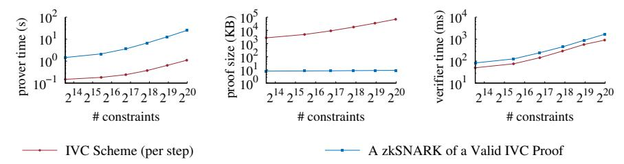
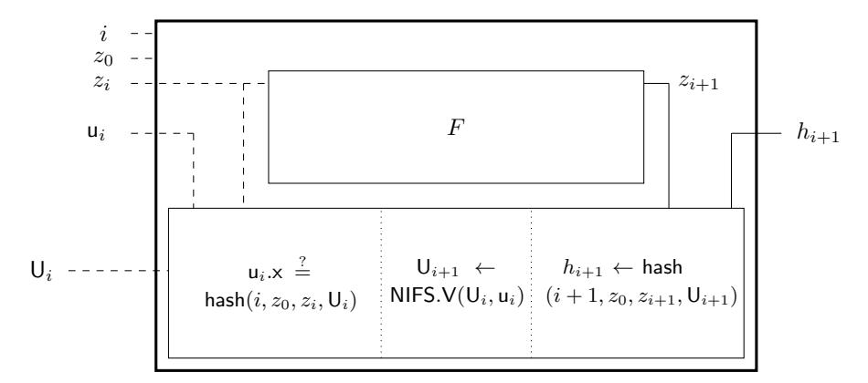

# <span id="page-0-0"></span>Nova: Recursive Zero-Knowledge Arguments from Folding Schemes

Abhiram Kothapalli† Srinath Setty<sup>⋆</sup> Ioanna Tzialla‡

†Carnegie Mellon University <sup>⋆</sup>Microsoft Research ‡New York University

Abstract. We introduce a new approach to realize incrementally verifiable computation (IVC), in which the prover recursively proves the correct execution of incremental computations of the form y = F (ℓ) (x), where F is a (potentially non-deterministic) computation, x is the input, y is the output, and ℓ > 0. Unlike prior approaches to realize IVC, our approach avoids succinct non-interactive arguments of knowledge (SNARKs) entirely and arguments of knowledge in general. Instead, we introduce and employ folding schemes, a weaker, simpler, and more efficientlyrealizable primitive, which reduces the task of checking two instances in some relation to the task of checking a single instance. We construct a folding scheme for a characterization of NP and show that it implies an IVC scheme with improved efficiency characteristics: (1) the "recursion overhead" (i.e., the number of steps that the prover proves in addition to proving the execution of F) is a constant and it is dominated by two group scalar multiplications expressed as a circuit (this is the smallest recursion overhead in the literature), and (2) the prover's work at each step is dominated by two multiexponentiations of size O(|F|), providing the fastest prover in the literature. The size of a proof is O(|F|) group elements, but we show that using a variant of an existing zkSNARK, the prover can prove the knowledge of a valid proof succinctly and in zero-knowledge with O(log |F|) group elements. Finally, our approach neither requires a trusted setup nor FFTs, so it can be instantiated efficiently with any cycles of elliptic curves where DLOG is hard.

## 1 Introduction

We revisit the problem of realizing incrementally-verifiable computation (IVC) [\[47\]](#page-31-0): a cryptographic primitive that enables producing proofs of correct execution of "long running" computations such that a verifier can efficiently verify the correct execution of any prefix of the computation. IVC enables a wide variety of applications including verifiable delay functions [\[10,](#page-29-0) [50\]](#page-31-1), succinct blockchains [\[14,](#page-29-1) [34\]](#page-30-0), and incrementally-verifiable versions of verifiable state machines [\[36,](#page-30-1) [42\]](#page-30-2).

A well-known approach to construct IVC is to use succinct non-interactive arguments of knowledge (SNARKs) for NP [\[26,](#page-30-3) [27,](#page-30-4) [33,](#page-30-5) [39\]](#page-30-6): at each incremental step i, the prover produces a SNARK proving that it has applied F correctly to the output of step i − 1 and that the SNARK verifier represented as a circuit has accepted the SNARK from step i − 1 [\[7,](#page-29-2) [9\]](#page-29-3). However, it is well-known that this approach is impractical [\[7,](#page-29-2) [21\]](#page-30-7). Alternatively, one can use SNARKs without trusted setup [\[19,](#page-29-4) [23,](#page-30-8) [41,](#page-30-9) [44\]](#page-31-2) but their verifiers are more expensive than those of SNARKs with trusted setup, both asymptotically and concretely. Recent works [\[11,](#page-29-5) [13,](#page-29-6) [17,](#page-29-7) [18\]](#page-29-8) aim to address the inefficiency of SNARK-based IVC, with an innovative approach: at each step, the verifier circuit "defers" expensive steps in verifying a SNARK for NP instances (e.g., verifying polynomial evaluation proofs) by accumulating those steps into a single instance that is later checked efficiently. However, these works still require the prover to produce a SNARK at each step and the verifier circuit to partially verify that SNARK.

We introduce a new approach that avoids SNARKs (and more generally arguments of knowledge) entirely and relies purely on deferral to realize IVC. In a nutshell, instead of accumulating expensive steps of verifying a SNARK for NP instances, the verifier circuit in our approach accumulates the NP instances themselves. We formalize this technique as a new and minimal primitive, which we refer to as a folding scheme. A folding scheme is weaker, simpler, and far more efficient compared to arguments of knowledge including SNARKs. Indeed, realizing IVC via folding schemes results in improved efficiency over prior work (Figure [2\)](#page-6-0): (1) the verifier circuit is constant-sized and its size is dominated by two group scalar multiplications; this is the smallest verifier circuit in the literature (in the context of recursive proof composition); and (2) the prover's work at each step is dominated by two multiexponentiations of size O(|F|), providing the fastest prover in the literature, both asymptotically and concretely. Section [1.4](#page-4-0) provides a detailed comparison between our approach and prior work.

#### 1.1 Folding Schemes

A folding scheme is defined with respect to an NP relation, and it is a protocol between an untrusted prover and a verifier. Both entities hold two N-sized NP instances, and the prover in addition holds purported witnesses for both instances. The protocol enables the prover and the verifier to output a single N-sized NP instance, which we refer to as a folded instance. Furthermore, the prover privately outputs a purported witness to the folded instance using purported witnesses for the original instances. Informally, a folding scheme guarantees that the folded instance is satisfiable only if the original instances are satisfiable. A folding scheme is said to be non-trivial if the verifier's costs and the communication are lower in the case where the verifier participates in the folding scheme and then verifies a purported NP witness for the folded instance than the case where the verifier verifies purported NP witnesses for each of the original instances.

Several existing techniques exhibit the two-to-one reduction pattern of folding schemes. Examples include the sumcheck protocol [\[38\]](#page-30-10) and the split-and-fold techniques in inner product arguments [\[12\]](#page-29-9). Appendix [A](#page-32-0) provides further details.

Remark 1 (Folding Schemes vs. SNARKs). SNARKs for NP [\[8,](#page-29-10) [26,](#page-30-3) [27,](#page-30-4) [33,](#page-30-5) [39\]](#page-30-6) trivially imply a folding scheme for NP: given two NP instances u<sup>1</sup> and u<sup>2</sup> and the corresponding witnesses, the prover proves u<sup>1</sup> by producing a SNARK. The verifier checks that SNARK and then sets u<sup>2</sup> to be the folded instance. However, we construct a folding scheme for NP without relying on SNARKs (or more generally arguments of knowledge). Specifically, our folding scheme is weaker than any argument of knowledge (succinct or otherwise) because it merely reduces the satisfiability of two NP instances to the satisfiability of a single NP instance.[1](#page-0-0)

To design a folding scheme for NP, we start with a popular NP-complete language that generalizes arithmetic circuit satisfiability: R1CS (Definition [10\)](#page-12-0). As we illustrate later, it is difficult to devise a folding scheme for R1CS. To address this, we introduce a variant of R1CS, called relaxed R1CS, which, like R1CS, not only characterizes NP, but, unlike R1CS, can support a folding scheme. The following theorem captures the cryptographic and efficiency characteristics of our folding scheme for relaxed R1CS.

<span id="page-2-0"></span>Theorem 1. There exists a constant-round, public-coin, zero-knowledge folding scheme for relaxed R1CS where for N-sized relaxed R1CS instances over a finite field F with the same "structure" (i.e., R1CS coefficient matrices), the prover's work is Oλ(N), and the verifier's work and the communication are both Oλ(1), assuming the existence of any additively-homomorphic commitment scheme that provides Oλ(1)-sized commitments to N-sized vectors over F (e.g., Pedersen's commitments), where λ is the security parameter.

Because our folding scheme is public coin, it can be made non-interactive in the random oracle model using the Fiat-Shamir transform [\[25\]](#page-30-11), and be instantiated (heuristically) in the standard model using a concrete hash function. We rely on such a non-interactive folding scheme to construct IVC.

#### 1.2 IVC from Non-Interactive Folding Schemes

We show how to realize IVC using a non-interactive version of our folding scheme for relaxed R1CS. We refer to our construction as Nova.

Recall that an IVC is an argument of knowledge [\[33,](#page-30-5) [39\]](#page-30-6)[2](#page-0-0) for incremental computations of the form y = F (ℓ) (x), where F is a (possibly non-deterministic) computation, ℓ > 0, x is a public input, and y is the public output. At each incremental step, the IVC prover produces a proof that the step was computed correctly and it has verified a proof for the prior step. In other words, at each incremental step, the IVC prover produces a proof of satisfiability for an augmented circuit that augments the circuit for F with a "verifier circuit" that verifies the proof of the prior step. Recursively, the final proof proves the correctness of the entire incremental computation. A key aspect of IVC is that neither the IVC verifier's work nor the IVC proof size depends on the number of

<sup>1</sup> This work realizes IVC using our folding scheme. As IVC implies SNARKs (e.g., see [\[7\]](#page-29-2)), one might wonder whether folding schemes are in general weaker than SNARKs. However, existing constructions of IVC (including our own) rely on additional assumptions (§[4.2\)](#page-15-0), which the resulting IVC-based SNARK inherits.

<sup>2</sup> An argument of knowledge for circuit satisfiability enables an untrusted polynomialtime prover to prove to a verifier the knowledge of a witness w such that C(w, x) = y, where C is a circuit, x is some public input, and y is some public output.

steps in the incremental computation. In particular, the IVC verifier only verifies the proof produced at the last step of the incremental computation.

In Nova, we consider incremental computations, where each step of the incremental computation is expressed with R1CS (all the steps in the incremental computation share the same R1CS coefficient matrices). At step i of the incremental computation, as in other approaches to IVC, Nova's prover proves that the step i was computed correctly. Furthermore, at step i, instead of verifying a proof for step i − 1 (as in traditional approaches to IVC), Nova's approach treats the computation at step i − 1 as an R1CS instance and folds that into a running relaxed R1CS instance. Specifically, at each step, Nova's prover proves that it has performed the step's computation and has folded its prior step represented as an R1CS instance into a running relaxed R1CS instance. In other words, the circuit satisfiability instance that the prover proves at each incremental step computes a step of the incremental computation and includes a circuit for the computation of the verifier in the non-interactive folding scheme for relaxed R1CS.

A distinctive aspect of Nova's approach to IVC is that it achieves the smallest "verifier circuit" in the literature. Since the verifier's costs in the non-interactive version of the folding scheme for relaxed R1CS is Oλ(1), the size of the computation that Nova's prover proves at each incremental step is ≈|F|, assuming N-sized vectors are committed with an Oλ(1)-sized commitments (e.g., Pedersen's commitments). In particular, the verifier circuit in Nova is constant-sized and its size is dominated by two group scalar multiplications. Furthermore, Nova's prover's work at each step is dominated by two multiexponentiations of size ≈|F|. Note that Nova's prover does not perform any FFTs, so it can be instantiated efficiently using any cycles of elliptic curves where DLOG is hard.

With the description thus far, the size of an IVC proof (which is a purported witness for the running relaxed R1CS instance) is Oλ(|F|). Instead of sending such a proof to a verifier, at any point in the incremental computation, Nova's prover can prove the knowledge of a satisfying witness to the running relaxed R1CS instance in zero-knowledge with an Oλ(log |F|)-sized succinct proof using a zkSNARK that we design by adapting Spartan [\[41\]](#page-30-9). The following theorem summarizes our key result.

<span id="page-3-0"></span>Theorem 2. For any incremental function where each step of the incremental function applies a (non-deterministic) function F, there exists an IVC scheme with the following efficiency characteristics, assuming N-sized vectors are committed with an Oλ(1)-sized commitments.

- IVC proof sizes are O(|F|) and the verifier's work to verify them is Oλ(|F|). The prover's work at each incremental step is ≈|F|. Specifically, the prover's work at each step is dominated by two multiexponentiations of size ≈|F|.
- Succinct zero-knowledge proofs of valid IVC proofs are size Oλ(log |F|), and the verifier's work to verify them is either Oλ(log |F|) or Oλ(|F|) depending on the commitment scheme for vectors. The prover's work to produce this succinct zero-knowledge proof is Oλ(|F|).

#### 1.3 Implementation and Performance Evaluation

We implement Nova as a library in about 6,000 lines of Rust [\[3\]](#page-29-11). The library is generic over a cycle of elliptic curves and a hash function (used internally as the random oracle). The library provides candidate implementations with the Pasta cycle of elliptic curves [\[4\]](#page-29-12) and Poseidon [\[2,](#page-29-13) [29\]](#page-30-12). For the former, Nova relies on pasta-msm [\[5\]](#page-29-14), a high-performance library for computing multiexpoentiations over the Pasta cycle of curves. Finally, the library accepts F (i.e., a step of the incremental computation) as a bellperson gadget [\[1\]](#page-29-15).

Recursion Overheads. We measure the size of Nova's verifier circuit, as it determines the recursion overhead: the number of additional constraints that the prover must prove at each incremental step besides proving an invocation of F.

We find that Nova's verifier circuit is ≈10,000 R1CS constraints. This is the smallest verifier circuit in the literature and hence Nova incurs the lowest recursion overhead. Specifically, Nova's recursion overhead is > 10× lower than in SNARK-based IVC [\[7\]](#page-29-2) with state-of-the-art per-circuit trusted setup SNARK [\[30\]](#page-30-13), and over 100× smaller than with a SNARK without trusted setup [\[23\]](#page-30-8). Compared to recent works, Nova's recursion overhead is over 13× lower than Halo's [\[13\]](#page-29-6), and over 4× lower than the scheme of B¨unz et al. [\[17\]](#page-29-7).

Performance of Nova. We experiment with Nova on an Azure Standard F32s v2 VM (16 physical CPUs, 2.70 GHz Intel(R) Xeon(R) Platinum 8168, and 64 GB memory). In our experiments, we vary the number of constraints in F. Our performance metrics are: the prover time, the verifier time, and proof sizes. We measure these for Nova's IVC scheme as well as its Spartan-based zkSNARK to compress IVC proofs. Figure [1](#page-5-0) depicts our results, and we find the following.

- The prover's per-step cost to produce an IVC proof and compress it scale sub-linearly with the size of F (since the cost is dominated by two multiexponentiations, which scale sub-linearly due to the Pippenger algorithm and parallelize better at larger sizes). When |F| ≈ 2 <sup>20</sup> constraints, the prover's per-step cost to produce an IVC proof is ≈1µs/constraint. For the same F, the cost to produce a compressed IVC proof is ≈24µs/constraint.[3](#page-0-0)
- Compressed IVC proofs are ≈ 8–9 KB and are significantly shorter than IVC proofs (e.g., they are ≈7,400× shorter when |F| ≈ 2 <sup>20</sup> constraints).
- Verifying a compressed proof is only ≈2× higher costs than verifying a significantly longer IVC proof.

#### <span id="page-4-0"></span>1.4 A More Detailed Comparison with Prior Work

Figure [2](#page-6-0) compares Nova with prior approaches. Nova's approach can be viewed as taking Halo's approach to the extreme. Specifically:

<sup>3</sup> If the prover produces a compressed IVC proof every ≈24 steps, the prover incurs at most 2× overhead to compress IVC proofs. Similarly, if the prover compresses its IVC proof every ≈240 steps, the overhead drops to ≈20%.

<span id="page-5-0"></span>

Fig. 1: Performance of Nova as a function of |F|. See the text for details.

- At each incremental step, Halo's verifier circuit verifies a "partial" SNARK. This still requires Halo's prover to perform |F|-sized FFTs and O(|F|) exponentiations (i.e., not an |F|-sized multiexponentiation). Whereas, in Nova, the verifier circuit folds an entire NP instance representing computation at the prior step into a running relaxed R1CS instance. This only requires Nova's prover to commit to a satisfying assignment of an ≈|F|-sized circuit (which computes F and performs the verifier's computation in a folding scheme for relaxed R1CS), so at each step, Nova's prover only computes an O(|F|)-sized multiexponentiation and does not compute any FFTs. So, Nova's prover incurs lower costs than Halo's prover, both asymptotically and concretely.
- The verifier circuit in Halo is of size  $O_{\lambda}(\log |F|)$  whereas in Nova, it is  $O_{\lambda}(1)$ . Concretely, the dominant operations in Halo's circuit is  $O(\log |F|)$  group scalar multiplications, whereas in Nova, it is two group scalar multiplications.
- Halo and Nova have the same proof sizes  $O_{\lambda}(\log |F|)$  and verifier time  $O_{\lambda}(|F|)$ .

Bünz et al. [18] apply Halo's approach to other polynomial commitment schemes. Halo Infinite [11] generalizes the approach in Halo [13] to any homomorphic polynomial commitment scheme; they also obtain PCD (and hence IVC) even when polynomial commitment schemes do not satisfy succinctness.

Bünz et al. [17] propose a variant of the approach in Halo, where they realize PCD (and hence IVC) without relying on succinct arguments. Specifically, they first devise a non-interactive argument of knowledge (NARK) for R1CS with  $O_{\lambda}(N)$ -sized proofs and  $O_{\lambda}(N)$  verification times for N-sized R1CS instances. Then, they show that most of the NARK's verifier's computation can be deferred by performing  $O_{\lambda}(1)$  work in the verifier circuit. For zero-knowledge, Nova relies on zero-knowledge arguments with succinct proofs, whereas their approach does not rely on succinct arguments. However, Nova's approach has several conceptual and efficiency advantages over the work of Bünz et al [17]:

- Nova introduces a new primitive called a folding scheme, which is conceptually simpler and is easier to realize than prior notions such as (split) accumulation schemes used in prior work [17,18]. Furthermore, a folding scheme for NP directly leads to IVC and is again easier to analyze than with prior notions.
- At each step, their prover performs an O(|F|)-sized FFT (which costs  $O(|F| \log |F|)$  operations over  $\mathbb{F}$ ). Whereas, Nova does not perform any FFTs.
- Their prover's work for multiexponentitions at each step and the size of their verifier circuit are both higher than in Nova by  $\approx 4\times$ .

<span id="page-6-0"></span>

|                        | "Verifier circuit"<br>(dominant ops) | Prover<br>(each step) | Proof size     | Verifier       | assumptions |
|------------------------|--------------------------------------|-----------------------|----------------|----------------|-------------|
| BCTV14 [7] with [30]†  | 3 P                                  | O(C) FFT<br>O(C) MSM  | Oλ(1)          | Oλ(1)          | q-type      |
| Spartan [41]-based IVC | √<br>O(<br>C) G                      | O(C) MSM              | √<br>Oλ(<br>C) | √<br>Oλ(<br>C) | DLOG, RO    |
| Fractal [23]           | Oλ(log2 C) F<br>O(log2 C) H          | O(C) FFT<br>O(C) MHT  | Oλ(log2 C)     | Oλ(log2 C)     | RO          |
| Halo [13]              | O(log C) G                           | O(C) FFT<br>O(C) EXP  | Oλ(log C)      | Oλ(C)          | DLOG, RO    |
| BCLMS [17]⋆            | 8 G                                  | O(C) FFT<br>O(C) MSM  | Oλ(C)          | Oλ(C)          | DLOG, RO    |
| Nova (this work)       | 2 G                                  | O(C) MSM              | Oλ(log C)      | Oλ(C)          | DLOG, RO    |
| Nova (this work)       | 2 GT                                 | O(C) MSM              | Oλ(log C)      | Oλ(log C)      | SXDH, RO    |

<sup>†</sup> Requires per-circuit trusted setup and is undesirable in practice

Fig. 2: Asymptotic costs of Nova and its baselines to produce and verify a proof for an incremental computation where each incremental step applies a function F. C denotes the size of the computation at each incremental step, i.e., |F| + |C<sup>V</sup> |, where C<sup>V</sup> is the "verifier circuit" in IVC. The "verifier circuit" column depicts the number of dominant operations in C<sup>V</sup> , where P denotes a pairing in a pairing-friendly group, F denotes the number of finite field operations, H denotes a hash computation, and G denotes a scalar multiplication in a cryptographic group. The prover column depicts the cost to the prover for each step of the incremental computation, and proof sizes and verifier times refer respectively to the size of the proof of the incremental computation and the associated verification times. For Nova's proof sizes and verification times, we depict the compressed proof sizes (otherwise, they are Oλ(C)) and the time to verify a compressed proof (otherwise, they are Oλ(C)). Rows with RO require heuristically instantiating the random oracle with a concrete hash function in the standard model.

– Proof sizes are Oλ(|F|) in their work, whereas in Nova, they are Oλ(log |F|). We believe, in theory, they can also compress their proofs, using a succinct argument, but unlike Nova, they do not specify how to do so in a concretely efficient manner. Furthermore, using succinct arguments is inconsistent with their goal of not employing them.

Concurrent work. In an update concurrent with this work, B¨unz et al. [\[17\]](#page-29-7) provide an improved construction of their NARK for R1CS, which leads to an IVC that, like Nova, avoids FFTs. Furthermore, they improve the size of the verifier circuit by ≈2×, which is still larger than Nova's verifier circuit by ≈2×. The per-step computation of the prover remains 4× higher than Nova.

#### 1.5 An Overview of the Rest of the Paper

Section [2](#page-7-0) provides the necessary background. Section [3](#page-9-0) formally defines folding schemes and their properties. In Section [4,](#page-11-0) we introduce a variant of R1CS

O(C) FFT: FFT over an O(C)-sized vector costing O(C log C) operations over F

O(C) MHT: Merkle tree over an O(C)-sized vector costing O(C) hash computations

O(C) EXP: O(C) exponentiations in a cryptographic group

O(C) MSM: O(C)-sized multi-exponentiation in a cryptographic group

called relaxed R1CS for which we provide a folding scheme satisfying Theorem 1. Then, in Section 5, we use a non-interactive version of the folding scheme (§4.2) to construct an IVC scheme and a scheme to compress IVC proofs satisfying Theorem 2 by assuming the existence of a zkSNARK for relaxed R1CS with logarithmic-sized proofs. Finally, in Section 6, we construct such a zkSNARK.

#### <span id="page-7-0"></span>2 Preliminaries

Let  $\mathbb{F}$  denote a finite field with  $|\mathbb{F}| = 2^{\Theta(\lambda)}$ , where  $\lambda$  is the security parameter. Let  $\cong$  denote computational indistinguishability with respect to a PPT adversary. We globally assume that generator algorithms that produce public parameters are additionally provided appropriate size bounds.

#### <span id="page-7-2"></span>2.1 A Commitment Scheme for Vectors over F

We require a commitment scheme for vectors over  $\mathbb{F}$  that is additively homomorphic and succinct. We formally define these two properties and others noted below in Appendix F. Below, we define the syntax for commitment schemes.

**Definition 1 (A Commitment Scheme for Vectors).** A commitment scheme for  $\mathbb{F}^m$  is a tuple of three protocols with the following interface.

- $\mathsf{Gen}(1^{\lambda}, m) \to \mathsf{pp}$ : takes length parameter m; produces public parameters  $\mathsf{pp}$ .
- $\mathsf{Com}(\mathsf{pp},v,r) \to C$ : takes vector  $v \in \mathbb{F}^m$  and  $r \in \mathbb{F}$ ; produces commitment C.
- Open(pp, C, v, r)  $\rightarrow \{0, 1\}$ : verifies the opening of commitment C to  $v \in \mathbb{F}^m$ .

A commitment scheme satisfies hiding (the commitment reveals no information), binding (a PPT adversary cannot open a commitment to two different values), and succinctness (the commitment size is logarithmic in the opening size).

#### 2.2 Non-Interactive Arguments of Knowledge

<span id="page-7-1"></span>**Definition 2 (Non-Interactive Argument of Knowledge).** Consider a relation  $\mathcal{R}$  over public parameters, structure, instance, and witness tuples. A non-interactive argument of knowledge for  $\mathcal{R}$  consists of PPT algorithms  $(\mathcal{G}, \mathcal{P}, \mathcal{V})$  and deterministic  $\mathcal{K}$ , denoting the generator, the prover, the verifier and the encoder respectively with the following interface.

- $-\mathcal{G}(1^{\lambda}) \to pp$ : On input security parameter  $\lambda$ , samples public parameters pp.
- $-\mathcal{K}(pp,s) \to (pk,vk)$ : On input structure s, representing common structure among instances, outputs the prover key pk and verifier key vk.
- $-\mathcal{P}(\mathsf{pk}, u, w) \to \pi$ : On input instance u and witness w, outputs a proof  $\pi$  proving that  $(\mathsf{pp}, \mathsf{s}, u, w) \in \mathcal{R}$ .
- $\mathcal{V}(\mathsf{vk}, u, \pi) \to \{0, 1\}$ : Checks instance u given proof  $\pi$ .

An argument of knowledge satisfies completeness if for any PPT adversary A

$$\Pr\left[ \begin{array}{c} \mathcal{V}(\mathsf{vk}, u, \pi) = 1 \, \left| \begin{array}{c} \mathsf{pp} \leftarrow \mathcal{G}(1^{\lambda}), \\ (\mathsf{s}, (u, w)) \leftarrow \mathcal{A}(\mathsf{pp}), \\ (\mathsf{pp}, \mathsf{s}, u, w) \in \mathcal{R}, \\ (\mathsf{pk}, \mathsf{vk}) \leftarrow \mathcal{K}(\mathsf{pp}, \mathsf{s}), \\ \pi \leftarrow \mathcal{P}(\mathsf{pk}, u, w) \end{array} \right] = 1.$$

An argument of knowledge satisfies knowledge soundness if for all PPT adversaries  $\mathcal{A}$  there exists a PPT extractor  $\mathcal{E}$  such that for all randomness  $\rho$ 

$$\Pr\left[ \begin{array}{l} \mathcal{V}(\mathsf{vk}, u, \pi) = 1, \\ (\mathsf{pp}, \mathsf{s}, u, w) \not\in \mathcal{R} \\ w \leftarrow \mathcal{E}(\mathsf{pp}, \mathsf{p}), \\ w \leftarrow \mathcal{E}(\mathsf{pp}, \mathsf{p}), \\ \end{array} \right] = \mathsf{negl}(\lambda).$$

**Definition 3 (Zero-Knowledge).** An argument of knowledge  $(\mathcal{G}, \mathcal{K}, \mathcal{P}, \mathcal{V})$  for relation  $\mathcal{R}$  satisfies zero-knowledge if there exists PPT simulator  $\mathcal{S}$  such that for all PPT adversaries  $\mathcal{A}$ 

$$\left\{ (\mathsf{pp},\mathsf{s},u,\pi) \left| \begin{array}{l} \mathsf{pp} \leftarrow \mathcal{G}(1^\lambda), \\ (\mathsf{s},(u,w)) \leftarrow \mathcal{A}(\mathsf{pp}), \\ (\mathsf{pp},\mathsf{s},u,w) \in \mathcal{R}, \\ (\mathsf{pk},\mathsf{vk}) \leftarrow \mathcal{K}(\mathsf{pp},\mathsf{s}), \\ \pi \leftarrow \mathcal{P}(\mathsf{pk},u,w) \end{array} \right\} \cong \left\{ (\mathsf{pp},\mathsf{s},u,\pi) \left| \begin{array}{l} (\mathsf{pp},\tau) \leftarrow \mathcal{S}(1^\lambda), \\ (\mathsf{s},(u,w)) \leftarrow \mathcal{A}(\mathsf{pp}), \\ (\mathsf{pp},\mathsf{s},u,w) \in \mathcal{R}, \\ (\mathsf{pk},\mathsf{vk}) \leftarrow \mathcal{K}(\mathsf{pp},\mathsf{s}), \\ \pi \leftarrow \mathcal{S}(\mathsf{pp},u,\tau) \end{array} \right\}$$

**Definition 4 (Succinctness).** A non-interactive argument system is succinct if the size of the proof  $\pi$  is polylogarithmic in the size of the witness w.

#### 2.3 Incrementally Verifiable Computation

Incrementally verifiable computation (IVC) [47] enables verifiable computation for repeated function application. Intuitively, for a function F, with initial input  $z_0$ , an IVC scheme allows a prover to produce a proof  $\Pi_i$  for the statement  $z_i = F^{(i)}(z_0)$  (i.e., i applications of F on input  $z_0$ ) given a proof  $\Pi_{i-1}$  for the statement  $z_{i-1} = F^{(i-1)}(z_0)$ . Formally, IVC schemes additionally permit F to take auxiliary input  $\omega$ . We recall the definition of IVC using notational conventions of modern argument systems.

**Definition 5 (IVC).** An incrementally verifiable computation (IVC) scheme is defined by PPT algorithms  $(\mathcal{G}, \mathcal{P}, \mathcal{V})$  and deterministic  $\mathcal{K}$  denoting the generator, the prover, the verifier, and the encoder respectively. An IVC scheme  $(\mathcal{G}, \mathcal{K}, \mathcal{P}, \mathcal{V})$  satisfies perfect completeness if for any PPT adversary  $\mathcal{A}$ 

$$\Pr\left[ \begin{array}{l} \mathcal{V}(\mathsf{vk}, i, z_0, z_i, \varPi_i) = 1 \left| \begin{array}{l} \mathsf{pp} \leftarrow \mathcal{G}(1^\lambda), \\ F, (i, z_0, z_i, z_{i-1}, \omega_{i-1}, \varPi_{i-1}) \leftarrow \mathcal{A}(\mathsf{pp}), \\ (\mathsf{pk}, \mathsf{vk}) \leftarrow \mathcal{K}(\mathsf{pp}, F), \\ z_i = F(z_{i-1}, \omega_{i-1}), \\ \mathcal{V}(\mathsf{vk}, i-1, z_0, z_{i-1}, \varPi_{i-1}) = 1, \\ \varPi_i \leftarrow \mathcal{P}(\mathsf{pk}, i, z_0, z_i; z_{i-1}, \omega_{i-1}, \varPi_{i-1}) \end{array} \right] = 1$$

where F is a polynomial time computable function. Likewise, an IVC scheme satisfies knowledge soundness if for any constant  $n \in \mathbb{N}$ , and for all expected polynomial time adversaries  $\mathcal{P}^*$ , there exists an expected polynomial-time extractor  $\mathcal{E}$  such that

$$\begin{split} & \Pr_{\mathbf{r}} \left[ \begin{array}{l} z_n = z \ where \\ z_{i+1} \leftarrow F(z_i, \omega_i) \\ \forall i \in \{0, \dots, n-1\} \end{array} \middle| \begin{array}{l} \mathsf{pp} \leftarrow \mathcal{G}(1^{\lambda}), \\ (F, (z_0, z), \varPi) \leftarrow \mathcal{P}^*(\mathsf{pp}, \mathsf{r}), \\ (\omega_0, \dots, \omega_{n-1}) \leftarrow \mathcal{E}(\mathsf{pp}, \mathsf{r}) \end{array} \right] \approx \\ & \Pr_{\mathbf{r}} \left[ \begin{array}{l} \mathcal{V}(\mathsf{vk}, (n, z_0, z), \varPi) = 1 \middle| \begin{array}{l} \mathsf{pp} \leftarrow \mathcal{G}(1^{\lambda}), \\ (F, (z_0, z), \varPi) \leftarrow \mathcal{P}^*(\mathsf{pp}, \mathsf{r}), \\ (\mathsf{pk}, \mathsf{vk}) \leftarrow \mathcal{K}(\mathsf{pp}, F) \end{array} \right]$$

where r denotes an arbitrarily long random tape.

An IVC scheme satisfies succinctness if the size of the IVC proof  $\Pi$  does not grow with the number of applications n.

We note that in the definition above, the number of steps n is treated as a fixed environment variable that characterizes the extractor. This model is required for all known general recursive techniques as they rely on recursive extractors that blowup polynomially for each additional recursive step [11, 14, 17, 18, 23]. Bitansky et al. [9] avoid such a restriction by making non-blackbox assumptions about the extractors runtime with respect to that of the malicious prover. In any case, there are no known attacks on arbitrary depth recursion.

#### <span id="page-9-0"></span>3 Folding Schemes

This section formally defines folding schemes. Intuitively, a folding scheme for a relation  $\mathcal{R}$  is a protocol that reduces the task of checking two instances in  $\mathcal{R}$  to the task of checking a single instance in  $\mathcal{R}$ .

**Definition 6 (Folding Scheme).** Consider a relation  $\mathcal{R}$  over public parameters, structure, instance, and witness tuples. A folding scheme for  $\mathcal{R}$  consists of a PPT generator algorithm  $\mathcal{G}$ , a deterministic encoder algorithm  $\mathcal{K}$ , and a pair of PPT algorithms  $\mathcal{P}$  and  $\mathcal{V}$  denoting the prover and verifier respectively, with the following interface:

- $-\mathcal{G}(1^{\lambda}) \to pp$ : On input security parameter  $\lambda$ , samples public parameters pp.
- $-\mathcal{K}(pp,s) \to (pk,vk)$ : On input pp, and a common structure s between instances to be folded, outputs a prover key pk and a verifier key vk.
- $-\mathcal{P}(\mathsf{pk},(u_1,w_1),(u_2,w_2)) \to (u,w)$ : On input instance-witness tuples  $(u_1,w_1)$  and  $(u_2,w_2)$  outputs a new instance-witness tuple (u,w) of the same size.
- $\mathcal{V}(\mathsf{vk}, u_1, u_2) \to u$ : On input instances  $u_1$  and  $u_2$ , outputs a new instance u.

Let

$$(u, w) \leftarrow \langle \mathcal{P}(\mathsf{pk}, w_1, w_2), \mathcal{V}(\mathsf{vk}) \rangle (u_1, u_2)$$

denote the the verifier's output instance u and the prover's output witness w from the interaction of  $\mathcal{P}$  and  $\mathcal{V}$  on witnesses  $(w_1, w_2)$ , prover key  $\mathsf{pk}$ , verifier key  $\mathsf{vk}$  and instances  $(u_1, u_2)$ . Likewise, let

$$\mathsf{tr} = \langle \mathcal{P}(\mathsf{pk}, w_1, w_2), \mathcal{V}(\mathsf{vk}) \rangle (u_1, u_2)$$

denote the corresponding interaction transcript. A folding scheme satisfies perfect completeness if for all PPT adversaries A

$$\Pr\left[ (\mathsf{pp},\mathsf{s},u,w) \in \mathcal{R} \left| \begin{matrix} \mathsf{pp} \leftarrow \mathcal{G}(1^\lambda), \\ (\mathsf{s},(u_1,w_1),(u_2,w_2)) \leftarrow \mathcal{A}(\mathsf{pp}), \\ (\mathsf{pp},\mathsf{s},u_1,w_1),(\mathsf{pp},\mathsf{s},u_2,w_2) \in \mathcal{R}, \\ (\mathsf{pk},\mathsf{vk}) \leftarrow \mathcal{K}(\mathsf{pp},\mathsf{s}), \\ (u,w) \leftarrow \langle \mathcal{P}(\mathsf{pk},w_1,w_2), \mathcal{V}(\mathsf{vk}) \rangle (u_1,u_2) \end{matrix} \right] = 1.$$

A folding scheme satisfies knowledge soundness if for any expected polynomial-time adversary  $\mathcal{P}^*$  there is an expected polynomial-time extractor  $\mathcal{E}$  such that

$$\begin{split} & \text{Pr} \left[ \begin{array}{l} (\mathsf{pp}, \mathsf{s}, u_1, w_1) \in \mathcal{R}, \left| \begin{array}{l} \mathsf{pp} \leftarrow \mathcal{G}(1^\lambda), \\ (\mathsf{s}, (u_1, u_2)) \leftarrow \mathcal{P}^*(\mathsf{pp}, \rho), \\ (w_1, w_2) \leftarrow \mathcal{E}(\mathsf{pp}, \rho) \end{array} \right] \geq \\ & \text{Pr} \left[ \begin{array}{l} (\mathsf{pp}, \mathsf{s}, u, w) \in \mathcal{R} \end{array} \right. \left| \begin{array}{l} \mathsf{pp} \leftarrow \mathcal{G}(1^\lambda), \\ (s, (u_1, u_2)) \leftarrow \mathcal{P}^*(\mathsf{pp}, \rho), \\ (\mathsf{s}, (u_1, u_2)) \leftarrow \mathcal{P}^*(\mathsf{pp}, \rho), \\ (\mathsf{pk}, \mathsf{vk}) \leftarrow \mathcal{K}(\mathsf{pp}, \mathsf{s}), \\ (u, w) \leftarrow \langle \mathcal{P}^*(\mathsf{pk}, \rho), \mathcal{V}(\mathsf{vk}) \rangle (u_1, u_2) \end{array} \right] - \mathsf{negl}(\lambda) \end{aligned}$$

where  $\rho$  denotes arbitrary input randomness for  $\mathcal{P}^*$ . We call a transcript an accepting transcript if  $\mathcal{P}$  outputs a satisfying folded witness w for the folded instance u. We consider a folding scheme non-trivial if the communication costs and  $\mathcal{V}$ 's computation are lower in the case where  $\mathcal{V}$  participates in the folding scheme and then checks a witness sent by  $\mathcal{P}$  for the folded instance than the case where  $\mathcal{V}$  checks witnesses sent by  $\mathcal{P}$  for each of the original instances.

**Definition 7 (Non-Interactive).** A folding scheme  $(\mathcal{G}, \mathcal{K}, \mathcal{P}, \mathcal{V})$  is non-interactive if the interaction between  $\mathcal{P}$  and  $\mathcal{V}$  consists of a single message from  $\mathcal{P}$  to  $\mathcal{V}$ . This single message is denoted as an output of  $\mathcal{P}$ , and an input to  $\mathcal{V}$ .

**Definition 8 (Zero-Knowledge).** A folding scheme  $(\mathcal{G}, \mathcal{K}, \mathcal{P}, \mathcal{V})$  satisfies zero-knowledge for relation  $\mathcal{R}$  if there exists a PPT simulator  $\mathcal{S}$  such that for all PPT

adversaries A, and  $\mathcal{V}^*$ , and input randomness  $\rho$ 

$$\left\{ \begin{array}{l} \operatorname{l} \left( \begin{array}{l} \operatorname{pp} \leftarrow \mathcal{G}(1^{\lambda}), \\ (\operatorname{s}, (u_1, w_1), (u_2, w_2)) \leftarrow \mathcal{A}(\operatorname{pp}), \\ (\operatorname{pk}, \operatorname{vk}) \leftarrow \mathcal{K}(\operatorname{pp}, \operatorname{s}), \\ (\operatorname{pp}, \operatorname{s}, u_1, w_1), (\operatorname{pp}, \operatorname{s}, u_2, w_2) \in \mathcal{R}, \\ \operatorname{tr} = \langle \mathcal{P}(\operatorname{pk}, w_1, w_2), \mathcal{V}^*(\operatorname{vk}, \rho) \rangle (u_1, u_2) \end{array} \right\} \cong \\ \left\{ \begin{array}{l} \operatorname{pp} \leftarrow \mathcal{G}(1^{\lambda}), \\ (\operatorname{s}, (u_1, w_1), (u_2, w_2)) \leftarrow \mathcal{A}(\operatorname{pp}), \\ (\operatorname{pp}, \operatorname{s}, u_1, w_1), (\operatorname{pp}, \operatorname{s}, u_2, w_2) \in \mathcal{R}, \\ (\operatorname{pk}, \operatorname{vk}) \leftarrow \mathcal{K}(\operatorname{pp}, \operatorname{s}), \\ \operatorname{tr} \leftarrow \mathcal{S}^{\mathcal{V}^*(\operatorname{vk}, \rho)}(\operatorname{pk}, u_1, u_2) \end{array} \right\}$$

**Definition 9 (Public Coin).** A folding scheme  $(\mathcal{G}, \mathcal{K}, \mathcal{P}, \mathcal{V})$  is called public coin if all the messages sent from  $\mathcal{V}$  to  $\mathcal{P}$  are sampled from a uniform distribution.

Typically, knowledge soundness is difficult to prove directly. To assist these proofs, prior works employ the forking lemma [12], which abstracts away much of the probabilistic reasoning. The original forking lemma shows that to prove knowledge soundness it is sufficient to construct a PPT extractor that takes as input a "tree" of accepting transcripts and outputs a satisfying witness. However, in our setting, this extractor must additionally take as input the prover's output (i.e., the folded instance and witness) for each of these transcripts, which contains information needed to reconstruct the original witness. So, we introduce a small variant of the forking lemma that captures this modification.

<span id="page-11-1"></span>Lemma 1 (Forking Lemma for Folding Schemes). Consider a  $(2\mu+1)$ -move folding scheme  $\Pi=(\mathcal{G},\mathcal{K},\mathcal{P},\mathcal{V})$ .  $\Pi$  satisfies knowledge soundness if there exists a PPT  $\mathcal{X}$  such that for all input instance pairs  $(u_1,u_2)$ , outputs satisfying witnesses  $(w_1,w_2)$  with probability  $1-\mathsf{negl}(\lambda)$ , given public parameters  $\mathsf{pp}$ , a structure  $\mathsf{s}$ , and an  $(n_1,\ldots,n_\mu)$ -tree of accepting transcripts and the corresponding folded instance-witness pairs (u,w). This tree comprises of  $n_1$  transcripts (and the corresponding instance-witness pairs) with fresh randomness in  $\mathcal{V}$ 's first message; and for each such transcript,  $n_2$  transcripts (and the corresponding instance-witness pairs) with fresh randomness in  $\mathcal{V}$ 's second message; etc., for a total of  $\prod_{i=1}^{\mu} n_i$  leaves bounded by  $\mathsf{poly}(\lambda)$ .

*Proof Intuition.* A proof for our variant of the forking lemma is similar to that of Bootle et al. [12]. We present a formal proof in Appendix E.  $\Box$ 

#### <span id="page-11-0"></span>4 A Folding Scheme for NP

In this section, we describe a public-coin, zero-knowledge interactive folding scheme for NP. We additionally discuss how to make it non-interactive. We leverage the non-interactivity property to realize IVC in the next section, and the zero-knowledge property to achieve zero-knowledge IVC proof compression.

#### 4.1 A Public-Coin, Zero-Knowledge Folding Scheme

To design a folding scheme for NP, we need an NP-complete language. While theoretically any NP-complete language is a viable candidate, we focus on R1CS,[4](#page-0-0) a popular algebraic representation that generalizes arithmetic circuit satisfiability.

<span id="page-12-0"></span>Definition 10 (R1CS). Consider a finite field F . Let the public parameters consist of size bounds m, n, ℓ ∈ N where m > ℓ. The R1CS structure consists of sparse matrices A, B, C ∈ F <sup>m</sup>×<sup>m</sup> with at most n = Ω(m) non-zero entries in each matrix. An instance x ∈ F ℓ consists of public inputs and outputs and is satisfied by a witness W ∈ F m−ℓ−1 if (A · Z) ◦ (B · Z) = C · Z, where Z = (W, x, 1).

As we show in the next section, to realize IVC, we only need a folding scheme that can fold two R1CS instances with the same R1CS matrices (A, B, C). Specifically, given R1CS matrices (A, B, C), and two corresponding instancewitness pairs (x1, W1) and (x2, W2), we would like to devise a scheme that reduces the task of checking both instances into the task of checking a single new instancewitness pair (x, W) against the same R1CS matrices (A, B, C). Unfortunately, as we illustrate now, it is difficult to devise a folding scheme for R1CS such that it satisfies completeness, let alone knowledge soundness.

First Attempt. As R1CS is an algebraic system, the most direct approach would be to take a random linear combination. Ignoring efficiency concerns, suppose that the prover sends witnesses W<sup>1</sup> and W<sup>2</sup> in the first step. The verifier responds with a random r ∈ F ; the prover and the verifier both compute

$$\mathbf{x} \leftarrow \mathbf{x}_1 + r \cdot \mathbf{x}_2$$
$$W \leftarrow W_1 + r \cdot W_2,$$

and set the new instance-witness pair to be (x, W). However, for non-trivial Z<sup>1</sup> = (W1, x1, 1) and Z<sup>2</sup> = (W2, x2, 1), and Z = (W, x, 1), we roughly have that

$$AZ \circ BZ = A(Z_1 + r \cdot Z_2) \circ B(Z_1 + r \cdot Z_2)$$
  
=  $AZ_1 \circ BZ_1 + r \cdot (AZ_1 \circ BZ_2 + AZ_2 \circ BZ_1) + r^2 \cdot (AZ_2 \circ BZ_2)$   
\( \neq CZ.

The failed attempt exposes three issues. First, we must account for an additional cross-term, r · (AZ<sup>1</sup> ◦ BZ<sup>2</sup> + AZ<sup>2</sup> ◦ BZ1). Second, the terms excluding the cross-term combine to produce a term that does not equal CZ:

$$AZ_1 \circ BZ_1 + r^2 \cdot (AZ_2 \circ BZ_2) = CZ_1 + r^2 \cdot CZ_2 \neq CZ_1 + r \cdot CZ_2 = CZ.$$

Third, we do not even have that Z = Z1+r·Z<sup>2</sup> because Z1+r·Z<sup>2</sup> = (W, x, 1+r·1).

<sup>4</sup> R1CS is implicit in the QAPs formalism of GGPR [\[26\]](#page-30-3), but it was made explicit in subsequent work [\[43\]](#page-31-3); they refer to it as a "constraint system in quadratic form".

Second Attempt. To handle the first issue, we introduce a "slack" (or error) vector E ∈ F <sup>m</sup> which absorbs the cross terms generated by folding. To handle the second and third issues, we introduce a scalar u, which absorbs an extra factor of r in CZ<sup>1</sup> + r 2 · CZ<sup>2</sup> and in Z = (W, x, 1 + r · 1). We refer to a variant of R1CS with these additional terms as relaxed R1CS.

Definition 11 (Relaxed R1CS). Consider a finite field F . Let the public parameters consist of size bounds m, n, ℓ ∈ N where m > ℓ. The relaxed R1CS structure consists of sparse matrices A, B, C ∈ F <sup>m</sup>×<sup>m</sup> with at most n = Ω(m) non-zero entries in each matrix. A relaxed R1CS instance consists of an error vector E ∈ F <sup>m</sup>, a scalar u ∈ F , and public inputs and outputs x ∈ F ℓ . An instance (E, u, x) is satisfied by a witness W ∈ F m−ℓ−1 if (A·Z) ◦ (B ·Z) = u ·(C ·Z) +E, where Z = (W, x, u).

Note that any R1CS instance can be expressed as a relaxed R1CS instance by augmenting it with u = 1 and E = 0, so relaxed R1CS retains NP-completeness.

Building on the first attempt, the prover and verifier can now use E to accumulate the cross-terms. In particular, for Z<sup>i</sup> = (W<sup>i</sup> , x<sup>i</sup> , ui), the prover and verifier additionally compute

$$u \leftarrow u_1 + r \cdot u_2$$
  
 $E \leftarrow E_1 + r \cdot (AZ_1 \circ BZ_2 + AZ_2 \circ BZ_1 - u_1CZ_2 - u_2CZ_1) + r^2 \cdot E_2,$ 

and set the new instance-witness pair to be ((E, u, x), W). Conveniently, updating u in this manner also keeps track of how the constant term in Z should be updated, which motivates our choice to use u in Z = (W, x, u) rather than introducing a new variable. Now, for Z = (W, x, u), and for random r ∈ F ,

$$AZ \circ BZ = AZ_1 \circ BZ_1 + r \cdot (AZ_1 \circ BZ_2 + AZ_2 \circ BZ_1) + r^2 \cdot (AZ_2 \circ BZ_2)$$

$$= (u_1CZ_1 + E_1) + r \cdot (AZ_1 \circ BZ_2 + AZ_2 \circ BZ_1) + r^2 \cdot (u_2CZ_2 + E_2)$$

$$= (u_1 + r \cdot u_2) \cdot C(Z_1 + rZ_2) + E$$

$$= uCZ + E.$$

This implies that, for R1CS matrices (A, B, C), the folded witness W is a satisfying witness for the folded instance (E, u, x) as promised. A few issues remain: in the above scheme, the prover sends witnesses (W1, W2) for the verifier to compute E. As a result, the folding scheme is not non-trivial; it is also not zero-knowledge.

Final Protocol. To circumvent these issues, we use succinct and hiding additively homomorphic commitments to W and E in the instance, and treat both W and E as the witness. We refer to this variant of relaxed R1CS as committed relaxed R1CS. Below, we describe a folding scheme for committed relaxed R1CS, where the prover sends a single commitment to aid the verifier in computing commitments to the folded witness (W, E).

<span id="page-13-0"></span>Definition 12 (Committed Relaxed R1CS). Consider a finite field F and a commitment scheme Com over F . Let the public parameters consist of size bounds

m, n, ℓ ∈ N where m > ℓ, and commitment parameters pp<sup>W</sup> and pp<sup>E</sup> for vectors of size m and m−ℓ−1 respectively. The committed relaxed R1CS structure consists of sparse matrices A, B, C ∈ F <sup>m</sup>×<sup>m</sup> with at most n = Ω(m) non-zero entries in each matrix. A committed relaxed R1CS instance is a tuple (E, u, W , x), where E and W are commitments, u ∈ F , and x ∈ F <sup>ℓ</sup> are public inputs and outputs. An instance (E, u, W , x) is satisfied by a witness (E, rE, W, r<sup>W</sup> ) ∈ (F <sup>m</sup>, F , F m−ℓ−1 , F ) if E = Com(ppE, E, rE), W = Com(pp<sup>W</sup> , W, r<sup>W</sup> ), and (A ·Z) ◦ (B ·Z) = u ·(C ·Z) + E, where Z = (W, x, u).

<span id="page-14-0"></span>Construction 1 (A Folding Scheme for Committed Relaxed R1CS). Consider a finite field F and a succinct, hiding, and homomorphic commitment scheme Com over F . We define the generator and the encoder as follows.

- G(1<sup>λ</sup> ) → pp: output size bounds m, n, ℓ ∈ N, and commitment parameters pp<sup>W</sup> and pp<sup>E</sup> for vectors of size m and m − ℓ − 1 respectively.
- K(pp,(A, B, C)) → (pk, vk): output pk ← (pp,(A, B, C)) and vk ← ⊥.

The verifier V takes two committed relaxed R1CS instances (E1, u1, W1, x1) and (E2, u2, W2, x2). The prover P, in addition to the two instances, takes witnesses to both instances, (E1, rE<sup>1</sup> , W1, rW<sup>1</sup> ) and (E2, rE<sup>2</sup> , W2, rW<sup>2</sup> ). Let Z<sup>1</sup> = (W1, x1, u1) and Z<sup>2</sup> = (W2, x2, u2). The prover and the verifier proceed as follows.

1. P: Send T := Com(ppE, T, r<sup>T</sup> ), where r<sup>T</sup> ←<sup>R</sup> F and with cross term

$$T = AZ_1 \circ BZ_2 + AZ_2 \circ BZ_1 - u_1 \cdot CZ_2 - u_2 \cdot CZ_1.$$

- 2. V: Sample and send challenge r ←<sup>R</sup> F .
- 3. V,P: Output the folded instance (E, u, W , x) where

$$\overline{E} \leftarrow \overline{E}_1 + r \cdot \overline{T} + r^2 \cdot \overline{E}_2$$

$$u \leftarrow u_1 + r \cdot u_2$$

$$\overline{W} \leftarrow \overline{W}_1 + r \cdot \overline{W}_2$$

$$\times \leftarrow x_1 + r \cdot x_2$$

4. P: Output the folded witness (E, rE, W, r<sup>W</sup> ), where

$$E \leftarrow E_1 + r \cdot T + r^2 \cdot E_2$$

$$r_E \leftarrow r_{E_1} + r \cdot r_T + r^2 \cdot r_{E_2}$$

$$W \leftarrow W_1 + r \cdot W_2$$

$$r_W \leftarrow r_{W_1} + r \cdot r_{W_2}$$

<span id="page-14-1"></span>Theorem 3 (A Folding Scheme for Committed Relaxed R1CS). Construction [1](#page-14-0) is a public-coin folding scheme for committed relaxed R1CS with perfect completeness, knowledge soundness, and zero-knowledge.

Proof Intuition. With textbook algebra, we can show that if witnesses (E1, rE<sup>1</sup> , W1, rW<sup>1</sup> ) and (E2, rE<sup>2</sup> , W2, rW<sup>2</sup> ) are satisfying witnesses, then the folded witness (E, rE, W, r<sup>W</sup> ) must be a satisfying witness. We prove knowledge soundness via the forking lemma (Lemma [1\)](#page-11-1) by showing that the extractor can produce the initial witnesses given three accepting transcripts and the corresponding folded witnesses. Specifically, the extractor uses all three transcripts to compute E<sup>i</sup> and rE<sup>i</sup> , and any two transcripts to compute W<sup>i</sup> and rW<sup>i</sup> for i ∈ {1, 2}. The choice of which two transcripts does not matter due to the binding property of the commitment scheme. We present a formal proof in Appendix [B.](#page-32-1)

#### <span id="page-15-0"></span>4.2 Achieving Non-Interactivity via the Fiat-Shamir Transform

To design Nova's IVC scheme, we require our folding scheme for committed relaxed R1CS to be non-interactive in the standard model. To do so we first achieve non-interactivity in the random oracle model using the (strong) Fiat-Shamir transform [\[25\]](#page-30-11). Next, we heuristically instantiate the random oracle using a cryptographic hash function. As a result, we can only heuristically argue the security of the resulting non-interactive folding scheme. Note that all existing IVC constructions in the standard model require instantiating the random oracle with a cryptographic hash function [\[13,](#page-29-6) [17,](#page-29-7) [23,](#page-30-8) [47\]](#page-31-0).

<span id="page-15-2"></span>Construction 2 (A Non-Interactive Folding Scheme). We achieve noninteractivity in the random oracle model using the strong Fiat-Shamir transform [\[25\]](#page-30-11). Let ρ denote a random oracle sampled during parameter generation and provided to all parties. Let (G,K, P,V) represent our interactive folding scheme (Construction [1\)](#page-14-0). We construct a non-interactive folding scheme (G, K,P, V) as follows:

- G(1<sup>λ</sup> ): output pp ← G(1<sup>λ</sup> ).
- K(pp,(A, B, C)): vk ← ρ(pp,s) and pk ← (pp,(A, B, C), vk); output (vk, pk).
- P(pk,(u1, w1),(u2, w2)): runs P((pk.pp, pk.(A, B, C)) to retrieve its first message T, and sends T to V; computes r ← ρ(vk, u1, u2, T), forwards this to P, and outputs the resulting output.
- V(vk, u1, u2, T): runs V with T as the message from the prover and with randomness r ← ρ(vk, u1, u2, T), and outputs the resulting output.

<span id="page-15-3"></span>Assumption 1 (RO instantiation). Construction [2](#page-15-2) is a non-interactive folding scheme that satisfies completeness, knowledge soundness, and zero-knowledge in the standard model when ρ is instantiated with a cryptographic hash function.

### <span id="page-15-1"></span>5 Nova: An IVC Scheme with Proof Compression

This section describes Nova, an IVC scheme designed from a non-interactive folding scheme, which when instantiated with any additively-homomorphic commitment scheme with succinct commitments achieves the claimed efficiency (Lemma [4\)](#page-19-0). In addition, Nova incorporates an efficient zkSNARK to prove the knowledge

of valid IVC proofs succinctly and in zero-knowledge, providing a succinct, zero-knowledge proof of knowledge of a valid IVC proof.

In Nova, at each incremental step, the prover folds a particular step of the incremental computation (represented as a committed relaxed R1CS instance-witness pair) into a running committed relaxed R1CS instance-witness pair. At any step in the incremental computation, a valid "IVC proof", in a nutshell, is a satisfying witness of the running committed relaxed R1CS instance (which an honest prover can compute by folding witnesses associated with each step of the incremental computation) along with the running committed relaxed R1CS instance. Furthermore, at any incremental step, Nova's prover can prove in zero-knowledge and with a succinct proof—using a variant of an existing zkSNARK [41] (Section 6)—that it knows a valid IVC proof (i.e., a satisfying witness) to the running committed relaxed R1CS instance (Construction 4).

Note that Nova is *not* a zero-knowledge IVC scheme, as that would additionally require an IVC proof to be zero-knowledge (in Nova's case, an IVC proof does *not* hide witnesses associated with steps of the incremental computation). This difference is immaterial in the context of a single prover since it can use Nova's auxiliary zkSNARK to provide a zero-knowledge proof of knowledge of a valid IVC proof; we leave it to future work to achieve zero-knowledge IVC.

#### 5.1 Constructing IVC from a Folding Scheme for NP

Recall that an IVC scheme allows a prover to show that  $z_n = F^{(n)}(z_0)$  for some count n, initial input  $z_0$ , and output  $z_n$ . We now show how to construct an IVC scheme for a non-deterministic, polynomial-time computable function F using our non-interactive folding scheme for committed relaxed R1CS (Construction 2).

In our construction, as in a SNARK-based IVC, the prover uses an augmented function F' (Figure 3), which, in addition to invoking F, performs additional bookkeeping to fold proofs of prior invocations of itself.

We first describe a simplified version of F', to provide intuition. F' takes as non-deterministic advice two committed relaxed R1CS instances  $u_i$  and  $U_i$ . Suppose that  $U_i$  represents the correct execution of invocations  $1, \ldots, i-1$  of F' so long as  $u_i$  represents the correct execution of invocation i of F'. F' performs two tasks. First, it executes a step of the incremental computation: instance  $u_i$  contains  $z_i$  which F' uses to output  $z_{i+1} = F(z_i)$ . Second, F' invokes the verifier of the non-interactive folding scheme to fold the task of checking  $u_i$  and  $U_i$  into the task of checking a single instance  $U_{i+1}$ . The IVC prover then computes a new instance  $u_{i+1}$  which attests to the correct execution of invocation i+1 of F', thereby attesting that  $z_{i+1} = F(z_i)$  and  $U_{i+1}$  is the result of folding  $u_i$  and  $U_i$ . Now, we have that  $U_{i+1}$  represents the correct execution of invocations  $1, \ldots, i$  of F' so long as  $u_{i+1}$  represents the correct execution of invocation i+1 of F'.

The above description glossed over a subtle discrepancy: Because F' must output the running instance  $\mathsf{U}_{i+1}$  for the next invocation to use, it is contained

<sup>&</sup>lt;sup>5</sup> While, in theory, we can use any folding scheme for NP, we specifically invoke our construction for committed relaxed R1CS for a simpler presentation.

<span id="page-17-0"></span>

Fig. 3: A simplified depiction of F'. F' represented as a committed relaxed R1CS instance  $\mathsf{u}_{i+1}$  encodes the statement that there exists  $(i,z_0,z_i,\mathsf{u}_i,\mathsf{U}_i,\mathsf{U}_{i+1},r_i,r_{i+1},\overline{T})$  such that  $\mathsf{u}_i.\mathsf{x} = \mathsf{hash}(\mathsf{vk},i,z_0,z_i,\mathsf{U}_i,r_i),\ h_{i+1} = \mathsf{hash}(\mathsf{vk},i+1,z_0,F(z_i),\mathsf{U}_{i+1},r_{i+1}),\ \mathsf{U}_{i+1} = \mathsf{NIFS}.V(\mathsf{vk},\mathsf{U}_i,\mathsf{u}_i,\overline{T}),\ \mathsf{and}\ \mathsf{that}\ F'$  outputs  $h_{i+1}$ . The diagram omits depicting  $\mathsf{vk},\ \omega_i,\ r_i,\ r_{i+1},\ \mathsf{and}\ \overline{T}.$ 

in  $u_{i+1}.x$  (i.e., the public IO of  $u_{i+1}$ ). But, in the next iteration, F' must fold  $u_{i+1}.x$  into  $U_{i+1}.x$ , meaning that F' is stuck trying to squeeze  $U_{i+1}$  into  $U_{i+1}.x$ . To handle this inconsistency, we modify F' to output a collision-resistant hash of its public IO rather than producing it directly (this ensures that the public IO of F' is a constant number of finite field elements). The next invocation of F' then additionally takes the preimage of this hash as non-deterministic advice. Note that the hash function takes an additional random input. We assume that this provides a commitment scheme with hiding commitments.

**Producing IVC Proofs.** Let  $(u_{\perp}, w_{\perp})$  be the trivially satisfying instance-witness pair, where E, W, and x are appropriately-sized zero vectors,  $r_E = 0$ ,  $r_W = 0$ , and  $\overline{E}$  and  $\overline{W}$  are commitments of E and W respectively.

Now, in iteration i+1, the IVC prover runs F' and computes  $\mathsf{u}_{i+1}$  and  $\mathsf{U}_{i+1}$  as well as the corresponding witnesses  $\mathsf{w}_{i+1}$  and  $\mathsf{W}_{i+1}$ . Because  $\mathsf{u}_{i+1}$  and  $\mathsf{U}_{i+1}$  together attest to the correctness of i+1 invocations of F' (which indirectly attests to i+1 invocations of F) the IVC proof  $\Pi_{i+1}$  is  $((\mathsf{U}_{i+1},\mathsf{W}_{i+1}),(\mathsf{u}_{i+1},\mathsf{w}_{i+1}))$ . Moreover, succinctness is maintained by the properties of the underlying folding scheme. We formally describe our construction below.

<span id="page-17-1"></span>Construction 3 (IVC). Let NIFS = (G, K, P, V) be the non-interactive folding scheme for committed relaxed R1CS (Construction 2). Consider a polynomial-time function F that takes non-deterministic input, and a cryptographic hash function hash. We define our augmented function F' as follows (all arguments to F' are taken as non-deterministic advice):

$$F'(\mathsf{vk}, \mathsf{U}_i, \mathsf{u}_i, (i, z_0, z_i), \omega_i, \overline{T}, r_i, r_{i+1}) \to \mathsf{x}$$

If i = 0, output hash(vk, i + 1, z0, F(z0, ω0), u⊥, ri+1), otherwise,

- (1) check that u<sup>i</sup> .x = hash(vk, i, z0, z<sup>i</sup> ,U<sup>i</sup> , ri), where u<sup>i</sup> .x is the public IO of u<sup>i</sup> ,
- (2) check that (u<sup>i</sup> .E, u<sup>i</sup> .u) = (u⊥.E, 1),
- (3) compute Ui+1 ← NIFS.V(vk,U<sup>i</sup> , u<sup>i</sup> , T), and
- (4) output hash(vk, i + 1, z0, F(z<sup>i</sup> , ωi),Ui+1, ri+1).

Because F ′ can be computed in polynomial time, it can be represented as a committed relaxed R1CS structure. We assume that there is a deterministic procedure, which we denote with AUGMENT, that takes as input a function F and public parameters pp sampled by G of the IVC scheme, and outputs the committed relaxed R1CS structure corresponding to F ′ , which we denote with s<sup>F</sup> ′ . [6](#page-0-0) Let

$$(\mathsf{u}_{i+1},\mathsf{w}_{i+1}) \leftarrow \mathsf{trace}(F',(\mathsf{vk},\mathsf{U}_i,\mathsf{u}_i,(i,z_0,z_i),\omega_i,\overline{T},r_i,r_{i+1}))$$

denote the satisfying committed relaxed R1CS instance-witness pair (ui+1,wi+1) for the execution of F ′ , as a committed Relaxed R1CS with structure s<sup>F</sup> ′ , on non-deterministic advice (vk,U<sup>i</sup> , u<sup>i</sup> ,(i, z0, zi), ω<sup>i</sup> , T , r<sup>i</sup> , ri+1). Note that trace is a randomized algorithm that internally samples randomness to create hiding commitments inside ui+1. Additionally, note that trace sets ui+1.E = u⊥.E and that ui+1.u = 1.

We define the IVC scheme (G, K,P, V) as follows.

G(1<sup>λ</sup> ) → pp: Output NIFS.G(1<sup>λ</sup> ).

K(pp, F) → (pk, vk):

- (1) compute s<sup>F</sup> ′ ← AUGMENT(pp, F);
- (2) compute (pkfs, vkfs) ← NIFS.K(pp,s<sup>F</sup> ′ );
- (3) output (pk, vk) ← ((pp, F, pkfs),(pp,s<sup>F</sup> ′ , vkfs)).

P(pk,(i, z0, zi), ω<sup>i</sup> , Πi) → Πi+1:

- (1) if i = 0, compute (Ui+1, Wi+1, T) ← (u⊥,w⊥, u⊥.E);
- (2) otherwise, parse Π<sup>i</sup> as ((U<sup>i</sup> , Wi),(u<sup>i</sup> ,wi), ri) and compute (Ui+1, Wi+1, T) ← NIFS.P(pk,(U<sup>i</sup> , Wi),(u<sup>i</sup> ,wi));
- (3) sample ri+1 ∈ F randomly;
- (4) compute (ui+1,wi+1) ← trace(F ′ ,(vk,U<sup>i</sup> , u<sup>i</sup> ,(i, z0, zi), ω<sup>i</sup> , T , r<sup>i</sup> , ri+1)), and
- (5) output Πi+1 ← ((Ui+1, Wi+1),(ui+1,wi+1), ri+1).

V(vk,(i, z0, zi), Πi) → {0, 1}:

<sup>6</sup> In practice, F ′ is implemented as R1CS in a tool such as bellperson [\[1\]](#page-29-15). We require that the procedure that outputs R1CS matrices for F ′ to be deterministic. This is the case in our implementation of Nova [\[3\]](#page-29-11).

If i = 0, check that z<sup>i</sup> = z0; otherwise,

- (1) parse Π<sup>i</sup> as ((U<sup>i</sup> , Wi),(u<sup>i</sup> ,wi), ri),
- (2) check that u<sup>i</sup> .x = hash(vk, i, z0, z<sup>i</sup> ,U<sup>i</sup> , ri),
- (3) check that (u<sup>i</sup> .E, u.u) = (u⊥.E, 1), and
- (4) check that W<sup>i</sup> and w<sup>i</sup> are satisfying witnesses to U<sup>i</sup> and u<sup>i</sup> respectively using vk.pp and vk.s<sup>F</sup> ′ .

Lemma 2 (Completeness). Construction [3](#page-17-1) is an IVC scheme that satisfies completeness.

Proof Intuition. Given a satisfying IVC proof Π<sup>i</sup> = ((U<sup>i</sup> , Wi),(u<sup>i</sup> ,wi), ri) suppose that P outputs Πi+1 = ((Ui+1, Wi+1),(ui+1,wi+1), ri+1). Because Π<sup>i</sup> is a valid IVC proof, (u<sup>i</sup> ,wi) and (U<sup>i</sup> , Wi) are satisfying instance-witness pairs. Because (Ui+1, Wi+1) is obtained by folding (u<sup>i</sup> ,wi) and (U<sup>i</sup> , Wi), it must be satisfying by the folding scheme's completeness. By construction, (ui+1,wi+1) is satisfying instance-witness pair that satisfies the IVC verifier's auxiliary checks including the ones that involve ri+1. Thus, Πi+1 is satisfying. Appendix [C](#page-36-0) provides a formal proof.

Lemma 3 (Knowledge Soundness). Construction [3](#page-17-1) is an IVC scheme that satisfies knowledge soundness.

Proof Intuition. For function F, constant n, pp ← G(1<sup>λ</sup> ), and (pk, vk) ← K(pp, F), consider an adversary P ∗ that outputs (z0, z, Π) such that V(vk,(n, z0, z), Π) = 1 with probability ϵ. We construct an extractor E that with input (pp, z0, z), outputs (ω0, . . . , ωn−1) such that by computing z<sup>i</sup> ← F(zi−1, ωi−1) for all i ∈ {1, . . . , n} we have that z<sup>n</sup> = z with probability ϵ − negl(λ). We show inductively that E can construct an extractor E<sup>i</sup> that outputs (z<sup>i</sup> , . . . , zn−1), (ω<sup>i</sup> , . . . , ωn−1), and Π<sup>i</sup> such that for all j ∈ {i + 1, . . . , n}, z<sup>j</sup> = F(zj−1, ωj−1), V(vk, i, z0, z<sup>i</sup> , Πi) = 1, and z<sup>n</sup> = z with probability ϵ − negl(λ). Then, because in the base case when i = 0, V checks that z<sup>0</sup> = z<sup>i</sup> , it is sufficient for E to run E<sup>0</sup> to retrieve values (ω0, . . . , ωn−1). Initially, E<sup>n</sup> simply runs the assumed P ∗ to get a satisfying Πn. Given extractor E<sup>i</sup> that satisfies the inductive hypothesis, we can construct extractor Ei−1. Appendix [C](#page-36-0) provides a formal proof.

<span id="page-19-0"></span>Lemma 4 (Efficiency). When instantiated with the Pedersen commitment scheme (Construction [6\)](#page-44-0), we have that |F ′ | = |F| + o(2 · G + 2 · H + R), where |F| denotes the number of R1CS constraints to encode a function F, G is the number of constraints required to encode a group scalar multiplication, H is the number of constraints required to encode hash, and R is the number of constraints to encode the RO ρ.

Proof. On input instances U and u, NIFS.V computes E ← U.E + r · T + r 2 · u.E and W ← U.W + r · u.W. However, by construction, u.E = u⊥.E = 0. So, NIFS.V computes two group scalar multiplications, as it does not need to compute r 2 ·u.E. NIFS.V additionally invokes the RO once to obtain a random scalar. Finally, F ′ makes two additional calls to hash (details are in the description of F ′ ).

#### <span id="page-20-2"></span>5.2 Compressing IVC Proofs with zkSNARKs

To prove a statement about an incremental computation, the prover can produce an IVC proof using the construction in the prior section and send the IVC proof to the verifier. However, this does not satisfy zero-knowledge (as the IVC proof described in the prior section does not hide the prover's non-deterministic inputs) and succinctness (as the IVC proof size is linear in the size F). In theory, one can address this problem with any zkSNARK for NP. Specifically,  $\overline{\mathcal{P}}$  can produce a zkSNARK proving that it knows  $\Pi_i$  such that IVC verifier  $\mathcal{V}$  accepts for statement  $(i, z_0, z_i)$ . Naturally, the proof sent to the verifier is succinct and zero-knowledge due to the corresponding properties of the zkSNARK.

Unfortunately, employing an off-the-shelf zkSNARK makes the overall solution impractical as the zkSNARK prover must prove, among other things, the knowledge of vectors whose commitments equal a particular value; this requires encoding a linear number of group scalar multiplications in the programming model of zkSNARKs (e.g., R1CS or circuits). To address this, we design a zk-SNARK tailored for our particular purpose and we describe it in Section 6. Below, we describe how to use a zkSNARK to prove the knowledge of a valid IVC proof. Formally, we design a zkSNARK for the following relation.

<span id="page-20-1"></span>**Definition 13 (IVC Proof Validity Relation).** Let IVC = (G, K, P, V) denote the IVC scheme described in Construction 3. We define the relation  $\mathcal{R}_{VIVC}$  over public parameter, structure, instance, and witness tuples as follows.

$$\mathcal{R}_{\mathsf{VIVC}} = \left\{ \left. (\mathsf{pp}, F, (n, z_0, z_n), \varPi_n) \, \middle| \, \begin{matrix} \mathsf{vk} \leftarrow \mathsf{IVC}.\mathsf{K}(\mathsf{pp}, F), \\ \mathsf{IVC}.\mathsf{V}(\mathsf{vk}, (i, z_0, z_i), \varPi) = 1 \end{matrix} \right\}$$

In a nutshell, we leverage the fact that  $\Pi$  contains two committed relaxed R1CS instance-witness pairs. So,  $\mathcal P$  first folds the instance-witness pairs (u,w) and (U,W) in  $\Pi$  to produce a folded instance-witness pair (U',W'), using NIFS.P. Next,  $\mathcal P$  runs zkSNARK.P to prove that it knows a valid witness for U'. One caveat is that for zero-knowledge to hold, we need that  $\Pi$  is honestly randomized. We capture this qualification formally in Theorem 4.

<span id="page-20-0"></span>Construction 4 (A zkSNARK of a Valid IVC Proof). Let IVC = (G, K, P, V) denote the IVC scheme in Construction 3, let NIFS denote the non-interactive folding scheme in Construction 2, and let hash denote a randomized cryptographic hash function that provides hiding. Assume a zkSNARK (Definition 2), zkSNARK, for committed relaxed R1CS that has the same public parameter generator algorithm. We construct a zkSNARK  $(\mathcal{G}, \mathcal{K}, \mathcal{P}, \mathcal{V})$  for the relation  $\mathcal{R}_{VIVC}$  (Definition 13) as follows.

$$\mathcal{G}(1^{\lambda}) \to \mathsf{pp}$$
:

Output pp  $\leftarrow$  zkSNARK.G(1 $^{\lambda}$ )

$$\mathcal{K}(\mathsf{pp},F) \to (\mathsf{pk},\mathsf{vk})$$
:

```
(1) Compute (\mathsf{pk}_{\mathsf{IVC}}, \mathsf{vk}_{\mathsf{IVC}}) \leftarrow \mathsf{IVC}.\mathsf{K}(\mathsf{pp}, F).
(2) Compute \mathsf{s}_{F'} \leftarrow \mathsf{AUGMENT}(\mathsf{pp}, F).
(3) Compute (\mathsf{pk}_{\mathsf{zkSNARK}}, \mathsf{vk}_{\mathsf{zkSNARK}}) \leftarrow \mathsf{zkSNARK}.\mathsf{K}(\mathsf{pp}, \mathsf{s}_{F'}).
(4) Output \mathsf{pk} \leftarrow ((\mathsf{pk}_{\mathsf{IVC}}, \mathsf{pk}_{\mathsf{zkSNARK}}) \text{ and } \mathsf{vk} \leftarrow (\mathsf{vk}_{\mathsf{IVC}}, \mathsf{vk}_{\mathsf{zkSNARK}})).
\frac{\mathcal{P}(\mathsf{pk}, (n, z_0, z_n), \Pi_n)) \rightarrow \pi:}{\mathsf{If} \ n = 0, \ \text{output} \ \bot;}\notherwise,
(1) parse \Pi_n as ((\mathsf{U}_n, \mathsf{W}_n), (\mathsf{u}_n, \mathsf{w}_n), r_n)
(2) compute (\mathsf{U}', \mathsf{W}', \overline{T}_n) \leftarrow \mathsf{NIFS}.\mathsf{P}(\mathsf{pk}_{\mathsf{IVC}}, ((\mathsf{U}_n, \mathsf{W}_n), (\mathsf{u}_n, \mathsf{w}_n))))
(3) compute \pi_{\mathsf{U}'} \leftarrow \mathsf{zkSNARK}.\mathsf{P}(\mathsf{pk}_{\mathsf{zkSNARK}}, \mathsf{U}', \mathsf{W}')
(4) output (\mathsf{U}_n, \mathsf{u}_n, r_n, \overline{T}_n, \pi_{\mathsf{U}'}).
\frac{\mathcal{V}(\mathsf{vk}, (n, z_0, z_n), \pi) \rightarrow \{0, 1\}:}{\mathsf{If} \ n = 0, \ \mathsf{check} \ \mathsf{that} \ z_0 = z_i;}\notherwise,
(1) parse \pi as (\mathsf{U}_n, \mathsf{u}_n, r_n, \overline{T}_n, \pi_{\mathsf{U}'}),
```

(2) check that  $u_n.x = \mathsf{hash}(\mathsf{vk}_{\mathsf{IVC}}, i, z_0, z_n, \mathsf{U}_n, r_n),$ 

(4) compute  $U' \leftarrow \mathsf{NIFS.V}(\mathsf{vk}_{\mathsf{IVC}}, \mathsf{U}_n, \mathsf{u}_n, \overline{T}_n)$ , and (5) check that  $\mathsf{zkSNARK.V}(\mathsf{vk}_{\mathsf{zkSNARK}}, \mathsf{U}', \pi_{\mathsf{U}'}) = 1$ .

(3) check that  $(\mathbf{u}.\overline{E},\mathbf{u}.u) = (\mathbf{u}_{\perp}.\overline{E},1),$ 

<span id="page-21-0"></span>**Theorem 4 (A zkSNARK of a Valid IVC Proof).** Construction 4 is a SNARK of a valid IVC proof produced by Construction 3. It provides zero-knowledge if the adversary A is restricted to sample the instance-witness pair  $((n, z_0, z_n), \Pi_n)$  with the following strategy, where  $A^*$  is an arbitrary PPT algorithm:

```
\frac{\mathcal{A}(\mathsf{pp}) \to (F, (n, z_0, z_i), \Pi_n):}{1. \ (F, n, z_0, \omega_0, \dots, \omega_{n-1}) \leftarrow \mathcal{A}^{\star}(\mathsf{pp})} \\
2. \ (\mathsf{pk}_{\mathsf{IVC}}, \mathsf{vk}_{\mathsf{IVC}}) \leftarrow \mathsf{IVC}.\mathsf{K}(\mathsf{pp}, F) \\
3. \ \Pi_0 \leftarrow \bot \\
4. \ for \ i = 1 \ to \ n \\
(a) \ \Pi_i \leftarrow \mathsf{IVC}.\mathsf{P}(\mathsf{pk}_{\mathsf{IVC}}, (i, z_0, z_{i-1}), \omega_{i-1}, \Pi_{i-1}) \\
(b) \ z_i \leftarrow F(z_{i-1}, \omega_{i-1}) \\
5. \ Output \ (F, (n, z_0, z_n), \Pi_n)
```

*Proof Intuition.* Completeness and knowledge soundness hold due to the completeness and knowledge soundness of the underlying zkSNARK and the non-interactive folding scheme. Assuming the non-interactive folding scheme satisfies succinctness (e.g., by using the Pedersen commitment scheme), succinctness holds

due to the fact that  ${\sf u}$ ,  ${\sf U}$ , and  $\overline{T}$  are succinct, and due to the succinctness of the underling zkSNARK.

To prove zero-knowledge, we leverage the restriction on the adversarily strategy to generate instance-witness pairs for the zkSNARK. In particular, we construct a simulator  $\mathcal S$  that first iteratively simulates  $(\mathsf U_i,\mathsf u_i)$  for all  $i\in\{1,\ldots,n\}$ . Specifically, given the simulated values  $(\mathsf U_i,\mathsf u_i)$ ,  $\mathcal S$  first uses the simulator of the non-interactive folding scheme to simulate  $\overline T_i$ .  $\mathcal S$  then folds  $\mathsf U_i$  and  $\mathsf u_i$  using  $\overline T_i$  to produce  $\mathsf U_{i+1}$ .  $\mathcal S$  simulates  $\mathsf u_i$  using the observation that all terms are randomized. The only exception is  $\mathsf u_n.\mathsf x$ , which is set to hash( $\mathsf vk_{\mathsf{NIFS}}, n, z_0, z_n, \mathsf U_n, r_n$ ), where  $r_n \in \mathbb F$  is sampled randomly. In the final round,  $\mathcal S$  folds  $\mathsf u_n$  and  $\mathsf U_n$  (again using a simulated  $\overline T_n$ ) to produce an instance  $\mathsf U'$ , and then uses the simulator of the zkSNARK to produce  $\pi_{\mathsf{U'}}$ .  $\mathcal S$  outputs  $(\mathsf U_n,\mathsf u_n,r_n,\overline T_n,\pi_{\mathsf{U'}})$ . We provide a formal proof in Appendix D.

#### <span id="page-22-0"></span>6 A zkSNARK for Committed Relaxed R1CS

As described in Section 5.2, Nova needs a zkSNARK for committed relaxed R1CS to prove the knowledge of a valid IVC proof succinctly and in zero-knowledge. This section presents such a zkSNARK by adapting Spartan [41]. We build on Spartan [41] to avoid FFTs and a trusted setup.

#### 6.1 Background

We assume familiarity with polynomials. We provide background in Appendix G.

**Definition 14 (Polynomial Extension).** Suppose  $f:\{0,1\}^{\ell} \to \mathbb{F}$  is a function that maps  $\ell$ -bit strings to an element of  $\mathbb{F}$ . A polynomial extension of f is a low-degree  $\ell$ -variate polynomial  $\widetilde{f}:\mathbb{F}^{\ell} \to \mathbb{F}$  such that  $\widetilde{f}(x) = f(x)$  for all  $x \in \{0,1\}^{\ell}$ . A multilinear extension (MLE) of a function  $f:\{0,1\}^{\ell} \to \mathbb{F}$  is a low-degree polynomial extension where the extension is a multilinear polynomial.

Every function  $f:\{0,1\}^\ell \to \mathbb{F}$  has a unique MLE, and conversely every  $\ell$ -variate multilinear polynomial over  $\mathbb{F}$  extends a unique function mapping  $\{0,1\}^\ell \to \mathbb{F}$ . Below, we use  $\widetilde{f}$  to denote the unique MLE of f.

**Lemma 5 (The Sum-Check Protocol [38]).** For  $\ell$ -variate polynomial G over  $\mathbb{F}$  with degree at most  $\mu$  in each variable, there exists a public-coin interactive proof protocol (known as the sum-check protocol) to reduce the task of checking  $\sum_{x \in \{0,1\}^{\ell}} G(x) = T$  to the task of checking G(r) = e for  $r \in \mathbb{F}^{\ell}$ . The interaction consists of a total of  $\ell$  rounds, where in each round the verifier sends a single element of  $\mathbb{F}$  and the prover responds with  $\mu + 1$  elements of  $\mathbb{F}$ .

#### 6.2 A Polynomial IOP for Idealized Relaxed R1CS

Our exposition below is based on Spartan [41] and its recent recapitulation [37]. The theorem below and its proof is a verbatim adaptation of Spartan's polynomial IOP for R1CS to relaxed R1CS.

Recall that an interactive proof (IP) [\[28\]](#page-30-15) for a relation R is an interactive protocol between a prover and a verifier where the prover proves the knowledge of a witness w for a prescribed instance u such that (u, w) ∈ R. An interactive oracle proof (IOP) [\[6,](#page-29-16) [40\]](#page-30-16) generalizes interactive proofs where in each round the prover may send an oracle (e.g., a string) and the verifier may query a previously-sent oracle during the remainder of the protocol. A polynomial IOP [\[19\]](#page-29-4) is an IOP in which the oracle sent by the prover is a polynomial and the verifier may query for an evaluation of the polynomial at a point in its domain. We consider a (minor) variant of polynomial IOPs, where the verifier has oracle access to polynomials in the R1CS structure and instance.

We first construct a polynomial IOP for an idealized version of relaxed R1CS (Definition [15\)](#page-23-0) where the instance contains a purported witness. We then compile it into a zkSNARK for committed relaxed R1CS (Definition [12\)](#page-13-0).

<span id="page-23-0"></span>Definition 15 (Idealized Relaxed R1CS). Consider a finite field F . Let the public parameters consist of size bounds m, n, ℓ ∈ N where m > ℓ. An idealized relaxed R1CS structure consists of sparse matrices A, B, C ∈ F <sup>m</sup>×<sup>m</sup> with at most n = Ω(m) non-zero entries in each matrix. An idealized relaxed R1CS instance consists of an error vector E ∈ F <sup>m</sup>, a scalar u ∈ F , witness vector W ∈ F m, and public inputs and outputs x ∈ F ℓ . An instance (E, u, W, x) is satisfying if (A · Z) ◦ (B · Z) = u · (C · Z) + E, where Z = (W, x, u).

<span id="page-23-2"></span>Construction 5 (Polynomial IOP for Idealized Relaxed R1CS). Consider an idealized relaxed R1CS statement φ consisting of public parameters (m, n, ℓ), structure (A, B, C), and instance (E, u, W, x), Without loss of generality, we assume that m and n are powers of 2 and that m = 2 · (ℓ + 1).

Let s = log m. We interpret the matrices A, B, C as functions with signature {0, 1} log <sup>m</sup> × {0, 1} log <sup>m</sup> → F in a natural manner. In particular, an input in {0, 1} log <sup>m</sup> × {0, 1} log <sup>m</sup> is interpreted as the binary representation of an index (i, j) ∈ [m] × [m], where [m] := {1, . . . , m} and the function outputs (i, j)th entry of the matrix. As such, let <sup>A</sup>e, <sup>B</sup>e, and <sup>C</sup><sup>e</sup> denote multilinear extensions of <sup>A</sup>, <sup>B</sup>, and C interpreted as functions, so they are 2 log m-variate sparse multilinear polynomials of size n. Similarly, we interpret E and W as functions with respective signatures {0, 1} log <sup>m</sup> → F and {0, 1} log <sup>m</sup>−<sup>1</sup> <sup>→</sup> <sup>F</sup> . Furthermore, let <sup>E</sup><sup>e</sup> and <sup>W</sup><sup>f</sup> denote the multilinear extensions of E and W interpreted as functions, so they are multilinear polynomials in log m and log m − 1 variables respectively.

As noted earlier, the verifier has an oracle access to the following polynomials: <sup>A</sup>e, <sup>B</sup>e, <sup>C</sup>e, <sup>E</sup>e, and <sup>W</sup>f. Additionally, the verifier reads <sup>u</sup> and <sup>x</sup> in entirety.

Let Z = (W, x, u). Similar to how we interpret matrices as functions, we interpret Z and (x, u) as functions with the following respective signatures: {0, 1} <sup>s</sup> → F and {0, 1} <sup>s</sup>−<sup>1</sup> <sup>→</sup> <sup>F</sup> . Observe that the MLE <sup>Z</sup><sup>e</sup> of <sup>Z</sup> satisfies

<span id="page-23-1"></span>
$$\widetilde{Z}(X_1, \dots, X_s) = (1 - X_1) \cdot \widetilde{W}(X_2, \dots, X_s) + X_1 \cdot (\widetilde{\mathsf{x}}, u)(X_2, \dots, X_s)$$
 (1)

Similar to [\[41,](#page-30-9) Theorem 4.1], checking if φ is satisfiable is equivalent, except for a soundness error of log m/|F | over the choice of τ ∈ F s , to checking if the following identity holds:

<span id="page-24-0"></span>
$$0 \stackrel{?}{=} \sum_{x \in \{0.1\}^s} \widetilde{\operatorname{eq}}(\tau, x) \cdot F(x), \tag{2}$$

where

$$F(x) = \left(\sum_{y \in \{0,1\}^s} \widetilde{A}(x,y) \cdot \widetilde{Z}(y)\right) \cdot \left(\sum_{y \in \{0,1\}^s} \widetilde{B}(x,y) \cdot \widetilde{Z}(y)\right) - \left(u \cdot \sum_{y \in \{0,1\}^s} \widetilde{C}(x,y) \cdot \widetilde{Z}(y) + \widetilde{E}(x)\right),$$

and  $\widetilde{\mathsf{eq}}$  is the multilinear extension of  $\mathsf{eq}:\{0,1\}^s\times\{0,1\}^s\to\mathbb{F}$  where  $\mathsf{eq}(x,e)=1$  if x=e and 0 otherwise.

That is, if  $\varphi$  is satisfiable, then Equation (2) holds with probability 1 over the choice of  $\tau$ , and if not, then Equation (2) holds with probability at most  $O(\log m/|\mathbb{F}|)$  over the random choice of  $\tau$ .

To compute the right-hand side in Equation (2), the prover and the verifier apply the sum-check protocol to the following polynomial:  $g(x) := \widetilde{\operatorname{eq}}(\tau, x) \cdot F(x)$  From the verifier's perspective, this reduces the task of computing the right-hand side of Equation (2) to the task of evaluating g at a random input  $r_x \in \mathbb{F}^s$ . Note that the verifier can locally evaluate  $\widetilde{\operatorname{eq}}(\tau, r_x)$  in  $O(\log m)$  field operations via  $\widetilde{\operatorname{eq}}(\tau, r_x) = \prod_{i=1}^s (\tau_i r_{x,i} + (1 - \tau_i)(1 - r_{x,i}))$ . With  $\widetilde{\operatorname{eq}}(\tau, r_x)$  in hand,  $g(r_x)$  can be computed in O(1) time given the four quantities:  $\sum_{y \in \{0,1\}^s} \widetilde{A}(r_x, y) \cdot \widetilde{Z}(y)$ ,  $\sum_{y \in \{0,1\}^s} \widetilde{C}(r_x, y) \cdot \widetilde{Z}(y)$ , and  $\widetilde{E}(r_x)$ .

The last quantity can be computed with a single query to polynomial  $\widetilde{E}$ . Furthermore, the first three quantities can be computed by applying the sumcheck protocol three more times in parallel, once to each of the following three polynomials (using the same random vector of field elements,  $r_y \in \mathbb{F}^s$ , in each of the three invocations):  $\widetilde{A}(r_x, y) \cdot \widetilde{Z}(y)$ ,  $\widetilde{B}(r_x, y) \cdot \widetilde{Z}(y)$ , and  $\widetilde{C}(r_x, y) \cdot \widetilde{Z}(y)$ .

To perform the verifier's final check in each of these three invocations of the sum-check protocol, it suffices for the verifier to evaluate each of the above three polynomials at the random vector  $r_y$ , which means it suffices for the verifier to evaluate  $\widetilde{A}(r_x, r_y)$ ,  $\widetilde{B}(r_x, r_y)$ ,  $\widetilde{C}(r_x, r_y)$ , and  $\widetilde{Z}(r_y)$ . The first three evaluations can be obtained via the verifier's assumed query access to  $(\widetilde{A}, \widetilde{B}, \widetilde{C})$ .  $\widetilde{Z}(r_y)$  can be computed (via Equation (1)) from a query to  $\widetilde{W}$  and from computing (x, u). In summary, we have the following polynomial IOP.

- 1.  $\mathcal{V} \to \mathcal{P}$ :  $\tau \in_R \mathbb{F}^s$
- 2.  $\mathcal{V} \leftrightarrow \mathcal{P}$ : run the sum-check protocol to reduce the check in Equation (2) to checking if the following hold, where  $r_x, r_y$  are vectors in  $\mathbb{F}^s$  chosen at random by the verifier over the course of the sum-check protocol:

random by the verifier over the course of the sum-check protocol: 
$$-\widetilde{A}(r_x, r_y) \stackrel{?}{=} v_A$$
,  $\widetilde{B}(r_x, r_y) \stackrel{?}{=} v_B$ , and  $\widetilde{C}(r_x, r_y) \stackrel{?}{=} v_C$ ;

$$-\widetilde{E}(r_x) \stackrel{?}{=} v_E$$
; and  $-\widetilde{Z}(r_y) \stackrel{?}{=} v_Z$ .

3. V:

- check if  $\widetilde{A}(r_x, r_y) \stackrel{?}{=} v_A$ ,  $\widetilde{B}(r_x, r_y) \stackrel{?}{=} v_B$ , and  $\widetilde{C}(r_x, r_y) \stackrel{?}{=} v_C$ , with a query to  $\widetilde{A}, \widetilde{B}, \widetilde{C}$  at  $(r_x, r_y)$ ;
- check if  $\widetilde{E}(r_x) \stackrel{?}{=} v_E$  with an oracle query to  $\widetilde{E}$ ; and
- check if  $\widetilde{Z}(r_y) \stackrel{?}{=} v_Z$  by checking if:  $v_Z = (1 r_y[1]) \cdot v_W + r_y[1] \cdot (x, u)(r_y[2..])$ , where  $r_y[2..]$  refers to a slice of  $r_y$  without the first element of  $r_y$ , and  $v_W \leftarrow \widetilde{W}(r_y[2..])$  via an oracle query (see Equation (1)).

**Theorem 5.** Construction 5 is a polynomial IOP for idealized relaxed R1CS defined over a finite field  $\mathbb{F}$ , with the following parameters, where m denotes the dimension of the R1CS matrices, and n denotes the number of non-zero entries in the matrices: Soundness error is  $O(\log m)/|\mathbb{F}|$ ; round complexity is  $O(\log m)$ ; The verifier has query access to  $2\log m$ -variate multilinear polynomials  $\widetilde{A}, \widetilde{B}, \widetilde{C}$  in the structure, and  $(\log m)$ -variate multilinear polynomial  $\widetilde{E}$ , and  $(\log m - 1)$ -variate multilinear polynomial  $\widetilde{W}$  in the instance; the verifier issues a single query to polynomials  $\widetilde{A}, \widetilde{B}, \widetilde{C}$ , and  $\widetilde{W}, \widetilde{E}$ , and otherwise performs  $O(\log m)$  operations over  $\mathbb{F}$ ; the prover performs O(n) operations over  $\mathbb{F}$  to compute its messages in the polynomial IOP and to respond to the verifier's queries to  $(\widetilde{W}, \widetilde{E}, \widetilde{A}, \widetilde{B}, \widetilde{C})$ .

*Proof.* Perfect completeness follows from perfect completeness of the sum-check protocol and the fact that Equation (2) holds with probability 1 over the choice of  $\tau$  if  $\varphi$  is satisfiable. Applying a standard union bound to the soundness error introduced by probabilistic check in Equation (2) with the soundness error of the sum-check protocol [38], we conclude that the soundness error for the depicted polynomial IOP as at most  $O(\log m)/|\mathbb{F}|$ .

The sum-check protocol is applied four times (although three of the invocations occur in parallel and in practice combined into one [41]). In each invocation, the polynomial to which the sum-check protocol is applied has degree at most 3 in each variable, and the number of variables is  $s = \log m$ . Hence, the round complexity of the polynomial IOP is  $O(\log m)$ . Since each polynomial has degree at most 3 in each variable, the total communication cost is  $O(\log m)$  field elements.

The claimed verifier runtime is immediate from the verifier's runtime in the sum-check protocol, and the fact that  $\widetilde{\text{eq}}$  can be evaluated at any input  $(\tau, r_x) \in \mathbb{F}^{2s}$  in  $O(\log m)$  field operations. As in Spartan [41], the prover's work in the polynomial IOP in O(n) operations over  $\mathbb{F}$  using prior techniques [45,51].  $\square$ 

#### 6.3 Compiling Polynomial IOPs to zkSNARKs

As in prior works [19, 22, 41], we compile our polynomial IOP into a zkSNARK using a polynomial commitment scheme [32] and the Fiat-Shamir transform [25].

Interpreting commitments to vectors as polynomial commitments. It is well known that commitments to m-sized vectors over  $\mathbb{F}$  are commitments to  $\log m$ -variate multilinear polynomials represented with evaluations over  $\{0,1\}^m$  [35,41, 49,52]. Furthermore, there is a polynomial commitment scheme for  $\log m$ -variate multilinear polynomials if there exists an argument protocol to prove an inner product computation between a committed vector and an m-sized public vector  $((r_1, 1 - r_1) \otimes \ldots \otimes (r_{\log m}, 1 - r_{\log m}))$ , where  $r \in \mathbb{F}^{\log m}$  is an evaluation point. There are two candidate constructions in the literature. Note that the primary difference between two schemes is in the verifier's time.

- 1.  $\mathsf{PC}_{\mathsf{BP}}$ . If the commitment scheme for vectors over  $\mathbb{F}$  is Pedersen's commitments (Construction 6), as in prior work [49], Bulletproofs [16] provides a suitable inner product argument protocol. The polynomial commitment scheme here achieves the following efficiency characteristics, assuming the hardness of the discrete logarithm problem. For a log m-variate multilinear polynomial, committing takes  $O_{\lambda}(m)$  time to produce an  $O_{\lambda}(1)$ -sized commitment; the prover incurs  $O_{\lambda}(m)$  costs to produce an evaluation proof of size  $O_{\lambda}(\log m)$  that can be verified in  $O_{\lambda}(m)$ . Note that  $\mathsf{PC}_{\mathsf{BP}}$  is a special case of Hyrax's polynomial commitment scheme [49].
- 2.  $\mathsf{PC}_{\mathsf{Dory}}$ . If vectors over  $\mathbb{F}$  are committed with a two-tiered "matrix" commitment (see for example, [20,35]), which provides  $O_{\lambda}(1)$ -sized commitments to m-sized vectors under the SXDH assumption. With this commitment scheme, Dory [35] provides the necessary inner product argument. The polynomial commitment here achieves the following efficiency characteristics, assuming the hardness of SXDH. For a  $\log m$ -variate multilinear polynomial, committing takes  $O_{\lambda}(m)$  time to produce an  $O_{\lambda}(1)$ -sized commitment; the prover incurs  $O_{\lambda}(m)$  costs to produce an evaluation proof of size  $O_{\lambda}(\log m)$  that can be verified in  $O_{\lambda}(\log m)$ .

Polynomial commitments for sparse multilinear polynomials. In our constructions below, we require polynomial commitment schemes that can efficiently handle sparse multilinear polynomials. Spartan [41, §7] (and its optimization [44, §6]) provides a generic compiler to transform existing polynomial commitment schemes for multilinear polynomials into those that can efficiently handle sparse multilinear polynomials. Specifically, we apply [37, Theorem 5]) (which captures Spartan's compiler in a generic manner) to  $PC_{BP}$  and  $PC_{Dory}$  to obtain their variants that can efficiently handle sparse multilinear polynomials; we refer to them as "Sparse- $PC_{BP}$ " and "Sparse- $PC_{Dory}$ " respectively.

<span id="page-26-0"></span>**Theorem 6 (A zkSNARK from PCBP).** Assuming the hardness of the discrete logarithm problem, there exists a zkSNARK in the random oracle model for committed relaxed R1CS with the following efficiency characteristics, where m denotes the dimensions of R1CS matrices and n denotes the number of non-zero entries in the matrices: The encoder runs in time  $O_{\lambda}(n)$ ; The prover runs in time  $O_{\lambda}(n)$ ; The proof length is  $O_{\lambda}(\log n)$ ; and the verifier runs in time  $O_{\lambda}(n)$ .

 $<sup>^{7}</sup>$  Appendix H describes a minor optimization and a corresponding Corollary.

Proof. For R1CS structure (A,B,C), we first have the encoder directly provide  $(\widetilde{A},\widetilde{B},\widetilde{C})$  in the prover key, and additionally provide sparse polynomial commitments to  $\widetilde{A},\widetilde{B},\widetilde{C}$  using Sparse-PC<sub>BP</sub> in both the prover and verifier keys. Next, we apply the compiler of [19] using PC<sub>BP</sub> to the polynomial IOP from Construction 5. At a high level, this replaces all of the oracles provided to the verifier with PC<sub>BP</sub> commitments, which the prover and verifier then use to simulate ideal queries to a committed oracle. By [19, Theorem 6] this provides a public-coin honest-verifier zero-knowledge interactive argument of knowledge. In particular, we can treat the resulting protocol as an argument for committed relaxed R1CS because the verifier is now provided with (polynomial) commitments to E and E. Applying the Fiat-Shamir transform [25] achieves non-interactivity and zero-knowledge in the random oracle model.

The claimed efficiency follows from the efficiency of the polynomial IOP,  $\mathsf{PC}_{\mathsf{BP}}$ , and  $\mathsf{Sparse}\mathsf{-PC}_{\mathsf{BP}}$ . In more detail, using  $\mathsf{Sparse}\mathsf{-PC}_{\mathsf{BP}}$ , the encoder takes  $O_{\lambda}(n)$  time to create commitments  $2\log m$ -variate sparse multilinear polynomials  $\widetilde{A}, \widetilde{B}, \widetilde{C}$ . The prover's costs in the polynomial IOP is O(n). Furthermore, proving the evaluations of two  $O(\log m)$ -variate multilinear polynomials using  $\mathsf{PC}_{\mathsf{BP}}$ , it takes  $O_{\lambda}(n)$  time. And, to prove the evaluations of three  $2\log m$ -variate sparse multilinear polynomials of size n, using  $\mathsf{Sparse}\mathsf{-PC}_{\mathsf{BP}}$ , it takes  $O_{\lambda}(n)$  time. In total, the prover time is  $O_{\lambda}(n)$ . The proof length in the polynomial IOP is  $O(\log m)$ , and the proof sizes in the polynomial evaluation proofs is  $O_{\lambda}(\log n)$ , so the proof length is  $O_{\lambda}(\log n)$ . The verifier's time in the polynomial IOP is  $O(\log m)$ . In addition, it verifies five polynomial evaluations, which costs  $O_{\lambda}(n)$  time: the two polynomial in the instance take  $O_{\lambda}(n)$  time using  $\mathsf{PC}_{\mathsf{BP}}$ , and the three polynomials in the structure takes  $O_{\lambda}(n)$  time using  $\mathsf{PC}_{\mathsf{BP}}$ . So, in total, the verifier time is  $O_{\lambda}(n)$ .

Corollary 1 (A zkSNARK from PC<sub>Dory</sub>). Assuming the hardness of the SXDH problem, there exists a zkSNARK in the random oracle model for committed relaxed R1CS with the following efficiency characteristics, where m denotes the dimensions of R1CS matrices and n denotes the number of non-zero entries in the matrices: The encoder runs in time  $O_{\lambda}(n)$ ; The prover runs in time  $O_{\lambda}(n)$ ; The proof length is  $O_{\lambda}(\log n)$ ; and the verifier runs in time  $O_{\lambda}(\log n)$ .

#### Acknowledgments

We thank Arasu Arun, Weidong Cui, Justin Drake, Bryan Parno, and Justin Thaler for various conversations and helpful comments on a prior version of this paper. We thank Andy Polyakov and Kelly Olson for help with pasta-msm. We thank Chhi'mèd Künzang for helpful conversations and for PRs to the Nova repository, including an adapter that enables transforming circuits written with bellperson to a format that Nova uses. We thank Wilson Nguyen for pointing out a discrepancy in the zero-knowledge property proven in a prior version of Appendix D. Abhiram Kothapalli (while at Carnegie Mellon University) was supported by a gift from Bosch, NSF Grant No. 1801369, and by the

CONIX Research Center, one of six centers in JUMP, a Semiconductor Research Corporation (SRC) program sponsored by DARPA.

# References

- <span id="page-29-15"></span>[1] bellperson. <https://crates.io/crates/bellperson>
- <span id="page-29-13"></span>[2] neptune. <https://crates.io/crates/neptune>
- <span id="page-29-11"></span>[3] Nova: Recursive SNARKs without trusted setup. [https://github.com/](https://github.com/Microsoft/Nova) [Microsoft/Nova](https://github.com/Microsoft/Nova)
- <span id="page-29-12"></span>[4] Pasta curves. [https://crates.io/crates/pasta](https://crates.io/crates/pasta_curves) curves
- <span id="page-29-14"></span>[5] pasta-msm. <https://crates.io/crates/pasta-msm>
- <span id="page-29-16"></span>[6] Ben-Sasson, E., Chiesa, A., Spooner, N.: Interactive Oracle Proofs. In: TCC (2016)
- <span id="page-29-2"></span>[7] Ben-Sasson, E., Chiesa, A., Tromer, E., Virza, M.: Scalable zero knowledge via cycles of elliptic curves. In: CRYPTO (2014)
- <span id="page-29-10"></span>[8] Bitansky, N., Canetti, R., Chiesa, A., Tromer, E.: From extractable collision resistance to succinct non-interactive arguments of knowledge, and back again. In: ITCS (2012)
- <span id="page-29-3"></span>[9] Bitansky, N., Canetti, R., Chiesa, A., Tromer, E.: Recursive composition and bootstrapping for SNARKs and proof-carrying data. In: STOC (2013)
- <span id="page-29-0"></span>[10] Boneh, D., B¨unz, B., Fisch, B.: A survey of two verifiable delay functions. Cryptology ePrint Archive, Report 2018/712 (2018)
- <span id="page-29-5"></span>[11] Boneh, D., Drake, J., Fisch, B., Gabizon, A.: Halo Infinite: Recursive zk-SNARKs from any Additive Polynomial Commitment Scheme. Cryptology ePrint Archive, Report 2020/1536 (2020)
- <span id="page-29-9"></span>[12] Bootle, J., Cerulli, A., Chaidos, P., Groth, J., Petit, C.: Efficient zeroknowledge arguments for arithmetic circuits in the discrete log setting. In: EUROCRYPT (2016)
- <span id="page-29-6"></span>[13] Bowe, S., Grigg, J., Hopwood, D.: Halo: Recursive proof composition without a trusted setup. Cryptology ePrint Archive, Report 2019/1021 (2019)
- <span id="page-29-1"></span>[14] Bowe, S., Grigg, J., Hopwood, D.: Halo2 (2020), [https://github.com/zcash/](https://github.com/zcash/halo2) [halo2](https://github.com/zcash/halo2)
- <span id="page-29-19"></span>[15] Brakerski, Z., Holmgren, J., Kalai, Y.T.: Non-interactive delegation and batch np verification from standard computational assumptions. In: STOC. pp. 474–482 (2017)
- <span id="page-29-17"></span>[16] B¨unz, B., Bootle, J., Boneh, D., Poelstra, A., Wuille, P., Maxwell, G.: Bulletproofs: Short proofs for confidential transactions and more. In: S&P (2018)
- <span id="page-29-7"></span>[17] B¨unz, B., Chiesa, A., Lin, W., Mishra, P., Spooner, N.: Proof-carrying data without succinct arguments. Cryptology ePrint Archive, Report 2020/1618 (2020)
- <span id="page-29-8"></span>[18] B¨unz, B., Chiesa, A., Mishra, P., Spooner, N.: Proof-carrying data from accumulation schemes. In: TCC (2020)
- <span id="page-29-4"></span>[19] B¨unz, B., Fisch, B., Szepieniec, A.: Transparent SNARKs from DARK compilers. In: EUROCRYPT (2020)
- <span id="page-29-18"></span>[20] B¨unz, B., Maller, M., Mishra, P., Vesely, N.: Proofs for inner pairing products and applications. Cryptology ePrint Archive, Report 2019/1177 (2019)

- <span id="page-30-7"></span>[21] Chen, W., Chiesa, A., Dauterman, E., Ward, N.P.: Reducing participation costs via incremental verification for ledger systems. Cryptology ePrint Archive, Report 2020/1522 (2020)
- <span id="page-30-17"></span>[22] Chiesa, A., Hu, Y., Maller, M., Mishra, P., Vesely, N., Ward, N.: Marlin: Preprocessing zkSNARKs with universal and updatable SRS. In: EUROCRYPT (2020)
- <span id="page-30-8"></span>[23] Chiesa, A., Ojha, D., Spooner, N.: Fractal: Post-quantum and transparent recursive proofs from holography. In: EUROCRYPT (2020)
- <span id="page-30-20"></span>[24] Drucker, A.: New limits to classical and quantum instance compression. SIAM Journal of Computing 44(5), 144–3–1479 (2015)
- <span id="page-30-11"></span>[25] Fiat, A., Shamir, A.: How to prove yourself: Practical solutions to identification and signature problems. In: CRYPTO. pp. 186–194 (1986)
- <span id="page-30-3"></span>[26] Gennaro, R., Gentry, C., Parno, B., Raykova, M.: Quadratic span programs and succinct NIZKs without PCPs. In: EUROCRYPT (2013)
- <span id="page-30-4"></span>[27] Gentry, C., Wichs, D.: Separating succinct non-interactive arguments from all falsifiable assumptions. In: STOC. pp. 99–108 (2011)
- <span id="page-30-15"></span>[28] Goldwasser, S., Micali, S., Rackoff, C.: The knowledge complexity of interactive proof-systems. In: STOC (1985)
- <span id="page-30-12"></span>[29] Grassi, L., Khovratovich, D., Rechberger, C., Roy, A., Schofnegger, M.: Poseidon: A new hash function for zero-knowledge proof systems. Cryptology ePrint Archive, Paper 2019/458 (2019)
- <span id="page-30-13"></span>[30] Groth, J.: On the size of pairing-based non-interactive arguments. In: EU-ROCRYPT (2016)
- <span id="page-30-21"></span>[31] Harnik, D., Naor, M.: On the compressibility of N P instances and cryptographic applications. SIAM Journal of Computing 39(5), 1667–1713 (2010)
- <span id="page-30-18"></span>[32] Kate, A., Zaverucha, G.M., Goldberg, I.: Constant-size commitments to polynomials and their applications. In: ASIACRYPT. pp. 177–194 (2010)
- <span id="page-30-5"></span>[33] Kilian, J.: A note on efficient zero-knowledge proofs and arguments (extended abstract). In: STOC (1992)
- <span id="page-30-0"></span>[34] Labs, O.: Mina cryptocurrency (2020), <https://minaprotocol.com>
- <span id="page-30-19"></span>[35] Lee, J.: Dory: Efficient, transparent arguments for generalised inner products and polynomial commitments. Cryptology ePrint Archive, Report 2020/1274 (2020)
- <span id="page-30-1"></span>[36] Lee, J., Nikitin, K., Setty, S.: Replicated state machines without replicated execution. In: S&P (2020)
- <span id="page-30-14"></span>[37] Lee, J., Setty, S., Thaler, J., Wahby, R.: Linear-time zero-knowledge SNARKs for R1CS. Cryptology ePrint Archive, Report 2021/030 (2021)
- <span id="page-30-10"></span>[38] Lund, C., Fortnow, L., Karloff, H., Nisan, N.: Algebraic methods for interactive proof systems. In: FOCS (Oct 1990)
- <span id="page-30-6"></span>[39] Micali, S.: CS proofs. In: FOCS (1994)
- <span id="page-30-16"></span>[40] Reingold, O., Rothblum, G.N., Rothblum, R.D.: Constant-round interactive proofs for delegating computation. In: STOC. pp. 49–62 (2016)
- <span id="page-30-9"></span>[41] Setty, S.: Spartan: Efficient and general-purpose zkSNARKs without trusted setup. In: CRYPTO (2020)
- <span id="page-30-2"></span>[42] Setty, S., Angel, S., Gupta, T., Lee, J.: Proving the correct execution of concurrent services in zero-knowledge. In: OSDI (Oct 2018)

- <span id="page-31-3"></span>[43] Setty, S., Braun, B., Vu, V., Blumberg, A.J., Parno, B., Walfish, M.: Resolving the conflict between generality and plausibility in verified computation. In: EuroSys (Apr 2013)
- <span id="page-31-2"></span>[44] Setty, S., Lee, J.: Quarks: Quadruple-efficient transparent zkSNARKs. Cryptology ePrint Archive, Report 2020/1275 (2020)
- <span id="page-31-4"></span>[45] Thaler, J.: Time-optimal interactive proofs for circuit evaluation. In: CRYPTO (2013)
- <span id="page-31-9"></span>[46] Thaler, J.: Proofs, arguments, and zero-knowledge. [http://people.cs.](http://people.cs.georgetown.edu/jthaler/ProofsArgsAndZK.html) [georgetown.edu/jthaler/ProofsArgsAndZK.html](http://people.cs.georgetown.edu/jthaler/ProofsArgsAndZK.html) (2020)
- <span id="page-31-0"></span>[47] Valiant, P.: Incrementally verifiable computation or proofs of knowledge imply time/space efficiency. In: TCC. pp. 552–576 (2008)
- <span id="page-31-8"></span>[48] Wahby, R.S., Ji, Y., Blumberg, A.J., Shelat, A., Thaler, J., Walfish, M., Wies, T.: Full accounting for verifiable outsourcing. In: CCS (2017)
- <span id="page-31-6"></span>[49] Wahby, R.S., Tzialla, I., Shelat, A., Thaler, J., Walfish, M.: Doubly-efficient zkSNARKs without trusted setup. In: S&P (2018)
- <span id="page-31-1"></span>[50] Wesolowski, B.: Efficient verifiable delay functions. In: EUROCRYPT. pp. 379–407 (2019)
- <span id="page-31-5"></span>[51] Xie, T., Zhang, J., Zhang, Y., Papamanthou, C., Song, D.: Libra: Succinct zero-knowledge proofs with optimal prover computation. In: CRYPTO (2019)
- <span id="page-31-7"></span>[52] Zhang, Y., Genkin, D., Katz, J., Papadopoulos, D., Papamanthou, C.: vSQL: Verifying arbitrary SQL queries over dynamic outsourced databases. In: S&P (2017)

# Supplementary Materials

## <span id="page-32-0"></span>A Additional Related Work

A folding scheme is reminiscent of the technique used in protocols such as Bulletproofs [\[16\]](#page-29-17), where the prover splits an N-sized inner product instance into two N/2-sized inner product instances, and then the prover and the verifier interactively combine the two N/2-sized instances into a single N/2-sized instance. A folding scheme differs from this technique in that it targets folding NP relations. Furthermore, our folding scheme for relaxed R1CS folds arbitrary NP instances.

A folding scheme is also reminiscent of the sum-check protocol [\[38\]](#page-30-10) applied to layered circuits [\[48,](#page-31-8) [49\]](#page-31-6), where the prover and the verifier interactively combine β ≥ 2 instances of depth-1 circuit satisfiability into a single depth-1 circuit satisfiability instance, and the combined instance is proven using additional invocations of the sum-check protocol. Once the protocol combines β instances of depth-1 circuit satisfiability into a single depth-1 circuit satisfiability instance, it is not entirely clear how to fold additional circuit satisfiability instances into a single running instance. Whereas, with a folding scheme, the prover and the verifier can continually fold NP instances into a single running instance.

Finally, a folding scheme is also related to other prior notions such as "batch verification" [\[15,](#page-29-19) [40\]](#page-30-16) and "instance compression" [\[24,](#page-30-20) [31\]](#page-30-21). Given β NP instances, batch verification protocols aim to produce a succinct proof that all β instances are satisfiable. In contrast, a folding scheme's goal is to transform the satisfiability of two NP instances into a single NP-instance. (AND)-instance compression schemes efficiently compress β SAT instances into a single short string that retains information about whether all instances are satisfiable. A folding scheme differs from this notion in that compression is aided by an (untrusted) prover who knows (purported) witnesses to the original β instances. Furthermore, unlike instance compression, a folding scheme can be interactive.

## <span id="page-32-1"></span>B Proof of Theorem [3](#page-14-1) (A Folding Scheme for Committed Relaxed R1CS)

Lemma 6 (Completeness). Construction [1](#page-14-0) is a folding scheme for committed relaxed R1CS with perfect completeness.

Proof. Consider a finite field F , a succinct, hiding, and homomorphic commitment scheme Com over F , and public parameters consisting of size bounds m, n, ℓ ∈ N where m > ℓ, and commitment parameters pp<sup>W</sup> and pp<sup>E</sup> for vectors of size m and m − ℓ − 1 respectively sampled by the generator. Consider an adversarially chosen R1CS structure (A, B, C) ∈ F <sup>m</sup>×<sup>m</sup> and two committed relaxed R1CS instances

$$\varphi_1 = (\overline{E}_1, u_1, \overline{W}_1, \mathsf{x}_1) \quad \text{and} \quad \varphi_2 = (\overline{E}_2, u_2, \overline{W}_2, \mathsf{x}_2).$$

Suppose that the prover P, in addition to the two instances, holds satisfying witnesses to both instances, (E1, rE<sup>1</sup> , W1, rW<sup>1</sup> ) and (E2, rE<sup>2</sup> , W2, rW<sup>2</sup> ). Let Z<sup>1</sup> = (W1, x1, u1) and Z<sup>2</sup> = (W2, x2, u2).

Now suppose that P and V compute a folded instance φ = (E, u, W , x), and suppose that P computes a folded witness (E, rE, W, r<sup>W</sup> ), To prove completeness, we must show that (E, W) is a satisfying witness for instance φ. Let Z = (W, x, u).

For (E, W) to be a satisfying witness, we must have the following:

<span id="page-33-2"></span>
$$AZ \circ BZ = u \cdot CZ + E \tag{3}$$

and

<span id="page-33-1"></span><span id="page-33-0"></span>
$$\overline{E} = \mathsf{Com}(\mathsf{pp}_E, E, r_E) \tag{4}$$

$$\overline{W} = \mathsf{Com}(\mathsf{pp}_W, W, r_W) \tag{5}$$

It is easy to see that Equations [\(4\)](#page-33-0) and [\(5\)](#page-33-1) hold from the additive homomorphism of the commitment scheme.

Thus, we focus on proving that Equation [\(3\)](#page-33-2) holds. By construction, for Equation [\(3\)](#page-33-2) to hold, we must have for r ∈<sup>R</sup> F

$$A(Z_1 + r \cdot Z_2) \circ B(Z_1 + r \cdot Z_2) = (u_1 + r \cdot u_2) \cdot C(Z_1 + r \cdot Z_2) + E.$$

Distributing, we must have

$$AZ_1 \circ BZ_1 + r(AZ_1 \circ BZ_2 + AZ_2 \circ BZ_1) + r^2(AZ_2 \circ BZ_2) = u_1 \cdot CZ_1 + r(u_1 \cdot CZ_2 + u_2CZ_1) + r^2 \cdot u_2 \cdot CZ_2 + E.$$

Aggregating by powers of r, we must have

<span id="page-33-3"></span>
$$(AZ_{1} \circ BZ_{1} - u_{1} \cdot CZ_{1}) + r(AZ_{1} \circ BZ_{2} + AZ_{2} \circ BZ_{1} - u_{1} \cdot CZ_{2} - u_{2}CZ_{1}) + r^{2}(AZ_{2} \circ BZ_{2} - u_{2} \cdot CZ_{2}) =E.$$

$$(6)$$

However, because W<sup>1</sup> and W<sup>2</sup> are satisfying witnesses, we have

$$AZ_1 \circ BZ_1 - u_1 \cdot CZ_1 = E_1$$
  

$$AZ_2 \circ AZ_2 - u_2 \cdot CZ_2 = E_2.$$

Additionally, by construction we have

$$AZ_1 \circ BZ_2 + AZ_2 \circ BZ_1 - u_1 \cdot CZ_2 - u_2 \cdot CZ_1 = T.$$

Thus, by substitution, for Equation [\(6\)](#page-33-3) to hold we must have

$$E_1 + r \cdot T + r^2 \cdot E_2 = E,$$

which holds by construction.

Lemma 7 (Knowledge Soundness). Construction [1](#page-14-0) is a knowledge sound folding scheme for committed relaxed R1CS.

Proof. Consider a finite field F , a succinct, hiding, and homomorphic commitment scheme Com over F , and public parameters consisting of size bounds m, n, ℓ ∈ N where m > ℓ, and commitment parameters pp<sup>W</sup> and pp<sup>E</sup> for vectors of size m and m − ℓ − 1 respectively sampled by the generator. Consider an adversarially chosen R1CS structure (A, B, C) ∈ F <sup>m</sup>×<sup>m</sup> and two committed relaxed R1CS instances

$$\varphi_1 = (\overline{E}_1, u_1, \overline{W}_1, \mathsf{x}_1) \quad \text{and} \quad \varphi_2 = (\overline{E}_2, u_2, \overline{W}_2, \mathsf{x}_2).$$

We prove knowledge soundness via the forking lemma (Lemma [1\)](#page-11-1). That is, we prove that there exists a PPT algorithm X such that when given public parameters pp, structure (A, B, C), and a tree of accepting transcripts and the corresponding folded instance-witness pairs outputs a satisfying witness with probability 1 − negl(λ).

In more detail, suppose X is provided three transcripts (τ1, τ2, τ3) with the same initial commitment T from the prover. Note that a transcript τ<sup>i</sup> for i ∈ {1, 2, 3} additionally comes attached with an accepting witness τ<sup>i</sup> .(W, E, r<sup>W</sup> , rE) and the verifier's randomness τ<sup>i</sup> .r. Interpolating points (τ1.r, τ1.W) and (τ2.r, τ2.W), X retrieves (W1, W2) such that

<span id="page-34-3"></span><span id="page-34-0"></span>
$$W_1 + \tau_i \cdot r \cdot W_2 = \tau_i \cdot W \tag{7}$$

for i ∈ {1, 2}. Similarly interpolating points (τ1.r, τ1.E), (τ2.r, τ2.E), (τ3.r, τ3.E), X retrieves (E1, E2) and a cross-term T such that

$$E_1 + \tau_i \cdot r \cdot T + \tau_i \cdot r^2 \cdot E_2 = \tau_i \cdot E \tag{8}$$

for i ∈ {1, 2, 3}. Using the same approach, X can interpolate for rW<sup>1</sup> , rW<sup>2</sup> and rE<sup>1</sup> , r<sup>T</sup> , rE<sup>2</sup> . We must argue that (W1, E1, rW<sup>1</sup> , rE<sup>1</sup> ) and (W2, E2, rW<sup>2</sup> , rE<sup>2</sup> ) are indeed satisfying witnesses for φ<sup>1</sup> and φ<sup>2</sup> respectively.

We first show that the retrieved witness elements are valid openings to the corresponding commitments in the instance. For i ∈ {1, 2}, because τ<sup>i</sup> .W, τ<sup>i</sup> .r<sup>W</sup> is part of a satisfying witness, by construction,

$$\begin{split} &\mathsf{Com}(\mathsf{pp}_W, W_1, r_{W_1}) + \tau_i.r \cdot \mathsf{Com}(\mathsf{pp}_W, W_2, r_{W_2}) \\ &= \mathsf{Com}(\mathsf{pp}_W, W_1 + \tau_i.r \cdot W_2, r_{W_1} + \tau_i.r \cdot r_{W_2}) \\ &= \mathsf{Com}(\mathsf{pp}_W, \tau_i.W, \tau_i.r_W) \\ &= \overline{W}_1 + \tau_i.r \cdot \overline{W}_2. \end{split}$$

Interpolating, we must have that

<span id="page-34-1"></span>
$$\mathsf{Com}(\mathsf{pp}_W, W_1, r_{W_1}) = \overline{W}_1 \tag{9}$$

<span id="page-34-2"></span>
$$\mathsf{Com}(\mathsf{pp}_W, W_2, r_{W_2}) = \overline{W}_2. \tag{10}$$

Similarly, for i ∈ {1, 2, 3}, because τ<sup>i</sup> .E, τ<sup>i</sup> .r<sup>E</sup> is part of a satisfying witness, by construction, we must have

$$\begin{split} &\mathsf{Com}(\mathsf{pp}_E, E_1, r_{E_1}) + \tau_i.r \cdot \mathsf{Com}(\mathsf{pp}_E, T, r_T) + \tau_i.r^2 \cdot \mathsf{Com}(\mathsf{pp}_E, E_2, r_{E_2}) \\ &= \mathsf{Com}(\mathsf{pp}_E, E_1 + \tau_i.r \cdot T + \tau_i.r^2 \cdot E_2, r_{E_1} + \tau_i.r \cdot r_T + \tau_i.r^2 \cdot r_{E_2}) \\ &= \mathsf{Com}(\mathsf{pp}_E, \tau_i.E, \tau_i.r_E) \\ &= \overline{E}_1 + \tau_i.r \cdot \overline{T} + \tau_i.r^2 \cdot \overline{E}_2. \end{split}$$

Interpolating, we must have that

$$\mathsf{Com}(\mathsf{pp}_E, E_1, r_{E_1}) = \overline{E}_1$$
  
 $\mathsf{Com}(\mathsf{pp}_E, E_2, r_{E_2}) = \overline{E}_2$ 

Next, we must show that (W1, E1) and (W2, E2) satisfy the relaxed R1CS relation. To show this, we must first argue that Equation [\(7\)](#page-34-0) holds for i = 3 as well (i.e., W<sup>1</sup> + τ3.r · W<sup>2</sup> = τ3.W). Indeed, Equations [\(9\)](#page-34-1) and [\(10\)](#page-34-2) imply that

$$\begin{split} &\mathsf{Com}(\mathsf{pp}_W, W_1 + \tau_3.r \cdot W_2, r_{W_1} + \tau_3.r \cdot r_{W_2}) \\ &= \mathsf{Com}(\mathsf{pp}_W, W_1, r_{W_1}) + \tau_3.r \cdot \mathsf{Com}(\mathsf{pp}_W, W_2, r_{W_2}) \\ &= \overline{W}_1 + \tau_3.r \cdot \overline{W}_2 \\ &= \mathsf{Com}(\mathsf{pp}_W, \tau_3.W, \tau_3.W) \end{split}$$

Thus, by the binding property of Com, we must additionally have that

<span id="page-35-0"></span>
$$W_1 + \tau_3 \cdot r \cdot W_2 = \tau_3 \cdot W \tag{11}$$

with probability 1 − negl(λ).

Because (τ<sup>i</sup> .W, τ<sup>i</sup> .E) is part of a satisfying witness, for i ∈ {1, 2, 3} we have

$$A(\tau_i.Z) \circ B(\tau_i.Z) = u \cdot C(\tau_i.Z) + \tau_i.E$$

where τ<sup>i</sup> .Z = (τ<sup>i</sup> .W, τ<sup>i</sup> .x, τ<sup>i</sup> .u). However, by Equations [\(7\)](#page-34-0), [\(8\)](#page-34-3), and [\(11\)](#page-35-0) for i ∈ {1, 2, 3}, this implies that with probability 1 − negl(λ)

$$A(Z_1 + \tau_i . r \cdot Z_2) \circ B(Z_1 + \tau_i . r \cdot Z_2) = (u_1 + \tau_i . r \cdot u_2) \cdot C(Z_1 + \tau_i . r \cdot Z_2) + (E_1 + \tau_i . r \cdot T + \tau_i . r^2 \cdot E_2)$$

where Z<sup>1</sup> = (W1, x1, u1) and Z<sup>2</sup> = (W2, x2, u2). Expanding and interpolating, we have that

$$AZ_1 \circ BZ_1 = u_1 \cdot CZ_1 + E_1$$
  
$$AZ_2 \circ BZ_2 = u_2 \cdot CZ_2 + E_2$$

with probability 1−negl(λ). Thus, (W1, E1, r<sup>W</sup><sup>1</sup> , r<sup>E</sup><sup>1</sup> ) and (W2, E2, r<sup>W</sup><sup>2</sup> , r<sup>E</sup><sup>2</sup> ) meet all the requirements to be satisfying witnesses for φ<sup>1</sup> and φ<sup>2</sup> respectively with probability 1 − negl(λ).

Lemma 8 (Zero-Knowledge). Construction [1](#page-14-0) is a zero-knowledge folding scheme for committed relaxed R1CS.

Proof. Intuitively, zero-knowledge holds because the prover only sends a single hiding commitment. More formally, the simulator S samples random T ∈ F <sup>m</sup> and r ∈ F and computes T = Com(ppE, T, r). Next, S derives the verifier's challenge, r, using ρ and outputs tr = (T , r). (Perfect) zero-knowledge holds from the (perfect) hiding property of the underlying commitment scheme.

## <span id="page-36-0"></span>C Proofs for IVC from Folding Schemes (Construction [3\)](#page-17-1)

Lemma 9 (IVC Completeness). Construction [3](#page-17-1) is an IVC scheme that satisfies perfect completeness.

Proof. Consider (F, i+ 1, z0, zi+1) and the corresponding inputs (z<sup>i</sup> , ωi) such that

$$z_{i+1} = F(z_i, \omega_i)$$

Let pp ← G(1<sup>λ</sup> ), and let (pk, vk) ← K(pp, F). Now consider a proof Π<sup>i</sup> such that

$$\mathcal{V}(\mathsf{vk}, i, z_0, z_i, \Pi_i) = 1$$

We must show that given

$$\Pi_{i+1} \leftarrow \mathcal{P}(\mathsf{pk}, (i, z_0, z_i), \omega_i, \Pi_i)$$

that

$$\mathcal{V}(\mathsf{vk}, i+1, z_0, z_{i+1}, \Pi_{i+1}) = 1$$

with probability 1. We show this by induction on i.

Base Case (i = 0): Suppose the prover is provided Π<sup>0</sup> such that

$$\mathcal{V}(\mathsf{vk}, 0, z_0, z_0, \Pi_0) = 1.$$

By the base case of P and F ′ , we have

$$\Pi_1 = ((\mathsf{u}_\perp, \mathsf{w}_\perp), (\mathsf{u}_1, \mathsf{w}_1), r_1)$$

for some (u1,w1). By definition, the instance-witness pair (u⊥,w⊥) satisfies F ′ . Moreover, by construction, (u1,w1) must also be satisfying. Additionally, by the construction of F ′ , we have

$$u_1.x = \mathsf{hash}(\mathsf{vk}, 1, z_0, F(z_0, w_0), \mathsf{u}_\perp, r_1).$$

And, by the construction of P, we have w1.E = 0 and w1.r<sup>E</sup> = 0 (implying that u1.E = 0), and u1.u = 1. Therefore, we have

$$\mathcal{V}(\mathsf{pp}, 1, z_0, z_1, \Pi_1) = 1.$$

Inductive Step (i ≥ 1): Assume that for

$$\Pi_i = ((\mathsf{U}_i, \mathsf{W}_i), (\mathsf{u}_i, \mathsf{w}_i), r_i)$$

we have that

$$\mathcal{V}(\mathsf{vk}, i, z_0, z_i, \Pi_i) = 1$$

and suppose that

$$\Pi_{i+1} = ((\mathsf{U}_{i+1}, \mathsf{W}_{i+1}), (\mathsf{u}_{i+1}, \mathsf{w}_{i+1}), r_{i+1}) \leftarrow \mathcal{P}(\mathsf{pk}, (i, z_0, z_i), \omega_i, \Pi_i).$$

By the construction of P, we have that

$$(\mathsf{U}_{i+1},\mathsf{W}_{i+1},\overline{T}) \leftarrow \mathsf{NIFS.P}(\mathsf{pk},(\mathsf{U}_i,\mathsf{W}_i),(\mathsf{u}_i,\mathsf{w}_i)).$$

Thus, by the completeness of the underlying folding scheme, and the premise that (u<sup>i</sup> ,wi) and (U<sup>i</sup> , Wi) are satisfying instance-witness pairs, we have that (Ui+1, Wi+1) is a satisfying instance-witness pair. Additionally, by the premise, we have that u<sup>i</sup> .x = hash(vk, i, z0, z<sup>i</sup> ,U<sup>i</sup> , ri), u<sup>i</sup> .E = 0, and u<sup>i</sup> .u = 1. Therefore, P can construct a satisfying instance-witness pair (ui+1,wi+1) that represents the correct execution of F ′ on input (U, u,(i, z0, zi), ω<sup>i</sup> , T , r<sup>i</sup> , ri+1), where ri+1 ∈<sup>R</sup> F . By construction, this particular input implies that

<span id="page-37-0"></span>
$$\begin{aligned} \mathbf{u}_{i+1}.\mathbf{x} &= \mathsf{hash}(\mathsf{vk}, \mathsf{u}_{i}.i + 1, \mathsf{u}_{i}.z_{0}, F(z_{i}, w_{i}), \mathsf{NIFS.V}(\mathsf{vk}, \mathsf{U}_{i}, \mathsf{u}_{i}, \overline{T}), r_{i+1}) \\ &= \mathsf{hash}(\mathsf{vk}, \mathsf{u}_{i}.i + 1, \mathsf{u}_{i}.z_{0}, z_{i+1}, \mathsf{U}_{i+1}, r_{i+1}) \end{aligned} \tag{12}$$

by the correctness of the underlying folding scheme. As in the base case, by the construction of P, we have wi+1.E = 0, wi+1.r<sup>E</sup> = 0 (implying that ui+1.E = 0) and ui+1.u = 1. Thus, by Equation [\(12\)](#page-37-0) we have

$$\mathcal{V}(\mathsf{vk}, i+1, z_0, z_{i+1}, \Pi_{i+1}) = 1.$$

Lemma 10 (IVC Knowledge Soundness). Construction [3](#page-17-1) is an IVC scheme that satisfies knowledge soundness.

Proof. Our approach is inspired by a recursive extraction technique described by B¨unz et al [\[17\]](#page-29-7). Let pp ← G(1<sup>λ</sup> ). Consider an expected polynomial-time adversary P ∗ that outputs a function F on input pp, and let (pk, vk) ← K(pp, F). Suppose that, for a constant n, P <sup>∗</sup> additionally outputs (z0, z, Π) such that

$$\mathcal{V}(\mathsf{vk}, n, z_0, z, \Pi) = 1$$

with probability ϵ. We must construct an expected polynomial-time extractor E that with input (pp, z0, z), outputs (ω0, . . . , ωn−1) such that by computing

$$z_i \leftarrow F(z_{i-1}, \omega_{i-1})$$

we have that  $z_n = z$  with probability  $\epsilon - \mathsf{negl}(\lambda)$ .

We show inductively that  $\mathcal{E}$  can construct an expected polynomial-time extractor  $\mathcal{E}_i(\mathsf{pp})$  that outputs  $((z_i,\ldots,z_{n-1}),(\omega_i,\ldots,\omega_{n-1}),\Pi_i)$  such that for all  $j \in \{i+1,\ldots,n\}$ ,

$$z_i = F(z_{i-1}, \omega_{i-1})$$

and

$$\mathcal{V}(\mathsf{vk}, i, z_0, z_i, \Pi_i) = 1 \tag{13}$$

for  $z_n=z$  with probability  $\epsilon-\mathsf{negl}(\lambda)$ . Then, because in the base case when i=0,  $\mathcal V$  checks that  $z_0=z_i$ , the values  $(\omega_0,\ldots,\omega_{n-1})$  retrieved by  $\mathcal E_0(\mathsf{pp})$  are such that computing  $z_{i+1}=F(z_i,\omega_i)$  for all  $i\geq 1$  gives  $z_n=z$ . At a high level, to construct an extractor  $\mathcal E_{i-1}$ , we first assume the existence of  $\mathcal E_i$  that satisfies the inductive hypothesis. We then use  $\mathcal E_i(\mathsf{pp})$  to construct an adversary for the non-interactive folding scheme (which we denote as  $\widetilde{\mathcal P}_{i-1}$ ). This in turn guarantees an extractor for the non-interactive folding scheme, which we denote as  $\widetilde{\mathcal E}_{i-1}$ . We then use  $\widetilde{\mathcal E}_{i-1}$  to construct  $\mathcal E_{i-1}$  that satisfies the inductive hypothesis.

In the base case, for i = n, let  $\mathcal{E}_n(\mathsf{pp}; \rho)$  output  $(\bot, \bot, \Pi_n)$  where  $\Pi_n$  is the output of  $\mathcal{P}^*(\mathsf{pp}; \rho)$ . By the premise,  $\mathcal{E}_n$  succeeds with probability  $\epsilon$  in expected polynomial-time.

For  $i \geq 1$ , suppose  $\mathcal{E}$  can construct an expected polynomial-time extractor  $\mathcal{E}_i$  that outputs  $((z_i, \ldots, z_{n-1}), (\omega_i, \ldots, \omega_{n-1}))$ , and  $\Pi_i$  that satisfies the inductive hypothesis. To construct an extractor  $\mathcal{E}_{i-1}$ ,  $\mathcal{E}$  first constructs an adversary  $\widetilde{\mathcal{P}}_{i-1}$  for the non-interactive folding scheme as follows:

# $\widetilde{\mathcal{P}}_{i-1}(\mathsf{pp};\rho)$ :

- (1) Let  $((z_i, \ldots, z_{n-1}), (\omega_i, \ldots, \omega_{n-1}), \Pi_i) \leftarrow \mathcal{E}_i(\mathsf{pp}; \rho)$ .
- (2) Parse  $\Pi_i$  as  $((\mathsf{U}_i, \mathsf{W}_i), (\mathsf{u}_i, \mathsf{w}_i), r_i)$ .
- (3) Parse  $\mathbf{w}_i$  to retrieve  $(\mathbf{U}_{i-1}, \mathbf{u}_{i-1}, \overline{T}_{i-1}, r_{i-1})$ .
- (4) Output  $(U_{i-1}, u_{i-1})$  and  $((U_i, W_i), \overline{T}_{i-1})$ .

By the inductive hypothesis, we have that  $\mathcal{V}(\mathsf{vk}, i, z_0, z_i, \Pi_i) = 1$ , where  $\Pi_i \leftarrow \mathcal{E}_i(\mathsf{pp})$  with probability  $\epsilon - \mathsf{negl}(\lambda)$ . Therefore, by the the verifier's checks we have that  $(\mathsf{u}_i, \mathsf{w}_i)$  and  $(\mathsf{U}_i, \mathsf{W}_i)$  are satisfying instance-witness pairs, and that

$$u_i.x = \mathsf{hash}(\mathsf{vk}, i, z_0, z_i, \mathsf{U}_i, r_i).$$

Because V ensures that  $(u_i.\overline{E}, u_i.u) = (\overline{0}, 1)$  we have that  $w_i$  is indeed a satisfying assignment for F' (and not just a trivially satisfying witness). Then, by the construction of F' and the binding property of the hash function, we have that

$$U_i = \mathsf{NIFS.V}(\mathsf{vk}, \mathsf{U}_{i-1}, \mathsf{u}_{i-1}, \overline{T}_{i-1})$$

with probability  $\epsilon - \mathsf{negl}(\lambda)$ . Thus,  $\widetilde{\mathcal{P}}_{i-1}$  succeeds in producing an accepting folded instance-witness pair  $(\mathsf{U}_i, \mathsf{W}_i)$ , for instances  $(\mathsf{U}_{i-1}, \mathsf{u}_{i-1})$ , with probability  $\epsilon - \mathsf{negl}(\lambda)$  in expected polynomial-time.

Then, by the knowledge soundness of the underlying non-interactive folding scheme (Assumption 1) there exists an extractor  $\widetilde{\mathcal{E}}_{i-1}$  that outputs  $(\mathsf{w}_{i-1},\mathsf{W}_{i-1})$  such that  $(\mathsf{u}_{i-1},\mathsf{w}_{i-1})$  and  $(\mathsf{U}_{i-1},\mathsf{W}_{i-1})$  satisfy F' with probability  $\epsilon-\mathsf{negl}(\lambda)$  in expected polynomial-time.

Given an expected polynomial-time  $\widetilde{\mathcal{P}}_{i-1}$  and an expected polynomial-time  $\widetilde{\mathcal{E}}_{i-1}$ ,  $\mathcal{E}$  constructs an expected polynomial time  $\mathcal{E}_{i-1}$  as follows

#### $\mathcal{E}_{i-1}(\mathsf{pp};\rho)$ :

- $(1) ((\mathsf{U}_{i-1},\mathsf{u}_{i-1}),(\mathsf{U}_i,\mathsf{W}_i),\overline{T}_{i-1}) \leftarrow \widetilde{\mathcal{P}}_{i-1}(\mathsf{pp};\rho)$
- (2) Retrieve  $((z_i, \ldots, z_{n-1}), (\omega_i, \ldots, \omega_{n-1}), \Pi_i, r_{i-1})$  from the internal state of  $\widetilde{\mathcal{P}}_{i-1}$ .
- (3) Parse  $\Pi_i$ .w<sub>i</sub> to retrieve  $z_{i-1}$  and  $\omega_{i-1}$
- (4) Let  $(\mathsf{w}_{i-1}, \mathsf{W}_{i-1}) \leftarrow \widetilde{\mathcal{E}}_{i-1}(\mathsf{pp})$ .
- (5) Let  $\Pi_{i-1} \leftarrow ((\mathsf{U}_{i-1}, \mathsf{W}_{i-1}), (\mathsf{u}_{i-1}, \mathsf{w}_{i-1}), r_{i-1}).$
- (6) Output  $((z_{i-1},\ldots,z_{n-1}),(\omega_{i-1},\ldots,\omega_{n-1}),\Pi_{i-1})$

We first reason that the output  $(z_{i-1}, \ldots, z_{n-1})$ , and  $(\omega_{i-1}, \ldots, \omega_{n-1})$  are valid. By the inductive hypothesis, we already have that for all  $j \in \{i+1, \ldots, n\}$ ,

$$z_i = F(z_{i-1}, \omega_{i-1}),$$

and that  $\mathcal{V}(\mathsf{vk}, i, z_0, z_i, ((\mathsf{U}_i, \mathsf{W}_i), (\mathsf{u}_i, \mathsf{w}_i), r_i)) = 1$  with probability  $\epsilon - \mathsf{negl}(\lambda)$ . Because  $\mathcal{V}$  additionally checks that

$$\mathbf{u}_{i}.\mathbf{x} = \mathsf{hash}(\mathsf{vk}, i, z_0, z_i, \mathsf{U}_i, r_i) \tag{14}$$

by the construction of F' and the binding property of the hash function, we have

<span id="page-39-0"></span>
$$F(z_{i-1}, \omega_{i-1}) = z_i$$

with probability  $\epsilon - \text{negl}(\lambda)$ . Next, we argue that  $\Pi_{i-1}$  is valid. Because  $(u_i, w_i)$  satisfies F', and  $(U_{i-1}, u_{i-1})$  were retrieved from  $w_i$ , by the binding property of the hash function, and by Equation (14), we have that

$$\begin{aligned} \mathbf{u}_{i-1}.\mathbf{x} &= \mathsf{hash}(\mathsf{vk},i-1,z_0,z_{i-1},\mathsf{U}_{i-1},r_{i-1})\\ (\mathbf{u}_{i-1}.\overline{E},\mathbf{u}_{i-1}.u) &= (\overline{0},1) \end{aligned}$$

Additionally, in the case where i=1, by the base case check of F', we have that  $z_{i-1}=z_0$ . Because  $\widetilde{\mathcal{E}}_{i-1}$  succeeds with probability  $\epsilon-\mathsf{negl}(\lambda)$ , we have that

$$\mathcal{V}(\mathsf{vk}, i-1, z_0, z_{i-1}, \Pi_{i-1}) = 1$$

with probability  $\epsilon - \text{negl}(\lambda)$ .

# <span id="page-40-0"></span>D Proof of Theorem 4 (A zkSNARK of a Valid IVC Proof)

*Proof.* Completeness and knowledge soundness hold due to the completeness and knowledge soundness of the underlying zero-knowledge succinct non-interactive argument of knowledge (zkSNARK) and the non-interactive folding scheme (NIFS). Succinctness holds due to the succinctness of the commitment scheme underlying the non-interactive folding scheme, the succinctness of the hash function, and the succinctness of the underlying non-interactive argument. To prove zero-knowledge, we first construct a simulator  $\mathcal{S}$  as follows. Let NIFS.S and zkSNARK.S denote the simulators for the underlying non-interactive folding scheme and the zkSNARK respectively. The simulator is given as input the statement proven by an IVC proof  $(n, z_0, z_n)$  along with public parameters pp. For  $i \in \{1, \ldots, n-1\}$ , let  $z_i = \bot$ .

```
\begin{split} &\underline{S}(\mathsf{pp},(n,z_0,z_n),\tau) \to \pi \\ & \text{If } n = 0, \\ & \text{output } \bot; \\ & \text{otherwise}, \\ & (1) \text{ for } i \in \{0,\dots,n-1\} \\ & (r_{i+1},r'_{i+1}) \leftarrow_R \mathbb{F} \\ & \text{ if } i = 0 \\ & U_1 \leftarrow \mathsf{u}_\bot \\ & \mathsf{u}_1 \leftarrow (\mathsf{hash}(\mathsf{vk},1,z_0,z_1,U_1,r_1),(\mathsf{u}_\bot.\overline{E},1,\mathsf{Com}(\mathsf{pp},0,r'_1))) \\ & \text{otherwise} \\ & \overline{T}_i \leftarrow \mathsf{NIFS}.\mathsf{S}(\mathsf{pp}_{\mathsf{NIFS}},\mathsf{U}_i,\mathsf{u}_i) \\ & U_{i+1} \leftarrow \mathsf{NIFS}.\mathsf{V}(\mathsf{vk}_{\mathsf{NIFS}},\mathsf{U}_i,\mathsf{u}_i,\overline{T}_i) \\ & \mathsf{u}_{i+1} \leftarrow (\mathsf{hash}(\mathsf{vk},i+1,z_0,z_{i+1},\mathsf{U}_{i+1},r_{i+1}),(\mathsf{u}_\bot.\overline{E},1,\mathsf{Com}(\mathsf{pp},0,r'_{i+1}))); \\ & (2) \ \overline{T}_n \leftarrow \mathsf{NIFS}.\mathsf{S}(\mathsf{pp}_{\mathsf{NIFS}},\mathsf{U}_n,\mathsf{u}_n) \\ & (3) \ \pi_{\mathsf{U'}} \leftarrow \mathsf{zkSNARK}.\mathsf{S}(\mathsf{pp}_{\mathsf{zkSNARK}},\mathsf{NIFS}.\mathsf{V}(\mathsf{vk}_{\mathsf{NIFS}},\mathsf{U}_n,\mathsf{u}_n,\overline{T}_n),\tau) \\ & (4) \ \mathsf{output} \ (\mathsf{U}_n,\mathsf{u}_n,r_n,\overline{T}_n,\pi_{\mathsf{U'}}). \end{split}
```

If n = 0, both the simulator and the honest prover output  $\bot$ . If n > 0, we reason that the pair (U, u) is indistinguishable from the pair produced by an honest prover. We do so by showing that if  $(U_i, u_i)$  is indistinguishable then  $(U_{i+1}, u_{i+1})$  is indistinguishable.

– Suppose that i=1. By the definition of IVC.P,  $U_1=\mathsf{u}_\perp$  in both the real and simulated settings. Additionally, we have that  $\mathsf{u}_1.\overline{E}=\mathsf{u}_\perp.\overline{E}$  and  $\mathsf{u}.u=1$  in both the real and simulated setting. Due to the hiding property of the hash function, we have that the simulated hash of the public IO,  $\mathsf{hash}(\mathsf{vk},i+1,z_0,z_{i+1},\mathsf{U}_{i+1},r_{i+1})$ , is indistinguishable from the one generated honestly. Due to the hiding property of the commitment scheme, we additionally have that the simulated commitment to the witness,  $\mathsf{Com}(\mathsf{pp},0,r'_{i+1})$ , is indistinguishable from the one generated honestly.

- For some  $i \in \{1, \ldots, n-1\}$ , suppose now that  $(\mathsf{U}_i, \mathsf{u}_i)$  is indistinguishable in the real and the simulated settings. Due to the zero-knowledge property of the underlying non-interactive folding scheme, we have that  $\overline{T}_i \leftarrow \mathsf{NIFS.S}(\mathsf{pp}_{\mathsf{NIFS}}, \mathsf{U}_i, \mathsf{u}_i)$  is indistinguishable in the real and the simulated settings. Thus, we have that  $\mathsf{U}_{i+1} \leftarrow \mathsf{NIFS.V}(\mathsf{vk}, \mathsf{U}_i, \mathsf{u}_i, \overline{T}_i)$  is indistinguishable in the real and the simulated settings. Then, we have that hash(vk<sub>NIFS</sub>, i + 1, z<sub>0</sub>, z<sub>i+1</sub>, U<sub>i+1</sub>, r<sub>i+1</sub>) is indistinguishable in the real and the simulated setting. The remaining pieces of  $\mathsf{u}_{i+1}$  are indistinguishable in the real and the simulated setting for the same reasons as the base case. Thus, we have that  $(\mathsf{U}_{i+1}, \mathsf{u}_{i+1})$  is indistinguishable in the real and the simulated settings.

Furthermore, in both the real and simulated settings,  $U_n$  and  $u_n$  satisfy the verifier's hash check that  $u_n.x = \mathsf{hash}(\mathsf{vk}, n, z_0, z_n, \mathsf{U}_n, r_{n+1})$ . In the simulated setting, this holds because the simulator uses the provided values of  $(n, z_0, z_n)$  when computing  $u_n.x$ .

Now, because  $(U_n, u_n)$  are indistinguishable from that produced by honest IVC.P, we have that  $\overline{T}_n$  produced by NIFS.S(pp,  $U_n, u_n$ ) is indistinguishable from that produced by  $\overline{\mathcal{P}}$  due to the zero-knowledge property of the underlying non-interactive folding scheme. This means that U' generated by NIFS.V(vk,  $U_n, u_n, \overline{T}$ ) is indistinguishable from that produced honestly. This means that  $\pi_{U'}$  is indistinguishable in the real and the simulated setting due to the zero-knowledge property of the underlying zkSNARK. Thus, the simulated zkSNARK  $(U_n, u_n, \overline{T}_n, \pi_{U'})$  is indistinguishable from the one generated honestly.

# <span id="page-41-0"></span>E Proof of Lemma 1 (Forking Lemma for Folding Schemes)

We provide a proof for our variant of the forking lemma by adapting the proof of the forking lemma from Bootle et al. [12].

**Lemma.** Let  $\mathbb{F}$  denote a finite field. Consider a  $(2\mu+1)$ -move folding scheme  $\Pi=(\mathcal{G},\mathcal{K},\mathcal{P},\mathcal{V})$ .  $\Pi$  satisfies knowledge soundness if there exists a PPT  $\mathcal{X}$  such that for all input instance pairs  $(u_1,u_2)$ , outputs satisfying witnesses  $(w_1,w_2)$  with probability  $1-\operatorname{negl}(\lambda)$ , given public parameters  $\operatorname{pp}$ , a structure  $\operatorname{s}$ , and an  $(n_1,\ldots,n_\mu)$ -tree of accepting transcripts and the corresponding folded instance-witness pairs (u,w). This tree comprises of  $n_1$  transcripts (and the corresponding instance-witness pairs) with fresh randomness in  $\mathcal{V}$ 's first message; and for each such transcript,  $n_2$  transcripts (and the corresponding instance-witness pairs) with fresh randomness in  $\mathcal{V}$ 's second message; etc., for a total of  $\prod_{i=1}^{\mu} n_i$  leaves bounded by  $\operatorname{poly}(\lambda)$ .

*Proof.* Consider a  $(2\mu + 1)$ -move folding scheme  $(\mathcal{G}, \mathcal{K}, \mathcal{P}, \mathcal{V})$  for relation  $\mathcal{R}$  with randomness sampled uniformly from  $\mathbb{F}$  where  $|\mathbb{F}| \geq 2^{\lambda}$ . Suppose there exists a PPT  $\mathcal{X}$  such that for arbitrary input instances  $(u_1, u_2)$ , outputs the corresponding satisfying witnesses  $(w_1, w_2)$  with probability  $1 - \mathsf{negl}(\lambda)$ , given public parameters

pp, a structure s, and an  $(n_1, \ldots, n_\mu)$ -tree of accepting transcripts and the corresponding folded instance-witness pairs where  $\prod_{i=1}^{\mu} n_i$ . Consider an arbitrary expected polynomial-time adversary  $\mathcal{P}^*$ , and  $\mathsf{pp} \leftarrow \mathcal{G}(1^\lambda)$ . Let  $\epsilon$  be the probability that, given  $(u_1, u_2) \leftarrow \mathcal{P}^*(\mathsf{pp}, \rho)$ ,  $\mathcal{P}^*(\mathsf{pp}, \rho)$  succeeds in producing a valid witness w for the folded instance u. To prove that  $(\mathcal{G}, \mathcal{K}, \mathcal{P}, \mathcal{V})$  satisfies knowledge-soundness we will show that there exists a corresponding extractor  $\mathcal{E}$  that outputs a valid witness pair  $(w_1, w_2)$  for instances  $(u_1, u_2)$  given public parameters  $\mathsf{pp}$  and the prover randomness  $\rho$  with probability  $\epsilon - \mathsf{negl}(\lambda)$ .

We first construct an extractor  $\mathcal{E}$  as follows:

#### $\mathcal{E}(\mathsf{pp},\rho) \to (w_1,w_2)$ :

- 1. Compute  $(s, (u_1, u_2)) \leftarrow \mathcal{P}^*(pp, \rho)$
- 2. Compute tree  $\leftarrow \mathcal{T}(1)$ , where the function  $\mathcal{T}$  is defined below.
- 3. If tree is not a valid  $(n_1, \ldots, n_{\mu})$ -tree (i.e. there are collisions in the verifier's randomness) return  $\perp$ .
- 4. Output  $(w_1, w_2) \leftarrow \mathcal{X}(\mathsf{pp}, \mathsf{s}, u_1, u_2, \mathsf{tree})$ .

#### $\mathcal{T}(i) \to \mathsf{tree}$ :

- 1. Sample the verifier's randomness for round i; denote it as  $r_i$ .
- 2. If  $i = \mu + 1$ , compute

$$(u, w) \leftarrow \langle \mathcal{P}^*(\rho), \mathcal{V}(u_1, u_2) \rangle$$

and let tr be the corresponding transcript. If  $(u, w) \in \mathcal{R}$ , output  $\{(\mathsf{tr}, (u, w))\}$ . Otherwise output  $\perp$ .

- 3. With fixed verifier randomness  $(r_1, \ldots, r_i)$ , compute tree  $\leftarrow \mathcal{T}(i+1)$  once. If tree  $= \bot$  output  $\bot$ .
- 4. With fixed verifier randomness  $(r_1, \ldots, r_i)$ , repeatedly run  $\mathcal{T}(i+1)$  until  $n_i 1$  additional lists of accepting transcripts are acquired. Append all the results to tree.
- 5. Output tree.

Let  $E_1$  denote the event that  $\mathcal{T}(1)$  outputs tree  $\neq \bot$  in less than T time steps (we specify T later). Given  $E_1$ , let  $E_2$  denote the event that the resulting tree is a valid  $(n_1, \ldots, n_\mu)$ -tree (i.e. there are no collisions in the verifier's randomness). Given  $E_1$  and  $E_2$ , let  $E_3$  denote the event that  $\mathcal{X}$  succeeds with tree as input. Then, we have that  $\mathcal{E}$  succeeds with probability

$$P_{\mathcal{E}} = \Pr[E_3] \cdot \Pr[E_2] \cdot \Pr[E_1].$$

We now compute each of these probabilities. To compute  $\Pr[E_1]$ , we observe that T(1) fails (i.e. returns  $\perp$ ) only when its first call to T(2) fails. Likewise, T(2) fails only when its first call to T(3) fails. Chaining these assertions, we have that T(1) fails with probability  $(1 - \epsilon)$ , which, by assumption, is the probability that  $T(\mu + 1)$  fails. Thus, the expected number of times T(i) calls T(i + 1) is

$$1 + \Pr[\text{First call to } T(i+1) \text{ succeeds}] \cdot \frac{(n_i - 1)}{\Pr[T(i+1) \text{ returns tree} \neq \bot]}$$

$$= 1 + \epsilon \cdot \frac{(n_i - 1)}{\epsilon}$$
$$= n_i.$$

Hence, the total runtime is expected to be  $t = O(\prod_{i=1}^{\mu} n_i)$  which is bounded above by  $poly(\lambda)$  by assumption. Moreover, by Markov's inequality, we have that  $\mathcal{T}$  runs for time longer than T > t with probability  $\frac{t}{T}$ . Thus, we have that

$$\Pr[E_1] = (1 - \frac{t}{T}) \cdot \epsilon.$$

Given  $E_1$  we have that  $\mathcal{T}$  runs in at most T time-steps. This ensures that there are at most T random challenges produced for the verifier, and that the probability of collision is at most  $\frac{T^2}{|\mathbb{F}|}$ . Thus, we have that

$$\Pr[E_2] = 1 - \frac{T^2}{|\mathbb{F}|}.$$

Finally, given  $E_1$  and  $E_2$ , we have that  $\Pr[E_3] = 1 - \mathsf{negl}(\lambda)$  by assumption. Consolidating our calculations we have that  $\mathcal{E}$  succeeds with probability

$$P_{\mathcal{E}} = (1 - \mathsf{negl}(\lambda)) \cdot \left(1 - \frac{T^2}{|\mathbb{F}|}\right) \cdot \left(1 - \frac{t}{T}\right) \cdot \epsilon$$

Setting  $T = \sqrt[3]{|\mathbb{F}|}$  (and assuming that  $T \ge t$ ) we have that

$$\begin{split} P_{\mathcal{E}} &= (1 - \mathsf{negl}(\lambda)) \cdot \left(1 - \frac{1}{\sqrt[3]{|\mathbb{F}|}}\right) \cdot \left(1 - \frac{t}{\sqrt[3]{|\mathbb{F}|}}\right) \cdot \epsilon \\ &= \epsilon - \mathsf{negl}(\lambda) \end{split}$$

#### <span id="page-43-0"></span>F A Commitment Scheme for Vectors

We first recall the syntax for commitment schemes for vectors introduced in Section 2.1 and then define the required binding and hiding properties. Next, we define the additionally required additively homomorphic and succinctness properties. For the sake of concreteness, we reproduce Pedersen's commitment scheme, which satisfies all of the required properties.

**Definition 16 (Commitment Scheme).** A commitment scheme for  $\mathbb{F}^m$  is a tuple of three protocols with the following syntax that satisfy the two properties listed below:

- $pp \leftarrow Gen(1^{\lambda}, m)$ : produces public parameters pp.
- $C \leftarrow \mathsf{Com}(\mathsf{pp}, x, r)$ : takes as input  $x \in \mathbb{F}^m$  and  $r \in \mathbb{F}$ ; produces a public commitment C.

- $-b \leftarrow \mathsf{Open}(\mathsf{pp}, C, x, r)$ : verifies the opening of commitment C to  $x \in \mathbb{F}^m$  and  $r \in \mathbb{F}$ ; outputs  $b \in \{0, 1\}$ .
- (1) Binding. For any PPT adversary A, the following probability is  $negl(\lambda)$ :

$$\Pr\left[\begin{array}{l} b_0 = b_1 = 1, \middle| \begin{array}{l} \mathsf{pp} \leftarrow \mathsf{Gen}(1^\lambda, m), \\ (C, x_0 \in \mathbb{F}^m, x_1 \in \mathbb{F}^m, r_0 \in \mathbb{F}, r_1 \in \mathbb{F}) \leftarrow \mathcal{A}(\mathsf{pp}), \\ b_0 \leftarrow \mathsf{Open}(\mathsf{pp}, C, x_0, r_0), \\ b_1 \leftarrow \mathsf{Open}(\mathsf{pp}, C, x_1, r_1) \end{array}\right]$$

(2) **Hiding.** For all PPT adversaries  $A = (A_0, A_1)$ , the following probability is  $negl(\lambda)$ :

$$\begin{bmatrix} \frac{1}{2} - \Pr \left[ b = \bar{b} \middle| \begin{matrix} (x_0, x_1, \mathsf{st}) \leftarrow \mathcal{A}_0(\mathsf{pp}), \\ b \leftarrow_R \{0, 1\}, r \leftarrow_R \mathbb{F}, \\ C \leftarrow \mathsf{Com}(\mathsf{pp}, x_b, r), \\ \bar{b} \leftarrow \mathcal{A}_1(\mathsf{st}, C) \end{matrix} \right]$$

If hiding holds for all adversaries, then the commitment is statistically hiding.

**Definition 17 (Additively Homomorphic).** A commitment scheme for vectors over  $\mathbb{F}^m$ , (Gen, Com, Open), is additively homomorphic if for all public parameters pp produced from  $\text{Gen}(1^{\lambda}, m)$ , and for any  $x_1, x_2 \in \mathbb{F}^m$  and for any  $r_1, r_2 \in \mathbb{F}$ ,  $\text{Com}(\text{pp}, x_1, r_1) + \text{Com}(\text{pp}, x_2, r_2) = \text{Com}(\text{pp}, x_1 + x_2, r_1 + r_2)$ .

**Definition 18 (Succinctness).** A commitment scheme for vectors over  $\mathbb{F}^m$ , (Gen, Com, Open), provides succinct commitments if for all public parameters pp produced from  $\text{Gen}(1^{\lambda}, m)$ , and any  $x \in \mathbb{F}^m$  and  $r \in \mathbb{F}$ ,  $|\text{Com}(pp, x, r)| = O_{\lambda}(\text{polylog}(|x|))$ .

<span id="page-44-0"></span>Construction 6 (Pedersen Commitment). For group  $\mathbb{G}$  such that  $|\mathbb{G}| \geq 2^{\lambda}$  with scalar field  $\mathbb{F}$  and where the discrete logarithm problem is hard, the Pedersen commitment scheme for vectors over  $\mathbb{F}$  is defined as follows:

 $\begin{array}{l} -\text{ pp} \leftarrow \mathsf{Gen}(1^{\lambda}, m) \text{: Sample } g \leftarrow_R \mathbb{G}^m, \ h \leftarrow_R \mathbb{G}. \ \text{Output } (g, h). \\ - C \leftarrow \mathsf{Com}(\mathsf{pp}, x \in \mathbb{F}^m, r \in \mathbb{F}) \text{: Output } h^r \cdot \prod_{i \in \{0, \dots, m\}} g_i^{x_i}. \end{array}$ 

Lemma 11 (Pedersen Commitment). The Pedersen commitment scheme is hiding, binding, additively homomorphic, and succinct.

#### <span id="page-44-1"></span>G Background on Polynomials

This section is adapted from prior work [37,41,46]. We recall a few basic facts about polynomials.

- A polynomial g over  $\mathbb{F}$  is an expression consisting of a sum of *monomials* where each monomial is the product of a constant and powers of one or more variables; all arithmetic is performed over  $\mathbb{F}$ .

- The degree of a monomial is the sum of the exponents of variables in the monomial; the (total) degree of a polynomial g is the maximum degree of any monomial in g. Furthermore, the degree of a polynomial g in a particular variable x<sup>i</sup> is the maximum exponent that x<sup>i</sup> takes in any g's monomials.
- A multivariate polynomial is a polynomial with more than one variable. A multivariate polynomial is called a multilinear polynomial if the degree of the polynomial in each variable is at most one.
- A multivariate polynomial g over a finite field F is called low-degree if the degree of g in each variable is bounded above by a constant.

## <span id="page-45-0"></span>H An Optimization to Theorem [6](#page-26-0)

In Theorem [6,](#page-26-0) given that the verifier's runtime to verify an evaluation is at least linear in the polynomial size, the verifier does not gain by querying commitments to structure polynomials A, <sup>e</sup> B, <sup>e</sup> <sup>C</sup>e. Rather, the verifier can directly evaluate them, which not only simplifies the protocol (as one does not need Sparse-PCBP), but also improves costs, both asymptotically and concretely.

Corollary 2. Assuming the hardness of the discrete logarithm problem, there exists a non-interactive zero-knowledge argument of knowledge for committed relaxed R1CS with the following efficiency characteristics, where m denotes the dimensions of the R1CS coefficient matrices and n denotes the number of non-zero entries in the matrices: The encoder runs in time Oλ(m); The prover runs in time O(n) + Oλ(m); The proof length is Oλ(log m); and the verifier runs in time n + Oλ(m).