{0}------------------------------------------------

# Grover on Caesar and Vigenère Ciphers

Gyeongju Song1, Kyungbae Jang1, Hyunji Kim1, Wai-Kong Lee2, and Hwajeong Seo1[0000-0003-0069-9061]

1IT Department, Hansung University, Seoul (02876), South Korea, {thdrudwn98, starj1023, khj1594012, hwajeong84}@gmail.com

2Department of Computer Engineering,
Gachon University, Seongnam, Incheon (13120), Korea,
waikonglee@gachon.ac.kr

**Abstract.** Quantum computers can solve or accelerate specific problems that were not possible with classical computers. Grover's search algorithm, a representative quantum algorithm, finds a specific solution from N unsorted data with  $O(\sqrt{N})$  queries. This quantum algorithm can be used to recover the key of symmetric cryptography. In this paper, we present a practical quantum attack using Grover's search to recover the key of ciphers (Caesar and Vigenère). The proposed quantum attack is simulated with quantum programming tools (ProjectQ and Qiskit) provided by IBM. Finally, we minimize the use of quantum resources and recover the key with a high probability.

**Keywords:** Quantum Computers · Grover's Search Algorithm · Caesar Cipher · Vigenère Cipher

## 1 Introduction

Quantum computers can solve specific difficult problems much faster than classical computers. International companies, such as IBM and Google, are investing heavily to develop quantum computers. If large-scale quantum computers are developed, cryptography algorithms can be broken through quantum algorithms. The Shor algorithm can break the security of public key cryptography, RSA and ECC (Elliptic Curve Cryptography) [1]. In preparation for the collapse of the security of public key cryptography, NIST (National Institute of Standards and Technology) is currently conducting a PQC (Post-Quantum Cryptography) competition1.

The Grover search algorithm [2] can be used to break the symmetric key cryptography. By using Grover's search algorithm, n-bit security symmetric key ciphers can be reduced to  $\frac{n}{2}$ -bit security. Recently, researches on estimating quantum resources for applying the Grover search algorithm to symmetric key cryptography have been actively conducted [3–13]. However, it is limited to resource estimation, not recovering the key by applying the actual Grover search

1 https://csrc.nist.gov/projects/post-quantum-cryptography

{1}------------------------------------------------

algorithm. Large-scale quantum computers have not yet been developed and it is impossible to operate them with the current level of quantum simulators.

In this paper, we present a practical key search for Caesar and Vigen`ere using the Grover search algorithm. We simulate this quantum attack using ProjectQ [14] and Qiskit, quantum programming tools provided by IBM. With proposed compact quantum circuits, it is possible to simulate a key recovery attack on Caesar and Vigen`ere ciphers. We describe in detail the implementation of quantum attack circuits for Caesar and Vigen`ere ciphers and finally recover the key with a high probability.

## 2 Related Work

### 2.1 Caesar Cipher

The Caesar cipher is a simple substitution cipher that rotates the plaintext by the value of the key K. Figure 1 shows how the plaintext is encrypted with the Caesar cipher when the key is B (i.e. 2). It can be seen that the plaintext is rotated to the right by 2 slots. A (i.e. 1) changes to C (i.e. 3) and B (i.e. 2) changes to D (i.e. 4).

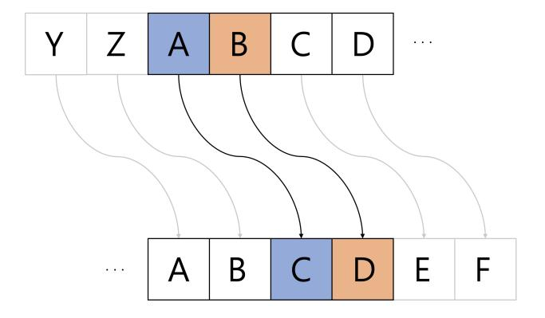

Fig. 1: Caesar encryption with key 2.

### 2.2 Vigen`ere Cipher

The Vigen`ere cipher is a multiple substitution cipher. General multi-substitution ciphers, such as Alberti and Trithemius, had a problem that if the algorithm was leaked, all encrypted data in the same way can be decrypted. However, the Vigen`ere cipher uses different key chains for each encryption. If attackers know the algorithm, they cannot recover the plaintext without the valid key. In the Vigen`ere cipher, Table 1 is used. If the plaintext ABC is encrypted with the key DEF, A is changes to D in the D row. B is changes to F in the E row, and C is changes to H in the F row.

{2}------------------------------------------------

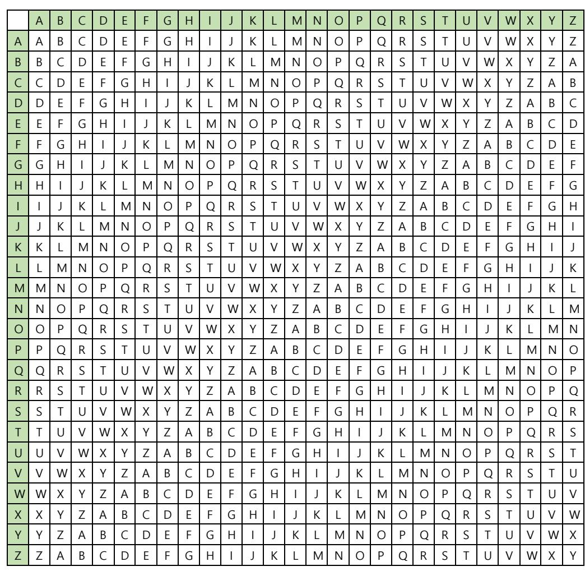

Table 1: Vigen`ere table.

### 2.3 Quantum Computer and Programming

Quantum computer is considered a solution to problems that classical computer has not been able to solve. Unlike the 0 and 1 state bits used in classic computers, quantum computers use qubits that have both 0 and 1 states with probability, n-qubits can represent 2n cases. Due to the nature of qubits, quantum computers have superior computational speed than conventional computers. Quantum computers can perform operations using quantum gates. Figure 2 shows some of those quantum gates, the X-gate and CNOT-gate and Toffoli-gate. The X-gate inverts the state of the qubit, and the CNOT-gate performs an XOR operation for two qubits. CNOT (x0, x1) stores the result of XORing x0 and x1 in x1. Toffoli-gate operates with three qubits. When two qubits are 1, the other qubit is inverted. Toffoli(x0, x1, x2) first performs AND operation on x0 and x1. Then perform XOR operation on x2.

### 2.4 Grover's Search Algorithm

The Grover search algorithm finds the specific solution for N unsorted data. In a classical brute force attack, O(N) queries are required. However, this can be found within O( p (N)) queries with the Grover search algorithm. The Grover search algorithm consists of an oracle function and a diffusion operator. The

{3}------------------------------------------------

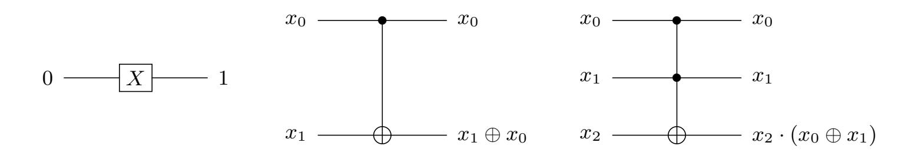

Fig. 2: Quantum gates. (X-gate, CNOT-gate, Toffoli-gate)

oracle function returns the solution by inverting the sign. The diffusion operator amplifies the amplitude of the solution by calculating (average amplitude) − (each amplitude − average amplitude). These processes are shown in Figure 3. Grover's search increases the probability of measuring a solution by iterating oracle and diffusion operators. In Figure 3, it is a process of Grover's search for 2 qubits. A solution can be found with 100 % probability without the repetition.

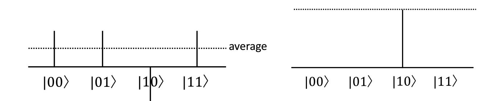

Fig. 3: Oracle (left) and diffusion operators (right).

### 2.5 Quantum Ripple-Carry Addition Circuit

In this paper, we use the new ripple-carry-adder [15] which improves the ripplecarry adder proposed by Vedral, Barenco, and Ekert [16]. New ripple-carryaddition reduces the number of ancillary qubits. We use the new ripple-carry addition circuit in Figure 5 to implement the proposed quantum circuit. The new ripple-carry-addition uses two modules called MAJ and UMA, as shown in Figure 4. In the quantum new ripple-carry addition circuit, the addition of ai and bi uses two additional qubits. One is the qubit to store the carry value(z), and the other is the initial carry qubit(c0). Since the modular addition is required in the circuit, we do not use carry-qubit(c0) to store carry value. More details on the new ripple-carry addition can be found at [15].

## 3 Proposed Method

We perform a quantum attack using the Grover search algorithm on Caesar and Vigen`ere operating in hexadecimal(0 ∼ 15) not alphabets (0 ∼ 25). This is due

{4}------------------------------------------------

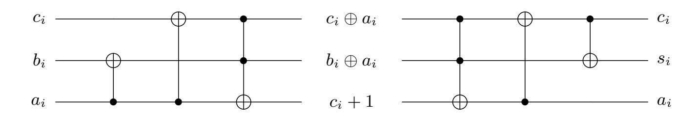

Fig. 4: MAJ quantum circuit(left) and UMA circuit(right)

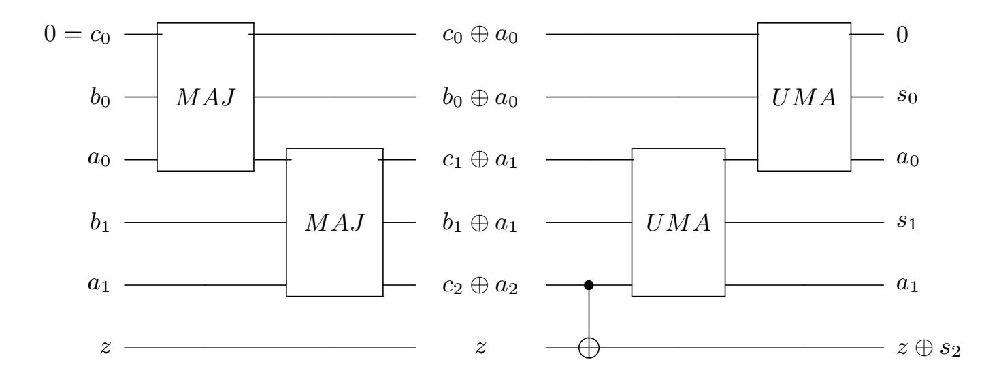

Fig. 5: Improved ripple carry adder for i = 2

to the limitation of the number of qubits in the simulator. The ProjectQ simulator utilized in this research can use about 30 qubits. The quantum simulator does not use real qubits, but it directly calculates the vast amount of calculation of qubits in a classical way. We performed an attack on hexadecimal formats, but proposed method can be applied equally to the alphabet by increasing the number of qubits.

### 3.1 Grover on Caesar Cipher

In order to perform a key search using Grover's algorithm for the Caesar cipher, an encryption quantum circuit must be implemented in Oracle. The Caesar encryption can be expressed by the following Equation 1. We utilized the ripplecarry addition. Each element (Pi) of plaintext (P) is encrypted with a single key (K).

$$C_i \leftarrow Enc(P_i, K) = (P_i + K) \mod 16 \tag{1}$$

In the ripple-carry addition Add(Pi , K), the result of the addition is stored in plaintext qubits (Pi) as follows.

$$Add(P_i, K) = \begin{cases} P_i = (P_i + K) \mod 16, \\ K = K \end{cases}$$
 (2)

{5}------------------------------------------------

In the ripple-carry addition, a carry value can be generated. The qubit c0 for the carry calculation and the qubit z for storing the highest carry value are allocated. Since the modular addition is used for the Caesar encryption, the qubit z for the highest carry value can be ignored. Therefore, only a single qubit c0 is additionally allocated for addition. Since the c0 is initialized to 0 after addition, it can be reused in the next addition. Figure 6 shows the design of the Grover search circuit that recovers the key for a known plaintext-ciphertext pair (P, C)=(0xF2, 0x14). Because the Caesar encryption uses the same key to each element of the plaintext, there is no need to do a key search for all elements. We recover the key by selecting only two elements (P0, C0)=(2,4) and (P1, C1)=(F,1).

Input Setting For a key search using Grover's algorithm, we select two elements (P0 and P1), and then it encrypts them with the superposition key K using the ripple-carry addition. First, we set the key and elements of plaintext to be entered in the oracle. The Hadamard gate is applied to all qubits of the key K. All values (0 ∼ 15) exist as probability at once (i.e. superposition state). In Figure 6, the X gate is performed before the H gate to optimize the diffusion operator used later. We will describe this in detail later.

Second, known elements of plaintext (P0 and P1) are set by applying X gates. Since the initial values of the qubits P0 and P1 are 0, the X gate is applied to the qubit where the plaintext value is 1. Because P0 = 0x2 (i.e. 0b0010) and P1 = 0xF (i.e. 0b1111), the X gate is applied to the second least significant qubit P0(p1) for P0. All qubits of P1 must be 1. The X gate is applied to all qubits for P1(p3, p2, p1, p0).

Oracle After completing the input setting, we design the oracle. First, the key K in the superposition state is added to the elements (P0 and P1), and qubits (P0 and P1) become ciphertext.

Second, we check whether the generated ciphertext is compared with the known ciphertext. In Figure 6, known elements of ciphertext (C0 and C1) are 0x4(i.e. 0b0100) and 0x1(i.e. 0b0001) If they match, all P qubits are 1 due to the X gates and the sign of the state of key K is reversed by the Controlled-Z gate. Since the Grover's search finds the key through iterative work of the oracle and diffusion operator. Therefore, the generated ciphertext are returned to plaintext by performing a reverse operation for the next search.

Diffusion Operator The oracle finds the key for a known plaintext-ciphertext pair by inverting the sign of the answer state. Due to the superposition state of qubits, all values still exist with the same probability. In the diffusion operator, the amplitude of the state found in the oracle is amplified and the amplitude of the non-answer states is reduced. The diffusion operator is applied to the key (K). We select an optimized diffusion operator that uses a constant number of X gates utilized in [17]. The basic diffusion operator quantum circuit is shown on

{6}------------------------------------------------

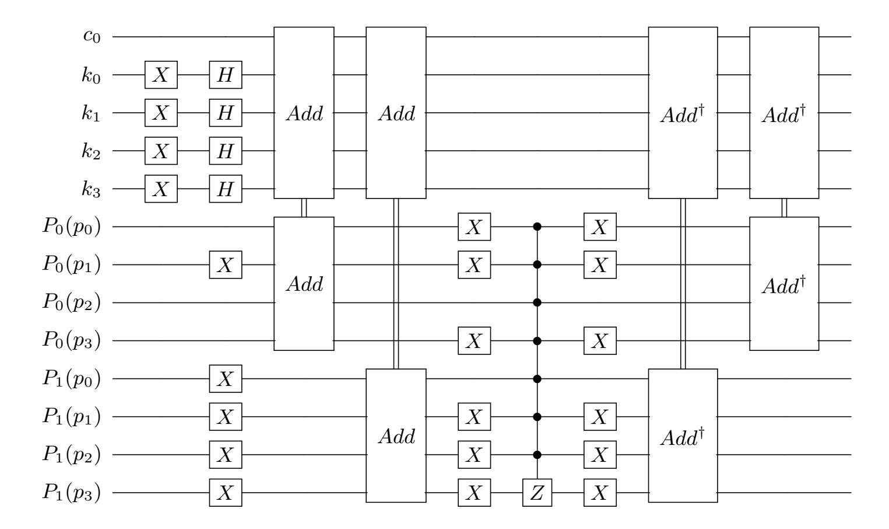

Fig. 6: Input setting and oracle design for caesar cipher.

the left side of Figure 7. In [17], authors say that in the input setting, if X gate is applied before the Hadamard gate, the same result can be obtained by using the quantum circuit as shown in the right side of Figure 7. Therefore, a constant number of X gates is used regardless of the number of Grover iterations.

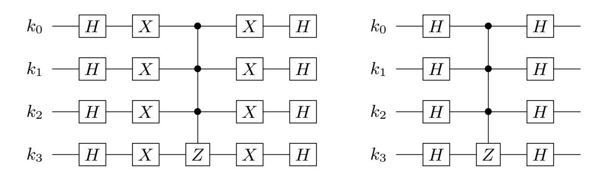

Fig. 7: Basic (left) and constant (right) diffusion operators for caesar cipher.

Grover Iteration The oracle returns the correct key and the diffusion operator amplifies the amplitude of the returned key. The Grover's search algorithm iterates the oracle and the diffusion operator to sufficiently increase the probability of measuring the correct key and finally measures key qubits. According to [18], the optimal number of Grover iterations to find a single solution in n qubits

{7}------------------------------------------------

(N=2n) is b π 4 √ Nc. Since the key is 4 qubits (i.e. n = 4) in proposed designs, the oracle and diffusion operators iterate 3 times and find the key (K=0x2) for the plaintext-ciphertext pair ((P, C)=(0xF2,0x14)) with a high probability.

## 3.2 Grover on Vigen`ere Cipher

Unlike the Caesar cipher, the Vigenere cipher uses a variety of keys and frequency analysis is not feasible. The Vigen`ere encryption can be expressed by the following Equation 3. We implement it using the ripple-carry addition. Each element Pi of plaintext P is encrypted with the key (Ki mod j ). j is the length of the key (K).

$$C_i \leftarrow Enc(P_i, K_{i \bmod j}) = (P_i + K_{i \bmod j}) \bmod 16$$
(3)

In the ripple-carry addition (Add(Pi , Ki mod j )), the result of the addition is stored in plaintext qubits (Pi) as follows.

$$Add(P_i, K_{i \mod j}) = \begin{cases} P_i = (P_i + K_{i \mod j}) \mod 16, \\ K_{i \mod j} = K_{i \mod j} \end{cases}$$
(4)

Figure 8 shows the design of the Grover search circuit that recovers the key for a known plaintext-ciphertext pair ((P, C)=(0xF42, 0x2E5)). Assuming that attackers don't know the key length (j), attackers search Ki for all Pi and Ci . Due to the limitation of the number of qubits in the simulator, a small length plaintext-ciphertext pair was targeted. The initial key can be recovered due to the nature of the repeated key.

Input Setting In the case of Vigen`ere cipher (unlike in Caesar cipher), we don't know the key length. For this reason, we have to do a key search for all plaintext elements. We set three elements of plaintext (P0, P1 and P2), and we then encrypt them with the superposition key elements (K0, K1 and K2), respectively using the ripple-carry addition. First, we set the key and plaintext to be entered in the oracle. The Hadamard gate is applied to all qubits of the key (K) to make it the superposition state.

Second, known elements of plaintext (P0 = 0x2 (i.e. 0b0010), P1 = 0x4 (i.e. 0b0100) and P2 = 0xF (i.e. 0b1111)) are set by applying X gates.

Oracle In the oracle, the encryption is performed by adding a key element corresponding to each plaintext element (i.e. Enc(P0, K0), Enc(P1, K1), Enc(P2, K2)). If the generated ciphertext is the same as the known ciphertext, all P qubits are 1 due to X gates. There are two options for inverting the sign of the answer using the Controlled-Z gate are shown in Figure 8.

In the Caesar cipher, the sign of the answer 4-qubit key K is reversed when the plaintexts P0 and P1 is matched with an 8-qubit Controlled-Z gate. If the option1 is used in the Vigenere cipher, all key K (i.e. K0, K1, and K2) qubits are

{8}------------------------------------------------

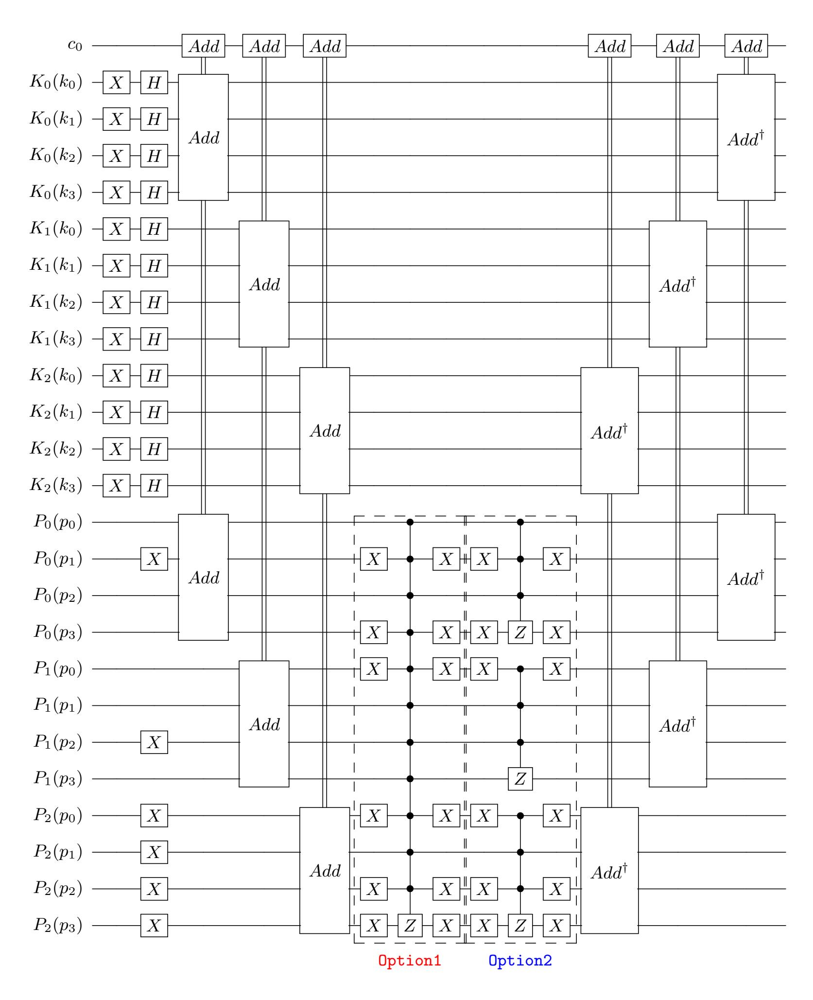

Fig. 8: Input setting and oracle design for Vigen`ere Cipher.

{9}------------------------------------------------

entangled, and iterations are performed to amplify the amplitude of the solution in 12 qubits (i.e. N = 212). According to Equation b π 4 √ Nc to find the optimal number of Grover iterations, 50 Grover iterations are required. However, the option2 is applied to a 4-qubit Controrlled-Z gate for each plaintext element. K0, K1 and K2 qubits are not entangled to each other and the Grover iteration is performed on each of the key elements. Finally, signs of solutions (K0=0x3, K1=0xA, K2=0x3) are inverted. Since it amplifies the amplitude of the solution in 4 qubits, it is more efficient than option1 because it only needs to perform 3 times of Grover iterations. Lastly, a reverse operation is performed for the next search.

Diffusion Operator Depending on the option, the diffusion operator must be implemented differently. As shown in Figure 9, for option1 it is working with 12 qubits, and for option2 it is working with 4 qubits.

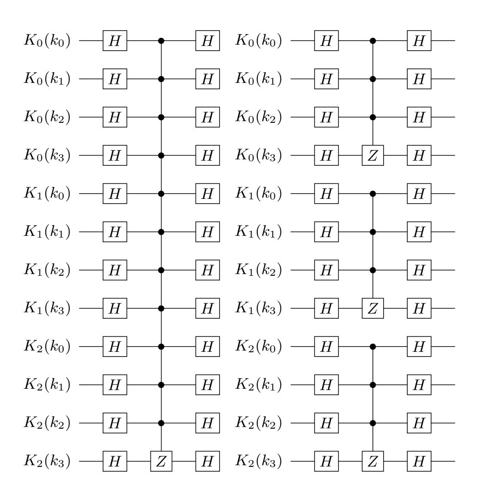

Fig. 9: Option1 (left) and Option2 (right) diffusion operators for Vigen`ere Cipher.

{10}------------------------------------------------

| Table 2. Qualitatin resources required for subset includes in the second second second second second second second second second second second second second second second second second second second second second second second second second second second second second second second second second second second second second second second second second second second second second second second second second second second second second second second second second second second second second second second second second second second second second second second second second second second second second second second second second second second second second second second second second second second second second second second second second second second second second second second second second second second second second second second second second second second second second second second second second second second second second second second second second second second second second second second second second second second second second second second second second second second second second second second second second second second second second second second second second second second second second second second second second second second second second second second second second second second second second second second second second second second second second second second second second second second second second second second second second second second second second second second second second second second second second second second second second second second second second second second second second second second second second second second second second second second second second second second second second second second second second second second second second second second second second second second second second second second second second second second second second second second second second second second second second second second second second second second second second second second |    |     |         |           |       |  |  |  |
|--------------------------------------------------------------------------------------------------------------------------------------------------------------------------------------------------------------------------------------------------------------------------------------------------------------------------------------------------------------------------------------------------------------------------------------------------------------------------------------------------------------------------------------------------------------------------------------------------------------------------------------------------------------------------------------------------------------------------------------------------------------------------------------------------------------------------------------------------------------------------------------------------------------------------------------------------------------------------------------------------------------------------------------------------------------------------------------------------------------------------------------------------------------------------------------------------------------------------------------------------------------------------------------------------------------------------------------------------------------------------------------------------------------------------------------------------------------------------------------------------------------------------------------------------------------------------------------------------------------------------------------------------------------------------------------------------------------------------------------------------------------------------------------------------------------------------------------------------------------------------------------------------------------------------------------------------------------------------------------------------------------------------------------------------------------------------------------------------------------------------------|----|-----|---------|-----------|-------|--|--|--|
| Qubits                                                                                                                                                                                                                                                                                                                                                                                                                                                                                                                                                                                                                                                                                                                                                                                                                                                                                                                                                                                                                                                                                                                                                                                                                                                                                                                                                                                                                                                                                                                                                                                                                                                                                                                                                                                                                                                                                                                                                                                                                                                                                                                         |    |     |         |           |       |  |  |  |
|                                                                                                                                                                                                                                                                                                                                                                                                                                                                                                                                                                                                                                                                                                                                                                                                                                                                                                                                                                                                                                                                                                                                                                                                                                                                                                                                                                                                                                                                                                                                                                                                                                                                                                                                                                                                                                                                                                                                                                                                                                                                                                                                | Н  | CX  | CCCZ    | v         | Depth |  |  |  |
|                                                                                                                                                                                                                                                                                                                                                                                                                                                                                                                                                                                                                                                                                                                                                                                                                                                                                                                                                                                                                                                                                                                                                                                                                                                                                                                                                                                                                                                                                                                                                                                                                                                                                                                                                                                                                                                                                                                                                                                                                                                                                                                                |    | CCX | CCCCCCZ | $\Lambda$ |       |  |  |  |
| 13                                                                                                                                                                                                                                                                                                                                                                                                                                                                                                                                                                                                                                                                                                                                                                                                                                                                                                                                                                                                                                                                                                                                                                                                                                                                                                                                                                                                                                                                                                                                                                                                                                                                                                                                                                                                                                                                                                                                                                                                                                                                                                                             | 28 | 168 | 3       | 39        | 219   |  |  |  |
|                                                                                                                                                                                                                                                                                                                                                                                                                                                                                                                                                                                                                                                                                                                                                                                                                                                                                                                                                                                                                                                                                                                                                                                                                                                                                                                                                                                                                                                                                                                                                                                                                                                                                                                                                                                                                                                                                                                                                                                                                                                                                                                                |    | 72  | 3       | ] 39      |       |  |  |  |

Table 2: Quantum resources required for Caesar cipher key recovery attack.

Table 3: Quantum resources required for Vigenère cipher key recovery attack.

| Qubits          |              | Quantum                   | Depth                  |                     |                                    |
|-----------------|--------------|---------------------------|------------------------|---------------------|------------------------------------|
|                 | Н            | CX                        | CCX                    | CCCZ                | Deptil                             |
| $(2\cdot 4n)+1$ | $8n \cdot r$ | $1 (14 \cdot 2n) \cdot r$ | $(6 \cdot 2n) \cdot r$ | $2 \cdot n \cdot r$ | $\boxed{(32\cdot(n-1)+40)\cdot r}$ |

### 4 Evaluation

We utilized IBM ProjectQ and IBM Qiskit to simulate the quantum key recovery attack using the Grover's search for Caesar and Vigenère ciphers. We optimized required quantum resources and recovered a key with a high probability. Figure 10 shows the probability of recovering a key (e.g. 0b0010) according to the number of Grover iterations (r). In the case of Caesar cipher, it is the recovery probability of the key (K). In the case of Vigenère cipher, it is the recovery probability of each key element  $(K_i)$  for option2. When the iteration is r=3, the probability of key recovery is the highest, and when the iteration is r=4, the probability is significantly reduced due to overfitting. Table 2 and Table 3 show the quantum resources required for key recovery attacks of Caesar and Vigenère ciphers, respectively. By utilizing ripple-carry addition, one additional qubit  $(c_0)$ is allocated. In the case of Vigenère cipher, an individual key search for  $K_i$  is performed by selecting option2. The key is recovered with the same number of iterations as Caesar cipher (r=3). In the case of Caesar cipher, all plaintext elements are encrypted using the same key. No matter what length plaintext is encrypted, we simply select two plaintext elements and perform a key search. Table 2 shows the quantum resources required for key recovery attacks against two plaintext-ciphertext pairs. In the case of Vigenère cipher, we performed a key search on the plaintext-ciphertext pair limited to length 3 due to the qubit limit of the simulator. Since all plaintext elements are encrypted with other key elements, a key search for the entire plaintext must be performed. In this paper, using the plaintext-ciphertext simulation result of length 3, it is extended to length n. Table 3 shows the quantum resources required for the key discovery attack of the vigenere cipher when the plaintext-ciphertext pair length is n.

## 5 Conclusion

The goal of this paper is to explore how the Grover search algorithm is applied to the symmetric key cryptography. We present a practical quantum attack on

{11}------------------------------------------------

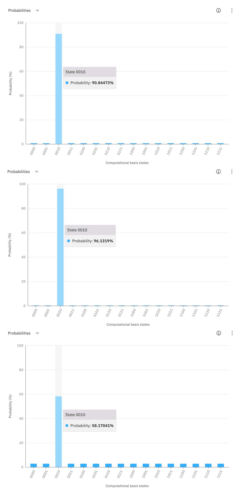

Fig. 10: Key recovery probability for Caesar and key element recovery probability for Vigen`ere according to the number of iterations (r = 2, 3, 4 from top to bottom).

{12}------------------------------------------------

Caesar and Vigen`ere ciphers using the Grover's search algorithm. Then, the quantum circuit implementation and the process of performing the attack are described in detail. We perform the actual attack in the simulator. Through quantum simulation, we measured the quantum resources required for key recovery attack of Caesar cipher and Vigen`ere cipher. Then, the Vigen`ere cipher expands when the length of the plaintext-ciphertext pair is n. The result shows that the key is recovered with a high probability by quantum attack using a simulator.

# References

- 1. P. W. Shor, "Polynomial-time algorithms for prime factorization and discrete logarithms on a quantum computer," SIAM review, vol. 41, no. 2, pp. 303–332, 1999.
- 2. L. K. Grover, "A fast quantum mechanical algorithm for database search," in Proceedings of the twenty-eighth annual ACM symposium on Theory of computing, pp. 212–219, 1996.
- 3. M. Grassl, B. Langenberg, M. Roetteler, and R. Steinwandt, "Applying Grover's algorithm to AES: quantum resource estimates," in Post-Quantum Cryptography, pp. 29–43, Springer, 2016.
- 4. B. Langenberg, H. Pham, and R. Steinwandt, "Reducing the cost of implementing AES as a quantum circuit," tech. rep., Cryptology ePrint Archive, Report 2019/854, 2019.
- 5. S. Jaques, M. Naehrig, M. Roetteler, and F. Virdia, "Implementing Grover oracles for quantum key search on AES and LowMC," in Annual International Conference on the Theory and Applications of Cryptographic Techniques, pp. 280–310, Springer, 2020.
- 6. R. Anand, A. Maitra, and S. Mukhopadhyay, "Grover on SIMON," Quantum Information Processing, vol. 19, no. 9, pp. 1–17, 2020.
- 7. K. Jang, H. Kim, S. Eum, and H. Seo, "Grover on GIFT." Cryptology ePrint Archive, Report 2020/1405, 2020. https://eprint.iacr.org/2020/1405.
- 8. K. Jang, S. Choi, H. Kwon, and H. Seo, "Grover on SPECK: Quantum resource estimates." Cryptology ePrint Archive, Report 2020/640, 2020. https://eprint. iacr.org/2020/640.
- 9. L. Schlieper, "In-place implementation of quantum-Gimli," arXiv preprint arXiv:2007.06319, 2020.
- 10. K. Jang, S. Choi, H. Kwon, H. Kim, J. Park, and H. Seo, "Grover on Korean block ciphers," Applied Sciences, vol. 10, no. 18, p. 6407, 2020.
- 11. G. Song, K. Jang, H. Kim, W.-K. Lee, Z. Hu, and H. Seo, "Grover on SM3,"
- 12. K. Jang, G. Song, H. Kim, H. Kwon, H. Kim, and H. Seo, "Efficient implementation of PRESENT and GIFT on quantum computers," Applied Sciences, vol. 11, no. 11, p. 4776, 2021.
- 13. K. Jang, G. Song, H. Kwon, S. Uhm, H. Kim, W.-K. Lee, and H. Seo, "Grover on PIPO," Electronics, vol. 10, no. 10, p. 1194, 2021.
- 14. D. S. Steiger, T. H¨aner, and M. Troyer, "ProjectQ: an open source software framework for quantum computing," Quantum, vol. 2, p. 49, 2018.
- 15. S. Cuccaro, T. Draper, S. Kutin, and D. Moulton, "A new quantum ripple-carry addition circuit," 11 2004.
- 16. V. Vedral, A. Barenco, and A. Ekert, "Quantum networks for elementary arithmetic operations," Physical Review A, vol. 54, no. 1, p. 147, 1996.

{13}------------------------------------------------

#### 14 Song et al.

- 17. A. Zulehner and R. Wille, Simulation and Design of Quantum Circuits, pp. 60–82. Cham: Springer International Publishing, 2020.
- 18. M. Boyer, G. Brassard, P. Høyer, and A. Tapp, "Tight bounds on quantum searching," Fortschritte der Physik, vol. 46, p. 493–505, Jun 1998.