{0}------------------------------------------------

## **Superposition Meet-in-the-Middle Attacks: Updates on Fundamental Security of AES-like Hashing**

Zhenzhen Bao2*,*<sup>3</sup> , Jian Guo<sup>2</sup> , Danping Shi1*,*4(B) , and Yi Tu<sup>2</sup>

- <sup>1</sup> State Key Laboratory of Information Security, Institute of Information Engineering, Chinese Academy of Sciences, Beijing, China shidanping@iie.ac.cn
- <sup>2</sup> School of Physical [and](https://orcid.org/0000-0003-2839-6687) Mathematical Sciences, Nanyang T[echn](https://orcid.org/0000-0003-2809-8647)ological Univ[ersi](https://orcid.org/0000-0002-2051-8806)ty, [Sin](https://orcid.org/0000-0001-8847-6748)gapore

baozhenzhen10@gmail.com, guojian@ntu.edu.sg, TUYI0002@e.ntu.edu.sg

- 3 Institute for Network Sciences and Cyberspace, BNRist, Tsinghua University, Beijing, China
- <sup>4</sup> School of Cyber Security, University of Chinese Academy of Sciences, Beijing, China

**Abstract.** The Meet-in-the-Middle approach is one of the most powerful cryptanalysis techniques, demonstrated by its applications in preimage attacks on the full MD4, MD5, Tiger, HAVAL, and Haraka-512 v2 hash functions, and key recovery of the full block cipher KTANTAN. The success relies on the separation of a primitive into two independent chunks, where each active cell of the state is used to represent only one chunk or is otherwise considered unusable once mixed. We observe that some of such cells are linearly mixed and can be as useful as the independent ones. This leads to the introduction of superposition states and a whole suite of accompanied techniques, which we incorporate into the MILPbased search framework proposed by Bao *et al.* at EUROCRYPT 2021 and Dong *et al.* at CRYPTO 2021, and find applications on a wide range of AES-like hash functions and block ciphers.

**Keywords:** Whirlpool, Grøstl, AES hashing modes, MITM, MILP

## **1 Introduction**

Hash function is a function mapping a document of arbitrary length into a short fixed-length digest. For a cryptographically secure hash function, it should fulfill three basic security requirements: collision resistance, preimage resistance, and second-preimage resistance. In this paper, we focus on the security notion of preimage and collision resistance, i.e., it should be computationally difficult to invert the function or find two inputs map to the same digest. Specially, for an ideal hash function *H* with *n*-bit digest and a target *T* given at random, it should cost no less than 2 *<sup>n</sup>* compression function evaluations to find an input *x* such that *H*(*x*) = *T*. Preimage attack refers to an algorithm achieving this in lesser evaluations. Collision attack refers to an algorithm finding different *x* and *x ′* such that *H*(*x*) = *H*(*x ′* ) with lesser evaluations than birthday attack, *i.e.*, 2 *n/*2 computations.

{1}------------------------------------------------

Traditionally, there are two common methods to construct cryptographic hash functions. One is to convert from block ciphers through mode of operations, and the other is to build from scratch. There are 12 secure PGV modes [25], which enjoy the proof of security reduction of the hash function to the underlying block cipher. This method is especially useful when a block cipher like AES [9] has long-standing security against intensive cryptanalysis. When it is already implemented for other purposes like encryption, the same implementation [can](#page-30-0) be re-used to construct a hash function by implementing the additional mode only. In this way it also leads to performance merits. Particularly, hash functi[on](#page-29-0) constructed from AES through PGV modes are called AES hashing, and they have been standardized by Zigbee [1] and also suggested by ISO/IEC [19]. Due to the well understood security and high performance, many dedicated block ciphers and hash functions built from scratch follow similar design strategy by using an AES-like round function, such as Whirlpool [6], Grøstl [12], PHOTON [15], and LED [16] etc.

The Meet-in-the-Middle (MITM) attack has a long history and an important role in various cryptanalysis on various p[rim](#page-28-0)itives. [It](#page-29-1) was introdu[ced](#page-29-2) to preima[ge](#page-29-3) attacks on hash functions by Aumasson *et al.* [3] and Sasaki *et al.* [27] in 2008. Since then, MITM preimage attack has shown its power on many MD/SHA families of hash functions. That includes the full versions of MD4 [14], MD5 [29], Tiger [14, 32], and HAVAL [17, 27], as well as lightweight block cipher KTANTAN [7, 33].

[The](#page-30-1) basic MITM idea is to find ways to split the cipher into two computational chunks and find the so-called neutral bits from each side, independent of the co[mp](#page-29-4)utation [of](#page-30-2) the stat[e o](#page-29-4)[f th](#page-30-3)e other side. [Hen](#page-29-5)[ce,](#page-30-1) the two chunks can be computed independently [b](#page-29-6)[ut](#page-30-4) end up at a common state, where previously independent computations are finally pairwise matched. The critical point is that the independence between the two chunks allows their results to be pairwise matchable, enabling this MITM procedure to require fewer computations than a trivial enumeration.

In 2011, MITM was introduced by Sasaki [26] for the first time to preimage attack on AES hashing, invalidating the preimage resistance of the 7-round reduced version. To avoid dealing with the key schedule, the key value of AES was pre-set to a constant, and hence the same number of rounds was attacked for AES hashing based on all three versions of [A](#page-30-5)ES (AES-128, AES-192, and AES-256). In 2019, the attack was revisited in [4], and it was found that the degree of freedoms from the key values can be utilized for at least one side of the computation. This observation led to the attack complexity improvements over 7-round AES-128 hashing, and increased the number of attacked rounds from 7 to 8 for the AES-hashing based on AES-[19](#page-28-1)2 and AES-256. In 2020, the MITM preimage attack was introduced to meet a popular automatic tool, the Mixed-Integer-Linear-Programming (MILP) [5]. This match with MILP enables the previously invented enhancements for MITM, *e.g.*, the initial structure, the selection and cancellation of neutral bits, to evolve to a more generalized form. 

{2}------------------------------------------------

The MILP models characterizing the generalized formalization of MITM, produced many improved preimage attacks on AES hashing, penetrated 8-round AES-128 hashing and full rounds of Haraka v2-512. In 2021, MITM-MILP models find more applications not only in preimage attacks but also in key-recovery and collision attacks on AES-like ciphers [10].

A common practice in all these MITM attacks is the byte-oriented decomposition of states, *i.e.*, each useful byte carries the influence of neutral bits from at most one direction. Once influences of neutral bits from both directions reach the same byte, this byte will be considered unusable for the either chunk. An immediate consequence of this practice is that the information from unusable bytes is lost, and any byte in the subsequent round computed from it becomes unusable too.

#### 1.1 Our Contribution

Superposition Meet-in-the-Middle Attack Framework. In this work, different from the byte-oriented decomposition, we propose Superposition MITM attack framework with the help of Superposition State (Supp), under which every byte is viewed as a combination of two virtual bytes separately representing the influence of the neutral bits from one direction each. It becomes obvious to see that, the advantage of this representation is the preservation of linearity, i.e., any state which is a linear combination of neutral bits from both directions will be kept so when linear operations such as MixColumns and AddRoundKey are applied. SupP opens up the possibility of new local collisions between/within the encryption and key states, thus maximizes the chances of canceling impacts on independence and enables new MITM attack configurations. Enabled by SupP, a suite of techniques is added into the MILP-based search framework proposed by Bao et al. [5] and Dong et al. [10], which greatly enlarged the solution space and led to rich results on AES-like ciphers.

Guess-and-Determine (GnD) is a popular technique and has countless applications in cryptanalysis against symmetric-key primitives such as stream ciphers [35] and block ciphers [8]. The basic idea is that, in the process of some attack, the gain of guessing some state or key bits is higher than the price, *i.e.*, the guess itself comes with a probability p then the attack needs to repeat at least 1/p times in order to have a correct guess. This technique has also been used in the MITM preimage attacks [14, 30, 34], where the guess allows further computation of more state/message bits which help either extend the attack to more rounds or lower the time complexities. It is noted that GnD has never been incorporated into the MILP models for the MITM attacks in [5, 10].

BI-DIRECTION ATTRIBUTE-PROPAGATION AND CANCELLATION (BIDIR). In previous MITM attacks [4,5,10,26,30,34], each computation chunk propagates towards a single direction. Although the idea of adding constraints to some neutral bits in order to cancel their impact on the opposite computation has already appeared, such cancellations are only allowed in one direction in each chunk. In

{3}------------------------------------------------

this work, we allow cancellation between neutral bytes in both directions. This led us to attack configurations with lower time complexities.

Multiple Ways of AddRoundKey (MulAK). The identical encryption and key-schedule of Whirlpool allows the AddRoundKey to be moved around the MixColumns using an equivalent key state already involved in the key-schedule. We add the flexibility of key-addition at different positions in each round into the model, and make it possible to save the double consumption of freedom degrees between the encryption and key-schedule. This simple yet efficient strategy makes it possible to attack one more round on reduced Whirlpool.

**Application Results.** The superposition MITM attack framework aided by the additional techniques shows its effectiveness when applied to the popular AESlike hashing Whirlpool (an ISO/IEC standard), Grøstl (a finalist of the SHA-3 competition), AES-hashing modes (widely used, *e.g.*, AES-MMO in Zigbee protocols), and tweakable block cipher SKINNY (in its way to be included in ISO/IEC 18033). Broad improvements upon the previous best results on preimage, collision, and key-recovery attacks were obtained. The updates and a comparison with the state-of-the-art results in literature are summarized in Table 1.

For Whirlpool, the preimage resistance of its 7-round reduced version out of the total 10 rounds gets challenged for the first time, a decade after MITM itself challenging its 5-round [26] for the first time, or GnD joining MITM challenging its 6-rounds [30]. Meanwhile, the complexities of preimage attacks on t[he](#page-5-0) 5- and 6-round reduced versions are significantly improved. The new attack on 7-round Whirlpool relies on multiple modeling enhancements, including GnD, BiDir, and MulAK. Noticeably, in t[erm](#page-30-5)s of preimage resistance, the presented attack reduces one round se[cur](#page-30-7)ity margin out of the remaining four for this important target.

For Grøstl, there are two main instances, Grøstl-256 and Grøstl-512, named after the size of their digests. The preimage resistance of their longest attacked variants, 6-round Grøstl-256 and 8-round Grøstl-512, get updated eight years after [36]. Improvements with larger complexity reductions are also found on variants with lesser rounds. The improved attacks are achieved by allowing BiDir, in addition to the GnD. Such improvement is not possible using only MITM-GnD, and MITM-GnD is already considered in [24, 36].

In [ad](#page-30-8)dition, the MILP models for searching preimage attacks can be directly transformed into models searching for collision attacks on hash functions and keyrecovery attacks on block ciphers. With the superposition MITM-GnD models, immediate improvements were obtained o[n](#page-30-9) [man](#page-30-8)y more targets: For Grøstl-256, the collision resistance of its output transformation's longest attacked version, the 6-round, gets updated; For AES-hashing, the collision resistance of hash functions based on AES-128 reduced to 7-round get challenged, more than a decade after rebound attacks challenging its 6-round [13, 21], or two years after quantum attacks challenging its 7-round version [18]. For SKINNY, the security in terms of key-recovery attack in the single-key setting of the longest attacked

{4}------------------------------------------------

version, 23-round SKINNY-*n*-3*n*, gets updated. Remarkably, data complexity is drastically reduced, *e.g.*, from 2 <sup>52</sup> to 2 <sup>28</sup> for SKINNY-64-192.

**On the practical impact of the presented attacks.** The high complexities of some presented attacks here might look like a show-stopper for some readers. It is important to note that the gain of the attacks over brute-force search should be the focus and worthy of caution, *e.g.*, 2 <sup>480</sup> may look high for attacking 7-round Whirlpool, however this means a complexity gain by a factor of 2 <sup>512</sup>*−*<sup>480</sup> = 2<sup>32</sup> Such a gain can be preserved when one tries to truncate the output digest and the truncated part does not influence the computation of the chunks in the MITM procedure of the attacks. For example, the attack on 7-round Whirlpool has the same gain if the cells in all diagonals except for the first are truncated, which is verified by our implementation. Truncating the output digest from large version hash function is commonly seen in both standard usage such as SHA-512/224 and SHA-512/256, and some engineering implementations. A gain by a factor of 2 <sup>32</sup> could bring the mining efforts from around 2 <sup>72</sup> to 2 <sup>40</sup>, which could be disastrous for Bitcoin.

.

Organization. The rest of the paper is organized as follows. Section 2 briefly introduces the AES-like hashing and MITM preimage attacks. Section 3 describes the details of our enhanced MILP model. The application to Whirlpool and Grøstl is given in Section 4 and 5, respectively. Section 6 briefly introduces the applications to collision and key-recovery attack. Some extra details on ot[he](#page-4-0)r attacks and figures are provided as Supplementary Material. Relevant sourc[e](#page-7-0) codes can be found via https://github.com/MITM-AES-like.

## **2 AES-like Hashing and MITM Preimage Attacks**

<span id="page-4-0"></span>In this section, we give a brief introduction to AES-like hash function in a general way, and describe the MITM Preimage Attacks, before we can introduce applications in the next sections.

The AES-like hashing in our context refers to those hash functions whose compression function (CF) or output transformation (OT) uses an AES-like round function as depicted in Figure 1, where the state can be viewed as a Nrow *×* Ncol matrix of *c*-bit cells. There are 4 general operations in order:

- **–** SubBytes (SB) applies a non-linear substitution-box operation to each cell.
- **–** ShiftRows (SR) cyclically s[hif](#page-6-0)ts each row by a pre-defined number of positions.
- **–** MixColumns (MC) mixes every column, *e.g.*, by multiplying an (MDS) matrix.
- **–** AddRoundKey (AK) adds the round key (or round message).

For some designs, the SR and MC may work on the transpose of the matrix, *i.e.*, SR on columns and MC on rows; the SR can be a cell-permutation.

{5}------------------------------------------------

Table 1: Updated results on (pseudo-) preimage attacks

<span id="page-5-0"></span>

|                                                                                                                                    |                                                                                                                                                                                                                                                                                                                                                                                                                                                                                                                                                                                                                                                                                                                                                                                                                                                                                                                                                                                                                                                                                                                                                                                                                                                                                                                             | (Pseu                                                                                                                                                                                                                                                                                                                                                                                                                                                                                                                                                                                                                                                                                                                                                                                                                                                                                                                                                                                                                                                                                                                                                                                                                                                                                                                                                                                                                                                                                                                                                                                                                                                                                                                                                                                                                                                                                                                                                                                                                                                                                                                                                                                                                                                                                                                                                                                                                                                                                 | ido-) Preimage                                                                                                                                                                                                                                                                                                                                                                                                                                                                                                                                                                                                                                                                                                                                                                                                                                                                                                                                                                                                                                                                                                                                                                                                                                                                                                                                                                                                                                                                                                                                                                                                                                                                                                                                                                                                                                                                                                                                                                                                                                                                                                                                                                                                                                                                                                                       | -                                                                      |                                                                                                                                                                                                                                                                                                                                                                                                                                                                                                                                                                                                                                                                                                                                                                                                                                                                                                                                                                                                                                                                                                                                                                                                                                                                                                                                                                                                                                                                                                                                                                                                                                                                                                                                                                                                                                                                                                                                                                                                                                                                                                                                                                                                                                                                                                 |  |  |
|------------------------------------------------------------------------------------------------------------------------------------|-----------------------------------------------------------------------------------------------------------------------------------------------------------------------------------------------------------------------------------------------------------------------------------------------------------------------------------------------------------------------------------------------------------------------------------------------------------------------------------------------------------------------------------------------------------------------------------------------------------------------------------------------------------------------------------------------------------------------------------------------------------------------------------------------------------------------------------------------------------------------------------------------------------------------------------------------------------------------------------------------------------------------------------------------------------------------------------------------------------------------------------------------------------------------------------------------------------------------------------------------------------------------------------------------------------------------------|---------------------------------------------------------------------------------------------------------------------------------------------------------------------------------------------------------------------------------------------------------------------------------------------------------------------------------------------------------------------------------------------------------------------------------------------------------------------------------------------------------------------------------------------------------------------------------------------------------------------------------------------------------------------------------------------------------------------------------------------------------------------------------------------------------------------------------------------------------------------------------------------------------------------------------------------------------------------------------------------------------------------------------------------------------------------------------------------------------------------------------------------------------------------------------------------------------------------------------------------------------------------------------------------------------------------------------------------------------------------------------------------------------------------------------------------------------------------------------------------------------------------------------------------------------------------------------------------------------------------------------------------------------------------------------------------------------------------------------------------------------------------------------------------------------------------------------------------------------------------------------------------------------------------------------------------------------------------------------------------------------------------------------------------------------------------------------------------------------------------------------------------------------------------------------------------------------------------------------------------------------------------------------------------------------------------------------------------------------------------------------------------------------------------------------------------------------------------------------------|--------------------------------------------------------------------------------------------------------------------------------------------------------------------------------------------------------------------------------------------------------------------------------------------------------------------------------------------------------------------------------------------------------------------------------------------------------------------------------------------------------------------------------------------------------------------------------------------------------------------------------------------------------------------------------------------------------------------------------------------------------------------------------------------------------------------------------------------------------------------------------------------------------------------------------------------------------------------------------------------------------------------------------------------------------------------------------------------------------------------------------------------------------------------------------------------------------------------------------------------------------------------------------------------------------------------------------------------------------------------------------------------------------------------------------------------------------------------------------------------------------------------------------------------------------------------------------------------------------------------------------------------------------------------------------------------------------------------------------------------------------------------------------------------------------------------------------------------------------------------------------------------------------------------------------------------------------------------------------------------------------------------------------------------------------------------------------------------------------------------------------------------------------------------------------------------------------------------------------------------------------------------------------------------------------------------------------------|------------------------------------------------------------------------|-------------------------------------------------------------------------------------------------------------------------------------------------------------------------------------------------------------------------------------------------------------------------------------------------------------------------------------------------------------------------------------------------------------------------------------------------------------------------------------------------------------------------------------------------------------------------------------------------------------------------------------------------------------------------------------------------------------------------------------------------------------------------------------------------------------------------------------------------------------------------------------------------------------------------------------------------------------------------------------------------------------------------------------------------------------------------------------------------------------------------------------------------------------------------------------------------------------------------------------------------------------------------------------------------------------------------------------------------------------------------------------------------------------------------------------------------------------------------------------------------------------------------------------------------------------------------------------------------------------------------------------------------------------------------------------------------------------------------------------------------------------------------------------------------------------------------------------------------------------------------------------------------------------------------------------------------------------------------------------------------------------------------------------------------------------------------------------------------------------------------------------------------------------------------------------------------------------------------------------------------------------------------------------------------|--|--|
| #R                                                                                                                                 | Time-1                                                                                                                                                                                                                                                                                                                                                                                                                                                                                                                                                                                                                                                                                                                                                                                                                                                                                                                                                                                                                                                                                                                                                                                                                                                                                                                      | Time-2                                                                                                                                                                                                                                                                                                                                                                                                                                                                                                                                                                                                                                                                                                                                                                                                                                                                                                                                                                                                                                                                                                                                                                                                                                                                                                                                                                                                                                                                                                                                                                                                                                                                                                                                                                                                                                                                                                                                                                                                                                                                                                                                                                                                                                                                                                                                                                                                                                                                                | $(\overrightarrow{d_b}, \overrightarrow{d_r}, \overrightarrow{m}) \\ (\overrightarrow{d_b}, \overrightarrow{d_g}, \overrightarrow{d_g}_r)$                                                                                                                                                                                                                                                                                                                                                                                                                                                                                                                                                                                                                                                                                                                                                                                                                                                                                                                                                                                                                                                                                                                                                                                                                                                                                                                                                                                                                                                                                                                                                                                                                                                                                                                                                                                                                                                                                                                                                                                                                                                                                                                                                                                           | Critical Tech.                                                         | Ref.                                                                                                                                                                                                                                                                                                                                                                                                                                                                                                                                                                                                                                                                                                                                                                                                                                                                                                                                                                                                                                                                                                                                                                                                                                                                                                                                                                                                                                                                                                                                                                                                                                                                                                                                                                                                                                                                                                                                                                                                                                                                                                                                                                                                                                                                                            |  |  |
| 5/10<br>5/10<br>6/10<br>6/10<br><b>7/10</b>                                                                                        | $2^{416}$ <b>2352</b> $2^{448}$ <b>24</b> 40 <b>2480</b>                                                                                                                                                                                                                                                                                                                                                                                                                                                                                                                                                                                                                                                                                                                                                                                                                                                                                                                                                                                                                                                                                                                                                                                                                                                                    | 2 <sup>448</sup> <b>2<sup>433</sup></b> 2 <sup>481</sup> <b>2<sup>477</sup> 2<sup>497</sup></b>                                                                                                                                                                                                                                                                                                                                                                                                                                                                                                                                                                                                                                                                                                                                                                                                                                                                                                                                                                                                                                                                                                                                                                                                                                                                                                                                                                                                                                                                                                                                                                                                                                                                                                                                                                                                                                                                                                                                                                                                                                                                                                                                                                                                                                                                                                                                                                                       | $ \begin{array}{c} (16,12,16,0,0) \\ (20,20,20,0,0) \\ (32,8,32,0,24) \\ (9,24,24,15,0) \\ (16,4,16,0,12) \end{array} $                                                                                                                                                                                                                                                                                                                                                                                                                                                                                                                                                                                                                                                                                                                                                                                                                                                                                                                                                                                                                                                                                                                                                                                                                                                                                                                                                                                                                                                                                                                                                                                                                                                                                                                                                                                                                                                                                                                                                                                                                                                                                                                                                                                                              | Dedicated MILP, BiDir, MulAK Dedicated, GnD MILP, GnD MILP, GnD, MulAK | [30]<br>Fig. 13<br>[30]<br>Fig. 12<br>Fig. 3, 11                                                                                                                                                                                                                                                                                                                                                                                                                                                                                                                                                                                                                                                                                                                                                                                                                                                                                                                                                                                                                                                                                                                                                                                                                                                                                                                                                                                                                                                                                                                                                                                                                                                                                                                                                                                                                                                                                                                                                                                                                                                                                                                                                                                                                                                |  |  |
| 5/10<br>5/10<br>6/10<br>6/10                                                                                                       | 2 <sup>192</sup> 2 <sup>184</sup> 2 <sup>240</sup> 2 <sup>224</sup>                                                                                                                                                                                                                                                                                                                                                                                                                                                                                                                                                                                                                                                                                                                                                                                                                                                                                                                                                                                                                                                                                                                                                                                                                                                         | $2^{234.67}$ $2^{232}$ $2^{252}$ $2^{245.33}$                                                                                                                                                                                                                                                                                                                                                                                                                                                                                                                                                                                                                                                                                                                                                                                                                                                                                                                                                                                                                                                                                                                                                                                                                                                                                                                                                                                                                                                                                                                                                                                                                                                                                                                                                                                                                                                                                                                                                                                                                                                                                                                                                                                                                                                                                                                                                                                                                                         | (8, 8, 8, 0, 0)<br>(9, 9, 16, 0, 0)<br>(8, 2, 8, 0, 6)<br>(4, 20, 16, 12, 0)                                                                                                                                                                                                                                                                                                                                                                                                                                                                                                                                                                                                                                                                                                                                                                                                                                                                                                                                                                                                                                                                                                                                                                                                                                                                                                                                                                                                                                                                                                                                                                                                                                                                                                                                                                                                                                                                                                                                                                                                                                                                                                                                                                                                                                                         | Dedicated MILP, BiDir Dedicated, GnD MILP, GnD, BiDir                  | ‡ [24,36]<br>Fig. 14, 15<br>‡ [24,36]<br>Fig. 5, 6                                                                                                                                                                                                                                                                                                                                                                                                                                                                                                                                                                                                                                                                                                                                                                                                                                                                                                                                                                                                                                                                                                                                                                                                                                                                                                                                                                                                                                                                                                                                                                                                                                                                                                                                                                                                                                                                                                                                                                                                                                                                                                                                                                                                                                              |  |  |
| ttl-512 (CF+OT) $\frac{7/14}{8/14}$ $\frac{2^{416}}{2^{472}}$ $\frac{2^{472}}{8/14}$ $\frac{2^{472}}{2^{472}}$                     |                                                                                                                                                                                                                                                                                                                                                                                                                                                                                                                                                                                                                                                                                                                                                                                                                                                                                                                                                                                                                                                                                                                                                                                                                                                                                                                             | $2^{480}$ $2^{504}$ <b>2</b> <sup>500</sup>                                                                                                                                                                                                                                                                                                                                                                                                                                                                                                                                                                                                                                                                                                                                                                                                                                                                                                                                                                                                                                                                                                                                                                                                                                                                                                                                                                                                                                                                                                                                                                                                                                                                                                                                                                                                                                                                                                                                                                                                                                                                                                                                                                                                                                                                                                                                                                                                                                           | (19, 12, 19, 0, 7)<br>(10, 10, 18, 5, 5)<br>(9, 5, 10, 0, 4)                                                                                                                                                                                                                                                                                                                                                                                                                                                                                                                                                                                                                                                                                                                                                                                                                                                                                                                                                                                                                                                                                                                                                                                                                                                                                                                                                                                                                                                                                                                                                                                                                                                                                                                                                                                                                                                                                                                                                                                                                                                                                                                                                                                                                                                                         | MILP, GnD, BiDir<br>Dedicated<br>MILP, GnD, BiDir                      | Fig. 16, 17<br>† [36]<br>Fig. 7, 8                                                                                                                                                                                                                                                                                                                                                                                                                                                                                                                                                                                                                                                                                                                                                                                                                                                                                                                                                                                                                                                                                                                                                                                                                                                                                                                                                                                                                                                                                                                                                                                                                                                                                                                                                                                                                                                                                                                                                                                                                                                                                                                                                                                                                                                              |  |  |
| 9/12<br>9/12                                                                                                                       | $2^{120}$ $2^{112}$                                                                                                                                                                                                                                                                                                                                                                                                                                                                                                                                                                                                                                                                                                                                                                                                                                                                                                                                                                                                                                                                                                                                                                                                                                                                                                         | $2^{125}$ $2^{121}$                                                                                                                                                                                                                                                                                                                                                                                                                                                                                                                                                                                                                                                                                                                                                                                                                                                                                                                                                                                                                                                                                                                                                                                                                                                                                                                                                                                                                                                                                                                                                                                                                                                                                                                                                                                                                                                                                                                                                                                                                                                                                                                                                                                                                                                                                                                                                                                                                                                                   | (1,1,1,0,0)<br>(2,2,2,0,0)                                                                                                                                                                                                                                                                                                                                                                                                                                                                                                                                                                                                                                                                                                                                                                                                                                                                                                                                                                                                                                                                                                                                                                                                                                                                                                                                                                                                                                                                                                                                                                                                                                                                                                                                                                                                                                                                                                                                                                                                                                                                                                                                                                                                                                                                                                           | MILP<br>MILP, SupP, BiDir Fig.                                         |                                                                                                                                                                                                                                                                                                                                                                                                                                                                                                                                                                                                                                                                                                                                                                                                                                                                                                                                                                                                                                                                                                                                                                                                                                                                                                                                                                                                                                                                                                                                                                                                                                                                                                                                                                                                                                                                                                                                                                                                                                                                                                                                                                                                                                                                                                 |  |  |
| 8/10<br><b>9/10</b>                                                                                                                | $2^{120}$ $2^{120}$                                                                                                                                                                                                                                                                                                                                                                                                                                                                                                                                                                                                                                                                                                                                                                                                                                                                                                                                                                                                                                                                                                                                                                                                                                                                                                         | $2^{123}$ $2^{125}$                                                                                                                                                                                                                                                                                                                                                                                                                                                                                                                                                                                                                                                                                                                                                                                                                                                                                                                                                                                                                                                                                                                                                                                                                                                                                                                                                                                                                                                                                                                                                                                                                                                                                                                                                                                                                                                                                                                                                                                                                                                                                                                                                                                                                                                                                                                                                                                                                                                                   | (1, 4, 4, 0, 0)<br>(1, 1, 1, 0, 0)                                                                                                                                                                                                                                                                                                                                                                                                                                                                                                                                                                                                                                                                                                                                                                                                                                                                                                                                                                                                                                                                                                                                                                                                                                                                                                                                                                                                                                                                                                                                                                                                                                                                                                                                                                                                                                                                                                                                                                                                                                                                                                                                                                                                                                                                                                   | Dedicated<br>MILP, SupP, BiDir                                         | [4]<br>Fig. 19                                                                                                                                                                                                                                                                                                                                                                                                                                                                                                                                                                                                                                                                                                                                                                                                                                                                                                                                                                                                                                                                                                                                                                                                                                                                                                                                                                                                                                                                                                                                                                                                                                                                                                                                                                                                                                                                                                                                                                                                                                                                                                                                                                                                                                                                                  |  |  |
|                                                                                                                                    |                                                                                                                                                                                                                                                                                                                                                                                                                                                                                                                                                                                                                                                                                                                                                                                                                                                                                                                                                                                                                                                                                                                                                                                                                                                                                                                             | (Free-                                                                                                                                                                                                                                                                                                                                                                                                                                                                                                                                                                                                                                                                                                                                                                                                                                                                                                                                                                                                                                                                                                                                                                                                                                                                                                                                                                                                                                                                                                                                                                                                                                                                                                                                                                                                                                                                                                                                                                                                                                                                                                                                                                                                                                                                                                                                                                                                                                                                                | start) Collision                                                                                                                                                                                                                                                                                                                                                                                                                                                                                                                                                                                                                                                                                                                                                                                                                                                                                                                                                                                                                                                                                                                                                                                                                                                                                                                                                                                                                                                                                                                                                                                                                                                                                                                                                                                                                                                                                                                                                                                                                                                                                                                                                                                                                                                                                                                     |                                                                        |                                                                                                                                                                                                                                                                                                                                                                                                                                                                                                                                                                                                                                                                                                                                                                                                                                                                                                                                                                                                                                                                                                                                                                                                                                                                                                                                                                                                                                                                                                                                                                                                                                                                                                                                                                                                                                                                                                                                                                                                                                                                                                                                                                                                                                                                                                 |  |  |
| #R                                                                                                                                 | Time                                                                                                                                                                                                                                                                                                                                                                                                                                                                                                                                                                                                                                                                                                                                                                                                                                                                                                                                                                                                                                                                                                                                                                                                                                                                                                                        | Mem                                                                                                                                                                                                                                                                                                                                                                                                                                                                                                                                                                                                                                                                                                                                                                                                                                                                                                                                                                                                                                                                                                                                                                                                                                                                                                                                                                                                                                                                                                                                                                                                                                                                                                                                                                                                                                                                                                                                                                                                                                                                                                                                                                                                                                                                                                                                                                                                                                                                                   | Setting & Type                                                                                                                                                                                                                                                                                                                                                                                                                                                                                                                                                                                                                                                                                                                                                                                                                                                                                                                                                                                                                                                                                                                                                                                                                                                                                                                                                                                                                                                                                                                                                                                                                                                                                                                                                                                                                                                                                                                                                                                                                                                                                                                                                                                                                                                                                                                       | Critical Tech.                                                         | Ref.                                                                                                                                                                                                                                                                                                                                                                                                                                                                                                                                                                                                                                                                                                                                                                                                                                                                                                                                                                                                                                                                                                                                                                                                                                                                                                                                                                                                                                                                                                                                                                                                                                                                                                                                                                                                                                                                                                                                                                                                                                                                                                                                                                                                                                                                                            |  |  |
| 6/10<br>6/10                                                                                                                       | 2 <sup>124</sup> <b>2<sup>116</sup></b>                                                                                                                                                                                                                                                                                                                                                                                                                                                                                                                                                                                                                                                                                                                                                                                                                                                                                                                                                                                                                                                                                                                                                                                                                                                                                     | 2 <sup>124</sup> <b>2<sup>116</sup></b>                                                                                                                                                                                                                                                                                                                                                                                                                                                                                                                                                                                                                                                                                                                                                                                                                                                                                                                                                                                                                                                                                                                                                                                                                                                                                                                                                                                                                                                                                                                                                                                                                                                                                                                                                                                                                                                                                                                                                                                                                                                                                                                                                                                                                                                                                                                                                                                                                                               | classic collision                                                                                                                                                                                                                                                                                                                                                                                                                                                                                                                                                                                                                                                                                                                                                                                                                                                                                                                                                                                                                                                                                                                                                                                                                                                                                                                                                                                                                                                                                                                                                                                                                                                                                                                                                                                                                                                                                                                                                                                                                                                                                                                                                                                                                                                                                                                    | MILP<br>MILP, BiDir                                                    | [10]<br>Fig. 20                                                                                                                                                                                                                                                                                                                                                                                                                                                                                                                                                                                                                                                                                                                                                                                                                                                                                                                                                                                                                                                                                                                                                                                                                                                                                                                                                                                                                                                                                                                                                                                                                                                                                                                                                                                                                                                                                                                                                                                                                                                                                                                                                                                                                                                                                 |  |  |
| 8/14<br>8/14                                                                                                                       | 2 <sup>248</sup> <b>2<sup>244</sup></b>                                                                                                                                                                                                                                                                                                                                                                                                                                                                                                                                                                                                                                                                                                                                                                                                                                                                                                                                                                                                                                                                                                                                                                                                                                                                                     | 2 <sup>248</sup> <b>2<sup>244</sup></b>                                                                                                                                                                                                                                                                                                                                                                                                                                                                                                                                                                                                                                                                                                                                                                                                                                                                                                                                                                                                                                                                                                                                                                                                                                                                                                                                                                                                                                                                                                                                                                                                                                                                                                                                                                                                                                                                                                                                                                                                                                                                                                                                                                                                                                                                                                                                                                                                                                               | classic collision<br>classic collision                                                                                                                                                                                                                                                                                                                                                                                                                                                                                                                                                                                                                                                                                                                                                                                                                                                                                                                                                                                                                                                                                                                                                                                                                                                                                                                                                                                                                                                                                                                                                                                                                                                                                                                                                                                                                                                                                                                                                                                                                                                                                                                                                                                                                                                                                               | MILP<br>MILP, BiDir                                                    | [10]<br>Fig. 21                                                                                                                                                                                                                                                                                                                                                                                                                                                                                                                                                                                                                                                                                                                                                                                                                                                                                                                                                                                                                                                                                                                                                                                                                                                                                                                                                                                                                                                                                                                                                                                                                                                                                                                                                                                                                                                                                                                                                                                                                                                                                                                                                                                                                                                                                 |  |  |
| 6/10<br>7/10<br><b>7/10</b><br><b>8/10</b>                                                                                         | $2^{56}$ $2^{42.5}$ $2^{56}$ $2^{60}$ ?                                                                                                                                                                                                                                                                                                                                                                                                                                                                                                                                                                                                                                                                                                                                                                                                                                                                                                                                                                                                                                                                                                                                                                                                                                                                                     | $2^{32}$ $(2^{48})$ $2^{56}$ $2^{60}$ ?                                                                                                                                                                                                                                                                                                                                                                                                                                                                                                                                                                                                                                                                                                                                                                                                                                                                                                                                                                                                                                                                                                                                                                                                                                                                                                                                                                                                                                                                                                                                                                                                                                                                                                                                                                                                                                                                                                                                                                                                                                                                                                                                                                                                                                                                                                                                                                                                                                               | classic collision<br>quantum collision<br>classic free-start<br>classic free-start                                                                                                                                                                                                                                                                                                                                                                                                                                                                                                                                                                                                                                                                                                                                                                                                                                                                                                                                                                                                                                                                                                                                                                                                                                                                                                                                                                                                                                                                                                                                                                                                                                                                                                                                                                                                                                                                                                                                                                                                                                                                                                                                                                                                                                                   | Dedicated Dedicated MILP, BiDir MILP, SupP, BiDir                      | [13, 21]<br>[18]<br>Fig. 22<br>Fig. 25                                                                                                                                                                                                                                                                                                                                                                                                                                                                                                                                                                                                                                                                                                                                                                                                                                                                                                                                                                                                                                                                                                                                                                                                                                                                                                                                                                                                                                                                                                                                                                                                                                                                                                                                                                                                                                                                                                                                                                                                                                                                                                                                                                                                                                                          |  |  |
| $_{\rm ing}$ 6/12 $2^{56}$ $2^{32}$ classic collision De                                                                           |                                                                                                                                                                                                                                                                                                                                                                                                                                                                                                                                                                                                                                                                                                                                                                                                                                                                                                                                                                                                                                                                                                                                                                                                                                                                                                                             | Dedicated<br>MILP, SupP, BiDir                                                                                                                                                                                                                                                                                                                                                                                                                                                                                                                                                                                                                                                                                                                                                                                                                                                                                                                                                                                                                                                                                                                                                                                                                                                                                                                                                                                                                                                                                                                                                                                                                                                                                                                                                                                                                                                                                                                                                                                                                                                                                                                                                                                                                                                                                                                                                                                                                                                        | [13, 21]<br>Fig. 18                                                                                                                                                                                                                                                                                                                                                                                                                                                                                                                                                                                                                                                                                                                                                                                                                                                                                                                                                                                                                                                                                                                                                                                                                                                                                                                                                                                                                                                                                                                                                                                                                                                                                                                                                                                                                                                                                                                                                                                                                                                                                                                                                                                                                                                                                                                  |                                                                        |                                                                                                                                                                                                                                                                                                                                                                                                                                                                                                                                                                                                                                                                                                                                                                                                                                                                                                                                                                                                                                                                                                                                                                                                                                                                                                                                                                                                                                                                                                                                                                                                                                                                                                                                                                                                                                                                                                                                                                                                                                                                                                                                                                                                                                                                                                 |  |  |
| 6/14<br><b>10/14</b>                                                                                                               | $2^{56}$ $2^{60}$ ?                                                                                                                                                                                                                                                                                                                                                                                                                                                                                                                                                                                                                                                                                                                                                                                                                                                                                                                                                                                                                                                                                                                                                                                                                                                                                                         | 2 <sup>32</sup> <b>2<sup>60</sup></b> ?                                                                                                                                                                                                                                                                                                                                                                                                                                                                                                                                                                                                                                                                                                                                                                                                                                                                                                                                                                                                                                                                                                                                                                                                                                                                                                                                                                                                                                                                                                                                                                                                                                                                                                                                                                                                                                                                                                                                                                                                                                                                                                                                                                                                                                                                                                                                                                                                                                               | classic collision<br>classic free-start                                                                                                                                                                                                                                                                                                                                                                                                                                                                                                                                                                                                                                                                                                                                                                                                                                                                                                                                                                                                                                                                                                                                                                                                                                                                                                                                                                                                                                                                                                                                                                                                                                                                                                                                                                                                                                                                                                                                                                                                                                                                                                                                                                                                                                                                                              | Dedicated<br>MILP, SupP, BiDir                                         | [13, 21]<br>Fig. 26                                                                                                                                                                                                                                                                                                                                                                                                                                                                                                                                                                                                                                                                                                                                                                                                                                                                                                                                                                                                                                                                                                                                                                                                                                                                                                                                                                                                                                                                                                                                                                                                                                                                                                                                                                                                                                                                                                                                                                                                                                                                                                                                                                                                                                                                             |  |  |
| 6/10<br><b>9/10</b>                                                                                                                | $2^{56}$ $2^{60}$ ?                                                                                                                                                                                                                                                                                                                                                                                                                                                                                                                                                                                                                                                                                                                                                                                                                                                                                                                                                                                                                                                                                                                                                                                                                                                                                                         | $2^{32}$ $2^{60}$ ?                                                                                                                                                                                                                                                                                                                                                                                                                                                                                                                                                                                                                                                                                                                                                                                                                                                                                                                                                                                                                                                                                                                                                                                                                                                                                                                                                                                                                                                                                                                                                                                                                                                                                                                                                                                                                                                                                                                                                                                                                                                                                                                                                                                                                                                                                                                                                                                                                                                                   | classic collision<br>classic free-start                                                                                                                                                                                                                                                                                                                                                                                                                                                                                                                                                                                                                                                                                                                                                                                                                                                                                                                                                                                                                                                                                                                                                                                                                                                                                                                                                                                                                                                                                                                                                                                                                                                                                                                                                                                                                                                                                                                                                                                                                                                                                                                                                                                                                                                                                              | Dedicated<br>MILP, SupP, BiDir                                         | [13, 21]<br>Fig. 19                                                                                                                                                                                                                                                                                                                                                                                                                                                                                                                                                                                                                                                                                                                                                                                                                                                                                                                                                                                                                                                                                                                                                                                                                                                                                                                                                                                                                                                                                                                                                                                                                                                                                                                                                                                                                                                                                                                                                                                                                                                                                                                                                                                                                                                                             |  |  |
| // P                                                                                                                               | m·                                                                                                                                                                                                                                                                                                                                                                                                                                                                                                                                                                                                                                                                                                                                                                                                                                                                                                                                                                                                                                                                                                                                                                                                                                                                                                                          |                                                                                                                                                                                                                                                                                                                                                                                                                                                                                                                                                                                                                                                                                                                                                                                                                                                                                                                                                                                                                                                                                                                                                                                                                                                                                                                                                                                                                                                                                                                                                                                                                                                                                                                                                                                                                                                                                                                                                                                                                                                                                                                                                                                                                                                                                                                                                                                                                                                                                       |                                                                                                                                                                                                                                                                                                                                                                                                                                                                                                                                                                                                                                                                                                                                                                                                                                                                                                                                                                                                                                                                                                                                                                                                                                                                                                                                                                                                                                                                                                                                                                                                                                                                                                                                                                                                                                                                                                                                                                                                                                                                                                                                                                                                                                                                                                                                      |                                                                        |                                                                                                                                                                                                                                                                                                                                                                                                                                                                                                                                                                                                                                                                                                                                                                                                                                                                                                                                                                                                                                                                                                                                                                                                                                                                                                                                                                                                                                                                                                                                                                                                                                                                                                                                                                                                                                                                                                                                                                                                                                                                                                                                                                                                                                                                                                 |  |  |
|                                                                                                                                    |                                                                                                                                                                                                                                                                                                                                                                                                                                                                                                                                                                                                                                                                                                                                                                                                                                                                                                                                                                                                                                                                                                                                                                                                                                                                                                                             |                                                                                                                                                                                                                                                                                                                                                                                                                                                                                                                                                                                                                                                                                                                                                                                                                                                                                                                                                                                                                                                                                                                                                                                                                                                                                                                                                                                                                                                                                                                                                                                                                                                                                                                                                                                                                                                                                                                                                                                                                                                                                                                                                                                                                                                                                                                                                                                                                                                                                       |                                                                                                                                                                                                                                                                                                                                                                                                                                                                                                                                                                                                                                                                                                                                                                                                                                                                                                                                                                                                                                                                                                                                                                                                                                                                                                                                                                                                                                                                                                                                                                                                                                                                                                                                                                                                                                                                                                                                                                                                                                                                                                                                                                                                                                                                                                                                      |                                                                        | Ref.                                                                                                                                                                                                                                                                                                                                                                                                                                                                                                                                                                                                                                                                                                                                                                                                                                                                                                                                                                                                                                                                                                                                                                                                                                                                                                                                                                                                                                                                                                                                                                                                                                                                                                                                                                                                                                                                                                                                                                                                                                                                                                                                                                                                                                                                                            |  |  |
| 23/40 $23/40$ $23/40$                                                                                                              | $2^{188}$ $2^{184}$ $2^{188}$                                                                                                                                                                                                                                                                                                                                                                                                                                                                                                                                                                                                                                                                                                                                                                                                                                                                                                                                                                                                                                                                                                                                                                                                                                                                                               | $2^4$ $2^8$ $2^4$                                                                                                                                                                                                                                                                                                                                                                                                                                                                                                                                                                                                                                                                                                                                                                                                                                                                                                                                                                                                                                                                                                                                                                                                                                                                                                                                                                                                                                                                                                                                                                                                                                                                                                                                                                                                                                                                                                                                                                                                                                                                                                                                                                                                                                                                                                                                                                                                                                                                     | 2 <sup>52</sup> 2 <sup>60</sup> 2 <sup>28</sup>                                                                                                                                                                                                                                                                                                                                                                                                                                                                                                                                                                                                                                                                                                                                                                                                                                                                                                                                                                                                                                                                                                                                                                                                                                                                                                                                                                                                                                                                                                                                                                                                                                                                                                                                                                                                                                                                                                                                                                                                                                                                                                                                                                                                                                                                                      | MILP<br>MILP, SupP<br>MILP, SupP                                       | [10]<br>Fig. 23<br>Fig. 24                                                                                                                                                                                                                                                                                                                                                                                                                                                                                                                                                                                                                                                                                                                                                                                                                                                                                                                                                                                                                                                                                                                                                                                                                                                                                                                                                                                                                                                                                                                                                                                                                                                                                                                                                                                                                                                                                                                                                                                                                                                                                                                                                                                                                                                                      |  |  |
| $\begin{array}{c} \text{KINNY-}128\text{-}384 & 23/56 & 2^{376} \\ \hline 23/56 & \mathbf{2^{368}} \\ 23/56 & 2^{376} \end{array}$ |                                                                                                                                                                                                                                                                                                                                                                                                                                                                                                                                                                                                                                                                                                                                                                                                                                                                                                                                                                                                                                                                                                                                                                                                                                                                                                                             | $2^{8}$ $2^{16}$ $2^{8}$                                                                                                                                                                                                                                                                                                                                                                                                                                                                                                                                                                                                                                                                                                                                                                                                                                                                                                                                                                                                                                                                                                                                                                                                                                                                                                                                                                                                                                                                                                                                                                                                                                                                                                                                                                                                                                                                                                                                                                                                                                                                                                                                                                                                                                                                                                                                                                                                                                                              | $2^{104}$ $2^{120}$ $2^{56}$                                                                                                                                                                                                                                                                                                                                                                                                                                                                                                                                                                                                                                                                                                                                                                                                                                                                                                                                                                                                                                                                                                                                                                                                                                                                                                                                                                                                                                                                                                                                                                                                                                                                                                                                                                                                                                                                                                                                                                                                                                                                                                                                                                                                                                                                                                         | MILP<br>MILP, SupP<br>MILP, SupP                                       | [10]<br>Fig. 23<br>Fig. 24                                                                                                                                                                                                                                                                                                                                                                                                                                                                                                                                                                                                                                                                                                                                                                                                                                                                                                                                                                                                                                                                                                                                                                                                                                                                                                                                                                                                                                                                                                                                                                                                                                                                                                                                                                                                                                                                                                                                                                                                                                                                                                                                                                                                                                                                      |  |  |
|                                                                                                                                    | 5/10<br>5/10<br>6/10<br>6/10<br>7/10<br>5/10<br>5/10<br>6/10<br>5/10<br>6/10<br>7/14<br>8/14<br>8/14<br>9/12<br>9/12<br>8/10<br>9/10<br>#R<br>6/10<br>6/10<br>8/14<br>8/14<br>6/10<br>7/10<br>8/14<br>8/14<br>6/10<br>7/10<br>8/10<br>4/10<br>7/10<br>8/10<br>7/10<br>8/10<br>7/10<br>8/10<br>7/10<br>8/10<br>7/10<br>8/10<br>7/10<br>8/10<br>6/10<br>6/10<br>6/10<br>6/10<br>6/10<br>6/10<br>6/10<br>6/10<br>6/10<br>6/10<br>6/10<br>6/10<br>6/10<br>6/10<br>6/10<br>6/10<br>6/10<br>6/10<br>6/10<br>6/10<br>6/10<br>6/10<br>8/14<br>10/14<br>6/10<br>6/10<br>6/10<br>6/10<br>6/10<br>6/10<br>6/10<br>6/10<br>6/10<br>6/10<br>6/10<br>6/10<br>6/10<br>6/10<br>6/10<br>6/10<br>6/10<br>6/10<br>6/10<br>6/10<br>6/10<br>6/10<br>6/10<br>6/10<br>6/10<br>6/10<br>6/10<br>6/10<br>6/10<br>6/10<br>6/10<br>6/10<br>6/10<br>6/10<br>6/10<br>6/10<br>6/10<br>6/10<br>6/10<br>6/10<br>6/10<br>6/10<br>6/10<br>6/10<br>6/10<br>6/10<br>6/10<br>6/10<br>6/10<br>6/10<br>6/10<br>6/10<br>6/10<br>6/10<br>6/10<br>6/10<br>6/10<br>6/10<br>6/10<br>6/10<br>6/10<br>6/10<br>6/10<br>6/10<br>6/10<br>6/10<br>6/10<br>6/10<br>6/10<br>6/10<br>6/10<br>6/10<br>6/10<br>6/10<br>6/10<br>6/10<br>6/10<br>6/10<br>6/10<br>6/10<br>6/10<br>6/10<br>6/10<br>6/10<br>6/10<br>6/10<br>6/10<br>6/10<br>6/10<br>6/10<br>6/10<br>6/10<br>6/10<br>6/10 | 5/10 2 <sup>416</sup> 5/10 2 <sup>352</sup> 6/10 2 <sup>448</sup> 6/10 2 <sup>448</sup> 6/10 2 <sup>440</sup> 7/10 2 <sup>480</sup> 5/10 2 <sup>192</sup> 5/10 2 <sup>184</sup> 6/10 2 <sup>240</sup> 6/10 2 <sup>224</sup> 7/14 2 <sup>416</sup> 8/14 2 <sup>472</sup> 8/14 2 <sup>472</sup> 8/14 2 <sup>472</sup> 9/12 2 <sup>120</sup> 9/12 2 <sup>120</sup> 9/12 2 <sup>120</sup> 9/10 2 <sup>120</sup> #R Time 6/10 2 <sup>124</sup> 6/10 2 <sup>124</sup> 6/10 2 <sup>116</sup> 8/14 2 <sup>248</sup> 8/14 2 <sup>244</sup> 6/10 2 <sup>56</sup> 7/10 2 <sup>56</sup> 7/10 2 <sup>56</sup> 8/10 2 <sup>60</sup> ? 6/12 2 <sup>56</sup> 9/12 2 <sup>56</sup> 9/12 2 <sup>56</sup> 9/12 2 <sup>56</sup> 9/12 2 <sup>56</sup> 9/12 2 <sup>56</sup> 8/10 2 <sup>60</sup> ?  6/14 2 <sup>56</sup> 10/14 2 <sup>60</sup> ?  6/10 2 <sup>56</sup> 9/10 2 <sup>60</sup> ?  #R Time 23/40 2 <sup>188</sup> 23/40 2 <sup>188</sup> 23/56 2 <sup>376</sup> 23/56 2 <sup>376</sup> 23/56 2 <sup>376</sup> 23/56 2 <sup>376</sup> 23/56 2 <sup>376</sup> 23/56 2 <sup>376</sup> 23/56 2 <sup>376</sup> 23/56 2 <sup>376</sup> 23/56 2 <sup>376</sup> 23/56 2 <sup>376</sup> 23/56 2 <sup>376</sup> 23/56 2 <sup>376</sup> 23/56 2 <sup>376</sup> 23/56 2 <sup>376</sup> 23/56 2 <sup>376</sup> 23/56 2 <sup>376</sup> 23/56 2 <sup>376</sup> 23/56 2 <sup>376</sup> 23/56 2 <sup>376</sup> 23/56 2 <sup>376</sup> 23/56 2 <sup>376</sup> 23/56 2 <sup>376</sup> 23/56 2 <sup>376</sup> 23/56 2 <sup>376</sup> 23/56 2 <sup>376</sup> 23/56 2 <sup>376</sup> 23/56 2 <sup>376</sup> 23/56 2 <sup>376</sup> 23/56 2 <sup>376</sup> 23/56 2 <sup>376</sup> 23/56 2 <sup>376</sup> 23/56 2 <sup>376</sup> 23/56 2 <sup>376</sup> 23/56 2 <sup>376</sup> 23/56 2 <sup>376</sup> 23/56 2 <sup>376</sup> 23/56 2 <sup>376</sup> 23/56 2 <sup>376</sup> 23/56 2 <sup>376</sup> 23/56 2 <sup>376</sup> 23/56 2 <sup>376</sup> 23/56 2 <sup>376</sup> 23/56 2 <sup>376</sup> 23/56 2 <sup>376</sup> 23/56 2 <sup>376</sup> 23/56 2 <sup>376</sup> 23/56 2 <sup>376</sup> 23/56 2 <sup>376</sup> 23/56 2 <sup>376</sup> 23/56 2 <sup>376</sup> 23/56 2 <sup>376</sup> 23/56 2 <sup>376</sup> 23/56 2 <sup>376</sup> 23/56 2 <sup>376</sup> 23/56 2 <sup>376</sup> 23/56 2 <sup>376</sup> 23/56 2 <sup>376</sup> 23/56 2 <sup>376</sup> 23/56 2 <sup>376</sup> 23/56 2 <sup>376</sup> 23/56 2 <sup>376</sup> 23/56 2 <sup>376</sup> 23/56 2 <sup>376</sup> 23/56 2 <sup>376</sup> 23/56 2 <sup>376</sup> | #R Time-1 Time-2  5/10 2 <sup>416</sup> 2 <sup>448</sup> 5/10 2 <sup>352</sup> 2 <sup>433</sup> 6/10 2 <sup>448</sup> 2 <sup>481</sup> 6/10 2 <sup>440</sup> 2 <sup>477</sup> 7/10 2 <sup>480</sup> 2 <sup>497</sup> 5/10 2 <sup>192</sup> 2 <sup>234.67</sup> 5/10 2 <sup>184</sup> 2 <sup>232</sup> 6/10 2 <sup>240</sup> 2 <sup>252</sup> 6/10 2 <sup>240</sup> 2 <sup>252</sup> 6/10 2 <sup>240</sup> 2 <sup>252</sup> 6/10 2 <sup>2120</sup> 2 <sup>125</sup> 9/12 2 <sup>112</sup> 2 <sup>121</sup> 8/14 2 <sup>472</sup> 2 <sup>500</sup> 9/12 2 <sup>120</sup> 2 <sup>125</sup> 9/12 2 <sup>112</sup> 2 <sup>121</sup> 8/10 2 <sup>120</sup> 2 <sup>123</sup> 9/10 2 <sup>120</sup> 2 <sup>125</sup> (Free-#R Time Mem  6/10 2 <sup>124</sup> 2 <sup>124</sup> 6/10 2 <sup>116</sup> 2 <sup>116</sup> 8/14 2 <sup>248</sup> 2 <sup>248</sup> 8/14 2 <sup>244</sup> 2 <sup>244</sup> 6/10 2 <sup>56</sup> 2 <sup>32</sup> 7/10 2 <sup>42.5</sup> (2 <sup>48</sup> ) 7/10 2 <sup>56</sup> 2 <sup>56</sup> 8/10 2 <sup>60?</sup> 2 <sup>60</sup> ?  6/12 2 <sup>56</sup> 2 <sup>32</sup> 9/12 2 <sup>56</sup> 2 <sup>32</sup> 9/12 2 <sup>56</sup> 2 <sup>32</sup> 9/12 2 <sup>56</sup> 2 <sup>32</sup> 10/14 2 <sup>60</sup> ? 2 <sup>60</sup> ?  6/14 2 <sup>56</sup> 2 <sup>32</sup> 9/10 2 <sup>60</sup> ? 2 <sup>60</sup> ?  6/14 2 <sup>56</sup> 2 <sup>32</sup> 9/10 2 <sup>60</sup> ? 2 <sup>60</sup> ?  6/14 2 <sup>56</sup> 2 <sup>32</sup> 10/14 2 <sup>60</sup> ? 2 <sup>60</sup> ?  6/18 2 <sup>56</sup> 2 <sup>32</sup> 10/14 2 <sup>60</sup> ? 2 <sup>60</sup> ?  6/19 2 <sup>56</sup> 2 <sup>32</sup> 10/14 2 <sup>60</sup> ? 2 <sup>60</sup> ?  6/10 2 <sup>56</sup> 2 <sup>32</sup> 10/14 2 <sup>60</sup> ? 2 <sup>60</sup> ?  6/12 2 <sup>56</sup> 2 <sup>32</sup> 10/14 2 <sup>60</sup> ? 2 <sup>60</sup> ?  6/12 2 <sup>56</sup> 2 <sup>32</sup> 10/14 2 <sup>60</sup> ? 2 <sup>60</sup> ?  6/18 2 <sup>56</sup> 2 <sup>32</sup> 10/14 2 <sup>60</sup> ? 2 <sup>60</sup> ?  6/19 2 <sup>56</sup> 2 <sup>32</sup> 10/14 2 <sup>60</sup> ? 2 <sup>60</sup> ?  6/10 2 <sup>56</sup> 2 <sup>32</sup> 10/14 2 <sup>60</sup> ? 2 <sup>60</sup> ?  6/10 2 <sup>56</sup> 2 <sup>32</sup> 10/14 2 <sup>60</sup> ? 2 <sup>60</sup> ?  6/10 2 <sup>56</sup> 2 <sup>32</sup> 10/14 2 <sup>60</sup> ? 2 <sup>60</sup> ? | $\begin{array}{c ccccccccccccccccccccccccccccccccccc$                  | #R Time-1 Time-2 $(\overline{d_b}, \overline{d_r}, \overline{m})$ Critical Tech. $3\overline{d_{gb}}, \overline{d_{gr}}, \overline{m}$ Critical Tech. $3\overline{d_{gb}}, \overline{d_{gr}}, \overline{m}$ Critical Tech. $3\overline{d_{gb}}, \overline{d_{gr}}, \overline{m}$ Dedicated $3\overline{d_{gb}}, \overline{d_{gr}}, \overline{m}$ Dedicated $3\overline{d_{gb}}, \overline{d_{gr}}, \overline{m}$ Dedicated $3\overline{d_{gb}}, \overline{d_{gr}}, \overline{m}$ Dedicated, GnD MILP, BiDir, MulAK delta 2480 2487 (16.4, 16, 0, 12) MILP, GnD, MulAK delta 2480 2487 (16.4, 16, 0, 12) MILP, GnD, MulAK delta 2232 (9.9, 16.0, 0) MILP, GnD, MulAK delta 2232 (9.9, 16.0, 0) MILP, GnD, MulAK delta 2240 2252 (8.2, 8.0, 6) Dedicated, GnD delta 2472 2504 (10, 10, 18.5, 5) Dedicated, GnD delta 2472 2504 (10, 10, 18.5, 5) Dedicated delta 2472 2504 (10, 10, 18.5, 5) Dedicated delta 2472 2504 (10, 10, 18.5, 5) Dedicated delta 2472 2504 (10, 10, 18.5, 5) Dedicated delta 2472 2504 (10, 10, 18.5, 5) Dedicated delta 2472 2504 (10, 10, 18.5, 5) Dedicated delta 2472 2504 (10, 10, 18.5, 5) Dedicated delta 2472 2504 (10, 10, 18.5, 5) Dedicated delta 2472 2504 (10, 10, 18.5, 5) Dedicated delta 2472 2504 (10, 10, 18.5, 5) Dedicated delta 2472 2504 (10, 10, 18.5, 5) Dedicated delta 2472 2504 (10, 10, 18.5, 5) Dedicated delta 2472 2504 (10, 10, 18.5, 5) Dedicated delta 2472 2504 (10, 10, 18.5, 5) Dedicated delta 2420 2121 (2.2, 2, 0, 0) MILP, SupP, BiDir delta 2420 2121 (2.2, 2, 0, 0) MILP, SupP, BiDir delta 2420 2123 (1, 4, 4, 0, 0) Dedicated delta 2420 2124 classic collision MILP delta 2166 classic collision MILP delta 2424 2244 classic collision MILP, BiDir delta 2425 (248) delta 2426 244 classic collision delta 2426 244 classic free-start MILP, BiDir delta 256 256 classic free-start MILP, BiDir delta 256 256 classic free-start MILP, BiDir delta 256 256 classic free-start MILP, BiDir delta 256 256 classic free-start MILP, BiDir delta 256 256 classic free-start MILP, BiDir delta 256 256 classic free-start MILP, BiDir delta 256 256 classic free-start MILP, BiDir delta 256 256 classic free-start MILP, BiDir delta 256 256 256 classic free-start MILP, BiDir delta 256 256 256 256 classic free-start MILP, |  |  |

<sup>-</sup> CF: Compression Function; OT: Output Transformation; Dedicated: Dedicated method; - Time-1 and Time-2 are complexities of pseudo-preimage and preimage attacks following the notions in [4] when the target is a hash function, and complexities of inverting OT and CF+OT (pseudo-preimage) following the notions in [34] for Grøstl, respectively.

<sup>(</sup>pseudo-preimage) following the notions in [34] for Grøstl, respectively.

– † The presented complexities for the attacks in [36] are recomputed by removing constant factors (e.g., the cost  $C_{TL}$  for lookup table is replaced by 1) and replacing  $C_2(2n, b)$  that is lower bounded by b/2 in [34] with  $\overline{C_2(2n, b)}$  that can be  $2^0$  considering the amortized complexity. Thus, all complexities are computed follow the same way.

<sup>- ‡</sup> The 5- and 6-round attacks in [24] are on the OT of Grøstl-256. To convert to pseudo-preimage, we used the results for the case with no truncation in [24]. However, for the 6-round attack, in which guessing are required, it cannot be directly used. Thus, we combined the attack on OT in [24] with the best previous attack on the CF in [36].

<sup>?:</sup> Only hold when assuming there exist an attacker who can generate a value of neutral bytes with (amortized) computational complexity O(1). Currently, such an attacker has not been found for this attack. See Remark 4 for more details.

{6}------------------------------------------------

<span id="page-6-0"></span>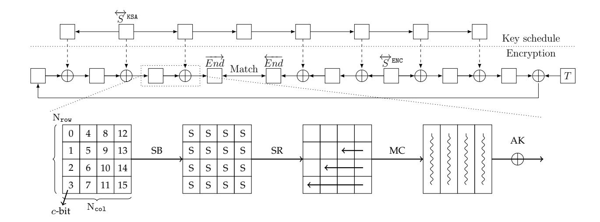

Fig. 1: Overview of AES-like hashing [5]

THE MITM PREIMAGE ATTACKS generally cut the entire encryption process into two chunks (forward and backward chunks), and there are few neutral bits from each side, so that the computation of each chunk can be done independently starting from the cutting point (starting point). The two computations end at a common intermediate (partial) state (matching point), and the computed results from the two sides can be pairwise matched via a linear relation.

Since MITM has been applied to preimage attacks on MD4, MD5, and HAVAL [3, 22,27,28], it has been developed further and applied to preimage attacks on many other hash functions. Advanced techniques in MITM preimage attacks were developed, including the *splice-and-cut* [2], (probabilistic) *initial structure* [14, 29], and (indirect) *partial matching* techniques [2, 29].

The splice-and-cut technique [2] views the input and output of the compression function connected through the feedforward operation. The initial structure is a few consecutive starting steps, where the two chunks overlap and two sets of neutral words (denoted by  $\overrightarrow{N}$  and  $\overleftarrow{N}$ ) appear simultaneously at these steps. Typically, one adds constraints to the values of  $\overrightarrow{N}$  and  $\overleftarrow{N}$  to limit their impact on the opposite chunk such that steps after the initial structure (forward chunk) can be computed independently of  $\overleftarrow{N}$  and steps before the initial structure (backward chunk) can be computed independently of  $\overrightarrow{N}$ . The (indirect-) partial matching exploits any easily determined relations between the computed ending states from the two computation chunks instead of requiring values of full states. There may or may not be any neutral bits from the message of the compression function (or key of the underlying block cipher).

The Attack Framework. The procedure and complexity of the MITM attack depend on how the computation is decomposed into independent chunks, how neutral bits are selected and constrained, and how to match. Once these configurations have been determined, the basic MITM pseudo-preimage attack on a CF goes as follows (with initial structure and partial matching).

1. Assign arbitrary compatible values to all bytes except those that depend on the neutral bytes.

{7}------------------------------------------------

- 2. Obtain possible values of neutral bytes  $\overrightarrow{\mathcal{N}}$  and  $\overleftarrow{\mathcal{N}}$  under the constraints on them. Suppose there are  $2^{d_1}$  values for  $\overrightarrow{\mathcal{N}}$ , and  $2^{d_2}$  for  $\overleftarrow{\mathcal{N}}$ .
- 3. For all  $2^{d_1}$  values of  $\overrightarrow{\mathcal{N}}$ , compute forward from the initial structure to the matching point to get a table  $\overrightarrow{\mathcal{L}}$ , whose indices are the values for matching, and the elements are the values of  $\overrightarrow{\mathcal{N}}$ .
- 4. For all  $2^{d_2}$  values of  $\overline{\mathcal{N}}$ , compute backward from the initial structure to the matching point to get a table  $\overline{\mathcal{L}}$ , whose indices are the values for matching, and the elements are the values of  $\overline{\mathcal{N}}$ .
- 5. Check whether there is a match on indices between  $\overrightarrow{\mathcal{L}}$  and  $\overleftarrow{\mathcal{L}}$ .
- 6. In case of partial-matching exist in the above step, for the surviving pairs, check for a full-state match. In case none of them are fully matched, repeat the procedure by changing values assigned in Step 1 till find a full match.

The Attack Complexity. Denote the size of the internal state by n, the degree of freedom in the forward and backward chunks by  $d_1$  and  $d_2$ , and the number of bits for (partial-) matching by m, the time complexity of the attack is [4]:

<span id="page-7-1"></span>
$$2^{n-(d_1+d_2)} \cdot (2^{\max(d_1,d_2)} + 2^{d_1+d_2-m}) \simeq 2^{n-\min(d_1,d_2,m)}. \tag{1}$$

## 3 MILP Model for the Configuration Search

#### 3.1 Basic MILP Model for MITM

<span id="page-7-0"></span>For searching MITM attacks using MILP, one should characterize valid attack configurations in MILP language.

To generate MILP models and search for the best MITM attack, the high-level workflow is as follows. Given a targeted cipher, enumerate all possible combinations of starting and matching points (detailed in **Searching Framework.**). For each combination, build the MILP model as follows: 1) claim variables indicating the attribute of each state cell in the input/output of each operation in each round, introduce necessary auxiliary variables; 2) define linear equations and inequalities to express relations and constraints among those variables according to the cipher specification and attack principles; 3) write the objective function corresponding to the optimal computational complexity. For each generated MILP model, use an MILP solver to search its optimal solution; Among solutions of various MILP models, select the best one; parse the solution into the attack.

The challenging parts of the modeling are to formalize new attack settings and techniques into explicit rules and then translate into linear inequalities/equations. The linear inequalities/equations should be exact such that the solutions can one-to-one correspond to valid attack configurations.

In the following, we describe the basic modeling method following the framework in [5]. As introducing the basic model, we directly introduce some natural generalizations, while other generalizations and enhancements are deferred to the sequel subsections.

{8}------------------------------------------------

**Notations and Encoding.** For the ease of notation, the conversational coloring scheme for describing and visualizing MITM attacks [4,5,10,26,30,34] is adopted here to characterize the attributes of state cells. As in the MILP modeling in [5], the attribute of individual state cell is encoded using two binary variables (x,y) and defined as follows. A cell is

- Gray ( $\blacksquare$ ) if and only if its value is a predefined constant, thus is known and fixed in *both* forward and backward chunks; Indicating variables (x, y) = (1, 1);
- Blue ( $\square$ ) if and only if its value is determined by forward neutral bytes and predefined constants, thus is known and active in the *forward* chunk but unknown in the backward; Indicating variables (x, y) = (1, 0);
- Red ( $\blacksquare$ ) if and only if its value is determined by backward neutral bytes and predefined constants, thus is known and active in the *backward* chunk but unknown in the forward; Indicating variables (x, y) = (0, 1);
- White  $(\Box)$  if and only if its value is determined by both forward and backward neutral bytes, thus can be computed independently in *neither* chunk; Indicating variables (x, y) = (0, 0).

For convenience, Black ( $\blacksquare$ ) is used to represent any of the 4 cells ( $\blacksquare$ ,  $\blacksquare$ ,  $\blacksquare$ ,  $\square$ ). Additionally, indicating variables  $\beta$  and  $\omega$  are defined as follows.

$$-\beta = \begin{cases} 1 & \text{is inactive, do not contain degree of freedom; is Gray;} \\ 0 & \text{is active, is Blue, Red or White.} \end{cases}$$
 
$$-\omega = \begin{cases} 1 & \text{cannot be computed in both forward and backward chunks; is White;} \\ 0 & \text{can be computed in at least one direction; is Blue, Red, or Gray.} \end{cases}$$

**Searching Framework.** The top-level of a search for the optimal MITM attacks is to enumerate all high-level configurations. A high-level configuration is determined by four parameters, including  $\mathsf{total}_r$ ,  $\mathsf{init}_r^E$ ,  $\mathsf{init}_r^K$ , and  $\mathsf{match}_r$ , representing the total number of targeted rounds, the location of the initial state in encryption, the location of the initial state in the key-schedule, and the location of the matching point, respectively. For the complete search of  $\mathsf{total}_r$ -round attacks, all possible combinations of values of  $\mathsf{init}_r^E$ ,  $\mathsf{init}_r^K$ , and  $\mathsf{match}_r$  should be tried; each combination corresponds to an independent MILP model; The following description of the modeling method is for an individual model with a fixed  $(\mathsf{total}_r, \mathsf{init}_r^E, \mathsf{init}_r^K, \mathsf{match}_r)$ .

When building an MILP model, constraints are imposed on propagation of attributes starting from some initial states (i.e.,  $\overrightarrow{S}^{ENC}$  and  $\overrightarrow{S}^{KSA}$  in round init<sup>E</sup> and init<sup>K</sup>) and terminating at some ending states (i.e.,  $\overrightarrow{End}$  and  $\overrightarrow{End}$  in round match<sub>r</sub>) from two directions.

In all states in both encryption and key-schedule data-paths, constraints are imposed on attribute-indicating variables for state cells. The constraints indicate the relations of cells between consecutive states intra-round and inter-round. The change of attributes of cells from state to state is attribute propagation.

{9}------------------------------------------------

- In the initial states in encryption and key-schedule (i.e., in  $\overrightarrow{S}^{ENC}$  and  $\overrightarrow{S}^{KSA}$ ), the attribute of each cell is constrained to be non-White. Thus, its indicating variables can take three assignments, i.e.,  $(x_i, y_i) \in \{(1,0), (0,1), (1,1)\}$  for  $\forall i \in \mathcal{N}$ , where  $\mathcal{N} = \{0, 1, \cdots, N_{row} \cdot N_{col} 1\}$ . The states in the starting round are called initial because initial degree of freedoms are all contained in these states. Denote the initial degree of freedom for the forward by  $\overrightarrow{\iota}$ , and that for backward by  $\overleftarrow{\iota}$ . Accordingly, one has the equations for  $\overrightarrow{\iota}$  and  $\overleftarrow{\iota}$  as in Eq. (2), where  $|\mathcal{BL}^{ENC}|$ ,  $|\mathcal{RD}^{ENC}|$ ,  $|\mathcal{BL}^{KSA}|$ , and  $|\mathcal{RD}^{KSA}|$  denote the number of Blue, Red cells in  $\overrightarrow{S}^{ENC}$ , and Blue, Red cells  $\overrightarrow{S}^{KSA}$ , respectively.
- In the ending states at the matching round (i.e.,  $\overrightarrow{End}$  and  $\overleftarrow{End}$ ), each column is associated with a general variable since the matching is performed columnwise. Specifically, for each pair of input/output columns of the states before and after MixColumns, the associated variable  $\overrightarrow{m}_i$  indicates the degree of matching in column i and is constrained by the numbers of Blue, Red, and Gray cells. The total degree of matching of the attack, denoted as  $\overrightarrow{m}$ , is the sum of the degrees of matching from all columns, as shown in Eq. (4).

In order for Blue- and Red-attribute to independently propagate from initial states to ending states and remain matchable, special constraints might be occasionally imposed to indicate whether to cancel impact by consuming degrees of freedom. Concrete constraints on how attributes propagate and how freedom be consumed will be introduced shortly. At this moment, let's denote the accumulated consumed degree of freedom of forward by  $\overrightarrow{\sigma}$  and that of backward by  $\overleftarrow{\sigma}$ . The remaining degrees of freedom in forward and backward (denoted by  $\overrightarrow{d_b}$  and  $\overleftarrow{d_r}$ , respectively) after the occasionally freedom-consuming during attribute-propagation are constrained as in Eq. (3). Note that the  $\overrightarrow{d_b}$  and  $\overleftarrow{d_r}$  are the essential degrees of freedom for the attack, which determine the attack complexity.

According to the attack complexity in Formula 1, the search for a valid attack corresponds to the search for a valid attribute propagation with  $\min\{\overrightarrow{d_b}, \overrightarrow{d_r}, \overrightarrow{m}\}$   $\geq 1$ ; the search of the *optimal* attack corresponds to the search with maximized  $\min\{\overrightarrow{d_b}, \overrightarrow{d_r}, \overrightarrow{m}\}$ . Thus, the objective of the search model is to maximize a variable  $\tau_{\text{Obj}}$ , which is constrained by Eq. (5).

$$\begin{cases}
\overrightarrow{\iota} = |\mathcal{BL}^{\text{ENC}}| + |\mathcal{BL}^{\text{KSA}}|, \\
\overleftarrow{\iota} = |\mathcal{RD}^{\text{ENC}}| + |\mathcal{RD}^{\text{KSA}}|.
\end{cases}
\begin{cases}
\overrightarrow{d_b} = \overrightarrow{\iota} - \overrightarrow{\sigma}, & \xrightarrow{m} = \sum_{i=0}^{N_{\text{col}}-1} \xrightarrow{m}_{i}.
\end{cases}
\begin{cases}
\tau_{\text{0bj}} \leq \overrightarrow{d_b}, \\
\tau_{\text{0bj}} \leq \overrightarrow{d_r}, \\
\tau_{\text{0bj}} \leq \overrightarrow{m}.
\end{cases}$$
(2)
$$(3)$$
(4)
$$(5)$$

<span id="page-9-2"></span><span id="page-9-1"></span><span id="page-9-0"></span>Basic Rules for Attributes to Propagate and to Match. The attribute propagation and the matching are governed by two types of constraints. The first type is due to the specification of the targeted cipher; the second type is due to the principle of the attack. If attacks are technically improved, the

{10}------------------------------------------------

second type constraints should be adapted to the improvement. In turn, when the second type constraints are properly relaxed, the attack space is expanded so that improved attacks might be discovered.

*Remark 1 (Bi-direction attribute-propagation and cancellation (BiDir)).* Previously [4, 5, 10, 26, 30, 34], the constraints are imposed such that the propagation of Red-attribute can "make a concession" <sup>5</sup> to the propagation of Blue, but Blue never "gives in" to Red for forward computation, and vice versa. Unlike the previous work, in this work, the constraints are relaxed such that the propagation of Bl[ue](#page-28-1) [or](#page-28-2) [Re](#page-29-7)[d](#page-30-5) a[ttr](#page-30-7)i[bu](#page-30-10)te can make a concession (cancel its impact by consuming its degree of freedom) to the propag[at](#page-10-0)ion of the opposite attribute in both directions. The reasons are as follows.

- **–** In the modeling, we introduce neutral bytes into key states as well as in encryption states to bring more degree of freedom. In attribute propagation through encryption, letting Blue-propagation concede such that a local Redcell be reserved, that might enable a remote Red-cell introduced from the key state be canceled such that Blue-propagation be possible in that remote point. That also applies to the case of Red-propagation.
- **–** Besides, letting Blue to concede and reserve a local Red-cell might enable this local Red-cell to propagate and combine with other Red-cells at a remote point such that their impacts on a certain cell be mutually canceled through MixColumns and benefit Blue-propagation.
- **–** In addition, once an attribute of Blue or Red propagate to the ending states no matter from which direction, it provides source of degree of matching.

Relaxing the model in this way results in attacks with bi-direction attributepropagation; the attack space is expanded so that improved attacks are possible. (See attack configurations in Figures 3, 5, 7, 13 for examples.) However, this relaxation caused the models to be solved less efficiently. When the efficiency is acceptable, we used such relaxed model for better attacks. Otherwise, we restricted the models such that in certain rounds of the cipher, one attribute can only propagate in one direction a[nd](#page-24-0) [co](#page-36-0)[nc](#page-39-0)e[de](#page-47-0) in the other direction.

In the following, we describe the MILP modeling with the relaxed model as the basic setting. The difference between this basic modeling and the modeling in [5] and how to get the restricted models will be indicated alongside.

*Modeling of the Attribute Propagation through* SubBytes *and* ShiftRows*.* The SubBytes operation does not change the attribute of the cells, thus is not involved

<span id="page-10-0"></span><sup>5</sup> [He](#page-28-2)re, the use of phrases "make a concession" or "give in" is due to a view of the forward computation and backward computation be in a competition for being able to be propagated unaffected. In previous attacks, for forward computation, propagation of Blue-attribute is of high priority. When unaffected propagation of Blue-attribute becomes not straightforward due to the existence of cells of Red-attribute, we may try to cancel the impact by consuming the freedom of backward to ensure the propagation of Blue-attribute. We say such cancellation of impact by consuming freedom "concede", "make a concession " or "give in".

{11}------------------------------------------------

when building the basic model. The ShiftRows operation permutes the state cells, thus can be modeled by a set of equations or hardcoded variable substitution.

Modeling of the Attribute Propagation through AddRoundKey and XOR (XOR-RULE). The AddRoundKey operation is involved in the model when the cipher has KeySchedule (message schedule), and the attack exploits freedom from the key state. Basically, the attribute propagation through AddRoundKey is governed by a set of cell-wise constraints under the name XOR-RULE. The high-level principle is that White is the dominant attribute, Gray is the recessive attribute, Blue and Red are mutually exclusive attributes. The concrete rules are as follows.

- A White cell XORed with a cell of any attribute results in a White cell, *i.e.*,  $(\Box \oplus \blacksquare) \rightarrow \Box$ ;
- a Gray cell XORed with a cell of any attribute results in the cell of the same attribute, *i.e.*,

$$(\blacksquare \oplus \blacksquare) \rightarrow \blacksquare;$$

- a couple of Blue and Red cells results in a cell deteriorated to White, *i.e.*,  $(\blacksquare \oplus \blacksquare) \rightarrow \Box$ ;
- a couple of Blue cells can keep the attributes without consuming or evolve to Gray by consuming a degree of freedom of Blue, *i.e.*,

$$(\blacksquare \oplus \blacksquare) \to \blacksquare \text{ or } (\blacksquare \oplus \blacksquare) \xrightarrow{-1 \times \blacksquare} \blacksquare;$$

- a couple of Red cells can keep the attributes without consuming or evolve to Gray by consuming a degree of freedom of Red, *i.e.*,

$$(\blacksquare \oplus \blacksquare) \to \blacksquare \text{ or } (\blacksquare \oplus \blacksquare) \xrightarrow{-1 \times \blacksquare} \blacksquare.$$

These propagation rules can be described using only a few variables, thus can be easily translated into inequalities using convex hull computations [31].

Modeling of the Attribute Propagation through MixColumns (MC-RULE). The attribute propagation through MixColumns is governed by a set of column-wise constraints under the name MC-RULE. The MC-RULE constraints are mostly governed by the branch number  $(Br_n)$  of the MixColumns. Again, the high-level principle is that White is the dominant attribute, Gray is the recessive attribute, Blue and Red are mutually exclusive attributes. The concrete rules are as follows:

- any White cell in an input column results in all cells in the output column deteriorated to White, *i.e.*,

$$(i \times \square, j \times \blacksquare) \to (N_{row} \times \square), \text{ where } i \geq 1, i + j = N_{row};$$

- the Gray attribute inherits to the output without consuming degrees of freedom only if all cells in the input column are Gray, *i.e.*,  $(N_{row} \times \blacksquare) \to (N_{row} \times \blacksquare);$
- existing no White cell, a column of i Blue, j Red, and k Gray cells propagate to a column of i' Blue, j' Red, k' Gray, and  $\ell'$  White cells by consuming j'+k' degree of freedom from Blue, and i'+k' from Red, i.e.,

$$(i \times \blacksquare, j \times \blacksquare, k \times \blacksquare) \xrightarrow{-(j'+k') \times \blacksquare \text{ if } i \neq 0} (i' \times \blacksquare, j' \times \blacksquare, k' \times \blacksquare, \ell' \times \square), \text{ where}$$

{12}------------------------------------------------

$$i+j+k=i'+j'+k'+\ell'=\mathrm{N_{row}} \text{ and } \begin{cases} j'+k'< i\leq \mathrm{N_{row}} & \text{if } i\neq 0\\ j'+k'=\mathrm{N_{row}} & \text{otherwise} \end{cases},$$
 
$$\begin{cases} i'+k'< j\leq \mathrm{N_{row}} & \text{if } j\neq 0\\ i'+k'=\mathrm{N_{row}} & \text{otherwise} \end{cases}. \text{ Note that when } i\neq 0 \text{ , } j'+k'< i\Leftrightarrow \mathrm{N_{row}}-i'-l'< i\Leftrightarrow i+i'+l'>=\mathrm{N_{row}}+1, \text{ which is due to the branch number; similarly, } i'+k'< j \text{ when } j\neq 0 \text{ is due to the branch number.} \end{cases}$$

To formalize these propagation rules into a system of inequalities, the involved number of variables is not small. Concretely, the involved variables include the binary variables that indicate the attribute of each cell in the input and output columns, i.e.,  $(x_i^I, y_i^I)$ ,  $(x_i^O, y_i^O)$ , and  $\omega_i^I$  for  $i \in \{0, 1, \cdots, N_{row} - 1\}$ , the general variables  $c_{\vec{x}}$  and  $c_{\vec{y}}$  representing the consumed degree of freedom from Blue and Red, respectively. Apart from those variables, three auxiliary binary variables are introduced to indicate the following attributes of the input column:

$$\vec{\omega} = \begin{cases} 1 & \text{exists White cell,} \\ 0 & \text{otherwise.} \end{cases} \vec{x} = \begin{cases} 1 & \text{all are Blue/Gray,} \\ 0 & \text{exists Red/White.} \end{cases} \vec{y} = \begin{cases} 1 & \text{all are Red/Gray,} \\ 0 & \text{exists Blue/White.} \end{cases}$$
(6)
(7)
(8)

The constraints can then be formalized using inequalities listed in Eq. (15, 16, 17).

Remark 2. The set of inequalities will be simpler when one restricts the models such that one attribute can only propagate in one direction and concede in the other direction. For example, for the propagation of the Blue attribute to the forward, it only consumes degrees of freedom from Red. Thus, the last two inequalities in Eq. (16) can be  $(\sum_{i=0}^{N_{\text{row}}-1} y_i^O) - N_{\text{iosum}} \cdot \vec{y} = 0$ ; In Eq. (17), inequalities on  $c_{\vec{x}}$  can be removed.

Modeling of the Matching through MixColumns and AddRoundKey (MATCH-RULE). The modeling for matching also focuses on the MixColumns and AddRoundKey operations. The matching through MixColumns and AddRoundKey is governed by a set of column-wise constraints under the name MATCH-RULE.

The involved states are those around MixColumns at the matching round, including  $\overrightarrow{End}$  and  $\overleftarrow{End}$  in encryption and  $\overrightarrow{End}^{\rm KMC}$  or  $\overleftarrow{End}^{\rm K}$  in key-schedule. Note that  $\overrightarrow{End}$  and  $\overleftarrow{End}$  are states that have not been added with key-state  $\overrightarrow{End}^{\rm KMC}$  or  $\overleftarrow{End}^{\rm K}$ . Since AddRoundKey is linear, the influence of AddRoundKey for matching can be formalized using simple rules. Concretely, only a White cell in key state destroy the match-ability of the corresponding cell in encryption state. The Blue and Red cells in key state do not impact the match-ability but on the contrary might provide degree of matching.

Remark 3. For specific targeted cipher whose key-schedule is almost identical to the encryption, e.g., Whirlpool, one can use  $\overrightarrow{End} \oplus \overrightarrow{End}^{\mathrm{KMC}}$  as an equivalent key addition to  $\overleftarrow{End} \oplus \overleftarrow{End}^{\mathrm{K}}$ . The color pattern (most importantly, the distribution of White cells) of  $\overrightarrow{End}^{\mathrm{KMC}}$  and  $\overleftarrow{End}^{\mathrm{K}}$  are different in most cases. Thus, adding

{13}------------------------------------------------

 $\overrightarrow{End}^{\mathrm{KMC}}$  or  $\overleftarrow{End}^{\mathrm{K}}$ , these two ways may have different effects on the degree of matching. To find the optimal solution, one should consider both ways. However, we can simply choose to use the key state with fewer White cells. That is because, known the propagation direction of the key-schedule  $(i.e., \mathtt{init}_r^{\mathrm{K}})$ , between the two states  $\overrightarrow{End}^{\mathrm{KMC}}$  and  $\overleftarrow{End}^{\mathrm{K}}$ , the one that is near to the initial key state must have set of White cells be subset of that in the remote state, thus has less impact.

The condition for the *i*-th column to have  $\overrightarrow{m}_i$  degree of matching is as follows: denote the number of known cells (*i.e.*, except White cells) in the input and output columns by  $\overline{m}_{ki}$ ; when  $\overline{m}_{ki} > \mathrm{N}_{\mathsf{row}}$ ,  $\overrightarrow{m}_i = \overline{m}_{ki} - \mathrm{N}_{\mathsf{row}}$ ; otherwise,  $\overrightarrow{m}_i = 0$ . Denote the number of white cells by  $\overline{m}_{wi}$ ; Since  $\overline{m}_{ki} = 2 \cdot \mathrm{N}_{\mathsf{row}} - \overline{m}_{wi}$ , one have  $\overrightarrow{m}_i = \max(0, \mathrm{N}_{\mathsf{row}} - \overline{m}_{wi})$ . Accordingly, the concrete system of inequalities modeling MATCH-RULE can be obtained as explained in Sect. A and as listed in Eq. (18).

### 3.2 Superposition States and Separate Attribute-Propagation

Except for allowing bi-direction attribute-propagation, the above basic modeling is in line with previous work [4,5,10,26,30,34], where Blue and Red attributes propagate exclusively and competitively through each operation. Once the two exclusive attribute propagate into the same cell position, this cell is considered being White, cannot be independently computed in either forward nor backward.

However, such modeling might miss valid attacks as will be discussed shortly. In our final modeling, the two exclusive attributes Blue and Red propagate independently as long as it is possible. This is achieved by introducing *superposition* states. Superposition states are all intermediate states in encryption and keyschedule being separated into two virtual states. One virtual state carries one attribute propagation independently of the other attribute propagation. The two virtual states are combined only when going through non-linear operations. In this way, two exclusive attributes can simultaneously propagate through all linear operations in both encryption and key-schedule. See Fig. 3 and 22 for examples, and see Fig. 3 and Fig. 10 for the correspondence between superposition states and real states. This superposition setting captures the independence of the computation in a more essential way, allows new ways of local collisions between/within the encryption and key states, thus, maximize the chances of canceling impacts on independence and enables new ways of MITM decomposition. Concretely, the reasons and benefits of separating propagation with superposition states are as follows.

As mentioned above, under certain constraints, Blue propagation can make a concession so that impacts are canceled and Red can propagate unaffected, and vice versa. To cancel impact, it requires consuming degrees of freedom. To be able to consume degrees of freedom, different types of operations impose different requirements on the attribute of input states. Concretely, the XOR-RULE and MC-RULE requires differently for canceling impacts. Attributes

{14}------------------------------------------------

of state cells might not meet the individual requirements but it is actually possible to cancel impacts when combining these two linear operations.

In [5], the propagation through the combination of AddRoundKey and Mix-Columns is characterized using the set of XOR-MC-RULE. In XOR-MC-RULE, the OR of the attribute indicating variables of encryption and key-state cell is used to indicate the attribute of the input cell of MixColumns. In that way, the [g](#page-28-2)roup of cells of the same attribute in both encryption and key states can jointly cancel their impacts on certain output cells.

However, using only XOR-MC-RULE, the possibility of the following scenario is missed. That is, an attribute can be completely canceled via XOR-RULE before propagating through MixColumns (refer to Fig. 2a for an illustration). Thus, to find optimal attack configurations, applying XOR-RULE-then-MC-RULE and XOR-MC-RULE should be both considered in the models.

In this work, we model the combination of AddRoundKey and MixColumns by considering the separation of (Blue and Red[\) a](#page-15-0)ttribute propagation with superposition states. Note that AddRoundKey and MixColumns are linear. Essentially, for linear operations, in the same state, the attributes of Blue and Red can separately propagate through them and then combine by cellwise XOR upon the non-linear operation (*i.e.*, SubBytes).

Due to this separation with superposition states, XOR-RULE and MC-RULE without XOR-MC-RULE are sufficient (refer to Fig. 2 for an illustration of the separation of attribute-propagation through AddRoundKey and MixColumns).

- **–** Additionally, the key/message-schedule of the ciphers also has linear operations. It is possible that before going through the non-linear operation in the key-schedule, the attribute of one cell in the [ro](#page-15-0)und-key is a linear combination of Blue and Red. If not be separately considered, such a linear combination of Blue and Red becomes White. Separately, the Blue component in the linear combination in a key state can be used to cancel impact from the Blue component in another key state or in an encryption state, and same for the Red component. Consequently, impacts that cannot be canceled in previous models can be canceled now, thus independent propagation gets more chances (see Fig. 22 for an example.)
- **–** Moreover, at the matching point, if a key state cell is in superposition (a linear combination of Blue and Red), it does not impact the matching ability of the corresponding state cell, and instead, the Blue component and Red component may provid[e d](#page-53-0)egrees of matching (see Fig. 18 for an example.)

## **3.3 Multiple Ways of** AddRoundKey **(MulAK)**

In Whirlpool, the key-schedule shares the same operations [w](#page-50-0)ith the encryption except for AddRoundKey. This identity between encryption and key-schedule enables that in encryption, the AddRoundKey can be easily moved around Mix-Columns. Moving around MixColumns is simply switching between adding #**KMC** or adding *k*, where #**KMC** and *k* are the states before and after MixColumns in the round function of key-schedule, that is, a switch between adding the real round-key *k* or an equivalent (up to MixColumns) round-key #**KMC**.

{15}------------------------------------------------

<span id="page-15-0"></span>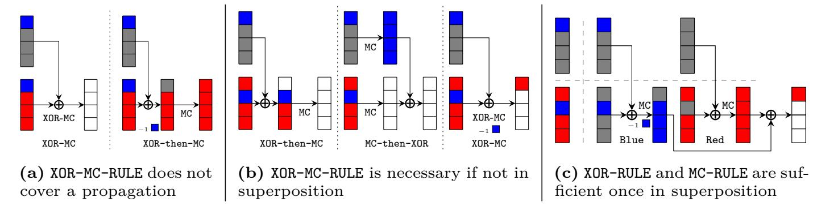

- **–** In 2a, using XOR-MC-RULE, a result of full Red attribute can not be achieved, which can be obtained by XOR-then-MC-RULE.
- **–** In 2b, without superposition, (Blue and Red) attribute-propagation ruled by XOR-MC-RULE cannot be obtained directly by XOR-then-MC-RULE and MC-then-XOR-RULE.
- **–** In 2c, with (Blue and Red) attribute-propagation in superposition, XOR-RULE and MC-RULE are sufficient (2c achieve the same results as achieved by XOR-MC-RULE 2b).

**Fig. [2:](#page-15-0)** Combination of linear operations and superposition attribute-propagation

Moving [Ad](#page-15-0)dRoundKey before MixColumns and using [#](#page-15-0)**KMC** can bring more advantages in some cases. Take the case where we need to reserve Blue by consuming Red for example. Let's focus on one column of the state. Suppose there is one Red cell in that column of #**MC** and one Red cell in the same cellposition in #**KMC**; the influence of these single Red cells will be diffused into the whole columns in both states if there is no constraint. In such case, adding #**KMC** with #**MC** and letting the Red cell in #**MC** be canceled by the Red cell in #**KMC** achieve the same cancellation effect but consume fewer degrees of freedom than adding #**AK** with *k* (take using #**MC**<sup>5</sup> *⊕* #**KMC**<sup>4</sup> vs. #**AK**<sup>5</sup> *⊕ k*<sup>5</sup> in Fig. 3 for an example). Similarly, it is also possible that adding #**AK** with *k* after the MixColumns has more advantages than adding #**MC** with #**KMC** (take using #**SB**<sup>4</sup> *⊕ k*<sup>3</sup> vs. #**MC**<sup>5</sup> *⊕ k*<sup>2</sup> in Fig. 3 for an example).

Thus, to find optimal attack configurations, both scenarios should be consi[d](#page-24-0)ered. The essential difference between the scenarios is to either firstly use freedom in the key state to directly cancel impacts before diffusion or to postpone the insertion of the key state in orde[r t](#page-24-0)o postpone impacts from the key. We name the choice of applying the first scenario by AK-MC-RULE and the second scenario by MC-AK-RULE. The integration of the two scenarios into one model is in the form of indicator constraints that is available in Gurobi. Note that, for forward computation, AK-MC-RULE corresponds to using #**MC** *⊕* #**KMC**, MC-AK-RULE corresponds to using #**AC** *⊕k*; for backward computation, AK-MC-RULE corresponds to using #**SB** *⊕ k*, and MC-AK-RULE corresponds to using #**MC** *⊕* #**KMC**;

In addition, since the MixColumns is column-wise, different columns can apply different ways (apply AK-MC-RULE or MC-AK-RULE) independently. Besides, since MixColumns is linear, with superposition states, different attributes of Blue and Red can independently apply AK-MC-RULE or MC-AK-RULE.

Integrating such flexibility of choice into the MILP models expand the covered attack space but make the solving less efficient. So, to decide in which way to proceed for each column, we use the heuristic that when the key-schedule has already consumed some degree of freedom in that column, we apply MC-AK-RULE; otherwise, apply AK-MC-RULE.

{16}------------------------------------------------

#### Enhanced Model with Guess-and-Determine (GnD) 3.4

The Guess-and-Determine Strategy. In MITM attacks, one unfavorable situation is that a single or a few unknown cells in the input column of MC makes all cells in the output column unknown (refer to point 1 of MC-RULE). This is inevitable due to the diffusion of MixColumns, especially the property of the MDS matrix.

To turn things around in such situations, Sasaki et al. in [30] invent the following guess-and-determine strategy. That is, guess values of the few unknown cells to continue the propagation of attribute to reach the matching point, after (partial) matching, check the consistency of the few guessed cells. If the gained degree of matching is sufficient and the required guesswork is very little, one can still achieve a better attack complexity than a brute-force attack.

Concretely, denote  $2^c$  by  $\varsigma$  (where c is the number of bits in each cell). Let:

- $-\overrightarrow{d_{g_b}}$  be the number of cells only guessed to be Blue (forward computation);  $-\overrightarrow{d_{g_r}}$  be the number of cells only guessed to be Red (backward computation);  $-\overrightarrow{d_{g_{br}}}$  be the number of cells guessed to be both Blue and Red. <sup>6</sup>

The framework of the MITM attack with GnD is as follows:

- 1. Assign arbitrary compatible values to all cells except for those depending on the neutral bits, and assign arbitrary values to the constants in pre-defined constraints on neutral bits;
- 2. Compute values  $\{\overrightarrow{v}_i\}$  of forward neutral bits and values  $\{\overleftarrow{v}_i\}$  of backward neutral bits fulfilling pre-defined constraints.
- <span id="page-16-1"></span>3. For all  $\zeta^{\overrightarrow{d_b}}$  values  $\{\overrightarrow{v}_i\}$  of forward neutral bits, and  $\zeta^{(\overrightarrow{d_{g_b}} + \overrightarrow{d_{g_{br}}})}$  guessed values  $\{\overrightarrow{v}_q\}$  for forward, compute forward to the matching point and store all  $\varsigma^{\overrightarrow{d_b}+\overrightarrow{d_{g_b}}+\overrightarrow{d_{g_{br}}}} \text{ partial matching values } \{\overrightarrow{v}_m\} \text{ in a look up table } \overrightarrow{\mathcal{T}} \text{ (the values are } \overrightarrow{v}_i \text{ and } \overrightarrow{v}_g, \text{ and the index is } \overrightarrow{v}_m).$
- 4. For all  $\zeta^{\overrightarrow{d_r}}$  values  $\{\overleftarrow{v}_i\}$  of backward neutral bits, and  $\zeta^{(\overleftarrow{d_{g_r}}+\overleftarrow{d_{g_{b_r}}})}$  guessed values  $\{\overleftarrow{v}_g\}$  for backward, compute backward to the matching point, obtain the partial matching values  $\overleftarrow{v}_m$ .
- 5. For all values of  $\overrightarrow{v}_i$  and  $\overrightarrow{v}_g$  in entry  $\overrightarrow{\mathcal{T}}[\overleftarrow{v}_m]$ , use  $\overrightarrow{v}_i$  and  $\overleftarrow{v}_i$  to compute and check if the guessed values  $\overrightarrow{v}_g$  and  $\overleftarrow{v}_g$  are compatible. For compatible guesses, compute to the matching point to check if it is a full-state match. If so, use  $\overrightarrow{v}_i$  and  $\overleftarrow{v}_i$  to compute the preimage, output it, and return; otherwise, repeat from Step 1 by changing values assigned at that step.

In the above framework of the MITM attack with GnD,

- the total degree of freedom for Blue with guessing is  $\overrightarrow{d_b} + \overrightarrow{d_{g_b}} + \overrightarrow{d_{g_{br}}};$  the total degree of freedom for Red with guessing is  $\overrightarrow{d_r} + \overrightarrow{d_{g_r}} + \overrightarrow{d_{g_{br}}};$  the expected number of matched pairs is  $\varsigma^{\overrightarrow{d_b} + \overrightarrow{d_{g_b}} + \overleftarrow{d_{g_{br}}} + \overleftarrow{d_{r}} + \overleftarrow{d_{g_{br}}} + \overleftarrow{d_{g_{br}}} \overrightarrow{m}};$

<span id="page-16-0"></span><sup>&</sup>lt;sup>6</sup> Since we allow bi-direction attribute propagation in superposition states, it might bring benefit to guess a superposition cell to be simultaneously Blue and Red. Thus, here is a slight generalization of the previous GnD strategy.

{17}------------------------------------------------

- the required number of repetitions to get a full match at the guessing cells and a full-state match is  $\varsigma^{-(\overrightarrow{d_b}+\overrightarrow{d_{g_b}}+\overrightarrow{d_{g_b}}+\overrightarrow{d_{g_b}}+\overrightarrow{d_{g_r}}+\overrightarrow{d_{g_r}}+\overrightarrow{d_{g_{br}}}-\overrightarrow{m})$ .  $\varsigma^{\overrightarrow{d_{g_b}}+\overrightarrow{d_{g_{br}}}+\overrightarrow{d_{g_r}}}$ .  $\varsigma^{(n-\overrightarrow{m})}$ , which equals  $\varsigma^{n-\overrightarrow{d_b}-\overrightarrow{d_r}-\overrightarrow{d_{g_{br}}}}$ ;

Thus, the complexity of the attack is  $\zeta^{n-\overrightarrow{d_b}-\overleftarrow{d_r}-\overleftarrow{d_g_{br}}} \cdot (\zeta^{\overrightarrow{d_b}+\overrightarrow{d_{g_b}}+\overleftarrow{d_{g_b}}+\overleftarrow{d_{g_b}}+\overleftarrow{d_{g_br}}+\zeta^{\overleftarrow{d_r}+\overleftarrow{d_{g_r}}+\overleftarrow{d_{g_{br}}}+\overleftarrow{d_{g_{br}}}+c^{\overleftarrow{d_r}+\overleftarrow{d_{g_{br}}}+\overrightarrow{d_{g_{br}}}+c^{\overleftarrow{d_r}+\overleftarrow{d_{g_{br}}}+c^{\overleftarrow{d_r}+\overleftarrow{d_{g_{br}}}+c^{\overleftarrow{d_r}+\overleftarrow{d_{g_{br}}}+c^{\overleftarrow{d_r}+\overleftarrow{d_{g_{br}}}+c^{\overleftarrow{d_r}+\overleftarrow{d_{g_{br}}}+c^{\overleftarrow{d_r}+\overleftarrow{d_{g_{br}}}+c^{\overleftarrow{d_r}+\overleftarrow{d_{g_{br}}}+c^{\overleftarrow{d_r}+\overleftarrow{d_{g_{br}}}+c^{\overleftarrow{d_r}+\overleftarrow{d_{g_{br}}}+c^{\overleftarrow{d_r}+\overleftarrow{d_{g_{br}}}+c^{\overleftarrow{d_r}+\overleftarrow{d_{g_{br}}}+c^{\overleftarrow{d_r}+\overleftarrow{d_{g_{br}}}+c^{\overleftarrow{d_r}+\overleftarrow{d_{g_{br}}}+c^{\overleftarrow{d_r}+\overleftarrow{d_{g_{br}}}+c^{\overleftarrow{d_r}+\overleftarrow{d_{g_{br}}}+c^{\overleftarrow{d_r}+\overleftarrow{d_{g_{br}}}+c^{\overleftarrow{d_r}+\overleftarrow{d_{g_{br}}}+c^{\overleftarrow{d_r}+\overleftarrow{d_{g_{br}}}+c^{\overleftarrow{d_r}+\overleftarrow{d_{g_{br}}}+c^{\overleftarrow{d_r}+\overleftarrow{d_{g_{br}}}+c^{\overleftarrow{d_r}+\overleftarrow{d_{g_{br}}}+c^{\overleftarrow{d_r}+\overleftarrow{d_{g_{br}}}+c^{\overleftarrow{d_r}+\overleftarrow{d_{g_{br}}}+c^{\overleftarrow{d_r}+\overleftarrow{d_{g_{br}}}+c^{\overleftarrow{d_r}+\overleftarrow{d_{g_{br}}}+c^{\overleftarrow{d_r}+\overleftarrow{d_{g_{br}}}+c^{\overleftarrow{d_r}+\overleftarrow{d_{g_{br}}}+c^{\overleftarrow{d_r}+\overleftarrow{d_{g_{br}}}+c^{\overleftarrow{d_r}+\overrightarrow{d_{g_{br}}}+c^{\overleftarrow{d_r}+\overrightarrow{d_{g_{br}}}+c^{\overleftarrow{d_r}+\overrightarrow{d_{g_{br}}}+c^{\overleftarrow{d_r}+\overrightarrow{d_{g_{br}}}+c^{\overleftarrow{d_r}+\overrightarrow{d_{g_{br}}}+c^{\overleftarrow{d_r}+\overrightarrow{d_{g_{br}}}+c^{\overleftarrow{d_r}+c^{\overleftarrow{d_r}+c^{\overleftarrow{d_r}+c^{\overleftarrow{d_r}+c^{\overleftarrow{d_r}+c^{\overleftarrow{d_r}+c^{\overleftarrow{d_r}+c^{\overleftarrow{d_r}+c^{\overleftarrow{d_r}+c^{\overleftarrow{d_r}+c^{\overleftarrow{d_r}+c^{\overleftarrow{d_r}+c^{\overleftarrow{d_r}+c^{\overleftarrow{d_r}+c^{\overleftarrow{d_r}+c^{\overleftarrow{d_r}+c^{\overleftarrow{d_r}+c^{\overleftarrow{d_r}+c^{\overleftarrow{d_r}+c^{\overleftarrow{d_r}+c^{\overleftarrow{d_r}+c^{\overleftarrow{d_r}+c^{\overleftarrow{d_r}+c^{\overleftarrow{d_r}+c^{\overleftarrow{d_r}+c^{\overleftarrow{d_r}+c^{\overleftarrow{d_r}+c^{\overleftarrow{d_r}+c^{\overleftarrow{d_r}+c^{\overleftarrow{d_r}+c^{\overleftarrow{d_r}+c^{\overleftarrow{d_r}+c^{\overleftarrow{d_r}+c^{\overleftarrow{d_r}+c^{\overleftarrow{d_r}+c^{\overleftarrow{d_r}+c^{\overleftarrow{d_r}+c^{\overleftarrow{d_r}+c^{\overleftarrow{d_r}+c^{\overleftarrow{d_r}+c^{\overleftarrow{d_r}+c^{\overleftarrow{d_r}+c^{\overleftarrow{d_r}+c^{\overleftarrow{d_r}+c^{\overleftarrow{d_r}+c^{\overleftarrow{d_r}+c^{\overleftarrow{d_r}+c^{\overleftarrow{d_r}+c^{\overleftarrow{d_r}+c^{\overleftarrow{d_r}+c^{\overleftarrow{d_r}+c^{\overleftarrow{d_r}+c^{\overleftarrow{d_r}+c^{\overleftarrow{d_r}+c^{\overleftarrow{d_r}+c^{\overleftarrow{d_r}+c^{\overleftarrow{d_r}+c^{\overleftarrow{d_r}+c^{\overleftarrow{d_r}+c^{\overleftarrow{d_r}+c^{\overleftarrow{d_r}+c^{\overleftarrow{d_r}+c^{\overleftarrow{d_r}+c^{\overleftarrow{d_r}+c^{\overleftarrow{d_r}+c^{\overleftarrow{d_r}+c^{\overleftarrow{d_r}+c^{\overleftarrow{d_r}+c^{\overleftarrow{d_r}+c^{\overleftarrow{d_r}+c^{\overleftarrow{d_r}+c^{\overleftarrow{d_r}+c^{\overleftarrow{d_r}+c^{\overleftarrow{d_r}+c^{\overleftarrow{d_r}+c^{\overleftarrow{d_r}+c^{\overleftarrow{d_r}+c^{\overleftarrow{d_r}+c^{\overleftarrow{d_r}+c^{\overleftarrow{d_r}+c^{\overleftarrow{d_r}+c^{\overleftarrow{d_r}+c^{\overleftarrow{d_r}+c^{\overleftarrow{d_r}+c^{\overleftarrow{d_r}+c^{\overleftarrow{d_r}+c^{\overleftarrow{d_r}+c^{\overleftarrow{d_r}+c^{\overleftarrow{d_r}+c^{\overleftarrow{d_r}+c^{\overleftarrow{d_r}+c^{\overleftarrow{d_r}+c^{\overleftarrow{d_r}+c^{\overleftarrow{d_r}+c^{\overleftarrow{d_r}+c^{\overleftarrow{d_r}+c^{\overleftarrow{d_r}+c^{\overleftarrow{d_r}+c^{\overleftarrow{d_r}+c^{\overleftarrow{d_r}+c^{\overleftarrow{d_r}+c^{$ 

$$\varsigma^{n} \cdot \left(\varsigma^{-(\overrightarrow{d_{r}} - \overrightarrow{d_{g_{b}}})} + \varsigma^{-(\overrightarrow{d_{b}} - \overrightarrow{d_{g_{r}}})} + \varsigma^{-(\overrightarrow{m}} - \overrightarrow{d_{g_{b}}} - \overrightarrow{d_{g_{b}}} - \overrightarrow{d_{g_{b}}})}\right) 
\simeq \varsigma^{n} \cdot \max\left(\varsigma^{-(\overrightarrow{d_{r}} - \overrightarrow{d_{g_{b}}})}, \varsigma^{-(\overrightarrow{d_{b}} - \overrightarrow{d_{g_{r}}})}, \varsigma^{-(\overrightarrow{m}} - \overrightarrow{d_{g_{b}}} - \overrightarrow{d_{g_{b}}} - \overrightarrow{d_{g_{r}}} - \overrightarrow{d_{g_{br}}})\right)$$
(9)

Accordingly, the complexity is determined by

<span id="page-17-2"></span>
$$\min(\overleftarrow{d_r} - \overrightarrow{d_{g_b}}, \overrightarrow{d_b} - \overleftarrow{d_{g_r}}, \overrightarrow{m} - \overrightarrow{d_{g_b}} - \overleftarrow{d_{g_r}} - \overleftarrow{d_{g_{br}}}).$$

Building Model for Guessing. To model the mechanism of GnD, three binary variables,  $g_b$ ,  $g_r$ ,  $g_{br}$ , are introduced for each cell in the input state of MixColumns (invMixColumns for the backward computation).

The variables indicate whether the values of the cells should be guessed to be of one attribute. Concretely,  $g_b = 1$  for guessing one White cell to be Blue.  $g_r = 1$  for guessing one White cell to be Red.  $g_{br} = 1$  for guessing one White cell to be Blue (for forward propagation) and also Red (for backward propagation).

With these guess-indicating variables, attribute-indicating variables of each cell in the input of MixColumns are thus constrained together with attribute-indicating variables of the cell in output state of last operations (e.g., ShiftRows or AddRoundKey). Besides, according to the complexity Eq. (9) of the attack with GnD, the objective should turn from  $\min(\overrightarrow{d_b}, \overrightarrow{d_r}, \overrightarrow{m})$  to  $\min(\overrightarrow{d_b} - \overrightarrow{d_{g_r}}, \overrightarrow{d_r} - \overrightarrow{d_{g_b}})$ . Thus, the variable that to be maximized is constrained as in Eq. (10) and (11).

<span id="page-17-1"></span>
$$\begin{cases}
\overrightarrow{d_{g_b}} = \sum_{r=0, i=0}^{\text{total}_r - 1, n-1} g_{b_i}^r, \\
\overleftarrow{d_{g_r}} = \sum_{r=0, i=0}^{\text{total}_r - 1, n-1} g_{r_i}^r, \\
\overrightarrow{d_{g_{br}}} = \sum_{\text{total}_r - 1, n-1} g_{b_i}^r,
\end{cases} (10) \qquad
\begin{cases}
\tau_{\text{0bj}} \leq \overrightarrow{d_b} - \overleftarrow{d_{g_r}}, \\
\tau_{\text{0bj}} \leq \overleftarrow{d_r} - \overrightarrow{d_{g_b}}, \\
\tau_{\text{0bj}} \leq \overrightarrow{m} - \overrightarrow{d_{g_b}} - \overleftarrow{d_{g_r}} - \overleftarrow{d_{g_{b_r}}}.
\end{cases} (11)$$

<span id="page-17-0"></span>Note that in the starting round, all cells are known and in the matching round, guessing brought no advantage. Thus, for these two rounds, such constraints on guessing can be omitted. Besides, generally, guessing are only required around the matching point. Thus, when trade-off between search quality and search efficiency is needed, these guessing constraints can be added only for rounds around the matching point.

{18}------------------------------------------------

#### 3.5 Transforming to Models for Searching for Collision Attacks

<span id="page-18-1"></span>A MITM partial target preimage attack whose matching point is at the last round can be transformed into a collision attack, as described by Li et al. in [23]. Thus, the searching of MITM preimage attacks can be constraint to search for such partial target preimage attacks, and then translate into valid collision attack. Concretely, one have the follows.

Definition 1 ((t-bit) partial target pseudo preimage attack on CF [23]). Given the value v of t bits in T, find (h', m') such that t bits in T' := CF(h', m') at the same position as the t bits in T, take value v.

Let  $\mathcal{A}$  be a random algorithm that can find a t-bit partial target pseudo preimage with a complexity of  $2^s$ . This complexity can be in the average sense, which means that  $\mathcal{A}$  can generate  $2^r$  different (h', m', T') in one time with a complexity  $2^{r+s}$ . Additionally, assume  $\mathcal{A}$  output different (h', m', T')'s for different calls. Then, a free-start collision attack goes as follows.

- Set t-bit arbitrary value d' to the target. Call  $\mathcal{A}$  with d' as the partial target and run it to obtain  $2^{(n-t)/2}$  values of (h', m', T').
- From the  $2^{(n-t)/2}$  values of (h', m', T'), find a collision on the remaining (n-t) bits of T'.

According to the birthday paradox, with a high probability, the above procedure produces a valid collision pair. The total complexity of this attack is  $2^{s+(n-t)/2}$ .

The above complexity analysis misses the details of the MITM complexity. In the following, we re-formalize the complexity analysis of the above collision attack using its correspondence with the MITM-GnD preimage attack. Essentially, the  $\mathcal{A}$  can be the core of a MITM pseudo preimage attack on CF. The t-bit partial target corresponds to  $c \times \stackrel{\longrightarrow}{m}$  bits for partial matching in the MITM attack. Essentially, the t bits for partial matching can be a fixed t-bit linear relations on  $\ell$  bits for  $\ell \geq t$ , which restrict the values of  $\ell$  bits to a subspace of dimension  $\ell - t$ . Thus, matching through MixColumns instead of matching at exact same bit positions does not have essential influence on the effectiveness of the attack. The  $2^s$  computational complexity of  $\mathcal{A}$  corresponds to  $c \times \frac{1}{m} \left\{ (\overrightarrow{d_b} + \overrightarrow{d_{g_b}} + \overrightarrow{d_{g_{br}}}), (\overrightarrow{d_r} + \overrightarrow{d_{g_b}} + \overrightarrow{d_{g_{br}}}), (\overrightarrow{d_b} + \overrightarrow{d_{g_{br}}} + \overrightarrow{d_{g_{br}}} + \overrightarrow{d_{g_{br}}}), (\overrightarrow{d_b} + \overrightarrow{d_{g_{br}}} + \overrightarrow{d_{g_{br}}}), (\overrightarrow{d_b} + \overrightarrow{d_{g_{br}}} + \overrightarrow{d_{g_{br}}}), (\overrightarrow{d_b} + \overrightarrow{d_{g_{br}}} + \overrightarrow{d_{g_{br}}}), (\overrightarrow{d_b} + \overrightarrow{d_{g_{br}}} + \overrightarrow{d_{g_{br}}}), (\overrightarrow{d_b} + \overrightarrow{d_{g_{br}}} + \overrightarrow{d_{g_{br}}}), (\overrightarrow{d_b} + \overrightarrow{d_{g_{br}}} + \overrightarrow{d_{g_{br}}}), (\overrightarrow{d_b} + \overrightarrow{d_{g_{br}}} + \overrightarrow{d_{g_{br}}}), (\overrightarrow{d_b} + \overrightarrow{d_{g_{br}}} + \overrightarrow{d_{g_{br}}}), (\overrightarrow{d_b} + \overrightarrow{d_{g_{br}}} + \overrightarrow{d_{g_{br}}}), (\overrightarrow{d_b} + \overrightarrow{d_{g_{br}}} + \overrightarrow{d_{g_{br}}}), (\overrightarrow{d_b} + \overrightarrow{d_{g_{br}}} + \overrightarrow{d_{g_{br}}}), (\overrightarrow{d_b} + \overrightarrow{d_{g_{br}}} + \overrightarrow{d_{g_{br}}}), (\overrightarrow{d_b} + \overrightarrow{d_{g_{br}}} + \overrightarrow{d_{g_{br}}}), (\overrightarrow{d_{g_{br}}} + \overrightarrow{d_{g_{br}}} + \overrightarrow{d_{g_{br}}}), (\overrightarrow{d_{g_{br}}} + \overrightarrow{d_{g_{br}}}), (\overrightarrow{d_{g_{br}}} + \overrightarrow{d_{g_{br}}} + \overrightarrow{d_{g_{br}}}), (\overrightarrow{d_{g_{br}}} + \overrightarrow{d_{g_{br}}}), (\overrightarrow{d_{g_{br}}} + \overrightarrow{d_{g_{br}}}), (\overrightarrow{d_{g_{br}}} + \overrightarrow{d_{g_{br}}}), (\overrightarrow{d_{g_{br}}} + \overrightarrow{d_{g_{br}}}), (\overrightarrow{d_{g_{br}}} + \overrightarrow{d_{g_{br}}}), (\overrightarrow{d_{g_{br}}} + \overrightarrow{d_{g_{br}}}), (\overrightarrow{d_{g_{br}}} + \overrightarrow{d_{g_{br}}}), (\overrightarrow{d_{g_{br}}} + \overrightarrow{d_{g_{br}}}), (\overrightarrow{d_{g_{br}}} + \overrightarrow{d_{g_{br}}}), (\overrightarrow{d_{g_{br}}} + \overrightarrow{d_{g_{br}}}), (\overrightarrow{d_{g_{br}}} + \overrightarrow{d_{g_{br}}}), (\overrightarrow{d_{g_{br}}} + \overrightarrow{d_{g_{br}}}), (\overrightarrow{d_{g_{br}}} + \overrightarrow{d_{g_{$ 

equals to  $\zeta^{\max\left\{(\overrightarrow{d_{g_b}}-\overrightarrow{d_r}),(\overrightarrow{d_{g_r}}-\overrightarrow{d_b}),(\overrightarrow{d_{g_b}}+\overrightarrow{d_{g_r}}+\overrightarrow{d_{g_{br}}}-\overrightarrow{m})\right\}}/\zeta^{-\overrightarrow{m}}$ . Thus, the total complexity is  $\zeta^{\max\left\{(\overrightarrow{d_{g_b}}-\overrightarrow{d_r}),(\overrightarrow{d_{g_r}}-\overrightarrow{d_b}),(\overrightarrow{d_{g_b}}+\overrightarrow{d_{g_r}}+\overrightarrow{d_{g_{br}}}-\overrightarrow{m})\right\}}/\zeta^{-\overrightarrow{m}} \times \zeta^{\frac{n-\overrightarrow{m}}{2}}$ , *i.e.*,

<span id="page-18-0"></span>
$$\varsigma^{-\min\left\{(\overleftarrow{d_r} - \overrightarrow{d_{g_b}}), (\overrightarrow{d_b} - \overleftarrow{d_{g_r}}), (\overrightarrow{m} - \overrightarrow{d_{g_b}} - \overleftarrow{d_{g_r}} - \overleftarrow{d_{g_{b_r}}})\right\}} \times \varsigma^{\frac{n + \overrightarrow{m}}{2}}.$$
(12)

For a valid attack (better than birthday attack), the following should be fulfilled

<span id="page-18-2"></span>
$$\left\{\overrightarrow{d_b} - \overleftarrow{d_{g_r}} > \overrightarrow{m}/2, \quad \overleftarrow{d_r} - \overrightarrow{d_{g_b}} > \overrightarrow{m}/2, \quad \overrightarrow{d_{g_b}} + \overleftarrow{d_{g_r}} + \overleftarrow{d_{g_{b_r}}} < \overrightarrow{m}/2\right\}. \quad (13)$$

{19}------------------------------------------------

For searching for the best attack, the objective function is the same as that for preimage attack, *i.e.*,

$$\max\left\{\min\left\{\overrightarrow{d_b} - \overleftarrow{d_{g_r}}, \overleftarrow{d_r} - \overrightarrow{d_{g_b}}, \overrightarrow{m} - \overrightarrow{d_{g_b}} - \overleftarrow{d_{g_r}} - \overleftarrow{d_{g_{br}}}\right\}\right\}. \tag{14}$$

*Remark 4.* A solution to the MILP model only corresponds to a valid attack configuration but does not formally imply a valid attack. For the attack complexity in Eq. 1, 9, and 12 to be valid, the attacker should be able to generate each value of neutral bytes with (amortized) computational complexity *O*(1). In some obtained attack configurations, the neutral bytes are constrained in such a sophisticated manner that it is not trivial to efficiently generate their values. For such non-trivi[al](#page-7-1) [ca](#page-17-2)ses, w[e p](#page-18-0)ropose to use local meet-in-the-middle procedures to solve the problem (as done for the pseudo-preimage attack on 7-round Whirlpool in Sect. 4.1, the pseudo-preimage attack on 6-round Grøstl-256 in Sect. C.2, and the free-start collision attack on 7-round AES-128 in Fig. 22). Such local meet-inthe-middle procedures might be found by manual analysis or aided by automatic tools, such as the Automatic-tool from [8]. Sometimes, to achieve amortized computatio[nal c](#page-20-0)omplexity *O*(1), it is necessary to pre-compute values of neut[ral b](#page-35-0)ytes for many fixed bytes (enumerated in the outermost loop [of](#page-53-0) the attack) at once. However, for some very complex cases (marked with '?' in Table 1), even aided by automatic-tools and considering a[mo](#page-29-8)rtized complexity, it might be difficult to find pre-computation procedures with total complexity lower than the main procedure. As a theoretical problem for all attacks under this framework, this problem of efficiently generating values of neutral bits stays open[.](#page-5-0)

### **3.6 Exploit Symmetry of the Ciphers**

<span id="page-19-0"></span>Integrating that many technical generalizations, the search space is greatly enlarged but the search is slow down. One needs to make a trade-off between the quality of the searching result and the efficiency of the search. Apart from the ways of trade-off mentioned alongside the introduction of the modeling, one can reduce the problem scale using symmetry of the ciphers. Specifically, in many AES-like designs, the states and operations have symmetric structures and parameters. The symmetry allows projecting attacks on small-size versions to that on large-size versions. Concretely, a state of 8 *×* 8 cells can be viewed as a 2 *×* 2 matrix of state of 4 *×* 4 cells, or a 1 *×* 2 matrix of state of 8 *×* 4 cells. Suppose the ShiftRows parameters of the 8*×*8 state version are *{p*0*, p*1*, . . . , p*7*}* and (*pi*+4 mod 4) = *p<sup>i</sup>* for *i ∈ {*0*, . . . ,* 3*}*, and 2 times the branch number of MixColumns of a 4 *×* 4 state version is no less than that of the 8 *×* 8 state version. Then, obtaining an attack on the 4 *×* 4 state version, cloning the state patterns four times and placing them in a 2 *×* 2 matrix, this will result in an attack on the 8 *×* 8 state version. The projection from the attack configuration in Fig. 10 to the attack configuration in Fig. 11 is one example of such correspondence. Exploiting such symmetry of the ciphers, the search can be efficient, while might lose asymmetric attack configurations (*e.g.*, that in Fig. 12).

{20}------------------------------------------------

## **4 Application to Preimage Attacks on Whirlpool**

Whirlpool [6] is a block-cipher based secure hash function designed by Rijmen and Barreto in 2000 and has been adopted as an ISO/IEC standard. It produces a 512-bit hash value using Miyaguchi-Preneel-mode (MP-mode) CF. The CF is defined as CF(*H<sup>i</sup> , Mi*) = *EH<sup>i</sup>* (*Mi*) *⊕ M<sup>i</sup> ⊕ H<sup>i</sup>* , where *E* is a 10-round AES-like block ciph[er](#page-28-0) with 8 *×* 8-byte internal states. This underlying block cipher takes the 512-bit chaining value *H<sup>i</sup>* as the key material and the 512-bit message block *M<sup>i</sup>* as the input of the encryption. Both the encryption and key-schedule use round functions consisting of four operations:

- **–** SubBytes (SB) applies the Substitution-Box to each byte.
- **–** ShiftColumns (SC) cyclically shifts the *j*-column downwards by j bytes.
- **–** MixRows (MR) multiplies each row of the state by an MDS matrix.
- **–** AddRoundKey (AK or AddRoundConstants AC) XOR the round key (or round constants in key-schedule) to the state.

Note that the last round is a complete round which is unlike AES; a whiting key is added before the first round of encryption. However, the effect of whitening key will be canceled in the splice-and-cut MITM attacks due to the feed-forward mechanism of MP-mode. Please refer to [6] for a detailed description of Whirlpool.

## **4.1 New Attacks Resulted from Applying the MILP Modeling**

Applying the MILP modeling in Sect. 3 [on](#page-28-0) Whirlpool, improved attacks are found for 5- and 6-round, and first attacks are found for 7-round.

For 5-round attacks, guess-and-determine is not required, but allowing bidirection attribute-propagation/cancellation is essential to achieve the best complexity. For 6-round attacks, guess-a[nd](#page-7-0)-determine is the critical technique that enables the improved results. For 7-round attacks, guess-and-determine and multiple ways of AddRoundKey (flexible choices from applying AK-MC-RULE or MC-AK-RULE) are the two critical points.

The remaining of this section describes how to use one of the resulted attack configurations to launch a concrete attack on 7-round Whirlpool. A brief description of the improved 6-round attack is then followed. In the description, ShiftRows and MixColumns instead of ShiftColumns and MixRows are used. Thus, the states should be transposed to correspond with the specification of Whirlpool. This transposition does not influence the attacks.

Please refer to Figures 11, 12, and 13 for visualizations of configurations of the 7-, 6-, and 5-round attacks, and refer to Sect. B for a summary of notations.

<span id="page-20-0"></span>**The attack on 7-round Whirlpool** can be obtained by searching on a small version with Nrow *×* Ncol [= 4](#page-45-0) *[×](#page-46-0)* 4 stat[es](#page-47-0) and then projecting to attack on the 8*×*8-state version. In the sequel, to facilitate rea[de](#page-32-1)rs to find the correspondence between the text description and the code implementation for experimental verification of the attack, we describe it using the small version with Nrow*×*Ncol = 4*×*4

{21}------------------------------------------------

states that is depicted in Fig. 3. One can quickly project this attack on the small version to the real version of Whirlpool (refer to Sect. 3.6 and the correspondence between Figures 10 and 11 for illustrations). The attack complexity on the real version is the fourth power of that on the small version.

The attack configuration in Fig. 3a is found with the MILP models. With this configuration, one can conceive an equivalent configuration shown in Fig. 3b. Following both configurations, one can devise the attack, with different procedures to compute initial values of backward neutral bytes. The latter (Fig. 3b) is more direct for the computation; thus, it will be used in the following description. In the following description, all referred states are actual states that are the combination of two virtual states.

Compute initial values of neutral bytes in Red. To get the initial values of backward neutral bytes (in Red), one only needs to enumerate all possible values of cell  $k_3[15]$ , and fix values of cells in the main anti-diagonal of  $\#\mathbf{SB}^4$ . That is due to the following observation. Fixing the values of cells in the first column of  $\#\mathbf{MC}^4$  to be 0 (equivalently, fixing the values of cells in the main anti-diagonal of  $\#\mathbf{SB}^4$  to be  $\mathrm{Sbox}^{-1}[0]$ ), the values of the first column of  $\#\mathbf{SB}^5$  equals that of  $k_4$ . Note that the operations of the round function in encryption and key-schedule are exactly the same, excepting the former using AddRoundKey and the latter using AddRoundConstants. Thus, the first anti-diagonal of  $\#\mathbf{MC}^5$  will equal that of  $\#\mathbf{KMC}^4$ . Consequently, the impact brought by adding Red cells in the  $4^{\mathrm{th}}$  round  $(k_4)$  will be canceled in the next round by adding  $\#\mathbf{KMC}^4$  without consuming degrees of freedom.

Compute initial values of neutral bytes in Blue. To get the initial values of forward neutral bytes (in Blue), one focuses on the constraints among states  $\{\#\mathbf{MC}^2, \#\mathbf{AK}^2, \#\mathbf{SB}^3, \#\mathbf{MC}^3, \#\mathbf{AK}^3\}$  (refer to Fig. 3b).

There are five degrees of freedom (in bytes) for the forward (Blue). Using four out of the five, one can keep the same attack complexity because the degree of freedom for backward is the bottleneck. Thus, we fix the value of one Blue cell in  $\#AK^3$ , *i.e.*,  $\#AK^3[3]$ , as indicated by  $\blacksquare$ .

Note that values of Blue cells are constrained such that they have no impact on the last anti-diagonal of  $\#\mathbf{MC}^2$  and the first diagonal of  $\#\mathbf{AK}^3$  (are mapped to constants on these state cells). Denote the constants by  $\#\mathbf{MC}_{\mathbf{C}}^2[3, 6, 9, 12]$  and  $\#\mathbf{AK}_{\mathbf{C}}^3[0, 5, 10]$ . The initial values of forward neutral bytes can be computed using a local meet-in-the-middle procedure as shown in Algorithm 1. In Algorithm 1, the procedure starts from guessing two free cells in the first column of  $\#\mathbf{AK}^3$  and one cell in each of the columns in  $\#\mathbf{SB}^3$ , computes other undetermined cells column-by-column using predetermined constant-impacts on cells in  $\#\mathbf{MC}^2$ , and compute back pair-wisely to match at constant cells in  $\#\mathbf{AK}^3$ . From Algorithm 1, the computational complexity for obtaining the initial values of neutral bytes in Blue is  $2^{32}$  and the memory required is  $2^{32}$  (blocks).

{22}------------------------------------------------

The Main Procedure (refer to Fig. 3b). Assign arbitrary values to those constant impacts of Blue on Red in  $\#\mathbf{MC}^2$  (i.e.,  $\#\mathbf{MC}^2_{\mathbf{C}}[3,6,9,12]$ ) and to  $\#\mathbf{AK}^3_{\mathbf{C}}[3]$ . Set  $\#\mathbf{AK}^3[0,5,10,12,13,14]$  be 0,  $k_3[0,5,10]$  and  $\#\mathbf{SB}_4[0,5,10,15]$  be Sbox<sup>-1</sup>[0].

Compute the initial values of backward neutral bytes as described above and as shown in Algorithm 1, store the result in  $\overrightarrow{\mathcal{T}_{\mathtt{Init}}}$ .

- <span id="page-22-2"></span>1. For a new value of 12 Gray bytes  $k_3[1,2,3,4,6,7,8,9,11,12,13,14]$ , calculate the values of Gray bytes in  $k_4$  and  $\#\mathbf{KMC}^4$  (this is expected to repeat  $\varsigma^{11}$  times before terminating from Step 1(b)iiiE according to Sect. 3.4).
  - (a) For each value  $\overrightarrow{v}_i$  of Blue cells in  $\#\mathbf{MC}^3$  stored in  $\overrightarrow{\mathcal{T}_{\mathtt{Init}}}$ ,
    - i. start from  $\#\mathbf{MC}^3$ , compute forward (only cells in Blue) with the values of Gray bytes in  $k_3$  and  $k_4$  to  $\#\mathbf{MC}^5$ ;
    - ii. XOR  $\#\mathbf{MC}^5$  with the values of Gray bytes in  $\#\mathbf{KMC}^4$ ;
    - iii. set the first anti-diagonal of  $\#\mathbf{MC}^5$  to be zero, and compute forward to  $\#\mathbf{MC}^6$  (without AddRoundKey with  $k_5$  but need to XOR the round constant RC[5], because  $\#\mathbf{KMC}^4$  is used instead);
    - iv. compute  $MC(\#MC^6)$  and get the value  $\overrightarrow{v}_m$  of the main diagonal
    - v. store  $\overrightarrow{v}_i$  in a look-up table  $\overrightarrow{\mathcal{T}}$  with  $\overrightarrow{v}_m$  as index;
  - (b) For each value  $\overleftarrow{v}_i$  of the Red cell in  $k_3$ , with the value of Gray cells,
    - i. compute all values of the round keys, i.e.,  $k_2$ ,  $k_1$ ,  $k_0$ ,  $k_m$ ,  $k_4$ ,  $k_5$ ,  $k_6$ , where  $k_m$  is the master key;
    - ii. set the Red cell  $\#\mathbf{AK}^3[15]$  to be  $\overleftarrow{v}_i \oplus \mathrm{Sbox}^{-1}[0]$ , combine with the constant value in  $\#\mathbf{AK}^3$ , compute backward up to  $\#\mathbf{AK}^0$ ;
    - iii. For each value  $\overleftarrow{v}_q$  of the Pink cells in  $\#\mathbf{AK}^0$ ,
      - A. with the value of Red cell in the first column of  $\#\mathbf{A}\mathbf{K}^0$ , compute backward through feed-forward, XOR the given target T, compute  $\#\mathbf{A}\mathbf{K}^6$ ;
      - B. get the value  $\overleftarrow{v}_m$  of the main diagonal of  $\#\mathbf{A}\mathbf{K}^6$ .
      - C. for each value  $\overrightarrow{v}_i$  of Blue cells in  $\#\mathbf{MC}^3$  stored in  $\overrightarrow{\mathcal{T}}[\overleftarrow{v}_m]$ , combine the values of Red cells, restart the computation from  $\#\mathbf{AK}^3$  up to  $\#\mathbf{AK}^0$ ;
      - D. If the newly computed value  $\overrightarrow{v}_g'$  of the Pink cells in  $\#\mathbf{A}\mathbf{K}^0$  does not equal  $\overleftarrow{v}_g$ , go to Step 1(b)iii. Else, compute to  $\#\mathbf{A}\mathbf{K}^6$ , denote the value by  $\overleftarrow{v}$ .
      - E. Start from  $\#\mathbf{A}\mathbf{K}^3$  with the combined knowledge of values of both Blue and Red cells, compute to  $\mathsf{MC}(\#\mathbf{MC}^6)$ , if its value  $\overrightarrow{v}$  equals  $\overleftarrow{v}$ , a full-state match is found, output the state  $\#\mathbf{SB}^0$  and the key state  $k_m$ , and terminate. Otherwise, go to Step 1.

<span id="page-22-1"></span><span id="page-22-0"></span>Complexity. As analyzed above, the computational and memory complexity of the precomputation of the initial value of forward neutral bytes is  $2^{32}$ . As for the complexity of the main procedure, the attack configuration on the small version  $(n = N_{row} \times N_{col} = 4 \times 4 = 16)$  is,  $\overrightarrow{d_b} = 4$ ,  $\overrightarrow{d_r} = 1$ ,  $\overrightarrow{d_{g_r}} = 3$ ,  $\overrightarrow{m} = 4$ ,  $\varsigma = 2^8$ , and  $\overrightarrow{d_{g_b}} = \overrightarrow{d_{g_{br}}} = 0$ . According to Eq. (9), the complexity of the whole attack on the

{23}------------------------------------------------

small version is therefore  $\varsigma^n \cdot (\varsigma^{-(\overleftarrow{d_r} - \overrightarrow{d_{g_b}})} + \varsigma^{-(\overrightarrow{d_b} - \overleftarrow{d_{g_r}})} + \varsigma^{-(\overrightarrow{m} - \overrightarrow{d_{g_b}} - \overleftarrow{d_{g_r}} - \overleftarrow{d_{g_b}})}) = \varsigma^{16} \cdot \max(\varsigma^{-1} + \varsigma^{-(4-3)} + \varsigma^{-(4-3)}) = \varsigma^{15} = 2^{120}$ 

Projecting to the real version of Whirlpool  $(n=N_{row}\times N_{col}=16\cdot 4=64)$ , the complexity will be  $(2^{120})^4=2^{480}$ . Concretely, the attack configuration will be  $\overrightarrow{d_b}=4\cdot 4=16$ ,  $\overleftarrow{d_r}=1\cdot 4=4$ ,  $\overleftarrow{d_{g_r}}=3\cdot 4=12$ ,  $\overrightarrow{m}=4\cdot 4=16$ ,  $\varsigma=2^8$ , and  $\overrightarrow{d_{g_b}}=\overleftarrow{d_{g_{br}}}=0$ . Accordingly, the attack complexity on the real version of 7-round Whirlpool is  $\varsigma^{64}\cdot \max(\varsigma^{-4}+\varsigma^{-(16-12)}+\varsigma^{-(16-12)})=2^{480}$ .

The memory required by the main procedure is the memory taken by  $\overrightarrow{\mathcal{T}}$ , whose size is limited by the degree of freedom for forward, that is  $2^{32}$  for the small version and  $2^{128}$  for the real version.

To further verify the attack and its complexity analysis, we implemented the attack on the small version with  $4 \times 4$  states. The round functions of encryption and key-schedule of small Whirlpool CF is simulated using the round function of AES. To make the verification practical, the experiments aim for partial matching instead of full-state matching, while preserving the complexity gain. Concretely, the goal is to match m bits with complexity  $\max\{2^{32}, 2^{m-8}\}$ . Please refer to https://github.com/MITM-AES-like/Whirlpool\_7R for results on  $m \in \{36, 40, 44, 48\}$ .

The attack on 6-round Whirlpool. When searching on the full-size version  $(N_{row} \times N_{col} = 8 \times 8)$ , results with asymmetric patterns were found. One example is depicted in Fig. 12. Following the configuration, one can devise an attack on 6-round of Whirlpool with better complexity than previous ones. The concrete attack configuration is  $\overrightarrow{d_b} = 9$ ,  $\overrightarrow{d_r} = 24$ ,  $\overrightarrow{d_{g_b}} = 15$ ,  $\overrightarrow{m} = 24$ ,  $\varsigma = 2^8$ , and  $\overrightarrow{d_{g_r}} = \overrightarrow{d_{g_{br}}} = 0$ . Accordingly, the attack complexity on the full-size version of 6-round Whirlpool is  $\varsigma^{64} \cdot \max(\varsigma^{-24-15} + \varsigma^{-(9)} + \varsigma^{-(24-15)}) = 2^{440}$ . The memory required is  $2^{24 \times 8} = 2^{192}$ . The procedures to compute the initial values of neutral bytes for both directions are relatively simpler than that of the above attack on 7-round. That is because, the cancellation constraints on the Blue is at a single point, *i.e.*,  $(\#\mathbf{MC}^2, \#\mathbf{AK}^2)$ . The cancellation constraints on the Red is also at a single point, *i.e.*,  $(\#\mathbf{MC}^4, \#\mathbf{AK}^4)$ . As for such constraints, column-by-column independent computations can be used to derive the initial values of neutral bytes for both directions.

Conversion from Pseudo-Preimage to Preimage Attacks has been discussed in previous works. Here, we follow the Two Types of Last Block Attacks from [30,34]. Denote the time complexity of inverting the reduced-Whirlpool compression function as  $2^{\ell}$ . A random message fulfills the padding rule of Whirlpool with probability  $2^{-9}$ , hence it costs  $2^{\ell+9}$  to find a right last block. Then an unbalanced meet-in-the-middle is carried out between the initial value and the input chaining value of the last block, which costs  $2^{(512+\ell)/2}$  and sums to  $2^{(512+\ell)/2} + 2^{\ell+9}$  to find a long and full preimage. Detailed conversion results are summarized in Table 1. We note further complexity optimizations are possible, by finding

{24}------------------------------------------------

<span id="page-24-0"></span>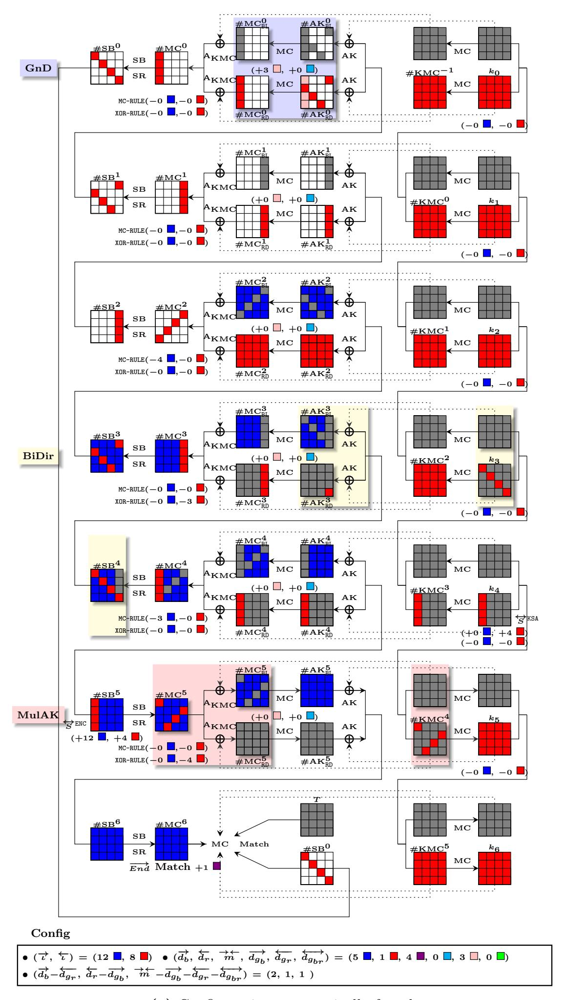

 $\textbf{(a)} \ \ \text{Configuration automatically found}$ 

This implies an attack on the full version  $(8 \times 8)$  as shown in Fig. 11 with configuration  $((\overrightarrow{d_b} - \overrightarrow{d_{g_r}}, \overrightarrow{d_r} - \overrightarrow{d_{g_b}}, \overrightarrow{m} - \overrightarrow{d_{g_b}} - \overrightarrow{d_{g_r}} - \overrightarrow{d_{g_{br}}}) = (8, 4, 4))$ 

**Fig. 3:** An example of using  $(2 \times 2 \text{ of } 4 \times 4)$  to search the MITM attack on 7-round Whirlpool and an equivalent configuration used in the experimental verification

{25}------------------------------------------------

<span id="page-25-0"></span>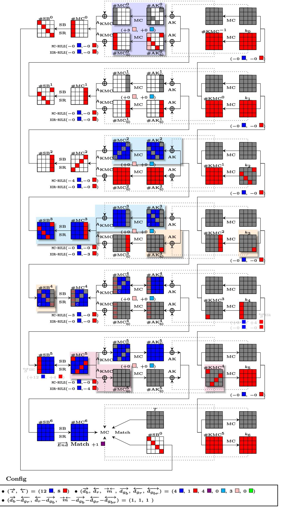

 ${\bf (b)}$  Equivalent configuration used in the experimental verification

**Fig. 3:** An example of using  $(2 \times 2 \text{ of } 4 \times 4)$  to search the MITM attack on 7-round Whirlpool and an equivalent configuration used in the experimental verification (cont.)

{26}------------------------------------------------

pseudo-preimages under multi-target scenarios and utilizing them in the "unbalanced meet-in-the-middle" phase as discussed in [14].

### **4.2 Discussions on the New Attacks**

The previous best attack on Whirlpool is up to [6-](#page-29-4)round [30]. In the 6-round attack in [30], although the freedom degree in the key states is exploited, the computational chunks between the key schedule and the encryption data-path are designed to be almost identical due to the limitation of manual analysis. In contrast, in the new attack, the computational chunks betw[een](#page-30-7) the key schedule and the e[ncry](#page-30-7)ption data-path are largely different. Thus, the degree of freedom in Blue and Red can be relatively more balanced, and the required number of guessing bytes is relatively less. Consequently, the complexity is better.

Attacking one more round than the previously best attacked, new strategies are required on top of those appeared in [30]. In the new 7-round attack, apart from GnD, flexibly using of equivalent round-keys #**KMC** or the real round keys *k* (MulAK) is critical to save degrees of freedom. Moreover, complex non-linear constraints must be imposed on Blue cells to let Blue propagates towards backward besides forward (BiDir), and then cancel [th](#page-30-7)eir impacts on Red-attribute propagation. Thus, efficient procedure (*e.g.*, the *local meet-in-the-middle procedure*) for obtaining initial values of neutral cells fulfilling the non-linear constraints is necessary here.

## **5 Application to Preimage Attacks on Grøstl**

Grøstl, proposed by Gauravaram *et al.* in [12], is one of the five finalists of SHA-3 competition hosted by NIST. Grøstl adopts a double-pipe design, *i.e.*, the size of the chaining value, which is 2*n*-bit, is twice as the hash size, which is *n*-bit. For Grøstl-256, the hash size is 256 bits, and for Grøstl-512, it is 512 bits. Two 2*n*-bit AES-like permutations *P* and *Q* are emp[loy](#page-29-1)ed to build the CF and OT. Please refer to Sect. C.1 or [12] for a detailed description of Grøstl.

## **5.1 New Attacks Resulted from Applying the MILP Modeling**

Applying the [MIL](#page-34-0)P [mod](#page-29-1)eling approach described in Sect. 3 on the OT (and on the *P*(*Hi*) *⊕ H<sup>i</sup>* part of the CF) of Grøstl-256 and Grøstl-512, new attacks are found on 6-round and 8-round, respectively. Besides, many efficient attacks on shorter rounds are found.

For the 6-round attack on the OT of Grøstl-256, Gn[D i](#page-7-0)s the essential that enables to cover one more attacked round than previous 5-round attacks [34]; BiDir is the essential that enables better complexity than previous 6-round attacks [24]. Besides, many inferior attacks than the presented best one on 6-round Grøstl-256 are found. For those inferior attacks, the computation of initial values of neutral bytes is relatively easier, but the complexity of the entire attac[k i](#page-30-10)s

{27}------------------------------------------------

higher. Thus, a non-trivial procedure to compute the initial structure (initial values of neutral bytes) is essential for achieving the best complexity.

For the 8-round attack on the OT of Grøstl-512, GnD is the essential that enables to achieve better complexity than the previous 8-round attack [34]. Besides, compared to the 8-round attack in [34], in the presented attack, the initial structure covers one more round (4 rounds) by allowing one attribute-propagation conceding to the opposite attribute-propagation in both directions.

The configurations of various attacks can be found in Figures 5, 6, [7,](#page-30-10) 8, 16, 17, 14, 15. The concrete attack procedu[res](#page-30-10) on 6-round OT of Grøstl-256 and 8-round OT of Grøstl-512 are presented in Sect. C.

Conversion to Pseudo-Preimage Attacks. The attacks [o](#page-36-0)[n](#page-36-1) [th](#page-39-0)[e](#page-39-1) [OT](#page-49-1) [of](#page-49-0) [Grø](#page-48-0)[stl](#page-48-1) can be converted into pseudo-preimage attacks on Grøstl combining with similar attacks on the *P*(*H*) *⊕ H* of the [CF](#page-34-1) using the conversion method in [34]. The complexity of the converted pseudo-preimage attacks are summarized in Table 1. More details about the conversion can be found in Sect. F

### **5.2 Discussions on the New Attacks**

An in[ter](#page-5-0)esting feature of the best attack on 6-round Grøstl-256 de[pic](#page-58-0)ted in Fig. 5 is that, with necessary guessing, the computation of Blue covers the full 6-round. That is, the Blue propagates to backward besides forward and contributes to degrees of matching from both sides. Besides, like the attack on 7-round Whirlpool, it requires a non-trivial local meet-in-the-middle procedure to compute initi[al](#page-36-0) values of neutral bytes.

Note that, obtaining the previous best attacks on Grøstl, the work in [34] has already been assisted with automatic searching, and the 5-round attack on Grøstl-256 in [34] was claimed to be optimal. However, the optimality hold only in a restricted search space, apart from lacking the consideration of the GnD technique. In contrast, the presented 5-round attacks on Grøstl-256 in Figures [14](#page-30-10) and 15 achieve better complexity than that in [34] and is optimal in an expanded search space [whe](#page-30-10)re BiDir and GnD are considered.

## **6 [A](#page-48-1)pplications to Collision and [Ke](#page-30-10)y-recovery Attacks**

The MILP models for searching for the best preimage attacks can be directly transformed to search for the best collision attacks on hash functions and keyrecovery attacks on block ciphers. For collision attacks, according to the analysis in Sect. 3.5, what needs to be done is to simply restrict the matching point to be at the last round and add constraints shown in Eq. 13. Applying to Grøstl's OT, AES-hashing, Kiasu-BC-hashing <sup>7</sup> , new and improved attacks were found.

For key-recovery attacks, upon the MILP models for preimage attack, one simply [need](#page-18-1)s to constraint that the degrees of freedom in both forward and

<span id="page-27-0"></span><sup>7</sup> Kiasu-BC [20] is a tweakable block ci[ph](#page-27-0)er, the only differe[nce](#page-18-2) with AES-128 is XORing a 64-bit tweak value to the first two rows of the state after each AddRoundKey.

{28}------------------------------------------------

backward only source from the key states, relax the degrees of matching such that it is not included in the objective but simply be non-zero <sup>8</sup> , and constraint that the plaintext or ciphertext contains only Red and Gray cells or only Blue and Gray cells. Besides, the objective can be set to maximize the number of Gray cells in the plaintext or ciphertext, which can optimize data complexity. Applying to SKINNY-*n*-3*n*, improvements in terms of time complexity (se[e](#page-28-4) Fig. 23) or data complexity (see Fig. 24 ) upon the attack in [10] on 23-round reduced version were obtained. In Sect. F, visualizations of representative attack configurations are presented. The complexity of the attacks are summarized in Table 1.

## **Acknowledgem[en](#page-55-0)[ts](#page-58-0)**

We thank anonymous reviewers for their valuable comments. This research is partially supported by the National Natural Science Foundation of China (Grants No. 62172410, 61802400, 61732021, 61802399, 61961146004), the National Key R&D Program of China (Grants No. 2018YFA0704704, 2018YFA0704701), the Youth Innovation Promotion Association of Chinese Academy of Sciences; Nanyang Technological University in Singapore under Grant 04INS000397C230, Ministry of Education in Singapore under Grants RG91/20 and MOE2019-T2-1-060; the Gopalakrishnan – NTU Presidential Postdoctoral Fellowship 2020; the Major Program of Guangdong Basic and Applied Research (Grant No. 2019B030302008), Shandong Province Key R&D Project (Nos. 2020ZLYS09 and 2019JZZY010133).

## **References**

- 1. Alliance, ZigBee. ZigBee 2007 specification. *Online: http://www.zigbee.org/*, 2007.
- 2. K. Aoki and Y. Sasaki. Preimage attacks on one-block MD4, 63-step MD5 and more. In R. M. Avanzi, L. Keliher, and F. Sica, editors, *SAC 2008*, volume 5381 of *LNCS*, pages 103–119. Springer, Heidelberg, Aug. 2009.
- <span id="page-28-3"></span>3. J.-P. Aumasson, W. Meier, and F. Mendel. Preimage attacks on 3-pass HAVAL and step-reduced MD5. In R. M. Avanzi, L. Keliher, and F. Sica, editors, *SAC 2008*, volume 5381 of *LNCS*, pages 120–135. Springer, Heidelberg, Aug. 2009.
- 4. Z. Bao, L. Ding, J. Guo, H. Wang, and W. Zhang. Improved meet-in-the-middle preimage attacks against AES hashing modes. *IACR Trans. Symm. Cryptol.*, 2019(4):318–347, 2019.
- <span id="page-28-1"></span>5. Z. Bao, X. Dong, J. Guo, Z. Li, D. Shi, S. Sun, and X. Wang. Automatic search of meet-in-the-middle preimage attacks on AES-like hashing. In A. Canteaut and F.- X. Standaert, editors, *EUROCRYPT 2021, Part I*, volume 12696 of *LNCS*, pages 771–804. Springer, Heidelberg, Oct. 2021.
- <span id="page-28-2"></span>6. P. S. L. M. Barreto and V. Rijmen. The WHIRLPOOL Hashing Function. http://citeseerx.ist.psu.edu/viewdoc/download?doi=10.1.1.529. 3184&rep=rep1&type=pdf, 2000. Revised in 2003.

<span id="page-28-4"></span><span id="page-28-0"></span><sup>8</sup> In MITM key-recovery attack, the degree of matching can be efficiently increased using simult[aneous matching with multiple plaintext/ciphertext pairs \[11\].](http://citeseerx.ist.psu.edu/viewdoc/download?doi=10.1.1.529.3184&rep=rep1&type=pdf)

{29}------------------------------------------------

- 7. A. Bogdanov and C. Rechberger. A 3-subset meet-in-the-middle attack: Cryptanalysis of the lightweight block cipher KTANTAN. In A. Biryukov, G. Gong, and D. R. Stinson, editors, *SAC 2010*, volume 6544 of *LNCS*, pages 229–240. Springer, Heidelberg, Aug. 2011.
- <span id="page-29-6"></span>8. C. Bouillaguet, P. Derbez, and P.-A. Fouque. Automatic search of attacks on roundreduced AES and applications. In P. Rogaway, editor, *CRYPTO 2011*, volume 6841 of *LNCS*, pages 169–187. Springer, Heidelberg, Aug. 2011.
- 9. J. Daemen and V. Rijmen. *The Design of Rijndael: AES The Advanced Encryption Standard*. Information Security and Cryptography. Springer, 2002.
- <span id="page-29-8"></span>10. X. Dong, J. Hua, S. Sun, Z. Li, X. Wang, and L. Hu. Meet-in-the-middle attacks revisited: Key-recovery, collision, and preimage attacks. In T. Malkin and C. Peikert, editors, *CRYPTO 2021, Part III*, volume 12827 of *LNCS*, pages 278–308, Virtual Event, Aug. 2021. Springer, Heidelberg.
- <span id="page-29-7"></span><span id="page-29-0"></span>11. T. Fuhr and B. Minaud. Match box meet-in-the-middle attack against KATAN. In C. Cid and C. Rechberger, editors, *FSE 2014*, volume 8540 of *LNCS*, pages 61–81. Springer, Heidelberg, Mar. 2015.
- 12. P. Gauravaram, L. R. Knudsen, K. Matusiewicz, F. Mendel, C. Rechberger, M. Schläffer, and S. S. Thomsen. Grøstl a SHA-3 candidate. http://www.groestl. info/Groestl.pdf, March 2011.
- <span id="page-29-1"></span>13. H. Gilbert and T. Peyrin. Super-sbox cryptanalysis: Improved attacks for AES-like permutations. In S. Hong and T. Iwata, editors, *FSE 2010*, volume 6147 of *LNCS*, pages 365–383. Springer, Heidelberg, Feb. 2010.
- <span id="page-29-9"></span>14. J. Guo, S. Ling, C. Rechberger, and H. Wang. Advanced mee[t-in-the-middle preim](http://www.groestl.info/Groestl.pdf)[age attacks: First re](http://www.groestl.info/Groestl.pdf)sults on full Tiger, and improved results on MD4 and SHA-2. In M. Abe, editor, *ASIACRYPT 2010*, volume 6477 of *LNCS*, pages 56–75. Springer, Heidelberg, Dec. 2010.
- <span id="page-29-4"></span>15. J. Guo, T. Peyrin, and A. Poschmann. The PHOTON family of lightweight hash functions. In P. Rogaway, editor, *CRYPTO 2011*, volume 6841 of *LNCS*, pages 222–239. Springer, Heidelberg, Aug. 2011.
- <span id="page-29-2"></span>16. J. Guo, T. Peyrin, A. Poschmann, and M. J. B. Robshaw. The LED block cipher. In B. Preneel and T. Takagi, editors, *CHES 2011*, volume 6917 of *LNCS*, pages 326–341. Springer, Heidelberg, Sept. / Oct. 2011.
- 17. J. Guo, C. Su, and W. Yap. An Improved Preimage Attack against HAVAL-3. *Inf. Process. Lett.*, 115(2):386–393, 2015.
- <span id="page-29-3"></span>18. A. Hosoyamada and Y. Sasaki. Finding hash collisions with quantum computers by using differential trails with smaller probability than birthday bound. In A. Canteaut and Y. Ishai, editors, *EUROCRYPT 2020, Part II*, volume 12106 of *LNCS*, pages 249–279. Springer, Heidelberg, May 2020.
- <span id="page-29-11"></span><span id="page-29-5"></span>19. ISO/IEC. 10118-2:2010 Information technology Security techniques – Hashfunctions – Part 2: Hash-functions using an *n*-bit block cipher. 3rd ed., International Organization for Standardization, Geneve, Switzerland, October, 2010.
- 20. J. Jean, I. Nikolic, and T. Peyrin. Tweaks and keys for block ciphers: The TWEAKEY framework. In P. Sarkar and T. Iwata, editors, *ASIACRYPT 2014, Part II*, volume 8874 of *LNCS*, pages 274–288. Springer, Heidelberg, Dec. 2014.
- 21. M. Lamberger, F. Mendel, C. Rechberger, V. Rijmen, and M. Schläffer. Rebound distinguishers: Results on the full Whirlpool compression function. In M. Matsui, editor, *ASIACRYPT 2009*, volume 5912 of *LNCS*, pages 126–143. Springer, Heidelberg, Dec. 2009.
- <span id="page-29-10"></span>22. G. Leurent. MD4 is not one-way. In K. Nyberg, editor, *FSE 2008*, volume 5086 of *LNCS*, pages 412–428. Springer, Heidelberg, Feb. 2008.

{30}------------------------------------------------

- <span id="page-30-13"></span>23. J. Li, T. Isobe, and K. Shibutani. Converting meet-in-the-middle preimage attack into pseudo collision attack: Application to SHA-2. In A. Canteaut, editor, *FSE 2012*, volume 7549 of *LNCS*, pages 264–286. Springer, Heidelberg, Mar. 2012.
- <span id="page-30-9"></span>24. B. Ma, B. Li, R. Hao, and X. Li. Improved (pseudo) preimage attacks on reducedround GOST and Grøstl-256 and studies on several truncation patterns for AESlike compression functions. In K. Tanaka and Y. Suga, editors, *IWSEC 15*, volume 9241 of *LNCS*, pages 79–96. Springer, Heidelberg, Aug. 2015.
- <span id="page-30-0"></span>25. B. Preneel, R. Govaerts, and J. Vandewalle. Hash functions based on block ciphers: A synthetic approach. In D. R. Stinson, editor, *CRYPTO'93*, volume 773 of *LNCS*, pages 368–378. Springer, Heidelberg, Aug. 1994.
- <span id="page-30-5"></span>26. Y. Sasaki. Meet-in-the-middle preimage attacks on AES hashing modes and an application to Whirlpool. In A. Joux, editor, *FSE 2011*, volume 6733 of *LNCS*, pages 378–396. Springer, Heidelberg, Feb. 2011.
- <span id="page-30-1"></span>27. Y. Sasaki and K. Aoki. Preimage attacks on 3, 4, and 5-pass HAVAL. In J. Pieprzyk, editor, *ASIACRYPT 2008*, volume 5350 of *LNCS*, pages 253–271. Springer, Heidelberg, Dec. 2008.
- <span id="page-30-11"></span>28. Y. Sasaki and K. Aoki. Preimage attacks on step-reduced MD5. In Y. Mu, W. Susilo, and J. Seberry, editors, *ACISP 08*, volume 5107 of *LNCS*, pages 282–296. Springer, Heidelberg, July 2008.
- <span id="page-30-2"></span>29. Y. Sasaki and K. Aoki. Finding preimages in full MD5 faster than exhaustive search. In A. Joux, editor, *EUROCRYPT 2009*, volume 5479 of *LNCS*, pages 134–152. Springer, Heidelberg, Apr. 2009.
- <span id="page-30-7"></span>30. Y. Sasaki, L. Wang, S. Wu, and W. Wu. Investigating fundamental security requirements on Whirlpool: Improved preimage and collision attacks. In X. Wang and K. Sako, editors, *ASIACRYPT 2012*, volume 7658 of *LNCS*, pages 562–579. Springer, Heidelberg, Dec. 2012.
- <span id="page-30-12"></span>31. S. Sun, L. Hu, P. Wang, K. Qiao, X. Ma, and L. Song. Automatic security evaluation and (related-key) differential characteristic search: Application to SIMON, PRESENT, LBlock, DES(L) and other bit-oriented block ciphers. In P. Sarkar and T. Iwata, editors, *ASIACRYPT 2014, Part I*, volume 8873 of *LNCS*, pages 158–178. Springer, Heidelberg, Dec. 2014.
- <span id="page-30-3"></span>32. L. Wang and Y. Sasaki. Finding preimages of Tiger up to 23 steps. In S. Hong and T. Iwata, editors, *FSE 2010*, volume 6147 of *LNCS*, pages 116–133. Springer, Heidelberg, Feb. 2010.
- <span id="page-30-4"></span>33. L. Wei, C. Rechberger, J. Guo, H. Wu, H. Wang, and S. Ling. Improved meet-inthe-middle cryptanalysis of KTANTAN (poster). In U. Parampalli and P. Hawkes, editors, *ACISP 11*, volume 6812 of *LNCS*, pages 433–438. Springer, Heidelberg, July 2011.
- <span id="page-30-10"></span>34. S. Wu, D. Feng, W. Wu, J. Guo, L. Dong, and J. Zou. (Pseudo) preimage attack on round-reduced Grøstl hash function and others. In A. Canteaut, editor, *FSE 2012*, volume 7549 of *LNCS*, pages 127–145. Springer, Heidelberg, Mar. 2012.
- <span id="page-30-6"></span>35. B. Zhang and D. Feng. New guess-and-determine attack on the self-shrinking generator. In X. Lai and K. Chen, editors, *ASIACRYPT 2006*, volume 4284 of *LNCS*, pages 54–68. Springer, Heidelberg, Dec. 2006.
- <span id="page-30-8"></span>36. J. Zou, W. Wu, S. Wu, and L. Dong. Improved (Pseudo) Preimage Attack and Second Preimage Attack on Round-Reduced Grostl Hash Function. *J. Inf. Sci. Eng.*, 30(6):1789–1806, 2014.

{31}------------------------------------------------

## Supplementary Material

## <span id="page-31-3"></span>A Concrete Inequalities modeling the Propagation rules

Inequalities for MC-RULE that allow each attribute (Blue and Red) conceding to the opposite attribute propagation by consuming DoF in both directions.

$$\begin{cases} \vec{\omega} = \max_{i=0}^{N_{\text{row}}-1}(\omega_{i}^{I}), \\ (\sum_{i=0}^{N_{\text{row}}-1} x_{i}^{I}) - N_{\text{row}} \cdot \vec{x} \geq 0, \\ (\sum_{i=0}^{N_{\text{row}}-1} x_{i}^{I}) - \vec{x} \leq N_{\text{row}} - 1. \\ (\sum_{i=0}^{N_{\text{row}}-1} y_{i}^{I}) - \vec{x} \leq N_{\text{row}} - 1. \\ (\sum_{i=0}^{N_{\text{row}}-1} y_{i}^{I}) - N_{\text{row}} \cdot \vec{y} \geq 0, \\ (\sum_{i=0}^{N_{\text{row}}-1} y_{i}^{I}) - \vec{y} \leq N_{\text{row}} - 1. \end{cases}$$

$$(15)$$

$$\begin{cases} (\sum_{i=0}^{N_{\text{row}}-1} (x_{i}^{I} + x_{i}^{O})) - N_{\text{iosum}} \cdot \vec{x} \leq (N_{\text{iosum}} - Br_{n}), \\ (\sum_{i=0}^{N_{\text{row}}-1} (x_{i}^{I} + x_{i}^{O})) - N_{\text{iosum}} \cdot \vec{x} \leq (N_{\text{iosum}} - Br_{n}), \\ (\sum_{i=0}^{N_{\text{row}}-1} (y_{i}^{I} + y_{i}^{O})) - N_{\text{iosum}} \cdot \vec{y} \geq 0, \\ (\sum_{i=0}^{N_{\text{row}}-1} (y_{i}^{I} + y_{i}^{O})) - N_{\text{iosum}} \cdot \vec{y} \geq 0, \\ (\sum_{i=0}^{N_{\text{row}}-1} (y_{i}^{I} + y_{i}^{O})) - Br_{n} \cdot \vec{y} \leq (N_{\text{iosum}} - Br_{n}), \end{cases}$$

<span id="page-31-2"></span><span id="page-31-1"></span><span id="page-31-0"></span>
$$\begin{cases}
(\sum_{i=0}^{N_{\text{row}}-1} y_i^O) - N_{\text{row}} \cdot \vec{y} - c_{\vec{x}} = 0 \\
N_{\text{row}}-1 \\
(\sum_{i=0}^{N_{\text{row}}-1} x_i^O) - N_{\text{row}} \cdot \vec{x} - c_{\vec{y}} = 0
\end{cases}$$
(17)

Note that,  $N_{\text{iosum}} - (\sum_{i=0}^{N_{\text{row}}-1} (x_i^I + x_i^O))$  is the total number of Red or White cells (i.e., active cells as for Red) in the input and output columns. Similarly,  $N_{\text{iosum}} - (\sum_{i=0}^{N_{\text{row}}-1} (y_i^I + y_i^O))$  is the total number of Blue or White cells (i.e., active cells as for Blue). They are constrained by the branch number  $\text{Br}_n$  of MixColumns.

Inequalities for MATCH-RULE. For concrete formalization of MATCH-RULE, the involved variables include the binary variables that indicate the attribute of each cell in the input and output columns (the corresponding columns in  $\overrightarrow{End}$  and  $\overleftarrow{End}$  and also the key state  $\overleftarrow{End}^K$  or  $\overrightarrow{End}^{KMC}$ ), i.e.,  $(x_i^I, y_i^I), (x_i^O, y_i^O), (x_i^K, y_i^K),$  and auxiliary binary variables  $\omega_i^I$ ,  $\omega_i^O$ ,  $\omega_i^K$ ,  $\omega_i^{E\oplus K}$ , where  $\omega_i^I$  (resp.  $\omega_i^O$ ) indicates whether the *i*-th cell in the input state I (resp. output state O) of the MixColumns is White;  $\omega_i^K$  indicates whether the *i*-th cell in involved key state K is White; and  $\omega_i^{E\oplus K}$  is defined by  $\omega_i^{E\oplus K} = \mathrm{OR}(\omega_i^I, \omega_i^K)$  for  $i \in \{0, 1, \dots, n-1\}$ . Besides, one need the general variable  $\overrightarrow{m}_i$  to represent the degree of matching in column i, for  $i \in \{0, 1, \dots, N_{\mathrm{col}} - 1\}$ .

{32}------------------------------------------------

Suppose  $\overrightarrow{End}^{\mathrm{KMC}}$  has fewer White cells than  $\overleftarrow{End}^{\mathrm{K}}$  and thus using  $\overrightarrow{End} \oplus \overrightarrow{End}^{\mathrm{KMC}}$  as the key addition, then, the concrete constraints on  $\overrightarrow{m}_i$  are as in Eq. (18).

$$\overrightarrow{m}_{i} = \max(0, \mathcal{N}_{\text{row}} - \sum_{j=0}^{\mathcal{N}_{\text{row}} - 1} (\omega_{i \cdot \mathcal{N}_{\text{row}} + j}^{E \oplus K} + \omega_{i \cdot \mathcal{N}_{\text{row}} + j}^{O})) \text{ for } i \in \{0, 1, \dots, \mathcal{N}_{\text{col}} - 1\}(18)$$

## <span id="page-32-0"></span>**B** Summary of Notations

<span id="page-32-1"></span>

|                                             | Notations                                                                                                                                                                                                                     |  |  |  |  |  |  |
|---------------------------------------------|-------------------------------------------------------------------------------------------------------------------------------------------------------------------------------------------------------------------------------|--|--|--|--|--|--|
| Blue (                                      | active in the forward chunk                                                                                                                                                                                                   |  |  |  |  |  |  |
| Red (■)                                     | active in the backward chunk                                                                                                                                                                                                  |  |  |  |  |  |  |
| Gray (□)                                    | known constant in both chunks                                                                                                                                                                                                 |  |  |  |  |  |  |
| $\overline{\texttt{White}\;(\Box)}$         | unknown in both chunks                                                                                                                                                                                                        |  |  |  |  |  |  |
| Black (■)                                   | any of Blue $(\blacksquare)$ , Red $(\blacksquare)$ , Gray $(\blacksquare)$ , White $(\Box)$                                                                                                                                  |  |  |  |  |  |  |
| Cyan (                                      | guessed for forward chunks                                                                                                                                                                                                    |  |  |  |  |  |  |
| Pink (□)                                    | guessed for backward chunks                                                                                                                                                                                                   |  |  |  |  |  |  |
| Green (■)                                   | guessed for both forward and backward chunks                                                                                                                                                                                  |  |  |  |  |  |  |
| Violet (■)                                  | degree of matching                                                                                                                                                                                                            |  |  |  |  |  |  |
| S ENC                                       | starting state in the encryption data path                                                                                                                                                                                    |  |  |  |  |  |  |
| $\overrightarrow{S}$ KSA                    | starting state in the key-schedule data path                                                                                                                                                                                  |  |  |  |  |  |  |
| $\overrightarrow{End}$                      | ending state for the forward computation                                                                                                                                                                                      |  |  |  |  |  |  |
| $\overline{End}$                            | ending state for the backward computation                                                                                                                                                                                     |  |  |  |  |  |  |
| $\mathcal{BL}^{\text{ENC}}$                 | subset of $\mathcal{N}$ , index of Blue cells ( $\square$ ) in $\overrightarrow{S}^{\text{ENC}}$ , $\mathcal{BL}^{\text{ENC}} \cap \mathcal{RD}^{\text{ENC}} = \emptyset$                                                     |  |  |  |  |  |  |
| $\mathcal{BL}^{\text{\tt KSA}}$             | subset of $\mathcal{N}$ , index of Blue cells ( $\square$ ) in $\overset{\longleftrightarrow}{S}^{KSA}$ , $\mathcal{BL}^{KSA} \cap \mathcal{RD}^{KSA} = \emptyset$                                                            |  |  |  |  |  |  |
| $\mathcal{R}\mathcal{D}^{\text{\tiny ENC}}$ | subset of $\mathcal{N}$ , index of Red cells ( $\blacksquare$ ) in $\overrightarrow{S}^{\mathtt{ENC}}$ , $\mathcal{RD}^{\mathtt{ENC}} \cap \mathcal{BL}^{\mathtt{ENC}} = \emptyset$                                           |  |  |  |  |  |  |
| $\mathcal{R}\mathcal{D}^{\text{\tt KSA}}$   | subset of $\mathcal{N}$ , index of Red cells ( $\blacksquare$ ) in $\overset{\longleftrightarrow}{S}^{\mathtt{KSA}}$ , $\mathcal{BL}^{\mathtt{KSA}} \cap \mathcal{RD}^{\mathtt{KSA}} = \emptyset$                             |  |  |  |  |  |  |
| $\mathcal{GY}^{\text{ENC}}$                 | subset of $\mathcal{N}$ , index of Gray cells ( $\blacksquare$ ) in $\overset{\longleftarrow}{S}^{\mathtt{ENC}}$ , $\mathcal{GY}^{\mathtt{ENC}} = \mathcal{N} - \mathcal{BL}^{\mathtt{ENC}} \cup \mathcal{RD}^{\mathtt{ENC}}$ |  |  |  |  |  |  |
| $\mathcal{GY}^{\text{\tt KSA}}$             | subset of $\mathcal{N}$ , index of Gray cells ( $\blacksquare$ ) in $\overset{\longleftrightarrow}{S}^{\text{KSA}}$ , $\mathcal{GY}^{\text{KSA}} = \mathcal{N} - \mathcal{BL}^{\text{KSA}} \cup \mathcal{RD}^{\text{KSA}}$    |  |  |  |  |  |  |
|                                             | Encoding                                                                                                                                                                                                                      |  |  |  |  |  |  |
|                                             | 0-1 variables to encode the color (attribute) of the $i$ th cell of a state $S$                                                                                                                                               |  |  |  |  |  |  |
| $x_i^S$ and $y_i^S$                         | $(1,0)$ : Blue cell $(\blacksquare)$                                                                                                                                                                                          |  |  |  |  |  |  |
|                                             | $(0,1)$ : Red cell $(\blacksquare)$                                                                                                                                                                                           |  |  |  |  |  |  |
|                                             | $(1,1)$ : Gray cell $(\blacksquare)$                                                                                                                                                                                          |  |  |  |  |  |  |
|                                             | $(0,0)$ : White cell $(\Box)$                                                                                                                                                                                                 |  |  |  |  |  |  |
| $\overline{x}$                              | a binary variable, indicating a cell can be computed in the forward                                                                                                                                                           |  |  |  |  |  |  |
|                                             | chunk; is Blue or Gray                                                                                                                                                                                                        |  |  |  |  |  |  |
| y                                           | a binary variable, indicating a cell can be computed in the backward chunk; is Red or Gray White                                                                                                                              |  |  |  |  |  |  |

{33}------------------------------------------------

| $\beta$                                                                                           | a binary variable, indicating a cell is Gray (\blacksquare)                                                                                |
|---------------------------------------------------------------------------------------------------|--------------------------------------------------------------------------------------------------------------------------------------------|
| $\omega$                                                                                          | a binary variable, indicating a cell is White                                                                                              |
| $\overline{\vec{x}}$                                                                              | a binary variable, indicating cells in a column all are Blue/Gray                                                                          |
| $\begin{array}{c} \vec{x} \\ \vec{y} \\ \vec{\omega} \\ \hline \vec{\iota} \\ \hline \end{array}$ | a binary variable, indicating cells in a column all are Red/Gray                                                                           |
| $\vec{\omega}$                                                                                    | a binary variable, indicating a column exists White cell                                                                                   |
| $\overrightarrow{\iota}$                                                                          | $\overrightarrow{\iota} =  \mathcal{BL}^{\text{ENC}}  +  \mathcal{BL}^{\text{KSA}} $ , the initial degrees of freedom for the forward      |
| $\leftarrow \overline{\iota}$                                                                     | $\overline{\iota} =  \mathcal{RD}^{\text{ENC}}  +  \mathcal{RD}^{\text{KSA}} $ , the initial degrees of freedom for the backward           |
| $\overrightarrow{\sigma}$                                                                         | $\overrightarrow{d_b} = \overrightarrow{\iota} - \overrightarrow{\sigma}$ , the accumulated coniosumed degrees of freedom from the forward |
| $\overleftarrow{\sigma}$                                                                          | $\overline{d_r} = \overleftarrow{\iota} - \overleftarrow{\sigma}$ , the accumulated coniosumed degrees of freedom from the backward        |
| $c_x$                                                                                             | the binary variable indicating whether to coniosume a degree of freedom from the forward in XOR-RULE                                       |
| $c_y$                                                                                             | the binary variable indicating whether to consume a degree of freedom from the backward in XOR-RULE                                        |
| $c_{\vec{x}}$                                                                                     | the general variable for the number of consumed degrees of freedom from the forward in MC-RULE                                             |
| $c_{\vec{y}}$                                                                                     | the general variable for the number of consumed degrees of freedom from the backward in MC-RULE                                            |
| $\overrightarrow{d_b}$ $\overrightarrow{d_r}$ $\overrightarrow{m}$                                | the degrees of freedom for the forward computation                                                                                         |
| $\overleftarrow{d_r}$                                                                             | the degrees of freedom for the backward computation                                                                                        |
| $\overrightarrow{m}$                                                                              | the degrees of matching                                                                                                                    |
| $\overrightarrow{d_{a}}$                                                                          | the number of cells only guessed to be Blue (forward computation)                                                                          |
| $\overrightarrow{d_{g_b}}$ $\overrightarrow{d_{g_r}}$                                             | be the number of cells only guessed to be Red (backward computation)                                                                       |
| $\stackrel{ag_r}{\longleftrightarrow} d_{g_{br}}$                                                 | be the number of cells guessed to be both Blue and Red                                                                                     |
|                                                                                                   | the auxiliary variable to set the objective function                                                                                       |
| ГОЪј                                                                                              | Cipher Specification                                                                                                                       |
| $N_{row}$                                                                                         | the number of rows in the state of the compression function                                                                                |
| N <sub>col</sub>                                                                                  | the number of columns in the state of the compression function                                                                             |
| ~ · COT                                                                                           | the number of bits in each cell of the state of the compression                                                                            |
| c                                                                                                 | function; in targeted ciphers of this work, it is 8                                                                                        |
| ς                                                                                                 | the number of possible values of a cell, <i>i.e.</i> , $\varsigma = 2^c$ ; in targeted ciphers of this work, it is $2^8$                   |
| $\overline{n}$                                                                                    | $n = N_{row} \cdot N_{col}$ , the number of cells in the state of the compression function                                                 |
| $\rm N_{iosum}$                                                                                   | the total number of cells in the input and output of the MC on one column, $N_{\text{iosum}} = 2 \cdot N_{\text{row}}$ .                   |
| Br <sub>n</sub>                                                                                   | $Br_n = N_{row} + 1$ , the branch number of the MDS matrix used in the compression function                                                |
|                                                                                                   | Notations used in descriptions of concrete attacks                                                                                         |
|                                                                                                   | executing the MixColumns operation on a single column or on multiple                                                                       |
| MC                                                                                                | columns                                                                                                                                    |
| SB                                                                                                | executing the SubBytes operation on a single cell or on multiple cells                                                                     |
|                                                                                                   |                                                                                                                                            |

{34}------------------------------------------------

| SR                      |                                                                                                                                  |  |  |  |  |  |
|-------------------------|----------------------------------------------------------------------------------------------------------------------------------|--|--|--|--|--|
|                         | executing the ShiftRows operation on a single cell or on multiple cells                                                          |  |  |  |  |  |
| #SBr                    | the state before going through SubBytes (SB) at the r-th round in the                                                            |  |  |  |  |  |
|                         | encryption data-path                                                                                                             |  |  |  |  |  |
| #SRr                    | the state before going through ShiftRows (SR) at the r-th round in the<br>encryption data-path                                   |  |  |  |  |  |
|                         | the state before going through MixColumns (MC) at the r-th round in                                                              |  |  |  |  |  |
| #MCr                    | the encryption data-path                                                                                                         |  |  |  |  |  |
|                         | the state before going through AddRoundKey (AK) at the r-th round in                                                             |  |  |  |  |  |
| #AKr                    | the encryption data-path                                                                                                         |  |  |  |  |  |
|                         | the state before going through SubBytes (SB) at the r-th round in the                                                            |  |  |  |  |  |
| #KSBr                   | key-schedule                                                                                                                     |  |  |  |  |  |
| #KSRr                   | the state before going through ShiftRows (SR) at the r-th round in the                                                           |  |  |  |  |  |
|                         | key-schedule                                                                                                                     |  |  |  |  |  |
| #KMCr                   | the state before going through MixColumns (MC) at the r-th round in                                                              |  |  |  |  |  |
| r                       | the key-schedule                                                                                                                 |  |  |  |  |  |
| k                       | the r-th round-key                                                                                                               |  |  |  |  |  |
| S[i, j, · · · ]<br>S[i] | the i-th, j-th, · · · cells of a state (in the order of column first)<br>the i-th cell of a state (in the order of column first) |  |  |  |  |  |
| Scoli                   | the i-th column of a state                                                                                                       |  |  |  |  |  |
| Scol{i,j,··· }          | the i-th, j-th, · · · , columns of a state S                                                                                     |  |  |  |  |  |
| Scoli<br>[j]            | the j-th cell in the i-th column of a state S                                                                                    |  |  |  |  |  |
| Scoli                   | [j1, j2, · · · ] the j1-th, j2-th, · · · , cells in the i-th column of a state S                                                 |  |  |  |  |  |
| S[ij]                   | the j-th cell in the i-th column of a state S, shorten for Scoli<br>[j]                                                          |  |  |  |  |  |
| ∥                       | concatenation                                                                                                                    |  |  |  |  |  |
| SSR−1(coli)             | the cells in the i-th diagonal of the state S                                                                                    |  |  |  |  |  |
| SSR(coli)               | the cells in the i-th anti-diagonal of the state S                                                                               |  |  |  |  |  |
|                         | using values of the a-th, b-th, c-th, d-th cells in the array of (input ∥                                                        |  |  |  |  |  |
| MCabcde                 | output) of the MC to derive the value of the e-th cell according to                                                              |  |  |  |  |  |
|                         | Property 1                                                                                                                       |  |  |  |  |  |
|                         |                                                                                                                                  |  |  |  |  |  |

## **C Concrete Pro[ce](#page-40-0)dure of the Preimage Attack on 6-round and 8-round OTs of Grøstl-256 and Grøstl-512**

### <span id="page-34-1"></span>**C.1 Description of Grøstl**

Grøstl, proposed by Gauravaram *et al.* in [12], is one of the five finalists of SHA-3 competition hosted by NIST. Grøstl adopts a double-pipe design, *i.e.*, the size of the chaining value, which is 2*n*-bit, is twice as the hash size, which is *n*-bit. For Grøstl-256, the hash size is 256 bits, and for Grøstl-512, it is 512 bits.

<span id="page-34-0"></span>Two 2*n*-bit AES-like permutations *P* [and](#page-29-1) *Q* are employed to build the compression function (CF) and output transformation (OT). The *P* and *Q* work on 8 *×* 8 sized state for Grøstl-256 and 8 *×* 16 sized state for Grøstl-512. For Grøstl-256, they consist of 10 AES-like rounds; and for Grøstl-512, they consist of 14

{35}------------------------------------------------

AES-like rounds. Concretely, the round function of P and Q is made up of 4 operations, *i.e.*, SubBytes (SB), ShiftRows (SR), MixColumns (MC), AddRoundConstants (AC). The ShiftRows (SR) of P cyclically shifts the i-th row leftwards for j bytes. For P of Grøstl-256, j is in (0,1,2,3,4,5,6,7), while for P of Grøstl-512, j is in (0,1,2,3,4,5,6,11). Since the ShiftRows (SR) operation for P and Q is different and Q is not involved in our attack, details of Q are skipped.

The compression function of Grøstl built from P and Q is written as:  $H_i = P(H_{i-1} \oplus m_i) \oplus Q(m_i) \oplus H_{i-1}$   $(i \geq 1)$ , where  $H_i$  is the chaining value, and  $m_i$  is the message block. After processing all the message blocks, the last chaining value serves as the input of the output transformation, which is

$$\Omega(X) = Trunc_n(P(X) \oplus X).$$

The right half of  $P(x) \oplus X$  is the output hash value (refer to Fig. 4).

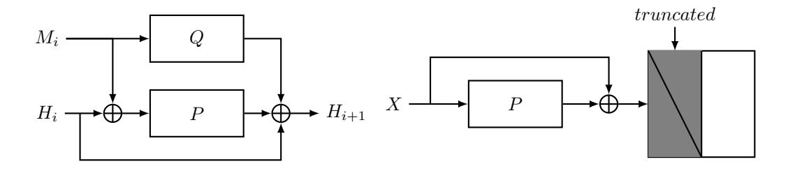

Fig. 4: Grøstl's compression function (CF) and output transformation (OT)

#### C.2 The preimage attack on 6-round OT of Grøstl-256.

Fig. 5 shows one of the attack configurations on 6-round OT of Grøstl-256. The following of this section describes how to use this configuration to launch concrete attack on 6-round OT of Grøstl-256.

<span id="page-35-0"></span>To compute initial values of neutral bytes in Red one can adopt a local meet-inthe-middle procedure as specified in Algorithm 2, which is similar to Algorithm 1.

Concretely, in the configuration of the attack in Fig. 5, the degree of freedom for the forward computation is the bottleneck; there are four bytes extra degrees of freedom for the backward that can be fixed for the ease of computing initial values of backward neutral bytes (in Red). Thus, we fix the value of four Red cells in #MC<sup>2</sup>, i.e., #MC<sup>2</sup><sub>col<sub>0</sub></sub>[6,7], #MC<sup>2</sup><sub>col<sub>1</sub></sub>[5,6], as indicated by In Algorithm 2, the focus is on cancellation constraints among states {#MC<sup>2</sup>, #AC<sup>2</sup>, #SB<sup>3</sup>, #MC<sup>3</sup>, #AC<sup>3</sup>}. The procedure starts from guessing eight free cells in the first two columns of #MC<sup>2</sup> and four cells in each pair of columns in #MC<sup>3</sup>, computes other undetermined cells using constant impacts in #AK<sup>3</sup> column-by-column, and compute back octuple-wisely to match at constant cells in #MC<sup>2</sup>. The complexity of this procedure is 2<sup>128</sup> computations and 2<sup>128</sup> blocks of memory.

{36}------------------------------------------------

<span id="page-36-0"></span>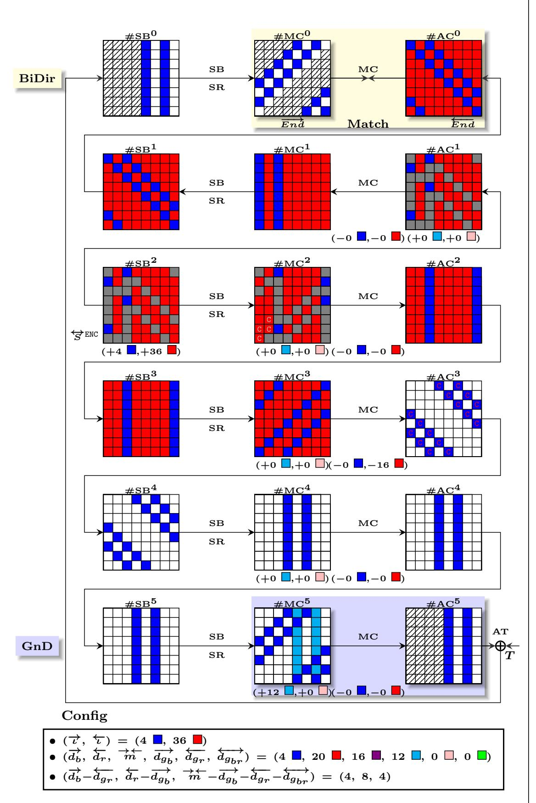

**Fig. 5:** An example of the MITM attack on the OT of the 6-round Grøstl-256

<span id="page-36-1"></span>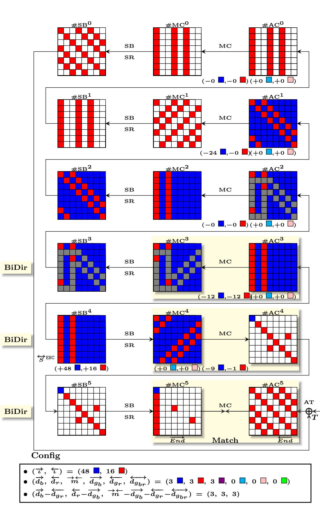

**Fig. 6:** An example of the MITM attack on  $P(H') \oplus H'$  in the CF of the 6-round Grøstl-256 (without guessing)

{37}------------------------------------------------

The Whole Attack Procedure (refer to Fig. 5). First, fix the value of 16 Gray cells in  $\#\mathbf{MC}^2_{\mathsf{col}_{\{0,1,3,4,5,6\}}}$  (including the four cells  $\#\mathbf{MC}^2_{\mathsf{col}_0}[6,7]$ ,  $\#\mathbf{MC}^2_{\mathsf{col}_1}[5,6]$ ); fix the value of 16 impacts on C-marked Blue cells in  $\#\mathbf{AC}^3$ . With these constants, compute the initial values of neutral bytes in Red by Algorithm 2, and obtain a hash table  $\overleftarrow{\mathcal{T}_{\mathsf{Init}}}$ .

- <span id="page-37-1"></span>1. For a new value of the 12 Gray cells in  $\#\mathbf{MC}^2_{\mathsf{col}_{\{2,7\}}}$ ,
  - (a) for each value  $\overleftarrow{v}_i$  of Red neutral bytes in  $\overleftarrow{\mathcal{T}_{\text{Init}}}$ , *i.e.*, Red cells in  $\#\mathbf{AC}^2$ , i. with values of Gray cells in  $\#\mathbf{MC}^2_{\text{col}_{\{2,7\}}}$  (the constraints imposed
    - by other Gray cells in  $\#\mathbf{MC}^2$  have already been fulfilled during the precomputation of  $\overleftarrow{v}_i$ ), compute backward to  $\#\mathbf{AC}^0$ ;
    - ii. from  $\#AC^0_{SR^{-1}(col_{\{1,3,4,5,6,7\}})}$ , derive value  $\overleftarrow{v}_m$  of 16 bytes for matching through MC (2 bytes in each column, refer to [5, 26] for matching through MC);
    - iii. store  $\overleftarrow{v}_i$  into a look-up table  $\overleftarrow{\mathcal{T}}$ , with  $\overleftarrow{v}_m$  as the index.
  - (b) for each value  $\overrightarrow{v}_i$  of the four Blue neutral bytes in  $\#\mathbf{MC}^2$ ,
    - i. with values of Gray cells in  $\#\mathbf{MC}^2$ , compute backward to get values of Blue cells in  $\#\mathbf{AC}^0$ ;
    - ii. with values of Gray cells in  $\#\mathbf{MC}^2$ , compute forward to get values of Blue cells in  $\#\mathbf{AC}^2$  and  $\#\mathbf{AC}^3$ ;
    - iii. XOR the value of constant impacts on C-marked Blue cells in  $\#AC^3$ ; compute forward to  $\#MC^5$ ,
    - iv. for each value  $\overrightarrow{v}_g$  of the 12 Cyan cells in  $\#\mathbf{MC}^5$ ,
      - A. compute the two Blue columns, XOR with the given target, compute forward the Blue cells through feed-forward to  $\#MC^0$ ;
      - B. from values of Blue cells in both  $\#\mathbf{MC}^0$  and  $\#\mathbf{AC}^0$ , derive a value  $\overrightarrow{v}_m$  of 16 bytes for matching (*i.e.*, 2 bytes in each column);
      - C. for each value of Red cells in  $\#\mathbf{AC}^2$  that is stored in entry  $\overleftarrow{\mathcal{T}}[\overrightarrow{v}_m]$ , with values of Blue cells in  $\#\mathbf{AC}^2$ , compute forward to  $\#\mathbf{MC}^5$ ; get the value  $\overrightarrow{v}_g'$  of cells at the position of Cyan cells, if  $\overrightarrow{v}_g' \neq \overrightarrow{v}_g$ , go to Step 1(b)iv;
        - compute forward to get values of all cells without hatching-mark in  $\#\mathbf{AC}^5$ , XORing the given target at the feed-forward point), compute through feed-forward to  $\#\mathbf{MC}^0$ , if the values of White cells without hatching-marks are fully matched with values of Blue and Red cells through MixColumns (values of cells with hatching-marks in  $\#\mathbf{MC}^0$  can be chosen), a full truncated-state match found, output and return; otherwise, go to Step 1;

<span id="page-37-0"></span>Complexity. The memory complexity is  $2^{128}$  (blocks). As for the computational complexity, it is determined by the following configuration of this attack, *i.e.*,  $n=8\times 4=32$  (truncated 4 out of the 8 columns),  $\overrightarrow{d_b}=4$ ,  $\overleftarrow{d_r}=16$  (minus 4 from that shown in Fig. 5),  $\overrightarrow{d_{g_b}}=12$ ,  $\overrightarrow{m}=16$ ,  $\varsigma=2^8$ , and  $\overleftarrow{d_{g_r}}=\overleftarrow{d_{g_{br}}}=0$ . Accordingly, the computational complexity of this attack on 6-round Grøstl-256 is  $\varsigma^{32}\cdot\max(\varsigma^{-(4)},\varsigma^{-(16-12)}+\varsigma^{-(16-12)})=2^{28\cdot8}=2^{224}$ .

{38}------------------------------------------------

Note that, the required number of repetitions of the main MITM procedure is  $\zeta^{n-\overrightarrow{d_b}-\overrightarrow{d_r}}$ , i.e.,  $\zeta^{12}$  for this attack configuration. Thus, enumerating all possible values of 12 Gray cells in  $\#\mathbf{MC}^2_{\mathsf{col}_{\{2,7\}}}$ , as done in Step 1, is sufficient. This condition enables to fix values of all other Gray cells in  $\#\mathbf{MC}^2$  and all 16 constant impacts on C-marked Blue cells in  $\#\mathbf{AC}^3$ , as done at the very beginning of the attack.

#### C.3 The preimage attack on 8-round OT of Grøstl-512.

Fig. 7 shows one of the attack configurations on 8-round OT of Grøstl-512. The following of this section describes how to use this configuration to launch concrete attack on 8-round OT of Grøstl-512.

The whole attack requires a precomputation phase to obtain initial values of neutral bytes in Blue and in Red for various values of Gray cells and values of impacts on cells of opposite attributes. Compared to the procedure of Algorithm 2 in the attack on 6-round Grøstl-256, the precomputation procedure in here is simpler. Concrete procedures can be found in Algorithm 3 and 4. The complexity of the precomputation for obtaining the values of neutral bytes in Blue is  $2^{28\cdot8}$ , *i.e.*,  $2^{224}$  computations and  $2^{224}$  blocks of memory. That for neutral bytes in Red is  $2^{16\cdot8}$ , *i.e.*,  $2^{128}$  computations and  $2^{128}$  blocks of memory.

During the main attack procedure, the resulted look-up tables  $\overrightarrow{\mathcal{T}_{\text{Init}}}$  and  $\overleftarrow{\mathcal{T}_{\text{Init}}}$  from Algorithm 3 and 4 will be used to retrive the initial values of neutral bytes under various values of Gray bytes and values of impacts.

The Main Attack Procedure (refer to Fig. 7).

- <span id="page-38-1"></span>1. For each possible value of Gray cells in  $\#\mathbf{MC}^4$ ,  $\#\mathbf{AC}^4$ ,  $\#\mathbf{AC}^5$ , and value of impacts from Blue on C-marked Red cells in  $\#\mathbf{MC}^3$ , and value of impacts from Red on C-marked Blue cells in  $\#\mathbf{AC}^6$ ,
  - (a) compute the value of Gray cells in  $\#\mathbf{MC}^5$  from that in  $\#\mathbf{AC}^4$  (cell-by-cell)
  - (b) use the value of  $\#AC^4[_37,_47,_57,_67,_80] \parallel \#MC^3[_{6}0,_61,_67,_70,_77,_86,_87,_95,_96,_97,_{10}4,_{10}5,_{10}6,_{10}7]$  to look up the table  $T_{\text{Init}}$ , retrive the value of 28 Blue neutral cells in  $\#MC^4$ .
  - (c) for each value  $\overrightarrow{v}_i$  of the 28 Blue neutral cells in  $\#\mathbf{MC}^4$ ,
    - i. with the value of Gray cells in  $\#\mathbf{MC}^4$ ,  $\#\mathbf{AC}^4$ ,  $\#\mathbf{AC}^5$ , compute forward to  $\#\mathbf{AC}^6$ ; XOR with values of pre-determined impacts on C-marked cells in  $\#\mathbf{AC}^6$ , compute forward to  $\#\mathbf{AC}^7$ ;
    - ii. XOR with the value of given target T (truncated out half of the state), compute through feed-forward to  $\#\mathbf{MC}^0$ ;
    - iii. derive the value  $\overrightarrow{v}_m$  of 10 (i.e., 2+3+3+2) bytes from  $\#\mathbf{MC}^0_{\mathtt{col}_{\{7,8,9,10\}}}$  for matching through MC (refer to [5,26]);
    - iv. store  $\overrightarrow{v}_i$  into a look-up table  $\overrightarrow{\mathcal{T}}$ , with  $\overrightarrow{v}_m$  as the index.

<span id="page-38-0"></span><sup>&</sup>lt;sup>9</sup> The notation S[ij] is used to represent the *j*-th cell in the *i*-th column of a state S, which is the shorten for  $S_{col_i}[j]$ .

{39}------------------------------------------------

<span id="page-39-0"></span>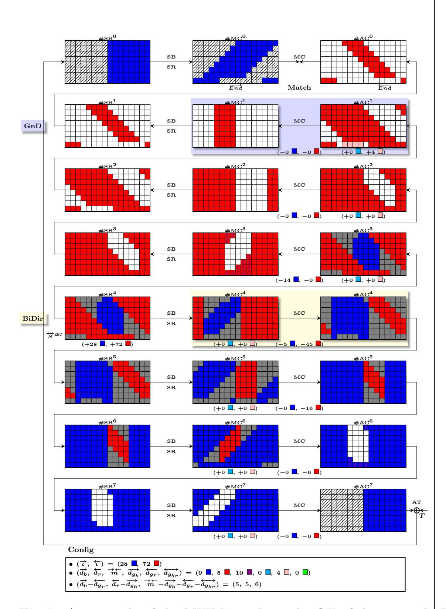

**Fig. 7:** An example of the MITM attack on the OT of the 8-round Grøstl-512

<span id="page-39-1"></span>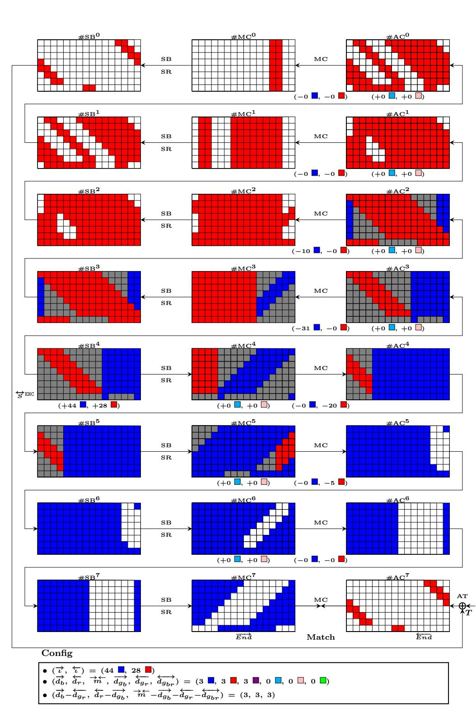

**Fig. 8:** An example of the MITM attack on  $P(H') \oplus H'$  in the CF of the 8-round Grøstl-512 (without guessing)

{40}------------------------------------------------

- (d) use the values of  $\#\mathbf{AC}^{6}[_{5}6,_{5}7,_{6}7,_{7}7,_{8}0,_{8}7] \parallel \#\mathbf{MC}^{5}[_{8}0,_{8}7,_{9}7,_{10}7,_{11}7]$  to look up the table  $\overleftarrow{\mathcal{T}_{\mathtt{Init}}}$ , retrive the values of 16 Red neutral cells in  $\#\mathbf{AC}^{5}$ .
- <span id="page-40-1"></span>(e) for each value  $\overleftarrow{v}_i$  of Red neutral cells in #AC<sup>5</sup>,
  - i. with the value of Gray cells in #AC<sup>5</sup>, #MC<sup>5</sup>, #AC<sup>4</sup>, #MC<sup>4</sup>, compute backward to #MC<sup>3</sup>; XOR with values of pre-determined impacts on C-marked cells in #MC<sup>3</sup>, compute forward to #AC<sup>1</sup>;
  - ii. for each value  $\overleftarrow{v}_g$  of the 4 Pink cells in  $\#\mathbf{AC}^1$ 
    - A. compute backward to  $\#\mathbf{AC}^0$ ; derive the value  $\overleftarrow{v}_m$  of 10 bytes from  $\#\mathbf{AC}^0_{\mathtt{col}_{\{7,8,9,10\}}}$  for matching through MC;
    - B. for each value  $\overrightarrow{v}_i$  stored in entry  $\overrightarrow{\mathcal{T}}[\overleftarrow{v}_m]$ ,
      - with values of Red and Gray cells in  $\#\mathbf{MC}^4$ , compute backward to  $\#\mathbf{AC}^1$ ; get the value  $\overleftarrow{v}_g'$  of cells at the position of Pink cells, if  $\overleftarrow{v}_g' \neq \overleftarrow{v}_g$ , go to Step 1(e)ii;
      - compute backward to  $\#\mathbf{AC}^0$ , denote the value by  $\overleftarrow{v}$ ;
      - with values of Red and Gray cells in  $\#\mathbf{MC}^4$ , compute forward (XORing the given target at the feed-forward point) to  $\#\mathbf{MC}^0$ , denote the value of cells without hatching-marks by  $\overrightarrow{v}$ ; if  $\overrightarrow{v}$  and  $\overleftarrow{v}$  can be fully matched through MixColumns (values of cells with hatching-marks in  $\#\mathbf{MC}^0$  can be chosen), a full truncated-state match found, output and return; otherwise, go to Step 1;

Complexity. Due to the precomputation, the memory complexity is  $2^{224}$  (blocks). As for the computational complexity, it is determined by the following configuration of this attack.  $n = 8 \times 8 = 64$  (truncated 8 out of the 16 columns),  $\overrightarrow{d_b} = 9$ ,  $\overrightarrow{d_r} = 5$ ,  $\overrightarrow{d_{g_r}} = 4$ ,  $\overrightarrow{m} = 10$ ,  $\varsigma = 2^8$ , and  $\overrightarrow{d_{g_r}} = \overrightarrow{d_{g_{b_r}}} = 0$ . Accordingly, the computational complexity of this attack on 8-round Grøstl-512 is  $\varsigma^{64} \cdot \max(\varsigma^{-(9-4)}, \varsigma^{-(5)}, \varsigma^{-(10-4)}) = 2^{59\cdot8} = 2^{472}$ .

## D Compute Initial values of Neutral Bytes in the Attacks

<span id="page-40-0"></span>Property 1 (Property of MDS matrix). Known any  $N_{row}$  out of the  $2 \cdot N_{row}$  input and output elements of the MDS matrix, the remaining  $N_{row}$  elements can be computed.

{41}------------------------------------------------

```
1: procedure ComputeForwardNeutralBytes
  2:
                 \mathcal{T}_{\mathtt{Init}} \leftarrow \emptyset
                                                                                                                                                                                    > 2^{16}
                for all possible values of \#A\kappa^3[1,2] do
  3:
                       \#\mathbf{MC}^{3}[0,1,2,3] \stackrel{\mathtt{MC}^{-1}}{\leftarrow} \#\mathbf{AK}^{3}[0,1,2,3]
                                                                                                                                               \triangleright \#\mathbf{AK}^{3}[0,3] are fixed
  4:
                       \#\mathbf{sb}^3[0,5,10,15] \overset{\mathtt{SB}^{-1}}{\leftarrow} \#\mathbf{mc}^3[0,1,2,3]
  5:
                       for all possible values of #sb<sup>3</sup>[8] do
                                                                                                                                                                                      \triangleright 2^8
  6:
                               \#\mathbf{s}\mathbf{B}^{3}[9] \overset{\mathsf{MC}_{46715}}{\leftarrow} (\#\mathbf{s}\mathbf{B}^{3}[8,10,11], \#\mathbf{M}\mathbf{C}_{\mathbf{C}}^{2}[9]) \qquad \triangleright \text{ according to Property } \mathbf{1}^{a}
  7:
                               \#\mathbf{MC}^{3}[8] \xleftarrow{\mathsf{SB}} \#\mathbf{SB}^{3}[8]
  8:
                               \#\mathbf{MC}^{3}[5] \stackrel{\mathtt{SB}}{\leftarrow} \#\mathbf{SB}^{3}[9]
  9:
                             L_{\#\mathbf{MC}_{8,5}^3} \stackrel{push}{\leftarrow} (\#\mathbf{MC}^3[8,5])
                                                                                                \triangleright the final size |L_{\#\mathbf{MC}_{2}^{3}}|=2^{8}
10:
                        end for
11:
                                                                                                                                                                                      \triangleright 2^8
                        for all possible values of #sb<sup>3</sup>[13] do
12:
                               \#\mathbf{s}\mathbf{B}^{3}[14] \overset{\mathtt{MC}_{4570_{6}}}{\leftarrow} (\#\mathbf{s}\mathbf{B}^{3}[12,13,15], \#\mathbf{MC}^{2}_{\mathtt{C}}[12]) \triangleright \text{according to Property 1}
13:
                               \#\mathbf{MC}^{3}[9] \xleftarrow{\mathtt{SB}} \#\mathbf{SB}^{3}[13]
14:
                              \#\mathbf{MC}^{3}[6] \stackrel{\mathtt{SB}}{\leftarrow} \#\mathbf{SB}^{3}[14]
15:
                             L_{\#\mathbf{MC}_{9,6}^3} \stackrel{push}{\leftarrow} (\#\mathbf{MC}^3[9,6])
                                                                                                \triangleright the final size |L_{\#\mathbf{MC}_{0,6}^3}| = 2^8
16:
17:
                        end for
                                                                                                                                                                                      \triangleright 2^8
                        for all possible values of #sb<sup>3</sup>[4] do
18:
                               \#\mathbf{s}\mathbf{B}^{3}[7] \overset{\mathtt{MC}_{45627}}{\leftarrow} (\#\mathbf{s}\mathbf{B}^{3}[4,5,6], \#\mathbf{MC}_{\mathtt{C}}^{2}[6])
                                                                                                                                     ▷ according to Property 1
19:
                               \#\mathbf{MC}^{3}[4] \stackrel{\mathtt{SB}}{\leftarrow} \#\mathbf{SB}^{3}[4]
20:
                              \#\mathbf{MC}^{3}[11] \stackrel{\mathtt{SB}}{\leftarrow} \#\mathbf{SB}^{3}[7]
21:
                             L_{\#\mathbf{MC}_{4,11}^3} \stackrel{push}{\leftarrow} (\#\mathbf{Mc}^3[4,11]) \triangleright the final size |L_{\#\mathbf{MC}_{4,11}^3}| = 2^8
22:
23:
                        end for
                        for all possible values of #sb<sup>3</sup>[2] do
                                                                                                                                                                                      \triangleright 2^8
24:
                               \#\mathbf{s}\mathbf{B}^{3}[3] \overset{\mathtt{MC}_{45637}}{\leftarrow} (\#\mathbf{s}\mathbf{B}^{3}[0,1,2], \#\mathbf{M}\mathbf{C}_{\mathtt{C}}^{2}[3])
                                                                                                                                     ▷ according to Property 1
25:
                               \#\mathbf{MC}^{3}[10] \stackrel{\mathtt{SB}}{\leftarrow} \#\mathbf{SB}^{3}[2]
26:
                              \#\mathbf{MC}^{3}[7] \stackrel{\mathtt{SB}}{\leftarrow} \#\mathbf{SB}^{3}[3]
27:
                             L_{\#\mathbf{MC}_{10.7}^3} \stackrel{push}{\leftarrow} (\#\mathbf{Mc}^3[10,7]) \Rightarrow the final size |L_{\#\mathbf{MC}_{10.7}^3}| = 2^8
28:
29:
                        end for
                        for all (\#\mathbf{MC}^3[8,5]) \in L_{\#\mathbf{MC}^3_{8.5}} do
                                                                                                                                                                                      \triangleright 2^8
30:
                               for all (\#\mathbf{MC}^3[9,6]) \in L_{\#\mathbf{MC}_{9,6}^3} do
                                                                                                                                                                                      \triangleright 2^8
31:
                                       a_{\#\mathbf{A}\mathbf{K}^3[5]} \stackrel{\text{MC}}{\leftarrow} (0 \parallel \#\mathbf{M}\mathbf{C}^3[5] \parallel \#\mathbf{M}\mathbf{C}^3[6] \parallel 0)[1] \oplus \#\mathbf{A}\mathbf{K}^3[5]
32:
        33:
34:
35:
                               end for
                        end for
36:
                        for all (\#\mathbf{MC}^3[4,11]) \in L_{\#\mathbf{MC}^3_{4.11}} do
                                                                                                                                                                                      \triangleright 2^8
37:
                               for all (\#\mathbf{MC}^3[10,7]) \in L_{\#\mathbf{MC}^3_{10.7}} do
                                                                                                                                                                                      \triangleright 2^8
38:
                                       a'_{\#\mathbf{A}\mathbf{K}^{3}[5]} \stackrel{\text{MC}}{\leftarrow} (\#\mathbf{M}\mathbf{C}^{3}[4] \parallel 0 \parallel 0 \parallel \#\mathbf{M}\mathbf{C}^{3}[7])[1]
39:
                                      b'_{\#\mathbf{A}\mathbf{K}^{3}[5]} \overset{\text{MC}}{\leftarrow} (0 \parallel 0 \parallel \#\mathbf{M}\mathbf{C}^{3}[10] \parallel \#\mathbf{M}\mathbf{C}^{3}[11])[2]
\mathbf{for all} \ \#\mathbf{M}\mathbf{C}^{3}[8, 5, 9, 6] \in T_{\#\mathbf{M}\mathbf{C}_{8,5,9,6}^{3}}[a'_{\#\mathbf{A}\mathbf{K}^{3}[5]} \parallel b'_{\#\mathbf{A}\mathbf{K}^{3}[10]}] \mathbf{do}
40:
41:
                                                                                                                                                                                            \triangleright
                      ted to have one element in the entry
                                               \overrightarrow{\mathcal{T}_{\mathtt{Init}}} \overset{push}{\leftarrow} \# \mathbf{MC}^{3}[0, 1, 2, 3, 4, 5, 6, 7, 8, 9, 10, 11]
                                                                                                                                                               ▶ the final size
42:
          \mathcal{T}_{\mathtt{Init}}{'}|=2^{32}
                                       end for
43:
                                                                                    42
                                end for
44:
                        end for
45:
46:
                 end for
                \mathbf{return} \; \mathcal{T}_{\mathtt{Init}}
47:
48: end procedure
```

<sup>&</sup>lt;sup>a</sup>  $MC_{abcd_e}$  represents using values of the *a*-th, *b*-th, *c*-th, *d*-th cells in the array of (input  $\parallel$  output) of the MC to derive the value of the *e*-th cell according to Property 1.

{42}------------------------------------------------

```
1: procedure ComputeBackwardNeutralBytes
                 \overleftarrow{\mathcal{T}_{\mathtt{Init}}} \leftarrow \emptyset, \, \#\mathbf{MC}^3_{\mathtt{SR}(\mathtt{col}_{\{2,7\}})} \leftarrow \vec{0}
  2:
                                                                                                                                       ⊳ refer to Fig. 9 for cell index
                 for all possible values of \#MC^2[01, 03, 04, 05, 10, 12, 13, 14] do
                                                                                                                                                                                                   > 2^{64}
  3:
                          \#\mathbf{AC}^2_{\mathtt{col}_{\{0,1\}}} \xleftarrow{\mathtt{MC}} \#\mathbf{MC}^2_{\mathtt{col}_{\{0,1\}}}, \ \#\mathbf{MC}^3_{\mathtt{SR}(\mathtt{col}_{\{0,1\}})} \xleftarrow{\mathtt{SR} \circ \mathtt{SB} \circ \mathtt{AC}} \#\mathbf{AC}^2_{\mathtt{col}_{\{0,1\}}}
  4:
                                                                                                                                                                                                   \triangleright 2^{32}
                         for all possible values of \#MC^3[_03,_04], \#MC^3[_12,_13] do
  5:
                                  \#\mathbf{MC}^{3}[_{0}5,_{0}6] \overset{\mathtt{MC}^{*}}{\leftarrow} (\#\mathbf{MC}^{3}[_{0}0,_{0}1,_{0}2,_{0}3,_{0}4,_{0}7], \#\mathbf{AC}^{3}_{\mathbf{C}}[_{0}3,_{0}5])
                                                                                                                                                                               ⊳ Property 1
  6:
                                 \#\mathbf{MC}^{3}[_{1}\mathbf{4},_{1}\mathbf{5}] \overset{\texttt{MC}^{*}}{\leftarrow} (\#\mathbf{MC}^{3}[_{1}\mathbf{0},_{1}\mathbf{1},_{1}\mathbf{2},_{1}\mathbf{3},_{1}\mathbf{6},_{1}\mathbf{7}], \#\mathbf{AC}^{3}_{\mathbf{C}}[_{1}\mathbf{4},_{1}\mathbf{6}]) \quad \triangleright \text{ Property } \mathbf{1}
  7:
                                  \#\mathbf{AC}^{2}[_{3}\mathbf{3},_{4}\mathbf{4},_{5}\mathbf{5},_{6}\mathbf{6},_{3}\mathbf{2},_{4}\mathbf{3},_{5}\mathbf{4},_{6}\mathbf{5}] \overset{(\mathtt{SB} \circ \mathtt{AC})^{-1}}{\leftarrow} \#\mathbf{MC}^{2}[_{0}\mathbf{3},_{0}\mathbf{4},_{0}\mathbf{5},_{0}\mathbf{6},_{1}\mathbf{2},_{1}\mathbf{3},_{1}\mathbf{4},_{1}\mathbf{5}]
  8:
                                 L_{01} \stackrel{push}{\leftarrow} (\#AC^2[_33,_44,_55,_66,_32,_43,_54,_65])  \triangleright the final size |L_{01}| = 2^{32}
  9:
                          end for
10:
                          for all possible values of \#MC^3[21,22], \#MC^3[30,31] do
                                                                                                                                                                                                  > 2^{32}
11:
                                  \#\mathbf{MC}^{3}[23, 24] \stackrel{\texttt{MC}^{*}}{\leftarrow} (\#\mathbf{MC}^{3}[20, 21, 22, 25, 26, 27], \#\mathbf{AC}^{3}[25, 27])
                                                                                                                                                                            ⊳ Property 1
12:
                                  \#\mathbf{MC}^{3}[_{3}2,_{3}3] \stackrel{\text{MC}^{*}}{\leftarrow} (\#\mathbf{MC}^{3}[_{3}0,_{3}1,_{3}4,_{3}5,_{3}6,_{3}7], \#\mathbf{AC}_{\mathbf{C}}^{3}[_{3}0,_{3}6]) \quad \triangleright \text{ Property } \mathbf{1}
13:
                                  \#\mathbf{AC}^{2}[_{3}\mathbf{1},_{4}\mathbf{2},_{5}\mathbf{3},_{6}\mathbf{4},_{3}\mathbf{0},_{4}\mathbf{1},_{5}\mathbf{2},_{6}\mathbf{3}] \overset{(\mathtt{SB} \circ \mathtt{AC})^{-1}}{\leftarrow} \#\mathbf{MC}^{2}[_{2}\mathbf{1},_{2}\mathbf{2},_{2}\mathbf{3},_{2}\mathbf{4},_{3}\mathbf{0},_{3}\mathbf{1},_{3}\mathbf{2},_{3}\mathbf{3}]
14:
                                 L_{23} \stackrel{push}{\leftarrow} (\#AC^2[_31,_42,_53,_64,_30,_41,_52,_63])  \triangleright the final size |L_{23}| = 2^{32}
15:
16:
                          end for
                          for all possible values of \#MC^3[40,41], \#MC^3[50,51] do
                                                                                                                                                                                                  > 2^{32}
17:
                                  \#MC^{3}[42,47] \stackrel{MC^{*}}{\leftarrow} (\#MC^{3}[40,41,43,44,45,46], \#AC_{C}^{3}[41,47]) > Property 1
18:
                                  \#\mathbf{MC}^{3}[_{5}6,_{5}7] \overset{\mathsf{MC}^{*}}{\leftarrow} (\#\mathbf{MC}^{3}[_{5}0,_{5}1,_{5}2,_{5}3,_{5}4,_{5}5], \#\mathbf{AC}^{3}_{\mathbf{C}}[_{5}0,_{5}2]) \quad \triangleright \text{ Property } \mathbf{1}
19:
                                  \#\mathbf{AC}^{2}[_{4}0,_{5}1,_{6}2,_{3}7,_{5}0,_{6}2,_{3}6,_{4}7] \overset{(SB\circ AC)^{-1}}{\leftarrow} \#\mathbf{MC}^{2}[_{4}0,_{4}1,_{4}2,_{4}7,_{5}0,_{5}1,_{5}6,_{5}7]
20:
                                 L_{45} \stackrel{push}{\leftarrow} (\#AC^2[40,51,62,37,50,62,36,47])  \triangleright the final size |L_{45}| = 2^{32}
21:
22:
                          end for
                          for all possible values of \#MC^3[60,65], \#MC^3[74,75] do
                                                                                                                                                                                                   \triangleright 2^{32}
23:
                                  \#\mathbf{MC}^{3}[_{6}6,_{6}7] \overset{\text{MC}^{*}}{\leftarrow} (\#\mathbf{MC}^{3}[_{6}0,_{6}1,_{6}2,_{6}3,_{6}4,_{6}5], \#\mathbf{AC}^{3}_{\mathbf{C}}[_{6}1,_{6}3]) \quad \triangleright \text{ Property } \mathbf{1}
24:
                                  \#\mathbf{MC}^{3}[76,7] \overset{\mathsf{MC}^{*}}{\leftarrow} (\#\mathbf{MC}^{3}[70,71,72,73,74,75], \#\mathbf{AC}^{3}_{\mathbf{C}}[72,74]) \quad \triangleright \text{ Property } \mathbf{1}
25:
                                  \#\mathbf{AC}^2\big[{}_{6}0,{}_{3}5,{}_{4}6,{}_{5}7,{}_{3}4,{}_{4}5,{}_{5}6,{}_{6}7\big] \overset{(SB\circ AC)^{-1}}{\leftarrow} \#\mathbf{MC}^2\big[{}_{6}0,{}_{6}5,{}_{6}6,{}_{6}7,{}_{7}4,{}_{7}5,{}_{7}6,{}_{7}7\big]
26:
                                 L_{67} \stackrel{push}{\leftarrow} (\#AC^2[_{6}0,_{3}5,_{4}6,_{5}7,_{3}4,_{4}5,_{5}6,_{6}7])  \triangleright the final size |L_{67}| = 2^{32}
27:
                          end for
28:
                          for all (\#AC^2[_33,_44,_55,_66,_32,_43,_54,_65]) \in L_{01} do
                                                                                                                                                                                                   \triangleright 2^{32}
29:
                                                                                                                                                                                                  \triangleright 2^{32}
                                   for all (\#AC^2[31,42,53,64,30,41,52,63]) \in L_{23} do
30:
                                          a \stackrel{\text{MC}}{\leftarrow} (\# \mathbf{AC}^2[_30, _31, _32, _33] \parallel 0 \parallel 0 \parallel 0 \parallel 0) [5, 7] \oplus \# \mathbf{MC}^2[_35, _37]
31:
                                          b \stackrel{\text{MC}}{\leftarrow} (0 \parallel \# \mathbf{AC}^2[_4\mathbf{1}, _4\mathbf{2}, _4\mathbf{3}, _4\mathbf{4}] \parallel 0 \parallel 0 \parallel 0)[4, 6] \oplus \# \mathbf{MC}^2[_4\mathbf{4}, _4\mathbf{6}]
32:
                                          c \stackrel{\text{MC}}{\leftarrow} (0 \parallel 0 \parallel \# \mathbf{AC}^2[52, 53, 54, 55] \parallel 0 \parallel 0)[3, 5] \oplus \# \mathbf{MC}^2[53, 55]
33:
                                          d \stackrel{\text{MC}}{\leftarrow} (0 \parallel 0 \parallel 0 \parallel \# \mathbf{AC}^{2}[_{6}3,_{6}4,_{6}5,_{6}6] \parallel 0)[2,4] \oplus \# \mathbf{MC}^{2}[_{6}2,_{6}4]
34:
35:
                                           T[a]
                                                                \parallel \qquad \qquad b \qquad \qquad \parallel \qquad \qquad c
                                                                                                                                                                                        d
                                                                                                                                                                                                          \leftarrow
           (\#AC^2[_33,_44,_55,_66,_32,_43,_54,_65,_31,_42,_53,_64,_30,_41,_52,_63])
                                  end for
36:
                          end for
37:
                                                                                                                                                                                                   \triangleright 2^{32}
                          for all (\#AC^2[_40,_51,_62,_37,_50,_62,_36,_47]) \in L_{45} do for all (\#AC^2[_60,_35,_46,_57,_34,_45,_56,_67]) \in L_{67} do
38:
                                                                                                                                                                                                   \triangleright 2^{32}
39:
                                          a' \stackrel{\text{MC}}{\leftarrow} (0 \parallel 0 \parallel 0 \parallel 0 \parallel \# \mathbf{AC}^2[_34, _35, _36, _37])[5, 7]
40:
                                          b' \stackrel{\text{MC}}{\leftarrow} (\# \mathbf{AC}^2[40] \parallel 0 \parallel 0 \parallel 0 \parallel 0 \parallel \# \mathbf{AC}^2[45, 46, 47])[4, 6]
41:
                                          c' \stackrel{\text{MC}}{\leftarrow} (\# \mathbf{AC}^2[50, 51] \parallel 0 \parallel 0 \parallel 0 \parallel 0 \parallel \# \mathbf{AC}^2[56, 57])[3, 5]
42:
                                          d' \stackrel{\text{MC}}{\leftarrow} (\#\mathbf{AC}^{2}[_{6}0,_{6}1,_{6}2] \parallel 0 \parallel 0 \parallel 0 \parallel 0 \parallel \#\mathbf{AC}^{2}[_{6}7] \parallel 0)[2,4]
43:
                                          \mathbf{for} \ \mathbf{all} \ \#\mathbf{AC}^2[_3\mathbf{3},_4\mathbf{4},_5\mathbf{5},_6\mathbf{6},_3\mathbf{2},_4\mathbf{3},_5\mathbf{4},_6\mathbf{5},_3\mathbf{1},_4\mathbf{2},_5\mathbf{3},_6\mathbf{4},_3\mathbf{0},_4\mathbf{1},_5\mathbf{2},_6\mathbf{3}] \ \in
44:
         T[a' \parallel b' \parallel c' \parallel d'] do
                                                   \overleftarrow{\mathcal{T}_{\mathtt{Init}}} \overset{push}{\leftarrow} \# \mathbf{AC}^2_{\mathtt{col}}_{\{3^{1,3,4,5,6}\}}
                                                                                                                                          \triangleright the final size |\overleftarrow{\mathcal{T}_{\mathtt{Init}}}| = 2^{128}
45:
46:
                                          end for
                                  end for
47:
                          end for
48:
49:
                  end for
                  return \overline{\mathcal{T}_{\mathtt{Init}}}
50:
51: end procedure
```

{43}------------------------------------------------

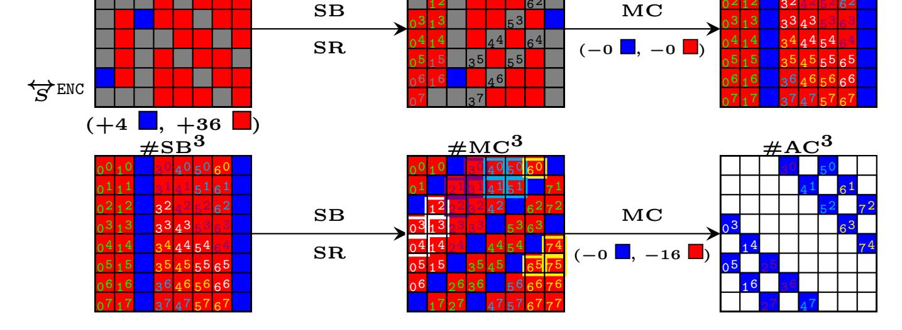

Fig. 9: Index in Algorithm 2

### Algorithm 3 Compute values of forward neutral bytes (in Blue) in Fig. 7

```
1: procedure ComputeForwardNeutralBytes
                    \mathcal{T}_{\mathtt{Init}} \leftarrow \emptyset
  2:
                                                                                                                                                                                                                \triangleright 2^{2 \times 28}
                   for all possible value \overrightarrow{v}_i of the 28 Blue cells in \#\mathbf{MC}^4 do
  3:
                            c_0 \stackrel{\texttt{MC}}{\leftarrow} (0 \parallel 0 \parallel 0 \parallel \#\mathbf{MC}^4_{\mathtt{col}_3}[3, 4, 5, 6] \parallel 0)[7]
  4:
                            c_1 \stackrel{\text{MC}}{\leftarrow} (0 \parallel 0 \parallel \#\mathbf{MC}_{\texttt{col}_4}^4[2, 3, 4, 5, 6] \parallel 0)[7]
  5:
                            c_2 \stackrel{\text{MC}}{\leftarrow} (0 \parallel \# \mathbf{MC}_{\texttt{col}_5}^4 [1, 2, 3, 4, 5] \parallel 0 \parallel 0)[7]
  6:
                            c_3 \stackrel{\text{MC}}{\leftarrow} (0 \parallel \# \mathbf{MC}^4_{\mathsf{col}_6}[1, 2, 3, 4] \parallel 0 \parallel 0 \parallel 0)[7]
  7:
                           c_4 \stackrel{\text{MC}}{\leftarrow} (\#_{\mathbf{MC}^4_{\mathsf{col}_8}}[0, 1, 2] \parallel 0 \parallel 0 \parallel 0 \parallel 0)[0] compute backward cell-by-cell through \mathtt{SB}^{-1}, \mathtt{SR}^{-1}, and \mathtt{AC}^{-1} to get the Blue
  8:
  9:
          cells in #AC
                            c_5 \overset{\mathrm{MC}^{-1}}{\leftarrow} (0 \parallel \#\mathbf{AC}^3_{\mathtt{col}_6}[1, 2, 3, 4] \parallel 0 \parallel 0 \parallel 0)[0, 1, 7]
10:
                            c_6 \stackrel{\text{MC}^{-1}}{\leftarrow} (\#\mathbf{AC}^3_{\mathtt{col}_7}[0, 1, 2, 3, 4, 5] \parallel 0 \parallel 0)[0, 7]
11:
                           c_7 \stackrel{\text{MC}^{-1}}{\leftarrow} (\#\mathbf{AC}^3_{\text{col}_8}[0, 1, 2, 3, 4, 5, 6] \parallel 0)[6, 7]
12:
                            c_8 \stackrel{\text{MC}^{-1}}{\leftarrow} (0 \parallel \# \mathbf{AC}^3_{\text{col}_6}[1, 2, 3, 4, 5, 6] \parallel 0)[5, 6, 7]
13:
                           c_9 \stackrel{\text{MC}^{-1}}{\leftarrow} (0 \parallel 0 \parallel \# \mathbf{AC}^3_{\mathtt{col}_{10}}[2, 3, 4, 5, 6] \parallel 0)[4, 5, 6, 7]
14:
                           \overrightarrow{\mathcal{T}_{\mathtt{Init}}}[c_0 \parallel c_1 \parallel c_2 \parallel c_3 \parallel c_4 \parallel c_5 \parallel c_6 \parallel c_7 \parallel c_8 \parallel c_9] \leftarrow \overrightarrow{v}_i
15:
16:
                    end for
                    return \overleftarrow{\mathcal{T}_{\mathtt{Init}}}
17:
18:
                                                                                                                                                                                       ▶ Note that due
```

to the linearity of MixColumns, values of Gray cells in involved columns of  $\# MC^4$  and  $\# AC^3$  can be set to zero in this precomputation phase. During the main attack phase, in the backward computation, the values of Gray cells will be integrated; constant impacts from these values of Gray cells together with the pre-determined impacts from the Blue cells are needed to be XORed together to the involved Red cells.

19: end procedure

#### **Algorithm 4** Compute values of backward neutral bytes (in Red) in Fig. 7

```
1: procedure ComputeBackwardNeutralBytes
  2:
                    \mathcal{T}_{\mathtt{Init}} \leftarrow \emptyset
                                                                                                                                                                                                                       \triangleright 2^{2 \times 16}
                    for all possible value \overleftarrow{v}_i of the 16 Red cells in \#\mathbf{AC}^5 do
  3:
                             compute forward cell-by-cell through AC, SB, and SR to get the Red cells in
   4:
           \#\mathbf{MC}^{6}
                        c_0 \stackrel{\text{MC}}{\leftarrow} (0 \parallel 0 \parallel 0 \parallel \#\mathbf{MC}_{\texttt{col}_5}^6[3, 4, 5, 6] \parallel 0)[6, 7]
  5:
                            c_1 \stackrel{\text{MC}}{\leftarrow} (0 \parallel 0 \parallel \#\mathbf{MC}_{\mathtt{col}_6}^6[2, 3, 4, 5] \parallel 0 \parallel 0)[7]
  6:
                             c_2 \stackrel{\text{MC}}{\leftarrow} (0 \parallel \# \mathbf{MC}^6_{\mathtt{col}_7}[1, 2, 3, 4] \parallel 0 \parallel 0 \parallel 0)[7]
  7:
                             c_3 \stackrel{\texttt{MC}}{\leftarrow} (\#\mathbf{MC}^6_{\texttt{col}_8}[0,1,2,3] \parallel 0 \parallel 0 \parallel 0 \parallel 0)[0,7]
  8:
                           c_{4} \leftarrow (\#\mathbf{AC}_{\mathsf{col}_{8}}^{5}[0, 1, 2, 3] \parallel Q_{4} \parallel 0 \parallel 0 \parallel 0)[0, 7]
c_{5} \leftarrow (0 \parallel \#\mathbf{AC}_{\mathsf{col}_{9}}^{5}[1, 2, 3, 4] \parallel 0 \parallel 0 \parallel 0)[7]
c_{6} \leftarrow (0 \parallel 0 \parallel \#\mathbf{AC}_{\mathsf{col}_{10}}^{5}[2, 3, 4, 5] \parallel 0 \parallel 0)[7]
  9:
10:
11:
                             c_7 \stackrel{\text{MC}^{-1}}{\leftarrow} (0 \parallel 0 \parallel 0 \parallel \# \mathbf{AC}^5_{\mathtt{col}_{11}}[3, 4, 5, 6] \parallel 0)[7]
12:
                             \overleftarrow{\mathcal{T}_{\mathtt{Init}}}[c_0 \parallel c_1 \parallel c_2 \parallel c_3 \parallel c_4 \parallel c_5 \parallel c_6 \parallel c_7] \leftarrow \overleftarrow{v}_i
13:
14:
                     end for
                    return \overleftarrow{\mathcal{T}_{\mathtt{Init}}}
15:
16: end procedure
```

{44}------------------------------------------------

- **E Visualization of More Attack Configurations**
- **E.1 Visualization of configurations facilitated to launch (pseudo-) preimage attacks**

{45}------------------------------------------------

<span id="page-45-1"></span>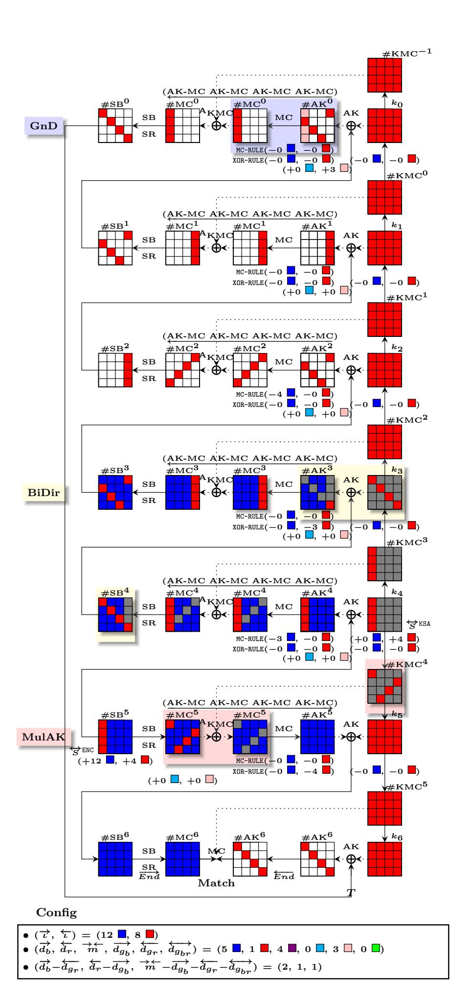

**Fig. 10:** The states in real attacks for superposition states in Fig. 3

<span id="page-45-0"></span>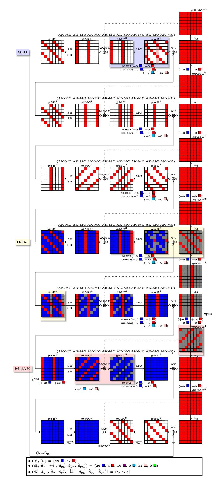

**Fig. 11:** The MITM attack on full-state 7-round Whirlpool  $(2 \times 2)$  of  $4 \times 4$  corresponding to the small-state configuration in Fig. 3

{46}------------------------------------------------

<span id="page-46-0"></span>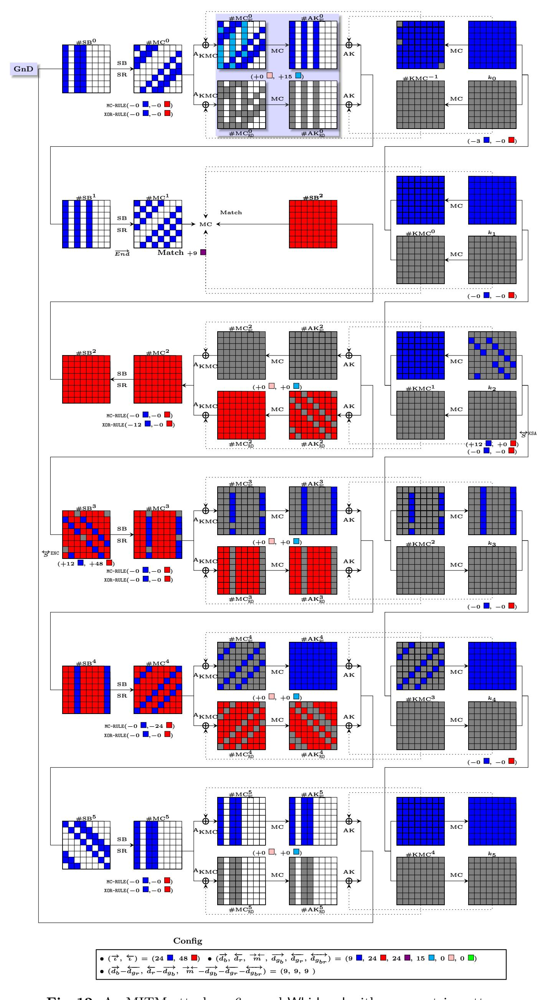

Fig. 12: An MITM attack on 6-round Whirlpool with asymmetric pattern

{47}------------------------------------------------

<span id="page-47-0"></span>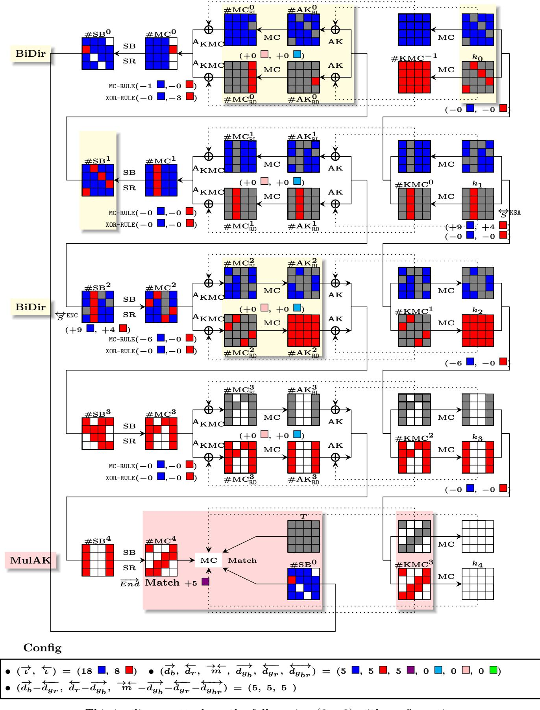

This implies an attack on the full version  $(8 \times 8)$  with configuration  $((\overrightarrow{d_b} - \overleftarrow{d_{g_r}}, \overleftarrow{d_r} - \overrightarrow{d_{g_b}}, \overrightarrow{m} - \overrightarrow{d_{g_b}} - \overleftarrow{d_{g_r}} - \overleftarrow{d_{g_{b_r}}}) = (20, 20, 20))$ 

**Fig. 13:** An example of using  $(2 \times 2 \text{ of } 4 \times 4)$  to search the MITM attack on 5-round Whirlpool

{48}------------------------------------------------

<span id="page-48-0"></span>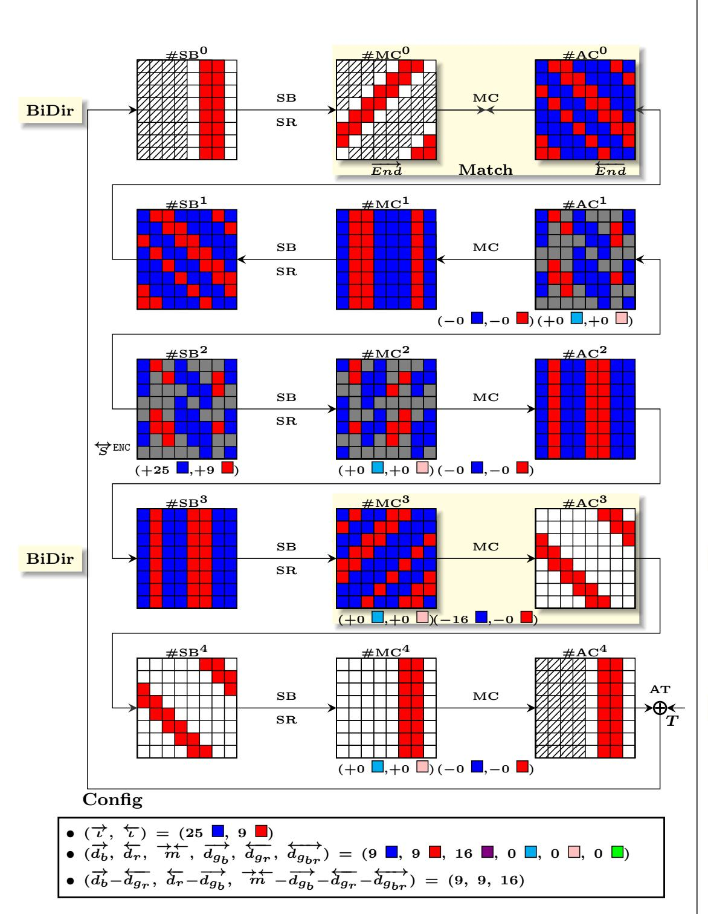

Fig. 14: An example of the MITM attack on the OT of the 5-round Grøstl-256

<span id="page-48-1"></span>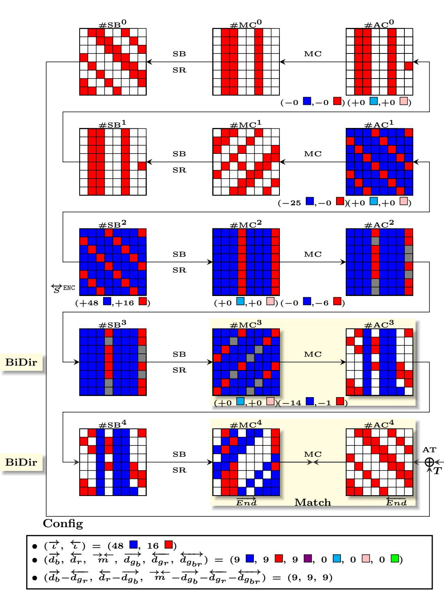

**Fig. 15:** An example of the MITM attack on  $P(H') \oplus H'$  in the CF of the 5-round Grøstl-256 (without guessing)

{49}------------------------------------------------

<span id="page-49-1"></span>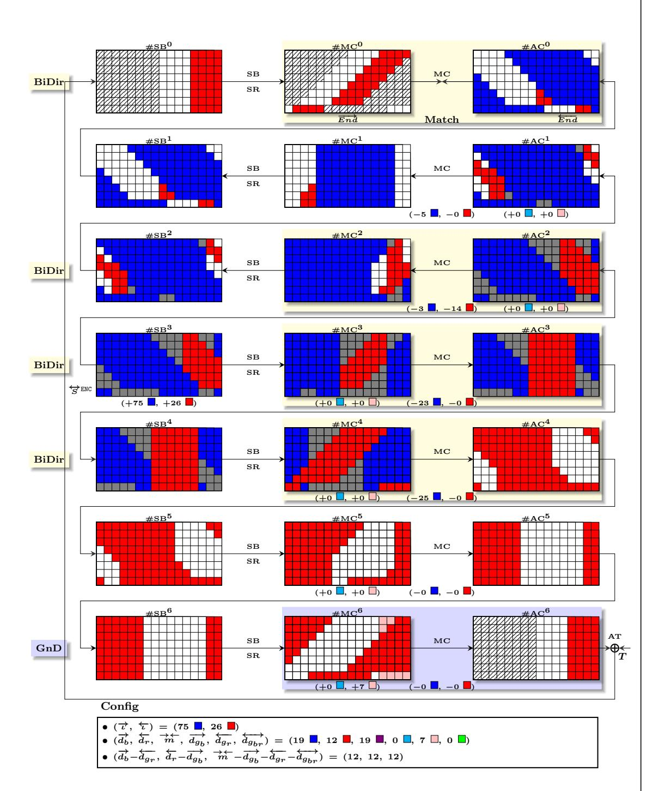

**Fig. 16:** An example of the MITM attack on the OT of the 7-round Grøstl-512

<span id="page-49-0"></span>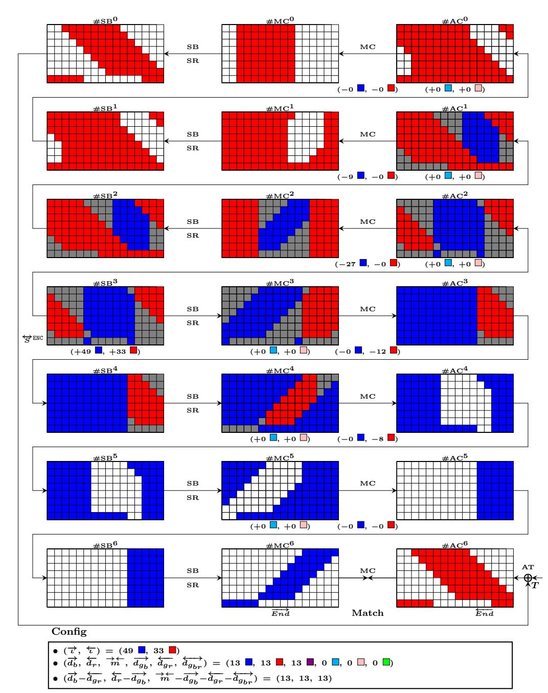

**Fig. 17:** An example of the MITM attack on  $P(H') \oplus H'$  in the CF of the 7-round Grøstl-512 (without guessing)

{50}------------------------------------------------

<span id="page-50-0"></span>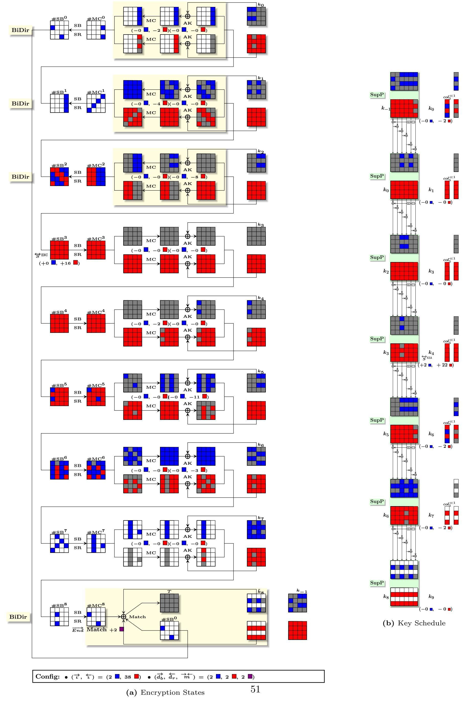

Fig. 18: A configuration of MITM attack against 9-Round AES-192 hashing mode

{51}------------------------------------------------

<span id="page-51-0"></span>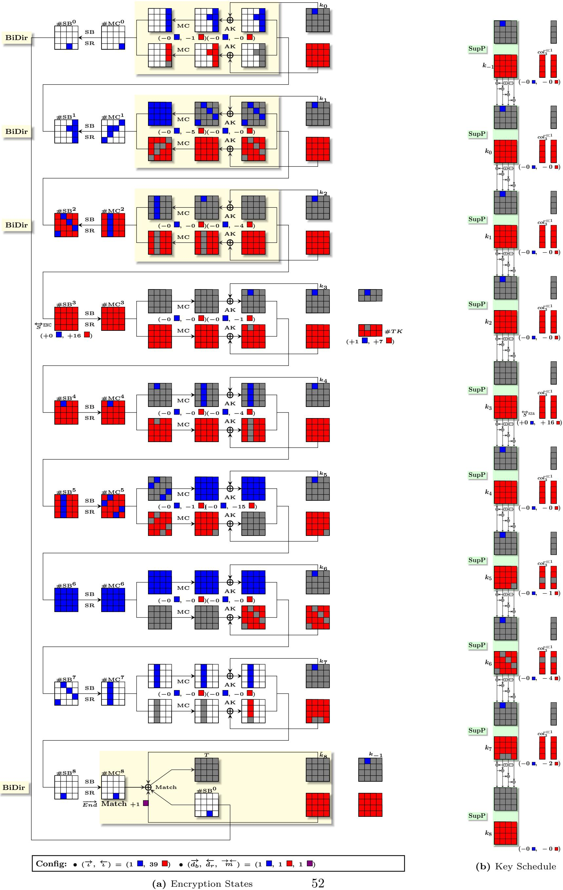

Subkeys are already XORed with the tweak. Besides, the displayed subkey  $\tilde{k_8}$  is already XORed with the whitening key  $k_{-1}$ .

Fig. 19: A configuration of MITM attack on 9-Round Kiasu-BC hashing mode

{52}------------------------------------------------

# E.2 Visualization of configurations facilitated to converting to collision attacks and key-recovery attacks

<span id="page-52-0"></span>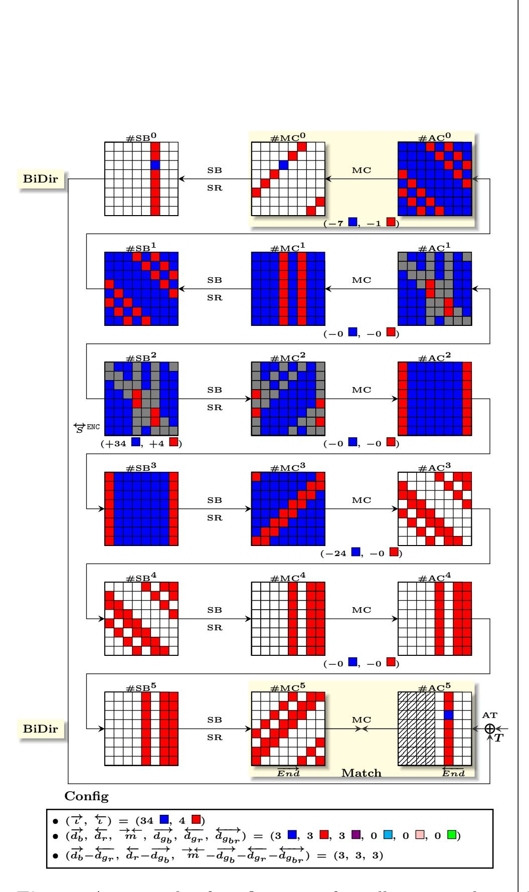

**Fig. 20:** An example of configuration for collision attack on the OT of 6-round **Grøstl-256** 

<span id="page-52-1"></span>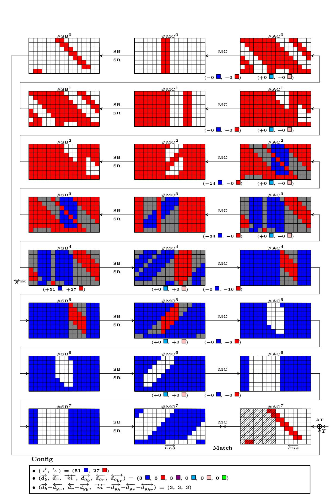

**Fig. 21:** An example of configuration for collision attack on the OT of 8-round Grøstl-512

{53}------------------------------------------------

<span id="page-53-0"></span>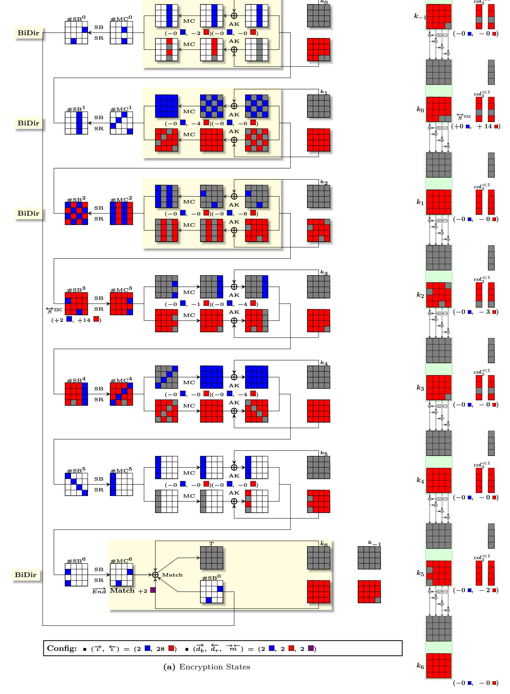

(b) Key Schedule

- \* In this and in other attack configurations on AES-hashing, the displayed last subkey is already XORed with the whitening key  $k_{-1}$ . Besides, the key-schedule is unrolled such that variables in each subkey are directly related to the variables in  $S^{KSA}$ . Therefore, an XOR of two Red (or Blue) cells can turn to Gray according to the algebraic normal form while consuming no degrees of freedom.
- \* For converting this attack configuration to a valid collision attack, it is necessary to pre-compute values of neutral bytes (in Red) for many fixed bytes (in Gray) at once with a total complexity of no more than  $2^{56}$ . For this, aided by the Automatic-Tool in [8], we found a guess-and-determine meet-in-the-middle procedure that generates  $2^{56}$  values of neutral bytes for  $2^{40}$  values of Gray bytes (i.e., the five bytes  $\#MC^1_{Red}[2, 5, 8, 15]$  and  $\#SB^5_{Red}[0]$ ) with a complexity of  $2^{56}$ . The system of equations and the automatically obtained procedure can be found via https://github.com/MITM-AES-like.

Fig. 22: A configuration of MITM attack against 7-Round AES-128 hashing mode (facilitated to converting to a collision attack)

{54}------------------------------------------------

<span id="page-54-0"></span>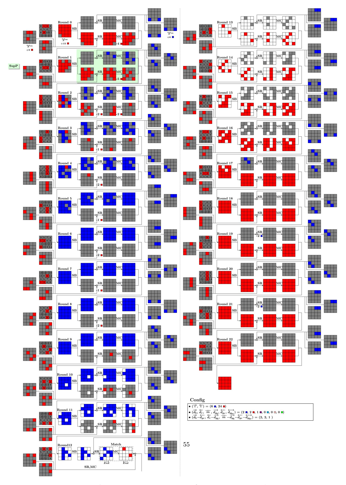

**Fig. 23:** A key-recovery attack on 23-round SKINNY-*n*-3*n*, optimized for time complexity

{55}------------------------------------------------

<span id="page-55-0"></span>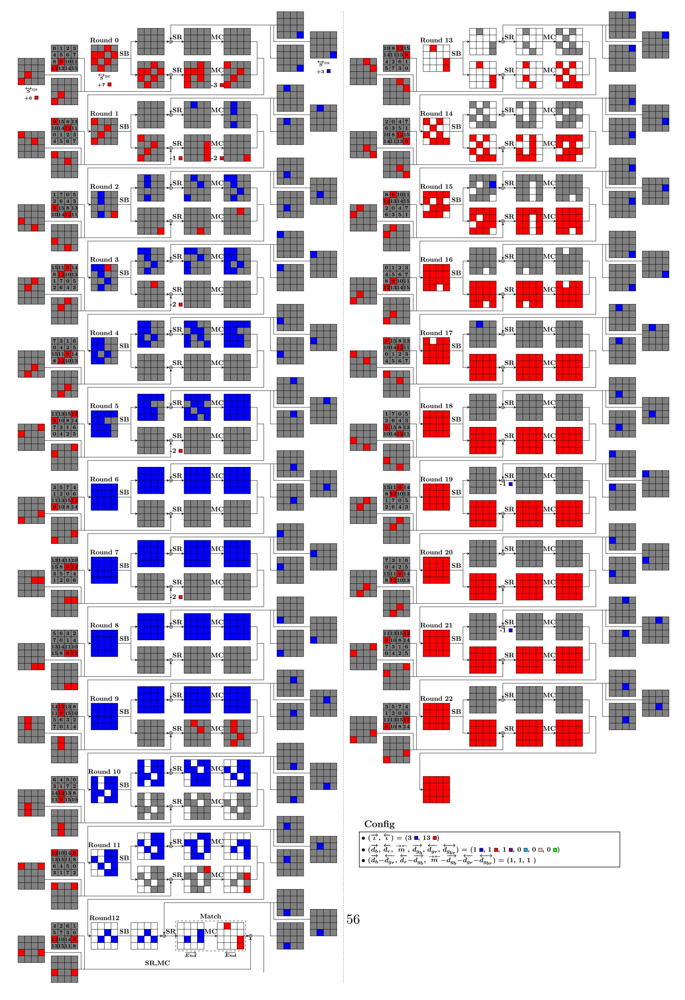

Fig. 24: A key-recovery attack on 23-round SKINNY-n-3n, optimized for data complexity

{56}------------------------------------------------

<span id="page-56-0"></span>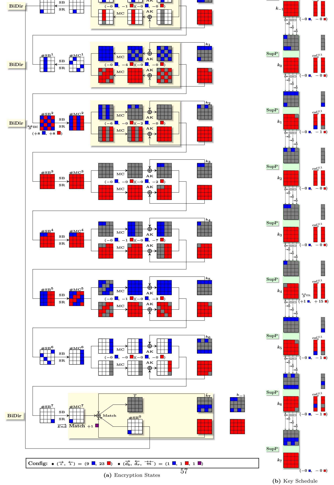

For converting this attack configuration to a valid collision attack, the attacker should be able to generate each value of neutral bytes with (amortized) computational complexity O(1). It is necessary to pre-compute values of neutral bytes (in Red) for many fixed bytes (in Gray) at once with a total complexity of no more than  $2^{60}$ . However, we have not found such a procedure using the same method as done for the attack on 7-round AES-128. The same problem stays open for converting attack configurations in Fig. 18, 26, and 19 to valid collision attacks.

**Fig. 25:** A configuration of MITM attack against 8-Round AES-128 hashing mode (facilitated to converting to a collision attack)

{57}------------------------------------------------

<span id="page-57-0"></span>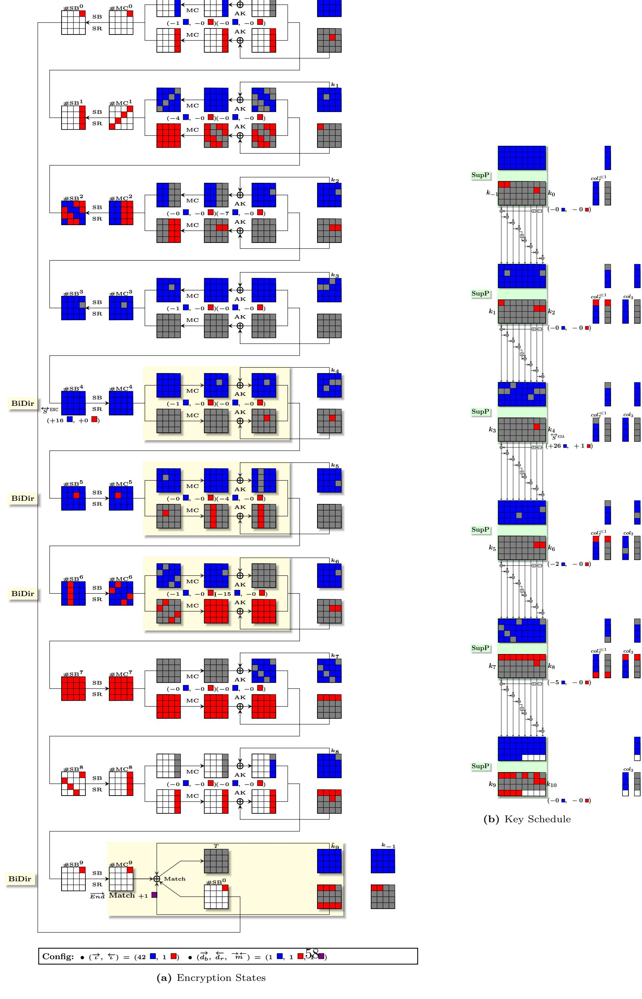

Fig. 26: A configuration of MITM attack against 10-Round AES-256 hashing mode (facilitated to converting to a collision attack)

{58}------------------------------------------------

## F Conversion of the Attacks on OT to Pseudo-Preimage Attacks on Grøstl

<span id="page-58-0"></span>The attack procedures presented in the main body are on the OT of Grøstl. They can be converted into pseudo-preimage attacks on Grøstl combining with similar attack procedures on the  $P(H_i) \oplus H_i$  of the CF using the conversion method in [34]. In [34], the pseudo preimage attack, *i.e.*, finding (H, M) such that  $X = P(H \oplus M) \oplus H \oplus Q(M)$  and  $Trunc_n(P(X) \oplus X) = T$  for a given T, is turn into solving a three-sum problem  $X_1 \oplus X_2 \oplus X_3 = 0$ , where  $X_1 = P(H') \oplus H' \oplus Q(M) \oplus M$ ,  $X_2 = Q(M) \oplus M$ ,  $X_3 = P(H') \oplus H'$  while  $H' = H \oplus M$  and  $X_1$  satisfies  $Trunc_n(P(X_1) \oplus X_1) = T$ . A procedure similar to the generalized birthday attack was used in [34] and is as follows (refer to Fig. 27).

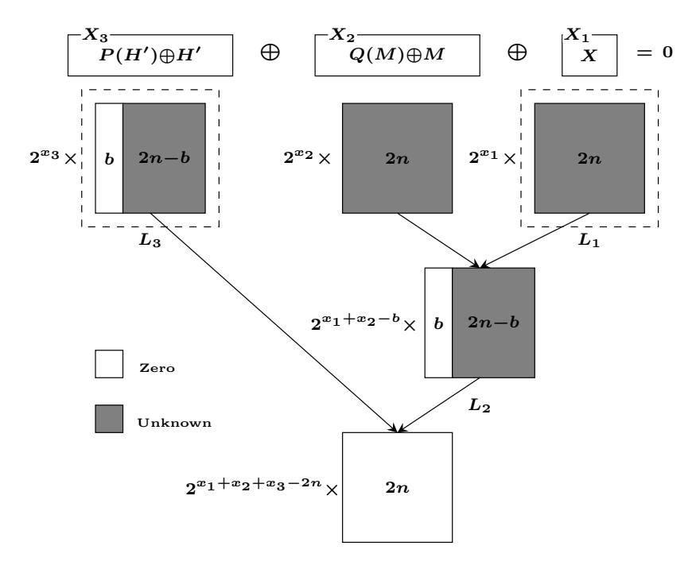

Fig. 27: Outline for pseudo-preimage attack on the Grøstl hash function [34]

- 1. Find  $2^{x_1}$  preimages  $X_1$  given the target T of the OT (use the MITM procedure on OT) and store in a lookup table  $L_1$ .
- 2. Choose  $2^{x_2}$  random M with correct padding and calculate  $X_2 = Q(M) \oplus M$ . Find partial matches on the leftmost b bits between  $2^{x_2}$   $X_2$ 's and  $2^{x_1}$   $X_1$ 's in  $L_1$ , and store the partial matches  $(X_1 \oplus X_2, M)$  in a lookup table  $L_2$ , of which the size is expected to be  $2^{x_1+x_2-b}$ .
- 3. Find  $2^{x_3}$  H' such that the leftmost b bits of  $X_3$  are all zero (use the MITM procedure on  $P(H') \oplus H'$  of the CF), where  $X_3 = P(H') \oplus H'$ . Store  $(X_3, H')$  in a lookup table  $L_3$ .
- 4. Find full matches (2n bits) between the  $2^{x_1+x_2-b}$   $X_1 \oplus X_2$ 's in  $L_2$  and the  $2^{x_3}$   $X_3$ 's in  $L_3$ , retrieve the corresponding M and H', output  $(H' \oplus M, M)$ .

Essentially, the b bits for partial matching can locate at any positions in the state instead of the leftmost (noted in [34]); Further, they can be any fixed b-bit linear

{59}------------------------------------------------

relations on  $\ell$  bits for  $\ell \geq b$ , which restrict the values of  $\ell$  bits to a subspace of dimension  $\ell - b$ , instead of b zero's (this is not used in [34]).

Let the complexity of finding one 2n-bit  $X_1$  given the n-bit target T be  $2^{C_1(2n,n)}$ . Let the complexity of finding one 2n-bit H' given the b-bit restriction on  $P(H') \oplus H'$  be  $2^{C_2(2n,b)}$ . Then, the complexity of the above procedure was approximated in [34] as (after removing some constant factors)

$$2^{x_1+C_1(2n,n)} + 2^{x_2} + 2^{x_1+x_2-b} + 2^{x_3+C_2(2n,b)}$$

Suppose the configuration for attacking  $P(H') \oplus H'$  be  $(\overrightarrow{d_b}^*, \overleftarrow{d_r}^*, \overrightarrow{m}^*)$  (in bytes), when the target is of b-bit, the degree of matching  $\overrightarrow{m}^*$   $(b) = \min(\overrightarrow{m}^*, \lfloor b/c \rfloor)$ .

The complexity 
$$2^{C_2(2n,b)} = \begin{cases} 2^{b-\min(\overrightarrow{d_b}^*, \overleftarrow{d_r}^*, \overrightarrow{m}^*(b)) \cdot c} & b >= 2 \cdot \min(\overrightarrow{d_b}^*, \overleftarrow{d_r}^*) \cdot c \\ 2^{b-\min(b/2, \overrightarrow{m}^*(b) \cdot c)} & b < 2 \cdot \min(\overrightarrow{d_b}^*, \overleftarrow{d_r}^*) \cdot c \end{cases}$$

where, b/2 in the second case is because one cannot fully use all the freedom degrees in that case.

However, we note that it is possible for Step 3 that, finding  $2^{x_3}$  H' requires much less computations than  $2^{x_3+C_2(2n,b)}$ . This is because one may find a large number of H' within a single MITM procedure when the degree of freedom is large and the number b of bits for partial preimage attack is small. For example, for attacking 6-round  $P(H') \oplus H'$  of Grøstl-256 using configuration Fig. 6 with  $(\overrightarrow{d_b}^*, \overleftarrow{d_r}^*, \overrightarrow{m}^*) = (3, 3, 3)$ , when  $b = 3 \times 8$ , with  $2^{3 \times 8}$  computations, one can find  $2^{3 \times 8}$  H' partially matching on b bits. Thus, the amortized complexity of finding one H' is  $2^0$ . When  $x_3$  is larger than b, the complexity of the above Step 3 is  $2^{x_3}$ . Thus, unlike in [34] that limits the lower bound of  $2^{C_2(2n,b)}$  to a birthday bound  $2^{b/2}$ , we use  $C_2(2n,b)$  to represent the amortized complexity of finding one H', and the complexity is then

$$2^{x_1+C_1(2n,n)} + 2^{x_2} + 2^{x_3+\overline{C_2(2n,b)}} + 2^{x_1+x_2-b}.$$

Because  $x_1 + x_2 + x_3 = 2n$ , the complexity is

$$2^{x_1+C_1(2n,n)} + 2^{x_2} + 2^{x_3+\overline{C_2(2n,b)}} + 2^{2n-(x_3+b)}$$

When  $b \leq \min(\overrightarrow{d_b}^*, \overleftarrow{d_r}^*, \overrightarrow{m}^*) \cdot c$ ,  $\overline{C_2(2n, b)} = 0$  for  $x_3 \geq b$ , that is, the amortized complexity for finding each H' is one. When  $b \geq \min(\overrightarrow{d_b}^*, \overleftarrow{d_r}^*, \overrightarrow{m}^*) \cdot c$ ,  $\overline{C_2(2n, b)} = 2^{b-\min(\overrightarrow{d_b}^*, \overleftarrow{d_r}^*, \overrightarrow{m}^*) \cdot c}$ , increasing b has the same effect as increasing  $x_3$ . Thus, we can always take  $b = \min(\overrightarrow{d_b}^*, \overleftarrow{d_r}^*, \overrightarrow{m}^*) \cdot c$  and adjusting  $x_3$ .

Denote  $\min(\overrightarrow{d_b}^*, \overleftarrow{d_r}^*, \overrightarrow{m}^*) \cdot c$  by  $G_2$  meaning the gain over bruteforce attack on  $P(H') \oplus H'$ . Further, denote  $\min(\overrightarrow{d_r} - \overrightarrow{d_{g_b}}, \overrightarrow{d_b} - \overleftarrow{d_{g_r}}, \overrightarrow{m} - \overrightarrow{d_{g_b}} - \overleftarrow{d_{g_r}} - \overleftarrow{d_{g_{b_r}}}) \cdot c$  by  $G_1$  meaning the gain over bruteforce attack on the OT, which equals  $n - C_1(2n, n)$ . Then, the complexity is

$$2^{x_1+n-G_1}+2^{x_2}+2^{x_3}+2^{x_1+x_2-G_2}$$

In this formula, there are three parameters  $x_1, x_2, x_3$  with  $x_1 + x_2 + x_3 = 2n$ . Given  $G_1$  and  $G_2$ , one can find the best complexity by adjusting  $x_1, x_2$ , and  $x_3$ . 

{60}------------------------------------------------

The order of magnitude of the total complexity is

$$C_T \approx \begin{cases} n - \frac{G_1}{3}, & \text{with } (x_1 = \frac{2G_1}{3}, x_2 = n - \frac{G_1}{3}, x_3 = n - \frac{G_1}{3}) & \text{if } G_2 \ge \frac{2G_1}{3}. \\ n - \frac{G_2}{2}, & \text{with } (x_1 = \frac{G_1}{2} + \frac{G_2}{4}, x_2 = n - \frac{G_1}{2} + \frac{G_2}{4}, x_3 = n - \frac{G_2}{2}) & \text{else } G_2 < \frac{2G_1}{3}. \end{cases}$$

$$\tag{19}$$

The order of magnitude of the memory complexity is

$$C_M \approx \begin{cases} n + \frac{G_1}{3} - G_2, & i.e., x_1 + x_2 - b, & \text{if } G_2 \ge \frac{2G_1}{3}.\\ n - \frac{G_2}{2}, & i.e., x_3, & \text{if } G_2 < \frac{2G_1}{3}. \end{cases}$$
 (20)

Concrete values of parameters for obtaining the best complexity for various attacks are summarized in Table 3.

**Table 3:** Concrete parameters for complexity of pseudo-preimage attacks on Grøstl (with recomputed complexities for previous works)

<span id="page-60-0"></span>

|                                        | #R                   | $x_1$             | $x_2$                | $x_3$                | $G_1$          | $G_2$          | G                 | $C_T$                | $C_M$                | Ref.                               |
|----------------------------------------|----------------------|-------------------|----------------------|----------------------|----------------|----------------|-------------------|----------------------|----------------------|------------------------------------|
| Grøstl-256<br>Grøstl-256<br>Grøstl-256 | 5/10<br>5/10<br>5/10 | 32<br>42.67<br>48 | 240<br>234.67<br>232 | 240<br>234.67<br>232 | 48<br>64<br>72 | 40<br>64<br>72 | 16<br>21.33<br>24 | 240<br>234.67<br>232 | 232<br>213.33<br>208 | † [34]<br>* [24,36]<br>Fig. 14, 15 |
| Grøstl-256<br>Grøstl-256               | 6/10<br>6/10         | 12<br>21.33       | 248<br>245.33        | 252<br>245.33        | 16<br>32       | 8<br>24        | $\frac{4}{10.67}$ | 252<br>245.33        | $252 \\ 242.67$      | * [24,36]<br>Fig. 5, 6             |
| Grøstl-512                             | 7/14                 | 64                | 480                  | 480                  | 96             | 104            | 32                | 480                  | 440                  | Fig. 16, 17                        |
| Grøstl-512<br>Grøstl-512<br>Grøstl-512 | 8/14<br>8/14<br>8/14 | 12<br>32<br>28    | 508<br>488<br>496    | 508<br>504<br>500    | 16<br>40<br>40 | 8<br>16<br>24  | 4<br>8<br>12      | 508<br>504<br>500    | 508<br>504<br>500    | † [34]<br>† [36]<br>Fig. 7, 8      |

 $<sup>\</sup>overline{G_1 = \min(\overrightarrow{d_r} - \overrightarrow{d_{g_b}}, \overrightarrow{d_b} - \overrightarrow{d_{g_r}}, \overrightarrow{m} - \overrightarrow{d_{g_b}} - \overrightarrow{d_{g_r}} - \overrightarrow{d_{g_{br}}}) \cdot c \text{ meaning the gain over bruteforce attack}}$ 

on the OT.  $G_2 = \min(\overrightarrow{d_b}^*, \overleftarrow{d_r}^*, \overrightarrow{m}^*) \cdot c$  meaning the gain over bruteforce attack on  $P(H') \oplus H'$ .

G: the gain over bruteforce attack on CF + OT (pseudo-preimage attack).

C: the order of the total complexity.

<sup>†</sup> The presented parameters for the attacks in [34] and [36] are recomputed by removing constant factors (e.g., the cost  $C_{TL}$  for lookup table is replaced by 1) and replacing  $C_2(2n, b)$  that is lower bounded by b/2 in [34] with  $\overline{C_2(2n,b)}$  that can be  $2^0$  considering the amortized complexity. Thus, all complexities in this table are computed follow the same way.

The claimed complexity of the 5-round attack on Grøstl-256 in [34] is  $2^{244.85}$ , with  $x_1 = 36.93$ ,  $x_2 = 244.93, x_3 = 230.13, C_1(2n, n) = 206, b = 31.$ 

The claimed complexity of the 8-round attack on Grøstl-512 in [34] is  $2^{507.32}$ , with  $x_1 = 10.50$ ,

 $x_2 = 506.50, x_3 = 507.00, C_1(2n, n) = 495, b = 0.$ \* The 5- and 6-round attacks in [24] are on the OT of Grøstl-256. To convert to pseudo-preimage,

we used the results for the case with no truncation in [24]. However, for the 6-round attack, in which guessing are required, it cannot be directly used. Thus, we combined the attack on OT in [24] with the best previous attack on the CF in [36].