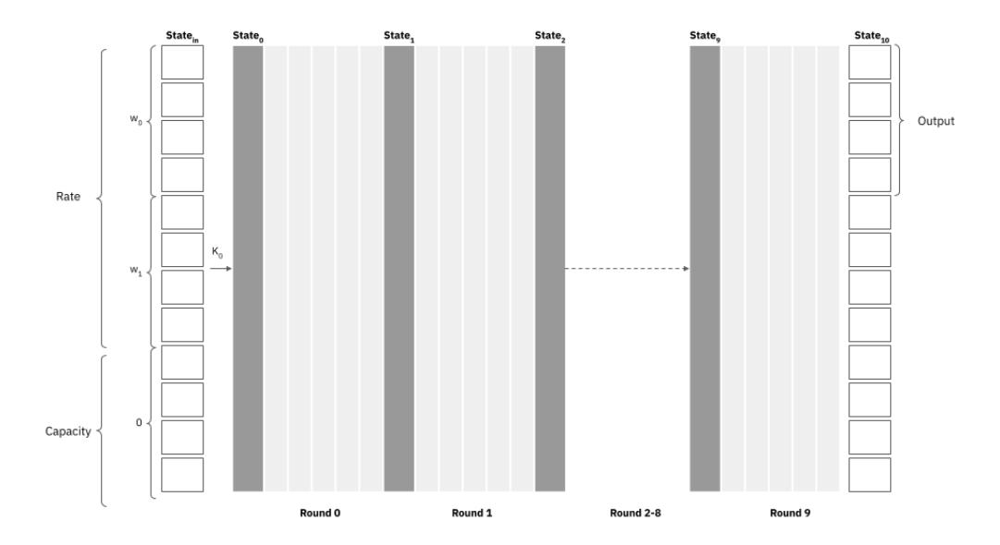
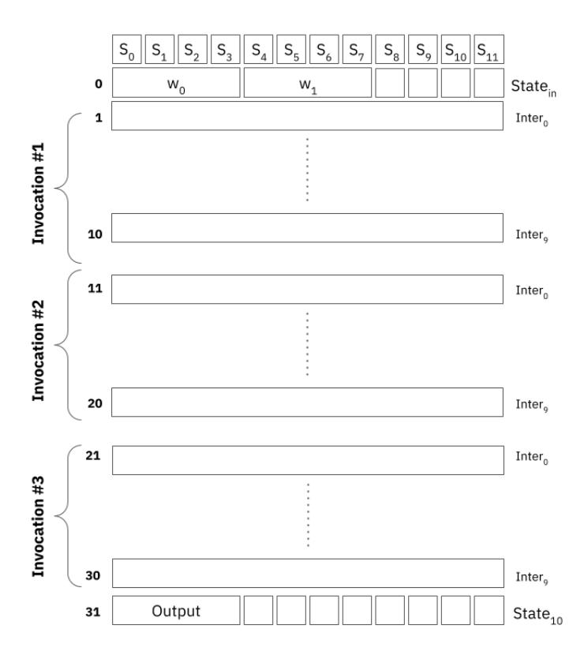
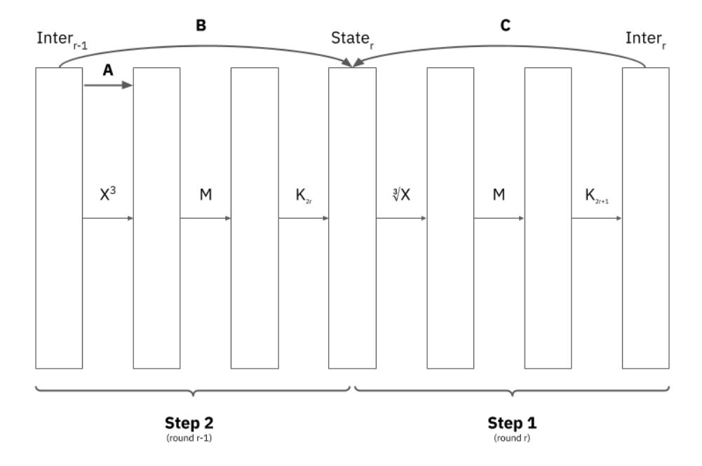
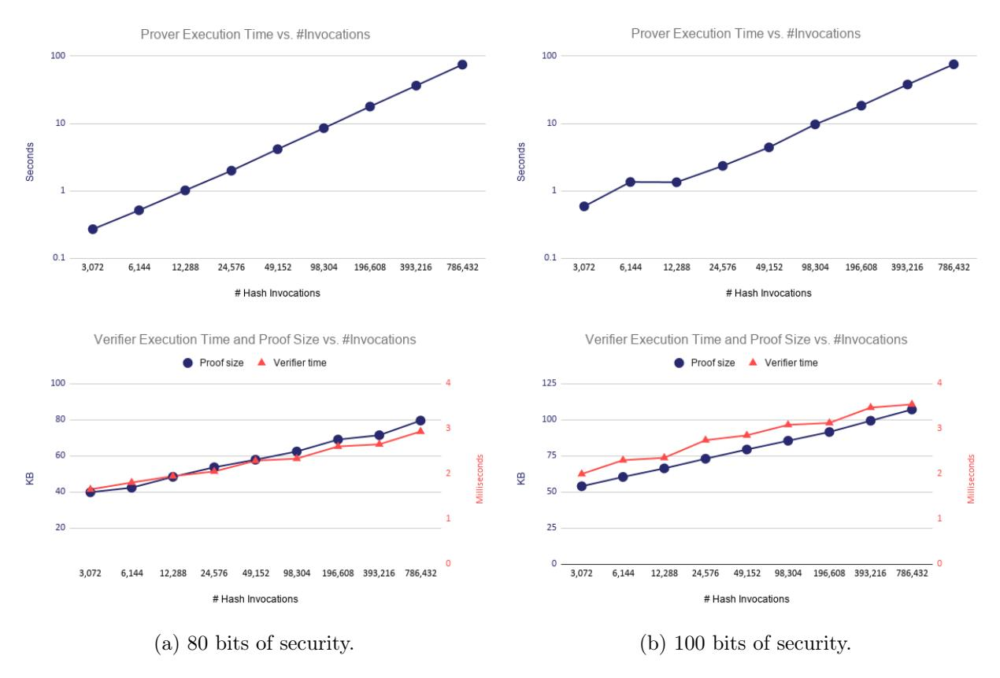
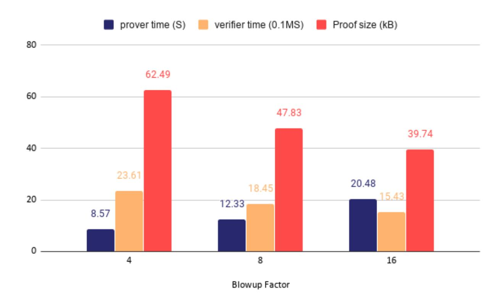
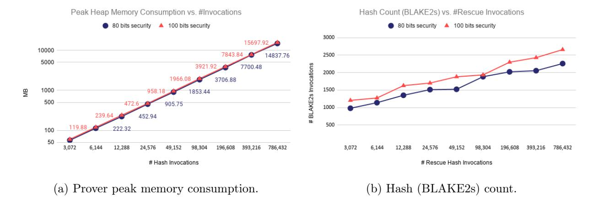

#### ethSTARK Documentation<sup>∗</sup> – Version 1.2

<span id="page-0-0"></span>Eli Ben-Sasson Dan Brownstein Dan Carmon Lior Goldberg David Levit Dori Medini Alon Shtaierman Eylon Yogev

July, 2023

#### Abstract

This document is intended to accompany the [ethSTARK](https://github.com/starkware-libs/ethSTARK.git) codebase, describing the computational integrity statement proved by that code and the specific STARK construction used to prove the statement.

<sup>∗</sup>StarkWare Industries Ltd., Israel. The author list refers to those who contributed to the writeup, whereas the associated code is the product of all team members of StarkWare Industries Ltd. Send inquiries to info@starkware.co.


# Contents

| 1 | Introduction                                               |                                                                                                  |             |  |  |
|---|------------------------------------------------------------|--------------------------------------------------------------------------------------------------|-------------|--|--|
| 2 | Rescue<br>2.1<br>2.2                                       | Rescue Cipher<br><br>Rescue Hash Function<br>                                                    | 4<br>5<br>5 |  |  |
|   |                                                            |                                                                                                  |             |  |  |
| 3 |                                                            | The STARK Protocol                                                                               | 7           |  |  |
|   | 3.1                                                        | The Trace<br>                                                                                    | 7           |  |  |
|   | 3.2                                                        | Periodic Columns<br>                                                                             | 8           |  |  |
|   | 3.3                                                        | The Constraints<br>                                                                              | 10          |  |  |
|   |                                                            | 3.3.1<br>Intermediate Values<br>                                                                 | 10          |  |  |
|   |                                                            | 3.3.2<br>The Rescue Constraints<br>                                                              | 11          |  |  |
|   |                                                            | 3.3.3<br>From Polynomial Constraints to Low Degree Testing Problem<br>                           | 14          |  |  |
|   | 3.4                                                        | Trace Low Degree Extension<br>                                                                   | 14          |  |  |
|   | 3.5                                                        | Commitment Scheme<br>                                                                            | 15          |  |  |
|   | 3.6                                                        | Composition Polynomial<br>                                                                       | 15          |  |  |
|   |                                                            | 3.6.1<br>Degree Adjustment<br><br>3.6.2<br>Combining the Constraints<br>                         | 15<br>16    |  |  |
|   |                                                            |                                                                                                  |             |  |  |
|   |                                                            | 3.6.3<br>Committing to the Composition Polynomial<br>                                            | 16          |  |  |
|   | 3.7<br>3.8                                                 | Consistency Check on a Random Point (the DEEP Method)<br><br>The DEEP Composition Polynomial<br> | 16<br>17    |  |  |
|   |                                                            | 3.8.1<br>Verifying the Mask Values<br>                                                           | 17          |  |  |
|   |                                                            |                                                                                                  |             |  |  |
|   |                                                            | 3.8.2<br>Verifying the Trace Values<br>                                                          | 18          |  |  |
|   | 3.9                                                        | The FRI Protocol for Low Degree Testing<br>                                                      | 18          |  |  |
|   |                                                            | 3.9.1<br>Commit Phase<br>                                                                        | 19          |  |  |
|   |                                                            | 3.9.2<br>Query Phase<br>                                                                         | 19          |  |  |
|   |                                                            | 3.10 Transformation to Non-Interactive Protocol (the Fiat-Shamir heuristic)<br>                  | 20          |  |  |
|   |                                                            | 3.11 Proof Length Optimizations<br>                                                              | 20          |  |  |
|   |                                                            | 3.11.1<br>Skipping FRI Layers<br>                                                                | 20          |  |  |
|   |                                                            | 3.11.2<br>FRI Last Layer<br>                                                                     | 20          |  |  |
|   |                                                            | 3.11.3<br>Grinding<br>                                                                           | 21          |  |  |
| 4 |                                                            | Measurements and Benchmarks                                                                      | 21          |  |  |
|   | 4.1                                                        | Prover/Verifier Time and Proof Size vs. Number of Hash Invocations<br>                           | 21          |  |  |
|   | 4.2                                                        | Prover/Verifier Time and Proof Size vs. Blowup Factor<br>                                        | 22          |  |  |
|   | 4.3                                                        | Memory Consumption and Recursive Proof Composition<br>                                           | 23          |  |  |
| 5 | Provable Knowledge Soundness and Security in the IOP Model |                                                                                                  |             |  |  |
|   | 5.1                                                        | Satisfiable Algebraic Intermediate Representations (AIRs)<br>                                    | 24<br>25    |  |  |
|   | 5.2                                                        | Soundness, knowledge soundness and security<br>                                                  | 26          |  |  |
|   | 5.3                                                        | The IOP Protocol<br>                                                                             | 27          |  |  |
|   | 5.4                                                        | Prior results needed for the analysis<br>                                                        | 30          |  |  |
|   | 5.5                                                        | The Knowledge Extractor<br>                                                                      | 31          |  |  |
|   | 5.6                                                        | Upper bound on knowledge soundness error<br>                                                     | 32          |  |  |
|   |                                                            |                                                                                                  |             |  |  |


|   | 5.7 | Proof of Theorem<br>4<br>                                                            | 34 |
|---|-----|--------------------------------------------------------------------------------------|----|
|   | 5.8 | Proofs of Lemmas<br>                                                                 | 35 |
|   |     | 5.8.1<br>Proof of Lemma<br>2<br>                                                     | 36 |
|   |     | 5.8.2<br>Proof of Lemma<br>3<br>                                                     | 36 |
|   |     | 5.8.3<br>Proof of Lemma<br>4<br>                                                     | 37 |
|   | 5.9 | Security<br>                                                                         | 38 |
|   |     | 5.9.1<br>IOP Toy Problem<br>                                                         | 38 |
|   |     | 5.10 Parameter settings<br>                                                          | 39 |
|   |     | 5.10.1<br>Suggested IOP Parameter Settings based on Conjectured Soundness<br>        | 40 |
|   |     | 5.10.2<br>Suggested IOP Parameter Settings based on Provable IOP Knowledge Soundness | 40 |
| 6 |     | Provable Round-by-Round Soundness                                                    | 41 |
|   | 6.1 | Definition of Vector Round-by-Round Soundness<br>                                    | 41 |
|   | 6.2 | Round-by-Round Soundness Analysis<br>                                                | 42 |
|   | 6.3 | Grinding<br>                                                                         | 47 |
| 7 |     | STARK security                                                                       | 48 |
|   | 7.1 | Non-interactive random-oracle arguments<br>                                          | 48 |
|   |     | 7.1.1<br>Suggested Parameter based on Provable Soundness<br>                         | 50 |


# <span id="page-3-0"></span>1 Introduction

On July 2, 2018, the Ethereum Foundation gave StarkWare a 2-year milestone-based grant to select a STARK friendly hash (SFH) function, to be used in combination with transparent and plausibly post-quantum secure proof systems within blockchains, and release an open source efficient STARK system for it. Under the grant agreement, StarkWare committed to publishing, among other things:

"Production-quality software released under a software license, approved by the Ethereum Foundation, for the STARK-friendly hash function:

- 1. Arithmetised circuit with proofs compressing 100,000 hashes (3.2MB of data) to 200kB with 80 bits of security
- 2. Prover that compresses 100 hashes per second with a quad-core CPU and 16GB of RAM
- 3. Verifier verifying proofs in 10ms on a single-core CPU with 4GB of RAM
- 4. Detailed specification of the prover and verifier mechanics, inluding optimisations . . . "

The [ethSTARK code](https://github.com/starkware-libs/ethSTARK) released by StarkWare answers items 1–3 above, and the purpose of this document it to address item 4. We assume familiarity with the notion of interactive proofs [\[GMR89\]](#page-51-0), non-interactive Computationally Sound proofs [\[Mic00\]](#page-51-1), Interactive Oracle Proofs (IOPs) [\[RRR16,](#page-51-2) [BCS16\]](#page-50-0) and Scalable Transparent ARgument of Knowledge (STARK) systems [\[BBHR19\]](#page-50-1).

Organization of the document Section [2](#page-3-1) describes the Rescue hash function family and the particular member of it that [ethSTARK](https://github.com/starkware-libs/ethSTARK) implements. Section [3](#page-6-0) describes in great detail the specific STARK protocol used in the code, including a description of the full system of constraints included in the Algebraic Intermediate Representation (AIR) of the system. Section [4](#page-20-1) provides measurements and benchmarks of the system and discusses them. Security and soundness analysis for the IOP model are presented in Section [5.](#page-23-0) Round-by-round soundness, needed for analysing security in the random oracle model is presented in Section [6,](#page-40-0) and security of non-interactive STARKs in the random oracle model is discussed in Section [7.](#page-47-0) (The independent work of Block et al. [\[BGK](#page-51-3)+23] achieves similar results to our Sections [6](#page-40-0) and [7,](#page-47-0) see Remark [5](#page-40-2) for a detailed comparison.)

Acknowledgment We would like to thank Justin Drake from the Ethereum Foundation for his thoughtful and detailed comments. We thank Venkatesan Guruswami and Amnon Ta-Shma for carefully auditing Section [5](#page-23-0) and offering numerous comments that clarified the presentation, and the Ethereum Foundation for funding their audit.

# <span id="page-3-1"></span>2 Rescue

In this section we give a short description of the Rescue cipher family, referring the interested reader to [\[AAB](#page-50-2)+19] for full details. We then present an instantiation of a hash function based on this Rescue cipher family.


#### <span id="page-4-0"></span>2.1 Rescue Cipher

Rescue is a family of ciphers based on substitution-permutation networks (SPNs). A Rescue cipher manipulates a state of m > 1 elements in the vector space  $\mathbb{F}_p^m$  where  $\mathbb{F}_p$  is a field of characteristic  $p \equiv 5 \pmod{6}$ .

A Rescue permutation is an iterative application of a round function R times where R is determined by the desired security level. The inputs to the first round are the plaintext and a master-key, and the output of the last round is the ciphertext. Each round takes as inputs the previous state and a subkey, derived from the master-key, and outputs a new state.

A round of a Rescue permutation includes two steps. In each step an S-box is applied to each of the m state elements, followed by a multiplication by a Maximum Distance Separable (MDS) matrix which mixes the elements together. At the end of each step a subkey is injected into the state. The S-boxes  $\pi_1$  and  $\pi_2$  that are used in the first and second step of each round, consist of the power maps  $x^{1/\alpha}$  and  $x^{\alpha}$ , respectively, for an integer  $\alpha$  that does not divide p-1 (in which case  $1/\alpha$  is well-defined).

#### <span id="page-4-1"></span>2.2 Rescue Hash Function

The Rescue hash function is a sponge construction hash function, based on an un-keyed Rescue permutation, in which the secret key is set to zero and round constants are used instead of keys. A sponge construction generates a hash function from an underlying permutation by iteratively applying it to a large state. The state consists of m = r + c field elements, where r and c are called the rate and the capacity of the sponge, respectively.

We now present our instantiation of a Rescue hash function. Henceforth, the term "Rescue" refers to this particular instantiation, not to the larger family defined in [AAB<sup>+</sup>19]. The native field in which Rescue operates is  $\mathbb{F}_p$  where  $p = 2^{61} + 20 \cdot 2^{32} + 1$ . The state is viewed as a column vector of m = 12 field elements. For the S-boxes  $\pi_1$  and  $\pi_2$  we use  $\alpha = 3$  such that the power maps are  $x^{1/3}$  and  $x^3$ , respectively. Since 3 does not divide p - 1 it holds that (2p - 1)/3 is an integer and furthermore,

$$\forall x \in \mathbb{F}_p, \quad (x^3)^{(2p-1)/3} = (x^{(2p-1)/3})^3 = x.$$

Therefore we use 1/3 to denote (2p-1)/3, noticing that  $x \mapsto x^{1/3}$  is indeed the cube-root permutation, modulo p. To compute the Rescue permutation from a given input, the round function is iterated R = 10-times with constants injected before the first round, between each two consecutive steps (within and between rounds), and after the last round (a total of 21 constant vectors).

Let  $K = \{K_0, \ldots, K_{20}\}$  denote the constants used in the Rescue hash function such that  $K_{2r+1}, K_{2r+2}$  are the constants used in the rth round for  $r \in [0, 9]$  and  $K_0$  is the constant used before the first round. Note that each  $K_i \in K$  is in fact a field element vector of length m = 12. Thus, adding a constant to a state is merely a vector addition. Figure 1 is a graphic description of a single round of the Rescue permutation.

To transform the Rescue permutation to a hash function, we apply the Sponge construction: The first 8 elements of the *state* are the *rate* and the last 4 elements are the *capacity*. The hash of two inputs  $w_0, w_1 \in \mathbb{F}_p^4$  is defined by applying the rescue permutation to  $(w_0, w_1, 0) \in \mathbb{F}_p^{12}$  and taking the first 4 elements. A graphic description of the Rescue hash function is given in Fig. 2, and its pseudo-code appears in Algorithm 1.


# <span id="page-5-0"></span>State Inter X M K<sub>2r+1</sub> X Step 1 Step 2

Figure 1: Round r of the Rescue permutation. M denotes a multiplication by the MDS matrix. Inter<sub>r</sub> represents the state in the middle of the round.

```
Algorithm 1 The Rescue permutation with an MDS matrix M
```

```
INPUT: w_0, w_1 \in \mathbb{F}_p^4, round constants K
OUTPUT: Rescue(w_0, w_1)

Let State<sub>in</sub> be the vector (w_0, w_1, 0) \in \mathbb{F}_p^{12}.

State<sub>0</sub> = State<sub>in</sub> + K_0

for r = 0 to 9 do

for i = 0 to 11 do

Inter<sub>r</sub>[i] = \sum_{j=0}^{m-1} M[i,j] (\operatorname{State}_r[j])^{1/3} + K_{2r+1}[i]
\nend for

for i = 0 to 11 do

State<sub>r+1</sub>[i] = \sum_{j=0}^{m-1} M[i,j] (\operatorname{Inter}_r[j])^3 + K_{2r+2}[i]
\nend for\nend for
return State<sub>10</sub>
```

<span id="page-5-1"></span>

<span id="page-6-2"></span>

Figure 2: Instantiating the Rescue hash function as a sponge construction based on the Rescue permutation.

# <span id="page-6-0"></span>3 The STARK Protocol

STARKs (Scalable Transparent ARguments of Knowledge) are a family of proof systems characterized by scalability and transparency. Scalability – via quasilinear proving time and poly-logarithmic verification time, and transparency – meaning all verifier-side messages are public random coins (requiring no trusted setup). We assume familiarity with the general definition of STARKs, as described in [\[BBHR19\]](#page-50-1). In this section we describe the STARK proof system as an interactive protocol between two parties, the prover and the verifier. The prover sends a series of oracle messages in an attempt to convince the verifier that a certain computation on some input (the proven statement) was executed correctly. The verifier responds to the messages with public random values. After the interaction ends, the verifier uses more public random coins to query a small number of entries from the oracle messages sent by the prover. Based on the answers to these queries, the verifier reaches a decision whether to accept the statement as correct, or reject it. The completeness and soundness properties of the STARK system imply that correct statements proved by honest provers are guaranteed to be accepted by the verifier (with probability 1 over the random coin-tosses made by the verifier). Conversely, incorrect statements, and statements whose witness is unknown to the prover will be rejected with all but negligible probability (which we set here to be at most 2 <sup>−</sup>80).

While we describe the system below as an interactive protocol, it is noted that this interactivity is eventually replaced by a transformation to a non-interactive system wherein the prover provides a proof and the verifier decides whether to accept or reject it. See Section [3.10.](#page-19-0)

#### <span id="page-6-1"></span>3.1 The Trace

An execution trace of a computation, or trace, in short, is a sequence of machine states, one per clock cycle. If the computation requires W registers and lasts for N cycles, the execution trace


can be represented by a table of size  $N \times W$ . Given a statement regarding the correctness of a computation, the prover first builds a trace.

Denote the columns of the trace by  $f_1, \ldots, f_W$ . Each  $f_j$  is of a fixed length, N, that is a power of two. The values in the trace cells are elements in a finite field  $\mathbb{F}_p$ . The trace evaluation domain is defined to be a multiplicative subgroup of  $\mathbb{F}_p^{\times}$  of size N, generated by an element g; we denote this subgroup by  $\langle g \rangle$ . Effectively, we enumerate the trace rows using the elements of  $\langle g \rangle$ , where the ith row is enumerated by  $g^i$  (the first row is the 0th row, enumerated by  $1 = g^0$ ). Each trace column is interpreted as N point-wise evaluations of a polynomial of degree smaller than N over the trace evaluation domain. These polynomials are referred to as the trace column polynomials or column polynomials in short.

The Rescue trace has 12 columns, corresponding to the m=12 field elements of the state. Applying each hash requires slightly more than 10 rows (one per round). The hashes<sup>3</sup> can be computed in batches of 3 hashes that fit into 32 rows as follows (see Fig. 3):

- Row 0: initial state of the first hash (8 input field elements and 4 zeros).
- Rows 1 to 10: state in the middle<sup>4</sup> of every round of the first hash.
- Rows 11 to 20: state in the middle of every round of the second hash.
- Rows 21 to 30: state in the middle of every round of the third hash.
- Row 31: final state of the third hash (the first 4 field elements in this state are the output).

#### <span id="page-7-0"></span>3.2 Periodic Columns

Many cryptographic primitives involve using some list constants. Applying the same cryptographic primitive many times, yields a periodic list of constants. For this, we use a technique we refer to as periodic columns. The periodic structure of each such column leads to a column polynomial which can be represented succinctly. In the classic representation of a polynomial  $\sum a_i x^i$  as a vector of its coefficients  $(a_0, a_1, \ldots)$ , a succinct representation means that most of the  $a_i$ 's are zeros. This enables the verifier to efficiently compute the point-wise evaluations of these polynomials.

We maintain the round constants of Rescue using periodic columns. For each trace column we have two periodic columns, one for each of the two steps of a round, up to the following small modifications. Each periodic column is of length 32 (corresponding to 3 hashes, see Section 3.1 for more details). For technical reasons that will be explained in Section 3.3, we decided to add  $K_0$  to the round constants that correspond to the second step of a round, in the first four columns in rows 10 and 20 (the left inputs of the second and third hash invocations).

<span id="page-7-4"></span><sup>&</sup>lt;sup>4</sup>We refer to the value of Inter<sub>r</sub> after the first inner loop in Algorithm 1 as the state in the middle of every round.


<span id="page-7-2"></span><span id="page-7-1"></span><sup>&</sup>lt;sup>1</sup>We use the same field in which Rescue operates ( $\mathbb{F}_p$  where  $p = 2^{61} + 20 \cdot 2^{32} + 1$ ).

<sup>&</sup>lt;sup>2</sup>Such interpolation polynomial (uniquely) exists since for any N distinct points  $x_0, \ldots, x_{N-1}$  and corresponding values  $y_0, \ldots, y_{N-1}$ , there exists a unique polynomial of degree at most N-1 that interpolates the data  $(x_0, y_0), \ldots, (x_{N-1}, y_{N-1})$ .

<span id="page-7-3"></span><sup>&</sup>lt;sup>3</sup>A chain of n hash invocations consists of n+1 inputs  $w_0, \ldots, w_n$ , and a single output. Let  $O_i$  denote the output of the ith invocation, the output of the chain is  $O_n$ . The inputs to the first invocation are  $(w_0, w_1)$  and the inputs to the ith invocation, for  $i \geq 2$ , are  $(O_{i-1}, w_i)$ .

<span id="page-8-0"></span>

Figure 3: A batch of three hashes in the Rescue execution trace.


#### <span id="page-9-0"></span>3.3 The Constraints

An execution trace is valid if (1) certain boundary constraints hold and (2) each pair of consecutive states satisfies the constraints dictated by the computation. For example, if at time t the computation should add the contents of the 1st and 2nd registers and place the result in the 3rd register, the relevant constraint would be  $f_1(g^t) + f_2(g^t) - f_3(g \cdot g^t) = 0$  where  $f_j$  is the jth column polynomial and g is the generator of the trace evaluation domain.

The constraints are expressed as polynomials composed over the trace cells that are satisfied if and only if the computation is correct. Hence, they are referred to as the *Algebraic Intermediate Representation (AIR) Polynomial Constraints* on the trace. For example, in the context of proving the computational integrity of an execution of a Rescue hash function, the constraints are such that they all hold if and only if the output of the hash function matches the input, where the input and output are designated cells within the trace (these cells will be part of the boundary constraints defining validity of the statement).

Some examples of constraints over the trace cells:

- 1.  $f_2(x) a = 0$  for  $x = g^7$  (the value in column 2 row 7 is equal to a).
- 2.  $f_6^2(x) f_6(g^3x) = 0$  for all x (the squared value in each row in column 6 is equal to the value three rows ahead).

By writing a set of polynomial constraints which are satisfied if and only if the computation is valid, we reduce the original problem – proving the correctness of a computation – to proving that the polynomial constraints are satisfied. This reduction is a special case of the general process known in theoretical computer science as "arithmetization".

The AIR for the Rescue hash chain corresponds to the following claim:

<span id="page-9-3"></span>"I know a sequence of inputs 
$$w = \{w_0, \dots, w_n\}$$
 such that 
$$H(\dots H(H(w_0, w_1), w_2) \dots, w_n) = \text{output"}, \tag{1}$$

where H is the Rescue hash function, each  $w_i$  is a 4-tuple of field elements and output is the public output of the hash (which consists of 4 field elements). Recall that the hashes are computed in batches of 3 hashes, hence, |w| = 3k + 1 = n + 1 for some  $k \in \mathbb{Z}$ . We note that the number of hash invocations, which is known to the verifier, is |w| - 1 = n and refer to n as the *chain length*.

#### <span id="page-9-1"></span>3.3.1 Intermediate Values

There are numerous ways to capture the correctness of an execution trace via polynomial constraints. When designing an AIR, one should take the tradeoffs that each approach yields into consideration. For example, consider the following synthetic trace with only two cells:

$$\frac{X}{\sqrt[3]{X+1}}$$

A naïve constraint linking the two cells is  $f_0(g) - \sqrt[3]{f_0(1) + 1} = 0$ . Recall that in Rescue's native field  $x^{1/3} = x^{(2p-1)/3}$ . Therefore, the degree<sup>5</sup> of this polynomial constraint, (2p-1)/3, is huge.

<span id="page-9-2"></span><sup>&</sup>lt;sup>5</sup>In the following sections we will see that the degrees of the polynomial constraints play a major role in the efficiency of the prover.


A different possible approach would be to maintain intermediate execution values within the trace. For example, adding a column to the trace with the cubed values of the original column:

<span id="page-10-1"></span>
$$\begin{array}{c|c} X & X^3 \\ \sqrt[3]{X+1} & X+1 \end{array}$$

Now, we can replace the former constraint with the following ones:

$$f_0^3(x) - f_1(x) = 0 \text{ for } x = 1, g$$
 (2)

$$f_0(1) + 1 - f_1(g) = 0 (3)$$

Note that while the maximal degree of these constrains is 3, there are now three constraints instead of one. Also, the size of the trace is twice the size of the original trace. Both measures, number of constraints and trace size, affect the prover efficiency. Crucially, in both approaches we force the prover to place <sup>√</sup><sup>3</sup> <sup>X</sup> + 1 in a certain well-defined trace cell, as needed to achieve computational integrity.

A third approach is to compute the intermediate values for the constraints in which they are used, instead of adding them to the trace and asserting their validity by more constraints. Consequently, constraint [\(3\)](#page-10-1) becomes f0(1) + 1 − A = 0, where A = f 3 0 (g) and the intermediate value A does not appear in the trace. Note that this constraint is defined over the original trace and is of degree 3. Although intermediate values are not part of the trace, it is helpful to think of them as trace intermediate columns.

Recall that the rows in the Rescue trace are the states in the middle of rounds (except for the first and last rows of every batch of 3 hashes). Thus, as can be seen in Figure [4,](#page-11-0) calculating the second step of a round from a row in the trace should yield the same result as calculating the first step of a round, in reverse, from its consecutive row.

In the Rescue AIR, for each trace column we have 3 intermediate columns. We denote these intermediate columns by:

- 1. x\_cube: computes the third powers of the state. Corresponds to transition A in Figure [4.](#page-11-0)
- 2. after\_linperm: computes the state at the end of a full round (half round forward from the current row). Corresponds to transition B in Figure [4.](#page-11-0)
- 3. before\_next\_linperm\_cubed: computes the state at the beginning of the next full round (half round backward from the next row). Corresponds to transition C in Figure [4.](#page-11-0) Note that this intermediate value depends on the next row, so for a given column polynomial f(x), before\_next\_linperm\_cubed corresponds to f(gx).

In the following section, for each intermediate column we use brackets notation to denote the corresponding trace column. For example, x\_cube[j](g i ) refers to the third power of the value of the cell in the jth column and the ith row.

#### <span id="page-10-0"></span>3.3.2 The Rescue Constraints

We now describe the constraints used in the Rescue AIR. For each constraint, we first describe the meaning of the constraint, that is, what the constraint enforces on the trace values. We then state the polynomial constraint itself, followed by the domain and columns to which the constraint should apply.


<span id="page-11-0"></span>

Figure 4: A "shifted" round of the Rescue permutation. Represents the execution between consecutive rows of the trace.

In the following constraints let K denote the constants used in Rescue as in Section [2.](#page-3-1) We write K<sup>i</sup> [j] for the constant used in the ith step of the algorithm for the jth column. As mentioned above, we pack 3 hash invocations into 32 trace rows.

- <span id="page-11-1"></span>1. The capacity part at the beginning of each hash is zero.
  - (a) The capacity part of the first row of each batch of 3 hashes is zero.

$$f_j(x) = 0$$

for x = g <sup>i</sup> where i ≡ 0(32) and j ∈ [8, 11].

(b) The capacity part of the second and third hashes is zero.

$$K_0[j]$$
 - before\_next\_linperm\_cubed $[j](x) = 0$ 

for x = g <sup>i</sup> where i ≡ 10, 20(32) and j ∈ [8, 11]: First row of the second and third hashes in each batch.

To see why this holds, recall that between consecutive hashes the capacity is nullified and the constant K<sup>0</sup> is injected before the first step of each invocation.

2. The second row of each batch is obtained by applying the first half round of Rescue.

$$f_j(x) + K_0[j]$$
 - before\_next\_linperm\_cubed $[j](x) = 0$ 

for x = g <sup>i</sup> where i ≡ 0(32) and j ∈ [0, 11].


- <span id="page-12-2"></span><span id="page-12-1"></span>3. The connection between the middle of a round (current row) with the middle of the next round (next row).
  - (a) For State[0], . . . , State[11].

$$after\_linperm[j](x) - before\_next\_linperm\_cubed[j](x) = 0$$

for x = g <sup>i</sup> where i ̸≡ 0, 10, 20, 30, 31(32) and j ∈ [0, 11]: All rows except for the first and last rows of each batch and the last row of each hash.

Note that this constraint does not apply to rows 10 and 20 since in the connection between consecutive hashes, the capacity is nullified and the right input (State[4], . . . , State[7]) is reset to some nondeterministic witness. However, between consecutive hashes, the left input (State[0], . . . , State[3]) must be equal to the output of the former hash. Since we add K<sup>0</sup> to the round constants that correspond to the constants used in the second step of a round in the first four columns in rows 10 and 20 (See Section [3.2\)](#page-7-0), we have the following constraint.

<span id="page-12-3"></span>(b) For State[0], . . . , State[3].

$$after_linperm[j](x) - before_next_linperm_cubed[j](x) = 0$$

for x = g <sup>i</sup> where i ≡ 10, 20(32) and j ∈ [0, 3].

To see why this holds, recall that the state after the first hash (corresponds to after\_linperm) is: OUTPUT0|JUNK|JUNK. The state before the second hash (which corresponds to before\_next\_linperm\_cubed - K0) is: INP0|INP1|0. We require that OUTPUT0 = INP0. But instead of writing the equation:

$$after_linperm = before_next_linperm_cubed - K_0$$

we in fact add K<sup>0</sup> to the round constants that correspond to the constants used in the second step of a round in the first four columns in rows 10 and 20, and thus +K<sup>0</sup> is already part of after\_linperm.

4. The connection between the last two rows of each batch (final half round of the third hash).

$$after\_linperm[j](x) - f_j(gx) = 0$$

for x = g <sup>i</sup> where i ≡ 30(32) and j ∈ [0, 11]: Last row of the third hash in each batch.

5. The output of the third hash of a batch is the input of the first hash of the next batch.

$$f_j(x) - f_j(gx) = 0$$

for x = g <sup>i</sup> where i ≡ 31(32), i < N − 1 and j ∈ [0, 3] where N is the length of the trace: Last row of the third hash in each batch except for the last row of the trace.

<span id="page-12-0"></span>6. The output of the hash chain is the expected output.

$$f_j(x) - \text{output} = 0$$

for x = g 32(chain\_length/3−1)+31 where j ∈ [0, 3], chain\_length is the number of hash invocations and output is the expected output of the hash chain.


Note, each of the constraints listed above represents multiple constraints. For example, the last constraint [\(6\)](#page-12-0) represents four constraints that correspond to the first four columns of the trace (as the output of the function is the first four elements of the state's rate). There is a total of 52 constraints in the Rescue AIR[6](#page-13-2) .

#### <span id="page-13-0"></span>3.3.3 From Polynomial Constraints to Low Degree Testing Problem

Next, we represent each constraint as a rational function. Recall that the trace evaluation domain is of order N and generated by g. Hence, ⟨g⟩ = {x ∈ F<sup>p</sup> | x <sup>N</sup> = 1}. Constraint [\(1a\)](#page-11-1) above is translated into the rational function:

<span id="page-13-3"></span>
$$C_1(x) = \frac{f_j(x)}{x^{N/32} - 1} \tag{4}$$

which is a polynomial of degree at most deg(f<sup>j</sup> ) − N/32 if and only if the constraint holds over ⟨g⟩. Represented as rational functions, the constraints are such that each numerator defines a relevant rule needed to be enforced over the trace cells, and each denominator defines the domain in which the corresponding rule should hold.

Two remarks are in order. First, in order for the process of representing each constraint as a rational function to be well-defined, we need to make sure that the denominators are never zero. As we will see in the next section, the constraint polynomials will not be evaluated over the trace evaluation domain, but rather on a (larger) disjoint domain, which we call the evaluation domain. Thus, while the denominator can zero out over a subset of the trace evaluation domain, no denominator equals zero over the evaluation domain and expressions like Eq. [\(4\)](#page-13-3) will be well-defined over the evaluation domain. Second, since the verifier needs to evaluate these rational functions, it is important for the succinctness of the STARK protocol that the domains are such that their corresponding denominators can be evaluated efficiently, i.e., that all high-degree polynomials be sparse, as indeed is the case with Eq. [\(4\)](#page-13-3).

#### <span id="page-13-1"></span>3.4 Trace Low Degree Extension

Recall that each trace column is viewed as N evaluations of a polynomial of degree less than N. In order to achieve a secure protocol, each such polynomial is evaluated over a larger domain, disjoint from the trace evaluation domain, which we call the evaluation domain. We refer to this evaluation as the trace Low Degree Extension (LDE) and the ratio between the size of the evaluation domain and the trace evaluation domain as the blowup factor, β. (Those familiar with coding theory notation will notice that β is the inverse of the rate and the LDE is in fact simply a Reed-Solomon code of the trace.)

The trace LDE is computed in two steps. First, we calculate the interpolation polynomial of each trace column using the Inverse Fast Fourier Transform (IFFT). Then, we evaluate each interpolation polynomial on the evaluation domain using the Fast Fourier Transform (FFT).

In order to make sure that the evaluation domain and the trace evaluation domain are disjoint, we use a non-unit[7](#page-13-4) coset of the multiplicative subgroup of size (β · N) of F × <sup>p</sup> as the evaluation

<span id="page-13-4"></span><sup>7</sup>By non-unit coset we mean a coset with offset different than 1. Specifically, we use the generator 3 of F × <sup>p</sup> as the coset's offset.


<span id="page-13-2"></span><sup>6</sup>Constraint [3](#page-12-1) as described above, represents 16 constraints, which leads to a total of 56 constraints. However, in our implementation, we write constraint [3a](#page-12-2) for i ̸≡ 0, 10, 20, 30, 31(32) and j ∈ [4, 11] and constraint [3b](#page-12-3) for i ̸≡ 0, 30, 31(32) and j ∈ [0, 3]. Resulting in 12 constraints for constraint [3](#page-12-1) and a total of 52 constraints.

domain.

For Rescue, we use a blowup factor of 4 so the evaluation domain is of size 4 · N.

#### <span id="page-14-0"></span>3.5 Commitment Scheme

Following the generation of the trace LDE, the prover commits to it. Throughout the system, commitments are implemented by building Merkle trees over the series of field elements and sending the Merkle roots to the verifier. We use BLAKE2s with digest size of 20 bytes, or 160 bits, as the underlying hash function, to reach 80-bit security.

To gain better efficiency we use two optimizations for the Merkle tree implementation.

- 1. The leaves of the Merkle tree are selected such that if a decommitment is likely to involve multiple field elements together, they are grouped into a single Merkle leaf. In the case of the trace LDE, this implies we group all field elements in a trace LDE "row" into a single Merkle leaf.
- 2. When the size of each element (Merkle leaf) is smaller than the input size of the hash used by the Merkle tree, feeding individual elements into such a tree is wasteful. Instead, we group several elements together into a package that fits as a single input to the hash and use these packages as the input elements for the tree.

#### <span id="page-14-1"></span>3.6 Composition Polynomial

In order to efficiently prove the validity of the execution trace, we strive to achieve the following two goals:

- 1. Compose the constraints on top of the trace polynomials to enforce them on the trace. (Described in Section [3.3.](#page-9-0))
- 2. Combine the constraints into a single (larger) polynomial, called the Composition Polynomial, so that a single low degree test can be used to attest to their low degree. To reach this goal, some of the composed polynomials will require adjustment to their degrees, so that all composed polynomials have the same designated degree (the ethSTARK code indeed enforces this degree adjustment).

Before we continue to describe how the above is performed, we introduce another finite field. Recall that the elements in the trace are from Fp, Rescue's native field, whose size is between 2 61 and 2 <sup>62</sup>. In order for the STARK protocol to be secure, one must use a larger field in some places. For this, we use the quadratic extension field Fp(ϕ) where ϕ is a root of the irreducible polynomial X<sup>2</sup> − X − 1. Thus, Fp(ϕ) is the field Fp[X]/(X<sup>2</sup> − X − 1). In the following sections it is crucial, for the soundness of the protocol, that each field element used in the protocol is from the appropriate field.

#### <span id="page-14-2"></span>3.6.1 Degree Adjustment

In order to ensure soundness, we need to show that all individual constraints composed with the trace column polynomials are of low degree. Let max\_deg be the highest degree of all the constraints. We adjust the degree of the constraints to degree D − 1, where D is the smallest power of 2 such that D > max\_deg.


Degree adjustment is performed as follows: Given a constraint C<sup>j</sup> (x) of degree D<sup>j</sup> , we define a polynomial of the form:

C<sup>j</sup> (x)(αjx <sup>D</sup>−Dj−<sup>1</sup> + β<sup>j</sup> )

where α<sup>j</sup> and β<sup>j</sup> are random field elements from the extension field Fp(ϕ), chosen by the verifier. As a result, if the new constraint is of degree lower then D, it automatically follows (w.h.p) that the original constraint is of degree at most D<sup>j</sup> , as desired.

#### <span id="page-15-0"></span>3.6.2 Combining the Constraints

Once the prover has committed to the trace LDE, the verifier provides random coefficients for creating a random linear combination of the constraints[8](#page-15-3) resulting in the composition polynomial. Instead of checking each constraint individually, it suffices to apply a low degree test to the composition polynomial.

Thus, the composition polynomial takes the form:

$$\sum_{j=1}^{k} C_j(x) (\alpha_j x^{D-D_j-1} + \beta_j)$$

where k is the number of constraints.

Since the constraints used in the Rescue AIR are of degree three or below, the degree of the composition polynomial is < 4N. [9](#page-15-4) Hence, we can represent the composition polynomial h(x) as a single column of evaluations of length 4N. Instead, we prefer to represent it as four columns h0(x), . . . , h3(x) of length N, where h(x) = h0(x 4 ) + xh1(x 4 ) + x <sup>2</sup>h2(x 4 ) + x <sup>3</sup>h3(x 4 ). We "break" h(x) into hi(x) by computing partial (two layer) IFFT.

#### <span id="page-15-1"></span>3.6.3 Committing to the Composition Polynomial

Next, the prover performs yet another low degree extension of the four composition polynomial columns h0(x), . . . , h3(x). As these columns are of the same length as the trace columns, we sometimes refer to them as the Composition Polynomial Trace and we address extending and committing to them in the same manner as with the execution trace. This step includes extending them by the same blowup factor, grouping the rows (of field element quadruples) into leaves of a Merkle tree, calculating the hash values and sending the root of the tree as the commitment.

# <span id="page-15-2"></span>3.7 Consistency Check on a Random Point (the DEEP Method)

The value of h(x) for a given point (an extension field element) z ∈ Fp(ϕ) can be obtained in two ways: by calculating the above mentioned linear combination of constraints (the composition polynomial) or from h0(z 4 ), . . . , h3(z 4 ). For the former, the composition polynomial calculation induces a set of points over the trace columns that are needed in order to compute h(z). This set of points, required to calculate h(x) for a single point, is called the mask. Hence, given a point z, we can check the consistency between the commitment on the execution trace and the commitment on

<span id="page-15-4"></span><sup>9</sup>The constraint used in the Rescue AIR are of degree three, but we prefer to have a degree bound for the composition polynomial which is a power of two.


<span id="page-15-3"></span><sup>8</sup>There are 52 constraints in Rescue, as described in Section [3.3.2.](#page-10-0) Therefore, in Rescue the verifier sends 104 random field elements – two for each constraint, as described in Section [3.6.1.](#page-14-2)

the composition trace. For this we need the values of the induced mask on the trace and the values of  $h_0(z^4), \ldots, h_3(z^4)$ .

Recall that in the Rescue AIR, the constraints assert the transition between consecutive rows (except for the boundary constraints, which deal with the first and last rows of the trace). Thus, the mask of a given point z in the Rescue AIR consists of 24 elements. For each of the 12 polynomial columns,  $f_j(x)$ , there are two mask points:  $f_j(z)$  and  $f_j(g \cdot z)$ , where g is the generator of the trace evaluation domain.

At this phase, the verifier sends a randomly sampled point  $z \in \mathbb{F}_p(\phi)$ . The prover sends back 28 elements: the evaluations of the relevant elements in the mask required for calculating h(z), along with the evaluations of  $h_0(z^4), \ldots, h_3(z^4)$ . Denote the mask values sent by the prover by  $\{y_{j,s}\}_{j\in[0,11],s\in\{0,1\}}$ , and the evaluations of  $h_i(z^4)$  sent by the prover by  $\{\hat{y}_i\}_{i\in[0,3]}$ . For an honest prover, the value of each  $\hat{y}_i$  equals  $h_i(z^4)$ , and the value of each  $y_{j,s}$  equals to  $f_j(zg^s)$  where j is the column of the corresponding cell and s is its row offset. The verifier may then calculate h(z) in two ways: based on  $h_0(z^4), \ldots, h_3(z^4)$  (using  $h(z) = \sum_{i=0}^3 x^i h_i(z^4)$ ) and based on the mask values  $y_{j,s}$ . It verifies that the two results are identical.

It remains to show that the values sent by the prover in this phase are correct (i.e., indeed equal to the evaluation of the composition polynomial trace and the mask values of the point z), which will be done in the next section. This method of checking consistency between two polynomials by sampling a random point from a large domain is called *Domain Extension for Eliminating Pretenders* (DEEP); see [BGKS20] for more details about it.

#### <span id="page-16-0"></span>3.8 The DEEP Composition Polynomial

Verifying that the DEEP values sent by the prover are correct includes two parts:

- 1. Verifying that they are equal to the mask values of the point z.
- 2. Verifying that the trace is defined over  $\mathbb{F}_p$ , the native field in which Rescue operates (as opposed to the extension field  $\mathbb{F}_p(\phi)$ ).

In the rest of this section we describe how these verifications are performed.

#### <span id="page-16-1"></span>3.8.1 Verifying the Mask Values

In order to verify the values sent by the prover, we create a second set of constraints and then translate them to a problem of low degree testing, similar to the composition polynomial. For each mask value  $y_{j,s}$ , sent by the prover, we define the following constraint:

$$\frac{f_j(x) - y_{j,s}}{x - zq^s}$$

where j, s are the column and row offset of the corresponding cell. This rational function is a polynomial of degree  $(\deg(f_j) - 1)$  if and only if  $f_j(zg^s) = y_{j,s}$  for some polynomial  $f_j(X)$  of degree  $\deg(f_j)$ .

Likewise, for each value  $\hat{y}_i$  that the prover sent, we define the following constraint:

$$\frac{h_i(x) - \hat{y}_i}{x - z^4}$$


where i is the corresponding column index of the composition polynomial trace. This rational function is a polynomial of degree  $(\deg(h_i(x)) - 1)$  if and only if  $h_i(z^4) = \hat{y}_i$ .

Denote the size of the mask by  $M_1$ , the mask values  $\{y_{j,s}\}$  by  $\{y_{\ell}\}_{{\ell}\in[0,M_1-1]}$  and the number of columns in the composition polynomial trace by  $M_2$ . The verifier samples  $M=M_1+M_2$  random elements from the extension field  $\gamma_0\ldots,\gamma_{M-1}\in\mathbb{F}_p(\phi)$ . We define the *DEEP Composition Polynomial* as follows:

$$\sum_{\ell=0}^{M_1-1} \gamma_{\ell} \cdot \frac{f_{j_{\ell}}(x) - y_{\ell}}{x - zg^{s_{\ell}}} + \sum_{i=0}^{M_2-1} \gamma_{M_1+i} \cdot \frac{h_i(x) - \hat{y}_i}{x - z^4}$$

where  $j_{\ell}$  and  $s_{\ell}$  are the column and row offset corresponding to  $y_{\ell}$ . This is a (random) linear combination of constraints of the form:

$$\frac{f(x) - y}{x - z}$$

where f is either a trace column polynomial or  $h_i$  polynomial. Thus, proving that this linear combination is of low degree implies proving the low degreeness of the trace column polynomials and that of the  $h_i$  polynomials, as well as that the DEEP values are correct.

#### <span id="page-17-0"></span>3.8.2 Verifying the Trace Values

In order to verify that the trace is defined over  $\mathbb{F}_p$ , we add yet another set of constraints that assert that the coefficients of each column polynomial is indeed from  $\mathbb{F}_p$  (rather than  $\mathbb{F}_p(\phi)$ ).

Denote the conjugate of an element  $x \in \mathbb{F}_p(\phi)$  by  $\overline{x}$ . Recall that the mask of the Rescue AIR consists of two consecutive rows – two elements in each column. We pick a single row<sup>10</sup>, and for each column add the following constraint:

$$\frac{f_j(x) - \overline{y_{j,0}}}{x - \overline{z}}$$

This rational function is a polynomial of degree  $(\deg(f_j) - 1)$  if and only if  $f_j(\overline{z}) = \overline{y_{j,0}}$ . Let m denote the number of columns in the trace. The verifier then chooses another m random extension field elements  $\delta_0, \ldots, \delta_{m-1}$  and adds the following linear combination to the DEEP composition polynomial:

$$\sum_{j=0}^{m-1} \delta_i \cdot \frac{f_j(x) - \overline{y_{j,0}}}{x - \overline{z}}$$

For a column polynomial f(x), if it holds for a random  $z \in \mathbb{F}_p(\phi)$  that  $f(\overline{z}) = \overline{f(z)}$ , then (w.h.p) all the coefficients of f(x) are from  $\mathbb{F}_p$ . Thus, proving that the new DEEP composition polynomial is of low degree, now also implies that the trace is defined over  $\mathbb{F}_p$  as desired.

#### <span id="page-17-1"></span>3.9 The FRI Protocol for Low Degree Testing

For low degree testing, we use an optimized variant of a protocol known as FRI (which stands for Fast Reed-Solomon Interactive Oracle Proof of Proximity) described in [BBHR18], with improved soundness bounds appearing in [BKS18, BGKS20, BCI<sup>+</sup>20]. The optimizations we use are described in Section 3.11. The FRI protocol consists of two phases: a commit phase and a query phase.

<span id="page-17-2"></span><sup>&</sup>lt;sup>10</sup>Since we verify that the coefficients of each column polynomial are from the appropriate field, adding the constraint for both mask values of each column is redundant. This is in contrast to verifying the mask values, where both mask values of each column are needed.


#### <span id="page-18-0"></span>3.9.1 Commit Phase

In the basic FRI version, the prover splits the original DEEP composition polynomial of degree less than N, denoted here as p0(x), into two polynomials of degree less than N/2, call them g0(x) and h0(x), satisfying p0(x) = g0(x 2 ) + x · h0(x 2 ). The verifier chooses a random value ζ<sup>0</sup> ∈ Fp(ϕ), sends it to the prover, and asks the prover to commit (using a Merkle commitment scheme) to the polynomial p1(x) = g0(x) + ζ<sup>0</sup> · h0(x). Note that p1(x) is of degree less than N/2. (Looking ahead, in our optimized FRI version the degree reduction from p0(x) to p1(x) is actually from N to N/2 i for some i ≥ 1, see Section [3.11.1.](#page-19-2))

We then continue recursively by splitting p1(x) into g1(x) and h1(x), then constructing p2(x) with a random ζ<sup>1</sup> ∈ Fp(ϕ) chosen by the verifier, and so on. Each time, the degree of the polynomial is halved. Hence, after log<sup>2</sup> (N) steps we are left with a constant polynomial, and the prover can simply send the constant value to the verifier.

For the above protocol to work, we need the property that for every v in the evaluation domain L, it holds that −v is also in L, i.e., that L be closed under negation. Moreover, the commitment on p1(x) will not be over L but over L 2 := {x 2 : x ∈ L}. Since we iteratively apply the FRI step, L <sup>2</sup> also has to be closed under negation, and so on. These algebraic requirements are satisfied via our choice of a multiplicative[11](#page-18-2) coset of size 2 k for integer k as our evaluation domain.

#### <span id="page-18-1"></span>3.9.2 Query Phase

We now have to check that the prover did not cheat. Let L be the evaluation domain. The verifier samples a random v ∈ L and queries p0(v) and p0(−v). These two values suffice to determine the values of g0(v 2 ) and h0(v 2 ), as can be seen by the following two linear equations in the two "variables" g0(v 2 ) and h0(v 2 ):

$$p_0(v) = g_0(v^2) + v \cdot h_0(v^2)$$
$$p_0(-v) = g_0(v^2) - v \cdot h_0(v^2)$$

The verifier can solve this system of equations and deduce the values of g0(v 2 ) and h0(v 2 ). It follows that it can compute the value of p1(v 2 ) which is a linear combination of the two. Now the verifier queries p1(v 2 ) and makes sure that it is equal to the value computed above. This serves as an indication that the commitment to p1(x), which was sent by the prover in the commit phase, is indeed the correct one. The verifier may continue, by querying p1(−v 2 ) (recall that (−v 2 ) ∈ L <sup>2</sup> and that the commitment on p1(x) was given on L 2 ) and deduce from it p2(v 4 ).

The verifier continues in this way until it uses all these queries to finally deduce the value of plog(d) (v d ). Recall that plog(d) (x) is a constant polynomial whose constant value was sent by the prover in the commit phase, prior to choosing v. The verifier checks that the value sent by the prover is indeed equal to the value that the verifier computed from the queries to the previous functions.

All query responses received by the verifier also need to be checked for consistency with the Merkle commitments sent by the prover during the commit phase. Hence, the prover sends decommitment information (Merkle paths) together with these responses to allow the verifier to enforce this.

In addition, the verifier must also verify the values p0(v) and p0(−v) it received from the prover. Recall that the verifier does not maintain the DEEP composition polynomial p0. For this, the

<span id="page-18-2"></span><sup>11</sup>Recall that Rescue's native field is F<sup>p</sup> where p = 2<sup>61</sup> + 20 · 2 <sup>32</sup> + 1, thus |F × <sup>p</sup> | is divisible by 2 32 .


prover also sends the values of the trace f<sup>j</sup> and the composition polynomial trace h<sup>j</sup> , induced by the DEEP composition polynomial, together with their decommitments. Then, the verifier checks the consistency of these values with the commitments on the traces, calculates the values of p0(v), p0(−v) and checks consistency with the values sent by the prover.

In order to achieve the required soundness of the protocol, the query phase is repeated multiple times. In particular, to reach soundness error below 2 −λ , and using a blowup factor of 2 k , we make a number λ/k of queries, using [\[BCI](#page-50-4)+20, Conjecture 7.3] (with c<sup>1</sup> = c<sup>2</sup> = 1 there), i.e., each query roughly contributes k "bits of soundness" to the protocol.

#### <span id="page-19-0"></span>3.10 Transformation to Non-Interactive Protocol (the Fiat-Shamir heuristic)

So far, we described the proof generation process as an interactive protocol between a prover and a verifier. We now transform this interactive protocol into a non-interactive version, in which the prover generates a proof in the form of a file (or equivalent binary representation) and the verifier receives it to verify its correctness.

The fundamental idea behind this construction is that the prover simulates receiving the randomness from the verifier. This is done by the Fiat-Shamir heuristic applied to the transformation of [\[BCS16\]](#page-50-0) that converts interactive oracle proofs (IOPs) into non-interactive random oracle proofs (NIROPs). We extract randomness from a hash function that is applied to prior data sent by the prover (and appended to the proof). We initialize the seed by hashing a description of the statement – "Rescue hash chain", and the public input, which are known to both the prover and the verifier.

Recall that the AIR for the Rescue hash chain corresponds to the claim stated by Eq. [\(1\)](#page-9-3). We use the chain\_length (|w| − 1) and the four field elements of output as the seed to the hash chain.

#### <span id="page-19-1"></span>3.11 Proof Length Optimizations

We employ several optimization techniques in order to reduce the proof size. These techniques are described in this section.

#### <span id="page-19-2"></span>3.11.1 Skipping FRI Layers

Instead of committing to each of the FRI layers in the commitment phase of the FRI protocol, the prover can skip layers and commit only to a subset of them. Doing that, the number of Merkle trees is reduced, which means that the prover has less decommitment paths to send to the verifier. There is a trade off, though. If, for example, the prover commits only to every third layer, in order to answer a query, it needs to decommit to 8 elements of the first layer (instead of only 2 in the standard case). This fact is taken into account in the commitment phase. It packs together neighbor elements in each leaf of the Merkle tree. For more details see Section [3.5.](#page-14-0) Thus, the cost of skipping layers is sending more field elements, but not more authentication paths.

Skipping FRI layers can be configured using the fri\_step\_list parameter. The FRI reduction in the ith layer will be 2 fri\_step\_list[i] and the total reduction factor will be 2 P i fri\_step\_list[i] .

#### <span id="page-19-3"></span>3.11.2 FRI Last Layer

Another FRI optimization used to reduce the proof size, is to terminate the FRI protocol earlier than when the last layer reaches a constant value. In such a case, instead of having the prover send


only the constant value of the last layer as a commitment, the prover sends the coefficients of the polynomial representing the last layer. This allows the verifier to complete the protocol as before, without the need for commitments (and sending decommitments for field elements in following layers). The degree bound for early termination of the FRI protocol can be configured using the last\_layer\_degree\_bound parameter.

#### <span id="page-20-0"></span>3.11.3 Grinding

As mentioned in Section [3.9,](#page-17-1) every query adds a certain number of bits to the security (soundness) of the proof. However, it also implies sending more decommitments which increases the proof size. One mechanism to reduce the need for many queries is to increase the cost of generating a false proof by a malicious prover. We achieve this by adding to the above protocol a requirement that following all the commitments made by the prover, the prover must find a 64 bit nonce that when hashed together with the state of the hash chain, results in a required number of leading zeros. The number of the leading zeros defines a certain amount of work that the prover must perform before generating the randomness representing the queries. As a result, a malicious prover that attempts to generate favorable queries will need to repeat the grinding process every time that a commitment is changed. On the other hand, an honest prover only needs to perform the grinding process once.

This is similar to the grinding performed on many block-chains. The nonce found by the prover is sent to the verifier as part of the proof and in turn the verifier checks its consistency with the state of the hash chain by running the hash function once.

The required number of leading zeros is configured by the proof\_of\_work\_bits parameter.

# <span id="page-20-1"></span>4 Measurements and Benchmarks

To estimate the concrete efficiency of our system, we ran experiments measuring the proving and verification time, the maximal memory consumption, and the generated proofs size, for different numbers of hash invocations, security levels and blowup factors. All the experiments, for both the prover and the verifier, were run on the same machine with the following specifications:

- 1. Operating-System: Linux 5.3.0-51-generic x86\_64.
- 2. CPU: Intel(R) Core(TM) i7-7700K @ 4.20GHz (4 cores, 2 threads per core).
- 3. RAM: 16GB DDR4 (8GB × 2, Speed: 2667 MHz)

We note that while the prover uses multi-threading, in all of the experiments the verifier was restricted to utilize only a single thread. In addition, measurements corresponding to 80 bits of security are done using BLAKE2s with a digest size of 20 bytes (160 bits) as the underlying hash function, whereas measurements corresponding to 100 bits of security used BLAKE2s with a digest size of 25 bytes (200 bits).

#### <span id="page-20-2"></span>4.1 Prover/Verifier Time and Proof Size vs. Number of Hash Invocations

In Figure [5](#page-21-1) we present measurements of proving and verification time as well as proof size, as a function of the number of Rescue hash invocations. Recall that we fit batches of 3 hashes into 32 rows in the Rescue trace, see Section [3.1](#page-6-1) for more details. Therefore, the number of hash invocations,


also referred to as the chain length, is divisible by 3. Since the actual traces we produce must have a length that is a power of 2, we use 3 × 2 i , for i ∈ [10, 18], as the number of hash invocations for our measurements.

Since the values for the x-axis grow exponentially (3×2 i ), and the y-axis is on a logarithmic scale, the measurements in the top graphs in Figure [5](#page-21-1) match our theoretical predictions that the amount of time spent by the prover scales nearly-linearly in the number of hash invocations. Whereas verification time and proof size scale poly-logarithmically in the number of hash invocations.

<span id="page-21-1"></span>

Figure 5: Verification time and proof size (bottom graphs) and proving time (top graphs) as a function of the number of Rescue hash invocations, measured for 80 bit security (left side) and 100 bits of security (right side). In the top graphs, the prover time is measured in seconds, while in the bottom graphs, the verifier time is measured in milliseconds.

### <span id="page-21-0"></span>4.2 Prover/Verifier Time and Proof Size vs. Blowup Factor

Recall that the blowup factor is the ratio between the size of the evaluation domain and the trace evaluation domain, see Section [3.4](#page-13-1) for more details. In Fig. [6](#page-22-1) we present measurements of proving/verifying time and proof size as a function of the blowup factor. The measurements are done with 80 bits of security, a chain length of size roughly 98K (98, 304, to be precise) and blowup factors 4, 8 and 16.

It is evident from Figure [6](#page-22-1) that the blowup factor enables shifting computation overheads between the prover and the verifier. For fixed security level, increasing the blowup factor increases


prover time (blue bars) but reduces proof size (red bars) and verification time (green bars). Notice that none of the changes are linear, but rather sub-linear. I.e., as the blowup factor doubles (4 → 8 and 8 → 16) proving time increases only by ≈ 50% while proof size and verification time decrease by ≈ 25%.

<span id="page-22-1"></span>

Figure 6: Proving/verification time and proof size as a function of the blowup factor. Measurements are done with 80 bits of security and a chain length of size 98304.

#### <span id="page-22-0"></span>4.3 Memory Consumption and Recursive Proof Composition

Memory Figure [7a](#page-23-1) depicts the prover's peak memory (RAM) consumption as a function of the number of Rescue hash invocations. It is readily apparent from the figure that: (i) memory consumption measured for 80 bits of security and 100 bits of security are fairly similar, (ii) prover memory requirements are satisfied by a machine with standard specifications, even for chain length nearing one million hashes, and (iii) as long as the computation fits inside the machine's available RAM, memory consumption matches the theoretical prediction of linear growth with the number of Rescue hash invocations. However, once memory consumption becomes larger than the available RAM, a deterioration in performance is expected (not discussed in the scope of this work). We stress that memory consumption need not scale linearly with chain length but rather, memory and proving time can be traded off, one against the other.


<span id="page-23-1"></span>

Figure 7: Prover peak memory consumption and the number of underlying hash (BLAKE2s) invocations as a function of Rescue hash invocations.

Recursion Any universal and succinct proof/argument of knowledge system (in particular, STARKs) can be used to incrementally verify computation [\[Val08,](#page-51-6) [BCCT13\]](#page-50-5). This means that a computation may generate a proof that attests to the correctness of a previous instance of that computation, a concept known informally as "recursive proof composition", or, in our case, "recursive STARKs". In other words, a recursive STARK prover would generate a proof for a statement saying the state of a system can be moved from x<sup>i</sup> to xi+1 because the prover has verified a (recursive) proof attesting to the computational integrity of x<sup>i</sup> and has faithfully executed the computation on the state x<sup>i</sup> , reaching the new state xi+1.

While the impact of recursion depth is a delicate matter (cf. [\[Val08\]](#page-51-6)), it is clear that a major part of the prover's computation in this case is focused on verifying a STARK proof. This requires verifying all the hashes in the decommitment paths of a previous STARK. For instance, if the statement proved recursively roughly matches our Eq. [\(1\)](#page-9-3), the size of the recursive computation (i.e., the AIR and execution trace) would likely be dominated by the need to verify the correctness of the hash decommitments.

In Figure [7b](#page-23-1) we present the number of hash invocations used in a proof of Eq. [\(1\)](#page-9-3) for varying chain length, ranging between 3K and 786K hashes. Crucially, the number of hashes involved in decommitments of these statements does not reach even the lower end and ranges between ≈ 1000 and ≈ 2700. This suggests that for simple computational statements proved via STARKs that use the Rescue hash (instead of Blake2s) to commit to proof oracles, and for secure recursion depth (as discussed in [\[Val08\]](#page-51-6)), recursive STARKs could be efficiently constructed.

# <span id="page-23-0"></span>5 Provable Knowledge Soundness and Security in the IOP Model

One of the main advantages on proof systems based on interactive oracle proofs is that in that model, knowledge soundness can be mathematically proven. The bulk of this section formally defines and proves the knowledge soundness of the [ethSTARK](#page-0-0) IOP protocol. At the very end we discuss the security of the [ethSTARK](#page-0-0) IOP, and this part resembles the kind of security analysis applied to other systems, e.g., ones whose security relies on conjecture but unproven number theoretic assumptions.

In more detail, we start by formally defining the algebraic intermediate representation (AIR)


format used by our system (Section [5.1\)](#page-24-0), followed by formal definitions of soundness and knowledge soundness (Section [5.2\)](#page-25-0). Then we define the particular IOP used to verify these AIR instances (Section [5.3\)](#page-26-0). We describe the preliminary results needed to argue soundness in Section [5.4.](#page-29-0) Section [5.5](#page-30-0) defines the knowledge extractor used in our soundness proof. In Section [5.6](#page-31-0) we state the main theorem (Theorem [4\)](#page-31-1) regarding knowledge soundness of the [ethSTARK](#page-0-0) IOP protocol. The proof of this theorem appears in Section [5.7](#page-33-0) and the sub-claims used in the proof are proved in Section [5.8.](#page-34-0) Section [5.9](#page-37-0) discusses the IOP security. We end with parameter settings (Section [5.10\)](#page-38-0).

#### <span id="page-24-0"></span>5.1 Satisfiable Algebraic Intermediate Representations (AIRs)

The following definition is a variant on previous AIR definitions, like [\[BBHR19,](#page-50-1) Appendix B.2]. It is catered towards the specific use case of [ethSTARK](#page-0-0) and stated using multiplicative groups. Thus, the following definition restricts our attention only to finite fields F that contain a large multiplicative subgroup of size 2 h even though the definition of an AIR could apply to more general fields.

Given a set S ⊆ F, we define the vanishing polynomial of S to be ZS(X) := Q α∈S (X − α). This is the unique monic polynomial of degree |S| whose set of roots is precisely S (each root having multiplicity 1).

Definition 1 (AIR). An algebraic intermediate representation (AIR) is a tuple A = (F,w, h, d,s, g, I, Cset) where:

- F is a finite field
- w, h, d,s are integers indicating the following sizes:
  - w is the number of columns in the trace
  - h denotes the logarithm of the size of a multiplicative subgroup used as the trace domain
  - d is the maximal degree of a constraint
  - s is the size of the set of constraints
- g is a generator of a multiplicative group H<sup>0</sup> ⊂ F ∗ , |H0| = 2<sup>h</sup> . We call H<sup>0</sup> the trace domain.
- I ⊆ {1, . . . ,w} × {0, . . . , 2 <sup>h</sup> − 1} is a set of pairs of indices known as the set of mask indices. Let Y = {Yi,j : (i, j) ∈ I} be a set of formal variables, called the mask variables, indexed by elements of I.
- Cset = {C1, . . . , Cs} is a finite set of constraints, of size s. Each constraint is an ordered pair C<sup>i</sup> = (Q<sup>i</sup> , Hi) where:
  - Q<sup>i</sup> ∈ F ≤d [Y] is a multivariate polynomial over the mask variables, of total degree at most d, called the ith constraint polynomial.
  - H<sup>i</sup> ⊆ H<sup>0</sup> is a subset of the trace domain, called the ith constraint enforcement domain

We use |Cset| to denote the arithmetic complexity of the constraints, defined as

$$|\mathsf{Cset}| := \sum_{i=1}^{\mathsf{s}} |Q_i| + |\mathsf{H}_i|,$$

where |Q<sup>i</sup> | is the arithmetic circuit computing the polynomial Q<sup>i</sup> and |H<sup>i</sup> | is the arithmetic complexity of the vanishing polynomial ZH<sup>i</sup> .


In the case of the ethSTARK statement of Eq. (1) we have w = 12, d = 3, s = 52, |I| = 2w = 24 because the mask involves two consecutive rows of the execution trace, and for chain length of  $3 \cdot 2^k$  we have h = k + 5; this latter parameter is the only one that depends on the chain length and, concretely, for the target length of 98304 we have h = 20.

**Remark 1** (Boundary constraints). Prior definitions of AIRs (cf. [BBHR19]) include a set of boundary constraints that vary among instances (in our setting, the boundary constraints include the claimed hash digest). Our protocol treats such a boundary constraint as a special case of constraint, in which  $H_i$  is a singleton.

<span id="page-25-3"></span>**Definition 2** (AIR assignment and composition). An AIR assignment is a sequence of polynomials  $\vec{P} = (P_1, \dots, P_w), P_i \in \mathbb{F}[X]$ .

Given an AIR constraint polynomial  $Q \in \mathbb{F}[Y]$ , the composition of Q and the assignment  $\vec{\mathsf{P}}$  is the univariate polynomial denoted  $Q \circ \vec{\mathsf{P}} \in \mathbb{F}[X]$  that is obtained by replacing each variable  $\mathsf{Y}_{i,j} \in \mathsf{Y}$  that appears in  $Q(\mathsf{Y})$  with the polynomial  $\mathsf{P}_i(\mathsf{g}^j \cdot X) \in \mathbb{F}[X]$ . Henceforth we use  $Y \leftarrow Z$  to denote that Z replaces Y.

Notice that if the total degree of Q is  $\mathsf{d}$  and the maximal degree of  $\mathsf{P}_i$  is d' then  $\deg(Q \circ \vec{\mathsf{P}}) \leq \mathsf{d} \cdot d'$ .

<span id="page-25-1"></span>**Definition 3** (Satisfiability). An AIR assignment  $\vec{P} = (P_1, ..., P_w), P_i \in \mathbb{F}[X]$  is said to satisfy an AIR  $A = (\mathbb{F}, w, h, d, s, g, l, Cset)$  if and only if

$$\forall i \in [s]: \quad x \in \mathsf{H}_i \Rightarrow (Q_i \circ \vec{\mathsf{P}})(x) = 0.$$

In words,  $\vec{\mathsf{P}}$  satisfies  $\mathsf{A}$  iff for every constraint  $\mathsf{C}_i = (Q_i, \mathsf{H}_i) \in \mathsf{Cset}$  it holds that  $Q_i \circ \vec{\mathsf{P}}$  vanishes on  $\mathsf{H}_i$ . We say that the AIR  $\mathsf{A}$  is satisfiable if there exists an AIR assignment  $\vec{\mathsf{P}}$  that satisfies it.

Notice that  $Q_i \circ \vec{\mathsf{P}}$  vanishes on  $\mathsf{H}_i$  if and only if the polynomial  $\mathsf{Z}_{\mathsf{H}_i}(X)$  divides  $(Q_i \circ \vec{\mathsf{P}})(X)$  in the ring  $\mathbb{F}[X]$ , i.e.,  $(Q_i \circ \vec{\mathsf{P}})(X)/\mathsf{Z}_{\mathsf{H}_i}(X) \in \mathbb{F}[X]$ .

#### <span id="page-25-0"></span>5.2 Soundness, knowledge soundness and security

Recall the definition of the interactive oracle proof (IOP) model [RRR16, BCS16]. We recall the standard notions of soundness and knowledge soundness in this model, as well as the notion of security from [BBGR16, Section 1.1]. We use V, P to denote the IOP verifier and prover, and allow them to receive auxiliary parameters aux that may depend on A, in addition to the AIR instance (as indeed will be the case later on).

<span id="page-25-2"></span>**Definition 4** (Soundness and Knowledge Soundness). Let  $L_{AIR}$  be the language of satisfiable AIR instances as defined above. We say that an interactive oracle proof (IOP) protocol verifies  $L_{AIR}$  with soundness error at most  $\epsilon$  if the following two conditions hold. If the third condition holds as well, we say the IOP has knowledge soundness error at most  $\epsilon$ .

• Completeness: There exists a prover P such that  $\forall A \in L_{AIR}$ , and letting aux = aux(A) denote the auxiliary parameters used by the protocol:

$$\Pr[\langle \mathsf{V}(\mathsf{A},\mathsf{aux}) \leftrightarrow \mathsf{P}(\mathsf{A},\mathsf{aux}) \rangle = \mathsf{accept}] = 1,$$

where  $\langle V(A, aux) \leftrightarrow P(A, aux) \rangle$  denotes the verifier's output after receiving input (A, aux) and interacting with the prover (which also receives A, aux as input).


• Soundness: For every instance A, auxiliary information aux and prover P ∗ (A, aux) the following holds:

$$\mathit{If} \ \Pr[\langle V(A,\mathsf{aux}) \leftrightarrow \mathsf{P}^*(A,\mathsf{aux}) \rangle = \mathsf{accept}] \geq \epsilon, \ \mathit{then} \ A \in \mathsf{L}_{\mathsf{AIR}}.$$

• Knowledge soundness: There exists an algorithm E — the knowledge extractor — that runs in expected time that is polynomial in w, 2 h , d, |Cset|, log |F| and 1/ϵ (a Las Vegas algorithm), and for any instance A, auxiliary information aux and prover P ∗ (A, aux) the following condition holds:

If 
$$\Pr[\langle V(A, aux) \leftrightarrow P^*(A, aux) \rangle = accept] \ge \epsilon$$
, then  $E(A, aux, P^*(A, aux)) = \vec{P}$  and  $\vec{P}$  satisfies A.

An IOP that has knowledge soundness error at most ϵ also has soundness error at most ϵ but the converse is not necessarily true.

#### <span id="page-26-0"></span>5.3 The IOP Protocol

We now describe the specific IOP used in the [ethSTARK](#page-0-0) system. It satisfies the definition of a Scalable Transparent IOP of Knowledge (STIK) as per [\[BBHR19,](#page-50-1) Definition 3.3]. Since it relies on AIRs for arithmetization and uses the FRI protocol for low-degree testing, it may be called a FRI-AIR, or an AIR-FRI[12](#page-26-1), STIK. When instantiated with Merkle tree commitments instead of oracles, it satisfies the definition of a Scalable Transparent ARgument of Knowledge (STARK) from [\[BBHR19\]](#page-50-1) and may be called a FRI-AIR (or AIR-FRI) STARK to distinguish it from other STARKs that use different methods, like [\[BCG](#page-50-7)+19] which uses succinct-R1CS arithmetization instead of AIR.

To describe this IOP we need to define the auxiliary inputs aux used by it:

- K is a finite extension of F, of size q e , e ≥ 1 where q = |F|.
- D ⊂ K<sup>∗</sup> is a nontrivial coset of a multiplicative group[13](#page-26-2) D<sup>0</sup> ⊂ K<sup>∗</sup> where D<sup>0</sup> ⊃ H0. We call D the evaluation domain, noticing it is disjoint from the trace domain H0.
- k ′ denotes the logarithm of |D|, i.e., |D| = 2<sup>k</sup> ′ , where k ′ > h. We define the rate of the IOP by ρ := 2h/2 k ′ and the IOP blowup factor is 1/ρ.
- auxFRI is auxiliary information required by the FRI protocol (to be defined later)

We shall also use the following notation:

• For (x0, y0) ∈ (K \ D) × K and f : D → K let the quotient of f by (x0, y0) be the function

$$\mathsf{Quotient}\left(f;x_{0},y_{0}\right):\mathsf{D}\to\mathbb{F},\quad\mathsf{Quotient}\left(f;x_{0},y_{0}\right)\left(x\right):=\frac{f(x)-y_{0}}{x-x_{0}}$$

• Let RS[K, S, ρ] denote the Reed-Solomon code over field K, evaluation domain S and rate ρ:

$$\mathsf{RS}[\mathbb{K}, S, \rho] = \{ f : S \to \mathbb{K} : \deg(f) < \rho|S| \}.$$

<sup>13</sup> The ethSTARK implementation uses D ∪ D<sup>0</sup> ⊂ F ∗ , for computational efficiency, but we opt for a more general definition as it does not affect soundness.


.

<span id="page-26-2"></span><span id="page-26-1"></span><sup>12</sup>These names were suggested by Pratyush Mishra and Daira Hopwood, respectively.

**Description of the protocol** The protocol starts with an AIR instance  $A = (\mathbb{F}, w, h, d, s, g, l, Cset)$  and auxiliary IOP parameters  $aux = (\mathbb{K}, e, D, k', aux_{FRI})$  given to both prover and verifier. We proceed as follows:

#### <span id="page-27-3"></span>0. Preprocessing:

• Constraint weighted degree: For each constraint  $C_i = (Q_i, H_i) \in C$ set define the *i*th composed degree as

$$\mathbf{d}_i := \deg(Q_i) \cdot (2^{\mathsf{h}} - 1) - |\mathsf{H}_i|.$$

- Designated degree: Let  $d_{max}$  be the smallest integral power of 2 that is strictly greater than  $\max_{i \in [s]} \mathbf{d}_i$ . Let  $a := d_{max}/2^h$ .
- **Degree correction:** For each  $C_i \in Cset$  let the degree correction parameter be  $c_i := d_{max} d_i 1$ .
- <span id="page-27-1"></span>1. **Execution trace oracle:** Prover sends oracle functions  $f_1, \ldots, f_w : D \to \mathbb{K}$ . The function  $f_i$  is supposedly the evaluation of some polynomial  $P_i(X) \in \mathbb{F}[X], \deg(P_i) < 2^h$  where  $\vec{P} = (P_1, \ldots, P_w)$  is an AIR assignment that satisfies A. Notice that if  $D \subset \mathbb{F}$  (as is the case with ethSTARK, see Footnote 13) then  $f_1, \ldots, f_w$  have their range in  $\mathbb{F}$  as well (cf. Remark 2).
- 2. Constraint randomness: Verifier samples uniform randomness  $\vec{r} := (r_1, r'_1, \dots, r_s, r'_s) \in \mathbb{K}^{2s}$ , two elements per constraint, and defines the following constraint  $Q^{\vec{r}}$ , which is a rational function over variables (X, Y) (i.e.,  $Q^{\vec{r}}(X, Y) \in \mathbb{K}(X, Y)$ ):

<span id="page-27-0"></span>
$$Q^{\vec{\mathsf{r}}}(X,\mathsf{Y}) := \sum_{i=1}^{\mathsf{s}} \left( \mathsf{r}_i + \mathsf{r}_i' \cdot X^{\mathsf{c}_i} \right) \cdot \frac{Q_i(\mathsf{Y})}{\mathsf{Z}_{\mathsf{H}_i}(X)}. \tag{5}$$

Notice that

- $Q^{r}(X,Y)$  has no poles outside of  $H_0$  so it can be evaluated on any  $x \notin H_0$ .
- Assuming (i)  $Y_{i,j}$  is replaced by a polynomial  $P_{i,j}$  of degree strictly less than  $2^h$ , and (ii)  $Q_i \circ \vec{\mathsf{P}}$  vanishes on  $\mathsf{H}_i$ , we conclude that each summand on the right hand side of Eq. (5) is a polynomial  $R_i^{\vec{\mathsf{r}}}(X), \deg(R_i^{\vec{\mathsf{r}}}(X)) < \mathsf{d}_{\mathsf{max}}$ . Let  $R^{\vec{\mathsf{r}}}(X)$  denote the sum of these s polynomials.
- <span id="page-27-2"></span>3. Constraint trace oracle: Prover sends oracle functions  $f_0^{\vec{r}}, \ldots, f_{\mathsf{a}-1}^{\vec{r}} : \mathsf{D} \to \mathbb{K}$ . The function  $f_i^{\vec{r}}$  is supposedly the evaluation on  $\mathsf{D}$  of a polynomial  $\mathsf{P}_i^{\vec{r}}(X), \deg(\mathsf{P}_i^{\vec{r}}) < 2^\mathsf{h}$  such that  $\mathsf{P}_0^{\vec{r}}, \ldots, \mathsf{P}_{\mathsf{a}-1}^{\vec{r}}$  satisfy

$$\left(Q^{\vec{\mathsf{r}}}(X,\mathsf{Y})\circ\vec{\mathsf{P}}\right)(X) = \sum_{k=0}^{\mathsf{a}-1} X^k \cdot \mathsf{P}_k^{\vec{\mathsf{r}}}(X^\mathsf{a}). \tag{6}$$

I.e., supposedly the right hand side above equals  $R^{\vec{r}}(X)$  from the previous step.

4. **DEEP query:** Verifier samples DEEP query q uniformly at random from  $\mathbb{K}^* \setminus (H_0 \cup \bar{D})$  where  $\bar{D} = \{y \in \mathbb{K}^* : y^a \in D\}$ . (We forbid  $q \in H_0$  to ensure we can evaluate Eq. (7), and forbid  $q \in \bar{D}$  to ensure we can apply the quotient operation in Step 7.) Notice  $|\bar{D}| \leq a \cdot |D|$ .


<span id="page-28-4"></span>5. **DEEP answer:** Prover sends an answer sequence answer  $= \{\alpha_{i,j} : (i,j) \in I\} \cup \{\beta_k : k \in \{0,\ldots,\mathsf{a}-1\}\} \in \mathbb{K}^{\mathsf{I}\cup[\mathsf{a}]}$ , supposedly  $\alpha_{i,j} = \mathsf{P}_i(\mathsf{q}\cdot\mathsf{g}^j)$  and  $\beta_k = \mathsf{P}_k^{\vec{\mathsf{r}}}(\mathsf{q}^\mathsf{a})$ . We say the constraint  $Q^{\vec{\mathsf{r}}}(X,\mathsf{Y})$  is validated by answer if the following equality holds:

<span id="page-28-1"></span>
$$Q^{\vec{r}}(q, \{Y_{i,j} \leftarrow \alpha_{i,j}\}) = \sum_{k=0}^{\mathsf{a}-1} \mathsf{q}^k \cdot \beta_k \tag{7}$$

where, recall,  $Y_{i,j} \leftarrow \alpha_{i,j}$  means evaluating <sup>14</sup>  $Y_{i,j}$  to  $\alpha_{i,j}$ .

6. FRI combination randomness: Verifier samples randomness

$$\mathbf{r}^F := \{\mathbf{r}^F_{(i,j)} : (i,j) \in \mathbf{I}\} \cup \{\mathbf{r}^F_k : k \in \{0,\dots,\mathsf{a}-1\}\} \in \mathbb{K}^{\mathsf{I} \cup [\mathsf{a}]}.$$

<span id="page-28-2"></span>7. **FRI protocol:** Both parties apply FRI with auxiliary information  $\mathsf{aux}_{\mathsf{FRI}}$  to check proximity to the code  $\mathsf{RS}[\mathbb{K},\mathsf{D},\rho]$  of the function  $g_{(\vec{\mathsf{r}},\mathsf{q},\mathsf{answer},\mathsf{r}^F)}:\mathsf{D}\to\mathbb{K}$  defined thus:

<span id="page-28-6"></span>
$$g_{(\vec{\mathbf{r}},\mathsf{q},\mathsf{answer},\mathsf{r}^F)}(x) := \sum_{(i,j)\in\mathsf{I}} \mathsf{r}^F_{(i,j)} \cdot \mathsf{Quotient}\left(f_i;\mathsf{q}\cdot\mathsf{g}^j,\alpha_{i,j}\right)(x) + \sum_{k=0}^{\mathsf{a}-1} \mathsf{r}^F_k \cdot \mathsf{Quotient}\left(f_k^{\vec{\mathbf{r}}};\mathsf{q}^\mathsf{a},\beta_k\right)(x) \tag{8}$$

The answer to a FRI query to  $g_{(\vec{r},q,\mathsf{answer},\mathsf{r}^F)}$  at  $x_0$  is simulated by querying each  $f_i(x_0), i=1,\ldots,\mathsf{w}$  and  $f_k^{\vec{r}}(x_0), k=0,\ldots,\mathsf{a}-1$  and computing the value of  $g_{(\vec{r},q,\mathsf{answer},\mathsf{r}^F)}(x_0)$  according to the equation above. Namely, if  $y_i = f_i(x_0)$  and  $z_k = f_k^{\vec{r}}(x_0)$  then set

$$g_{(\vec{\mathsf{r}},\mathsf{q},\mathsf{answer},\mathsf{r}^F)}(x_0) := \sum_{(i,j) \in \mathsf{I}} \mathsf{r}^F_{(i,j)} \cdot \frac{y_i - \alpha_{i,j}}{x_0 - \mathsf{q} \cdot \mathsf{g}^j} + \sum_{k=0}^{\mathsf{a}-1} \mathsf{r}^F_k \cdot \frac{z_k - \beta_k}{x_0 - \mathsf{q}^\mathsf{a}}$$

Notice that  $g_{(\vec{r},q,\mathsf{answer},\mathsf{r}^F)}(x_0)$  is well defined because  $x_0 \in \mathsf{D}$  but  $\mathsf{g}^j \cdot \mathsf{q}$  and  $\mathsf{q}^\mathsf{a}$  do not belong to  $\mathsf{D}$  so all denominators in the sum above are nonzero.

<span id="page-28-5"></span>8. **Decision:** Verifier accepts iff (i) the FRI protocol accepts  $g_{(\vec{r},q,\mathsf{answer},r^F)}$  and (ii) the random constraint  $Q^{\vec{r}}(X,\mathsf{Y})$  is validated by the answers provided by the prover, i.e., Eq. (7) holds.

<span id="page-28-0"></span>**Remark 2** (Subfield test). The ethSTARK code includes an additional test, described in Section 3.8.2, for ensuring that the AIR assignment is over the subfield  $\mathbb{F}$  and not the larger field  $\mathbb{K}$ . We omit this sub-field test because it is not needed for soundness.

Remark 3 (Field structure). The IOP protocol above requires  $\mathbb{K}$  to contain some sufficiently large 2-smooth multiplicative group. Thus, the protocol can only be applied to AIR instances over such fields. Since ethSTARK is defined over such fields this does not pose a problem. Note that the protocol can be modified to work over any field that contains a sufficiently large smooth additive or multiplicative sub-group. In particular, this includes fields of small characteristic (like binary fields). See [BBHR18, BBHR19] for details.

<span id="page-28-3"></span><sup>&</sup>lt;sup>14</sup>The query complexity — the number of field elements sent by the prover — is |I|+a and the arithmetic complexity of computing Eq. (7) is the sum of complexities of  $Q_1, \ldots, Q_s$  and  $Z_{H_1}, \ldots, Z_{H_s}$ . In certain cases the arithmetic complexity of  $Z_{H_i}$  may be far smaller than  $|H_i|$ , e.g., when  $H_i$  is a multiplicative subgroup.


#### <span id="page-29-0"></span>5.4 Prior results needed for the analysis

In our proof of Theorem 4 we shall rely on several prior results, stated here. In this section  $V = \mathsf{RS}[\mathbb{F}_q, \mathsf{D}, \rho], \ n = |\mathsf{D}|, \ k = \rho n \ \text{and} \ \rho = 2^{-R} \ \text{for a positive integer} \ R$ , and  $\mathsf{D}$  is a coset of a multiplicative subgroup of  $\mathbb{F}_q$ , the size of which is a power of 2. For the next result we say that  $V \subset \mathbb{F}_q^n$  is  $(\gamma, \ell)$ -list decodable if for every  $u \in \mathbb{F}_q^n$ , there are no more than  $\ell$  codewords of V that are within relative Hamming distance at most  $\gamma$  from u. Our first result is the Johnson bound for RS codes; see, e.g., [Gur07, Theorem 3.3] for a proof of this particular version.

<span id="page-29-4"></span>**Theorem 1** (Johnson bound). For every  $\eta \in (0, 1 - \sqrt{\rho})$ , the code V is  $(1 - \sqrt{\rho} - \eta, 1/(2\eta\sqrt{\rho}))$ -list-decodable. (Moreover, the same list decoding bound holds for any maximum distance separable (MDS) code of rate  $\rho$ .)

The next result is the polynomial time list-decoding algorithm of Guruswami and Sudan for RS codes [GS99].

<span id="page-29-3"></span>**Theorem 2** (Guruswami–Sudan list decoding). The Guruswami–Sudan list decoding algorithm on received word  $u: D \to \mathbb{F}_q$ , RS code V and slackness parameter  $\eta > 0$  outputs the list of codewords in V that agree with u on at least a  $\sqrt{\rho} + \eta$  fraction of D, in expected time that is polynomial in  $n, 1/\rho, 1/\eta$  and  $\log q$ .

From [BCI<sup>+</sup>20] we use the state-of-the-art bounds on the soundness error of the batched FRI protocol. Recall that the batched FRI protocol starts with a commitment to a sequence of l+1 functions  $u_0, \ldots, u_l : \mathsf{D} \to \mathbb{K}$  and applies the (non-batched) FRI protocol to a uniformly random element in the affine space U spanned by  $u_1, \ldots, u_l$  and shifted by  $u_0$ . Thus, in the first round of the batched FRI protocol the verifier  $\mathsf{V}_{\mathsf{FRI}}$  samples uniformly random  $x_1, \ldots, x_l \in \mathbb{K}$  and the prover commits to  $u : \mathsf{D} \to \mathbb{K}$ , where supposedly

<span id="page-29-1"></span>
$$u = u_0 + \sum_i x_i u_i. (9)$$

Then the standard (non-batched) FRI protocol is applied to u using r rounds, where in the ith round of the COMMIT phase a  $t_i$ -to-1 map is applied to the ith oracle to obtain the next oracle which is smaller by a  $\times t_i$  factor. For the batched setting we also apply the following natural modification: each query to u(x) by the (non-batched) FRI verifier is augmented with queries to  $u_0(x), \ldots, u_l(x)$  and that invocation of the QUERY phase is rejected if Eq. (9) does not hold with respect to x.

Let  $\langle \mathsf{V}^U_{\mathsf{FRI}}(\vec{t},s) \leftrightarrow \mathsf{P}^U_{\mathsf{FRI}}(\vec{t}) \rangle$  denote the batched FRI verifier decision at the end of the protocol, when using a single COMMIT phase with a sequence of  $\vec{t} = (t_0, \dots, t_{r-1})$ -to-1 maps and s independent invocations of the QUERY phase, and we denote by  $\mathsf{aux}_{\mathsf{FRI}} = (\vec{t},s)$  the auxiliary information needed to execute the FRI protocol. This decision is a random variable depending on the randomness used by  $\mathsf{V}^U_{\mathsf{FRI}}$  and the intermediate commitments supplied by  $\mathsf{P}^U_{\mathsf{FRI}}$ . The following statement is [BCI<sup>+</sup>20, Theorem 8.3].

<span id="page-29-5"></span>**Theorem 3** (Batched FRI soundness error). Let  $U = u_0 + \operatorname{span}\{u_1, \ldots, u_l\} \subset \mathbb{F}_q^{\mathsf{D}}$  be the affine space spanned by  $u_1, \ldots, u_l \in \mathbb{F}_q^{\mathsf{D}}$  and shifted by  $u_0$ . Suppose the batched FRI verifier  $\mathsf{V}_{\mathsf{FRI}}^U(\vec{t}, s)$  described above is invoked for checking proximity of  $U = u_0 + \operatorname{span}(u_1, \ldots, u_l)$  to V. For an integer  $m \geq 3$  let

<span id="page-29-2"></span>
$$\epsilon_{\mathsf{FRI}}(q,n,\rho,m,s,\vec{t}) = \frac{\left(m + \frac{1}{2}\right)^7 \cdot n^2}{2\rho^{3/2}q} + \frac{(2m+1) \cdot (n+1)}{\sqrt{\rho}} \cdot \frac{\sum_{i=0}^{\mathsf{r}-1} t_i}{q} + \left(\sqrt{\rho} \cdot \left(1 + \frac{1}{2m}\right)\right)^s. \tag{10}$$

Suppose there exists a batched FRI prover  $P_{\mathsf{FRI}}^{* \ U}$  such that

$$\Pr\left[\langle \mathsf{V}^U_{\mathsf{FRI}}(\vec{t},s) \leftrightarrow \mathsf{P}^*_{\mathsf{FRI}}{}^U(\vec{t})\rangle = \mathsf{accept}\right] \geq \epsilon_{\mathsf{FRI}}(q,n,\rho,m,s,\vec{t}).$$

Then there exists  $S \subset D$  and  $v_0, \ldots, v_l \in V$  satisfying

- Density:  $|S|/|\mathsf{D}| \geq \sqrt{\rho} \left(1 + \frac{1}{2m}\right)$ , and
- Correlated agreement: for all  $i \in \{0, ..., l\}$ , the functions  $u_i$  and  $v_i$  agree on all of S, i.e.,  $\forall x \in S$ ,  $u_i(x) = v_i(x)$ .

<span id="page-30-2"></span>**Remark 4.** We point out that the first two summands in Eq. (10) correspond to the probability of error during the FRI COMMIT phase, and the third and last summand corresponds to the FRI QUERY phase (see [BCI<sup>+</sup>20, Theorem 8.3]). This distinction will be relevant to the suggested parameter settings for ethSTARK, as discussed in Section 5.10.2 and Eq. (21).

#### <span id="page-30-0"></span>5.5 The Knowledge Extractor

In this section we describe the extractor that will be used to prove the knowledge soundness in Section 5.6. The extractor will use the correlated list decoder, described next.

**Definition 5** (Correlated agreement). Let  $V \subset \mathbb{K}^{D}$  be a set of vectors,  $W = \{w_{1}, \ldots, w_{k}\}, w_{i} \in \mathbb{K}^{D}$  be a sequence of vectors and  $\sigma \in [0, 1]$  an agreement parameter. We say W has correlated agreement with V on agreement domain  $S \subset D$  of density  $\sigma$  if  $|S|/|D| \geq \sigma$  and there exist  $v_{1}, \ldots, v_{k} \in V$  such that  $w_{i}$  agrees with  $v_{i}$  on S (i.e.,  $\forall x \in S : w_{i}(x) = v_{i}(x)$ ).

We say S is a maximal agreement domain if no set strictly containing S is an agreement domain.

<span id="page-30-1"></span>**Lemma 1** (Correlated agreement list decoder). Let  $V = \mathsf{RS}[\mathbb{K}, \mathsf{D}, \rho]$  and  $W = \{w_1, \dots, w_k\}, w_i \in \mathbb{K}^\mathsf{D}$  be a sequence of vectors. Let  $\sigma = \sqrt{\rho} + \eta, \eta > 0$  be an agreement density parameter. Then there exists a randomized algorithm running in expected time that is polynomial in  $1/\rho, 1/\eta, k, \log |\mathbb{K}|$  that outputs a list  $S = \{S_1, \dots, S_\ell\}$  of all maximal correlated agreement domains of density at least  $\sigma$ , and  $\ell \leq 1/(2\eta\sqrt{\rho})$ . Additionally, for each  $S_i$  and  $w_j \in W$  the element  $v_{i,j} \in V$  that agrees with  $w_j$  on  $S_i$  is uniquely defined.

*Proof.* Run the following procedure, which uses the Guruswami–Sudan list decoding algorithm from Theorem 2 [GS99], which has expected polynomial running time:

- Apply the Guruswami–Sudan algorithm to  $w_1$  with agreement parameter  $\sigma$ , and let  $\mathcal{S} = \{S_1, \dots, S_{\ell_1}\}$  be the set of agreement sets derived from it. Notice  $\ell_1 \leq 1/(2\eta\sqrt{\rho})$  due to Theorem 1.
- For i = 2, ..., k:
  - Apply the Guruswami–Sudan algorithm to  $w_i$  with agreement parameter  $\sigma$ , and let  $S_i = \{S_{i,1}, \ldots, S_{i,\ell_i}\}$  be the set of agreement sets derived from it. Let  $\ell = \ell_1$ .
  - Let

$$\hat{\mathcal{S}}_i = \{S \cap S' : S \in \mathcal{S}, S' \in \mathcal{S}_i, |S \cap S'|/|\mathsf{D}| \geq \sigma\}$$

In words,  $\hat{S}_i$  is the set of correlated agreement domains of density at least  $\sigma$  for  $w_1, \ldots, w_i$ . Set  $S = \hat{S}_i$  and continue.

Notice that Theorem 1 applied to the RS code of rate  $\rho$  over the field of size  $|\mathbb{K}|^i$  implies that  $|\hat{S}_i| \leq \ell$  for each  $i = 1, \ldots, k$ .


• Return  $S = \{S_1, \ldots, S_\ell\}$ , noticing  $\ell \leq 1/(2\eta\sqrt{\rho})$ .

The claim on the running time of the algorithm follows from Theorems 1 and 2. Uniqueness of  $v_{i,j}$  follows from the assumption  $\sigma > \rho$  (recall  $\rho < 1$ ).

The Knowledge Extractor The extractor  $E(A = (\mathbb{F}, w, h, d, s, g, l, Cset), aux, f = (f_1, \dots, f_w))$  receives the auxiliary IOP parameters  $aux = (\mathbb{K}, e, D, k', aux_{FRI})$  and extracts an assignment from the very first prover oracle. It operates thus:

- 1. Recall  $\rho = 2^{\mathsf{h}}/|D|$ . Let  $\rho^+ := \frac{2^{\mathsf{h}}+1}{|D|}$ , noticing codewords of  $\mathsf{RS}[\mathbb{F}, S, \rho]$  are evaluations of polynomials of degree p at most p whereas codewords of  $\mathsf{RS}[\mathbb{F}, S, \rho^+]$  correspond to polynomials of degree p at most p. Run the correlated agreement list decoder from Lemma 1 with agreement parameter p and p and p and p and p and p and p and p and p and p and p and p and p and p and p and p and p and p and p and p and p and p and p and p and p and p and p and p and p and p and p and p and p and p and p and p and p and p and p and p and p and p and p and p and p and p and p and p and p and p and p and p and p and p and p and p and p and p and p and p and p and p and p and p and p and p and p and p and p and p and p and p and p and p and p and p and p and p and p and p and p and p and p and p and p and p and p and p and p and p and p and p and p and p and p and p and p and p and p and p and p and p and p and p and p and p and p and p and p and p and p and p and p and p and p and p and p and p and p and p and p and p and p and p and p and p and p and p and p and p and p and p and p and p and p and p and p and p and p and p and p and p and p and p and p and p and p and p and p and p and p and p and p and p and p and p and p and p and p and p and p and p and p and p and p and p and p and p and p and p and p and p and p and p and p and p and p and p and p and p and p and p and p and p and p and p and p and p and p and p and p and p and p and p and p and p and p and p and p and p and p and p and p and p and p and p and p and p and p and p and p and p and p and p
- 2. For  $k = 1, ..., \ell$ , if the AIR assignment  $\vec{\mathsf{P}}_k$  satisfies A then output it and terminate with "success". Otherwise if no  $\vec{\mathsf{P}}_k$  satisfies A terminate with "failure".

Computational Complexity By Lemma 1 the expected running time of the extractor is polynomial in  $|\mathsf{D}|, m, 1/\rho^+, \log |\mathbb{K}|$  and w. Clearly  $1/\rho^+ \leq |\mathsf{D}|$  and likewise m may be bounded by  $|\mathsf{D}|$  because the agreement parameter is an integral multiple of  $1/|\mathsf{D}|$ . Therefore, the expected running time of the extractor is polynomial in  $|\mathsf{D}|, \log \mathbb{K}$  and w.

#### <span id="page-31-0"></span>5.6 Upper bound on knowledge soundness error

<span id="page-31-1"></span>The main result of this section is the following statement.

**Theorem 4** (Knowledge soundness). The knowledge extractor  $\mathsf{E}(\mathsf{A} = (\mathbb{F}, \mathsf{w}, \mathsf{h}, \mathsf{d}, \mathsf{s}, \mathsf{g}, \mathsf{l}, \mathsf{Cset}), \mathsf{aux}, f = (f_1, \ldots, f_\mathsf{w}))$  from Section 5.5 successfully outputs a satisfying AIR assignment, whenever the verifier  $\mathsf{V}$  satisfies both of the following conditions:

- 1. V invokes the FRI verifier with s iterations of the QUERY phase, and
- <span id="page-31-3"></span>2. There exists some prover  $P^*(A, aux)$  sending  $f = (f_1, \ldots, f_w)$  as its first oracle in Step 1, and the acceptance probability of V(A, aux) upon interacting with  $P^*(A, aux)$  is greater than

<span id="page-31-2"></span>
$$\operatorname{err}_{total} = \frac{\ell}{|\mathbb{K}|} + \frac{(\mathsf{d}_{\max} + 2^{\mathsf{h}} + \mathsf{a}) \cdot \ell^2}{|\mathbb{K}| - \mathsf{a} \cdot |\mathsf{D}| + |\mathsf{H}_0|} + \epsilon_{\mathsf{FRI}}(q, n, \rho, m, s, \vec{t}). \tag{11}$$

where  $m \geq 3$  is an integer and  $\ell = m/\rho$ .

<span id="page-31-4"></span>From this statement we deduce the following result, which extracts a satisfying assignment from any prover that causes the verifier to accept with probability that is twice that which is stated in Eq. (11).


**Corollary 1** (Knowledge extraction from sufficiently convincing prover). Fix positive integers  $R \ge 1, m \ge 3$ . Let  $A = (\mathbb{F}, w, h, d, s, g, l, Cset)$ , aux  $= (\mathbb{K}, e, D, k', aux_{FRl})$  and  $aux_{FRl} = (\vec{t}, s)$  where  $2^{-R} = 2^h/2^{k'}$ . Suppose there exists a prover  $P^*$  such that, when it interacts with the verifier V described in Section 5.3 satisfies

<span id="page-32-0"></span>
$$\Pr[\langle V(A, \mathsf{aux}) \leftrightarrow \mathsf{P}^*(A, \mathsf{aux}) \rangle = \mathsf{accept}] \ge 2 \cdot \mathsf{err}_{total} \tag{12}$$

where  $\operatorname{err}_{total}$  is as defined in Eq. (11) (and  $\epsilon_{\mathsf{FRI}}$  is as defined in Eq. (10)). Then  $\mathsf{A} \in \mathsf{L}_{\mathsf{AIR}}$  and furthermore, there exists a knowledge extractor  $\mathsf{E}'$  that, on input  $(\mathsf{A},\mathsf{aux})$ , interacts with  $\mathsf{P}^*$  and outputs a satisfying assignment for  $\mathsf{A}$  in expected time that is polynomial in  $\mathsf{w}, 2^\mathsf{h}, \mathsf{d}, |\mathsf{Cset}|, \log |\mathbb{F}|$  and  $1/\epsilon$ .

*Proof.* The extractor  $\mathsf{E}'$  repeats the following process a number  $1/\mathsf{err}_{total}$  of times:

- Invoke the prover  $P^*$  and read the first oracle  $f = (f_1, \dots, f_w)$ .
- Invoke E(A, aux, f)

We claim that E' satisfies the conditions above. By the assumption of Eq. (12), with probability at least  $\operatorname{err}_{total}$  the first oracle f satisfies Item 2 of Theorem 4. Assuming f indeed satisfies this condition, Theorem 4 implies that E outputs a satisfying assignment to A. Inspection shows that the expected running time of E is bounded by a polynomial in w,  $2^h$ , d,  $|\operatorname{Cset}|$ ,  $\log |\mathbb{F}|$ , because m and  $\rho$  are fixed. Hence E' also runs in expected polynomial time in w,  $2^h$ , d,  $|\operatorname{Cset}|$ ,  $\log |\mathbb{F}|$  and  $1/\epsilon$ , as claimed.

Fixing  $\rho$  and m as in Corollary 1 gives the following result which generalizes Corollary 1 to show that the protocol of Section 5.3 constitutes a scalable and transparent IOP of knowledge (STIK) per [BBHR19, Definition 3.3].

Corollary 2 (Scalabbe Transparent IOP of Knowledge (STIK) for  $L_{AIR}$ ). For any  $\epsilon > 0$ , the IOP protocol described in Section 5.3 constitutes an IOP of knowledge for the language  $L_{AIR}$  from Definition 4 with knowledge soundness error at most  $\epsilon$ .

In the proof below we prefer simplicity to optimizing parameters.

*Proof.* Given  $\epsilon$  and an AIR instance  $A = (\mathbb{F}, w, h, d, s, g, I, Cset)$ , set the auxiliary IOP parameters  $aux = (\mathbb{K}, e, D, k', aux_{FRI})$  thus:

• Let e be the smallest integer divisible by 4 that satisfies

<span id="page-32-1"></span>
$$\frac{1}{2\epsilon} \left( (24)^2 \cdot (10\mathsf{d} + 2^\mathsf{h}) + 100\mathsf{d} 2^\mathsf{h} \right) < |\mathbb{F}|^\mathsf{e} \tag{13}$$

- Let  $\mathbb{K}$  be the degree-e extension of  $\mathbb{F}$ . Notice that  $\mathbb{K}$  contains a subgroup of size  $8 \cdot 2^h$  because  $2^h$  divides  $|\mathbb{F}| 1$  and  $|\mathbb{F}|^4 1 = (|\mathbb{F}| 1) \cdot (|\mathbb{F}| + 1)^3$  and  $|\mathbb{F}| + 1$  is divisible by 2 (recall e is divisible by 4). Therefore, we conclude that  $|\mathbb{K}|$  is polynomial in  $|\mathbb{F}|, 1/\epsilon, d$  and  $2^h$ .
- Set k' = h + 3 and pick D to be a subgroup of K of size  $2^{k'}$ , thus fixing  $\rho = 1/8$ .
- Set  $\mathsf{aux}_{\mathsf{FRI}} = (\vec{2}, s)$  where  $\vec{2} = (2, 2, \dots, 2)$  and  $s = 100 \cdot \log(1/\epsilon)$  (the constant 100 can likely be vastly reduced)


We claim that the IOP protocol of Section 5.3 constitutes an IOP of Knowledge for  $L_{AIR}$  with knowledge soundness error  $\leq \epsilon$ .

Completeness is argued in the standard way (we omit details). Regarding soundness, we invoke the extractor  $\mathsf{E}'$  of Corollary 1 with m=3, noticing its expected running time is polynomial in  $2^{\mathsf{h}}$ ,  $\mathsf{w}$ ,  $|\mathbb{F}|$ ,  $|\mathsf{Cset}|$  and  $1/\epsilon$  because  $m, \rho$  are fixed,  $|\mathsf{D}| = 2^{\mathsf{h}+3}$ , and  $|\mathbb{K}|$  is polynomial in  $|\mathbb{F}|$  and  $1/\epsilon$ . We now invoke Theorem 4 with m=3 and  $\ell=m/\rho=24$  and notice that by definition of the size of  $\mathbb{K}$  in Eq. (13), if the acceptance probability of the protocol is greater than  $2\epsilon$  then the extractor described in Corollary 1 will output a satisfying assignment for  $\mathsf{A}$  in time that is polynomial in  $\mathsf{w}$ ,  $2^{\mathsf{h}}$ ,  $\mathsf{d}$ ,  $|\mathsf{Cset}|$ ,  $|\mathsf{log}| \mathbb{F}|$  and  $1/\epsilon$ , as claimed.

#### <span id="page-33-0"></span>5.7 Proof of Theorem 4

Proof of Theorem 4. In our proof of Theorem 4 we make a few simplifying assumptions:

- The prover  $P^*(A, aux)$  is deterministic. In particular,
  - For every  $\vec{r}$  the prover's composition oracles  $f_0^{\vec{r}}, \ldots, f_{a-1}^{\vec{r}}: \mathsf{D} \to \mathbb{K}$  provided in Step 3 are determined by  $\vec{r}$ .
  - The answer sequence answer =  $(\alpha, \beta) \in \mathbb{K}^{|\cup[a]|}$  to the DEEP query q provided in Step 5 is determined by  $\vec{r}$  and q.
- The aforementioned answer validates the constraint  $Q^{\vec{r}}(X,Y)$ , i.e., Eq. (7) is assumed to hold for all  $\vec{r}$  and q. This assumption follows by modifying, say, the very last answer  $\beta_{a-1} \in$  answer to ensure Eq. (7) holds; such an answer exists because  $q \neq 0$ . Such a change will not decrease the probability of the verifier accepting because failing to validate  $Q^{\vec{r}}(X,Y)$  implies the protocol ends in rejection (see Step 8).

With these assumptions in hand, we proceed with the proof. Recall that the output of E on input  $(f_1,\ldots,f_{\sf w})$  is  $(\mathcal{S},\mathcal{P})$  where  $\mathcal{S}=\{S_1,\ldots,S_\ell\}$  are sets of agreement domains of density  $\geq \sqrt{\rho^+}(1+1/(2m))$  and  $\mathcal{P}=\{\vec{\mathsf{P}}_1,\ldots,\vec{\mathsf{P}}_\ell\}$  are AIR assignments such that  $\vec{\mathsf{P}}_i$  has correlated agreement on  $S_i$  with the sequence of functions  $(f_1,\ldots,f_{\sf w})$ . By Theorem 1 we have  $\ell \leq m/\rho^+ \leq m/\rho$  as claimed. Now extend this latter sequence of functions (namely,  $f_1,\ldots,f_{\sf w}$ ) by appending  $(f_0^{\vec{\mathsf{r}}},\ldots,f_{\sf a-1}^{\vec{\mathsf{r}}})$  to it, and continue applying the correlated agreement decoder from Lemma 1 to this larger sequence, using agreement parameter  $\sqrt{\rho^+}+\eta$  where  $\eta=\frac{\sqrt{\rho^+}}{2m}$ . Let  $\mathcal{S}^{\vec{\mathsf{r}}}=\{S_1^{\vec{\mathsf{r}}},\ldots,S_\ell^{\vec{\mathsf{r}}}\}$  denote the resulting agreement domains of density  $\sqrt{\rho^+}+\eta$ . By construction, each  $S_i^{\vec{\mathsf{r}}}$  is contained in some  $S_k\in\mathcal{S}$ , and, since the density of  $S_i^{\vec{\mathsf{r}}}$  is greater than  $\rho^+$ , the restriction of  $(f_1,\ldots,f_{\sf w})$  to  $S_i^{\vec{\mathsf{r}}}$  agrees with the assignment  $\vec{\mathsf{P}}_k$  on all of  $S_i^{\vec{\mathsf{r}}}$ . We thus say  $\vec{\mathsf{P}}_k$  is associated with  $S_i^{\vec{\mathsf{r}}}$ , noticing that  $\vec{\mathsf{P}}_k$  may be associated with several different domains  $S^{\vec{\mathsf{r}}}\in\mathcal{S}^{\vec{\mathsf{r}}}$ .

Let  $\vec{\mathsf{P}}_i^{\vec{\mathsf{r}}} = (\mathsf{P}_0^{\vec{\mathsf{r}}}, \dots, \mathsf{P}_{\mathsf{a}-1}^{\vec{\mathsf{r}}})$  denote the a-tuple of polynomials of degree  $\leq 2^{\mathsf{h}}$  that agree with  $f_0^{\vec{\mathsf{r}}}, \dots, f_{\mathsf{a}-1}^{\vec{\mathsf{r}}}$  on  $S_i^{\vec{\mathsf{r}}}$ , and let  $\mathcal{P}^{\vec{\mathsf{r}}} = \{\vec{\mathsf{P}}_1^{\vec{\mathsf{r}}}, \dots, \vec{\mathsf{P}}_\ell^{\vec{\mathsf{r}}}\}$ . If  $\vec{\mathsf{P}}_k$  is associated with  $S_i^{\vec{\mathsf{r}}}$  we also say  $\vec{\mathsf{P}}_i^{\vec{\mathsf{r}}}$  and  $\vec{\mathsf{P}}_k$  are associated, noticing again that  $\vec{\mathsf{P}}_k$  may be associated with several different  $\vec{\mathsf{P}}^{\vec{\mathsf{r}}} \in \mathcal{P}^{\vec{\mathsf{r}}}$ .

We say  $(\vec{r}, q)$  is good if

$$\Pr_{\mathbf{r}^F,\mathbf{r}'}\left[\text{FRI Verifier accepts }g_{(\vec{\mathsf{r}},\mathsf{q},\mathsf{answer},\mathbf{r}^F)}\right] \geq \epsilon_{\mathsf{FRI}} \tag{14}$$

where r' is the randomness used inside the FRI protocol (in both phases — COMMIT and QUERY) and  $\epsilon_{\text{FRI}}$  is the expression on the right hand side of Eq. (10).


The following lemma explains why we call a tuple "good". Its proof is deferred to Section 5.8.

<span id="page-34-1"></span>**Lemma 2.** If  $(\vec{\mathsf{r}},\mathsf{q})$  is good then there exists (i) an AIR assignment  $\vec{\mathsf{P}}_k = (\mathsf{P}_{k,1},\ldots,\mathsf{P}_{k,\mathsf{w}}) \in \mathcal{P}$ , (ii) an  $\mathsf{a}$ -tuple  $\vec{\mathsf{P}}^{\vec{\mathsf{r}}} = (\mathsf{P}_0^{\vec{\mathsf{r}}},\ldots,\mathsf{P}_{\mathsf{a}-1}^{\vec{\mathsf{r}}}) \in \mathcal{P}^{\vec{\mathsf{r}}}$  associated with  $\vec{\mathsf{P}}_k$  and (iii)  $S_{(\vec{\mathsf{r}},\mathsf{q})} \subseteq S_k$  such that all the following hold, in which case we say that  $(\vec{\mathsf{r}},\mathsf{q})$  is good for  $S_k$ .

- $|S_{(\vec{\mathbf{r}},\mathbf{q})}| > (\sqrt{\rho^+} + \eta) \cdot |\mathsf{D}|$
- For each  $i \in [w]$  the polynomial  $P_{k,i}(X)$  agrees with  $f_i$  on all of  $S_{(\vec{r},q)}$
- For each  $(i, j) \in I$ ,

$$\mathsf{P}_{k,i}(\mathsf{q}\cdot\mathsf{g}^j)=\alpha_{i,j}$$

- For each  $l \in \{0, \dots, \mathsf{a}-1\}$  the polynomial  $\mathsf{P}^{\vec{\mathsf{r}}}_l(X)$  agrees with  $f^{\vec{\mathsf{r}}}_l$  on all of  $S_{(\vec{\mathsf{r}},\mathsf{q})}$
- For each  $l \in \{0, ..., a-1\}$ ,

$$\mathsf{P}_l^{\vec{\mathsf{r}}}(\mathsf{q}^\mathsf{a}) = \beta_l$$

Consequently, the polynomial  $\hat{\mathsf{P}}^{\vec{\mathsf{r}}}(X) := \sum_{l=0}^{\mathsf{a}-1} X^l \cdot \mathsf{P}^{\vec{\mathsf{r}}}_l(X^\mathsf{a})$  satisfies

$$\hat{\mathsf{P}}^{\vec{\mathsf{r}}}(\mathsf{q}) = \sum_{l=1}^{\mathsf{a}-1} \mathsf{q}^l \cdot \beta_l$$

Next, we say  $\vec{r}$  is useful for  $\vec{\mathsf{P}}_k \in \mathcal{P}$  if the number of distinct q such that  $(\vec{\mathsf{r}},q)$  is good for  $S_k$  is strictly greater than  $((\mathsf{a}+1)\cdot|\mathsf{H}_0|+\mathsf{a})\cdot\ell=(\mathsf{d}_{\mathsf{max}}+2^\mathsf{h}+\mathsf{a})\cdot\ell$ . (Notice that  $\vec{\mathsf{r}}$  may be useful for more than one  $S_k$ .) We say  $\vec{\mathsf{r}}$  is not useful if there is no  $S_k \in \mathcal{S}$  for which it is useful. We make two claims regarding useful randomness strings, the proofs are deferred to Section 5.8.

<span id="page-34-2"></span>**Lemma 3.** If  $\vec{\mathsf{r}}$  is useful for  $\vec{\mathsf{P}}_k$ , then the rational function  $\left(Q^{\vec{\mathsf{r}}}(X,\mathsf{Y})\circ\vec{\mathsf{P}}_k\right)(X)$  from Eq. (5) is a polynomial over  $\mathbb{K}$ .

<span id="page-34-3"></span>**Lemma 4.** If linearly independent  $\vec{r}_1, \ldots, \vec{r}_{2s} \in \mathbb{K}^{2s}$  are all useful for some  $\vec{P}_k$ , then  $\vec{P}_k$  satisfies A.

Assuming the lemmas, we complete the proof of Theorem 4. First we bound the fraction of  $\vec{r}$  that are not useful. If  $\vec{r}$  is not useful, then for each of the  $\ell$  assignments  $\vec{P}_k$ , there are at most  $(d_{\text{max}} + 2^{\text{h}} + a) \cdot \ell$  choices of  $\mathbf{q}$  for which  $(\vec{r}, \mathbf{q})$  is good for  $\vec{P}_k$ . Thus, when  $\vec{r}$  is not useful, there are at most  $(d_{\text{max}} + 2^{\text{h}} + a) \cdot \ell \cdot |\mathcal{P}| = (d_{\text{max}} + 2^{\text{h}} + a) \cdot \ell^2$  values of  $\mathbf{q}$  for which the FRI acceptance probability is greater than  $\epsilon_{\text{FRI}}$ , and for all other values of  $\mathbf{q}$  the FRI acceptance probability is smaller than  $\epsilon_{\text{FRI}}$ . Thus, the probability of acceptance, conditioned on  $\vec{r}$  being not useful is bounded by  $\frac{(d_{\text{max}} + 2^{\text{h}} + a) \cdot \ell^2}{|\mathbb{K}| - a \cdot |\mathbb{D}| + |\mathbb{H}_0|} + \epsilon_{\text{FRI}}$ . The denominator is the size of the pool from which we sample  $\mathbf{q}$ . We conclude from the assumption of Eq. (11) that the probability of  $\vec{r}$  being useful is greater than  $\ell/|\mathbb{K}|$ . Let  $\vec{P}_k \in \mathcal{P}$  be an assignment for which the fraction of  $\vec{r}$  useful for  $\vec{P}_k$  is maximal. By the pigeonhole principle this fraction is strictly greater than  $1/|\mathbb{K}|$ , so the set of useful  $\vec{r}$  for  $\vec{P}_k$  must contain a basis that spans  $\mathbb{K}^{2s}$ . Hence, by Lemma 4, we conclude  $\vec{P}_k$  satisfies A and this completes our proof.

#### <span id="page-34-0"></span>5.8 Proofs of Lemmas

In this section we prove the three main lemmas used in the proof of Theorem 4.


#### <span id="page-35-0"></span>5.8.1 Proof of Lemma 2

*Proof of Lemma 2.* Recall from Eq. (8) that  $g_{(\vec{r},q,\mathsf{answer},\mathsf{r}^F)}$  is a uniformly random element of the linear space U spanned by the following collection of functions  $v_{i,j}$  and  $u_k$ :

$$\{v_{i,j} := \mathsf{Quotient}\left(f_i; \mathsf{q} \cdot \mathsf{g}^j, \alpha_{i,j}\right) | (i,j) \in \mathsf{I}\} \\ \cup \left\{u_k := \mathsf{Quotient}\left(f_k^{\vec{\mathsf{r}}}; \mathsf{q}^\mathsf{a}, \beta_k\right) | k = 0, \dots, \mathsf{a} - 1\right\}$$

Theorem 3 applied to U implies the existence of a set  $S = S_{(\vec{r},q)} \subset D$  and polynomials that agree with  $v_{i,j}$  and  $u_k$  on all of S. Furthermore,  $|S| \ge (\sqrt{\rho^+} + \eta)|D|$ . Let  $R_{i,j}(X)$  be the polynomial that agrees with  $u_{i,j}$  on S. Its degree is strictly smaller than |S| thus it is unique. Now "unquotient" it by computing

$$\tilde{R}_{i,j}(X) := (X - \mathsf{q} \cdot \mathsf{g}^j) \cdot R_{i,j}(X) + \alpha_{i,j}.$$

Notice  $\tilde{R}_{i,j}$  is a polynomial of degree  $\leq 2^{\mathsf{h}}$  that agrees with  $f_i$  on all of S so there must be some  $k \in [\ell]$  such that for every i, j,  $\tilde{R}_{i,j} = \mathsf{P}_{k,i}$ , because  $\mathcal{P}$  is the set of all correlated agreement assignments of density at least  $\sqrt{\rho^+} + \eta$ . We have now proved the first two bullets of Lemma 2.

Next, the polynomial  $\tilde{R}_{i,j} = \mathsf{P}_{k,i}$  evaluates to  $\alpha_{i,j}$  on  $\mathsf{q} \cdot \mathsf{g}^j$ . This holds for  $\mathsf{P}_{k,i}$  with respect to each j such that  $(i,j) \in \mathsf{I}$ , and we thus conclude that  $\mathsf{P}_{k,i}$  agrees with  $f_i$  on S and evaluates to  $\alpha_{i,j}$  on  $\mathsf{q} \cdot \mathsf{g}^j$ , as claimed in the third bullet.

In similar manner, "unquotient" the polynomial  $R_l(X)$  that agrees with  $u_l$  on S by defining

$$\tilde{R}_l(X) := (X - \mathsf{q}^\mathsf{a}) \cdot R_l(X) + \beta_l.$$

Notice  $\tilde{R}_l(X)$  is of degree  $\leq 2^{\mathsf{h}}$  and agrees with  $f_l^{\vec{\mathsf{r}}}$  on S, showing  $(\tilde{R}_0,\ldots,\tilde{R}_{\mathsf{a}-1})$  is some  $\vec{\mathsf{P}}_i^{\vec{\mathsf{r}}} \in \mathcal{P}^{\vec{\mathsf{r}}}$  that is associated with  $\vec{\mathsf{P}}_k$ , and also proving the fourth bullet above. Additionally,  $\tilde{R}_l(\mathsf{q}^{\mathsf{a}}) = \beta_l$  by construction. Therefore, the polynomial  $\hat{\mathsf{P}}^{\vec{\mathsf{r}}}(X) := \sum_{l=0}^{\mathsf{a}-1} X^l \cdot \tilde{R}_l(X^{\mathsf{a}})$  satisfies the last bullet above and this completes our proof.

#### <span id="page-35-1"></span>5.8.2 Proof of Lemma 3

Proof of Lemma 3. To simplify the exposition rewrite  $Q^{\vec{r}}(X,Y)$  as follows:

$$Q^{\vec{\mathsf{r}}}(X,\mathsf{Y}) = \sum_{i=1}^{\mathsf{s}} \left( \mathsf{r}_i + \mathsf{r}_i' \cdot X^{\mathsf{c}_i} \right) \cdot \frac{Q_i(\mathsf{Y})}{\mathsf{Z}_{\mathsf{H}_i}(X)} = \frac{1}{\mathsf{Z}_{\mathsf{H}_0}(X)} \cdot \sum_{i=1}^{\mathsf{s}} \left( \mathsf{r}_i + \mathsf{r}_i' \cdot X^{\mathsf{c}_i} \right) \cdot \left( Q_i(\mathsf{Y}) \cdot \mathsf{Z}_{\mathsf{H}_0 \setminus \mathsf{H}_i}(X) \right) \quad (15)$$

The first equality comes from Eq. (5) and the second uses the fact that  $H_i \subseteq H_0$ . Consequently, composing  $Q^{\vec{r}}(X,Y)$  with the AIR assignment  $\vec{P} = \vec{P}_k$  gives

$$\begin{split} \left(Q^{\vec{\mathsf{r}}}(X,\mathsf{Y})\circ\vec{\mathsf{P}}\right)(X) &= \frac{1}{\mathsf{Z}_{\mathsf{H}_0}(X)}\cdot\sum_{i=1}^{\mathsf{s}}\left(\mathsf{r}_i+\mathsf{r}_i'\cdot X^{\mathsf{c}_i}\right)\cdot\left(Q_i\left(\left\{\mathsf{Y}_{i,j}\leftarrow\vec{\mathsf{P}}_i(X\cdot\mathsf{g}^j)\right\}\right)\cdot\mathsf{Z}_{\mathsf{H}_0\backslash\mathsf{H}_i}(X)\right) \\ &= \frac{\tilde{\mathsf{P}}(X)}{\mathsf{Z}_{\mathsf{H}_0}(X)}, \end{split} \tag{16}$$

where  $\deg(\tilde{P}) \leq a \cdot 2^h + |H_0| = (a+1) \cdot |H_0|$  by definition of  $c_i$  and a in Step 0 of the IOP, and because each polynomial in  $\vec{P}$  has degree at most  $2^h = |H_0|$ .

<span id="page-35-2"></span>

Let  $T = \{q_1, \dots, q_t\}$  be those elements for which the pair  $(\vec{r}, q_i)$  is good for  $\vec{P} \in \mathcal{P}$  and some  $\vec{P}_i^{\vec{r}}$  associated with  $\vec{P}$ . Let t = |T|, noticing we assume  $t > ((a+1) \cdot |H_0| + a) \cdot \ell$ . Let  $\vec{P}^{\vec{r}}$  denote the  $\vec{P}_i^{\vec{r}}$  that maximizes the size of the subset  $T_i \subseteq T$  of elements  $q \in T$  for which  $(\vec{r}, q)$  leads to  $\vec{P}_i^{\vec{r}}$  being used in Lemma 2 (with  $\vec{P} = \vec{P}_k$ ). Notice

$$|T_i| \geq t/\ell = (\mathsf{a}+1)\cdot |\mathsf{H_0}| + \mathsf{a}$$

because  $|\mathcal{P}^{\vec{r}}| \leq \ell$ . For each such good  $q \in T_i$ , apply Lemma 2 to obtain

$$\frac{\tilde{\mathsf{P}}(\mathsf{q})}{\mathsf{Z}_{\mathsf{H}_0}(\mathsf{q})} = \left(Q^{\vec{\mathsf{r}}}(X,\mathsf{Y})\circ\vec{\mathsf{P}}\right)(\mathsf{q}) \quad = \quad Q^{\vec{\mathsf{r}}}\left(\mathsf{q},\{\mathsf{Y}_{i,j}\leftarrow\alpha_{i,j}\}\right) = \sum_{l=0}^{\mathsf{a}-1}\mathsf{q}^l\cdot\beta_l = \sum_{l=0}^{\mathsf{a}-1}\mathsf{q}^l\cdot\mathsf{P}_l^{\vec{\mathsf{r}}}(\mathsf{q}^{\mathsf{a}}) = \hat{\mathsf{P}}_i^{\vec{\mathsf{r}}}(\mathsf{q}).$$

where all  $q \in T_i$  lead to the same rightmost polynomial  $\hat{\mathsf{P}}_i^{\vec{\mathsf{r}}}(X)$ .

The first equality follows from Eq. (16), the next equality follows from the second and third bullets of Lemma 2, the third equality follows from the assumption that the answers validate the constraint (cf. Eq. (7)) and the last two equalities above comes from the last two bullets of Lemma 2.

We conclude that the polynomial

$$\tilde{\mathsf{P}}(X) - \mathsf{Z}_{\mathsf{H}_0}(X) \cdot \hat{\mathsf{P}}_i^{\vec{\mathsf{r}}}(X)$$

which has degree at most  $(a+1)\cdot |\mathsf{H}_0| + a$  has  $t/\ell$  distinct roots, i.e., more roots than its degree, thus it equals 0 in  $\mathbb{K}[X]$ . Dividing both terms by  $\mathsf{Z}_{\mathsf{H}_0}(X)$  and using Eq. (16) again implies  $\left(Q^{\vec{\mathsf{r}}}(X,\mathsf{Y})\circ\vec{\mathsf{P}}\right)(X)\in\mathbb{K}[X]$  and completes the proof.

#### <span id="page-36-0"></span>5.8.3 Proof of Lemma 4

*Proof of Lemma 4.* To simplify notation we drop the subscript k from  $\vec{\mathsf{P}}_k$  and  $S_k$ , calling them  $\vec{\mathsf{P}}, S$  instead. Let

<span id="page-36-1"></span>
$$v_l := Q_l \left( \left\{ \mathsf{Y}_{i,j} \leftarrow \vec{\mathsf{P}}(X \cdot \mathsf{g}^j) \right\} \right) \cdot \mathsf{Z}_{\mathsf{H}_0 \setminus \mathsf{H}_l}(X), \quad v_l' := X^{\mathsf{c}_l} \cdot v_l. \tag{17}$$

where, recall,  $(Q_l, \mathsf{H}_l)$  is the lth constraint in Cset. Notice  $\vec{v} = (v_1, v_1', \dots, v_s, v_s') \in (\mathbb{K}[X])^{2s}$  is a collection of 2s vectors in a linear space over  $\mathbb{K}$  (the space of univariate polynomials). Viewing  $\vec{r}_i = (\mathsf{r}_{i,1}, \mathsf{r}'_{i,1}, \dots, \mathsf{r}_{i,s}, \mathsf{r}'_{i,s})$  as a vector in  $\mathbb{K}^{2s}$ , rewrite Eq. (16) as

$$\left(Q_{\vec{\mathsf{r}}_i}(X,\mathsf{Y})\circ\vec{\mathsf{P}}\right)(X) = \frac{1}{\mathsf{Z}_{\mathsf{H}_0}(X)} \cdot \sum_{j=1}^{\mathsf{s}} \left(\mathsf{r}_{i,j} \cdot v_j + \mathsf{r}'_{i,j} \cdot v'_j\right) = \frac{1}{\mathsf{Z}_{\mathsf{H}_0}(X)} \cdot \langle \vec{v}, \vec{\mathsf{r}}_i \rangle,$$

where  $\langle \vec{u}, \vec{v} \rangle := \sum_j u_j \cdot v_j$ . In words,  $\left( Q_{\vec{r}_i}(X, \mathsf{Y}) \circ \vec{\mathsf{P}} \right)(X)$  is  $1/\mathsf{Z}_{\mathsf{H}_0}(X)$  times the  $\vec{r}_i$ -linear combination of  $\vec{v}$ . By Lemma 3 we have  $\frac{1}{\mathsf{Z}_{\mathsf{H}_0}(X)} \cdot \langle \vec{v}, \vec{r}_i \rangle \in \mathbb{K}[X]$  for each  $\vec{r}_i$ . By the linear independence assumption on  $\vec{r}_1, \ldots, \vec{r}_{2\mathsf{s}}$  and the fact that  $\mathbb{K}[X]$  is a linear space over  $\mathbb{K}$ , we conclude that  $\frac{v_i}{\mathsf{Z}_{\mathsf{H}_0}(X)}$  and  $\frac{v_i'}{\mathsf{Z}_{\mathsf{H}_0}(X)}$  belong to  $\mathbb{K}[X]$  as well, for  $i = 1, \ldots, \mathsf{s}$ . Using Eq. (17) and canceling common terms in  $\mathsf{Z}_{\mathsf{H}_0}$  and  $\mathsf{Z}_{\mathsf{H}_0}$  we conclude that for all  $l \in [\mathsf{s}]$ :

$$\frac{Q_l\left(\left\{\mathsf{Y}_{i,j}\leftarrow\vec{\mathsf{P}}(X\cdot\mathsf{g}^j)\right\}\right)}{\mathsf{Z}_{\mathsf{H}_l}}\in\mathbb{K}[X]\quad\text{ and }\quad X_l^\mathsf{c}\cdot\frac{Q_l\left(\left\{\mathsf{Y}_{i,j}\leftarrow\vec{\mathsf{P}}(X\cdot\mathsf{g}^j)\right\}\right)}{\mathsf{Z}_{\mathsf{H}_l}}\in\mathbb{K}[X].$$

This means that  $\vec{P}$  satisfies all constraints according to Definition 3, and completes our proof.


#### <span id="page-37-0"></span>5.9 Security

When we say that a cryptographic system has a security level of  $\lambda$  bits, we mean, somewhat informally, that the best known attack on it requires running time  $\geq 2^{\lambda}$ . We follow a similar approach for discussing the security level of our systems. The security of PCP and IOP systems was studied first in [BBGR16] and, to the best of our knowledge, that publication is the only one addressing such questions thus far. To simplify the study of STARK security we offer a simple "toy problem" and discuss its security. Furthermore, we conjecture that attacks on the toy problem can be converted to attacks on real STARK systems (like ethSTARK). Finally, we recount the state of the art attack on the toy problem and analyze its security (expected running time).

#### <span id="page-37-1"></span>5.9.1 IOP Toy Problem

**Rationale** Consider an attacker, a malicious prover  $P^*$  attempting to fool the verifier V to accept an instance A which is either unsatisfiable, or perhaps is satisfiable but for which  $P^*$  does not "know" a satisfying assignment. This means that  $P^*$  does not know how to provide an assignment  $\vec{P}$  that will lead to all constraints being satisfied, which means that the random (rational) constraint  $Q^{\vec{r}}$  when composed with an assignment  $\vec{P}$  known to  $P^*$ , will likely have a pole in  $H_0$ .

However, the IOP protocol does not ask  $\mathsf{P}^*$  to provide an AIR assignment directly, but rather provide oracle access to functions  $(f_1,\ldots,f_{\sf w}),f_i:\mathsf{D}\to\mathbb{F}$  that, supposedly, are the evaluations of a satisfying AIR assignment, so that the random constraint  $Q^{\vec{\mathsf{r}}}$ , composed with these function, results in an evaluation of a low-degree polynomial (that has no poles in  $\mathsf{D}$ ). To study this, the toy problem presents a simple setting in which the attacker is confronted with the problem of pole appearance. Details follow.

**Toy problem protocol** Fix a finite field  $\mathbb{F}$  such that  $\mathsf{D} \subset \mathbb{F}^*$  is a multiplicative group of size  $\frac{2^\mathsf{h}}{\rho}$  where  $\rho = 2^{-R}$  is the rate parameter, and R is a positive integer. The interactive protocol works as follows:

- 1. **Execution trace oracle:** Prover sends oracle access to single function  $f: D \to \mathbb{F}$
- 2. Constraint randomness: Verifier samples a field element  $\alpha \in \mathbb{F}$  uniformly at random. Let  $g: \mathsf{D} \to \mathbb{F}$  be the function defined thus:  $g(x) := \frac{f(x) \alpha}{x}$ . Notice the function is well defined on  $\mathsf{D}$  because  $0 \notin \mathsf{D}$ .
- 3. **FRI protocol:** Both parties apply the FRI protocol for checking proximity of g to  $\mathsf{RS}[\mathbb{F},\mathsf{D},\rho]$

We propose to analyze security of ethSTARK (and other STARK constructions) under the following informal conjecture which says that attacks on the toy problem line up with attacks on actual "interesting" IOP instances.

<span id="page-37-2"></span>Conjecture 1 (Toy problem as general security proxy – Informal). If  $\mathsf{P}^*$  attacks the toy problem over field  $\mathbb{F}$  and rate  $\rho$  with time complexity T and success probability  $\epsilon$ , then the IOP of Section 5.3 invoking the FRI protocol over field  $\mathbb{F}$  and rate  $\rho$  can be attacked in time T with success probability  $\epsilon$ .

Vice versa, if  $\mathsf{P}^*$  attacks the IOP of Section 5.3 applied to an "interesting" family of AIR instances using FRI over a field  $\mathbb F$  with rate  $\rho$  – in particular, to the family of AIR instances arising from the ethSTARK code — in time T and with success probability  $\epsilon$ , then the toy problem over  $\mathbb F$  with rate  $\rho$  can be attacked in time T with success probability  $\epsilon$ .


Toy problem security The following presents the state of the art attack on the toy problem over  $\mathbb{F}$ , with rate  $\rho$ . The attacker  $\mathsf{P}^*$  commits to a low degree polynomial as the first function, say, the constant function  $\forall x f(x) = 1$ . Now, with probability  $1/|\mathbb{F}|$  we have  $\alpha = f(0)$  in which case the function g is a low degree polynomial and we succeed with probability 1. Otherwise, the function g is a non-trivial rational function (in our example,  $g(x) = \frac{\alpha}{x}$ ).

Next, during the first iteration of the FRI protocol  $P^*$  picks a  $\rho$ -fraction subset<sup>15</sup> S of D and interpolates the polynomial  $P_S(X)$ ,  $\deg(P_S(X)) < |S|$  that agrees with g on S. The prover  $P^*$  constructs all future FRI oracles using the (honest) FRI prover applied to  $P_S(X)$  instead of g. The resulting acceptance probability of the FRI protocol, used with t iterations of the QUERY protocol, is  $\rho^t$ : this is the probability that all queries fall in S. Summarizing, the attack succeeds with probability  $\frac{1}{|\mathbb{F}|} + \rho^t$  and this is our conjectured security level for instances of ethSTARK that invoke FRI over a field  $\mathbb{F}$  with rate  $\rho$ .

#### <span id="page-38-0"></span>5.10 Parameter settings

We specify a few concrete parameter settings for the IOP that can be used in the ethSTARK code to achieve 80, 100 and 128 bits of security or provable knowledge soundness<sup>16</sup>. Recall ethSTARK operates over a base field  $\mathbb{F}$  of size  $p=2^{61}+20\cdot 2^{32}+1$ , so  $\log_2 p\geq 61$ . The extension field for DEEP and FRI are either the degree 2 extension  $\mathbb{F}_{p^2}$  or the degree 3 extension  $\mathbb{F}_{p^3}$ ; let e denote the extension degree. We use  $\rho$  to denote rate and  $R=-\log_2 \rho$  is the logarithm of the (inverse of the) rate. Recall that s denotes the number of invocations of the FRI QUERY phase. We stress that the parameters selected in this section are not necessarily optimal<sup>17</sup>, and can be easily modified in the ethSTARK code base.

Hashes, the random oracle model, and grinding—ethSTARK uses Blake2s as the hash function used to create Merkle tree commitments and as a realization of the random oracle when using the Fiat-Shamir heuristic applied to the reduction from an IOP to a non-interactive IOP (NIROP) as per the reduction of [BCS16]. To achieve security level of  $\lambda$  bits we use Blake2s with digest size of at least  $2\lambda$ . Additionally, grinding may be used when generating the Fiat-Shamir challenge. This means we select as the random oracle output an output of the random oracle that also has a  $\zeta$  number of leading bits all equal to 0. In ethSTARK grinding is applied only before the very last step of the protocol, that of selecting the FRI queries in Step 7 of the ethSTARK IOP protocol described in Section 5.3, and this reduces the probability of erroneously accepting a false statement by a probability of  $2^{-\zeta}$ , which adds  $\zeta$  bits to the security/soundness of that last step. If  $\epsilon_0$  denotes the round-by-round soundness error of all steps before the FRI queries are generated, and  $\epsilon_1$  denotes the probability of acceptance of all FRI queries, the total probability of acceptance in the random oracle model is

<span id="page-38-4"></span>
$$\epsilon_0 + (1 - \epsilon_0) \cdot 2^{-\zeta} \cdot \epsilon_1 \tag{18}$$

<span id="page-38-3"></span><sup>&</sup>lt;sup>17</sup>For example, one may increase R, i.e., decrease  $\rho$ , and will thus increase proving time but reduce the number of FRI invocations s and the total STARK argument length; see Fig. 5 for a concrete example of this tradeoff.


<span id="page-38-2"></span><span id="page-38-1"></span><sup>&</sup>lt;sup>15</sup>The set S is closed under negation  $(x \in S \Rightarrow -x \in S)$  to respect the cosets used by the FRI protocol.

<sup>&</sup>lt;sup>16</sup>When referring to "provable knowledge soundness" henceforth we mean that the IOP parameter settings support this soundness; however, the soundness of the IOP-to-noninteractive random-oracle IOP (NIROP) is omitted from this paper.

and therefore the number of bits of security in the random oracle model is the logarithm of the expression above, which will be approximated by

$$\lambda \ge \min\{-\log_2 \epsilon_0, \zeta - \log_2 \epsilon_1\} - 1.$$

see [CCH<sup>+</sup>18, CMS19] for further discussion of round-by-round soundness and the soundness of IOP-to-NIROP transformations.

#### <span id="page-39-0"></span>5.10.1 Suggested IOP Parameter Settings based on Conjectured Soundness

Based on Conjecture 1, the number of bits of security  $\lambda$  (in the random oracle model with  $\zeta$  bits of grinding and digest size  $\geq 2\lambda$ ), is given by the following formula:

$$\lambda \ge \min\{\zeta + R \cdot s, \log_2 |\mathbb{K}|\} - 1 \tag{19}$$

Therefore, fixing the code rate to  $\rho = 1/4$  (with R = 2) and  $\zeta = 20$  bits of grinding:

- For  $\lambda = 80$  bits of security use extension degree e = 2 (so  $|\mathbb{K}| = p^2$ ) and a number of FRI QUERY invocations equal to s = 31.
- For  $\lambda = 100$  use e = 2 and s = 41.
- For  $\lambda = 128$  increase the extension degree to e = 3 (so  $|\mathbb{K}| = p^3$ ) and s = 55.

# <span id="page-39-1"></span>5.10.2 Suggested IOP Parameter Settings based on Provable IOP Knowledge Soundness

To fix parameters for provable soundness we rely on Eq. (11) from Theorem 4 and plug in the expression for  $\epsilon_{\mathsf{FRI}}$  from Eq. (10) in Theorem 3, obtaining the following formula:

<span id="page-39-3"></span>
$$\lambda \geq \min \left\{ \begin{array}{l} -\log_2\left(\frac{\ell}{|\mathbb{K}|} + \frac{(\mathsf{d}_{\mathsf{max}} + 2^\mathsf{h} + \mathsf{a}) \cdot \ell^2}{|\mathbb{K}| - \mathsf{a} \cdot |\mathsf{D}| + |\mathsf{H}_0|} + \frac{\left(m + \frac{1}{2}\right)^7 \cdot n^2}{2\rho^{3/2} q} + \frac{(2m+1) \cdot (n+1)}{\sqrt{\rho}} \cdot \frac{\sum_{i=0}^{\mathsf{r} - 1} t_i}{q} \right), \\ \zeta - s \cdot \log_2\left(\sqrt{\rho} \cdot \left(1 + \frac{1}{2m}\right)\right) \end{array} \right\} - 1 \tag{20}$$

where the parameters above are defined as in Theorems 3 and 4, noticing that the expression on the top row corresponds to "pre-FRI-query error" as explained earlier (i.e.,  $\epsilon_0$  in Eq. (18)) and the bottom row, to which grinding is applied in ethSTARK, corresponding to the FRI QUERY error ( $\epsilon_1$  in Eq. (18)), see Remark 4. For simplicity we shall fix the extension degree to  $\mathbf{e}=3$  so  $|\mathbb{K}|>2^{183}$  and the rate to  $\rho=1/4$  so that R=2. Fix m=3 so that in Eq. (20) we have  $\ell=12\leq 2^4$ . In the ethSTARK statement referring to 98,304 invocations of the Rescue hash we have  $|\mathbf{H}_0|=2^{\mathrm{h}}$  for  $\mathbf{h}=20$  and  $|\mathbf{D}|=|\mathbf{H}_0|/\rho=2^{22}$ . We also have  $\mathbf{d}_{\max}=2^{22}$  and  $\mathbf{a}=4$ . We notice that in the FRI protocol  $\sum_i t_i \leq |\mathbf{H}_0|=2^{20}$ . Therefore the sum in logarithm on the top row of Eq. (20) is bounded by

<span id="page-39-2"></span>
$$\frac{2^4}{2^{183}} + \frac{2^{23} \cdot 2^8}{2^{182}} + \frac{4^7 \cdot (2^{22})^2}{2/8 \cdot 2^{183}} + 2^{26} \cdot \frac{2^{20}}{2^{183}} \le 2^{-122},\tag{21}$$

where the dominating term is the third summand above.

Fixing the number of bits of grinding to  $\zeta = 20$  as above, for provable soundness level of  $\lambda = 80$  bits we may use s = 79 invocations to reach soundness error of less than  $2^{-80}$ , and for provable soundness of  $\lambda = 100$  bits we may use s = 104.


For provable soundness of λ = 128 bits the error term from Eq. [\(21\)](#page-39-2) is too large. To lower it to acceptable levels, the simplest option is to work with a degree 4 extension field[18](#page-40-3), so that |K| ≥ 2 244 . This would lower the error term of Eq. [\(21\)](#page-39-2) to well below 2 <sup>−</sup>128, at which point fixing the number s of FRI QUERY invocations to s = 140 (with ζ = 20 bits of grinding) will reach the target soundness error.

# <span id="page-40-0"></span>6 Provable Round-by-Round Soundness

In the previous section, we derive bounds of the soundness (and knowledge soundness) of the [ethSTARK](#page-0-0) protocol. The security of the IOP is shown in an idealized model (the IOP model) where the prover commits to messages, and the verifier has oracle access to these messages. The IOP is compiled into a STARK system using the transformation given in [\[BCS16\]](#page-50-0) (the BCS transformation). The BCS transformation compiles IOPs to STARKs in the random oracle model (or heuristically based on a suitable cryptographic hash function). However, for the transformation to be sound, it is not sufficient to merely bound the soundness of the IOP, but one needs to show a stronger property called round-by-round soundness (The BCS transformation actually uses a different notion called state-restoration soundness. However, the former implies the latter as we explain in Claim [1\)](#page-48-0). Round-by-round soundness captures the security of each round separately, which works well with Fiat-Shamir transformation (used in the BCS compiler), where the cheating prover is allowed to rewind the verifier to a previous round and try again.

<span id="page-40-2"></span>Remark 5. An independent and thorough analysis of round by round soundness for FRI and related protocols appears in the independent work of Block et al. [\[BGK](#page-51-3)+23]. The round-by-round soundness in that work and this one are nearly identical. The main differences are that our work (1) gives fine-grained error terms for later rounds of the FRI protocol, and (2) analyzes the impact of grinding on security. Both aspects may be useful when optimizing concrete security parameters. On the other hand, the work of Block et al. takes an approach that may be more easily generalizable to other FRI-based protocols.

We give bounds for the round-by-round soundness of the protocol. We begin with formal definitions.

#### <span id="page-40-1"></span>6.1 Definition of Vector Round-by-Round Soundness

We give a definition of round-by-round soundness for IOP protocols. The definition we give here is a fine-grained version of previous notions, where we precisely capture the soundness error per round. Thus, instead of a single soundness parameter, we will have a vector of parameters, one for each round of the IOP protocols. We begin with a definition of a state function for an IOP.

Definition 6 (State function). Let (P, V) be an IOP for a relation R. A state function for (P, V) is a deterministic (possibly inefficient) function state that receives as input an instance x and a transcript tr and outputs a bit for which the following holds.

- Empty transcript: if tr = ∅ is the empty transcript then state(x,tr) = 0.
- Prover moves: if tr is a transcript where the prover is about to move and state(x,tr) = 0, then for any Π, state(x,tr∥Π) = 0.

<span id="page-40-3"></span><sup>18</sup>the current [ethSTARK](#page-0-0) codebase does not specify a degree 4 extension for Fp.


• Full transcript: if  $\operatorname{tr} = (\vec{\sigma}, \vec{\Pi})$  (the verifier messages are  $\vec{\sigma}$  and the prover messages are  $\vec{\Pi}$ ) is a full transcript and  $\operatorname{state}(\mathbb{x},\operatorname{tr}) = 0$ , then  $V^{\vec{\Pi}}(\mathbb{x};\vec{\sigma}) = 0$ .

**Definition 7** (Vector round-by-round soundness). An IOP (P,V) with k rounds for a relation R has round-by-round soundness error  $(\varepsilon_1,\ldots,\varepsilon_k)$  if there exists a state function state such that for all  $x \notin L(R)$ , every  $i \in [k]$ , and every transcript tr of the first i rounds where the verifier is about to move and state(x,tr) = 0 it holds that

$$\Pr_{\sigma}[\mathsf{state}(\mathbf{x},\mathsf{tr}\|\sigma)=1] \leq \varepsilon_i.$$

If  $\varepsilon_1=\dots=\varepsilon_k=\varepsilon$  then we say that the IOP has  $\varepsilon\text{-round-by-round}$  soundness.

#### <span id="page-41-0"></span>6.2 Round-by-Round Soundness Analysis

We analyse the round-by-round soundness of the ethSTARK IOP. The soundness error vector is given in the following theorem.

<span id="page-41-1"></span>**Theorem 5.** For any  $m \geq 3$ , the ethSTARK IOP has  $k = 3 + |\vec{t}|$  rounds and vector round-by-round soundness error  $(\varepsilon_1, \ldots, \varepsilon_k)$  where:

1. 
$$\varepsilon_{1} = \frac{\ell}{|\mathbb{K}|}$$
.  
2.  $\varepsilon_{2} = \frac{(\mathsf{d}_{\max}+2^{\mathsf{h}}+\mathsf{a})\cdot\ell^{2}}{|\mathbb{K}|-(\mathsf{a}\cdot|\mathsf{D}|+|\mathsf{H}_{0}|)}$ .  
3.  $\varepsilon_{3} = \frac{(m+\frac{1}{2})^{7}\cdot n^{2}}{3\rho^{3/2}\cdot q}$ .  
4. For any  $4 \leq i \leq \mathsf{k} - 1$ :  $\varepsilon_{i} = \frac{\varepsilon_{3}}{t_{i-4}} \prod_{j=0}^{i-5} t_{j}^{-2} + \frac{(2m+1)(n+1)t_{i-4}}{q\sqrt{\rho}}$ .  
5.  $\varepsilon_{\mathsf{k}} = \left(\sqrt{\rho}\cdot\left(1+\frac{1}{2m}\right)\right)^{s}$ .  
where  $\ell = \frac{m}{\rho-\frac{2m}{|\mathsf{D}|}}$ .

Before we begin the proof, we give a useful definition and some lemmas.

**Definition 8** (Domain Degree). Given a function f defined over some domain D, we define  $\deg_D(f)$  to be the minimal degree d of a polynomial p that satisfies f(x) = p(x) for all  $x \in D$ . We say f has D-degree d in this case. Clearly  $\deg_D f \leq |D| - 1$ .

<span id="page-41-2"></span>**Lemma 5.** Fix some domain  $D \subseteq \mathbb{F}$ . Let  $a, b \in \mathbb{F}[x]$  such that b does not divide a, and for every  $x \in D$ :  $b(x) \neq 0$ . If  $\deg a \leq |D| - 1$ , then,  $\deg_D \frac{a}{b} \geq |D| - \deg_D b$ .

*Proof.* Let  $c \in \mathbb{F}[x]$  such that  $c = \frac{a}{b}$  on D with minimal degree. The polynomial f = a - bc is identically zero on D, but not the zero polynomial (because b does not divide a), so  $\deg(f) \geq |D|$ . Since  $\deg(a) < |D|$ , we must have  $\deg(bc) \geq |D|$ , or  $\deg(c) \geq |D| - \deg(b)$ .

<span id="page-41-3"></span>**Lemma 6.**  $a \ge \max_i \{ \deg(Q_i) \} - 1.$ 

*Proof.* For every i,  $|\mathsf{H}_i| \leq 2^\mathsf{h}$ . By definition of  $\mathsf{d}_{\mathsf{max}}$ , for every i:

$$\mathsf{a} \geq \deg(Q_i) - \frac{1 + |\mathsf{H}_i|}{2^\mathsf{h}} \geq \deg(Q_i) - 1 - \frac{1}{2^\mathsf{h}}.$$

<span id="page-41-4"></span>As a is an integer,  $a \ge \deg(Q_i) - 1$  for every i.


**Lemma 7.** Let  $f_1, \ldots, f_m \colon \mathsf{D} \to \mathbb{F}$  be functions. Let  $(a_1, b_1), \ldots, (a_m, b_m) \in (\mathbb{F} \setminus \mathsf{D}) \times \mathbb{F}$ . Define  $g_i = \mathsf{Quotient}\,(f_i; a_i, b_i)$ . For any  $\eta \geq \rho$ , if there exists a set S such that

1. For all  $i \in [m]$ :  $g_i$  agrees with some  $v_i \in \mathsf{RS}[\mathbb{F}, \mathsf{D}, \rho]$  on S.

2.  $|S| \ge \eta |\mathsf{D}|$ .

then for all  $i \in [m]$ , there exists  $u_i \in \mathsf{RS}[\mathbb{F}, \mathsf{D}, \rho^+]$  such that  $f_i$  and  $u_i$  agree on S and  $u_i(a_i) = b_i$ .

Proof. For every  $i \in [m]$ , define  $u_i(x) = (x - a_i)v_i(x) + b_i$ . As  $v_i \in \mathsf{RS}[\mathbb{F}, \mathsf{D}, \rho]$  and  $\deg(u_i) = \deg(v_i) + 1$ , we have  $u_i \in \mathsf{RS}[\mathbb{F}, \mathsf{D}, \rho^+]$ . By definition of the  $v_i$ s, for every  $i \in [m]$  and every  $x \in S$  we have

$$u_i(x) = (x - a_i) \cdot \frac{f_i(x) - b_i}{x - a_i} + b_i = f_i(x),$$

and by definition of  $u_i$ :  $u_i(a_i) = b_i$ .

With these lemmas, we are ready to start the proof.

Proof of Theorem 5. Given the commitment  $\vec{f} = (f_1, \dots, f_w)$  from Step 1 of the protocol, we denote by  $\mathcal{P}$  the set of polynomial vectors (vectors of w polynomials), each of degree  $\leq 2^h$ , such that each vector  $\vec{\mathsf{P}} \in \mathcal{P}$  has correlated agreement with  $\vec{f}$  on some set of density  $\geq \sqrt{\rho}(1 + \frac{1}{2m})$ . Namely, we set

$$\mathcal{P} = \left\{ (\mathsf{P}_1, \dots, \mathsf{P}_\mathsf{w}) \in \mathsf{RS}[\mathbb{F}, \mathsf{D}, \rho^+]^\mathsf{w} : \exists S \subseteq \mathsf{D}, |S| \geq \sqrt{\rho} (1 + \frac{1}{2m}) |\mathsf{D}|, \forall i \in [\mathsf{w}] : \mathsf{P}_i \big|_S \equiv f_i \big|_S \right\}.$$

Similarly, we define  $\mathcal{P}^{\vec{r}}$  as the set of polynomial vectors (with a entries each), each of degree  $\leq 2^{\text{h}}$ , such that each vector  $\vec{P}^{\vec{r}} \in \mathcal{P}^{\vec{r}}$  has correlated agreement with  $\vec{f}^{\vec{r}}$  (sent by the prover in Step 3 of the protocol) on some set of density  $\geq \sqrt{\rho}(1+\frac{1}{2m})$ :

$$\mathcal{P}^{\vec{\mathsf{r}}} = \left\{ (\mathsf{P}_0^{\vec{\mathsf{r}}}, \dots, \mathsf{P}_{\mathsf{a}-1}^{\vec{\mathsf{r}}}) \in \mathsf{RS}[\mathbb{F}, \mathsf{D}, \rho^+]^{\mathsf{a}} : \exists S \subseteq \mathsf{D}, |S| \geq \sqrt{\rho} (1 + \frac{1}{2m}) |\mathsf{D}|, \forall i \in [\mathsf{a}] : \mathsf{P}_{i-1}^{\vec{\mathsf{r}}} \big|_S \equiv f_{i-1}^{\vec{\mathsf{r}}} \big|_S \right\}.$$

Note that  $\mathcal{P}, \mathcal{P}^{\vec{r}}$  are sets of vectors of codewords in  $\mathsf{RS}[\mathbb{F}, \mathsf{D}, \rho^+]$ , but the correlation domain size we need is given in terms of  $\rho$  (and not  $\rho^+$ ). Looking ahead, this is useful when checking proximity of  $g_{(\vec{r},\mathsf{q},\mathsf{answer},r^F)}$  to  $\mathsf{RS}[\mathbb{F},\mathsf{D},\rho]$  (in Step 7).

To bound the sizes of  $\mathcal{P}, \mathcal{P}^{\vec{r}}$ , we use the Johnson bound (Theorem 1). We define the slackness parameter  $\eta$  as:

$$\eta = \sqrt{\rho} \left(1 + \frac{1}{2m}\right) - \sqrt{\rho^+}.$$

Let  $C = \mathsf{RS}[\mathbb{F}, \mathsf{D}, \rho^+]^\mathsf{w}$ . The set C can be considered as a linear code over the alphabet  $\Sigma = \mathbb{F}^\mathsf{w}$ : if we enumerate  $\mathsf{D} = \{x_1, ..., x_{|\mathsf{D}|}\}$ , every codeword  $c = (c_1, ..., c_{|\mathsf{D}|}) \in C$  corresponds to some tuple  $(\mathsf{P}_1, ..., \mathsf{P}_\mathsf{w}) \in \mathsf{RS}[\mathbb{F}, \mathsf{D}, \rho^+]^\mathsf{w}$  where  $c_i = (\mathsf{P}_1(x_i), ..., \mathsf{P}_\mathsf{w}(x_i)) \in \Sigma$  for every  $i \in [|\mathsf{D}|]$ . The relative distance of the code C is exactly  $1 - \rho^+$ , so the Johnson bound implies that the number of codewords of C that agree with some arbitrary  $y = (y_1, ..., y_{|\mathsf{D}|}) \in \Sigma^{|\mathsf{D}|}$  on at least  $\sqrt{\rho}(1 + \frac{1}{2m})|\mathsf{D}|$  entries is at most  $\frac{1}{2\eta\sqrt{\rho^+}}$ . A single point of agreement between y and some codeword  $c \in C$  at entry

 $i \in [|\mathsf{D}|]$  corresponds to a point of *correlated* agreement of  $\mathsf{P}_1, ..., \mathsf{P}_\mathsf{w}$  with  $\vec{f}$ , i.e.  $\mathsf{P}_j(x_i) = f_j(x_i)$  for all  $j \in [\mathsf{w}]$ . This means we can bound  $|\mathcal{P}|$  from above by  $\frac{1}{2\eta\sqrt{\rho^+}}$ .


By applying the same argument for  $\mathcal{P}^{\vec{r}}$ , we can bound the sizes of these sets as:

$$\max\{|\mathcal{P}|,|\mathcal{P}^{\vec{r}}|\} \leq \frac{1}{2\eta\sqrt{\rho^{+}}} = \frac{1}{2(\sqrt{\rho\rho^{+}}(1+\frac{1}{2m})-\rho^{+})} \leq \frac{1}{\frac{\rho}{m}+2(\rho-\rho^{+})} = \frac{m}{\rho-\frac{2m}{|\mathcal{D}|}} = \ell.$$

As we are proving round-by-round soundness, we assume the AIR instance is *unsatisfiable*, as per Definitions 2 and 3.

Bound on  $\varepsilon_1$ . Let  $\mathsf{tr} = \vec{f}$  be a partial transcript for Step 1 of the protocol. In Step 2, the verifier samples uniform randomness  $\vec{r} = (r_1, r'_1, \dots, r_s, r'_s) \in \mathbb{K}^{2s}$ , two elements per constraint. We define the state function state such that  $\mathsf{state}(\mathsf{tr}, \vec{r}) = 1$  if and only if

$$\exists \vec{\mathsf{P}} \in \mathcal{P} : \deg_{\mathbb{K} \backslash \mathsf{H}_0}(\mathit{Q}^{\vec{\mathsf{r}}}(\mathit{X},\mathsf{Y}) \circ \vec{\mathsf{P}}) < \mathsf{d}_{\mathsf{max}} + \mathsf{a}.$$

Namely, the state function indicates that the rational function on the LHS has  $\mathbb{K} \setminus H_0$ -degree less than  $d_{max} + a$ .

We bound the probability that  $\mathsf{state}(\vec{f}, \vec{r}) = 1$ . Fix any  $\vec{\mathsf{P}} \in \mathcal{P}$ . Since the AIR is not satisfiable, no polynomial can satisfy all constraints, therefore there must exist some  $i \in [\mathsf{s}]$  such that

$$\frac{\left(Q_i(\mathsf{Y}) \circ \vec{\mathsf{P}}\right)(x)}{\mathsf{Z}_{\mathsf{H}_i}(x)} \notin \mathbb{F}[x].$$

(Namely, it is a rational function, but not a polynomial.) By Lemma 5 (with  $a := Q_i(Y) \circ \vec{P}$ ,  $b = Z_{H_i}$ , and  $D = \mathbb{K} \setminus H_0$ , which is contained in  $\mathbb{K} \setminus H_i$ ), we get that

$$\deg_{\mathbb{K}\backslash\mathsf{H}_0}\frac{Q_i(\mathsf{Y})\circ\vec{\mathsf{P}}}{\mathsf{Z}_{\mathsf{H}_i}}\geq |\mathbb{K}|-|\mathsf{H}_0|-|\mathsf{H}_i|>\mathsf{d}_{\mathsf{max}}+\mathsf{a}.$$

Therefore, for any  $\vec{\mathsf{P}} \in \mathcal{P}$  there exist some i such that  $\deg_{\mathbb{K}\backslash\mathsf{H}_0}(R_i^{\vec{\mathsf{r}}}(x)) > \mathsf{d}_{\mathsf{max}} + \mathsf{a}$ . As  $Q^{\vec{\mathsf{r}}}$  is a random linear combination of the  $R_j^{\vec{\mathsf{r}}}$ 's, the probability that the leading coefficient (of degree at least  $\mathsf{d}_{\mathsf{max}} + \mathsf{a}$ ) cancels out is at most  $\frac{1}{|\mathbb{K}|}$ . By the union bound over all  $\vec{\mathsf{P}} \in \mathcal{P}$ , the probability that some  $\vec{\mathsf{P}} \in \mathcal{P}$  satisfies  $\deg_{\mathbb{K}\backslash\mathsf{H}_0}(Q^{\vec{\mathsf{r}}}(x,\mathsf{Y}) \circ \vec{\mathsf{P}}) < \mathsf{d}_{\mathsf{max}} + \mathsf{a}$  is at most  $\frac{\ell}{|\mathbb{K}|}$ , proving the bound on  $\varepsilon_1$ .

**Remark 6** (Reducing randomness). Instead of sampling  $\vec{r} \in \mathbb{K}^{2s}$ , one may sample a single  $r \in \mathbb{K}$  and define  $r_i = r^{2(i-1)}, r'_i = r^{2(i-1)+1}$ . The leading coefficient would be a non-zero polynomial in r of degree 2s-1, so the probability it is zero is at most  $\frac{2s-1}{\mathbb{K}}$  (which would make the round soundness  $\frac{(2s-1)\ell}{|\mathbb{K}|}$ ). This may be useful when minimizing usage of randomness is a priority.

Bound on  $\varepsilon_2$ . Let  $\mathsf{tr} = (\vec{f}, \vec{r}, \vec{f^r})$  be a partial trace up to Step 3. In Step 4, for a partial transcript, we define  $\mathsf{state}(\mathsf{tr}, \mathsf{q}) = 1$  if and only if there exists some  $\vec{\mathsf{P}} \in \mathcal{P}$  and  $\vec{\mathsf{P}}^{\vec{\mathsf{r}}} \in \mathcal{P}^{\vec{\mathsf{r}}}$  such that for  $X = \mathsf{q}$  it holds that

$$\left(Q^{\vec{\mathsf{r}}}(X,\mathsf{Y})\circ\vec{\mathsf{P}}\right)(X) = \sum_{k=0}^{\mathsf{a}-1} X^k \cdot \mathsf{P}_k^{\vec{\mathsf{r}}}(X^\mathsf{a}). \tag{22}$$

Assume that  $\mathsf{state}(\mathsf{tr}) = 0$  and we bound the probability that  $\mathsf{state}(\mathsf{tr}, \mathsf{q}) = 1$ . Fix any  $\vec{\mathsf{P}} \in \mathcal{P}$  and any  $\vec{\mathsf{P}}^{\vec{\mathsf{r}}} \in \mathcal{P}^{\vec{\mathsf{r}}}$ . First, we show that the left-hand side polynomial over  $\mathbb{K} \setminus \mathsf{H}_0$  and right-hand side polynomial are distinct polynomials. This follows since they have different degrees (over  $\mathbb{K} \setminus \mathsf{H}_0$ ):

<span id="page-43-0"></span>

- (Left-hand side.) Since  $\mathsf{state}(\mathsf{tr}) = 0$ , we know that the polynomial on the left-hand side is of  $\mathbb{K} \setminus \mathsf{H}_0$ -degree at least  $\mathsf{d}_{\mathsf{max}} + \mathsf{a}$ .
- (Right-hand side.) Recall that  $a \cdot 2^h = d_{max}$ . Thus, the polynomial on the right-hand side is of  $\mathbb{K} \setminus H_0$ -degree at most

$$(\mathsf{a}-1)+\mathsf{a}\cdot\max_k\{\deg(\mathsf{P}_k^{\vec{\mathsf{r}}})\}\leq (\mathsf{a}-1)+\mathsf{a}\cdot2^\mathsf{h}=(\mathsf{a}-1)+\mathsf{d}_{\mathsf{max}}<\mathsf{d}_{\mathsf{max}}+\mathsf{a}.$$

Next, we bound the probability that q satisfies Equation (22). It will be more convenient to multiply both sides by  $\mathsf{Z}_{\mathsf{H}_0}(X)$  and write the equation:

<span id="page-44-0"></span>
$$\mathsf{Z}_{\mathsf{H}_0}(X) \cdot \left( Q^{\vec{\mathsf{r}}}(X,\mathsf{Y}) \circ \vec{\mathsf{P}} \right)(X) = \mathsf{Z}_{\mathsf{H}_0}(X) \cdot \sum_{k=0}^{\mathsf{a}-1} X^k \cdot \mathsf{P}_k^{\vec{\mathsf{r}}}(X^{\mathsf{a}}). \tag{23}$$

Note that the left-hand side and right-hand side are distinct polynomials over  $\mathbb{K} \setminus \mathsf{H}_0$ , since  $\mathsf{Z}_{\mathsf{H}_0}(X)$  is non-zero on  $\mathbb{K} \setminus \mathsf{H}_0$ . Moreover, the point  $\mathsf{q}$  satisfies Equation (22) (in  $\mathbb{K} \setminus \mathsf{H}_0$ ) if and only if it satisfies Equation (23). Thus, to bound the probability that  $\mathsf{q}$  satisfies Equation (23), we bound the degree of both polynomials.

• (Left-hand side.) The left-hand side is a sum of polynomials, each summand of the following form:

$$\mathsf{Z}_{\mathsf{H}_0}(X) \cdot (\mathsf{r}_i + \mathsf{r}_i' \cdot X^{\mathsf{c}_i}) \cdot \frac{(Q_i(X,\mathsf{Y}) \circ \vec{\mathsf{P}})(X)}{\mathsf{Z}_{\mathsf{H}_i}(X)} = \mathsf{Z}_{\mathsf{H}_0 \backslash \mathsf{H}_i}(X) \cdot (\mathsf{r}_i + \mathsf{r}_i' \cdot X^{\mathsf{c}_i}) \cdot (Q_i(X,\mathsf{Y}) \circ \vec{\mathsf{P}})(X).$$

Thus, the degree of such a summand is at most:

$$\begin{split} |\mathsf{H}_0| - |\mathsf{H}_i| + \mathsf{c}_i + \deg(Q_i) \cdot 2^\mathsf{h} \\ &= |\mathsf{H}_0| - |\mathsf{H}_i| + \mathsf{c}_i + \deg(Q_i) \cdot (2^\mathsf{h} - 1) + \deg(Q_i) \\ &= 2^\mathsf{h} + \mathsf{d}_i + \mathsf{c}_i + \deg(Q_i) \\ &\leq 2^\mathsf{h} + \mathsf{d}_i + \mathsf{c}_i + \mathsf{a} + 1 \quad \text{(by Lemma 6)} \\ &= 2^\mathsf{h} + \mathsf{d}_{\mathsf{max}} - 1 + \mathsf{a} + 1 = 2^\mathsf{h} + \mathsf{d}_{\mathsf{max}} + \mathsf{a} \quad \text{(by definition of $\mathsf{c}_i$)}. \end{split}$$

• (Right-hand side.) Since  $\deg(\mathsf{Z}_{\mathsf{H}_0\backslash\mathsf{H}_i}(X)) \leq 2^\mathsf{h}$ , the right-hand side is of degree at most

$$2^{\mathsf{h}} + \mathsf{d}_{\mathsf{max}} + \mathsf{a}$$

That is, we have two *distinct* polynomials, each of degree at most  $2^h + a + d_{max}$ , which may agree on at most  $2^h + a + d_{max}$  points. The query q is sampled from a set of size at least  $|\mathbb{K}| - (a \cdot |D| + |H_0|)$ , thus the probability that Equation (23) is satisfied is at most

$$\frac{2^{\mathsf{h}} + \mathsf{a} + \mathsf{d}_{\mathsf{max}}}{|\mathbb{K}| - (\mathsf{a} \cdot |\mathsf{D}| + |\mathsf{H}_0|)}.$$

Applying the union bound over all  $\ell^2$  pairs  $(\vec{\mathsf{P}},\vec{\mathsf{P}}^{\vec{\mathsf{r}}}) \in \mathcal{P} \times \mathcal{P}^{\vec{\mathsf{r}}}$ , we conclude the bound on  $\varepsilon_2$ .


Bound on  $\varepsilon_3$ . Let tr be a partial transcript of the form  $\mathsf{tr} = (\vec{f}, \vec{\mathsf{r}}, \vec{f^{\mathsf{r}}}, \mathsf{q}, \mathsf{answer})$ , where  $\mathsf{answer} = \{\alpha_{i,j} : (i,j) \in \mathsf{I}\} \cup \{\beta_k : k \in \{0,\ldots,\mathsf{a}-1\}\} \in \mathbb{K}^{\mathsf{I} \cup [\mathsf{a}]}$ . We define  $\mathsf{state}(\mathsf{tr},\mathsf{r}^F) = 1$  if and only if the function

$$g_{(\vec{\mathbf{r}},\mathsf{q},\mathsf{answer},\mathsf{r}^F)}(x) := \sum_{(i,j)\in\mathsf{I}} \mathsf{r}_{(i,j)}^F \cdot \mathsf{Quotient}\left(f_i;\mathsf{q}\cdot\mathsf{g}^j,\alpha_{i,j}\right)(x) + \sum_{k=0}^{\mathsf{a}-1} \mathsf{r}_k^F \cdot \mathsf{Quotient}\left(f_k^{\vec{\mathbf{r}}};\mathsf{q}^{\mathsf{a}},\beta_k\right)(x) \quad (24)$$

is  $\delta$ -close to  $\mathsf{RS}[\mathbb{F}, D, \rho]$  for  $\delta = 1 - \sqrt{\rho}(1 + \frac{1}{2m})$ .

We now bound the probability over  $r^F$  that  $\mathsf{state}(\mathsf{tr}, r^F) = 1$ . We start by applying Theorem 7.4 of [BCI<sup>+</sup>20] (with M = 1 and  $\mu \equiv 1$ ) to say that if

$$\Pr_{\mathbf{r}^F}(\Delta(g_{(\vec{\mathbf{r}},\mathbf{q},\mathsf{answer},\mathbf{r}^F)},\mathsf{RS}[\mathbb{F},\mathsf{D},\rho]) \leq \delta) > \frac{(m+\frac{1}{2})^7 n^2}{3\rho^{\frac{3}{2}}q},$$

then there exist polynomials  $\{\tilde{h}_{i,j}, \tilde{h}_k^{\vec{r}}: (i,j) \in I, k \in [a]\} \subseteq RS[\mathbb{F}, D, \rho]$  and a set  $S \subseteq D, \frac{|S|}{|D|} \ge 1 - \delta$  such that Quotient  $(f_i; \mathbf{q} \cdot \mathbf{g}^j, \alpha_{i,j})(x) = \tilde{h}_{i,j}(x)$  and Quotient  $(f_k^{\vec{r}}; \mathbf{q}^a, \beta_k)(x) = \tilde{h}_k^{\vec{r}}(x)$  for all  $x \in S, (i,j) \in I, k \in [a]$ . By Lemma 7, there must exist  $\{h_{i,j}, h_k^{\vec{r}}: (i,j) \in I, 0 \le k < a\} \subseteq RS[\mathbb{F}, D, \rho^+]$  such that  $f_i(x) = h_{i,j}(x)$  and  $f_k^{\vec{r}}(x) = h_k^{\vec{r}}(x)$  for all  $x \in S, (i,j) \in I, k \in [a]$ . In addition,  $h_{i,j}(\mathbf{q} \cdot \mathbf{g}^j) = \alpha_{i,j}$  for all  $(i,j) \in I$  and  $h_k(\mathbf{q}^a) = \beta_k$  for all  $k \in [a]$ .

Note that for a fixed i, and any  $j_1 \neq j_2$ , we have  $h_{i,j_1} = h_{i,j_2}$  (as they agree on S). Thus, we drop the js, and simply denote  $h_i$  when we refer to one of the  $h_{i,j}$ s. We may assume  $h_i$  exists for every  $1 \leq i \leq w$ , otherwise the respective  $f_i$  can be ignored throughout the protocol.

Let  $\vec{h} = (h_1, ..., h_{\sf w})$  and  $\vec{h}^{\vec{r}} = (h_0^{\vec{r}}, ..., h_{\sf a-1}^{\vec{r}})$ . By definition of  $\mathcal{P}$  and  $\mathcal{P}^{\vec{r}}$ ,  $\vec{h} \in \mathcal{P}$  and  $\vec{h}^{\vec{r}} \in \mathcal{P}^{\vec{r}}$  (recall codewords of RS[F, D,  $\rho^+$ ] are polynomials of degree  $\leq 2^{\sf h}$ ). As state(tr) = 0, we know q does **not** satisfy Equation (22) (with  $\vec{h}, \vec{h}^{\vec{r}}$  substituting  $\vec{P}, \vec{P}^{\vec{r}}$  respectively). On the other hand, we may assume the DEEP answer verification (Step 5 of the protocol) passes. This means that either  $h_i(\mathbf{q} \cdot \mathbf{g}^j) \neq \alpha_{i,j}$  for some  $(i,j) \in \mathsf{I}$  or  $h_k(\mathbf{q}^{\sf a}) \neq \beta_k$  for some  $k \in [\mathsf{a}]$ , contradicting Lemma 7. This proves the bound on  $\varepsilon_3$ .

Bound on  $\varepsilon_i$  for  $4 \le i \le k-1$ . Consider the analysis of Lemma 8.2 in [BCI<sup>+</sup>20]. In the analysis, r "bad" events are defined,  $E^{(1)}, \ldots, E^{(r)}$  (definition 8.9) and we use these definitions here. The parameter r is the number of rounds in the FRI protocol, and thus r+4=k. Let tr be a transcript up to Step i. On input  $z^{(i)}$ , we define state(tr,  $z^{(i)}$ ) to equal 1 if and only if  $E^{(i-3)}$  occurs. We stress that the event depends only on tr and  $z^{(i)}$ .

The analysis of Lemma 8.2 in [BCI<sup>+</sup>20] gives us a bound on the probability of each of these events (and thus a bound on the state-restoration soundness error). For any  $0 \le \ell \le r - 1$ , it is shown that:

$$\Pr_{z^{(\ell)}}[E^{(\ell+1)}] \le (t_{\ell} - 1) \left( \zeta^{(\ell)} + \frac{2m+1}{\sqrt{\rho}} \cdot \frac{n+1}{q} \right),$$

where  $t_{\ell} = \frac{|\mathsf{D}^{(i)}|}{|\mathsf{D}^{(i+1)}|}$  (the  $\ell$ -th coordinate of  $\vec{\mathsf{t}}$ ) and  $\zeta^{(\ell)} = \varepsilon_3 \frac{|\mathsf{D}^{(i+1)}|^2}{n^2} = \varepsilon_3 \prod_{j=0}^{\ell} \frac{1}{t_j^2}$ . Therefore, we get


that

$$\Pr_{z^{(\ell)}}[E^{(\ell+1)}] \leq (t_{\ell} - 1) \left( \varepsilon_3 \prod_{j=0}^{\ell} \frac{1}{t_j^2} + \frac{2m+1}{\sqrt{\rho}} \cdot \frac{n+1}{q} \right) \\
\leq \frac{\varepsilon_3}{t_{\ell}} \cdot \prod_{j=0}^{\ell-1} \frac{1}{t_j^2} + t_{\ell} \cdot \frac{2m+1}{\sqrt{\rho}} \cdot \frac{n+1}{q}.$$

By the above analysis, for  $4 \le i \le k-1$ , we conclude that

$$\varepsilon_i = \Pr_{z^{(i-4)}}[E^{(i-3)}] = \frac{\varepsilon_3}{t_{i-4}} \prod_{j=0}^{i-5} t_j^{-2} + \frac{(2m+1)(n+1)t_{i-4}}{q\sqrt{\rho}}.$$

**Bound on**  $\varepsilon_{\mathbf{k}}$ . In the QUERY phase (final round k) the verifier samples s random queries  $\vec{Q} = Q_1,...,Q_s$ . On input  $\vec{Q}$ , we define  $\mathrm{state}(\mathrm{tr},x_1,...,x_s)$  to equal 1 if and only if all s queries are successful. By the analysis in theorem 8.3 of [BCI<sup>+</sup>20], a single query is successful w.p. at most  $\sqrt{\rho} \cdot \left(1 + \frac{1}{2m}\right)$ , and as the s queries are independent the probability that all s queries are successful is at most  $\left(\sqrt{\rho} \cdot \left(1 + \frac{1}{2m}\right)\right)^s$ . This proves  $\varepsilon_{\mathbf{k}} = \left(\sqrt{\rho} \cdot \left(1 + \frac{1}{2m}\right)\right)^s$ .

#### <span id="page-46-0"></span>6.3 Grinding

In this section, we describe an optimization technique which is called *grinding*. Grinding refers to the process of having the honest prover give a mildly-hard proof-of-work at the bottleneck part of the STARKs security (i.e., before the query phase of the protocol, but possibly in other places as well). The difficulty of the proof-of-work is captured by a grinding parameter z. This effectively reduces the computation power of the cheating prover while only slightly increasing the running time of the honest prover. This is since the honest prover needs to solve the proof-of-work once, while a cheating prover, during the long process of trying to find a false proof, would need to solve many different instances of the proof-of-work.

We match the grinding to our definition of vector round-by-round soundness. That is, instead of having a single grinding parameter z, we have a vector of parameters  $z_1, \ldots, z_k$  that define the hardness of the proof-of-work for all k rounds of the IOP. This grinding can be incorporated into the IOP protocol, and its round-by-round soundness analysis in a black-box manner.

Given a k-round IOP (P, V) and with grinding parameters  $(z_1, \ldots, z_k)$ , we defined a corresponding grinded IOP (P', V'). In each round  $i \in [k]$ , the prover P' sends an additional message  $pow_i$  and the verifier V' sends an additional random string  $r \in \{0,1\}^{z_i}$  (if  $z_i = 0$  then no additional strings is sent). Finally, the new verifier V' accepts if and only if

- 1. The original verifier V accepts; and
- 2. For all  $i \in [k]$ :  $r_i = 0^{z_i}$  (or  $z_i = 0$ ).

(Note that  $pow_i$  is ignored by the verifier, and only serves a purpose for completeness in the compiled SNARG) We relate the round-by-round soundness of the original IOP and the grinded IOP in the following theorem:

<span id="page-46-1"></span>**Theorem 6.** Let (P,V) be a k-round IOP with round-by-round soundness  $(\varepsilon_1,\ldots,\varepsilon_k)$ . Then, for any grinding parameters  $(z_1,\ldots,z_k)$ , the corresponding grinded IOP (P,V') has round-by-round soundness  $(\varepsilon_1\cdot 2^{-z_1},\ldots,\varepsilon_k\cdot 2^{-z_k})$ .


*Proof.* Let state be the state function of the original IOP. We define the new state function for (P', V') as follows. For any round  $i \in [k]$ , we define

$$\mathsf{state}'(\mathbf{x},\mathsf{tr},\sigma\|r) = 1 \iff \mathsf{state}(\mathbf{x},\mathsf{tr},\sigma) = 1 \land r = 0^{z_i}$$
.

Above, for simplicity of notation, we assume that if  $z_i = 0$  then it always holds that  $r = 0^{z_i}$ . From the round-by-round soundness of the original protocol, we have that

$$\Pr_{\sigma}[\mathsf{state}(\mathtt{x},\mathsf{tr},\sigma)=1] \leq \varepsilon_i \ .$$

Moreover, we know that  $\Pr_{r \in \{0,1\}^{z_i}}[r=0^{z_i}] = 2^{-z_i}$ . Since the event that  $r=0^{z_i}$  is independent of the event that  $\mathsf{state}(x,\mathsf{tr},\sigma) = 1$ , we can conclude that

$$\begin{split} &\Pr_{\sigma,r\in\{0,1\}^{z_i}}[\mathsf{state}'(\mathbf{x},\mathsf{tr},\sigma\|r)=1]\\ &\leq \Pr_{\sigma}[\mathsf{state}(\mathbf{x},\mathsf{tr},\sigma)=1] \cdot \Pr_{r\in\{0,1\}^{z_i}}[r=0^{z_i}]\\ &\leq \varepsilon_i \cdot 2^{-z_i} \enspace. \end{split}$$

Completeness. We note that the resulting grinded IOP has poor completeness, even if the underlying IOP had perfect completeness. The honest prover will succeed only if for all  $i \in [k]$ :  $r_i = 0^{z_i}$  (or  $z_i = 0$ ). Thus, its success probability is at most  $2^{-(z_1 + \cdots + z_k)}$ . While this seems problematic for the interactive case, this is not an issue after compiling the IOP to be non-interactive. For each round i, the honest prover enumerates over different values of  $pow_i$ , each time getting a fresh random string  $r_i$  from the random oracle until it gets  $r_i = 0^{z_i}$ . The expected running time of the honest prover for the non-interactive version is  $\mathbb{E}[T'] = T + 2^{z_1} + \cdots + 2^{z_k}$ , where T is the running time of the original prover. This gives a tradeoff between the security of the system and the running time of the honest prover. As we set the values of  $z_1, \ldots, z_k$  to be higher, we gain in security (i.e., in round-by-round soundness) but pay in the running time of the prover.

# <span id="page-47-0"></span>7 STARK security

We have established bounds for the round-by-round soundness (and state-restoration soundness) of the protocol. This enables us to apply the BSC transformation [BCS16] and derive concrete bounds for the STARK. We begin with a formal definition of a STARK, that is, a succinct non-interactive argument in the random oracle model.

#### <span id="page-47-1"></span>7.1 Non-interactive random-oracle arguments

A non-interactive random-oracle argument system for a relation R with soundness  $\epsilon$  is a tuple (P, V), where P, V are (oracle) probabilistic algorithms that satisfy the following properties.

1. Completeness. For every  $(x, w) \in R$  and  $\kappa \in \mathbb{N}$ ,

$$\Pr\left[V^f(\mathbf{x},\pi) = 1 \,\middle|\, \begin{array}{c} f \leftarrow \mathcal{U}(\kappa) \\ \pi \leftarrow \mathsf{P}^f(\mathbf{x},\mathbf{w}) \end{array}\right] = 1 \ .$$

2. Adaptive soundness. For every T-query cheating prover  $\tilde{P}$ , and  $\kappa \in \mathbb{N}$ 

$$\Pr\left[\begin{array}{c|c} \mathbf{x} \notin L(R) & f \leftarrow \mathcal{U}(\kappa) \\ \wedge V^f(\mathbf{x}, \pi) = 1 & (\mathbf{x}, \pi) \leftarrow \tilde{P}^f \end{array}\right] \leq \epsilon(T, \kappa) \ .$$


Complexity measures. Beyond soundness error, we consider other complexity measures. Given p: {0, 1} <sup>∗</sup> → N, we say that (P, V ) has proof length p if π has length p(x, κ). Given pt, vt: {0, 1} <sup>∗</sup> → N, we say that (P, V ) has prover time complexity pt and verifier time complexity vt if P f (x, w) runs in time pt(x, κ) and V f (x, π) runs in time vt(x, κ). In sum, we say that (P, V ) has complexity (s, p, pt, vt) if (P, V ) has soundness error s, proof length p, prover time complexity pt, and verifier time complexity vt.

Definition 9 (Bits of security). We say that a non-interactive random-oracle argument with soundness error ϵ(T, κ) relative to a random oracle f ← U(κ) has κ bits of security if for any T ∈ N, it holds that

$$\frac{T}{\epsilon(T,\kappa)} \ge 2^{\kappa} .$$

The BCS transformation is used to compile IOPs to STARKs in the random oracle model (or heuristically based on a suitable cryptographic hash function). However, in order for the transformation to be sound, it is not sufficient to merely bound the soundness error of the IOP, but one needs to show a stronger property called state restoration soundness. It is easy to deduce a bound on the state-restoration soundness of an IOP from its round-by-round soundness error.

<span id="page-48-0"></span>Claim 1. If an IOP has round-by-round soundness (ε1, . . . , εk), then for every T ∈ N it has staterestoration soundness s(T) ≤ T · maxi{εi}.

The BCS compiler [\[BCS16\]](#page-50-0) relates the state-restoration soundness of the IOP to the soundness error of the compiled non-interactive scheme. We note that in [\[BCS16\]](#page-50-0) only non-adaptive soundness was considered. However, by careful observation, the same theorem holds for adaptive soundness as well. In particular, we have the following:

<span id="page-48-1"></span>Theorem 7 (Theorem 7.1 in [\[BCS16\]](#page-50-0)). For every relation R if IOP is a public-coin interactive oracle proof system for R with state-restoration soundness s(·) then the BCS compiled non-interactive random-oracle proof system for R has (adaptive) soundness error ϵ(·) such that for any query bound T ∈ N:

$$\epsilon(T) \le s(T) + 3 \cdot \frac{T^2 + 1}{2^{\kappa}} \ .$$

By combining the compiler of Theorem [7](#page-48-1) together with Claim [1](#page-48-0) and Theorem [6](#page-46-1) we get the following:

Theorem 8. Let IOP be a k-round IOP for the relation R with vector round-by-round soundness (ε1, . . . , εk). Then, for any grinding parameters (z1, . . . , zk), the BCS compiled non-interactive random-oracle proof system applied to the grinded version of the IOP has (adaptive) soundness error ϵ(·, ·) such that for any query bound T ∈ N:

$$\epsilon(T,\kappa) \le T \cdot \max_{i} \{\varepsilon_i \cdot 2^{-z_i}\} + 3 \cdot \frac{T^2 + 1}{2^{\kappa}}$$
.

The theorem above can be used to obtain λ bits of security for a desired security parameter λ.

<span id="page-48-2"></span>Corollary 3. We obtain λ bits of security when


1. 
$$\max_{i} \{ \varepsilon_i \cdot 2^{-z_i} \} \le 2^{-(\lambda+1)}$$
; and  $\varphi \in \mathbb{R} > 2\lambda + 3$ 

*Proof.* Indeed, in this case (recalling that  $T \leq 2^{\lambda}$ ) we get that:

$$\epsilon(T,\kappa) \le T \cdot 2^{-(\lambda+1)} + \frac{T}{2^{\lambda+1}}$$
.

Thus, we derive the bound

$$\frac{T}{\epsilon(T,\kappa)} \geq \frac{T}{T \cdot 2^{-(\lambda+1)} + \frac{T}{2^{\lambda+1}}} = 2^{\lambda}$$

#### <span id="page-49-0"></span>7.1.1 Suggested Parameter based on Provable Soundness

We plug-in the round-by-round analysis to obtain concrete parameters for the STARK construction using Corollary 3. We always set  $\kappa = 2\lambda + 3$ . This leaves us to bound  $\max\{\varepsilon_1, \ldots, \varepsilon_{k-1}, \varepsilon_k \cdot 2^{-z_k}\}$ , where  $\varepsilon_i$  is the round-by-round soundness error of round *i*. Namely, using Theorem 5 we have

$$\begin{split} 2^{-(\lambda+1)} \geq \max & \left\{ \frac{\ell}{|\mathbb{K}|}, \frac{(\mathsf{d_{max}} + 2^\mathsf{h} + \mathsf{a}) \cdot \ell^2}{|\mathbb{K}| - (\mathsf{a} \cdot |\mathsf{D}| + |\mathsf{H_0}|)}, \frac{(m + \frac{1}{2})^7 \cdot n^2}{3\rho^{3/2} \cdot q}, \\ & \left\{ \frac{\varepsilon_3}{t_{i-4}} \prod_{j=0}^{i-5} t_j^{-2} + \frac{(2m+1)(n+1)t_{i-4}}{q\sqrt{\rho}} \right\}_{i=4\dots\mathsf{k}-1}, \\ & \left( \sqrt{\rho} \cdot \left( 1 + \frac{1}{2m} \right) \right)^s \right\} \end{split}$$

where the parameters above are defined as in Theorem 5.

For simplicity we shall fix the extension degree to  $\mathbf{e}=3$  so  $|\mathbb{K}|>2^{183}$  and the rate to  $\rho=1/4$ . Fix m=3 so that we have  $\ell=\frac{m}{\rho-\frac{2m}{|\mathsf{D}|}}\leq 2^4$  (for  $|\mathsf{D}|\geq 100$  which holds in our case). In the ethSTARK statement referring to 98,304 invocations of the Rescue hash we have  $|\mathsf{H}_0|=2^\mathsf{h}$  for  $\mathsf{h}=20$  and  $|\mathsf{D}|=|\mathsf{H}_0|/\rho=2^{22}$ . We also have  $\mathsf{d}_{\mathsf{max}}=2^{22}$  and  $\mathsf{a}=4$ . We notice that in the FRI protocol  $\sum_i t_i \leq |\mathsf{H}_0|=2^{20}$ . We begin by bounding each  $\varepsilon_i$  separately.

1. 
$$\varepsilon_1 = \frac{\ell}{|\mathbb{K}|} \le \frac{2^4}{2^{183}} = 2^{-179}$$
.

$$2. \ \varepsilon_2 = \tfrac{(\mathsf{d_{max}} + 2^\mathsf{h} + \mathsf{a}) \cdot \ell^2}{|\mathbb{K}| - (\mathsf{a} \cdot |\mathsf{D}| + |\mathsf{H}_0|)} \leq \tfrac{(2^{22} + 2^{20} + 4) \cdot 2^8}{2^{183} - (4 \cdot 2^{22} + 2^{20})} \leq \tfrac{2^{31}}{2^{182}} = 2^{-151}.$$

3. 
$$\varepsilon_3 = \frac{(m + \frac{1}{2})^7 \cdot n^2}{3\rho^{3/2} \cdot q} \le \frac{(3 + \frac{1}{2})^7 \cdot 2^{44}}{3(1/4)^{3/2} \cdot 2^{183}} \le \frac{2^{56}}{2^{181}} = 2^{-125}.$$

4. For any  $4 \le i \le k - 1$ :

$$\varepsilon_i = \frac{\varepsilon_3}{t_{i-4}} \prod_{j=0}^{i-5} t_j^{-2} + \frac{(2m+1)(n+1)t_{i-4}}{q\sqrt{\rho}} \le \frac{\varepsilon_3}{2} + \frac{(6+1)(2^{22}+1)\cdot 2^{20}}{2^{183}\cdot 1/2} \le 2^{-126} + \frac{2^{45}}{2^{182}} \le 2^{-125}.$$

5. 
$$\varepsilon_{\mathsf{k}} = \left(\sqrt{\rho} \cdot \left(1 + \frac{1}{2m}\right)\right)^s \le \left(1/2 \cdot \left(1 + \frac{1}{6}\right)\right)^s = \left(\frac{7}{12}\right)^s$$
.

This lets us derive concrete settings of parameters depending on the value of λ. Assume that by default z<sup>i</sup> = 0 for all i ∈ [k] unless stated differently.

- 1. For λ = 80 bits of security we use s = 79 invocations, and grinding parameter z<sup>k</sup> = 20.
- 2. For λ = 100 bits of security we use s = 105 invocations, and grinding parameter z<sup>k</sup> = 20.
- 3. For λ = 128 bits of security we use s = 141 invocations, and grinding parameter z<sup>i</sup> = 4 for all 3 ≤ i ≤ ε − 1, and z<sup>k</sup> = 20.

# References

- <span id="page-50-2"></span>[AAB+19] Abdelrahaman Aly, Tomer Ashur, Eli Ben-Sasson, Siemen Dhooghe, and Alan Szepieniec. Efficient symmetric primitives for advanced cryptographic protocols (A marvellous contribution). IACR Cryptology ePrint Archive, 2019:426, 2019.
- <span id="page-50-6"></span>[BBGR16] Eli Ben-Sasson, Iddo Bentov, Ariel Gabizon, and Michael Riabzev. A security analysis of probabilistically checkable proofs. Electron. Colloquium Comput. Complex., 23:149, 2016.
- <span id="page-50-3"></span>[BBHR18] Eli Ben-Sasson, Iddo Bentov, Yinon Horesh, and Michael Riabzev. Fast reed-solomon interactive oracle proofs of proximity. In Ioannis Chatzigiannakis, Christos Kaklamanis, Dániel Marx, and Donald Sannella, editors, 45th International Colloquium on Automata, Languages, and Programming, ICALP 2018, July 9-13, 2018, Prague, Czech Republic, volume 107 of LIPIcs, pages 14:1–14:17. Schloss Dagstuhl - Leibniz-Zentrum für Informatik, 2018.
- <span id="page-50-1"></span>[BBHR19] Eli Ben-Sasson, Iddo Bentov, Yinon Horesh, and Michael Riabzev. Scalable zero knowledge with no trusted setup. In Proceedings of the 39th Annual International Cryptology Conference, CRYPTO '19, pages 733–764, 2019.
- <span id="page-50-5"></span>[BCCT13] Nir Bitansky, Ran Canetti, Alessandro Chiesa, and Eran Tromer. Recursive composition and bootstrapping for SNARKS and proof-carrying data. In Dan Boneh, Tim Roughgarden, and Joan Feigenbaum, editors, Symposium on Theory of Computing Conference, STOC'13, Palo Alto, CA, USA, June 1-4, 2013, pages 111–120. ACM, 2013.
- <span id="page-50-7"></span>[BCG+19] Eli Ben-Sasson, Alessandro Chiesa, Lior Goldberg, Tom Gur, Michael Riabzev, and Nicholas Spooner. Linear-size constant-query iops for delegating computation. In Dennis Hofheinz and Alon Rosen, editors, Theory of Cryptography - 17th International Conference, TCC 2019, Nuremberg, Germany, December 1-5, 2019, Proceedings, Part II, volume 11892 of Lecture Notes in Computer Science, pages 494–521. Springer, 2019.
- <span id="page-50-4"></span>[BCI+20] Eli Ben-Sasson, Dan Carmon, Yuval Ishai, Swastik Kopparty, and Shubhangi Saraf. Proximity gaps for reed-solomon codes. In 61st IEEE Annual Symposium on Foundations of Computer Science, FOCS 2020, Durham, NC, USA, November 16-19, 2020, pages 900–909, 2020.
- <span id="page-50-0"></span>[BCS16] Eli Ben-Sasson, Alessandro Chiesa, and Nicholas Spooner. Interactive oracle proofs. In Proceedings of the 14th Theory of Cryptography Conference, TCC '16-B, pages 31–60, 2016.


- <span id="page-51-3"></span>[BGK+23] Alexander R. Block, Albert Garreta, Jonathan Katz, Justin Thaler, Pratyush Ranjan Tiwari, and Michał Zając. Fiat-shamir security of fri and related snarks. Cryptology ePrint Archive, Paper 2023/1071, 2023. <https://eprint.iacr.org/2023/1071>.
- <span id="page-51-4"></span>[BGKS20] Eli Ben-Sasson, Lior Goldberg, Swastik Kopparty, and Shubhangi Saraf. DEEP-FRI: sampling outside the box improves soundness. In Thomas Vidick, editor, 11th Innovations in Theoretical Computer Science Conference, ITCS 2020, January 12-14, 2020, Seattle, Washington, USA, volume 151 of LIPIcs, pages 5:1–5:32. Schloss Dagstuhl - Leibniz-Zentrum für Informatik, 2020.
- <span id="page-51-5"></span>[BKS18] Eli Ben-Sasson, Swastik Kopparty, and Shubhangi Saraf. Worst-case to average case reductions for the distance to a code. In Rocco A. Servedio, editor, 33rd Computational Complexity Conference, CCC 2018, June 22-24, 2018, San Diego, CA, USA, volume 102 of LIPIcs, pages 24:1–24:23. Schloss Dagstuhl - Leibniz-Zentrum für Informatik, 2018.
- <span id="page-51-9"></span>[CCH+18] Ran Canetti, Yilei Chen, Justin Holmgren, Alex Lombardi, Guy N. Rothblum, and Ron D. Rothblum. Fiat-shamir from simpler assumptions. Cryptology ePrint Archive, Report 2018/1004, 2018. <https://eprint.iacr.org/2018/1004>.
- <span id="page-51-10"></span>[CMS19] Alessandro Chiesa, Peter Manohar, and Nicholas Spooner. Succinct arguments in the quantum random oracle model. In Dennis Hofheinz and Alon Rosen, editors, Theory of Cryptography - 17th International Conference, TCC 2019, Nuremberg, Germany, December 1-5, 2019, Proceedings, Part II, volume 11892 of Lecture Notes in Computer Science, pages 1–29. Springer, 2019.
- <span id="page-51-0"></span>[GMR89] Shafi Goldwasser, Silvio Micali, and Charles Rackoff. The knowledge complexity of interactive proof systems. SIAM Journal on Computing, 18(1):186–208, 1989. Preliminary version appeared in STOC '85.
- <span id="page-51-8"></span>[GS99] Venkatesan Guruswami and Madhu Sudan. Improved decoding of reed-solomon and algebraic-geometry codes. IEEE Trans. Information Theory, 45(6):1757–1767, 1999.
- <span id="page-51-7"></span>[Gur07] Venkatesan Guruswami. Algorithmic results in list decoding. Foundations and Trends® in Theoretical Computer Science, 2(2):107–195, 2007.
- <span id="page-51-1"></span>[Mic00] Silvio Micali. Computationally sound proofs. SIAM Journal on Computing, 30(4):1253– 1298, 2000. Preliminary version appeared in FOCS '94.
- <span id="page-51-2"></span>[RRR16] Omer Reingold, Ron Rothblum, and Guy Rothblum. Constant-round interactive proofs for delegating computation. In Proceedings of the 48th ACM Symposium on the Theory of Computing, STOC '16, pages 49–62, 2016.
- <span id="page-51-6"></span>[Val08] Paul Valiant. Incrementally verifiable computation or proofs of knowledge imply time/space efficiency. In Ran Canetti, editor, Theory of Cryptography, pages 1–18, Berlin, Heidelberg, 2008. Springer Berlin Heidelberg.

