{0}------------------------------------------------

# **Side Channel Analysis against the ANSSI's protected AES implementation on ARM**

Loïc Masure1† and Rémi Strullu<sup>2</sup>

<sup>1</sup> Univ. Grenoble Alpes, CEA, Leti, France [loic.masure@uclouvain.be](mailto:loic.masure@uclouvain.be) <sup>2</sup> ANSSI, France [remi.strullu@ssi.gouv.fr](mailto:remi.strullu@ssi.gouv.fr)

**Abstract.** In 2019, the ANSSI released a protected software implementation of AES running on an STM32 platform with ARM Cortex-M architecture, publicly available on Github. The release of the code was shortly followed by a first paper written by Bronchain *et al.* at Ches 2020, analyzing the security of the implementation and proposing some attacks. In order to propose fair comparisons for future attacks on this target device, this paper aims at presenting a new publicly available dataset, called ASCADv2 based on this implementation. Along with the dataset, we also provide a benchmark of deep learning based side-channel attacks, thereby extending the works of Bronchain *et al.* Our attacks revisit and leverage the multi-task learning approach, introduced by Maghrebi in 2020, in order to efficiently target several intermediate computations at the same time. We hope that this work will draw the community's interest towards the evaluation of highly protected software AES, whereas some of the current public SCA datasets are nowadays reputed to be less and less challenging.

**Keywords:** Deep Learning · Side-Channel Analysis · Multi-Task Learning · Open Source Implementation · Public Datasets

# **Introduction**

**Context.** If physical attacks are nowadays seen as the main threat on the security of cryptographic primitive implementations, rather than algebraic ones, the recent emergence of Internet-of-Things (IoT) over the past few years has exacerbated them. Such attacks consist in exploiting (*i.e.* knowing or even disrupting) some physical properties on the target device. In particular, *Side-Channel Analysis* (SCA) benefits from the measurements of the power consumption or the electro-magnetic (EM) emanations from the device, in order to easily reveal some chunk of a secret value (*e.g.* a key) when processing some intermediate computations (a.k.a. *sensitive variables*) during the execution. Hence, combining information about a sensitive variable with the knowledge of the public data makes possible for an attacker to reduce the key chunk search space. The attack can then be repeated several times on every single chunk of the secret thanks to a *divide-andconquer* strategy, thereby breaking the high complexity usually required to defeat such algorithms. Such a strategy is made possible by the nature of many cryptographic primitives that process some elementary operations bit-wise (*e.g.* RSA [\[RSA78\]](#page-23-0)) or byte-wise (*e.g.* AES [\[DR02\]](#page-22-0)).

IoT are not the only devices prone to side-channel attacks. Nevertheless, the fact that they are often designed based on *Commercially available On The Shelf* (COTS) components induces two drawbacks on the hardware security. First, an attacker can

<sup>†</sup>The author now works at Université catholique de Louvain, Belgium.

{1}------------------------------------------------

easily get access to a clone device, and optionally to the source code.<sup>1</sup> This may enable a malicious entity to mount a so-called *profiled* attack [MOP07]. In this scenario, the attacker can use the clone device to characterize the behavior of the informative *leakage* contained in the physical measurements (a.k.a. *traces*) in order to optimally extract it from the target device under attack. Second, the types of components used in the IoT industry are sometimes designed without any security purpose regarding physical attacks. They may lack inherent physical<sup>2</sup> and software noise,<sup>3</sup> thus preventing the target device from reducing the information contained in the leakage traces.

The lack of noise is highly problematic. Noise provides the device with some robustness against attacks. Therefore the developer can try to artificially amplify it by using countermeasures such as *secret-sharing* (a.k.a. *masking*). Such counter-measure is known to provide an exponential increase in the security level with respect to the number of shares (a.k.a. *order*) [CJRR99, PR13, DDF19, DFS19, DFS16, PGMP19], though at the cost of a quadratic runtime and memory overhead [RP10]. To summarize, the lack of noise, the performance overheads, along with the difficulties for a developer to properly implement counter-measures<sup>4</sup>, represent a major challenge towards the secure use of IoT against the SCA threat.

**Evaluating the Security of an Implementation.** To circumvent the latter issues, the security of an implementation may be assessed and improved through an adversarial game between developers and evaluators, which is hopefully beneficial for both parties. By making some implementations publicly available, developers may emulate a sane competition between evaluators who can then compare attacks based on a fair and common ground. This incentive encourages to improve the global quality of the attacks and leakage assessment methods, which in turn allow a more precise diagnosis of the released target implementation in a worst-case scenario – and eventually leads developers to improve their own implementation.

Over the past few years the SCA community has benefited from the release of several AES implementations and their corresponding trace *datasets*, listed in Table 1. The release of those datasets has been particularly helpful for the emergence and the improvement of *Deep Learning* (DL)-based SCA [MPP16, CDP17, KPH<sup>+</sup>19, ZBHV19]. Although beyond the scope of this paper, the trend starts to extend as well to other types of symmetric<sup>5</sup> and asymmetric<sup>6</sup> encryptions.

Nevertheless, as the attacks improve in quality, some implementations become less challenging to break. Hereupon, Wouters *et al.* conclude their work at CHES 2020 by noticing that:

"while [the ASCAD dataset] was likely a good starting point, [the authors] feel the reduced dataset (which is arguably the most difficult one from the set of used datasets) has become easy to attack [...]. Additionally, investigating the resilience of machine learning based methods to other counter-measures (e.g. clock jitter, instruction shuffling, dummy rounds, etc.) could be interesting as these could require a different design methodology" [WAGP20].

<span id="page-1-1"></span><span id="page-1-0"></span><sup>&</sup>lt;sup>1</sup>See, e.g., the mbedTLS library publicly available for ARM devices (https://tls.mbed.org/).

<sup>&</sup>lt;sup>2</sup>Operations on a hardware device are usually done in parallel, thereby mixing the sensitive leakage with noise from other parallel operations. This does not happen on a software device (unless applying a so-called *bit-slicing* [Bih97, KS09]).

<span id="page-1-2"></span><sup>&</sup>lt;sup>3</sup>The secret data can be manipulated numerous times under different forms (loadings, storings, intermediate computations, *etc.*) yielding non-correlated informative leakages.

<span id="page-1-3"></span><sup>&</sup>lt;sup>4</sup>A series of works is currently investigating the possibility to automatically protect an implementation, while providing strong guarantees about the security level [BDM<sup>+</sup>20].

<span id="page-1-4"></span><sup>&</sup>lt;sup>5</sup>See, e.g., the CHES 2020 CTF: https://ctf.spook.dev/.

<span id="page-1-5"></span> $<sup>^6</sup>$ See, e.g., the CHES 2018 CTF.

{2}------------------------------------------------

<span id="page-2-0"></span>

| Name       | Year | Architecture | Masking | Hiding       | Paper                  |
|------------|------|--------------|---------|--------------|------------------------|
| AES-RD     | 2009 | Soft         | X       | RDI          | [CK10]                 |
| DPAv2      | 2010 | FPGA         | ×       | ×            | $[CDD^+14]$            |
| DPAv4      | 2013 | Soft         | RSM     | ×            | [BBD+14]               |
| ASCAD      | 2018 | Soft         | Boolean | $\checkmark$ | $[BPS^{+}19]$          |
| CHES - CTF | 2018 | Soft         | Boolean | ×            | -                      |
| AES-HD     | 2019 | FPGA         | X       | X            | $[\mathrm{KPH}^{+}19]$ |
| ASCADv2    | 2021 | Soft         | Affine  | Shuffling    | This paper             |

Table 1: List of publicly available datasets of SCA traces for AES.

X: Not implemented, ✓: synthetic counter-measure

The ANSSI Implementation. In order to contribute to this trend, and somehow related to the observations of Wouters et al., the Agence Nationale de la Sécurité des Systèmes d'Information (ANSSI) has recently published a library implementing a secure AES-128 on an ARM Cortex-M4 architecture [BKPT19]. This library uses a combination of state-of-the-art counter-measures, such as affine secret-sharing [FMPR10], and random shuffling of independent operations [VMKS12]. A more detailed description of the implementation is provided in Subsection 1.3.

Shortly after the release of the implementation, a first study of its security was proposed by Bronchain et al. [BS20]. They studied several attacks on a perfectly open sample, i.e., with full knowledge of the source code, the secret key, and the random shares processed during the profiling phase. Such threat model depicts an attacker with very strong powers. By carefully analyzing the code, they are able to propose what they call a dissection attack, that we recall in Subsection 1.4. It results in successful key recoveries within 2,000 traces acquired on a SAM4L Xplained Pro board, which sounds very efficient regarding the overhead induced by the counter-measures.

**Problem Addressed in this Paper.** This work is motivated by the following observations.

First, it appears that the Bronchain et al.'s attacks emphasize what can be seen as a vulnerability in the ANSSI implementation. More precisely the attacks leverage the way some of the seeds are used to generate some of the permutations in order to almost completely annihilate the effect of shuffling, as we develop in Subsubsection 1.4.3. This vulnerability may be fixed, but interestingly, the comprehensive results of Bronchain et al. already allow to provide a first picture of the security loss it results in. Rather than overlapping the latter results by reproducing the authors' attacks on a fixed implementation, we think that it would be of better interest to consider other attack paths, in order to give a more comprehensive overview of the security of the ANSSI implementation.

Second, the SCA scenario considered by Bronchain  $et\ al.$  supposes that the attacker may access the values of random shares during the profiling. Such hypothesis enables to easily assess the worst-case scenario [SMY09, ABB<sup>+</sup>20]. However, having an open access to the source code does not necessarily mean having access to the source of randomness used by the target. As a consequence, this evaluation approach is more prone to draw too pessimistic conclusions, by denying a potential *joint* effect of the counter-measures, which relies on hiding the knowledge of the randomness on the clone device. Hence, it would be interesting to guess to what extent such evaluations could be brought closer to a realistic scenario from an attacker's point of view, somehow following the challenge raised by Bronchain  $et\ al.$  in their paper, namely whether it is possible to break the ANSSI implementation with black-box models (*i.e.* not leveraging the knowledge of random shares during the profiling phase) in less than 2,000 traces [BS20].

{3}------------------------------------------------

Our Contributions. In order to tackle the problem listed ahead, we aim at bringing the following contributions. First, we evaluate the counter-measures provided within the ANSSI implementation independently from each other. To do so, we mount partial attacks in order to recover the different shares and permutation indices of which knowledge is necessary to succeed a global attack. While not necessarily realistic from an attacker point of view, those SCA scenarios have the advantage of providing clues about the efficiency of an optimal attack. On the one hand, our deep learning experiments on the affine masking scheme show that when shifting from an open-sample to a black-box evaluation framework, the knowledge of the multiplicative mask is crucial to succeed the attack. This confirms the previous observations of Bronchain et al. on the difficulty of learning the field multiplication with classic deep learning models. On the other hand, our results show that the shuffling counter-measure offers small resistance to our deep learning model, even when targeting the non-weakly random permutations, as we embrace another attack path compared to the Bronchain et al.'s ones.

By taking into account these results, we propose a trade-off in the evaluation setting of the implementation. Our final attack still requires the knowledge of the affine masks during the profiling step. However it relies on a *single* deep learning model for a whole key recovery in some automatic fashion. In order to efficiently target all the intermediate values, we revisit in Subsection 3.2 the Maghrebi approach using the *multi-task* learning paradigm [Mag20]. We argue that this methodology is not practically limited to the joint learning of two variables, as previously claimed by Maghrebi, since we are able to jointly target up to 34 variables in our experiments. Interestingly, some of our final SCA scenarios do not require any knowledge about the permutation indices. Moreover we manage to take into account a target window composed of 15,000 time samples contained in our extracted dataset, some of these samples possibly containing no information.

Finally, we ground our results by releasing the traces we acquired for the study of this implementation. Like the ASCAD database, we provide two datasets: a first one with the *full* traces and a second one with the *extracted* traces focused on a restricted window of the whole time samples. The choice of this restricted window is justified with a code analysis that is provided in Section 2. It is worth noting that this extraction process only required the access to the source code, but did not rely on the knowledge of the random nonces, nor plaintexts/ciphertexts. Therefore, our extracted dataset encompasses a broad spectrum of threat scenarios against the implementation, which will hopefully benefit to the SCA community.

# 1 Background

This section aims to present some background facts about the implementation under study, such as its description (see Subsection 1.3) or the attacks already conducted on it (see Subsubsection 1.4.1), and to introduce some discussions (see Subsubsection 1.4.2) that will serve as a ground for the presentation of our new public dataset (see Section 2), and our attacks (see Section 3). Prior to that, some notations and conventions are introduced in Subsection 1.1 and Subsection 1.2.

#### <span id="page-3-0"></span>1.1 Notations

Throughout this paper, we use calligraphic letters as  $\mathcal{X}$  to denote sets. If the latter one is finite, we also denote by  $|\mathcal{X}|$  its cardinal.  $\mathbb{S}_q$  denotes the set of permutations over the finite set [0, q-1]. We use the corresponding upper-case letter, e.g. X (resp. X) to denote random variables (resp. random vectors) over  $\mathcal{X}$  (resp.  $\mathcal{X}^D$  where D denotes the dimensionality of the vector). The notation  $x \leftarrow X$  (resp.  $\mathbf{x} \leftarrow X$ ) denotes that x (resp.  $\mathbf{x}$ ) is a realization of the latter random variable (resp. random vector). Furthermore, we use

{4}------------------------------------------------

 $\dot{x}$  to denote a hypothetical value that X may take. The *i*-th entry of a vector  $\mathbf{x}$  is denoted by  $\mathbf{x}[i]$ . In this paper, a cryptographic primitive takes as input a vector  $\mathbf{pt}$  of plaintext bytes and a vector  $\mathbf{k}$  of (secret) key bytes.

## <span id="page-4-1"></span>1.2 Profiling Attacks

This section presents the global picture of a profiling scenario, when considering a divideand-conquer methodology – *i.e.* when targeting one byte Z = C(Pt, K) of a sensitive operation at the time, where Pt denotes the plaintext and K the key.

First and foremost, a dataset of independent and identically distributed (i.i.d.) profiling traces is acquired on the prototype device. Based on those traces, one model  $f_{\mathsf{Z}}$  is built for each key chunk. Such a model returns a set of scores for each hypothetical value of  $\mathsf{Z}$ , that can be viewed as a probability mass function (p.m.f.). Once the characterization on the clone device is done, a dataset  $\{(\mathbf{x}_1, pt_1), \ldots, (\mathbf{x}_{N_a}, pt_{N_a})\}$  of  $N_a$  attack traces is acquired on the target device. During this step,  $k^*$  denotes the fixed and unknown key to be guessed, and for all  $i, pt_i \leftarrow \mathsf{Pt}$  denotes the associated plaintext while  $\mathbf{x}_i$  stands for the leakage observed during the encryption of  $pt_i$  when using the secret key  $k^*$ .

Next, a prediction vector is computed on each attack trace, based on the previously built model:  $\mathbf{y}_i = f_{\mathsf{Z}}(\mathbf{x}_i)$ . For each trace, it assigns a score to each key hypothesis, namely, for every  $j \in [1, |\mathcal{Z}|]$ , the value of the j-th coordinate of  $\mathbf{y}_i$  corresponds to the score assigned by the model to the hypothesis " $\mathsf{Z} = \dot{z}_j$ " when observing  $\mathbf{x}_i$ . Then, the scores are combined over all the attack traces according to a maximum likelihood score vector, in order to sort the key chunk hypotheses  $k \in \mathcal{K}$  by order of preference:

$$\mathbf{d}[k] \triangleq \sum_{i=1}^{N_a} \log (\mathbf{y}_i[z_i]) \text{ where } z_i = \mathbf{C}(pt_i, k).$$
 (1)

Finally, the attacker chooses the key that is ranked first. If it matches with the right key  $k^*$ , the attack is considered as successful.

More generally, the rank of the correct key hypothesis  $k^*$  is defined as the position of the score corresponding to  $k^*$  in  $\mathbf{d}$  when it is sorted in decreasing order. To remove the contribution of random aspects in the attack, we will rather assess the  $Guessing\ Entropy$  (GE) [SMY09], i.e., the average rank of the correct key hypothesis with respect to the number of attack traces  $N_a$ . In our experiments, the average is estimated over 500 independently repeated attacks. Additionally to the GE, we may also plot the first and third quartile of the distribution sampled through our repeated attacks, in order to provide a confidence interval of the rank.

#### <span id="page-4-0"></span>1.3 The Implementation

In this section, we describe the ANSSI implementation that we attack. We target a software protected implementation of AES running on a 32-bit ARM Cortex M architecture. The implementation has been developed by the embedded security team of the ANSSI and is freely available on Github [BKPT19]. The library performs AES-128 encryption and decryption and makes use of a mix of two counter-measures, namely affine masking and shuffling, in order to protect the cryptographic operations.<sup>7</sup>

We provide the reader with a brief description of the implementation, so as to prepare the ground for the discussions regarding Bronchain *et al.*'s attacks and ours, which will in turn justify the choice of new attack paths. More details on the implementation and previous attacks can be found in [BS20].

<span id="page-4-2"></span><sup>&</sup>lt;sup>7</sup>Our attacks target the AES encryption, therefore we do not describe the key schedule operation – very similar to the ones applied to the AES rounds, up to different fresh random shares – and we assume that the masked round keys extracted from the different values of maskedState<sub>K</sub> have already been computed.

{5}------------------------------------------------

#### 1.3.1 Affine masking

The practical use of affine masking has been introduced by Fumaroli *et al.* [FMPR10], extending the seminal work of von Willich [vW01]. The *i*-th byte of the AES state, denoted by **state** [*i*], is never directly processed as such by the implementation, but rather under the form of three independent shares: a non-zero random multiplicative share  $r_m$ , a random additive share  $\beta$  and the masked state **maskedState** [*i*]:

$$\mathsf{maskedState}\left[i\right] = \left(\mathsf{r_m} \times \mathsf{state}\left[i\right]\right) \oplus \beta \ ,$$

where  $\times$  denotes the field multiplication over GF (2<sup>8</sup>). More precisely,  $\beta$  may denote:

- state<sub>M</sub> [i], the i-th byte of a masking state state<sub>M</sub> similar to the AES state, and initialized with the value M[i];
- $\bullet$   $r_{in}$ , the random byte used at the input of the re-computed Sbox;
- $\bullet$   $r_{out}$ , the random byte used at the output of the re-computed Sbox.

The masking state  $\mathsf{state}_M$  is used as the additive masks for the linear operations of AES. The affine sharing is propagated by performing such linear operations on  $\mathsf{state}_M$  and  $\mathsf{maskedState}$  independently. Note that contrary to  $\mathsf{state}_M$ ,  $r_{\mathsf{in}}$  and  $r_{\mathsf{out}}$  are used indistinguishably to mask every byte.

#### 1.3.2 Shuffling

Additionally to affine masking, many sub-operations on the masked AES state are performed in a random order [VMKS12]: the order in which each byte is processed is defined by a pre-computed permutation based on the input random values. For the AES rounds, two types of permutations, respectively from  $\mathbb{S}_4$  – during MixColumns – and  $\mathbb{S}_{16}$  – everywhere else – are used.

In the former case, the tables permIndicesMC, permIndicesMCbis are applied to shuffle the columns of respectively the masked state maskedState and the masking state state<sub>M</sub> as follows:

<span id="page-5-4"></span>
$$\mathsf{permIndicesMC}\left[i\right] = i \oplus \mathsf{seed}_1' \ , \tag{2}$$

where  $seed'_1$  is a 2-bits seed derived from the initial value M [0] of maskedState.<sup>8</sup>

In the latter case, the permutations from  $\mathbb{S}_{16}$  are used to shuffle any other elementary operation of AES. permIndices is applied to shuffle the bytes of maskedState, whereas permIndicesBis is applied to shuffle state<sub>M</sub>. Both tables are generated from four seeds seed<sub>1</sub>,..., seed<sub>4</sub>, as follows:

<span id="page-5-3"></span>
$$\mathsf{permIndices}\left[i\right] = \mathsf{pGF}(\mathsf{pGF}(\mathsf{pGF}(\mathsf{pGF}(i \oplus \mathsf{seed}_1) \oplus \mathsf{seed}_2) \oplus \mathsf{seed}_3) \oplus \mathsf{seed}_4) \ , \qquad (3)$$

where pGF is a tabulated permutation given in Appendix B.<sup>9</sup>

#### <span id="page-5-0"></span>1.4 Bronchain's Attack

We now briefly describe the first attacks proposed by Bronchain et al. at CHES 2020.

<span id="page-5-2"></span><span id="page-5-1"></span><sup>&</sup>lt;sup>8</sup>A similar formula holds for permIndicesMCbis, using another seed.

 $<sup>^{9}</sup>$ A similar formula holds for the generation of permIndicesBis, replacing i with permIndices [i] in the right-hand side of Equation 3.

{6}------------------------------------------------

#### <span id="page-6-1"></span>1.4.1 A High-Level Overview

Bronchain et al. describe five attacks against the ANSSI AES implementation (denoted by  $\mathcal{A}_1$  to  $\mathcal{A}_5$ ), each of these being composed of profiled attacks exploiting first-order leakage, separately targeting the masked AES state maskedState, the additive mask state<sub>M</sub>, the multiplicative mask  $r_m$  and – for some of them – the permutation indices permIndicesMC and permIndicesMCbis.

The multiplicative mask  $r_m$  is targeted during the generation of a pre-computation table GTab corresponding to the field multiplication by  $r_m$ . When targeting the other shares of the masking scheme during the MixColumns, namely the bytes of maskedState and state<sub>M</sub>, the authors assume to know the permutation tables in order to refine their leakage models. Those permutation tables are anyway profiled independently, by leveraging the knowledge of the initial seeds in the profiling phase, since they are derived from the initial state of state<sub>M</sub>. However, one of Bronchain *et al.*'s scenarios – denoted by  $\mathcal{A}_1$  in their paper – does not require the knowledge of permIndicesMC, since the authors leverage a piece of assembly code removing the  $r_{out}$  mask in the masked state in a non-shuffled order.<sup>10</sup>

Finally, it is worth noting that four out of the five attacks rely on Gaussian Templates [CRR02]. The last one,  $\mathcal{A}_5$ , uses two deep neural networks – more precisely  $Multi-Layer\ Perceptrons\ (MLP)$  – to retrieve the values of maskedState and state<sub>M</sub> from the leakages. The best attack result is obtained with  $\mathcal{A}_5$  where the key is directly retrieved with 2,000 traces in average and with only 900 traces when using a key enumeration algorithm [Pou18].

In the next sections, we aim at discussing some details of Bronchain *et al.*'s attacks, targeting the permutations leakages. This will serve as a ground for justifying the introduction of new attacks in this paper.

#### <span id="page-6-2"></span>1.4.2 Diving into the Details

Bronchain et al. use the independence leakage assumption to merge all their partial attacks described in Subsubsection 1.4.1 according to Equation 4. Such approach allows to get an estimator of the targeted *i*-th byte state [i] given the observation  $\mathbf{x}$  of the leakage. Following the notations of Bronchain et al., we denote hereafter by  $\mathbf{x}_{\mathsf{Z}}$  the leakage corresponding to the processing of an intermediate computation  $\mathsf{Z}$ :

$$f_{\mathbf{s}[i]}(\dot{s} \mid \mathbf{x}) \triangleq \Pr\left(\mathsf{state}\left[i\right] = \dot{s} \mid \mathbf{X} = \mathbf{x}\right)$$

$$\propto \sum_{\substack{\dot{\alpha} \in \mathrm{GF}(2^8) \\ \dot{\alpha} \neq 0}} f_{\mathsf{r_m}}(\dot{\alpha} \mid \mathbf{x}_{\mathsf{r_m}}) \cdot \sum_{\dot{\beta} \in \mathrm{GF}(2^8)} f_{\mathsf{state}_{\mathsf{M}}[i]}(\dot{\beta} \mid \mathbf{x}_{\mathsf{state}_{\mathsf{M}}}) \cdot f_{\mathsf{c}[i]}(\dot{\alpha} \times s \oplus \dot{\beta} \mid \mathbf{x}_{\mathsf{c}}) . \tag{4}$$

More precisely, the models  $f_{\mathsf{state}_{\mathsf{M}}[i]}$  (resp.  $f_{\mathsf{c}[i]}$ ) are not estimated as such, but rather derived from similar templates  $f'_{\mathsf{state}_{\mathsf{M}}[i]}$  (resp.  $f'_{\mathsf{c}[i]}$ ), taking into account the knowledge of the permutation indices:

<span id="page-6-4"></span>
$$f_{c[i]}\left(\dot{\beta} \mid \mathbf{x}_{c}\right) = \sum_{\dot{\alpha}=0}^{3} f_{\mathsf{p}_{\mathsf{MC}}[i]}\left(\dot{\alpha} \mid \mathbf{x}\right) \cdot f'_{c[i]}\left(\dot{\beta} \mid \mathbf{x}_{c[\dot{\alpha}]}\right) , \qquad (5)$$

where  $f_{\mathsf{PMC}[i]}$  denotes the model of the *i*-th index of  $\mathsf{permIndicesMC}$ .

#### <span id="page-6-0"></span>1.4.3 Exploiting Weakly Random Permutations

Likewise, the authors derive the models  $f_{\mathsf{PMC}[i]}$  of the permutation indices from profiled models targeting the seeds. Indeed, the permutations permIndicesMC and permIndicesMCbis

<span id="page-6-3"></span><sup>&</sup>lt;sup>10</sup>This attack still requires the knowledge of the permutation table permIndicesMCbis during the profiling phase.

<span id="page-6-5"></span><sup>&</sup>lt;sup>11</sup>A similar formula holds for permIndicesMCbis.

{7}------------------------------------------------

computed according to [Equation 2](#page-5-4) are *weakly* random, since any permutation index from those tables is in bijection with its corresponding seed.[12](#page-7-1)

Therefore, this emphasizes that the attacks of Bronchain *et al.* not only rely on a careful dissection of the open-source code, but also highlights an intrinsic weakness of the implementation. Whether changing the generation of permIndicesMC and permIndicesMCbis could decrease the efficiency of Bronchain *et al.*'s attacks is yet to be discussed, although out of the scope of this paper. Instead, we propose in the next section a slightly modified attack path that does not imply targeting possible vulnerabilities of the permutation generation algorithm.

#### **1.4.4 Extending to Larger Permutations?**

Following our discussion in [Subsubsection 1.4.3,](#page-6-0) we now want to find other attack paths that do not necessarily leverage the weakly random permutations discussed so far. A straightforward alternative would be to target intermediate computations that are shuffled according to the larger permutations over S16. We estimate that discussing to what extent such a strategy would be possible is of great interest. On the one hand, this may lead to other attack paths, possibly more efficient – *i.e.* requiring less attack traces to succeed – and thereby draw a more comprehensive picture of the security of ANSSI implementation. On the other hand, dealing with larger permutations may induce more complex attacks, possibly intractable.[13](#page-7-2) We discuss hereafter this possibility.

If the attacker wants to recover an intermediate computation shuffled by permIndices (resp. permIndicesBis) by extending Bronchain *et al.*'s strategy, he would need to derive the models *f*p[*i*] (resp. *f*<sup>p</sup> 0 [*i*]) from the models of the seeds, where p [*i*] denotes the *i*-th element of permIndices (resp. permIndicesBis ). This would yield two major issues. First, the generated permutations are not weakly random anymore. Indeed, the mapping between the seeds and permIndices is not injective anymore, so the informative leakages should involve less PoIs, resulting in a less efficient attack. Second, deriving one score for each attack trace according to this technique would require to sum over the space of joint hypothetical values of the seeds, thereby increasing the computational complexity by a factor 2 <sup>16</sup>. Hence, this suggests that other attack paths might be more interesting for breaking the shuffling counter-measure. Rather than profiling the seeds, we propose here to directly profile the permutation indices.

# <span id="page-7-0"></span>**2 The ASCADv2 Dataset**

We present in this section the dataset that we release, named ASCADv2. It is based on the ANSSI implementation presented in [Subsection 1.3.](#page-4-0) In [Subsection 2.1,](#page-7-3) we describe our acquisition setup, and we propose in [Subsection 2.2](#page-8-0) a code analysis in order to help the reader to use the dataset.

## <span id="page-7-3"></span>**2.1 Description of the Dataset**

The source code has been compiled and embedded on an STM32-F303-RCT7 chip using a Cortex-M4 architecture. The acquisition has been done thanks to a ChipWhisperer board capturing the power consumption during the execution. The clock-frequency has been set to 4 MHz, while the clock frequency of the oscilloscope has been set to 100 MHz, which allows for 25 time samples per cycle. The whole execution – *i.e.* the pre-processing, the AES rounds, and the post-processing – covers a 1 M time samples

<span id="page-7-1"></span><sup>12</sup>[Figure 14](#page-26-1) in [Algorithm B](#page-26-2) illustrates the weakness of the small permutations. Changing the way these ones are computed in [Algorithm 1](#page-26-2) is hence a track of improvement of the ANSSI's implementation.

<span id="page-7-2"></span><sup>13</sup>Bronchain *et al.* explicitly mentioned the latter reason as a potential risk that led them to prefer targeting smaller permutations on the MixColumns operation.

{8}------------------------------------------------

window picturing the power consumption, and 800*,* 000 traces have been acquired in the whole ASCADv2 database, which weights in total around 800 GB. It is then worth mentioning that our dataset differs from Bronchain *et al.*'s one in that their own datasets captured the EM emanation with a near field probe. The database can be downloaded at <https://www.data.gouv.fr/fr/datasets/ascadv2/>, under the form of eight h5py files of 100 GB, each one following the same nomenclature as the ASCAD database proposed by Benadjilla *et al.* [\[BPS](#page-20-3)<sup>+</sup>19].[14](#page-8-1)

## <span id="page-8-0"></span>**2.2 Code and Trace Analysis**

Since all time samples do not necessarily carry relevant informative leakage to conduct divide and conquer attacks – *i.e.* mostly targeting intermediate computations from the first AES round – we also propose an *extracted* dataset, from which successful attacks can be conducted. This lighter dataset contains 15*,* 000 times samples, which represents a drastic cut compared to the million time samples from the original traces.

The choice of those targeted windows must represent a trade-off: on the one hand, the targeted window must cover enough time samples in order for a potential attacker to be able to succeed an attack. In addition, the larger the traces, the more informative leakage they may carry, and the most successful an *optimal* attacker – *i.e.* with infinite means for profiling in order to compute the exact maximum likelihood distinguisher [\[HRG14\]](#page-22-5) – could be, provided with those traces. On the other hand, the larger the traces, the less tractable the attacks of an *actual* attacker – *i.e.* without infinite means for profiling – may be.

Besides, for the attacks that we will present in the next sections, and since the affine scheme is a third-order secret sharing,[15](#page-8-2) we will need some leakage carrying information about rm*,* maskedState*,*rout, and (optionally) permIndices. Those requirements yield a major difference compared to the extracted dataset of ASCAD: since r<sup>m</sup> is never manipulated in the assembly code of the AES rounds, whereas maskedState is only manipulated inside the latter ones, it is not possible to restrain the extracted dataset to only one contiguous region of the time samples. Hence, we make the choice to split the extracted dataset into two contiguous regions. The first one must cover the leakage of r<sup>m</sup> during the pre-computation of the field multiplication table GTab, while the second one must target all the remaining shares and permutation indices manipulated during the SubBytes operation.

Hereafter, we present a brief code analysis that will justify our choice for the targeted windows in the extracted dataset. This characterization does neither require the knowledge of the plaintexts, secret keys, nor random shares used during the encryption, but only requires the knowledge of the assembly code,[16](#page-8-3) and a thousand traces that we averaged to remove as much source of randomness as possible. Our technique relies on the fact that no source of misalignment is present in the acquired traces. Therefore, this extracted dataset may be used in a large spectrum of threat models, with possibly restricted power assumption on attackers.

**Global Overview of the Trace.** As described in [Subsection 1.3,](#page-4-0) the whole implementation is made of three main steps, namely pre-processing, AES rounds, and post-processing. From those three main steps, the second one is the easiest to recognize in the traces, thanks to the 10 rounds. Indeed, they are expected to produce 10 similar patterns in a row.

To precisely localize those steps, we plot in [Figure 1](#page-9-0) an averaged trace over 1*,* 000 acquisitions. The 10 similar patterns appear in the second half of the plot, therefore allowing for identifying the AES rounds. It is then known that the post-processing operations appear after the last round while the pre-processing operations appear in the

<span id="page-8-1"></span><sup>14</sup>A permanent download link to the dataset will be added in the final version of this paper.

<span id="page-8-3"></span><span id="page-8-2"></span><sup>15</sup>Apart from the case where state = 0, which does not requires the knowledge of rm.

<sup>16</sup>The code is publicly available at [https://github.com/ANSSI-FR/SecAESSTM32/blob/master/src/aes/](https://github.com/ANSSI-FR/SecAESSTM32/blob/master/src/aes/affine_aes.S) [affine\\_aes.S](https://github.com/ANSSI-FR/SecAESSTM32/blob/master/src/aes/affine_aes.S).

{9}------------------------------------------------

Figure 1: Average traces over 1,000 acquisitions.

<span id="page-9-1"></span><span id="page-9-0"></span>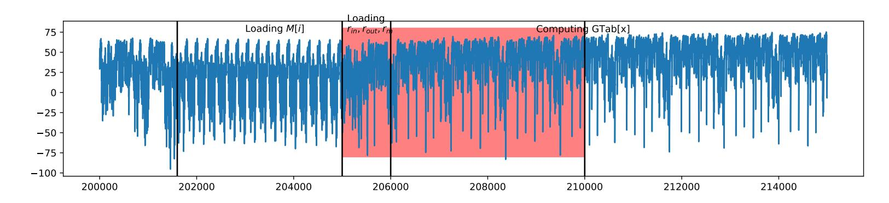

Figure 2: Targeted window for capturing the leakage of r<sub>m</sub>.

first half. Moreover, the description of the latter step in Subsection 1.3 informs that it is composed of the alternate pre-computation of three look-up tables corresponding to field multiplications, namely  $\mathsf{GTabKS}$  used for the key schedule,  $\mathsf{GTab_K}$  and  $\mathsf{GTab}$  used for the AES rounds; and two other look-up tables corresponding to the masked Sbox, namely for the key schedule and for the AES rounds. Since those tables are of length 256, which is relatively longer than the different loops inside one AES round, they should yield larger patterns than one AES round. Indeed, one can recognize three similar patterns (depicted in green in the first half of Figure 1) alternating with two other similar patterns (depicted in orange). Therefore, we have identified the location of the look-up tables pre-computation, which will be useful afterwards to precisely locate the leakages of  $r_m$  for our attacks.

**Refining the Analysis.** We may refine the latter analysis, in order to narrow the target windows. Our goal will be to find the region where one can find leakage of  $r_m$ , maskedState,  $r_{out}$  and the permutation indices permIndices.

Concerning  $r_m$ , we may focus on the beginning of the GTab pre-computation. Figure 2 depicts the average trace at this moment of the execution. One can recognize 16 similar short patterns between the time samples 201,000 and 205,000, and 8 out of the 256 longer patterns depicted between the time samples 206,000 and 215,000. By referring to the assembly code, one can deduce that the former patterns correspond to the loading of the initial values M[i],  $i \in [0,15]$  of the mask state state<sub>M</sub>, while the 8 longer patterns correspond to the loop of the GTab pre-computation. Thereby, one deduces from the assembly code that the region corresponding to the successive loadings of  $r_{in}$ ,  $r_{out}$ ,  $r_m$  lies in [205,000;206,000]. Therefore, we propose to keep the range [205,000;210,000] as a first contiguous window for our extracted dataset. It is depicted in red in Figure 2. It is expected to contain enough leakage from  $r_m$ , and some leakage about  $r_{out}$ .

Concerning maskedState, we suggest to focus on the leakage occurred during the SubBytes operation, therefore we need to localize the time samples corresponding to the latter operation inside the first AES round. Figure 3 depicts the average trace focused on the R1 zone from Figure 1 corresponding to the first AES round, according to the previous discussion. This R1 zone can itself be split into 8 sub-zones, listed from Zone 1 to Zone 8,

{10}------------------------------------------------

<span id="page-10-1"></span>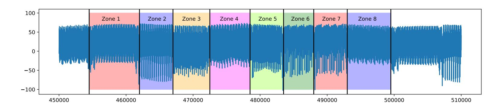

Figure 3: The 8 noticeable loop patterns inside the first AES round.

<span id="page-10-4"></span>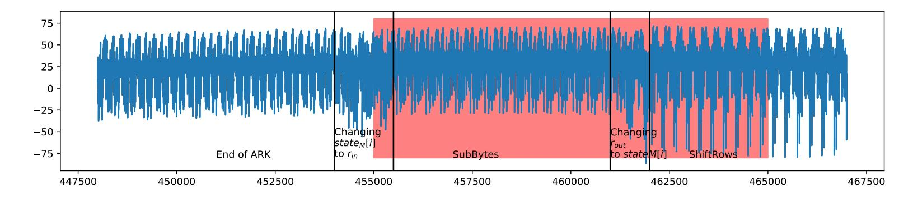

Figure 4: Second targeted window of the extracted traces.

according to patterns yielded by for loops in the implementation. A careful view of those zones[17](#page-10-2) enables to count the number of elementary patterns there is inside each loop:

- Zones 1 5 depict loops of 16 similar elementary patterns. By comparing with the assembly code, we deduce that Zone 1 corresponds to the SubBytes and that the Zones 2 - 5 correspond to the ShiftRows.
- Zone 6 7 depict loops of 4 patterns, each one containing itself 4 sub-patterns. The assembly code tells us that those zones correspond to the execution of MixColumns.
- Zone 8 depicts a loop of 32 elementary patterns. One can conclude that this zone corresponds to the AddRoundKey operation.[18](#page-10-3)

Since we aim to capture the leakage on the SubBytes operation, we focus on Zone 1. [Figure 4](#page-10-4) depicts the latter zone more precisely. Finally, we choose to keep the red zone, *i.e.* the range <sup>J</sup>455*,* 000; 465*,* <sup>000</sup>K.

Eventually, we should have extracted enough leakage to be able to mount successful attacks. Additionally to the code analysis, we afterwards verified the soundness of our approach with a SNR computation – now involving the knowledge of the random shares. Our final extracted dataset is made of up to 700*,* 000 training traces, 20*,* 000 validation traces and 50*,* 000 test traces. We are now ready to present our new attacks in details.

# <span id="page-10-0"></span>**3 Evaluation methodology**

In this section, we propose some attack models on the new extracted dataset ASCADv2 that we described in [Section 2.](#page-7-0) To introduce our attacks, we first present in [Subsection 3.1](#page-11-0) the different models that we used to estimate the probability distribution of the leakages. Then, we introduce in [Subsection 3.2](#page-12-0) the major ingredient of our attacks, making use of the multi-task paradigm. We will then have set the ground for the presentation of our results in [Section 4.](#page-14-0)

<span id="page-10-2"></span><sup>17</sup>A zoom on each sub-zone is available in [Figure 15.](#page-29-0)

<span id="page-10-3"></span><sup>18</sup>This AddRoundKey is the one happening at the end of the first AES round.

{11}------------------------------------------------

## <span id="page-11-0"></span>**3.1 SCA Models**

The attacker's model we propose in this paper mainly involves deep neural networks. Nevertheless, for the sake of completeness, we also consider attackers using Gaussian templates.

#### **3.1.1 Template Attacks**

*Template Attacks* (TAs) generally refer to *Gaussian* template attacks, introduced by Chari *et al.* [\[CRR02\]](#page-21-7). They modelize the conditional probability distribution of **X** | Z by a multi-variate Gaussian law. Such models can capture leakages at the first order into the mean vector, and leakages at the second order into the covariance matrix. In this work, we will use either classic TAs, a.k.a. *Quadratic Discriminant Analysis* (QDA), or the *pooled* version of template attacks, introduced by Choudari *et al.* [\[CK13\]](#page-21-8), also known under the name of *Linear Discriminant Analysis* (LDA).[19](#page-11-1) If need be, we may precede a TA by a dimensionality reduction through a Principal Component Analysis (PCA) [\[SA08\]](#page-23-8).

## **3.1.2 VGG-based Models**

The choice of the neural network architecture is of crucial importance when applying deep learning techniques. The VGGNet architecture [\[SZ15\]](#page-24-5) was first introduced for visual recognition tasks, as the runner-up of the 2014 ImageNet Large Scale Visual Recognition Competition. It is an easy-to-apprehend architecture that relies on a high number of *convolutional* layers with small size.[20](#page-11-2)

VGGNet has been successful in many real world applications, and among them side channel attacks [\[BPS](#page-20-3)<sup>+</sup>19]. From the experiments on the first version of ASCAD, several hyperparameter values have been tested, resulting in a selection of the best parameters for a VGGNet-based architecture that was named "CNN best".[21](#page-11-3) For some of our experiments on ASCADv2, we decide to reuse the "CNN best" architecture with slight modifications that we detail here. First, the number of input points is adjusted for each of our experiments. These values range in the set {200*,* 300*,* 400*,* 800}. The number of input points has an impact on the depth of our architecture. Indeed, we choose to preserve the dimensional ratio between consecutive convolutional block in order to limit the subsampling between layers : only a few input points contains useful information, and a high dimensional reduction between the layers can discard the information on these points.Therefore, we use a 6 layer network when the number of input points is equal to 200, a 7 layer network when the number of input points is equal to 300 or 400 and a 8 layer network when the number of input points is equal to 800. With this adjustment, we also preserve the number of parameters of the two last dense layers. Depending on the configuration, it represents between 67−87% of the total number of trainable parameters, which is similar to the 87% of trainable parameters for the dense layers of the original VGG16 architecture. Furthermore, we add Batch Normalization [\[IS15\]](#page-22-6) to each layer except the last one. Experimentally, it accelerated the network learning step by increasing the convergence rate of the loss function during the gradient descent. Moreover, we observed that Batch Normalization allows us to be less careful about the choice of the optimizer and the initial learning rate. Contrary to the previous version of CNN best which required RMSProp optimizer with a learning rate equal to 10<sup>−</sup><sup>5</sup> , we could more easily trained the modified networks with

<span id="page-11-1"></span><sup>19</sup>This must not be confused with the Fisher's LDA, often used in SCA as a dimensionality reduction technique [\[SA08\]](#page-23-8).

<span id="page-11-2"></span><sup>20</sup>The ratio behind this choice is to reduce the number of training parameters in the convolutional layers, while keeping the same *receptive field*. Nevertheless, this ratio only holds for 2D data such as pictures. For 1D data, the number of training parameters roughly equals the size of the receptive field, regardless the number of layers.

<span id="page-11-3"></span><sup>21</sup>CNN standing for *Convolutional Neural Network*.

{12}------------------------------------------------

different optimizers and learning rates and we finally choose Adam optimizer with the default learning rate (10−<sup>3</sup> ). In the rest of this paper, these architectures will be referred as CNN*n*poi where *n* is the number of input points [22](#page-12-1) .

#### <span id="page-12-2"></span>**3.1.3 ResNet Models**

The previously defined VGG-based architectures are suitable when the number of input points is relatively small (less than 1000 points). However when the number of points is high, these architectures must be adapted in order to limit the number of parameters of the last dense layers. Two neural-network parameters can be adjusted in order to achieve this goal: the downsampling rate between the layers and the depth of the network. In the first case, a common strategy is to greatly reduce the dimension of the input space of the first layers by applying pooling layers with high downsampling rates. The first layers act as data preprocessing steps that consist in a dimensionality reduction, and the rest of the neural-network is not modified. Therefore the network preserves its depth and the number of trainable parameters. However in the context of side channel, the points that contain useful information are sparse and a high dimensional reduction based on pooling layers may discard information on these points. In the second case, we preserve a small downsampling rate between the layers but we increase the number of layers. This approach follows the trend in deep learning research that consists in increasing the depth of the network in order to obtain better generalization performance. The drawback is that the number of parameters increase and without further modifications on the VGG architecture, the back-propagation algorithm fails due to the vanishing gradient problem [\[HZRS16a\]](#page-22-7).

The ResNet architecture was introduced in [\[HZRS16a\]](#page-22-7) to circumvent this degradation issue. It relies on a new type of block of layers, called residual learning block. Residual learning block are composed of two convolutional layer that are stacked together, and one shortcut connection layer that is connected in parallel. The idea behind this choice of architecture is that if we denote H(*x*) the function that the block layer shall approximate to improve the performance of the neural-network, then H(*x*) can be rewritten H(*x*) = F(*x*)+*x* where F is the function that results from the stacked convolutional layers, and *x* results from the shortcut connection (in its simplified version). This reformulation is motivated by the assumption that a residual function F is easier to approximate than the overall function H since in the highest layers of the neural-network, each block shall account for a small modification of the inputs. With this design, ResNet architecture supports up to 1000 layers but the most common depth values are 34, 50, 101 and 152. It achieved state of the art results in real world applications [\[HZRS16a,](#page-22-7) [HZRS16b,](#page-22-8) [XWA](#page-24-6)<sup>+</sup>18, [SSS](#page-24-7)<sup>+</sup>17] and it have already been successfully applied to side channel attacks [\[ZS19,](#page-24-8) [JZHY20,](#page-22-9) [GJS20\]](#page-22-10).

In order to process simultaneously the two large windows of points defined in [Subsec](#page-8-0)[tion 2.2,](#page-8-0) we propose a ResNet architecture named ResNetSCA that can fit the 1D-traces composed of 15*,* 000 input points formed by the concatenation of the two windows. We keep a low downsampling rate between the residual block in order to preserve the sparse information of the input points. We also conserve some of the parameters previously studied for the side channel VGGNet architectures, as they appear to have experimentally the best performance: the window size of the convolutional layers is set to 11, dense layers are added to the bottom of the network for classification, and the model is trained with Adam optimizer. The total number of stacked convolutional layers is equal to 19. Details of the residual blocks and the overall architecture can be found in [Appendix E,](#page-30-0) [Figure 16.](#page-30-1)

## <span id="page-12-0"></span>**3.2 Multi-Task Learning**

Multi-Task Learning (MTL) is a well-studied technique of machine learning which consists in training several learning tasks in parallel. This aims to improve the performance of a single

<span id="page-12-1"></span><sup>22</sup>A detailed description of these architectures can be found in [Appendix E,](#page-30-0) [Table 3.](#page-30-2)

{13}------------------------------------------------

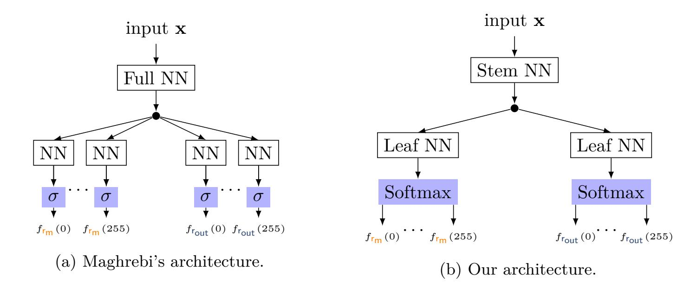

<span id="page-13-3"></span><span id="page-13-1"></span>Figure 5: Comparison of deep learning architectures for multi-task learning in SCA.

task by leveraging information that results from the training of related tasks. The shared representation learned by the related tasks during the training step spares the learning of redundant training parameters and therefore improves the generalization performance of the model, as shown – among others – in the seminal works of Caruana [\[Car97\]](#page-21-9).[23](#page-13-0) Since then, MTL has been widely applied in deep learning [\[Rud17\]](#page-23-9).

**Maghrebi's Architecture.** Maghrebi proposed in 2020 a first architecture to implement MTL for SCA, depicted in [Figure 5a,](#page-13-1) as a way to "target bigger key chunks without introducing a learning time overhead and while guaranteeing a similar attack efficiency compared to the commonly used training strategy" [\[Mag20\]](#page-23-6). His idea is to use a common neural network (here denoted as "Full NN") taking a trace as an input, and outputting intermediate results acting as an input for numerous logistic classifiers (here denoted as "NN") – *i.e.* linear layers outputting a scalar, composed with a sigmoid function. More precisely, one logistic classifier is instantiated for each hypothetical value of any targeted intermediate computation to learn. This represents 2 *<sup>n</sup><sup>φ</sup>* × *N* outputs lying in [0*,* 1], where *n<sup>φ</sup>* is the number of bits of the targeted variables[24](#page-13-2) and *N* is the number of targeted variables profiled at the same time with multi-task learning. The training is then done by applying a gradient descent algorithm in order to minimize the sum of all the training losses induced by the outputs of the logistic classifiers and the expected labels. Unfortunately, the author precises that such a training must be done with "data that are labeled with every possible combination" [\[Mag20\]](#page-23-6), yielding a minimum number of 2 *<sup>n</sup>φ*×*<sup>N</sup>* traces. This may quickly become intractable for values of *N* higher than 2, hence the limitation imposed by the author to target *N* ≤ 2 different intermediate values.

**Our Proposal.** In order to circumvent the drawbacks underlined by Maghrebi in his approach, we propose two main modifications, depicted in [Figure 5b.](#page-13-3)

First, we replace the 2 *<sup>n</sup><sup>φ</sup>* × *N* output branches in [Figure 5a](#page-13-1) made of sigmoids by *N Softmax*, each one returning a discrete p.m.f. for each targeted variable. The training is then done by summing the *N* losses computed on each branch corresponding to each targeted variables, and by applying a gradient descent algorithm. This alternative to Maghrebi's proposal has one main advantage. Contrary to the former architecture, ours directly encodes the constraint that all the probabilities linked to a given random variable Z*<sup>i</sup>* sum to one, whereas this constraint was implicitly learned in Maghrebi's architecture,

<span id="page-13-2"></span><span id="page-13-0"></span><sup>23</sup>A more detailed discussion is provided in [Appendix F.](#page-32-0)

<sup>24</sup>For conciseness, and without loss of generality, we assume that all the targeted intermediate computations have the same number of bits.

{14}------------------------------------------------

by submitting any of the possible combination of the labels. This approach allows to relax from the prohibitive amount of required profiling traces.

Second, one possible drawback of Maghrebi's approach is that the different branches are only made of linear layers, which may not be enough to capture the specificities of the different leakage models to estimate. Instead, we propose a trade-off by replacing each one-layer NN branches in Maghrebi's architecture – denoted by "NN" in Figure 5a – by a MLP – denoted by "Leaf MLP" in Figure 5b.

Our final architectures for whole key recovery are based on the ResNetSCA architecture that has been described in Subsubsection 3.1.3, on which we add a branch for each labels to predict. We named MultiResNetSCA-1 an architecture with 34 outputs corresponding to  $r_m$ ,  $r_{out}$ , maskedState [p [i]] and p [i] for i in [0, 15]. Likewise, MultiResNetSCA-2 is an architecture with 18 outputs that correspond to  $r_m$ ,  $r_{out}$  and maskedState [i].<sup>25</sup>

The numbers of trainable parameters are equal to 137, 396, 064 and 78, 364, 256 respectively. For comparison, a single branch ResNetSCA model with the same input points has 11, 460, 960 parameters, which means that the classic single task model strategy based on 34 (or 18) different models for each task requires to train 389, 672, 640 (or 206, 297, 280) parameters. We do not necessarily claim that our multi-task architectures have a better generalization performance than a combination of single-task architectures whose input points have been fine selected for each task (by example with a SNR). However, in the case of a large window of points extracted from the raw trace with a single code analysis (as described in Subsection 2.2), the multi-task architectures are the most convenient one in term of GPU resource usage because of the number of parameters to train.

## <span id="page-14-0"></span>4 Results

In this section, we first present the results of partial attacks (Subsection 4.1 and Subsection 4.2), i.e. aiming at recovering intermediate variables of the counter-measure schemes. Those attacks will ground some discussions about the robustness of the counter-measures. We then introduce our *complete* attacks in Subsection 4.3, leveraging the multi-task architectures presented in Subsection 3.2.

## <span id="page-14-2"></span>4.1 Deep Learning Partial Attacks against Affine Masking

We first evaluate the security of the affine masking against deep learning attacks. We perform several attacks with different levels of knowledge of the masks during the profiling and attack steps. We consider the following threat scenarios:

- 1. The attacker knows the affine shares  $r_m$  and  $r_{out}$  during the profiling and attack steps.
- 2. The attacker has only access to  $r_m$  during the profiling and attack steps.
- 3. The attacker has no access to the affine masks.

To simplify the study, we also assume in these partial attacks that the attacker has always access to the permutation indexes of the shuffling, even during the attack step. <sup>26</sup> From a security evaluation point of view, this is equivalent to deactivate the shuffling in the implementation. This allows us to use ASCADv2 database for studying the security impact of the affine masking as an isolated security mechanism.

<span id="page-14-1"></span> $<sup>^{25}</sup>$ Figure 17 in Appendix E depicts in details the two architectures.

<span id="page-14-3"></span><sup>&</sup>lt;sup>26</sup>The partial attacks targeting the permutation indices are considered in Subsection 4.2.

{15}------------------------------------------------

<span id="page-15-0"></span>Figure 6: PoIs selection by SNR on maskedState [0] for first-order attacks.Top: average trace with colored PoIs. Bottom: the corresponding SNR.

**First Threat Scenario.** The first threat scenario can be seen as a first-order attack against an unprotected implementation of AES, since the knowledge of only one shard of the Sbox computation (i.e. the masked Sbox output) is sufficient to retrieve the corresponding key byte. To simulate this setting, we use ASCADv2 database and we labeled each trace of the training dataset with the value:

<span id="page-15-3"></span><span id="page-15-1"></span>
$$c[i] = \mathsf{maskedState}[\mathsf{p}[i]] = \mathsf{r_m} \times Sbox[\mathsf{pt}[\mathsf{p}[i]] \oplus \mathsf{k}[\mathsf{p}[i]]] \oplus \mathsf{r_{out}}. \tag{6}$$

During the attack step, we simulate a fixed key on the test dataset. This is done by replacing the value of the plaintext byte pt[*i*] with pt<sup>0</sup> [*i*] = pt[p [*i*]] ⊕ k [p [*i*]]. Hence for each trace of the test dataset,

$$c[i] = r_{m} \times Sbox[pt'[i] \oplus k] \oplus r_{out} , \qquad (7)$$

where *k* is a fixed key byte equal to 0. For this experiment, we choose *i* = 0 and we evaluate the guessing entropy of a trained model with respect to the number of attack traces used for the key recovery. Since r<sup>m</sup> and rout are known, the score vector is obtained by computing:

<span id="page-15-4"></span>
$$\mathbf{d}[k'] = \sum_{\mathbf{x}} \log f_{\mathsf{c}[0]} \left( c_{0,k'} \mid \mathbf{x} \right) \text{ with } c_{0,k'} = \mathsf{r}_{\mathsf{m}} \times \operatorname{Sbox} \left[ \mathsf{pt}' \left[ 0 \right] \oplus k' \right] \oplus \mathsf{r}_{\mathsf{out}} . \tag{8}$$

We first evaluate the performance of TAs in the first threat setting, as a baseline for comparison with deep learning attacks. To perform the TAs, we select 4 PoIs with the best SNR, as described in [Figure 6a.](#page-15-0) Then we train a QDA model on 200*,* 000 training traces. An estimation of the GE is depicted in blue on [Figure 7a.](#page-16-0)

We then perform a CNN based attack in the first threat setting. We select 200 PoIs around the SNR peak value [\(Figure 6b\)](#page-15-1). We train a CNN200poi model on the 200*,* 000 training traces, by batches of size 128. Furthermore, we use a *early-stopping* strategy [\[GBC16\]](#page-22-11), using a patience of 10 epochs.[27](#page-15-2) When applied to our experiment, it results in selecting the model trained after 9 epochs. The accuracy obtained on the test set equals 1*.*56 %, which is clearly above the 2 <sup>−</sup><sup>8</sup> = 0*.*39 % threshold of a random classifier. Moreover, after computing the GE – whose graph is pictured in [Figure 7b](#page-16-1) – we observe that the first-order attack with CNNs succeeds in approximately 20 traces, which represents a huge improvement compared to the 1*,* 400 attack traces of the TAs. For a comprehensive comparison, we also performed a PCA-based dimensionality reduction on the 200 PoIs followed by a QDA or LDA with different numbers of input points (4*,* 8*,* 10*,* 15). The best attempt is depicted in red on [Figure 7a,](#page-16-0) and is obtained with 10 input points. In other words, none of these attempts results in a successful attack in less than 5*,* 000 traces.

**Second Threat Scenario.** This scenario can be seen as a second-order attack since it requires to recover two shards for retrieving the corresponding key byte (the masked Sbox

<span id="page-15-2"></span><sup>27</sup>A detailed explanation of early-stopping is proposed in [Appendix H.](#page-33-0)

{16}------------------------------------------------

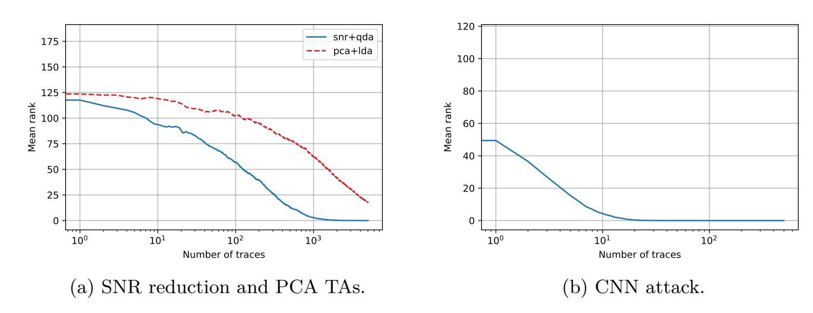

<span id="page-16-1"></span><span id="page-16-0"></span>Figure 7: GE and quartiles of order 25% and 75%, for first-order attacks.

<span id="page-16-2"></span>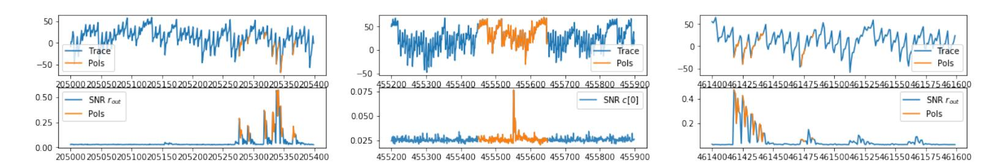

Figure 8: PoIs selection for CNN 2nd-order attack. Top: average trace with colored PoIs. Bottom: the corresponding SNR.

output and the additive mask  $r_{out}$ ). To perform this attack, we modify Equation 6 used to labelize the training dataset:

$$c[i] = r_{m} \times Sbox[pt[p[i]] \oplus k[p[i]]] .$$
(9)

Moreover, as previously done in the first threat scenario, we simulate a fixed key k on the test dataset by replacing the plaintext values. Therefore the labels on the test dataset can be rewritten in the form

$$c[i] = r_{m} \times Sbox[pt'[i] \oplus k] . \tag{10}$$

The guessing entropy is computed by replacing  $c_{0,k'}$  with  $r_m \times \text{Sbox}\left[\mathsf{pt}'\left[0\right] \oplus k'\right]$  in Equation 8.

Figure 8 depicts the 300 PoIs used for the attack. It actually corresponds to the 200 PoIs previously selected in the first-order attack, augmented with 100 more PoIs corresponding to the highest values of the r<sub>out</sub> SNR. We train a CNN300poi model on 400,000 training traces, with the same training parameters and the same training strategy as before. The trained model with the best validation cross-entropy was obtained after 28 epochs. The model is then evaluated on the testing traces, resulting in an accuracy of 0.75%. Furthermore, the GE and quartiles are depicted on Figure 9. We observe that the second-order attack with CNNs succeeds in approximately 130 traces.

**Third Threat Scenario.** Once we have considered partial attacks of first and second order, we now embrace a third order attack. It requires recovering of the masked Sbox output, the additive mask  $r_{out}$ , and the multiplicative mask  $r_m$  from the attack traces. We modify Equation 6 by targeting:

$$c[i] = Sbox[pt[p[i]] \oplus k] . \tag{11}$$

We extract 400 PoIs composed of the 300 previously selected PoIs, and 100 PoIs around the highest peak of SNR with  $r_m$ , as shown in Figure 10. We train a CNN400poi model on

{17}------------------------------------------------

<span id="page-17-1"></span>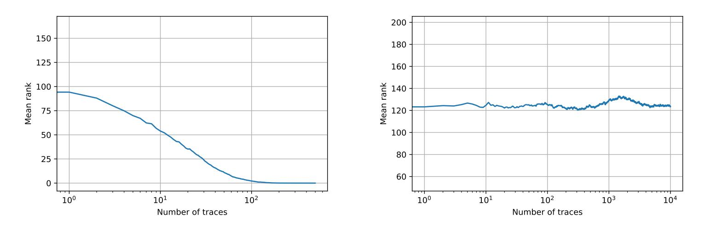

Figure 9: GE for CNN 2nd-order attack (left) and CNN 3rd-order attack (right).

<span id="page-17-2"></span>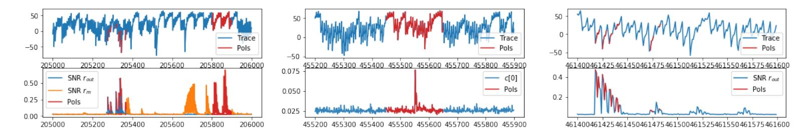

Figure 10: PoIs selection for third-order attack with CNN.

700,000 training traces. During the training step, we could not observe an improvement of the loss on the validation dataset. Hence, we decided to train the model until 150 epochs and computed the GE, as figured in Figure 9. As one can see, the resulting attack indeed failed to find the correct key within 10,000 traces.

#### <span id="page-17-0"></span>4.2 Deep Learning Partial Attacks against Shuffling

We evaluate the security of the shuffling counter-measure against deep learning attacks. To that end, we assume that the attacker has already mounted an attack  $\mathcal{A}$  on an unshuffled version of the implementation and wants to extend it to the shuffled version. If we denote c[i] the sensitive value targeted by  $\mathcal{A}$  for retrieving the i-th key byte, a direct way to adapt the  $\mathcal{A}$  attack to the shuffled version will consist in targeting the sensitive value  $c[p^{-1}[i]]$  during the attack step, where  $p^{-1}[i]$  is the integer j such that p[j] = i. Therefore the security of the shuffling counter-measure relies on the difficulty to find the  $p^{-1}[i]$  value during each execution of the AES encryption.

For our experiment, we choose to target  $p^{-1}[0]$ . We extract the PoIs by computing the SNR value for each p[i] and by selecting a window of 50 PoIs around the peak of each SNR, as shown on Figure 11. This results in a total of 800 PoIs. Then we train a

<span id="page-17-3"></span>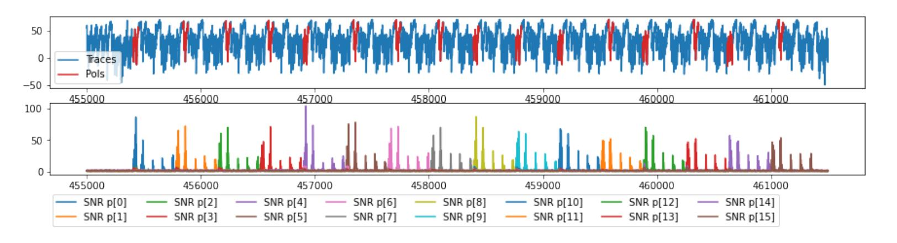

Figure 11: PoIs selection for CNN attack on shuffling.

{18}------------------------------------------------

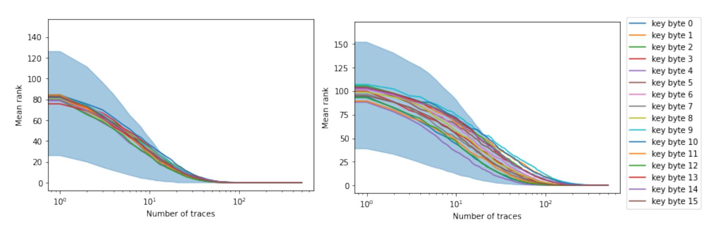

- <span id="page-18-1"></span>(a) First scenario with MultiResNetSCA-1.
- <span id="page-18-2"></span>(b) Second scenario with MultiResNetSCA-2.

Figure 12: GE for full key recovery scenarios.

CNN800poi model on 200,000 traces. We stop to train the model when the validation accuracy starts to decrease. The trained model reaches an accuracy of 40% on a separated test dataset of 50,000 traces. This means that an attack requiring  $N_a$  traces to retrieve the correct key byte in the unshuffled setting will only require in average  $\frac{N_a}{40\%} = 2.5 \cdot N_a$  traces in the shuffled setting.

## <span id="page-18-0"></span>4.3 Deep Learning Full Key Recovery Attack

Until now we have evaluated the security of the affine masking and the shuffling counter-measures independently. In this subsection we show how to perform an attack on the combination of the counter-measures with a single deep learning model. This attack will recover all the bytes of the key, which makes it comparable with Bronchain's attack, though we do not use any key enumeration techniques.

The targeted points of the traces are the 15,000 points identified from our code and trace analysis in Subsection 2.2. Our previous results highlight the strength of the whole affine masking scheme and the weakness of shuffling. Therefore, for our complete attack we consider the two following scenarios. In the first one, the attacker has access to all the affine masks and the shuffling permutation indices during the profiling step, but no access to these values during the attack step. In the second one, the attacker has only access to the affine mask. Notice that in the second scenario, the attacker may ignore that the shuffling is implemented as a counter-measure: the attack is performed in the same manner than for an unshuffled implementation, as long as the window of targeted points is large enough to encompass all the leakages.

First Scenario. We train a MultiResNetSCA-1 model with the 34 targeted labels:  $r_m$ ,  $r_{out}$ ,  $c[i] = r_m \times \text{Sbox}\left[\text{pt}\left[\text{p}\left[i\right]\right] \oplus \text{k}\left[\text{p}\left[i\right]\right]\right] \oplus r_{out}$  for i in [0,15] and [0,15] and [0,15]. The training set is here composed of 400,000 traces, gathered by batches of 64. We use the same training strategy as described in the previous experiments. We monitor the average cross-entropy of the targeted labels. The training stops after 15 epochs with the maximal validation cross-entropy. Then the model is evaluated on the test set. We simulate a fixed key on the dataset by replacing the test plaintexts and we target the sensitive value  $[x_i] = [x_i] = [x_i] = [x_i] = [x_i] = [x_i] = [x_i] = [x_i] = [x_i] = [x_i] = [x_i] = [x_i] = [x_i] = [x_i] = [x_i] = [x_i] = [x_i] = [x_i] = [x_i] = [x_i] = [x_i] = [x_i] = [x_i] = [x_i] = [x_i] = [x_i] = [x_i] = [x_i] = [x_i] = [x_i] = [x_i] = [x_i] = [x_i] = [x_i] = [x_i] = [x_i] = [x_i] = [x_i] = [x_i] = [x_i] = [x_i] = [x_i] = [x_i] = [x_i] = [x_i] = [x_i] = [x_i] = [x_i] = [x_i] = [x_i] = [x_i] = [x_i] = [x_i] = [x_i] = [x_i] = [x_i] = [x_i] = [x_i] = [x_i] = [x_i] = [x_i] = [x_i] = [x_i] = [x_i] = [x_i] = [x_i] = [x_i] = [x_i] = [x_i] = [x_i] = [x_i] = [x_i] = [x_i] = [x_i] = [x_i] = [x_i] = [x_i] = [x_i] = [x_i] = [x_i] = [x_i] = [x_i] = [x_i] = [x_i] = [x_i] = [x_i] = [x_i] = [x_i] = [x_i] = [x_i] = [x_i] = [x_i] = [x_i] = [x_i] = [x_i] = [x_i] = [x_i] = [x_i] = [x_i] = [x_i] = [x_i] = [x_i] = [x_i] = [x_i] = [x_i] = [x_i] = [x_i] = [x_i] = [x_i] = [x_i] = [x_i] = [x_i] = [x_i] = [x_i] = [x_i] = [x_i] = [x_i] = [x_i] = [x_i] = [x_i] = [x_i] = [x_i] = [x_i] = [x_i] = [x_i] = [x_i] = [x_i] = [x_i] = [x_i] = [x_i] = [x_i] = [x_i] = [x_i] = [x_i] = [x_i] = [x_i] = [x_i] = [x_i] = [x_i] = [x_i] = [x_i] = [x_i] = [x_i] = [x_i] = [x_i] = [x_i] = [x_i] = [x_i] = [x_i] = [x_i] = [x_i] = [x_i] = [x_i] = [x_i] = [x_i] = [x_i] = [x_i] = [x_i] = [x_i] = [x_i] = [x_i] = [x_i] = [x_i] = [x_i] = [x_i] = [x_i] = [x_i] = [x_i] = [x_i] = [x_i] = [x_i] = [x_i] = [x_$ 

{19}------------------------------------------------

<span id="page-19-0"></span>

| Model                                                                                                  | Nonces           |                  | es                    | Success                            | r                | Test accuracies (%) |                              |                                 |
|--------------------------------------------------------------------------------------------------------|------------------|------------------|-----------------------|------------------------------------|------------------|---------------------|------------------------------|---------------------------------|
| 1110 (401                                                                                              | r <sub>m</sub>   | β                | $p\left[i\right]$     | (# traces)                         | r <sub>m</sub>   | β                   | $c\left[i\right]$            | $p\left[i\right]$               |
| $\begin{array}{c} \mathcal{A}_1,\mathcal{A}_3,\mathcal{A}_4 \ \mathcal{A}_2,\mathcal{A}_5 \end{array}$ | ✓<br>✓           | ✓<br>✓           | У<br>Х                | 4,000 - 10,000<br>2,000 - 50,000   | 100<br>100       |                     | nown<br>nown                 | 98 (seed)                       |
| Template<br>CNN200poi<br>CNN400poi<br>CNN600poi<br>CNN800poi                                           | ✓<br>✓<br>X<br>X | ✓<br>✓<br>✓<br>✓ | \<br>\<br>\<br>\<br>\ | 1,500<br>20<br>130<br>failed<br>50 | -<br>-<br>-<br>- | -<br>-<br>-<br>-    | 0.40<br>1.56<br>0.75<br>0.39 | -<br>-<br>-<br>40 <sup>29</sup> |
| MultiResNetSCA-1<br>MultiResNetSCA-2                                                                   | ✓<br>✓           | ✓<br>✓           | ×                     | 60<br>220                          | 99.2<br>99.6     | 21.1<br>20.5        | 1.6<br>1.0                   | 88.9                            |

Table 2: Overall results of attacks on ANSSI's implementation.

✗: unknown during profiling, ✓: known during profiling, ✓: known during attack

compute  $f_{s[i]}(\cdot \mid \mathbf{x})$  from the formula:

<span id="page-19-2"></span>
$$f_{\mathbf{S}[i]}(\dot{s} \mid \mathbf{x}) = \sum_{j} \sum_{\dot{\alpha}} \sum_{\dot{\beta}} f_{\mathbf{c}[j]}(\dot{\alpha} \times \dot{s} \oplus \dot{\beta} \mid \mathbf{x}) \cdot f_{\mathbf{r}_{\mathbf{m}}}(\dot{\alpha} \mid \mathbf{x}) \cdot f_{\mathbf{r}_{\mathbf{out}}}(\dot{\beta} \mid \mathbf{x}) \cdot f_{\mathbf{p}[j]}(i \mid \mathbf{x}) , \quad (12)$$

where  $\mathbf{s}[i] = \operatorname{Sbox}[\operatorname{pt}[i] \oplus k]$ . A direct computation of Equation 12 for all the  $\dot{s}$  values will require  $\mathcal{O}(256 \cdot |j| \cdot |\dot{\alpha}| \cdot |\dot{\beta}|)$  operations. With a well-chosen combination of the terms, the complexity can be dropped to  $\mathcal{O}(256 \cdot (|j| + |\dot{\alpha}| + |\dot{\beta}|))$  operations.<sup>28</sup> For each key byte, an estimation of the GE is displayed in Figure 12a. We observe that the attack requires approximately 60 attack traces to retrieve the correct full key.

**Second Threat Scenario.** We train a MultiResNetSCA-2 model with the 18 targeted labels:  $r_m$ ,  $r_{out}$ ,  $c[i] = r_m \times \text{Sbox}\left[\text{pt}\left[i\right] \oplus k\left[i\right]\right] \oplus r_{out}$  for i in [0, 15]. The training, validation and test datasets are the same than in the previous scenario. The training step stops after 18 epochs with the maximal validation cross-entropy. The test accuracies are displayed in Table 2. To compute the rank function, we use:

$$f_{\mathsf{s}[i]}(\dot{s} \mid \mathbf{x}) = \sum_{\dot{\alpha}} \sum_{\dot{\beta}} f_{\mathsf{c}[i]}(\dot{\alpha} \times \dot{s} \oplus \dot{\beta} \mid \mathbf{x}) \cdot f_{\mathsf{r}_{\mathsf{m}}}(\dot{\alpha} \mid \mathbf{x}) \cdot f_{\mathsf{r}_{\mathsf{out}}}(\dot{\beta} \mid \mathbf{x}) . \tag{13}$$

The overall computation for all the  $\dot{s}$  values requires  $\mathcal{O}(|\dot{s}| \cdot (|\dot{\alpha}| + |\dot{\beta}|))$  operations. Mean ranks for each key byte are displayed in Figure 12b. The full key recovery attack succeeds in approximately 220 traces, highlighting the fact that shuffling has poor performances against deep learning attacks.

## **Conclusion**

So far, this paper presented the ASCADv2 dataset, based on the ANSSI implementation published in 2019 [BKPT19]. This implementation was addressing the particular need for open implementations of cryptographic primitives. Since the seminal works of Bronchain et al. leveraged a particular weakness of the shuffling counter-measure, we considered in this paper other attack paths not based on this weakness. Despite, our findings confirm that jointly learning all the random shares from an affine scheme is currently hard without

<span id="page-19-3"></span><sup>&</sup>lt;sup>28</sup>The proof of Equation 12 and the partial recombination are provided in Appendix G.

<span id="page-19-1"></span><sup>&</sup>lt;sup>29</sup>When targeting  $p^{-1}$  [0].

{20}------------------------------------------------

the knowledge of those shares during the profiling phase. Being able to relax the latter assumption is yet to be shown. Nevertheless, our results confirm that the shuffling countermeasure implemented here, even not based on the weaknesses emphasized so far, is not robust. More interestingly, the adaption of the multi-task learning – initially introduced by Maghrebi – to this particular case showed that this approach could scale well to SCA evaluations. A further study of the advantages and drawbacks of such paradigm is yet to be done. Still, this could lead to help the SCA practitioner towards new milestones against protected implementations.

# **Acknowledgements**

The authors would like to thank the LSC team from ANSSI for their fruitful help with the target implementation. The authors would also like to thank particularly Emmanuel Prouff (ANSSI), Cécile Dumas (CEA - Leti), Olivier Bronchain (UCLouvain) and Julien Eynard (ANSSI) for the careful reading of this manuscript and their helpful advice.

# **References**

- <span id="page-20-5"></span>[ABB<sup>+</sup>20] Melissa Azouaoui, Davide Bellizia, Ileana Buhan, Nicolas Debande, Sèbastien Duval, Christophe Giraud, Èliane Jaulmes, François Koeune, Elisabeth Oswald, François-Xavier Standaert, and Carolyn Whitnall. A systematic appraisal of side channel evaluation strategies. In Thyla van der Merwe, Chris Mitchell, and Maryam Mehrnezhad, editors, *Security Standardisation Research*, pages 46–66, Cham, 2020. Springer International Publishing.
- <span id="page-20-2"></span>[BBD<sup>+</sup>14] Shivam Bhasin, Nicolas Bruneau, Jean-Luc Danger, Sylvain Guilley, and Zakaria Najm. Analysis and improvements of the DPA contest v4 implementation. In Rajat Subhra Chakraborty, Vashek Matyas, and Patrick Schaumont, editors, *Security, Privacy, and Applied Cryptography Engineering - 4th International Conference, SPACE 2014, Pune, India, October 18-22, 2014. Proceedings*, volume 8804 of *Lecture Notes in Computer Science*, pages 201–218. Springer, 2014.
- <span id="page-20-1"></span>[BDM<sup>+</sup>20] Sonia Belaïd, Pierre-Évariste Dagand, Darius Mercadier, Matthieu Rivain, and Raphaël Wintersdorff. Tornado: Automatic generation of probing-secure masked bitsliced implementations. In Anne Canteaut and Yuval Ishai, editors, *Advances in Cryptology - EUROCRYPT 2020 - 39th Annual International Conference on the Theory and Applications of Cryptographic Techniques, Zagreb, Croatia, May 10-14, 2020, Proceedings, Part III*, volume 12107 of *Lecture Notes in Computer Science*, pages 311–341. Springer, 2020.
- <span id="page-20-0"></span>[Bih97] Eli Biham. A fast new DES implementation in software. In Eli Biham, editor, *Fast Software Encryption, 4th International Workshop, FSE '97, Haifa, Israel, January 20-22, 1997, Proceedings*, volume 1267 of *Lecture Notes in Computer Science*, pages 260–272. Springer, 1997.
- <span id="page-20-4"></span>[BKPT19] Ryad Benadjila, Louiza Khati, Emmanuel Prouff, and Adrian Thillard. Hardened library for aes-128 encryption/decryption on arm cortex m4 achitecture. <https://github.com/ANSSI-FR/SecAESSTM32>, may 2019.
- <span id="page-20-3"></span>[BPS<sup>+</sup>19] Ryad Benadjila, Emmanuel Prouff, Rémi Strullu, Eleonora Cagli, and Cécile Dumas. Deep learning for side-channel analysis and introduction to ASCAD database. *Journal of Cryptographic Engineering*, November 2019.

{21}------------------------------------------------

- <span id="page-21-6"></span>[BS20] Olivier Bronchain and François-Xavier Standaert. Side-channel countermeasures' dissection and the limits of closed source security evaluations. *IACR Trans. Cryptogr. Hardw. Embed. Syst.*, 2020(2):1–25, 2020.
- <span id="page-21-9"></span>[Car97] Rich Caruana. Multitask learning. *Machine learning*, 28(1):41–75, 1997.
- <span id="page-21-5"></span>[CDD<sup>+</sup>14] Christophe Clavier, Jean-Luc Danger, Guillaume Duc, M. Abdelaziz Elaabid, Benoît Gérard, Sylvain Guilley, Annelie Heuser, Michael Kasper, Yang Li, Victor Lomné, Daisuke Nakatsu, Kazuo Ohta, Kazuo Sakiyama, Laurent Sauvage, Werner Schindler, Marc Stöttinger, Nicolas Veyrat-Charvillon, Matthieu Walle, and Antoine Wurcker. Practical improvements of side-channel attacks on AES: feedback from the 2nd DPA contest. *J. Cryptogr. Eng.*, 4(4):259–274, 2014.
- <span id="page-21-3"></span>[CDP17] Eleonora Cagli, Cécile Dumas, and Emmanuel Prouff. Convolutional neural networks with data augmentation against jitter-based countermeasures - profiling attacks without pre-processing. In Wieland Fischer and Naofumi Homma, editors, *Cryptographic Hardware and Embedded Systems - CHES 2017 - 19th International Conference, Taipei, Taiwan, September 25-28, 2017, Proceedings*, volume 10529 of *Lecture Notes in Computer Science*, pages 45–68. Springer, 2017.
- <span id="page-21-0"></span>[CJRR99] Suresh Chari, Charanjit S. Jutla, Josyula R. Rao, and Pankaj Rohatgi. Towards sound approaches to counteract power-analysis attacks. In Michael J. Wiener, editor, *Advances in Cryptology - CRYPTO '99, 19th Annual International Cryptology Conference, Santa Barbara, California, USA, August 15-19, 1999, Proceedings*, volume 1666 of *Lecture Notes in Computer Science*, pages 398–412. Springer, 1999.
- <span id="page-21-4"></span>[CK10] Jean-Sébastien Coron and Ilya Kizhvatov. Analysis and improvement of the random delay countermeasure of CHES 2009. In Stefan Mangard and François-Xavier Standaert, editors, *Cryptographic Hardware and Embedded Systems, CHES 2010, 12th International Workshop, Santa Barbara, CA, USA, August 17-20, 2010. Proceedings*, volume 6225 of *Lecture Notes in Computer Science*, pages 95–109. Springer, 2010.
- <span id="page-21-8"></span>[CK13] Omar Choudary and Markus G. Kuhn. Efficient template attacks. In Aurélien Francillon and Pankaj Rohatgi, editors, *Smart Card Research and Advanced Applications - 12th International Conference, CARDIS 2013, Berlin, Germany, November 27-29, 2013. Revised Selected Papers*, volume 8419 of *Lecture Notes in Computer Science*, pages 253–270. Springer, 2013.
- <span id="page-21-7"></span>[CRR02] Suresh Chari, Josyula R. Rao, and Pankaj Rohatgi. Template attacks. In Burton S. Kaliski Jr., Çetin Kaya Koç, and Christof Paar, editors, *Cryptographic Hardware and Embedded Systems - CHES 2002, 4th International Workshop, Redwood Shores, CA, USA, August 13-15, 2002, Revised Papers*, volume 2523 of *Lecture Notes in Computer Science*, pages 13–28. Springer, 2002.
- <span id="page-21-1"></span>[DDF19] Alexandre Duc, Stefan Dziembowski, and Sebastian Faust. Unifying leakage models: From probing attacks to noisy leakage. *J. Cryptology*, 32(1):151–177, 2019.
- <span id="page-21-2"></span>[DFS16] Stefan Dziembowski, Sebastian Faust, and Maciej Skórski. Optimal amplification of noisy leakages. In Eyal Kushilevitz and Tal Malkin, editors, *Theory of Cryptography - 13th International Conference, TCC 2016-A, Tel Aviv, Israel, January 10-13, 2016, Proceedings, Part II*, volume 9563 of *Lecture Notes in Computer Science*, pages 291–318. Springer, 2016.

{22}------------------------------------------------

- <span id="page-22-1"></span>[DFS19] Alexandre Duc, Sebastian Faust, and François-Xavier Standaert. Making masking security proofs concrete (or how to evaluate the security of any leaking device), extended version. *J. Cryptology*, 32(4):1263–1297, 2019.
- <span id="page-22-0"></span>[DR02] Joan Daemen and Vincent Rijmen. AES and the wide trail design strategy. In Lars R. Knudsen, editor, *Advances in Cryptology - EUROCRYPT 2002, International Conference on the Theory and Applications of Cryptographic Techniques, Amsterdam, The Netherlands, April 28 - May 2, 2002, Proceedings*, volume 2332 of *Lecture Notes in Computer Science*, pages 108–109. Springer, 2002.
- <span id="page-22-4"></span>[FMPR10] Guillaume Fumaroli, Ange Martinelli, Emmanuel Prouff, and Matthieu Rivain. Affine Masking against Higher-Order Side Channel Analysis. In Alex Biryukov, Guang Gong, and Douglas R. Stinson, editors, *Selected Areas in Cryptography*, volume 6544 of *Lecture Notes in Computer Science*, pages 262–280. Springer, 2010.
- <span id="page-22-11"></span>[GBC16] Ian J. Goodfellow, Yoshua Bengio, and Aaron C. Courville. *Deep Learning*. Adaptive computation and machine learning. MIT Press, 2016.
- <span id="page-22-10"></span>[GJS20] Aron Gohr, Sven Jacob, and Werner Schindler. Efficient solutions of the CHES 2018 AES challenge using deep residual neural networks and knowledge distillation on adversarial examples. *IACR Cryptol. ePrint Arch.*, 2020:165, 2020.
- <span id="page-22-5"></span>[HRG14] Annelie Heuser, Olivier Rioul, and Sylvain Guilley. Good is not good enough deriving optimal distinguishers from communication theory. In Lejla Batina and Matthew Robshaw, editors, *Cryptographic Hardware and Embedded Systems - CHES 2014 - 16th International Workshop, Busan, South Korea, September 23-26, 2014. Proceedings*, volume 8731 of *Lecture Notes in Computer Science*, pages 55–74. Springer, 2014.
- <span id="page-22-7"></span>[HZRS16a] Kaiming He, Xiangyu Zhang, Shaoqing Ren, and Jian Sun. Deep residual learning for image recognition. In *Proceedings of the IEEE conference on computer vision and pattern recognition*, pages 770–778, 2016.
- <span id="page-22-8"></span>[HZRS16b] Kaiming He, Xiangyu Zhang, Shaoqing Ren, and Jian Sun. Identity mappings in deep residual networks. In *European conference on computer vision*, pages 630–645. Springer, 2016.
- <span id="page-22-6"></span>[IS15] Sergey Ioffe and Christian Szegedy. Batch normalization: Accelerating deep network training by reducing internal covariate shift. *arXiv preprint arXiv:1502.03167*, 2015.
- <span id="page-22-9"></span>[JZHY20] Minhui Jin, Mengce Zheng, Honggang Hu, and Nenghai Yu. An enhanced convolutional neural network in side-channel attacks and its visualization. *arXiv preprint arXiv:2009.08898*, 2020.
- <span id="page-22-2"></span>[KPH<sup>+</sup>19] Jaehun Kim, Stjepan Picek, Annelie Heuser, Shivam Bhasin, and Alan Hanjalic. Make some noise. unleashing the power of convolutional neural networks for profiled side-channel analysis. *IACR Transactions on Cryptographic Hardware and Embedded Systems*, 2019(3):148–179, May 2019.
- <span id="page-22-3"></span>[KS09] Emilia Käsper and Peter Schwabe. Faster and timing-attack resistant AES-GCM. In Christophe Clavier and Kris Gaj, editors, *Cryptographic Hardware and Embedded Systems - CHES 2009, 11th International Workshop, Lausanne, Switzerland, September 6-9, 2009, Proceedings*, volume 5747 of *Lecture Notes in Computer Science*, pages 1–17. Springer, 2009.

{23}------------------------------------------------

- <span id="page-23-6"></span>[Mag20] Houssem Maghrebi. Deep learning based side-channel attack: a new profiling methodology based on multi-label classification. *IACR Cryptol. ePrint Arch.*, 2020:436, 2020.
- <span id="page-23-10"></span>[Man04] Stefan Mangard. Hardware countermeasures against DPA ? A statistical analysis of their effectiveness. In Tatsuaki Okamoto, editor, *Topics in Cryptology - CT-RSA 2004, The Cryptographers' Track at the RSA Conference 2004, San Francisco, CA, USA, February 23-27, 2004, Proceedings*, volume 2964 of *Lecture Notes in Computer Science*, pages 222–235. Springer, 2004.
- <span id="page-23-1"></span>[MOP07] Stefan Mangard, Elisabeth Oswald, and Thomas Popp. *Power analysis attacks - revealing the secrets of smart cards*. Springer, 2007.
- <span id="page-23-5"></span>[MPP16] Houssem Maghrebi, Thibault Portigliatti, and Emmanuel Prouff. Breaking cryptographic implementations using deep learning techniques. In Claude Carlet, M. Anwar Hasan, and Vishal Saraswat, editors, *Security, Privacy, and Applied Cryptography Engineering - 6th International Conference, SPACE 2016, Hyderabad, India, December 14-18, 2016, Proceedings*, volume 10076 of *Lecture Notes in Computer Science*, pages 3–26. Springer, 2016.
- <span id="page-23-3"></span>[PGMP19] Thomas Prest, Dahmun Goudarzi, Ange Martinelli, and Alain Passelègue. Unifying leakage models on a rényi day. In Alexandra Boldyreva and Daniele Micciancio, editors, *Advances in Cryptology - CRYPTO 2019 - 39th Annual International Cryptology Conference, Santa Barbara, CA, USA, August 18-22, 2019, Proceedings, Part I*, volume 11692 of *Lecture Notes in Computer Science*, pages 683–712. Springer, 2019.
- <span id="page-23-7"></span>[Pou18] Romain Poussier. *Key enumeration, rank estimation and horizontal sidechannel attacks*. PhD thesis, Catholic University of Louvain, Louvain-la-Neuve, Belgium, 2018.
- <span id="page-23-2"></span>[PR13] Emmanuel Prouff and Matthieu Rivain. Masking against side-channel attacks: A formal security proof. In Thomas Johansson and Phong Q. Nguyen, editors, *Advances in Cryptology - EUROCRYPT 2013, 32nd Annual International Conference on the Theory and Applications of Cryptographic Techniques, Athens, Greece, May 26-30, 2013. Proceedings*, volume 7881 of *Lecture Notes in Computer Science*, pages 142–159. Springer, 2013.
- <span id="page-23-4"></span>[RP10] Matthieu Rivain and Emmanuel Prouff. Provably secure higher-order masking of AES. In Stefan Mangard and François-Xavier Standaert, editors, *Cryptographic Hardware and Embedded Systems, CHES 2010, 12th International Workshop, Santa Barbara, CA, USA, August 17-20, 2010. Proceedings*, volume 6225 of *Lecture Notes in Computer Science*, pages 413–427. Springer, 2010.
- <span id="page-23-0"></span>[RSA78] Ronald L. Rivest, Adi Shamir, and Leonard M. Adleman. A method for obtaining digital signatures and public-key crypto-systems. *Commun. ACM*, 21(2):120–126, 1978.
- <span id="page-23-9"></span>[Rud17] Sebastian Ruder. An overview of multi-task learning in deep neural networks. *arXiv preprint arXiv:1706.05098*, 2017.
- <span id="page-23-8"></span>[SA08] François-Xavier Standaert and Cédric Archambeau. Using subspace-based template attacks to compare and combine power and electromagnetic information leakages. In Elisabeth Oswald and Pankaj Rohatgi, editors, *Cryptographic Hardware and Embedded Systems - CHES 2008, 10th International Workshop, Washington, D.C., USA, August 10-13, 2008. Proceedings*, volume 5154 of *Lecture Notes in Computer Science*, pages 411–425. Springer, 2008.

{24}------------------------------------------------

- <span id="page-24-3"></span>[SMY09] François-Xavier Standaert, Tal Malkin, and Moti Yung. A unified framework for the analysis of side-channel key recovery attacks. In Antoine Joux, editor, *Advances in Cryptology - EUROCRYPT 2009, 28th Annual International Conference on the Theory and Applications of Cryptographic Techniques, Cologne, Germany, April 26-30, 2009. Proceedings*, volume 5479 of *Lecture Notes in Computer Science*, pages 443–461. Springer, 2009.
- <span id="page-24-7"></span>[SSS<sup>+</sup>17] David Silver, Julian Schrittwieser, Karen Simonyan, Ioannis Antonoglou, Aja Huang, Arthur Guez, Thomas Hubert, Lucas Baker, Matthew Lai, Adrian Bolton, et al. Mastering the game of go without human knowledge. *nature*, 550(7676):354–359, 2017.
- <span id="page-24-5"></span>[SZ15] Karen Simonyan and Andrew Zisserman. Very deep convolutional networks for large-scale image recognition. In Yoshua Bengio and Yann LeCun, editors, *3rd International Conference on Learning Representations, ICLR 2015, San Diego, CA, USA, May 7-9, 2015, Conference Track Proceedings*, 2015.
- <span id="page-24-2"></span>[VMKS12] Nicolas Veyrat-Charvillon, Marcel Medwed, Stéphanie Kerckhof, and François-Xavier Standaert. Shuffling against side-channel attacks: A comprehensive study with cautionary note. In Xiaoyun Wang and Kazue Sako, editors, *Advances in Cryptology - ASIACRYPT 2012 - 18th International Conference on the Theory and Application of Cryptology and Information Security, Beijing, China, December 2-6, 2012. Proceedings*, volume 7658 of *Lecture Notes in Computer Science*, pages 740–757. Springer, 2012.
- <span id="page-24-4"></span>[vW01] Manfred von Willich. A technique with an information-theoretic basis for protecting secret data from differential power attacks. In Bahram Honary, editor, *IMA Int. Conf.*, volume 2260 of *Lecture Notes in Computer Science*, pages 44–62. Springer, 2001.
- <span id="page-24-1"></span>[WAGP20] Lennert Wouters, Victor Arribas, Benedikt Gierlichs, and Bart Preneel. Revisiting a methodology for efficient cnn architectures in profiling attacks. *IACR Transactions on Cryptographic Hardware and Embedded Systems*, 2020(3):147– 168, Jun 2020.
- <span id="page-24-6"></span>[XWA<sup>+</sup>18] Wayne Xiong, Lingfeng Wu, Fil Alleva, Jasha Droppo, Xuedong Huang, and Andreas Stolcke. The microsoft 2017 conversational speech recognition system. In *2018 IEEE international conference on acoustics, speech and signal processing (ICASSP)*, pages 5934–5938. IEEE, 2018.
- <span id="page-24-0"></span>[ZBHV19] Gabriel Zaid, Lilian Bossuet, Amaury Habrard, and Alexandre Venelli. Methodology for efficient cnn architectures in profiling attacks. *IACR Transactions on Cryptographic Hardware and Embedded Systems*, 2020(1):1–36, Nov 2019.
- <span id="page-24-8"></span>[ZS19] Yuanyuan Zhou and François-Xavier Standaert. Deep learning mitigates but does not annihilate the need of aligned traces and a generalized resnet model for side-channel attacks. *Journal of Cryptographic Engineering*, pages 1–11, 2019.

{25}------------------------------------------------

## A Profiling Attacks and their Threat Model

The considered scenario, assuming targeting the intermediate computation  $Z = \mathbf{C}(Pt, K)$ , requires having a clone device of the target, and is made of the following steps:

- Profiling acquisition: a dataset of  $N_p$  profiling traces is acquired on the prototype device. It will be seen as a realization of the random variable  $S_p \triangleq \{(\mathbf{x}_1, z_1), \dots, (\mathbf{x}_{N_p}, z_{N_p})\}$ , where all the  $\mathbf{x}_i$  (resp. all the  $z_i$ ) are independent and identically distributed (i.i.d.) realizations of  $\mathbf{X}$  (resp.  $\mathbf{Z}$ ).
- Profiling phase: based on  $S_p$ , a model is built that returns a set of scores for each hypothetical value of Z, that can be assimilated to a probability mass function (p.m.f.) (possibly after normalization).  $f_Z : \mathcal{X} \to \mathcal{P}(\mathcal{Z})$ .
- Attack acquisition: a dataset of  $N_a$  attack traces is acquired on the target device. It will be seen as a realization of  $\mathcal{S}_a \triangleq (k^\star, \{(\mathbf{x}_1, pt_1), \dots, (\mathbf{x}_{N_a}, pt_{N_a})\})$  such that  $k^\star \in \mathcal{K}$  is the fixed key byte to guess, and for all  $i \in [1, N_a]$ ,  $pt_i \leftarrow \mathsf{Pt}$  and  $\mathbf{x}_i \leftarrow (\mathbf{X} \mid \mathsf{Z} = \mathbf{C}(pt_i, k^\star))$ .
- Predictions: a prediction vector is computed on each attack trace, based on the previously built model:  $\mathbf{y}_i = f_{\mathsf{Z}}(\mathbf{x}_i), i \in [\![1,N_a]\!]$ . For each trace, it assigns a score to each key hypothesis, namely, for every  $j \in [\![1,|\mathcal{Z}|\!]\!]$ , the value of the j-th coordinate of  $\mathbf{y}_i$  corresponds to the score assigned by the model to the hypothesis " $\mathsf{Z} = \dot{s}_j$ " when observing  $\mathbf{x}_i$ .
- Guessing: the scores are combined over all the attack traces to output a score for each key hypothesis; the candidate with the highest score is predicted to be the right key. A maximum score score can be used for the guessing. For every key hypothesis  $k \in \mathcal{K}$ , this score is defined as:

<span id="page-25-0"></span>
$$\mathbf{d}_{\mathcal{S}_a}[k] \triangleq \sum_{i=1}^{N_a} \log \left( \mathbf{y}_i[z_i] \right) \text{ where } z_i = \mathbf{C} \left( pt_i, k \right).$$
 (14)

Based on the scores in Equation 14, the key hypotheses are ranked in a decreasing order. Finally, the attacker chooses the key that is ranked first. More generally, the rank  $\mathbf{g}(\mathcal{S}_a)[k^*]$  of the correct key hypothesis  $k^*$  is defined as:

$$\mathbf{g}\left(\mathcal{S}_{a}\right)\left[k^{\star}\right] \triangleq \sum_{k \in \mathcal{K}} 1_{\mathbf{d}_{\mathcal{S}_{a}}\left[k\right] > \mathbf{d}_{\mathcal{S}_{a}}\left[k^{\star}\right]}.$$
(15)

If  $\mathbf{g}(\mathcal{S}_a)[k^*] = 0$ , then the attack is considered as successful.

**Evaluation Metrics.** To assess the difficulty of attacking a target device with profiling attacks (which is assumed to be the worst-case scenario for the attacked device), it has initially been suggested to measure or estimate the minimum number of traces required to get a successful attack [Man04]. Observing that many random factors may be involved during the attack – such as the set of traces  $S_a$  acquired by the attacker –, the latter measure has been refined to study the probability distribution of the  $rank \ \mathbf{g} (S_a)$  of the right key. Based on this distribution, we may derive two statistics on the rank. First, the  $Guessing\ Entropy\ (GE)\ [SMY09]$ , is the expected value of the rank:

$$GE(N_a) \triangleq \underset{S_a}{\mathbb{E}} \left[ \mathbf{g} \left( S_a \right) \left[ k^* \right] \mid |S_a| = N_a \right] .$$
 (16)

Based on this metric, we may also derive the minimal number  $N_a(\tau)$  of attack traces required by a given attacker to get a guessing entropy below the threshold  $\tau$  – typically,  $\tau = 1$ .

{26}------------------------------------------------

<span id="page-26-3"></span>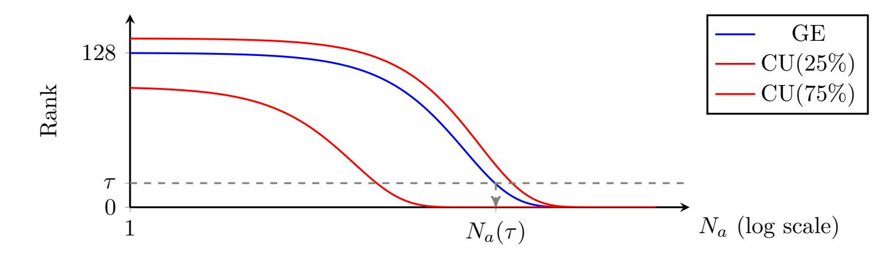

Figure 13: Sketch of result figures.

Second, the *cumulant* of order  $\beta$  is the  $\beta$ -th percentile of the rank distribution:

$$CU(N_a, \beta) \triangleq \max\{t \mid Pr(\mathbf{g}(\mathcal{S}_a)[k^*] < t) = \beta\}$$
 (17)

Although not used – and thereby not validated yet – in the literature so far, such a metric can provide a confidence interval of the rank.

Figure 13 illustrates how we plot in this paper the performance metrics we introduced. In practice, to estimate  $GE(N_a)$ , we sample 500 attack sets by randomly choosing  $N_a$  attack traces among a test set of 50,000 traces that are not used during the training.

## <span id="page-26-0"></span>**B** Permutation Generation

**Small Permutations.** Algorithm 1 describes how the permutations over  $\mathbb{S}_4$  are generated.

#### <span id="page-26-2"></span>Algorithm 1 Compute permIndices Tables MC

**Require:** i index (0 for permIndicesMC, 1 for permIndicesMCbis), M [i] random byte **Ensure:** permIndicesMC/permIndicesMCbis pseudo-random permutation of [1, 4]

- 1:  $\operatorname{seed}_{i}' \leftarrow M[i] \& 0 \times 03$
- ▷ Gets the two least signitificant bits of M [0]

- 2: **for**  $c \leftarrow 0, c < 4$  **do**
- 3: permIndicesMC  $[c] \leftarrow c \oplus \text{seed}'_i$

 $\triangleright$  permIndicesMCbis [c] if i = 1

4: end for

<span id="page-26-1"></span>For each i, mapping  $\operatorname{\mathsf{seed}}_1' \mapsto \operatorname{\mathsf{permIndicesMC}}[i]$  (resp.  $\operatorname{\mathsf{seed}}_2' \mapsto \operatorname{\mathsf{permIndicesMCbis}}[i]$ ) is bijective, as depicted in Figure 14.

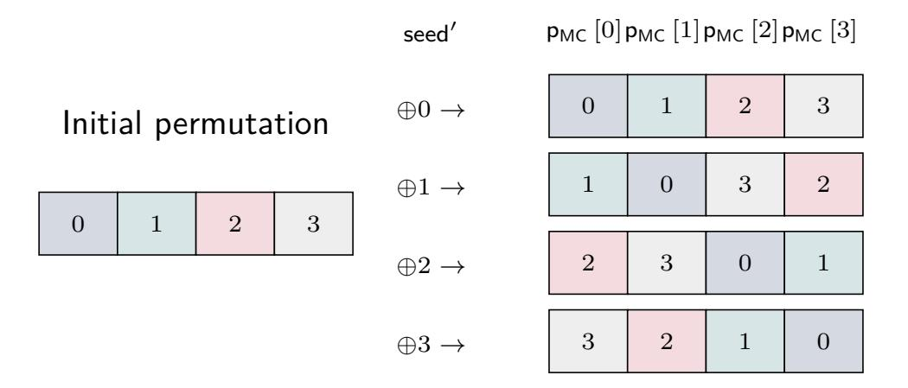

Figure 14: Scheme of Algorithm 1.

In other words, one can use the leakages about  $p_{MC}[i]$  in order to guess the value of the seed, and so ultimately the values of  $p_{MC}[j]$  for  $j \neq i$ , which explains why many *Points of Interest* (PoIs) appear in [BS20, Fig. 4], where the MixColumns operations leak. This

{27}------------------------------------------------

enables the attackers A<sup>3</sup> and A<sup>4</sup> to use 3*,* 000 PoIs – ultimately reduced to 3 using a *Principal Component Analysis* (PCA) – in order to recover the values of the seeds, up to 98% accuracy.

**Larger Permutations.** [Algorithm 2](#page-27-0) describes the way the permutations over S<sup>16</sup> are generated.

```
Algorithm 2 Compute permIndices Tables
Require: M [0] , M [1] , M [2] , M [3] random
Require: permGF permutation in GF(16)
Ensure: Pseudo-random permutation of J1, 16K
1: for j ← 1, j ≤ 4 do . Gets the four random seeds
2: seedj ← M [j] & 0x0f . Keeps the four least signitifcant bits
3: end for
4: for i ← 0, i < 16 do . Computes permIndices
5: r ← i
6: for j ← 1, j ≤ 4 do
7: r ← r ⊕ seedj
8: r ← permGF[r]
9: end for
10: permIndices[i] ← r
11: for j ← 1, j ≤ 4 do . Computes permIndicesBis
12: r ← r ⊕ seedj
```

permGF(2<sup>4</sup> ) = 0x0C, 0x05, 0x06, 0x0B, 0x09, 0x00, 0x0A, 0x0D, 0x03, 0x0E, 0x0F, 0x08, 0x04, 0x07, 0x01, 0x02

# **C The Whole Encryption**

13: *r* ← permGF[*r*]

15: permIndicesBis[*i*] ← *r*

14: **end for**

16: **end for**

A protected AES encryption can be divided into three steps.

**Pre-processing.** A pre-processing operation is performed. During this step, the random numbers r<sup>m</sup> 0 , rm, M [0] *. . .* M [15], rin, rout are generated independently from an uniform distribution and the four permutations permIndices, permIndicesBis, permIndicesMCbis, permIndicesMCbis are computed. Then three look-up tables are generated in the following order: GTab, maskedSbox, GTabK. GTab and GTab<sup>K</sup> are used for computing the multiplication in the finite field. Therefore,

$$\mathsf{GTab}\left[x\right] = \mathsf{r_m} \times x \text{ and } \mathsf{GTab_K}\left[x\right] = \mathsf{r_m} \times \left(\mathsf{r_m}'\right)^{-1} \times x$$

for each byte value *x*. maskedSbox corresponds to the masked SBox operation, and is defined by:

$$\mathsf{maskedSbox}\left[x\right] = \mathsf{r_m} \times \mathsf{Sbox}\left[\mathsf{r_m}^{-1} \times (x \oplus \mathsf{r_{in}})\right] \oplus \mathsf{r_{out}} , \tag{18}$$

where rin and rout are two random bytes. At the end of the preprocessing step, the initial masked state is also computed:

$$\mathsf{maskedState}\left[i\right] = \mathsf{GTab}\left[\mathsf{pt}\left[i\right]\right] \oplus \mathsf{M}\left[i\right]$$

where pt[*i*] denotes the *i*-th byte of plaintext.

{28}------------------------------------------------

The AES Rounds. The 10 rounds of the AES encryption are performed. Since the internal state is masked, each of the round operations AddRoundKey, SubBytes, ShiftRows and MixColumns are slightly modified to operate on both maskedState and state<sub>M</sub>. ShiftRows and MixColumns operations are linear, therefore the corresponding MaskedShiftRows and MaskedMixColumns operations are defined immediately from them. Moreover the order of the byte operations is shuffled with the corresponding permutation, as denoted in Algorithms 4, 3, 5 and 6.

The multiplicative mask used with the round keys is different to the one used with the state, hence the round key is updated with  $\mathsf{GTab}_\mathsf{K}$  before the AddRoundKey operation. The SubBytes operation relies on two masks,  $r_{\mathsf{in}}$  and  $r_{\mathsf{out}}$ , that are used to protect the Sbox. Therefore the state is masked additively with  $r_{\mathsf{in}}$  at the input of the Sbox and with  $r_{\mathsf{out}}$  at the output. Note that in this AES implementation, the  $r_{\mathsf{in}}$  masking operation at the beginning of the computation and the  $r_{\mathsf{out}}$  unmasking operation at the end are not shuffled, since those masks are applied to every byte of the masked state. Likewise, it is worth emphasizing the affine scheme having the interesting property that, once the multiplicative mask  $r_{\mathsf{m}}$  is applied to the initial state, it is then never manipulated during the rounds.

**The Post-processing.** The final step is a postprocessing step and consists in unmasking the state at the end of the 10 rounds by computing:

```
\mathsf{state}\left[i\right] = \mathsf{r_m}^{-1} \times (\mathsf{maskedState}\left[i\right] \oplus \mathsf{state}_{\mathsf{M}}\left[i\right])
```

for each byte index i.

## <span id="page-28-1"></span>**Algorithm 3** MaskedSubBytes(maskedState, state<sub>M</sub>)

```
\triangleright maskedState = r_m \times state \oplus state_M
 1:
 2: for i \leftarrow 0 to 3 do
           maskedState [(i*4):(i*4+3)] \leftarrow \mathsf{maskedState}[(i*4):(i*4+3)] \oplus \mathsf{r_{in}}
 3:
 4: end for
 5: for i \leftarrow 0 to 15 do
          j \leftarrow \mathsf{permIndices} |i|
 6:
           \mathsf{maskedState}\left[j\right] \leftarrow \mathsf{maskedState}\left[j\right] \oplus \mathsf{state}_{\mathsf{M}}\left[j\right]
 7:
                                                                                  \triangleright maskedState [j] = r_m \times state [j] \oplus r_{in}
 8:
           maskedState[j] \leftarrow maskedSbox[maskedState[j]]
 9:
                                                                     \triangleright maskedState [j] = r_m \times \text{Sbox} [\text{state} [j]] \oplus r_{\text{out}}
10:
           \mathsf{maskedState} \, |j| \leftarrow \mathsf{maskedState} \, |j| \oplus \mathsf{state}_{\mathsf{M}} \, |j|
11:
12: end for
13: for i \leftarrow 0 to 3 do
           maskedState [(i*4):(i*4+3)] \leftarrow \mathsf{maskedState}[(i*4):(i*4+3)] \oplus \mathsf{r_{out}}
14:
                                   \rhd maskedState[i] = r_m \times Sbox[state[i]] \oplus state_M[i]
15:
16: end for
```

#### <span id="page-28-0"></span>**Algorithm** 4 MaskedAddRoundKey(maskedState, state<sub>M</sub>, maskedState<sub>K</sub>, state'<sub>M</sub>)

```
1: for i \leftarrow 0 to 15 do
2: j \leftarrow \mathsf{permIndices}[i]
3: \mathsf{state}_\mathsf{M}[j] \leftarrow \mathsf{state}_\mathsf{M}[j] \oplus \mathsf{GTab}_\mathsf{K}[\mathsf{state}_\mathsf{M}'[j]]
4: \mathsf{maskedState}[j] \leftarrow \mathsf{maskedState}[j] \oplus \mathsf{GTab}_\mathsf{K}[\mathsf{maskedState}_\mathsf{K}[j]]
5: \mathsf{end} for
```

{29}------------------------------------------------

## <span id="page-29-1"></span>**Algorithm 5** MaskedShiftRows(maskedState*,*stateM)

- 1: maskedState ← ShuffledShiftRows(maskedState*,* permIndices)
- 2: state<sup>M</sup> ← ShuffledShiftRows(stateM*,* permIndicesBis)

## <span id="page-29-2"></span>**Algorithm 6** MaskedMixColumns(maskedState*,*stateM)

- 1: maskedState ← ShuffledMixColumns(maskedState*,* permIndicesMC)
- 2: state<sup>M</sup> ← ShuffledMixColumns(stateM*,* permIndicesMCbis)

# **D Visual Analysis of the Trace**

<span id="page-29-0"></span>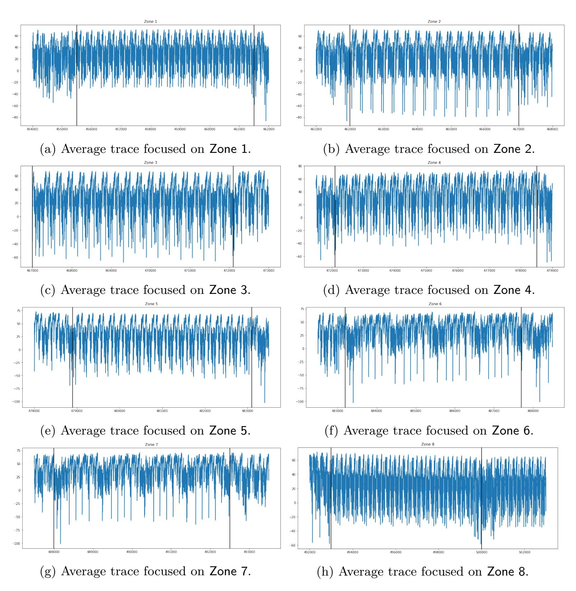

Figure 15: Zoom on each sub-zone of the first AES round in the average trace.

{30}------------------------------------------------

# <span id="page-30-0"></span>**E Detailed descriptions of the deep learning architectures**

<span id="page-30-2"></span>Table 3: VGG-based architectures CNN200poi, CNN300poi, CNN400poi and CNN800poi. conv-*n*-*p* denotes a 1D-convolutional layer with a receptive field of size *n* and *p* filters, avgpooling-*n*-*p* denotes an 1D-average pooling layer with a pooling window of size *n* and a downscaling factor *p*, fc-*n* denotes a fully connected layer with output size *n*.

| VGG-based architectures  |                          |                  |                  |  |  |  |  |
|--------------------------|--------------------------|------------------|------------------|--|--|--|--|
| CNN200poi                | CNN300poi                | CNN400poi        | CNN800poi        |  |  |  |  |
| 6 weight layers          | 7 weight layers          | 7 weight layers  | 8 weight layers  |  |  |  |  |
| input 200 points         | input 300 points         | input 400 points | input 800 points |  |  |  |  |
| conv11-64 bachnorm relu  |                          |                  |                  |  |  |  |  |
| avgpooling2-2            |                          |                  |                  |  |  |  |  |
| conv11-128 bachnorm relu |                          |                  |                  |  |  |  |  |
| avgpooling2-2            |                          |                  |                  |  |  |  |  |
| conv11-256 bachnorm relu |                          |                  |                  |  |  |  |  |
| avgpooling2-2            |                          |                  |                  |  |  |  |  |
|                          | conv11-256 bachnorm relu |                  |                  |  |  |  |  |
|                          | avgpooling2-2            |                  |                  |  |  |  |  |
| conv11-512 bachnorm relu |                          |                  |                  |  |  |  |  |
| avgpooling2-2            |                          |                  |                  |  |  |  |  |
| none                     | conv11-512 bachnorm relu |                  |                  |  |  |  |  |
| none                     | avgpooling2-2            |                  |                  |  |  |  |  |
| fc-2048 batchnorm relu   |                          |                  |                  |  |  |  |  |
| fc-256                   |                          |                  |                  |  |  |  |  |
| softmax                  |                          |                  |                  |  |  |  |  |

<span id="page-30-1"></span>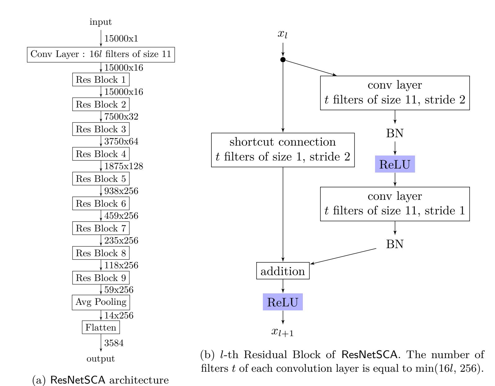

Figure 16: Description of the ResNetSCA architecture

{31}------------------------------------------------

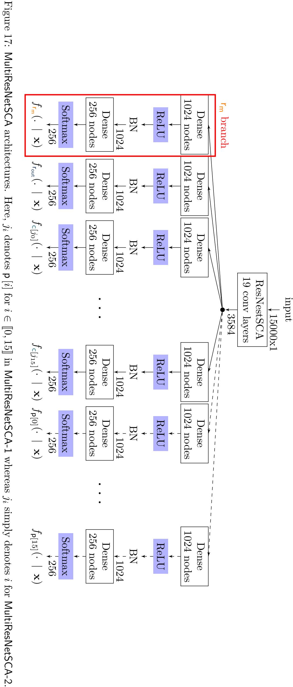

<span id="page-31-0"></span>Furthermore, the dotted branches are not instantiated in the latter architecture.

{32}------------------------------------------------

# <span id="page-32-0"></span>F Overview of Multi-task Learning

In his seminal work [Car97], Caruana shows the benefits of such technique by comparing the performance of several MLPs trained separately for each task with one MLP trained with all the tasks in parallel. The results obtained on 3 computer vision datasets show that the MLP trained in the MTL way has the best performance. The explanations of this performance improvement can be listed as follows:

- data amplification: two related tasks have access to the training data relevant for both tasks, therefore it increases the size of the available data to train a common representation in the hidden layers of the network.
- attribute selection: as a consequence of data amplification, the tasks can rely on more information to determine which inputs to use.
- eavesdropping: if a task is difficult to train, it can eavesdrop the hidden layer learned by an auxiliary task that is easier to train.
- representation bias: when applied to MTL, the backpropagation algorithm tends to privilege common representations in hidden layers that fit several tasks. Therefore it improves generalization and reduces overfitting.

# <span id="page-32-1"></span>G Key Recovery Complexity for Full Deep Learning Attacks

Let  $v = \mathsf{p}\left[i\right]$  and  $\mathsf{c}'\left[i\right] = \mathsf{r_m} \times \mathrm{Sbox}\left[\mathsf{pt}\left[v\right] \oplus \mathsf{k}\left[v\right]\right], \ i.e. \ \mathsf{c}\left[i\right] = \mathsf{c}'\left[i\right] \oplus \mathsf{r}_{\mathsf{out}}.$  We have:

$$f_{\mathsf{c}'[i]}(\dot{z} \mid \mathbf{x}) = \sum_{\dot{\beta}} f_{\mathsf{c}'[i]}(\dot{z} \mid \mathsf{r}_{\mathsf{out}} = \dot{\beta}, \mathbf{x}) \cdot f_{\mathsf{r}_{\mathsf{out}}}(\dot{\beta} \mid \mathbf{x}) . \tag{19}$$

And then:

$$f_{c'[i]}(\dot{z} \mid \mathbf{x}) = \sum_{\dot{\beta}} f_{c[i]}(\dot{z} \oplus \mathsf{r}_{\mathsf{out}} \mid \mathsf{r}_{\mathsf{out}} = \dot{\beta}, \mathbf{x}) \cdot f_{\mathsf{r}_{\mathsf{out}}}(\dot{\beta} \mid \mathbf{x}) . \tag{20}$$

We assume that from the model point of view, the knowledge of  $\mathbf{c}'[i]$  from  $\mathbf{x}$  does not depend of the value of  $\mathsf{r}_{\mathsf{out}},\ i.e.,\ f_{\mathsf{c}[i]}(\dot{z}\oplus\beta\ |\ \mathsf{r}_{\mathsf{out}}=\dot{\beta},\mathbf{x})=f_{\mathsf{c}[i]}(\dot{z}\oplus\dot{\beta}\ |\ \mathbf{x})$ . Therefore we have:

$$f_{\mathsf{c}'[i]}(\dot{z} \mid \mathbf{x}) = \sum_{\dot{\beta}} f_{\mathsf{c}[i]}(\dot{z} \oplus \dot{\beta} \mid \mathbf{x}) \cdot f_{\mathsf{r}_{\mathsf{out}}}(\dot{\beta} \mid \mathbf{x}) . \tag{21}$$

For each  $\dot{z}$  in [0, 255], we compute  $f_{c'[i]}(\dot{z} \mid \mathbf{x})$  by using the outputs  $f_{c[i]}(\cdot \mid \mathbf{x})$  and  $f_{r_{\text{out}}}(\cdot \mid \mathbf{x})$  of the trained MultiResNetSCA-1 model. The overall computation complexity of this first step is equal to  $\mathcal{O}(|\dot{z}| \cdot |\dot{\beta}|)$  operations.

In a similar manner we have:

$$f_{\mathsf{s}[\mathsf{p}[i]]}(\dot{z} \mid \mathbf{x}) = \sum_{\dot{\alpha}} f_{\mathsf{c}'[i]}(\dot{\alpha} \times \dot{z} \mid \mathbf{x}) \cdot f_{\mathsf{r}_{\mathsf{m}}}(\dot{\alpha} \mid \mathbf{x}) . \tag{22}$$

The estimation of the probability for each  $\dot{z}$  can be compute from  $f_{\mathsf{c}'[i]}(\cdot \mid \mathbf{x})$  and the output  $f_{\mathsf{r}_{\mathsf{m}}}(\cdot \mid \mathbf{x})$  of the model. This results in  $\mathcal{O}(|\dot{z}| \cdot |\dot{\alpha}|)$  operations.

Finally, let  $\mathbf{c}''[i] = \mathbf{s}[\mathbf{p}[i]]$  for simplification. Then, by using the total probability formula:

$$f_{\mathbf{s}[i]}(\dot{s} \mid \mathbf{x}) = \sum_{i} f_{\mathbf{c}''[j]}(\dot{s} \mid \mathbf{x}) \cdot f_{\mathbf{p}[j]}(i \mid \mathbf{x}) . \tag{23}$$

{33}------------------------------------------------

If we sum the number of operations of all the steps, the overall computation takes  $\mathcal{O}\left(|\dot{z}|\cdot\left(|j|+|\dot{\alpha}|+|\dot{\beta}|\right)\right)$  operations. Note that if the implementation was protected with n shares, then the computational complexity will be equal to  $\mathcal{O}(|\dot{z}|\cdot(o_1+o_2+...+o_n))$  where  $o_i$  is the cardinal of the i-th share set of values. Since in general  $o_i \approx o_j$ , the complexity of the recombination step of our multi-classification attack is linear with the number of shares.

## <span id="page-33-0"></span>**H** Early-Stopping

Our training strategy is the following: the profiling traces are randomly partitioned into a training dataset and a validation dataset. The model is trained on the training dataset only. During the training and at the end of each epoch, we compute the cross-entropy (or the accuracy for some of our experiments) on the validation dataset. We stop to train the model when the validation metric starts to increase (or decrease in the accuracy's case) during several epochs and we select the trained backup-model with the highest validation metric. The patience is the maximal number of epochs to wait before stopping the training if the validation metric has not reached a new minimal (or maximal) value.

<span id="page-33-1"></span>This method prevents overfitting since the metrics computed on the validation dataset are closed to the one obtained on the test (or attack) dataset. Figure 18 illustrates this strategy.

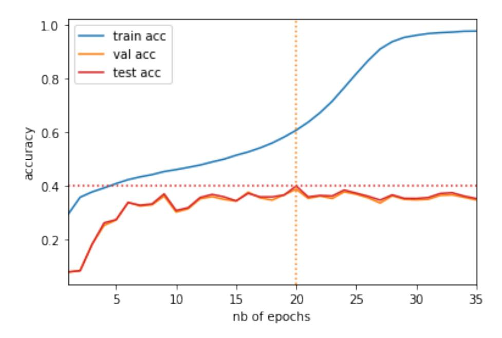

Figure 18: Training, validation and testing accuracy with CNN800poi targeting  $y = p^{-1} [0]$ . The maximum validation accuracy is obtained with 20 epochs. The corresponding maximal testing accuracy is equal to 0.399