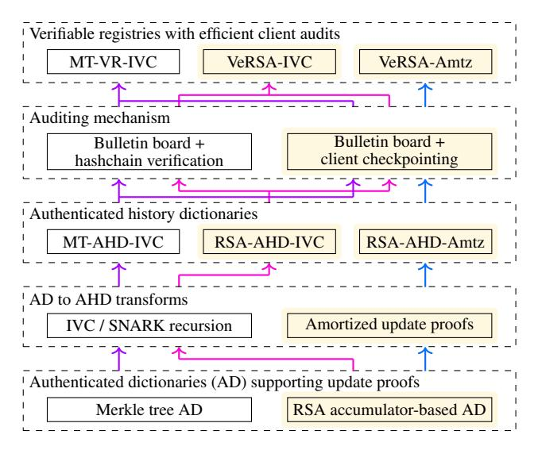
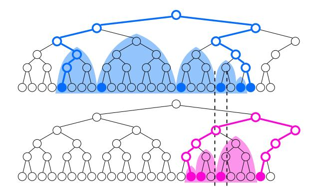
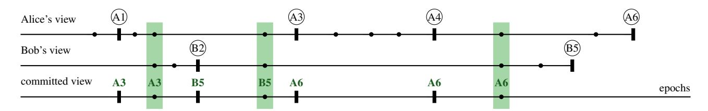
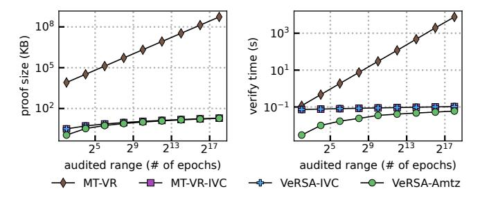
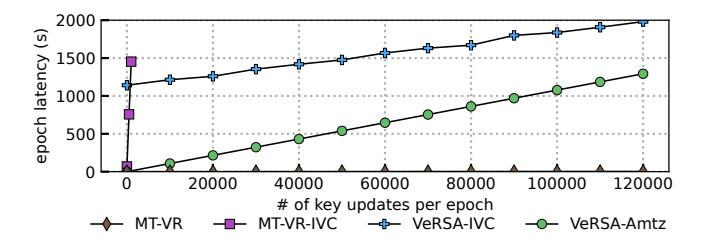
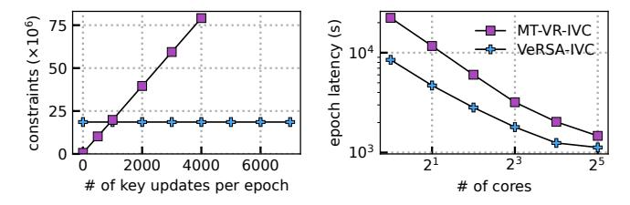
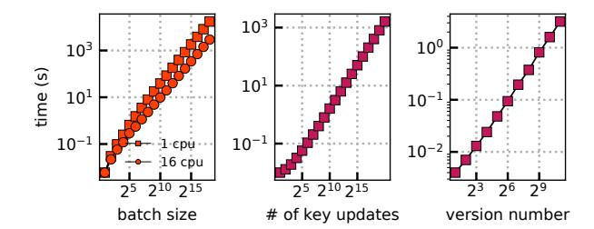
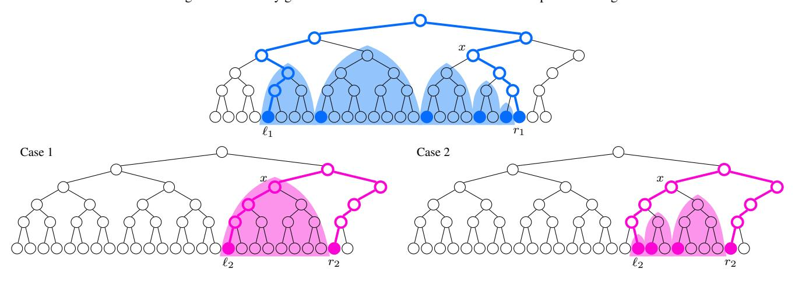
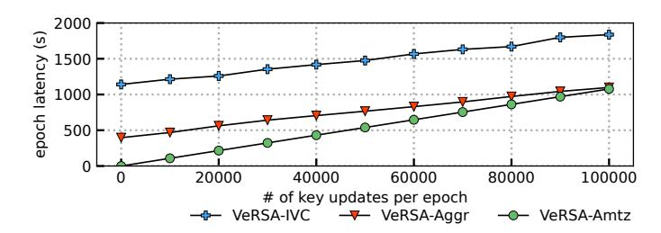

## <span id="page-0-0"></span>VeRSA: Verifiable Registries with Efficient Client Audits from RSA Authenticated Dictionaries

Nirvan Tyagi *Cornell University* Ben Fisch *Yale University* Andrew Zitek-Estrada *New York University*

> Joseph Bonneau *New York University* Stefano Tessaro *University of Washington*

> > [8.2 Server Epoch Update Costs](#page-13-1) . . . . . . . . . . 14 [8.3 Key Lookup Costs](#page-14-0) . . . . . . . . . . . . . . 15

[9 Related Work](#page-15-0) 16

[A Merkle Tree and Compact Range Preliminaries](#page-19-0) 20

[C Additional Definition Preliminaries](#page-20-0) 21 [C.1 Additional RSA Preliminaries](#page-20-1) . . . . . . . . 21 [C.2 Non-interactive Arguments of Knowledge](#page-20-2) . . 21 [C.3 Authenticated Dictionaries](#page-20-3) . . . . . . . . . . 21 [C.4 Append-only Vector Commitments](#page-21-0) . . . . . . 22

B [Open Addressing Optimization for Merkle Tree](#page-19-1) [Update Circuit Representation](#page-19-1) 20

D [Versioned Invariant Proofs and Batch Updates for](#page-21-1)

Abstract. Verifiable registries allow clients to securely access a key-value mapping maintained by an untrusted server. Registries must be audited to ensure global invariants are preserved, which, in turn, allows for efficient monitoring of individual registry entries by their owners. To this end, existing proposals either assume trusted third-party auditors or rely on incrementally verifiable computation (IVC) via expensive recursive SNARKs to make registries *client-auditable*.

In this work, we give new client-auditable verifiable registries that achieve throughputs up to 100× greater than baseline IVC solutions. Our approach relies on an authenticated dictionary based on RSA accumulators for which we develop a new constant-size invariant proof. We use this as a replacement for Merkle trees to optimize the baseline IVC approach, but also provide a novel construction which dispenses with SNARKs entirely. This latter solution adopts a new checkpointing method to ensure client view consistency.

|          |                                              |    | RSA Authenticated Dictionary                        | 22 |
|----------|----------------------------------------------|----|-----------------------------------------------------|----|
| Contents |                                              |    | D.1<br>RSA Authenticated Dictionary<br>             | 22 |
|          |                                              |    | D.2<br>Versioned Invariant Update Proofs and Strong |    |
| 1        | Introduction                                 | 2  | Key Binding                                         | 22 |
| 2        | Setting and Threat Model                     | 3  | E<br>RSA Lookup Proof Computation                   | 26 |
|          |                                              |    | E.1<br>Promises                                     | 26 |
| 3        | Preliminaries                                | 5  | E.2<br>Batch Computation<br>                        | 26 |
|          |                                              |    | E.3<br>Caching<br>                                  | 27 |
| 4        | Versioned Invariant Proofs for               |    | E.4<br>Logarithmic Witness Verification             | 28 |
|          | RSA Authenticated Dictionaries               | 6  |                                                     |    |
|          |                                              |    | F<br>Security of AHD Constructions                  | 28 |
| 5        | Authenticated History Dictionaries           | 7  |                                                     |    |
|          | 5.1<br>Syntax, Semantics, and Security<br>   | 7  | G<br>Checkpoint Auditing Security                   | 30 |
|          | 5.2<br>Towards a Generic Construction<br>    | 8  | G.1<br>Security Definition<br>                      | 30 |
|          | 5.3<br>AHDs from SNARK Recursion             | 9  | G.2<br>Proof of Shared Checkpoint Epoch             | 31 |
|          | 5.4<br>AHDs from Amortized Proving           | 9  | Proof of Checkpoint Auditing Eventual De<br>G.3     |    |
|          | 5.5<br>AHDs from Amortized SNARK Aggregation | 10 | tection                                             | 32 |
| 6        | Client Checkpoint Auditing                   | 10 | An RSA Authenticated Dictionary with Append<br>H    |    |
|          |                                              |    | Only Invariant Proofs                               | 32 |
| 7        | Implementation                               | 12 |                                                     |    |
|          |                                              |    | I<br>AHDs from Groth16 SNARK Aggregation            | 34 |
| 8        | Evaluation                                   | 13 | I.1<br>Groth16 SNARK Aggregation<br>                | 34 |
|          | 8.1<br>Client Auditing Costs                 | 14 | I.2<br>AHDs from Amortized Aggregation<br>          | 36 |

## <span id="page-1-0"></span>1 Introduction

A number of systems have demonstrated the promise of *transparency* as a means to enhance security, most prominently the Certificate Transparency protocol first launched in 2013 [\[LLK13,](#page-17-0)[Lau14\]](#page-17-1). The goal of transparency systems is to ensure that an authority's behavior can be monitored by users. Typically, misbehavior by the authority is not prevented but is detectable. The implicit assumption is that large, public-facing authorities are potentially malicious (or compromised) but are cautious: they are unwilling or at least extremely hesitant to carry out any attack that will leave public evidence.

Transparency has been proposed in a number of other security contexts, including user-public key mappings in encrypted communication systems [\[Rya14,](#page-18-0) [MBB](#page-18-1)<sup>+</sup>15], usage of cryptographic keys [\[YRC15\]](#page-18-2), and distribution of software binaries [\[FDP](#page-17-2)<sup>+</sup>14, [NKJ](#page-18-3)<sup>+</sup>17, [AM18\]](#page-16-0). *Verifiable registries* [\[CDGM19,](#page-17-3) [MKL](#page-18-4)<sup>+</sup>20] are an abstraction capable of providing transparency for the key-value mappings required for all of these applications. Without such a transparency solution, the only defense against malicious behavior by the authority (or *provider*) is out-of-band crosschecking of the authority's behavior (e.g. checking the fingerprints of downloaded public keys), an error-prone process which the vast majority of users neither understand nor attempt [\[DSB](#page-17-4)<sup>+</sup>16,[TBB](#page-18-5)<sup>+</sup>17,[VWO](#page-18-6)<sup>+</sup>17,[ASB](#page-16-1)<sup>+</sup>17].

Client monitoring and auditing. Verifiable registries provide *lookup proofs* (or *binding proofs*) that prove the results of a lookup are consistent with the committed state of the registry at a particular epoch. These lookup proofs can be *monitored* by users to detect any unexpected changes. Typically there is no well-defined notion of correctness for a specific registry mapping as the authority is trusted to update mappings when needed (e.g. account recovery for a user who has lost their private key). Thus, monitoring is inherently a process specific to each mapping and/or user.

By contrast, *auditing* is the process of ensuring that the entire registry is well-formed and maintains promised invariants across epochs. Unlike monitoring, auditing can be fully automated, with any violation by the provider producing unambiguous cryptographic proof of misbehavior. Early constructions propose clients directly perform audits in every epoch [\[LLK13,](#page-17-0)[Rya14,](#page-18-0) [MBB](#page-18-1)<sup>+</sup>15]. As this approach incurs large overhead which is linear in the number of epochs, later proposals instead suggest outsourcing auditing of global registry invariants (such as update counts) to a third party. This enables clients to monitor their own key-value mapping at a lower frequency, with significant cost savings [\[MBB](#page-18-1)<sup>+</sup>15[,CDGM19,](#page-17-3)[MKL](#page-18-4)+20,[TBP](#page-18-7)+19,[HHK](#page-17-5)+21].

However, this assumes suitable trusted parties exist which can regularly perform expensive global audits. One could rely on the validation process underlying existing blockchain infrastructure (in particular, by implementing auditing in a smart contract [\[Bon16\]](#page-16-2)), but this may result in large transaction fees. In this paper, we focus on solutions that rely on general-purpose, *application agnostic*, trusted infrastructure. In particular, we can instantiate our solutions assuming the existence of a trusted *bulletin board*, which can be shared with a number of different applications, and which will provide a consistent (or *eventually* consistent) mapping between an epoch number i and a *commitment* d<sup>i</sup> to the state of the registry at epoch i. Apart from this, our solutions will be *client auditable*, in that the client themselves verify global registry invariant proofs.

The challenges of IVC-based client auditability. A natural starting point to build client-auditable verifiable registries is to use *incrementally verifiable computation* (IVC) [\[Val08\]](#page-18-8) via *recursive proofs* [\[BCCT13,](#page-16-3)[BCTV14\]](#page-16-4), following e.g. [\[CCDW20\]](#page-17-6). IVC enables the server to supply a commitment d<sup>i</sup> to the state of the registry at epoch i, along with a succinct proof π<sup>i</sup> that d<sup>i</sup> represents a state which evolved from a genesis state d<sup>0</sup> through a sequence of transitions which preserve the registry's invariants. Clients can efficiently verify these invariant proofs on their own, without relying on dedicated third-party invariant auditors.

However, IVC proofs are, by themselves, not sufficient.Two users may come online at different epochs i and j and receive invariant proofs π<sup>i</sup> and π<sup>j</sup> , along with commitments d<sup>i</sup> and d<sup>j</sup> to different states of the registry. An IVC proof attests to invariant preservation for updates across *some* sequence of intermediate states leading to the states represented by d<sup>i</sup> and d<sup>j</sup> , respectively, but without additional verification, there is no guarantee that the intermediate states attested to in π<sup>i</sup> and π<sup>j</sup> are consistent with each other. To ensure that this is the case, a bulletin board could store the commitments d1, d2,..., along with a *hash chain* h0,h1,h2,..., where h<sup>i</sup> = H(hi−1, di) for some hash function H. Third-party auditors are responsible for verifying hash chain consistency, and the IVC proof π<sup>i</sup> would attest that h<sup>i</sup> commits to the unique hash sequence of valid registry states appearing on the bulletin board.

In practice, hash chain verification is only slightly more expensive than maintaining a bulletin board. A more important obstacle with IVC solutions is that generating invariant proofs is computationally expensive. Merkle trees are the predominant data structure for implementing an *authenticated dictionary* (AD) in existing verifiable registries [\[MBB](#page-18-1)<sup>+</sup>15, [CDGM19,](#page-17-3)[MKL](#page-18-4)<sup>+</sup>20]. Proving the invariant for a sequence of updates typically corresponds to verifying consistency of a sequence of Merkle paths. To achieve succinctness through IVC, the verification of Merkle paths is done within a succinct proof (in particular, a SNARK [\[Gro10,](#page-17-7)[GGPR13\]](#page-17-8)). However encoding the Merkle path verification into a circuit representation suitable for SNARKs results in a large circuit and concretely expensive proving times, ultimately translating to a verifiable registry with low update throughput (< 5 key updates/second). In contrast, the Certificate Transparency ecosystem requires throughput of approximately 60 key updates per second [\[Clo20\]](#page-17-9).

Our contributions. We aim to provide new verifiable registries which overcome the update throughput bottlenecks in IVC based solutions. Our new solutions will rely on the use of an RSA-based authenticated dictionary. Our main insight is a new cryptographic approach to produce succinct invariant proofs for large sequences of updates to an authenticated dictionary based on the KVaC key-value commitment construction from [\[AR20\]](#page-16-5), opening up its use in the verifiable registry setting.

We then use our new insights to provide two systems, which we refer to as VeRSA-IVC and VeRSA-Amtz. In VeRSA-IVC, we show how KVaC and our new succinct proof can be combined with IVC to allow the server to produce succinct invariant proofs for client auditability at much higher throughput (∼ 10-100× greater) than applying IVC to Merkle tree-based registries: the invariant proofs for the RSA dictionary encode as a constant-size circuit regardless of the number of updates, as opposed to a circuit linear in the number of updates for Merkle tree dictionaries (i.e., a Merkle path for each update), resulting in faster SNARK proving times.

Our second system, VeRSA-Amtz, provides instead a new amortized proving approach that dispenses with the need for IVC/SNARKs entirely, resulting in the first construction for efficient client auditability without IVC or generic SNARKs. We discuss in our related work section why prior solutions fall short of achieving this. Succinct invariant proofs for RSA authenticated dictionaries can be precomputed for carefully chosen sequences of updates over the lifetime of the registry in such a way that expensive computations for long sequences do not occur often, and any sequence of updates queried by a client can be served via a small number of precomputed invariant proofs for contiguous sequences. This alternate non-IVC approach enables even higher throughput in some deployment contexts.

A novel challenge with VeRSA-Amtz is ensuring view consistency, as recursive SNARKs inherently gave us an easy solution via the use of hash chains. To this end, we introduce a new model of client-based auditing based on *checkpointing*. When a client comes online, they select a short (sublinear) sequence of checkpoint states between the current state and the state from when they were last online. The client can obtain a consistent view of the checkpoint digests thanks to the bulletin board, and then requests and verifies succinct proofs that the registry invariant is preserved between this sequence of checkpoints. Any two clients that individually perform these audits (over different checkpoint sequences) are guaranteed to have a consistent view up to their latest shared checkpoint; checkpoints are chosen so that two clients are guaranteed to have a shared checkpoint that is not too far behind their latest time online.

Our new auditing model relaxes consistency guarantees from previous approaches by allowing clients to temporarily accept an inconsistent state: the inconsistency is detected when the shared checkpoint catches up. But on the other hand, it enables clients to maintain eventually consistent views without expensive linear work and without relying on recursive SNARKs.

While our new proof techniques for RSA authenticated dictionaries allow for constructing client-auditable verifiable registries at high update throughput, computing lookup proofs for individual key-value mappings is more costly, naively requiring work linear in the size of the registry. We provide some deployment optimizations that help alleviate these costs with batching and caching, but ultimately this limitation means our RSA-based verifiable registries are better suited to transparency applications that need only maintain mappings on the order of millions, rather than Merkle tree approaches which can easily provide lookup proofs for billions of mappings. Nevertheless, examples of such settings where our constructions are immediately applicable include binary transparency (as of Jan 2022, Google Play Store included 3.3 million apps and Apple App Store included 2.1 million apps [\[Sta22\]](#page-18-9) whereas Ubuntu's main repository included 106 thousand packages) or smaller messaging services such as Signal (40 million users [\[Tec21\]](#page-18-10)). We demonstrate how our systems scale with increased resources, but new techniques or improved scaling through specialized hardware [\[SHT21,](#page-18-11)[ZWZ](#page-18-12)<sup>+</sup>21] will likely be needed to make client-auditable verifiable registries practical for larger applications like Certificate Transparency (340 million domains) or WhatsApp (2 billion users).

We will present our results as modularly as possible, following the roadmap illustrated in Figure [1.](#page-3-0) In particular, we will start with the abstraction of an *authenticated dictionary* (AD) with an efficient invariant update proof, for which we provide an RSA instantiation by combining KVaC with our new update proofs. Then, we will show how to *generically* enhance such an AD into an *authenticated history dictionary* (AHD) which additionally allows for invariant proofs over the history of the dictionary, either via IVC or via our new amortization technique. Finally, we will combine the resulting AHDs with different trusted auditing mechanism (a plain bulletin board or one additionally verifying hash chains) to obtain our final systems.

## <span id="page-2-0"></span>2 Setting and Threat Model

A *verifiable registry* [\[CDGM19,](#page-17-3)[MKL](#page-18-4)<sup>+</sup>20] maintains a collection D of key-value pairs (k,v) administered by a centralized[1](#page-0-0) *server*. We assume that D contains at most one pair (k,v) for each k. The server periodically signs and publishes, at each *epoch*, a commitment (or *digest*) d<sup>i</sup> to the registry state D<sup>i</sup> on a public bulletin board (discussed shortly). Moving from epoch i to epoch i+ 1, means that one or more key-

<sup>1</sup> It would be possible to use a semi-centralized model in which a set of semi-trusted servers collaboratively maintain the registry using techniques from distributed consensus and threshold cryptography.

<span id="page-3-0"></span>

Figure 1: Overview of approaches to building verifiable registries efficiently auditable by clients. The highlighted boxes correspond to our new techniques and constructions, resulting in our two proposed verifiable registries, VeRSA-IVC and VeRSA-Amtz. The MT-VR-IVC verifiable registry can be considered as a baseline solution proposed in previous work [CCDW20]. We denote that the IVC-based registries can be instantiated via hashchain verification or via our new client checkpoint auditing mechanism.

value pairs have been updated, i.e., (k, v) has been replaced by (k, v') or that an entry for a new k is added to D. There is an implicit notion that the updates and additions of these entries are the outcome of users requests—we do not specify these mechanisms further as they are application-specific. Also, we do not bound the number of updates of  $D_{i+1} \setminus D_i$ . Depending on the application context, a server may try to batch many updates into a single epoch, perhaps increasing epoch latency but achieving better throughput. Clients will then able to issue lookup queries to the registry and perform monitoring of entries to detect unexpected changes. We describe these below, after clarifying a few more high-level aspects of the model.

**Threat model.** Our primary goal is to guarantee a consistent view of the key-value mappings to all clients, and to allow for efficient monitoring of these mappings. The server is not trusted and may arbitrarily deviate from the protocol. Our goal is not to prevent attacks, in principle, but to ensure that they are *eventually* detected by some client accessing the system. This is particularly suitable for a *malicious-but-cautious* adversary [CDR14]<sup>2</sup>. We do not attempt to guarantee availability, as a malicious server can simply refuse to respond to any queries. We also do not provide any privacy guarantees, though existing techniques for enhancing privacy can be implemented at the application-layer specification of (k, v) [MBB+15, EMBB17] (See Section 9).

**Bulletin board.** As stated above, our solutions rely on a public bulletin board to prevent split-view attacks, in which a malicious server convinces user Alice to accept digest  $d_i$ and user Bob to accept digest  $d'_i \neq d_i$  for the same epoch i. Both digests might be valid updates from a common ancestor  $d_i$ , but map a key to two distinct values. We assume that all digests  $d_0, d_1, \dots$  (i.e., one unique digest per epoch) are published by the server on the bulletin board, from which clients will read to maintain a consistent view, and that there exists an efficient mechanism for a client to read  $d_i$  for any i. Reliance on an out-of-band mechanism is necessary, in line with prior work on transparency systems [LLK13, MBB<sup>+</sup>15, CDGM19, MKL<sup>+</sup>20, LKMS04]. Bulletin boards, in particular, are a common assumption in cryptographic protocols [Ben87, CBM15, CGJ+17] which admits several possible implementations — e.g. a public blockchain [TD17] or a gossip protocol [STV<sup>+</sup>16,MKL<sup>+</sup>20]. The implementation of the bulletin board will require, either directly or indirectly, some trusted auditors ensuring that every epoch i is mapped to a unique  $d_i$ . In this work, all other auditing can be performed by clients themselves.

Basic lookups and monitoring. Clients can interact with the server to query a key<sup>3</sup> k at epoch i and retrieve the associated value v, along with a proof  $\pi$  of validity with respect to  $d_i$  and some additional metadata (such as a version number). Clients perform lookups at the current epoch i to learn the authoritative value for a given key. We envision particular applications where key-value entries are owned by some clients, e.g., if the registry implements a public key directory, a client will own the entry mapping their username to public key. We then assume clients continually look up their own keys to ensure that the mapped value is correct, a process called *monitoring*.

Associating certain invariant metadata (such as a version number) with each mapping enables efficient monitoring across digests even after the client has spent a long period offline, but requires that every digest preserves these invariants with respect to the prior digest. Past work has considered two such invariants. The *versioned* invariant [MBB<sup>+</sup>15, Bon16] associates with each key a version number that must be incremented whenever that key's value is updated. The appendonly invariant [TBP+19, MKL+20] associates with each key an append-only list of the entire history of values for that key over the lifetime of the dictionary. Either invariant makes it easy to detect if a mapping has been modified; for example, in the versioned setting, if a client queries its own key at digest  $d_i$  and the associated metadata indicates the version number has not changed since the last digest  $d_i$  which the client queried, this guarantees the mapping has not changed during this period. In this work, we primarily focus on the simpler versioned invariant, observing that in most of our applications,

<sup>&</sup>lt;sup>2</sup>A malicious-but-cautious adversary is willing to deviate from the protocol only in ways that will go undetected by user tests, e.g., if detection would lead to severe financial and/or reputational harm.

<sup>&</sup>lt;sup>3</sup>We use *key* to refer to the lookup key in a directory, e.g. a username. The *value* associated with that lookup key may itself be a cryptographic key in applications such as key transparency.

it is sufficient to provide the most up-to-date value mapping.

Where monitoring can go wrong. It is instructive to consider concrete attacks a malicious server can mount to understand where monitoring can fail. The canonical attack we consider is sometimes called a ghost value attack (or ghost key attack) [MBB+15]. Consider a key owner that monitors their key at epochs i and j, and a second client that performs a lookup on the key at epoch  $\ell$  where  $i < \ell < j$ . Suppose the key owner's expected mapped value for the key across epoch i to j is v. A ghost value attack occurs if the server can get the lookup client to accept a "ghost value"  $v' \neq v$  for the key at epoch  $\ell$  and then switch the value back to v at epoch j so that the owner's monitoring does not detect misbehavior. This attack is typically addressed, as mentioned above, through the use of invariant proofs that help with monitoring, e.g., detecting a change in version number. As long as (1) the view of epoch to digest mapping is consistent across clients and (2) the invariant is preserved between each digest, ghost value attacks will be detected. Thus, a ghost value attack can succeed if either of these assumptions fail – we next consider two attacks against these assumptions.

In a *split-view attack* [LKMS04], a server can publish different digests for an epoch to clients that are partitioned in different "worlds". In this attack, even if the invariant is preserved across the published digests in the key owner's world, it says nothing about the published digests in the lookup client's world, and monitoring will fail. We address the split-view attack by assuming a public bulletin board maintained by trusted auditors (see above) ensuring all clients have an eventually consistent view of the epoch-to-digest mapping — this appears to be a minimal assumption needed for a transparency system.

However, even with a consistent epoch-to-digest mapping, the question remains of who will verify invariant preservation between published digests. The server may mount an oscillation attack [MKL+20], in which it serves clients interleaving sequences of digests where each sequence preserves the invariant, but the two sequences interleaved do not preserve the invariant. For example, say the key owner is only served digests for even epochs, while the lookup client is served digests for odd epochs, and clients only verify the invariant holds for digests they are served. Monitoring will fail unless at some point an invariant proof is checked between an odd and even epoch digest. (Oscillation is of particular concern with asynchronous clients that come online at different times.) Prior work has addressed this by verifying invariant preservation between every consecutive pair of published digests using one of the following two approaches. The first approach simply assumes a set of trusted auditors that perform this task — we specify the use of outsourced trusted auditors because, typically, the invariant verification work (linear in the number of epochs) is considered too costly for the client to perform. The second approach, proposed in

concurrent work [CCDW20, TKPS21], uses IVC with recursive SNARKs to allow for more efficient client verification. Specifically, registry digests are tied into a hash chain where  $h_i = H(h_{i-1}, d_{i-1})$ , and the pair  $(h_i, d_i)$  is stored for epoch i on the bulletin board. A succinct proof is created that attests to (1) invariant preservation between  $d_{i-1}$  and  $d_i$ , (2) inclusion in the hash chain  $h_i = H(h_{i-1}, d_{i-1})$ , and (3) recursive verification of the same proof for  $(h_{i-1}, d_{i-1})$ . By collisionresistance of the hash function, such a proof indirectly attests to the existence of a unique sequence of digests that each consecutively preserve the invariant. Even so, there is no guarantee that the sequence of digests attested to in the proof match the sequence of digests published on the bulletin board. To prevent oscillation attacks, a client must additionally verify the hash chain posted on the bulletin board: if the hash chain is valid, then it must be that the sequence of published digests preserve the invariant. Verification of the hash chain is still linear in the number of epochs, but it is concretely inexpensive, and it is plausible a client may perform this task or that it may be outsourced to the trusted auditors maintaining the public bulletin board (e.g., via a smart contract).

Here, we put forward a novel approach to client-efficient auditing of invariant proofs to prevent oscillation attacks, which we overview next. Our approach assumes only a bulletin board (without relying on a hash chain), and will enable SNARK-free solutions such as VeRSA-Amtz.

Client checkpoint auditing. We introduce a new checkpointing technique, which we describe in detail in Section 6. Consider a client that was last online at epoch i and comes back online at epoch j. Instead of requiring the client to verify the invariant for all consecutive epochs in the range from i to j, the client will audit the invariant for a logarithmic number of checkpoint digests corresponding to certain canonical epochs between i and j. Crucially, these checkpoints are chosen so that any two overlapping ranges will share at least one checkpoint. This implicitly guarantees that, for any two clients, the invariant is preserved through the sequence of digests in their interleaved view up to their latest common checkpoint, and any oscillation that may have occurred since then will eventually be detected on future audits. We note that clients may temporarily accept two digests which do not preserve the invariant with respect to each other. Crucially, however, such an oscillation attack is guaranteed to eventually be detected at the next shared checkpoint.

#### <span id="page-4-0"></span>3 Preliminaries

Authenticated dictionaries. An authenticated dictionary (AD) maintains and commits to a collection of key/value pairs  $[(k_i, v_i)]_i$ , where every key is unique, with a digest d. An initial digest and state are produced via  $(d_0, st) \leftarrow \mathsf{Init}^{pp}()$  following a setup producing public parameters  $pp \leftarrow \mathsf{sSetup}(\lambda)$  where  $\lambda$  is a security parameter. The public parameters are

included implicitly in all algorithms, and we may drop the superscript if the use is clear from context. A set of keyvalue mappings may be updated to produce a new digest,  $(d', st) \leftarrow \mathsf{Upd}([(k_i, v_i)]_i : st)$ . It provides proofs for key lookups,  $(v,\pi) \leftarrow \mathsf{Lkup}(k:st)$ , that can be verified given the digest commitment,  $0/1 \leftarrow \text{VerLkup}(d, k, v, \pi)$ . An authenticated dictionary must satisfy key binding, which means that it is infeasible to produce valid lookup proofs for key k to different values v and v'. ADs can also be augmented with invariant update proofs, proving that a certain invariant  $\Phi(k, v, v')$  is preserved for all keys during an update; we augment the Upd algorithm to additionally return a proof and provide an accompanying verification algorithm,  $0/1 \leftarrow \text{VerUpd}(d, d', \pi)$ . The invariant proof must satisfy soundness, meaning if the verification algorithm succeeds, the invariant is preserved. We will primarily be concerned with the versioned invariant which has been previously used in Merkle trees [MBB+15, Bon16].

The most prevalent authenticated dictionary implementations in practice are based on *Merkle trees* [Mer87, MBB<sup>+</sup>15, PP15]. Merkle trees admit lookup proofs and update proofs for a single key which are of size and verification time  $\mathcal{O}(\log N)$  for dictionaries of size N. We review these algorithms in Appendix A and introduce our own optimization using open addressing in Appendix B.

**Append-only vector commitments.** A vector commitment (VC) commits to an ordered list of elements  $[v_i]_i$ . Setup and initialization syntax follow the same as for ADs. An append-only VC provides an update algorithm to append elements to the end of the list,  $(d', st) \leftarrow \mathsf{Upd}([v'_i]_i : st)$ , as well as supports efficient prefix proofs that a commitment commits to a prefix of another:  $\pi \leftarrow \mathsf{ProveUpd}(j:st)$ and  $0/1 \leftarrow \mathsf{VerUpd}(d',d,j,\pi)$  where L[0:j] = L' for list L and L' corresponding to digests d and d', respectively. A VC supports efficient lookups with proof of elements by index,  $(v,\pi) \leftarrow \mathsf{Lkup}(i:st)$  with accompanying verification algorithm  $0/1 \leftarrow \text{VerLkup}(d, i, v, \pi)$ . A VC must satisfy index binding meaning that it should not be possible to provide valid lookup proofs to different values for the same index. Again, append-only VCs can be derived from Merkle trees [CW09, MKL<sup>+</sup>20, BKLZ20]; it supports lookup proofs and arbitrary-length update proofs of size and verification time  $\mathcal{O}(\log N)$  for vectors of size N (see Appendix A).

Compact ranges. A compact range is a succinct, canonical representation of a range [L,R) where L,R are non-negative integers  $[MKL^+20]$ . A compact range,  $[(L_i,R_i)]_{i=1}^m \leftarrow CompactR((L,R))$ , is the minimum set of m subranges that "span" [L,R) where  $L_1=L$ ,  $R_m=R$ , and  $R_i=L_{i+1}$  for all  $1 \le i < m$ . Each subrange is restricted to be of the form:  $(L_i=a_i\cdot 2^{b_i},R_i=L_i+2^{b_i})$  for non-negative integers  $(a_i,b_i)$ . It is guaranteed that a unique compact range exists for every range; further, the time to compute the compact range and the number of subranges m is logarithmic in the size of the range,  $\mathcal{O}(\log(R-L))$  (see  $[MKL^+20]$  for more details).

**RSA groups and key-value dictionaries.** An *RSA group* is the multiplicative group of invertible integers modulo N (denoted  $\mathbb{Z}_N^{\times}$ ), where N is the product of two secret primes. We define the *RSA quotient group* for N as  $\mathbb{Z}_N^{\times} \setminus \{\pm 1\}$ . The widely believed Strong RSA Assumption (Strong-RSA) asserts that it is computationally difficult to compute  $e^{\text{th}}$  roots of a non-trivial element of  $\mathbb{Z}_N^{\times}$  for  $e \geq 3$ .

Recently, it was shown how to construct efficient authenticated key-value dictionaries based on the Strong-RSA assumption [AR20, BBF19]. Our work builds on the KVaC construction [AR20] which we provide in Appendix D.

Lastly, proofs of integer discrete log [Wes19, BBF19] have been useful for batching insertions and membership proofs in RSA accumulators [CL02]. In such a proof, a prover convinces a verifier that for  $u,v\in\mathbb{G}$  and  $\alpha\in\mathbb{Z}$ , the relation  $v=u^{\alpha}$  holds, where  $\mathbb{G}$  is an RSA quotient group. Importantly, the integer  $\alpha$  can be much larger than  $|\mathbb{G}|$ , but the verifier's running time remains  $\tilde{\mathcal{O}}(\log |\mathbb{G}|)$ . Later, we will extend these techniques to apply to the RSA key-value dictionary.

**SNARKs and incrementally-verifiable computation.** A non-interactive proof system for a relation  $\mathcal{R}$  over statement-witness pairs (x,w) enables producing a proof,  $\pi \leftarrow \text{Prove}(pk,x,w)$ , that convinces a verifier  $\exists w: (x;w) \in \mathcal{R}$ ,  $0/1 \leftarrow \text{Ver}(vk,\pi,x)$ ; pk and vk are proving and verification keys output by a setup,  $(pk,vk) \leftarrow \text{Setup}(\lambda)$ .

A non-interactive argument of knowledge further convinces the verifier not only that the witness w exists but also that the prover knows w. If  $\pi$  is succinct, i.e. of "small" size and verification time, with respect to x and  $\mathcal{R}$ , the protocol is further known as a (preprocessing) SNARK [Gro10, GGPR13]. We make use of SNARKs for relations of general circuit satisfiability, of which there exist many constructions [GGPR13, Gro10, GWC19, CHM+20, BBHR19, BFS20, Set20].

An *incrementally-verifiable computation* (IVC) [Val08] allows proving correctness of repeated application of a circuit computation. The predominant approach to IVC uses *recursive SNARKs* [BCCT13,BCTV14,BCMS20,BGH19], in which the proof circuit for each intermediate state verifies one step of computation from the previous state *and* verifies correct computation from the initial state to the previous state by recursively verifying the proof for the previous state; such a proving circuit can be described because the recursive verification can be computed succinctly.

# <span id="page-5-0"></span>4 Versioned Invariant Proofs for RSA Authenticated Dictionaries

We begin by constructing the first RSA-based authenticated dictionary that efficiently supports succinct versioned invariant proofs. Our starting point is the KVaC authenticated dictionary construction of Agrawal and Raghuraman [AR20]. We extend the original construction in two ways in order to make it suitable for use with verifiable registries. First, we

show how to support efficient updates for a batch of key-value mappings ( $[k_j, v_j]_j$ ), instead of only a sole key-value update. Second, as our most significant contribution, we construct a succinct proof that a batch of updates applied to the dictionary preserve the versioned invariant. Building this proof, enables KVaC to achieve the *strong* key binding security property needed for verifiable registries, in which key binding holds for adversarially chosen digests. Prior to this work, the construction was only secure with respect to *weak* key binding, i.e., digests that were produced honestly, limiting its applicability significantly.

In KVaC, key-value pairs are committed to with the following digest, where u represents a version number for the key, H is a collision-resistant hash function mapping keys to primes, and g is a member of an RSA quotient group:

$$d \leftarrow \left(g^{\left(\prod_{i}\mathsf{H}(k_{i})^{u_{i}}\right)\cdot\left(\sum_{i}\mathsf{v}_{i}/\mathsf{H}(k_{i})\right)},g^{\prod_{i}\mathsf{H}(k_{i})^{u_{i}}}\right)$$

To update a key's value from v to  $v+\delta$ , the new digest  $d'=(d_1^{\mathsf{H}(k)}d_2^\delta,d_2^{\mathsf{H}(k)})$  is computed, where the previous digest  $d=(d_1,d_2)$ . We defer the full details including lookup proof computation to Appendix D.

**Batching updates.** When updating the values associated with many keys, we observe that instead of applying each update in sequence, all updates  $[k, \delta]_i$  can be applied at once by the following:

$$Z \leftarrow \prod_i \mathsf{H}(k_i)$$
  $\Delta \leftarrow (\prod_i \mathsf{H}(k_i)) \cdot (\sum_i \delta_i / \mathsf{H}(k_i))$ .

Then the batched update follows the same form as before,  $d' = (d_1^Z d_2^\Delta, d_2^Z)$ . We will take advantage of this form to construct succinct proofs for the versioned invariant.

**Proving the versioned invariant.** Informally, the versioned invariant enforces over an update that the only way to change a key's value is by increasing its version number. More formally, we define the invariant as follows with two constraints: (1) a key's version number does not decrease in an updated digest, and (2) two different values for a key cannot be shown for the same version number.

<span id="page-6-2"></span>
$$\Phi_{\text{vsn}}(k,(v,u),(v',u')) = u < u' \lor (u = u' \land v = v')$$
. (1)

One approach to prove this invariant (and bootstrap strong key binding from weak key binding) is to prove that d' is the result of correctly applying the batch update procedure to d, i.e., that the update equations above hold, however it turns out that proving a weaker statement suffices. The prover constructs a proof of knowledge for the following relation between  $d = (X_1, X_2)$  and updated digest  $d' = (Y_1, Y_2)$ :

$$\mathcal{R}_{\mathsf{KVaC}} = \left\{ \left( (X_1, X_2, Y_1, Y_2); (\alpha, \beta) \right) \, \colon Y_1 = X_1^\alpha X_2^\beta \wedge Y_2 = X_2^\alpha \right\}.$$

We show in Appendix D that it is computationally infeasible to produce a valid proof for this relation if the versioned invariant is violated. This is a somewhat surprising result, as we do not enforce any extra structure on  $\alpha$  and  $\beta$ , such as matching the structure of  $(Z, \Delta)$  (which would result in a much more costly proof). Rather, simply proving knowl-

edge of  $any \ \alpha$  and  $\beta$  ensures that either the underlying pair of dictionary states do not violate the versioned invariant or that the prover has solved a computational problem related to factoring, breaking the Strong-RSA assumption.

We use the generalized knowledge of integer discrete log proof system from [BBF19] (Figure 13, Appendix D) as the non-interactive proof of knowledge for  $\mathcal{R}_{\mathsf{KVaC}}$ . Importantly, this proof system, which leverages the algebraic structure of the RSA group, has a constant-time verification algorithm and constant-sized proof. This is a significant improvement over other Merkle-based [MBB+15, MKL+20] and bilinear pairing-based [TBP+19, LGG+20] constructions of authenticated dictionaries with versioned proofs. We defer the full formalism and proofs of security of strong key binding and versioned invariant preservation to Appendix D.

Computing lookup proofs. Unfortunately, computing membership and non-membership proofs for keys from scratch is expensive – on the order of the combined number of keys with non-null values and number of past updates to the dictionary. Given a (non-)membership proof for a previous epoch, the proof can be updated to be valid for the current epoch in time linear in the number of key updates that have since occurred. However, even these updates can be expensive for the provider if many epochs have passed since a key's last query date. In our evaluation (Section 8), we show that for dictionaries with millions of keys, lookup proof computation costs are manageable; we discuss batch computation techniques that help alleviate these costs in Appendix E.

**Extending to the append-only invariant.** While in this work, we focus on the versioned invariant, some applications may require the stronger append-only invariant that tracks the entire history of mapped values of a key. In Appendix H, we propose an extension of KVaC for which we construct succinct append-only invariant proofs.

#### <span id="page-6-0"></span>5 Authenticated History Dictionaries

In this section we will define an *authenticated history dictio*nary (AHD), the novel cryptographic primitive behind our verifiable registry system, and present several constructions of this primitive from authenticated dictionaries.

#### <span id="page-6-1"></span>5.1 Syntax, Semantics, and Security

An AHD commits not only to its current state, but also to all previous states in its history. It is also able to efficiently provide update invariant proofs between any sequence of previous states. As for authenticated dictionaries, we define an invariant  $\Phi$  as a boolean function on input  $k, v_i, v_j$  that outputs 1 if the invariant is preserved; we require the invariant to be preserved for all keys. Again, in this work, we will be interested in the versioned invariant  $\Phi_{\text{vsn}}$  (Equation 1). An AHD is defined by the following set of algorithms:

- $pp \leftarrow$  Setup( $\lambda$ ): The setup algorithm takes a security parameter and returns public parameters.
- (d<sub>0</sub>,st<sub>0</sub>) ← Init(): The initialization algorithm returns an initial digest to the empty dictionary.
- (d<sub>i+1</sub>,st<sub>i+1</sub>) ← Upd([k<sub>j</sub>, v<sub>j</sub>]<sub>j</sub>: st<sub>i</sub>): The update algorithm updates the dictionary values for input keys {k<sub>j</sub>} to the values {v<sub>j</sub>} and outputs a new digest d<sub>i+1</sub> representing the new dictionary history for epoch i+1.
- $(v, \pi_{\mathsf{lkup}}) \leftarrow \mathsf{Lkup}(k : st_i)$ : The lookup algorithm returns the value v associated with k along with a membership proof  $\pi_{\mathsf{lkup}}$ . If the k is not present in the dictionary, v is set to  $\bot$  and a non-membership proof is provided.
- 0/1 ← VerLkup(d<sub>i</sub>, k, v, π<sub>lkup</sub>): The lookup verification algorithm verifies the key-value mapping in d<sub>i</sub>.
- $\pi_{\mathsf{hist}} \leftarrow \mathsf{ProveHist}([c_j]_j^m : st_i)$ : The prove history algorithm takes as input an ordered list of checkpoint epochs,  $c_1 < \ldots < c_m < i$ , and provides a proof that the digest at each checkpoint is included in the committed history.
- 0/1 ← VerHist(d<sub>i</sub>, [(c<sub>j</sub>, d<sub>c<sub>j</sub></sub>)]<sup>m</sup><sub>j</sub>, π<sub>hist</sub>): The history verification algorithm verifies the ordered list of checkpoint digests are included in the history of digest d<sub>i</sub>.
- $\pi_{\Phi} \leftarrow \mathsf{ProveInv}([c_j]_j^m : st_i)$ : The prove invariant algorithm takes as input an ordered list of checkpoint epochs,  $c_1 < \ldots < c_m \le i$ , and provides a proof that the invariant  $\Phi$  is preserved between the dictionary states of each pair of digests in sequence:  $(d_{c_j}, d_{c_{j+1}})$ .
- 0/1 ← VerInv(d<sub>i</sub>, [(c<sub>j</sub>, d<sub>c<sub>j</sub>)]<sup>m</sup><sub>j</sub>, π<sub>Φ</sub>): The invariant verification algorithm verifies the invariant is preserved between the sequence of ordered checkpoint digests.
  </sub>

An important feature of the AHD syntax and semantics is allowing querying of history and invariant properties for previous states. While critical to support client auditing as clients often come online after long periods of disconnection, this functionality is what creates the main challenge in coming up with efficient constructions.

In terms of correctness, informally, the dictionary should correctly update its key-value mappings and lookups should return the latest value added. Previous digests should be correctly committed to in the appropriate epoch position in history. And lastly, the proofs produced by the proving algorithms should pass their accompanying verification algorithms.

In terms of security, we define three properties. The first two properties are analogous to the security properties of ADs. First, an AHD must satisfy *key binding*, which is defined equivalently to as in ADs: it should not be possible to provide valid lookup proofs to two different values for a key in a digest. Second, *invariant soundness* requires that it should not be possible to produce a valid invariant proof for a sequence of checkpoints such that the invariant is not preserved between any two checkpoint digests. The last property is *history binding*, which requires that it should not be possi-

ble to provide two valid history proofs for a digest including a different checkpoint digest at the same checkpoint epoch. We formally define these security properties as pseudocode games in Appendix F.

#### <span id="page-7-0"></span>5.2 Towards a Generic Construction

We begin by discussing useful building blocks and strawman solutions for constructing an AHD from an underlying AD.

Composing an AD with a history commitment. A core additional functionality AHDs provide over ADs is the ability to track and commit to the history of previous states. As such, a natural starting point to build an AHD is to combine an AD with an append-only vector commitment (VC), committing the digest of the AD at time step i to the i<sup>th</sup> position of the vector commitment; we will refer to the vector commitment as a history commitment.

More specifically, consider an AHD made of an authenticated dictionary D and a vector commitment L: the digest of the AHD is a pair of digests (or hash of pair), one from an authenticated dictionary and the other of the history commitment:  $(d_{AD}, d_{VC})$ . To perform a set of key-value updates  $[k_i, v_i]_i$ , first, a new AD digest is computed by updating the AD,  $(d'_{AD}, D') \leftarrow \text{AD.Upd}(D, [k_i, v_i]_i)$ . Then, the vector commitment is updated to append the old digest,  $(d'_{VC}, L') \leftarrow \text{VC.Upd}(L, [(d_{AD}, d_{VC})])$ . The new AHD digest is set as  $(d'_{AD}, d'_{VC})$ .

This construction also supports succinct proofs to AHD. Prove Hist queries for arbitrary checkpoints. A prefix proof using VC. Prove Upd is computed for each checkpoint with respect to the current state. For the Merkle tree instantiation of VC (Appendix A), these proofs both can be computed and verified in time and are of size  $\mathcal{O}(\log N)$  where N is length of the vector. This basic combination of AD and history commitment form the basis of our proposed constructions. The pseudocode details are given in Figure 2; and we provide proof sketches for history binding and key binding in Appendix F.

Challenge of succinct invariant proofs. Unfortunately, it is not straightforward how to provide succinct invariant proofs for arbitrary checkpoints in response to AHD.Provelnv. Recall, an AD can be augmented to provide invariant proofs for updates. An invariant proof  $\pi_i$  can be computed during each epoch update for  $d_{\text{AD},i-1}$  to  $d_{\text{AD},i}$ . For a queried pair of checkpoints  $(c_j,c_{j+1})$ , the sequence of epoch invariant proofs  $\left[\pi_i\right]_{i=c_j}^{c_{j+1}}$  together attest to invariant preservation for  $d_{\text{AD},c_j}$  to  $d_{\text{AD},c_{j+1}}$ . However, this would not be succinct, ultimately leading to a proof of size linear in the range of epochs the checkpoints are over.

Alternatively, it is also not efficient to compute a fresh invariant proof for pairs of checkpoints  $(c_j,c_{j+1})$  on the fly in response to a Provelnv query. Each invariant proof is computed in time linear in the number of key-value updates made to the dictionary.

Instead, we will need different approaches. We present two generic constructions for AHDs from ADs. First, we present a construction for succinct invariant proofs based on IVC. It is our most general solution and is compatible with any AD that supports the invariant proof. Second, we present a construction based on amortized proving of invariant preservation over power-of-two ranges of epochs: an invariant proof for any pair of checkpoints can be provided as a  $\log N$  sequence of precomputed proofs. This approach dispenses with the heavyweight machinery of IVC, but requires that the underlying AD supports a *succint* invariant proof. This is the case for our new RSA construction (Section 4), however does not hold for Merkle tree ADs.

#### <span id="page-8-0"></span>5.3 AHDs from SNARK Recursion

Our first construction is from IVC; for concreteness, we present the construction using recursive proofs [BCCT13, BCTV14], the prevailing approach to IVC. IVC allows constructing a succinct proof of an output (digest) that attests to its correct computation over a series of steps (invariant preserved over epochs). IVC has previously been proposed for producing succinct proofs for verifiers of invariant-based ledger systems [CCDW20], a more general case of verifiable registries.

The starting point of our construction AHD<sub>IVC</sub> is an AD with history commitment (described in the previous Section 5.2). On each epoch update, in addition to updating the digests as before, a recursive SNARK proof is computed attesting to invariant preservation. Namely, at epoch i, the proofs  $\pi_{\Phi}$  from AD.Upd showing the updated key-values satisfy the invariant and  $\pi_{hist}$  from VC.ProveUpd showing the new AD digest was appended to history commitment are computed. Then using a SNARK,  $\pi_{SNARK,i}$  proves that (1)  $\pi_{\Phi}$ verifies with respect to  $d_{AD,i-1}$  and  $d_{AD,i}$ , (2)  $\pi_{hist}$  verifies with respect to  $d_{VC,i-1}$  and  $d_{VC,i}$ , and (3) that recursively verifies a SNARK  $\pi_{\mathsf{SNARK},i-1}$  for  $d_{i-1}$ . Informally, this SNARK proves "the invariant is preserved across the sequence of digests committed to in the history commitment". The complexity of the recursive relation is proportional to the combined complexity of the SNARK verification algorithm, vector commitment update verification, and importantly, the AD invariant verification algorithm, which differs significantly between a Merkle tree-based AD and our new RSA AD.

Completing the picture, the proof of invariant preservation over a sequence of checkpoints  $[c_j]_j$  consists of two parts: (1) the most recent SNARK proved for the current epoch i,  $\pi_{\mathsf{SNARK},i}$ , and (2) a lookup proof in the history commitment for each of the checkpoints, proving the value at index  $c_j$  is  $d_{\mathsf{AD},c_j}$ . Intuitively, the SNARK proves that the invariant is preserved across digests in the history commitment, and the lookup proofs reveal the checkpoint digests are indeed included in the history. A protocol description for the  $\mathsf{AHD}_{\mathsf{IVC}}$  construction is given in Figure 2, and a proof sketch for the invariant soundness of  $\mathsf{AHD}_{\mathsf{IVC}}$  is given in Appendix F.

#### Protocol: $AHD_{IVC}[AD, VC, SNARK]$

<span id="page-8-2"></span> $\label{eq:scheme} \underline{\text{Setup:}} \text{ The public parameters of the scheme consist of the public parameters of its underlying components: } pp \leftarrow (pp_{\text{AD}}, pp_{\text{VC}}, (pk, vk)_{\text{SNARK}}).$ 

<u>Init</u>: The dictionary is initialized with an empty authenticated dictionary and empty vector commitment, returning an initial digest  $d_0 = (d_{AD,0}, d_{VC,0})$ . It stores the following as its current state  $st_i$ :

- $-st_{AD,i}$ : state of the AD representing current state of key-value mapping.
- $-st_{VC,i}$ : state of the VC representing list of previous epoch digests.
- $-\pi_{SNARK,i}$ : SNARK proof attesting to invariant preservation for latest epoch. Upd( $[k_i, v_i]_s$ :  $st_i$ ):
- (1) The AD is updated with the new key-value mappings:  $(d_{AD,i+1}, \pi_{\Phi}, st_{AD,i+1}) \leftarrow AD.Upd([k_j, v_j]_i : st_{AD,i}).$
- (2) The previous digest is appended to the history commitment:  $(d_{VC,i+1}, st_{VC,i+1}) \leftarrow \mathsf{Upd}([d_i]: st_{VC,i}), \text{ and } \pi_{\mathsf{hist}} \leftarrow \mathsf{ProveUpd}(i: st_{VC,i+1}), \pi_{\mathsf{lkup}} \leftarrow \mathsf{Lkup}(i: st_{VC,i+1}).$
- (3) A new SNARK  $\pi_{\text{SNARK},i+1}$  is computed attesting to invariant preservation for new digest  $d_{i+1} = (d_{\text{AD},i+1}, d_{VC,i+1})$ , proving the following relation:

$$\mathcal{R}_{\mathsf{SNARK}} = \left\{ \begin{array}{l} \left( \ (d_{i+1}), (d_i, \pi_{\Phi}, \pi_{\mathsf{hist}}, \pi_{\mathsf{SNARK},i}) \ \right) \colon \\ & \mathsf{AD.VerUpd}(d_{\mathsf{AD},i}, d_{\mathsf{AD},i+1}, \pi_{\Phi}) \\ & \mathsf{VC.VerUpd}(d_{\mathsf{VC},i}, d_{\mathsf{VC},i+1}, i, \pi_{\mathsf{hist}}) \\ & \mathsf{VC.VerLkup}(d_{\mathsf{VC},i+1}, i, d_i, \pi_{\mathsf{lkup}}) \\ & \mathsf{SNARK.Ver}(vk_{\mathsf{SNARK}}, d_i, \pi_{\mathsf{SNARK},i}) \end{array} \right\}$$

ProveInv( $[c_j]_i^m : st_i$ ):

- For each checkpoint, a lookup proof in the history commitment for the checkpoint index is computed: [π<sub>lkup,j</sub> ← VC.Lkup(c<sub>j</sub>: st<sub>VC,i</sub>)]<sup>m</sup><sub>j</sub>.
- (2) Proof  $\pi_{\Phi} \leftarrow (\pi_{\mathsf{SNARK},i}, \left[\pi_{\mathsf{lkup},j}\right]_{j}^{m})$  is returned.  $\mathsf{VerInv}(d_{i}, \left[(c_{j}, d_{c_{j}})\right]_{j}^{m}, \pi_{\Phi} = (\pi_{\mathsf{SNARK}}, \left[\pi_{\mathsf{lkup},j}\right]_{j}^{m})):$
- (1) The SNARK proof is verified: SNARK.  $Ver(vk_{SNARK}, d_i, \pi_{SNARK})$ .
- (2) The history commitment lookup proof for each checkpoint digest is verified:  $[VC.VerLkup(d_{VC,i},c_j,d_{AD,c_j},\pi_{lkup,j})]_i^m$ .

 $\frac{\mathsf{Lkup}(k:st_i) \text{ and } \mathsf{VerLkup}(d_i,k,\mathsf{v},\pi_{\mathsf{lkup}})}{\mathsf{use} \; \mathsf{the lookup} \; \mathsf{algorithms} \; \mathsf{of} \; \mathsf{the } \mathsf{underlying} \; \mathsf{AD} \; \mathsf{over} \; st_{\mathsf{AD},i} \; \mathsf{and} \; d_{\mathsf{AD},i}} :$ 

$$(v, \pi_{\mathsf{lkup}}) \leftarrow \mathsf{AD.Lkup}(k : st_{\mathsf{AD},i}), \quad \mathsf{AD.VerLkup}(d_{\mathsf{AD},i}, k, v, \pi_{\mathsf{lkup}})$$

ProveHist( $[c_j]_j^m: st_i$ ): For each checkpoint, an lookup proof for the history commitment is provided:  $\pi_{\mathsf{hist}} = [(\pi_{\mathsf{lkup},j}, \pi_{\mathsf{hist},j})]_i^m$ 

$$\begin{split} & \pi_{\mathsf{lkup},j} \leftarrow \mathsf{VC.Lkup}(c_j:st_{\mathsf{VC},i}), \ \ \pi_{\mathsf{hist},j} \leftarrow \mathsf{VC.ProveUpd}(c_j:st_{\mathsf{VC},i}). \\ & \underline{\mathsf{VerHist}}(d_i,[(c_j,d_{c_j})]_j^m,\pi_{\mathsf{hist}} = \left[(\pi_{\mathsf{lkup},j},\pi_{\mathsf{hist},j})\right]_j^m) \\ & \overline{\left[\mathsf{VC.VerLkup}(d_{\mathsf{VC},i},c_j,d_{c_j},\pi_{\mathsf{lkup},j}), \ \ \mathsf{VC.VerUpd}(d_{\mathsf{VC},i},d_{c_j},c_j,\pi_{\mathsf{hist},j})\right]_i^r} \end{split}$$

Figure 2: Generic construction of an AHD from an AD using incrementally-verifiable computation through recursive SNARKS. The history of the AHD is committed to using an append-only vector commitment referred to as a history commitment.

#### <span id="page-8-1"></span>5.4 AHDs from Amortized Proving

Recall the two strawman proving approaches for providing an invariant proof for checkpoints  $(c_j, c_{j+1})$  from Section 5.2. The first was to provide a sequence of "epoch invariant proofs", one for each epoch between  $c_j$  and  $c_{j+1}$ : these can

#### Protocol: $AHD_{Amtz}[AD, VC]$

<span id="page-9-2"></span><u>Setup:</u> The public parameters of the scheme consist of the public parameters of its underlying components:  $pp \leftarrow (pp_{AD}, pp_{VC})$ .

<u>Init</u>: The dictionary is initialized with an empty authenticated dictionary and empty vector commitment, returning an initial digest  $d_0 = (d_{AD,0}, d_{VC,0})$ . It stores the following as its current state  $st_i$ :

- $-L_{AD} = [st_{AD,\ell}, d_{AD,\ell}]_{\ell}^{i}$ : state of the AD at each epoch.
- $-st_{VC,i}$ : state of the VC representing list of previous epoch digests.
- $-L_k = [[k_{\ell,j}, v_{\ell,j}]_j^{m_\ell}]_\ell^i$ : list of key-value updates applied at each epoch.
- $-T_{\Phi}$ : table of precomputed invariant proofs for all compact subranges.

#### $\mathsf{Upd}([k_j, v_j]_i : st_i)$ :

- (1) The AD is updated with the new key-value mappings:  $(d_{AD,i+1}, \pi_{\Phi}, st_{AD,i+1}) \leftarrow AD.Upd([k_j, v_j]_i : st_{AD,i}).$
- (2) The new AD digest is appended to the history commitment:  $(d_{VC,i+1}, st_{VC,i+1}) \leftarrow \mathsf{Upd}([d_{AD,i+1}] : st_{VC,i}).$
- (3) Compute and store an invariant proof for the key updates applied during every compact subrange of epochs that i+1 closes, i.e.,  $[L_j]_j^m$  such that there exists  $(a_j,b_j)$  where  $L_j=a_j\cdot 2^{b_j}$  and  $L_j+2^{b_j}=i+1$ :

$$T_{\Phi}[L_j, i+1] \leftarrow \mathsf{AD.ProveUpd}(\left[[k_{\ell,k}, v_{\ell,k}]_k\right]_{\ell=L_j}^{i+1}, st_{\mathsf{AD},L_j})\,.$$

(4) The new digest  $d_{i+1} = (d_{AD,i+1}, d_{VC,i+1})$  is returned.

Provelnv( $[c_j]_j^m : st_i$ ): For each checkpoint pair  $(c_j, c_{j+1})$  for  $1 \le j < m$  compute  $\pi_{\Phi,j}$  then return  $\pi_{\Phi} \leftarrow \left[\pi_{\Phi,j}\right]_j^m$ :

(1) Compute the  $n_j$  compact subranges that span  $(c_j, c_{j+1}]$ :

$$[(L_{j,\ell},R_{j,\ell})]_{\ell}^{n_j} \leftarrow \mathsf{CompactR}((c_j,c_{j+1})).$$

(2) Construct an invariant proof for  $(c_j, c_{j+1})$  with the precomputed invariant proofs of each compact subrange:  $\pi_{\Phi,j} = \left[T_{\Phi}[L_{j,\ell}, R_{j,\ell}], d_{L_{j,\ell}}\right]_{a}^{n_j}$ .

VerInv $(d_i, [(c_j, d_{c_j})]_j^m, \pi_{\Phi} = \left[\left[(\pi_{\Phi, j, \ell}), d_{\mathsf{AD}, j, \ell}\right]_\ell^{n_j}\right]_j^m$ : For each checkpoint pair  $(c_j, c_{j+1})$  for  $1 \leq j < m$ :

- (1) Verify compact range endpoints:  $d_{c_j} = d_{\Phi,j,1}$  and  $d_{c_{j+1}} = d_{\Phi,j,n_j}$ .
- (2) Verify each compact subrange invariant proof:

$$[\mathsf{AD.VerUpd}(d_{\Phi,j,\ell},d_{\Phi,j,\ell+1},\pi_{\Phi,j,\ell})]_{\ell}^{n_j-1}$$
.

Figure 3: Generic construction of an AHD from an AD using amortized proving of invariant preservation over compact subranges. The underlying AD must support succinct invariant proofs (e.g., as in the new RSA AD construction).

be efficiently precomputed, but do not result in a succinct proof. The second was to directly prove an invariant proof for the key-value updates in the range from  $c_j$  to  $c_{j+1}$ : this cannot be precomputed efficiently as there are quadratically many possible checkpoint ranges that could be queried, however would result in a succinct proof if the invariant proving algorithm of the underlying AD is succinct (as it is for our RSA AD from Section 4).

In this section, we propose a construction AHD<sub>Amtz</sub> that serves as a middle ground between these two approaches. Instead of attempting to precompute proofs for *all* possible start and end epoch ranges, only proofs for compact subranges will be precomputed (see preliminaries, Section 3). Recall a

compact range for a range  $(c_j,c_{j+1})$  produces a succinct sequence of subranges  $[(L_\ell,R_\ell)]_\ell^m$  that "span"  $(c_j,c_{j+1})$ ; that is,  $L_1=c_j$ ,  $R_m=c_{j+1}$ , and  $R_i=L_{i+1}$  for all  $1\leq i < m < \log(c_{j+1}-c_j)$ . Importantly, each compact subrange is guaranteed to be of the form:  $(L_i=a_i\cdot 2^{b_i},R_i=L_i+2^{b_i})$  for nonnegative integers  $(a_i,b_i)$ . Figure 4 depicts compact ranges as subtrees of a binary tree.

Precomputing invariant proofs for just these compact subranges is amortized efficient. The structure of compact subranges – that they start on multiples of powers-of-two and are of length power-of-two – mean that there are only linear (in the number of epochs) such subranges. At epoch N, there are  $\leq N$  compact subranges,  $\sum_{i=1}^{\lg N} N/2^i$ , and the sum of their lengths is  $\leq N \lg N$ . Invariant proofs for ranges of length n are computed in work linear in n. Thus, by a classic amortization argument, for an AHD at epoch N, the total work to compute invariant proofs for all N compact subranges can be amortized efficiently to a cost of  $O(\lg N)$  for each new published epoch [Ove83].

Given precomputed invariant proofs for compact subranges, a succinct invariant proof can be constructed for any pair of checkpoints  $(c_j, c_{j+1})$  simply by providing the precomputed invariant proofs for each compact subrange in compact range of  $(c_j, c_{j+1}]$ . If the invariant is preserved between each subrange, then it is preserved across the queried checkpoint range. If the AD invariant proofs for the compact subranges are succinct, then the resulting checkpoint invariant proof is also succinct. A protocol description for the AHD<sub>Amtz</sub> construction is given in Figure 3. We provide only the update and invariant proving logic, as the remaining functionality follows from the same history commitment and AD combination as given in Figure 2. A proof sketch for the invariant soundness of AHD<sub>Amtz</sub> is given in Appendix F.

#### <span id="page-9-0"></span>5.5 AHDs from Amortized SNARK Aggregation

In a previous version of this paper, we presented another transform to building an AHD based on Groth16 SNARK aggregation [BMM<sup>+</sup>21]. We now defer the presentation and evaluation of this approach to Appendix I.

#### <span id="page-9-1"></span>6 Client Checkpoint Auditing

We show here how to use an AHD for the versioned invariant as described above along with a public bulletin board to build a verifiable registry. We consider a single server that maintains a dictionary of key-value mappings within an AHD. The server collects client requests for new mappings or updates to mappings, and incorporates the updates on a regular schedule by updating the AHD and publishing, on a public bulletin board, a (signed) digest  $d_{i+1}$ , where  $(d_{i+1},st) \leftarrow \mathsf{Upd}([k_j,v_j]_j:st)$ . As discussed in Section 2, we assume that all clients have a consistent view of this bulletin board and can efficiently lookup digests by epoch.

<span id="page-10-0"></span>

Figure 4: Checkpoint epochs for two overlapping ranges; checkpoints are chosen by the compact subranges that span the range. We depict the compact subranges as the minimum complete subtrees to span the left-filled binary tree and select checkpoints as the leading node in the subtree. Two overlapping ranges are guaranteed to share a checkpoint, indicated by the dashed lines.

Client lookups, monitoring, and key updates. Clients can monitor values for keys that they own ensuring no unexpected changes have been made, or clients can lookup the value of other keys in the registry. In our construction, both actions consist of the client simply making a lookup request to the server for the desired key k. The server responds with the value v and version number u along with a proof  $\pi$  of the lookup for the current epoch  $i: (v, u, \pi) \leftarrow \mathsf{Lkup}(k:st)$ . The client reads the digest  $d_i$  from the bulletin board<sup>4</sup> and verifies the proof: VerLkup $(d_i, k, v, u, \pi)$ . If monitoring, the client additionally checks the returned value and version match the client's stored value and version. Updates to keys proceed similarly. When a client requests a key update from v to v'at epoch i, the server provides the client with a lookup proof for (v,u) in  $d_i$  and a lookup proof for the updated (v',u')incorporated in new  $d_{i+1}$ . The client, again, reads the digests from the bulletin board, verifies the proofs, and checks the version u against the stored version for the key. Finally, the client checks u' = u + 1 storing the new version number and value for future monitoring.

Assuming the versioned invariant is preserved between all epoch digests published to the bulletin board, these checks are sufficient for convincing a client that (1) any lookups to owned keys made by other clients returned correct values, and (2) any lookups made by the client to other keys either returned correct values or that server misbehavior will be detected the next time the key's owner performs monitoring.

Of course, the client cannot efficiently verify the versioned invariant for the full bulletin board. We solve this by requiring the client to perform a process we call *checkpoint auditing*, in which the client verifies the invariant is preserved across spe-

cific canonical checkpoint epochs. On each operation (lookup, monitoring, or update), the client performs checkpoint auditing for the epoch range  $(\ell,i)$  where  $\ell$  is the epoch of their last operation ( $\ell=0$  for the client's first operation) and i is the epoch of their current operation.

Checkpoint auditing. We make use of the notion of compact ranges from amortized proving in a different context. Clients select checkpoints  $[c_j]_j^m$  for range  $(\ell,i)$  as the endpoints in the compact range representation:  $[(c_j,R_j)]_j^m \leftarrow \text{CompactR}((\ell,i))$  – this results in a number of checkpoints that is logarithmic in the length of the range. The server proves the invariant is preserved between adjacent checkpoints,  $\pi_\Phi \leftarrow \text{Provelnv}([c_j]_j^m : st)$ , which the client can verify after reading the checkpoint digests from the bulletin board. This is however not enough to prevent oscillation attacks (see Section 2). Imagine two clients auditing ranges that always result in disjoint sets of checkpoints: there will be no guarantee the invariant is preserved between digests seen by one client to digests seen by the other.

Our insight, inspired by the deterministic skiplist approach of [MB02], is summarized by the following result:

**Theorem 9:** (Informal) If two ranges  $(\ell_1, r_1)$  and  $(\ell_2, r_2)$  are overlapping, i.e.,  $\ell_1 \leq \ell_2 < r_1 \leq r_2$ , then the two ranges will have at least one shared checkpoint.

We formalize this result (illustrated in Figure 4) and provide a proof in Appendix G.2; a detailed pseudocode diagram of the checkpointing auditing protocol is given in Figure 6. The implication of this result is that two clients that individually perform checkpoint auditing will be guaranteed a shared checkpoint, and further, any deviation by the server from the invariant in the client views up until that checkpoint would have been detected.

The shared checkpoint progresses based on how frequently clients perform audits. More precisely, if a client is served a lookup proof that violates the invariant, it is guaranteed that one of the two clients will detect the inconsistency once each client comes online once more in sequence, i.e., if client A is served a bad lookup value, it will be detected after client B audits next and client A audits again after that. We formalize this guarantee in an *eventual detection by checkpoint auditing* security property which we prove secure for any AHD under the versioned or append-only invariant. We can illustrate the high level argument for eventual detection through a simple example illustrated in Figure 5. The formal definition and security proof are deferred to Appendix G.

Consider two clients, client A and client B, where client A periodically monitors a key that they own and client B performs lookups and periodic audits. Following Figure 5, consider the following sequence of events:

- (1) Client A monitors at A1.
- (2) Client B looks up A's key at B2.
- (3) Client A monitors at A3 and A4.

 $<sup>^4</sup>$ We abstract away the fact that, depending on the implementation of the bulletin board, it may be convenient for the client to obtain the commitment  $d_i$  from the server, and then check consistency with the bulletin board later on. Figure 6 provides an optional protocol to lazily confirm consistency of server-provided digests with the bulletin board.

<span id="page-11-1"></span>

Figure 5: Eventual inconsistency detection for Alice's and Bob's view using shared checkpoints. Large ticks with circle labels indicate points in time where Alice or Bob perform auditing. They verify that the invariant is preserved between consecutive checkpoints selected in the range from their last audit; the checkpoints are indicated by small circles. Checkpoints are chosen to guarantee that any two of Alice and Bob's overlapping audit ranges will share at least one checkpoint, highlighted in green. Thus, the interleaved epochs at which Alice and Bob audit are implicitly guaranteed to preserve the invariant, up until their most recent shared checkpoint. The time at which an epoch is committed to their shared view is indicated on the bottom timeline. The shared checkpoint lags behind the most recent lookups made by Alice and Bob, but will eventually catch up on future lookups.

#### (4) Client B audits at B5.

We address detection of a ghost key attack where the server serves client B a different value at B2 than what client A expects. Checkpoint auditing guarantees that either client A or B will detect an inconsistency by the next time each have audited in sequence, which, in this case, is when client B audits at B5. We can see this by considering three ranges that were audited: (1) client B audits range (0,B2) on lookup, (2) client A audits range (A1,A3) on monitoring, and (3) client B audits range (B2,B5). Of these three ranges, we have that (0,B2) and (A1,A3) are overlapping and that (A1,A3) and (B2,B5) are overlapping. Then by Theorem [9,](#page-30-1) we have the existence of checkpoints C1 and C2 such that invariant proofs for the following paths were checked during each audit respectively: (1) 0 → C1 → B2, (2) A1 → C1 → C2 → A3, and (3) B2 → C2 → B5. Put together, we have invariant proofs for the following path, implying that the invariant is preserved from A1 → B2 → A3:

$$A1 \rightarrow C1 \rightarrow B2 \rightarrow C2 \rightarrow A3$$
.

Now consider for the versioned invariant, client A monitors for expected value and version (v,u) at A1 and A3. Since the invariant is preserved from A1 → B2, it must be that the value (v ′ ,u′ ) served to client B cannot be different (v ′ ̸= v) unless the version number has increased u ′ > u. Similarly, from B2 → A3, since the invariant is preserved, if v ′ ̸= v, it must be that u > u′ . This is a contradiction, so this inconsistency will either be caught by failure to verify client A's lookup of (v,u) during monitoring or by failure to verify an invariant proof for one of the three audits. It is clear that this argument can be extended to any pair of clients.

Lastly, we note the interplay between checkpoint auditing and AHDAmtz. Since the format of checkpoints that are passed to ProveInv are already compact subranges, the invariant proof for each pair of checkpoints consists of a single precomputed proof, instead of a logarithmic sequence of proofs. This results in proof sizes for checkpoint auditing to be of size O(logN) as opposed to O(log<sup>2</sup> N) for range length N.

## <span id="page-11-0"></span>7 Implementation

We implement our proposed constructions in Rust. Our implementation consists of a number of modular parts (following Figure [1\)](#page-3-0). We define a generic authenticated dictionary interface that supports versioned invariant update proofs for consecutive epochs, and an accompanying interface for generating SNARK constraints for verification of the update proof. We then implement our two generic transforms, IVC (Figure [2\)](#page-8-2) and amortized proving (Figure [3\)](#page-9-2), to take an object implementing the authenticated dictionary interface and produce an object implementing a defined authenticated history dictionary interface. Lastly, given an object implementing the AHD interface, we instantiate a verifiable registry service exposing a RESTful API for key lookups, key updates, and client checkpoint auditing (Figure [6\)](#page-12-1). The service is backed by an in-memory Redis datastore. In total, our implementation consists of ≈ 12000 lines of code and is available open source [5](#page-0-0) .

The constraints and generic IVC transform are implemented within the arkworks ecosystem for SNARKs [\[BCG](#page-16-14)<sup>+</sup>20] and make use of the SNARK implementations from arkworks. We instantiate and evaluate the recursion constructions on [\[Gro16\]](#page-17-21) over the MNT4-753 and MNT6-753 pairing-friendly cycle of curves to target 128 bits of security. This choice of SNARK requires a trusted setup and results in a state-of-the-art constant proof size; however, other general-purpose recursive SNARKs [\[Set20,](#page-18-19) [CHM](#page-17-18)<sup>+</sup>20, [BCMS20,](#page-16-11) [BDFG21\]](#page-16-15) can be swapped in with different trade-offs in setup assumptions, proving costs, and proof size. Ultimately, looking forward to evaluation, we will be interested in the difference between SNARK proving costs for verifying the Merkle tree AD update proof versus the RSA AD update proof. We expect the proving cost ratio to be comparable across SNARKS as it is dependent on the ratio of circuit constraints.

VeRSA constructions. We build our two VeRSA variants

<sup>5</sup><https://github.com/nirvantyagi/versa>

#### Protocol: Client Checkpoint Auditing

<span id="page-12-1"></span>Init: The client pulls the public parameters ppAHD from the registry server and verifies against the bulletin board. The client initializes its state as follows:

- (ℓ,dℓ): latest epoch and digest audited with registry.
- (ℓ ′ ,d ′ ℓ : (optional) latest epoch and digest audited with public bulletin board.
- T[k] = (v,u): table of owned keys and expected values to monitor.

Audit: Verify consistent view and invariant preservation

- (1) Client computes current epoch i (deterministically computed from clock).
- (2) Client computes checkpoint epochs [c<sup>j</sup> ]<sup>m</sup> j for range (ℓ, i):

$$[(c_j,R_j)]_j^m \leftarrow \mathsf{CompactR}((\ell,i)) \,.$$

- (3) Client reads digests [dc<sup>j</sup> ]m j for checkpoint epochs (2 options).
  - (a) Client reads directly from public bulletin board.
  - (b) (Optional) Client reads digests from server, and lazily confirms with public bulletin board.
    - Server provides checkpoint digests and history proof, which client verifies: πhist ← AHD.ProveHist(([c<sup>j</sup> ]<sup>m</sup> j : sti)).
    - At some later epoch t > i, client reads digest dt from the public bulletin board, and requests and verifies a history proof for checkpoints [ℓ ′ , t] from the server.
    - Client updates state (ℓ ′ ,d ′ ℓ ) ← (t,dt).
- (4) Client requests and verifies invariant proof for checkpoints from server:

$$\pi_{\Phi} \leftarrow \mathsf{AHD}.\mathsf{ProveInv}([c_j]_j^m : st_i), \qquad \mathsf{VerInv}(d_i, [(c_j, d_{c_j})]_j^m, \pi_{\Phi}).$$

(5) Client updates state (i,di) ← (ℓ,dℓ).

Lookup: Authenticated lookup of key k

- (1) Client performs audit to current epoch i.
- (2) Client requests and verifies lookup proof for audited epoch i from server:

$$(v, \pi_{\mathsf{lkup}}) \leftarrow \mathsf{Lkup}(k : st_i), \qquad \mathsf{VerLkup}(d_i, k, v, \pi_{\mathsf{lkup}}).$$

Monitor: Monitor owned keys in T for unexpected changes

- (1) Client performs audit to current epoch i.
- (2) For each [(k<sup>j</sup> ,v<sup>j</sup> ,u<sup>j</sup> )]<sup>j</sup> ∈ T:
  - (a) Client performs lookup of k<sup>j</sup> receiving value (ˆv,uˆ).
  - (b) Client verifies (v<sup>j</sup> ,u<sup>j</sup> ) = (ˆv,uˆ).

Update: Update value for key k from v to v ′

- (1) Server confirms update was included in epoch i + 1.
- (2) Client audits to epoch i and again from i to i + 1.
- (3) Client performs lookup of k for epoch i receiving (ˆv,uˆ) and verifying (v,u) = (ˆv,uˆ).
- (4) Client performs lookup of k for epoch i + 1 receiving (ˆv ′ ,uˆ ′ ) and verifying (v ′ ,u + 1) = (ˆv ′ ,uˆ ′ ).
- (5) Client updates T[k] = (v ′ ,u + 1).

Figure 6: Description of the continuous client auditing protocol that enables eventual inconsistency detection between clients. The registry server maintains an AHD under the versioned invariant.

using the described modular implementation. First we implement the KVaC RSA AD [\[AR20\]](#page-16-5) along with our proposed update proof (Section [4\)](#page-5-0) following the proof of homomorphism over hidden order groups [\[BBF19\]](#page-16-8). We instantiate the construction with an RSA group of 2048 bits. We further implement SNARK constraints for verification of the update proof; the constraints make use of optimizations for multiprecision arithmetic [\[KPS18\]](#page-17-22) and hashing to primes [\[OWWB20\]](#page-18-21). VeRSA-IVC is the registry resulting from the modular IVC transform and VeRSA-Amtz is the registry from the amortized proving transform. Our RSA constructions require a hidden-order RSA group from a trusted setup; while not ideal, academic work [\[CHI](#page-17-23)+21[,BGG18,](#page-16-16)[BGM17\]](#page-16-17) has suggested that large-scale multi-party setup ceremonies can be conducted in practice. Class groups [\[BW88\]](#page-17-24) provide an alternate tack to constructing a hidden-order group without trusted setup, but would significantly hinder performance.

Baselines. To evaluate our VeRSA constructions, we compare to verifiable registries based on Merkle tree ADs. We implement a Merkle tree AD supporting versioned invariant proofs (see Appendix [A\)](#page-19-0). The first baseline, which we denote as MT-VR, is the verifiable registry not designed for efficient client auditability in which update proofs for each consecutive epoch must be checked, either by the client or a trusted auditor party. The performance characteristics of MT-VR represent a set of previous work, most closely being CONIKS [\[MBB](#page-18-1)<sup>+</sup>15], but also sharing structure with SEEMless [\[CDGM19\]](#page-17-3) and Mog [\[MKL](#page-18-4)<sup>+</sup>20]. The second baseline we consider is the verifiable registry resulting from applying the IVC transform to the Merkle tree AD, which we denote MT-VR-IVC. While we use this construction as a baseline, as it has been proposed abstractly in concurrent work [\[CCDW20\]](#page-17-6), we note, to the best of our knowledge, ours is the first implementation of this approach. Further, the implementation was non-trivial. Namely, we implement constraints for the Merkle tree AD. We introduce a new "open addressing" approach to the Merkle tree AD construction that optimizes the update proof constraint size by shortening the depth of the tree; see Appendix [B.](#page-19-1) We set the height of the Merkle tree to 32, which with our open addressing optimization can support 2 <sup>30</sup> keys, and instantiate the hash function with the Poseidon algebraic hash function [\[GKK](#page-17-25)<sup>+</sup>19] for MT-VR-IVC and with SHA3 for MT-VR.

## <span id="page-12-0"></span>8 Evaluation

We wish to answer the following questions about VeRSA-IVC and VeRSA-Amtz in comparison to the Merkle tree baselines:

- *Client auditing costs:* What are the bandwidth and computation costs for a client to audit a range of epochs?
- *Server update costs:* What are the computation costs for the server to incorporate key updates and publish a new epoch digest? At what latency can new digests be published; supporting what key update throughput?
- *Lookup costs:* What are the bandwidth and computation costs for key lookups?

Experimental setup. We benchmark our constructions using

<span id="page-13-2"></span>

Figure 7: Client auditing costs. The size (left) and verification time (right) of invariant proofs for varying epoch range lengths.

an Amazon EC2 r5.16xlarge instance with 32 CPU cores and 512 GB memory. Client computation is evaluated single-threaded, and network costs of gathering client input are not evaluated; our experiments simulate client input, generating random requests of the appropriate size.

VeRSA-Amtz grows in update cost over the history of the registry due to increasing amortized costs of proving. We present the amortized costs of proving for epoch  $2^k$  by averaging the proving costs incurred between the  $2^{k-1}$  updates from epoch  $2^{k-1}+1$  to  $2^k$ . While these proving costs occur in spikes over the range, VeRSA-Amtz is not delayed by the need to complete an expensive proof for a large range; the invariant proofs can be computed in the background and audits can still be fulfilled (see further discussion on parallelism in Section 8.2). Therefore, we believe reporting the amortized costs in this manner leads to a fair evaluation.

#### <span id="page-13-0"></span>8.1 Client Auditing Costs

We contrast the auditing costs in terms of proof size and verification time for different lengths of audit ranges; the results are shown in Figure 7. MT-VR-IVC, VeRSA-IVC, and VeRSA-Amtz have client auditing costs that scale logarithmically in the length of the audit range. Note, the IVC constructions' proof size and verification costs would become truly constant were they instantiated in the auditing model where a third-party verifies the hashchain. In any case, the costs among the client-auditable constructions, VeRSA and MT-VR-IVC, are comparable. The proof sizes, even for large epoch ranges, remain under 20 KB, and proofs are verified in under 100 ms.

The naive comparison for client auditing costs is the baseline MT-VR in which clients (or trusted auditors) must perform linear work auditing every consecutive epoch. Against MT-VR, for an epoch range of length 32, client bandwidth costs are  $10^3 \times$  lower and verification time is  $10 \times$  lower. For epoch ranges of length 1000, the improvement grows to  $10^5 \times$  lower for bandwidth costs and  $10^3 \times$  lower for verification time. In context, with an epoch publishing time of 5 minutes, auditing at epoch ranges of length 32 and 1000 correspond to a client auditing every 3 hours or twice a week, respectively.

#### <span id="page-13-1"></span>8.2 Server Epoch Update Costs

Building efficiently auditable proofs for clients adds significant computational costs to the server. We investigate what levels of key update throughput are achievable and at what latency. To anchor our evaluation, we set a target of  $\approx 60$  key updates per second based on current statistics from the certificate transparency ecosystem [Clo20].

Figure 8 shows the latency to prove an epoch update depending on how many key updates are made in the epoch. The throughput is computed as the number of key updates divided by latency. At a high level, we find that VeRSA-IVC and VeRSA-Amtz can both achieve throughput levels >60 key updates per second, while MT-VR-IVC achieves only  $\approx 1$  key update per second under the tested computation resources; we discuss how throughput can be increased through increased parallelism later.

However, for VeRSA-IVC to achieve a throughput of 60 key updates per second, epochs are published at a latency of  $\approx 30$  minutes. This is because of the large constant cost of verifying the RSA AD update proof within a circuit. This cost is incurred per epoch update no matter how many key updates are included, but the incremental cost of including more key updates is minimal as they do not increase the dominating cost of proving the SNARK. Thus, the throughput of VeRSA-IVC increases when more key updates are batched together. At its limit, we can extrapolate from our experiments that the throughput will cap out at  $\approx 400$  key updates per second due to costs of performing RSA exponentiation and computing the algebraic invariant proof (outside of the SNARK).

On the other hand, the throughput of VeRSA-Amtz is not affected by the number of key updates in an epoch; the latency is directly proportional to the number of key updates. VeRSA-Amtz achieves a throughput of  $\approx 90$  key updates per second while supporting publishing digests at low latencies. So while VeRSA-IVC can achieve higher throughput than VeRSA-Amtz, it would require a significantly higher latency that may not be suitable for some deployments — extrapolated results indicate VeRSA-IVC to surpass VeRSA-Amtz in throughput at a latency of 50 minutes. In contrast to MT-VR, which achieves a throughput of 40,000 key updates per second but does not produce efficiently auditable proofs, our VeRSA systems incur a  $\approx 480\times$  proving overhead.

Lastly, in terms of persistent storage, VeRSA-Amtz incurs 1123 B per epoch, and VeRSA-IVC and MT-VR-IVC incur (on average) just 64 B per epoch for the history tree vector commitment.

Improving throughput via parallelism. The dominant cost for the IVC constructions (VeRSA-IVC and MT-VR-IVC) is the SNARK proving time, and it has been shown that SNARK proving work is highly parallelizable [WZC+18]. Thus, we would expect the throughput of the IVC constructions to increase more-or-less directly with increased computation resources. Figure 9 (left) shows the number of constraints to be

<span id="page-14-1"></span>

Figure 8: Server epoch update costs plotting the epoch update latency varying the number of key updates batched in the epoch. The key update throughput is computed as the number of key updates per epoch divided by the epoch latency. MT-VR-IVC measurements are truncated due to running out-of-memory on the benchmark machine.

<span id="page-14-2"></span>

Figure 9: (Left) The number of constraints in the SNARK circuit for varying number of key updates. (Right) The epoch latency (dominated by the SNARK proving time) for different levels of hardware parallelism.

proved in the SNARK circuit for different numbers of key updates batched per epoch. The RSA circuit is of constant size, just under 20M constraints. The MT circuit grows linearly with the number of key updates,  $\approx 20,000$  constraints per key update. We demonstrate the parallelism of the workload by measuring epoch update latency using different numbers of physical cores, shown in Figure 9 (right). For the circuit sizes evaluated, doubling the number of processors halves the epoch latency up until between 16 and 32 processors where the marginal benefits of adding more processors decreases. Larger circuit sizes, e.g. by adding more key updates to the MT constructions, will continue to benefit from increased processors [WZC<sup>+</sup>18].

In VeRSA-Amtz, the dominant cost consists of proving invariant proofs for large subranges over the registry's life. While proving a single invariant proof (Wesolowski proof of homomorphism [Wes19,BBF19]) is mostly a sequential task, at any one time there will be approximately  $\log N$  (for N total epochs) such invariant proofs being proved in the background, one for each subrange length. These tasks can be easily parallelized given  $\log N$  processors such that the epoch update cost for VeRSA-Amtz is constant instead of logarithmically increasing over time. It is reasonable to assume computational resources supporting  $\log N$  parallelism. For example, in our experiments with 32 cores, it would take a registry publishing epochs at 5 minute latency thousands of years to reach  $2^{32}$  epochs.

**Improving throughput via sharding.** A second way to increase throughput is by sharding the key space and running

<span id="page-14-3"></span>

Figure 10: (Left) Batch computation of RSA membership proofs for varying levels of hardware parallelism. (Middle) Update computation of an individual RSA membership proof over a range of key updates. (Right) Verification costs of RSA membership proofs with respect to version number of entry.

separate instances of a verifiable registry. If perfectly sharded, i.e., key updates are evenly distributed across shards, then the throughput of the system is expected to increase proportionally to the number of shards (assuming the total computing resources are also increased proportionally). However, client auditing costs will increase proportionally: clients must audit each shard assuming keys are distributed randomly across shards. If we can guarantee that each client will only be interacting with a small number of shards, then the throughput gains of sharding may come with little increase in client cost.

#### <span id="page-14-0"></span>8.3 Key Lookup Costs

The VeRSA constructions achieve higher key update throughput than Merkle tree solutions, however they also incur large costs for computing membership proofs for key lookups. In Section 4 and Appendix E, we describe techniques for batch membership proof computation to manage these costs. We evaluate these costs and find that VeRSA can reasonably compute lookup proofs for registries storing on the order of millions of keys, however for hundreds of millions or billions of keys, the costs of producing timely lookup proofs are infeasible. In contrast, producing lookup proofs for Merkle tree registries is extremely low cost (order of milliseconds) even for registries with billions of keys.

Figure 10 (left) shows the time to compute all membership proofs for a batch of keys. As a concrete example, consider a registry with 1 million keys: Figure 10 indicates that membership proofs for all keys can be computed using a single thread every  $\approx 3$  hours. In the time between batch computations, membership proofs become outdated as the registry updates, and if queried must be updated individually. Figure 10 (right) shows the cost of updating a single membership proof with respect to the number of key updates made to the registry. With an update throughput of 60 key updates per second, in the 3 hour batch update cycle of our example,  $\approx 2^{13}$  key updates are made, which can be individually applied to respond to a lookup proof in  $\approx 10$  seconds. This strategy does not incur any storage overhead on top of the storage of the lookup proofs themselves. More advanced caching strategies for batch updating frequently queried keys may be employed to further improve lookup costs (see Appendix E). Nonmembership

proofs for lookups of all possible non-member keys cannot be precomputed efficiently and must be responded to in a delayed fashion by batch computation of a set of non-member lookups together on some schedule.

Lookup proofs are small and of constant size: 0.8 KB for VeRSA, comparable to the 1 KB proof sizes of MT-VR. For MT-VR-IVC, the open addressing optimization (Appendix [B\)](#page-19-1) increases the size of the lookup proof in the worst case proportionally by the maximum nonce ω (16 KB for ω = 16). Figure [10](#page-14-3) plots the verification time of a lookup proof with respect to the version number. Verification increases linearly with version number because the verifier must compute an RSA exponentiation to an exponent of the form H(k) u . Despite this trend, we find that the cost of verification remains feasible for clients if version numbers do not get too large (< 1 second for version numbers less than 1000). We believe this range of version numbers is reasonable for our envisioned applications of binary transparency and PKI for E2EE messaging. As an example for a potential application of binary transparency, we crawled version history for a random sample of 1000 software packages available in the Ubuntu 22.04 main repository. These packages had a mean of 3.4 versions (median 3), with a maximum value of 20. We also manually recorded the version history of the ten most popular apps on the iOS App Store finding a median of 52.5 (maximum of 127) versions published in 2021. If a setting must support large version numbers u, we provide details for a dictionary variant that increases lookup proof size by log<sup>t</sup> u for some branching factor t but allows for verification in time log<sup>t</sup> × the time to verify a constant-size lookup proof of version t (see Appendix [E.4\)](#page-27-0).

## <span id="page-15-0"></span>9 Related Work

Registries from Merkle trees. Most previous proposals for verifiable registries (under various names) are constructed via Merkle trees and require auditors to do work linear in the total number of updates to the registry per epoch (at least one Merkle path verification per update) [\[BCK](#page-16-18)<sup>+</sup>14,[KHP](#page-17-26)+13, [Lau14,](#page-17-1)[Rya14,](#page-18-0)[CDGM19,](#page-17-3)[MBB](#page-18-1)+15,[MKL](#page-18-4)<sup>+</sup>20]. An exception is Merkle<sup>2</sup> [\[HHK](#page-17-5)<sup>+</sup>21] which reduces the per-epoch work of auditors to be logarithmic in the number of key updates; auditors verify a single Merkle extension proof. Merkle<sup>2</sup> fundamentally relies on a stronger assumption called *signature chains* in which key updates must be signed by an authorization key not controlled by the server. This security policy does not allow users to recover if the authorization key is lost or compromised and hence may not be suitable for some deployments. In fact, in typical end-user applications it is a *requirement* that the server can unilaterally change a user's public key – a property needed for users to recover access if they lose their current device (and private keys) [\[MBB](#page-18-1)<sup>+</sup>15,[BBG](#page-16-19)+20]. We note that in applications where this restricted key update policy is applicable, Merkle<sup>2</sup> can be adapted using our amortized proving transform along with checkpoint auditing to construct an extremely efficient registry supporting efficient client audits (given a bulletin board); the Merkle extension proofs provide succinct invariant proofs for AD updates.

Privacy of registry contents has also been considered in prior work. Techniques to keep lookup keys private using verifiable random functions and lookup values private using commitments [\[MBB](#page-18-1)<sup>+</sup>15,[EMBB17\]](#page-17-11) can be adapted directly to all of our constructions. While we do not consider other privacy notions such as hiding total directory size and update patterns [\[CDGM19\]](#page-17-3), RSA accumulators may be better suited to this task than Merkle trees [\[BCD](#page-16-20)<sup>+</sup>17]; we leave further investigation to future work.

Registries from algebraic accumulators. There are a few proposals using non-Merkle-based ADs. [\[TBP](#page-18-7)+19] and Aardvark [\[LGG](#page-17-19)<sup>+</sup>20] use bilinear pairing-based accumulators: [\[TBP](#page-18-7)<sup>+</sup>19] admits succinct invariant proofs (logarithmic in the number of updates) which makes it a candidate for our amortized proving transform, however it is concretely expensive, while Aardvark, like Merkle-based approaches, provides linear invariant proofs (Aardvark improves parallelism of updates). RSA accumulators have also been proposed to construct registries with constant-sized verification work per epoch [\[BBF19,](#page-16-8) [TXN20\]](#page-18-23). [\[BBF19\]](#page-16-8) is not concretely efficient, requiring dictionary values to be committed bit-bybit. [\[TXN20\]](#page-18-23) propose a construction similar to [\[AR20\]](#page-16-5) (both building on the line of work of [\[CF13,](#page-17-27)[LM19\]](#page-17-28)) but with two downsides: (1) Updating the digest requires computing an update hint which is similar in complexity to lookup proofs, and (2) the proposed invariant proof verifies that a dictionary contains a superset of keys of another dictionary, but does not verify properties about the mapped values of keys over time (a property necessary for our applications). In contrast, we build on the RSA AD of [\[AR20\]](#page-16-5) which does not require update hints, and we propose invariant proofs for the versioned and append-only invariants allowing verifiable updates of a key's mapped value.

Regarding proving updates of values, [\[OWWB20\]](#page-18-21) and [\[CFH](#page-17-29)<sup>+</sup>21] provide techniques for proving batch updates to an RSA accumulator with respect to a committed batch. [\[CFH](#page-17-29)<sup>+</sup>21] improves over [\[OWWB20\]](#page-18-21) by moving expensive linear-in-batch-size computation "out of" the generic SNARK. In our treatment of the verifiable registry setting, it is not necessary to prove that a specific set of keys were updated at each epoch (with respect to a committed batch of keys), rather only that *all* keys preserve the update invariant. Were this property desired, it may be possible to adapt these techniques to the authenticated dictionary primitive.

Applying SNARKs to registries. Verifiable computation [\[BFR](#page-16-21)<sup>+</sup>13, [LNS20,](#page-17-30) [SAGL18\]](#page-18-24) using SNARKs has also been proposed to lower per-epoch auditing costs by either (1) producing a succinct proof attesting to the updates for each epoch (so-called ZK rollups) [\[But,](#page-16-22)[WGH](#page-18-25)<sup>+</sup>,[SSV21\]](#page-18-26) or

(2) producing a recursive proof attesting to updates across all epochs committed in a hash chain [\[CCDW20,](#page-17-6)[TKPS21\]](#page-18-15). These approaches require per-epoch auditors to perform only a SNARK verification or a simple hash verification, respectively. (Verdict [\[TKPS21\]](#page-18-15) requires an inexpensive constraint accumulation check in addition to hash verification.) Swapping in our RSA AD (and invariant proof) over a Merklebased AD would result in a smaller SNARK circuit encoding and more efficient proving for all of these approaches.

Finally, we note that while our focus has been on clientauditability, the succinct proofs provided by the above SNARK-based approaches or our new RSA AD approach may also be beneficial in making third-party auditing much more efficient. For example, per-epoch auditing may be inexpensive enough to run as a smart contract on a public blockchain. We leave a full evaluation of this setup to future work.

## Acknowledgments

Nirvan Tyagi was supported by a Facebook Graduate Research Fellowship, and part of his work took place while a visiting student at the University of Washington. Ben Fisch was funded by NSF, DARPA, and a grant from ONR. Andrew Zitek was supported by NSF grant CNS-1940713. Joseph Bonneau was supported by DARPA under Agreement HR00112020022 and NSF grant CNS-1940713. Stefano Tessaro was supported by NSF grants CNS-1930117 (CAREER), CNS-2026774, CNS-2154174, a JP Morgan Faculty Award, a CISCO Faculty Award, and a gift from Microsoft. Any opinions, findings and conclusions, or recommendations expressed in this material are those of the authors and do not necessarily reflect the views of the United States Government or DARPA.

## References

- <span id="page-16-0"></span>[AM18] Mustafa Al-Bassam and Sarah Meiklejohn. Contour: A practical system for binary transparency. 11025:94–110, 2018.
- <span id="page-16-5"></span>[AR20] Shashank Agrawal and Srinivasan Raghuraman. KVaC: Keyvalue commitments for blockchains and beyond. In *ASI-ACRYPT (3)*, volume 12493 of *Lecture Notes in Computer Science*, pages 839–869. Springer, 2020.
- <span id="page-16-1"></span>[ASB+17] Ruba Abu-Salma, M. Angela Sasse, Joseph Bonneau, Anastasia Danilova, Alena Naiakshina, and Matthew Smith. Obstacles to the adoption of secure communication tools. In *IEEE Symposium on Security and Privacy*, pages 137–153. IEEE Computer Society, 2017.
- <span id="page-16-8"></span>[BBF19] Dan Boneh, Benedikt Bünz, and Ben Fisch. Batching techniques for accumulators with applications to iops and stateless blockchains. In *CRYPTO (1)*, volume 11692 of *Lecture Notes in Computer Science*, pages 561–586. Springer, 2019.
- <span id="page-16-19"></span>[BBG+20] Josh Blum, Simon Booth, Oded Gal, Maxwell Krohn, Julia Len, Karan Lyons, Antonio Marcedone, Mike Maxim, Merry Ember Mou, Jack O'Connor, et al. E2e encryption for zoom meetings, 2020.
- <span id="page-16-9"></span>[BBHR19] Eli Ben-Sasson, Iddo Bentov, Yinon Horesh, and Michael Riabzev. Scalable zero knowledge with no trusted setup. In *CRYPTO (3)*, volume 11694 of *Lecture Notes in Computer Science*, pages 701–732. Springer, 2019.

- <span id="page-16-3"></span>[BCCT13] Nir Bitansky, Ran Canetti, Alessandro Chiesa, and Eran Tromer. Recursive composition and bootstrapping for SNARKS and proof-carrying data. In *STOC*, pages 111–120. ACM, 2013.
- <span id="page-16-20"></span>[BCD+17] Foteini Baldimtsi, Jan Camenisch, Maria Dubovitskaya, Anna Lysyanskaya, Leonid Reyzin, Kai Samelin, and Sophia Yakoubov. Accumulators with applications to anonymitypreserving revocation. In *EuroS&P*, pages 301–315. IEEE, 2017.
- <span id="page-16-14"></span>[BCG+20] Sean Bowe, Alessandro Chiesa, Matthew Green, Ian Miers, Pratyush Mishra, and Howard Wu. ZEXE: enabling decentralized private computation. In *IEEE Symposium on Security and Privacy*, pages 947–964. IEEE, 2020.
- <span id="page-16-18"></span>[BCK+14] David A. Basin, Cas J. F. Cremers, Tiffany Hyun-Jin Kim, Adrian Perrig, Ralf Sasse, and Pawel Szalachowski. ARPKI: attack resilient public-key infrastructure. In *CCS*, pages 382– 393. ACM, 2014.
- <span id="page-16-11"></span>[BCMS20] Benedikt Bünz, Alessandro Chiesa, Pratyush Mishra, and Nicholas Spooner. Recursive proof composition from accumulation schemes. In *TCC (2)*, volume 12551 of *Lecture Notes in Computer Science*, pages 1–18. Springer, 2020.
- <span id="page-16-4"></span>[BCTV14] Eli Ben-Sasson, Alessandro Chiesa, Eran Tromer, and Madars Virza. Scalable zero knowledge via cycles of elliptic curves. In *CRYPTO (2)*, volume 8617 of *Lecture Notes in Computer Science*, pages 276–294. Springer, 2014.
- <span id="page-16-15"></span>[BDFG21] Dan Boneh, Justin Drake, Ben Fisch, and Ariel Gabizon. Halo infinite: Proof-carrying data from additive polynomial commitments. In *CRYPTO (1)*, volume 12825 of *Lecture Notes in Computer Science*, pages 649–680. Springer, 2021.
- <span id="page-16-6"></span>[Ben87] Josh Daniel Cohen Benaloh. *Verifiable Secret-Ballot Elections*. PhD thesis, Yale University, USA, 1987.
- <span id="page-16-21"></span>[BFR+13] Benjamin Braun, Ariel J. Feldman, Zuocheng Ren, Srinath T. V. Setty, Andrew J. Blumberg, and Michael Walfish. Verifying computations with state. In *SOSP*, pages 341–357. ACM, 2013.
- <span id="page-16-10"></span>[BFS20] Benedikt Bünz, Ben Fisch, and Alan Szepieniec. Transparent snarks from DARK compilers. In *EUROCRYPT (1)*, volume 12105 of *Lecture Notes in Computer Science*, pages 677–706. Springer, 2020.
- <span id="page-16-16"></span>[BGG18] Sean Bowe, Ariel Gabizon, and Matthew D. Green. A multiparty protocol for constructing the public parameters of the pinocchio zk-snark. In *Financial Cryptography Workshops*, volume 10958 of *Lecture Notes in Computer Science*, pages 64–77. Springer, 2018.
- <span id="page-16-12"></span>[BGH19] Sean Bowe, Jack Grigg, and Daira Hopwood. Halo: Recursive proof composition without a trusted setup. *IACR Cryptol. ePrint Arch.*, 2019:1021, 2019.
- <span id="page-16-17"></span>[BGM17] Sean Bowe, Ariel Gabizon, and Ian Miers. Scalable multi-party computation for zk-snark parameters in the random beacon model. *IACR Cryptol. ePrint Arch.*, 2017:1050, 2017.
- <span id="page-16-7"></span>[BKLZ20] Benedikt Bünz, Lucianna Kiffer, Loi Luu, and Mahdi Zamani. Flyclient: Super-light clients for cryptocurrencies. In *IEEE Symposium on Security and Privacy*, pages 928–946. IEEE, 2020.
- <span id="page-16-13"></span>[BMM+21] Benedikt Bünz, Mary Maller, Pratyush Mishra, Nirvan Tyagi, and Psi Vesely. Proofs for inner pairing products and applications. In *ASIACRYPT (3)*, volume 13092 of *Lecture Notes in Computer Science*, pages 65–97. Springer, 2021.
- <span id="page-16-2"></span>[Bon16] Joseph Bonneau. Ethiks: Using ethereum to audit a CONIKS key transparency log. In *Financial Cryptography Workshops*, volume 9604 of *Lecture Notes in Computer Science*, pages 95–105. Springer, 2016.
- <span id="page-16-22"></span>[But] Vitalik Buterin. The dawn of hybrid layer 2 protocols. [https://vitalik.ca/general/2019/08/28/hybrid\\_](https://vitalik.ca/general/2019/08/28/hybrid_layer_2.html) [layer\\_2.html](https://vitalik.ca/general/2019/08/28/hybrid_layer_2.html).

- <span id="page-17-24"></span>[BW88] Johannes Buchmann and Hugh C. Williams. A key-exchange system based on imaginary quadratic fields. *J. Cryptol.*, 1(2):107–118, 1988.
- <span id="page-17-13"></span>[CBM15] Henry Corrigan-Gibbs, Dan Boneh, and David Mazières. Riposte: An anonymous messaging system handling millions of users. In *IEEE Symposium on Security and Privacy*, pages 321–338. IEEE Computer Society, 2015.
- <span id="page-17-6"></span>[CCDW20] Weikeng Chen, Alessandro Chiesa, Emma Dauterman, and Nicholas P. Ward. Reducing participation costs via incremental verification for ledger systems. *IACR Cryptol. ePrint Arch.*, 2020:1522, 2020.
- <span id="page-17-3"></span>[CDGM19] Melissa Chase, Apoorvaa Deshpande, Esha Ghosh, and Harjasleen Malvai. Seemless: Secure end-to-end encrypted messaging with less trust. In *CCS*, pages 1639–1656. ACM, 2019.
- <span id="page-17-10"></span>[CDR14] Vincent Cheval, Stéphanie Delaune, and Mark Ryan. Tests for establishing security properties. In *TGC*, volume 8902 of *Lecture Notes in Computer Science*, pages 82–96. Springer, 2014.
- <span id="page-17-27"></span>[CF13] Dario Catalano and Dario Fiore. Vector commitments and their applications. In *Public Key Cryptography*, volume 7778 of *Lecture Notes in Computer Science*, pages 55–72. Springer, 2013.
- <span id="page-17-29"></span>[CFH+21] Matteo Campanelli, Dario Fiore, Semin Han, Jihye Kim, Dimitris Kolonelos, and Hyunok Oh. Succinct zero-knowledge batch proofs for set accumulators. *IACR Cryptol. ePrint Arch.*, page 1672, 2021.
- <span id="page-17-14"></span>[CGJ+17] Arka Rai Choudhuri, Matthew Green, Abhishek Jain, Gabriel Kaptchuk, and Ian Miers. Fairness in an unfair world: Fair multiparty computation from public bulletin boards. In *CCS*, pages 719–728. ACM, 2017.
- <span id="page-17-23"></span>[CHI+21] Megan Chen, Carmit Hazay, Yuval Ishai, Yuriy Kashnikov, Daniele Micciancio, Tarik Riviere, Abhi Shelat, Muthu Venkitasubramaniam, and Ruihan Wang. Diogenes: Lightweight scalable RSA modulus generation with a dishonest majority. In *IEEE Symposium on Security and Privacy*, pages 590–607. IEEE, 2021.
- <span id="page-17-18"></span>[CHM+20] Alessandro Chiesa, Yuncong Hu, Mary Maller, Pratyush Mishra, Noah Vesely, and Nicholas P. Ward. Marlin: Preprocessing zksnarks with universal and updatable SRS. In *EUROCRYPT (1)*, volume 12105 of *Lecture Notes in Computer Science*, pages 738–768. Springer, 2020.
- <span id="page-17-16"></span>[CL02] Jan Camenisch and Anna Lysyanskaya. Dynamic accumulators and application to efficient revocation of anonymous credentials. In *CRYPTO*, volume 2442 of *Lecture Notes in Computer Science*, pages 61–76. Springer, 2002.
- <span id="page-17-9"></span>[Clo20] Cloudflare. Merkle town, 2020.
- <span id="page-17-15"></span>[CW09] Scott A. Crosby and Dan S. Wallach. Efficient data structures for tamper-evident logging. In *USENIX Security Symposium*, pages 317–334. USENIX Association, 2009.
- <span id="page-17-31"></span>[DPP16] Rasmus Dahlberg, Tobias Pulls, and Roel Peeters. Efficient sparse merkle trees - caching strategies and secure (non- )membership proofs. In *NordSec*, volume 10014 of *Lecture Notes in Computer Science*, pages 199–215, 2016.
- <span id="page-17-4"></span>[DSB+16] Sergej Dechand, Dominik Schürmann, Karoline Busse, Yasemin Acar, Sascha Fahl, and Matthew Smith. An empirical study of textual key-fingerprint representations. In *USENIX Security Symposium*, pages 193–208. USENIX Association, 2016.
- <span id="page-17-11"></span>[EMBB17] Saba Eskandarian, Eran Messeri, Joseph Bonneau, and Dan Boneh. Certificate transparency with privacy. *Proc. Priv. Enhancing Technol.*, 2017(4):329–344, 2017.

- <span id="page-17-2"></span>[FDP+14] Sascha Fahl, Sergej Dechand, Henning Perl, Felix Fischer, Jaromir Smrcek, and Matthew Smith. Hey, NSA: stay away from my market! future proofing app markets against powerful attackers. In *CCS*, pages 1143–1155. ACM, 2014.
- <span id="page-17-8"></span>[GGPR13] Rosario Gennaro, Craig Gentry, Bryan Parno, and Mariana Raykova. Quadratic span programs and succinct nizks without pcps. In *EUROCRYPT*, volume 7881 of *Lecture Notes in Computer Science*, pages 626–645. Springer, 2013.
- <span id="page-17-25"></span>[GKK+19] Lorenzo Grassi, Daniel Kales, Dmitry Khovratovich, Arnab Roy, Christian Rechberger, and Markus Schofnegger. Starkad and poseidon: New hash functions for zero knowledge proof systems. *IACR Cryptol. ePrint Arch.*, 2019:458, 2019.
- <span id="page-17-7"></span>[Gro10] Jens Groth. Short pairing-based non-interactive zeroknowledge arguments. In *ASIACRYPT*, volume 6477 of *Lecture Notes in Computer Science*, pages 321–340. Springer, 2010.
- <span id="page-17-21"></span>[Gro16] Jens Groth. On the size of pairing-based non-interactive arguments. In *EUROCRYPT (2)*, volume 9666 of *Lecture Notes in Computer Science*, pages 305–326. Springer, 2016.
- <span id="page-17-17"></span>[GWC19] Ariel Gabizon, Zachary J. Williamson, and Oana Ciobotaru. PLONK: permutations over lagrange-bases for oecumenical noninteractive arguments of knowledge. *IACR Cryptol. ePrint Arch.*, 2019:953, 2019.
- <span id="page-17-5"></span>[HHK+21] Yuncong Hu, Kian Hooshmand, Harika Kalidhindi, Seung Jin Yang, and Raluca Ada Popa. Merkleˆ2: A low-latency transparency log system. In *IEEE Symposium on Security and Privacy*. IEEE Computer Society, 2021.
- <span id="page-17-26"></span>[KHP+13] Tiffany Hyun-Jin Kim, Lin-Shung Huang, Adrian Perrig, Collin Jackson, and Virgil D. Gligor. Accountable key infrastructure (AKI): a proposal for a public-key validation infrastructure. In *WWW*, pages 679–690. International World Wide Web Conferences Steering Committee / ACM, 2013.
- <span id="page-17-22"></span>[KPS18] Ahmed E. Kosba, Charalampos Papamanthou, and Elaine Shi. xjsnark: A framework for efficient verifiable computation. In *IEEE Symposium on Security and Privacy*, pages 944–961. IEEE Computer Society, 2018.
- <span id="page-17-32"></span>[KZG10] Aniket Kate, Gregory M. Zaverucha, and Ian Goldberg. Constant-size commitments to polynomials and their applications. In *ASIACRYPT*, volume 6477 of *Lecture Notes in Computer Science*, pages 177–194. Springer, 2010.
- <span id="page-17-1"></span>[Lau14] Ben Laurie. Certificate transparency. *Commun. ACM*, 57(10):40–46, 2014.
- <span id="page-17-19"></span>[LGG+20] Derek Leung, Yossi Gilad, Sergey Gorbunov, Leonid Reyzin, and Nickolai Zeldovich. Aardvark: A concurrent authenticated dictionary with short proofs. *IACR Cryptol. ePrint Arch.*, 2020:975, 2020.
- <span id="page-17-12"></span>[LKMS04] Jinyuan Li, Maxwell N. Krohn, David Mazières, and Dennis E. Shasha. Secure untrusted data repository (SUNDR). In *OSDI*, pages 121–136. USENIX Association, 2004.
- <span id="page-17-0"></span>[LLK13] Ben Laurie, Adam Langley, and Emilia Käsper. Certificate transparency. *RFC*, 6962:1–27, 2013.
- <span id="page-17-28"></span>[LM19] Russell W. F. Lai and Giulio Malavolta. Subvector commitments with application to succinct arguments. In *CRYPTO (1)*, volume 11692 of *Lecture Notes in Computer Science*, pages 530–560. Springer, 2019.
- <span id="page-17-30"></span>[LNS20] Jonathan Lee, Kirill Nikitin, and Srinath T. V. Setty. Replicated state machines without replicated execution. In *IEEE Symposium on Security and Privacy*, pages 119–134. IEEE, 2020.
- <span id="page-17-20"></span>[MB02] Petros Maniatis and Mary Baker. Secure history preservation through timeline entanglement. In *USENIX Security Symposium*, pages 297–312. USENIX, 2002.

- <span id="page-18-1"></span>[MBB+15] Marcela S. Melara, Aaron Blankstein, Joseph Bonneau, Edward W. Felten, and Michael J. Freedman. CONIKS: bringing key transparency to end users. In *USENIX Security Symposium*, pages 383–398. USENIX Association, 2015.
- <span id="page-18-16"></span>[Mer87] Ralph C. Merkle. A digital signature based on a conventional encryption function. In *CRYPTO*, volume 293 of *Lecture Notes in Computer Science*, pages 369–378. Springer, 1987.
- <span id="page-18-27"></span>[MHKS14] Andrew Miller, Michael Hicks, Jonathan Katz, and Elaine Shi. Authenticated data structures, generically. pages 411–424, 2014.
- <span id="page-18-4"></span>[MKL+20] Sarah Meiklejohn, Pavel Kalinnikov, Cindy S. Lin, Martin Hutchinson, Gary Belvin, Mariana Raykova, and Al Cutter. Think global, act local: Gossip and client audits in verifiable data structures. *CoRR*, abs/2011.04551, 2020.
- <span id="page-18-3"></span>[NKJ+17] Kirill Nikitin, Eleftherios Kokoris-Kogias, Philipp Jovanovic, Nicolas Gailly, Linus Gasser, Ismail Khoffi, Justin Cappos, and Bryan Ford. CHAINIAC: proactive software-update transparency via collectively signed skipchains and verified builds. In *USENIX Security Symposium*, pages 1271–1287. USENIX Association, 2017.
- <span id="page-18-28"></span>[Öst16] Rasmus Östersjö. Sparse merkle trees: Definitions and spacetime trade-offs with applications for balloon. Master's thesis, 2016.
- <span id="page-18-20"></span>[Ove83] Mark H. Overmars. *The Design of Dynamic Data Structures*, volume 156 of *Lecture Notes in Computer Science*. Springer, 1983.
- <span id="page-18-21"></span>[OWWB20] Alex Ozdemir, Riad S. Wahby, Barry Whitehat, and Dan Boneh. Scaling verifiable computation using efficient set accumulators. In *USENIX Security Symposium*, pages 2075–2092. USENIX Association, 2020.
- <span id="page-18-17"></span>[PP15] Tobias Pulls and Roel Peeters. Balloon: A forward-secure append-only persistent authenticated data structure. In *ES-ORICS (2)*, volume 9327 of *Lecture Notes in Computer Science*, pages 622–641. Springer, 2015.
- <span id="page-18-0"></span>[Rya14] Mark Dermot Ryan. Enhanced certificate transparency and end-to-end encrypted mail. In *NDSS*. The Internet Society, 2014.
- <span id="page-18-24"></span>[SAGL18] Srinath T. V. Setty, Sebastian Angel, Trinabh Gupta, and Jonathan Lee. Proving the correct execution of concurrent services in zero-knowledge. In *OSDI*, pages 339–356. USENIX Association, 2018.
- <span id="page-18-19"></span>[Set20] Srinath Setty. Spartan: Efficient and general-purpose zksnarks without trusted setup. In *CRYPTO (3)*, volume 12172 of *Lecture Notes in Computer Science*, pages 704–737. Springer, 2020.
- <span id="page-18-11"></span>[SHT21] Kavya Sreedhar, Mark Horowitz, and Christopher Torng. A fast large-integer extended gcd algorithm and hardware design for verifiable delay functions and modular inversion. *IACR Cryptology ePrint Archive*, 2021/1292, 2021.
- <span id="page-18-26"></span>[SSV21] Cosimo Sguanci, Roberto Spatafora, and Andrea Mario Vergani. Layer 2 blockchain scaling: a survey. *CoRR*, abs/2107.10881, 2021.
- <span id="page-18-9"></span>[Sta22] Statista. Number of apps available in leading app stores as of 1st quarter 2022, 2022.
- <span id="page-18-14"></span>[STV+16] Ewa Syta, Iulia Tamas, Dylan Visher, David Isaac Wolinsky, Philipp Jovanovic, Linus Gasser, Nicolas Gailly, Ismail Khoffi, and Bryan Ford. Keeping authorities "honest or bust" with decentralized witness cosigning. In *IEEE Symposium on Security and Privacy*, pages 526–545. IEEE Computer Society, 2016.
- <span id="page-18-5"></span>[TBB+17] Joshua Tan, Lujo Bauer, Joseph Bonneau, Lorrie Faith Cranor, Jeremy Thomas, and Blase Ur. Can unicorns help users compare crypto key fingerprints? In *CHI*, pages 3787–3798. ACM, 2017.

- <span id="page-18-7"></span>[TBP+19] Alin Tomescu, Vivek Bhupatiraju, Dimitrios Papadopoulos, Charalampos Papamanthou, Nikos Triandopoulos, and Srinivas Devadas. Transparency logs via append-only authenticated dictionaries. In *CCS*, pages 1299–1316. ACM, 2019.
- <span id="page-18-13"></span>[TD17] Alin Tomescu and Srinivas Devadas. Catena: Efficient nonequivocation via bitcoin. In *IEEE Symposium on Security and Privacy*, pages 393–409. IEEE Computer Society, 2017.
- <span id="page-18-10"></span>[Tec21] TechCrunch. Signal's brian acton talks about exploding growth, monetization and whatsapp data-sharing outrage, 2021.
- <span id="page-18-15"></span>[TKPS21] Ioanna Tzialla, Abhiram Kothapalli, Bryan Parno, and Srinath Setty. Transparency dictionaries with succinct proofs of correct operation. *IACR Cryptol. ePrint Arch.*, page 1263, 2021.
- <span id="page-18-23"></span>[TXN20] Alin Tomescu, Yu Xia, and Zachary Newman. Authenticated dictionaries with cross-incremental proof (dis)aggregation. *IACR Cryptol. ePrint Arch.*, 2020:1239, 2020.
- <span id="page-18-8"></span>[Val08] Paul Valiant. Incrementally verifiable computation or proofs of knowledge imply time/space efficiency. In *TCC*, volume 4948 of *Lecture Notes in Computer Science*, pages 1–18. Springer, 2008.
- <span id="page-18-6"></span>[VWO+17] Elham Vaziripour, Justin Wu, Mark O'Neill, Jordan Whitehead, Scott Heidbrink, Kent E. Seamons, and Daniel Zappala. Is that you, alice? A usability study of the authentication ceremony of secure messaging applications. In *SOUPS*, pages 29–47. USENIX Association, 2017.
- <span id="page-18-18"></span>[Wes19] Benjamin Wesolowski. Efficient verifiable delay functions. In *EUROCRYPT (3)*, volume 11478 of *Lecture Notes in Computer Science*, pages 379–407. Springer, 2019.
- <span id="page-18-25"></span>[WGH+] Barry Whitehat, Alex Gluchowski, HarryR, Yondon Fu, and Philippe Castonguay. Roll up / roll back snark. [https://ethresear.ch/t/](https://ethresear.ch/t/roll-up-roll-back-snark-side-chain-17000-tps/) [roll-up-roll-back-snark-side-chain-17000-tps/](https://ethresear.ch/t/roll-up-roll-back-snark-side-chain-17000-tps/).
- <span id="page-18-22"></span>[WZC+18] Howard Wu, Wenting Zheng, Alessandro Chiesa, Raluca Ada Popa, and Ion Stoica. DIZK: A distributed zero knowledge proof system. In *USENIX Security Symposium*, pages 675–692. USENIX Association, 2018.
- <span id="page-18-2"></span>[YRC15] Jiangshan Yu, Mark Ryan, and Cas Cremers. How to detect unauthorised usage of a key. *IACR Cryptol. ePrint Arch.*, 2015:486, 2015.
- <span id="page-18-12"></span>[ZWZ+21] Ye Zhang, Shuo Wang, Xian Zhang, Jiangbin Dong, Xingzhong Mao, Fan Long, Cong Wang, Dong Zhou, Mingyu Gao, and Guangyu Sun. Pipezk: Accelerating zero-knowledge proof with a pipelined architecture. In *ISCA*, pages 416–428. IEEE, 2021.

## <span id="page-19-0"></span>A Merkle Tree and Compact Range Preliminaries

A *Merkle tree* is an authenticated data structure constructed via a tree in which the internal nodes are given a label equal to the hash of the concatenation of their children's labels. Data values are typically stored in the leaf nodes of the tree. Given a collision-resistant hash function, each node cryptographically commits to all of its children and hence the hash label of the root commits to the entire structure of the tree and the accumulated data values in all of its leaves. Merkle originally considered only binary trees with data values in the leaves and this remains the best known construction [\[Mer87\]](#page-18-16). This implements a vector commitment (a commitment to an ordered list of values) and not an authenticated dictionary with key-value mappings. However, Merkle's general approach is applicable to any tree-based data structure [\[MHKS14\]](#page-18-27) and several constructions are possible for authenticated dictionaries.

Authenticated dictionaries from Merkle trees. When using a Merkle tree as an authenticated key-value dictionary, the key is defined by the path from the root to the leaf: left children encode 0 and right children encode 1. A lookup proof for a value consists of the labels of all the sibling nodes along the path from the leaf to the root. Verification is run by using the claimed value and sibling nodes to compute the labels along the path and comparing the final label to the root digest. Proving an invariant update to a leaf can be done similarly. Given a lookup proof for a leaf's old value, the claimed updated value is used to compute new labels along the path using the same siblings and comparing the final label with the new root digest; this additionally verifies no other leaves were modified. The invariant can be checked to be preserved between the old value and the new value. For example, for the versioned invariant, the value will include a version counter that can be checked to having been incremented by one. The lookup proofs and update proofs are both of size O(logN) and incur O(logN) verification time for a balanced tree of size N.

A *sparse Merkle tree* [\[PP15,](#page-18-17) [DPP16,](#page-17-31) [Öst16\]](#page-18-28) allows for initializing a complete Merkle tree over a large key space of size N = 2<sup>h</sup> efficiently (in O(logN) time). All leaf labels are implicitly initialized to some canonical null value. A canonical null label for internal nodes at a given height i are also computed as the hash of the concatenation of two null labels of height i−1. As values are added, non-null internal nodes are stored explicitly. This way, storage of a sparse Merkle tree is of O(nlogN) instead of O(N) where n is the number of non-null values.

Append-only vector commitments from Merkle trees. Merkle trees can also be used as a vector commitment supporting efficient append-only proofs for any prefix vector. A *history Merkle tree* [\[CW09,](#page-17-15)[MKL](#page-18-4)<sup>+</sup>20,[BKLZ20\]](#page-16-7) of size N is a Merkle tree in which the left subtree is a complete tree of size 2 <sup>ℓ</sup> where ℓ = ⌊log(N −1)⌋ and the right tree a history tree of size N −2 ℓ . To append a value to the vector, the value is appended recursively to the right subtree if it is not complete. When it is complete, a new root is created and the new entry is added as the right child, creating a new right subtree of size 1. The time to append a value is O(logN). This construction has the property that complete subtree roots are frozen and only ever moved underneath new parent nodes. The digest of the vector commitment is the Merkle root. An append-only proof can be efficiently generated using compact ranges (see Section [3\)](#page-4-0). To show a j th prefix, first note that we can interpret the subranges from CompactR as complete subtrees and provide the hashes corresponding to each subtree root (internal node). An append-only proof then consists of the subtree roots of CompactR((0, j)) and CompactR((j,N)). The proof can be verified by using the subtree roots to compute and check d<sup>j</sup> and d<sup>N</sup> in O(logN) time. Full details of the append-only proof and algorithm for computing compact ranges can be found in [\[MKL](#page-18-4)<sup>+</sup>20].

## <span id="page-19-1"></span>B Open Addressing Optimization for Merkle Tree Update Circuit Representation

We present an optimization to reduce the length of the Merkle paths in the circuit from 256 required for collision-resistance to a height determined by the number of expected keys in the registry. The tree height is reduced to one in which collisions may occur and collisions are handled by remapping the colliding key to a different index using open addressing, a technique used in hash tables. This produces a more efficient circuit representation than other approaches used for path compression, e.g., Merkle Patricia tries [\[MBB](#page-18-1)<sup>+</sup>15,[CDGM19\]](#page-17-3).

More specifically, to find the index for a key, the key is hashed along with a counter nonce ω initialized to 0, H(k ∥ω). If the index is already populated, ω is incremented and a new index is computed until the first open index is found (up to some max increment ωmax). Since it is possible to find collisions for an index, each leaf now additionally encodes the key k when it is initially populated (for version-only, leafs encode k ∥ v ∥ u); constraints are added to ensure future updates to the leaf do not change the encoded key. This approach allows the tree height to be set based on the expected max capacity of the registry. For example, if the registry is not expected to exceed 2 <sup>30</sup> keys, a tree height set to 32 with ωmax = 16 leads to a failure probability of less than 1/2 <sup>64</sup>. Any reduction in Merkle path length is significant as it leads to an equally proportional decrease in proving time (in this example, 4×).

The tradeoff to using open addressing for a faster epoch update proving time is that lookup proofs increase in size and verification time. A lookup proof for a key inserted at nonce  $\omega$  includes Merkle paths for all indices derived from nonces 0 to  $\omega$ , and in the case of a non-membership proof, will include all  $\omega_{\text{max}}$  Merkle paths. Still, these proofs are relatively small and hashes are fast to compute, so this tradeoff is largely beneficial.

#### <span id="page-20-0"></span>C Additional Definition Preliminaries

#### <span id="page-20-1"></span>C.1 Additional RSA Preliminaries

**Groups of unknown order.** We assume the existence of a randomized polynomial time sampling algorithm  $\mathsf{GGen}(\lambda)$  that takes as input the security parameter  $\lambda$  and generates a group of unknown order consisting of two integers a,b along with a description of the group  $\mathbb{G}$ . The group  $\mathbb{G}$  is of unknown order in the range [a,b] where a,b, and a-b are all exponential in  $\lambda$ .

The RSA quotient group  $\mathbb{Z}_N^{\times} \setminus \{\pm 1\}$  where N is an RSA modulus is believed to have no element of known order other than the identity. The group generation algorithm here may require trusted setup to generate the group modulus N.

**Strong RSA assumption.** The strong RSA assumption tasks an adversary with computing a chosen non-trivial root of a random group element. We define the advantage of an adversary  $\mathcal{A}$  against the strong RSA assumption as follows:

$$\mathbf{Adv}^{\mathsf{strong-rsa}}_{\mathsf{GGen},\mathcal{A}}(\lambda) = \Pr \left[ \begin{array}{cc} u^{\ell} = w & (a,b,\mathbb{G}) \leftarrow \mathsf{s} \, \mathsf{GGen}(\lambda); \\ \ell \in \mathsf{Primes}(\lambda) \setminus \{2\} & : & w \leftarrow \mathsf{s} \, \mathbb{G}; \\ & (u,\ell) \leftarrow \mathsf{s} \, \mathcal{A}(a,b,\mathbb{G},w) \end{array} \right].$$

**Extended Euclidean algorithm.** Given two integers x, y such that the gcd(x, y) = 1, then  $(a, b) \leftarrow EEA(x, y)$  returns the Bézout coefficients (a, b) where ax + by = 1. The coefficients are such that  $a \le y$  and  $b \le x$ . The algorithm runs in time  $\mathcal{O}(\max(|x|, |y|))$ .

#### <span id="page-20-2"></span>C.2 Non-interactive Arguments of Knowledge

We provide the following two definitions for *completeness* and *knowledge soundness* of a non-interactive argument of knowledge  $\Pi$ .

**Completeness.** A proof system is *complete* if given a true statement, a prover with a witness can convince the verifier. Correctness of our protocols will rely on a proof system with perfect completeness. A proof system has *perfect completeness* if for all  $(x,w) \in \mathcal{R}$  and all  $(pk,vk) \leftarrow \Pi$ . Setup $_{\mathcal{R}}(\lambda)$ ,

$$Pr[\Pi.Ver(vk, \Pi.Prove(pk, x, w), x) = 1] = 1$$
.

**Knowledge soundness.** A proof system is computationally *knowledge sound* if whenever a prover is able to produce a valid proof, it is possible to extract a valid witness. Knowledge soundness is defined by the security game  $\operatorname{SOUND}_{\Pi,\mathcal{R},\mathsf{X}}^{\mathcal{A}}(\lambda)$  in which an adversary is tasked with finding a verifying statement and proof for which the extractor does not extract a valid witness. The advantage of an adversary is defined as  $\operatorname{\mathbf{Adv}}_{\Pi,\mathcal{R},\mathcal{A},\mathsf{X}}^{\operatorname{sound}}(\lambda) = \Pr[\operatorname{SOUND}_{\Pi,\mathcal{R},\mathsf{X}}^{\mathcal{A}}(\lambda) = 1]$ .

#### <span id="page-20-3"></span>C.3 Authenticated Dictionaries

Figure 11 provides the security games for the strong key binding and invariant update soundness properties of authenticated dictionaries. The binding game requires an adversary to output two lookup proofs for different values that verify under the same key for the same digest. The invariant update soundness game requires an adversary to provide valid lookups for a key that does not satisfy the invariant across two digests, while also providing a sequence of invariant proofs that the invariant is preserved across the two digests. The invariant is defined as a boolean function  $\Phi$  that takes as input a key, initial value, and updated value, then outputs 1 if the invariant is satisfied. We define an adversary's advantage against these games, respectively, as:

$$\mathbf{Adv}^{bind}_{\mathsf{AD},\mathcal{A}}(\lambda) = \Pr[\mathsf{Bind}_{\mathcal{A}}^{\mathsf{AD}}(\lambda) = 1] \;, \qquad \mathbf{Adv}^{inv}_{\mathsf{AD},\Phi,\mathcal{A}}(\lambda) = \Pr[\mathsf{InvSound}_{\mathcal{A}}^{\mathsf{AD},\Phi}(\lambda) = 1] \;.$$

<span id="page-21-4"></span>
$$\begin{bmatrix} \operatorname{Game} \operatorname{BIND}_{\operatorname{AD}}^{\mathcal{A}}(\lambda) \\ pp &\leftarrow \operatorname{AD.Setup}(\lambda) \\ (k,d,(v_A,\pi_A),(v_B,\pi_B)) &\leftarrow \operatorname{A}(pp) \\ \operatorname{Return} \ \bigwedge \begin{pmatrix} \operatorname{AD.VerLkup}(d,k,v_A,\pi_A) \\ \operatorname{AD.VerLkup}(d,k,v_B,\pi_B) \\ v_A \neq v_B \end{pmatrix}$$

```
pp \leftarrow AD.Setup(\lambda)
```

```
Game BIND_{VC}^{\mathcal{A}}(\lambda)
                                                                                                                                                                                                                                                                                                                                                                                                                                                                                                                                                                                                                                                                                                                                                                                                                                                                                                                                                                          pp \leftarrow \$VC.Setup(\lambda)
 \left( \begin{array}{c} (k,(v_{A},\pi_{A}),(v_{B},\pi_{B}),[d_{j}]_{j}^{m},[\pi_{\Phi,j}]_{j}^{m}) \longleftrightarrow \Delta(PP) \\ (k,(v_{A},\pi_{A}),(v_{B},\pi_{B}),[d_{j}]_{j}^{m},[\pi_{\Phi,j}]_{j}^{m}) \longleftrightarrow \Delta(PP) \\ (k,(v_{A},\pi_{A}),(d_{B},v_{B},\pi_{B})) \longleftrightarrow \Delta_{2}^{\operatorname{PREFIX}}(pp) \\ (k,(d_{A},v_{A},\pi_{A}),(d_{B},v_{B},\pi_{B})) \longleftrightarrow \Delta_{2}^{\operatorname{PREFIX}}(pp) \\ (k,(d_{A},v_{A},\pi_{A}),(d_{B},v_{B},\pi_{B})) \longleftrightarrow \Delta_{2}^{\operatorname{PREFIX}}(pp) \\ (k,(d_{A},v_{A},\pi_{A}),(d_{B},v_{B},\pi_{B})) \longleftrightarrow \Delta_{2}^{\operatorname{PREFIX}}(pp) \\ (k,(d_{A},v_{A},\pi_{A}),(d_{B},v_{B},\pi_{B})) \longleftrightarrow \Delta_{2}^{\operatorname{PREFIX}}(pp) \\ (k,(d_{A},v_{A},\pi_{A}),(d_{B},v_{B},\pi_{B})) \longleftrightarrow \Delta_{2}^{\operatorname{PREFIX}}(pp) \\ (k,(d_{A},v_{A},\pi_{A}),(d_{B},v_{B},\pi_{B})) \longleftrightarrow \Delta_{2}^{\operatorname{PREFIX}}(pp) \\ (k,(d_{A},v_{A},\pi_{A}),(d_{B},v_{B},\pi_{B})) \longleftrightarrow \Delta_{2}^{\operatorname{PREFIX}}(pp) \\ (k,(d_{A},v_{A},\pi_{A}),(d_{B},v_{B},\pi_{B})) \longleftrightarrow \Delta_{2}^{\operatorname{PREFIX}}(pp) \\ (k,(d_{A},v_{A},\pi_{A}),(d_{B},v_{B},\pi_{B})) \longleftrightarrow \Delta_{2}^{\operatorname{PREFIX}}(pp) \\ (k,(d_{A},v_{A},\pi_{A}),(d_{B},v_{B},\pi_{B})) \longleftrightarrow \Delta_{2}^{\operatorname{PREFIX}}(pp) \\ (k,(d_{A},v_{A},\pi_{A}),(d_{B},v_{B},\pi_{B})) \longleftrightarrow \Delta_{2}^{\operatorname{PREFIX}}(pp) \\ (k,(d_{A},v_{A},\pi_{A}),(d_{B},v_{B},\pi_{B})) \longleftrightarrow \Delta_{2}^{\operatorname{PREFIX}}(pp) \\ (k,(d_{A},v_{A},\pi_{A}),(d_{B},v_{B},\pi_{B})) \longleftrightarrow \Delta_{2}^{\operatorname{PREFIX}}(pp) \\ (k,(d_{A},v_{A},\pi_{A}),(d_{B},v_{B},\pi_{B})) \longleftrightarrow \Delta_{2}^{\operatorname{PREFIX}}(pp) \\ (k,(d_{A},v_{A},\pi_{A}),(d_{B},v_{B},\pi_{B})) \longleftrightarrow \Delta_{2}^{\operatorname{PREFIX}}(pp) \\ (k,(d_{A},v_{A},\pi_{A}),(d_{B},v_{B},\pi_{B})) \longleftrightarrow \Delta_{2}^{\operatorname{PREFIX}}(pp) \\ (k,(d_{A},v_{A},\pi_{A}),(d_{B},v_{B},\pi_{B})) \longleftrightarrow \Delta_{2}^{\operatorname{PREFIX}}(pp) \\ (k,(d_{A},v_{A},\pi_{A}),(d_{B},v_{B},\pi_{B})) \longleftrightarrow \Delta_{2}^{\operatorname{PREFIX}}(pp) \\ (k,(d_{A},v_{A},\pi_{A}),(d_{B},v_{B},\pi_{B})) \longleftrightarrow \Delta_{2}^{\operatorname{PREFIX}}(pp) \\ (k,(d_{A},v_{A},\pi_{A}),(d_{B},v_{B},\pi_{B})) \longleftrightarrow \Delta_{2}^{\operatorname{PREFIX}}(pp) \\ (k,(d_{A},v_{A},\pi_{A}),(d_{B},v_{A},\pi_{A})) \longleftrightarrow \Delta_{2}^{\operatorname{PREFIX}}(pp) \\ (k,(d_{A},v_{A},\pi_{A}),(d_{B},v_{A},\pi_{A})) \longleftrightarrow \Delta_{2}^{\operatorname{PREFIX}}(pp) \\ (k,(d_{A},v_{A},\pi_{A}),(d_{B},v_{A},\pi_{A})) \longleftrightarrow \Delta_{2}^{\operatorname{PREFIX}}(pp) \\ (k,(d_{A},v_{A},\pi_{A}),(d_{A},v_{A},\pi_{A})) \longleftrightarrow \Delta_{2}^{\operatorname{PREFIX}}(pp) \\ (k,(d_{A},v_{A},\pi_{A}),(d_{A},v_{A},\pi_{A})) \longleftrightarrow \Delta_{2}^{\operatorname{PREFIX}}(pp) \\ (k,(d_{A},v_{A},\pi_{A}),(d_{A},v_{A},\pi_{A})) 
                                                                                                                                                                                                                                                                                                                                                                                                                                                                                                                                                                                                                                                                                                                                                                                                                                                                                                                                                                              Require d \in \mathcal{D}
                                                                                                                                                                                                                                                                                                                                                                                                                                                                                                                                                                                                                                                                                                                                                                                                                                                                                                                                                                          If VC.VerUpd(d, d', j, \pi) then
                                                                                                                                                                                                                                                                                                                                                                                                                                                                                                                                                                                                                                                                                                                                                                                                                                                                                                                                                                                                                                       \mathcal{D} \leftarrow \mathcal{D} \cup [d']
```

Figure 11: Security games for strong key binding (left) and invariant preservation of updates (middle) for authenticated dictionaries. Security game for index binding (right) for append-only vector commitments.

In this work, we focus on the versioned invariant. The versioned invariant  $\Phi_{vsn}$  parses values as a value-version tuple (v,u). It enforces (1) the key's version number does not decrease, and (2) two different values for a key cannot be shown for the same version number. It is defined as follows:

$$\Phi_{\text{vsn}}(k, (v_A, u_A), (v_B, u_B)) = u_A < u_B \lor (u_A = u_B \land v_A = v_B)$$
.

Some applications require a stronger invariant to be maintained among mapped values in an AD, which we will refer to as the append-only invariant. In the append-only invariant, values of an AD are parsed as lists of values  $L = [v_j]_{i}^{\ell}$ . The invariant enforces that the list can only be appended to, i.e., previous values in the list do not change. More precisely, we define  $\Phi_{app}$  as follows:

$$\Phi_{\mathsf{app}}(k, L_A = [v_{A,j}]_j^{\ell_A}, L_B = [v_{B,j}]_j^{\ell_B}) = \ell_A \leq \ell_B \, \, \wedge \, \bigwedge_j^{\ell_A} v_{A,j} = v_{B,j} \; .$$

#### <span id="page-21-0"></span>**Append-only Vector Commitments**

Figure 11 (right) provides the pseudocode security game defining index binding for append-only vector commitments. The game requires an adversary to produce two valid lookup proofs to the same index for different values. The adversary is allowed to give lookup proofs for different digests as long as they additionally prove that the two digests share prefixes. We define an adversary's advantage against index binding as:

$$\mathbf{Adv}^{bind}_{VC,\mathcal{A}}(\lambda) = \Pr[Bind^{VC}_{\mathcal{A}}(\lambda) = 1]$$
.

#### <span id="page-21-1"></span>Versioned Invariant Proofs and Batch Updates for RSA Authenticated Dictionary

#### <span id="page-21-2"></span>**RSA Authenticated Dictionary**

We make use of the key-value commitment KVaC from [AR20]; the construction pseudocode is given in Figure 12. The hash function H maps keys to primes of size  $2^{\lambda}$  that are larger than the group order upper bound b. The space of values that can be committed to is the set of positive integers bounded above by b. [AR20] prove KVaC secure with respect to a weak key binding property in which the commitment must have been produced correctly, rather than adversarially. This is not sufficient for the verifiable registry setting; in the next section we show how to augment KVaC with update proofs to protect against adversarially generated commitments.

#### <span id="page-21-3"></span>Versioned Invariant Update Proofs and Strong Key Binding

Figure 13 shows our protocol for proving updates preserve a versioned invariant. We use the generalized proof of linear homomorphism [BBF19] to prove that the commitment is updated only by a particular homomorphism that we show guarantees a versioned invariant. The proof of knowledge from [BBF19] is sound in the hidden order generic group model. We also show

```
KVaC.ProveNonMem([(k, v, u)]_i, k')
 \mathsf{KVaC}.\mathsf{Setup}(\lambda)
                                                                      \mathsf{KVaC.ProveMem}([(k,v,u)]_i,m)
                                                                                                                                                                 \mathsf{KVaC}.\mathsf{Upd}(C,(k,\delta))
                                                                     [z]_i \leftarrow [\mathsf{H}(k)]_i \; ; \; z' \leftarrow \mathsf{H}(k')
 (a,b,\mathbb{G}) \leftarrow \$ \mathsf{GGen}(\lambda)
                                                                                                                                                                 z \leftarrow \mathsf{H}(k)
q \leftarrow \mathbb{G}
                                                                                                                                                                 (C_1,C_2) \leftarrow C
                                                                                                                                                                                                                                                       (a,b) \leftarrow \mathsf{EEA}(\prod_i z_i^{u_i}, z')
                                                                                                                                                                 C' \leftarrow (C_1^z C_2^\delta, C_2^z)
 Return (a, b, \mathbb{G}, q)
                                                                                                                                                                                                                                                       Return (a, a^b)
                                                                     (a,b) \leftarrow \mathsf{EEA}(\prod_{i \neq m} z_i^{u_i}, z_m)
 KVaC.Init()
                                                                                                                                                                                                                                                       KVaC.VerNonMem(C, k', \pi)
                                                                     \pi \leftarrow ((\pi_1, \pi_2), (g^b, a), u_m)
                                                                                                                                                                 \mathsf{KVaC}.\mathsf{UpdateMemProof}((k,\pi),(k_\delta,\delta))
                                                                                                                                                                                                                                                       (a,B) \leftarrow \pi
 Return (1, g)
                                                                                                                                                                 z \leftarrow \mathsf{H}(k)
                                                                                                                                                                                                                                                       z' \leftarrow \mathsf{H}(k') \; ; \; (C_1, C_2) \leftarrow C
 \mathsf{KVaC}.\mathsf{Commit}([(k,v,u)]_i)
                                                                                                                                                                                                                                                       Return C_2^a B^{z'} = g
                                                                                                                                                                 ((\pi_1,\pi_2),(B,a),u) \leftarrow \pi
                                                                      \mathsf{KVaC}.\mathsf{VerifyMem}(C,(k,v),\pi)
[z]_i \leftarrow [\mathsf{H}(k)]_i
                                                                                                                                                                 If k = k_{\delta} then
C_1 \leftarrow g^{\sum_j \left(v_j z_j^{u_j - 1} \prod_{i \neq j} z_i^{u_i}\right)} \\ C_2 \leftarrow g \prod_i z_i^{u_i}
                                                                                                                                                                                                                                                       \mathsf{KVaC.UpdNonMemProof}((k',\pi),(k_\delta,\delta))
                                                                                                                                                                       \pi' \leftarrow ((\pi_1, \pi_2), (B, a), u + 1)
                                                                     ((\pi_1,\pi_2),(B,a),u) \leftarrow \pi
                                                                                                                                                                                                                                                       (a,B) \leftarrow \pi
                                                                     (C_1, C_2) \leftarrow C
                                                                                                                                                                                                                                                       z' \leftarrow \mathsf{H}(k') \; ; \; z_{\delta} \leftarrow \mathsf{H}(k_{\delta})
                                                                                                                                                                        z_{\delta} \leftarrow \mathsf{H}(k_{\delta})
 Return (C_1, C_2)
                                                                    Return \bigwedge \left( \begin{array}{l} (\pi_1)^{z^u} (\pi_2)^{v \cdot z^{u-1}} = C_1 \\ (\pi_2)^{z^u} = C_2 \\ (\pi_2)^a B^z = g \end{array} \right)
                                                                                                                                                             (s,t) \leftarrow \mathsf{EEA}(z,z_\delta)
q \leftarrow \lfloor \frac{at}{z} \rfloor; \quad r \leftarrow at \mod z
a' \leftarrow r; \ B' \leftarrow \pi_2^{as+qz_\delta} B
                                                                                                                                                                                                                                                       (s,t) \leftarrow \mathsf{EEA}(z',z_\delta)
                                                                                                                                                                                                                                                       q \leftarrow \lfloor \frac{at}{z} \rfloor \; ; \; r \leftarrow at \mod z
                                                                                                                                                                                                                                                       a' \leftarrow r; B' \leftarrow \pi_2^{as+qz_\delta} B
                                                                                                                                                                        \pi' \leftarrow ((\pi_1^{z_\delta} \pi_2^\delta, \pi_2^{\bar{z}_\delta}), (B', a'), u)
                                                                                                                                                                                                                                                       Return (a', B')
```

Figure 12: KVaC construction from [AR20]. The AD Lkup (resp. VerLkup) algorithm combines the prove (resp. verify) membership and non-membership algorithms.

```
\mathcal{R}_{\mathsf{KVaC}} = \left\{ ((X_1, X_2, Y_1, Y_2); (\alpha, \beta)) \, : \, Y_1 = X_1^\alpha X_2^\beta \wedge Y_2 = X_2^\alpha \right\}
                                                                                                              \mathsf{KVaC}.\mathsf{ProveUpdate}(C,C',(Z,\Delta))
\mathsf{KVaC}.\mathsf{BatchUpdate}(C,[(k,\delta)]_i))
                                                                                                              (C_1, C_2) \leftarrow C \; ; \; (C_1', C_2') \leftarrow C'
[z]_i \leftarrow [\mathsf{H}(k)]_i
                                                                                                                                                                                                                            BBF.Prove((\alpha, \beta), (X_1, X_2, Y_1, Y_2))
(C_1, C_2) \leftarrow C
                                                                                                              \pi \leftarrow \mathsf{BBF.Prove}((Z,\Delta),(C_1,C_2,C_1',C_2'))
                                                                                                                                                                                                                            s_a \leftarrow g^{\alpha} \; ; \; s_b \leftarrow g^{\beta}
Z \leftarrow \prod_i z_i
                                                                                                              Return \pi
                                                                                                                                                                                                                           \ell \leftarrow \mathsf{H}_{\mathsf{Primes}}(X_1 \parallel X_2 \parallel Y_1 \parallel Y_2 \parallel s_a \parallel s_b)
\Delta \leftarrow \sum_{j} \left( \delta_{j} \prod_{i \neq j} z_{i} \right)C' \leftarrow \left( C_{1}^{Z} C_{2}^{\Delta}, C_{2}^{Z} \right)
                                                                                                             \frac{\mathsf{KVaC}.\mathsf{VerUpdate}(C,C',\pi)}{(C_1,C_2) \leftarrow C \; ; \; (C_1',C_2') \leftarrow C'}
                                                                                                                                                                                                                           q_a \leftarrow |\alpha/\ell| \; ; \; r_a \leftarrow \alpha \mod \ell
                                                                                                                                                                                                                           q_b \leftarrow |\beta/\ell| \; ; \; r_b \leftarrow \beta \mod \ell
Return C
                                                                                                                                                                                                                         W_a \leftarrow g^{q_a} \; ; \; W_b \leftarrow g^{q_b}
                                                                                                              Return BBF.Ver((C_1, C_2, C_1', C_2'), \pi)
                                                                                                                                                                                                                          W_1 \leftarrow X_1^{q_a} X_2^{q_b} \; ; \; W_2 \leftarrow X_2^{q_a}
\mathsf{KVaC}.\mathsf{UpdateMemProof}((k,\pi),(Z,\Delta))
                                                                                                                                                                                                                           \pi \leftarrow (W_a, W_b, W_1, W_2, r_a, r_b, \ell)
z \leftarrow \mathsf{H}(k)
                                                                                                                                                                                                                           Return \pi
((\pi_1,\pi_2),(B,a),u) \leftarrow \pi
(s,t) \leftarrow \mathsf{EEA}(z,Z)
                                                                                                                                                                                                                           BBF.Ver((X_1, X_2, Y_1, Y_2), \pi)
\begin{aligned} q &\leftarrow \lfloor \frac{at}{z} \rfloor \; ; \; r \leftarrow at \mod z \\ a' &\leftarrow r \; ; \; B' \leftarrow \pi_2^{as+qZ}B \\ \pi' &\leftarrow ((\pi_1^Z \pi_2^\Delta, \pi_2^Z), (B', a'), u) \end{aligned}
                                                                                                                                                                                                                           \pi \leftarrow (W_a, W_b, W_1, W_2, r_a, r_b, \ell)
                                                                                                                                                                                                                          \text{Return } \bigwedge \left( \begin{array}{l} \ell = \mathsf{H}_{\mathsf{Primes}}(X_1 \parallel X_2 \parallel Y_1 \parallel Y_2 \parallel s_a \parallel s_b) \\ Y_1 = W_1^\ell X_1^{r_a} X_2^{r_b} \\ Y_2 = W_2^\ell X_2^{r_a} \end{array} \right)
Return \pi'
```

Figure 13: Extension for KVaC to batch many key updates together (left). Extension to prove that key updates satisfy a versioned invariant (center) using the generalized proof of linear homomorphism from [BBF19], shown for the particular update homomorphism relevant to KVaC (right).

(in Figure 13) how to batch many key-value updates together such that the batched update follows the same homomorphic form as a single update. Individual membership proofs can be updated with respect to batched changes.

Next, we prove when KVaC construction from Figure 12 is combined with the update proofs from Figure 13, the construction achieves strong key binding and the versioned invariant is preserved. More specifically, to achieve strong key binding, we require that a digest from KVaC is accompanied with an update proof proving a valid update from the initial digest output from Init.

First, we will prove some useful lemmas.

<span id="page-23-0"></span>**Lemma 1.** [Shamir's trick] For any integer modulo N, given integers  $u, v \in \mathbb{Z}_N^{\times}$  and  $x, y \in \mathbb{Z}$ , such that  $u^x = v^y \mod N$  and  $\gcd(x,y) = 1$ , it is efficient to compute  $w \in \mathbb{Z}_N^{\times}$  where  $w^a = v \mod N$ .

*Proof.* Since  $\gcd(x,y)=1$ , we can compute the Bézout coefficients  $(a,b)\leftarrow \mathsf{EEA}(x,y)$  where ax+by=1. Let  $w=u^bv^a \mod n$ , then

$$w^x = u^{bx}v^{ax} = (u^x)^b v^{ax} = (v^y)^b v^{ax} = v \pmod{N}$$
.

<span id="page-23-1"></span>**Lemma 2.** [Non-trivial root of unity] For RSA quotient group  $\mathbb{G}$  with elements of unknown order bounded above by b, given integers  $u, v \in \mathbb{G}$  and prime z > b, if  $u^z = v^z$ , then u = v.

*Proof.* Let  $\alpha = u/v \in \mathbb{G}$ . Then  $\alpha^z = 1$ . Since z is prime, if  $\alpha \neq 1$ , then z must be the order of  $\alpha$  in  $\mathbb{G}$ . However, z > b, an upper bound on the order of elements in  $\mathbb{G}$ , which is not possible, so  $\alpha = 1$  and u = v.

<span id="page-23-2"></span>**Lemma 3.** [Coprime] For RSA quotient group  $\mathbb{G}$ , given integers  $u, w \in \mathbb{G}$ , random integer  $v \in \mathbb{G}$ , integers  $a, b, c \in \mathbb{Z}$ , and prime z, then if  $u^{z^c} = v^a$  and  $u^b w^z = v$ , then  $z^c \mid a$  and if let  $d = a/z^c \in \mathbb{Z}$ , then  $u = v^d$  and  $\gcd(z, d) = 1$ .

*Proof.* First, we prove that d exists, i.e., that  $z^c \mid a$ . Consider  $(u^{z^{c-1}})^z = v^a$ . If  $z \not\mid a$ , then  $\gcd(z,a) = 1$  and by Lemma 1, we can compute  $x^z = v$  which wins the strong RSA security game. Therefore  $z \mid a$  and  $u^{z^{c-1}} = g^{a/z}$  by Lemma 2. We can repeat this argument for  $(u^{z^{c-i}})^z = v^{a/z^{i-1}}$  for  $i \in [2,c]$ , ultimately arriving at  $z^c \mid a$  and  $u = v^{a/z^c} = v^d$ .

Next, we show that  $z \not| d$ . Consider  $u^b w^z = v$  rewritten as  $v^{bd-1} = w^{-z}$ . If  $z \mid d$ , then gcd(bd-1, -z) = 1, and by Lemma 1, we can compute  $x^z = v$  which again wins the strong RSA security game. Therefore,  $z \not| d$  meaning gcd(z, d) = 1.

<span id="page-23-3"></span>**Theorem 1.** For any adversary A against the versioned invariant soundness of KVaC augmented with proof of update from initialization, we give adversaries B and C such that

$$\mathbf{Adv}_{\mathsf{KVaC},\Phi_{\mathsf{vsn}},\mathcal{A}}^{\mathit{inv}}(\lambda) \leq \mathbf{Adv}_{\mathsf{GGen},\mathcal{B}}^{\mathit{strong-rsa}}(\lambda) + \mathbf{Adv}_{\mathsf{BBF},\mathcal{C},\mathsf{X}}^{\mathit{sound}}(\lambda)\,,$$

where GGen is the group generation algorithm for the RSA quotient group used in KVaC and X is the knowledge extractor for BBF [BBF19].

*Proof.* First, we extract the update structure of the digests returned by adversary A. Using the extractor X for BBF, we extract the values  $(\alpha_A, \beta_A)$  from the update proof of  $d_1 = C_A$  from the initial digest (1, g). This gives us:

$$C_A = (g^{\beta_A}, g^{\alpha_A})$$
.

Next, we extract the update structure of each of the updates from  $d_1$  to  $d_m$  from the update proofs  $[\pi_{\Phi,j}]_j^{m-1}$ . Denote these extracted values as  $[(\alpha_j,\beta_j)]_j^{m-1}$ . We observe that using these values, we can write  $d_m=C_B$  where we can define  $\alpha_B$  and  $\beta_B$  as follows, as a single update from  $C_A$ :

$$C_B = \left(C_{A,1}^{\alpha_B} C_{A,2}^{\beta_B}, C_{A,2}^{\alpha_B}\right), \qquad \alpha_B = \prod_{j=1}^{m-1} \alpha_j, \qquad \beta_A = \sum_{j=1}^{m-1} \left(\beta_j \prod_{i \neq j} \alpha_i\right)$$

If the extractor fails, we build adversary  $\mathcal{C}$  against the soundness of BBF.

The proof proceeds by considering each of the two winning conditions and showing that, in each case, a winning adversary can break strong RSA.

- (1)  $u_A > u_B$
- (2)  $v_A \neq v_B \wedge u_A = u_B$

#### Case 1: $u_A > u_B$

From the verification equations of  $\pi_A$ , we have that:

$$\pi_{A,2}^{z^{u_A}} = C_{A,2} = g^{\alpha_A}, \qquad \pi_{A,2}^{a_A} B_A^z = g.$$

Thus, by Lemma 3, we know that  $\pi_{A,2} = g^{\alpha_A/z^{u_A}}$ . Similarly, from the verification equations of  $\pi_B$ , we have that:

$$\pi_{B,2}^{z^{u_B}} = C_{B,2} = g^{\alpha_A \alpha_B}, \qquad \pi_{B,2}^{a_B} B_B^z = g.$$

Again, by Lemma 3, we have that  $\pi_{B,2} = g^{\alpha_A \alpha_B/z^{u_B}}$  and  $\gcd(\alpha_A \alpha_B/z^{u_B}, z) = 1$ . Since  $u_A > u_B$ , we can construct group element u as follows:

$$u = \pi_{A.2}^{\alpha_B \cdot z^u A^{-u} B^{-1}} \qquad \text{and then,} \qquad u^z = (\pi_{A.2}^{\alpha_B \cdot z^u A^{-u} B^{-1}})^z = ((g^{\alpha_A/z^u A})^{\alpha_B \cdot z^u A^{-u} B^{-1}})^z = g^{\alpha_A \alpha_B/z^u B} \ .$$

Since  $gcd(\alpha_A\alpha_B/z^{u_B},z)=1$ , we can compute w from Lemma 1, where  $w^z=g$  which wins the strong RSA security game.

## Case 2: $v_A \neq v_B \land u_A = u_B$

Let  $u = u_A = u_B$ . By the verification equation of  $\pi_B$ , we have:

$$C_{B,1} = \pi_{B,1}^{z^u} \pi_{B,2}^{v_B z^{u-1}}$$

We also have, from the update proof and verification equations of  $\pi_A$ , that:

$$C_{B,1} = C_{A,1}^{\alpha_B} C_{A,2}^{\beta_B}$$

$$= \left(\pi_{A,1}^{\alpha_B z^u} \pi_{A,2}^{\alpha_B v_A z^{u-1}}\right) \left(\pi_{A,2}^{\beta_B z^u}\right)$$

We also can derive the following relation:

$$\pi_{A,2}^{z^u} = C_{A,2} \qquad \text{(by verification of } \pi_A)$$

$$\pi_{A,2}^{\alpha_B z^u} = C_{A,2}^{\alpha_B} = C_{B,2}$$

$$\pi_{B,2}^{z^u} = C_{B,2} \qquad \text{(by verification of } \pi_B)$$

$$\pi_{A,2}^{\alpha_B} = \pi_{B,2} \qquad \text{(by repeated application of Lemma 2)}$$

Putting this together we have as follows:

$$\pi_{A,1}^{\alpha_B z^u} \pi_{A,2}^{\alpha_B v_A z^{u-1}} \pi_{A,2}^{\beta_B z^u} = \pi_{B,1}^{z^u} \pi_{B,2}^{v_B z^{u-1}}$$

$$\frac{\pi_{A,1}^{\alpha_B z^u} \pi_{A,2}^{\beta_B z^u}}{\pi_{B,1}^{z^u}} = \frac{\pi_{B,2}^{v_B z^{u-1}}}{\pi_{A,2}^{\alpha_B v_A z^{u-1}}}$$

$$\frac{\pi_{A,1}^{\alpha_B z^u} B_A^{\beta_B z^u}}{\pi_{B,1}^{z^u}} = \pi_{B,2}^{(v_B - v_A) z^{u-1}}$$
(by relation between  $\pi_{B,2}$  and  $\pi_{A,2}$ )
$$\left(\left(\frac{\pi_{A,1}^{\alpha_B} \pi_{A,2}^{\beta_B}}{\pi_{B,1}}\right)^z\right)^{z^{u-1}} = \left(\pi_{B,2}^{v_B - v_A}\right)^{z^{u-1}}$$

$$\left(\frac{\pi_{A,1}^{\alpha_B} \pi_{A,2}^{\beta_B}}{\pi_{B,1}}\right)^z = \pi_{B,2}^{v_B - v_A}$$
(by repeated application of Lemma 2)

Thus, we have found a  $z^{th}$  root of a non-trivial element. By Lemma 3, we have that  $\pi_{B,2} = g^{\alpha_A \alpha_B/z^u}$  where  $\gcd(\alpha_A \alpha_B/z^u, z) = 1$ . This gives us

$$\left(\frac{\pi_{A,1}^{\alpha_B}\pi_{A,2}^{\beta_B}}{\pi_{B,1}}\right)^z = g^{\frac{(v_B-v_A)\alpha_A\alpha_B}{z^u}} \ .$$

Since z is prime and the domain of values is chosen to be smaller than all z, we also have that  $gcd(v_A - v_B, z) = 1$ , and therefore by Lemma 1, we can compute w where  $w^z = g$  winning the strong RSA security game.

<span id="page-25-3"></span>**Theorem 2.** For any adversary A against the strong key binding of KVaC augmented with proof of update from initialization, we give adversaries B and C such that

$$\mathbf{Adv}_{\mathsf{KVaC},\mathcal{A}}^{\mathit{bind}}(\lambda) \leq \mathbf{Adv}_{\mathsf{GGen},\mathcal{B}}^{\mathit{strong-rsa}}(\lambda) + \mathbf{Adv}_{\mathsf{BBF},\mathcal{C},\mathsf{X}}^{\mathit{sound}}(\lambda)\,,$$

where GGen is the group generation algorithm for the RSA quotient group used in KVaC and X is the knowledge extractor for BBF [BBF19].

*Proof.* The proof follows similarly to that of Theorem 1. Using extractor X for BBF, we extract values  $(\alpha, \beta)$  from the update proof of d from the initial digest (1,g), giving us:  $d = C = (g^{\beta}, g^{\alpha})$ . We then proceed by considering the following two winning conditions; in each case, a winning adversary can break strong RSA.

- (1)  $u_A \neq u_B$
- (2)  $v_A \neq v_B \wedge u_A = u_B$

Case 1:  $u_A \neq u_B$ 

The first case follows similarly to (Case 1) of Theorem 1. From the verification equations of  $\pi_A$ , we have that:

$$\pi_{A,2}^{z^{u_A}} = C_2 = g^{\alpha}, \qquad \pi_{A,2}^{a_A} B_A^z = g.$$

Thus, by Lemma 3, we know that  $z^{u_A} \mid \alpha$ . Similarly, from the verification equations of  $\pi_B$ , we have that:

$$\pi_{B,2}^{z^{u_B}} = C_2 = g^{\alpha}, \qquad \pi_{B,2}^{a_B} B_B^z = g.$$

Again, by Lemma 3, we have that  $gcd(\alpha/z^{u_B}, z) = 1$ . However, this is a contradiction. Wlog say  $u_A > u_B$ , then since  $z^{u_A} \mid \alpha$ , it cannot be that  $gcd(\alpha/z^{u_B}, z) = 1$ .

Case 2: 
$$v_A \neq v_B \land u_A = u_B$$

The second case follows exactly from (Case 2) of Theorem 1 where  $\alpha_A = \alpha$ ,  $\beta_A = \beta$ ,  $\alpha_B = 1$ , and  $\beta_B = 0$ .

#### <span id="page-25-0"></span>**E RSA Lookup Proof Computation**

This section provides details for batch computation of RSA membership and non-membership proofs.

#### <span id="page-25-1"></span>E.1 Promises

One solution to alleviate the server workload and client latency in waiting for these proofs is the use of *promises*. A *promise* [MBB<sup>+</sup>15] is a signed statement by the server of a claimed lookup value and the promise to compute a corresponding (non-)membership proof for a specific epoch (by a certain time). A promise allows a client to act on their query without waiting for the full proof; the client can later query the full proof by the promised time and provide evidence of a broken promise if appropriate.

#### <span id="page-25-2"></span>**E.2** Batch Computation

Delaying computation of (non-)membership proofs is also of benefit to the server, as it allows use of existing techniques [BBF19, TXN20] for computing a batch of m (non-)membership proofs together in time  $O(N+m\log m)$  time, an improvement over computing each proof individually at the time of request  $(O(N\cdot m))$  where N is the total number of past updates. Naively with batching, there is a dependence on N, the total number of updates (as opposed to simply the total number of keys), however we show that by storing some additional state, batch computation can be achieved in time  $O(K+m\log m)$  where K is the number of keys in the dictionary.

Figure 14 (left) provides pseudocode for the  $O(K + m \log m)$  algorithm to batch compute membership proofs for a subset of m keys over N total updates in the key-value commitment. We consider a set  $\mathcal{K}$  of unique keys in the commitment and a subset  $\mathcal{K}' \subseteq \mathcal{K}$  of size m for which to compute membership proofs, where  $|\mathcal{K}| = K$ . For the case of non-membership, we consider  $\mathcal{K}'$  a disjoint set from  $\mathcal{K}$ ,  $\mathcal{K}' \cap \mathcal{K} = \emptyset$ . If instead of storing only the information  $[k, v, u]_i$  for each entry of  $\mathcal{K}$ , and instead precomputing and additionally maintaining  $H(k_i)^{u-1}$ , then the batch computation cost will no longer have a dependence on the number of updates to the dictionary, only the number of keys. The  $O(m \log m)$  work takes place in the BatchRecurse protocol which adapts existing techniques from [BBF19, TXN20] for computing batch membership and non-membership proofs

```
\mathsf{KVaC.BatchProveMem}(\mathcal{K} = [(k,v,u)]_i^n, \mathcal{K}' = [(k,v,u)]_i^m)
                                                                                                                                                   \frac{\mathsf{KVaC.BatchProveNonMem}(\mathcal{K} = [(k,v,u)]_i^n, \mathcal{K}' = [k']_i^m)}{Z \leftarrow \prod_{i \in \mathcal{K}} \mathsf{H}(k_i)^{u_i} \; ; \; Z' \leftarrow \prod_{i \in \mathcal{K'}} \mathsf{H}(k_i)^{u_i}}
Z \leftarrow \prod_{i \in \mathcal{K} \setminus \mathcal{K}'} \mathsf{H}(k_i)^{u_i} \; ; \; Z' \leftarrow \prod_{i \in \mathcal{K}'} \mathsf{H}(k_i)^{u_i}
\Delta \leftarrow \textstyle \sum_{i \in \mathcal{K} \backslash \mathcal{K}'} \Big( v_i \cdot \mathsf{H}(k_i)^{u_i - 1} \textstyle \prod_{j \neq i \in \mathcal{K} \backslash \mathcal{K}'} \mathsf{H}(k_j)^{u_j} \Big)
                                                                                                                                                   (a,b) \leftarrow \mathsf{EEA}(Z,Z') \; ; \; B \leftarrow g^b
h' \leftarrow q^{\Delta} \; ; \; q' \leftarrow q^{Z}
                                                                                                                                                   [(g, B, a)]_i^mBatchRecurseNonMem(g', B, a, \mathcal{K}')
(a,b) \leftarrow \mathsf{EEA}(Z,Z') \; ; \; B \leftarrow q^b
Return BatchRecurseMem(h', g', B, a, \mathcal{K}')
                                                                                                                                                    Return [(B,a)]_i^m
BatchRecurseMem(h, g, B, a, [(z, v, u)]_i^n)
                                                                                                                                                    \mathsf{BatchRecurseNonMem}(g,B,a,[z]_i^n)
If n = 1 then return [(h, q, B, a)]
                                                                                                                                                    If n = 1 then return [(g, B, a)]
n' \leftarrow n/2
Z_L \leftarrow \prod_{i=1}^{n'} z_i^{u_i} \; ; \; \Delta_L \leftarrow \sum_{i=1}^{n'} \left( v_i z_i^{u_i - 1} \prod_{j \neq i} z_j^{u_j} \right)
                                                                                                                                                   Z_L \leftarrow \prod_{i=1}^{n'} z_i^{u_i} \; ; \; Z_R \leftarrow \prod_{i=n'}^n z_i^{u_i} \; ; \; g_L \leftarrow g^{Z_L}
Z_R \leftarrow \prod_{i=n'}^n z_i^{u_i} \; ; \; \Delta_R \leftarrow \sum_{i=n'}^n \left( v_i z_i^{u_i-1} \prod_{j \neq i} z_j^{u_j} \right)h_L \leftarrow h^{Z_L} g^{\Delta_L} \; ; \; g_L \leftarrow g^{Z_L}
                                                                                                                                                   (s,t) \leftarrow \mathsf{EEA}(Z_L, Z_R)
                                                                                                                                                   q_L \leftarrow \lfloor \frac{at}{Z_L} \rfloor; r_L \leftarrow at \mod Z_L
h_R \leftarrow h^{Z_R} g^{\Delta_R} \; ; \; g_R \leftarrow g^{Z_R}
                                                                                                                                                   q_R \leftarrow \lfloor \frac{a\overline{s}}{Z_R} \rfloor \; ; \; r_R \leftarrow as \mod Z_R
(s,t) \leftarrow \mathsf{EEA}(Z_L,Z_R)
\begin{aligned} q_L &\leftarrow \left\lfloor \frac{at}{Z_L} \right\rfloor; \ r_L \leftarrow at \mod Z_L \\ q_R &\leftarrow \left\lfloor \frac{as}{Z_R} \right\rfloor; \ r_R \leftarrow as \mod Z_R \\ a_L &\leftarrow r_L; \ B_L \leftarrow g_R^{q_L} g^{as} B^{Z_R} \end{aligned}
                                                                                                                                                   a_L \leftarrow r_L \; ; \; B_L \leftarrow g_R^{q_L} g^{as} B^{Z_R} 
a_R \leftarrow r_R \; ; \; B_R \leftarrow g_L^{q_R} g^{at} B^{Z_L}
                                                                                                                                                   W_L \leftarrow \mathsf{BatchRecurseNonMem}(g_R, B_L, a_L, [z_i]_{i=1}^{n'})
                                                                                                                                                   W_R \leftarrow \mathsf{BatchRecurseNonMem}(g_L, B_R, a_R, [z_i]_{i=n'}^n
a_R \leftarrow r_R \; ; \; B_R \leftarrow g_L^{q_R} g^{at} B^{Z_L}
                                                                                                                                                   Return W_L \parallel W_R
W_L \leftarrow \mathsf{BatchRecurseMem}(h_R, g_R, B_L, a_L, [(z_i, v_i, u_i)]_{i=1}^{n'})
W_R \leftarrow \mathsf{BatchRecurseMem}(h_L, g_L, B_R, a_R, [(z_i, v_i, u_i)]_{i=n}^n
Return W_L \parallel W_R
```

Figure 14: Algorithms for batch computation of membership proofs (left) and non-membership proofs (right).

for RSA accumulators. The O(K) work is in computing the initial values (h, g, B, a) passed to BatchRecurse representing the state of all keys in  $K \setminus K'$ ; we will refer to these as *helper values* for membership proof computation.

#### <span id="page-26-0"></span>E.3 Caching

An alternative to promises for computing membership proofs is to periodically precompute membership proofs for all keys, and then on a lookup query, perform individual key updates for the key since the last batch precomputation. We provide caching as a more granular precomputation strategy, allowing for the server to maintain different caches of keys that allow for efficient precomputation, and that can be recomputed on different schedules based on, for example, the "hotness" of the cache. Our approach is to maintain the helper values (h, g, B, a) for a cache  $\mathcal{K}'$  as a set of  $\ell$  updates  $\mathcal{U} = [(k, \delta)]^{\ell}_i$  is applied to the commitment. Recall, originally computing these helper values takes time O(K). However, once computed, if the helper values are maintained to reflect the updated set  $\mathcal{K}$  then membership proofs for the keys in  $\mathcal{K}'$  can be recomputed with only  $O(m \log m)$  work.

The UpdateHelper pseudocode above shows how to maintain the helper values by applying updates from  $\mathcal{U}$ . The update protocol runs in  $O(m+\ell)$  time.

Because maintaining a cache requires persistently updating its corresponding helper value, the system cannot efficiently maintain too many caches. One possible distribution of cache sizes if there are K total keys is by sizes of power of 2, leading to  $\log K$  caches to maintain.

#### <span id="page-27-0"></span>**E.4** Logarithmic Witness Verification

Here we present an alternative dictionary construction that admits membership proof verification time logarithmic in the version number rather than linear. It does so at the expense of increasing from constant to logarithmic size proofs, and by increasing the total number of keys stored in the RSA accumulator structure leading to increases in batch computation time.

**Linear strawman.** For illustrative purposes, first consider the following strawman. Instead of encoding the value of a key k using z = H(k), we encode the value of the key using two values, z = H(k) and  $z_1 = H(k \parallel ctr)$ , where ctr is initialized to 1. The version number of z is initialized to ctr = 1, and the value of k is encoded into  $z_1$  and updated by incrementing the version number of  $z_1$  as before. However, now when the version number of  $z_1$  reaches some threshold t, instead of incrementing the version number past t, the counter is incremented and the value is initialized as version 1 of  $z_2 = H(k \parallel 2)$ .

We can continue this update pattern to ensure that users only need to verify two lookup proofs for monitoring and lookups: z and  $z_{ctr}$ . When monitoring, a user verifies the version number of z is what they expect with respect to  $ctr = \lceil \frac{u}{t} \rceil$ ,  $u_z = ctr$ , that the version of  $z_{ctr}$  is what they expect,  $u_{z_{ctr}} = u \mod t$ , and that the value of  $z_{ctr}$  is equal to the current value v. When performing a lookup, a user looks up the version of z to determine the current counter ctr to query for the value, which can be found by querying  $z_{ctr} = H(k \parallel ctr)$ .

The time complexity of this strawman is as follows: Verification of the value lookup for  $z_{ctr}$  is guaranteed to be of time  $\mathcal{O}(t)$  since the version number will always be  $\leq t$ , however the verification of the version of z will continue to grow linearly in u,  $\mathcal{O}(u/t)$ .

**Logarithmic solution via tree organization.** We can resolve the linear dependence by repeating the process recursively creating a tree. The sentinel  $z = \mathsf{H}(k)$  now encodes a version number representing the current height of the tree  $u_z = \ell$ . The current root of the tree is found at  $z_{\ell,0} = \mathsf{H}(k \parallel \ell \parallel 0)$  and encodes a version number counter representing which of its children is the current active child  $u_{z_{\ell,0}} = ctr_{\ell,0}$ . The lookup proceeds by checking the indicated child at the next layer of the tree at  $z_{\ell-1,0,ctr_{\ell,0}} = \mathsf{H}(k \parallel \ell-1 \parallel 0 \parallel ctr_{\ell,0})$ , which encodes a version counter for the next child, and so on until the tree height is equal to 0. At layer 0, the indicated  $z_0$  value encodes the value of the key.

As in the linear strawman, we bound the version number of all non-sentinel  $z_{\ell}$  values to t, where t now represents the branching factor of the tree. If an internal  $z_{\ell}$  value reaches its maximum version number t, the parent  $z_{\ell+1}$  is incremented (or created as a new root and initialized with version 1), and the parent's next child at layer  $\ell$  is initialized at version 1, and so forth until a new leaf is created where the new value is encoded. If a parent reaches its maximum version number t and a new root is created, the sentinel value z is also incremented.

The verifier time complexity of this solution is in verifying a single sentinel lookup proof with version  $u_z = \ell = \lceil \log_t u \rceil$  indicating the tree height and then  $\ell$  lookup proofs of maximum version t. In total, this results in a verification time of  $\mathcal{O}(t \log_t u)$ , and a proof size of  $\mathcal{O}(\log_t u)$ .

Unfortunately encoding values in this tree structure means that entries for each internal node are added to the RSA accumulator ( $\frac{2u}{t}$  internal nodes). In total, the RSA accumulator contains entries on the order of linear in the versions of all of its included keys, which can significantly slow down batch computation of all membership proofs. We observe that for each included key, only the logarithmic number of entries representing the current active path are needed to serve lookup proofs for a key. A server may maintain a cache using the techniques of Appendix E.3 of the set of entries logarithmic in the versions of included keys to more efficiently keep membership proofs updated. As keys are updated and the membership paths in the tree are changed, new initialized internal nodes can be easily added to the cache. However, even still, occasionally an expensive linear in the total entries (i.e., in the versions of all keys) batch computation operation will be needed to prune out-dated path entries from the cache.

#### <span id="page-27-1"></span>F Security of AHD Constructions

In this section we provide theorem statements and proof sketches for the AHD security of the two generic transforms, AHD<sub>IVC</sub> (Figure 2) and AHD<sub>Amtz</sub> (Figure 3). The security properties for an AHD scheme are formalized as pseudocode security games and provided in Figure 15. The key binding game is equivalent to that of authenticated dictionaries. The history binding game tasks an adversary with producing two history proofs (or sequences of history proofs) that verify with two different digests for the same epoch. The invariant soundness game tasks an adversary with producing lookup proofs for a key with two values that do not satisfy the invariant, while also proving the invariant holds between the two epochs for which the lookup proofs were provided. We define an adversary's advantage against these games, respectively, as:

$$\begin{split} \mathbf{Adv}^{bind}_{\mathsf{AHD},\mathcal{A}}(\lambda) &= \Pr[\mathsf{BIND}^{\mathsf{AHD}}_{\mathcal{A}}(\lambda) = 1] \;, \qquad \mathbf{Adv}^{bbind}_{\mathsf{AHD},\mathcal{A}}(\lambda) = \Pr[\mathsf{HISTBIND}^{\mathsf{AHD}}_{\mathcal{A}}(\lambda) = 1] \;, \\ \mathbf{Adv}^{inv}_{\mathsf{AHD},\Phi,\mathcal{A}}(\lambda) &= \Pr[\mathsf{INvSound}^{\mathsf{AHD},\Phi}_{\mathcal{A}}(\lambda) = 1] \;. \end{split}$$

```
 \begin{split} &\frac{\operatorname{Game} \operatorname{BIND}_{\operatorname{AHD}}^{\mathcal{A}}(\lambda)}{pp \leftarrow \operatorname{\$} \operatorname{AHD}. \operatorname{Setup}(\lambda)} \\ &(k,d,(v_A,\pi_A),(v_B,\pi_B)) \leftarrow \operatorname{\$} \mathcal{A}(pp) \\ &\operatorname{Return} \\ & \bigwedge \begin{pmatrix} \operatorname{AHD.VerLkup}(d_A,k,v_A,\pi_A) \\ \operatorname{AHD.VerLkup}(d_B,k,v_B,\pi_B) \\ v_A \neq v_B \end{pmatrix} \end{split}
```

```
\begin{split} & \underbrace{\mathsf{Game}\,\mathsf{HistBind}_{\mathsf{AHD}}^A(\lambda)}_{pp \leftarrow \$}\,\mathsf{AHD}.\mathsf{Setup}(\lambda)\,;\,\,\mathsf{win} \leftarrow 0 \\ & (d,st) \leftarrow \$\,\mathcal{A}_1(pp) \\ & \mathcal{D} \leftarrow \mathcal{D} \cup [d] \\ & \mathcal{A}_2^{\mathsf{ProveHist}}(st) \\ & \mathsf{Return}\,\,\mathsf{win} \\ & \underbrace{\mathsf{Oracle}\,\mathsf{ProveHist}(d',[(c_j,d_j)]_j^m,\pi)}_{\mathsf{Require}\,\,d' \in \mathcal{D}} \\ & \mathsf{If}\,\mathsf{AHD}.\mathsf{VerHist}(d',[(c_j,d_j)]_j^m,\pi)\,\,\mathsf{then} \\ & \mathsf{For}\,\,\mathsf{all}\,\,j \in [1,m]: \\ & \mathsf{If}\,\,c_j \in V\,\,\mathsf{and}\,\,V[c_j] \neq d_j\,\,\mathsf{then}\,\,\mathsf{win} \leftarrow 1 \\ & V[c_j] \leftarrow d_j \\ & \mathcal{D} \leftarrow \mathcal{D} \cup [d_j] \end{split}
```

```
 \boxed{ \begin{aligned} & & \underset{pp \leftarrow \$}{\operatorname{Game \ InvSound}}_{\operatorname{AHD},\Phi}^{A}(\lambda) \\ & & \underset{pp \leftarrow \$}{\operatorname{AHD.Setup}(\lambda)} \\ & & \begin{pmatrix} k,d,\left[\left[(c_{i,j},d_{i,j})\right]_{j}^{m_{i}}\right]_{i}^{n},\left[\pi_{\Phi,i},\pi_{\operatorname{hist},i}\right]_{i}^{n} \\ & & (i_{A},j_{A},v_{A},\pi_{A}),(i_{B},j_{B},v_{B},\pi_{B}) \\ & & \\ d_{n+1,1} \leftarrow d \\ & & \\ & & \\ \operatorname{AHD.VerLkup}(d_{i_{A},j_{A}},k,v_{A},\pi_{A}) \\ & & \\ \operatorname{AHD.Verlkup}(d_{i_{B},j_{B}},k,v_{B},\pi_{B}) \\ & & \\ \left[\operatorname{AHD.VerInv}(d_{i+1,1},\left[\left(c_{i,j},d_{i,j}\right)\right]_{j}^{m_{i}},\pi_{\Phi,i}\right)\right]_{i}^{n} \\ & & \\ \left[\operatorname{AHD.VerHist}(d_{i+1,1},\left[\left(c_{i,j},d_{i,j}\right)\right]_{j}^{m_{i}},\pi_{\operatorname{hist},i}\right)\right]_{i}^{n} \\ & & \\ \Phi(k,v_{A},v_{B}) \neq 1 \\ & i_{A} < i_{B} \lor (i_{A} = i_{B} \land j_{A} \leq j_{B}) \end{aligned} }
```

Figure 15: Security games for strong key binding (left), history binding (middle), and invariant preservation (right) for authenticated history dictionaries.

Our AHD transforms are generic with respect to an AD, a VC, and a succinct non-interactive proof system that supports circuit relations. For the AD, we will require binding and invariant soundness, and for the VC we will require binding; defined in Figure 11. For the non-interactive proof system, we will require soundness.

**Key binding and history binding.** We first consider key binding and history binding, for which both AHD<sub>IVC</sub> and AHD<sub>Amtz</sub> use the same mechanisms. Key binding is acheived by relying directly on an underlying AD and history binding relies on an append-only VC. We provide the following theorems:

**Theorem 3.** For any adversary  $\mathcal{A}$  against the key binding of  $AHD_{IVC}[AD,VC,SNARK]$ , we give adversary  $\mathcal{B}$  such that  $\mathbf{Adv}_{AHD_{IVC}[AD,VC,SNARK],\mathcal{A}}^{bind}(\lambda) \leq \mathbf{Adv}_{AD,\mathcal{B}}^{bind}(\lambda).$ 

**Theorem 4.** For any adversary  $\mathcal{A}$  against the key binding of  $AHD_{Amtz}[AD,VC]$ , we give adversary  $\mathcal{B}$  such that  $\mathbf{Adv}_{AHD_{Amtz}[AD,VC],\mathcal{A}}^{bind}(\lambda) \leq \mathbf{Adv}_{AD,\mathcal{B}}^{bind}(\lambda).$ 

*Proof sketch*: The lookup proofs in  $AHD_{IVC}$  and  $AHD_{Amtz}$  operate directly over the AD component of the digest,  $d_{AD}$ . Thus, a win in the AHD key binding game translates directly to a win in the AD key binding game by constructing a wrapper adversary  $\mathcal{B}$  that forwards the same values output from  $\mathcal{A}$  replacing  $d = (d_{AD}, d_{VC})$  with  $d_{AD}$ .

**Theorem 5.** For any adversary  $\mathcal{A}$  against the history binding of  $AHD_{IVC}[AD, VC, SNARK]$ , we give adversary  $\mathcal{B}$  such that  $\mathbf{Adv}_{AHD_{IVC}[AD, VC, SNARK], \mathcal{A}}^{bind}(\lambda) \leq \mathbf{Adv}_{VC, \mathcal{B}}^{bind}(\lambda).$ 

**Theorem 6.** For any adversary  $\mathcal{A}$  against the history binding of  $\mathsf{AHD}_{\mathsf{Amtz}}[\mathsf{AD},\mathsf{VC}]$ , we give adversary  $\mathcal{B}$  such that  $\mathbf{Adv}^{\mathit{hbind}}_{\mathsf{AHD}_{\mathsf{Amtz}}[\mathsf{AD},\mathsf{VC}],\mathcal{A}}(\lambda) \leq \mathbf{Adv}^{\mathit{bind}}_{\mathsf{VC},\mathcal{B}}(\lambda).$ 

*Proof sketch*: We construct  $\mathcal{B} = (\mathcal{B}_1, \mathcal{B}_2)$  against the index binding of VC as a relatively simple wrapper around  $\mathcal{A} = (\mathcal{A}_1, \mathcal{A}_2)$ . First stage adversary  $\mathcal{B}_1$  runs AHD setup and replaces the parameters for VC with its own public parameters, then runs  $\mathcal{A}_1$ .  $\mathcal{B}_1$  parses the digest  $d = (d_{AD}, d_{VC})$  and outputs  $d_{VC}$ .

Second stage adversary  $\mathcal{B}_2$  runs  $\mathcal{A}_2$  and simulates ProveHist. Whenever  $\mathcal{A}_2$  queries a valid history proof,  $\mathcal{B}_2$  stores the VC lookup proof for each index  $c_j$  and passes along the VC update proof to its own Prefix oracle. If  $\mathcal{A}_2$  makes a query that sets the win flag,  $\mathcal{B}_2$  must have two valid lookups for the same  $c_j$  index for different values, which it will return to win the index binding game. Thus,  $\mathcal{B}$  wins whenever  $\mathcal{A}$  wins.

**Invariant soundness.** The mechanisms by which invariant soundness is achieved differ between  $AHD_{IVC}$  and  $AHD_{Amtz}$ . We consider each separately.

**Theorem 7.** For any adversary  $\mathcal{A}$  against the invariant soundness of AHD<sub>IVC</sub>[AD, VC, SNARK], we give adversaries  $\mathcal{B}$ ,  $\mathcal{C}$ , and  $\mathcal{D}$  such that

$$\mathbf{Adv}_{\mathsf{AHD}_{\mathsf{IVC}}[\mathsf{AD},\mathsf{VC},\mathsf{SNARK}],\Phi_{\mathsf{vsn}},\mathcal{A}}^{\mathit{inv}}(\lambda) \leq \mathbf{Adv}_{\mathsf{AD},\Phi_{\mathsf{vsn}},\mathcal{B}}^{\mathit{inv}}(\lambda) + \mathbf{Adv}_{\mathsf{VC},\mathcal{C}}^{\mathit{bind}}(\lambda) + \mathbf{Adv}_{\mathsf{SNARK},\mathcal{D},\mathsf{X}}^{\mathit{sound}}(\lambda),$$

where X is the knowledge extractor for SNARK.

*Proof sketch*: In building  $\mathcal{B}$  and  $\mathcal{C}$  against the invariant soundness and index binding of AD and VC, respectively, we will first need to extract the valid lookup and update proofs attested to in the recursive SNARK for the checkpoint epochs  $[c_j]_j^m$ . To show that valid proofs for AD and VC can be extracted, we build  $\mathcal{D}$  against the soundness of SNARK that wins if this is not the case. When  $\mathcal{A}$  outputs valid SNARK  $\pi_{\Phi}$ ,  $\mathcal{D}$  extracts the full history of AD.VerUpd, VC.VerUpd, and VC.VerLkup proofs to the initial digest. It does this recursively by additionally extracting the SNARK proof for the prior epoch, and then repeating extraction on the prior epoch SNARK proof. If any extraction fails to produce valid proofs,  $\mathcal{D}$  wins the soundness game. Naively, from the way we present AHD<sub>IVC</sub>, this extraction will be linear in the number of epochs. We did this for simplicity of presentation, to create a tighter reduction, one would use tree-based techniques to execute recursion with logarithmic depth [BCCT13]. Then  $\mathcal{D}$  would perform logarithmic extraction for each checkpoint given by  $\mathcal{A}$ .

Now given these extracted proofs, we show that a winning adversary  $\mathcal{A}$  corresponds to either a break in invariant soundness of AD or a break in index binding of VC. First we show that the  $\mathcal{A}$  provided digests  $[d_{c_j}]_j^m$  will be equal to the extracted digests (for which we have valid extracted proofs). If  $\mathcal{A}$  wins, the provided digests verify under VerHist, meaning that there exists a valid VC.VerLkup proof for the digest at index  $c_j$ . On the other hand, we have a sequence of extracted VC.VerUpd proofs with an extracted lookup proof for an extracted digest each index. If the extracted digest for an index does not match that of a provided digest, we construct  $\mathcal{C}$  that wins the index binding game by querying the sequence of update proofs to PREFIX and then outputting the two lookup proofs for the index  $c_j$  where the extracted digest differs from the provided digest.

Finally, now given that the provided digests match the extracted digests, we build  $\mathcal{B}$  against invariant soundness. By  $\mathcal{A}$ 's winning condition, we have that the invariant is not preserved for key k between  $c_{i_A}$  and  $c_{i_B}$ . However, we have an extracted sequence of valid invariant proofs for AD between  $c_{i_A}$  and  $c_{i_B}$ .  $\mathcal{B}$  outputs the sequence of extracted invariant proofs along with the lookup proofs provided by  $\mathcal{A}$  to win the invariant soundness game for AD.

**Theorem 8.** For any adversary  $\mathcal{A}$  against the invariant soundness of  $AHD_{Amtz}[AD, VC]$ , we give adversary  $\mathcal{B}$  such that

$$\mathbf{Adv}^{\mathit{inv}}_{\mathsf{AHD}_{\mathsf{Amtz}}[\mathsf{AD},\mathsf{VC}],\Phi_{\mathsf{vsn}},\mathcal{A}}(\lambda) \leq \mathbf{Adv}^{\mathit{inv}}_{\mathsf{AD},\Phi_{\mathsf{vsn}},\mathcal{B}}(\lambda)\,.$$

*Proof sketch*: In AHD<sub>Amtz</sub>, the invariant proof already consists of a sequence of invariant proofs for AD between each of the checkpoints.  $\mathcal{B}$  simply returns the sequence of invariant proofs between  $c_{i_A}$  and  $c_{i_B}$  along with the lookup proofs to win the invariant soundness game for AD.

#### <span id="page-29-0"></span>**G** Checkpoint Auditing Security

In this section, we prove the security of the checkpoint auditing mechanism.

#### <span id="page-29-1"></span>**G.1** Security Definition

First we provide a formal definition for checkpoint auditing with respect to an authenticated history dictionary and an immediately consistent bulletin board. This definition is inspired by the "oscillation" security definition of [MKL<sup>+</sup>20] in which an adversary wins if a client does not detect a ghost key attack. Our security game is slightly more complex as client checkpoint auditing requires pairwise clients to perform audits, in contrast to [MKL<sup>+</sup>20] where a single client may audit and rely on additional assurances from trusted third-party auditors.

The security game for detection of invariant breaks in checkpoint auditing is defined by the pseudocode game CkptDetect given in Figure 16. It models two clients: client 1 monitors an adversary-chosen key over time, and client 0 performs lookups to the key. The goal of the adversary is to serve a lookup value that is accepted by client 0, but is not consistent with the "true" value maintained by client 1. More specifically, the adversary may induce periodic audits by client 0 and periodic monitoring audits or value updates of the key by client 1. The exposed oracles represent the verification procedure that clients would take during auditing and, as such, take as input proofs that would be served by the server (fully controlled by the adversary). As specified in Figure 6, clients audit logarithmic number checkpoints selected by the compact range, and on a value update, a monitoring client audits up to epoch prior to the change in value. The adversary also has full control over the digest, but may only publish a single digest for each epoch, representing an immediately consistent bulletin board. At the end of the game, the adversary outputs a value v' and lookup proof along with three epoch numbers  $i_1, i_2, i_3$ . The adversary wins if the following conditions are satisfied:

- (1) v' verifies under the lookup proof at epoch  $i_1$  for client 0. Thus, we additionally require that client 0 audited epoch  $i_1$ .
- (2) v' does not match the expected value of the key at digest  $i_1$  as monitored by client 1 and tracked by the game.
- (3) The appropriate eventual detection auditing conditions have been met. There exists an epoch  $i_2 \ge i_1$  that was monitored by client 1, and there exists an epoch  $i_3 \ge i_2$  that was audited by client 0.

We define an adversary A's advantage against the checkpoint auditing game as:

$$\mathbf{Adv}^{\mathrm{ckpt}}_{\mathsf{AHD},\Phi,\mathcal{A}}(\lambda) = \Pr[\mathrm{CkptDetect}^{\mathsf{AHD},\Phi}_{\mathcal{A}}(\lambda) = 1] \; .$$

```
Game CKPTDETECT_{\mathsf{AHD},\Phi}^{\mathcal{A}}(\lambda)
                                                                                                                           Oracle Audito(\pi_{\Phi}, \pi_{hist})
pp \leftarrow \$AHD.Setup(\lambda)
                                                                                                                           Require \ell > \ell_0
                                                                                                                           [(c_j, R_j)]_j^m \leftarrow \mathsf{CompactR}(\ell_0, \ell)
(d_0, st) \leftarrow \mathsf{AHD}.\mathsf{Init}()
                                                                                                                           Require AHD. VerInv(d_{\ell}, [(c_j, d_{c_j})]_j^m, \pi_{\Phi})
\ell \leftarrow 0; \ell_0 \leftarrow 0; \ell_1 \leftarrow 0
                                                                                                                           Require AHD. VerHist(d_{\ell}, [(c_j, d_{c_j})]_j^m, \pi_{\mathsf{hist}})
v \leftarrow \bot; V \leftarrow [\cdot]
                                                                                                                           \ell_0 \leftarrow \ell; aud<sub>0</sub> \leftarrow aud<sub>0</sub> \parallel [\ell]
aud_0 \leftarrow [\cdot]; aud_1 \leftarrow [\cdot]
k \leftarrow \mathcal{A}_1(pp)
                                                                                                                           Oracle Monitor<sub>1</sub> (\pi_{\Phi}, \pi_{\mathsf{hist}}, \pi_{\mathsf{lkup}})
(i_1,i_2,i_3,v',\pi_{\mathsf{lkup}}) \leftarrow \mathcal{A}_2^{\mathsf{PUBDIGEST},\mathsf{AUDIT}_0,\mathsf{MONITOR}_1,\mathsf{UPDVAL}_1}
                                                                                                                           Require \ell > \ell_1
                                                                                                                           [(c_j, R_j)]_i^m \leftarrow \mathsf{CompactR}(\ell_1, \ell)
                                                                                                                           Require AHD. VerInv(d_{\ell}, [(c_j, d_{c_j})]_j^m, \pi_{\Phi})
                        i_1 \in aud_0 i_2 \in aud_1 i_3 \in aud_0 AHD.VerLkup(d_{i_1}, k, v', \pi_{\mathsf{lkup}})
                                                                                                                           Require AHD. VerHist(d_{\ell}, [(c_j, d_{c_j})]_j^m, \pi_{\mathsf{hist}})
                                                                                                                           Require AHD.VerLkup(d_\ell, k, v, \pi_{\mathsf{lkup}})
                                                                                                                           \ell_1 \leftarrow \ell; aud<sub>1</sub> \leftarrow aud<sub>1</sub> \parallel \lceil \ell \rceil
                                                                                                                           Oracle UPDVAL<sub>1</sub>(\pi_{\Phi}, \pi_{\mathsf{hist}}, \pi_{\mathsf{lkup}}, v')
                                                                                                                           Require \ell = \ell_1 + 1
                                                                                                                           Require AHD. VerInv(d_{\ell}, [(\ell_1, d_{\ell_1})], \pi_{\Phi})
Oracle PubDigest(d)
                                                                                                                           Require AHD.VerHist(d_{\ell}, [(\ell_1, d_{\ell_1})], \pi_{\mathsf{hist}})
V[\ell] \leftarrow v
                                                                                                                           Require AHD.VerLkup(d_{\ell}, k, v', \pi_{\mathsf{lkup}})
\ell \leftarrow \ell + 1
                                                                                                                           v \leftarrow v'
d_{\ell} \leftarrow d
                                                                                                                           \ell_1 \leftarrow \ell; aud_1 \leftarrow aud_1 \parallel [\ell]
```

Figure 16: Security game for invariant break detection with checkpoint auditing.

<span id="page-30-3"></span>

Figure 17: Cases for proof of shared checkpoint epoch. Case 1 (left) has  $\ell_2$  as leftmost leaf of x's subtree. Case 2 (right) does not.

#### <span id="page-30-0"></span>**G.2** Proof of Shared Checkpoint Epoch

Before proving security of the checkpointing auditing definition, we first prove the core theorem of shared checkpoints for overlapping ranges that the following proof of security will rely on.

<span id="page-30-1"></span>**Theorem 9.** For any two ranges  $(\ell_1, r_1)$  and  $(\ell_2, r_2)$  that are overlapping, i.e.,  $\ell_1 \leq \ell_2 < r_1 \leq r_2$ , the compact range of  $(\ell_1, r_1)$  shares a subrange boundary with the compact range of  $(\ell_2, r_2)$ . That is, for  $[(\ell_{1,i}, r_{1,i})]_i^m \leftarrow \mathsf{CompactR}((\ell_1, r_1))$  and  $[(\ell_{2,i}, r_{2,i})]_i^n \leftarrow \mathsf{CompactR}((\ell_2, r_2))$ , there exists i, j such that  $\ell_{1,i} = \ell_{2,j}$ .

*Proof.* First consider the binary tree imposed over all epochs. In this binary tree, define node x as the root of the smallest subtree that contains  $\ell_2$  and  $r_1$ . We will show that their exists a shared boundary in the compact range representation induced by  $(\ell_1, r_1)$  and  $(\ell_2, r_2)$  somewhere within this subtree rooted at x.

Consider the following two exhaustive cases (depicted in Figure 17):

#### Case 1: $\ell_2$ is the leftmost leaf of x's subtree.

In this case, we will show that  $\ell_2$  itself is a shared boundary between the two compact range representations.

If  $r_2$  is not in x's subtree, then x's subtree (or a supertree of x's subtree if x is a left child) is included in the compact range of  $(\ell_2, r_2)$ . Otherwise, if  $r_2$  is in x's subtree,  $r_2$  would necessarily be in x's right subtree (since  $r_2 \ge r_1$ ) and thus x's left subtree is included in the compact range. For the other range, since  $r_1$  is included in x's right subtree and  $\ell_1 < \ell_2$  is not in x's left subtree, then x's left subtree is included in the compact range of  $(\ell_1, r_1)$ .

#### Case 2: $\ell_2$ is not the leftmost leaf of x's subtree.

Call y the leftmost leaf of x's right subtree. We argue that y is a shared boundary between the two compact range representations. First, we argue that if the right endpoint of a range is in a subtree T and the left endpoint is not, then the leftmost leaf of T is a boundary in the range's compact range representation. Consider two cases. First, if the right endpoint is in T's right subtree, then T's left subtree is a compact subrange included in the representation and therefore, the leftmost leaf of T is a boundary. Second, if the right endpoint is in T's left subtree, then we use a recursive argument to claim that the leftmost leaf of T's left subtree (i.e., the leftmost leaf of T) is a boundary. The base case of this argument is that the right endpoint is itself the leftmost leaf of T, in which case, it is a boundary.

Now with this argument, first consider  $r_1$  which is in x's right subtree ( $\ell_1$  is not), then y is a boundary of ( $\ell_1, r_1$ ). Next consider, ( $\ell_2, r_2$ ). If  $r_2$  is in x's right subtree ( $\ell_2$  is not), then y is a boundary by the same argument as above. Else,  $r_2$  is not in x's subtree, so since  $\ell_2$  is not the leftmost leaf of x's subtree, then x's right subtree is included as a subrange in the compact range of ( $\ell_2, r_2$ ) and y is a boundary.

#### <span id="page-31-0"></span>**G.3** Proof of Checkpoint Auditing Eventual Detection

**Theorem 10.** For any adversary A against the checkpoint auditing eventual detection of AHD, we give adversary B such that

$$\mathbf{Adv}^{\mathit{ckpt}}_{\mathsf{AHD},\Phi_{\mathsf{vsn}},\mathcal{A}}(\lambda) \leq \mathbf{Adv}^{\mathit{inv}}_{\mathsf{AHD},\Phi_{\mathsf{vsn}},\mathcal{B}}(\lambda)\,.$$

Proof sketch: Say the expected value of k at  $i_1$  according to client 1 is v (i.e.,  $V[i_1] = v$ ), and further say that it was updated to be equal to v' at epoch  $i_0 \le i_1$ . Redefine  $i_2$  to be the smallest epoch in  $aud_1$  such that  $i_2 \ge i_1$ . This ensures that  $V[i_2] = v$ , and it is guaranteed that such an  $i_2$  redefinition exists by how V is populated in CKPTDETECT. For a winning adversary, we have that the following sequences of invariant proofs were verified by either client 0 or client 1 because  $i_1, i_2, i_3$  are in the sets of successful audits:

- (1)  $0 \rightarrow c_1 \rightarrow i_1$ : We know that client 0 verified some path of valid invariant proofs from epoch 0 through a shared checkpoint  $c_1$  (we will show why such a shared checkpoint exists shortly) through epoch  $i_1$ .
- (2)  $i_0 \to c_1 \to c_2 \to i_2$ : We know that client 1 verified some path of valid invariant proofs from  $i_0$  to  $i_2$ , and since  $(i_0, i_2)$  is overlapping with  $(0, i_1)$ , by Theorem 9, we have the existence of shared checkpoint  $c_1$ , where  $i_0 \le c_1 \le i_1$ . Again, we will show shortly the existence of a second shared checkpoint  $c_2$ .
- (3)  $i_1 \to c_2 \to i_3$ : We know that client 0 verified some path of valid invariant proofs from  $i_1$  to  $i_3$ , and since  $(i_1, i_3)$  is overlapping with  $(i_0, i_2)$ , by Theorem 9, we have the existence of shared checkpoint  $c_2$ , where  $i_1 \le c_2 \le i_2$ .

Taking the above, we have that between client 0 and client 1, a path of valid invariant proofs were verified for:

$$i_0 \rightarrow c_1 \rightarrow i_1 \rightarrow c_2 \rightarrow i_2$$
.

By our redefinition of  $i_2$ , we have that client 1 verified lookup proofs for v at  $i_0$  and  $i_2$ . By the adversary's winning condition, we have that client 0 verified a lookup proof for v' at  $i_1$ . However, by the versioned invariant, it is not possible for the value to change to v' and then change back to v. Say v = (v, u) where u denotes the version number. By the versioned invariant, v' = (v', u'), where u' > u. Any future value v'' = (v'', u'') that preserves the versioned invariant cannot have u'' < u', so a valid lookup of v = (v, u) at epoch  $i_2$  is a break in invariant. We build  $\mathcal B$  to output the set of invariant and history proofs from epoch  $i_1$  to epoch  $i_2$  and provide the lookup proof at  $i_1$  for v' output by  $\mathcal A$  at game end and the lookup proof at  $i_2$  provided by  $\mathcal A$  to Monitor  $i_2$  for  $i_2$ .

**Lemma 4.** For any adversary A against the checkpoint auditing eventual detection of AHD, we give adversary B such that

$$\mathbf{Adv}^{\mathit{ckpt}}_{\mathsf{AHD},\Phi_{\mathsf{app}},\mathcal{A}}(\lambda) \leq \mathbf{Adv}^{\mathit{inv}}_{\mathsf{AHD},\Phi_{\mathsf{app}},\mathcal{B}}(\lambda)\,.$$

We immediately have the above lemma since the append-only invariant, like the versioned invariant, also ensures that no value can be reproduced once changed.

### <span id="page-31-1"></span>H An RSA Authenticated Dictionary with Append-Only Invariant Proofs

The main body of the paper focuses on the versioned invariant for ADs, and we propose a versioned invariant proof for the KVaC RSA AD construction in Appendix D. However, some applications require the stronger append-only invariant to be maintained

for mapped values in an AD. Recall, in the append-only invariant, values of an AD are parsed as lists of values  $L = [v_j]_j^\ell$ . It is formalized as  $\Phi_{\mathsf{app}}$  in Appendix C.

Here, we propose an extension of KVaC for which we can construct invariant proofs for the append-only invariant; we refer to this construction as AO-KVaC. The commitment structure is shown below:

$$C \leftarrow \left(g^{\left(\prod_{i}^{n}\mathsf{H}(k_{i})^{\ell_{i}}\right) \cdot \left(\prod_{i}^{n}\prod_{j}^{\ell_{i}}\mathsf{H}(k_{i}\parallel j)\right) \cdot \left(\sum_{i}^{n}\sum_{j}^{\ell_{i}}v_{i,j}/\mathsf{H}(k_{i}\parallel j)\right)}, g^{\left(\prod_{i}^{n}\mathsf{H}(k_{i})^{\ell_{i}}\right) \cdot \left(\prod_{i}^{n}\prod_{j}^{\ell_{i}}\mathsf{H}(k_{i}\parallel j)\right)}\right).$$

Intuitively, the commitment is made up of (1) a counter dictionary to track the length  $\ell$  of the append-only list for key k and (2) an insert-only key-value dictionary, much like KVaC, to store the current and previous values for each key. The counter dictionary is represented by accumulating z = H(k) repeatedly as  $z^{\ell}$ . The insert-only key-value dictionary is represented by a KVaC in which inserted elements are not allowed to be updated, i.e., only elements at version number 1 are valid. The value v for key k is appended to position j of k's append-only list by inserting v at "key"  $k \parallel j$  using  $z_j = H(k \parallel j)$ . The counter dictionary is also incremented for key k whenever a value is inserted. The full construction is given in Figure 18.

We argue security below, but first provide some comments on the construction and opportunities for future work. First, as presented in Figure 18, the lookup proof for a list consists of the lookup proofs of each index of the list. It may be possible to aggregate these proofs into a single proof of smaller size and verification time using existing aggregation techniques [AR20, TXN20].

Second, in some cases, it may be desirable to open just a single index of the list, e.g., if it is more efficient to do so than opening the entire list. We provide algorithms for doing so, but we do not formalize security for their individual use, and indeed, there exists some subtlety. In AO-KVaC, it is possible for a specific index of a list to be opened validly, but for other indices of the list to be invalid, e.g., if a value has not been set yet (version number is 0) or if a value has been updated past version number 1. When providing an index opening proof, you might want that verification will fail if the full list is not valid. To achieve this property, the index opening proof would need to be augmented with another proof that verifies completeness of the list. We provide such a proof below in which the prover proves that the counter dictionary includes exactly  $\ell$   $\ell$  values (proving the length of the list) and exactly one  $\ell$  value for each  $\ell$  (proving version number is 1 for all indices). Unfortunately, such a completeness proof is of verification cost linear in the size of the list  $\ell$ . We leave to future work the problem of investigating append-only constructions with efficient index opening proofs.

$$\boxed{ \begin{aligned} & &$$

We provide proof sketches below for the AD security of AO-KVaC, i.e., that it satisifies strong key binding and invariant update soundness with respect to  $\Phi_{app}$ .

<span id="page-32-0"></span>**Theorem 11.** For any adversary A against the strong key binding of AO-KVaC augmented with proof of update from initialization, we give adversaries B and C such that

$$\mathbf{Adv}_{\mathsf{AO-KVaC},\mathcal{A}}^{\mathit{bind}}(\lambda) \leq \mathbf{Adv}_{\mathsf{GGen},\mathcal{B}}^{\mathit{strong-rsa}}(\lambda) + \mathbf{Adv}_{\mathsf{BBF},\mathcal{C},\mathsf{X}}^{\mathit{sound}}(\lambda)\,,$$

where GGen is the group generation algorithm for the RSA quotient group used in AO-KVaC and X is the knowledge extractor for BBF [BBF19].

*Proof sketch.* The proof follows closely to that of Theorem 2. Using extractor X for BBF, we extract values  $(\alpha, \beta)$  from the

update proof of d from the initial digest (1,g), giving us:  $d = C = (g^{\beta}, g^{\alpha})$ . We then proceed by considering the following two winning conditions; in each case, a winning adversary can break strong RSA.

- (1)  $\ell_A \neq \ell_B$
- (2)  $\exists j, \ v_{A,j} \neq v_{B,j}$

#### Case 1: $\ell_A \neq \ell_B$

Wlog take any verifying index  $j < \ell_A < \ell_B$ . From the verification equations of  $\pi_{A,j}$ , we have that:

$$\pi_{A,2}^{z^{\ell_A} \cdot z_j} = C_2 = g^{\alpha}, \qquad \pi_{A,2}^{a_A} B_A^{z \cdot z_j} = g.$$

Thus, by Lemma 3, we know that  $z^{\ell} \cdot z_j \mid \alpha$ . Similarly, from the verification equations of  $\pi_{B,j}$ , we have that:

$$\pi_{B,2}^{z^{\ell_B} \cdot z_j} = C_2 = g^{\alpha}, \qquad \pi_{B,2}^{a_B} B_B^{z \cdot z_j} = g.$$

Again, by Lemma 3, we have that  $\gcd(\alpha/z^{\ell_B} \cdot z_j, z \cdot z_j) = 1$ . However, this is a contradiction. Wlog say  $\ell_A > \ell_B$ , then since  $z^{\ell_A} \cdot z_j \mid \alpha$ , it cannot be that  $\gcd(\alpha/z^{\ell_B} \cdot z_j, z \cdot z_j) = 1$ .

Case 2: 
$$\exists j, \ v_{A,j} \neq v_{B,j}$$

The second case follows from (Case 2) of Theorem 2 setting  $u_A = u_B = 1$ .

**Theorem 12.** For any adversary A against the append-only property of AO-KVaC, we give adversaries B and C such that

$$\mathbf{Adv}_{\mathsf{AO-KVaC},\Phi_{\mathsf{app}},\mathcal{A}}^{\mathit{inv}}(\lambda) \leq \mathbf{Adv}_{\mathsf{GGen},\mathcal{B}}^{\mathit{strong-rsa}}(\lambda) + \mathbf{Adv}_{\mathsf{BBF},\mathcal{C},\mathsf{X}}^{\mathit{sound}}(\lambda)\,,$$

where GGen is the group generation algorithm for the RSA quotient group used in AO-KVaC and X is the knowledge extractor for BBF [BBF19].

*Proof sketch.* The proof proceeds similarly to that of Theorem 1 for version-only security. Consider the two winning conditions:

- (1)  $\ell_A > \ell_B$
- (2)  $\exists j \leq \ell_A, \ v_{A,j} \neq v_{B,j}$

#### Case 1: $\ell_A > \ell_B$

This case follows analogously to (Case 1) of the proof of Theorem 1 using the same approach as (Case 1) of Theorem 11 of selecting a verifying proof for any verifying index j.

Case 2: 
$$\exists j, \ v_{A,j} \neq v_{B,j}$$

This case follows analogously to (Case 2) of the proof of Theorem 1 setting  $u_A = u_B = 1$ .

#### <span id="page-33-0"></span>I AHDs from Groth16 SNARK Aggregation

#### <span id="page-33-1"></span>I.1 Groth16 SNARK Aggregation

Here we present protocols for aggregating N Groth16 SNARKs [Gro16]. These protocols are simplified, more optimized versions of the related aggregation protocols presented in [BMM $^+$ 21], since here we focus on the case where the SNARKs are over the same relation and setup.

**Bilinear pairing groups.** We will make use of the following notation for bilinear pairing groups. (1) Groups  $\mathbb{G}_1$ ,  $\mathbb{G}_2$ ,  $\mathbb{G}_T$  are cyclic groups of prime order p. (2) Group element g is a generator of  $\mathbb{G}_1$ , h is a generator of  $\mathbb{G}_2$ . (3) Pairing function  $e: \mathbb{G}_1 \times \mathbb{G}_2 \to \mathbb{G}_T$  is a computable map with the following properties: *Bilinearity*:  $\forall \ u \in \mathbb{G}_1, v \in \mathbb{G}_2$ , and  $a, b \in \mathbb{Z}$ ,  $e(u^a, v^b) = e(u, v)^{ab}$ , and *Non-degeneracy*:  $e(g,h) \neq 1$ . We assume an efficient setup algorithm that on input security parameter  $\lambda$ , generates a bilinear group,  $(p, \mathbb{G}_1, \mathbb{G}_2, \mathbb{G}_T, g, h, e) \leftarrow \mathcal{G}(1^{\lambda})$ , where  $|p| = \lambda$ .

**Inner product arguments.** We will make use of the inner product arguments TIPP and MIPP<sub>k</sub> for the following relations; we refer the reader to  $[BMM^+21]$  for details on their construction:

$$\mathcal{R}_{\mathsf{TIPP}} = \left\{ \begin{array}{l} \left( \begin{array}{l} g^{\beta} \in \mathbb{G}_{1}, \ h^{\alpha} \in \mathbb{G}_{2}, \ T, U, Z \in \mathbb{G}_{T}, \ \gamma \in \mathbb{Z}_{p} \ ; \\ [w]_{i} = \left[ g^{\alpha^{2i}} \right]_{i=0}^{m-1}, [A_{i}]_{i=0}^{m-1} \in \mathbb{G}_{1}^{m}, [v]_{i} = \left[ h^{\beta^{2i}} \right]_{i=0}^{m-1}, [B_{i}]_{i=0}^{m-1} \in \mathbb{G}_{2}^{m}, [r]_{i} = [\gamma^{2i}]_{i=0}^{m-1} \in \mathbb{Z}_{p}^{m} \right) : \\ T = \prod_{i=0}^{m-1} e(A_{i}, v_{i}) \wedge U = \prod_{i=0}^{m-1} e(w_{i}, B_{i}) \wedge Z = \prod_{i=0}^{m-1} e(A_{i}^{r_{i}}, B_{i}) \end{array} \right\} \ ,$$

<span id="page-34-0"></span>
$$\begin{array}{l}$$

Figure 18: Append-only authenticated dictionary based on KVaC [AR20]. The AD Lkup (resp. VerLkup) algorithm combines the prove (resp. verify) membership and non-membership algorithms.

$$\mathcal{R}_{\mathsf{MIPP-}k} = \left\{ \begin{array}{l} \left( \begin{array}{l} g^{\beta} \in \mathbb{G}_{1}, \ T \in \mathbb{G}_{T}, \ Z \in \mathbb{G}_{1}, \ \gamma \in \mathbb{Z}_{p} \ ; \\ [A_{i}]_{i=0}^{m-1} \in \mathbb{G}_{1}^{m}, [v]_{i} = \left[ h^{\beta^{2i}} \right]_{i=0}^{m-1}, [b]_{i} = [\gamma^{i}]_{i=0}^{m-1} \in \mathbb{Z}_{p}^{m} \end{array} \right) : \\ T = \prod_{i=0}^{m-1} e(A_{i}, v_{i}) \ \land \ Z = \prod_{i=0}^{m-1} A_{i}^{b_{i}} \end{array} \right\} \ .$$

**KZG polynomial commitments.** The KZG polynomial commitment scheme [KZG10] commits to polynomials of some max degree n. For polynomial  $f(X) = \sum_{i=0}^{n-1} a_i X^i$  where coefficient vector  $a = [a_i]_{i=0}^{n-1}$ , the commitment is computed with an trapdoor commitment key  $ck = [g^{\alpha^i}]_{i=0}^{n-1}$  as KZG.Commit $(ck, a) = \prod_i (ck_i)^{a_i}$ .

To prove that y = f(x) at a point x, KZG uses the polynomial remainder theorem which says  $f(x) = y \Leftrightarrow \exists q(X) : f(X) - y = f(X)$ 

q(X)(X-x). The proof is just a KZG commitment to the quotient polynomial q(X) where if q(X) has coefficients  $b=[b_i]_i$ , then KZG.Open $(ck,a,x)=\prod_i(ck_i)^{b_i}$ . The verifier key consists of  $vk=h^{\alpha}$ , and the verifier runs KZG.Ver $(h^{\alpha},C,W,x,y)$  for commitment C and opening W and checks that  $e(CW^x/g^y,h)=e(W,h^{\alpha})$ .

**Groth16 SNARK.** We recall some relevant notation for the structure and verification of Groth16 [Gro16] SNARKS. The verifier's verification key is as follows:

$$vk_{\mathsf{G16}} = \left(h^{\gamma}, h^{\delta}, e(g^{\alpha}, h^{\beta}), \left[S_{j} = g^{(\beta \cdot u_{j}(\tau) + \alpha \cdot v_{j}(\tau) - w_{j}(\tau))/\gamma}\right]_{j=0}^{\ell-1}\right),$$

where  $\alpha, \beta, \gamma, \delta, \tau \in \mathbb{Z}_p$  are secret values and  $[u_j(X), v_j(X), w_j(X)]_{j=0}^{\ell-1}$  are public polynomials that define a circuit relation with a statement of  $\ell$  elements of  $\mathbb{Z}_p$ . A proof consists of three group elements,  $\pi = (A, B, C) \in \mathbb{G}_1 \times \mathbb{G}_2 \times \mathbb{G}_1$  and is verified with a statement  $[x_i]_{i=0}^{\ell-1}$  by checking the following pairing product equation:

$$e(A,B) \stackrel{?}{=} e(g^{\alpha},h^{\beta}) \cdot e\left(\prod_{j=0}^{\ell-1} S_j^{x_j},h^{\gamma}\right) \cdot e(C,h^{\delta}).$$

**Aggregation.** [BMM<sup>+</sup>21] describe how to aggregate the verification of a vector of proofs  $[\pi_i = (A_i, B_i, C_i)]_{i=0}^{n-1}$  for statements  $[[x_{i,j}]_{i=0}^{n-1}]_{j=0}^{\ell-1}$  into a single pairing product equation by combining them with a random linear combination. More specifically, the verifier samples a random  $r \leftarrow \mathbb{Z}_p$  and then checks:

$$\prod_{i=0}^{n-1} e\Big((A_i)^{r^i}, B_i\Big) \stackrel{?}{=} e\big(g^{\alpha}, h^{\beta}\big)^{\sum_{i=0}^{n-1} r^i} \cdot e\left(\prod_{j=0}^{\ell-1} S_j^{\sum_{i=0}^{n-1} x_{i,j} \cdot r^i}, h^{\gamma}\right) \cdot e\left(\prod_{i=0}^{n-1} (C_i)^{r^i}, h^{\delta}\right).$$

We present the details of an aggregation proof that proves that this check succeeds in Figure 19; it is for the following relation:

$$\mathcal{R}_{\mathsf{G16-Aggr}} = \left\{ \left( vk_{\mathsf{G16}}, \, \left[ [x_{i,j}]_{j=0}^{\ell-1} \right]_{i=0}^{n-1} \, ; \quad [\pi_i]_{i=0}^{n-1} \right) \, : \quad \bigwedge_{i=0}^{n-1} \mathsf{G16.Ver}(vk, [x_{i,j}]_{j=0}^{\ell-1}, \pi_i) \right\} \; .$$

**Aggregation with sequential statements.** Verification of the general aggregation protocol from Figure 19 is  $\mathcal{O}(\ell \cdot n)$  time since the verifier must compute all of the "aggregate"  $Z_j$  values from the n statements  $[x_i]_i$ . Here we present a modified aggregation protocol that allows for  $\mathcal{O}(\ell + \log n)$  verification time for statements that follow a specific "sequential" structure.

The sequential structure that we require is that each statement  $x_i$  is made up of two parts  $x_i = (a_i, b_i)$ . The first part is shared as the second part of the previous statement,  $x_{i-1} = (a_{i-1}, b_{i-1})$  where  $b_{i-1} = a_i$ , and the second part is shared as the first part of the following statement,  $x_{i+1} = (a_{i+1}, b_{i+1})$  where  $a_{i+1} = b_i$ . In other words, there exists a sequence of values  $[a_i]_{i=0}^n$  such that the statements are of the form  $[x_i = (a_i, a_{i+1})]_{i=0}^{n-1}$ . Here, each  $a_i = [a_{i,j}]_{j=0}^{\ell-1}$  is a vector of  $\ell$  field elements, and the SNARKs are over statements of  $2\ell$  elements.

In this case, we can use the structure of the statements to efficiently prove knowledge of accepting intermediate statements without requiring the verifier to themselves check linear statements. We provide an aggregation protocol for the following relation with details given in Figure 20:

$$\mathcal{R}_{\mathsf{G16-Aggr-Seq}} = \left\{ \left( vk_{\mathsf{G16}}, \ [a_{0,j}]_{j=0}^{\ell-1}, \ [a_{n,j}]_{j=0}^{\ell-1} \, ; \ \left[ [a_{i,j}]_{j=0}^{\ell-1} \right]_{i=1}^{n-1}, [\pi_i]_{i=0}^{n-1} \right) \, : \, \bigwedge_{i=0}^{n-1} \mathsf{G16.Ver}(vk_{\mathsf{G16}}, ([x_i = ([a_{i,j}], [a_{i+1,j}])]_{j=0}^{\ell-1}, \pi_i) \right\} \ . \right.$$

#### <span id="page-35-0"></span>I.2 AHDs from Amortized Aggregation

Using the above aggregation technique, we propose another generic transform to building AHDs which we will refer to as  $AHD_{Aggr}$ . Similar to  $AHD_{IVC}$ , the  $AHD_{Aggr}$  transform will create a SNARK proof at each epoch that the new digest preserves the invariant from the previous digest, however it does not include recursive verification of validity of the previous digest. Instead of using recursion to prove validity of the full history of digests, in  $AHD_{Aggr}$ , the validity of the full history of previous digests is attested to by aggregating all of the per-epoch SNARKs. We observe that the statements to aggregate satisfy the sequential property from above, which admits a succinct verifier.

#### <span id="page-36-0"></span> $\mathsf{G16}\text{-}\mathsf{Aggr}.\mathsf{Setup}(n)$

- 1. Generate commitment keys:  $\alpha, \beta \leftarrow \mathbb{Z}_p, w \leftarrow \left[g^{\alpha^{2i}}\right]_{i=0}^{n-1}, v \leftarrow \left[h^{\beta^{2i}}\right]_{i=0}^{n-1}$ .

  2. Generate shared verification key and proving key for TIPP and MIPP<sub>k</sub>:  $\left(vk = (g^{\beta}, h^{\alpha}), pk = (vk, \left[g^{\alpha^{i}}\right]_{i=0}^{2n-2}, \left[h^{\beta^{i}}\right]_{i=0}^{2n-2})\right) \leftarrow \text{TIPP.Setup}(n, (\alpha, \beta)).$
- 3. Return (vk, pk). (Notice w, v included in pk)

#### G16-Aggr.Aggregate $(pk, [(x_i, \pi_i = (A_i, B_i, C_i))]_{i=0}^{n-1})$

1. Compute  $(\pi, r) \leftarrow \mathsf{AggregateHelper}(pk, [x_i]_{i=0}^{n-1}, [\pi_i]_{i=0}^{n-1})$ , and return  $\pi$ .

$$\underline{ \mathsf{G16-Aggr.Ver}(vk, vk_{\mathsf{G16}}, \left[x_i = [x_{i,j}]_{j=0}^{\ell-1}\right]_{i=0}^{n-1}, \pi) }$$

- 1. Parse  $\left(h^{\gamma}, h^{\delta}, e(g^{\alpha}, h^{\beta}), [S_j]_{j=0}^{\ell-1}\right) \leftarrow vk_{\mathsf{G}16}$  and  $((C_A, C_B, C_C), (Z_{AB}, Z_C), (\pi_{AB}, \pi_C)) \leftarrow \pi$ .
- 2. Compute  $r \leftarrow \mathsf{H}([x_i]_{i=0}^{n-1}, C_A, C_B, C_C)$  and  $[Z_j]_j \leftarrow \left[S_j^{\sum_{i=0}^{n-1} x_{i,j} \cdot r^i}\right]_{i=0}^{\ell-1}$ .
- 3. Return VerifyHelper $(vk, vk_{G16}, \pi, [Z_j]_{j=0}^{\ell-1}, r)$ .

## $\mathsf{AggregateHelper}(pk, X, [\pi_i = (A_i, B_i, C_i)]_{i=0}^{n-1})$

- 1. Parse w, v and  $q^{\beta}, h^{\alpha}$  from pk
- 2. Commit to proof elements:  $C_A = \prod_{i=0}^{n-1} e(A_i, v_i), C_B = \prod_{i=0}^{n-1} e(w_i, B_i), C_C = \prod_{i=0}^{n-1} e(C_i, v_i).$
- 3. Compute challenge  $r \leftarrow H(X, C_A, C_B, C_C)$ .
- 4. Compute inner products  $Z_{AB} \leftarrow \prod_{i=0}^{n-1} e((A_i)^{r^i}, B_i), Z_C \leftarrow \prod_{i=0}^{n-1} (C_i)^{r^i}$ .
- 5. Prove using TIPP and MIPP $_k$  correct computation of inner products with respect to commitments:  $\pi_{AB} \leftarrow \mathsf{TIPP.Prove}(pk, (g^{\beta}, h^{\alpha}, C_A, C_B, Z_{AB}, r), (w, [A_i]_i, v, [B_i]_i, [r^i]_i)),$  $\pi_C \leftarrow \mathsf{MIPP}_k.\mathsf{Prove}\big(pk,(g^\beta,C_C,Z_C,r),(v,[C_i]_i,[r^i]_i)\big)$
- 6. Return  $\pi \leftarrow ((C_A, C_B, C_C), (Z_{AB}, Z_C), (\pi_{AB}, \pi_C))$

#### VerifyHelper $(vk, vk_{\mathsf{G16}}, \pi, [Z_j]_{i=0}^{\ell-1}, r)$

- $1. \ \ \text{Parse} \left( h^{\gamma}, h^{\delta}, e(g^{\alpha}, h^{\beta}), [S_j]_{j=0}^{\ell-1} \right) \leftarrow vk_{\mathsf{G16}} \ \ \text{and} \ \left( (C_A, C_B, C_C), (Z_{AB}, Z_C), (\pi_{AB}, \pi_C) \right) \leftarrow \pi.$
- 2. Check inner product proofs:

$$\begin{split} & \mathsf{TIPP.Ver} \big( vk, (g^\beta, h^\alpha, C_A, C_B, Z_{AB}, r), \pi_{AB} \big) \overset{?}{=} 1\,, \\ & \mathsf{MIPP}_k.\mathsf{Ver} \big( pk, (g^\beta, C_C, Z_C, r), \pi_C \big) \overset{?}{=} 1\,. \end{split}$$

3. Check aggregate pairing product equation:

$$Z_{AB} \stackrel{?}{=} e(g^{\alpha}, h^{\beta}) \frac{r^{n} - 1}{r - 1} \cdot e(\prod_{j=0}^{\ell-1} Z_{j}, h^{\gamma}) \cdot e(Z_{C}, h^{\delta}).$$

4. Return 1 if above checks pass otherwise 0.

Figure 19: Aggregation of Groth16 [Gro16] SNARKs.

<span id="page-37-0"></span>
$${\sf G16\text{-}Aggr\text{-}Seq.Setup}(n)$$

- $1. \ \ \mathsf{Generate} \ (vk_{\mathsf{G16-Aggr}}, pk_{\mathsf{G16-Aggr}}) \leftarrow \mathsf{G16-Aggr}. \mathsf{Setup}(n) \ \ \mathsf{and} \ \ (vk_{\mathsf{KZG}}, ck_{\mathsf{KZG}}) \leftarrow \mathsf{KZG}. \mathsf{Setup}(n-1).$
- 2. Return  $(vk = (vk_{\mathsf{G16-Aggr}}, vk_{\mathsf{KZG}}), pk = (pk_{\mathsf{G16-Aggr}}, ck_{\mathsf{KZG}}))$ .

$$\begin{aligned} & \underline{\mathsf{G16-Aggr-Seq.Aggregate}(pk, \left[[a_{i,j}]_{j=0}^{\ell-1}\right]_{i=0}^n, [(\pi_i = (A_i, B_i, C_i))]_{i=0}^{n-1})} \\ & 1. \ \ \mathsf{Commit} \ \mathsf{to} \ \mathsf{statements:} \ \left[C_{S,j}\right]_j \leftarrow \left[\mathsf{KZG.Commit}(ck_{\mathsf{KZG}}, [a_{i,j}]_{i=1}^{n-1})\right]_{j=0}^{\ell-1} \end{aligned}$$

- $\text{2. Compute } (\pi_{\mathsf{Aggr}}, r) \leftarrow \mathsf{AggregateHelper}(pk_{\mathsf{G16-Aggr}}, (a_0, a_n, \left[C_{S,j}\right]_{j=0}^{\ell-1}), [\pi_i]_{i=0}^{n-1}).$
- 3. Compute statement scalar inner products (exponents of  $S_j$ ):  $[z_j]_j \leftarrow \left[\sum_{i=1}^{n-1} a_{i,j} \cdot r^i\right]_{i=0}^{\ell-1}$
- 4. Prove correct computation of inner product by opening KZG commitment:  $\left[W_j\right]_j \leftarrow \left[\mathsf{KZG.Open}(ck_{\mathsf{KZG}}, [a_{i,j}]_{i=1}^{n-1}, r)\right]_{j=0}^{\ell-1}.$
- 5. Return  $\pi \leftarrow (\pi_{\mathsf{Aggr}}, \left[ (C_{S,j}, W_j, z_j) \right]_{j=0}^{\ell-1})$

## G16-Aggr-Seq.Ver $(vk, vk_{\mathsf{G16}}, [a_{0,j}]_{j=0}^{\ell-1}, [a_{n,j}]_{j=0}^{\ell-1}, \pi)$

- 1. Parse  $\left(h^{\gamma}, h^{\delta}, e(g^{\alpha}, h^{\beta}), [S_j]_{j=0}^{\ell-1}\right) \leftarrow vk_{\mathsf{G16}}, \left(\pi_{\mathsf{Aggr}}, \left[(C_{S,j}, W_j, z_j)\right]_{j=0}^{\ell-1}\right) \leftarrow \pi$ , and  $\left((C_A, C_B, C_C), (Z_{AB}, Z_C), (\pi_{AB}, \pi_C)\right) \leftarrow \pi_{\mathsf{Aggr}}$ .
- 2. Compute challenge  $r \leftarrow \mathsf{H}((a_0, a_n, \left[C_{S,j}\right]_{j=0}^{\ell-1}), C_A, C_B, C_C).$
- 3. Compute statement elements taking advantage of sequential property:  $[Z_j]_{j=0}^{\ell-1} \leftarrow \left[S_j^{a_{0,j}+z_j\cdot r}\right]_{j=0}^{\ell-1}, \quad [Z_j]_{j=\ell}^{2\ell-1} \leftarrow \left[S_j^{z_j+a_{n,j}\cdot r^{n-1}}\right]_{j=0}^{\ell-1}.$
- $\text{4. Check VerifyHelper}(vk_{\mathsf{G16-Aggr}},vk_{\mathsf{G16}},\pi_{\mathsf{Aggr}},[Z_j]_{j=0}^{2\ell-1},r)\overset{?}{=}1.$
- 5. Check KZG proofs:  $\left[\mathsf{KZG}.\mathsf{Ver}(vk_{\mathsf{KZG}},C_{S,j},W_j,r,z_j)\right]_{j=0}^{\ell-1} \stackrel{?}{=} [1]_j.$
- 6. Return 1 if above checks pass otherwise 0.

Figure 20: Aggregation of Groth16 [Gro16] SNARKs with sequential statements.

Producing the aggregated proof is still linear in the number of proofs being aggregated, so it will not be feasible to produce an aggregate proof for every possible range. Instead, as in AHDAmtz, aggregate proofs will only be computed for compact subranges. Again, this can be done in an amortized-efficient time of O(lgN) work per epoch (for N epochs). We provide pseudocode details for the protocol in Figure [21.](#page-39-0)

#### Protocol: $AHD_{Aggr}[AD, VC]$

<span id="page-39-0"></span>

<u>Init</u>: The dictionary is initialized with an empty authenticated dictionary and empty vector commitment, returning an initial digest  $d_0 = (d_{AD,0}, d_{VC,0})$ . It stores the following as its current state  $st_i$ :

- $-L_{AD} = [d_{AD,\ell}]^i_{\ell}$ : digest of the AD at each epoch.
- $-st_{VC,i}$ : state of the VC representing list of previous epoch digests.
- $-L_{\mathsf{G16}} = [\pi_{\mathsf{G16},\ell}]^i_{\ell}$ : Groth16 invariant proof for each epoch.
- $-T_{\Phi}$ : table of precomputed invariant proofs for all compact subranges.

 $\mathsf{Upd}([k_j, v_j]_i : st_i)$ :

- (1) The AD is updated with the new key-value mappings:  $(d_{AD,i+1}, \pi_{\Phi}, st_{AD,i+1}) \leftarrow AD.Upd([k_j, v_j]_i : st_{AD,i}).$
- (2) The new AD digest is appended to the history commitment:  $(d_{VC,i+1}, st_{VC,i+1}) \leftarrow \mathsf{Upd}([d_{AD,i+1}] : st_{VC,i})$ .
- (3) A new Groth16 proof  $\pi_{G16,i}$  is computed attesting to invariant preservation for new digest  $d_{AD,i+1}$  with respect to  $d_{AD,i}$  proving the following relation:

$$\mathcal{R}_{\mathsf{G16}} = \left\{ \begin{array}{c} \left( \ (d_{\mathsf{AD},i}, d_{\mathsf{AD},i+1}), \ \pi_{\Phi} \end{array} \right) \colon \mathsf{AD}.\mathsf{VerUpd}(d_{\mathsf{AD},i}, d_{\mathsf{AD},i+1}, \pi_{\Phi}) \end{array} \right\} \,.$$

(4) Compute and store an aggregated invariant proof for the Groth16 proofs of every compact subrange of epochs that i+1 closes, i.e.,  $[L_j]_j^m$  such that there exists  $(a_j,b_j)$  where  $L_j=a_j\cdot 2^{b_j}$  and  $L_j+2^{b_j}=i+1$ :

$$T_{\Phi}[L_j, i+1] \leftarrow \mathsf{G16-Aggr-Seq.Aggregate}(pk_{\mathsf{G16-Aggr-Seq}}, \left[d_{\mathsf{AD},\ell}\right]_{\ell=L_j}^{i+1}, \left[\pi_{\ell}\right]_{\ell=L_j}^{i}) \,.$$

(5) The new digest  $d_{i+1} = (d_{AD,i+1}, d_{VC,i+1})$  is returned.

 $\underline{\mathsf{ProveInv}([c_j]_j^m : st_i)} \text{. For each checkpoint pair } (c_j, c_{j+1}) \text{ for } 1 \leq j < m \text{ compute } \pi_{\Phi,j} \text{ then return } \pi_{\Phi} \leftarrow \left[\pi_{\Phi,j}\right]_j^m : \underline{\mathsf{proveInv}([c_j]_j^m : st_i)} \text{.}$ 

(1) Compute the  $n_j$  compact subranges that span  $(c_j, c_{j+1}]$ :

$$\left[ (L_{j,\ell}, R_{j,\ell}) \right]_{\ell}^{n_j} \leftarrow \mathsf{CompactR}((c_j, c_{j+1})) \,.$$

(2) Construct an invariant proof for  $(c_i, c_{i+1})$  with the precomputed aggregated invariant proofs of each compact subrange:

$$\pi_{\Phi,j} = \left[ T_{\Phi}[L_{j,\ell}, R_{j,\ell}], d_{L_{j,\ell}} \right]_{\ell}^{n_j}.$$

 $\mathsf{VerInv}(d_i, [(c_j, d_{c_j})]_j^m, \pi_\Phi = \left[\left[(\pi_{\Phi,j,\ell}), d_{\mathsf{AD},j,\ell})\right]_\ell^{n_j}\right]_j^m) \text{: For each checkpoint pair } (c_j, c_{j+1}) \text{ for } 1 \leq j < m \text{: } (c_j, c_{j+1}) \text{ for } 1 \leq j < m \text{: } (c_j, c_{j+1}) \text{ for } 1 \leq j < m \text{: } (c_j, c_{j+1}) \text{ for } 1 \leq j < m \text{: } (c_j, c_{j+1}) \text{ for } 1 \leq j < m \text{: } (c_j, c_{j+1}) \text{ for } 1 \leq j < m \text{: } (c_j, c_{j+1}) \text{ for } 1 \leq j < m \text{: } (c_j, c_{j+1}) \text{ for } 1 \leq j < m \text{: } (c_j, c_{j+1}) \text{ for } 1 \leq j < m \text{: } (c_j, c_{j+1}) \text{ for } 1 \leq j < m \text{: } (c_j, c_{j+1}) \text{ for } 1 \leq j < m \text{: } (c_j, c_{j+1}) \text{ for } 1 \leq j < m \text{: } (c_j, c_{j+1}) \text{ for } 1 \leq j < m \text{: } (c_j, c_{j+1}) \text{ for } 1 \leq j < m \text{: } (c_j, c_{j+1}) \text{ for } 1 \leq j < m \text{: } (c_j, c_{j+1}) \text{ for } 1 \leq j < m \text{: } (c_j, c_{j+1}) \text{ for } 1 \leq j < m \text{: } (c_j, c_{j+1}) \text{ for } 1 \leq j < m \text{: } (c_j, c_{j+1}) \text{ for } 1 \leq j < m \text{: } (c_j, c_{j+1}) \text{ for } 1 \leq j < m \text{: } (c_j, c_{j+1}) \text{ for } 1 \leq j < m \text{: } (c_j, c_{j+1}) \text{ for } 1 \leq j < m \text{: } (c_j, c_{j+1}) \text{ for } 1 \leq j < m \text{: } (c_j, c_{j+1}) \text{ for } 1 \leq j < m \text{: } (c_j, c_{j+1}) \text{ for } 1 \leq j < m \text{: } (c_j, c_{j+1}) \text{ for } 1 \leq j < m \text{: } (c_j, c_{j+1}) \text{ for } 1 \leq j < m \text{: } (c_j, c_{j+1}) \text{ for } 1 \leq j < m \text{: } (c_j, c_{j+1}) \text{ for } 1 \leq j < m \text{: } (c_j, c_{j+1}) \text{ for } 1 \leq j < m \text{: } (c_j, c_{j+1}) \text{ for } 1 \leq j < m \text{: } (c_j, c_{j+1}) \text{ for } 1 \leq j < m \text{: } (c_j, c_{j+1}) \text{ for } 1 \leq j < m \text{: } (c_j, c_{j+1}) \text{ for } 1 \leq j < m \text{: } (c_j, c_{j+1}) \text{ for } 1 \leq j < m \text{: } (c_j, c_{j+1}) \text{ for } 1 \leq j < m \text{: } (c_j, c_{j+1}) \text{ for } 1 \leq j < m \text{: } (c_j, c_{j+1}) \text{ for } 1 \leq j < m \text{: } (c_j, c_{j+1}) \text{ for } 1 \leq j < m \text{: } (c_j, c_{j+1}) \text{ for } 1 \leq j < m \text{: } (c_j, c_{j+1}) \text{ for } 1 \leq j < m \text{: } (c_j, c_{j+1}) \text{ for } 1 \leq j < m \text{: } (c_j, c_{j+1}) \text{ for } 1 \leq j < m \text{: } (c_j, c_{j+1}) \text{ for } 1 \leq j < m \text{: } (c_j, c_{j+1}) \text{ for } 1 \leq j < m \text{: } (c_j, c_{j+1}) \text{ for } 1 \leq j < m \text{: } (c_j, c_{j+1}) \text{ for } 1 \leq j < m \text{: } (c_j, c_{j+1}) \text{ for } 1 \leq j < m \text{: } ($ 

- (1) Verify compact range endpoints:  $d_{c_j} = d_{\Phi,j,1}$  and  $d_{c_{j+1}} = d_{\Phi,j,n_j}$ .
- (2) Verify each compact subrange invariant proof:

$$\left[\mathsf{G16\text{-}Aggr\text{-}Seq.Ver}(vk_{\mathsf{G16\text{-}Aggr\text{-}Seq}},vk_{\mathsf{G16}},d_{\Phi,j,\ell},d_{\Phi,j,\ell+1},\pi_{\Phi,j,\ell})\right]_{\ell}^{n_{j}-1}.$$

Figure 21: Generic construction of an AHD from an AD using amortized SNARK aggregation of invariant proofs over compact subranges.



<span id="page-40-0"></span>Figure 22: Server epoch update costs including VeRSA-Aggr. The key update throughput is computed as the number of key updates per epoch divided by the epoch latency.

The aggregation protocol and, as a result,  $AHD_{Aggr}$ , are specific to the Groth16 SNARK [Gro16] which requires a trusted setup, and thus may not be suitable for all deployment scenarios. However, when appropriate, it results in a generic transform that does not rely on SNARK recursion, thus avoiding the expensive cycles of pairing-friendly curves [BCTV14] used by many SNARK recursion approaches. We implemented the aggregation protocol and evaluated it using KVaC as the underlying AD; we term the resulting registry VeRSA-Aggr. Figure 22 plots the update throughput of VeRSA-Aggr compared to our two alternate proposed constructions VeRSA-IVC and VeRSA-Amtz. We find that the savings of avoiding recursion-friendly cycles of curves translates to an approximately  $2.5 \times$  throughput gain in VeRSA-Aggr over VeRSA-IVC for shorter latency — the maximum throughput in the limit is the same across approaches.

Amortized prover-efficient IVC. This novel combination of SNARK aggregation with amortization also admits a new approach to IVC, which may be of independent interest. For a computation of depth N, our approach is verifier-efficient with proofs and verifier time of size  $\mathcal{O}(\log^2 N)$ . It is also amortized-prover-efficient where the prover does amortized  $\mathcal{O}(|C| + \log N)$  work for each step of computation, where |C| is the size of the computation circuit, but requires  $\mathcal{O}(N)$  storage long term to store the individual SNARKs for each step.