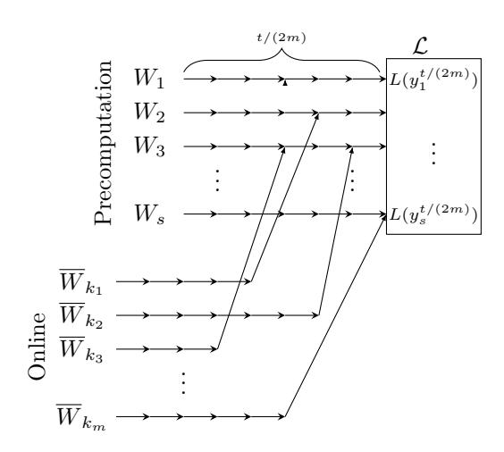
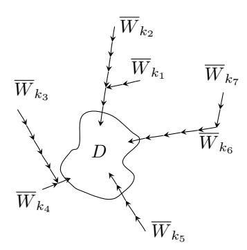
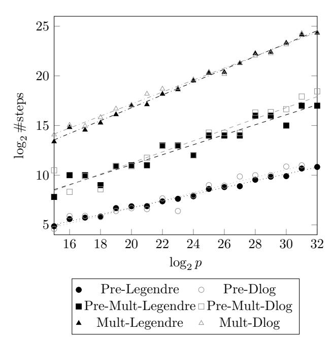

1

# Legendre PRF (Multiple) Key Attacks and the Power of Preprocessing

Alexander May\* , Floyd Zweydinger Ruhr University Bochum, Germany {alex.may, floyd.zweydinger}@rub.de

Abstract—Due to its amazing speed and multiplicative properties the Legendre PRF recently finds widespread applications e.g. in Ethereum 2.0, multiparty computation and in the quantum-secure signature proposal LegRoast. However, its security is not yet extensively studied.

The Legendre PRF computes for a key k on input x the Legendre symbol  $L_k(x) = \left(\frac{x+k}{p}\right)$  in some finite field  $\mathbb{F}_p$ . As standard notion, PRF security is analysed by giving an attacker oracle access to  $L_k(\cdot)$ . Khovratovich's collision-based algorithm recovers k using  $L_k(\cdot)$  in time  $\sqrt{p}$  with constant memory. It is a major open problem whether this birthday-bound complexity can be beaten.

We show a somewhat surprising wide-ranging analogy between the discrete logarithm problem and Legendre symbol computations. This analogy allows us to adapt various algorithmic ideas from the discrete logarithm setting.

More precisely, we present a small memory multiple-key attack on m Legendre keys  $k_1,\ldots,k_m$  in time  $\sqrt{mp}$ , i.e. with amortized cost  $\sqrt{p/m}$  per key. This multiple-key attack might be of interest in the Ethereum context, since recovering many keys simultaneously maximizes an attacker's profit.

Moreover, we show that the Legendre PRF admits precomputation attacks, where the precomputation depends on the public p only – and not on a key k. Namely, an attacker may compute e.g. in precomputation time  $p^{\frac{2}{3}}$  a hint of size  $p^{\frac{1}{3}}$ . On receiving access to  $L_k(\cdot)$  in an online phase, the attacker then uses the hint to recover the desired key k in time only  $p^{\frac{1}{3}}$ . Thus, the attacker's online complexity again beats the birthday-bound.

In addition, our precomputation attack can also be combined with our multiple-key attack. We explicitly give various tradeoffs between precomputation and online phase. E.g. for attacking m keys one may spend time  $mp^{\frac{2}{3}}$  in the precomputation phase for constructing a hint of size  $m^2p^{\frac{1}{3}}$ . In an online phase, one then finds all m keys in total time only  $p^{\frac{1}{3}}$ .

Precomputation attacks might again be interesting in the Ethereum 2.0 context, where keys are frequently changed such that a heavy key-independent precomputation pays off.

#### I. Introduction

#### A. Motivation

Blockchain technology received enormous attention over the past years by enabling secure, decentralized payments and multi party computations. One of the most famous

\*Funded by DFG under Germany's Excellence Strategy - EXC 2092 CASA - 390781972.

and powerful implementation of this technology is the Ethereum Blockchain. The newly proposed Ethereum 2.0 protocol [13], [14] tries to increase throughput for validating transactions in order to become competitive with modern credit card transaction systems.

Throughput is increased by moving away from the energy-consuming Proof-of-Work approach to a Proof-of-Stake. As opposed to Proof-of-Work, in Proof-of-Stake a user's voting power is not tied to its computing power, but to the stake he owns. If the Legendre PRF does not provide sufficient security, a malicious user u may let another user  $\bar{u}$  with Legendre key  $\bar{k}$  download and validate transactions. User u then recovers  $\bar{u}$ 's secret key  $\bar{k}$  in order to maliciously claim  $\bar{u}$ 's reward.

More recent Legendre PRF applications are in multiparty computation [17], and in designing quantum secure signatures [5].

#### B. Related work on Legendre PRF security

Let p be a prime and  $x \in \mathbb{F}_p$ . We call x a quadratic residue in the finite field's multiplicative group  $\mathbb{F}_p^*$ , if there exists an  $y \in \mathbb{F}_p^*$  with  $y^2 = x$ . We define the Legendre symbol

$$\left(\frac{x}{p}\right) = \begin{cases} 0 & \text{if } x = 0\\ 1 & \text{if } x \text{ is a quadratic residue}\\ -1 & \text{else.} \end{cases}$$

It is well-known that  $\left(\frac{x}{p}\right) = x^{\frac{p-1}{2}} \mod p$ . The multiplicativity of the Legendre symbol follows directly.

Choose a key  $k \in \mathbb{F}_p$ . Then the Legendre PRF, as proposed by Damgård [8], is the function  $L_k : \mathbb{F}_p \to \{-1, 0, 1\}$  with

$$L_k(x) = \left(\frac{x+k}{p}\right).$$

Therefore, the Legendre PRF satisfies for all  $i \in \mathbb{F}_p$ 

$$L_k(x+i) = \left(\frac{x+k+i}{p}\right) = L_0(x+k+i).$$

Conversely, if  $L_k(x+i) = L_0(y+i)$  for sufficiently many i, then we can conclude that  $y = x + k \mod p$ . Thus, finding x, y satisfying the identity  $L_k(x+i) = L_0(y+i)$  for sufficiently many i gives us a way to compute  $k = y - x \mod p$ . We call  $(x,y) \in \mathbb{F}_p \times \mathbb{F}_p$  a collision between the two functions  $L_k(\cdot)$  and  $L_0(\cdot)$  if  $L_k(x+i) = L_0(y+i)$  for

all  $0 \le i < \lceil 3 \log p \rceil$ . We show in our work that, assuming Legendre PRF security, enforcing the identity at  $\lceil 3 \log p \rceil$  points is sufficient to guarantee that a collision (x,y) yields the secret key k = y - x.

Notice that evaluation of  $L_0(\cdot)$  is possible using the public p only, whereas evaluation of  $L_k(\cdot)$  requires oracle access. Oracle access realization is the usual cryptographic attack model for PRFs – which is for conservative reasons quite strong, and not always satisfied in practical applications.

Khovratovich [20] defined a memoryless algorithm with  $L_k(\cdot)$  oracle access for recovering a Legendre key k within the typical birthday-type time bound  $\tilde{\mathcal{O}}(\sqrt{p})$ , where the  $\tilde{\mathcal{O}}$ -notation suppresses factors polynomial in  $\log p$ . In the less strong attack model without oracle access, but only  $M \leq p^{\frac{1}{4}}$  evaluations of  $L_k(\cdot)$  on known points, Beullens, Beyne, Udovenko, Vitto [4] and Kaluderovic, Kleinjung, Kostic [19] proposed an algorithm with inferior time complexity  $\mathcal{O}(p\log^2 p/M^2)$ .

It was left as an open problem, whether the  $\sqrt{p}$  bound can be beaten with classical algorithms. We answer this question in the affirmative, when we either allow for (more expensive) precomputations that do not require  $L_k(\cdot)$  oracle access, and/or allow for amortized cost per key in multiple-key attacks.

On quantum computers, Russell and Shparlinski [26] showed that k can be recovered in polynomial time given oracle access to a quantum embedding of  $L_k(\cdot)$  that can be asked in superposition – a *very strong* and in practical settings sometimes questionable attack model.

#### C. Oracle-access based Attack Model

Our results can be seen as a generalization of Khovratovich's memory-less algorithm [20] that also uses  $L_k(\cdot)$  oracle access. Most practical scenarios that we are aware of however do not provide such a strong attack model.

E.g. in Ethereum 2.0 the so-called Proof-of-custody for user u with secret key k works as follows. User u downloads periodically public data  $m_i$ , hashes to  $h(m_i) \in \mathbb{F}_p$ , and publishes the bit  $L_k(h(m_i))$ . After a certain time period, all users reveal their secret key k. User u can claim a reward on data  $m_j$  only if all bits  $L_k(h(m_i))$  verify correctly for all published  $m_i$  within this time period. Hence, an attacker obtains evaluations of  $L_k(\cdot)$  only on random known points  $h(m_i)$ , rather than points of his choice.

A similar attack scenario applies for the LegRoast signature scheme [5] that is based on the MPC-in-the-head paradigm [18]. Here, a user u's public key is an n-bit string  $(L_k(x_1), \ldots, L_k(x_n))$ , where k is u's secret key, and the  $x_i$  are public and randomly chosen in  $\mathbb{F}_p$ . Again, an attacker obtains evaluations of  $L_k(\cdot)$  on random known points  $x_i$ .

The setting, where an attacker obtains PRF evaluations on known (random) points is called *known plaintext attack* in the literature. Many practical PRF applications, e.g. also for AES, only allow for known plaintext attacks. Nevertheless, for PRFs the well-established standard security notion is a *chosen plaintext attack* (CPA) that allows an

attacker to query  $L_k(\cdot)$  on points adaptively chosen by himself, i.e., an attacker receives  $L_k(\cdot)$  oracle access.

Since PRFs are widely applied in practice in various scenarios, it is crucial to establish security even against the stronger CPA type. In fact, our algorithms directly use adaptive CPA queries, e.g. for achieving small memory consumption. Thus, our cryptanalytic results are of interest to study the security of Ethereum 2.0 and LegRoast, but do not directly lead to an attack on these.

### D. Our contributions

1) Legendre PRF vs dlog: Let us first discuss the analogy between attacking the Legendre PRF via collisions and collision-based discrete logarithm algorithms. Let G be a discrete logarithm group of order q with generator g, and let  $h=g^{k'}$  be a discrete logarithm instance. By finding (x,y) such that  $hg^x=g^y$ , we compute the discrete logarithm  $k'=y-x \mod q$ , analogous to the Legendre setting.

Just as  $L_k(\frac{x+i}{p}) = L_0(\frac{y+i}{p})$ , for sufficient many i, the identity  $hg^x = g^y$  is asymmetric in the sense that only the left-hand size depends on the secret discrete logarithm k', whereas the right-hand side can be computed solely based on the group specification. This asymmetry is used in precomputation attacks on the discrete logarithm as introduced in Mihalcik [23] Lee, Cheon, Hong [22] and Bernstein, Lange [3], where one performs a (rather large) precomputation that depends on the group only, and outputs a (rather small) hint. Upon receiving a discrete logarithm instance, one then determines the unknown k' more quickly using the hint. Various tradeoffs are possible, e.g. within precomputation time  $\tilde{\mathcal{O}}(q^{\frac{2}{3}})$  one can compute a hint of size  $\tilde{\mathcal{O}}(q^{\frac{1}{3}})$ . Upon receiving  $h = g^{k'}$ , the hint then allows to determine k' in time only  $\tilde{\mathcal{O}}(q^{\frac{1}{3}})$ .

2) Legendre Precomputation Attack: As already pointed out, in the Legendre setting the identity  $L_k(\frac{x+i}{p}) = L_0(\frac{y+i}{p})$  offers a similar asymmetry. The identity's right-hand side depends on p only and thus allows for precomputation, whereas computation of the left-hand side requires  $L_k(\cdot)$  oracle access. Hence, it might not come as a surprise that we obtain a similar Legendre key precomputation attack. Analogous, we may spend  $\tilde{\mathcal{O}}(p^{\frac{2}{3}})$  time to compute a hint of size  $\tilde{\mathcal{O}}(p^{\frac{1}{3}})$ . Upon receiving access to  $L_k(\cdot)$ , we then compute the secret k using only  $\tilde{\mathcal{O}}(p^{\frac{1}{3}})$  queries to  $L_k(\cdot)$ .

Not only does our precomputation attack break the  $\sqrt{p}$ -bound for recovering Legendre keys – in the online phase, once we have precomputed our hint. Our attack also accounts for scenarios that only offer limited number of  $L_k(\cdot)$ -queries. Similar to the discrete logarithm setting, we get for Legendre keys various tradeoffs between precomputation, key recovery phase and success probability.

3) Legendre Multiple-Key Attack: In the discrete logarithm setting, it was first noticed by Kuhn and Struick [21] using ideas from Escott, Sager, Selkirk, Tsapakidis [11] that m discrete logarithm instances  $h_1 = g^{k'_1}, \ldots, h_m = g^{k'_m}$  can be solved memory-less more efficiently than naively applying Pollard's  $\tilde{\mathcal{O}}(\sqrt{p})$ -algorithm m times. Namely,

Kuhn and Struick showed that reusing the data structure for  $h_1$ , the discrete logarithm of  $h_2$  can be found slightly more efficient, and so on. In total, all m discrete logarithm instances can be computed in time  $\mathcal{O}(\sqrt{mp})$ .

Again, the multiple-key discrete logarithm setting transfers to the Legendre PRF world. Namely, we are able to extend Khovratovich's  $\tilde{\mathcal{O}}(\sqrt{p})$ -algorithm — the Legendre variant of Pollard — to a multiple-key attack on m key simultaneously. To this end, we use some graph-based techniques that were introduced by Fouque, Joux, Mavromati [15]. As result, we obtain an attack on m Legendre keys  $k_1, \ldots, k_m$  using oracle access to  $L_{k_1}(\cdot), \ldots, L_{k_m}(\cdot)$  that recovers all m keys in total time  $\tilde{\mathcal{O}}(\sqrt{mp})$ .

Our total time in turn implies that the amortized cost per Legendre key is only  $\tilde{\mathcal{O}}(\sqrt{p/m})$ , again beating the  $\sqrt{p}$ -bound.

4) Legendre Multiple-Key Attack with Precomputation: In the discrete logarithm setting, Corrigan-Gibbs and Kogan [7] showed that multiple-key attacks can be combined with precomputation, again allowing for various tradeoffs. We also transfer this combination to the Legendre key setting. This implies e.g. an attack that uses precomputation time  $\tilde{\mathcal{O}}(mp^{\frac{2}{3}})$  to build a hint of size  $\tilde{\mathcal{O}}(m^2p^{\frac{1}{3}})$ . Upon access to  $L_{k_1}(\cdot),\ldots,L_{k_m}(\cdot)$ , one then computes all m keys in total time only  $\tilde{\mathcal{O}}(p^{\frac{1}{3}})$ .

Notice that in the multiple-key setting a large precomputation pays off in the sense that its cost amortizes over all keys. This explains why the multi-key precomputation setting is especially attractive for recovering Legendre keys.

Conclusion: Our attacks do not directly apply to Ethereum 2.0, since they require Legendre PRF oracle access  $L_k(\cdot)$ , that is typically not provided in a blockchain scenario. Nevertheless, precomputation as well as multiple-key attacks seem to be highly relevant in the Ethereum 2.0 context, where Legendre keys are frequently changed such that heavy key-independent precomputations pay off to optimize success probability in a (short) online key-dependent attack phase. Moreover, the more keys an attacker recovers in an online phase, the larger is his reward. Therefore, amortization of attack costs over many keys also pays off.

In the light of our novel Legendre PRF precomputation attacks one might consider — rather than the previous  $p^{\frac{1}{2}}$ -security level provided by Khovratovich's algorithm — a more conservative lower  $p^{\frac{1}{3}}$ -security level. Using this third-root bound, the 256-bit prime p used by Ethereums 2.0 still provides a high security level (of at least 85-bit), even against attacks with  $L_k(\cdot)$  oracle access.

5) More Dlog-like Attacks and Limitations: We would like to notice that other collision-based discrete logarithm algorithms also transfer to the Legendre setting. This includes Pollard's Lambda method [25] for secrets within a certain range, as well as the Esser-May method [12] for secrets with low Hamming weight. However, we felt that these attacks are less relevant in the Legendre key setting, in which we are not aware of any application with Legendre keys in a certain range, or with small Hamming weight.

Moreover, we would like to point out that despite the similarities between the discrete logarithm problem and the Legendre PRF, there also exists exist crucial differences that introduce technical difficulties for directly transferring discrete logarithm algorithms. Namely, the discrete logarithm setting provides us with a group structure that is heavily used in many algorithms. As an example, Corrigan-Gibbs and Kogan [7] compute in their multiple-key attack for some random  $r_1, \ldots, r_m$  the value  $h = h^{r_1} \cdot \ldots \cdot h^{r_m}$  that has discrete logarithm  $r_1k'_1 + \ldots + r_mk'_m$ . Thus, in the discrete logarithm setting we easily obtain random linear combinations of the  $k'_i$ . This property greatly simplifies the analysis of Corrigan-Gibbs and Kogan's algorithm.

As opposed to the discrete logarithm, for the Legendre PRF we do not have a group structure. This implies that neither can we compute a multiple  $r_1k_1, r_1 \in \mathbb{F}_p$  using the oracle  $L_{k_1}(\cdot)$ , nor are we able to compute  $k_1 + k_2$  using two oracles  $L_{k_1}(\cdot)$  and  $L_{k_2}(\cdot)$ .

The missing group structure poses some additional technical problems, when we transfer in the subsequent chapters the above-mentioned discrete logarithm algorithms to the Legendre PRF setting. Nevertheless, we always succeed to design alternative algorithms that provide analogous complexity results.

6) Related Work and Open Problems: Our work is not the first that uses collision-finding techniques in the context of precomputation without having a group structure. E.g. Coretti, Dodis, Guo and Steinberger [6] and later Akshima, Cash, Drucker and Wee [1] designed precomputation attacks and lower bounds for salted hash functions. They showed that the salting technique is a good defense against the efficacy of precomputations for hash function collisions.

We are quite confident that the lower bounds of Corrigan-Gibbs and Kogan [7] from the discrete logarithm setting in generic groups also transfer to our Legendre PRF setting, when using only our limited set of allowed operations. However, we feel that such an artificially limited generic Legendre PRF model would only provide misleading security guarantees. As opposed to many discrete logarithm groups, where we only have generic attacks, the Legendre PRF setting seems to offer a richer mathematical structure. E.g. the attacks of Beullens, Beyne, Udovenko, Vitto [4] and Kaluderovic, Kleinjung, Kostic [19] exploit the Legendre symbol's multiplicativity to reduce the number of  $L_k(\cdot)$  oracle calls. Unfortunately, we have to leave it open whether similar techniques can be applied in our setting.

Since we are purely focusing on key-recovering attacks, one might also wonder whether there exist more efficient Legendre PRF distinguishers. Given the wide analogy between discrete logarithm and Legendre PRF attacks, it is tempting to adapt e.g. the more efficient DDH-like distinguisher of Corrigan-Gibbs and Kogan [7] to the Legendre PRF setting. We failed to construct distinguishers with better efficiency than our key-recovery attacks, and we leave their existence as an open problem.

Our paper is structured as follows. In Section II we provide some basic definitions for properly defining collision-

based random walk algorithms in the Legendre PRF setting. Our Legendre precomputation attack is given in Section III. For didactic reasons, we then first generalize in Section IV our precomputation attack to the multiple-key setting, since both algorithms share a similar analysis. Eventually, in Section V we provide our multiple-key attack without precomputation.

#### II. LEGENDRE PRF BASICS

<span id="page-3-0"></span>All logarithms in this paper are base 2. Let p be prime, and let  $(\frac{x}{p})$  be the Legendre symbol of x in  $\mathbb{F}_p$ . Since  $(\frac{x}{p}) = x^{\frac{p-1}{2}} \mod p$ , the Legendre symbol can be computed in time  $\mathcal{O}(\log^3 p)$ , polynomial in the bit-size of p.

For ease of notation, throughout the paper we suppress all run time factors that are polynomial in  $\log p$ , by hiding them in soft-Oh notation, e.g.  $3p\log^2 p = \mathcal{O}(p)$ . We call any function inverse that grows faster than a polynomial in  $\log p$  negligible, denoted  $\operatorname{negl}(p)$ . We call success probability  $1 - \operatorname{negl}(p)$  overwhelming.

For a key  $k \in \mathbb{F}_p$  the original Legendre PRF [8] is defined as the function

$$\bar{L}_k: \mathbb{F}_p \to \{-1, 0, 1\}, \ x \mapsto \left(\frac{x+k}{p}\right).$$

Obviously, if y = x + k then  $\bar{L}_0(y) = \bar{L}_k(x)$ . In order to use collision-based algorithms, we would like to conclude that conversely  $\bar{L}_0(y) = \bar{L}_k(x)$  implies y = x + k. To this end, we define a function  $L_k$  with sufficiently large range R.

<span id="page-3-4"></span>Definition 1 (Legendre point): Define  $r = \lceil 3\log p \rceil$  and  $R = \{-1, 0, 1\}^r$ . We set

$$L_k: \mathbb{F}_p \to R, \ x \mapsto \left( \left( \frac{x+k}{p} \right), \dots, \left( \frac{x+k+r-1}{p} \right) \right).$$

We denote by  $L := L_0$  the *key-independent* function, and we define the set of all *Legendre points* as  $P = \{L(y) \mid y \in \mathbb{F}_p\} \subset R$ .

Notice that  $L(x) \in \{-1,1\}^r$  unless x = 0 or x > p - r. For simplicity, let us for a moment exclude these border cases. Under the assumption that  $\bar{L}_k$  is a PRF, it is not hard to see that the r-bit range  $L : \mathbb{F}_p \to \{-1,1\}^r$  is a secure PRG (pseudorandom number generator).

In fact, Damgård suggested such a Legendre pseudorandom generator in [8]. Therefore, for a random seed x the output L(x) is supposed to be pseudorandom. There is strong theoretical and practical evidence [2], [4], [9], [19], [24], [26] that the distribution of L(x) is even statistically close to uniform in  $\{-1,1\}^r$ . For simplicity of exposition, we heuristically assume such a uniform distribution. A failure of our heuristic would open the door for Legendre symbol distinguishing attacks.

<span id="page-3-3"></span>Heuristic 1 (Uniformity): Let  $x \in \{1, 2, ..., p - r\}$  be chosen uniformly at random. Then L(x) is uniformly distributed in  $\{-1, 1\}^r$ . That is for all fixed  $c \in \{-1, 1\}^r$  we have  $\Pr[L(x) = c] = \frac{1}{2^r}$ .

In the subsequent sections, we define random walks over the set  $P = \{L(x) \mid x \in \mathbb{F}_p\}$  of Legendre points. Notice that P is *not* equipped with a group structure, as opposed to the discrete logarithm setting.

The following Lemma 1 implies that |P|=p with overwhelming probability. This in turn implies that collisions of our random walks result in recovery of the secret Legendre PRF key k.

<span id="page-3-2"></span>Lemma 1: Let  $L_k: \mathbb{F}_p \to \{-1,0,1\}^{\lceil 3\log p \rceil}$ . Under Heuristic 1, with overwhelming probability all argument pairs x,y with  $y \neq x+k$  satisfy  $L(y) \neq L_k(x)$ . Hence, with overwhelming probability

$$L(y) = L_k(x) \Rightarrow y = x + k.$$

Proof: Let  $r = \lceil 3\log p \rceil$ , and let  $k \in \mathbb{F}_p$  be chosen uniformly at randomly. First, consider the case of argument pairs x,y such that at exactly one of  $L(y), L_k(x)$  is in  $\{-1,0,1\}^r \setminus \{-1,1\}^r$ . That is, either L(y) or  $L_k(x)$  contains a zero entry. Then obviously  $L(y) \neq L_k(x)$ . Second, consider the case that  $L(y), L_k(x)$  both contain zeros. By Definition 1, every Legendre point can have at most one zero. Since  $y \neq x + k$  the zero entries of  $L(y), L_k(x)$  must be in different positions, again implying  $L(y) \neq L_k(x)$ .

Thus, we may w.l.o.g. assume argument pairs x, y with  $L(y), L_k(x) \in \{-1, 1\}^r$ . Since k is uniformly at random, by Heuristic 1 the Legendre point  $L_k(x) = L(k+x)$  is also uniformly at random. Therefore,

$$\Pr[L(y) = L_k(x) \mid y \neq x + k] = \frac{1}{2^r} = \frac{1}{2^{\lceil 3 \log p \rceil}} \le \frac{1}{p^3}.$$

The number of pairs x, y with  $y \neq x + k$  is upper-bounded by p(p-1), since we exclude Legendre points with zero entries. Using Bernoulli's inequality, all these x, y satisfy  $L(y) \neq L_k(x)$  with probability at least

$$\left(1 - \frac{1}{p^3}\right)^{p(p-1)} \ge 1 - \frac{p(p-1)}{p^3} \ge 1 - \frac{1}{p}.$$

#### III. PRECOMPUTATION ATTACK

<span id="page-3-1"></span>Let us first give a high-level description of our Legendre PRF precomputation attack, see also Figure 1. In a nutshell, in the precomputation phase we perform sufficiently many key-independent random walks  $W_1, \ldots, W_s$  on the set of Legendre points P (Definition 1), where we only store the walks' endpoints. The endpoints serve as a hint for the online phase.

Upon receiving  $L_k(\cdot)$  oracle access, we then compute in the online phase the Legendre key k by letting a key-dependent random walk  $\overline{W}_k$  – defined via  $L_k(\cdot)$  – collide with one of the precomputed walks. We detect the collision using our stored endpoints.

<span id="page-4-0"></span>

Figure 1: Precomputation attack

#### A. Random Walks - Precomputation and Online

Let  $R = \{-1,0,1\}^{\lceil 3\log p \rceil}$  and  $P = \{L(y) \mid y \in \mathbb{F}_p\} \subset R$  (Definition 1). We define a random function  $f: P \to \mathbb{F}_p$ . Notice that f is compressing. In practice, f may be instantiated via some appropriate hash function. The function f helps us in a random walk W to map Legendre points L(y) back to arguments y' for the Legendre PRF. We define W on P as follows.

Precomputation phase. Let  $y^{(1)} \in \mathbb{F}_p$ . Then W's starting point is  $L(y^{(1)}) \in P$ . Next, W computes  $y^{(2)} = y^{(1)} + f(L(y^{(1)})) \mod p$  and steps to its second point  $L(y^{(2)}) \in P$ . In general, W computes an arbitrary number of steps, where

<span id="page-4-1"></span>
$$y^{(i+1)} = y^{(i)} + f\left(L\left(y^{(i)}\right)\right) \bmod p \text{ for } i \ge 1$$
 (1)

with random walk points  $L\left(y^{(i)}\right) \in P$ . Notice that W is key-independent, since it does not involve oracle queries  $L_k(\cdot)$ . Thus, we can compute W in a precomputation phase solely based on the public information p. Assume that we walk W for t/2 steps. Then we only store the endpoint  $L(y^{(t/2)})$  and its argument  $y^{(t/2)}$ . The endpoint  $L(y^{(t/2)})$  allows us to detect collisions between walks, whereas  $y^{(t/2)}$  allows us to find the Legendre key. This procedure is repeated with s different starting points  $y_1^{(1)}, \ldots, y_s^{(1)}$ .

Online phase. Now assume that we obtain  $L_k(\cdot)$  oracle access. We want to compute in an online phase the secret Legendre key k. To this end we perform a key dependent walk  $\overline{W}_k$  as follows. Choose  $x^{(1)} \in_R \mathbb{F}_p$  and compute starting point  $L_k(x^{(1)})$ . In general, for a key dependent walk  $\overline{W}_k$  we calculate the next point as

<span id="page-4-4"></span>
$$x^{(i+1)} = x^{(i)} + f\left(L_k\left(x^{(i)}\right)\right) \bmod p \text{ for } i \ge 1$$
 (2)

with random walk points  $L_k(x^{(i)}) \in P$ .

#### <span id="page-4-5"></span>B. Colliding Walks solve Legendre.

Assume that a key-independent walk W collides with a key-dependent walk  $\overline{W}_k$ . I.e., there exist arguments  $y^{(i)}, x^{(j)}$  with colliding points

$$L(y^{(i)}) = L_k(x^{(j)}).$$

Using Lemma 1, we immediately conclude from such a collision that

<span id="page-4-2"></span>
$$k = y^{(i)} - x^{(j)} \bmod p. \tag{3}$$

Moreover, we want to show that once two chains of points from P computed in walks  $W,\overline{W}_k$  collide, they stay in the same points, i.e.

$$L(y^{(i)}) = L_k(x^{(j)}) \Rightarrow L(y^{(i+1)}) = L_k(x^{(j+1)}).$$

To this end let us assume  $L(y^{(i)}) = L_k(x^{(j)})$ . We already know that this implies  $y^{(i)} = x^{(j)} + k \mod p$ . Using Equation (1), we obtain

$$y^{(i+1)} = y^{(i)} + f\left(L\left(y^{(i)}\right)\right)$$
  
=  $x^{(j)} + k + f\left(L\left(x^{(j)} + k\right)\right) \mod p$ .

This in turn implies

$$L\left(y^{(i+1)}\right) = L\left(x^{(j)} + k + f\left(L\left(x^{(j)} + k\right)\right)\right)$$
$$= L_k\left(x^{(j)} + f\left(L_k\left(x^{(j)}\right)\right)\right)$$
$$= L_k\left(x^{(j+1)}\right).$$

It remains to show that we can efficiently find arguments  $y^{(i)}, x^{(j)}$  with colliding points  $L(y^{(i)}), L_k\left(x^{(j)}\right)$ . Since from the first colliding point on both walks stay in the same points, walk  $\overline{W}_k$  eventually reaches W's endpoint. Let  $L(y^{(t/2)}) = L_k(x^{(j)})$  denote this endpoint. The corresponding arguments  $y^{(t/2)}, x^{(j)}$  reveal the Legendre secret key k via Equation (3).

The resulting precomputation attack PRE-LEGENDRE is described in Algorithm 1. Using the parameter choice  $s=t=p^{\frac{1}{3}}$  in the following Theorem 1, we achieve precomputation in time  $\tilde{\mathcal{O}}(p^{\frac{2}{3}})$  using a hint of size  $\tilde{\mathcal{O}}(p^{\frac{1}{3}})$ , whereas the online phase runs in time  $\tilde{\mathcal{O}}(p^{\frac{1}{3}})$  with constant success probability  $\epsilon=\Omega(st^2/p)=\Omega(1)$ .

<span id="page-4-3"></span>Theorem 1: Assume that we are given oracle access to a Legendre PRF  $L_k(\cdot): \mathbb{F}_p \to P$ . Under Heuristic 1, for any  $s,t \in \mathbb{N}$  with  $s^2t \leq p$  algorithm PREP-LEGENDRE precomputes in time  $\tilde{\mathcal{O}}(st)$  a hint of size  $\tilde{\mathcal{O}}(s)$ , which allows to find k in online time  $\tilde{\mathcal{O}}(t)$  with success probability  $\Omega\left(\frac{st^2}{p}\right)$ .

*Proof:* Let us first consider correctness and success probability. If PRE-LEGENDRE finds a collision in line 12, then by Lemma 1 with overwhelming probability k is the correct Legendre key. It remains to show that PRE-LEGENDRE does not output FAIL too often.

We show that the success probability  $\epsilon=\Pr(\overline{\text{FAIL}})$  for finding a collision in line 12 of  $\overline{W}_k$  with some precomputed walk  $W_\ell$ 's endpoint is  $\Omega(st^2/p)$ . Hence, we obtain constant success probability for  $st^2=\Omega(p)$ , e.g. for the choice  $s=t=\lceil p^{\frac{1}{3}}\rceil$ . Our analysis closely follows the analysis from Corrigan-Gibbs and Kogan [7] for the discrete logarithm setting.

## **Algorithm 1:** Pre-Legendre

```
: p, L_k(\cdot) : \mathbb{F}_p \to P \text{ with } P = \{L(y) \mid y \in \mathbb{F}_p\} \subset \{0, \pm 1\}^{\lceil 3 \log p \rceil}
      Output: k \in \mathbb{F}_r
      begin
  1
             Choose s, t \in \mathbb{N} s.t. st^2 \leq p. \triangleright E.g. s, t = \lceil p^{\frac{1}{3}} \rceil
  2
             Define random f: P \to \mathbb{F}_p.
  3
                                                      ▷ Precomputation phase
             for \ell = 1, \ldots, s
  4
  5
                     Choose a random y_{\ell}^{(1)} \in \mathbb{F}_p.
Start in L(y_{\ell}^{(1)}) a t/2-step walk W_{\ell} (Eq. 1)
  6
                                y_{\ell}^{(i+1)} = y_{\ell}^{(i)} + f\left(L\left(y_{\ell}^{(i)}\right)\right) \bmod p
                       with points L\left(y_{\ell}^{(i)}\right) \in P.
                    Store (L(y_{\ell}^{(t/2)}), y_{\ell}^{(t/2)}) in a list \mathcal{L} sorted by
  8
             end
  g
             Choose a random x^{(1)} \in \mathbb{F}_p. \triangleright Online phase
10
             Start in L_k(x^{(j)}) a t-step walk \overline{W}_k (Eq. 2)
11
                          x^{(j+1)} = x^{(j)} + f\left(L_k\left(x^{(j)}\right)\right) \bmod p
               with points L_k(x^{(j)}) \in P.
             if L_k\left(x^{(j)}\right) = L(y_\ell^{(t/2)}) with  \begin{pmatrix} L(y_\ell^{(t/2)}), y_\ell^{(t/2)} \end{pmatrix} \in \mathcal{L}  then  \begin{vmatrix} \text{return } k = y_\ell^{(t/2)} - x^{(j)} \mod p. \end{vmatrix} 
12
13
14
               return FAIL.
15
             end
16
17
      end
```

<span id="page-5-2"></span><span id="page-5-1"></span>We first observe that the preprocessing walks  $W_1, \ldots, W_s$  with t/2-steps touch at most st/2 Legendre points. Moreover, we show that on expectation these s walks touch at least st/4 distinct points.

To prove this, let  $X_\ell$  be a random variable for the number of points touched by precomputation walk  $W_\ell$ ,  $\ell=1,\ldots,s$ . Further, let  $X=X_1+\ldots+X_s\leq st/2$ . We show in the following that  $\Pr[X\geq st/4]\geq \frac{1}{2}$ .

Using Bernoulli's inequality and  $st^2 \leq p$ , every t/2-step walk touches the maximum number t/2 of new point with probability at least

$$\Pr\left[X_{\ell} = \frac{t}{2}\right] \geq \left(\frac{p - st/2}{p}\right)^{\frac{t}{2}} = \left(1 - \frac{st}{2p}\right)^{\frac{t}{2}} \geq 1 - \frac{st^2}{4p} \geq \frac{3}{4}.$$

Therefore, every walk in the precomputation phase covers on expectation at least  $\mathbb{E}[X_\ell] \geq \frac{3}{4} \cdot \frac{t}{2} = \frac{3}{8}t$  new points. By linearity of expectation we have

$$\mathbb{E}[X] = \sum_{\ell=1}^{s} \mathbb{E}[X_{\ell}] \ge \frac{3}{8} st.$$

<span id="page-5-3"></span>

Figure 2: Multiple-key precomputation attack. Here  $W_1,\ldots,W_s$  denote key-independent and  $\overline{W}_{k_1},\ldots,\overline{W}_{k_m}$  key-dependent random walks.

Using Markov's inequality and  $X \leq st/2$ , we obtain

$$\Pr\left[X < \frac{st}{4}\right] \le \Pr\left[\frac{st}{2} - X \le \frac{st}{4}\right] \le \frac{\frac{st}{2} - \mathbb{E}[X]}{\frac{st}{4}} \le \frac{1}{2}.$$

Therefore,  $\Pr[X \ge st/4] \ge \frac{1}{2}$  as desired.

Let us assume in the following that  $X \geq st/4$  Legendre points are covered during precomputation. Let E be the event that within the first t/2 steps of the t-step online walk  $\overline{W}_k$  we hit one of the X covered points. Using  $1-x \leq e^{-x}$  and  $1-e^{-x} \geq x/2$  for  $x \leq 1$ , we obtain

$$\Pr[E] \ge 1 - \left(1 - \frac{st}{4p}\right)^{t/2} \ge 1 - e^{-\frac{st^2}{8p}} \ge \frac{st^2}{16p}.$$

Notice that the event E implies that in the remaining t/2 steps of the online phase we must hit some precomputed endpoint  $L(y_{\ell}^{(t/2)})$  in  $\mathcal{L}$ . This implies success probability at least

$$\epsilon = \Pr[X \geq st/4] \cdot \Pr[E] \geq \frac{st^2}{32p}$$

Thus, with probability  $\epsilon$  we output the secret Legendre key k.

It remains to show the complexity statements. Precomputation takes time  $\tilde{\mathcal{O}}(st)$  using memory  $\tilde{\mathcal{O}}(s)$ . The online phase runs in time  $\tilde{\mathcal{O}}(t)$ .

<span id="page-5-4"></span>Remark 1: We may amplify the success probability of PRE-LEGENDRE arbitrary close to 1 by running more key-dependent walks with different starting points, while reusing the precomputation structure. This is our strategy in the experimental Section VI.

#### <span id="page-5-0"></span>IV. MULTIPLE-KEY PRECOMPUTATION ATTACK

The high-level idea of our precomputation attack on multiple keys is similar to our precomputation attack on a single key from the previous Section III, see also Figure 2.

Again, in a precomputation phase we run only keyindependent walks  $W_1, \ldots, W_s$ , and store their endpoints in a list  $\mathcal{L}$ . The endpoints serve as a hint for the online phase.

Let us in the online phase attack Legendre keys  $k_1, \ldots, k_m$ , for which we obtain oracle access to  $L_{k_\ell}(\cdot)$ ,  $\ell = 1, \ldots, m$ . Using these oracles we define key-dependent walks  $\overline{W}_{k_\ell}$  that with high probability collide into some precomputed walk  $W_i$ . As in Section III, collisions from  $\overline{W}_{k_\ell}$  are detected via hitting some precomputed endpoint in  $\mathcal{L}$ . A collision of  $\overline{W}_{k_\ell}$  enables us to recover  $k_\ell$  using Equation (3).

The resulting procedure is given in Algorithm 2. For the choice  $s=m^2p^{\frac{1}{3}}$  and  $t=p^{\frac{1}{3}}$  in Theorem 2 we obtain precomputation time  $\tilde{\mathcal{O}}(mp^{\frac{2}{3}})$  and a hint of size  $\tilde{\mathcal{O}}(m^2p^{\frac{1}{3}})$ , whereas the online phase finishes in time only  $\tilde{\mathcal{O}}(p^{\frac{1}{3}})$  for computing all m Legendre keys with constant success probability.

```
Algorithm 2: Pre-Mult-Legendre
```

```
Input : p, L_{k_1}(\cdot), \dots, L_{k_m}(\cdot) : \mathbb{F}_p \to P \text{ with } P = \{L(y) \mid y \in \mathbb{F}_p\} \subset \{0, \pm 1\}^{\lceil 3 \log p \rceil}
       Output: \{k_1,\ldots,k_m\}\in\mathbb{Z}_n^m
  1 begin
               Choose s, t \in \mathbb{N} with st^2 \leq m^2 p.
  \mathbf{2}
               Define random f: P \to \mathbb{F}_p.
  3
                                                             ▷ PRECOMPUTATION phase
               for \ell = 1, \ldots, s
  4
  5
                        Choose a random y_{\ell}^{(1)} \in \mathbb{F}_p
Start in L(y_{\ell}^{(1)}) a \frac{t}{2m}-step walk W_{\ell}
  6
                                     y_{\ell}^{(i+1)} = y_{\ell}^{(i)} + f\left(L\left(y_{\ell}^{(i)}\right)\right) \bmod p
                       with points L\left(y_{\ell}^{(i)}\right) \in P.
Store \left(L(y_{\ell}^{(\frac{t}{2m})}), y_{\ell}^{(\frac{t}{2m})}\right) in a list \mathcal{L} sorted by
  8
               end
  9
               for \ell = 1, ..., m
10
                                                                                          ▷ ONLINE phase
11
                        Choose random x_{\ell}^{(1)} \in \mathbb{F}_p.
Start in L_{k_{\ell}}(x_{\ell}^{(1)}) a \frac{t}{m}-step walk \overline{W}_{k_{\ell}}
12
13
                                 x_i^{(j+1)} = x^{(j)} + f\left(L_{k_i}\left(x_i^{(j)}\right)\right) \bmod p.
                         with points L_{k_{\ell}}\left(x_{\ell}^{(j)}\right) \in P.
                      if L_{k_{\ell}}\left(x_{\ell}^{(j)}\right) = L(y_{\ell'}^{(t/2)}) with
14
                       \begin{pmatrix} L(y_{\ell'}^{\left(\frac{t}{2m}\right)}), y_{\ell'}^{\left(\frac{t}{2m}\right)} \end{pmatrix} \in \mathcal{L} \text{ then}   \mid \text{ return } k_{\ell} = y_{\ell'}^{(t/2)} - x_{\ell}^{(j)}.  else
15
16
                          return FAIL "k_{\ell}".
17
18
               end
19
20
      end
```

<span id="page-6-3"></span><span id="page-6-2"></span><span id="page-6-1"></span>Theorem 2: Assume that we are given oracle access to m Legendre PRFs  $L_{k_1}(\cdot), \ldots, L_{k_m}(\cdot) : \mathbb{F}_p \to P$ . Under

Heuristic 1, for any  $s, t \in \mathbb{N}$  with  $st^2 \leq m^2 p$  algorithm PRE-MULT-LEGENDRE precomputes in time  $\tilde{\mathcal{O}}\left(\frac{st}{m}\right)$  a hint of size  $\tilde{\mathcal{O}}(s)$ , which allows to find each  $k_{\ell}$ ,  $1 \leq \ell \leq m$  with success probability  $\epsilon_{\ell} = \Omega\left(\frac{st^2}{m^2p}\right)$  in total online time  $\tilde{\mathcal{O}}(t)$ .

*Proof:* Let us first consider correctness and success probability. Here, we closely follow the analysis from the proof of Theorem 1. If we output in line 15 of Pre-Mult-Legendre a key  $k_{\ell}$  then this key is correct by the discussion from Section III.

It remains to show that the success probability  $\epsilon_{\ell}$  for recovering key  $k_{\ell}$  is sufficiently large. We show that  $\epsilon_{\ell} = \Omega(\frac{st^2}{s^2})$ .

Let  $X_{\ell}$  be a random variable for the number of new points touched by the  $\frac{t}{2m}$ -step precomputation walk  $W_{\ell}$ ,  $\ell = 1, \ldots, s$ . Let  $X = X_1 + \ldots + X_s$ . Since  $X_{\ell} \leq \frac{t}{2m}$ , we have  $X \leq \frac{st}{2m}$ . Using  $st^2 \leq m^2p$  and Bernoulli's inequality, every walk touches the maximal number  $\frac{t}{2m}$  of new points with probability

$$\Pr\left[X_{\ell} = \frac{t}{2m}\right] \ge \left(\frac{p - \frac{st}{2m}}{p}\right)^{\frac{t}{2m}} = \left(1 - \frac{st}{2pm}\right)^{\frac{t}{2m}}$$
$$\ge 1 - \frac{st^2}{4m^2p} \ge \frac{3}{4}.$$

Thus,  $\mathbb{E}[X_i] \ge \frac{3}{4} \cdot \frac{t}{2m} = \frac{3t}{8m}$  and  $\mathbb{E}[X] \ge \frac{3st}{8m}$ . Using Markov's inequality we get

$$\Pr\left[X < \frac{st}{4m}\right] \leq \Pr\left[\frac{st}{2m} - X \leq \frac{st}{4m}\right] \leq \frac{\frac{st}{2m} - \mathbb{E}[X]}{\frac{st}{4m}} \leq \frac{1}{2}.$$

This implies that with probability at least  $\frac{1}{2}$  our precomputation structure covers  $X\geq \frac{st}{4m}$  points. Assume in the following that  $X\geq \frac{st}{4m}.$  Let  $E_\ell$  be the event that the key-dependent walk  $\overline{W}_{k_\ell}$  hits within its first  $\frac{t}{2m}$  steps one of the X covered point. Then

$$\Pr[E_{\ell}] \ge 1 - \left(1 - \frac{st}{4mp}\right)^{\frac{t}{2m}} \ge 1 - e^{-\frac{st^2}{8m^2p}} \ge \frac{st^2}{16m^2p}.$$

In the event  $E_{\ell}$ , we must hit by the discussion in section III-B in the remaining  $\frac{t}{2m}$  steps of walk  $\overline{W}_{k_{\ell}}$  a precomputed endpoint in  $\mathcal{L}$ . This in turn allows us to compute  $k_{\ell}$ . Thus, we succeed to compute  $k_{\ell}$  with probability at least

$$\epsilon_{\ell} = \Pr\left[X_i \ge \frac{st}{4m}\right] \cdot \Pr[E_{\ell}] \ge \frac{st^2}{32m^2p} = \Omega\left(\frac{st^2}{m^2p}\right).$$

It remains to show the complexity statements. The precomputation phase runs in time  $\tilde{\mathcal{O}}(\frac{st}{m})$  using memory  $\tilde{\mathcal{O}}(s)$ .

<span id="page-6-4"></span>Remark 2: Theorem 2 guarantees constant success probability for each key  $k_\ell$  if  $st^2 = \Omega(m^2p)$ . If PRE-MULT-LEGENDRE fails to find some  $k_\ell$ , we may simply rerun the key-dependent walk  $W_{k_\ell}$  with a fresh starting point. This is our strategy in the experimental Section VI.

# V. Multiple-Key Attack (without Precomputation)

<span id="page-6-0"></span>The strategy for our multiple-key attack substantially deviates from the algorithms in the previous sections. Recall

<span id="page-7-0"></span>

Figure 3: Multiple-key attack. D denotes a distinguished point set and  $\overline{W}_{k_1},\ldots,\overline{W}_{k_7}$  are key-dependent random walks.

that in Sections III and IV we computed in the precomputation phase fixed length *key-independent* walks together with their endpoints as hint. In the online phase we then let *key-dependent* walks collide into the precomputation walks, thereby detecting collisions via endpoints.

In contrast, for our multiple-key attack without precomputation we solely compute key-dependent walks, and therefore only consider collisions between key-dependent walks, see also Figure 3. Our key-dependent walks are of variable length, and we stop them only if we hit some set  $D \subset P$  of distinguished Legendre points. These distinguished points allow us to detect collisions between two walks  $\overline{W}_{k_i}, \overline{W}_{k_j}$  that use Legendre keys  $k_i, k_j$ . Such a collision in turn gives us a Legendre key relation for  $k_i - k_j$ . Upon having collected sufficiently many of such relations, we eventually compute the Legendre keys.

The resulting algorithm recovers m Legendre keys  $k_1, \ldots, k_m$  in time  $\tilde{\mathcal{O}}(\sqrt{mp})$  using optimal memory  $\tilde{\mathcal{O}}(m)$ . Notice that we already need memory  $\Omega(m)$  to store all keys. Our algorithm's complexity  $\tilde{\mathcal{O}}(\sqrt{mp})$  should be compared with the naive approach that takes time  $\tilde{\mathcal{O}}(m\sqrt{p})$  by running m-times Khovratovich's  $\tilde{\mathcal{O}}(\sqrt{p})$  attack [20].

#### A. High-Level idea

We run  $\Theta(m)$  key-dependent walks  $\overline{W}_{k_{\ell}}$  using m oracles  $L_{k_{\ell}}(\cdot)$ ,  $1 \leq \ell \leq m$ , and as opposed to Sections III and IV no key-independent walk. These walks give us  $\Omega(m)$  mutual collisions. Let us assume that two walks  $\overline{W}_{k_{\ell}}, \overline{W}_{k_{\ell'}}$  with different keys  $k_i \neq k_j$  collide. Then there exist  $x_{\ell}^{(u)}, x_{\ell'}^{(v)}$  such that

$$L_{k_i}\left(x_{\ell}^{(u)}\right) = L_{k_j}\left(x_{\ell'}^{(v)}\right) = L\left(x_{\ell'}^{(v)} + k_j\right).$$

Using Lemma 1, we conclude that

<span id="page-7-1"></span>
$$k_i - k_j = x_{\ell'}^{(v)} - x_{\ell}^{(u)} \mod p.$$
 (4)

Thus, every collision among two walks defines a relation as in Equation (4) between two keys  $k_i, k_j$ .

Let us define an undirected graph G=(V,E) with |V|=m and an initially empty edge set E. Every relation as in Equation (4) adds an edge  $\{i,j\}$  to E with label  $\ell_{ij}=x_{\ell'}^{(v)}-x_{\ell}^{(u)}\in\mathbb{F}_p$ . Assume that we collected sufficiently many

edges such that G gets connected, i.e. G contains a spanning tree T. Take an arbitrary vertex  $i \in T$  corresponding to key  $k_i$ . Compute  $k_i$  in time  $\tilde{\mathcal{O}}(\sqrt{p})$  using Khovratovich's algorithm. Now, traverse T starting in vertex i. Let  $\{i,j\}$  be the first traversal edge with label  $\ell_{ij}$ . Using the relation from Equation (4), we conclude that  $k_j = k_i - \ell_{ij}$ . Thus, by traversing T we recover all m keys.

In our algorithm, we will not wait until G gets fully connected, since by the results of Erdös, Renyi [10] this requires  $\Omega(m \log m)$  relations. Instead, we use from Erdös, Renyi [10] that after  $\Omega(m)$  relations, G has a so-called giant component  $V_G \subseteq V$ , a connected set of vertices that contains all but a (small) constant fraction of V. We compute a spanning tree T in this giant component  $V_G$ , and recover by the above algorithm all keys within  $V_G$ . We then remove the known keys, and recursively run our algorithm on the remaining keys.

#### B. How to detect collisions

Recall that we have to address a technical collision-detection issue, since as opposed to our algorithms from Sections III and IV we do no longer collide into some precomputed structure. Instead, our online walks mutually collide. In order to detect these collisions, we use the van Oorschot-Wiener distinguished point strategy [27].

Let  $g=(g_1,\ldots,g_r)\in P$  be a Legendre point. Fix a random  $d\in\{0,1\}^k$  with  $k\leq r$ . Then we call g distinguished if

$$(g_1,\ldots,g_k)=d,$$

i.e., the Legendre point g starts on its first k coordinates with d. Under Heuristic 1, any random Legendre point is distinguished with probability  $q = 2^{-k}$ .

Now, we run every walk  $\overline{W}_{k_\ell}$  until it hits a distinguished point g, see Figure 3. We then store this distinguished points g in a sorted list  $\mathcal{L}$ . In our algorithm we choose q (and therefore  $k \approx \log(1/q)$ ) such that with good probability our walks have the desired lengths. Assume now that two walks  $\overline{W}_{k_i}, \overline{W}_{k_j}$  with different keys  $k_i \neq k_j$  collide. Then there exist  $x_{\ell}^{(u)}, x_{\ell'}^{(v)}$  such that

$$L_{k_i}\left(x_{\ell}^{(u)}\right) = L_{k_j}\left(x_{\ell'}^{(v)}\right),\,$$

from which we conclude via Equation (4) that

$$x_{\ell}^{(u)} = x_{\ell'}^{(v)} + k_j - k_i.$$

Analogous to Section III we show that once  $\overline{W}_{k_i}, \overline{W}_{k_j}$  collide, they stay in the same Legendre points, i.e.

$$L_{k_i}\left(x_{\ell}^{(u+1)}\right) = L_{k_j}\left(x_{\ell'}^{(v+1)}\right).$$

This follows from

$$\begin{split} L_{k_{i}}\left(x_{\ell}^{(u+1)}\right) &= L_{k_{i}}\left(x_{\ell}^{(u)} + f\left(L_{k_{i}}\left(x_{\ell}^{(u)}\right)\right)\right) \\ &= L_{k_{i}}\left(x_{\ell'}^{(v)} + k_{j} - k_{i} + f\left(L_{k_{i}}\left(x_{\ell'}^{(v)} + k_{j} - k_{i}\right)\right)\right) \\ &= L\left(x_{\ell'}^{(v)} + k_{j} + f\left(L\left(x_{\ell'}^{(v)} + k_{j}\right)\right)\right) \\ &= L_{k_{j}}\left(x_{\ell'}^{(v)} + f\left(L_{k_{j}}\left(x_{\ell'}^{(v)}\right)\right)\right) \\ &= L_{k_{j}}\left(x_{\ell'}^{(v+1)}\right). \end{split}$$

Hence,  $\overline{W}_{k_i}, \overline{W}_{k_i}$  must eventually hit the same distinguished point  $g = L_{k_i}(x_{\ell}^{(u+c)}) = L_{k_j}(x_{\ell'}^{(v+c)}) \in \mathcal{L}$  for some  $c \geq 0$ . This allows us to derive a relation as in Equation (4).

This ends the high-level description of our algorithm. The resulting procedure Mult-Legendre is described in Algorithm 3.

<span id="page-8-5"></span>Theorem 3: Assume that we are given oracle access to mLegendre PRFs  $L_{k_1}(\cdot), \ldots, L_{k_m}(\cdot) : \mathbb{F}_p \to P$ . Under Heuristic 1, algorithm Mult-Legendre finds all  $k_1, \ldots, k_m$  in total time  $\mathcal{O}(\sqrt{mp})$  with overwhelming success probability.

*Proof:* The correctness of Mult-Legendre follows from the discussion above. In the following we show that in a single run of MULT-LEGENDRE we obtain with overwhelming probability 1 - negl(m) at least 98% of all keys.

In a nutshell, we first prove that with overwhelming probability 3m out of our 4m walks  $\overline{W}_{k_{\ell},i}$  perform at least  $\frac{t}{m}$  steps. From this we conclude that we obtain at least 2m key relations as in Equation (4), which in turn gives as a giant component in G that allows us to recover at least 98% of our Legendre keys.

Let us first prove that at least a  $\frac{3}{4}$ -fraction of our random walks have length at least  $\frac{t}{m}$ . Notice that all walks either hit a distinguished point, or run into a self loop. We detect potential self loop in line 11, hence we may assume w.l.o.g. that all walks end in a distinguished point.

Let  $X_{\ell,i}$  be an indicator variable that takes value 1 iff walk  $\overline{W}_{k_{\ell},i}$  has length at least  $\frac{t}{m}$ . We hit a distinguished point with probability  $2^{-k} \leq q$ . This implies

$$\Pr[X_{\ell,i} = 1] \ge (1 - q)^{\frac{t}{m}} = \left(1 - \frac{m}{5t}\right)^{\frac{t}{m}} \ge 1 - \frac{1}{5} = \frac{4}{5}.$$

Let  $X = \sum_{\ell=1}^{m} \sum_{i=1}^{4} X_{\ell,i}$ . Then the expected number of walks with length at least  $\frac{t}{m}$  is at least  $\mathbb{E}[X] \geq \frac{16}{5}m$ . Let  $\mu = \frac{16}{25}m$ . Using the Chernoff bound  $\Pr[X \leq (1-\delta)\mu] \leq \frac{16}{25}m$ .  $e^{-\mu\delta^2/2}$ , we obtain

$$\Pr[X \le 3m] \le e^{-\frac{m}{160}}.$$

Hence, with overwhelming probability 1 - negl(m) we obtain at least 3m+1 walks of length at least  $\frac{t}{m}$ . In the following analysis, we consider those online walks with minimum length  $\frac{t}{m}$ . We define an indicator variable  $Y_{\ell,\ell'}$ 

```
Algorithm 3: Mult-Legendre
```

2

3

4

5

6

<span id="page-8-2"></span>7

<span id="page-8-1"></span>11

13

14

16

17

<span id="page-8-3"></span>18

<span id="page-8-4"></span>20

<span id="page-8-0"></span>25 end

```
: p, L_{k_1}(\cdot), \ldots, L_{k_m}(\cdot) : \mathbb{F}_p \to P \text{ with } P =
                      \{L(y) \mid y \in \mathbb{F}_p\} \subset \{0, \pm 1\}^{\lceil 3 \log p \rceil}
    Output: \{k_1,\ldots,k_m\}\in\mathbb{Z}_n^m
1 begin
          Choose t = \lceil \sqrt{mp} \rceil.
          Define random f: P \to \mathbb{F}_p.
          Set q = \frac{m}{5t} and k = \lceil \log(1/q) \rceil.
          Choose a random d \in \{0, 1\}^k.
Let D = d \times \{0, 1\}^{r-k} \subset P.
          for \ell = 1, \ldots, m do
                for i = 1, ..., 4 do
                      Choose a random x_{\ell}^{(1)} \in \mathbb{F}_p.
                       Run from L_{k_{\ell}}(x_{\ell}^{(1)}) a random walk \overline{W}_{k_{\ell}} i
                          x_{\ell}^{(j+1)} = x_{\ell}^{(j)} + f\left(L_{k_{\ell}}\left(x_{\ell}^{(j)}\right)\right) \bmod p,
                         until \overline{W}_{k_{\ell},i} hits a distinguished point
                                         g_{\ell} = L_{k_{\ell}}\left(x_{\ell}^{(j_{\ell})}\right) \in D.
                        if \overline{W}_{k_\ell,i} takes more than 8\frac{t}{m} steps then \mid go back to step 9. \triangleright detect loop
                      Store \left(g_{\ell}, \ell, x_{\ell}^{(j_{\ell})}\right) in list \mathcal{L}.
               end
          end
          Sort \mathcal{L} by its 1^{st} entry.
          Define an undirected graph G = (\{1, \dots m\}, \emptyset).
          for every \left(g_{\ell}, \ell, x_{\ell}^{(j_{\ell})}\right) \neq \left(g_{\ell}, \ell', x_{\ell'}^{(j_{\ell'})}\right) \in \mathcal{L} do \mid \text{ if } \ell \neq \ell' \text{ then } \mid
                      Include in E edge \{\ell, \ell'\} with label
                        x_{\ell'}^{(j_{\ell'})} - x_{\ell}^{(j_{\ell})}.
          end
          Compute G's largest connected component
            V_G = \{v_1, \dots v_b\} and a spanning tree T of V_G.
          Compute k_{v_1} with Khovratovich's algorithm.
          return k_{v_1}, \ldots, k_{v_h} by traversing T.
          Recursively call Mult-Legendre with the
            remaining keys \{k_1,\ldots,k_m\}\setminus\{k_{v_1},\ldots,k_{v_b}\}.
```

that takes value 1 iff walks  $\overline{W}_{k_\ell,i}$  and  $\overline{W}_{k_{\ell'},i'}$  for any  $i, i' \in \{1, 2, 3, 4\}$  collide. Using  $t^2 \geq mp$ , we obtain

$$\begin{split} \Pr[Y_{\ell,\ell'} = 1] &\geq 1 - \left(\frac{p - \frac{t}{m}}{p}\right)^{\frac{t}{m}} = 1 - \left(1 - \frac{t}{mp}\right)^{\frac{t}{m}} \\ &\geq 1 - e^{-\frac{t^2}{m^2p}} \geq \frac{t^2}{2m^2p} \geq \frac{1}{2m}. \end{split}$$

Note that  $Y_{\ell,\ell'} = 1$  iff walks  $\overline{W}_{k_{\ell},i}, \overline{W}_{k_{\ell'},i'}$  give us a relation on two Legendre keys. Thus, in total we obtain at least Y := $\sum_{1 \leq \ell < \ell' \leq 3m+1} Y_{\ell,\ell'}$  key relations. Therefore, the expected number of relations is at least

$$\mathbb{E}[Y] \ge \binom{3m+1}{2} \cdot \frac{1}{2m} \ge \frac{9}{4}m.$$

Notice that a  $\frac{1}{m}$ -fraction of the relations are useless, since they do not satisfy condition  $\ell \neq \ell'$  in line 18, i.e. they involve the same key. Moreover, MULT-LEGENDRE may produce the same edge  $\{\ell,\ell'\}$  several times. However, it is easy to see that the expected number of these duplicates is constant. After subtracting these (in total constant many) useless relations, we conclude via another Chernoff bound argument that  $Y \geq 2m$  with overwhelming probability.

From the results of Erdös and Renyi [10] we know that graphs with m vertices and  $cm:=2m>\frac{m}{2}$  randomly chosen edges contain with overwhelming probability a connected component of size at least

$$\left(1 - \frac{1}{2c} \sum_{k=1}^{\infty} \frac{k^{k-1}}{k!} (2ce^{-2c})^k\right) m > 0.98m.$$

This eventually enables us to recover at least 98% of all Legendre keys in a single run of MULT-LEGENDRE.

It remains to show the running time for recovering all keys  $k_1, \ldots, k_m$ . Let us consider the two **for**-loops that construct 4m walks. We repeat the inner loop, whenever we encounter a walk that takes more than  $8\frac{t}{m}$  steps. This happens with probability at most

$$(1-q)^{\frac{8t}{m}} \le e^{-\frac{8}{5}} \approx 0.2.$$

Thus, in each iteration of our **for**-loops with probability at least  $\frac{4}{5}$  a walk hits a distinguished point within  $8\frac{t}{m}$  steps and stops. Let Y be a random variable for the number of iterations in both **for**-loops. Then  $\mathbb{E}[Y] \leq 4m \cdot \frac{5}{4} = 5m$ . By Markov's inequality

$$\Pr[Y \ge 10m] \le \frac{5m}{10m} = \frac{1}{2}.$$

Hence, with probability at least  $\frac{1}{2}$  our walk construction is completed by running at most 10m iterations of length at most  $8\frac{t}{m}$ . This takes time at most  $\tilde{\mathcal{O}}(t)$ .

On walk completion, our list  $\mathcal{L}$  contains 4m entries. Thus, G=(V,E) can be constructed in time  $\tilde{\mathcal{O}}(m)$ . We run Depth First Search (DFS) on G to compute a DFS tree T of its giant component in time  $\mathcal{O}(|V|+|E|)=\mathcal{O}(m)$ .

Khovratovich's algorithm in line 22 runs in time  $\tilde{\mathcal{O}}(\sqrt{p})$ , and a traversal of T can be done in time  $\mathcal{O}(m)$ . Since  $m \leq p$ , we have

$$m = \sqrt{m} \cdot \sqrt{m} \le \sqrt{mp} < t.$$

Thus, we obtain total run time  $\tilde{\mathcal{O}}(t+m) = \tilde{\mathcal{O}}(t) = \tilde{\mathcal{O}}(\sqrt{mp})$  of one iteration of Multi-Legendre. As shown before, every iteration of Multi-Legendre recovers at least a 98%-fraction of Legendre keys. Hence, we recover all Legendre keys in time

$$\begin{split} T(m,p) &= \tilde{\mathcal{O}}\left(\sqrt{mp}\right) + T(0.02m,p) \\ &< \tilde{\mathcal{O}}\left(\sum_{i=0}^{\infty} (\sqrt{0.02})^i \sqrt{mp}\right) < \tilde{\mathcal{O}}\left(1.17\sqrt{mp}\right) \\ &= \tilde{\mathcal{O}}\left(\sqrt{mp}\right). \end{split}$$

<span id="page-9-1"></span>

Figure 4: Number of random walk steps as a function of p on a double logarithmic scale. Comparison of our algorithm PRE-LEGENDRE, PRE-MULT-LEGENDRE  $(m=p^{1/6})$  and MULT-LEGENDRE  $(m=p^{1/3})$  to analogous discrete logarithm algorithms. Each data point is averaged over 10 samples, corresponding data points are interpolated by lines.

#### VI. EXPERIMENTS

<span id="page-9-0"></span>Since our algorithms for computing the Legendre symbol involve the (natural) Heuristic 1 concerning uniformity of Legendre points, we check the validity of Heuristic 1 and therefore the statements of Theorems 1 to 3 experimentally. To this end, we implemented all three Legendre key algorithms PRE-LEGENDRE, PRE-MULT-LEGENDRE and MULT-LEGENDRE and analyzed the number of random walk steps as a function of the field size p.

Let  $g^{k_\ell}$  be a discrete logarithm problem. For better comparison with our Legendre PRF algorithms, we also implemented discrete logarithm algorithms in the same field  $\mathbb{F}_p$  using analogous key-independent and key-dependent walks

$$x^{(i+1)} = g^{x^{(i)}} \bmod p, \text{ respectively } x^{(i+1)} = g^{k_\ell} \cdot g^{x^{(i)}} \bmod p.$$

All benchmarks were performed on an Intel i7-8550U CPU @  $1.80 \mathrm{GHz}$ . Each data point represents the average over 10 samples. Our code is publically available at https://github.com/FloydZ/prep-legendre.

The results are depicted in Figure 4. We see that our Legendre algorithms require as many random walk steps as the corresponding discrete logarithm implementations. This is what we expect under Heuristic 1. We therefore believe that precise estimations for the number of random walk steps – including the constant hidden in the  $\mathcal{O}$ -notation, as extensively analyzed in the discrete logarithm literature (see Table 3 in [16] for an overview) – directly translate to the Legendre PRF setting.

We experimentally validated the run time statements of our Theorems 1 to 3 as follows.

- a) PRE-LEGENDRE: Using the parameter choice  $s=t=p^{\frac{1}{3}}$ , we precomputed a hint of size  $s=p^{\frac{1}{3}}$ . In Figure 4, we depict the corresponding number of random walk steps in the online phase on a logarithmic scale. By Theorem 1, we require online at most  $t=p^{1/3}$  random walk steps to recover the Legendre key with constant success probability. In our experiments, we repeated an unsuccessful t-step random online walk with a different starting point, until we eventually found the Legendre key, see also Remark 1. Thus, we always succeeded at the cost of a slightly increased running time. The interpolation line through our data points has a slope of 0.34, showing that thereby we do not significantly sacrifice run time.
- b) PRE-MULT-LEGENDRE: We chose to attack  $m=p^{\frac{1}{6}}$  with the parameter choice  $s=p^{\frac{1}{3}}$  and  $t=p^{\frac{1}{2}}$ . That is, we again precomputed a hint of size  $s=p^{\frac{1}{3}}$ . By Theorem 2, we require in total only  $t=p^{\frac{1}{2}}$  random walk steps to recover each key with constant success probability. As in the experiments for PRE-LEGENDRE, we also repeated in the multiple-key setting unsuccessful walks with different starting points, until we eventually recovered the desired key, see Remark 2. Thus, our data points in Figure 4 reflect the total online time to recover all  $m=p^{\frac{1}{6}}$  keys. The slope of the interpolation line is 0.52, again showing that we only marginally sacrifice run time to recover all keys.
- c) MULT-LEGENDRE: In the multiple-key setting without precomputation, we chose to attack  $m=p^{\frac{1}{3}}$  keys. By the proof Theorem 3, a single run of MULT-LEGENDRE gives us at least 2m Legendre key relations, from which we can recover those keys that lie in the giant component of the graph G. Experimentally, we recover on average 3.46m relations. The collection step of our key relations is supposed to finish in time  $\tilde{\mathcal{O}}(\sqrt{mp}) = \tilde{\mathcal{O}}(p^{\frac{2}{3}})$ , which is validated by the slope 0.64 of our interpolation line.

#### REFERENCES

- <span id="page-10-20"></span> Akshima, Cash, D., Drucker, A., Wee, H.: Time-space tradeoffs and short collisions in merkle-damgård hash functions. In: Micciancio, D., Ristenpart, T. (eds.) CRYPTO 2020, Part I. LNCS, vol. 12170, pp. 157–186. Springer, Heidelberg (Aug 2020)
- <span id="page-10-21"></span>[2] Bach, E.: Realistic analysis of some randomized algorithms. Journal of Computer and System Sciences 42(1), 30–53 (1991)
- <span id="page-10-12"></span>[3] Bernstein, D.J., Lange, T.: Computing small discrete logarithms faster. In: Galbraith, S.D., Nandi, M. (eds.) INDOCRYPT 2012. LNCS, vol. 7668, pp. 317–338. Springer, Heidelberg (Dec 2012)
- <span id="page-10-6"></span>[4] Beullens, W., Beyne, T., Udovenko, A., Vitto, G.: Cryptanalysis of the Legendre PRF and generalizations. IACR Trans. Symm. Cryptol. 2020(1), 313–330 (2020)
- <span id="page-10-3"></span>[5] Beullens, W., de Saint Guilhem, C.: LegRoast: Efficient post-quantum signatures from the Legendre PRF. In: Ding, J., Tillich, J.P. (eds.) Post-Quantum Cryptography - 11th International Conference, PQCrypto 2020. pp. 130–150. Springer, Heidelberg (2020)
- <span id="page-10-19"></span>[6] Coretti, S., Dodis, Y., Guo, S., Steinberger, J.: Random oracles and non-uniformity. In: Annual International Conference on the Theory and Applications of Cryptographic Techniques. pp. 227– 258. Springer (2018)
- <span id="page-10-16"></span>[7] Corrigan-Gibbs, H., Kogan, D.: The discrete-logarithm problem with preprocessing. In: Nielsen, J.B., Rijmen, V. (eds.) EURO-CRYPT 2018, Part II. LNCS, vol. 10821, pp. 415–447. Springer, Heidelberg (Apr / May 2018)
- <span id="page-10-4"></span>[8] Damgård, I.: On the randomness of legendre and jacobi sequences. In: Goldwasser, S. (ed.) Advances in Cryptology - CRYPTO '88, 8th Annual International Cryptology Conference, Santa Barbara,

- California, USA, August 21-25, 1988, Proceedings. Lecture Notes in Computer Science, vol. 403, pp. 163–172. Springer (1988), https://doi.org/10.1007/0-387-34799-2\_13
- <span id="page-10-22"></span>[9] Davenport, H.: On the distribution of quadratic residues (mod p). Journal of the London Mathematical Society s1-8(1), 46-52 (1933), https://londmathsoc.onlinelibrary.wiley.com/doi/abs/10.1112/jlms/s1-8.1.46
- <span id="page-10-24"></span>[10] Erdős, P., Rényi, A.: On the evolution of random graphs. Publ. Math. Inst. Hung. Acad. Sci 5(1), 17–60 (1960)
- <span id="page-10-14"></span>[11] Escott, A., Sager, J., Selkirk, A., Tsapakidis, D.: Attacking elliptic curve cryptosystems using the parallel pollard rho method. CryptoBytes-The Technical Newsletter of RSA Laboratories 4(2), 15-19 (1999)
- <span id="page-10-18"></span>[12] Esser, A., May, A.: Low weight discrete logarithm and subset sum in 2<sup>0.65n</sup> with polynomial memory. In: Canteaut, A., Ishai, Y. (eds.) EUROCRYPT 2020, Part III. LNCS, vol. 12107, pp. 94–122. Springer, Heidelberg (May 2020)
- <span id="page-10-0"></span>[13] Foundation, E.: Ethereum 2.0 (2020), https://ethereum.org/en/eth2/
- <span id="page-10-1"></span>[14] Foundation, E.: Ethereum 2.0 (2020), https://github.com/ethereum/eth2.0-specs
- <span id="page-10-15"></span>[15] Fouque, P.A., Joux, A., Mavromati, C.: Multi-user collisions: Applications to discrete logarithm, Even-Mansour and PRINCE. In: Sarkar, P., Iwata, T. (eds.) ASIACRYPT 2014, Part I. LNCS, vol. 8873, pp. 420–438. Springer, Heidelberg (Dec 2014)
- <span id="page-10-26"></span>[16] Galbraith, S.D., Wang, P., Zhang, F.: Computing elliptic curve discrete logarithms with improved baby-step giant-step algorithm. Advances in Mathematics of Communications 11(3), 453 (2017)
- <span id="page-10-2"></span>[17] Grassi, L., Rechberger, C., Rotaru, D., Scholl, P., Smart, N.P.: MPC-friendly symmetric key primitives. In: Weippl, E.R., Katzenbeisser, S., Kruegel, C., Myers, A.C., Halevi, S. (eds.) ACM CCS 2016. pp. 430–443. ACM Press (Oct 2016)
- <span id="page-10-9"></span>[18] Ishai, Y., Kushilevitz, E., Ostrovsky, R., Sahai, A.: Zero-knowledge proofs from secure multiparty computation. SIAM Journal on Computing 39(3), 1121–1152 (2009)
- <span id="page-10-7"></span>[19] Kaluderovic, N., Kleinjung, T., Kostic, D.: Improved key recovery on the legendre PRF (2020), https://eprint.iacr.org/2020/098
- <span id="page-10-5"></span>[20] Khovratovich, D.: Key recovery attacks on the Legendre PRFs within the birthday bound. Cryptology ePrint Archive, Report 2019/862 (2019), https://eprint.iacr.org/2019/862
- <span id="page-10-13"></span>[21] Kuhn, F., Struik, R.: Random walks revisited: Extensions of Pollard's rho algorithm for computing multiple discrete logarithms. In: Vaudenay, S., Youssef, A.M. (eds.) SAC 2001. LNCS, vol. 2259, pp. 212–229. Springer, Heidelberg (Aug 2001)
- <span id="page-10-11"></span>[22] Lee, H.T., Cheon, J.H., Hong, J.: Accelerating ID-based encryption based on trapdoor DL using pre-computation. Cryptology ePrint Archive, Report 2011/187 (2011), http://eprint.iacr.org/2011/187
- <span id="page-10-10"></span>[23] Mihalcik, J.P.: An analysis of algorithms for solving discrete logarithms in fixed groups. master's thesis. Naval Postgraduate School (2010), https://calhoun.nps.edu/bitstream/handle/ 10945/5395/10Mar\_Mihalcik.pdf
- <span id="page-10-23"></span>[24] Peralta, R.: On the distribution of quadratic residues and non-residues modulo a prime number. Mathematics of Computation 58(197), 433–440 (1992)
- <span id="page-10-17"></span>[25] Pollard, J.M.: Monte carlo methods for index computation (mod p). Mathematics of computation 32(143), 918–924 (1978)
- <span id="page-10-8"></span>[26] Russell, A., Shparlinski, I.E.: Classical and quantum function reconstruction via character evaluation. Journal of Complexity 20(2-3), 404–422 (2004)
- <span id="page-10-25"></span>[27] van Oorschot, P.C., Wiener, M.J.: Parallel collision search with cryptanalytic applications. Journal of Cryptology 12(1), 1–28 (Jan 1999)