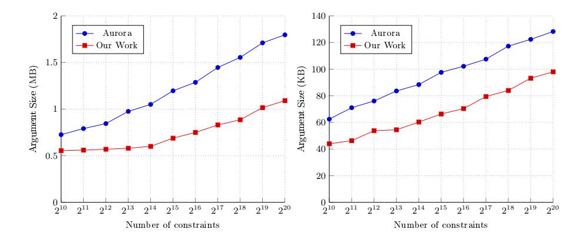
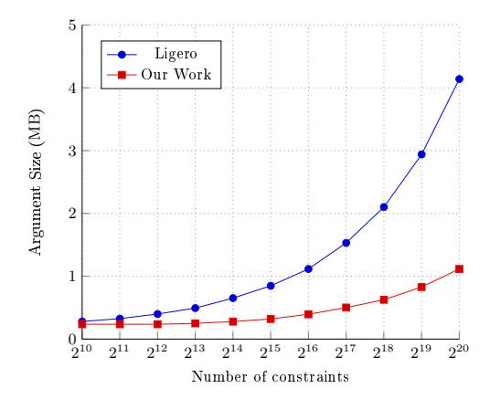

# On Interactive Oracle Proofs for Boolean R1CS Statements

Ignacio Cascudo<sup>1</sup>\* and Emanuele Giunta<sup>1,2</sup>

<sup>1</sup> IMDEA Software Institute, Madrid, Spain.
 {ignacio.cascudo, emanuele.giunta}@imdea.org
 <sup>2</sup> Scuola Superiore di Catania, Italy.

**Abstract.** The framework of interactive oracle proofs (IOP) has been used with great success to construct a number of efficient transparent zk-SNARKs in recent years. However, these constructions are based on Reed-Solomon codes and can only be applied *directly* to statements given in the form of arithmetic circuits or R1CS over *large* fields  $\mathbb{F}$  since their soundness error is at least  $1/|\mathbb{F}|$ .

This motivates the question of what is the best way to apply these IOPs to statements that are naturally written as R1CS over *small* fields, and more concretely, the *binary* field  $\mathbb{F}_2$ . While one can just see the system as one over an extension field  $\mathbb{F}_{2^e}$  containing  $\mathbb{F}_2$ , this seems wasteful, as it uses e bits to encode just one "information" bit. In fact, the recent BooLigero has devised a way to apply the well-known Ligero while being able to encode  $\sqrt{e}$  bits into one element of  $\mathbb{F}_{2^e}$ .

In this paper, we introduce a new protocol for  $\mathbb{F}_2$ -R1CS which among other things relies on a more efficient embedding which (for practical parameters) allows to encode  $\geq e/4$  bits into an element of  $\mathbb{F}_{2^e}$ . Our protocol makes then black box use of lincheck and rowcheck protocols for the larger field. Using the lincheck and rowcheck introduced in Aurora and Ligero respectively we obtain  $1.31-1.65\times$  smaller proofs for Aurora and  $3.71\times$  for Ligero. We also estimate the reduction of prover time by a factor of  $24.7\times$  for Aurora and between  $6.9-32.5\times$  for Ligero without interactive repetitions.

Our methodology uses the notion of reverse multiplication friendly embeddings introduced in the area of secure multiparty computation, combined with a new IOPP to test linear statements modulo a subspace  $V \leq \mathbb{F}_{2^e}$  which may be of independent interest.

# 1 Introduction

A zero-knowledge proof is a protocol in which a *prover* convinces a *verifier* that a statement is true, while conveying no other information apart from its truth. Zero-knowledge proofs have been among the most useful and studied primitives

<sup>\*</sup> Research partially funded by the Spanish Government under the project SecuRing (ref. PID2019-110873RJ-I00) and by a research grant from Nomadic Labs and the Tezos Foundation.

in cryptography since their advent in the 80s. Their popularity has increased even more in recent times, propelled by new applications motivated by blockchain technologies. This context has highlighted the relevance of a particular flavour of zero-knowledge proof, known as zero-knowledge succinct non-interactive argument of knowledge, or zk-SNARK.

Here succinct means that communication complexity is sublinear with respect to the witness length. Non-interactiveness means that the proof consists of one message from prover to verifier, while being an argument of knowledge stands for the fact that in order for the prover to reliably convince the verifier, she has to know a witness for the statement. Because of succinctness, soundness necessarily relies on computational assumptions [GH98] thus the proof is called argument.

The flexibility and efficiency of zk-SNARKs allow to provide practical arguments of knowledge for relations that lack any kind of algebraic structure, for instance the preimage relation for a one-way function. However, it is well known [Wee05] that under standard complexity assumptions, succinct non-interactive arguments do not exist unless some kind of setup is assumed, such as a common reference string. This either requires a trusted third party or the execution of heavy MPC protocols if the setup relies on secret randomness.

For this reason, transparent SNARKs have been proposed, whose setup involves only publicly generated randomness. Many constructions of transparent setup SNARKs have been proposed in recent years, both based on asymmetric cryptography [BCC<sup>+</sup>16], [WTS<sup>+</sup>18], [BBB<sup>+</sup>18], [BFS20] and on symmetric cryptographic techniques [AHIV17], [BBHR18b], [BCR<sup>+</sup>19], [COS20], [Set20], [BFH<sup>+</sup>20].

In this work we focus on this latter type of constructions and remark that all cited works in this category are built in (variants of) the Interactive Oracle Proof framework presented in [BCS16] and independently in [RRR16] as "interactive PCP". Moreover they all address directly or indirectly the NP-complete rank 1 constraint system satisfiability problem. An easier to state variant asks to prove, given  $A, B, C \in \mathbb{F}^{m,n}$  and  $\mathbf{b} \in \mathbb{F}^m$ , the existence of a vector  $\mathbf{z} \in \mathbb{F}^n$  such that  $A\mathbf{z} * B\mathbf{z} = C\mathbf{z} + \mathbf{b}$ , where \* is the component-wise multiplication of vectors in  $\mathbb{F}^m$ . An IOP is an interactive proof where the verifier has oracle access to some strings provided by the prover. Its relation to zk-SNARKs stems from the results in [BCS16] where it was shown that any IOP can be efficiently compiled into a non-interactive argument in the random oracle model by using Merkle trees [Mer90], and the transformation in addition preserves zero knowledge and knowledge soundness. In particular, IOPs can be used to construct zk-SNARKs.

Unfortunately, the IOP constructions above cannot be directly instantiated for every field choice as they extensively use Reed-Solomon codes, that requires the existence of enough points in  $\mathbb{F}$  and, even worse, the soundness error is always greater than  $|\mathbb{F}|^{-1}$  which implies  $|\mathbb{F}| > 2^{\lambda}$  with  $\lambda$  security parameter. This leaves out for example the case of R1CS over  $\mathbb{F}_2$ . This case is actually interesting as some hash functions and encryption schemes can be interpreted as boolean circuits with relative ease, and then translated to a R1CS. A straight-forward way to overcome this problem, mentioned in [AHIV17], is to simply embed  $\mathbb{F}_2$  in

a larger field  $\mathbb{F}_{2^e}$ , for large enough e (where at least  $e > \lambda$ ) and add constraints of the kind  $z_i^2 = z_i$  for  $i = 1, \ldots, n$  to ensure that the witness entries belongs to  $\mathbb{F}_2$ , and then execute the protocol for R1CS over the larger field.

However this approach seems wasteful, as elements of  $\mathbb{F}_{2^e}$  which in principle could encode up to e bits of information are used to represent only one element of  $\mathbb{F}_2$ . Also, operations over  $\mathbb{F}_{2^e}$  are more expensive than those over  $\mathbb{F}_2$ . Finally one needs the aforementioned additional constraints on the witness, which increase the size of the system. Since  $\mathbb{F}_{2^e}$  is an e-dimensional vector space over  $\mathbb{F}_2$ , one attempt to improve this would be to interpret vectors in  $\mathbb{F}_2^e$  as elements over the larger field  $\mathbb{F}_{2^e}$ . While this would work for systems that only involve additions, it fails in general when multiplications are considered too. <sup>4</sup> The technical issue is that for e > 1, the ring  $\mathbb{F}_2^e$ , considered with component-wise addition and multiplication, cannot be embedded via a ring homomorphism in  $\mathbb{F}_{2^e}$  (nor into any other finite field) since  $\mathbb{F}_2^e$  contains zero divisors while fields do not.

The issue was recently addressed for the case of Ligero [AHIV17] in BooLigero [GSV21] with a technique that allows to roughly encode e bits into  $\sqrt{e}$  field elements in  $\mathbb{F}_{2^e}$ , meaning that approximately  $\sqrt{e}$  bits are encoded per field element, in a manner that one can use Ligero over  $\mathbb{F}_{2^e}$  while adding little overhead. This however motivates the following question: can we find embeddings of  $\mathbb{F}_2^k$  into  $\mathbb{F}_{2^e}$  with a larger embedding rate k/e which allow to produce more efficient IOPs for R1CS over  $\mathbb{F}_2$  given an IOP for R1CS over  $\mathbb{F}_{2^e}$ ?

### 1.1 Our contributions

In this work we answer the above question in the affirmative using a more efficient embedding that allows us to encode  $k \geq e/4$  bits into an element of  $\mathbb{F}_{2^e}$ . We then present a construction of an IOP for  $\mathbb{F}_2$ -R1CS satisfiability which makes blackbox use of any IOP satisfying mild assumptions for R1CS over larger fields. This leads us to reducing Aurora's argument size up to  $1.31-1.65\times$  and Ligero's argument size up to  $3.71\times$ .

More concretely, we can use any *Reed Solomon encoded IOP*, a variant of IOP introduced in [BCR<sup>+</sup>19], that provides two commonly used sub-protocols: a *generalised lincheck*, which tests linear relations of the form  $A_1\mathbf{x}_1+\ldots+A_n\mathbf{x}_n=\mathbf{b}$  when the verifier has only oracle access to Reed Solomon codewords encoding  $\mathbf{x}_i$ , and a *rowcheck*, which tests quadratic relations  $\mathbf{x} * \mathbf{y} = \mathbf{z}$  when the verifier has oracle access to encodings of  $\mathbf{x}, \mathbf{y}, \mathbf{z}$ . This includes Ligero<sup>5</sup> and Aurora [BCR<sup>+</sup>19]<sup>6</sup> up to minor manipulations to transform their lincheck, see Appendix C.

To obtain our results we use the notion of reverse multiplication friendly embedding (RMFE), introduced in the MPC literature in [CCXY18] and inde-

<span id="page-2-0"></span><sup>&</sup>lt;sup>3</sup> This is necessary as, for example,  $x^2 + x + 1 = 0$  is satisfiable over  $\mathbb{F}_4$  but not over  $\mathbb{F}_2$ , despite the fact that the constraint only involves constants over  $\mathbb{F}_2$ .

<span id="page-2-1"></span><sup>&</sup>lt;sup>4</sup> This not only includes coordinate-wise products of secret vectors, but also the linear operations  $A\mathbf{x}$  in the R1CS system, where A is a public matrix over the larger field.

<span id="page-2-2"></span> $<sup>^5</sup>$  See [BCR+19] for how to see Ligero as an IOP with these characteristics

<span id="page-2-3"></span><sup>&</sup>lt;sup>6</sup> We cannot however apply our techniques to IOPs with preprocessing, see comment in Section 1.3.

pendently in [BMN18], and used in several subsequent works [DLN19, CG20, PS20, DGOT21, ACE<sup>+</sup>21]. Such device allows to embed  $\mathbb{F}_2^k$  into a larger field  $\mathbb{F}_q = \mathbb{F}_{2^e}$  in a manner such that field additions and products of two encodings in  $\mathbb{F}_q$  still encode (in a precise way described later) the component-wise additions and products of the originally vectors from  $\mathbb{F}_2^k$ . For parameters up to k < 100, we can embed k bits in a field  $\mathbb{F}_{2^e}$ , with  $e \approx 3.3k$  if we take the most convenient extension field, or e = 4k if we insist on e being a power of 2 or more generally having small Hamming weight (e.g. e = 192) which is usually a prefered choice in practice. The constructions are based on polynomial interpolation. See Section 2.2 and Appendix A.2 for asymptotical statements.

However, even with this tool in hand we still face some hurdles when attempting to reduce proving satisfiability for a  $\mathbb{F}_2$ -R1CS statement to a proof for a smaller  $\mathbb{F}_q$ -R1CS statement. One such obstacle is that the RMFE embedding map (which we call  $\varphi$ ) cannot be surjective. Since the first thing we will do in the proof is to embed the witness in a larger field by using the map  $\varphi$ , we will need to come up with a mechanism to convince the verifier that a given vector has entries in the image Im  $\varphi$ . In addition, the transformation of the R1CS system over  $\mathbb{F}_2$  into one over  $\mathbb{F}_q$  via this embedding introduces a few more obstacles. These eventually come from the fact that the embedding map  $\varphi$  is not a ring homomorphism, even though the  $\mathbb{F}_q$ -field product  $\varphi(\mathbf{x}) \cdot \varphi(\mathbf{y})$  still contains all information about  $\mathbf{x} * \mathbf{y}$ . In handling that we need to introduce some additional equations that are in principle foreign to the  $\mathbb{F}_q$ -R1CS template, in the sense that they capture  $\mathbb{F}_2$ -linear relations that are not linear over  $\mathbb{F}_q$  (this is just another manifestation of a phenomenon that [CCXY18, CG20, PS20, ACE<sup>+</sup>21] needed to deal with in various ways).

It turns out that all of these can be dealt with by means of a notion we introduce in Section 3.3: the *modular lincheck*, an IOPP that we believe is of independent interest, to test linear relations modulo an  $\mathbb{F}_2$  vector space, i.e. equations of the form  $A\mathbf{x} = \mathbf{b} \mod V^{n,7}$ 

In conclusion we compare the resulting argument system, using the compiler in [BCS16], with Aurora and Ligero both in terms of argument size and prover complexity. Regarding the proof size we estimate the aforementioned improvement factors numerically, see our Python implementation at [Git21a]. Regarding prover time we estimate it to be asymptotically reduced by a factor of  $24.7 \times$  for Aurora and between  $6.9-32.5 \times$  for Ligero without interactive repetitions.

#### 1.2 Techniques

Reverse multiplication friendly embeddings. Given a finite field  $\mathbb{F}_p$  (in this article we focus on the case p=2), and an integer e, a  $(k,e)_p$ -RMFE, introduced in [CCXY18, BMN18] in the context of secure multiparty computation, is a pair of  $\mathbb{F}_2$ -linear maps  $\varphi: \mathbb{F}_p^k \to \mathbb{F}_{p^e}$  and  $\psi: \mathbb{F}_{p^e} \to \mathbb{F}_p^k$  satisfying  $\mathbf{x} * \mathbf{y} = \psi(\varphi(\mathbf{x}) \cdot \varphi(\mathbf{y}))$  for all  $\mathbf{x}, \mathbf{y} \in \mathbb{F}_p^k$ , where \* denotes the component-wise product. The properties automatically imply that  $\varphi$  is injective, which justifies the name embedding.

<span id="page-3-0"></span><sup>&</sup>lt;sup>7</sup> Or equivalently that  $A\mathbf{x} - \mathbf{b} \in V^n$ .

We extend the notation and denote by  $\Phi$  the map that splits a long vector in blocks of k coordinates and applies  $\varphi$  to each block, namely let  $\Phi: (\mathbb{F}_p^k)^n \to \mathbb{F}_{p^e}^n$  given by  $\Phi(\mathbf{x}_1, \dots, \mathbf{x}_n) = (\varphi(\mathbf{x}_1), \dots, \varphi(\mathbf{x}_n))$  and consequently let  $\Psi: \mathbb{F}_{p^e}^n \to (\mathbb{F}_p^k)^n$  given by  $\Psi(x_1, \dots, x_n) = (\psi(x_1), \dots, \psi(x_n))$ , which then satisfy  $\mathbf{x} * \mathbf{y} = \Psi(\Phi(\mathbf{x}) * \Phi(\mathbf{y}))$  for all  $\mathbf{x}, \mathbf{y} \in (\mathbb{F}_p^k)^n = \mathbb{F}_p^{kn}$ , where the component-wise product on the right side is on  $\mathbb{F}_{p^e}^n$ .

From  $\mathbb{F}_2$ -R1CS to a system of statements over  $\mathbb{F}_q$ . Our first step is to translate the statement that there exists  $\mathbf{w}$  such that  $A_1\mathbf{w}*A_2\mathbf{w}=A_3\mathbf{w}+\mathbf{b}$  into satisfiability of an equivalent system consisting of quadratic and (modular) linear relations over  $\mathbb{F}_q$ . One well known reformulation of the above relation is that there exist  $\mathbf{w} \in \mathbb{F}_2^n$  and  $\mathbf{x}_i \in \mathbb{F}_2^m$  for  $i \in \{1, 2, 3\}$  such that  $A_i\mathbf{w} = \mathbf{x}_i$  and  $\mathbf{x}_1*\mathbf{x}_2 = \mathbf{x}_3 + \mathbf{b}$ .

We rephrase the above by embedding  $\widetilde{\mathbf{w}} = \Phi(\mathbf{w}) \in \mathbb{F}_q^{n/k}$  and  $\widetilde{\mathbf{x}}_i = \Phi(\mathbf{x}_i)$  (assuming for simplicity n, m are divisible by k), and setting  $\mathbf{t} = \widetilde{\mathbf{x}}_1 * \widetilde{\mathbf{x}}_2$ . First we deal with the quadratic relation. The key observation is that, if  $\mathbf{1}$  denotes the vector whose entries are all ones,  $\mathbf{x}_1 * \mathbf{x}_2 = \mathbf{x}_3 + \mathbf{b}$  is equivalent to  $\mathbf{x}_1 * \mathbf{x}_2 = \mathbf{1} * (\mathbf{x}_3 + \mathbf{b})$ . Applying now the RMFE properties this is satisfiable if and only if  $\Psi(\widetilde{\mathbf{x}}_1 * \widetilde{\mathbf{x}}_2 - \Phi(\mathbf{1}) * (\widetilde{\mathbf{x}}_3 + \Phi(\mathbf{b}))) = 0$ , that is, if and only if each entry of  $\mathbf{t} - \Phi(\mathbf{1}) * (\widetilde{\mathbf{x}}_3 + \Phi(\mathbf{b}))$  lies in Ker  $\psi$ .

Next we deal with linear relations. Let us restrict at first to one of the form  $\mathbf{a}^{\top}\mathbf{x} = 0$  with  $\mathbf{a}, \mathbf{x} \in \mathbb{F}_2^k$ . The idea, calling S the map that sums all the components of a vector, is to rewrite it as  $S(\mathbf{a} * \mathbf{x}) = 0$ . In this way we can apply the RMFE properties, obtaining  $S(\psi(\varphi(\mathbf{a}) \cdot \varphi(\mathbf{x}))) = 0$ . Finally, since  $S \circ \psi$  is linear, this is equivalent to  $\varphi(\mathbf{a}) \cdot \varphi(\mathbf{x}) \in \operatorname{Ker} S \circ \psi$ . In general, when the given vectors have length a multiple of k, one can prove that  $\mathbf{a}^{\top}\mathbf{x} = 0$  is equivalent to  $\Phi(\mathbf{a})^{\top}\Phi(\mathbf{x}) \in \operatorname{Ker} S \circ \psi$ .

Given now a matrix A with rows  $\mathbf{a}_1, \ldots, \mathbf{a}_m$ , observe that the entries of  $A\mathbf{x}$  are inner products of the form  $\mathbf{a}_i^{\top}\mathbf{x}$ . Applying the idea above we conclude that  $A\mathbf{x} = \mathbf{0}$  is equivalent to show that all the entries of  $\widetilde{A} \cdot \Phi(\mathbf{x})$  lies in  $\operatorname{Ker} S \circ \psi$  with  $\widetilde{A}$  the result of applying  $\Phi$  to A row-wise. In conclusion, the three linear relations  $A_i\mathbf{w} = \mathbf{x}_i = I_m\mathbf{x}_i$  in the R1CS over  $\mathbb{F}_2$  are equivalent to three modular linear relations  $\widetilde{A}\widetilde{\mathbf{w}} - \widetilde{I}_m\widetilde{\mathbf{x}}_i \in (\operatorname{Ker} S \circ \psi)^m$ . Finally, as observed, the fact that  $\widetilde{\mathbf{w}}, \mathbf{x}_i$  belonging to the image of  $\Phi$  is equivalent to the constraints  $I_{n/k} \cdot \widetilde{\mathbf{w}} \in (\operatorname{Im} \varphi)^{n/k}$  and  $I_{m/k} \cdot \widetilde{\mathbf{x}}_i \in (\operatorname{Im} \varphi)^{m/k}$ .

Modular linear test The sketched characterization above implies that providing a way to test linear modular relations over  $\mathbb{F}_q$  yields the desired IOP as the prover could provide oracle access to encodings of  $\widetilde{\mathbf{w}}, \widetilde{\mathbf{x}}_1, \widetilde{\mathbf{x}}_2, \widetilde{\mathbf{x}}_3, \mathbf{t}$  and then convince the verifier that all those constraints are satisfied. The basic idea of our construction is that, to test  $\mathbf{x} = \mathbf{0} \mod V^n$  or equivalently  $\mathbf{x} \in V^n$ , a standard approach would be to prove that a random linear combination of its coordinates belongs to V. However, as in our case  $V \subseteq \mathbb{F}_q$  is an  $\mathbb{F}_2$ -vector space, the coefficients of this linear combination have to lie in  $\mathbb{F}_2$ , granting only soundness 1/2. In order to decrease it we could check several independent linear combinations by sampling

R ∼ U(F λ,n 2 ) and testing Rx ∈ V λ . Hence the prover rst sends v = Rx to the verier who checks v ∈ V <sup>λ</sup> and then both parties run a lincheck to test the correctness of v. In Section [3.3](#page-11-0) we describe how to achieve zero knowledge by adding a masking term and how to reduce the required random bits to Θ(λ) by using certain family of almost universal linear hash functions. In Section [4.1](#page-15-0) we generalise this idea to eciently proving several statements at the same time.

Optimizations The above techniques require a total of 8 modular linchecks and a rowcheck. In Section [4,](#page-15-1) we introduce several modications, the main of which is to reduce the number of modular linchecks to just 3. The observation is that we can test several equations of the form Ax<sup>i</sup> = b<sup>i</sup> mod V <sup>n</sup><sup>i</sup> (with common V ) all at once by checking PRi(Ax<sup>i</sup> − bi) ∈ V λ for appropriately chosen matrices R<sup>i</sup> . We also note that the communication can be further reduced by noticing that the prover is sending vectors which should be in certain subspaces, and hence admit a succinct representation; we nd a way to use the properties of RMFEs to eciently compress and decompress this information.

# <span id="page-5-0"></span>1.3 Other related work

As mentioned, our work compares favourably with [\[GSV21\]](#page-27-6) showing signicantly better improvement factors for Ligero's proof size. In particular our work improves on Ligero by a factor of 3.71× for 2 <sup>20</sup> constraints, while BooLigero only improves on Ligero by a factor 2.8× on a circuit consisting on 2 <sup>16</sup> − 1 execution of SHA3, i.e. for a much larger number of constraints in the associated R1CS. We remark that the encoding used in [\[GSV21\]](#page-27-6), which essentially embeds the bit vectors into elements in the eld extension in such a way that all of the bit products can be recovered directly as coordinates of the product of the two eld elements, is similar to one considered in [\[BMN17\]](#page-26-9) in the context of secure computation, which was subsequently improved in the same paper and later in [\[BMN18\]](#page-26-6), where a similar embedding as [\[CCXY18\]](#page-26-5) was considered. We also stress that in contrast to [\[GSV21\]](#page-27-6) we present a general reduction that can be applied to a larger class of protocols.

Regarding the use of RMFE, to the best of our knowledge only the recent work [\[DGOT21\]](#page-26-8) applied this tool in the IOP framework (see their Appendix A). However, their use is restricted to their own protocol, which follows the MPC-inthe-head paradigm introduced in [\[IKOS07\]](#page-27-10), and cannot be applied directly to other existing IOPs such as Aurora. Furthermore, this optimisation is only considered in the multi-instance case while in our work we manage to integrate the RMFE also for a single instance. It is an interesting question to determine if the approach in [\[DGOT21\]](#page-26-8) can be applied to a single instance, as in the context of MPC, [\[CG20\]](#page-26-7) has shown that RMFE can also be used to improve the complexity of a single evaluation of a suciently well behaved boolean circuit.

We also remark that even though our construction captures essentially any IOPs that provides a lincheck and a rowcheck, it still cannot be applied out of the box to preprocessing zk-SNARKs, such as [\[COS20,](#page-26-2) [Set20\]](#page-27-3). The reason behind this limitation lies in the fact that we use the given lincheck to test a randomised relation, depending on the random coin of the verifier. This significantly affects the usefulness of any pre-computation. We believe however that this issue can be overcome in a non black-box way with different technique, a problem that we leave for future work. Finally, [DLS20] introduced the notion of Circuit Amortization-Friendly embedding or CAFE, a generalization of RMFE which allows to construct better encodings with respect to certain operations such as inner products. We have considered its use in this problem because it naturally fits well with linchecks, but rowchecks become too expensive to prove in this way and it does not yield immediate improvements. We leave it as an open question whether it is possible to improve our construction using CAFEs.

# 2 Preliminaries

#### 2.1 Notation

For an integer n,  $[n] = \{1, ..., n\}$ . Boldface font (e.g.  $\mathbf{v}$ ) denotes vectors over a ring R.  $\mathbf{1}_k \in R^k$  is the vector whose entries are all 1. Given vectors  $\mathbf{v}, \mathbf{w} = (w_1, ..., w_n) \in R^n, \mathbf{v} * \mathbf{w}$  is their coordinate-wise (also called Hadamard or Schur) product and  $\|\mathbf{v}\|$  is the Hamming weight of  $\mathbf{v}$ , i.e. the number of its non-zero entries.  $R^{m,n}$  is the space of matrices with m rows, n columns and entries in R.  $I_n \in R^{n,n}$  is the identity matrix. Given  $A \in R^{m,n}$ ,  $A^{\top} \in R^{n,m}$  is its transpose.

Given q a prime power,  $\mathbb{F}_q$  is the only field of cardinality q up to isomorphisms. If  $q=p^e$  then we identify  $\mathbb{F}_p\subseteq\mathbb{F}_q$  as usual and  $\mathbb{F}_q$  is an  $\mathbb{F}_p$  vector space of dimension e.  $V\leq\mathbb{F}_q$  means that V is an  $\mathbb{F}_p$ -vector subspace of  $\mathbb{F}_q$ . Two elements  $a,b\in\mathbb{F}_q$  are equal modulo V, or  $a=b \mod V$ , if  $a-b\in V$ . For vectors  $\mathbf{a},\mathbf{b}\in\mathbb{F}_q^m$ ,  $\mathbf{a}=\mathbf{b}\mod V^m$  if  $\mathbf{a}-\mathbf{b}\in V^m$ , i.e.  $a_i=b_i\mod V$  at each coordinate  $i\in[m]$ .

Given a polynomial  $\widehat{f} \in \mathbb{F}_q[x]$  and  $L \subseteq \mathbb{F}_q$  we denote  $\widehat{f}_{|L} = (\widehat{f}(\alpha))_{\alpha \in L}$  its evaluation over L. The Reed-Solomon code over L of rate  $\rho \in [0,1]$  is the set  $\mathsf{RS}_{\mathbb{F}_q,L,\rho} \coloneqq \{\widehat{f}_{|L}: \widehat{f} \in \mathbb{F}_q[x], \deg \widehat{f} < \rho|L|\}$ . When clear from the context we will omit the field  $\mathbb{F}_q$ . For any  $f \in \mathsf{RS}_{\mathbb{F}_q,L,\rho}$  we keep the convention that  $\widehat{f}$  is the polynomial of smallest degree (the only one of degree  $< \rho|L|$ ) such that  $\widehat{f}_{|L} = f$ .

We will typically encode vectors  $\mathbf{v}$  of length  $m < \rho | L |$  as codewords from  $\mathsf{RS}_{\mathbb{F}_q,L,\rho}$ . To do so, given a subset  $H \subseteq \mathbb{F}_q$  of size m, we identify  $\mathbb{F}_q^H$ , i.e. vectors indexed by H, and  $\mathbb{F}_q^m$  by choosing a bijection between H and [m] so that  $\mathbf{v} \in \mathbb{F}_q^H$ . Then the encoding happens by sampling a  $f \in \mathsf{RS}_{L,\rho}$  such that  $\widehat{f}_{|H} = \mathbf{v}$ . In a similar fashion  $\mathbb{F}_q^{H_1 \times H_2}$  will be used for matrices with coordinates in  $\mathbb{F}_q$  with rows and columns indexed by  $H_1$  and  $H_2$  respectively.  $I_H$  is the identity matrix in  $\mathbb{F}_q^{H \times H}$ . For all the notations in this paragraph, replacing  $\mathbb{F}_q$  by V means that the coordinates of the vectors or matrices are restricted to V.

Finally with  $FFT(\mathbb{F}, n)$  we denote the number of field operations required to perform a (binary) fast Fourier transform over a set of size n, see [GM10].

#### <span id="page-7-0"></span>Reverse multiplication friendly embedding

We now recall the notion of reverse multiplication friendly embedding from [CCXY18]. Its purpose is to 'reconcile' the coordinate-wise multiplicative structure of a ring  $\mathbb{F}_p^k$  and the finite field structure of an extension  $\mathbb{F}_{p^e}$  of  $\mathbb{F}_p$ .

**Definition 1.** Given a prime power p and  $k, e \in \mathbb{N}$  a Reverse Multiplication-**Friendly Embedding**, denoted  $(k,e)_p$ -RMFE, is a pair of  $\mathbb{F}_p$ -linear maps  $\varphi$ :  $\mathbb{F}_p^k \to \mathbb{F}_{p^e}, \ \psi : \mathbb{F}_{p^e} \to \mathbb{F}_p^k \ such \ that \ for \ all \ \mathbf{x}, \mathbf{y} \in \mathbb{F}_p^k, \ it \ holds \ that$ 

$$\mathbf{x} * \mathbf{y} = \psi(\varphi(\mathbf{x}) \cdot \varphi(\mathbf{y})).$$

That is, one can embed  $\mathbb{F}_p^k$  into  $\mathbb{F}_{p^e}$  via a linear map  $\varphi$  so that the product in  $\mathbb{F}_{p^e}$  of the images of any two vectors  $\mathbf{x}, \mathbf{y}$  carries information about their componentwise product  $\mathbf{x} * \mathbf{y}$ , and this can be recovered applying  $\psi$  to that field product. For notational convenience, we extend both  $\varphi$  and  $\psi$  to maps  $\Phi$ ,  $\Psi$  as follows. Given vectors  $\mathbf{x} = (\mathbf{x}_1, \dots, \mathbf{x}_n) \in (\mathbb{F}_p^k)^n$  and  $\mathbf{z} = (z_1, \dots, z_n) \in (\mathbb{F}_{p^e})^n$  we define

$$\Phi(\mathbf{x}) := (\varphi(\mathbf{x}_1), \dots, \varphi(\mathbf{x}_n)) \in (\mathbb{F}_{p^e})^n, \qquad \Psi(\mathbf{z}) := (\psi(z_1), \dots, \psi(z_n)) \in (\mathbb{F}_p^k)^n.$$

and identify  $(\mathbb{F}_p^k)^n=\mathbb{F}_p^{nk}$ . We will need a number of properties that are direct consequences of the definition.

<span id="page-7-2"></span>**Lemma 1.** The following holds for all positive  $n \in \mathbb{N}$ :

- 1. The maps  $\varphi$  and  $\Phi$  are injective. The maps  $\psi$  and  $\Psi$  are surjective.
- 2. For all  $\mathbf{x}, \mathbf{y} \in (\mathbb{F}_p^k)^n$ ,  $\mathbf{x} * \mathbf{y} = \Psi(\Phi(\mathbf{x}) * \Phi(\mathbf{y}))$  where the \* product in the right-hand side is component-wise in  $(\mathbb{F}_{p^e})^n$ , i.e. in each component we use
- the field product in  $\mathbb{F}_{p^e}$ .

  3. Let  $u = \varphi(\mathbf{1}_k) \in \mathbb{F}_{p^e}$ . Then for all  $\mathbf{x} \in (\mathbb{F}_p^k)^n$  we have  $\mathbf{x} = \Psi(u \cdot \Phi(\mathbf{x}))$ .

  4. Let  $S : \mathbb{F}_p^k \to \mathbb{F}_p$  be given by  $S(x_1, x_2, \dots, x_k) = x_1 + x_2 + \dots + x_k$ . Then for all  $\mathbf{x}, \mathbf{y} \in (\mathbb{F}_p^k)^n$ , the inner product  $\mathbf{x}^{\top}\mathbf{y}$  can be written as

$$\mathbf{x}^{\top}\mathbf{y} = S \circ \psi(\Phi(\mathbf{x})^{\top}\Phi(\mathbf{y}))$$

Lemma 1 is proved in Section A.3. As for the existence of RMFEs, we know the following: first of all, unless k=1, we will need  $e\geq 2k-1>k$  (in particular  $\varphi$ ,  $\Phi$  are not surjective maps and  $\psi$ ,  $\Psi$  are not injective). If  $k \leq p+1$ , then e=2k-1 is achievable. Asymptotically, it is shown in [CCXY18] that for all p, there exists an infinite family of  $(k, \Theta(k))_p$ -RMFE, where  $k \to \infty$ . This result relies on algebraic geometry. On the other hand, as we note in Appendix A.2, we can achieve  $(k, O(k2^{\log^* k}))_2$ -RMFEs using concatenation of purely polynomialinterpolation based techniques, where  $\log^* k$  is the iterated log, a function with a very slow growth.<sup>9</sup>

For concrete parameters, and using concatenation of polynomial-interpolation based techniques, one can get RMFEs with good parameters. For example, for our case of interest p=2:

<span id="page-7-4"></span><span id="page-7-1"></span><sup>&</sup>lt;sup>8</sup> Note that u is not necessarily equal to 1.

<span id="page-7-3"></span><sup>&</sup>lt;sup>9</sup> In fact  $2^{\log^* k} = o(\log \log \ldots \log k)$  for any finite number of applications of log on the right.

**Lemma 2.** For all  $r \le 33$ , there exists a  $(3r, 10r - 5)_2$ -RMFE. For all  $a \le 17$  there exists a  $(2a, 8a)_2$ -RMFE. For all  $b \le 65$  there exists a  $(3b, 12b)_2$ -RMFE.

Note that the rate k/e is larger in the first case as it is lower bounded by 3/10 while in the other cases k/e = 1/4. However, we mention the last two results as they include cases in which the dimension of the larger field is a power of two up to 128, and the  $(48,192)_2$ -RMFE that we use to compare with Aurora. Although some of these results were not explicitly mentioned in [CCXY18], they can easily be deduced from the results there. We justify all of this in Appendix A.1. Moreover, explicit constructions of generator matrices for  $\varphi, \psi$  and other data we use in this paper for selected RMFEs of interest are included in the implementation at [Git21b].

# <span id="page-8-1"></span>2.3 R1CS, Lincheck and Rowcheck

We now recall the main relations used in recent IOP-based<sup>10</sup> SNARKs like [BCR<sup>+</sup>19, AHIV17]. The first one is the rank 1 constraints system, or R1CS, that defines an NP-complete language closely related to arithmetic circuit satisfiability. Here we present an equivalent affine version that requires for  $A_1, A_2, A_3 \in \mathbb{F}^{m,n}$  and  $\mathbf{b} \in \mathbb{F}^m$  to exhibit a vector  $\mathbf{w} \in \mathbb{F}^n$  such that  $A_1\mathbf{w} * A_2\mathbf{w} = A_3\mathbf{w} + \mathbf{b}$ . Formally

<span id="page-8-2"></span>**Definition 2.** We define the affine R1CS relation as the set

$$\mathcal{R}_{\mathsf{R1CS}} = \{ ((\mathbb{F}, m, n, A_1, A_2, A_3, \mathbf{b}), \mathbf{w}) : A_i \in \mathbb{F}^{m,n}, A_1 \mathbf{w} * A_2 \mathbf{w} = A_3 \mathbf{w} + \mathbf{b} \}.$$

Instead of directly providing a proof system for R1CS, two intermediate relations, lincheck and rowcheck, are defined and for which [BCR<sup>+</sup>19] constructs RS-encoded IOPPs; these are then used as building blocks to produce a RS-encoded IOP for the R1CS relation, which in turn can be combined with a low degree test, such as [BBHR18a, BGKS20], to make a standard IOP for R1CS. The lincheck relation requires that the witnesses  $f_1, f_2 \in \mathsf{RS}_{L,\rho}$  encode over  $H_1, H_2 \subseteq \mathbb{F}_q$  two vectors  $\mathbf{x}_1, \mathbf{x}_2$  (i.e.  $\hat{f}_{i|H_i} = \mathbf{x}_i$ ) which satisfy a given linear constraint. The rowcheck relation requires that witnesses  $f_1, f_2, f_3 \in \mathsf{RS}_{L,\rho}$  encode over  $H \subseteq \mathbb{F}_q$  three vectors  $\mathbf{x}_1, \mathbf{x}_2, \mathbf{x}_3$  such that  $\mathbf{x}_1 * \mathbf{x}_2 = \mathbf{x}_3$ . For efficiency reasons, depending on the concrete instantiations of Aurora and FRI, both definitions given below require  $L, H_1, H_2, H$  to be  $\mathbb{F}_2$ -affine subspaces of  $\mathbb{F}_q$ .

**Definition 3.** We define  $\mathcal{R}_{\mathsf{Lin}}$  as the set of tuples  $((\mathbb{F}_q, L, H_1, H_2, \rho, M), (f_1, f_2))$  such that  $L, H_i \subseteq \mathbb{F}_q$  are affine subspaces,  $H_i \cap L = \emptyset$  for  $i \in \{1, 2\}$ ,  $f_i \in \mathsf{RS}_{L,\rho}$ ,  $M \in \mathbb{F}_q^{H_1 \times H_2}$  and the linear relationship  $\widehat{f}_{1|H_1} = M \cdot \widehat{f}_{2|H_2}$  holds.

**Definition 4.** We define  $\mathcal{R}_{\mathsf{Row}}$  as the set of tuples  $((\mathbb{F}_q, L, H, \rho), (f_1, f_2, f_3))$  such that  $L, H \subseteq \mathbb{F}_q$  are disjoint affine subspaces,  $f_i \in \mathsf{RS}_{L,\rho}$  for  $i \in \{1, 2, 3\}$  and the quadratic relationship  $\widehat{f}_{1|H} * \widehat{f}_{2|H} = \widehat{f}_{3|H}$  holds.

<span id="page-8-0"></span><sup>&</sup>lt;sup>10</sup> see Section B for an informal definition of IOP or [BCS16, BCR<sup>+</sup>19] for a more formal one

As said RS-encoded IOPPs ( $P_{Lin}$ ,  $V_{Lin}$ ) and ( $P_{Row}$ ,  $V_{Row}$ ) for the two relations above are provided in [BCR<sup>+</sup>19] and in [AHIV17] up to minor adaptations in the second case. In our work we will need a generalisation of  $\mathcal{R}_{Lin}$  that tests relations of the form  $A_1\mathbf{x}_1 + \ldots + A_h\mathbf{x}_h = \mathbf{b}$ . Observe that for h = 2,  $A_1 = -I$  and  $\mathbf{b} = \mathbf{0}$  we get back the standard lincheck.

<span id="page-9-2"></span>**Definition 5.**  $\mathcal{R}_{\mathsf{Lin}_h}$  is the set of tuples  $((\mathbb{F}_q, L, H_0, H_i, \rho, M_i, \mathbf{b})_{i=1}^h, (f_i)_{i=1}^h)$  such that  $L, H_0, H_i \leq \mathbb{F}_q$ ,  $L \cap H_0 = L \cap H_i = \emptyset$  for all  $i \in \{1, \dots, h\}$ ,  $f_i \in \mathsf{RS}_{L,\rho}$ ,  $M \in \mathbb{F}_q^{H_0 \times H_i}$  and the linear relationship  $\sum_{i=1}^h M_i \cdot \widehat{f}_{i|H_i} = \mathbf{b}$  holds.

The lincheck protocol presented in Aurora can be generalised to capture this variant, as shown in the appendix Section C. More precisely we claim that

<span id="page-9-3"></span>**Proposition 1.** There exists a RS-encoded IOPP  $(P_{\mathsf{Lin}_h}, V_{\mathsf{Lin}_h})$  for  $\mathcal{R}_{\mathsf{Lin}_h}$  with the following parameters:

```
\begin{array}{lll} Rounds & = & 2 \\ Proof\ Length & = & 2|L| \\ Randomness & = & 2\log q \\ Soundness & = & |H_0|q^{-1} \\ Prover\ Time & = & |H_0| + \sum_{i=1}^h \|M_i\| + \|\mathbf{b}\| + h|L| + 2h \cdot \mathrm{FFT}(\mathbb{F}_q, |L|) + T^{\mathsf{P}}_{\mathsf{Sum}} \\ Verifier\ Time & = & |H_0| + O(\sum_{i=1}^h \|M_i\| + |H|) + T^{\mathsf{V}}_{\mathsf{Sum}} \\ Max\ Rates & = & (\rho, \rho + |H| \cdot |L|^{-1}) \end{array}
```

where  $T_{\mathsf{Sum}}^{\mathsf{P}}, T_{\mathsf{Sum}}^{\mathsf{V}}$  are respectively the prover and verifier complexity for the Univariate Sumcheck, see  $[BCR^+19]$ , and  $H = \mathsf{span}(H_0, H_1, \ldots H_h)$ 

# 3 Simplified Construction

The main goal we pursue in this section and the next one is to describe an efficient RS-encoded IOP for the R1CS language over  $\mathbb{F}_2$ . This will be based on two RS-encoded IOPP:  $(\mathsf{P}_{\mathsf{Lin}_h}, \mathsf{V}_{\mathsf{Lin}_h})$  for the generalised lincheck and  $(\mathsf{P}_{\mathsf{Row}}, \mathsf{V}_{\mathsf{Row}})$  for the rowcheck both over a large field  $\mathbb{F}_q$ , see Section 2.3. The first step we take in this direction (in Section 3.1) is to characterise satisfiable R1CSs over  $\mathbb{F}_2$  in terms of one quadratic relation over  $\mathbb{F}_q$  and a set of linear relations modulo some vector space  $V \leq \mathbb{F}_q$ . An RS-encoded IOPP to test the latter is provided in Section 3.3 while Section 3.2 provides basic tools for this construction. Finally a simple solution that makes a naive usage of the modular lincheck is provided. Even if suboptimal, we see this as a useful stepping stone to better present the efficient version in Section 4.3

# <span id="page-9-0"></span>3.1 Characterisation of R1CS

<span id="page-9-1"></span>In the following we assume  $(\varphi, \psi)$  to be a  $(k, e)_2$ -RMFE, where  $q = 2^e$ , and recall that  $\Phi, \Psi$  denote the block-wise application of  $\varphi$  and  $\psi$ , cf. Section 2.2.

**Theorem 1.** Let  $A_1, A_2, A_3 \in \mathbb{F}_2^{m,n}$ ,  $\mathbf{b} \in \mathbb{F}_2^m$  with m, n multiples of k. Then there exists  $\mathbf{w} \in \mathbb{F}_2^n$  such that  $((\mathbb{F}_2, m, n, A_1, A_2, A_3, \mathbf{b}), \mathbf{w}) \in \mathcal{R}_{\mathsf{R1CS}}$  if and only if there exist  $\widetilde{\mathbf{w}} \in \mathbb{F}_q^{n/k}$  and  $\widetilde{\mathbf{x}}_1, \widetilde{\mathbf{x}}_2, \widetilde{\mathbf{x}}_3, \mathbf{t} \in \mathbb{F}_q^{m/k}$  satisfying

$$\widetilde{\mathbf{x}}_1 * \widetilde{\mathbf{x}}_2 = \mathbf{t} \tag{1}$$

<span id="page-10-1"></span>
$$\widetilde{\mathbf{w}} = \mathbf{0} \mod (\operatorname{Im} \varphi)^{n/k}$$
 (2)

<span id="page-10-5"></span><span id="page-10-4"></span><span id="page-10-3"></span><span id="page-10-2"></span>
$$\widetilde{\mathbf{x}}_i = \mathbf{0} \mod (\operatorname{Im} \varphi)^{m/k} \qquad \forall i \in \{1, 2, 3\}$$
 (3)

$$\widetilde{\mathbf{x}}_{i} = \mathbf{0} \mod (\operatorname{Im} \varphi)^{m/k} \qquad \forall i \in \{1, 2, 3\} \qquad (3)$$

$$\widetilde{A}_{i}\widetilde{\mathbf{w}} - \widetilde{I}_{m}\widetilde{\mathbf{x}}_{i} = \mathbf{0} \mod (\operatorname{Ker} S \circ \psi)^{m} \qquad \forall i \in \{1, 2, 3\} \qquad (4)$$

$$\mathbf{t} - u\widetilde{\mathbf{x}}_{3} = u\widetilde{\mathbf{b}} \mod (\operatorname{Ker} \psi)^{m/k} \qquad (5)$$

$$\mathbf{t} - u\widetilde{\mathbf{x}}_3 = u\widetilde{\mathbf{b}} \mod (\operatorname{Ker} \psi)^{m/k} \tag{5}$$

where  $\widetilde{\mathbf{b}} = \Phi(\mathbf{b}) \in \mathbb{F}_q^{m/k}$ ,  $u = \varphi(\mathbf{1}_k) \in \mathbb{F}_q$ ,  $\widetilde{A}_i \in \mathbb{F}_q^{m,n/k}$  is the matrix obtained by applying  $\Phi$  row-wise to  $A_i$ , and  $\widetilde{I}_m \in \mathbb{F}_q^{m,m/k}$  is the matrix obtained by applying  $\Phi$  row-wise to the identity matrix  $I_m \in \mathbb{F}_2^{m,m}$ . Moreover if  $\mathbf{w}$  is a witness for the R1CS then  $\widetilde{\mathbf{w}} = \Phi(\mathbf{w})$ ,  $\widetilde{\mathbf{x}}_i = \Phi(A_i\mathbf{w})$ ,  $\mathbf{t} = \widetilde{\mathbf{x}}_1 * \widetilde{\mathbf{x}}_2$  satisfy the conditions above.

*Proof.* In one direction, assume the existence of w. For  $i \in \{1, 2, 3\}$  let  $\mathbf{x}_i = A_i \mathbf{w}$ ,  $\widetilde{\mathbf{x}}_i = \Phi(\mathbf{x}_i), \ \widetilde{\mathbf{w}} = \Phi(\mathbf{w}) \ \text{and} \ \mathbf{t} = \widetilde{\mathbf{x}}_1 * \widetilde{\mathbf{x}}_2.$  Conditions 1, 2, 3 are automatically satisfied. Next, for each i, condition 4 is equivalent to  $A_i \mathbf{w} = \mathbf{x}_i$ . Indeed, rewriting this as  $A_i \mathbf{w} = I_m \mathbf{x}_i$ , we can interpret it as m equations, one for each row of  $A_i$  and  $I_m$ , of inner-products of the form  $\mathbf{a}_{i,j}^{\top}\mathbf{w} = \mathbf{e}_i^{\top}\mathbf{x}_i$  where  $\mathbf{a}_{i,j}$  is the j-th row of  $A_i$  and  $\mathbf{e}_j$  is the j-th unit vector. Applying 1 to both sides this is equivalent to  $S \circ \psi(\widetilde{\mathbf{a}}_{i,j}^{\top}\widetilde{\mathbf{w}}) = S \circ \psi(\widetilde{\mathbf{e}}_{j}^{\top}\widetilde{\mathbf{x}}_{i})$  with  $\widetilde{\mathbf{a}}_{j} = \Phi(\mathbf{a}_{j})$  and  $\widetilde{\mathbf{e}}_{j} = \Phi(\mathbf{e}_{j})$ . By  $\mathbb{F}_2$ -linearity  $S \circ \psi(\widetilde{\mathbf{a}}_i^{\top}\widetilde{\mathbf{w}} - \widetilde{\mathbf{e}}_i^{\top}\widetilde{\mathbf{x}}_i) = 0$  i.e. the j-th component of  $\widetilde{A}_i\widetilde{\mathbf{w}} - \widetilde{I}_m\widetilde{\mathbf{x}}_i$ lies in the kernel of  $S \circ \psi$ . Condition 4 must therefore be satisfied. Finally we show that condition 5 is equivalent to  $\mathbf{x}_1 * \mathbf{x}_2 = \mathbf{x}_3 + \mathbf{b}$ , which in turn holds by the definition of  $\mathbf{x}_i$  and the assumption on  $\mathbf{w}$ . First we rewrite it using Lemma 1 as  $\Psi(\Phi(\mathbf{x}_1) * \Phi(\mathbf{x}_2)) = \Psi(u\Phi(\mathbf{x}_3)) + \Psi(u\Phi(\mathbf{b}))$  or, with our notation,  $\Psi(\widetilde{\mathbf{x}}_1 * \widetilde{\mathbf{x}}_2) = \Psi(u\widetilde{\mathbf{x}}_3) - \Psi(u\widetilde{\mathbf{b}})$ . By  $\mathbb{F}_2$  linearity of  $\Psi$  this is ultimately equivalent to  $\widetilde{\mathbf{x}}_1 * \widetilde{\mathbf{x}}_2 - u(\widetilde{\mathbf{x}}_3 + \widetilde{\mathbf{b}}) \in (\operatorname{Ker} \psi)^{m/k}$ . This concludes the first half of the proof. For the other direction, suppose there exist  $\widetilde{\mathbf{w}}, \widetilde{\mathbf{x}}_1, \widetilde{\mathbf{x}}_2, \widetilde{\mathbf{x}}_3, \mathbf{t}$  satisfying conditions above. By 2, 3 there exist  $\mathbf{w} \in \mathbb{F}_2^n$  and  $\mathbf{x}_1, \mathbf{x}_2, \mathbf{x}_3 \in \mathbb{F}_2^m$  with  $\Phi(\mathbf{w}) = \widetilde{\mathbf{w}}$  and  $\Phi(\mathbf{x}_i) = \widetilde{\mathbf{x}}_i$  for i = 1, 2, 3. Now as showed before 4 is equivalent to  $A_i \mathbf{w} = \mathbf{x}_i$ for i = 1, 2, 3 and, as condition 1 ensures  $\mathbf{t} = \widetilde{\mathbf{x}}_1 * \widetilde{\mathbf{x}}_2$ , 5 is equivalent to  $\mathbf{x}_1 * \mathbf{x}_2 = \mathbf{x}_3 + \mathbf{b}$ . Putting everything together we have that  $A_1 \mathbf{w} * A_2 \mathbf{w} = A_3 \mathbf{w} + \mathbf{b}$ .

We finally remark that when n, m are not multiple of k, Theorem 1 can still be applied by properly padding matrices  $A_i$  and **b** with zeroes.

#### <span id="page-10-0"></span>3.2Linear Hashing

One common technique used to efficiently test that some encoded vector satisfies a set of linear equations is to prove it satisfies a random linear combination of them. More specifically to verify that  $A\mathbf{x} = \mathbf{b}$ , one can sample a random vector  $\mathbf{r} \in \mathbb{F}_q^m$  and check  $\mathbf{r}^\top A \mathbf{x} = \mathbf{r}^\top \mathbf{b}$ . This must hold true if the original statement does, while it fails with high probability (specifically 1-1/q) if the original statement is false. This is used for example in [AHIV17]. In order to use less randomness one could sample  $r \leftarrow^{\$} \mathbb{F}_q$  and perform the test above with  $\mathbf{r} = (1, r, \dots, r^{m-1})$ . This works analogously, albeit with a higher soundness error, because if  $A\mathbf{x} - \mathbf{b} \neq \mathbf{0}$ , then  $\mathbf{r}^{\top}(A\mathbf{x} - \mathbf{b}) = 0$  if and only if r is a root of the degree m-1 polynomial whose coefficients are the entries of  $A\mathbf{x} - \mathbf{b}$ . This happens with probability smaller than (m-1)/q as r is uniformly random.

When the field has small size the above techniques have a too large soundness error (e.g. for q=2, this error is 1/2 in the first case, while the second case is useless for m>2). Therefore they need to be adapted. With this aim in mind, let  $\vartheta: \mathbb{F}_2^{\lambda} \to \mathbb{F}_{2^{\lambda}}$  be an isomorphism of  $\mathbb{F}_2$ -linear spaces<sup>11</sup>. For any  $\alpha \in \mathbb{F}_{2^{\lambda}}$  we define  $R_{\alpha}^{(m)}: \mathbb{F}_2^{\lambda m} \to \mathbb{F}_2^{\lambda}$  such that

$$R_{\alpha}^{(m)}(\mathbf{x}_1, \dots, \mathbf{x}_m) = \vartheta^{-1}(\alpha \vartheta(\mathbf{x}_1) + \dots + \alpha^m \vartheta(\mathbf{x}_m)).$$

For ease of notation we will identify the linear function  $R_{\alpha}^{(m)}$  with the associated matrix in  $\mathbb{F}_2^{\lambda,\lambda m}$  with respect to the canonical base, and since all its entries are in  $\mathbb{F}_2$ , we can apply it to vectors in  $\mathbb{F}_q^{\lambda m}$ . In other words if  $R_{\alpha}^{(m)} = (r_{i,j}) \in \mathbb{F}_2^{\lambda,\lambda m}$  and  $\mathbf{x} = (x_1, \dots, x_{\lambda m}) \in \mathbb{F}_q^{\lambda m}$  then

<span id="page-11-3"></span>
$$R_{\alpha}^{(m)}\mathbf{x} = \left(\sum_{j=1}^{\lambda m} r_{i,j} x_j\right)_{i=1}^{\lambda}$$

Furthermore, this definition can be extended to vectors whose length is not a multiple of  $\lambda$  by padding with zeroes.

These definitions allow us to state the results below in a form that facilitates their application to test linear relation modulo an  $\mathbb{F}_2$  vector space  $V \leq \mathbb{F}_q$ .

Proposition 2. Let  $V \leq \mathbb{F}_q$  be an  $\mathbb{F}_2$  vector subspace,  $\mathbf{y} \in \mathbb{F}_q^{\lambda}$ ,  $\mathbf{x} \in \mathbb{F}_q^{\lambda m} \setminus V^{\lambda m}$  and  $\alpha \sim U(\mathbb{F}_{2^{\lambda}})$ , then  $\Pr\left[R_{\alpha}^{(m)}\mathbf{x} = \mathbf{y} \mod V^{\lambda}\right] \leq \frac{m}{2^{\lambda}}$ .

<span id="page-11-2"></span>**Proposition 3.** Let  $V \leq \mathbb{F}_q$  be an  $\mathbb{F}_2$  vector subspace,  $\mathbf{y} \in \mathbb{F}_q^{\lambda}$ ,  $\mathbf{x}_i \in \mathbb{F}_q^{\lambda m_i}$  for  $i \in [h]$  such that  $\mathbf{x}_j \notin V^{\lambda m_j}$  for some j. Then  $\alpha_i \sim U(\mathbb{F}_{2^{\lambda}})$  implies

$$\Pr\left[R_{\alpha_1}^{(m_1)}\mathbf{x}_1 + \ldots + R_{\alpha_h}^{(m_h)}\mathbf{x}_h = \mathbf{y} \mod V^{\lambda}\right] \leq \frac{\max\{m_i : i \in [h]\}}{2^{\lambda}}.$$

# <span id="page-11-0"></span>3.3 Modular Lincheck

In this section we provide an RS-encoded IOPP that generalises the Lincheck to linear relations of the form  $M_1\mathbf{x}_1 + \ldots + M_h\mathbf{x}_h = \mathbf{b}$  modulo an  $\mathbb{F}_2$  vector space  $V \leq \mathbb{F}_q$ , where the verifier has oracle access to an encoding of  $\mathbf{x}_i$  for each i.

**Definition 6.** The Modular Lincheck relation is the set  $\mathcal{R}_{\mathsf{Mlin}_h}$  of all tuples  $((\mathbb{F}_q, L, H_0, H_i, \rho, M_i, \mathbf{b}, V)_{i=1}^h, (f_i)_{i=1}^h)$  such that  $L, H_0, H_i \subseteq \mathbb{F}_q$  are affine  $\mathbb{F}_2$ -spaces with  $L \cap H_i = \emptyset$ ,  $\rho \in [0, 1)$ ,  $M_i \in \mathbb{F}_q^{H_0 \times H_i}$ ,  $f_i \in \mathsf{RS}_{L,\rho}$  and  $\sum_{i=1}^h M_i \widehat{f}_{i|H_i} = \mathbf{b} \mod V^{H_0}$ .

<span id="page-11-1"></span><sup>11</sup> Observe here we do not worry about their multiplicative structures

If we restrict our attention to prove simpler statements of the form  $\mathbf{x} = \mathbf{0}$  mod  $V^H$ , i.e.  $\mathbf{x} \in V^H$ , for  $\mathbf{x} = \widehat{f}_{|H}$  we could sample a random  $R \sim U(\mathbb{F}_2^{H_0' \times H})$  and test  $R\mathbf{x} \in V^{H_0'}$ . This can be done by having the prover send  $\mathbf{v} = R\mathbf{x}$  to the verifier, who first checks that  $\mathbf{v} \in V^{H_0'}$  and then runs a lincheck. However, the resulting protocol is not Zero Knowledge as the verifier learns  $R\mathbf{x}$ .

To address this issue we add a masking codeword g sampled from the set

$$\mathsf{Mask}(L, \rho, H_0', V) = \{ f \in \mathsf{RS}_{L, \rho} \ : \ \widehat{f}_{|H_0'} \in V^{H_0'} \}.$$

The prover initially provides oracle access to g, then waits for the matrix R from the verifier, and replies with  $\mathbf{v} = R\mathbf{x} + \widehat{g}_{|H'_0}$  sent in plain, after which parties execute a lincheck to convince the verifier that  $\mathbf{v}$  was computed correctly. The masking term does not affect soundness as it is independent from R.

In the general case we replace  $\mathbf{x}$  with  $\sum_{i=1}^{h} M_i f_{i|H_i} - \mathbf{b}$  and, for efficiency reasons, the random matrix R with  $R_{\alpha}$  for a uniform  $\alpha \in \mathbb{F}_{2^{\lambda}}$ , cf. Section 3.2. Finally we set the rate of the masking term to be  $\rho + |H'_0| \cdot |L|^{-1}$  to achieve Zero Knowledge against unbounded queries.

$$\begin{array}{lll} \frac{\mathsf{P}_{\mathsf{Mlin}_h}((\mathsf{pp},M_i,\mathbf{b},V,f_i)_{i=1}^h)}{\mathsf{Agree on } H_0'\subseteq \mathbb{F}_q: H_0'\cap L=\varnothing} & \mathsf{V}_{\mathsf{Mlin}_h}^{f_1,\dots,f_h}((\mathsf{pp},M_i,\mathbf{b},V)_{i=1}^h)} \\ \mathsf{Agree on } H_0'\subseteq \mathbb{F}_q: H_0'\cap L=\varnothing & \mathsf{Agree on } H_0'\subseteq \mathbb{F}_q: H_0'\cap L=\varnothing \\ \mathsf{M}_{h+1}\leftarrow I_{H_0'}, \ H_{h+1}\leftarrow H_0' & \mathsf{M}_{h+1}\leftarrow I_{H_0'}, \ H_{h+1}\leftarrow H_0' \\ \rho'\leftarrow \rho+|H_0'||L|^{-1} & \rho'\leftarrow \rho+|H_0'||L|^{-1} \\ \mathsf{pp'}\leftarrow (\mathbb{F}_q,L,H_0',H_i,\rho')_{i=1}^{h+1} & \mathsf{pp'}\leftarrow (\mathbb{F}_q,L,H_0',H_i,\rho')_{i=1}^{h+1} \\ \mathsf{f}_{h+1}\leftarrow^\$ \mathsf{Mask}(L,\rho',H_0',V) & \xrightarrow{f_{h+1}} \\ & & \alpha\leftarrow^\$ \mathbb{F}_{2^\lambda} \\ \mathbf{v}\leftarrow R_\alpha\left[\sum_{i=1}^h M_i \widehat{f}_{i|H_i}-\mathbf{b}\right]+\widehat{f}_{h+1|H_0'} & \mathbf{v} \\ & & & \mathsf{If} \ \mathbf{v}\notin V^{H_0'} \ \mathsf{return} \perp \\ \mathsf{M'}\leftarrow ((R_\alpha M_i)_{i=1}^h,I_{H_0'}) & & \mathsf{M'}\leftarrow ((R_\alpha M_i)_{i=1}^h,I_{H_0'}) \\ \mathsf{Execute:} & & \mathsf{Execute:} \\ & \mathsf{P}_{\mathsf{Lin}_{h+1}}(\mathsf{pp'},M',R_\alpha\mathbf{b}+\mathbf{v},(f_i)_{i=1}^{h+1}) & & \mathsf{V}_{\mathsf{Lin}_{h+1}}^{f_1,\dots,f_{h+1}}(\mathsf{pp'},M',R_\alpha\mathbf{b}+\mathbf{v}) \end{array}$$

<span id="page-12-1"></span><span id="page-12-0"></span>Fig. 1. RS-encoded IOPP for  $\mathcal{R}_{\mathsf{Mlin}_h}$  with  $\mathsf{pp} = (\mathbb{F}_q, L, H_0, H_i, \rho)_{i=1}^h$ 

**Theorem 2.** Protocol 1 is an RS-encoded IOPP for the relation  $\mathcal{R}_{\mathsf{Mlin}_h}$  that upon setting  $|H_0'| = \lambda$  has the following parameters:

 $\begin{array}{ll} Rounds & = 2 \\ Proof\ Length & = 3|L| \\ Randomness & = \lambda + 2\log q \\ Soundness & = \lceil m/\lambda \rceil 2^{-\lambda} + \lambda q^{-1} \\ Prover\ Time & = \mathrm{FFT}(\mathbb{F}_q, |L|) + \sum_{i=1}^h \|M_i\| + \|\mathbf{b}\| + \lambda \sum_{i=1}^n |H_i| + T_{\mathrm{Lin}_{h+1}}^{\mathsf{P}} \\ Verifier\ Time & = \lambda \dim V + \sum_{i=1}^h \|M_i\| + \|\mathbf{b}\| + T_{\mathrm{Lin}_{h+1}}^{\mathsf{V}} \\ Max\ Rates & = \left(\rho + \lambda |L|^{-1}, \rho + (\lambda + |H|)|L|^{-1}\right) \end{array}$ 

where  $H = \operatorname{span}(H_1, \dots, H_h, H_0')$  and  $T_{\operatorname{Lin}_{h+1}}^{\operatorname{P}}, T_{\operatorname{Lin}_{h+1}}^{\operatorname{V}}$  denotes the costs of running respectively  $\operatorname{P}_{\operatorname{Lin}_{h+1}}$  and  $\operatorname{V}_{\operatorname{Lin}_{h+1}}$ .

*Proof sketch.* Completeness holds because  $\mathbf{v} \in V^{H_0'}$ , as its first term is the product of a vector in  $V^{H_0}$  and a matrix with entries in  $\mathbb{F}_2$ , and the second term lies in  $V^{H_0'}$  by construction. Moreover from our definition of  $\mathbf{v}$  the tested linear relation is satisfied.

For soundness, by Proposition 3 the vector  $\mathbf{v}$  honestly computed lies in  $V^{H'_0}$  with probability  $\lceil m/\lambda \rceil \cdot 2^{-\lambda}$ . If this does not happen, calling  $\mathbf{v}^*$  the vector sent by a malicious prover, either  $\mathbf{v}^* \in V^{H'_0}$  or the verifier rejects. In the first case  $\mathbf{v} \neq \mathbf{v}^*$  so the relation tested is not satisfied and the verifier reject with probability  $\lambda q^{-1}$ . Finally for Zero Knowledge the vector  $\widehat{f}_{h+1|H'_0}$  is uniform in  $V^{H'_0}$  and so is  $\mathbf{v}$ . As  $\widehat{f}$  has degree  $\rho|L|-1+\lambda$ , if the malicious verifier queries positions in Q with  $|Q|<\rho|L|-1$  a simulator can reply to those queries with random field elements and send a uniform  $\mathbf{v}$ . If the number of queries ever reaches  $\rho|L|$  the verifier can query  $f_1,\ldots,f_h$  in  $\rho|L|$  points and interpolate. In particular it can compute  $\mathbf{y}=\sum_{i=1}^h M_i \widehat{f}_{i|H_i} - \mathbf{v} \in V^{H'_0}$  and find a  $\widehat{g}$  that agrees on Q with  $\widehat{f}_{h+1}$  and such that  $\widehat{g}_{|H'_0}=\mathbf{y}$ . Replacing g with  $f_{h+1}$  allows the simulator to keep replies consistent.

#### <span id="page-13-0"></span>3.4 An RS-encoded IOP for R1CS from Modular Lincheck

Given RS-encoded IOPPs for Modular Lincheck and Rowcheck, we show how to construct an RS-encoded IOP for the R1CS relation over  $\mathbb{F}_2$ . From Theorem 1 we know that a given R1CS  $A_1, A_2, A_3, \mathbf{b}$  over  $\mathbb{F}_2$  is satisfiable if and only if there exist  $\widetilde{\mathbf{x}}_1, \widetilde{\mathbf{x}}_2, \widetilde{\mathbf{x}}_3, \mathbf{t} \in \mathbb{F}_q^{m/k}$  and  $\widetilde{\mathbf{w}} \in \mathbb{F}_q^{n/k}$  such that

$$\begin{array}{ll} \mathbf{t} = \widetilde{\mathbf{x}}_1 * \widetilde{\mathbf{x}}_2 \\ \widetilde{\mathbf{w}} = \mathbf{0} & \mod{(\operatorname{Im}\varphi)^{n/k}} \\ \widetilde{\mathbf{x}}_i = \mathbf{0} & \mod{(\operatorname{Im}\varphi)^{m/k}} & \text{for } i = 1, 2, 3 \\ \widetilde{A}_i \widetilde{\mathbf{w}} - \widetilde{I}_m \widetilde{\mathbf{x}}_i = \mathbf{0} & \mod{(\operatorname{Ker}S \circ \psi)^m} & \text{for } i = 1, 2, 3 \\ I_{m/k} \mathbf{t} - u I_{m/k} \widetilde{\mathbf{x}}_3 = u \widetilde{\mathbf{b}} & \mod{(\operatorname{Ker}\psi)^{m/k}} \end{array}$$

where we recall that  $\widetilde{A}_i$  and  $\widetilde{I}_m$  are obtained applying  $\Phi$  to  $A_i$  and  $I_m$  rowwise respectively and  $\widetilde{\mathbf{b}} = \Phi(\mathbf{b})$ . In Protocol 2 we split the proof in the parallel

execution of a Rowcheck to test the first condition and 8 Modular Linchecks to test the other equations. To do this we fix three  $\mathbb{F}_2$ -affine spaces  $H_0, H_1, H_2 \subseteq \mathbb{F}_q$  such that  $|H_0| = m, |H_1| = m/k, |H_2| = n/k$  and an affine space  $L \subseteq \mathbb{F}_q$  disjoint from the previous ones. Then, given a witness  $\mathbf{w}$  for the R1CS, we encode  $\widetilde{\mathbf{x}}_i = \Phi(A_i \mathbf{w})$  and  $\mathbf{t} = \widetilde{\mathbf{x}}_1 * \widetilde{\mathbf{x}}_2$  in codewords  $f_{\widetilde{\mathbf{x}}_i}, f_{\mathbf{t}}$  over  $H_1$  and  $\widetilde{\mathbf{w}} = \Phi(\mathbf{w})$  in  $f_{\widetilde{\mathbf{w}}}$  over  $H_2$ , i.e., such that  $\widehat{f}_{\widetilde{\mathbf{x}}_i|H_1} = \widetilde{\mathbf{x}}_i$ ,  $\widehat{f}_{\mathbf{t}|H_1} = \mathbf{t}$  and  $\widehat{f}_{\widetilde{\mathbf{w}}|H_2} = \widetilde{\mathbf{w}}$ . These codewords are sent and used as oracles in the respective sub-protocol. To obtain Zero Knowledge against  $\beta$  queries we fix the rate of  $f_{\widetilde{\mathbf{x}}_i}, f_{\mathbf{t}}$  to  $\frac{m/k+\beta}{|L|}$  and the rate of  $f_{\widetilde{\mathbf{w}}}$  to  $\frac{n/k+\beta}{|L|}$ .

| $P_{R1CS}(\mathbb{F}_q, m, n, A_1, A_2, A_3, \mathbf{b}, \mathbf{w})$                                                                 | $V_{R1CS}(\mathbb{F}_q, m, n, A_1, A_2, A_3, \mathbf{b})$                                                                   |
|---------------------------------------------------------------------------------------------------------------------------------------|-----------------------------------------------------------------------------------------------------------------------------|
| $u \coloneqq \varphi(1_k), \ m' \coloneqq m/k, \ n' \coloneqq n/k$                                                                    | Compute $u, m', n'$                                                                                                         |
| $\rho_1 := (m' + \beta)/ L , \ \rho_2 := (n' + \beta)/ L $                                                                            | $\rho_1 \coloneqq (m' + \beta)/ L $                                                                                         |
| $\widetilde{I}_m \leftarrow (\Phi(\mathbf{e}_j)^\top)_{j=1}^m$                                                                        | $\widetilde{I}_m \leftarrow (\Phi(\mathbf{e}_j)^\top)_{j=1}^m$                                                              |
| Parse $A_i = (\mathbf{a}_{i,j}^{\top})_{j=1}^m$                                                                                       | Parse $A_i = (\mathbf{a}_{i,j}^\top)_{j=1}^m$                                                                               |
| $\widetilde{A}_i \leftarrow (\Phi(\mathbf{a}_{i,j})^\top)_{j=1}^m$                                                                    | $\widetilde{A}_i \leftarrow (\Phi(\mathbf{a}_{i,j})^\top)_{j=1}^m$                                                          |
| $\widetilde{\mathbf{b}} \leftarrow \varPhi(\mathbf{b})$                                                                               | $\widetilde{\mathbf{b}} \leftarrow \varPhi(\mathbf{b})$                                                                     |
| $\mathbf{x}_i \leftarrow A_i \mathbf{w}, \ \mathbf{t} \leftarrow \Phi(\mathbf{x}_1) * \Phi(\mathbf{x}_2)$                             |                                                                                                                             |
| $f_{\widetilde{\mathbf{w}}} \leftarrow^{\$} \{ f \in RS_{L,\rho_2} : \widehat{f}_{\mid H_2} = \varPhi(\mathbf{w}) \}$                 |                                                                                                                             |
| $f_{\widetilde{\mathbf{x}}_i} \leftarrow^{\$} \{ f \in RS_{L,\rho_1} : \widehat{f}_{ H_1} = \Phi(\mathbf{x}_i) \}$                    |                                                                                                                             |
| $f_{\mathbf{t}} \leftarrow^{\$} \{ f \in RS_{L, \rho_1} : \widehat{f}_{ H_1} = \mathbf{t} \}$                                         |                                                                                                                             |
| $f_{\widetilde{\mathbf{w}}}, f_{\widetilde{\mathbf{x}}_i},$                                                                           | $f_{\mathbf{t}} \rightarrow 0$                                                                                              |
| Run:                                                                                                                                  | Run:                                                                                                                        |
| $P_{Row}(\mathbb{F}_q, L, H_1, \rho_1, f_{\widetilde{\mathbf{x}}_1}, f_{\widetilde{\mathbf{x}}_2}, f_{\mathbf{t}})$                   | $V_{Row}^{f_{\widetilde{\mathbf{x}}_1},f_{\widetilde{\mathbf{x}}_2},f_{\mathbf{t}}}(\mathbb{F}_q,L,H_1,\rho_1)$             |
| $P_{Mlin_2}(I_{m'}, -uI_{m'}, u\widetilde{\mathbf{b}}, \operatorname{Ker} \psi, f_{\mathbf{t}}, f_{\widetilde{\mathbf{x}}_3})$        | $V_{Mlin_2}^{f_{\mathbf{t}},f_{\widetilde{\mathbf{x}}_3}}(I_{m'},-uI_{m'},u\widetilde{\mathbf{b}},\operatorname{Ker}\psi)$  |
| $P_{Mlin_1}(I_{n'},0,\operatorname{Im}\varphi,f_{\widetilde{\mathbf{w}}})$                                                            | $V_{Mlin_1}^{f_{\widetilde{\mathbf{w}}}}(I_{n'},0,\operatorname{Im}\varphi)$                                                |
| Run for all $i \in \{1, 2, 3\}$ :                                                                                                     | Run for all $i \in \{1, 2, 3\}$ :                                                                                           |
| $P_{Mlin_1}(I_{m'},0,\operatorname{Im}\varphi,f_{\widetilde{\mathbf{x}}_i})$                                                          | $V^{f_{\widetilde{\mathbf{x}}_i}}_{Mlin_1}(I_{m'},0,\operatorname{Im}\varphi)$                                              |
| $P_{Mlin_2}(\widetilde{A}_i,\widetilde{I}_m,0,\operatorname{Ker} S\circ\psi,f_{\widetilde{\mathbf{w}}},f_{\widetilde{\mathbf{x}}_i})$ | $V_{Mlin_2}^{f_{\widetilde{\mathbf{w}}_i},f_{\widetilde{\mathbf{x}}_i}}(\widetilde{A}_i,\widetilde{I}_m,0,\ker S\circ\psi)$ |

<span id="page-14-1"></span><span id="page-14-0"></span>**Fig. 2.** RS-encoded IOP for R1CS. Fixed a linear order on  $H_0, H_1, H_2$  we assume  $\widetilde{A}_i \in \mathbb{F}_q^{H_0 \times H_2}$ ,  $\widetilde{I}_m \in \mathbb{F}_q^{H_0 \times H_1}$ ,  $I_{m'} \in \mathbb{F}_q^{H_1 \times H_1}$  and  $I_{n'} \in \mathbb{F}_q^{H_2 \times H_2}$ . The first three steps can be preprocessed knowing the input size.

**Theorem 3.** Protocol 2 is an RS-encoded IOP for the relation  $\mathcal{R}_{R1CS}$  with the following parameters

 $\begin{array}{ll} Rounds & = & 3 \\ Proof\ Length & = & 24|L| \\ Randomness & = & 8\lambda + 16\log q \\ Soundness & = & \max(\lceil m/\lambda \rceil, \lceil n/k\lambda \rceil) \cdot 2^{-\lambda} + \lambda q^{-1} \\ Prover\ Time & = & O(|L|\log(n+m) + \sum_{i=1}^3 \|A_i\| + \|\mathbf{b}\|) + 56 \cdot \mathrm{FFT}(\mathbb{F}_q, |L|) \\ Verifier\ Time & = & O(\sum_{i=1}^3 \|A_i\| + \|\mathbf{b}\| + n + m) \\ Max\ Rates & = & \left(\frac{\max(m/k, n/k, \lambda) + 2\beta}{|L|}, \frac{2\max(m/k, n/k, \lambda) + 2\beta + \lambda}{|L|}\right) \end{array}$ 

Proof sketch. Completeness follows as by Theorem 1 all the statements tested with the sub protocols are true. For soundness, if the given R1CS is not satisfiable, again by Theorem 1 at least one of the statements tested is false and acceptance probability is upper bounded by the maximum soundness error of these tests. Finally Zero-Knowledge against  $\beta$  queries follows as  $f_{\widetilde{\mathbf{x}}_i}$ ,  $f_{\mathbf{t}}$  are evaluations over L of random polynomials of degree  $m/k+\beta$  encoding respectively  $\widetilde{\mathbf{x}}_i$ ,  $\mathbf{t} \in \mathbb{F}_q^{H_1}$ . By polynomial interpolation, if  $|Q| \leq \beta$ , then  $\widehat{f}_{\widetilde{\mathbf{x}}_i|Q}$  and  $\widehat{f}_{\mathbf{t}|Q}$  are uniform over  $\mathbb{F}_q^Q$ . Therefore replies to these queries can be simulated with random field elements. The same argument applies to  $f_{\widetilde{\mathbf{w}}}$ .

# <span id="page-15-1"></span>4 Efficient Construction

## <span id="page-15-0"></span>4.1 Batching Modular Linchecks

The main efficiency loss in Protocol 2 comes from the parallel execution of 8 modular Linchecks, which affects both time and communication complexity. Regarding the latter, observe that in each execution a vector in  $\mathbb{F}_q^{\lambda}$  is sent, which for concrete parameters like  $\lambda=128$  and  $q=2^{192}$  translates to a overhead of roughly 24KB total overhead. In this section we show how to reduce the number of required modular linchecks to three, by batching proofs of relations modulo the same vector space.

More in detail assume a sequence of matrices  $A_1, \ldots, A_h$  and vectors  $\mathbf{b}_1, \ldots, \mathbf{b}_h$ ,  $\mathbf{x}_1, \ldots, \mathbf{x}_h$  is given. We aim at designing an RS-encoded IOPP for the relation  $A_i\mathbf{x}_i = \mathbf{b}_i \mod V^{m_i}$  for all  $i \in [h]$ .

Recall that in Section 3.3 the idea for a single equation  $A\mathbf{x} = \mathbf{b} \mod V^m$  was to first make the prover commit to a masking term  $\mathbf{y}$ , then let the verifier choose an  $\mathbb{F}_2$  linear map  $R_{\alpha}$  and finally have the prover send  $\mathbf{v} = R_{\alpha}(A\mathbf{x} - \mathbf{b}) + \mathbf{y}$  whose correctness can be tested through a standard linear check.

For the general case we propose a similar solution. As before the prover begins by sending a codeword that encodes a masking term  $\mathbf{y} \sim U(V^{\lambda})$ . The verifier then chooses h matrices  $R_{\alpha_1}, \ldots, R_{\alpha_h}$  and the prover replies by sending

$$\mathbf{v} = \sum_{i=1}^{h} R_{\alpha_i} (A_i \mathbf{x}_i - \mathbf{b}_i) + \mathbf{y}.$$

Finally the verifier checks if  $\mathbf{v} \in V^{\lambda}$  and both parties executes a lincheck to test the above relation.

Informally (for details we refer to the proof of Theorem 4) this protocol is complete because if  $A_i\mathbf{x}_i - \mathbf{b}_i \in V^{m_i}$  then applying  $R_{\alpha_i}$  the result lies in  $V^{\lambda}$ , which implies  $\mathbf{v} \in V^{\lambda}$ . Soundness follows by Proposition 3 which says that if at least one of the relations is not satisfied then with high probability  $\sum_{i=1}^{h} R_{\alpha_i}(A_i\mathbf{x}_i - \mathbf{b}_i) + \mathbf{y} \notin V^{\lambda}$  and in this case either  $\mathbf{v}$  is not in the right space or the relation tested with the lincheck does not hold. Finally Zero Knowledge against unbounded queries is proven as in Theorem 2 as long as the codeword encoding  $\mathbf{v}$  has rate  $(\rho + \lambda)|L|^{-1}$ .

# 4.2 Packing Vectors

To further improve Protocol 2 we show how to reduce the size of vectors sent in plain by the prover in the (batched) modular lincheck. The key observation is that all those vectors should have entries in  $\operatorname{Im} \varphi$ ,  $\operatorname{Ker} S \circ \psi$  or  $\operatorname{Ker} \psi$  whose dimensions over  $\mathbb{F}_2$  are respectively k,  $\log q - 1$  and  $\log q - k$ . Therefore fixing a base for each of these spaces it is possible to replace each component with its base representation, which requires less than  $\log q$  bits. We take a slightly different approach to perform this conversion more efficiently by using the properties of the RMFE.

First recalling  $u = \varphi(\mathbf{1}_k)$  we point out  $\operatorname{Ker} \psi$  and  $u \cdot \operatorname{Im} \varphi$  intersect only in 0, because  $\psi(u \cdot \varphi(\mathbf{v})) = \mathbf{1}_k * \mathbf{v} = \mathbf{v}$ , and have dimension  $\log q - k$  and k respectively. Therefore  $\mathbb{F}_q = (u \cdot \operatorname{Im} \varphi) \oplus \operatorname{Ker} \psi$ . The idea is then, given  $\mathbf{x} \in (\operatorname{Im} \varphi)^n$  and  $\mathbf{y} \in (\operatorname{Ker} \psi)^n$ , to only send  $\mathbf{z} = u\mathbf{x} + \mathbf{y}$ . Since  $\mathbb{F}_q = (u \cdot \operatorname{Im} \varphi) \oplus \operatorname{Ker} \psi$ , it is possible with simple linear algebra to extract  $\mathbf{x}$  and  $\mathbf{y}$  from  $\mathbf{z}$ . This can be also done efficiently. Calling  $\mathbf{v} \in \mathbb{F}_2^{kn}$  such that  $\mathbf{x} = \Phi(\mathbf{v})$  we have that

<span id="page-16-2"></span>
$$\Phi(\Psi(\mathbf{z})) = \Phi(\Psi(u\mathbf{x} + \mathbf{y})) = \Phi(\Psi(u \cdot \Phi(\mathbf{v}))) = \Phi(\mathbf{v}) = \mathbf{x}$$

where the second equality follows as  $\mathbf{y} \in (\text{Ker }\psi)^n$  and the third one from Lemma 1. Thus we can efficiently recover  $\mathbf{x}$  and consequently set  $\mathbf{y} = \mathbf{z} - u\mathbf{x}$ . We summarize the discussion above in the following Lemma

**Lemma 3.** Given  $(\varphi, \psi)$  a  $(k, e)_2$ -RMFE,  $q = 2^e$ , and calling  $u = \varphi(\mathbf{1}_k)$ , the maps

$$\eta: (\operatorname{Im}\varphi)^n \oplus (\operatorname{Ker}\psi)^n \to \mathbb{F}_q^n : \quad \eta(\mathbf{x}, \mathbf{y}) = u\mathbf{x} + \mathbf{y},$$
$$\eta': \mathbb{F}_q^n \to (\operatorname{Im}\varphi)^n \oplus (\operatorname{Ker}\psi)^n : \quad \eta'(\mathbf{z}) = (\varPhi \circ \Psi(\mathbf{z}), \mathbf{z} - u \cdot \varPhi \circ \Psi(\mathbf{z}))$$

are isomorphisms and  $\eta' = \eta^{-1}$ .

#### <span id="page-16-0"></span>4.3 An Efficient RS-encoded IOP for R1CS

We now use the ideas presented so far to improve the RS-encoded IOP of Section 3.4. We batch the 8 modular linchecks in three groups testing linear conditions

<span id="page-16-1"></span><sup>12</sup> Here  $\oplus$  stands for direct sum of subspaces (do not confuse with XOR)

modulo  $\operatorname{Im} \varphi$ ,  $\operatorname{Ker} S \circ \psi$  and  $\operatorname{Ker} \psi$  as shown in Section 4.1. This is further optimised by sending only two (instead of three) vectors, as detailed in the previous section. Moreover, instead of providing oracle access to three masking codewords in the first round, one for each (batched) modular lincheck, we only send one that encodes three masking terms over disjoint affine spaces  $H_1', H_2', H_3'$ . More formally we define the set of masking codewords  $\operatorname{\mathsf{BMask}}(L, \rho, H_1', H_2', H_3', \varphi, \psi)$  as

$$\left\{ f \in \mathsf{RS}_{L,\rho} \, : \, \widehat{f}_{|H_1'} \in (\operatorname{Im}\varphi)^{H_1'} \; , \; \widehat{f}_{|H_2'} \in (\operatorname{Ker}S \circ \psi)^{H_2'} \; , \; \widehat{f}_{|H_3'} \in (\operatorname{Ker}\psi)^{H_3'} \right\}.$$

For this reason in the construction below we assume that  $H'_1, H'_2, H'_3, H_0, H_1, H_2 \subseteq \mathbb{F}_q$  are affine subspaces such that  $|H'_i| = \lambda$ ,  $|H_0| = m$ ,  $|H_1| = m/k$ ,  $|H_2| = n/k$ ,  $|H'_2, H'_3$  are disjoint and  $|L| \subseteq \mathbb{F}_q$  is an affine subspace disjoint form the others. Moreover for ease of notation we call  $\rho_1 = (m/k + \beta)|L|^{-1}$ ,  $\rho_2 = (n/k + \beta)|L|^{-1}$  and  $\rho_3 = (3\lambda + \beta)|L|^{-1}$  the three rates used across the protocol.

<span id="page-17-0"></span>**Theorem 4.** Protocol 3 is an RS-encoded IOP for the relation  $\mathcal{R}_{R1CS}$  with the following parameters

```
\begin{array}{ll} Rounds &=& 3 \\ Proof\ Length &=& 8|L| \\ Randomness &=& 8\lambda + 5\log q \\ Soundness &=& \max(\lceil m/\lambda \rceil, \lceil n/k\lambda \rceil) \cdot 2^{-\lambda} + \lambda q^{-1} \\ Prover\ Time &=& O(|L|\log(m+n) + \sum_{i=1}^3 \|A_i\| + \|\mathbf{b}\|) + 35 \cdot \mathrm{FFT}(\mathbb{F}_q, |L|) \\ Verifier\ Time &=& O(\sum_{i=1}^3 \|A_i\| + \|\mathbf{b}\| + n + m) \\ Max\ Rates &=& \left(\frac{\max(m/k, n/k, 3\lambda) + 2\beta}{|L|}, \frac{\max(2m/k, 2n/k, 3\lambda) + 2\beta}{|L|}\right) \end{array}
```

*Proof.* Completeness A tuple in  $\mathcal{R}_{\mathsf{R1CS}}$  satisfies conditions 1-5 in Theorem 1. This already implies that the rowcheck always passes by condition 1. Next we show that  $\mathbf{v}_1 \in (\mathrm{Im}\,\varphi)^{H_1'}$ ,  $\mathbf{v}_2 \in (\mathrm{Ker}\,S \circ \psi)^{H_2'}$  and  $\mathbf{v}_3 \in (\mathrm{Ker}\,\psi)^{H_3'}$ . For ease of notation we call  $\mathbf{y}_i = \widehat{g}_{|H_1'|}$  for i = 1, 2, 3.

- By conditions 2 and 3 we have  $\widetilde{\mathbf{x}}_i \in (\operatorname{Im} \varphi)^{H_1}$  and  $\widetilde{\mathbf{w}} \in (\operatorname{Im} \varphi)^{H_2}$ . Since  $R_{\alpha_i}$  has all its entries in  $\mathbb{F}_2$  it preserves  $\mathbb{F}_2$ -linear subspaces and in particular  $R_{\alpha_i}\widetilde{\mathbf{x}}_i, R_{\alpha_4}\widetilde{\mathbf{w}} \in (\operatorname{Im} \varphi)^{H'_1}$ . On the other side  $\mathbf{y}_1$  lies in the same space, therefore the sum of all these terms  $\mathbf{v}_1$  lies in  $(\operatorname{Im} \varphi)^{H'_1}$ .
- By condition 4 we have  $\widetilde{A}_i\widetilde{\mathbf{w}} \widetilde{I}_m\widetilde{\mathbf{x}}_i \in (\operatorname{Ker} S \circ \psi)^{H_0}$ . Since  $R_{\gamma_i}$  is  $\mathbb{F}_2$ -linear,  $R_{\gamma_i}(\widetilde{A}_i\widetilde{\mathbf{w}} \widetilde{I}_m\widetilde{\mathbf{x}}_i)$  lies in  $(\operatorname{Ker} S \circ \psi)^{H'_2}$ . Hence  $\mathbf{v}_2$  lies in this vector space as well because all its terms do.
- By 5 we have  $\mathbf{t} u(\widetilde{\mathbf{x}}_3 + \widetilde{\mathbf{b}}) \in (\operatorname{Ker} \psi)^{H_1}$  and in particular  $R_{\delta}(\mathbf{t} u(\widetilde{\mathbf{x}}_3 + \widetilde{\mathbf{b}})) \in (\operatorname{Ker} \psi)^{H'_3}$ . As  $\mathbf{y}_3$  belongs by construction to the same space,  $\mathbf{v}_3 \in (\operatorname{Ker} \psi)^{H'_3}$ .

$$\begin{array}{lll} & \mathsf{P}_{\mathsf{RICS}}(\mathbb{F}_q, m, n, A_1, A_2, A_3, \mathbf{b}, \mathbf{w}) & \mathsf{V}_{\mathsf{RICS}}(\mathbb{F}_q, m, n, A_1, A_2, A_3, \mathbf{b}) \\ & u \coloneqq \varphi(\mathbf{1}_k) & u \coloneqq \varphi(\mathbf{1}_k) \\ & g \leftarrow^{\$} \mathsf{BMask} (L, \rho_3, H_1', H_2', H_3', \varphi, \psi) \\ & \widetilde{I}_m \leftarrow (\varPhi(\mathbf{e}[\sigma])^{\top})_{j=1}^m & \widetilde{I}_m \leftarrow (\varPhi(\mathbf{e}[\sigma])^{\top})_{j=1}^m \\ & \widetilde{A}_i \leftarrow (\varPhi(\mathbf{e}[\sigma])^{\top})_{j=1}^m & \widetilde{A}_i \leftarrow (\varPhi(\mathbf{e}[\sigma])^{\top})_{j=1}^m \\ & \widetilde{b} \leftarrow \varPhi(\mathbf{b}), \ \widetilde{\mathbf{w}} \leftarrow \varPhi(\mathbf{w}) & \widetilde{\mathbf{b}} \leftarrow \varPhi(\mathbf{b}) \\ & \widetilde{\mathbf{w}} \leftarrow^{\$} \{f \in \mathsf{RS}_{L,\rho_2} : \widehat{f}_{|H_2} = \widetilde{\mathbf{w}}\} \\ & f_{\widetilde{\mathbf{w}}} \leftarrow^{\$} \{f \in \mathsf{RS}_{L,\rho_1} : \widehat{f}_{|H_1} = \widetilde{\mathbf{x}}_i\} \\ & f_{\mathbf{t}} \leftarrow^{\$} \{f \in \mathsf{RS}_{L,\rho_1} : \widehat{f}_{|H_1} = \widetilde{\mathbf{x}}_i\} \\ & f_{\mathbf{t}} \leftarrow^{\$} \{f \in \mathsf{RS}_{L,\rho_1} : \widehat{f}_{|H_1} = \widetilde{\mathbf{x}}_i\} \\ & f_{\mathbf{w}} \leftarrow^{\$} \{f \in \mathsf{RS}_{L,\rho_1} : \widehat{f}_{|H_1} = \widetilde{\mathbf{x}}_i\} \\ & f_{\mathbf{w}} \leftarrow^{\$} \{f \in \mathsf{RS}_{L,\rho_1} : \widehat{f}_{|H_1} = \widetilde{\mathbf{x}}_i\} \\ & f_{\mathbf{w}} \leftarrow^{\$} \{f \in \mathsf{RS}_{L,\rho_1} : \widehat{f}_{|H_1} = \widetilde{\mathbf{x}}_i\} \\ & f_{\mathbf{w}} \leftarrow^{\$} \{f \in \mathsf{RS}_{L,\rho_1} : \widehat{f}_{|H_1} = \widetilde{\mathbf{x}}_i\} \\ & f_{\mathbf{w}} \leftarrow^{\$} \{f \in \mathsf{RS}_{L,\rho_1} : \widehat{f}_{|H_1} = \widetilde{\mathbf{x}}_i\} \\ & f_{\mathbf{w}} \leftarrow^{\$} \{f \in \mathsf{RS}_{L,\rho_1} : \widehat{f}_{|H_1} = \widetilde{\mathbf{x}}_i\} \\ & f_{\mathbf{w}} \leftarrow^{\$} \{f \in \mathsf{RS}_{L,\rho_1} : \widehat{f}_{|H_1} = \widetilde{\mathbf{x}}_i\} \\ & f_{\mathbf{w}} \leftarrow^{\$} \{f \in \mathsf{RS}_{L,\rho_1} : \widehat{f}_{|H_1} = \widetilde{\mathbf{x}}_i\} \\ & f_{\mathbf{w}} \leftarrow^{\$} \{f \in \mathsf{RS}_{L,\rho_1} : \widehat{f}_{|H_1} = \widetilde{\mathbf{x}}_i\} \\ & f_{\mathbf{w}} \leftarrow^{\$} \{f \in \mathsf{RS}_{L,\rho_1} : \widehat{f}_{|H_1} = \widetilde{\mathbf{x}}_i\} \\ & f_{\mathbf{w}} \leftarrow^{\$} \{f \in \mathsf{RS}_{L,\rho_1} : \widehat{f}_{|H_1} = \widetilde{\mathbf{x}}_i\} \\ & f_{\mathbf{w}} \leftarrow^{\$} \{f \in \mathsf{RS}_{L,\rho_1} : \widehat{f}_{|H_1} = \widetilde{\mathbf{x}}_i\} \\ & f_{\mathbf{w}} \leftarrow^{\$} \{f \in \mathsf{RS}_{L,\rho_1} : \widehat{f}_{|H_1} = \widetilde{\mathbf{x}}_i\} \\ & f_{\mathbf{w}} \leftarrow^{\$} \{f \in \mathsf{RS}_{L,\rho_1} : \widehat{f}_{|H_1} = \widetilde{\mathbf{x}}_i\} \\ & f_{\mathbf{w}} \leftarrow^{\$} \{f \in \mathsf{RS}_{L,\rho_1} : \widehat{f}_{|H_1} = \widetilde{\mathbf{x}}_i\} \\ & f_{\mathbf{w}} \leftarrow^{\$} \{f \in \mathsf{RS}_{L,\rho_1} : \widehat{f}_{|H_1} = \widetilde{\mathbf{x}}_i\} \\ & f_{\mathbf{w}} \leftarrow^{\$} \{f \in \mathsf{RS}_{L,\rho_1} : \widehat{f}_{|H_1} = \widetilde{\mathbf{x}}_i\} \\ & f_{\mathbf{w}} \leftarrow^{\$} \{f \in \mathsf{RS}_{L,\rho_1} : \widehat{f}_{|H_1} = \widetilde{\mathbf{x}}_i\} \\ & f_{\mathbf{w}} \leftarrow^{\$} \{f \in \mathsf{RS}_{L,\rho_1} : \widehat{f}_{\mathbf{w}} = \widehat{\mathbf{x}}_i\} \\ & f_{\mathbf{w}} \leftarrow^{\$} \{f \in \mathsf{RS}_{L,\rho_1} : \widehat{f}_{\mathbf{w}} = \widehat{\mathbf{x}}_i\} \\ & f_{\mathbf{w}} \leftarrow^{\$} \{f \in \mathsf{RS}_{L,\rho_1} : \widehat{f}_{\mathbf{w}} = \widehat{\mathbf{x}}_i\} \\ & f_$$

<span id="page-18-0"></span>**Fig. 3.** RS-encoded IOP for R1CS. Fixed a linear order on  $H_0, H_1, H_2$  we assume  $\widetilde{A}_i \in \mathbb{F}_q^{H_0 \times H_2}$ ,  $\widetilde{I}_m \in \mathbb{F}_q^{H_0 \times H_1}$ . The first three steps can be precomputed knowing the input size.

Consequently the verifier does not halt after testing  $\mathbf{v}_2$  and, from Lemma 3,  $\mathbf{v}'_1 = \mathbf{v}_1$  and  $\mathbf{v}'_3 = \mathbf{v}_3$ . Finally this implies that the three linchecks return accepting constraints because the tested linear relations are satisfied by construction.

**Soundness**: Given an unsatisfiable R1CS and a malicious  $\widetilde{\mathsf{P}}$ , let the codewords sent in the first round  $f_{\widetilde{\mathbf{w}}}, f_{\widetilde{\mathbf{x}}_i}, f_{\mathbf{t}}, g$  encode respectively  $\widetilde{\mathbf{w}}, \widetilde{\mathbf{x}}_i, \mathbf{t}, \mathbf{y}_i$  and call  $\mathbf{v}_1 = \mathbf{v}_1'$ ,  $\mathbf{v}_3 = \mathbf{v}_3'$ . By Theorem 1, since the R1CS system is not satisfiable, at least one of the following cases occurs:

- 1.  $\mathbf{t} \neq \widetilde{\mathbf{x}}_1 * \widetilde{\mathbf{x}}_2$ , which implies that the rowcheck returns a non satisfiable constraint.
- 2.  $\widetilde{\mathbf{x}}_i \notin (\operatorname{Im} \varphi)^{H_1}$  or  $\widetilde{\mathbf{w}} \notin (\operatorname{Im} \varphi)^{H_2}$ . Since  $\mathbf{y}_1$  is independent from  $\alpha_i \sim U(\mathbb{F}_{2^{\lambda}})$  for  $i \in [4]$ , by Proposition 3

$$\Pr\left[\sum\nolimits_{i=1}^{3}R_{\alpha_{i}}\widetilde{\mathbf{x}}_{i}+R_{\alpha_{4}}\widetilde{\mathbf{w}}+\mathbf{y}_{1}\in(\operatorname{Im}\varphi)^{H_{1}'}\right]\leq\left\lceil\frac{\max(m,n)}{k\lambda}\right\rceil\frac{1}{2^{\lambda}}.$$

If the above event does not happen, observing that  $\mathbf{v}_1 \in (\operatorname{Im} \varphi)^{H'_0}$  by construction, the relation tested by the first lincheck is not satisfied and the verifier accepts with probability smaller than  $\lambda q^{-1}$ . By a union bound the proof is accepted with probability smaller than

$$\left\lceil \frac{\max(m,n)}{k\lambda} \right\rceil \frac{1}{2^{\lambda}} + \frac{\lambda}{q} \ \leq \ \frac{\max(\lceil m/\lambda \rceil, \lceil n/k\lambda \rceil)}{2^{\lambda}} + \frac{\lambda}{q}.$$

3. For some  $i \in \{1, 2, 3\}$ ,  $\widetilde{A}_i \widetilde{\mathbf{w}} - \widetilde{I}_m \widetilde{\mathbf{x}}_i \notin (\operatorname{Ker} S \circ \psi)^{H_0}$ . Since  $\gamma_1, \gamma_2, \gamma_3 \sim U(\mathbb{F}_{2^{\lambda}})$  are distributed independently from  $\mathbf{y}_2$ , by Proposition 3

$$\Pr\left[\sum\nolimits_{i=1}^{3}R_{\alpha_{i}}(\widetilde{A}_{i}\widetilde{\mathbf{w}}-\widetilde{I}_{m}\widetilde{\mathbf{x}}_{i})+\mathbf{y}_{2}\in(\operatorname{Ker}S\circ\psi)^{H_{2}'}\right]\leq\frac{\lceil m/\lambda\rceil}{2^{-\lambda}}.$$

Assume that event above does not occur. Either  $\mathbf{v}_2 \notin (\operatorname{Ker} S \circ \psi)^{H'_0}$ , in which case the verifier always rejects, or  $\mathbf{v}_2 \in (\operatorname{Ker} S \circ \psi)^{H'_2}$  which implies that the statement proved through the second lincheck does not hold. Therefore the verifier accepts in this case with probability smaller than  $\lambda q^{-1}$ . With a union bound the soundness error is at most

$$\frac{\lceil m/\lambda \rceil}{2^{-\lambda}} + \frac{\lambda}{q} \, \leq \, \frac{\max(\lceil m/\lambda \rceil, \lceil n/k\lambda \rceil)}{2^{\lambda}} + \frac{\lambda}{q}.$$

4.  $\mathbf{t} - u(\widetilde{\mathbf{x}} + \widetilde{\mathbf{b}}) \notin (\operatorname{Ker} \psi)^{H_1}$ . Once again, since  $\delta$  is independent from  $\mathbf{y}_3$  we have by Proposition 2 that  $\Pr \left[ R_{\delta}(\mathbf{t} - u\widetilde{\mathbf{x}}_3 - u\widetilde{\mathbf{b}}) + \mathbf{y}_3 \in (\operatorname{Ker} \psi)^{H'_3} \right]$  is smaller than  $\lceil m/k\lambda \rceil \cdot 2^{-\lambda}$ . Assuming that this event does not occur, we first observe that  $\mathbf{v}_3$  have entries in the kernel of  $\psi$  because

$$\Psi(\mathbf{v}_3) = \Psi(\mathbf{v}_0 - u \cdot \Phi \circ \Psi(\mathbf{v}_0)) 
= \Psi(\mathbf{v}_0) - \Psi(u \cdot \Phi(\Psi(\mathbf{v}_0))) 
= \Psi(\mathbf{v}_0) - \Psi(\mathbf{v}_0) = \mathbf{0}.$$

As a consequence  $R_{\delta}(\mathbf{t} - u\widetilde{\mathbf{x}}_3 - u\widetilde{\mathbf{b}}) + \mathbf{y}_3 \neq \mathbf{v}_3$  and the last lincheck produces a satisfiable set of constraints with probability smaller than  $\lambda q^{-1}$ . The soundness error in this case is therefore less than

$$\frac{\lceil m/\lambda \rceil}{2^{\lambda}} + \frac{\lambda}{q} \, \leq \, \frac{\max(\lceil m/\lambda \rceil, \lceil n/k\lambda \rceil)}{2^{\lambda}} + \frac{\lambda}{q}.$$

Soundness is thus proven.

Zero Knowledge against  $\beta$  queries: We detail a simulator  $S_{R1CS}$  in Figure 4 keeping the same notation for  $\rho_1, \rho_2, \rho_3$  and suppressing for clarity part of the public input for the simulated linchecks.

```
\mathsf{S}_{\mathsf{R1CS}}(\mathbb{F}_q, m, n, A_1, A_2, A_3, \mathbf{b}):
   1: Parse A_i = (\mathbf{a}_{i,j}^\top)_{i=1}^m and compute \widetilde{A}_i \leftarrow (\Phi(\mathbf{a}_{i,j})^\top)_{i=1}^m, \widetilde{I}_m \leftarrow (\Phi(\mathbf{e}_j)^\top)_{i=1}^m
   2: Set u \leftarrow \varphi(\mathbf{1}_k), \widetilde{\mathbf{b}} \leftarrow \Phi(\mathbf{b}) and sample f'_{\widetilde{\mathbf{w}}}, f'_{\widetilde{\mathbf{x}}}, f'_{\mathbf{t}}, g' \leftarrow^{\$} \mathbb{F}_q^L for i \in \{1, 2, 3\}
   3: Give \widetilde{\mathsf{V}} oracle access to f'_{\widetilde{\mathbf{w}}}, f'_{\widetilde{\mathbf{x}}_{i}}, f'_{\mathbf{t}}, g'
   4: When (\alpha_i, \gamma_i, \delta)_{i=1}^3 \leftarrow \widetilde{\mathsf{V}}:
                         Sample \mathbf{v}_0' \leftarrow^{\$} \mathbb{F}_q^{\lambda} and \mathbf{v}_2' \leftarrow^{\$} (\operatorname{Ker} S \circ \psi)^{H_2'}
                         Compute \mathbf{v}_1' \leftarrow \Phi(\Psi(\mathbf{v}_0')), \ \mathbf{v}_3' \leftarrow \mathbf{v}_0' - u\mathbf{v}_1', \ M_1 \leftarrow (R_{\alpha_i}, I_{\lambda})_{i=1}^4
                         M_2 \leftarrow (\sum_{i=1}^3 R_{\gamma_i} \widetilde{A}_i, -R_{\gamma_i} \widetilde{I}_m, I_{\lambda})_{i=1}^3, M_3 \leftarrow (R_{\delta}, -uR_{\delta}, I_{\lambda})
   8: Execute:
                        \mathsf{S}_{\mathsf{line}}^{f'_{\widetilde{\mathbf{x}}_1},f'_{\widetilde{\mathbf{x}}_2},f'_{\widetilde{\mathbf{x}}_3},f'_{\widetilde{\mathbf{w}}},g'}(\mathsf{pp}'_1,M_1,\mathbf{v}'_1),
                 \mathsf{S}_{\mathsf{line}}^{f'_{\widetilde{\mathbf{x}}},f'_{\widetilde{\mathbf{x}}_1},f'_{\widetilde{\mathbf{x}}_2},f'_{\widetilde{\mathbf{x}}_3},g'}(\mathsf{pp}'_2,M_2,\mathbf{v}'_2),
10:
                        \mathsf{S}_{\mathsf{Lin}_3}^{f'_{\mathbf{t}}, f'_{\widetilde{\mathbf{x}}_3}, g'}(\mathsf{pp}'_3, M_3, uR_{\delta}\widetilde{\mathbf{b}} + \mathbf{v}'_3),
11:
                       \mathsf{S}_{\mathbf{x}_{\mathbf{x}}}^{f'_{\widetilde{\mathbf{x}}_{1}},f'_{\widetilde{\mathbf{x}}_{2}},f'_{\mathbf{t}}}(\mathbb{F}_{a},L,H_{1},\rho_{1})
12:
```

<span id="page-20-0"></span>Fig. 4. Description of zero knowledge simulator  $S_{R1CS}$ 

First of all observe that in the real execution for any set  $Q\subseteq L$  of size at most  $\beta$ ,  $\widehat{f}_{\widetilde{\mathbf{w}}|Q}$  is uniform over  $\mathbb{F}_q^Q$ . To show this consider the map

$$\pi:\{f\in \mathsf{RS}_{L,\rho_2}:\widehat{f}_{|H_2}=\widetilde{\mathbf{w}}\}\to \mathbb{F}_q^Q\quad:\quad \pi(f)=\widehat{f}_{|Q}$$

Where we recall  $\rho_2 = (n/k + \beta)|L|^{-1}$ . This is linear and surjective because for any vector over  $\mathbb{F}_q^Q$  by polynomial interpolation there exists a polynomial of degree smaller than  $n/k + \beta$  that evaluated over Q returns the given vector and over  $H_1$  returns  $\widetilde{\mathbf{w}}$ . The evaluation of this polynomial over L is a codeword of rate  $\rho_2$  whose projection through  $\pi$  returns the given vector. Since  $f_{\widetilde{\mathbf{w}}}$  is uniform

over the domain of  $\pi$ ,  $\pi(f_{\widetilde{\mathbf{w}}})$  is uniform over  $\mathbb{F}_q^Q$ . The same arguments shows that for  $i \in \{1, 2, 3\}$  evaluating  $f_{\tilde{\mathbf{x}}_i}$ ,  $f_{\mathbf{t}}$  over Q returns a uniformly distributed vector

Regarding g, calling  $Z = \mathsf{BMask}\left(L, \rho_3, H_1', H_2', H_3', \varphi, \psi\right)$  and  $V_1 = \operatorname{Im} \varphi, V_2 = \operatorname{Im} \varphi$  $\operatorname{Ker} S \circ \psi$  and  $V_3 = \operatorname{Ker} \psi$  we define

$$\pi': Z \to \mathbb{F}_q^Q \times V_1^{vH_1'} \times V_2^{H_2'} \times V_3^{H_3'} \quad : \quad \pi'(f) = (\widehat{f}_{|Q}, \widehat{f}_{|H_1'}, \widehat{f}_{|H_2'}, \widehat{f}_{|H_3'}).$$

Again this is linear and surjective because given a vector  $\mathbf{u} \in \mathbb{F}_q^Q$  and  $\mathbf{y}_i \in V_i^{H_i'}$ by polynomial interpolation there exists  $\hat{f}$  of degree smaller than  $3\lambda + \beta$  such that  $\hat{f}_{|Q} = \mathbf{u}$  and  $\hat{f}_{|H'_i} = \mathbf{y}_i$ . Evaluating this polynomial over L defines a codeword of rate  $\rho_3$  that lies in Z and whose projection through  $\pi'$  is  $(\mathbf{u}, \mathbf{y}_1, \mathbf{y}_2, \mathbf{y}_3)$ . Since g is uniformly sampled from Z we proved that calling  $\mathbf{y}_i = \widehat{g}_{|H'_i}$ , the vector  $(\widehat{g}_{|Q}, \mathbf{y}_1, \mathbf{y}_2, \mathbf{y}_3)$  is uniform over the domain of  $\pi$ . In particular this implies that  $\mathbf{v}_1, \mathbf{v}_2, \mathbf{v}_3$  are uniform over their respective spaces and so is  $\mathbf{v}_0 = \eta(\mathbf{v}_1, \mathbf{v}_3)$  as  $\eta$ is an isomorphism.

Next we study the view with the simulator. Here queries to the given codewords are answered by construction with uniform and mutually independent field elements,  $\mathbf{v}_2$  is uniform over  $(\operatorname{Ker} S \circ \psi)^{H_2'}$  and  $\mathbf{v}_0$  is uniform over  $\mathbb{F}_q^{\lambda}$ .

To conclude it is enough to show that the simulators invoked produce the correct view. By definition of Zero Knowledge, this is only guaranteed to happen when the oracles they have access to and the public input belong to the associated relation, which is likely not true in our case because all codewords are random. However calling  $\widetilde{\mathbf{w}}, \widetilde{\mathbf{x}}_i, \mathbf{t}$  the extended witness produced by the honest prover and

$$\mathbf{y}_{1} = \mathbf{v}_{1} - \sum_{i=1}^{3} R_{\alpha_{i}} \widetilde{\mathbf{x}}_{i} + R_{\alpha_{4}} \widetilde{\mathbf{w}}, \qquad \mathbf{y}_{2} = \mathbf{v}_{2} - \sum_{i=1}^{3} R_{\gamma_{i}} (\widetilde{A}_{i} \widetilde{\mathbf{w}} - \widetilde{I}_{m} \widetilde{\mathbf{x}}_{i}),$$
$$\mathbf{y}_{3} = R_{\delta} \mathbf{t} - u R_{\delta} (\widetilde{\mathbf{x}}_{3} + \widetilde{\mathbf{b}})$$

by polynomial interpolation there exist (unique)  $f_{\widetilde{\mathbf{w}}}, f_{\widetilde{\mathbf{x}}_i}, f_{\mathbf{t}}, g$  encoding respectively  $\widetilde{\mathbf{w}}, \widetilde{\mathbf{x}}_i, \mathbf{t}, \mathbf{y}_i$  and agreeing on Q with  $f'_{\widetilde{\mathbf{w}}}, f'_{\widetilde{\mathbf{x}}_i}, f'_{\mathbf{t}}, g'$ . Since all the simulators only depend on their oracles' values in Q, their behaviour does not change replacing the random codewords with the correct one. This completes the proof.

Efficiency On the prover side we first list the costs of operations performed before running any subroutine, measured in terms of number of multiplications over  $\mathbb{F}_a$ 

- $||A_1|| + ||A_2|| + ||A_3|| + m + ||\mathbf{b}||$  to compute  $\widetilde{A}_i, \widetilde{I}_m, \widetilde{\mathbf{b}}$
- $||A_i||$  for computing  $A_i$ **w**
- 4m + n + m/k to get  $\Phi(\mathbf{x}_i), \Phi(\mathbf{w})$  and  $\mathbf{t} = \Phi(\mathbf{x}_1) * \Phi(\mathbf{x}_2)$
- 12 · FFT( $\mathbb{F}_q$ , |L|) to sample  $f_{\widetilde{\mathbf{x}}_i}$ ,  $f_{\widetilde{\mathbf{w}}}$ ,  $f_{\mathbf{t}}$ , g for  $i \in \{1, 2, 3\}$
- Nothing to compute  $M_1$
- $\sum_{i=1}^{3} ||A_i|| + 3m$  for  $M_2$   $\lambda m/k$  to compute  $M_3$
- $3\lambda m/k + \lambda n/k + \lambda$  to produce  $\mathbf{v}_1$

- $\lambda n/k + 3\lambda m/k$  to compute  $\mathbf{v}_2$  as it is the sum of  $(\sum_{j=1}^3 R_{\gamma_j} \widetilde{A}_j) \mathbf{w}$ ,  $R_{\gamma_j} \widetilde{I}_m$  and  $\widehat{g_2}_{|H'_0}$  where the first matrix was previously computed
- $2\lambda m/k + m/k + \lambda$  to compute  $\mathbf{v}_3$
- $2\lambda$  to get the linear combination  $\mathbf{v}_0 = \mathbf{v}_3 + u\mathbf{v}_1$

Next we list the costs of the three linchecks

```
• \lambda + (3\lambda m/k + \lambda n/k + \lambda) + \lambda + 5|L| + 10 \cdot \text{FFT}(\mathbb{F}_q, |L|)
• \lambda + (3\lambda n/k + \lambda m/k + \lambda) + \lambda + 5|L| + 10 \cdot \text{FFT}(\mathbb{F}_q, |L|)
• \lambda + (\lambda m/k + \lambda m/k + \lambda) + \lambda + 3|L| + 6 \cdot \text{FFT}(\mathbb{F}_q, |L|)
```

Using optimisations from [BCR<sup>+</sup>19] we can save 4FFT using the same randomness across the three linchecks and 2FFT in the last lincheck as  $R_{\delta}$  and  $-uR_{\delta}$ are multiples of each other. Finally, adding the cost of one batched sumcheck. amounting to  $O(|L|\log(n+m)) + 3|L| + 3FFT(\mathbb{F}_q, |L|)$ , and summing up we obtain that the prover's time complexity is as claimed.

On the verifier side instead  $\widetilde{A}_i$ ,  $\widetilde{I}_m$ ,  $\widetilde{\mathbf{b}}$  are computed in  $O(\sum_{i=1}^3 ||A_i|| + ||\mathbf{b}|| + m)$ , the time required to compute  $M_1, M_2, M_3$  is as above, while checking  $\mathbf{v}_2 \notin$  $(\operatorname{Ker} S \circ \psi)^{H_0'}$  requires  $\lambda \log q$  bit operations if the verifier has access to the only element of  $\mathbb{F}_q = \mathbb{F}_2^{\log q}$  orthogonal to  $\operatorname{Ker} S \circ \psi$ . Computing  $\mathbf{v}_1'$  and  $\mathbf{v}_3'$  requires  $2\lambda^2 \log q$  bit operations. Finally the subroutines add the following costs

- O(n+m) for the first lincheck
- $O(\sum_{i=1}^{3} ||A_i|| + n + m)$  for the second lincheck O(n+m) for the third lincheck

plus an amortized execution of the sumcheck which adds  $O(\log^2(n+m)+3)$ . Summing all this terms yields the claimed value.

#### <span id="page-22-0"></span>5 Comparisons

In this section we compare our construction with [BCR+19, AHIV17] when proving satisfiability of an R1CS over  $\mathbb{F}_2$  using the naïve embedding  $\mathbb{F}_2 \subseteq \mathbb{F}_q$  in the first case and interactive repetitions in the second one, see Appendix F for more details. In all cases we assume [BCS16] is used to compile IOP into NIZKP. Our focus will be on the proof size, which we compute through a parameter optimiser. available at [Git21a], based on [lib], the open source implementation of Aurora and R1CS-Ligero, and on prover efficiency, which we only estimate theoretically. Regarding verifier time instead we don't expect significant improvements or overhead, as asymptotic costs are the same with roughly the same constants, and leave a precise estimate of it as future work.

#### 5.1Aurora

**Proof size:** In the case of Aurora call n, m the number of variables and constraints respectively and fix  $\rho$  the rate of the RS code. Assuming all spaces are linearly ordered by inclusion, i.e.  $H_i \subseteq H_j$  or  $H_j \subseteq H_i$ , we have that the maximum degree tested equals  $2 \max(n,m) + 2\beta$ , i.e. the block length is  $|L'| = 2(\max(n,m) + \beta)/\rho$  which scales linearly in n,m. As a consequence, when  $2 \max(n,m)/k \geq \lambda$  the block length required in our construction is approximately k times smaller. This affects the NIZKP size because in the BCS transform replying to each query requires  $O(\log |L|)$  hash values per oracle. As we assumed  $\rho$  to be constant, FRI requires  $O(\log |L|)$  rounds, with one oracle codeword sent in each round. Hence each query requires  $O(\log^2 |L|)$  hash values. Reducing |L| by a factor of k allow us to reduce this cost by a term  $O(2 \log k \log |L|)$ .

Moreover FRI's query phase soundness, proven in [BBHR18a] and later improved in [BSKS18], depends on |L|, implying that in our case the low degree test requires a slightly lower number of queries to achieve the same soundness bound. To measure our improvements we derived from Aurora's open source implementation a parameters optimiser estimating the proof size for an  $\mathbb{F}_2$ -R1CS of  $2^n$  variables and constraints, remarking that in case of plain Aurora for each variable x the constraint  $x^2 = x$  is required. This is shown in Fig. 5 where the results displayed in the graph on the left are obtained using proven soundness bounds, while in the graph on the right using optimistic (but not proven) bounds, see Appendix F for more details. The improvement factor for  $2^{20}$  constraints with a  $(48,192)_2$ -RMFE and 128 security bits amounts in the first case to 1.65, in the second case to 1.31.



<span id="page-23-0"></span>Fig. 5. Argument Size with respect to the number of constraints for 128 security bit in Aurora with proven soundness bounds (left) and with optimistic bounds (right). Our work uses a (48, 192)<sub>2</sub>-RMFE

**Prover time**: Using again the fact that the block length is reduced by a factor of k with a  $(k, e)_2$ -RMFE observe that

- In the RS-encoded IOP, the cost is dominated by the  $18 \cdot \text{FFT}(\mathbb{F}_q, |L|)$ . In our case we perform 35 fast Fourier transforms over a set k times smaller, leading to an improvement factor of 18k/35.
- In the low degree test, prover complexity is upper bounded by 6|L| arithmetic operations [BBHR18a]. Hence our construction improves by a factor k.
- In the BSC transform, computing the Merkle tree from an oracle of size |L| requires 2|L|-1 hashes. Using column hashing our construction requires the same amount of trees as in plain Aurora. Moreover, calling  $f_i$  FRI's *i*-th oracle, the length of  $f_i$  is  $|L| \cdot 2^{-i\eta}$  for a constant  $\eta$ , i.e. it scales linearly in |L|. Therefore our protocol requires k times less hash function evaluations.

In conclusion, we estimate that deploying a  $(48, 192)_2$ -RMFE leads to a  $\approx 24.7 \times$  speed up asymptotically.

# 5.2 Ligero

**Proof size**: Since our protocol uses in a black-box way IOPPs for linear and quadratic test, we can use the one introduced for R1CS-Ligero in [BCR<sup>+</sup>19] and compare it to Ligero. First we confront with the naïve construction, i.e. over a large field as  $\mathbb{F}_{2^{160}}$  for 128 security bit. In this case communication complexity is  $O(\sqrt{n})$  for an R1CS with n variables and n constrains. As our protocol execute all IOPPs with input reduced by a factor k, we can expect asymptotically  $\sqrt{k}$ -times smaller proofs. Using a  $(48,160)_2$ -RMFE, we will get  $\sqrt{k} \approx 6.93$ . However in [AHIV17] a version for smaller fields which improves the interactive soundness error through repetitions is presented. As this version is harder to analyse theoretically, we numerically estimate the argument size for 128 security bit and compare it with our construction using a  $(48,160)_2$ -RMFE, Fig. 6. We measure a reduction in the argument size up to a factor  $3.71\times$ .

**Prover time**: For simplicity we only compare our construction to Ligero without repetitions, as in this case operations are performed over the same extension of  $\mathbb{F}_2$ , for a R1CS over  $\mathbb{F}_2$  with n variables and n constraints. Recall that  $|L| = \Theta(\sqrt{n})$  and each vector is divided in m blocks of length  $\ell$ , both growing asymptotically as  $\sqrt{n}$ . As in Aurora we split the prover time in three terms:

- In the IOP, costs are dominated asymptotically by  $21m \cdot \text{FFT}(\mathbb{F}_q, |L|)$ . In our cases we would need 31m' fast Fourier transform but with  $m' \sim m/\sqrt{k}$  and over a set  $\sqrt{k}$  times smaller, leading to an improvement factor of 21k/31
- As Ligero performs a direct low degree test no extra computation is performed for testing proximity
- In the BSC transform, using column hashing only one tree with 2|L|-1 nodes has to be computed. Hence in our construction this step is performed  $\sqrt{k}$  times faster. Notice however that asymptotically this cost is  $\Theta(\sqrt{n})$  and is therefore dominated by the cost of computing the FFTs.

In conclusion we expect an improvement factor between 6.9 - 32.5 with a  $(48, 160)_2$ -RMFE. We leave comparison with the more efficient version of Ligero that allows repetitions as future work.



<span id="page-25-6"></span>Fig. 6. Argument Size w.r.t. the number of constraints for 128 security bit in Ligero with interactive repetitions. Our work uses a (48, 160)<sub>2</sub>-RMFE

# References

- <span id="page-25-4"></span>ACE<sup>+</sup>21. Mark Abspoel, Ronald Cramer, Daniel Escudero, Ivan Damgård, and Chaoping Xing. Improved single-round secure multiplication using regenerating codes. *IACR Cryptol. ePrint Arch.*, 2021:253, 2021.
- <span id="page-25-2"></span>AHIV17. Scott Ames, Carmit Hazay, Yuval Ishai, and Muthuramakrishnan Venkitasubramaniam. Ligero: Lightweight sublinear arguments without a trusted setup. In Bhavani M. Thuraisingham, David Evans, Tal Malkin, and Dongyan Xu, editors, ACM CCS 2017, pages 2087–2104. ACM Press, October / November 2017.
- <span id="page-25-1"></span>BBB<sup>+</sup>18. Benedikt Bünz, Jonathan Bootle, Dan Boneh, Andrew Poelstra, Pieter Wuille, and Greg Maxwell. Bullet proofs: Short proofs for confidential transactions and more. In 2018 IEEE Symposium on Security and Privacy, pages 315–334. IEEE Computer Society Press, May 2018.
- <span id="page-25-5"></span>BBHR18a. Eli Ben-Sasson, Iddo Bentov, Yinon Horesh, and Michael Riabzev. Fast reed-solomon interactive oracle proofs of proximity. In Ioannis Chatzigiannakis, Christos Kaklamanis, Dániel Marx, and Donald Sannella, editors, *ICALP 2018*, volume 107 of *LIPIcs*, pages 14:1–14:17. Schloss Dagstuhl, July 2018.
- <span id="page-25-3"></span>BBHR18b. Eli Ben-Sasson, Iddo Bentov, Yinon Horesh, and Michael Riabzev. Scalable, transparent, and post-quantum secure computational integrity. Cryptology ePrint Archive, Report 2018/046, 2018. https://eprint.iacr.org/2018/046.
- <span id="page-25-0"></span>BCC<sup>+</sup>16. Jonathan Bootle, Andrea Cerulli, Pyrros Chaidos, Jens Groth, and Christophe Petit. Efficient zero-knowledge arguments for arithmetic circuits in the discrete log setting. In Marc Fischlin and Jean-Sébastien Coron, editors, EUROCRYPT 2016, Part II, volume 9666 of LNCS, pages 327–357. Springer, Heidelberg, May 2016.
- <span id="page-25-7"></span>BCI<sup>+</sup>20. Eli Ben-Sasson, Dan Carmon, Yuval Ishai, Swastik Kopparty, and Shubhangi Saraf. Proximity gaps for reed-solomon codes. In 61st FOCS, pages 900–909. IEEE Computer Society Press, November 2020.

- <span id="page-26-1"></span>BCR<sup>+</sup>19. Eli Ben-Sasson, Alessandro Chiesa, Michael Riabzev, Nicholas Spooner, Madars Virza, and Nicholas P. Ward. Aurora: Transparent succinct arguments for R1CS. In Yuval Ishai and Vincent Rijmen, editors, EURO-CRYPT 2019, Part I, volume 11476 of LNCS, pages 103128. Springer, Heidelberg, May 2019.
- <span id="page-26-4"></span>BCS16. Eli Ben-Sasson, Alessandro Chiesa, and Nicholas Spooner. Interactive oracle proofs. In Martin Hirt and Adam D. Smith, editors, TCC 2016-B, Part II, volume 9986 of LNCS, pages 3160. Springer, Heidelberg, October / November 2016.
- <span id="page-26-3"></span>BFH<sup>+</sup>20. Rishabh Bhadauria, Zhiyong Fang, Carmit Hazay, Muthuramakrishnan Venkitasubramaniam, Tiancheng Xie, and Yupeng Zhang. Ligero++: A new optimized sublinear iop. In Proceedings of the 2020 ACM SIGSAC Conference on Computer and Communications Security, pages 20252038, 2020.
- <span id="page-26-0"></span>BFS20. Benedikt Bünz, Ben Fisch, and Alan Szepieniec. Transparent SNARKs from DARK compilers. In Anne Canteaut and Yuval Ishai, editors, EU-ROCRYPT 2020, Part I, volume 12105 of LNCS, pages 677706. Springer, Heidelberg, May 2020.
- <span id="page-26-10"></span>BGKS20. Eli Ben-Sasson, Lior Goldberg, Swastik Kopparty, and Shubhangi Saraf. DEEP-FRI: Sampling outside the box improves soundness. In Thomas Vidick, editor, ITCS 2020, volume 151, pages 5:15:32. LIPIcs, January 2020.
- <span id="page-26-9"></span>BMN17. Alexander R. Block, Hemanta K. Maji, and Hai H. Nguyen. Secure computation based on leaky correlations: High resilience setting. In Jonathan Katz and Hovav Shacham, editors, CRYPTO 2017, Part II, volume 10402 of LNCS, pages 332. Springer, Heidelberg, August 2017.
- <span id="page-26-6"></span>BMN18. Alexander R. Block, Hemanta K. Maji, and Hai H. Nguyen. Secure computation with constant communication overhead using multiplication embeddings. In Debrup Chakraborty and Tetsu Iwata, editors, IN-DOCRYPT 2018, volume 11356 of LNCS, pages 375398. Springer, Heidelberg, December 2018.
- <span id="page-26-11"></span>BSKS18. Eli Ben-Sasson, Swastik Kopparty, and Shubhangi Saraf. Worst-case to average case reductions for the distance to a code. In 33rd Computational Complexity Conference (CCC 2018). Schloss Dagstuhl-Leibniz-Zentrum fuer Informatik, 2018.
- <span id="page-26-5"></span>CCXY18. Ignacio Cascudo, Ronald Cramer, Chaoping Xing, and Chen Yuan. Amortized complexity of information-theoretically secure MPC revisited. In Hovav Shacham and Alexandra Boldyreva, editors, CRYPTO 2018, Part III, volume 10993 of LNCS, pages 395426. Springer, Heidelberg, August 2018.
- <span id="page-26-7"></span>CG20. Ignacio Cascudo and Jaron Skovsted Gundersen. A secret-sharing based MPC protocol for boolean circuits with good amortized complexity. In Rafael Pass and Krzysztof Pietrzak, editors, TCC 2020, Part II, volume 12551 of LNCS, pages 652682. Springer, Heidelberg, November 2020.
- <span id="page-26-2"></span>COS20. Alessandro Chiesa, Dev Ojha, and Nicholas Spooner. Fractal: Postquantum and transparent recursive proofs from holography. In Anne Canteaut and Yuval Ishai, editors, EUROCRYPT 2020, Part I, volume 12105 of LNCS, pages 769793. Springer, Heidelberg, May 2020.
- <span id="page-26-8"></span>DGOT21. Cyprien Delpech, Saint Guilhem, Emmanuela Orsini, and Titouan Tanguy. Limbo: Ecient zero-knowledge mpcith-based arguments. Cryptology ePrint Archive, Report 2021/215, 2021. [https://eprint.iacr.org/2021/](https://eprint.iacr.org/2021/215) [215.](https://eprint.iacr.org/2021/215)

- <span id="page-27-7"></span>DLN19. Ivan Damgård, Kasper Green Larsen, and Jesper Buus Nielsen. Communication lower bounds for statistically secure MPC, with or without preprocessing. In Alexandra Boldyreva and Daniele Micciancio, editors, CRYPTO 2019, Part II, volume 11693 of LNCS, pages 6184. Springer, Heidelberg, August 2019.
- <span id="page-27-11"></span>DLS20. Anders P. K. Dalskov, Eysa Lee, and Eduardo Soria-Vazquez. Circuit amortization friendly encodingsand their application to statistically secure multiparty computation. In Shiho Moriai and Huaxiong Wang, editors, ASIACRYPT 2020, Part III, volume 12493 of LNCS, pages 213243. Springer, Heidelberg, December 2020.
- <span id="page-27-0"></span>GH98. Oded Goldreich and Johan Håstad. On the complexity of interactive proofs with bounded communication. Inf. Process. Lett., 67(4):205214, 1998.
- <span id="page-27-9"></span>Git21a. zk-SNARKs argument size comparison. [https://github.com/](https://github.com/emanuelegiunta/snarks_comparison) [emanuelegiunta/snarks\\_comparison,](https://github.com/emanuelegiunta/snarks_comparison) 2021.
- <span id="page-27-13"></span>Git21b. Implementation of polynomial-evaluation based Reverse Multiplication Friendly Embeddings. [https://github.com/icascudo/RMFE,](https://github.com/icascudo/RMFE) 2021.
- <span id="page-27-12"></span>GM10. Shuhong Gao and Todd Mateer. Additive fast fourier transforms over nite elds. IEEE Transactions on Information Theory, 56(12):62656272, 2010.
- <span id="page-27-6"></span>GSV21. Yaron Gvili, Sarah Scheer, and Mayank Varia. Booligero: Improved sublinear zero knowledge proofs for boolean circuits. Cryptology ePrint Archive, Report 2021/121, 2021.
- <span id="page-27-10"></span>IKOS07. Yuval Ishai, Eyal Kushilevitz, Rafail Ostrovsky, and Amit Sahai. Zeroknowledge from secure multiparty computation. In David S. Johnson and Uriel Feige, editors, 39th ACM STOC, pages 2130. ACM Press, June 2007.
- <span id="page-27-14"></span>lib. libiop: a c++ library for iop-based zksnarks. [https://github.com/](https://github.com/scipr-lab/libiop) [scipr-lab/libiop.](https://github.com/scipr-lab/libiop)
- <span id="page-27-5"></span>Mer90. Ralph C. Merkle. A certied digital signature. In Gilles Brassard, editor, CRYPTO'89, volume 435 of LNCS, pages 218238. Springer, Heidelberg, August 1990.
- <span id="page-27-8"></span>PS20. Antigoni Polychroniadou and Yifan Song. Constant-overhead unconditionally secure multiparty computation over binary elds. Cryptology ePrint Archive, Report 2020/1412, 2020. [https://eprint.iacr.org/2020/1412.](https://eprint.iacr.org/2020/1412) To appear at Eurocrypt 2021.
- <span id="page-27-4"></span>RRR16. Omer Reingold, Guy N. Rothblum, and Ron D. Rothblum. Constant-round interactive proofs for delegating computation. In Daniel Wichs and Yishay Mansour, editors, 48th ACM STOC, pages 4962. ACM Press, June 2016.
- <span id="page-27-3"></span>Set20. Srinath Setty. Spartan: Ecient and general-purpose zkSNARKs without trusted setup. In Daniele Micciancio and Thomas Ristenpart, editors, CRYPTO 2020, Part III, volume 12172 of LNCS, pages 704737. Springer, Heidelberg, August 2020.
- <span id="page-27-1"></span>Wee05. Hoeteck Wee. On round-ecient argument systems. In Luís Caires, Giuseppe F. Italiano, Luís Monteiro, Catuscia Palamidessi, and Moti Yung, editors, ICALP 2005, volume 3580 of LNCS, pages 140152. Springer, Heidelberg, July 2005.
- <span id="page-27-2"></span>WTS<sup>+</sup>18. Riad S Wahby, Ioanna Tzialla, Abhi Shelat, Justin Thaler, and Michael Walsh. Doubly-ecient zksnarks without trusted setup. In 2018 IEEE Symposium on Security and Privacy (SP), pages 926943. IEEE, 2018.

# A Reverse Multiplication Friendly Embeddings

### <span id="page-28-0"></span>A.1 Practical Constructions

In this appendix we give details about constructions of reverse multiplication friendly embeddings based only on polynomial interpolation. We begin by recalling that if  $\mathbb{F}_p$  is a finite field of cardinality p, and e>1 is an integer then an extension field of order  $p^e$  can be obtained by selecting an irreducible polynomial h of degree e in  $\mathbb{F}_p[X]$ , and setting  $\mathbb{F}_{p^e} = \mathbb{F}_p[X]/(h)$ . If we call  $\alpha$  the equivalence class modulo h of X in  $\mathbb{F}_{p^e}$ , then  $\{1,\alpha,\ldots,\alpha^{e-1}\}$  is a basis of  $\mathbb{F}_{p^e}$  over  $\mathbb{F}_p$  and every element  $\beta$  in  $\mathbb{F}_{p^e}$  can be written uniquely as  $f(\alpha)$  for f a polynomial in  $\mathbb{F}_p[X]_{\leq e}$ . If k is an integer satisfying  $k \leq p+1$  and  $2k-1 \leq e$ , we can construct a  $(k,e)_p$ -RMFE as in Figure 7 below

```
Let:
```

- $\infty_{t+1}$  be a formal symbol, and  $f(\infty_{t+1})$  be the coefficient of  $X^t$  in  $f \in \mathbb{F}_p[X]_{\leq t}$ .
- $x_0, \ldots, x_{k-1}$  be pairwise distinct elements in  $\mathbb{F}_p \cup \{\infty_k\}$  (note that this requires  $k \leq p+1$ ).
- $x_i'$  be defined as  $x_i' = x_i$  if  $x_i \in \mathbb{F}_p$  and  $x_i' = \infty_{2k-1}$  if  $x_i = \infty_k$ .
- $\alpha \in \mathbb{F}_{p^e}$  be such that  $\mathbb{F}_{p^e} = \mathbb{F}_p(\alpha)$ .

Then we construct:

$$\varphi: \mathbb{F}_p^k \to \mathbb{F}_{p^e}, \qquad (u_0, \dots, u_{k-1}) \mapsto f(\alpha)$$

where f is the unique polynomial in  $f \in \mathbb{F}_p[X]_{\leq k}$  s.t.  $f(x_i) = u_i$  for all  $i \leq k-1$ , and

$$\psi: \mathbb{F}_{p^e} \to \mathbb{F}_p^k, \qquad \beta \mapsto (f(x_0'), \dots, f(x_{k-1}'))$$

where f is the unique polynomial in  $\mathbb{F}_p[X]_{\leq e}$  such that  $\beta = f(\alpha)$ .

<span id="page-28-1"></span>Fig. 7. Direct polynomial-interpolation based RMFE

<span id="page-28-2"></span>**Theorem 5.** If  $k \le p+1$  and  $e \ge 2k-1$ , then the pair  $(\varphi, \psi)$  from Figure 7 is  $a(k, e)_p$ -RMFE.

<span id="page-28-3"></span>The proof can be found in [CCXY18], but the intuition is that the image of  $\varphi$  is the set of elements  $\beta$  in  $\mathbb{F}_{p^e}$  that are written as  $f(\alpha)$  where  $\deg f \leq k-1$ . Therefore the product of two elements  $f(\alpha), g(\alpha) \in \operatorname{Im} \varphi$  is represented as  $(f \cdot g)(\alpha)$  because  $\deg f \cdot g \leq 2(k-1) < e$ , i.e. no modular reduction by h occurs. Finally applying  $\psi$  will simply evaluate  $f \cdot g$  in the points  $x_i'$  which is the product of the evaluations of f and g in  $x_i$ . It is not difficult to prove that the rates k/e of these constructions are optimal (as large as they can be for that value of k). However, since the construction above is limited by  $k \leq p+1$ , we will need a second building block, namely the concatenation or RMFE.

**Theorem 6.** Assume that  $(\varphi_1, \psi_1)$  is an  $(k_1, e_1)_{p^{e_2}}$ -RMFE and  $(\varphi_2, \psi_2)$  is an  $(k_2, e_2)_p$ -RMFE. Then the maps

$$\varphi: \mathbb{F}_p^{k_1 k_2} \to \mathbb{F}_{p^{e_1 e_2}},$$

$$(\mathbf{x}_1, \dots, \mathbf{x}_{k_1}) \mapsto (\varphi_2(\mathbf{x}_1), \dots, \varphi_2(\mathbf{x}_{n_1})) \in \mathbb{F}_{p^{e_2}}^{k_1} \mapsto \varphi_1(\varphi_2(\mathbf{x}_1), \dots, \varphi_2(\mathbf{x}_{k_1}))$$
and
$$\psi: \mathbb{F}_{p^{e_1 e_2}} \to \mathbb{F}_p^{k_1 k_2},$$

$$y \mapsto \psi_1(y) = (y_1, \dots, y_{k_1}) \in \mathbb{F}_{p^{e_2}}^{k_1} \mapsto (\psi_2(y_1), \dots, \psi_2(y_{k_1}))$$
give an  $(k_1 k_2, e_1 e_2)_p$ -RMFE.

Again the proof can be found in [CCXY18]. These two results combined allow to construct  $(k, e)_p$ -RMFEs for arbitrarily large k (independent of p) by concatenating enough RMFEs. We call such constructions polynomial-interpolation based RMFEs. As a result of this concatenation, the rate k/e worsens, but the decrease is extremely slow, as we will see below. First, we give some concrete parameters for our case of interest q = 2. Using both of the theorems above

- 1. for all  $r \leq 33$  and  $s \geq 2r 1$  there exists a  $(3r, 5s)_2$ -RMFE, obtained by concatenation of  $(3, 5)_2$  and  $(r, s)_{32}$ -RMFEs, both promised by Theorem 5.
- 2. for all  $a \leq 17$  there exists a  $(2a, 8a)_2$ -RMFE obtained by concatenation of  $(2, 4)_2$  and  $(a, 2a)_{16}$ -RMFEs, both existing by Theorem 5.
- 3. for all  $b \le 65$  there exists a  $(3b, 12b)_2$ -RMFE obtained by concatenation of  $(3, 6)_2$  and  $(b, 2b)_{32}$ -RMFEs, both implied by Theorem 5.

This proves Lemma 2. Note that the  $(2,4)_2$  and  $(3,6)_2$ -RMFEs, and consequently all the RMFEs in the last two families, are clearly not optimal with respect to the rates. We decided to present them nonetheless because the degree of the output field is of a convenient form to use in practice. For instance by choosing a and b powers of 2, 8a is a power of 2 up to 128, while 12b have binary representation of weight 2 up to 768.

The construction above is based on polynomial interpolation and therefore efficient to compute. Nevertheless, given that  $\varphi, \psi$  are linear functions for the RMFE, that we use concrete fixed relatively small parameters and that we will use them multiple times (keep in mind that we are going to apply  $\Phi$  and  $\Psi$  which are blockwise applications of  $\varphi$  and  $\psi$ , to vectors with many blocks) it is better in practice to precompute the generator matrices of  $\varphi$  and  $\psi$  (by computing  $\varphi$  and  $\psi$  on a  $\mathbb{F}_2$ -basis of  $\mathbb{F}_2^k$  and  $\mathbb{F}_{2^e}$  respectively) as  $\mathbb{F}_2$ -linear maps and then compute  $\varphi$  and  $\psi$  on a given input as a matrix-vector multiplication. Precomputed generator matrices of  $\varphi$  and  $\psi$ , as well as bases for  $\mathrm{Im}\,\varphi$ ,  $\mathrm{Ker}\,\psi$ ,  $\mathrm{Ker}\,S\circ\psi$  and  $\varphi(\mathbf{1}_k)$ , which are other elements needed in our protocols, can be found in [Git21b] for diverse values of (k,e) that can be obtained as concatenation of two direct polynomial-interpolation based RMFE.

# <span id="page-30-0"></span>A note on asymptotical complexity

In [CCXY18], it was shown that an asymptotical family of constant rate, i.e. a family of  $(k, \Theta(k))_p$ -RMFEs where p is fixed and  $k \to \infty$ , can be constructed for any prime power p by algebraic geometric methods [CCXY18]. For example in the case of p=2 one can achieve a family of  $(k,e(k))_2$ -RMFEs, where for an inifinite number of k, e(k) < 5k

One unfortunately cannot get, solely from the concatenation of interpolationbased techniques above the same constant rate result. Nevertheless, we remark that the rate of concatenation of polynomial-interpolation based RMFEs decreases extremely slowly and therefore, for all practical purposes, these RMFEs present very good rates. We show this more precisely next.

**Definition 7.** For  $q \in \mathbb{R}_+, y \in \mathbb{N}$ , the tetration  $q \uparrow \uparrow y$  is defined as

$$q \uparrow \uparrow y = \underbrace{q^{q^q}}_{y},$$

where the exponentiations are operated right-to-left, i.e.,  $q \uparrow \uparrow 0 = 1$ , and  $q \uparrow \uparrow$  $y = q^{q \uparrow \uparrow (y-1)} \text{ for } y \ge 1.$ 

We define the iterated logarithm  $\log_q^* : \mathbb{R} \to \mathbb{N}$  as follows:

- $\begin{array}{lll} & \mbox{If } k \leq 1, \ then \ \log_q^* k = 0 \\ & \mbox{If } k > 1, \ then \ \log_q^* k = y \ \ where \ y \ \ is \ the \ only \ natural \ number \ such \ that \\ & q \uparrow \uparrow (y-1) < k \leq q \uparrow \uparrow y. \end{array}$

<span id="page-30-2"></span>Theorem 7. For every prime power p there exists a sequence of polynomialinterpolation based  $(k,e)_p$ -RMFE with  $k \to \infty$  such that  $e \le k \cdot 2^{\log_p^* k}$  for p > 2and asymptotically  $e \leq k \cdot 2^{\log_2^* \log k}$  for p = 2.

The proof of Theorem 7 is obtained by combining Theorems 5 and 6 as follows. For n > 0, we consider the concatenation of  $(p_i, 2p_i)_{p_i}$ -RMFEs, i =1,...,n where  $p_{i+1}=p_i^{2p_i}$ , and for the first step  $p_1=p$ . Such concatenation yields a (k,e)-RMFE which satisfies  $k=\prod_{i=1}^n p_i, e=2^n k$ . For general p it is easy to show by induction that  $k \geq p \uparrow \uparrow n$  which implies  $n \leq \log^* k$ . When p = 2instead for  $n \geq 2$  one can show by induction that  $k \geq 2 \uparrow \uparrow (n+1) = 2^{2\uparrow \uparrow n}$  which implies  $n \leq \log \log^* k$ .

The function  $\log^*$  grows extremely slowly, in fact asymptotically  $\log^* k =$  $o(\log \ldots \log k)$  for any fixed number of applications of the log function on the right side.

### <span id="page-30-1"></span>A.3 Properties

We conclude this section with a proof of Lemma 1 stating a few fundamental properties of RMFEs

## Proof of Lemma 1.

- 1.  $\psi$  is surjective because from the identity  $\psi(\varphi(\mathbf{x})\cdot\varphi(\mathbf{y})) = \mathbf{x}*\mathbf{y}$ , fixing  $\mathbf{y} = \mathbf{1}_k$  we deduce  $\psi(\varphi(\mathbf{1}_k)\cdot\varphi(\mathbf{x})) = \mathbf{x}$  for all  $\mathbf{x}\in\mathbb{F}_2^k$ . Similarly if  $\varphi(\mathbf{x}) = 0$  for some vector then  $\psi(\varphi(\mathbf{1}_k)\cdot\varphi(\mathbf{x})) = \mathbf{0}$  by linearity which implies  $\mathbf{x} = \mathbf{0}$ . This also implies that  $\Phi$  is injective and  $\Psi$  is surjective.
- 2. Call  $\mathbf{x} = (\mathbf{x}_1, \dots, \mathbf{x}_n)$  and  $\mathbf{y} = (\mathbf{y}_1, \dots, \mathbf{y}_n)$ . By definition

$$\Psi(\Phi(\mathbf{x}) * \Phi(\mathbf{y})) = \Psi((\varphi(\mathbf{x}_1), \dots, \varphi(\mathbf{x}_n)) * (\varphi(\mathbf{y}_1), \dots, \varphi(\mathbf{y}_n)) 
= \Psi(\varphi(\mathbf{x}_1) \cdot \varphi(\mathbf{y}_1), \dots, \varphi(\mathbf{x}_n) \cdot \varphi(\mathbf{y}_n)) 
= (\psi(\varphi(\mathbf{x}_1) \cdot \varphi(\mathbf{y}_1)), \dots, \psi(\varphi(\mathbf{x}_n) \cdot \varphi(\mathbf{y}_n))) 
= (\mathbf{x}_1 * \mathbf{y}_1, \dots, \mathbf{x}_n * \mathbf{y}_n) = \mathbf{x} * \mathbf{y}.$$

- 3. As in point 1 follows by definition.
- 4. Calling  $\mathbf{x} = (\mathbf{x}_1, \dots, \mathbf{x}_n) \in (\mathbb{F}_2^k)^n$ ,  $\mathbf{y} = (\mathbf{y}_1, \dots, \mathbf{y}_n) \in (\mathbb{F}_2^k)^n$  and  $\mathbf{x}_i = (x_{i,j})_{j=1}^k$ ,  $\mathbf{y}_i = (y_{i,j})_{j=1}^k$  we have that  $\mathbf{x}^\top \mathbf{y} =$

$$= \sum_{i=1}^{n} \sum_{j=1}^{k} x_{i,j} y_{i,j} = \sum_{i=1}^{n} S(\mathbf{y}_{i} * \mathbf{x}_{i}) = \sum_{i=1}^{n} S \circ \psi(\varphi(\mathbf{x}_{i}) \cdot \varphi(\mathbf{y}_{i})) =$$

$$= S \circ \psi\left(\sum_{i=1}^{n} \varphi(\mathbf{x}_{i}) \cdot \varphi(\mathbf{y}_{i})\right) = S \circ \psi(\Phi(\mathbf{x})^{\top} \Phi(\mathbf{y})).$$

# <span id="page-31-0"></span>B IOPs, RS-encoded IOPs and their proximity versions

We recall the concepts of interactive oracle proofs (IOP) [BCS16], RS-encoded interactive oracle proofs [BCR<sup>+</sup>19], and their proximity versions. For reasons of space we keep the description informal, and refer to the cited works for details. For a relation  $\mathcal{R} \subseteq X \times W$ , we denote its associated language as  $\mathcal{L}(\mathcal{R}) = \{x \in X : \exists (x, w) \in \mathcal{R}\}$  and, given  $x \in X$ , we define  $\mathcal{R}|_x = \{w \in W : (x, w) \in \mathcal{R}\}$  which could be empty.

**IOPs.** A k-round public-coin IOP for a relation  $\mathcal{R}$  is a protocol between a prover P(x,w) and a verifier V(x) where at round  $i \in [k]$ , the verifier sends a uniformly random bit-string  $m_i \in \{0,1\}^{u_i}$ , and the prover replies by sending a message  $m_i' \in \{0,1\}^{u_i'}$  and giving the verifier oracle access to a string  $\pi_i \in \{0,1\}^{\ell_i}$ . After the k-th round, the verifier makes queries to the oracles  $\pi_i$ , i.e. he asks to see some coordinates of the string, and either accepts or rejects. We speak about the randomness complexity  $u_1 + \ldots + u_k$  and proof length  $\ell_1 + \ldots + \ell_k$ .

Correctness requires that if  $(x, w) \in \mathcal{R}$  then the verifier accepts with probability 1. Soundness requires that if  $x \notin \mathcal{L}(\mathcal{R})$  (equivalently  $\mathcal{R}|_x = \emptyset$ ) for any malicious prover  $\widetilde{\mathsf{P}}$  the verifier accepts with negligible probability. In fact, we consider the stronger notion of proof of knowledge: there exists an extractor interacting with  $\widetilde{\mathsf{P}}$  which returns a witness  $w \in \mathcal{R}|_x$  with almost the same probability that the verifier accepts the proof.

An IOP has zero knowledge against  $\beta$  queries if for every malicious verifier  $\widetilde{\mathsf{V}}$ 

reading at most  $\beta$  entries of the prover's messages there exists an efficient simulator with straight-line access to  $\widetilde{\mathsf{V}}$  such that the verifier's view when executed with  $\mathsf{P}$  or with the simulator follows the same probability distribution.

**IOPPs.** A k-round public-coin IOP of proximity (IOPP) is an IOP where the verifier has oracle access to a purported witness w and has to decide if  $w \in \mathcal{R}|_x$  under the promise that w is either in  $\mathcal{R}|_x$  or far from it i.e.  $d(w, \mathcal{R}|_x) \geq \delta$  where d is some distance function; we will consider here the Hamming distance.

While correctness is as above, soundness only requires the verifier to reject with overwhelming probability when  $d(w, \mathcal{R}|_x) \geq \delta$ . Finally an IOPP has Zero Knowledge against unbounded queries if for any  $\widetilde{\mathsf{V}}$  there exists a simulator  $\mathsf{S}$  with straight-line access to  $\widetilde{\mathsf{V}}$  such that the view of  $\widetilde{\mathsf{V}}$  interacting with  $\mathsf{P}$  together with the number of queries performed by  $\widetilde{\mathsf{V}}$  has the same distribution as the view obtained interacting with  $\mathsf{S}$  together with the number of queries performed by the simulator.

**RS-encoded IOPs.** Reed-Solomon encoded IOPs are IOPs for which the soundness guarantees only holds if the messages sent by the prover are codewords in Reed Solomon codes of specified rate. Moreover the verifier, after the interaction and the queries, returns a set of  $rational\ constraints$  (instead of a bit), i.e. tuples of the form  $(N, D, \sigma)$  with N, D (multivariate) polynomials and  $\sigma \in [0, 1]$ . A set of codewords  $f_1, \ldots, f_n \in \mathsf{RS}_{L,\rho}$  satisfy a rational constraint if

$$\left(\frac{N(\alpha, f_1(\alpha), \dots, f_n(\alpha))}{D(\alpha, f_1(\alpha), \dots, f_n(\alpha))}\right)_{\alpha \in L} \in \mathsf{RS}_{L,\sigma}$$

that is, if the associated rational function N/D coincides on L with a polynomial of degree  $<\sigma|L|$ . We say that the verifier accepts if the codewords sent by the prover satisfies all the rational constraints sent by the verifier.

Completeness requires that if  $(x, w) \in \mathcal{R}$  then the verifier accepts. Soundness holds if, for any  $x \notin \mathcal{L}(\mathcal{R})$  and malicious prover  $\widetilde{\mathsf{P}}$ , the verifier accepts with negligible probability. Furthermore the protocol is a proof of knowledge if there exists an extractor interacting with  $\widetilde{\mathsf{P}}$  which for any x returns a witness  $w \in \mathcal{R}|_x$  with almost the same probability that the verifier accepts. Finally zero knowledge for RS-IOPs is as in the case of IOPs.

**RS-encoded IOPPs.** In an Reed Solomon-encoded IOP of proximity the verifier has oracle access to a purported witness w and have to decide if  $w \in \mathcal{R}|_x$  provided that w lies in a RS code with the specified parameters. Note that despite the name "proximity", in this case (as opposed to IOPPs) the soundness does not take into account the distance between the purported witness and  $\mathcal{R}|_x$  <sup>13</sup>. Zero knowledge for RS-encoded IOPPs is defined as in the case of IOPPs.

<span id="page-32-0"></span><sup>&</sup>lt;sup>13</sup> The name is motivated by the fact that, as in the case of IOPPs, the verifier has oracle access to the witness.

For RS-encoded IOPs or IOPPs we also introduce the maximum rates. Given a multivariate polynomial F in n+1 variables,  $\deg(F,(k_1,\ldots,k_n))$  is the maximum degree attained by  $F(x,p_1(x),\ldots,p_n(x))$  for  $p_i \in \mathbb{F}[x]_{< k_i}$ . Thus, if in an RS-encoded protocol the purposed codewords have rates  $\rho_1,\ldots,\rho_n$  and the verifier returns constraints  $(N_j,D_j,\sigma_j)_{j=1}^m$  then, calling  $\mathbf{k}=(\rho_i|L|)_{i=1}^n$ , we define  $\sigma^*$  as the maximum among  $\rho_i$  and  $\sigma_j$  and  $\rho^*$  as the maximum among  $\deg(N_j,\mathbf{k})|L|^{-1}$  and  $\sigma_j+\deg(D_j,\mathbf{k})|L|^{-1}$ . The maximum rates are then  $(\sigma^*,\rho^*)$ . Note that if for any codeword there is a constraint that depends on it, then  $\sigma^* \leq \rho^*$ .

# <span id="page-33-0"></span>C Generalised Lincheck

In this section we detail an RS-encoded IOPP for  $\mathcal{R}_{\mathsf{Lin}_h}$  that generalise the Lincheck to linear relations of the form  $M_1\mathbf{x}_1 + \ldots + M_n\mathbf{x}_h = \mathbf{b}$  given oracle access to an encoding of  $\mathbf{x}_i$ , see Definition 5. In order present the protocol we recall that Aurora's Lincheck is based on the Suncheck protocol that, given a witness  $f \in \mathsf{RS}_{\mathbb{F},\rho}$  and  $H \subseteq \mathbb{F}_q$  test if the sum of  $\widehat{f}(a)$  for  $a \in H$  is equal to a given value. More precisely

**Definition 8.** We define  $\mathcal{R}_{\mathsf{Sum}}$  as the set of all tuples  $((\mathbb{F}_q, L, H, \rho, b), f)$  such that  $L, H \subseteq \mathbb{F}_q$  are disjoint affine subspaces,  $f \in \mathsf{RS}_{L,\rho}$ , and

$$\sum_{a \in H} \widehat{f}(a) = b.$$

In [BCR<sup>+</sup>19] they provide an RS-encoded IOPP for the sumcheck relation as stated in the following

**Proposition 4.** There exists an RS-encoded IOPP for  $\mathcal{R}_{Sum}$  with the following parameters

 $\begin{array}{ll} Rounds & = 1 \\ Proof\ Length & = 2|L| \\ Randomness & = 2\log q \\ Soundness & = q^{-1} \\ Prover\ Time & = O(|L|\log|H|) + 3\cdot \mathrm{FFT}(\mathbb{F}_q,|L|) \\ Verifier\ Time & = O(\log^2|H|) \\ Max\ Rates & = (\rho,\rho) \end{array}$ 

Given a Sumcheck protocol we detail our generalised linear check in Figure 1

**Proposition 5.** Protocol 8 is an RS-encoded IOPP for  $\mathcal{R}_{\mathsf{Lin}_h}$  with the parameters of Proposition 1

$$\begin{array}{c} \mathsf{P}_{\mathsf{Lin}_h}((\mathsf{pp},M_i,\mathbf{b},f_i)_{i=1}^h) & \mathsf{V}_{\mathsf{Lin}_h}^{f_1,\dots,f_h}((\mathsf{pp},M_i,\mathbf{b})_{i=1}^h) \\ & r \leftarrow \$ \ \mathbb{F}_q \\ \\ & \mathsf{r} \\ & & \mathsf{r} \\ & & \mathsf{r} \\ & & \mathsf{r} \\ & & \mathsf{r} \\ & & \mathsf{r} \\ & & \mathsf{r} \\ & & \mathsf{r} \\ & & \mathsf{r} \\ & & \mathsf{r} \\ & & \mathsf{r} \\ & & & \mathsf{r} \\ & & & \mathsf{r} \\ & & & & \\ & & & \mathsf{r} \\ & & & & \\ & & & & \\ & & & & \\ & & & & \\ & & & & \\ & & & & \\ & & & & \\ & & & & \\ & & & & \\ & & & & \\ & & & & \\ & & & & \\ & & & & \\ & & & \\ & & & & \\ & & & \\ & & & \\ & & & \\ & & & \\ & & & \\ & & & \\ & & & \\ & & & \\ & & & \\ & & & \\ & & & \\ & & & \\ & & & \\ & & & \\ & & & \\ & & & \\ & & & \\ & & & \\ & & & \\ & & & \\ & & & \\ & & & \\ & & & \\ & & & \\ & & & \\ & & & \\ & & & \\ & & & \\ & & & \\ & & & \\ & & & \\ & & & \\ & & & \\ & & & \\ & & & \\ & & & \\ & & & \\ & & & \\ & & & \\ & & & \\ & & & \\ & & & \\ & & & \\ & & & \\ & & & \\ & & & \\ & & & \\ & & & \\ & & & \\ & & & \\ & & & \\ & & & \\ & & & \\ & & & \\ & & & \\ & & & \\ & & & \\ & & & \\ & & & \\ & & & \\ & & & \\ & & & \\ & & & \\ & & & \\ & & & \\ & & & \\ & & & \\ & & & \\ & & & \\ & & & \\ & & & \\ & & & \\ & & & \\ & & & \\ & & & \\ & & & \\ & & & \\ & & & \\ & & & \\ & & & \\ & & & \\ & & & \\ & & & \\ & & & \\ & & & \\ & & & \\ & & & \\ & & & \\ & & & \\ & & & \\ & & & \\ & & & \\ & & & \\ & & & \\ & & & \\ & & & \\ & & & \\ & & & \\ & & & \\ & & & \\ & & & \\ & & & \\ & & & \\ & & & \\ & & & \\ & & & \\ & & & \\ & & & \\ & & & \\ & & & \\ & & & \\ & & & \\ & & & \\ & & & \\ & & & \\ & & & \\ & & & \\ & & & \\ & & & \\ & & & \\ & & & \\ & & & \\ & & & \\ & & & \\ & & & \\ & & & \\ & & & \\ & & & \\ & & & \\ & & & \\ & & & \\ & & & \\ & & & \\ & & & \\ & & & \\ & & & \\ & & & \\ & & & \\ & & & \\ & & & \\ & & & \\ & & & \\ & & & \\ & & & \\ & & & \\ & & & \\ & & & \\ & & & \\ & & & \\ & & & \\ & & & \\ & & & \\ & & & \\ & & & \\ & & & \\ & & & \\ & & & \\ & & & \\ & & & \\ & & & \\ & & & \\ & & & \\ & & & \\ & & & \\ & & & \\ & & & \\ & & & \\ & & & \\ & & & \\ & & & \\ & & & \\ & & & \\ & & & \\ & & & \\ & & & \\ & & & \\ & & & \\ & & & \\ & & & \\ & & & \\ & & & \\ & & & \\ & & & \\ & & & \\ & & & \\ & & & \\ & & & \\ & & & \\ & & & \\ & & & \\ & & & \\ & & & \\ & & & \\ & & & \\ & & & \\ & & & \\ & & & \\ & & & \\ & & & \\ & & &$$

<span id="page-34-0"></span>Fig. 8. RS-encoded IOPP for  $\mathcal{R}_{\mathsf{Lin}_h}$  with  $\mathsf{pp} = (\mathbb{F}_q, L, H_0, H_i, \rho)_{i=1}^h$ 

*Proof.* Correctness: Given a tuple in  $\mathcal{R}_{\mathsf{Lin}_h}$ ,  $\sum_{i=1}^h M_i f_i = \mathbf{b}$  implies that for all  $\sum_{i=1}^h \mathbf{r}^\top M_i f_i = \mathbf{r}^\top \mathbf{b}$  for all  $\mathbf{r} \in \mathbb{F}_q^{H_0}$ . In particular

$$\sum_{\alpha \in H} \widehat{f}(\alpha) = \sum_{i=1}^{h} \sum_{\alpha \in H} \widehat{p}_{i}(\alpha) \widehat{f}_{i}(\alpha) =$$

$$= \sum_{i=1}^{h} \sum_{\alpha \in H_{i}} (\mathbf{r}^{\top} M_{i})_{\alpha} \widehat{f}_{i}(\alpha) = \sum_{i=1}^{h} \mathbf{r}^{\top} M_{i} f_{i} = \mathbf{r}^{\top} \mathbf{b}.$$

Correctness thus follows by correctness of the underlying sumcheck protocol.

**Soundness**: If a given tuple does not belong to  $\mathcal{R}_{\mathsf{Lin}_h}$  then  $\sum_{i=1}^h M_i f_i \neq \mathbf{b}$ . Therefore

$$\Pr\left[\mathbf{r}^{\top}\left(\sum_{i=1}^{h} M_i f_i - \mathbf{b}\right) = \mathbf{0}\right] \leq (|H_0| - 1)q^{-1}$$

and in particular when the above event occurs  $\sum_{\alpha \in H} f(\alpha) \neq \mathbf{r}^{\top} \mathbf{b}$ . By the  $q^{-1}$  soundness of the underlying sumcheck protocol, the verifier outputs a rejecting constraint with probability  $q^{-1}$ . With a union bound we conclude that the verifier rejects with probability smaller that  $|H_0|q^{-1}$ .

**Zero Knowledge**: Let  $S_{Sum}$  be a simulator for the sumcheck protocol. We define  $S_{Lin_b}$  against a malicious verifier  $\widetilde{V}$  as follows

First notice that  $S_{\mathsf{Lin}_h}$  correctly replies to any request from  $\widetilde{V}$  and  $S_{\mathsf{Sum}}$ . Since the sumcheck protocol has HVZK fro unbounded queries, we deduce that  $S_{\mathsf{Sum}}$  produce a transcript indistinguishable from the one generated by  $\mathsf{P}_{\mathsf{Sum}}$ . The thesis follows.

**Efficiency** The costs for the prover comes from the following operations:

- $-|H_0|-1 \le |H_0|$  multiplications to compute  $\mathbf{r}=(1,\ldots,r^{|H_0|-1})$
- $\|M_i\|$  multiplications to determine  $\mathbf{r}^\top M_i$  for all  $i \in [h]$
- h times  $FFT(\mathbb{F}_q, |L|)$  to interpolate  $\widehat{p}_i$  for  $i \in [h]$

```
\underline{\mathsf{S}_{\mathsf{Lin}_h}^{f_1,\ldots,f_h}}((\mathbb{F}_q,L,H_0,H_i,\rho,M_i,\mathbf{b})_{i=1}^h)
```

- 1: When  $\widetilde{\mathsf{V}}$  queries  $f_i$  in  $\alpha$ : Send  $\widetilde{\mathsf{V}} \leftarrow f_i(\alpha)$
- 2: When  $r \leftarrow ^{\$} \widetilde{\mathsf{V}}$ :
- 3:  $H \leftarrow \operatorname{span}(H_1, \ldots, H_h), \mathbf{r} \leftarrow (1, \ldots, r^{|H_0|-1})$
- 4: Interpolate  $\widehat{p}_i$  such that  $\widehat{p}_{i|H_i} = \mathbf{r}^\top M_i$  and  $\widehat{p}_{i|H\setminus H_i} = \mathbf{0}$
- 5: Execute  $S_{Sum}^f(\mathbb{F}_q, L, H, \rho, \mathbf{r}^\top \mathbf{b})$
- 6: When  $S_{\mathsf{Sum}}^f$  request  $f(\alpha)$ : send  $S_{\mathsf{Sum}} \leftarrow \sum_{i=1}^h f_i(\alpha) \cdot \widehat{p}_i(\alpha)$
- $-h\cdot \mathrm{FFT}(\mathbb{F}_q,|L|)+h|L|$  to evaluate  $p_i=\widehat{p}_{i|L}$  and compute the products  $f_i*p_i$
- $\|\mathbf{b}\|$  multiplications to compute the inner product  $\mathbf{r}^{\top}\mathbf{b}$
- $-T_{\mathsf{Sum}}^{\mathsf{P}}$  to run the sumcheck subroutine

For what regards the verifier instead it requires  $|H_0|$  products to compute  $\mathbf{r}$  and time  $O(\sum_{i=1}^{h} ||M_i|| + |H|)$  to simulate access to f as explained in [BCR<sup>+</sup>19] plus the time it takes to run the sumcheck subroutine.

# D Affine R1CS

The way we define the satisfiability of rank one constraint system, see Definition 2 as said differs from the one used in related works. In this section we provide the canonical definition and prove that the two problem are equivalent up to a linear-time rearrangement of the system.

**Definition 9.** We define  $\mathcal{R}^*_{\mathsf{R1CS}}$  the set of tuples  $((\mathbb{F}, k, n, m, A_1, A_2, A_3, \mathbf{v}), \mathbf{w})$  where  $\mathbb{F}$  is a finite field,  $k, n, m \in \mathbb{N} \setminus \{0\}$  are positive integers,  $A_i \in \mathbb{F}^{m,1+n}$ ,  $\mathbf{v} \in \mathbb{F}^k$ ,  $\mathbf{w} \in \mathbb{F}^{n-k}$  and calling  $\mathbf{z} = (1, \mathbf{v}, \mathbf{w}) \in \mathbb{F}^{1+n}$  it satisfies the relation  $A_1\mathbf{z} * A_2\mathbf{z} = A_3\mathbf{z}$ .

**Proposition 6.** There exist a reduction  $\mathcal{Y}$  of  $\mathcal{R}^*_{\mathsf{R1CS}}$  to  $\mathcal{R}_{\mathsf{R1CS}}$  that on input  $(\mathbb{F}, k, n, m, A_1, A_2, A_3, \mathbf{v})$ , executes less than

$$2\|A\| + 2\|B\| + \|C\| + 2m$$

operations over  $\mathbb{F}_2$ .

*Proof.*  $\mathcal{Y}$  is detailed in Protocol 9 where given a vector  $\mathbf{x} \in \mathbb{F}_2^m$  and a matrix  $A \in \mathbb{F}_2^{m,n}$  by  $\mathbf{x} * A$  we mean the Hadamard product of  $\mathbf{x}$  applied to each column of A.

As a general observation, for all  $\mathbf{x} \in F_2^m$ , calling  $D_{\mathbf{x}} = (d_{i,j})$  the diagonal matrix such that  $d_{i,i} = x_i$ , then

$$\forall \mathbf{y} \in \mathbb{F}_2^m \quad \mathbf{x} * \mathbf{y} = D_{\mathbf{x}} \mathbf{y}, \qquad \forall A \in \mathbb{F}_2^{m,n} \quad \mathbf{x} * A = D_{\mathbf{x}} A.$$

# $\mathcal{Y}(\mathbb{F}, k, n, m, A_1, A_2, A_3, \mathbf{v})$ :

```
 \begin{aligned} &1: & \textbf{For } i \in \{1,2,3\}: \\ &2: & \text{Parse } A_i = A_{i,l} || A_{i,r} \text{ with } A_{i,l} \in \mathbb{F}^{k+1,m}, \ A_{i,r} \in \mathbb{F}^{n-k,m} \\ &3: & \mathbf{u}_i \leftarrow A_{i,l} \cdot (1,\mathbf{v}) \\ &4: & A_1' \leftarrow A_{1,r}, \ A_2' \leftarrow A_{2,r}, \ A_3' \leftarrow A_{3,r} - (\mathbf{u}_2 * A_{1,r} + \mathbf{u}_1 * A_{2,r}) \\ &5: & \mathbf{b}' \leftarrow \mathbf{u}_3 - (\mathbf{u}_1 * \mathbf{u}_2) \\ &6: & \text{Return } (\mathbb{F}, m, n-k, A_1', A_2', A_3', \mathbf{b}) \end{aligned}
```

<span id="page-36-0"></span>**Fig. 9.** Description of  $\mathcal{Y}$  where  $A, B, C \in \mathbb{F}_2^{m,n'+n}$ ,  $A_l, B_l, C_l \in \mathbb{F}_2^{m,n'}$ ,  $A_r, B_r, C_r \in \mathbb{F}_2^{m,n}$  and  $\mathbf{v} \in \mathbb{F}_2^{n'}$ 

Since the matrix product is associative it follows that  $\mathbf{x} * (A\mathbf{y}) = (\mathbf{x} * A)\mathbf{y}$ . We deduce that  $\mathcal{Y}$  maps  $\mathcal{L}(\mathcal{R}_{\mathsf{R1CS}}^*) \to \mathcal{L}(\mathcal{R}_{\mathsf{R1CS}})$ , i.e. transform a satisfiable canonical R1CS in a satisfiable affine R1CS, because for all  $\mathbf{w} \in \mathbb{F}_2^n$ , calling  $\mathbf{z} = (1, \mathbf{v}, \mathbf{w})$ ,  $A_1\mathbf{z} * A_2\mathbf{z} = A_3\mathbf{z}$  if and only if

$$\Leftrightarrow (A_{1,l} \cdot (1, \mathbf{v}) + A_{1,r} \mathbf{w}) * (A_{2,l} \cdot (1, \mathbf{v}) + A_{2,r} \mathbf{w}) = A_{3,l} \cdot (1, \mathbf{v}) + A_{3,r} \mathbf{w}$$

$$\Leftrightarrow \mathbf{u}_1 * \mathbf{u}_2 + \mathbf{u}_1 * (A_{2,r} \mathbf{w}) + \mathbf{u}_2 * (A_{1,r} \mathbf{w}) + A_{1,r} \mathbf{w} * A_{2,r} \mathbf{w} = \mathbf{u}_3 + A_{3,r} \mathbf{w}$$

$$\Leftrightarrow A_{1,r} \mathbf{w} * A_{1,r} \mathbf{w} = (A_{3,r} - (\mathbf{u}_2 * A_{1,r} + \mathbf{u}_1 * A_{2,r})) \mathbf{w} + (\mathbf{u}_3 - (\mathbf{u}_1 * \mathbf{u}_2))$$

$$\Leftrightarrow A' \mathbf{w} * B' \mathbf{w} = C' \mathbf{w} + \mathbf{b}.$$

Finally the running time is as specified because step 3 requires  $||A_{1,l}||$ ,  $||A_{2,l}||$ ,  $||A_{3,l}||$  respectively for each matrix multiplication, in step 4, the two Hadamard product can be computed in  $||A_{1,r}|| + ||A_{2,r}||$  multiplications and the two sums in less than

$$||A_{3,r}|| + ||\mathbf{u}_2 * A_{1,r}|| + ||\mathbf{u}_1 * B_r|| \le ||A_{3,r}|| + ||A_{1,r}|| + ||A_{2,r}||$$

additions. Step 5 requires m multiplications and m additions leaving a total cost of

$$\sum_{i=1}^{3} \|A_{i,l}\| + 2\|A_{1,r}\| + 2\|A_{2,r}\| + \|A_{3,l}\| + 2n' \le 2\|A_1\| + 2\|A_2\| + \|A_3\| + 2m$$

operations, where we used the fact that  $||A_i|| = ||A_{i,l}|| + ||A_{i,r}||$  which in turn implies  $||A_{i,r}|| \le ||A_i||$ .

# E Postponed Proofs

### E.1 Linear Hashing

In this section we provide a proof of Propositions 2 3. First of all we prove the following Lemmata that reinterpret the first proposition over  $\mathbb{F}_{2^{\lambda}}$  and  $\mathbb{F}_{2}^{\lambda}$ .

**Lemma 4.** Let  $\mathbf{x} \in \mathbb{F}_{2^{\lambda}}^{m}$ ,  $y \in \mathbb{F}_{2^{\lambda}}$  and  $\alpha \sim U(\mathbb{F}_{2^{\lambda}})$ . Calling  $\mathbf{a} = (\alpha, \alpha^{2}, \dots, \alpha^{m})$ , if  $\mathbf{x} \neq 0$  then

$$\Pr\left[\mathbf{a}^{\top}\mathbf{x} = y\right] \le \frac{m}{2^{\lambda}}$$

*Proof.* Let  $\mathbf{x} = (x_1, \dots, x_m)$  and  $f(t) = -y + x_1 t + \dots + x_m t^m \in \mathbb{F}_{2^{\lambda}}[t]$  be a polynomial. Since f has degree m it can have at most m roots. In particular the probability that  $\alpha$  is a root of f is  $m2^{\lambda}$  and therefore

$$\Pr\left[\mathbf{a}^{\top}\mathbf{x} = y\right] = \Pr\left[-y + x_1\alpha + \dots + x_m\alpha^m = 0\right] = \Pr\left[f(\alpha) = 0\right] \le \frac{m}{2^{\lambda}}.$$

**Lemma 5.** Let  $\mathbf{x} \in \mathbb{F}_2^{\lambda m}$ ,  $\mathbf{y} \in \mathbb{F}_2^{\lambda}$  and  $\alpha \sim U(\mathbb{F}_{2^{\lambda}})$ . If  $\mathbf{x} \neq \mathbf{0}$  then

$$\Pr\left[R_{\alpha}\mathbf{x} = \mathbf{y}\right] \le \frac{m}{2^{\lambda}}.$$

*Proof.* Call  $\mathbf{x} = (\mathbf{x}_1, \dots, \mathbf{x}_m)$  with  $\mathbf{x}_i \in \mathbb{F}_2^{\lambda}$ . From the hypothesis at least one of these vectors is non zero. Since  $\vartheta : \mathbb{F}_2^{\lambda} \to \mathbb{F}_{2^{\lambda}}$  is an isomorphism we have that at least one of  $\vartheta(\mathbf{x}_1), \dots, \vartheta(\mathbf{x}_m)$  is non zero and in particular  $\mathbf{z} = (\vartheta(\mathbf{x}_1), \dots, \vartheta(\mathbf{x}_m)) \in \mathbb{F}_{2^{\lambda}}^m$  is not the zero vector. In conclusion calling  $\mathbf{a} = (\alpha, \dots, \alpha^m)$  we have that  $\Pr[R_{\alpha}\mathbf{x} = \mathbf{y}] = \mathbf{x}$ 

$$= \Pr \left[ \vartheta^{-1} (\alpha \vartheta(\mathbf{x}_1) + \ldots + \alpha^m \vartheta(\mathbf{x}_m)) = \mathbf{y} \right] = \Pr \left[ \mathbf{a}^\top \mathbf{z} = \vartheta(\mathbf{y}) \right] \leq \frac{m}{2^{\lambda}}$$

where the last inequality follow as  $\alpha \sim U(\mathbb{F}_{2^{\lambda}})$  and  $\mathbf{z} \neq \mathbf{0}$ .

We are now ready to prove the claimed Propositions

Proof of Proposition 2. Let  $R_{\alpha} = (r_{i,j}) \in \mathbb{F}_2^{\lambda,\lambda m}$ ,  $\mu = \log q$  be the dimension over  $\mathbb{F}_2$  of  $\mathbb{F}_q$  and  $k = \dim V$ . By base completion we can find a base  $e_1, \ldots, e_{\mu}$  of  $\mathbb{F}_q$  such that  $e_1, \ldots, e_k$  is a base of V. Calling  $\mathbf{x} = (x_1, \ldots, x_{\lambda m}) \in \mathbb{F}_q^{\lambda m}$  and  $\mathbf{y} = (y_1, \ldots, y_{\lambda}) \in \mathbb{F}_q^{\lambda}$  we can express this element in the larger fields with respect to the base  $e_1, \ldots, e_{\mu}$ , that is there exists unique  $b_{j,h}, c_{i,h} \in \mathbb{F}_2$  such that

$$x_j = \sum_{h=1}^{\mu} b_{j,h} e_h, \qquad y_i = \sum_{h=1}^{\mu} c_{i,h} e_h.$$

Next we express the *i*-th coordinate of  $R_{\alpha}\mathbf{x} - \mathbf{y} \in \mathbb{F}_q^{\lambda}$  with respect to this base

$$(R_{\alpha}\mathbf{x} - \mathbf{y})_{i} = \sum_{j=1}^{\lambda m} r_{i,j}x_{j} - y_{i}$$

$$= \sum_{j=1}^{\lambda m} \sum_{h=1}^{\mu} r_{i,j}b_{j,h}e_{h} - \sum_{j=1}^{\lambda} c_{i,h}e_{h}$$

$$= \sum_{h=1}^{\mu} e_{h} \cdot \left(\sum_{j=1}^{\lambda m} r_{i,j}b_{j,h} - c_{i,h}\right).$$

In particular, calling  $\mathbf{b}_h = (b_{1,h}, \dots, b_{\lambda m,h}) \in \mathbb{F}_2^{\lambda m}$  and  $\mathbf{c}_h = (c_{1,h}, \dots, c_{\lambda,h})$ , we deduce  $R_{\alpha}\mathbf{x} - \mathbf{y} = \sum_{h=1}^{\mu} e_h(R_{\alpha}\mathbf{b}_h - \mathbf{c}_h)$ . From the hypothesis  $\mathbf{x} \notin V^{\lambda m}$ , therefore there exists a j' with  $x_{j'} \notin V$  and consequently an h' > k such that

 $b_{j',h'} \neq 0$ . Thus  $\mathbf{b}_{h'} \neq \mathbf{0}$ . In conclusion observe that if  $R_{\alpha}\mathbf{x} - \mathbf{y} \in V^{\lambda}$  then each entry of this vector is a  $\mathbb{F}_2$ -linear combination of  $e_1, \ldots, e_k$  and in particular the coefficient of  $e_{h'}$  in its base representation is 0. It follows that

$$\Pr\left[R_{\alpha}\mathbf{x} - \mathbf{y} \in V^{\lambda}\right] \leq \Pr\left[R_{\alpha}\mathbf{b}_{h'} - \mathbf{c}_{h'} = \mathbf{0}\right] \leq \frac{m}{2^{\lambda}}.$$

Proof of Proposition 3. Follows from Proposition 2 because, if  $\mathbf{x}_j \notin V^{\lambda m_j}$  then

$$\begin{split} & \Pr\left[\sum\nolimits_{i=1}^{h} R_{\alpha_i}^{(m_i)} \mathbf{x}_i = \mathbf{y} \mod V^{\lambda}\right] \leq \\ & \leq \Pr\left[R_{\alpha_j}^{(m_j)} \mathbf{x}_j = \mathbf{y} - \sum\nolimits_{i \neq j} R_{\alpha_i}^{(m_i)} \mathbf{x}_i \mod V^{\lambda}\right] \leq \frac{m_i}{2^{\lambda}} \leq \frac{\max\{m_i : i \in [h]\}}{2^{\lambda}}. \end{split}$$

We remark in conclusion that the above properties are not satisfied in general by any almost universal linear hash function. For instance consider the family of maps  $f_{\alpha}: \mathbb{F}_{2^{\lambda}}^{m} \to \mathbb{F}_{2^{\lambda}}$  for  $\alpha \in \mathbb{F}_{2^{\lambda}}$  such that  $f_{\alpha}(\mathbf{x}) = \mathbf{a}^{\top}\mathbf{x}$  with  $\mathbf{a} = (1, \dots, \alpha^{m-1})$ . This is  $(m-1)2^{-\lambda}$ -almost universal, however, given  $\mathbf{x} = (1, 0, \dots, 0)$  and y = 1

$$\Pr[f_{\alpha}(\mathbf{x}) = y] = 1$$

#### E.2 Modular Lincheck

Proof of Theore 2. Completeness: if  $\sum_{i=1}^h M_i \widehat{f}_{i|H_i} = \mathbf{b} \mod V^{H_0}$  then, since V is an  $\mathbb{F}_2$  vector space and  $R_{\alpha} \in \mathbb{F}_2^{H'_0 \times H_0}$  for any  $\alpha \in \mathbb{F}_{2^{\lambda}}$ , the equality is preserved after multiplying by  $R_{\alpha}$ , i.e.  $\sum_{i=1}^h R_{\alpha} M_i \widehat{f}_{i|H_i} - R_{\alpha} \mathbf{b} \in V^{H'_0}$ . By construction we also have that  $\widehat{f}_{h+1|H'_0} \in V^{H'_0}$  and in particular  $\mathbf{v} \in V^{H'_0}$ . In conclusion by completeness of the underlying Lincheck protocol, the verifier returns a set of accepting constraints because by construction  $R_{\alpha}\mathbf{b} + \mathbf{v} = \sum_{i=1}^h R_{\alpha} M_i \widehat{f}_{i|H_i} + \widehat{f}_{h+1|H'_0}$ .

**Soundness**: If  $\mathbf{x} \coloneqq \sum_{i=1}^h M_i \widehat{f}_{i|H_i} - \mathbf{b} \neq \mathbf{0} \mod V^{H_0}$ , call  $f_{h+1}^*$  and  $\mathbf{v}^*$  the messages sent by a malicious prover and  $\mathbf{y}^* = \widehat{f}_{h+1|H_0'}^*$ . Since  $\alpha$  is independent from  $f_{h+1}^*$ , then by Proposition 3

$$\Pr\left[R_{\alpha}\mathbf{x} + \mathbf{y}^* = \mathbf{0} \mod V^{H_0'}\right] \leq \frac{\lceil m/\lambda \rceil}{2^{\lambda}}.$$

Up to this probability we can assume that  $R_{\alpha}\mathbf{x} + \mathbf{y}^* \notin V^{H'_0}$ . If  $\mathbf{v}^* = R_{\alpha}\mathbf{x} + \mathbf{y}^*$  then  $\mathbf{v}^* \notin V^{H'_0}$  and the verifier returns an unsatisfiable constraint. Otherwise  $\mathbf{v}^* \neq R_{\alpha}\mathbf{x} + \mathbf{y}^*$  and by the soundness of the underlying Lincheck the verifier returns an accepting set of constraints with probability smaller than  $|H'_0|q^{-1} = \lambda q^{-1}$ . With a union bound, the soundness error is at most  $\lceil m/\lambda \rceil \cdot 2^{-\lambda} + \lambda q^{-1}$ .

**Zero Knowledge**: Given a malicious verifier  $\widetilde{V}$  and  $S_{\mathsf{Lin}_{h+1}}$  a simulator for the Lincheck protocol, we construct  $S_{\mathsf{Mlin}_h}$  as in Figure 10:

```
\mathsf{S}_{\mathsf{Mlin}_{h}}^{f_{1},\ldots,f_{h}}((\mathbb{F}_{q},L,H_{0},H_{i},\rho,M_{i},\mathbf{b},V)_{i=1}^{h})
 1: Sample f'_{h+1} \leftarrow Mask(L, \rho + |H'_0||L|^{-1}, H'_0, V) and set Q \leftarrow \emptyset
           When \widetilde{\mathsf{V}} queries f_i in \xi, i \leq h: Query f_i(\xi) and send \widetilde{\mathsf{V}} \leftarrow f_i(\xi)
           When \widetilde{\mathsf{V}} queries f'_{h+1} in \xi: Send \widetilde{\mathsf{V}} \leftarrow f'_{h+1}(\xi) and update Q \leftarrow Q \cup \{\xi\}
          When \widetilde{\mathsf{V}} returns \alpha \in \mathbb{F}_{2^{\lambda}}:
                If |Q| < \rho |L|: Sample \mathbf{v}' \leftarrow^{\$} V^{H'_0} and send \widetilde{\mathsf{V}} \leftarrow \mathbf{v}'
               Else: Query f_i(\xi) for all \xi \in Q and set \widehat{f}_i their interpolation over Q
  6:
                    Set \mathbf{v}' \leftarrow R_{\alpha} \left[ \sum_{i=1}^{h} M_{i} \widehat{f}_{i|H_{i}} - \mathbf{b} \right] + \widehat{f}'_{h+1|H'} and send \widetilde{\mathsf{V}} \leftarrow \mathbf{v}'
           Set pp' \leftarrow (\mathbb{F}_q, L, H'_0, H_i, \rho + |H'_0||L|^{-1})_{i=1}^h and M' \leftarrow ((R_\alpha M_i)_{i=1}^h, I_{H'_0})
          Run S_{\mathsf{Lin}_{h+1}}^{f_1,\dots,f_h,f'_{h+1}}(\mathsf{pp}',M',R_{\alpha}\mathbf{b}+\mathbf{v})
           When \widetilde{\mathsf{V}} or \mathsf{S}_{\mathsf{Lin}_{h+1}} queries f'_{h+1} in \xi: update Q \leftarrow Q \cup \{\xi\}
                If |Q| < \rho |L|: send \widetilde{\mathsf{V}} \leftarrow f'_{h+1}(\xi)
11:
               Else: Query f_i(\xi) for all \xi \in Q and set \hat{f}_i their interpolation over Q
12:
                    \mathbf{x} \leftarrow \sum_{i=1}^{h} M_i \widehat{f}_{i|H_i} - \mathbf{b}
13:
                    Compute \widehat{g}: \deg \widehat{g} < |H_0'| + \rho |L|, \widehat{g}_{|Q} = \widehat{f}_{h+1|Q}' and \widehat{g}_{|H_0'|} = \mathbf{v}' - R_\alpha \mathbf{x}
14:
                    Send \widetilde{\mathsf{V}} \leftarrow g(\xi)
15:
```

<span id="page-39-0"></span>Fig. 10. Zero knowledge simulator for the Modular Lincheck RS-IOPP from Figure 1

We confront real and simulated transcripts on input a tuple in  $\mathcal{R}_{\mathsf{Mlin}_h}$  studying three cases. If  $\widetilde{\mathsf{V}}$  queries  $f'_{h+1}$  in less than  $\rho|L|$  entries, until  $\alpha$  is sent the simulator behaves as the prover. By construction and polynomial interpolation observe that for any set  $Q\subseteq L$  with  $|Q|<\rho|L|$ , the projection of  $\mathsf{Mask}(L,\rho+|H'_0||L|^{-1},H'_0,V)$  over  $V^{H'_0}\times\mathbb{F}_q^Q$  defined evaluating the associated polynomial is  $\mathbb{F}_2$ -linear and surjective. Therefore after  $\alpha$  is sent, calling  $\mathbf{x}=\left[\sum_{i=1}^h M_i \widehat{f}_{i|H_i}-\mathbf{b}\right]$  we have that conditioning on  $\alpha$ 

$$\Delta\left((\mathbf{v}, \widehat{f}_{h+1|Q}), (\mathbf{v}', \widehat{f}'_{h+1|Q})\right) = \Delta\left((R_{\alpha}\mathbf{x} + \widehat{f}_{h+1|H'_{0}}, \widehat{f}_{h+1|Q}), (\mathbf{v}', \widehat{f}'_{h+1|Q})\right)$$

Since  $f_{h+1}$  and  $f'_{h+1}$  are uniform over  $\mathsf{Mask}(L, \rho + |H'_0||L|^{-1}, H'_0, V)$ , and  $R_\alpha \mathbf{x} \in V^{H'_0}$  we conclude that both vectors are uniform over  $V^{H'_0} \times \mathbb{F}_q^Q$ .

If  $\widetilde{\mathsf{V}}$  performs more that  $\rho|L|$  total queries to  $f'_{h+1}$  after sending  $R_{\alpha}$  then call  $Q_0$ 

the first  $\rho|L|-1$  and  $Q_1$  the others. Conditioning on  $R_{\alpha}$ 

$$\Delta\left((\mathbf{v}, \widehat{f}_{h+1|Q}), (\mathbf{v}', \widehat{f}'_{h+1|Q_0}, \widehat{g}_{|Q_1})\right) 
= \Delta\left((R_{\alpha}\mathbf{x} + \widehat{f}_{h+1|H'_0}, \widehat{f}_{h+1|Q_0}, \widehat{f}_{h+1|Q_1}), (\mathbf{v}', \widehat{f}'_{h+1|Q_0}, \widehat{g}_{|Q_1})\right) 
\leq \Delta\left((R_{\alpha}\mathbf{x} + \widehat{f}_{h+1|H'_0}, \widehat{f}_{h+1|Q_0}), (\mathbf{v}', \widehat{f}'_{h+1|Q_0})\right) = 0$$

where the inequality comes from the fact that in both vectors the last component is a function of the others and last equality as both vectors are uniform. Finally if the malicious verifier performs  $\rho|L|$  queries to  $f'_{h+1}$  before sending  $R_{\alpha}$ , the simulator behaves exactly as the prover.

**Efficiency**: On the prover side  $f_{h+1}$  can be sampled by choosing a random vector  $\mathbf{y} \in V^{H'_0}$  and  $\mathbf{r} \in \mathbb{F}_q^S$  with  $S \subseteq L$  of size  $\rho|L|-1$  and then interpolating with an FFT.  $\|M_i\|$  and  $\|b\|$  operations are required to compute  $R_\alpha M_i$  and  $R_\alpha \mathbf{b}$  respectively. Computing  $(R_\alpha M_i) \hat{f}_{i|H_i}$  assuming  $\hat{f}_{i|H_i}$  is given takes at most  $\lambda |H_i|$ . Finally  $T_{\mathsf{Lin}_{h+1}}^\mathsf{P}$  steps are required to run the subroutine.

On the verifier side the costs  $||M_i||$  and  $||\mathbf{b}||$  comes from the products  $R_{\alpha}M_i$  and  $R_{\alpha}\mathbf{b}$  as well. In addition the verifier checks that each entry of  $\mathbf{v}$  lies in V by choosing a base and projecting on V, which takes  $\dim V$  inner products of binary vectors of length  $\log q$ . Assuming that the cost for each of these inner products is smaller than a multiplication in  $\mathbb{F}_q$  we have that this check is performed in less than  $\lambda \dim V$  operations.

#### E.3 First Construction

Proof of Theorem 3. Completeness: Given in input a tuple in  $\mathcal{R}_{\mathsf{R1CS}}$  with witness  $\mathbf{w}$  all the condition tested are satisfied because of Theorem 1 because  $f_{\widetilde{\mathbf{w}}}, f_{\widetilde{\mathbf{x}}_i}, f_{\mathbf{t}}$  respectively encode  $\Phi(\mathbf{w}), \Phi(A_i\mathbf{w})$  and  $\Phi(A_1\mathbf{w}) * \Phi(A_2\mathbf{w})$ . Therefore the verifier accepts with probability 1.

**Soundness**: Let  $\widetilde{\mathsf{P}}$  be a malicious verifier,  $(\mathbb{F}_q, m, n, A_1, A_2, A_3, \mathbf{b})$  not in the language associated to  $\mathcal{R}_{\mathsf{RICS}}$  and  $f_{\widetilde{\mathbf{w}}}^*, f_{\widetilde{\mathbf{x}}_i}^*, f_{\mathbf{t}}^*$  the codewords sent by  $\widetilde{\mathsf{P}}$ . Moreover let  $\widetilde{\mathbf{w}}$  be the evaluation of  $\widehat{f}_{\widetilde{\mathbf{w}}}$  over  $H_2$  and  $\widetilde{\mathbf{x}}_i$ ,  $\mathbf{t}$  the evaluation of  $\widehat{f}_{\widetilde{\mathbf{x}}_i}$ ,  $\widehat{f}_{\mathbf{t}}$  respectively over  $H_1$ .

If all the statements associated to the sub protocols are satisfied by Theorem 1 the given R1CS is satisfiable, which is a contradiction. Therefore at least one of those statements is false and from the soundness of the sub protocols invoked the verifier accepts with probability at most  $\max(\lceil m/\lambda k \rceil, \lceil n/\lambda k \rceil, \lceil m/k \rceil) \cdot 2^{-\lambda} + \lambda q^{-1}$  that is the claimed bound.

**Zero Knowledge against**  $\beta$  **queries**: Given a tuple in  $\mathcal{R}_{RICS}$  we define a simulator  $S_{RICS}$  interacting without rewinding with a malicious verifier  $\widetilde{V}$  that performs at most  $\beta$  queries.

# $\mathsf{S}_{\mathsf{R1CS}}(\mathbb{F}_q,m,n,A_1,A_2,A_3,\mathbf{b})$

```
1: Sample f_{\widetilde{\mathbf{w}}}, f_{\widetilde{\mathbf{x}}_{i}}, f_{\mathbf{t}} \leftarrow^{\$} \mathbb{F}_{q}^{L}

2: Parse A_{i} = (\mathbf{a}_{i,j}^{\top}) and set \widetilde{A}_{i} \leftarrow (\Phi(\mathbf{a})_{i,j}^{\top}), \widetilde{I}_{m} \leftarrow (\mathbf{e}_{j}^{\top})

3: Set u \leftarrow \Phi(\mathbf{1}_{k}), \widetilde{\mathbf{b}} \leftarrow \Phi(\mathbf{b}), \rho_{1} \leftarrow (m/k + \beta)/|L|, \rho_{2} \leftarrow (n/k + \beta)/|L|

4: Send \widetilde{V} \leftarrow f_{\widetilde{\mathbf{w}}}, f_{\widetilde{\mathbf{x}}_{i}}, f_{\mathbf{t}} and execute

5: \mathbf{S}_{\mathsf{Row}}^{f_{\widetilde{\mathbf{x}}_{1}}, f_{\widetilde{\mathbf{x}}_{2}}, f_{\mathbf{t}}}(\mathbb{F}_{q}, L, H_{1}, \rho_{1})

6: \mathbf{S}_{\mathsf{Row}}^{f_{\mathbf{t}}, f_{\widetilde{\mathbf{x}}_{2}}}(\mathbb{F}_{q}, L, H_{1}, H_{1}, H_{1}, \rho_{1}, I_{m/k}, -uI_{m/k}, u\widetilde{\mathbf{b}}, \text{Ker } \psi)

7: \mathbf{S}_{\mathsf{Mlin}_{1}}^{f_{\widetilde{\mathbf{w}}}}(\mathbb{F}_{q}, L, H_{2}, H_{2}, \rho_{2}, I_{n/k}, \mathbf{0}, \text{Im } \varphi)

8: For i \in \{1, 2, 3\} execute:

9: \mathbf{S}_{\mathsf{Mlin}_{2}}^{f_{\widetilde{\mathbf{w}}}}(\mathbb{F}_{q}, L, H_{1}, H_{1}, \rho_{1}, I_{m/k}, \mathbf{0}, \text{Im } \varphi)

10: \mathbf{S}_{\mathsf{Mlin}_{2}}^{f_{\widetilde{\mathbf{w}}}, f_{\widetilde{\mathbf{x}}_{i}}}(\mathbb{F}_{q}, L, H_{0}, H_{2}, H_{1}, \max(\rho_{1}, \rho_{2}), \widetilde{A}_{i}, \widetilde{I}_{m/k}, \mathbf{0}, \text{Ker } S \circ \psi)
```

Let  $Q,Q'\subseteq L$  be the sets of positions requested by  $\widetilde{\mathsf{V}}$  respectively in the real and simulated protocol. Observe that, in the first case, by polynomial interpolation  $|Q|<\beta$ ,  $\rho_1|L|< m+\beta$ ,  $\rho_2|L|< n+\beta$  imply that  $\widehat{f}_{\widetilde{\mathbf{w}}|Q},\widehat{f}_{\widetilde{\mathbf{x}}_i|Q},\widehat{f}_{\mathbf{t}|Q}$  are uniform and mutually independent over  $\mathbb{F}_q^Q$ . The same holds by construction in the second one. In conclusion, since  $\mathsf{S}_{\mathsf{Row}}$  and  $\mathsf{S}_{\mathsf{Mlin}_1},\mathsf{S}_{\mathsf{Mlin}_2}$  receive correctly distributed oracles, they perfectly simulate the associated RS-encoded IOPP.

**Efficiency**: We upper bound computational costs in terms of multiplications over  $\mathbb{F}_q$ . In this setting, assuming that  $\varphi(e_1), \ldots, \varphi(e_k)$  were precomputed before, computing  $\varphi(\mathbf{x})$  for  $\mathbf{x} \in \mathbb{F}_2^k$  requires  $\|\mathbf{x}\|$  additions, i.e. less than  $\|\mathbf{x}\|$  multiplications. Observe also that since  $\Phi$  acts block-wise we have that for any vector  $\|\Phi(\mathbf{x})\| \leq \|\mathbf{x}\|$ .

With this in mind the prover's costs before sending his codewords are

- $\ \|A\|_i$  and  $\|\mathbf{b}\|$  to compute respectively  $\widetilde{A}_i$  and  $\widetilde{\mathbf{b}}$
- m operations to compute  $I_m$
- $-\|\Phi(\mathbf{b})\| \leq \|\mathbf{b}\|$  to produce  $u\tilde{\mathbf{b}}$ , used later
- $\|A\|_i$  to compute  $A_i$ **w**
- -3m + n for  $\Phi(\mathbf{x}_i), \Phi(\mathbf{w})$  and m/k to get  $\Phi(\mathbf{x}_1) * \Phi(\mathbf{x}_2)$
- $-5 \cdot \mathrm{FFT}(\mathbb{F}_q, |L|)$  to compute  $f_{\widetilde{\mathbf{w}}}, f_{\widetilde{\mathbf{x}}_i}, f_{\mathbf{t}}$

Next the costs coming from the sub-protocols, assuming RS-encoded IOPPs from [BCR<sup>+</sup>19] are used, are

- Nothing for the rowcheck as the verifier directly output a rational constraint
- $-7 \cdot \mathrm{FFT}(\mathbb{F}_q, |L|) + 2m/k + ||b|| + 4\lambda m/k + 3|L| + 3\lambda$  for the first modular lincheck. Observe that we used  $2\lambda m/k + \lambda$  as an upper bound on the weight of the matrices and vectors used in lincheck subroutine.
- $-5 \cdot \text{FFT}(\mathbb{F}_q, |L|) + n/k + 2\lambda n/k + 2|L| + 2\lambda$  for the second modular lineheck

- 5 ·FFT(Fq, |L|) + m/k + 2λm/k + 2|L| + 2λ for each modular lincheck in the rst block
- 7 · FFT(Fq, |L|) + kAik + m + 2λ(n + m)/k + 2|L| + 2λ for each modular lincheck in the last block.

Finally, using an optimisation from [\[BCR](#page-26-1)+19] we can batch the sumchecks protocols used in each lincheck. This last cost ammount to 3 · FFT(Fq, |L|) + O(|L| log(n+m))+ 8|L|. Summing up these terms yields the claimed complexity. On the verier side, computation before receiving the codewords consists of

- kAk<sup>i</sup> and <sup>k</sup>b<sup>k</sup> to compute <sup>A</sup>e<sup>i</sup> and <sup>b</sup><sup>e</sup> respectively
- <sup>m</sup> operations to compute <sup>I</sup>e<sup>m</sup>.

Finally the costs coming from sub-protocols are

- nothing for the rowcheck as in the specic case of Aurora the constraint sent is independent from the verier's input.
- λ(log q − k) + 2m/k + kbk + λ + O(m + n) from the rst modular lincheck where log q − k = dim Ker ψ.
- λk +n/k +λ+O(m+n) from the second modular lincheck where we remind k = dim Im ϕ.
- λk + m/k + λ + O(m + n) for each modular lincheck in the third block.
- λk + kAik + m + λ + O(m + n) for each execution of a modular lincheck in the last block.
- O(log<sup>2</sup> (m + n) + 8) from a batched execution of the sumcheck protocol, invoked by the 8 linear check.

This concludes the proof.

# <span id="page-42-0"></span>F Technical details on our comparison

We now provide additional informations on how we estimated numerically the argument size in section [5.](#page-22-0) For both Ligero and Aurora we consider the plain description in the respective papers with the following optimisations:

- 1. Column Hashing: When multiple oracles f1, . . . , f<sup>n</sup> ∈ F ` <sup>q</sup> of the same length are sent in the same round we interpret this as a single interleaved codeword over F ` q . In this way it is not possible to open a single f<sup>i</sup> in a certain position without opening the other codewords, however this is not an issue in both Ligero and Aurora.
- 2. Path Pruning: Instead of upper-bounding the number of hash values required to open f<sup>i</sup> ∈ F <sup>n</sup> on Q ⊆ [n] with |Q| log n, we omit redundant values in common between the accepting paths. As the resulting amount depends on Q (not only on |Q|) we estimate the expected number of hash values required through a Monte Carlo simulation.

- 3. Queries Collision: In FRI, in each repetitions of the QUERY procedure, queries are chosen with fresh randomness, meaning that they can possibly collide. We take this into account estimating the number of distinct queries through a Monte Carlo simulation. Observe however that this technique cannot be applied to Ligero, where t = |Q| directly affects the resulting soundness
- 4. Coset Hashing: In FRI, to show that  $f \in \mathbb{F}^L$  has low degree the argument recursively reduces the size of L and the degree of f, creating a sequence of codeword  $f = f_0, \ldots, f_r$ , linear spaces  $L = L_0, \ldots, L_r$  and  $\mathbb{F}_2$ -linear maps  $q_0, \ldots, q_r$  such that  $L_{i+1} = q_i(L_i)$ . To test consistency between the various oracles,  $f_i$  is queried (multiple times) on a coset of Ker  $q_i$ . For this reason we see  $f_i$  as a codeword in  $\mathbb{F}_q^{\mathrm{Ker}} q_i$  with smaller proof length, requiring therefore less hash values for openings.
- 5. Earlier direct LDT: As opposed to the version of FRI presented in [BBHR18a] where the reduction step is applied until the last codeword has small constant degree, after which the coefficients are sent in plain, we interrupt the reductions at step i if the number of points queried in  $L_i$  is larger than  $\rho|L_i|$ , as in this case the verifier could recover  $f_i$  through interpolation. This allows to reduce slightly the proof length, round complexity and the overall number of field elements sent.

In the case of Aurora, in order to present costs matching the one provided in [BCR<sup>+</sup>19], in Fig. 5 we distinguish two cases. The first one on the left uses values for the soundness proven in the original papers, in particular, the query soundness error for FRI with relative distance  $\delta$  is

$$\varepsilon_{\mathsf{q}}(\delta) = 1 - \min(\delta, \delta_0), \qquad \delta_0 = \frac{1 - 3\rho - 2^{\eta} \cdot |L|^{-1/2}}{4}$$

On the right instead we use  $\varepsilon_{\mathbf{q}} = 1 - \delta$  as in libiop, that is the best possible value not in contradiction with currently known bounds, which leads to less queries. The second difference between the two graphs lies in the relative distance tested. In the graph on the left, calling  $(\sigma^*, \rho^*)$  the maximum rates,

$$\delta \le \min\left(\frac{1 - 2\sigma^*}{2}, \frac{1 - \sigma^*}{3}, 1 - \rho^*\right),\,$$

while in the graph on the right  $\delta \leq \min(1 - \rho^*, 1 - \sigma^*)$  as in libiop. We stress that testing for a larger  $\delta$  significantly affects  $\varepsilon_{\mathbf{q}}$  and so the proof size. In the case of Ligero we use used the parameters of Strong-Ligero due to recent improvements [BCI<sup>+</sup>20], i.e. we set the absolute proximity parameter as

$$e = \left| \frac{n - 2k + 1}{3} \right|$$

assuming the RS-code  $RS_{n,k/n}$  is used to encode the extended witness. Moreover, as suggested in the paper, we estimate the query soundness error with the finer

bound

$$\varepsilon_{\mathsf{q}} \leq \max\left(\binom{n-e-1}{t}\binom{n}{t}^{-1}, \binom{e+2k-2}{t}\binom{n}{t}^{-1}\right).$$

Notice that in this expression we excluded the soundness error associated to linear tests as it is always smaller than the error associated to quadratic tests, that is the second term.