# Pasta: A Case for Hybrid Homomorphic Encryption

Christoph Dobraunig4, Lorenzo Grassi3, Lukas Helminger1,2, Christian Rechberger1, Markus Schofnegger1 and Roman Walch1,2

IAIK, Graz University of Technology
 firstname.lastname@iaik.tugraz.at
 2 Know-Center GmbH, Graz, Austria

 Digital Security Group, Radboud University, Nijmegen

Abstract. The idea of hybrid homomorphic encryption (HHE) is to drastically reduce bandwidth requirements when using homomorphic encryption (HE) at the cost of more expensive computations in the encrypted domain. To this end, various dedicated schemes for symmetric encryption have already been proposed. However, it is still unclear if those ideas are already practically useful, because (1) no cost-benefit analysis was done for use cases and (2) very few implementations are publicly available. We address this situation in several ways. We build an open-source benchmarking framework involving several use cases covering three popular libraries. Using this framework, we explore properties of the respective HHE proposals. It turns out that even medium-sized use cases are infeasible, especially when involving integer arithmetic. Next, we propose PASTA, a cipher thoroughly optimized for integer HHE use cases. Pasta is designed to minimize the multiplicative depth, while also leveraging the structure of two state-of-the-art integer HE schemes (BFV and BGV) to minimize the homomorphic evaluation latency. Using our new benchmarking environment, we extensively evaluate PASTA in SEAL and HElib and compare its properties to 8 existing ciphers in two use cases. Our evaluations show that PASTA outperforms its competitors for HHE both in terms of homomorphic evaluation time and noise consumption, showing its efficiency for applications in real-world HE use cases. Concretely, Pasta outperforms Agrasta by a factor of up to 82, Masta by a factor of up to 6 and HERA up to a factor of 11 when applied to the two use cases.

**Keywords:** homomorphic encryption · hybrid homomorphic encryption · Pasta · SEAL · HElib · TFHE

### 1 Introduction

In recent years, people have become increasingly concerned about the privacy of their data, and new regulations like the General Data Protection Regulation (GDPR)1 forbid sharing and processing sensitive data. However, many applications, such as machine learning and statistics, require a vast amount of data to be as accurate as possible. With GDPR and similar regulations it is therefore difficult or even impossible to gather enough data to create useful and accurate models. One solution to this problem is employing privacy-preserving cryptographic protocols and primitives, such as secure multi-party computation (MPC) or homomorphic encryption (HE). Homomorphic encryption schemes allow performing

https://eur-lex.europa.eu/legal-content/EN/ALL/?uri=celex:32016R0679

computations on encrypted data without having access to the secret decryption key. Many privacy-preserving applications which employ homomorphic encryption use the following design principle: First, the data holder encrypts their dataset using a homomorphic encryption scheme and sends the ciphertexts to a server. The server then performs the computations on the ciphertexts and produces an encrypted result. Only the data holder knows the secret decryption key, so the server has to send the encrypted result to the data holder who can then decrypt it to get the final result of the computation. While this approach protects both the privacy of the input data and the secrecy of the applied computations, it comes with several drawbacks: First, applying homomorphic encryption results in a drastic performance penalty. Secondly, HE schemes suffer from ciphertext expansion. This means that the ciphertexts in HE schemes are several orders of magnitude larger than the corresponding plaintexts. This expansion negatively impacts the amount of data which has to be transferred from the data holder to the server. Especially when the client is an embedded device with limited bandwidth, memory, and computing power, this expansion can have a considerable impact on the overall performance of the application. The academic literature proposes two orthogonal solutions to this ciphertext expansion: Using symmetric ciphers in hybrid homomorphic encryption, or using LWE encryption and efficient conversion algorithms [CDKS21]. In this paper we focus on hybrid homomorphic encryption, its effect on integer HE use cases, and consequences of the chosen symmetric cipher.

### 1.1 Hybrid Homomorphic Encryption (HHE)

Hybrid homomorphic encryption was first mentioned in [NLV11]. The main idea behind HHE is the following: Instead of encrypting the data with HE schemes, encrypt the data with a symmetric cipher (expansion factor of 1) and send the symmetric ciphertexts to the server. The server then first homomorphically performs the symmetric decryption circuit to transform the symmetric ciphertext into a homomorphic ciphertext and then proceeds with performing the actual computations. This procedure trades bandwidth requirements with a more expensive computation on the server and requires that the data holder first sends the symmetric key encrypted under homomorphic encryption.

HE Schemes and HE–Friendly Symmetric Ciphers. Today, many HE schemes exist, such as BFV [Bra12, FV12] and BGV [BGV12] which allow for integer plaintexts in  $\mathbb{Z}_q$  with  $q \geq 2$ , CKKS [CKKS17] which allows HE for real numbers, the original TFHE scheme [CGGI20] allowing only boolean plaintext, as well as the optimized TFHE version working over low-precision integers [CJP21]. These different schemes come with vastly different advantages and disadvantages and have diverging optimization criteria, such as minimizing the multiplicative depth in BFV/BGV/CKKS and minimizing the total number of gates when using the gate-bootstrapping mode of TFHE.

At first, researchers tried to evaluate existing ciphers, like AES [DR00, DR02], with homomorphic encryption [GHS12, CCK+13, CLT14]. However, despite their plain efficiency, existing ciphers were not well-suited for HHE. Especially their large multiplicative depth deemed to be incompatible with modern HE schemes. As a consequence, researchers came up with symmetric cipher designs with different optimization criteria compared to, e.g., AES, mainly minimizing the multiplicative depth to be efficiently computable under HE. Many proposed HE–friendly symmetric ciphers, such as LowMC [ARS+15], Rasta [DEG+18], Agrasta [DEG+18], Dasta [HL20], Kreyvium [CCF+16], and Filip [MCJS19], are defined over  $\mathbb{Z}_2$ , i.e., plaintexts are binary values. Consequently, they can be used to combat ciphertext expansion in the original TFHE scheme, as well as in BFV/BGV when instantiated with q=2. Follow-up work then also introduced efficient ciphers for the requirements of the updated TFHE scheme (e.g., ELISABETH [CHMS22]), as well as ciphers tailored to CKKS, such as Rubato [HKL+22].

3

**Open Problem.** However, despite there being a vast number of symmetric ciphers proposed in the literature, the real ramifications of applying HHE to any use case are not yet understood so far. This is a direct consequence of a lack of benchmark comparisons of different symmetric ciphers in different HE libraries when applied to different use cases. As a result, the inefficiency of existing symmetric ciphers when applied to BFV/BGV with q > 2 (which is required for many use cases involving statistics or integer arithmetic in general, e.g., [JVC18, CMdG+21, BBH+22]) was not yet realized so far: Once q is chosen for BGV/BFV, it cannot be changed without knowledge of the secret decryption key or without bootstrapping which is still not supported by many major HE libraries. Thus, if one wants to use one of the vast ciphers over  $\mathbb{Z}_2$ , one needs to instantiate BGV/BFV with q=2 to be able to evaluate the boolean decryption circuit of these ciphers. This, however, results in also having to evaluate the use case in  $\mathbb{Z}_2$  which requires to build binary circuits with significantly larger multiplicative depth to realize integer arithmetic. For this reason, using HHE in use cases over integers already implies a heavy performance loss compared to just implementing the use case with homomorphic encryption.

### 1.2 Contribution

Having said that, in this paper we tackle these problems and close the gap by implementing a benchmarking framework comparing multiple symmetric ciphers in three HE libraries and two use cases. We then also introduce the novel family of stream ciphers (dubbed PASTA) which are defined over  $\mathbb{F}_p$ . More specifically, our contributions are the following:

**Extensive HHE Benchmarking Framework.** To the best of our knowledge, we are the first to provide an extensive comparison of different symmetric ciphers in the context of hybrid homomorphic encryption spanning over several libraries. Notably, this increases the number of publicly implemented HHE schemes from only one to a total of 17, aiding public verifiability. We come to the conclusion that most existing designs are not well-suited for large classes of use cases.

**Designing an Efficient Cipher for HHE.** Based on the conclusions of our benchmarking framework, we explore the design space for efficient ciphers for HHE over  $\mathbb{F}_p$ . Starting from the cost metrics in BFV/BGV and the RASTA design strategy, we compare several different proposal for efficient S-box implementations and show how to instantiate the slowest part of the cipher – the linear layer – in an efficient way by splitting the design in two parallel branches.

Pasta. Based on the analysis just described, we propose a new symmetric cipher, dubbed Pasta, optimized for integer HHE use cases. Pasta is defined to operate on plaintexts in  $\mathbb{F}_p^t$ , greatly increasing the performance compared to most previously proposed symmetric ciphers which are defined over  $\mathbb{Z}_2$ . Further, Pasta is designed to make use of the structure of two state-of-the-art integer HE cryptosystems (BFV and BGV) to minimize HHE decompression latency while still maintaining a small number of rounds and multiplicative depth. Our extensive benchmarks in our newly created framework confirm the advantage of Pasta compared to all other symmetric ciphers for HHE. Concretely, Pasta outperforms Agrasta [DEG+18], the currently fastest  $\mathbb{Z}_2$  cipher for HHE, by a factor of 82 when applied to a small use case in HElib, and it outperforms Masta [HKC+20] and Hera [CHK+21], the two  $\mathbb{F}_p^t$  contenders, by a factor of up to 6 and 11 respectively when applied to a larger use case in SEAL.

 $^2$ All our implementations are open source and available at https://github.com/IAIK/hybrid-HE-framework.git.

**Follow-Up Works.** Since we initially made our paper publicly available, our implementation framework has been used as a baseline for benchmarks in the followup designs proposed in [CIR22] and [CHMS22]. Furthermore, the Rubato cipher [HKL+22] directly uses the Feistel S-box (proposed in Section 6.4) as its non-linear layer.

### 1.3 Outline

The remaining paper is structured as follows. We first start with a small introduction to homomorphic encryption in Section 2, before we discuss related work to combat ciphertext expansion in different HE libraries in Section 3. Then we proceed by showing the effect of HHE on the server and client side when applied to a specific use case in Section 4. This section concludes with the statement, that the choice of symmetric cipher mostly effects the server side, which is why we proceed investigating the server side when using  $\mathbb{Z}_2$  ciphers in Section 5. Since these ciphers are not suited for integer HE use cases, we design a new cipher in Section 6 and give the complete specification of the result, dubbed PASTA, in Section 7. We continue by analyzing the security of PASTA in Section 8 and finally benchmark it against its competitors in Section 9.

**About Benchmarks.** Throughout the paper, we run all benchmarks on a Linux server with an Intel Xeon E5-2699 v4 CPU (2.2 GHz, turboboost up to 3.6 GHz) and 512 GB RAM. Each individual benchmark only has access to one thread.

### 1.4 Notation

Let  $t \geq 1$ . For each vector  $\vec{x} \in \mathbb{F}_p^{2t}$  we denote  $\vec{x} := \vec{x}_L || \vec{x}_R$  where  $\vec{x}_L, \vec{x}_R \in \mathbb{F}_p^t$  are respectively the left and the right t words. Further, we write  $\mathsf{rot}_i(\vec{y})$  to indicate a rotation of the vector  $\vec{y} \in \mathbb{F}_p^t$  by i steps to the left. With  $\vec{y} \odot \vec{m}$  we denote the element-wise product (Hadamard product) between two vectors  $\vec{y}, \vec{m} \in \mathbb{F}_p^t$ .

# 2 Homomorphic Encryption

Homomorphic encryption has often been labeled the holy grail of cryptography, since it allows to perform any computation on encrypted data without knowledge of the secret decryption key. The concept of HE was introduced by Rivest et al. [RAD78], but the first schemes were only capable of performing one specific operation on encrypted data (e.g., multiplication with RSA [RSA78], addition with Paillier [Pai99]). The breakthrough came with Gentry's work from 2009 [Gen09], showing the first fully homomorphic encryption (FHE) scheme which in theory can perform any computation on encrypted data. Although deemed impractical, this work led the way for many improvements and follow-up publications [Bra12, FV12, BGV12, CGGI20, CKKS17].

Today's HE schemes base their security on the learning with errors (LWE) hardness assumption [Reg05], and its optimization over polynomial rings (Ring-LWE, or R-LWE) [LPR10]. In these schemes, random Gaussian noise is added during the encryption process. A homomorphic operation then increases this noise, negligible for homomorphic addition, but significant for homomorphic multiplication. Once the noise exceeds a specific threshold, the decryption will fail. The resulting schemes, therefore, allow the evaluation of arbitrary circuits over encrypted data up to a specific multiplicative depth which depends on the encryption parameters. Such a scheme is called a somewhat homomorphic encryption (SHE) scheme. In general, increasing the parameters to support a bigger circuit depth comes with a great performance penalty. In [Gen09], Gentry introduced the bootstrapping technique, a method to reset the noise in a homomorphic ciphertext. Bootstrapping allows to evaluate circuits of arbitrary depth on encrypted data and turns a (bootstrappable) SHE

scheme into an FHE scheme. However, bootstrapping comes with a significant performance overhead, which is why it is often faster to choose an SHE scheme with sufficiently large parameters.

### 2.1 **Packing**

Many modern HE schemes allow to encode a vector of n plaintexts into only one polynomial, and therefore, encrypt a vector into only one ciphertext [SV14]. Thereby, the size of the ciphertext does not depend on the exact number of slots ( $\leq n$ ) of the vector filled during encryption. Homomorphic operations on the ciphertexts then correspond to element-wise operations on the encrypted vector. This packing is similar to single-instruction-multipledata (SIMD) instructions on modern CPUs and can be used to massively increase the throughput and decrease the ciphertext expansion of HE applications. Operations supported by this packing include addition, subtraction, multiplication, and slot rotation. However, once encrypted, one cannot directly access individual slots of the encrypted vector. The available number of slots n depends on the parameters of the HE scheme and can range up to several thousand slots. Slot rotation is implemented by evaluating Galois automorphisms  $\tau_i: a(X) \mapsto a(X^i)$  on encoded polynomials.

#### 2.2 **HE Schemes and Libraries**

In this paper, we consider three HE schemes and their implementation in three libraries. We discuss the BFV [Bra12, FV12] scheme (and its implementation in SEAL [SEA20]) in this section and for the sake of conciseness refer to Appendix A for a discussion of BGV [BGV12] in HElib [HS20] and TFHE [CGGI20] in the TFHE library [CGGI16]. Furthermore, benchmarks in HElib and TFHE are later discussed in the appendix as well.

BFV [Bra12, FV12] in SEAL [SEA20]. In BFV in SEAL plaintexts are elements in  $\mathbb{Z}_a$ . However, to support the packing described in the previous section, q has to be a prime p and packing is not supported for q=2, i.e., one can not pack boolean plaintexts. We use SEAL version 3.6.2 in the paper. The runtime and added noise by homomorphic additions is negligible, which is why additions are considered free in the BFV cryptosystem. Therefore, the most relevant performance metric is the multiplicative depth of the evaluated circuit.

### 3 Related Work

In this paper we focus on HHE for the BFV and BGV HE schemes, and also discuss the application to the gate-bootstrapping mode of the original TFHE library. Hence, we include the boolean ciphers LOWMC [ARS+15], RASTA [DEG+18], AGRASTA [DEG+18] (which is the "aggressive" version of RASTA, recently broken in [LSMI21]), DASTA [HL20], KREYVIUM [CCF+16], and FiLIP [MCJS19], alongside the  $\mathbb{F}_p$  competitors MASTA [HKC+20] and HERA [CHK+21], in our comparison. However, other proposals for different HE schemes, such as CKKS and the Concrete library, exist which we shortly discuss in Section 3.1 and Section 3.2. Finally, in Section 3.3, we discuss an alternative approach to reducing bandwidth requirements for HE applications which does not involve symmetric encryption schemes.

#### **HHE for CKKS** 3.1

The CKKS [CKKS17] homomorphic encryption scheme is another HE scheme which is relevant for private statistics and machine learning [VJH21, DSC+19, WSH+22, CGL+20]. However, the scheme includes approximation errors, which makes it incompatible with directly evaluating symmetric ciphers under a CKKS encryption. In [CHK+21] the authors mitigate this problem by proposing a framework (alongside the stream cipher Hera), where the symmetric cipher is first evaluated under a BFV encryption, before it gets translated to a CKKS ciphertext. The currently fastest symmetric cipher proposed for this framework is Rubato [HKL+22]. Similar to CKKS, this cipher includes approximation errors, which allows it to greatly reduces the number of rounds. Consequently, it is very fast when used with CKKS, but incompatible with BFV and BGV. To highlight the impact of PASTA we want to mention that the S-Box used in Rubato is directly taken from PASTA as proposed in Section 6.4.

### 3.2 HHE for Concrete

Recently, a new HE library, dubbed Concrete [CJL+20], has emerged, which implements a newer variant of TFHE as proposed in [CJP21]. This library is vastly different compared to SEAL/HElib: it allows to perform HE on plaintexts in the ring  $\mathbb{Z}_{2^q}$  for small q, supports bootstrapping and evaluating lookup tables during bootstrapping. Packing, however, is not supported. In [CHMS22], the authors introduce ELISABETH-4, a  $\mathbb{Z}_{2^q}$  variant of FiLIP which is optimized for HHE using Concrete, and evaluate its performance when classifying the FMNIST dataset using a deep neural network with HHE. Using ELISABETH-4 (and consequently Concrete) leads to different tradeoffs compared to PASTA: On one hand HE use cases are not bound by the depth due to bootstrapping, on the other hand, it only allows small precision integers (q=4) potentially limiting its applicability to high-precision use cases. Directly comparing ELISABETH and PASTA is difficult due to their different design criteria and optimizations for vastly different HE libraries. Nonetheless, in [CHMS22] the authors compare ELISABETH to PASTA using our implementation framework, showing that a singlethreaded evaluation of PASTA-4 in HElib has a 1.26 times higher throughput than a multithreaded ELISABETH-4 in Concrete even though it is evaluated with 48 threads.

### 3.3 LWE-Native Encryption

In [CDKS21], the authors describe efficient algorithms to convert many LWE ciphertexts into a packed (see Section 2.1) R-LWE one. These algorithms can also be used to reduce ciphertext expansion of homomorphic encryption. Their approach works as follows: First, they encrypt each plaintext  $m_i \in \mathbb{F}_p$  under a secret key  $\vec{s} \in \mathbb{Z}^N$  using basic LWE encryption by sampling a random vector  $\vec{a}_i \stackrel{\$}{\leftarrow} \mathbb{Z}_q^N$  and calculating  $b_i = -\langle \vec{a}_i, \vec{s} \rangle + \mu_i$ , where  $\mu_i \in \mathbb{Z}_q$  is a randomized encoding of  $m_i$  (with Gaussian noise). The LWE ciphertext then is  $(b_i, \vec{a}_i) \in \mathbb{Z}_q^{N+1}$ . To further reduce the size of the ciphertexts, one can use a random seed se and generate  $\vec{a}_i$  using a pseudo-random number generator (PRNG) f. The seed can be reused to generate the random part of each ciphertext as  $\vec{a}_i = f(se;i)$ . The resulting ciphertexts are semantically secure in the random oracle model. The client then transmits all  $b_i$  alongside the seed se to the server, which then transforms all LWE ciphertexts into a packed HE one using the algorithms described in [CDKS21]. The total communication cost for this approach is one  $\mathbb{Z}_q$  element for each plaintext  $m_i \in \mathbb{F}_p$ , plus one seed se to generate the random part of the ciphertexts.

According to the benchmarks in [CDKS21], the LWE encryption approach has a smaller multiplicative depth, and thus, less noise consumption compared to HHE.3 Depending on the actually evaluated use case, this smaller noise consumption can lead to requiring smaller HE parameters with less noise budget, and thus, a runtime advantage. However,

&lt;sup>3The source code is not public at the time of writing and their benchmarks are missing the final transformation to get a packed HE ciphertext. However, our own implementation verifies the statements in this paragraph (see Section 4).

their algorithms do not achieve a ciphertext expansion factor of 1, but a factor of  $\frac{\log q}{\log p} + |\mathbf{se}|$ . For many HE applications, the plaintext space defined by p is in the range of 16 to 60 bit and the size of q can easily exceed 800 bits, resulting in big expansion factors.

# 4 A first look at HHE

The performance, advantages, and disadvantages of HHE are not so well understood so far. Therefore, we start with an high-level investigation of the effects on both the client and server when applying HHE to a real use case before we investigate the choice of symmetric cipher in the next sections.

Benchmarking a Generic Use Case. Matrix multiplications over integers are a basic building block in many applications involving statistics or machine learning. Hence, for our first look we choose to apply HE and HHE to a use case involving three affine transformations to a secret vector  $\vec{x}_0$ . In other words, the layers have the form  $\vec{x}_i' = M_i \cdot \vec{x}_i + \vec{b}_i$ , where  $\vec{x}_i, \vec{x}_i', \vec{b}_i \in \mathbb{F}_p^{200}, M_i \in \mathbb{F}_p^{200 \times 200}$ , and p is a 60-bit prime. To make the use case more generic, we elementwise square the output vector after the first two affine transformations. The final use case has a multiplicative depth of 3 plaintext-ciphertext and 2 ciphertext-ciphertext multiplications and can be seen as, e.g., a small 3-layer neural network with squaring activation functions. We benchmark this use case after the initial setup phase, i.e., the server knows an HE encryption of the symmetric key and all HE evaluation keys. Further, we repeat this 1000 times, and the server aggregates the final results before sending them back to the client. In a real-world scenario, this would be equivalent to, e.g., a sensor device sending measurements in fixed intervals to a server.

In Table 1, we give results for evaluating this use case in the SEAL library, first by just using HE, then by applying HHE with 3 different ciphers, and finally by applying the alternative approach using LWE-native encryption [CDKS21] (i.e., transmitted ciphertext are essentially seeded LWE ciphertexts). To better show the effects of HHE, we instantiate the HHE benchmark once with a generic symmetric cipher (AES), once with a fast boolean HHE optimized cipher (AGRASTA), and once with a HHE optimized cipher defined over  $\mathbb{F}_p$  (Pasta-3 as defined in Section 7 – since we aim to investigate the general effects of applying HHE to a use case in this section, details on Pasta-3 are not important at this point).

|               |            | Cli      | ent   |           | Server  |      |                          |  |  |  |
|---------------|------------|----------|-------|-----------|---------|------|--------------------------|--|--|--|
|               | Random     | Enc.     | RAM   | Comm.     | Runtime | RAM  | Response                 |  |  |  |
|               | Words      | s        | GB    | kB        | s       | GB   | kB                       |  |  |  |
| HE            | 65 536 000 | 59       | 0.550 | 7 404 700 | 61 900  | 2.24 | 987.3                    |  |  |  |
| HHE (Pasta-3) | 0          | 16       | 0.005 | $1\ 500$  | 669 400 | 23.0 | 2097.3                   |  |  |  |
| HHE (AGRASTA) | 0          | 2 200    | 0.004 | 1 500     | ?a      | ?a   | $> 12\ 000\ 000^{\rm b}$ |  |  |  |
| HHE (AES)     | 0          | 0.040    | 0.003 | 1 500     | ?a      | ?a   | $> 12\ 000\ 000^{\rm b}$ |  |  |  |
| LWE [CDKS21]  | 200 000    | $4\ 229$ | 0.361 | $22\ 025$ | 165 900 | 28.1 | 987.3                    |  |  |  |

Table 1: Comparison of a use case with HHE to only using HE in SEAL.

b No packing in SEAL for  $\mathbb{Z}_2$  plaintexts, i.e., one HE ciphertext per bit.

**HHE Results.** As Table 1 shows, using HHE reduces the total client-to-server communication from 7.4 GB to 1.5 MB, the exact size of sending the input vector consisting of 200 60-bit field elements 1000 times. Furthermore, data encryption is also faster and requires less RAM, with the traditional cipher AES being the fastest option. However, to support the homomorphic evaluation of the HHE decompression circuit (i.e., homomorphically

 $^{\mathrm{a}}$  Multiplicative depth of binary circuit (> 400) far too large for feasible HE parameters.

computing the symmetric decryption), the server-side requires larger HE parameters with higher noise budget, increasing the server-side runtime and RAM requirements. For HHE using the  $\mathbb{F}_p$  cipher (i.e., PASTA-3), the server-side runtime increases by a factor of 10. However, using HHE with  $\mathbb{Z}_2$  ciphers (e.g., AGRASTA or AES) requires to implement binary circuits for the use case, resulting in a significant multiplicative depth requiring huge HE parameters, and thus in infeasibly long server runtimes.

Remark 1. As discussed in Section 2, one can use bootstrapping to reset the noise in a homomorphic ciphertext to allow the evaluation of circuits with arbitrary multiplicative depth. However, SEAL does not support bootstrapping, and it is still very inefficient in HElib and does not result in faster runtimes for the  $\mathbb{Z}_2$  ciphers compared to PASTA in HHE. Thus, we omit explicit bootstrapping benchmarks in this paper.

LWE Results. As discussed in Section 3.3, LWE-native encryption [CDKS21] has larger ciphertext expansion than HHE (Concretely an expansion factor of  $\frac{881}{60} = 14.68$  for the used parameter set). However, its smaller multiplicative depth allows it to use the same HE parameters as just using homomorphic encryption, resulting in a smaller runtime overhead. Both using HE and using LWE-native encryption require sampling Gaussian noise during encryption. Constrained devices, however, often do not have access to a reliable source of randomness. Therefore, we also list the number of random Gaussian words required on the client side to perform the encryption in Table 1. HHE does not require sampling random values during encryption, which is why using HHE is the preferable choice on constrained devices without a reliable source of randomness. Consequently, the first benchmarks show that HHE has the preferable effect on the client side due to not requiring sampling Gaussian randomness, having faster plain performance, and requiring less communication. The LWE-native encryption approach, however, leads to a faster server side evaluation due to having a smaller multiplicative depth.

Client Side Performance. Table 1 clearly shows that just using homomorphic encryption would result in unnecessarily large client-to-server communication. To further demonstrate the performance loss, we show the combined client timings (for encryption and client-to-server communication) for different network speeds in Figure 1. We depict timings for using only HE, HHE using Pasta-3, and for the LWE-native approach. We omit HHE using  $\mathbb{Z}_2$  ciphers, since they result in infeasible server runtimes. Figure 1 shows that using HHE always results in the fastest client-side latencies, especially for network speeds below 1 Gbps (the average LTE upload speed in the USA is 5 Mbps4) where HE runtime is fully dominated by the data transmission.

Conclusion. To summarize, if the encryption time on a client is the bottleneck, then using HHE with an  $\mathbb{F}_p$  cipher (in this case PASTA-3) is the preferred choice. Only HHE using traditional  $\mathbb{Z}_2$  ciphers (e.g., AES) is faster, but using them results in infeasibly long server-side computations. Furthermore, if the client bandwidth is the bottleneck, then HHE has a considerable advantage. The concrete communication advantage depends on the HE parameters. For our example use case HE requires a factor of  $4936\times$  more communication than HHE, the LWE-native approach a factor of  $14.86\times$ . Since HHE has the largest server-side runtime overhead, using HHE has the best effect on constrained clients or in slow network settings. The choice of the symmetric cipher used in HHE has similar effects on the client side (all have ciphertext expansion of 1), but severely affects the server-side runtime. Consequently, we investigate the server-side computation using different symmetric ciphers in the remainder of the paper, starting with the inefficiency of  $\mathbb{Z}_2$  ciphers.

 $^{4} \verb|https://www.verizon.com/articles/4g-lte-speeds-vs-your-home-network/|$ 

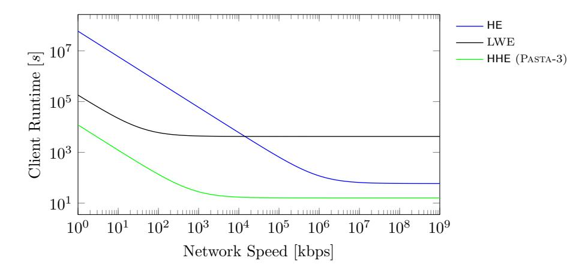

Figure 1: Encryption + upload time of HE, HHE with PASTA, and LWE-native encryption [CDKS21] depending on network speed.

We further want to note, that for sake of simplicity we assume plaintexts to have the exact size of the used prime p (i.e., 60 bit) in this first example of HHE. In practice, the exact plaintext space might be smaller to prevent overflows in  $\mathbb{F}_p$  during homomorphic computations. Thus, while still instantiating the symmetric cipher and HE scheme with a 60 bit plaintext prime p, the actually used plaintexts might be significantly smaller. Since the size of HE and LWE ciphertexts in Table 1 do not depend on p but on a ciphertext modulus q, the size of the used plaintext being undetectable once encrypted, and the need to instantiate  $\mathbb{F}_p$  ciphers with the same prime to allow decryption under HE, the values in Table 1 do not change for HE, LWE and HHE with the  $\mathbb{F}_p$  cipher PASTA-3. Only the  $\mathbb{Z}_2$ ciphers will benefit from the smaller plaintexts with smaller client to server communication. However, since the server side computation with its too large multiplicative depth is infeasibly long due to the need for binary circuits, this small advantage on the client side plays no role in practice.

### 5 Inefficiency of $\mathbb{Z}_2$ Ciphers

In this section, we evaluate the usability of proposed symmetric ciphers for HHE. We focus on boolean ciphers with plaintexts in  $\mathbb{Z}_2$  since these are the majority of ciphers proposed for HHE. The main design criterion of all these ciphers is to reduce the AND depth of the decryption circuit.

Hybrid homomorphic encryption aims to reduce the communication overhead for outsourcing computations to a cloud. Therefore, we investigate not only the performance of the decryption circuit of each cipher under homomorphic encryption, but also the performance of the cipher in a complete HHE use case. The use case we benchmark in this section is very small, concretely a server which computes  $\vec{r} = M \cdot \vec{x} + \vec{b}$ , where  $\vec{r}, \vec{x}, \vec{b} \in \mathbb{Z}_{516}^5$ and  $M \in \mathbb{Z}_{2^{16}}^{5 \times 5}$ , i.e., a  $5 \times 5$  matrix-vector multiplication of 16-bit integers. The matrix Mand the vector  $\vec{b}$  are private and owned by the server, whereas  $\vec{x}$  is a private vector owned by the client. The client uses HHE to send  $\vec{x}$  in encrypted form to the server, and will get  $\vec{r}$  in encrypted form as a result. As described above, the choice of a cipher over  $\mathbb{Z}_2$ also requires that we compute the integer matrix multiplication over  $\mathbb{Z}_2$ . This requires the implementation of binary circuits for addition5 and multiplication, which have a much higher AND depth than performing the same operations over  $\mathbb{F}_p$ . Despite being only a

&lt;sup>5We implemented depth-optimized carry-lookahead adders (CLA) in HElib and SEAL, and standard ripple carry adders (RCA) in TFHE.

very small matrix multiplication ( $5 \times 5$  with 16-bit integers), our benchmarks (given later in this section) show that the evaluation is already very slow, making it infeasible for  $\mathbb{Z}_2$  ciphers to be applied to real-world statistics or machine learning use cases with multiple chained matrix multiplications of larger integers with matrices consisting of hundreds of entries.

# 5.1 A Zoo of $\mathbb{Z}_2$ Ciphers

In this paper, we benchmark 128-bit security instances of the ciphers LowMC [ARS+15], RASTA [DEG+18], AGRASTA [DEG+18], DASTA [HL20], KREYVIUM [CCF+16] (as stream cipher and in depth-bounded CTR mode), and FILIP [MCJS19]. In Table 2 we summarize the parameters of the ciphers in their respective modes of operation.6

Table 2: Parameters of the benchmarked  $\mathbb{Z}_2$  ciphers in their respective modes of operations in bits.

| Cipher      | Blocksize | Keysize | Rounds | AND-depth |
|-------------|-----------|---------|--------|-----------|
| LowMC       | 256       | 128     | 14     | 14        |
| Rasta-5     | 525       | 525     | 5      | 5         |
| Rasta-6     | 351       | 351     | 6      | 6         |
| Dasta- $5$  | 525       | 525     | 5      | 5         |
| Dasta-6     | 351       | 351     | 6      | 6         |
| Agrasta     | 129       | 129     | 4      | 4         |
| Kreyvium    | -         | 128     | -      | -         |
| Kreyvium-12 | 46        | 128     | -      | 12        |
| Kreyvium-13 | 125       | 128     | -      | 13        |
| F1LIP-1216  | -         | 16384   | -      | 3         |
| F1LIP-1280  | -         | 4096    | -      | 4         |

We start this section by first introducing RASTA, which is the baseline for many other proposals, before we discuss some followup-ciphers not included in our benchmark comparisons.

Rasta. Rasta is a family of stream ciphers, in which a permutation is applied to the secret key to produce the keystream. The permutation consists of several rounds of affine layers and an S-box instantiated with the  $\chi$ -transformation [Dae95]. The main design criteria of Rasta is that each affine layer is pseudorandomly generated from an extendable-output function (XOF) [NIS15] seeded with a nonce N and the block counter i. This essentially prevents all attacks which require multiple plaintext/ciphertext pairs and allows to build a cipher with a low number of rounds. We depict the Rasta permutation in Figure 2.

**Fasta.** Shortly after first releasing our paper to the public the cipher Fasta [CIR22] was published. Fasta is an optimization of Rasta in which the linear layer is adapted for faster packed evaluation for specific HElib parameters. However, since not every HE library (such as SEAL) allows packing for  $\mathbb{Z}_2$  ciphers, and Fasta's optimization directly benefits from very specific HElib parameters and does not translate to every use case or library, we do not include it in our comparisons. For benchmarks comparing Rasta to Fasta using our implementation framework we refer to [CIR22].

&lt;sup>6Kreyvium, FiLIP-1216, and FiLIP-1280 are stream ciphers without defined block size. In our benchmarks, we therefore define one block to be 46 bits for Kreyvium and 64 bits for both FiLIP instances since we believe just benchmarking one bit is not representitive.

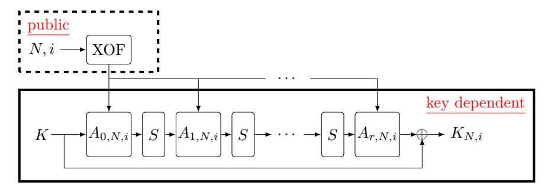

Figure 2: The r-round RASTA construction to generate the keystream  $K_{N,i}$  for block i under nonce N with affine layers  $A_{i,N,i}$ . The picture is taken from [DEG+18].

Chaghri. Very recently, another boolean ciphers, namely Chaghri [AMT22], was proposed in the literature. Following the Marvelous [AAB+20] design strategy, each round of Chaghri has a AND-depth of 2. Together with its comparably high number of rounds, CHAGHRI's total depth is 16, making it significantly deeper then any other symmetric cipher over  $\mathbb{Z}_2$  discussed in our work. Furthermore, this design is heavily optimized for using a special type of packing, where each slot encodes polynomials in  $\mathbb{F}_{2^{63}}$ . While this allows them to use Frobenius automorphisms to evaluate  $x^{2^k}$  for free, it also has the disadvantage that no technique (to the best of our knowledge) is known to homomorphically extract bits from these polynomials. Consequently, one either has to pack only one bit into these polynomials severely limiting throughput, or Chaghri can only be applied to very specific use cases using this packing. Furthermore, this type of packing is not available in some libraries, such as SEAL. Finally, each CHAGHRI round consists of two multiplications with  $3 \times 3$  MDS matrices, which have to be implemented over polynomials with 63 elements, which is very expensive without this packing.

Besides, Chaghri was broken shortly after publication, which is also confirmed by the authors [AMT22]. The attack [LAW+22] works in practical time and increases the number of rounds from 8 to at least 14. Based on the benchmarks given in [AMT22], this increase by 75% would result in a performance close to AES (i.e., the only other cipher they consider in their paper), which is severely outperformed by any other  $\mathbb{Z}_2$  cipher proposed for HHE. However, the authors of [LAW+22] propose a modification of Chaghri, which allows to keep the 8 rounds while maintaining roughly the same efficiency, which was then later adopted by the authors of Chaghri [AMT22].

For all these reasons, Chaghri does not provide better performances than any other cipher considered in this paper, and we do not include it in our performance evaluation.

### 5.2 **SEAL** Benchmarks

In this section we discuss the benchmarks for the  $\mathbb{Z}_2$  ciphers in SEAL, for benchmarks in HElib and TFHE we refer to Appendix B.2.1 and Appendix B.1 respectively. In SEAL, the available noise budget (i.e., how much further noise can be introduced until decryption will fail) depends on the ciphertext modulus q. However, big moduli q require a big degree N of the cyclotomic reduction polynomial for security. N, which is always a power of two, has a severe impact on the performance of the HE scheme. While a larger N allows for larger q to increase the noise budget, it significantly increases the runtime of homomorphic operations.

In Table 3 we present the benchmarks for the SEAL library, for homomorphically decrypting only one block, and for the small HHE use case, i.e., the 16-bit  $5 \times 5$  affine transformation. For both benchmarks we give timings for homomorphically encrypting the symmetric key and homomorphically decrypting the symmetric ciphertexts (i.e., decompressing the HHE ciphertext) for the smallest N allowing enough noise budget for correct evaluation. We parameterize q such that the HE scheme has a security of 128 bits. For the HHE use case we additionally give the runtime for the affine transformation. Since SEAL does not allow to use packing with plaintexts in  $\mathbb{Z}_2$ , all implementations are bitsliced (i.e., one HE ciphertext per bit).

|             |       | 1 Block  |         | Small HHE use case |          |         |          |  |  |  |
|-------------|-------|----------|---------|--------------------|----------|---------|----------|--|--|--|
| Cipher      | N     | Enc. Key | Decomp. | N                  | Enc. Key | Decomp. | Use Case |  |  |  |
|             |       | s        | s       |                    | s        | s       | s        |  |  |  |
| LowMC       | 16384 | 1.75     | 613.9   | 32768              | 6.12     | 2 702.7 | 1 202.1  |  |  |  |
| Rasta-5     | 8192  | 2.12     | 135.9   | 32768              | 25.4     | 2 618.5 | 1 201.8  |  |  |  |
| Rasta-6     | 8192  | 1.42     | 88.5    | 32768              | 17.1     | 1 802.0 | 1 199.6  |  |  |  |
| Dasta-5     | 8192  | 2.20     | 134.1   | 32768              | 25.4     | 2 594.0 | 1 209.2  |  |  |  |
| Dasta-6     | 8192  | 1.49     | 88.7    | 32768              | 17.2     | 1 811.8 | 1 209.8  |  |  |  |
| Agrasta     | 8192  | 0.534    | 16.3    | 16384              | 1.76     | 76.2    | 241.0    |  |  |  |
| Kreyvium    | 16384 | 1.84     | 412.8   | 32768              | 6.17     | 2 028.5 | 1 210.7  |  |  |  |
| Kreyvium-12 | 16384 | 1.75     | 414.8   | 32768              | 6.30     | 3 925.8 | 1 217.9  |  |  |  |
| Kreyvium-13 | 16384 | 1.83     | 442.1   | 32768              | 6.18     | 1 999.0 | 1 199.3  |  |  |  |
| FiLIP-1216  | 8192  | 66.1     | 1 064.7 | 16384              | 223.9    | 6 619.0 | 244.5    |  |  |  |
| F1LIP-1280  | 8192  | 16.7     | 1 251.6 | 16384              | 56.0     | 7 783.2 | 242.0    |  |  |  |

Table 3: Benchmarks of the  $\mathbb{Z}_2$  ciphers in the SEAL library (security level  $\lambda = 128$  bit).

### 5.3 Discussion

Our benchmarks show that the runtime of the whole HHE use case (including cipher evaluation) using the  $\mathbb{Z}_2$  ciphers is high, despite the tested use case being small. This emphasizes the requirement of  $\mathbb{F}_p$  ciphers for HHE with integer use cases. In SEAL and HElib, the fastest ciphers are the ciphers based on the RASTA design strategy (RASTA, DASTA, AGRASTA), with AGRASTA being the fastest due to its small multiplicative depth. Only FiLIP has better noise propagation. However, due to its large symmetric key and long evaluation time, it is not competitive in the libraries we benchmarked. For figures comparing the runtime of HHE in SEAL and HElib and a comparison to  $\mathbb{F}_p$  ciphers, we refer to Section 9.1.

# 6 Designing an Efficient Cipher for HHE over $\mathbb{F}_p$

Following the results from the previous section, we now want to design an efficient cipher for HHE for integer use cases. We will first have a look at existing related work (Section 6.1), before we identify the cost metric of the HE schemes in more detail (Section 6.2) and design a cipher accordingly.

### 6.1 Related Work

**Masta.** In an independent and concurrent work another symmetric cipher over  $\mathbb{F}_p^t$  created for HHE use cases is introduced, namely MASTA [HKC+20]. In their work, the  $\mathbb{F}_p$  cipher MASTA is proposed to increase throughput compared to boolean ciphers when evaluated under HE and its decryption runtime under HE is compared to RASTA when implemented in the HElib library.7

&lt;sup>7We suspect that in [HKC+20] the authors only benchmark a word-sliced HE implementation of Masta, which is why our packed implementation of Masta is significantly faster.

MASTA can be seen as a direct translation of RASTA (Figure 2) to  $\mathbb{F}_p^t$ , with the exception of a different strategy in sampling random invertible matrices. Their approach involves sampling a random polynomial  $m \in \mathbb{Z}_p[X]/(X^t - \alpha)$  and translating m into a matrix M. This matrix is then invertible by design and they only have to sample s field elements  $\in \mathbb{F}_p$ . Even though the S-box used in RASTA is in general not a permutation over  $\mathbb{F}_p^t$ , and therefore limits the possible outputs of the S-box layer in MASTA,  $^8$  the designers did not consider any additional changes to the baseline design and do not leverage any advantages of HE over fields  $\mathbb{F}_p$ . In this paper we consider the two 128-bit security instances of MASTA with the lowest depth and use Shakel28 to pseudorandomly generate all affine layers.

Since Masta does not consider any additional changes to Rasta based on the properties of BGV/BFV, and the S-box is not a permutation in  $\mathbb{F}_p$ , we aim to design a more optimized cipher in the next sections.

**Hera.** Another  $\mathbb{F}_p$  cipher, namely HERA [CHK+21], was proposed in the literature alongside a framework for applying HHE to CKKS. Contrary to RUBATO, HERA can also be applied to BFV and BGV which is why we also consider it in our comparisons.

The main design rationale behind HERA is to apply the RASTA design strategy in a different way to also benefit from the prevention of statistical attacks by randomizing the cipher, but with less preprocessing cost. They do this by fixing the affine layers and randomizing the key schedule by multiplying the key elements with pseudorandomly sampled  $\mathbb{F}_p$  elements. They also fix a small statesize of just 16 words and a round number of 5 for 128 bit security and instantiate their linear layers with efficient AES-like matrices. As nonlinear layer they use the well-known cubing layer (see Section 6.4).

### 6.2 Cost Metrics

The goal is to design an efficient cipher for HHE over  $\mathbb{F}_p^t$  with  $2^{16} . Since$ in both BGV and BFV (and their respective implementations in SEAL and HElib) the most significant performance metric is the multiplicative depth due to the absence of an efficient bootstrapping operation, our main goal is to reduce this metric. Since every round contributes to the multiplicative depth, and therefore to the overall noise consumption during a homomorphic evaluation of the cipher, we aim to design a secure cipher with a minimal number of rounds. Further, high-degree polynomials have a large multiplicative depth, and hence we consider low-degree S-boxes. Meeting both of these requirements usually requires a large state size for security. However, large state sizes lead to a high runtime of the cipher evaluation, especially in the linear layers. Therefore, our design will have to balance noise consumption and runtime to be efficiently usable in HHE Furthermore, most HE applications leverage packing (Section 2.1) to increase performance, which is why we also aim to design a packing-friendly cipher which produces packed homomorphically encrypted ciphertexts. For a comparison of a word-sliced implementation of our final design to a packed implementation we refer to Appendix C. There we also compare a word-sliced implementation of Hera to Pasta.

Cost of HE Operations. In Table 4 we summarize the cost of each HE operation in SEAL and HElib. Note that the key switching operation is free in terms of noise in SEAL, whereas it adds noise to the ciphertext in HElib. Key switching is required after a ciphertext-ciphertext multiplication and after an homomorphic Galois automorphism (required for rotation), which is why these operations require more noise in HElib. For

&lt;sup>8While a concrete attack is not known, reducing the output entropy of an internal component may lead to unwanted effects in the final output of the function, and thus reduce the security against still unknown attacks. Therefore, most ciphers known in the literature rely on permutations and do not restrict the output entropy.

&lt;sup>9SEAL does not allow larger field sizes.

both libraries the noise consumption depends on the size of the prime p, with larger pimplying higher noise consumption, especially in pt-ct and ct-ct multiplications. Therefore, one cannot consider plaintext-ciphertext multiplications as negligible when working over  $\mathbb{F}_p$ and we also have to consider the plaintext-ciphertext multiplicative depth when designing an efficient cipher over  $\mathbb{F}_p$ .

| Table 4: C   | Table 4: Cost of HE operations in SEAL and HElib. |                |            |                |  |  |  |  |  |  |
|--------------|---------------------------------------------------|----------------|------------|----------------|--|--|--|--|--|--|
|              | SE                                                | AL             | HElib      |                |  |  |  |  |  |  |
| Operation    | Noise                                             | Runtime        | Noise      | Runtime        |  |  |  |  |  |  |
| pt-ct Add    | negligible                                        | cheap          | negligible | cheap          |  |  |  |  |  |  |
| ct-ct Add    | negligible                                        | $_{\rm cheap}$ | negligible | $_{\rm cheap}$ |  |  |  |  |  |  |
| pt-ct Mul    | moderate                                          | $_{\rm cheap}$ | moderate   | $_{\rm cheap}$ |  |  |  |  |  |  |
| ct-ct Mul    | expensive                                         | expensive      | expensive  | expensive      |  |  |  |  |  |  |
| Automorphism | negligible                                        | expensive      | moderate   | expensive      |  |  |  |  |  |  |

Remark 2. In the future, more efficient bootstrapping implementations might become available e.g. due to efficient HE hardware accelerators which implement this feature. Depending on the concrete efficiency of bootstrapping, the optimization angle of HE might shift from minimizing the multiplicative depth to minimizing the most expensive HE operations, such as multiplications. In this case, symmetric ciphers optimized for HHE will be allowed to have more rounds with higher degree S-Boxes and will more closely look like some ciphers optimized for e.g. MPC where the total number of multiplications is the main bottleneck.

### **Design Basis** 6.3

Since our  $\mathbb{Z}_2$  benchmarks indicate that designs based on RASTA are the preferred choice, we first consider an  $\mathbb{F}_p^t$  version of RASTA with equal text/key size, and then modify it for security and efficiency. In the following, we analyze several candidates for each of the operations defining the cipher, and we also determine their implementation efficiency. Based on these results, we then design Pasta in Section 7.

#### 6.4 S-Box

The original RASTA design uses the  $\chi$ -transformation [Dae95] over  $\mathbb{Z}_2^t$  as a single nonlinear layer. However, the  $\chi$ -function is in general not a permutation when working over  $\mathbb{F}_p^t$ , which is why we consider alternative building blocks. Since the affine layers in a RASTA-based permutation are pseudorandomly generated for each new block, many attacks (mainly statistical attacks) are already prevented. Hence, the main goal of the S-box in this setting is to provide a sufficiently high degree to prevent algebraic attacks – the concrete structure of the S-box plays a comparably minor role. Consequently, we propose invertible lowdegree S-boxes, describe how they can be efficiently implemented in a packed homomorphic evaluation, and compare their efficiency. Despite not being a permutation, MASTA still uses the  $\chi$ -function naturally defined over  $\mathbb{F}_{n}^{t}$ , which is why we include it in our comparison.

 $\chi$ -S-box. The  $\chi$ -S-box is defined as

$$[\chi(\vec{x})]_i = x_i + x_{i+2} + x_{i+1} \cdot x_{i+2} = x_i + x_{i+2} \cdot (1 + x_{i+1}).$$

The indices in the  $\chi$ -S-box are taken modulo t, which is why  $\chi$  can be efficiently evaluated using rotations, i.e.,

$$\chi(\vec{x}) = \vec{x} + \mathtt{rot}_2(\vec{x}) \odot (\vec{1} + \mathtt{rot}_1(\vec{x})).$$

This works if the rotation is cyclic for the vector of size *t*. However, once encrypted, homomorphic rotations are cyclic over a larger vector of size *n*. Hence, we need to simulate cyclic rotation by preprocessing the state first. However, the resulting vector has more than *t* elements, which can influence further homomorphic operations. Thus, one has to apply a masking multiplication afterwards with a mask *⃗m* = *⃗*1 ∈ F *t p* :

$$\begin{aligned} \vec{x}' &= \vec{x} + \mathtt{rot}_{(-t)}(\vec{x}) \\ \Rightarrow \chi(\vec{x}) &= \left( \vec{x}' + \mathtt{rot}_2(\vec{x}') \odot (\vec{1} + \mathtt{rot}_1(\vec{x}')) \right) \odot \vec{m}. \end{aligned}$$

**Cube S-box.** Given a prime *p*, gcd(*p* − 1*,* 3) = 1, let

$$[S(\vec{x})]_i = (x_i)^3.$$

We recall that the cube S-box is the invertible power map with the smallest degree, and it can be efficiently evaluated by simply applying two homomorphic multiplications which affect the state elementwise, i.e., *S*(*⃗x*) = *⃗x* ⊙ *⃗x* ⊙ *⃗x*.

### **Feistel-Like S-Box (via a Quadratic Function).**

$$[S'(\vec{x})]_i = \begin{cases} x_i & \text{if } i = 0, \\ x_i + (x_{i-1})^2 & \text{otherwise,} \end{cases}$$

The Feistel-like S-box can also efficiently be implemented using rotations, i.e.,

$$S'(\vec{x}) = \vec{x} + \left( \mathtt{rot}_{(-1)} \left( \vec{x} \right) \odot \vec{m} \right)^2,$$

where *⃗m* ∈ F *t p* is a masking vector *⃗m* = [0*,* 1*, . . . ,* 1]*T* .

### **Alternative Feistel-Like S-Box (via the** *χ***-Function).**

$$[S'(\vec{x})]_i = \begin{cases} x_i & \text{if } i \le 1, \\ x_i + x_{i-1} \cdot x_{i-2} & \text{otherwise,} \end{cases}$$

The alternative Feistel-like S-box can also efficiently be implemented using rotations, i.e.,

$$S''(\vec{x}) = \mathtt{rot}_{(-1)}(\vec{x}) \odot \mathtt{rot}_{(-2)}(\vec{x}) \odot \vec{m} + \vec{x},$$

where *⃗m* ∈ F *s p* is a masking vector *⃗m* = [0*,* 0*,* 1*, . . . ,* 1]*T* .

### **6.4.1 S-Box Cost Comparison**

All S-box designs can efficiently be implemented on packed HE ciphertexts and require only a constant number of homomorphic operations independent of the state size. A summary of required homomorphic operations as well as the multiplicative depths of the different S-boxes is given in Table [5.](#page-14-0)

Table 5: HE operations and depth of different S-boxes.

| S-box   | pt-ct Add | ct-ct Add | pt-ct Mul | ct-ct Mul | Rot | pt-ct Depth | ct-ct Depth |
|---------|-----------|-----------|-----------|-----------|-----|-------------|-------------|
| χ       | 1         | 2         | 1         | 1         | 3   | 1           | 1           |
| S       | -         | -         | -         | 2         | -   | -           | 2           |
| ′ S  | -         | 1         | 1         | 1         | 1   | 1           | 1           |
| ′′ S | -         | 1         | 1         | 1         | 2   | 1           | 1           |

Based on Table [5,](#page-14-0) we decide to choose the Feistel S-box *S* ′ as the main S-box for our nonlinear layers, and to use the cube S-box *S* to increase the degree of our cipher to combat linearization attacks and reduce the state size of the cipher. We further explore the choice of the two different S-boxes in Section [8.4.](#page-24-0)

### 6.5 Linear Layer

In RASTA, the homomorphic runtime is dominated by the linear layer. In this section we discuss how to efficiently implement matrix-vector multiplications on packed homomorphic ciphertexts and introduce optimizations to reduce the homomorphic evaluation time.

### 6.5.1 Choice of Random Matrices

In the original RASTA design, each random  $t \times t$  matrix is directly sampled and checked for invertibility. However, doing the invertibility check is expensive in  $\mathbb{F}_p$  in terms of computational complexity. Therefore, in PASTA we choose a different approach and generate each matrix as a sequential matrix [GPP11, GPPR11] (Section 7). These matrices are invertible by design and only require to sample t field elements and performing  $t \cdot (t-1)$  field multiplications and  $(t-1) \cdot (t-1)$  field additions. Compared to sampling polynomials  $m_i \in \mathbb{Z}_p[X]/(X^t - \alpha)$  and translating them to matrices  $M_i$  (like in MASTA), sequential matrices require to sample equally many field elements, but need more field additions and multiplications. Sampling sequential matrices is thus slower with respect to the method used in MASTA, but it comes with the cryptographic advantage of having less structure (see Section 8). Contrary to HERA, we do not fix the matrices and randomize key schedules due to the fact that in a packed implementation one can not leverage advantages of specially chosen matrices, such as implementation via only additions, and plain performance is insignificant compared to HE evaluation runtime.

### 6.5.2 Babystep-Giantstep Matrix-Vector Multiplication

The most efficient way of evaluating the product between a plain matrix and an encrypted packed vector in HE is using the babystep-giantstep optimized diagonal method [HS14, HS15, HS18]:

$$M\vec{x} = \sum_{k=0}^{t_2-1} \operatorname{rot}_{(kt_1)} \left( \sum_{j=0}^{t_1-1} \operatorname{diag}'_{(kt_1+j)}(M) \odot \operatorname{rot}_j(\vec{x}) \right), \tag{1}$$

where  $t=t_1\cdot t_2$ ,  $\operatorname{diag}_i'(M)=\operatorname{rot}_{(-\lfloor i/t_1\rfloor\cdot t_1)}(\operatorname{diag}_i(M))$ , and  $\operatorname{diag}_i(M)$  expresses the *i*-th diagonal of a matrix M in a vector of size t, with i=0 being the main diagonal. Note that  $\operatorname{rot}_j(\vec{x})$  only has to be computed once for each  $j< t_1$ . Therefore, a matrix multiplication requires  $t_1+t_2-2$  rotations, t plaintext-ciphertext multiplications, and t-1 additions, and the total depth is 1 plaintext-ciphertext multiplication. Thus, we add words to the final state size of our design for efficiency if t does not nicely split into  $t=t_1\cdot t_2$ . Compared to the number of homomorphic operations required to evaluate the S-boxes (Table 5), it is clear that the runtime of the homomorphic evaluation of our cipher is dominated by the linear layer.

### 6.5.3 Splitting the State

The babystep-giantstep algorithm dominates the runtime of the homomorphic PASTA evaluation and scales with the state size. Therefore, we propose to evaluate two individual instances of our cipher with state size t in parallel, with an efficient mixing step after each affine layer, allowing for an overall smaller state size. The final output of the design is then the output of the first half, and the second half is discarded. The result is a cipher with the following properties: (1) The state size  $s = 2 \cdot t$  is an even number and we truncate t words at the end. (2) Instead of evaluating one large  $s \times s$  matrix multiplication we perform two smaller  $t \times t$  matrix multiplications. (3) The S-box is applied on both branches individually. (4) The key has now double the size of the keystream. The latter has no effect on the

HHE use case, since a packed homomorphic design still requires only one homomorphic ciphertext, with a size independent to the number of encoded words. However, we can use the inner structure of homomorphic ciphertexts to parallelize both cipher evaluations, cutting the runtime down to an evaluation of one cipher instance of state size t.

Inner Structure of HE ciphertexts. In R-LWE based homomorphic encryption schemes (like BFV and BGV) the plaintexts are polynomials  $\in R_p = \mathbb{F}_p[X]/\Phi_m(X)$ , with  $\Phi_m(X)$ being the m-th cyclotomic polynomial. Using packing (Section 2.1) one can encode a vector of integers into one polynomial, homomorphic additions and multiplications then affect these vectors element-wise. Further, one can use Galois automorphisms to permute the encoded vector. Thus, the encoded vector can be seen as a hypercube [HS14] and an automorphism rotates the data along one dimension. The precise structure of this hypercube depends on the choice of  $\Phi_m(X)$ . In general, it is possible to use these automorphisms to create linear rotations over the encrypted vector, but this requires masking multiplications [HS14], which when evaluated homomorphically require noise budget. In terms of implementation efficiency,  $\Phi_{2n}(X) = X^n + 1$ , for n being a power of two, is a good choice. This polynomial is negacyclic and allows efficient polynomial multiplications via a negacyclic number theoretic transformation (NTT). For this reason, the homomorphic encryption standardization project10 recommends using these powerof-two cyclotomic rings. Consequently, SEAL only implements HE with those rings and MASTA is defined to use these rings as well [HKC+20]. The hypercube generated by such rings also has a nice structure: It corresponds to a matrix of two rows, each of size  $\frac{\#\text{slots}}{2}$ . Galois automorphisms can then directly be used to either linearly rotate both rows at once or rotate all columns simultaneously, i.e.,

$$\begin{bmatrix} \vec{x}_L \\ \vec{x}_R \end{bmatrix} \overset{\text{encode}}{\to} x \in R_p: \qquad \tau_{3^i}(x) \overset{\text{decode}}{\to} \begin{bmatrix} \operatorname{rot}_i(\vec{x}_L) \\ \operatorname{rot}_i(\vec{x}_R) \end{bmatrix}, \qquad \tau_{n-1}(x) \overset{\text{decode}}{\to} \begin{bmatrix} \vec{x}_R \\ \vec{x}_L \end{bmatrix},$$

for the Galois automorphism  $\tau_i : a(X) \mapsto a(X^i)$ .

Parallelizing Two Cipher Evaluations. In two state-of-the-art integer HE cryptosystems (BFV and BGV) we can use this inner structure of power-of-two homomorphic ciphertexts to parallelize both branches of our cipher. When encrypting the secret key and encoding vectors in the affine layer, one has to encode the vectors affecting the first branch of the cipher into the first row of the homomorphic ciphertext, and vectors affecting the second branch into the second row. As a result, all homomorphic operations are applied in parallel to both branches.

**Efficient Linear Layer.** For security, we have to mix both branches of our cipher after each affine transformation. An efficiently implementable linear layer, which is also invertible, is the following matrix multiplication:

$$\begin{bmatrix} \vec{y}_L \\ \vec{y}_R \end{bmatrix} = \begin{bmatrix} 2 \cdot I & I \\ I & 2 \cdot I \end{bmatrix} \cdot \begin{bmatrix} \vec{x}_L \\ \vec{x}_R \end{bmatrix} = \begin{bmatrix} \vec{x}_L \\ \vec{x}_R \end{bmatrix} + \begin{bmatrix} \vec{x}_L \\ \vec{x}_R \end{bmatrix} + \begin{bmatrix} \vec{x}_R \\ \vec{x}_L \end{bmatrix},$$

where I is the  $t \times t$  identity matrix. This can be implemented by two homomorphic additions and a homomorphic rotation.

In Table 6 we compare the cost of the new linear layer (two parallel instances of state size t) to the cost of one larger linear layer of size  $s=2 \cdot t$ . The new linear layer effectively requires half the homomorphic additions and multiplications, and choosing t such that it splits nicely into  $t=t_1 \cdot t_2$  the number of rotations is also halved.

10https://homomorphicencryption.org/

Table 6: Homomorphic operations and multiplicative depth of the linear layers, with  $t = t_1 \cdot t_2$  and  $2 \cdot t = s_1 \cdot s_2$ .

| Linear Layer  | pt-ct Add | ct-ct Add   | pt-ct Mul   | ct-ct Mul | Rot             | pt-ct Depth | ct-ct Depth |
|---------------|-----------|-------------|-------------|-----------|-----------------|-------------|-------------|
| Split and Mix | 1         | t+2         | t           | -         | $t_1 + t_2$     | 1           | -           |
| No Splitting  | 1         | $2 \cdot t$ | $2 \cdot t$ | -         | $s_1 + s_2 - 1$ | 1           | -           |

### 6.6 Total Homomorphic Operations and Multiplicative Depth

In Table 7 we summarize the number of homomorphic operations and the multiplicative depth of each individual part of our resulting new cipher, dubbed Pasta, as well as the total count for Pasta-3 (3 rounds) and Pasta-4 (4 rounds). The table also highlights that the multiplicative depth of Pasta, and therefore its noise consumption, only depends on the number of rounds. Further, the runtime of homomorphically evaluating Pasta is dominated by the affine layer and scales with the state size and the number of rounds.

Table 7: Homomorphic operations and multiplicative depth of Pasta, with  $t = t_1 \cdot t_2$ .

|            | pt-ct Add | ct-ct Add | pt-ct Mul | ct-ct Mul | Rot             | pt-ct Depth | ct-ct Depth |
|------------|-----------|-----------|-----------|-----------|-----------------|-------------|-------------|
| Affine     | 1         | t         | t         | -         | $t_1 + t_2 - 1$ | 1           | -           |
| Mix        | -         | 2         | -         | -         | 1               | _           | _           |
| S'         | _         | 1         | 1         | 1         | 1               | 1           | 1           |
| S          | -         | -         | -         | 2         | -               | -           | 2           |
| Round      | 1         | t+3       | t+1       | 1         | $t_1 + t_2 + 1$ | 2           | 1           |
| Last Round | 1         | t+2       | t         | 2         | $t_1 + t_2$     | 1           | 2           |
| Pasta-3    | 4         | 4t + 10   | 4t + 2    | 4         | $4(t_1+t_2)+2$  | 6           | 4           |
| Pasta-4    | 5         | 5t + 13   | 5t + 3    | 5         | $5(t_1+t_2)+3$  | 8           | 5           |

# 7 Pasta Specification

Here we provide the full Pasta specification. Pasta is a family of stream ciphers which applies the Pasta- $\pi$  permutation under a nonce N and a block counter i to the secret key, followed by a truncation, to produce the final keystream. Keystream generation is shown in Figure 3. For a prime p s.t. gcd(p-1,3)=1, 11 a Pasta encryption is defined as

- KGen():  $\operatorname{sk} \overset{\$}{\leftarrow} \mathbb{F}_p^{2t}$
- $\mathsf{Enc}_{\mathsf{sk}}(\vec{m}, N)$ : To encrypt the message  $\vec{m} \in \mathbb{F}_p^l$  under the secret key  $\mathsf{sk}$  and nonce N, parse  $\vec{m} = \vec{m}_0 ||\vec{m}_1||...||\vec{m}_j$  with  $\vec{m}_i \in \mathbb{F}_p^t$  and return  $\vec{c} = \vec{c}_0 ||\vec{c}_1||...||\vec{c}_j$ , where  $\vec{c}_i = \vec{m}_i + \mathsf{left}_t(\mathsf{PASTA-}\pi(\mathsf{sk}, N, i))$ , where  $\mathsf{left}_t(\cdot)$  returns the first t words.
- $\mathsf{Dec}_{\mathsf{sk}}(\vec{c},N)$ : To decrypt the ciphertext  $\vec{c} \in \mathbb{F}_p^l$  using the secret key  $\mathsf{sk}$  and nonce N, parse  $\vec{c} = \vec{c}_0 ||\vec{c}_1||...||\vec{c}_j$  with  $\vec{c}_i \in \mathbb{F}_p^t$  and return  $\vec{m} = \vec{m}_0 ||\vec{m}_1||...||\vec{m}_j$ , where  $\vec{m}_i = \vec{c}_i \mathsf{left}_t(\mathsf{Pasta-}\pi(\mathsf{sk},N,i))$ , where  $\mathsf{left}_t(\cdot)$  returns the first t words.

The permutation PASTA- $\pi(\vec{x}, N, i)$  on a vector  $\vec{x} \in \mathbb{F}_p^{2t}$ , thereby, is defined as

Pasta-
$$\pi(\vec{x}, N, i) = A_{r,N,i} \circ S_{\text{cube}} \circ A_{r-1,N,i} \circ S_{\text{feistel}}$$

$$\circ A_{r-2,N,i} \dots \circ A_{1,N,i} \circ S_{\text{feistel}} \circ A_{0,N,i}(\vec{x}),$$
(2)

where  $r \geq 1$  is the number of rounds and where

&lt;sup>11We recall that the S-box  $S(x) = x^d$  for  $d \ge 2$  is invertible over  $\mathbb{F}_p$  if and only if  $\gcd(p-1,d) = 1$ .

Figure 3: The truncated r-round Pasta- $\pi$  permutation to generate the keystream  $K_{N,i}$  for block i under nonce N with affine layers  $A_{j,k,N,i}$ .

•  $S_{\text{feistel}}$  is an S-box layer defined as  $S_{\text{feistel}}(\vec{x}) = S'(\vec{x}_L) ||S'(\vec{x}_R)$ , where S' over  $\mathbb{F}_p^t$  is a Feistel structure defined as

$$\forall l \in \{0, 1, \dots, t-1\}:$$
  $[S'(\vec{y})]_l = \begin{cases} y_l & \text{if } l = 0, \\ y_l + (y_{l-1})^2 & \text{otherwise,} \end{cases}$ 

where  $\vec{y} = y_0 ||y_1|| \cdots ||y_{t-1}| \in \mathbb{F}_p^t$ ,

- $S_{\text{cube}}$  is an S-box defined as  $S_{\text{cube}}(\vec{x}) = x_0^3 ||x_1^3|| \cdots ||x_{s-1}^3||$
- for each  $j \in \{0, \dots, r\}$ ,  $A_{j,N,i}$  is an affine layer

$$A_{j,N,i}(\vec{x}) = \begin{bmatrix} 2 \cdot I & I \\ I & 2 \cdot I \end{bmatrix} \begin{bmatrix} M_{j,L,N,i}(\vec{x}_L) + \vec{c}_{j,L,N,i} \\ M_{i,R,N,i}(\vec{x}_R) + \vec{c}_{j,R,N,i} \end{bmatrix},$$

where  $I \in \mathbb{F}_p^{t \times t}$  is the identity matrix and where  $M_{j,L,N,i}, M_{j,R,N,i} \in \mathbb{F}_p^{t \times t}$  and  $\vec{c}_{j,L,N,i}, \vec{c}_{j,R,N,i} \in \mathbb{F}_p^t$  are generated for each round from an XOF seeded with a nonce N and a counter i.

To efficiently sample each invertible matrix  $M_{j,k,N,i} \in \mathbb{F}_p^{t \times t}$ , we sample sequential matrices following [GPP11, GPPR11]. For each  $k \in \{L,R\}$ , we define  $M_{j,k,N,i} := (\tilde{M}_{j,k,N,i})^t$ , where  $\tilde{M}_{j,k,N,i} \in \mathbb{F}_p^{t \times t}$  is defined as

$$\tilde{M}_{j,k,N,i} = \begin{bmatrix} 0 & 1 & 0 & \cdots & 0 \\ 0 & 0 & 1 & \cdots & 0 \\ \vdots & & & \ddots & \vdots \\ 0 & 0 & 0 & \cdots & 1 \\ \alpha_1 & \alpha_2 & \alpha_3 & \cdots & \alpha_t \end{bmatrix}$$

for  $\alpha_1, \ldots, \alpha_t \in \mathbb{F}_p \setminus \{0\}$ .  $M_{j,k,N,i}$  is an invertible matrix which can be built by sampling t random elements and performing  $t \cdot (t-1)$  multiplications and  $(t-1) \cdot (t-1)$  additions.

### 7.1 Concrete Instances

We propose a 3-round instance PASTA-3 as well as a 4-round instance PASTA-4 using Shake128 [NIS15] as XOF. These instances provide at least 128 bits of security for the prime fields  $\mathbb{F}_p$  with  $\log_2(p) > 16$  and  $\gcd(p-1,3) = 1$ . Table 8 shows the block and key sizes and compares them to MASTA and HERA.

**Security Margin.** In all cases, we add a security margin to our construction. Concretely, we take the largest number of words s needed for security, we multiply this number by 1.2 for a 20% security margin, and we then take the smallest even integer larger than or equal to that.

| Instance | Rounds | # Key Words | # Plain Words | # Cipher Words | XOF         |
|----------|--------|-------------|---------------|----------------|-------------|
| Pasta-3  | 3      | 256         | 128           | 128            | Shake128    |
| Pasta-4  | 4      | 64          | 32            | 32             | Shake128    |
| Masta-4  | 4      | 128         | 128           | 128            | Sнаке128    |
| Masta-5  | 5      | 64          | 64            | 64             | Shake $128$ |
| HERA     | 5      | 16          | 16            | 16             | Shake128    |

Table 8: 128 bit security instances of Pasta, Masta, and Hera.

### 7.2 Comparison to Previous Designs

In this section we summarize PASTA by comparing it to previous designs. Furthermore, in Section 9.3 we discuss  $\mathbb{F}_p$  primitives for different use cases and compare them to PASTA.

**S-box.** RASTA and DASTA use the  $\chi$ -transformation as single nonlinear layer. MASTA uses a translation of  $\chi$  to  $\mathbb{F}_p^t$  as nonlinear layer, despite it being no permutation, and HERA uses the cubing layer. In PASTA we introduce and use two different, bijective S-boxes. This is motivated by the desire of reducing the number of rounds while maintaining a reasonable state size. Having r-1 Feistel S-boxes and a final cube S-box with higher degree and depth allows us to build PASTA instances with comparable number of plain/cipher words as MASTA with one round less. This implies both, a faster homomorphic evaluation time, as well as less noise consumption compared to MASTA. We further explore the choice of two different S-boxes in Section 8.4.

**Linear-Layer.** Pasta, Rasta, Dasta, and Masta use randomly generated linear layers to mitigate statistical attacks, and Hera has a randomized key schedule for the same reason. While Rasta just samples random invertible matrices, Dasta uses random permutations of the same fixed matrix. Masta on the other hand samples random polynomials and translates them to matrices (which have lots of structure). These methods, however, all just differ in how the matrices are generated and do not effect the homomorphic evaluation time. Contrary, Pasta's linear layer is thoroughly optimized for efficient evaluation in HE. Indeed, instead of generating a  $2t \times 2t$  random invertible matrix directly, we pick up 2t random elements and construct two sequential matrices  $M_i \in \mathbb{F}_p^{t \times t}$  as given in [GPP11, GPPR11]. These two matrices are then combined into one  $2t \times 2t$  matrix via a cheap mixing operation, effectively cutting HE runtime in half.

**Truncation vs. Feed-Forward.** Pasta discards the feed-forward addition of the secret key (as done in Rasta, Dasta, and Masta) in favor of a truncation. This allows to prevent MITM attack in a more efficient way, at the cost of using a larger state. In the packed HE evaluation the truncated words, however, do not influence the runtime since they can be evaluated simultaneously to the non-truncated part of the state.

# 8 Pasta Security Analysis

Given a certain number of rounds (fixed in advance), our goal is to find the minimum number of key words s=2t for which we can guarantee security of at least  $\kappa$  bits. If not specified otherwise,  $\kappa \approx \log_2(p^s)$ . This is slightly different from what is usually done in traditional symmetric cryptanalysis. Indeed, in general, given a state  $\mathbb{F}_p^s$  and a security level  $\kappa$ , one looks for the minimum number of rounds which provide a security level of at least  $\kappa$  bits. Here we modify the approach since one of our main goals is to keep the depth as low as possible, focusing on 3 and 4 rounds.

### 8.1 Truncation versus Feed-Forward

Consider a permutation  $F: \mathbb{F}_p^s \to \mathbb{F}_p^s$ , and assume it can be split as  $F(\cdot) = F_2 \circ F_1(\cdot)$ . The advantage of a truncation with respect to a feed-forward operation is that it prevents attacks using the backward direction without requiring a high degree of the inverse round function. Indeed, in the feed-forward case, given y = F(x) + x, one can set up a system of equations of the form  $F_1(x) = F_2^{-1}(y - x)$ . In order to prevent the possibility to solve it using algebraic techniques (e.g., Gröbner bases), we need that both  $F_1$  and  $F_2^{-1}$  have a high degree. In the case of truncation, given  $y = \operatorname{left}_t(F(x))$ , the system of equations becomes  $F_1(x) = F_2^{-1}(y \mid\mid y')$  for a certain unknown  $y' \in \mathbb{F}_p^t$ . If t is large enough, the cost of solving it exceeds the security level. However, the overall size of the state must be larger than in the feed-forward case due to losing part of the state.

### 8.2 Security against Statistical Attacks: Properties of the Linear Layer

As in Rasta, the security against statistical attacks as differential [BS90] and linear [Mat93] ones (besides all their variants, as the truncated differential [Knu94], zero–correlation linear [BW12], impossible differential [BBS99], and so on) is achieved by changing the linear layers at every encryption. In a statistical attack, the attacker makes a statistical analysis of the ciphertexts generated by a set of chosen/known plaintexts in order to break the scheme. This strategy works under the assumption that the ciphertexts are generated via the same encryption scheme. By construction, this is not the case for Rasta–like designs as Pasta, which implies that statistical attacks are not a threat for our design.

Having said that, it is important that the linear layers that instantiate PASTA do not have any weakness that could be exploited for an attack, and that full diffusion is achieved over the entire scheme. For this reason, we study the linear branch number of the random matrices that instantiate PASTA, and we show that it is sufficiently high in general. We recall that the branch number of a matrix is defined as the minimum number of non-zero entries that two t-element mask vectors  $\alpha$  and  $\beta$  that satisfy  $\alpha = M^T \times \beta$  could have – we refer to [DGGK21] for an overview of correlation analysis in  $\mathbb{F}_n$ .

Since Pasta's linear layer is defined as

$$\begin{bmatrix} \vec{x}_L \\ \vec{x}_R \end{bmatrix} \mapsto \begin{bmatrix} 2 \cdot I & I \\ I & 2 \cdot I \end{bmatrix} \times \begin{bmatrix} M_{j,L,N,i} \times \vec{x}_L \\ M_{i,R,N,i} \times \vec{x}_R \end{bmatrix} ,$$

we have the following scenario:

- the fixed matrix  $\operatorname{circ}(2,1) \in \mathbb{F}_p^{2\times 2}$  is MDS, which implies that full diffusion among the l-th element of  $\vec{x}_L$  and the l-th element of  $\vec{x}_R$  is achieved for each  $l \in \{0,1,\ldots,t-1\}$ ;
- the invertible matrices  $M_{j,L,N,i}$  and  $M_{j,R,N,i}$  are randomly generated for each new encryption, hence, we cannot guarantee a certain branch number a priori.

For this reason, we estimate a lower bound of the probability that a randomly picked matrix  $M \in \mathbb{F}_p^{t \times t}$  allows for transitions on the t-element mask vectors  $\alpha$  to  $\beta$ ,  $\alpha = M^T \times \beta$ , where  $\alpha$  and  $\beta$  have many zeros (which corresponds to the best scenario for an attacker).

**Proposition 1.** Let  $M \in \mathbb{F}_p^{t \times t}$  be a random invertible matrix. Its branch number satisfies the following for  $p > t \geq 6$ :

$$\Pr[branch\ number \ge t/2] \ge 1 - \frac{2}{p^{t/2-2}}$$

*Proof.* By definition:

$$\Pr[\text{branch number} \geq z] = 1 - \Pr[\text{branch number} < z] = 1 - \frac{\sum_{\alpha,\beta \text{ s.t. } \#(\alpha) + \#(\beta) < z} |\mathfrak{X}_{\alpha,\beta}|}{|\mathfrak{I}|}$$

where

- $\#(\gamma)$  denotes the number of non-zero entries of the vector  $\gamma$ ;
- $\mathfrak{X}_{\alpha,\beta}$  denotes the set of invertible matrices that satisfy  $\alpha = M^T \beta$ ;
- $\Im$  denotes the set of invertible matrices.

First of all, we are interested in the number  $|\mathfrak{I}|$  of all possible bijective matrices M. A matrix M is bijective, if all its row vectors are linearly independent and different from the all 0 vector. So, for the first row, we have  $p^t - 1$  possibilities to choose a row vector. For the second row, we have  $p^t$  possibilities to choose the coefficients minus p choices that is just are linear combination of the first row. In the third row, we now have  $p^t - p^2$  choices, and so on. So we finally end up with

$$|\mathfrak{I}| = \prod_{i=0}^{t-1} \left( p^t - p^i \right) .$$

Next, we consider the number of matrices M, that allow a transition  $\alpha = M^T \beta$  for fixed non-zero  $\alpha$  and  $\beta$ . For our goal, we are interested in an upper bound of such a number. Hence, we limit ourselves to consider a weaker condition, namely, that (i)  $\beta$  maps to the first coordinate of  $\alpha$  and that (ii) the matrix is invertible. It is simple to observe that the first condition is satisfied by at most  $p^{t-1}$  choices of the coefficients of the first row (note that if  $\alpha_0 = 0$ , then we exclude the zero-vector as first row of M). By combining this fact with the requirement that M is bijective, we get the number of matrices M that map  $\alpha$  to  $\beta$  is upper bounded by

$$|\mathfrak{X}_{\alpha,\beta}| \leq \underbrace{p^{t-1}}_{\text{due to }\alpha = M^T\beta} \cdot \underbrace{\prod_{i=1}^{t-2} \left(p^{t-1} - p^i\right)}_{\text{for invertibility}} = p \cdot \prod_{i=2}^{t-1} \left(p^t - p^i\right).$$

Finally, we have a look at how many different masks  $\alpha$  and  $\beta$  exist, which have together i non-zero entries. This number is simply given by  $(p-1)^i \cdot \binom{2t}{i}$ .

Now we have all ingredients we need to bound the probability that a randomly selected matrix M has a branch number smaller than z

$$\begin{aligned} &\Pr[\text{branch number} < z] \leq \frac{ \underbrace{\sum_{i=2}^{z} \left( p^t - p^i \right) \cdot \sum_{i=1}^{z} \left( (p-1)^i \binom{2t}{i} \right)}^{\sum_{i=1}^{t-1} \left( p^t - p^i \right) \cdot \sum_{i=1}^{z} \left( (p-1)^i \binom{2t}{i} \right)} }{ \underbrace{\prod_{i=0}^{t-1} \left( p^t - p^i \right)}_{=|\Im|}} \\ &\leq \underbrace{\frac{\sum_{i=1}^{z} \left( (p-1)^i \binom{2t}{i} \right)}{(p^t-1) \left( p^{t-1} - 1 \right)}}^{\sum_{i=1}^{t-1} \left( (p-1)^i \binom{2t}{i} \right)} \leq \frac{z(p-1)^z \binom{2t}{t}}{(p^t-1) \left( p^{t-1} - 1 \right)}}^{\sum_{i=1}^{t-1} \left( (p-1)^i \binom{2t}{i} \right)}, \end{aligned}$$

where  $\binom{2t}{t} = \frac{2t \cdot (2t-1) \cdot \cdots \cdot (t+1)}{t!} \le \frac{(2t)^t}{2^{t-1}} = 2 \cdot t^t$  since  $t! \ge 2^{t-1}$ . We now set z = t/2 and assume that  $p > t \ge 6$ , we get

$$\Pr[\text{branch number} < t/2] \leq \frac{p \cdot p^{t/2} \cdot p^t}{(p^t - 1) \left( p^{t-1} - 1 \right)} \leq \frac{16 \cdot p^{3t/2 + 1}}{9 \cdot p^{2t - 1}} \leq \frac{2p^2}{p^{t/2}} \leq 1/2 \,,$$

where  $(x^t - 1) \ge 3/4 \cdot x^t$  for  $x \ge 3$  and  $t \ge 2$ , which means that

$$\Pr[\text{branch number} \geq t/2] \geq 1 - \frac{2}{p^{t/2-2}}$$

for 
$$p \gg t > 6$$
.

Thus, Pr[branch number > t/2]  $\approx 1$  for  $p \gg t > 6$ .

However, in our case, the total number of sequential matrices that we can generate is limited by the t elements  $\alpha_i$  we can choose. Hence, in total we can generate  $\hat{\kappa} = (p-1)^t$ invertible matrices. Considering this special case, we get that

$$\Pr[\text{branch number} \ge z] \ge 1 - \frac{2 \cdot z \cdot p^z \cdot t^t}{(p-1)^t} \ge 1 - \frac{2^z \cdot z \cdot t^t}{(p-1)^{t-z}} \,,$$

where  $2(p-1) \geq p$ . It follows that

$$\Pr[\text{branch number} \ge t/2] \ge 1 - \frac{t}{2} \cdot \left(\frac{2t^2}{p-1}\right)^{t/2}$$
,

i.e.,  $\Pr[\text{branch number} \ge t/2] \approx 1 \text{ for } p \gg 2t^2$ , as in our case.

### Security against Algebraic Attacks

To describe our analysis, we focus on Pasta-3. Our input  $\vec{x}$  consists of s=2t unknown key elements and the output  $\vec{y}$  consists of t elements (after truncation). Hence, for a known nonce N and block counter i we have

$$\vec{x} = k_1 \parallel k_2 \parallel \cdots \parallel k_s$$
,  
 $\vec{y} = \operatorname{left}_t(\operatorname{PASTA-}\pi(\vec{x}, N, i)) = y_1 \parallel y_2 \parallel \cdots \parallel y_t$ .

#### 8.3.1 Linearization

In a linearization approach, the attacker replaces all monomials of degrees greater than 1 by new variables, and finally tries to solve the resulting system of linear equations. Assuming  $n_v$  variables and a maximum degree of d, the number of possible monomials is

$$n_m = \sum_{i=1}^{d} \binom{n_v + i - 1}{i}.$$
 (3)

For Pasta-3 we have d=12, and hence s input words with degree 12 after one function call. Further, we obtain t equations with each call. In order to get as many equations  $n_e$  as variables  $n_v$  for our equation system, we can simply request more data, which eventually results in  $n_e = n_v$  after s/t = 2 blocks (this has no effect on the efficiency of the linearization). Due to the complexity of solving a linear equation system in  $n_m$  variables, we target  $\log_2(n_m) > 64$ . Hence,  $s \ge 207$  input words for a security of 128 bits. Following the same analysis, we need  $s \ge 51$  for PASTA-4 and  $s \ge 101$  for a MASTA-like 4-round instance using only degree-2 Feistel-like S-boxes.

In this analysis, we assume that almost all monomials appear in the final representations, since our design provides strong diffusion in half of the state by using dense invertible matrices, and full diffusion after two full linear layers. In order to get more confidence in our design, we also did some practical tests and show the results in Figure 4. To avoid the effect of cancellations, we used prime numbers of sizes larger than  $2^{16}$ . We observe that for the state sizes we tested, the actual number of monomials in the output word with the smallest number of monomials is always very close to the upper bound for the number of monomials given in Eq. (3).

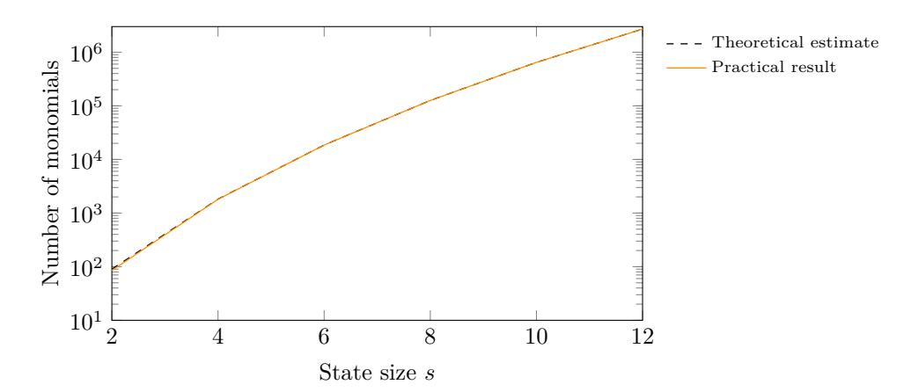

Figure 4: Comparison of the estimated number of monomials in each of the output words according to Eq. (3) and the lowest number of monomials found in a practical evaluation.

### 8.3.2 Gröbner Basis Attacks

Here we determine how large our key s has to be in order to provide security with respect to Gröbner basis attacks up to a complexity of  $2^{128}$  function calls. As was the case above, we can simply generate sufficiently many equations by requesting at least s/t=2 blocks. Hence,  $n_v=n_e$ , and we can estimate the complexity of solving such a system of equations by using theoretical bounds. However, these bounds assume a regular system of equations, and in practical tests we quickly observed that this is not the case for PASTA. Indeed, when building more full-round equations and hence an overdetermined system, we can force the degree of regularity to reach a minimum of 12. By reusing the estimate for the complexity of computing a Gröbner basis [BFSY05] we need  $s \ge 207$ . Similar results can be obtained by assuming d=24 for PASTA-4.

There is also a different way to argue the number of words to use. From the linearization analysis we know that there will be roughly  $2^{64}$  different monomials in each of the resulting equations. Due to the internals of Gröbner basis algorithms, this results in around  $(2^{64})^{\omega}$  operations being necessary to compute a basis. 12 We pessimistically (from a designer's point of view) set  $\omega = 2$  and thus have  $(2^{64})^{\omega} = 2^{128}$ .

Additional Strategies. The strategy presented above is only one way to attack the system using Gröbner bases. It is common to also consider approaches which introduce new variables in each state. The main idea of this technique is to reduce the degrees of the equations at the expense of more variables, which is particularly useful when trying to represent high-degree equations in a more efficient way. In more detail, we may introduce a new variable after each nonlinear operation. Considering a total state size of s = 2t words, we need to introduce 2s(r-1) new variables for an r-round construction (note that no new variables are needed after the final round, since the stream output added to a plaintext is a degree-3 combination of the previous variables). Using this many variables and equations of a degree larger than or equal to 2 results in a high solving complexity when assuming nontrivial (i.e., dense) equations (we refer to [JV17, NNY18], in which degree-2 equation systems over  $\mathbb{Z}_2$  are considered). We therefore conjecture that introducing intermediate variables will only increase the complexity needed to solve the final system when compared to using full-round equations.

&lt;sup>12For example, the F5 algorithm [Fau99] uses Gaussian elimination on a Macaulay matrix, whose rows indicate the equations in the system and whose columns are indexed by the monomials in these equations.

### 8.3.3 Other Algebraic Attacks

Many other known attacks (including e.g. higher-order differential attack [Lai94, Knu94], interpolation attack [JK97], and so on) are prevented by our random linear layers which are different in each Pasta- $\pi$  evaluation. This is the same strategy as used by e.g. Rasta and Masta. We shortly discuss these attacks in this section. Furthermore, the recent attack proposed on Agrasta [LSMI21] does not apply to Pasta, since it directly exploits the  $\chi$ -layer which is not present in Pasta, and it works differently over large prime fields.

**Higher-Order Differential Attacks.** Higher-order differential attacks [Lai94, Knu94] are essentially prevented by the fact that the attacker is only allowed to evaluate a single instance once due to the different linear layers. Moreover, the only subspaces of a finite field  $\mathbb{F}_p$  with prime characteristic are  $\{0\}$  and  $\mathbb{F}_p$  itself, which makes higher-order differential attacks even harder (however, there have been variations of this attack vector which also work over  $\mathbb{F}_p$  [BCD+20]). This also includes higher-order differential distinguishers and attacks based on higher-order differential properties (e.g., cube attacks [Vie07, DS09]).

**Interpolation Attacks.** In an interpolation attack [JK97], the attacker tries to build an interpolation polynomial mapping an input to the corresponding output. This polynomial can then be used to recover the secret key. However, interpolation attacks need multiple evaluations of a fixed permutation, which is not possible when considering PASTA and its varying linear layers.

Guessing Attacks. Guessing (or guess-and-determine) attacks combine the guessing of one or more variables with other attack strategies, potentially decreasing their complexities by fixing parts of the secret. However, due to the large number of state words and a minimum size of 17 bits for each of them, it is unlikely that guessing any of the state words (or even multiple of them) leads to an advantage. Indeed, using our analysis, guessing from 1 to |127/17| words does not lead to any improvement, but even makes the attacks worse. In more detail, we would need to improve the attack itself by a factor of at least  $2^{17w}$  when guessing w input words, which for all configurations we tested  $(1, \ldots, |128/17|$ guesses) is not possible with our analysis. For example, in the 17-bit case with s=51 and when considering the linearization approach, the complexity is reduced by less than one bit when guessing a single variable. When assuming s = 44 (guessing the maximum feasible number of variables), the complexity of the attack is still around 120 bits, which is much more than the allowed  $128 - 7 \cdot 17 = 9$  bits. We remark that this is the "weakest" instance from the attacker's perspective, and for all larger primes we would need an even higher performance increase for the actual attack. Further, given the density of the algebraic representation, we do not expect that the equation systems get significantly easier to solve by guessing any small number of variables.

### 8.4 On Using Two Different S-Boxes

To be optimized for HHE, we designed Pasta to have a small number of rounds (implying less noise consumption) and a small state size (implying fast homomorphic evaluation time). Therefore, we make use of a Feistel S-box of degree 2 and a cube S-box of degree 3. Using only Feistel S-boxes would result in a design with worse performance: A 3-round design using only Feistel S-boxes would require  $t\approx 500$  plain/cipher words (based on the security analysis in Section 8), which results in significantly longer homomorphic evaluation times. A 4-round design would have the same multiplicative depth as Masta-4, leading to the same HE parameters and noise consumption as Masta-4. Therefore, this design would be faster then Masta due to the smaller size t (t = 55 as shown in Section 8) in one evaluation branch. However, it would not have a noise advantage. Pasta-3, on the

other hand, has both a runtime and a noise advantage due to requiring fewer rounds by having the same size t as MASTA-4.

The diffusion of a 2-round cipher based only on cube S-boxes would largely rely only on the single layer between the matrix multiplication. Thus the resulting diffusion is likely bad potentially allowing to separate the cipher  $[CDK^+18]$ . Therefore, we chose to instantiate PASTA-3 by using the smallest depth which allows a 3-round cipher with approximately the same number of plain/cipher words t as MASTA-4, which is using two Feistel S-boxes and one cube S-box.

## 9 Pasta Benchmarks

In this section, we benchmark a packed implementation of our Pasta design in both SEAL and HElib. We also reimplemented a packed version of Masta and Hera, using the same algorithms to generate random field elements and homomorphic matrix multiplications as in Pasta to compare these ciphers in a fair setting. Similar as in Section 5, we also benchmark the ciphers in a real HHE use case.

### 9.1 Comparing Pasta to $\mathbb{Z}_2$ Ciphers

We first compare PASTA, MASTA, and HERA to the  $\mathbb{Z}_2$  benchmarks from Section 5. Therefore, we instantiate these ciphers with a 17-bit prime and benchmark their performance for the small use case from Section 5.13 The resulting benchmarks can be seen in Table 9 where we depict both runtime and remaining noise budget after each step of the HHE use case for SEAL. For benchmarks in HElib we refer to Appendix B.2.2.

| Table 9: Runtime and noise budget of the small HHE use case in the SEAL library ( | security |
|-----------------------------------------------------------------------------------|----------|
| level $\lambda = 128$ bit).                                                       |          |

| Cipher               | N     | Enc. Key                 |       | Decor   | np.   | Small Use Case |       |  |  |
|----------------------|-------|--------------------------|-------|---------|-------|----------------|-------|--|--|
|                      |       | $\operatorname{runtime}$ | noise | runtime | noise | runtime        | noise |  |  |
|                      |       | s                        | bit   | s       | bit   | s              | bit   |  |  |
| p = 65537 (17  bit): |       |                          |       |         |       |                |       |  |  |
| Pasta-3              | 16384 | 0.017                    | 364   | 9.28    | 95    | 0.197          | 51    |  |  |
| Pasta-4              | 32768 | 0.059                    | 800   | 21.0    | 451   | 1.11           | 406   |  |  |
| Masta-4              | 32768 | 0.058                    | 800   | 54.2    | 460   | 1.11           | 415   |  |  |
| Masta-5              | 32768 | 0.057                    | 800   | 39.2    | 386   | 1.13           | 341   |  |  |
| HERA                 | 32768 | 0.051                    | 800   | 16.6    | 333   | 1.12           | 287   |  |  |

### 9.1.1 Discussion

In the following, we compare the runtime and noise consumption of all  $\mathbb{Z}_2$  and  $\mathbb{F}_p$  (with p=65537) ciphers, namely in Figure 5 for homomorphically decrypting one block in SEAL ( $\mathbb{F}_p$  values from Section 9.2), and in Figure 6 for the HHE use case (including HHE decompression) in SEAL. For HElib benchmarks we refer to Appendix B.2.2.

Our figures indicate that PASTA is always the fastest cipher – mainly PASTA-4 due to the small number of encrypted words. However, PASTA-3 is faster when evaluating the whole HHE use case in SEAL due to the small multiplicative depth requiring smaller HE parameters for security. Comparing PASTA to the  $\mathbb{Z}_2$  ciphers, one can observe that homomorphically decrypting one block requires less noise budget for the  $\mathbb{Z}_2$  ciphers.

&lt;sup>13For sake of simplicity we do not consider plaintext overflows in this example, so no mod p operation is part of the binary circuits and no mod  $2^{16}$  is part of the  $\mathbb{F}_p$  benchmarks.

However, PASTA has (besides the runtime advantage) a noise advantage over the  $\mathbb{Z}_2$  ciphers when considering the HHE use case due to the significantly larger multiplicative depth of the binary circuits for integer arithmetic. Concretely, decompression and use case evaluation is 33× faster in SEAL using PASTA-3 and 82× faster in HElib using PASTA-4 compared to AGRASTA. Using TFHE in gate-bootstrapping mode for  $\mathbb{Z}_2$  ciphers instead of e.g. SEAL does not help the  $\mathbb{Z}_2$  ciphers either, since Pasta-3 in SEAL is  $47 \times$  faster than using KREYVIUM in TFHE for the small HHE use case. Increasing the bitsize of the encrypted integers or chaining multiple matrix multiplications would further demonstrate the advantage of Pasta over  $\mathbb{Z}_2$  ciphers, since the drastic increase in the multiplicative depth of the use case would make using the  $\mathbb{Z}_2$  ciphers infeasible.

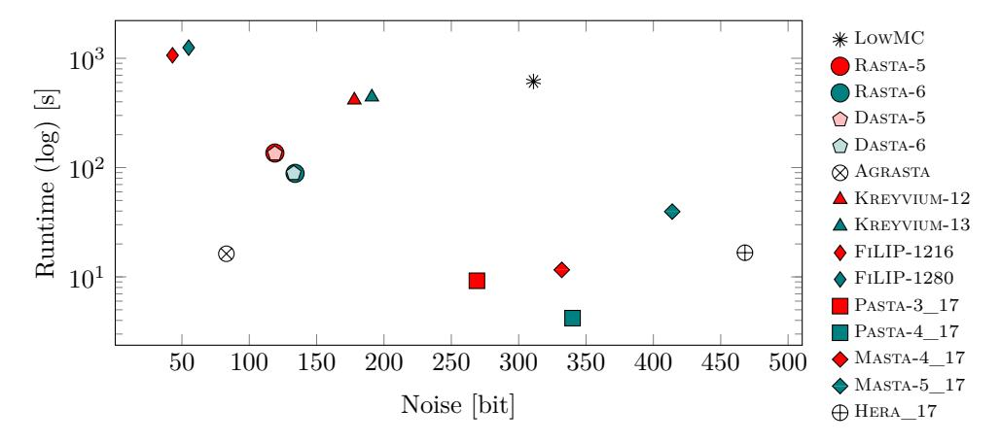

Figure 5: Runtime and noise comparison of  $\mathbb{Z}_2$  ciphers for homomorphically decrypting 1 Block in SEAL (security level  $\lambda = 128$  bit).

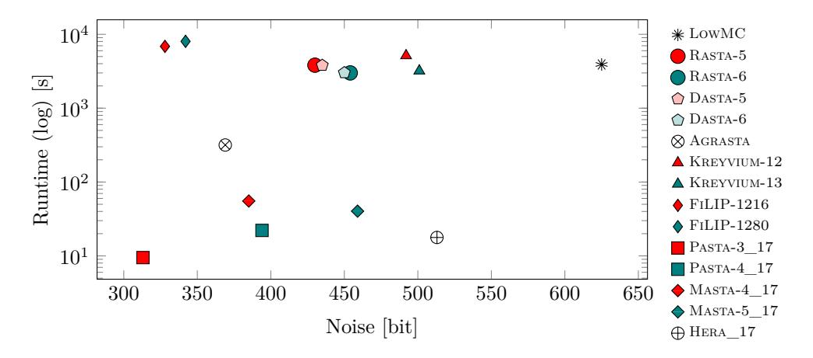

Figure 6: Runtime and noise comparison for the small HHE use case in SEAL (security level  $\lambda = 128$  bit).

#### 9.2 Pasta versus Masta and Hera

Since all  $\mathbb{F}_n$  ciphers outperform the  $\mathbb{Z}_2$  ciphers for HHE, we continue with comparing these ciphers. Similar to the  $\mathbb{Z}_2$  benchmarks, we also compare PASTA, MASTA, and HERA in a real HHE use case. However, to further demonstrate the advantage of the  $\mathbb{F}_p$  ciphers in HHE, we benchmark a more extensive use case with a significantly higher multiplicative

depth. We reuse the same use case as in Section 4, i.e., three affine layers interleaved with squarings on a vector  $\vec{x} \in \mathbb{F}_p^{200}$ . We benchmark the use case for 3 different primes p.

### 9.2.1 SEAL Benchmarks

In this section we discuss the benchmarks for the  $\mathbb{F}_p$  ciphers in SEAL, for benchmarks in HElib we refer to Appendix B.2.3. Furthermore, we provide CPU cycle counts for plain encryption with Pasta, Masta, and Hera in Appendix B.3. In Table 10 we present the benchmarks for the packed implementation of Pasta, Masta, and Hera in the SEAL library. We give timings for homomorphically decrypting one block and additionally timings for the bigger HHE use case. We parameterize SEAL to provide 128 bits of security and use the smallest N allowing enough noise budget for correct evaluation.

|            | 7 10. ± p            | ochchinarks  | 101 0110 0111 | th morar           | y (Security i | CVC1 // — 120 | <u> </u> |  |  |  |
|------------|----------------------|--------------|---------------|--------------------|---------------|---------------|----------|--|--|--|
|            |                      | 1 Block      |               |                    | Bigger H      | HE use case   | 9        |  |  |  |
| Cipher     | N                    | Enc. Key     | Decomp.       | N                  | Enc. Key      | Decomp.       | Use Case |  |  |  |
|            |                      | s            | s             |                    | s             | s             | s        |  |  |  |
| p = 65537  | p = 65537 (17  bit): |              |               |                    |               |               |          |  |  |  |
| Pasta-3    | 16384                | 0.016        | 9.22          | 32768              | 0.056         | 86.2          | 43.9     |  |  |  |
| Pasta-4    | 16384                | 0.016        | 4.19          | 32768              | 0.057         | 147.8         | 43.8     |  |  |  |
| Masta-4    | 16384                | 0.016        | 11.6          | 32768              | 0.058         | 108.7         | 43.9     |  |  |  |
| Masta-5    | 32768                | 0.062        | 39.6          | 32768              | 0.056         | 157.0         | 43.9     |  |  |  |
| HERA       | 32768                | 0.052        | 16.6          | 32768              | 0.051         | 215.4         | 43.9     |  |  |  |
| p = 808832 | 22049 (33            | Bbit):       |               |                    |               |               |          |  |  |  |
| Pasta-3    | 32768                | 0.057        | 43.1          | 32768              | 0.055         | 86.3          | 43.9     |  |  |  |
| Pasta-4    | 32768                | 0.057        | 21.2          | 65536              | 0.216         | 833.4         | 220.8    |  |  |  |
| Masta-4    | 32768                | 0.058        | 54.4          | 65536              | 0.215         | 568.5         | 221.3    |  |  |  |
| Masta-5    | 32768                | 0.055        | 39.3          | 65536              | 0.215         | 852.6         | 220.7    |  |  |  |
| HERA       | 32768                | 0.051        | 16.6          | 65536              | 0.196         | 1227.7        | 220.7    |  |  |  |
| p = 109648 | 86890805             | 657601 (60 b | it):          |                    |               |               |          |  |  |  |
| Pasta-3    | 32768                | 0.055        | 58.3          | 65536              | 0.212         | 448.6         | 220.8    |  |  |  |
| Pasta-4    | 65536                | 0.220        | 119.2         | 65536              | 0.212         | 833.6         | 221.0    |  |  |  |
| Masta-4    | 65536                | 0.220        | 284.3         | 65536              | 0.212         | 571.9         | 223.1    |  |  |  |
| Masta-5    | 65536                | 0.219        | 213.3         | 65536              | 0.212         | 853.3         | 220.9    |  |  |  |
| HERA       | 65536                | 0.200        | 94.6          | 65536 a | 0.193         | 1228.3        | 221.0    |  |  |  |

a Noise budget did not suffice and bigger parameters are not available in SEAL. Thus, bootstrapping is required.

### 9.2.2 Discussion

In the following figures we compare the runtime and noise consumption of PASTA, MASTA, and HERA for 3 different prime fields  $\mathbb{F}_p$ , in Figure 7 for homomorphically decrypting one block in SEAL, and in Figure 8 for the HHE use case (including HHE decompression) in SEAL. For HElib benchmarks we refer to Appendix B.2.3.

The figures show the advantage of PASTA compared to its competitors. In all figures, PASTA-3 has a smaller runtime and noise consumption then MASTA, especially when the smaller multiplicative depth allows for smaller HE parameters (compare, e.g., 33-bit prime fields in Figure 8, where PASTA-3 is  $6 \times$  faster than MASTA-4). PASTA-3 is only outperformed by PASTA-4 and HERA for a small number of encrypted words (e.g., only encrypting one block as for the 33-bit prime for SEAL where HERA is slightly faster then

PASTA-4, or the small HHE use case from Section 9.1 in HElib where PASTA-4 is 2.7× faster then MASTA-4) if the overall multiplicative depth allows PASTA-4 or HERA to use the same HE parameters as PASTA-3. Hence, we propose using PASTA-4 for HHE use cases with a small number of encrypted words, and Pasta-3 everywhere else.

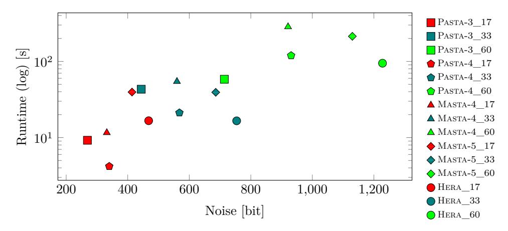

Figure 7: Runtime and noise comparison of  $\mathbb{F}_p$  ciphers for homomorphically decrypting 1 Block in SEAL (security level  $\lambda = 128$  bit).

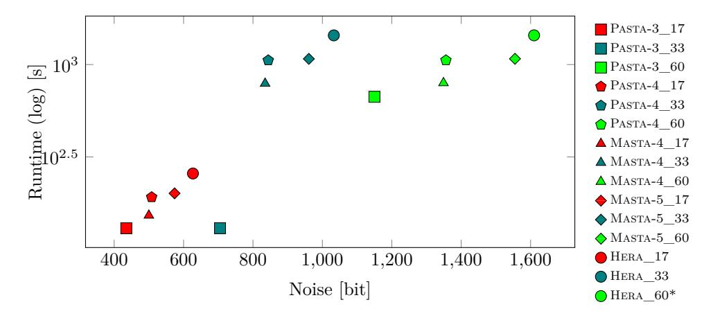

Figure 8: Runtime and noise comparison for the bigger HHE use case in SEAL (security level  $\lambda = 128$  bit). Ciphers marked with a \* did not have enough noise budget.

#### 9.3 Pasta in Different Use Cases

In recent years, many symmetric primitives defined over  $\mathbb{F}_p^t$ , such as GMiMC [AGP+19], HADESMIMC [GLR+20], Poseidon [GKR+21], Rescue [AAB+20], Ciminion [DGGK21], GRIFFIN [GHR+22], Reinforced Concrete [GKL+22], and Hydra [GØSW22], have been proposed in the literature. However, contrary to PASTA, these primitives were not designed for HHE, but for MPC and zk-SNARK/STARK use cases, which is why they were optimized for different metrics. While having a low multiplicative depth is the most important design criterion for use cases involving homomorphic encryption, the other use cases usually just require a small total number of multiplications. Therefore, these afromentioned symmetric primitives have a significant larger number of rounds and, consequently, a large multiplicative depth which makes them infeasible for HE use cases. PASTA on the

other hand has a very small depth, but the significantly larger statesize results in a large total number of multiplications. In HE use cases many of these multiplications are performed in parallel using packing, but this large number of multiplications makes Pasta worse for MPC and zk-SNARK/STARK applications. In some MPC scenarios (e.g., scenarios with a very high-delay, low bandwidth WAN connection between the parties), the low multiplicative depth of Pasta may, however, give it an advantage over the other constructions.

### **Conclusion**

In this paper, we investigated hybrid homomorphic encryption, a technique to combat ciphertext expansion in homomorphic encryption applications at the cost of more expensive computations in the encrypted domain. Since HHE was first mentioned in [NLV11], many symmetric ciphers for HHE have been proposed in the literature. However, the effects of applying HHE to any use case were not really understood so far. In our work, we tackled this issue in several ways: First, we for the first time investigate the high-level impact on the server and client when applying HHE to a practical use case in Section 4. Secondly, we implement a framework which for the first time compares many different symmetric ciphers when used with HHE in three popular HE libraries. Finally, to improve the performance of HHE, we propose a new symmetric cipher, dubbed Pasta, which outperforms the state-of-the-art for integer use cases over  $\mathbb{F}_p$ .

The main take-aways of this paper are the following: Our investigations show, that HHE achieves the best results when the clients are embedded devices with limited computational power and bandwidth. Furthermore, many state-of-the-art ciphers are not well suited for many HHE applications due to being defined over  $\mathbb{Z}_2$ . Finally, while HHE is very beneficial for clients, the actual computation in the encrypted domain suffers. This is due to first having to decrypt the symmetric ciphertexts under homomorphic encryption before computing the actual use case. While this extra work naturally contributes to the computation runtime, it also contributes to the multiplicative depth of the whole HE computation. Since an efficient bootstrapping operation is still missing from most state-of-the-art HE libraries (such as the ones considered in this paper), this additional multiplicative depth significantly contributes to the whole computation runtime. As a consequence, we show that only evaluating a cipher under HE is not enough to estimate its performance in HHE, one has to consider the whole HHE use case instead.

# Acknowledgments

This work was supported by EU's Horizon 2020 project Safe-DEED under grant agreement n°825225, and by the "DDAI" COMET Module within the COMET – Competence Centers for Excellent Technologies Programme, funded by the Austrian Federal Ministry for Transport, Innovation and Technology (bmvit), the Austrian Federal Ministry for Digital and Economic Affairs (bmdw), the Austrian Research Promotion Agency (FFG), the province of Styria (SFG) and partners from industry and academia. The COMET Programme is managed by FFG. Lorenzo Grassi is supported by the European Research Council under the ERC advanced grant agreement under grant ERC-2017-ADG Nr. 788980 ESCADA.

# **References**

- [AAB+20] Abdelrahaman Aly, Tomer Ashur, Eli Ben-Sasson, Siemen Dhooghe, and Alan Szepieniec. Design of Symmetric-Key Primitives for Advanced Cryptographic Protocols. *IACR Trans. Symmetric Cryptol.*, 2020(3):1–45, 2020.
- [AGP+19] Martin R. Albrecht, Lorenzo Grassi, Léo Perrin, Sebastian Ramacher, Christian Rechberger, Dragos Rotaru, Arnab Roy, and Markus Schofnegger. Feistel Structures for MPC, and More. In *ESORICS*, volume 11736 of *LNCS*, pages 151–171. Springer, 2019.
- [AMT22] Tomer Ashur, Mohammad Mahzoun, and Dilara Toprakhisar. Chaghri - an FHE-friendly Block Cipher. *IACR Cryptol. ePrint Arch.*, page 592, 2022. accepted at ACM CCS 2022.
- [ARS+15] Martin R. Albrecht, Christian Rechberger, Thomas Schneider, Tyge Tiessen, and Michael Zohner. Ciphers for MPC and FHE. In *EUROCRYPT*, volume 9056 of *LNCS*, pages 430–454. Springer, 2015.
- [BBH+22] Alexandros Bampoulidis, Alessandro Bruni, Lukas Helminger, Daniel Kales, Christian Rechberger, and Roman Walch. Privately connecting mobility to infectious diseases via applied cryptography. *Proc. Priv. Enhancing Technol.*, 2022(4):768–788, 2022.
- [BBS99] Eli Biham, Alex Biryukov, and Adi Shamir. Cryptanalysis of Skipjack Reduced to 31 Rounds Using Impossible Differentials. In *EUROCRYPT*, volume 1592 of *LNCS*, pages 12–23. Springer, 1999.
- [BCD+20] Tim Beyne, Anne Canteaut, Itai Dinur, Maria Eichlseder, Gregor Leander, Gaëtan Leurent, María Naya-Plasencia, Léo Perrin, Yu Sasaki, Yosuke Todo, and Friedrich Wiemer. Out of Oddity - New Cryptanalytic Techniques Against Symmetric Primitives Optimized for Integrity Proof Systems. In *CRYPTO*, volume 12172 of *LNCS*, pages 299–328. Springer, 2020.
- [BFSY05] Magali Bardet, Jean-Charles Faugere, Bruno Salvy, and Bo-Yin Yang. Asymptotic behaviour of the degree of regularity of semi-regular polynomial systems. In *Proc. of MEGA*, volume 5, pages 2–2, 2005.
- [BGV12] Zvika Brakerski, Craig Gentry, and Vinod Vaikuntanathan. (leveled) fully homomorphic encryption without bootstrapping. In *ITCS*, pages 309–325. ACM, 2012.
- [Bra12] Zvika Brakerski. Fully Homomorphic Encryption without Modulus Switching from Classical GapSVP. In *CRYPTO*, volume 7417 of *LNCS*, pages 868–886. Springer, 2012.
- [BS90] Eli Biham and Adi Shamir. Differential Cryptanalysis of DES-like Cryptosystems. In *CRYPTO*, volume 537 of *LNCE*, pages 2–21. Springer, 1990.
- [BW12] Andrey Bogdanov and Meiqin Wang. Zero Correlation Linear Cryptanalysis with Reduced Data Complexity. In *FSE*, volume 7549 of *LNCS*, pages 29–48. Springer, 2012.
- [CCF+16] Anne Canteaut, Sergiu Carpov, Caroline Fontaine, Tancrède Lepoint, María Naya-Plasencia, Pascal Paillier, and Renaud Sirdey. Stream Ciphers: A Practical Solution for Efficient Homomorphic-Ciphertext Compression. In *FSE*, volume 9783 of *LNCS*, pages 313–333. Springer, 2016.

- [CCK+13] Jung Hee Cheon, Jean-Sébastien Coron, Jinsu Kim, Moon Sung Lee, Tancrède Lepoint, Mehdi Tibouchi, and Aaram Yun. Batch Fully Homomorphic Encryption over the Integers. In *EUROCRYPT*, volume 7881 of *LNCS*, pages 315–335. Springer, 2013.
- [CDK+18] Benoît Cogliati, Yevgeniy Dodis, Jonathan Katz, Jooyoung Lee, John P. Steinberger, Aishwarya Thiruvengadam, and Zhe Zhang. Provable Security of (Tweakable) Block Ciphers Based on Substitution-Permutation Networks. In *CRYPTO*, volume 10991 of *LNCS*, pages 722–753. Springer, 2018.
- [CDKS21] Hao Chen, Wei Dai, Miran Kim, and Yongsoo Song. Efficient Homomorphic Conversion Between (Ring) LWE Ciphertexts. In *ACNS*, volume 12726 of *LNCS*, pages 460–479. Springer, 2021.
- [CGGI16] Ilaria Chillotti, Nicolas Gama, Mariya Georgieva, and Malika Izabachène. TFHE: Fast fully homomorphic encryption library, August 2016. https://tfhe.github.io/tfhe/.
- [CGGI20] Ilaria Chillotti, Nicolas Gama, Mariya Georgieva, and Malika Izabachène. TFHE: Fast Fully Homomorphic Encryption Over the Torus. *J. Cryptol.*, 33(1):34–91, 2020.
- [CGL+20] Edward J. Chou, Arun Gururajan, Kim Laine, Nitin Kumar Goel, Anna Bertiger, and Jack W. Stokes. Privacy-preserving phishing web page classification via fully homomorphic encryption. In *ICASSP*, pages 2792–2796. IEEE, 2020.
- [CHK+21] Jihoon Cho, Jincheol Ha, Seongkwang Kim, ByeongHak Lee, Joohee Lee, Jooyoung Lee, Dukjae Moon, and Hyojin Yoon. Transciphering Framework for Approximate Homomorphic Encryption. In *ASIACRYPT*, volume 13092 of *LNCS*, pages 640–669. Springer, 2021.
- [CHMS22] Orel Cosseron, Clément Hoffmann, Pierrick Méaux, and François-Xavier Standaert. Towards Globally Optimized Hybrid Homomorphic Encryption - Featuring the Elisabeth Stream Cipher. *IACR Cryptol. ePrint Arch.*, page 180, 2022.
- [CIR22] Carlos Cid, John Petter Indrøy, and Håvard Raddum. FASTA - A Stream Cipher for Fast FHE Evaluation. In *CT-RSA*, volume 13161 of *LNCS*, pages 451–483. Springer, 2022.
- [CJL+20] Ilaria Chillotti, Marc Joye, Damien Ligier, Jean-Baptiste Orfila, and Samuel Tap. CONCRETE: Concrete Operates oN Ciphertexts Rapidly by Extending TfhE. In *WAHC 2020–8th Workshop on Encrypted Computing & Applied Homomorphic Cryptography*, volume 15, 2020.
- [CJP21] Ilaria Chillotti, Marc Joye, and Pascal Paillier. Programmable Bootstrapping Enables Efficient Homomorphic Inference of Deep Neural Networks. In *CSCML*, volume 12716 of *LNCS*, pages 1–19. Springer, 2021.
- [CKKS17] Jung Hee Cheon, Andrey Kim, Miran Kim, and Yong Soo Song. Homomorphic Encryption for Arithmetic of Approximate Numbers. In *ASIACRYPT*, volume 10624 of *LNCS*, pages 409–437. Springer, 2017.
- [CLT14] Jean-Sébastien Coron, Tancrède Lepoint, and Mehdi Tibouchi. Scale-Invariant Fully Homomorphic Encryption over the Integers. In *Public Key Cryptography*, volume 8383 of *LNCS*, pages 311–328. Springer, 2014.

- [CMdG+21] Kelong Cong, Radames Cruz Moreno, Mariana Botelho da Gama, Wei Dai, Ilia Iliashenko, Kim Laine, and Michael Rosenberg. Labeled PSI from homomorphic encryption with reduced computation and communication. In *CCS*, pages 1135–1150. ACM, 2021.
- [Dae95] Joan Daemen. *Cipher and hash function design, strategies based on linear and differential cryptanalysis, PhD Thesis*. K.U.Leuven, 1995. [http://jda.](http://jda.noekeon.org/) [noekeon.org/](http://jda.noekeon.org/).
- [DEG+18] Christoph Dobraunig, Maria Eichlseder, Lorenzo Grassi, Virginie Lallemand, Gregor Leander, Eik List, Florian Mendel, and Christian Rechberger. Rasta: A Cipher with Low ANDdepth and Few ANDs per Bit. In *CRYPTO*, volume 10991 of *LNCS*, pages 662–692. Springer, 2018.
- [DGGK21] Christoph Dobraunig, Lorenzo Grassi, Anna Guinet, and Daniël Kuijsters. Ciminion: Symmetric Encryption Based on Toffoli-Gates over Large Finite Fields. In *EUROCRYPT*, volume 12697 of *LNCS*, pages 3–34. Springer, 2021.
- [DR00] Joan Daemen and Vincent Rijmen. Rijndael for AES. In *AES Candidate Conference*, pages 343–348. National Institute of Standards and Technology" 2000.
- [DR02] Joan Daemen and Vincent Rijmen. *The Design of Rijndael: AES - The Advanced Encryption Standard*. Information Security and Cryptography. Springer, 2002.
- [DS09] Itai Dinur and Adi Shamir. Cube Attacks on Tweakable Black Box Polynomials. In *EUROCRYPT*, volume 5479 of *LNCS*, pages 278–299, 2009.
- [DSC+19] Roshan Dathathri, Olli Saarikivi, Hao Chen, Kim Laine, Kristin E. Lauter, Saeed Maleki, Madanlal Musuvathi, and Todd Mytkowicz. CHET: an optimizing compiler for fully-homomorphic neural-network inferencing. In *PLDI*, pages 142–156. ACM, 2019.
- [Fau99] Jean-Charles Faugére. A new efficient algorithm for computing gröbner bases (f4). *Journal of Pure and Applied Algebra*, 139(1):61–88, 1999.
- [FV12] Junfeng Fan and Frederik Vercauteren. Somewhat Practical Fully Homomorphic Encryption. *IACR Cryptol. ePrint Arch.*, 2012:144, 2012.
- [Gen09] Craig Gentry. Fully homomorphic encryption using ideal lattices. In *STOC*, pages 169–178. ACM, 2009.
- [GHR+22] Lorenzo Grassi, Yonglin Hao, Christian Rechberger, Markus Schofnegger, Roman Walch, and Qingju Wang. A New Feistel Approach Meets Fluid-SPN: Griffin for Zero-Knowledge Applications. *IACR Cryptol. ePrint Arch.*, page 403, 2022.
- [GHS12] Craig Gentry, Shai Halevi, and Nigel P. Smart. Homomorphic Evaluation of the AES Circuit. In *CRYPTO*, volume 7417 of *LNCS*, pages 850–867. Springer, 2012.
- [GKL+22] Lorenzo Grassi, Dmitry Khovratovich, Reinhard Lüftenegger, Christian Rechberger, Markus Schofnegger, and Roman Walch. Reinforced concrete: A fast hash function for verifiable computation. In *CCS*, pages 1323–1335. ACM, 2022.

- [GKR+21] Lorenzo Grassi, Dmitry Khovratovich, Christian Rechberger, Arnab Roy, and Markus Schofnegger. Poseidon: A New Hash Function for Zero-Knowledge Proof Systems. In *30th USENIX Security Symposium (USENIX Security 21)*. USENIX Association, 2021.
- [GLR+20] Lorenzo Grassi, Reinhard Lüftenegger, Christian Rechberger, Dragos Rotaru, and Markus Schofnegger. On a Generalization of Substitution-Permutation Networks: The HADES Design Strategy. In *EUROCRYPT*, volume 12106 of *LNCS*, pages 674–704. Springer, 2020.
- [GØSW22] Lorenzo Grassi, Morten Øygarden, Markus Schofnegger, and Roman Walch. From Farfalle to Megafono via Ciminion: The PRF Hydra for MPC Applications. *IACR Cryptol. ePrint Arch.*, page 342, 2022.
- [GPP11] Jian Guo, Thomas Peyrin, and Axel Poschmann. The PHOTON Family of Lightweight Hash Functions. In *CRYPTO*, volume 6841 of *LNCS*, pages 222–239. Springer, 2011.
- [GPPR11] Jian Guo, Thomas Peyrin, Axel Poschmann, and Matthew J. B. Robshaw. The LED Block Cipher. In *CHES*, volume 6917 of *LNCS*, pages 326–341. Springer, 2011.
- [HKC+20] Jincheol Ha, Seongkwang Kim, Wonseok Choi, Jooyoung Lee, Dukjae Moon, Hyojin Yoon, and Jihoon Cho. Masta: An HE-Friendly Cipher Using Modular Arithmetic. *IEEE Access*, 8:194741–194751, 2020.
- [HKL+22] Jincheol Ha, Seongkwang Kim, ByeongHak Lee, Jooyoung Lee, and Mincheol Son. Rubato: Noisy Ciphers for Approximate Homomorphic Encryption. In *EUROCRYPT*, volume 13275 of *LNCS*, pages 581–610. Springer, 2022.
- [HL20] Phil Hebborn and Gregor Leander. Dasta - Alternative Linear Layer for Rasta. *IACR Trans. Symmetric Cryptol.*, 2020(3):46–86, 2020.
- [HS14] Shai Halevi and Victor Shoup. Algorithms in HElib. In *CRYPTO*, volume 8616 of *LNCS*, pages 554–571. Springer, 2014.
- [HS15] Shai Halevi and Victor Shoup. Bootstrapping for HElib. In *EUROCRYPT*, volume 9056 of *LNCS*, pages 641–670. Springer, 2015.
- [HS18] Shai Halevi and Victor Shoup. Faster Homomorphic Linear Transformations in HElib. In *CRYPTO*, volume 10991 of *LNCS*, pages 93–120. Springer, 2018.
- [HS20] Shai Halevi and Victor Shoup. Design and implementation of HElib: a homomorphic encryption library. *IACR Cryptol. ePrint Arch.*, 2020:1481, 2020.
- [JK97] Thomas Jakobsen and Lars R. Knudsen. The Interpolation Attack on Block Ciphers. In *FSE*, volume 1267 of *LNCS*, pages 28–40. Springer, 1997.
- [JV17] Antoine Joux and Vanessa Vitse. A Crossbred Algorithm for Solving Boolean Polynomial Systems. In *NuTMiC*, volume 10737 of *LNCS*, pages 3–21. Springer, 2017.
- [JVC18] Chiraag Juvekar, Vinod Vaikuntanathan, and Anantha P. Chandrakasan. GAZELLE: A low latency framework for secure neural network inference. In *USENIX Security Symposium*, pages 1651–1669. USENIX Association, 2018.

- [Knu94] Lars R. Knudsen. Truncated and Higher Order Differentials. In *FSE 1994*, volume 1008 of *LNCS*, pages 196–211. Springer, 1994.
- [Lai94] Xuejia Lai. *Higher Order Derivatives and Differential Cryptanalysis*, pages 227–233. 1994.
- [LAW+22] Fukang Liu, Ravi Anand, Libo Wang, Willi Meier, and Takanori Isobe. Coefficient grouping: Breaking chaghri and more. *IACR Cryptol. ePrint Arch.*, page 991, 2022.
- [LPR10] Vadim Lyubashevsky, Chris Peikert, and Oded Regev. On Ideal Lattices and Learning with Errors over Rings. In *EUROCRYPT*, volume 6110 of *LNCS*, pages 1–23. Springer, 2010.
- [LSMI21] Fukang Liu, Santanu Sarkar, Willi Meier, and Takanori Isobe. Algebraic Attacks on Rasta and Dasta Using Low-Degree Equations. In *ASIACRYPT*, volume 13090 of *LNCS*, pages 214–240. Springer, 2021.
- [Mat93] Mitsuru Matsui. Linear Cryptanalysis Method for DES Cipher. In *EURO-CRYPT*, volume 765 of *LNCS*, pages 386–397. Springer, 1993.
- [MCJS19] Pierrick Méaux, Claude Carlet, Anthony Journault, and François-Xavier Standaert. Improved Filter Permutators for Efficient FHE: Better Instances and Implementations. In *INDOCRYPT*, volume 11898 of *LNCS*, pages 68–91. Springer, 2019.
- [NIS15] NIST. SHA-3 Standard: Permutation-Based Hash and Extendable-Output Functions. National Institute of Standards and Technology (NIST), FIPS PUB 202, U.S. Department of Commerce, 2015.
- [NLV11] Michael Naehrig, Kristin E. Lauter, and Vinod Vaikuntanathan. Can homomorphic encryption be practical? In *CCSW*, pages 113–124. ACM, 2011.
- [NNY18] Ruben Niederhagen, Kai-Chun Ning, and Bo-Yin Yang. Implementing Joux-Vitse's Crossbred Algorithm for Solving MQ Systems over GF(2) on GPUs. In *PQCrypto*, volume 10786 of *LNCS*, pages 121–141. Springer, 2018.
- [Pai99] Pascal Paillier. Public-Key Cryptosystems Based on Composite Degree Residuosity Classes. In *EUROCRYPT*, volume 1592 of *LNCS*, pages 223–238. Springer, 1999.
- [RAD78] R L Rivest, L Adleman, and M L Dertouzos. On data banks and privacy homomorphisms. *Foundations of Secure Computation, Academia Press*, pages 169–179, 1978.
- [Reg05] Oded Regev. On lattices, learning with errors, random linear codes, and cryptography. In *STOC*, pages 84–93. ACM, 2005.
- [RSA78] Ronald L. Rivest, Adi Shamir, and Leonard M. Adleman. A Method for Obtaining Digital Signatures and Public-Key Cryptosystems. *Commun. ACM*, 21(2):120–126, 1978.
- [SEA20] Microsoft SEAL (release 3.6). <https://github.com/Microsoft/SEAL>, November 2020. Microsoft Research, Redmond, WA.
- [SV14] Nigel P. Smart and Frederik Vercauteren. Fully homomorphic SIMD operations. *Des. Codes Cryptogr.*, 71(1):57–81, 2014.

- [Vie07] Michael Vielhaber. Breaking ONE.FIVIUM by AIDA an Algebraic IV Differential Attack. *IACR Cryptology ePrint Archive*, 2007:413, 2007.
- [VJH21] Alexander Viand, Patrick Jattke, and Anwar Hithnawi. Sok: Fully homomorphic encryption compilers. In *IEEE Symposium on Security and Privacy*, pages 1092–1108. IEEE, 2021.
- [WSH+22] Roman Walch, Samuel Sousa, Lukas Helminger, Stefanie N. Lindstaedt, Christian Rechberger, and Andreas Trügler. Cryptotl: Private, efficient and secure transfer learning. *CoRR*, abs/2205.11935, 2022.

# **A HE Schemes and Libraries (cont.)**

**BGV [\[BGV12\]](#page-30-1) in HElib [\[HS20\]](#page-33-4).** The BGV scheme, and its implementation in HElib, allows plaintexts in Z*pr* and offers more flexibility for choosing HE parameters than SEAL. It allows arbitrary cyclotomic reduction polynomials and it is possible to find parameters which allow packing for Z2 plaintexts. However, this flexibility comes with the drawback that parameterizing for HElib is more difficult than finding parameters in SEAL, and the limited parameter sets in SEAL allow for more optimized implementations. In this paper we use the HElib version 2.1.0. Similar to BFV in SEAL, additions are considered free in BGV, and the multiplicative depth of the circuit is the most relevant performance metric.

**TFHE [\[CGGI20\]](#page-31-2) in TFHE [\[CGGI16\]](#page-31-9).** The TFHE library, more concretely the gatebootstrapping version of the original TFHE library which we use in this paper, is vastly different from SEAL and HElib. It only allows the encryption of boolean values (i.e., plaintexts are in Z2), but it is optimized for fast gate bootstrapping. This basically means that after the evaluation of a homomorphic gate the noise in the ciphertext is reset. As a consequence, contrary to most other modern homomorphic encryption schemes, the multiplicative depth of a circuit is no relevant metric there. However, each homomorphically evaluated gate requires the same computational effort, thus additions are not considered to be free as in the BFV or BGV cryptosystems. The most relevant metric for TFHE in gate-bootstrapping mode is, therefore, the total number of gates. Furthermore, SIMD style packing is not supported in TFHE. Since TFHE only allows to encrypt boolean values, we do not implement and consider F*p* ciphers in this library.

# **B Additional Benchmarks**

In this section we give the benchmarks of all the ciphers in the original TFHE library (Appendix [B.1\)](#page-35-3), and in HElib (Appendix [B.2\)](#page-36-0). Finally, we compare the plain performance of Pasta and Masta in Appendix [B.3.](#page-39-1)

# **B.1 TFHE Benchmarks of** Z**2 Ciphers**

Since the noise in the ciphertexts is reset after every homomorphic operation due to gate-bootstrapping in TFHE, we do not have to choose any parameters for the benchmarks (except the security level, which we set to 128 bits). In Table [11](#page-36-1) we present the benchmarks for the TFHE library for homomorphically decrypting only one block, and for the small HHE use case from Section [5.](#page-8-0) We give timings for homomorphically encrypting the symmetric key, homomorphically decrypting one block, and for the small HHE use case. Since TFHE does not support packing all implementations are bitsliced (i.e., one HE ciphertext per bit).

|             |          | 1 Block | Small HH | E use case |
|-------------|----------|---------|----------|------------|
| Cipher      | Enc. Key | Decomp. | Decomp.  | Use Case   |
|             | s        | s       | s        | s          |
| LowMC       | 0.003    | 6 120.5 | 6 310.6  | 175.6      |
| Rasta-5     | 0.013    | 5 728.8 | 5 807.8  | 164.0      |
| Rasta-6     | 0.009    | 3 275.0 | 3293.6   | 162.2      |
| Dasta- $5$  | 0.013    | 5 642.6 | 5664.7   | 165.2      |
| Dasta-6     | 0.009    | 3 272.7 | 3293.0   | 162.0      |
| Agrasta     | 0.003    | 407.1   | 408.4    | 164.4      |
| Kreyvium    | 0.003    | 284.1   | 290.4    | 162.6      |
| Kreyvium-12 | 0.003    | 284.1   | 559.7    | 162.6      |
| Kreyvium-13 | 0.003    | 310.1   | 290.4    | 162.6      |
| F1LIP-1216  | 0.442    | 1 504.6 | 1 886.9  | 164.3      |
| FiLIP-1280  | 0.107    | 1 594.5 | 1 981.8  | 162.8      |

Table 11: Benchmarks for the TFHE library (security level  $\lambda = 128$  bit).

**Discussion.** In Figure 9 we compare the runtime of homomorphically decrypting one block and the whole HHE use case (including homomorphic decryption) of the  $\mathbb{Z}_2$  ciphers in TFHE. In the gate-bootstrapping version of TFHE the main performance metric is the total gate count, which is why KREYVIUM is the fastest choice. Since the TFHE library only allows plaintexts in  $\mathbb{Z}_2$  we do not implement and compare  $\mathbb{F}_p$  ciphers in TFHE.

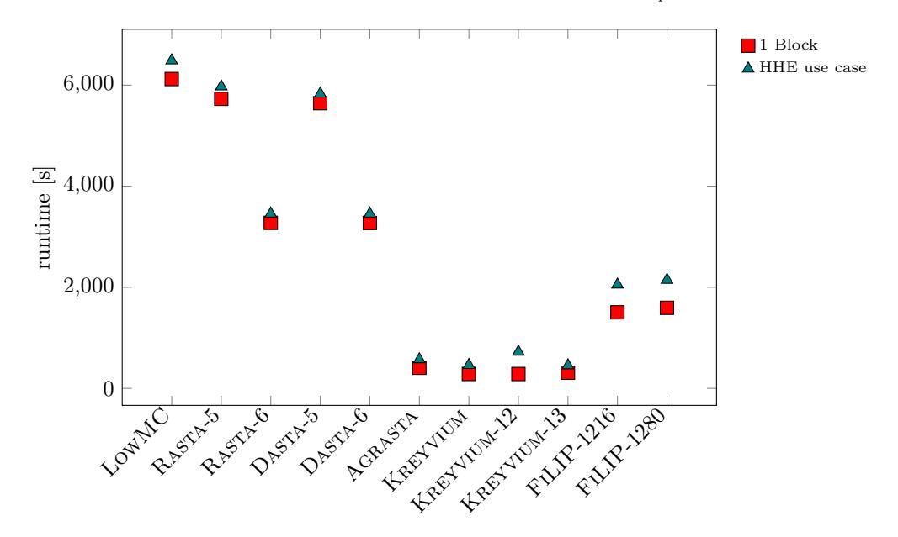

Figure 9: Runtime comparison of homomorphically decrypting one block and the small HHE use case (including HHE decompression) of  $\mathbb{Z}_2$  ciphers in TFHE (security level  $\lambda = 128$ bit).

### **HElib Benchmarks**

In this section, we give all the benchmarks in the HElib. First, we benchmark the  $\mathbb{Z}_2$ ciphers, before we compare them to the  $\mathbb{F}_p$  ciphers. Finally, we benchmark PASTA, MASTA, and Hera in a more extensive use case.

### B.2.1 HElib Benchmarks of $\mathbb{Z}_2$ Ciphers

In HElib, the security and available noise budget mainly depend on the choice of the cyclotomic reduction polynomial, as well as the size of the ciphertext modulus. A bigger modulus provides a bigger noise budget at the cost of less security. A bigger cyclotomic polynomial provides more security, but is bad for performance. In our benchmarks, we use the tool provided by HElib to find suitable parameters given a target security level of 128 bits and a target noise budget which we gathered from the experiments. The resulting parameter sets provide  $\lambda' \approx 128$  bits of security with the majority of sets providing slightly less.

In Table 12 we present the benchmarks for the HElib library, for homomorphically decrypting only one block, and for the small HHE use case from Section 5. For both benchmarks we give timings alongside the chosen m-th cyclotomic reduction polynomial (chosen by HElib) and the estimated security  $\lambda'$  (estimated by HElib). For the HHE use case we additionally give the runtime for the affine transformation use case. To compare the benchmarks to SEAL and TFHE, all implementations are bitsliced (i.e., one HE ciphertext per bit).

Remark 4. HElib supports packing for  $\mathbb{Z}_2$  plaintexts. Even though a packed implementation of the symmetric ciphers will increase their overall performance, it complicates the evaluation of an integer matrix-vector multiplication based on binary circuits. Therefore, packed implementations do not fix the main issue of  $\mathbb{Z}_2$  ciphers for HHE, which is supporting integer arithmetic over  $\mathbb{F}_p$ . For this reason, we do not provide explicit packed benchmarks for the ciphers in the paper.

|             | 1 Block |            |          |            | Small HHE use case |            |          |          |            |
|-------------|---------|------------|----------|------------|--------------------|------------|----------|----------|------------|
| Cipher      | m       | $\lambda'$ | Enc. Key | Decomp.    | m                  | $\lambda'$ | Enc. Key | Decomp.  | Use Case   |
|             |         | bit        | s        | s          |                    | bit        | s        | s        | s          |
| LowMC       | 23377   | 110        | 9.22     | 1 132.4    | 43691              | 108        | 27.5     | 3 708.8  | 1 618.8    |
| Rasta-5     | 11441   | 111        | 11.7     | 284.2      | 31609              | 118        | 57.7     | 1 666.9  | 922.4      |
| Rasta-6     | 11441   | 111        | 7.79     | 207.7      | 31609              | 108        | 41.8     | 1 401.0  | $1\ 037.2$ |
| Dasta-5     | 11441   | 111        | 11.8     | 276.7      | 31609              | 118        | 57.9     | 1 608.4  | 922.0      |
| Dasta-6     | 11441   | 111        | 7.87     | 201.7      | 31609              | 108        | 41.6     | 1 357.3  | 1 042.6    |
| Agrasta     | 10261   | 117        | 2.38     | 38.3       | 32767              | 108        | 13.7     | 276.9    | 853.6      |
| Kreyvium    | 14351   | 108        | 3.97     | 497.0      | 43691              | 144        | 22.0     | 3 392.6  | 1 431.9    |
| Kreyvium-12 | 14351   | 108        | 4.06     | 498.3      | 43691              | 147        | 22.0     | 6 657.1  | $1\ 392.6$ |
| Kreyvium-13 | 15709   | 113        | 4.38     | 577.1      | 43691              | 144        | 21.7     | 3 407.3  | $1\ 420.9$ |
| F1LIP-1216  | 5461    | 113        | 131.4    | $1\ 357.5$ | 23311              | 108        | 1 010.0  | 17 919.7 | 566.6      |
| FILIP-1280  | 8435    | 119        | 47.3     | 2 197.4    | 24929              | 105        | 337.2    | 27 613.9 | 745.2      |

Table 12: Benchmarks of the  $\mathbb{Z}_2$  ciphers in the HElib library.

### B.2.2 Comparing Pasta to $\mathbb{Z}_2$ Ciphers in HElib

The benchmarks for HElib can be seen in Table 13 where we depict both runtime and remaining noise budget after each step of the HHE use case from Section 5. In the following, we compare the runtime and noise consumption of all  $\mathbb{Z}_2$  and  $\mathbb{F}_p$  (with p=65537) ciphers, namely in Figure 10 for homomorphically decrypting one block in HElib ( $\mathbb{F}_p$  values from Appendix B.2.3), and in Figure 11 for the HHE use case (including HHE decompression) in HElib. Since MASTA and PASTA require to use the m-th cyclotomic reduction polynomial ( $X^{m/2}+1$ ), where m is a power-of-two, we chose parameters differently compared to Appendix B.2.1: We parameterize q to provide enough noise budget to evaluate the benchmark and chose the m to be the smallest power-of-two such that the parameters provide  $\geq 128$  bits security. Thereby, for a fixed m, a smaller q provides both, larger security and faster performance. Consequently, greater  $\lambda'$  in Table 13 also lead to faster runtimes compared to instantiating the same benchmark with exactly 128 bits of security.

| Cipher    | m                    | $\lambda'$ | Enc. I  | Enc. Key Decomp. |         | np.   | Small Use Case |       |
|-----------|----------------------|------------|---------|------------------|---------|-------|----------------|-------|
|           |                      |            | runtime | noise            | runtime | noise | runtime        | noise |
|           |                      | bit        | s       | bit              | s       | bit   | s              | bit   |
| p = 65537 | p = 65537 (17  bit): |            |         |                  |         |       |                |       |
| Pasta-3   | 65536                | 173        | 0.054   | 410              | 26.0    | 74    | 0.754          | 23    |
| Pasta-4   | 65536                | 142        | 0.054   | 475              | 13.0    | 56    | 0.737          | 6     |
| Masta-4   | 65536                | 133        | 0.054   | 502              | 36.7    | 86    | 0.740          | 36    |
| Masta-5   | 131072               | 254        | 0.116   | 566              | 55.4    | 56    | 1.71           | 5     |
| HERA      | 131072               | 234        | 0.124   | 632              | 20.9    | 69    | 1.74           | 19    |

Table 13: Runtime and noise budget of the small HHE use case in the HElib library.

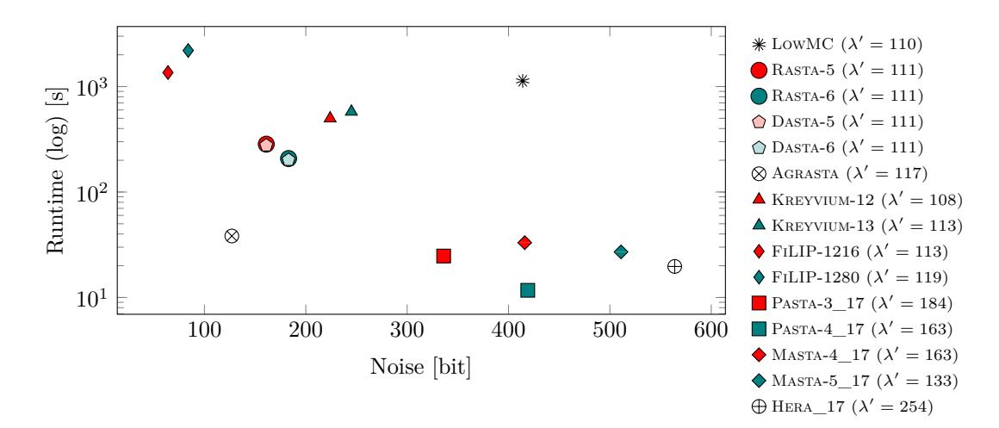

Figure 10: Runtime and noise comparison of  $\mathbb{Z}_2$  ciphers for homomorphically decrypting 1 Block in HElib (HE security level  $\lambda'$ ).

#### B.2.3 **HElib Benchmarks of** $\mathbb{F}_p$ **Ciphers**

In Table 14 we present the benchmarks for the packed implementation of PASTA, MASTA, and HERA in the HElib library. We give timings for homomorphically decrypting one block and additionally timings for the bigger HHE use case (Section 9.2). We chose parameters in the same fashion as in Appendix B.2.2, i.e., choosing q to provide enough noise budget to evaluate the benchmark, and choose the m-th cyclotomic reduction polynomial, with mbeing a power of two, such that the HE scheme provides > 128 bits security.

Remark 5. In Table 14, some benchmarks were run with  $\lambda < 128$  bits security. The reason for that is that m = 262144 unfortunately lead to infeasible runtimes. Consequently, m=131072 seems to be an upper limit for feasible runtimes in HElib, and use cases requiring larger amounts of noise than can be provided by m=131072 and  $\lambda \geq 128$  would inevitably require an efficient bootstrapping operation.

In the following figures we compare the runtime and noise consumption of the ciphers for 3 different prime fields  $\mathbb{F}_p$ , in Figure 12 for homomorphically decrypting one block in HElib, and in Figure 13 for the HHE use case (including HHE decompression) in HElib.

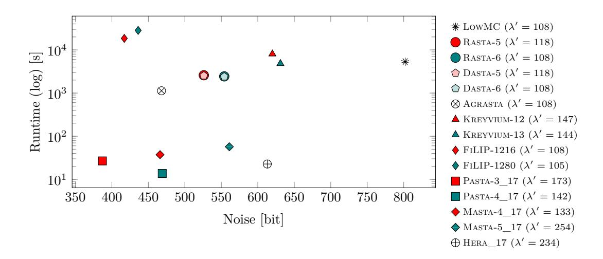

Figure 11: Runtime and noise comparison for the small HHE use case in HElib (HE security level  $\lambda'$ ).

### B.3 Plain Benchmarks of Pasta, Masta and Hera

In Table 15 we compare the number of CPU cycles of the encryption circuit of PASTA to the encryption circuit of MASTA and HERA. Since these ciphers generate random matrices and/or round constants independent of the secret key, which can be precomputed before encryption, we additionally give CPU cycles for generating these affine layers and keys schedules and the encryption circuit with precomputed randomness. Table 15 shows that HERA, with its small block size and fixed matrices which can be evaluated purely by additions, is the fastest cipher in plain. However, this advantage comes at the cost of higher number of rounds, which worsenes homomorphic performance. Comparing PASTA to MASTA, one can observe that PASTA-4, due to its small state size, requires the smallest number of cycles to encrypt one block. PASTA-3, on the other hand, due to sampling sequential matrices instead of polynomials  $m \in \mathbb{Z}_p[X]/(X^t - \alpha)$  (as in MASTA) and requiring twice as many matrices per round, is the slowest cipher to encrypt one block in plain. However, the difference to MASTA-4 is only a factor of 3, which in practice corresponds to latencies in the order of milliseconds.

# C Packed vs. Word-Sliced Implementation of Pasta

In Section 6, we describe efficient SIMD algorithms to evaluate PASTA on a packed HE ciphertext. In this section, we want to compare them to a word-sliced implementation where one would encrypt only one field element  $\in \mathbb{F}_p$  into one HE ciphertext. A word-sliced implementation has several disadvantages. First, the homomorphic evaluation time of PASTA would be much slower. In a packed implementation, the S-boxes can be evaluated with  $\mathcal{O}(1)$  homomorphic operations, and with  $\mathcal{O}(t)$  HE operations in a word-sliced implementation. The word-sliced affine layer requires  $\mathcal{O}(t^2)$  HE operations compared to  $\mathcal{O}(t)$  operations when using packing. Secondly, the initial setup in the HHE use case requires the transmission of the HE encrypted symmetric key. In a packed implementation, this is always only one HE ciphertext. However, in a word-sliced implementation, one has to transmit  $2 \cdot t$  HE ciphertexts, drastically increasing the communication cost of this setup phase. Finally, if the HHE use case leverages packing, one has to reconstruct a packed ciphertext from its word-sliced state using many rotations on the server.

| Table | 14: | $\mathbb{F}_n$ | benchmarks | for t | the | HElib | library. |
|-------|-----|----------------|------------|-------|-----|-------|----------|
|       |     |                |            |       |     |       |          |

|                                   |                     | 1 Block    |          | Bigger HHE use case |                     |            |          |         |          |
|-----------------------------------|---------------------|------------|----------|---------------------|---------------------|------------|----------|---------|----------|
| Cipher                            | m                   | $\lambda'$ | Enc. Key | Decomp.             | m                   | $\lambda'$ | Enc. Key | Decomp. | Use Case |
|                                   |                     | bit        | s        | s                   |                     | bit        | s        | s       | s        |
| p = 65537 (17  bit):              |                     |            |          |                     |                     |            |          |         |          |
| Pasta-3                           | 65536               | 184        | 0.052    | 24.7                | 65536               | 128        | 0.064    | 57.6    | 19.9     |
| Pasta-4                           | 65536               | 163        | 0.052    | 11.7                | 131072              | 229        | 0.124    | 210.8   | 38.6     |
| Masta-4                           | 65536               | 163        | 0.062    | 33.1                | 131072              | 229        | 0.131    | 157.3   | 45.4     |
| Masta-5                           | 65536               | 133        | 0.064    | 27.1                | 131072              | 199        | 0.135    | 252.8   | 48.4     |
| Hera                              | 131072              | 254        | 0.116    | 19.7                | 131072              | 189        | 0.121    | 315.1   | 48.0     |
| p = 8088322049 (33  bit):         |                     |            |          |                     |                     |            |          |         |          |
| Pasta-3                           | 65536               | 128        | 0.057    | 28.7                | 131072              | 162        | 0.166    | 187.7   | 60.5     |
| Pasta-4                           | 131072              | 204        | 0.166    | 35.3                | 131072              | 144        | 0.190    | 320.5   | 57.8     |
| Masta-4                           | 131072              | 196        | 0.165    | 101.3               | 131072              | 144        | 0.166    | 256.2   | 69.5     |
| Masta-5                           | 131072              | 166        | 0.168    | 82.4                | 131072 a | 117        | 0.242    | 427.8   | 80.0     |
| HERA                              | 131072              | 150        | 0.179    | 29.6                | 131072 a | 110        | 0.239    | 526.1   | 82.4     |
| p = 1096486890805657601 (60 bit): |                     |            |          |                     |                     |            |          |         |          |
| Pasta-3                           | 131072              | 162        | 0.185    | 94.1                | 131072ª             | 97         | 0.285    | 268.8   | 84.4     |
| Pasta-4                           | 131072              | 129        | 0.183    | 50.5                | 131072 a | 83         | 0.310    | 486.7   | 84.2     |
| Masta-4                           | 131072              | 129        | 0.208    | 144.7               | 131072 a | 83         | 0.289    | 387.4   | 101.6    |
| Masta-5                           | 131072 a | 99         | 0.233    | 122.1               | 131072 a | 70         | 0.300    | 635.5   | 111.9    |
| HERA                              | 131072 a | 89         | 0.249    | <b>44.2</b>         | 131072 a | 60         | 0.318    | 816.3   | 124.1    |

 $^{\mathrm{a}}$  Further increasing m for security resulted in infeasibly long runtimes.

However, word-sliced implementations have an advantage as well. They do not require homomorphic rotations (and, therefore, no Galois keys) and one can access each word of the state individually. This is why one can implement the S-boxes from Section 6.4 without requiring masking multiplications. As a consequence, word-sliced implementations have less noise consumption. Splitting the state in our PASTA design is also beneficial for word-sliced implementations, since it reduces the number of homomorphic multiplications from  $(2 \cdot t)^2$  to  $2 \cdot t^2$  per affine layer, reducing the runtime.

#### **C.1 About a Word-Sliced Hera Implementation**

Since HERA has a small statesize (16) and a larger round number (5), it might be beneficial to have a word-sliced implementation instead of a packed one. Indeed, since the linear layers can purely be implemented by additions, the multiplicative depth gets reduced from 10 ct-ct multipliations and 7 pt-ct multiplications to a depth of 10 and 1 multiplications respectively. Comparing a word-sliced implementation to a packed PASTA-3 implementation, one can observe that PASTA-3 still is preferable. On one hand, PASTA-3 has a smaller depth (4 ct-ct and 6 pt-ct Multiplications) implying less noise consumption and smaller HE parameters. On the other hand, comparing the number of HE operations involved (96 pt-ct and 160 ct-ct multiplications for Hera and 514 pt-ct multiplications, 4 ct-ct multiplications and 98 rotations for PASTA-3) one can see that PASTA-3 requires significantly less of the more expensive rotations and ct-ct multiplications at the cost of more pt-ct multiplications. Thus, if there is a small advantage of HERA when evaluating one block with 16 output words (Pasta-3 has 128), then this advantage is already gone when evaluating two or more blocks. Consequently, we conjecture that PASTA-3 is still more beneficial in most use cases than a wordsliced HERA implementation.

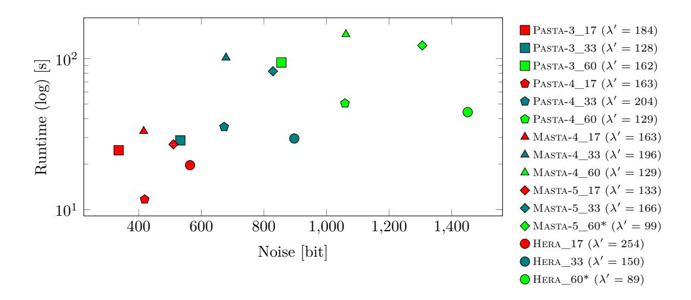

Figure 12: Runtime and noise comparison of F*p* ciphers for homomorphically decrypting 1 Block in HElib (HE security level *λ* ′ ). Ciphers marked with a \* were evaluated with less than 128 bit HE security.

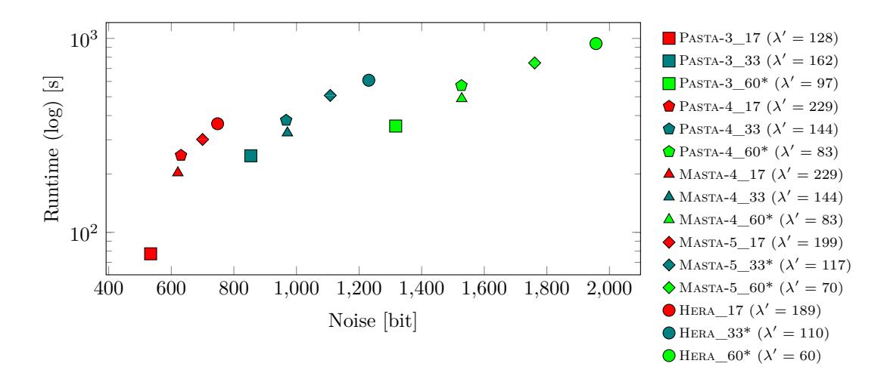

Figure 13: Runtime and noise comparison for the bigger HHE use case in HElib (HE security level *λ* ′ ). Ciphers marked with a \* were evaluated with less than 128 bit HE security.

Table 15: Cycles for encrypting one block in plain, averaged over 1000 executions.

|                                    | <i>v</i> 1 0   | 1 /               |                |  |  |  |  |
|------------------------------------|----------------|-------------------|----------------|--|--|--|--|
| Cipher                             | Total          | Affine Generation | Encrypting     |  |  |  |  |
| p = 65537 (17  bit):               |                |                   |                |  |  |  |  |
| Pasta-3                            | 17 041 380     | 9 196 314         | 7 845 066      |  |  |  |  |
| Pasta-4                            | $1\ 363\ 339$  | 825 067           | $538\ 272$     |  |  |  |  |
| Masta-4                            | $6\ 535\ 937$  | 2 164 002         | $4\ 371\ 935$  |  |  |  |  |
| Masta-5                            | $2\ 105\ 628$  | 752 374           | $1\ 353\ 254$  |  |  |  |  |
| HERA                               | $60 \ 391$     | 30 615            | 29776          |  |  |  |  |
| p = 8088322049  (33 bit):          |                |                   |                |  |  |  |  |
| Pasta-3                            | 22 429 444     | 11 637 800        | 10 791 644     |  |  |  |  |
| Pasta-4                            | $1\ 750\ 420$  | 973 205           | $777 \ 215$    |  |  |  |  |
| Masta-4                            | $8\ 427\ 384$  | 1 975 522         | $6\ 451\ 862$  |  |  |  |  |
| Masta-5                            | $2\ 690\ 636$  | 674 201           | $2\ 016\ 435$  |  |  |  |  |
| HERA                               | <b>54 567</b>  | 17 350            | $37\ 217$      |  |  |  |  |
| p = 1096486890805657601  (60 bit): |                |                   |                |  |  |  |  |
| Pasta-3                            | 31 053 515     | 16 067 138        | $14\ 986\ 377$ |  |  |  |  |
| Pasta-4                            | $2\ 458\ 680$  | 1 315 770         | $1\ 142\ 910$  |  |  |  |  |
| Masta-4                            | $11\ 405\ 862$ | 1 968 100         | $9\ 437\ 762$  |  |  |  |  |
| Masta-5                            | $3\ 542\ 410$  | 669 220           | 2873190        |  |  |  |  |
| HERA                               | 61 360         | 16 873            | $44\ 487$      |  |  |  |  |