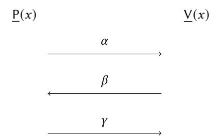
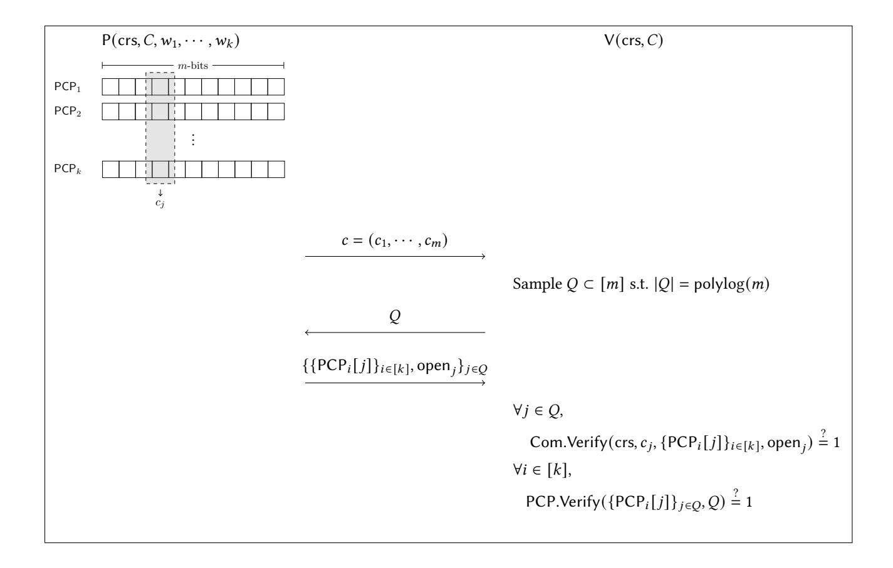

# SNARGs for P from LWE

Arka Rai Choudhuri Abhishek Jain Zhengzhong Jin

Johns Hopkins University

#### Abstract

We provide the rst construction of a succinct non-interactive argument (SNARG) for all polynomial time deterministic computations based on standard assumptions. For 𝑇 steps of computation, the size of the proof and the common random string (CRS) as well as the verification time are poly-logarithmic in 𝑇 . e security of our scheme relies on the hardness of the Learning with Errors (LWE) problem against polynomial-time adversaries. Previously, SNARGs based on standard assumptions could support bounded-depth computations and required sub-exponential hardness assumptions [Jawale-Kalai-Khurana-Zhang, STOC'21].

Along the way, we also provide the rst construction of non-interactive batch arguments for NP based solely on the LWE assumption.

# Contents

| 1 | Introduction                          |                                                    | 3  |
|---|---------------------------------------|----------------------------------------------------|----|
|   | 1.1                                   | Our Results                                     | 3  |
|   | 1.2                                   | Related Work                                    | 4  |
| 2 | Technical Overview                    |                                                    | 5  |
|   | 2.1                                   | Background                                      | 5  |
|   | 2.2                                   | Delegating Polynomial-Time Computations         | 8  |
|   | 2.3                                   | Non-interactive Batch Arguments for NP          | 12 |
|   |                                       | 2.3.1 Batch Arguments for Index Languages    | 13 |
|   |                                       | 2.3.2 Batch Arguments for NP              | 17 |
| 3 | Preliminaries 18                   |                                                    |    |
|   | 3.1                                   | Notations                                       | 18 |
|   | 3.2                                   | Low-degree Extensions                           | 18 |
|   | 3.3                                   | Learning with Error                             | 18 |
|   | 3.4                                   | Correlation Intractable Hash                    | 19 |
|   | 3.5                                   | Somewhere Extractable Commitment                | 20 |
|   | 3.6                                   | No-Signaling Somewhere Extractable Commitments  | 21 |
| 4 | Non-interactive Batch Arguments 22 |                                                    |    |
|   | 4.1                                   | De€nition                                       | 23 |
|   | 4.2                                   | PCP with Fast Online Veri€cation                | 24 |
|   | 4.3                                   | BARGs for Index Languages                       | 28 |
|   | 4.4                                   | BARGs for NP                                    | 33 |
| 5 |                                       | RAM Delegation                                     | 35 |
|   | 5.1                                   | Turing Machine Delegation                       | 35 |
|   | 5.2                                   | RAM Delegation                                  | 36 |
|   | 5.3                                   | Hash Tree                                       | 37 |
|   | 5.4                                   | Protocol                                        | 38 |
|   |                                       | 5.4.1 Eciency                               | 39 |
|   |                                       | 5.4.2 Security Proof                         | 41 |
| 6 |                                       | More Ecient Batch Arguments for NP             | 47 |
| 7 |                                       | Acknowledgments                                    | 49 |
| A |                                       | Proof of ‡eorem 5                               | 54 |

# 1 Introduction

Consider the following scenario: a client wishes to evaluate a program 𝑃 (say, represented as a Turing machine) on an input 𝑥 but does not have the necessary computational resources. Instead, it delegates the computation to an untrusted server who provides the output 𝑃 (𝑥) together with a proof Π. e key requirement is that the proof Π should be much faster to verify than the time it takes to compute 𝑃 (𝑥).

e focus of this work is on constructing such proof systems in the non-interactive seing, where they are referred to as succinct non-interactive arguments (SNARGs).[1](#page-2-2) e de facto model for such proof systems allows for an initial setup that samples a (reusable) common reference string (CRS) and distributes it to the parties. Furthermore, the soundness guarantee is computational, i.e., it only holds against computationallybounded provers [\[BCC88\]](#page-48-1). e key benet of such proof systems is that they can be used as short certi cates for the correctness of long computations that can be veried by anyone. Applications of SNARGs abound in the literature and include popular real-world systems such as blockchains [\[BCG](#page-48-2)+ 14].

In this work, we focus on the task of constructing SNARGs based on standard assumptions. Despite extensive research over the years (see Section [1.2](#page-3-0) for a summary), the following basic question has remained open:

Do there exist SNARGs for all polynomial-time (deterministic) computations based on standard assumptions?

A recent beautiful work of Jawale, Kalai, Khurana and Zhang [\[JKKZ21\]](#page-51-0) makes progress on this front. ey construct SNARGs for bounded-depth deterministic computations based on the sub-exponential hardness of the Learning with Errors (LWE) assumption. e goal of our work is to support arbitrary-depth polynomial-time computations, while relying only on standard polynomial-time assumptions.

## 1.1 Our Results

We construct SNARGs for all polynomial-time deterministic computations based on the hardness of LWE against polynomial time adversaries. Our construction is in the common random string model and achieves adaptive soundness.

eorem 1 (Informal). Assuming the hardness of LWE, for every polynomial 𝑇 = 𝑇 (𝜆), there exists a publicly-verifiable non-interactive delegation scheme with adaptive soundness for any time 𝑇 Turing machine. e verier running time, size of the CRS and proof are all poly(log𝑇 , 𝜆) while the prover running time is poly(𝑇 , 𝜆).

Our result also extends, with the same parameters, to delegation of RAM computation.

Non-interactive Batch Arguments. Towards obtaining our main result, we study the related problem of non-interactive batch arguments (BARGs) for NP. Informally speaking, such an argument system allows an efficient prover to compute a non-interactive and publicly verifiable "batch proof" of 𝑘 NP instances, with size smaller than the combined witness length. If any of the 𝑘 instances is false, then no polynomial-time cheating prover must be able to produce an accepting proof. BARGs allow for delegating non-deterministic computation for a specific sub-class of NP, namely, conjunction of NP statements.

Very recently, Choudhuri, Jain and Jin [\[CJJ21\]](#page-50-0) provided the rst construction of BARGs for NP based on standard assumptions. In their scheme, the size of the proof for proving 𝑘 statements for the circuit satisability problem defined by a circuit 𝐶 is 𝑂˜ ( (|𝐶| +p 𝑘|𝐶|) · 𝜆). e security of their scheme is based on the hardness of adratic Residuosity (QR) and either LWE or sub-exponential Decisional Die-Hellman (DDH).

1 In the literature, the term SNARG is typically associated with NP computations. In this work, similar to [\[JKKZ21\]](#page-51-0), we focus on deterministic computations.

We improve upon their work along several dimensions that are important towards obtaining our main result in eorem [1:](#page-2-3)

- We consider (and achieve) a notion of semi-adaptive somewhere soundness which is stronger than the non-adaptive soundness notion considered in [\[CJJ21\]](#page-50-0). We discuss this further in Section [2.](#page-4-0) [2](#page-3-1)
- We reduce the dependence on the number of statements in the proof and CRS size to only polylogarithmic.
- We simplify the hardness assumptions and base the security of our scheme solely on LWE.[3](#page-3-2)

eorem 2 (Informal). Assuming the hardness of LWE, there exists a BARG for NP with the following parameters: in order to prove 𝑘 instances of a language L whose NP-relation can be decided by a Turing machine in time𝑇 , the size of the CRS and proof are poly(log 𝑘, log𝑇 , 𝑛,𝑚, 𝜆), the prover running time is poly(𝑘,𝑇 , 𝑛,𝑚, 𝜆) and the verier running time is poly(log 𝑘, log𝑇 , 𝑛,𝑚, 𝜆) + poly(𝑘, 𝑛, 𝜆), where 𝑛 is the length of a single instance and 𝑚 is the length of a single witness.

Finally, we note that our scheme is in the common random string. In contrast, [\[CJJ21\]](#page-50-0) requires a common reference string.

## 1.2 Related Work

We now provide a brief overview of the related work on delegating computation. We borrow from the excellent summaries in [\[JKKZ21,](#page-51-0) [KPY19\]](#page-51-1) and some of the text below is taken verbatim from these works. Prior work on delegating computation can be roughly divided in three categories, described below.

– SNARGs. ere is a large body of work, starting from [\[Mic94\]](#page-52-0), that constructs SNARGs for nondeterministic computation (see, e.g., [\[Mic94,](#page-52-0)[Gro10,](#page-50-1) [Lip12,](#page-52-1) [DFH12,](#page-50-2)[GGPR13,](#page-50-3) [BCI](#page-48-3)+ 13, [BCCT13,](#page-48-4) [BCC](#page-48-5)+ 17]. ese schemes are either in the Random Oracle model or require non-falsiable assumptions [\[Nao03\]](#page-52-2). However, some of these schemes form the basis of efficient implementations used in practice. Other constructions of SNARGs for deterministic computations are known based on assumptions related to obfuscation or multilinear maps [\[CHJV15,](#page-50-4) [KLW15,](#page-51-2) [BGL](#page-49-0)+ 15, [CH16,](#page-49-1) [ACC](#page-48-6)+ 16, [CCC](#page-49-2)+ 16, [PR17\]](#page-52-3).

Recently, [\[KPY19\]](#page-51-1) constructed SNARGs for deterministic computations (as well as batch arguments for NP) from a new falsiable but non-standard assumption on groups with bilinear maps (which can be broken with quantum aacks). Independently, [\[CCH](#page-49-3)+ 19] constructed SNARGs for boundeddepth computations based on a very strong assumption, namely, the existence of fully homomorphic encryption with optimal circular security.

Even more recently, [\[JKKZ21\]](#page-51-0) constructed SNARGs for bounded-depth computations from subexponential hardness of LWE. Our work overcomes both limitations of their work, i.e. support for bounded-depth computations and use of sub-exponential hardness assumptions.

– Designated Verier Proofs. An inuential line of work starting from [\[KRR13,](#page-51-3) [KRR14\]](#page-51-4) and continuing with [\[KP16,](#page-51-5) [BHK17,](#page-49-4) [BKK](#page-49-5)+ 18, [HR18,](#page-51-6) [BK20\]](#page-49-6) construct delegation schemes for deterministic computations and various sub-classes of non-deterministic computations (such as batch arguments) based on standard assumptions. e main drawback of these schemes is that they can only be veri ed by a designated verier, who knows the "secret key" corresponding to the CRS. e main benet of our work compared to this line of work is that we achieve public veriability.

2As observed in [\[BHK17\]](#page-49-4), there are significant barriers to constructing BARGs with full adaptive soundness due to implications to adaptively sound SNARGs for NP [\[GW11\]](#page-50-5).

3An alternative direction that we do not pursue in this work is to base security solely on sub-exponential DDH (as in [\[JJ21\]](#page-51-7)).

– Interactive Proofs. In the seing of interactive protocols, publicly verifiable delegation schemes for NP are known from standard assumptions [\[Kil92\]](#page-51-8). e work of [\[BKP18\]](#page-49-7) constructs three message protocols based on multi-collision resistant hash functions, and [\[PRV12\]](#page-52-4) constructs two-message schemes (in addition to CRS) for low-depth circuits from aribute-based encryption.

Finally, we note that in the interactive seing, delegation schemes with even unconditional soundness are known. e works of [\[GKR08,](#page-50-6) [RRR16\]](#page-52-5) construct such schemes for bounded depth and bounded space computations, respectively. Furthermore, [\[RRR16,](#page-52-5) [RRR18,](#page-52-6) [RR20\]](#page-52-7) construct batch proofs (with unconditional soundness) for UP, a subclass of NP where each statement in the language has a unique witness of membership.

More Related Work. We also mention recent works of [\[GZ21,](#page-50-7) [GR19\]](#page-50-8) that study publicly verifiable non-interactive argument systems for deterministic computations. In particular, assuming standard assumptions on groups with bilinear maps, [\[GZ21\]](#page-50-7) constructs a publicly verifiable non-interactive argument system for polynomial-time computations where the proof size does not grow with the size of the computation. eir scheme (as well as [\[GR19\]](#page-50-8)), however, requires a long CRS (and hence, long verification time) proportional to the circuit size.

e work of [\[GZ21\]](#page-50-7) introduces the notion of no-signaling commitment schemes. We use this primitive in our construction of SNARGs for polynomial-time computations.

Concurrent Work. In a concurrent and independent work, Kalai, Vaikuntanathan and Zhang [\[KVZ21\]](#page-51-9) provide an elegant alternative transformation from non-interactive batch arguments for NP to a noninteractive delegation scheme. Unlike our transformation, they make use of no-signaling PCPs and additionally require sub-exponential security from non-interactive batch arguments for NP.

As a corollary, they obtain a non-interactive delegation for P assuming sub-exponential hardness of LWE by instantiating their transformation with a sub-exponential secure variant of the non-interactive batch argument presented in this paper.

# 2 Technical Overview

Towards our goal of achieving publicly verifiable delegation schemes for all polynomial time computations, we depart significantly from prior approaches in the designated-verier seing. We leverage advances in the instantiation of the Fiat-Shamir transformation, recently applied in the context of publicly verifiable delegation schemes for bounded-depth computation [\[CCH](#page-49-3)+ 19, [JKKZ21\]](#page-51-0). We start with an overview of the necessary background before describing the main ideas underlying our work.

## 2.1 Background

Fiat-Shamir (FS) Paradigm. At a very high level, the Fiat-Shamir transform [\[FS87\]](#page-50-9) is a round collapsing transformation that allows one to start with an interactive proof of a specified structure, and transform it into a non-interactive argument in the CRS model. Specifically, the starting interactive proof system (P, V) must be public coin i.e. a protocol where the verier only sends random coins as its messages.

e transformation is defined with respect to some hash function family H, where the sampled hash function, ℎ ← H, is set to be the CRS. e prover can then derive the verier's messages non-interactively by applying ℎ on the protocol transcript. Consider the following interactive protocol between the prover P and verier V establishing that 𝑥 ∈ L, where V's message 𝛽 is a uniformly random string.

To generate a non-interactive proof, P computes 𝛽 = ℎ(𝑥, 𝛼) with the resultant proof being (𝛼,𝛾). V can recompute 𝛽 (from 𝑥 and 𝛼) and check if the transcript (𝑥, 𝛼, 𝛽,𝛾) is accepting. Note that the total communication from the prover to the verier remains unchanged by the transformation. erefore, when proof size is the main concern in the non-interactive seing, it is important to start with an interactive protocol that already satisfies the communication requirements.

Soundness of Fiat-Shamir transform and CI. Initially, the soundness (i.e. inability of a cheating prover to generate an accepting proof when 𝑥 ∉ L) of the Fiat-Shamir transform was proven by modeling the hash family as a random oracle. An exciting line of recent results have shown that for several applications [\[KRR17,](#page-51-10) [CCRR18,](#page-49-8) [HL18,](#page-51-11) [CCH](#page-49-3)+ 19, [PS19,](#page-52-8) [BKM20,](#page-49-9) [CPV20,](#page-50-10) [CKU20,](#page-50-11) [JJ21\]](#page-51-7), the Fiat-Shamir transformation can be soundly instantiated by a hash function family that is correlation intractable.

First, let us see why there is a need to "re-prove" the soundness in the transformed non-interactive protocol. Unlike in the interactive seing, where the prover has no control over the verier message 𝛽, in the transformed protocol, a cheating prover could try various values of 𝛼 as inputs to ℎ until it arrives on a 𝛽 it nds favorable. Specifically, for every 𝑥 ∉ L, and every 𝛼, we dene the set of "bad" 𝛽s,

$$\mathcal{B}_{x,\alpha} := \left\{ \beta \mid \exists \gamma \text{ s.t. } \forall (x,\alpha,\beta,\gamma) = 1 \right\}.$$

Intuitively, these are the set of verier challenges that could lead the verier to accept, even if the statement is not in the language. We want it to be computationally intractable to nd an 𝛼 such that ℎ(𝑥, 𝛼) ∈ B𝑥,𝛼 , i.e. hard to nd 𝛼 that would result in a bad verier challenge. is is exactly what correlation intractability of a hash family captures. Specifically, we say that H is correlation intractable for a function 𝑓 if the following holds for all probabilistic polynomial time adversaries (PPT) A,

$$\Pr_{h \leftarrow \mathcal{H}}[h(x) = f(x) \mid \mathcal{A}(h) = x] \le \operatorname{negl}(\lambda).$$

Assume for the moment that there exists at most one bad verier challenge for every pair (𝑥, 𝛼). en one can dene a function 𝑓 (·) B BAD(·) that on input (𝑥, 𝛼) outputs the unique 𝛽 ∈ B𝑥,𝛼 (if it exists). If H is a CIH for 𝑓 , then any cheating prover producing an accepting transcript (𝛼,𝛾) for 𝑥 ∉ L must break the correlation intractability of H, since by definition ℎ(𝑥, 𝛼) ∈ B𝑥,𝛼 . For any set B𝑥,𝛼 where |B𝑥,𝛼 | is polynomially bounded, one can set 𝑓𝑖(·) B BAD(·,𝑖) to output the 𝑖-th element of B𝑥,𝛼 . By a simple application of union bound, one can observe that it remains computationally intractable for an adversary to nd an 𝛼 such that ℎ(𝑥, 𝛼) is the output of any 𝑓𝑖 , and thereby remains intractable to output any element in B𝑥,𝛼 .

e above ideas can be extended to multi-round protocols that additionally satisfy certain properties such as round-by-round soundness [\[CCH](#page-49-3)+ 19].

Fiat-Shamir Instantiation for Product Relations. While we described above an extension to any polynomially bounded |B𝑥,𝛼 |, this approach no longer works when B𝑥,𝛼 is super-polynomial. Looking ahead, the set of bad challenges we consider in our work will not be of a polynomially bounded size, and therefore the ideas discussed above do not suce. Instead, we will borrow upon the recent exciting work of [HLR21]. Their work consider sets  $\mathcal{B}_{x,\alpha}$  that for every x and  $\alpha$ , can be represented as a Cartesian product of t sets,

$$\mathcal{B}_{x,\alpha} = \mathcal{B}_{x,\alpha}^{(1)} \times \cdots \times \mathcal{B}_{x,\alpha}^{(t)},$$

where each  $\mathcal{B}_{x,\alpha}^{(i)}$  can be efficiently verified, i.e. there is a circuit C that on input  $(x,\alpha)$ ,  $\beta_i$  and i outputs 1 if and only  $\beta_i \in \mathcal{B}_{x,\alpha}^{(i)}$ . For such sets, [HLR21] show that one can construct CI hash families assuming only the hardness of LWE even if  $|\mathcal{B}_{x,\alpha}|$  is not polynomially bounded.

**Main Barriers.** Since the Fiat-Shamir transformation preserves prover communication, it is imperative that our starting interactive protocol already has low communication. A natural candidate for such an interactive protocol is the public coin succinct argument system for NP by Kilian [Kil92] with total communication smaller than the size of the witness. A recent work of [BBH+19], however, established non-trivial barriers to instantiating the hash function in the Fiat-Shamir transformation of Kilian's protocol.

There is in fact a broader point to consider: Kilian's protocol is an *argument*, i.e. its soundness holds only against computationally bounded cheating provers. In general, successful applications of the Fiat-Shamir paradigm when used in conjunction with CIH, have been largely limited to starting with interactive *proofs*, i.e. protocols for which even a computationally unbounded adversary cannot convince a verifier of the validity of a false statement. In fact there are examples of certain interactive arguments that are not sound on the application of the Fiat-Shamir transformation (see e.g. [Bar01, GK03]).

For this reason, the state of the art non-interactive delegation schemes that follow this approach [CCH+19, JKKZ21] rely upon known interactive delegation schemes with unconditional soundness – in particular, the scheme of [GKR08] for bounded-depth computations. The only other known interactive delegation scheme is for bounded-space computations [RRR16] (with verification time and communication sublinear in the number of computation steps). As such, it is unclear how to use this approach to achieve our goal of non-interactive delegation for *all* polynomial time computations.

**Our Work.** In light of the challenges described above, we take a different approach. We choose to view the problem of delegation of deterministic computations through the lens of *batch arguments for* NP. Here the prover is trying to convince the verifier of the veracity of k different statements for an NP language, with communication smaller than the combined length of the witnesses for all the statements. This is an independently interesting problem, and has seen recent progress in the non-interactive setting based on standard assumptions [C][21].

More specifically, we reduce the task of constructing delegation schemes for polynomial-time computations to the task of constructing non-interactive batch arguments (BARGs) for NP. We then use the Fiat-Shamir methodology to construct BARGs for NP. As is to be expected, the same challenges as discussed earlier in the context of using the Fiat-Shamir transformation apply to the problem of constructing BARGs as well. Indeed, presently interactive batch *proofs* are only known for UP (a subset of NP for which each statement has a unique witness) [RRR16, RRR18, RR20], and it is an open problem to construct batch proofs for NP. Nevertheless, as we will discuss later in Section 2.3, we will build upon the "dual-mode methodology" from the recent work of [CJJ21] to circumvent these challenges and construct BARGs (with necessary security and efficiency properties that we discuss below) based on LWE via the Fiat-Shamir methodology. For now, however, we simply assume that such BARGs exist and proceed to describe the main ideas underlying our construction of a delegation scheme for polynomial-time computations.

We remark that some works [BHK17, KPY19] have previously studied both of these problems – delegations schemes for deterministic computations and batch arguments for NP –and used common tools and techniques to solve both the problems. We make this connection more explicit by reducing the problem of delegation of deterministic computations to batch arguments for NP. A similar approach was taken in

the work of [RRR16] who consider the problem of batch verifying interactive proofs in the setting of (unconditionally sound) interactive delegation for bounded space computation. At a very high level, in their work, the prover sends several intermediate steps of the computation and then batches proofs that these intermediate steps were computed correctly. We use a similar blueprint; however, our focus is on the noninteractive setting, and all polynomial-time computations. Furthermore, we require stronger efficiency – poly-logarithmic dependence on the number of computation steps, as opposed to sublinear in [RRR16].

## **Delegating Polynomial-Time Computations**

We start our discussion with the problem of delegating the computation of a Turing machine. Here, for a Turing machine  $\mathcal{M}$  and input x, the prover produces a proof  $\Pi$  to convince the verifier that  $\mathcal{M}$  accepts x within T steps, with the requirement that both the proof size  $|\Pi|$  and the verifier's running time are polylog(T). As stated earlier, we want to cast the problem of delegation as a problem of BARGs for NP. Intuitively, a BARG for an NP language  $\mathcal{L}$  allows the prover to prove that k statements  $x_1, \dots, x_k$  all belong to  $\mathcal L$  such that communication cost is "small" (we defer the exact communication requirements to later).

To cast the delegation problem as a BARG, we look at the intermediate states of the Turing machine computation. Let st, be the encoding of the state of  $\mathcal{M}$  and its tapes after exactly *i* steps of the computation. We want to prove that for every  $i \in [T-1]$ ,  $st_{i+1} = Step(st_i)$ , where Step is the *deterministic* algorithm computing the state transition of a single step. The states st, are thus a "witness" to the entire computation. On the surface, this already appears to be a batch problem of T instances, but an observant reader may notice that for each i, the witnesses for i and i + 1 "overlap", specifically the overlapping state  $st_{i+1}$ . If this overlap of witnesses are not ensured, then a cheating prover could use witnesses  $(st_i, st_{i+1})$  and  $(st'_{i+1}, st'_{i+2})$ such that  $\operatorname{st}_{i+1} = \operatorname{Step}(\operatorname{st}_i) \wedge \operatorname{st}_{i+2}' = \operatorname{Step}(\operatorname{st}_{i+1}')$  but  $\operatorname{st}_{i+1} \neq \operatorname{st}_{i+1}'$ . This is clearly undesirable since the overlap of witnesses is necessary to establish continuity in the computation - otherwise a cheating prover is proving T independent statements, unhelpful to establish correctness of computation. Unfortunately, the notion of batch arguments we have described does not enforce any constraints across statements.

We overcome this problem as follows:

- Step 1: First, the prover commits to all the internal states  $st_1||\cdot||st_T$ . Let this committed value be c.
- − *Step 2*: The prover now proves that for every  $i \in [T]$ ,  $(x, c, i) \in \mathcal{L}$ , where  $\mathcal{L}$  is defined by the relation circuit C below.

C

**Statement:** x, c, i

**Witness:**  $st_i$ ,  $st_{i+1}$ ,  $open_{st_i}$ ,  $open_{st_{i+1}}$ **Output:** Output 1 if and only if the following verify

- 1. check if Com. Verify $(c, st_i, open_{st_i}) \stackrel{?}{=} 1$ .
- 2. check if Com.Verify $(c, \mathsf{st}_{i+1}, \mathsf{open}_{\mathsf{st}_{i+1}}) \stackrel{?}{=} 1$ .
- 3. if i = 1, check if  $st_1$  encodes input x.
- 4. if i = T 1, check if  $st_T$  is the *accept* state.
- 5. Check if  $Step(st_i) = st_{i+1}$ .

Here, opensti corresponds to a proof of opening that sti was indeed the *i*-th vector that was committed to in c.

**Weaker Goal: Bounded-Space Computation.** For now, we consider the weaker goal of bounded-space computation since it already highlights the main challenges. Specifically, we allow the total communication and the verification time to be poly(log T, |st|), i.e., grow with the size of the internal state. We shall later see how to go beyond the space constraints.

Towards achieving this weaker goal, we establish some efficiency properties of the commitment scheme used in Step 1:

- *Size of the commitment:* Enforcing the same communication constraints as above on the size of the commitment we have that the commitment to a vector of size  $T \cdot |st|$  is at most poly(log T, |st|), i.e. the commitment is *succinct*.
- Size of the opening: Looking ahead, we will require that the size of C, the relation circuit for  $\mathcal{L}$ , to also be at most poly(log T, |st|). This means that the commitment must have a succinct local opening opening opensti to sti, since the opening is a part of the witness (and thus contributes to |C|). Succinctness here means that the size of the opening is poly(log T, |st|).

Let us now shift our focus to Step 2. Our initial idea is to use a batch argument for NP language to prove all the instances (x, c, i) for the relation circuit C. Note, however, that the verifier of a batch argument inevitably runs in time  $\Omega(T)$  for T instances as it needs to at least read the T instances. This is prohibitive for us since we require the verifier of our delegation scheme to run in time polylogarithmic in T.

Using BARGs for Index Language. To overcome this issue, our key observation is that the statements above are *identical* except for the index *i*. Hence, the verifier in our case need not suffer from the  $\Omega(T)$  running time barrier, since the number of instances T provides all the necessary information about the instances. This motivates us to adopt the following useful abstraction we call *batch arguments for index languages*. Formally, the index language is defined as follows,

$$\mathcal{L}^{\mathsf{idx}} = \{ (C, i) \mid \exists w \text{ s.t. } C(i, w) = 1 \}$$

where *C* represents a circuit, and *i* an index. In a BARG for an index language, the prover tries to convince the verifier that  $(C, 1), \dots, (C, T) \in \mathcal{L}^{idx}$ .

To implement Step 2, we can set the index language such that C contains hard-coded the *common inputs* across all T instances, namely, the commitment c and input x, and only takes in as input an index i. The witness to C remains unchanged. Towards achieving the relaxed goal of delegating bounded-space computation, we allow the proof size and the verification time of batch argument for T statements to be poly( $\log T$ , |C|), as long as |C| = poly(|st|). We note that this already rules out using existing batch arguments based on standard assumptions [CJJ21] since the proof size in their scheme depends on  $\sqrt{T}$ ).

**Security.** Let us now turn our attention to the security of our approach. Along the way, we will establish the required security properties from the commitment scheme and BARGs for index language.

Since the commitment used in Step 1 is succinct, for every i there could always exist states  $st'_i$  and  $st'_{i+1}$  with corresponding local commitment openings to c such that  $Step(st'_i) = st'_{i+1}$  even if it is computationally hard to find them. Thus for all i it may always be the case that  $(C, i) \in \mathcal{L}^{idx}$ , making soundness of the batch argument a vacuous notion. The fix is to use somewhere statistical binding commitments [HW15] such that for a commitment key generated on input  $i^*$  there is a unique (except with negligible probability) local opening to  $st'_{i^*}$ ,  $st'_{i^*+1}$ . Thus, if  $Step(st'_{i^*}) \neq st'_{i^*+1}$ , then  $(C, i^*) \notin \mathcal{L}^{idx}$ .

In more detail, let  $S_i$  be the set of indices corresponding to  $\operatorname{st}_i$  in the vector  $\operatorname{st}_1||\cdots||\operatorname{st}_T$ . We will require the somewhere statistical binding property to be at indices  $S_i \cup S_{i+1}$  when the commitment key is generated in the *trapdoor mode*4 on input  $S_i \cup S_{i+1}$ . We shall shortly see why this is the case. In fact, looking forward, we will actually require something stronger. Namely, generating a key in trapdoor mode on input  $S_i \cup S_{i+1}$  produces a trapdoor that allows for *unique extraction* at positions  $S_i \cup S_{i+1}$  even for a commitment produced by an *unbounded cheating prover*. We refer to this as the *somewhere extractable* property, and use the shorthand SE to refer to it in the sequel.

From the discussion above, by setting the SE commitment to be extractable for  $st_i$ ,  $st_{i+1}$ , the best that one can hope for in terms of BARG soundness is that a cheating prover is not able to produce an accepting proof when the i-th statement is false, i.e.  $st_{i+1} \neq Step(st_i)$ . This motivates a notion of *somewhere soundness* where the CRS for the BARG is generated on an index i such that it is hard for a cheating prover to produce an accepting proof when  $(C, i) \notin \mathcal{L}^{idx}$ .

The work of [CJJ21] considered *non-adaptive* security for BARG, where the statements are fixed *before* the CRS is generated. In our approach, however, a cheating prover gets to choose the commitment c, which is hardcoded into the circuit C, effectively allowing it to adaptively pick the statements *after* the CRS is generated. Unfortunately, as observed in [BHK17], there are significant barriers to achieving *full adaptivity*, where the cheating prover can choose the statements *after* the CRS is generated.

We overcome this seeming conundrum by considering an intermediate notion of security that we call *semi-adaptive somewhere soundness*. We explain it here for the case of index language. Intuitively, the cheating prover must declare an index  $i^*$  of its choice before the CRS is generated. However, it can choose the circuit C after viewing the CRS. The soundness guarantee states that it will not be able to produce an accepting batch proof if  $(C, i^*) \notin \mathcal{L}$ . More specifically, for any computationally bounded cheating prover  $P^*$ ,

$$\Pr\left[\begin{array}{c} \Pi \text{ accepting} \\ (C, i^*) \notin \mathcal{L} \end{array} \middle| \begin{array}{c} i^* \leftarrow \mathsf{P}^* \\ \mathsf{crs}^* \leftarrow \mathsf{TrapdoorMode}(i^*) \\ (\Pi, C) \leftarrow \mathsf{P}^*(\mathsf{crs}^*) \end{array} \right] < \mathsf{negl}(\lambda)$$

Now that we have seemingly fixed the issues raised above, how do we prove that the above scheme is secure? A natural proof strategy is the following: (1) set the index i for the trapdoor generation of the CRS for BARG, and index  $S_i \cup S_{i+1}$  for the commitment key for the SE commitment; (2) extract  $\widetilde{\mathfrak{st}}_i$  and  $\widetilde{\mathfrak{st}}_{i+1}$  from the SE commitment using the trapdoor; (3) if  $\operatorname{Step}(\widetilde{\mathfrak{st}}_i) \neq \widetilde{\mathfrak{st}}_{i+1}$ , but the proof  $\Pi$  is accepting, output  $(\Pi, C)$  as the cheating proof of the BARG scheme.

Let us see why this is the case. From the somewhere extractability property of the SE commitment, we know that other than with negligible probability, the extracted value is the *only* valid opening. So, if  $Step(\widetilde{st}_i) \neq \widetilde{st}_{i+1}$ , then  $(C', i) \notin \mathcal{L}$ , and therefore we can break the soundness of the BARG scheme for index languages.

**Local vs global soundness.** By the above, we are guaranteed that if the proof is accepting, then the i-th instance must be true:  $(C, i) \in \mathcal{L}$ , i.e. it must be the case that the extracted values do indeed satisfy C. This gives us a *local soundness* guarantee (i-th statement is true), but for the entire computation to be true, we want local soundness to hold simultaneously for all  $i \in [T]$ , i.e. we want *global soundness*. If one stops to think about this, our argument above for the soundness of the i-th instance crucially relied on extractability at position i and i + 1. For simultaneous local soundness to hold, we would require extractability at *all* positions, which is not achievable in a succinct manner (the commitment size would grow with T instead of poly( $\log T$ ) as desired). One might propose an alternate hybrid strategy where one starts by proving the first instance is locally sound, then switch to proving the same for the second

&lt;sup>4Keys generated in this mode (only in the security proof) are computationally indistinguishable from keys in the normal mode.

instance and so on. But a *local witness*, i.e. the extracted value in each case, could satisfy C even though there exists no *global witness*, i.e. M does not accept x in T steps.

This problem is not new to our setting, and is in fact well documented in delegation literature starting with [KRR14] - either in the construction of no-signaling PCPs [KRR13, KRR14, KP16, BHK17, BKK+18, BK20], or more recently in the use of so-called quasi-arguments [KPY19] to construct delegation schemes.

**No-signaling commitments.** We take a slightly different approach and describe the notion of no-signaling with respect to SE commitments as done very recently in [GZ21]. Specifically, an extractor for an SE scheme is said to be *computationally no-signaling* if for any sets S and S', both of size at most L, the extracted values in the intersection  $S \cap S'$  have computationally indistinguishable marginal distributions whether extracted on set S or S'. Specifically, for any computationally bounded adversary  $\mathcal{A}$ , the following distributions are computationally indistinguishable:

$$\begin{cases} (c,y_{S\cap S'}) & (K,\operatorname{td}) \leftarrow \operatorname{TrapdoorMode}(L,S) \\ c \leftarrow \mathcal{A}(K) \\ y = \operatorname{Ext}(\operatorname{td},c) \end{cases} \\ \approx \begin{cases} (c,y_{S\cap S'}) & (K,\operatorname{td}) \leftarrow \operatorname{TrapdoorMode}(L,S') \\ c \leftarrow \mathcal{A}(K) \\ y = \operatorname{Ext}(\operatorname{td},c) \end{cases}$$

[GZ21] also describe a generic compiler that transforms *any* SE scheme to a no-signaling one (NS-SE) without additional assumptions, thereby preserving the assumptions from the underlying SE commitment. We observe that the transformation also preserves the desired efficiency requirements. For completeness, we discuss the transformation in the technical sections of our paper.

It is the no signaling property of the SE, in conjunction with the BARG for index languages, that finally gives us a delegation scheme. Consider two experiments:

EXP1: (a) the BARG CRS is generated on input 1, the NS-SE key generated on  $S_1 \cup S_2$ ; (b) extract st1 and st2 from the NS-SE and output it along with proof  $\Pi$  if  $\Pi$  is accepting.

EXP2: (a) the BARG CRS is generated on input 2, the NS-SE key generated on  $S_2 \cup S_3$ ; (b) extract st'2 and st'3 from the NS-SE and output it along with proof Π if Π is accepting.

By our earlier argument, due of the (local) soundness of BARG, we have already established that  $st_2$  is consistent with  $st_1$  in EXP1, and  $st_2'$  with  $st_3'$  in EXP2. By the description of C, we additionally know that the start state  $st_1$  is consistent with the input x, where by consistent we mean that it is the unique correct state at step 1 with respect to x. Now, the no-signaling property of the SE commitment scheme ensures that  $st_2$  and  $st_2'$  have computationally indistinguishable distributions. This suffices to ensure that  $st_2$  and  $st_2'$  must both be consistent with x, since otherwise there is an efficient distinguisher - compute  $st_2$  from  $st_2'$  and see which of the two it matches. Therefore, by the fact that  $st_2'$  is consistent with  $st_3'$ ,  $st_3'$  is consistent with  $st_2'$  and  $st_2'$  have consistent we can extend this approach all the way to  $st_2'$  establishing that  $st_3'$  is indeed consistent with  $st_3'$ .

**Remark 1.** Note that in each experiment the adversary could choose to output a different x, but the above distinguishing check is done with respect to the x output by the adversary, guaranteeing that the extracted  $\operatorname{st}_i$  is consistent with the x that the adversary output.

From the proof size of the underlying BARG scheme, the total proof size for the delegation scheme is poly(|st|, log T). The same is true of the size of the CRS, which depends on |C|, and thus only on st in our setting. This ensures that the above scheme is a *delegation scheme for space bounded computation* with a short CRS. Unlike prior work [KPY19], our CRS is already "small", and therefore we do not need an additional bootstrapping step to reduce the CRS size.

Beyond bounded space computation. To go beyond delegation for bounded space computation, we use ideas from prior works [\[KP16,](#page-51-5) [BHK17,](#page-49-4) [KPY19\]](#page-51-1). e main insight is to simulate a Turing machine M with large space via a RAM machine R, where the RAM machine has access to a large untrusted external memory but a small internal memory. A digest of the external memory, in the form of the root of the hash tree, is stored in the internal memory. is has two benefits: (i) the root of the hash tree is small (poly(𝜆)), and thus can be stored in the internal memory; and (ii) the hash tree allows for authenticated access, both read and write, to the external memory where the proof size logarithmic in the size of the external memory. Applying these ideas to our bounded space computation, we achieve a RAM delegation protocol. Since the size of the CRS is small in the bounded space computation, it continues to be so in the RAM delegation seing.

e notion of RAM delegation we achieve is similar to that considered in [\[KPY19\]](#page-51-1). Here a prover is convincing the verier that a RAM machine R starting at conguration 𝑥 (including the large external memory) transitions to conguration 𝑦 in 𝑇 steps where the verier is only given digests h𝑥 and h𝑦 of the two congurations. e notion of security is that a computationally bounded cheating prover, other than with negligible probability, should not be able to produce a conguration 𝑥, digest h and proof Π such that: (i) Π is accepting for the digests (h𝑥, h) where h𝑥 is digest for conguration 𝑥; and (ii) h is not the digest of the (unique) conguration of R, 𝑇 steps aer 𝑥. We refer the reader to [\[KPY19\]](#page-51-1) for a detailed discussion of the various notions of RAM delegation considered in prior works.

## 2.3 Non-interactive Batch Arguments for NP

Now that we have constructed a delegation scheme for polynomial-time computations assuming the existence of BARGs for index languages, we revisit the problem of constructing such a primitive. In fact, we will consider the more general case of constructing BARGs for NP.

Recall that in a BARG for NP, a prover wants to convince a verier of the veracity of 𝑘 statements (𝑥1, · · · , 𝑥𝑘 ) in L by producing a non-interactive batch proof that is publicly verifiable, such that if any of the 𝑘 instances are false (i.e. ∃𝑖 s.t. 𝑥𝑖 ∉ L), then a computationally bounded cheating prover should not be able to generate an accepting proof. If the witness length is 𝑚 = 𝑚(|𝑥 |), we require the communication to be smaller than 𝑘 · 𝑚.

Prior Work. We know of only two solutions to this problem based on falsiable assumptions: (i) [\[KPY19\]](#page-51-1) construct such BARG relying on a new non-standard hardness assumption on groups with bilinear maps; and (ii) more recently, [\[CJJ21\]](#page-50-0) construct the same by assuming the hardness of the quadratic residuosity (QR) assumption in addition to either the hardness of Learning with Errors (LWE) problem, or subexponential hardness of the decisional Die-Hellman (DDH) problem. In the context of this paper, of particular interest to us is the work of [\[CJJ21\]](#page-50-0) since they follow the Fiat-Shamir instantiation approach.

As discussed earlier in the context of non-interactive delegation schemes for polynomial-time computation, there are challenges to starting with an interacting argument if we want to go the "Fiat-Shamir instantiation" approach. Instead of tackling the (seemingly harder) problem of constructing interactive batch proofs for NP, [\[CJJ21\]](#page-50-0) choose an alternate starting point to apply the Fiat-Shamir transform. ey introduce the notion of a dual-mode interactive batch arguments in the common reference string (CRS) model. e CRS in such protocols can be generated in two computationally indistinguishable modes - normal mode and trapdoor mode. (We have already seen a avor of this notion when describing the delegation scheme.) For an honest protocol execution, the CRS is generated in the normal mode, while trapdoor mode is used in the proof of soundness. Specifically, in the trapdoor mode, an index 𝑖 is specified during CRS generation such that if 𝑥𝑖 ∉ L, then even a computationally unbounded cheating prover cannot provide an accepting proof.

Such a protocol provides two complementary benefits: (i) building a batch argument is easier than building a batch proof; and (ii) it allows for the possibility of instantiating the Fiat-Shamir transform in the trapdoor mode. [\[CJJ21\]](#page-50-0), building on the Spartan protocol [\[Set20\]](#page-52-9), construct such a dual-mode interactive batch argument with non-adaptive soundness. ey then show that the specific dual-mode interactive batch argument constructed is Fiat-Shamir compatible, i.e. there exists a hash function family such that the Fiat-Shamir transformation when instantiated with this family is a sound non-interactive batch argument. e size of the batch proof in their protocol is 𝑂˜ ( (|𝐶| + p 𝑘|𝐶|) · 𝜆) where |𝐶| is the size of the relation circuit for L, 𝜆 is the security parameter and 𝑂e hides factors that are poly-logarithmic in |𝐶| and 𝑘.

Our Work. In our overview of the delegation scheme for polynomial-time computations, we identified both security and efficiency properties for BARGs we deemed essential for the construction of said delegation scheme. e properties achieved by the BARG scheme of [\[CJJ21\]](#page-50-0), however, do not meet these requirements.

To construct BARGs with the desired properties, we adopt the same "dual mode methodology" introduced in [\[CJJ21\]](#page-50-0), but deviate from their approach in a couple of crucial aspects. First, instead of building upon the Spartan protocol, we work directly with probabilistic checkable proofs (PCPs), in a manner conceptually similar to Kilian's protocol. Next, we leverage this change of approach to recurse over the number of statements (akin to [\[RRR16\]](#page-52-5)), allowing us to depend only poly-logarithmically on the number of instances. We will elaborate on these points below.

To summarize our improvements over the BARG in [\[CJJ21\]](#page-50-0): (i) we achieve the stronger security notion of semi-adaptive somewhere soundness, (ii) we improve upon the size of the batch proofs to incur only polylogarithmic dependence on 𝑘, (iii) we simplify the underlying assumptions - we no longer additionally require the quadratic residuosity (QR) assumption.[5](#page-12-1) Our protocol is also conceptually simpler.

e rest of this section is organized as follows: rst, we describe our construction of batch arguments for index languages. Next, we discuss how to extend our result to obtain BARGs for NP.

### 2.3.1 Batch Arguments for Index Languages

Recall that in a BARG for index languages, the prover is trying to prove that (𝐶, 1), · · · , (𝐶, 𝑘) ∈ Lidx. Our goal is to construct such batch arguments with proof size and verification time poly(log 𝑘, |𝐶|).

Our construction involves the use of PCPs, namely, proofs where the verification procedure only needs to query a few locations of the PCP to be reasonably convinced of the validity of the statement. For now, consider a PCP where the length of the PCP is 𝑚 = poly(|𝐶|) and the query 𝑄 is of size polylog(𝑚), where 𝐶 is the relation circuit for L. e verification procedure only takes in PCP|𝑄, the values of the PCP at the locations specified by 𝑄.

e prover generates 𝑘 PCPs PCP1, · · · , PCP𝑘 using the corresponding witnesses 𝑤1, · · · ,𝑤𝑘 . It then arranges the PCPs in rows, and commits to them in a column-wise fashion. On receiving the commitment, the verier sends the PCP query 𝑄 to the prover, who then opens the commitments of the corresponding columns. To be convinced of the proof, the verier checks if (i) the commitment openings are valid; and (ii) all 𝑘 PCP proofs verify. Note that the same 𝑄 is used for all PCPs. As in the case of our delegation scheme, we use a succinct SE commitment with local opening to commit to each column.

is high level overview is represented in Figure [1.](#page-13-0)

Delegating the Verification, Recursively. e main efficiency boleneck in the above approach is the third round message consisting of commitment openings that require at least 𝑘 bits of communication

5e reliance on QR assumption in [\[CJJ21\]](#page-50-0) stems from their use of SE commitments that are required to additionally satisfy some homomorphism properties. Our approach does not require such properties; in particular, we can use known constructions of SE commitments from LWE.

Figure 1: High level overview of initial approach

(length of the message committed). In order to achieve only poly-logarithmic dependence on k, we delegate the verification process to the prover, building on ideas from prior works [RRR16].

Specifically, we observe that the verification of the commitment openings and the PCP responses constitutes a new index language defined w.r.t. the following relation circuit VerifyC: it takes as input an index i, and verifies the commitment openings and the PCP responses for the i-th instance. The PCP query Q and the corresponding commitments  $c|_Q$  are hardwired in VerifyC.

### VerifyC

**Hardcoded:** The commitments on the coordinates specified by  $Q: c|_{Q}, Q$ .

**Input Instance:** An index *i* 

**Witness:** The PCP responses for the *i*-th instance  $\{PCP[j]\}_{j\in Q}$ , and commitment

openings  $\{\text{open}_i\}_{i\in Q}$ .

Output: Output 1 if and only if the following verify

1. Verify commitment openings:  $\forall j \in Q$ ,

Com. Verify  $(c_j, i, PCP[j], open_j) \stackrel{?}{=} 1.$ 

2. Verify PCP proofs,

PCP.Verify $(i, \{PCP[j]\}_{j \in Q}, Q) \stackrel{?}{=} 1.$ 

To delegate the verification work to the prover, we no longer require the prover to explicitly send the openings. Instead, the prover provides another BARG that convinces the verifier that  $VerifyC(i,\cdot)$  is satisfiable for all i. If we can ensure that the verification time of the new BARG is smaller, then we can apply this idea *recursively* until the commitment openings are small enough to send directly.

A naive implementation of this strategy, however, does not provide any benefit since at every recursion level, the new BARG still has k instances, and thus the verifier still needs at least  $\Omega(k)$  time to verify.

**Grouping the Instances.** To save on verification time, our first idea is to reduce the number of instances by "grouping" two instances together. More specifically, we group the indices 1, 2, ..., k into k/2 pairs (1, 2), (3, 4), ..., (k - 1, k), and use the following "grouped" new circuit NewRel as the relation circuit for the new index language. The circuit NewRel takes as input the new "grouped" instance (2i - 1, 2i) and the new witness  $(\omega, \omega')$ , and checks whether  $\text{VerifyC}(2i - 1, \omega)$  and  $\text{VerifyC}(2i, \omega')$  both output 1.

NewRel(
$$(2i - 1, 2i), (\omega, \omega')$$
) = VerifyC( $(2i - 1, \omega) \wedge \text{VerifyC}((2i, \omega'))$ .

In this manner, we halve the number of instances at each recursion level and thus the recursion ends in  $\log k$  levels.

Unfortunately, the above idea also does not save on verification time. The problem is that the relation circuit size grows exponentially with the number of levels. To see this, let us denote the relation circuit at the L-th recursion level as  $\mathsf{NewRel}_L$  and the verification circuit at L-th level as  $\mathsf{VerifyC}_L$ . Then since  $\mathsf{NewRel}_L$  contains two copies of  $\mathsf{VerifyC}_L$ , we have  $|\mathsf{NewRel}_L| \ge 2|\mathsf{VerifyC}_L|$ . Furthermore, since  $\mathsf{VerifyC}_L$  contains the PCP verification circuit PCP. Verify for the relation  $\mathsf{NewRel}_{L-1}$  at the previous level, we have that  $|\mathsf{VerifyC}_L| \ge |\mathsf{NewRel}_{L-1}|$ . Combining them, we obtain  $|\mathsf{NewRel}_L| \ge 2|\mathsf{NewRel}_{L-1}|$ . Since we have  $\log k$  levels in total, in the last level  $L = \log k$ , the new relation circuit size becomes at least  $\Omega(2^{\log k}|C|) = \Omega(k|C|)$ . Thus, the verifier would still run in time  $\Omega(k)$ .

**PCPs with Fast Online Verification.** To resolve the above problem, we take a closer look at the PCP verification algorithm. The work of [BCI+13] considers *Linear* PCPs where the verification algorithm is split into two parts: an input-oblivious query phase, and a very fast online verification phase. The query phase only takes the relation circuit C as input, and outputs some queries Q and a "short" state st. The online-verification phase takes as input an instance x and the state st, and runs in  $\widetilde{O}(|x|)$  time to decide to accept or reject. We observe that the same property also holds for many existing *standard* PCPs. As an example, in this work, we show that the PCP in [RRR16] can be slightly modified to satisfy almost the same property, except that we allow the online-verification time to be poly(|x|, log |C|) in order to be general enough.

We now use the above property of the PCP verification to remove the dependence on  $|\text{NewRel}_{L-1}|$  in the size of the new relation circuit  $\text{NewRel}_L$  at level L. Since the query phase is oblivious to the instance x – which in our case corresponds to the index i or (2i-1,2i) etc. – this part can be *shared* across all the instances at a recursion level. Namely, we have the verifier execute the input-oblivious query phase only *once* for *all* the instances, and then use the same state st and the query Q for the online-verification phase of all instances. Then we replace PCP. Verify in our verification circuit VerifyC with the PCP online verification phase that contains the state st hardwired. Since the online verification phase of PCP runs in time  $\text{poly}(|x_L|, \log |\text{NewRel}_{L-1}|)$  where  $x_L$  is the length of the instance at the L-th recursion level, we have now improved the size of the new relation circuit  $|\text{NewRel}_L|$  to  $\text{poly}(|x_L|, \log |\text{NewRel}_{L-1}|)$ .

**Avoiding Instance Length Growth.** An observant reader may notice that even the above improvement does not fully solve our problem. This is because the instance length grows at every recursion level. At the top level, the instances are  $1, 2, \ldots, k$ , each of which has bit-length  $\log k$ . Then in the first recursion level,

the instances become  $(1,2), (3,4), \ldots, (k-1,k)$ , which have length  $2 \log k$ . At the bottom level  $L = \log k$ , the instance length becomes  $\Omega(2^{\log k}) = \Omega(k)$ . Therefore, the size of the new relation circuit |NewRel| and the verification time at the bottom level is still  $\Omega(k)$ . Thus, it would seem that we have made no progress.

In order to prevent the growth of the instance length during recursion, we crucially exploit the nature of the index language. Specifically, instead of providing (2i - 1, 2i) as input to the circuit NewRel, we simply provide i as the input instance and then require NewRel to generate (2i - 1, 2i) on its own. Then, it feeds 2i - 1 and 2i to two copies of the PCP online verification circuit VerifyC.

In this way, the instance length at each recursion level stays  $\log k$ , while the size of the NewRel only increases by polylog k for the computation of (2i-1,i). Hence, the relation circuit size  $|\text{NewRel}_L|$  at recursion level L is only  $\operatorname{poly}(\log k, \log |\text{NewRel}_{L-1}|)$ . This allows us to bound  $|\text{NewRel}_L| = \operatorname{poly}(\log k, |C|)$  for all levels.

Summary of Our Construction. In summary, our construction of BARG for index language uses  $\log k$  levels of recursion. In each level, the number of instances is half of the previous level. At each level, the prover commits to the PCP proofs for all instances in a "column-wise" fashion, and sends them to the verifier. Then the verifier uses the input-oblivious PCP query generation algorithm to compute query Q and a short state st once for all the instances. Next, both the parties recursively execute a new BARG for the "grouped" relation circuit NewRel with st hardwired. Finally, when they reach the the last level of recursion, the prover sends the witness directly to the verifier.

We now briefly analyze the efficiency of the construction. The verification process consists of two parts:

- PCP query generation algorithm at each level, which runs in time  $poly(\lambda, \log k, |NewRel_L|)$ .
- At the final level, directly verify the relation circuit NewRelL, where  $L = \log k$ . This step takes time  $O(|\text{NewRel}_L|)$ .

Recall that  $|\text{NewRel}_L| = \text{poly}(\lambda, \log k, \log |\text{NewRel}_{L-1}|)$ , where at the top level,  $\text{NewRel}_0 = C$ . Hence, we can bound the circuit size  $|\text{NewRel}_L|$  at each level by  $\text{poly}(\lambda, \log k, |C|)$ , and hence the total verification time is bounded by  $\text{poly}(\lambda, \log k, |C|)$ .

The prover, at recursion level L, computes the witness and instance for the next recursion level in time  $poly(\lambda, k, |NewRel_L|)$ . Hence, the prover runs in time  $poly(\lambda, k, |C|)$  in total.

The CRS consists of  $\log k$  SE commitment keys for each level of the recursion. By the specific instantiations of the SE commitment scheme [HW15] (and the correlation intractable hash family [HLR21]), we have that for each level of the recursion, the CRS is of size poly( $\log k$ , |C|), for a total of poly( $\log k$ , |C|).

**Security.** Recall that our goal is to achieve *semi-adaptive somewhere soundness*, which requires that a cheating prover after specifying an index i should not be able to produce an accepting proof when  $(C, i) \notin \mathcal{L}$ , where the CRS is generated in the trapdoor mode on index i. Taking the approach in [CJJ21] of *dual mode* proofs, we extend the same definition to the interactive setting, but here we allow the adversary to be unbounded once the index to the trapdoor is fixed. Specifically, for any (potentially) cheating prover  $P^*$ ,

$$\Pr\left[\begin{array}{c} \Pi \text{ accepting} \\ (C, i^*) \notin \mathcal{L} \end{array} \middle| \begin{array}{c} i^* \leftarrow \mathsf{P}^* \\ \mathsf{crs}^* \leftarrow \mathsf{TrapdoorMode}(i^*) \\ (\Pi, C) \leftarrow \langle \mathsf{P}^*(\mathsf{crs}^*), \mathsf{V} \rangle \end{array} \right] < \mathsf{negl}(\lambda)$$

where  $\langle P^*(crs^*), V \rangle$  indicates the interaction between the cheating prover  $P^*$ , and verifier V with output the proof  $\Pi$  and the circuit the prover chooses C. Note that the *mode indistinguishability*, i.e. ability to distinguish between the CRS generated for two different indices i and j is still *computational*.

Thus for security, in the trapdoor mode, the SE key for each column is generated on a set  $\{i\}$ , ensuring that the prover is uniquely bound to PCPi before it sees the queries Q. This then allows us to rely on the (statistical) soundness of the PCP at index i.

**Applying the Fiat-Shamir Transform.** Given our interactive protocol, we want to compress it to a non-interactive protocol via the Fiat-Shamir transform. As discussed earlier, crucial to this transformation is defining the set of bad verifier challenges.

$$\mathcal{B}_{C,c} = \{Q \mid \mathsf{PCP.Verify}(C, \mathsf{PCP}_i|_O) = 1 \land (C,i) \notin \mathcal{L}\}$$

where  $PCP_i$  is extracted using the trapdoor for the SE commitment with the commitment key in the trapdoor mode generated on index i.

If we are able to demonstrate that the above set is a Cartesian product of efficiently verifiable sets, then we can apply the [HLR21] result directly, achieving a result based on LWE. At a very high level, this simply follows from the soundness amplification by parallel repetition in the PCP. Specifically, for the desired parameters, the PCPs we consider have soundness  $(1 - \varepsilon)$  for  $\varepsilon = 1/\text{poly}(\log |C|)$ . Since we want the soundness to be negligible, we amplify soundness by parallel repetition, generating  $t = \lambda/\varepsilon$  sets of queries  $Q_1, \dots, Q_t$  for the same PCP. This gives the desired negligible soundness as  $(1 - \varepsilon)^t = 2^{-\Omega(\lambda)}$ . Thus we have the following set of bad challenges for negligible soundness,

$$\mathcal{B}_{C,c} = \mathcal{B}_{C,c}^{(1)} \times \cdots \times \mathcal{B}_{C,c}^{(t)}$$

where for each i,  $\mathcal{B}_{C,c}^{(i)} = \{Q_i \mid \mathsf{PCP}.\mathsf{Verify}(C,\mathsf{PCP}_i|_{Q_i}) = 1 \land (C,i) \notin \mathcal{L}\}$ . Each  $\mathcal{B}_{C,c}^{(i)}$  is also clearly efficiently verifiable since the PCP. Verify can be used to verify if queries  $Q_i \in \mathcal{B}_{C,c}^{(i)}$ . One also needs to verify that  $(C,i) \notin \mathcal{L}$ , which can be done after extracting  $\mathsf{PCP}_i$  if we require further properties from the underlying PCP. We note that while the above description is not fully technically precise, it is helpful in providing the main ideas, and we refer the reader to the technical section for the details.

It should be noted that the unrolled recursion is a multi-round protocol, while the above argument considers the set of bad challenges for a single level of recursion. [CCH+19] showed that this approach suffices if the protocol is *round-by-round* sound which in this case intuitively means that if the (batch) claim at one level of the recursion is false, then other than with negligible probability (over the verifier's random coins), the claim remains false in the next level of recursion. Here, when we set the commitment key to be generated in the trapdoor mode for index i, if at the j-th level of recursion ( $C^{(j)}$ , i) is false, then other than with negligible probability over the choice of PCP queries Q, ( $C^{(j+1)}$ ,  $\lceil i/2 \rceil$ ) is also false.

#### 2.3.2 Batch Arguments for NP

BARG for NP from BARG for index languages. We now describe how to transform any BARG for index languages into a BARG for NP. Recall that in a BARG for an NP language  $\mathcal{L}$ , the prover is trying to convince the verifier of the validity of k statements  $x_1, \dots, x_k$ , i.e.  $\mathcal{L}$  has a relation circuit  $\mathcal{R}_{\mathcal{L}}$  such that if  $x_i \in \mathcal{L}$ , there exists a witness  $w_i$  such that  $\mathcal{R}_{\mathcal{L}}(x_i, w_i) = 1$ . Contrast this with our discussed notion of BARG for index languages, where there is a *single* circuit C that takes in inputs i and witness  $w_i$ , and outputs 1 if  $C(i, w_i) = 1$ .

An immediate idea is to set  $w_i' = (x_i, w_i)$  such that C implements the relation circuit  $\mathcal{R}_{\mathcal{L}}$ . Since our BARG for index languages allows the prover to choose any witness, the above idea allows a cheating prover to choose new statements different from  $x_1, \dots, x_k$ , thus the soundness does not translate. The next natural idea is to hardcode the statements  $x_1, \dots, x_k$  into the circuit C, which now only takes in input  $(i, w_i)$ , but still implements  $\mathcal{R}_{\mathcal{L}}$ . While we have solved our earlier issue, we have introduced a new one since C now grows linearly in k, and from the efficiency of the BARG scheme, so does the size of the proof.

We solve the communication issue as before, by having the prover arrange the *statements* in rows, and commit to them column-wise using an SE commitment scheme. C now hardcodes the commitment c instead, where the witness additionally consists of  $x_i$  along with a proof of (local) opening. We require the prover to use fixed randomness (e.g. 0) to compute the commitment. This allows the verifier to check that the prover has indeed committed to the correct statements.

**Improving parameters for** BARG **for** NP. Note that our constructed batch arguments for NP has proof size poly(log k, |C|). These parameters sufficed for the construction of our delegation scheme for polynomial-time computations since there the circuit size  $|C| = poly(\lambda)$ , where  $\lambda$  is the security parameter (which we have not included thus far in our discussion to avoid notation clutter). But in the case of BARG, we want to remove the dependence on |C|, since the circuit may be large.

To do so, we leverage our delegation scheme for deterministic polynomial-time computations. Consider the NP language  $\mathcal{L} = \{x \mid \exists w \text{ s.t. } \mathcal{M}(x, w) \text{ outputs 1 in } T \text{ steps } \}$ . The high-level idea is the following:

- The prover generates k delegation proofs  $\{\Pi_i\}_{i\in[k]}$  that  $\mathcal{M}$  outputs 1 for each of the inputs  $(x_1, w_1), \ldots, (x_k, w_k)$ . By the efficiency of the delegation scheme, each of these proofs are of size poly  $(\lambda, \log T, |x|, |w|)$ .
- Next, the prover computes a BARG to prove that the delegation verifier will accept  $(x_i, w_i, \Pi_i)$  for every i.

The |C| in the BARG now corresponds to the size of the delegation verifier circuit, which is only poly( $\lambda$ , log T, |w|). This gives us the desired efficiency properties.

## 3 Preliminaries

#### 3.1 Notations

For any positive integer n, denote  $[n] = \{1, 2, ..., n\}$ . For any positive integer n, any vector  $x = (x_1, x_2, ..., x_n)$ , and any subset  $S \subseteq [n]$ , we denote  $x|_S = \{x_i\}_{i \in S}$ .

### 3.2 Low-degree Extensions

For any field  $\mathbb{H}$  and any extension field  $\mathbb{F}$  of  $\mathbb{H}$ , any index  $(i_1, i_2, \dots, i_m) \in \mathbb{H}^m$ , let  $\widetilde{\mathsf{Eq}}_{i_1, i_2, \dots, i_m}$  be the following polynomial over  $\mathbb{F}[x_1, x_2, \dots, x_m]$ .

$$\widetilde{\mathsf{Eq}}_{i_1,i_2,\dots,i_m}(x_1,x_2,\dots,x_m) = \frac{\prod_{j_1 \in \mathbb{H} \setminus \{i_1\}} (x_1-j_1) \cdot \prod_{j_2 \in \mathbb{H} \setminus \{i_2\}} (x_1-j_1) \dots \prod_{j_m \in \mathbb{H} \setminus \{i_m\}} (x_m-j_m)}{\prod_{j_1 \in \mathbb{H} \setminus \{i_1\}} (i_1-j_1) \cdot \prod_{j_2 \in \mathbb{H} \setminus \{i_2\}} (i_1-j_1) \dots \prod_{j_m \in \mathbb{H} \setminus \{i_m\}} (i_m-j_m)}$$

For any string  $x \in \{0,1\}^n$ , where  $n = |\mathbb{H}|^m$ , we identify the set  $\mathbb{H}^m$  with the index set [n]. Then we define the low-degree extension of x, LDE(x), as the following polynomial in  $\mathbb{F}[x_1, x_2, \dots, x_m]$ ,

$$LDE(x) = \sum_{i_1, i_2, \dots, i_m \in \mathbb{H}} x_{i_1, i_2, \dots, i_m} \cdot \widetilde{Eq}_{i_1, i_2, \dots, i_m} (x_1, x_2, \dots, x_m).$$

#### 3.3 Learning with Error

The central cryptographic assumption we will require in our work is the Learning with Error (LWE) assumption that we define below.

**Definition 1** (Learning with Error Assumption). For any positive integers n, q, any  $s \in \mathbb{Z}^n$ , and any error distribution  $\chi$  over  $\mathbb{Z}$ , the LWE (Learning with Error) distribution  $A_{s,\chi}$  is defined by uniformly sampling a vector  $\mathbf{a}$ , and outputting  $(\mathbf{a}, \langle \mathbf{a}, \mathbf{s} \rangle + e) \in \mathbb{Z}_q^n \times \mathbb{Z}_q$ , where  $e \leftarrow \chi$ .

The LWEn,q,\chi} assumption states that no non uniform PPT adversary can distinguish, with non-negligible probability, between (i) the distribution  $A_{s,\chi}$  for a single  $s \leftarrow \mathbb{Z}_q^n$ ; and (ii) the uniform distribution over  $\mathbb{Z}_q^n \times \mathbb{Z}_q$ .

A standard instantiation of LWE chooses  $\chi$  as discrete Gaussian distribution over  $\mathbb{Z}$  with parameters  $r=2\sqrt{n}$ . For this parameterization, LWE is at least as hard as quantumly approximating some "short vector" problem on n-dimensional lattices in the worst case to  $\tilde{O}(q\sqrt{n})$  factors [Reg09, PRS17]. There are also classical reductions for different parameterizations [Pei09, BLP+13].

## 3.4 Correlation Intractable Hash

We start by describing a hash family  $\mathcal{H} = \{\mathcal{H}_{\lambda}\}_{{\lambda} \in \mathbb{N}}$ , which is defined by the two following algorithms:

Gen: a PPT algorithm that on input the security parameter  $1^{\lambda}$ , outputs key k.

Hash: a *deterministic* polynomial algorithm than on input a key  $k \in \text{Gen}(1^{\lambda})$ , and an element  $x \in \{0,1\}^{n(\lambda)}$  outputs an element  $y \in \{0,1\}^{\lambda}$ .

Given a hash family  $\mathcal{H}$ , we are now ready to define what it means for  $\mathcal{H}$  to be correlation intractable.

**Definition 2** ([CGH04]). A hash family  $\mathcal{H} = (\mathcal{H}.\mathsf{Gen}, \mathcal{H}.\mathsf{Hash})$  is said to be correlation intractable (CI) for a relation family  $\mathcal{R} = \{\mathcal{R}_{\lambda}\}_{{\lambda} \in \mathbb{N}}$  if the following property holds:

For every PPT adversary  $\mathcal{A}$ , there exists a negligible function negl(·) such that for every  $R \in \mathcal{R}_{\lambda}$ ,

$$\Pr_{\substack{k \leftarrow \mathcal{H}.\mathsf{Gen}(1^{\lambda}) \\ x \leftarrow \mathcal{A}(k)}} [(x, \mathcal{H}.\mathsf{Hash}(k, x)) \in R] \le \mathsf{negl}(\lambda).$$

**CIH for Efficiently Verifiable Product Relations.** We take the following definitions of product relations, and efficiently verifiable relations, from [HLR21].

**Definition 3** (Product Relation, Definition 3.1 [HLR21]). A relation  $R \subseteq X \times \mathcal{Y}^t$  is a product relation, if for any x, the set  $R_x = \{y \mid (x, y) \in R\}$  is the Cartesian product of several sets  $S_{1,x}, S_{2,x}, \ldots, S_{t,x}$ , i.e.

$$R_r = S_{1,r} \times S_{2,r} \times \ldots \times S_{t,r}$$

**Definition 4** (Efficient Product Verifiability, Definition 3.3 [HLR21]). A relation R is efficiently product verifiable, if there exists a circuit C such that, for any x, the sets  $S_{1,x}, S_{2,x} \ldots S_{t,x}$  (in Definition 3) satisfy that, for any  $i, y_i \in S_{i,x}$  if and only if  $C(x, y_i, i) = 1$ .

**Definition 5** (Product Sparsity, Definition 3.4 [HLR21]). A relation  $R \subseteq X \times \mathcal{Y}^t$  has sparsity  $\rho$ , if for any x, the sets  $S_{1,x}, S_{2,x}, \ldots, S_{t,x}$  (in Definition 3) satisfies  $|S_{i,x}| \leq \rho |\mathcal{Y}|$ .

[HLR21] show that for efficient product verifiable relations, there exists a CIH assuming only the hardness of LWE.

**Theorem 3** (CIH for Efficient Product Verifiable Relations, Theorem 5.5 [HLR21]). Let  $R \subseteq X \times \mathcal{Y}^t$  be a T-time product verifiable relation with sparsity at most  $1 - \epsilon$ , for  $\epsilon \ge \lambda^{-O(1)}$ . Then, if  $t > \lambda/\epsilon$ , there exists a hash family  $\mathcal{H} = \{\mathcal{H}_{\lambda} : X_{\lambda} \to \mathcal{Y}_{\lambda}^{t_{\lambda}}\}_{\lambda}$  that is correlation intractable for R under LWE assumption. Furthermore,  $\mathcal{H}$  only depends on  $(X_{\lambda}, \mathcal{Y}_{\lambda}, T_{\lambda}, t_{\lambda}, \epsilon)$ , and can be evaluated in time poly $(\log |X|, t, T)$ .

#### 3.5 Somewhere Extractable Commitment

In this subsection, we define *somewhere extractable commitments*. A somewhere extractable commitment has a key with two computationally indistinguishable modes: (i) In the *normal mode*, the key is *uniformly random*; and (ii) in the *trapdoor mode*, the key is generated according to a subset *S* denoting the coordinates of the committed message.

Furthermore, we require the following properties.

- **Efficiency:** We require that the size of the CRS and commitment roughly grow with |S|.
- **Extraction:** The trapdoor mode commitment key is associated with a trapdoor td, such that given the trapdoor, one can extract the message on coordinates in *S*. Note that the extraction implies the statistical binding property for the coordinates in *S*.
- Local Opening: We allow the prover to generate a *local opening* for any single coordinate of the message. The local opening needs to have a small size, which only grows poly-logarithmically with the total length of the message. Moreover, we require that the value from the local opening should be consistent with the extracted value.

We note that this notion is essentially the same as somewhere statistical binding hash [HW15], except that we explicitly require an extraction property (although as we will see, this property is already satisfied by the construction of [HW15]). This notion is also similar to the notion of somewhere-extractable linearly homomorphic commitment in [CJJ21], except that here we do not require linear homomorphism property, but we further require local opening property.

We now move to the formal definition. A somewhere extractable commitment scheme is a tuple of algorithms (Gen, TGen, Com, Open, Verify, Ext) described below.

- Gen( $1^{\lambda}$ ,  $1^{N}$ ,  $1^{|S|}$ ): On input a security parameter, the length of the message N, and the size of a subset  $S \subseteq [N]$ , the "normal mode" key generation algorithm outputs a *uniformly random* commitment key K.
- TGen( $1^{\lambda}$ ,  $1^{N}$ , S): On input a security parameter, the length of the message N, an extraction subset  $S \subseteq [N]$ , the "trapdoor mode" key generation algorithm outputs a commitment key  $K^*$  and a trapdoor td.
- Com $(K, \mathbf{m} \in \{0, 1\}^N; r)$ : On input the commitment key K, a vector  $\mathbf{m} = (m_1, m_2, \dots, m_N) \in \{0, 1\}^N$ , and the random coins r, it outputs a commitment c.
- Open(K,  $\mathbf{m}$ , i, r): On input the commitment key K, a vector  $\mathbf{m} = (m_1, m_2, \dots, m_N) \in \{0, 1\}^N$ , an index  $i \in [N]$ , and the random coins r, the opening algorithm outputs a *local opening*  $\pi_i$  to  $m_i$ .
- Verify(K, c,  $m_i$ , i,  $\pi_i$ ): On input the commitment key K, a commitment c, a bit  $m_i \in \{0, 1\}$ , and a local opening  $\pi_i$ , the verification algorithm decides to accept (output 1) or reject (output 0) the local opening.
- Ext(c, td): On input a commitment c, and the trapdoor td generated by the trapdoor key generation algorithm TGen with respect to the subset S, the extraction algorithm outputs an extraction string  $m_S^*$  on the subset S.

Furthermore, we require the commitment scheme to satisfy the following properties.

**Succinct CRS.** The size of the CRS is bounded by  $poly(\lambda, |S|, log N)$ .

**Succinct Commitment.** The size of the commitment *c* is bounded by  $poly(\lambda, |S|, log N)$ .

**Succinct Local Opening.** The size of the local opening  $\pi_i \leftarrow \text{Open}(K, m, i, r)$  is bounded by  $\text{poly}(\lambda, |S|, \log N)$ .

**Succinct Verification.** The running time of the verification algorithm is bounded by poly( $\lambda$ , |S|,  $\log N$ ).

**Key Indistinguishability.** For any non-uniform PPT adversary  $\mathcal{A}$  and any polynomial  $N = N(\lambda)$ , there exists a negligible function  $\nu(\lambda)$  such that

$$\left| \Pr \left[ S \leftarrow \mathcal{A}(1^{\lambda}, 1^{N}), K \leftarrow \operatorname{Gen}(1^{\lambda}, 1^{N}, 1^{|S|}) : \mathcal{A}(K) = 1 \right] - \right.$$

$$\left| \Pr \left[ S \leftarrow \mathcal{A}(1^{\lambda}, 1^{N}), (K^{*}, \operatorname{td}) \leftarrow \operatorname{TGen}(1^{\lambda}, 1^{N}, S) : \mathcal{A}(K^{*}) = 1 \right] \right| \leq \nu(\lambda).$$

**Opening Completeness.** For any commitment key K, any message  $\mathbf{m} = (m_1, \dots, m_N) \in \{0, 1\}^N$ , any randomness r, and any index  $i \in [N]$ , we have

$$\Pr\left[c \leftarrow \text{Com}(K, \mathbf{m}; r), \pi_i \leftarrow \text{Open}(K, \mathbf{m}, i, r) : \text{Verify}(K, c, m_i, i, \pi_i) = 1\right] = 1.$$

**Extraction Correctness.** For any subset  $S \subseteq [N]$ , any trapdoor key  $(K^*, td) \leftarrow \mathsf{TGen}(1^\lambda, 1^N, S)$ , any commitment c, any index  $i \in [N]$ , any bit  $m_{i^*} \in \{0, 1\}$ , and any proof  $\pi_{i^*}$ , we have

$$\Pr[\text{Verify}(K, c, m_{i^*}, i^*, \pi_{i^*}) = 1 \Rightarrow \text{Ext}(c, \text{td})|_{i^*} = m_{i^*}] = 1.$$

Since the extracted value  $Ext(c, td)|_{i^*}$  is unique, the extraction correctness implies statistical binding property.

**Theorem 4.** There exists a construction of somewhere extractable commitment from LWE.

*Proof Sketch.* Theorem 4 is implicit in [HW15]. We briefly recall the construction of the somewhere statistical binding hash in [HW15] here. For the ease of presentation, we only describe the construction for |S| = 1 as in [HW15]. The construction for general S can be obtained by using multiple copies of such commitments.

The commitment key consists of a fully homomorphic encryption of the index  $i^*$  in the set S. To hash a message  $(m_1, m_2, \ldots, m_N)$ , they build a Merkle Tree, where each node of the Merkle Tree is associated with a ciphertext. The leaf nodes contains the encryption of  $m_i$ 's, and for the path from  $m_{i^*}$  to the root, the ciphertext contains an encryption of  $m_{i^*}$ . This is achieved by homomorphically evaluating a circuit that selects the left or the right child according to  $i^*$  on each node of the Merkle Tree. Since the fully homomorphic encryption ciphertext is computationally indistinguishable with uniformly random string, we can use uniformly random string in the "normal mode". The local opening follows from the Merkle Tree structure.

The extraction property is implicitly satisfied by the construction. Specifically, the trapdoor corresponds to the secret key of the fully homomorphic encryption. Given the secret key, we can decrypt the root node to extract  $m_{i^*}$ .

### 3.6 No-Signaling Somewhere Extractable Commitments

We consider here a slight variant of no-signaling somewhere extractable (NS-SE) commitments introduced in the work of [GZ21]. The no-signaling property, as described in the technical overview is imposed on the extractor of the SE commitment scheme. Intuitively, an extractor for an SE scheme is said to be *computationally no-signaling* if for any sets  $S' \subseteq S$ , where S is of size at most L, the extracted values corresponding to the indices in S' have computationally indistinguishable marginal distributions whether extracted on set S or S'.

**Definition 6.** The extractor of an SECOM commitment scheme (Gen, TGen, Com, Open, Verify, Ext) is nosignaling if for any  $S' \subseteq S \subseteq [N]$ , where  $|S| \leq L$ , and any PPT adversary  $\mathcal{D} = (\mathcal{D}_1, \mathcal{D}_2)$  there exists a negligible function  $negl(\cdot)$  such that for every  $\lambda \in \mathbb{N}$ ,

$$\left| \Pr \left[ \begin{array}{c} \mathcal{D}_{2}(K^{*}, c, \vec{y}, z) & \left| \begin{array}{c} (K^{*}, \mathsf{td}) \leftarrow \mathsf{TGen}(1^{\lambda}, 1^{N}, S') \\ (c, z) \leftarrow \mathcal{D}_{1}(K^{*}) \\ \vec{y} \coloneqq \mathsf{Ext}(c, \mathsf{td}) \end{array} \right] \right.$$

$$\left. - \Pr \left[ \begin{array}{c} \mathcal{D}_{2}(K^{*}, c, \vec{y}_{S'}, z) & \left| \begin{array}{c} (K^{*}, \mathsf{td}) \leftarrow \mathsf{TGen}(1^{\lambda}, 1^{N}, S) \\ (c, z) \leftarrow \mathcal{D}_{1}(K^{*}) \\ \vec{y} \coloneqq \mathsf{Ext}(c, \mathsf{td}) \end{array} \right] \right| \leq \mathsf{negl}(\lambda)$$

We will refer to SECOM schemes satisfying the above definition to be an *L*-no-signaling NS-SECOM commitment.

**Theorem 5** ([GZ21]). *Given L instances of an* SECOM *commitment scheme* (Gen, TGen, Com, Open, Verify, Ext) with locality parameter 1, one can construct an *L-no-signaling* NS-SECOM.

**Construction sketch.** We sketch the construction from [GZ21] here, and defer details to Appendix A. For simplicity we consider here the case that  $S := \{s_1, \dots, s_L\}$  has size exactly L. The rough idea is to generate L different commitment keys  $K' = (K_1, \dots, K_L)$  such that to commit to a vector  $\vec{m}$ , one produces L commitments  $Com(K_i, \vec{m})$  (with different randomness for each i). For the trapdoor key generation algorithm,  $K'^* = (K_1^*, \dots, K_L^*)$ , where each  $K_i^*$  is generated for the single element set  $\{s_i\}$ . Therefore the size of the keys and commitment in the L-no-signaling NS-SECOM are larger by a multiplicative factor of L.

For a full construction and proof of required properties, see Appendix A.

**Preservation of succinct local opening.** In our work, we will require local opening of the L-no-signaling NS-SECOM to be succinct. From the above construction it is clear that if the underlying SECOM has a succinct local opening, then the size of the succinct opening of the L-no-signaling NS-SECOM is larger by a multiplicative factor of L - one simply provides succinct local openings to each of the L underlying SECOMs.

# 4 Non-interactive Batch Arguments

This section is organized as follows.

- In section 4.1, we define non-interactive batch arguments (BARGs) for the circuit satisfiability language SAT.
- Next, in section 4.2, we define and construct PCP with fast online verification which will be necessary for our construction of BARGs.
- In Section 4.3, we define BARGs for index languages. We then construct them generically from PCP with fast online verification, and somewhere extractable commitments.
- Finally, in section 4.4, we construct BARGs for circuit satisfiability SAT generically from BARGs for the index languages, and somewhere extractable commitments.

#### 4.1 Definition

**Circuit Satisfiability Language.** Let SAT be the following language

SAT = 
$$\{(C, x) \mid \exists w \text{ s.t. } C(x, w) = 1\},\$$

where  $C: \{0,1\}^n \times \{0,1\}^m \to \{0,1\}$  is a Boolean function, and  $x \in \{0,1\}^n$  is an instance.

A non-interactive batch argument for SAT is a protocol between a prover and a verifier. The prover and the verifier first agree on a circuit C, and a series of T instances  $x_1, x_2, \ldots, x_T$ . Then the prover sends a single message to the verifier and tries to convince the verifier that  $(C, x_1), (C, x_2), \ldots, (C, x_T) \in SAT$ .

More formally, such a protocol is specified by a tuple of algorithms (Gen, TGen, P, V) that work as follows.

- Gen( $1^{\lambda}$ ,  $1^{T}$ ,  $1^{|C|}$ ): On input a security parameter  $\lambda$ , the number of instances T, and the size of the circuit C, the CRS generation algorithm outputs crs.
- TGen( $1^{\lambda}$ ,  $1^{T}$ ,  $1^{|C|}$ ,  $i^{*}$ ): On input a security parameter  $\lambda$ , the number of instances T, the size of the circuit C and an index  $i^{*}$ , the trapdoor CRS generation algorithm outputs crs\*.
- P(crs, C,  $x_1$ ,  $x_2$ , ...,  $x_T$ ,  $\omega_1$ ,  $\omega_2$ , ...,  $\omega_T$ ): On input crs, a circuit C, and T instances  $x_1$ ,  $x_2$ , ...,  $x_T$  and their corresponding witnesses  $\omega_1$ ,  $\omega_2$ , ...,  $\omega_T$ , the prover algorithm outputs a proof  $\pi$ .
- $V(\text{crs}, C, x_1, x_2, \dots, x_T, \pi)$ : On input crs, a circuit C, a series of instances  $x_1, x_2, \dots, x_T$ , and a proof  $\pi$ , the verifier algorithm decides to accept (output 1) or reject (output 0).

Furthermore, we require the aforementioned algorithms to satisfy the following properties.

- **Succinct Communication.** The size of  $\pi$  is bounded by poly $(\lambda, \log T, |C|)$ .
- **Compact CRS.** The size of crs is bounded by poly( $\lambda$ , log T, |C|).
- **Succinct Verification.** The verification algorithm runs in time  $poly(\lambda, T, n) + poly(\lambda, \log T, |C|)$ . Moreover, it can be split into the following two parts6:
  - **Pre-processing:** There exists a deterministic algorithm PreVerify(crs,  $x_1, x_2, ..., x_T$ ) that takes as input the CRS, and T instances  $x_1, x_2, ..., x_T$ , and outputs a short sketch c, where  $|c| = \text{poly}(\lambda, \log T, |x_1|)$ .
  - **Online Verification:** There exists an online verification algorithm OnlineVerify(crs, c, C,  $\pi$ ) that takes as input the sketch c, a circuit C, and a proof  $\pi$ , and outputs 1 (accepts) or 0 (rejects). Furthermore, the running time of the online verification algorithm is poly( $\lambda$ , |C|, |c|,  $|\pi|$ ) = poly( $\lambda$ , log T, |C|).
- **CRS Indistinguishability.** For any non-uniform PPT adversary  $\mathcal{A}$ , and any polynomial  $T = T(\lambda)$ , there exists a negligible function  $v(\lambda)$  such that

$$\left| \Pr \left[ i^* \leftarrow \mathcal{A}(1^{\lambda}, 1^T), \operatorname{crs} \leftarrow \operatorname{Gen}(1^{\lambda}, 1^T) : \mathcal{A}(\operatorname{crs}) = 1 \right] - \right|$$

$$\left| \Pr \left[ i^* \leftarrow \mathcal{A}(1^{\lambda}, 1^T), \operatorname{crs}^* \leftarrow \operatorname{TGen}(1^{\lambda}, 1^T, i^*) : \mathcal{A}(\operatorname{crs}^*) = 1 \right] \right| \leq \nu(\lambda).$$

&lt;sup>6We note this is a stronger property than previously considered. However, its is natural, and our construction achieves this property.

- **Completeness.** For any circuit C, any T instances  $x_1, \ldots, x_T$  such that  $(C, x_1), (C, x_2), \ldots, (C, x_T) \in$  SAT and witnesses  $\omega_1, \omega_2, \ldots, \omega_T$  for  $(C, x_1), (C, x_2), \ldots, (C, x_T)$ , we have

$$\Pr\left[\mathsf{crs} \leftarrow \mathsf{Gen}(1^{\lambda}, 1^T, 1^{|C|}), \pi \leftarrow \mathsf{P}(\mathsf{crs}, C, x_1, x_2, \dots, x_T, \omega_1, \omega_2, \dots, \omega_T) : \mathsf{V}(\mathsf{crs}, C, x_1, x_2, \dots, x_T, \pi) = 1\right] = 1.$$

- **Semi-Adaptive Somewhere Soundness.** For any non-uniform PPT adversary  $\mathcal{A}$ , and any polynomial  $T = T(\lambda)$ , there exists a negligible function  $\nu(\lambda)$  such that  $\operatorname{Adv}_{\mathcal{A}}^{\operatorname{sound}}(\lambda) \leq \nu(\lambda)$ , where  $\operatorname{Adv}_{\mathcal{A}}^{\operatorname{sound}}(\lambda)$  is defined as

$$\Pr\left[i^* \leftarrow \mathcal{A}(1^{\lambda}, 1^T), \operatorname{crs}^* \leftarrow \mathsf{TGen}(1^{\lambda}, 1^T, i^*), (C, x_1, x_2, \dots, x_T, \Pi) \leftarrow \mathcal{A}(\operatorname{crs}^*) : \\ i^* \in [T] \land (C, x_{i^*}) \notin \mathsf{SAT} \land \mathsf{V}(\operatorname{crs}, C, x_1, x_2, \dots, x_T, \Pi) = 1\right].$$

- Somewhere Argument of Knowledge. There exists a PPT extractor E such that, for any non-uniform PPT adversary  $\mathcal{A}$ , and any polynomial  $T = T(\lambda)$ , there exists a negligible function  $v(\lambda)$  such that

$$\Pr\left[i^* \leftarrow \mathcal{A}(1^{\lambda}, 1^T), \operatorname{crs}^* \leftarrow E(1^{\lambda}, 1^T, i^*), (C, x_1, x_2, \dots, x_T, \Pi) \leftarrow \mathcal{A}(\operatorname{crs}^*),\right.$$

$$\omega \leftarrow E(C, x_1, x_2, \dots, x_T, \Pi) : C(x_{i^*}, \omega) = 1\right] \geq \Pr\left[i^* \leftarrow \mathcal{A}(1^{\lambda}, 1^T), \operatorname{crs} \leftarrow \operatorname{Gen}(1^{\lambda}, 1^T),\right.$$

$$(C, x_1, x_2, \dots, x_T, \Pi) \leftarrow \mathcal{A}(\operatorname{crs}^*) : \operatorname{V}(\operatorname{crs}, C, x_1, x_2, \dots, x_T, \Pi) = 1\right] - \nu(\lambda).$$

Moreover, the CRS generated by the extractor  $\operatorname{crs}^* \leftarrow E(1^{\lambda}, 1^T, i^*)$  and the CRS in real execution  $\operatorname{crs} \leftarrow \operatorname{Gen}(1^{\lambda}, 1^T)$  are computationally indistinguishable.

#### 4.2 PCP with Fast Online Verification

In this subsection, we define PCPs with a *fast online verification property*. At a high level, such a property requires that for any PCP for the circuit satisfiability language

C-SAT = 
$$\{x \mid \exists w : C(x, w) = 1\},\$$

the verification algorithm can be split into two parts: (i) a query algorithm Q which generates the PCP queries that depend on C but are independent of x; and (ii) an online verification algorithm D, which depends on x but its running time grows only *polylogarithmically* in |C| and polynomially in |x|. Previously, such a property is implicit in the construction of the linear PCPs in [BCI+13]. In this work, we focus on the original definition of PCPs (as opposed to linear PCPs).

More formally, for any Boolean circuit  $C: \{0,1\}^{|x|} \times \{0,1\}^{|w|} \to \{0,1\}$ , a PCP with fast online verification for C-SAT is a tuple of polynomial-time algorithms (P, Q, D), with the following syntax.

- P(1λ, *C*, *x*, ω) : The prover algorithm takes as input a security parameter  $\lambda$ , the circuit *C*, an instance *x* and its witness ω, and outputs a PCP proof  $\pi \in \{0, 1\}^*$ .
- $Q(1^{\lambda}, C, r)$ : On input the security parameter  $\lambda$ , the circuit C, and the random coin r, the query algorithm generates a subset  $Q \subseteq [|\pi|]$ , and a state st.

− D(x, st,  $\pi'$ ): On input an instance x, a state st, and a binary string  $\pi' \in \{0, 1\}^{|Q|}$ , the online verification algorithm D *deterministically* decides to accept (output 1) or reject (output 0).

Furthermore, we require the following properties of the PCP.

- Completeness. For any circuit C, any instance  $x \in C$ -SAT, and any witness  $\omega$  for x, we have

$$\Pr_{r}\left[\pi\leftarrow\mathsf{P}(1^{\lambda},C,x,\omega),(Q,\mathsf{st})\leftarrow\mathsf{Q}(1^{\lambda},C,r):\mathsf{D}(x,\mathsf{st},\pi|_{Q})=1\right]=1.$$

-  $\rho(\lambda)$ -Soundness. For any circuit *C*, and any *x* ∉ C-SAT, and any string  $\pi^* \in \{0,1\}^*$ ,

$$\Pr_{r}\left[(Q,\mathsf{st})\leftarrow \mathrm{Q}(1^{\lambda},C,r):\mathrm{D}(x,\mathsf{st},\pi^{*}|_{Q})=1\right]\leq \rho(\lambda).$$

- **Polynomial Proof Size.** The size of the proof  $\pi$  is bounded by poly $(\lambda, |C|)$ .
- **Small Query Complexity.** The size of the set *Q* is bounded by  $poly(\lambda, log |C|)$ .
- **Succinct Verification.** The state st can be represented in  $poly(\lambda, |x|, log |C|)$  bits, and the online verification algorithm runs in time  $poly(\lambda, |x|, log |C|)$ . The query algorithm Q runs in time  $poly(\lambda, |C|)$ .
- *ρ*-**Proof of Knowledge.** For any PCP proof  $\pi^*$ , there exists a deterministic polynomial time extractor *E* such that, if  $\Pr_r[(Q, st) \leftarrow Q(1^\lambda, C, r) : D(x, st, \pi^*|_Q) = 1] > \rho(\lambda)$ , then  $\Pr[\omega \leftarrow E(\pi^*) : C(x, \omega) = 1] = 1$ .

**Lemma 1.** There exists a PCP with fast online verification for the C-SAT language with  $\rho$ -soundness, and  $\rho$ -proof of knowledge property, where  $\rho = 1 - 1/\text{poly} \log |C|$ .

*Proof Sketch.* We show that the PCP in [BFLS91], and the probabilistic checkable interactive proofs in [RRR16], can be modified to obtain a PCP with fast online verification. For any circuit C, by the Cook-Levin Theorem, there exists a 3-CNF  $\phi$  such that for any x,  $\phi(x, \cdot)$  is satisfiable if and only if  $x \in C$ -SAT. Furthermore, for any witness  $\omega$  of  $x \in C$ -SAT, we can derive a witness y for  $\phi(x, \cdot)$ , where |y| = O(|C|).

**Parameters and Ingredients.** Let  $\mathbb{H}$  be a field of size polylog|C|, and let  $\mathbb{F}$  be a large enough extension field of  $\mathbb{H}$  with size polylog|C|. Let  $m_x = \log_{|\mathbb{H}|} |x|$ , and  $m_y = \log_{|\mathbb{H}|} |y|$ . Let  $m' = \log_{|\mathbb{H}|} (|x| + |y|)$ , and n = |x|.

Let  $I: \mathbb{H}^{m'} \to \{0, 1\}, K: \mathbb{H}^{m'} \to \mathbb{H}^{\max(m_x, m_y)}$  be the following polynomials.

$$I(i) = \begin{cases} 1 & i \le n, \\ 0 & \text{Otherwise.} \end{cases} K(i) = \begin{cases} i & i \le n, \\ i - n & \text{Otherwise.} \end{cases}$$

where we identify the index set [|x|+|y|] with  $\mathbb{H}^m$ . Let  $\widetilde{I},\widetilde{K}$  be the extension of I,K to  $\mathbb{F}$ , respectively. Then  $\widetilde{I}$  and  $\widetilde{K}$  has degree at most poly(m'). Let  $\widetilde{x} = \mathsf{LDE}(x), \widetilde{y} = \mathsf{LDE}(y)$  be the low-degree extension of x,y over  $\mathbb{F}$ , respectively.

Let  $\widetilde{P}(i_1, i_2, i_3, b_1, b_2, b_3)$  be the following polynomial.

$$\widetilde{P}(i_1, i_2, i_3, b_1, b_2, b_3) = \prod_{j \in \{1, 2, 3\}} \left( \widetilde{I}(i_j) \cdot \widetilde{x}(\widetilde{K}(i_j)) + (1 - \widetilde{I}(i_j)) \cdot \widetilde{y}(\widetilde{K}(i_j)) - b_j \right)$$

$$\tag{1}$$

Let  $C': \mathbb{H}^{3m'+3} \to \{0,1\}$  be a circuit such that  $C'(i_1,i_2,i_3,b_1,b_2,b_3)=1$  if and only if  $b_1,b_2,b_3\in\{0,1\}$  and  $(x_{i_1}=b_1)\vee(x_{i_2}=b_2)\vee(x_{i_3}=b_3)$  is a clause in the 3-CNF  $\phi$ , and let  $\widetilde{C}: \mathbb{F}^{3m'+3} \to \mathbb{F}$  be the extension of C' to  $\mathbb{F}$ . Then we have that  $\phi(x,\cdot)$  is satisfiable, if and only if there exists a  $\widetilde{y}$  such that the following polynomial F(z) of 3m'+3 variables is a zero polynomial:

$$F(z) = \sum_{i_1,i_2,i_3 \in \mathbb{H}^{m'},b_1,b_2,b_3 \in \{0,1\}} \widetilde{C}(i_1,i_2,i_3,b_1,b_2,b_3) \cdot \widetilde{P}(i_1,i_2,i_3,b_1,b_2,b_3) \cdot \widetilde{\mathsf{Eq}}_{i_1,i_2,i_3,b_1,b_2,b_3}(z)$$

**Construction Sketch.** The PCP construction is the unrolling of the following interactive protocol consisting of two parts.

- **Low-Degree Testing:** The prover sends  $\widetilde{y} = \mathsf{LDE}(y)$ . The verifier performs a low-degree test on  $\widetilde{y}$ .
- **Sumcheck:** Then the verifier sends a random  $z^*$  ∈  $\mathbb{F}^{3m'+3}$ . The prover and the verifier then execute a sumcheck protocol to prove  $F(z^*) = 0$ . Let

$$\widetilde{\phi}_{z^*}(i_1,i_2,i_3,b_1,b_2,b_3) = \mathsf{LDE}(\{\widetilde{\mathsf{Eq}}_{i_1,i_2,i_3,b_1,b_2,b_3}(z^*)\}_{i_1,i_2,i_3 \in \mathbb{H}^{m'},b_1,b_2,b_3 \in \{0,1\}})$$

be the low-degree extension of the linear coefficients  $\widetilde{\mathsf{Eq}}_{i_1,i_2,i_3,b_1,b_2,b_3}(z^*)$ . Then the prover and the verifier run the sumcheck protocol for the sum

$$\sum_{i_1,i_2,i_3\in\mathbb{H}^{m'},b_1,b_2,b_3\in\{0,1\}}\widetilde{C}(i_1,i_2,i_3,b_1,b_2,b_3)\cdot\widetilde{P}(i_1,i_2,i_3,b_1,b_2,b_3)\cdot\widetilde{\phi}_{z^*}(i_1,i_2,i_3,b_1,b_2,b_3)=0.$$

At the end of the sumcheck protocol, the verifier obtains a random point  $(i_1^*, i_2^*, i_3^*, b_1^*, b_2^*, b_3^*) \in \mathbb{F}^{3m'+3}$  (corresponding to its messages in the protocol) and a value  $v \in \mathbb{F}$ . The verifier then checks whether

$$\widetilde{C}(i_1^*, i_2^*, i_3^*, i_1^*, b_2^*, b_3^*) \cdot \widetilde{P}(i_1^*, i_2^*, i_3^*, b_1^*, b_2^*, b_3^*) \cdot \widetilde{\phi}_{z^*}(i_1^*, i_2^*, i_3^*, b_1^*, b_2^*, b_3^*) = v.$$
(2)

We now describe how to fit this PCP construction into our definition of PCP with fast online verification.

- PCP.Q( $1^{\lambda}$ , C, r): We now show that the PCP queries can be generated independently of x. The PCP query consists of the queries in (i) the low-degree testing of  $\widetilde{y}$ ; and (ii) the sumcheck. The low-degree testing queries only query some values of  $\widetilde{y}$ . Hence, these queries are generated independently of x. The sumcheck protocol is public-coin. Therefore, the queries in sumcheck can also be generated independent of x.

In addition, for the sumcheck, we do the following "preprocessing" to save time in online verification. For  $\widetilde{C}(i_1^*, i_2^*, i_3^*, b_1^*, b_2^*, b_3^*)$ , we evaluate it directly, and store the resultant value in the state st. Furthermore, to help the online verification algorithm (described below) compute  $\widetilde{P}(i_1^*, i_2^*, i_3^*, b_1^*, b_2^*, b_3^*)$  in time only polylogarithmic in |C|, we compute  $\widetilde{K}(i_j^*), \widetilde{I}(i_j^*)$  and  $\{\widetilde{\operatorname{Eq}}_{i_1,i_2,\ldots,i_{m_x}}(\widetilde{K}(i_j^*))\}_{i_1,i_2,\ldots,i_{m_x}\in\mathbb{H}}$  for  $j\in\{1,2,3\}$  in time poly(C), and also store the resultant values in the state st. Finally, we compute and store  $\widetilde{\phi}_{z^*}(i_1^*,i_2^*,i_3^*,b_1^*,b_2^*,b_3^*)$  in st.

Since there are O(n) number of field elements in the state st, the size of st is bounded by poly( $\lambda$ , |x|,  $\log |C|$ ).

- PCP.D(x, st,  $\pi'$ ): We will show that given the state st, the verification runs in poly(|x|,  $\log |C|$ ) time. For the low-degree testing, the verifier performs the same verification procedure as the underlying low-degree testing. This takes time poly( $\log |C|$ ).

For the sumcheck, the verifier performs the same checks as in the underlying sumcheck protocol. At the end, the verifier uses the "preprocessed" values of  $\widetilde{C}(i_1^*, i_2^*, i_3^*, b_1^*, b_2^*, b_3^*)$  present in the state st. To compute  $\widetilde{P}(i_1^*, i_2^*, i_3^*, b_1^*, b_2^*, b_3^*)$ , the verifier will obtain each term in Equation 1. For  $\widetilde{K}(i_j^*)$ ,  $\widetilde{I}(i_j^*)$ , the verifier can obtain them from the state st. For  $\widetilde{y}(\widetilde{K}(i_j^*))$ , the verifier obtains it from the PCP response  $\pi'$ . For  $\widetilde{x}(\widetilde{K}(i_j^*))$ , the verifier computes it by the definition of low-degree extension (see Section 3.2) using  $\{\widetilde{\mathsf{Eq}}_{i_1,i_2,\ldots,i_{m_x}}(\widetilde{K}(i_j^*))\}_{i_1,i_2,\ldots,i_{m_x}}$  in the state st. Now the verifier obtains all terms in Equation 1, and hence can compute  $\widetilde{P}(i_1^*, i_2^*, i_3^*, b_1^*, b_2^*, b_3^*)$ . Finally, the verifier obtains  $\widetilde{\phi}_{z^*}(i_1^*, i_2^*, i_3^*, b_1^*, b_2^*, b_3^*)$  from the state st, and verifies Equation 2.

For the running time, the computation of the low-degree extension  $\widetilde{x}(\widetilde{K}(i_j^*))$  takes time  $O(|x| \cdot \operatorname{poly}(\log |C|))$ . Hence, the online verification takes time  $\operatorname{poly}(|x|, \log |C|)$  in total.

By the above running time analysis, the succinct verification property is satisfied. The small query complexity follows from the small query complexity of the low-degree testing and the sumcheck protocol. Since the sumcheck has O(m')-rounds, and the prover sends O(1) elements in  $\mathbb{F}$  in each round, the unrolled proof has size  $|\mathbb{F}|^{O(m')} = \text{poly}(|C|)$ . Hence, polynomial proof size property follows.

The completeness and soundness follows from the completeness and soundness of the zero-testing and the sumcheck protocol. The proof of knowledge property follows from the decoding of  $\tilde{y}$ .

Next, we define the *bad* relation for any PCP with fast online verification with an eye towards our BARG construction we describe next. As described in the overview in section 2, we commit several PCP proofs "columnwise" using a somewhere extractable commitmentand apply a CIH to these commitments to obtain the query PCP *Q*.

In the soundness proof, we first switch the commitment key to the trapdoor mode. The *bad* relation is defined with respect to the trapdoor td of the commitment. Specifically, we can use td to extract a PCP proof  $\pi$  from the commitment. Now given the extracted proof  $\pi$ , we define a query Q to be bad, when  $\pi|_Q$  is accepting but we cannot extract a witness from  $\pi$ . However, the verification algorithm not only needs Q, but also the state st. To resolve this issue, in the following definition, we have the CIH output the randomness r. We then use this randomness to generate Q and st via PCP.Q.

**Definition 7** (Bad relation for PCP). Let SECOM = (SECOM.Gen, SECOM.TGen, SECOM.Com, SECOM.Open, SECOM.Verify, SECOM.Ext) be a somewhere extractable commitment scheme, and PCP = (P, Q, D) be any PCP with fast online verification, we define the bad relation  $\mathcal{R} = \{\mathcal{R}_{\lambda}\}_{\lambda}$  for PCP as follows.

For any instance length  $n = n(\lambda)$ , witness length  $m = m(\lambda)$ , proof length  $\ell = \ell(\lambda)$ , and a parameter  $T = T(\lambda)$ , we define the bad relation for PCP as  $\mathcal{R}_{\lambda} = \{R_{\lambda,x,td}\}$ , where td is obtained from  $(K^*,td) \leftarrow SECOM.TGen(1^{\lambda},1^T,i^*)$  for a index  $i^* \in [T]$ , and

$$R_{\lambda,x,\mathsf{td}} = \{ ((C,c),r) \mid C(x,E(\pi)) \neq 1 \land \mathsf{D}(x,\mathsf{st},\pi|_Q) = 1 \},$$

where  $(Q, \operatorname{st}) = \operatorname{Q}(1^{\lambda}, C, r)$ ,  $c = \{c_q\}_{q \in [\ell]}$ ,  $\pi = \{\operatorname{SECOM.Ext}(c_q, \operatorname{td})\}_{q \in [\ell]}$ ,  $C : \{0, 1\}^n \times \{0, 1\}^m \to \{0, 1\}$  is a Boolean circuit, and x is a string of length n, and E is the proof of knowledge extractor.

**Theorem 6** (CIH for PCP). There exists a PCP with fast online verification (P, Q, D) and a hash family  $\mathcal{H}$  such that,  $\mathcal{H}$  is correlation intractable for its bad relation family  $\mathcal{R} = \{\mathcal{R}_{\lambda}\}_{\lambda}$  (in Definition 7). Furthermore,  $\mathcal{H}$  can be evaluated in time poly( $\lambda$ , log T, |C|)

*Proof.* Intuitively, we will take the PCP in Lemma 1, and repeat its verification several times in parallel (with independent randomness), and apply Theorem 3 to the resulting PCP.

Let PCP' = (PCP'.P, PCP'.Q, PCP'.D) be the  $(1 - \epsilon)$ -sound PCP with fast online verification from Lemma 1, where  $\epsilon = 1/\text{poly} \log |C|$ . We build a new PCP = (P, Q, D) as follows.

- P is the same as PCP'.P.
- Q(1 $^{\lambda}$ , C, r): Parse  $r = (r_1, r_2, \dots, r_t)$ , where  $t = \lambda/\epsilon$ .
  - For each  $i \in [t]$ , let  $(Q_i, \operatorname{st}_i) = \operatorname{PCP'}.Q(1^{\lambda}, C, r_i)$ .
  - Output  $Q = (Q_1, Q_2, \dots, Q_t)$ , st =  $(st_1, st_2, \dots, st_t)$ .
- D(x, st,  $\pi'$ ) Parse  $\pi' = (\pi'_1, \pi'_2, \dots, \pi'_t)$ , and st = (st1, st2, ..., stt).
  - For each  $i \in [t]$ , verify if PCP'.D(x, sti,  $\pi'_i$ ) = 1.
  - If all verification passes, then output 1 (accept). Otherwise output 0 (reject).

 Proof of knowledge Extractor E: We use the proof of knowledge extractor of PCP' as the extractor for PCP.

The resultant PCP satisfies  $\rho = (1 - \epsilon)^t = 2^{-\Omega(\lambda)}$ -soundness and  $\rho$ -proof of knowledge property. By construction, for each security parameter  $\lambda$ , instance x, and trapdoor td,  $R_{\lambda,x,td}$  is a product relation, since the bad relation for PCP is the product of the bad relations for PCP'. The bad relation for PCP' is efficiently verifiable in time poly( $\lambda$ , log T, |C|).

To demonstrate sparsity, for any instance x and extracted PCP proof  $\pi$ , if  $C(x, E(\pi)) \neq 1$ , then  $\Pr_r[(Q, st) \leftarrow Q(1^{\lambda}, C, r) : D(x, st, \pi|_Q) = 1] \leq \rho$ , otherwise this contradicts the  $\rho$ -soundness of PCP. Since our construction is a parallel repetition,

$$\Pr_r[(Q,\mathsf{st}) \leftarrow \mathsf{Q}(1^\lambda,C,r) : \mathsf{D}(x,\mathsf{st},\pi|_Q) = 1] = \Pr_r[(Q,\mathsf{st}) \leftarrow \mathsf{PCP'}.\mathsf{Q}(1^\lambda,C,r) : \mathsf{PCP'}.\mathsf{D}(x,\mathsf{st},\pi|_Q) = 1]^t.$$

Hence, if the left hand is bounded by  $\rho$ , then we have

$$\Pr_{r}[(Q, \mathsf{st}) \leftarrow \mathsf{PCP'}.\mathsf{Q}(1^{\lambda}, C, r) : \mathsf{PCP'}.\mathsf{D}(x, \mathsf{st}, \pi|_{Q}) = 1] \le 1 - \epsilon.$$

Hence, the relation  $R_{\lambda,\text{td}}$  has sparsity  $(1-\epsilon)$ . Therefore, by Theorem 3, there exists a correlation intractable hash family  $\mathcal{H}$  for  $\mathcal{R}$ .

### 4.3 BARGs for Index Languages

**Index Language.** Let the index language be the following language

$$\mathcal{L}^{idx} = \{ (C, i) \mid \exists w \text{ s.t. } C(i, w) = 1 \},$$

where C is a Boolean function, and i is an index.

Non-interactive batch arguments for the index language is a special case of BARGs for general circuit satisfiability when the instances  $x_1, x_2, ..., x_T$  are simply the indices 1, 2, ..., T. We therefore omit  $x_1, x_2, ..., x_T$  as inputs to the prover and the verifier algorithms BARG.P, BARG.V (and also as an output of the adversary  $\mathcal{A}$  describing the semi-adaptive somewhere soundness property). Furthermore, since the verifier does not need to read the instances, there is no pre-processing in this case, and the succinct verification property requires the verifier to run in time poly( $\lambda$ , log T, |C|).

In this subsection, we mainly prove the following theorem.

**Theorem 7** (BARGs for Index Language). Assuming LWE, there exist batch arguments for the index language with succinct verification property.

We proceed to describe the construction of the BARGs for the index language.

**Ingredients.** Our construction is recursive. We use an index L to index the level of recursion. Note that we can assume without loss of generality that T is a power of two by padding the last instance  $(2^{\lceil \log_2 T \rceil} - T)$  times. The BARGs at the L-level can handle  $T = 2^L$  instances. To construct BARG $_L = (Gen, TGen, P, V)$  at the L-level, we need the following ingredients.

- A somewhere extractable commitment (section 3.5) SECOM = (SECOM.Gen, SECOM.TGen, SECOM.Com, SECOM.Open, SECOM.Verify, SECOM.Ext).
- A PCP with fast online verification scheme PCP = (PCP.P, PCP.Q, PCP.D) with proof length  $\ell = \ell(\lambda, |C|)$  from Theorem 6.

- A CIH (definition 2)  $\mathcal{H} = (\mathcal{H}.\mathsf{Gen}, \mathcal{H}.\mathsf{Hash})$  for the bad relation of PCP with fast online verification from Theorem 6.
- A non-interactive batch arguments at the (L-1)-level  $BARG_{L-1} = (BARG_{L-1}.Gen, BARG_{L-1}.TGen, BARG_{L-1}.V)$ .

**Construction.** We proceed to describe the construction. In the base case L=0 and T=1, we have the prover send the witness directly to the verifier, and have the verifier verify the witness. When  $L\geq 1$ , we reduce the batch argument to verify a batch of T/2 instances, and apply the (L-1)-level BARG recursively. In more detail, we construct BARG for  $L\geq 1$  as follows.

$$\begin{aligned} \mathbf{Circuit} \ \mathsf{NewRel}_{[K,Q,\{c_q\}_{q\in Q},\mathsf{st}]}(i,(\vec{\rho},\pi',\vec{\rho}\,',\pi'')) \\ \mathsf{Output} \ \mathsf{VerifyC}_{[K,Q,\{c_q\}_{q\in Q},\mathsf{st}]}(2i-1,\vec{\rho},\pi') \wedge \mathsf{VerifyC}_{[K,Q,\{c_q\}_{q\in Q},\mathsf{st}]}(2i,\vec{\rho}\,',\pi''). \end{aligned}$$

Figure 2: The grouped new circuit, where the ungrouped new circuit VerifyC is depicted in Figure 3.

**Circuit** VerifyC$$[K,Q,\{c_a\}_{a\in Q},st](i, \vec{\rho}, \pi')$$

**Hardwired:** The commitment key K, the set Q, the commitments  $\{c_q\}_{q\in Q}$ , and the state st for PCP verification.

Parse the input  $\vec{\rho} = {\rho_q}_{q \in Q}$ , and  $\pi' = {\pi'_q}_{q \in Q}$ .

– For each  $q \in Q$ , verify the opening  $\pi'_q$  to the commitment  $c_q$ . Specifically, verify

$$\forall q \in Q$$
, SECOM. Verify $(K, c_q, \pi'_q, i, \rho_q) = 1$ .

- Verify  $\pi'$  is accepted by the PCP online verification, i.e. verify PCP.D(st,  $i, \pi'$ ) = 1.
- If all verification passes, then output 1 (accept), otherwise output 0 (reject).

Figure 3: The ungrouped new circuit.

- $\frac{\text{Gen}(1^{\lambda}, 1^{T=2^L}, 1^{|C|})}{\text{extractable commitment key; (ii)}}$  a CRS for the smaller non-interactive batch arguments BARGL-1; and (ii) a key for the CIH  $\mathcal{H}$ .
  - Let  $K \leftarrow \mathsf{SECOM}.\mathsf{Gen}(1^{\lambda}, 1^T, 1^1), \mathsf{crs}' \leftarrow \mathsf{BARG}_{L-1}.\mathsf{Gen}(1^{\lambda}, 1^{T'}, 1^{|\mathsf{NewRel}|}), \mathsf{and}\,\mathcal{H}.k \leftarrow \mathcal{H}.\mathsf{Gen}(1^{\lambda}),$  where T' = T/2.
  - Let  $crs = (K, crs', \mathcal{H}.k)$  and output crs.
- $\mathsf{TGen}(1^{\lambda}, 1^T, 1^{|C|}, i^*)$ : The trapdoor CRS generation algorithm generates the trapdoor CRS as follows.
  - Generate  $(K^*, \mathsf{td}) \leftarrow \mathsf{SECOM}.\mathsf{TGen}(1^\lambda, 1^T, \{i^*\}),$

- Let  $\operatorname{crs}^{*'} \leftarrow \operatorname{BARG.TGen}(1^{\lambda}, 1^{T'}, 1^{|\operatorname{NewRel}|}, \lfloor (i^* + 1)/2 \rfloor)$ , and  $\mathcal{H}.k \leftarrow \mathcal{H}.\operatorname{Gen}(1^{\lambda})$ .
- Let  $crs^* = (K^*, crs^*', \mathcal{H}.k)$ , and output  $crs^*$ .
- $\underline{P(crs, C, \omega_1, \omega_2, \dots, \omega_T)}$ : The prover algorithm first commits to all PCP strings in a "columnwise" manner, and then applies the CIH to the commitment.
  - For each  $i \in [T]$ , compute the PCP proof  $\pi_i \leftarrow \text{PCP.P}(1^{\lambda}, C, i, \omega_i)$  for *i*-th instance (C, i).
  - Committing the  $\pi = {\{\pi_i\}_{i \in [T]}}$  "columnwise",

$$\forall q \in [\ell], c_q \leftarrow \mathsf{SECOM.Com}(K, \{\pi_i|_q\}_{i \in [T]}; r_q),$$

with uniformly random  $r_q$ .

- Applying the CIH to  $c = \{c_q\}_{q \in [\ell]}, r \leftarrow \mathcal{H}.\mathsf{Hash}(\mathcal{H}.k, (C, c)), \text{ and let } (Q, \mathsf{st}) \leftarrow \mathsf{PCP.Q}(1^\lambda, C, r).$
- For each  $i \in [T]$ , let  $\vec{\rho}_i$  be the opening of  $\pi_i|_{O}$ . Specifically,

$$\vec{\rho}_i = \{ \text{SECOM.Open}(K, \{\pi_i|_q\}_{i \in [T]}, i, r_q) \}_{q \in O}.$$

- Compute a smaller BARG proof, let

$$\Pi' \leftarrow \mathsf{BARG'.P}(\mathsf{crs'}, \mathsf{NewRel}_{[K,Q,\{c_q\}_{q \in Q},\mathsf{st}]}, \{\vec{\rho}_{2i-1}, \pi_{2i-1}|_Q, \vec{\rho}_{2i}, \pi_{2i}|_Q\}_{i \in [T']}),$$

where NewRel is depicted in Figure 2.

- Output the proof  $\Pi = (c, \Pi')$ .
- V(crs, C,  $\Pi$ ): The verification algorithm parses the proof  $\Pi$  as the commitment and the proof for the smaller BARG, then it utilizes the fast online verification property of the PCP to delegate the online verification to the smaller BARG.
  - Parse  $\Pi = (c, \Pi')$ . Applying CIH to c, let  $r \leftarrow \mathcal{H}$ . Hash $(\mathcal{H}.k, (C, c))$ .
  - Generate the PCP query,  $(Q, st) \leftarrow PCP.Q(1^{\lambda}, C, r)$ .
  - Verify the smaller BARG, output BARGL-1.V(crs', NewRel[K,Q,{c\_a}]\_{a \in O},st],  $\Pi'$ ).

Before analysing the efficiency, we first bound the size of the circuit NewRel $_{[K,Q,\{c_a\}_{a\in O},\mathsf{st}]}$ .

**Lemma 2.** In the construction of NewRel in Figure 2, we have

$$|\text{NewRel}_{[K,O,\{c_\alpha\}_{\alpha\in O},\text{st}]}| = \text{poly}(\lambda, \log T, \log C).$$

*Proof.* By the construction of NewRel, since 2i-1 and 2i can be computed by a circuit of size  $O(\log T)$ , we have  $|\text{NewRel}| = \tilde{O}(|\text{VerifyC}|)$ . For VerifyC, we analyse the size of the circuit computing each step.

- First, VerifyC verifies if the opening  $\pi'_q$  is accepted with respect to  $c_q$ . By the succinct verification property of the somewhere extractable commitment, this step can be computed by a circuit of size  $\operatorname{poly}(\lambda, \log T) \cdot |Q|$ . By the small query complexity of the PCP, this term is bounded by  $\operatorname{poly}(\lambda, \log T, \log C)$ .
- Second, VerifyC verifies the PCP proof. By the succinct verification property of PCP, this step can be computed by a circuit of size poly( $\lambda$ , log T, log C).

Since each step of VerifyC can be computed by a circuit of size  $poly(\lambda, \log T, \log C)$ , which completes the proof.

**Lemma 3** (Succinct Proof). The aforementioned construction satisfies the succinct proof property.

*Proof.* We analyse the length of the proof recursively. By construction, we have

$$|\Pi_L| = |c| + |\Pi_{L-1}|,$$

where  $\Pi_{L-1}$  is the proof length of the (L-1)-level BARG. By the succinct commitment property, the size of c is bounded by  $\operatorname{poly}(\lambda, \log T) \cdot \ell$ . Since the length of the PCP proof is bounded by  $\operatorname{poly}(|C|)$ , we have that  $\ell = \operatorname{poly}(|C|)$ . Hence,  $|\Pi_L| = \operatorname{poly}(\lambda, \log T, |C|) + |\Pi_{L-1}|$ . Hence, recursively applying Lemma 2, we have  $\Pi_L = \operatorname{poly}(\lambda, \log T, |C|)$ .

**Lemma 4** (Succinct Verification). The aforementioned construction satisfies succinct verification property.

*Proof.* Let  $\mathsf{Time}_L$  and  $\mathsf{Time}_{L-1}$  be the verification time for  $\mathsf{BARG}_L$  and  $\mathsf{BARG}_{L-1}$  respectively. Then we have

$$Time_L = Time_{\mathcal{H}.Hash} + Time_{PCP.Q} + Time_{L-1}$$

where  $\mathsf{Time}_{\mathcal{H}.\mathsf{Hash}}$  is the running time of  $\mathcal{H}.\mathsf{Hash}$ , and  $\mathsf{Time}_{\mathsf{PCP.Q}}$  is the running time of  $\mathsf{PCP.Q}$ . From Theorem 6,  $\mathsf{Time}_{\mathcal{H}.\mathsf{Hash}} = \mathsf{poly}(\lambda, \log T, |C|)$ . From the PCP construction, PCP.Q needs to be a polynomial time algorithm. Hence, we have  $\mathsf{Time}_{\mathsf{PCP.Q}} = \mathsf{poly}(\lambda, |C|)$ . Therefore,

$$Time_L = poly(\lambda, log T, |C|) + Time_{L-1}$$
.

Recursively applying this equation, we obtain Time = poly( $\lambda$ , log T, |C|).

**Lemma 5** (Compact CRS). The aforementioned construction satisfies compact CRS property.

Proof. By construction,

$$|crs_L| = |K| + |crs_{L-1}| + |\mathcal{H}.k|,$$

where  $\operatorname{crs}_L$  and  $\operatorname{crs}_{L-1}$  are the CRS of the BARG at the *L*-the level and (L-1)-th level respectively. From succinct CRS property of the commitment scheme, we have  $|K| = \operatorname{poly}(\lambda, \log T)$ . The size of the hash key is bounded by the running time of  $\mathcal{H}$ . Hash, which is  $\operatorname{poly}(\lambda, \log T, |C|)$ . Hence, we have

$$|\operatorname{crs}_{L}| = \operatorname{poly}(\lambda, \log T, |C|) + |\operatorname{crs}_{L-1}|.$$

Recursively applying this equation, by Lemma 2, we obtain  $|crs| = poly(\lambda, \log T, |C|)$ .

**Lemma 6** (CRS indistinguishability). *The aforementioned construction satisfies CRS indistinguishability.* 

*Proof.* Since the construction is recursive, we prove the CRS indistinguishability by induction. In the base case, when T = 1, the CRS generated by Gen and TGen is clearly indistinguishable. Now, assuming BARG $_{L-1}$  satisfies CRS indistinguishability, we prove the CRS indistinguishability of BARG by the following hybrid arguments.

- $\mathsf{Hyb}_0$ : Let  $\mathsf{crs} \leftarrow \mathsf{Gen}(1^\lambda, 1^T, 1^{|C|})$ . Output  $\mathsf{crs}$ .
- $\underline{\mathsf{Hyb}_1}$ : Let  $(K^*,\mathsf{td}) \leftarrow \mathsf{SECOM}.\mathsf{TGen}(1^\lambda,1^T,\{i^*\})$ ,  $\mathsf{crs}' \leftarrow \mathsf{BARG}.\mathsf{Gen}(1^\lambda,1^{T'},1^{|\mathsf{NewRel}}|)$ , and  $\mathcal{H}.k \leftarrow \mathcal{H}.\mathsf{Gen}(1^\lambda)$ . Output  $\mathsf{crs} = (K^*,\mathsf{crs}',\mathcal{H}.k)$ .

This hybrid is computationally indistinguishable with  $Hyb_0$ , from the key indistinguishability of the commitment scheme SECOM.

-  $\underline{\mathsf{Hyb}_2}$ : Let  $(K^*,\mathsf{td}) \leftarrow \mathsf{SECOM}.\mathsf{TGen}(1^\lambda,1^T,\{i^*\}), \mathsf{crs}^{*'} \leftarrow \mathsf{BARG}.\mathsf{Gen}(1^\lambda,1^{T'},1^{|\mathsf{NewRel}|},\lfloor(i^*+1)/2\rfloor,$  $\underline{\mathsf{and}}\,\mathcal{H}.k \leftarrow \mathcal{H}.\mathsf{Gen}(1^\lambda).$  Output  $\mathrm{crs}=(K^*,\mathrm{crs}',\mathcal{H}.k)$ 

This hybrid is computationally indistinguishable with Hyb1, from the CRS indistinguishability of the smaller BARG. This hybrid is identical to  $crs^* \leftarrow TGen(1^{\lambda}, 1^T, 1^{|C|}, i^*)$ .

By the hybrid argument, we finish the proof.

**Lemma 7** (Completeness). The aforementioned construction satisfies the completeness property.

*Proof.* We prove the completeness by induction. For the base case L=0, T=1, since the prover sends the witness directly, the completeness is satisfied. Now, assuming the BARGL-1 satisfies the completeness, we need to show the completeness of BARGL. Since the verification algorithm of BARGL invokes BARGL-1 and verifies  $\Pi'$ , it suffices to show that  $\{\vec{\rho}_{2i-1}, \pi_{2i-1}|_Q, \vec{\rho}_{2i}, \pi_{2i}|_Q\}_{i\in[T']}$  are the witnesses for NewRel $_{[K,Q,\{c_q\}_{q\in Q},\text{st}]}$ . According to the construction, to prove this we only need to show  $(\vec{\rho}_{2i-1}, \pi_{2i-1}|_Q)$  is a witness for VerifyC $_{[K,c,C]}$ . This follows from the completeness of the local opening and completeness of the PCP.

Before proving the semi-adaptive somewhere soundness, we first show in Lemma 8 that any adversary for the semi-adaptive somewhere soundness of  $BARG_L$  can be used to build a new adversary for the semi-adaptive somewhere soundness of  $BARG_{L-1}$ . Then in Lemma 9, we will apply this Lemma recursively to prove the semi-adaptive somewhere soundness of  $BARG_L$ .

**Lemma 8.** For any level L and non-uniform PPT adversary  $\mathcal{A}$  for the semi-adaptive somewhere soundness of  $\mathsf{BARG}_L$  with advantage  $\mathsf{Adv}^{\mathsf{sound}}_{\mathcal{A}}(\lambda)$ , there exists a non-uniform PPT adversary  $\mathcal{A}'$  for  $\mathsf{BARG}_{L-1}$  such that  $\mathsf{Adv}^{\mathsf{sound}}_{\mathcal{A}'}(\lambda) \geq \mathsf{Adv}^{\mathsf{sound}}_{\mathcal{A}}(\lambda) - \mathsf{negl}(\lambda)$ . Furthermore, let  $\mathsf{Time}_{\mathcal{A}}$  and  $\mathsf{Time}_{\mathcal{A}'}$  be the running time of  $\mathcal{A}$  and  $\mathcal{A}'$  respectively. Then  $\mathsf{Time}_{\mathcal{A}'} = \mathsf{Time}_{\mathcal{A}} + \mathsf{poly}(\lambda)$ .

*Proof.* We build the adversary  $\mathcal{A}'$  trying to break the semi-adaptive somewhere soundness for the underlying (L-1)-level BARG scheme BARG $_{L-1}$  as follows.

- $\mathcal{A}'(1^{\lambda}, 1^{T'})$ : Invoke the adversary  $i^* \leftarrow \mathcal{A}(1^{\lambda}, 1^T)$ . Output  $i^{*'} = \lfloor (i^* + 1)/2 \rfloor$ .
- $\mathcal{A}'(crs^*')$ : The adversary generates crs for  $\mathcal{A}$ , and obtains the proof from  $\mathcal{A}$ .
  - Generate  $(K^*, \mathsf{td}) \leftarrow \mathsf{SECOM}.\mathsf{TGen}(1^\lambda, 1^T, \{i^*\})$ , and  $\mathcal{H}.k \leftarrow \mathcal{H}.\mathsf{Gen}(1^\lambda)$ .
  - Compose the CRS for BARG, let  $crs^* = (K^*, crs^*', \mathcal{H}.k)$ . Feed it to  $\mathcal{A}, (C, \Pi) \leftarrow \mathcal{A}(crs^*)$ .
  - Parse  $\Pi = (c, \Pi')$ . Applying CIH to  $c, r \leftarrow \mathcal{H}$ . Hash $(\mathcal{H}.k, c)$ , and  $(O, st) \leftarrow PCP.Q(1^{\lambda}, C, r)$ .
  - Output (NewRel $_{[K,Q,\{c_a\}_{a\in O},st]},\Pi'$ ).

To argue  $Adv^{sound}_{\mathcal{H}'}(\lambda) \geq Adv^{sound}_{\mathcal{A}}(\lambda) - negl(\lambda)$ , we build the following adversary  $\mathcal{B}$  for the correlation intractable hash family  $\mathcal{H}$ .

First, the adversary  $\mathcal{B}$  invokes the adversary  $\mathcal{A}$  by executing  $i^* \leftarrow \mathcal{A}(1^{\lambda}, 1^{T=2^L})$ . Then it generates a SECOM key  $(K^*, \operatorname{td}) \leftarrow \operatorname{SECOM}.\operatorname{TGen}(1^{\lambda}, 1^T, \{i^*\})$ . The adversary then chooses the bad relation  $R_{\lambda, i^*, \operatorname{td}} \in \mathcal{R}_{\lambda}$  to break the correlation intractability. Next,  $\mathcal{B}$  is given a CIH key  $\mathcal{H}.k$ .  $\mathcal{B}$  generates the CRS for the smaller BARG  $\operatorname{crs}^*' \leftarrow \operatorname{BARG}.\operatorname{TGen}(1^{\lambda}, 1^{T'=T/2}, 1^{|\operatorname{NewRel}|}, \lfloor (i^*+1)/2 \rfloor)$ , and composes the CRS  $\operatorname{crs} = (K^*, \operatorname{crs}^*', \mathcal{H}.k)$ , and feeds it to  $\mathcal{A}$ . Let  $(C, \Pi) \leftarrow \mathcal{A}(\operatorname{crs})$ . Parse  $\Pi = (c, \Pi')$ . Output (C, c).

By the correlation intractability, on the one hand we have that

$$\Pr\left[\mathcal{H}.k \leftarrow \mathcal{H}.\mathsf{Gen}(1^{\lambda}), (C, c) \leftarrow \mathcal{B}(\mathcal{H}.k) : ((C, c), \mathcal{H}.\mathsf{Hash}(\mathcal{H}.k, (C, c))) \in R_{\lambda, i^*, \mathsf{td}}\right] \leq \mathsf{negl}(\lambda). \tag{3}$$

But on the other hand,

$$\begin{aligned} &\mathsf{Adv}^{\mathsf{sound}}_{\mathcal{A}}(\lambda) = \Pr\left[ (C, i^*) \notin L \land \mathsf{V}(\mathsf{crs}, C, \Pi) = 1 \right] \\ &= \Pr\left[ (C, i^*) \notin L \land \mathsf{V}(\mathsf{crs}, C, \Pi) = 1 \land (\mathsf{NewRel}, {i^*}') \in L \right] + \Pr\left[ (C, i^*) \notin L \land \mathsf{V}(\mathsf{crs}, C, \Pi) = 1 \land (\mathsf{NewRel}, {i^*}') \notin L \right]. \end{aligned}$$

By the definition of  $\operatorname{Adv}_{\mathcal{A}'}^{\operatorname{sound}}(\lambda)$ , we have that  $\operatorname{Adv}_{\mathcal{A}'}^{\operatorname{sound}}(\lambda) \geq \Pr\left[(C, i^*) \notin L \wedge V(\operatorname{crs}, C, \Pi) = 1 \wedge (\operatorname{NewRel}, i^{*'}) \notin L\right]$ . Hence, it suffices to bound the first term  $\Pr\left[(C, i^*) \notin L \wedge V(\operatorname{crs}, C, \Pi) = 1 \wedge (\operatorname{NewRel}, i^{*'}) \in L\right]$ . We have

$$\Pr[(C, i^*) \notin L \land (\text{NewRel}, i^{*'}) \in L] = \Pr[(C, i^*) \notin L \land \text{NewRel}(i^{*'}, \cdot) \text{ is satisfiable}]$$
  
  $\leq \Pr[(C, i^*) \notin L \land \text{VerifyC}(i^*, \cdot) \text{ is satisfiable}].$ 

Note that in the last term, if  $VerifyC(i^*, \cdot)$  is satisfiable, then there exists  $\vec{\rho}$ ,  $\pi'$  such that  $\vec{\rho}$  is the opening of  $\pi'$  and the PCP verification of  $\pi'$  accepts. By the extraction correctness of SECOM,  $\pi'$  here should be equal to the {SECOM.Ext $(c_q, td)$ } $_{q \in [\ell]}$  in the bad relation  $R_{\lambda, i^*, td}$  definition. Hence, PCP.D $(i^*, st, \pi|_Q) = 1$ , which implies that  $((C, c), r) \in R_{\lambda, i^*, td}$ . By correlation intractability (Equation 3), this event is bounded by a negligible probability, which completes the proof.

**Lemma 9** (Semi-adaptive Somewhere Soundness). *The aforementioned construction satisfies the semi-adaptive somewhere soundness.* 

*Proof.* We recursively apply the Lemma  $8L = \log_2 T$  times. At the end, we obtain a polynomial time adversary for the 0-level base case construction. Since the base case protocol has the prover send the witness directly, it is statistically sound. Hence, we reach a contradiction, which completes the proof.  $\Box$ 

**Remark 2.** The proof of Lemma 9 can be extended to show somewhere argument of knowledge property. We provide a proof sketch here. For the base case L=0, T=1, since the prover sends the witness, we can extract the witness from the proof directly. For any  $L \ge 1$ , we firstly use the extractor of SECOM to extract the PCP proof  $\pi$  as in the soundness proof, and then apply the proof of knowledge property of the PCP to obtain a witness.

#### 4.4 BARGs for NP

In this subsection, we present a generic approach to generalize the BARG for index language and obtain BARGs for SAT.

**Theorem 8.** If there exists a batch argument BARG' = (BARG'.Gen, BARG'.TGen, BARG'.P, BARG'.V) for the index language  $\mathcal{L}^{idx}$ , then there exists a batch argument BARG = (Gen, TGen, P, V) for SAT with succinct verification property.

*Proof Sketch.* We construct the BARG as follows.

- $\underline{\text{Gen}(1^{\lambda}, 1^{T}, 1^{|C|})}$ : When generating the CRS, in addition to generating the CRS for BARG', we also generate a somewhere extractable commitment key K.
  - Let crs'  $\leftarrow$  BARG'.Gen $(1^{\lambda}, 1^{T}, 1^{|C'|})$ , where the circuit C' is depicted in Figure 4.
  - Let  $K \leftarrow SECOM.Gen(1^{\lambda}, 1^{T}, 1^{1})$  be a somewhere extractable commitment key with set size 1.
  - Output crs = (K, crs').
- $\overline{\text{TGen}(1^{\lambda}, 1^{T}, 1^{|C|}, i^{*})}$ : In the trapdoor CRS generation algorithm, we generate the trapdoor CRS of  $\overline{\text{BARG'}}$ , and also generate the trapdoor somewhere extractable commitment key which is extractable at  $i^{*}$ -th coordinate.

Circuit 
$$C'_{[K,c,C]}(i,\{\rho_j\}_{j\in[n]},x,\omega)$$

**Hardwired**: The commitment key K, the commitments  $c = \{c_j\}_{j \in [n]}$ , and a circuit C.

- Verify the opening  $\{\rho_i\}_{i\in[n]}$  and the instance x are the i-th coordinate of c.

$$\forall j \in [n]$$
, verify SECOM. Verify  $(K, c_i, x[j], i, \rho_i) = 1$ .

– Verify the C-SAT: verify if  $C(x, \omega) = 1$ .

If all verification passes, then output 1. Otherwise, output 0.

Figure 4: The new circuit C' for batch argument.

- Let  $\operatorname{crs}^{*'} \leftarrow \operatorname{BARG'}.\operatorname{Gen}(1^{\lambda}, 1^{T}, 1^{|C'|}, i^{*})$  be the trapdoor CRS of BARG' for  $i^{*}$ .
- Let  $K^* \leftarrow \mathsf{SECOM}.\mathsf{Gen}(1^\lambda, 1^T, 1^1, \{i^*\})$  be the trapdoor somewhere extractable commitment key.
- Output  $crs^* = (K^*, crs^{*\prime})$ .
- $\underline{P(\text{crs}, C, x_1, \dots, x_T, \omega_1, \dots, \omega_T)}$ : The prover first uses the somewhere extractable commitment to commit all the instances, and obtain a short commitment c. Then we have the prover use BARG' to prove the statement: "for each  $i \in [T]$ , there exists an accepting local opening  $x_i$  at the i-th coordinate for the commitment c, and there exists a witness  $\omega_i$  such that  $C(x_i, \omega_i) = 1$ ".
  - Parse crs = (K, crs'), where K is a somewhere extractable commitment key, and crs' is a CRS for BARG'.
  - Recall that  $n = |x_1|$  is the length of the instances. Commit the instances by

$$\forall j \in [n], c_j := SECOM.Com(K, x_1[j], x_2[j], \dots, x_T[j]; 0)^7,$$

where  $x_i[j]$  is the *j*-th bit of the string  $x_i$ . Let  $c = \{c_j\}_{j \in n}$ .

- For each  $i \in [T]$ ,  $j \in [n]$ , generate the opening  $\rho_{i,j}$  ← SECOM.Open $(K, (x_1[j], ..., x_T[j]), i)$ .
- Generate batch argument with witness  $(\{\rho_{i,j}\}_{j\in[n]}, x_i, \omega_i)$ ,

$$\Pi' \leftarrow \mathsf{BARG'.P}\left(\mathsf{crs'}, C'_{[K,c,C]}, \{\{\rho_{i,j}\}_{j \in [n]}, x_i, \omega_i\}_{i \in [T]}\right).$$

- Output  $\Pi = \Pi'$ .
- $\underline{V(\text{crs}, C, x_1, x_2, \dots, x_T, \Pi)}$ : The verifier parses  $\Pi = \Pi'$  and crs = (K, crs'). We construct the following pre-processing and online verification algorithms.
  - **Pre-processing** PreVerify(crs,  $x_1, x_2, ..., x_T$ ): Commit the instances by

$$\forall j \in [n], c_j := SECOM.Com(K, x_1[j], x_2[j], \dots, x_T[j]; 0).$$

Output the short sketch  $c = \{c_i\}_{i \in [n]}$ .

&lt;sup>7The commitment is computed with fixed randomness, without loss of generality we fix this to be 0.

- **Online Verification** OnlineVerify(crs, c, C,  $\Pi'$ ): Output BARG'.V(crs',  $C'_{[K,c,C]}$ ,  $\Pi'$ ).

The succinct communication property follows directly from the succinct communication property of the BARGs for the index language. The succinct verification property follows from the construction. The compact CRS property is also satisfied, since the underlying BARGs for index language satisfy compact CRS property, and |K| is also bounded by  $\operatorname{poly}(\lambda, \log T)$  from the succinct CRS property of somewhere extractable commitment. The CRS indistinguishability proprty follows from the key indistinguishability of somewhere extractable commitment and the CRS indistinguishability of BARG'.

To prove semi-adaptive somewhere soundness, for any adversary  $\mathcal{A}$  for the semi-adaptive somewhere soundness of BARG, we construct a new adversary  $\mathcal{A}'$  for BARG', as follows:  $\mathcal{A}'$  first invokes  $\mathcal{A}$ , and obtain a index  $i^*$  which it outputs directly. Then,  $\mathcal{A}'$  receives a CRS crs', generates a trapdoor commitment key  $K^*$  which is extractable at the  $i^*$ -th coordinate, and feeds crs =  $(K = K^*, \text{crs}')$  to  $\mathcal{A}$ . Next,  $\mathcal{A}$  outputs  $(C, x_1, x_2, \ldots, x_T, \Pi)$ .  $\mathcal{A}'$  computes  $c = \text{PreVerify}(\text{crs}, x_1, x_2, \ldots, x_T)$ , and outputs  $(C'_{[K,c,C]}, \Pi)$ . The adversary  $\mathcal{A}'$  simulates the environment for the adversary  $\mathcal{A}$ . Furthermore, if  $(C, x_{i^*}) \notin \text{SAT}$ , then by the extraction correctness of the commitment, we have  $(C', i^*) \notin \mathcal{L}^{\text{idx}}$ . Hence, if the attack of  $\mathcal{A}$  succeeds, then  $\mathcal{A}'$  also succeeds. Since the underlying BARG' is somewhere sound, we prove the semi-adaptive somewhere soundness of BARG.

# 5 RAM Delegation

We follow the notions of delegation, for both Turing Machines and RAM, as defined in [KPY19] who further show that their notion of RAM delegation implies Turing Machine delegation. This allows us to focus on constructing RAM delegation schemes for the rest of the paper.

### 5.1 Turing Machine Delegation

Consider a Turing machine  $\mathcal{M}$ . A publicly verifiable non-interactive delegation scheme for  $\mathcal{M}$  consists of the following polynomial time algorithms:

Del.S - randomized setup algorithm that on input security parameter  $1^{\lambda}$ , time bound T and input length n outputs a pair of public keys - prover key pk and verifier key vk.

Del.P - deterministic prover algorithm that on input prover key pk and an input  $x \in \{0, 1\}^n$  outputs a proof  $\Pi$ .

Del.V - deterministic verifier algorithm that on input verifier key pk, input  $x \in \{0,1\}^n$  and proof  $\Pi$  outputs either 0 or 1.

For any Turing machine  $\mathcal{M}$ , we define the corresponding language  $\mathcal{U}_{\mathcal{M}}$  below,

$$\mathcal{U}_{\mathcal{M}} \coloneqq \{(x,T) \mid \mathcal{M} \text{ accepts } x \text{ within } T \text{ steps} \}$$

**Definition 8.** A publicly verifiable non-interactive delegation scheme (Del.S, Del.P, Del.V) for  $\mathcal{M}$  with setup time  $T_S = T_S(\lambda, T)$  and proof length  $L_{\Pi} = L_{\Pi}(\lambda, T)$ .

**Completeness.** For every  $\lambda, T, n \in \mathbb{N}$  such that  $n \leq T \leq 2^{\lambda}$ , and  $x \in \{0, 1\}^n$  such that  $(x, T) \in \mathcal{U}_M$ ,

$$\Pr\left[\begin{array}{c|c} \mathsf{Del.V}(\mathsf{vk},x,\Pi) = 1 & \left(\begin{array}{c} (\mathsf{pk},\mathsf{vk}) \leftarrow \mathsf{Del.S}(1^\lambda,T,n) \\ \Pi \coloneqq \mathsf{Del.P}(\mathsf{pk},x) \end{array}\right] = 1$$

**Efficiency.** *In the completeness experiment above,* 

- Del.S runs in time  $T_S$ .
- Del.P runs in time poly( $\lambda$ , T) and outputs a proof of length  $L_{\Pi}$ .

- Del.V runs in time  $O(L_{\Pi}) + n \cdot \text{poly}(\lambda)$ .

**Soundness.** For every PPT adversary  $\mathcal{A}$  and pair of polynomials  $T = T(\lambda)$  and  $n = n(\lambda)$  there exists a negligible function negl(cot) such that for every  $\lambda \in \mathbb{N}$ ,

$$\Pr\left[\begin{array}{c|c} \operatorname{Del.V}(\mathsf{vk},x,\Pi) = 1 & \left( \begin{array}{c} (\mathsf{pk},\mathsf{vk}) \leftarrow \operatorname{Del.S}(1^\lambda,T,n) \\ (x,T) \notin \mathcal{U}_\mathcal{M} & (x,\Pi) \leftarrow \mathcal{A}(\mathsf{pk},\mathsf{vk}) \end{array} \right] \leq \mathsf{negl}(\lambda)$$

## 5.2 RAM Delegation

A RAM machine of word size  $\ell$  is modeled as a deterministic machine with random access to memory of size  $2^{\ell}$  where the local state of the machine has size only  $O(\ell)$ . At each time step, the machine updates its local state by either reading or writing a single memory. At any given time, the memory and the local state together represent the configuration of of the machine. For simplicity, we assume that the machine has no input outside of its local state and memory, and the word size  $\ell$  will correspond to the security parameter  $\lambda$ 

A publicly verifiable non-interactive delegation scheme for  $\mathcal R$  consists of the following polynomial time algorithms:

RDel.S - randomized setup algorithm that on input security parameter  $1^{\lambda}$ , time bound T outputs a triple of public keys - prover key pk, verifier key vk and a digest key dk.

RDel.D - deterministic digest algorithm that on input digest key dk and configuration cf outputs a digest h.

RDel.P - deterministic prover algorithm that on input prover key pk and a pair of source and destination configurations cf, cf' outputs a proof  $\Pi$ .

RDel.V - deterministic verifier algorithm that on verifier key pk, pair of digests h, h' and proof  $\Pi$  outputs either 0 or 1.

For any machine  $\mathcal{R}$ , we define the corresponding language  $\mathcal{U}_{\mathcal{R}}$  below,

$$\mathcal{U}_{\mathcal{R}} \coloneqq \{(\ell, \mathsf{cf}, \mathsf{cf}', T) \mid \mathcal{R} \text{ with word size } \ell \text{ transitions from } \mathsf{cf} \text{ to } \mathsf{cf}' \text{ in } T \text{ steps} \}$$

**Definition 9.** A publicly verifiable non-interactive delegation scheme (RDel.S, RDel.D, RDel.P, RDel.V) for  $\mathcal{R}$  with setup time  $T_S = T_S(\lambda, T)$  and proof length  $L_{\Pi} = L_{\Pi}(\lambda, T)$ .

**Completeness.** For every  $\lambda, T \in \mathbb{N}$  such that  $n \leq T \leq 2^{\lambda}$ , and  $cf, cf' \in \{0, 1\}^*$  such that  $(\lambda, cf, cf', T) \in \mathcal{U}_{\mathcal{R}}$ ,

$$\Pr\left[\begin{array}{l} RDel.V(vk,h,h',\Pi) = 1 \\ RDel.V(vk,h,h',\Pi) = 1 \end{array} \right. \left. \begin{array}{l} (pk,vk,dk) \leftarrow RDel.S(1^{\lambda},) \\ h \coloneqq RDel.D(dk,cf) \\ h' \coloneqq RDel.D(dk,cf') \\ \Pi \coloneqq Del.P(pk,cf,cf') \end{array} \right] = 1$$

**Efficiency.** *In the completeness experiment above,* 

- RDel.S runs in time  $T_S$ .
- RDel.D on input cf runs in time  $|cf| \cdot poly(\lambda)$  and outputs a digest of length  $\lambda$ .
- RDel.P runs in time poly( $\lambda$ , T, |cf|) and output a proof of length  $L_{\Pi}$ .
- RDel.V runs in time  $O(L_{\Pi})$  + poly( $\lambda$ ).

**Collision resistance.** For every PPT adversary  $\mathcal{A}$  and pair of polynomials  $T = T(\lambda)$  there exists a negligible function negl(cot) such that for every  $\lambda \in \mathbb{N}$ ,

$$\Pr\left[\begin{array}{c} \mathsf{cf} \neq \mathsf{cf}' \\ \mathsf{RDel.D}(\mathsf{dk},\mathsf{cf}) = \mathsf{RDel.D}(\mathsf{dk},\mathsf{cf}') \end{array} \middle| \begin{array}{c} (\mathsf{pk},\mathsf{vk},\mathsf{dk}) \leftarrow \mathsf{RDel.S}(1^\lambda,T,n) \\ (\mathsf{cf},\mathsf{cf}') \leftarrow \mathcal{R}(\mathsf{pk},\mathsf{vk},\mathsf{dk}) \end{array} \right] \leq \mathsf{negl}(\lambda)$$

**Soundness.** For every PPT adversary  $\mathcal{A}$  and pair of polynomials  $T = T(\lambda)$  there exists a negligible function negl(·) such that for every  $\lambda \in \mathbb{N}$ ,

$$\Pr\left[\begin{array}{l} \mathsf{RDel.V}(\mathsf{vk},\mathsf{h},\mathsf{h}',\Pi) = 1 \\ (\lambda,\mathsf{cf},\mathsf{cf}',T) \in \mathcal{U}_{\mathcal{R}} \\ \mathsf{h} = \mathsf{RDel.D}(\mathsf{dk},\mathsf{cf}) \\ \mathsf{h}' \neq \mathsf{RDel.D}(\mathsf{dk},\mathsf{cf}') \end{array}\right| \begin{array}{l} (\mathsf{pk},\mathsf{vk},\mathsf{dk}) \leftarrow \mathsf{RDel.S}(1^{\lambda},T,n) \\ (\mathsf{cf},\mathsf{cf}',\mathsf{h},\mathsf{h}',\Pi) \leftarrow \mathcal{R}(\mathsf{pk},\mathsf{vk},\mathsf{dk}) \end{array} \right] \leq \mathsf{negl}(\lambda)$$

As discussed in [KPY19], the notion of RAM delegation considered in their work is different from those in prior works [KP16, BHK17] - namely that in prior works the adversary was not required to output the full configuration explicitly, only that it was difficult to produce accepting proofs for two different statements  $(h,h^{\prime\prime})$  and  $(h,h^{\prime\prime})$  that share the same initial digest. We refer the reader to [KPY19] for a more detailed comparison of the notions.

The following theorem establishes that RAM delegation implies Turing machine delegation for the definitions described above.

**Theorem 9** ([KPY19]). Suppose that for any RAM machine there exists a publicly verifiable non-interactive delegation scheme with setup time  $T'_S$  and proof length  $L'_\Pi$ . Then for any Turing machine there exists a publicly verifiable non-interactive delegation scheme with setup time  $T_S$  and proof length  $L_\Pi$  where  $T_S(\lambda, T) = T'_S(\lambda, T')$ ,  $L_\Pi(\lambda, T) = L'_\Pi(\lambda, T')$  for T' = O(T).

### 5.3 Hash Tree

For going beyond space bounded computation, we recall the definition of hash trees as defined in [KPY19]. A *hash tree* consists of the following algorithms:

- HT.Gen randomized algorithm that on input the security parameter  $1^{\lambda}$  outputs a hash key dk
- HT. Hash  $\,$  - deterministic algorithm that on input the hash key dk and string  $D \in \{0,1\}^L$  outputs a hash tree tree and a root rt.
- HT.Read deterministic algorithm that on input hash tree tree and memory location  $\ell$  outputs a bit b along with a proof  $\Pi$ .
- HT.Write deterministic algorithm that on input hash tree tree, memory location  $\ell$  and bit b outputs a new tree tree', a new root rt' along with a proof  $\Pi$ .
- HT. VerRead - deterministic algorithm on input hash key dk, root rt, memory location  $\ell$ , bit b and proof  $\Pi$  outputs either 0 or 1.
- HT.VerWrite deterministic algorithm on input hash key dk, root rt, memory location  $\ell$ , bit b, new root rt' and proof  $\Pi$  outputs either 0 or 1.

**Definition 10** (Hash Tree). *A hash tree scheme* (HT.Gen, HT.Hash, HT.Read, HT.Write, HT.VerRead, HT.VerWrite) *satisfies the following properties:* 

**Completeness.** For every  $\lambda \in \mathbb{N}$ ,  $D \in \{0,1\}^L$  for  $L \leq 2^{\lambda}$  and  $\ell \in [L]$ .

$$\Pr\left[\begin{array}{l} \mathsf{HT.VerRead}(\mathsf{dk},\mathsf{rt},\ell,b,\Pi) = 1 \\ D[\ell] = b \end{array} \right| \begin{array}{l} \mathsf{dk} \leftarrow \mathsf{HT.Gen}(1^\lambda) \\ (\mathsf{tree},\mathsf{rt}) \coloneqq \mathsf{HT.Hash}(\mathsf{dk},D) \\ (b,\Pi) \coloneqq \mathsf{HT.Read}(\mathsf{tree},\ell) \end{array}\right] = 1$$

**Efficiency.** In the completeness experiment, the running time of HT.Hash is  $|D| \cdot \text{poly}(\lambda)$ . The length of the root rt, and proofs produced by HT.Read and HT.Write are  $\text{poly}(\lambda)$ .

**Soundness of Read.** For every polynomial size adversary  $\mathcal{A}$  there exists a negligible function negl(·) such that for every  $\lambda \in \mathbb{N}$ ,

$$\Pr\left[\begin{array}{l} b_1 \neq b_2 \\ \mathsf{HT.VerRead}(\mathsf{dk},\mathsf{rt},\ell,b_1,\Pi_1) = 1 \\ \mathsf{HT.VerRead}(\mathsf{dk},\mathsf{rt},\ell,b_2,\Pi_2) = 1 \end{array}\right] \quad \mathsf{dk} \leftarrow \mathsf{HT.Gen}(1^\lambda) \\ (\mathsf{rt},\ell,b_1,\Pi_1,b_2,\Pi_2) \leftarrow \mathcal{A}(\mathsf{dk}) \quad \right] \leq \mathsf{negl}(\lambda)$$

**Soundness of Write.** For every polynomial size adversary  $\mathcal{A}$  there exists a negligible function negl(·) such that for every  $\lambda \in \mathbb{N}$ ,

$$\Pr \left[ \begin{array}{l} \mathsf{rt}_1 \neq \mathsf{rt}_2 \\ \mathsf{HT.VerWrite}(\mathsf{dk},\mathsf{rt},\ell,b,\mathsf{rt}_1,\Pi_1) = 1 \\ \mathsf{HT.VerWrite}(\mathsf{dk},\mathsf{rt},\ell,b,\mathsf{rt}_2,\Pi_2) = 1 \end{array} \right] \left( \begin{array}{l} \mathsf{dk} \leftarrow \mathsf{HT.Gen}(1^\lambda) \\ (\mathsf{rt},\ell,b,\mathsf{rt}_1,\Pi_1,\mathsf{rt}_2,\Pi_2) \leftarrow \mathcal{A}(\mathsf{dk}) \end{array} \right) \leq \mathsf{negl}(\lambda)$$

**Theorem 10** ([Mer88]). From any family of collision resistant hash functions, one can construct a hash tree scheme.

#### 5.4 Protocol

The protocol follows the construction of the base case for RAM delegation in [KPY19]. The crucial difference in our setting is that we are able to reduce the computation to an instance of a non-interactive BARG for index languages with a short CRS. The benefit of this is that we no longer have to do the bootstrapping since the CRS is already small. Our proof also closely follows the proof structure of their construction, although the no-signaling properties used in our proof are derived from the commitment rather than the underlying argument scheme.

**RAM machine steps to circuit satisfiability.** We use the translation from a *single* step of the machine  $\mathcal{R}$  as described in [KPY19]. Without loss of generality, assume that every step of  $\mathcal{R}$  consists of a *single read operation, followed by a single write operation.* Therefore, a single step can be decomposed into the following *deterministic* polynomial time algorithms:

StepR: On input the local state st of  $\mathcal{R}$ , outputs the memory location  $\ell$  that  $\mathcal{R}$  while in state st would read from.

StepW: On input the local state st and bit b, outputs a bit b', memory location  $\ell'$  and state st' such that  $\mathcal{R}$  while in state st on reading bit b would write b' to location  $\ell'$  and then transition to new local state st'.

We denote by  $\varphi$  the circuit representing a single step of  $\mathcal{R}$ , i.e. given a pair of digests h = (st, rt), h' = (st', rt'), bit b and proof  $\Pi, \Pi'$  there exists an efficiently computable w (given  $(h, h', b, \Pi, \Pi')$ ) such that  $\varphi(h, h', b, \Pi, \Pi', w) = 1$  if and only if

$$\ell = \mathsf{StepR}(\mathsf{st})$$
 
$$(b', \ell', \mathsf{st}'') = \mathsf{StepW}(\mathsf{st}, b)$$
 
$$\mathsf{st}' = \mathsf{st}''$$
 
$$\mathsf{HT.VerRead}(\mathsf{dk}, \mathsf{rt}, \ell, b, \Pi) = 1$$
 
$$\mathsf{HT.VerWrite}(\mathsf{dk}, \mathsf{rt}, \ell', b', \mathsf{rt}', \Pi') = 1$$

From the efficiency of the hash tree scheme, there exists a  $\varphi$  such that the above can be represented as a formula of  $L = \text{poly}(\lambda)$  variables.

We will use  $\varphi_i$  to denote the *i*-th step in the above formula  $\phi$ . Note that the subscript will be helpful in our discussion of security, but the circuits themselves are identical for all *i*.

For *T* steps of  $\mathcal{R}$ , we then have the following formula  $\phi$  over  $M := O(L \cdot T)$  variables:

$$\phi\left(\mathsf{h}_0,\left\{\mathsf{h}_i,b_i,\Pi_i,\Pi_i',w_i\right\}_{i\in[T]}\right)\coloneqq\bigwedge_{i\in[T]}\varphi_i(\mathsf{h}_{i-1},\mathsf{h}_i,b_i,\Pi_i,\Pi_i',w_i)$$

Note that the above formula is *not an index language*. This is because for all i,  $\varphi_i$  and  $\varphi_{i+1}$  share a part of the witness, something not handled by the index language since we would have to ensure that the (partial) witness is the *same*. As described in the technical overview, we handle this by using a NS-SECOM to commit to the witnesses, and then prove for each i that values in the commitment satisfy the clause  $\varphi_i$ . The no-signaling property will help ensure consistency of the shared witness across different clauses  $\varphi_i$  and  $\varphi_{i+1}$ .

The components we require for our delegation scheme are listed below:

- An *L*-no-signaling-SECOM commitment scheme (Definition 6) NS-SECOM = (Gen, TGen, Com, Open, Verify, Ext).
- A non interactive batch argument (Section 4.1) for an index language (BARG.Gen, BARG.TGen, BARG.P, BARG.V) (Section 4.3).

We present our RAM delegation scheme in Figure 5.

**Theorem 11.** Assuming the hardness of the Learning with Errors (LWE) (Definition 1), for every polynomial  $T = T(\lambda)$ , the protocol in Figure 5 is a publicly-verifiable non-interactive RAM delegation scheme (Definition 9) with CRS size, proof size and verifier time all poly $(\lambda, \log T)$  while the prover running time is poly $(\lambda, T)$ .

The assumptions required for our construction follow from the assumptions of the underlying primitives. We focus on proving the efficiency and security of our protocol below.

#### 5.4.1 Efficiency

Before proving security, we prove that the language above is indeed an index language, and that the efficiency criteria for a RAM delegation scheme are satisfied.

Claim 1. For all 
$$i \in [T]$$
,  $(C_{index}, i) \in \mathcal{L}$ .

*Proof.* This just follows from the construction in Figure 6. The witness corresponds to the inputs as in the delegation protocol.  $\Box$ 

Claim 2. 
$$|C_{index}| = poly(\lambda, log T)$$

*Proof.*  $|C_{index}|$  consists of the following:

- The hardcoded commitment key  $K: |K| = L \cdot \text{poly}(\lambda, \log M) = \text{poly}(\lambda, \log T)$ .
- The hardcoded commitment  $c: |c| = L \cdot \text{poly}(\lambda, \log M) = \text{poly}(\lambda, \log T)$  (same as key size).
- The hardcoded circuit  $\varphi$ :  $|\varphi_i| = O(L) = \text{poly}(\lambda)$ .
- Size of openings as a part of the witness of size  $L \cdot \text{poly}(\lambda, \log M) = \text{poly}(\lambda, \log T)$ .

&lt;sup>8We overload notation here to specify opening to many bits.

&lt;sup>9Since these are not a single bit, we overload notation and skip the index *i* that is passed to the Verify algorithm.

### **RAM Delegation**

RDel.S( $1^{\lambda}$ , T): Generate the public parameters for the underlying primitives

$$K \leftarrow \text{Gen}(1^{\lambda}, 1^{M}), \text{ crs} \leftarrow \text{BARG.Gen}(1^{\lambda}, 1^{T}, 1^{|C_{\text{index}}|}), \text{ dk} \leftarrow \text{HT.Gen}(1^{\lambda}).$$

Ouput (pk := (K, crs, dk), vk := (K, crs), dk).

RDel.D(dk, cf = (st, D)): Compute the hash tree,

$$(tree, rt) := HT.Hash(dk, D)$$

Output h := (st, rt).

RDel.P((pk, dk), cf, cf'): Prover emulates  $\mathcal{R}$  for T steps from cf to cf' to obtain the satisfying assignment for  $\phi$  as follows: define

$$(\mathsf{st}_0, D_0) \coloneqq \mathsf{cf}, \quad (\mathsf{tree}_0, \mathsf{rt}_0) \coloneqq \mathsf{HT}.\mathsf{Hash}(\mathsf{dk}, D_0), \quad \mathsf{h}_0 \coloneqq (\mathsf{st}_0, \mathsf{rt}_0)$$

Then for every  $i \in [T]$ 

$$\begin{aligned} \ell_i &= \mathsf{StepR}(\mathsf{st}_{i-1}), \quad (b_i, \Pi_i) \coloneqq \mathsf{HT.Read}(\mathsf{tree}_{i-1}, \ell_i) \\ (b_i', \ell_i', \mathsf{st}_i) &\coloneqq \mathsf{StepW}(\mathsf{st}_{i-1}, b_i), \quad (\mathsf{tree}_i, \mathsf{rt}_i, \Pi_i') \coloneqq \mathsf{HT.Read}(\mathsf{tree}_{i-1}, \ell_i', b_i') \\ \mathsf{h}_i &\coloneqq (\mathsf{st}_i, \mathsf{rt}_i) \end{aligned}$$

and then compute (efficiently)  $w_i$  be such that  $\varphi_i(\mathsf{h}_{i-1},\mathsf{h}_i,b_i,\Pi_i,\Pi_i',w_i)=1$ .

Compute the no-signaling commitment to  $(h_0, \{h_i, b_i, \Pi_i, \Pi_i', w_i\}_{i \in [T]})$ 

$$c \leftarrow \text{Com}\left(K, \left(\mathsf{h}_0, \left\{\mathsf{h}_i, b_i, \Pi_i, \Pi_i', w_i\right\}_{i \in [T]}\right); R\right)$$

For every  $i \in [T]$ , compute the local opening to the commitment: For  $A \in \{h_{i-1}, h_i, b_i, \Pi_i, \Pi'_i, w_i\}$ ,

$$\rho_A := \operatorname{Open}(K, A, R)^8$$

Compute the circuit  $C_{\mathsf{index}}$  as described in Figure 6, and then compute the proof of the underlying BARG

$$\Pi := \mathsf{BARG.P}\left(\mathsf{crs}, C_{\mathsf{index}}, \left\{\mathsf{h}_{i-1}, \mathsf{h}_{i}, b_{i}, \Pi_{i}, \Pi'_{i}, w_{i}, \rho_{\mathsf{h}_{i-1}}, \rho_{\mathsf{h}_{i}}, \rho_{b_{i}}, \rho_{\Pi_{i}}, \rho_{\Pi'_{i}}, \rho_{w_{i}}\right\}_{i \in [T]}\right)$$

Output  $(c, \Pi)$ .

RDel.V(vk, h, h',  $\Pi$ ): Given c and K, compute  $C_{index}$  (as in Figure 6) and output 1 if and only if

BARG.V (crs, 
$$C_{index}$$
,  $\Pi$ ) = 1

Figure 5: RAM delegation scheme

- Verifier circuit for commitment of size  $poly(\lambda, \log M) = poly(\lambda, \log T)$ .

**CRS size.** The CRS consists of the commitment key K, the BARG CRS crs and the digest key dk. By the corresponding properties of the underlying scheme we have:  $|K| + |\operatorname{crs}| + |\operatorname{dk}| = \operatorname{poly}(\lambda, \log T) + \operatorname{correspond}(A)$ 

### Circuit $C_{index}$

**Hardwired:** K, c,  $\varphi$ 

**Input:**  $i, h_{i-1}, h_i, b_i, \Pi_i, \Pi'_i, w_i, \rho_{h_{i-1}}, \rho_{h_i}, \rho_{b_i}, \rho_{\Pi_i}, \rho_{\Pi'_i}, \rho_{w_i}$ 

Output: Output 1 if and only if

1. Verify commitment openings:

(a)  $\text{Verify}(K, c, h_{i-1}, \rho_{h_{i-1}}) = 1^9$  (d)  $\text{Verify}(K, c, \Pi_i, \rho_{\Pi_i}) = 1$  (e)  $\text{Verify}(K, c, h_i, \rho_{h_i}) = 1$  (f)  $\text{Verify}(K, c, w_i, \rho_{w_i}) = 1$ 

2.  $\varphi_i(h_{i-1}, h_i, b_i, \Pi_i, \Pi'_i, w_i) = 1$ 

Figure 6: Circuit

$$poly(\lambda, \log T, |C_{index}|) = poly(\lambda, \log T).$$

**Proof length.** The proof consists of the commitment c and the BARG proof:  $|c| + |\Pi| = \text{poly}(\lambda, \log T) + |T|$  $poly(\lambda, \log T, |C_{index}|) = poly(\lambda, \log T)$ 

**Verifier time:** The verification time is the time taken to compute the circuit  $|C_{index}|$  and verify the BARG proof:  $poly(\lambda, log T, |C_{index}|) = poly(\lambda, log T)$ .

### 5.4.2 Security Proof

Let us assume for the sake of contradiction that the soundness of the above scheme does not hold. Then fix  $\mathcal{A}$  and T such that there exists a polynomial  $p(\cdot)$  where, for infinitely many values of  $\lambda \in \mathbb{N}$ ,

$$\Pr\left[\begin{array}{c} \text{RDel.V(vk, h, h', \Pi) = 1} \\ (\lambda, \text{cf, cf'}, T) \in \mathcal{U}_{\mathcal{R}} \\ \text{h = RDel.D(dk, cf)} \\ \text{h'} \neq \text{RDel.D(dk, cf')} \end{array}\right] \left(\begin{array}{c} (\text{pk, vk, dk}) \leftarrow \text{RDel.S}(1^{\lambda}, T, n) \\ (\text{cf, cf', h, h', \Pi}) \leftarrow \mathcal{A}(\text{pk, vk, dk}) \end{array}\right] \geq \frac{1}{\text{p}(\lambda)}. \tag{4}$$

We now use an averaging argument to fix a bad digest key dk. Specifically, a digest key dk is bad if Equation (4) holds with probability at least  $1/2p(\lambda)$  when dk is sampled by RDel.S. By an averaging argument the fraction of such bad digest keys must be at least  $1/2p(\lambda)$ . Therefore, conditioned on a fixed bad digest key dk\* we have,

$$\Pr\left[\begin{array}{c|c} RDel.V(vk,h,h',\Pi) = 1\\ (\lambda,cf,cf',T) \in \mathcal{U}_{\mathcal{R}}\\ h = RDel.D(dk^*,cf)\\ h' \neq RDel.D(dk^*,cf') \end{array}\right| \left(\begin{array}{c} (pk,vk,dk) \leftarrow RDel.S(1^{\lambda},T,n)|_{dk=dk^*}\\ (cf,cf',h,h',\Pi) \leftarrow \mathcal{A}(pk,vk,dk^*) \end{array}\right] \geq \frac{1}{p(\lambda)}. \tag{5}$$

where  $(pk, vk, dk) \leftarrow RDel.S(1^{\lambda}, T, n)|_{dk=dk^*}$  is the setup algorithm RDel.S conditioned on the digest key output being dk\*. Moving forward, for ease of notation, the fixed bad dk\* will be denoted simply by dk.

Next, we change the setup algorithm in both the underlying commitment scheme (NS-SECOM) and the batch argument (BARG) to be the trapdoor setup algorithm with the  $\emptyset$  as the argument. We want to argue that the distribution of  $\mathcal{A}$ 's output (cf, cf', h, h') does not change by more than a negligible probability. Specifically,

**Claim 3.** For all PPT distinguisher  $\mathcal{D}$ ,

$$\left| \Pr \left[ \begin{array}{c} \mathcal{D}(\mathsf{cf},\mathsf{cf}',\mathsf{h},\mathsf{h}') = 1 & \left| \begin{array}{c} (\mathsf{pk},\mathsf{vk},\mathsf{dk}) \leftarrow \mathsf{RDel.S}(1^{\lambda},T,n)|_{\mathsf{dk}} \\ (\mathsf{cf},\mathsf{cf}',\mathsf{h},\mathsf{h}',\Pi) \leftarrow \mathcal{A}(\mathsf{pk},\mathsf{vk},\mathsf{dk}) \end{array} \right| \\
- \Pr \left[ \begin{array}{c} \mathcal{D}(\mathsf{cf},\mathsf{cf}',\mathsf{h},\mathsf{h}') = 1 & \left| \begin{array}{c} K \leftarrow \mathsf{TGen}(1^{\lambda},1^{M},\emptyset) \\ \mathsf{crs} \leftarrow \mathsf{BARG.TGen}(1^{\lambda},1^{T},1^{|C_{\mathsf{index}}|},\emptyset) \\ \mathsf{pk} \coloneqq (K,\mathsf{crs},\mathsf{dk}), \ \mathsf{vk} \coloneqq (K,\mathsf{crs}) \\ (\mathsf{cf},\mathsf{cf}',\mathsf{h},\mathsf{h}',\Pi) \leftarrow \mathcal{A}(\mathsf{pk},\mathsf{vk},\mathsf{dk}) \end{array} \right] \leq \mathsf{negl}(\lambda).$$
(6)

where in each experiment above (cf, cf', h, h') =  $\perp$  if RDel.V(vk, h, h',  $\Pi$ ) = 0

*Proof.* Consider Hyb0 to be the experiment

$$(pk, vk, dk) \leftarrow RDel.S(1^{\lambda}, T, n)|_{dk}$$
  
 $(cf, cf', h, h', \Pi) \leftarrow \mathcal{A}(pk, vk, dk)$ 

with output (cf, cf', h, h'). Similarly,  $Hyb_1$  is the experiment

$$K \leftarrow \mathsf{TGen}(1^{\lambda}, 1^{M}, \emptyset)$$

$$\mathsf{crs} \leftarrow \mathsf{BARG}.\mathsf{TGen}(1^{\lambda}, 1^{T}, 1^{|C_{\mathsf{index}}|}, \emptyset)$$

$$\mathsf{pk} \coloneqq (K, \mathsf{crs}, \mathsf{dk}), \ \mathsf{vk} \coloneqq (K, \mathsf{crs})$$

$$(\mathsf{cf}, \mathsf{cf}', \mathsf{h}, \mathsf{h}', \Pi) \leftarrow \mathcal{A}(\mathsf{pk}, \mathsf{vk}, \mathsf{dk})$$

with output (cf, cf', h, h'). It then suffices to show that  $Hyb_0 \approx Hyb_1$ . For this we introduce an intermediate hybrid Hyb' that has the same output, but the experiment is:

$$K \leftarrow \mathsf{Gen}(1^{\lambda}, 1^{M})$$

$$\mathsf{crs} \leftarrow \mathsf{BARG}.\mathsf{TGen}(1^{\lambda}, 1^{T}, 1^{|C_{\mathsf{index}}|}, \emptyset)$$

$$\mathsf{pk} \coloneqq (K, \mathsf{crs}, \mathsf{dk}), \ \mathsf{vk} \coloneqq (K, \mathsf{crs})$$

$$(\mathsf{cf}, \mathsf{cf}', \mathsf{h}, \mathsf{h}', \Pi) \leftarrow \mathcal{A}(\mathsf{pk}, \mathsf{vk}, \mathsf{dk}).$$

Note that for all of the above experiments, set  $(cf, cf', h, h', \Pi)$  to  $\bot$  if  $\Pi$  is not accepting. We now prove the following:

 $\mathsf{Hyb}_0 \approx \mathsf{Hyb'}$ : We rely on the *key-indistinguishability* property of the BARG scheme. Specifically, if there exists a PPT distinguisher  $\mathcal D$  that distinguishes  $\mathsf{Hyb}_0$  and  $\mathsf{Hyb'}$ , we can construct an adversary  $\mathcal B$  (with a bad dk as an additional argument) as below,

# $\mathcal{B}(1^{\lambda}, dk)$ :

- 1. Send 0 to the BARG key indistinguishability.
- 2. On obtaining crs from the challenger, run the rest of the experiment.
- 3. Check if  $\Pi$  is accepting. If not, set (cf, cf', h, h',  $\Pi$ ) to  $\bot$ .

4. Output  $\mathcal{D}(cf, cf', h, h')$ .

Depending on the response received from the challenger, the experiment corresponds either to  $\mathsf{Hyb}_0$  or  $\mathsf{Hyb}'$ , and  $\mathcal B$  succeeds if  $\mathcal D$  succeeds.

 $Hyb' \approx Hyb_1$ : We rely on the *key-indistinguishability* property of the NS-SECOM scheme. The proof follows identically as in the above case.

This completes the proof.

If  $(cf, cf', \underline{h}, \underline{h}') \neq \bot$ , i.e. the proof is accepting, then starting with configuration cf we define the "*true*" configuration  $\overline{cf_i}$  after *i*-steps of computation. Formally, for each  $i \in [0, T]$ ,  $\overline{cf_i}$  is the *unique configuration* such that  $(\lambda, cf, \overline{cf_i}, i) \in \mathcal{U}_{\mathcal{R}}$ . The corresponding digest  $\overline{h_i}$  is defined to be RDel.D(dk,  $\overline{cf_i}$ ). We will refer to such configurations (resp. digests) to be the "true" configuration (resp. digest). We define below the event and experiment that will be relevant to the analysis.

CHEAT: The event that BARG.Vf(crs,  $C_{index}$ ,  $\pi$ ) = 1, and h =  $\overline{h}_0$  but h'  $\neq \overline{h}_T$ .

EXPi: Let  $S_i$  denote the set of  $\phi$ 's variables that represent the variables for the *i*-th clause -  $h_{i-1}$ ,  $h_i$ ,  $h_i$ ,  $\Pi_i$ ,  $M_i$ ,  $M_i$ . EXPi then corresponds to the experiment where the keys for the commitment scheme and the batch argument are generated with trapdoor for  $S_i$  and *i* respectively. More formally

$$K \leftarrow \mathsf{TGen}(1^{\lambda}, 1^{M}, S_{i}), \; \mathsf{crs} \leftarrow \mathsf{BARG}.\mathsf{TGen}(1^{\lambda}, 1^{T}, 1^{|C_{\mathsf{index}}|}, i)$$

If the proof  $\pi$  is non-accepting, the output of the experiment is  $\bot$ . Otherwise the output is (cf, cf', h, h') along with the extracted value

We claim that in the above experiment, the adversary still cheats with an inverse polynomial probability.

**Claim 4.** For all  $i \in [T]$ ,

$$\Pr_{\mathsf{EXP}_i}[\mathsf{CHEAT}] \ge \frac{1}{\mathsf{poly}(\lambda)}$$
 (7)

*Proof.* This follows in an identical manner to Claim 3 from the key indistinguishability of the underlying schemes, and the fact that the event CHEAT is efficiently checkable.  $\Box$ 

**Claim 5.** For all  $i \in [T]$ ,

$$\Pr_{\mathsf{EXP}_i} \left[ \mathsf{CHEAT} \implies \varphi_i(\mathsf{h}_{i-1}, \mathsf{h}_i, b_i, \Pi_i, \Pi_i', w_i) = 1 \right] \ge 1 - \mathsf{negl}(\lambda) \tag{8}$$

where  $h_{i-1}$ ,  $h_i$ ,  $h_i$ ,  $\Pi_i$ ,  $\Pi_i'$ ,  $w_i$  is extracted from the commitment using the trapdoor.

*Proof.* Given that CHEAT holds, we know that the proof  $\Pi$  output by  $\mathcal{A}$  is accepting. We first use the semi-adaptive somewhere soundness of the BARG to show that the  $(C_{index}, i) \in \mathcal{L}$ . If not, we construct an adversary  $\mathcal{B}$  as below

 $\mathcal{B}(1^{\lambda}, dk)$ :

- 1. Send *i* to the BARG challenger and receive crs.
- 2. Compute the rest of the experiment  $EXP_i$  using crs.
- 3. Return ( $C_{index}$ ,  $\Pi$ ).

Thus, we have  $(C_{\text{index}}, i) \in \mathcal{L}$  which means that there is an accepting witness to  $C_{\text{index}}$  in Figure 6. Now, from the somewhere statistical binding property of the NS-SECOM for  $S_i$ , we have that other than with negligible probability the extracted values  $(h_{i-1}, h_i, b_i, \Pi_i, \Pi'_i, w_i)$  (along with their opening proofs) are the only valid local openings to c on  $S_i$ . Therefore, since  $(C_{\text{index}}, i) \in \mathcal{L}$  and  $(h_{i-1}, h_i, b_i, \Pi_i, \Pi'_i, w_i)$  is the only valid opening to c we have that other than with negligible probability,  $C_{\text{index}}$  for index i has a unique (partial) witness  $(h_{i-1}, h_i, b_i, \Pi_i, \Pi'_i, w_i)$ .

This in turn implies (by the construction of  $C_{\text{index}}$ ), we have  $\varphi_i(\mathsf{h}_{i-1},\mathsf{h}_i,b_i,\Pi_i,\Pi_i',w_i)=1$ .

Therefore we have

$$\Pr_{\mathsf{EXP}_i} \left[ \begin{array}{c} \mathsf{CHEAT} \land \\ \varphi_i(\mathsf{h}_{i-1}, \mathsf{h}_i, b_i, \Pi_i, \Pi_i', w_i) = 0 \end{array} \right] < \mathsf{negl}(\lambda) \tag{9}$$

In EXP1,  $\varphi_1$  is consistent with h, therefore  $h = h_0$  which gives us,

$$\Pr_{\mathsf{EXP}_1} \left[ \begin{array}{c} \mathsf{CHEAT} \land \\ \mathsf{h}_0 \neq \overline{\mathsf{h}}_0 \end{array} \right] < \mathsf{negl}(\lambda) \tag{10}$$

In EXPT,  $\varphi_T$  is consistent with h', therefore h' = hT which, because the adversary is cheating, gives us

$$\Pr_{\mathsf{EXP}_T} \left[ \begin{array}{c} \mathsf{CHEAT} \land \\ \mathsf{h}_T = \overline{\mathsf{h}}_T \end{array} \right] < \mathsf{negl}(\lambda) \tag{11}$$

We now want to use the no-signaling property to claim that in both  $EXP_i$  and  $EXP_{i+1}$  it must be the case that the extracted  $h_i$  is the corresponding "true" digest at the *i*-step of the execution.

**Claim 6.** For all  $i \in [T-1]$ 

$$\left| \Pr_{\mathsf{EXP}_i} \left[ \begin{array}{c} \mathsf{CHEAT} \land \\ \mathsf{h}_i = \overline{\mathsf{h}}_i \end{array} \right] - \Pr_{\mathsf{EXP}_{i+1}} \left[ \begin{array}{c} \mathsf{CHEAT} \land \\ \mathsf{h}_i = \overline{\mathsf{h}}_i \end{array} \right] \right| < \mathsf{negl}(\lambda)$$
 (12)

*Proof.* We will prove this using a sequence of hybrids. Let  $\mathsf{Hyb}_0$  be the distribution in  $\mathsf{EXP}_i$  with output (cf, cf', h, h', hi) where hi is extracted from the NS-SECOM commitment scheme using the trapdoor for  $S_i$ . Similarly, let  $\mathsf{Hyb}_1$  be the distribution in  $\mathsf{EXP}_i$  with output (cf, cf', h, h', hi) where hi is extracted from the NS-SECOM commitment scheme using the trapdoor for  $S_{i+1}$ .

It suffices to show these two distributions are indistinguishable since given  $(cf, cf', h, h', h_i)$  one can compute  $\overline{h}_i$  and check if  $\overline{h}_i = h_i$ . If the probability of the check succeeded differed in the Hyb0 and Hyb1 by a non-negligible amount, we would have an efficient distinguisher.

We introduce an intermediate distribution Hyb' where the experiment is:

$$K \leftarrow \mathsf{TGen}(1^{\lambda}, 1^{M}, S_{i+1})$$

$$\mathsf{crs} \leftarrow \mathsf{BARG}.\mathsf{TGen}(1^{\lambda}, 1^{T}, 1^{|C_{\mathsf{index}}|}, i)$$

$$\mathsf{pk} \coloneqq (K, \mathsf{crs}, \mathsf{dk}), \ \mathsf{vk} \coloneqq (K, \mathsf{crs})$$

$$(\mathsf{cf}, \mathsf{cf}', \mathsf{h}, \mathsf{h}', \Pi) \leftarrow \mathcal{A}(\mathsf{pk}, \mathsf{vk}, \mathsf{dk}).$$

with the output being  $(cf, cf', h, h', h_i)$ .

 $\mathsf{Hyb}_0 \approx \mathsf{Hyb'}$ : We rely on the *no-signaling* property of the commitment scheme NS-SECOM. Specifically, if there exists a PPT distinguisher  $\mathcal D$  that distinguishes  $\mathsf{Hyb}_0$  and  $\mathsf{Hyb'}$ , we can construct an adversary  $\mathcal B = (\mathcal B_1, \mathcal B_2)$  (with a bad dk as non-uniform advice) as below,

$$\mathcal{B}_1(1^{\lambda}, dk)$$
:

- 1. On input *K*, run the rest of the experiment with *K* as the NS-SECOM key.
- 2. Separate c from  $\mathcal{A}$ 's proof.
- 3. Set z := (cf, cf', h, h') as the auxiliary input, setting z to  $\bot$  if  $\Pi$  is not accepting.
- 4. Output (c, z).

# $\mathcal{B}_2(1^{\lambda}, dk)$ :

1. On input K, c, z,  $h_i$ , output  $\mathcal{D}(cf, cf', h, h', h_i)$ .

Depending on the response received from the challenger, the experiment corresponds either to  $\mathsf{Hyb}_0$  or  $\mathsf{Hyb}'$ , and  $\mathcal B$  succeeds if  $\mathcal D$  succeeds.

 $\mathsf{Hyb}' \approx \mathsf{Hyb}_1$ : We rely on the *key-indistinguishability* property of the BARG scheme. Specifically, if there exists a PPT distinguisher  $\mathcal D$  that distinguishes  $\mathsf{Hyb}'$  and  $\mathsf{Hyb}_0$  we construct an adversary  $\mathcal B$  (with a bad dk as non-uniform advice) as below,

## $\mathcal{B}(1^{\lambda}, dk)$ :

- 1. Send i, i + 1 to the BARG key indistinguishability challenger.
- 2. On receiving crs run the rest of the experiment using received crs.
- 3. Use the NS-SECOM to extract  $h_i$ .
- 4. Output  $\mathcal{D}(cf, cf', h, h', h_i)$ .

Note that we have directly reduced to the key indistinguishability of the BARG between keys generated for i and i + 1, while our security definition only states that it is computationally intractable to differentiate between the key generated in the normal mode, and the key generated for an index i. It is easy to see that our definition also implies key indistinguishability on any two inputs i and j (with the normal mode as the intermediate hybrid experiment).

This completes the proof.

From the above equations, given that  $h_T \neq \overline{h}_T$  (other than with negligible probability), it must be the case that there exists an  $i^*$  such that the input digest is "true", while the output digest is not "true". Formally, from equations (7) to (12), we have that there exists  $i^* \in [T]$  such that

$$\Pr_{\mathsf{EXP}_{i^*}} \begin{bmatrix} \mathsf{CHEAT} \land \\ \mathsf{h}_{i^*-1} = \overline{\mathsf{h}}_{i^*-1} \land \\ \mathsf{h}_{i^*} \neq \overline{\mathsf{h}}_{i^*} \land \\ \varphi_i(\mathsf{h}_{i^*-1}, \mathsf{h}_{i^*}, b_{i^*}, \Pi_{i^*}, \Pi'_{i^*}, w_{i^*}) = 1 \end{bmatrix} \ge \frac{1}{T \cdot \mathsf{poly}(\lambda)} = \frac{1}{\mathsf{poly}(\lambda)}$$
(13)

Let  $i := i^*$  as described above. Then for  $(st_{i-1}, rt_{i-1}) := h_{i-1}$ ,

$$\begin{split} \ell_i \coloneqq \mathsf{StepR}(\mathsf{st}_{i-1}) \\ (b_i', \ell_i', \mathsf{st}_i) \coloneqq \mathsf{StepW}(\mathsf{st}_{i-1}, b_i) \end{split}$$

Next, compute the corresponding "true" variables starting from  $(\overline{\mathsf{st}}_{i-1}, \overline{D}_{i-1}) \coloneqq \overline{\mathsf{cf}}_{i-1}$ :

$$(\overline{\mathsf{tree}}_i, \overline{\mathsf{rt}}_i) \coloneqq \mathsf{HT.Hash}(\mathsf{dk}, \overline{D}_{i-1})$$

$$\overline{\ell}_i \coloneqq \mathsf{StepR}(\overline{\mathsf{st}}_{i-1})$$

$$(\overline{b}_i, \overline{\Pi}_i) \coloneqq \mathsf{HT.Read}(\overline{\mathsf{tree}}_{i-1}, \overline{\ell}_i)$$

$$(\overline{b}_i', \overline{\ell}_i', \overline{\mathsf{st}}_i) \coloneqq \mathsf{StepW}(\overline{\mathsf{st}}_{i-1}, \overline{b}_i)$$

$$(\overline{\mathsf{tree}}_i, \overline{\mathsf{rt}}_i, \overline{\Pi}_i') \coloneqq \mathsf{HT.Read}(\overline{\mathsf{tree}}_{i-1}, \overline{\ell}_i', \overline{b}_i')$$

We describe two events below.

CHEAT1: the event that the following is true

$$b_i \neq \overline{b}_i$$
  
HT.VerRead(dk, rti-1,  $\ell_i$ ,  $b_i$ ,  $\overline{\Pi}_i$ ) = 1  
HT.VerRead(dk, rti-1,  $\ell_i$ ,  $\overline{b}_i$ ,  $\overline{\overline{\Pi}}_i$ ) = 1

CHEAT2 the event that the following is true

$$\begin{aligned} \text{rt}_i \neq \overline{\text{rt}}_i \\ \text{HT.VerWrite}(\text{dk}, \text{rt}_{i-1}, \ell_i', b_i', \text{rt}_i', \Pi_i') &= 1 \\ \text{HT.VerWrite}(\text{dk}, \text{rt}_{i-1}, \ell_i', b_i', \overline{\text{rt}}_i', \overline{\Pi}_i') &= 1 \end{aligned}$$

As observed in [KPY19], the following claim establishes that by the completeness of the hash tree scheme, either the read or the write operation. We have reproduced the proof here for completeness.

#### Claim 7.

$$\Pr_{\mathsf{EXP}_{i}} \left[ \begin{array}{l} \mathsf{CHEAT} \land \\ \mathsf{h}_{i-1} = \overline{\mathsf{h}}_{i-1} \land \\ \mathsf{h}_{i} \neq \overline{\mathsf{h}}_{i} \land \\ \varphi_{i}(\mathsf{h}_{i-1}, \mathsf{h}_{i}, b_{i}, \Pi_{i}, \Pi'_{i}, w_{i}) = 1 \end{array} \right] \implies \mathsf{CHEAT}_{1} \lor \mathsf{CHEAT}_{2} \tag{14}$$

*Proof.* This follows from the completeness of the hash tree scheme. Specifically, by definition, we have that  $\overline{h}_{i-1} = (\overline{st}_{i-1}, \overline{rt}_{i-1})$  and  $\overline{h}_i = (\overline{st}_i, \overline{rt}_i)$ . By the completeness of the hash tree scheme we have,

$$\begin{split} & \mathsf{HT.VerRead}(\mathsf{dk},\overline{\mathsf{rt}}_{i-1},\overline{\ell}_i,\overline{b}_i,\overline{\Pi}_i) = 1 \\ & \mathsf{HT.VerWrite}(\mathsf{dk},\overline{\mathsf{rt}}_{i-1},\overline{\ell}_i',\overline{b}_i',\overline{\mathsf{rt}}_i',\overline{\Pi}_i') = 1 \end{split}$$

Now from the claim, we have that  $h_{i-1} = \overline{h}_{i-1}$ , which means that  $(\mathsf{st}_{i-1}, \mathsf{rt}_{i-1}) = (\overline{\mathsf{st}}_{i-1}, \overline{\mathsf{rt}}_{i-1})$ . Since StepR is a deterministic algorithm, we also have  $\ell_i = \overline{\ell}_i$ . Finally, since  $\varphi_i(\mathsf{h}_{i-1}, \mathsf{h}_i, b_i, \Pi_i, \Pi_i', w_i) = 1$  we have,

$$\begin{aligned} \mathbf{h}_i &= (\mathbf{st}_i, \mathbf{rt}_i) \\ \text{HT.VerRead}(\mathsf{dk}, \mathsf{rt}_{i-1}, \ell_i, b_i, \Pi_i) &= 1 \\ \text{HT.VerWrite}(\mathsf{dk}, \mathsf{rt}_{i-1}, \ell_i', b_i', \mathsf{rt}_i', \Pi_i') &= 1 \end{aligned}$$

We consider two cases below to complete the proof. Note that in both the cases, the required proofs from the events verify, so we omit them in the discussion below.

Case  $b_i \neq \overline{b}_i$ : CHEAT1 holds.

**Case**  $b_i \neq \overline{b}_i$ : Then, because StepW is deterministic, we have that  $(\ell'_i, b'_i, \operatorname{st}_i) = (\overline{\ell}'_i, \overline{b}'_i, \overline{\operatorname{st}}_i)$ . Combining this with the fact that  $h_i \neq \overline{h}_i$ , it must be the case that  $\operatorname{rt}_i \neq \overline{\operatorname{rt}}_i$ . This ensures that CHEAT2 holds in this case.

From the above claims, since CHEAT1  $\vee$  CHEAT2 happens with probability  $1/\text{poly}(\lambda)$ . We can now construct an adversary  $\mathcal{B}$  for the hash tree scheme that breaks either the soundness of read (when CHEAT1 holds) or the soundness of write (when CHEAT2 holds). Specifically,  $\mathcal{B}(1^{\lambda})$ :

- 1. Receive dk from the HT challenger.
- 2. Runs  $EXP_i$  (from the above claim either  $CHEAT_1$  or  $CHEAT_2$  hold).
- 3. If CHEAT1 holds, output  $(\mathsf{rt}_{i-1}, \ell_i, b_i, \Pi_i, \overline{b}_i, \overline{\Pi}_i)$ .
- 4. Else, if CHEAT2 holds, output (dk, rti-1,  $\ell'_i$ ,  $b'_i$ , rt'i,  $\overline{\text{rt}}'_i$ ,  $\overline{\overline{\Pi}}'_i$ )

Correctness follows from the description of the events. Since we have that the received dk is *bad* with probability  $1/2p(\lambda)$ ,  $\mathcal{B}$  successfully breaks the soundness of the hash tree scheme. This completes the security proof.

# 6 More Efficient Batch Arguments for NP

In this section, we show how to use batch arguments for NP and the Turing machine delegation scheme to build more efficient batch arguments for NP by removing the dependence on the circuit size. The idea is to delegate the verification of an NP instance to the Turing machine, and then use the batch argument to prove that the verifier in the delegation scheme will accept the delegation proof for all instances.

In more detail, we use batch arguments for SAT and a Turing machine delegation scheme to construct BARGs for the following NP language

$$\mathcal{L} = \{x \mid \exists \omega : \mathcal{M}(x, \omega) \text{ outputs 1 (accepts) in } T \text{ steps} \},$$

where  $\mathcal{M}$  is a Turing machine. The proof size and CRS size are polynomial in  $\lambda$ , |w|, and  $\log T$ .

**Theorem 12.** Let Del = (Del.S, Del.P, Del.V) be a Turing machine delegation scheme, and BARG' = (BARG'.Gen, BARG'.P, BARG'.V) be a batch argument for SAT with efficient online verification property. Then we can construct a batch argument BARG = (Gen, TGen, P, V) with efficient online verification property for  $\mathcal{L}$  with the following efficiency. Let n = |x| be the length of the instances,  $m = |\omega|$  be the length of the witnesses, and k be the number of instances.

- **CRS size:** The size of the CRS is  $poly(\lambda, n, m, \log k, \log T)$ .
- **Proof size:** The size of the argument is  $poly(\lambda, n, m, \log k, \log T)$ .
- **Efficient Online Verification:** The running time of the offline preprocessing is  $poly(\lambda, k, n)$ , and the online verification algorithm runs in  $poly(\lambda, n, m, \log k, \log T)$ .

*Proof.* We build the BARG as follows. We will use a circuit DelVerify in Figure 7.

# Circuit DelVerify[ (pk,vk) ] (𝑥, (𝜔, Π))

Hardwired: e CRS (pk, vk) for the Turing machine delegation scheme. Output Del.V(pk, (𝑥, 𝜔), Π).

Figure 7: e new circuit 𝐶 0 for batch argument.

- Gen(1 𝜆 , 1 𝑘 , 1 𝑇 ): Generate a CRS for the Turing machine delegation scheme, and a CRS for the batch argument for C-SAT.
  - Let (pk, vk) ← Del.S(1 𝜆 ,𝑇 ), and crs0 ← BARG0 .Gen(1 𝜆 , 1 𝑘 , 1 |DelVerify| ).
  - Output crs = ( (pk, vk), crs0 ).
- TGen(1 𝜆 , 1 𝑘 , 1 𝑇 ,𝑖∗ ): e trapdoor CRS generation algorithm generates (pk, vk) in the same way as Gen, and generates a trapdoor CRS for BARG0 .
  - Let (pk, vk) ← Del.S(1 𝜆 ,𝑇 ), and crs∗0 ← BARG0 .Gen(1 𝜆 , 1 𝑘 , 1 |DelVerify| ,𝑖∗ ).
  - Output crs∗ = ( (pk, vk), crs∗0 ).
- P(crs, 𝑥1, . . . , 𝑥𝑘, 𝜔1, . . . , 𝜔𝑘 ): e prover rst delegates each instance using Turing machine delegation, and then uses batch arguments to prove all the delegated instances verify.

Parse crs = ( (pk, vk), crs0 ), where (pk, vk) is the CRS for Turing machine delegation, and crs0 is the CRS for the batch argument.

– Delegate the computation of M using Turing machine delegation.

$$\forall i \in [k], \Pi_i \leftarrow \text{Del.P}(pk, x_i, \omega_i).$$

– Use batch arguments to generate the poof.

$$\Pi' \leftarrow \mathsf{BARG'.P}(\mathsf{crs'}, \mathsf{DelVerify}_{[(\mathsf{pk},\mathsf{vk})]}, x_1, \dots, x_k, \{(\omega_i, \Pi_i)\}_{i \in [k]}).$$

- Output Π = Π 0 .
- V(crs, 𝑥1, . . . , 𝑥𝑘, Π): e verier parses Π = Π 0 , and veries

BARG'.V(crs', DelVerify, 
$$x_1, ..., x_k, \Pi'$$
) = 1.

e CRS size is | (pk, vk)| + |crs0 |. Since the delegation scheme has CRS size poly(𝜆, log𝑇 ), and crs0 is bounded by poly(𝜆, log 𝑘, |DelVerify|) = poly(𝜆, log 𝑘, poly(𝜆, log 𝑘, 𝑛, log𝑇 ,𝑚)), the CRS size is bounded by poly(𝜆, log𝑇 , 𝑛,𝑚). e proof size is the same as the proof size of BARG0 , where the DelVerify size |𝑥 |+|𝜔|+ |Π| + poly(𝜆, log𝑇 ) = poly(𝜆, 𝑛,𝑚, log𝑇 ). Hence, the proof size is bounded by poly(𝜆, log 𝑘, |DelVerify|) = poly(𝜆, 𝑛,𝑚, log 𝑘, log𝑇 ). Finally, since the verification algorithm is the same as the verification of BARG0 . e efficient online verification property follows from the same property of the underlying BARG0 .

e completeness follows from the completeness of the delegation scheme Del and the batch argument BARG0 . e CRS indistinguishability follows the same property of BARG0 .

To prove the semi-adaptive somewhere soundness, we require the somewhere argument of knowledge property of the underlying batch argument BARG0 , which allows us extraction a witness for the 𝑖 ∗ -th instance from an accepting proof (See Remark [2\)](#page-32-2).

Given somewhere argument of knowledge property, we can extract the witness  $(\omega_{i^*}, \Pi'_{i^*})$  for the  $i^*$ -th instance from any cheating prover for BARG, and output  $\Pi'_{i^*}$  as the attacking proof for the underlying delegation scheme Del, with input  $(x_{i^*}, \omega_{i^*})$ . Since the delegation scheme is sound, this proves the soundness of our batch argument construction.

# 7 Acknowledgments

Arka Rai Choudhuri, Abhishek Jain and Zhengzhong Jin are supported in part by NSF CNS-1814919, NSF CAREER 1942789 and Johns Hopkins University Catalyst award. Arka Rai Choudhuri and Abhishek Jain are also supported in part by the Office of Naval Research Grant N00014-19-1-2294. Arka Rai Choudhuri is also supported in part by NSF Grant CNS-1908181. Zhengzhong Jin is also supported in part by NSF CAREER 1845349.

We would like to thank Yael Tauman Kalai for useful feedback on a previous version of the paper.

### References

- [ACC+16] Prabhanjan Ananth, Yu-Chi Chen, Kai-Min Chung, Huijia Lin, and Wei-Kai Lin. Delegating RAM computations with adaptive soundness and privacy. In Martin Hirt and Adam D. Smith, editors, *TCC 2016-B, Part II*, volume 9986 of *LNCS*, pages 3–30. Springer, Heidelberg, October / November 2016. 4
- [Bar01] Boaz Barak. How to go beyond the black-box simulation barrier. In *42nd FOCS*, pages 106–115. IEEE Computer Society Press, October 2001. 7
- [BBH+19] James Bartusek, Liron Bronfman, Justin Holmgren, Fermi Ma, and Ron D. Rothblum. On the (in)security of kilian-based SNARGs. In Dennis Hofheinz and Alon Rosen, editors, *TCC 2019*, *Part II*, volume 11892 of *LNCS*, pages 522–551. Springer, Heidelberg, December 2019. 7
- [BCC88] Gilles Brassard, David Chaum, and Claude Crépeau. Minimum disclosure proofs of knowledge. J. Comput. Syst. Sci., 37(2):156–189, 1988. 3
- [BCC+17] Nir Bitansky, Ran Canetti, Alessandro Chiesa, Shafi Goldwasser, Huijia Lin, Aviad Rubinstein, and Eran Tromer. The hunting of the SNARK. *Journal of Cryptology*, 30(4):989–1066, October 2017. 4
- [BCCT13] Nir Bitansky, Ran Canetti, Alessandro Chiesa, and Eran Tromer. Recursive composition and bootstrapping for SNARKS and proof-carrying data. In Dan Boneh, Tim Roughgarden, and Joan Feigenbaum, editors, *45th ACM STOC*, pages 111–120. ACM Press, June 2013. 4
- [BCG+14] Eli Ben-Sasson, Alessandro Chiesa, Christina Garman, Matthew Green, Ian Miers, Eran Tromer, and Madars Virza. Zerocash: Decentralized anonymous payments from bitcoin. In *2014 IEEE Symposium on Security and Privacy, SP 2014, Berkeley, CA, USA, May 18-21, 2014*, pages 459–474. IEEE Computer Society, 2014. 3
- [BCI+13] Nir Bitansky, Alessandro Chiesa, Yuval Ishai, Rafail Ostrovsky, and Omer Paneth. Succinct non-interactive arguments via linear interactive proofs. In Amit Sahai, editor, *TCC 2013*, volume 7785 of *LNCS*, pages 315–333. Springer, Heidelberg, March 2013. 4, 15, 24
- [BFLS91] László Babai, Lance Fortnow, Leonid A. Levin, and Mario Szegedy. Checking computations in polylogarithmic time. In *23rd ACM STOC*, pages 21–31. ACM Press, May 1991. 25

- [BGL+ 15] Nir Bitansky, Sanjam Garg, Huijia Lin, Rafael Pass, and Sidharth Telang. Succinct randomized encodings and their applications. In Rocco A. Servedio and Roni Rubinfeld, editors, 47th ACM STOC, pages 439–448. ACM Press, June 2015. [4](#page-3-3)
- [BHK17] Zvika Brakerski, Justin Holmgren, and Yael Tauman Kalai. Non-interactive delegation and batch NP verification from standard computational assumptions. In Hamed Hatami, Pierre McKenzie, and Valerie King, editors, 49th ACM STOC, pages 474–482. ACM Press, June 2017. [4,](#page-3-3) [7,](#page-6-0) [10,](#page-9-1) [11,](#page-10-0) [12,](#page-11-1) [37](#page-36-1)
- [BK20] Zvika Brakerski and Yael Kalai. Witness indistinguishability for any single-round argument with applications to access control. In Aggelos Kiayias, Markulf Kohlweiss, Petros Wallden, and Vassilis Zikas, editors, PKC 2020, Part II, volume 12111 of LNCS, pages 97–123. Springer, Heidelberg, May 2020. [4,](#page-3-3) [11](#page-10-0)
- [BKK+ 18] Saikrishna Badrinarayanan, Yael Tauman Kalai, Dakshita Khurana, Amit Sahai, and Daniel Wichs. Succinct delegation for low-space non-deterministic computation. In Ilias Diakonikolas, David Kempe, and Monika Henzinger, editors, 50th ACM STOC, pages 709–721. ACM Press, June 2018. [4,](#page-3-3) [11](#page-10-0)
- [BKM20] Zvika Brakerski, Venkata Koppula, and Tamer Mour. NIZK from LPN and trapdoor hash via correlation intractability for approximable relations. In Daniele Micciancio and omas Ristenpart, editors, CRYPTO 2020, Part III, volume 12172 of LNCS, pages 738–767. Springer, Heidelberg, August 2020. [6](#page-5-0)
- [BKP18] Nir Bitansky, Yael Tauman Kalai, and Omer Paneth. Multi-collision resistance: a paradigm for keyless hash functions. In Ilias Diakonikolas, David Kempe, and Monika Henzinger, editors, 50th ACM STOC, pages 671–684. ACM Press, June 2018. [5](#page-4-2)
- [BLP+ 13] Zvika Brakerski, Adeline Langlois, Chris Peikert, Oded Regev, and Damien Stehle. Classical ´ hardness of learning with errors. In Dan Boneh, Tim Roughgarden, and Joan Feigenbaum, editors, 45th ACM STOC, pages 575–584. ACM Press, June 2013. [19](#page-18-5)
- [CCC+ 16] Yu-Chi Chen, Sherman S. M. Chow, Kai-Min Chung, Russell W. F. Lai, Wei-Kai Lin, and Hong-Sheng Zhou. Cryptography for parallel RAM from indistinguishability obfuscation. In Madhu Sudan, editor, ITCS 2016, pages 179–190. ACM, January 2016. [4](#page-3-3)
- [CCH+ 19] Ran Canei, Yilei Chen, Justin Holmgren, Alex Lombardi, Guy N. Rothblum, Ron D. Rothblum, and Daniel Wichs. Fiat-Shamir: from practice to theory. In Moses Charikar and Edith Cohen, editors, 51st ACM STOC, pages 1082–1090. ACM Press, June 2019. [4,](#page-3-3) [5,](#page-4-2) [6,](#page-5-0) [7,](#page-6-0) [17](#page-16-1)
- [CCRR18] Ran Canei, Yilei Chen, Leonid Reyzin, and Ron D. Rothblum. Fiat-Shamir and correlation intractability from strong KDM-secure encryption. In Jesper Buus Nielsen and Vincent Rijmen, editors, EUROCRYPT 2018, Part I, volume 10820 of LNCS, pages 91–122. Springer, Heidelberg, April / May 2018. [6](#page-5-0)
- [CGH04] Ran Canei, Oded Goldreich, and Shai Halevi. e random oracle methodology, revisited. J. ACM, 51(4):557–594, July 2004. [19](#page-18-5)
- [CH16] Ran Canei and Justin Holmgren. Fully succinct garbled RAM. In Madhu Sudan, editor, ITCS 2016, pages 169–178. ACM, January 2016. [4](#page-3-3)

- [CHJV15] Ran Canei, Justin Holmgren, Abhishek Jain, and Vinod Vaikuntanathan. Succinct garbling and indistinguishability obfuscation for RAM programs. In Rocco A. Servedio and Roni Rubinfeld, editors, 47th ACM STOC, pages 429–437. ACM Press, June 2015. [4](#page-3-3)
- [CJJ21] Arka Rai Choudhuri, Abhishek Jain, and Zhengzhong Jin. Non-interactive batch arguments for np from standard assumptions. In CRYPTO, Lecture Notes in Computer Science. Springer, 2021. [3,](#page-2-4) [4,](#page-3-3) [7,](#page-6-0) [9,](#page-8-0) [10,](#page-9-1) [12,](#page-11-1) [13,](#page-12-2) [16,](#page-15-0) [20](#page-19-1)
- [CKU20] Georoy Couteau, Shuichi Katsumata, and Bogdan Ursu. Non-interactive zero-knowledge in pairing-free groups from weaker assumptions. In Anne Canteaut and Yuval Ishai, editors, EU-ROCRYPT 2020, Part III, volume 12107 of LNCS, pages 442–471. Springer, Heidelberg, May 2020. [6](#page-5-0)
- [CPV20] Michele Ciampi, Roberto Parisella, and Daniele Venturi. On adaptive security of delayed-input sigma protocols and at-shamir NIZKs. In Clemente Galdi and Vladimir Kolesnikov, editors, SCN 20, volume 12238 of LNCS, pages 670–690. Springer, Heidelberg, September 2020. [6](#page-5-0)
- [DFH12] Ivan Damgard, Sebastian Faust, and Carmit Hazay. Secure two-party computation with low ˚ communication. In Ronald Cramer, editor, TCC 2012, volume 7194 of LNCS, pages 54–74. Springer, Heidelberg, March 2012. [4](#page-3-3)
- [FS87] Amos Fiat and Adi Shamir. How to prove yourself: Practical solutions to identication and signature problems. In Andrew M. Odlyzko, editor, CRYPTO'86, volume 263 of LNCS, pages 186–194. Springer, Heidelberg, August 1987. [5](#page-4-2)
- [GGPR13] Rosario Gennaro, Craig Gentry, Bryan Parno, and Mariana Raykova. adratic span programs and succinct NIZKs without PCPs. In omas Johansson and Phong Q. Nguyen, editors, EURO-CRYPT 2013, volume 7881 of LNCS, pages 626–645. Springer, Heidelberg, May 2013. [4](#page-3-3)
- [GK03] Sha Goldwasser and Yael Tauman Kalai. On the (in)security of the Fiat-Shamir paradigm. In 44th FOCS, pages 102–115. IEEE Computer Society Press, October 2003. [7](#page-6-0)
- [GKR08] Sha Goldwasser, Yael Tauman Kalai, and Guy N. Rothblum. Delegating computation: interactive proofs for muggles. In Richard E. Ladner and Cynthia Dwork, editors, 40th ACM STOC, pages 113–122. ACM Press, May 2008. [5,](#page-4-2) [7](#page-6-0)
- [GR19] Alonso Gonzalez and Carla R ´ afols. Shorter pairing-based arguments under standard assump- ` tions. In Steven D. Galbraith and Shiho Moriai, editors, ASIACRYPT 2019, Part III, volume 11923 of LNCS, pages 728–757. Springer, Heidelberg, December 2019. [5](#page-4-2)
- [Gro10] Jens Groth. Short pairing-based non-interactive zero-knowledge arguments. In Masayuki Abe, editor, ASIACRYPT 2010, volume 6477 of LNCS, pages 321–340. Springer, Heidelberg, December 2010. [4](#page-3-3)
- [GW11] Craig Gentry and Daniel Wichs. Separating succinct non-interactive arguments from all falsiable assumptions. In Lance Fortnow and Salil P. Vadhan, editors, 43rd ACM STOC, pages 99–108. ACM Press, June 2011. [4](#page-3-3)
- [GZ21] Alonso Gonzalez and Alexandros Zacharakis. Succinct publicly verifiable computation. Cryp- ´ tology ePrint Archive, Report 2021/353, 2021. [https://eprint.iacr.org/2021/](https://eprint.iacr.org/2021/353) [353](https://eprint.iacr.org/2021/353). [5,](#page-4-2) [11,](#page-10-0) [21,](#page-20-2) [22](#page-21-3)

- [HL18] Justin Holmgren and Alex Lombardi. Cryptographic hashing from strong one-way functions (or: One-way product functions and their applications). In Mikkel orup, editor, 59th FOCS, pages 850–858. IEEE Computer Society Press, October 2018. [6](#page-5-0)
- [HLR21] Justin Holmgren, A. Lombardi, and R. Rothblum. Fiat-shamir via list-recoverable codes (or: Parallel repetition of gmw is not zero-knowledge). STOC, 2021. [7,](#page-6-0) [16,](#page-15-0) [17,](#page-16-1) [19](#page-18-5)
- [HR18] Justin Holmgren and Ron Rothblum. Delegating computations with (almost) minimal time and space overhead. In Mikkel orup, editor, 59th FOCS, pages 124–135. IEEE Computer Society Press, October 2018. [4](#page-3-3)
- [HW15] Pavel Hubacek and Daniel Wichs. On the communication complexity of secure function evaluation with long output. In Tim Roughgarden, editor, ITCS 2015, pages 163–172. ACM, January 2015. [9,](#page-8-0) [16,](#page-15-0) [20,](#page-19-1) [21](#page-20-2)
- [JJ21] Abhishek Jain and Zhengzhong Jin. Non-Interactive Zero Knowledge from Sub-exponential DDH. In EUROCRYPT, Lecture Notes in Computer Science. Springer, 2021. [4,](#page-3-3) [6](#page-5-0)
- [JKKZ21] Ruta Jawale, Yael Tauman Kalai, Dakshita Khurana, and Rachel Zhang. SNARGs for Bounded Depth Computations and PPAD Hardness from Sub-Exponential LWE. In STOC. ACM, 2021. [3,](#page-2-4) [4,](#page-3-3) [5,](#page-4-2) [7](#page-6-0)
- [Kil92] Joe Kilian. A note on efficient zero-knowledge proofs and arguments (extended abstract). In 24th ACM STOC, pages 723–732. ACM Press, May 1992. [5,](#page-4-2) [7](#page-6-0)
- [KLW15] Venkata Koppula, Allison Bishop Lewko, and Brent Waters. Indistinguishability obfuscation for turing machines with unbounded memory. In Rocco A. Servedio and Roni Rubinfeld, editors, 47th ACM STOC, pages 419–428. ACM Press, June 2015. [4](#page-3-3)
- [KP16] Yael Tauman Kalai and Omer Paneth. Delegating RAM computations. In Martin Hirt and Adam D. Smith, editors, TCC 2016-B, Part II, volume 9986 of LNCS, pages 91–118. Springer, Heidelberg, October / November 2016. [4,](#page-3-3) [11,](#page-10-0) [12,](#page-11-1) [37](#page-36-1)
- [KPY19] Yael Tauman Kalai, Omer Paneth, and Lisa Yang. How to delegate computations publicly. In Moses Charikar and Edith Cohen, editors, 51st ACM STOC, pages 1115–1124. ACM Press, June 2019. [4,](#page-3-3) [7,](#page-6-0) [11,](#page-10-0) [12,](#page-11-1) [35,](#page-34-2) [37,](#page-36-1) [38,](#page-37-1) [46](#page-45-0)
- [KRR13] Yael Tauman Kalai, Ran Raz, and Ron D. Rothblum. Delegation for bounded space. In Dan Boneh, Tim Roughgarden, and Joan Feigenbaum, editors, 45th ACM STOC, pages 565–574. ACM Press, June 2013. [4,](#page-3-3) [11](#page-10-0)
- [KRR14] Yael Tauman Kalai, Ran Raz, and Ron D. Rothblum. How to delegate computations: the power of no-signaling proofs. In David B. Shmoys, editor, 46th ACM STOC, pages 485–494. ACM Press, May / June 2014. [4,](#page-3-3) [11](#page-10-0)
- [KRR17] Yael Tauman Kalai, Guy N. Rothblum, and Ron D. Rothblum. From obfuscation to the security of Fiat-Shamir for proofs. In Jonathan Katz and Hovav Shacham, editors, CRYPTO 2017, Part II, volume 10402 of LNCS, pages 224–251. Springer, Heidelberg, August 2017. [6](#page-5-0)
- [KVZ21] Yael Tauman Kalai, Vinod Vaikuntanathan, and Rachel Yun Zhang. Somewhere statistical soundness, post-quantum security, and snargs. Cryptology ePrint Archive, Report 2021/788, 2021. <https://ia.cr/2021/788>. [5](#page-4-2)

- [Lip12] Helger Lipmaa. Progression-free sets and sublinear pairing-based non-interactive zeroknowledge arguments. In Ronald Cramer, editor, TCC 2012, volume 7194 of LNCS, pages 169– 189. Springer, Heidelberg, March 2012. [4](#page-3-3)
- [Mer88] Ralph C. Merkle. A digital signature based on a conventional encryption function. In Carl Pomerance, editor, CRYPTO'87, volume 293 of LNCS, pages 369–378. Springer, Heidelberg, August 1988. [38](#page-37-1)
- [Mic94] Silvio Micali. CS proofs (extended abstracts). In 35th FOCS, pages 436–453. IEEE Computer Society Press, November 1994. [4](#page-3-3)
- [Nao03] Moni Naor. On cryptographic assumptions and challenges (invited talk). In Dan Boneh, editor, CRYPTO 2003, volume 2729 of LNCS, pages 96–109. Springer, Heidelberg, August 2003. [4](#page-3-3)
- [Pei09] Chris Peikert. Public-key cryptosystems from the worst-case shortest vector problem: extended abstract. In Michael Mitzenmacher, editor, 41st ACM STOC, pages 333–342. ACM Press, May / June 2009. [19](#page-18-5)
- [PR17] Omer Paneth and Guy N. Rothblum. On zero-testable homomorphic encryption and publicly verifiable non-interactive arguments. In Yael Kalai and Leonid Reyzin, editors, TCC 2017, Part II, volume 10678 of LNCS, pages 283–315. Springer, Heidelberg, November 2017. [4](#page-3-3)
- [PRS17] Chris Peikert, Oded Regev, and Noah Stephens-Davidowitz. Pseudorandomness of ring-LWE for any ring and modulus. In Hamed Hatami, Pierre McKenzie, and Valerie King, editors, 49th ACM STOC, pages 461–473. ACM Press, June 2017. [19](#page-18-5)
- [PRV12] Bryan Parno, Mariana Raykova, and Vinod Vaikuntanathan. How to delegate and verify in public: Verifiable computation from aribute-based encryption. In Ronald Cramer, editor, TCC 2012, volume 7194 of LNCS, pages 422–439. Springer, Heidelberg, March 2012. [5](#page-4-2)
- [PS19] Chris Peikert and Sina Shiehian. Noninteractive zero knowledge for NP from (plain) learning with errors. In Alexandra Boldyreva and Daniele Micciancio, editors, CRYPTO 2019, Part I, volume 11692 of LNCS, pages 89–114. Springer, Heidelberg, August 2019. [6](#page-5-0)
- [Reg09] Oded Regev. On laices, learning with errors, random linear codes, and cryptography. J. ACM, 56(6), September 2009. [19](#page-18-5)
- [RR20] Guy N. Rothblum and Ron D. Rothblum. Batch verification and proofs of proximity with polylog overhead. In Rafael Pass and Krzysztof Pietrzak, editors, TCC 2020, Part II, volume 12551 of LNCS, pages 108–138. Springer, Heidelberg, November 2020. [5,](#page-4-2) [7](#page-6-0)
- [RRR16] Omer Reingold, Guy N. Rothblum, and Ron D. Rothblum. Constant-round interactive proofs for delegating computation. In Daniel Wichs and Yishay Mansour, editors, 48th ACM STOC, pages 49–62. ACM Press, June 2016. [5,](#page-4-2) [7,](#page-6-0) [8,](#page-7-1) [13,](#page-12-2) [14,](#page-13-1) [15,](#page-14-0) [25](#page-24-2)
- [RRR18] Omer Reingold, Guy N. Rothblum, and Ron D. Rothblum. Efficient batch verification for UP. In Computational Complexity Conference, volume 102 of LIPIcs, pages 22:1–22:23. Schloss Dagstuhl - Leibniz-Zentrum fur Informatik, 2018. ¨ [5,](#page-4-2) [7](#page-6-0)
- [Set20] Srinath Sey. Spartan: Efficient and general-purpose zkSNARKs without trusted setup. In Daniele Micciancio and omas Ristenpart, editors, CRYPTO 2020, Part III, volume 12172 of LNCS, pages 704–737. Springer, Heidelberg, August 2020. [13](#page-12-2)

## A Proof of Theorem 5

**Theorem 13.** Given  $\ell$  instances of an SECOM commitment scheme SECOM = (SECOM.Gen, SECOM.TGen, SECOM.Com, SECOM.Open, SECOM.Verify, SECOM.Ext) with locality parameter 1, one can construct an L-no-signaling NS-SECOM.

*Proof.* We construct the *L*-no-signaling NS-SECOM as follows.

- $\overline{\text{TGen}(1^{\lambda}, 1^{N}, S)}$ : The key generation algorithm generates a 1-SECOM key for each element in S, and also generates the remaining (L |S|)-SECOM keys. Then it outputs a random shuffle of all the generated keys.
  - Let  $S = \{s_1, s_2, \dots, s_{|S|}\}$ . For each  $i \in [|S|]$ , let  $(K_i^*, \mathsf{td}_i) \leftarrow \mathsf{SECOM}.\mathsf{TGen}(1^\lambda, 1^N, \{s_i\})$ .
  - For  $[L] \setminus [|S|], K_i^* \leftarrow SECOM.TGen(1^{\lambda}, 1^N, \phi)$ , where  $\phi$  is the empty set.
  - Let  $\pi:[L] \to [L]$  be a random shuffle. Output  $K^* = \{K^*_{\pi(i)}\}_{i \in [L]}$ , and  $\mathsf{td} = (\{\mathsf{td}_i\}_{i \in [|S|]}, \pi)$ .
- $Com(K, \mathbf{m} \in \{0, 1\}^N; r)$ : The commitment algorithm commits the message  $\mathbf{m}$  for each key specified in K.
  - Parse  $r = r_1, r_2, ..., r_L$ , and  $K = \{K'_i\}_{i \in [L]}$ .
  - For each  $i \in [L]$ , compute  $c_i$  ← SECOM.Com $(K'_i, \mathbf{m}; r_i)$ . Output  $c = \{c_i\}_{i \in [L]}$ .
- Ext(c, td): The extraction algorithm extracts for each element in S. It uses  $\pi$  to recover the order.
  - Parse  $c = \{c_i\}_{i \in [L]}$ , and  $td = (\{td_i\}_{i \in [|S|]}, \pi)$ .
  - For each  $i \in [|S|]$ , let  $m_i^*$  ← SECOM.Ext $(c_{\pi(i)}, \mathsf{td}_i)$ . Output  $m_S^* = \{m_i^*\}_{i \in [|S|]}$ .

The local opening algorithm Open and the local verification algorithm Verify repeat the same algorithms in SECOM for *L* times. We omit the details here.

To prove the aforementioned construction is *L*-no-signaling, we build a series of hybrids. For any two sets  $S' \subseteq S$ ,

- Hyb0: This hybrid uses *S* to generate the commitment key.

$$-(K^*, \mathsf{td}) \leftarrow \mathsf{TGen}(1^\lambda, 1^N, S), (c, z) \leftarrow \mathcal{D}_1(K^*), \vec{y} \coloneqq \mathsf{Ext}(c, \mathsf{td}), \mathsf{Output} \, \mathcal{D}_2(K^*, c, \vec{y}|_{S'}, z).$$

- Hyb1: This bybrid is almost the same as Hyb0, except that, we rearrange the elements in S as  $\{s_1, s_2, \ldots, s_{|S|}\}$  such that the first |S'| elements are exactly S', i.e.  $S' = \{s_1, s_2, \ldots, s_{|S'|}\}$ . Furthermore, we replace the computation of  $\vec{y}|_{S'}$  as direct computation without using  $\{td_i\}_{i=|S'|+1,\ldots,|S|}$ .
  - $-(K^*, \mathsf{td}) \leftarrow \mathsf{TGen}(1^\lambda, 1^N, S), (c, z) \leftarrow \mathcal{D}_1(K^*).$
  - Parse  $c = \{c_i\}_{i \in [L]}$ . For each  $i \in [|S'|]$ , let  $y'_i := SECOM.Ext(c_{\pi(i)}, td_i)$ . Output  $\mathcal{D}_2(K^*, c, \{y'_i\}_i, z)$ .

This hybrid is identical to the hybrid  $\mathsf{Hyb}_0$ , because the random shuffle  $\pi$  completely hides the order we represent S.

- $Hyb_2^{j^*}$ : This hybrid is almost the same as  $Hyb_1$ , except that we replace the TGen as follows.
  - For each  $i \in |S|$ , if  $i \le |S'| + j^*$ , then let  $K_i^* \leftarrow \mathsf{SECOM.TGen}(1^\lambda, 1^N, \phi)$  and  $\mathsf{td}_i = \phi$ . For each  $|S'| + j^* < i \le |S|$ , let  $(K_i^*, \mathsf{td}_i) \leftarrow \mathsf{SECOM.TGen}(1^\lambda, 1^N, \{s_i\})$ .

- For  $[L] \setminus [|S|], K_i^* \leftarrow \mathsf{SECOM}.\mathsf{TGen}(1^\lambda, 1^N, \phi)$ , where  $\phi$  is the empty set.
- Let  $\pi:[L] \to [L]$  be a random shuffle. Output  $K^* = \{K^*_{\pi(i)}\}_{i \in [L]}$ , and  $\mathsf{td} = (\{\mathsf{td}_i\}_{i \in [|S|]}, \pi)$ .

 $\mathsf{Hyb}_2^1$  is computationally indistinguishable with  $\mathsf{Hyb}_1$ . Furthermore,  $\mathsf{Hyb}_2^{j^*}$  is computationally indistinguishable with  $\mathsf{Hyb}_2^{j^*+1}$ . This follows from the key indistinguishability of SECOM.

- $\mathsf{Hyb}_3 = \mathsf{Hyb}_2^{|S|-|S'|}$ . This hybrid is identical to the following hybrid.
  - $(K^*,\mathsf{td}) \leftarrow \mathsf{TGen}(1^\lambda,1^N,\underline{S'}), (c,z) \leftarrow \mathcal{D}_1(K^*), \vec{y} \coloneqq \mathsf{Ext}(c,\mathsf{td}), \mathsf{Output} \ \mathcal{D}_2(K^*,c,\vec{y},z).$

By the hybrid argument,  $\mathsf{Hyb}_0$  and  $\mathsf{Hyb}_3$  are computationally indistinguishable. We finish the proof.