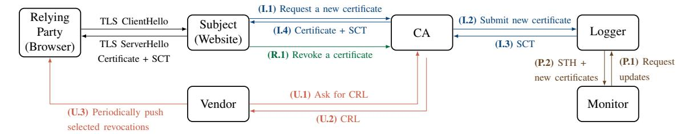
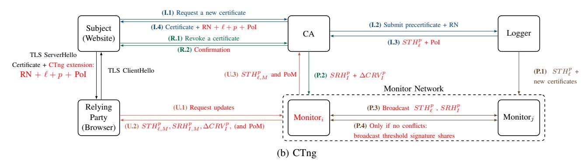
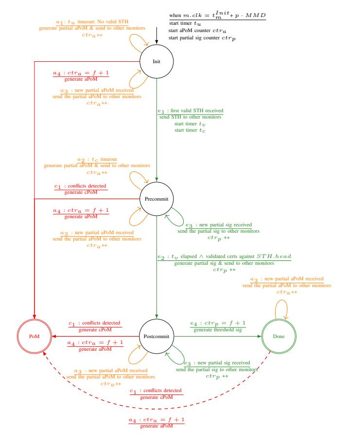
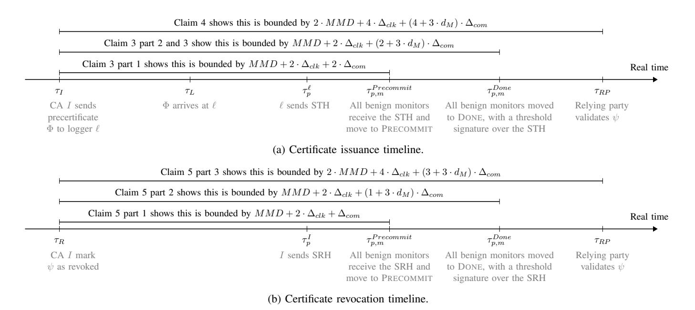
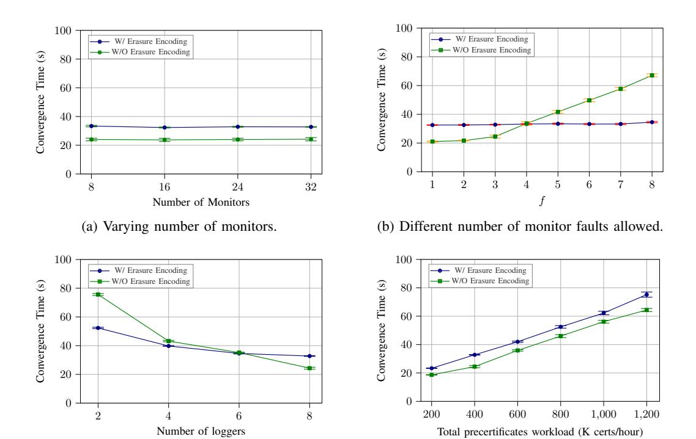

# CTng: Secure Certificate and Revocation Transparency

In God we Trust; Others we Monitor

This paper was accepted to NDSS'26. This is a draft of the full version of the paper.

Jie Kong\*, Damon James\*, Hemi Leibowitz†§, Ewa Syta‡, Amir Herzberg\*

\*University of Connecticut, Storrs, CT

†The College of Management Academic Studies, Rishon LeZion, Israel

‡Trinity College, Hartford, CT

Abstract—We present CTng, an evolutionary and practical PKI design that efficiently addresses multiple key challenges faced by deployed PKI systems. CTng ensures strong security properties, including guaranteed transparency of certificates and guaranteed, unequivocal revocation, achieved under NTTP-security, i.e., without requiring trust in any single CA, logger, or relying party. These guarantees hold even in the presence of arbitrary corruptions of these entities, assuming only a known bound (f) of corrupt monitors (e.g., f=8), with minimal performance impact. CTng also enables efficient certificate validation and preserves relying-party privacy, while providing scalable and efficient distribution of revocation updates.

These properties significantly improve upon current PKI designs. In particular, while Certificate Transparency (CT) [39], [40], [41] aims to eliminate single points of trust, the existing specification [40] still assumes benign loggers. Addressing this through log redundancy is possible, but rather inefficient, limiting deployed configurations to  $f \leq 2$ .

We present a security analysis and an evaluation of our opensource CTng prototype, showing that it is efficient and scalable under realistic deployment conditions.

#### I. INTRODUCTION

The *Public Key Infrastructure (PKI)* facilitates the secure use of public keys. PKI is critical for the security of open, distributed systems such as the Internet. Typically, a *relying party* obtains a public key and validates it using a *certificate* signed by a trusted *Certificate Authority (CA)*. The PKI defines how certificates are issued and revoked (by the CAs) and validated (by relying parties).

Most deployed PKIs follow the X.509 standard [10], [29]. X.509 certificates are used in protocols such as TLS, SSH, S/MIME, IPsec, and others. The most common application of PKI is to secure web and other forms of communication over the Internet using the TLS protocol. In particular, web communication is typically protected using HTTPS, which runs HTTP over TLS, with the browser acting as the relying party and validating the server's certificate. We refer to the PKI used to secure web communication as *Web-PKI*. In Web-PKI,

relying parties (browsers) inherently trust a broad set of *root CAs*. Each root CA can issue certificates for any domain or CA, effectively acting as a *Trusted Third Party (TTP)*, either directly or indirectly, by certifying another CA and facilitating a certificate chain.

There have been multiple *PKI failures* [55], [52], [12], [4]. Typically, an attacker obtains a *rogue certificate*, i.e., a certificate that appears valid to relying parties, contains a public key corresponding to a private key known to the attacker, and includes the identifier (e.g., a domain) of a benign victim entity. The attacker then exploits the rogue certificate to impersonate the victim, typically as a trusted website.

These failures and attacks motivated numerous proposals and efforts to improve the security of PKI schemes, including [53], [21], [46], [34], [61], [5], [69], [59], [60], [45], [24], [63], [35], [42], [41], [23], [43], [32], [18]. Among these, *Certificate Transparency (CT)* [39], [40], [41] stands out as the only 'post-X.509' PKI scheme that has been deployed and used in practice. The main goal of CT is to make the set of issued certificates publicly visible (transparent), enabling detection of rogue certificates, e.g., allowing a domain owners to discover unauthorized certificates issued for their domain. In principle, this could be achieved by requiring CAs to publish every certificate they issue. However, a rogue CA could simply choose not to publish certain certificates.

CT addresses this by introducing *public logs* operated by entities known as *loggers*. In CT, a certificate is considered valid only if it comes with a *Signed Certificate Timestamp (SCT)*, a signed commitment from a logger to include the certificate in its public log. This approach ensures transparency even in the presence of misbehaving CAs. The broader objective of CT was to eliminate reliance on any single trusted party, a principle termed the *No Trusted Third Party (NTTP)* goal [41]. However, CT, as standardized by the IETF in CTv1 [39] and CTv2 [40], ensures transparency only under the assumption that all certificates are logged by an honest logger [65]. In other words, neither version satisfies the NTTP goal. If a CA can be compromised or act maliciously, so can a logger.

§ The work was partially completed during the author's PhD studies at the Dept. of Computer Science, Bar-Ilan University, Israel.

CT has been adopted by major browsers, including Chrome, Safari, and Brave, all of which require that valid certificates include SCTs. Currently, there are six deployed CT loggers operated by organizations such as Google, Cloudflare, and Let's Encrypt. In addition, 13 organizations run monitors that help detect maliciously or mistakenly issued certificates. Most CAs now issue CT-compliant certificates.

In practice, browsers do attempt to ensure security against rogue loggers, but in a constrained and inefficient way, requiring each certificate to be logged with multiple loggers, as recommended in CTv2 [\[40\]](#page-19-1). Typically, due to overhead, only two[1](#page-1-0) loggers are required. While they are chosen from a set approved by browser vendors, the selection is made by the (potentially corrupt) CAs, who decide whether to log certificates with a specific log, limiting the security benefits. Furthermore, although CT logs are append-only and verifiable by CT monitors, malicious loggers can still maintain and present separate logs (i.e., Merkle trees), making CT vulnerable to *split-world attacks*. Currently, CT does not employ any mechanism to verify that a logger does not equivocate [\[40\]](#page-19-1).

Another concern is that, while CT has significantly improved transparency of certificates, CT does not address the critical area of *certificate revocation*. Standardized revocation mechanisms, such as CRLs and OCSP, have been largely abandoned by browsers due to performance and privacy concerns. Today, browsers rely primarily on proprietary mechanisms, such as Google Chrome's CRLSets, which typically cover only a small subset of certificates (see [§VII\)](#page-17-0).

Changing the status quo is never easy, particularly when it involves the Web-PKI, a large-scale system under the control of various stakeholders. Some might argue that the current state of Web-PKI is "good enough", while others might quickly point out the significant practical challenges involved in implementing even minor changes. Both criticisms have validity; however, settling for "good enough" is not a viable option when it comes to the security of such a crucial component of our online infrastructure, especially since it is plausible to transition to a secure, yet performance-oriented PKI. Recent regulatory developments, such as the EU's eIDAS 2 [\[15\]](#page-18-5), which requires browsers to trust government-approved CAs and limits their ability to remove unsafe or malicious ones, underscore that the need for a stronger PKI is not merely a theoretical concern, but a practical necessity.

In response, we present CTng, a Web-PKI design and prototype system. CTng improves *security* by achieving NTTPsecure transparency and revocation, while also supporting *efficient certificate validation* and ensuring *privacy* for relying parties. It allows relying parties to prefetch certificate validation data, removing reliance on real-time checks. CTng also improves *efficiency* and *scalability*; in particular, clients can validate certificates and their revocation status efficiently as part of their connection to a server, with minimal bandwidth overhead and without needing to communicate with any other entities. Furthermore, CTng is designed to maintain efficiency even when using *post-quantum signatures*. Finally, the CTng design is *evolutionary*, preserving most aspects of the existing PKI, including CT.

CTng expands the role of CT monitors, empowering them to monitor the logs and efficiently provide the information required for relying parties to validate certificates. CTng achieves NTTP-security *efficiently*: a CA needs only to log certificates with a single logger, and a relying party needs only one low-bandwidth interaction with a single monitor to receive the periodic transparency and revocation updates. This approach is efficiently implemented using well-established and widely available *threshold signatures*, which have open-source implementations, as essential for successful deployment.

CTng benefits are especially evident in the context of revocation, where CTng ensures *NTTP-secure guaranteed and unequivocal revocation*, allowing monitors to provide timely updates (e.g., daily or even hourly) to relying parties. By prefetching this information, relying parties can validate certificates without depending on additional real-time checks, avoiding the costly over-provisioning required to handle traffic spikes. In contrast, current revocation approaches require CAs or browser vendors to serve requests from arbitrary clients and CT leaves loggers similarly exposed to peak load conditions. To further improve efficiency, CTng incorporates the compact CRV design from [\[57\]](#page-19-22) to minimize the size of revocation information distributed to clients.

We present an open-source implementation [\[30\]](#page-19-23) of two versions of CTng: a base version ([§IV\)](#page-5-0) and an optimized version with two optional design enhancements that reduce bandwidth ([§IV-D1](#page-9-0) and [§IV-D2\)](#page-9-1), allowing CTng to support more monitors and to be resilient to a larger number of faulty monitors.

A third enhancement to the CTng design, described in [§A](#page-20-1) but not yet implemented, reduces the overhead associated with the transmission, verification, and computation of signatures. This reduction in overhead can be quite significant when using post-quantum signatures. A similar goal - and design - were presented in the *Merkle tree certificates* proposal [\[6\]](#page-18-6), a recently-proposed alternative design for issuing certificates based on the use of a Merkle tree by the issuing CA.

Our evaluations ([§VI\)](#page-14-0) confirm the practicality and efficiency of CTng across all entities. On modest hardware, the base version of CTng with just the broadcast optimization ([§IV-D1\)](#page-9-0) exceeds current global-scale precertificate throughput and supports 32 monitors while tolerating up to 8 faulty monitors (f = 8). With the additional erasure encoding optimization ([§IV-D2\)](#page-9-1), performance further improves for higher number of faulty monitors (f) . Increasing the number of monitors has negligible impact on system throughput.

# CONTRIBUTIONS:

- We present CTng, an evolutionary extension of the current Web-PKI based on PKIX [\[7\]](#page-18-7) and CT, utilizing wellestablished cryptographic primitives and approaches.
- CTng efficiently achieves NTTP-secure transparency and revocation. In particular, it prevents *logger omission*

1The exact number depends on factors like issuance date and validity period. It also varies between browsers.

*attacks*, where a logger fails to include a certificate in the log within the promised timeframe, and provides a defense against *split-world attacks*, where a logger might present different log views to different clients. Further, CTng ensures guaranteed and unequivocal revocation and consequently prevents the *Zombie certificate attack*, where a certificate may appear as non-revoked to some relying parties after its revocation.

- CTng offers benefits such as efficient certificate validation and privacy for relying parties. In particular, relying parties do not need to perform real-time signature validations. CTng is efficient even when using high-overhead signature schemes, such as post-quantum signature schemes.
- CTng achieves its security goals. We present a security analysis that demonstrates its NTTP-security guarantees for both transparency and revocation.
- CTng is efficient and scalable. We present a performance evaluation of our open-source implementation, showing its practicality for realistic deployments.

# II. FROM CT TO CTNG

We now provide an overview of the current Web-PKI, highlighting how CT addresses some of the limitations of the trusted CA model. We then examine the attacks that remain possible despite CT and discuss how they are mitigated by CTng. [Table I](#page-4-0) summarizes these attacks and the corresponding defenses in CT and CTng, while [Figure 1](#page-6-0) offers a high-level comparison of the two systems.

## *A. Current Web-PKI*

CT was introduced to mitigate the risk of misbehavior by CAs by introducing two new entities: loggers, responsible for ensuring the transparency of certificates, and monitors, responsible for auditing these logs to ensure correctness, detect problematic certificates and help identify rogue or negligent CAs. Adding these entities has changed the way certificates are issued and used.

To establish a secure communication channel between a relying party (i.e., a browser) and a subject (i.e., a server) s, the subject provides a PKIX certificate to the relying party, which certifies the public key pks of s. To obtain the certificate, the subject contacts a CA, which first verifies that the subject controls s [2](#page-2-0) , and then generates a *precertificate*, essentially a PKIX-compliant certificate that includes a dedicated 'poison' extension, which prevents it from being treated as a valid certificate by relying parties, as specified by CTv2 [\[40\]](#page-19-1).

The CA then submits the precertificate to multiple loggers. Each logger verifies that the precertificate is PKIX-compliant and has not been previously logged. If so, it issues a Signed Certificate Timestamp (SCT), a promise to include the precertificate in its log, implemented using a Merkle tree to ensure auditability, within the *Maximum Merge Delay (MMD)*.

2CTng, like CT and other PKI schemes, does not mandate how this validation must be performed.

The CA aggregates the SCTs and, using the X.509v3 extensions mechanism [\[29\]](#page-19-3), embeds them into the final certificate, which is then sent back to the subject. Relying parties accept a certificate only if it includes a sufficient number of valid SCTs issued by loggers they trust. The certificate issuance process is illustrated in Figure [1a,](#page-6-0) steps I.1–I.4.

Periodically, monitors retrieve the newly logged certificates and the current *Signed Tree Head* (STH) from loggers and ensure that: (1) the log is append-only, i.e., all past certificates are still in the log; and (2) the log is transparent, i.e., all newly logged certificates *that were reported* by the logger were added to the log, and *only* them. Monitors also analyze the newly added certificates to detect any possible mis-issuance, impersonation, or phishing attempts, and may notify affected subjects. The monitoring process is depicted in steps P.1–P.2.

To revoke a certificate, the subject requests revocation from the issuing CA. Once revoked, the CA can publish the revocation status via Certificate Revocation Lists (CRLs) or provide it via the Online Certificate Status Protocol (OCSP). Browser vendors periodically retrieve CRLs from trusted CAs and propagate (select) revocation information to browsers. This allows relying parties to reject revoked certificates, provided the relevant revocation data has been supplied to them. CT does not play a role in the revocation process. The revocation process is illustrated in Figure [1a,](#page-6-0) step R.1, and the vendorassisted propagation of revocation is shown in steps U.1–U.3.

## *B. Remaining Web-PKI Attacks and CTng Defenses*

We now discuss several attacks that adversaries can carry out in the current Web-PKI, focusing on threats posed by different entities within the ecosystem, and compare how these attacks are addressed by deployed and proposed defense mechanisms in CT with the defenses of CTng [\(Table I\)](#page-4-0).

*Misbehaving Subjects (Websites)*: A rogue website can launch a *stealthy corrupt certificate* attack by obtaining a valid but fraudulent certificate, either by deceiving a benign CA or colluding with a malicious CA. Without CT, this attack could remain undetected indefinitely. With CT, the attack window is limited, as the certificate must be publicly logged within the MMD period and then can be reported by monitors. However, the effectiveness of CT relies on active monitoring and timely response by domain owners. CTng strengthens this defense via its *efficient validation* process ([§IV-E\)](#page-9-2), which enables monitors to distribute *verified* information to relying parties ahead of time. This removes the need for real-time checks and allows relying parties to independently validate certificates.

*Misbehaving CAs*: Although CT provides transparency for certificate issuance, it does not extend it to certificate revocation. This enables two distinct split-world attacks. In a *stealthy revocation DoS* attack, a malicious CA can falsely but selectively indicate that a valid, non-revoked certificate has *been revoked*, causing denial-of-service for the targeted website since the certificate would be rejected. In a *Zombie certificate* attack, a malicious CA can falsely indicate that a revoked certificate has *not been revoked*, enabling attackers who control the corresponding private key (e.g., from a past compromise) to impersonate legitimate domains. CT offers no built-in defense against either of these attacks, and existing revocation mechanisms (CRLs, OCSP) are insufficient due to CA control over the information these mechanisms rely on, and the lack of transparency in how proprietary versions of CRLs are implemented across different browsers. CTng mitigates both attacks through its *Periodic Consistent Broadcast* protocol ([§IV-D\)](#page-7-0), which ensures that revocation information is distributed transparently and consistently to relying parties.

*Misbehaving Loggers*: Loggers in CT are assumed to act honestly, but this assumption can be violated in two main ways. In a *logger omission* attack, the logger can issue an SCT but never include the corresponding certificate into the log within the MMD. This prevents the monitors from discovering the certificate. CT attempts to address this through SCT auditing mechanisms [\[58\]](#page-19-24), [\[31\]](#page-19-25), which are optional and raise privacy concerns - although Google Chrome audits a small proportion of SCTs using k-anonymous queries [\[20\]](#page-19-26). In contrast, CTng's *efficient validation* allows clients to detect missing certificates without relying on SCT audits or any other realtime queries and without sacrificing privacy. In a *logger splitworld* attack, a rogue logger can present inconsistent Merkle tree views of its log to different clients (or at different times), enabling selective suppression of certificates. Although gossip protocols [\[51\]](#page-19-27), [\[48\]](#page-19-28) have been proposed for CT, they have not been standardized or deployed. CTng directly addresses this through its Periodic Consistent Broadcast, ensuring all monitors receive and verify consistent views of all logs.

*Misbehaving Monitors*: In CT as deployed, monitors operate independently, checking logs for suspicious certificates but playing no active role in verifying logger behavior, particularly for split-world attacks. A misbehaving monitor may fail to report suspicious certificates or collude with attackers to ignore them, an issue that CT does not address. In contrast, CTng assigns monitors an active, collaborative role: they collectively ensure log integrity and distribute verified certificate information to relying parties. CTng assumes that some monitors may be arbitrarily malicious and adopts a quorum-based model ([§III-A\)](#page-3-0) that tolerates up to f faulty monitors. A relying party needs to contact only one monitor to obtain information; a misbehaving monitor cannot provide incorrect information, it can at most fail to respond. In that case, the relying party can try another monitor (see [§IV-E\)](#page-9-2) and is guaranteed to succeed after at most f attempts.

# III. CTNG: MODEL AND GOALS

We now describe the CTng system and adversary models, and present CTng's security, privacy, and system goals.

## *A. System and Adversary Models*

In CTng, we assume the same five types of entities as in CT: CAs, loggers, monitors, subjects (websites), and relying parties (browsers). Each relying party has a set of root (anchor) CAs and a set of trusted loggers, along with their known public keys (or certificates). In practice, browser vendors define these trusted entities.

We assume a computationally-bounded adversary that controls any number of subjects, CAs, loggers, and relying parties, but only up to f monitors. The adversary gains full control of these entities, including their private keys. This attack model allows the adversary to perform any of the attacks listed in [Table I.](#page-4-0) We assume a majority of benign monitors; that is, there must be at least 2f + 1 monitors and their connections should be (f+1)-connected; in particular, each benign monitor should be connected to at least one other benign monitor.

CTng's monitors use threshold signatures; for simplicity, we assume that the distributed generation of the threshold key is completed before CTng begins running and that the relying parties know the corresponding threshold verification key.

We assume loosely-synchronized clocks where the drift between any two clocks is bounded by ∆clk at any time. We also assume that communication between pairs of *benign* entities is bounded by ∆com. Together, these assumptions ensure that a benign relying party can reliably contact at least one benign monitor within the expected time bounds. For simplicity, we assume that each logger and CA is *monitored* by all monitors.

## *B. Security and Privacy Goals*

In [\[65\]](#page-19-21), Wrotniak et al. formally defined four PKI security ´ requirements, and analyzed whether these requirements are satisfied by PKIX and CT under specific assumptions. We set these four requirements as security goals for CTng, and include intuitive definitions of these requirements below. For the formal definitions, see [\[65\]](#page-19-21).

- G1: *Existential unforgeability*, i.e., every valid certificate ψ was either issued by the entity designated as the issuer of the certificate (ψ.issuer), or was issued by a (rogue) entity that managed to obtain a valid (but fraudulent) certificate ψˆ to a key it controls where ψ.subject ˆ = ψ.issuer.
- G2: *Accountability*, i.e., every valid certificate has a root CA that is accountable for it (identified unequivocally as responsible for that certificate).
- G3: *Guaranteed transparency*, i.e., every certificate ψ that was logged at a logger ℓ at time t, every benign monitor that monitors ℓ (prior to t) is aware of ψ no later than t+∆, where ∆ reflects the maximum delay allowed.
- G4: *Guaranteed revocation*, i.e., every certificate ψ that was revoked at time t *by its benign issuer*, will not be considered valid at any time after t+∆, where ∆ reflects the maximum delay allowed for the revocation to be known.

That said, CTng not only aims to satisfy goals G1-G4, it also aims to do so under strict model assumptions. For example, as shown in Table [II,](#page-4-1) both CTv1 and CTv2 satisfy the guaranteed transparency goal, but only under a weaker model assumption that loggers are benign (addressed through logger redundancy). In contrast, CTng assumes a stronger adversary model in which the adversary can control any number of loggers[3](#page-3-1) and up to f monitors.

3For liveness, there needs to be at least one benign logger.

| Attack model        | Attack (§II-B)                            | CT defense                                                              | Current defenses                         |  |
|---------------------|-------------------------------------------|-------------------------------------------------------------------------|------------------------------------------|--|
| Subject, CA         | Stealthy corrupt certificate              | SCT validation                                                          | Efficient certificate validation (§IV-E) |  |
|                     | Stealthy revocation DoS                   | Short-lived certificates                                                | Periodic Consistent Broadcast (§IV-D)    |  |
|                     | Zombie certificate                        |                                                                         |                                          |  |
| Subject, logger(s)  | Logger omission                           | SCT auditing [58], [31] (privacy concerns)                              | Efficient certificate validation (§IV-E) |  |
|                     | Logger split-world                        | STH gossiping [51], [48] (not deployed)                                 |                                          |  |
|                     | Logger split-world or Log ger omission | SCTs from multiple loggers (overhead: log and cert size, validation) | Periodic Consistent Broadcast (§IV-D)    |  |
| Subject, monitor(s) | Monitor omission                          | Use multiple monitors (overhead)                                        |                                          |  |

TABLE I: Comparison of CT and CTng defenses against different attacker models and relevant attacks, including: stealthy corrupt certificate (attacker uses a fake identity to deceive victims), stealthy revocation DoS (non-revoked certificate 'appears' revoked to victims), Zombie certificate (revoked certificate 'appears' non-revoked to victims), logger omission (a certificate with an SCT is expected to be in the log, but is not added), logger split-world (the logger presents different views of the log to different log clients), and monitor omission (monitor does not report a certificate to client). Detailed discussion in [§II-B.](#page-2-1)

|                                      | X.509 | X.509  | CTv1, CTv2 | CT-VendorRev         | CT-VendorRev-wAudit | CTng |
|--------------------------------------|-------|--------|------------|----------------------|---------------------|------|
|                                      | w/CRL | w/OCSP | [37],[38]  | e.g., Chrome, Safari | Chrome w/Audit[30]  |      |
| Security & Privacy Goals             |       |        |            |                      |                     |      |
| G1: Existential unforgeability       | ✓     | ✓      | ✓          | ✓                    | ✓                   | ✓    |
| G2: Accountability                   | ✓     | ✓      | ✓          | ✓                    | ✓                   | ✓    |
| G3: Guaranteed transparency          | ✗     | ✗      | ✓– 1    | ✓– 1              | ✓– 1             | ✓    |
| G4: Guaranteed revocation            | ✗     | ✗      | ✗          | ✓                    | ✓                   | ✓    |
| G5: Unequivocal revocation           | ✗     | ✗      | ✗          | ✗                    | ✗                   | ✓    |
| G6: Relying-party privacy            | ✓     | ✗      | ✗          | ✓                    | ✓– 2             | ✓    |
| Systems Goals                        |       |        |            |                      |                     |      |
| G7: Evolutionary design              | ✓     | ✓      | ✓          | ✓                    | ✓                   | ✓    |
| G8: Efficient certificate validation | ✓     | ✗      | ✗          | ✓                    | ✓                   | ✓    |

TABLE II: Comparison of relevant (evolutionary) PKI schemes with respect to goals described and discussed in [§III.](#page-3-2) See [§VII](#page-17-0) for other schemes. Additional comments: 1Both CTv1 and CTv2 assume loggers are benign; however, CTv1 wrongfully states that loggers are not assumed to be trusted; this statement was remediated in CTv2, which explicitly states the benign loggers assumption, but suggests logger redundancy. For more information, see [\[65\]](#page-19-21). 2SCTs by default, are audited using k-anonymous lookup. Privacy exposure only if SCT not known to Google (but should be), or if using Enhanced safe browsing.

Because CTng targets a stronger adversary model, we identified an additional important property not defined in [\[65\]](#page-19-21), and we define this property as an explicit goal for CTng:

• G5: *Unequivocal revocation*, i.e., an attacker cannot cause some relying parties to consider the certificate as valid, while other relying parties consider the certificate revoked.

To understand why unequivocal revocation (G5) is necessary in addition to guaranteed revocation (G4), it is important to clarify that G4 assumes that the issuing CA is *benign*. However, as discussed in [§II-B,](#page-2-1) a misbehaving CA can launch attacks such as the stealthy revocation DoS attack, selectively making a non-revoked certificate appear revoked. Since CTng assumes a stronger adversary model in which the adversary may control any number of CAs, it is important to also define the unequivocal revocation goal (G5), which ensures that even misbehaving CAs cannot carry out such attacks.

An additional concern in PKI design is the risk of compromising the privacy of relying parties. For example, both CTv1 and CTv2 describe an auditing process in which relying parties can query loggers for an STH and proofs of inclusion (PoI) for previously received certificates, in order to verify that the SCT promises made by loggers have been fulfilled. However, this process can reveal the browsing history of relying parties, since it exposes the certificates of the websites they visit. As a result, some relying parties avoid auditing altogether (e.g., Safari), while others (e.g., Chrome) support auditing select SCTs using k-anonymous lookup queries. Unfortunately, auditing all SCTs for all relying parties through this mechanism is not feasible from performance point of view. A similar concern exists with the OCSP revocation mechanism [\[54\]](#page-19-29), which also requires relying parties to send a request that exposes the certificate they are validating. Thus, we set the following privacy goal:

• G6: *Relying party privacy*, i.e., certificates validated by

the relying parties are never disclosed to any third party.

## *C. Systems Goals*

One of the key factors that contributed to the widespread adoption of CT was the fact that CT was carefully designed to limit changes within the Web-PKI ecosystem. In general, proposals are more likely to be adopted if they extend existing mechanisms rather than replace them, especially when those mechanisms are already deployed. Moreover, augmenting an existing system allows for targeted improvements while preserving components that function well. For example, the classical PKI mechanisms based on X.509 and PKIX are highly efficient: certificates are compact, certification requires only a single signature operation, and basic certificate validation involves just a few signature verifications with no additional communication. Therefore, we set the following goal:

• G7: *Evolutionary design*, i.e., do not introduce new entities and instead propose reasonable modifications to the processes of existing entities that support deployment and facilitate transition from the current system.

That said, some of the currently deployed mechanisms, e.g., revocation, transparency etc., can be improved. Such improvements can help mitigate many challenges; for example, the challenges of scalability and flash crowds, where entities must provide services to an unpredictable yet large number of relying parties. This could affect the certificate validation process, which normally requires real-time operations against such entities. Thus, we set the following goal:

• G8: *Efficient certificate validation*, i.e., each certificate can be validated by relying parties using locally available data, without requiring any (real-time) requests to other entities.

## IV. CTNG DESIGN

In this section, we first provide a high-level overview of how CTng addresses the shortcomings of Web-PKI and the changes it requires. We then detail the design of CTng, focusing on its core functions: certificate issuance ([§IV-B\)](#page-6-1), certificate revocation ([§IV-C\)](#page-7-1), monitoring and broadcasting ([§IV-D\)](#page-7-0), and certificate validation ([§IV-E\)](#page-9-2). A designed extension optimized for efficient support of post-quantum signatures is discussed in ([§A\)](#page-20-1).

## *A. High Level Overview*

CTng introduces changes to the current Web-PKI design that apply to all existing entities: CAs, loggers, monitors, and relying parties. That said, aside from the changes introduced for monitors, all other modifications are relatively simple to implement. Most importantly, they can be deployed alongside the existing infrastructure, allowing for a manageable transition to CTng. In fact, some of the changes are not mandatory for the deployment of CTng, and CTng can be initially deployed without them. However, these changes can significantly improve the efficiency of the system and, therefore, we believe that they should be considered for deployment, possibly gradually.

The decision to introduce more substantial changes to the monitors is deliberate. Among all entities, monitors are the easiest to modify, given their current deployment status, without disrupting the operation of the existing Web-PKI.

We now describe CTng's design by explaining the changes to each type of entity. The design is illustrated in Figure [1b,](#page-6-0) where the changes with respect to the current Web-PKI are highlighted in red.

*Certificate Authorities (CAs).* The process of issuing a new certificate (I.1–I.4) in CTng remains unchanged from the process in CT [\[39\]](#page-19-0), [\[40\]](#page-19-1), except for one difference. Specifically, in CT, the CA receives from the logger, and includes in an extension in the certificate, a *Signed Certificate Timestamp (SCT)*, which is an attestation by the logger that the new certificate will be included in the log. In CTng, the SCTs are replaced by the CTng extension, which contains four values. Three of these values are used by relying parties to confirm that the certificate is indeed logged in log ℓ (see [§IV-E\)](#page-9-2): a log identifier ℓ, a period number p, and a Proof of Inclusion (PoI).

The fourth value in the CTng extension is called the Revocation Number (RN). The RN is used to implement CTng's improved revocation mechanism. The CTng design is based on the efficient design of [\[57\]](#page-19-22), in which each CA maintains a bit vector, called the *Certificate Revocation Vector (CRV)*, where each bit represents the revocation status of a single certificate issued by that CA; the RN of a certificate is the index of the bit in the CRV corresponding to that certificate. In the original CRV design [\[57\]](#page-19-22), the RN is added by the CA; and, like in other currently-deployed revocation mechanisms, correct provision of the revocation information depends on a single entity (the CA for CRV and 'classical' revocation mechanisms such as CRLs and OCSP, and the vendor for the widely-used OneCRL and CRLSet).

The revocation process (R.1, R.2 and P.2) in CTng differs: there is no single party which is responsible for distributing revocation information. Instead, in CTng, the revocation information, produced and signed by the CA, is also monitored, authenticated, and distributed by the CTng monitors. This avoids delays and failures associated with revocation queries against the CA, a major problem for CRLs and OCSP, and prevents revocation equivocation by a faulty CA/vendor; see [§IV-D.](#page-7-0)

*Loggers.* Apart from their changed interaction with the CAs (SCTs are no longer issued), another key difference between CT and CTng is that loggers no longer maintain a single large Merkle tree for certificates. Instead, loggers create multiple smaller Merkle trees, each corresponding to certificates issued within a specific period. This approach keeps each tree relatively small, reducing the overhead of PoI verification, which is important since the PoI is part of the CTng extension and must be verified whenever a certificate is validated. Note that in CTng, we could have easily integrated the logging functions with the monitoring functions; the reasons to maintain separate loggers is mostly for backwards compatibility. Loggers also reduce the load on the monitor, allowing each monitor to receive the certificate from a small set of loggers rather than

(a) Current Web-PKI: X.509 with CT and vendor-assisted revocation information

Fig. 1: High-level comparison of CT and CTng. I - Issuance, R - Revocation, P - Periodic Consistent Broadcast (Monitoring and Broadcasting), U - Update. In the CTng design, illustrated in Figure 1b, we marked in red the changes from the CT design. This graph only presents one possible deployment scenario where the relying party fetches all updates directly from the monitors.

from many CAs; further savings in communication can be obtained using the erasure encoding optimization, see §IV-D2.

Monitors. In CTng, monitors no longer merely passively monitor logs (P.1 and P.2); instead, they actively participate in overseeing the behavior of loggers by broadcasting the certificates and STHs they receive from loggers to other monitors using the *Periodic Consistent Broadcast (PCB)* protocol (P.5 and P.6), introduced in §IV-D. The PCB protocol ensures that all monitors maintain a consistent view of the logs, which enables them to provide verified periodic updates to the relying parties. PCB also allows benign monitors to generate a Proof of Misbehavior (PoM) against any logger that either fails to provide updates in a timely manner or sends conflicting information (i.e., equivocates), and to ensure correct operation in spite of possible faulty monitors. In addition to retrieving the certificates and transparency information (STHs) from the logs, monitors also retrieve revocation information directly from the CAs (P.2), allowing the monitors to efficiently and securely provide relying parties with up to date revocation information.

Relying parties. In CTng, a relying party periodically retrieves the transparency and revocation updates that were threshold-signed by the monitors (U.1 and U.2). These can be obtained directly from the monitors and can also be cached and served by ISPs or vendors, as they are third-party verifiable. The updates, alongside a CTng-compliant certificate that the client receives during a TLS handshake, allow the client to immediately validate the certificate, in particular, validate

that the certificate was logged and was not revoked, without requiring any real-time interactions with the CA, the logger, or the monitors (see §IV-E).

We now provide more details on each of the CTng mechanisms.

#### B. Issuing and Logging Certificates

For an issuing CA I to generate a certificate for a subject, I first generates and sends a precertificate with a Revocation Number (RN) to a logger  $\ell^4$ . The RN is a unique sequential identifier5 that maps a certificate to a revocation status bit in the CRV maintained by I.

Let  $t_\ell$  denote the time on  $\ell$ 's clock when  $\ell$  receives the precertificate. The logger ensures that the precertificate is valid and not already in the log, then adds it to a list of pending precertificates to be logged. Periodically, when the time on  $\ell$ 's clock is  $^6t_\ell^{STH}(p) \equiv p \cdot MMD + 2 \cdot \Delta_{clk}$ , logger  $\ell$  computes the head (digest) of the Merkle tree whose leaves are the pending precertificates [40], each augmented with the RN. Since the clock bias is at most  $\Delta_{clk}$ , this occurs before real time  $p \cdot MMD + 3 \cdot \Delta_{clk}$ . By substituting p in the expression with the bound  $p \leq 1 + \frac{\tau_I - \Delta_{clk} + \Delta_{com}}{MMD}$  (see Claim 1), we have that a

&lt;sup>4In CTng, it normally suffices for the CA to use a single logger; the CA can quickly detect if the logger fails to add the precertificate to its publicly available log and, in this rare event, switch to a different logger.

&lt;sup>5Certificate serial numbers, while also unique, are generated randomly and therefore cannot serve as efficient indices for revocation lookups.

&lt;sup>6We add  $2 \cdot \Delta_{clk}$  because that ensures that the time the monitor will receive the STH - as measured on the monitor's clock - will be at least  $p \cdot MMD$ .

precertificate which the CA sent to the logger at time  $\tau_I$  will be included by the logger in the head by  $\tau_I + MMD + 2 \cdot \Delta_{clk} + \Delta_{com}$  (see Figure 3a and Claim 1).

At this time, the logger  $\ell$  computes the *Signed Tree Head* (STH), denoted, for perid p, as  $STH_{\ell}^{p}$ , as follows:

$$STH_{\ell}^{p} = (p, \ell, head, size, \sigma)$$
 (1)

where size is the number of precertificates and  $\sigma$  is  $\ell$ 's signature over the encoding of the other fields:  $p \mid\mid \ell \mid\mid head \mid\mid size$ . The logger  $\ell$  then sends  $STH_{\ell}^p$  to I; it also sends to I a PoI for each of the precertificates sent by I, as a proof of logging, to be included in the final certificate. This allows CAs to generate a CTng-compliant certificate, i.e., a certificate which includes the PoI of the certificates after validating the PoI against  $STH_{\ell}^p$ . Logger  $\ell$  will also send  $STH_{\ell}^p$  and all the precertificates included in  $STH_{\ell}^p$  to the monitors.

Periodically, the CA receives the  $STH^p_{\ell,M}$  (and PoM if any) from the monitors, the CA then checks if the logger it uses is in the PoM list or if  $STH^p_{\ell,M}$  does not match the  $STH^p_{\ell}$  it has received previously from the logger. In either case, the CA should immediately relog its issued certificates and in the mismatch case, it should send the  $STH^p_{\ell}$  to at least f+1 monitors to report logger equivocation. This prevents rogue loggers from delaying the issuing process indefinitely.

#### C. Revoking Certificates

The CTng revocation process is initiated by the issuing CA I, usually upon request to revoke the certificate by its subject (the domain owner), and is based on the CRV design of [57]. The CA marks the revocation of certificate  $\psi$  by setting  $CRV_I^p[\psi.CTng.RN]$  to 1 (revoked), where  $\psi.CTng.RN$  is the revocation number identifier of  $\psi$ , included in the CTng extension of  $\psi$ . The CRV is the Certificate Revocation Vector, a vector with one bit per each certificate issued by I; its bits are initially 0 (not revoked).

Similarly to how the logger informs the monitors periodically, the CA also informs the monitors about revocations periodically; that is, the CA sends these updates whenever its clock shows  $p \cdot MMD + 2 \cdot \Delta_{clk}$  for an integer p > 0. Let  $CRV_I^p$  denote the value of the CRV of issuer I when its clock shows  $p \cdot MMD + 2 \cdot \Delta_{clk}$ ; I first computes its  $\Delta$ CRV for period p, denoted  $\Delta CRV_I^p$ , as:

$$\Delta CRV_I^p = CRV_I^p \oplus CRV_I^{p-1} \tag{2}$$

Then, I generates a Signed Revocation Hash (SRH), which contains I's signature over the revocation status of the certificates issued by I. Let h denote a Collision Resistant Hash Function (CRHF)7; the SRH of CA I for MMD period p, denoted as  $SRH_{I}^{p}$ , is defined as:

$$SRH_I^p = (p, I, h(CRV_I^p), h(\Delta CRV_I^p), \sigma)$$
 (3)

7For simplicity, we show the design using a keyless CRHF, as done by the CT specifications, including in its Merkle tree. Of course, this is secure only under the random oracle model. It is easy to adjust the design for security in the real model, by using a keyed CRHF (also referred to as Any Collision Resistant (ACR) hash function).

where  $h(CRV_I^p)$  and  $h(\Delta CRV_I^p)$  are the CRHF outputs on  $CRV_I^p$  and  $\Delta CRV_I^p$  respectively, and  $\sigma$  is I's signature over:  $p \mid\mid I \mid\mid h(CRV_I^p) \mid\mid h(\Delta CRV_I^p)$ . Finally, I will send both the  $SRH_I^p$  and the  $\Delta CRV_I^p$  to all the monitors, or at least to  $2 \cdot f + 1$  monitors.

Fig. 2: State diagram of a monitor running the PCB protocol to process transparency updates from a logger. Green represents the processing of timely and valid STH, which must come with the corresponding set of certificates. Orange represents misbehavior accusations. Red represents the response when misbehavior is proven. *Dashed* transition represents one that may not occur within the same period. Revocation updates from CAs are handled basically in the same way, simply referring to CRVs and corresponding SRHs instead of to STHs.

#### D. Monitoring and Periodic Consistent Broadcast (PCB)

Each monitor m, wakes up periodically8, whenever its clock value is  $t_m^{Init}(p) \equiv p \cdot MMD$  for integer  $p \geq 0$ . At this time, the monitor begins to process the STHs and precertificates sent to it during this period by the loggers, as well as the SRHs and  $\Delta CRV$ s sent to it by the CAs. We refer to this process as the *Periodic Consistent Broadcast (PCB) protocol*.

8We could instead use different periods for different pairs of monitor and logger/CA to reduce peak load. The modifications are simple but result in some 'writing clutter' (and a bit additional delay), so we simplify by using the same periods for all.

The goals of the PCB protocol are: (1) to validate receipt of a valid  $STH_\ell^p$  and corresponding precertificates from each logger  $\ell$ , and to produce a threshold-signed version of the  $STH_\ell^p$ , denoted as  $STH_{\ell,M}^p$ , which is identical in every field except that its signature field  $STH_{\ell,M}^p$ . $\sigma$  contains a joint signature by at least f+1 monitors, allowing validation by relying parties; (2) similarly, to validate receipt of a valid  $SRH_I^p$  and the corresponding  $\Delta CRV_I^p$  from each CA I, and to generate  $SRH_{I,M}^p$ , signed jointly by f+1 monitors; and (3) to identify any loggers or CAs that send invalid or no periodic updates, and to generate a corresponding Proof of Misbehavior (PoM).

The operation of the PCB protocol in each monitor is defined by a distinct state machine for every origin (logger or CA); see Figure 2. Since the PCB protocol handles both transparency and revocation information similarly, we focus on the process for handling the STHs and precertificates from a single logger, denoted  $\ell$ , during a single MMD period p. The processing of the SRHs and CRVs is similar.

The monitor wakes up for period p, and enters the INIT state, when its local clock value is  $p \cdot MMD$ . Since the clock drift is at most  $\Delta_{clk}$ , monitor m wakes up during the real-time interval  $[p \cdot MMD - \Delta_{clk}, p \cdot MMD + \Delta_{clk}]$ , which is before the logger would send the STH and precertificates of period p (which is after  $p \cdot MMD + \Delta_{clk}$ ). A benign logger would send the (same) valid STH and the set of corresponding precertificates to all monitors. This ensures that the monitor will already be waiting for the STH and precertificates when they arrive (from a benign logger).

Upon receiving the (first) valid STH, either from the logger or from another monitor, m sends that STH to the other monitors and transitions from the INIT state to the PRECOMMIT state. By forwarding the STH, m helps mitigate potential attacks in which it receives the STH, but some other benign monitor does not.

The INIT state also handles the case where the benign monitors, and in particular benign monitor m, do not receive the STH in a timely manner. When the PCB state machine starts, a dedicated timer for  $t_u$  seconds is begun, where9:

$$t_u \equiv \Delta_{com} + 4 \cdot \Delta_{clk} \tag{4}$$

If the  $t_u$  timer times out, i.e., when m's clock reaches  $p \cdot MMD + t_u$ , then m signs a partial accusation Proof of Misbehavior (aPoM) against logger  $\ell$  and sends it to the other monitors as part of event  $a_1$ . If there are f+1 or more benign monitors that generate such partial aPoM against  $\ell$ , i.e., that did not receive the STH from  $\ell$  before  $t_u$  expired, then each benign monitor will receive at least f+1 partial aPoMs against  $\ell$ . Each time a new partial aPoM against  $\ell$  is received, event  $a_3$  increments a counter. When the counter reaches f+1, event  $a_4$  is invoked, namely, monitor m computes an aPoM, denoted  $aPoM_M$ , jointly signed by at least f+1 monitors, all stating that logger  $\ell$  is faulty. Then, m transitions to the

PoM state, as there is no need to continue processing updates from a logger  $(\ell)$  who was proven to be faulty.

A rogue logger can also send different (conflicting) STHs to different monitors. This case is handled by the PRECOMMIT state. Let  $t_m^{Pre}$  denote the time on m's clock when it enters the PRECOMMIT state. The PRECOMMIT state has two main goals: to collect the set of precertificates corresponding to the STH and to detect an attack in which a rogue logger sends two conflicting STHs. A conflicting STH pair constitutes a collision Proof of Misbehavior (cPoM); if such a collision occurs, m immediately transitions to the POM (error) state (as part of event  $c_1$ ).

To make sure that m will not sign one STH while another benign monitor signs a different STH, m transitions from the PRECOMMIT state to the next valid state, POSTCOMMIT, only after receiving the set of precertificates corresponding to the STH (see §IV-D1) and after its clock shows  $t_m^{Pre} + t_v$ . The value of  $t_v$  depends on the connectivity among the monitors; if all monitors are directly connected, use  $t_v = 2 \cdot \Delta_{com}$ , and in general, use  $t_v = 2 \cdot \Delta_{com} \cdot d_M$ , where  $d_M$  is the diameter of the (f + 1)-connected monitor network. This ensures that when m transitions to POSTCOMMIT, all other monitors have received the same STH, preventing the case that two benign monitors move to POSTCOMMIT with different STHs. The PCB protocol allows some benign monitors to move to POSTCOMMIT and others to terminate with a PoM, as long as all benign monitors that reach POSTCOMMIT agree on the same STH. This behavior does not introduce a vulnerability in CTng; the rogue logger would be known to all benign monitors before the next period, and therefore also to all relying parties.

A rogue logger could also fail to send the set of precertificates corresponding to the STH. Monitor m detects this if it does not receive all precertificates by  $t_m^{Pre}+t_c$ , where the timer  $t_c$  is set to  $t_c=\Delta_{com}$ . Benign loggers send the precertificates together with the STH $^{10}$ , so they should arrive no more than  $\Delta_{com}$  after the STH. Upon such detection, m signs and sends a partial aPoM to the other monitors, since it has determined that  $\ell$  is rogue (event  $a_3$ ). Monitor m transitions to the PoM (error) state if it collects f+1 validly signed partial aPoMs from different monitors against  $\ell$  (event  $a_4$ ).

When m transitions to *Postcommit*, it signs the STH using its share of the threshold signing key distributed among the monitors; we refer to this as a *partial signature* (sig). Monitor m gathers the partial signatures it receives in event  $e_4$ , and the PCB completes successfully (transitions to *Done*) once m is in the POSTCOMMIT state and has collected f+1 partial

 $^{9}$ To understand why we use this value of  $t_u$ , see the correctness analysis (Claim 2 in 8V-A).

 $^{10}$ This holds under the simplifying assumption that all loggers provide STHs and certificates directly to all monitors. A slightly larger  $t_c$  may be needed if, for efficiency, STHs and certificates are relayed between monitors; details omitted

 $^{11}$ Any threshold signature scheme can be used, e.g., [56]. In fact, it suffices to use any public key signature scheme, with each monitor generate its own signing and verification key pair; a set of f+1 validly-signed signatures by different monitors over the same message is considered a valid threshold signature.

signatures and therefore has a complete threshold signature (event  $e_5$ ).

Monitor m could transition to the POM error state either from the POSTCOMMIT state or even from the DONE state. This transition is done once m detects a conflicting STH, or collects f+1 valid aPoM messages signed by different monitors. In any case where m does not reach DONE, it will transition to the POM error state with a valid Proof of Misbehavior (either an aPoM or a cPoM) against the rogue logger  $\ell$ . If m does reach the accepting DONE state, it will hold the threshold-signed STH, denoted  $STH_{\ell,M}^p$ , along with the corresponding precertificates.

Monitor m follows a similar process to obtain the valid threshold-signed revocation information  $(\Delta CRV_I^p)$  and  $SRH_{I,M}^p$ , or a PoM against a rogue CA.

Monitor m provides the  $STH^p_{\ell,M}$ ,  $\Delta CRV^p_I$ , and  $SRH^p_{I,M}$  to relying parties via either *periodic prefetching* (§IV-E). It also informs any subscribing entity x (e.g., a domain owner) of any logged certificate that matches the profile to which x subscribed (e.g., domain names identical or similar to those owned by x).

We next describe two (optional) optimizations to the PCB protocol. The first is a simple *broadcast optimization*, that reduces the bandwidth usage between monitors, and is used by our implementation by default (§IV-D1). The second optimization, described in §IV-D2, uses erasure encoding to further reduce the amount of data sent from a logger to each monitor to  $\frac{2 \cdot |certs|}{n}$  bytes (where n is the total number of monitors). Our evaluation shows mixed results for this optimization, therefore we did not make it the default in the implementation.

#### 1) The Broadcast Optimization

In the PCB protocol as described so far, monitors immediately share the (validated) precertificates they received with other monitors. This would result in sending many precertificates unnecessarily between monitors, consuming bandwidth unnecessarily. To mitigate this, our implementation deploys, by default, the following simple optimization.

- After a monitor receives from the logger the complete, valid set of precertificates for the current period, it notifies its neighbors.
- A monitor receiving the first such notification, sends back a request for precertificates and begins a timer (for  $2 \cdot \Delta_{com}$  or less).
- If the timer expires and the monitor still did not receive
  a complete, valid set of precertificates corresponding to
  the STH, then the monitor sends requests to any monitor
  that informs it of the availability of a complete, valid set
  of precertificates. Until then, the monitor does not send
  such requests to other monitors (except the first one), but
  does keep a record of the monitors from whom it received
  notification of available precertificates.
- A monitor that receives a request for precertificates, responds with the (complete, valid) set of precertificates it had received.

 Once the timer expires, the monitor will change its operation and immediately ask for the precertificates whenever it receives notice of their availability at a peer monitor.

This approach eliminates redundant fetches and sending of precertificates while still ensuring prompt delivery.

#### 2) The Erasure Encoding Algorithm (EEA) Optimization

In the EEA optimization of the PCB protocol, loggers and CAs break down the precertificates or compressed CRV file into  $k = floor(\frac{n}{2})$  data shards12 and generate n-k parity shards, where n is the number of monitors. Since our model requires  $n \geq 2 \cdot f + 1$  (see §III-A), this ensures that the system can always tolerate f losses.

To ensure the authenticity of these file shares, the logger/CA will construct another Merkle tree where the file shares becomes the leaves. Each file share will be assigned a  $PoI_{m_i}$  with respect to the same root  $head_{fs}$ , both of which will be sent as part of the update alongside the fileshare and  $STH_\ell^p$  (see Equation 1), where  $STH_\ell^p$ . $\sigma$  is signed over  $STH_\ell^p$ . $p \parallel STH_\ell^p$ . $\ell \parallel h(head_{fs} \parallel STH_\ell^p.head) \parallel STH_\ell^p.size$ .

The EEA optimization requires a small change to the PCB protocol as illustrated in Figure 2. Namely, in event  $e_2$ , the monitor should reconstruct the precertificate file from k EEA-encoded shares before validation.

#### E. Efficient Certificate Validation by Relying Parties

The ultimate goal of PKI is certificate validation by relying parties. In this subsection, we present the default CTng process, allowing efficient certificate validation by typical relying parties, such as browsers. In §A, we show how CTng can incorporate the design of [6] to reduce overhead for both CAs and relying parties following migration to a post-quantum PKI.

Relying parties with reasonable resources and connectivity would obtain, every MMD, the STHs of that period (from each logger) and the SRH and  $\Delta$ CRV values of that period (from each CA). The relying party would then validate the threshold-signature on these values, proving that the values were validated by (at least) f+1 monitors, i.e., by at least one benign monitor.

Specifically, for all transparency updates, the relying party confirms the validity of the threshold signature  $STH_{\ell,M}^p.\sigma$  over the encoding of the other fields:  $p \mid\mid \ell \mid\mid head \mid\mid size$  using the group public key of the monitors  $PK_M$  (see Equation 1). Similarly, for all revocation updates, the relying party confirms that  $SRH_{I,M}^p.\sigma$  is a valid threshold signature over the other fields:  $p \mid\mid I \mid\mid h(CRV_I^p) \mid\mid h(\Delta CRV_I^p)$  (see Equation 3).

The relying party also obtains and validates Proofs of Misbehavior (PoMs): both conflict PoMs (cPoMs) and accusation PoMs (aPoMs). The relying party would validate that each aPoM is threshold-signed by at least f+1 monitors, like the validation of the STH, SRH and  $\Delta$ CRV values. The relying party would also validate the cPoMs, but the process is a bit

&lt;sup>12This k value significantly outperforms our initial choice of k = f + 1. Results for both settings can be found in the README of our code repository [30].

different: each cPoM should consist of two different updates for the same period and both signed by the same (faulty) logger or CA.

The relying party can obtain the periodical updates either directly from one of the monitors, or from another source; since updates are threshold-signed and timestamped, their authenticity and freshness are ensured even if obtained from a source which is not trustworthy. For example, the information can be downloaded from a monitor, validated and then cached and provided by a browser vendor or the client's ISP, or distributed as DNS records; the resource requirements on the monitors would be minimal.

Finally, the relying party verifies that a valid STH was received from each non-faulty logger, and that a valid SRH and  $\Delta$ CRV were received from each non-faulty CA.

If any verification fails, the relying party considers the monitor or other source from which it received the update as faulty, and restarts the process with a different monitor (or other source).

After successful verification, the relying party updates its local storage based on the newly received information. Specifically, for each transparency update  $STH^p_{\ell,M}$ , the relying party stores the logger ID  $STH^p_{\ell,M}.\ell$ , the period number  $STH^p_{\ell,M}.p$ , and the Merkle digest  $STH^p_{\ell,M}.head$ ; for each revocation update  $SRH^p_{I,M}$ , along with its  $\Delta CRV^p_I$ , the relying party updates the CRV for  $SRH^p_{I,M}.I$  in its local storage.

The prefetched information allows the relying party to perform offline validation as follows. Upon establishing a TLS connection with a subject (website) that uses a CTng-compliant certificate  $\psi$ , the relying party first confirms that  $\psi$  is PKIX-valid, as per [13], e.g., correctly signed, trust-anchored, not expired, etc. The relying party then searches its local storage for the head  $Localheads[\ell,p]$  corresponding to logger  $\psi.CTng.\ell$  in period  $\psi.CTng.p$ . It then extracts the precertificate portion  $\Phi$  from  $\psi$ , computes  $h(\Phi)$ , and confirms via MT.VerifyPoI that  $Localheads[\ell,p]$  can be reconstructed from  $h(\Phi)$  and  $\psi.CTng.PoI$  [40]. Finally, the relying party confirms that  $\psi$  is not revoked by checking the revocation status using the issuing CA  $\psi.I$  and the RN field  $\psi.CTng.RN$ ; specifically, that  $LocalCRV[\psi.I][\psi.CTng.RN] = 0$ .

## V. ANALYSIS

In this section, we analyze how CTng, with the periodic prefetch mechanism ( $\S$ IV-E), achieves the goals listed in ( $\S$ III) against an attacker who controls an arbitrary set of loggers and CAs, as well as up to f monitors.

We state and prove two theorems; The first theorem establishes the 'timeline' for issuing and validating certificates in CTng, demonstrating that CTng ensures *correctness*; intuitively, a certificate issued properly using a benign CA, logger, and monitor will be considered valid as expected. The second theorem shows that CTng satisfies the security and privacy goals (G1 to G6). Finally, we explain how CTng achieves the system goals (G7 to G8).

#### A. Timing and Correctness Analysis

We now analyze the timeline of events in CTng, showing that CTng ensures *correctness:* issued certificates become valid (until revoked or expired) within bounded time, and revoked certificates become invalid within bounded time (See Figure 3). The analysis provides time bounds, which we also use in the design of CTng. The analysis is mostly done in terms of real-time intervals; we denote different real-time values by adding subscripts and superscripts, as needed, to the symbol  $\tau$ . The bound of  $\Delta_{clk}$  on the clock bias allows us to bound the real time when the local clock of an entity shows any given value, e.g., C, as:

$$\tau_C \in [C - \Delta_{clk}, C + \Delta_{clk}] \tag{5}$$

In particular, let  $C_p \equiv p \cdot MMD + 2 \cdot \Delta_{clk}$  for an integer  $p \geq 0$ , and  $\tau_p^{\ell}$  denote the time when  $\ell$ 's local clock shows  $C_p$ . From Equation 5, we have:

$$\tau_p^{\ell} \in [C_p - \Delta_{clk}, C_p + \Delta_{clk}]$$

$$= [p \cdot MMD + \Delta_{clk}, p \cdot MMD + 3 \cdot \Delta_{clk}]$$
(6)

For simplicity, the timing analysis, whose results are summarized by Theorem 1, assumes that the execution of all entities begins at real time zero.

**Theorem 1.** Let I be a benign CA,  $\ell$  be a benign logger used by I, m be a benign monitor, RP be a benign relying party using m, and  $d_M$  be the diameter of the f+1-connected monitor network. For every integer p>0, let  $\tau_{p,m}^{Init}$  denote the time when the local clock of monitor m shows  $p\cdot MMD$ . Then:

- 1) Let  $\Phi$  be a precertificate issued by I at time  $\tau_I$ , and suppose RP validates the corresponding certificate  $\psi$  at time  $\tau_{RP} > \tau_I + 2 \cdot MMD + 4 \cdot \Delta_{clk} + (4+3 \cdot d_M) \cdot \Delta_{com}$ . Then RP will determine  $\psi$  to be valid, provided that  $\psi$  has not expired (i.e.  $\psi.to \geq \tau_{RP} + \Delta_{clk}$ ) and that  $\psi$  was not revoked by I until  $\tau_{RP}$ .
- 2) Let  $\psi$  be a certificate that I issued (at  $\tau_I$ ) and revoked at time  $\tau_R$  ( $\tau_R > \tau_I$ ). Suppose RP validates  $\psi$  at time  $\tau_{RP} > \tau_R + 2 \cdot MMD + 4 \cdot \Delta_{clk} + (3 + 3 \cdot d_M) \cdot \Delta_{com}$ . Then RP will determine  $\psi$  to be invalid.

*Proof.* We only present the detailed argument for the first statement; the second statement follows similarly as shown in Claim 5.

The proof is by a series of claims, following the events in the handling of  $\Phi$  (and  $\psi$ ) and the timeline as illustrated in Figure 3. In Claim 1, we analyze the period when  $\ell$  handles and forwards  $\Phi$  (and the corresponding STH) issued at . In Claim 2, we derive the bound for the update timer  $t_u$  and show that the  $t_u$  timeout event will never happen if the logger is benign. Claim 3 shows that all benign monitors move to DONE state, with a complete threshold signature over the STH, before  $\tau_I + MMD + 2 \cdot \Delta_{clk} + (2 + 3 \cdot d_M) \cdot \Delta_{com}$ .

Finally, let  $\psi$  be the full certificate corresponding to the precertificate  $\Phi$ , and, in particular, containing the PoI generated by the benign logger  $\ell$ . Claim 4 completes the proof, by

Fig. 3: Timeline visualizations used in the proof of correctness (Theorem 1).

showing that the benign relying party RP will consider  $\psi$  as valid at time  $\tau_{RP} > \tau_I + 2 \cdot MMD + 4 \cdot \Delta_{clk} + (4 + 3 \cdot d_M) \cdot \Delta_{com}$ , provided that  $\psi.to \geq \tau_{RP} + \Delta_{clk}$  and that  $\psi$  was not revoked by I until  $\tau_{RP}$ .

Claim 1. Let  $\tau_I$  denote the time when the CA sent  $\Phi$  to logger  $\ell$  and let p denote the period number included in the first STH which  $\ell$  sends after receiving  $\Phi$ . Then  $\tau_p^\ell \in [\max\{\tau_I, C_p - \Delta_{clk}\}, C_p + \Delta_{clk}]$  and  $p \in [p_0, p_1]$ , where:

$$p_0 \equiv \left\lceil \frac{\tau_I - 3 \cdot \Delta_{clk}}{MMD} \right\rceil, \ p_1 \equiv 1 + \left\lfloor \frac{\tau_I - \Delta_{clk} + \Delta_{com}}{MMD} \right\rfloor$$
 (7)

Argument: Immediately from the bound  $\Delta_{com}$  on the delay, we know that logger  $\ell$  receives  $\Phi$  during  $[\tau_I, \tau_I + \Delta_{com}]$ ; let  $\tau_L$  denote the time when  $\ell$  received  $\Phi$ . From the design, we know that  $\ell$  sends the next STH when its clock shows  $C_p$ , with the STH containing the period number p. From Equation 6 and the fact that this is the STH sent after  $\tau_L$ , we obtained  $\tau_p^\ell \in [\max\{\tau_L, C_p - \Delta_{clk}\}, C_p + \Delta_{clk}]$ .

We next show that  $p \in [p_0, p_1]$  where  $p_0, p_1$  are as in Equation 7.

Since  $\tau_I \leq \tau_L \leq \tau_I + \Delta_{com}$ , it follows from Eq. 5 that:

$$\tau_I \le C_p + \Delta_{clk} = p \cdot MMD + 3 \cdot \Delta_{clk} \tag{8}$$

Since  $\Phi$  must be received after the previous STH:

$$\tau_{I} \ge \tau_{p-1}^{\ell} - \Delta_{com} \ge C_{p-1} - \Delta_{com} - \Delta_{clk}$$

$$= (p-1) \cdot MMD + \Delta_{clk} - \Delta_{com}$$
(9)

From Equation 8 and Equation 9 we can derive bounds for p:

$$\frac{\tau_I - 3 \cdot \Delta_{clk}}{MMD} \le p \le 1 + \frac{\tau_I - \Delta_{clk} + \Delta_{com}}{MMD} \tag{10}$$

Since p is an integer, we have:

$$p_0 \le p \le p_1$$
, defined in Equation 7 (11)

We next show that monitor m will receive  $STH_p^{\ell}$  and  $\Phi$  before the  $t_u$  timer times-out, where  $t_u \equiv \Delta_{com} + 4 \cdot \Delta_{clk}$ .

**Claim 2.** Let  $\tau_{p,m}^{Init}$  denote the time of the  $p^{th}$  INIT and PRECOMMIT events in m. Then:

- 1)  $\tau_{p,m}^{Init} \in [p \cdot MMD \Delta_{clk}, p \cdot MMD + \Delta_{clk}].$
- 2) For every period p > 0 and benign logger  $\ell$ , monitor m receives a valid  $STH_p^{\ell}$  during  $[\tau_{p,m}^{Init}, \tau_{p,m}^{Init} + t_u]$ , that is, the  $t_u$  timeout event (action  $a_1$  of the INIT state) is never invoked for the benign logger  $\ell$ .

Argument: Monitor m begins period p when its local clock shows  $p \cdot MMD$ , i.e., following Eq. 5, at  $\tau_{p,m}^{Init} \in [p \cdot MMD - \Delta_{clk}, p \cdot MMD + \Delta_{clk}]$ , which is the first part of the claim. Equivalently:

$$p \cdot MMD - \Delta_{clk} \le \tau_{p,m}^{Init} \le p \cdot MMD + \Delta_{clk}$$
 (12)

To prove the second item, we first note that a benign logger  $\ell$  sends the STH for the  $p^{th}$  period, i.e.,  $STH_p^{\ell}$ , when its clock shows  $p \cdot MMD + 2 \cdot \Delta_{clk}$ , i.e., after real time  $p \cdot MMD + \Delta_{clk}$ . From the RHS of Equation 12, this cannot happen before  $\tau_{p,m}^{Imt}$ .

To prove the second item, it remains to show that the STH is not received after  $\tau_{p,m}^{Init}+t_u$ , where  $t_u\equiv\Delta_{com}+4\cdot\Delta_{clk}$ . The latest real time at which  $\ell$  will send the STH would be  $p\cdot MMD+3\cdot\Delta_{clk}$ , therefore, m receives the STH at or before real time  $p\cdot MMD+3\cdot\Delta_{clk}+\Delta_{com}$ . By substituting  $p\cdot MMD\leq \tau_{p,m}^{Init}+\Delta_{clk}$  (LHS of Equation 12) we see that m receives the STH before  $\tau_{p,m}^{Init}+4\cdot\Delta_{clk}+\Delta_{com}$ , as required.

We now bound the times for the different steps of the PCB protocol in benign monitors, providing us with the desired bound on the time until the monitors have a valid STH for certificates issued by benign CAs, using a benign logger.

**Claim 3.** Let  $\tau_{p,m}^{Precommit}$ ,  $\tau_{p,m}^{Postcommit}$  and  $\tau_{p,m}^{Done}$  denote the time when benign monitor m enters its  $p^{th}$  PRECOMMIT, POSTCOMMIT and DONE State. Let  $d_M$  denote the diameter of the (f+1)-connected monitor topology. Then:

- 1) Any precertificate sent to a benign logger  $\ell$  at time  $\tau_I$ , and the corresponding STH, are received by m at time  $\tau_{p,m}^{Precommit} \leq \tau_I + MMD + 2 \cdot \Delta_{clk} + 2 \cdot \Delta_{com}$ .
- 2) All benign monitors generate their partial signature over  $STH_p^{\ell}$  and move to Postcommit at time  $\tau_{p,m}^{Postcommit} \leq \tau_I + MMD + 2 \cdot \Delta_{clk} + (2 + 2 \cdot d_M) \cdot \Delta_{com}$ .
- 3) All benign monitors move to Done state, with a complete threshold signature over the STH, at time  $\tau_{p,m}^{Done} \leq \tau_I + MMD + 2 \cdot \Delta_{clk} + (2 + 3 \cdot d_M) \cdot \Delta_{com}$ .

Argument: Recall that, by Equation 6,  $\ell$  sends the STH at or before

$$p \cdot MMD + 3 \cdot \Delta_{clk}$$

From Claim 1, we have  $p \le p_1$ , where (by Equation 7)

$$p_1 \equiv 1 + \left\lfloor \frac{\tau_I - \Delta_{clk} + \Delta_{com}}{MMD} \right\rfloor.$$

The time  $\tau_p^{\ell}$  at which  $\ell$  sends  $\Phi$  and the corresponding STH is therefore not later than

$$\tau_I + MMD + 2 \cdot \Delta_{clk} + \Delta_{com}$$
.

Hence, we have an upper bound on the time at which monitor m receives the STH and certificates, denoted  $\tau_{n,m}^{Precommit}$ :

$$\tau_{p,m}^{Precommit} \leq \tau_I + MMD + 2 \cdot \Delta_{clk} + 2 \cdot \Delta_{com}.$$

This proves part 1 of the claim.

In the PRECOMMIT state, the benign monitors wait for  $t_v=2\cdot d_M\cdot \Delta_{com}$  time for a potential conflicting STH. Such a conflicting STH will not be received, since  $\ell$  is benign and will not send a conflicting STH (and the attacker cannot send a fake yet valid conflicting STH). Therefore, the time  $\tau_{p,m}^{Postcommit}$  at which a benign monitor m moves to POSTCOMMIT is at most:  $\tau_{p,m}^{Postcommit} \leq \tau_I + MMD + 2\cdot \Delta_{clk} + (2+2\cdot d_M)\cdot \Delta_{com},$  proving part 2 of the claim.

At this point, each benign monitor will generate its partial signature of the STH, and send it to all the other monitors. Let  $\tau_{p,m}^{Done}$  denote the time at which benign monitor m will have the necessary f+1 partial signatures, and move to Done; this would occur within only one more  $d_M \cdot \Delta_{com}$ , i.e.,  $\tau_{p,m}^{Done} \leq \tau_I + MMD + 2 \cdot \Delta_{clk} + (2 + 3 \cdot d_M) \cdot \Delta_{com}$ .

Claim 4. Let  $\psi$  be the certificate corresponding to the precertificate  $\Phi$ , both issued by benign CA I using the benign logger  $\ell$ . Suppose that a benign relying party RP, which uses a benign monitor m, validates  $\psi$  at time  $\tau_{RP} > \tau_I + 2 \cdot MMD + 4 \cdot \Delta_{clk} + (4+3 \cdot d_M) \cdot \Delta_{com}$ . Then RP will determine  $\psi$  to be valid, provided that  $\psi.to \geq \tau_{RP} + \Delta_{clk}$  and that  $\psi$  was not

revoked by I until  $\tau_{RP}$ .

Argument: Since  $\ell$  and the CA I are both benign, we know that  $\psi$  will contain a valid PoI for  $STH_n^{\ell}$ .

A benign RP asks for a new STH once every MMD. Therefore, when it validates  $\psi$  at  $\tau_{RP}$ , the RP should already have requested and received from m all the STHs signed by the monitors until  $\tau_{RP} - MMD - 2 \cdot \Delta_{com} - 2 \cdot \Delta_{clk}$ ; notice that we allow here for the (extremely unlikely) case where the RP's clock was behind by  $\Delta_{clk}$  when it requested the previous update (including STH) from m, and that it was ahead by  $\Delta_{clk}$  at  $\tau_{RP}$ .

From Claim 3, all benign monitors, including m, have a complete threshold signature of the STH which covers  $\Phi$ , allowing successful validation of  $\psi$ , by  $\tau_I + MMD + 2 \cdot \Delta_{clk} + (2+3\cdot d_M) \cdot \Delta_{com}$ . Since  $\tau_{RP} > \tau_I + 2 \cdot MMD + 4 \cdot \Delta_{clk} + (4+3\cdot d_M) \cdot \Delta_{com}$ , then, at  $\tau_{RP}$ , the RP should already have this (signed) STH, and would determine  $\psi$  to be valid.  $\square$ 

Claim 5. Let  $\tau_R$  denote the time when certificate  $\psi$  is revoked by CA I and let p denote the period number included in the first SRH which I sends after revoking  $\psi$ . Let  $\tau_p^I$  denote the time at which the I sends the SRH and  $\Delta$ CRV.Let  $\tau_{p,m}^{Precommit}$ ,  $\tau_{p,m}^{Postcommit}$  and  $\tau_{p,m}^{Done}$  denote the time when benign monitor m enters its  $p^{th}$  PRECOMMIT, POSTCOMMIT and DONE State. Then:

- 1) The first SRH and  $\Delta CRV$  generated after  $\psi$  was revoked at time  $\tau_R$  are received by m at  $\tau_{p,m}^{Precommit}$  before  $\tau_R + MMD + 2 \cdot \Delta_{clk} + \Delta_{com}$ .
- 2) All benign monitors move to DONE state, with a complete threshold signature over the SRH at  $\tau_{p,m}^{Done}$  before  $\tau_R$  + MMD +  $2 \cdot \Delta_{clk}$  +  $(1 + 3 \cdot d_M) \cdot \Delta_{com}$
- 3) Let RP be a benign relying party that uses a benign monitor m. If it validates  $\psi$  at any time

$$\tau_{RP} > \tau_R + 2 \cdot MMD + 4 \cdot \Delta_{clk} + (3 \cdot d_M) \cdot \Delta_{com}$$

then RP determines  $\psi$  to be invalid.

Argument: Since  $\psi$  must be revoked before the current SRH but after the previous SRH:

$$\tau_R \le C_p + \Delta_{clk} = p \cdot MMD + 3 \cdot \Delta_{clk} \tag{13}$$

$$\tau_R \ge C_{p-1} - \Delta_{clk} = (p-1) \cdot MMD + \Delta_{clk} \tag{14}$$

From Equation 13 and Equation 14 we can derive the bound for  $p: p \in [p_0, p_1]$ , where:

$$p_0 \equiv \left\lceil \frac{\tau_R - 3 \cdot \Delta_{clk}}{MMD} \right\rceil, \ p_1 \equiv 1 + \left\lfloor \frac{\tau_R - \Delta_{clk}}{MMD} \right\rfloor$$
 (15)

Benign CA I sends the (valid) SRH and the corresponding  $\Delta CRV$  for period p at

$$\tau_p^I \le p \cdot MMD + 3 \cdot \Delta_{clk},$$

so monitor m receives them no later than

$$p \cdot MMD + 3 \cdot \Delta_{clk} + \Delta_{com}$$
.

Substituting

$$p < p_1 \equiv 1 + \left| \frac{\tau_R - \Delta_{clk}}{MMD} \right|,$$

it follows that the first SRH and ∆CRV generated after certificate ψ was revoked at time τR are received by m at

$$\tau_{p,m}^{Precommit} < \tau_R + MMD + 2 \cdot \Delta_{clk} + \Delta_{com}.$$

This completes the proof for the first half of the claim.

After entering the Precommit State, the operation afterwards mirrors the transparency information processing from [Claim 3](#page-12-1) to [Claim 4,](#page-12-2) since the same PCB protocol is used. Therefore, it takes m at most 3 · dM · ∆com to reach the Done state, before τR + MMD + 2 · ∆clk + (1 + 3 · dM) · ∆com.

When the relying party validates ψ at τRP , the RP should already have requested and received from m all the SRHs signed by the monitors with the corresponding ∆CRVs to update its local CRV until τRP −MMD −2·∆com −2·∆clk, since all benign monitors have reached the done state before τR + MMD + 2 · ∆clk + (1 + 3 · dM) · ∆com and the time at which the RP validates ψ is greater than τR + 2 · MMD + 4 · ∆clk + (3 + 3 · dM) · ∆com. The RP should have already updated its local CRV and will therefore determine ψ to be invalid. .

# *B. Security and Privacy Goals*

Theorem 2. CTng ensures the security and privacy Goals (G1–G6).

*Proof.* In [\[65\]](#page-19-21), Wrotniak et al. showed that both PKIX and CT ´ satisfy existential unforgeability (G1) and accountability (G2) by assuming less restrictive assumptions than in [§III-A.](#page-3-0) Since CTng augments CT and builds upon the core functionality of PKIX/CT used in [\[65\]](#page-19-21), [Claim 6](#page-13-0) uses reduction from CTng to [\[65\]](#page-19-21), to prove that G1 and G2 are also satisfied by CTng.

[Claim 7](#page-13-1) shows that CTng achieves ∆−guaranteed transparency (G3) for ∆ = 0, since a benign relying party considers ψ as valid only if ψ has a valid PoI in the corresponding STH, which must be validly signed by the threshold monitors key, i.e., all benign monitors must have already received the corresponding precertificate as well.

[Claim 8](#page-13-2) shows that CTng achieves ∆−guaranteed revocation (G4) for ∆ = 2 ·MMD + 6 · ∆clk + (4 + 3 · dM)· ∆com, following the bounds calculated in Theorem [1](#page-10-2) that shows that the revocation will be known to the relying party within such ∆.

[Claim 9](#page-14-1) shows that CTng ensures unequivocal revocation (G5), by showing that any adversary that breaks G5 in CTng is either using an insecure threshold signature scheme or does not guarantee the models assumptions described in [§III-A.](#page-3-0)

Finally, [Claim 10](#page-14-2) shows that CTng preserves relying-party privacy (G6), because the certificate validation process in CTng does not disclose any information to any third party.

Claim 6. CTng satisfies G1: existential unforgeability and G2: accountability under the model assumptions described in [§III-A.](#page-3-0)

*Argument.* The proof is by reduction. In [\[65\]](#page-19-21), Wrotniak et ´ al. showed that both PKIX and CT satisfy these requirements by assuming less restrictive assumptions than in [§III-A.](#page-3-0) Intuitively, since CTng augments CT and builds upon the core functionality of PKIX/CT that was used in [\[65\]](#page-19-21), it also does not provide an adversary any advantage that will allow it to break existential unforgeability or accountability. Specifically, CTng does not change the signing operation w.r.t CT. Therefore, if there exists an adversary A that prevents CTng from satisfying the existential unforgeability or accountability requirements, we can construct an adversary A' that runs adversary A internally and breaks existential unforgeability / accountability in PKIX or CT as well.

Similarly, the new functionality introduced by CTng does not provide the adversary access to the benign entities' private keys nor the ability to forge attestations on their behalf. Specifically, the relevant changes introduced by CTng include:

- 1) CAs sign CRVs instead of CRLs/OCSP.
- 2) Loggers sign smaller trees.
- 3) Monitors broadcast transparent data and use threshold signatures.

The data signed in these changes is decided solely by the signing entity and only after the entity verified its validity, e.g., a logger ensures a new certificate is valid. The existence of at least one benign monitor in change three ensures that the threshold-signed data is indeed valid. Thus, the new signed attestations in CTng were either signed by a benign entity or were issued by a rogue entity that managed to hijack the information's chain of trust. In both cases, this means that CTng satisfies both existential unforgeability and accountability. □

Claim 7. CTng achieves G3: ∆−guaranteed transparency for ∆ = 0. Namely, if certificate ψ is considered valid by a benign relying party at time τ , then the corresponding precertificate Φ was received by all benign monitors before τ .

*Argument.* Benign relying party considers ψ as valid only if ψ has a valid PoI in the corresponding STH, which must be validly signed by the threshold monitors key. Namely, the STH must have been signed using at least f + 1 of the partial keys of different monitors, i.e., by at least one benign monitor m. However, a benign monitor signs an STH only from POSTCOMMIT state, i.e., after receiving all the corresponding precertificates and sending them to all other monitors; the integrity of the Merkle tree ensures these precertificates received by m include Φ, the precertificate corresponding to ψ. Thus, all benign monitors must have already received Φ as well (at least when sent to them by m). □

Claim 8. CTng achieves G4: ∆−guaranteed revocation for ∆ = 2 · MMD + 6 · ∆clk + (4 + 3 · dM) · ∆com. Namely, let ψ be a certificate revoked by the benign issuing CA at time τR, and let RP be a benign relying party which uses a benign monitor m. Then RP will not consider ψ as valid at any time τ > τR + ∆.

| Asymptotic Overhead   | System      | CAs                                                           | Loggers                                                  | Monitors                                                 |
|-----------------------|-------------|---------------------------------------------------------------|----------------------------------------------------------|----------------------------------------------------------|
| Computation per MMD   | CT + CRLset | $O(N_{\mathrm{cpm}} + N_{\mathrm{rpm}})$                      | $O(f \cdot N_{\mathrm{cpm}} \cdot \log(N_{\mathrm{c}}))$ | $O(f \cdot N_{\mathrm{cpm}} \cdot \log(N_{\mathrm{c}}))$ |
| Computation per WiViD | CTng        | $O(N_{\rm cpm} + N_{\rm rpm})$                                | $O(N_{\mathrm{cpm}} \cdot \log(N_{\mathrm{cpm}}))$       | $O(N_{\rm cpm})$                                         |
| Communication per MMD | CT + CRLset | $O(f \cdot N_{\mathrm{cpm}} + N_{\mathrm{rpm}})$              | $O(f \cdot N_{\mathrm{m}} \cdot N_{\mathrm{cpm}})$       | $O(f \cdot N_{\mathrm{m}} \cdot N_{\mathrm{cpm}})$       |
|                       | CTng        | $O(N_{\mathrm{cpm}} + N_{\mathrm{m}} \cdot N_{\mathrm{rpm}})$ | $O(N_{\rm m} \cdot N_{\rm cpm})$                         | $O(N_{\rm m} \cdot (N_{\rm cpm} + N_{\rm rpm}))$         |
| Storage               | CT + CRLset | $O(N_{\rm r})$                                                | $O(f \cdot N_{\rm c})$                                   | $O(N_{\rm cpm})$                                         |
| Storage               | CTng        | $O(N_{\rm r})$                                                | $O(N_{\rm c})$                                           | $O(N_{\rm cpm} + N_{\rm r})$                             |

TABLE III: Asymptotic overhead per MMD for CT (as defined in [40]) with CRLset and CTng. Each entry shows the complexity in terms of key system parameters:  $N_{\rm cpm}$  (number of all new precertificates issued per MMD),  $N_{\rm c}$  (total number of certificates in all logs),  $N_{\rm rpm}$  (number of all new revocations per MMD),  $N_{\rm r}$  (total number of revoked certificates)  $N_{\rm ca}$  (number of CAs),  $N_{\rm m}$  (number of monitors), and f (security parameter).

Argument. Let CRV be the CRV kept by RP at time  $\tau$ . For RP to consider  $\psi$  as valid, we must have  $CRV[\psi.CTng.RN] = \bot$ . However, since RP uses the benign monitor m, then RP would have an updated value for its CRV; in particular, the CRV would reflect any  $\Delta CRV$  issued by a benign CA, including  $\psi.issuer$ , before  $\tau - \Delta$ . Since the CA is benign, this includes the  $\Delta$ CRV indicating that  $\psi$  was revoked.

Claim 9. CTng ensures G5: Unequivocal revocation: for every valid certificate  $\psi$ , no PPT adversary can convince some benign relying party x that a certificate  $\psi$  is valid while convincing a *different* benign relying party y that  $\psi$  was revoked, with a non-negligible probability.

Argument. Assume to the contrary that there exists an adversary  $\mathcal A$  that can convince a benign relying party x that a certificate  $\psi$  is valid while convincing a different benign relying party y that  $\psi$  was revoked, with a non-negligible probability. In CTng, the revocation status information is threshold-signed by f+1 monitors, ensuring that at least one benign monitor has signed it. This foils the zombie certificate attack (§II-B) because an attacker cannot silently show a certificate as revoked. Furthermore, the honest monitor will broadcast to the rest of the monitors, ensuring that they will learn about the revocation; this ensures that no future CRV could claim that it was not revoked.

Therefore, since x considers  $\psi$  as valid non-revoked certificate while y considers  $\psi$  as revoked, then

$$x.CRV_{\psi.issuer}^{p}[\psi.RN] = 0 \neq 1 = y.CRV_{\psi.issuer}^{p'}[\psi.RN]$$

for some  $p \ge p'$ . However, for that to happen, the adversary either:

- 1) Provided x and y conflicting CRV data by forging the monitors' threshold signature, or
- 2) Prevented x from obtaining an updated CRV with the revocation update.

Option 1 means the threshold signature scheme is not secure and option 2 negates the assumption that relying parties have access to at least one benign monitor, contrary to the assumption that CTng does not achieve unequivocal revocation.

Claim 10. CTng preserves G6: Relying-party privacy.

Argument. The certificate validation process in CTng is offline and does not require any additional real-time communication except for the usual interactions (e.g., with a web or other TLS server). As a result, certificates used by relying parties are never disclosed to any third party.

#### C. System Goals

**G7:** Evolutionary design. CTng does not require any additional entities compared to CT and introduces only modest changes to the roles and processes of existing CT entities. In particular, CT only expands the roles of monitors and requires CA/browser support for the new CTng extension.

**G8:** Efficient certificate validation. In CTng, the decision to accept or reject a certificate is made entirely by the relying party, based solely on information provided with the certificate or stored locally as shown in §IV-E. As a result, relying parties are not required to initiate any network communication with any entities during the validation process, beyond receiving the certificate itself.

#### VI. EVALUATION

We begin with a description of our evaluation setup of the experiments (§VI-A). Then, we evaluate the performance impact on each entity individually (§VI-B), followed by experimentally evaluating the performance and scalability of our CTng prototype implementation as a complete system (§VI-C).

#### A. Experimental Setup

We implemented a prototype of the PCB protocol [30] in Go 1.23, with and without the erasure-encoding algorithm described in §IV-D2. We evaluated our prototype using the DeterLab testbed [47], where the test environment consisted of virtual machines running Ubuntu 22.04, each equipped with 8 cores and 16 GB of RAM. The baseline settings for all experiments are in Table IV (with justifications for these choices).

#### B. Performance per Entity

We analyzed and compared the asymptotic overhead of each type of entity in CTng with respect to the overheads in CT, and summarized the results in Table III. The overhead of different CAs, loggers and monitors may differ widely depending on their usage; to deal with that, we present the overall overhead

| Parameter                              | Value                                                   | Justification                                                                                                                                     |  |  |
|----------------------------------------|---------------------------------------------------------|---------------------------------------------------------------------------------------------------------------------------------------------------|--|--|
| Number of loggers                      | 8                                                       | As of January 2025, all publicly usable CT logs are operated by six organizations, with each organization running 1–3 logs at any given time [1]. |  |  |
| Precertificate simulation              | Random string of size 2000 Bytes                        | Based on [64], where the average size of precertificate is estimated to be 1570 Bytes.                                                            |  |  |
| Precertificate workload                | 400K certs/hr (uniformly distributed among the loggers) | Cloudflare observed [11] global precertificate throughput of $380K-390K$ unique precertificates per hour in December 2024.                        |  |  |
| Number of CAs                          | 100                                                     | Number of CAs does not have a noticeable impact [57].                                                                                             |  |  |
| Total number of certificates           | 100 million                                             | Based on [57]. The daily revocation rate was not explicitly stated in [57], so we confirmed it with the authors.                                  |  |  |
| Daily revocation rate                  | 0.02%                                                   |                                                                                                                                                   |  |  |
| Total revocation rate                  | 1%                                                      | Commind it with the authors.                                                                                                                      |  |  |
| MMD interval                           | 10 minutes                                              | This is the value data-mined from our own experiments, which leaves enough safety margin across our test suite.                                   |  |  |
| Number of monitors                     | 32                                                      | A reasonable upper bound on the number of monitors [2].                                                                                           |  |  |
| Number of monitor faults allowed $(f)$ | 3                                                       | Slightly larger than CT's minimum fault tolerance (2SCTs [27] $\rightarrow f = 1$ ).                                                              |  |  |
| Access link capacity                   | 1000 Mbps                                               | Standard link capacity.                                                                                                                           |  |  |
| Topology                               | Star topology                                           | Simulates the internet back bone.                                                                                                                 |  |  |

TABLE IV: Baseline experiment setup.

for all CAs, all loggers and all monitors. The overheads will also depend on the distribution of certificates and revocations between the different CAs and loggers; for simplicity, our computations assume the worst case where all certificates are by a single CA, which is using a fixed set of loggers.

As we detail below, CTng does not introduce undue overhead for system entities, especially when weighted against the added security benefits and their existing responsibilities. Each role remains feasible in terms of performance and operational complexity. Note also that since CT and CTng rely on the same types of entities, the incentives to operate a CTng entity would be similar to the incentives to operate the corresponding CT entity. Further, we expect additional participants to join the ecosystem, such as browser vendors and large ISPs acting as monitors, driven in part by the value of providing stronger security benefits and (as done today) revocation services to their users.

CAs: In both CT and CTng, the computation overhead per MMD is  $O(N_{\rm cpm} + N_{\rm rpm})$ , where  $N_{\rm cpm}$  is the number of all new precertificates issued per MMD, and  $N_{\rm rpm}$  is the number of all new revocations per MMD. However, since CT uses log redundancy, its communication overhead per MMD is  $O(f \cdot N_{\rm cpm} + N_{\rm rpm})$ , as certificates need to be logged over multiple loggers, and the CRLsets mechanism needs to learn about all newly revoked certificates. In comparison, CTng's communication overhead is  $O(N_{\rm cpm} + N_{\rm m} \cdot N_{\rm rpm})$ , where  $N_{\rm m}$  is the number of monitors, since certificates are logged with only a single logger, which then sends the SRH and  $\Delta$ CRV to all monitors.

The storage requirements in both CT and CTng are  $O(N_r)$ , where  $N_r$  is the total number of revoked certificates. This is because CAs do not need to store the certificates they have issued, but must retain those they have revoked. Although the storage overhead is asymptotically the same, the CRV approach used in CTng is significantly more space-efficient, requiring approximately 1.8 bits per revocation compared to CRLite's 6.6 bits, CRLset's 110 bits, and OneCRL's 1928 bits

per revocation [38], [57].

Loggers: The computational overhead for CT loggers is dominated by the need to update the Merkle tree by adding, in each MMD,  $f \cdot N_{cpm}$  new precertificates, where the factor of O(f) comes from the logger redundancy required. The computational cost for each precertificate is proportional to the height of the tree, i.e.,  $\log(N_c)$ . The O(f) factor similarly impacts the communication and storage complexities of CT. In contrast, in CTng, we avoid the O(f) factor; the computational cost is mainly due to the need to generate the PoI for each precertificate. Also, the height of the tree is only  $O(\log(N_{cpm}))$ , since CTng uses separate trees for each MMD period.

Monitors: The computational and communication costs for CT monitors (if implemented as the RFC [39], [40] prescribe) are similar to these of CT loggers. In case of CT, these are dominated by the need to receive f copies of each precertificate and to add  $f \cdot N_{cpm}$  new precertificates to the Merkle tree of certificates 13. For CTng, the costs are significantly reduced since we avoid the need to receive and handle f redundant copies of each precertificate, and since the Merkle trees are much smaller (per MMD). CTng has an additional overhead of also handling revocations; in practice, the overhead due to revocations is negligible compared to the overhead of certificates.

The storage requirements of CT and CTng monitors are the same for issued certificates  $^{14}$ . CTng also stores the  $\Delta$ CRV identifying newly revoked certificates. Note that Table III does not explicitly reflect the additional overhead of the activities that CTng monitors do and CT monitors do not: the PCB protocol and client prefetching. The reason is that the additional PCB protocol overhead is dominated by the aforementioned asymptotic overhead of handling the certificates. Also, clients

&lt;sup>13In practice, loggers may maintain multiple Merkle trees.

 $^{14}$ Notice that in Table III the storage requirement considers  $N_{\rm cpm}$  and not  $N_{\rm c}$ , because monitors do not have to store all certificates; of course, some monitors might store certificates.

can fetch the (signed) data from intermediaries such as CDNs, ISPs and browser vendors; they do not have to obtain it directly from monitors.

*Subjects (Websites):* The changes CTng introduce with respect to subjects are insignificant in terms of overhead. Notice, however, that issuing certificates in CTng takes more time than in CT (see Theorem [1\)](#page-10-2).

*Relying Parties:* We measured the prefetching method ([§IV-E\)](#page-9-2) for an MMD of 1 day and a standard revocation rate of 1%, and found that, for CTng, the daily communication overhead is 249 KB and the storage overhead is 2.33 MB; this is for the entire set of revocations. In comparison, Chrome's implementation of CT with CRLsets incurs a daily bandwidth cost of 250 KB [\[38\]](#page-19-34), but this is for only 2% of the certificates (compared to full coverage provided by CTng).

Next, we measured the per connection communication and computation overheads. The communication overhead is similar; a CT extension with the minimum 2 SCTs is 222 B when using ECSDA and 594 B when using RSA-2048, while a CTng extension is 780 B [15](#page-16-1) .However, CT requires significantly more computations to validate a certificate: approximately 25 ms using RSA 2048 and 50 ms using ECDSA, compared to only about 0.28 µs in CTng. The reason for this significant difference is the fact that CTng requires only hash computations and no (real-time[16](#page-16-2)) signature verification, unlike CT, which uses log redundancy, and each SCT requires a public key signature verification.

## *C. Performance and Scalability of the System as a Whole*

To evaluate the performance of our prototype, we measured the impact of several key system parameters on the *maximum convergence time*, defined as the duration required for the last benign monitor in the network to reach the "done" state described in Figure [2.](#page-7-4) This state indicates that all transparency information is fully prepared to be served to a relying party. The maximum convergence time effectively represents the smallest MMD that our system can support. In each experiment, we use the base settings from [Table IV,](#page-15-0) except for the specific parameter being evaluated to assess its impact.

*The effect of increasing the number of monitors.* In Figure [4a,](#page-17-1) we plot the impact of increasing the number of monitors from 8 to 32. Our results show that CTng can easily support even a large number of monitors, as the maximum convergence time for 32 monitors is only 32.77 seconds. Furthermore, we observe that CTng scales efficiently in the number of monitors: quadrupling the number of monitors from 8 to 32 does not result in any noticeable increase in

15Assuming an MMD of one day and a precertificate generation rate of 400 K certs/hr [\[11\]](#page-18-10), the logger's Merkle tree at the end of the MMD period would contain approximately 9.6 M leaves (certificates), i.e., each certificate's PoI consists of 24 hashes. Assuming the hash function used is SHA-256 and adding the RN (4 B), the logger ID ℓ (4 B), and the period number p (4 B), the total size of a CTng extension is 780 B (= 32 B × 24 + 12 B)

16Relying parties would require a few additional signature verifications when prefetching that data, but these operations are negligible, since they are performed once per MMD; also, these operations are done in advance, rather than during the connection.

convergence time; the results are all within our (quite tight) error margins.

*The effect of increasing number of monitor faults allowed (Figure [4b\)](#page-17-1).* Using the baseline setting of 32 monitors, we experimented with increasing the monitor fault tolerance (f) from 1 to 8, both with and without the erasure encoding algorithm. As shown in Figure [4b,](#page-17-1) CTng performs well under both configurations, with a convergence time increasing up to 67.11 seconds without erasure encoding, and increasing very slightly, from 32.51 to 34.51 seconds, with erasure encoding. We observe that when the number of faulty monitors is small, the overhead introduced by erasure encoding is not justified; in fact, the version without erasure encoding outperforms the encoded version. However, when the number of faulty monitors exceeds 4, erasure encoding becomes more effective.

*The impact of increased workload on loggers [\(Figure 4c\)](#page-17-1).* Our workload baseline setting uniformly distributes a workload of 400 K precertificates per hour across 8 loggers. To evaluate the impact of increased workload per logger, we performed experiments in which the same total workload was distributed among fewer loggers. As shown in Figure [4c,](#page-17-1) our findings indicate that although fewer loggers introduce a bottleneck, CTng still converges within 75.62 seconds with only two loggers each handling a workload of 200 K precertificates per hour.

*The impact of increased workload on the system [\(Figure 4d\)](#page-17-1).* While the previous experiments demonstrate that CTng can efficiently handle a workload of 400 K precertificates per hour, which is the current rate observed in the wild [\[11\]](#page-18-10), it is important to assess how CTng performs under higher volumes, as this number is expected to only increase in the foreseeable future. In Figure [4d,](#page-17-1) we plot the measured convergence time of our prototype under workloads ranging from 200 K to 1,200 K precertificates per hour. Our results show that the convergence time of CTng scales linearly with the overall workload processed by the monitor network. Under the baseline workload of 400 K precertificates per hour, the system converges within 32.77 seconds. Even at a workload of 1,200 K precertificates per hour, CTng converges within 77.04 seconds. In other words, CTng maintains a reasonable convergence time even with a safety factor of three, which is important not only for accommodating future growth but also for handling additional overheads that may not be reflected in our experimental setup.

In summary, we have demonstrated that: (1) CTng scales linearly with the input workload; (2) CTng can support MMDs on the order of minutes, with a good safety margin; and (3) the convergence time of CTng does not significantly increase due to an increase in the number of monitors. Most importantly, with erasure encoding, convergence time increases only mildly even as the number of tolerated faulty monitors grows. In contrast, CT incurs substantial overhead when tolerating additional faulty loggers.

(c) Different number of loggers. (d) Different total precertificate workload.

Fig. 4: System convergence time measured under four distinct experimental conditions.: (a) as the number of monitors varies, (b) as the number of monitor faults allowed changes, (c) for same total precertificate workload distributed among different number of loggers, and (d) for varying overall precertificate workloads. See [Table IV](#page-15-0) for other values used.

# VII. RELATED WORK

# *A. PKI Works*

Several works focus on extending CT with an auditing mechanism; some of these also address the privacy risks associated with auditing. Examples include CT gossip [\[51\]](#page-19-27), [\[48\]](#page-19-28) and CTor [\[18\]](#page-18-4), which enhance CT by integrating SCT auditing, STH gossiping, and conflict reporting to detect logger misbehavior in a timely manner. However, these mechanisms face scalability challenges as the number of participating entities grows. Other designs, such as [\[53\]](#page-19-6), [\[23\]](#page-19-18), [\[58\]](#page-19-24), [\[31\]](#page-19-25), emphasize privacy-preserving solutions for SCT auditing that account for the risk of a client's activity being revealed through either querying or reporting during the audit process.

Vendor-assisted revocation mechanisms such as CRLsets [\[26\]](#page-19-35) and OneCRL [\[25\]](#page-19-36) improve upon traditional revocation methods by offering more scalable and reliable solutions. However, because these mechanisms cover only a small subset of revocations, they necessitate a fail-open model that allows the browser to accept a certificate when its revocation status is unknown [\[38\]](#page-19-34). In contrast, CRLite [\[38\]](#page-19-34) further improves the efficiency by leveraging advanced data structures, specifically cascading Bloom filters, which enable browsers to cover the entire revocation space with acceptable overhead and support a fail-close model for revocation checks. Let's Revoke [\[57\]](#page-19-22) enhances further the efficiency of revocation by encoding each certificate's revocation status using only a single bit, at the cost of requiring an additional Revocation Number (RN) extension in the certificate itself.

Other works focus on ensuring security with robustness to up to f rogue entities. In COCA [\[70\]](#page-20-2), certificates must be co-signed by multiple CAs. ARPKI [\[5\]](#page-18-3) extends this model by requiring additional synchronization across servers. A consensus model for CT logs, presented in [\[64\]](#page-19-32), prevents log split-world attacks but introduces significant overhead. Furthermore, works such as [\[33\]](#page-19-37), [\[3\]](#page-18-12) leverage blockchain technology to achieve certificate and/or revocation transparency by completely decoupling these processes from traditional PKI entities like CAs. However, this approach requires a complete overhaul of the existing PKI system. Later work, such as [\[66\]](#page-20-3), [\[22\]](#page-19-38), takes a more incremental approach by introducing the concept of hybrid X.509 certificates, which can be validated using the classic CA chain of trust while embedding an X.509 extension containing fields necessary for blockchain-related operations. However, these works' approach still inherits several blockchain-related drawbacks, including the size of the blockchain and the fluctuating cost of maintaining it, both of which are closely tied to cryptocurrency market dynamics.

## *B. Consensus Works*

Our PCB protocol builds on a large body of work in reliable broadcast, agreement, and consensus protocols (e.g., [\[36\]](#page-19-39), [\[9\]](#page-18-13), [\[37\]](#page-19-40), [\[28\]](#page-19-41)), as well as more recent efficient designs (e.g., [\[67\]](#page-20-4), [\[68\]](#page-20-5), [\[19\]](#page-19-42)). PCB adopts several efficiency-driven ideas from these protocols, but it differs in key aspects due to the specific requirements of our setting. In particular, to the best of our knowledge, no existing protocol directly provides properties to satisfy CTng goals.

In particular, consider the *guaranteed transparency* (G3) requirement, which dictates that each precertificate must be known to all benign monitors within a bounded delay. Meeting this requirement requires explicit bounds on both clock drift and communication delay, thereby ruling out fully asynchronous protocols. Even partially synchronous protocols such as [\[9\]](#page-18-13), [\[28\]](#page-19-41), [\[68\]](#page-20-5) typically do not model or account for clock bias. Moreover, PCB incorporates a built-in mechanism for misbehavior detection and accusation (e.g., equivocation or omission), which is critical for achieving CTng's NTTPsecurity goals.

PCB shares structural similarities with leader-based consensus protocols like HotStuff [\[68\]](#page-20-5), in that only the originator proposes a value. However, unlike traditional leader-based protocols, the originator in PCB does not participate in the consensus phase.

In contrast to Byzantine Fault Tolerant (BFT) consensus protocols, CTng requires only *weak consistency*, similar to the Crusader's agreement [\[36\]](#page-19-39), so using a BFT protocol in place of PCB would incur unnecessary overhead. Specifically, let y be the value output by an honest monitor. If any honest monitor outputs y ′ , then y ′ = y or y ′ = ⊥ (Proof of Misbehavior, PoM). If an honest monitor outputs ⊥ in round r, then all honest monitors output ⊥ by the end of round r+ 1. This relaxed agreement ensures that all benign monitors output timely updates when the originator is benign (within one MMD), and that they hold the originator accountable via PoM within two MMDs if it is faulty (due to equivocation or unresponsiveness).

# VIII. CONCLUSIONS

We presented CTng, an evolutionary extension of CT and the current Web-PKI. CTng is a secure and efficient system that supports certificate transparency and ensures guaranteed, unequivocal revocation. It achieves the NTTP goal that originally motivated CT but has yet to be fully realized. We experimentally validated that a prototype of CTng has low overhead and modest requirements for all participating entities. We analyzed CTng and showed that CTng meets its NTTPsecurity and systems goals. We hope this work contributes to the much-needed improvements in the Web-PKI ecosystem, which forms the foundation for applied cryptographic protocols such as TLS, and that it encourages further research in this area. In particular, a provably secure and practically deployable version of CTng offers an exciting direction for future work.

## *Acknowledgements*

The authors are very grateful to Haitham Ghalwash, who contributed to the early work on CTng. We thank Federico Cedolini, Abhinna Adhikari, Eli Shattuck, Son Mana, Yonatan Cohen, Finn Navin, Isaac Teles, Marcus Barone, Millenia Polanco, Addison Cox, and Arvind Kasiliya for their work on the implementation of CTng, and DeterLab (Sphere Research Infrastructure) for providing testbed resources. This work is partially supported by the National Science Foundation under Grants No. 2149765 and 2247810, by the Research Authority Fund of the College of Management Academic Studies, Rishon LeZion, Israel, and by the endowment to Prof. Herzberg from the Comcast Corporation. The opinions expressed are those of the authors and do not necessarily reflect those of their universities or funding sources.

# REFERENCES

- [1] Certificate transparency logs. [https://certificate.transparency.dev/logs/,](https://certificate.transparency.dev/logs/) 2025. Accessed: 20 March 2025.
- [2] Monitors – certificate transparency. [https://certificate.transparency.dev/](https://certificate.transparency.dev/monitors/) [monitors/,](https://certificate.transparency.dev/monitors/) 2025. Accessed: March 29, 2025.
- [3] Mustafa Al-Bassam. Scpki: A smart contract-based pki and identity system. In *Proceedings of the ACM Workshop on Blockchain, Cryptocurrencies and Contracts*, BCC '17, page 35–40, New York, NY, USA, 2017. Association for Computing Machinery.
- [4] Andrew Ayer. Timeline of Certificate Authority Failures. [https://sslmate.](https://sslmate.com/resources/certificate_authority_failures) [com/resources/certificate](https://sslmate.com/resources/certificate_authority_failures) authority failures, 2018.
- [5] David Basin, Cas Cremers, Tiffany Hyun-Jin Kim, Adrian Perrig, Ralf Sasse, and Pawel Szalachowski. ARPKI: Attack Resilient Public-Key Infrastructure. In *Proceedings of the 2014 ACM SIGSAC Conference on Computer and Communications Security*, pages 382–393. ACM, 2014.
- [6] David Benjamin, Devon O'Brien, Bas Westerbaan, Luke Valenta, and Filippo Valsorda. Merkle Tree Certificates. Internet-Draft draftdavidben-tls-merkle-tree-certs-06, Internet Engineering Task Force, July 2025. Work in Progress.
- [7] Sharon Boeyen, Stefan Santesson, Tim Polk, Russ Housley, Stephen Farrell, and Dave Cooper. Internet X.509 Public Key Infrastructure Certificate and Certificate Revocation List (CRL) Profile. RFC 5280, May 2008.
- [8] Luıs Brandao and Rene Peralta. NIST first call for multi-party threshold schemes, March 2025. NIST internal report NISTIR 8214C 2pd, second public draft.
- [9] Miguel Castro and Barbara Liskov. Practical byzantine fault tolerance. In *3rd Symposium on Operating Systems Design and Implementation (OSDI 99)*, New Orleans, LA, February 1999. USENIX Association.
- [10] BLUE BOOK CCITT. Recommendations X. 509 and ISO 9594- 8. Information Processing Systems-OSI-The Directory Authentication Framework (Geneva: CCITT), 1988.
- [11] Cloudflare. Merkle town — certificate transparency logs. [https://ct.](https://ct.cloudflare.com/logs) [cloudflare.com/logs,](https://ct.cloudflare.com/logs) 2024. Accessed: 2025-01-16.
- [12] Comodo™. Incident Report. Published online, [http://www.comodo.com/](http://www.comodo.com/Comodo-Fraud-Incident-2011-03-23.html) [Comodo-Fraud-Incident-2011-03-23.html,](http://www.comodo.com/Comodo-Fraud-Incident-2011-03-23.html) 3 2011.
- [13] D. Cooper, S. Santesson, S. Farrell, S. Boeyen, R. Housley, and W. Polk. Internet X.509 Public Key Infrastructure Certificate and Certificate Revocation List (CRL) Profile. RFC 5280 (Proposed Standard), May 2008. Updated by RFCs 6818, 8398, 8399.
- [14] David A Cooper, Daniel C Apon, Quynh H Dang, Michael S Davidson, Morris J Dworkin, Carl A Miller, et al. Recommendation for stateful hash-based signature schemes. *NIST Special Publication*, 800(208):800– 208, 2020.
- [15] Council of European Union. Com/2021/281, Revision of the eIDAS Regulation - European Digital Identity (EUid), 2021.
- [16] Daniele Cozzo and Nigel P. smart. Sharing the luov: Threshold postquantum signatures. Cryptology ePrint Archive, Paper 2019/1060, 2019. [https://eprint.iacr.org/2019/1060.](https://eprint.iacr.org/2019/1060)
- [17] Daniele Cozzo and Nigel P Smart. Sharing the luov: threshold postquantum signatures. In *IMA International Conference on Cryptography and Coding*, pages 128–153. Springer, 2019.
- [18] Rasmus Dahlberg, Tobias Pulls, Tom Ritter, and Paul Syverson. Privacypreserving & incrementally-deployable support for certificate transparency in tor. *Proceedings on Privacy Enhancing Technologies*, 2021(2):194–213, 2021.

- [19] George Danezis, Lefteris Kokoris-Kogias, Alberto Sonnino, and Alexander Spiegelman. Narwhal and tusk: a dag-based mempool and efficient bft consensus. In *Proceedings of the Seventeenth European Conference on Computer Systems*, EuroSys '22, page 34–50, New York, NY, USA, 2022. Association for Computing Machinery.
- [20] Joe DeBlasio. How does the certificate transparency check in chrome work?, Oct 2023.
- [21] Peter Eckersley. Sovereign Key Cryptography for Internet Domains. [https://git.eff.org/?p=sovereign-keys.git;a=blob;f=sovereign-key-design.](https://git.eff.org/?p=sovereign-keys.git;a=blob;f=sovereign-key-design.txt;hb=HEAD) [txt;hb=HEAD,](https://git.eff.org/?p=sovereign-keys.git;a=blob;f=sovereign-key-design.txt;hb=HEAD) 2012.
- [22] Yves Christian Elloh Adja, Badis Hammi, Ahmed Serhrouchni, and Sherali Zeadally. A blockchain-based certificate revocation management and status verification system. *Computers & Security*, 104:102209, 2021.
- [23] Saba Eskandarian, Eran Messeri, Joseph Bonneau, and Dan Boneh. Certificate transparency with privacy. *Proceedings on Privacy Enhancing Technologies*, 4:232–247, 2017.
- [24] Conner Fromknecht, Dragos Velicanu, and Sophia Yakoubov. A Decentralized Public Key Infrastructure with Identity Retention. *IACR Cryptology ePrint Archive*, 2014:803, 2014.
- [25] Mark Goodwin. Revoking intermediate certificates: Introducing OneCRL. Mozilla Security Blog, [https://blog.mozilla.org/security/2015/](https://blog.mozilla.org/security/2015/03/03/revoking-intermediate-certificates-introducing-onecrl/) [03/03/revoking-intermediate-certificates-introducing-onecrl/,](https://blog.mozilla.org/security/2015/03/03/revoking-intermediate-certificates-introducing-onecrl/) 3 2015.
- [26] Inc Google. Crlsets. [https://www.chromium.org/Home/](https://www.chromium.org/Home/chromium-security/crlsets/) [chromium-security/crlsets/.](https://www.chromium.org/Home/chromium-security/crlsets/)
- [27] Google Chrome. Certificate transparency policy. [https://googlechrome.](https://googlechrome.github.io/CertificateTransparency/ct_policy.html) [github.io/CertificateTransparency/ct](https://googlechrome.github.io/CertificateTransparency/ct_policy.html) policy.html. Accessed: 20 March 2025.
- [28] Yue Guo, Rafael Pass, and Elaine Shi. Synchronous, with a chance of partition tolerance. In *Advances in Cryptology – CRYPTO 2019: 39th Annual International Cryptology Conference, Santa Barbara, CA, USA, August 18–22, 2019, Proceedings, Part I*, page 499–529, Berlin, Heidelberg, 2019. Springer-Verlag.
- [29] International Telecommunication Union. Recommendation ITU-T X.509, OSI – The Directory: Public-Key and Attribute Certificate Frameworks, 2016.
- [30] Jie Kong. CTngV3. [https://github.com/jik18001/CTngV3,](https://github.com/jik18001/CTngV3) 2025.
- [31] Google LLC Joe DeBlasio. Opt-out SCT Auditing in Chrome. Other. [https://docs.google.com/document/d/](https://docs.google.com/document/d/16G-Q7iN3kB46GSW5b-sfH5MO3nKSYyEb77YsM7TMZGE/) [16G-Q7iN3kB46GSW5b-sfH5MO3nKSYyEb77YsM7TMZGE/.](https://docs.google.com/document/d/16G-Q7iN3kB46GSW5b-sfH5MO3nKSYyEb77YsM7TMZGE/)
- [32] Daniel Kales, Olamide Omolola, and Sebastian Ramacher. Revisiting user privacy for certificate transparency. In *EuroS&P*, pages 432–447. IEEE, 2019.
- [33] Brian Khieu and Melody Moh. Cbpki: Cloud blockchain-based public key infrastructure. In *Proceedings of the 2019 ACM Southeast Conference*, ACMSE '19, page 58–63, New York, NY, USA, 2019. Association for Computing Machinery.
- [34] Tiffany Hyun-Jin Kim, Lin-Shung Huang, Adrian Perrig, Collin Jackson, and Virgil Gligor. Accountable Key Infrastructure (AKI): A Proposal for a Public-Key Validation Infrastructure. In *Proceedings of the 22nd international conference on World Wide Web*, pages 679–690. ACM, 2013.
- [35] Murat Yasin Kubilay, Mehmet Sabir Kiraz, and Haci Ali Mantar. CertLedger: A new PKI model with Certificate Transparency based on blockchain. *arXiv preprint arXiv:1806.03914*, 2018.
- [36] L. Lamport. The weak byzantine generals problem. *J. ACM*, 30(3):668–676, July 1983.
- [37] Leslie Lamport. The part-time parliament. *ACM Trans. Comput. Syst.*, 16(2):133–169, May 1998.
- [38] James Larisch, David R. Choffnes, Dave Levin, Bruce M. Maggs, Alan Mislove, and Christo Wilson. Crlite: A scalable system for pushing all tls revocations to all browsers. In *IEEE Symposium on Security and Privacy*, pages 539–556. IEEE Computer Society, 2017.
- [39] B. Laurie, A. Langley, and E. Kasper. Certificate Transparency. RFC 6962 (Experimental), June 2013. Obsoleted by RFC 9162.
- [40] B. Laurie, E. Messeri, and R. Stradling. Certificate Transparency Version 2.0. RFC 9162 (Experimental), December 2021.
- [41] Ben Laurie. Certificate transparency. *Communications of the ACM*, 57(10):40–46, 2014.
- [42] Ben Laurie and Emilia Kasper. Revocation Transparency. *Google Research, September*, 2012.
- [43] Wouter Lueks and Ian Goldberg. Sublinear scaling for multi-client private information retrieval. In Rainer Bohme and Tatsuaki Okamoto, ¨ editors, *Financial Cryptography and Data Security - 19th International Conference, FC 2015, San Juan, Puerto Rico, January 26-30, 2015,*

- *Revised Selected Papers*, volume 8975 of *Lecture Notes in Computer Science*, pages 168–186. Springer, 2015.
- [44] Laurane Marco, Abdullah Talayhan, and Serge Vaudenay. Making classical (threshold) signatures post-quantum for single use on a public ledger. In *International Workshop on Security*, pages 173–192. Springer, 2023.
- [45] Stephanos Matsumoto and Raphael M Reischuk. IKP: Turning a PKI Around with Decentralized Automated Incentives. In *Security and Privacy (SP), 2017 IEEE Symposium on*, pages 410–426. IEEE, 2017.
- [46] Marcela S Melara, Aaron Blankstein, Joseph Bonneau, Edward W Felten, and Michael J Freedman. CONIKS: Bringing Key Transparency to End Users. In *USENIX Security Symposium*, pages 383–398, 2015.
- [47] J. Mirkovic, T.V. Benzel, T. Faber, R. Braden, J.T. Wroclawski, and S. Schwab. The deter project: Advancing the science of cyber security experimentation and test. In *Technologies for Homeland Security (HST), 2010 IEEE International Conference on*, pages 1 –7, nov. 2010.
- [48] Linus Nordberg, Daniel Kahn Gillmor, and Tom Ritter. Gossiping in CT. Internet-Draft draft-ietf-trans-gossip-05, Internet Engineering Task Force, January 2018. Work in Progress.
- [49] National Institute of Standards and Technology (NIST). Module-latticebased digital signature standard (draft), aug 2023.
- [50] National Institute of Standards and Technology (NIST). Stateless hashbased digital signature standard (fips 205), aug 2023. Based on the SPHINCS+ proposal.
- [51] Michael Oxford, David Parker, and Mark Ryan. Quantitative verification of certificate transparency gossip protocols. In *2020 IEEE Conference on Communications and Network Security (CNS)*, pages 1–9. IEEE, 2020.
- [52] JR Prins. DigiNotar Certificate Authority breach "Operation Black Tulip", 2011.
- [53] Mark Dermot Ryan. Enhanced certificate transparency and end-to-end encrypted mail. In *NDSS*, 2014.
- [54] S. Santesson, M. Myers, R. Ankney, A. Malpani, S. Galperin, and C. Adams. X.509 Internet Public Key Infrastructure Online Certificate Status Protocol - OCSP. RFC 6960 (Proposed Standard), June 2013. Updated by RFC 8954.
- [55] Nicolas Serrano, Hilda Hadan, and Jean L. Camp. A complete study of P.K.I. (PKI's Known Incidents), 7 2019. Available at SSRN, [https:](https://ssrn.com/abstract=3425554) [//ssrn.com/abstract=3425554.](https://ssrn.com/abstract=3425554)
- [56] Victor Shoup. Practical threshold signatures. In Bart Preneel, editor, *EUROCRYPT*, volume 1807 of *Lecture Notes in Computer Science*, pages 207–220. Springer, 2000.
- [57] Trevor Smith, Luke Dickenson, and Kent E. Seamons. Let's revoke: Scalable global certificate revocation. In *NDSS*. The Internet Society, 2020.
- [58] Emily Stark and Chris Thompson. Opt-in sct auditing (public), 9 2020.
- [59] Ewa Syta, Iulia Tamas, Dylan Visher, David Isaac Wolinsky, and Bryan Ford. Certificate Cothority: Towards Trustworthy Collective CAs. *Hot Topics in Privacy Enhancing Technologies (HotPETs)*, 7, 2015.
- [60] Ewa Syta, Iulia Tamas, Dylan Visher, David Isaac Wolinsky, Philipp Jovanovic, Linus Gasser, Nicolas Gailly, Ismail Khoffi, and Bryan Ford. Keeping Authorities "Honest or Bust" with Decentralized Witness Cosigning. In *Security and Privacy (SP), 2016 IEEE Symposium on*, pages 526–545. Ieee, 2016.
- [61] Pawel Szalachowski, Stephanos Matsumoto, and Adrian Perrig. PoliCert: Secure and Flexible TLS Certificate Management. In *Proceedings of the 2014 ACM SIGSAC Conference on Computer and Communications Security*, pages 406–417. ACM, 2014.
- [62] George Tasopoulos, Jinhui Li, Apostolos P. Fournaris, Raymond K. Zhao, Amin Sakzad, and Ron Steinfeld. Performance evaluation of post-quantum tls 1.3 on resource-constrained embedded systems. In *Information Security Practice and Experience: 17th International Conference, ISPEC 2022, Taipei, Taiwan, November 23–25, 2022, Proceedings*, page 432–451, Berlin, Heidelberg, 2022. Springer-Verlag.
- [63] Alin Tomescu and Srinivas Devadas. Catena: Efficient Non-equivocation via Bitcoin. In *2017 38th IEEE Symposium on Security and Privacy (SP)*, pages 393–409. IEEE, 2017.
- [64] Joel Wanner, Laurent Chuat, and Adrian Perrig. A formally verified protocol for log replication with byzantine fault tolerance. In *2020 International Symposium on Reliable Distributed Systems (SRDS)*, pages 101–112, 2020.
- [65] Sara Wrotniak, Hemi Leibowitz, Ewa Syta, and Amir Herzberg. Prov- ´ able security for pki schemes. In *Proceedings of the 2024 on ACM SIGSAC Conference on Computer and Communications Security*, CCS

- '24, page 1552–1566, New York, NY, USA, 2024. Association for Computing Machinery.
- [66] Alexander YAKUBOV, Wazen SHBAIR, Anders Wallbom, David Sanda, and Radu STATE. A blockchain-based pki management framework. In *The First IEEE/IFIP International Workshop on Managing and Managed by Blockchain (Man2Block) colocated with IEEE/IFIP NOMS 2018, Tapei, Tawain 23-27 April 2018*, 2018.
- [67] Lei Yang, Seo Jin Park, Mohammad Alizadeh, Sreeram Kannan, and David Tse. DispersedLedger: High-Throughput byzantine consensus on variable bandwidth networks. In *19th USENIX Symposium on Networked Systems Design and Implementation (NSDI 22)*, pages 493–512, Renton, WA, April 2022. USENIX Association.
- [68] Maofan Yin, Dahlia Malkhi, Michael K. Reiter, Guy Golan Gueta, and Ittai Abraham. Hotstuff: Bft consensus with linearity and responsiveness. In *Proceedings of the 2019 ACM Symposium on Principles of Distributed Computing*, PODC '19, page 347–356, New York, NY, USA, 2019. Association for Computing Machinery.
- [69] Jiangshan Yu, Vincent Cheval, and Mark Ryan. DTKI: A New Formalized PKI with Verifiable Trusted Parties. *The Computer Journal*, 59(11):1695–1713, 2016.
- [70] Lidong Zhou, Fred B. Schneider, and Robbert Van Renesse. Coca: A secure distributed online certification authority. *ACM Trans. Comput. Syst.*, 20(4):329–368, nov 2002.

# APPENDIX A POST-QUANTUM CRYPTO-READY CTNG

Advances in quantum computing motivate the development of cryptographic protocols that remain secure even in the presence of quantum adversaries. Specifically, PKI, and CTng in particular, rely on the security of signatures, and the classical, widely deployed signature schemes, are vulnerable to a quantum adversary.

A PQS scheme is a signature scheme which is believed to be secure even against a quantum adversary. Several PQS scheme were proposed, and some were standardized by NIST [\[49\]](#page-19-43), [\[50\]](#page-19-44), [\[14\]](#page-18-14), [\[44\]](#page-19-45), [\[16\]](#page-18-15)). A naive way to make CTng secure against a quantum adversary, is to use it with a PQS scheme, instead of using a classical signature scheme (vulnerable to quantum attackers).

However, most PQS proposals entail much higher resource demands compared to classical signature schemes: keys are significantly longer, signatures are significantly longer, and/or operations (signing and/or verifying) are significantly slower [\[62\]](#page-19-46). This motivates design of protocols which reduce the overhead of public key signatures and verification operations (which can be significantly slower, using PQS schemes, then their operation using quantum-vulnerable schemes), and, also, reduce the number of public keys distributed (since PQS schemes can have significantly longer keys). Furthermore, no post-quantum threshold signature scheme was standardized yet, although some papers proposed such schemes (e.g., [\[17\]](#page-18-16)) and NIST is working on a standard [\[8\]](#page-18-17).

The *Merkle tree certificates* proposal [\[6\]](#page-18-6) is a recentlyproposed alternative design for issuing certificates, which uses Merkle trees to reduce the overheads due to the use of signatures, mainly for efficient post-quantum certificate issuing and validation. The basic idea is that instead of signing each certificate separately, the CA will add new certificates to a Merkle tree, and periodically sign the root of the tree. The 'signature' on the certificate becomes the Proof-of-Inclusion (PoI) of it in the tree, plus the signature over the tree head. Relying parties can validate this single signature for all of the certificates in the tree, and then only need to validate the (hashbased) PoI for each specific certificate. The efficiency of this design is due to the fact that hash functions, including hash functions considered secure even against a quantum adversary, are much more efficient than signatures, especially compared to PQS schemes.

In the rest of this subsection we explain how a similar design, allowing efficient use of PQS schemes, can be adopted in CTng. We explain the changes in the operations of each of the entities involved.

*CAs:* A CA batches all certificates it issues during each MMD period into a Merkle tree whose leaves are the certificates. Near the end of the period, the CA signs the tree root (ST HCA) and submits it to the logger. Each certificate's signature field is then replaced by the signed root and its corresponding PoI, while all other CA functions remain unchanged. Note that the CA can also submit 'regular' certificates (not using Merkle tree), allowing co-existence.

*Logger:* After validating the certificates against the ST HCAs submitted by the CAs, each logger constructs its own Merkle tree, with the STHCAs as the leaves, and returns a PoI to each CA by the end of the MMD period. This reduces logger computation, as it generates only one PoI per STHCA, rather than one for every submitted certificate. Again, we note that the logger can continue to support 'regular' certificates in addition to the Merkle tree certificates; for efficiency, it may be better to place the STHCAs in a high level of the tree, ensuring shorter PoIs.

*Monitors and Relying Parties:* While there are proposals for PQS threshold schemes [\[17\]](#page-18-16) and an ongoing standardization effort [\[8\]](#page-18-17), it is possible that monitors will have to sign using a multiple-signature scheme. Considering that PQS schemes can have high overhead, this can cause significant overhead to the relying parties (for validation and communication). Notice, however, that the overhead is mostly due to the fact that in the CTng design, a separate threshold signature is used for the periodical update from every originator (logger and CA) separately. This overhead can be dramatically reduced, by modifying the design so that the monitors will sign only one message per period, containing the updates from all the loggers and the monitors. To do this, the monitors need to first reach a consensus—via an additional voting round—on the list of updates to be signed. This list includes valid updates (STHs and SRHs) and any Proofs of Misbehavior (PoMs) generated in each PCB round. This introduces reasonable additional overhead for the monitors, but allow the relying parties to validate only one threshold signature (or f + 1 signatures of a non-threshold PQS scheme) per MMD period. This single threshold signature-validation per MMD allows the relying party to validate all of the required objects from all loggers and CAs. This should *not* be computationally challenging - even if using the least-efficient PQS scheme.