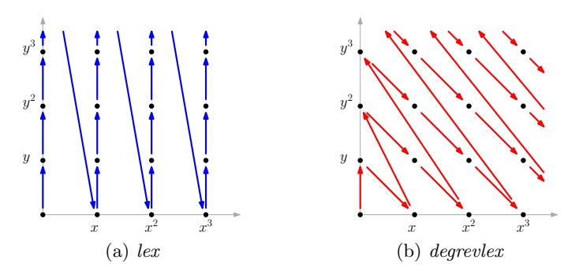
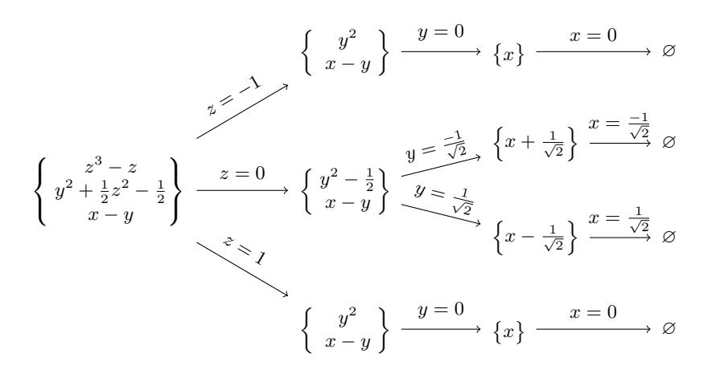
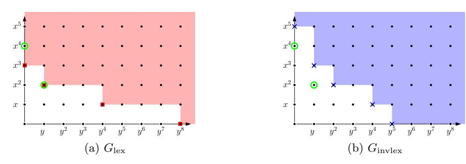
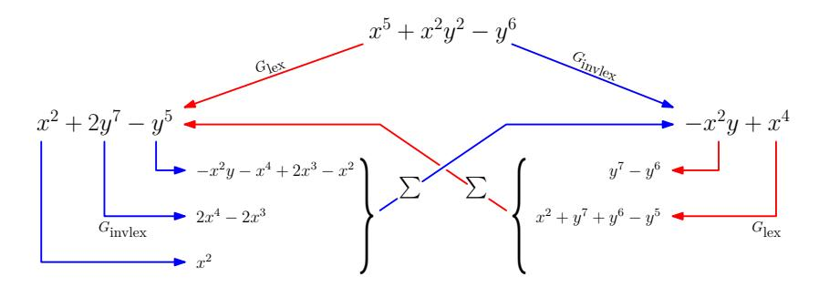
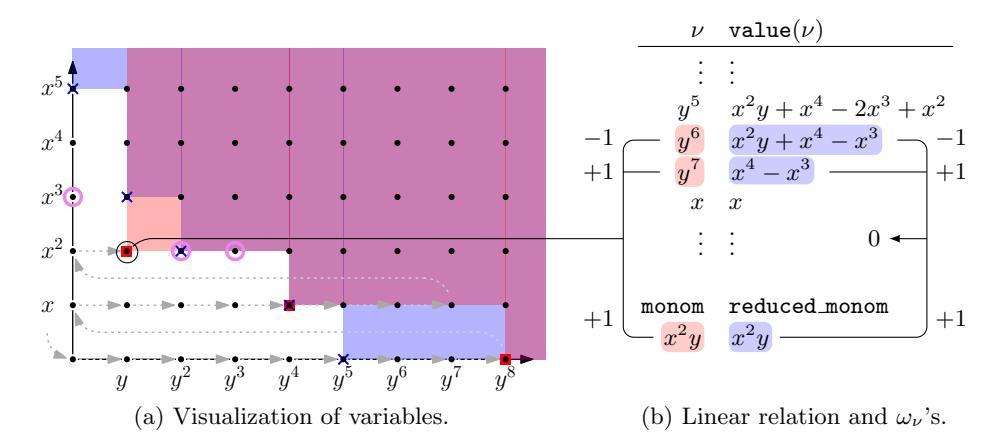
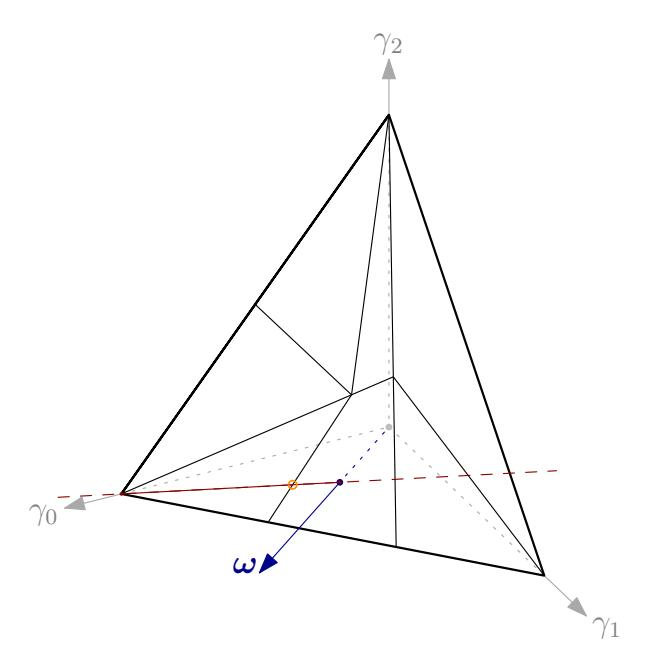

# SoK: Gr¨obner Basis Algorithms for Arithmetization Oriented Ciphers

Jan Ferdinand Sauer and Alan Szepieniec

AS Discrete Mathematics GmbH, Switzerland {ferdinand,alan}@asdm.gmbh

Abstract. Many new ciphers target a concise algebraic description for efficient evaluation in a proof system or a multi-party computation. This new target for optimization introduces algebraic vulnerabilities, particularly involving Gr¨obner basis analysis. Unfortunately, the literature on Gr¨obner bases tends to be either purely mathematical, or focused on small fields. In this paper, we survey the most important algorithms and present them in an intuitive way. The discussion of their complexities enables researchers to assess the security of concrete arithmetizationoriented ciphers. Aside from streamlining the security analysis, this paper helps newcomers enter the field.

Keywords: Algebraic Cryptanalysis · Gr¨obner Basis · Arithmetization Oriented Cipher.

## <span id="page-0-0"></span>1 Introduction

A range of emerging applications build on cryptographic protocols that employ arithmetization. This process first characterizes a computation as a sequence of basic finite field operations, and then performs these operations in the context of a cryptographic protocol that preserves some target security property, such as privacy, soundness, etc. Some examples of protocols that arithmetize are zeroknowledge proof systems [\[16,](#page-40-0) [56\]](#page-42-0), succinct-verifier proof systems [\[27\]](#page-41-0), and multiparty protocols [\[38\]](#page-41-1) – all of which have numerous already-deployed applications both in a blockchain context and elsewhere.

A recurring computational task in these applications consists of evaluating a keyed or unkeyed symmetric cryptographic primitive. However, traditional block ciphers and hash functions are optimized for hardware and software implementations, not for arithmetic simulation by a cryptographic protocol. The demand for high performance in these applications has brought about two notable changes to the symmetric cryptography landscape:

1. New designs for symmetric primitives optimized for arithmetic protocols. Recent years have seen several new proposals and design strategies with this selling point: LowMC [\[6\]](#page-40-1), MiMC [\[5\]](#page-40-2), GMiMC [\[4\]](#page-40-3), Jarvis and Friday [\[10\]](#page-40-4), Vision and Rescue [\[7,](#page-40-5)[81\]](#page-43-0), Starkad and Poseidon [\[58\]](#page-42-1). These so-called arithmetizationoriented ciphers (AOCs) target a concise description in terms of operations over a large finite field.

2. Renewed interest in the field of algebraic attacks on symmetric primitives. As a result of their concise description in terms of finite field operations, AOCs are vulnerable to a collection of attacks that exploit the low degree or sparsity of polynomial representations of the cipher under attack [\[3,](#page-40-6)[18,](#page-40-7)[25,](#page-41-2)[66\]](#page-42-2). Traditional ciphers mitigate this vulnerability by including operations not native to the working field in their circuit, resulting in a huge description in terms of polynomials. As a result, most of traditional symmetric cryptanalysis focuses on statistical attacks such as differential and linear cryptanalysis. For AOCs, these types of attacks are generally less relevant as a consequence of their large working field.

One of the most powerful general-purpose algebraic attack methodologies revolves around the computation of a Gr¨obner basis from a set of polynomials. This Gr¨obner basis computation is one step in a polynomial system solving problem where the polynomials are provided by the cipher's description, and the polynomials' common solution contains the sought-after secret key or hash preimage. The complexity of polynomial system solving is therefore a vitally important question in the context of analyzing the security of an AOC or determining the correct parameters for a target security level.

Unfortunately, polynomial system solving and Gr¨obner bases remain poorly understood subjects, particularly in the context of AOCs. There are several reasons for this poor understanding. Firstly, until recently, there was no demand for AOCs and thus no reason for cryptanalysts to study their security. Secondly, the field is not very developed, in the sense that contributions come from rather few researchers with diverse backgrounds, hampering collaboration. Thus thirdly, and most importantly, the literature on the topic is scattered across many sources, often contradictory, and in many cases out of date.

This paper aims to systematize existing knowledge in the context of Gr¨obner basis attacks on AOCs. No scientific novelty is claimed; our contribution is merely the presentation of existing knowledge in an intuitive and self-consistent way. In doing so, we hope to make the field more accessible to researchers and eventually improve the understanding of the concrete security that various AOCs offer.

The structure and scope of this paper is best illustrated in relation to the general attack pipeline, which consists of several steps.

- <span id="page-1-0"></span>1. Polynomial modeling. The cipher is described in terms of low-degree multivariate polynomials, such that any solution common to all polynomials results in a win for the attacker.
- 2. Gr¨obner basis computation in degree-refining term order. A Gr¨obner basis algorithm computes a Gr¨obner basis for the ideal spanned by this list of polynomials, relative to a term order refining the degree, typically degrevlex.
- 3. Term order change. The Gr¨obner basis with respect to degrevlex is transformed into a Gr¨obner basis for the same polynomial ideal but with respect to lex, an alternative term order.
- 4. Solution readout. Using a mixture of the Euclidean algorithm, univariate polynomial factorization, and back-substitution of roots, an attacker extracts a common solution to the system of polynomials.

Step 1, modeling the cipher and attack, is out of scope for this paper. We assume an attacker already knows which polynomials they want to find a solution to. Indeed, the concise polynomial formulation of AOCs is their selling point.

In Section 2, we cover the basic definitions of variety, ideal, term order, and Gröbner basis. We show here how solution readout works for Gröbner bases in *lex* order of zero-dimensional ideals, and how a naïve transformation of Buchberger's criterion gives rise to a correct (albeit slow) Gröbner basis algorithm.

In Section 3, we cover the  $F_4$  and  $F_5$  algorithms, which constitute the state of the art. We also cover the XL family of algorithms, which is popular in the context of cryptanalysis and small fields. While these algorithms are often described as Gröbner-like due to their various similarities, the framing is quite different.

In Section 4, we cover FGLM and sketch the Gröbner walk, the two most important term order change algorithms. It is important to consider the term order change as a separate step in the attack because the Gröbner basis computation does not always dominate. Indeed, it is possible to construct AOCs where the Gröbner basis comes for free, and where the cipher's security comes from the difficulty of computing this term order change.

We close in Section 5 with open questions and a discussion, and suggest future work.

## <span id="page-2-0"></span>2 Gröbner Bases

After modeling a cryptographic primitive as a system of polynomial equations, the objective is to find a solution to that system of equations, i.e., some vector  $\boldsymbol{a}$  that simultaneously satisfies all multivariate polynomial equations. The set of all these values is called the variety.

**Definition 1** (Variety<sup>1</sup>). The variety of  $\mathcal{F} \subseteq \mathbb{F}[\mathbf{x}]$  is defined as

$$V(\mathcal{F}) = \left\{ (a_0, \dots, a_{n-1}) \in \overline{\mathbb{F}}^n \,\middle|\, \forall f \in \mathcal{F} : f(\boldsymbol{a}) = 0 \right\}.$$

Note that varieties are defined over the algebraic closure  $\overline{\mathbb{F}}$  of  $\mathbb{F}$ . For this paper, solutions not lying in the base field  $\mathbb{F}$  are not of interest; only elements of  $\mathbb{F}$  are valid inputs (keys, messages, etc.) and outputs (ciphertexts, hashes, etc.). Therefore, special care must be taken to eliminate parasitical extension field solutions, for instance by adjoining the field equations.

Identifying each equation with its polynomial allows us to operate on polynomials rather than on polynomial equations. Which operations on lists of polynomials can bring us closer to finding a solution? Linear algebra techniques suffice when the polynomials are linear. For higher degree polynomials, Gröbner basis algorithms provide a standard methodology. We motivate this notion before providing the definition.

<span id="page-2-1"></span><sup>&</sup>lt;sup>1</sup> We only consider *affine* varieties in this work. For projective varieties, corresponding to homogeneous ideals, we refer to the literature on algebraic geometry, like [60].

A natural requirement for allowable operations is that they neither create nor destroy solutions. Adding and subtracting the polynomial equations to derive new ones satisfies this requirement, as does multiplying them with scalar weights. In fact, the weights need not be scalars but can be drawn from the same ring of polynomials over which the original polynomials themselves are defined. This observation motivates the notion of *polynomial ideals*, a generalization of vector spaces that allows polynomial coefficients instead of just scalar coefficients.

**Definition 2 (Polynomial**<sup>2</sup> ideal). Let  $\mathcal{F} = \{f_0, \dots, f_{s-1}\} \subseteq \mathbb{F}[\mathbf{x}]$  be a set of polynomials. The ideal I spanned by  $\mathcal{F}$  is defined as

$$I = \langle \mathcal{F} \rangle = \langle f_0, \dots, f_{s-1} \rangle = \left\{ \sum_{i=0}^{s-1} q_i f_i \middle| q_i \in \mathbb{F}[\mathbf{x}] \right\}.$$

The set of cosets of I in  $\mathbb{F}[\mathbf{x}]$ , together with polynomial addition and multiplication, forms a ring. We can therefore consider any polynomial f equivalent to some polynomial  $g \equiv f \mod I$  whenever  $f - g \in I$ . Intuitively, a useful property of a basis for I is for it to allow the computation of a canonical representative for each equivalence class, as this would admit an equivalence test. This property is useful for finding solutions because the equivalence class of all polynomials that encode information about the solution is  $0 \mod I$ . The canonical representatives therefore distinguish useful polynomials from not so useful ones.

This observation is related to divisibility of univariate polynomials. If f(x) is a univariate polynomial and  $\langle f(x) \rangle$  its ideal, then the computation of canonical representative of a polynomial g(x) modulo  $\langle f(x) \rangle$  follows straightforwardly from polynomial long division: the canonical representative of g(x) is its remainder after division by f(x). Moreover, if  $a \in \mathbb{F}$  is a root of f(x), then  $(x-a) \mid f(x)$  and one might even write  $f(x) \in \langle x-a \rangle$  or  $f(x) \equiv 0 \mod x - a$ . If the roots of f(x) and of g(x) are disjoint sets, then  $f(x) \not\equiv 0 \mod g(x)$  and  $g(x) \not\equiv 0 \mod f(x)$ .

Unfortunately, polynomial division does not naturally generalize to multivariate polynomials. Univariate polynomial division relies on the natural order of univariate monomials, namely comparing degrees. That is,  $x^a \prec x^b$  if and only if a < b. Division of univariate monomial  $x^a$  by  $x^b$  results in  $x^{a-b}$ , which is an element of  $\mathbb{F}[x]$  if  $a \ge b$ . The generalization to multivariate monomials is straightforward:  $\mathbf{x}^{\alpha}$  divided by  $\mathbf{x}^{\beta}$  results in  $\mathbf{x}^{\alpha-\beta}$ , an element of  $\mathbb{F}[\mathbf{x}]$  if  $\alpha_i \ge \beta_i$  for all i. However, generalizing polynomial division is a little more subtle. In the univariate case, the monomials with the highest power of the variable determine the next step in the division process. In the multivariate case, "highest power" is no inherent property: How do the degrees of  $x^5yz^2$  and  $x^2y^2z^4$  relate? In order to proceed, we must therefore fix the monomial order.

<span id="page-3-0"></span><sup>&</sup>lt;sup>2</sup> In this paper, "ideal" always means "polynomial ideal."

<span id="page-3-1"></span><sup>&</sup>lt;sup>3</sup> The terminology of "term" and "monomial" is not consistent in the literature. We understand a term as a coefficient times a monomial, like, for example, [26, 36, 37, 39]. The meaning is reversed for others [33, 46, 47]. Some works use "power product" [20, 23]. A comprehensive summary of this paper's notation can be found in Appendix A.

#### <span id="page-4-0"></span>2.1 Monomial Orders

For multivariate division to be well defined, a monomial order  $\prec$  must respect multiplication with monomials, i.e., evaluating operator  $\prec$  must give the same result when both operands are multiplied by any monomial  $m \in \mathcal{M}$ . In other words,  $\forall m \in \mathcal{M} : \mathbf{x}^{\boldsymbol{\alpha}} \prec \mathbf{x}^{\boldsymbol{\beta}} \Leftrightarrow m\mathbf{x}^{\boldsymbol{\alpha}} \prec m\mathbf{x}^{\boldsymbol{\beta}}$ . Furthermore,  $\prec$  must be a well-order, i.e., (1) the monomial  $1 = \mathbf{x}^{(0,\dots,0)}$  is the smallest element, and (2) any two monomials are comparable, i.e.,  $\prec$  is a total order. There are infinitely many orders, but common ones have descriptive identifiers.

Lex In lexicographical order,  $\mathbf{x}^{\alpha} \prec_{\text{lex}} \mathbf{x}^{\beta}$  if and only if the first nonzero entry of  $\alpha - \beta$  is negative. In other words,  $\mathbf{x}^{\alpha} \prec_{\text{lex}} \mathbf{x}^{\beta}$  if and only if there exists  $0 \leqslant i < n$  such that  $\alpha_i < \beta_i$  and  $\alpha_j = \beta_j$  for all  $0 \leqslant j < i$ .

Example 1. In  $\mathbb{F}[x,y,z]$  and lex order, we have  $xy^2 \prec xy^2z \prec x^2z^2 \prec x^2yz \prec x^3$ .

Deglex For degree lexicographical or graded lexicographical order, the monomial's total degrees are compared first, with ties broken by lex. In other words,  $\mathbf{x}^{\boldsymbol{\alpha}} \prec_{\text{deglex}} \mathbf{x}^{\boldsymbol{\beta}}$  if and only if  $\sum_{i} \alpha_{i} < \sum_{i} \beta_{i}$  or  $\sum_{i} \alpha_{i} = \sum_{i} \beta_{i}$  and  $\mathbf{x}^{\boldsymbol{\alpha}} \prec_{\text{lex}} \mathbf{x}^{\boldsymbol{\beta}}$ .

Example 2 (continued). In deglex order,  $xy^2 \prec x^3 \prec xy^2z \prec x^2z^2 \prec x^2yz$ .

Degrevlex The degree reverse lexicographical or graded reverse lexicographical order (abbreviated grevlex) also first considers the monomial's total degree. Ties are broken using invlex, which is lex with inversely labeled variables. The outcome of the comparison is reversed, such that invlex-smaller monomials of the same degree are considered degrevlex-greater. In other words,  $\mathbf{x}^{\alpha} \prec_{\text{degrevlex}} \mathbf{x}^{\beta}$  if and only if either  $\sum_{i} \alpha_{i} < \sum_{i} \beta_{i}$  or  $\sum_{i} \alpha_{i} = \sum_{i} \beta_{i}$  and  $\mathbf{x}^{\alpha} \succ_{\text{invlex}} \mathbf{x}^{\beta}$ .

Example 3 (continued). In degrevlex order,  $xy^2 \prec x^3 \prec x^2z^2 \prec xy^2z \prec x^2yz$ .



**Fig. 1.** Two monomial orders over  $\mathbb{F}[x,y]$ .

**Definition 3 (Degree refining order).** A monomial order  $\prec$  is degree refining if for any  $\mathbf{x}^{\alpha}$ ,  $\mathbf{x}^{\beta}$  with  $\sum_{i} \alpha_{i} < \sum_{i} \beta_{i}$ , we have  $\mathbf{x}^{\alpha} \prec \mathbf{x}^{\beta}$ .

For example, both deglex and degrevlex are degree refining orders.

Weight orders The most general way to define a monomial order is using a list of weight vectors  $\omega_i \in \mathbb{R}^n$ , which can be arranged into a weight matrix  $M_{\omega}$ :

$$M_{\omega} = \begin{pmatrix} -\omega_0 - & & & & & & & & & & & & & & & & & &$$

Then,  $\mathbf{x}^{\boldsymbol{\alpha}} \prec_{M_{\omega}} \mathbf{x}^{\boldsymbol{\beta}}$  if the first non-zero entry of vector  $M_{\omega} \cdot \boldsymbol{\alpha} - M_{\omega} \cdot \boldsymbol{\beta}$  is negative. In other words, first the weight vector  $\boldsymbol{\omega}_0$  is used to try and establish the relation of  $\mathbf{x}^{\boldsymbol{\alpha}}$  and  $\mathbf{x}^{\boldsymbol{\beta}}$ , and in case of a tie, subsequent weight vectors are used for comparison.

Example 4. The matrices

$$M_{\text{lex}} = \begin{pmatrix} 1 & 0 & \cdots & \cdots & 0 \\ 0 & \ddots & \ddots & \vdots & \vdots \\ \vdots & \ddots & \ddots & \ddots & \vdots \\ \vdots & \ddots & \ddots & \ddots & \vdots \\ \vdots & \ddots & \ddots & \ddots & \vdots \\ \vdots & \ddots & \ddots & \ddots & \vdots \\ \vdots & \ddots & \ddots & \ddots & 0 \\ 0 & \cdots & \cdots & 0 & 1 \end{pmatrix}, \qquad M_{\text{degrevlex}} = \begin{pmatrix} 1 & \cdots & \cdots & 1 \\ 0 & \cdots & \cdots & 0 & -1 \\ \vdots & \vdots & \ddots & \ddots & \vdots \\ \vdots & \ddots & \ddots & \ddots & \vdots \\ 0 & -1 & 0 & \cdots & \cdots & 0 \end{pmatrix}$$

correspond to lex and degrevlex order, respectively. Note that a monomial order defined by  $M_{\omega}$  where  $\omega_0 = c \cdot \mathbf{1}, \ c \in \mathbb{R} \setminus \{0\}$ , is a degree refining order.

Any monomial order can be expressed using weight vectors, but not all matrices define a monomial order. A sufficient condition for a matrix  $M_{\omega}$  to define a monomial order is  $M_{\omega} \in \mathbb{R}^{n \times n}$  with only non-negative entries and the rank of  $M_{\omega}$  be full. The example  $M_{\text{degrevlex}}$  above shows that this is not a necessary condition. Without further discussion thereof,  $\ker(M) \cap \mathbb{Z}^n = \{0\}$  is such a necessary condition. An extended treatment of weight orders can be found in [37, Ch. 2, §4], [36, Ch. 1, §2], and [59, Sec. 1.2].

Leading term, coefficient, and monomial Fixing any monomial order  $\prec$  gives rise to leading terms of polynomials. For  $f = \sum_{\alpha} c_{\alpha} \mathbf{x}^{\alpha}$ , the leading term  $\mathsf{lt}(f)$  is defined as the  $\prec$ -maximal non-zero summand of f, i.e.,  $\mathsf{lt}(f) = \max_{\prec} \{c_{\alpha} \mathbf{x}^{\alpha} \mid c_{\alpha} \neq 0\}$ . The leading coefficient  $\mathsf{lc}$  and leading monomial  $\mathsf{lm}$  of f are coefficient and monomial of  $\mathsf{lt}$ , respectively, i.e.,  $\mathsf{lt}(f) = \mathsf{lc}(f) \cdot \mathsf{lm}(f)$ . All of f's terms smaller than  $\mathsf{lt}(f)$ , i.e.,  $f - \mathsf{lt}(f)$ , comprise the tail of f. Extension of  $\mathsf{lt}$ ,  $\mathsf{lc}$ , and  $\mathsf{lm}$  to sets of polynomials are defined, e.g.,  $\mathsf{lt}(G) = \bigcup_{g \in G} \mathsf{lt}(g)$ .

<span id="page-5-0"></span><sup>&</sup>lt;sup>4</sup> Alternative terminology is *head* or *initial* term, coefficient, or monomial.

#### 2.2 Definition of Gröbner Bases

A Gröbner basis of a polynomial Ideal  $I \subseteq \mathbb{F}[\mathbf{x}]$  is a finite set of polynomials  $G = \{g_0, \dots, g_{t-1}\}$  such that  $\langle g_0, \dots, g_{t-1} \rangle = I$  and such that G has "nice" computational properties. For example, ideal membership  $f \in I$  can be decided easily with a Gröbner basis; determining inclusion or equivalence of ideals is straightforward (a direct consequence); and projecting I into a ring with fewer variables is trivial for certain monomial orders. Perhaps most relevant for cryptanalysis is computing solutions of the underlying polynomial equations  $g_i = 0$ . This is straightforward for Gröbner bases in lex order, as we shall see in Section 2.3.

Leading up to the definitions of Gröbner basis, the concepts of polynomial reduction and (fully reduced) remainders are useful. In essence, reducing one polynomial by a (set of) polynomials is a generalization of long division for univariate polynomials. Results of such reductions are not generally unique. However, uniqueness of remainders after reduction is guaranteed if the set of divisors is a Gröbner basis – another "nice" property. In the following, let f be a polynomial,  $G = \{g_0, \ldots, g_{t-1}\}$  a finite set of polynomials, and  $\prec$  a monomial order.

**Definition 4 (Polynomial reduction).** We say G reduces f to r if there are polynomials  $r, q_0, \ldots, q_{t-1} \in \mathbb{F}[\mathbf{x}]$  such that  $f = \sum_i q_i g_i + r$  and  $\mathsf{Im}(r) \prec \mathsf{Im}(f)$ . Polynomial r is called the remainder of the reduction of f by G.

Note 1. Polynomials  $q_i$  can be efficiently computed using multivariate polynomial division. Such a division algorithm is reproduced in Appendix B.

**Definition 5 (Fully reduced).** We say r is fully reduced with respect to G if no further reduction of r by G is possible. In other words, no leading monomial of any element in G divides any monomial of  $r: \forall l \in Im(G), \forall m \in \mathcal{M}(r): l \not\mid m$ .

We write  $f \xrightarrow{G} r$  to denote full reduction of f by G resulting in r, i.e., such that r is fully reduced with respect to G.

Example 5. Fix monomial order lex. Let  $f=x^2y^2+y^2z^2-2y^2z$  and  $G=\{x^2y-2yz,y^2-z^2,xz^2\}$ . For  $q_0=y,q_1=z^2,q_2=0$ , we have  $f=\sum_i q_ig_i+z^4$ . Since no element of  $\text{Im}(G)=\{x^2y,y^2,xz^2\}$  divides  $z^4$ , the remainder  $z^4$  is fully reduced with respect to G. We can write  $f\xrightarrow{G}z^4$ .

In general, the remainder r after full reduction of f is not unique. For example, choosing  $q_0 = 0$ ,  $q_1 = x^2 + z^2 - 2z$ ,  $q_2 = x$  above, we have full reduction  $f \xrightarrow{G} z^4 - 2z^3$ . However, reducing a polynomial by a Gröbner basis guarantees uniqueness of the remainder. In fact, this is one way to define Gröbner bases.

<span id="page-6-0"></span>**Definition 6 (Gröbner basis by remainder).** G is a Gröbner basis for I if and only if  $\langle G \rangle = I$  and the remainder after full reduction by G of any  $f \in \mathbb{F}[\mathbf{x}]$  is unique.

<span id="page-6-1"></span>An equivalent albeit less intuitive definition pertains to the leading monomials of G and of elements of  $\langle G \rangle = I$ .

**Definition 7 (Gröbner basis by leading monomials).** G is a Gröbner basis for I if and only if  $\langle G \rangle = I$  and  $\langle Im(G) \rangle = \langle Im(I) \rangle$ .

In other words, the ideal generated by the leading monomials of G is equal to the ideal generated by the leading monomials of all elements of I.

**Theorem 1.** Definitions 6 and 7 are equivalent.

*Proof.* " $7 \Rightarrow 6$ ":

Fully reducing  $f \in \mathbb{F}[\mathbf{x}]$  by G gives r such that f = g + r,  $g = \sum_{i=0}^{t-1} q_i g_i$ , and  $\mathsf{Im}(r) \prec \min_i(\mathsf{Im}(g_i))$ . Suppose there is another full reduction by G, i.e., f = g' + r' for  $g' = \sum_{i=0}^{t-1} q_i' g_i$ , resulting in different remainder  $r' \neq r$ . Then, the difference of the remainders r - r' = g' - g is an element of I. Consequently, the leading monomial of r - r' is in  $\langle \mathsf{Im}(I) \rangle$ .

Since  $\langle \mathsf{Im}(I) \rangle$  is generated by monomials,  $\mathsf{Im}(r-r') \in \langle \mathsf{Im}(I) \rangle$  implies divisibility of  $\mathsf{Im}(r-r')$  by one of the basis elements of  $\langle \mathsf{Im}(I) \rangle$ . Since  $\langle \mathsf{Im}(I) \rangle = \langle \mathsf{Im}(g_0), \ldots, \mathsf{Im}(g_{t-1}) \rangle$ , this basis element is some  $\mathsf{Im}(g_i)$ , i.e.,  $\mathsf{Im}(g_i) \mid \mathsf{Im}(r-r')$  and thus  $\mathsf{Im}(g_i) \leq \mathsf{Im}(r-r')$  for some  $g_i$ . This contradicts  $\mathsf{Im}(r-r') \leq \mathsf{max}(\mathsf{Im}(r), \mathsf{Im}(r')) \prec min_i(\mathsf{Im}(g_i))$ , proving r=r' and thus uniqueness of the remainder.

" $6 \Rightarrow 7$ ":

Since  $\langle \mathsf{Im}(G) \rangle$  and  $\langle \mathsf{Im}(I) \rangle$  are both generated by monomials, showing their equality in terms of polynomial membership can be reduced to equality in terms of monomial membership, i.e.,

<span id="page-7-0"></span>
$$\forall m \in \mathcal{M} : m \in \langle \mathsf{Im}(G) \rangle \Leftrightarrow m \in \langle \mathsf{Im}(I) \rangle. \tag{1}$$

To see that this reduction is valid, take polynomial  $f = \sum_{\alpha} c_{\alpha} \mathbf{x}^{\alpha} \in \mathbb{F}[\mathbf{x}]$ . Then, f is in  $\langle \text{Im}(I) \rangle$  if and only if every  $\mathbf{x}^{\alpha}$  is in  $\langle \text{Im}(I) \rangle$ . Likewise, f is in  $\langle \text{Im}(G) \rangle$  if and only if every  $\mathbf{x}^{\alpha}$  is in  $\langle \text{Im}(G) \rangle$ . Therefore, it suffices to show that full reduction by G leaving unique remainders implies Equation (1).

Let f be a nonzero monomial, i.e.,  $\mathsf{Im}(f) = f$ , and  $f \xrightarrow{\ \ \ } r$ . Distinguish 3 cases:

- 1.  $f \prec \operatorname{Im}(r)$ .
  - This case contradicts r being the result of a reduction.
- 2. f = Im(r).

Then,  $f = r \notin \langle G \rangle$  because no reduction took place. Suppose  $f \in \langle \mathsf{Im}(G) \rangle$ . Then  $f = \sum q_i \mathsf{Im}(g_i)$  for some  $q_i$ , and since f is a monomial, only one term in this sum remains, meaning  $f = q_i \mathsf{Im}(g_i)$  for some i. This contradicts no reduction haven taken place. Thus  $f \notin \langle \mathsf{Im}(G) \rangle$ . Suppose  $f \in \langle \mathsf{Im}(\langle G \rangle) \rangle$  so that  $f = \mathsf{Im}(\sum q_i g_i)$  for some  $q_i$ . By "undropping" trailing terms,  $f = \sum q_i g_i - r'$  with  $\mathsf{Im}(r') \prec f$ . If  $r' \neq 0$ , it is a second remainder. If r' = 0 then  $f \in \langle G \rangle$ . Both are contradictions, so  $f \notin \langle \mathsf{Im}(I) \rangle$ .

3.  $f \succ \operatorname{Im}(r)$ .

Then  $f - r \in \langle G \rangle$  and  $f = \operatorname{Im}(f) \in \langle \operatorname{Im}(I) \rangle$ . Also  $f = \sum q_i g_i + r$  so some  $\operatorname{Im}(g_i)|f$  and  $f \in \langle \operatorname{Im}(G) \rangle$ .

Regardless of the case, f ∈ hlm(G)i ⇔ f ∈ hlm(I)i, completing the proof. ut

Definition 8 (Reduced Gr¨obner basis). G is a reduced Gr¨obner basis for I if and only if

- (1) G is a Gr¨obner basis for I,
- (2) all g ∈ G are monic, and
- (3) all g ∈ G have no monomial in hG \ {g}i.

Proposition 1. The reduced Gr¨obner basis for a non-trivial ideal with respect to a fixed monomial ordering exists and is unique.

Proof. For a full proof, we refer to [\[37,](#page-41-5) Ch.2 §7 Thm. 5].

From neither [Definition 6](#page-6-0) nor [7](#page-6-1) it is straightforward to even check whether a set of polynomials is a Gr¨obner basis, and they certainly do not readily suggest how to compute one. From [Definition 7](#page-6-1) it becomes clear that leading monomials are of importance. Rephrasing the definition, a set of polynomials G is a Gr¨obner basis if for any element f in the ideal, the leading monomial of f is divisible by the leading monomial of some element of G. This suggests that, at the very minimum, combining any two g<sup>i</sup> , g<sup>j</sup> ∈ G in a way that their respective leading terms cancel should always result in a polynomial g<sup>k</sup> whose leading monomial lm(gk) is already present in G's set of leading monomials lm(G). This (roughly sketched) necessary condition turns out to be a sufficient one, as we will see in [Theorem 2.](#page-9-0) The intuition of canceling leading terms is captured by S-polynomials.

Definition 9 (lcm of monomials). Let x <sup>α</sup>, x <sup>β</sup> ∈ M be monomials in n variables. Set γ = (γ0, . . . , γn−1) with γ<sup>i</sup> = max{α<sup>i</sup> , βi}. Define lcm(x <sup>α</sup>, x <sup>β</sup>) = x γ .

Definition 10 (S-Polynomial). The S-Polynomial of f, g ∈ F[x] is

$$S(f,g) = \frac{u}{\mathit{lt}(f)} f - \frac{u}{\mathit{lt}(g)} g \,, \quad u = \mathrm{lcm}(\mathit{Im}(f), \mathit{Im}(g)).$$

<span id="page-8-0"></span>Example 6. Let F[x] = Q[x, y, z], the monomial order be deglex, f = 3x <sup>2</sup>y + 6xyz, and g = 2yz + 2y Then,

$$S(f,g) = \frac{x^2yz}{3x^2y} \cdot f - \frac{x^2yz}{2yz} \cdot g$$
$$= \frac{z}{3} \cdot f - \frac{x^2}{2} \cdot g$$
$$= 2xyz^2 - x^2y.$$

Canceling the leading terms of two polynomials by way of computing their S-polynomial does not necessarily result in a smaller leading term: In [Example 6,](#page-8-0) the leading monomials of S(f, g) is different to the leading monomials of f and g, i.e., the leading terms of f and g did get canceled. However, the leading

monomial of the S-polynomial is greater in the specified order, i.e., lm(S(f, g)) = xyz<sup>2</sup> deglex x <sup>2</sup>y = max{lm(f), lm(g)}.

By construction, the S-polynomial of f<sup>i</sup> , f<sup>j</sup> ∈ F lies in the ideal hF i. Thus, if F is a Gr¨obner basis, full reduction of S(f<sup>i</sup> , f<sup>j</sup> ) for any f<sup>i</sup> , f<sup>j</sup> will leave the unique remainder 0, as per [Definition 6.](#page-6-0) Conversely, if the same full reduction results in r 6= 0, then F is not a Gr¨obner basis. In fact, we just articulated what is known as Buchberger's criterion for testing if a set of polynomials is a Gr¨obner basis. It turns out that Gr¨obner bases can be defined in terms of this criterion. The resulting notion is equivalent to [Definitions 6](#page-6-0) and [7](#page-6-1) but requires only a finite number of checks to determine whether a set of polynomials F is a Gr¨obner basis for hF i.

<span id="page-9-0"></span>Theorem 2 (Buchberger's criterion). G is a Gr¨obner basis for hGi if and only if S(g<sup>i</sup> , g<sup>j</sup> ) −→<sup>G</sup> 0 for all critical pairs (g<sup>i</sup> , g<sup>j</sup> ) ∈ G × G.

Proof. For a full proof, we refer to [\[20,](#page-40-8) [23,](#page-41-8) [37\]](#page-41-5).

Given that S(f<sup>i</sup> , f<sup>j</sup> ) ∈ hF i, remainder r of S(f<sup>i</sup> , f<sup>j</sup> ) after full reduction by F is also an element of hF i. Thus, adding r to F does not change the ideal hF i, but intuitively makes F be "closer" to a Gr¨obner basis. This is the basic idea of Buchberger's algorithm [\[20,](#page-40-8) [23\]](#page-41-8), shown in [Algorithm 1.](#page-9-1)

Intuitively, the algorithm's correctness follows directly from Buchberger's criterion. Showing termination is a little trickier. One essential ingredient is Hilbert's basis theorem [\[62\]](#page-42-7), which implies that a Gr¨obner basis is always finite [\[37,](#page-41-5) Ch. 2, §5, Corr. 6]. Additionally, one needs to show that including a non-zero remainder of reducing an S-polynomial by a preliminary Gr¨obner basis brings us "closer" to a Gr¨obner basis. For proofs of correctness and termination, we refer to [\[20,](#page-40-8) [23,](#page-41-8) [37\]](#page-41-5).

## Algorithm 1: Buchberger's Algorithm

```
Input: F = {f0, . . . , fs−1} ⊆ F[x]
 Output: a Gr¨obner basis G for hf0, . . . , fs−1i
1 G = ∅
2 G
   0 = F
3 while G 6= G
             0 do
4 G = G
          0
5 foreach (gi, gj ) in G × G do // critical pair
6 r = (any) full reduction of S(gi, gj ) by G // S(gi, gj ) −→G r
7 if r 6= 0 then
8 G
            0 = G
                 0 ∪ {r}
9 return G
```

The complexity of [Algorithm 1](#page-9-1) is quite difficult to estimate since many choices – the monomial order, the order of selecting pairs (g<sup>i</sup> , g<sup>j</sup> ), and others – can influence execution dramatically. A lot of work has been put into finding upper and lower complexity bounds for Gröbner basis computations, independent of the algorithm. The general measure of this complexity is by the highest total degree  $d_{\max}$  among the polynomials in the Gröbner basis G for some ideal I, i.e.,  $d_{\max} = \max\{\deg(g) \mid g \in G\}$ . Bounds exist for different input parameters, like the number s of input polynomials  $\{f_0,\ldots,f_{s-1}\}$ , their total degrees  $d_i = \deg(f_i)$  with maximum  $d = \max\{d_i\}$ , the degrees' arithmetic mean D, or the dimension of the ideal  $\dim(I)$ . For the special case of underdetermined systems, i.e.,  $s \leq n$ ,  $d_{\max}$  is not greater than the  $B\acute{e}zout$  bound, defined as the product of all  $d_i$ , i.e.,  $d_{\max} \leq \prod_i d_i$  [69, Thm. 1]. More generally,  $d_{\max}$  is doubly exponential in the number of variables, i.e.,  $d_{\max} \leq 2\left(\frac{1}{2}d^2+d\right)^{2^{n-1}}$  [43], and this bound is tight in the worst-case [72]. A more recent bound is  $d_{\max} \leq d^{n^{\Theta(1)}2^{\Theta(\dim(I))}}$  [73], depending also on the dimension of I. For the special case of a zero-dimensional ideal, an even sharper bounds exists, with  $d_{\max}$  polynomial in  $\max\{S, D^n\}$ , where S is the size of the input polynomials in dense representation and D the arithmetic mean  $\frac{\sum d_i}{s}$  [61]. A lower bound is  $d_{\max} \geq d^{2^{n/2}}$  for sufficiently large n and d [84].

While these results paint a bleak picture for the worst case, Gröbner bases for many polynomial systems arising from "real-world" scenarios *can* be computed. Algorithms for this problem have improved dramatically over the last decades. Some of the most important ones are surveyed in Section 3.

### <span id="page-10-0"></span>2.3 Computing V(I) from $G_{lex}$

Equipped with the tools to compute Gröbner bases, we can come back to what we originally set out to do: breaking a cryptographic primitive by efficiently computing solutions to the system of polynomials  $\mathcal{F}$  that model it, i.e., elements of the variety  $V(\langle \mathcal{F} \rangle)$ . Gröbner bases in lex order make it especially easy to achieve this. In this section, we provide intuition and an algorithm for the process of finding the variety's elements. While applicable in greater generality, for this paper we are only interested in the case of  $\mathbb{F}$  being a finite field. For the theoretical background, we refer to [37, Ch. 3, §1], which is treating elimination ideals, the elimination theorem, and the extension theorem, and uses these tools to prove the algorithm's correctness.

One more piece of terminology regarding a system's number of solutions  $|V(\mathcal{F})|$  frequently occurs in the context of Gröbner basis theory.

**Definition 11 (Zero-dimensional ideal).** An ideal I is zero-dimensional if and only if its variety V(I) has finitely many elements.

**Proposition 2.** Let  $I \subseteq \mathbb{F}_q[\mathbf{x}]$  be some ideal and  $\mathcal{E}_q^n = \langle x_i^q - x_i \mid 0 \leqslant i < n \rangle$  the ideal generated by all field equations. Then,  $I \cup \mathcal{E}_q^n$  is zero-dimensional.

*Proof.* Since 
$$V(I \cup \mathcal{E}_q^n) = V(I) \cap \mathbb{F}_q^n$$
, we have  $\dim(I \cup \mathcal{E}_q^n) = 0$ .

A reduced lex ordered Gröbner basis  $G_{lex}$  of a zero-dimensional ideal has exactly one polynomial g that is univariate in the lex-greatest variable  $x_{n-1}$  [36,

Ch. 2, §3]. A root  $a_{n-1}$  of g can be the rightmost coordinate of an element  $(a_0, \ldots, a_{n-1}) \in V(I)$ , and all such rightmost coordinates are roots of g. That is, the roots of g are a superset of the partial solutions to the system of equations defining I. Substituting variable  $x_{n-1}$  in  $G_{\text{lex}}$  by  $a_{n-1}$  corresponds to a projection of I into  $\mathbb{F}[x_0, \ldots, x_{n-2}]$ , a polynomial ring with one variable less. This substitution  $G_{\text{lex}}(x_{n-1} = a_{n-1})$  results in a new Gröbner basis, also in lex order, for  $I \cap \mathbb{F}[x_0, \ldots, x_{n-2}]$ . Thus, above steps can be applied recursively until all variables have been eliminated. An element of V(I) is then given by the univariate roots  $a_i$  used for projection at each level of recursion. Backtracking to iterate over all roots generates all of V(I). A more formal description is given in Algorithm 2, and an example execution trace in Example 7 and Figure 2.

## **Algorithm 2:** Variety from $G_{\text{lex}}$

```
Input: Gröbner basis G_{lex} of zero-dimensional ideal in lex order,
               number of variables n
    Output: Variety V(\langle G_{\text{lex}} \rangle)
                                              // only constants in G_{\texttt{lex}}\colon \texttt{recursion} ends
 1 if n = 0 then
                                                  // empty tuple, start of full solution
 \mathbf{2} \quad \begin{bmatrix} \mathbf{return} \ \{(\ )\} \end{bmatrix}
 \mathbf{3} \ V = \emptyset
 4 gcd_poly = gcd of all g_i \in G univariate in x_{n-1}
 5 partial_solutions = roots(gcd_poly)
                                                         // intersection of roots of the g_i
 6 foreach root in partial_solutions do
         G_{\text{proj}} = G_{\text{lex}}(x_{n-1} = \text{root})
                                                                 // project into \mathbb{F}[x_0,\ldots,x_{n-2}]
         rest_of_solution = Variety from G_{\text{lex}}(G_{\text{proj}}, n-1)
        V = V \cup \{(s_0, \dots, s_{n-2}, \text{root}) \mid \mathbf{s} \in \text{rest\_of\_solution}\}
10 return V
```

In Line 5 of Algorithm 2, univariate root finding is used as a black-box subroutine. Efficient algorithms for this well-studied problem are, for example, Berlekamp's algorithm [17], the Cantor-Zassenhaus algorithm [32], the Kaltofen-Shoup algorithm [67], and Kedlaya-Umans improvements thereof [68]. The Kedlaya-Umans algorithm is the fastest currently known algorithm for finding univariate roots. It has complexity of  $d^{1.5} + d \log q$  operations in  $\mathbb{F}_q$  for polynomials of degree d [54, p. 405]. An excellent introduction to the topic can be found in [54, Ch. 14].

In Line 4, parasitical solutions not lying in  $\mathbb{F}_q$  but in algebraic closure  $\overline{\mathbb{F}}_q$  can be discarded by also including field equation  $x_{n-1}^q - x_{n-1}$  in the gcd.

```
Example 7. Let \mathbb{F}[\mathbf{x}] = \mathbb{R}[x, y, z] and
```

$$f_0 = x - y$$
,  $f_1 = xyz$ ,  $f_2 = x^2 + y^2 + z^2 - 1$ ,

the zeros of which respectively describe the "diagonal" plane x = y, the union of the three planes separating the octants, and the unit sphere. Set  $I = \langle f_0, f_1, f_2 \rangle$ .

The reduced Gröbner basis for I in lex order is given by  $G_{lex} = \{g_0, g_1, g_2\}$  with

$$g_0 = x - y$$
,  $g_1 = y^2 - 0.5z^2 - 0.5$ ,  $g_2 = z^3 - z$ .

We have  $g_0 = f_0$  describing the same plane as above. The zeroes of  $g_1$  describe an elliptic cylinder along the x-axis, and the zeroes of  $g_2$  are three planes coinciding with or orthogonal to the x-y-plane. Running Algorithm 2 on  $G_{\text{lex}}$  results in the execution trace given in Figure 2. Reading out the four solutions, we have  $V(I) = \{\pm (0,0,1), \pm (1/\sqrt{2}, 1/\sqrt{2}, 0)\}.$ 



<span id="page-12-0"></span>Fig. 2. Example execution trace of Algorithm 2 for Example 7.

Note 2. Given a set of univariate polynomials  $f_i(\mathbf{x})$ , the Euclidean algorithm computes their polynomial gcd, containing exactly all shared factors. The roots of this gcd are those roots shared by all the  $f_i$ . In the multivariate case, the gcd of some  $f_i(\mathbf{x})$  is not defined since  $\mathbb{F}[x_0,\ldots,x_{n-1}]$  is not generally a Euclidean domain for n > 2. The variety V of the ideal spanned by the  $f_i(\mathbf{x})$ , efficiently computable given a Gröbner basis, contains all  $\mathbf{a}$  for which all  $f_i$  evaluate to 0, the property of a shared root. Gröbner basis algorithms are thus a multivariate generalization of the Euclidean algorithm.

Note 3. The number of elements in a lex Gröbner basis G for ideal I generally tends to be (much) larger than the number of polynomials  $f_i$  originally defining I, even though Example 7 does not show this phenomenon.

Note 4. A Gröbner basis  $G_{\text{lex}}$  for ideal I in lex order contains a lot more information than strictly necessary for, say, multivariate polynomial division having unique remainders. In particular,  $G_{\text{lex}}$  allows to easily compute a Gröbner basis

for the intersection I ∩ F[x0, . . . , x`] for ` < n, simply by dropping all elements of Glex containing variables greater than x`. Computing a Gr¨obner basis for such an intersection using a degree refining order, like degrevlex, is not straightforward. This intuitively – albeit not rigorously – explains why computing a Gr¨obner basis in lex order is generally much more difficult than computing a Gr¨obner basis in, say, degrevlex order [\[15\]](#page-40-10).

## <span id="page-13-0"></span>3 Computing Gr¨obner Bases

In the previous section, we presented a generic way to compute a Gr¨obner basis, namely Buchberger's algorithm. Directly using this algorithm is usually too inefficient to be of any practical use. This is because Buchberger's algorithm performs a lot of unnecessary reductions, i.e., reductions where the remainder is zero. Improvements to Buchberger's algorithm exist, mostly in the form of criteria predicting when a critical pair reduces to zero. This allows the algorithm to discard such a pair before the costly reduction step is being performed [\[21,](#page-40-11) [55,](#page-42-10) [57,](#page-42-11) [79\]](#page-43-7).

The two Gr¨obner basis algorithms F<sup>4</sup> and F<sup>5</sup> have structural similarities to Buchberger's algorithm, but use a number of additional concepts. Since they constitute the state of the art, especially for attacking AOCs, we present them in detail in [Sections 3.1](#page-13-1) and [3.2.](#page-16-0) Furthermore, the algorithms eXtended Linearization (XL) and Mutant XL, both of which directly compute elements of an ideal's variety, are explained in [Section 3.3.](#page-23-0) Other approaches, for example Slimgb [\[19\]](#page-40-12), MMM [\[71\]](#page-43-8), or M4GB [\[65\]](#page-42-12), as well as concepts like dynamic Gr¨obner basis algorithms [\[28,](#page-41-11) [30,](#page-41-12) [80\]](#page-43-9), are not discussed in this document.

## <span id="page-13-1"></span>3.1 F<sup>4</sup>

Buchberger's algorithm considers every combination of two elements from the working Gr¨obner basis, computes this critical pair's S-polynomial, and reduces that S-polynomial by the working basis to check whether it reduces to zero. For every reduction, polynomial division by the working basis is started "from scratch," potentially performing the same computation more than once. For example, if we first reduce some f to 0, any polynomial multiple g of f will also reduce to 0 and we know this if g has been reduced to f. The Gr¨obner basis algorithm F<sup>4</sup> due to Faug`ere leverages such prior reductions by batching. More concretely, the coefficients of multiple S-Polynomials[5](#page-13-2) are put into a specially crafted matrix, the echelon row-reduced form of which yields their fully reduced remainders. This results in an overall faster Gr¨obner basis algorithm because (1) multiple S-polynomials are being reduced at the same time, enabling the re-use of intermediary results, and (2) existing fast linear algebra techniques and implementations can be used. We motivate the inner workings of F<sup>4</sup> by introducing the Macaulay matrix of a set of polynomials, which is a more general concept than the matrices used in F4.

<span id="page-13-3"></span><span id="page-13-2"></span><sup>5</sup> Actually of the "halves" comprising the S-Polynomials, see below.

**Definition 12 (Macaulay matrix** [70, Notation 3]). Given a set of polynomials  $\mathcal{F} \subseteq \mathbb{F}[\mathbf{x}]$  and monomial order  $\prec$ , the Macaulay matrix  $M_d(\mathcal{F})$  of degree d is a matrix with coefficients in  $\mathbb{F}$ . Let  $\mathbf{x}_d$  denote the  $\prec$ -greatest monomial of total degree d. The  $\binom{n+d}{n}$  columns are labeled by all monomials  $\mathbf{x}^{\alpha}$  with  $\mathbf{x}^{\alpha} \preceq \mathbf{x}_d$  and sorted, from left to right, in  $\prec$ -descending order. The rows are labeled by all monomial multiples  $\mathbf{x}^{\beta}f_i$ ,  $f_i \in \mathcal{F}$ , such that  $l\mathbf{t}(\mathbf{x}^{\beta}f_i) \preceq \mathbf{x}_d$ . Entry  $m_{k,l}$  of  $M_d(\mathcal{F})$  is the coefficient of monomial  $\mathbf{x}^{\alpha}$  in polynomial  $\mathbf{x}^{\beta}f_i$ , where  $\mathbf{x}^{\alpha}$  is the label of column l and  $\mathbf{x}^{\beta}f_i$  is the label of row k.

<span id="page-14-1"></span>Example 8. For degrevlex order, the Macaulay matrix of degree 2 of bivariate polynomials  $\mathcal{F} = \{f_0, f_1\} = \{x^2 + y^2, x + 2y\} \subseteq \mathbb{F}[x, y]$  is

$$M_2(\mathcal{F}) = \begin{cases} x^2 & xy & y^2 & x & y & 1 \\ f_0 & 1 & 1 & & \\ f_1 & & 1 & 2 & & \\ yf_1 & 1 & 2 & & & \\ xf_1 & 1 & 2 & & & \\ 1 & 2 & & & & \\ \end{cases}.$$

Performing a row operation on a Macaulay matrix such that a non-zero coefficient gets canceled, corresponds to one step in the polynomial reduction algorithm. Thus, computing the row-reduced echelon form of a Macaulay matrix corresponds to full polynomial reduction of all polynomials by all polynomials. If the Macaulay matrix  $M_d(\mathcal{F})$  is of high enough degree d, its row-reduced echelon form gives rise to a Gröbner basis<sup>6</sup> for  $\mathcal{F}$  [69, Sec. III B]. However, the combination of two problems make this approach intractable in practice: (1) Not knowing beforehand which degree d is high enough, and (2) the roughly cubic complexity of echelon row-reducing a matrix.

For these reasons, the  $F_4$  algorithm does not reduce the Macaulay matrix. Instead, a matrix M containing just enough information for full polynomial reduction of a subset of the critical pairs is constructed at each step. Intuitively, M is a less verbose version of a Macaulay matrix, where rows and columns not contributing to the polynomial reduction are not included. This omission decreases computation time and memory requirements. The relevant rows are those corresponding to polynomials that might at some point during the polynomial division process cancel some monomial. Also, M does not contain any zero-columns, like the column with label "1" in Example 8. A formal description of which polynomials are included is given in subroutine "Symbolic Preprocessing" in Algorithm 3.

The matrix M and the insight that computing its row-reduced echelon form corresponds to full polynomial reduction of all its polynomials are the reasons  $F_4$  is so much more efficient than Buchberger's algorithm. The question of which polynomials to include in M gives rise to the selection strategy. Many selection strategies exist [46, Sec. 2.5], really making  $F_4$  a family of algorithms. The fastest strategy in practice, thus dubbed the normal strategy, is to pick those pairs  $\{i, j\}$ 

<span id="page-14-0"></span><sup>&</sup>lt;sup>6</sup> This neatly illustrates how Gröbner bases generalize solving a system of linear equations to solving a system of polynomial equations.

### Algorithm 3: Symbolic Preprocessing

```
Input: S-Polynomial "halves" L \subseteq \mathbb{F}[\mathbf{x}], working Gröbner basis G
Output: M

1 processed_monoms = lm(L)

2 while processed_monoms \neq \mathcal{M}(L) do

3 \mathbf{x}^{\beta} = \max_{\prec} \{\mathcal{M}(L) \setminus \text{processed\_monoms}\}

4 processed_monoms = processed_monoms \cup \{\mathbf{x}^{\beta}\}

5 if \exists g \in G such that lm(g) \mid \mathbf{x}^{\beta} then

6 L = L \cup \{\frac{\mathbf{x}^{\beta}}{lm(g)} \cdot g\}

7 M = \text{matrix} with columns labeled by \mathcal{M}(L) in \prec-decreasing order, rows are respective coefficients of elements of L

8 return M
```

with lowest total degree of  $lcm(Im(f_i), Im(f_j))$ . Intuitively, this strategy keeps the degree of the working polynomials as small as possible at all times.

After M is computed and echelon row-reduced, all those polynomials with leading monomial not already in the preliminary Gröbner basis G are added to it. The list of critical pairs is then updated using these new elements. Thus, Buchberger's criterion (Theorem 2) works as the termination criterion once again. The complete algorithm is given in Algorithm 4. For a proof of its correctness and termination, we refer to [46, Thm. 2.2] or [37, Ch. 10, §3].

#### Algorithm 4: $F_4$

```
Input: \mathcal{F} = \{f_0, \dots, f_{s-1}\} \subseteq \mathbb{F}[\mathbf{x}]
     Output: a Gröbner basis G for \langle f_0, \ldots, f_{s-1} \rangle
 1 G = \mathcal{F}
 \mathbf{2} \ t = s
 3 B = \{\{i,j\} \mid 0 \leqslant i < j < s\} //indices of crit. pairs not considered yet
 4 while B \neq \emptyset do
          Select non-empty B' \subseteq B
                                                        // e.g., according to normal strategy
 5
          B = B \setminus B'
  6
          L = \left\{ \frac{\operatorname{lcm}(\operatorname{Im}(f_i), \operatorname{Im}(f_j))}{\operatorname{lt}(f_i)} \cdot f_i \ \middle| \ \{i, j\} \in B' \right\}
                                                                              // S-polynomial "halves"
  7
          M = \text{Symbolic Preprocessing}(L, G)
  8
          N = row-reduced echelon form of M
  9
          N^+ = \{n \in \text{rows}(N) \mid \text{Im}(n) \notin \langle \text{Im}(\text{rows}(M)) \rangle \} // only new lead monoms
10
          foreach r in rows(N^+) do
11
                f_t = \text{polynomial form of } r
12
                G = G \cup \{f_t\}
13
                B = B \cup \{\{i, t\} \mid 0 \le i < t\}
14
                t = t + 1
16 return G
```

 $F_4$  as given in Algorithm 4 can be heavily improved upon. For example, results of subroutine "Symbolic Preprocessing" can be reused between iterations. Furthermore, there are a number of criteria to determine whether the S-polynomial of a critical pair will reduce to zero, including acclaimed Gebauer-Möller installation [21, 22, 29, 55, 63]. Originally applied to Buchberger's algorithm, they can be made use of in  $F_4$  as well. Apart from discarding unnecessary critical pairs, the order in which pairs are selected plays a crucial role for computation speed. For an in-depth review of such improvements, we refer to [46, Sec. 2.4] and [37, Ch. 10, §3].

#### <span id="page-16-0"></span>3.2 F<sub>5</sub>

Both Buchberger's algorithm and  $F_4$  compute, in some form, the S-polynomial of a critical pair and reduce that S-polynomial by the current preliminary Gröbner basis. Any nonzero remainder is added to the working Gröbner basis. However, a reduction to zero does not produce new information, but does waste time. In practice, roughly 90% of  $F_4$ 's execution time is spent performing such useless computations<sup>7</sup> [47]. Establishing ahead of time whether a reduction is necessary thus greatly improves overall performance.

Using a combination of syzygies, which are kernel elements of map  $\phi_{\mathcal{F}}(\boldsymbol{\omega}) = \sum_{i} \omega_{i} f_{i}$  for input set  $\mathcal{F}$ , and signatures, the F<sub>5</sub> criterion allows the F<sub>5</sub> algorithm to skip a lot of useless reductions. In fact, if the input system is a regular sequence, no useless reduction is performed at all.

Definition 13 (Regular sequence of polynomials [14, Def. 2]). A list of polynomials  $f_0, \ldots, f_{s-1} \in \mathbb{F}[\mathbf{x}]$  is a regular sequence if, for all  $0 \leq i < s$ , polynomial  $f_i^h$  is not a zero-divisor in quotient ring

$$\mathbb{F}[\mathbf{x}] / \langle f_0^h, \dots, f_{i-1}^h \rangle$$
,

where  $f_i^h$  is the homogeneous part of  $f_i$  of highest degree.

Intuitively, a regular sequence is a generalization of linear independence, where no  $f_i$  can be expressed through a polynomially weighted sum  $\sum_{j=0}^{i-1} q_j f_j$ , i.e.,  $f_i$  does not lie in the ideal spanned by the  $f_j$  with j < i.

Some further concepts are necessary before the  $F_5$  algorithm can be properly introduced. For this, we follow [37, Ch. 10, §4] as opposed to the original publication [47], allowing to present  $F_5$  in a way structurally similar to both Buchberger's algorithm and  $F_4$ . If the set of generator polynomials  $\mathcal{F}$  for ideal I is clear from context, we set  $\phi = \phi_{\mathcal{F}}$ .

Any element g of the ideal defined by  $\langle \mathcal{F} \rangle$ , including elements of a Gröbner basis for I, is a polynomially weighted sum of the generator polynomials  $f_i \in \mathcal{F}$ . That is,  $g = \sum_i \omega_i f_i$  for some  $\boldsymbol{\omega} \in \mathbb{F}[\mathbf{x}]^s$ , defining the function  $\phi_{\mathcal{F}}(\boldsymbol{\omega}) = \sum_i \omega_i f_i$ .

<span id="page-16-1"></span><sup>&</sup>lt;sup>7</sup> The parameters this fraction depends on are not clear, but the sheer magnitude already motivates looking for improvements.

This sum is implicitly computed in both Buchberger's algorithm and  $F_4$ , since the main interest lies with the resulting polynomial g.  $F_5$  computes and uses these weights explicitly. These vectors of origin<sup>8</sup> succinctly keep track of how the algorithm arrived at, for example, a Gröbner basis element, and enable the algorithm to avoid redundant deductions. A vector of origin  $\omega$  is an element of the s-dimensional free module on  $\mathbb{F}[\mathbf{x}]$ , i.e.,  $\omega \in \mathbb{F}[\mathbf{x}]^s$ . Observe that the image of module  $\mathbb{F}[\mathbf{x}]^s$  under  $\phi_{\mathcal{F}}$  is exactly the ideal spanned by  $\mathcal{F}$ , i.e.,  $\phi_{\mathcal{F}}(\mathbb{F}[\mathbf{x}]^s) = \langle \mathcal{F} \rangle$ .

Monomial order  $\prec$  can be extended to order  $\preceq$  on vectors of origin. The most common extension<sup>9</sup> is *position-over-term* ordering  $\preceq_{pot}$ , where the indices of the vectors' highest-index non-zero entry are compared first, with ties broken by comparing the entries leading monomials according to  $\prec$ .

**Definition 14** ( $\preccurlyeq_{\text{pot}}$ ). For order  $\preccurlyeq$ , extending  $\prec$  to vectors of polynomials, we have  $\mathbf{g} \preccurlyeq \mathbf{h}$  if there exists index i such that for all j > i, we have  $g_j = h_j = 0$  and either  $g_i = 0 \neq h_i$  or  $\mathsf{Im}(g_i) \prec \mathsf{Im}(h_i)$ .

<span id="page-17-3"></span>Example 9. Extending  $\prec_{lex}$  to  $\preceq_{pot}$ , we have the following ordering.

$$\begin{pmatrix} x^2 \\ 0 \\ 0 \end{pmatrix} \not \prec \begin{pmatrix} x \\ x + y^4 \\ 0 \end{pmatrix} \not \prec \begin{pmatrix} y \\ x^2 \\ 0 \end{pmatrix} \equiv \begin{pmatrix} x^5 y^4 + 1 \\ -3x^2 + xy^3 \\ 0 \end{pmatrix} \not \prec \begin{pmatrix} 0 \\ 0 \\ 1 \end{pmatrix}$$

**Definition 15 (Signature).** The signature  $\mathfrak{s}$  of vector of polynomials  $\mathbf{g}$  is  $\mathfrak{s}(\mathbf{g}) = \operatorname{Im}(g_i)\mathbf{e}_i$ , where the highest-index non-zero entry  $g_i$  of  $\mathbf{g}$  is at position i.

 $Example\ 10\ (continued).$  The signatures of the vectors used in Example 9 are as follows.

$$\begin{pmatrix} x^2 \\ 0 \\ 0 \end{pmatrix} \not \prec \begin{pmatrix} 0 \\ x \\ 0 \end{pmatrix} \not \prec \begin{pmatrix} 0 \\ x^2 \\ 0 \end{pmatrix} \equiv \begin{pmatrix} 0 \\ x^2 \\ 0 \end{pmatrix} \not \prec \begin{pmatrix} 0 \\ 0 \\ 1 \end{pmatrix}$$

Intuitively, the signature is a vector's minimal amount of information needed for correct sorting according to  $\leq$ .

The  $F_5$  criterion considers only signatures of vectors of origin, not the full vectors or their evaluation under  $\phi$ . A good part of  $F_5$ 's efficiency can be attributed to the fact that operations on and comparisons of signatures can be performed very efficiently. Since signatures are the product of some monomial and a unit vector, divisibility of monomials can be extended to signatures in a straightforward manner.

<span id="page-17-0"></span><sup>&</sup>lt;sup>8</sup> We introduce this terminology to reduce confusion with *signature* vectors.

<span id="page-17-1"></span><sup>&</sup>lt;sup>9</sup> Another common option is *term-over-position* ordering  $\preccurlyeq_{\text{top}}$ , where the leading monomials of the highest-indexed non-zero entries are compared first, using their indices as tie breaker. We refer to [36, Ch. 5, §2] for a more detailed discussion. For the rest of this paper, we set  $\preccurlyeq$  to  $\preccurlyeq_{\text{pot}}$  if not stated differently.

<span id="page-17-2"></span>Both [36] and the original publication of  $F_5$  [47] use  $g_i \neq 0 = h_i$  as the first condition. In this paper, we use the more intuitive definition of [37, Ch. 10, §4].

**Definition 16 (Signature divisibility).** For vectors of origin  $\mathbf{g}$  and  $\mathbf{h}$ , we say  $\mathbf{s}(\mathbf{g}) = \mathbf{x}^{\alpha} \mathbf{e}_i$  divides  $\mathbf{s}(\mathbf{h}) = \mathbf{x}^{\beta} \mathbf{e}_j$ , and write  $\mathbf{s}(\mathbf{g}) | \mathbf{s}(\mathbf{h})$ , if i = j and  $\mathbf{x}^{\alpha} | \mathbf{x}^{\beta}$ .

Vectors of origin that are kernel elements of  $\phi$  are called *syzygy vectors* and are of special interest for  $F_5$ .

**Definition 17 (Syzygy vector).** A vector of origin  $\mathbf{s} \in \mathbb{F}[\mathbf{x}]^s$  is called a syzygy vector if it maps to 0 under  $\phi$ , i.e.,  $\phi(\mathbf{s}) = 0$ .

It is easy to see that the set of syzygy vectors is a submodule of  $\mathbb{F}[\mathbf{x}]^s$ . Since the zero polynomial does not contribute any information to the Gröbner basis computation, it is helpful to identify syzygy vectors early. For ideal  $I = \langle f_0, \dots, f_{s-1} \rangle$ , some syzygy vectors are trivial to state.

**Definition 18 (Koszul syzygy).** For any  $0 \le i < j < s$ , the vector  $f_i e_j - f_j e_i$  is a syzygy vector. It is called a Koszul syzygy, or principal syzygy.

If  $\mathcal{F}$  is a regular sequence, the set of Koszul syzygies is a basis for the entire submodule of syzygies [44, Corr. 7.1]

 $F_5$  performs an analog to polynomial reduction by a working Gröbner basis, but on vectors of origin and with an "early abort." More concretely, when reducing  $\phi(\mathbf{f})$  by a set of polynomials  $\phi(\mathbf{G}) = \{\phi(\mathbf{g}_i) \mid \mathbf{g}_i \in \mathbf{G}\}$ , a step of the polynomial division algorithm is only performed if the signature  $\mathfrak{s}(\mathbf{f})$  does not change with regards to  $\preceq$ .

**Definition 19 (s-reduction).** We say that  $G \subseteq \mathbb{F}[\mathbf{x}]^s$  s-reduces  $f \in \mathbb{F}[\mathbf{x}]^s$  to  $h \in \mathbb{F}[\mathbf{x}]^s$  if there exist  $g_i \in G$ ,  $\mathbf{x}^{\alpha} \in \mathbb{F}[\mathbf{x}]$ , and  $c \in \mathbb{F}$ , such that

```
(1) \mathbf{h} = \mathbf{f} - c\mathbf{x}^{\alpha}\mathbf{g}_{i}
```

<span id="page-18-0"></span>(2)  $lt(\phi(c\mathbf{x}^{\alpha}\mathbf{g}_{i}))$  is a term in  $\phi(\mathbf{f})$ , and either

(3a) 
$$\mathfrak{s}(\mathbf{f}) \succeq \mathfrak{s}(\mathbf{x}^{\alpha}\mathbf{g}_i)$$
 or

(3b) 
$$\mathfrak{s}(\mathbf{f}) = \mathfrak{s}(\mathbf{x}^{\alpha}\mathbf{g}_i)$$
.

If Condition (3a) holds, the  $\mathfrak{s}$ -reduction is regular. Otherwise, if Condition (3b) holds, the  $\mathfrak{s}$ -reduction is singular. Vector  $\mathbf{f}$  is fully  $\mathfrak{s}$ -reduced with respect to  $\mathbf{G}$  if no  $\mathfrak{s}$ -reduction of  $\mathbf{f}$  by  $\mathbf{G}$  is possible.

Observe that Condition (2) corresponds to one step in the multivariate polynomial division algorithm. The Conditions (3a) and (3b) define the "early abort." Full regular  $\mathfrak{s}$ -reduction means that  $\phi(f)$  is reduced as much as possible without changing signature  $\mathfrak{s}(f)$ . A corresponding algorithm can be found in Appendix C.

**Definition 20** ( $\mathfrak{s}$ -reduction to zero). We say that f  $\mathfrak{s}$ -reduces to zero by G if there exists some syzygy vector s such that f can be  $\mathfrak{s}$ -reduced to s by G.

<span id="page-18-1"></span>Note that f s-reducing to zero by G implies  $\phi(f) \xrightarrow{\phi(G)} 0$ , where  $\phi(G) = \{\phi(g_i) \mid g_i \in G\}$ , but not necessarily that full s-reduction of f by G is  $\mathbf{0} \in \mathbb{F}[\mathbf{x}]^s$  or  $\phi(f) = 0 \in \mathbb{F}[\mathbf{x}]$ .

**Definition 21 (Signature Gröbner basis).** A set of vectors of origin  $G = \{g_0, \ldots, g_{t-1}\} \subseteq \mathbb{F}[\mathbf{x}]^s$  with monic  $\phi(g_i)$  is called signature Gröbner basis for ideal I generated by  $\mathcal{F} = \{f_0, \ldots, f_{s-1}\}$  if all vectors of origin  $\mathbf{f} \in \mathbb{F}[\mathbf{x}]^s$   $\mathfrak{s}$ -reduce to zero by G.

Similarly, G is a signature Gröbner basis below signature  $\mathbf{x}^{\alpha} e_i$  if all vectors of origin  $\mathbf{f} \in \mathbb{F}[\mathbf{x}]^s$  with signature  $\mathfrak{s}(\mathbf{f}) \curlyeqprec \mathbf{x}^{\alpha} e_i$   $\mathfrak{s}$ -reduce to zero by G.

Observe that by the definition of  $\phi$ , we have  $\phi(\mathbb{F}[\mathbf{x}]^s) = \langle \mathcal{F} \rangle = I$ , intuiting the requirement that all vectors of origin  $\mathbf{f} \in \mathbb{F}[\mathbf{x}]^s$  need to reduce to zero by  $\mathbf{G}$ . Like the original Definitions 6 and 7 for Gröbner bases, Definition 21 is not practical to compute a signature Gröbner basis. This is remedied by generalizing Buchberger's criterion to vectors of origin. Thus, Buchberger's criterion is used again to ensure correctness. The central concept of Buchberger's criterion are S-polynomials, and their generalization to vectors of origin leads to S-vectors.

**Definition 22 (S-vector).** The S-vector of f and g with monic  $\phi(f)$ ,  $\phi(g)$  is

$$S(\boldsymbol{f},\boldsymbol{g}) = \frac{u}{\text{Im}(\phi(\boldsymbol{f}))} \boldsymbol{f} - \frac{u}{\text{Im}(\phi(\boldsymbol{g}))} \boldsymbol{g}, \quad u = \text{lcm}(\text{Im}(\phi(\boldsymbol{f}),\phi(\boldsymbol{g}))) \ .$$

If  $\mathfrak{s}(f) \neq \mathfrak{s}(g)$ , the S-vector S(f,g) is called regular. Otherwise, the S-vector is called singular.

Observe that  $\phi$  is a homomorphism from the set of S-vectors of  $\mathbb{F}[\mathbf{x}]^s$  to the set of S-polynomials of  $\mathbb{F}[\mathbf{x}]$ :

<span id="page-19-0"></span>
$$\phi(S(\mathbf{f}, \mathbf{g})) = S(\phi(\mathbf{f}), \phi(\mathbf{g})). \tag{2}$$

<span id="page-19-1"></span>Theorem 3 (Vectorized Buchberger's criterion). Let  $G = \{g_0, \ldots, g_{t-1}\}$ ,  $g_i \in \mathbb{F}[\mathbf{x}]^s$  with monic  $\phi(g_i)$ , and  $I = \langle f_0, \ldots, f_{s-1} \rangle$  an ideal in  $\mathbb{F}[\mathbf{x}]$ . Then, G is a signature Gröbner basis for I if and only if

- (1) S-vector  $S(\mathbf{g}_i, \mathbf{g}_j)$  s-reduces to zero by  $\mathbf{G}$  for any  $0 \leq i, j < t$ , and
- <span id="page-19-2"></span>(2) unit vector  $e_i$  5-reduces to zero by G for any  $0 \le i < s$ .

Similarly, G is a signature Gröbner basis below  $\mathbf{x}^{\alpha} \mathbf{e}_i$  for I if and only if above conditions hold for all S-vectors and unit vectors with signature  $\preceq \mathbf{x}^{\alpha} \mathbf{e}_i$ .

*Proof* (idea). Using the homomorphic property of  $\phi$  from Equation (2), Theorem 3 can be reduced to the original Buchberger criterion of Theorem 2.

Note that condition (2) ensures that G is a signature Gröbner basis for I, not for some ideal  $J \subsetneq I$  strictly contained in I. Signature Gröbner bases imply actual Gröbner bases in the following manner.

**Proposition 3.** Let  $G = \{g_0, \dots, g_{t-1}\}$  be a signature Gröbner basis for  $I = \langle \mathcal{F} \rangle$ . Then,  $\phi(G) = \{\phi(g_i) \mid g_i \in G\}$  is a Gröbner basis for I.

*Proof.* By the definition of signature Gröbner basis, all elements of  $\mathbb{F}[\mathbf{x}]^s$   $\mathfrak{s}$ -reduce to zero by G. This includes all S-vectors  $S(g_i, g_j)$  for any  $g_i, g_j \in G$ . Since Equation (2) holds, we have  $S(\phi(g_i), \phi(g_j)) \xrightarrow{\phi(G)} 0$ . Thus, Buchberger's criterion applies to  $\phi(G)$ .

Above definitions give the tools to state the two propositions comprising the  $F_5$  criterion. The first proposition discards vectors of origin whose corresponding polynomial are a strict multiple of an already identified Gröbner basis element.

<span id="page-20-0"></span>**Proposition 4.** Let  $\mathbf{g}$  and  $\mathbf{h}$  be vectors of origin with  $\mathfrak{s}(\mathbf{g}) = \mathfrak{s}(\mathbf{h})$ . Let  $\mathbf{G}$  be a signature Gröbner basis below this signature. If  $\mathbf{g}$  and  $\mathbf{h}$  are fully regular  $\mathfrak{s}$ -reduced by  $\mathbf{G}$ , then  $\phi(\mathbf{g}) = \phi(\mathbf{h})$ .

*Proof.* Assume that  $\phi(g) \neq \phi(h)$ . Then, without loss of generality,  $\mathbf{0} \neq \mathfrak{s}(g - h) \prec \mathfrak{s}(g)$ . Thus, g - h  $\mathfrak{s}$ -reduces to zero by G. Let m be the  $\prec$ -leading term of g - h. Without loss of generality, m appears in g. This implies that g is not regular  $\mathfrak{s}$ -reduced by G, contradicting the assumption.

The second proposition in the  $F_5$  criterion uses syzygy vectors to detect unnecessary reductions ahead of time. In an earlier attempt to leverage syzygies for faster Gröbner basis computation, the overhead of computing a basis for the syzygy submodule outweighed the resulting savings [79].  $F_5$  improves on this by building the syzygy submodule basis and the signature Gröbner basis at the same time.

<span id="page-20-1"></span>**Proposition 5.** Let  $G = \{g_0, \dots, g_{t-1}\}$  be a signature Gröbner basis below signature  $\mathbf{x}^{\alpha} \mathbf{e}_i$  for ideal I. Let  $\mathbf{h} = S(\mathbf{g}_i, \mathbf{g}_j)$  with signature  $\mathfrak{s}(\mathbf{h})$  at most  $\mathbf{x}^{\alpha} \mathbf{e}_i$ . If there exists syzygy vector  $\mathbf{s}$  such that  $\mathfrak{s}(\mathbf{s}) \mid \mathfrak{s}(\mathbf{h})$ , then  $\mathbf{h}$   $\mathfrak{s}$ -reduces to zero by G.

*Proof.* By the definition of signature division, there exists  $\mathbf{x}^{\gamma}$  such that  $\mathfrak{s}(\mathbf{x}^{\gamma}s) = \mathfrak{s}(h)$ . Thus,  $h' = h - \mathbf{x}^{\gamma}s \prec \mathbf{x}^{\alpha}e_i$ . Consequently, h'  $\mathfrak{s}$ -reduces to zero by G, i.e., to some syzygy vector s'. Thus, h  $\mathfrak{s}$ -reduces to s'' by G, where s'' is the  $\mathfrak{s}$ -reduction of  $s' + \mathbf{x}^{\gamma}s$  by G. Since the set of syzygies form a module, s'' is a syzygy vector. It follows that h  $\mathfrak{s}$ -reduces to zero by G.

**Definition 23 (F<sub>5</sub> criterion).** For signature Gröbner basis G for  $I = \langle \mathcal{F} \rangle$  below signature  $\mathbf{x}^{\alpha} \mathbf{e}_i$ , a set of syzygy vectors  $\mathbf{S}$ , and vector of origin  $\mathbf{f}$  fully regular  $\mathfrak{s}$ -reduced by  $\mathbf{G}$ , the  $\mathbf{F}_5$  criterion is true if and only if

- (1) there is no  $\mathbf{g}_i \in \mathbf{G}$  with  $\mathfrak{s}(\mathbf{g}_i) = \mathfrak{s}(\mathbf{f})$ , and
- (2) there is no  $s \in S$  with  $\mathfrak{s}(s) \mid \mathfrak{s}(f)$ .

It is possible to combine the criterion's two checks using rewriting, for which we refer to [45]. With the  $F_5$  criterion at its heart,  $F_5$  is given in Algorithm 5. We present  $F_5$  more in line with later improvements and generalizations, like RB [44, Alg. 3] and GVW [52,53], highlighting the structural similarities to Buchberger's algorithm and  $F_4$ .  $F_5$  is in fact a family of algorithms, since several selection strategies for Line 5 exist. Selecting the  $\approx$ -smallest vector, i.e., the vector with smallest signature, is the most efficient strategy in practice. This way,  $F_5$  first computes a Gröbner basis for ideal  $\langle f_0 \rangle$ , then for  $\langle f_0, f_1 \rangle$ , then  $\langle f_0, f_1, f_2 \rangle$ , and so on.

The  $F_4$  and  $F_5$  families of algorithms are not disjoint. Concretely, the selection strategy in Line 5 can be altered such that multiple vectors of origin are

#### <span id="page-21-3"></span><span id="page-21-1"></span><span id="page-21-0"></span>Algorithm 5: F<sub>5</sub> Input: $\mathcal{F} = \{f_0, \dots, f_{s-1}\} \subseteq \mathbb{F}[\mathbf{x}]$ **Output:** a Gröbner basis G for $\langle f_0, \ldots, f_{s-1} \rangle$ 1 $G=\varnothing$ // preliminary signature Gröbner basis below some signature 2 $P = \{e_0, \dots, e_{s-1}\}$ // ensures G is not basis for strict sub-ideal 3 $S = \{ f_i e_j - f_j e_i \mid 0 \le i < j < s \}$ // Koszul syzygies 4 while $P \neq \emptyset$ do g = some element of P// e.g., <-smallest 6 $P = P \setminus \{g\}$ if $F_5$ -Criterion(q, G, S) then 7 $h = \text{regular } \mathfrak{s}\text{-reduction of } g \text{ by } G$ 8 if $\phi_{\mathcal{F}}(\mathbf{h}) = 0$ then 9 $\boldsymbol{S} = \boldsymbol{S} \cup \{\boldsymbol{h}\}$ 10 else11 $$\begin{split} & \boldsymbol{h} = \frac{1}{\mathsf{lc}(\phi_{\mathcal{F}}(\boldsymbol{h}))} \boldsymbol{h} \\ & \boldsymbol{P} = \boldsymbol{P} \cup \{ S(\boldsymbol{k}, \boldsymbol{h}) \mid \boldsymbol{k} \in \boldsymbol{G} \text{ and } \mathfrak{s}(\boldsymbol{k}) \neq \mathfrak{s}(\boldsymbol{h}) \} \end{split}$$ // normalize 12 13 $G = G \cup \{h\}$ 15 return $\phi_{\mathcal{F}}(\mathbf{G})$

<span id="page-21-2"></span>chosen. This allows to incorporate techniques from  $F_4$ , in particular simultaneous reduction of polynomials. These ideas are expanded upon in, for example, Matrix $F_5$  [11, Sec. 1.5.2] and  $F_{4/5}$  [1].

Intuitively, the correctness of  $F_5$  follows from Theorem 3 and Propositions 4 and 5, i.e., the vectorized Buchberger criterion and the fact that the  $F_5$  criterion discards only unnecessary critical pairs. Because the original publication's proof of termination for general systems of polynomials was flawed, many algorithms slightly altering  $F_5$  to guarantee termination have appeared. An excellent survey, putting these variations as well as generalizations and extensions of  $F_5$  in relation using unified notation and terminology, is due to Eder & Faugère [44]. For the full proof of termination of  $F_5$  as presented here, we refer to [44, Sec. 10].

Complexity Even though there is a compact description of  $F_5$ , it is quite difficult to estimate its complexity directly. The algorithm terminates when set P is empty. Since P is growing and shrinking depending on how often the  $F_5$  criterion does or does not apply, the point of termination is inherently difficult to predict. After all, if some method could easily predict applicability of the  $F_5$  criterion, it would automatically give rise to an even faster Gröbner basis algorithm. However, since  $F_5$  does eventually terminate, we know that at some point, set P will not grow anymore. In a degree refining monomial order, the total degree of the highest-degree  $lcm(\phi(k), \phi(h))$  for which  $\mathfrak{s}(k) \neq \mathfrak{s}(h)$  appearing in Line 13 at any point during  $F_5$ 's execution coincides with the degree of regularity, 11 also

known as the *Hilbert regularity*, of  $\mathcal{F}$  [12]. For a formal treatment of this notion, we refer to [37, Ch. 9, §3].

The degree of regularity gives an upper bound for the total degree of polynomials appearing during F<sub>5</sub>'s execution. Consequently, it is used to estimate the complexity of F<sub>5</sub>. Namely, for a polynomial ring with n variables, running F<sub>5</sub> on a system of polynomials  $f_0, \ldots, f_{s-1}$  whose degree of regularity is  $d_{\text{reg}}$ , the complexity of F<sub>5</sub> is in  $O\left(\binom{n+d_{\text{reg}}}{n}\right)^{\omega}$ , where  $\omega$  is the linear algebra constant [12, Thm. 7].

Intuitively, this complexity comes from the regular  $\mathfrak{s}$ -reductions in Line 8. These reductions are most costly when the degrees of  $\phi(g)$  or of the polynomials in  $\phi(G)$  are the largest, i.e., are equal to the degree of regularity. For the sake of estimating the complexity, imagine keeping the underlying working Gröbner basis  $\phi(G)$  as a triangulated Macaulay matrix of width m. The regular  $\mathfrak{s}$ -reduction can then be performed with complexity in  $O(m^{\omega})$  using linear algebra techniques. The width m of the Macaulay matrix corresponds to the number of monomials in n variables up to degree  $d_{\text{reg}}$ , i.e.,  $m = \binom{n+d_{\text{reg}}}{n}$ . For a more detailed treatment, we refer to [12, 13].

In the same manner, the degree of regularity allows estimating the complexity of  $F_4$ . Perhaps surprisingly, the complexities of  $F_4$  and  $F_5$  are asymptotically the same, but experiments show that the terms obscured by big-O notation are quite different between the two [41].

Unfortunately, we don't know if it is generally possible to compute the degree of regularity faster than running  $F_5$ . However, for the class of regular polynomial systems, a shortcut exists. The degree of regularity  $d_{reg}$  of a regular system adheres to the *Macaulay bound* [12], i.e.,

$$d_{\text{reg}}(\mathcal{F}) = 1 + \sum_{i=0}^{s-1} \deg(f_i) - 1.$$
 (3)

If the system is overdetermined, as can be the case for some cryptographic applications, it is inherently irregular. Here, the notion of *semi-regularity* generalizes regularity. Briefly summarized, the degree of regularity of a semi-regular sequence is the index of the first non-positive coefficient in the projective Hilbert series of  $(f_0^h, \ldots, f_{s-1}^h)$ . For a more detailed treatment, we refer to [14, Sec. 2.3].

Two approaches exist for estimating the degree of regularity of the polynomial system arising from an AOC. The first is to assume, argue, or ideally prove that the primitive's system of polynomials is (semi-)regular. In this case, the degree of (semi-)regularity can easily be computed from the Hilbert series of the ideal defined by the primitive's polynomial system. The second is using  $F_5$  to find the degree of regularity for several round-reduced variants of the primitive, then extrapolating to the full-round primitive. It is an open question whether the actual degree of regularity of the full-round primitive generally corresponds to the extrapolated value.

<span id="page-22-0"></span>Two different notions for the degree of regularity exist. The one not explained here is most commonly used to lower bound the complexity of Gröbner basis computations [40, 42]. It is not clear how the two concepts generally relate [31, Sec. 4]. In fact, the definitions in [42] and [40] don't even coincide.

### <span id="page-23-0"></span>3.3 eXtended Linearization, with Mutants and Wiedemann

As outlined in [Section 1,](#page-0-0) Gr¨obner bases are only of incidental interest when algebraically attacking an AOC. The actual objective is finding an element of the variety corresponding to the secret key, hash preimage, etc. The eXtended Linearization (XL) [\[35\]](#page-41-18) family of algorithms, including its various extensions and improvements [\[24,](#page-41-19)[26,](#page-41-3)[39,](#page-41-6)[74–](#page-43-11)[77\]](#page-43-12), strives to find this element directly. This changes the general attack pipeline given in [Section 1:](#page-0-0) after polynomially modeling the primitive, the intermediary steps of computing a Gr¨obner basis, changing the term order, and reading out the solution are condensed into one step, namely running XL or one of its extensions to directly arrive at the solution.

In this section, we outline XL and its two most important improvements Wiedemann XL [\[76,](#page-43-13) Ch. 5.3] and Mutant XL [\[26,](#page-41-3) [39\]](#page-41-6). Additionally, we point out similarities between Gr¨obner basis algorithm F<sup>4</sup> and the MXL algorithms [\[2\]](#page-39-1).

eXtended Linearization The two core techniques of XL are, to no surprise, extending and linearization. Extending a system of polynomials F means multiplying its elements by all monomials m ∈ M up to a certain degree d: {m · f | m ∈ M, deg(m) 6 d, f ∈ F}. Linearizing a system of polynomials corresponds to building its Macaulay matrix as described in [Definition 12.](#page-13-3) This amounts to dropping all algebraic relations between the monomials by interpreting the polynomial's coefficients as vectors over the underlying field. Techniques from linear algebra then allow to efficiently solve the ("polynomial") system. The cost of this approach is an explosion in the number of solutions for the linear system which are not solutions for the polynomial system, i.e., the introduction of parasitical solutions.

The XL algorithm combats the potentially prohibitive memory requirements of this explosion, as well as the prohibitive time needed to sift through all solutions to identify non-parasitical ones, by simplifying the polynomial system once a partial solution is identified. This, in turn, introduces the disadvantage that the algorithm might fail because a specific partial solution cannot be extended to a full solution.

The XL algorithm is given in [Algorithm 6.](#page-24-0) Its inputs are the polynomial system F and additional user-defined integer D, which essentially defines the degree up to which the Macaulay matrices are built. XL iterates the steps extension, linearization, solution finding, and system simplification. The partial solution coming from the univariate polynomial funi is recorded in v to successively build an element of the variety. If the current partial solution cannot be extended, and assuming the primitive under attack was correctly modeled, the partial solution of a previous iteration was an incorrect choice. In this case, XL terminates with an error. Re-running it with different randomness might lead to a different result.

The monomial order of [Line 5](#page-24-1) can be lex order, but doesn't have to be. In particular, any monomial order such that variable x<sup>i</sup> only appears in the right-most columns of the Macaulay matrix is sufficient, although generally, not all such monomial orders will lead to the same performance of XL. Interestingly

## Algorithm 6: XL

```
Input: F = {f0, . . . , fs−1} ⊆ F[x], integer D
  Output: an element v of the variety V (F)
1 v = ()
2 dmax = max({deg(f) | f ∈ F})
3 for 0 6 i < n do
4 Fext = {m · f | m ∈ M, deg(m) 6 D − dmax, f ∈ F} // extend
5 Fmat = matrix form of Fext in xi-eliminating order // linearize
6 Fech = row reduced echelon form of Fmat
7 Fnew = polynomials of Fech
8 if ∃funi ∈ Fnew with funi univariate in xi then
 9 ri = a root of funi // solve, e.g., using Berlekamp's algorithm
10 v = v||ri // record partial solution
11 F = {f(xi = ri) | f ∈ F} // simplify system
12 else
13 return error // partial solution cannot be extended
14 return v
```

enough, the monomial order does not have to be the same across iterations, in contrast to the previously discussed (Gr¨obner basis) algorithms.

The complexity of XL is not trivial to estimate. The bulk of the work is computing the echelon row reduced form of the Macaulay matrices. XL's operating degree corresponds to the highest degree d for which a Macaulay matrix was constructed during the algorithm's execution. However, both the operating degree as well the Macaulay matrices' sizes are difficult to know before executing XL.

(Parallel) Wiedemann XL Solving the linear system of [Line 6](#page-24-2) with sparse linear algebra techniques due to Wiedemann [\[83\]](#page-43-14) gives rise to WXL [\[76,](#page-43-13) Ch. 5.3]. An explanation of Wiedemann's algorithm is beyond the scope of this document. The main improvement of WXL over XL is the lower linear algebra constant for matrix multiplication of 2 plus an additional term dependent on the sparsity of the matrices, which is generally not known beforehand. Again, estimating the sizes of the involved Macaulay matrices is non-trivial, and will be expanded upon below.

WXL is parallelizable, and the resulting algorithm consequently named PWXL [\[76,](#page-43-13) [77\]](#page-43-12). The existence of WXL highlights the importance of using the linear algebra constant implied by sparse techniques, while PWXL necessitates to take parallelization into account when conservatively estimating the complexity of a Gr¨obner basis computation.

Mutant XL A different improvement of XL is the introduction of so-called mutants, leading to Mutant XL [\[26,](#page-41-3) [39\]](#page-41-6). Mutants are polynomials used to keep the linear systems as small as possible.

Intuitively, for polynomial system F = {f0, . . . , fs−1}, a mutant is a polynomial f ∈ hF i resulting in a degree drop. More formally, any expression of f ∈ hF i as  $f = \sum_i h_i f_i$  yields a list of polynomials  $(h_0, \ldots, h_{s-1})$  denoted representation<sup>12</sup> of f. The level of a representation is the highest total degree of any  $h_i f_i$ , and the level of f is the smallest level of all its representations.

**Definition 24 (Mutant).** A polynomial  $f \in \langle \mathcal{F} \rangle$  that has a level strictly greater than its total degree  $\deg(f)$  is a mutant.

An algorithmic description of a simplified MXL is given in Algorithm 7. It essentially performs the following steps: First, the working polynomials are multiplied by all monomials up to certain degree. Linearizing the polynomials results in a linear system. These steps amount to the construction of a Macaulay matrix of some degree d, as before. The linear system is triangularized and any mutants, which can be identified using  $d_{\rm mut}$ , are added to the set of working polynomials. When a univariate polynomial is computed, one of its roots is recorded as part of the solution, and the system of polynomials is simplified accordingly, as before. Once the partial solution has been fully extended, the algorithm terminates, yielding the element of the variety.

Relationship between  $F_4$  and MXL Interestingly, the MXL algorithms are essentially equivalent to  $F_4$  with the normal selection strategy [2,9], albeit with a different time-memory trade-off. Consequently, estimating the complexity of MXL is similarly difficult.

The relation between  $F_5$ 's degree of regularity and MXL's operating degree, especially in the context of AOCs, is unclear. There are certain systems of polynomials for which the operating degree is dramatically higher [40]. For other systems, experiments indicate that the operating degree is at most 2 higher than the degree of regularity. Using yet again different parameters, a more mathematical approach describes the asymptotic difference to be at most 1 [85]. When estimating the complexity of Gröbner basis computations conservatively, using the degree of regularity seems like a good choice.

## <span id="page-25-0"></span>4 Term Order Change Algorithms

Out of all monomial orders, computing a Gröbner basis in degrevlex order is usually the fastest [15]. However, extracting the variety of an ideal is efficient only with a lex-ordered Gröbner basis. The runtime difference between computing bases for the two orders is usually so large that it is faster to first compute a degrevlex-ordered basis, then perform a term order change  $^{13}$  to get a lex-ordered basis. The two most important term order change algorithms are FGLM [48] and the  $Gr\"{o}bner$  Walk [33], introduced in Sections 4.1 and 4.3, respectively.

<span id="page-25-1"></span><sup>&</sup>lt;sup>12</sup> Using the terminology introduced in the previous Section 3.2, a representation corresponds to a vector of origin.

<span id="page-25-2"></span><sup>&</sup>lt;sup>13</sup> Introducing a slight inconsistency, we refrain from using "monomial order change," favoring "term order change," which is more commonly found in the literature.

## Algorithm 7: Simplified MXL

```
Input: F = {f0, . . . , fs−1} ⊆ F[x] with hF i zero-dimensional
  Output: an element v of the variety V (F)
1 dmax = max{deg(f) | f ∈ F}
2 dmut = min{deg(f) | f ∈ F} // used for identifying mutants
3 mutants = ∅
4 v = (, . . . , ) // variety element with  as placeholder. |v| = n
5 while True do
6 Fmat = Macaulay matrix of F in degrevlex order of degree dmax
7 Fech = row reduced echelon form of Fmat // echelonize
8 Fnew = polynomials of Fech
9 if ∃funi ∈ Fnew with funi univariate in some xi then
10 ri = a root of funi // solve, e.g., using Berlekamp's algorithm
11 vi = ri // record partial solution
12 Fnew = {f(xi = ri) | f ∈ Fnew} // simplify system
13 if @ ∈ v then
14 return v // solution found
15 else
16 dmax = max{deg(f) | f ∈ Fnew}
17 dmut = min{deg(f) | f ∈ Fnew}
18 else
19 mutants = mutants ∪ {f ∈ Fnew | deg(f) < dmut, lm(f) ∈/ lm(F)}
20 if mutants 6= ∅ then
21 dmin = min({deg(f) | f ∈ mutants}) // multiply mutants
22 mutantssel = {f ∈ mutants | deg(f) = dmin}
23 mutants = mutants \ mutantssel
24 mutantsext = {m · f | m ∈ M, deg(m) = 1, f ∈ mutantssel}
25 Fnew = Fnew ∪ mutantsext
26 dmut = dmin + 1
27 else
28 Fsel = {f ∈ Fnew | deg(f) = dmax} // extend
29 Fext = {m · f | m ∈ M, deg(m) = 1, f ∈ Fsel}
30 Fnew = Fnew ∪ Fext
31 dmax = dmax + 1
32 dmut = dmax
33 F = Fnew
```

#### <span id="page-27-0"></span>4.1 FGLM

Gröbner bases for the same ideal but with respect to different monomial orders can differ drastically. For a (not so drastic) example, the following two Gröbner bases  $G_{\text{lex}}$  and  $G_{\text{invlex}}$  generate the same ideal I but share no polynomial.

$$G_{\text{lex}} = \{ g_0 = \frac{x^3}{x^3} - x^2 - y^6 + y^5, \quad G_{\text{invlex}} = \{ g_0 = \frac{y^5}{x^2} - x^2y - x^4 + 2x^3 - x^2, \\ g_1 = \frac{x^2y}{x^2} + y^7 - y^6, \qquad g_1 = \frac{xy^4}{x^2} + x^2y + x^4 - x^3, \\ g_2 = \frac{xy^4}{x^2} + y^6, \qquad g_2 = \frac{x^2y^2}{x^2} - x^4 + x^3, \\ g_3 = \frac{y^8}{x^3} \} \qquad g_3 = \frac{x^3y}{x^3}, \\ g_4 = \frac{x^5}{x^5} - x^4 \}$$

Consequently, full reduction of, for example,  $f = x^5 + x^2y^2 - y^6$  by  $G_{\text{lex}}$  yields remainder  $r_{\text{lex}} = x^2 + 2y^7 - y^5$ , which is quite different from  $r_{\text{invlex}} = -x^2y + x^4$ , the remainder of f after full reduction by  $G_{\text{invlex}}$ .

The monomials that are not reducible by a Gröbner basis fall into a *staircase*, defined by the leading monomials of the basis. An example is given in Figure 3, visualizing the staircases defined by  $G_{\text{lex}}$  and  $G_{\text{invlex}}$ . Monomials in the shaded area are reducible by the respective Gröbner basis. All monomials comprising the remainder after full reduction lie inside the staircase.

<span id="page-27-2"></span>

<span id="page-27-3"></span><span id="page-27-1"></span>**Fig. 3.** Staircases of  $G_{\text{lex}}$  and  $G_{\text{invlex}}$ . Monomials of  $r_{\text{invlex}}$  are encircled ( $\bigcirc$ ).

While  $r_{\text{invlex}}$  is not further reducible by  $G_{\text{invlex}}$ , the monomials of  $r_{\text{invlex}}$  can be reduced by  $G_{\text{lex}}$ , and vice versa. In Figures 3a and 3b, the monomials of  $r_{\text{invlex}}$  are encircled, showing that they fall outside the staircase defined by  $G_{\text{lex}}$ . Full reduction of terms  $-x^2y$  and  $x^4$  from  $r_{\text{invlex}}$  by  $G_{\text{lex}}$  gives polynomials  $(y^7 - y^6)$  and  $(x^2 + y^7 + y^6 - y^5)$ , respectively. The sum of these two polynomials is equal to  $r_{\text{lex}}$ . The example, a summary of which can be found in Figure 4, shows two things: (1) Reducing a polynomial is the same as reducing its monomials, then summing, and (2) given a mapping between all staircase monomials of one Gröbner basis  $G_{\text{old}}$  and their reduced forms by another Gröbner basis  $G_{\text{new}}$ , it is easy to "convert" polynomials reduced by  $G_{\text{old}}$  to polynomials reduced by



<span id="page-28-0"></span>Fig. 4. Monomials and their full reductions, allowing conversion of remainders.

 $G_{\text{new}}$ , without changing their residue class. This mapping is the central tool in the FGLM term order change algorithm.

The remaining question is how to find a mapping between staircase monomials of  $G_{\text{old}}$  to their  $G_{\text{new}}$ -reduced forms when  $G_{\text{new}}$  is not known. For this task, FGLM uses linear algebra in the quotient ring  $\mathbb{F}[\mathbf{x}]/I$  taken as an  $\mathbb{F}$ -vector space. The monomials in the staircase given by  $G_{\text{old}}$  are a basis for this vector space, since any monomial outside the staircase can be reduced to a polynomial whose monomials fall inside the staircase. FGLM iterates over all monomials in  $\prec_{\text{new}}$ -increasing order and reduces them by  $G_{\text{old}}$ , thereby building a mapping like in above example. The mapping can be taken as a dictionary: The monomials are the keys, the (polynomial) remainders of the monomials after reduction by  $G_{\text{old}}$  are the values. Crucially, at every step the current remainder is checked for a linear dependency on the values already in the dictionary. Finding such a linear relation is straightforward, for example with the Gauß'ian algorithm. If a linear relation exists, it means that the current remainder is in the ideal I, since full reduction by  $G_{\text{old}}$  results in 0. Applying the found linear relation to the corresponding keys then gives an element of the new Gröbner basis  $G_{\text{new}}$ . Any monomials divisible by the leading term of the new basis element need not be considered when iterating all monomials, since they fall outside the staircase of  $G_{\text{new}}$  and thus cannot be a basis element of  $G_{\text{new}}$ .

Because FGLM considers all monomials not divisible by some leading monomial of  $G_{\text{new}}$ , the algorithm does not terminate if there are infinitely many such monomials. Thus, the  $\mathbb{F}$ -vector space  $\mathbb{F}[\mathbf{x}]/I$  has to be of finite dimension, meaning that ideal I has to be zero-dimensional.

In summary, FGLM iterates over monomials until it hits the border of the staircase defined by  $G_{\text{new}}$ , which can be efficiently detected through linear dependencies between the monomials' reduced forms. The monomials are iterated over in  $\prec_{\text{new}}$ -ascending order, determining the order  $G_{\text{new}}$  is a Gröbner basis for The full algorithm is given in Algorithm 8.

<span id="page-28-1"></span>Example 11. We present here a walk-through of Algorithm 8. The inputs are lex as the new monomial order  $\prec_{\text{new}}$ , Gröbner basis  $G_{\text{invlex}}$  (on the facing page) as

### Algorithm 8: FGLM

```
Input: \prec_{\text{new}}, G_{\text{old}}, \prec_{\text{old}}
      Output: G_{\text{new}}
  1 \operatorname{dict} = \emptyset
  2 G_{\text{new}} = \emptyset
  \mathbf{3} \text{ next\_monoms} = \{1\}
  4 while next_monoms \neq \emptyset do
             monom = min_{\prec_{new}} \{next\_monoms\}
  5
             next\_monoms = next\_monoms \setminus \{monom\}
             if \nexists g \in G_{\text{new}} such that \text{Im}_{\prec_{\text{new}}}(g) \mid \text{monom then}
               //still within staircase
                   \operatorname{reduced\_monom} = \operatorname{full} \operatorname{reduction} \operatorname{of} \operatorname{monom} \operatorname{by} G_{\operatorname{old}} // \operatorname{requires} \prec_{\operatorname{old}}
                   if reduced_monom + \sum_{\nu \in \text{dict}} \omega_{\nu} \cdot \text{value}(\nu) = 0 for some \omega_{\nu} \in \mathbb{F} then
  9
                          G_{\text{new}} = G_{\text{new}} \cup \{\text{monom} + \sum_{\nu \in \text{dict}} \omega_{\nu} \cdot \nu\}
10
                   else
11
                          dict = dict \cup \{monom : reduced\_monom\}
12
                          \text{next\_monoms} = \text{next\_monoms} \cup \{x_i \cdot \text{monom} \mid i \in \{0, \dots, n-1\}\}
13
14 return G_{\text{new}}
```

<span id="page-29-4"></span><span id="page-29-3"></span> $G_{\text{old}}$ , and *invlex* as the corresponding monomial order  $\prec_{\text{old}}$ . The evolution of variables are listed in Table 1.

In iteration 1 of the main loop (Line 4), we have monom = 1. Since  $G_{\text{new}} = \emptyset$ , the outer if-clause (Line 7) evaluates to true. Reducing 1 by  $G_{\text{old}}$  results in 1, and since dict is empty, no  $\omega_{\nu}$  exist such that the second if-clause (Line 9) could evaluate to true. Thus, after the first iteration, we have dict =  $\{1:1\}$  and next\_monoms =  $\{y, x\}$ .

In iteration 2, monom is set to the  $\prec_{\text{new}}$ -smallest monomial in next\_monoms, which is y. Both if-clauses evaluate as before and no reduction of monom takes place, resulting in  $\text{dict} = \{1: 1, y: y\}$  and  $\text{next\_monoms} = \{y^2, x, xy\}$  after iteration 2. Iterations 3 through 5 are executed similarly.

In iteration 6, monom =  $y^5$  is reducible by  $G_{\rm old}$ . The two if-clauses still evaluate to true and false respectively, resulting in new dictionary entry  $\{y^5: x^2y + x^4 - 2x^3 + x^2\}$ . Variable next\_monoms now equals  $\{y^6, x, xy, xy^2, xy^3, xy^4, xy^5\}$ . Iterations 7 and 8 behave similarly, with dictionary entries  $\{y^6: x^2y + x^4 - x^3\}$  and  $\{y^7: x^4 - x^3\}$  being added respectively.

In iteration 9, we have monom  $=y^8$ . Reduction of monom by  $G_{\rm old}$  results in reduced\_monom =0. This means that monom is an element of the ideal  $\langle G_{\rm old} \rangle$ . Clearly, there is a linear dependency between reduced\_monom and the dict-values, namely  $\omega_{\nu}=0$  for all  $\nu\in$  dict. The second if-clause thus evaluates to true for the first time, and after iteration 9, we have  $G_{\rm new}=\{y^8\}$ . Variable next\_monoms now equals  $\{xy^i\mid 0\leqslant i\leqslant 7\}$ . Iterations 10 through 13 again simply add entries to the dictionary and expand the set next\_monoms.

In iteration 14, we have monom =  $xy^4$  with reduced\_monom =  $-x^2y - x^4 + x^3$ . Setting  $\omega_{y^6} = 1$ , there is a linear dependency between reduced\_monom

<span id="page-30-0"></span>Table 1. Variables in Example 11 before execution of the main loop. The dict can be inferred from columns monom and reduced monom.

| iteration | monom    | reduced_monom             | next_monoms                                             | $G_{\rm new}$                                                  |
|-----------|----------|---------------------------|---------------------------------------------------------|----------------------------------------------------------------|
| 0         | 1        | ı                         | {1}                                                     | \ \ \ \ \ \ \ \ \ \ \ \ \ \ \ \ \ \ \                          |
| 1         | П        | 1                         | $\{y,x\}$                                               | Ø                                                              |
| 2         | y        | y                         | $\{y^2,x,xy\}$                                          | 8                                                              |
| 3         | $y^2$    | $y^2$                     | $\{y^3,x,xy,xy^2\}$                                     | 8                                                              |
| 4         | $y^3$    | $y^3$                     | $\{y^4, x, xy, xy^2, xy^3\}$                            | 8                                                              |
| ರ         | $y_4$    | $y^4$                     | $\{y^5, x, xy, xy^2, xy^3, xy^4\}$                      | Ø                                                              |
| 9         | $y_5$    | $x^2y + x^4 - 2x^3 + x^2$ | $\{y^6, x, xy, xy^2, xy^3, xy^4, xy^5\}$                | Ø                                                              |
| 2         | $y^6$    | $x^2y + x^4 - x^3$        | $\{y^7, x, xy, xy^2, xy^3, xy^4, xy^5, xy^6\}$          | Ø                                                              |
| ∞         | $y^7$    | $x^4 - x^3$               | $\{y^8, x, xy, xy^2, xy^3, xy^4, xy^5, xy^6, xy^7\}$    | 8                                                              |
| 6         | $y_8$    | 0                         | $\{x, xy, xy^2, xy^3, xy^4, xy^5, xy^6, xy^7\}$         | $\{y^8\}$                                                      |
| 10        | x        | x                         | $\{xy, xy^2, xy^3, xy^4, xy^5, xy^6, xy^7, x^2\}$       | $\{y^8\}$                                                      |
| 11        | xy       |                           | $\{xy^2, xy^3, xy^4, xy^5, xy^6, xy^7, x^2, x^2y\}$     | $\{y^8\}$                                                      |
| 12        | $xy^2$   | $xy^2$                    | $\{xy^3, xy^4, xy^5, xy^6, xy^7, x^2, x^2y, x^2y^2\}$   | $\{y^8\}$                                                      |
| 13        | $xy^3$   |                           | $\{xy^4, xy^5, xy^6, xy^7, x^2, x^2y, x^2y^2, x^2y^3\}$ | $\{y^8\}$                                                      |
| 14        | $xy^4$   | $-x^2y - x^4 + x^3$       | $\{xy^5, xy^6, xy^7, x^2, x^2y, x^2y^2, x^2y^3\}$       | $\{y^8, xy^4 + y^6\}$                                          |
| 15        | $xy^5$   | I                         | $\{xy^6, xy^7, x^2, x^2y, x^2y^2, x^2y^3\}$             | $\{y^8, xy^4 + y^6\}$                                          |
| 16        | $xy^6$   | 1                         | $\{xy^7, x^2, x^2y, x^2y^2, x^2y^3\}$                   | $\{y^8,xy^4+y^6\}$                                             |
| 17        | $xy^7$   | I                         | $\{x^2, x^2y, x^2y^2, x^2y^3\}$                         | $\{y^8, xy^4 + y^6\}$                                          |
| 18        | $x^2$    | $x^2$                     | $\{x^2y, x^2y^2, x^2y^3, x^3\}$                         | $\{y^8, xy^4 + y^6\}$                                          |
| 19        | $x^2y$   | $x^2y$                    | $\{x^2y^2, x^2y^3, x^3\}$                               | $\{y^8, xy^4 + y^6, x^2y + y^5 - y^6\}$                        |
| 20        | $x^2y^2$ | I                         | $\{x^2y^3, x^3\}$                                       | $\{y^8, xy^4 + y^6, x^2y + y^5 - y^6\}$                        |
| 21        | $x^2y^3$ | 1                         | $\{x^3\}$                                               | $\{y^8, xy^4 + y^6, x^2y + y^5 - y^6\}$                        |
| 22        | $x^3$    | $x^3$                     | X                                                       | $\{y^8, xy^4 + y^6, x^2y + y^5 - y^6, x^3 - x^2 - y^6 + y^5\}$ |

<span id="page-31-1"></span>

<span id="page-31-2"></span><span id="page-31-0"></span>Fig. 5. Visualization of iteration 19 of Example 11. Right-hand Figure 5b highlights the linear relation between dictionary values and reduced\_monom, resulting in a new basis element composed of monom and corresponding dictionary keys. In left-hand Figure 5a, the staircase of basis  $G_{\text{old}}$  is blue, partial staircase of  $G_{\text{new}}$  is red. Their elements' leading monomials are marked ( $\times$  and respectively). Arrows indicate, in order, the monomials monom of previous iterations. Elements of next\_monoms are encircled ( $\bigcirc$ ).

and the values of dict, namely reduced\_monom +  $\omega_{y^6}$  value( $y^6$ ) = 0. Thus, the second if-clause evaluates to true and monom +  $\sum_{\nu \in \text{dict}} \omega_{\nu} \cdot \nu = xy^4 + y^6$  is added to  $G_{\text{new}}$  as a new basis element. Variable next\_monoms is now { $xy^5, xy^6, xy^7, x^2, x^2y, x^2y^2, x^2y^3$ }.

The leading monomial with respect to  $\prec_{\text{new}}$  of the newly added basis element  $\text{Im}_{\prec_{\text{new}}}(xy^4+y^6)=xy^4$  divides the three  $\prec_{\text{new}}$ -smallest elements of next\_monoms. Thus, the outer if-clause evaluates to true in iterations 15 through 17. We already know these monomials to be in the ideal, and they are removed from next\_monoms without further processing. Iteration 18 removes  $x^2$  from next\_monoms, creates dictionary entry  $\{x^2:x^2\}$ , and adds  $x^3$  to next\_monoms. (The monomial  $x^2y$ , also computed in Line 13, is already an element of set next\_monoms.)

Iteration 19 is visualized in Figure 5. Setting  $\omega_{y^6} = -1$  and  $\omega_{y^7} = 1$  results in a linear dependency, and the inner if-clause evaluates to true. Element  $x^2y + y^5 - y^6$  is added to  $G_{\text{new}}$ . Consequently, in iterations 20 and 21, the two  $\prec_{\text{new}}$ -smallest elements of next\_monoms, i.e.,  $x^2y^2$  and  $x^2y^3$ , are discarded.

In iteration 22, with monom =  $x^3$ ,  $G_{\text{new}}$  is extended by  $x^3 - x^2 + y^5 - y^6$ . This results in empty next\_monoms at the start of iteration 23. Variable  $G_{\text{new}}$  now equals  $G_{\text{lex}}$  on page 28. It is returned, and the algorithm terminates.

Complexity Compared to the complexity of Gröbner basis computations, the complexity of FGLM is rather well understood. Essentially, in the outermost loop (Line 4), all monomials not reducible by  $G_{\text{new}}$ , i.e., all monomials in the staircase of  $G_{\text{new}}$ , are enumerated. These monomials correspond precisely to a

basis B of the  $\mathbb{F}$ -vector space  $\mathbb{F}[\mathbf{x}]/I$ . Then,  $D = \dim_{\mathbb{F}}(\mathbb{F}[\mathbf{x}]/I)$  is the *volume* of the staircase. Since  $I = \langle G_{\text{old}} \rangle = \langle G_{\text{new}} \rangle$ , volume D is independent of the Gröbner basis. As a consequence, D can be easily deduced from any Gröbner basis' leading monomials, in particular  $\text{Im}(G_{\text{old}})$ .

Any fully reduced polynomial has a maximum of D terms. During the execution of FGLM, only fully reduced polynomials are stored in the dictionary. Representation of one such polynomial is possible with a vector of dimension D, by listing all its coefficients. As every monomial in the staircase results in one entry in the dictionary, the dictionary's values can be stored as one matrix of dimension at most  $D \times D$ . Keeping this matrix in triangular form allows the linear dependency check of Line 9 to be performed with complexity in  $O(D^2)$ . Since not only the monomials in the staircase but also those at the staircase's border are enumerated during the execution of FGLM, up to nD many such linear dependency checks are performed. The total complexity is thus in  $O(nD^3)$ . For a full proof of this sketch, we refer to [48, Sec. 5].

### 4.2 Sparse FGLM

Sparse FGLM [49] employs sparse linear algebra techniques to improve on FGLM in terms of complexity. Sparse FGLM is a randomized algorithm, possibly failing but detectably so. Furthermore, Sparse FGLM inherently converts a given Gröbner basis to lex order, i.e., does not take the target order as an input. Here, we only outline the steps of Sparse FGLM for recovering the univariate polynomial of the Gröbner basis in lex order. After relabeling variables such that this polynomial is in the variable for the key, the next steps are trivial. A parallel version of Sparse FGLM using Coppersmith's Block-Wiedemann algorithm [34] is presented in [64].

Given a Gröbner basis G for ideal I over polynomial ring  $\mathbb{F}[\mathbf{x}]$ , let B denote any canonical basis of  $\mathbb{F}$ -vector space  $\mathbb{F}[\mathbf{x}]/I$ , and D the dimension of the space. The first step in Sparse FGLM is identifying multiplication matrix  $T \in \mathbb{F}^{D \times D}$  such that for all monomials  $m \in \mathbb{F}[\mathbf{x}]/I$ , we have  $Tm = x_0m$ , where m and  $x_0m$  are the vectorizations of m and  $x_0m$  according to B, respectively. In particular,  $x_0m$  is the vector representing  $x_0m$  after reduction by G. In the next step, Wiedemann's sparse linear algebra solver finds a kernel vector  $\mathbf{k}$  of T. A nonzero kernel element  $\mathbf{k}$  of T corresponds to the weights of the FGLM linear relation, according to B. Thus,  $\mathbf{k}$  gives rise to the univariate polynomial  $k \in I$  in the lex-ordered Gröbner basis.

The complexity of Sparse FGLM boils down to that of Wiedemann's algorithm, i.e.,  $O(DN_0)$ , where  $N_0$  is the number of non-zero entries of T [54, Ch. 12.3]. In general,  $N_0$  is greater than D, equality holding only for certain degenerated Gröbner bases, which allow to directly read off the interesting part of the solution. Sparsity of T can be estimated in the following way. Let t denote the number of monomials m such that  $x_0m$  can be reduced by G, but m cannot. Let further |G|

<span id="page-32-0"></span><sup>&</sup>lt;sup>14</sup> Two more algorithms are presented in [49], both generalizing Sparse FGLM in some manner. All three algorithms can be seen as special cases of FGLM.

denote the number of non-zero non-leading coefficients of all elements of G. Then, T consists of t columns with at most |G| non-zero entries, and each remaining column is some unit vector. In summary,  $N_0 \leq t|G| + (D-t)$ . For an asymptotic analysis of T's sparsity, we refer to [49, Sec. 6.4].

#### <span id="page-33-0"></span>4.3 The Gröbner Walk

The *Gröbner Walk* [33] is a term order change algorithm conceptually very different from FGLM. The Walk is of particular interest because it does not impose any restrictions on the ideal's dimension but terminates even for positive-dimensional ideals. However, the ideals for the applications considered in this paper are always of dimension zero. Additionally, and in contrast to FGLM, the complexity of the Gröbner Walk is not well understood. Experimental comparisons indicate that it rarely outperforms FGLM. For these reasons, the Walk is only sketched. A comprehensive introduction is given in [36, Ch. 8, §§4&5], whose example we use. Leading up to the Gröbner Walk, we first introduce the concepts of *marked* Gröbner bases, *Gröbner cones*, and *Gröbner fans* [78].

A useful concept for the remainder of this section is a polynomial's leading form, a generalization of the leading term. A leading form is most easily described using monomial orders given by weight vectors, as introduced in Section 2.1. Given a monomial order  $\prec_{\omega}$  by weight matrix  $\begin{pmatrix} \omega \\ M_{\omega} \end{pmatrix}$  where  $\omega \in \mathbb{R}_{\geq 0}^{n-1}$  and  $M_{\omega} \in \mathbb{R}^{(n-1)\times n}$ , the leading form of polynomial  $f = \sum_{\alpha} c_{\alpha} \mathbf{x}^{\alpha}$  is the sum of all  $\omega$ -maximal terms in f, i.e., those terms for which  $\omega \cdot \alpha$  is maximal among all of f's terms with non-zero coefficients. For example, given  $f = x^2yz - xy^2z^2 + 3xyz \in \mathbb{F}[x,y,z]$  and  $\omega = (2,1,1)$ , we have  $\mathsf{lf}(f) = x^2yz - xy^2z^2$ .

A polynomial f in conjunction with its leading form  $\mathsf{lf}(f)$  is called a marked polynomial. For ease of notation, the leading form is commonly underlined:  $f = \underline{x^2yz - xy^2z^2} + 3xyz$ . As for leading terms, monomials, and coefficients, the extension to sets is defined:  $\mathsf{lf}(\mathcal{F}) = \bigcup_{f \in \mathcal{F}} \mathsf{lf}(f)$ .

The (unique) reduced Gröbner basis for some monomial order  $\prec_{\omega}$  is a marked Gröbner basis if all its elements are marked with respect to  $\omega$ . Given a fixed ideal I, the marked Gröbner bases for different monomial orderings  $\prec_{\omega}$  and  $\prec_{\tau}$  can be the same. For example, the marked Gröbner basis of  $\langle x+y \rangle$  with respect to both lex and degrevlex is  $\{\underline{x}+y\}$ , whereas for invlex, it is  $\{x+y\}$ . Note that the (unmarked) reduced Gröbner basis of  $\langle x+y \rangle$  is independent of the monomial order since none of the polynomial's terms are distinguished.

Two monomial orderings are considered equivalent for some ideal I if their marked Gröbner bases coincide:

$$\prec_{\boldsymbol{\omega}} \sim \prec_{\boldsymbol{\tau}} \quad \Leftrightarrow \quad \mathsf{lf}_{\boldsymbol{\omega}}(I) = \mathsf{lf}_{\boldsymbol{\tau}}(I)$$
 (4)

where  $\operatorname{lf}_{\gamma}(I)$  is the set of leading forms with respect to  $\gamma$  of the reduced Gröbner basis of I with respect to  $\prec_{\gamma}$ . The equivalence class of  $\prec_{\omega}$  under  $\sim$  is called *Gröbner cone*  $C_{\omega}(I)$ . A Gröbner cone is a convex polyhedron [50, Prop. 2.6].

<span id="page-33-1"></span> $<sup>\</sup>overline{^{15}}$  For a more general treatment of weight vectors in  $\mathbb{R}^n$  as opposed to  $\mathbb{R}^n_{\geq 0}$ , see [50, 51].

The Gröbner cones partition  $\mathbb{R}^n_{\geqslant 0}$ . Any ideal has only finitely many Gröbner cones [78, Lemma 2.6].

Given Gröbner basis  $G_{\omega} = \{f_0, \dots, f_{s-1}\}$  for I with respect to  $\prec_{\omega}$ , we can also describe the cone  $C_{\omega}(I)$  as follows. Let  $f_i = c_{\alpha_{i,\max}} \mathbf{x}^{\alpha_{i,\max}} + \sum_j c_{\alpha_{i,j}} \mathbf{x}^{\alpha_{i,j}}$  where all coefficients  $c_{\alpha_{i,\max}}$  and  $c_{\alpha_{i,j}}$  are non-zero and  $\mathbf{x}^{\alpha_{i,\max}} \succ_{\omega} \mathbf{x}^{\alpha_{i,j}}$  for all j, i.e.,  $\mathbf{x}^{\alpha_{i,\max}}$  is the leading monomial of  $f_i$ . In other words, we have  $\alpha_{i,\max} \cdot \omega \geqslant \alpha_{i,j} \cdot \omega$  for all j. By setting  $\mathbf{v}_{i,j} = (\alpha_{i,\max} - \alpha_{i,j})$ , we get a set of vectors  $\{\mathbf{v}_{i,j}\} \subseteq \mathbb{R}^n$  describing cone  $C_{\omega}(I)$ :

$$\mathbb{R}^{n}_{\geq 0} \ni \boldsymbol{\tau} \in C_{\boldsymbol{\omega}}(I) \Leftrightarrow \forall i, j : \boldsymbol{v}_{i,j} \cdot \boldsymbol{\tau} \geqslant 0.$$
 (5)

In particular, each  $v_{i,j}$  corresponds to one face of the cone: if  $v_{i,j} \cdot \tau < 0$  for some  $\tau$ , then  $\mathbf{x}^{\alpha_{i,\max}} \prec_{\tau} \mathbf{x}^{\alpha_{i,j}}$ , meaning  $\mathsf{lf}_{\tau}(f_i) \neq \mathsf{lf}_{\omega}(f_i)$ , i.e.,  $\tau$  is not in the same cone as  $\omega$ .

**Definition 25 (Gröbner Fan** [50]). The collection of all Gröbner cones  $\{C_{\omega}(I)\}_{\omega \in \mathbb{R}^n_{\leq 0}}$  of ideal  $I \subseteq \mathbb{F}[x_0, \dots, x_{n-1}]$  is the Gröbner fan of  $I^{16}$ .

Example 12 ([36, Ch. 8, §4]). The Gröbner fan of an ideal I in (up to) 3 variables can be neatly visualized. Let  $G = \{x^2 - y, xz - y^2 + yz\} \subseteq \mathbb{F}[x, y, z]$ . The intersection of all (seven) Gröbner cones in the Gröbner fan for G with the hyperplane  $|\gamma| = 1$  are shown in Figure 6. The single ray marked  $\omega$  corresponds to weight vector (7, 7, 2), intersecting the plane at (7/16, 7/16, 1/8).

The Gröbner basis associated with  $\omega$  coincides with the Gröbner basis for degrevlex, namely  $\{x^2 - y, y^2 - xz - yz\}$ . However, the marked Gröbner bases differ: for  $\omega$ , we have  $\{\underline{x^2} - y, \underline{y^2} - xz - yz\}$ , but for degrevlex, the most dominant weight vector being (1, 1, 1), the marked Gröbner basis is  $\{\underline{x^2} - y, \underline{y^2} - xz - yz\}$ .

To increase intuition about the Walk, it is worth highlighting some correspondences between weight orders, leading forms, and a Gröbner cone's faces – see also Table 2 for a brief summary. In particular, given  $\prec_{\omega}$  by weight matrix  $\begin{pmatrix} \omega \\ M_{\omega} \end{pmatrix}$ , note that if a polynomial f's leading form coincides with its leading term, i.e., if  $\mathsf{lf}_{\omega}(f) = \mathsf{lt}_{\omega}(f)$ , then weight vector  $\omega$  suffices to identify the leading term of f. However, if f has more than one  $\omega$ -maximal term, weight vectors of  $M_{\omega}$  are needed to "break ties" for correct monomial sorting, and we have  $\mathsf{lf}_{\omega}(f) \neq \mathsf{lt}_{\omega}(f)$ . This (lack of) necessity for breaking ties, i.e., whether a single weight vector suffices to identify the leading monomial, directly corresponds to a Gröbner cone's interior and faces. Infinitely many monomial orderings exist for which some  $\omega$ is the most significant weight vector. Regardless, if  $\omega$  is in the interior of its cone  $C_{\omega}(I)$  - for example as in Figure 6 - the reduced Gröbner basis  $G_{\omega}$  is the same for all these monomial orderings. However, for a vector  $\tau$  on a cone's face - like (1/3, 1/3, 1/3) in Figure 6 - there are  $M_0, M_1$  such that the Gröbner bases for monomial orders implied by  $(\frac{\pmb{\tau}}{M_0})$  and  $(\frac{\pmb{\tau}}{M_1})$  differ. The additional weight vectors in  $M_0$  and  $M_1$  define how to break ties between  $\tau$ -maximal monomials. The Walk uses such "neighboring" monomial orders to convert between arbitrary monomial orders.

<span id="page-34-0"></span><sup>&</sup>lt;sup>16</sup> For reasons of simplicity, we omit the concepts of *Gröbner regions* and *restricted* or *extended* Gröbner fans. For details, see [50,78].



<span id="page-35-0"></span>**Fig. 6.** A slice of the Gröbner fan of G. Vector  $\omega$  corresponds to weight (7,7,2). The red line corresponds to the path for the Gröbner Walk from normalized  $\omega$  to (1,0,0). The (single) intersection of that path with a cones' face is encircled.

<span id="page-35-2"></span>Given a starting monomial order  $\prec_{\boldsymbol{\omega}}$  by weight matrix  $(M_{\boldsymbol{\omega}})$  as before, a marked Gröbner basis  $G_{\boldsymbol{\omega}}$  for  $\prec_{\boldsymbol{\omega}}$ , and a target monomial order  $\prec_{\boldsymbol{\tau}}$  induced by  $(M_{\boldsymbol{\tau}})$ , the Classic Gröbner Walk [33] converts  $G_{\boldsymbol{\omega}}$  into a Gröbner basis  $G_{\boldsymbol{\tau}}$  for  $\prec_{\boldsymbol{\tau}}$ . Since each Gröbner cone and the Gröbner fan are convex, there is a piecewise linear path from  $\boldsymbol{\omega}$  to  $\boldsymbol{\tau}$  through the Gröbner fan – for example the line segment  $(1-\delta)\boldsymbol{\omega} + \delta\boldsymbol{\tau}$  with  $0 \leq \delta \leq 1$ . The Gröbner Walk "follows" this 17 path, starting from  $\boldsymbol{\omega}$ , by (1) crossing into the next neighboring cone in direction  $\boldsymbol{\tau}$ , and (2) transforming the working Gröbner basis to match that cone. These two steps are iterated until the cone containing the target monomial order is reached, i.e., until the working monomial order is equivalent to the target monomial order. Below, we first discuss the problem associated with step (1), identifying a face of

<span id="page-35-3"></span><span id="page-35-1"></span>Table 2. Correspondences between weight vectors, Gröbner cones, and If & lt.

| $lf_{\boldsymbol{\omega}}(f) = lt_{\boldsymbol{\omega}}(f)$ |    | $lf_{\boldsymbol{\omega}}(f) \neq lt_{\boldsymbol{\omega}}(f)$ |
|-------------------------------------------------------------|----|----------------------------------------------------------------|
| one $\omega$ -maximal monomial in $f$                       | vs | multiple $\omega$ -maximal monomials in $f$                    |
| no need to break ties                                       | vs | need to break ties                                             |
| only need $\omega$ to identify $lt_{\omega}(f)$             | vs | need $\omega$ and $M_{\omega}$ to identify $lt_{\omega}(f)$    |
| $\omega$ in interior of $C_{\omega}(I)$                     | vs | $\omega$ on face of $C_{\omega}(I)$                            |
| marked basis independent of $M_{\omega}$                    | vs | marked basis depends on $M_{\omega}$                           |

the cone intersecting with the line segment, and then step (2), the Gröbner basis transformation between two neighboring cones.

As explained above, the starting cone's constraints can be expressed by a set of vectors  $\{v_{i,j}\}$  corresponding to the cone's faces. The largest step we can take along the line segment  $(1 - \delta)\omega + \delta\tau$  while staying in the same cone, i.e., adhering to  $v_{i,j} \cdot \gamma \geq 0$ , is

$$\delta_{\max} = \max(\{\delta \in [0,1] \mid \forall i, j : \boldsymbol{v}_{i,j} \cdot ((1-\delta)\boldsymbol{\omega} + \delta\boldsymbol{\tau}) \geqslant 0\}). \tag{6}$$

We can find  $\delta_{\text{max}}$  using Algorithm 9, iterating all faces of the current cone.

## Algorithm 9: Gröbner Walk's Step

```
\begin{array}{c|c} \textbf{Input:} \ \boldsymbol{\omega}, \ \boldsymbol{\tau}, \ \{\boldsymbol{v}_{i,j}\} \\ \textbf{Output:} \ \delta_{\max} & \\ \textbf{1} \ \delta_{\max} = 1 \\ \textbf{2} \ \textbf{foreach} \ \boldsymbol{v} \in \{\boldsymbol{v}_{i,j}\} \ \textbf{do} \\ \textbf{3} & \quad & \quad & \text{if} \ \boldsymbol{v} \cdot \boldsymbol{\tau} < 0 \ \textbf{then} \\ \textbf{4} & \quad & \quad & \text{// implies leading monomial would change} \\ \textbf{4} & \quad & \quad & \text{// biggest step adhering to} \ \boldsymbol{v} \\ \textbf{5} & \quad & \quad & \text{// smallest of all biggest steps} \\ \textbf{6} \ \textbf{return} \ \delta_{\max} & & \quad & \text{// smallest of all biggest steps} \end{array}
```

Example 13 (continued). Let (normalized)  $\boldsymbol{\omega} = (7/16, 7/16, 1/8), G_{\boldsymbol{\omega}} = \{\underline{x^2} - y, \underline{y^2} - xz - yz\} \subseteq \mathbb{F}[x, y, z]$ , and  $I = \langle G \rangle$ , as before. The cone  $C_{\boldsymbol{\omega}}(I)$  is defined through  $x^2 \succeq_{\boldsymbol{\omega}} y$  from the first polynomial, and  $y^2 \succeq_{\boldsymbol{\omega}} xz$  and  $y^2 \succeq_{\boldsymbol{\omega}} yz$  from the second. Equivalently:

```
\begin{array}{lclccccc} (2,0,0) \cdot \boldsymbol{\omega} \geqslant (0,1,0) \cdot \boldsymbol{\omega} & \Leftrightarrow & (2,-1,0) \cdot \boldsymbol{\omega} \geqslant 0 & \Leftrightarrow : & \boldsymbol{v}_{0,0} \cdot \boldsymbol{\omega} \geqslant 0 \\ (0,2,0) \cdot \boldsymbol{\omega} \geqslant (1,0,1) \cdot \boldsymbol{\omega} & \Leftrightarrow & (-1,2,-1) \cdot \boldsymbol{\omega} \geqslant 0 & \Leftrightarrow : & \boldsymbol{v}_{1,0} \cdot \boldsymbol{\omega} \geqslant 0 \\ (0,2,0) \cdot \boldsymbol{\omega} \geqslant (0,1,1) \cdot \boldsymbol{\omega} & \Leftrightarrow & (0,1,-1) \cdot \boldsymbol{\omega} \geqslant 0 & \Leftrightarrow : & \boldsymbol{v}_{1,1} \cdot \boldsymbol{\omega} \geqslant 0 \end{array}
```

Let the target monomial order be lex, with corresponding target weight vector  $\tau = (1, 0, 0)$ , coinciding with the  $\gamma_0$ -axis in Figure 6. When executing Algorithm 9, we get  $\mathbf{v}_{0,0} \cdot \boldsymbol{\tau} = 2$ ,  $\mathbf{v}_{1,0} \cdot \boldsymbol{\tau} = -1$ , and  $\mathbf{v}_{1,1} \cdot \boldsymbol{\tau} = 0$ , resulting in  $\delta_{\text{max}} = \frac{5/16}{5/16+1} = 5/21$ .

The next step in the Gröbner Walk is to bring a marked Gröbner basis over to a neighboring cone given a weight vector on the two cones' shared face – for example  $(1 - \delta_{\text{max}})\omega + \delta_{\text{max}}\tau =: \nu$ . For reasons of brevity, we omit all proofs, referring to [33, 36] instead. The transformation requires the Gröbner basis of an intermediate, smaller problem, described next. To find that Gröbner basis, any algorithm, like those described in Section 3, can be used.

<span id="page-36-0"></span><sup>&</sup>lt;sup>17</sup> The Gröbner Walk is not limited to the described line segment. It works correctly for any path from  $\omega$  to  $\tau$  not leaving the Gröbner fan. For reasons of simplicity, we do not consider any other paths.

The polynomials  $G_{\text{inter}}$  defining the intermediate problem are the leading forms of  $G_{\omega}$ 's elements with respect to  $\nu$ . In "nice" cases, namely if  $\nu$  describes the intersection of the line segment with the cone  $C_{\omega}(I)$  on exactly one face,  $G_{\text{inter}}$  consists only of monomials and one binomial. Let H be the Gröbner basis for  $\langle G_{\text{inter}} \rangle$ . We can write each element of H as  $h_i = \sum_{g \in G_{\omega}} p_{i,g} | \mathbf{f}_{\nu}(g)$  for some polynomials  $p_{i,g}$ . The same sum where the actual polynomials g replace their respective leading forms, i.e.,  $\{\sum_{g \in G_{\omega}} p_{i,g}g\}_i$ , gives a Gröbner basis  $G'_{\nu}$  with respect to  $\prec_{\nu}$ . Reducing  $G'_{\nu}$ , i.e., computing the remainder of g with respect to  $G'_{\nu} \setminus \{g\}$  for every  $g \in G'_{\nu}$ , gives the reduced Gröbner basis  $G_{\nu}$  for  $\langle G_{\omega} \rangle$  with respect to intermediary monomial order  $\prec_{\nu}$ .

Example 14 (continued). For  $\delta_{\max}$  of the previous step, we have  $(1 - \delta_{\max})\omega + \delta_{\max}\tau = (4/7, 1/3, 2/21) =: \nu$ . Combined with the target monomial order lex's weight matrix  $M_{\text{lex}} = \begin{pmatrix} 1 & 0 & 0 \\ 0 & 1 & 0 \end{pmatrix}$  this gives rise to weight order matrix  $\begin{pmatrix} \nu \\ M_{\text{lex}} \end{pmatrix}$ , defining monomial order  $\prec_{\nu}$ . The leading form of  $G_{\omega}$  with respect to  $\prec_{\nu}$  is  $\mathsf{lf}_{\nu}(G_{\omega}) = \{x^2, y^2 - xz\}$ . The Gröbner basis of  $\mathsf{lf}_{\nu}(G_{\omega})$ , also with respect to  $\prec_{\nu}$ , is  $H = \{x^2, y^2 - xz, xy^2, y^4\}$ . We can write

$$\begin{split} (1,0)\cdot \mathrm{lf}_{\boldsymbol{\nu}}(G_{\boldsymbol{\omega}}) &= x^2, \\ (0,1)\cdot \mathrm{lf}_{\boldsymbol{\nu}}(G_{\boldsymbol{\omega}}) &= y^2 - xz, \\ (z,x)\cdot \mathrm{lf}_{\boldsymbol{\nu}}(G_{\boldsymbol{\omega}}) &= xy^2, \\ (z^2,xz+y^2)\cdot \mathrm{lf}_{\boldsymbol{\nu}}(G_{\boldsymbol{\omega}}) &= y^4, \end{split}$$

where, resolving ambiguity caused by the abuse of notation, set  $\mathsf{lf}_{\nu}(G_{\omega})$  is interpreted as a vector with elements in the same order as written above. By taking the identified linear combinations of not just the leading form of  $G_{\omega}$ , but the respective complete polynomials, we get set  $G'_{\nu}$  consisting of

$$(1,0) \cdot G_{\omega} = x^{2} - y,$$

$$(0,1) \cdot G_{\omega} = y^{2} - xz - yz,$$

$$(z,x) \cdot G_{\omega} = xy^{2} - xyz - yz,$$

$$(z^{2}, xz + y^{2}) \cdot G_{\omega} = y^{4} - xyz^{2} - y^{3}z - yz^{2}.$$

After reducing each  $g \in G'_{\nu}$  by  $G'_{\nu} \setminus \{g\}$ , we get

$$G_{\nu} = \{x^2 - y, xz - y^2 + yz, xy^2 - y^3 + y^2z - yz, y^4 - 2y^3z + y^2z^2 - yz^2\},$$

which is the reduced Gröbner basis of  $\langle G_{\omega} \rangle$  with respect to  $\prec_{\nu}$ . Furthermore, we have  $\prec_{\nu} \sim \prec_{\tau}$ , and the Gröbner Walk terminates.

No complexity bound for the Gröbner Walk is known. In part, this is due to one of the Walk's sub-tasks involving the computation of Gröbner bases for ideals not known a-priori, where even *given* an ideal's generating polynomials, estimating the complexity of the Gröbner basis computation is difficult. Additionally, the path

<span id="page-37-0"></span><sup>&</sup>lt;sup>18</sup> In the terminology of Section 3.2, the  $p_{i,g}$  make up the vector of origin for  $h_i$ .

through the fan dictates the number of transformations as well as the intermediate problems' polynomials: an intersection with a face of low co-dimension corresponds to polynomials with fewer terms, for which finding a Gr¨obner basis appears to be easier. Since the shape of the Gr¨obner fan of an ideal is not known a priori, [19](#page-38-1) it is impossible to plot an optimal path.

Several follow-up works improve on the Gr¨obner Walk as sketched here by identifying better paths. For example, [\[8\]](#page-40-19) presents methods for heuristically perturbing weight vectors corresponding to starting, intermediate, and target monomial orders within their respective equivalence classes to intersect with the cones' faces more favorably. Deterministic perturbations are discussed in [\[82\]](#page-43-17). Additional strategies to dodge intersections of high co-dimensionality include the Evasive Walk [\[8\]](#page-40-19), the Fractal Walk [\[8\]](#page-40-19), and the Generic Gr¨obner Walk [\[51\]](#page-42-22).

## <span id="page-38-0"></span>5 Open Questions

We raise some selected questions specific to Gr¨obner basis attacks on AOCs.

- The degree of regularity is the primary metric when assessing an AOC's resistance against Gr¨obner basis attacks. For general systems of polynomials, i.e., systems not known to be semi-regular, the only currently available method for computing the degree of regularity is to run F<sup>4</sup> or F<sup>5</sup> on that system. A method to compute – or more closely estimate – this degree without computing a full Gr¨obner basis would thus increase confidence in a cipher's parameters.
- The polynomial description of some AOCs, e.g., MiMC's, already forms a Gr¨obner basis, albeit not in lex order. The main difficulty in breaking the cipher lies then in extracting the polynomial univariate in the key. This is usually done by performing a term order change, potentially with early abort. The theoretical complexity of changing a term order is poorly understood. Current security arguments rely on the complexity of existing algorithms. While FGLM and Sparse FGLM are well understood, it is unknown whether their complexities are optimal, especially since the Gr¨obner Walk is reported to outperform FGLM sometimes.
- Generating the polynomial model for the AOC under attack is out of scope for this paper. Regardless, there are interesting open questions associated with that step.
  - For example, given a single pair of plaintext & ciphertext or a single hash digest – the resulting polynomial system is determined, which suffices for the attack strategy described in [Section 1.](#page-0-0) Using multiple pairs of plaintext & ciphertext results in an overdetermined system. Intuitively, this added information should decrease an attack's complexity, implying that finding solutions for the overdetermined system should be easier. However, it is

<span id="page-38-1"></span><sup>19</sup> Knowing the fan implies knowing all reduced Gr¨obner bases – a term order change becomes superfluous.

- unclear whether this is generally the case, or how to exploit the additional information in other ways.
- Similarly, intuition suggests that finding a collision for a hash function should be easier than computing a (second) preimage. How to turn this intuition into a polynomial model is unclear.
- o In a Gröbner basis attack on an AOC, we are only interested in the polynomial's common solutions that are elements of base field  $\mathbb{F}$ . One way to ensure the absence of parasitical solutions, i.e., the exclusion of elements from  $\overline{\mathbb{F}} \setminus \mathbb{F}$ , is to add the field equations to the polynomial system. The solutions of field equation  $x^p x$  for variable x, where  $p = |\mathbb{F}|$ , are exactly the elements of  $\mathbb{F}$ . Unfortunately, the field equations are of very high degree, which is detrimental for a Gröbner basis algorithm's runtime if the field size is of cryptographic relevance [31, Sec. 2.1]. By introducing additional variables, we can "decompose" a field equation into multiple equations, each of lower degree. It is unknown whether such decompositions lead to faster Gröbner basis computations, and if so, what the optimal trade-off between the new equations' degrees and the number of new variables is.
- Like any modern symmetric primitive, AOCs are iterated ciphers. Thus, the
  derived system of polynomials inherently contains sets of structurally similar
  polynomials. Current Gröbner basis attacks against AOCs do not exploit
  such similarities because it is not obvious how to do so, if it is possible at all.
- The polynomials processed by F<sub>4</sub> and F<sub>5</sub> generally densify during execution.
   Modifications allowing application of sparse linear algebra methods would result in faster algorithms both asymptotically and for current problem sizes.
- Given a basis for a polynomial system's syzygy submodule, F<sub>5</sub> performs no reduction to zero. Thus, an AOC's security can be characterized by the "non-triviality" of its syzygy space. The most efficient currently known method of finding a syzygy basis is to run F<sub>5</sub>, where it is computed as a byproduct. Some faster method to lower-bound the size of or directly compute the syzygy basis and the non-triviality of the involved elements could thus be used to increase confidence in a cipher's parameters.
- For some ciphers, security against Gröbner basis attacks is argued by extrapolating the degree of regularity from round-reduced variants [7, 81]. It is unknown whether this extrapolation accurately predicts the degree of regularity of the full-round primitive.

## Acknowledgments

This work was sponsored by the Ethereum Foundation.

#### References

- <span id="page-39-0"></span>1. Albrecht, M., Perry, J.: F4/5. arXiv preprint arXiv:1006.4933 (2010)
- <span id="page-39-1"></span> Albrecht, M.R., Cid, C., Faugère, J.C., Perret, L.: On the relation between the MXL family of algorithms and Gröbner basis algorithms. Journal of Symbolic Computation 47(8), 926–941 (2012)

- <span id="page-40-6"></span>3. Albrecht, M.R., Cid, C., Grassi, L., Khovratovich, D., L¨uftenegger, R., Rechberger, C., Schofnegger, M.: Algebraic cryptanalysis of STARK-friendly designs: Application to MARVELlous and MiMC. In: Asiacrypt. pp. 371–397. Springer (2019)
- <span id="page-40-3"></span>4. Albrecht, M.R., Grassi, L., Perrin, L., Ramacher, S., Rechberger, C., Rotaru, D., Roy, A., Schofnegger, M.: Feistel structures for MPC, and more. In: ESORICS. pp. 151–171. Springer (2019)
- <span id="page-40-2"></span>5. Albrecht, M.R., Grassi, L., Rechberger, C., Roy, A., Tiessen, T.: MiMC: Efficient encryption and cryptographic hashing with minimal multiplicative complexity. In: Asiacrypt. pp. 191–219. Springer (2016)
- <span id="page-40-1"></span>6. Albrecht, M.R., Rechberger, C., Schneider, T., Tiessen, T., Zohner, M.: Ciphers for MPC and FHE. In: EuroCrypt. pp. 430–454. Springer (2015)
- <span id="page-40-5"></span>7. Aly, A., Ashur, T., Ben-Sasson, E., Dhooghe, S., Szepieniec, A.: Design of symmetrickey primitives for advanced cryptographic protocols. IACR ToSC 2020(3), 1–45 (2020)
- <span id="page-40-19"></span>8. Amrhein, B., Gloor, O., K¨uchlin, W.: On the walk. Theoretical Computer Science 187(1-2), 179–202 (1997)
- <span id="page-40-18"></span>9. Ars, G., Faug`ere, J.C., Imai, H., Kawazoe, M., Sugita, M.: Comparison between XL and Gr¨obner basis algorithms. In: Asiacrypt. pp. 338–353. Springer (2004)
- <span id="page-40-4"></span>10. Ashur, T., Dhooghe, S.: MARVELlous: a STARK-friendly family of cryptographic primitives. Cryptology ePrint Archive 2018, 1098 (2018)
- <span id="page-40-15"></span>11. Bardet, M.: Etude des syst`emes alg´ebriques surd´etermin´es. Applications aux codes ´ correcteurs et `a la cryptographie. Ph.D. thesis, Universit´e Pierre et Marie Curie-Paris VI (2004)
- <span id="page-40-16"></span>12. Bardet, M., Faug`ere, J.C., Salvy, B.: On the complexity of Gr¨obner basis computation of semi-regular overdetermined algebraic equations. In: International Conference on Polynomial System Solving. pp. 71–74 (2004)
- <span id="page-40-17"></span>13. Bardet, M., Faug`ere, J.C., Salvy, B.: On the complexity of the F<sup>5</sup> Gr¨obner basis algorithm. Journal of Symbolic Computation 70, 49–70 (2015)
- <span id="page-40-14"></span>14. Bardet, M., Faug`ere, J.C., Salvy, B., Yang, B.Y.: Asymptotic behaviour of the degree of regularity of semi-regular polynomial systems. In: Proceedings of MEGA. vol. 5 (2005)
- <span id="page-40-10"></span>15. Bayer, D., Stillman, M.: A theorem on refining division orders by the reverse lexicographic order. Duke Mathematical Journal 55(2), 321–328 (1987)
- <span id="page-40-0"></span>16. Ben-Sasson, E., Bentov, I., Horesh, Y., Riabzev, M.: Scalable, transparent, and post-quantum secure computational integrity. Cryptology ePrint Archive 2018, 46 (2018)
- <span id="page-40-9"></span>17. Berlekamp, E.R.: Factoring polynomials over finite fields. Bell System Technical Journal 46(8), 1853–1859 (1967)
- <span id="page-40-7"></span>18. Beyne, T., Canteaut, A., Dinur, I., Eichlseder, M., Leander, G., Leurent, G., Naya-Plasencia, M., Perrin, L., Sasaki, Y., Todo, Y., Wiemer, F.: Out of oddity – new cryptanalytic techniques against symmetric primitives optimized for integrity proof systems. In: CRYPTO. LNCS, vol. 12172, pp. 299–328. Springer (2020)
- <span id="page-40-12"></span>19. Brickenstein, M.: Slimgb: Gr¨obner bases with slim polynomials (2005)
- <span id="page-40-8"></span>20. Buchberger, B.: Ein Algorithmus zum Auffinden der Basiselemente des Restklassenringes nach einem nulldimensionalen Polynomideal. PhD thesis, Universit¨at Innsbruck (1965)
- <span id="page-40-11"></span>21. Buchberger, B.: A criterion for detecting unnecessary reductions in the construction of Gr¨obner-bases. In: EUROSAM. pp. 3–21. Springer (1979)
- <span id="page-40-13"></span>22. Buchberger, B.: Gr¨obner bases: An algorithmic method in polynomial ideal theory. Multidimensional Systems Theory (1985)

- <span id="page-41-8"></span>23. Buchberger, B.: Bruno Buchberger's PhD thesis 1965: An algorithm for finding the basis elements of the residue class ring of a zero dimensional polynomial ideal. Journal of Symbolic Computation 41(3-4), 475–511 (2006)
- <span id="page-41-19"></span>24. Buchmann, J., Cabarcas, D., Ding, J., Mohamed, M.S.E.: Flexible partial enlargement to accelerate Gr¨obner basis computation over F2. In: AFRICACRYPT. pp. 69–81. Springer (2010)
- <span id="page-41-2"></span>25. Buchmann, J., Pyshkin, A., Weinmann, R.P.: Block ciphers sensitive to Gr¨obner basis attacks. In: CT-RSA. pp. 313–331. Springer (2006)
- <span id="page-41-3"></span>26. Buchmann, J.A., Ding, J., Mohamed, M.S.E., Mohamed, W.S.A.E.: MutantXL: Solving multivariate polynomial equations for cryptanalysis. In: Dagstuhl Seminar Proceedings. Schloss Dagstuhl-Leibniz-Zentrum f¨ur Informatik (2009)
- <span id="page-41-0"></span>27. B¨unz, B., Bootle, J., Boneh, D., Poelstra, A., Wuille, P., Maxwell, G.: Bulletproofs: Short proofs for confidential transactions and more. In: IEEE Symposium on Security and Privacy. pp. 315–334. IEEE (2018)
- <span id="page-41-11"></span>28. Caboara, M.: A dynamic algorithm for Gr¨obner basis computation. In: ISSAC. pp. 275–283 (1993)
- <span id="page-41-13"></span>29. Caboara, M., Kreuzer, M., Robbiano, L.: Minimal sets of critical pairs. In: Mathematical Software, pp. 390–404. World Scientific (2002)
- <span id="page-41-12"></span>30. Caboara, M., Perry, J.: Reducing the size and number of linear programs in a dynamic Gr¨obner basis algorithm. Applicable Algebra in Engineering, Communication and Computing 25(1-2), 99–117 (2014)
- <span id="page-41-17"></span>31. Caminata, A., Gorla, E.: Solving multivariate polynomial systems and an invariant from commutative algebra. Cryptology ePrint Archive (2017)
- <span id="page-41-10"></span>32. Cantor, D.G., Zassenhaus, H.: A new algorithm for factoring polynomials over finite fields. Mathematics of Computation pp. 587–592 (1981)
- <span id="page-41-7"></span>33. Collart, S., Kalkbrener, M., Mall, D.: Converting bases with the Gr¨obner walk. Journal of Symbolic Computation 24(3-4), 465–469 (1997)
- <span id="page-41-20"></span>34. Coppersmith, D.: Solving homogeneous linear equations over gf(2) via block Wiedemann algorithm. Mathematics of Computation 62(205), 333–350 (1994)
- <span id="page-41-18"></span>35. Courtois, N., Klimov, A., Patarin, J., Shamir, A.: Efficient algorithms for solving overdefined systems of multivariate polynomial equations. In: EuroCrypt. pp. 392– 407. Springer (2000)
- <span id="page-41-4"></span>36. Cox, D.A., Little, J., O'Shea, D.: Using Algebraic Geometry, vol. 185. Springer Science & Business Media (2006)
- <span id="page-41-5"></span>37. Cox, D.A., Little, J., O'Shea, D.: Ideals, Varieties, and Algorithms: An Introduction to Computational Algebraic Geometry and Commutative Algebra. Springer Science & Business Media (2013)
- <span id="page-41-1"></span>38. Damg˚ard, I., Pastro, V., Smart, N., Zakarias, S.: Multiparty computation from somewhat homomorphic encryption. In: CRYPTO. pp. 643–662. Springer (2012)
- <span id="page-41-6"></span>39. Ding, J., Buchmann, J., Mohamed, M.S.E., Mohamed, W.S.A.E., Weinmann, R.P.: MutantXL (2008)
- <span id="page-41-15"></span>40. Ding, J., Schmidt, D.: Solving degree and degree of regularity for polynomial systems over a finite fields. In: Number Theory and Cryptography, pp. 34–49. Springer (2013)
- <span id="page-41-14"></span>41. Ding, J., Zhang, Z., Deaton, J.: How much can f5 really do? Cryptology ePrint Archive 2021, 51 (2021)
- <span id="page-41-16"></span>42. Dubois, V., Gama, N.: The degree of regularity of HFE systems. In: Asiacrypt. pp. 557–576. Springer (2010)
- <span id="page-41-9"></span>43. Dub´e, T.W.: The structure of polynomial ideals and Gr¨obner bases. SIAM Journal on Computing 19(4), 750–773 (1990)

- <span id="page-42-14"></span>44. Eder, C., Faug`ere, J.C.: A survey on signature-based algorithms for computing Gr¨obner bases. Journal of Symbolic Computation 80, 719–784 (2017)
- <span id="page-42-15"></span>45. Eder, C., Roune, B.H.: Signature rewriting in Gr¨obner basis computation. In: ISSAC. pp. 331–338 (2013)
- <span id="page-42-4"></span>46. Faug`ere, J.C.: A new efficient algorithm for computing Gr¨obner bases (F4). Journal of Pure and Applied Algebra 139(1-3), 61–88 (1999)
- <span id="page-42-5"></span>47. Faug`ere, J.C.: A new efficient algorithm for computing Gr¨obner bases without reduction to zero (F5). In: ISSAC. pp. 75–83 (2002)
- <span id="page-42-18"></span>48. Faug`ere, J.C., Gianni, P., Lazard, D., Mora, T.: Efficient computation of zerodimensional Gr¨obner bases by change of ordering. Journal of Symbolic Computation 16(4), 329–344 (1993)
- <span id="page-42-19"></span>49. Faug`ere, J.C., Mou, C.: Sparse FGLM algorithms. Journal of Symbolic Computation 80, 538–569 (2017)
- <span id="page-42-21"></span>50. Fukuda, K., Jensen, A., Thomas, R.: Computing Gr¨obner fans. Mathematics of Computation 76(260), 2189–2212 (2007)
- <span id="page-42-22"></span>51. Fukuda, K., Jensen, A.N., Lauritzen, N., Thomas, R.: The generic Gr¨obner walk. Journal of Symbolic Computation 42(3), 298–312 (2007)
- <span id="page-42-16"></span>52. Gao, S., Volny IV, F., Wang, M.: A new algorithm for computing Gr¨obner bases. Cryptology ePrint Archive (2010)
- <span id="page-42-17"></span>53. Gao, S., Volny IV, F., Wang, M.: A new algorithm for computing Gr¨obner bases (rev. 2013) (2013)
- <span id="page-42-9"></span>54. von zur Gathen, J., Gerhard, J.: Modern Computer Algebra. Cambridge university press (2013)
- <span id="page-42-10"></span>55. Gebauer, R., M¨oller, H.M.: On an installation of Buchberger's algorithm. Journal of Symbolic Computation 6(2-3), 275–286 (1988)
- <span id="page-42-0"></span>56. Gennaro, R., Gentry, C., Parno, B., Raykova, M.: Quadratic span programs and succinct NIZKs without PCPs. In: EuroCrypt. pp. 626–645. Springer (2013)
- <span id="page-42-11"></span>57. Giovini, A., Mora, T., Niesi, G., Robbiano, L., Traverso, C.: "One sugar cube, please" or selection strategies in the Buchberger algorithm. In: ISSAC. pp. 49–54 (1991)
- <span id="page-42-1"></span>58. Grassi, L., Khovratovich, D., Rechberger, C., Roy, A., Schofnegger, M.: Poseidon: A new hash function for zero-knowledge proof systems. In: USENIX Security. USENIX Association (2020)
- <span id="page-42-6"></span>59. Greuel, G.M., Pfister, G.: A Singular Introduction to Commutative Algebra. Springer Science & Business Media (2012)
- <span id="page-42-3"></span>60. Hartshorne, R.: Algebraic Geometry, vol. 52. Springer Science & Business Media (2013)
- <span id="page-42-8"></span>61. Hashemi, A., Lazard, D.: Sharper complexity bounds for zero-dimensional Gr¨obner bases and polynomial system solving. International Journal of Algebra and Computation 21(05), 703–713 (2011)
- <span id="page-42-7"></span>62. Hilbert, D.: Uber die Theorie der algebraischen Formen. Mathematische Annalen ¨ 36(4), 473–534 (1890)
- <span id="page-42-13"></span>63. Hong, H., Perry, J.: Are Buchberger's criteria necessary for the chain condition? Journal of Symbolic Computation 42(7), 717–732 (2007)
- <span id="page-42-20"></span>64. Hyun, S.G., Neiger, V., Rahkooy, H., Schost, E.: Block-Krylov techniques in the ´ context of sparse-FGLM algorithms. Journal of Symbolic Computation 98, 163–191 (2020)
- <span id="page-42-12"></span>65. Ito, T., Shinohara, N., Uchiyama, S.: An efficient F4-style based algorithm to solve MQ problems. In: International Workshop on Security. pp. 37–52. Springer (2019)
- <span id="page-42-2"></span>66. Jakobsen, T., Knudsen, L.R.: The interpolation attack on block ciphers. In: FSE. pp. 28–40. Springer (1997)

- <span id="page-43-5"></span>67. Kaltofen, E., Shoup, V.: Subquadratic-time factoring of polynomials over finite fields. Mathematics of Computation 67(223), 1179–1197 (1998)
- <span id="page-43-6"></span>68. Kedlaya, K.S., Umans, C.: Fast modular composition in any characteristic. In: FOCS. pp. 146–155. IEEE (2008)
- <span id="page-43-1"></span>69. Lazard, D.: Gr¨obner bases, Gaussian elimination and resolution of systems of algebraic equations. In: EUROCAL. pp. 146–156. Springer (1983)
- <span id="page-43-10"></span>70. Macaulay, F.S.: Some formulæ in elimination. Proceedings of the London Mathematical Society 1(1), 3–27 (1902)
- <span id="page-43-8"></span>71. Marinari, M.G., Moeller, H.M., Mora, T.: Gr¨obner bases of ideals defined by functionals with an application to ideals of projective points. Applicable Algebra in Engineering, Communication and Computing 4(2), 103–145 (1993)
- <span id="page-43-2"></span>72. Mayr, E.W., Meyer, A.R.: The complexity of the word problems for commutative semigroups and polynomial ideals. Advances in Mathematics 46(3), 305–329 (1982)
- <span id="page-43-3"></span>73. Mayr, E.W., Ritscher, S.: Dimension-dependent bounds for Gr¨obner bases of polynomial ideals. Journal of Symbolic Computation 49, 78–94 (2013)
- <span id="page-43-11"></span>74. Mohamed, M.S.E., Cabarcas, D., Ding, J., Buchmann, J., Bulygin, S.: MXL3: An efficient algorithm for computing Gr¨obner bases of zero-dimensional ideals. In: ICISC. pp. 87–100. Springer (2009)
- 75. Mohamed, M.S.E., Mohamed, W.S.A.E., Ding, J., Buchmann, J.: MXL2: Solving polynomial equations over GF(2) using an improved Mutant strategy. In: International Workshop on Post-Quantum Cryptography. pp. 203–215. Springer (2008)
- <span id="page-43-13"></span>76. Mohamed, W.S.A.: Improvements for the XL Algorithm with Applications to Algebraic Cryptanalysis. Ph.D. thesis, Technische Universit¨at Darmstadt, Darmstadt (2011)
- <span id="page-43-12"></span>77. Mohamed, W.S.A., Ding, J., Kleinjung, T., Bulygin, S., Buchmann, J.: PWXL: A parallel Wiedemann-XL algorithm for solving polynomial equations over GF(2). In: Conference on Symbolic Computation and Cryptography. p. 89. Citeseer (2010)
- <span id="page-43-16"></span>78. Mora, T., Robbiano, L.: The Gr¨obner fan of an ideal. Journal of Symbolic Computation 6(2-3), 183–208 (1988)
- <span id="page-43-7"></span>79. M¨oller, H.M., Mora, T., Traverso, C.: Gr¨obner bases computation using syzygies. In: ISSAC. pp. 320–328 (1992)
- <span id="page-43-9"></span>80. Perry, J.: Exploring the dynamic Buchberger algorithm. In: ISSAC. pp. 365–372 (2017)
- <span id="page-43-0"></span>81. Szepieniec, A., Ashur, T., Dhooghe, S.: Rescue-Prime: a standard specification (SoK). Cryptology ePrint Archive, Report 2020/1143 (2020)
- <span id="page-43-17"></span>82. Tran, Q.N.: A fast algorithm for Gr¨obner basis conversion and its applications. Journal of Symbolic Computation 30(4), 451–467 (2000)
- <span id="page-43-14"></span>83. Wiedemann, D.: Solving sparse linear equations over finite fields. IEEE Transactions on Information Theory 32(1), 54–62 (1986)
- <span id="page-43-4"></span>84. Yap, C.K.: A new lower bound construction for commutative Thue systems with applications. Journal of Symbolic Computation 12(1), 1–27 (1991)
- <span id="page-43-15"></span>85. Yeh, J.Y.C., Cheng, C.M., Yang, B.Y.: Operating degrees for XL vs. F4/F<sup>5</sup> for generic MQ with number of equations linear in that of variables. In: Number Theory and Cryptography, pp. 19–33. Springer (2013)

## <span id="page-44-0"></span>A Notation

<span id="page-44-1"></span>In Table 3, we briefly summarize the notation used in this document.

Table 3: Notation.

| symbol                                   | expansion                                                                                     | explanation                                                       |
|------------------------------------------|-----------------------------------------------------------------------------------------------|-------------------------------------------------------------------|
| F                                        |                                                                                               | field, typically of prime order                                   |
| T T                                      |                                                                                               | algebraic closure of $\mathbb{F}$                                 |
| $\mathbb{F}[\mathbf{x}]$                 | $\mathbb{F}[x_0,\ldots,x_{n-1}]$                                                              | multivariate polynomial ring                                      |
| $x_i$                                    | [0)                                                                                           | variable                                                          |
| x                                        | $(x_0,\ldots,x_{n-1})$                                                                        | vector of variables                                               |
| $\alpha$                                 |                                                                                               | exponent vector                                                   |
| $\mathbf{x}^{\boldsymbol{\alpha}}$       | $(\alpha_0, \dots, \alpha_{n-1})  (x_0^{\alpha_0}, \dots, x_{n-1}^{\alpha_{n-1}})$            | monomial                                                          |
| $\deg(\mathbf{x}^{\boldsymbol{\alpha}})$ | $\sum_{i} \alpha_{i}$                                                                         | total degree of $\mathbf{x}^{\boldsymbol{\alpha}}$                |
| $c_{\alpha}\mathbf{x}^{\alpha}$          |                                                                                               | term                                                              |
| f                                        | $\sum_{\alpha} c_{\alpha} \mathbf{x}^{\alpha}$                                                | polynomial                                                        |
| $f \xrightarrow{\mathbf{G}} r$           |                                                                                               | full reduction of $f$ by $G$                                      |
| $\mathcal{M}$                            |                                                                                               | set of all monomials                                              |
| $\mathcal{M}(f)$                         | $\{\mathbf{x}^{\alpha} \mid c_{\alpha} \neq 0\}$                                              | monomials occurring in $f$                                        |
| $\mathcal{M}(G)$                         | $\bigcup_{g \in G} \mathcal{M}(g)$                                                            | extension of $\mathcal{M}(f)$ to sets                             |
| ${\mathcal T}$                           |                                                                                               | set of all terms                                                  |
| $\prec$                                  |                                                                                               | monomial order on $\mathcal{M}$                                   |
| $\Rightarrow$                            |                                                                                               | extension of $\prec$ to $\mathbb{F}[\mathbf{x}]^s$                |
| lc(f)                                    |                                                                                               | leading coefficient of $f$                                        |
| Im(f)                                    | $\max_{\prec} \{ \mathbf{x}^{\alpha} \in \mathcal{M}(f) \mid c_{\alpha} \neq 0 \}$            |                                                                   |
| lt(f)                                    | $lc(f)\cdot lm(f)$                                                                            | leading term of $f$                                               |
| lf(f)                                    |                                                                                               | leading form of $f$                                               |
| lc(G)                                    | $\bigcup_{g \in G} lc(g)$                                                                     | extension of lc to sets                                           |
| Im(G)                                    | $\bigcup_{g \in G} \operatorname{Im}(g)$                                                      | extension of Im to sets                                           |
| lt(G)                                    | $\bigcup_{g \in G} \operatorname{lt}(g)$                                                      | extension of lt to sets                                           |
| lf(G)                                    | $\bigcup_{g \in G} lf(g)$                                                                     | extension of If to sets                                           |
| I                                        |                                                                                               | polynomial ideal                                                  |
| $\langle f_0, \dots, f_{s-1} \rangle$    | $\langle \sum_{i} p_i f_i \mid p_i \in \mathbb{F}[\mathbf{x}] \rangle$                        | ideal spanned by the $f_i$                                        |
| f = 0                                    |                                                                                               | polynomial equation of $f$                                        |
| V(I)                                     | $\{\boldsymbol{a} \in \overline{\mathbb{F}}^n \mid \forall f \in I : f(\boldsymbol{a}) = 0\}$ | affine variety of ideal $I$                                       |
| $\boldsymbol{e}_i$                       | $(0,\ldots,0,1,0,\ldots,0)$                                                                   | <i>i</i> -th unit vector                                          |
| $\phi_{\mathcal{F}}(\boldsymbol{g})$     | $\sum_{i} g_i f_i$ for $f_i \in \mathcal{F}$                                                  | map from $\mathbb{F}[\mathbf{x}]^s$ to $\mathbb{F}[\mathbf{x}]$   |
| $\mathfrak{s}(\boldsymbol{g})$           | $Im_{\alpha}(\boldsymbol{g})$                                                                 | signature vector of $\boldsymbol{g} \in \mathbb{F}[\mathbf{x}]^s$ |

## <span id="page-45-0"></span>B Multivariate Polynomial Division

We restate the multivariate division algorithm of [\[37,](#page-41-5) Ch. 2, §3] in [Algorithm 10.](#page-45-1)

## Algorithm 10: Multivariate Polynomial Division

```
Input: polynomials f, g0, . . . , gt−1 ∈ F[x]
   Output: polynomials q0, . . . , qt−1, r ∈ F[x] such that f =
                                                       Pt−1
                                                         i=0 qigi + r
 1 q0 = . . . = qt−1 = r = 0
 2 p = f
 3 while p 6= 0 do
 4 i = 0
 5 division occured = False
 6 while i < t and not division occured do
 7 if lt(gi) | lt(p) then
 8 qi = qi +
                      lt(p)
                      lt(gi)
 9 p = p −

                      lt(p)
                      lt(gi)

                           gi
10 division occured = True
11 else
12 i = i + 1
13 if not division occured then
14 r = r + lt(p)
15 p = p − lt(p)
16 return q0, . . . , qt−1, r
```

## <span id="page-46-0"></span>C Regular Signature Reduction

In Algorithm 11, we describe regular  $\mathfrak{s}$ -reduction of a vector of origin f by a set of vectors of origin  $g_0, \ldots, g_{t-1}$ , as given in [37, Ch. 10, §4]. The  $F_5$  algorithm of Section 3.2 uses regular  $\mathfrak{s}$ -reduction as a subroutine. Note the structural similarities to multivariate polynomial division of Algorithm 10.

By changing the second condition in Line 8 to require equality of signatures, the  $\mathfrak{s}$ -reduction becomes singular as opposed to regular. "Plain"  $\mathfrak{s}$ -reduction, being neither regular nor singular, can be achieved by modifying the same condition to only disallow all signatures  $\succeq$ -greater than  $\mathfrak{s}(r)$ , i.e., allowing both regular and singular  $\mathfrak{s}$ -reduction steps.

#### <span id="page-46-1"></span>Algorithm 11: REGULAR 5-REDUCTION

```
Input: vectors of origin f, g_0, \dots, g_{t-1} \in \mathbb{F}[\mathbf{x}]^s
     Output: vector of origin r \in \mathbb{F}[\mathbf{x}]^s
 r = f
 2 \text{ poly} \mathbf{r} = 0
 3 while \phi(r) \neq \text{poly\_r do}
  4
            m = \mathsf{lt}(\phi(r) - \mathsf{poly\_r})
  5
            i = 0
            reduction\_occured = False
  6
            while i < t and not reduction_occured do
  7
                  if \mathsf{lt}(\phi(\bm{g}_i)) \, | \, m and \mathfrak{s}\big( \frac{m}{\mathsf{lt}(\phi(\bm{g}_i))} \bm{g}_i \big) \rlestright. \rvert_{\mathbf{s}}(\bm{r}) then
  8
                        \boldsymbol{r} = \boldsymbol{r} - \frac{m}{\mathsf{lt}(\phi(\boldsymbol{g}_i))} \boldsymbol{g}_i
  9
                        reduction\_occured = True
10
11
                  else
                        i = i + 1
12
            if not reduction_occured then
13
              poly_r = poly_r + m
15 return r
```