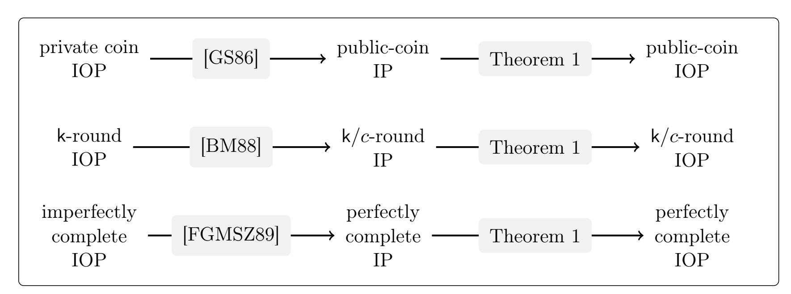

{0}------------------------------------------------

# A PCP Theorem for Interactive Proofs and Applications

Gal Arnon gal.arnon@weizmann.ac.il Weizmann Institute

Alessandro Chiesa alessandro.chiesa@epfl.ch EPFL

Eylon Yogev eylon.yogev@biu.ac.il Bar-Ilan University

January 17, 2023

#### Abstract

The celebrated PCP Theorem states that any language in NP can be decided via a verifier that reads O(1) bits from a polynomially long proof. Interactive oracle proofs (IOP), a generalization of PCPs, allow the verifier to interact with the prover for multiple rounds while reading a small number of bits from each prover message. While PCPs are relatively well understood, the power captured by IOPs (beyond NP) has yet to be fully explored.

We present a generalization of the PCP theorem for interactive languages. We show that any language decidable by a k(n)-round IP has a k(n)-round public-coin IOP, where the verifier makes its decision by reading only O(1) bits from each (polynomially long) prover message and O(1) bits from each of its own (random) messages to the prover.

Our result and the underlying techniques have several applications. We get a new hardness of approximation result for a stochastic satisfiability problem, we show IOP-to-IOP transformations that previously were known to hold only for IPs, and we formulate a new notion of PCPs (index-decodable PCPs) that enables us to obtain a commit-and-prove SNARK in the random oracle model for nondeterministic computations.

Keywords: interactive proofs; probabilistically checkable proofs; interactive oracle proofs

{1}------------------------------------------------

## Contents

| 1 | Introduction                                                   | 3  |
|---|----------------------------------------------------------------|----|
|   | 1.1<br>Main results                                            | 4  |
|   | 1.2<br>A cryptographic application to SNARKs                   | 6  |
| 2 | Techniques                                                     | 9  |
|   | 2.1<br>Towards transforming IPs to IOPs<br>                    | 9  |
|   | 2.2<br>Local access to randomness<br>                          | 10 |
|   | 2.3<br>Index-decodable PCPs                                    | 13 |
|   | 2.4<br>Local access to prover messages                         | 15 |
|   | 2.5<br>Constructing index-decodable PCPs<br>                   | 17 |
|   | 2.6<br>Commit-and prove SNARKs from index-decodable PCPs<br>   | 21 |
|   | 2.7<br>Hardness of approximation<br>                           | 24 |
| 3 | Preliminaries                                                  | 26 |
|   | 3.1<br>Relative distance<br>                                   | 26 |
|   | 3.2<br>Relations<br>                                           | 26 |
|   | 3.3<br>Interactive oracle proofs<br>                           | 26 |
|   | 3.4<br>Round-by-round soundness for IPs<br>                    | 27 |
|   | 3.5<br>Error correcting codes<br>                              | 28 |
|   | 3.6<br>PCPs of proximity for nondeterministic computations<br> | 28 |
|   |                                                                |    |
|   | 3.7<br>Extractors                                              | 29 |
| 4 | Index-decodable PCPs                                           | 30 |
| 5 | Basic construction of an index-decodable PCP from PCPPs        | 32 |
|   | 5.1<br>Building blocks                                         | 32 |
|   | 5.2<br>The construction<br>                                    | 35 |
| 6 | ID-PCPs with constant query complexity over a binary alphabet  | 40 |
|   | 6.1<br>Proof composition preserves index-decodability<br>      | 40 |
|   | 6.2<br>Robustification<br>                                     | 43 |
|   |                                                                |    |
| 7 | Transforming IPs into IOPs                                     | 47 |
|   | 7.1<br>Local access to randomness<br>                          | 47 |
|   | 7.2<br>Local access to prover messages                         | 51 |
| 8 | Application: commit-and-prove SNARKs                           | 55 |
|   | 8.1<br>Definition<br>                                          | 55 |
|   | 8.2<br>Construction from index-decodable PCPs<br>              | 56 |
|   | 8.3<br>Security<br>                                            | 57 |
| 9 | Application: hardness of approximation                         | 62 |
|   |                                                                |    |
|   | Acknowledgments                                                | 64 |
|   | References                                                     | 64 |

{2}------------------------------------------------

## <span id="page-2-0"></span>1 Introduction

Probabilistic proofs play a central role in complexity theory and cryptography. In the past decades, probabilistic proofs have become powerful and versatile tools in these fields, leading to breakthroughs in zero-knowledge, delegation of computation, hardness of approximation, and other areas.

As an example, interactive proofs (IPs) [\[GMR89\]](#page-66-0) allow proof-verification to be randomized and interactive, which seemingly confers them much more power than their deterministic (and non-interactive) counterparts. In a k-round IP, a probabilistic polynomial-time verifier exchanges k messages with an all-powerful prover and then accepts or rejects; IP[k] is the class of languages decidable via a k-round interactive proof. Seminal results characterize the power of IPs (IP[poly(n)] = PSPACE) [\[LFKN92;](#page-66-1) [Sha92\]](#page-67-0) and also achieve zero-knowledge [\[GMR89;](#page-66-0) [GMW91\]](#page-66-2).

The development of IPs, in turn, led to probabilistically checkable proofs (PCPs) [\[BFLS91;](#page-64-0) [FGLSS96\]](#page-65-0), where a probabilistic polynomial-time verifier has query access to a proof string. Here PCP[r, q] denotes the class of languages decidable by a PCP verifier that uses at most r bits of randomness and queries at most q bits of the proof string. A line of works culminated in the PCP Theorem [\[AS98;](#page-63-2) [ALMSS98\]](#page-63-3), which can be stated as NP = PCP[O(log n), O(1)]; that is, every language in NP can be decided, with constant soundness error, by probabilistically examining only a constant number of bits in a polynomially long proof.

These advances in probabilistic proofs have reshaped theoretical computer science.

Interactive oracle proofs. More recently, researchers formulated interactive oracle proofs (IOPs) [\[BCS16;](#page-64-1) [RRR16\]](#page-67-1), a model of probabilistic proof that combines aspects of the IP and PCP models. A k-round IOP is a k-round IP where the verifier has PCP-like access to each prover message: the prover and verifier interact for k rounds, and after the interaction the verifier probabilistically reads a small number of bits from each prover message and decides to accept or reject based on the examined locations. The randomness used in the final phase is called decision randomness (which we distinguish from the random messages that the verifier sends to the prover during the interaction).

Recent work has constructed highly-efficient IOPs [\[BCGV16;](#page-63-4) [Ben+17;](#page-64-2) [BCGRS17;](#page-63-5) [BBHR18;](#page-63-6) [BCGGHJ17;](#page-63-7) [BCRSVW19;](#page-64-3) [BCGGRS19;](#page-63-8) [BBHR19;](#page-63-9) [BGKS20;](#page-64-4) [COS20;](#page-65-1) [RR20;](#page-66-3) [BCG20;](#page-63-10) [BCL20;](#page-63-11) [BN21\]](#page-64-5). While the shortest PCPs known to date have quasi-linear length [\[BS08;](#page-64-6) [Din07\]](#page-65-2), IOPs can achieve linear proof length and fast provers. These developments are at the heart of recent constructions of non-interactive succinct arguments (SNARGs), and have facilitated their deployment in numerous real-world systems. IOPs are also used to construct IPs for delegating computation [\[RRR16\]](#page-67-1).

IOPs beyond NP? Most research regarding IOPs has focused on understanding IOPs for languages in NP (and more generally various forms of non-deterministic computations) while using the additional rounds of interaction to achieve better efficiency compared to PCPs for those languages.

However, the power of IOPs for languages beyond NP is not well understood. We do know that IPs can express all languages in PSPACE for sufficiently large round complexity [\[LFKN92;](#page-66-1) [Sha92\]](#page-67-0); moreover more rounds lead to more languages because, under plausible complexity assumptions, it holds that IP[k] ̸⊆ IP[o(k)] (while restricting to polynomial communication complexity) [\[GVW02\]](#page-66-4). But what can we say about the power of IOPs with small query complexity (over the binary alphabet)? [1](#page-2-1) Not much is known about the power of general k-round IOPs, which leads us to ask:

What languages have a k-round IOP where the verifier decides by reading O(1) bits from each prover message and from each verifier message?

<span id="page-2-1"></span><sup>1</sup>An IP is an IOP where the verifier has large query complexity over the binary alphabet.

{3}------------------------------------------------

### <span id="page-3-0"></span>1.1 Main results

We answer the above question by showing that (informally) the power of IOPs with k rounds where the verifier reads O(1) bits from each communication round (both prover and verifier messages) is the same as if the verifier reads the entire protocol transcript (as in an IP). This can be seen as extending the PCP Theorem to interactive proofs, interpreted as "you can be convinced by a conversation while barely listening (even to yourself )".

To achieve this, our main result is a transformation from IPs to IOPs: we transform any IP into a corresponding IOP where the verifier reads O(1) bits from each communication round and uses a total of O(log n) bits of decision randomness.[2](#page-3-1) The round complexity is preserved, and other parameters are preserved up to polynomial factors. (A round is a verifier message followed by a prover message; after the interaction, the verifier's decision is probabilistic.)

<span id="page-3-4"></span>Theorem 1 (IP → IOP). Let L be a language with a public-coin IP with k rounds and constant soundness error. Then L has an IOP with k rounds, constant soundness error, where the verifier decides by using O(log n) bits of decision randomness and reading O(1) bits from each prover message and each verifier message. All other parameters are polynomially related.

Prior work on IOPs beyond NP. The PCP Theorem can be viewed as a "half-round" IOP with query complexity O(1) and decision randomness O(log n) for NP. For languages above NP, prior works imply certain facts about k-round IOPs for extreme settings of k.

- For languages that have a public-coin IP with k = 1 round (a verifier message followed by a prover message), Drucker [\[Dru11a\]](#page-65-3) proves a hardness of approximation result in the terminology of CSPs. His result can be re-interpreted showing that these languages have a one-round IOP where the verifier reads O(1) bits from each message and decides (using O(log n) bits of decision randomness). However, Drucker's result does not extend to arbitrary many rounds.[3](#page-3-2)
- When k can be polynomially large, we observe that constant-query IOPs for PSPACE can be obtained from [\[CFLS95;](#page-64-7) [CFLS97\]](#page-64-8),[4](#page-3-3) which in turn provides such an IOP for every language having an IP. Other analogues of PCP have been given (e.g., [\[HRT07\]](#page-66-5) applies to the polynomial hierarchy, [\[Dru11b\]](#page-65-4) is also for PSPACE) but they do not seem to translate to IOPs.
- For general k, one can use the fact that AM[k] ⊆ NEXP, and obtain a PCP where the prover sends a single exponentially-long message from which the (polynomial-time) verifier reads O(1) bits. However, this does not help if we require the prover to send messages of polynomial length.

See [Figure 1](#page-4-0) for a table summarizing these results and ours.

#### <span id="page-3-5"></span>1.1.1 Hardness of approximation for stochastic satisfiability

We use [Theorem 1](#page-3-4) to prove the hardness of approximating the value of an instance of the stochastic satisfiability (SSAT) problem, which we now informally define.

SSAT is a variant of TQBF (true quantified boolean formulas) where the formula is in 3CNF and the variables are quantified by alternating existential quantifiers and random quantifiers (the value

<span id="page-3-2"></span><span id="page-3-1"></span><sup>2</sup>After the interaction, the verifier uses O(log n) random bits to decide which locations to read from all k rounds.

<sup>3</sup>Round reduction [\[BM88\]](#page-64-9) can reduce the number of rounds from any k to 1 with a blow-up in communication that is exponential in k. This does not work when k is super constant; see [Section 2.2.3](#page-12-1) for further discussion.

<span id="page-3-3"></span><sup>4</sup>Their result shows that PSPACE has what is known as a probabilistically checkable debate system. In their system, one prover plays a uniform random strategy. Thus one can naturally translate the debate system into an IOP.

{4}------------------------------------------------

<span id="page-4-0"></span>

|                      | complexity<br>class | model | proof<br>length | alphabet            | query<br>complexity | round<br>complexity |
|----------------------|---------------------|-------|-----------------|---------------------|---------------------|---------------------|
| [BGHSV05]            | NEXP                | PCP   | exp( x )        | {0, 1}              | O(1)                | 1                   |
| [CFLS97]             | PSPACE              | IOP   | poly( x )       | {0, 1}              | O(1)                | poly( x )           |
| implied by [BGHSV05] | AM[k]               | PCP   | exp( x )        | {0, 1}              | O(1)                | 1                   |
| [Bab85; GMR89]       | AM[k]               | IP    | k               | poly( x )<br>{0, 1} | 1 per round         | k                   |
| [this work]          | AM[k]               | IOP   | poly( x )       | {0, 1}              | O(1) per round      | k                   |
| [Dru11a]             | AM                  | IOP   | poly( x )       | {0, 1}              | O(1)                | 1                   |
| [ALMSS98; AS98]      | NP                  | PCP   | poly( x )       | {0, 1}              | O(1)                | 1                   |

Figure 1: Classes captured by different types of probabilistic proofs (in the regime of constant soundness error). Here, x denotes the instance whose membership in the language the verifier is deciding. Here, AM stands for two-message public-coin protocols (a verifier random message followed by a prover message), and AM[k] is a k-round public-coin protocol.

of the quantified variable is chosen uniformly at random). A formula ϕ is in the language SSAT if the probability that there is a setting of the existential variables that cause ϕ to be satisfied is greater than 1/2. The value of an SSAT instance ϕ is the expected number of satisfied clauses in ϕ if the existential variables are chosen to maximize the number of satisfied clauses in ϕ. We denote by k-SSAT the SSAT problem when there are k alternations between existential and random quantifiers.

SSAT can be viewed as a restricted "game against nature" [\[Pap83\]](#page-66-6) where all parties are binary, and "nature's" moves are made uniformly at random. Variations of SSAT are related to areas of research in artificial intelligence, specifically planning and reasoning under uncertainty [\[LMP01\]](#page-66-7). Previous research on SSAT has studied complexity-theoretical aspects [\[CFLS97;](#page-64-8) [Dru11a;](#page-65-3) [Dru20\]](#page-65-5) and SAT-solvers for it (e.g., [\[LMP01;](#page-66-7) [Maj07;](#page-66-8) [LWJ17\]](#page-66-9)).

Our result on the hardness of approximation for k-SSAT is as follows.

<span id="page-4-1"></span>Theorem 2. For every k, it is AM[k]-complete to distinguish whether a k-SSAT instance has value 1 or value at most 1 − 1 O(k) .

We compare [Theorem 2](#page-4-1) with prior ones about k-SSAT. For k = 1, our result matches that of [\[Dru11a\]](#page-65-3) who showed that the value of 1-SSAT is AM[1]-hard to approximate up to a constant factor. Condon, Feigenbaum, Lund, and Shor [\[CFLS97\]](#page-64-8) show that there exists a constant c > 1 such that for every language L in IP = PSPACE, one can reduce an instance x to a poly(|x|)-SSAT instance ϕ such that if x ∈ L then the value of ϕ is 1, and otherwise the value of ϕ is 1/c. The approaches used in both prior works do not seem to extend to other values of k.

This state of affairs motives the following natural question:

How hard is it to approximate the value of k-SSAT to a constant factor independent of k?

While PCPs have well-known applications to the hardness of approximation of numerous NP problems, no similar connection between IOPs and hardness of approximation was known. (Indeed, this possibility was raised as an open problem in prior work.) The works of Drucker [\[Dru11a\]](#page-65-3) and Condon et al. [\[CFLS97\]](#page-64-8) can be reinterpreted as giving such results for stochastic satisfiability problems. In this paper we make this connection explicit and extend their results.

{5}------------------------------------------------

#### 1.1.2 Transformations for IOPs

We obtain IOP analogues of classical IP theorems, as a corollary of Theorem 1. We show IOP-to-IOP transformations, with small query complexity, and achieve classical results that were known for IPs, including: a private-coin to public-coin transformation (in the style of [GS86]); a round reduction technique (in the style of [BM88]); and a method to obtain perfect completeness (in the style of [FGMSZ89]). A graphic of this corollary is displayed in Figure 2.

<span id="page-5-2"></span>**Corollary 1.** Let L be a language with a k-round IOP with polynomial proof length over a binary alphabet. Then the following holds:

- 1. **private-coins to public-coins:** L has a O(k)-round public-coin IOP;
- 2. round reduction: for every constant  $c \leq k$ , L has a k/c-round IOP;
- 3. perfect completeness: L has a perfectly complete k-round IOP.

All resulting IOPs have polynomial proof length and O(1) per-round query complexity over a binary alphabet; all other parameters are polynomially related to the original IOP.

Similar to the case with IPs, one can combine these transformations to get all properties at once. In particular, one can transform any IOP to be public-coin and have perfect completeness while preserving the round complexity.

<span id="page-5-1"></span>

**Figure 2:** Corollary 1 provides IOP analogues of classical IP theorems.

#### <span id="page-5-0"></span>1.2 A cryptographic application to SNARKs

A building block that underlies Theorem 1 is a new notion of PCP that we call *index-decodable PCPs*. We informally describe this object in Section 1.2.1 below (and postpone the definition and a comparison with other PCP notions to Section 2.3). Moreover, we prove that index-decodable PCPs are a useful tool beyond the aforementioned application to Theorem 1, by establishing a generic transformation from index-decodable PCPs to commit-and-prove SNARKs. We discuss these SNARKs and our result in Section 1.2.2 below (and postpone further discussion to Section 2.6).

### <span id="page-5-3"></span>1.2.1 Index-decodable PCPs

An index-decodable PCP can be seen as a PCP on maliciously encoded data. The prover wishes to convince the verifier about a statement that involves k data segments  $i[1], \ldots, i[k]$  and an instance x,

{6}------------------------------------------------

for example, that it knows a witness w such that (i[1], . . . ,i[k], x, w) ∈ R for some relation R. The prover outputs a PCP string Π for this statement. The verifier receives as input only the instance x, and is given query access to an encoding of each data segment i[i] and query access to the PCP string Π. This means that the verifier has query access to a total of k + 1 oracles.

The definition of an index-decodable PCP, to be useful, needs to take into account several delicate points (which, in fact, are crucial for our proof of [Theorem 1\)](#page-3-4).

First, the encoding of each data segment must be computed independently of other data segments and even the instance. (Though the PCP string Π can depend on all data segments and the instance.)

Second, the verifier is not guaranteed that the k data oracles are valid encodings, in the sense that "security" is required to hold even against malicious provers that have full control of all k + 1 oracles (not just the PCP string oracle). In other words, we wish to formulate a security notion that is meaningful even for data that has been maliciously encoded.

The security notion that we use is decodability. Informally, we require that if the verifier accepts with high-enough probability a given set of (possibly malicious) data oracles and PCP string, then each data oracle can be individually decoded into a data segment and the PCP string can be decoded into a witness such that, collectively, all the data segments, the instance, and the witness form a true statement. We stress that the decoder algorithms must run on each data oracle separately from other data oracles and the instance (similarly as the encoder).

#### <span id="page-6-0"></span>1.2.2 Commit-and-prove SNARKs

A commit-and-prove SNARK (CaP-SNARK) is a SNARK that enables proving statements about previously committed data, and commitments can be reused across different statements. CaP-SNARKs have been studied in a line of work [\[EG14;](#page-65-7) [CFHKKNPZ15;](#page-64-12) [Lip17;](#page-66-11) [CFQ19;](#page-65-8) [BCFKLOQ21\]](#page-63-12), where constructions have been achieved assuming specific computational assumptions (e.g., knowledge of exponent assumptions) and usually with the added property of zero-knowledge.

We show how to use index-decodable PCPs to unconditionally achieve CaP-SNARKs in the random oracle model (ROM);[5](#page-6-1) in more detail we need the index-decodable PCP to have efficient indexing/decoding and certain proximity properties. Our transformation can be seen as an indexdecodable PCP analogue of the Micali construction of SNARKs in the ROM from PCPs [\[Mic00\]](#page-66-12).

<span id="page-6-2"></span>Theorem 3. There is a transformation that takes as input an index-decodable PCP (that has an efficient indexer and decoder and satisfies certain proximity properties) for a relation R with proof length l and query complexity q, and outputs a CaP-SNARK in the ROM for R with argument size Oλ(q · log l). (Here λ is the output size of the random oracle.)

We obtain a concrete construction of a CaP-SNARK in the ROM (for nondeterministic computations) by applying the above theorem to our construction of an index-decodable PCP system.

We conclude by noting that the ROM supports several well-known constructions of succinct arguments that can be heuristically instantiated via lightweight cryptographic hash functions, are plausibly post-quantum secure [\[CMS19\]](#page-65-9), and have led to realizations that are useful in practice. It is plausible that our construction can be shown to have these benefits as well — we leave this, and constructing zero-knowledge CaP-SNARKs in the ROM, to future work.

Remark 1.1. Ishai and Weiss [\[IW14\]](#page-66-13) apply PCPs of proximity with zero-knowledge to achieve a notion that is a relaxation of a CaP-SNARK that additionally satisfies a hiding property. A

<span id="page-6-1"></span><sup>5</sup> In this model, all parties (honest and malicious) receive query access to the same random function.

{7}------------------------------------------------

CaP-SNARK enables proving statements on committed data without decommitting to the data; in contrast, for the construction in [\[IW14\]](#page-66-13) the validity of statements can be verified only when the commitment is opened. Nevertheless, the construction in [\[IW14\]](#page-66-13) achieves a hiding property, whereas we do not consider any hiding properties.

{8}------------------------------------------------

## <span id="page-8-0"></span>2 Techniques

We summarize the main ideas underlying our results.

We begin by discussing the question of transforming IPs to IOPs. In [Section 2.1,](#page-8-1) we describe a solution in [\[Dru11a\]](#page-65-3) that works for a single round and explain why it is challenging to extend it for multiple rounds. Then, we describe our transformation for many rounds in two steps. First, in [Section 2.2,](#page-9-0) we describe how to make a verifier query each of its random messages at few locations. Next, in [Section 2.3,](#page-12-0) we define our new notion of index-decodable PCPs and, in [Section 2.4,](#page-14-0) describe how to use these to make the verifier query each prover message at few locations (without affecting the first step). In [Section 2.5,](#page-16-0) we explain how to construct index-decodable PCPs with good parameters.

We conclude by describing applications of our results and constructions: (i) in [Section 2.6,](#page-20-0) we construct commit-and-prove SNARKs in the random oracle model from index-decodable PCPs; and (ii) in [Section 2.7,](#page-23-0) we show that [Theorem 1](#page-3-4) has implications on the hardness of approximating the value of certain stochastic problems.

Throughout, we call interaction randomness (or verifier random messages) the randomness sent by the verifier to the prover during the interaction, and decision randomness the randomness used by the verifier in the post-interaction decision stage.

## <span id="page-8-1"></span>2.1 Towards transforming IPs to IOPs

We discuss the problem of transforming IPs into IOPs. We begin by describing a solution in [\[Dru11a\]](#page-65-3) that transforms a single-round IP into a single-round IOP. Following that, we describe the challenges of extending this approach to work for multi-round IPs.

#### 2.1.1 The case of a single-round IP

The case of a single-round was settled by Drucker [\[Dru11a\]](#page-65-3), whose work implies a transformation from a public-coin single-round IP to a single-round IOP where the verifier reads O(1) bits from the communication transcript (here consisting of the prover message and the verifier message). His construction uses as building blocks the randomness-efficient amplification technique of [\[BGG90\]](#page-64-13) and PCPs of proximity (PCPPs) [\[DR04;](#page-65-10) [BGHSV06\]](#page-64-14).[6](#page-8-2) We give a high-level overview of his construction.

In a public-coin single-round IP, given a common input instance x, the verifier VIP sends randomness ρ, the prover PIP sends a message a, and the verifier VIP decides whether to accept by applying a predicate to (x, ρ, a). Consider the non-deterministic machine M such that M(x, ρ) = 1 if and only if there exists a such that VIP accepts (x, ρ, a). The constructed IOP works as follows:

- 1. the IOP verifier sends VIP's randomness ρ;
- 2. the IOP prover computes PIP's message a and produces a PCPP string Π for the claim "M(x, ρ) = 1";
- 3. the IOP verifier checks Π using the PCPP verifier with explicit inputs M and x and implicit input ρ.

This IOP is sound if the underlying IP is "randomness-robust", which means that if x is not in the language then with high probability over ρ it holds that ρ is far from any accepting input for

<span id="page-8-2"></span><sup>6</sup>A PCPP is a PCP system where the verifier has oracle access to its input in addition to the prover's proof; the soundness guarantee is that if the input is far (in Hamming distance) from any input in the language, then the verifier accepts with small probability.

{9}------------------------------------------------

 $M(\mathbf{x},\cdot)$ . Drucker achieves this property by using an amplification technique in [BGG90] that achieves soundness error  $2^{-|\rho|}$  while using  $O(|\rho|)$  random bits (standard amplification would, when starting with a constant-soundness protocol, result in  $\omega(|\rho|)$  random bits). Thus, with high probability,  $\rho$  is not only a "good" random string (which holds for any single-round IP) but also is  $\delta$ -far from any "bad" random string, for some small constant  $\delta > 0$ . This follows since the ball of radius  $\delta$  around any bad random string has size  $2^{\delta'|\rho|}$ , for some small constant  $\delta'$  that depends only on  $\delta$ .

#### 2.1.2 Challenges of extending the single-round approach to multi-round IPs

We wish to obtain a similarly efficient transformation for a public-coin k-round IP where k = poly(n). One possible approach would be to reduce the number of rounds of the given IP from k to 1 and then apply the transformation for single-round IPs. The round reduction of Babai and Moran [BM88] shows that any public-coin k-round IP can be transformed into a one-round IP where efficiency parameters grow by  $n^{O(k)}$ . This transformation, however, is not efficient for super-constant values of k. Moreover, it is undesirable even when k is constant because the transformation overhead is not a fixed polynomial (the exponent depends on k rather than being a fixed constant).

Therefore, we seek an approach that directly applies to a multi-round IP. Unfortunately, Drucker's approach for one-round IPs does not generalize to multiple-round IPs for several reasons. First, the corresponding machine  $M(\mathbf{x}, \rho_1, \dots, \rho_k)$  (which accepts if and only if there exist prover messages  $a_1, \dots, a_k$  such that  $\mathbf{V}_{\text{IP}}$  accepts  $(\mathbf{x}, \rho_1, a_1, \dots, \rho_k, a_k)$ ) does not capture the soundness of the interactive proof because it fails to capture interaction (a protocol may be sound according to the IP definition and, yet, for every  $\mathbf{x}$  and  $\rho_1, \dots, \rho_k$  it could be that  $M(\mathbf{x}, \rho_1, \dots, \rho_k) = 1$ ). Moreover, it is not clear how to perform a randomness-efficient amplification for multiple rounds that makes the protocol sufficiently "randomness robust" for the use of a PCPP. The main reason is that to get soundness error  $2^{-m}$  (as in [Dru11a]), the techniques of [BGG90] add O(m) bits per round, which is too much when the protocol has many rounds (see Section 2.2.3 for a more detailed discussion on why this approach fails for many rounds).

We give a different solution that circumvents this step and works for any number of rounds. Our transformation from k-round IP to an IOP in two stages. In the first stage, we transform the IP into one in which the verifier reads only O(1) bits from each random message it sends. In the second stage, we transform the IP into an IOP with O(1) per-round query complexity, simultaneously for each prover message and each verifier message. We achieve this via a new notion of PCPs that we call index-decodable PCPs, and we describe in Section 2.3. First, we explain how to achieve the property that the verifier reads O(1) bits from each of its random messages to the prover.

#### <span id="page-9-0"></span>2.2 Local access to randomness

We transform a public-coin IP ( $\mathbf{P}_{\mathsf{IP}}, \mathbf{V}_{\mathsf{IP}}$ ) into an IP ( $\mathbf{P}'_{\mathsf{IP}}, \mathbf{V}'_{\mathsf{IP}}$ ) whose verifier (i) reads O(1) bits from each of its random messages to the prover, and (ii) has logarithmic decision randomness (the randomness used by the verifier in the post-interaction decision stage). For now, the verifier reads in full every message received from the prover, and only later we discuss how to reduce the query complexity to prover messages while preserving the query complexity to the verifier random messages.

#### <span id="page-9-1"></span>2.2.1 One-round public-coin proofs

In order to describe our ideas we begin with the simple case of one-round public-coin interactive proofs. Recall from Section 2.1 that this case is solved in [Dru11a], but we nevertheless first describe

{10}------------------------------------------------

our alternative approach for this case and after that we will discuss the multiple-round case.

A strawman protocol. Recall that in a one-round public-coin IP the verifier sends a uniformly random message, the prover replies with some answer, and the verifier uses both of these messages to decide whether to accept. An idea to allow the verifier to not read in full its own random message would be for the prover to send the received random message back to the verifier, and the verifier to use this latter and test consistency with its own randomness. Given an instance  $\mathbf{x}$ :  $\mathbf{V}'_{\mathsf{IP}}$  sends  $\mathbf{V}_{\mathsf{IP}}$ 's random message  $\rho \in \{0,1\}^{\mathsf{r}}$ ;  $\mathbf{P}'_{\mathsf{IP}}$  replies with  $\rho' := \rho$  and the message  $a := \mathbf{P}_{\mathsf{IP}}(\mathbf{x}, \rho)$ ; and  $\mathbf{V}'_{\mathsf{IP}}$  checks that  $\rho$  and  $\rho'$  agree on a random location and that  $\mathbf{V}_{\mathsf{IP}}(\mathbf{x}, \rho', a) = 1$ .

This new IP is complete, and its verifier queries its random message at one location to conduct the consistency test. However, the protocol might not be sound, as we explain. Suppose that  $x \notin L$ . Let r be the length of  $\rho$ ,  $\beta$  be the soundness error of the original IP,  $\delta \in (0,1)$  be a small constant to be specified later, and let  $\nu_{r,\delta}$  be the volume of the Hamming sphere of radius  $r \cdot \delta$  in  $\{0,1\}^r$ . A choice of verifier message  $\rho$  is bad if there exists a such that  $\mathbf{V}_{\mathsf{IP}}(x,\rho,a) = 1$ . By the soundness guarantee of  $\mathbf{V}_{\mathsf{IP}}$ , the fraction of bad choices of random verifier messages is at most  $\beta$ . A choice of verifier message  $\rho$  is ball-bad if there exist a bad  $\rho'$  that is  $\delta$ -close to  $\rho$ . By the union bound, the fraction of ball-bad coins is at most  $\gamma = \beta \cdot \nu_{r,\delta}$ .

Let E be the event over the choice of  $\rho$  that the prover sends  $\rho'$  that is  $\delta$ -far from  $\rho$ .

- Conditioned on E occurring,  $\mathbf{V}'_{\mathsf{IP}}$  rejects with probability at least  $\delta$  (whenever  $\mathbf{V}'_{\mathsf{IP}}$  chooses a location on which  $\rho$  and  $\rho'$  disagree).
- Conditioned on E not occurring,  $\mathbf{P}'_{\mathsf{IP}}$  cannot send any  $\rho'$  and a such that  $\mathbf{V}_{\mathsf{IP}}(\mathbf{x}, \rho', a) = 1$  unless  $\rho$  is ball-bad, and so  $\mathbf{V}'_{\mathsf{IP}}$  rejects with probability at least  $1 \gamma$ .

Therefore, for the new IP to be sound, we need  $\gamma = \beta \cdot \nu_{\mathsf{r},\delta}$  to be small. Notice that  $\nu_{\mathsf{r},\delta} = 2^{H(\delta)\cdot\mathsf{r}}$  depends on  $\mathsf{r}$  but not on  $\beta$  (here H is the entropy function  $H(\delta) := -\delta \log \delta - (1-\delta) \log (1-\delta)$ ). Thus we need to achieve  $\log 1/\beta > H(\delta) \cdot \mathsf{r}$ . As in Drucker's transformation, this can be done using the randomness-efficient soundness amplification of [BGG90], but we deliberately take a different approach that will generalize for multiple rounds.

Shrinking  $\gamma$  using extractors. Let Ext be an extractor with output length r, seed length  $O(\log r + \log 1/\beta)$ , and error  $\beta$ ; such extractors are constructed in [GUV09]. Assume that  $\beta = 1/O(r)$ , which can be achieved using  $O(\log r)$  parallel repetitions, and so the seed length is  $O(\log 1/\beta)$ . Suppose that the prover and verifier have access to a sample z from a source D with high min-entropy. Consider the following IP:  $\mathbf{V}'_{\mathsf{IP}}$  sends s;  $\mathbf{P}'_{\mathsf{IP}}$  replies with s' := s and  $a := \mathbf{P}_{\mathsf{IP}}(\mathbf{x}, \mathsf{Ext}(z, s'))$ ;  $\mathbf{V}'_{\mathsf{IP}}$  checks that s and s' agree on a random location and that  $\mathbf{V}_{\mathsf{IP}}(\mathbf{x}, \mathsf{Ext}(z, s'), a) = 1$ .

At most a  $2\beta$ -fraction of the seeds s are such that there exists a such that  $\mathbf{V}_{\mathsf{IP}}(\mathbf{x},\mathsf{Ext}(z,s),a)=1$ , because  $\mathsf{Ext}$  is an extractor with error  $\beta$  and D is a distribution with high min-entropy. By an identical argument to the one done previously, either  $\mathbf{P}'_{\mathsf{IP}}$  sends s' that is far from s and so  $\mathbf{V}'_{\mathsf{IP}}$  rejects with constant probability, or  $\mathbf{V}'_{\mathsf{IP}}$  rejects with probability at least  $\gamma = 2\beta \cdot \nu_{\mathsf{r}',\delta}$  where  $\mathsf{r}' = |s| = O(\log 1/\beta)$ . Thus we have that  $\gamma = 2 \cdot \beta \cdot 2^{H(\delta) \cdot O(\log 1/\beta)}$ . We can now set  $\delta$  to be a small enough constant such that  $\gamma = O(\sqrt{\beta})$ .

Generating a source of high min-entropy. We describe how the prover and verifier can agree on a sample from a high-entropy source by leveraging the following observation: if z is a uniformly random string and z' is an arbitrary string that is close in Hamming distance to z, then z' has high min-entropy. Thus we can sample via similar ideas as above:  $\mathbf{V}'_{\mathsf{IP}}$  samples and sends z;  $\mathbf{P}'_{\mathsf{IP}}$  replies with z' := z; and  $\mathbf{V}'_{\mathsf{IP}}$  checks that z and z' agree on a random location. (So  $\mathbf{V}'_{\mathsf{IP}}$  reads one bit of its

<span id="page-10-0"></span><sup>&</sup>lt;sup>7</sup>A function Ext:  $\{0,1\}^n \times \{0,1\}^d \to \{0,1\}^m$  is a  $(k,\varepsilon)$ -extractor if, for every random variable X over  $\{0,1\}^n$  with min-entropy at least k, the statistical distance between  $\operatorname{Ext}(X,U_d)$  and  $U_m$  is at most  $\varepsilon$ .

{11}------------------------------------------------

random message z.) If, with constant probability over z,  $\mathbf{P}'_{\mathsf{IP}}$  sends z' that is far from z, then  $\mathbf{V}'_{\mathsf{IP}}$  rejects with constant probability. Otherwise, we show that z' has high min-entropy because with high probability it agrees with z on most of its locations.

**Putting it all together.** Let  $(\mathbf{P}_{\mathsf{IP}}, \mathbf{V}_{\mathsf{IP}})$  be a public-coin single-round IP with soundness error  $\beta$  and randomness complexity  $\mathbf{r}$ , and let  $\mathsf{Ext}$  be an extractor with output length  $\mathbf{r}$ , seed length  $O(\log 1/\beta)$ , and error  $\beta$ . The new IP  $(\mathbf{P}'_{\mathsf{IP}}, \mathbf{V}'_{\mathsf{IP}})$  is as follows.

- Sample high min-entropy source:  $\mathbf{V}'_{\mathsf{IP}}$  sends z and  $\mathbf{P}'_{\mathsf{IP}}$  replies with z' := z.
- Sample extractor seed:  $V'_{\mathsf{IP}}$  sends s and  $P'_{\mathsf{IP}}$  replies with s' := s.
- Prover message:  $\mathbf{P}'_{\mathsf{IP}}$  sends  $a := \mathbf{P}_{\mathsf{IP}}(\mathbf{x}, \mathsf{Ext}(z', s'))$ .
- Verification:  $\mathbf{V}'_{\mathsf{IP}}$  checks that z and z' agree on a random location, s and s' agree on a random location, and  $\mathbf{V}_{\mathsf{IP}}(\mathbf{x},\mathsf{Ext}(z',s'),a)=1$ .

#### 2.2.2 Extending to multiple rounds

In order to extend the previously described protocol to multiple rounds, we leverage the notion of round-by-round soundness. An IP for a language L has round-by-round soundness error  $\beta_{\rm rbr}$  if there exists a "state" function such that: (i) for  $x \notin L$ , the starting state is "doomed"; (ii) for every doomed state and next message that a malicious prover might send, with probability  $\beta_{\rm rbr}$  over the verifier's next message, the protocol state will remain doomed; (iii) if at the end of interaction the state is doomed then the verifier rejects.

In the analysis of the one-round case there was an event (called bad) over the IP verifier's random message  $\rho$  such that if this event does not occur then the prover has no accepting strategy. This event can be replaced, in the round-by-round case, by the event that, in a given round, the verifier chooses randomness where the transcript remains doomed. This idea leads to a natural extension of the one-round protocol described in Section 2.2.1 to the multi-round case, which is our final protocol.

Let  $(\mathbf{P}_{\mathsf{IP}}, \mathbf{V}_{\mathsf{IP}})$  be a public-coin k-round IP with round-by-round soundness error  $\beta_{\mathsf{rbr}}$  and randomness complexity  $\mathsf{r}$ , and  $\mathsf{Ext}$  an extractor with output length  $\mathsf{r}$ , seed length  $O(\log 1/\beta_{\mathsf{rbr}})$ , and error  $\beta_{\mathsf{rbr}}$ .

- For each round  $j \in [k]$  of the original IP:
  - 1. Sample high min-entropy source:  $\mathbf{V}'_{\mathsf{IP}}$  sends  $z_j$  and  $\mathbf{P}'_{\mathsf{IP}}$  replies with  $z'_j := z_j$ .
  - 2. Sample extractor seed:  $\mathbf{V}'_{\mathsf{IP}}$  sends  $s_j$  and  $\mathbf{P}'_{\mathsf{IP}}$  replies with  $s'_j := s_j$ .
  - 3. Prover message:  $\mathbf{P}'_{\mathsf{IP}}$  sends  $a_j := \mathbf{P}_{\mathsf{IP}}(\mathbf{x}, \rho_1, \dots, \rho_j)$  where  $\rho_i := \mathsf{Ext}(z_i, s_i)$ .
- $\mathbf{V}'_{\mathsf{IP}}$  accepts if and only if the following tests pass:
  - 1. Choose a random location and, for every  $j \in [k]$ , test that  $z_j$  and  $z'_j$  agree on this location.
  - 2. Choose a random location and, for every  $j \in [k]$ , test that  $s_j$  and  $s'_j$  agree on this location.
  - 3. For every  $j \in [k]$ , compute  $\rho_j := \operatorname{Ext}(z_j', s_j')$ . Check that  $\mathbf{V}_{\mathsf{IP}}(\mathbf{x}, \rho_1, a_1, \dots, \rho_k, a_k) = 1$ .

The soundness analysis of this protocol is similar to the one-round case. Suppose that  $x \notin L$ . Then the empty transcript is "doomed". By an analysis similar to the one-round case, except where we set "bad" verifier messages to be ones where the transcript state switches from doomed to not doomed, if a round begins with a doomed transcript then except with probability  $\gamma = O(\sqrt{\beta_{\rm rbr}})$  the transcript in the next round is also doomed. Thus, by a union bound, the probability that the transcript ends up doomed, and as a result the verifier rejects, is at least  $1 - O(k \cdot \sqrt{\beta_{\rm rbr}})$ . As shown in [CCHLRR18] round-by-round soundness error can be reduced via parallel repetition, albeit at a lower rate than regular soundness error. Thus, by doing enough parallel repetition before applying

{12}------------------------------------------------

our transformation, the round-by-round soundness error  $\beta_{rbr}$  can be reduced enough so that the verifier rejects with constant probability.

The above protocol has  $2k_{IP}$  rounds. The verifier reads 1 bit from each of its random messages, and has  $O(\log |\mathbf{x}|)$  bits of decision randomness (to sample random locations for testing consistency between each  $z'_j$  and  $z_j$  and between each  $s'_j$  and  $s_j$ ). To achieve  $k_{IP}$  rounds, we first apply the round reduction of [BM88] on the original IP to reduce to  $k_{IP}/2$  rounds, and then apply our transformation.

#### <span id="page-12-1"></span>2.2.3 Why randomness-efficient soundness amplification is insufficient

We briefly sketch why applying randomness-efficient soundness amplification in the style of [BGG90] is insufficient in the multi-round case, even if we were to consider round-by-round soundness. Recall that we wish for  $\beta_{\rm rbr} \cdot 2^{\Theta(r)}$  to be small, where  $\beta_{\rm rbr}$  is the round-by-round soundness of the protocol and r is the number of random bits sent by the verifier in a single round. Bellare, Goldreich and Goldwasser [BGG90] show that, starting with constant soundness and randomness r, one can achieve soundness error  $2^{-m}$  using r' = O(r + m) random bits; they do this via m parallel repetitions where the randomness between repetitions is shared in a clever way. Using parallel repetition, achieving round-by-round soundness error  $2^{-m}$  requires m/k repetitions (see [CCHLRR18]). Thus, even if we were to show that the transformation of [BGG90] reduces round-by-round soundness error at the same rate as standard parallel repetition (as it does for standard soundness), in order to get round-by-round soundness error  $2^{-m}$ , we would need  $r' = O(r + m \cdot k)$  bits of randomness. This would achieve  $\beta_{\rm rbr} \cdot 2^{\Theta(r')} = 2^{-m} \cdot 2^{\Theta(r+mk)}$ , which, for super-constant values of k, is greater than 1 regardless of r.

#### <span id="page-12-0"></span>2.3 Index-decodable PCPs

We introduce index-decodable PCPs, a notion of PCP that works on multi-indexed relations. A multi-indexed relation R is a set of tuples  $(i[1], \ldots, i[k], x, w)$  where  $(i[1], \ldots, i[k])$  is the index vector, x the instance, and w the witness. As seen in the following definition, an index-decodable PCP treats the index vector  $(i[1], \ldots, i[k])$  and the instance x differently, which is why they are not "merged" into an instance  $x' = (i[1], \ldots, i[k], x)$  (and why we do not consider standard relations).

Definition 1. An index-decodable PCP for a multi-indexed relation  $R = \{ (i[1], ..., i[k], x, w) \}$  is a tuple of algorithms  $(\mathbf{I}_{PCP}, \mathbf{P}_{PCP}, \mathbf{V}_{PCP}, i\mathbf{D}_{PCP}, \mathbf{w}\mathbf{D}_{PCP})$ , where  $\mathbf{I}_{PCP}$  is the (honest) indexer,  $\mathbf{P}_{PCP}$  the (honest) prover,  $\mathbf{V}_{PCP}$  the verifier,  $i\mathbf{D}_{PCP}$  the index decoder, and  $\mathbf{w}\mathbf{D}_{PCP}$  the witness decoder. The system has (perfect completeness and) decodability bound  $\kappa_{PCP}$  if the following conditions hold.

• Completeness. For every  $(i[1], ..., i[k], x, w) \in R$ ,

$$\Pr_{\rho} \left[ \begin{array}{c|c} \mathbf{V}_{\text{PCP}}^{\pi_1, \dots, \pi_k, \Pi}(\mathbf{x}; \rho) = 1 & \pi_1 \leftarrow \mathbf{I}_{\text{PCP}}(\mathbf{i}[1]) \\ \vdots \\ \pi_k \leftarrow \mathbf{I}_{\text{PCP}}(\mathbf{i}[k]) \\ \Pi \leftarrow \mathbf{P}_{\text{PCP}}(\mathbf{i}[1], \dots, \mathbf{i}[k], \mathbf{x}, \mathbf{w}) \end{array} \right] = 1 \ .$$

• **Decodability.** For every x, indexer proofs  $\tilde{\pi}_1, \ldots, \tilde{\pi}_k$ , and malicious prover proof  $\tilde{\Pi}$ , if

$$\Pr_{\rho}\left[\mathbf{V}_{\mathsf{PCP}}^{\tilde{\pi}_{1},\ldots,\tilde{\pi}_{\mathsf{k}},\tilde{\Pi}}(\mathbf{x};\rho)=1\right] > \kappa_{\mathsf{PCP}}(|\mathbf{x}|)$$

then  $(\mathbf{i}\mathbf{D}_{PCP}(\tilde{\pi}_1), \dots, \mathbf{i}\mathbf{D}_{PCP}(\tilde{\pi}_k), \mathbb{x}, \mathbf{w}\mathbf{D}_{PCP}(\tilde{\Pi})) \in R.$ 

{13}------------------------------------------------

The indexer  $\mathbf{I}_{PCP}$  separately encodes each index, independent of indices and the instance, to obtain a corresponding *indexer proof*. The prover  $\mathbf{P}_{PCP}$  gets all the data as input (index vector, instance, and witness) and outputs a *prover proof*. The verifier  $\mathbf{V}_{PCP}$  gets the instance as input and has query access to k+1 oracles (k indexer proofs and 1 prover proof), and outputs a bit.

The decodability condition warrants some discussion. The usual soundness condition of a PCP for a standard relation R has the following form: "if  $\mathbf{V}_{PCP}^{\tilde{\Pi}}(\mathbf{x})$  accepts with high-enough probability then there exists a witness  $\mathbf{w}$  such that  $(\mathbf{x},\mathbf{w}) \in R$ ". For a multi-indexed relation it could be that for any given instance  $\mathbf{x}$  there exist indexes  $\mathbf{i}[1], \ldots, \mathbf{i}[k]$  and a witness  $\mathbf{w}$  such that  $(\mathbf{i}[1], \ldots, \mathbf{i}[k], \mathbf{x}, \mathbf{w}) \in R$ . Since we do not trust the indexer's outputs, a soundness condition is not meaningful.

Instead, the decodability condition that we consider has the following form: "if  $\mathbf{V}_{PCP}^{\tilde{\pi}_1,\dots,\tilde{\pi}_k,\Pi}(\mathbf{x})$  accepts with high-enough probability then  $(i[1],\dots,i[k],\mathbf{x},\mathbf{w}) \in R$  where  $i[1],\dots,i[k]$  and  $\mathbf{w}$  are the decoded indices and witness respectively found in  $\tilde{\pi}_1,\dots,\tilde{\pi}_k$  and  $\tilde{\Pi}$ ". It is crucial that the index decoder receives as input the relevant indexer proof but not also the instance, or else the decodability condition would be trivially satisfied (the index decoder could output the relevant index of the lexicographically first index vector putting the instance in the relation). This ensures that the proofs collectively convince the verifier not only that there exists an index vector and witness that place the instance in the relation, but that the prover encoded a witness that, along with index vector obtainable from the index oracles via the index decoder, places the instance in the relation.

We do not require the indexer or the decoders to be efficient. However, in some applications, it is useful to have an efficient indexer and decoders, and indeed we construct an index-decodable PCP with an efficient indexer and decoders.

Remark 2.1 (comparison with holography). We compare index-decodable PCPs and holographic PCPs, which also work for indexed relations (see [CHMMVW20] and references therein). In both cases, an indexer produces an encoding of the index (independent of the instance). However, there are key differences between the two: (i) in an index-decodable PCP the indexer works separately on each entry of the index vector, while in a holographic PCP there is a single index; moreover, (ii) in a holographic PCP the indexer is trusted in the sense that security is required to hold only when the verifier has oracle access to the honest indexer's output, but in an index-decodable PCP, the indexer is **not trusted** in the sense that the malicious prover can choose encodings for all of the indices. Both differences are essential properties for our transformation of IPs into IOPs.

We construct a binary index-decodable PCPs with O(1) query complexity per oracle.

<span id="page-13-0"></span>**Theorem 4.** Any multi-indexed relation  $R = \{(i[1], ..., i[k], x, w)\}$  to which membership can be verified in nondeterministic time T has a non-adaptive index-decodable PCP with the following parameters:

{14}------------------------------------------------

| Index-Decodable PCP for (i[1], ,i[k], | x,<br>w)<br>∈ R        |
|---------------------------------------|------------------------|
| Indexer proof length (per proof)      | O( i[i] )              |
| Prover proof length                   | poly(T)                |
| Alphabet size                         | 2                      |
| Queries per oracle                    | O(1)                   |
| Randomness                            | O(log  x )             |
| Decodability bound                    | O(1)                   |
| Indexer running time                  | O˜( i[i] )             |
| Prover running time                   | poly(T)                |
| Verifier running time                 | poly( x ,<br>k, log T) |
| Index decoding running                | O˜( i[i] )             |
| Witness decoding time                 | poly(T)                |

Our construction achieves optimal parameters similar to the PCP theorem: it has O(1) query complexity (per oracle) over a binary alphabet, and the randomness complexity is logarithmic, independent of the number of indexes k. Achieving small randomness complexity is challenging and useful. First, it facilitates proof composition (where a prover writes a proof for every possible random string), which is common when constructing zero-knowledge PCPs (e.g., [\[IW14\]](#page-66-13)). Second, small randomness complexity is necessary for our hardness of approximation results (see [Section 2.7\)](#page-23-0).

A similar notion is (implicitly) considered in [\[ALMSS98\]](#page-63-3) but their construction does not achieve the parameters we obtain in [Theorem 4](#page-13-0) (most crucially, they do not achieve small randomness).

## <span id="page-14-0"></span>2.4 Local access to prover messages

We show how to transform an IP into an IOP by eliminating the need of the verifier to read more than a few bits of each prover message. This transformation preserves the number of bits read by the verifier to its own interaction randomness. Thus, combining it with the transformation described in [Section 2.2,](#page-9-0) this completes the proof (overview) of [Theorem 1.](#page-3-4)

We transform any public-coin IP into an IOP by using an index-decodable PCP. In a public-coin k-round IP, the prover PIP and verifier VIP receive as input an instance x and then, in each round i, the verifier VIP sends randomness ρ<sup>i</sup> and the prover replies with a message a<sup>i</sup> ← PIP(x, ρ1, . . . , ρi); after the interaction, the verifier VIP runs an efficient probabilistic algorithm with decision randomness ρdc on the transcript (x, ρ1, a1, . . . , ρk, ak) to decide whether to accept or reject.

The IP verifier VIP defines a multi-indexed relation R(VIP) consisting of tuples

$$\left(i[1],\ldots,i[k],x',w\right)=\left(a_1,\ldots,a_k,(x,\rho_1,\ldots,\rho_k,\rho_{dc}),\perp\right)$$

such that the IP verifier VIP accepts the instance x, transcript (ρ1, a1, . . . , ρk, ak), and decision randomness ρdc. (Here we do not rely on witnesses although the definition of index-decodable PCPs supports this.)

From IP to IOP. Let (IPCP, PPCP, VPCP, iDPCP, wDPCP) be an index-decodable PCP for the relation R(VIP). We construct the IOP as follows. The IOP prover and IOP verifier receive an instance x. In round i ∈ [k], the IOP verifier sends randomness ρ<sup>i</sup> (just like the IP verifier VIP) and the (honest) IOP prover sends the indexer proof π<sup>i</sup> := IPCP(ai) where a<sup>i</sup> ← PIP(x, ρ1, . . . , ρi). In a final additional message (which can be sent at the same time as the last indexer proof πk), the IOP prover sends Π := {Πρdc}ρdc where, for every possible choice of decision randomness ρdc, Πρdc is an index-decodable PCP

{15}------------------------------------------------

prover proof to the fact that  $(a_1, \ldots, a_k, (\mathbb{X}, \rho_1, \ldots, \rho_k, \rho_{dc}), \bot) \in R(\mathbf{V}_{\mathsf{IP}})$ . After the interaction, the IOP verifier samples IP decision randomness  $\rho_{\mathsf{dc}}$  and checks that  $\mathbf{V}_{\mathsf{PCP}}^{\tilde{\pi}_1, \ldots, \tilde{\pi}_k, \tilde{\Pi}_{\rho_{\mathsf{dc}}}}(\mathbb{X}, \rho_1, \ldots, \rho_k, \rho_{\mathsf{dc}}) = 1$ . **Proof sketch.** Completeness follows straightforwardly from the construction. We now sketch a proof of soundness. Letting L be the language decided by  $(\mathbf{P}_{\mathsf{IP}}, \mathbf{V}_{\mathsf{IP}})$ , fix an instance  $\mathbb{X} \notin L$  and a malicious IOP prover  $\tilde{\mathbf{P}}_{\mathsf{IOP}}$ . Given interaction randomness  $\rho_1, \ldots, \rho_k$ , consider the messages  $\tilde{\pi}_1, \ldots, \tilde{\pi}_k$  output by  $\tilde{\mathbf{P}}_{\mathsf{IOP}}$  in the relevant rounds  $(\tilde{\pi}_i$  depends on  $\rho_1, \ldots, \rho_i$ ) and the message  $\tilde{\Pi} = \{\tilde{\Pi}_{\rho_{\mathsf{dc}}}\}_{\rho_{\mathsf{dc}}}$  output by  $\tilde{\mathbf{P}}_{\mathsf{IOP}}$  in the last round (this message depends on  $\rho_1, \ldots, \rho_k$ ). We consider two complementary options of events over the IOP verifier's randomness  $(\rho_1, \ldots, \rho_k, \rho_{\mathsf{dc}})$ .

1. With high probability the proofs  $\tilde{\pi}_1, \ldots, \tilde{\pi}_k$  and  $\tilde{\Pi}_{\rho_{dc}}$  generated while interacting with  $\tilde{\mathbf{P}}_{IOP}$  using randomness  $\rho_1, \ldots, \rho_k$  and  $\rho_{dc}$  are such that

$$\left(\mathbf{i}\mathbf{D}_{PCP}(\tilde{\pi}_1),\ldots,\mathbf{i}\mathbf{D}_{PCP}(\tilde{\pi}_k),(\mathbf{x},\rho_1,\ldots,\rho_k,\rho_{dc}),\perp\right)\notin R(\mathbf{V}_{IP})$$
.

If this is true, then, by the decodability property of the index-decodable PCP, the IOP verifier must reject with high probability over the choice of randomness for  $\mathbf{V}_{PCP}$ .

2. With high probability the proofs  $\tilde{\pi}_1, \ldots, \tilde{\pi}_k$  and  $\tilde{\Pi}_{\rho_{dc}}$  generated while interacting with  $\tilde{\mathbf{P}}_{IOP}$  using randomness  $\rho_1, \ldots, \rho_k$  and  $\rho_{dc}$  are such that

$$\left(\mathbf{i}\mathbf{D}_{\mathsf{PCP}}(\tilde{\pi}_1),\ldots,\mathbf{i}\mathbf{D}_{\mathsf{PCP}}(\tilde{\pi}_{\mathsf{k}}),(\mathbb{x},\rho_1,\ldots,\rho_{\mathsf{k}},\rho_{\mathsf{dc}}),\perp\right)\in R(\mathbf{V}_{\mathsf{IP}})$$
.

We prove that this case cannot occur by showing that it contradicts the soundness of the original IP. Suppose towards contradiction that the above is true. We use  $\tilde{\mathbf{P}}_{\mathsf{IOP}}$  and the index decoder of the index-decodable PCP,  $\mathbf{iD}_{\mathsf{PCP}}$ , to construct a malicious IP prover for the original IP as follows.

In round i, the transcript  $(\rho_1, a_1, \ldots, \rho_{i-1}, a_{i-1})$  has already been set during previous interaction. The IP verifier sends randomness  $\rho_i$ . The IP prover sends  $a_i := \mathbf{i} \mathbf{D}_{\mathsf{PCP}}(\tilde{\pi}_i)$  to the IP verifier, where  $\tilde{\pi}_i := \tilde{\mathbf{P}}_{\mathsf{IOP}}(\rho_1, \ldots, \rho_i)$ . Recall that  $(\mathbf{D}_{\mathsf{PCP}}(\tilde{\pi}_1), \ldots, \mathbf{D}_{\mathsf{PCP}}(\tilde{\pi}_k), (\mathbb{x}, \rho_1, \ldots, \rho_k, \rho_{\mathsf{dc}}), \perp) \in R(\mathbf{V}_{\mathsf{IP}})$  if and only if the IP verifier accepts given instance  $\mathbb{x}$ , randomness  $(\rho_1, \ldots, \rho_k, \rho_{\mathsf{dc}})$ , and prover messages  $\mathbf{D}_{\mathsf{PCP}}(\tilde{\pi}_1), \ldots, \mathbf{D}_{\mathsf{PCP}}(\tilde{\pi}_k)$ , which is precisely what the IP prover supplies it with. Since the event that  $(\mathbf{D}_{\mathsf{PCP}}(\tilde{\pi}_1), \ldots, \mathbf{D}_{\mathsf{PCP}}(\tilde{\pi}_k), (\mathbb{x}, \rho_1, \ldots, \rho_k, \rho_{\mathsf{dc}}), \perp) \in R(\mathbf{V}_{\mathsf{IP}})$  happens with high probability, this implies that with high probability the IP verifier will accept, contradicting soundness of the original IP. Here we crucially used the fact that the decoder  $\mathbf{D}_{\mathsf{PCP}}$  does not depend on the instance of the index-decodable PCP (which consists of  $\mathbb{x}$  and all of the IP verifier's randomness  $\rho_1, \ldots, \rho_k, \rho_{\mathsf{dc}}$ ) or on the other indexer messages.

The resulting IOP has k rounds, exactly as in the original IP. The IOP verifier uses as much randomness as the original IP verifier with the addition of the randomness used by the index-decodable PCP. The query complexity is that of the underlying verifier of the index-decodable PCP. The proof length and alphabet are the same as those of the index-decodable PCP.

Preserving local access to randomness. The transformation described above can be modified to preserve the query complexity of the verifier to its own interaction randomness if the verifier is non-adaptive with respect to its queries to its random messages (i.e., the choice of bits that it reads depends only on  $\mathbb{X}$  and  $\rho_{dc}$ ). We can redefine the multi-indexed relation  $R(\mathbf{V}_{\mathsf{IP}})$  to have as explicit inputs the instance  $\mathbb{X}$ , decision randomness  $\rho_{dc}$ , and the bits of  $\rho_1, \ldots, \rho_k$  that the verifier needs to read to decide whether to accept or reject (rather than the entire interaction randomness strings).

{16}------------------------------------------------

In more detail, suppose that the verifier reads q bits from its own interaction randomness. Then the new multi-indexed relation consists of tuples:

$$\left(i[1],\ldots,i[k],x',w\right)=\left(a_1,\ldots,a_k,(x,b_1,\ldots,b_q,\rho_{dc}),\perp\right)$$

such that given decision randomness ρdc the IP verifier VIP accepts given instance x, decision randomness ρdc, prover messages (a1, . . . , ak), and (b1, . . . , bq) as answers to its q queries to ρ1, . . . , ρk.

Given a multi-indexed PCP for this relation, the IP to IOP transformation is identical to the one described above, except that after the interaction, the IOP verifier samples IP decision randomness, queries its own interaction randomness to get answers b1, . . . , bq, and these replace ρ1, . . . , ρ<sup>k</sup> as explicit inputs to the index-decodable PCP verifier VPCP.

### <span id="page-16-0"></span>2.5 Constructing index-decodable PCPs

We describe how to construct index-decodable PCPs: in [Section 2.5.1](#page-16-1) we outline a randomnessefficient index-decodable PCP that makes O(1) queries to each of its oracles, where the indexer proofs are over the binary alphabet and the prover proof is over a large alphabet; then in [Section 2.5.2](#page-18-0) we use proof composition to reduce the alphabet size of the latter.

### <span id="page-16-1"></span>2.5.1 Basic construction from PCPPs

We outline a construction of an index-decodable PCP with O(1) query complexity to each indexer proof and to the prover proof, and where the prover proof is over a large alphabet (of size 2 k ). For a later proof composition while preserving polynomial proof length, here we additionally require that the verifier has logarithmic randomness complexity.

Building blocks. In our construction we rely on variants of PCPPs. Recall that a PCPP is a PCP system where the verifier has oracle access to its input in addition to the prover's proof; the soundness guarantee is that if the input is far (in Hamming distance) from any input in the language, then the verifier accepts with small probability.

We use PCPPs that are multi-input and oblivious. We explain each of these properties.

- A PCPP is multi-input if the verifier has oracle access to multiple (oracle) inputs. The soundness guarantee is that, for every vector of inputs that satisfy the machine in question, if at least one input oracle is far from the respective satisfying input, then the verifier accepts with small probability.
- A (non-adaptive) PCPP is oblivious for a family of nondeterministic machines M = {Mi}i∈[k] if the queries made by the verifier to its oracles depend only on M and its randomness. In particular they do not depend on i. This property will be used later to facilitate bundling queries. We will have k PCPs, each with a different M<sup>i</sup> , but the verifier will use the same randomness in each test. Since the PCPPs are oblivious, this means that the verifier makes the same queries for every test. Thus we can group together the k proofs into a single proof with larger alphabet and maintain good query complexity on this proof. This property is important in order to achieve our final parameters.

See [Section 5.1](#page-31-1) for definitions for the above notions, and how to obtain them from standard PCPPs. Henceforth, all PCPPs that we use will be over the binary alphabet and have constant proximity, constant soundness error, constant query complexity, and logarithmic randomness complexity.

{17}------------------------------------------------

**The construction.** We construct an index-decodable PCP for a multi-indexed relation  $R = \{(i[1], \dots, i[k], x, w)\}$  whose membership can be verified efficiently.

The indexer encodes each index via an error-correcting code with (constant) relative distance greater than the (constant) proximity parameter of the PCPP used later. The prover uses PCPPs to prove that there exist indexes and a witness that put the given instance in the relation and adds consistency checks to prove that the indices are consistent with those encoded by the indexer. The verifier checks each of these claims. The index decoder decodes the indexer proofs using the same code.

In slightly more detail, the index-decodable PCP is as follows.

- $\mathbf{I}_{PCP}(i[i])$ : Encode the index i[i] as  $\pi_i$  using an error-correcting code.
- $\mathbf{P}_{PCP}(i[1], \ldots, i[k], x, w)$ :
  - 1. Encoding the indexes. Compute  $\Pi_*$ , an encoding of the string  $(i[1], \ldots, i[k], w)$ .
  - 2. Membership of encoding. Compute a PCPP string  $\Pi_{\text{mem}}$  for the claim that  $M_*(\mathbf{x}, \Pi_*) = 1$  where  $M_*$  checks that  $\Pi_*$  is a valid encoding of indexes and a witness that put  $\mathbf{x}$  in R.
  - 3. Consistency of encoding. For every  $j \in [k]$ , compute a PCPP string  $\Pi_j$  for the claim that  $M_j(\pi_j, \Pi_*) = 1$  where  $M_j$  checks that  $\pi_j$  and  $\Pi_*$  are valid encodings and that the string i[j] encoded within  $\pi_j$  is equal to the matching string encoded within  $\Pi_*$ .
  - 4. Output  $(\Pi_*, \Pi_{\mathsf{mem}}, \Pi_i)$  where  $\Pi_i$  are the proofs  $\Pi_1, \ldots, \Pi_k$  "bundled" together into symbols of k bits such that  $\Pi_i[q] = (\Pi_1[q], \ldots, \Pi_k[q])$ .
- $\mathbf{V}_{PCP}^{\tilde{\pi}_1,...,\tilde{\pi}_k,(\tilde{\Pi}_*,\tilde{\Pi}_{mem},\tilde{\Pi}_i)}(\mathbf{x})$ : Check that all the tests below pass.
  - 1. Membership. Run the PCPP verifier on the claim that  $M_*(\mathbf{x}, \tilde{\Pi}_*) = 1$  using proof oracle  $\tilde{\Pi}_{\text{mem}}$ .
  - 2. Consistency. For every  $j \in [k]$ , run the PCPP verifier on the claim that  $M_j(\tilde{\pi}_j, \Pi_*) = 1$  using proof oracle  $\tilde{\Pi}_j$ . These k tests are run with the same randomness. Since the PCPP is oblivious and randomness is shared, the queries made by the PCPP verifier in each test are identical, and so each query can be made by reading the appropriate k-bit symbols from  $\tilde{\Pi}_i$ .
- $i\mathbf{D}_{PCP}(\tilde{\pi}_j)$ : output the codeword closest to  $\tilde{\pi}_j$  in the error-correcting code.
- $\mathbf{w}\mathbf{D}_{PCP}(\tilde{\Pi}_*, \tilde{\Pi}_{mem}, \tilde{\Pi}_i)$ : Let  $(\tilde{i}[1], \dots, \tilde{i}[k], \tilde{w})$  be the codeword closest to  $\tilde{\Pi}_*$  in the error-correcting code and output  $\tilde{w}$ .

Completeness follows straightforwardly from the construction. We now sketch decodability.

**Decodability.** Fix an instance  $\mathbb{x}$ , indexer proofs  $\tilde{\pi}_1, \ldots, \tilde{\pi}_k$ , and prover proof  $(\tilde{\Pi}_*, \tilde{\Pi}_{\text{mem}}, \tilde{\Pi}_i)$ . Suppose that the verifier accepts with high-enough probability. We argue that this implies that there exists  $\mathbb{w}$  such that  $(\mathbf{i}\mathbf{D}_{PCP}(\tilde{\pi}_1), \ldots, \mathbf{i}\mathbf{D}_{PCP}(\tilde{\pi}_k), \mathbb{x}, \mathbf{w}\mathbf{D}_{PCP}(\tilde{\Pi})) \in R$ . Specifically, we argue that  $\tilde{\Pi}_*$  encodes indices  $\tilde{\mathbf{i}}[1], \ldots, \tilde{\mathbf{i}}[k]$  and witness  $\tilde{\mathbb{w}}$  that place  $\mathbb{x}$  in R and, additionally, each  $\tilde{\pi}_j$  is an encoding of  $\tilde{\mathbf{i}}[j]$ . This completes the proof of decodability because  $\mathbf{i}\mathbf{D}_{PCP}$  decodes each  $\tilde{\pi}_j$  to  $\tilde{\mathbf{i}}[j]$ , and these strings together with  $\tilde{\mathbb{w}}$  put  $\mathbb{x}$  in the multi-indexed relation R.

Let  $\delta_{PCPP}$  be the PCPP's proximity and  $\delta_{ECC}$  the code's (relative) distance; recall that  $\delta_{PCPP} \leq \delta_{ECC}$ .

• Membership: We claim that there exist strings  $\tilde{i}[1], \ldots, \tilde{i}[k]$  and  $\tilde{w}$  that place x in R and whose encoding has Hamming distance at most  $\delta_{\mathsf{PCPP}}$  from  $\tilde{\Pi}_*$ ; since  $\delta_{\mathsf{PCPP}} \leq \delta_{\mathsf{ECC}}$ , this implies that  $\tilde{\Pi}_*$  decodes to  $(\tilde{i}[1], \ldots, \tilde{i}[k], \tilde{w})$ . Suppose towards contradiction that there are no such strings. In other words, for every codeword  $\hat{\Pi}_*$  that is close in Hamming distance to  $\tilde{\Pi}_*$  we have that

{18}------------------------------------------------

 $M_{*,x}(x, \widehat{\Pi}_*) = 0$ . As a result the PCPP verifier must reject with high probability, which contradicts our assumption that  $\mathbf{V}_{PCP}$  (which runs the PCPP verifier) accepts with high probability.

• Consistency: We claim that there exist strings  $\tilde{\mathbf{i}}[1], \ldots, \tilde{\mathbf{i}}[\mathsf{k}]$  and  $\tilde{\mathbf{w}}$  such that their collective encoding is close to  $\tilde{\Pi}_*$  and that, for every  $j \in [\mathsf{k}]$ ,  $\tilde{\pi}_j$  is close to the encoding of  $\tilde{\mathbf{i}}[j]$ . As before, since the proximity parameter of the PCPP is smaller than the distance of the code, this implies that  $\tilde{\Pi}_*$  decodes to  $(\tilde{\mathbf{i}}[1], \ldots, \tilde{\mathbf{i}}[\mathsf{k}], \tilde{\mathbf{w}})$  and that  $\tilde{\pi}_j$  decodes to  $\tilde{\mathbf{i}}[j]$ . Suppose towards contradiction that for some  $j \in [\mathsf{k}]$  the above condition does not hold: for every  $\hat{\pi}_j$  and  $\hat{\Pi}$  such that  $\hat{\pi}_j$  is close to  $\tilde{\pi}_j$  and  $\hat{\Pi}_*$  is close to  $\tilde{\Pi}_*$  it holds that  $M_j(\hat{\pi}_j, \hat{\Pi}_*) = 0$ . By the soundness of the (multi-input) PCPP, the PCPP verifier must reject with high probability, which contradicts our assumption that  $\mathbf{V}_{\mathsf{PCP}}$  (which runs the PCPP verifier) accepts with high probability.

Complexity measures. The above construction is an index-decodable PCP with polynomial-length proofs and where the verifier makes O(1) queries to each indexer proof and makes O(1) queries to the prover proof. Moreover, the prover proof has alphabet size  $2^k$  since the prover bundles the PCPP consistency test proofs into k-bit symbols; this bundling is possible because the verifier shares randomness between all of the (oblivious) PCPPs in the consistency test. Since the PCPPs are oblivious to the index i, and they share randomness, they all must make the same queries to their oracles. The verifier uses  $O(\log |\mathbf{x}|)$  bits of randomness:  $O(\log |\mathbf{x}|)$  for the membership test, and  $O(\log |\mathbf{x}|)$  for all k consistency tests combined.

#### <span id="page-18-0"></span>2.5.2 Achieving constant query complexity over a binary alphabet

We describe how to achieve an index-decodable PCP with constant query complexity per proof over the binary alphabet. The main tool is proof composition. In order to apply proof composition, we define and construct a robust variant of index-decodable PCPs.

**Proof composition.** Proof composition is a technique to lower the query complexity of PCPs [AS98] and IOPs [BCGRS17]. In proof composition, an "inner" PCP is used to prove that a random execution of the "outer" PCP would have accepted. The inner PCP needs to be a PCPP, which is a PCP system where the verifier has oracle access to its input in addition to the prover's proof, and the soundness guarantee is that if the input is *far* from any input in the language, then the verifier accepts with small probability. To match this, the outer PCP must be *robust*, which means that the soundness guarantee ensures that when the instance is not in the language then not only is a random local view of the verifier rejecting but it is also far (in Hamming distance) from any accepting local view.

Typically the robust outer PCP has small proof length but large query complexity, while the inner PCPP has small query complexity but possibly a large proof length. Composition yields a PCP with small query complexity and small proof length.

We observe that proof composition *preserves decodability* (see Section 6.1): if the outer PCP in the composition is index-decodable, then the composed PCP is index-decodable. This is because the composition operation does not change the outer PCP proof and only adds a verification layer to show that the outer verifier accepts.

We thus apply proof composition as follows: the outer PCP is a robust variant of the index-decodable PCP from Section 2.5.1; and the inner PCP is a standard PCPP with polynomial proof length. This will complete the proof sketch of Theorem 4.

{19}------------------------------------------------

**Defining robust index-decodable PCPs.** Our goal is to perform proof composition where the outer PCP is index-decodable. As mentioned above, this requires the PCP to be robust. Our starting point is the index-decodable PCP from Section 2.5.1. This PCP does have large query complexity over the binary alphabet (O(k) queries to the prover proof). However, the fact that its queries to the prover proof are already bundled into a constant number of locations over an alphabet of size  $2^k$  implies that we do not have to worry about a "generic" query bundling step and instead only have to perform a (tailored) robustification step prior to composition. Accordingly, the robustness definition below focuses on the prover proof, and so is the corresponding construction described after.

**Definition 2.** A non-adaptive<sup>8</sup> index-decodable PCP ( $\mathbf{I}_{PCP}$ ,  $\mathbf{P}_{PCP}$ , ( $\mathbf{V}_{PCP}^{qry}$ ,  $\mathbf{V}_{PCP}^{dc}$ ),  $\mathbf{i}\mathbf{D}_{PCP}$ ,  $\mathbf{w}\mathbf{D}_{PCP}$ ) for a multi-indexed relation R is **prover-robustly index-decodable** with decodability bound  $\kappa_{PCP}$  and robustness  $\sigma_{PCP}$  if for every  $\mathbf{x}$  and proofs  $\tilde{\mathbf{\Pi}}_{i} = (\tilde{\pi}_{1}, \dots, \tilde{\pi}_{k})$  and  $\tilde{\Pi}$  if

$$\Pr_{\rho}\left[ \; \exists \, A' \; s.t. \; \mathbf{V}^{\mathsf{dc}}_{\mathsf{PCP}}(\mathbf{x}, \rho, \tilde{\mathbf{\Pi}}_{\mathtt{i}}[Q_{\mathtt{i}}], A') = 1 \; \wedge \; \Delta(A', A) \leq \sigma_{\mathsf{PCP}}(|\mathbf{x}|) \left| \begin{array}{l} (Q_{\mathtt{i}}, Q_{\ast}) \leftarrow \mathbf{V}^{\mathsf{qry}}_{\mathsf{PCP}}(\mathbf{x}, \rho) \\ A := \{ \; \tilde{\Pi}[q] \mid q \in Q_{\ast} \; \} \end{array} \right] > \kappa_{\mathsf{PCP}}(|\mathbf{x}|)$$

then  $(\mathbf{iD}_{PCP}(\tilde{\pi}_1), \dots, \mathbf{iD}_{PCP}(\tilde{\pi}_k), \mathbb{x}, \mathbf{wD}_{PCP}(\tilde{\Pi})) \in R$ . Above  $Q_i$  and  $Q_*$  are the queries made to the indexer proofs the prover proof respectively and  $\Delta(A', A)$  is the relative distance between A' and A.

In other words, if  $(\mathbf{iD}_{PCP}(\tilde{\pi}_1), \dots, \mathbf{iD}_{PCP}(\tilde{\pi}_k), \mathbb{x}, \mathbf{wD}_{PCP}(\tilde{\Pi})) \notin R$  then with high probability not only will the verifier reject but also any set of answers from the prover proof that are close in Hamming distance to the real set of answers will also be rejecting.

**Robustification.** We outline how we transform the index-decodable PCP constructed in Section 2.5.1 into a *robust* index-decodable PCP. The techniques follow the robustification step in [BGHSV06]. The transformation preserves the verifier's randomness complexity  $O(\log |\mathbf{x}|)$ , which facilitates using this modified PCP as the outer PCP in proof composition.

We apply an error-correcting code separately to each symbol of the prover proof. When the verifier wants to read a symbol from this proof, it reads the codeword encoding the symbol, decodes it, and then continues. It reads the indexer proofs as in the original PCP. This makes the PCP robust because if a few bits of the codeword representing a symbol are corrupted, then it will still be decoded to the same value. The robustness, however, degrades with the number of queries. If the relative distance of the error-correcting code is  $\delta$  and the original verifier reads q symbols from the prover proof, then the resulting PCP will have robustness  $O(\delta/q)$ .

Indeed, let  $c_1, \ldots, c_q$  be the codewords read by the new PCP verifier from the prover proof, and let  $a_1, \ldots, a_q$  be such that  $a_i$  is the decoding of  $c_i$ . In order to change the decoding into some other set of strings  $a'_1, \ldots, a'_q$  that, when received by the verifier, may induce a different decision than  $a_1, \ldots, a_q$ , it suffices (in the worst case) to change a single codeword to decode to a different value. Since the relative distance of the code is  $\delta$ , to do this, one must change at least a  $\delta$ -fraction of the bits of a single codeword,  $c_i$ . A  $\delta$ -fraction of a single codeword is a  $\delta/q$ -fraction of the whole string of q codewords,  $c_1, \ldots, c_q$ .

In sum, to achieve constant robustness, we need to begin with an index-decodable PCP with a small number of queries to the prover proof, but possibly with a large alphabet. It is for this reason that we required this property in Section 2.5.1.

<span id="page-19-0"></span><sup>&</sup>lt;sup>8</sup>A PCP verifier is non-adaptive if it can be split into two algorithms:  $\mathbf{V}_{PCP}^{qry}$  chooses which locations to query without accessing its oracles; and  $\mathbf{V}_{PCP}^{dc}$  receives the results of the queries and decides whether to accept or reject.

{20}------------------------------------------------

#### <span id="page-20-0"></span>2.6 Commit-and prove SNARKs from index-decodable PCPs

We outline the proof of Theorem 3 by showing how to generically transform an index-decodable PCP into a commit-and-prove SNARK. First, we review the Micali transformation from PCPs to SNARGs. Then, we define commit-and-prove SNARKs and explain the challenges in constructing them. Finally, we outline how we overcome these challenges in our construction.

Review: the Micali construction. The SNARG prover uses the random oracle to Merkle hash the (long) PCP string into a (short) Merkle root that acts as a commitment; then, the SNARG prover uses the random oracle to derive randomness for the PCP verifier's queries; finally, the SNARG prover outputs an argument string that includes the Merkle root, answers to the PCP verifier's queries, and Merkle authentication paths for each of those answers (acting as local openings to the commitment). The SNARG verifier re-derives the PCP verifier's queries from the Merkle root and runs the PCP verifier with the provided answers, ensuring that each answer is authenticated.

The security analysis roughly works as follows. Fix a malicious prover that makes at most t queries to the random oracle and convinces the SNARG verifier to accept with probability  $\delta$ . First, one argues that the malicious prover does not find any collisions or inversions for the random oracle except with probability  $\mu := O(\frac{t^2}{2\lambda})$ . Next, one argues that there is an algorithm that, given the malicious prover, finds a PCP string that makes the PCP verifier accept with probability at least  $\frac{1}{t} \cdot (\delta - \mu)$ . This enables to establish soundness of the SNARG (if the PCP has soundness error  $\beta_{\text{PCP}}$  then for instances not in the language it must be that  $\frac{1}{t} \cdot (\delta - \mu) \leq \beta_{\text{PCP}}$  and thus that the SNARG has soundness error  $t \cdot \beta_{\text{PCP}} + \mu$ ) and also to establish knowledge soundness of the SNARG (if the PCP has knowledge error  $\kappa_{\text{PCP}}$  then the PCP extractor works provided that  $\frac{1}{t} \cdot (\delta - \mu) \geq \kappa_{\text{PCP}}$  and thus the SNARG is a SNARK with knowledge error  $t \cdot \kappa_{\text{PCP}} + \mu$ ).

The aforementioned algorithm that finds the PCP string is known as Valiant's extractor (it was used implicitly in [Val08] and formally defined and analyzed in [BCS16]). Given the query/answer transcript of the malicious prover to the random oracle, Valiant's extractor finds the partial PCP string that the malicious prover "had in mind" when producing the SNARG: any location that the malicious prover could open is part of the partial PCP string (and has a unique value as we conditioned on the prover finding no collisions); conversely, any location that is not part of the partial PCP string is one for which the malicious prover could not generate a valid local opening. Crucially, the malicious prover, in order to cause the SNARG verifier to accept, must generate randomness by applying the random oracle to the Merkle root, and answering the corresponding PCP queries with authenticated answers. Hence the partial PCP string output by Valiant's extractor causes the PCP verifier to accept with the same probability as the malicious prover, up to (i) the additive loss  $\mu$  due to conditioning on no inversions and collisions, and (ii) the multiplicative loss of t due to the fact that the malicious prover can generate up to t different options of randomness for the PCP verifier and then choose among them which to use for the output SNARG. Overall, while Valiant's extractor cannot generate an entire PCP string, it finds "enough" of a PCP string to mimic the malicious prover, and so the PCP string's undefined locations can be set arbitrarily.

Commit-and-prove SNARK. A CaP-SNARK (in the ROM) for an indexed relation  $R = \{(i, x, w)\}$  is a tuple ARG = (C, P, V) of deterministic polynomial-time oracle machines, where C = (Com, Check) is a succinct commitment scheme, that works as follows. The committer sends

<span id="page-20-1"></span><sup>&</sup>lt;sup>9</sup>A pair of algorithms  $\mathbf{C} = (\mathsf{Com}, \mathsf{Check})$  is a succinct commitment scheme if: (1) it is hard for every query-bounded adversary to find two different messages that pass verification for the same commitment string; and (2) the commitment of a message of length n with security parameter  $\lambda$  has length poly( $\lambda$ , log n).

{21}------------------------------------------------

a short commitment cm := C.Com(i) to the verifier. Subsequently, the prover sends a short proof pf := P(i, x, w) attesting that it knows a witness w such that (i, x, w) ∈ R and i is the index committed in cm. The verifier V receives (cm, x, pf) and decides whether to accept the prover's claim. Completeness states that, if all parties act honestly, the verifier always accepts.

The security requirement of a CaP-SNARK is (straight-line) knowledge soundness. Informally, knowledge soundness says that if a query-bounded malicious prover convinces the verifier to accept the tuple (cm, x, pf) with large enough probability, then the prover "knows" an index i opening cm and a witness w such that (i, x, w) ∈ R. In more detail, we say that ARG = (C, P, V) has knowledge error ϵ if there exists a deterministic polynomial-time machine E (the extractor) such that for every λ ∈ N, n ∈ N, and deterministic t-query (malicious) prover P˜ ,

$$\Pr\left[\begin{array}{c|c} \mathbf{V}^{\zeta}(\mathsf{cm}, \mathbbm{x}, \mathsf{pf}) = 1 \ \land \ |\mathbbm{x}| = n \ \land \\ \left((\mathbbm{i}, \mathbbm{x}, \mathbbm{w}) \notin R \ \lor \ \mathbf{C}.\mathsf{Check}^{\zeta}(\mathsf{cm}, \mathbbm{i}, \mathsf{op}) = 0\right) \ & (\mathsf{cm}, \mathbbm{x}, \mathsf{pf}; \mathsf{tr}) := \tilde{\mathbf{P}}^{\zeta} \\ \left((\mathbbm{i}, \mathbbm{x}, \mathbbm{w}) \notin R \ \lor \ \mathbf{C}.\mathsf{Check}^{\zeta}(\mathsf{cm}, \mathbbm{i}, \mathsf{op}) = 0\right) \ & (\mathbbm{i}, \mathsf{op}, \mathbbm{w}) := \mathbf{E}(\mathsf{cm}, \mathbbm{x}, \mathsf{pf}, \mathsf{tr}) \ \end{array}\right] \leq \epsilon(\lambda, n, t) \ ,$$

where U(λ) is the uniform distribution over functions ζ : {0, 1} <sup>∗</sup> → {0, 1} <sup>λ</sup> and tr := (j1, a1, . . . , j<sup>t</sup> , at) are the query/answer pairs made by P˜ to its oracle.

First construction attempt. At first glance, constructing CaP-SNARKs using index-decodable PCPs seems like a straightforward variation of Micali's construction of SNARGs from PCPs.

- C.Com: Apply the ID-PCP indexer IPCP to the index i and output the Merkle root rt<sup>i</sup> of its output.
- C.Check: Given a Merkle root rt<sup>i</sup> and index i, check that C.Com(i) = rt<sup>i</sup> .
- P: Compute the ID-PCP prover proof and a corresponding Merkle root; then use the random oracle to derive randomness for the ID-PCP verifier's queries; finally, output an argument string pf that includes the Merkle root, answers to the verifier's queries, and authentication paths for each answer relative to the appropriate Merkle root (for the indexer proof or for the prover proof).
- V: Re-derive the ID-PCP verifier's queries from the Merkle root and run the ID-PCP verifier with the provided answers, ensuring that each answer is authenticated.

The main issue with this strawman construction is that we need to handle malicious provers that have a partial tree in their query trace. Consider a malicious prover that, for some (i, x, w) ∈ R, computes honestly the indexer proof for i as π := IPCP(i) and then generates as its "commitment" a Merkle tree root rt<sup>i</sup> obtained by computing a partial Merkle tree that ignores a small number of locations of π (i.e., for a small number of locations it begins deriving the tree from a level other than the leaves). While this malicious prover cannot open this small number of locations of π, it can still open all other locations of π. Next, the malicious prover generates honestly an argument string pf, opening the required locations of π from rt<sup>i</sup> . This malicious prover makes the argument verifier accept (w.h.p.) since the ID-PCP verifier queries the small subset of locations that the prover cannot open with small probability.

However, the only way to find a string π ′ that (honestly) hashes to rt is to find inversions in the random oracle, which is infeasible. Thus, there is no efficient extractor that, given rt and all of the queries that the prover made, outputs i ′ whose indexer proof hashes to rt.

Solving the problem via proximity. We solve the above difficulty by modifying the commitment scheme C = (Com, Check) and requiring more properties from the underlying index-decodable PCP.

• C.Com: Compute π := IPCP(i) (apply the ID-PCP indexer to the index i) and output the commitment cm := rt<sup>i</sup> that equals the Merkle hash of π and output the opening information op that consists of the list of authentication paths for each entry in π.

{22}------------------------------------------------

• C.Check: Given a commitment cm = rt<sup>i</sup> , index i, and opening information op, check that op is a list of valid authentication paths for a number of entries that is above a certain threshold, and that the partial string specified by them decodes into i (when setting the unspecified values arbitrarily).

Now C.Check allows partial specification of the string under the Merkle root, so to preserve the binding property of the commitment scheme we require that (IPCP, iDPCP) is an error correcting code. The threshold of the number of authentication paths required is related to the distance of this code.

In the security analysis, Valiant's extractor finds a partial PCP string that makes the ID-PCP verifier accept with probability related to the SNARG prover's convincing probability, as well as authentication paths for each entry of that partial PCP string. To ensure that the number of authenticated entries is large enough to pass the threshold in C.Check, we add another requirement: if π˜ and Π˜ make the ID-PCP verifier accept an instance x with probability larger than the decodability bound then π˜ is close to a codeword of the code (IPCP, iDPCP) (in addition to the fact that the decodings of π˜ and Π˜ put x in the relation as is the case in the definition considered so far).

Our construction of index-decodable PCP supports these new requirements.

From an index-decodable PCP to a CaP-SNARK. Let (IPCP, PPCP, VPCP, iDPCP, wDPCP) be an index-decodable PCP system where (IPCP, iDPCP) is an error correcting code with relative distance δ and where indexer proofs are guaranteed to be δ/8-close to valid codewords (when VPCP accepts above the decodability bound). We construct a CaP-SNARK ARG = (C, P, V) as follows.

- C.Com: Given as input an index i, compute the indexer proof π := IPCP(i), compute the Merkle root rt<sup>i</sup> of a Merkle tree on π (using the random oracle as the hash function), and output the commitment cm := rt<sup>i</sup> and the opening op containing all authentication paths.
- C.Check: Given as input a commitment cm := rt<sup>i</sup> , an index i, and an opening op containing authentication paths, do the following:
  - check that op contains a list of authenticated entries relative to the Merkle root rt<sup>i</sup> ;
  - check that op represents at least a (1 − δ 8 )-fraction of all possible entries for a string under rt<sup>i</sup> ;
  - let π be the string induced by the authenticated entries in op, setting arbitrarily other entries;
  - check that IPCP(i) is δ/4-close to π.
- P: Given as input (i, x, w), do the following:
  - compute the commitment rt<sup>i</sup> to the index i as the committer does;
  - compute the PCP string Π := PPCP(i, x, w);
  - compute the Merkle root rt<sup>w</sup> of a Merkle tree on Π;
  - apply the random oracle to the string (rt<sup>i</sup> ||x||rtw) to derive randomness for the index-decodable PCP verifier VPCP, and compute the answers to the verifier's queries to both π and Π;
  - collect authentication paths from the Merkle trees for each of those answers; and
  - output a proof pf containing rtw, query answers for π and Π and their authentication paths.
- V: Check the authentication paths, re-derive randomness, and run the index-decodable PCP verifier with this randomness and given these answers.

The tuple C = (Com, Check) is a binding commitment scheme, as we now explain. Consider an attacker that outputs cm := rt, two distinct messages m, m′ , and two openings op := S and op′ := S ′ such that C.Check<sup>ζ</sup> (cm˜ , m, op) = 1 and C.Check<sup>ζ</sup> (cm˜ , m′ , op′ ) = 1. Condition on the attacker not finding collisions or inversions of the random oracle ζ (as this is true with high probability). Since S

{23}------------------------------------------------

and S' each pass the checks in  $\mathbf{C}.\mathsf{Check}$ , each set covers at least  $(1-\delta/8)$  of the possible openings for a string. Therefore, their intersection covers at least  $(1-\delta/4)$  of the possible openings. Since there are no collisions or inversions, S and S' agree on all of these locations. Thus, letting  $\pi$  and  $\pi'$  be the strings defined using S and S' respectively (as computed by  $\mathbf{C}.\mathsf{Check}$ ), we have that  $\Delta(\pi,\pi') \leq \delta/4$ . Additionally, we have that that  $\Delta(\mathbf{I}_{\mathsf{PCP}}(m),\pi) \leq \delta/4$  and  $\Delta(\mathbf{I}_{\mathsf{PCP}}(m'),\pi') \leq \delta/4$  since  $\mathbf{C}.\mathsf{Check}$  accepts the commitments to m and m', and this is one of the checks it does. Putting all of this together, we have that  $\Delta(\mathbf{I}_{\mathsf{PCP}}(m),\mathbf{I}_{\mathsf{PCP}}(m')) \leq \delta/2$  which implies that m=m' since  $\delta/2$  is the unique decoding distance.

Completeness of the CaP-SNARK is straightforward. Below we outline the extractor  $\mathbf{E}$ , which receives as input a commitment  $\mathsf{cm} := \mathsf{rt}_i$ , an argument string  $\mathsf{pf}$  (containing the commitment  $\mathsf{rt}_w$ , query answers for  $\pi$  and  $\Pi$ , and corresponding authentication paths with respect to  $\mathsf{rt}_i$  and  $\mathsf{rt}_w$ ), and the list  $\mathsf{tr}$  of query/answer pairs made by the malicious prover  $\tilde{\mathbf{P}}$  to the random oracle.

Use Valiant's extractor to compute the set  $S_i$  of all valid local openings of  $\mathsf{rt}_i$  that the prover could generate and similarly extract  $S_w$  from  $\mathsf{rt}_w$ . Let  $\tilde{\pi}$  be the string whose entries are defined by the local openings generated of  $\mathsf{rt}_i$  (and whose undefined entries are set arbitrarily to 0). Let  $\tilde{\Pi}$  be defined similarly from the openings of  $\mathsf{rt}_w$ . Compute the index  $i := i\mathbf{D}_{\mathsf{PCP}}(\tilde{\pi})$  and the witness  $w := \mathbf{w}\mathbf{D}_{\mathsf{PCP}}(\tilde{\Pi})$ , and set  $\mathsf{op} := S_i$ . Output  $(i, \mathsf{op}, w)$ .

We show the following lemma. See Section 8 for a proof.

**Lemma 1.** Let  $\kappa_{\mathsf{PCP}}$  be the decodability bound of the index-decodable PCP,  $t \in \mathbb{N}$  be a bound on the number of queries made by a malicious prover  $\tilde{\mathbf{P}}$ , and  $\lambda \in \mathbb{N}$  be a security parameter. Then the knowledge extractor  $\mathbf{E}$  above has knowledge error  $t \cdot \kappa_{\mathsf{PCP}} + O(\frac{t^2}{2^{\lambda}})$ .

## <span id="page-23-0"></span>2.7 Hardness of approximation

We outline our proof of Theorem 2 (it is AM[k]-complete to decide if an instance of k-SSAT has value 1 or value at most  $1 - \frac{1}{O(k)}$ ); details are in Section 9. See Section 1.1.1 for the definition of k-SSAT.

First we explain how an AM[k] protocol can distinguish whether a k-SSAT instance has value 1 or value  $1 - \frac{1}{O(k)}$ . On input a k-SSAT instance  $\phi$ , the prover and verifier take turns giving values to the variables: the verifier sends random bits  $\rho_{1,1}, \ldots, \rho_{1,\ell}$ , the prover answers with  $a_{1,1}, \ldots, a_{1,\ell}$ , the verifier sends  $\rho_{2,1}, \ldots, \rho_{2,\ell}$ , and so on until all of the variables of  $\phi$  are given values. The verifier then accepts if and only if all of the clauses of  $\phi$  are satisfied. For completeness, if  $\phi$  has value 1, then for any choice of verifier messages there exists some strategy for the prover that will make the verifier accept. For soundness, when the value of  $\phi$  is at most  $1 - \frac{1}{O(k)}$ , no matter what strategy the prover uses, the probability that the verifier accepts is at most  $1 - \frac{1}{O(k)}$  (which can be made constant using parallel repetition).

Next we show that, for every language  $L \in AM[k]$ , a given instance x can be reduced in deterministic polynomial time to a k-SSAT formula  $\phi$  such that:

- if  $x \in L$  then the value of  $\phi$  is 1;
- if  $x \notin L$  then the value of  $\phi$  is at most  $1 \frac{1}{O(k)}$ .

By Theorem 1, L has a k-round public-coin IOP with a non-adaptive verifier, polynomial proof length, and logarithmic decision randomness where the IOP verifier reads  $\mathbf{q} = O(\mathbf{k})$  bits of its interaction with the IOP prover. We stress that in the following proof it is crucial that Theorem 1

{24}------------------------------------------------

achieves an IOP with both logarithmic decision randomness complexity and small query complexity to both the prover and verifier messages.

Let  $\mathbf{V}_{\rho_{\mathsf{dc}}}$  be the circuit that computes the decision bit of the verifier given as input the  $\mathsf{q}$  answers to the  $\mathsf{q}$  queries made by the IOP verifier, for the instance  $\mathsf{x}$  and decision randomness  $\rho_{\mathsf{dc}}$ . By carefully following the proof of Theorem 1, we know that the IOP verifier's decision is the conjunction of  $O(\mathsf{k})$  computations, each of which takes O(1) bits as input. Therefore  $\mathsf{d} := |\mathbf{V}_{\rho_{\mathsf{dc}}}| = O(\mathsf{k})$ .

Via the Cook-Levin theorem we efficiently transform  $\mathbf{V}_{\rho_{\mathsf{dc}}}$  into a 3CNF formula  $\phi_{\rho_{\mathsf{dc}}} \colon \{0,1\}^{\mathsf{q}+O(\mathsf{d})} \to \{0,1\}$  of size  $O(\mathsf{d})$  the satisfies the following for every  $b_1, \ldots, b_{\mathsf{q}} \in \{0,1\}$ :

```
• if \mathbf{V}_{\rho_{\mathsf{dc}}}(b_1, \dots, b_{\mathsf{q}}) = 1 then \exists \, \mathbb{Z}_1, \dots, \mathbb{Z}_{O(\mathsf{d})} \in \{0, 1\} \, \phi_{\rho_{\mathsf{dc}}}(b_1, \dots, b_{\mathsf{q}}, \mathbb{Z}_1, \dots, \mathbb{Z}_{O(\mathsf{d})}) = 1;

• if \mathbf{V}_{\rho_{\mathsf{dc}}}(b_1, \dots, b_{\mathsf{q}}) = 0 then \forall \, \mathbb{Z}_1, \dots, \mathbb{Z}_{O(\mathsf{d})} \in \{0, 1\} \, \phi_{\rho_{\mathsf{dc}}}(b_1, \dots, b_{\mathsf{q}}, \mathbb{Z}_1, \dots, \mathbb{Z}_{O(\mathsf{d})}) = 0.
```

Next we describe the k-SSAT instance  $\phi$ .

The variables of  $\phi$  correspond to messages in the IOP as follows. For each  $i \in [k]$ , the random variables  $\rho_{i,1}, \ldots, \rho_{i,r}$  represent the verifier's message in round i and the existential variables  $a_{i,1}, \ldots, a_{i,l}$  represent the prover's message in round i. To the final set of existential variables we add additional variables  $\mathbb{Z}_{\rho_{dc},1}, \ldots, \mathbb{Z}_{\rho_{dc},O(d)}$  for every  $\rho_{dc} \in \{0,1\}^{O(\log |\mathbb{X}|)}$ , matching the additional variables added when reducing the boolean circuit  $\mathbf{V}_{\rho_{dc}}$  to the boolean formula  $\phi_{\rho_{dc}}$ .

The k-SSAT instance  $\phi$  is the conjunction of the formulas  $\phi_{\rho_{dc}}$  for every  $\rho_{dc} \in \{0,1\}^{O(\log |x|)}$  where each  $\phi_{\rho_{dc}}$  has as its variables the variables matching the locations in the IOP transcript that the IOP verifier queries given x and  $\rho_{dc}$ , and additionally the variables added by converting  $\mathbf{V}_{\rho_{dc}}$  into a formula,  $\mathbb{Z}_{\rho_{dc},1}\ldots,\mathbb{Z}_{\rho_{dc},O(d)}$ .

By perfect completeness of the IOP, if  $x \in L$  then there is a prover strategy such that, no matter what randomness is chosen by the verifier, every  $\mathbf{V}_{\rho_{\mathsf{dc}}}$  is simultaneously satisfied, and hence so are the formulas  $\phi_{\rho_{\mathsf{dc}}}$ , implying that the value of  $\phi$  is 1.

By soundness of the IOP, if  $x \notin L$  then (in expectation) at most a constant fraction of the circuits  $\{\mathbf{V}_{\rho_{\mathsf{dc}}}\}_{\rho_{\mathsf{dc}} \in \{0,1\}^{O(\log |x|)}}$  are simultaneously satisfiable, and thus this is also true for the formulas  $\{\phi_{\rho_{\mathsf{dc}}}\}_{\rho_{\mathsf{dc}} \in \{0,1\}^{O(\log |x|)}}$ . Every formula  $\phi_{\rho_{\mathsf{dc}}}$  that is not satisfied has at least one of its  $O(\mathsf{d})$  clauses not satisfied. Thus, the value of  $\phi$  is at most  $1 - \frac{1}{O(\mathsf{d})} = 1 - \frac{1}{O(\mathsf{k})}$ .

{25}------------------------------------------------

## <span id="page-25-0"></span>3 Preliminaries

#### <span id="page-25-1"></span>3.1 Relative distance

Let  $f, g: \Sigma_1 \to \Sigma_2$  be functions. The relative distance between f and g, denoted by  $\Delta(f, g)$  is equal to the relative number of locations in which f and g disagree:

$$\Delta(f,g) = \frac{|\{x \in \Sigma_1 \mid f(x) \neq g(x)\}|}{|\Sigma_1|}.$$

We say that f and g are  $\delta$ -far if  $\Delta(f,g) > \delta$ , and if  $\Delta(f,g) \leq \delta$  then the functions are  $\delta$ -close.

Similarly, the relative distance between two strings  $x, y \in \Sigma^m$  is the relative distance between the functions  $f, g: [m] \to \Sigma$  such that  $f(i) = x_i$  and  $g(i) = y_i$ .

#### <span id="page-25-2"></span>3.2 Relations

We consider proof systems for binary relations and for multi-indexed relations.

- A binary relation R is a set of tuples (x, w) where x is the instance and w the witness. The corresponding language L(R) is the set of x for which there exists w such that  $(x, w) \in R$ .
- A multi-indexed relation R is a set of tuples (i[1], ..., i[k], x, w) where i[1], ..., i[k] are the indexes, x the instance, and w the witness.

#### <span id="page-25-3"></span>3.3 Interactive oracle proofs

Interactive Oracle Proofs (IOPs) [BCS16; RRR16] are information-theoretic proof systems that combine aspects of Interactive Proofs [Bab85; GMR89] and Probabilistically Checkable Proofs [BFLS91; FGLSS91; AS98; ALMSS98], and also generalize the notion of Interactive PCPs [KR08]. Below we describe public-coin IOPs.

A  $k_{IOP}$ -round public-coin IOP works as follows. For each round  $i \in [k_{IOP}]$ , the verifier sends a uniformly random message  $\rho_i$  to the prover; then the prover sends a proof string  $\Pi_i$  to the verifier. After  $k_{IOP}$  rounds of interaction, the verifier makes some queries to the proof strings  $\Pi_1, \ldots, \Pi_{k_{IOP}}$  sent by the prover, and then decides if to accept or to reject.

In more detail, let  $\mathsf{IOP} = (\mathbf{P}_{\mathsf{IOP}}, \mathbf{V}_{\mathsf{IOP}})$  be a tuple where  $\mathbf{P}_{\mathsf{IOP}}$  (the prover) is an interactive algorithm, and  $\mathbf{V}_{\mathsf{IOP}}$  (the verifier) is an interactive oracle algorithm. We say that  $\mathsf{IOP}$  is a *public-coin*  $\mathsf{IOP}$  for a binary relation R with  $\mathsf{k}_{\mathsf{IOP}}$  rounds and soundness error  $\beta_{\mathsf{IOP}}$  if the following holds.

• Completeness. For every  $(x, w) \in R$ ,

$$\Pr_{\rho_1, \dots, \rho_{\mathsf{k}_{\mathsf{IOP}}}, \rho_{\mathsf{dc}}} \left[ \mathbf{V}_{\mathsf{IOP}}^{\Pi_1, \dots, \Pi_{\mathsf{k}_{\mathsf{IOP}}}, \rho_1, \dots, \rho_{\mathsf{k}_{\mathsf{IOP}}}}(\mathbf{x}; \rho_{\mathsf{dc}}) = 1 \middle| \begin{array}{c} \Pi_1 \leftarrow \mathbf{P}_{\mathsf{IOP}}(\mathbf{x}, \mathbf{w}, \rho_1) \\ \vdots \\ \Pi_{\mathsf{k}_{\mathsf{IOP}}} \leftarrow \mathbf{P}_{\mathsf{IOP}}(\mathbf{x}, \mathbf{w}, \rho_1, \dots, \rho_{\mathsf{k}_{\mathsf{IOP}}}) \end{array} \right] = 1 \ .$$

• Soundness. For every  $x \notin L(R)$  and unbounded malicious prover  $\tilde{\mathbf{P}}_{\mathsf{IOP}}$ ,

$$\Pr_{\rho_1,\dots,\rho_{\mathsf{k}_{\mathsf{IOP}}},\rho_{\mathsf{dc}}}\left[\begin{array}{c} \mathbf{V}_{\mathsf{IOP}}^{\tilde{\Pi}_1,\dots,\tilde{\Pi}_{\mathsf{k}_{\mathsf{IOP}}},\rho_1,\dots,\rho_{\mathsf{k}_{\mathsf{IOP}}}}(\mathbf{x};\rho_{\mathsf{dc}}) = 1 & \tilde{\Pi}_1 \leftarrow \tilde{\mathbf{P}}_{\mathsf{IOP}}(\rho_1) \\ \vdots & \vdots \\ \tilde{\Pi}_{\mathsf{k}_{\mathsf{IOP}}} \leftarrow \tilde{\mathbf{P}}_{\mathsf{IOP}}(\rho_1,\dots,\rho_{\mathsf{k}_{\mathsf{IOP}}}) \end{array}\right] \leq \beta_{\mathsf{IOP}}(|\mathbf{x}|) \ .$$

{26}------------------------------------------------

Complexity measures. We consider several complexity measures beyond soundness error. All of these complexity measures are implicitly functions of the instance x.

- proof length  $I_{IOP}$ : the total number of alphabet symbols in  $\Pi_1, \ldots, \Pi_{k_{IOP}}$  (for a given alphabet  $\Sigma$ ).
- proof queries  $q_{\mathsf{IOP},\Pi}$ : the number of locations read by the verifier from  $\Pi_1,\ldots,\Pi_{\mathsf{k}_{\mathsf{IOP}}}$ .
- interaction randomness length  $r_{IOP,int}$ : the total number of bits in  $\rho_1, \ldots, \rho_{k_{IOP}}$ .
- interaction randomness queries  $q_{\mathsf{IOP},\mathsf{int}}$ : the number of bits read by the verifier from  $\rho_1,\ldots,\rho_{\mathsf{k}_{\mathsf{IOP}}}$ .
- decision randomness length  $r_{IOP,dc}$ : The number of bits in  $\rho_{dc}$ .
- prover time pt<sub>IOP</sub>: P<sub>IOP</sub> runs in time pt<sub>IOP</sub>.
- $verifier \ time \ vt_{IOP}$ :  $V_{IOP} \ runs \ in \ time \ vt_{IOP}$ .

**PCPs and IPs.** A probabilistically checkable proof (PCP) is an IOP where the prover sends a single message and then the verifier probabilistically reads it (it is not exactly the case where  $k_{IOP} = 1$ , as the prover goes first, where we defined the verifier to speak first).

An interactive proof (IP) is an IOP in which the verifier reads every symbol of the proofs sent to it by the prover. More formally, it is an IOP with proof length  $I_{IOP} = \text{poly}(|\mathbf{x}|)$  and query complexity equal to  $I_{IOP}$ . Unless explicitly stated otherwise, we assume that IPs have no decision randomness.

**Notation.** We sometimes denote with bold letters a combination of proofs. For example, we let  $\Pi = (\pi_1, \dots, \pi_k, \Pi)$  denote the set of oracles received by the verifier. Given a set of queries Q to these oracles,  $\Pi[Q]$  is the set of symbols written in the appropriate oracles.

Non-adaptive verifiers. A public-coin IOP is non-adaptive if the algorithm run by  $\mathbf{V}_{\mathsf{IOP}}$  after the interactive phase can be written as two algorithms  $\mathbf{V}_{\mathsf{IOP}}^{\mathsf{query}}$  and  $\mathbf{V}_{\mathsf{IOP}}^{\mathsf{dec}}$  such that:

- $\mathbf{V}_{\mathsf{IOP}}^{\mathsf{query}}$ : Given  $\mathbf{x}$  and randomness  $\rho$ , outputs Q, the set of queries made to the oracles of  $\mathbf{V}_{\mathsf{IOP}}$  on the same instance and randomness.
- $\mathbf{V}_{\mathsf{IOP}}^{\mathsf{dec}}$ : Given  $\mathbf{x}$ ,  $\rho$  and a set A of query answers, outputs the decision that  $\mathbf{V}_{\mathsf{IOP}}$  makes given instance  $\mathbf{x}$ , randomness  $\rho$  and A as the set of answers to its queries.
- Efficiency: Running  $V_{\text{IOP}}^{\text{query}}$  and  $V_{\text{IOP}}^{\text{dec}}$  one after the other has identical running time to running  $V_{\text{IOP}}$  on the same instance and randomness.

That is, for every instance x, randomness  $\rho_1, \ldots, \rho_{\mathsf{k}_\mathsf{IOP}}, \rho_{\mathsf{dc}}$  and oracles  $\tilde{\mathbf{\Pi}} = (\tilde{\Pi}_1, \ldots, \tilde{\Pi}_k)$ :

$$\mathbf{V}_{\mathsf{IOP}}^{\tilde{\boldsymbol{\Pi}}}(\mathbf{x},\rho_{1},\ldots,\rho_{\mathsf{k}_{\mathsf{IOP}}},\rho_{\mathsf{dc}}) = \mathbf{V}_{\mathsf{IOP}}^{\mathsf{dec}}\left(\mathbf{x},\rho_{1},\ldots,\rho_{\mathsf{k}_{\mathsf{IOP}}},\rho_{\mathsf{dc}},\tilde{\boldsymbol{\Pi}}\left[\mathbf{V}_{\mathsf{IOP}}^{\mathsf{query}}\left(\mathbf{x},\rho_{1},\ldots,\rho_{\mathsf{k}_{\mathsf{IOP}}},\rho_{\mathsf{dc}}\right)\right]\right) \ .$$

#### <span id="page-26-0"></span>3.4 Round-by-round soundness for IPs

**Definition 3.1** (State function). Let  $(\mathbf{P}_{\mathsf{IP}}, \mathbf{V}_{\mathsf{IP}})$  be an IP for a relation R. A state function for  $(\mathbf{P}_{\mathsf{IP}}, \mathbf{V}_{\mathsf{IP}})$  is a (possibly inefficient) Boolean function state that receives as input an instance  $\mathbf{x}$  and a transcript  $\mathsf{tr}$  and outputs a bit for which the following holds.

- Empty transcript: if  $tr = \emptyset$  is the empty transcript then state(x, tr) = 0 if and only if  $x \notin L(R)$ .
- Prover moves: if tr is a transcript where the prover is about to move and state(x, tr) = 0, then for any potential prover message a, state(x, tr) = 0.
- Full transcript: if tr is a full transcript and  $\operatorname{state}(\mathbf{x},\mathsf{tr})=0$ , then  $\mathbf{V}_{\mathsf{IP}}(\mathbf{x},\mathsf{tr})=0$ .

**Definition 3.2** (Round-by-round soundness). An IP ( $\mathbf{P}_{\mathsf{IP}}$ ,  $\mathbf{V}_{\mathsf{IP}}$ ) with  $\mathsf{k}_{\mathsf{IP}}$  rounds for a relation R has round-by-round soundness error  $\beta_{\mathsf{IP},\mathsf{rbr}}$  if there exists a state function state such that for all  $x \notin L(R)$ ,

{27}------------------------------------------------

every  $i \in [k_{IOP}]$ , and every transcript tr of the first i rounds where the verifier is about to move and state(x, tr) = 0 it holds that

$$\Pr_{\rho}[\mathsf{state}(\mathbf{x},\mathsf{tr}||\rho)=1] \leq \beta_{\mathsf{IP},\mathsf{rbr}}$$
 .

<span id="page-27-4"></span>Fact 3.3 ([CCHLRR18], Corollary 5.7). Let IP be an interactive proof with soundness error O(1) and  $k_{IP}$  rounds. Then the m-fold parallel repetition of IP has round-by-round soundness error  $O(2^{-m/k_{IP}})$ .

#### <span id="page-27-0"></span>3.5 Error correcting codes

A pair of efficient deterministic algorithms  $\mathsf{ECC} = (\mathbf{Enc}, \mathbf{Dec})$  is a  $(r, \delta_{\mathsf{ECC}})$ -code if for every k: (i)  $\mathbf{Enc} \colon \{0,1\}^k \to \{0,1\}^{r(k)}$ ; (ii)  $\mathbf{Dec} \colon \{0,1\}^{r(k)} \to \{0,1\}^k$ ; (iii) for every m and C' such that  $\Delta(\mathbf{Enc}(m), C') \le \delta_{\mathsf{ECC}}$  it holds that  $\mathbf{Dec}(C') = m$ .

For  $m = (m_1, \ldots, m_\ell) \in (\{0, 1\}^k)^\ell$  we denote  $\mathbf{Enc}(m, \ell) = \mathbf{Enc}(m_1), \ldots, \mathbf{Enc}(m_\ell)$  and similarly for  $C = (C_1, \ldots, C_\ell) \in (\{0, 1\}^{r(k)})^\ell$  with,  $\mathbf{Dec}(C, \ell) = \mathbf{Dec}(C_1), \ldots, \mathbf{Dec}(C_\ell)$ . We call r the rate of ECC. The following theorem follows from various previous works (e.g., [GI05]).

<span id="page-27-2"></span>**Theorem 3.4.** There exists a  $(r, \delta_{ECC})$ -code where r(k) = O(k) and  $\delta_{ECC} = \Omega(1)$ . Encoding and decoding k-bit strings takes time  $\tilde{O}(k)$ .

### <span id="page-27-1"></span>3.6 PCPs of proximity for nondeterministic computations

Let  $PCP = (\mathbf{P}_{PCP}, \mathbf{V}_{PCP})$  be a tuple where  $\mathbf{P}_{PCP}$  is a deterministic algorithm and  $\mathbf{V}_{PCP}$  is a randomized oracle algorithm. We say that PCP is a PCP of proximity (PCPP) for nondeterministic computations with soundness error  $\beta_{PCP}$  and proximity parameter  $\delta_{PCP}$  if the following holds for every nondeterministic Turing machine M, instance  $\mathbf{x}$ , time bound T, and candidate witness  $\mathbf{w}$ .

• Completeness. If M(x, w) = 1 in T time steps then

$$\Pr\left[ \left. \mathbf{V}_{\mathsf{PCP}}^{\mathsf{w},\Pi}(M,\mathbf{x},T) = 1 \, \right| \, \Pi := \mathbf{P}_{\mathsf{PCP}}(M,\mathbf{x},T,\mathbf{w}) \, \right] = 1 \, .$$

• Soundness. If w is  $\delta_{PCP}$ -far from any w' such that M(x, w') = 1 in T time steps then for every  $\tilde{\Pi}$ 

$$\Pr\left[\mathbf{V}_{PCP}^{\mathbb{W},\tilde{\Pi}}(M,\mathbb{x},T)=1\right] \leq \beta_{PCP}$$
.

<span id="page-27-3"></span>**Theorem 3.5** ([Mie09]). There exists a non-adaptive PCPP for nondeterministic computations such that:

| PCPP for $M(\mathbf{x}, \mathbf{w}) =$ | 1  in  T  time steps                        |
|----------------------------------------|---------------------------------------------|
| Proof length                           | $\widetilde{O}(T)$                          |
| Alphabet size                          | 2                                           |
| Queries                                | O(1)                                        |
| Randomness                             | $O(\log T)$                                 |
| Proximity                              | O(1)                                        |
| Soundness error                        | O(1)                                        |
| Prover running time                    | poly(T)                                     |
| Verifier running time                  | $\operatorname{poly}( \mathbf{x} , \log T)$ |

{28}------------------------------------------------

## <span id="page-28-0"></span>3.7 Extractors

Definition 3.6. The min-entropy of a random variable X is

$$H_{\min}(X) = \min_{x \in \operatorname{supp}(X)} - \log \Pr[X = x]$$

Definition 3.7. A function Ext: {0, 1} <sup>n</sup> × {0, 1} <sup>d</sup> → {0, 1} <sup>m</sup> is a (k, ε)-extractor if for every X with min-entropy at least k, SD(Ext(X, Ud), Um) ≤ ε (where SD is the statistical distance). An extractor is explicit if it is computable in polynomial time.

We use the following explicit construction of extractors with tight parameters.

Theorem 3.8 ([\[GUV09\]](#page-66-14)). For every constant α > 0, and all positive integers n, k and all ε > 0, there is an explicit construction of a (k, ε)-extractor Ext: {0, 1} <sup>n</sup> × {0, 1} <sup>d</sup> → {0, 1} <sup>m</sup> with d = O(log n + log(1/ε)), and m ≥ (1 − α)k.

Setting specific parameters, we will use this simpler version of the theorem.

<span id="page-28-2"></span>Theorem 3.9. For all positive integers m, and ℓ ≥ log m there is an explicit construction of a (2m, 2 −ℓ )-extractor Ext: {0, 1} <sup>4</sup><sup>m</sup> × {0, 1} <sup>d</sup> → {0, 1} <sup>m</sup> with d = O(ℓ).

<span id="page-28-1"></span>Fact 3.10. For all n ∈ N, all x ∈ {0, 1} <sup>n</sup> and 0 < δ < 1 we have that

$$|\{x' \in \{0,1\}^n : \Delta(x,x') \le \delta\}| \le 2^{n \cdot H(\delta)}$$
.

(here H is the entropy function H(p) = −p log(p) − (1 − p) log(1 − p)).

{29}------------------------------------------------

## <span id="page-29-0"></span>4 Index-decodable PCPs

Let  $PCP = (\mathbf{I}_{PCP}, \mathbf{P}_{PCP}, \mathbf{i}\mathbf{D}_{PCP}, \mathbf{i}\mathbf{D}_{PCP}, \mathbf{w}\mathbf{D}_{PCP})$  be a tuple where  $\mathbf{I}_{PCP}$  (the indexer) is a deterministic algorithm,  $\mathbf{P}_{PCP}$  (the prover) is a deterministic algorithm,  $\mathbf{V}_{PCP}$  (the verifier) is a randomized oracle algorithm,  $\mathbf{i}\mathbf{D}_{PCP}$  (the index decoder) and,  $\mathbf{w}\mathbf{D}_{PCP}$  (the witness decoder) are (possibly inefficient) deterministic algorithms. PCP is an *index-decodable PCP* for a multi-indexed relation R with decodability bound  $\kappa_{PCP}$  if the following holds.

• Completeness. For every  $(i[1], \ldots, i[k], x, w) \in R$ ,

$$\Pr_{\rho} \left[ \begin{array}{c} \mathbf{V}_{\mathsf{PCP}}^{\pi_1, \dots, \pi_{\mathsf{k}}, \Pi}(\mathbf{x}; \rho) = 1 \\ \mathbf{V}_{\mathsf{PCP}}^{\pi_1, \dots, \pi_{\mathsf{k}}, \Pi}(\mathbf{x}; \rho) = 1 \\ \pi_{\mathsf{k}} \leftarrow \mathbf{I}_{\mathsf{PCP}}(\mathbf{i}[\mathsf{k}]) \\ \Pi \leftarrow \mathbf{P}_{\mathsf{PCP}}(\mathbf{i}[1], \dots, \mathbf{i}[\mathsf{k}], \mathbf{x}, \mathbf{w}) \end{array} \right] = 1 \ .$$

• **Decodability.** For every x and strings  $\tilde{\pi}_1, \ldots, \tilde{\pi}_k, \tilde{\Pi}$ , if

$$\Pr_{\rho} \left[ \mathbf{V}_{\text{PCP}}^{\tilde{\pi}_{1}, \dots, \tilde{\pi}_{k}, \tilde{\Pi}}(\mathbf{x}; \rho) = 1 \right] > \kappa_{\text{PCP}}(|\mathbf{x}|)$$

then 
$$(\mathbf{iD}_{PCP}(\tilde{\pi}_1), \dots, \mathbf{iD}_{PCP}(\tilde{\pi}_k), \mathbb{x}, \mathbf{wD}_{PCP}(\tilde{\Pi})) \in R$$
.

The proofs  $\pi_1, \ldots, \pi_k$  are called *indexer proofs* and the proof  $\Pi$  is called the *prover proof*. We refer to Section 2.3 for an intuitive overview of this notion and further discussion.

Complexity measures. In addition to the standard complexity measures mentioned in Section 3.3 we consider several additional measures for index-decodable PCPs. All of these complexity measures are implicitly functions of the instance x.

- Indexer proof length  $|_{PCP,I}$ : the number of symbols in a single indexer proof  $\pi_i$ .
- Indexer proof alphabet  $\Sigma_{PCP,I}$ : the alphabet of the indexer proofs.
- Prover proof length  $I_{PCP,P}$ : the number of symbols in a single indexer proof  $\Pi$ .
- Prover proof alphabet  $\Sigma_{PCP,P}$ : the alphabet of the prover's proof.
- Indexer time it<sub>PCP</sub>: I<sub>PCP</sub> runs in time it<sub>PCP</sub>.
- Index decoding time idt<sub>PCP</sub>: iD<sub>PCP</sub> runs in time idt<sub>PCP</sub>.
- Witness decoding time  $wdt_{PCP}$ :  $wD_{PCP}$  runs in time  $wdt_{PCP}$ .

We sometimes refer separately to the number of queries done to the indexer proofs (per proof) and and prover proof. If these are not listed separately, then the number is asymptotically identical.

Remark 4.1 (index-decodable IOPs). The definition of index-decodable PCPs can be extended in a straightforward way to allow interaction, thereby obtaining *index-decodable IOPs*. While not used in this paper, this extended notion is likely to achieve better parameters (e.g., linear proof length) via interactive tools (e.g., interactive proof composition [BCGRS17] instead of non-interactive proof composition as in Section 6.1) and is likely to be of further interest (perhaps especially so towards constructions of concretely efficient CaP-SNARKs by building on the approach in Section 8). We leave the exploration of this notion to future work.

**Remark 4.2** (comparison with decodable PCPs). Despite the similar names, index-decodable PCPs and *decodable PCPs* [DH13] are different notions: a decodable PCP is a standard PCP with a "PCP decoder" that list-decodes a random location in the NP witness from a given PCP string.

{30}------------------------------------------------

**Prover-robust index-decodable PCPs.** Let  $PCP = (\mathbf{I}_{PCP}, \mathbf{P}_{PCP}, (\mathbf{V}_{PCP}^{qry}, \mathbf{V}_{PCP}^{dc}), \mathbf{i}\mathbf{D}_{PCP}, \mathbf{w}\mathbf{D}_{PCP})$  be a non-adaptive index-decodable PCP for a multi-indexed relation R. We say that PCP is *prover-robust* with decodability bound  $\kappa_{PCP}$  and robustness  $\sigma_{PCP}$  if for every  $\mathbf{x}$  and proofs  $\tilde{\mathbf{\Pi}}_{i} = (\tilde{\pi}_{1}, \dots, \tilde{\pi}_{k})$  and  $\tilde{\Pi}$  if

$$\Pr_{\rho}\left[ \; \exists \, A' \text{ s.t. } \mathbf{V}^{\mathsf{dc}}_{\mathsf{PCP}}(\mathbf{x}, \rho, \tilde{\mathbf{\Pi}}_{\scriptscriptstyle{\mathrm{i}}}[Q_{\scriptscriptstyle{\mathrm{i}}}], A') = 1 \; \wedge \; \Delta(A', A) \leq \sigma_{\mathsf{PCP}}(|\mathbf{x}|) \left| \begin{array}{l} (Q_{\scriptscriptstyle{\mathrm{i}}}, Q_{\ast}) \leftarrow \mathbf{V}^{\mathsf{qry}}_{\mathsf{PCP}}(\mathbf{x}, \rho) \\ A := \{ \; \tilde{\Pi}[q] \mid q \in Q_{\ast} \; \} \end{array} \right] > \kappa_{\mathsf{PCP}}(|\mathbf{x}|) \; ,$$

where  $Q_i$  are the queries made to the indexer proofs and  $Q_*$  are the queries made to the prover proof. Then there exists w such that  $(\mathbf{iD}_{PCP}(\tilde{\pi}_1), \dots, \mathbf{iD}_{PCP}(\tilde{\pi}_k), \mathbb{x}, \mathbf{wD}_{PCP}(\tilde{\Pi})) \in R$ .

The notion of robustness essentially says that for any set of proofs whose decoding is not in the relation, with probability  $\kappa_{PCP}$  the Hamming ball of radius  $\sigma_{PCP}$  around the answers to the verifier's queries to the prover proof do not make the verifier accept.

{31}------------------------------------------------

## <span id="page-31-0"></span>5 Basic construction of an index-decodable PCP from PCPPs

We describe a construction of an index-decodable PCP from PCPPs where we achieve query complexity O(1) per oracle, the indexer proofs are over the binary alphabet, and the prover proof are over a large alphabet. Later, in Section 6, we additionally achieve a binary alphabet for all proofs.

<span id="page-31-2"></span>**Theorem 5.1.** Let  $R = \{(i[1], ..., i[k], x, w)\}$  be a multi-indexed relation decidable in NTIME(T). Then R has a non-adaptive index-decodable PCP  $PCP = (\mathbf{I}_{PCP}, \mathbf{P}_{PCP}, \mathbf{V}_{PCP}, \mathbf{i}\mathbf{D}_{PCP}, \mathbf{w}\mathbf{D}_{PCP})$  for R with the parameters below.

| Index-Decodable PCP for (i[1],.  | $\ldots, i[k], x, w) \in R$         |
|----------------------------------|-------------------------------------|
| Indexer proof length (per proof) | $O( \mathfrak{i}[i] )$              |
| Prover proof length              | poly(T)                             |
| Indexer alphabet size            | 2                                   |
| Prover alphabet size             | $2^{k}$                             |
| Queries to proofs                | O(1)                                |
| Randomness                       | $O(\log T)$                         |
| Decodability bound               | O(1)                                |
| Indexer running time             | $\tilde{O}( \vec{\mathtt{i}}[i] )$  |
| Prover running time              | poly(T)                             |
| Verifier running time            | $\operatorname{poly}(k, x ,\log T)$ |
| Index decoding time              | $\tilde{O}( \texttt{i}[i] )$        |
| Witness decoding time            | poly(T)                             |

The construction relies on slight variations of the notion of PCPPs. In Section 5.1 we define and construct these notions (based on standard PCPPs), and then in Section 5.2 we describe the index-decodable PCP. Theorem 5.1 follows by plugging in Theorem 5.7 the following two ingredients: (i) the oblivious multi-input PCPP of Lemma 5.5; and (ii) the constant-rate and constant-distance error-correcting code in Theorem 3.4.

### <span id="page-31-1"></span>5.1 Building blocks

**Definition 5.2** (Multi-witness PCP of proximity). A PCP of proximity system for nondeterministic computations is multi-witness for (k+1)-input machines if the soundness condition is replaced with the following: Let M be a (k+1)-input nondeterministic Turing machine, x be an instance, T be a bound on the running time of M, and  $w_1, \ldots, w_k$  be candidate witnesses. Suppose that for every set of inputs  $w'_1, \ldots, w'_k$  such that  $M(x, w'_1, \ldots, w'_k) = 1$  there exists i such that  $w_i$  is  $\delta_{PCPP}$ -far from  $w'_i$ . Then for every  $\tilde{\Pi}$ :

$$\Pr\left[\mathbf{V}_{\mathsf{PCP}}^{\mathbb{W}_1,\dots,\mathbb{W}_k,\tilde{\Pi}}(M,\mathbb{X},T)=1\right] \leq \beta_{\mathsf{PCP}}$$
.

**Definition 5.3** (Oblivious PCP of proximity). Let  $\mathcal{M} = \{M_z\}_{z \in \{0,1\}^m}$  be a family of nondeterministic Turing machines and suppose that there exists a machine M' such that for every x and  $w_1, \ldots, w_k$  and  $z \colon M'(x, w_1, \ldots, w_k, z) = M_z(x, w_1, \ldots, w_k)$ . An oblivious multi-input PCP of proximity system for  $\mathcal{M}$  is a PCPP that is complete and sound for proving satisfiability of every  $M_z$ ,  $z \in \{0,1\}^m$ . Additionally, the verifier's queries depend only on  $\mathcal{M}$  and on the verifier's randomness. In particular, its queries do not depend on z, or on its oracles.

<span id="page-31-3"></span>We now show how to construct these PCPPs from standard PCPPs (with minimal overhead).

{32}------------------------------------------------

**Lemma 5.4** (Existence of multi-input PCPPs). There exists a multi-input PCP of proximity for (k+1)-input nondeterministic computations where k is a constant with the following parameters:

| Multi-input PCP of P  | roximity for $M(\mathbf{x}, \mathbf{w}_1, \dots, \mathbf{w}_k) = 1$ in $T$ time steps |
|-----------------------|---------------------------------------------------------------------------------------|
| Proof length          | poly(T)                                                                               |
| Alphabet size         | 2                                                                                     |
| Queries               | O(1)                                                                                  |
| Randomness            | $O(\log T)$                                                                           |
| Proximity             | O(1)                                                                                  |
| Soundness error       | O(1)                                                                                  |
| Prover running time   | $\operatorname{poly}(T)$                                                              |
| Verifier running time | $\operatorname{poly}( \mathbf{x} , \log T)$                                           |

Proof. Let  $(\mathbf{P}_{\mathsf{PCPP}}, \mathbf{V}_{\mathsf{PCPP}})$  be the PCPP system of Theorem 3.5 with soundness error  $\beta_{\mathsf{PCPP}}$  and proximity parameter  $\delta_{\mathsf{PCPP}}$ , where  $\beta_{\mathsf{PCPP}}$  and  $\delta_{\mathsf{PCPP}}$  are small enough constants satisfying  $\delta_{\mathsf{PCPP}} \cdot k < 1/3$ . If this is not the case, one can first improve proximity using standard techniques (e.g., [RR20, Lemma 8.6]) with minimal overhead. For a witness  $\mathbf{w}_i$ , let  $\mathbf{w}_i^{t_i}$  be the  $t_i$ -wise repetition of  $\mathbf{w}_i$ .

For a set of witnesses  $w_1, \ldots, w_k$ , let  $n_{\text{max}} := \max\{n_i\}$  where  $n_i$  is the length of witness i. For every  $i \in [k]$  let  $t_i := n_{\text{max}}/n_i$ . Assume without loss of generality that these values are integers (otherwise, padding each input to the next power of 2 will suffice).

Consider the machine M' that on inputs x and  $(\widehat{w}_1, \dots, \widehat{w}_k) \in \{0, 1\}^{k \cdot n_{\mathsf{max}}}$  outputs 1 if and only if the following tests pass:

- 1. Encoding validity: For every i, there exists a string  $\mathbf{w}_i$  such that  $\widehat{\mathbf{w}} = \mathbf{w}_i^{t_i}$ .
- 2. Satisfiability: Let  $w_1, \ldots, w_k$  be the strings from the previous test. Test that  $M(x, w_1, \ldots, w_k) = 1$ .

The running time of M' is  $T' = O(k \cdot \max_i |\mathbf{w}_i|) + T$ . We now describe the PCPP. On input a (k+1)-input machine M,  $\mathbf{x}$  and  $(\mathbf{w}_1, \dots, \mathbf{w}_k) \in \{0, 1\}^{n_1} \times \dots \times \{0, 1\}^{n_k}$  and time-bound T:

- The prover sends  $\Pi := \mathbf{P}_{\mathsf{PCPP}}(M', \mathbf{x}, T', \mathbf{w}_1^{t_1}, \dots, \mathbf{w}_k^{t_k}).$
- The verifier, given oracle access to the input x and witnesses  $w_1, \ldots, w_k$  and to  $\tilde{\Pi}$  emulates the verification of:

$$\mathbf{V}_{\text{PCP}}^{\mathbf{w}_1^{t_1}, \dots, \mathbf{w}_k^{t_k}, \tilde{\Pi}}(M', \mathbf{x}, T') = 1 ,$$

as follows: Queries to  $\tilde{\Pi}$  are forwarded to the relevant oracle. For a query  $q \in [t_i \cdot |\mathbf{w}_i|]$  to  $\mathbf{w}_i^{t_i}$ , return  $\mathbf{w}_i$  at location  $(q \mod t_i)$ .

Completeness is immediate by the perfect completeness of the PCP of proximity and the fact that the verifier correctly returns queries to  $\mathbf{w}_i^{t_i}$ . We show soundness by proving the contrapositive. Assume that the verifier accepts with high probability. We show that there must exist strings that satisfy the machine and are individually close to each input. Fix inputs  $\mathbf{x}$  and  $\mathbf{w}_1, \ldots, \mathbf{w}_k$  and (possibly malicious) proof  $\tilde{\mathbf{\Pi}}$  such that the verifier, given these inputs and proof, accepts with probability greater than  $\beta_{\mathsf{PCPP}}$ . Then we have that with probability greater than  $\beta_{\mathsf{PCPP}}$ :

$$\mathbf{V}_{\mathsf{PCP}}^{\mathbf{W}_{1}^{t_{1}}, \dots, \mathbf{W}_{k}^{t_{k}}, \tilde{\Pi}}(M', \mathbf{x}, T') = 1$$
.

This implies, by soundness of the PCPP, that there exist  $\widehat{\mathbf{w}}_1', \dots, \widehat{\mathbf{w}}_k'$  such that  $M'(\mathbf{x}, \widehat{\mathbf{w}}_1', \dots, \widehat{\mathbf{w}}_k') = 1$  and

$$\Delta((\mathbf{w}_1^{t_1},\ldots,\mathbf{w}_k^{t_k}),(\widehat{\mathbf{w}}_1',\ldots,\widehat{\mathbf{w}}_k'))<\delta_{\mathsf{PCPP}}$$
 .

{33}------------------------------------------------

Since  $M'(\mathbf{x}, \widehat{\mathbf{w}}'_1, \dots, \widehat{\mathbf{w}}'_k) = 1$ , we have that for every i there exists  $\mathbf{w}'_i$  such that  $\widehat{\mathbf{w}}'_i = \mathbf{w}'^{t_i}_i$ . Moreover  $M(\mathbf{x}, \mathbf{w}'_1, \dots, \mathbf{w}'_k) = 1$ .

Notice that for every  $i: |\mathbf{w}_i^{t_i}| = |\mathbf{w}_i'^{t_i}| = n_{\text{max}}$ . Therefore, by a counting argument,

$$\Delta((\mathbf{w}_{1}^{t_{1}}, \dots, \mathbf{w}_{k}^{t_{k}}), (\mathbf{w}_{1}^{\prime t_{1}}, \dots, \mathbf{w}_{k}^{\prime t_{k}})) < \delta_{\mathsf{PCPP}}$$
,

implies that for every  $i: \Delta(\mathbf{w}_i^{t_i}, \mathbf{w}_i'^{t_i}) < k \cdot \delta_{\mathsf{PCPP}}$ . It follows that  $\Delta(\mathbf{w}_i, \mathbf{w}_i') < k \cdot \delta_{\mathsf{PCPP}} = O(1)$  since if  $\Delta(\mathbf{w}_i, \mathbf{w}_i') = m$ , then every one of the differences between the two strings propagates  $t_i$  times, and so the relative number of times it occurs is still  $m: \Delta(\mathbf{w}_i^{t_i}, \mathbf{w}_i'^{t_i}) = m$ .

We now analyze the parameters of the new PCPP. The running time of M' is  $O(k \cdot \max_i |\mathbf{w}|) + T = O(T)$ . Thus the new prover has running time  $\operatorname{poly}(|\mathbf{x}|, T)$ , and the proof length is  $\operatorname{poly}(T)$  is also the proof length. The verifier uses the same number of random bits as  $\mathbf{V}_{\mathsf{PCPP}}$ , and runs in time  $\operatorname{poly}(|\mathbf{x}|, \log T)$ . If the original verifier was non-adaptive, then so is the new verifier.

<span id="page-33-0"></span>**Lemma 5.5** (Existence of oblivious multi-input PCPPs). Let  $\mathcal{M} = \{M_z\}_{z \in \{0,1\}^m}$  be a family of (k+1)-input nondeterministic machines for constant k and suppose there exists nondeterministic machine M' that runs in time T' such that for every  $x, w_1, \ldots, w_k$  and  $z \colon M'(x, w_1, \ldots, w_k, z) = M_z(x, w_1, \ldots, w_k)$ . There exists an oblivious multi-input PCP of proximity for  $\mathcal{M}$  with the following parameters:

| Oblivious PCP of Pro  | ximity for $M_z(\mathbf{x}, \mathbf{w}_1, \dots, \mathbf{w}_k) = 1$ where $M'$ runs in $T'$ time steps |
|-----------------------|--------------------------------------------------------------------------------------------------------|
| Proof length          | $\operatorname{poly}(T')$                                                                              |
| Alphabet size         | 2                                                                                                      |
| Queries               | O(1)                                                                                                   |
| Randomness            | O(T')                                                                                                  |
| Proximity             | O(1)                                                                                                   |
| Soundness error       | O(1)                                                                                                   |
| Prover running time   | $\operatorname{poly}(T')$                                                                              |
| Verifier running time | $\operatorname{poly}( \mathbf{x} , \log T')$                                                           |

*Proof.* Let  $(\mathbf{P}_{\mathsf{PCPP}}, \mathbf{V}_{\mathsf{PCPP}})$  be the multi-input system of Lemma 5.4 and  $(\mathbf{Enc}, \mathbf{Dec})$  be the error-correcting code of Theorem 3.4.

Consider the (k+2)-input machine M'' that on inputs  $x, w_1, \ldots, w_k$  and  $\widehat{z}$  outputs 1 if and only if the following tests pass:

- 1. Encoding validity:  $\mathbf{Enc}(\mathbf{Dec}(\widehat{z})) = \widehat{z}$ .
- 2. Satisfiability:  $M'(\mathbf{x}, \mathbf{w}_1, \dots, \mathbf{w}_k, \mathbf{Dec}(\widehat{z})) = 1$ .

Notice that M'' runs in time  $T'' = T' + \tilde{O}(|z|)$ .

We now describe the PCPP. On explicit inputs  $M_z$ , x and T, and oracle inputs  $x_1, \ldots, x_k$ :

- The prover sends  $\Pi := \mathbf{P}_{\mathsf{PCPP}}(M'', \mathbf{x}, T'', (\mathbf{w}_1, \dots, \mathbf{w}_k, \mathbf{Enc}(z))).$
- The verifier, given  $M_z$ , instance x, T and oracle access to  $w_1, \ldots, w_k$  and to  $\tilde{\Pi}$  computes  $\mathbf{Enc}(z)$  and verifies

 $\mathbf{V}_{PCP}^{(\mathbf{w}_1,\ldots,\mathbf{w}_k,\mathbf{Enc}(z)),\tilde{\Pi}}(M'',\mathbf{x},T'')=1$ .

Completeness is immediate by the perfect completeness of the multi-input PCPP and the fact that the verifier correctly returns queries to  $\hat{z}$ . We show that multi-input soundness holds with respect to the machine  $M_z$ . We do this via the contrapositive: we show that if the verifier accepts with high probability, then the witnesses  $w_1, \ldots, w_k$  are close to satisfying  $M_z$  along with x.

{34}------------------------------------------------

Fix x, z, witnesses  $w_1, \ldots, w_k$  and a proof  $\tilde{\Pi}$ . Suppose that, given x and z explicitly and oracle access to  $w_1, \ldots, w_k$  and  $\tilde{\Pi}$ , the verifier accepts with probability greater than  $\beta_{PCP}$ . Then we have that there exist  $w'_1, \ldots, w'_k$  and  $\hat{z}'$  such that: (i)  $M''(x, w'_1, \ldots, w'_k, \hat{z}') = 1$ , (ii) For every i:  $\Delta(w_i, w'_i) < \delta_{PCPP}$  and, (iii)  $\Delta(\hat{z}, \hat{z}') < \delta_{PCPP}$ . This must be true since otherwise we have a contradiction to the soundness of the multi-input PCPP. This, in turn, implies that  $M'(x, w'_1, \ldots, w'_k, \mathbf{Dec}(\hat{z}')) = 1$ . Since  $\delta_{PCPP} < \delta_{ECC}$ , we have that  $\mathbf{Dec}(\hat{z}') = \mathbf{Dec}(\hat{z}) = z$ .

We now analyze the parameters of the new PCPP. Notice that M'' runs in time  $T'' = T' + \tilde{O}(|z|) = O(T')$ . Thus the new prover has running time  $\operatorname{poly}(|\mathbf{x}|, T')$ , and the proof length is  $\operatorname{poly}(T')$ . The verifier uses the same number of random bits as  $\mathbf{V}_{\mathsf{PCPP}}$ , and runs in time  $\operatorname{poly}(|\mathbf{x}|, \log T')$ . Since  $\mathbf{V}_{\mathsf{PCPP}}$  is non-adaptive, the queries it makes do not depend on its oracles. This includes the oracle to  $\hat{z}$ , and so the new verifier's queries do not depend on z.

#### <span id="page-34-0"></span>5.2 The construction

We begin by giving a construction that achieves all of the parameters of our final index-decodable PCP except that the number of queries made by the verifier to the prover proof is O(k) rather than O(1). We define the machine  $M_*$  and family of machines  $\mathcal{M} = \{M_i\}_{i \in [k]}$ . Later on, in the construction, we will have a (standard) PCPP proof for satisfiability of  $M_*$ , and a proof for an oblivious multi-input PCPP for satisfiability of each of the machines  $M_i \in \mathcal{M}$ .

**Definition 5.6.** Let  $R = \{(i[1], ..., i[k], x, w)\}$  be a multi-indexed relation decidable in nondeterministic time T, and (**Enc**, **Dec**) be an error-correcting code. Let x be an instance. Define Turing machines  $M_*$  and a family of machines  $\mathcal{M} = \{M_i\}_{i \in [k]}$  as follows:

- $M_*(\mathbf{x}, \Pi_*) = 1$  if and only if the following tests pass:
  - 1. Encoding validity: Check that  $\mathbf{Enc}(\mathbf{Dec}(\Pi_*)) = \Pi_*$ .
  - 2. Membership: Check that  $(i_*[1], \ldots, i_*[k], x, w_*) \in R$ , where  $(i_*[1], \ldots, i_*[k], w_*) := \mathbf{Dec}(\Pi_*)$ .

    The machine  $M_*$  runs in time O(T).
- $M_i(\perp, \pi, \Pi_*) = 1$  if and only if the following tests pass:
  - 1. Encoding validity: Check that:
    - $-\operatorname{\mathbf{Enc}}(\operatorname{\mathbf{Dec}}(\pi))=\pi.$
    - $-\operatorname{\mathbf{Enc}}(\operatorname{\mathbf{Dec}}(\Pi_*))=\Pi_*.$
  - 2. Consistency: Let  $\tilde{\mathbf{i}}[i] := \mathbf{Dec}(\pi)$  and  $(\dot{\mathbf{i}}_*[1], \dots, \dot{\mathbf{i}}_*[k], \mathbf{w}_*) := \mathbf{Dec}(\Pi_*)$ . Check that  $\tilde{\mathbf{i}}[i] = \dot{\mathbf{i}}_*[i]$ .

From the definition it is easy to see that there exists M' such that  $M'(\bot, \pi, \Pi_*, i) = M_i(\bot, \pi, \Pi_*)$  for every  $\pi, \Pi_*$  where the running time of M' is equal to that of  $M_i$ , which is  $\tilde{O}(|w|+|\sum_i |i[i]|) = O(T)$ . This facilitates using this family of machines with an oblivious PCPP.

<span id="page-34-1"></span>Theorem 5.7. Let  $R = \{(i[1], \dots, i[k], \mathbb{X}, \mathbb{W})\}$  be a multi-indexed relation. Let  $PCPP = (\mathbf{P}_{PCPP}, \mathbf{V}_{PCPP})$  be a (oblivious multi-input) PCP of proximity for nondeterministic computations with proximity parameter  $\delta_{PCPP}$  using a binary alphabet and  $(\mathbf{Enc}, \mathbf{Dec})$  be an error-correcting code with distance  $\delta_{PCPP} \leq \delta_{ECC}$ . Then Construction 5.8 is a non-adaptive index-decodable PCP  $PCP = (\mathbf{I}_{PCP}, \mathbf{P}_{PCP}, \mathbf{V}_{PCP}, \mathbf{i}\mathbf{D}_{PCP}, \mathbf{w}\mathbf{D}_{PCP})$  for R with the parameters below.

{35}------------------------------------------------

| PCPP for satisfiability of machines ${\mathcal M}$ and $M_*$ |                     |   |                  |                         |
|--------------------------------------------------------------|---------------------|---|------------------|-------------------------|
| Proof length Alphabet size                                   | I <sub>PCPP</sub>   |   | Error correcting | g code                  |
| Queries                                                      | $q_{PCPP}$          |   | Distance         | $\delta_{\textsf{ECC}}$ |
| Randomness                                                   | $r_{PCPP}$          | + | Rate             | $rt_{ECC}$              |
| Proximity                                                    | $\delta_{\tt PCPP}$ |   | Encoding time    | $et_{ECC}$              |
| Soundness error                                              | $\beta_{\tt PCPP}$  |   | Decoding time    | $dt_{ECC}$              |
| Prover running time                                          | pt <sub>PCPP</sub>  |   |                  |                         |
| Verifier running time                                        | $vt_{PCPP}$         |   |                  |                         |

|                   | Index-Decodable PCP for $(i[1],, i[k], x, w) \in R$ |                                                                                                                       |  |  |  |
|-------------------|-----------------------------------------------------|-----------------------------------------------------------------------------------------------------------------------|--|--|--|
|                   | Indexer proof length (per proof)                    | $rt_{ECC}( \mathfrak{i}[i] )$                                                                                         |  |  |  |
|                   | Prover proof length                                 | $2 \cdot I_{PCPP} + rt_{ECC}( \mathbf{w}  + \sum_{i=1}^{k}  \mathfrak{i}[i] )$                                        |  |  |  |
|                   | Indexer alphabet size                               | 2                                                                                                                     |  |  |  |
|                   | Prover alphabet size                                | $2^{k}$                                                                                                               |  |  |  |
|                   | Queries to indexer proof (per proof)                | $q_{\scriptscriptstylePCPP}$                                                                                          |  |  |  |
| $\longrightarrow$ | Queries to prover proof                             | $2 \cdot q_{PCPP}$                                                                                                    |  |  |  |
| ,                 | Randomness                                          | $2 \cdot r_{PCPP}$                                                                                                    |  |  |  |
|                   | Decodability bound                                  | $\beta_{\tt PCPP}$                                                                                                    |  |  |  |
|                   | Indexer running time                                | $et_{ECC}( \dot{\mathtt{i}}[i] )$                                                                                     |  |  |  |
|                   | Prover running time                                 | $et_{\scriptscriptstyleECC}( \mathbf{w}  + \sum_{i=1}^k  \mathfrak{i}[i] ) + (k+1) \cdot pt_{\scriptscriptstylePCPP}$ |  |  |  |
|                   | Verifier running time                               | $(k+1)\cdotvt_{PCPP}$                                                                                                 |  |  |  |
|                   | Index decoding time                                 | $dt_{ECC}( \dot{\mathtt{i}}[i] )$                                                                                     |  |  |  |
|                   | Witness decoding time                               | $dt_{\scriptscriptstyleECC}( \mathbf{w}  + \sum_{i=1}^{k}  \mathfrak{i}[i] )$                                         |  |  |  |

We now describe the construction (see Section 2.5.1 for an overview), and then prove the theorems.

<span id="page-35-0"></span>Construction 5.8. We describe the index-decodable PCP for R. Let  $T_*$  and  $T_i$  be the running times of  $T_*$  and  $T_i$  respectively.

- $\mathbf{I}_{PCP}(i[i])$ : Output  $\pi_i := \mathbf{Enc}(i[i])$ .
- $\mathbf{P}_{PCP}(i[1], \dots, i[k], x, w)$ :
  - 1. Compute  $\Pi_* := \mathbf{Enc}(i[1], \dots, i[k], w)$ .
  - 2. Proof of membership: Generate a proof  $\Pi_{\text{mem}} := \mathbf{P}_{\text{PCPP}}(M_*, \mathbf{x}, T_*, \Pi_*)$  (using a standard PCPP).
  - 3. Proofs of consistency: For every  $i \in [k]$ , compute  $\Pi_i := \mathbf{P}_{\mathsf{PCPP}}(M_i, \bot, T_i, (\pi_i, \Pi_*))$  where  $\pi_i := \mathbf{I}_{\mathsf{PCP}}(\dot{\mathbf{1}}[i])$  (using the oblivious PCPP for  $\mathcal{M}$ ).
  - 4. Query bundling: Let  $\Pi_i := {\Pi_i}_{i \in [k]}$  be a proof such that  $\Pi_i[q] = (\Pi_1[q], \dots, \Pi_k[q])$ . That is, in location q of  $\Pi_i$  write a k-bit symbol consisting of the q-th bit of each of the proofs  ${\Pi_i}_{i \in [k]}$ .
  - 5. Output  $(\Pi_*, \Pi_{\mathsf{mem}}, \Pi_{\mathsf{i}})$ .
- <span id="page-35-2"></span><span id="page-35-1"></span>•  $\mathbf{V}_{PCP}^{\tilde{\pi}_1,...,\tilde{\pi}_k,\tilde{\Pi}_*,\tilde{\Pi}_{mem},\tilde{\Pi}_{\dot{i}}}(\mathbf{x})$ : Accept if and only if all of the following test accept.
  - 1. Membership test:  $\mathbf{V}_{PCPP}^{\Pi_*,\Pi_{mem}}(M_*,\mathbf{x},T_*) = 1$ .
  - 2. Consistency test: Parse  $\Pi_i = {\{\Pi_i\}}_{i \in [k]}$ . Choose PCPP verifier randomness  $\rho$ . For every  $i \in [k]$  test that  $\mathbf{V}_{PCPP}^{(\tilde{\pi}_i,\tilde{\Pi}_*),\tilde{\Pi}_i}(M_i,\bot,T_i;\rho) = 1$ . (Using the verifier of the oblivious PCPP for  $\mathcal{M}$ ).
- $\mathbf{iD}_{PCP}(\tilde{\pi}_i)$ :  $\mathbf{Dec}(\tilde{\pi}_i)$ .
- $\mathbf{w}\mathbf{D}_{PCP}(\tilde{\Pi}_*, \tilde{\Pi}_{mem}, \tilde{\Pi}_i)$ : Let  $(\tilde{i}[1], \dots, \tilde{i}[k], \tilde{w})$  be the codeword closest to  $\tilde{\Pi}_*$ . Output  $\tilde{w}$ .

{36}------------------------------------------------

*Proof.* We prove completeness, then decodability, and finally analyze complexity measures.

**Completeness.** Fix  $(i[1], ..., i[k], x, w) \in R$ . We show that both of  $\mathbf{V}_{PCP}$ 's tests pass with probability 1 and therefore  $\mathbf{V}_{PCP}$  always accepts. Let  $\pi_1, ..., \pi_k$  and  $\Pi_*, \Pi_{mem}, \Pi_i$  be the proofs generated by the indexer and prover respectively where  $\Pi_i := {\Pi_i}_{i \in [k]}$ .

1. Membership test: Since  $(i[1], ..., i[k], x, w) \in R$  and  $\Pi_* = \mathbf{Enc}(i[1], ..., i[k], w)$  we have that  $M_*(x, \Pi_*) = 1$ . By the perfect completeness of the PCP of proximity, since  $\Pi_{\mathsf{mem}} = \mathbf{P}_{\mathsf{PCPP}}(M_*, x, T_*, \Pi_*)$ , we have that

$$\Pr\left[\mathbf{V}_{\text{PCPP}}^{\Pi_*,\Pi_{\text{mem}}}(M_*,\mathbf{x},T_*)=1\right]=1$$
 .

2. Consistency test: Since  $\Pi_* = \mathbf{Enc}(i[1], \dots, i[k], w)$  and for every  $i \in [k]$ ,  $\pi_i = \mathbf{Enc}(i[i])$ , we have that for every i,  $M_i(\pi_i, \Pi_*) = 1$ . Hence, since  $\Pi_i = \mathbf{P}_{\mathsf{PCPP}}(M_i, \bot, T_i, (\pi_i, \Pi_*))$ , by the perfect completeness of the PCP of proximity:

$$\Pr\left[\mathbf{V}_{\mathsf{PCPP}}^{(\pi_i,\Pi_*),\Pi_i}(M_i,\bot,T_i)=1\right]=1.$$

**Decodability.** Fix x,  $\tilde{\pi}_1, \ldots, \tilde{\pi}_k, \tilde{\Pi}_*, \tilde{\Pi}_{mem}$  and  $\tilde{\Pi}_i = {\{\tilde{\Pi}_i\}_{i \in [k]}}$ . Suppose that:

$$\Pr\left[\left.\mathbf{V}_{\text{PCP}}^{\tilde{\pi}_{1},\ldots,\tilde{\pi}_{\mathsf{k}},\tilde{\Pi}_{*},\tilde{\Pi}_{\text{mem}},\tilde{\Pi}_{i}}(\mathbf{x})=1\right.\right]>\beta_{\text{PCPP}}\right.$$

We show that  $(\mathbf{iD}_{PCP}(\tilde{\pi}_1), \dots, \mathbf{iD}_{PCP}(\tilde{\pi}_k), \mathbb{x}, \mathbf{wD}_{PCP}(\tilde{\Pi}_*, \tilde{\Pi}_{mem}, \tilde{\Pi}_i)) \in R$ . To do so we give two claims, each relating to a different test done by the verifier. The first says that the verifier's membership test implies that  $\tilde{\Pi}_*$  encodes strings that put  $\mathbb{x}$  in R.

<span id="page-36-0"></span>Claim 5.9. There exist  $\tilde{i}[1], \ldots, \tilde{i}[k]$  and  $\tilde{w}$  such that:

- 1. Valid encoding:  $(\tilde{i}[1], \dots, \tilde{i}[k], \tilde{w}) = \mathbf{Dec}(\tilde{\Pi}_*)$ .
- 2. Membership:  $(\tilde{i}[1], \dots, \tilde{i}[k], x, \tilde{w}) \in R$ .

Proof. We show that there exist  $\tilde{\mathbf{i}}[1], \ldots, \tilde{\mathbf{i}}[k]$  and  $\tilde{\mathbf{w}}$  such that  $\Delta(\widehat{\Pi}_*, \widetilde{\Pi}_*) \leq \delta_{\mathsf{PCPP}}$  where  $\widehat{\Pi}_* := \mathbf{Enc}(\tilde{\mathbf{i}}[1], \ldots, \tilde{\mathbf{i}}[k], \tilde{\mathbf{w}})$  and which place  $\mathbf{x}$  in the relation. This will imply the claim since the distance of the error-correcting code is at most  $\delta_{\mathsf{PCPP}} < \delta_{\mathsf{ECC}}$ , and so  $\widehat{\Pi}_*$  and  $\widetilde{\Pi}_*$  decode to the same value.

Suppose towards contradiction that for every  $\tilde{\mathbf{i}}[1], \ldots, \tilde{\mathbf{i}}[\mathsf{k}]$  and  $\tilde{\mathbf{w}}$  such that  $\Delta(\widehat{\Pi}_*, \widetilde{\Pi}_*) \leq \delta_{\mathsf{PCPP}}$  (where  $\widehat{\Pi}_*$  is defined as before) we have that  $(\tilde{\mathbf{i}}[1], \ldots, \tilde{\mathbf{i}}[\mathsf{k}], \mathbb{x}, \tilde{\mathbf{w}}) \notin R$ . This means that  $\widetilde{\Pi}_*$  has distance greater than  $\delta_{\mathsf{PCPP}}$  from every  $\widehat{\Pi}_*$  such that  $M_*(\mathbb{x}, \widehat{\Pi}_*) = 1$ . Hence by soundness of the PCPP system:

$$\Pr\left[\mathbf{V}_{\text{PCPP}}^{\tilde{\Pi}_*,\tilde{\Pi}_{\text{mem}}}(M_*,\mathbf{x},T_*)=1\right] \leq \beta_{\text{PCPP}}.$$

 $\mathbf{V}_{\mathsf{PCP}}$  runs this test in Item 1 and hence will accept with probability at most  $\beta_{\mathsf{PCPP}}$  in contradiction to the assumption that

$$\Pr\left[\left.\mathbf{V}_{\text{PCP}}^{\tilde{\pi}_{1},\dots,\tilde{\pi}_{k},\tilde{\Pi}_{*},\tilde{\Pi}_{\text{mem}},\tilde{\Pi}_{i}}(\mathbf{x})=1\right.\right]>\beta_{\text{PCPP}}\ .$$

We now show that the indexer proofs  $\tilde{\pi}_1, \dots, \tilde{\pi}_k$  must be consistent with the encoding  $\tilde{\Pi}_*$ .

<span id="page-36-1"></span>Claim 5.10. There exist  $\tilde{i}[1], \ldots, \tilde{i}[k]$  and  $\tilde{w}$  such that:

{37}------------------------------------------------

- 1. Valid encoding:  $(\tilde{i}[1], \dots, \tilde{i}[k], \tilde{w}) = \mathbf{Dec}(\tilde{\Pi}_*)$ .
- 2. Consistency: For every  $i \in [k]$ ,  $\tilde{i}[i] := \mathbf{Dec}(\tilde{\pi}_i)$ .

Proof. We show that there exist  $\tilde{\mathbf{i}}[1], \ldots, \tilde{\mathbf{i}}[\mathsf{k}]$  and  $\tilde{\mathbf{w}}$  such that  $\Delta(\widehat{\Pi}_*, \widetilde{\Pi}_*) \leq \delta_{\mathsf{PCPP}}$  where  $\widehat{\Pi}_* := \mathbf{Enc}(\tilde{\mathbf{i}}[1], \ldots, \tilde{\mathbf{i}}[\mathsf{k}], \tilde{\mathbf{w}})$ . Additionally we have that for every  $i \in [\mathsf{k}]$ ,  $\Delta(\widehat{\pi}_i, \widetilde{\pi}_i) \leq \delta_{\mathsf{PCPP}}$  where  $\widehat{\pi}_i := \mathbf{Enc}(\tilde{\mathbf{i}}[i])$ . This will imply the claim since the distance of the error-correcting code is at most  $\delta_{\mathsf{PCPP}} < \delta_{\mathsf{ECC}}$ , and so  $\widehat{\Pi}_*$  and  $\widetilde{\Pi}_*$  decode to the same value. Similarly  $\widehat{\pi}_i$  and  $\widetilde{\pi}_i$  decode to the same value.

Suppose towards contradiction that there exists  $i \in [k]$  such that for every pair  $\widehat{\pi}_i$  and  $\widehat{\Pi}_*$  such that  $M_i(\perp, \widehat{\pi}_i, \widehat{\Pi}_*) = 1$  (which implies that they have the required consistency), at least one of the following holds: (i)  $\Delta(\widehat{\pi}_i, \widetilde{\pi}_i) > \delta_{PCPP}$ , (ii)  $\Delta(\widehat{\Pi}_*, \widetilde{\Pi}_*) > \delta_{PCPP}$ . Then by the soundness property of the multi-input PCPP system:

$$\Pr\left[\mathbf{V}_{\mathsf{PCPP}}^{(\tilde{\pi}_i,\tilde{\Pi}_*),\tilde{\Pi}_i}(M_i,\bot,T_i)=1\right] \leq \beta_{\mathsf{PCPP}},$$

in contradiction to the assumption that  $\mathbf{V}_{\mathsf{PCP}}$ , that runs the above test in Item 2, accepts with probability greater than  $\beta_{\mathsf{PCPP}}$ .

We now prove decodability. Under the assumption that the verifier accepts with probability greater than  $\beta_{PCPP}$ , by Claim 5.9 and Claim 5.10, there exist  $\tilde{i}[1], \ldots, \tilde{i}[k]$  and  $\tilde{w}$  such that:

- 1.  $(\tilde{i}[1], \dots, \tilde{i}[k], x, \tilde{w}) \in R$ .
- 2.  $(\tilde{\mathbf{i}}[1], \dots, \tilde{\mathbf{i}}[k], \tilde{\mathbf{w}}) = \mathbf{Dec}(\tilde{\Pi}_*).$
- 3. For every  $i \in [k]$ :  $\tilde{i}[i] = \mathbf{Dec}(\tilde{\pi}_i)$ .

Putting the above items together with the definition of the decoders we have that:

$$\begin{split} (\mathbf{i}\mathbf{D}_{\mathsf{PCP}}(\tilde{\pi}_1), \dots, \mathbf{i}\mathbf{D}_{\mathsf{PCP}}(\tilde{\pi}_{\mathsf{k}}), \mathbb{x}, \mathbf{w}\mathbf{D}_{\mathsf{PCP}}(\tilde{\Pi}_*, \tilde{\Pi}_{\mathsf{mem}}, \tilde{\Pi}_{\mathtt{i}})) &= (\mathbf{Dec}(\tilde{\pi}_1), \dots, \mathbf{Dec}(\tilde{\pi}_{\mathsf{k}}), \mathbb{x}, \tilde{\mathbb{w}}) \\ &= (\tilde{\mathtt{i}}[1], \dots, \tilde{\mathtt{i}}[\mathsf{k}], \mathbb{x}, \tilde{\mathbb{w}}) \in R \end{split}.$$

**Efficiency.** We analyze the efficiency parameters of the PCP:

- *Indexer alphabet*. The indexer alphabet size is 2.
- Prover alphabet. The prover writes its proof in groups of k bits. The alphabet size is 2<sup>k</sup>.
- Indexer proof length.  $\mathbf{I}_{PCP}$  uses  $\mathbf{Enc}$  on a bit-string of length  $|\dot{\mathbf{i}}[i]|$ , so the proof length is  $\mathsf{rt}_{ECC}(|\dot{\mathbf{i}}[i]|)$ .
- Prover proof length.  $\mathbf{P}_{PCP}$  outputs the encoding of the string  $i[1], \ldots, i[k], w$ , and outputs k+1 proofs for the PCP of proximity. The proofs in the consistency test part are interleaved into symbols. Thus the proof has length  $2 \cdot I_{PCPP} + \mathsf{rt}_{ECC}(|w| + \sum_{i=1}^{k} |i[i]|)$ .
- Query complexity.  $V_{PCP}$  makes  $q_{PCPP}$  queries to each of the indexer proofs in the consistency tests. The consistency check is done k times with the same randomness, and the same family of machines  $\mathcal{M}$ . The PCPP system is oblivious, and so all of these PCPPs make queries to exactly the same locations which are bundled together into one symbol by the prover. Thus this test makes only  $q_{PCPP}$  queries. The verifier additionally makes  $q_{PCPP}$  queries to the prover proof in the membership test a total of  $2 \cdot q_{PCPP}$ .
- Randomness complexity.  $\mathbf{V}_{PCP}$  runs the membership test with randomness  $\mathbf{r}_{PCPP}$ , chooses new PCPP randomness and runs each of the consistency checks with the same randomness. Therefore it uses  $2 \cdot \mathbf{r}_{PCPP}$  random bits.

{38}------------------------------------------------

- Indexer running time.  $\mathbf{I}_{PCP}$  encodes  $\dot{\mathbf{I}}[i]$  in time  $\mathsf{et}_{ECC}(|\dot{\mathbf{I}}[i]|)$ .
- Prover running time.  $\mathbf{P}_{PCP}$  encodes a string of length  $|\mathbf{w}| + \sum_{i=1}^{k} |\dot{\mathbf{i}}[i]|$  in time  $\mathsf{et}_{ECC}(|\mathbf{w}| + \sum_{i=1}^{k} |\dot{\mathbf{i}}[i]|)$  and computes  $\mathsf{k} + 1$  PCP of proximity proofs, each in time  $\mathsf{pt}_{PCPP}$ . All together time  $\mathsf{et}_{ECC}(|\mathbf{w}| + \sum_{i=1}^{k} |\dot{\mathbf{i}}[i]|) + (\mathsf{k} + 1) \cdot \mathsf{pt}_{PCPP}$ .
- Verifier running time.  $\mathbf{V}_{PCP}$  runs the PCPP verifier k+1 times, taking time  $(k+1) \cdot \mathsf{vt}_{PCPP}$ .
- Decoder running time. The running time of  $\mathbf{iD}_{PCP}$  is  $\mathsf{dt}_{ECC}(|\dot{\mathbf{i}}[i]|)$ . The running time of  $\mathbf{wD}_{PCP}$  is  $\mathsf{dt}_{ECC}(|\mathbf{w}| + \sum_{i=1}^{\mathsf{k}} |\dot{\mathbf{i}}[i]|)$ .
- Adaptivity. If  $\mathbf{V}_{\mathsf{PCPP}}$  is non-adaptive then so is  $\mathbf{V}_{\mathsf{PCP}}$ .

{39}------------------------------------------------

## <span id="page-39-0"></span>6 ID-PCPs with constant query complexity over a binary alphabet

We construct index-decodable PCPs that make O(1) queries to every oracle, over the binary alphabet. We begin in Section 6.1 by showing that proof composition preserves index-decodability when the outer index-decodable PCP is prover-robust. Then, in Section 6.2, we show how to transform the index-decodable PCP constructed in Section 5 into a prover-robust index-decodable PCP. Combining these, we prove the following theorem.

<span id="page-39-3"></span>**Theorem 6.1** (restatement of Theorem 4). Let  $R = \{(i[1], \dots, i[k], x, w)\}$  be a multi-indexed relation decidable in NTIME(T). Then R has a non-adaptive index-decodable PCP PCP =  $(\mathbf{I}_{PCP}, \mathbf{P}_{PCP}, \mathbf{i}\mathbf{D}_{PCP}, \mathbf{i}\mathbf{D}_{PCP}, \mathbf{w}\mathbf{D}_{PCP})$  with the parameters below.

| Index-Decodable PCP for (i[1],.  | $\ldots, \mathtt{i}[\mathtt{k}], \mathtt{x}, \mathtt{w}) \in R$ |
|----------------------------------|-----------------------------------------------------------------|
| Indexer proof length (per proof) | O( i[i] )                                                       |
| Prover proof length              | $\operatorname{poly}(T)$                                        |
| Alphabet size                    | 2                                                               |
| Queries per oracle               | O(1)                                                            |
| Randomness                       | $O(\log T)$                                                     |
| Decodability bound               | O(1)                                                            |
| Indexer running time             | $\tilde{O}( \texttt{i}[i] )$                                    |
| Prover running time              | poly(T)                                                         |
| Verifier running time            | $\operatorname{poly}( \mathbf{x} ,k,\log T)$                    |
| Index decoding time              | $\tilde{O}( \texttt{i}[i] )$                                    |
| Witness decoding time            | poly(T)                                                         |

*Proof.* We take the robust index-decodable PCP of Theorem 6.4 and compose it using Theorem 6.2 with the PCP of proximity achieved by Theorem 3.5.

#### <span id="page-39-1"></span>6.1 Proof composition preserves index-decodability

We show that, in proof composition of PCPs [AS98], if the outer PCP of the proof is index-decodable then the composed PCP is also index-decodable (given the outer index-decodable PCP has good enough prover-robustness).

<span id="page-39-2"></span>Theorem 6.2. Let  $PCP_{out} = (\mathbf{I}_{out}, \mathbf{P}_{out}, (\mathbf{V}_{out}^{qry}, \mathbf{V}_{out}^{dc}), \mathbf{iD}_{out}, \mathbf{wD}_{out})$  be a non-adaptive index-decodable PCP for a relation R with prover-robustness  $\sigma_{out}$  and  $PCP_{in} = (\mathbf{P}_{in}, \mathbf{V}_{in})$  be a non-adaptive PCP of proximity for NP with proximity  $\delta_{in} \leq \sigma_{out}$ . Then Construction 6.3 is a non-adaptive index-decodable PCP  $PCP = (\mathbf{I}_{PCP}, \mathbf{P}_{PCP}, \mathbf{iD}_{PCP}, \mathbf{iD}_{PCP}, \mathbf{wD}_{PCP})$  for R with the parameters below.

{40}------------------------------------------------

| Index-Decodable PCP for $(i[1],, i[k], x, w) \in R$ |                                       |  |  |  |
|-----------------------------------------------------|---------------------------------------|--|--|--|
| Indexer proof length                                | $\boldsymbol{\big }_{out,\mathbf{I}}$ |  |  |  |
| Proof length                                        | $\boldsymbol{I}_{out,\mathbf{P}}$     |  |  |  |
| Alphabet size                                       | $\lambda_out$                         |  |  |  |
| Queries to indexer proof                            | iq <sub>out</sub>                     |  |  |  |
| Queries to prover proof                             | pq <sub>out</sub>                     |  |  |  |
| Randomness                                          | r <sub>out</sub>                      |  |  |  |
| Prover-robustness                                   | $\sigma_{out}$                        |  |  |  |
| Decodability bound                                  | $\kappa_{out}$                        |  |  |  |
| Indexer running time                                | $it_{out}$                            |  |  |  |
| Prover running time                                 | pt <sub>out</sub>                     |  |  |  |
| Verifier running time                               | vt <sub>out</sub>                     |  |  |  |
| Index decoding time                                 | idt <sub>out</sub>                    |  |  |  |
| Witness decoding time                               | $wdt_{out}$                           |  |  |  |

|   | PCPP for $\mathbf{V}^{\sf dc}_{\sf out}$ |                                          |
|---|------------------------------------------|------------------------------------------|
|   | Proof length                             | l <sub>in</sub>                          |
|   | Alphabet size                            | $\lambda_{\scriptscriptstyle \text{in}}$ |
|   | Queries                                  | $q_{\rm in}$                             |
| + | Randomness                               | $r_{\scriptscriptstyle \mathrm{in}}$     |
|   | Proximity                                | $\delta_{\text{in}}$                     |
|   | Soundness error                          | $\beta_{\text{in}}$                      |
|   | Prover running time                      | $pt_{\scriptscriptstyle \mathrm{in}}$    |
|   | Verifier running time                    | $vt_{\mathrm{in}}$                       |
|   |                                          |                                          |

|                   | Index-Decodable PCP for  | $f(\mathfrak{i}[1],\ldots,\mathfrak{i}[k],\mathfrak{x},\mathfrak{w})\in R$                                                  |
|-------------------|--------------------------|-----------------------------------------------------------------------------------------------------------------------------|
|                   | Indexer proof length     | $\boldsymbol{I}_{out,\mathbf{I}}$                                                                                           |
|                   | Prover proof length      | $I_{out,\mathbf{P}} + 2^{r_{out}} \cdot I_{in}$                                                                             |
|                   | Alphabet size            | $\max\{\lambda_{\text{out}},\lambda_{\text{in}}\}$                                                                          |
|                   | Queries to indexer proof | iq <sub>out</sub>                                                                                                           |
|                   | Queries to prover proof  | $q_{\mathrm{in}}$                                                                                                           |
| $\longrightarrow$ | Randomness               | ${\sf r}_{\sf out} + {\sf r}_{\sf in}$                                                                                      |
|                   | Decodability bound       | $\kappa_{\textsf{out}} + (1 - \kappa_{\textsf{out}}) \cdot \beta_{\text{in}}$                                               |
|                   | Indexer running time     | $it_{out}$                                                                                                                  |
|                   | Prover running time      | $pt_{\scriptscriptstyleout} + 2^{r_{\scriptscriptstyleout}} \cdot (vt_{\scriptscriptstyleout} + pt_{\scriptscriptstylein})$ |
|                   | Verifier running time    | $vt_{out} + vt_{in}$                                                                                                        |
|                   | Index decoding time      | $idt_{out}$                                                                                                                 |
|                   | Witness decoding time    | $wdt_out$                                                                                                                   |
|                   |                          |                                                                                                                             |

<span id="page-40-0"></span>Construction 6.3. We construct the index-decodable PCP  $PCP = (\mathbf{I}_{PCP}, \mathbf{P}_{PCP}, \mathbf{i}\mathbf{D}_{PCP}, \mathbf{i}\mathbf{D}_{PCP}, \mathbf{w}\mathbf{D}_{PCP})$  below.

- $\mathbf{I}_{PCP}(i[i])$ : Output  $\pi_i := \mathbf{I}_{out}(i[i])$ .
- $\mathbf{P}_{PCP}(i[1], \dots, i[k], \mathbb{X}, \mathbb{W})$ :
  - 1. For every  $i \in [k]$ , compute the indexer proof  $\pi_i := \mathbf{I}_{PCP}(i[i])$ .
  - 2. Compute the prover proof  $\Pi_{\text{out}} := \mathbf{P}_{\text{out}}(i[1], \dots, i[k], \mathbb{x}, \mathbb{w})$  and set  $\mathbf{\Pi}_i := (\pi_1, \dots, \pi_k)$ .
  - 3. For every  $\rho_{\text{out}} \in \{0,1\}^{\text{r}_{\text{out}}}$ , compute  $(Q_i,Q_*) := \mathbf{V}_{\text{out}}^{\text{qry}}(\mathbf{x},\rho_{\text{out}})$  and set  $\mathbf{x}_{\text{in}} := \mathbf{\Pi}[Q_*]$ . Compute the PCPP string  $\Pi_{\text{in}}[\rho_{\text{out}}] := \mathbf{P}_{\text{in}}(\mathbf{V}_{\text{out}}^{\text{dc}},(\mathbf{x},\rho_{\text{out}},\mathbf{\Pi}_{i}[Q_{i}]),\mathsf{vt}_{\text{out}},\mathbf{x}_{\text{in}})$  (i.e., generate a proof that the machine  $M_{\text{in}} := \mathbf{V}_{\text{out}}^{\text{dc}}(\mathbf{x},\rho_{\text{out}},\mathbf{\Pi}_{i}[Q_{i}],\cdot)$  accepts  $\mathbf{x}_{\text{in}}$ ).
  - $4. \ \mathrm{Output} \ \Pi := (\Pi_{\mathsf{out}}, \Pi_{\mathsf{in}}) \ \mathrm{where} \ \Pi_{\mathsf{in}} := \{\Pi_{\mathsf{in}}[\rho_{\mathsf{out}}]\}_{\rho_{\mathsf{out}} \in \{0,1\}^{\mathsf{rout}}}.$
- $\mathbf{V}_{PCP}^{\tilde{\pi}_1,...,\tilde{\pi}_k,\tilde{\Pi}}(\mathbf{x})$ :
  - 1. Parse  $\tilde{\Pi} = (\tilde{\Pi}_{\text{out}}, {\{\tilde{\Pi}_{\text{in}}[\rho_{\text{out}}]\}_{\rho_{\text{out}} \in \{0,1\}^{\text{rout}}}})$  and set  $\tilde{\mathbf{\Pi}}_{\text{i}} := (\tilde{\pi}_1, \dots, \tilde{\pi}_{\mathsf{k}})$  for convenience.
  - 2. Sample randomness  $\rho_{\text{out}} \leftarrow \{0,1\}^{\text{rout}}$  and compute the query sets  $(Q_i, Q_*) := \mathbf{V}_{\text{out}}^{\text{qry}}(\mathbf{x}, \rho_{\text{out}})$ .
  - 3. Check that  $\mathbf{V}_{\text{in}}^{\tilde{\Pi}_{\mathsf{out}}[Q_*],\tilde{\Pi}_{\mathsf{in}}[\rho_{\mathsf{out}}]}(\mathbf{V}_{\mathsf{out}}^{\mathsf{dc}},(\mathbf{x},\rho_{\mathsf{out}},\mathbf{\Pi}_{\scriptscriptstyle{i}}[Q_{\scriptscriptstyle{i}}]),\mathsf{vt}_{\mathsf{out}})=1.$
- $\mathbf{iD}_{\mathsf{PCP}}(\tilde{\pi}_j)$ : output  $\mathbf{iD}_{\mathsf{out}}(\tilde{\pi}_j)$ .
- $\mathbf{w}\mathbf{D}_{\mathsf{PCP}}(\tilde{\Pi}_{\mathsf{out}},\tilde{\Pi}_{\mathrm{in}})$ : output  $\mathbf{w}\mathbf{D}_{\mathsf{out}}(\tilde{\Pi}_{\mathsf{out}})$ .

{41}------------------------------------------------

*Proof of Theorem 6.2.* First we argue completeness, then argue decodability, and, finally, analyze efficiency measures of the resulting PCP.

Completeness. Fix  $(i[1], ..., i[k], x, w) \in R$  and let  $\Pi_i = (\pi_1, ..., \pi_k), \Pi_{\text{out}}$  and  $\{\Pi_{\text{in}}[\rho_{\text{out}}]\}_{\rho_{\text{out}} \in \{0,1\}^{\text{rout}}}$  be the proofs output by the honest indexer  $\mathbf{I}_{PCP}$  and prover  $\mathbf{P}_{PCP}$ . By the (perfect) completeness of the outer PCP,

$$\Pr\left[\mathbf{V}_{\text{out}}^{\text{dc}}(\mathbf{x}, \rho_{\text{out}}, \mathbf{\Pi}_{\text{i}}[Q_{\text{i}}], \Pi_{\text{out}}[Q_{*}]\right) = 1 \mid (Q_{\text{i}}, Q_{*}) \leftarrow \mathbf{V}_{\text{PCP}}^{\text{qry}}(\mathbf{x}, \rho) \mid = 1 .$$

Hence, for every  $\rho_{\text{out}} \in \{0,1\}^{\text{rout}}$ , by the (perfect) completeness of the inner PCP (of proximity), for  $\Pi_{\text{in}}[\rho_{\text{out}}]$  output by  $\mathbf{P}_{\text{in}}$  given  $\mathbf{V}_{\text{out}}^{\text{dc}}$ ,  $(\mathbf{x}, \rho_{\text{out}}, \mathbf{\Pi}_{\text{i}}[Q_{\text{i}}])$ ,  $\mathsf{vt}_{\text{out}}$  (which upper bounds the running time of  $\mathbf{V}_{\text{out}}^{\text{dc}}$ ) and  $\Pi_{\text{out}}[Q_*]$ , it holds that

$$\Pr_{\rho_{\mathrm{in}}}\left[\mathbf{V}_{\mathrm{in}}^{\Pi_{\mathsf{out}}[Q_*],\Pi_{\mathrm{in}}[\rho_{\mathsf{out}}]}\big(\mathbf{V}_{\mathsf{out}}^{\mathsf{dc}},(\mathbf{x},\rho_{\mathsf{out}},\boldsymbol{\Pi}_{\scriptscriptstyle \mathrm{i}}[Q_{\scriptscriptstyle \mathrm{i}}]),\mathsf{vt}_{\mathsf{out}};\rho_{\scriptscriptstyle \mathrm{in}}\big)=1\right.\right]=1\ .$$

We conclude that the composed PCP also has perfect completeness:

$$\Pr\left[\mathbf{V}_{PCP}^{\pi_1,\dots,\pi_k,\Pi}(\mathbf{x})=1\right]=1$$
.

**Decodability.** Fix x and malicious proofs  $\tilde{\mathbf{\Pi}}_{i} = (\tilde{\pi}_{1}, \dots, \tilde{\pi}_{k})$  and  $\tilde{\Pi} = (\tilde{\Pi}_{out}, {\tilde{\Pi}_{in}[\rho_{out}]})$ . Suppose that:

$$\Pr\left[\left.\mathbf{V}_{\text{PCP}}^{\tilde{\pi}_{1},\dots,\tilde{\pi}_{k},\tilde{\Pi}}(\mathbf{x})=1\right.\right]>\kappa_{\text{out}}+\left(1-\kappa_{\text{out}}\right)\cdot\beta_{\text{in}}\ .$$

For every choice of randomness  $\rho_{\text{out}} \in \{0,1\}^{\text{rout}}$  let  $(Q_i, Q_*) := \mathbf{V}_{\text{out}}^{\text{qry}}(\mathbf{x}, \rho_{\text{out}})$  and set  $\tilde{A}_{\rho_{\text{out}}} := \tilde{\Pi}_{\text{out}}[Q_*]$ . We consider the two possibilities for  $\tilde{A}_{\rho_{\text{out}}}$ .

<span id="page-41-0"></span>1. There exists some  $\tilde{A}'$  such that  $\Delta(\tilde{A}', \tilde{A}_{\rho_{\text{out}}}) \leq \sigma_{\text{out}}$  and  $\mathbf{V}_{\text{out}}^{\text{dc}}(\mathbf{x}, \rho_{\text{out}}, \mathbf{\Pi}_{\text{i}}[Q_{\text{i}}], \tilde{A}') = 1$ . In this case, we cannot rule out that  $\mathbf{V}_{\text{in}}$  accepts with high probability. So we can trivially write

$$\Pr_{\rho_{\mathrm{in}}} \left[ \, \mathbf{V}_{\scriptscriptstyle \mathrm{in}}^{\tilde{A}_{\rho_{\mathsf{out}}},\tilde{\Pi}_{\scriptscriptstyle \mathrm{in}}[\rho_{\mathsf{out}}]} \big( \mathbf{V}_{\scriptscriptstyle \mathsf{out}}^{\mathsf{dc}}, (\mathbf{x}, \rho_{\scriptscriptstyle \mathsf{out}}, \boldsymbol{\Pi}_{\scriptscriptstyle \mathrm{i}}[Q_{\scriptscriptstyle \mathrm{i}}]), \mathsf{vt}_{\scriptscriptstyle \mathsf{out}}; \rho_{\scriptscriptstyle \mathrm{in}} \big) = 1 \, \right] \leq 1 \; .$$

2. There does not exist a set  $\tilde{A}'$  such that  $\Delta(\tilde{A}', \tilde{A}_{\rho_{\text{out}}}) \leq \sigma_{\text{out}}$  and  $\mathbf{V}_{\text{out}}^{\text{dc}}(\mathbf{x}, \rho_{\text{out}}, \mathbf{\Pi}_{i}[Q_{i}], \tilde{A}') = 1$ . Since  $\delta_{\text{in}} \leq \sigma_{\text{out}}$ ,  $\tilde{A}_{\rho_{\text{out}}}$  is far enough from any true claim that the proximity soundness property of  $\mathbf{V}_{\text{in}}$  applies:

$$\Pr_{\rho_{\mathrm{in}}}\left[\mathbf{V}_{\mathrm{in}}^{\tilde{A}\rho_{\mathsf{out}},\tilde{\Pi}_{\mathrm{in}}[\rho_{\mathsf{out}}]}\big(\mathbf{V}_{\mathsf{out}}^{\mathsf{dc}},(\mathbf{x},\rho_{\mathsf{out}},\mathbf{\Pi}_{\mathtt{i}}[Q_{\mathtt{i}}]),\mathsf{vt}_{\mathsf{out}};\rho_{\mathtt{in}}\right)=1\ \right]\leq\beta_{\mathrm{in}}\ .$$

Hence, letting p be the probability that  $\rho_{\text{out}}$  induces a choice of queries whose answers  $\tilde{A}_{\rho_{\text{out}}}$  are such that Item 1 occurs, we have that  $\mathbf{V}_{\text{PCP}}$  accepts with probability at most  $p + (1 - p) \cdot \beta_{\text{in}}$ . By assumption, the probability that  $\mathbf{V}_{\text{PCP}}$  accepts is greater than  $\kappa_{\text{out}} + (1 - \kappa_{\text{out}}) \cdot \beta_{\text{in}}$ . From this we can infer that  $p > \kappa_{\text{out}}$ . By the prover-robust decodability of the outer (index-decodable) PCP, we deduce that:

$$(\mathbf{i}\mathbf{D}_{\mathrm{PCP}}(\tilde{\pi}_1),\ldots,\mathbf{i}\mathbf{D}_{\mathrm{PCP}}(\tilde{\pi}_{\mathsf{k}}),\mathbb{x},\mathbf{w}\mathbf{D}_{\mathrm{PCP}}(\tilde{\Pi})) = (\mathbf{i}\mathbf{D}_{\mathrm{out}}(\tilde{\pi}_1),\ldots,\mathbf{i}\mathbf{D}_{\mathrm{out}}(\tilde{\pi}_{\mathsf{k}}),\mathbb{x},\mathbf{w}\mathbf{D}_{\mathrm{out}}(\tilde{\Pi}_{\mathrm{out}})) \in R \ .$$

**Efficiency.** We analyze the efficiency parameters of the resulting PCP.

{42}------------------------------------------------

- Alphabet. The new PCP involves the alphabet of the outer index-decodable PCP, which has size λout, and the alphabet of the inner PCP of proximity, which has size λin. One can use the same alphabet to write both, in which case its size would be max{λout, λin}.
- Indexer proof length. IPCP outputs the same indexer proofs as Iout, which are of length lout,<sup>I</sup> .
- Prover proof length. PPCP sends the proof (of length lout,P) of the index-decodable PCP and also, for every ρout ∈ {0, 1} <sup>r</sup>out, sends a proof (of length lin) for the inner PCP for randomness ρout. Hence the total proof length is lout,<sup>P</sup> + 2rout · lin.
- Query complexity. VPCP makes as many queries as Vin, which is qin.
- Randomness complexity. VPCP samples randomness for Vout and Vin, using rout + rin random bits.
- Indexer running time. IPCP runs runs Iout, and so its running time is itout.
- Prover running time. PPCP runs Pout once and Vqry out, Pin a total of 2 <sup>r</sup>out times, and so its running time is ptout + 2rout · (vtout + ptin).
- Verifier running time. VPCP runs Vqry out to compute its query locations and runs Vin to decide, thereby running in time at most vtout + vtin.
- Decoder running time. The decoders have the same running time as the outer PCP decoders.

### <span id="page-42-0"></span>6.2 Robustification

We now show how to get a prover-robust index-decodable PCP with a binary alphabet and large number of queries to the prover proof. This is later reduced by using proof composition.

<span id="page-42-1"></span>Theorem 6.4. Let R = {(i[1], . . . ,i[k], x, w)} be a multi-indexed relation decidable in NTIME(T). Then R a non-adaptive prover-robust index-decodable PCP with the following parameters:

| Prover-robust Index-Decodable PCP for (i[1], ,i[k],<br>x,<br>w)<br>∈ R |                  |  |  |
|------------------------------------------------------------------------|------------------|--|--|
| Indexer proof length (per proof)                                       | O( i[i] )        |  |  |
| Proof length                                                           | poly(T)          |  |  |
| Alphabet size                                                          | 2                |  |  |
| Queries to indexer proof                                               | O(1)             |  |  |
| Queries to prover proof                                                | O(k)             |  |  |
| Randomness                                                             | O(log T)         |  |  |
| Prover-robustness                                                      | Ω(1)             |  |  |
| Decodability bound                                                     | O(1)             |  |  |
| Indexer running time                                                   | O˜( i[i] )       |  |  |
| Prover running time                                                    | poly(T)          |  |  |
| Verifier running time                                                  | poly(x,<br>k, T) |  |  |
| Index decoding time                                                    | O˜( i[i] )       |  |  |
| Witness decoding time                                                  | poly(T)          |  |  |

<span id="page-42-2"></span>We first describe the construction, and then prove [Theorem 6.4.](#page-42-1)

{43}------------------------------------------------

Construction 6.5. Let  $PCP = (\mathbf{I}_{PCP}, \mathbf{P}_{PCP}, (\mathbf{V}_{PCP}^{qry}, \mathbf{V}_{PCP}^{dc}), \mathbf{iD}_{PCP}, \mathbf{wD}_{PCP})$  be a non-adaptive index-decodable PCP for a relation R and  $ECC = (\mathbf{Enc}, \mathbf{Dec})$  be a  $(r, \delta_{ECC})$ -code with  $r(k) = c \cdot k$  for constant c. Let  $\mathsf{I}_{PCP,P}$  and  $\Sigma_P$  be the prover proof length and alphabet respectively.

- $\mathbf{I}(\mathbf{i}[i])$ : Output  $\pi_i := \mathbf{I}_{PCP}(\mathbf{i}[i])$ .
- $\bullet \ \mathbf{P}(i[1],\ldots,i[k],\mathbb{x},\mathbb{w}) \colon \mathrm{Compute} \ \Pi' := \mathbf{P}_{PCP}(i[1],\ldots,i[k],\mathbb{x},\mathbb{w}) \ \mathrm{and} \ \mathrm{output} \ \Pi := \mathbf{Enc}(\Pi',\mathsf{I}_{PCP,\mathbf{P}}).$
- $\mathbf{V}^{\tilde{\pi}_1,...,\tilde{\pi}_k,\tilde{\Pi}}(\mathbf{x})$ :
  - 1. Sample randomness  $\rho$  and generate  $(Q_i, Q_*) \leftarrow \mathbf{V}_{\mathsf{PCP}}^{\mathsf{qry}}(\mathbf{x}, \rho)$  the queries the PCP verifier makes given instance  $\mathbf{x}$  and randomness  $\rho$ .  $Q_i$  are the queries made to the indexer proofs and  $Q_*$  are the queries made to the prover proof.
  - 2. Let  $A := \{\tilde{\Pi}[q] \mid q \in Q_*\}$  and  $A_{\mathsf{PCP}} := \{\mathbf{Dec}(a) \mid a \in A\}$ . Let  $\tilde{\mathbf{\Pi}}_{i} = (\tilde{\pi}_1, \dots, \tilde{\pi}_{\mathsf{k}})$ . Accept if and only if  $\mathbf{V}_{\mathsf{PCP}}^{\mathsf{dc}}(x, \rho, \tilde{\mathbf{\Pi}}_{i}[Q_i], A_{\mathsf{PCP}}) = 1$ .
- $i\mathbf{D}(\tilde{\pi}_i)$ : output  $i\mathbf{D}_{PCP}(\tilde{\Pi})$ .
- $\mathbf{wD}(\tilde{\Pi})$ : output  $\mathbf{wD}_{PCP}(\mathbf{Dec}(\tilde{\Pi}, \mathsf{I}_{PCP,\mathbf{P}}))$ .

*Proof of Theorem 6.4.* We use Construction 6.5 where the index-decodable PCP used is the one of Theorem 5.1. We use an error correcting code with parameters as in Theorem 3.4. We first argue completeness, then decodability and, finally, we analyze the other complexity measures of the resulting PCP.

Completeness. Fix  $(i[1], ..., i[k], x, w) \in R$ . Let  $\pi_1, ..., \pi_k$  and  $\Pi$  be the proofs generated by the indexer and the prover respectively. Since the prover is honest,  $\mathbf{P}_{PCP}(i[1], ..., i[k], x, w) = \mathbf{Dec}(\Pi, \mathsf{I}_{PCP,P})$ . Hence, letting  $\Pi' := \mathbf{P}_{PCP}(i[1], ..., i[k], x, w)$  and  $\tilde{\mathbf{\Pi}}_i = (\tilde{\pi}_1, ..., \tilde{\pi}_k)$ , we have:

$$\begin{split} \Pr\left[ \left. \mathbf{V}^{\pi_{1},\ldots,\pi_{k},\Pi}(\mathbf{x}) = 1 \right. \right] &= \Pr_{\rho} \left[ \left. \mathbf{V}^{\mathsf{dc}}_{\mathsf{PCP}}(\mathbf{x},\rho,\tilde{\mathbf{\Pi}}_{i}[Q_{i}],A_{\mathsf{PCP}}) = 1 \right| \begin{array}{c} (Q_{i},Q_{*}) \leftarrow \mathbf{V}^{\mathsf{qry}}_{\mathsf{PCP}}(\mathbf{x},\rho) \\ A_{\mathsf{PCP}} &:= \left\{ \left. \mathbf{Dec}(\Pi[q]) \mid q \in Q_{*} \right. \right\} \end{array} \right] \\ &= \Pr_{\rho} \left[ \left. \mathbf{V}^{\mathsf{dc}}_{\mathsf{PCP}}(\mathbf{x},\rho,\tilde{\mathbf{\Pi}}_{i}[Q_{i}],A_{\mathsf{PCP}}) = 1 \right| \begin{array}{c} (Q_{i},Q_{*}) \leftarrow \mathbf{V}^{\mathsf{qry}}_{\mathsf{PCP}}(\mathbf{x},\rho) \\ A_{\mathsf{PCP}} &:= \left\{ \left. \Pi'[q] \mid q \in Q_{*} \right. \right\} \end{array} \right] \\ &= \Pr_{\rho} \left[ \left. \mathbf{V}^{\pi_{1},\ldots,\pi_{k},\Pi'}_{\mathsf{PCP}}(\mathbf{x}) = 1 \right. \right] \\ &= 1 \ . \end{split}$$

**Prover-robust decodability.** Fix an instance x and proofs  $\tilde{\mathbf{\Pi}}_{i} = (\tilde{\pi}_{1}, \dots, \tilde{\pi}_{k})$  and  $\tilde{\Pi}$ . Denote by  $\kappa_{\text{PCP}} = O(1)$ , and  $\mathbf{q}_{\text{PCP}} = O(1)$  the decodability bound and number of queries to the prover proof respectively. Let  $\delta_{\text{ECC}} = \Omega(1)$  be the distance of the error correcting code such that  $\frac{\delta_{\text{ECC}}}{4q_{\text{PCP}}} = \Omega(1)$ . Denote by  $\mathbf{V}^{\text{qry}}$  and  $\mathbf{V}^{\text{dc}}$  the query generation and decision predicate of  $\mathbf{V}$  respectively. Suppose that

$$\Pr_{\rho}\left[ \; \exists \, A' \text{ s.t. } \mathbf{V}^{\mathsf{dc}}(\mathbf{x}, \rho, \tilde{\mathbf{\Pi}}_{\mathtt{i}}[Q_{\mathtt{i}}], A') = 1 \; \wedge \; \Delta(A', A) \leq \frac{\delta_{\mathsf{ECC}}}{4\mathsf{q}_{\mathsf{PCP}}} \left| \begin{array}{c} (Q_{\mathtt{i}}, Q_{\ast}) \leftarrow \mathbf{V}^{\mathsf{qry}}(\mathbf{x}, \rho) \\ A := \{ \; \tilde{\Pi}[q] \; | \; q \in Q_{\ast} \; \} \end{array} \right] > \kappa_{\mathsf{PCP}} \; .$$

We show that this implies that:

$$(\mathbf{iD}(\tilde{\pi}_1), \dots, \mathbf{iD}(\tilde{\pi}_k), \mathbb{x}, \mathbf{wD}(\tilde{\Pi})) \in R$$
.

{44}------------------------------------------------

Notice that

$$\Pr_{\rho}\left[ \; \exists \, A' \text{ s.t. } \mathbf{V}^{\mathsf{dc}}(\mathbf{x}, \rho, \tilde{\mathbf{\Pi}}_{\mathtt{i}}[Q_{\mathtt{i}}], A') = 1 \; \wedge \; \Delta(A', A) \leq \frac{\delta_{\mathsf{ECC}}}{4\mathsf{q}_{\mathsf{PCP}}} \left| \begin{array}{c} (Q_{\mathtt{i}}, Q_{\ast}) \leftarrow \mathbf{V}^{\mathsf{qry}}(\mathbf{x}, \rho) \\ A := \{ \; \tilde{\Pi}[q] \mid q \in Q_{\ast} \; \} \end{array} \right] \; ,$$

is equal to

$$\Pr_{\rho}\left[ \; \exists \, A' \text{ s.t. } \mathbf{V}_{\text{PCP}}^{\text{dc}}\left(\mathbf{x}, \rho, \tilde{\mathbf{\Pi}}_{\text{i}}[Q_{\text{i}}], \{\mathbf{Dec}(a) \mid a \in A'\}\right) = 1 \; \wedge \; \Delta(A', A) \leq \frac{\delta_{\text{ECC}}}{4\mathfrak{q}_{\text{PCP}}} \left| \begin{array}{l} (Q_{\text{i}}, Q_{*}) \leftarrow \mathbf{V}_{\text{PCP}}^{\text{qry}}(\mathbf{x}, \rho) \\ A := \{ \; \tilde{\Pi}[q] \mid q \in Q_{*} \; \} \end{array} \right] \; .$$

Fix randomness  $\rho$ . Let  $(Q_i, Q_*) \leftarrow \mathbf{V}_{\mathsf{PCP}}^{\mathsf{qry}}(\mathbf{x}, \rho)$  and  $A = \{ \mathbf{\Pi}'[q] \mid q \in Q_* \}$ . Suppose that A' is the set closest to A such that  $\mathbf{V}^{\mathsf{dc}}(\mathbf{x}, \rho, \tilde{\mathbf{\Pi}}_i[Q_i], A') = 1$  and that  $\Delta(A', A) \leq \frac{\delta_{\mathsf{ECC}}}{4\mathsf{qPCP}}$ . By a simple counting argument it must be that for every i,  $\Delta(A'[i], A[i]) \leq \frac{\delta_{\mathsf{ECC}}}{4} < \frac{\delta_{\mathsf{ECC}}}{2}$ , and so  $\mathbf{Dec}(A[i]) = \mathbf{Dec}(A'[i])$ . Moreover, since  $A[i] = \tilde{\Pi}[Q_*[i]]$ , it follows that  $\mathbf{Dec}(A'[i]) = \mathbf{Dec}(\tilde{\Pi}[Q[_*i]])$ . Hence, considering the decoded proof  $\tilde{\Pi}' = \mathbf{Dec}(\tilde{\Pi}, \mathsf{I}_{\mathsf{PCP}, \mathbf{P}})$ , we have:

$$\Pr_{\rho} \left[ \exists A' \text{ s.t. } \mathbf{V}_{\mathsf{PCP}}^{\mathsf{dc}} \left( \mathbf{x}, \rho, \tilde{\mathbf{\Pi}}_{\mathtt{i}}[Q_{\mathtt{i}}], \{ \mathbf{Dec}(a) \mid a \in A' \} \right) = 1 \ \land \ \Delta(A', A) \leq \frac{\delta_{\mathsf{ECC}}}{4\mathsf{q}_{\mathsf{PCP}}} \left| \begin{array}{c} (Q_{\mathtt{i}}, Q_{\ast}) \leftarrow \mathbf{V}^{\mathsf{qry}}(\mathbf{x}, \rho) \\ A := \{ \ \tilde{\Pi}[q] \mid q \in Q_{\ast} \ \} \end{array} \right]$$

$$\leq \Pr_{\rho} \left[ \mathbf{V}_{\mathsf{PCP}}^{\mathsf{dc}}(\mathbf{x}, \rho, \tilde{\mathbf{\Pi}}_{\mathtt{i}}[Q_{\mathtt{i}}], A_{\mathsf{PCP}}) = 1 \left| \begin{array}{c} (Q_{\mathtt{i}}, Q_{\ast}) \leftarrow \mathbf{V}^{\mathsf{qry}}(\mathbf{x}, \rho) \\ A_{\mathsf{PCP}} = \{ \ \tilde{\Pi}'[q] \mid q \in Q_{\ast} \ \} \end{array} \right] \right. ,$$

and so

$$\Pr\left[\left.\mathbf{V}_{\mathsf{PCP}}^{\tilde{\pi}_{1},\ldots,\tilde{\pi}_{\mathsf{k}},\tilde{\Pi}'}(\mathbf{x})\right.\right] = \Pr_{\rho}\left[\mathbf{V}_{\mathsf{PCP}}^{\mathsf{dc}}(\mathbf{x},\rho,\tilde{\boldsymbol{\Pi}}_{\mathtt{i}}[Q_{\mathtt{i}}],A_{\mathsf{PCP}}) = 1 \left|\begin{array}{c} (Q_{\mathtt{i}},Q_{*}) \leftarrow \mathbf{V}_{\mathsf{PCP}}^{\mathsf{qry}}(\mathbf{x},\rho) \\ A_{\mathsf{PCP}} = \{\left.\tilde{\boldsymbol{\Pi}}_{*}[q] \mid q \in Q\right.\} \end{array}\right] > \kappa_{\mathsf{PCP}} \right.$$

By decodability of the index-decodable PCP, it follows that

$$(\mathbf{iD}(\tilde{\pi}_1), \dots, \mathbf{iD}(\tilde{\pi}_k), \mathbb{X}, \mathbf{wD}(\tilde{\Pi})) = (\mathbf{iD}_{\mathsf{PCP}}(\tilde{\pi}_1), \dots, \mathbf{iD}_{\mathsf{PCP}}(\tilde{\pi}_k), \mathbb{X}, \mathbf{wD}_{\mathsf{PCP}}(\tilde{\Pi}')) \in R$$
.

**Efficiency.** We analyze the efficiency parameters of the resulting PCP.

- Alphabet. The alphabet used by the system is binary as the error correcting code returns strings of bits.
- Indexer proof length. The indexer proof is of length O(|i[i]|).
- Prover proof length. The prover wraps an error-correcting code with constant rate around its proofs. Therefore the proof length is preserved up to constant factors and is poly(T).
- Query complexity. Queries to the indexer proofs remain unchanged. For each of the O(1) queries made to the prover proof of the original PCP, the verifier queries O(k) bits. Hence it makes O(k) queries to the prover proof.
- Randomness complexity. The verifier uses the same number of random bits as the original verifier,  $O(\log T)$ .
- Indexer running time. The indexer simply runs  $\mathbf{I}_{PCP}$  and so has running time  $\tilde{O}(|\dot{\mathbf{i}}[i]|)$ .
- Prover running time. The prover runs  $\mathbf{P}_{PCP}$  and encodes every k-bit symbol of the proof in time that is quasi-polynomial in k. Hence it runs in time poly(T).

{45}------------------------------------------------

- Verifier running time. The verifier runs the original verifier in time poly(x, k, log T), and the efficient decoding procedure of the error correcting code to decode O(1) symbols of length k bits. This takes time O˜(k). Thus, the verifier runs in time poly(x, k, log T).
- Decoder running time. The index decoder runs the original index decoder and so runs in time O˜(|i[i]|). The witness decoder first applies the ECC decoder, and then uses the original witness decoder. It therefore runs in time poly(T).
- Adaptivity. The original index-decodable is non-adaptive, and all that this transformation does is to error-correct queries to the prover proof. Thus the queries are still independent of the proof, and the resulting PCP is non-adaptive.

{46}------------------------------------------------

## <span id="page-46-0"></span>7 Transforming IPs into IOPs

We show how to use index-decodable PCPs to transform public-coin IPs into IOPs. We then combine this with the index-decodable PCP from Section 6 to obtain our main theorem. Unless otherwise stated, all of the interactive proofs in this section are assumed to have no decision randomness.

<span id="page-46-3"></span>**Theorem 7.1** (restatement of Theorem 1). Let  $\mathsf{IP} = (\mathbf{P}_{\mathsf{IP}}, \mathbf{V}_{\mathsf{IP}})$  be a public-coin IP for a relation  $R = \{(\mathbf{x}, \mathbf{w})\}$ . Then there exists a public-coin IOP  $\mathsf{IOP} = (\mathbf{P}_{\mathsf{IOP}}, \mathbf{V}_{\mathsf{IOP}})$  for R with the parameters below.

|                                                 |                              | ,                 | IOP $(\mathbf{P}_{IOP}, \mathbf{V}_{IOP})$ for $R$ |                                             |
|-------------------------------------------------|------------------------------|-------------------|----------------------------------------------------|---------------------------------------------|
| IP $(\mathbf{P}_{IP}, \mathbf{V}_{IP})$ for $R$ |                              |                   | Rounds                                             | k <sub>IP</sub>                             |
| Rounds                                          | $k_{\text{IP}}$              |                   | Proof length                                       | $\operatorname{poly}( \mathbf{x} , I_{IP})$ |
| Prover-to-verifier communication                | $I_{IP}$                     | $\longrightarrow$ | Queries per round                                  | O(1)                                        |
| Total randomness                                | $r_{\text{IP}}$              | ,                 | Interaction randomness                             | $\mathrm{poly}( \mathtt{x} , r_{IP})$       |
| Soundness error                                 | O(1)                         |                   | Decision randomness                                | $O(\log  x )$                               |
| Verifier running time                           | $vt_{\scriptscriptstyle IP}$ |                   | Soundness error                                    | O(1)                                        |
|                                                 |                              | •                 | Verifier running time                              | $\operatorname{poly}(vt_IP)$                |

Proof. We begin by using the round reduction technique of [BM88] to reduce the number of rounds of the protocol to  $k_{IP}/2$  (assuming that  $k_{IOP} \geq 2$ , as otherwise Drucker's result can be applied). Then, we modify the IP using Theorem 7.2 to have the verifier read little of its own randomness. This yields a  $k_{IP}$ -round IP whose parameters are polynomially related to the original proof, that has  $O(\log |\mathbf{x}|)$  bits of decision randomness, and in which the verifier randomness query complexity is O(1) (per-round). We then plug in the resulting IP into Theorem 7.7 using the index-decodable PCP of Theorem 6.1, noting Remark 7.8 to get the final result.

### <span id="page-46-1"></span>7.1 Local access to randomness

We prove that any interactive proof can be transformed into an interactive proof in which the verifier reads O(1) bits from the randomness generated by it during interaction with the prover.

<span id="page-46-2"></span>**Theorem 7.2.** Let  $P = (P_{IP}, V_{IP})$  be a public-coin interactive proof system for a relation R with (per round) randomness complexity  $r_{IP}$ , communication complexity  $l_{IP}$ . Then, R has a public-coin interactive proof system  $P' = (P'_{IP}, V'_{IP})$  with the parameters indicated below.

| IP                               |                 |  |
|----------------------------------|-----------------|--|
| Rounds                           | $k_{\text{IP}}$ |  |
| Prover-to-verifier communication | $I_{IP}$        |  |
| Randomness (per round)           | $r_{\text{IP}}$ |  |
| Soundness error                  | O(1)            |  |
| Verifier running time            | $vt_{IP}$       |  |

| IP'                                        |                                              |
|--------------------------------------------|----------------------------------------------|
| Rounds                                     | $2k_{IP}$                                    |
| Prover-to-verifier communication           | $\operatorname{poly}(I_{IP})$                |
| Interaction randomness (per round)         | $\operatorname{poly}( \mathbf{x}  + r_{IP})$ |
| Interaction randomness queries (per round) | O(1)                                         |
| Decision randomness                        | $O(\log  \mathbf{x}  + \log k_{IP})$         |
| Soundness error                            | O(1)                                         |
| Verifier running time                      | $\operatorname{poly}(vt_IP)$                 |

{47}------------------------------------------------

Moreover, the verifier is non-adaptive with respect to its queries to its interaction randomness.

*Proof.* On input x, with parameters  $n_z, n_s \in \mathbb{N}$  the protocol  $(\mathbf{P}'_{\mathsf{IP}}, \mathbf{V}'_{\mathsf{IP}})$  works as follows, given an extractor  $\mathsf{Ext} \colon \{0,1\}^{n_z} \times \{0,1\}^{n_s} \to \{0,1\}^{\mathsf{r}_{\mathsf{IP}}}$  with error  $\varepsilon_{\mathsf{Ext}}$ .

- 1. Augment IP such that it has round-by-round soundness error  $\beta_{IP,rbr} \leq 1/4(|\mathbf{x}| + \mathsf{k}_{IP}^2)$ , and per round randomness complexity  $\mathsf{r}'_{IP} = \mathrm{poly}(|\mathbf{x}| + \mathsf{k}_{IP})$ . This can be achieved by  $O(\mathsf{k}_{IP} \cdot \log(|\mathbf{x}| + \mathsf{k}_{IP}))$  parallel repetitions (see Fact 3.3).
- 2. For  $j = 1, ..., k_{IP}$ :
  - (a)  $\mathbf{V}'_{\mathsf{IP}}(\mathbf{x},(z'_1,s'_1,a_1),\ldots,(z'_{j-1},s'_{j-1},a_{j-1}))$ : Send to the prover a random string  $z_j \leftarrow \{0,1\}^{n_z}$ .
  - (b)  $\mathbf{P}'_{\mathsf{IP}}(\mathbf{x}, \mathbf{w}, z_1, s_1, \dots, z_j)$ : Respond with  $z'_j \in \{0, 1\}^{n_z}$  where (honestly)  $z'_j := z_j$ .
  - (c)  $\mathbf{V}'_{\mathsf{IP}}(\mathbf{x},(z'_1,s'_1,a_1),\ldots,(z'_{j-1},s'_{j-1},a_{j-1}),z'_j)$ : Send to the prover a random seed  $s_j \leftarrow \{0,1\}^{n_s}$ .
  - (d)  $\mathbf{P}'_{\mathsf{IP}}(\mathbf{x}, \mathbf{w}, z_1, s_1, \dots, z_j, s_j)$ :
    - i. Compute  $\rho_j := \mathsf{Ext}(z_i', s_j)$ .
    - ii. Compute  $a_j \leftarrow \mathbf{P}_{\mathsf{IP}}(\mathbf{x}, \mathbf{w}, \rho_1, \dots, \rho_j)$ .
    - iii. Send  $(s_j, a_j)$  to the verifier.
- <span id="page-47-1"></span><span id="page-47-0"></span>3.  $\mathbf{V}_{\mathsf{IP}}^{\prime z_1, s_1, \dots, z_{\mathsf{k}_{\mathsf{IP}}}, s_{\mathsf{k}_{\mathsf{IP}}}}(\mathbf{x}, (z_1', s_1', a_1), \dots, (z_{\mathsf{k}_{\mathsf{IP}}}', s_{\mathsf{k}_{\mathsf{IP}}}', a_{\mathsf{k}_{\mathsf{IP}}}))$ :
  - (a) Sample a random  $m_z \leftarrow [n_z]$  and check that, for every  $j \in [k_{IP}], z_j[m_z] = z'_j[m_z]$ .
  - (b) Sample a random  $m_s \leftarrow [n_s]$  and check that, for every  $j \in [k_{\mathsf{IP}}], s_j[m_s] = s'_j[m_s].$
  - (c) For every  $j \in [k_{IP}]$ , compute  $\rho_j := \mathsf{Ext}(z_j', s_j')$ .
  - (d) Accept if and only if  $\mathbf{V}_{\mathsf{IP}}(\mathbf{x}, \rho_1, a_1, \dots, \rho_{\mathsf{k}_{\mathsf{IP}}}, a_{\mathsf{k}_{\mathsf{IP}}}) = 1$ .

The parameters  $n_z$ ,  $n_s$  and  $\varepsilon_{\text{Ext}}$  will be fixed during the analysis. Let  $\delta > 0$  be a small constant that will specified later.

**Completeness.** Fix  $(x, w) \in R$ . For every j, let  $z_j, s_j, z_j', s_j', \rho_j$  and  $a_j$  be the strings specified in a random execution of the protocol. Since the prover is honest, we have that  $z_j' = z_j$  and  $s_j' = s_j$ , and so the verifier's tests in Item 3a and Item 3b pass with probability 1. Moreover, since the original interactive proof has perfect completeness, and for every j,  $a_j := \mathbf{P}_{\mathsf{IP}}(x, w, \rho_1, \dots, \rho_j)$ , we have that (always)  $\mathbf{V}_{\mathsf{IP}}(x, \rho_1, a_1, \dots, \rho_{\mathsf{k}_{\mathsf{IP}}}, a_{\mathsf{k}_{\mathsf{IP}}}) = 1$ . Therefore, the new IP verifier accepts with probability 1.

**Soundness.** Fix  $x \notin L(R)$  and a malicious prover  $\tilde{\mathbf{P}}_{\mathsf{IP}}$ . Let  $\mathsf{E}$  be the event over the verifier's random coins,  $(z_1, s_1, \ldots, z_{\mathsf{k}_{\mathsf{IP}}}, s_{\mathsf{k}_{\mathsf{IP}}})$ , that there exists some  $j \in [\mathsf{k}_{\mathsf{IP}}]$  such that at least one of the following is true: (i)  $\Delta(z'_j, z_j) \geq \delta$  or; (ii)  $\Delta(s'_j, s_j) \geq \delta$ , where  $z'_j := \tilde{\mathbf{P}}_{\mathsf{IP}}(z_1, s_1, \ldots, z_{j-1}, s_{j-1}, z_j)$  and  $s'_j := \tilde{\mathbf{P}}_{\mathsf{IP}}(z_1, s_1, \ldots, z_{j-1}, s_{j-1}, z_j, s_j)$ . We first show that if  $\mathsf{E}$  is true with probability 1/2 (i.e., with probability 1/2,  $\tilde{\mathbf{P}}_{\mathsf{IP}}$  gives some  $z'_j$  or  $s'_j$  which is far from the matching string sent by the verifier), then the verifier rejects with constant probability.

#### <span id="page-47-2"></span>Claim 7.3. Suppose that

$$\Pr_{(z_1, s_1, \dots, z_{\mathsf{k}_{\mathsf{IP}}}, s_{\mathsf{k}_{\mathsf{IP}}})} [(z_1, s_1, \dots, z_{\mathsf{k}_{\mathsf{IP}}}, s_{\mathsf{k}_{\mathsf{IP}}}) \in \mathsf{E}] \ge 1/2.$$

Then  $\mathbf{V}'_{\mathsf{IP}}$  accepts with probability at most  $1-\delta/2$  when interacting with  $\tilde{\mathbf{P}}_{\mathsf{IP}}$ .

{48}------------------------------------------------

*Proof.* For every choice of verifier randomness  $(z_1, s_1, \ldots, z_{\mathsf{k}_{\mathsf{IP}}}, s_{\mathsf{k}_{\mathsf{IP}}}) \in \mathsf{E}$ , there exists some round j in which either  $\Delta(z_j, z_j') \geq \delta$  or  $\Delta(s_j, s_j') \geq \delta$ . As a result, one of the tests made by  $\mathbf{V}_{\mathsf{IP}}'$  in Item 3b and Item 3a, causes the verifier to reject with probability at least  $\delta$ . The verifier rejects if both  $(z_1, s_1, \ldots, z_{\mathsf{k}_{\mathsf{IP}}}, s_{\mathsf{k}_{\mathsf{IP}}}) \in \mathsf{E}$  and the test fails, and so rejects with probability at least  $1/2 \cdot \delta = \delta/2$ .  $\square$ 

We now show that if E does not happen with probability 1/2, then the prover's messages  $z'_j$  have high min-entropy.

### <span id="page-48-3"></span>Claim 7.4. Suppose that

$$\Pr_{(z_1, s_1, \dots, z_{\mathsf{k}_{\mathsf{IP}}}, s_{\mathsf{k}_{\mathsf{IP}}})} [(z_1, s_1, \dots, z_{\mathsf{k}_{\mathsf{IP}}}, s_{\mathsf{k}_{\mathsf{IP}}}) \in \mathsf{E}] < 1/2.$$

Then for every j,  $H_{\min}(Z'_j \mid \neg \mathsf{E}) \geq 0.5 n_z$ , where  $Z'_j$  is the random variable describing the output  $z'_j$  of  $\tilde{\mathbf{P}}_{\mathsf{IP}}$  in a random interaction with  $\mathbf{V}'_{\mathsf{IP}}$  on input  $\mathbf{x}$ .

*Proof.* Fix a round number j, and some string  $z_j^*$ . We have that

$$\Pr \left[ Z'_{j} = z_{j}^{*} \mid \neg \mathsf{E} \right] = \Pr \left[ Z'_{j} = z_{j}^{*} \land \neg \mathsf{E} \right] / \Pr \left[ \neg \mathsf{E} \right]$$

$$\leq 2 \cdot \Pr_{z_{j}} \left[ \Delta(z_{j}^{*}, z_{j}) < \delta \right]$$

$$= 2 \cdot |\{ x' \in \{0, 1\}^{n_{z}} : \Delta(x, x') \leq \delta \}| / 2^{n_{z}}$$

$$\leq 2^{-n_{z} + n_{z} H(\delta) + 1}$$

$$(2)$$

$$<2^{-0.5n_z}$$
 (3)

<span id="page-48-2"></span><span id="page-48-1"></span><span id="page-48-0"></span>

Above, Equation (1) is due to the fact that whenever  $(z_1, s_1, \ldots, z_{\mathsf{k}_{\mathsf{IP}}}, s_{\mathsf{k}_{\mathsf{IP}}}) \notin \mathsf{E}$ , we have by definition that the output  $z'_j$  of  $\tilde{\mathbf{P}}_{\mathsf{IP}}$ , given  $(z_1, s_1, \ldots, z_{\mathsf{k}_{\mathsf{IP}}}, s_{\mathsf{k}_{\mathsf{IP}}})$ , has Hamming distance at less than  $\delta$  from  $z_j$ . Equation (2) true due to Fact 3.10 and Equation (3) is true for a small enough constant  $\delta$ . Then, we get that

$$H_{\min}(Z'_j \mid \neg \mathsf{E}) = \min_{z_j^*} - \log \Pr[Z'_j = z_j^* \mid \neg \mathsf{E}] > 0.5n_z$$
.

<span id="page-48-4"></span>Claim 7.5. Let state be the state function of the original interactive proof. Then for every transcript tr where the verifier is about to make its j-th move such that state(x, tr) = 0:

$$\Pr[ \, \mathsf{state}(\mathbf{x},\mathsf{tr}||\rho_j) = 1 \mid \neg \mathsf{E} \, ] \leq (\beta_{\mathsf{IP},\mathsf{rbr}} + \varepsilon_{\mathsf{Ext}}) \cdot 2^{n_s \cdot H(\delta)} \ ,$$

where  $\rho_j$  is drawn as in the protocol description.

*Proof.* Fix some j and a transcript as in the claim statement. In the following, for convenience, we do not write the condition on  $\neg \mathsf{E}$  but all of our random variables have this added conditioning. By Claim 7.4, we have that  $z_j'$  has min-entropy at least  $0.5n_z$ . Thus, by definition of the extractor,

$$|\Pr[\; \mathsf{state}(\mathbf{x},\mathsf{tr}||\mathsf{Ext}(z_j',U_{n_s})) = 1\;] - \Pr[\; \mathsf{state}(\mathbf{x},\mathsf{tr}||U_{\mathsf{r}_\mathsf{IP}}) = 1\;]| \leq \varepsilon_{\mathsf{Ext}} \;\;,$$

where  $U_{n_s}$  and  $U_{r_{IP}}$  are the uniform distributions over bit strings of length  $n_s$  and  $r_{IP}$  respectively. Furthermore, by round-by-round soundness of the original interactive proof, we have that

$$\Pr[\, \mathsf{state}(\mathbf{x},\mathsf{tr}||U_{\mathsf{r}_{\mathsf{IP}}}) = 1 \,] < \beta_{\mathsf{IP},\scriptscriptstyle{\mathsf{rbr}}} \,$$
 .

{49}------------------------------------------------

Therefore the fraction of seeds that cause the state function to change from 0 to 1 is at most  $\varepsilon_{\text{Ext}} + \beta_{\text{IOP,rbr}}$ . Recall that in the protocol,  $\rho_j := \text{Ext}(z_j', s_j')$ , i.e., the seed of the extractor is  $s_j'$  rather than a uniformly random seed. Since we have that  $\neg \mathsf{E}$ , we know that the message  $s_j'$  chosen by the prover has  $\Delta(s_j', s_j) < \delta$ . We say that a seed  $s_j$  is bad if there exists some  $s_j'$  with  $\Delta(s_j', s_j) < \delta$  such that  $\mathsf{state}(x, \mathsf{tr}||\mathsf{Ext}(z_j', s_j')) = 1$ . Every point  $s_j'$  that inhibits changing of the state function has a ball of size  $2^{n_s \cdot H(\delta)}$  of random seeds that have distance at most  $\delta$  from it (see Fact 3.10). The total probability of landing on a bad seed is at most the probability that a random seed  $s_j$  falls within one of these balls. Therefore the probability that  $s_j$  bad is at most  $(\varepsilon_{\mathsf{Ext}} + \beta_{\mathsf{IOP,rbr}}) \cdot 2^{n_s \cdot H(\delta)}$ .  $\square$ 

Recall that  $\log 1/\beta_{\text{IP,rbr}} = O(\log(|\mathbf{x}| + \mathsf{k}^2)) > O(\log(|\mathbf{x} + \mathsf{k}|)) = \log \mathsf{r}'$ . Therefore, setting  $n_z = 4\mathsf{r}'_{\text{IP}}$ , by Theorem 3.9, there exists an extractor with error  $\varepsilon_{\mathsf{Ext}} = \beta_{\mathsf{IP,rbr}}$ , on a source with min entropy  $0.5n_z = 2\mathsf{r}'_{\mathsf{IP}}$  which extracts  $\mathsf{r}'_{\mathsf{IP}}$  bits of randomness. The seed length is  $n_s = O(\log 1/\varepsilon_{\mathsf{Ext}}) = O(\log(1/\beta_{\mathsf{IP,rbr}}))$ . If E happens with probability less than 1/2 then we have that:

$$\Pr[\langle \tilde{\mathbf{P}}_{\mathsf{IOP}}, \mathbf{V}_{\mathsf{IP}}'(\mathbf{x}) \rangle = 1] \le \Pr[\mathsf{E}] + \Pr[\exists j : \mathsf{state}(\mathbf{x}, \mathsf{tr} || \rho_j) = 1 \mid \neg \mathsf{E}]$$
(4)

<span id="page-49-1"></span><span id="page-49-0"></span>
$$\leq 1/2 + \mathsf{k}_{\mathsf{IP}} \cdot (\beta_{\mathsf{IP},\mathsf{rbr}} + \varepsilon_{\mathsf{Ext}}) \cdot 2^{n_s \cdot H(\delta)} \tag{5}$$

<span id="page-49-2"></span>
$$\leq 1/2 + \mathsf{k}_{\mathsf{IP}} \cdot 2\beta_{\mathsf{IP},\mathsf{rbr}} \cdot 2^{O(\log(1/\beta_{\mathsf{IP},\mathsf{rbr}})) \cdot H(\delta)} \tag{6}$$

<span id="page-49-3"></span>
$$\leq 1/2 + \mathsf{k}_{\mathsf{IP}} \cdot \sqrt{\beta_{\mathsf{IP},\mathsf{rbr}}} < 9/10$$
 (7)

Equation (4) follows from the fact that the verifier  $\mathbf{V}'_{\mathsf{IP}}$  accepts only if  $\mathbf{V}_{\mathsf{IP}}$  accepts given  $\mathbb{X}$ , prover messages  $a_1, \ldots, a_{\mathsf{k}_{\mathsf{IP}}}$  and verifier randomness  $\rho_1, \ldots, \rho_{\mathsf{k}_{\mathsf{IP}}}$ . By the round-by-round soundness of the original IP, since  $\mathsf{state}(\mathbb{X},\emptyset) = 0$  (which follows from the fact that  $\mathbb{X} \notin L$ ), in order for the verifier to accept, it must be that the value of the state function changed from 0 to 1 in some round. Equation (5) is true by applying the union bound and Claim 7.5. We have Equation (6) by noting that we set  $\varepsilon_{\mathsf{Ext}} = \beta_{\mathsf{IP},\mathsf{rbr}}$  and  $n_s = O(\log(1/\beta_{\mathsf{IP},\mathsf{rbr}}))$ . Finally, Equation (7) holds for a small enough constant  $\delta > 0$ .

If the probability that E happens is greater than 1/2, then by Claim 7.3 the verifier rejects with constant probability  $1 - \delta/2$  (with the same setting of  $\delta$  as before).

Thus we have that in both options for the probability that E occurs the verifier rejects with constant probability.

Complexity measures. We analyze the efficiency parameters of the IP:

- Prover-to-verifier communication. We first amplify the protocol, giving polynomial overhead to all messages. In addition to the original prover messages, the prover also sends  $z'_j$  and  $s'_j$ . This adds at most polynomial overhead to the prover-to-verifier communication complexity.
- Query complexity to randomness. The verifier queries each  $s_j$  and  $z_j$  in O(1) locations.
- Randomness complexity.  $\mathbf{V}'_{\mathsf{IP}}$  generates  $n_z + n_s = \mathsf{poly}(\mathsf{r}_{\mathsf{IP}}, |\mathbf{x}|)$  bits in every round.
- Decision randomness.  $\mathbf{V}'_{\mathsf{IP}}$  uses  $\log n_z + \log n_s = O(\log |\mathbf{x}| + \log \mathsf{k}_{\mathsf{IP}})$  bits of decision randomness.
- Verifier running time.  $\mathbf{V}'_{\mathsf{IP}}$  runs the original IP verifier for polynomially many repetitions, generates a few random strings and runs the extractor. Its running time is therefore polynomially related to the running time of  $\mathbf{V}_{\mathsf{IP}}$ .
- Adaptivity.  $V'_{IP}$  makes non-adaptive queries to its interaction randomness.

{50}------------------------------------------------

### <span id="page-50-0"></span>7.2 Local access to prover messages

Definition 7.6. Given a kIP-round public-coin IP IP = (PIP, VIP), define the multi-indexed relation

$$\Psi(\mathbf{V}_{\mathsf{IP}}) := \{(a_1, \dots, a_{\mathsf{k}_{\mathsf{IP}}}, (\mathbf{x}, \rho_1, \dots, \rho_{\mathsf{k}_{\mathsf{IP}}}), \bot) \mid \mathbf{V}_{\mathsf{IP}}(\mathbf{x}, \rho_1, a_1, \dots, \rho_{\mathsf{k}_{\mathsf{IP}}}, a_{\mathsf{k}_{\mathsf{IP}}}) = 1\} .$$

Here x corresponds to the common input instance to the IP prover and IP verifier, ρ1, . . . , ρkIP correspond to verifier (random) messages, and a1, . . . , akIP correspond to prover messages.

<span id="page-50-1"></span>Theorem 7.7. Suppose that:

- IP = (PIP, VIP) is a public-coin IP for a relation R; and
- PCP = (IPCP, PPCP, VPCP, iDPCP, wDPCP) is an index-decodable PCP for the multi-indexed relation Ψ(VIP).

Then [Construction 7.9](#page-50-3) is a (kIP + 1)-round public-coin IOP for R with the parameters below.

| IP (PIP, VIP) for R |     | Index-Decodable PCP for Ψ(VIP) |        |
|---------------------|-----|--------------------------------|--------|
|                     |     | Indexer proof length           | lPCP,I |
| lIP                 |     | Proof length                   | lPCP,P |
| rIP,int             |     | Queries per proof              | qPCP   |
| rIP,dc              |     | Randomness                     | rPCP   |
| βIP                 |     | Decodability bound             | κPCP   |
| vtIP                |     | Verifier running time          | vtPCP  |
|                     | kIP | +                              |        |

|    | IOP (PIOP, VIOP) for R |                                              |  |  |  |  |
|----|------------------------|----------------------------------------------|--|--|--|--|
|    | Rounds                 | kIP                                          |  |  |  |  |
|    | Proof length           | rIP,dc<br>· lPCP,I<br>· 2<br>kIP<br>+ lPCP,P |  |  |  |  |
| −→ | Queries per round      | qPCP                                         |  |  |  |  |
|    | Total round randomness | rIP,int                                      |  |  |  |  |
|    | Decision randomness    | rPCP<br>+ rIP,dc                             |  |  |  |  |
|    | Soundness error        | βIP<br>+ κPCP                                |  |  |  |  |
|    | Verifier running time  | vtPCP                                        |  |  |  |  |

Moreover, if iDPCP is efficient then the transformation maintains computational soundness (if IP has computational soundness error βIP, then IOP has computational soundness error βIP + κPCP).

<span id="page-50-2"></span>Remark 7.8. The transformation in [Theorem 7.7](#page-50-1) can be modified to preserve the verifier's randomness query complexity if the verifier is non-adaptive with respect to the queries it makes to its interaction randomness. Suppose that the verifier reads q bits from its own messages. Then we define a multi-indexed relation that consists of tuples:

$$\left(\dot{\mathbf{i}}[1], \dots, \dot{\mathbf{i}}[\mathsf{k}], \mathbf{x}, \mathbf{w}\right) = \left(a_1, \dots, a_\mathsf{k}, (\mathbf{x}, b_1, \dots, b_\mathsf{q}, \rho_\mathsf{dc}), \perp\right)$$

such that given decision randomness ρdc the IP verifier VIP accepts given instance x, decision randomness ρdc, prover messages (a1, . . . , ak), and (b1, . . . , bq) as answers to queries to its own interaction randomness. Given a multi-indexed PCP for this relation, the IP to IOP transformation is identical to the one in [Construction 7.9,](#page-50-3) except that at the end, after the verifier chooses decision randomness, it also queries its own randomness to get bits b1, . . . , bq, and these replace ρ1, . . . , ρkIP as explicit inputs to the index-decodable PCP verifier.

<span id="page-50-3"></span>We now prove [Theorem 7.7;](#page-50-1) we describe the construction and then analyze it.

{51}------------------------------------------------

Construction 7.9. The IOP verifier  $V_{IOP}$  receives an instance x and the (honest) IOP prover  $P_{IOP}$  receives x and a witness w. They interact as follows.

- 1. For every round  $i \in [k_{IP}]$ :
  - (a)  $\mathbf{V}_{\mathsf{IOP}}$  sends a uniformly random string  $\rho_i$  as sampled by  $\mathbf{V}_{\mathsf{IP}}$ ;
  - (b)  $\mathbf{P}_{\mathsf{IOP}}$  computes  $a_i \leftarrow \mathbf{P}_{\mathsf{IP}}(\mathbf{x}, \mathbf{w}, \rho_1, \dots, \rho_i)$  and sends  $\pi_i := \mathbf{I}_{\mathsf{PCP}}(a_i)$ .
- 2.  $\mathbf{P}_{\mathsf{IOP}}$  sends, for every  $\rho_{\mathsf{dc}} \in \{0,1\}^{\mathsf{r}_{\mathsf{IP},\mathsf{dc}}}$ ,  $\Pi_{\rho_{\mathsf{dc}}} := \mathbf{P}_{\mathsf{PCP}}(a_1,\ldots,a_{\mathsf{k}_{\mathsf{IP}}},(\mathbf{x},\rho_1,\ldots,\rho_{\mathsf{k}_{\mathsf{IP}}},\rho_{\mathsf{dc}}),\perp)$ .
- 3.  $\mathbf{V}_{\mathsf{IOP}}$  (given oracle access to  $\tilde{\pi}_1, \dots, \tilde{\pi}_{\mathsf{k}_{\mathsf{IP}}}$  and  $\tilde{\Pi} = {\{\tilde{\Pi}_{\rho_{\mathsf{dc}}}\}_{\rho_{\mathsf{dc}}}\}}$  samples decision randomness  $\rho_{\mathsf{dc}}$  and PCP randomness  $\rho_{\mathsf{PCP}}$  and checks that

$$\mathbf{V}_{\text{PCP}}^{\tilde{\pi}_1,\dots,\tilde{\pi}_{\mathsf{k}_{\mathsf{IP}}},\tilde{\Pi}_{\rho_{\mathsf{dc}}}}((\mathbf{x},\rho_1,\dots,\rho_{\mathsf{k}_{\mathsf{IP}}},\rho_{\mathsf{dc}});\rho_{\mathsf{PCP}}) = 1 \ .$$

*Proof of Theorem 7.7.* First we argue completeness, then argue soundness, and finally analyze efficiency measures.

Completeness. Fix  $(x, w) \in R$ . The strings  $a_1, \ldots, a_{\mathsf{k|P}}$  are computed by running the honest IP prover  $\mathbf{P}_{\mathsf{IP}}$  given (x, w). By the (perfect) completeness of the IP,  $\mathbf{V}_{\mathsf{IP}}(x, \rho_1, a_1, \ldots, \rho_{\mathsf{k|P}}, a_{\mathsf{k|P}}; \rho_{\mathsf{dc}}) = 1$  with probability 1 over  $\mathbf{V}_{\mathsf{IP}}$ 's randomness  $\rho_1, \ldots, \rho_{\mathsf{k|P}}, \rho_{\mathsf{dc}}$ . Hence,  $(a_1, \ldots, a_{\mathsf{k|P}}, (x, \rho_1, \ldots, \rho_{\mathsf{k|P}}, \rho_{\mathsf{dc}}), \bot) \in \Psi(\mathbf{V}_{\mathsf{IP}})$  with probability 1 over  $\rho_1, \ldots, \rho_{\mathsf{k|P}}, \rho_{\mathsf{dc}}$ . Moreover, by the (perfect) completeness of the index-decodable PCP,  $\mathbf{V}_{\mathsf{PCP}}$  accepts with probability 1 (over  $\rho_{\mathsf{PCP}}$ ) when given access to the indexer proofs  $\pi_i$  obtained from the indexes  $a_i$  via  $\mathbf{I}_{\mathsf{PCP}}$  and the prover proof  $\Pi_{\rho_{\mathsf{dc}}}$  output by the PCP prover  $\mathbf{P}_{\mathsf{PCP}}$ . We conclude that  $\mathbf{V}_{\mathsf{IOP}}$  accepts with probability 1, as desired.

**Soundness.** Fix  $x \notin L(R)$  (L(R) is the language implied by the relation R) and let  $\tilde{\mathbf{P}}_{\mathsf{IOP}}$  be a malicious IOP prover. In the following, we let  $\boldsymbol{\rho} = (\rho_1, \dots, \rho_{\mathsf{k}_{\mathsf{IP}}}, \rho_{\mathsf{dc}})$  denote a list of  $\mathsf{k}_{\mathsf{IP}}$  verifier messages and  $\boldsymbol{\rho}_i = (\rho_1, \dots, \rho_i)$  a prefix of length i. Let E be the event over the verifier's coins  $\boldsymbol{\rho}$  that

$$(\mathbf{i}\mathbf{D}_{\mathsf{PCP}}(\tilde{\pi}_1),\ldots,\mathbf{i}\mathbf{D}_{\mathsf{PCP}}(\tilde{\pi}_{\mathsf{k}_{\mathsf{IP}}}),(\mathbf{x},\boldsymbol{\rho}),\perp)\in\Psi(\mathbf{V}_{\mathsf{IP}})$$
 ,

where  $\tilde{\pi}_i := \tilde{\mathbf{P}}_{\mathsf{IOP}}(\boldsymbol{\rho}_i)$  for any  $i \in \{1, \dots, \mathsf{k}_{\mathsf{IP}} - 1\}$  and  $(\tilde{\pi}_{\mathsf{k}_{\mathsf{IP}}}, \tilde{\Pi}) := \tilde{\mathbf{P}}_{\mathsf{IOP}}(\boldsymbol{\rho}_{\mathsf{k}_{\mathsf{IP}}})$  where  $\tilde{\Pi} = \{\tilde{\Pi}_{\rho_{\mathsf{dc}}}\}_{\rho_{\mathsf{dc}} \in [\mathsf{r}_{\mathsf{IP},\mathsf{dc}}]}$ . By the definition of  $\Psi(\mathbf{V}_{\mathsf{IP}})$ ,  $(\rho_1, \dots, \rho_{\mathsf{k}_{\mathsf{IP}}}, \rho_{\mathsf{dc}}) \in E$  if and only if the proofs  $\tilde{\pi}_1, \dots, \tilde{\pi}_{\mathsf{k}_{\mathsf{IP}}}$  can be decoded into messages that make the IP verifier accept:

$$\mathbf{V}_{\mathsf{IP}}(\mathbf{x}, \rho_1, \mathbf{i}\mathbf{D}_{\mathsf{PCP}}(\tilde{\pi}_1), \dots, \rho_{\mathsf{k}_{\mathsf{IP}}}, \mathbf{i}\mathbf{D}_{\mathsf{PCP}}(\tilde{\pi}_{\mathsf{k}_{\mathsf{IP}}}); \rho_{\mathsf{dc}}) = 1$$
.

Using the following claims, by the law of total probability we conclude that  $\mathbf{V}_{\mathsf{IOP}}$  accepts with probability at most  $\kappa_{\mathsf{PCP}} + \beta_{\mathsf{IP}}$  as desired.

Claim 7.10. We have that:

$$\Pr_{\boldsymbol{\rho}, \rho_{\mathsf{PCP}}} \left[ \begin{array}{c} \mathbf{V}_{\mathsf{IOP}}^{\tilde{\pi}_1, \dots, \tilde{\pi}_{\mathsf{k}_{\mathsf{IP}}}, \tilde{\Pi}}(\mathbf{x}, \boldsymbol{\rho}; \rho_{\mathsf{PCP}}) = 1 \ \land \ E \\ \vdots \\ \tilde{\pi}_{\mathsf{k}_{\mathsf{IP}}-1} \leftarrow \tilde{\mathbf{P}}_{\mathsf{IOP}}(\boldsymbol{\rho}_{\mathsf{k}_{\mathsf{IP}}-1}) \\ (\tilde{\pi}_{\mathsf{k}_{\mathsf{IP}}}, \tilde{\Pi}) \leftarrow \tilde{\mathbf{P}}_{\mathsf{IOP}}(\boldsymbol{\rho}_{\mathsf{k}_{\mathsf{IP}}}) \end{array} \right] \leq \beta_{\mathsf{IP}} \ .$$

*Proof.* Consider the malicious IP prover  $\tilde{\mathbf{P}}_{\mathsf{IP}}$  that simulates  $\tilde{\mathbf{P}}_{\mathsf{IOP}}$  by passing it the verifier's messages, decoding the proof that  $\tilde{\mathbf{P}}_{\mathsf{IOP}}$  sends in return, and sending the decoded message to the IP verifier. More formally, in round  $1 \leq i \leq \mathsf{k}_{\mathsf{IP}}$ , letting  $\rho_1, \ldots, \rho_i$  be the verifier messages up to this point,  $\tilde{\mathbf{P}}_{\mathsf{IP}}$  computes  $\pi_i := \tilde{\mathbf{P}}_{\mathsf{IOP}}(\rho_1, \ldots, \rho_i)$  and sends  $a_i := \mathbf{i}\mathbf{D}_{\mathsf{PCP}}(\tilde{\pi}_i)$  as its message to the IP verifier (in round  $\mathsf{k}_{\mathsf{IP}}$ ,  $\tilde{\mathbf{P}}_{\mathsf{IOP}}(\rho_1, \ldots, \rho_{\mathsf{k}_{\mathsf{IP}}})$  outputs in addition to  $\tilde{\pi}_{\mathsf{k}_{\mathsf{IP}}}$  also a proof  $\tilde{\Pi}$ , but this proof is ignored by  $\tilde{\mathbf{P}}_{\mathsf{IP}}$ ).

{52}------------------------------------------------

Let  $\varepsilon_{\mathsf{IP}}$  be the probability that the IP verifier  $\mathbf{V}_{\mathsf{IP}}$  accepts when interacting with  $\tilde{\mathbf{P}}_{\mathsf{IP}}$ :

$$\varepsilon_{\mathsf{IP}} = \Pr_{\rho_1, \dots, \rho_{\mathsf{k}_{\mathsf{IP}}}, \rho_{\mathsf{dc}}} \left[ \mathbf{V}_{\mathsf{IP}}(\rho_1, a_1, \dots, \rho_{\mathsf{k}_{\mathsf{IP}}}, a_{\mathsf{k}_{\mathsf{IP}}}; \rho_{\mathsf{dc}}) = 1 \middle| \begin{array}{c} a_1 \leftarrow \tilde{\mathbf{P}}_{\mathsf{IP}}(\rho_1) \\ \vdots \\ a_{\mathsf{k}_{\mathsf{IP}}} \leftarrow \tilde{\mathbf{P}}_{\mathsf{IP}}(\rho_1, \dots, \rho_{\mathsf{k}_{\mathsf{IP}}}) \end{array} \right] .$$

By definition, whenever  $\rho \in E$  the IP verifier accepts given messages  $(a_1, \ldots, a_{\mathsf{k}_{\mathsf{IP}}})$  decoded from the proofs that the prover sent given instance x and verifier messages  $\rho = (\rho_1, \ldots, \rho_{\mathsf{k}_{\mathsf{IP}}})$  (i.e.,  $a_i := \mathbf{i} \mathbf{D}_{\mathsf{PCP}}(\tilde{\pi}_i)$  where  $\tilde{\pi}_i := \tilde{\mathbf{P}}_{\mathsf{IOP}}(\rho_1, \ldots, \rho_i)$ ). This is precisely how the malicious IP prover computes its own messages. Hence, for every instance x and verifier messages  $\rho$  for which simultaneously the IOP verifier accepts and also  $\rho \in E$ , the malicious IP prover  $\tilde{\mathbf{P}}_{\mathsf{IP}}$  makes the IP verifier accept. By soundness of the IP, the verifier accepts  $x \notin L(R)$  with probability at most  $\beta_{\mathsf{IP}}$  over its random messages regardless of what the malicious IP prover does. Thus we conclude that:

$$\Pr_{\boldsymbol{\rho}, \rho_{\mathsf{PCP}}} \left[ \begin{array}{c} \mathbf{V}_{\mathsf{IOP}}^{\tilde{\pi}_1, \dots, \tilde{\pi}_{\mathsf{k}_{\mathsf{IP}}}, \tilde{\Pi}}(\mathbf{x}, \boldsymbol{\rho}; \rho_{\mathsf{PCP}}) = 1 \ \land \ E \\ \tilde{\pi}_{\mathsf{k}_{\mathsf{IP}}-1} \leftarrow \tilde{\mathbf{P}}_{\mathsf{IOP}}(\boldsymbol{\rho}_{\mathsf{k}_{\mathsf{IP}}-1}) \\ \tilde{\pi}_{\mathsf{k}_{\mathsf{IP}}-1} \leftarrow \tilde{\mathbf{P}}_{\mathsf{IOP}}(\boldsymbol{\rho}_{\mathsf{k}_{\mathsf{IP}}-1}) \\ (\tilde{\pi}_{\mathsf{k}_{\mathsf{IP}}}, \tilde{\Pi}) \leftarrow \tilde{\mathbf{P}}_{\mathsf{IOP}}(\boldsymbol{\rho}_{\mathsf{k}_{\mathsf{IP}}}) \end{array} \right] \leq \varepsilon_{\mathsf{IP}} < \beta_{\mathsf{IP}} \ .$$

Claim 7.11. We have that:

$$\Pr_{\boldsymbol{\rho}, \rho_{\mathsf{PCP}}} \left[ \begin{array}{c} \mathbf{V}_{\mathsf{IOP}}^{\tilde{\pi}_{1}, \dots, \tilde{\pi}_{\mathsf{k}_{\mathsf{IP}}}, \tilde{\Pi}}(\mathbf{x}, \boldsymbol{\rho}; \rho_{\mathsf{PCP}}) = 1 \ \land \ \neg E \left[ \begin{array}{c} \tilde{\pi}_{1} \leftarrow \tilde{\mathbf{P}}_{\mathsf{IOP}}(\boldsymbol{\rho}_{1}) \\ \vdots \\ \tilde{\pi}_{\mathsf{k}_{\mathsf{IP}}-1} \leftarrow \tilde{\mathbf{P}}_{\mathsf{IOP}}(\boldsymbol{\rho}_{\mathsf{k}_{\mathsf{IP}}-1}) \\ (\tilde{\pi}_{\mathsf{k}_{\mathsf{IP}}}, \tilde{\Pi}) \leftarrow \tilde{\mathbf{P}}_{\mathsf{IOP}}(\boldsymbol{\rho}_{\mathsf{k}_{\mathsf{IP}}}) \end{array} \right] \leq \kappa_{\mathsf{PCP}}(|\mathbf{x}| + \mathsf{r}_{\mathsf{IP},\mathsf{int}} + \mathsf{r}_{\mathsf{IP},\mathsf{dc}}) \ .$$

*Proof.* Assume towards contradiction that the claim does not hold. There must exist  $\rho \notin E$  such that

$$\Pr_{\rho_{\mathsf{PCP}}} \left[ \mathbf{V}_{\mathsf{IOP}}^{\tilde{\pi}_{1}, \ldots, \tilde{\pi}_{k}, \tilde{\Pi}}(\mathbf{x}, \boldsymbol{\rho}; \rho_{\mathsf{PCP}}) = 1 \left| \begin{array}{c} \tilde{\pi}_{1} \leftarrow \tilde{\mathbf{P}}_{\mathsf{IOP}}(\boldsymbol{\rho}_{1}) \\ \vdots \\ \tilde{\pi}_{\mathsf{k}_{\mathsf{IP}}-1} \leftarrow \tilde{\mathbf{P}}_{\mathsf{IOP}}(\boldsymbol{\rho}_{\mathsf{k}_{\mathsf{IP}}-1}) \\ (\tilde{\pi}_{\mathsf{k}_{\mathsf{IP}}}, \tilde{\Pi}) \leftarrow \tilde{\mathbf{P}}_{\mathsf{IOP}}(\boldsymbol{\rho}_{\mathsf{k}_{\mathsf{IP}}}) \end{array} \right] > \kappa_{\mathsf{PCP}}(|\mathbf{x}| + \mathsf{r}_{\mathsf{IP},\mathsf{int}} + \mathsf{r}_{\mathsf{IP},\mathsf{dc}}) \ .$$

The IOP verifier accepts if and only if the underlying PCP verifier accepts. This means that the PCP verifier accepts with probability greater than  $\kappa_{PCP}(|\mathbf{x}| + r_{IP,int} + r_{IP,dc})$  (the knowledge bound of the PCP). Thus, by decodability of the index-decodable PCP, we get that:

$$(\mathbf{i}\mathbf{D}_{\mathsf{PCP}}(\tilde{\pi}_1),\ldots,\mathbf{i}\mathbf{D}_{\mathsf{PCP}}(\tilde{\pi}_{\mathsf{k}_{\mathsf{IP}}}),(\mathbf{x},\boldsymbol{\rho}),\perp)\in\Psi(\mathbf{V}_{\mathsf{IP}})$$
 .

This contradicts the assumption that  $\rho \notin E$ .

Notice that the prover  $\tilde{\mathbf{P}}_{\mathsf{IP}}$  above simply runs the malicious IOP prover  $\tilde{\mathbf{P}}_{\mathsf{IOP}}$  and the index decoder  $\mathbf{iD}_{\mathsf{PCP}}$ . If both  $\tilde{\mathbf{P}}_{\mathsf{IOP}}$  and  $\mathbf{iD}_{\mathsf{PCP}}$  run in polynomial time, then so does  $\tilde{\mathbf{P}}_{\mathsf{IP}}$ . Hence if this is the case, and the IP is *computationally* sound (sound against efficient adversaries) then so is the resulting IOP.

{53}------------------------------------------------

Complexity measures. The number of rounds is kIP. The IOP verifier uses rIP,int during interaction and rPCP + rIP,dc random bits in the decision phase. The IOP verifier makes qPCP queries to its oracles when running the PCP verifier. The IOP verifier's running time is vtPCP since it runs the PCP verifier. The IOP prover generates kIP indexer proofs each of length lPCP,<sup>I</sup> , and 2 <sup>r</sup>dc prover proofs of length lPCP,P.

{54}------------------------------------------------

## <span id="page-54-0"></span>8 Application: commit-and-prove SNARKs

We describe how index-decodable PCPs generically imply commit-and-prove SNARKs in the random oracle model, and thereby, via our construction from Section 6, an efficient commit-and-prove SNARK for nondeterministic computations. We begin by some simple definitions of random oracles, commitment schemes and commit-and-prove SNARKs in the random oracle model.

#### <span id="page-54-1"></span>8.1 Definition

**Random oracles.** We denote by  $\mathcal{U}(\lambda)$  the uniform distribution over functions  $\zeta \colon \{0,1\}^* \to \{0,1\}^{\lambda}$  (implicitly defined by the probabilistic algorithm that assigns, uniformly and independently at random, a  $\lambda$ -bit string to each new input). If  $\zeta$  is sampled from  $\mathcal{U}(\lambda)$ , we call  $\zeta$  a random oracle. The random oracle model (ROM) is the model where all parties have access to a random oracle.

**Definition 8.1.** A pair of deterministic polynomial-time oracle algorithms C = (Com, Check) is a succinct (non-interactive) commitment scheme in the ROM with binding error  $\beta$  if the following holds.

• Correctness. For every  $\lambda \in \mathbb{N}$  and  $m \in \{0,1\}^*$ ,

$$\Pr\left[ \left. \mathbf{C}.\mathsf{Check}^\zeta(1^\lambda,\mathsf{cm},\mathrm{m},\mathsf{op}) = 1 \right| \begin{array}{c} \zeta \leftarrow \mathcal{U}(\lambda) \\ (\mathsf{cm},\mathsf{op}) := \mathbf{C}.\mathsf{Com}^\zeta(1^\lambda,\mathrm{m}) \end{array} \right] = 1 \enspace .$$

• Binding. For every  $\lambda \in \mathbb{N}$  and deterministic malicious sender  $\tilde{\mathbf{S}}$  that makes at most  $t \in \mathbb{N}$  queries,

$$\Pr\left[\begin{array}{c|c} \mathbf{m} \neq \mathbf{m}' \\ \mathbf{C}.\mathsf{Check}^{\zeta}(1^{\lambda}, \tilde{\mathsf{cm}}, \mathbf{m}, \mathsf{op}) = 1 \\ \mathbf{C}.\mathsf{Check}^{\zeta}(1^{\lambda}, \tilde{\mathsf{cm}}, \mathbf{m}', \mathsf{op}') = 1 \end{array} \middle| \begin{array}{c} \zeta \leftarrow \mathcal{U}(\lambda) \\ (\tilde{\mathsf{cm}}, \mathbf{m}, \mathbf{m}', \mathsf{op}, \mathsf{op}') := \tilde{\mathbf{S}}^{\zeta} \end{array} \right] \leq \beta(\lambda, t) \ .$$

• Succinctness. For every  $\lambda \in \mathbb{N}$ ,  $\zeta \in \mathcal{U}(\lambda)$ , and message m, the commitment  $cm := Com^{\zeta}(m)$  has at most  $poly(\lambda, \log |m|)$  bits.

<span id="page-54-3"></span>**Definition 8.2.** Let  $ARG = (\mathbf{C}, \mathbf{P}, \mathbf{V})$  be a tuple where  $\mathbf{C} = (\mathsf{Com}, \mathsf{Check})$  is a succinct commitment scheme and  $\mathbf{P}$  and  $\mathbf{V}$  are deterministic polynomial-time oracle algorithms. ARG is a **commitant-and-prove SNARK** in the ROM for an indexed relation R with knowledge error  $\epsilon$  if the following holds.

• Completeness. For every  $\lambda \in \mathbb{N}$  and  $(i, x, w) \in R$ ,

$$\Pr\left[\begin{array}{c|c} \mathbf{V}^{\zeta}(1^{\lambda},\mathsf{cm},\mathbb{x},\mathsf{pf}) = 1 & \zeta \leftarrow \mathcal{U}(\lambda) \\ \mathsf{cm} := \mathbf{C}.\mathsf{Com}^{\zeta}(\mathbb{i}) \\ \mathsf{pf} := \mathbf{P}^{\zeta}(1^{\lambda},\mathbb{i},\mathbb{x},\mathbb{w}) \end{array}\right] = 1 \ .$$

• Straight-line knowledge soundness. There exists a deterministic polynomial time machine  $\mathbf{E}$  such that for every  $\lambda \in \mathbb{N}$ ,  $n \in \mathbb{N}$ , and deterministic (malicious) prover  $\tilde{\mathbf{P}}$  that makes at most t queries,

$$\Pr\left[\begin{array}{c|c} \mathbf{V}^{\zeta}(1^{\lambda},\mathsf{cm},\mathbb{x},\mathsf{pf}) = 1 \ \wedge \ |\mathbb{x}| = n \ \wedge \\ \left((\mathbb{i},\mathbb{x},\mathbb{w}) \notin R \ \vee \ \mathbf{C}.\mathsf{Check}^{\zeta}(1^{\lambda},\mathsf{cm},\mathbb{i},\mathsf{op}) = 0\right) \ & (\mathsf{cm},\mathbb{x},\mathsf{pf};\mathsf{tr}) := \tilde{\mathbf{P}}^{\zeta} \\ \left((\mathbb{i},\mathsf{op},\mathbb{w}) := \mathbf{E}(1^{\lambda},\mathsf{cm},\mathbb{x},\mathsf{pf},\mathsf{tr}) \ \right] \leq \epsilon(\lambda,n,t) \ , \end{array}\right.$$

<span id="page-54-2"></span><sup>&</sup>lt;sup>10</sup>The prover can be probabilistic for the purpose of achieving zero-knowledge.

{55}------------------------------------------------

where  $\operatorname{tr} := (j_1, a_1, \dots, j_t, a_t)$  are the query/answer pairs made by  $\tilde{\mathbf{P}}$  to its oracle.

• Succinctness. For every  $\lambda \in \mathbb{N}$ ,  $\zeta \in \mathcal{U}(\lambda)$  and  $(i, x, w) \in R$ , the size of  $\mathsf{pf} := \mathbf{P}^{\zeta}(1^{\lambda}, i, x, w)$  is at most  $\mathsf{poly}(\lambda, \log |i|, \log |x|, \log |w|)$ .

### <span id="page-55-0"></span>8.2 Construction from index-decodable PCPs

We show how to construct commit-and-prove SNARKs (in the random oracle model) given an index-decodable PCP.

Merkle trees. We rely on Merkle trees where the hash function used is the random oracle. We describe the relevant algorithms and properties below.

- Merkle.Com: This algorithm receives as input a message  $m \in \{0,1\}^{\ell}$ , and outputs a corresponding Merkle root  $\mathsf{rt} \in \{0,1\}^{\lambda}$  (which acts as a succinct commitment to the message). Informally, the message is placed at the leaves of a binary tree, and the commitment algorithm iteratively hashes the values of two sibling nodes to obtain the value of a parent node; the value of the root is  $\mathsf{rt}$ .
- Merkle.LocalOpen: On inputs  $m \in \{0,1\}^{\ell}$  and index  $j \in [\ell]$ , this algorithm outputs the authentication path p for location j (the list of values of the nodes that are siblings of nodes in the path from the j-th leaf to the root).
- Merkle.LocalCheck: On inputs a Merkle tree root rt, index  $j \in [\ell]$ , value a, and authentication path p, this algorithm outputs 1 if and only if p is a valid authentication path showing that the j-th symbol of the string under the commitment rt is a.

The algorithms above satisfy the natural correctness property that states that an honestly computed Merkle root rt for a message m can be locally opened at any location (in such a way that Merkle.LocalCheck accepts). They also satisfy the following binding property, which states that no location can be opened to two different values (up to a small error).

**Lemma 8.3** (Merkle trees are binding). For every adversary A that makes at most t queries to the random oracle,

$$\Pr\left[\begin{array}{c|c} a \neq a' \\ \mathsf{Merkle.LocalCheck}^{\zeta}(\mathsf{rt},j,a,p) = 1 \\ \mathsf{Merkle.LocalCheck}^{\zeta}(\mathsf{rt},j,a',p') = 1 \end{array} \middle| \begin{array}{c} \zeta \leftarrow \mathcal{U}(\lambda) \\ (\mathsf{rt},j,a,p,a',p') \leftarrow A^{\zeta} \end{array} \right] = O\left(\frac{t^2}{2^{\lambda}}\right) \ .$$

Distance and proximity for index-decodable PCPs. We rely on additional proximity properties for the index-decodable PCP (which our construction satisfies). We say that an index-decodable PCP ( $\mathbf{I}_{PCP}, \mathbf{P}_{PCP}, \mathbf{i}\mathbf{D}_{PCP}, \mathbf{i}\mathbf{D}_{PCP}, \mathbf{w}\mathbf{D}_{PCP}$ ) with decodability bound  $\kappa_{PCP}$  has distance  $\delta_{PCP} \in [0, 1]$  and proximity  $\gamma_{PCP} \in [0, 1]$  if the following holds.

- Error correction.  $(\mathbf{I}_{PCP}, \mathbf{i}\mathbf{D}_{PCP})$  is an error-correcting code with relative distance  $\delta_{PCP}$ .
- **Proximity decodability.** For every x and strings  $\tilde{\pi}_1, \ldots, \tilde{\pi}_k, \tilde{\Pi}$ , if

$$\Pr_{\rho}\left[\mathbf{V}_{\text{PCP}}^{\tilde{\pi}_{1},\dots,\tilde{\pi}_{\mathsf{k}},\tilde{\Pi}}(\mathbf{x};\rho)=1\right] > \kappa_{\text{PCP}}(|\mathbf{x}|)$$

then  $(\mathbf{i}\mathbf{D}_{PCP}(\tilde{\pi}_1), \dots, \mathbf{i}\mathbf{D}_{PCP}(\tilde{\pi}_k), \mathbb{x}, \mathbf{w}\mathbf{D}_{PCP}(\tilde{\Pi})) \in R$  and for every  $i \in [k]$  there is a codeword  $C_i$  of the code  $(\mathbf{I}_{PCP}, \mathbf{i}\mathbf{D}_{PCP})$  with  $\Delta(C_i, \tilde{\pi}_i) \leq \gamma_{PCP}$ .

{56}------------------------------------------------

The "basic" definition in [Section 4](#page-29-0) corresponds to the special case where δPCP = 0 and γPCP = 1.

Commit-and-prove SNARKs from ID-PCPs. Let R = {(i, x, w)} be the target indexed relation for the commit-and-prove SNARK. Let (IPCP, PPCP, VPCP, iDPCP, wDPCP) be an index-decodable PCP system for the indexed relation R with proof length l over an alphabet Σ and query complexity q. We model the random oracle ζ as two separate oracles: (i) an oracle ζ<sup>1</sup> to be used for generating commitments; and (ii) an oracle ζ<sup>2</sup> to be used to generate the verifier's randomness. We construct a commit-and-prove SNARK for R.

• C.Com<sup>ζ</sup> (1<sup>λ</sup> , m): Compute π := IPCP(m) and (rt, ⊥) := Merkle.Comζ<sup>1</sup> (π). Let

$$S := \left\{ (j, \pi[j], p_j) \mid j \in [\mathsf{I}_{\mathsf{PCP}, \mathbf{I}}], \; p_j := \mathsf{Merkle.LocalOpen}^{\zeta_1}(\pi, j) \right\}$$

.

Output the commitment cm := rt and opening information op := S.

- <span id="page-56-1"></span>• C.Check<sup>ζ</sup> (1<sup>λ</sup> , cm, m, op): Parse cm := rt and op := S where S := { (j, a, p) }.
  - 1. Halt and output 0 if any of the following conditions is hold.
    - (a) Opening collision: The set S contains (j, a, p) ̸= (j ′ , a′ , p′ ) with j = j ′ .
    - (b) Illegal opening: There exists (j, a, p) ∈ S with Merkle.LocalCheckζ<sup>1</sup> (rt, j, a, p) = 0.
    - (c) Insufficient number of openings: |S| lPCP,<sup>I</sup> < 1 − δPCP 8 .
  - 2. Let π be the string of length lPCP,<sup>I</sup> such that, for every (j, a, p) ∈ S, π[j] := a and the entries not defined by S are set to 0 (or some default symbol).
  - 3. Output 1 if and only if ∆(IPCP(m), π) < δPCP 4 .
- <span id="page-56-3"></span><span id="page-56-2"></span>• P<sup>ζ</sup> (1<sup>λ</sup> ,i, x, w):
  - 1. Compute π := IPCP(i), (rt<sup>i</sup> , ⊥) := Merkle.Comζ<sup>1</sup> (π), Π := PPCP(i, x, w), and (rtw, ⊥) := Merkle.Comζ<sup>1</sup> (Π).
  - 2. Let ρ := ζ2(rt<sup>i</sup> ||x||rtw) and simulate V π,Π PCP (x; ρ). This execution induces q query/answer pairs (j1, a1), . . . ,(jq, aq) to the verifier's oracles.
  - 3. Output pf := (rtw,(j1, a1, p1), . . . ,(jq, aq, pq)) where p1, . . . , p<sup>q</sup> are the authentication paths for the query-answer pairs (j1, a1), . . . ,(jq, aq) using the appropriate root.
- V<sup>ζ</sup> (1<sup>λ</sup> , cm˜ , x, ˜pf):
  - 1. Parse rt<sup>i</sup> := cm˜ and ˜pf := (rtw,(j1, a1, p1), . . . ,(jq, aq, pq)) and compute ρ := ζ2(rt<sup>i</sup> ||x||rtw).
  - 2. Check that the PCP verifier VPCP accepts on input (x; ρ) and when answering a query to j<sup>r</sup> with ar.
  - 3. Check that p1, . . . , p<sup>q</sup> are valid authentication paths of (j1, a1), . . . ,(jq, aq) that hash into the appropriate roots rt<sup>i</sup> and rtw.

## <span id="page-56-0"></span>8.3 Security

<span id="page-56-4"></span>Theorem 8.4 (restatement of [Theorem 3\)](#page-6-2). Let PCP = (IPCP, PPCP, VPCP, iDPCP, wDPCP) be an indexdecodable PCP for an indexed relation R = {(i, x, w)}, with an efficient indexer and decoders. Then there exists a commit-and-prove SNARK for R with the parameters below.

{57}------------------------------------------------

| Index-Decodable PCP for $R$ |                                     |                   |                               |                                                                                             |
|-----------------------------|-------------------------------------|-------------------|-------------------------------|---------------------------------------------------------------------------------------------|
|                             |                                     |                   | CaP-SNARK for $R$             |                                                                                             |
| Queries per oracle          | q <sub>PCP</sub>                    |                   | Argument length               | $\operatorname{poly}(\lambda, q_{PCP}, \log I_{PCP, \mathbf{I}}, \log I_{PCP, \mathbf{P}})$ |
| Decodability bound          | $\kappa_{\sf PCP}$                  | $\longrightarrow$ | Knowledge error               | $t \cdot \kappa_{PCP} + O\left(\frac{t^2}{2^{\lambda}}\right)$                              |
| Distance                    | $\delta_{\tt PCP}$                  |                   | Committee running time        | $\operatorname{poly}(\lambda, it_{PCP})$                                                    |
| Proximity                   | $\delta_{\scriptscriptstyle PCP}/8$ |                   | Prover running time           | $\operatorname{poly}(\lambda,\operatorname{pt}_{\operatorname{PCP}})$                       |
| Indexer running time        | $it_{PCP}$                          |                   | Verifier running time         | $\operatorname{poly}(\lambda, vt_{PCP})$                                                    |
| Prover running time         | pt <sub>PCP</sub>                   |                   | , 62-2-02 2 02-2-1118 02-2-10 | L 0-7 () - shCh )                                                                           |
| Verifier running time       | vt <sub>PCP</sub>                   |                   |                               |                                                                                             |

*Proof.* First we first show that **C** is a succinct commitment scheme and and then we show that the CaP-SNARK has (straight-line) knowledge soundness.

The commitment scheme. We explain how **C** is a succinct commitment scheme with binding error  $O(\frac{t^2}{2^{\lambda}})$ . The algorithms **C**.Com and **C**.Check run in polynomial time, due to the efficiency of the underlying Merkle scheme and the indexer algorithm. The succinctness property comes from the succinctness of the underlying Merkle commitment scheme (a single tree root is short).

We turn to correctness. Consider the commitment of a message m. Notice that the set S output by the honest committer contains valid local openings for all of  $\pi := \mathbf{I}_{PCP}(m)$ , and no collisions. Therefore  $|S|/I_{PCP,I} = 1 > 1 - \delta_{PCP}/8$ . Together, this implies that S passes the checks done by the commitment checking algorithm in Item 1. This implies that the honest committer can generate enough valid local openings to pass the commitment checking algorithm's checks. Since S contains definitions for every symbol of  $\pi$ , the commitment checking algorithm generates  $\pi$  from S. The committer generates  $\pi := \mathbf{I}_{PCP}(m)$ , and so the commitment checking algorithm outputs 1 after the check in Item 3.

We are left to show that the binding error is  $O(\frac{t^2}{2^{\lambda}})$ . Consider a commitment  $\tilde{cm} := rt$ , two messages m, m', and corresponding openings op := S and op' := S' where  $\mathbf{C}.\mathsf{Check}^{\zeta}(1^{\lambda}, \tilde{cm}, m, op) = 1$  and  $\mathbf{C}.\mathsf{Check}^{\zeta}(1^{\lambda}, \tilde{cm}, m', op') = 1$ . Since both openings pass Item 1 in  $\mathbf{C}.\mathsf{Check}$ , we know that S and S' contain no duplicates, are entirely verified, and each defines at least  $1 - \frac{\delta_{\mathsf{PCP}}}{8}$  of the locations of their respective proofs  $\pi$  and  $\pi'$  (defined as in Item 2 by filling in values from the sets and filling in the rest with zeroes). Due to the (local) binding of the Merkle scheme, except with probability  $O(\frac{t^2}{2^{\lambda}})$ , there are no openings in S and S' on which they disagree. Notice that  $|S \cap S'| \geq 1 - \delta_{\mathsf{PCP}}/4$ , and so  $\Delta(\pi, \pi') \leq \delta_{\mathsf{PCP}}/4$ . Since the openings passed the checks with messages m and m', we have that  $\Delta(\mathbf{I}_{\mathsf{PCP}}(m), \pi) \leq \delta_{\mathsf{PCP}}/4$  and  $\Delta(\mathbf{I}_{\mathsf{PCP}}(m'), \pi') \leq \delta_{\mathsf{PCP}}/4$ . Thus, by the triangle inequality we conclude that  $\Delta(\mathbf{I}_{\mathsf{PCP}}(m), \mathbf{I}_{\mathsf{PCP}}(m')) \leq \delta_{\mathsf{PCP}}/2$  which, since  $(\mathbf{I}_{\mathsf{PCP}}, \mathbf{iD}_{\mathsf{PCP}})$  is an error correcting code with unique decoding distance  $\delta_{\mathsf{PCP}}/2$ , implies that m = m'.

Knowledge soundness. Completeness of the CaP-SNARK follows directly from the construction. We sketch the proof of (straight-line) knowledge soundness for it. Before constructing the CaP-SNARK extractor, we define an algorithm Merkle. Extract known as *Valiant's extractor*, used implicitly in [Val08] and formally defined and analyzed in [BCS16]. The algorithm Merkle. Extract receives as inputs a Merkle tree root rt, committed message length  $\ell$ , and query/answer transcript tr and finds all authentication paths for locally opening a string of length  $\ell$  relative to rt contained in tr that pass the test in Merkle. Local Check. <sup>11</sup>

<span id="page-57-0"></span><sup>&</sup>lt;sup>11</sup>[BCS16] use slightly different notation for Merkle.Extract. In their case, the algorithm receives as input the malicious prover and a bound on the number of queries it is allowed to make, rather than the query/answer pairs. It additionally outputs a message that is consistent with the local openings that the prover could generate.

{58}------------------------------------------------

We define the commit-and-prove SNARK extractor  $\bf E$  as follows:

 $\mathbf{E}(1^{\lambda},\mathsf{cm},\mathbb{x},\mathsf{pf},\mathsf{tr})$ :

- 1. Parse  $\mathsf{rt}_i := \mathsf{cm} \ \text{and} \ \mathsf{pf} := (\mathsf{rt}_w, (j_1, a_1, p_1), \dots, (j_{\mathsf{q}}, a_{\mathsf{q}}, p_{\mathsf{q}})).$
- 2. Compute  $S_i := \mathsf{Merkle}.\mathsf{Extract}(\mathsf{rt}_i, \mathsf{I}_{\mathsf{PCP},\mathbf{I}}, \mathsf{tr})$ .
- 3. Compute  $S_{w} := \mathsf{Merkle}.\mathsf{Extract}(\mathsf{rt}_{w},\mathsf{I}_{\mathsf{PCP},\mathbf{P}},\mathsf{tr}).$
- 4. Let  $\tilde{\pi}$  be the string of length  $I_{PCP,I}$  such that, for every  $(j, a, p) \in S_i$ ,  $\pi[j] := a$  (undefined locations are set to 0). Let  $\tilde{\Pi}$  be constructed similarly from  $S_w$ . If there is any collision in the definition of either string, halt and output  $\perp$ .
- 5. Output the index  $i := i\mathbf{D}_{PCP}(\tilde{\pi})$ , opening information  $op := S_i$ , and witness  $w := \mathbf{w}\mathbf{D}_{PCP}(\tilde{\Pi})$ .

Fix  $n \in \mathbb{N}$ ,  $\lambda \in \mathbb{N}$ , and a t-query malicious prover  $\tilde{\mathbf{P}}$ ; assume, without loss of generality, that  $\tilde{\mathbf{P}}$  is deterministic and always outputs  $(\mathsf{cm}, \mathbb{x}, \mathsf{pf})$  with  $|\mathbb{x}| = n$ .

Let  $E_1$  be the event that  $\tilde{\mathbf{P}}$  finds at least one collision or inversion. A collision consists of two or more distinct inputs that map to the same output, and an inversion is an input that maps to a target value or list of values that were not answers to previous queries. By the birthday bound, one can show that:

$$\Pr\left[\mathsf{E}_1 \middle| \zeta \leftarrow \mathcal{U}(\lambda) \right] = O\left(\frac{t^2}{2^{\lambda}}\right) .$$

In the rest of the proof, we condition on the event  $E_1$  not occurring. In this case, one can show that any valid local opening that the malicious prover  $\tilde{\mathbf{P}}$  can generate is found by Merkle.Extract:  $\tilde{\mathbf{P}}$  cannot output a SNARK proof pf containing a valid authentication path not output by Merkle.Extract; moreover, there are no two valid paths to the same location with different values (otherwise this would be a collision). See [BCS16] for a detailed proof about the properties of Merkle.Extract.

Next we consider the event  $E_2$  that

$$\Pr_{\rho}\left[\mathbf{V}_{\text{PCP}}^{\tilde{\pi},\tilde{\Pi}}(\mathbf{x};\rho)=1\right] > \kappa_{\text{PCP}} ,$$

where  $\tilde{\pi}$  and  $\tilde{\Pi}$  are computed from  $S_i$  and  $S_w$  as done by the SNARK extractor (using  $\tilde{\mathbf{P}}$ 's queries). Letting  $(\mathsf{cm}, \mathbb{x}, \mathsf{pf}; \mathsf{tr}) := \tilde{\mathbf{P}}^{\zeta}$  and  $(i, S_i, \mathbb{w}) := \mathbf{E}(1^{\lambda}, \mathsf{cm}, \mathbb{x}, \mathsf{pf}, \mathsf{tr})$ , we argue that  $\neg \mathsf{E}_1 \wedge \mathsf{E}_2$  implies the following conditions:

- <span id="page-58-0"></span>(a) the set  $S_i$  does not contain distinct triples (j, a, p) and (j', a', p') with j = j';
- <span id="page-58-1"></span>(b) for every  $(j, a, p) \in S_i$ , Merkle.LocalCheck $^{\zeta_1}(\mathsf{rt}_i, j, a, p) = 1$ ;
- <span id="page-58-2"></span>(c)  $\frac{|S_i|}{|S_{PCP,I}|} \ge 1 - \frac{\delta_{PCP}}{8};$
- <span id="page-58-3"></span>(d)  $(i, x, w) \in R$ ;
- <span id="page-58-4"></span>(e)  $\Delta(\mathbf{I}_{PCP}(i), \tilde{\pi}) < \delta_{PCP}/4$ .

These conditions together imply that the extractor **E** succeeds (that is, it outputs (i, op, w) such that  $(i, x, w) \in R$  and **C**.Check $^{\zeta}(1^{\lambda}, cm, i, op) = 1$ ).

- The set  $S_i$  is generated via Merkle. Extract. Because  $\neg E_1$  holds,  $S_i$  satisfies Items (a) and (b).
- We now show that Item (c) holds due to the assumption that  $S_i$  defines enough of  $\tilde{\pi}$  to make the PCP verifier accept with probability greater than  $\kappa_{PCP}$  (even when discounting undefined entries). We argue that the accepting local views of  $\mathbf{V}_{PCP}$  of the string  $\tilde{\pi}$  contain at least  $1 \delta_{PCP}/8$  of the entries of  $\tilde{\pi}$ . By the (proximity) decodability property of the index-decodable PCP with proximity  $\delta_{PCP}/8$ , there exists a codeword C with  $\Delta(C, \tilde{\pi}) \leq \delta_{PCP}/8$ . Let  $\eta$  be the fraction of bits of  $\tilde{\pi}$  that

{59}------------------------------------------------

are read by the PCP verifier in all of its accepting views combined. Assume towards contradiction that  $\eta < 1 - \delta_{PCP}/8$ . Then there must be a  $(1 - \eta - \Delta(C, \tilde{\pi}))$ -fraction of the locations where C and  $\tilde{\pi}$  agree that are not read. Let  $\tilde{\pi}'$  be identical to  $\tilde{\pi}$  except these locations are changed to different symbols. We now have  $\Delta(C, \tilde{\pi}') = \Delta(C, \tilde{\pi}) + (1 - \eta - \Delta(C, \tilde{\pi})) > \delta_{PCP}/8$ . By the proximity decodability property of the index-decodable PCP, this implies that

$$\Pr_{\rho}\left[\mathbf{V}_{\text{PCP}}^{\tilde{\pi}',\tilde{\Pi}}(\mathbf{x};\rho)=1\right] \leq \kappa_{\text{PCP}} ,$$

in contradiction to the assumption that  $\tilde{\pi}$  and  $\tilde{\pi}'$  agree on the bits that cause the PCP verifier to accept a  $\kappa_{\text{PCP}}$ -fraction of the accepting local views.

• Define  $i := i\mathbf{D}_{\mathsf{PCP}}(\tilde{\pi})$  and  $w := w\mathbf{D}_{\mathsf{PCP}}(\tilde{\Pi})$ . Since  $\Pr_{\rho}[\mathbf{V}_{\mathsf{PCP}}^{\tilde{\pi},\tilde{\Pi}}(\mathbf{x};\rho) = 1] > \kappa_{\mathsf{PCP}}$  (we condition on  $\mathsf{E}_2$ ), we have, by the decodability of the index-decodable PCP, that  $(i,\mathbf{x},\mathbf{w}) \in R$  (this is Item (d)) and there is a codeword C where  $\Delta(C,\tilde{\pi}) \leq \delta_{\mathsf{PCP}}/8$  (this is Item (e)); in fact, since the distance is well within unique decoding, we have that  $C = \mathbf{I}_{\mathsf{PCP}}(i)$ .

We have shown that if the event  $\neg E_1 \land E_2$  holds then the extractor **E** succeeds. We are left to analyze the probability that this event occurs.

Given x and Merkle roots  $\mathsf{rt}_i$  and  $\mathsf{rt}_w$  from the prover, the SNARK verifier uses the string  $\rho := \zeta_2(\mathsf{rt}_i||x||\mathsf{rt}_w)$  as the PCP verifier's randomness. If  $\neg \mathsf{E}_1$ , then the prover found no collisions or inversions in the random oracle, and so the only way for it to cause the verifier to accept is to have partially defined strings  $\tilde{\pi}$  and  $\tilde{\Pi}$  "in its head" whose entries it can open, and hope that  $\rho$  will be chosen such that  $\mathbf{V}_{\mathsf{PCP}}(x;\rho)$  queries only at the defined locations and accepts. If  $\neg \mathsf{E}_1 \land \neg \mathsf{E}_2$ , then, by definition, the probability that the random oracle returns  $\rho$  such that the prover can authenticate all local openings required by the verifier and simultaneously cause the verifier to accept is at most  $\kappa$ . The prover makes at most t queries to its random oracle and therefore has at most t chances to find  $\rho$  that is "good" for it (i.e., makes the verifier accept). This means that whenever  $\neg \mathsf{E}_1 \land \neg \mathsf{E}_2$ , the prover cannot cause the SNARK verifier to accept with probability greater than  $t \cdot \kappa_{\mathsf{PCP}}$ .

To conclude, the success probability of the extractor is the same as the malicious prover's probability of convincing the verifier, conditioned on  $\neg E_1 \land E_2$ . The probability that  $\neg E_1 \land E_2$  occurs is at most the sum of the probability that  $\neg E_1$  occurs (which is  $O(\frac{t^2}{2^{\lambda}})$ ) and the probability that  $\neg E_1 \land \neg E_2$  occurs (which is at most  $t \cdot \kappa_{PCP}$ ). This gives a loss of as most  $t \cdot \kappa_{PCP} + O(\frac{t^2}{2^{\lambda}})$ .

**Corollary 8.5.** Let R be an indexed relation that is decidable in NTIME(T). For every  $t \in \mathbb{N}$  and  $\epsilon \in (0,1)$ , R has a CaP-SNARK against t-query malicious provers with the parameters below.

| CaP-SNARK for $(i, x, w) \in R$ |                                                               |  |  |  |
|---------------------------------|---------------------------------------------------------------|--|--|--|
| Communication                   | $\operatorname{poly}(\log(t/\epsilon), \log T)$               |  |  |  |
| Knowledge error                 | $\epsilon$                                                    |  |  |  |
| Committer running time          | $\operatorname{poly}( \mathfrak{i} , \log(t/\epsilon))$       |  |  |  |
| Prover running time             | $\operatorname{poly}(\log(t/\epsilon), T)$                    |  |  |  |
| Verifier running time           | $\operatorname{poly}( \mathbf{x} , \log(t/\epsilon), \log T)$ |  |  |  |

Proof. By following the construction of Theorem 7.1 we notice that the indexer and the index decoder are the application of an error-correcting code with constant relative distance  $\delta_{PCP} = \Omega(1)$ . By choosing the PCPP proximity parameter in Section 5.2 to be  $\delta_{PCP}/8$  (rather than  $\delta_{PCP}$  as done there) we ensure that the proximity of the index-decodable PCP is  $\delta_{PCP}/8$ . This achieves distance  $\delta_{PCP} = \Omega(1)$  and proximity  $\gamma_{PCP} = \delta_{PCP}/8 = O(1)$  for the index-decodable PCP.

{60}------------------------------------------------

We modify our index-decodable PCP to achieve decodability bound  $\kappa_{PCP} \leq \frac{\epsilon}{2t}$ , by repeating the verifier  $O(\log(t/\epsilon))$  times with fresh decision randomness (and accepting if and only if all executions of the verifier accepted). This preserves all proof lengths, increases the query complexity to  $O(\log(t/\epsilon))$  per oracle, increases the verifier running time to  $\operatorname{poly}(|\mathbf{x}|, \log t, \log(1/\epsilon), \log T)$ . This modification does not change the indexer or decoders, which remain efficient.

The indexer of the index-decodable PCP constructed above has efficient decoders. Therefore, we can plug this index-decodable PCP into Theorem 8.4. When this theorem is applied to an index-decodable PCP with decodability bound  $\kappa_{\text{PCP}}$  and a random oracle with security parameter  $\lambda$ , the resulting CaP-SNARK has knowledge error  $t \cdot \kappa_{\text{PCP}} + O(\frac{t^2}{2^{\lambda}})$ . The index-decodable PCP has decodability bound  $\kappa_{\text{PCP}} \leq \frac{\epsilon}{2t}$ , so that  $t \cdot \kappa_{\text{PCP}} \leq \frac{\epsilon}{2}$ . To make the knowledge error at most  $\epsilon$ , we are left to set the security parameter  $\lambda := \log(\frac{2 \cdot t}{\epsilon}) + O(1)$ , which ensures that  $O(\frac{t^2}{2^{\lambda}}) \leq \frac{\epsilon}{2}$ .

Remark 8.6 (extending Definition 8.2 to multiple commitments). Our definition of index-decodable PCP allows any number of index oracles (and the verifier may query any of them). In the construction above, we used only two oracles (one for an index proof and one for the prover proof).

One can leverage the full power of our notion of index-decodable PCPs to achieve a stronger CaP-SNARK definition, which is about statements with *multiple commitments*, possibly obtained from different parties. The parties do not need to communicate or share any information (beyond the common random oracle); they only need to run the commitment algorithm as defined in our construction (while the prover follows the prover of the PCP with respect to an oracle for each commitment). This extended definition allows for a broader class of applications. For example, one could imagine a distributed system where many commitments are broadcasted through a network; then, different claims regarding different subsets of the commitments can be easily verified via different CaP-SNARK proofs.

{61}------------------------------------------------

## <span id="page-61-0"></span>9 Application: hardness of approximation

We describe a connection between our Theorem 7.1 and the hardness of approximation for SSAT, the stochastic satisfiability problem.

**Definition 9.1.** A k-SSAT instance with  $\ell$  variables per quantifier is a boolean formula  $\phi$  in conjunctive normal form, with 3 variables per clause, over  $2 \cdot k \cdot \ell$  boolean variables split into two groups: (i) random variables  $\{\rho_{i,j}\}_{i \in [k], j \in [\ell]}$ ; and (ii) existential variables  $\{a_{i,j}\}_{i \in [k], j \in [\ell]}$ .

The instance  $\phi$  is in the language k-SSAT if for random  $\rho_{1,1}, \ldots, \rho_{1,\ell}$  there is a choice of  $a_{1,1}, \ldots, a_{1,\ell}$  such that for random  $\rho_{2,1}, \ldots, \rho_{2,\ell}$ , and so on, the probability that the following holds is greater than 1/2:

$$\phi(\rho_{1,1},\ldots,\rho_{1,\ell},a_{1,1},\ldots,a_{1,\ell},\ldots,\rho_{k,1},\ldots,\rho_{k,\ell},a_{k,1},\ldots,a_{k,\ell})=1$$
.

**Definition 9.2.** The value of a k-SSAT instance  $\phi$  is the expected number of satisfied clauses in  $\phi$  if the existential variables are chosen to maximize the number of satisfied clauses in  $\phi$ .

<span id="page-61-1"></span>**Theorem 9.3** (restatement of Theorem 2). For every k, it is AM[k]-complete to distinguish whether a k-SSAT instance has value 1 or value at most  $1 - \frac{1}{O(k)}$ .

We prove a lemma that connects any k-round IOP (having certain parameters) with the hardness of approximating k-SSAT, and then establish Theorem 9.3 by invoking this lemma on our IP-to-IOP transformation from Section 7.

<span id="page-61-2"></span>**Definition 9.4.** Let  $(\mathbf{P}, \mathbf{V})$  be a non-adaptive IOP with query complexity  $\mathbf{q}$ . Given an instance  $\mathbf{x}$  and decision randomness  $\rho_{\mathsf{dc}}$ , we can view  $\mathbf{V}(\mathbf{x}; \rho_{\mathsf{dc}})$  as outputting a set Q of query locations and and a predicate  $\mathbf{V}_{\rho_{\mathsf{dc}}}$  (represented as a circuit) that receives as inputs  $b_1, \ldots, b_{\mathsf{q}}$  where  $\mathbf{V}_{\rho_{\mathsf{dc}}}(b_1, \ldots, b_{\mathsf{q}}) = 1$  if and only if  $\mathbf{V}(\mathbf{x}; \rho_{\mathsf{dc}})$  accepts given  $b_1, \ldots, b_{\mathsf{q}}$  as the answers to its queries to its oracles. The decision complexity of the IOP is defined as  $\max_{\rho_{\mathsf{dc}}} |\mathbf{V}_{\rho_{\mathsf{dc}}}|$ .

<span id="page-61-3"></span>**Lemma 9.5.** Suppose that a language L has a k-round public-coin IOP  $(\mathbf{P}, \mathbf{V})$  with a non-adaptive verifier, soundness error  $\beta$ , proof length  $I = \operatorname{poly}(|\mathbf{x}|)$  over the binary alphabet,  $\mathbf{r} = \operatorname{poly}(|\mathbf{x}|)$  bits of interaction randomness,  $\mathbf{r}_{dc} = O(\log |\mathbf{x}|)$  bits of decision randomness, and decision complexity  $\mathbf{d}$ . Then there is a deterministic polynomial-time reduction that maps an instance  $\mathbf{x}$  for L to an instance  $\phi$  for k-SSAT such that:

- If  $x \in L$  then the value of  $\phi$  is 1.
- If  $x \notin L$  then the value of  $\phi$  is at most  $1 \frac{1-\beta}{O(d)}$ .

*Proof.* Fix an instance x and let q denote the query complexity of the IOP. For every  $\rho_{dc} \in \{0,1\}^{r_{dc}}$  let  $\mathbf{V}_{\rho_{dc}} : \{0,1\}^{q} \to \{0,1\}$  be the circuit representing the decision predicate as in Definition 9.4 where, by assumption,  $|\mathbf{V}_{\rho_{dc}}| \leq d$ .

Fix  $\rho_{dc} \in \{0,1\}^{\mathsf{r}_{dc}}$ . By applying the Cook–Levin theorem we can, therefore, efficiently reduce  $\mathbf{V}_{\rho_{dc}}$  to a 3CNF formula  $\phi_{\rho_{dc}} \colon \{0,1\}^{\mathsf{q}+O(\mathsf{d})} \to \{0,1\}$  of size  $O(\mathsf{d})$  where for every  $b_1, \ldots, b_{\mathsf{q}} \in \{0,1\}$  the following holds.

- If  $\mathbf{V}_{\rho_{\mathsf{dc}}}(b_1, \dots, b_{\mathsf{q}}) = 1$  then  $\exists \, \mathbb{Z}_1, \dots, \mathbb{Z}_{O(\mathsf{d})} \in \{0, 1\} \, \phi_{\rho_{\mathsf{dc}}}(b_1, \dots, b_{\mathsf{q}}, \mathbb{Z}_1, \dots, \mathbb{Z}_{O(\mathsf{d})}) = 1$ .
- If  $\mathbf{V}_{\rho_{\mathsf{dc}}}(b_1,\ldots,b_{\mathsf{q}}) = 0$  then  $\forall \, \mathbf{z}_1,\ldots,\mathbf{z}_{O(\mathsf{d})} \in \{0,1\} \ \phi_{\rho_{\mathsf{dc}}}(b_1,\ldots,b_{\mathsf{q}},\mathbf{z}_1,\ldots,\mathbf{z}_{O(\mathsf{d})}) = 0.$

We describe how the variables of  $\phi$  correspond to messages in the IOP. For each  $i \in [k]$ , the random variables  $\rho_{i,1}, \ldots, \rho_{i,r}$  represent the verifier's message in round i and the existential variables

{62}------------------------------------------------

 $a_{i,1}, \ldots, a_{i,l}$  represent the prover's message in round i. To the final set of existential variables we add additional variables  $\mathbb{Z}_{\rho_{dc},1}, \ldots, \mathbb{Z}_{\rho_{dc},O(d)}$  for every  $\rho_{dc} \in \{0,1\}^{\mathsf{r}_{dc}}$ , matching the variables added when reducing the boolean circuit  $\mathbf{V}_{\rho_{dc}}$  to the boolean formula  $\phi_{\rho_{dc}}$ . By adding dummy variables we can ensure that each quantifier has the same number of variables following it.

The k-SSAT instance  $\phi$  is the conjunction of the formulas  $\phi_{\rho_{dc}}$  for every  $\rho_{dc} \in \{0,1\}^{\mathsf{r}_{dc}}$  where each  $\phi_{\rho_{dc}}$  has as its variables the variables matching the locations in the prover messages that  $\mathbf{V}(\mathbf{x}; \rho_{dc})$  queries, and additionally the variables added by converting it into a formula,  $\mathbf{z}_{\rho_{dc},1}, \ldots, \mathbf{z}_{\rho_{dc},O(d)}$ .

We now analyze the formula  $\phi$ .

- The size of  $\phi$  is  $2^{\mathsf{r}_{\mathsf{dc}}} \cdot O(\mathsf{d}) = \mathrm{poly}(|\mathbf{x}|)$ .
- If  $x \in L$  then the IOP's completeness implies that for every choice of the random variables there exists a choice of existential variables such that every  $\mathbf{V}_{\rho_{dc}}$  is simultaneously satisfied. Thus, by choosing the correct assignment for the z variables, every  $\phi_{\rho_{dc}}$  can be simultaneously satisfied. This implies that  $\phi$  is always satisfiable, so its value is 1.
- If  $\mathbb{x} \notin L$  then the IOP's soundness implies that the expected number of choices for  $\rho_{dc}$  such that  $\mathbf{V}_{\rho_{dc}}$  is satisfied is at most  $\beta$ . Fix some transcript of the protocol, which induces a partial assignment for  $\phi$ . For every  $\rho_{dc}$  where  $\mathbf{V}_{\rho_{dc}}$  is satisfied by the transcript, every clause in  $\phi_{\rho_{dc}}$  can be satisfied by an appropriate setting of  $\mathbb{Z}_{\rho_{dc},1},\ldots,\mathbb{Z}_{\rho_{dc},O(d)}$ . For every  $\rho_{dc}$  where  $\mathbf{V}_{\rho_{dc}}$  is not satisfied by the transcript, there exists at least one clause that is not satisfiable in  $\phi_{\rho_{dc}}$ , no matter the setting of  $\mathbb{Z}_{\rho_{dc},1},\ldots,\mathbb{Z}_{\rho_{dc},O(d)}$ . Since  $\phi_{\rho_{dc}}$  has at most O(d) clauses and at least one clause is not satisfied, we have that at most  $1-\frac{1}{O(d)}$  of the clauses of these formulas are satisfied. Thus, at most  $\beta+(1-\beta)\cdot(1-\frac{1}{O(d)})=1-\frac{1-\beta}{O(d)}$  of the clauses of  $\phi$  are satisfiable in expectation.

Proof of Theorem 9.3. First, we explain how an AM[k] protocol can distinguish whether a k-SSAT instance has value 1 or value  $1 - \frac{1}{O(k)}$ . On input a k-SSAT instance  $\phi$ , the prover and verifier take turns giving values to the variables: the verifier sends random bits  $\rho_{1,1}, \ldots, \rho_{1,\ell}$ , the prover answers with  $a_{1,1}, \ldots, a_{1,\ell}$ , the verifier sends  $\rho_{2,1}, \ldots, \rho_{2,\ell}$ , and so on until all of the variables of  $\phi$  are given values. The verifier then accepts if and only if all of the clauses of  $\phi$  are satisfied. For completeness, if  $\phi$  has value 1, then for any choice of verifier messages, there exists some strategy for the prover that will make the verifier accept. For soundness, when the value of  $\phi$  is at most  $1 - \frac{1}{O(k)}$ , no matter what strategy the prover uses, the probability that the verifier accepts is at most  $1 - \frac{1}{O(k)}$  (which can be made constant using parallel repetition).

We now show that it is AM[k]-hard to decide whether the value of a formula is 1 or  $1 - \frac{1}{O(k)}$ . Let L be a language in AM[k]. By Theorem 7.1, L has a k-round non-adaptive IOP with constant soundness error, polynomial proof length over the binary alphabet, polynomial interaction randomness, and logarithmic decision randomness. The theorem follows by showing that the decision complexity of this IOP is O(k) and plugging it into Lemma 9.5.

The verifier's decision is computed by the index-decodable PCP verifier. Following the construction of our index-decodable PCP in Sections 5 and 6, we observe that the verifier's decision predicate can be written as the conjunction of O(k) computations, each of which runs on O(1) of the query answers. Hence it can be described as a circuit of size O(k), so the decision complexity is O(k).  $\square$ 

{63}------------------------------------------------

## <span id="page-63-0"></span>Acknowledgments

Gal Arnon is supported in part by a grant from the Israel Science Foundation (no. 2686/20) and by the Simons Foundation Collaboration on the Theory of Algorithmic Fairness. Alessandro Chiesa is funded by the Ethereum Foundation. Part of this project was performed when Eylon Yogev was in Tel Aviv University where he was funded by the ISF grants 484/18, 1789/19, Len Blavatnik and the Blavatnik Foundation, and The Blavatnik Interdisciplinary Cyber Research Center at Tel Aviv University.

## <span id="page-63-1"></span>References

<span id="page-63-12"></span><span id="page-63-9"></span><span id="page-63-6"></span><span id="page-63-3"></span><span id="page-63-2"></span>

| [ALMSS98]   | Sanjeev Arora, Carsten Lund, Rajeev Motwani, Madhu Sudan, and Mario Szegedy. "Proof<br>verification and the hardness of approximation problems". In: Journal of the ACM 45.3<br>(1998). Preliminary version in FOCS '92., pp. 501–555.                                                                                                                     |
|-------------|------------------------------------------------------------------------------------------------------------------------------------------------------------------------------------------------------------------------------------------------------------------------------------------------------------------------------------------------------------|
| [AS98]      | Sanjeev Arora and Shmuel Safra. "Probabilistic checking of proofs: a new characterization<br>of NP". In: Journal of the ACM 45.1 (1998). Preliminary version in FOCS '92., pp. 70–122.                                                                                                                                                                     |
| [BBHR18]    | Eli Ben-Sasson, Iddo Bentov, Yinon Horesh, and Michael Riabzev. "Fast Reed–Solomon In<br>teractive Oracle Proofs of Proximity". In: Proceedings of the 45th International Colloquium<br>on Automata, Languages and Programming. ICALP '18. 2018, 14:1–14:17.                                                                                               |
| [BBHR19]    | Eli Ben-Sasson, Iddo Bentov, Yinon Horesh, and Michael Riabzev. "Scalable Zero Knowl<br>edge with No Trusted Setup". In: Proceedings of the 39th Annual International Cryptology<br>Conference. CRYPTO '19. 2019, pp. 733–764.                                                                                                                             |
| [BCFKLOQ21] | Daniel Benarroch, Matteo Campanelli, Dario Fiore, Jihye Kim, Jiwon Lee, Hyunok<br>Oh, and Anaïs Querol.<br>Proposal: Commit-and-Prove Zero-Knowledge Proof Systems<br>and Extensions. https://docs.zkproof.org/pages/standards/accepted-workshop4/proposal<br>commit.pdf. 2021.                                                                            |
| [BCG20]     | Jonathan Bootle, Alessandro Chiesa, and Jens Groth. "Linear-Time Arguments with Sub<br>linear Verification from Tensor Codes". In: Proceedings of the 18th Theory of Cryptography<br>Conference. TCC '20. 2020, pp. 19–46.                                                                                                                                 |
| [BCGGHJ17]  | Jonathan Bootle, Andrea Cerulli, Essam Ghadafi, Jens Groth, Mohammad Hajiabadi,<br>and Sune K. Jakobsen. "Linear-Time Zero-Knowledge Proofs for Arithmetic Circuit<br>Satisfiability". In:<br>Proceedings of the 23rd International Conference on the Theory and<br>Applications of Cryptology and Information Security. ASIACRYPT '17. 2017, pp. 336–365. |
| [BCGGRS19]  | Eli Ben-Sasson, Alessandro Chiesa, Lior Goldberg, Tom Gur, Michael Riabzev, and<br>Nicholas Spooner. "Linear-Size Constant-Query IOPs for Delegating Computation". In:<br>Proceedings of the 17th Theory of Cryptography Conference. TCC '19. 2019, pp. 494–521.                                                                                           |
| [BCGRS17]   | Eli Ben-Sasson, Alessandro Chiesa, Ariel Gabizon, Michael Riabzev, and Nicholas Spooner.<br>"Interactive Oracle Proofs with Constant Rate and Query Complexity". In: Proceedings of<br>the 44th International Colloquium on Automata, Languages and Programming. ICALP '17.                                                                                |

2017, 40:1–40:15.

<span id="page-63-10"></span><span id="page-63-8"></span><span id="page-63-7"></span><span id="page-63-5"></span><span id="page-63-4"></span>[BCGV16] Eli Ben-Sasson, Alessandro Chiesa, Ariel Gabizon, and Madars Virza. "Quasilinear-Size Zero Knowledge from Linear-Algebraic PCPs". In: Proceedings of the 13th Theory of Cryptography Conference. TCC '16-A. 2016, pp. 33–64.

<span id="page-63-11"></span>[BCL20] Jonathan Bootle, Alessandro Chiesa, and Siqi Liu. Zero-Knowledge IOPs with Linear-Time Prover and Polylogarithmic-Time Verifier. Cryptology ePrint Archive, Report 2020/1527. 2020.

{64}------------------------------------------------

- <span id="page-64-3"></span>[BCRSVW19] Eli Ben-Sasson, Alessandro Chiesa, Michael Riabzev, Nicholas Spooner, Madars Virza, and Nicholas P. Ward. "Aurora: Transparent Succinct Arguments for R1CS". In: Proceedings of the 38th Annual International Conference on the Theory and Applications of Cryptographic Techniques. EUROCRYPT '19. 2019, pp. 103–128.
- <span id="page-64-1"></span>[BCS16] Eli Ben-Sasson, Alessandro Chiesa, and Nicholas Spooner. "Interactive Oracle Proofs". In: Proceedings of the 14th Theory of Cryptography Conference. TCC '16-B. 2016, pp. 31–60.
- <span id="page-64-0"></span>[BFLS91] László Babai, Lance Fortnow, Leonid A. Levin, and Mario Szegedy. "Checking computations in polylogarithmic time". In: Proceedings of the 23rd Annual ACM Symposium on Theory of Computing. STOC '91. 1991, pp. 21–32.
- <span id="page-64-13"></span>[BGG90] Mihir Bellare, Oded Goldreich, and Shafi Goldwasser. "Randomness in Interactive Proofs". In: Proceedings of the 31st Annual Symposium on Foundations of Computer Science. FOCS '90. 1990, pp. 563–572.
- <span id="page-64-10"></span>[BGHSV05] Eli Ben-Sasson, Oded Goldreich, Prahladh Harsha, Madhu Sudan, and Salil Vadhan. "Short PCPs Verifiable in Polylogarithmic Time". In: Proceedings of the 20th Annual IEEE Conference on Computational Complexity. CCC '05. 2005, pp. 120–134.
- <span id="page-64-14"></span>[BGHSV06] Eli Ben-Sasson, Oded Goldreich, Prahladh Harsha, Madhu Sudan, and Salil P. Vadhan. "Robust PCPs of Proximity, Shorter PCPs, and Applications to Coding". In: SIAM Journal on Computing 36.4 (2006), pp. 889–974.
- <span id="page-64-4"></span>[BGKS20] Eli Ben-Sasson, Lior Goldberg, Swastik Kopparty, and Shubhangi Saraf. "DEEP-FRI: Sampling Outside the Box Improves Soundness". In: Proceedings of the 11th Innovations in Theoretical Computer Science Conference. ITCS '20. 2020, 5:1–5:32.
- <span id="page-64-9"></span>[BM88] László Babai and Shlomo Moran. "Arthur-Merlin Games: A Randomized Proof System, and a Hierarchy of Complexity Classes". In: Journal of Computer and System Sciences 36.2 (1988), pp. 254–276.
- <span id="page-64-5"></span>[BN21] Sarah Bordage and Jade Nardi. Interactive Oracle Proofs of Proximity to Algebraic Geometry Codes. ArXiv cs/2011.04295. 2021.
- <span id="page-64-6"></span>[BS08] Eli Ben-Sasson and Madhu Sudan. "Short PCPs with Polylog Query Complexity". In: SIAM Journal on Computing 38.2 (2008). Preliminary version appeared in STOC '05., pp. 551–607.
- <span id="page-64-11"></span>[Bab85] László Babai. "Trading group theory for randomness". In: Proceedings of the 17th Annual ACM Symposium on Theory of Computing. STOC '85. 1985, pp. 421–429.
- <span id="page-64-2"></span>[Ben+17] Eli Ben-Sasson et al. "Computational integrity with a public random string from quasilinear PCPs". In: Proceedings of the 36th Annual International Conference on Theory and Application of Cryptographic Techniques. EUROCRYPT '17. 2017, pp. 551–579.
- <span id="page-64-15"></span>[CCHLRR18] Ran Canetti, Yilei Chen, Justin Holmgren, Alex Lombardi, Guy N. Rothblum, and Ron D. Rothblum. Fiat–Shamir From Simpler Assumptions. Cryptology ePrint Archive, Report 2018/1004. 2018.
- <span id="page-64-12"></span>[CFHKKNPZ15] Craig Costello, Cédric Fournet, Jon Howell, Markulf Kohlweiss, Benjamin Kreuter, Michael Naehrig, Bryan Parno, and Samee Zahur. "Geppetto: Versatile Verifiable Computation". In: Proceedings of the 36th IEEE Symposium on Security and Privacy. S&P '15. 2015, pp. 250–273.
- <span id="page-64-7"></span>[CFLS95] Anne Condon, Joan Feigenbaum, Carsten Lund, and Peter W. Shor. "Probabilistically Checkable Debate Systems and Nonapproximability of PSPACE-Hard Functions". In: Chicago Journal of Theoretical Computer Science 1995 (1995).
- <span id="page-64-8"></span>[CFLS97] Anne Condon, Joan Feigenbaum, Carsten Lund, and Peter W. Shor. "Random Debaters and the Hardness of Approximating Stochastic Functions". In: SIAM Journal on Computing 26.2 (1997), pp. 369–400.

{65}------------------------------------------------

- <span id="page-65-8"></span>[CFQ19] Matteo Campanelli, Dario Fiore, and Anaïs Querol. "LegoSNARK: Modular Design and Composition of Succinct Zero-Knowledge Proofs". In: Proceedings of the 26th Conference on Computer and Communications Security. CCS '19. 2019, pp. 2075–2092.
- <span id="page-65-11"></span>[CHMMVW20] Alessandro Chiesa, Yuncong Hu, Mary Maller, Pratyush Mishra, Noah Vesely, and Nicholas Ward. "Marlin: Preprocessing zkSNARKs with Universal and Updatable SRS". In: Proceedings of the 39th Annual International Conference on the Theory and Applications of Cryptographic Techniques. EUROCRYPT '20. 2020.
- <span id="page-65-9"></span>[CMS19] Alessandro Chiesa, Peter Manohar, and Nicholas Spooner. "Succinct Arguments in the Quantum Random Oracle Model". In: Proceedings of the 17th Theory of Cryptography Conference. TCC '19. 2019, pp. 1–29.
- <span id="page-65-1"></span>[COS20] Alessandro Chiesa, Dev Ojha, and Nicholas Spooner. "Fractal: Post-Quantum and Transparent Recursive Proofs from Holography". In: Proceedings of the 39th Annual International Conference on the Theory and Applications of Cryptographic Techniques. EUROCRYPT '20. 2020, pp. 769–793.
- <span id="page-65-14"></span>[DH13] Irit Dinur and Prahladh Harsha. "Composition of Low-Error 2-Query PCPs Using Decodable PCPs". In: SIAM Journal on Computing 42.6 (2013). Preliminary version appeared in Property Testing '10., pp. 2452–2486.
- <span id="page-65-10"></span>[DR04] Irit Dinur and Omer Reingold. "Assignment Testers: Towards a Combinatorial Proof of the PCP Theorem". In: Proceedings of the 45th Annual IEEE Symposium on Foundations of Computer Science. FOCS '04. 2004, pp. 155–164.
- <span id="page-65-2"></span>[Din07] Irit Dinur. "The PCP theorem by gap amplification". In: Journal of the ACM 54.3 (2007), p. 12.
- <span id="page-65-3"></span>[Dru11a] Andrew Drucker. "A PCP Characterization of AM". In: Proceedings of the 38th International Colloquium on Automata, Languages and Programming. ICALP '11. 2011, pp. 581– 592.
- <span id="page-65-4"></span>[Dru11b] Andrew Drucker. "Efficient Probabilistically Checkable Debates". In: Proceedings of the 15th International Workshop on Approximation, Randomization, and Combinatorial Optimization. RANDOM '11. 2011, pp. 519–529.
- <span id="page-65-5"></span>[Dru20] Andrew Drucker. "An Improved Exponential-Time Approximation Algorithm for Fully-Alternating Games Against Nature". In: Proceedings of the 61st Annual IEEE Symposium on Foundations of Computer Science. FOCS '20. 2020, pp. 1081–1090.
- <span id="page-65-7"></span>[EG14] Alex Escala and Jens Groth. "Fine-Tuning Groth–Sahai Proofs". In: Proceedings of the 17th International Conference on Practice and Theory in Public Key Cryptography. PKC '14. 2014, pp. 630–649.
- <span id="page-65-12"></span>[FGLSS91] Uriel Feige, Shafi Goldwasser, László Lovász, Shmuel Safra, and Mario Szegedy. "Approximating clique is almost NP-complete (preliminary version)". In: Proceedings of the 32nd Annual Symposium on Foundations of Computer Science. SFCS '91. 1991, pp. 2–12.
- <span id="page-65-0"></span>[FGLSS96] Uriel Feige, Shafi Goldwasser, Laszlo Lovász, Shmuel Safra, and Mario Szegedy. "Interactive proofs and the hardness of approximating cliques". In: Journal of the ACM 43.2 (1996). Preliminary version in FOCS '91., pp. 268–292.
- <span id="page-65-6"></span>[FGMSZ89] Martin Fürer, Oded Goldreich, Yishay Mansour, Michael Sipser, and Stathis Zachos. "On Completeness and Soundness in Interactive Proof Systems". In: Advances in Computing Research 5 (1989), pp. 429–442.
- <span id="page-65-13"></span>[GI05] Venkatesan Guruswami and Piotr Indyk. "Linear-time encodable/decodable codes with near-optimal rate". In: IEEE Transactions on Information Theory 51.10 (2005). Preliminary version appeared in STOC '03., pp. 3393–3400.

{66}------------------------------------------------

- <span id="page-66-0"></span>[GMR89] Shafi Goldwasser, Silvio Micali, and Charles Rackoff. "The knowledge complexity of interactive proof systems". In: SIAM Journal on Computing 18.1 (1989). Preliminary version appeared in STOC '85., pp. 186–208.
- <span id="page-66-2"></span>[GMW91] Oded Goldreich, Silvio Micali, and Avi Wigderson. "Proofs that Yield Nothing But Their Validity or All Languages in NP Have Zero-Knowledge Proof Systems". In: Journal of the ACM 38.3 (1991). Preliminary version appeared in FOCS '86., pp. 691–729.
- <span id="page-66-10"></span>[GS86] Shafi Goldwasser and Michael Sipser. "Private Coins versus Public Coins in Interactive Proof Systems". In: Proceedings of the 18th Annual ACM Symposium on Theory of Computing. STOC '86. 1986, pp. 59–68.
- <span id="page-66-14"></span>[GUV09] Venkatesan Guruswami, Christopher Umans, and Salil P. Vadhan. "Unbalanced expanders and randomness extractors from Parvaresh–Vardy codes". In: Journal of the ACM 56.4 (2009), 20:1–20:34.
- <span id="page-66-4"></span>[GVW02] Oded Goldreich, Salil Vadhan, and Avi Wigderson. "On interactive proofs with a laconic prover". In: Computational Complexity 11.1/2 (2002), pp. 1–53.
- <span id="page-66-5"></span>[HRT07] Ishay Haviv, Oded Regev, and Amnon Ta-Shma. "On the Hardness of Satisfiability with Bounded Occurrences in the Polynomial-Time Hierarchy". In: Theory of Computing 3.1 (2007), pp. 45–60.
- <span id="page-66-13"></span>[IW14] Yuval Ishai and Mor Weiss. "Probabilistically Checkable Proofs of Proximity with Zero-Knowledge". In: Proceedings of the 11th Theory of Cryptography Conference. TCC '14. 2014, pp. 121–145.
- <span id="page-66-15"></span>[KR08] Yael Kalai and Ran Raz. "Interactive PCP". In: Proceedings of the 35th International Colloquium on Automata, Languages and Programming. ICALP '08. 2008, pp. 536–547.
- <span id="page-66-1"></span>[LFKN92] Carsten Lund, Lance Fortnow, Howard J. Karloff, and Noam Nisan. "Algebraic Methods for Interactive Proof Systems". In: Journal of the ACM 39.4 (1992), pp. 859–868.
- <span id="page-66-7"></span>[LMP01] Michael L. Littman, Stephen M. Majercik, and Toniann Pitassi. "Stochastic Boolean Satisfiability". In: Journal of Automated Reasoning 27.3 (2001), pp. 251–296.
- <span id="page-66-9"></span>[LWJ17] Nian-Ze Lee, Yen-Shi Wang, and Jie-Hong R. Jiang. "Solving Stochastic Boolean Satisfiability under Random-Exist Quantification". In: Proceedings of the 26th International Joint Conference on Artificial Intelligence. IJCAI 17. 2017, pp. 688–694.
- <span id="page-66-11"></span>[Lip17] Helger Lipmaa. "Prover-efficient commit-and-prove zero-knowledge SNARKs". In: International Journal of Applied Cryptography 3.4 (2017), pp. 344–362.
- <span id="page-66-8"></span>[Maj07] Stephen M. Majercik. "APPSSAT: Approximate probabilistic planning using stochastic satisfiability". In: International Journal of Approximate Reasoning 45.2 (2007), pp. 402– 419.
- <span id="page-66-12"></span>[Mic00] Silvio Micali. "Computationally Sound Proofs". In: SIAM Journal on Computing 30.4 (2000). Preliminary version appeared in FOCS '94., pp. 1253–1298.
- <span id="page-66-16"></span>[Mie09] Thilo Mie. "Short PCPPs verifiable in polylogarithmic time with O(1) queries". In: Annals of Mathematics and Artificial Intelligence 56 (3 2009), pp. 313–338.
- <span id="page-66-6"></span>[Pap83] Christos H. Papadimitriou. "Games Against Nature (Extended Abstract)". In: Proceedings of the 24th Annual ACM Symposium on Theory of Computing. STOC '83. 1983, pp. 446– 450.
- <span id="page-66-3"></span>[RR20] Noga Ron-Zewi and Ron Rothblum. "Local Proofs Approaching the Witness Length". In: Proceedings of the 61st Annual IEEE Symposium on Foundations of Computer Science. FOCS '20. 2020, pp. 846–857.

{67}------------------------------------------------

<span id="page-67-1"></span>

| [RRR16] | Omer Reingold, Ron Rothblum, and Guy Rothblum. "Constant-Round Interactive Proofs    |
|---------|--------------------------------------------------------------------------------------|
|         | for Delegating Computation". In: Proceedings of the 48th ACM Symposium on the Theory |
|         | of Computing. STOC '16. 2016, pp. 49–62.                                             |

<span id="page-67-0"></span>[Sha92] Adi Shamir. "IP = PSPACE". In: Journal of the ACM 39.4 (1992), pp. 869–877.

<span id="page-67-2"></span>[Val08] Paul Valiant. "Incrementally Verifiable Computation or Proofs of Knowledge Imply Time/Space Efficiency". In: Proceedings of the 5th Theory of Cryptography Conference. TCC '08. 2008, pp. 1–18.