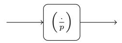
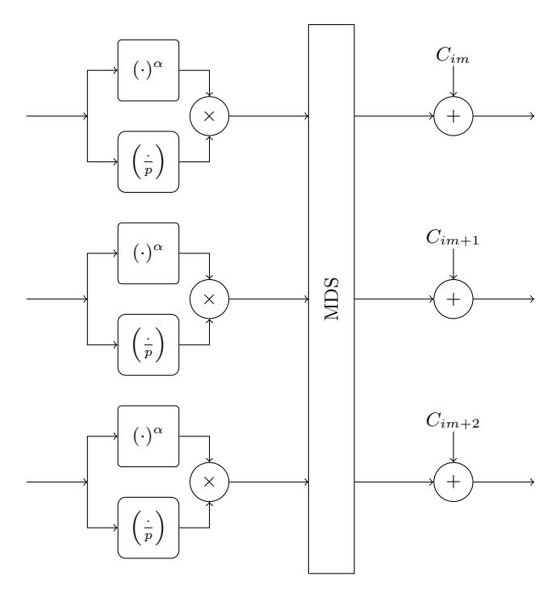
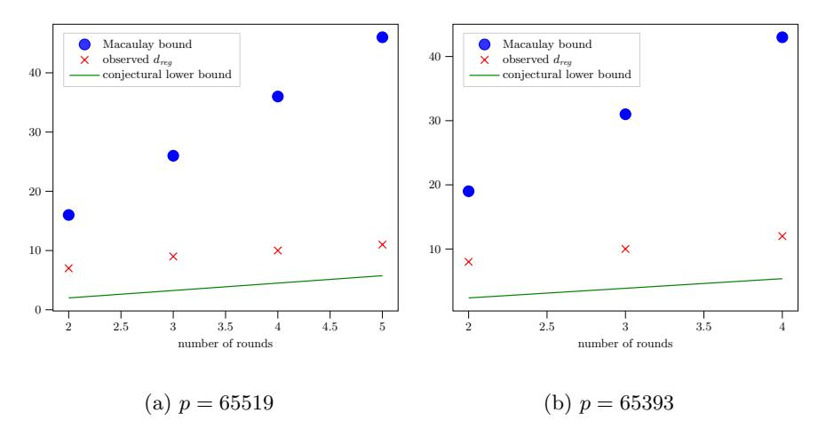
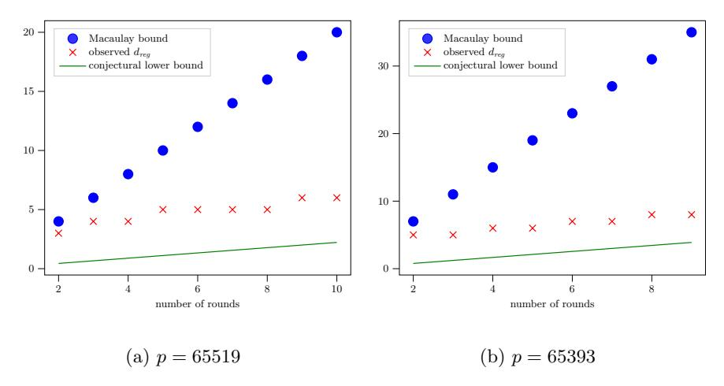

# On the Use of the Legendre Symbol in Symmetric Cipher Design

Alan Szepieniec alan@nervos.org Nervos Foundation

Abstract. This paper proposes the use of Legendre symbols as component gates in the design of ciphers tailored for use in cryptographic proof systems. Legendre symbols correspond to high-degree maps, but can be evaluated much faster. As a result, a cipher that uses Legendre symbols can offer the same security as one that uses high-degree maps but without incurring the penalty of a comparatively slow evaluation time.

After discussing the design considerations induced by the use of Legendre symbol gates, we present a concrete design that follows this strategy, along with an elaborate security analysis thereof. This cipher is called Grendel.

# 1 Introduction

Arithmetization-oriented ciphers are symmetric primitives designed to have a concise description in terms native finite field operations. The need for such ciphers comes from advanced cryptographic protocols such as succinctly-verifiable and zero-knowledge proof systems, multi-party computation, fully homomorphic encryption, functional encryption, etc., all of which use arithmetization to translate a natural computation into a sequence of finite field operations. The bit fiddling techniques that make traditional ciphers fast and compact in terms of software and hardware, are expensive to simulate in arithmetically.

Despite the limited expressivity of field operations, the steady development of recent years has led to several distinct strategies for minimizing the number of expensive multiplications. Each one of these strategies comes with unique advantages and disadvantages. For the present exposition we focus on ciphers defined over a prime field with p elements, as this corresponds to the most pertinent use cases particularly in relation to zero-knowledge proofs.

– Non-Determinism. The Marvellous hash function Rescue-Prime [\[31\]](#page-22-0) uses a SHARK-like [\[27\]](#page-22-1) substitution-permutation network. The S-boxes alternate between low-degree power maps x 7→ x <sup>α</sup> and their inverses x 7→ x <sup>1</sup>/α; between every layer of S-boxes there is an affine layer involving an MDS matrix. One advantage is a strong case for security relying on the wide trail strategy. Another advantage comes from the inverse map x 7→ x <sup>1</sup>/α, which has a high degree. A polynomial that describes output elements in terms of inputs, or

- vice versa, has degree on the order of p even when reducing the number of rounds to 1. The evaluation of this high degree of this map can be proven efficiently using nondeterminism – informally, the prover goes backwards in time and proves only relations involving low degree maps. The disadvantage of this strategy is its slow evaluation on CPUs — evaluating x 7→ x 1/α takes time O((log p) 3 ). This comparatively slow performance leads projects like Iden3 [\[34\]](#page-23-0), FileCoin [\[33\]](#page-23-1), and Dusk [\[32\]](#page-22-2) to opt for Poseidon instead.
- Partial Rounds. The Hades strategy and its representative Poseidon [\[17\]](#page-21-0) use only low-degree power maps, x 7→ x <sup>3</sup> and moreover introduce a distinction between full and partial rounds. In every full round, the S-box is applied to each element of the state. In every partial round, the S-box is applied to only one element of the state. All S-boxes can be evaluated in time on the order of O((log p) 2 ) and as a result the CPU evaluation is noticeably faster than Rescue-Prime. This performance improvement comes with two disadvantages. First, in order to guarantee that the polynomial descriptions of the output elements in terms of the input elements (or vice versa) are of sufficiently high degree, the cipher needs a large number of rounds about log<sup>3</sup> p rounds, which is significantly more than Rescue-Prime and particularly expensive for STARK-like proof systems where the number of cycles is an important performance metric. Second, the wide trail argument does not cover partial rounds, leading to an ad hoc security argument. Moreover, there are attacks that exploit the partial rounds strategy for MDS matrices of low multiplicative order [\[5\]](#page-20-0); it remains to be seen whether these attacks extend to the concrete MDS matrices proposed by the designers.

While not a strategy for the design of ciphers per se, it is worth reporting on a third paradigm:

– Legendre Symbols. First proposed by Damg˚ard [\[12\]](#page-21-1) and recently re-proposed by Grassi et al. [\[19\]](#page-21-2) for use in MPC, the Legendre PRF has the following definition. Let ( <sup>a</sup> p ) denote the Legendre symbol of a modulo p, which takes the values from {0, 1, −1} depending on whether a is zero, a nonzero quadratic residue, or neither. Then the Legendre PRF is the parameterized function <sup>F</sup>K(x) = x+K p . The Legendre symbol corresponds to a high-degree power map, i.e., a p = a p−1 <sup>2</sup> mod p, and while there is an efficient algorithm for computing it, it needs to be executed λ times for λ-bit outputs. In terms of performance, this task is on par with evaluating a cubing-only cipher such as Poseidon, and faster than evaluating a cipher with high-degree power maps such as Rescue-Prime. The advantage of the Legendre PRF over both alternatives is its extremely concise description in terms of finite field operations. Its disadvantage is that it is a number-theoretical object rather than a cipher. The Legendre PRF has no supporting security argument drawing on hard won experience from decades of symmetric cryptanalysis. Indeed, the literature provides several attacks exploiting algebraic properties that ciphers should not have [\[29,](#page-22-3)[22](#page-22-4)[,4,](#page-20-1)[21,](#page-22-5)[25\]](#page-22-6).

In light of this short survey, a natural question presents itself: Is it possible to design an arithmetization-oriented cipher that: a) has a small number of rounds; b) can be evaluated quickly on CPUs; and c) has a strong supporting security argument? We answer this question positively.

#### Contributions.

- We propose the use of Legendre symbols as a primitive gate in the construction of symmetric ciphers. We discuss the challenges that arise when employing this strategy.
- We propose a new S-box for arithmetization-oriented ciphers, which uses the Legendre symbol as an integral component. We discuss the differential and algebraic properties of this map.
- We propose a new arithmetization-oriented cipher, Grendel, which uses this Legendre symbol enhanced S-box in combination with the SHARK strategy.
   We analyze the security of this cipher against various attacks. Knowledge of these attacks leads to a selection of parameters that renders them appropriately infeasible.

APPLICATIONS. The cipher *Grendel* is designed for use in zero-knowledge and efficiently-verifiable proof systems. We limit our discussion to this context.

# 2 The Legendre Symbol in Cipher Construction

Let p be a prime number. The *Legendre symbol* of a prime field element  $a \in \mathbb{F}_p$  is defined as

$$\begin{pmatrix} \frac{a}{p} \end{pmatrix} = \begin{cases}
-1 \Leftrightarrow a \notin \mathrm{QR}_p \\
0 \Leftrightarrow a \equiv 0 \mod p \\
1 \Leftrightarrow a \in \mathrm{QR}_p
\end{cases} \tag{1}$$

where  $QR_p = \{b^2 \mid b \in \mathbb{F}_p^*\}$  is the set of nonzero quadratic residues modulo p. A generalization to composite moduli that reuses the notation is known as the  $Jacobi\ symbol$ . The law of quadratic reciprocity states that  $\binom{p}{q}\binom{q}{p} = (-1)^{(p-1)/2+(q-1)/2}$  and gives rise to an algorithm to compute Jacobi symbols in  $O((\log p)^2)$  time [11, Alg. 1.4.11].

Throughout this paper, we use  $n \in \mathbb{F}_p \backslash \mathrm{QR}_p$  to denote a canonical quadratic non-residue. When  $p \equiv 3 \mod 4$ , setting n = -1 makes the most sense. However, the proof system may need  $\mathbb{F}_p^*$  to have a large subgroup of order  $2^k$ , which implies  $p \equiv 1 \mod 4$  and this, in turn, implies that -1 is a quadratic residue. In this case, we set n to the smallest (interpreted as integers) element of  $\mathbb{F}_p$  that is not a quadratic residue.

To prove that the Legendre symbol of  $a \in \mathbb{F}_p$  is  $\ell \in \{-1, 0, 1\}$ , one reduces the statement to one about quadratic residuosity:

$$\exists b \in \mathbb{F}_p . \begin{cases} b^2 \equiv a \mod p \Leftarrow \ell \in \{0, 1\} \\ b^2 \equiv na \mod p \Leftarrow \ell = -1 \end{cases}$$
 (2)

After lifting the Legendre symbol to the finite field, we have ˆ` ∈ F<sup>p</sup> and the claim about quadratic residuosity reduces to two equations.

<span id="page-3-1"></span><span id="page-3-0"></span>
$$\hat{\ell}(\hat{\ell} - 1)(\hat{\ell} + 1) = 0 \tag{3}$$

$$\hat{\ell}(\hat{\ell} - 1)(b^2 - na) + (\hat{\ell} + 1)(b^2 - a) = 0 \tag{4}$$

Equation [3](#page-3-0) guarantees that ˆ` really corresponds to a Legendre symbol and does not take any values from outside of {p−1, 0, 1}. The left term of Eqn. [4](#page-3-1) guarantees ` = −1 ⇒ b <sup>2</sup> ≡ na mod p, whereas the right term guarantees that ` ∈ {0, 1} ⇒ b <sup>2</sup> ≡ a mod p.

The witness to this quadratic residuosity relation is the root b. While there is an efficient algorithm for computing Legendre symbols, computing square roots is more involved. When p ≡ 1 mod 4, then the square roots of a ∈ F<sup>p</sup> correspond to ±a p+1 <sup>4</sup> . When p ≡ 5 mod 8, then the square roots correspond to ±a p+3 <sup>8</sup> . In the last case, when p ≡ 1 mod 8, square roots can be found for instance with Peralta's randomized root-finding algorithm [\[26\]](#page-22-7). In all cases, the complexity of finding square roots is O((log q) 3 ). As a result, using Legendre symbols in ciphers instead of slow high power maps makes evaluation faster but does not necessarily make proving faster.

In circuit diagrams, we will use the following symbol to represent the Legendre gate. Concretely, this gate computes the Legendre symbol of the input.



Fig. 1: Legendre symbol gate

In order to design ciphers that make use of Legendre gates, it is important to understand their effect on the feasibility of various attacks. To this end, we discuss several attack strategies from a high level perspective.

#### 2.1 Security Properties of the Legendre Symbol Gate

Statistical attacks. Statistical attacks study the different-from-random propagation of patterns in the values of wires as they propagate through the cipher. This pattern may be a linear relation between the wires entering and exiting from a circuit component, giving rise to linear cryptanalysis. Or it may be an equation of differences of wire values resulting from the cipher's invocation on a pair of inputs that are a known difference apart; this pattern gives rise to differential cryptanalysis.

For linear and differential cryptanalysis, it is worth deriving the probabilities with which linear or differential relations are satisfied. When a key K is involved, we take the expected value for random keys. Furthermore, when arguing about a cipher's security it makes sense to take into account the particular pattern that maximizes this expected probability, leading to a maximum expected linear or differential probability (MELP/MEDP).

$$MELP_{\left(\frac{\cdot}{p}\right)} = \max_{a,b,c} \mathop{\mathbf{E}}_{K} \left[ \Pr_{x} \left[ a \cdot x + b \cdot \left( \frac{x}{p} \right) = c \right] \right]$$
 (5)

$$MEDP_{\left(\frac{\cdot}{p}\right)} = \max_{\Delta x, \Delta y} \mathop{E}_{K} \left[ \Pr_{x} \left[ \left( \frac{x + \Delta x}{p} \right) - \left( \frac{x}{p} \right) = \Delta y \right] \right]$$
 (6)

When restricting to coefficients that are not all zero, the MELP is equal to  $\frac{1}{2} - \frac{1}{2p}$ . To see this, observe that there are  $\frac{p-1}{2}$  values of x such that  $\left(\frac{x}{p}\right) = -1$  and as many where it is 1. The maximum is reached for relations satisfying a = 0 and  $b = \pm c$ .

The MEDP is more involved. Clearly  $\Delta y \in \{-2,-1,0,1,2\}$  or the differential relation cannot be satisfied at all. Moreover, it is satisfied with  $\Delta y = -1$  only if  $x + \Delta x = 0$ , and analogously, with  $\Delta y = 1$  only if x = 0. These samples make up  $\frac{1}{p}$  fraction of the sample space each. Conjecturally, subject to  $x \neq 0 \neq x + \Delta x \neq x$ , the variables  $\left(\frac{x}{p}\right)$  and  $\left(\frac{x + \Delta x}{p}\right)$  are independently uniformly distributed across  $\{-1,1\}$ . If this conjecture is true, the MEDP is  $\frac{1}{2} - \frac{1}{2p}$ . Note that if the MEDP is different from this value, there is an immediate differential attack against the Legendre PRF.

In summary, as a map from  $\mathbb{F}_p \to \mathbb{F}_p$ , the Legendre gate is far from random. However, when compared against maps that send  $\mathbb{F}^* \to \{-1,1\}$ , the Legendre symbol gate is difficult to distinguish from random by conjecture — this is precisely the conjecture that underlies the security of the Legendre PRF.

The constraint on the range that is necessary when comparing the Legendre symbol gate to a random function presents a challenge for the cipher designer. The magnitude of this range does not grow when a Legendre symbol is added to another wire. Moreover, it increases slowly when the value is multiplied by a small constant, and for some values even when it is raised to a small power. Therefore, (#1) Legendre symbol gates should be used in conjunction with multiplications by large constants.

**Algebraic attacks.** Algebraic attacks exploit the algebraic rewriting rules and identities that come with a description of the attacked cipher in terms of polynomials. Examples that belong to this class are GCD attacks, interpolation attacks, root finding attacks, and Gröbner basis attacks.

The first three work well when the degree of the polynomials that describe the cipher's outputs in terms of the inputs (or vice versa) is low. For ciphers involving Legendre symbol gates, this degree is on the order of p. When deployed in the context of proof systems, this degree is typically large enough to make these classes of attacks infeasible, particularly if the polynomials are dense. To make

the polynomials dense, (#2) Legendre symbol gates should be used in conjunction with addition gates.

Gr¨obner basis attacks reduce the degree of the polynomials by introducing new variables to represent intermediate states. The resulting system of multivariate polynomial equations can be solved with a Gr¨obner basis algorithm, possibly in conjunction with a term order change algorithm. Unfortunately, the same polynomial equations [\(3](#page-3-0) and [4\)](#page-3-1) that make a Legendre symbol provable can be used in a Gr¨obner basis attack. This is a feature of any arithmetization. Therefore, (#3) just using Legendre symbol gates does not guarantee a cipher's security against Gr¨obner basis attacks.

Guess. Ignoring the edge case 0, the output of a Legendre symbol gate can take only two values, 1 or -1. An attacker who guesses the outputs of all or some Legendre symbol gates can switch to attacking a version of the cipher that replaces them with constant gates. Against this simplified version, another attack may become feasible, but only if the guesses were correct. Therefore, (#4) the probability of guessing Legendre symbols correctly should be used to discount the complexity of the improved attack that said guess admits.

### 2.2 SHARK Construction

We observe that the design principles underlying the SHARK cipher are naturally compatible with the use of Legendre symbol gates. Recall that the SHARK cipher [\[27\]](#page-22-1) operates on a register of m state elements for N rounds. Every round of the cipher consists of three steps:

- A nonlinear layer, wherein every element of the state passes through an invertible, highly non-linear permutation called the S-box. As the only nonlinear component, the S-box is what defends against algebraic attacks, including (assuming N is large enough) Gr¨obner basis attacks (#3 ).
- A diffusion layer, wherein the vector of state elements is multiplied by an MDS matrix. An appropriately chosen MDS matrix guarantees plenty of multiplications by large coefficients (#1 ).
- Injection of round keys derived from the master key through a key schedule. Since we are working over finite fields, field addition is the natural candidate to realize this injection (#2 ).

The remaining design principle (#4 ) that the SHARK construction does not already happen to address, states that there should be enough Legendre symbol gates to make guessing their outputs and launching an improved attack infeasible. If Legendre symbols are used in the description of a round, then this principle can be satisfied simply by setting the number of rounds N appropriately as a consequence of having more Legendre symbols to guess.

The natural compatibility between the SHARK construction and the use of Legendre symbol gates motivates the adding Legendre symbol gates into an otherwise SHARK-like cipher. However, a na¨ıve implementation of this design strategy presents difficulties. The Legendre map is not a permutation and so it cannot be used as an S-box. But neither is it linear, so it cannot be used as part of a linear diffusion layer. When attempting to construct a *nonlinear* diffusion layer with Legendre symbols, the question is how to guarantee that this layer is invertible. The same question arises when using Legendre symbols in combination with the key injection step; without invertibility, one risks losing information from the state or from the round keys. Lastly, when Legendre symbols are used as a separate step, they undermine the wide trail argument for arguing security against linear and differential cryptanalysis — this argument was the original motivation for the SHARK cipher in the first place!

There may be other ways to circumvent or address the difficulties outlined above. Nevertheless, we choose to focus on the first point: just because a Legendre symbol cannot be used as an S-box, does not mean it cannot be used as part of an S-box. Rephrased as a question: is it possible to use Legendre symbol gates to build a highly non-linear permutation on a single field element? The next section answers this question positively.

## 3 Low-Degree Power Map with Possible Sign Flip

In prime fields where  $p\equiv 3 \mod 4$ , squaring is complementary to taking the Legendre symbol in the following sense. Let  $x\in \mathbb{F}_p^*$  be a nonzero field element. Then  $x\mapsto x^2$  projects x onto the subgroup of quadratic residues  $\operatorname{QR}_p^*=\{a^2\mid a\in \mathbb{F}_p^*\}$  with multiplication. The complementary map  $x\mapsto \left(\frac{x}{p}\right)$  sends x to the coset of  $\operatorname{QR}_p^*$  whose representatives are 1 if  $x\in\operatorname{QR}_p^*$  and to -1 if  $x\notin\operatorname{QR}_p^*$ . In other words, the Legendre symbol records precisely the information that is lost by squaring. Phrased differently, the map  $x\mapsto x^2\times\left(\frac{x}{p}\right)$  is invertible. To see this, observe that  $x^2\times\left(\frac{x}{p}\right)=x^{2+\frac{p-1}{2}}=x^{\frac{p+3}{2}}$  and  $\gcd\left(\frac{p+3}{2},p-1\right)=\gcd(2k+3,4k+2)=1$ .

The situation changes when  $p \equiv 1 \mod 4$  because then  $-1 \in QR_p$  and the roots of any element are either both quadratic residues or both not quadratic residues. The Legendre symbol does not record the information that was lost by squaring. However, the spirit of the above power map is recycled in  $x \mapsto x^{\alpha} \times \left(\frac{x}{p}\right)$ , where  $\alpha$  is the smallest exponent whose power map is invertible. To see that this map is invertible, observe that  $x^{\alpha} \times \left(\frac{x}{p}\right) = x^{\alpha + \frac{p-1}{2}}$  and composition with  $x \mapsto x^{\frac{p-1}{2} + \alpha^{-1}}$  gives the identity.

The S-box function can be defined in a manner that makes abstraction of the congruence class of p modulo 4. Specifically, this map is

$$f: \mathbb{F} \to \mathbb{F}, x \mapsto x^{\alpha} \times \left(\frac{x}{p}\right)$$
 , (7)

where  $\alpha$  is the smallest integer greater than 1 such that this map is invertible. For any odd prime field  $\mathbb{F}_p$ ,  $\alpha < p$ .

One of the benefits of this abstract definition is a uniform treatment of the differential and linear probabilities. Let's start with the former.

$$MEDP_f = \max_{\Delta x, \Delta y} \mathop{\mathbf{E}}_{K} \left[ \Pr_{x} \left[ f(x + \Delta x) - f(x) = \Delta y \right] \right]$$
 (8)

The equation inside the inner brackets implies, after some squarings and rearrangements:

$$(x+\Delta)^{\alpha+\frac{p-1}{2}} - x^{\alpha+\frac{p-1}{2}} = \Delta y \tag{9}$$

$$\Leftrightarrow (x + \Delta x)^{\alpha + \frac{p-1}{2}} = \Delta y + x^{\alpha + \frac{p-1}{2}} \tag{10}$$

$$\Rightarrow (x + \Delta x)^{2\alpha + p - 1} = (\Delta y)^2 + 2(\Delta y)x^{\alpha + \frac{p - 1}{2}} + x^{2\alpha + p - 1}$$
(11)

$$\Leftrightarrow (x + \Delta x)^{2\alpha} = (\Delta y)^2 + 2(\Delta y)x^{\alpha + \frac{p-1}{2}} + x^{2\alpha}$$
(12)

$$\Leftrightarrow (x + \Delta x)^{2\alpha} - (\Delta y)^2 - x^{2\alpha} = 2(\Delta y)x^{\alpha + \frac{p-1}{2}}$$
(13)

$$\Rightarrow \left( (x + \Delta x)^{2\alpha} - (\Delta y)^2 - x^{2\alpha} \right)^2 = 4(\Delta y)^2 x^{2\alpha + p - 1} \tag{14}$$

$$\Leftrightarrow \left( (x + \Delta x)^{2\alpha} - (\Delta y)^2 - x^{2\alpha} \right)^2 - 4(\Delta y)^2 x^{2\alpha} = 0 . \tag{15}$$

The left hand side of the last equation is a polynomial in x. The terms in x 4α cancel, and the next greatest term is 2α(∆x)x 2α−1 2 = 4α 2 (∆x) 2x 4α−2 . This term cannot be canceled when α > 1. This polynomial therefore has at most 4α − 2 roots. By the Schwarz-Zippel lemma, MEDP<sup>f</sup> ≤ 4α−2 p .

The linear probability follows.

$$MELP_f = \max_{a,b,c} \underset{K}{E} \left[ \Pr_x \left[ a \cdot x + b \cdot f(x) = c \right] \right]$$
 (16)

The equation inside the inner brackets implies, after one squaring and one rearrangement:

$$a \cdot x + b \cdot x^{\alpha + \frac{p-1}{2}} = c \tag{17}$$

$$\Leftrightarrow b \cdot x^{\alpha + \frac{p-1}{2}} = c - a \cdot x \tag{18}$$

$$\Rightarrow b^2 x^{2\alpha + p - 1} = c^2 - 2acx + a^2 x^2 \tag{19}$$

$$\Leftrightarrow b^2 x^{2\alpha} - c^2 - a^2 x^2 + 2acx = 0 . {(20)}$$

For any a, b, c, the left hand side of the last equation is a polynomial of degree 2α in x. It has at most 2α roots. By the Schwarz-Zippel lemma, MELP<sup>f</sup> ≤ 2α p .

# 4 Grendel

Grendel is a new cipher that uses the low-degree power map with possible sign flip as an S-box in a SHARK-like construction. The motivation for this design has already been made and the novel concepts already introduced. What follows in this section is a self-contained specification of the cipher.

#### 4.1 Parameters

Grendel defines a family of permutations parameterized by the following variables. The tuple  $(p,m,r,\lambda)$  constitutes an irredundant parameter set, whereas the auxiliary parameters  $(\alpha,c,N,M,\{C_i\}_{i=0}^{mN})$  can be deterministically computed from them.

- p a prime number defining the field over which the cipher's operations are defined.
- -m the state size, in number of field elements. Following standard design principles [2, §4.1], we require  $m \ge 2$ .
- r the sponge rate, in number of field elements.
- $\lambda$  the target security level.
- $-\alpha$  the exponent of the power map part of the S-box. This value is set to 2 when  $p \equiv 3 \mod p$  or otherwise to the smallest integer greater than 2 such that  $\gcd(\alpha, p-1)=1$ .
- -c the sponge capacity, in number of field elements. The state size, rate, and capacity satisfy m=c+r.
- -N the number of rounds.
- -M an  $m \times m$  MDS matrix.
- $\{C_i\}_{i=0}^{mN}$  the round constants.

#### 4.2 Permutation

The Grendel permutation  $P: \mathbb{F}_p^m \to \mathbb{F}_p^m$  consists of N applications of the Grendel round function  $R: \mathbb{F}_p^m \to \mathbb{F}_p^m$  to a register of m field elements, but with a different slice of round constants in each round. Every round consists of three steps.

– Substitution. The S-box is applied to every state element. The S-box is defined as

$$f: \mathbb{F}_p \to \mathbb{F}_p, x \mapsto x^{\alpha} \times \left(\frac{x}{p}\right)$$
 (21)

- Permutation. The vector of state elements is multiplied by the MDS matrix M, through matrix-times-column-vector multiplication.
- Injection of round constants. Round constant im+j is added to state element  $j \in \{0, \dots, m-1\}$ , where  $i \in \{0, \dots, N-1\}$  is the round number.

The pseudocode of Algorithm 1 describes this operation formally as it mutates a register  $\boldsymbol{x}$  in-place. Figure 2 shows a diagram of a single round for the specific case where m=3.

#### 4.3 Sponge Function

Together with the rate r and the capacity c, the *Grendel* permutation defines a sponge function [3]. Mathematically, this map sends an arbitrary-length sequence of field elements to an infinite-length sequence of field elements:

$$S: \mathbb{F}_p^* \to \mathbb{F}^* \tag{22}$$

```
algorithm Grendel-Permutation( x ):
begin
   for i from 0 to N − 1 do
       // substitution
       for j from 0 to m − 1 do
           xj ← x
                 α
                 j ×

                       xj
                        p

       // permutation
       x ← Mx
       // round constants
       for j from 0 to m − 1 do
           xj ← xj + Cim+j
   return x
```

<span id="page-9-0"></span>Algorithm 1: Grendel permutation applied to x ∈ F m p

<span id="page-9-1"></span>

Fig. 2: one round of Grendel with m = 3

In practice, the output is always truncated some number output length of field elements, and in an implementation output length is provided as an argument to the function. A computer evaluation of the sponge function consists of two phases.

- Absorbing. A chunk of r elements from the input are added into the top r state elements before the permutation is applied to the entire state.
- Squeezing. The top r elements of the state are concatenated to the output before the permutation is applied to the entire state. Once the output buffer has accumulated output length elements, it is returned and the algorithm terminates.

Before the first step of the absorbing phase takes place, the state is initialized to the all-zero vector. The pseudocode of Algorithm [2](#page-10-0) presents this operation formally.

```
algorithm Grendel-Sponge( input, output length ):
begin
   state ← 0 ∈ F
                 m
   // absorbing phase
   for i from 0 to d
                     length(input)
                         r
                               e do
       // add in chunks of r elements
       for j from 0 to min(r, length(input) − ir) do
           state[j] ← state[j] + input[ir+j]
       // apply permutation
       state ← Grendel-Permutation( state )
   // squeezing phase
   output ← ε // empty string
   for i from 0 to d
                     output length
                         r
                               e do
       // read out chunks of r elements
       for j from 0 to min(r, output length − ir) do
           output ← output k state[j]
       // apply permutation
       state ← Grendel-Permutation( state )
   return output
```

<span id="page-10-0"></span>Algorithm 2: Grendel sponge function

### 4.4 Hash Function

The Grendel hash function uses the Grendel sponge internally. The output length is fixed. In addition to that, a padding rule may be applied to the input. Specifically, if the input length is fixed by the context, no padding rule is necessary. If the input length is variable, then the input is padded as follows. First append a single 1, and then pad with zeros until the input length is a multiple of r. Algorithm [3](#page-11-0) presents this operation formally.

```
algorithm Grendel-Hash( input ):
begin
   // apply padding rule (if necessary)
   if padding then
       input ← inputk1
       while length(input) 6≡ 0 mod r do
          input ← inputk0
   // compute sponge function
   output ← Grendel-Sponge( input, output length )
   return output
```

<span id="page-11-0"></span>Algorithm 3: Grendel hash function with output length output length

### 4.5 MDS Matrix

The MDS matrix is determined as follows. Let g ∈ F<sup>p</sup> be the smallest (interpreted as an integer) primitive element. Then the m×2m matrix whose (i, j)th element is g ij , is generator matrix for a Reed-Solomon code, which is MDS. Applying row echelon reduction to this matrix brings it into systematic form (I | MT). The rightmost m × m submatrix of this systematic form is the transpose of the MDS matrix. The procedure is given formally in Algorithm [4.](#page-11-1)

```
algorithm Get-MDS-Matrix( ):
begin
   g ← 2 ∈ Fp
   while multiplicative order(g) 6= p − 1 do
       g ← g + 1
   G ← F
         m×2m matrix such that G[i,j] = g
                                         ij
   S ← reduced echelon form(G)
   return
            S[:,m:]T
```

<span id="page-11-1"></span>Algorithm 4: procedure to sample MDS matrix

### 4.6 Round Constants

The round constants are derived deterministically by expanding a short seed phrase using SHAKE256. This deterministic derivation satisfies two criteria.

- It guarantees that the round constants were generated with nothing-up-mysleeve. Using this method to generate round constants that look random but secretly hide weaknesses is infeasible if SHAKE256 is secure.
- It supports the security model in which the permutation is treated as a concrete member chosen at random from a family of permutations.

Specifically, the round constants are sampled in the following way. Start with the phrase "grendel-%i-%i-%i", where the wildcards are the decimal values of  $p, m, \lambda$ , respectively. Use SHAKE256 to expand this phrase to an array of  $mN \times (1+\lceil \frac{\log_2 p}{8} \rceil)$  bytes. Every chunk of  $w=(1+\lceil \frac{\log_2 p}{8} \rceil)$  encodes an integer by parsing it in most-significant-byte-first order. Reduction modulo p maps this integer to its corresponding round constant. Algorithm 5 captures this derivation formally.

```
algorithm GET-ROUND-CONSTANTS():

begin
```

<span id="page-12-0"></span>Algorithm 5: procedure to sample round constants

### 5 Security Analysis

In traditional cryptanalysis, the effectiveness of an attack is characterized by the number of cipher invocations it requires. However, algebraic attacks can often get away with a very small number of cipher invocations, sometimes as little as one. Since algebraic attacks are of particular importance in the present context we count the number of field operations needed to make them work. For an apples-to-apples comparison we count time steps abstractly, thus implicitly equating one field operation to one cipher invocation.

#### 5.1 Linear and Differential Cryptanalysis

To determine the probability of observing the distinct-from-random propagation of linear or differential patterns, one needs to analyze the non-linear elements. The *wide trail argument* makes this exercise easy for SHARK-like ciphers like *Grendel*.

Specifically, the MDS matrix defines a code of minimum distance m+1. The dual code has the same minimum distance. Therefore, in any linear trail or differential characteristic spanning two rounds, there will be at least m+1 active S-boxes that propagate these patterns probabilistically. Under the assumption

that the S-boxes act independently, the product of their MELPs/MEDPs bounds from above the probability of observing any given trail or characteristic.

For any linear trail, there are at least  $\lfloor \frac{N}{2} \rfloor \times (m+1)$  active S-boxes. The probability of observing any given linear trail across one S-box is at most  $\frac{2\alpha}{p}$ .

Across N rounds, this number falls to  $\left(\frac{2\alpha}{p}\right)^{\frac{N}{2}}$ . In other words, only after making  $\left(\frac{2\alpha}{p}\right)^{-\frac{N}{2}}$  invocations of the cipher can the attacker expect to observe a given linear trail.

A similar argument applies to differential cryptanalysis. For any differential characteristic spanning at least two rounds, there are at least m+1 active S-boxes. For any characteristic spanning the entire cipher, there are at least  $\lfloor \frac{N}{2} \rfloor \times (m+1)$  active S-boxes, each one of which observes a given characteristic with probability at most  $\frac{4\alpha-2}{p}$ . Under the same independence assumption, this probability drops to  $\left(\frac{4\alpha-2}{p}\right)^{\frac{N}{2}}$  for any differential characteristic spanning the entire cipher. Only after making  $\left(\frac{4\alpha-2}{p}\right)^{-\frac{N}{2}}$  invocations of the primitive can the attacker expect to observe a given differential characteristic.

### 5.2 Integral Attacks

Integral attacks [23] exploit the predictable propagation of sums of sets that span an entire substructure. Traditionally, an integral pattern represents the sum of a well-defined set of elements under some map. This sum is typically taken over an entire subspace of  $\mathbb{F}_2^n$ , in which case the sum tends to vanish. Specifically, for any such subspace  $V \subset \mathbb{F}_2^n$  and any function  $F : \mathbb{F}_2^n \to \mathbb{F}_2^n$  whose total degree in every coordinate is smaller than the dimension of V,

$$\sum_{\boldsymbol{v} \in V} F(\boldsymbol{v}) = \boldsymbol{0} . \tag{23}$$

Out of Oddity [5] generalizes this principle to odd-characteristic fields in two ways. We restate the relevant propositions below, and proceed to investigate the distinct-from-random propagation of subspaces and subgroups, as well as their distinct-from-random sum.

Proposition 1 (integral patterns for odd-characteristic subspaces). Let  $\mathbb{F}_p$  be a finite field, let  $V \subset \mathbb{F}_p^t$  be an affine subspace of dimension k, and let  $F: \mathbb{F}_p^t \to \mathbb{F}_p$  of total degree at most k(p-1). Then

$$\sum_{\boldsymbol{v} \in V} F(\boldsymbol{v}) = \mathbf{0} . \tag{24}$$

<span id="page-13-0"></span>**Proposition 2 (integral patterns for subgroups).** Let  $\mathbb{F}_p$  be a finite field and  $G \subset \mathbb{F}_p \setminus \{0\}$  a subgroup with multiplication, and let  $F : \mathbb{F}_p \to \mathbb{F}_p$  with  $\deg(F) < |G|$ . Then

$$\sum_{g \in G} F(g) = F(0) \cdot |G| . \tag{25}$$

Consider the propagation of a subspace  $V \subset \mathbb{F}_p^m$  whose sum equals zero. The subspaces V with this description that propagate across the S-box layer are equal to an m-fold Cartesian product of  $\{0\}$  or  $\mathbb{F}_p$ , or a translation thereof by a nonzero vector  $\boldsymbol{x} \in \mathbb{F}_p^m$ . Like the S-box layer, the injection of round constants merely changes the offset vector  $\boldsymbol{x}$ . Suppose the MDS sends the subspace V to a subspace W. Then  $\dim(V) + \dim(W) \geq m+1$  because it is MDS, and  $\dim(V) = \dim(W)$  because it is a permutation. So any subspace with sum zero that has any hope of propagating needs to have dimension  $\lceil \frac{m+1}{2} \rceil$ . Moreover, an attacker wishing to saturate this subspace in order to test its sum against zero must make at least  $p^{\lceil \frac{m+1}{2} \rceil}$  queries to the primitive.

The permutation defines m multivariate maps  $\mathbb{F}^m \to \mathbb{F}$  whose total degrees are m(p-1). In order to observe a zero sum across the entire permutation, the attacker must therefore saturate all of  $\mathbb{F}_p^m$ . This saturation requires  $p^m$  invocations of the primitive.

Consider the propagation of a subgroup G of  $\mathbb{F}_p^*$  and its sum. If G does not contain quadratic non-residues, the the effect of the S-box is equivalent to that of the power map  $x\mapsto x^\alpha$ . Since  $\gcd(\alpha,p-1)=1$ , we also have  $\gcd(\alpha,|G|)=1$  and so G propagates across the S-box without change. The propagation terminates at the affine map because addition breaks the group structure. It is possible that the nonzero round constant is canceled against the additions induced by the MDS matrix. However, in this case a subgroup G in coordinate i diffuses to all coordinates with a constant multiplicative and constant additive offset. Even if the constant additive offset is zero, there will be non-trivial additions in the second round as a result of the affine map. We conclude that subgroups do not propagate across more than two rounds.

As for applying Prop. 2 to the entire permutation, the coordinate functions are of maximal degree. If the Legendre symbols are known, then the coordinate functions are equivalent to polynomials of degree  $\alpha^N$  in every variable. However, when the attacker saturates the subgroup by making at least  $\alpha^N$  queries to the primitive, the Legendre symbols will be different for every query. As a result, the attacker wishing to reduce the cipher to equivalent maps of low degree, can only target distinct functions for each query. We conclude that the cipher does not exhibit subgroups with distinctive sums.

#### 5.3 Algebraic Attacks

An interpolation attack [20,24,28] represents the attacked primitive as a univariate polynomial of low degree  $d \ll p-1$ . With only d input-output pairs, the Lagrange interpolant can be evaluated in a new point. This new evaluation is used to test whether the primitive is random or not. The interpolation attack extends to multi-variate multi-coordinate maps  $\mathbb{F}_p^m \to \mathbb{F}_p^m$  by isolating one coordinate and by fixing all but one variables. This family of attacks does not apply to Grendel because the degree is p-1 in every variable and in every coordinate. Even if p is small enough to make the Lagrange interpolation feasible, the resulting interpolant will not be distinguishable from a random polynomial

because every polynomial, including one that is randomly selected, is equivalent to a polynomial of degree at most p-1.

In the context of block ciphers, GCD attack [1, §4.2] is a key-recovery attack on a cipher whose bi-variate polynomial description F(X,K) has low degree  $d \ll p-1$  in the key-variable K. By querying two plaintext-ciphertext pairs, the attacker obtains two distinct polynomials,  $F(x_0, K) - y_0$  and  $F(x_1, K) - y_1$ , whose common root is the key k. The complexity of finding the GCD of two polynomials of degree d is  $O(d(\log d)^2)$ . The GCD attack does not apply to Grendel because it is not a block cipher with an unknown key; instead it is a permutation with no secrets.

Specific to the case where a hash function outputs a single field element is the root finding attack [28,18]. The one coordinate of the output is described in terms of a univariate polynomial f(x) of the input. Then for a known output y, the attack involves factoring the polynomial f(x) - y to find a root. In fact, prior to factorization it pays to take the greatest common divisor with the field equation  $x^p - x$ , in which case computing  $\gcd((x^p \mod (f(x) - y)) - x, f(x) - y)$  becomes the performance bottleneck. The degree of both operands is on the order of p if the Legendre symbols are treated symbolically, or at most  $\alpha^N$  if the Legendre symbols are guessed and then modeled as constants. The resulting complexity  $O(\alpha^N \cdot N^2)$  should be discounted by the probability of guessing all Legendre symbols correctly, making for a total complexity of approximately

<span id="page-15-1"></span><span id="page-15-0"></span>
$$2^{Nm-c} \times \alpha^N \cdot N^2 \ . \tag{26}$$

#### Gröbner Basis Attacks

A Gröbner basis attack [30] represents the cipher as a system of multivariate quadratic polynomials, possibly introducing intermediate variables to lower their degrees. The resulting system is then plugged into a Gröbner basis based solver such as MutantXL [10] or  $F_4/F_5$  [16,13] with FGLM [14,15].

A single round of the *Grendel* permutation relates the state variables  $x_{mi}$ ,  $\dots, x_{mi+m-1}$  to the state variables  $x_{m(i+1)}, \dots, x_{m(i+1)+m-1}$  via the following polynomials.

$$\begin{cases}
\sum_{j=0}^{m-1} M_{[k,j]} \cdot \left(\frac{\mathcal{L}}{n-1} \cdot x_{mi+j}^{\alpha-1}\right) + C_{mi+k} - x_{m(i+1)+k} \middle| 0 \le k < m \\
\text{where } \mathcal{L} = (x_{mi+j} - y_{mi+j}^2) - (nx_{mi+j} - y_{mi+j}^2) \middle| 0 \le i < N
\end{cases}$$

$$\cup \left\{ (x_{mi+k} - y_{mi+k}^2) \cdot (nx_{mi+k} - y_{mi+k}^2) \middle| 0 \le k < m \\
0 \le i < N
\end{cases}$$
(28)

$$\bigcup \left\{ (x_{mi+k} - y_{mi+k}^2) \cdot (nx_{mi+k} - y_{mi+k}^2) \middle| \begin{array}{l} 0 \le k < m \\ 0 \le i < N \end{array} \right\}$$
(28)

The helper variable  $y_i$  represents the inverse of a square root of  $n \times x_i$ , and as a result,  $\frac{\mathcal{L}}{n-1}$  represents  $x_{mi+j}$  multiplied by its Legendre symbol. The polynomials of expression 27 require that  $y_{mi+k}$  is a square root of either  $x_{mi+k}$  or  $n \times x_{mi+k}$ , depending on whether it is a quadratic residue. The polynomials of expression 26 guarantee the correct evolution of the state of the permutation across N rounds. The variables  $x_0, \ldots, x_{m-1}$  represent the input of the permutation, and the variables  $x_{Nm}, \ldots, x_{Nm+m}$  represent the outputs of the permutation. These output

variables do not have matching helper variables. There are thus 2Nm + m variables and 2Nm equations. Half the equation have degree α + 1 and half have degree 4.

To make the attack more concrete one has to specialize the system of polynomials in accordance with an attack model on the Grendel hash function. We select a preimage attack for a single absorption and single squeeze hash function. Other attack models generate larger polynomial systems, whose Gr¨obner bases are harder to compute.

In the one-absorption, one-squeeze preimage attack, there are r variables in the input; the remaining c variables are set to zero and their helper variables are eliminated. All m equations for the state at the input side retain their total degree, which is α+ 1. However, there are only r equations square root equations at the input side. At the output side there are only r equations for the state. The c output variables associated with the capacity part, along with the equations in which they appear, are dropped. The remaining r output variables are exactly the known hash digest and are thus known constants and not at all variables. The resulting system has 2Nm+m−2c−m variables and 2Nm−c−c equations, half of which are of degree α + 1 and half of which are of degree 4. This leads to a straightforward Macaulay bound on the degree of regularity:

$$d_{reg} \le d_{Mac} = 1 + \sum_{p_i} (\deg(p_i) - 1)$$
 (29)

$$= 1 + (Nm - c) \times (\alpha + 3) . (30)$$

We ran experiments to calculate the degree of regularity experimentally for parameters small enough so that this computation would be feasible. Specifically, these parameters were r = c = 1 and p = 65519 and p = 65393. The number of rounds N was increased until the machine ran out of memory. The observed degree of regularity is lower than the Macaulay bound, indicating that the system of polynomial equations is not regular. Based on these data points, we conjecture that the actual degree of regularity is bounded from below by

$$d_{reg} \ge \frac{d_{Mac}}{8} . (31)$$

The experimental are shown in Figures [3a](#page-17-0) and [3b,](#page-17-0) along with the Macaulay bound and the conjectural lower bound.

Using the conjectural lower bound as an estimate for the degree of regularity translates to an estimate for the complexity of computing the Gr¨obner basis, derived from the complexity of sparse linear system solving in the Macaulay matrix of degree dreg :

$$C_{GB} \approx \left(\frac{2Nm - 2c + d_{reg}}{d_{reg}}\right)^2 . \tag{32}$$

Gr¨obner Basis Attack with Known Legendre Symbols When the attacker knows the Legendre symbols, having obtained them for instance from a lucky

<span id="page-17-0"></span>

Fig. 3: evolution of the degree of regularity

guess, the system of polynomials can be simplified greatly. With this additional information the cipher can be described by the polynomials

$$\left\{ \sum_{j=0}^{m-1} M_{[k,j]} x_{mi+j}^{\alpha} \mathcal{S}_{mi+j} + C_{mi+k} - x_{m(i+1)+k} \middle| \begin{array}{l} 0 \le k < m \\ 0 \le i < N \end{array} \right\} , \quad (33)$$

where  $S_{mi+j}$  denotes the known Legendre symbol of the unknown variable  $x_{mi+j}$ . Once again we focus on a one-absorb one-squeeze preimage attack. In this case c variables on the input side disappear because the capacity part of the state is initially zero. Likewise, r variables on the output side are fixed because they are the known hash digest. The remaining c variables on the output side disappear because the equations in which they appear can safely be dropped. So in total there are Nm-c variables and as many equations of degree  $\alpha$ . These numbers give rise to the Macaulay bound

$$d_{reg} \le d_{Mac} = 1 + \sum_{p_i} \deg(p_i) - 1$$
 (34)

$$= 1 + (Nm - c) \times (\alpha - 1)$$
 (35)

Our experiments with  $length(input) = output\_length = 1$  indicate that this system is not regular either. We conjecture that the degree of regularity is bounded from below by

$$d_{reg} \ge \frac{d_{Mac}}{9} . (36)$$

The experimental results, along with the Macaulay bound and conjectural lower bound, are shown in Figures 4a and 4b.

While the complexity of the Gröbner basis calculation is significantly less, the attacker has to factor in the probability of making the correct guess for all

<span id="page-18-0"></span>

Fig. 4: evolution of the degree of regularity when the Legendre symbols are known

the Legendre symbols. Approximating the Legendre symbols as uniform random variables across  $\{-1,1\}$ , the attacker has to guess  $O(2^{Nm-c})$  times before his guess is correct. So the total work factor of this attack strategy becomes

$$2^{Nm-c} \times \binom{Nm-c+d_{reg}}{d_{reg}}^2 . (37)$$

#### 5.5 Structural Attacks

A slide attack [6] exploits the self-similarity of a block cipher. Let  $P: \mathbb{F}_2^n \to \mathbb{F}_2^n$  be a permutation consisting of N identical rounds, i.e.,  $P = R^{(N)}$ . Then after querying the primitive  $2^{n/2}$  times, one would expect to find a slid pair,  $(x_0, y_0), (x_1, y_1)$  such that  $y_0 = P(x_0), y_1 = P(x_1)$  and  $x_1 = R(x_0)$ . With such a pair, attacking N rounds of the block cipher is as easy as attacking one round. The methodology also applies to weakly self-similar ciphers, such as those with repetitive key schedules [7].

Slide attacks generally attack weak key schedules. A generalization of quantum slide attacks presented in [9] gave rise to a practical classical cryptanalysis of the block cipher variants of Feistel-MiMC and GMiMC [8]. The property exploited in this attack is an invariant property induced by the weak key schedule, namely  $R((X \oplus K) || (Y \oplus K), 0) = R(X || Y, K)$ .

In principle, slide attacks extend to permutations, where the attacker's objective is not to discover the secret key but to distinguish the primitive from a random permutation in a meaningful way. A random permutation is, with high probability, unequal to the N-fold composition of a simple round. Therefore, an attacker who manages to compute a slid pair has obtained a meaningful indication that his primitive is not random. It is unclear whether this weakness extends to a practical attack on the resulting hash function, but it certainly undermines the premise of the various sponge security proofs.

Nevertheless, slide attacks and attacks exploiting a weak key schedule do not apply to Grendel. As a first approximation, the round constants are uniformly random and thus comparable to the injection of keys from a strong key schedule. More precisely, the round constants are selected pseudorandomly, by expanding a seed string using SHAKE256. Therefore, finding parameter sets that generate repetitive or otherwise weak round constants amounts to a preimage attack on SHAKE256.

### 5.6 Attack Summary

Table [1](#page-19-0) summarizes the various attacks' asymptotic complexity if they apply to Grendel. To enable simple uniform comparison, this table treats one invocation of the cipher as equally expensive as one finite field operation.

Table 1: summary of attack complexity

<span id="page-19-0"></span>

| attack                     | complexity                                                                      |
|----------------------------|---------------------------------------------------------------------------------|
| Linear cryptanalysis       | −N/2<br><br>2α<br>p                                                             |
| Differential cryptanalysis | −N/2<br><br>4α−2<br>p                                                           |
| Subspace propagation       | d m+1<br>e<br>p<br>2                                                            |
| Subspace sum               | m<br>p                                                                          |
| Subgroup propagation       | −                                                                               |
| Subgroup sum               | −                                                                               |
| Interpolation attack       | −                                                                               |
| GCD attack                 | −                                                                               |
| Root finding attack        | p                                                                               |
| known Legendre symbols     | Nm−c ×<br>N ·<br>2<br>2<br>α<br>N                                               |
| Gr¨obner basis attack      | 2<br>2Nm−2c+dreg<br>1+(Nm−c)·(α+3)<br>where dreg<br>=<br>8<br>dreg              |
| known Legendre symbols     | 2<br>Nm−c+dreg<br>1+(Nm−c)·(α−1)<br>Nm−c ×<br>2<br>where dreg<br>=<br>dreg<br>9 |
| Slide attack               | −                                                                               |
| Weak key schedule          | −                                                                               |

### 5.7 Setting Parameters

Knowledge of the attacks' complexities enables a determination of the appropriate number of rounds. Specifically, N is set to the smallest integer such that the work factors of all attacks, with and without guessing the Legendre symbols, are at least 2<sup>1</sup>.25·<sup>λ</sup> , where λ is the security parameter. The factor 1.25 is a safety margin included to account for future attacks.

In addition to the previous there are constraints that apply to any sponge construction or sponge-based hash function. First, both the rate and the capacity part of the sponge should be capable of containing λ bits of information: min(r, c) · log<sup>2</sup> p ≥ λ. Second, the output length should be at least λ/ log<sup>2</sup> p for one-wayness and second preimage resistance; and at least 2λ/ log<sup>2</sup> p for collisionresistance.

Acknowledgments. The author is supported by Nervos Foundation.

# References

- <span id="page-20-4"></span>1. Albrecht, M.R., Grassi, L., Rechberger, C., Roy, A., Tiessen, T.: Mimc: Efficient encryption and cryptographic hashing with minimal multiplicative complexity. In: Cheon, J.H., Takagi, T. (eds.) Advances in Cryptology - ASIACRYPT 2016 - 22nd International Conference on the Theory and Application of Cryptology and Information Security, Hanoi, Vietnam, December 4-8, 2016, Proceedings, Part I. Lecture Notes in Computer Science, vol. 10031, pp. 191–219 (2016). [https://doi.org/10.1007/978-3-662-53887-6](https://doi.org/10.1007/978-3-662-53887-6_7) 7, [https://doi.org/10.1007/](https://doi.org/10.1007/978-3-662-53887-6_7) [978-3-662-53887-6\\_7](https://doi.org/10.1007/978-3-662-53887-6_7)
- <span id="page-20-2"></span>2. Aly, A., Ashur, T., Ben-Sasson, E., Dhooghe, S., Szepieniec, A.: Design of symmetric-key primitives for advanced cryptographic protocols. IACR Trans. Symmetric Cryptol. 2020(3), 1–45 (2020). [https://doi.org/10.13154/tosc.v2020.i3.1-](https://doi.org/10.13154/tosc.v2020.i3.1-45) [45,](https://doi.org/10.13154/tosc.v2020.i3.1-45) <https://doi.org/10.13154/tosc.v2020.i3.1-45>
- <span id="page-20-3"></span>3. Bertomi, G., Daemen, J., Peeters, M., Assche, G.V.: Cryptographic Sponge Functions (2011), <https://keccak.team/files/CSF-0.1.pdf>
- <span id="page-20-1"></span>4. Beullens, W., Beyne, T., Udovenko, A., Vitto, G.: Cryptanalysis of the legendre PRF and generalizations. IACR Trans. Symmetric Cryptol. 2020(1), 313– 330 (2020). [https://doi.org/10.13154/tosc.v2020.i1.313-330,](https://doi.org/10.13154/tosc.v2020.i1.313-330) [https://doi.org/](https://doi.org/10.13154/tosc.v2020.i1.313-330) [10.13154/tosc.v2020.i1.313-330](https://doi.org/10.13154/tosc.v2020.i1.313-330)
- <span id="page-20-0"></span>5. Beyne, T., Canteaut, A., Dinur, I., Eichlseder, M., Leander, G., Leurent, G., Naya-Plasencia, M., Perrin, L., Sasaki, Y., Todo, Y., Wiemer, F.: Out of oddity - new cryptanalytic techniques against symmetric primitives optimized for integrity proof systems. In: Micciancio, D., Ristenpart, T. (eds.) Advances in Cryptology - CRYPTO 2020 - 40th Annual International Cryptology Conference, CRYPTO 2020, Santa Barbara, CA, USA, August 17-21, 2020, Proceedings, Part III. Lecture Notes in Computer Science, vol. 12172, pp. 299– 328. Springer (2020). [https://doi.org/10.1007/978-3-030-56877-1](https://doi.org/10.1007/978-3-030-56877-1_11) 11, [https://](https://doi.org/10.1007/978-3-030-56877-1_11) [doi.org/10.1007/978-3-030-56877-1\\_11](https://doi.org/10.1007/978-3-030-56877-1_11)
- <span id="page-20-5"></span>6. Biryukov, A., Wagner, D.A.: Slide attacks. In: Knudsen, L.R. (ed.) Fast Software Encryption, 6th International Workshop, FSE '99, Rome, Italy, March 24-26, 1999, Proceedings. Lecture Notes in Computer Science, vol. 1636, pp. 245–259. Springer (1999). [https://doi.org/10.1007/3-540-48519-8](https://doi.org/10.1007/3-540-48519-8_18) 18, [https://doi.org/10.](https://doi.org/10.1007/3-540-48519-8_18) [1007/3-540-48519-8\\_18](https://doi.org/10.1007/3-540-48519-8_18)
- <span id="page-20-6"></span>7. Biryukov, A., Wagner, D.A.: Advanced slide attacks. In: Preneel, B. (ed.) Advances in Cryptology - EUROCRYPT 2000, International Conference on the Theory and Application of Cryptographic Techniques, Bruges, Belgium, May 14-18, 2000, Proceeding. Lecture Notes in Computer Science, vol. 1807, pp. 589–606. Springer (2000). [https://doi.org/10.1007/3-540-45539-6](https://doi.org/10.1007/3-540-45539-6_41) 41, [https://doi.org/10.](https://doi.org/10.1007/3-540-45539-6_41) [1007/3-540-45539-6\\_41](https://doi.org/10.1007/3-540-45539-6_41)
- <span id="page-20-7"></span>8. Bonnetain, X.: Collisions on feistel-mimc and univariate gmimc. IACR Cryptol. ePrint Arch. 2019, 951 (2019), <https://eprint.iacr.org/2019/951>

- <span id="page-21-11"></span>9. Bonnetain, X., Naya-Plasencia, M., Schrottenloher, A.: On quantum slide attacks. In: Paterson, K.G., Stebila, D. (eds.) Selected Areas in Cryptography - SAC 2019 - 26th International Conference, Waterloo, ON, Canada, August 12-16, 2019, Revised Selected Papers. Lecture Notes in Computer Science, vol. 11959, pp. 492–519. Springer (2019). [https://doi.org/10.1007/978-3-030-38471-5](https://doi.org/10.1007/978-3-030-38471-5_20) 20, [https:](https://doi.org/10.1007/978-3-030-38471-5_20) [//doi.org/10.1007/978-3-030-38471-5\\_20](https://doi.org/10.1007/978-3-030-38471-5_20)
- <span id="page-21-6"></span>10. Buchmann, J., Ding, J., Mohamed, M.S.E., Mohamed, W.S.A.E.: Mutantxl: Solving multivariate polynomial equations for cryptanalysis. In: Handschuh, H., Lucks, S., Preneel, B., Rogaway, P. (eds.) Symmetric Cryptography, 11.01. - 16.01.2009. Dagstuhl Seminar Proceedings, vol. 09031. Schloss Dagstuhl - Leibniz-Zentrum f¨ur Informatik, Germany (2009), [http://drops.dagstuhl.de/opus/volltexte/2009/](http://drops.dagstuhl.de/opus/volltexte/2009/1945/) [1945/](http://drops.dagstuhl.de/opus/volltexte/2009/1945/)
- <span id="page-21-3"></span>11. Cohen, H.: A course in computational algebraic number theory, Graduate texts in mathematics, vol. 138. Springer (1993), [https://www.worldcat.org/oclc/](https://www.worldcat.org/oclc/27810276) [27810276](https://www.worldcat.org/oclc/27810276)
- <span id="page-21-1"></span>12. Damg˚ard, I.: On the randomness of legendre and jacobi sequences. In: Goldwasser, S. (ed.) Advances in Cryptology - CRYPTO '88, 8th Annual International Cryptology Conference, Santa Barbara, California, USA, August 21-25, 1988, Proceedings. Lecture Notes in Computer Science, vol. 403, pp. 163–172. Springer (1988). [https://doi.org/10.1007/0-387-34799-2](https://doi.org/10.1007/0-387-34799-2_13) 13, [https://doi.org/10.](https://doi.org/10.1007/0-387-34799-2_13) [1007/0-387-34799-2\\_13](https://doi.org/10.1007/0-387-34799-2_13)
- <span id="page-21-8"></span>13. Faug`ere, J.C.: A new efficient algorithm for computing Gr¨obner bases without reduction to zero (F5). Association for Computing Machinery, New York, NY, USA (2002). [https://doi.org/10.1145/780506.780516,](https://doi.org/10.1145/780506.780516) [https://doi.org/10.1145/](https://doi.org/10.1145/780506.780516) [780506.780516](https://doi.org/10.1145/780506.780516)
- <span id="page-21-9"></span>14. Faug`ere, J.C., Gianni, P.M., Lazard, D., Mora, T.: Efficient computation of zerodimensional Gr¨obner bases by change of ordering. J. Symb. Comput. 16(4), 329– 344 (1993). [https://doi.org/10.1006/jsco.1993.1051,](https://doi.org/10.1006/jsco.1993.1051) [https://doi.org/10.1006/](https://doi.org/10.1006/jsco.1993.1051) [jsco.1993.1051](https://doi.org/10.1006/jsco.1993.1051)
- <span id="page-21-10"></span>15. Faug`ere, J.C., Mou, C.: Sparse FGLM algorithms. J. Symb. Comput. 80, 538– 569 (2017). [https://doi.org/10.1016/j.jsc.2016.07.025,](https://doi.org/10.1016/j.jsc.2016.07.025) [https://doi.org/10.1016/](https://doi.org/10.1016/j.jsc.2016.07.025) [j.jsc.2016.07.025](https://doi.org/10.1016/j.jsc.2016.07.025)
- <span id="page-21-7"></span>16. Faug´ere, J.C.: A new efficient algorithm for computing Gr¨obner bases (F4). Journal of Pure and Applied Algebra 139(1), 61–88 (1999). [https://doi.org/https://doi.org/10.1016/S0022-4049\(99\)00005-5,](https://doi.org/https://doi.org/10.1016/S0022-4049(99)00005-5) [https:](https://www.sciencedirect.com/science/article/pii/S0022404999000055) [//www.sciencedirect.com/science/article/pii/S0022404999000055](https://www.sciencedirect.com/science/article/pii/S0022404999000055)
- <span id="page-21-0"></span>17. Grassi, L., Khovratovich, D., Rechberger, C., Roy, A., Schofnegger, M.: Poseidon: A new hash function for zero-knowledge proof systems. In: USENIX Security 2021, Proceedings (2021), <https://eprint.iacr.org/2019/458>
- <span id="page-21-5"></span>18. Grassi, L., Khovratovich, D., Rønjom, S., Schofnegger, M.: The legendre symbol and the modulo-2 operator in symmetric schemes over (fp)n. Cryptology ePrint Archive, Report 2021/1533 (2021), <https://ia.cr/2021/1533>
- <span id="page-21-2"></span>19. Grassi, L., Rechberger, C., Rotaru, D., Scholl, P., Smart, N.P.: Mpc-friendly symmetric key primitives. In: Weippl, E.R., Katzenbeisser, S., Kruegel, C., Myers, A.C., Halevi, S. (eds.) Proceedings of the 2016 ACM SIGSAC Conference on Computer and Communications Security, Vienna, Austria, October 24- 28, 2016. pp. 430–443. ACM (2016). [https://doi.org/10.1145/2976749.2978332,](https://doi.org/10.1145/2976749.2978332) <https://doi.org/10.1145/2976749.2978332>
- <span id="page-21-4"></span>20. Jakobsen, T., Knudsen, L.R.: The interpolation attack on block ciphers. In: Biham, E. (ed.) Fast Software Encryption, 4th International Workshop, FSE '97,

- Haifa, Israel, January 20-22, 1997, Proceedings. Lecture Notes in Computer Science, vol. 1267, pp. 28–40. Springer (1997). [https://doi.org/10.1007/BFb0052332,](https://doi.org/10.1007/BFb0052332) <https://doi.org/10.1007/BFb0052332>
- <span id="page-22-5"></span>21. Kaluderovi´c, N., Kleinjung, T., Kosti´c, D.: Cryptanalysis of the generalised legendre pseudorandom function. Proceedings of the Fourteenth Algorithmic Number Theory Symposium 2020(1), 267–282 (2020). [https://doi.org/10.2140/obs.2020.4.267,](https://doi.org/10.2140/obs.2020.4.267) [https://doi.org/10.2140/obs.2020.4.](https://doi.org/10.2140/obs.2020.4.267) [267](https://doi.org/10.2140/obs.2020.4.267)
- <span id="page-22-4"></span>22. Khovratovich, D.: Key recovery attacks on the legendre prfs within the birthday bound. IACR Cryptol. ePrint Arch. 2019, 862 (2019), [https://eprint.iacr.](https://eprint.iacr.org/2019/862) [org/2019/862](https://eprint.iacr.org/2019/862)
- <span id="page-22-8"></span>23. Knudsen, L.R., Wagner, D.A.: Integral cryptanalysis. In: Daemen, J., Rijmen, V. (eds.) Fast Software Encryption, 9th International Workshop, FSE 2002, Leuven, Belgium, February 4-6, 2002, Revised Papers. Lecture Notes in Computer Science, vol. 2365, pp. 112–127. Springer (2002). [https://doi.org/10.1007/3-540-45661-9](https://doi.org/10.1007/3-540-45661-9_9) 9, [https://doi.org/10.1007/3-540-45661-9\\_9](https://doi.org/10.1007/3-540-45661-9_9)
- <span id="page-22-9"></span>24. Li, C., Preneel, B.: Improved interpolation attacks on cryptographic primitives of low algebraic degree. In: Paterson, K.G., Stebila, D. (eds.) Selected Areas in Cryptography - SAC 2019 - 26th International Conference, Waterloo, ON, Canada, August 12-16, 2019, Revised Selected Papers. Lecture Notes in Computer Science, vol. 11959, pp. 171–193. Springer (2019). [https://doi.org/10.1007/978-3-030-38471-](https://doi.org/10.1007/978-3-030-38471-5_8) 5 [8,](https://doi.org/10.1007/978-3-030-38471-5_8) [https://doi.org/10.1007/978-3-030-38471-5\\_8](https://doi.org/10.1007/978-3-030-38471-5_8)
- <span id="page-22-6"></span>25. May, A., Zweydinger, F.: Legendre PRF (multiple) key attacks and the power of preprocessing. IACR Cryptol. ePrint Arch. 2021, 645 (2021), [https://eprint.](https://eprint.iacr.org/2021/645) [iacr.org/2021/645](https://eprint.iacr.org/2021/645)
- <span id="page-22-7"></span>26. Peralta, R.C.: A simple and fast probabilistic algorithm for computing square roots modulo a prime number. IEEE Trans. Inf. Theory 32(6), 846–847 (1986). [https://doi.org/10.1109/TIT.1986.1057236,](https://doi.org/10.1109/TIT.1986.1057236) [https://doi.org/10.1109/](https://doi.org/10.1109/TIT.1986.1057236) [TIT.1986.1057236](https://doi.org/10.1109/TIT.1986.1057236)
- <span id="page-22-1"></span>27. Rijmen, V., Daemen, J., Preneel, B., Bosselaers, A., Win, E.D.: The cipher SHARK. In: Gollmann, D. (ed.) Fast Software Encryption, Third International Workshop, Cambridge, UK, February 21-23, 1996, Proceedings. Lecture Notes in Computer Science, vol. 1039, pp. 99–111. Springer (1996). [https://doi.org/10.1007/3-540-60865-6](https://doi.org/10.1007/3-540-60865-6_47) 47, [https://doi.org/10.1007/](https://doi.org/10.1007/3-540-60865-6_47) [3-540-60865-6\\_47](https://doi.org/10.1007/3-540-60865-6_47)
- <span id="page-22-10"></span>28. Roy, A., Andreeva, E., Sauer, J.F.: Interpolation cryptanalysis of unbalanced feistel networks with low degree round functions. In: Dunkelman, O., Michael J. Jacobsen, J., O'Flynn, C. (eds.) Selected Areas in Cryptography - SAC 2020 - 27th International Conference, Online, 2020, Revised Selected Papers. Springer (2020), <https://eprint.iacr.org/2021/367>
- <span id="page-22-3"></span>29. Russell, A., Shparlinski, I.: Classical and quantum polynomial reconstruction via legendre symbol evaluation (01 2002), [https://core.ac.uk/download/pdf/](https://core.ac.uk/download/pdf/25363865.pdf) [25363865.pdf](https://core.ac.uk/download/pdf/25363865.pdf)
- <span id="page-22-11"></span>30. Sauer, J.F., Szepieniec, A.: Sok: Gr¨obner basis algorithms for arithmetization oriented ciphers. Cryptology ePrint Archive, Report 2021/870 (2021), [https:](https://eprint.iacr.org/2021/870) [//eprint.iacr.org/2021/870](https://eprint.iacr.org/2021/870)
- <span id="page-22-0"></span>31. Szepieniec, A., Ashur, T., Dhooghe, S.: Rescue-Prime: a standard specification (SoK). IACR Cryptol. ePrint Arch. 2020, 1143 (2020), [https://eprint.iacr.](https://eprint.iacr.org/2020/1143) [org/2020/1143](https://eprint.iacr.org/2020/1143)
- <span id="page-22-2"></span>32. Team, D.N.: Disk network, <https://dusk.network/>

- <span id="page-23-1"></span>33. Team, F.: Filecoin, <https://filecoin.io/>
- <span id="page-23-0"></span>34. Team, I.: Iden3, <https://www.iden3.io/>