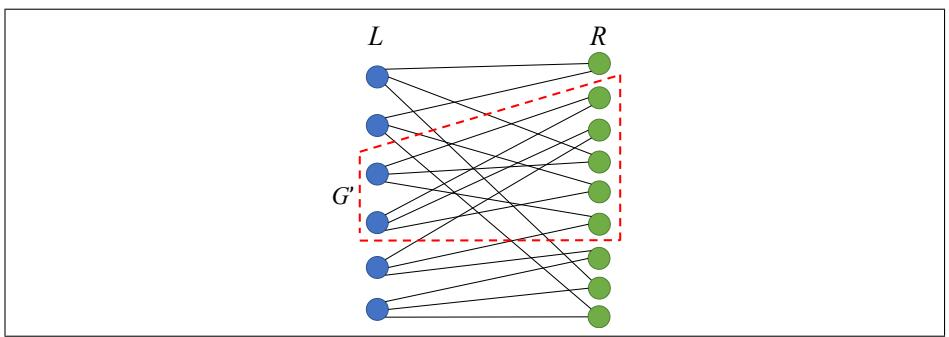
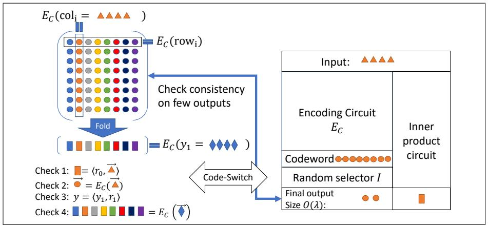
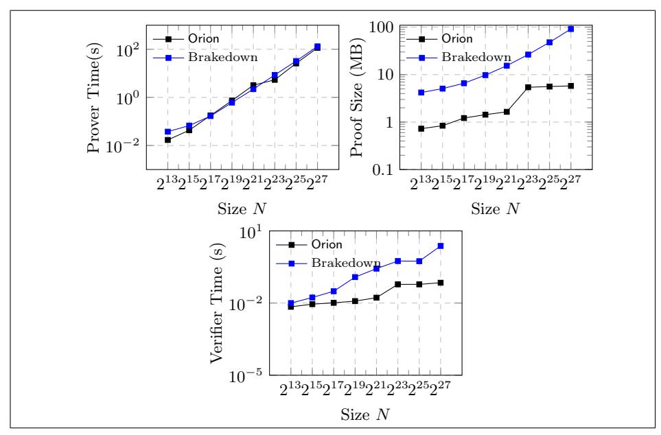
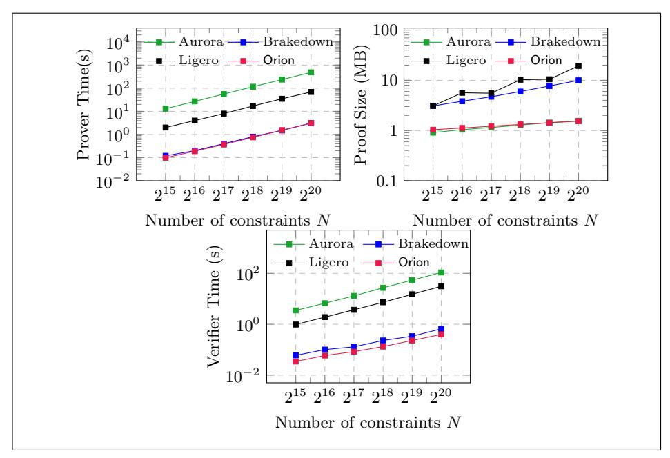

# Orion: Zero Knowledge Proof with Linear Prover Time\*

Tiancheng Xie<sup>1</sup>, Yupeng Zhang<sup>2</sup>, and Dawn Song<sup>1</sup>

<sup>1</sup> University of California, Berkeley {tianc.x,dawnsong}@berkeley.edu
<sup>2</sup> Texas A&M University zhangyp@tamu.edu

Abstract. Zero-knowledge proof is a powerful cryptographic primitive that has found various applications in the real world. However, existing schemes with succinct proof size suffer from a high overhead on the proof generation time that is super-linear in the size of the statement represented as an arithmetic circuit, limiting their efficiency and scalability in practice. In this paper, we present Orion, a new zero-knowledge argument system that achieves O(N) prover time of field operations and hash functions and  $O(\log^2 N)$  proof size. Orion is concretely efficient and our implementation shows that the prover time is 3.09s and the proof size is 1.5MB for a circuit with  $2^{20}$  multiplication gates. The prover time is the fastest among all existing succinct proof systems, and the proof size is an order of magnitude smaller than a recent scheme proposed in Golovney et al. 2021.

In particular, we develop two new techniques leading to the efficiency improvement. (1) We propose a new algorithm to test whether a random bipartite graph is a lossless expander graph or not based on the small set expansion problem. It allows us to sample lossless expanders with an overwhelming probability. The technique improves the efficiency and/or security of all existing zero-knowledge argument schemes with a linear prover time. (2) We develop an efficient proof composition scheme, code switching, to reduce the proof size from square root to polylogarithmic in the size of the computation. The scheme is built on the encoding circuit of a linear code and shows that the witness of a second zero-knowledge argument is the same as the message in the linear code. The proof composition only introduces a small overhead on the prover time.

<sup>\*</sup> In the previous version, there was a mistake in the proof of the expander testing algorithm based on the densets sub-graph algorithm. In particular, in Case 2 of Theorem 2 in the original version, the density  $\frac{|E'|+c}{|V'|+1} > \frac{|E'|}{|V'|}$  only holds when  $c > \frac{|E'|}{|V'|}$ , or |V'| > |E'|, which was not the case for lossless expanders. In this version, we propose a different algorithm based on the small set expansion problem to identify lossles expander graphs with a negligible soundness error in Section 3. We thank Quang Dao and Xifan Yu, Weijie Wang, Charalampos Papamanthou for pointing out the mistake.

### 1 Introduction

Zero-knowledge proof (ZKP) allows a prover to convince a verifier that a statement is valid, without revealing any additional information about the prover's secret witness of the statement. Since it was first introduced in the seminal paper by Goldwasser, Micali and Rackoff [GMR89], ZKP has evolved from a purely theoretical interest to a concretely efficient cryptographic primitive, leading to many real-world applications in practice. It has been widely used in blockchains and cryptocurrencies to achieve privacy (Zcash [BCG<sup>+</sup>14, zca]) and to improve scalability (zkRollup [zkr]). More recently, it also found applications in zero-knowledge machine learning [ZFZS20,LKKO20,LXZ21,FQZ<sup>+</sup>21, WYX<sup>+</sup>21], zero-knowledge program analysis [FDNZ21], and zero-knowledge middlebox [GAZ<sup>+</sup>22].

There are three major efficiency measures in ZKP: the overhead of the prover to generate the proof, which is referred to as the prover time; the total communication between the prover and the verifier, which is called the *proof size*; and the time to verify the proof, which is called the verifier time. Despite its recent progress, the efficiency of ZKP is still not good enough for many applications. In particular, the prover time is one of the major bottlenecks preventing existing ZKP schemes from scaling to large statements. As pointed out by Golovnev et al. in [GLS<sup>+</sup>], to prove a statement that can be modeled as an arithmetic circuit with N gates, existing schemes with succinct proof size either perform a fast Fourier transform (FFT) due to the Reed-Solomon code encodings or polynomial interpolations, or a multi-scalar exponentiation due to the use of discrete-logarithm assumptions or bilinear maps, over a vector of size O(N). The former takes  $O(N \log N)$  field additions and multiplications and the latter takes  $O(N \log |\mathbb{F}|)$  field multiplications, where  $|\mathbb{F}|$  is the size of the finite field. With the Pippenger's algorithm [Pip76], the complexity of the multi-scalar exponentiation can be improved to  $O(N \log |\mathbb{F}|/\log N)$ , which is still super-linear as  $\log |\mathbb{F}| = \omega(\log N)$  to ensure security. These operations are indeed the dominating cost of the prover time both asymptotically and concretely. See Section 1.3 for more discussions about existing ZKP schemes categorized by the underlying cryptographic techniques.

The only exceptions in the literature are schemes in [BCG<sup>+</sup>17,BCG20,BCL22, GLS<sup>+</sup>]. Bootle et al. [BCG<sup>+</sup>17] proposed the first ZKP scheme with a prover time of O(N) field operations and a proof size of  $O(\sqrt{N})$  using a linear-time encodable error-correcting code. The proof size is later improved to  $O(N^{1/c})$  for any constant c via a tensor code in [BCG20], and then to  $\operatorname{polylog}(N)$  via a generic proof composition with a probabilistic checkable proof (PCP) in [BCL22]. These schemes are mainly for theoretical interests and do not have implementations with good concrete efficiency. Recently, Golovnev et al. [GLS<sup>+</sup>] proposed a ZKP scheme based on the techniques in [BCG20] by instantiating the linear-time encodable code with a randomized construction. However, the security guarantee (soundness error) is only inverse polynomial in the size of the circuit, instead of negligible. Moreover, the proof size of the implemented scheme is  $O(\sqrt{N})$ 

<span id="page-2-0"></span>

|                       | Prover time | Proof size    | Verifier time* | Soundness error        | Concrete efficiency |
|-----------------------|-------------|---------------|----------------|------------------------|---------------------|
| [BCG <sup>+</sup> 17] | O(N)        | $O(\sqrt{N})$ | O(N)           | negl(N)                | Х                   |
| [BCG20]               | O(N)        | $O(N^{1/c})$  | $O(N^{1/c})$   | negl(N)                | Х                   |
| [BCL22]               | O(N)        | polylog(N)    | polylog(N)     | negl(N)                | Х                   |
| [GLS <sup>+</sup> ]   | O(N)        | $O(\sqrt{N})$ | $O(\sqrt{N})$  | $O(\frac{1}{poly(N)})$ | ✓                   |
| our scheme            | O(N)        | $O(\log^2 N)$ | $O(\log^2 N)$  | negl(N)                | <b>√</b>            |

Table 1: Comparison to existing ZKP schemes with linear prover time. N is the size of the circuit/R1CS and  $c \geq 2$  is a constant. \* The verifier time is achieved in the preprocessing setting. In addition, the scheme in [GLS<sup>+</sup>] achieves  $O(\sqrt{N})$  verifier for structured circuits in the non-preprocessing setting.

(more details are presented in Section 1.3). Therefore, the following question still remains open:

Can we construct a concretely efficient ZKP scheme with O(N) prover time and  $\operatorname{polylog}(N)$  proof size?

#### 1.1 Our Contributions

We answer the question above positively in this paper by proposing a new ZKP scheme. In particular, our contributions include:

- First, we propose a random construction of the linear-time encodable code that has a constant relative distance with overwhelming probability. Such a code was used in all existing linear-time ZKP schemes [BCG<sup>+</sup>17, BCG20, BCL22, GLS<sup>+</sup>] and thus our new construction also improves their efficiency. The key technique is an algorithm to test whether a random graph is a good expander graph based on the small set expansion problem.
- Second, we propose a new reduction that achieves a proof size of  $O(\log^2 N)$  efficiently. Our technique is a proof composition named "code switching" proposed in [RR20]. We develop an efficient instantiation using the encoding circuit of the linear-time encodable code, which reduces the proof size of the schemes in [BCG20,GLS<sup>+</sup>] from  $O(\sqrt{N})$  to  $O(\log^2 N)$  with a small overhead on the prover time.
- Finally, we implement our new ZKP scheme, Orion, and evaluate it experimentally. On a circuit with 2<sup>20</sup> gates (rank-1-constraint-system (R1CS) with 2<sup>20</sup> constraints), the prover time is 3.09s, the proof size is 1.5 MBs and the verifier time is 70ms. Orion has the fastest prover time among all existing ZKP schemes in the literature. The proof size is 6.5× smaller than the system in [GLS<sup>+</sup>]. The scheme is plausibly post-quantum secure and can be made non-interactive via the Fiat-Shamir heuristic [FS86].

Table 1 shows the comparison between our scheme and existing schemes with linear prover time and succinct proof size.

**Verifier time.** The verifier time in Table 1 is achieved in the preprocessing setting (holographic proofs [CHM<sup>+</sup>20]). As all the schemes do not have a trusted setup, their verifier time is O(N) in the worst case, as the verifier has to read the

<span id="page-3-0"></span>

Fig. 1: An example of lossless expander.  $k=6, k'=9, g=3, \delta=1, \epsilon=\frac{1}{6}$ 

description of the circuit/R1CS. In the preprocessing setting, the verifier time becomes sublinear with the commitment of an indexer describing the circuit. This is the best that can be achieved, and our scheme has a  $O(\log^2 N)$  verifier time in this setting using the techniques in [Set20]. In addition, the scheme in [GLS<sup>+</sup>] can also achieve a verifier time of  $O(\sqrt{N})$  in the non-preprocessing setting if the circuit/R1CS is structured, i.e., the description of the circuit can be computed in sublinear time. Our scheme has an  $O(\sqrt{N})$  verifier in this case, but not  $O(\log^2 N)$ . This is because the encoding circuit we use in the proof compositing is of size  $O(\sqrt{N})$  and is not structured.

#### 1.2 Technical Overview

Testing expander graphs. All existing ZKP schemes with linear prover time and succinct proof size [BCG<sup>+</sup>17,BCG20,BCL22,GLS<sup>+</sup>] use linear-time encodable codes with a constant relative distance proposed in [Spi96, DI14, GLS<sup>+</sup>], which in turn all rely on the existence of good expander graphs. In a good expander graph, any subset of vertices expands to a large number of neighbors. Figure 1 shows an example of a bipartite graph where any subset of vertices on the left of size 2 expands to at least 5 vertices on the right. See Section 2.1 for formal definitions and constructions. However, how to construct such good expanders remain unclear in practice. Explicit constructions [CRVW02] have large hidden constants in the complexity and thus are not practical. A random graph tends to have good expansion, but the probability that a random graph is not a good expander is inverse polynomial in the size of the graph. The code constructed from a non-expanding graph does not have a good minimum distance, making the ZKP scheme insecure. Therefore, a randomly sampled graph is not good for cryptographic applications.

In this paper, we propose an algorithm to efficiently test whether a random graph is a good expander or not. With the new testing algorithm, we are able to re-sample the random graph until it passes the test, obtaining a good expander with an overwhelming probability and boosting the soundness error of the ZKP scheme to be negligible. The testing algorithm is based on the small set bipartite

vertex expansion problem [\[CDM17\]](#page-29-7), which can be reduced to the Minimum s-Union problem [\[CDK](#page-29-8)+18], finding s-sets from k sets minimizing the size of their union. The problem is NP-hard for s = O(k), but we observe that in order to achieve a negligible soundness error, it suffices to search for very small sets with s ≤ log log k. In order to design a polynomial time algorithm, we rely on two observations of random bipartite graphs: (1) if there exist a non-expanding sub-graph, there has to be at least one that is connected (Lemma [4\)](#page-14-0); (2) with high probability, a vertex in the right set R has at most O(log k) neighbors (Lemma [5\)](#page-14-1). With these two observations, we are able to bound the search space of each vertex v ∈ L. That is, the total number of connected sub-graphs with ≤ log log k vertices in L containing v is only O((log k) log log k ). Therefore, we can enumerate all such sub-graphs for every vertex v ∈ L to see if there is a non-expanding one, and the complexity is o(k 2 log log k). The formal algorithm, theorem and proofs are presented in Section [3.](#page-11-0)

Proof composition via code-switching. With the expander graph sampled above and the corresponding linear code, we are able to build efficient ZKP schemes following the approaches in [\[BCG](#page-28-1)+17, [BCG20,](#page-28-2) [GLS](#page-30-3)+]. However, the proof size is O(N<sup>1</sup>/c) instead of polylog(N). To reduce the proof size, a common technique in the literature is proof composition. Instead of sending the proof directly to the verifier, the prover uses a second ZKP scheme to show that the proof of the first ZKP is indeed valid. In particular, in [\[BCG](#page-28-1)<sup>+</sup>17[,BCG20,](#page-28-2)[GLS](#page-30-3)<sup>+</sup>], the proof consists of several codewords of the linear-time encodable code, and the checks can be represented as inner products between the messages in the codewords and some public vectors.

Unfortunately, we do not have a second ZKP scheme based on the lineartime encodable code with a polylog(N) proof size to prove inner products. If we had it, we would already be able to build a ZKP scheme with polylog(N) proof size in the first place. Instead, we rely on the fact that the proof consists of the codewords of the linear code and construct the second ZKP scheme as follows. One component of the second ZKP scheme is the encoding circuit of the lineartime encodable code. It takes the witness of the second ZKP scheme, encodes it and outputs several random locations of the codeword. The verifier checks that these random locations are the same as the proof of the first ZKP scheme, without receiving the entire proof. By the distance of the linear-time encodable code, we show that the witness of the second ZKP must be the same as the message in the proof of the first ZKP with overwhelming probability. After that, the other component of the second ZKP checks the inner product relationship modeled as an arithmetic circuit. A similar proof composition was also used in [\[RR20\]](#page-30-5). We view our approach using the encoding circuit as a variant of the proof composition that is efficient in practice, and thus we inherit the name "code switching" from [\[RR20\]](#page-30-5).

With this idea, we can use any general-purpose ZKP scheme on arithmetic circuits with a polylog(N) proof size as the second ZKP scheme in the proof composition. The size of this circuit is only O( √ N), thus the second ZKP does not introduce any overhead on the prover time as long as its prover time is no more than quadratic. In our construction, we use the ZKP scheme in [\[ZXZS20\]](#page-31-5) as the second ZKP. The scheme is based on the interactive oracle proofs (IOP) and the witness is encoded using the Reed-Solomon code. Therefore, the technique is called code switching. The formal protocols are presented in Section [4.](#page-16-0)

### <span id="page-5-0"></span>1.3 Related Work

Zero-knowledge proof was introduced in [\[GMR89\]](#page-30-0) and generic constructions based on PCPs were proposed by Kilian [\[Kil92\]](#page-30-7) and Micali [\[Mic00\]](#page-30-8) in the early days. Driven by various applications mentioned in the introduction, there has been significant progress in efficient ZKP protocols and systems. Categorized by their underlying techniques, there are ZKP systems based on bilinear maps [\[PHGR13,](#page-30-9)[BSCG](#page-28-4)+13[,BFR](#page-28-5)+13[,BSCTV14,](#page-28-6)[CFH](#page-29-9)+15[,WSR](#page-31-6)+15[,FFG](#page-29-10)+16, [GKM](#page-29-11)+18, [MBKM19,](#page-30-10) [GWC19,](#page-30-11) [CHM](#page-29-4)+20, [KPPS20\]](#page-30-12), MPC-in-the-head [\[GMO16,](#page-30-13) [CDG](#page-28-7)+17,[AHIV17,](#page-27-0)[KKW18\]](#page-30-14), interactive proofs [\[ZGK](#page-31-7)+17a,[ZGK](#page-31-8)+17b[,WTS](#page-31-9)+18, [ZGK](#page-31-10)+18,[XZZ](#page-31-11)+19,[ZLW](#page-31-12)+21], discrete logarithm [\[BBB](#page-27-1)+18, [BFS20,](#page-28-8) [Set20,](#page-30-6) [SL20\]](#page-31-13), interactive oracle proofs (IOP) [\[BSCR](#page-28-9)+19,[BSBHR19,](#page-28-10)[ZXZS20,](#page-31-5)[BFH](#page-28-11)+20[,COS20,](#page-29-12) [BDFG20\]](#page-28-12), and lattices [\[BBC](#page-28-13)<sup>+</sup>18[,ESLL19,](#page-29-13)[BLNS20,](#page-28-14)[ISW21\]](#page-30-15). As mentioned in the introduction, these schemes perform either an FFT (such as schemes based on MPC-in-the-head and IOP) or a multi-scalar exponentiation (such as schemes based on discrete-log and bilinear pairing), making the complexity of the prover time super-linear in the size of the circuit.

With the techniques proposed in [\[XZZ](#page-31-11)<sup>+</sup>19,[ZLW](#page-31-12)<sup>+</sup>21], the prover time of the schemes based on the interactive proofs (the GKR protocol [\[GKR08\]](#page-29-14)) is linear if the size of the input is significantly smaller than the size of the circuit. However, the goal of this paper is to make the prover time strictly linear without such a requirement, and our polynomial commitment scheme can also be plugged into these schemes to improve their efficiency.

Schemes with linear prover time. As mentioned before, schemes in [\[BCG](#page-28-1)<sup>+</sup>17, [BCG20,](#page-28-2)[BCL22](#page-28-3)[,GLS](#page-30-3)<sup>+</sup>] are the only candidates in the literature with linear prover time and succinct proof size for arithmetic circuits. They all use linear-time encodable codes based on expander graphs and our first contribution applies to all of them. Moreover, our ZKP scheme is based on the polynomial commitment in [\[GLS](#page-30-3)<sup>+</sup>] and the tensor IOP in [\[BCG20\]](#page-28-2), and we improve the proof size to O(log<sup>2</sup> N) through a proof composition. In fact, the scheme in [\[BCL22\]](#page-28-3) also proposes a proof composition with the PCP in [\[Mie09\]](#page-30-16). However, the complexity of the PCP is polynomial time. That is why the scheme in [\[BCL22\]](#page-28-3) has to be built on the scheme in [\[BCG20\]](#page-28-2) with a proof size of O(N1/c) and is not concretely efficient, while our scheme can be built on top of the efficient scheme in [\[GLS](#page-30-3)<sup>+</sup>] with a proof size of O( √ N).

Finally, the scheme in [\[GLS](#page-30-3)<sup>+</sup>] samples a random graph to build the lineartime encodable code. The scheme achieves a soundness error of O( 1 poly(N) ) and the authors spent great efforts calculating parameters that achieve a concrete failure probability of 2 <sup>−</sup><sup>100</sup> for large circuits in practice [\[GLS](#page-30-3)<sup>+</sup>, Claim 2 and Figure 2]. Our sampling algorithm provides the provable security guarantee of a negligible soundness error for their scheme. Moreover, we improve the proof size from  $O(\sqrt{N})$  to  $O(\log^2 N)$  efficiently, solving an open problem left in [GLS<sup>+</sup>].

There are two recent schemes that achieve linear prover time for Boolean circuits [RR22,HR22]. We mainly focus on arithmetic circuits in this paper, but our techniques may also apply to these schemes to obtain efficient instantiations.

Schemes with linear proof size. Recently, there is a line of work constructing ZKP based on secure multiparty computation (MPC) techniques [WYKW20, DIO21, BMRS21, YSWW21] and these schemes have demonstrated fast prover time in practice. If one treats a block cipher (e.g., AES) as a constant-time operation because of the CPU instruction, these schemes indeed have a linear time prover (we are using a similar CPU instruction for the hash function SHA-256 in our scheme to achieve linear prover time). However, they have linear proof size in the size of the circuit, are inherently interactive, and are not publicly verifiable, which are not desirable in many applications. We mainly focus on non-interactive ZKP with succinct proof size and public verifiability in this paper.

Expander testing. Testing the properties of expander graphs is a deeply explored area in computer science. Many works [NS07, CS07, GR11] have proposed efficient testing algorithms without accessing the whole graph. However, these algorithms do not directly apply to our testing of lossless expander. For example, the algorithm in [NS07] based on random walks can differentiate good expanders from graphs that are far from expanders, while our scheme can differentiate whether a graph is a lossless expander or not with overwhelming probability. Of course our algorithm accesses the entire graph, which is fine in our application of linear-time encodable code.

There are also impossibility results on expander testing [KS16]. Due to different definitions of expansion, our testing algorithm cannot distinguish the cases in [KS16, Theorem 1.1] and thus it does not violate the impossibility results.

### 2 Preliminary

We use [N] to denote the set  $\{0,1,2,...,N-1\}$ . poly(N) means a function upper bounded by a polynomial in N with a constant degree . We use  $\lambda = \omega(\log N)$  to denote the security parameter, and  $\operatorname{negl}(N)$  to denote the negligible function in N, i.e.  $\operatorname{negl}(N) \leq \frac{1}{\operatorname{poly}(N)}$  for all sufficiently large N and any polynomial. Some papers define  $\operatorname{negl}(\lambda)$  as the negligible function. As  $\lambda$  is a function of N, they are essentially the same and  $\operatorname{negl}(N) \leq \frac{1}{2^{\lambda}}$ . "PPT" stands for probabilistic polynomial time.  $\langle A(x), B(y) \rangle(z)$  denotes an interactive protocol between algorithms A, B with x as the input of A, y as the input of B and z as the common input.

### <span id="page-6-0"></span>2.1 Linear-Time Encodable Linear Code

**Definition 1** (Linear Code). A linear error-correcting code with message length k and codeword length n is a linear subspace  $C \in \mathbb{F}^n$ , such that there exists an injective mapping from message to codeword  $E_C : \mathbb{F}^k \to C$ , which is called

the encoder of the code. Any linear combination of codewords is also a codeword. The rate of the code is defined as  $\frac{k}{n}$ . The distance between two codewords u, v is the hamming distance denoted as  $\Delta(u, v)$ . The minimum distance is  $d = \min_{u,v} \Delta(u, v)$ . Such a code is denoted as [n, k, d] linear code, and we also refer to  $\frac{d}{n}$  as the relative distance of the code.

Generalized Spielman code. In our construction, we use a family of linear codes that can be encoded in linear time and has a constant relative distance [Spi96, DI14, GLS<sup>+</sup>]. The code was first proposed by Daniel Spielman in [Spi96] over the Boolean alphabet. Druk and Ishai [DI14] generalized it to a finite field  $\mathbb{F}$ , and introduced a distance boosting technique to achieve the Gilbert-Varshamov bound [Gil52, Var57]. We only use the basic construction over  $\mathbb{F}$  without the distance boosting, and thus refer to it as the generalized Spielman code in this paper. The code relies on the existence of lossless expander graphs, which is defined below:

**Definition 2 (Lossless Expander [Spi96]).** Let G = (L, R, E) be a bipartite graph.  $0 < \epsilon < 1$  and  $0 < \delta$  be some constants. The vertex set consists of L and R, two disjoint subsets, henceforth the left and right vertex set. Let  $\Gamma(S)$  be the neighbor set of some vertex set S. We say G is an (k, k'; g)-lossless expander if  $|L| = k, |R| = k' = \alpha k$  for some constant  $\alpha$ , and the following property hold:

- 1. Degree: The degree of every vertex in L is g.
- <span id="page-7-1"></span>2. Expansion:  $|\Gamma(S)| \ge (1 - \epsilon)g|S|$  for every  $S \subseteq L$  with  $|S| \le \frac{\delta|L|}{a}$ .

Intuitively speaking, a lossless expander has very strong expansion. As the degree of each left vertex is g, a set of |S| left vertices have at most g|S| neighbors, while the second condition requires that every set expands to at least  $(1-\epsilon)g|S|$  vertices for a small constant  $\epsilon$ . Meanwhile, as the right vertext set has  $|R| = \alpha k$  vertices, such an expansion is not possible if  $|S| > \frac{\alpha k}{(1-\epsilon)g}$ , thus there is a condition  $|S| \leq \frac{\delta k}{g}$  bounding the size of S. An example is shown in Figure 1.

Construction of generalized Spielman code. With the lossless expander, we give a brief description of the generalized Spielman code. Let G = (L, R, E) be a lossless expander with  $|L| = 2^t, |R| = 2^{t-1}$ . Let  $A_t$  be a  $2^t \times 2^{t-1}$  matrix where  $A_t[i][j] = 1$  if there is an edge i, j in G for  $i \in [2^t], j \in [2^{t-1}]$ ; otherwise  $A_t[i][j] = 0$ . The generalized Spielman code is constructed as follows:

- 1. Let  $E_C^t(x)$  be the encoder function of input length  $|x| = 2^t$ , and its output will be a codeword of size  $2^{t+2}$ . We use  $E_C$  to denote the encoder function when length is clear.
- 2. If  $|x| \leq n_0$  then directly output x, for some constant  $n_0$ .
- <span id="page-7-0"></span>3. Compute  $m_1 = xA_t$ . Each entry of  $m_1$  can be viewed as a vertex in R, and value of each vertex is the summation of its neighbors in L. The length of  $m_1$  is  $2^{t-1}$ .
- 4. Recursively apply the encoder  $E_C^{t-1}$  on  $m_1$ , let  $c_1 = E_C^{t-1}(m_1)$ .

- <span id="page-8-0"></span>5. Compute  $c_2 = c_1 A_{t+1}$ .
- <span id="page-8-1"></span>6. Output  $x \odot c_1 \odot c_2$  as the codeword of size  $2^{t+2}$ .  $\odot$  denotes concatenation.

Lemma 1 (Generalized Spielman code, [DI14]). Given a family of lossless expander, that achieves  $(1 - \epsilon)g|S|$  expansion with  $|S| \leq \frac{\delta|L|}{g}$ , for input size k, the generalized Spielman code is a  $[4k, k, \frac{\delta}{8g}k]$  linear code over  $\mathbb{F}$ .

The code in [GLS<sup>+</sup>] is a variant of generalized Spielman code. In their construction, random weights are assigned to each edge of lossless expander at line 3, 5. The output at line 6 is randomized as  $(x \otimes r) \odot c_1 \odot c_2$ , where  $\otimes$  denotes element-wise multiplication and r is a random vector.

<span id="page-8-2"></span>**Definition 3 (Tensor code).** Let C be a [n, k, d] linear code, the tensor code  $C^{\otimes 2}$  of dimension 2 is the linear code in  $\mathbb{F}^{n^2}$  with message length  $k^2$ , codeword length  $n^2$ , and distance nd. We can view the codeword as a  $n \times n$  matrix. We define the encoding function below:

- 1. A message of length  $k \times k$  is parsed as a  $k \times k$  matrix. Each row of the matrix is encoded using  $E_C$ , resulting in a codeword  $C_1$  of size  $k \times n$ .
- 2. Each column of  $C_1$  is then encoded again using  $E_C$ . The result  $C_2$  of size  $n \times n$  is the codeword of the tensor code.

### <span id="page-8-3"></span>2.2 Collision-Resistant Hash Function and Merkle Tree

**Definition 4.** A commitment scheme is a tuple of algorithms  $\mathsf{Setup}(1^\lambda) \to \mathsf{ck}, \mathsf{Commit}(\mathsf{ck}, m, r) \to \mathsf{com}, \mathsf{Open}(\mathsf{ck}, \mathsf{com}, m, r) \to \{0, 1\}$  such that:

- Correctness. For any message m,

$$\Pr[\mathsf{Setup}(1^{\lambda}) \to \mathsf{ck}, \mathsf{Commit}(\mathsf{ck}, m, r) \to \mathsf{com}, \mathsf{Open}(\mathsf{ck}, \mathsf{com}, m, r) \to 1] = 1$$

- **Binding**. For any PPT adversary A, the following probability is negl(N):

$$\Pr \begin{bmatrix} \mathsf{Setup}(1^\lambda) \to \mathsf{ck} & m \neq m' \\ \mathcal{A}(\mathsf{ck} \to (\mathsf{com}, m, r, m', r') : & \land \mathsf{Open}(\mathsf{ck}, \mathsf{com}, m, r) \to 1 \\ & \land \mathsf{Open}(\mathsf{ck}, \mathsf{com}, m', r') \to 1) \end{bmatrix}$$

- **Hiding**. For any Setup( $1^{\lambda}$ )  $\rightarrow$  ck, for all m, m', the following two distributions are statistically close:

$$\mathsf{Commit}(\mathsf{ck}, m, r) \approx \mathsf{Commit}(\mathsf{ck}, m', r')$$

Let  $H:\{0,1\}^{2\lambda}\to\{0,1\}^{\lambda}$  be a hash function. A Merkle Tree is a data structure that allows one to commit to  $l=2^{\mathsf{dep}}$  messages by a single hash value h, such that revealing any bit of the message require  $\mathsf{dep}+1$  hash values.

A Merkle hash tree is represented by a binary tree of depth dep where l messages elements  $m_1, m_2, ..., m_l$  are assigned to the leaves of the tree. The values assigned to internal nodes are computed by hashing the value of its two child nodes. To reveal  $m_i$ , we need to reveal  $m_i$  together with the values on the path from  $m_i$  to the root. We denote the algorithm as follows:

- 1. h ← Merkle.Commit(m1, ..., ml).
- 2. (m<sup>i</sup> , πi) ← Merkle.Open(m, i).
- 3. {accept,reject} ← Merkle.Verify(π<sup>i</sup> , m<sup>i</sup> , h).

To achieve zero-knowledge, we requires the hash function to be hiding and we implicitly assumes for each hash function call on input x, we will append a randomness r.

### 2.3 Zero-Knowledge Arguments

An argument system for an NP relation R is a protocol between a computationally bounded prover P and a verifier V. At the end of the protocol V will be convinced that there exits a witness w such that (x, w) ∈ R for some public input x. We focus on arguments of knowledge which require the prover know the witness w. We formally define zero-knowledge as follows:

Definition 5 (View). We denote by View(⟨P, V⟩(x)) the view of V in an interactive protocol with P. Namely, it is the random variable (r, b1, b2, ..., bn, v1, v2, ..., vm) where r is V's randomness, b1, ..., b<sup>n</sup> are messages from V to P, and v1, ..., v<sup>m</sup> are messages from P to V.

<span id="page-9-0"></span>Definition 6. Let R be an NP relation. A tuple of algorithm (G,P, V) is a zero-knowledge argument of knowledge for R if the following holds.

– Correctness. For every pp output by G(1<sup>λ</sup> ) and (x, w) ∈ R,

$$\Pr[\langle \mathcal{P}(w), \mathcal{V}() \rangle (\mathsf{pp}, x) = \mathsf{accept}] = 1.$$

– Knowledge Soundness. For any PPT adversary P ∗ , there exists a PPT extractor ε such that for every pp output by G(1<sup>λ</sup> ) and any x, the following probability is negl(N):

$$\Pr[\langle \mathcal{P}^*(), \mathcal{V}() \rangle (\mathsf{pp}, x) = \mathsf{accept}, (x, w) \notin \mathcal{R} | w \leftarrow \varepsilon(\mathsf{pp}, x, \mathsf{View}(\langle \mathcal{P}^*(), \mathcal{V}() \rangle (\mathsf{pp}, x)))]$$

– Zero knowledge. There exists a PPT simulator S such that for any PPT algorithm V ∗ , (x, w) ∈ R, pp output by G(1<sup>λ</sup> ), it holds that

$$\mathsf{View}(\langle \mathcal{P}(w), \mathcal{V}^*() \rangle(x)) \approx \mathcal{S}^{\mathcal{V}^*}(\mathsf{pp}, x)$$

Where S V ∗ (x) denotes that S is given oracle accesses to V ∗ 's random tape.

We say that (G,P, V) is a succinct argument system if the total communication between P and V (proof size) is poly(λ, |x|, log |w|).

In addition, in our construction, we need a zero-knowledge argument that is a commit-and-prove SNARK (CP-SNARK) [\[CFQ19\]](#page-29-18) as a building block. Following the definition in [\[CFQ19\]](#page-29-18), the relationship is represented by a pair R = (ck, R) where ck is the commitment key generated by Setup(1<sup>λ</sup> ). R is over pairs (x, w) where x = (x, comw), w = (w, rw) and R holds if and only if Open(ck, comw, w, rw) = 1 ∧ R(x, w) = 1.

Definition 7 (Arithmetic circuit). An arithmetic circuit C over F and a set of variables x1, ..., x<sup>N</sup> is a directed acyclic graph as follows:

- 1. Each vertex is called a "gate". A gate with in-degree zero is an input gate and is labeled as a variable x<sup>i</sup> or a constant field element in F.
- 2. Other gates have 2 incoming edges. It calculates the addition or multiplication over the two inputs and output the result.
- 3. The size of the circuit is defined as the number of gates N.

# 2.4 Polynomial Commitment

A polynomial commitment consists of three algorithms:

- PC.Commit(ϕ(·)): the algorithm outputs a commitment R of the polynomial ϕ(·).
- PC.Prove(ϕ, ⃗x, R): given an evaluation point ϕ(⃗x), the algorithm outputs a tuple ⟨⃗x, ϕ(⃗x), π⃗x⟩, where π⃗x is the proof.
- PC.VerifyEval(π⃗x, ⃗x, ϕ(⃗x), R): given π⃗x, ⃗x, ϕ(⃗x), R, the algorithm checks if ϕ(⃗x) is the correct evaluation. The algorithm outputs accept or reject.

<span id="page-10-0"></span>Definition 8 ((Multivariate) Polynomial commitment). A polynomial commitment scheme has the following properties:

– Correctness. For every polynomial ϕ and evaluation point ⃗x, the following probability holds:

$$\Pr\left( \begin{array}{c} \mathsf{PC.Commit}(\phi) \to \mathcal{R} \\ \mathsf{PC.Prove}(\phi, \vec{x}, \mathcal{R}) \to \vec{x}, y, \pi \\ y = \phi(\vec{x}) \\ \mathsf{PC.VerifyEval}(\pi, \vec{x}, y, \mathcal{R}) \to \mathsf{accept} \end{array} \right) = 1$$

– Knowledge Soundness. For any PPT adversary P <sup>∗</sup> with PC.Commit<sup>∗</sup> , PC.Prove<sup>∗</sup> , there exists a PPT extractor E such that the probability below is negligible:

$$\Pr\left( \begin{array}{c} \mathsf{PC.Commit}^*(\phi^*) \to \mathcal{R}^* \\ \mathsf{PC.Prove}^*(\phi^*, \vec{x}, \mathcal{R}^*) \to \vec{x}, y^*, \pi^* : \phi^* \leftarrow \mathcal{E}(\mathcal{R}^*, \vec{x}, \pi^*, y^*) \land y^* \neq \phi^*(\vec{x}) \\ \mathsf{PC.VerifyEval}(\pi^*, \vec{x}, y^*, \mathcal{R}^*) \to \mathsf{accept} \end{array} \right)$$

– Zero-knowledge. For security parameter λ, polynomial ϕ, any PPT adversary A, there exists a simulator S = [S0, S1], we consider following two experiments:

```
RealA,ϕ(pp):
 1. R ← Commit(pp, ϕ)
 2. ⃗x ← A(R, pp)
 3. (⃗x, y, π) ← Prove(ϕ, ⃗x, R)
 4. b ← A(π, ⃗x, y, R)
 5. Output b
                                       IdealA,SA (pp):
                                        1. R ← S0(1λ
                                                       , pp)
                                        2. ⃗x ← A(R, pp)
                                        3. (⃗x, y, π) ← SA
                                                         1 (⃗x, pp), given oracle
                                           access to y = ϕ(⃗x)
                                        4. b ← A(π, ⃗x, y, R)
                                        5. Output b
```

For any PPT adversary A, two experiments are identically distributed:

$$\Pr[|\mathsf{Real}_{\mathcal{A},f}(\mathsf{pp}) - \mathsf{Ideal}_{\mathcal{A},\mathcal{S}^{\mathcal{A}}}(\mathsf{pp})| = 1] \le \mathsf{negl}(N)$$

# <span id="page-11-0"></span>3 Testing Algorithm for Lossless Expander

As explained above, the generalized Spielman code relies on the existence of loss-less expanders. On one hand, there are explicit constructions of lossless expanders in the literature [CRVW02]. However, there are large hidden constants in the complexity and the constructions are not practical. On the other hand, a random bipartite graph is a lossless expander with a high probability of  $1 - O(\frac{1}{\mathsf{poly}(k)})$ , where k is the size of the left vertex set in the bipartite graph. However, this is not good enough for cryptographic applications.

In this section, we propose a new approach to sample a lossless expander with a negligible failure probability. The key ingredient of our approach is a new algorithm to test whether a randomly sampled bipartite graph is a lossless expander or not. We begin the section by introducing the classical randomized construction of a lossless expander and its analysis.

### <span id="page-11-1"></span>3.1 Random Construction of Lossless Expander

As defined in Definition 2, a lossless expander graph is a g-left-regular bipartite graph G=(L,R,E). Wigderson et al. [HLW06, Lemma1.9] showed that a random bipartite graph is a lossless expander with a high probability. In particular, we have the following lemma:

**Lemma 2** ( [HLW06]). For fixed constant parameters  $g, \delta, \alpha, \epsilon$ , a random g-left-regular bipartite graph is a (k, k'; g)-lossless-expander with probability  $1 - O(\frac{1}{\mathsf{poly}(k)})$ .

*Proof.* Let G = (L, R, E) be a random bipartite graph with k vertices on the left and k' = O(k) vertices on the right, where each left vertex connects to a randomly chosen set of g vertices on the right.

Let s=|S| be the cardinality of a left subset of vertices  $S\subseteq L$  such that  $s\le \frac{\delta k}{g}$ , and let t=|T| be the cardinality of a right subset of vertices  $T\subseteq R$  such that  $t\le (1-\epsilon)gs$ . Let  $X_{S,T}$  be an indicator random variable for the event that all the edges from S connect to T. Then for a particular S, if  $\sum_{T\in R} X_{S,T}=0$ , then the number of neighboring vertices of S must be larger than  $(1-\epsilon)gs$ . Otherwise, if there exists a  $T\in R$  such that  $X_{S,T}=1$ , i.e., all edges from S connect to T, the graph is not a lossless expander. As the edges are sampled randomly, the probability of this non-expanding event is  $(\frac{t}{k'})^{sg}$ . Therefore, summing over all S and by the union bound, the probability of a non-expanding graph is:

$$\Pr[(\sum_{S,T} X_{S,T}) > 0] \le \sum_{S,T} \Pr[X_{S,T} = 1] = \sum_{S,T} (\frac{t}{k'})^{sg}$$

$$\le \sum_{s=2}^{\frac{\delta k}{g}} {k \choose s} {k' \choose t} (\frac{t}{k'})^{sg} \le \sum_{s=2}^{\frac{\delta k}{g}} {k \choose s} {k' \choose (1-\epsilon)gs} (\frac{(1-\epsilon)gs}{k'})^{sg}$$

Using the inequality  $\binom{k}{s} \leq (\frac{ke}{s})^s$ , the probability above is

<span id="page-12-0"></span>
$$\leq \sum_{s=2}^{\frac{\delta k}{g}} \left(\frac{ke}{s}\right)^s \left(\frac{k'e}{(1-\epsilon)gs}\right)^{(1-\epsilon)gs} \left(\frac{(1-\epsilon)gs}{k'}\right)^{sg} \\
= \sum_{s=2}^{\frac{\delta k}{g}} \left(\frac{ke}{s}\right)^s e^{(1-\epsilon)gs} \left(\frac{(1-\epsilon)gs}{k'}\right)^{\epsilon gs} \\
= \sum_{s=2}^{\frac{\delta k}{g}} e^{(1-\epsilon)gs+s} \cdot \left(\frac{k}{s}\right)^s \cdot \left(\frac{(1-\epsilon)gs}{k'}\right)^{\epsilon gs} \tag{1}$$

When  $s, \epsilon, g$  are constants and k' = O(k),  $e^{(1-\epsilon)gs+s}$  is a constant,  $(\frac{k}{s})^s$  is  $O(\mathsf{poly}(k))$ , and  $(\frac{(1-\epsilon)gs}{k'})^{\epsilon gs}$  is  $O(\frac{1}{\mathsf{poly}(k)})$ . Therefore, the overall upper bound is at least  $O(\frac{1}{\mathsf{poly}(k)})$ .

The derivation above shows that the probability that a random graph is not a lossless expander is upper-bounded by  $O(\frac{1}{\mathsf{poly}(k)})$ , which is not negligible. Furthermore, we show that the lower-bound of the non-expanding probability is also not negligible through a simple argument here.

We focus on the case where s is a constant. The number of all possible subgraphs induced by a left subset of vertices S is at most  $k'^{sg} = O(\mathsf{poly}(k))$ . That is, the size of the entire probability space is bounded by a polynomial. The number of non-expanding graphs is at least 1 (e.g., all edges from S connect to a single vertex in R). Therefore, the non-expanding probability is at least  $O(\frac{1}{\mathsf{poly}(k)})$ .

Lossless expander in [GLS<sup>+</sup>] As explained in Section 2.1, in [GLS<sup>+</sup>], the authors extended the generalized Spielman code by adding random weights to the edges in the bipartite graph. However, the graph still needs to be a lossless expander in order to achieve a constant relative distance, and the same issue above applies to their construction. In particular, as shown by [GLS<sup>+</sup>, Claim 2], the probability of not sampling a lossless expander is

$$2^{kH(15/k)+\alpha kH(19.2/(\alpha k))-15g\log\frac{\alpha k}{19.2}}$$

where  $H(x) = -x \log x - (1-x) \log(1-x)$ . We show that the probability above is not negligible. First, for any constant const,

$$\begin{split} xH(\mathsf{const}/x) &= x(-\frac{\mathsf{const}}{x}\log\frac{\mathsf{const}}{x} - (1-\frac{\mathsf{const}}{x})\log(\frac{x-\mathsf{const}}{x}) \\ &= (\mathsf{const}\log(x) - \mathsf{const}\log\mathsf{const}) + (1-\frac{\mathsf{const}}{x})\log(\frac{x-\mathsf{const}}{x}). \end{split}$$

By taking the limit, we have  $\lim_{x\to\infty}xH(\mathsf{const}/x)=(\mathsf{const}\log(x)-\mathsf{const}\log\mathsf{const})+1\times 0$ . Therefore,  $xH(\mathsf{const}/x)=O(\log x)$ . Applying this fact to the equation above,  $kH(15/k)+\alpha kH(19.2/(\alpha k))=O(\log k)$ , and  $-15g\log\frac{\alpha k}{19.2}=-O(\log k)$ . Therefore,  $2^{kH(15/k)+\alpha kH(19.2/(\alpha k))-15g\log\frac{\alpha k}{19.2}}$  is at least  $2^{-O(\log k)}=\frac{1}{\mathsf{poly}(k)}$ . The failure probability is similar to the upper bound in Equation 1.

### 3.2 Algorithm based on Small Set Expansion

To reduce the non-expanding probability of the random construction, we take a closer look at the equations above. Equation 1 shows that the probability that a random bipartite graph is a not lossless expander is upper bounded by  $\frac{1}{\mathsf{poly}(k)}$ . However, we observe that within the summation, the probability is actually negligible when s is large. In particular, if we decompose the summation in Equation 1 into two sums, one for  $2 \le s \le \log \log k$ , and the other for  $s \ge \log \log k$ , the second part is

<span id="page-13-0"></span>
$$\sum_{s=\log\log k}^{\frac{\delta k}{g}} e^{(1-\epsilon)gs+s} \cdot \left(\frac{k}{s}\right)^s \cdot \left(\frac{(1-\epsilon)gs}{k'}\right)^{\epsilon gs}.$$
 (2)

**Lemma 3.** Equation 2 is negligible if the following conditions are met:

<span id="page-13-1"></span>1. 
$$(1 - \epsilon)\delta + \frac{\delta}{g} + \frac{\delta}{g}\log(\frac{g}{\delta}) + \log(\frac{\delta}{\alpha})\epsilon\delta < -0.001,$$
  
2.  $\epsilon d > 2.$ 

Here -0.001 is just any small constant that is less than 0. We give a proof in Appendix A. To provide an intuition on how these parameters are set, we give an example here:  $\delta = \frac{1}{11}$ ,  $\epsilon = \frac{7}{16}$ , g = 16,  $k' = \frac{1}{2}k$ . We can verify the condition:

1. 
$$\epsilon g = 7 > 2$$
.  
2.  $(1 - \epsilon)\delta + \frac{\delta}{g} + \frac{\delta}{g}\log(\frac{g}{\delta}) + \log(\frac{\delta}{\alpha})\epsilon\delta = -0.009 < -0.001$ .

Sampling lossless expander with negligible failure probability. The observation above shows that the non-expanding probability is dominated by small sub-graphs with size  $2 \le s \le \log\log k$ . This actually matches our lower bound in Section 3.1, as there are only polynomially many such sub-graphs and there exist ones that do not expand. Therefore, in order to reduce the non-expanding probability, we propose a new algorithm that detects small sub-graphs of size  $s \le \log\log k$  that do not expand.

The problem is related to the Small Set Bipartite Vertex Expansion problem [\[CDM17\]](#page-29-7), which can further be reduced to the Minimum s-Union problem [\[CDK](#page-29-8)+18], finding s-sets from k sets minimizing the size of their union. The problem is NP-hard in general for s = O(k), but in our case we only consider very small sets with s ≤ log log k, and thus it is possible to have an algorithm in polynomial time.

Definition 9 (Very Small Set Expansion (VSSE)). Let G = (L, R, E) be a bipartite graph. We define the very small set expansion (VSSE) problem as distinguishing following two cases:

- 1. Non-expanding case: there exists a subset S ⊂ L with |S| ≤ log log k such that |Γ(S)| < (1 − ε)g|S|.
- 2. Expansion: for all subsets S ⊂ L with |S| ≤ log log k, |Γ(S)| ≥ (1 − ε)g|S|.

We introduce an algorithm for finding such a non-expanding sub-graph. We first demonstrate that if a non-expanding sub-graph exists, then among all such non-expanding sub-graphs, there must be at least one that is both non-expanding and connected. We will then show that this connected sub-graph can be identified using a search algorithm. We say that a graph is connected if there is a path from any point to any other point in the graph.

<span id="page-14-0"></span>Lemma 4. Let G = (L, R, E) be a bipartite graph. If there exists a subset S ⊂ L with |S| ≤ log log k such that |Γ(S)| < (1 − ε)g|S|, then there exists a connected sub-graph induced by S ′ ⊂ L with |S ′ | ≤ log log k and |Γ(S ′ )| < (1 − ε)g|S ′ |.

Proof. If S itself is connected, then we have finished the proof. Otherwise, we divide S into two disjoint parts S0, S<sup>1</sup> such that the induced sub-graphs S<sup>0</sup> ∪ Γ(S0), S<sup>1</sup> ∪ Γ(S1) are not connected. Let the expansion of S<sup>0</sup> be eS<sup>0</sup> = |Γ(S0)| |S0| , the expansion of S<sup>1</sup> be eS<sup>1</sup> = |Γ(S1)| |S1| , then the expansion of S is e<sup>S</sup> = |Γ(S)| <sup>|</sup>S<sup>|</sup> = |Γ(S0)|+|Γ(S1)| |S0|+|S1| , as the two sub-graphs are not connected. Next, we show that eS<sup>0</sup> ≤ e<sup>S</sup> or eS<sup>1</sup> ≤ e<sup>S</sup> by contradiction. Suppose both eS<sup>0</sup> and eS<sup>1</sup> are larger than eS. Then we have

$$e_S(|S_0| + |S_1|) = |\Gamma(S_0)| + |\Gamma(S_1)|$$
  
 
$$\Rightarrow (e_S|S_0| - |\Gamma(S_0)|) + (e_S|S_1| - |\Gamma(S_1)|) = 0$$

By the assumption, |Γ(S0)| = eS<sup>0</sup> |S0| > eS|S0|, thus eS|S0| − |Γ(S0)| < 0. Similarly, eS|S1| − |Γ(S1)| < 0 as well, and their sum cannot equal to 0 as in the equation above. Therefore, e<sup>S</sup><sup>0</sup> ≤ e<sup>S</sup> or e<sup>S</sup><sup>1</sup> ≤ eS, i.e., at least one of the sub-graph is non-expanding.

We can repeat this process on the non-expanding sub-graph until we find a connected one. ⊓⊔

<span id="page-14-1"></span>In order to find such a connected sub-graph that is non-expanding, we need to bound the size of such sub-graphs and thus the search space.

#### <span id="page-15-0"></span>Algorithm 1 Searching Non-expanding Set

```
1: Let G = (L, R, E) be the random bipartite graph. If \exists v \in R with degree larger
   than \frac{g}{h} + 10 \ln k, abort.
```

2: for each  $v \in L$  do

find set  $D \in L$  such that:

 $-\forall u \in D$ , the minimum distance between u and v is  $\leq 2 \log \log k$ .

 $- \forall u \in L \setminus D$ , the minimum distance between u and v is  $> 2 \log \log k$ .

for All  $S \subseteq D$  and  $|S| < \log \log k$  do

5: if  $|\Gamma(S)| < (1-\varepsilon)g|S|$  then

return Found

7: return Not Found

**Lemma 5.** For a random g-left regular bipartite graph G = (L, R, E), the degree of every vertex in R is at most  $10 \ln k$  with high probability for constant g, k = |L|and  $\alpha k = |R|$ .

*Proof.* Consider a vertex in R, let a sequence of random variables  $X_i$  be indicator function of the edge between this vertex and the i-th vertex in L. Then for a random bipartite graph,  $X_i$  is a Bernoulli random variable with probability  $\frac{g}{\alpha k}$ . Let  $X = \sum_{i=1}^{k} X_i$ , by the Chernoff bound,

$$\Pr(\frac{X}{k} \ge \frac{g}{\alpha k} + \frac{10 \ln k}{k}) \le e^{-D(\frac{g}{\alpha k} + \frac{10 \ln k}{k} || \frac{g}{\alpha k})k},$$

where  $D(x||y)=x\ln\frac{x}{y}+(1-x)\ln\frac{1-x}{1-y}$  is the Kullback-Leibler (KL) divergence. By the inequality of the KL divergence, we have

$$D(\frac{g}{\alpha k} + \frac{10 \ln k}{k} || \frac{g}{\alpha k}) \ge \frac{(\frac{g}{\alpha k} + \frac{10 \ln k}{k} - \frac{g}{\alpha k})^2}{2(\frac{g}{\alpha k} + \frac{10 \ln k}{k})} = \frac{(\frac{10 \ln k}{k})^2}{2(\frac{g}{\alpha k} + \frac{10 \ln k}{k})} = \frac{(10 \ln k)^2}{2(\frac{gk}{\alpha} + 10k \ln k)}$$

Therefore,

$$\Pr(\frac{X}{k} \ge \frac{g}{\alpha k} + \frac{10 \ln k}{k}) \le e^{-D(\frac{g}{\alpha k} + \frac{10 \ln k}{k} || \frac{g}{\alpha k})k}$$
$$\le e^{-\frac{(10 \ln k)^2}{2(\frac{g}{\alpha} + 10 \ln k)}} \le e^{-\frac{10}{3} \ln k} = k^{-\frac{10}{3}}$$

when k is large, as  $2(\frac{g}{\alpha} + 10 \ln k) < 3 \cdot 10 \ln k$ .

Finally, by the union bound, the probability that there exists a vertex in Rwith degree larger than  $\frac{g}{\alpha} + 10 \ln k$  is less than or equal to

$$\alpha k \cdot \Pr[X \ge \frac{g}{\alpha} + 10 \ln k] = \alpha k^{-\frac{7}{3}}.$$

With these two lemmas, we present our search algorithm in Algorithm 1. In the algorithm, we use a search algorithm to find a non-expanding connected component. First, we enumerate the vertex  $v \in L$ . Suppose v is a vertex belonging to the non-expanding connected component. Then we find the subset D that includes all vertices in L within distance  $2\log\log k$  of v. The minimum distance between two vertices is defined as the number of edges in the shortest path between them. As we are trying to find non-expanding connected sub-graphs of size  $\leq \log\log k$ , any connected sub-graph G' = (L', R', E') with size  $|L'| \leq \log\log k$  containing v must be included in D, as the minimum distance between any vertex in L' and v cannot be more than  $2\log\log k$  in a bipartite graph. Finally, we enumerate all possible subsets of size  $\leq \log\log k$  in D to find if there is a non-expanding sub-graph.

**Theorem 1.** Algorithm 1 is a polynomial time algorithm for the VSSE problem on a random g-left regular bipartite graph with constant g, |L| = k and  $|R| = \alpha k$ .

To compute the complexity of the algorithm,

- 1. The size of D is at most  $(11g \log k)^{\log \log k}$ , as one vertex in L can at most expand to  $g \cdot (\frac{g}{\alpha} + 10 \log k) < 11g \log k$  vertices in L in two edges  $L \to R \to L$ , and there are  $2 \log \log k$  edges.
- 2. By Stirling's approximation, the number of possible subsets  $S\subseteq D$  and  $|S|\leq \log\log k$  is at most

$$\sum_{i=1}^{\log\log k} \binom{|D|}{i} \le \log\log k \left(\frac{e(11g\log k)^{\log\log k}}{\log\log k}\right)^{\log\log k} = O(\log k^{\log\log^2 k}) = o(k).$$

3. For each S, finding its neighbor set takes at most  $O(\log \log k)$  time.

Therefore, the total running time for all  $v \in |L|$  is  $o(k^2 \log \log k)$ .

Algorithm 1 gives a way to test whether a random graph is a lossless expander. As discussed in lemma 3, when  $s \ge \log \log k$ , the non-expanding probability is negligible. Thus, it suffices to test whether there is a sub-graph of size  $s < \log \log k$  that does not expand, which can be found by Algorithm 1 as long as the degree of vertices in R is bounded. As shown by Lemma 5, it happens with high probability, thus the expected running time of the testing algorithm is polynomial as well. As long as the testing algorithm outputs Notfound, the graph is a lossless expander with an overwhleming probability by Lemma 3.

### <span id="page-16-0"></span>4 Our new zero-knowledge argument

In this section, we present the construction of our zero-knowledge argument scheme. Many existing papers show that one can build zero-knowledge arguments from polynomial commitments [WTS<sup>+</sup>18,ZXZS20,CHM<sup>+</sup>20,Set20,GWC19,BFS20,GLS<sup>+</sup>]. We adopt the same technique and focus on constructing a polynomial commitment because of its simplicity and efficiency, but our approach can be applied directly to the zero-knowledge arguments for R1CS in [BCG20,BCL22] to improve the prover time and the proof size. We start the section by describing the polynomial commitment scheme in [GLS<sup>+</sup>] based on the tensor IOP protocol in [BCG20] with a proof size of  $O(\sqrt{N})$ .

#### 4.1 Polynomial commitment from tensor query

In [GLS<sup>+</sup>], Golovnev et al. observed that a polynomial evaluation can be expressed as a tensor product. Here we only consider multilinear polynomial commitments, which can be used to construct zero-knowledge arguments based on the approaches in [ZGK<sup>+</sup>17b,WTS<sup>+</sup>18,XZZ<sup>+</sup>19,ZXZS20,Set20], but our scheme can be extended to univariate polynomials. In particular, given a multilinear polynomial  $\phi$ , its evaluation on input vector  $x_0, x_1, ..., x_{\log N-1}$  is:

$$\phi(x_0, x_1, ..., x_{\log N - 1}) = \sum_{i_0 = 0}^{1} \sum_{i_1 = 0}^{1} ... \sum_{i_{\log N - 1} = 0}^{1} w_{i_0 i_1 ... i_{\log N - 1}} x_0^{i_0} x_1^{i_1} ... x_{\log N - 1}^{i_{\log N - 1}}.$$

The degree of each variable is either 0 or 1 by the definition of a multilinear polynomial, and thus there are N monomials and coefficients with  $\log N$  variables. We let  $i = \sum_{j=0}^{\log N-1} 2^j i_j$ , that is,  $i_0 i_1 ... i_{\log N-1}$  is the binary representation of number i. We use w to denote the coefficients where  $w[i] = w_{i_0 i_1 ... i_{\log N-1}}$ . Similarly we define  $X_i = x_0^{i_0} x_1^{i_1} ... x_{\log N-1}^{i_{\log N-1}}$ . Let  $k = \sqrt{N}$ ,  $r_0 = \{X_0, X_1, ..., X_{k-1}\}, r_1 = \{X_{0 \times k}, X_{1 \times k}, X_{2 \times k}, ..., X_{(k-1) \times k}\}$ . Then we have  $X = r_0 \otimes r_1$ . The polynomial evaluation is reduced to a tensor product  $\phi(x_0, x_1, ..., x_{\log N-1}) = \langle w, r_0 \otimes r_1 \rangle$ . Using the tensor IOP protocol in [BCG20], one can build a polynomial commitment [GLS<sup>+</sup>] and we present the protocol in Protocol 2 for completeness. Here we reuse the notation k as it is exactly the message length of the linear code.

As shown in the protocol, to commit to a polynomial, PC.Commit parses the coefficients w as a  $k \times k$  matrix and encodes it using the tensor code with dimension 2 as defined in Definition 3. Then the algorithm constructs a Merkle tree commitment for every column  $C_2[:,i]$  of the  $n \times n$  codeword  $C_2$ , and finally builds another Merkle tree on top of their roots as the final commitment.

To answer the tensor query, there are two checks in the protocol: a proximity check and a consistency check. The proximity check ensures that the matrix in the commitment is indeed close to a codeword of the tensor code. The consistency check ensures that  $y = \langle r_0 \otimes r_1, w \rangle$  assuming  $\mathcal{R}$  is a commitment of a codeword. Proximity check. The proximity check has two steps. First, the verifier sends a random vector  $\gamma_0$  to the prover, and the prover computes the linear combination of all rows of  $C_1$  and w with  $\gamma_0$ , as in Step 8 in Protocol 2. Because of the property of a linear code,  $c_{\gamma_0}$  is a codeword with message  $y_{\gamma_0}$ , and this step is referred to as the "fold" operation in [BCG20]. Second, the prover shows that  $c_{\gamma_0}$  is indeed computed from the committed tensor codeword. To do so, the verifier randomly

as the "fold" operation in [BCG20]. Second, the prover shows that  $c_{\gamma_0}$  is indeed computed from the committed tensor codeword. To do so, the verifier randomly selects t columns and the prover opens them with their Merkle tree proofs. The verifier checks that the inner product between each column and the random vector  $\gamma_0$  is equal to the corresponding element of  $c_{\gamma_0}$  (Step 15). As shown in [BCG<sup>+</sup>17, BCG20], if the linear code has a constant relative distance, the committed matrix is close to a tensor codeword with overwhelming probability.

Consistency check. The consistency check follows exactly the same steps of the proximity check. Instead of using a random vector from the verifier, the linear combination is done with  $r_0$  of the tensor query  $r_0 \otimes r_1$ . Similarly,  $c_1$  is a codeword

### <span id="page-18-0"></span>Protocol 2 Polynomial commitment from [BCG20, GLS+]

```
Public input: The evaluation point \vec{x}, parsed as a tensor product r = r_0 \otimes r_1;
     Private input: the polynomial \phi, the coefficient of \phi is denoted by w.
     Let C be the [n, k, d]-linear code, E_C : \mathbb{F}^k \to \mathbb{F}^n be the encoding function, N = k \times k.
     If N is not a perfect square, we can pad it to the next perfect square.
     We use a python style notation to select the i-th column of a matrix mat[:, i].
 1: function PC.Commit(\phi)
          Parse w as a k \times k matrix. The prover computes the tensor code encoding C_1, C_2
    locally as defined in Definition 3. Here C_1 is a k \times n matrix and C_2 is a n \times n matrix.
 3.
           for i \in [n] do
               Compute the Merkle tree root Root_i = Merkle.Commit(C_2[:,i]).
           Compute a Merkle tree root \mathcal{R} = \mathsf{Merkle}.\mathsf{Commit}([\mathsf{Root}_0,...,\mathsf{Root}_{n-1}]) and out-
     put \mathcal{R} as the commitment.
    function PC.Prove(\phi, \vec{x}, \mathcal{R})
 6:
          The prover receives a random vector \gamma_0 \in \mathbb{F}^k from the verifier. c_{\gamma_0} = \sum_{i=0}^{k-1} \gamma_0[i]\mathsf{C}_1[i], y_{\gamma_0} = \sum_{i=0}^{k-1} \gamma_0[i]w[i]. c_1 = \sum_{i=0}^{k-1} r_0[i]\mathsf{C}_1[i], y_1 = \sum_{i=0}^{k-1} r_0[i]w[i].
 7:
8:
                                                                                                             ▶ Proximity
9:
                                                                                                          ▶ Consistency
10:
           Prover sends c_1, y_1, c_{\gamma_0}, y_{\gamma_0} to the verifier.
           Verifier randomly samples t \in [n] indexes as an array \hat{I} and send it to prover.
11:
12:
           for idx \in \hat{I} do
               Prover sends C_1[:,idx] and the Merkle tree proof of Root<sub>idx</sub> for C_2[:,idx] under
     \mathcal{R} to verifier
14: function PC.VerifyEval(\pi_{\vec{x}}, \vec{x}, y = \phi(\vec{x}), \mathcal{R})
          \forall \mathsf{idx} \in \hat{I}, c_{\gamma_0}[\mathsf{idx}] == \langle \gamma_0, \mathsf{C}_1[:, \mathsf{idx}] \rangle \text{ and } E_C(y_{\gamma_0}) == c_{\gamma_0}
15:
                                                                                                             ▶ Proximity
          \forall \mathsf{idx} \in \hat{I}, c_1[\mathsf{idx}] == \langle r_0, \mathsf{C}_1[:,\mathsf{idx}] \rangle \text{ and } E_C(y_1) == c_1.
16:
                                                                                                          ▶ Consistency
17:
           y == \langle r_1, y_1 \rangle.
                                                                                                     ▶ Tensor product
18:
           \forall idx \in I, E_C(C_1[:,idx]) is consistent with Root<sub>idx</sub>, and Root<sub>idx</sub>'s Merkle tree proof
     is valid.
19:
           Output accept if all conditions above holds. Otherwise output reject.
```

of the linear code with message  $y_1$ , and  $\phi(x) = \langle y_1, r_1 \rangle$  by the definition of tensor product and polynomial evaluation. As shown in [BCG20], by the check in Step 16, if the committed matrix in  $\mathcal{R}$  is close to a tensor codeword, then  $y = \phi(x)$  with overwhelming probability. In particular, there exist an extractor to extract a polynomial  $\phi$  from the commitment such that  $y = \phi(x)$ .

<span id="page-18-1"></span>**Theorem 2 (Polynomial commitment [BCG20, GLS<sup>+</sup>]).** Protocol 2 is a polynomial commitment that is correct and sound as defined in Definition 8.

**Efficiency.** The prover's computation is dominated by encoding the tensor code, which takes O(N) time using a linear-time encodable code such as the generalized Spielman code. The proof size is  $O(t\sqrt{N})$ , as the prover opens t random columns of size  $\sqrt{N}$  to the verifier. The verifier time is also  $O(t\sqrt{N})$  to check the inner products and to encode t columns.

<span id="page-19-1"></span>

Fig. 2: An illustration of code switching. The circuit on the right for Check 1,2 and Check 3,4 are the same.

# 4.2 Efficient Proof Composition via Code Switching[3](#page-19-0)

The proof size of the polynomial commitment in Protocol [2](#page-18-0) is O( √ N) (the complexity hides a security parameter t). There are three steps that incur O( √ N) proof size in Protocol [2:](#page-18-0) Step [8,](#page-18-0) [9,](#page-18-0) and [13.](#page-18-0) In this section, we present a new protocol that reduces the proof size to O(log<sup>2</sup> N) via the technique of proof composition. The idea is to use a second proof system to prove that the checks of these three steps are satisfied, without sending the proofs of these steps to the verifier directly.

To design the second proof system efficiently, our key observation is that the values sent by the prover in these three steps are messages of the linear-time encodable code. That is, yγ<sup>0</sup> is the message of cγ<sup>0</sup> in Step [8,](#page-18-0) y<sup>1</sup> is the message of c<sup>1</sup> in Step [9](#page-18-0) and C1[:, idx] is the message of C2[:, idx] for every idx in Step [13.](#page-18-0) Therefore, the second proof system takes yγ<sup>0</sup> , y<sup>1</sup> and C1[:, idx] for idx ∈ I as the witness, and performs the following computations:

- 1. It encodes the witness using the encoding circuit of the linear-time encodable code.
- 2. It outputs a subset of random indices of the codewords chosen by the verifier. By checking whether the values of these indices are consistent with the commitments by the prover via the Merkle tree, it guarantees that the witness is indeed the same as the messages specified above with overwhelming probability because of the minimum distance property of the code.
- 3. Finally, it checks that these messages and their codewords satisfy the conditions in line [15,](#page-18-0) [16](#page-18-0) and [17](#page-18-0) of Protocol [2.](#page-18-0)

<span id="page-19-0"></span><sup>3</sup> In a previous version, we used a regular SNARK in Protocol [4](#page-21-0) where the prover can learn the random set I before generating the witness of the second SNARK. This was not sound and is fixed by using a CP-SNARK. We thank Benedikt Bünz and Binyi Chen for pointing it out in [\[CBBZ23\]](#page-28-16).

#### <span id="page-20-0"></span>**Protocol 3** Code Switching Statement $C_{CS}$

```
Witness: y_{\gamma_0}, y_1, C_1[:, idx] \forall idx \in \hat{I} \text{ in Protocol } 2.
     Public input: \gamma_0, r_0, r_{\stackrel{1}{2}}, y.
     Public information: \hat{I} and I chosen by the verifier.
 1: Encode c_{\gamma_0} := E_C(y_{\gamma_0}), c_1 := E_C(y_1).
2: for idx \in \hat{I} do
          Encode C_2[:, idx] := E_C(C_1[:, idx)
 4: for idx \in \hat{I} do
           Check if c_{\gamma_0}[\mathsf{idx}] == \langle \gamma_0, \mathsf{C}_1[:, \mathsf{idx}] \rangle.
 5:
                                                                                                                 ▶ Proximity
           Check if c_1[idx] == \langle r_0, C_1[:, idx] \rangle.
 6:
                                                                                                               ▷ Consistency
 7: Check if \langle r_1, y_1 \rangle == y.
                                                                                                         ▶ Tensor product
 8: for idx \in \hat{I} do
                                                                                                           ▶ Encoder check
           Output c_1[idx], c_{\gamma_0}[idx].
 9:
10:
           for 0 \le j < |I| do
11:
                Output C_2[I[j], idx]
```

The idea is illustrated in Figure 2, and we formally present the statement of the second proof system in Protocol 3. Note that  $\hat{I}$  is the random set chosen by the verifier in Protocol 2, and is only used as a notation for the subscripts in Protocol 3. I is the random set chosen by the verifier for the code switching. In this way, we switch the message encoded using the linear-time encodable code to the witness of the second proof system. In our implementation, we are using an IOP-based zero-knowledge argument with the Reed-Solomon code, thus this can be viewed as an efficient instantiation of the "code switching" technique in [RR20].

We apply any CP-SNARK  $\mathcal{ZK}$  on the statement and then check the consistency between the output and the Merkle tree commitment  $\mathcal{R}$  of the codeword of the linear-time encodable code. The use of CP-SNARK was first proposed in [CBBZ23]. We present the new protocol in Protocol 4 and highlight the differences from Protocol 2 in blue. As shown in the protocol, instead of sending  $c_1, y_1, c_{\gamma_0}, y_{\gamma_0}$ , the prover commits to  $c_1$  and  $c_{\gamma_0}$  in Step 8 and 9. The codeword  $C_2$  was already committed column-wise in  $\mathcal{R}$ . The prover then proves the constraints of  $c_1, y_1, c_{\gamma_0}, y_{\gamma_0}$  and  $C_1[:, \mathsf{idx}]$  using the code switching technique in Step 14. In this way, we are able to reduce the proof size of Protocol 2 to  $O(\log^2 N)$ .

<span id="page-20-1"></span>**Theorem 3.** Protocol 4 is a polynomial commitment that is correct and sound, as defined in Definition 8 without zero-knowledge property.

The proof is presented in Appendix B.

Complexity of Protocol 4. The prover time remains O(N). This is because in Step 8 and 9, the prover additionally commits to  $c_1, c_{\gamma_0}$ , which only takes  $O(n) = O(\sqrt{N})$  time. In Step 14, the prover invokes another CP-SNARK on  $C_{\text{CS}}$ .  $C_{\text{CS}}$  consists of t+2 encoding circuits  $E_C$  of the linear-time encodable code and t+2 inner products. In Appendix C, we show that the encoding circuit of the generalized Spielman code is of size O(k). The circuit to compute an inner

#### <span id="page-21-0"></span>Protocol 4 Polynomial commitment with code-switching

```
Public input: The evaluation point \vec{x}, parsed as a tensor product r = r_0 \otimes r_1;
Private input: the polynomial \phi with coefficients w.
```

- 1: function  $Commit(\phi)$
- Parse w as a  $k \times k$  matrix. The prover computes the tensor code encoding  $C_1$ ,  $C_2$ locally as defined in Definition 3.
- 3: for  $i \in [n]$  do
- 4: Compute the Merkle tree root  $Root_i = Merkle.Commit(C_2[:,i])$ .
- Compute a Merkle tree root  $\mathcal{R} = \mathsf{Merkle}.\mathsf{Commit}([\mathsf{Root}_0,...,\mathsf{Root}_{n-1}])$  and output  $\mathcal{R}$  as the commitment.
- 6: **function** Prove $(\phi, \vec{x}, \mathcal{R})$
- The prover receives a random vector  $\gamma_0 \in \mathbb{F}^k$  from the verifier. 7:
- 8:
- 9:
- The prover receives a random vector  $j_0 \in \mathbb{R}$  from the vector  $c_1 = \sum_{i=0}^{k-1} r_0[i]\mathsf{C}_1[i], \ y_1 = \sum_{i=0}^{k-1} r_0[i]w[i], \ \mathcal{R}_{c_1} = \mathsf{Merkle.Commit}(c_1)$   $c_{\gamma_0} = \sum_{i=0}^{k-1} \gamma_0[i]\mathsf{C}_1[i], \ y_{\gamma_0} = \sum_{i=0}^{k-1} \gamma_0[i]w[i], \ \mathcal{R}_{\gamma_0} = \mathsf{Merkle.Commit}(c_{\gamma_0})$  The prover computes the answer  $y := \langle y_1, r_1 \rangle$ . Prover sends  $\mathcal{R}_{c_1}, \mathcal{R}_{\gamma_0}, y$  to the 10:
- The verifier randomly samples  $t \in [n]$  indexes as an array  $\hat{I}$  and send it to 11:
- The prover commits to the witness of the relationship  $C_{CS}$  using the CP-SNARK 12:
- 13. The verifier randomly samples another index set  $I \subseteq [n], |I| = t$  and sends it to the prover.
- The prover calls the zero-knowledge argument protocol  $\mathcal{ZK}.\mathcal{P}$  on  $C_{CS}$ . Let  $\pi_{zk}$ be the proof of the zero-knowledge argument. The prover sends the output of  $C_{CS}$ :  $C_2[I[j], \mathsf{idx}], c_1[\mathsf{idx}], c_{\gamma_0}[\mathsf{idx}] \ \forall \mathsf{idx} \in \hat{I}, j \in I \ \mathrm{and} \ \pi_{zk} \ \mathrm{to \ the \ verifier}.$
- 15: The prover sends the Merkle tree proofs of  $C_2[I[j], idx] \forall idx \in \hat{I}$  under  $Root_{idx}$ .
- The prover sends the Merkle tree proofs of Root<sub>idx</sub>  $\forall idx \in I$  under  $\mathcal{R}$ .
- 17: The prover sends the Merkle tree proofs of  $c_1[idx]$ ,  $c_{\gamma_0}[idx]$  under  $\mathcal{R}_{c_1}$ ,  $\mathcal{R}_{c_{\gamma_0}}$ .
- 18: **function** VerifyEval $(\pi_{\vec{x}}, \vec{x}, y = \phi(\vec{x}), \mathcal{R})$
- 19: The verifier calls the zero-knowledge argument protocol  $\mathcal{ZK.V}$  on  $C_{CS}$ .
- The verifier checks the Merkle tree proofs of  $C_2[I[j], idx] \forall idx \in \tilde{I}$ . 20:
- 21: The verifier checks the Merkle tree proofs of  $\mathsf{Root}_\mathsf{idx} \ \forall \mathsf{idx} \in \hat{I} \ \mathsf{using} \ \mathcal{R}$ .
- The verifier checks the Merkle tree proofs of  $c_1[idx]$ ,  $c_{\gamma_0}[idx]$  using  $\mathcal{R}_{c_1}$ ,  $\mathcal{R}_{c_{\gamma_0}}$ . 22.
- 23: Output accept if all checks pass. Otherwise output reject.

product is of size O(k), thus the overall circuit size is  $O(t \cdot k)$ . By using any CP-SNARK scheme with a quasi-linear prover time, the prover time of this step is  $O(t \cdot k \log k)$ . Since  $k = \sqrt{N}$ , the prover time is still O(N) dominated by the encoding and the commitment of the  $k \times k$  matrix. With the code switching technique, the proof size and becomes  $O(t \log^2 N)$ .

Since we apply  $\mathcal{ZK}$  in a black-box way, the verification time of the protocol will be  $O(\sqrt{N})$  due to the size of recursive circuit.

## 4.3 Putting Everything Together<sup>4</sup>

In this section, we show how to achieve zero-knowledge on top of our new polynomial commitment in Protocol 4, and sketch how to build a zero-knowledge argument using the polynomial commitment.

Achieving zero-knowledge. We apply a masking technique similar to the one in [BCG<sup>+</sup>17]. The codeword  $C_1$  is replaced by a randomized encoding by setting  $C'_1[i] = (E_C(w[i]) + \mathbf{r}_i||\mathbf{r}_i)$  for  $i \in [k]$ , where  $\mathbf{r}_i$  is a random vector of size n chosen by the prover and || denotes concatenation. Now each codeword is of length 2n and a value at index j looks uniformly random if the value at j+n is not revealed. Therefore, the verifier now samples the opening set  $\hat{I} \subset [2n]$  such that  $|\hat{I}| = 2t, |\hat{I} \cap [n]| = t, |\hat{I} \setminus [n]| = t$  and there is no  $i \in \hat{I}$  such that  $i+n \in \hat{I}$ . In addition, to compute the randomized encoding, we revise the statement of the second ZKP in Protocol 6. The rest of the protocol remains mostly the same. We present the protocol in Protocol 5 and the differences from the polynomial commitment scheme without ZK are highlighted in blue. Note that in [BCG<sup>+</sup>17], the prover also needs to add a random row to  $C'_1$  in order to eliminate the leakage of  $c_{\gamma_0}$ , the linear combination in the proximity test. Our protocol is even simpler without this random row, as  $c_{\gamma_0}$  is not sent to the verifier at all, but is computed in the second ZKP.

<span id="page-22-1"></span>**Theorem 4.** Protocol 5 is a zero-knowledge polynomial commitment scheme by definition 8.

We present the proof in Appendix D.

Zero-knowledge argument. Finally, we build our zero-knowledge argument system by combining the multivariate polynomial commitment with the sumcheck protocol as in [Set20, GLS<sup>+</sup>]. We state the theorem here and refer the readers to [Set20, GLS<sup>+</sup>] for the construction and the proof.

**Theorem 5.** There exists a zero-knowledge argument scheme by definition 6 with O(N) prover time,  $O(\log^2 N)$  proof size and O(N) verifier time.

As we are using the IOP-based scheme in [ZXZS20] as the second zero-knowledge argument in the proof composition, our scheme is an IOP with a linear proof size and logarithmic query complexity. The scheme can be made non-interactive via the Fiat-Shamir [FS86] heuristic, and has plausible post-quantum security.

### 5 Experiments

We have implemented our scheme, Orion, and we present the evaluations of the system and the comparions to existing ZKP schemes in this section.

<span id="page-22-0"></span><sup>&</sup>lt;sup>4</sup> In a previous version, we mistakenly mask the protocol by a random message instead of a random vector of length n, which was not zero-knowledge. We thank Jonathan Bootle for pointing out the mistake, and we provide a new protocol with proof of soundness and zero-knowledge using the techniques in [BCG<sup>+</sup>17] properly.

#### <span id="page-23-0"></span>Protocol 5 zk-Polynomial commitment

**Public input**: The evaluation point  $\vec{x}$ , parsed as a tensor product  $r = r_0 \otimes r_1$ ; **Private input**: the polynomial  $\phi$  with coefficients w.

- 1: function  $Commit(\phi)$
- Parse w as a  $k \times k$  matrix. The prover computes the randomized encoding  $C'_1$ as  $C'_1[i] = (E_C(w[i]) + \mathbf{r}_i)||\mathbf{r}_i||$  for  $i \in [k]$ , where each  $\mathbf{r}_i$  is a random vector of size n chosen by the prover and the size of  $C'_1$  is  $k \times 2n$ . The prover computes  $C_2$  by encoding each column of  $C'_1$  and the size is  $n \times 2n$ .
- 3: for  $i \in [2n]$  do
- Compute the Merkle tree root  $Root_i = Merkle.Commit(C_2[:,i])$ . 4:
- Compute a Merkle tree root  $\mathcal{R} = \mathsf{Merkle}.\mathsf{Commit}([\mathsf{Root}_0, ..., \mathsf{Root}_{2n-1}])$  and output  $\mathcal{R}$  as the commitment.
- 6: **function** Prove $(\phi, \vec{x}, \mathcal{R})$
- The prover receives a random vector  $\gamma_0 \in \mathbb{F}^k$  from the verifier. 7:
- 8:
- 9:
- The prover receive a random vector  $\gamma_0 \subset \mathbb{R}$  from the verment  $c_1 = \sum_{i=0}^{k-1} r_0[i]\mathsf{C}_1'[i], \ y_1 = \sum_{i=0}^{k-1} r_0[i]w[i], \ \mathcal{R}_{c_1} = \mathsf{Merkle.Commit}(c_1)$   $c_{\gamma_0} = \sum_{i=0}^{k-1} \gamma_0[i]\mathsf{C}_1'[i], y_{\gamma_0} = \sum_{i=0}^{k-1} \gamma_0[i]w[i], \ \mathcal{R}_{\gamma_0} = \mathsf{Merkle.Commit}(c_{\gamma_0})$  The prover computes the answer  $y := \langle y_1, r_1 \rangle$ . Prover sends  $\mathcal{R}_{c_1}, \mathcal{R}_{\gamma_0}, y$  to the 10:
- The verifier randomly samples  $\hat{I} \subset [2n]$  indexes such that  $|\hat{I}| = 2t, |\hat{I} \cap [n]| =$ 11:  $t, |\hat{I}\setminus[n]|=t$  and there is no  $i\in\hat{I}$  such that  $i+n\in\hat{I}$ . The verifier sends  $\hat{I}$  to the
- 12. The prover commits to the witness of the relationship  $C_{CS}$  using the CP-SNARK ZK.
- 13: The verifier randomly samples another index set  $I \subseteq [n], |I| = t$  and sends it to
- The prover calls the zero-knowledge argument protocol  $\mathcal{ZK}.\mathcal{P}$  on  $C_{CS}$ . In line 1 of Protocol 6, in order to compute the randomized encoding of  $y_{\gamma_0}$  and  $y_1$ , the prover provides  $\sum_{i=0}^{k-1} r_0[i]\mathbf{r}_i$  and  $\sum_{i=0}^{k-1} \gamma_0[i]\mathbf{r}_i$  as witness as well. Let  $\pi_{zk}$  be the proof of the zero-knowledge argument. The prover sends the output of  $C_{\text{CS}}$ :  $C_2[I[j], idx], c_1[idx], c_{\gamma_0}[idx] \ \forall idx \in \hat{I}, j \in I \text{ and } \pi_{zk} \text{ to the verifier.}$
- The prover sends the Merkle tree proofs of  $C_2[I[j], idx] \ \forall idx \in \hat{I}$  under  $Root_{idx}$ . 15:
- The prover sends the Merkle tree proofs of  $\mathsf{Root}_\mathsf{idx} \ \forall \mathsf{idx} \in \hat{I} \ \mathrm{under} \ \mathcal{R}$ . 16:
- The prover sends the Merkle tree proofs of  $c_1[idx]$ ,  $c_{\gamma_0}[idx]$  under  $\mathcal{R}_{c_1}$ ,  $\mathcal{R}_{c_{\gamma_0}}$ . 17:
- 18: **function** VerifyEval $(\pi_{\vec{x}}, \vec{x}, y = \phi(\vec{x}), \mathcal{R})$
- The verifier calls the zero-knowledge argument protocol  $\mathcal{ZK.V}$  on  $C_{CS.}$ 19:
- 20: The verifier checks the Merkle tree proofs of  $C_2[I[j], idx] \forall idx \in \hat{I}$ .
- The verifier checks the Merkle tree proofs of  $\mathsf{Root}_\mathsf{idx} \ \forall \mathsf{idx} \in \hat{I} \ \mathrm{using} \ \mathcal{R}$ . 21:
- The verifier checks the Merkle tree proofs of  $c_1[idx]$ ,  $c_{\gamma_0}[idx]$  using  $\mathcal{R}_{c_1}$ ,  $\mathcal{R}_{c_{\gamma_0}}$ . 22:
- Output accept if all checks pass. Otherwise output reject. 23:

Settings and parameters. Our polynomial commitment scheme is implemented in C++ with 6000 lines of code. The proof composition uses Virgo in [ZXZS20] and its open-source implementation. We combine the polynomial commitment with a sumcheck protocol to get our zero-knowledge argument following the approach in [Set20] and we implement our own code for this part.

### <span id="page-24-0"></span>**Protocol 6** Code Switching Statement $C_{CS}$ with ZK

```
Witness: y_{\gamma_0}, y_1, C_1[:, idx] \forall idx \in \hat{I}, \mathbf{r}_{r_0} = \sum_{i=1}^k r_0[i]\mathbf{r}_i and \mathbf{r}_{\gamma_0} = \sum_{i=1}^k \gamma_0[i]\mathbf{r}_i.
      Public input: \gamma_0, r_0, r_1, y.
Public information: \hat{I} and I chosen by the verifier.
 1: Encode c_{\gamma_0} := E_C(y_{\gamma_0}) + \mathbf{r}_{\gamma_0} || \mathbf{r}_{\gamma_0}, c_1 := E_C(y_1) + \mathbf{r}_{r_0} || \mathbf{r}_{r_0}.
2: for idx \in \hat{I} do
            Encode C_2[:, idx] := E_C(C_1[:, idx)
 4: for idx \in \hat{I} do
             Check if c_{\gamma_0}[\mathsf{idx}] == \langle \gamma_0, \mathsf{C}_1[:, \mathsf{idx}] \rangle
 5:
                                                                                                                                     ▶ Proximity
             Check if c_1[idx] == \langle r_0, C_1[:, idx] \rangle.
 6:
                                                                                                                                 ▷ Consistency
 7: Check if \langle r_1, y_1 \rangle == y.
                                                                                                                           ▶ Tensor product
 8: for idx \in \hat{I} do
                                                                                                                             ▶ Encoder check
             Output c_1[idx], c_{\gamma_0}[idx].
 9:
10:
             for 0 \le j < |I| do
11:
                   Output C_2[I[j], idx]
```

Expander graph used in our implementation We use a modified version of generalized Spielman code in [GLS<sup>+</sup>]. The code assigns a random weight to each edge of the expander graph, achieving a better minimum distance. We take a step further and fine-tune the dimensions more aggressively. With our testing algorithm, the failure probability of the expander sampling remains negligible. There are two types of expander graph used in our construction and the parameters are  $G_1$ :  $\alpha = 0.33$ ,  $\delta = 0.6$ ,  $\epsilon = 0.78$ , g = 6;  $G_2$ :  $\alpha = 0.337$ , g = 6,  $\delta = g$ ,  $\epsilon = 0.88$ .

Parameters of our linear code. With expanders above, the final relative distance is 0.055. We set the security parameter  $\lambda=128$ . This leads to opening  $t=\frac{-128}{\log{(1-0.055)}}=1568$  columns and locations in Protocol 4.

Hash function and finite field. We use the SHA-256 hash function implemented by [arm]. We use the extension field of  $GF((2^{61}-1)^2)$  as our underlying field to be compatible with the zero-knowledge argument in [ZXZS20].

Environment and method. We use an AWS m6i-32xlarge instance with Intel(R) Xeon(R) Platinum 8375C CPU @ 2.90GHz CPU and 512GB memory to execute all of our experiments. However, the largest instance in our experiment only utilize 16 GB of memory. All experiments are using a single thread except the expander testing algorithm. For each data point, we run the experiments 10 times and report the average.

### <span id="page-24-1"></span>5.1 Polynomial Commitment

In this section, we report the performance of our polynomial commitment scheme and compare it with the scheme Brakedown in [GLS<sup>+</sup>], which is the only implemented polynomial commitment scheme with a linear prover time. We use the open-source implementation of Brakedown at [Wla] in the comparison. Our current implementation is for the plain version of the polynomial commitment without zero-knowledge, which is the same as Brakedown.

<span id="page-25-0"></span>

Fig. 3: Performance of polynomial commitments.

Figure 3 shows the performance of our polynomial commitment and the polynomial commitment in Brakedown. We vary the size of the polynomials from  $2^{15}$  to  $2^{29}$  and measure the prover time, the proof size and the verifier time. As shown in the figure, our prover time is even slightly faster than Brakedown. It only takes 115 seconds for a polynomial with  $2^{27}$  coefficients, while it is 132 seconds in Brakedown. This is because we use more aggressive parameters of the expander code, while still achieving 128-bit of security thanks to our expander testing algorithm. Moreover, the additional proof composition in our scheme involves a second zero-knowledge argument on a circuit of size  $O(\sqrt{N})$ . In our experiments, this extra zero-knowledge argument takes less than 20% of the total prover time, justifying that our code switching technique only introduces a small overhead on the prover time.

Our proof size and verifier time is significantly smaller than Brakedown. The proof size is only 6 MBs for a polynomial of size  $2^{27}$ ,  $16 \times$  smaller than Brakedown. The verifier time is 70ms for  $N=2^{27}$ ,  $33 \times$  faster than Brakedown. The result demonstrates the improvement of the  $O(\log^2 N)$  proof size and verifier time in our scheme.

Note that there is a jump from  $N=2^{21}$  to  $N=2^{23}$  in the proof size and verifier time. This is because in our implementation, instead of directly parsing the coefficients into  $\sqrt{N} \times \sqrt{N}$  matrix, we optimize the dimensions for better performance. When  $N<2^{23}$ , it is not meaningful to do code-switching on the columns. The prover only does the code-switching on the row (Protocol 4 Step 8 and 9), but opens the columns directly. We observe that this gives the best prover time and the proof size. When  $N\geq 2^{23}$ , the prover does the code-switching for

<span id="page-26-0"></span>

Fig. 4: Performance of zero-knowledge arguments on R1CS.

both the row and the columns (Protocol 4, Step 8–14). Therefore, the proof size and the verifier time have a big increase because of the larger column size and the additional code-switching protocol.

### 5.2 Zero-knowledge Arguments

Finally, we present the performance of our zero-knowledege argument scheme for R1CS as a whole in this section. We focus the comparison to existing schemes that work on R1CS and have transparent setup and plausible post-quantum security. They include Brakedown [GLS<sup>+</sup>], Aurora [BSCR<sup>+</sup>19] and Ligero [AHIV17]. We use the implementation of Brakedown at [Wla], and the open-source code of Ligero and Aurora at [aur] in the experiments.

We randomly generate the R1CS instances and vary the number of constraints from  $2^{15}$  to  $2^{20}$ . As shown in Figure 4, Orion has the fastest prover among all schemes. It only takes 3.09 seconds to generate the proof for  $N=2^{20}$ . This is slightly faster than Brakedown for the same reason as explained in Section 5.1. It is  $20\times$  faster than Ligero and  $142\times$  faster than Aurora because of the linear prover time and the simplified reduction via polynomial commitments.

The proof size of Orion is significantly smaller than Brakedown and Ligero. It is only 1.5 MB for  $N=2^{20}, 6.5\times$  smaller than Brakedown and  $12.5\times$  smaller than Ligero. The proof size is even comparable to Aurora, which has  $O(\log^2 N)$  proof size and uses the Reed-Solomon code with a much better minimum distance than our linear code. The result justifies the improvement of our code switching.

We only implemented and compared with the variants of the protocols with a linear verifier time. As explained in the introduction, the verifier time of all schemes grow linearly with N in the worst case, and the comparisons are similar to the prover time. One can reduce the verifier time to sublinear in the holographic setting using the techniques in [\[CHM](#page-29-4)+20,[COS20,](#page-29-12)[Set20\]](#page-30-6).

Other related schemes. There are several other existing transparent zeroknowledge argument schemes. Hyrax [\[WTS](#page-31-9)+18], Virgo [\[ZXZS20\]](#page-31-5) and Virgo++ [\[ZLW](#page-31-12)+21] work on layered arithmetic circuits and STARK [\[BSBHR19\]](#page-28-10) works on an algebraic intermediate representation that is close to a RAM program. It is hard to compare directly to R1CS, but we expect our prover time to be faster than these systems for similar computations based on the results shown in prior papers [\[ZXZS20,](#page-31-5) [ZLW](#page-31-12)+21]. Spartan and schemes in [\[SL20\]](#page-31-13) are using the same framework of polynomial commitment and sumcheck as in our scheme. However, they are based on discrete-log and bilinear pairing and thus are not post-quantum secure. As shown in [\[GLS](#page-30-3)+], their prover time is slower than Brakedown while the proof size is better (tens of KBs). Finally, Bulletproofs [\[BBB](#page-27-1)+18] and Supersonic [\[BFS20\]](#page-28-8) are based on discrete-log and group of unknown order. Their prover time is orders of magnitude slower than schemes mentioned above, while providing the smallest proof size (1-2 KBs) because of the underlying cryptographic techniques.

# Acknowledgements

We thank Yuval Ishai for helpful discussions and valuable feedback on the paper. The material is supported by DARPA under Contract No. HR001120C0087, the NSF award #2144625 and the Center for Long-Term Cybersecurity (CLTC). Any opinions, findings and conclusions or recommendations expressed in this material are those of the author(s) and do not necessarily reflect the views of DARPA, NSF or CLTC. We thank Dao Quang, Xifan Yu, Weijie Wang and Charalampos Papamanthou for pointing out a mistake in the expander testing algorithm, Jonathan Bootle for pointing out a mistake in the zero-knowledge variant, and Benedikt Bünz and Bingyi Chen for pointing out a bug in the soundness proof and a solution using CP-SNARK in an earlier version.

# References

<span id="page-27-0"></span>AHIV17. Scott Ames, Carmit Hazay, Yuval Ishai, and Muthuramakrishnan Venkitasubramaniam. Ligero: Lightweight sublinear arguments without a trusted setup. In CCS, 2017.

<span id="page-27-2"></span>arm. armfazh. flo-shani-aesni. [https://github.com/armfazh/](https://github.com/armfazh/flo-shani-aesni) [flo-shani-aesni](https://github.com/armfazh/flo-shani-aesni).

<span id="page-27-3"></span>aur. libIOP. <https://github.com/scipr-lab/libiop>.

<span id="page-27-1"></span>BBB<sup>+</sup>18. B. Bünz, J. Bootle, D. Boneh, A. Poelstra, P. Wuille, and G. Maxwell. Bulletproofs: Short proofs for confidential transactions and more. In IEEE S&P, 2018.

- <span id="page-28-13"></span>BBC<sup>+</sup>18. Carsten Baum, Jonathan Bootle, Andrea Cerulli, Rafaël Del Pino, Jens Groth, and Vadim Lyubashevsky. Sub-linear lattice-based zero-knowledge arguments for arithmetic circuits. In CRYPTO, 2018.
- <span id="page-28-0"></span>BCG<sup>+</sup>14. Eli Ben-Sasson, Alessandro Chiesa, Christina Garman, Matthew Green, Ian Miers, Eran Tromer, and Madars Virza. Zerocash: Decentralized anonymous payments from bitcoin. In IEEE S&P, 2014.
- <span id="page-28-1"></span>BCG<sup>+</sup>17. Jonathan Bootle, Andrea Cerulli, Essam Ghadafi, Jens Groth, Mohammad Hajiabadi, and Sune K Jakobsen. Linear-time zero-knowledge proofs for arithmetic circuit satisfiability. In ASIACRYPT, 2017.
- <span id="page-28-2"></span>BCG20. Jonathan Bootle, Alessandro Chiesa, and Jens Groth. Linear-time arguments with sublinear verification from tensor codes. TCC, 2020.
- <span id="page-28-3"></span>BCL22. Jonathan Bootle, Alessandro Chiesa, and Siqi Liu. Zero-knowledge iops with linear-time prover and polylogarithmic-time verifier. EUROCRYPT, 2022.
- <span id="page-28-12"></span>BDFG20. Dan Boneh, Justin Drake, Ben Fisch, and Ariel Gabizon. Halo infinite: Recursive zk-SNARKs from any additive polynomial commitment scheme. Cryptology ePrint Archive, Report 2020/1536, 2020.
- <span id="page-28-11"></span>BFH<sup>+</sup>20. Rishabh Bhadauria, Zhiyong Fang, Carmit Hazay, Muthuramakrishnan Venkitasubramaniam, Tiancheng Xie, and Yupeng Zhang. Ligero++: A new optimized sublinear IOP. In CCS, 2020.
- <span id="page-28-5"></span>BFR<sup>+</sup>13. Benjamin Braun, Ariel J. Feldman, Zuocheng Ren, Srinath T. V. Setty, Andrew J. Blumberg, and Michael Walfish. Verifying computations with state. In SOSP, 2013.
- <span id="page-28-8"></span>BFS20. Benedikt Bünz, Ben Fisch, and Alan Szepieniec. Transparent SNARKs from DARK compilers. In Eurocrypt, 2020.
- <span id="page-28-14"></span>BLNS20. Jonathan Bootle, Vadim Lyubashevsky, Ngoc Khanh Nguyen, and Gregor Seiler. A non-PCP approach to succinct quantum-safe zero-knowledge. In CRYPTO, 2020.
- <span id="page-28-15"></span>BMRS21. Carsten Baum, Alex J. Malozemoff, Marc Rosen, and Peter Scholl. Mac'n'cheese: Zero-knowledge proofs for arithmetic circuits with nested disjunctions. In CRYPTO, 2021.
- <span id="page-28-10"></span>BSBHR19. Eli Ben-Sasson, Iddo Bentov, Yinon Horesh, and Michael Riabzev. Scalable zero knowledge with no trusted setup. In CRYPTO, 2019.
- <span id="page-28-4"></span>BSCG<sup>+</sup>13. Eli Ben-Sasson, Alessandro Chiesa, Daniel Genkin, Eran Tromer, and Madars Virza. SNARKs for C: Verifying program executions succinctly and in zero knowledge. In CRYPTO. 2013.
- <span id="page-28-9"></span>BSCR<sup>+</sup>19. Eli Ben-Sasson, Alessandro Chiesa, Michael Riabzev, Nicholas Spooner, Madars Virza, and Nicholas P Ward. Aurora: Transparent succinct arguments for R1CS. In Eurocrypt, 2019.
- <span id="page-28-6"></span>BSCTV14. Eli Ben-Sasson, Alessandro Chiesa, Eran Tromer, and Madars Virza. Scalable zero knowledge via cycles of elliptic curves. In CRYPTO, 2014.
- <span id="page-28-16"></span>CBBZ23. Binyi Chen, Benedikt Bünz, Dan Boneh, and Zhenfei Zhang. Hyperplonk: Plonk with linear-time prover and high-degree custom gates. In Annual International Conference on the Theory and Applications of Cryptographic Techniques, pages 499–530. Springer, 2023.
- <span id="page-28-7"></span>CDG<sup>+</sup>17. Melissa Chase, David Derler, Steven Goldfeder, Claudio Orlandi, Sebastian Ramacher, Christian Rechberger, Daniel Slamanig, and Greg Zaverucha. Post-quantum zero-knowledge and signatures from symmetric-key primitives. In CCS, 2017.

- <span id="page-29-8"></span>CDK<sup>+</sup>18. Eden Chlamtác, Michael Dinitz, Christian Konrad, Guy Kortsarz, and George Rabanca. The densest k-subhypergraph problem. SIAM Journal on Discrete Mathematics, 32(2):1458–1477, 2018.
- <span id="page-29-7"></span>CDM17. Eden Chlamtáč, Michael Dinitz, and Yury Makarychev. Minimizing the union: Tight approximations for small set bipartite vertex expansion. In Proceedings of the Twenty-Eighth Annual ACM-SIAM Symposium on Discrete Algorithms, pages 881–899. SIAM, 2017.
- <span id="page-29-9"></span>CFH<sup>+</sup>15. Craig Costello, Cédric Fournet, Jon Howell, Markulf Kohlweiss, Benjamin Kreuter, Michael Naehrig, Bryan Parno, and Samee Zahur. Geppetto: Versatile verifiable computation. In IEEE S&P, 2015.
- <span id="page-29-18"></span>CFQ19. Matteo Campanelli, Dario Fiore, and Anaïs Querol. LegoSNARK: Modular design and composition of succinct zero-knowledge proofs. In Proceedings of the ACM SIGSAC Conference on Computer and Communications Security (CCS), 2019.
- <span id="page-29-4"></span>CHM<sup>+</sup>20. Alessandro Chiesa, Yuncong Hu, Mary Maller, Pratyush Mishra, Noah Vesely, and Nicholas Ward. Marlin: Preprocessing zksnarks with universal and updatable srs. In Eurocrypt, 2020.
- <span id="page-29-12"></span>COS20. Alessandro Chiesa, Dev Ojha, and Nicholas Spooner. Fractal: Postquantum and transparent recursive proofs from holography. In Eurocrypt, 2020.
- <span id="page-29-6"></span>CRVW02. Michael Capalbo, Omer Reingold, Salil Vadhan, and Avi Wigderson. Randomness conductors and constant-degree lossless expanders. STOC, 2002.
- <span id="page-29-16"></span>CS07. Artur Czumaj and Christian Sohler. Testing expansion in bounded-degree graphs. In IEEE FOCS, 2007.
- <span id="page-29-5"></span>DI14. Erez Druk and Yuval Ishai. Linear-time encodable codes meeting the Gilbert-Varshamov bound and their cryptographic applications. In ITCS, 2014.
- <span id="page-29-15"></span>DIO21. Samuel Dittmer, Yuval Ishai, and Rafail Ostrovsky. Line-point zero knowledge and its applications. In ITC, 2021.
- <span id="page-29-13"></span>ESLL19. Muhammed F Esgin, Ron Steinfeld, Joseph K Liu, and Dongxi Liu. Lattice-based zero-knowledge proofs: new techniques for shorter and faster constructions and applications. In CRYPTO, 2019.
- <span id="page-29-1"></span>FDNZ21. Zhiyong Fang, David Darais, Joseph Near, and Yupeng Zhang. Zero knowledge static program analysis. In CCS, 2021.
- <span id="page-29-10"></span>FFG<sup>+</sup>16. Dario Fiore, Cédric Fournet, Esha Ghosh, Markulf Kohlweiss, Olga Ohrimenko, and Bryan Parno. Hash first, argue later: Adaptive verifiable computations on outsourced data. In CCS, 2016.
- <span id="page-29-0"></span>FQZ<sup>+</sup>21. Boyuan Feng, Lianke Qin, Zhenfei Zhang, Yufei Ding, and Shumo Chu. ZEN: Efficient zero-knowledge proofs for neural networks. Cryptology ePrint Archive, Report 2021/087, 2021.
- <span id="page-29-3"></span>FS86. Amos Fiat and Adi Shamir. How to prove yourself: Practical solutions to identification and signature problems. In CRYPTO, 1986.
- <span id="page-29-2"></span>GAZ<sup>+</sup>22. Paul Grubbs, Arasu Arun, Ye Zhang, Joseph Bonneau, and Michael Walfish. Zero-knowledge middleboxes. In USENIX Security, 2022.
- <span id="page-29-17"></span>Gil52. Edgar N Gilbert. A comparison of signalling alphabets. The Bell system technical journal, 31(3):504–522, 1952.
- <span id="page-29-11"></span>GKM<sup>+</sup>18. Jens Groth, Markulf Kohlweiss, Mary Maller, Sarah Meiklejohn, and Ian Miers. Updatable and universal common reference strings with applications to zk-SNARKS. In CRYPTO, 2018.
- <span id="page-29-14"></span>GKR08. Shafi Goldwasser, Yael Tauman Kalai, and Guy Rothblum. Delegating computation: interactive proofs for muggles. In STOC, 2008.

- <span id="page-30-3"></span>GLS<sup>+</sup>. Alexander Golovnev, Jonathan Lee, Srinath Setty, Justin Thaler, and Riad S. Wahby. Brakedown: Linear-time and post-quantum snarks for r1cs. Cryptology ePrint Archive. <https://ia.cr/2021/1043>.
- <span id="page-30-13"></span>GMO16. Irene Giacomelli, Jesper Madsen, and Claudio Orlandi. ZKBoo: Faster zero-knowledge for boolean circuits. In USENIX Security, 2016.
- <span id="page-30-0"></span>GMR89. Shafi Goldwasser, Silvio Micali, and Charles Rackoff. The knowledge complexity of interactive proof systems. SIAM Journal on computing, 1989.
- <span id="page-30-20"></span>GR11. Oded Goldreich and Dana Ron. On Testing Expansion in Bounded-Degree Graphs, pages 68–75. Springer Berlin Heidelberg, Berlin, Heidelberg, 2011.
- <span id="page-30-11"></span>GWC19. Ariel Gabizon, Zachary J. Williamson, and Oana Ciobotaru. Plonk: Permutations over Lagrange-bases for oecumenical noninteractive arguments of knowledge. Cryptology ePrint Archive, Report 2019/953, 2019.
- <span id="page-30-22"></span>HLW06. Shlomo Hoory, Nathan Linial, and Avi Wigderson. Expander graphs and their applications. BULL. AMER. MATH. SOC., 43(4):439–561, 2006.
- <span id="page-30-18"></span>HR22. Justin Holmgren and Ron Rothblum. Faster sounder succinct arguments and iops. 2022.
- <span id="page-30-15"></span>ISW21. Yuval Ishai, Hang Su, and David J Wu. Shorter and faster post-quantum designated-verifier zksnarks from lattices. In CCS, 2021.
- <span id="page-30-7"></span>Kil92. Joe Kilian. A note on efficient zero-knowledge proofs and arguments (extended abstract). In STOC, 1992.
- <span id="page-30-14"></span>KKW18. Jonathan Katz, Vladimir Kolesnikov, and Xiao Wang. Improved noninteractive zero knowledge with applications to post-quantum signatures. In CCS, 2018.
- <span id="page-30-12"></span>KPPS20. Ahmed E. Kosba, Dimitrios Papadopoulos, Charalampos Papamanthou, and Dawn Song. MIRAGE: Succinct arguments for randomized algorithms with applications to universal zk-SNARKs. In USENIX Security, 2020.
- <span id="page-30-21"></span>KS16. Subhash Khot and Rishi Saket. Hardness of Bipartite Expansion. In ESA, 2016.
- <span id="page-30-1"></span>LKKO20. Seunghwa Lee, Hankyung Ko, Jihye Kim, and Hyunok Oh. vCNN: Verifiable convolutional neural network based on zk-snarks. Cryptology ePrint Archive, Report 2020/584, 2020.
- <span id="page-30-2"></span>LXZ21. Tianyi Liu, Xiang Xie, and Yupeng Zhang. zkCNN: Zero knowledge proofs for convolutional neural network predictions and accuracy. In CCS, 2021.
- <span id="page-30-10"></span>MBKM19. Mary Maller, Sean Bowe, Markulf Kohlweiss, and Sarah Meiklejohn. Sonic: Zero-knowledge snarks from linear-size universal and updatable structured reference strings. In CCS, 2019.
- <span id="page-30-8"></span>Mic00. Silvio Micali. Computationally sound proofs. SIAM J. Comput., 2000.
- <span id="page-30-16"></span>Mie09. Thilo Mie. Short pcpps verifiable in polylogarithmic time with o (1) queries. Annals of Mathematics and Artificial Intelligence, 2009.
- <span id="page-30-19"></span>NS07. Asaf Nachmias and Asaf Shapira. Testing the expansion of a graph. Electronic Colloquium on Computational Complexity (ECCC), 14, 01 2007.
- <span id="page-30-9"></span>PHGR13. Bryan Parno, Jon Howell, Craig Gentry, and Mariana Raykova. Pinocchio: Nearly practical verifiable computation. In IEEE S&P, 2013.
- <span id="page-30-4"></span>Pip76. Nicholas Pippenger. On the evaluation of powers and related problems. In SFCS 1976. IEEE Computer Society, 1976.
- <span id="page-30-5"></span>RR20. Noga Ron-Zewi and Ron D. Rothblum. Local proofs approaching the witness length. In FOCS, 2020.
- <span id="page-30-17"></span>RR22. Noga Ron-Zewi and Ron D Rothblum. Proving as fast as computing: Succinct arguments with constant prover overhead. In STOC, 2022.
- <span id="page-30-6"></span>Set20. Srinath Setty. Spartan: Efficient and general-purpose zksnarks without trusted setup. In CRYPTO, 2020.

- <span id="page-31-13"></span>SL20. Srinath Setty and Jonathan Lee. Quarks: Quadruple-efficient transparent zkSNARKs. Cryptology ePrint Archive, Report 2020/1275, 2020.
- <span id="page-31-4"></span>Spi96. Daniel A Spielman. Linear-time encodable and decodable error-correcting codes. IEEE Transactions on Information Theory, 42(6):1723–1731, 1996.
- <span id="page-31-16"></span>Var57. Rom Rubenovich Varshamov. Estimate of the number of signals in error correcting codes. Docklady Akad. Nauk, SSSR, 117:739–741, 1957.
- <span id="page-31-17"></span>Wla. Riad S. Wahby and lcpc authors. lcpc. <https://github.com/conroi/lcpc>.
- <span id="page-31-6"></span>WSR<sup>+</sup>15. Riad S Wahby, Srinath TV Setty, Zuocheng Ren, Andrew J Blumberg, and Michael Walfish. Efficient RAM and control flow in verifiable outsourced computation. In NDSS, 2015.
- <span id="page-31-9"></span>WTS<sup>+</sup>18. Riad S Wahby, Ioanna Tzialla, Abhi Shelat, Justin Thaler, and Michael Walfish. Doubly-efficient zkSNARKs without trusted setup. In S&P, 2018.
- <span id="page-31-14"></span>WYKW20. Chenkai Weng, Kang Yang, Jonathan Katz, and Xiao Wang. Wolverine: Fast, scalable, and communication-efficient zero-knowledge proofs for boolean and arithmetic circuits. In S&P, 2020.
- <span id="page-31-3"></span>WYX<sup>+</sup>21. Chenkai Weng, Kang Yang, Xiang Xie, Jonathan Katz, and Xiao Wang. Mystique: Efficient conversions for zero-knowledge proofs with applications to machine learning. USENIX Security, 2021.
- <span id="page-31-11"></span>XZZ<sup>+</sup>19. Tiacheng Xie, Jiaheng Zhang, Yupeng Zhang, Charalampos Papamanthou, and Dawn Song. Libra: Succinct zero-knowledge proofs with optimal prover computation. In CRYPTO, 2019.
- <span id="page-31-15"></span>YSWW21. Kang Yang, Pratik Sarkar, Chenkai Weng, and Xiao Wang. Quicksilver: Efficient and affordable zero-knowledge proofs for circuits and polynomials over any field. In CCS, 2021.
- <span id="page-31-0"></span>zca. Zcash. <https://z.cash/>.
- <span id="page-31-2"></span>ZFZS20. Jiaheng Zhang, Zhiyong Fang, Yupeng Zhang, and Dawn Song. Zero knowledge proofs for decision tree predictions and accuracy. In CCS, 2020.
- <span id="page-31-7"></span>ZGK<sup>+</sup>17a. Yupeng Zhang, Daniel Genkin, Jonathan Katz, Dimitrios Papadopoulos, and Charalampos Papamanthou. vSQL: Verifying arbitrary SQL queries over dynamic outsourced databases. In S&P, 2017.
- <span id="page-31-8"></span>ZGK<sup>+</sup>17b. Yupeng Zhang, Daniel Genkin, Jonathan Katz, Dimitrios Papadopoulos, and Charalampos Papamanthou. A Zero-Knowledge version of vSQL. Cryptology ePrint Archive: Report 2017/1146, 2017.
- <span id="page-31-10"></span>ZGK<sup>+</sup>18. Yupeng Zhang, Daniel Genkin, Jonathan Katz, Dimitrios Papadopoulos, and Charalampos Papamanthou. vRAM: Faster verifiable RAM with program-independent preprocessing. In S&P, 2018.
- <span id="page-31-1"></span>zkr. An incomplete guide to rollups. [https://vitalik.ca/general/2021/01/](https://vitalik.ca/general/2021/01/05/rollup.html) [05/rollup.html](https://vitalik.ca/general/2021/01/05/rollup.html).
- <span id="page-31-12"></span>ZLW<sup>+</sup>21. Jiaheng Zhang, Tianyi Liu, Weijie Wang, Yinuo Zhang, Dawn Song, Xiang Xie, and Yupeng Zhang. Doubly efficient interactive proofs for general arithmetic circuits with linear prover time. In CCS, 2021.
- <span id="page-31-5"></span>ZXZS20. Jiaheng Zhang, Tiancheng Xie, Yupeng Zhang, and Dawn Song. Transparent polynomial delegation and its applications to zero knowledge proof. In S&P. IEEE, 2020.

## <span id="page-32-0"></span>Proof of Lemma 3

*Proof.* When  $s > \log \log k$ , we have following:

- 1.  $e^{(1-\epsilon)gs+s} = e^{O(s)} = e^{c_0s}$  for some constant  $c_0$ . 2.  $\left(\frac{(1-\epsilon)gs}{k'}\right)^{\epsilon gs} \leq \left(\frac{gs}{k'}\right)^{\epsilon gs}$

We take the expression in the summation and simplify it:

$$e^{(1-\epsilon)gs+s}\cdot (\frac{k}{s})^s\cdot (\frac{(1-\epsilon)gs}{k'})^{\epsilon gs}\leq e^{c_0s}(\frac{k}{s})^s(\frac{gs}{k'})^{\epsilon gs}$$

Let  $f(x) = e^{c_0 x} (\frac{k}{x})^x (\frac{gx}{k'})^{\epsilon gx}$ , then its derivative  $f'(x) = e^{c_0 x} (\frac{k}{x})^x (\frac{gx}{k'})^{\epsilon gx} \cdot (c_0 + \frac{gx}{k'})^{\epsilon gx}$  $\epsilon g \log \frac{gx}{k'} + \epsilon g + \log \frac{k}{x} - 1$ ). Let  $g(x) = (c_0 + \epsilon g \log \frac{gx}{k'} + \epsilon g + \log \frac{k}{x} - 1)$ , we know that when x > 2, f'(x) is positive (negative or zero) if and only if g(x) is positive (negative or zero). Taking the derivative of g(x),  $g'(x) = \frac{\epsilon g - 1}{x} > 0$  so f(x) is a convex function. Therefore, the maximum of f(x) is  $\max_{x \in \lceil \log \log k, \frac{\delta k}{\sigma} \rceil} (f(x)) =$  $\max(f(\log\log k), f(\frac{\delta k}{g})).$  We then compute these two values at the boundaries:

1.  $f(\log\log k) = \log^{c_0}(k)(\frac{k}{\log\log k})^{\log\log k}(\frac{g\log\log k}{k'})^{\epsilon g\log\log k}$ , since  $k' = \alpha k$ ,  $\epsilon g > 0$ 2, the equation is

$$\leq \log^{c_0}(k) (\frac{k}{\log\log k})^{\log\log k} (\frac{\frac{g}{\alpha}\log\log k}{k})^{2\log\log k} = \tilde{O}((\frac{\log\log k}{k})^{\log\log k}),$$

which is negligible.

2.  $f(\frac{\delta k}{g}) = e^{c_0 \frac{\delta k}{g}} (\frac{g}{\delta})^{\frac{\delta}{g} k} (\frac{\delta k}{k'})^{\epsilon \delta k} = e^{(\frac{c_0 \delta}{g} + \frac{\delta}{g} \log(\frac{g}{\delta}))k + \log(\frac{\delta}{\alpha})\epsilon \delta k}$ . It is negligible if  $\frac{c_0\delta}{g} + \frac{\delta}{g}\log(\frac{g}{\delta}) + \log(\frac{\delta}{\alpha})\epsilon\delta < -0.01. \text{ Therefore, we set } c_0 = (1-\epsilon)g+1, \text{ and we have } \frac{c_0\delta}{g} + \frac{\delta}{g}\log(\frac{g}{\delta}) + \log(\frac{\delta}{\alpha})\epsilon\delta = (1-\epsilon)\delta + \frac{\delta}{g} + \frac{\delta}{g}\log(\frac{g}{\delta}) + \log(\frac{\delta}{\alpha})\epsilon\delta < -0.001$ 

The reasoning above shows that every single value in the summation is negligible as the maximum is negligible, and there are linear number of values in the summation, so the summation is negligible.

#### <span id="page-32-1"></span>Proof of Theorem 3 В

*Proof.* Correctness. It follows the correctness of Protocol 2, the zero-knowledge argument  $\mathcal{ZK}$  on  $C_{CS}$ , and the Merkle trees.

**Soundness.** By Step 19 of Protocol 4,  $\mathcal{E}$  first extracts the witness  $w^* \in \mathbb{F}^{(t+2)k}$ of  $\mathcal{ZK}$  on  $C_{CS}$  using  $\mathcal{E}_{\mathcal{ZK}}$ . Parse  $w^*$  as  $y^*_{\gamma_0}, y^*_1$  and  $C^*_1[:, idx]$  for  $idx \in \hat{I}$ , each of length k. Let  $c_{\gamma_0}, c_1$  and  $C_2[:, idx]$  for  $idx \in \hat{I}$  be vectors committed by  $\mathcal{P}$  under  $\mathcal{R}_{\gamma_0}, \mathcal{R}_{c_1}$ , Root<sub>idx</sub> in Step 8, 9 and 4 in Protocol 4. By the check in Step 22, we

$$\Pr\left(\Delta(c_1, E_C(y_1^*)) > \frac{d}{2}\right) \le \mathsf{negl}(N).$$

To see this, since the minimum distance of the code is d = O(k), if the vector in  $\mathcal{R}_{c_1}$  is at least  $\frac{d}{2}$ -far from the codeword of  $y_1^*$ , then the probability that  $c_1$  and  $E_C(y_1^*)$  agrees on any idx is  $\frac{d}{2n}$ . Therefore, as I is chosen by the verifier after the prover committing to the witness in Step 12, the probability to pass all  $t = O(\lambda)$ checks in I in Step 22 is at most  $(1 - \frac{d}{2n})^t$ , which is negl(N). Similarly,

$$\Pr\left(\Delta(c_{\gamma_0}, E_C(y^*_{\gamma_0})) > \frac{d}{2}\right) \leq \mathsf{negl}(N),$$

and

$$\Pr\left(\Delta(\mathsf{C}_2[:,\mathsf{idx}],E_C(\mathsf{C}_1^*[:,\mathsf{idx}])) > \frac{d}{2}\right) \leq \mathsf{negl}(N), \forall \mathsf{idx} \in \hat{I}.$$

This technique is exactly the proximity check. Therefore,  $y_{\gamma_0}^*, y_1^*$  and  $C_1^*[:, idx]$ for  $idx \in \hat{I}$  are indeed the only messages within the distance of  $\frac{d}{2}$  of  $c_{\gamma_0}, c_1$  and  $C_2[:,idx]$  for  $idx \in \hat{I}$  respectively, except for negl(N) probability.

Moreover, by the soundness of  $\mathcal{ZK}$  on  $C_{CS}$ .

$$\begin{split} \Pr\left(y \neq \langle y_1^*, r_0 \rangle\right) \leq \mathsf{negl}(N), \\ \Pr\left(E_C(y_{\gamma_0}^*)[\mathsf{idx}] \neq \langle \mathsf{C}_1^*[:, \mathsf{idx}], \gamma_0 \rangle\right) \leq \mathsf{negl}(N), \forall \mathsf{idx} \in \hat{I}. \end{split}$$

and

$$\Pr\left(E_C(y_1^*)[\mathsf{idx}] \neq \langle \mathsf{C}_1^*[:,\mathsf{idx}],r_0\rangle\right) \leq \mathsf{negl}(N), \forall \mathsf{idx} \in \hat{I}.$$

Therefore,  $w = y_1^*, y_{\gamma_0}^*, (C_1^*[:, idx] \forall idx \in \hat{I})$ , and  $E_C(y_1^*), E_C(y_{\gamma_0}^*)$  passes the PC.VerifyEval in Protocol 2 with an overwhleming probability. When PC.VerifyEval outputs accept, by Theorem 2,  $\mathcal{E}$  calls the extractor  $\mathcal{E}_{PC}$  to extract the coefficients of a polynomial  $\phi$  such that  $\phi(\vec{x}) = y$ , where  $x = r_0 \otimes r_1$ , except with negligible probability. This completes the proof of knowledge soundness.  $\square$ 

#### <span id="page-33-0"></span> $\mathbf{C}$ Encoding circuit

Recall the construction of generalized Spielman code in Preliminary section 2.1, we prove the following:

Lemma 6 (Size of the encoder circuit). The size of the encoder circuit for input size  $k = 2^t$ , is at most 8dk. And the circuit depth is  $O(\log N)$ 

*Proof.* We prove by induction:

- 1. If  $k \leq n_0$ , the lemma holds.
- 2. Assume for all  $k^* \leq 2^{t-1}$  the lemma holds, we prove for  $k=2^t$  the lemma holds.
  - (a) The step  $m_1 = xA_t$  can be done in dk steps, since  $A_t$  represents an expander graph with dk edges, so  $A_t$  is sparse and have only dk non-

  - (b) The step  $c_1 = E_C^{t-1}(m_1)$  costs at most  $8d\frac{k}{2} = 4dk$  by induction. (c) The step  $c_2 = c_1B_{t+1}$  costs at most 2dk since  $B_{t+1}$  represents an ex-
  - pander with 2dk edges. (d) In total the cost is  $7dk \le 8dk$ .

The circuit depth is  $O(t) = O(\log N)$  from the construction.

### <span id="page-34-0"></span>D Proof of Theorem 4

*Proof.* The correctness is straight-forward and we omit the proof here.

**Knowledge Soundness.** By Step 19 of Protocol 5,  $\mathcal{E}$  first extracts the witness  $w^* \in \mathbb{F}^{(t+2)k+2n}$  of  $\mathcal{ZK}$  on  $C_{\mathsf{CS}}$  using  $\mathcal{E}_{\mathcal{ZK}}$ . Parse  $w^*$  as  $y^*_{\gamma_0}, y^*_1, \ \mathsf{C}^*_1[:,\mathsf{idx}]$  for  $\mathsf{idx} \in \hat{I}$ , each of length k and  $\mathbf{r}^*_{r_0}, \mathbf{r}^*_{\gamma_0}$  of length n. Let  $c_{\gamma_0}, c_1$  and  $\mathsf{C}_2[:,\mathsf{idx}]$  for  $\mathsf{idx} \in \hat{I}$  be vectors committed by  $\mathcal{P}$  under  $\mathcal{R}_{\gamma_0}, \mathcal{R}_{c_1}$ , Root<sub>idx</sub> in Step 8, 9 and 4 in Protocol 5.

As in Theorem 3, by Step 20, 21,

$$\Pr\left(\varDelta(\mathsf{C}_2[:,\mathsf{idx}],E_C(\mathsf{C}_1^*[:,\mathsf{idx}]))>\frac{d}{2}\right)\leq \mathsf{negl}(N), \forall \mathsf{idx}\in \hat{I}.$$

thus,  $C_1^*[:,idx]$  for  $idx \in \hat{I}$  are the only messages within the distance of  $\frac{d}{2}$  of  $C_2[:,idx]$  for  $idx \in \hat{I}$  as well, except with negl(N) probability.

By the check in Step 22 and the soundness of  $\mathcal{ZK}$  on Statement 6 (Step 5,6, and 9), we have

$$c_{\gamma_0}[\mathsf{idx}] = \langle \gamma_0, \mathsf{C}_1^*[:,\mathsf{idx}] \rangle,$$

and

$$c_1[\mathsf{idx}] = \langle r_0, \mathsf{C}_1^*[:,\mathsf{idx}] \rangle,$$

except with probability negl(N).

Therefore, the commitment  $\operatorname{Root}_i, \mathcal{R}, \operatorname{C}_1^*[:,\operatorname{idx}], c_{\gamma_0}$  and  $c_1$  form the instantiation of the ideal linear commitment (ILC) in [BCG<sup>+</sup>17, Section 4], with w[i] for  $i \in [k]$  as the prover's vectors and  $r_0$  being the verifier's query. By Theorem 4 in [BCG<sup>+</sup>17], there exist an extractor to extract w such that  $y_1^* = w \times r_0$ .

Finally, by the soundness of  $\mathcal{ZK}$ ,  $y = \langle y_1^*, r_1 \rangle$  except with probability  $\operatorname{negl}(N)$ , which completes the proof.

**Zero-knowledge.** The simulator  $\mathcal{S}$  is constructed in Protocol 7. Note that in order to make the commitment indistinguishable, we use the randmized version of Merkle tree commitment that is hiding as defined in Section 2.2, and we omit the randomness in the protocol and the simulator.

Next we prove that every message sent by the simulator is indistinguishable from the real-world execution as follows:

- 1. In the commitment phase, the verifier receives a single Merkle tree root in both worlds, which are indistinguishable because of the hiding property of Merkle trees.
- 2. In Step 14,  $\mathcal{S}$  sends two hashes and the result y from the oracle access. By the hiding property of the Merkle tree, they are indistinguishable from the real-world execution (Step 8,9,10 of Protocol 5).
- 3. In Step 16,  $\mathcal{S}$  calls the simulator of  $\mathcal{ZK}$ , making  $\pi_{\mathcal{ZK}}$  indistinguishable from the real world without knowing the witness of the zero-knowledge argument.
- 4. In Step 16,  $c_1[\mathsf{idx}]$ ,  $c_{\gamma_0}[\mathsf{idx}] \ \forall \mathsf{idx} \in \hat{I}$  are uniformly distributed, subject to the condition that  $c_{\gamma_0}[\mathsf{idx}] = \langle \gamma_0, \mathsf{C}_1[:,\mathsf{idx}] \rangle$  and  $c_1[\mathsf{idx}] = \langle r_0, \mathsf{C}_1[:,\mathsf{idx}] \rangle$ . This is the same as the real world.

### <span id="page-35-0"></span>Protocol 7 Simulators

- 1: function  $S_0^{\mathcal{V}}(pp)$
- 2: With access to  $\mathcal{V}'$ 's random tape,  $\mathcal{S}$  learns the random challenge  $\gamma_0$ , query  $r_0$  and the random set  $\hat{I}$ .
- 3:  $\mathcal{S}$  picks  $y_{\gamma_0}, y_1$  randomly.
- 4: For each  $idx \in \hat{I}$ ,  $\mathcal{S}$  picks  $C_1[:,idx]$  randomly.
- 5: For each  $i \notin \hat{I}$  and  $i + n \notin \hat{I}$ , S picks a random  $\mathbf{r}_{\gamma_0}[i], \mathbf{r}_{r_0}[i]$  and  $\mathbf{r}_j[i]$  for all  $j \in [k]$ .
- 6: For each  $i \in \hat{I}$  or  $i + n \in \hat{I}$ , S computes the unique  $\mathbf{r}_{\gamma_0}[i]$ ,  $\mathbf{r}_{r_0}[i]$  and  $\mathbf{r}_j[i]$  for all  $j \in [k]$  such that  $(E_C(y_{\gamma_0}) + \mathbf{r}_{\gamma_0}||\mathbf{r}_{\gamma_0})$  agrees with  $\langle \gamma_0, \mathsf{C}_1[:,i] \rangle$  and  $(E_C(y_1) + \mathbf{r}_{r_0}||\mathbf{r}_{r_0})$  agrees with  $\langle r_0, \mathsf{C}_1[:,i] \rangle$  for all i.
- 7: Finally,  $\hat{S}$  sets all other  $C_1[:,i] = \vec{0}$  for  $i \notin \hat{I}$ .
- 8: S computes  $C_2$  by encoding each column of  $C_1$ .
- 9: S computes the Merkle tree root  $Root_i = Merkle.Commit(C_2[:,i])$ .
- 10: Compute a Merkle tree root  $\mathcal{R} = \mathsf{Merkle}.\mathsf{Commit}([\mathsf{Root}_0,...,\mathsf{Root}_{2n-1}])$  and output  $\mathcal{R}$  as the commitment.
- 11: **function**  $S_1(y, r_0, pp)$
- 12: To generate a proof, S computes  $c_1 = \sum_{i=0}^{k-1} r_0[i]\mathsf{C}_1[i]$ ,  $\mathcal{R}_{c_1} = \mathsf{Merkle.Commit}(c_1)$
- 13:  $c_{\gamma_0} = \sum_{i=0}^{k-1} \gamma_0[i] \mathsf{C}_1[i], \, \mathcal{R}_{\gamma_0} = \mathsf{Merkle.Commit}(c_{\gamma_0})$
- 14:  $\mathcal{S}$  sends  $\mathcal{R}_{c_1}, \mathcal{R}_{\gamma_0}, y$  to the verifier.  $\mathcal{S}$  calls the simulator  $\mathcal{ZK}.\mathcal{S}$  to generate the commitment of the witness of the CP-SNARK.
- 15: S reads V's random tape to learn I.
- 16:  $\mathcal{S}$  calls the simulator  $\mathcal{ZK}.\mathcal{S}$  with public input  $\gamma_0, r_0, r_1, y$  to generate a proof  $\pi_{\mathcal{ZK}}.\mathcal{S}$  sends  $\pi_{\mathcal{ZK}}$  together with  $\mathsf{C}_2[I[j],\mathsf{idx}], c_1[\mathsf{idx}], c_{\gamma_0}[\mathsf{idx}] \ \forall \mathsf{idx} \in \hat{I}, j \in I$  to the verifier.
- 17: S sends the Merkle tree proofs of  $C_2[I[j], idx] \forall idx \in \hat{I}$  under  $Root_{idx}$ .
- 18: S sends the Merkle tree proofs of Root<sub>idx</sub>  $\forall idx \in \hat{I}$  under R.
- 19:  $\mathcal{S}$  sends the Merkle tree proofs of  $c_1[\mathsf{idx}], c_{\gamma_0}[\mathsf{idx}]$  under  $\mathcal{R}_{c_1}, \mathcal{R}_{c_{\gamma_0}}$ .