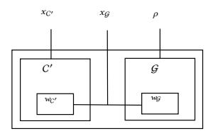
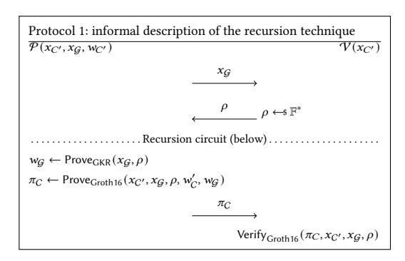
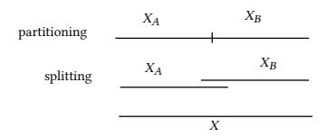
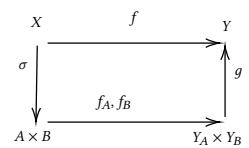
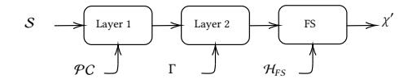
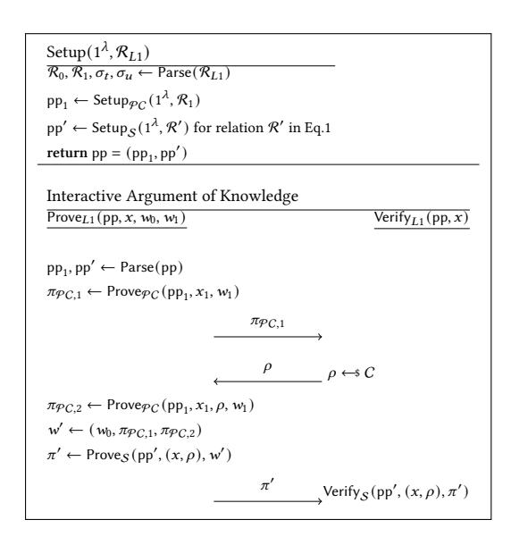
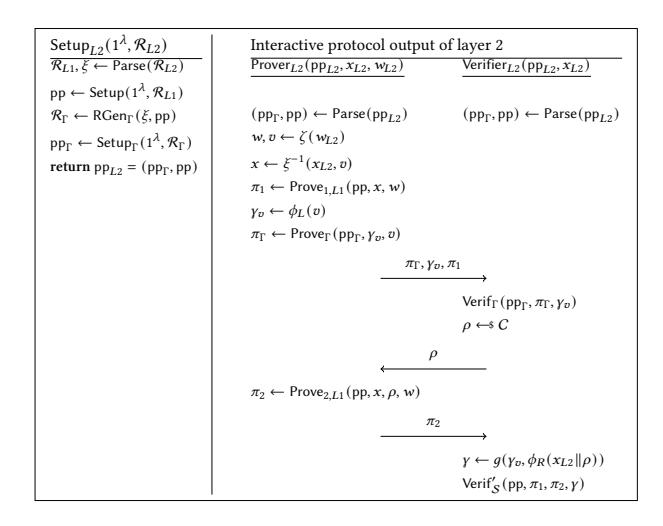
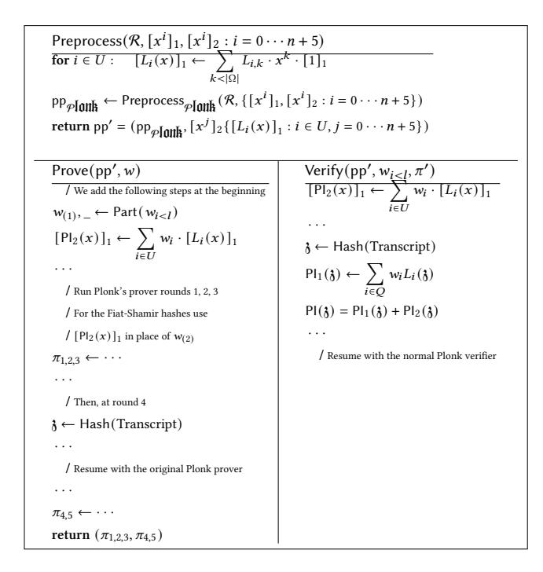
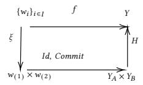
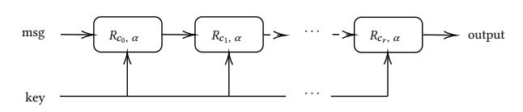

# <span id="page-0-2"></span>Recursion over Public-Coin Interactive Proof Systems; Faster Hash Verification

Alexandre Belling, Azam Soleimanian, Olivier Begassat Consensys, Linea-Cryptography firstname.lastname@consensys.net

## ABSTRACT

SNARK is a well-known family of cryptographic tools that is increasingly used in the field of computation integrity at scale. In this area, multiple works have introduced SNARK-friendly cryptographic primitives: hashing, but also encryption and signature verification. Despite all the efforts to create cryptographic primitives that can be proved faster, it remains a major performance hole in practice. In this paper, we present a recursive technique that can improve the efficiency of the prover by an order of magnitude compared to proving MiMC hashes (a SNARK-friendly hash function, Albrecht et al. 2016) with a Groth16 (Eurocrypt 2016) proof. We use GKR (a well-known public-coin argument system by Goldwasser et al., STOC 2008) to prove the integrity of hash computations and embed the GKR verifier inside a SNARK circuit. The challenge comes from the fact that GKR is a public-coin interactive protocol, and applying Fiat-Shamir naively may result in worse performance than applying existing techniques directly. This is because Fiat-Shamir itself is involved with hash computation over a large string. We take advantage of a property that SNARK schemes commonly have, to build a protocol in which the Fiat-Shamir hashes have very short inputs. The technique we present is generic and can be applied over any SNARK-friendly hash, most known SNARK schemes, and any (one-round) public-coin argument system in place of GKR. We emphasize that while our general compiler is secure in the random oracle model, our concrete instantiation (i.e., GKR plus outer SNARK) is only proved to be heuristically secure. This is due to the fact we first need to convert the GKR protocol to a one-round protocol. Thus, the random oracle of GKR, starting from the second round, is replaced with a concrete hash inside the outer layer SNARK which makes the security-proof heuristic.

## KEYWORDS

SNARK, Hash Verification, Proof Recursion, Proof Composition, GKR, Public-Coin, Fiat Shamir, So-Far Digest Model

## 1 INTRODUCTION

Succinct Non-Interactive Argument of Knowledge (zk-)SNARKs are powerful cryptographic tools that allow a prover to convince a verifier that it knows a witness such that the relation R (usually drawn from a large family) is satisfied with respect to the public input [1](#page-0-0) (i.e., R (;) = 1). Particularly, the verifier needs less time to verify the proof rather than redoing all the computations. In the last few years, an ever-growing number of SNARK constructions have emerged, including [\[21\]](#page-12-0), [\[16\]](#page-12-1), [\[6\]](#page-12-2), [\[11\]](#page-12-3), [\[30\]](#page-12-4), [\[35\]](#page-12-5), [\[9\]](#page-12-6), [\[32\]](#page-12-7) with various security assumptions and performance trade-offs. SNARKs

are also widely adopted in the blockchain world for their applications for privacy (zk-SNARKs) [\[22\]](#page-12-8) and scalable computational integrity [\[8\]](#page-12-9).

Hashing inside a SNARK Several important applications of SNARKs involve proving the computation of numerous hashes: signature and Merkle proof verification, which usually becomes the main bottleneck in the runtime of the prover. A SNARK scheme typically works over arithmetic circuits and a prespecified finite field. On the other hand, common hash functions such as SHA256, Blake2, or Keccak typically work with unsigned integers and bit-wise operations, since they are faster on CPUs. Subsequently, even though they can be embedded within an arithmetic circuit, they incur a prohibitive overhead on the prover's runtime. Due to this fact, numerous works — among which MiMC [\[1\]](#page-12-10), Poseidon [\[19\]](#page-12-11) — have proposed SNARK-friendly hash functions[2](#page-0-1) : functions that are more efficient to embed in an arithmetic circuit by 2 orders of magnitude. Our contribution essentially focuses on applying new techniques to speed up the verification of MiMC hash function, resulting in a speed-up of x35 (more details in Fig[.14\)](#page-11-0) compared to directly verifying MiMC with Groth16 [\[21\]](#page-12-0). However, the techniques we present can also be applied to other SNARK-friendly hash functions such as Poseidon [\[19\]](#page-12-11).

The GKR protocol [\[18\]](#page-12-12) produces sublinear time verifiable proofs (w.r.t the size of the circuit) for multiple parallel executions of a layered arithmetic circuit . The works [\[31\]](#page-12-13), [\[33\]](#page-12-14), [\[36\]](#page-12-15) extend the GKR [\[18\]](#page-12-12) protocol and improve its performance. In particular, [\[34\]](#page-12-16) describes a generalization of the GKR protocol for arbitrary arithmetic circuits with a directed acyclic graph structure, which - in practice - also has a faster prover than the original version of GKR. Additionally, it does not require any particular cryptographic operations (apart from the Fiat-Shamir hashes).

Hyrax [\[32\]](#page-12-7) proposes to compile GKR using discrete logarithm (DLog) assumptions to obtain a zk-SNARK.

LegoSnark, [\[9\]](#page-12-6) presents a generic framework that enables linking a statement proven using GKR (or more precisely Hyrax [\[32\]](#page-12-7)) to other ones using possibly different argument systems. Our work differs from theirs by embedding the GKR verifier within another SNARK. Our contribution is a construction that allows us to recurse the GKR protocol within a SNARK.

Proof recursion Generally speaking, the "recursion" term refers to the embedding of the verification algorithm of a proof system inside the circuit of another proof system. One may use this concept for

<span id="page-0-0"></span><sup>1</sup>This can be done without revealing additional information, if the SNARK has additionally the zero-knowledge property

<span id="page-0-1"></span><sup>2</sup>Generally speaking, a SNARK-friendly hash is a hash function that is involved only with algebraic operations such as multiplication, addition, etc...

"incremental computation" (where two proof systems are homogeneous) similar to Halo [6] and Nova [24] suggesting the successive-recursion techniques using a (possibly non-pairing-friendly) cycle of elliptic curves.

Our work extends this model by working on *public-coin* non-interactive argument systems, and practically, for massive parallelization. In Appendix K, we also provide a discussion of how their techniques can be applied to our use case.

### **Technical Aspects and Motivation**

The GKR protocol is originally a multi-round public-coin interactive protocol that is transformed to its non-interactive version by applying the Fiat-Shamir (FS) transform [3, 10], being sound in the random oracle model.<sup>3</sup>

At first glance, it may not be convincing to use GKR for hash verification (proof of correct hash computation). In particular, because the non-interactive version of GKR itself requires hash computations over long strings, to generate challenges (by Fiat-Shamir transform). We highlight some technical details which may convince the reader of the relevance of using GKR for hash verification.

- Parallelization for the layered circuits: GKR can be used to\nefficiently prove and verify multiple instances of the same
  layered circuit in parallel. Particularly, the verifier's work is
  logarithmic w.r.t the number of parallel executions. Thanks
  to the layered circuit of most hash functions and also due
  to the need for vast parallel hashing in our application, the
  combination of hash and GKR seems a reasonable choice
  here
- Recursion: We recurse GKR inside a SNARK. Namely, a SNARK is applied over the verifier of GKR such that the GKR verifier checks the correct computation of all hashes (leveraging the parallelization property of GKR) and the SNARK proves the correct execution of the GKR verifier.
- Practical proof-time: Another key idea that makes GKR very interesting for recursion is that its practical prover runtime is comparable to the runtime of the alleged computation itself. Regarding efficiency, not all circuits are equally suited for the application of GKR. Generally speaking, layered circuits with a small width, a large depth and low-degree (at each layer) are more interesting. This makes hash functions based on the S-Box  $x \to x^{\alpha}$ , where  $\alpha$  is small, such as Poseidon [19] and MiMC [1] excellent candidates for GKR.
- Compressing the input for Fiat-Shamir: Instead of including the input-output of GKR in the Fiat-Shamir hashes (as it would be *normally* required), we pass a prover-generated commitment which is much shorter. Moreover, we would present a model for the application of Fiat-Shamir, called sofar digest, making it to be more efficient inside the circuit.

• Externalizing the commitment: The challenge here is to force the, possibly malicious, prover to compute the aforementioned commitment correctly. We discuss how to circumvent this challenge in a non-trivial and efficient way. Note that a more trivial solution is to embed the commitment inside the circuit of SNARK, which is far less efficient. Our technique provides a separate constant-size proof, for the correct computation of the commitment, outside the circuit. This guarantees the soundness of the system as a whole.

# Overview of our technique; generation of the initial randomness

We present a technique to recurse a public-coin single-round interactive protocol inside another SNARK. In public-coin protocols, the verifier sends random challenges to the prover, which we call "randomnesses". GKR is an instance of public-coin protocols.

Our methodology allows the prover to handle the randomnesses efficiently when compiling to a non-interactive protocol and recursing inside a SNARK. A naive attempt would be to apply the Fiat-Shamir transform over GKR straightforwardly, but this would be inefficient. Indeed, when using the Fiat-Shamir transform, the verifier and the prover are required to hash the past transcript including the inputs of the verifier. If these inputs are very long, this leads to long hashes to be performed inside the SNARK circuit, and these are expensive. Let's assume n alleged evaluation of the MiMC keyed-permutation  $H_{mimc}(x, k) = y$ . Applying the Fiat-Shamir transform directly would require hashing all the inputoutput x, y, k of the GKR statement and would result in a protocol where we hash at least 3n field elements to obtain the initial challenge (called the "initial randomness" through the paper): at least 3 times worse than directly verifying the same hashes inside a circuit. Our protocol instead applies the Fiat-Shamir transform over a short input provided by the prover and externalizes the relevant computations on how this short input was obtained, outside the circuit. Slightly more in detail, the information that we use to generate the randomness is a piece of computation (let us call it  $\gamma_v$ ) already required in the SNARK verification. As an example, consider the Groth16 scheme, where the verifier must first compute  $\gamma$ , a multiscalar multiplication (MSM) of the verification key and the public input (as  $\gamma = \prod_i v k_i^{x_i}$ ). Second, it uses  $\gamma$  and the rest of the proof inside a pairing check. When we recurse GKR inside Groth16, we do so in such a way that all the inputs of the GKR protocol are included in the public inputs. We call  $\gamma_v$ , the "part" of  $\gamma$  associated with the GKR inputs (i.e.,  $\gamma = \prod_{i=0}^{n} \mathsf{vk}_{i}^{x_{i}} = \gamma_{v} \cdot \prod_{i=n'}^{n} \mathsf{vk}_{i}^{x_{i}}$ and  $(x_0, \ldots, x_{n'-1})$  is the public input corresponding to the GKR statement). In our scheme, the prover computes and sends  $\gamma_v$  to the verifier and provides an argument of knowledge that it knows a witness for  $\gamma_v$  regarding the appropriate verification key. Note that the prover still has to prove the correct computation of  $\gamma_v$ , but the advantage of using  $\gamma_v$  for generating the randomness is that,

- the verifier does not have to compute  $\gamma_v$  by itself.
- the prover is bound to  $((x_0, \ldots, x_{n'-1}))$  through  $\gamma_v$ , since it would be used in the verification of SNARKs.

In particular, thanks to the second property, we can give an argument system with constant-size proofs to argue the correct

<span id="page-1-0"></span><sup>&</sup>lt;sup>3</sup>Indeed, in [10] the authors proved that GKR is round-by-round sound which implies security against state restoration attack [10]. In [3] the authors proved that if a multiround protocol is secure against such an attack, then it is sound in the random oracle model. Finally, [12] directly discusses the soundness of suncheck protocol in the random oracle model.

<span id="page-1-1"></span> $<sup>^4</sup>$ It is also possible to use GKR for Boolean circuits, [17] gives an example of how to do so.

computation of randomness (which is indeed  $H(\gamma_v, ...)$ , computed outside the circuit). Since  $\gamma_v$  depends on the outer-layer SNARK scheme, we present two argument systems for the integrity of  $\gamma_v$ , separately for Groth16 [21] and PLONK [16] as the outer-SNARK.

#### Our contribution

Our contribution can be divided into two main parts: theory and implementation.

**Theoretical aspects:** Although the idea of the paper was initially motivated by hash verification through recursion over GKR, our theoretical results are general and can be used for recursion over any public-coin interactive argument system. More precisely, we present a compiler that receives a single-round public-coin argument system and a SNARK (to generate the required randomness based on  $\gamma_v$ ) and outputs an efficient recursion system. We build our compiler step-by-step, and we analyze the security of each step separately. We prove that if the inputs to the compiler, and the argument of knowledge (AOK) for correct computation of the randomness satisfy the common security notion (knowledge-soundness), then the output of the compiler is also secure.

For the instantiation, we use GKR as the inner argument system, where we first need to convert it to a one-round protocol. For such conversion, we first apply Fiat-Shamir from the second round and use the resulting scheme inside outer SNARK. This means the security holds only heuristically. We also emphasize that the construction and security of single-round GKR are not considered in the standard random oracle model, also known as the "so-far transcript" model, but rather inside what we call the "so-far digest" model. That is a more efficient model for applying Fiat-Shamir inside the circuit (defined in the following).

**Implementation aspects:** In our implementation, we use Groth16 as the outer-layer SNARK and recurse it over GKR with MiMC as the hash function. To improve efficiency, we use the custom gates specified in Fig.16 and include all optimizations of [34] and [33] on the sumcheck protocol and GKR. Our implementation is in Golang and is optimized for massive parallelism (benchmarked on 96 physical cores). We expand further on that matter in Fig.14.

Moreover, we use a realization of Fiat-Shamir that is more convenient for our construction. We call such realization "Fiat-Shamir in the *so-far digest model*", a counterpart of the standard "*so-far transcript* model" (see Appendix H), where instead of hashing the transcript, we hash the randomness of the previous round and the last message of the prover. This improves the efficiency overall since the Fiat-Shamir hash computation is done inside the circuit (particularly, this realization avoids the hashing of public parameters inside the circuit). Working in this model can be of independent interest, for applications involved with Fiat-Shamir hashing inside the circuit. Moreover, in Appendix H, we demonstrate that applying the Fiat-Shamir transform in the *so-far digest* model is sound if it is sound to do it in the *so-far transcript* model.

**Overall:** We enable a secure and efficient recursion over the public-coin proof systems, by generating a short "initial randomness" and presenting the "so-far digest model". We use the results for an application requiring vast hash verification. The relevance of more applications remains to be seen. Recently, blockchain companies

have used PLONK over STARK [28] to get a trade-off on the size and the time of the proof<sup>5</sup> and be compatible with the Ethereum network<sup>6</sup>. Since STARK is a public coin system, one may use our techniques for performance improvement.

### 2 BACKGROUND

## 2.1 Notations

We say  $f(x) = \omega(g(x))$ , if and only if  $\lim_{x \to \infty} f(x)/g(x) = \infty$ . Let  $\lambda$  denote the security parameter. We write  $f(\lambda) \approx h(\lambda)$  when  $|f(\lambda) - h(\lambda)| = \lambda^{-\omega(\lambda)}$  for two functions  $f, h : N \to [0, 1]$ . Then if  $f(\lambda) \approx 0$  we say that f is negligible, and if  $f(\lambda) \approx 1$  we say that f is overwhelming. We write  $y \leftarrow A(x)$  to show that the algorithm A outputs y on input x. Through the paper, we assume that all the algorithms are probabilistic polynomial time (p.p.t.). By  $x \longleftrightarrow X$ , we mean that the element x is chosen uniformly at random from the set X. The notation [n] stands for the set  $\{1,\ldots,n\}$ .

To define a security notion, we may define a counterpart game  $\mathbf{G}_{\mathcal{A}}$  as

 $G_{\mathcal{A}}$  = (winning condition, game interactions)

We say that the adversary  $\mathcal A$  fails (or its advantage in  $G_{\mathcal A}$  is negligible) if,

 $Pr[Winning condition : Game interactions for \mathcal{A}] \approx 0$ 

**Groups.**  $\mathbb G$  denotes a cyclic group of prime order. If  $\mathbb G$  is of order p,  $g \in \mathbb G$ , and  $x \in \mathbb Z_p$ , then  $g^x$  denotes the scalar multiplication. For a list of n scalars of  $\mathbb Z_p$  and group elements of  $\mathbb G$ , the multi-scalar multiplication (MSM) is  $\prod_{i \in [n]} g_i^{x_i}$ . When it is clear that g is a generator of  $\mathbb G$ , we may use the notation [x] for  $g^x$ .

Definition 2.1 (Bilinear Groups). A bilinear group is a tuple  $(p, \mathbb{G}_1, \mathbb{G}_2, \mathbb{G}_T, e)$  such that:  $\mathbb{G}_1, \mathbb{G}_2, \mathbb{G}_T$  all cyclic groups, have prime order  $p, e(\mathbb{G}_1, \mathbb{G}_2) \to \mathbb{G}_T$  is a bilinear, non-degenerate map that is efficiently computable. Also, throughout this work,  $g_1, g_2, g_T$  implicitly denotes generators of, respectively,  $\mathbb{G}_1, \mathbb{G}_2, \mathbb{G}_T$  such that  $e(g_1, g_2) = g_T$ .

The argument systems Groth16 [21] and PLONK [16] are proved to be secure under the q-DLog assumption (Appendix A, Def.A.1) and in the Algebraic Group Model (AGM), formally defined as follows.

Definition 2.2 (Algebraic adversary in an SRS-based protocol [5]). An algebraic adversary  $\mathcal A$  is a p.p.t algorithm such that, whenever  $\mathcal A$  outputs an element  $A=[a]_i\in\mathbb G_i$ , it also outputs the associated linear combination based on  $\operatorname{srs}_i$ , namely, a vector v of scalars such that  $A=\langle v,\operatorname{srs}_i\rangle=\sum_j v_j\cdot\operatorname{srs}_{ij}$ , where  $\operatorname{srs}_i$  is part of  $\operatorname{srs}_i$  belonging to the group  $\mathbb G_i$ . We call such a representation as the linear-combination representation (LC-representation) of A.

## 2.2 Argument of Knowledge

We define  $\mathcal{R}_{\lambda}$  to be a relation generator (i.e.,  $(\mathcal{R}, z) \leftarrow \mathcal{R}_{\lambda}$ ) such that  $\mathcal{R}$  is a polynomial time decidable binary relation. For  $\mathcal{R}(x; w)$ , we call x the statement and w the witness. The relation generator

<span id="page-2-0"></span> $<sup>^5 \</sup>mathrm{STARK}$  for time, PLONK for size

<span id="page-2-1"></span><sup>&</sup>lt;sup>6</sup>That is based on the PLONK-elliptic curve

<span id="page-2-2"></span> $<sup>^7\</sup>mathrm{The}$  structured reference string (SRS) is the set of public parameters generated by the trusted setup with a special structure

may also output some side information z which will be given to the adversary. When we have several families of relations, we may show their relation generator as  $\mathcal{R}_{F_i}$  (rather than  $\mathcal{R}_{\lambda}$ ). We show the set of true statements by  $\mathcal{L}_{\mathcal{R}} = \{x : \exists w \ \mathcal{R}(x; w) = 1\}$ . The definitions in this section are mainly borrowed from [21].

<span id="page-3-1"></span>Definition 2.3 (non-interactive Argument for  $\mathcal{R}_{\lambda}$ ). A Non-Interactive Argument for  $\mathcal{R}_{\lambda}$  is a tuple of three p.p.t. algorithms (Setup, Prove, Verify) defined as follows,

- σ ← Setup(R): on input R ← R<sub>λ</sub>, it generates a reference string σ. All the other algorithms implicitly receive the relation R.
- $\pi \leftarrow \text{Prove}(\sigma, x, w)$ : it receives the reference string  $\sigma$  and for  $\mathcal{R}(x; w) = 1$  it outputs a proof  $\pi$ .
- $1/0 \leftarrow \text{Verify}(\sigma, x, \pi)$ : it receives the reference string  $\sigma$ , the statement x and the proof  $\pi$  and returns 0 (reject) or 1 (accept).

For the above argument system, we define the following security requirements.

Definition 2.4 (Completeness). It says that given a true statement  $x \in \mathcal{L}_{\mathcal{R}}$ , the prover can convince the honest verifier; for all  $\lambda \in \mathbb{N}$ ,  $\mathcal{R} \in \mathcal{R}_{\lambda}$ ,  $x \in \mathcal{L}_{\mathcal{R}}$ :

$$\Pr\left[1 = \mathsf{Verify}(\sigma, x, \pi) : \sigma \leftarrow \mathsf{Setup}(\mathcal{R}), \ \pi \leftarrow \mathsf{Prove}(\sigma, x, w)\right] = 1$$

Definition 2.5 (Soundness). It says that, for the wrong statements, it is not possible to convince the verifier. For any non-uniform p.p.t. adversary  $\mathcal{A}$ , we have,

$$\Pr\left[\begin{array}{cc} 1 = \mathsf{Verify}(\sigma, x, \pi) \\ \land x \notin \mathcal{L}_{\mathcal{R}} \end{array} \right. : \quad \begin{array}{c} (\mathcal{R}, z) \leftarrow \mathcal{R}_{\lambda}, \ \sigma \leftarrow \mathsf{Setup}(\mathcal{R}), \\ (x, \pi) \leftarrow \mathcal{A}(\sigma, z) \end{array} \right] \approx 0$$

Definition 2.6 (non-interactive Knowledge-Soundness). It strengthens the notion of soundness by adding an extractor that can compute a witness from a given valid proof. The extractor gets full access to the adversary's state, including any random coins. Formally, for any non-uniform p.p.t adversary  $\mathcal A$  there exists a non-uniform (expected polynomial time) extractor  $\mathcal E_{\mathcal A}$  such that:

$$\Pr\left[\begin{array}{cc} 1 = \mathsf{Verify}(\sigma, x, \pi) \\ \wedge \, \mathcal{R}(x; w) = 0 \end{array} \right. : \quad \begin{array}{c} (\mathcal{R}, z) \leftarrow \mathcal{R}_{\lambda}, \ \sigma \leftarrow \mathsf{Setup}(\mathcal{R}), \\ ((x, \pi), w) \leftarrow (\mathcal{R} \parallel \mathcal{E}_{\mathcal{R}})(\sigma, z) \end{array} \right] \approx 0$$

The advantage of the adversary in the knowledge-soundness game (the probability on the left side) is called as knowledge-error.<sup>8</sup>

The Interactive AOK is defined similarly to the NIAOK (Def.2.3), where the set (Prove and Verify) is a protocol between the prover and the verifier.

An analog notion of knowledge-soundness can be defined for an interactive protocol. In this context, the definition is identical except that the extractor is only given black-box access to the prover but is nonetheless allowed to rewind it up to any point in the interaction and to send arbitrary messages.

Definition 2.7 (interactive Knowledge-Soundness). An interactive argument system  $(\mathcal{P},\mathcal{V})$  has knowledge-soundness if for all (p.p.t. non-uniform) prover adversaries  $\mathcal{A}$  there exists an (expected polynomial time) extractor  $\mathcal{E}_{\mathcal{A}}$  with oracle access to  $\mathcal{A}$ , allowed to rewind  $\mathcal{A}$  to any point in the interaction and to send it arbitrary messages such that the knowledge error in the following is negligible.

$$\Pr\left[\begin{array}{c} (\mathcal{R},z) \leftarrow \mathcal{R}_{\lambda}, \ \sigma \leftarrow \operatorname{Setup}(\mathcal{R}), \\ 1 = \operatorname{Verify}(\sigma,x,\pi) \\ \wedge \mathcal{R}(x;w) = 0 \end{array} \right. : \begin{array}{c} (\mathcal{R},z) \leftarrow \mathcal{R}_{\lambda}, \ \sigma \leftarrow \operatorname{Setup}(\mathcal{R}), \\ x \leftarrow \mathcal{H}(\sigma,z) \\ \pi \leftarrow \operatorname{Transcript} \\ w \leftarrow \mathcal{E}_{\mathcal{A}}^{\mathcal{O}}(\sigma,z,x) \end{array} \right] \approx 0$$

Where O stands for the oracle access to  $\mathcal A$  pursuing the interactions.

Definition 2.8 (Succinctness, SNARK). A non-interactive argument system  $\Pi$  for a relation  $\mathcal{R}_{\lambda}$  is **succinct** if the proof  $\pi$  produced by the prover has size o(|w|) and the run-time of the verifier is o(|w|) for all relations  $\mathcal{R}$  drawn from  $\mathcal{R}_{\lambda}$ . A non-interactive argument system with this property is called SNARK.

## <span id="page-3-2"></span>2.3 Polynomial commitment

We conveniently adapt the definition of polynomial commitment given by [5, 16] (to its non-interactive version) to match the formalism of the present document. Formally, a polynomial commitment is a tuple of p.p.t. algorithms (Setup, Commit, Prove, Verify) where,

- pp ← Setup(1<sup>λ</sup>, t) generates the public parameters pp suitable to commit to polynomials of degree < t. It is to be done by a trusted authority.</li>
- *C* ← Commit(pp, *P*(*X*)) outputs a commitment *C* to a polynomial *P*(*X*) of degree at most *t* using pp.
- $(x, y, \pi_x) \leftarrow \text{Prove}(\text{pp}, P(X), x) \text{ outputs } (x, y, \pi_x) \text{ where } \pi_x \text{ is a proof for the evaluation of } y = P(x).$
- $0/1 \leftarrow \text{Verify}(\text{pp}, C, x, y, \pi_x)$  verifies that y = P(x) is the correct evaluation of the polynomial committed in C.

The correctness and security of Polynomial Commitments Schemes are defined in Appendix A. We use the KZG polynomial commitment scheme [23] to informally refer to the polynomial commitment based on bilinear groups assumptions (Appendix C). This protocol has been widely studied, extended and applied in numerous recent works [16], [14], [11].

### 2.4 Fiat-Shamir

Informally, the Fiat-Shamir heuristic is a tool that allows transforming interactive protocols from a specific class into non-interactive protocols. This specific class is known as public-coin protocols and is formally defined as follows.

Definition 2.9 (Public Coin). An interactive protocol between a prover and a verifier is **public-coin** if all the messages sent by the verifier to the prover are randomly and independently sampled from the messages sent by the prover (that is, random coins from the verifier are publicly available).

In Appendix H, we provide more details on how we adapt and instantiate the Fiat-Shamir heuristic for our use case, and for building a single-round version of GKR Appendix I.

<span id="page-3-0"></span><sup>&</sup>lt;sup>8</sup> Although, we only use the notion of knowledge-soundness throughout this work. The reader should be aware, a more general notion exists: witness-extended emulation. <sup>9</sup> Fortunately, in [25] Lindell shows that knowledge-soundness implies witness-extended emulation. Thus, for simplicity, we restrict ourselves to studying the knowledge-soundness of the protocols we describe.

#### <span id="page-4-3"></span>2.5 MiMC

Here we summarize the construction of MiMC [1]. Let q be a prime, and  $\mathbb{F}_q$  be the finite field of order q. Let  $\alpha$  be the smallest integer co-prime with q-1; the map  $x\to x^\alpha$  defines a bijection of  $\mathbb{F}_q$ . Let  $(c_i)_{0\leq i< r}$  be a sequence of  $\mathbb{F}_q$ . Define the round function  $F_i(x)=(x+k+c_i)^\alpha$  where  $c_0=c_r=0$  and also define the cipher as  $E_k(x)=(F_{r-1}\circ F_{r-2}\circ\ldots\circ F_0)(x)+k$ . The authors of [1] suggest that the number of rounds r be chosen so that  $r\geq \left\lceil\frac{\log q}{\log \alpha}\right\rceil$  and that the round constants  $(c_i)$  be drawn independently and uniformly at random from  $\mathbb{F}_q$ . One can obtain a hash function; either from the cipher and using the Miyaguchi-Preneel construction [4, 29], or from the permutation (where in  $E_k(x)$  the key is set to 0) and using the sponge construction [1].

Following a suggestion in Libra ([33], Sec.5) for efficient application of GKR over MiMC and Poseidon, we define the custom family of gates for these hash functions in Appendix B.3.

# 2.6 Sumcheck protocol

The sumcheck protocol [26] is a multi-round interactive protocol for the following relation where P and a are public inputs and the witness is empty.

$$\left\{ (P(X), a; ) : \sum_{x_{k-1} \in \{0,1\}} \cdots \sum_{x_0 \in \{0,1\}} P(x_0, \dots, x_{k-1}) = a \right\}$$

where P is a k multivariate polynomial of maximal degree d on each variable. It consists of k rounds of complexity O(d), each doing sensibly the same thing (from the verifier's point of view) and a special final round where the verifier performs an evaluation of P(X) at a random challenge point and compares the result with the prover's messages.

Remark 2.10. A useful takeaway to understand the role the sumcheck plays in GKR is to notice that the sumcheck protocol reduces a claim about an exponential size sum of values of P to a claim on a single evaluation of P at a random point.

# <span id="page-4-4"></span>3 GKR PROTOCOL; A PUBLIC-COIN ARGUMENT SYSTEM

**Description** As mentioned, GKR generates proofs for the data-parallel execution of a layered arithmetic circuit<sup>10</sup>. At a high level, it is done by iteratively applying a sequence of sumcheck protocols [26], one for each layer of the circuit. Each iteration of the sumcheck protocol inside GKR establishes consistency between two successive layers of computation (starting with the output layer, layer 0, and working backward to the input layer, layer d). The reader can find a detailed description of the protocol in Appendix B.

**Fiat-Shamir transform** The GKR protocol is not constant-round and thus, one cannot straightforwardly compile it in the random oracle model. Recent works [3, 10, 12] have studied the Fiat-Shamir transform of the GKR protocol and the Fiat-Shamir of the sumcheck protocol. We give an informal justification for the soundness of GKR in the random oracle model below.

In [10] Canetti et al. proved that GKR is round-by-round sound in the so-far transcript model. <sup>11</sup> Additionally, the authors of [10] argue that *round-by-round soundness* readily implies security against state-restoration attack, which is a notion introduced in [3]. In [3] the authors argue that if a public-coin interactive protocol is secure against state restoration attack, then its non-interactive version via Fiat-Shamir is also sound in the random oracle model. Putting it together, this means GKR is sound in the (so-far transcript) random oracle model. We also highlight that GKR is widely used in the random oracle model [9, 33, 36].

In our compiler, we essentially need a single-round version of GKR. In essence, only the first round of communication is initially kept interactive, while all the other rounds are compiled using the Fiat-Shamir. We elaborate on this version, its security and instantiation in Appendices H and I.

When embedded in R1CS (or more broadly, any type of algebraic circuit that does not have special support for hash functions), the performance of the verifier is dominated by the Fiat-Shamir hashes. Particularly, the verifier generates the first randomness by hashing the statement supposed to be proven by GKR, this incurs the prover to perform Fiat-Shamir hashes of size (|x| + |y|) (corresponding to the claim  $H_{mimc}(x) = y$ ). Since doing so entails the verifier working with more computation than it would need to perform the hash itself. We treat this issue in Sec.5.4. Additionally, the verifier and prover perform a logarithmic number of hashes due to applying Fiat-Shamir to the sumcheck instances.

**Performances** The verifier work has the overhead of the sumchecks for each layer. Each of the sumchecks has a logarithmic runtime for the verifier. On its hand, the prover runtime is driven by the sumchecks runtime that is O(N) for N the number of instances of the parallel execution.

Compiling the GKR verifier in a R1CS As mentioned the verifier's work is dominated by Sumchecks that are expensive in practice, and their cost is driven by the hashes required by the Fiat-Shamir transform. Even though this is a logarithmic overhead, it has large constants and typically occupies between 1M to 10M constraints (with Groth16) and twice more with Plonk, depending on the number of hashes to be proven in the batch and the hash function used for Fiat-Shamir. For instance, say for both Fiat-Shamir and the instances to prove, we use the same MiMC function - with degree  $\alpha = 7$  and number of rounds R = 91 - but with different round-constants. Then, the number of constraints to recurse a GKR verifier for  $N = 2^{20}$  instances of the MiMC permutation is approximated by  $364R(\alpha + 2) \log N \approx 5.9M$  where 364 corresponds to the number of R1CS constraints to permute a single element 12. Indeed, we have a layered circuit of R layers, for each layer GKR needs one sum check of  $\log N$  rounds which itself provokes  $\log N$  hashes over  $\alpha + 2$  field elements. Therefore, we have  $R(\alpha + 2) \log N$  permutations where each permutation needs 364 constraints. Here we have assumed the use of short "initial randomness" and working in the "so-far digest model". In the so-far transcript model, this goes

<span id="page-4-0"></span> $<sup>^{10}\</sup>mbox{Meaning}$  that the circuit can be decomposed into layers, and wires only connect gates in adjacent layers

<span id="page-4-1"></span> $<sup>^{11}{\</sup>rm The}$  authors of [10] also argue that their transformation is sound in the standard model. We do not use this fact in this work.

<span id="page-4-2"></span> $<sup>^{12}</sup>$  In Groth 16, the additions are free, and we need 4 multiplication to compute powers of  $\alpha$  . So, in total we need 4 \* 91 = 364 constraints for one permutation.

up to  $364R(\alpha + 2)\log^2 N$  but is still better than Groth16 without recursion that needs 364N constraints.

# <span id="page-5-0"></span>4 CHALLENGE OF RECURSION OVER PUBLIC-COIN ARGUMENT SYSTEMS

In this section, we explain the challenge of recursion over publiccoin argument systems.

Concrete Example. Before delving into the abstract matter, we first give a concrete example of how we intend to embed GKR in a SNARK. Consider, for instance, the problem of verifying Merkle proofs in, say, Groth16 [21]. The circuit doing this performs two distinct tasks: (1) routing Merkle paths (i.e., preparing the inputs to be hashed and deciding the order in which to hash them) and comparing the final output hash with a public Merkle root hash, (2) actually computing the hashes.

The circuit performing the first task, call it C', simply believes the values output by the hashing sub-circuit. The most straightforward option for the second task is to implement the hash as a sub-circuit, i.e., do the second task by *computing* the hashes in the circuit. Our solution is different: we *verify* those hashes using a GKR verifier sub-circuit. As a result, combining C' and the GKR verifier circuit produces a circuit C that verifies Merkle proofs in their entirety.

Naive attempt. We could try to use the GKR verifier inside  $\cal C$  in its original form (non-interactive by Fiat-Shamir). The Fiat-Shamir transform of the GKR protocol has been well studied, and we know it is sound for rightfully chosen hash functions. The result would be a sound protocol; however, this approach comes with a major impediment. In the interactive version, the verifier is asked to send a challenge to the prover after receiving the response from the prover. In the Fiat-Shamir transform of GKR, this implies that the verifier has to hash all the information it has received so far, including the entire GKR statement. This is 3 times worse than directly checking the hashes in an arithmetic circuit in the first place. Our goal here is to circumvent the burden of hashing the entire GKR statement to verify a (non-interactive) GKR proof inside the circuit.

Note that in the Fiat-Shamir transform version that we use, the new randomness (for the new round) is obtained by hashing the previous randomness and the last message, ignoring the past transcript (see Appendix H). Thus, the bottleneck in applying GKR for hash verification is generating a challenge for the first round. That is why we refer to the challenge for the first round as the "Initial Randomness", and we consider a public-coin *single-round* interactive argument system rather than a multi-round one.

#### 5 OUR COMPILER FOR RECURSION

This section introduces a generic compiler for building a special class of recursion systems. Let  $\mathcal{P}C$  be a public-coin single-round interactive argument system (corresponding to GKR in our use case). Our compiler aims at combining  $\mathcal{P}C$  with a SNARK system  $\mathcal{S}$  to get an efficient recursion system (running the verifier of  $\mathcal{P}C$  inside  $\mathcal{S}$ ). Based on the challenge we described in Sec.4 and thanks to an extra proof-system  $\Gamma$  for knowledge of committed value – which we specify later in the present section – we develop a compiler that solves the problem of initial randomness. Here we give a general intuition of how to build such a compiler.

#### <span id="page-5-3"></span>5.1 Intuition

The compiler goes through two main steps. In the first step, we assume that  $\mathcal{P}C$  is a single-round argument system (where the first prover's message is not included in the circuit) and the challenge is available as part of the public input. In the second step, we replace the first message of the prover with a short commitment (to the public inputs). To clear up this intuition, we illustrate it in the form of an example for our initial use case, embedding GKR inside Groth16 for Merkle proofs.

5.1.1 Protocol 1. We embed the GKR verifier into a sub-circuit of C alongside C'. We use the GKR statement and the initial randomness as a public input of the embedding circuit. The resulting circuit C can be succinctly described as in Fig.1, while Fig.2 describes the steps of the protocol. Note that the circuit involved in the recursion is the part after receiving the challenge  $\rho$  (in Fig.2).

<span id="page-5-1"></span>

Figure 1: Protocol 1 : Circuit C construction.  $x_{C'}$  and  $w_{C'}$  are the public input vector and witness vectors of C'. G is a circuit embedding the one-round GKR verifier. The GKR proof belongs to  $w_G$  (witness of G).  $x_G$  is the GKR statement vector, and  $\rho$  is the initial randomness.

<span id="page-5-2"></span>

Figure 2: Protocol 1, We omit the passing of the public parameters. The meaning of the variable is the one of Fig.1

Notice the following two points. First, Protocol 1 is *interactive* (public-coin single-round), as such, it is *not* a SNARK. Secondly, the public input vector is longer (it now contains the GKR inputs/outputs). This is highly undesirable: the verifier is no longer sublinear in the circuit size. In this case, the protocol loses its succinctness, which sounds like a step backward. Nonetheless, one can argue that this protocol is sound. This will be helpful for analyzing Protocol 2.

<span id="page-6-2"></span>5.1.2 Protocol 2. Protocol 2 improves on Protocol 1 by removing the unnecessary GKR inputs/outputs from the public inputs of the circuit (more precisely, pushing them to the witness). This greatly reduces the verifier's overhead and brings back the succinctness that we lost with protocol 1. We start from two observations in the inner-working of the Groth16 presented in Fig.3. Firstly, the output of the pairing check can be computed using only  $\gamma$  in place of the public inputs. Secondly, doing a multi-scalar multiplication (MSM) of a vector of field elements and a set of group elements for which no discrete log is known can be viewed as a binding commitment analog of the Pedersen commitment.

```
\begin{tabular}{ll} & \begin{tabular}{ll} & \begin{tabular}{ll} & \begin{tabular}{ll} & \begin{tabular}{ll} & \begin{tabular}{ll} & \begin{tabular}{ll} & \begin{tabular}{ll} & \begin{tabular}{ll} & \begin{tabular}{ll} & \begin{tabular}{ll} & \begin{tabular}{ll} & \begin{tabular}{ll} & \begin{tabular}{ll} & \begin{tabular}{ll} & \begin{tabular}{ll} & \begin{tabular}{ll} & \begin{tabular}{ll} & \begin{tabular}{ll} & \begin{tabular}{ll} & \begin{tabular}{ll} & \begin{tabular}{ll} & \begin{tabular}{ll} & \begin{tabular}{ll} & \begin{tabular}{ll} & \begin{tabular}{ll} & \begin{tabular}{ll} & \begin{tabular}{ll} & \begin{tabular}{ll} & \begin{tabular}{ll} & \begin{tabular}{ll} & \begin{tabular}{ll} & \begin{tabular}{ll} & \begin{tabular}{ll} & \begin{tabular}{ll} & \begin{tabular}{ll} & \begin{tabular}{ll} & \begin{tabular}{ll} & \begin{tabular}{ll} & \begin{tabular}{ll} & \begin{tabular}{ll} & \begin{tabular}{ll} & \begin{tabular}{ll} & \begin{tabular}{ll} & \begin{tabular}{ll} & \begin{tabular}{ll} & \begin{tabular}{ll} & \begin{tabular}{ll} & \begin{tabular}{ll} & \begin{tabular}{ll} & \begin{tabular}{ll} & \begin{tabular}{ll} & \begin{tabular}{ll} & \begin{tabular}{ll} & \begin{tabular}{ll} & \begin{tabular}{ll} & \begin{tabular}{ll} & \begin{tabular}{ll} & \begin{tabular}{ll} & \begin{tabular}{ll} & \begin{tabular}{ll} & \begin{tabular}{ll} & \begin{tabular}{ll} & \begin{tabular}{ll} & \begin{tabular}{ll} & \begin{tabular}{ll} & \begin{tabular}{ll} & \begin{tabular}{ll} & \begin{tabular}{ll} & \begin{tabular}{ll} & \begin{tabular}{ll} & \begin{tabular}{ll} & \begin{tabular}{ll} & \begin{tabular}{ll} & \begin{tabular}{ll} & \begin{tabular}{ll} & \begin{tabular}{ll} & \begin{tabular}{ll} & \begin{tabular}{ll} & \begin{tabular}{ll} & \begin{tabular}{ll} & \begin{tabular}{ll} & \begin{tabular}{ll} & \begin{tabular}{ll} & \begin{tabular}{ll} & \begin{tabular}{ll} & \begin{tabular}{ll} & \begin{tabular}{ll} & \begin{tabular}{ll} & \begin{tabular}{ll} & \begin{tabular}{ll} & \begin{tabular}{ll} & \begin{tabular}{ll}
```

Figure 3: Simplified take on the Groth16 verifier

Note that in verification of Groth16 (Fig.3), we have an MSM where the entries of  $\mathbf{G} = \mathbf{G}_{C'} \| \mathbf{G}_{\mathcal{G}} \| \mathbf{G}_{\rho}$  correspond to the entries of  $x_{C'}, x_{\mathcal{G}}, \rho$  in the MSM. The idea of protocol 2, is that instead of sending the public inputs to the verifier, the prover computes  $\gamma_{\mathcal{G}} = \mathrm{MSM}(\mathbf{G}_{\mathcal{G}}, x_{\mathcal{G}})$  and sends it to the verifier. From there, the protocol continues as in Protocol 1. When he checks the Groth16 proof, the verifier chooses  $\rho$  and completes MSM by adding the missing parts to  $\gamma_{\mathcal{G}}$ .

An issue is that just doing that is insecure. Indeed, a malicious prover can pass the verification check for any arbitrary (invalid)  $x'_{C'}$  by sending  $\gamma'_{\mathcal{G}} = \gamma_{\mathcal{G}} + \mathsf{MSM}(\mathbf{G}_{C'}, x_{C'} - x'_{C'})$  where  $x_{C'}$  belongs to  $\mathcal{L}(C')$  for which the prover knows a witness (we shall call such attack "mix-and-match").

We rule out this attack by additionally requesting the prover to send an argument of knowledge that she knows  $x_{\mathcal{G}}$  such that w.r.t  $\mathbf{G}_{\mathcal{G}}$  we have  $\gamma_{\mathcal{G}} = \mathsf{MSM}(\mathbf{G}_{\mathcal{G}}, x_{\mathcal{G}})$ . This ensures that the prover cannot use anything aside from group elements in  $\mathbf{G}_{\mathcal{G}}$  in the claim of  $\gamma_{\mathcal{G}}$ . Also note that even though the  $x_{\mathcal{G}}$  is the GKR statement, for the original problem, it is mainly in the witness and so the prover can not choose it arbitrarily. For example, for the Merkle tree paths, only the leaves and the root are in the statement and all the intermediate hashes (which now are done by GKR) are in the witness.

Protocol 2 is sound if Protocol 1 is sound (that implies the binding property of  $\gamma_{\mathcal{G}}$ ) and if the argument of knowledge ensuring the right computation of  $\gamma_{\mathcal{G}}$  is sound as well.

Finally, we apply the Fiat-Shamir transform, where the initial randomness is computed as  $\rho = H_{\mathcal{FS}}(\gamma_{\mathcal{G}})$ . This removes the only interaction of the protocol, where the verifier sent the GKR initial random coin. Thus, we no longer require the verifier to hash the GKR statement, but rather, its commitment  $\gamma_{\mathcal{G}}$  which consists of a single element.

## 5.2 Preliminaries for our compiler

Our compiler has three layers. The first layer verifies the GKR proof, or rather, all the parts that come after the initial randomness, inside

a SNARK ( $\mathcal{S}$ ) and sets all the public inputs of GKR, i.e.,  $x_{\mathcal{G}}$  as public inputs of the resulting SNARK. The second layer of compilation assumes that the SNARK  $\mathcal{S}$  has a set of properties allowing to move the public inputs of GKR to the witness part. The last layer just applies the Fiat-Shamir transform.

In the present section, we formalize the properties (2-Step verification with splitting compatibility) that SNARK should satisfy (needed for the second layer). Informally, we require that computation relative to the public inputs, the *Computation step*, can be factored out of the rest of the verifier's computation, the *Justification step*. This must be possible in such a way that the public inputs do not appear in the *Justification step*, but rather only in the "Computation step". We formalize this as **2-steps verification**. Finally, we require that the *Computation step* can be computed by "recombining" two partial intermediate results obtained from two complementary subsets of the public input. The latter property is what we formalize as **splitting-compatibility** and is defined in the following, alongside the *2-steps verification* property.

<span id="page-6-1"></span>Definition 5.1 (2-Steps Verification). We say that a SNARK system has 2-step verification if the verification algorithm can be expressed as follows.

$$\mathsf{Verify}(\mathsf{vk},x,\pi) = \begin{cases} 1. \ \mathsf{Computation:} \ c \leftarrow F(\mathsf{vk},x,\pi) \\ 2. \ \mathsf{Justification:} \ 0/1 \leftarrow \mathsf{Verify'}(\mathsf{vk},c,\pi)). \end{cases}$$

Where the input x is not used in the justification-step and c is much shorter than x (i.e., F is compressing, note that this requirement implies a nontrivial choice of F). We emphasize that the computation-step may itself include several steps of computations.

Remark 5.2. The 2-steps verification property becomes interesting (and less trivial) when we impose a special property on the computation-step called splitting-compatible, which we explain in the following.

Example 5.3. The verifier of Groth16 [21] satisfies the above property. Loosely speaking, the first part consists in performing an MSM of the public inputs with a subset of the verification key see Fig.3 and the second part is the pairing check. For PLONK, identifying the *computation step* is non-trivial. We elaborate on it in Sec.6.2.1. At a high level, it amounts to computing two things: a challenge  $\mathfrak z$  and evaluating a polynomial PI( $\mathfrak z$ ) interpolating the public inputs vector.

We now, introduce the notions of *splitting* and *partitioning*. Informally, they can be understood as dividing a string into two sub-strings (Fig.4).

Definition 5.4 (Splitting, Partitioning). We define splitting (res. partitioning) as the map  $\phi: X \to X_A \times X_B$  that maps a vector X to two sub-vectors  $X_A, X_B$  as follows. Let I be the index set associated with entries of the vector X, i.e.,  $I = \{1, \ldots, |X|\}$ . We denote a sub-vector of X associated with the index-set  $A \subseteq I$  as  $X_A$  (using the indices of A in ascending order).

We say that  $X_A, X_B$  is a splitting of X if for  $A, B \subseteq I$  we have  $A \cup B = I$ . It is partitioning if A, B are partitioning of I as well, namely,  $A \cap B = \emptyset$ . A visualization is given in Fig.4. For convenience, we may abuse the notation to say A, B is a splitting (or partitioning) of X as X = (A, B).

<span id="page-7-1"></span>

Figure 4: Splitting and partitioning of X to  $X_A, X_B$ .

A splitting-compatible map f is a map that can be split and recombined according to a splitting  $\sigma$  of its inputs (Fig.5). As a toy example, one can consider the Pedersen commitment  $g_1^{a_1} \cdot g_2^{a_2}$  splitting to  $g_1^{a_1}$  and  $g_2^{a_2}$  according to the splitting  $(a_1,a_2)$  to  $a_1$  and  $a_2$ . The formal definition is as follows.

<span id="page-7-4"></span>Definition 5.5. ( $\sigma$ -Compatibility) Consider finite subsets  $A, B, X, Y \subset \{0,1\}^*$ , a map  $f: X \to Y$ , and a partitioning over its input space as  $\sigma: X \to A \times B$ . We say that f is  $\sigma$ -**compatible** if there exists  $f_A: A \to Y_A$  and  $f_B: B \to Y_B$  and a combiner  $g: Y_A \times Y_B \to Y$  such that  $\forall (a,b) \in A \times B$ ,  $f(\sigma^{-1}(a,b)) = g(f_A(a), f_B(b))$  (see Fig.5). We may call  $f_A, f_B$  as the splitting of the map f.



<span id="page-7-2"></span>Figure 5: Splitting-Compatible: the map f is compatible with the splitting  $\sigma$ .

## <span id="page-7-6"></span>5.3 Building Blocks of The Compiler

The compiler works based on three argument systems  $(\mathcal{S},\mathcal{PC},\Gamma)$ , each must satisfy several requirements that we specify in the following. In the description of the compiler, the notation  $\mathcal{S}$  stands for the outer SNARK,  $\mathcal{PC}$  represents GKR as a public-coin protocol and  $\Gamma$  is AOK for the commitment generated by the prover.

## Requirements on S:

- $S = (Setup_S, Prove_S, Verify_S)$  should be a secure SNARK scheme for a family of relations  $\mathcal{R}_{\mathcal{F}0}$  closed under intersection.
- The verification algorithm Verify  $_{\mathcal{S}}$  is a 2-step verification (see Def.5.1).
- Let  $F_S$  be an algorithm in the computation-step of the verification (cf Def.5.1), then for any vk and any partitioning  $\sigma$  of x, the function  $F_S(vk, \bullet)$  should be compatible with  $\sigma$ . In the rest of the paper, we may call such  $F_S$  or its output as the contribution of the public input. We may also use  $F_S(x)$  when vk is implicit. We emphasize that, if the computation-step includes several computations, each of these computations should be splittable (i.e.,  $\sigma$ -compatible).

<span id="page-7-5"></span>Remark 5.6. Note that the soundness of S implies that (Setup  $_S$ ,  $F_S$ ) — viewed as a commitment scheme of the public inputs — must be binding as well (see also Rem.5.9).

## Requirement on $\mathcal{PC}$ :

We require  $\mathcal{PC} = (\operatorname{Setup}_{\mathcal{PC}}, \operatorname{Prove}_{\mathcal{PC}}, \operatorname{Verify}_{\mathcal{PC}})$  being a publiccion single-round interactive argument of knowledge for some relation family  $\mathcal{R}_{\mathcal{F}1}$  without any specific restriction on  $\mathcal{R}_{\mathcal{F}1}$ . Furthermore, as the protocol is single-round of interaction  $\operatorname{Verify}_{\mathcal{PC}}$  (and also  $\operatorname{Prove}_{\mathcal{PC}}$ ) can be split into two parts. Each part,  $\operatorname{Verify}_{\mathcal{PC},1}$ ,  $\operatorname{Verify}_{\mathcal{PC},2}$  executes respectively the first and the second round of the verifier. We use the notation  $\pi_{\mathcal{PC},1}, \pi_{\mathcal{PC},2}$  for the prover messages at round (resp.) 1 and 2. Finally, we require that  $\operatorname{Verify}_{\mathcal{PC},2}$  be expressible in a  $\operatorname{poly}(\lambda)$ -sized instance of  $\mathcal{R}_{\mathcal{F}1}$ .

Remark 5.7. Implicitly, we want to use the GKR protocol as PC. An apparent impediment is that GKR is not a single-round protocol, as required. We address it in Appendix I, where we compile the GKR into a single-round protocol. A second apparent issue is that in practice, GKR does not prove or argue the knowledge of a witness. This corresponds to the trivial case where the witness is an empty string.

#### Requirement on $\Gamma$ :

We introduced above  $F_S$  being defined in the computation-step of verification of Verifier S and  $\sigma$  being a partitioning of the public inputs. Recall that we already required that  $F_S$  be compatible for all partitioning  $\sigma: X \to L \times R$  (where X is the set of public input of S). As a consequence, we can introduce splittings of the map  $F_S$  as  $\phi_L$ ,  $\phi_R$  and its combiner g (see Def.5.5).

Note that in our protocol, we split the public input x to  $(x_L, x_R)$ , and delegate the computation of the map  $\phi_L$  to the prover. We require  $\Gamma = (\mathsf{Setup}_{\Gamma}, \mathsf{Prove}_{\Gamma}, \mathsf{Verify}_{\Gamma})$  be a succinct non-interactive argument of knowledge for relations of the form

$$\mathcal{R}_{\Gamma}(\mathsf{vk},\sigma) = \{(\gamma; x_L) : \gamma \leftarrow \phi_L(x_L)\}$$

where vk is the verification key of S.

Remark 5.8.  $\Gamma$  works over a relation that is defined for fixed vk and  $\sigma$  that are, respectively, the verification key of S and the splitting over the public inputs of S. This point is crucial as it addresses the mixand-match attack raised in Sec.5.1.2. For the sake of clarity, the role of  $\Gamma$  is not just about extracting  $x_L$  s.t.  $\gamma = \phi_L(x_L)$  but to enforce that  $\gamma$  was obtained only using the correct  $\phi_L$  and no other information.

<span id="page-7-3"></span>Remark 5.9. Following the Rem.5.6,  $\phi_L(\cdot)$  (and similarly for  $\phi_R$ ) can be seen as a binding commitment scheme as well. Indeed, if an adversary were able to find  $x_L \neq x_L'$  such that  $\phi_L(x_L) = \phi_L(x_L')$ , then for all  $x_R$ , we have  $x = \sigma^{-1}(x_L, x_R) \neq x' = \sigma^{-1}(x_L', x_R)$  and  $F_S(vk, x) = F_S(vk, x')$  which contradicts the soundness of S. The binding property is interesting to intuitively see that we can replace  $x_L$  with  $\gamma_v = \phi_L(x_L)$  in the Fiat-Shamir transform, though in our security proofs we directly reduce the security to the knowledge-soundness.

## <span id="page-7-0"></span>5.4 Formal Description of Compiler

The compiler proceeds in three layers of compilation, see Fig.6. Intuitively, the first step consists of recursing the verifier of  $\mathcal{PC}$  (more precisely, Verify $_{\mathcal{PC},2}$ ) inside the proof  $\mathcal{S}$ , where  $\mathcal{PC}$  additionally passes its public inputs as part of the public inputs of the SNARK scheme  $\mathcal{S}$ . Then, a second layer of compilation allows us to delegate some contributions of public-inputs of  $\mathcal{PC}$  (e.g., a subpart of MSM in the contexts of Groth16 [21]) from the verifier's computations to the prover's (or equivalently, moving a subpart of the public input to the witness part), via the AOK  $\Gamma$ . The last layer simply consists of applying the Fiat-Shamir transform.

<span id="page-8-0"></span>

Figure 6: Overview of the compiler

Now we are ready to present the inner-work of each layer separately, as we are going through the layers, we prove the security of each layer.

<span id="page-8-5"></span>5.4.1 The first layer. The first layer (L1) takes as input a SNARK scheme S for a relation  $\mathcal{R}' \in \mathcal{R}_{\mathcal{F}0}$ , and a public-coin single-round argument of knowledge  $\mathcal{P}C$  for a relation,  $\mathcal{R}_1 \in \mathcal{R}_{\mathcal{F}_1}$  as in Sec.5.3. Note that since  $\mathcal{P}C$  is recursed inside S, then S should also check for some relation between the public input and witnesses  $\mathcal{R}_1$  and the rest of the circuit. Recalling the visualization given in Fig.1, here one can imagine  $\mathcal{R}_0$  as the circuit C',  $\mathcal{R}_1$  for the GKR, and the connection between  $\mathcal{R}_0$  and  $\mathcal{R}_1$  is checked through some equality relations (in the form of splittings). Thus, the relation for S can be expressed as follows, where Verify $_{\mathcal{P}C,2}$  refers to the second part of Verify $_{\mathcal{P}C}$  (i.e., verification after the interaction step).

<span id="page-8-3"></span>
$$\mathcal{R}' = \begin{cases} (x, \rho; w) : & x_0, x_1 = \sigma_t(x), \ w_0, \pi_{\mathcal{P}C} = \sigma_u(w) \\ 1 \leftarrow \mathsf{Verify}_{\mathcal{P}C, 2}(\mathsf{pp}_1, x_1, \pi_{\mathcal{P}C}, \rho) \\ 1 \leftarrow \mathcal{R}_0(x_0, w_0) \end{cases}$$
(1)

Where the compiler also receives two splittings  $\sigma_t$ ,  $\sigma_u$  of the public input and the witness spaces. Moreover, we require  $\sigma_u$  to be a **partitioning** but not  $\sigma_t$ . In Appendix D we discuss the choice of  $\sigma_t$ ,  $\sigma_u$ .

Intuitively, the first layer inherits the security property of the underlying SNARK S and argument system PC and so for any choice of  $\sigma_u$ ,  $\sigma_t$  yields a secure protocol for the following relation,

$$\mathcal{R}_{L1}(\mathcal{R}_0, \mathcal{R}_1, \sigma_t, \sigma_u) = \begin{cases} (x \in X; w \in W) : & x_0, x_1 = \sigma_t(x), & \mathcal{R}_0(x_0, w_0) = 1 \\ w_0, w_1 = \sigma_u(w), & \mathcal{R}_1(x_1, w_1) = 1 \end{cases} (2$$

REMARK 5.10. This way of combining relations allows the two instances  $\mathcal{R}_0$  and  $\mathcal{R}_1$  to share some part of their public inputs, which is the case in most applications<sup>13</sup>. In our use case (SNARK over GKR, for Merkle tree), some public input of S are used in the Merkle tree (because we need to commit to them). This is why  $x_1$  as the publicinput of  $\mathcal{R}_1$  may share some entries with  $x_0$ , the public-input of  $\mathcal{R}_0$ . More in detail,  $\sigma_t$  not being a partitioning (but only a simple splitting) implies equality constraints in addition to the constraints specified by  $\mathcal{R}_0$  and  $\mathcal{R}_1$ .

**Layer 1 Construction.** Fig.7 describes the construction of layer 1 with inputs  $\mathcal{R}_0$ ,  $\mathcal{R}_1$ ,  $\sigma_t$ ,  $\sigma_u$ ,  $\mathcal{S}$ ,  $\mathcal{PC}$ .

Remark 5.11. here we are using an equivalent representation of Fig.2 where the verifier has all the public input of PC as its input. This representation is more compatible with the definition of SNARK, where the prover and the verifier receive the same public input.

<span id="page-8-2"></span>

Figure 7: Setup and interactions of layer 1.

**Completeness:** It follows from the completeness of S and PC. More precisely, the completeness of PC guarantees that for the correct statement  $(x_1, \rho) \in \mathcal{L}_{\mathcal{R}_1}$  where  $\mathcal{R}_1(x_1, \rho; w_1) = 1$ , the verification of argument system PC satisfies Verify  $_{PC}(\mathsf{pp}_1, x_1, \rho, w_1) = 1$ . Which gives the right relation consumed by the argument system S (i.e., Eq.1), then the completeness of S implies that the verification algorithm of S (which is also the verification associated with  $\mathcal{R}_{L1}$ ) outputs 1.

<span id="page-8-4"></span>**Knowledge-Soundness.** Here, we denote our argument system for layer 1 as  $X_{L1}$ , applied over the corresponding relation  $\mathcal{R}_{L1}$  (in Eq.2). Let  $\mathcal{E}_{\mathcal{S}}$  and  $\mathcal{E}_{\mathcal{P}C}$  be the extractors respectively associated with the argument systems  $\mathcal{S}$  and  $\mathcal{P}C$ . If  $X_{L1}$  outputs a valid proof, we can run the extractor  $\mathcal{E}_{\mathcal{S}}$  to extract a witness w; a witness for  $\mathcal{R}'$  (relation associated with  $\mathcal{S}$ ) including a proof associated with  $\mathcal{P}C$ . There are two possible cases;

- Case 1. The witness for  $\mathcal{R}'$  is correct (i.e., satisfies the relation  $\mathcal{R}'$ ): this means verification  $\mathcal{P}C$  passed, and by knowledge-soundness of  $\mathcal{P}C$ , the probability that the extractor  $\mathcal{E}_{\mathcal{P}C}$  fails (i.e., it extracts a non-satisfying witness for  $\mathcal{R}_1$  from the proof of  $\mathcal{P}C$ ) is negligible.
- Case 2. The relation  $\mathcal{R}'$  is not satisfied: it means the extractor  $\mathcal{E}_{\mathcal{S}}$  failed, but it can only happen with negligible probability by knowledge-soundness of  $\mathcal{S}$ .

Wrapping up everything together, the extractor  $\mathcal{E}_{\mathcal{S}}$  outputs the correct witness  $(w_0, \pi)$  with overwhelming probability. This gives a valid proof  $\pi$  for  $\mathcal{P}C$  (as part of the extracted witness), which then the extractor  $\mathcal{E}_{\mathcal{P}C}$  can use to extract the correct witness  $w_1$ .

<span id="page-8-6"></span>THEOREM 5.12 (Knowledge-Soundness of  $X_{L1}$ ). Let S, PC be as required in Sec.5.3. If S and PC have (resp.) knowledge errors  $\epsilon_S$  and  $\epsilon_{PC}$ . Then, the aforementioned protocol  $X_{L1}$  has knowledge error  $\epsilon = O(\epsilon_S + \epsilon_{PC})$ .

The formal proof is given in Appendix E.

<span id="page-8-1"></span> $<sup>^{13}</sup>$ Intuitively, we require  $\sigma_u$  to be a partitioning because the witness of  $\mathcal{R}_1$  is "wrapped" inside the proof  $\pi_1$  and would not be directly accessible for the outer-proof system. Hence,  $w_0$  and  $w_1$  cannot overlap.

<span id="page-9-4"></span>5.4.2 The second layer. As stated in Sec.5.4.1, the missing part of our compiler is that it can only make the two argument systems communicate by their public inputs. The second layer of compilation solves this problem by allowing moving parts of the public inputs (called v) into the witness. Indeed, the aim is to delegate parts of the computation (involved with v) to the prover, without breaching the soundness.

Therefore, the second layer takes as input  $\mathcal{X}_{L1}$ , a public-coin single-round argument of knowledge for the relation  $\mathcal{R}_{L1}$ . Let  $F_{\mathcal{S}}$  be the computation-step in the verification algorithm (Def.5.1) of  $\mathcal{X}_{L1}$  (inherited from  $\mathcal{S}$ )<sup>14</sup>. Let  $\xi$ ,  $\zeta$  be (res.) the partitioning of the public input and witness space of  $\mathcal{X}_{L1}$ , and  $\Gamma$  be an AoK for the relation  $\mathcal{R}_{\Gamma}(\mathsf{vk},\xi) = \{(\gamma_v,v): \gamma_v \leftarrow \Phi_L(v)\}$  where  $(v;x_{L2}) = \xi(x)$  (and  $\phi_L$  is the left-splitting of  $F_{\mathcal{S}}$ , as defined in Sec.5.3). The second layer of compilation builds a SNARK for the following relation where x and w are associated with layer 1, and we are moving v from x to  $w_{L2}$ .

$$\mathcal{R}_{L2} = \begin{cases}$$

where the second equality holds thanks to the fact that  $\xi$  and  $\zeta$  are partitioning. The proof consists of three main parts; the proof of the first layer, the value  $\gamma_v$  and a proof generated by  $\Gamma$  as the AoK for the relation  $\mathcal{R}_{\Gamma}$ .

**Layer 2 Construction** The inner-work of the second layer of the compiler is given in Fig.8. Here  $(\mathsf{Prove}_{1,L1}, \mathsf{Prove}_{2,L1})$  stands for the prover algorithm of layer 1. Note that the verification algorithm of L1 has 2-step verification, here we use  $\gamma$  as the output of the computation-step and  $\mathsf{Verify}'_{L1} = \mathsf{Verify}'_{S}$  as the algorithm for the justification-step (see Fig.7). Moreover, since  $F_{S}$  (the map in the computation-step) is compatible with the splitting  $\xi$ , we can denote  $(\phi_L, \phi_R)$  and g as the splitting and combiner for  $F_{S}$  (Def.5.5). The last point is that though for clarity we use pp, pp $_{\Gamma}$  in the setup (Fig.8), indeed we have pp  $\subset$  pp $_{\Gamma}$ , this fact is particularly used in the security reduction.

**Completeness:** is straightforward from the completeness of  $X_{L1}$  and  $\Gamma$ .

**Knowledge-Soundness.** Let  $\mathcal{E}_{\Gamma}$  and  $\mathcal{E}_{L1}$  be the extractors associated, respectively, with  $\Gamma$  and  $\mathcal{X}_{L1}$ . If our argument system  $\mathcal{X}_{L2}$  outputs a valid proof, to obtain a witness we should run the extractors  $\mathcal{E}_{\Gamma}$  and  $\mathcal{E}_{L1}$  (to obtain v and w, respectively) and the probability that either of these extractors fails is negligible.

<span id="page-9-5"></span>Theorem 5.13. Let  $X_{L1}$  be a succinct argument of knowledge for a relation  $\mathcal{R}_{L1}$  whose verifier has a 2-steps structure such that its computation-steps is compatible with all partitioning. (We do not require non-interactivity). If  $X_{L1}$  and  $\Gamma$  both are knowledge-sound with knowledge-error  $\epsilon_{L1}$  and  $\epsilon_{\Gamma}$  (res.), then the protocol  $X_{L2}$  is knowledge-sound with knowledge-error  $\epsilon_{L2} = O(\epsilon_{L1} + \epsilon_{\Gamma})$ .

Our proof technique is similar to the one for Thm.5.12. The proof is given in Appendix F.

In Appendix D, we combine layers of compilation together and present the general form of the relations that our compiler deals with.

<span id="page-9-1"></span>

Figure 8: Output protocol of the layer 2

#### 5.5 Instantiation of Fiat-Shamir

Here, we present a technical description of how we apply Fiat-Shamir to remove the interactive round of the protocol. We compile the protocol in the random oracle model. Below, we discuss the instantiation of Fiat-Shamir for our compiler.

The message to be sent to the random oracle must comprise

- The public parameters of  $X_{L2} = (pp_{\Gamma}, pp_{L1})$
- The prover message  $\pi_{\Gamma}$ ,  $\gamma_v$ ,  $\pi_1$
- The public inputs of the protocol  $x_{L2}$

We then instantiate the random oracle with a hash function that can be modeled as a random oracle. Here we do not require the hash function to be efficiently verifiable in an arithmetic circuit  $^{15}$ . Thus, standard hash functions like Keccak, SHA2-256, or Blake 2/3 can be used here.  $^{16}$ 

As we explain in Appendix H, numerous hash functions, like the one we mentioned above, work by iteratively updating the state of a hash function before returning the result. This allows us to precompute the state of the hash function with the public parameters of  $X_{L2}$  at the end of the setup and *only hash* the public inputs of the protocol. This implementation detail is important because otherwise, one would have to hash the (possibly gigantic) public parameters of  $X_{L2}$  at every run of the protocol.

## **6 INSTANTIATING THE COMPILER**

Here, we give a specification for the choice of building blocks: S as the outer-layer SNARK, PC as the public-coin single-round interactive argument of knowledge, and  $\Gamma$  as AOK for the computation of  $\gamma_v$ . We instantiate S by Groth16 or Plonk and present the single-round GKR as the instantiation for PC. Finally, we give a concrete AOK (corresponding to  $\Gamma$ ) compatible with the outer-layer SNARK,

<span id="page-9-0"></span> $<sup>^{14}</sup>$  Note that if  ${\cal S}$  has 2-step verification, then our,  $X_{L1}$  has this property as well.

<span id="page-9-2"></span> $<sup>^{15} \</sup>rm Unlike$  the hash function in the single-round version of GKR that we describe in Def.I.1 (i.e., GKR  $_{s})$ 

<span id="page-9-3"></span> $<sup>^{16}</sup>$ We have considered the Fiat-Shamir transformation over our scheme as a soloprotocol (where our scheme is not part of a larger protocol). If the present protocol is being used as part of a larger protocol, we recommend designers of such protocols use the interactive version of our protocol  $\chi_{L2}$  and then apply the Fiat-Shamir transform over this.

that is, S. For both Groth16 [21] and Plonk [16], we present our AOK system  $\Gamma$  separately. We emphasize that the AOK system  $\Gamma$  is not general and is built with respect to the underlying S.

### 6.1 Argument of knowledge $\Gamma$ for Groth16

Remember that in our layer 2, the prover sends a commitment  $\gamma_v$  to a part of public input (denoted as v) of underlying SNARK S, and also an AOK that commitment is computed correctly. Here, we discuss how to build  $\Gamma$  for the case that S is instantiated with Groth16. Note that under the algebraic group model [13], the Groth16 [21] protocol has witness extended emulation (thus, knowledge-soundness). It also has the requirement that S should satisfy; 2-step verification, where the public-input contribution  $F_S$  is a MSM and so is  $\sigma$ -compatible for any splitting  $\sigma$ . We provide a protocol  $\Gamma$  as the AOK compatible with Groth16. We remind the reader that the aim of  $\Gamma$  is to provide an AOK for the following relation;

$$\mathcal{R}_{\Gamma}(\mathsf{vk},\xi):\{(\gamma_v;v): \gamma_v=\phi_L(v)\}$$

where vk is the Groth16 verification key, and  $\phi_L$  is the left split of  $F_S$  (the computation step of Groth16 verification) according to the splitting  $\xi$ , and v comes from  $\xi(x) = (v, x_{L2})$  splitting of the Groth16's public input x. Thus,  $\gamma_v = \phi_L(v) = \text{MSM}(vk_L, v)$  for  $\xi(vk) = (vk_L, vk_R)$ .

The protocol  $\Gamma$  is described in Fig.9. Assume  $(\mathbb{G}_1, \mathbb{G}_2, \mathbb{G}_T; \mathbb{F})$  to be the description of a bilinear group,  $n \in \mathbb{N}^*$  and  $\mathsf{vk} \in \mathbb{G}_1^n$  the Groth16 verification key that can be extracted from the public parameters of Groth16. The setup simply splits  $\mathsf{vk}$  according to  $\xi$  and randomized  $\mathsf{vk}_L$ . The proof is just a MSM of randomized  $\mathsf{vk}_L$  and v.

<span id="page-10-1"></span>
$$\begin{array}{ll} \operatorname{Setup}(\operatorname{pp}_{Groth16},\mathbb{G}_1,\mathbb{G}_2,\mathbb{F},\xi) & \operatorname{Prove}(\mathbf{L},v) \\ \hline r \leftarrow \mathfrak{s}\,\mathbb{F},g \leftarrow \mathfrak{s}\,\mathbb{G}_2 & \overline{\pi} \leftarrow \operatorname{MSM}(\mathbf{L},v) \\ (\operatorname{vk} \in \mathbb{G}_1,-) \leftarrow \operatorname{Parse}(\operatorname{pp}_{Groth16}) & \operatorname{return}\,\pi \\ \operatorname{vk}_L,\operatorname{vk}_R \leftarrow \xi(\operatorname{vk}) & \operatorname{Verify}(\operatorname{vk},\mathbf{L},\pi,\gamma_v,g,g^{\frac{1}{r}}) \\ \mathbf{L} \leftarrow \operatorname{vk}_L^r & \overline{e}(\pi,g^{\frac{1}{r}}) \stackrel{?}{=} e(\gamma_v,g) \\ \hline \\ \operatorname{return}\,\operatorname{srs} = (\operatorname{pp}_{Groth16},g,g^{\frac{1}{r}},\mathbf{L}) \end{array}$$

Figure 9: Argument of Knowledge for Groth16

Note that the above AOK prevents the mix-and-match attack (see Sec.5.1.2), since the toxic randomness r is hidden. Slightly more in detail, if the adversary tries to mix  $\gamma_v$  with the rest of the verification equation of Groth16, to pass the verification check of Groth16, it can not pass the verification of  $\Gamma$ .

Now we prove the knowledge-soundness of  $\Gamma$  in the algebraic group model.

<span id="page-10-4"></span>Theorem 6.1. Our Argument of Knowledge  $\Gamma$  for Groth16 (Fig.9) is knowledge-sound in the Algebraic Group Model [13] under the DLog assumption.

Since we are in the algebraic model, the extractor simply receives the LC-representations of  $\gamma_v$  and  $\pi$ , which gives the witness. Based on the pairing check, these LC-representations should satisfy a special equality. We show that the only way that the adversary passes the equality check for a specific value r is to break the

<span id="page-10-3"></span>

| Scheme | public input           | witness                   | verifier part       | Prover part                       | Prover Contrib. |
|--------|------------------------|---------------------------|---------------------|-----------------------------------|-----------------|
| PLONK  | $\{w_i\}_{i\in[\ell]}$ | $\{w_i\}_{i=\ell+1}^{3n}$ | $\{w_i\}_{i\in[Q]}$ | $\{w_i\}_{i\in[\ell\setminus Q]}$ | $C, y_{\delta}$ |
| Ours   | $x = \xi(v, x_{L2})$   | w                         | $x_{L2}$            | v                                 | γυ              |

Figure 10: Notation-Equivalence for PLONK and our scheme

DLog assumption. On the other hand, it cannot pass the check for arbitrary r, since this imposes a special structure on the LC-representations which essentially forces the relation to hold (so the winning condition cannot be satisfied). The formal proof is given in Appendix G.

# 6.2 Argument of Knowledge $\Gamma$ for Plonk

The very popular PLONK [16] protocol is a zk-SNARK for arithmetic constraint systems. As described by its authors, it does not have the 2-step verification property. Thus, we cannot directly apply our compiler on the original PLONK protocol. Fig.11 illustrates a very simplified view of how the Plonk verifier processes its public input. In the following, we borrow the notation of [16]. For an assignment vector w (meaning the concatenation of the public inputs with the witness in a single vector), the  $\ell$  first entries  $w_{i\leq \ell}$  denote the public inputs and  $w_{i>\ell}$  the witness,  $\mathsf{pp}_{\mathcal{P}|\mathsf{Outh}}$  denotes the public parameters (including the preprocessed inputs) and  $\pi_{\mathcal{P}|\mathsf{Outh}}$  the proof. As in [16],  $L_i$  denotes the Lagrange polynomial for the root of unity  $\omega^i$  on a larger subgroup of roots of unity  $\Omega$ .

As explained in Fig.11), at a high level, a randomness  $\mathfrak{z}$ , among other randomnesses, is obtained by hashing the verifier's input in (1). This randomness is used as an evaluation point for the interpolation polynomial of the public inputs on  $\Omega$  in (2). Informally, we could try to pick (1) and (2) as the computation-step and (3) as the justification-step (see Def.5.1). This is unfortunately invalid: in order to compute  $\mathfrak{z}$ , we need to include the proof in the Fiat-Shamir hash (denoted by Hash). This illustrates why splitting the computation is no trivial task.

```
\begin{aligned} & \frac{\text{Verify}(\mathsf{pp}_{\mathcal{Plouh}}, w_{i < l}, \pi_{\mathcal{Plouh}})}{\text{/ Implicitly, test that the proof and the public-inputs}} \\ & \text{/ are valid fields and subgroup elements} \\ & 1: & \mathfrak{z}, \cdots \text{ other randomnesses} \leftarrow \mathsf{Hash}(\mathsf{pp}_{\mathcal{Plouh}}, w_{i \leq \ell}, \pi_{\mathcal{Plouh}}) \\ & 2: & \mathsf{Pl}(\mathfrak{z})) = \sum_{i \leq \ell} w_i L_i(\mathfrak{z}) \\ & \dots \\ & 3: & b \leftarrow \mathsf{OtherCheck}(\mathsf{pp}_{\mathcal{Plouh}}, \mathsf{Pl}(\mathfrak{z}), \pi_{\mathcal{Plouh}}) \\ & \mathsf{return} \ b \end{aligned}
```

Figure 11: A very simplified description of the PLONK verifier

<span id="page-10-0"></span>6.2.1 Our variant of Plonk. To bypass the aforementioned problem, we consider a family of variants of Plonk instead of the original protocol itself. We use the notations of [16] to make it easier for the reader to determine the changes compared to the original scheme, although we give the equivalent notation of our compiler in Fig.10. In Fig.12 we represent our variant where the verifier does not directly evaluate  $PI(\mathfrak{z})$  as in (2) for [16]. Instead, he splits the public input into two parts:  $w_{(1)}$ ,  $w_{(2)} = Part(w_{i \le \ell})$  and computes the KZG commitment to the polynomial  $[PI_2(x)]_1$ . We denote by Q the

<span id="page-11-1"></span>

Figure 12: A variant of the Plonk protocol

subset of indices selected by Part for  $w_{(1)}$ . Part is to be considered as a parameter of the protocol.

Picking Part :  $w \to (w, \emptyset)$  yields the same protocol as Plonk. For  $w_{(1)}, w_{(2)} = \operatorname{Part}(w_{i \le \ell})$ , it is similar to the PLONK, except that, for generating the randomness  $\mathfrak{z}$ , instead of  $w_{(2)}$ , we use the KZG commitment  $[PI_2(x)]_1$  (Namely, KZG.Commit(srs,  $PI_2$ ) =  $[PI_2(x)]_1$  for x given via srs). As the verifier computes  $PI_2(x)$  itself, from a security standpoint the variant described above is not different from PLONK, for any splitting Part. Implicitly, we will select Part =  $\xi$  (from Sec.5.4.2) to make it compatible with our compiler. The last point is that though in [16] they use only the terms  $[x^i]_1, [x]_2$  for  $i = 0 \cdots n + 5$  (as pp), the security proof is based on srs =  $([x^i]_1, [x^i]_2, i = 0 \cdots n + 5)$ . Here, we use the whole srs, since we use the elements of  $[x^i]_2$  in our AOK system Γ.

Our variant of Plonk is secure under the Algebraic Group Model [13] and has 2-step verification. The computation-step involves the evaluation of hashes and the polynomial PI(X) over the point  $X = \mathfrak{z}$ . Through our compiler, we split this computation into two parts; for the hash computation, we use the trivial splitting given in Fig.13 where the commitment is computed by the prover. For splitting PI(X) over the point  $X = \mathfrak{z}$ , the verifier part is  $PI_1(\mathfrak{z})$  and the prover part is  $PI_2(\mathfrak{z})$ . The prover should give proof for the correct computation of its share. We present the AOK  $\Gamma$  for our Plonk variant in Appendix J.

## 7 IMPLEMENTATION AND PERFORMANCE ANALYSIS

The implementation is in Golang which is optimized and benchmarked for massive parallelism: the protocol has been benchmarked



<span id="page-11-2"></span>Figure 13: Splitting for hash computation; *Id* is the identical function and Commit is the KZG commitment.

over AWS hpc6a instances (96 physical cores and 384 Gb of memory). The implementation uses the libraries **gnark**<sup>17</sup> and **gnark-crypto**<sup>18</sup> for the finite field arithmetic and the Groth16 implementation. Various kinds of optimizations have been carried out: lowering the overheads of parallelization, pooling the memory to reduce the overheads of allocations, and reducing the number field of arithmetic operations. The parallelization gives us a speed-up of 34x over a single-threaded benchmark.

In Fig.14, we give the results of benchmarks measuring the speed at which our implementation can prove MiMC permutations. The benchmarks are performed using the curve BN254 [2] and the results are presented in Fig.14. As a point of comparison, we have benchmarked the prover time of a circuit performing multiple MiMC permutations using gnark's implementation of Groth16 (without using GKR). For a number 2<sup>18</sup> of MiMC permutations, it runs in 38.3 sec. This corresponds to proving 6835 permutations per second. Our techniques also bring a small improvement in memory usage between the two approaches, but it is much smaller. That is because the GKR prover still needs to write the set of all the intermediate values at the same time.

<span id="page-11-0"></span>

| Numb.of Hash    | 219    | 2 <sup>20</sup> | 2 <sup>21</sup> | 2 <sup>22</sup> | 2 <sup>23</sup> | $2^{24}$ |
|-----------------|--------|-----------------|-----------------|-----------------|-----------------|----------|
| Initial Rand.   | 120 ms | 196 ms          | 412 ms          | 756 ms          | 1293 ms         | 2504 ms  |
| Gkr Prover      | 3.4 s  | 5.4 s           | 13.1 s          | 19.7 s          | 29.1 s          | 51.8 s   |
| Groth16 Prover  | 4.0 s  | 6.4 s           | 7.1 s           | 12.5 s          | 21.3 s          | 24.5 s   |
| Total (GKR)     | 7.6 s  | 12.0 s          | 20.7 s          | 33.0 s          | 51.7 s          | 78.9 s   |
| Hash per second | 68400  | 86500           | 101000          | 127000          | 162000          | 212000   |

Figure 14: Runtime efficiency benchmarks for GKR

Regarding the hashing framework, one can use sponge construction or Miyaguchi-Preneel construction. We highlight the following points,

- the benchmarks are given w.r.t. the number of permutations which is independent of the framework for hashing.
- As far as the length extension attack is not a concern by the application (as this is the case for our use case), working with Miyaguchi-Preneel construction remains a nice choice, especially since it needs fewer calls to the permutation <sup>19</sup>.

<span id="page-11-3"></span><sup>17</sup> https://github.com/ConsenSys/gnark

<span id="page-11-4"></span><sup>&</sup>lt;sup>18</sup>https://github.com/ConsenSys/gnark-crypto

<span id="page-11-5"></span><sup>&</sup>lt;sup>19</sup>The Sponge construction with permutation size n, rate r, and output size t; has security level s = min(t/2, (n-r)/2). While for MiMC with Miyaguchi-Preneel, the security level is n/2 bits. For a fixed security level n/4 < s < n/2, and messages of size m, in sponge construction we need  $m/r + \lceil 2s/r \rceil$  calls to the permutation (m/r) calls during the absorption and  $\lceil 2s/r \rceil$  calls during the squeezing), while in Miyaguchi-Preneel we need m/n calls. For example, for n = 254, and security level n = 100 and messages of length n = 100, sponge construction needs n = 100 and messages of length n = 100, sponge construction needs n = 100, sponge construction needs n = 100, sponge construction needs n = 100, sponge construction needs n = 100, sponge construction needs n = 100, sponge construction needs n = 100, sponge construction needs n = 100, sponge construction needs n = 100, sponge construction needs n = 100, sponge construction needs n = 100, sponge construction needs n = 100, sponge construction needs n = 100, sponge construction needs n = 100, sponge construction needs n = 100, sponge construction needs n = 100, sponge construction needs n = 100, sponge construction needs n = 100, sponge construction needs n = 100, sponge construction needs n = 100, sponge construction needs n = 100, sponge construction needs n = 100, sponge construction needs n = 100, sponge construction needs n = 100, sponge construction needs n = 100, sponge construction needs n = 100, sponge construction needs n = 100, sponge construction needs n = 100, sponge construction needs n = 100, sponge construction needs n = 100, sponge construction needs n = 100, sponge construction needs n = 100, sponge construction needs n = 100, sponge construction needs n = 100, sponge construction needs n = 100, sponge construction needs n = 100, sponge construction needs n = 100, sponge construction needs n = 100, sponge construction needs n = 100, spon

 Proving the dependencies between the instances of the hash is negligible compared to the cost of proving the permutation themselves in terms of constraints (<1%)</li>

#### 8 ACKNOWLEDGEMENTS

We thank Dan Boneh for pointing out a flaw in an earlier version of the protocol and for insightful discussions. We are also grateful to Gautam Botrel, Youssef El Housni, Arya Tabaie, Gus Gutoski, Thomas Piellard, Vanessa Bridge and Nicolas Liochon for their feedback and useful discussions on the protocol itself, the paper and its implementation.

### **REFERENCES**

- <span id="page-12-10"></span>[1] Martin R. Albrecht, Lorenzo Grassi, Christian Rechberger, Arnab Roy, and Tyge Tiessen. 2016. MiMC: Efficient Encryption and Cryptographic Hashing with Minimal Multiplicative Complexity. In ASIACRYPT 2016, Proceedings, Part I (LNCS, Vol. 10031). 191–219.
- <span id="page-12-33"></span> Paulo S. L. M. Barreto and Michael Naehrig. 2005. Pairing-Friendly Elliptic Curves of Prime Order. In SAC 2005 (Lecture Notes in Computer Science, Vol. 3897). Springer, 319–331.
- <span id="page-12-18"></span>[3] Eli Ben-sasson, Alessandro Chiesa, and Nicholas Spooner. 2016. Interactive Oracle Proofs. In Theory of Cryptography TCC 2016-B (LNCS, Vol. 9986). 31–60.
- <span id="page-12-29"></span>[4] John Black, Phillip Rogaway, and Thomas Shrimpton. 2002. Black-Box Analysis of the Block-Cipher-Based Hash-Function Constructions from PGV. In CRYPTO 2002 (LNCS, Vol. 2442). Springer, 320–335.
- <span id="page-12-25"></span>[5] Dan Boneh, Justin Drake, Ben Fisch, and Ariel Gabizon. 2020. Efficient polynomial commitment schemes for multiple points and polynomials. IACR Cryptol. ePrint Arch. (2020), 81.
- <span id="page-12-2"></span>[6] Sean Bowe, Jack Grigg, and Daira Hopwood. 2019. Halo: Recursive Proof Composition without a Trusted Setup. IACR Cryptol. ePrint Arch. (2019), 1021.
- <span id="page-12-34"></span>[7] Benedikt Bünz, Mary Maller, Pratyush Mishra, Nirvan Tyagi, and Psi Vesely. 2021. Proofs for Inner Pairing Products and Applications. In ASIACRYPT (LNCS, Vol. 13092). Springer, 65–97.
- <span id="page-12-9"></span>[8] Vitalik Buterin. 2019. On-chain scaling at potentially 500 transactions per seconds. ethresearch/3477.
- <span id="page-12-6"></span>[9] Matteo Campanelli, Dario Fiore, and Anaïs Querol. 2019. LegoSNARK: Modular Design and Composition of Succinct Zero-Knowledge Proofs. In Proceedings of the 2019 ACM SIGSAC Conference on Computer and Communications Security, CCS 2019, London, UK, November 11-15, 2019. ACM, 2075–2092.
- <span id="page-12-19"></span>[10] Ran Canetti, Yilei Chen, Justin Holmgren, Alex Lombardi, Guy N. Rothblum, and Ron D. Rothblum. 2018. Fiat-Shamir From Simpler Assumptions. IACR Cryptol. ePrint Arch. (2018), 1004.
- <span id="page-12-3"></span>[11] Alessandro Chiesa, Yuncong Hu, Mary Maller, Pratyush Mishra, Noah Vesely, and Nicholas Ward. 2020. Marlin: Preprocessing zkSNARKs with Universal and Updatable SRS. In EUROCRYPT (LNCS, Vol. 12105). Springer, 738–768.
- <span id="page-12-20"></span>[12] Arka Choudhuri, Pavel Hubáček, Chethan Kamath, Krzysztof Pietrzak, Alon Rosen, and Guy Rothblum. 2019. Finding a Nash equilibrium is no easier than breaking Fiat-Shamir. In ACM, STOC. 1103–1114.
- <span id="page-12-32"></span>[13] Georg Fuchsbauer, Eike Kiltz, and Julian Loss. 2018. The Algebraic Group Model and its Applications. In CRYPTO (LNCS, Vol. 10992). Springer, 33–62.
- <span id="page-12-28"></span>[14] Ariel Gabizon and Zachary J. Williamson. 2020. Plookup: A simplified polynomial protocol for lookup tables. IACR Cryptol. ePrint Arch. (2020), 315.
- <span id="page-12-36"></span>[15] Ariel Gabizon and Zachary J. Williamson. 2020. Proposal: The Turbo-PLONK program syntax for specifying SNARK programs. zkproof.org. https://docs. zkproof.org/pages/standards/accepted-workshop3/proposal-turbo\_plonk.pdf.
- <span id="page-12-1"></span>[16] Ariel Gabizon, Zachary J. Williamson, and Oana Ciobotaru. 2019. PLONK: Permutations over Lagrange-bases for Oecumenical Noninteractive arguments of Knowledge. IACR Cryptol. ePrint Arch. (2019), 953.
- <span id="page-12-21"></span>[17] Oded Goldreich. 2018. On Doubly-Efficient Interactive Proof Systems. Foundations and Trends® in Theoretical Computer Science 13 (01 2018), 157–246.
- <span id="page-12-12"></span>[18] Shafi Goldwasser, Yael Kalai, and Guy Rothblum. 2008. Delegating Computation: Interactive Proofs for Muggles. In ACM STOC. ACM, 113–122.
- <span id="page-12-11"></span>[19] Lorenzo Grassi, Dmitry Khovratovich, Christian Rechberger, Arnab Roy, and Markus Schofnegger. 2019. Starkad and Poseidon: New Hash Functions for Zero Knowledge Proof Systems. IACR Cryptol. ePrint Arch. (2019), 458.
- <span id="page-12-37"></span>[20] Lorenzo Grassi, Reinhard Lüftenegger, Christian Rechberger, Dragos Rotaru, and Markus Schofnegger. 2020. On a Generalization of Substitution-Permutation Networks: The HADES Design Strategy. In EUROCRYPT (LNCS, Vol. 12106). Springer, 674–704.
- <span id="page-12-0"></span>[21] Jens Groth. 2016. On the Size of Pairing-Based Non-interactive Arguments. In Eurocrypt (LNCS, Vol. 9666). Springer, 305–326.
- <span id="page-12-8"></span>[22] Daira Hopwood, Sean Bowe, Taylor Hornby, and Nathan Wilcox. 2022. Zcash protocol specification: Version 2022.04.26 Technical report, Zerocoin Electric

- <span id="page-12-27"></span>Coin Company. https://github.com/zcash/zips/blob/main/protocol/protocol.pdf.
  [23] Aniket Kate, Gregory Zaverucha, and Ian Goldberg. 2010. Constant-Size Commitments to Polynomials and Their Applications. In ASIACRYPT (LNCS, Vol. 6477).
  Springer, 177–194.
- <span id="page-12-17"></span>[24] Abhiram Kothapalli, Srinath T. V. Setty, and Ioanna Tzialla. 2022. Nova: Recursive Zero-Knowledge Arguments from Folding Schemes. In CRYPTO 2022, Proceedings, Part IV (LNCS, Vol. 13510). Springer, 359–388.
- <span id="page-12-26"></span>[25] Yehuda Lindell. 2001. Parallel Coin-Tossing and Constant-Round Secure Two-Party Computation. In CRYPTO (LNCS, Vol. 2139). Springer, 171–189.
- <span id="page-12-31"></span>[26] Carsten Lund, Lance Fortnow, Howard Karloff, and Noam Nisan. 1990. Algebraic Methods for Interactive Proof Systems. In FOCS. IEEE Computer Society, 2–10.
- <span id="page-12-35"></span>[27] Mary Maller, Sean Bowe, Markulf Kohlweiss, and Sarah Meiklejohn. 2019. Sonic: Zero-Knowledge SNARKs from Linear-Size Universal and Updatable Structured Reference Strings. In ACM SIGSAC -CCS. ACM, 2111–2128.
- <span id="page-12-22"></span>[28] Polygon. 2022. Polygon zkEVM Documentation, zkProver. https://docs.hermez. io/zkEVM/Overview/Overview/.
- <span id="page-12-30"></span>[29] Bart Preneel. 1997. Hash Functions and MAC Algorithms Based on Block Ciphers. In Cryptography and Coding, 6th IMA International Conference, Cirencester, UK, December 17-19, 1997, Proceedings (LNCS, Vol. 1355). Springer, 270–282.
- <span id="page-12-4"></span>[30] Srinath Setty. 2020. Spartan: Efficient and general-purpose zkSNARKs without trusted setup. CRYPTO.
- <span id="page-12-13"></span>[31] Riad Wahby, Ye Ji, Andrew Blumberg, Abhi Shelat, Justin Thaler, Michael Walfish, and Thomas Wies. 2017. Full Accounting for Verifiable Outsourcing. In ACM SIGSAC -CCS. ACM, 2071–2086.
- <span id="page-12-7"></span>[32] Riad Wahby, Ioanna Tzialla, Abhi Shelat, Justin Thaler, and Michael Walfish. 2018. Doubly-Efficient zkSNARKs Without Trusted Setup. In SP. IEEE Computer Society, 926–943.
- <span id="page-12-14"></span>[33] Tiacheng Xie, Jiaheng Zhang, Yupeng Zhang, Charalampos Papamanthou, and Dawn Song. 2019. Libra: Succinct Zero-Knowledge Proofs with Optimal Prover Computation. In CRYPTO (LNCS, Vol. 11694). Springer, 733–764.
- <span id="page-12-16"></span>[34] Jiaheng Zhang, Tianyi Liu, Weijie Wang, Yinuo Zhang, Dawn Song, Xiang Xie, and Yupeng Zhang. 2021. Doubly Efficient Interactive Proofs for General Arithmetic Circuits with Linear Prover Time. In ACM SIGSAC -CCS. ACM, 159–177.
- <span id="page-12-5"></span>[35] Jiaheng Zhang, Tiancheng Xie, Yupeng Zhang, and Dawn Song. 2019. Transparent Polynomial Delegation and Its Applications to Zero Knowledge Proof. 2020 IEEE Symposium on Security and Privacy (SP).
- <span id="page-12-15"></span>[36] William Zhang and Yu Xia. 2021. Hydra: Succinct Fully Pipelineable Interactive Arguments of Knowledge. Cryptology ePrint Archive, Report 2021/641.

## **SUPPLEMENTARY MATERIALS**

## <span id="page-12-23"></span>A BACKGROUND

The knowledge-soundness of Groth16 and Plonk is proved based on q-DLog assumption defined in the following.

<span id="page-12-24"></span>Definition A.1 (q-Discrete Log Problem [5, 16]). Fix an integer q. The q-DLog assumption for  $(\mathbb{G}_1, \mathbb{G}_2)$  states that, given

$$[1]_1, [x]_1, \dots, [x^q]_1; [1]_2, [x]_2, \dots, [x^q]_2$$

for uniformly chosen  $x \in \mathbb{F}_p$ , the probability that a p.p.t adversary  $\mathcal A$  outputs x is negligible.

**Polynomial Commitment.** Here we define the correctness and the security of a polynomial commitment scheme.

*Definition A.2 (Correctness).* We say that a polynomial commitment scheme has (perfect) completeness if for all P(X), t,  $\lambda$ , x,

$$\Pr\left[\begin{array}{ccc} & \mathsf{pp} \leftarrow \mathsf{Setup}(1^\lambda, t) \\ 1 \leftarrow \mathsf{Verify}(\mathsf{pp}, C, y, \pi) & : & C \leftarrow \mathsf{Commit}(\mathsf{pp}, P(X)) \\ & \pi \leftarrow \mathsf{Prove}(\mathsf{pp}, P(X), x) \\ & y = P(x) \end{array}\right] = 1$$

Definition A.3 (Secure polynomial commitment [5]). A polynomial commitment (Setup, Commit, Prove, Verify) is secure if it is knowledge-sound w.r.t the relation,

$$\mathcal{R} = \{(x, y, c; P(X)) : P(x) = y, c = \text{Commit}(pp, P(X))\}$$

The original paper [23] introduces the notion of polynomial commitment. In [5, 16], the authors gave a general security notion

supporting batching of the proofs and well-detailed for interactive public-coin polynomial commitments. We expand on this in Appendix C.

Both [16] and [7] provide an analysis of an extended version of the KZG protocol under the algebraic group model [13] in which the authors demonstrate knowledge soundness [16] and bounded-polynomial extractability [27] of the protocol. Both these results are achieved using the q- $\mathcal{DL}$  assumption.

## <span id="page-13-1"></span>B DESCRIPTION OF THE GKR PROTOCOL

## **B.1** Background

In the following section, we will often use the following notations. Let  $\mathcal{G}$  be a directed acyclic graph.  $E(\mathcal{G})$  denotes the set of edges of  $\mathcal{G}$  and  $V(\mathcal{G})$  the vertex. For two vertices v,v',(v,v') is the edge going from v to v'. We assume a total ordering over  $V(\mathcal{G})$  compatible with the natural partial ordering defined by the edges of  $\mathcal{G}$ .  $I:V\to V^*$  maps each vertex v to the ordered list of vertices  $I(v)=\{v'\in V(\mathcal{G}):(v',v)\in E(\mathcal{G})\}$  such that  $\forall v'\in I,(v',v)\in E(\mathcal{G})$ . Conversely,  $O(v)=\{v'\in V(\mathcal{G}):(v,v')\in E(\mathcal{G})\}$ . We will use directed acyclic graphs to describe the "shape" of a computation, as such, we call any vertex v with  $I(v)=\emptyset$  an **input gate**, and any vertex v with  $O(v)=\emptyset$  an **output gate**. In the following, eq denotes the multilinear polynomial eq $(X_0...n_{-1},Y_0...n_{-1})=\prod_{i\leq n}[X_iY_i+(1-X_i)(1-Y_i)]$ .

*B.1.1 Layered arithmetic circuits.* In the following, we give a broad definition of an arithmetic circuit that encompasses gates with arbitrary low-degree multivariate polynomials (as opposed to just additions and multiplications). This broad definition will be useful for specifying custom gates as in [15] (e.g., in Appendix B.3 for applying GKR over the MiMC and Poseidon permutations).

Definition B.1. An **arithmetic circuit** C over a ring  $\mathbb{K}$  is a pair (G, f) where G is a directed acyclic graph and f maps vertices v of G to |I(v)|-multivariate polynomials over  $\mathbb{K}$ .

Definition B.2 (batch assignment). For  $n \in \mathbb{N}$ , a **batch assignment**  $\mathcal{B}$  for an arithmetic circuit  $C = (\mathcal{G}, f)$  on  $\mathbb{K}$  is a mapping from  $V(\mathcal{G})$  to the set of n-multilinear polynomials such that

$$\forall x \in \{0,1\}^n, \forall v \in V(\mathcal{G}), \quad \mathcal{B}(v)(x) = R_v(\mathcal{B}(u_0)(x), \dots, \mathcal{B}(u_{k-1})(x))$$

where we note  $I(v) = \{u_0, ..., u_{k-1}\}$  and  $R_v = f(v)$ . Equivalently, this corresponds to  $2^n$  assignments of an arithmetic circuit. We recall that

In other words,  $\mathcal{B}(v)$  interpolates  $R_v(\mathcal{B}(u_0), \dots, \mathcal{B}(u_{k-1}))$  on the hypercube  $\{0, 1\}^n$ . If v is an input gate or an output gate, we call  $\mathcal{B}(v)$  (resp.) an input or output polynomial.

<span id="page-13-2"></span>Remark B.3. If  $\mathcal{B}$  is a batch assignment to C, then for all  $v \in V(\mathcal{G})$ , if we note  $I(v) = (u_0,...,u_{k-1})$  and P = f(v), then

$$\forall x \in \mathbb{K}^n, \mathcal{B}(v)(x) = \sum_{h \in \{0,1\}} \operatorname{eq}(x,h) P(\mathcal{B}(u_0)(h), \dots, \mathcal{B}(u_{k-1})(h))$$

The latter remark is fundamental to the GKR protocol. It gives a relation between a vertex assignment and its input layer in the form of a summation.

# **B.2** GKR protocol

The GKR protocol can be described as follows: the prover starts with a description of an arithmetic circuit C and a batch assignment  $\mathcal B$  to C. The verifier starts with only the input and output polynomials,  $(P_I)$  and  $(P_O)$ . Our description of the GKR protocol is organized in two steps. First, we present a set of "mini-protocol" and then we give the full description in Fig.15 using the mini-protocols.

*Mini-protocol 1: multi-claim reduction.* The prover wants to convince the verifier that, given a polynomial P, it holds that  $P(x_i) = y_i$  for k couples  $(x_i, y_i) \in \mathbb{K}^2$ . The verifier initiates the protocol by sending a random challenge  $\tau \longleftrightarrow \mathbb{K}^k$ . The prover and the verifier then engage in a sumcheck for the sum relation

$$\sum_{i < k} \tau_i y_i = \sum_{h \in \{0,1\}^n} (\sum_{i < k} \tau_i \operatorname{eq}(x_i, h)) P(h)$$

In the last step of the sum check, the verifier is interested in verifying a claim in the form, for some  $\alpha$  and r that were established during the sum check.

$$\alpha = \sum_{i < k} \tau_i \operatorname{eq}(x_i, r)) P(r)$$

Instead of letting the verifier directly evaluate P(r), the prover directly sends a claim of p = P(r). The verifier can then verify that the claimed value of p is consistent with the above claim. The protocol then outputs the claim P(r) = p. At the end of the protocol, the verifier does not learn that  $P(x_i) = y_i$ . But we have that if any of these claims were wrong, then with overwhelming probability  $P(r) \neq p$ , hence the name "claim reduction".

Mini-protocol 2: single-claim reduction. The prover is given an assignment  $\mathcal{B}$  to C. The verifier is input a claim that for some v, not an input gate, and  $P_v = \mathcal{B}(v)$ , we have  $P_v(x) = y$ . The aim of mini-protocol 2 is to reduce the verifier's claim into a collection of evaluation claims  $P_{u,j}(r) = \alpha_u$  for all  $u \in I(v)$ . As for the mini-protocol 1, this is achieved using a sumcheck protocol, but over the relation given in Fig.B.3.

$$y = \sum_{h \in \{0,1\}^n} eq(x,h) R_v(P_{u,0}(h), \ldots)$$

where  $R_v$  is the low-degree polynomial associated to v in the circuit. The rest goes as in the mini-protocol 1. The protocol outputs claims of the form  $p_u = P_u(r)$  and we have that if  $y \neq P_v(x)$ , then with overwhelming probability, one of the  $p_u \neq P_u(r)$  is wrong.

The full GKR protocol. The verifier samples a random  $\rho \leftarrow \mathbb{K}^n$ . He then computes the evaluations of all  $V_O(\rho)$  and sends  $\rho$  to the prover. The prover and the verifier then engage in an iterative process, going through each vertex of the arithmetic circuit in reverse order. Each step of the process aims at reducing the claims, made on the  $\mathcal{B}(v)$ , to the claims on children vertices of v.

### <span id="page-13-0"></span>B.3 Custom gates for the GKR

This section presents the use of the GKR protocol for the MiMC and Poseidon keyed permutation.

**MiMC custom gates.** Let  $\alpha$  be the exponent for MiMC in  $\mathbb{F}$ , and r be the number of rounds for the MiMC permutation. Recalling

### <span id="page-14-3"></span>GKR protocol outlines

```
/ initialize the claim register, it maps each vertex to a list of claim
claims := \{\}
for each output gate v_O:
  append claims [v_O] with V_O(\rho)
  / in reverse order
for v \in V(G):
  if |\operatorname{claims}(v)| > 1:
     claim' \leftarrow miniProtocol1(v, claims(v))
     claim' \leftarrow claims(v)
  / input gate
  if I(v) = \emptyset:
     verifier checks directly claim'
     continue
  newclaims ← miniProtocol2(v, claim)
  for \{u, claim_u\} \in newclaims:
     append claim[u] = claim_u
```

Figure 15: GKR protocol

Sec 2.5, with  $c_1, \ldots, c_r$  being elements in  $\mathbb{F}_q$ , we define  $R_{c_i,\alpha}$  as the polynomial:

$$R_{c_i,\alpha}(X_0, X_1) = (X_0 + X_1 + c_i)^{\alpha}$$

We then give an overview of the arithmetic circuit C for the MiMC permutation in figure Fig 16.

<span id="page-14-0"></span>

Figure 16: Structure of the arithmetic circuit for MiMC

As highlighted in Fig 16, the gate  $R_{c_i,\alpha}(X_0,X_1)$  can just be sequentially repeated with the appropriate constants and number of rounds to instantiate a variant of the GKR protocol specialized for the MiMC permutation.

**Poseidon Custom gates.** Poseidon [19] applies the Hades [20] strategy to build a SNARK-friendly hash function. It uses the same S-box  $x \to x^{\alpha}$  as in MiMC, but is optimized to permute messages from multiple field elements (here n+1) at once. At a high level, it works by alternating heterogeneous nonlinear layers in which either only one of the field elements is passed through the S-Box (partial rounds):  $(x_0, x_1, \cdots, x_n) \to (x_0^{\alpha}, x_1, \cdots, x_n)$  or in which all field elements are passed through the S-Box element-wise (full rounds):  $(x_0, x_1, \cdots, x_n) \to (x_0^{\alpha}, x_1^{\alpha}, \cdots, x_n^{\alpha})$ . The non-linear layers are interleaved with linear layers instantiated by an MDS matrix.

Although our implementation does not include these custom gates for the Poseidon permutation, we describe below a list of custom gates to allow obtaining a GKR variant for the Poseidon permutation.

The S-box for partial-rounds: at the beginning of a partial-S-box layer, the prover and the verifier both have preemptively agreed on a set of evaluation claims for the polynomial  $\mathcal{B}(v_0), \cdots, \mathcal{B}(v_n)$  representing each of the outputs of the partial-round functions. As only the first entry is modified by the round function, only it needs to be reduced to a claim on the (unique) polynomial  $\mathcal{B}(u_0)$  for  $I(v_0) = \{u_0\}$ . For this, we use a GKR round with polynomial  $R(x_0) = x^{\alpha}$ . We can then retain all other claims on  $\mathcal{B}(v_{i>0})$  for the next round.

**The S box for full rounds**: Here, we need to do a sumcheck for every claim. At a high level, we suggest reusing the same sumcheck as for the partial-rounds for all entries and batch them using a random linear combination. Equivalently, the verifier samples  $(r_0, \dots, r_n) \leftarrow \mathbb{F}^{n+1}$  public coins and engages with the prover in the following sumcheck. We note  $I(v_i) = \{u_i\}$  since they all can have only one single input vertex.

$$\sum_{i \le n} r_i \mathcal{B}(v_i)(x) = \sum_{h \in \{0,1\}^N} \operatorname{eq}(x,h) \left[ \sum_{i \le n} r_i \mathcal{B}(u_i)(h)^{\alpha} \right]$$

**The MDS layers**: here we can directly convert the claim (without the claims) since all operations are linear and since MDS matrices are invertible and the ones we use are typically small: typically at most 16x16 in real-world applications. Namely, if we note M to be the MDS matrix, then we can obtain claims for the input vertices by multiplying the vector of the current claim (properly ordered) by  $M^{-1}$ .

## <span id="page-14-1"></span>C BATCHED KZG COMMITMENT

In this section, we recall the batched version of the KZG polynomial commitment of [5, 16]. Their work extends [23] and allows for multi-point opening for multiple polynomials.

Formally, given a finite field  $\mathbb F$  of prime order and an integer  $n\in\mathbb N$ , c we consider a set of polynomial  $\{P_0(X),\cdots,P_{n-1}(X)\}$ , a set of evaluation points  $T=\{x_0,x_1,\cdots x_t\}$ , a set of evaluation point  $S_i\subset T$  and  $r_i:S_i\to\mathbb F$ , the minimal degree polynomial mapping each evaluation point  $S_i$  to a claimed value for the polynomial  $P_i$ . For any subset  $S\subset \mathbb F$ ,  $Z_S$  denotes the polynomial  $\prod_{s\in S}(X-s)$ .

As in Sec.2.3, the protocol satisfies the completeness and computational knowledge-soundness property in the algebraic group model under the Q-Dlog assumption. We give a description of the (interactive form) of the protocol in Fig.17. The protocol can be transformed into an interactive protocol through the Fiat-Shamir transforms, as it is public-coin and has a constant number of rounds.

#### <span id="page-14-2"></span>D PLUGGING THE LAYERS TOGETHER

Here we just put together both layers to see the general form of the relation. Let  $\mathcal{R}_0$  and  $\mathcal{R}_1$  be the relation associated to (respectively) S and  $\mathcal{P}C$  (defined in Sec.5.4.1). Our compiler can output a proof system for relations of the form

<span id="page-15-1"></span>
$$\begin{array}{ll} \underline{\mathsf{Setup}}(\mathbb{F},\mathbb{G}_1,\mathbb{G}_2,\mathbb{G}_T,Q) \\ x \longleftrightarrow \mathbb{F} & \qquad \qquad & \mathsf{Commit}(\mathsf{pp},P(X) = \sum_{i \leq Q} p_i X^i) \\ \mathsf{pp} \leftarrow ([x^k]_1,[x^k]_2)_{i \leq Q} & \qquad & \mathsf{return}\ [P(x)]_1 \\ & \mathsf{return}\ [P(x)]_1 & \end{array}$$

$$\begin{array}{ll} \text{Batch Evaluation Opening and Verification} \\ \hline \text{Prove}(\text{pp}, \{[P_i(x)]_1, S_i, r_i, P_i: i < n\}) & \text{Verify}(\text{pp}, \{[P_i(x)]_1, S_i, r_i: i < n\}) \\ & \swarrow & \gamma \hookleftarrow s \mathbb{F} \\ \hline P(X) \leftarrow \sum_{i < n} \gamma^i Z_{T \backslash S_i}(X) (P_i(X) - r_i(X)) \\ h(X) \leftarrow \frac{P(X)}{Z_T(X)} & \hline & [h(x)]_1 \\ \hline & & \forall i < n: Z_i \leftarrow [Z_{T \backslash S_i}(x)]_2 \\ F \leftarrow \prod_{i < n} e(\gamma^i [P_i(x)]_1 - [r_i(x)], [Z_i]_2) \\ F \stackrel{?}{=} e([h(x)]_1, [Z_T(x)]_2) \end{array}$$

Figure 17: Batching of KZG

$$\begin{split} \mathcal{R}'(\mathcal{R}_0, \mathcal{R}_1, \sigma_x, \sigma_w, \sigma_1, \kappa) &= \\ \left\{ (x' \in \mathbb{F}^{l'}; w' \in \mathbb{F}^{n'}) : \begin{array}{ll} w_{L1}, v &= \zeta(w') \\ x', v &= \xi(x_{L1}) \\ x_0, x_1 &= \sigma_t(x_{L1}) \\ w_0, w_1 &= \sigma_u(w_{L1}) \end{array} \right. \quad \mathcal{R}_0(x_0; w_0) &= 1 \\ w_0, w_1 &= \sigma_u(w_{L1}) \end{array} \right\} \end{split}$$

We reuse the notations for the splittings introduced in Sec.5.4. To apply the compiler, one needs to select the appropriate  $\sigma_t$ ,  $\sigma_u$ ,  $\xi$ ,  $\zeta$ . To illustrate how to do so, we give a concrete example of how an assignment for the target relation  $\mathcal{R}'$  would be structured. Then we clarify how this relates to the informal description of the construction in Sec.5.1.

We first conveniently split the complete assignment (x', w') finegrained way as,

- $\theta_C$  : the public inputs exclusive to  $\mathcal{R}_0$
- $\theta_G$  : the public inputs that are shared by  $\mathcal{R}_0$  and  $\mathcal{R}_1$
- $\psi_G$ : the public inputs of  $\mathcal{R}_1$  shared with the witness of  $\mathcal{R}_0$
- $\psi_C$ : the part of the witness exclusive to  $\mathcal{R}_0$
- $w_1$ : the (entire) witness of  $\mathcal{R}_1$

To obtain a proof system for  $\mathcal{R}'$ , one can then successively apply the layer 1 and 2 compilers Sec.5.4 and set the following:  $\sigma_t(x_{L1}) = (\theta_C \| \theta_G, \theta_G \| \psi_G), \ \sigma_u(w_{L1}) = (\psi_C, w_1), \ \xi(\theta_C \| \theta_G \| \psi_G) = (\theta_C \| \theta_G, \psi_G), \ \zeta(\psi_C \| \psi_G \| w_1) = (\psi_G, \psi_C \| w_1).$ 

#### <span id="page-15-0"></span>E PROOF OF THEOREM 5.12

Let  $\mathcal{A}$  be the attacker to the knowledge-soundness of  $\mathcal{X}_{L1}$ . Through  $\mathcal{ES}$ ,  $\mathcal{E}_{\mathcal{P}C}$  and  $\mathcal{A}$  we build an adversary  $\mathcal{B} = (\mathcal{B}_{\mathcal{S}}, \mathcal{B}_{\mathcal{P}C})$  that can break the knowledge-soundness of  $\mathcal{S}$  or  $\mathcal{P}C$ . The proof proceeds through defining an auxiliary game H, where we show that H is

computationally indistinguishable from the game for knowledge-soundness (called G) and the winning probability of the adversary  $\mathcal{A}$  in H is negligible ( $\approx$  0).

Game H: is the same as the knowledge-soundness game (w.r.t  $X_{L1}$ ), except that, we modify the winning condition by adding the condition:

Cond\*:  $\mathcal{R}_1(x_1, \rho, w_1) = 0$  and  $\text{Verify}_{\mathcal{P}C, 2}(\text{pp}_1, x_1, \rho, \pi_{\mathcal{P}C}) = 1$ Then we prove two following claims:

- Claim 1. The game H is computationally indistinguishable from the game for knowledge-soundness (i.e., G), if S is knowledge-sound.
- Claim 2. The winning probability of  $\mathcal A$  in the game H is negligible, if  $\mathcal PC$  is knowledge-sound.

In Lem.E.1 and E.2, we give the proof of these claims.

<span id="page-15-2"></span>LEMMA E.1. Claim 1 is true.

Proof. Consider the distinguisher  $\mathcal D$  which aims to distinguish the games H from G. We build an adversary  $\mathcal B_{\mathcal S}$  that simulates the games for  $\mathcal D$  and use the responses from  $\mathcal D$  to attack the knowledge-soundness of  $\mathcal S$ . The simulation is as follows:

- $\mathcal{B}_{\mathcal{S}}$  receives the parameters pp' for the argument system  $\mathcal{S}$ , runs the setup for  $\mathcal{PC}$  to get pp<sub>1</sub> and then sends pp = (pp', pp<sub>1</sub>) to  $\mathcal{D}$ .
- the adversary  $\mathcal{D}$  responds by  $x = (x_0, x_1), \pi_{\mathcal{PC}, 1}$ , and  $\mathcal{B}_{\mathcal{S}}$  sends the randomness  $\rho$ .
- when the adversary  $\mathcal{D}$  responds with  $\pi'$ , the adversary  $\mathcal{B}_{\mathcal{S}}$  outputs  $(x, \pi) = (x_0, x_1, p; \pi')$ .

We define the event Bad\* where the Cond\* is not satisfied. This means if Bad\* happens with probability  $\epsilon$ , then  $\mathcal D$  can distinguish two games with the same probability (if the adversary wins, we know it is in the game G). We show the probability that Bad\* happens is negligible by knowledge-soundness of  $\mathcal S$  (i.e.,  $\epsilon \leq \epsilon_{\mathcal S}$  where  $\epsilon_{\mathcal S}$  is the knowledge error for  $\mathcal S$ ). The reason that the event Bad\* breaks the knowledge-soundness of  $\mathcal S$  is because:

- if  $\mathcal{R}_1(x_1, \rho; w_1) = 1$  since the output of  $\mathcal{D}$  satisfies  $\mathcal{R}_{L1}(x, w) = 0$ , we conclude that one of the equalities in  $\mathcal{R}'$  associated with  $\mathcal{S}$  is not satisfied and therefore  $\mathcal{B}_{\mathcal{S}}$  has an admissible tuple  $(x_0, x_1, \rho, \pi')$  to break the knowledge-soundness of  $\mathcal{S}$ .
- if  $\operatorname{Verify}_{\mathcal{P}C,2}(\operatorname{pp}_1,x_1,\rho,\pi_{\mathcal{P}C})=0$ , clearly, this means  $\mathcal{R}'$  is not satisfied, which again, gives an admissible output to break the knowledge-soundness of  $\mathcal{S}$ .

Putting together, the probability that  $\mathcal{D}$  can distinguish two games is the probability that Bad\* happens, and the latter is negligible. This proves that two games G and H are indistinguishable.

<span id="page-15-3"></span>LEMMA E.2. Claim 2 is true.

PROOF. To prove that the winning probability of  $\mathcal{A}$  in the game H is negligible, we build an attacker  $\mathcal{B}_{\mathcal{P}C}$  that simulates the game H for  $\mathcal{A}$  and uses the responses from  $\mathcal{A}$  to attack the knowledge-soundness of  $\mathcal{P}C$ . The simulation is as follows.

- B<sub>PC</sub> receives the parameters pp<sub>1</sub> and runs the setup for S to get pp'. Then it sends pp = (pp', pp<sub>1</sub>) to A.
- $\mathcal{A}$  responds by  $x = (x_0, x_1), \pi_{\mathcal{P}C, 1}, \text{ and } \mathcal{B}_{\mathcal{P}C} \text{ sends } x_1, \pi_{\mathcal{P}C, 1}$  to its challenger and relays the randomness  $\rho$ .

• When  $\mathcal{A}$  responds with  $\pi'$ , the adversary  $\mathcal{B}_{\mathcal{P}C}$  runs the extraction  $\mathcal{E}_{\mathcal{S}}$  to extract the witness  $(w_0, \pi_{\mathcal{P}C, 2})$ . Finally, it outputs  $\pi_{\mathcal{P}C, 2}$ .

By the definition of the game H and Cond\*, the output  $(x_1, \rho; \pi_{\mathcal{PC}})$  is an admissible output for the knowledge-soundness of  $\mathcal{PC}$ . This concludes the knowledge-soundness of  $\mathcal{X}_{L1}$  w.r.t the extractor  $(\mathcal{E}_{\mathcal{S}}, \mathcal{E}_{\mathcal{PC}})$  and with knowledge error  $\epsilon_{L1} \leq \epsilon_{\mathcal{S}} + \epsilon_{\mathcal{PC}}$ .

## <span id="page-16-0"></span>F PROOF OF THEOREM 5.13

Our proof technique is similar to the one for Thm.5.12. The difference is that to define the auxiliary game **H**, we modify the winning condition to  $\Re\Gamma(\gamma_v;v)=0$ .

PROOF. Let  $\mathcal{A}$  be the attacker to the knowledge-soundness of  $\mathcal{X}_{L2}$ , we build an adversary  $\mathcal{B}=(\mathcal{B}_{L1},\mathcal{B}_{\Gamma})$  that uses  $\mathcal{A}$  as the inner-component to break the knowledge-soundness of  $\mathcal{X}_{L1}$  or  $\Gamma$ .

Again, we define an auxiliary game H that is indistinguishable from the knowledge-soundness game, and the probability that  $\mathcal{A}$  wins in H is negligible.

Game H: is the same as the game for knowledge-soundness of  $X_{L2}$ , except that, the winning condition is modified by adding the following condition:

Cond\*: 
$$\mathcal{R}_{\Gamma}(\gamma_v; v) = 0$$

We prove two following claims regarding H.

- Claim 1. Game H is computationally indistinguishable from the game for knowledge-soundness (i.e., G), if  $X_{L1}$  is knowledge-sound.
- **Claim 2.** The probability of winning  $\mathcal{A}$  in the game H is negligible if  $\Gamma$  is knowledge-sound.

**Proof of Claim 1:** Assume the distinguisher  $\mathcal{D}$  aims to distinguish H from G. The adversary  $\mathcal{B}_{L1}$  (the attacker to the knowledge-soundness of  $\mathcal{X}_{L1}$ ) simulates the games for the adversary  $\mathcal{D}$  as follows.

- It receives the parameters for X<sub>L1</sub>, then runs the rest of the setup algorithm to get pp<sub>Γ</sub> and sends pp<sub>L2</sub> = (pp, pp<sub>Γ</sub>) to D.
- when  $\mathcal{D}$  responds with  $x_{L2}$ ,  $\pi_1$ ,  $\pi_{\Gamma}$ ,  $\gamma_v$ , the adversary  $\mathcal{B}_{L1}$  runs the extractor  $\mathcal{E}_{\Gamma}$  to extract a witness v from  $\pi_{\Gamma}$ ,  $\gamma_v$ . Then, it forwards  $(x = \xi^{-1}(x_{L2}, v), \pi_1)$  to its challenger and relays the challenge  $\rho$ .
- when  $\mathcal{D}$  responds by  $\pi_2$ , the adversary  $\mathcal{B}_{L1}$  outputs  $\pi_2$ .

We claim that the output  $(x = \xi(v, x_{L2}))$  and  $(\pi_1, \pi_2)$  is an admissible output to break the knowledge-soundness of  $\mathcal{X}_{L1}$ . To see this, note that the only way  $\mathcal{A}$  can distinguish the two games is when  $(\mathsf{notCond}^*)$  happens, that is, when  $\mathcal{R}_{\Gamma}(\gamma_v; v) = 1$  happens. Having  $\mathcal{R}_{\Gamma}(\gamma_v; v) = 1$  and the fact that verification  $\mathcal{X}_{L2}$  passes, result in passing the verification for  $\mathcal{X}_{L1}$  (since the verification algorithm of  $\mathcal{X}_{L2}$  includes the verification algorithm of  $\mathcal{X}_{L1}(v, x_{L2}; w) = 0$ , this complete the proof for claim 1.

**Proof of Claim 2:** Let  $\mathcal{A}$  be the attacker trying to win in the game H, we build the adversary  $\mathcal{B}_{\Gamma}$  that runs  $\mathcal{A}$  as its inner-component to use its responses for breaking the knowledge-soundness of  $\Gamma$ , the simulation is as follows,

- It receives the parameters for Γ, by the fact that pp ⊂ pp<sub>Γ</sub>, it can find pp and sends pp<sub>L2</sub> = (pp, pp<sub>Γ</sub>) to A.
- when  $\mathcal{A}$  responds with  $x_{L2}, \pi_1, \pi_{\Gamma}, \gamma_v$ , the adversary  $\mathcal{B}_{\Gamma}$  chooses the challenge  $\rho$  and sends it to  $\mathcal{A}$ .
- when  $\mathcal{A}$  responds by  $\pi_2$ , it outputs  $(\gamma_v; \pi_{\Gamma})$ .

Clearly,  $(\gamma_v; \pi_\Gamma)$  is an admissible output for breaking the knowledge-soundness of  $\Gamma$ , since in this game we have  $\mathcal{R}(\gamma_v; v) = 0$  while the verification passes (since the verification algorithm of  $\mathcal{X}_{L2}$  includes the verification algorithm of  $\Gamma$ ).

### <span id="page-16-1"></span>**G PROOF OF THEOREM 6.1**

PROOF. Let  $\mathcal A$  be the algebraic adversary attacking the knowledge-soundness of  $\Gamma$ , we show that the probability that it wins is negligible. The adversary receives  $\operatorname{srs} = (g,g^{1/r},\operatorname{pp}_{Groth16},\mathbf{L} = \operatorname{vk}_L^r)$  and outputs the proof  $\pi \in \mathbb G_1$  and the public input  $\gamma_v \in \mathbb G_1$ . Define  $\operatorname{srs}'$  as the elements of  $\operatorname{srs}$  in  $\mathbb G_1$  that excludes  $\mathbf L$ . It also outputs the vectors  $\vec a = (\vec a_1, \vec a_2)$  and  $\vec b = (\vec b_1, \vec b_2)$  as the LC-representations of  $\pi$  and  $\gamma_v$  (where  $\vec a_2, \vec b_2$  are associated with the part  $\mathbf L$  and  $\vec a_1, \vec b_1$  are associated with the part  $\operatorname{srs}'$ ). The extractor  $\mathcal E$  receives  $\vec a, \vec b$ . Note that LC-representations of  $\pi$  and  $\gamma_v$  can be respectively written as follows (where  $\langle \cdot, \cdot \rangle$  stands for the inner-product of two vectors and DL stands for the discrete logarithm),

LC-representation  $\pi$ :  $a_1' + ra_2' = \langle DL(srs'), \vec{a}_1 \rangle + r \langle DL(vk_L), \vec{a}_2 \rangle$ 

LC-representation  $\gamma_v$ :  $b_1' + rb_2' = \langle DL(srs'), \vec{b}_1 \rangle + r\langle DL(vk_L), \vec{b}_2 \rangle$ 

Since the verification passes, the adversary's response must satisfy the following equation (*r* being the unknown here),

<span id="page-16-2"></span>
$$a_1' + ra_2' = rb_1' + r^2b_2' \tag{4}$$

There are two possible cases here, either the equation is satisfied independently of the choice of r or it has a specific solution (w.r.t. r as the unknown). We now discuss what will happen in each case.

- 1. The first case occurs if and only if  $a'_1=b'_2=0$  and  $a'_2=b'_1$ , which then implies that  $\vec{b}_2=\vec{0}, \vec{a}_1=\vec{0}, \vec{a}_2=\vec{b}_{1,L}=\vec{a}^*$  and  $\vec{b}_1=(\vec{0},\vec{b}_{1,L})$ , for some  $\vec{a}^*$  and  $\vec{b}_{1,L}$  being part of  $\vec{b}_1$  associated with vk<sub>L</sub> in the LC-representation. Thus, the extractor  $\mathcal{E}$  has indeed extracted  $\vec{a}^*$ . But this cannot pass the second condition of the knowledge-soundness game which says  $MSM(vk_L,\vec{a}^*)\neq \gamma_v$  (by the LC-representation of  $\gamma_v$ , and the fact that  $b_{1,L}$  is associated with the vk<sub>L</sub> part). Thus, the probability that the extractor can output a witness satisfying the required condition is zero in this case.
- 2. In the second case, we can reduce the knowledge-soundness to the DLog problem. Where the attacker  $\mathcal B$  to the DLog-problem builds srs from its given challenge  $g_1,g_1^r$ , runs the adversary  $\mathcal A$  (attacker to the knowledge-soundness), then as explained in the current case it can solve Eq.4 to find r.

Therefore, we have shown that the probability that Eq.4 has a specific solution is negligible, which means the case (1) would happen with overwhelming probability, while in this case, the probability that expected extractor  $\mathcal E$  exists is zero. Putting together the knowledge-error is at most  $\epsilon_{\rm DL}$  where  $\epsilon_{\rm DL}$  is the probability of breaking the DLog-assumption.

# <span id="page-17-0"></span>H FIAT-SHAMIR TRANSFORM IN THE SO-FAR DIGEST MODEL

In the way that we instantiate the Fiat-Shamir transform, we only hash the current message and the previous randomness to obtain the new randomness. We call this model the "so-far digest", instead of the so-far transcript which is usually used in the original version of Fiat-Shamir transform. We argue that there is no concrete difference between the two approaches, as ultimately each Fiat-Shamir randomness depends on the previous transcript. Indeed, each randomness is the digest of the so-far transcript (thus, the name "so-far digest").

**Motivation.** In real applications, the random oracle is replaced with a hash function. And numerous hash functions are *updatable*, meaning that the hash of the message

$$M = M' ||$$
new block of message

can be built from the new block of the message and a short input, the *hash state* after hashing M'. This means for an updatable hash two models so-far transcript and so-far digest (with the same hash for all the rounds) are, in practice, roughly equivalent in terms of performance. The reason we prefer *the so-far digest* model is mainly due to our one-round GKR. If we had used the *so-far transcript model*, the verifier would still have to hash the entire transcript from scratch in the second round (public parameters, public inputs, past prover's messages, etc.). Indeed, in that scenario, the random-coin of the verifier for the first round would count as a *message* which is part of the transcript and cannot be used as a *previous hash state*. As a result, we would require the prover to hash a potentially very long string of inputs within a SNARK circuit, but this is what we are trying to avoid in this work.

# H.1 From So-Far Transcript model to So-Far Digest model

Here, we formally define the so-far digest model which provides us with a more efficient implementation of the Fiat-Shamir transform in the circuit. Then, we prove that if a protocol is sound in the so-far transcript random oracle model, it is also sound in the so-far digest random oracle model.

Definition H.1 (So-Far Digest Model). Let  $\mathcal P$  be a FS-transform of a public-coin interactive protocol in the random oracle model. Let also  $m_i$  and  $h_i$  be respectively, the prover message and the output of the FS-hash in the round i. In the so-far digest model, we have  $h_i = H_{\mathcal FS}(m_i, h_{i-1})$  for i > 1, and  $h_1 = H_{\mathcal FS}(m_1, \mathsf{pp}, x)$ , where pp stands for the public parameters and x is the public input of the verifier.

Note that in the so-far transcript model, we simply have

$$h_i = H_{\mathcal{FS}}(\text{so-far Transcript}_i)$$

and *so-far transcript* is whatever the verifier has received so far during the protocol execution (this includes all the public parameters, the public input of the verifier, and all the messages of the prover).

<span id="page-17-2"></span>THEOREM H.2. If  $\mathcal{P}$  (defined above) is sound in the so-far transcript model with soundness error  $\epsilon_{tr}$ , then it is also sound in the so-far digest

model with soundness-error  $t^{-1}$ . $\epsilon_{tr}$  where  $t = (1 - 1/2^{\lambda_H})$  and  $\lambda_H$  is the length of the random oracle's response (in bits).

PROOF. We first define the initial admissible trace as  $(pp, x, m_1)$  i.e., the concatenation of public parameters, public inputs, and some  $m_1$ . We say that the trace  $tr_k = (pp, x, m_1, m_2, \dots, m_k; h_1, h_2, \dots, h_{k-1})$  in the so-far transcript model is admissible if in the so-far digest model  $h_i$  has been the response to the RO-query  $(m_i, h_{i-1})_{k>i>1}$ .

Now we are ready to present the reduction between the two models. Let  $\mathcal A$  and  $\mathcal B$  be the attacker respectively to the soundness of  $\mathcal P$  in the so-far transcript model, and the so-far digest model. The attacker  $\mathcal A$  simulates the soundness game for the adversary  $\mathcal B$  as follows,

- (1) for any RO-query issued by  $\mathcal B$  before an initial admissible trace,  $\mathcal A$  responses by a random value.
- (2) When B outputs a RO-query over (m, h), A first checks if it can extend any admissible trace via such query (namely, it adds m, h to an admissible trace and the trace is still admissible). If yes, it sends a RO-query over the corresponding trace to its challenger and relays the response to B.
- (3) A responds with random values if it can not extend any admissible trace.
- (4) it repeats the same responses for the repeated queries.
- (5)  $\mathcal{A}$  outputs the output of  $\mathcal{B}$ , if for the output  $(m_1, \ldots, m_k)$ , public parameters pp and the public input x, there has been an admissible trace during the game.

In the case of the "Bad Event", defined in the following, the adversary  ${\mathcal A}$  would abort.

A bad event in general is when  ${\mathcal H}$  encounters a conflict in the simulation.

**Bad Event 1.** a single RO-query of  $\mathcal{B}$  can be used to extend more than one admissible trace. In this case, it is not clear by which trace  $\mathcal{A}$  is going to respond to the query of  $\mathcal{B}$ , thus it just aborts.

**Bad event 2.** a query from  $\mathcal{B}$  is repeated but its second repetition leads to a new admissible trace. This makes a conflict between cases (a) and (c).

Clearly, the adversary  $\mathcal{A}$  can win its game if it has not aborted ("Bad Events" have not happened) and  $\mathcal{B}$  has won its game under the mentioned condition over the output.

First note that by the definition of so-far digest, namely  $h_i = (m_i, h_{i-1})$  any output of  $\mathcal{B}$  satisfies the demanded condition over the output. Secondly, by the definition of the random oracle, the probability that bad events 1 or 2 happen is negligible.

More in detail, event 1 happens if there exists the same  $h^*$  inside two different admissible traces. Since the traces are different  $h^*$  should have been the response to two different RO-queries of  $\mathcal A$  (collision) which would happen with the probability of  $1/2^{\lambda_H}$  for  $\lambda_H$  being the bit-length of the random oracle output. Similarly, event 2 happens if for the repeated query  $q^* = (m^*, h^*)$  we have that for a RO-query issued by  $\mathcal A$  (and after the first repetition of  $q^*$ ) the response is  $h^*$ . Again this happens by the probability  $1/2^{\lambda_H}$ .

#### <span id="page-17-1"></span>I ONE-ROUND GKR

In this section, we explicitly specify a single-round version of the GKR protocol. We then carefully discuss its security in the random oracle model step-by-step, motivate our technical choices and finally explain how to instantiate it using the Fiat-Shamir transform. The reader can assume that GKR stands for the original interactive GKR protocol and GKR $_{\rm S}$  for the single-round version of the GKR protocol. For the security proof and reduction from  $GKR_{\rm S}$  to GKR, we juggle with several variants of the GKR protocol these intermediate versions are depicted in Fig.18. We emphasize that the single-round GKR used in the compiler Sec.5.4 is GKR $_{\rm S}$  that is precisely instantiated by a deterministic hash function (starting from the second round). We explain how we choose the hash function in Appendix I.3.

# <span id="page-18-0"></span>I.1 The single-round version of GKR in the random oracle

Let the variants of GKR be defined as in Fig. 18. To clarify the description of  $GKR_{s,RO}$ ,

- The initial challenge  $\rho_1$  is a genuine public-coin sampled by the verifier
- The second challenge  $\rho_2$  is obtained by querying the random oracle with inputs: the last prover message together with  $\rho_1$ . In particular, the random oracle is not sent the GKR statement x at this round.

:

 The *i*-th challenge ρ<sub>i</sub> is obtained by querying the random oracle with the last prover message together with the previous challenge ρ<sub>i-1</sub>

The reader can see that the present protocol  $\mathsf{GKR}_{s,RO}$  is somewhat different from a standard compilation in the full random oracle model. Two points are important here. First, we use a so-far digest (e.g., sending the previous challenge and the last message) construction while the compiling in the Random Oracle Model requires to hash all the transcript so far. Secondly, the protocol  $\mathsf{GKR}_{s,RO}$  retains an initial genuine interactive round while a common (FS-) transform of a protocol in the random oracle model does not "let even a single round" of protocol remain. While the security of this construction can seem somewhat intuitive, its security must be studied with great care.

## I.2 Analysis in the random oracle model

Fig. 18 summarizes the justification between each two adjacent variants. Namely, if GKR is (round-by-round) knowledge-sound, then  $GKR_a$  is knowledge-sound in the (so-far transcript) random oracle model (see Sec. 3). Also, if  $GKR_a$  is knowledge-sound in the so-far transcript model, then by our Thm. H.2, its variant in the so-far digest model  $GKR_b$  is knowledge-sound. Here we present the missing Lemma I.1 justifying if  $GKR_b$  is knowledge-sound, so is  $GKR_b$  RO.

<span id="page-18-4"></span>Lemma I.1. Our single-round GKR (i.e.,  $GKR_{s,RO}$ ) is sound in the random oracle model, if non-interactive GKR (i.e.,  $GKR_b$ ) is sound in the so-far digest random oracle model.

PROOF. Let  $\mathcal A$  and  $\mathcal B$  be respectively the attackers to the soundness of  $\mathsf{GKR}_b$  and  $\mathsf{GKR}_{s,RO}$ . The adversary  $\mathcal A$  simulates the soundness game for  $\mathcal B$ .

- when  $\mathcal{B}$  sends the message x, the adversary  $\mathcal{A}$  sends a RO-query on x. It sets the response as the challenge (generated by the verifier) for the first round and sends it to  $\mathcal{B}$
- If  $\mathcal{B}$  queries the random oracle  $H_{\mathcal{FS}}$  for the same value x, the adversary  $\mathcal{A}$  responds with a different random value.
- When  $\mathcal B$  outputs a proof  $\pi$ , the adversary  $\mathcal A$  outputs x and  $\pi$ .

Note that by this simulation, both protocols are technically the same. But, as  $\mathcal B$  does not understand what it received at the first round was indeed a response to a RO-query over x (asked by the verifier, namely  $\mathcal A$  here), from its perspective, the adversary  $\mathcal B$  is inside a single-round interactive version.

The last game  $\mathsf{GKR}_s$  is simply the Fiat-Shamir transformation of  $\mathsf{GKR}_{s,RO}.$ 

<span id="page-18-2"></span>

| Protocol         | Details                                          | Justification    |
|------------------|--------------------------------------------------|------------------|
| GKR              | The original protocol, fully interactive         | -                |
| $GKR_a$          | full ROM, so-far transcript model                | Standard ROM     |
| $GKR_b$          | full ROM, so-far digest model                    | Thm.H.2          |
| $GKR_{s,RO}$     | Def.I.1 ROM from the second round, so-far digest | Lem.I.1          |
| GKR <sub>s</sub> | instantiated one-round GKR Appendix I.3          | Fiat-Shamir hash |

Figure 18: Overview of the security reduction

## <span id="page-18-3"></span>I.3 Instantiation of the random oracle

We apply the Fiat-Shamir heuristic to instantiate the random oracle in  $GKR_{s,RO}$  which results in  $GKR_{s}$ . We do so, by selecting a hash function such that:

- It behaves like a random oracle
- It can be efficiently verified in an arithmetic circuit
- When the construction is applied for proving hashes, it is preferable to either use another hash function (different from the one that is being proved) or at least to change the parameters of the hash functions.

In our implementation, we use MiMC with different constants. We stress that, during this step, the transform only applies for the calls to the random oracle and not *the genuine random-coin* of the first round. Though finally at the third layer of our compiler (Sec.5.4), we again use the Fiat-Shamir heuristic to instantiate the first round interaction with a hash function (again MiMc with different parameters). Note that what we are using in the compiler in (Sec.5.4) is GKR<sub>5</sub>.

# <span id="page-18-1"></span>J DESCRIPTION OF AOK $\Gamma$ FOR OUR VARIANT OF PLONK

Let  $\omega_i$ 's be the n-th roots of unity (such that for public inputs x we have  $|x| \le n$ , where in our case  $\xi(x) = (v, x_{L2})$ , using our notation Fig.10), we can derive three subsets  $\omega_{L2}, \omega_v, \omega_{n\setminus \ell} \subset \Omega = \{\omega_i\}_i$  where the first two subsets correspond to  $x_{L2}$  and v, respectively.

One can consider  $PI(X) = PI_1(X) + PI_2(X)$  such that the polynomial  $PI_1(X)$  is handled by the verifier and over unity roots  $\omega_{L2}$  interpolates to the public inputs of layer 2 (i.e.  $x_{L2}$ ) while  $PI_2(X)$  is handled by the prover and interpolates to v over the corresponding unity roots  $\omega_v$  and to zero over  $\omega_{L2} \cup \omega_{n\setminus \ell}$ . Our compiler, outputs  $\gamma_v = (C, y_{\delta})$  (where  $C = \sum_i v_i [L_i(x)]_1$  is the KZG commitment to

 $PI_2(X) = \sum_i v_i L_i(X)$ , and  $y_{\delta} = PI_2(\mathfrak{z})$  and an AOK  $\Gamma$ , as given in Fig.19, allowing the verifier to check that  $PI_2(X) := V(X)$  evaluates to 0 on the entries  $\omega_{L2} \cup \omega_{n \setminus \ell}$ , and to  $y_{\delta}$  at  $X = \mathfrak{z}$ . The former guarantees that C is computed using only the correct Lagrange basis, while the latter guarantees the correct computation of  $PI_2(\mathfrak{z})$ . The first part of the proof can be done with a batch opening of KZG polynomial commitment. Thus, the argument system  $\Gamma$  is a batch opening of KZG at points  $\omega_{L2} \cup \omega_{n \setminus \ell}$  and a single opening for  $X = \mathfrak{z}$ . In [5] the authors proved the knowledge-soundness of batch KZG opening in the algebraic group model and based on q-DLog assumption (Appendix A, Def.A.1). Here, our srs is longer but all the extra terms are linear combinations of elements in the original srs in [5], thus the security still holds in the algebraic group model.

```
 \begin{array}{|c|c|c|} \hline Setup(\mathsf{pp'},\mathbb{G}_1,\mathbb{G}_2,\mathbb{F},\xi) & & \text{Prove}(\mathbf{L},v,\S) & \text{Verify}(\pi,\pi',C,y_\S,g_1^x,Z) \\ \hline [L_i(x)]_1,[x']_2 \leftarrow \mathsf{pp'} & v(X) = \sum v_i \cdot L_i(X) & e(C,[1]_1) = e(\pi,[x-\S]_2) \\ \hline Z(X) \leftarrow \prod_{i \in T} (X - \omega^i) & y_\S \leftarrow v(\S) & e(C,[1]_1] \stackrel{?}{=} e(\pi',Z) \\ \hline Z \leftarrow Z(x) \cdot [1]_2 & \pi \leftarrow \mathsf{KZG.Prove}(v(X),y_\S,\S) \\ \hline return & \\ \mathrm{srs} = (\mathsf{pp'},\mathsf{L} = ([L_i(x)]_1),\mathsf{Z}) & return & (\pi,\pi') \\ \hline \end{array}
```

Figure 19: Argument of Knowledge for PLONK. Here, pp' is the public parameter of our variant in Fig.12, and T is the set of indices associated with the unity roots in  $\omega_{L2} \cup \omega_{n \setminus \ell}$ 

# <span id="page-19-0"></span>K RECURSION IN THE INCREMENTAL COMPUTATION MODEL

One may also think of applying Nova or Halo in the incremental computation model for  $F^n(X) = y$  where F is the round function of the hash. The key difference between these techniques and GKR is that these techniques require committing to (at least) the entire trace of the computation (due to the use of R1CS of F). This is the expensive part of proving claims in practice, as this involves performing elliptic-curve multi-scalar-multiplications. For a single MiMC permutation, this means 360 field elements (using quadratic constraints). With a GKR-based approach, the prover is only required to commit to the inputs and the outputs of the permutations (so 3 field elements). Techniques like folding or accumulation schemes (Nova and Halo), however, have the advantage that they allow proving multiple instances in a "streaming" manner. Consequently, the memory requirements do not scale with the number of instances to prove. Finally, Nova uses Spartan to reduce the proof size from |F|to log(|F|). Thanks to the outer snark, our technique reduces the proof size to constant and needs neither cycles of elliptic curves (like Nova/Halo) nor non-native arithmetization (naive approach).