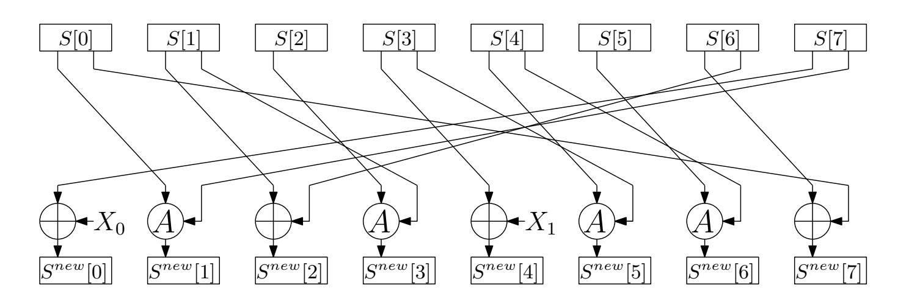
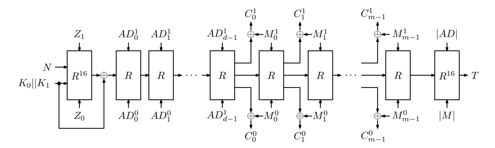
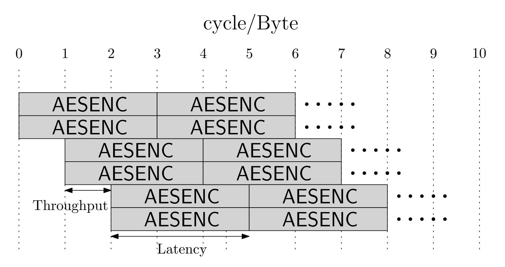
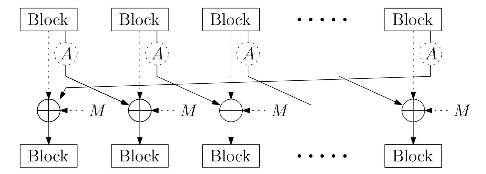
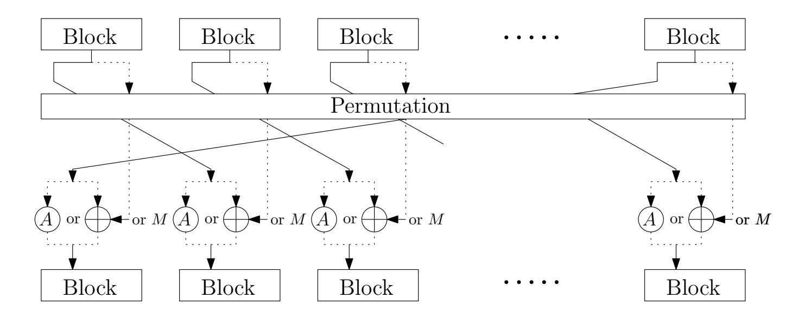
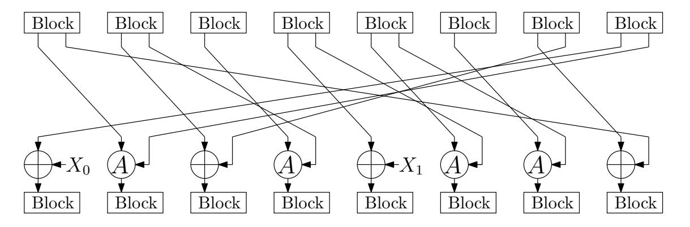
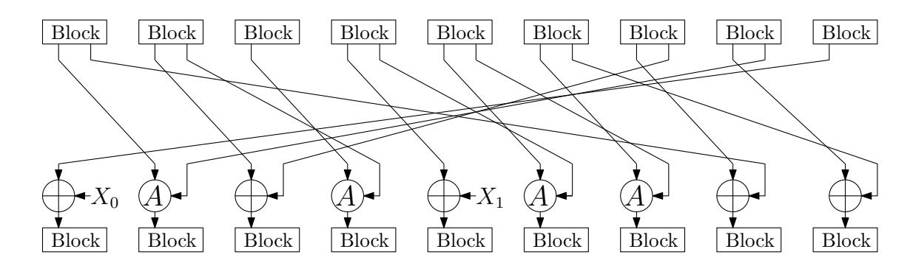
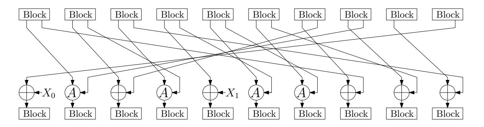

{0}------------------------------------------------

# **Rocca: An Efficient AES-based Encryption Scheme for Beyond 5G***<sup>⋆</sup>*

Kosei Sakamoto<sup>1</sup> and Fukang Liu<sup>1</sup> and Yuto Nakano<sup>2</sup> and Shinsaku Kiyomoto<sup>2</sup> and Takanori Isobe<sup>1</sup>*,*3*,*<sup>4</sup>

 University of Hyogo, Kobe, Japan. takanori.isobe@ai.u-hyogo.ac.jp, liufukangs@gmail.com, k.sakamoto0728@gmail.com KDDI Research, Fujimino, Japan. yuto@kddi-research.jp, kiyomoto@kddi-research.jp NICT, Tokyo, Japan PRESTO, Japan Science and Technology Agency, Tokyo, Japan

**Abstract.** In this paper, we present an AES-based authenticated-encryption with associated-data scheme called Rocca, with the purpose to reach the requirements on the speed and security in 6G systems. To achieve ultrafast software implementations, the basic design strategy is to take full advantage of the AES-NI and SIMD instructions as that of the AEGIS family and Tiaoxin-346. Although Jean and Nikolić have generalized the way to construct efficient round functions using only one round of AES (aesenc) and 128-bit XOR operation and have found several efficient candidates, there still seems to exist potential to further improve it regarding speed and state size. In order to minimize the critical path of one round, we remove the case of applying both aesenc and XOR in a cascade way for one round. By introducing a cost-free block permutation in the round function, we are able to search for candidates in a larger space without sacrificing the performance. Consequently, we obtain more efficient constructions with a smaller state size than candidates by Jean and Nikolić. Based on the newly-discovered round function, we carefully design the corresponding AEAD scheme with 256-bit security by taking several reported attacks on the AEGIS family and Tiaxion-346 into account. Our AEAD scheme can reach 150 Gbps which is almost 5 times faster than the AEAD scheme of SNOW-V. Rocca is also much faster than other efficient schemes with 256-bit key length, e.g. AEGIS-256 and AES-256-GCM. As far as we know, Rocca is the first dedicated cryptographic algorithm targeting 6G systems, i.e., 256-bit key length and the speed of more than 100 Gbps.

**Keywords:** AES-NI, Fast Software Implementation, 6G, AEAD

*<sup>⋆</sup>* This is an updated and extended version from conference version [\[SLN](#page-26-0)<sup>+</sup>21].

{1}------------------------------------------------

## <span id="page-1-0"></span>**1 Introduction**

## **1.1 Background**

The fifth-generation mobile communication systems (5G) have been launched in several countries for commercial services since 2020. Besides, researches for beyond-5G or 6G have been already started in some research institutes. As the first white paper of 6G, [\[LaL19\]](#page-26-1) was published by the 6Genesisi project in 2019, which is mainly organized by the University of Oulu in Finland. In the white paper, several requirements for 6G systems are raised. For the data transmission speed, it says that 6G achieves more than 100 Gbps, which is more than 10 times faster than that of 5G.

For the 4G system, as underlying cryptographic algorithms to ensure confidentiality and integrity, SNOW 3G [\[SAG06\]](#page-26-2), AES [\[Nat01\]](#page-26-3), and ZUC-128 [\[SAG11\]](#page-26-4) are employed, which are specified as 128-EEA1 (EIA1), 128-EEA2 (EIA2), 128-EEA3 (EIA3), respectively, and these algorithms are also selected cryptographic algorithms for the 5G system as 128-NEA1 (NIA1), 128-NEA2 (NIA2), 128-NEA3 (NIA3). However, for the 5G system, the 3GPP standardization organization requires to increase the security level to 256-bit key lengths. In 2018, ZUC-256 [\[The18\]](#page-27-0) was proposed as the 256-bit key version of ZUC-128. ZUC-256 was revised only in the initialization phase and in the MAC generation phase from ZUC-128. By this revise, ZUC-256 improves the security level against the keyrecovery attack to the 256-bit security from the 128-bit security. On the other hand, the performance of the encryption/decryption speed is not quite improved because the key-stream generation phase is the same as ZUC-128, and a structural weakness was found [\[YJM20\]](#page-27-1). In FSE 2020, Ekdahl *et al.* proposed SNOW-V that is the 256-bit key version of SNOW 3G, and they showed that SNOW-V achieves more than 38 Gbps at an AEAD (Authenticated Encryption with Associated Data) mode on OpenSSL [\[EJMY19\]](#page-25-0). The performances of SNOW-V are sufficient for them to be used in the 5G system.

However, when taking requirements in 6G systems into account, we have to tackle some challenges. The biggest one is the encryption/decryption speed. For 6G systems, as the data transmission speed is expected to reach more than 100 Gbps, we have to design a cryptographic algorithm with the encryption/decryption speed of more than 100 Gbps, which is at least three times faster than SNOW-V. Besides, achieving 256-bit security against key-recovery attacks is essential as in 5G systems [\[3GP18\]](#page-25-1). In addition, due to the increase of data transmissions in 6G systems, it is necessary to ensure at least 128-bit security against distinguishing attacks while SNOW-V only claims 64-bit security against distinguishing attacks. Therefore, there is no doubt that a new cryptographic algorithm is needed in 6G systems.

For symmetric-key primitives targeting high-performance applications, there are several interesting cryptographic algorithms. The most tempting ones are those employing AES-NI [\[Gue10,](#page-25-2) [Corb\]](#page-25-3), which is a new AES instruction set equipped on many modern CPUs from Intel and AMD. Some SoCs for mobile devices are also equipped with an instruction set for AES [\[arm21\]](#page-25-4), and more

{2}------------------------------------------------

and more SoCs will support the instruction by the time 6G system is realized. Hence employing AES-NI seems reasonable in designing cryptographic algorithms for 6G systems. The AEGIS family and Tiaoxin-346 belongs to such a category, which are two submissions to the CAESAR competition [\[cae18\]](#page-25-5) and AEGIS-128 has been selected in the final portfolio for high-performance applications. The round functions of the AEGIS family and Tiaoxin-346 are quite similar. Specifically, they are only based on the usage of one AES round and the 128-bit XOR operation, both of which have been realized with one instruction on SIMD (Single Instruction, Multiple Data) instructions. As a result, both the AEGIS family and Tiaoxin-346 are competitive in terms of encryption/decryption speed in a pure software environment, if compared with many primitives.

Jean and Nikolić generalized the method to design efficient round functions as that used in AEGIS and Tiaoxin-346 in [\[JN16\]](#page-26-5). After a thorough search, they discovered round functions that can achieve a faster speed than any of the round functions adopted in the AEGIS family and Tiaoxin-346 and provide the 128-bit security against forgery attacks. However, they did not propose a concrete AEAD scheme [\[JN16\]](#page-26-5).

Obviously, AEGIS-128, AEGIS-128L and Tiaoxin-346 do not meet the security requirement of the 256-bit key length in 6G systems. In addition, according to our experiments, AEGIS-256 does not reach more than 100 Gbps (See Sect. [5\)](#page-23-0). However, those researches leave us the potential of designing the faster cryptographic algorithm based on AES round functions for 6G.

## **1.2 Our Design**

In this paper, we present an AES-based encryption scheme with a 256-bit key and 128-bit tag called Rocca, which provides both a raw encryption scheme and an AEAD scheme with a 128-bit tag. The goal of Rocca is to meet the requirement in 6G systems in terms of both performance and security. For performance, Rocca achieves an encryption/decryption speed of more than 100 Gbps in both raw encryption scheme and AEAD scheme. For security, Rocca can provide 256-bit and 128-bit security against key-recovery attacks and forgery attacks, respectively.

*Optimized AES-NI-Friendly Round Function* To achieve such a dramatically fast encryption/decryption speed, Rocca is designed for a pure software environment that can fully support both the AES-NI and SIMD instructions. The design of the round function of Rocca is inspired by the work of Jean and Nikolić [\[JN16\]](#page-26-5). To further increase its speed and reduce the state size, we explore a new class of AES-based structures. Specifically, we take the following different approaches.

**–** To minimize the critical path of the round function, we focus on the structure where each 128-bit block of the internal state is updated by either one AES round or XOR while Jean and Nikolić consider the case of applying both aesenc and XOR in a cascade way for one round, and most efficient structures in [\[JN16\]](#page-26-5) are included in this class.

{3}------------------------------------------------

**–** We introduce a permutation between the 128-bit state words of the internal state in order to increase the number of possible candidates while keeping efficiency as executing such a permutation is a cost-free operation in the target software, which was not taken into account in [\[JN16\]](#page-26-5).

We search for round functions that can ensure 128-bit security against forgery attacks in a class of our general constructions as with [\[JN16\]](#page-26-5). Consequently, we succeed in discovering more efficient constructions with a smaller state size than those in [\[JN16\]](#page-26-5). The internal state of Rocca consists of eight 128-bit words and its round function is composed of 4 aesencs and 4 128-bit XOR operations, which is significantly faster than those of the AEGIS family, Tiaxion-346 and Jean and Nikolić's structure [\[JN16\]](#page-26-5).

*Encryption and Authentication Scheme.* To resist against the statistical attack in [\[Min14\]](#page-26-6), generating each 128-bit ciphertext block will additionally require one AES round, while it is generated with simple quadratic boolean functions in the AEGIS family and Tiaxion-346. However, such a way will have few overhead by AES-NI (See Sect. [3\)](#page-8-0). Moreover, a study on the initialization phases for both reduced AEGIS-128 and Tiaoxin-346 has been reported recently [\[LIMS21\]](#page-26-7). To further increase the resistance against the reported attacks, how to place the nonce and the key at the initial state is carefully chosen in our scheme.

*Performance* The encryption/decryption speed of Rocca is dramatically improved compared with other AES-based encryption schemes. Rocca is more than three and four times faster than SNOW-V and SNOW-V-GCM, respectively, i.e. the speed reaches 215 and 178 Gbps, respectively. Compared to other schemes with 256-bit key, Rocca is more than five times faster than AEGIS-256 and more than three times faster than AES-256-GCM in our evaluations (See Sect. [5](#page-23-0) and Appendix. [A\)](#page-28-0). Moreover, Rocca is also faster than AEGIS-128, AEGIS-128L, and Tiaoxin-346 even though Rocca provides a higher security level. To the best of our knowledge, Rocca is the first dedicated cryptographic algorithm targeting 6G systems and we hope it can inspire future designs.

## **1.3 Version History**

The difference from the conference version [\[SLN](#page-26-0)<sup>+</sup>21] is that key feedforward is added in initialization to be secure against cryptanalysis on the first version of Rocca [\[HII](#page-25-6)<sup>+</sup>22]. Note that key feedforward to finalization, which was suggested by [\[HII](#page-25-6)<sup>+</sup>22], has been removed due to the security issues. Along with this change, we add the security evaluation against new attack in [4.6](#page-22-0) and update software performance. Here, we would like to enhasize that *there is no overhead in any enviroment due to this change*.

The other changes from the conference version [\[SLN](#page-26-0)<sup>+</sup>21] are in the followings: (1) updated security claims of Rocca by taking consideration into the security requirements for 6G (See Sect. [2.3\)](#page-5-0) (2) showed the limitation of the message length and the length of the associated data (See Sect. [2.3\)](#page-5-0). (3) Added software

{4}------------------------------------------------

performance results on Intel's CPUs and ARM-based SoCs (See Appendix [A\)](#page-28-0). (4) Modified typo in Algorithm [1](#page-7-0) regarding the decryption.

## **1.4 Organization**

This paper is organized as follows. We first present the specification of Rocca in Sect. [2.](#page-4-0) Then, we describe the design rationale, such as the general construction based on AES-NI, criteria for performance and security, and how to find efficient round functions in Sect. [3.](#page-8-0) In Sect. [4,](#page-17-0) we provide the details of security evaluations against possible attacks on Rocca. Sect. [5](#page-23-0) shows our software implementation results. Finally, we conclude this paper in Sect. [6.](#page-24-0)

## <span id="page-4-0"></span>**2 Preliminaries**

In this section, the notations and the specification of our designs will be described.

## **2.1 Notations**

The following notations will be used in the paper. Throughout this paper, a block means a 16-byte value. For the constants *Z*<sup>0</sup> and *Z*1, we utilize the same ones as Tiaoxin-346 [\[Nik14\]](#page-26-8).

- 1. *S*: The state of Rocca, which is composed of 8 blocks, i.e. *S* = (*S*[0]*, S*[1]*, . . . , S*[7]), where *S*[*i*] (0 ≤ *i* ≤ 7) are blocks and *S*[0] is the first block.
- 2. *Z*0: A constant block defined as *Z*<sup>0</sup> = 428a2f98d728ae227137449123ef65cd.
- 3. *Z*1: A constant block defined as *Z*<sup>1</sup> = b5c0fbcfec4d3b2fe9b5dba58189dbbc.
- 4. AES(*X, Y* ): One AES round applied to the block *X*, where the round constant is *Y* , as defined below:

$$\mathsf{AES}(X,Y) = (\mathsf{MixColumns} \circ \mathsf{ShiftRows} \circ \mathsf{SubBytes}(X)) \oplus Y,$$

where MixColumns, ShiftRows and SubBytes are the same operations as defined in AES.

5. *A*(*X*): The AES round function without the constant addition operation, as defined below:

$$A(X) = \text{MixColumns} \circ \text{ShiftRows} \circ \text{SubBytes}(X),$$

- 6. |*X*|: The length of *X* in bits.
- 7. 0 *l* : A zero string of length *l* bits.
- 8. *X*||*Y* : The concatenation of *X* and *Y* .
- 9. *R*(*S, X*0*, X*1): The round function used to update the state *S*.

{5}------------------------------------------------

#### 2.2 The Round Update Function

The input of the round function  $R(S, X_0, X_1)$  of Rocca consists of the state S and two blocks  $(X_0, X_1)$ . If denoting the output by  $S^{new}$ ,  $S^{new} \leftarrow R(S, X_0, X_1)$  can be defined as follows:

$$S^{new}[0] = S[7] \oplus X_0,$$
  
 $S^{new}[1] = AES(S[0], S[7]),$   
 $S^{new}[2] = S[1] \oplus S[6],$   
 $S^{new}[3] = AES(S[2], S[1]),$   
 $S^{new}[4] = S[3] \oplus X_1,$   
 $S^{new}[5] = AES(S[4], S[3]),$   
 $S^{new}[6] = AES(S[5], S[4]),$   
 $S^{new}[7] = S[0] \oplus S[6].$ 

The corresponding illustration can be referred to Figure 1.

<span id="page-5-1"></span>

Fig. 1: Illustration of the round function

#### <span id="page-5-0"></span>2.3 Specification of Rocca

Rocca is an authenticated-encryption with associated-data scheme composed of four phases: initialization, processing the associated data, encryption and finalization. The input consists of a 256-bit key  $K_0||K_1 \in \mathbb{F}_2^{128} \times \mathbb{F}_2^{128}$ , a 128-bit nonce N, the associated data AD and the message M. The output is the corresponding ciphertext C and a 128-bit tag T. Define  $\overline{X} = X||0^l$  where l is the minimal non-negative integer such that  $|\overline{X}|$  is a multiple of 256. In addition, write X as  $X = X_0||X_1||\dots||X_{\frac{|X|}{256}-1}$  with  $|X_i| = 256$ . Further,  $X_i$  is written as  $X_i = X_i^0||X_i^1|$  with  $|X_i^0| = |X_i^1| = 128$ .

Initialization. First,  $(N, K_0, K_1)$  is loaded into the state S in the following way:

$$S[0] = K_1, S[1] = N, S[2] = Z_0, S[3] = Z_1,$$

{6}------------------------------------------------

$$S[4] = N \oplus K_1, S[5] = 0, S[6] = K_0, S[7] = 0.$$

Here, two 128-bit constants *Z*<sup>0</sup> and *Z*<sup>1</sup> are encoded as 16-byte little endian words and loaded into *S*[2] and *S*[3] respectively. Then, 20 iterations of the round function *R*(*S, Z*0*, Z*1) is applied to the state *S*. After 20 iterations of the round function, two 128-bit keys are XORed with the state *S* in the following way;

$$S[0] = S[0] \oplus K_0,$$
  

$$S[4] = S[4] \oplus K_1.$$

*Processing the associated data.* If *AD* is empty, this phase will be skipped. Otherwise, *AD* is padded to *AD* and the state is updated as follows:

for 
$$i=0$$
 to  $d-1$  
$$R(S,\overline{AD}_i^0,\overline{AD}_i^1),$$
 end for

where 
$$d = \frac{|\overline{AD}|}{256}$$
.

*Encryption.* The encryption phase is similar to the phase to process the associated data. If *M* is empty, the encryption phase will be skipped. Otherwise, *M* is first padded to *M* and then *M* will be absorbed with the round function. During this procedure, the ciphertext *C* is generated. If the last block of *M* is incomplete and its length is *b* bits, i.e. 0 *< b <* 256, the last block of *C* will be truncated to the first *b* bits. A detailed description is shown below:

for 
$$i=0$$
 to  $m-1$  
$$C_i^0 = \mathsf{AES}(S[1],S[5]) \oplus \overline{M}_i^0,$$
 
$$C_i^1 = \mathsf{AES}(S[0] \oplus S[4],S[2]) \oplus \overline{M}_i^1,$$
 
$$R(S,\overline{M}_i^0,\overline{M}_i^1),$$
 end for

where *m* = |*M*| <sup>256</sup> .

*Finalization.* After the above three phases, the state *S* will again pass through 20 iterations of the round function R(*S,* |*AD*|*,* |*M*|) and then the tag is computed in the following way:

$$T = \bigoplus_{i=0}^{7} S[i].$$

The length of associated data and message is encoded as 16-byte little endian word and stored into |*AD*| and |*M*|, respectively.

A formal description of Rocca can be seen in Algorithm [1](#page-7-0) and the corresponding illustration is shown in [Figure 2.](#page-8-1)

{7}------------------------------------------------

#### <span id="page-7-0"></span>**Algorithm 1** The specification of Rocca

```
1: procedure RoccaEncrypt(K_0, K_1, N, AD, M)
 2:
          S \leftarrow \text{Initialization}(N, K_0, K_1)
          if |AD| > 0 then
 3:
 4:
               S \leftarrow \mathtt{ProcessAD}(S,AD)
          if |M| > 0 then
 5:
 6:
               S \leftarrow \texttt{Encryption}(S, M, C)
 7:
               Truncate C
          T \leftarrow \mathtt{Finalization}(S, |AD|, |M|)
 8:
 9:
          return (C,T)
10: procedure RoccaDecrypt(K_0, K_1, N, AD, C, T)
11:
           S \leftarrow \mathtt{Initialization}(N, K_0, K_1)
12:
          if |AD| > 0 then
               S \leftarrow \mathtt{ProcessAD}(S, AD)
13:
          if |C| > 0 then
14:
               S \leftarrow \mathtt{Decryption}(S, \overline{C}, M)
15:
               Truncate M
16:
17:
          if T = \text{Finalization}(S, |AD|, |C|) then
18:
               return M
          else
19:
20:
               \operatorname{return} \perp
21: procedure Initialization(N, K_0, K_1)
           (S[0], S[1], S[2], S[3]) \leftarrow (K_1, N, Z_0, Z_1)
22:
23:
          (S[4], S[5], S[6], S[7]) \leftarrow (N \oplus K_1, 0, K_0, 0)
24:
          for i = 0 to 19 do
               S \leftarrow R(S, Z_0, Z_1)
25:
          (S[0], S[4]) \leftarrow (S[0] \oplus K_0, S[4] \oplus K_1)
26:
          return S
27:
28: procedure ProcessAD(S, AD)
          d \leftarrow \frac{|AD|}{256}
29:
          for i = 0 to d - 1 do
30:
               S \leftarrow R(S, AD_i^0, AD_i^1)
31:
          return S
32:
33: procedure Encryption(S, M, C)
          m \leftarrow \frac{|M|}{256}

for i = 0 to m - 1 do
34:
35:
               \begin{aligned} C_i^0 &\leftarrow \mathsf{AES}(S[1], S[5]) \oplus M_i^0 \\ C_i^1 &\leftarrow \mathsf{AES}(S[0] \oplus S[4], S[2]) \oplus M_i^1 \end{aligned}
36:
37:
               S \leftarrow R(S, M_i^0, M_i^1)
38:
          return S
39:
40: procedure Decryption(S, M, C)
          c \leftarrow \tfrac{|C|}{256}
41:
42:
          for i = 0 to c - 1 do
               \begin{split} & M_i^0 \leftarrow \mathsf{AES}(S[1], S[5]) \oplus C_i^0 \\ & M_i^1 \leftarrow \mathsf{AES}(S[0] \oplus S[4], S[2]) \oplus C_i^1 \\ & S \leftarrow R(S, M_i^0, M_i^1) \end{split}
43:
44:
45:
          return S
46:
47: procedure Finalization(S, |AD|, |M|)
          for i = 0 to 19 do
48:
               S \leftarrow R(S, |AD|, |M|)
49:
50:
          T \leftarrow 0
          for i = 0 to 7 do
51:
               T \leftarrow T \oplus S[i]
52:
53:
          return T
```

{8}------------------------------------------------

<span id="page-8-1"></span>

**Fig. 2:** The procedure of Rocca

A raw encryption scheme. If the phases of processing the associated data and finalization are removed, a raw encryption scheme is obtained.

Security claims. Rocca provides 256-bit security against key-recovery and 128-bit security against distinguishing and forgery attacks in the nonce-respecting setting<sup>5</sup>. We do not claim its security in the related-key and known-key settings.

The message length for a fixed key is limited to at most  $2^{128}$  and we also limit the number of different messages that are produced for a fixed key to be at most  $2^{128}$ . The length of associated data of a fixed key is up to  $2^{64}$ .

## <span id="page-8-0"></span>3 Design Rationale

## 3.1 General Construction

SIMD instruction. The prime design goal of Rocca is to meet the requirements of processing/transmission speed for 6G applications, namely more than 100 Gbps [LaL19]. In order to realize fast encryption/decryption speed (hereafter, we simply call "speed") on a pure software environment, we take full advantage of the SIMD instructions and the AES-NI, both of which are equipped on most of modern CPUs. The SIMD instructions contains some fundamental instructions such as XOR and AND, and can execute them by 32/64/128-bit units as one instruction, where the AES-NI is a special set of the SIMD instructions, which is first rolled out by Intel [Cora] and available on modern processors. The AES-NI can execute AES about 10 times faster than non-AES-NI in parallelizable modes such as CTR mode. In this paper, we utilize on aesenc, which is one of instruction

<span id="page-8-2"></span><sup>&</sup>lt;sup>5</sup> We updated the claimed security of distinguishing attacks from the ToSC version [SLN<sup>+</sup>21] for the following reasons. The most well-known and popular distinguishing attack on the keystream seems to be the linear attack. Such a distinguishing attack often requires a large number of plaintexts. If the data complexity exceeds the time complexity to find the key with Grover's algorithm, we view such an attack as invalid in the quantum setting. Therefore, regarding the distinguishing attack, we only claim 128-bit security in the quantum setting and a meaningful distinguishing attack in the classical setting should have data complexity below 2<sup>128</sup>.

{9}------------------------------------------------

sets of AES-NI, and performs one regular (not the last) round of AES on an input state S with a subkey *K*:

aesenc(*S, K*) = (MixColumns ◦ ShifRows ◦ SubBytes(*S*)) ⊕ *K.*

The execution speed of these instructions can be evaluated by *latency* and *throughput*, where latency is the number of clock cycles required to execute a single instruction and throughput is the required number of clock cycles before the same instruction to be executed. It is important when considering the parallel execution. Table [1](#page-9-0) shows latency and throughput of aesenc [\[RTL\]](#page-26-9) in each architecture. Among existing architectures, we focus the latest architecture Intel Ice-Lake series that has the fastest AES-NI whose latency and throughput of aesenc are 3 and 0.5, respectively. Figure [3](#page-10-0) illustrates an example of the process in the parallel execution of aesenc for Intel Ice-lake whose latency and throughput are 3 and 0.5[6](#page-9-1) , respectively.

Employing one AES round as an underlying component for future designs has a great merit for performance compared to employing other cryptographic primitives. Many software and libraries support AES-NI natively, e.g OpenSSL. Thus, it seems to be very reasonable that devices connected to 6G services will still support such instructions. SNOW-V also takes advantage of AES-NI for the same reason.

<span id="page-9-0"></span>**Table 1:** Latency and throughput of aesenc for some architectures by Intel and AMD referred by [\[RTL\]](#page-26-9).

|       | Vendor Architecture Latency Throughput |         |         |  |
|-------|----------------------------------------|---------|---------|--|
|       | Sky-lake                               | 4       | 1       |  |
|       | Kaby-lake                              | 4       | 1       |  |
|       | Coffee-lake                            | 4       | 1       |  |
| Intel | Cannon-lake                            | 4       | 0.5     |  |
|       | Cascade-lake                           | 4       | 1       |  |
|       | Comet-lake                             | unknown | unknown |  |
|       | Ice-lake                               | 3       | 0.5     |  |
|       | Zen +                                  | 4       | 0.5     |  |
| AMD   | Zen 2                                  | 4       | 0.5     |  |

**Permutation-based Structure.** As a reference point, we consider a stream cipher SNOW-V, which is designed for 5G applications. SNOW-V is based on linear feedback shift register (LFSR) and Finite State Machine(FSM) with AESbased round functions. As discussed in Section [1,](#page-1-0) if we follow this design strategy, we need to accelerate the performance approximately at least three times faster than SNOW-V to achieve the required performance of 100 Gbps. Thus, we decide to choose other design strategies based on AES round functions.

<span id="page-9-1"></span><sup>6</sup> Throughput 0.5 means that there are two ports for aesenc with throughput 1.

{10}------------------------------------------------

<span id="page-10-0"></span>

**Fig. 3:** The process of aesenc for Intel Ice-lake.

Specifically, we focus on AEGIS family [\[WP13\]](#page-27-2) and Tiaoxin-346 [\[Nik14\]](#page-26-8), which are permutation-based authenticated encryption schemes using AES round functions and submitted to CAESAR competition [\[cae18\]](#page-25-5). These allow a full parallelization and can achieve the outstanding speed compared to AES-CTR.

However, as it has been pointed out that there exists a linear bias in the ciphertext blocks for AEGIS-256 [\[Min14\]](#page-26-6), it seems insecure to adopt the similar quadratic boolean function to generate the ciphertexts, especially for the purpose to reach 256-bit security. This fact motivates us to design different ways to generate the ciphertext blocks and finally involving 1 AES round function into generating each ciphertext block is chosen. Such a way is efficient due to the parallel calls to AES-NI. Moreover, a study on the initialization phases for both reduced AEGIS-128 and Tiaoxin-346 has been reported recently [\[LIMS21\]](#page-26-7). To further increase the resistance against the reported attacks, how to place the nonce and the key at the initial state is carefully chosen in our scheme, which is little discussed in AEGIS and Tiaoxin-346.

**Efficient AES-Based Round Function.** Round functions of AEGIS family [\[WP13\]](#page-27-2) and Tiaoxin-346 [\[Nik14\]](#page-26-8) consist of the 128-bit XOR operation and one AES round that is executed by the processor instruction aesenc. Jean and Nikolić have generalized the way to construct efficient round functions using only the one AES round (aesenc) and 128-bit XOR and have found several more efficient candidates [\[JN16\]](#page-26-5). Figure [4](#page-11-0) shows the general construction of the round function considered in [\[JN16\]](#page-26-5).

To push the limitation further of efficiency of their structures, we explore a new class of AES-based structures shown in Fig [5.](#page-12-0) Compared to the structures considered by Jean and Nikolić results [\[JN16\]](#page-26-5), our constructions remove the case of applying both aesenc and XOR to each block in a cascade way for one round

{11}------------------------------------------------

<span id="page-11-0"></span>

**Fig. 4:** The general construction considered of the round function in [\[JN16\]](#page-26-5). Dash lines mean that it can be possible to be absent or present in the design.

to minimize the critical path of one round. Specifically, we only consider the case of applying only either aesenc or 128-bit XOR to each block in one round, where aesenc takes a state block or message block as input of AddRoundKey and 128-bit XOR takes state block or message block as inputs, respectively as shown in Figure [5.](#page-12-0)

Moreover, we apply a block permutation to state blocks, which was not considered by Jean and Nikolić (See Fig [4\)](#page-11-0). This sufficiently increases the number of possible candidates. Indeed, as described in later section, it enables us to find more efficient constructions than Jean and Nikolić's results, which is not covered by their target classes. It should be emphasized that executing the block permutation in register size is a cost-free operation, that is, the permutation only changes the order of blocks. More strictly, a permutation needs some temporary registers. However, these registers almost do not affect the speed if the total number of registers used in process of the scheme is lower than 16, which is the total number of xmm-registers equipped in almost all modern CPUs. Hence, applying a block permutation does not affect the speed of the round function. For a block that will be inputted into aesenc or XOR, we use one-block right rotation as in [\[JN16\]](#page-26-5).

## <span id="page-11-1"></span>**3.2 Criteria for Performance and Security**

For designing efficient round functions, we need to choose several parameters such as the number of aesencs, the number of inserted message blocks, and a block permutation for our structure in Fig. [5.](#page-12-0) We clarify requirements of performance and security for target applications to choose these parameters.

*Requirements for Performance.* To theoretically estimate speed, we utilize a metric called *rate*, which is proposed by Jean and Nikolić [\[JN16\]](#page-26-5).

**Definition 1 (Rate [\[JN16\]](#page-26-5))** *The rate p of a design is the number of* AES *rounds (calls to* aesenc*) used to process a 128-bit message.*

{12}------------------------------------------------

<span id="page-12-0"></span>

**Fig. 5:** General construction of the round function. Dash lines mean that it can be possible to be absent or present in the design.

For our general construction of Fig [5,](#page-12-0) the *rate p* is estimated as a ratio of (# of aesencs)/( # of the inserted 128-bit messages) in one round. Since a smaller *rate* leads to more efficient design [\[JN16\]](#page-26-5), we should design the round function that have as small *rate* as possible. The *rate* is the most important parameter for speed.

The number of aesenc in one round is also important factor to maximize the efficiency. Jean and Nikolić claim that the number of aesenc in one round should be close to (latency)/(throughput) ratio [\[JN16\]](#page-26-5) for the efficient design, e.g. if the latency and throughput of aesenc are respectively 3 and 0.5, the number of aesenc should be 6 in one round. The reason is when the number of aesencs is less than a (latency)/(throughput) ratio, there are empty cycles in process of aesenc. On the other hand, if the number of aesencs is the same as (latency)/(throughput) ratio, there is no empty cycles as shown in Figure [3.](#page-10-0) Since our target architecture is Ice-lake, the number of aesenc in a round should be 6.

Another important factor related to speed is the number of blocks of round functions, namely the state size. Smaller state size significantly improves the efficiency because it can reduce registers used for encryption and makes a whole process of encryption easier. We experimentally confirmed that reducing the number of blocks leads to increasing speed when the *rate* is the same. Table [2](#page-13-0) shows our experimental result that compares three types of round functions of the *rate* 2 with the number of blocks of 8, 9, and 10, each of which is measured on Intel(R) Core(TM) i7-1068NG7 CPU @ 2.30GHz with 16 GB RAMs. Details of these round functions are given in Appendix [B.](#page-31-0) Besides, a smaller state size is a preferable feature to be deployed in wider classes of devices with keeping the efficiency. It is because this, that some CPUs, such as ones from AMD, do not support the large size register like AVX512, and the process requiring the use of many registers tends to become more complicated on these CPUs. Since the number of blocks of SNOW-V, which is our reference point, is 7, the state size should be competitive.

{13}------------------------------------------------

<span id="page-13-0"></span>**Table 2:** Comparison of the performance of the round function having different number of blocks at the same *rate*.

|    | # of blocks Speed (in cycle/Byte) rate |   |
|----|----------------------------------------|---|
| 8  | 0.126717                               | 2 |
| 9  | 0.147397                               | 2 |
| 10 | 0.155584                               | 2 |

*Requirements for Security.* Since evaluating the resistance to all possible attacks for all possible candidates is practically infeasible, we focus on the security against the forgery attack by the internal collision as a criteria of security when finding candidates, as with [\[JN16\]](#page-26-5). Especially, we impose the 128-bit security against the forgery attack on our design, i.e. our security requirement is that there are no internal collisions with a probability more than 2 <sup>−</sup><sup>128</sup>. Through this paper, "forgery attacks" is meant to be a universal forgery in the nonce-respecting setting.

To evaluate the probability of the internal collision, we search the lower bound for the number of active S-boxes by a Mixed Integer Linear Programming (MILP) solver [\[MWGP11\]](#page-26-10). Since the maximum probability of an S-box is 2 −6 , it is sufficient to guarantee the security against internal collisions if there are 22 active S-boxes, as it gives 2 (−6×22) *<* 2 <sup>−</sup><sup>128</sup> as an estimate of differential probability. For the security against other possible attacks, we evaluate after designing a whole design, and it will be described in Sect. [4.](#page-17-0)

*Summary of Our Criteria.* Requirements for AES-based round function are as follows.

For speed.

**Requirement 1.** The lowest *rate* round function as possible that leads to faster speed.

**Requirement 2.** The number of aesencs in one round is close to 6.

**Requirement 3.** A round function with a smaller number of blocks (around 7).

For security.

**Requirement 4.** 128-bit security to the forgery attack by internal collision, i.e. the lower bound of active S-boxes is 22.

For comparison, Table [3](#page-14-0) shows parameters of the round function in the AEGIS [\[WP13\]](#page-27-2) family, Tiaoxin-346 [\[Nik14\]](#page-26-8) and structure by Jean and Nikolić [\[JN16\]](#page-26-5).

## **3.3 Finding Efficient Structures**

We choose several parameters such as the number of aesencs, the number of inserted message blocks, and a block permutation to meet requirements given

{14}------------------------------------------------

Table 3: Round functions of AEGIS family and Tiaoxin-346

<span id="page-14-0"></span>

| Primitive   | # of aesenc | # of blocks | # of inserted message blocks | rate |
|-------------|-------------|-------------|------------------------------|------|
| AEGIS-128   | 5           | 5           | 1                            | 5    |
| AEGIS-256   | 6           | 6           | 1                            | 6    |
| AEGIS-128L  | 8           | 8           | 2                            | 4    |
| Tiaoxin-346 | 6           | 13          | 2                            | 3    |
| [JN16]      | 6           | 12          | 3                            | 2    |

in Sect. 3.2. The number of possible candidates is estimated as  $s! \times \binom{s}{a} \times \binom{s}{m}$  candidates where s, a, and m are # of blocks, # of aesenc, and # of message blocks, respectively. For example, it reaches  $2^{35.00}$  candidates when s = 10, a = 4, and m = 2.

Our Approach. According to Table 3, the most efficient design is Jean and Nikolić's structure whose rate is 2. However, their state size is quite large for our requirement. In our experiments, the round functions with a smaller rate require a larger number of blocks to meet the security requirement. Indeed, we cannot find any structure of rate 2 and less than 12 internal blocks by Jean and Nikolić's constructions (Fig.4) [JN16]. To address it, our approach is as follow.

- To expand possible candidates while keeping efficiency, we introduce a block permutation to state blocks in the round function, while Jean and Nikolić did not consider any permutation. It should be emphasized that executing the block permutation in register size is a cost-free operation.
- To further improve the efficiency, we focus on the structure in which each block in one round is applied only either aesenc or XOR to minimized the critical path of the round function.

Search Targets. When the number of inserted message blocks is m, the number of aesencs in one round should be (6-m) to satisfy requirement 2 as m aesenc is used for generating ciphertext blocks for our design to the resistance to the linear bias (details in Section 3.5). Considering requirement 1 (rate = 2), the only choice of m is 2, thus the number of aesencs is 4. Following requirement 3, we consider the case where # of blocks are from 6 to 8. Besides, we consider the case where rate = 1.5 that can not satisfy requirement 2, because the low rate round function might be possible to more efficient even if it does not meet requirement 2. Table 4 shows our candidates of the round function.

We evaluate the lower bounds for the number of active S-boxes for Candidate-1, 2, 3, 4, 5, and 6 by a MILP solver. We can conduct exhaustive searches for Candidates-1, 2, 4, and 5 while exhaustive searches for Candidates-3 and 6 are infeasible due to too large candidates that reach  $2^{26.23}$  and  $2^{25.91}$  for Candidates-3 and 6, respectively. Thus, we randomly search  $2^{19.93}$  candidates for both Candidate-3 and 6.

{15}------------------------------------------------

Table 4: Candidates of round functions which we search.

<span id="page-15-0"></span>

| Round function | # of aesenc | # of blocks | # of message blocks | rate | # of candidates | # of searched candidates |
|----------------|-------------|-------------|---------------------|------|-----------------|--------------------------|
| Candidates-1   | 4           | 6           | 2                   | 2    | $2^{17.30}$     | ALL                      |
| Candidates-2   | 4           | 7           | 2                   | 2    | $2^{21.82}$     | ALL                      |
| Candidates-3   | 4           | 8           | 2                   | 2    | $2^{26.23}$     | 2 <sup>19.93</sup>       |
| Candidates-4   | 3           | 6           | 2                   | 1.5  | $2^{17.72}$     | ALL                      |
| Candidates-5   | 3           | 7           | 2                   | 1.5  | $2^{21.82}$     | ALL                      |
| Candidates-6   | 3           | 8           | 2                   | 1.5  | $2^{25.91}$     | $2^{19.93}$              |

Results. As a result of an exhaustive search over Candidates-1, 2, 4, and 5, there are no round functions that satisfy the requirement 4. For candidates-6, we could not find round functions meeting requirement 4 either. For Candidates-3, we found that 100 out of  $2^{19.93}$  candidates ensure active S-boxes of  $\geq 22$ . We then evaluate a diffusion property for these 100 candidates. Then we find 22 out of 100 candidates achieve the full diffusion after 7 rounds in nibble-wise while round functions of AEGIS-128, AEGIS-256, AEGIS-128L, and [JN16] require 7, 8, 10, and 12 rounds for the full diffusion, respectively, and the one of Tiaoxin-346 never achieve the full diffusion as the state consists of three independent chucks.

We finally choose the round function shown in Fig 1 as the one of Rocca, which ensures active S-boxes of 24 that is the largest number of active S-boxes among 22 candidates. This evaluation requires about 23 days on three computers equipped with 48/64/64 cores and 256/256/256 GB RAMs.

Table 5 compares the speed of round functions of Rocca and other primitives, where speed is estimated as the average value of the round function executed 1000000 times with 64kB messages on Intel(R) Core(TM) i7-1068NG7 CPU @ 2.30GHz with 16 GB RAMs. Our round function is the fastest one and the number of blocks is smaller than ones whose rate is 2 or 3.

It should be mentioned that the comparison of the speed of round functions does not always reflect directly to the speed of the whole design. This is because that the overhead of the ciphertext generation depends on the structure of the round function, especially the empty cycle in process of XOR/aesenc.

<span id="page-15-1"></span>**Table 5:** Speed (in cycles / Byte) of round functions of Rocca, AEGIS-128, AEGIS-128L, AEGIS-256, Tiaxion-346, and JN16 (not include a generation part of a ciphertext).

| Primitive   | Speed (in cycles / Byte) | # of blocks | rate |
|-------------|--------------------------|-------------|------|
| AEGIS-128   | 0.384482                 | 5           | 5    |
| AEGIS-256   | 0.388125                 | 6           | 6    |
| AEGIS-128L  | 0.191072                 | 8           | 4    |
| Tiaoxin-346 | 0.192413                 | 13          | 3    |
| [JN16]      | 0.140433                 | 12          | 2    |
| Rocca       | 0.124609                 | 8           | 2    |

{16}------------------------------------------------

## **3.4 Loading the Nonce and Key**

It has been pointed by Liu et al. that there is one useless round in Tiaoxin-346 by expressing the internal states in terms of the nonce and the key at the initialization phase [\[LIMS21\]](#page-26-7). The main reason is that the nonce and the key are not well diffused, i.e. after a certain number of rounds, the internal state can be expressed in terms of *A*(*N*) and the key. To avoid it in Rocca, we carefully investigate how to place the nonce and the key.

In Rocca, the initial state is loaded as follows:

$$S[0] = K_1, S[1] = N, S[2] = Z_0, S[3] = Z_1,$$
  
 $S[4] = N \oplus K_1, S[5] = 0, S[6] = K_0, S[7] = 0.$ 

After one-round update, the state (*S*[0]*, . . . , S*[7]) becomes:

$$S[0] = Z_0, S[1] = A(K_1), S[2] = \underline{N \oplus K_0}, S[3] = \underline{N \oplus A(Z_0)},$$
  
$$S[4] = 0, S[5] = A(N \oplus K_1) \oplus Z_1, S[6] = \underline{N \oplus K_1}, S[7] = K_0 \oplus K_1.$$

It can be observed that *N* is xored with *K*<sup>0</sup> and *K*1, respectively. Moreover, *N* is involved in the expressions of each state block in a very different way, which can avoid the useless rounds and, at the same time, strengthen the resistance against the key-recovery attacks applied to round-reduced AEGIS-128 and Tiaoxin-346 as described in [\[LIMS21\]](#page-26-7). Further evidence can be seen from the expressions of the state blocks after 3 rounds of update, as shown below:

$$S[0] = \underline{N \oplus K_{1}},$$

$$S[1] = A(K_{0} \oplus K_{1} \oplus Z_{0}) \oplus Z_{0} \oplus N \oplus K_{1},$$

$$S[2] = A(Z_{0}) \oplus K_{0} \oplus K_{1} \oplus A(A(\underline{N \oplus K_{1}}) \oplus Z_{1}),$$

$$S[3] = A(\underline{A(K_{1}) \oplus N \oplus K_{1}}) \oplus A(Z_{0}) \oplus K_{0} \oplus K_{1},$$

$$S[4] = A(\underline{N \oplus K_{0}}) \oplus A(K_{1}) \oplus Z_{1},$$

$$S[5] = A(\underline{N \oplus A(Z_{0}) \oplus Z_{1}}) \oplus A(\underline{N \oplus K_{0}}) \oplus A(K_{1}),$$

$$S[6] = A(\underline{N \oplus A(Z_{0})}) \oplus N \oplus A(Z_{0}) \oplus Z_{1},$$

$$S[7] = K_{0} \oplus K_{1} \oplus Z_{0} \oplus A(A(\underline{N \oplus K_{1}}) \oplus Z_{1}).$$

## **3.5 Generating the Ciphertext Blocks**

In both AEGIS and Tiaoxin-346, each ciphertext block is computed based on a simple quadratic boolean function in terms of the several internal state blocks where the number of AND operations is 1. However, such a way to generate the output seems to be insecure against the statistical attack proposed by [\[Min14\]](#page-26-6), especially for the scheme targeting 256-bit security.

At the initial design phase, we tried many possible combinations to compute each ciphertext block with a similar quadratic boolean function. However, with the MILP-based method [\[ENP19\]](#page-25-8) to automatically evaluate the security against 

{17}------------------------------------------------

this statistical attack, the lower bound for the time complexity is always below  $2^{128}$ , which is far smaller than  $2^{256}$ . Therefore, new strategies are essential for Rocca.

The basic idea is to utilize a complex nonlinear function and finally the AES round function is chosen as the only nonlinear function. Due to the parallel way to perform the AES round function, such a way is indeed rather efficient and can simultaneously strengthen the security of our scheme. To reduce the overall overheads, computing each ciphertext block only utilizes 1 aesenc.

The basic principle to choose the state blocks to compute the ciphertext is that the state blocks (S[0], S[2], S[4], S[5]) passing through the AES round function in the round updated function should be involved, which can increase the number of active S-boxes in the first round. In addition, we expect that they should be processed in a different way from that in the round update function. Intuitively, this can prevent the ciphertext blocks from being related to the updated internal state blocks.

Moreover, as (S[4], S[5]) passes through the AES round function in the round update function and the two state blocks are next to each other, considering the fact that several rounds are needed, it is better to choose additional state blocks from (S[0], S[1], S[2], S[3], S[4]), which will be shifted to (S[4], S[5]) after some rounds. A detailed study of the security of our choice can be found in the following section.

We emphasize that the overhead of executing these two aesencs is few since we can assign them into empty cycles of aesenc in the round function.

## <span id="page-17-0"></span>4 Security Evaluation

#### 4.1 Differential Attack

The differential attack is one of the possible attacks on the initialization phase of Rocca. Specifically, the differences in the *nonce* (and key) can propagate to the ciphertext. If there is a differential characteristic with a high probability, it can be exploited for the differential attack. Hence, we can compute the lower bound for the number of active S-boxes in the initialization phase to evaluate the resistance against the differential attack. To compute the lower bound, we utilize a MILP-aided method proposed by Mouha et al. [MWGP11] and focus on the byte-wise truncated differences. We evaluate it in both the single-key setting where differences can only be injected into the *nonce* and the related-key setting where differences can be injected into the key and *nonce*.

Table 6 shows the lower bounds for the number of active S-boxes up to 14 rounds in the single-key setting and up to 11 rounds in the related-key setting in the initialization phase. Since the maximal differential probability of the S-box of AES is  $2^{-6}$ , it is sufficient to guarantee the security against differential attacks if there are 43 active S-boxes, as it gives  $2^{(-6\times43)} < 2^{-256}$  as an estimate of the differential probability. As shown in Table 6, there are 54 active S-boxes over 6 rounds in the single-key setting and 44 active S-boxes over 7 rounds in the

{18}------------------------------------------------

related-key setting in the initialization phase. It should be emphasized that we do not claim the security in the related-key setting, although we evaluated the number of active S-boxes in the related-key setting.

Since there is a large security margin, we expect that Rocca can resist against differential attacks in the initialization phase.

<span id="page-18-0"></span>**Table 6:** The lower bound for the number of active S-boxes in the initialization phase where *ASsk* and *ASrk* mean an active S-box in the single-key setting and in the related-key setting, respectively.

| Rounds    |  | 1 2 3 4 | 5 | 6 | 7 | 8 |  | 9 10 11                       | 12                                         | 13 | 14 |
|-----------|--|---------|---|---|---|---|--|-------------------------------|--------------------------------------------|----|----|
| # of ASsk |  |         |   |   |   |   |  |                               | 1 6 9 30 38 54 62 82 85 93 100 104 111 115 |    |    |
| # of ASrk |  |         |   |   |   |   |  | 0 1 2 11 21 36 44 48 68 73 79 | -                                          | -  | -  |

## **4.2 Forgery Attack**

It has been shown in [\[Nik14\]](#page-26-8) that the forgery attack is a main threat to the constructions like Tiaoxin-346 and AEGIS as only one-round update is used to absorb each block of associated data and message. Such a concern has been taken into account in our design phase, as reported in Sect. [3.](#page-8-0)

Specifically, in the forgery attack, the aim is to find a differential trail where the attackers can arbitrarily choose differences at the associated data and expect that such a choice of difference can lead to a collision in the internal state after several number of rounds. The resistance against this attack vector can be efficiently evaluated with an automatic method [\[MWGP11\]](#page-26-10). As Rocca is based on the AES round function, it suffices to prove that the number of active S-boxes in such a trail is larger than 22 as the length of the tag is 128 bits. With the MILP-based method, it is found that the lower bound is 24. Consequently, Rocca can provide 128-bit security against the forgery attack.

## **4.3 Integral Attack**

One of the most efficient attacks on round-reduced AES is integral attacks. Recently, Liu et al. presented some attacks [\[LIMS21\]](#page-26-7) on round-reduced AEGIS-128 and Tiaoxin-346 based on the integral distinguisher on 4-round AES. To understand the security of our construction, it is necessary to evaluate the resistance against integral attacks. Similar to [\[LIMS21\]](#page-26-7), the internal state will be first expressed in terms of the initial state and then we study the expressions.

For simplicity, denote the state after *r* iterations of the round function at the initialization phase by *Sr*. In addition, when writing the expressions, we omit the constants and use *A*(*X*) to represent that *X* passes through one AES round, 

{19}------------------------------------------------

i.e. *A*(*X*) can represent *A*(*X* ⊕ *ϵ*) where *ϵ* is a 128-bit constant. In this way, the internal state *S*<sup>4</sup> can be expressed as follows:

$$S_4[0] = A(A(N)), S_4[1] = A(N) \oplus A(A(N)),$$

$$S_4[2] = A(N), S_4[3] = A(A(A(N))) \oplus N,$$

$$S_4[4] = A(N), S_4[5] = A(A(N)) \oplus A(N),$$

$$S_4[6] = A(A(N) \oplus A(N)) \oplus A(N), S_4[7] = A(N).$$

As our construction can provide 256-bit security, it is necessary to evaluate the case when *N* traverses all the 2 <sup>128</sup> possible values under the same 256-bit key. According to [\[LIMS21\]](#page-26-7), some terms in the expressions can be eliminated by adding proper conditions and the expressions can be simplified. However, according to the expression of *S*4[3], when *N* takes all the possible values, it is impossible that *S*4[3] will also take all the 2 <sup>128</sup> possible values. In other words, the multiset of *S*4[3] tends to be unstructured. Therefore, by considering the propagation of *S*4[3] and the way to compute the ciphertext, we believe that 20 rounds are sufficient to resist against integral attacks.

On the other hand, consider the expressions for *S*6, as shown below:

```
S6[0] = A(A(N)) ⊕ A(A(N) ⊕ A(N)) ⊕ A(N),
S6[1] = A(A(N)) ⊕ A(A(N)) ⊕ A(A(N)) ⊕ A(A(N) ⊕ A(N)) ⊕ A(N),
S6[2] = A(A(A(N))) ⊕ A(N) ⊕ A(A(A(N)) ⊕ A(N)) ⊕ A(N),
S6[3] = A(A(N) ⊕ A(A(N)) ⊕ A(A(N) ⊕ A(N)) ⊕ A(N)) ⊕ A(N))
      ⊕A(A(A(N))) ⊕ A(N),
S6[4] = A(A(N)) ⊕ A(N) ⊕ A(A(N)),
S6[5] = A(A(A(A(N))) ⊕ N) ⊕ A(A(N)) ⊕ A(N) ⊕ A(A(N)),
S6[6] = A(A(A(N)) ⊕ A(A(A(N))) ⊕ N) ⊕ A(A(A(N))) ⊕ N,
S6[7] = A(N) ⊕ A(A(A(N)) ⊕ A(N)) ⊕ A(N).
```

As

$$S_8[0] \oplus S_8[4] = S_6[0] \oplus S_6[6] \oplus A(S_6[2]) \oplus S_6[1] \oplus Z_0 \oplus Z_1,$$
  
 $S_8[1] = A(S_6[7] \oplus Z_0) \oplus S_6[0] \oplus S_6[7],$ 

it can be found that in the expressions of *A*(*S*8[1]) and *A*(*S*8[0] ⊕ *S*8[4]), *N* will pass through 5 AES rounds and there seems to be no way to add proper conditions to prevent *N* from passing through 5 AES rounds. Moreover, as *N* passes through 5 AES rounds in very different ways in *A*(*S*8[1]) and *A*(*S*8[0] ⊕ *S*8[4]), it is also impossible to prevent it by considering the sum *A*(*S*8[1]) ⊕ *A*(*S*8[0] ⊕ *S*8[4]). Consequently, we further believe that 20 rounds are secure against integral attacks.

## **4.4 State-recovery Attack**

Different from AEGIS and Tiaoxin-346, the output in our construction only involves a few state blocks, i.e. the attackers are able to know *A*(*S*[1]) ⊕ *S*[5] and 

{20}------------------------------------------------

*A*(*S*[0] ⊕ *S*[4]) ⊕ *S*[2]. As the internal state consists of 8 blocks and the output in each round only leaks 256-bit information, the attackers at least need to consider 4 consecutive rounds in order to recover the whole secret internal state.

*Guess-and-determine attack.* The guess-and-determine attack is a common tool to achieve state recovery. Consider four consecutive rounds at the encryption phase and denote the 4 internal states used to generate the ciphertexts by *St*, *St*+1, *St*+2 and *St*+3, respectively. In this case, the attackers can compute

$$A(S_i[1]) \oplus S_i[5], A(S_i[0] \oplus S_i[4]) \oplus S_i[2],$$

where *t* ≤ *i* ≤ *t* + 3.

Assuming the message blocks are all zero, we thus have

$$A(S_{t+1}[1]) = A(A(S_t[0]) \oplus S_t[7]),$$

$$S_{t+1}[5] = A(S_t[4]) \oplus S_t[3],$$

$$A(S_{t+1}[0] \oplus S_{t+1}[4]) = A(S_t[7] \oplus S_t[3]),$$

$$S_{t+1}[2] = S_t[1] \oplus S_t[6],$$

$$A(S_{t+2}[1]) = A(A(S_{t+1}[0]) \oplus S_{t+1}[7])$$

$$= A(A(S_t[7]) \oplus S_t[0] \oplus S_t[6]),$$

$$S_{t+2}[5] = A(S_{t+1}[4]) \oplus S_{t+1}[3]$$

$$= A(S_t[3]) \oplus A(S_t[2]) \oplus S_t[1],$$

$$A(S_{t+2}[0] \oplus S_{t+2}[4]) = A(S_{t+1}[7] \oplus S_{t+1}[3])$$

$$= A(S_t[0] \oplus S_t[6] \oplus A(S_t[2]) \oplus S_t[1]),$$

$$S_{t+2}[2] = S_{t+1}[1] \oplus S_{t+1}[6]$$

$$= A(S_t[0]) \oplus S_t[7] \oplus A(S_t[5]) \oplus S_t[4],$$

$$A(S_{t+3}[1]) = A(A(S_{t+1}[7]) \oplus S_{t+1}[0] \oplus S_{t+1}[6])$$

$$= A(A(S_t[0]) \oplus S_t[6]) \oplus S_t[7] \oplus A(S_t[5]) \oplus S_t[4]),$$

$$S_{t+3}[5] = A(S_{t+1}[3]) \oplus A(S_{t+1}[2]) \oplus S_{t+1}[1],$$

$$= A(A(S_t[2]) \oplus S_t[1]) \oplus A(S_t[1] \oplus S_t[6]) \oplus A(S_t[0]) \oplus S_t[7],$$

$$A(S_{t+3}[0] \oplus S_{t+3}[4]) = A(S_{t+1}[0] \oplus S_{t+1}[6] \oplus A(S_{t+1}[2]) \oplus S_{t+1}[1]),$$

$$= A(A(S_t[5]) \oplus S_t[4] \oplus S_t[1] \oplus S_t[6] \oplus A(S_t[0])),$$

$$S_{t+3}[2] = A(S_{t+1}[0]) \oplus S_{t+1}[7] \oplus A(S_{t+1}[5]) \oplus S_{t+1}[4],$$

$$= A(S_t[7]) \oplus S_t[0] \oplus S_t[6] \oplus A(A(S_t[4]) \oplus S_t[3]).$$

Therefore, the attackers at least need to consider the following 1024 nonlinear boolean equations in terms of 1024 boolean variables (*St*[0]*, . . . , St*[7]) in order to recover the secret state:

$$\alpha_0 = A(S_t[1]) \oplus S_t[5],$$

{21}------------------------------------------------

```
α1 = A(St[0] ⊕ St[4]) ⊕ St[2],
α2 = A(A(St[0]) ⊕ St[7]) ⊕ A(St[4]) ⊕ St[3],
α3 = A(St[7] ⊕ St[3]) ⊕ St[1] ⊕ St[6],
α4 = A(A(St[7]) ⊕ St[0] ⊕ St[6]) ⊕ A(St[3]) ⊕ A(St[2]) ⊕ St[1],
α5 = A(St[0] ⊕ St[6] ⊕ A(St[2]) ⊕ St[1]) ⊕ A(St[0]) ⊕ St[7] ⊕ A(St[5]) ⊕ St[4],
α6 = A(A(St[0] ⊕ St[6]) ⊕ St[7] ⊕ A(St[5]) ⊕ St[4])
      ⊕A(A(St[2]) ⊕ St[1]) ⊕ A(St[1] ⊕ St[6]) ⊕ A(St[0]) ⊕ St[7],
α7 = A(A(St[5]) ⊕ St[4] ⊕ St[1] ⊕ St[6] ⊕ A(St[0]))
      ⊕A(St[7]) ⊕ St[0] ⊕ St[6] ⊕ A(A(St[4]) ⊕ St[3]) ⊕ St[3],
```

where *α<sup>i</sup>* ∈ F 128 2 (0 ≤ *i* ≤ 7) are known constants. It is obvious that the attackers should not completely guess 2 state blocks as the time complexity of guess will be 2 <sup>256</sup>. A clever way is to guess a column and a diagonal of the state blocks, which fits well with the form of the outputs. Such a strategy will allow attackers to guess at most 8 columns and diagonals. However, only in the conditions imposed by (*α*0*, α*1*, α*3), one AES round is involved, i.e. the clever way is only applicable to these conditions. For the remaining conditions, two AES rounds are involved, which implies that the attackers at least need to guess a complete 128-bit block due to the full diffusion. For such reasons, we believe the time complexity of the guess-and-determine attack cannot be lower than 2 256 .

*Algebraic attack.* It is well-known that the S-box of AES can be expressed as a set of quadratic boolean equations if the input zero is discarded. Therefore, the above equation system can be described as quadratic boolean equations by introducing extra intermediate variables to represent the outputs of the S-box for each AES round function. Notice that for different ciphertext blocks (*α*0*, ..., α*7), the attackers have to introduce different variables due to the big difference between the equations. Although the system of equations is overdefined, the number of equations is only slightly larger than the number of variables and the number of variables is much larger than 256. As far as we know, such a system of equations can not be solved with time complexity 2 256 .

## **4.5 The Linear Bias**

Exploiting the fact that the output (keystream) of AEGIS is quadratic in terms of several state blocks and only one-round update is used to process each message block, Minaud proposed a statistical attack [\[Min14\]](#page-26-6) on the keystream of AEGIS-256. Such an attack was improved in [\[ENP19\]](#page-25-8) with an automatic search method based on [\[SSS](#page-26-11)<sup>+</sup>19]. Specifically, the authors first utilized a simple truncated model and evaluated the minimal number of active S-boxes. It is found that for AEGIS-128, AEGIS-128L and AEGIS-256, all the results obtained in the simple truncated model suggest they are insecure against such a statistical attack. However, when searching for compatible linear trails in the bit level, almost all of them are

{22}------------------------------------------------

incompatible. In addition, the results obtained in the refined model is far larger than that obtained in the simple truncated model.

To evaluate the resistance of our construction against such a statistical attack, we also adopted the simple truncated model as in [\[ENP19\]](#page-25-8). According to our results, the best case is to consider 4 consecutive rounds and the minimal number of active S-boxes is 38, which suggests that the time complexity of the distinguishing attack is at least 2 <sup>228</sup>. Achieving 42 active S-boxes is ambitious without affecting the performance and we believe 38 is enough to resist against such an attack considering the big gap between the truncated model and bitwise model as reported in [\[ENP19\]](#page-25-8). To further verify whether there is a compatible linear trail to the best solution obtained with the truncated model, we also implemented the bitwise model where there is no additional constraint on the input mask and output mask of the S-box except the trivial infeasible pairs caused by the zero input mask or zero output mask. When searching for a compatible linear trail based on the truncated pattern, it is soon shown to be infeasible. One main reason is that compared with the attack on AEGIS-256 requiring 2 consecutive rounds, this statistical attack on Rocca requires 4 consecutive rounds, which makes the contradictions in the solutions obtained with the simple truncated model occur more easily if verified with the bitwise model. Taking this fact into account, we further believe Rocca is secure against this attack vector.

## <span id="page-22-0"></span>**4.6 The State-recovery Attack Using the Decryption Oracle**

In a recent work [\[HII](#page-25-6)<sup>+</sup>22], by using a trivial decryption oracle, it is possible to recover the full internal state after the initialization phase with time complexity 2 <sup>128</sup>. Indeed, such a state-recovery attack has been observed by the designers of AEGIS-256 and it is inavoidable if the tag size is small. However, what we need to care is to prevent the further key-recovery attacks after the internal state is recovered in such a way. In AEGIS-256, this is ensured by using a keyed permutation for the initialization phase. In this revised version, we simply use a key feed-foward operation to prevent the further key-recobery attack because the attackers cannot invert the initialization phase without knowing the key even if the state after this phase is fully known.

## **4.7 Other Attacks**

While there are many attack vectors for block ciphers, their application to Rocca is restrictive as the attackers can only know partial information of the internal state from the ciphertext blocks. In other words, reversing the round update function is impossible in Rocca without guessing many secret state blocks. For this reason, only the above potential attacks vectors are taken into account. In addition, due to the usage of the constant (*Z*0*, Z*1) at the initialization phase, the attack based on the similarity in the four columns of the AES state is also excluded.

{23}------------------------------------------------

## **4.8 No Claims**

We do not claim the security of our scheme in the nonce-misuse setting and it seems trivial to achieve the state recovery in this setting as the output is computed with only one-round update function at the encryption phase. In addition, we do not claim the security of our scheme in the related-key and known-key setting, which is far from meaningful in real-world applications. For the attacks on the initialization phase, we emphasize that the attackers can only derive information from the restricted outputs and cannot know the full secret internal state.

## <span id="page-23-0"></span>**5 Software Implementation**

According to [\[ITU17\]](#page-26-12), target peak data rates for 5G communication are 10 Gbps for uplink and 20 Gbps for downlink. SNOW-V [\[EJMY19\]](#page-25-0) is a new version of SNOW-family designed for 5G communication with 256-bit key support and achieves 58.25 Gbps on Intel(R) Core(TM) i7 8650U CPU @1.90GHz in encryption only mode. In the next generation (*i.e.* 6G), the target peak data rate is further increased to 100 Gbps to 1 Tbps [\[LaL19\]](#page-26-1). In order to realize this high peak data rate, a new encryption algorithm is required.

We evaluate the performance of Rocca and show that Rocca can achieve 160 Gbps when encrypting data of large size. Modern CPUs are equipped with a dedicated instructions set for AES called AES New Instructions (AES-NI). As Rocca has the AES round function as its component, we can optimize the implementation by utilizing AES-NI. Specifically, we use \_mm\_aesenc\_si128() for AES's round function. For XORing two 128-bit values, we use \_mm\_xor\_si128(). We also compare the performance with existing algorithms and demonstrate Rocca's advantage in terms of the performance. All evaluations were performed on a PC with Intel(R) Core(TM) i7-1068NG7 CPU @ 2.30GHz with 32GB RAM. For the fair comparison, we included Rocca as well as SNOW-V, Tiaoxin and AEGIS to Openssl (3.1.0-dev) and measured their performances. We used SNOW-V reference implementation with SIMD, which was given in [\[EJMY19\]](#page-25-0). For Tiaoxin-346 and AEGIS, we used implementations available at [https://](https://github.com/floodyberry/supercop) [github.com/floodyberry/supercop](https://github.com/floodyberry/supercop). The results are given in Table [7,](#page-24-1) and all performance results are given in Gbps. In TLS, data will be divided into chunks of 2 <sup>14</sup> = 16384 bytes or less before it is encrypted, the values in Table [7](#page-24-1) are close to what we expect in practice. As shown, Rocca is 4.16 times faster than SNOW-V, and 3.10 times faster than AES-256-CTR in processing 16384 bytes message. It also outperforms both 128-bit algorithms which we tested. In encryption only mode, the initialization is performed once and only the encryption is iterated. While in AEAD mode, the initialization, associated data addition, encryption, tag generation and finalization are iterated. Here, the size of associated data is fixed to 13 bytes. In case of Rocca, the round function is iterated 20 times in the initialization and finalization, respectively, which is equivalent to processing 1280 bytes of input. As a result, we expect 1280*/*16384 ≈ 8% overhead to the encryption mode for 16384 bytes input. Additional overhead will be incurred by calling functions for the initialization, tag generation and finalization. The

{24}------------------------------------------------

performance results on other CPUs are given in Appendix A, and Rocca achieves the best performance in other CPUs as well.

Table 7: Performance Evaluation

<span id="page-24-1"></span>

| Algorithms        | Key length  |                        | Size                  | of input (bytes       | s)                       |                         |
|-------------------|-------------|------------------------|-----------------------|-----------------------|--------------------------|-------------------------|
| Algorithms        | Trey length | 16384                  | 8192                  | 1024                  | 256                      | 64                      |
|                   |             | En                     | cryption only         |                       |                          |                         |
| AEGIS-128         |             | 64.60 Gbps             | 63.43 Gbps            | $57.53~\mathrm{Gbps}$ | 43.44 Gbps               | 28.94 Gbps              |
| AEGIS-128L        | 128-bit     | 104.91 Gbps            | 102.71 Gbps           | 66.28 Gbps            | 31.30 Gbps               | 14.10 Gbps              |
| Tiaoxin-346 v2    |             | 127.55 Gbps            | 126.73 Gbps           | 81.27 Gbps            | $33.78~\mathrm{Gbps}$    | 13.61 Gbps              |
| AEGIS-256         |             | 66.02 Gbps             | 64.39 Gbps            | 59.09 Gbps            | 40.59 Gbps               | 26.28 Gbps              |
| AES-256-CBC       |             | 9.35 Gbps              | 9.34 Gbps             | 9.51 Gbps             | 9.23 Gbps                | 9.26 Gbps               |
| AES-256-CTR       |             | 58.19 Gbps             | $56.83~\mathrm{Gbps}$ | 48.77 Gbps            | $38.90~\mathrm{Gbps}$    | 19.54 Gbps              |
| ChaCha20          | 256-bit     | 11.49 Gbps             | 11.38 Gbps            | 11.40 Gbps            | $10.63~\mathrm{Gbps}$    | 4.8 Gbps                |
| SNOW-V            |             | 43.39 Gbps             | 41.47 Gbps            | 41.59 Gbps            | $36.29 \; \mathrm{Gbps}$ | 25.78 Gbps              |
| Rocca             |             | 180.55 Gbps            | 177.71 Gbps           | 151.22 Gbps           | 98.30 Gbps               | $33.74~\mathrm{Gbps}$   |
|                   |             |                        | AEAD                  |                       |                          |                         |
| AEGIS-128         |             | $60.03~\mathrm{Gbps}$  | 55.16 Gbps            | 30.13 Gbps            | 11.88 Gbps               | 3.62 Gbps               |
| AEGIS-128L        | 128-bit     | $97.55~\mathrm{Gbps}$  | 85.41 Gbps            | 31.14 Gbps            | 9.96 Gbps                | 2.95 Gbps               |
| Tiaoxin-346 v2    |             | 114.61 Gbps            | $97.52~\mathrm{Gbps}$ | $31.67~\mathrm{Gbps}$ | 9.16 Gbps                | 2.54 Gbps               |
| AEGIS-256         |             | 61.16 Gbps             | 57.51 Gbps            | $30.43~\mathrm{Gbps}$ | 11.26 Gbps               | $3.37~\mathrm{Gbps}$    |
| AES-256-GCM       |             | 29.08 Gbps             | 27.90 Gbps            | 18.78 Gbps            | 8.41 Gbps                | $2.57 \; \mathrm{Gbps}$ |
| ChaCha20-Poly1305 | 256-bit     | 7.60 Gbps              | 7.32 Gbps             | $5.98~\mathrm{Gbps}$  | 3.61 Gbps                | 1.24 Gbps               |
| SNOW-V-GCM        | 250-DI      | $30.20~\mathrm{Gbps}$  | 29.31 Gbps            | 19.14 Gbps            | 8.84 Gbps                | 2.73 Gbps               |
| Rocca             |             | $150.95~\mathrm{Gbps}$ | 131.41 Gbps           | 42.39 Gbps            | 12.75 Gbps               | 3.29 Gbps               |

The performance can be further improved by using new instructions set and/or optimizing the implementation. The new instructions set AVX512 contains \_mm512\_aesenc\_epi128(), which runs four 128-bit AES round functions in parallel. As Rocca uses four AES round functions in one state update, using \_mm512\_aesenc\_epi128() instead of four \_mm\_aesenc\_epi128()s can be improved by up-to 4 times.

## <span id="page-24-0"></span>6 Conclusions

To fulfill the basic requirements on the speed and security in 6G systems, i.e. 100 Gbps and 256-bit security, we are motivated to further study the generalized method to construct round functions based on the parallel calls to the AES round function, which was first studied by Jean and Nikolić in FSE 2016. As a result, an efficient AES-based AEAD scheme called Rocca is proposed, whose construction is only based on the AES round function and the 128-bit XOR operation supported by the SIMD instructions on model CPUs. In addition, we have performed a thorough study to understand the security of Rocca. According to the software implementation, Rocca can reach 150 Gbps in the AEAD mode, which is more than four times faster than SNOW-V designed for 5G systems. To the best of our knowledge, Rocca is the first dedicated scheme targeting 6G systems and it also shows the potential to reach the basic requirements in such systems.

{25}------------------------------------------------

As future work, a parallelizable mode of Rocca would be interesting and beneficial for both environments equipped with multiple cores and not supported AES-NI.

## **Acknowledgments**

The authors would like to thank Stefan Kölbl and the anonymous ToSC reviewers for the valuable comments and suggestions. Takanori Isobe is supported by JST, PRESTO Grant Number JPMJPR2031, Grant-in-Aid for Scientific Research (B)(KAKENHI 19H02141) and SECOM science and technology foundation. Fukang Liu is supported by Invitation Programs for Foreigner-based Researchers of NICT. Kosei Sakamoto is supported by Grant-in-Aid for JSPS Fellows (KAK-ENHI 20J23526) for Japan Society for the Promotion of Science. This research was in part conducted under a contract of "Research and development on new generation cryptography for secure wireless communication services" among "Research and Development for Expansion of Radio Wave Resources (JPJ000254)", which was supported by the Ministry of Internal Affairs and Communications, Japan.

## **References**

- <span id="page-25-1"></span>[3GP18] 3GPP SA3. Study on the support of 256-bit algorithms for 5G. [https://portal.3gpp.org/desktopmodules/Specifications/](https://portal.3gpp.org/desktopmodules/Specifications/SpecificationDetails.aspx?specificationId=3422) [SpecificationDetails.aspx?specificationId=3422](https://portal.3gpp.org/desktopmodules/Specifications/SpecificationDetails.aspx?specificationId=3422), 2018.
- <span id="page-25-4"></span>[arm21] arm. Arm® architecture reference manual armv8, for armv8-a architecture profile, 2021.
- <span id="page-25-5"></span>[cae18] CAESAR: Competition for Authenticated Encryption: Security, Applicability, and Robustness,. <https://competitions.cr.yp.to/caesar.html>, 2018.
- <span id="page-25-7"></span>[Cora] Intel Corporation. Intel Advanced Encryption Standard (AES) New Instructions Set. Official webpage, [https://www.intel.com/content/dam/doc/white-paper/](https://www.intel.com/content/dam/doc/white-paper/advanced-encryption-standard-new-instructions-set-paper.pdf) [advanced-encryption-standard-new-instructions-set-paper.pdf](https://www.intel.com/content/dam/doc/white-paper/advanced-encryption-standard-new-instructions-set-paper.pdf).
- <span id="page-25-3"></span>[Corb] Intel Corporation. Intel intrinsics guide. Official webpage, https://software.intel.com/sites/landingpage/ IntrinsicsGuide/.
- <span id="page-25-0"></span>[EJMY19] Patrik Ekdahl, Thomas Johansson, Alexander Maximov, and Jing Yang. A new SNOW stream cipher called SNOW-V. *IACR Trans. Symmetric Cryptol.*, 2019(3):1–42, 2019. [doi:10.13154/tosc.v2019.i3.1-42](https://doi.org/10.13154/tosc.v2019.i3.1-42).
- <span id="page-25-8"></span>[ENP19] Maria Eichlseder, Marcel Nageler, and Robert Primas. Analyzing the linear keystream biases in AEGIS. *IACR Trans. Symmetric Cryptol.*, 2019(4):348–368, 2019. [doi:10.13154/tosc.v2019.i4.348-368](https://doi.org/10.13154/tosc.v2019.i4.348-368).
- <span id="page-25-2"></span>[Gue10] Shay Gueron. Intel advanced encryption standard (aes) new instructions set, 2010.
- <span id="page-25-6"></span>[HII<sup>+</sup>22] Akinori Hosoyamada, Akiko Inoue, Ryoma Ito, Tetsu Iwata, Kazuhiko Mimematsu, Ferdinand Sibleyras, and Yosuke Todo. Cryptanalysis of rocca and feasibility of its security claim. *IACR Transactions*

{26}------------------------------------------------

- *on Symmetric Cryptology*, 2022(3):123–151, Sep. 2022. URL: [https:](https://tosc.iacr.org/index.php/ToSC/article/view/9852) [//tosc.iacr.org/index.php/ToSC/article/view/9852](https://tosc.iacr.org/index.php/ToSC/article/view/9852), [doi:10.46586/](https://doi.org/10.46586/tosc.v2022.i3.123-151) [tosc.v2022.i3.123-151](https://doi.org/10.46586/tosc.v2022.i3.123-151).
- <span id="page-26-12"></span>[ITU17] ITU. Minimum requirements related to technical performance for IMT-2020 radio interface(s), 2017. URL: [https://www.itu.int/pub/R-REP-M.](https://www.itu.int/pub/R-REP-M. 2410-2017) [2410-2017](https://www.itu.int/pub/R-REP-M. 2410-2017).
- <span id="page-26-5"></span>[JN16] Jérémy Jean and Ivica Nikolic. Efficient design strategies based on the AES round function. In Thomas Peyrin, editor, *Fast Software Encryption - 23rd International Conference, FSE 2016, Bochum, Germany, March 20-23, 2016, Revised Selected Papers*, volume 9783 of *Lecture Notes in Computer Science*, pages 334–353. Springer, 2016. [doi:10.1007/978-3-662-52993-5\\\_17](https://doi.org/10.1007/978-3-662-52993-5_17).
- <span id="page-26-1"></span>[LaL19] Matti Latva-aho and Kari Leppänen. Key drivers and research challenges for 6G ubiquitous wireless intelligence, 2019. URL: [http://jultika.oulu.](http://jultika.oulu.fi/files/isbn9789526223544.pdf) [fi/files/isbn9789526223544.pdf](http://jultika.oulu.fi/files/isbn9789526223544.pdf).
- <span id="page-26-7"></span>[LIMS21] Fukang Liu, Takanori Isobe, Willi Meier, and Kosei Sakamoto. Weak keys in reduced aegis and tiaoxin. Cryptology ePrint Archive, Report 2021/187, 2021. <https://eprint.iacr.org/2021/187>.
- <span id="page-26-6"></span>[Min14] Brice Minaud. Linear biases in AEGIS keystream. In Antoine Joux and Amr M. Youssef, editors, *Selected Areas in Cryptography - SAC 2014 - 21st International Conference, Montreal, QC, Canada, August 14-15, 2014, Revised Selected Papers*, volume 8781 of *Lecture Notes in Computer Science*, pages 290–305. Springer, 2014. [doi:10.1007/978-3-319-13051-4\\\_18](https://doi.org/10.1007/978-3-319-13051-4_18).
- <span id="page-26-10"></span>[MWGP11] Nicky Mouha, Qingju Wang, Dawu Gu, and Bart Preneel. Differential and linear cryptanalysis using mixed-integer linear programming. In Chuankun Wu, Moti Yung, and Dongdai Lin, editors, *Information Security and Cryptology - 7th International Conference, Inscrypt 2011, Beijing, China, November 30 - December 3, 2011. Revised Selected Papers*, volume 7537 of *Lecture Notes in Computer Science*, pages 57–76. Springer, 2011. [doi:10.1007/978-3-642-34704-7\\\_5](https://doi.org/10.1007/978-3-642-34704-7_5).
- <span id="page-26-3"></span>[Nat01] National Institute of Standards and Technology. FIPS 197 Advanced encryption standard., 2001.
- <span id="page-26-9"></span><span id="page-26-8"></span>[Nik14] Ivica Nikolić. Tiaoxin-346: Version 2.0. CAESAR Competition, 2014.
- [RTL] Real-Time and Embedded Sys Lab. uops.info. Official webpage, [https:](https://www.uops.info/) [//www.uops.info/](https://www.uops.info/).
- <span id="page-26-2"></span>[SAG06] SAGE. Specification of the 3GPP Confidentiality and Integrity Algorithms UEA2 & UIA2. Version 1.1, ETSI/SAGE, 2006. [https://www.etsi.org/deliver/etsi\\_ts/133500\\_133599/133501/](https://www.etsi.org/deliver/etsi_ts/133500_133599/133501/15.02.00_60/ts_133501v150200p.pdf) [15.02.00\\_60/ts\\_133501v150200p.pdf](https://www.etsi.org/deliver/etsi_ts/133500_133599/133501/15.02.00_60/ts_133501v150200p.pdf), 2006.
- <span id="page-26-4"></span>[SAG11] SAGE. Specification of the 3GPP Confidentiality and Integrity Algorithms 128-EEA3 & 128-EIA3. document 2: ZUC specification. Version 1.6, ETSI/SAGE, 2011. [https://www.etsi.org/deliver/etsi\\_ts/133500\\_](https://www.etsi.org/deliver/etsi_ts/133500_133599/133501/15.02.00_60/ts_133501v150200p.pdf) [133599/133501/15.02.00\\_60/ts\\_133501v150200p.pdf](https://www.etsi.org/deliver/etsi_ts/133500_133599/133501/15.02.00_60/ts_133501v150200p.pdf), 2011.
- <span id="page-26-0"></span>[SLN<sup>+</sup>21] Kosei Sakamoto, Fukang Liu, Yuto Nakano, Shinsaku Kiyomoto, and Takanori Isobe. Rocca: An efficient aes-based encryption scheme for beyond 5g. *IACR Trans. Symmetric Cryptol.*, 2021(2):1–30, 2021. [doi:](https://doi.org/10.46586/tosc.v2021.i2.1-30) [10.46586/tosc.v2021.i2.1-30](https://doi.org/10.46586/tosc.v2021.i2.1-30).
- <span id="page-26-11"></span>[SSS<sup>+</sup>19] Danping Shi, Siwei Sun, Yu Sasaki, Chaoyun Li, and Lei Hu. Correlation of quadratic boolean functions: Cryptanalysis of all versions of full \mathsf MORUS. In Alexandra Boldyreva and Daniele Micciancio, editors, *Advances in Cryptology - CRYPTO 2019 - 39th Annual International*

{27}------------------------------------------------

- *Cryptology Conference, Santa Barbara, CA, USA, August 18-22, 2019, Proceedings, Part II*, volume 11693 of *Lecture Notes in Computer Science*, pages 180–209. Springer, 2019. [doi:10.1007/978-3-030-26951-7\\\_7](https://doi.org/10.1007/978-3-030-26951-7_7).
- <span id="page-27-0"></span>[The18] The ZUC design team. The ZUC-256 Stream Cipher. [http://www.is.](http://www.is.cas.cn/ztzl2016/zouchongzhi/201801/W020180126529970733243.pdf) [cas.cn/ztzl2016/zouchongzhi/201801/W020180126529970733243.pdf](http://www.is.cas.cn/ztzl2016/zouchongzhi/201801/W020180126529970733243.pdf), 2018.
- <span id="page-27-2"></span>[WP13] Hongjun Wu and Bart Preneel. AEGIS: A fast authenticated encryption algorithm. In Tanja Lange, Kristin E. Lauter, and Petr Lisonek, editors, *Selected Areas in Cryptography - SAC 2013 - 20th International Conference, Burnaby, BC, Canada, August 14-16, 2013, Revised Selected Papers*, volume 8282 of *Lecture Notes in Computer Science*, pages 185–201. Springer, 2013. [doi:10.1007/978-3-662-43414-7\\\_10](https://doi.org/10.1007/978-3-662-43414-7_10).
- <span id="page-27-1"></span>[YJM20] Jing Yang, Thomas Johansson, and Alexander Maximov. Spectral analysis of ZUC-256. *IACR Trans. Symmetric Cryptol.*, 2020(1):266–288, 2020. [doi:10.13154/tosc.v2020.i1.266-288](https://doi.org/10.13154/tosc.v2020.i1.266-288).

{28}------------------------------------------------

## <span id="page-28-0"></span>A Software Implementation Results on Other CPUs

We show software implementation results on other CPUs in Tables 8 to 10. The evaluations were performed on Windows 10 Pro 21H1 for Table 8, Windows 10 Pro 21H2 for Table 9 and macOS Big Sur 11.4 for Tables 10. The difference of the environments affects the performance of some algorithms (e.g. AESGIS-256, AES-256-CTR and ChaCha20), Rocca shows competitive performance on all environments.

<span id="page-28-1"></span>**Table 8:** Performance on Intel(R) Core(TM) i9-12900K CPU with 64 GB RAMs.

| Algorithms        | Key length |             | Size                   | e of input (byte      | s)                       |                        |  |  |  |
|-------------------|------------|-------------|------------------------|-----------------------|--------------------------|------------------------|--|--|--|
| Aigorumis         | Key length | 16384       | 8192                   | 1024                  | 256                      | 64                     |  |  |  |
| Encryption only   |            |             |                        |                       |                          |                        |  |  |  |
| AEGIS-128         |            | 101.50 Gbps |                        | 84.44 Gbps            | 63.66 Gbps               | 23.46 Gbps             |  |  |  |
| AEGIS-128L        | 128-bit    | 143.87 Gbps | 142.70 Gbps            | 126.06 Gbps           | 77.85 Gbps               | $20.08~\mathrm{Gbps}$  |  |  |  |
| Tiaoxin-346 v2    |            | 192.64 Gbps | 189.01 Gbps            | 148.12 Gbps           | 78.02 Gbps               | $21.05~\mathrm{Gbps}$  |  |  |  |
| AEGIS-256         |            | 47.27 Gbps  |                        | 45.82 Gbps            |                          | $26.55~\mathrm{Gbps}$  |  |  |  |
| AES-256-CBC       |            | 13.62 Gbps  | $13.69~\mathrm{Gbps}$  | $13.65~\mathrm{Gbps}$ | $13.68~\mathrm{Gbps}$    | $13.44~\mathrm{Gbps}$  |  |  |  |
| AES-256-CTR       |            | 77.82 Gbps  | 77.49 Gbps             | $68.58~\mathrm{Gbps}$ | 51.40 Gbps               | 22.04 Gbps             |  |  |  |
| ChaCha20          | 256-bit    | 32.98 Gbps  | $32.99~\mathrm{Gbps}$  | 31.19 Gbps            | $15.58 \; \mathrm{Gbps}$ | $7.67~\mathrm{Gbps}$   |  |  |  |
| SNOW-V            |            | 62.00 Gbps  | $62.06~\mathrm{Gbps}$  | 56.88 Gbps            | 54.66 Gbps               | 27.09 Gbps             |  |  |  |
| Rocca             |            | 235.45 Gbps | 232.81 Gbps            | 218.54 Gbps           | $160.92~\mathrm{Gbps}$   | $54.65  \mathrm{Gbps}$ |  |  |  |
|                   |            |             | AEAD                   |                       |                          |                        |  |  |  |
| AEGIS-128         |            | 92.66 Gbps  | 84.70 Gbps             | $38.52~\mathrm{Gbps}$ | 13.77 Gbps               | $3.68~\mathrm{Gbps}$   |  |  |  |
| AEGIS-128L        | 128-bit    | 125.42 Gbps | 110.38 Gbps            | 41.49 Gbps            | 12.74 Gbps               | $3.21~\mathrm{Gbps}$   |  |  |  |
| Tiaoxin-346 v2    |            | 163.23 Gbps | $138.51~\mathrm{Gbps}$ | $46.23~\mathrm{Gbps}$ | $13.65~\mathrm{Gbps}$    | 3.55  Gbps             |  |  |  |
| AEGIS-256         |            | 44.82 Gbps  | $42.46~\mathrm{Gbps}$  | 27.98 Gbps            | $12.53~\mathrm{Gbps}$    | $3.64~\mathrm{Gbps}$   |  |  |  |
| AES-256-GCM       | 1          | 57.87 Gbps  | 54.47 Gbps             | 29.12 Gbps            | 11.45 Gbps               | 3.13 Gbps              |  |  |  |
| ChaCha20-Poly1305 | 256-bit    | 21.99 Gbps  |                        | 13.99 Gbps            | $5.38 \; \mathrm{Gbps}$  | 1.81 Gbps              |  |  |  |
| SNOW-V-GCM        | 250-DI     | 36.10 Gbps  | 34.81 Gbps             | 23.63 Gbps            | 11.26 Gbps               | $3.54~\mathrm{Gbps}$   |  |  |  |
| Rocca             |            | 210.67 Gbps | 185.90 Gbps            | 70.40 Gbps            | 22.59 Gbps               | $6.07~\mathrm{Gbps}$   |  |  |  |

<span id="page-28-2"></span>**Table 9:** Performance on Intel(R) Core(TM) i9-11900 CPU@2.50GHz with 64 GB RAMs.

| UI II I I I I I I I I I I I I I I I I I |             |             |               |                          |                          |                       |
|-----------------------------------------|-------------|-------------|---------------|--------------------------|--------------------------|-----------------------|
| Algorithms                              | Key length  |             | Size          | of input (bytes          | s)                       |                       |
| Aigortimis                              | Trey length | 16384       | 8192          | 1024                     | 256                      | 64                    |
|                                         |             | En          | cryption only |                          |                          |                       |
| AEGIS-128                               |             | 97.67 Gbps  | 95.76 Gbps    | 79.37 Gbps               | $53.05~\mathrm{Gbps}$    | 23.53  Gbps           |
| AEGIS-128L                              | 128-bit     | 142.44 Gbps | 140.26 Gbps   | 112.17 Gbps              | $62.09~\mathrm{Gbps}$    | $17.07~\mathrm{Gbps}$ |
| Tiaoxin-346 v2                          |             | 178.69 Gbps | 173.88 Gbps   | 120.69 Gbps              | $60.13~\mathrm{Gbps}$    | 18.79 Gbps            |
| AEGIS-256                               |             | 34.90 Gbps  | 34.53 Gbps    | 33.09 Gbps               | 28.61 Gbps               | 18.83 Gbps            |
| AES-256-CBC                             |             | 13.71 Gbps  | 13.71 Gbps    | 13.68 Gbps               | $13.59 \; \mathrm{Gbps}$ | 13.26  Gbps           |
| AES-256-CTR                             | 256-bit     | 84.30 Gbps  |               | -                        | 48.46 Gbps               | 21.28 Gbps            |
| ChaCha20                                | 250-510     | 62.07 Gbps  | 61.41 Gbps    | 57.25 Gbps               | 29.95 Gbps               | 7.96 Gbps             |
| SNOW-V                                  |             | 63.67 Gbps  | 63.44 Gbps    | 57.21 Gbps               | 48.58 Gbps               | 25.76  Gbps           |
| Rocca                                   |             | 207.07 Gbps | 203.49 Gbps   | 156.64 Gbps              | $80.02~\mathrm{Gbps}$    | 24.61 Gbps            |
|                                         |             |             | AEAD          |                          |                          |                       |
| AEGIS-128                               |             | 88.96 Gbps  | 81.84 Gbps    | $37.80~\mathrm{Gbps}$    | 13.69 Gbps               | $3.82~\mathrm{Gbps}$  |
| AEGIS-128L                              | 128-bit     | 122.92 Gbps | 105.54 Gbps   | 36.04 Gbps               | 11.40 Gbps               | 2.99 Gbps             |
| Tiaoxin-346 v2                          |             | 148.90 Gbps | 125.89 Gbps   | $38.13 \; \mathrm{Gbps}$ | 11.28 Gbps               | $3.01~\mathrm{Gbps}$  |
| AEGIS-256                               |             | 33.86 Gbps  | 32.56 Gbps    | 22.45  Gbps              | 10.82 Gbps               | 3.49 Gbps             |
| AES-256-GCM                             |             | 117.60 Gbps | 103.47 Gbps   | 38.44 Gbps               | 15.57 Gbps               | 4.51 Gbps             |
| ChaCha20-Poly1305                       | 256-bit     | 39.26 Gbps  | 37.36 Gbps    | 17.51 Gbps               | 5.76  Gbps               | 1.60 Gbps             |
| SNOW-V-GCM                              |             | 35.43 Gbps  |               |                          | *                        | _                     |
| Rocca                                   |             | 175.12 Gbps | 148.95 Gbps   | 46.22 Gbps               | 13.81 Gbps               | 3.68 Gbps             |

{29}------------------------------------------------

<span id="page-29-0"></span>**Table 10:** Performance on Intel(R) Core(TM) i9-10910 CPU@3.60GHz with 64 GB RAMs.

| Algorithms        | Key length      |             | Size                     | of input (bytes        | s)                       |                         |  |  |  |
|-------------------|-----------------|-------------|--------------------------|------------------------|--------------------------|-------------------------|--|--|--|
| Aigortimis        | Trey length     | 16384       | 8192                     | 1024                   | 256                      | 64                      |  |  |  |
|                   | Encryption only |             |                          |                        |                          |                         |  |  |  |
| AEGIS-128         |                 | 73.43 Gbps  | $73.84~\mathrm{Gbps}$    | 71.21 Gbps             | $66.15~\mathrm{Gbps}$    | $29.23~\mathrm{Gbps}$   |  |  |  |
| AEGIS-128L        | 128-bit         | 137.50 Gbps | 138.47 Gbps              | 97.32 Gbps             | 50.41 Gbps               | 17.45 Gbps              |  |  |  |
| Tiaoxin-346 v2    |                 | 163.10 Gbps | 159.46  Gbps             | 107.99 Gbps            | 47.57 Gbps               | 14.61 Gbps              |  |  |  |
| AEGIS-256         |                 | 89.14 Gbps  |                          | 82.87 Gbps             | $67.46~\mathrm{Gbps}$    | $29.06~\mathrm{Gbps}$   |  |  |  |
| AES-256-CBC       |                 | 10.01 Gbps  | 10.01 Gbps               | 9.98 Gbps              | 9.79 Gbps                | 9.51 Gbps               |  |  |  |
| AES-256-CTR       | 256-bit         | 41.39 Gbps  | 40.88 Gbps               | 39.25 Gbps             | 33.84 Gbps               | 20.15 Gbps              |  |  |  |
| ChaCha20          | 250-010         | 15.89 Gbps  | $15.85 \; \mathrm{Gbps}$ | 15.35  Gbps            | 14.42 Gbps               | $6.86~\mathrm{Gbps}$    |  |  |  |
| SNOW-V            |                 | 55.44 Gbps  | 57.58 Gbps               | $55.54~\mathrm{Gbps}$  | 49.77 Gbps               | $33.90~\mathrm{Gbps}$   |  |  |  |
| Rocca             |                 | 186.22 Gbps | 186.02 Gbps              | $159.62~\mathrm{Gbps}$ | $89.59 \; \mathrm{Gbps}$ | 29.53 Gbps              |  |  |  |
|                   |                 |             | AEAD                     |                        |                          |                         |  |  |  |
| AEGIS-128         |                 | 70.04 Gbps  | 66.94 Gbps               | $38.53~\mathrm{Gbps}$  | 15.33 Gbps               | 4.18 Gbps               |  |  |  |
| AEGIS-128L        | 128-bit         | 122.96 Gbps | $108.75~\mathrm{Gbps}$   | 41.34 Gbps             | 13.24 Gbps               | $3.45~\mathrm{Gbps}$    |  |  |  |
| Tiaoxin-346 v2    |                 | 136.70 Gbps | 117.28 Gbps              | 33.48 Gbps             | 10.67 Gbps               | 2.94 Gbps               |  |  |  |
| AEGIS-256         |                 | 79.60 Gbps  | $76.58~\mathrm{Gbps}$    | $38.85~\mathrm{Gbps}$  | 14.06 Gbps               | 3.91 Gbps               |  |  |  |
| AES-256-GCM       |                 | 26.32 Gbps  | 25.70 Gbps               | 17.94 Gbps             | 8.79 Gbps                | $2.85 \; \mathrm{Gbps}$ |  |  |  |
| ChaCha20-Poly1305 | 256-bit         | 9.95 Gbps   | 10.02 Gbps               | 8.00 Gbps              | 4.69 Gbps                | 1.59 Gbps               |  |  |  |
| SNOW-V-GCM        |                 | 31.56 Gbps  | 30.55  Gbps              | 19.66 Gbps             | 8.97 Gbps                | 2.83 Gbps               |  |  |  |
| Rocca             |                 | 156.15 Gbps | $132.09~\mathrm{Gbps}$   | 41.99 Gbps             | 12.60 Gbps               | 3.30 Gbps               |  |  |  |

We also evaluate the performance on Android and iOS, implemented with ARM NEON intrinsics. The results are shown in the Tables 11 to 13. Note that the implementation of SNOW-V is not optimized and the shown results can be further improved by optimizing the implementation. In the original paper, Ekdahl et al. [EJMY19] showed SNOW-V can achieve 23.59 Gbps on Apple A11 SoC. Rocca achieves very competitive performance on recent mobile platforms. The performance is improved on the newer platforms (i.e. Snapdragon 888 and A15 Bionic) and further improvement is expected in the future.

**Table 11:** Performance on Apple M1

<span id="page-29-1"></span>

| Algorithms        | Key length |                       | Size                     | e of input (by           | tes)       |                       |
|-------------------|------------|-----------------------|--------------------------|--------------------------|------------|-----------------------|
| Algorithms        | Key length | 16384                 | 8192                     | 1024                     | 256        | 64                    |
|                   |            | Enc                   | cryption only            |                          |            |                       |
| AEGIS-128         |            | 41.24 Gbps            | 41.20 Gbps               | 40.50 Gbps               | 36.81 Gbps | 26.73 Gbps            |
| AEGIS-128L        | 128-bit    | 67.58 Gbps            |                          |                          | 46.42 Gbps | 23.39 Gbps            |
| Tiaoxin-346 v2    |            | 90.45 Gbps            | 89.23 Gbps               | 75.47 Gbps               | 49.47 Gbps | •                     |
| AEGIS-256         |            | $39.95~\mathrm{Gbps}$ |                          | 39.00 Gbps               | 36.12 Gbps | 26.29 Gbps            |
| AES-256-CBC       |            | 8.44 Gbps             | 8.46 Gbps                | 8.40 Gbps                | 8.30 Gbps  | 7.91 Gbps             |
| AES-256-CTR       | 256-bit    | 69.11 Gbps            | 68.94 Gbps               | 63.77 Gbps               | 42.12 Gbps | 26.79 Gbps            |
| ChaCha20          | 250-510    | 18.77 Gbps            |                          |                          | 10.43 Gbps |                       |
| SNOW-V            |            | 29.43 Gbps            | 29.52 Gbps               | 29.15 Gbps               | 28.28 Gbps | $25.22~\mathrm{Gbps}$ |
| Rocca             |            | 96.54 Gbps            | $96.58 \; \mathrm{Gbps}$ | $91.03 \; \mathrm{Gbps}$ | 71.48 Gbps | $35.66~\mathrm{Gbps}$ |
|                   |            |                       | AEAD                     |                          |            |                       |
| AEGIS-128         |            | 40.22 Gbps            | 39.21 Gbps               | 28.98 Gbps               | 15.14 Gbps | 5.18 Gbps             |
| AEGIS-128L        | 128-bit    | 64.35 Gbps            | 61.33 Gbps               | $35.69~\mathrm{Gbps}$    | 14.55 Gbps | 4.30 Gbps             |
| Tiaoxin-346 v2    |            | 85.43 Gbps            | 78.75 Gbps               | 37.26 Gbps               | 13.38 Gbps | 3.74 Gbps             |
| AEGIS-256         |            | $38.68~\mathrm{Gbps}$ |                          | 26.53 Gbps               | 13.23 Gbps | 4.45 Gbps             |
| AES-256-GCM       |            | 41.71 Gbps            | 40.18 Gbps               | 27.37 Gbps               | 15.18 Gbps | 5.44 Gbps             |
| ChaCha20-Poly1305 | 256-bit    | 13.36 Gbps            | 13.12 Gbps               | 9.77 Gbps                | 4.41 Gbps  | 1.73 Gbps             |
| SNOW-V-GCM        |            | 8.01 Gbps             | 7.92 Gbps                | 6.82 Gbps                | 4.59 Gbps  | 1.99 Gbps             |
| Rocca             |            | $90.02~\mathrm{Gbps}$ | 82.12 Gbps               | $37.30 \; \mathrm{Gbps}$ | 12.94 Gbps | 3.56 Gbps             |

{30}------------------------------------------------

 Table 12: Performance on Apple A15 Bionic

|                   | 1          |                           |                       | of input (byte        | es)                   |                       |
|-------------------|------------|---------------------------|-----------------------|-----------------------|-----------------------|-----------------------|
| Algorithms        | Key length | 16384                     |                       | ` `                   |                       | 64                    |
|                   |            | Enc                       | ryption only          |                       |                       |                       |
| AEGIS-128         |            | $43.28~\mathrm{Gbps}$     | 43.34 Gbps            | 42.04 Gbps            | $36.50~\mathrm{Gbps}$ | 23.33 Gbps            |
| AEGIS-128L        | 128-bit    | $69.25 \; \mathrm{Gbps}$  | 68.09 Gbps            | $60.87~\mathrm{Gbps}$ | 44.61 Gbps            | 20.18 Gbps            |
| Tiaoxin-346 v2    |            | 87.48 Gbps                | 86.26 Gbps            | 71.58 Gbps            | 43.91 Gbps            | 17.34 Gbps            |
| AEGIS-256         |            | 39.21 Gbps                | $39.35~\mathrm{Gbps}$ | 38.21 Gbps            | 34.76 Gbps            | 22.29 Gbps            |
| AES-256-CBC       |            | 8.74 Gbps                 | 8.77 Gbps             | 9.07 Gbps             | 8.99 Gbps             | 8.40 Gbps             |
| AES-256-CTR       | 256-bit    | $69.39 \; \mathrm{Gbps}$  | 69.06 Gbps            | 62.95 Gbps            | 46.76 Gbps            | $25.34~\mathrm{Gbps}$ |
| ChaCha20          | 250-010    | 17.21 Gbps                | _                     |                       | $10.00~\mathrm{Gbps}$ | $5.07~\mathrm{Gbps}$  |
| SNOW-V            |            | 29.75 Gbps                | 29.78 Gbps            | 28.92 Gbps            | 27.24 Gbps            | 22.46 Gbps            |
| Rocca             |            | $103.09 \; \mathrm{Gbps}$ | 102.45 Gbps           | 91.23 Gbps            | 70.86 Gbps            | 32.85 Gbps            |
|                   |            |                           | AEAD                  |                       |                       |                       |
| AEGIS-128         |            | $40.61~\mathrm{Gbps}$     | $39.27~\mathrm{Gbps}$ | 27.39 Gbps            | 13.25 Gbps            | 4.39 Gbps             |
| AEGIS-128L        | 128-bit    | $63.10~\mathrm{Gbps}$     | _                     | 32.32 Gbps            | $12.58~\mathrm{Gbps}$ | $3.68~\mathrm{Gbps}$  |
| Tiaoxin-346 v2    |            | 81.25 Gbps                |                       | 33.29 Gbps            | 11.51 Gbps            | $3.20~\mathrm{Gbps}$  |
| AEGIS-256         |            | $39.00~\mathrm{Gbps}$     |                       | 25.27 Gbps            |                       | 3.74 Gbps             |
| AES-256-GCM       |            | 43.87 Gbps                | 42.42 Gbps            | 28.26 Gbps            | 14.30 Gbps            | 4.82 Gbps             |
| ChaCha20-Poly1305 | 256-bit    | 12.30 Gbps                | 12.07 Gbps            | 9.18 Gbps             | $4.45~\mathrm{Gbps}$  | 1.76 Gbps             |
| SNOW-V-GCM        | [          | 7.73 Gbps                 | 7.66 Gbps             | 6.47 Gbps             | 4.14 Gbps             | 1.73 Gbps             |
| Rocca             |            | 82.20 Gbps                | 76.59 Gbps            | $33.40~\mathrm{Gbps}$ | 11.28 Gbps            | $3.05~\mathrm{Gbps}$  |

 Table 13: Performance on Qualcomm Snapdragon 888

<span id="page-30-0"></span>

| A 1: + 1          | V 1        |            | Size                  | e of input (by           | tes)                     |                         |
|-------------------|------------|------------|-----------------------|--------------------------|--------------------------|-------------------------|
| Algorithms        | Key length | 16384      | 8192                  | 1024                     | 256                      | 64                      |
|                   |            | End        | cryption only         |                          |                          |                         |
| AEGIS-128         |            | 31.33 Gbps | 30.92 Gbps            | $30.03~\mathrm{Gbps}$    | $27.44~\mathrm{Gbps}$    | $19.96~\mathrm{Gbps}$   |
| AEGIS-128L        | 128-bit    | 53.35 Gbps | $53.06~\mathrm{Gbps}$ | 47.44 Gbps               | 34.37 Gbps               | 16.61 Gbps              |
| Tiaoxin-346 v2    |            | 63.41 Gbps | -                     | $52.50 \; \mathrm{Gbps}$ | 34.25 Gbps               | 13.84 Gbps              |
| AEGIS-256         |            | 34.26 Gbps | 34.38 Gbps            | 32.75  Gbps              | $28.54~\mathrm{Gbps}$    | $19.54~\mathrm{Gbps}$   |
| AES-256-CBC       |            | 11.76 Gbps |                       | 11.65 Gbps               | 11.46 Gbps               | 10.61 Gbps              |
| AES-256-CTR       | 256-bit    | 37.70 Gbps | 37.45 Gbps            | $35.18 \; \mathrm{Gbps}$ | 27.44 Gbps               | 17.37 Gbps              |
| ChaCha20          | 250-010    | 13.44 Gbps | 13.40 Gbps            | 13.04 Gbps               | 8.22 Gbps                | 4.23 Gbps               |
| SNOW-V            |            | 23.94 Gbps | 23.85 Gbps            | 23.59  Gbps              | $22.12 \; \mathrm{Gbps}$ | 18.44 Gbps              |
| Rocca             |            | 78.11 Gbps | 77.51 Gbps            | $70.08~\mathrm{Gbps}$    | 51.55 Gbps               | $24.07~\mathrm{Gbps}$   |
|                   |            |            | AEAD                  |                          |                          |                         |
| AEGIS-128         |            | 30.63 Gbps | _                     | $20.68~\mathrm{Gbps}$    | $9.98~\mathrm{Gbps}$     | $3.26 \; \mathrm{Gbps}$ |
| AEGIS-128L        | 128-bit    | 50.63 Gbps | 1                     | 24.34 Gbps               | 9.16 Gbps                | 2.65  Gbps              |
| Tiaoxin-346 v2    |            | 58.45 Gbps | _                     | 24.26 Gbps               | $8.35~\mathrm{Gbps}$     | 1.20 Gbps               |
| AEGIS-256         |            | 32.74 Gbps | 31.37 Gbps            | $20.00~\mathrm{Gbps}$    | 8.97 Gbps                | 2.76 Gbps               |
| AES-256-GCM       |            | 25.44 Gbps |                       | 17.02 Gbps               | 8.29 Gbps                | 2.88 Gbps               |
| ChaCha20-Poly1305 | 256-bit    | 9.21 Gbps  |                       |                          | _                        | 1.21 Gbps               |
| SNOW-V-GCM        |            | 7.25 Gbps  | _                     | •                        | $3.50~\mathrm{Gbps}$     | 1.36 Gbps               |
| Rocca             |            | 71.23 Gbps | 64.00 Gbps            | 26.55 Gbps               | $8.80~\mathrm{Gbps}$     | 2.38 Gbps               |

{31}------------------------------------------------

## <span id="page-31-0"></span>**B Round functions in Table [2](#page-13-0)**

Fig [6,](#page-31-1) [7,](#page-31-2) and [8](#page-31-3) show round functions whose # of blocks are 8, 9, and 10 in Table [2,](#page-13-0) respectively. The round function whose # of blocks is 8 is the same as the one of Rocca. Other 2 round functions whose # of blocks is 9 and 10 are the simple extended version of that.

<span id="page-31-1"></span>

**Fig. 6:** The round function whose # of blocks is 8.

<span id="page-31-2"></span>

**Fig. 7:** The round function whose # of blocks is 9.

<span id="page-31-3"></span>

**Fig. 8:** The round function whose # of blocks is 10.

{32}------------------------------------------------

## **C Reference Implementation with SIMD**

```
# include < memory .h >
# include < immintrin .h >
# include < stdlib .h >
# include < stdint .h >
# define ROCCA_KEY_SIZE (32)
# define ROCCA_IV_SIZE (16)
# define ROCCA_MSG_BLOCK_SIZE (32)
# define ROCCA_TAG_SIZE (16)
# define ROCCA_STATE_NUM ( 8)
typedef struct ROCCA_CTX {
         uint8_t key [ ROCCA_KEY_SIZE /16][16];
         uint8_t state [ ROCCA_STATE_NUM ][16];
         size_t size_ad ;
         size_t size_m ;
} rocca_context ;
# define load ( m ) _mm_loadu_si128 (( const __m128i *)( m ))
# define store (m , a ) _mm_storeu_si128 (( __m128i *)( m ) , a )
# define xor (a , b ) _mm_xor_si128 (a , b )
# define and (a , b ) _mm_and_si128 (a , b )
# define enc (a , k ) _mm_aesenc_si128 (a , k )
# define setzero () _mm_setzero_si128 ()
# define ENCODE_IN_LITTLE_ENDIAN ( bytes , v ) \
  bytes [ 0] = (( uint64_t )( v ) << ( 3)); \
  bytes [ 1] = (( uint64_t )( v ) >> (1*8 -3)); \
  bytes [ 2] = (( uint64_t )( v ) >> (2*8 -3)); \
  bytes [ 3] = (( uint64_t )( v ) >> (3*8 -3)); \
  bytes [ 4] = (( uint64_t )( v ) >> (4*8 -3)); \
  bytes [ 5] = (( uint64_t )( v ) >> (5*8 -3)); \
  bytes [ 6] = (( uint64_t )( v ) >> (6*8 -3)); \
  bytes [ 7] = (( uint64_t )( v ) >> (7*8 -3)); \
  bytes [ 8] = (( uint64_t )( v ) >> (8*8 -3)); \
  bytes [ 9] = 0; \
  bytes [10] = 0; \
  bytes [11] = 0; \
  bytes [12] = 0; \
  bytes [13] = 0; \
  bytes [14] = 0; \
  bytes [15] = 0;
# define FLOORTO (a , b ) (( a ) / ( b ) * ( b ))
# define S_NUM ROCCA_STATE_NUM
# define M_NUM ( 2)
```

{33}------------------------------------------------

```
# define INIT_LOOP (20)
# define TAG_LOOP (20)
# define VARS4UPDATE \
  __m128i k [2] , state [ S_NUM ] , stateNew [ S_NUM ] , M [ M_NUM ];
# define VARS4ENCRYPT \
  VARS4UPDATE \
  __m128i Z [ M_NUM ] , C [ M_NUM ];
# define COPY_TO_LOCAL ( ctx ) \
  for( size_t i = 0; i < S_NUM ; ++ i ) \
  { state [ i ] = load (&(( ctx ) - > state [ i ][0])); }
# define COPY_FROM_LOCAL ( ctx ) \
  for( size_t i = 0; i < S_NUM ; ++ i ) \
  { store (&(( ctx ) - > state [ i ][0]) , state [ i ]); }
# define COPY_TO_LOCAL_IN_TAG ( ctx ) \
  COPY_TO_LOCAL ( ctx ) for( size_t i = 0; i < 2; ++ i ) \
  { k [ i ] = load (&(( ctx ) - > key [ i ][0])); }
# define COPY_FROM_LOCAL_IN_INIT ( ctx ) \
  COPY_FROM_LOCAL ( ctx ) for( size_t i = 0; i < 2; ++ i ) \
  { store (&(( ctx ) - > key [ i ][0]) , k [ i ]); }
# define UPDATE_STATE ( X ) \
  stateNew [0] = xor ( state [7] , X [0]); \
  stateNew [1] = enc ( state [0] , state [7]); \
  stateNew [2] = xor ( state [1] , state [6]); \
  stateNew [3] = enc ( state [2] , state [1]); \
  stateNew [4] = xor ( state [3] , X [1]); \
  stateNew [5] = enc ( state [4] , state [3]); \
  stateNew [6] = enc ( state [5] , state [4]); \
  stateNew [7] = xor ( state [6] , state [0]); \
  for( size_t i = 0; i < S_NUM ; ++ i ) { state [ i ] = stateNew [ i ];}
# define INIT_STATE ( key , iv ) \
  k [0] = load (( key ) + 16*0); \
  k [1] = load (( key ) + 16*1); \
  state [0] = k [1]; \
  state [1] = load ( iv ); \
  state [2] = load ( Z0 ); \
  state [3] = load ( Z1 ); \
  state [4] = xor ( state [1] , state [0]); \
  state [5] = setzero (); \
  state [6] = k [0]; \
  state [7] = setzero (); \
  M [0] = state [2]; \
```

{34}------------------------------------------------

```
M [1] = state [3]; \
  for( size_t i = 0; i < INIT_LOOP ; ++ i ) { \
    UPDATE_STATE ( M ) \
  } \
  state [0] = xor ( state [0] , k [0]); \
  state [4] = xor ( state [4] , k [1]);
# define MAKE_STRM \
  Z [0] = enc ( state [1] , state [5]); \
  Z [1] = enc ( xor ( state [0] , state [4]) , state [2]);
# define MSG_LOAD ( mem , reg ) \
  reg [0] = load (( mem ) + 0); \
  reg [1] = load (( mem ) + 16);
# define MSG_STORE ( mem , reg ) \
  store (( mem ) + 0 , reg [0]); \
  store (( mem ) + 16 , reg [1]);
# define XOR_BLOCK ( dst , src1 , src2 ) \
  dst [0] = xor ( src1 [0] , src2 [0]); \
  dst [1] = xor ( src1 [1] , src2 [1]);
# define MASKXOR_BLOCK ( dst , src1 , src2 , mask ) \
  dst [0] = and ( xor ( src1 [0] , src2 [0]) , mask [0]); \
  dst [1] = and ( xor ( src1 [1] , src2 [1]) , mask [1]);
# define ADD_AD ( input ) \
  MSG_LOAD ( input , M ) \
  UPDATE_STATE ( M )
# define ADD_AD_LAST_BLOCK ( input , size ) \
  uint8_t tmpblk [ ROCCA_MSG_BLOCK_SIZE ] = {0}; \
  memcpy ( tmpblk , input , size ); \
  MSG_LOAD ( tmpblk , M ) \
  UPDATE_STATE ( M )
# define ENCRYPT ( output , input ) \
  MSG_LOAD ( input , M ) \
  MAKE_STRM \
  XOR_BLOCK (C , M , Z ) \
  MSG_STORE ( output , C ) \
  UPDATE_STATE ( M )
# define ENCRYPT_LAST_BLOCK ( output , input , size ) \
  uint8_t tmpblk [ ROCCA_MSG_BLOCK_SIZE ] = {0}; \
  memcpy ( tmpblk , input , size ); \
  MSG_LOAD ( tmpblk , M ) \
  MAKE_STRM \
  XOR_BLOCK (C , M , Z ) \
```

{35}------------------------------------------------

```
MSG_STORE ( tmpblk , C ) \
  memcpy ( output , tmpblk , size ); \
  UPDATE_STATE ( M )
# define DECRYPT ( output , input ) \
  MSG_LOAD ( input , C ) \
  MAKE_STRM \
  XOR_BLOCK (M , C , Z ) \
  MSG_STORE ( output , M ) \
  UPDATE_STATE ( M )
# define DECRYPT_LAST_BLOCK ( output , input , size ) \
  uint8_t tmpblk [ ROCCA_MSG_BLOCK_SIZE ] = {0}; \
  uint8_t tmpmsk [ ROCCA_MSG_BLOCK_SIZE ] = {0}; \
  __m128i mask [ M_NUM ]; \
  memcpy ( tmpblk , input , size ); \
  memset ( tmpmsk , 0 xFF , size ); \
  MSG_LOAD ( tmpblk , C ) \
  MSG_LOAD ( tmpmsk , mask ) \
  MAKE_STRM \
  MASKXOR_BLOCK (M , C , Z , mask ) \
  MSG_STORE ( tmpblk , M ) \
  memcpy ( output , tmpblk , size ); \
  UPDATE_STATE ( M )
# define SET_AD_BITLEN_MSG_BITLEN ( sizeAD , sizeM ) \
  uint8_t bitlenAD [16]; \
  uint8_t bitlenM [16]; \
  ENCODE_IN_LITTLE_ENDIAN ( bitlenAD , sizeAD ); \
  ENCODE_IN_LITTLE_ENDIAN ( bitlenM , sizeM ); \
  M [0] = load ( bitlenAD ); \
  M [1] = load ( bitlenM );
# define MAKE_TAG ( sizeAD , sizeM , tag ) \
  SET_AD_BITLEN_MSG_BITLEN ( sizeAD , sizeM ) \
  for( size_t i = 0; i < TAG_LOOP ; ++ i ) { \
    UPDATE_STATE ( M ) \
  } \
  __m128i tag128 = setzero (); \
  for( size_t i = 0; i < S_NUM ; ++ i ) { \
    tag128 = xor ( tag128 , state [ i ]); \
  } \
  store ( tag , tag128 );
static const uint8_t Z0 [] = {0 xcd ,0 x65 ,0 xef ,0 x23 ,0 x91 ,\
 0 x44 ,0 x37 ,0 x71 ,0 x22 ,0 xae ,0 x28 ,0 xd7 ,0 x98 ,0 x2f ,0 x8a ,0 x42 };
static const uint8_t Z1 [] = {0 xbc ,0 xdb ,0 x89 ,0 x81 ,0 xa5 ,\
 0 xdb ,0 xb5 ,0 xe9 ,0 x2f ,0 x3b ,0 x4d ,0 xec ,0 xcf ,0 xfb ,0 xc0 ,0 xb5 };
void rocca_init ( rocca_context * ctx , const uint8_t * key , \
```

{36}------------------------------------------------

```
const uint8_t * iv ) {
         VARS4UPDATE
         INIT_STATE ( key , iv );
         COPY_FROM_LOCAL_IN_INIT ( ctx );
         ctx - > size_ad = 0;
         ctx - > size_m = 0;
}
void rocca_add_ad ( rocca_context * ctx , const uint8_t * in , \
 size_t size ) {
         VARS4UPDATE
         COPY_TO_LOCAL ( ctx );
         size_t i = 0;
         for ( size_t size2 = FLOORTO ( size , ROCCA_MSG_BLOCK_SIZE ); \
         i < size2 ; i += ROCCA_MSG_BLOCK_SIZE ) {
                  ADD_AD ( in + i );
         }
         if( i < size ) {
                  ADD_AD_LAST_BLOCK ( in + i , size - i );
         }
         COPY_FROM_LOCAL ( ctx );
         ctx - > size_ad += size ;
}
void rocca_encrypt ( rocca_context * ctx , uint8_t * out , \
 const uint8_t * in , size_t size ) {
         VARS4ENCRYPT
         COPY_TO_LOCAL ( ctx );
         size_t i = 0;
         for ( size_t size2 = FLOORTO ( size , ROCCA_MSG_BLOCK_SIZE ); \
         i < size2 ; i += ROCCA_MSG_BLOCK_SIZE ) {
                  ENCRYPT ( out + i , in + i );
         }
         if( i < size ) {
                  ENCRYPT_LAST_BLOCK ( out + i , in + i , size - i );
         }
         COPY_FROM_LOCAL ( ctx );
         ctx - > size_m += size ;
}
void rocca_decrypt ( rocca_context * ctx , uint8_t * out , \
 const uint8_t * in , size_t size ) {
         VARS4ENCRYPT
         COPY_TO_LOCAL ( ctx );
         size_t i = 0;
         for ( size_t size2 = FLOORTO ( size , ROCCA_MSG_BLOCK_SIZE ); \
         i < size2 ; i += ROCCA_MSG_BLOCK_SIZE ) {
                  DECRYPT ( out + i , in + i );
         }
         if( i < size ) {
```

{37}------------------------------------------------

```
DECRYPT_LAST_BLOCK ( out + i , in + i , size - i );
         }
         COPY_FROM_LOCAL ( ctx );
         ctx - > size_m += size ;
}
void rocca_tag ( rocca_context * ctx , uint8_t * tag ) {
         VARS4UPDATE
         COPY_TO_LOCAL_IN_TAG ( ctx );
         MAKE_TAG ( ctx - > size_ad , ctx - > size_m , tag );
}
```