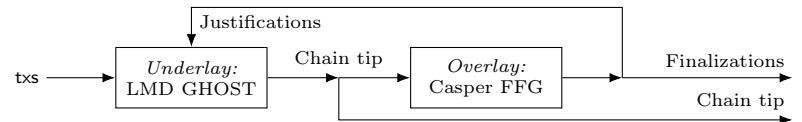
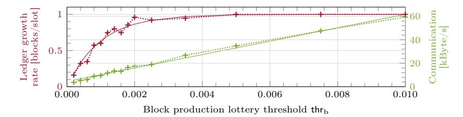
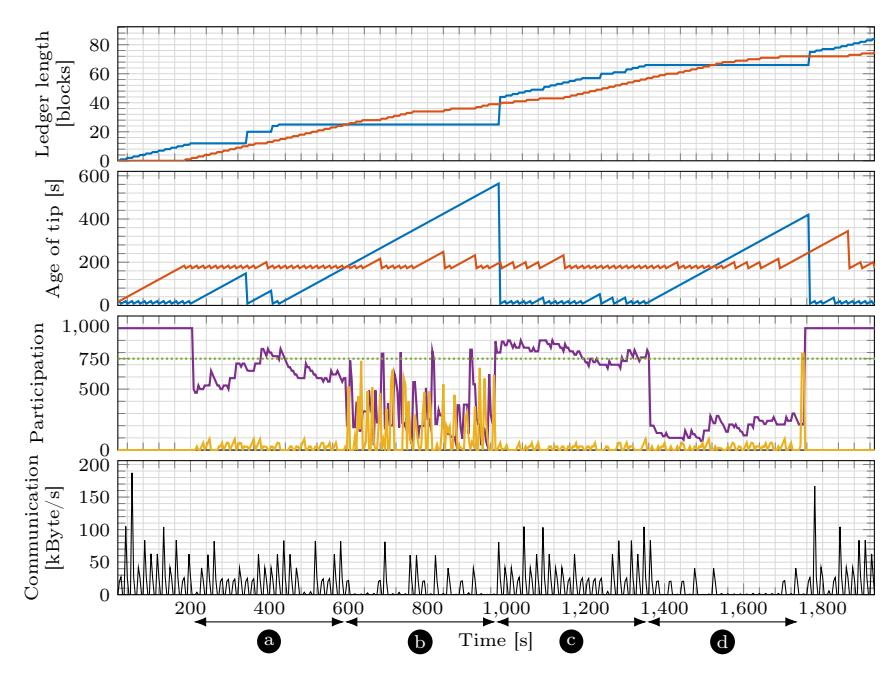
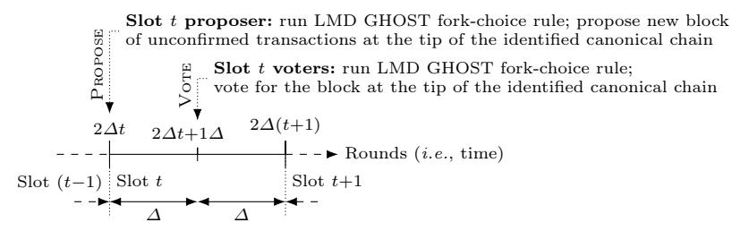
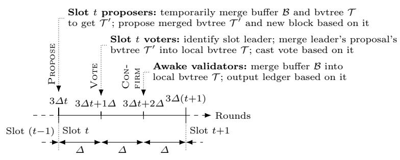
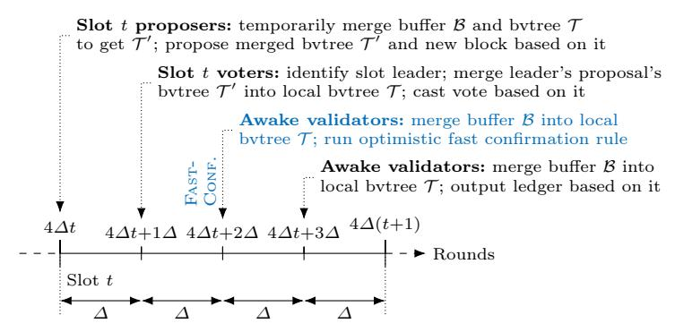
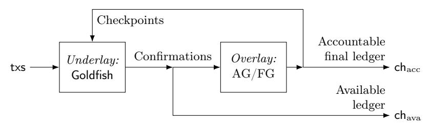

# Goldfish: No More Attacks on Ethereum?!

Francesco D'Amato<sup>1</sup> , Joachim Neu<sup>2</sup> , Ertem Nusret Tas<sup>2</sup> , and David Tse<sup>2</sup>

> <sup>1</sup> Ethereum Foundation francesco.damato@ethereum.org <sup>2</sup> Stanford University {jneu,nusret,dntse}@stanford.edu

Abstract. The LMD GHOST consensus protocol is a critical component of proof-of-stake Ethereum. In its current form, this protocol is brittle, as evidenced by recent attacks and patching attempts. We propose Goldfish, a new protocol that satisfies key properties required of a drop-in replacement for LMD GHOST: Goldfish is secure in the sleepy model, assuming a majority of the validators follows the protocol. Goldfish is reorg resilient so that honestly produced blocks are guaranteed inclusion in the ledger, and it supports fast confirmation with expected confirmation latency independent of the desired security level. Subsampling validators can improve the communication efficiency of Goldfish, and Goldfish is composable with finality/accountability gadgets. Crucially, Goldfish is structurally similar to LMD GHOST, providing a credible path to adoption in Ethereum. Attacks on LMD GHOST exploit lack of coordination among honest validators, typically provided by a locking mechanism in classical BFT protocols. However, locking requires votes from a quorum of all participants and is not compatible with fluctuating participation. Goldfish is powered by a novel coordination mechanism to synchronize the honest validators' actions. Experiments with our prototype implementation of Goldfish suggest practicality.

## 1 Introduction

Ethereum's Consensus Protocol. Ethereum's proof-of-stake (PoS) Byzantine fault tolerant (BFT) consensus protocol (Gasper [\[15\]](#page-16-0), Fig. [1\)](#page-1-0) consists of an overlay finality gadget (Casper FFG [\[14\]](#page-16-1)) which provides safety under asynchrony, on top of an underlay chain (LMD GHOST, Latest Message Driven Greedy Heaviest Observed Sub-Tree [\[12,](#page-16-2) [73\]](#page-19-0)) which should be secure under synchrony and dynamic participation. Importantly, dynamic participation here refers to the sleepy model [\[65\]](#page-19-1) for a large number of unexpected temporary crash faults, not to, for instance, stake shift. This design works around the impossibility [\[34,](#page-17-0)[44,](#page-18-0)[56,](#page-18-1)[60,](#page-19-2)[61,](#page-19-3)[69\]](#page-19-4) of having a single ledger that is secure under both asynchrony and dynamic participation. It is crucial that the underlay is both safe and live in the sleepy model, because earlier works have shown [\[16,](#page-16-3)[53,](#page-18-2)[60,](#page-19-2)[61,](#page-19-3)[69\]](#page-19-4) that otherwise the whole protocol (i.e., underlay and overlay) can stall indefinitely. In

<sup>1,2</sup> The authors are listed alphabetically. Contact authors: FD, JN, ENT.

<span id="page-1-0"></span>

Fig. 1. Gasper [\[15\]](#page-16-0) consists of two sub-protocols: LMD GHOST ('fork choice rule') and Casper FFG [\[14\]](#page-16-1) ('finality gadget'). The desiderata for Gasper were formalized by ebb-and-flow [\[60,](#page-19-2) [61,](#page-19-3) [69\]](#page-19-4), which consists of security of the full chain under dynamic participation of validators, and accountable security of a finalized prefix.

particular, the overlay can only 'checkpoint' transactions that are stable in the underlay. If the underlay stalls (not live) or keeps switching between different chains (not safe), then the overlay won't make progress. Thus, the underlay is not "just some optional optimistic path", but on the critical path for any transaction to get confirmed. Also, from a practical point of view, overlay confirmation is typically slow (e.g., min. 12 min delay to finality in Ethereum), while the underlay generates a block every few seconds. As a result, in Ethereum today, most users don't wait for Casper overlay confirmation, but de-facto already consider a transaction confirmed when it enters the tip of the LMD GHOST underlay chain. If the underlay does not provide at least some non-trivial safety guarantee, transactions can be reverted that have not yet been 'checkpointed' by the overlay, especially when overlay confirmation is delayed due to many unexpected crash faults, e.g., as happened on Ethereum mainnet in May 2023 [\[26,](#page-17-1) [63\]](#page-19-5).

Attacks and Patches for LMD GHOST. But, LMD GHOST (cf. Fig. [4\)](#page-20-0) is not secure in the sleepy model. The initial version of LMD GHOST [\[15\]](#page-16-0) is susceptible to the balancing attack [\[60,](#page-19-2)[70\]](#page-19-6). In the attack, the adversary exploits the lack of a coordination mechanism for synchronizing the views of honest validators; so that different validators vote for conflicting blocks at each slot, and the network fails to reach consensus indefinitely. In response, a patch called proposer boosting was added [\[13\]](#page-16-4). Proposer boosting gives a current proposal a temporary extra weight in fork-choice. This was supposed to coordinate voters towards honest proposals and break the balance. However, the LMD provision alone can be exploited to conduct a balancing-type attack despite boosting [\[62\]](#page-19-7), and LMD GHOST without LMD would suffer from a so called avalanche attack [\[62\]](#page-19-7). Again in response, a patch called equivocation discounting was added to the protocol. Not least because of its complexity, the protocol with these patches has so far defied security analysis—both in terms of giving a security proof and further attacks. Certainly, the extra weight from proposer boosting gives an adversary much control over the chain, especially when the number of votes is low. Thus, proposer boosting renders LMD GHOST insecure under dynamic participation.

Quest for a Coordination Mechanism. PBFT-style protocols [\[11,](#page-16-5) [18,](#page-17-2) [19,](#page-17-3) [74\]](#page-19-8) coordinate validators using locking and absolute quorums, i.e., sets of votes from a large fraction of all validators. However, absolute quorums cannot be reached in the presence of many unexpected crash faults. Thus, such protocols don't satisfy liveness under dynamic participation in the sleepy model, which is crucial to withstand unforeseen regulatory changes, or soft-/hardware failures or upgrades [\[60\]](#page-19-2). Tolerating dynamic participation is indeed one reason why LMD GHOST avoids absolute quorums and selects relatively heavier blocks.

Conversely, PoS variants of Nakamoto's longest chain (LC) protocol [\[4,](#page-16-6) [21,](#page-17-4) [27,](#page-17-5) [41,](#page-18-3) [65\]](#page-19-1) are secure in the sleepy model [\[65\]](#page-19-1). In LC, validators continuously build blocks extending the (relatively) longest chain. Only after a while, honest validators reach coordination on a chain prefix. Unfortunately, this entails slow confirmation[3](#page-2-0) , i.e., expected confirmation latency linear in the desired consensus failure probability. Moreover, in LC, honestly produced blocks can be displaced (reorg'ed) by adversaries [\[30\]](#page-17-6), and validators have incentives to do so [\[1,](#page-16-7)[17,](#page-17-7)[22,](#page-17-8)[45\]](#page-18-4).

Key Techniques of Goldfish. For Goldfish's overall structure, failure of LC protocols to satisfy reorg resilience and fast confirmation due to "too few votes spread across too much time" suggests to employ a committee of voters that can create many votes supporting honest proposals soon after they are broadcast, similar to committees in PBFT-style protocols. However, as absolute quorums of PBFT-style protocols are incompatible with liveness under dynamic participation, rather than using the absolute number of votes, a protocol for dynamic participation must use their relative weights to favor blocks with stronger support during fork choice, similar to Nakamoto's longest-chain rule. Together, these observations vindicate some structural elements of LMD GHOST and suggest to retain them in Goldfish: a succession of slots with a proposer and a committee that votes, all based on blocks' relative vote weights like in the GHOST rule.

Key to Goldfish is a novel coordination mechanism for honest voters to rally behind honest proposals. Unlike aforementioned mechanisms, this mechanism is secure in the sleepy model while also allowing for reorg resilience and fast confirmations. It is based on two techniques not commonly found in the literature:

- Message buffering[4](#page-2-1) means each validator buffers votes received from the network and carefully times the inclusion of these votes into its local view, with priority given to votes relayed by the proposer. Conceptually, a validator echoes received votes but processes them only after some time or as soon as the proposer relays them. This ensures that in slots with an honest proposer, all honest validators adopt the view of the proposer and thus vote for its proposed block.
- Vote expiry means that during each slot, only votes from the immediately preceding slot influence honest validators' behavior.[5](#page-2-2) As a result, if in some slot all honest validators (which are assumed to outnumber adversary validators) vote to support a block (i.e., vote for the block or one of its descendants), then all honest validators will again vote to support that block in the next slot.

Together, these two techniques allow for a simple inductive security argument: Because proposers are selected randomly among the majority-honest val-

<span id="page-2-0"></span><sup>3</sup> Confirmation latency denotes the delay for a transaction to enter the ledgers of all validators. It is a random variable that depends on the sequence of block proposers.

<span id="page-2-1"></span><sup>4</sup> Message buffering was also called 'view-merge' in a blog post [\[6\]](#page-16-8) by one of the authors. We later noticed that a similar technique was used before in the unpublished Highway protocol [\[37\]](#page-18-5). Message buffering (cf. Alg. [2\)](#page-9-0) also bears some conceptual resemblance to the view-change sub-protocol of Sync HotStuff [\[3,](#page-16-9) Fig. 2].

<span id="page-2-2"></span><sup>5</sup> Alleged forgetfulness of its animal namesake inspired Goldfish's name.

idators, slots with an honest proposer are frequent. By message buffering, all honest voters vote for the block proposed in such a slot (base case). By vote expiry, honest voters keep reaffirming this vote in perpetuity (induction step). Thus, honest proposals are guaranteed to remain in the canonical chain, implying reorg resilience. Since honest proposals contain fresh transactions and stabilize their prefix, and long streaks of adversary proposers are exponentially unlikely, liveness and safety follow readily. Details are provided in Secs. 3.1 and 4.

A complementary perspective is that, conceptually, message buffering thwarts balancing-type attacks [60,70] (it ensures that honest voters rally behind honest proposals), while vote expiry thwarts avalanche-type attacks [62] (it ensures that the adversary cannot reveal votes from long past slots—where the respective voter may still have been honest even). In this regard, LMD has a similar effect as vote expiry [62], but LMD does not recover reorg resilience under dynamic participation, and is rendered ineffective entirely if validators are subsampled to form small voter committees for reduced communication complexity. In contrast, vote expiry allows subsampling. With expiry and subsampling, vote expiry drastically reduces the number of votes validators need to buffer and consider at any point, greatly contributing to message buffering's practicality (see Sec. 5).

**Goldfish's Contributions.** Goldfish achieves the aforementioned desiderata: (a) Goldfish is provably secure, i.e., safe and live, under dynamic participation in the sleepy model assuming an honest majority of validators, and adversary network delay up to a known upper bound  $\Delta$ . (b) Goldfish is reorg resilient, i.e., honest proposals eventually enter the ledger, with the proposal's prefix as determined at the time of block production (thus, no selfish mining [30]). (c) Goldfish satisfies optimistic fast confirmation: under optimistic conditions, i.e., when participation is high and  $\frac{3}{4}$  fraction of validators are honest, it confirms transactions with constant expected latency independent of the consensus failure probability.

Additionally, Goldfish supports *subsampling* of validators, which reduces communication and achieves resilience to adaptive corruption, since randomly selected validators send only a single protocol message (cf. player-replaceability [20, 33,72]). Goldfish is also composable with *finality and accountability gadgets* such as [14,60,61,69]. This means it can indeed be used as a dynamically available underlay in conjunction with an overlay (cf. Fig. 1) that preserves safety under asynchrony. Since the construction and its security proof mostly reuses techniques from [60,61,69], we provide it in App. D, and focus in the following on Goldfish's standalone behavior in the sleepy model assuming synchrony.

Crucially, Goldfish is intentionally simple, and similar to LMD GHOST as currently deployed in Ethereum, to provide a credible path for adoption (compare Figs. 4, 5 and 6). Message buffering and vote expiry can be realized with modest changes to the existing vote accounting logic of LMD GHOST. Goldfish is the first positive result (security proof) for a variant of LMD GHOST, strengthening confidence in this protocol family. Simplicity of Goldfish also makes it a good pedagogical example as a feature-rich consensus protocol for the sleepy model.

**Related Works.** The first secure consensus protocol for the sleepy model [65] was Nakamoto's LC protocol, first based on proof-of-work (PoW) [32, 52], and

<span id="page-4-0"></span>**Table 1.** Comparison of Goldfish with related works regarding key desiderata. Optimistic ('opt.') fast confirmation requires high participation and less than  $\frac{1}{4}$  adversary fraction. Dynamic participation ' $\checkmark$  (slow)' indicates the protocol remains live only under slow fluctuations in participation. A number next to ' $\checkmark$ ' for fast confirmation denotes the minimum confirmation latency. Responsive ('resp.') confirmation means with delay of the actual network delay rather than delay bound  $\Delta$ .

|                       | PoS/permissioned BFT consensus protocols for the sleepy model [65] |                       |              |               |              |               |                       |                            |                                                                      | for other models                |          |
|-----------------------|--------------------------------------------------------------------|-----------------------|--------------|---------------|--------------|---------------|-----------------------|----------------------------|----------------------------------------------------------------------|---------------------------------|----------|
|                       | LC [4] [5, 21, 31]                                                 | Thunder-<br>ella [66] | KW21<br>[40] | GLR21<br>[35] | MR22<br>[51] | MMR22<br>[47] | $GL23^{\dagger}$ [46] | MMR23 <sup>†</sup><br>[49] | $\begin{array}{c} \text{Goldfish} \\ (\text{this work}) \end{array}$ | PBFT-style<br> [11, 18, 19, 74] |          |
| Dynamic participation | <b>✓</b>                                                           | ✓ (slow)              | ✓ (slow)     | /             | <b>✓</b>     | ✓             | 1                     | ✓                          | 1                                                                    | X                               | Х        |
| Reorg resilience      | X                                                                  | X                     | 1            | ✓             | ✓            | ✓             | 1                     | ✓                          | ✓                                                                    | ✓                               | ✓        |
| Adversary resilience  | 1/2                                                                | 1/2                   | 1/3          | 1/2           | 1/2          | 1/3           | 1/2                   | 1/2                        | 1/2                                                                  | 1/3                             | flexible |
| Fast confirmation     | X                                                                  | opt. (resp.)          | 1            | X             | √ (37Δ)      | <b>√</b> (3Δ) | √ (10Δ)               | √ (4Δ)                     | opt. $(4\Delta)$                                                     | ✓ (resp.)                       | ✓        |
| Similar to LMD GHOST  | X                                                                  | X                     | X            | X             | X            | X             | X                     | X                          | · 🗸                                                                  | X                               | ✓        |

<sup>&</sup>lt;sup>†</sup> Appeared in preprint after completion of Goldfish [23].

subsequently on PoS [4, 21, 27, 41, 65] (see Tab. 1 for a comparison of Goldfish with related works). Parallel composition of LC protocol instances was suggested in [5,31] to overcome the scaling of LC protocols' confirmation latency with the security parameter  $\kappa$ . For the same goal, Thunderella [66] proposed combining a PBFT-style protocol achieving optimistic fast confirmation with a slow LC protocol for when the adversary fraction is high. (A similar idea was explored in Zyzzyva [2,43], where validators run a PBFT-style protocol, but optimistically confirm the primary's ordering. Zyzzyva is not dynamically available.) However, as observed above, LC protocols and Thunderella that builds on an LC protocol are not reorg resilient. Moreover, under optimistic conditions, Thunderella recovers fast confirmation only after a period of LC confirmation delay, whereas Goldfish can instantaneously resume fast-confirming. Many classical PBFT-style consensus protocols [18,19,74] have constant (expected) confirmation latency and can be reorg resilient, but don't tolerate dynamic participation. Highway [37] enables confirming blocks using different absolute quorum sizes; however it does not support dynamic participation. An early 'classical' BFT protocol for a model with unknown (but static) participation is KW21 [39,40]. A subsequent protocol GLR21 [35] supports dynamic participation with confirmation latency independent of the participation level, but still linear in the security parameter  $\kappa$  [51]. Confirmation latency independent of the security parameter is achieved in the PoW setting with omission and Byzantine faults by [67] and [68], respectively.

A recent work MR22 [51] presents the first permissioned/PoS protocol that supports dynamic participation with confirmation latency independent of the security parameter and participation level, with the caveats that temporary stability in the honest participation is necessary to ensure liveness, and a growing adversary cannot be tolerated. Whereas [51] ensures fast confirmation with adversary resilience  $\frac{1}{2}$  without requiring high participation, its confirmation latency is  $37\Delta$ , considerably larger than the latency of Goldfish ( $4\Delta$ ) under optimistic conditions. In the contemporary independent work [47,48], the prerequisites for liveness were relaxed and latency was improved to  $3\Delta$ , at the expense of reduced adversary resilience (from  $\frac{1}{2}$  down to  $\frac{1}{3}$ ). After completion of Goldfish,

MMR23 [49] combines techniques from [51] and [47] to achieve resilience  $\frac{1}{2}$  and latency  $4\Delta$ , while doing away with the stable participation requirement for liveness of [51]. GL23 [46] achieves a similar result independently and concurrently. Both use expiring votes, like Goldfish, to tolerate increasing adversaries.

Increased communication complexity is a challenge with these later protocols. In Goldfish, each voter only has to send a single message per slot, and messages can be relayed as-is to other validators, in practice efficiently implemented through gossip networks. In MMR23 [49], for instance, validators need to send tally messages for potentially many blocks, while GL23 [46] requires each validator to attach its own signature on every received vote before relaying. Thus, Goldfish always needs to gossip at most linearly many distinct messages, while GL23 [46] needs to at times gossip quadratically many distinct messages. The possibility of many messages with different contents also makes these protocols less amenable to signature aggregation. Together with their considerable deviations from LMD GHOST, these are concrete challenges faced by these protocols in their possible path to adoption in Ethereum, as compared to Goldfish.

Follow-Ups & Adoption. A challenge Goldfish shares with related works [46, 49,51] is that a brief period of asynchrony suffices to cause 'deep' safety violations (up to the last checkpoint if used with overlay, cf. Fig. 1). A Goldfish variant in follow-up work [24] addresses this issue, by trading off a longer vote expiry period for a less dynamic participation model. The current candidate protocol [25] to provide 'single-slot finality' for Ethereum is based on that Goldfish variant.

### <span id="page-5-0"></span>2 Preliminaries and Model

We recap the sleepy model [65] for dynamic participation under synchrony.

**Preliminaries.** Let  $\kappa, \lambda$  be the security parameters of Goldfish itself and of the cryptographic primitives it uses, respectively. Specifically,  $\kappa$  will be Goldfish's (slow-path) confirmation latency, cf. Alg. 2, l. 29. A function is negligible in  $\mu$ , denoted negl( $\mu$ ), if it is  $o(1/\mu^d)$  for all d>0. An event happens with overwhelming probability (w.o.p.) if it happens except with probability (w.p.) negl( $\kappa$ ) + negl( $\lambda$ ). Goldfish uses a signature scheme Sig with key generation, sign, and verify algorithms Sig.Gen, Sig.Sign, Sig.Verify (cf. App. G.1). A verifiable random function (VRF) [50] scheme Vrf with function generation, evaluation prove, and evaluation verify algorithms Vrf.Gen, Vrf.Eval, Vrf.Verify (cf. App. G.2) is used for leader election and committee subsampling, as in [20, 33].

**Validators.** Goldfish is run among n validators, with identities id  $\in [n] \triangleq \{1,...,n\}$ . Each generates a secret/public key pair ( $\mathsf{ssk}_{\mathsf{id}}, \mathsf{spk}_{\mathsf{id}}$ ) and ( $\mathsf{vsk}_{\mathsf{id}}, \mathsf{vpk}_{\mathsf{id}}$ ) for Sig and Vrf, respectively. The public keys are commonly known (i.e., PKI). As is customary to study new consensus protocols, we assume that every validator has one unit of stake throughout the execution (i.e., static homogeneous stake). Gradual stake shift (i.e., dynamic stake) can be supported using techniques that bootstrap PoS protocols from static-stake protocols with PKI [21, 27, 29].

Environment and Adversary. Time proceeds in discrete rounds and the

validators have synchronized clocks. (Bounded clock offsets can be lumped into the network delay upper bound  $\Delta$  discussed below.) Validators receive transactions (txs) from the environment, and can broadcast messages to each other. The adversary is a probabilistic poly-time (PPT) algorithm that can control three aspects of the model (corruption, sleepiness, network delay) to attack consensus. We first discuss these three aspects, and then the adversary's powers and limits. Corruption. The adversary chooses f adversary validators (adaptively, subject to constraints detailed below). Non-adversary validators are honest. Naturally, the adversary learns the internal state of its validators and can make them deviate from the protocol arbitrarily (Byzantine faults) for the rest of the execution (permanent corruption). We define the adversary fraction  $\beta \triangleq f/n$ .

Sleepiness. The adversary decides for each round and honest validator whether it is asleep or not. Asleep validators do not execute the protocol (temporary crash faults). Messages delivered to an asleep validator are picked up by it only once it is no longer asleep. When a validator stops being asleep, it becomes dreamy. It then joins the protocol, possibly over multiple rounds, using a joining procedure specified by the protocol. Upon completion, the validator becomes awake and follows the protocol normally. Adversary validators are always awake. The number of awake validators is bounded below by a constant  $n_0$  across rounds. Network Delay. Messages sent between validators are delivered with an adversarially determined delay that can differ for each recipient. Upon picking up messages (i.e., once not asleep), an honest validator re-broadcasts them.

Adversary Powers and Limits. For message delivery, the adversary has to obey a delay upper-bound of  $\Delta$  rounds, which is known to the validators (synchrony). Message delays and sleep schedule are chosen by the adversary adaptively. For sleepiness and corruption, Goldfish supports two assumptions: Either, we require mildly adaptive corruption, where it takes  $3\Delta$  rounds for corruption to take effect, together with the constraint that for every round r, the number of adversary validators at round r must be less than the number of honest awake validators at round  $r-3\Delta$ . Or, analogously to earlier works [4, 20, 41], through the use of key evolving [7,36] signature and VRF schemes, we allow for fully adaptive corruption, together with the constraint that for every round r, the number of adversary validators at round r must be less than the number of honest awake validators at round r. The precise technical assumptions are stated by Def. 2.

**Security.** Security is parameterized by  $\kappa$ , which for Goldfish affects the confirmation latency. We consider a finite execution horizon of  $T_{hor} = poly(\kappa)$  rounds.

<span id="page-6-0"></span>**Definition 1** (Security). Let  $ch \leq ch'$  express that ledger ch is a prefix of (or the same as) ledger ch'. A consensus protocol, where at round r validator id outputs ledger  $\operatorname{ch}_r^{\operatorname{id}}$ , is secure with transaction confirmation time  $T_{\operatorname{conf}}$ , iff w.o.p.:

- $\begin{array}{ll} \textit{Safety:} \ \forall r,r' \colon \forall honest \ \mathsf{id}, \mathsf{id}' \ \textit{awake} \ \textit{at} \ r,r' \colon (\mathsf{ch}^{\mathsf{id}}_r \preceq \mathsf{ch}^{\mathsf{id}'}_{r'}) \lor (\mathsf{ch}^{\mathsf{id}'}_{r'} \preceq \mathsf{ch}^{\mathsf{id}}_r). \\ \textit{Liveness:} \ \textit{If} \ \textit{transaction} \ \mathsf{tx} \ \textit{was} \ \textit{received} \ \textit{by} \ \textit{some} \ \textit{awake} \ \textit{honest} \ \textit{validator} \ \textit{by} \end{array}$
- $r, then \ \forall r' \geq r + T_{conf} : \forall honest \ id \ awake \ at \ r' : \ \mathsf{tx} \in \mathsf{ch}^{\mathsf{id}}_{r'}.$

The protocol satisfies  $\bar{f}$ -safety ( $\bar{f}$ -liveness) if it is safe (live) if  $f < \bar{f}$ . It satisfies 1/2-safety (1/2-liveness) if it is safe (live) if  $\beta < 1/2 - \varepsilon$  for some  $\varepsilon > 0$ .

#### **Algorithm 1** Interface of VRF-based lotteries and validity of data structures.

```
1: \triangleright VRF-based lotteries

\stackrel{\triangle}{\circ} \stackrel{(\neg \neg \pi)}{\leftarrow} \stackrel{(\text{tag,thr})}{\leftarrow} (t) \stackrel{\triangle}{=} Vrf.Eval(vsk_{id}, tag || t)

   3: \ \{\mathtt{1},\mathtt{0}\} \leftarrow \mathsf{Wins}^{(\mathsf{tag},\check{\mathsf{thr}})}((\mathsf{id},t),\varrho) \triangleq (\varrho.y \leq \mathsf{thr}\, 2^\lambda) \wedge \mathsf{Vrf}.\mathsf{Verify}(\mathsf{vpk}_\mathsf{id},\mathsf{tag} \,\|\, t, (\varrho.y,\varrho.\pi))
   4: [0,1] \leftarrow \text{Prio}(\varrho) \triangleq \frac{\varrho \cdot y}{2^{\lambda}}
     5: ▷ Data structures
     6: \{1,0\} \leftarrow \operatorname{Valid}(B) \triangleq (B=B_0)
                                                                                                                                                                                                                                                                                                                                                                                                                                                                                                                                                                                                                                                                                                                                                         \triangleright Block B
                                                                                                                                                                                                                 \vee \, (\mathsf{Wins}^{(\mathsf{block},\mathsf{thr}_{\mathsf{b}})}((B.\mathsf{id},B.t),B.\varrho)
                                                                                                                                                                                                                                        \land \mathsf{Sig.Verify}(\mathsf{spk}_{B.\mathsf{id}}, \mathsf{block} \parallel B.h \parallel B.\mathsf{txs}, B.\sigma)
                                                                                                                                                                                                                                        \wedge \operatorname{Valid}(^*[B.h]) \wedge (B.t > ^*[B.h].t))
   7: \ \{\mathtt{1},\mathtt{0}\} \leftarrow \mathrm{Valid}(v) \triangleq \ \mathrm{Wins}^{(\mathtt{vote},\mathsf{thr}_{\mathbf{V}})}((v.\mathsf{id},v.t),v.\varrho) \wedge \mathsf{Sig.Verify}(\mathsf{spk}_{v.\mathsf{id}},\mathtt{vote} \parallel v.h,v.\sigma) \quad \triangleright \ \mathsf{Vote} \ v.h. + \mathsf{Vol}(v.h,v.\sigma) \quad \triangleright \ \mathsf{Vote} \ v.h. + \mathsf{Vol}(v.h,v.\sigma) \quad \triangleright \ \mathsf{Vote} \ v.h. + \mathsf{Vol}(v.h,v.\sigma) \quad \triangleright \ \mathsf{Vote} \ v.h. + \mathsf{Vol}(v.h,v.\sigma) \quad \triangleright \ \mathsf{Vote} \ v.h. + \mathsf{Vol}(v.h,v.\sigma) \quad \triangleright \ \mathsf{Vote} \ v.h. + \mathsf{Vol}(v.h,v.\sigma) \quad \triangleright \ \mathsf{Vol}(v.h,v.\sigma) \quad \triangleright \ \mathsf{Vol}(v.h,v.\sigma) \quad \triangleright \ \mathsf{Vol}(v.h,v.\sigma) \quad \triangleright \ \mathsf{Vol}(v.h,v.\sigma) \quad \triangleright \ \mathsf{Vol}(v.h,v.\sigma) \quad \triangleright \ \mathsf{Vol}(v.h,v.\sigma) \quad \triangleright \ \mathsf{Vol}(v.h,v.\sigma) \quad \triangleright \ \mathsf{Vol}(v.h,v.\sigma) \quad \triangleright \ \mathsf{Vol}(v.h,v.\sigma) \quad \triangleright \ \mathsf{Vol}(v.h,v.\sigma) \quad \triangleright \ \mathsf{Vol}(v.h,v.\sigma) \quad \triangleright \ \mathsf{Vol}(v.h,v.\sigma) \quad \triangleright \ \mathsf{Vol}(v.h,v.\sigma) \quad \triangleright \ \mathsf{Vol}(v.h,v.\sigma) \quad \triangleright \ \mathsf{Vol}(v.h,v.\sigma) \quad \triangleright \ \mathsf{Vol}(v.h,v.\sigma) \quad \triangleright \ \mathsf{Vol}(v.h,v.\sigma) \quad \triangleright \ \mathsf{Vol}(v.h,v.\sigma) \quad \triangleright \ \mathsf{Vol}(v.h,v.\sigma) \quad \triangleright \ \mathsf{Vol}(v.h,v.\sigma) \quad \triangleright \ \mathsf{Vol}(v.h,v.\sigma) \quad \triangleright \ \mathsf{Vol}(v.h,v.\sigma) \quad \triangleright \ \mathsf{Vol}(v.h,v.\sigma) \quad \triangleright \ \mathsf{Vol}(v.h,v.\sigma) \quad \triangleright \ \mathsf{Vol}(v.h,v.\sigma) \quad \triangleright \ \mathsf{Vol}(v.h,v.\sigma) \quad \triangleright \ \mathsf{Vol}(v.h,v.\sigma) \quad \triangleright \ \mathsf{Vol}(v.h,v.\sigma) \quad \triangleright \ \mathsf{Vol}(v.h,v.\sigma) \quad \triangleright \ \mathsf{Vol}(v.h,v.\sigma) \quad \triangleright \ \mathsf{Vol}(v.h,v.\sigma) \quad \triangleright \ \mathsf{Vol}(v.h,v.\sigma) \quad \triangleright \ \mathsf{Vol}(v.h,v.\sigma) \quad \triangleright \ \mathsf{Vol}(v.h,v.\sigma) \quad \triangleright \ \mathsf{Vol}(v.h,v.\sigma) \quad \triangleright \ \mathsf{Vol}(v.h,v.\sigma) \quad \triangleright \ \mathsf{Vol}(v.h,v.\sigma) \quad \triangleright \ \mathsf{Vol}(v.h,v.\sigma) \quad \triangleright \ \mathsf{Vol}(v.h,v.\sigma) \quad \triangleright \ \mathsf{Vol}(v.h,v.\sigma) \quad \triangleright \ \mathsf{Vol}(v.h,v.\sigma) \quad \triangleright \ \mathsf{Vol}(v.h,v.\sigma) \quad \triangleright \ \mathsf{Vol}(v.h,v.\sigma) \quad \triangleright \ \mathsf{Vol}(v.h,v.\sigma) \quad \triangleright \ \mathsf{Vol}(v.h,v.\sigma) \quad \triangleright \ \mathsf{Vol}(v.h,v.\sigma) \quad \triangleright \ \mathsf{Vol}(v.h,v.\sigma) \quad \triangleright \ \mathsf{Vol}(v.h,v.\sigma) \quad \triangleright \ \mathsf{Vol}(v.h,v.\sigma) \quad \triangleright \ \mathsf{Vol}(v.h,v.\sigma) \quad \triangleright \ \mathsf{Vol}(v.h,v.\sigma) \quad \triangleright \ \mathsf{Vol}(v.h,v.\sigma) \quad \triangleright \ \mathsf{Vol}(v.h,v.\sigma) \quad \triangleright \ \mathsf{Vol}(v.h,v.\sigma) \quad \mathsf{Vol}(v.h,v.\sigma) \quad \mathsf{Vol}(v.h,v.\sigma) \quad \mathsf{Vol}(v.h,v.\sigma) \quad \mathsf{Vol}(v.h,v.\sigma) \quad \mathsf{Vol}(v.h,v.\sigma) \quad \mathsf{Vol}(v.h,v.\sigma) \quad \mathsf{Vol}(v.h,v.\sigma) \quad \mathsf{Vol}(v.h,v.\sigma) \quad \mathsf{Vol}(v.h,v.\sigma) \quad \mathsf{Vol}(v.h,v.\sigma) \quad \mathsf{Vol}(v.h,v.\sigma) \quad \mathsf{Vol}(v.h,v.\sigma) \quad \mathsf{Vol}(v.h,v.\sigma) \quad \mathsf{Vol}(v.h,v.\sigma) \quad \mathsf{Vol}(v.h,v.\sigma) \quad \mathsf{Vol}(v.h,v.\sigma) \quad \mathsf{Vol}(v.h,v.\sigma) \quad \mathsf{Vol}(v.h,v.\sigma) \quad \mathsf{Vol}(v.h,v.\sigma) \quad \mathsf{Vol}(v.h,v.\sigma) \quad \mathsf{Vol}(v.h,v.\sigma) \quad \mathsf{Vol}(v.h,v.\sigma) \quad \mathsf{Vol}(v.h,v.\sigma) \quad \mathsf{Vol}(v.h,v.\sigma) \quad \mathsf{Vol}(v.h,v.\sigma) \quad \mathsf{Vol}(v.h,v.\sigma) \quad \mathsf{Vol}(v.h,v
                                                                                                                                                                                                            \wedge \operatorname{Valid}(^*[v.h]) \wedge (v.t \geq ^*[v.h].t)
   8: \{1,0\} \leftarrow \operatorname{Valid}(M) \triangleq \operatorname{Valid}(M.x)
                                                                                                                                                                                                                                                                                                                                                                                                                                                                                                                                                                                                                                                                                                                                                     \triangleright Piece M
   9: \{1,0\} \leftarrow \operatorname{Valid}(P) \triangleq \operatorname{Valid}(P.B)
                                                                                                                                                                                                                                                                                                                                                                                                                                                                                                                                                                                                                                                                                                                              \triangleright Proposal P
                                                                                                                                                                                                                   \land Consistent(P.\mathcal{T} \cup \{P.B\})
                                                                                                                                                                                                                   \land \mathsf{Sig.Verify}(\mathsf{spk}_{P.B.\mathsf{id}}, \mathsf{propose} \parallel P.\mathcal{T} \parallel P.B, P.\sigma)
                                                                                                                                                                                                                 \land (\forall x \in P.\mathcal{T}: Valid(x) \land (x.t < P.B.t))
```

#### <span id="page-7-2"></span>3 Protocol

We describe the basic Goldfish protocol in Sec. 3.1 and its optimistic fast confirmation extension in Sec. 3.2. The composition of Goldfish as underlay chain with an overlay gadget (cf. Fig. 1) is described and analyzed in App. D, due to space constraints and since this mostly reuses orthogonal techniques from [60,61,69],

#### <span id="page-7-0"></span>3.1 The Goldfish Protocol

The basic Goldfish protocol (cf. Algs. 1, 2 and 3) proceeds in *slots* of  $3\Delta$  rounds.

**VRF-based Lotteries.** The VRF PKI enables cryptographic lotteries. A *lottery* (tag, thr) is defined by a fixed tag and threshold thr  $\in [0, 1]$ . Each validator id receives for each slot t a lottery ticket (id, t). A ticket can be opened, Alg. 1, l. 2. An opened ticket with opening  $\varrho$  can be winning for (tag, thr), Alg. 1, l. 3, and winning opened tickets are totally ordered by increasing precedence, Alg. 1, l. 4.

**Data Structures.** Blocks and votes are central to Goldfish. A block  $B \triangleq (block, (id, t), \varrho, h, txs, \sigma)$  consists of tag 'block', ticket (id, t) and opening  $\varrho$  to the (block, thr<sub>b</sub>) block production lottery, hash h committing to the new block's parent block and transactions txs (as block 'content'), and signature  $\sigma$  binding together block production opportunity and the block's content. A special genesis block  $B_0 \triangleq (block, (\perp, 0), \perp, \perp, \emptyset, \perp)$  is known to all validators. A block B is valid following Alg. 1, 1. 6, where \*[B.h] means the parent block that B.h commits to (namely, \*[x] represents the block committed by hash x). The context within which these references get resolved is detailed with the different network message types below. A vote  $v \triangleq (\text{vote}, (id, t), \varrho, h, \sigma)$  consists of tag 'vote', ticket (id, t) and opening  $\varrho$  to the (vote, thr<sub>v</sub>) voting lottery, hash h committing to the block voted for (as vote 'content'), and signature  $\sigma$  binding together voting opportunity and the vote's content. Every vote v is tied to its slot v.t via the lottery ticket (id, t). A vote v is valid following Alg. 1, 1. 7.

We call block-vote-set (short bvset) a set of blocks and votes. Commitments to blocks for the purpose of the references v.h or B.h are computed using H(.). For a byset  $\mathcal{T}$  we denote by  $\mathcal{T}[h]$  the block  $B \in \mathcal{T}$  with H(B) = h, and  $\bot$  if nonexistent. In Goldfish, votes and blocks are encapsulated and exchanged in two network message types, pieces and proposals. A piece  $M \triangleq (piece, x)$  consists of tag 'piece' and for payload x either a vote or a block, and is valid following Alg. 1, l. 8. Pieces are used to propagate blocks and votes and abstract peerto-peer broadcast object propagation. In determining a piece's validity, block references [.] are resolved with respect to the byset  $\mathcal{T}$  each validator maintains as part of its state, see below. If a validator does not have any matching block in  $\mathcal{T}$ , it cannot currently determine the piece's validity. It then queues the piece 'in limbo' for re-examination until its (in-)validity is established. A proposal  $P \triangleq (propose, \mathcal{T}, B, \sigma)$  consists of tag 'propose', byset  $\mathcal{T}$  and block B (as proposal content), and signature  $\sigma$  tying the proposal to the block production opportunity of B. Thus, a proposal P is valid following Alg. 1, l. 9, where Consistent( $\mathcal{T}$ ) is satisfied on a byset  $\mathcal{T}$  iff  $B_0 \in \mathcal{T}$  and for every vote and block in  $\mathcal{T}$  the referenced target/parent block is also in  $\mathcal{T}$ . In determining the validity of proposal P, block references \*[.] are resolved with respect to  $P.\mathcal{T}$ . We call a byset  $\mathcal{T}$  with Consistent( $\mathcal{T}$ ) a block-vote-tree (short bvtree). MERGE( $\mathcal{T}, \mathcal{B}$ ) returns the largest by tree  $\mathcal{T}'$  that is a subset of the union of  $\mathcal{T}$  and the pieces in  $\mathcal{B}$ .

**Protocol.** Each validator knows the current slot t, and maintains a buffer  $\mathcal{B}$  and a bytree  $\mathcal{T}$ . On a high level, messages enter from the network into  $\mathcal{B}$ , while votes are tallied on  $\mathcal{T}$ . The 'magic' of Goldfish is in how blocks and votes enter from  $\mathcal{B}$  to  $\mathcal{T}$  (message buffering, purple) and leave  $\mathcal{T}$  (vote expiry, orange).

Valid messages received from the network are re-broadcast and added to  $\mathcal{B}$ . (As is customary, messages whose validity is unknown due to missing references, and messages with future slot numbers, are queued 'in limbo' outside the protocol.) For proposals, the blocks and votes contained therein are additionally re-broadcast and added to  $\mathcal{B}$  as individual pieces.

We describe the three phases (Propose, Vote, Confirm) of each slot t from the perspective of an awake honest validator id (Alg. 2, Fig. 5):

• PROPOSE: At round  $3\Delta t$ , id checks if its lottery ticket (id, t) is winning for (block, thr<sub>b</sub>) (Alg. 2, l. 6). If so, id temporarily merges its bytree with its buffer (Alg. 2, l. 7), identifies the GHOST-Eph chain tip using only slot t-1 votes (Alg. 2, l. 8, Alg. 3), and proposes its temporary bytree and a new block based on it (Alg. 2, l. 12). Note that in a practical implementation, the proposals need not contain the whole bytree, but merely the votes therein (see Sec. 5).

For GHOST-Eph fork-choice (Alg. 3), a validator walks its bytree, starting at the genesis block, and at each block B, the validator proceeds to the child of B whose subtree is heaviest, *i.e.*, received the plurality of non-expired votes.

• VOTE: At  $3\Delta t + \Delta$ , id identifies as *leader* for slot t the proposal with smallest precedence (Alg. 2, l. 17). It merges the leading proposal's bytree into its bytree  $\mathcal{T}$  (Alg. 2, l. 19). Then it checks if its lottery ticket (id, t) is winning for (vote, thr<sub>v</sub>) (Alg. 2, l. 21). If so, id identifies the GHOST-Eph chain tip using only slot t-1 votes (Alg. 2, l. 22), and votes for it (Alg. 2, l. 25).

**Algorithm 2** Goldfish executed by validator id with signature keys  $(ssk_{id}, spk_{id})$ , VRF keys  $(vsk_{id}, vpk_{id})$ , bytree  $\mathcal{T}$  and buffer  $\mathcal{B}$ . Here, notation 'at' means executing the code block at the specified round,  $ch^{id}$  denotes the Goldfish chain momentarily confirmed at id. For GHOST-Eph( $\mathcal{T}, t$ ), see Alg. 3.

```
1: (\mathcal{B}, \mathcal{T}, t) \leftarrow (\emptyset, \{B_0\}, 0)
                                                                                                                           \triangleright Initialize buffer \mathcal B and by
tree \mathcal T
       As is customary, only valid messages with time slot numbers at most t are re-broadcast and
        put into \mathcal{B}. Invalid messages are discarded. Messages of unknown validity are queued. Blocks
        and votes contained in proposals are also re-broadcast and added to \mathcal B as individual pieces.
  3: for t = 1, 2, \dots do
                                                                                                                                                      ▶ Propose phase
  4:
              at 3\Delta t do
                    \begin{aligned} \varrho &\leftarrow \mathrm{Open_{id}^{(block, \mathsf{thr}_{\mathrm{b}})}}(t) \\ \mathbf{if} \ \mathrm{Wins}^{(block, \mathsf{thr}_{\mathrm{b}})}((\mathsf{id}, t), \varrho) \ \mathbf{then} \end{aligned}
 5:
                                                                                                                                   ▷ Check if eligible to propose
  6:
  7:
                            \mathcal{T}' \leftarrow \text{Merge}(\mathcal{T}, \mathcal{B})
                                                                                                                                                     ▷ Bytree to propose
                            B \leftarrow \text{GHOST-Eph}(\mathcal{T}', t-1)
                                                                                                                                                               ▶ Parent block
  9:
                           \sigma \leftarrow \mathsf{Sig}.\mathsf{Sign}(\mathsf{ssk}_{\mathsf{id}}, \mathsf{block} \parallel H(B) \parallel \mathsf{txs})
                           B \leftarrow (\texttt{block}, (\mathsf{id}, t), \varrho, H(B), \mathsf{txs}, \sigma) \\ \sigma \leftarrow \mathsf{Sig.Sign}(\mathsf{ssk}_\mathsf{id}, \mathsf{propose} \parallel \mathcal{T}' \parallel B)
10:
                                                                                                                                                                    ▶ New block
12:
                            Broadcast (propose, \mathcal{T}', B, \sigma)
                                                                                                                                                                        ▷ Propose
13:
               at 3\Delta t + \Delta do
                                                                                                                                                              ▷ Vote phase
14:
                     \triangleright Filter for proposals from slot t
15:
                     \mathcal{B}' \leftarrow \{(\mathcal{T}', B) \mid (\text{propose}, \mathcal{T}', B, .) \in \mathcal{B} \land B.t = t\}
16:
                     \triangleright Identify the leader of slot t and its proposal
17:
                     (\mathcal{T}'^*, B^*) \leftarrow \arg\min_{(\mathcal{T}', B) \in \mathcal{B}'} \operatorname{Prio}(B.\varrho)
                     ▶ Merge own buffer and that of the leader into own bytree
18.
                     \mathcal{T} \leftarrow \text{Merge}(\mathcal{T}, \mathcal{T}'^* \cup \{B^*\})
19:
                     \begin{split} \varrho &\leftarrow \mathrm{Open_{id}^{(vote, \mathsf{thr_v})}}(t) \\ \mathbf{if} \ \mathrm{Wins}^{(\mathsf{vote, thr_v})}((\mathsf{id}, t), \varrho) \ \mathbf{then} \end{split}
20:
                                                                                                                                          ▷ Check if eligible to vote
21:
                            B \leftarrow \text{GHOST-Eph}(\mathcal{T}, t-1)
                                                                                                                                                               ▶ Target block
\bar{2}\bar{3}:
                            \sigma \leftarrow \mathsf{Sig.Sign}(\mathsf{ssk}_\mathsf{id}, \mathsf{vote} \mathbin{|\hspace{-0.1em}|\hspace{-0.1em}|} H(B))
24:
                            v \gets (\mathtt{vote}, (\mathsf{id}, t), \varrho, H(B), \sigma)
                                                                                                                                                                      ▶ New vote
25:
                           Broadcast (piece, v)
                                                                                                                                                                              ▶ Vote
               at 3\Delta t + 2\Delta do
                                                                                                                                                     ▷ Confirm phase
                     \mathcal{T} \leftarrow \text{Merge}(\mathcal{T}, \mathcal{B})
                                                                                                                                         ▶ Merge buffer and bytree
28:
                     B \leftarrow \text{GHOST-Eph}(\mathcal{T}, t)
                                                                                                                               ▷ Canonical GHOST-Eph chain
                     \mathsf{ch}^{\mathsf{id}} \leftarrow B^{\lceil \kappa}
29:
                                                                                         \triangleright Output ledger: B's \kappa-deep prefix in terms of slots
```

### Algorithm 3 GHOST-Eph fork-choice rule.

```
1: CHILDREN(\mathcal{T}, B) \triangleq \{B' \in \mathcal{T} \mid B'.h = H(B)\}

2: Votes(\mathcal{T}, B, t) \triangleq |\{\operatorname{id}' \mid (\operatorname{vote}, (\operatorname{id}', t), ..., h, ...) \in \mathcal{T} \land B \preceq \mathcal{T}[h]\}|

3: function GHOST-Eph(\mathcal{T}, t)

4: B \leftarrow B_0 \triangleright Start fork-choice at genesis block

5: forever do

6: \triangleright Choose the heaviest subtree (breaking ties deterministically) rooted at one of the children blocks B' of B, by number of validators that have cast a vote in slot t for B' or one of its descendants; B' = \bot if Children(\mathcal{T}, B) \emptyset

7: B' \leftarrow \operatorname{arg\,max}_{B' \in \operatorname{Children}(\mathcal{T}, B)} \operatorname{Votes}(\mathcal{T}, B', t)

8: if B' = \bot then return B

9: B \leftarrow B'
```

• CONFIRM: At round  $3\Delta t + 2\Delta$ , id merges its buffer into its bytree (Alg. 2, l. 27). It then identifies the GHOST-Eph chain tip using only slot t votes (Alg. 2, l. 28), and outputs as confirmed ledger  $\mathsf{ch}^{\mathsf{id}}$  the transactions of those blocks in the GHOST-Eph chain that are from slots  $\leq t - \kappa$  (' $\kappa$ -deep in time', Alg. 2, l. 29). Since the ledger in view of an awake honest validator id is only updated at this point, we may view the ledger as indexed by slot t:  $\mathsf{ch}_t^{\mathsf{id}}$ .

**Key Mechanism.** Message buffering ensures that if in slot t the leading proposal is honest, then all honest voters in t will vote for it (Lem. 2), because in

PROPOSE, the leader's temporary bytree  $\mathcal{T}'$  is a superset of all honest validators' bytrees, and thus in VOTE all honest voters adopt that leader's bytree. Vote expiry (and honest majority) ensures that if in slot t all honest voters vote into the subtree rooted at some block B, then all honest voters in slot t+1 will also vote into the subtree rooted at B (Lem. 3). Induction on t readily yields reorg resilience. Furthermore, w.o.p., every interval of  $\kappa$  slots has at least one honest leading proposer (Lem. 1). The prefix of that proposal stabilizes (by reorg resilience), and the proposal includes unconfirmed transactions, leading to safety and liveness (with  $T_{\rm conf} = 2\kappa + 2$ ) of the  $\kappa$ -deep confirmation rule.

Without message buffering, honest voters would no longer be guaranteed to rally behind honest proposals. Instead, the adversary could induce inconsistent views among honest voters, leading to them no longer voting en bloc, which restores the balancing attack [60,70]. Without vote expiry, honest voters would not be guaranteed to vote into the subtree of B in t+1 just because B gathered votes from all honest validators in t. In fact, the adversary could use votes from longer ago to break the protocol. We give two examples. First, adversary validators could strategically release votes for long past slots, like in the avalanche attack [62]. Second, in periods where participation is increasing, the adversary could, for validators that were asleep in the past but are now adversary, forge votes for these past slots for a block conflicting with B. Conceptually, thereby, the adversary gains control of a dishonest majority for past slots, which can break security. Vote expiry preserves security when the number of adversary validators increases together with the number of honest validators over time.

**Joining Procedure.** At each round, a validator is either asleep, dreamy or awake (Sec. 2). Whenever a validator stops being asleep, it is *dreamy*. Dreamy validators don't follow Alg. 2, except for relaying messages. With the next Confirm phase, the validator returns to being *awake* and fully resumes Alg. 2. To allow for more time to download messages missed during sleep, dreaminess can be extended accordingly, but should always end at a Confirm phase.

#### <span id="page-10-0"></span>3.2 Optimistic Fast Confirmations

Basic Goldfish (Sec. 3.1) provides reorg resilience, but its  $\kappa$ -deep confirmation rule leads to  $\Theta(\kappa)$  latency in worst and expected case. We add a FAST-CONFIRM phase and introduce a fast confirmation rule, to achieve constant expected confirmation latency under optimistic conditions, i.e., under high participation and honest 3/4-supermajority (Fig. 6, Alg. 4). In particular, validators can now confirm honest proposals within the same slot, under optimistic conditions. The  $\kappa$ -deep confirmation rule (Alg. 6, l. 29) (now called *standard* confirmation rule), still applies and guarantees security when optimistic conditions don't hold.

Fast Confirmation Phase. Slots are now  $4\Delta$  rounds, with the insertion of phase Fast-Confirm at round  $4\Delta t + 2\Delta$  (Fig. 6, Alg. 4). In Fast-Confirm, a validator id first merges its buffer into its bytree  $\mathcal{T}$  (Alg. 4, l. 8). It then marks a block B as fast confirmed if  $|\text{Votes}(\mathcal{T}, B, t)| \geq n(\frac{3}{4} + \frac{\epsilon}{2}) \text{thr}_v$  for some  $\epsilon > 0$  that can be made arbitrarily small as  $n \to \infty$ , and updates  $\text{ch}_{\text{fast}}^{\text{id}}$  to the highest fast

Algorithm 4 Goldfish executed by validator id, modified (blue) to use (optimistic) fast and standard confirmation (cf. Alg. 2). See Alg. 3 for VOTES.

```
Same initialization and housekeeping as Alg. 2
  2: for t = 1, 2, ... do
                                                                                                                                                                    ▷ Slots
 3:
             at 4\Delta t do
                                                                                                                                             ▶ Propose phase
 4:
                   Same as Propose phase in Alg. 2
 5:
              at 4\Delta t + \Delta do
                                                                                                                                                     ▷ Vote phase
 6:
                    Same as Vote phase in Alg. 2
 7:
             at 4\Delta t + 2\Delta do
                                                                                                                                 ▶ FAST-CONFIRM phase
 8:
                   \mathcal{T} \leftarrow \text{Merge}(\mathcal{T}, \mathcal{B})
                                                                                                                                  \triangleright Merge buffer and by
tree
 9:
                   \mathsf{ch}^{\mathsf{id}}_{\mathsf{fast}} \leftarrow \arg\max_{B \in \mathcal{T} \colon |\mathsf{Votes}(\mathcal{T}, B, t)| \ge n(\frac{3}{4} + \frac{\epsilon}{2})\mathsf{thr}_{\mathsf{v}}} |B|
10:
              at 4\Delta t + 3\Delta do

    CONFIRM phase

                    \mathcal{T} \leftarrow \text{Merge}(\mathcal{T}, \mathcal{B})

\mathcal{B} \leftarrow \text{GHOST-Eph}(\mathcal{T}, t)
                                                                                                                                  \triangleright Merge buffer and by
tree
12:
                                                                                                                        ▷ Canonical GHOST-Eph chain
                   \mathsf{ch}^{\mathsf{id}} \leftarrow \arg\max\nolimits_{\mathsf{ch} \in \{\mathsf{ch}^{\mathsf{id}}_{\mathsf{fast}}, B^{\lceil \kappa}\}} |\mathsf{ch}|
13:
                                                                                                                                     ▶ Output Goldfish ledger
```

confirmed block (Alg. 4, l. 9). In CONFIRM (Alg. 4, l. 13), validator id outputs the higher of  $\mathsf{ch}^{\mathsf{id}}_{\mathsf{fast}}$  and the standard-confirmed  $\kappa$ -deep prefix  $B^{\lceil \kappa}$ . For simplicity, we omit a mechanism to avoid ledger 'roll back' (to ensure  $\forall \mathsf{id}, t' \geq t$ :  $\mathsf{ch}^{\mathsf{id}}_t \leq \mathsf{ch}^{\mathsf{id}}_{t'}$ ).

Intuitively, the extra FAST-CONFIRM phase guarantees that when an honest validator fast confirms a block B in slot t, all honest awake validators see the causative votes by the time their bytrees are last updated in t. The subtree rooted at B will be heaviest in all steps of GHOST-Eph fork-choice for all honest voters and forever (Thm. 4), which implies that fast confirmations are safe (Thm. 5). Security of Goldfish with fast confirmations is proven in App. C.

**Joining Procedure.** Once a validator stops being asleep, it is dreamy until the next Confirm phase (Alg. 4, l. 11), when it turns awake and resumes execution.

## <span id="page-11-0"></span>4 Security Proof

Due to space constraints, we show the security proof for 'basic' Goldfish (Sec. 3.1) here. The proofs for Goldfish with fast confirmations (Sec. 3.2), and for Goldfish when used as an underlay chain composed with an overlay finality/accountability gadget (as in Fig. 1), are provided in Apps. C and D, respectively.

In the subsequent analysis, a validator id is eligible to vote at slot t if its ticket (id, t) is winning for the lottery  $(vote, thr_v)$ . Recall that awake honest validators consider the proposal with lowest precendence received by  $3\Delta t + \Delta$  from the leader of slot t (Alg. 2, l. 16). We use blocks and the chains they induce via the parent relation interchangeably. A block  $B_1$  is a descendant (resp., ancestor) of block  $B_2$  iff the underlying chains satisfy  $B_2 \leq B_1$  (resp.,  $B_1 \leq B_2$ ).

Let  $A_r$  and  $H_r$  denote the number of adversary and honest validators awake at round r, respectively. Our theorems hold for  $(\frac{1}{2}, 3\Delta)$ -compliant executions (Def. 2) that satisfy the following relations on  $A_r$  and  $H_r$ : (i) in the absence of key-evolving cryptographic primitives, the adversary is mildly adaptive and  $\forall r \colon \frac{A_r}{A_r + H_{r-3\Delta}} < \frac{1}{2} - \epsilon$ , and (ii) with key-evolving primitives,  $\forall r \colon \frac{A_r}{A_r + H_r} < \frac{1}{2} - \epsilon$ .

<span id="page-11-2"></span>**Theorem 1.** Suppose a  $(\frac{1}{2}, 3\Delta)$ -compliant execution of Goldfish in the syn-

chronous sleepy network model of Sec. 2, and validator id with proposal  $P^*$  is recognized as the leader of a slot t by all awake honest validators at round  $3\Delta t + \Delta$  (Alg. 2, l. 16). Then, w.o.p.,  $P^*.B \leq B$  for any B identified in Alg. 2, ll. 8, 22, 28 by any awake honest validator in any round  $r \geq 3\Delta t + 2\Delta$ .

<span id="page-12-3"></span>**Theorem 2 (Security).** Suppose a  $(\frac{1}{2}, 3\Delta)$ -compliant execution of Goldfish in the synchronous sleepy network model. Then, w.o.p., Goldfish is secure with transaction confirmation time  $T_{\text{conf}} = 2\kappa + 2$  slots.

<span id="page-12-4"></span>**Theorem 3 (Reorg resilience).** Suppose a  $(\frac{1}{2}, 3\Delta)$ -compliant execution of Goldfish in the synchronous sleepy network model, and validator id with proposal  $P^*$  is recognized as the leader of a slot t by all awake honest validators at round  $3\Delta t + \Delta$  (Alg. 2, l. 16). Then, w.o.p.,  $\exists r' : \forall r \geq r' : \forall \text{id} : P^*.B \leq \mathsf{ch}_r^{\text{id}}$ , where  $\mathsf{ch}_r^{\text{id}}$  denotes Goldfish's ledger at validator id and round r. In particular,  $r' = 3\Delta(t + \kappa) + 2\Delta$  satisfies the above.

Due to space constraints, a formal definition of  $(\gamma, \tau)$ -compliant executions and formal proofs of Thms. 1, 2 and 3 and the subsequent lemmas are given in App. B. In the rest of this section, we focus on the intuition. Proof of Thm. 1 in follows from Lems. 1, 2 and 3 below. The structure of this argument is inductive: Lem. 1 shows that in compliant executions, honest voters outnumber adversary voters; and every long interval of slots contains at least one slot in which all honest validators recognize the same honest validator as the slot leader. Lem. 2 shows that in a slot t with such recognized honest leader, all honest voters vote for the leader's proposal. Finally, Lem. 3 shows that if in slot t, all honest voters have voted for a descendant of a certain block, then in slot t+1 all honest voters will vote for a descendant of that block. This concludes the induction and Thm. 1 follows. Proofs of Thms. 2 and 3 follow readily from Thm. 1 and Lem. 1 below.

<span id="page-12-2"></span>**Lemma 1.** Suppose the Goldfish execution is  $(\frac{1}{2}, 3\Delta)$ -compliant. Then, w.o.p., for every slot t, adversary validators at round  $3\Delta(t+1) + \Delta$  eligible to vote at slot t are less than honest validators awake at round  $3\Delta t + \Delta$  and eligible to vote at slot t. Also w.o.p., all slot intervals of length  $\kappa$  have at least one slot t where an honest validator is recognized as the slot t leader by all awake honest validators at round  $3\Delta t + \Delta$ .

<span id="page-12-0"></span>Lem. 1's proof uses correctness, uniqueness and pseudorandomness of VRF-based lotteries along with Chernoff bounds.

**Lemma 2.** Suppose an execution of Goldfish in the synchronous sleepy network model, and validator  $id^*$  with proposal  $P^*$  is recognized as leader of a slot t by all awake honest validators at round  $3\Delta t + \Delta$  (Alg. 2, l. 16). Then, all honest validators awake at round  $3\Delta t + \Delta$  and eligible to vote at t vote for  $P^*$ . B at t.

By message buffering and honest id\*,  $P^*.\mathcal{T}$  is a superset of the bytrees of all honest validators awake at round  $3\Delta t + \Delta$  and eligible to vote at slot t. Hence, upon merging  $P^*.\mathcal{T}$  into their bytrees (Alg. 2, l. 19) at round  $3\Delta t + \Delta$ , all of these validators vote for the GHOST-Eph tip in  $P^*.\mathcal{T}$ , *i.e.*, for  $P^*.B$ .

<span id="page-12-5"></span><span id="page-12-1"></span> $<sup>^6</sup>$  The proposer-lottery threshold  $thr_b$  can be tuned following Algorand [33, Appendix-B.1] so that each slot has at least one eligible proposer.

Lemma 3. Suppose a ( 1 2 , 3∆)-compliant execution of Goldfish in the synchronous sleepy network model. Consider a slot t where all honest validators awake at round 3∆t + ∆ and eligible to vote at slot t, vote for a descendant of B. Then, w.o.p., all honest validators awake at round 3∆(t+ 1) + ∆ and eligible to vote at slot t + 1, vote for a descendant of B.

By vote expiry, the eligible honest validators awake at round 3∆(t + 1) + ∆ consider only the slot t votes in GHOST-Eph fork-choice (Alg. [2,](#page-9-0) l. [22\)](#page-9-0). Due to honest majority, the subtree rooted at B is heaviest in all steps of GHOST-Eph fork-choice. Thus, all honest voters vote for a descendant of B, if all eligible honest validators awake at round 3∆t + ∆ voted for a descendant of B.

# <span id="page-13-0"></span>5 Implementation and Experiments

We discuss implementation aspects of Goldfish and study its behavior under dynamic participation. We focus on communication-efficient implementation of proposals and message buffering, and on the interplay between the block production lottery threshold thrb, communication load, and behavior under low participation. We have implemented a prototype of Goldfish in Rust[7](#page-13-1) , with BLAKE3 hashes [\[64\]](#page-19-13) and BLS signatures [\[8\]](#page-16-13) over the BLS12-381 curve [\[10\]](#page-16-14) for signatures and VRFs. The network was simulated with delay ∆ = 4 s.

Proposal Size and Wire Format. In the Goldfish variant of [Sec. 3.1,](#page-7-0) for ease of exposition, proposals include the proposer's entire bvtree T ′ (Alg. [2,](#page-9-0) l. [7\)](#page-9-0). This raises concerns about the resulting communication load. Proposal messages would grow over time with the number of blocks, and could be inflated by equivocation spamming (i.e., adversary uses one winning lottery ticket to create many equivocating blocks or votes, cf. [\[42,](#page-18-16) [55\]](#page-18-17)). The following implementation details resolve these concerns. It suffices for a proposal to only include votes from the latest Vote phase, as older votes are already expired anyway. Another tweak is equivocation discounting, i.e., not counting votes during fork-choice from validators who have sent votes for two or more different blocks during the latest Vote phase. We discuss equivocation discounting in detail, and show it to not compromise security, in [App. E.](#page-40-0) As any two equivocating votes suffice as evidence for an honest validator to discount all votes of an equivocating adversary, the above two measures mean that every proposal needs to include at most two votes per validator eligible to vote in the previous slot.

Notice also that it suffices for proposals to include references (hashes) to blocks and votes. In fact, an honest proposer's role in message buffering is only to point validators to messages (which they already have in their buffer because at least the honest proposer would have relayed them) that they should merge into their bvtree. Finally, only blocks with nonzero fork-choice weight need to be referenced, because blocks with zero weight cannot possibly alter fork-choice regarding the proposer's block. Nonzero weight blocks are either referenced by votes, or by a nonzero weight child block. Thus, it suffices for proposals to only

<span id="page-13-1"></span><sup>7</sup> Source code: <https://github.com/tse-group/goldfish-experiments>



<span id="page-14-1"></span><span id="page-14-0"></span>Fig. 2. Ledger growth rate and average broadcast load of Goldfish as a function of block production lottery threshold, for experiments ( $\cdots$ + $\cdots$ ,  $\cdots$ + $\cdots$ ) with n=1000, thr<sub>v</sub> = 0.1,  $\Delta=4\,\mathrm{s}$ , under full honest participation. For the block production lottery, we expect the number of proposals per slot to be binomially distributed with mean n thr<sub>b</sub>. The measurements fit the predictions for the probability of zero proposals in a given slot  $(1-e^{-n\,\mathrm{thr}_{\mathrm{b}}}, \, -\!\!\!-\!\!\!-\!\!\!-\!\!\!-\!\!\!-\!\!\!-\!\!\!-\!\!\!-\!\!\!-$ 

reference at most two votes per validator eligible to vote in the previous slot.

Concretely, if Goldfish is used among n=1,024 validators without voter subsampling, so  $\mathsf{thr}_v=1$ , with 32 Byte hashes, then even worst-case a proposal is only of 64 kByte plus one block. This is representative for a deployment in Ethereum, where votes get aggregated by 1,024 aggregators per slot, Goldfish's fork-choice would operate on aggregates, and at most two aggregates per aggregator need to be referenced in a proposal. Comparing 64 kByte to the current block size of 80 kByte, message buffering seems feasible in terms of network load. Garbage Collection. Proposals are discarded after their slot's VOTE phase. Vote expiry allows to discard votes within two slots. Blocks (including 'in limbo') are discarded once inconsistent with confirmed blocks (i.e., after at most  $\kappa$  slots).

Block Production Lottery Threshold. Sec. 4 shows how to tune the vote lottery threshold  $thr_v$  so that, w.o.p., all voter committees over the execution horizon have an honest majority. Given a number n of validators and a threshold  $thr_v$ , the size of a proposal and the communication load resulting from votes are close to constant. The block production lottery threshold  $thr_b$  is the remaining parameter affecting the overall broadcast load through the expected number of proposals per slot  $n \, thr_b$  (Fig. 2). For low  $thr_b < 1/n$ , communication load is low but ledger growth is impaired because many slots have no proposal. For high  $thr_b > 1/n$ , most slots have more than one proposal, leading to communication overhead but also close-to-optimal ledger growth. For a reasonable tradeoff in the non-degraded common case of near-full participation, we tune  $thr_b = 3/n$ .

Behavior under Dynamic Participation. Based on Fig. 2, we expect a confirmation performance degradation under low participation if  $\mathsf{thr}_b = 3/n$ . (If good performance is to be ensured even under very low participation  $n_0 \ll n$ , tune  $\mathsf{thr}_b$  to  $n_0$  rather than to n.) To study the impact of dynamic participation on Goldfish with  $\mathsf{thr}_b = 3/n$ , we run it (Fig. 3) in four different dynamic participation environments inspired by [51]: a Stable participation: Starting from 50%, randomly increase or decrease participation by 3% per  $\Delta$  (unless this would exceed [10%, 90%]). b Unstable participation: Select a participation level uni-

<span id="page-15-1"></span>

<span id="page-15-0"></span>Fig. 3. Ledger length / age of most recently confirmed block under fast ( [\)](#page-15-1) / slow [\(](#page-15-1) ) confirmation, and resulting broadcast load [\(](#page-15-1) ), for Goldfish with n = 1000, thr<sup>v</sup> = 0.1, ∆ = 4 s, thr<sup>b</sup> = 3/n, κ = 10, block size 80 kByte, different environments of dynamic participation ( [\)](#page-15-1). When participation is above the fast-confirmation threshold of approx. 3n/4 [\(](#page-15-1) ), transactions are confirmed swiftly (4∆, [,](#page-15-1) a , c ), otherwise fast confirmation stalls. When participation is volatile (cf. 600 s to 950 s, b ), many honest validators are dreamy [\(](#page-15-1) , cf. [Sec. 3.1\)](#page-9-1). Then, or when participation is steady but at a low level (cf. 1400 s to 1700 s, d ), effective participation (by honest validators who are neither asleep nor dreamy) is low. Slow confirmation (4∆κ base latency, [\)](#page-15-1) takes place throughout, but since thr<sup>b</sup> = 3/n, slow confirmation degrades (cf. Fig. [2\)](#page-14-1) when effective participation is low (cf. slots with no proposal around 650 s or 1600 s, [,](#page-15-1) lead to latency spikes, [\)](#page-15-1). Communication load is modest [\(](#page-15-1) ).

formly at random in [10%, 90%] per ∆. <sup>c</sup> High participation: Reset participation to 80%, randomly increase or decrease by 3% per ∆ (staying in [70%, 90%]). <sup>d</sup> Low participation: Reset participation to 20%, randomly increase or decrease by 3% per ∆ (staying in [10%, 30%]). Once the participation level was drawn according to this schedule, from instant to instant the environment selects a random set of asleep (awake) validators to wake up (put to sleep), respectively, to meet the participation levels. A performance-based comparison of LMD GHOST and Goldfish is apples-to-oranges, as LMD GHOST is not secure under dynamic participation, while Goldfish is. That said, Goldfish has a slightly lower block production rate due to extra phases (cf. Figs. [4,](#page-20-0) [5](#page-20-1) and [6\)](#page-21-0), at otherwise comparable confirmation latency and communication load. The choice of leader election mechanism, i.e., VRF-based vs. a randomness beacon like Ethereum's RANDAO (cf. [App. F.2\)](#page-44-2), also affects performance of both protocols equally.

## Acknowledgment

We thank Aditya Asgaonkar, Carl Beekhuizen, Vitalik Buterin, Justin Drake, Dankrad Feist, Sreeram Kannan, Georgios Konstantopoulos, Barnabé Monnot, Ling Ren, Dan Robinson, Danny Ryan, Caspar Schwarz-Schilling, Alberto Sonnino, and Fan Zhang for fruitful discussions. The work of JN was conducted in part while at Paradigm. JN, ENT and DT are supported by a gift from the Ethereum Foundation. JN is supported by the Protocol Labs PhD Fellowship and the Reed-Hodgson Stanford Graduate Fellowship. ENT is supported by the Stanford Center for Blockchain Research.

# References

- <span id="page-16-7"></span>1. Maximal extractable value (MEV) (2023), [https://ethereum.org/en/developers/](https://ethereum.org/en/developers/docs/mev/) [docs/mev/](https://ethereum.org/en/developers/docs/mev/)
- <span id="page-16-11"></span>2. Abraham, I., Gueta, G., Malkhi, D., Alvisi, L., Kotla, R., Martin, J.P.: Revisiting fast practical Byzantine fault tolerance. arXiv:1712.01367v1 [cs.DC] (2017), [http:](http://arxiv.org/abs/1712.01367v1) [//arxiv.org/abs/1712.01367v1](http://arxiv.org/abs/1712.01367v1)
- <span id="page-16-9"></span>3. Abraham, I., Malkhi, D., Nayak, K., Ren, L., Yin, M.: Sync HotStuff: Simple and practical synchronous state machine replication. In: SP. pp. 106–118. IEEE (2020)
- <span id="page-16-6"></span>4. Badertscher, C., Gazi, P., Kiayias, A., Russell, A., Zikas, V.: Ouroboros Genesis: Composable proof-of-stake blockchains with dynamic availability. In: CCS. pp. 913–930. ACM (2018)
- <span id="page-16-10"></span>5. Bagaria, V.K., Kannan, S., Tse, D., Fanti, G., Viswanath, P.: Prism: Deconstructing the blockchain to approach physical limits. In: CCS. pp. 585–602. ACM (2019)
- <span id="page-16-8"></span>6. Beekhuizen, C., Schwarz-Schilling, C., D'Amato, F.: Change fork choice rule to mitigate balancing and reorging attacks (2021), [https://ethresear.ch/t/change-fork](https://ethresear.ch/t/change-fork-choice-rule-to-mitigate-balancing-and-reorging-attacks/11127)[choice-rule-to-mitigate-balancing-and-reorging-attacks/11127](https://ethresear.ch/t/change-fork-choice-rule-to-mitigate-balancing-and-reorging-attacks/11127)
- <span id="page-16-12"></span>7. Bellare, M., Miner, S.K.: A forward-secure digital signature scheme. In: CRYPTO. LNCS, vol. 1666, pp. 431–448. Springer (1999)
- <span id="page-16-13"></span>8. Boneh, D., Lynn, B., Shacham, H.: Short signatures from the Weil pairing. J. Cryptol. 17(4), 297–319 (2004)
- <span id="page-16-15"></span>9. Boneh, D., Shoup, V.: A graduate course in applied cryptography (2015), [http:](http://cryptobook.us/) [//cryptobook.us/,](http://cryptobook.us/) version 0.6, posted Jan. 14, 2023
- <span id="page-16-14"></span>10. Bowe, S.: BLS12-381: New zk-SNARK elliptic curve construction (2017), [https:](https://electriccoin.co/blog/new-snark-curve/) [//electriccoin.co/blog/new-snark-curve/](https://electriccoin.co/blog/new-snark-curve/)
- <span id="page-16-5"></span>11. Buchman, E., Kwon, J., Milosevic, Z.: The latest gossip on BFT consensus. arXiv:1807.04938v3 [cs.DC] (2018), <http://arxiv.org/abs/1807.04938v3>
- <span id="page-16-2"></span>12. Buterin, V.: A CBC Casper tutorial (2018), [https://vitalik.eth.limo/general/2018/](https://vitalik.eth.limo/general/2018/12/05/cbc_casper.html) [12/05/cbc\\_casper.html](https://vitalik.eth.limo/general/2018/12/05/cbc_casper.html)
- <span id="page-16-4"></span>13. Buterin, V.: Proposal for mitigation against balancing attacks to LMD GHOST (2020), [https://notes.ethereum.org/@vbuterin/lmd\\_ghost\\_mitigation](https://notes.ethereum.org/@vbuterin/lmd_ghost_mitigation)
- <span id="page-16-1"></span>14. Buterin, V., Griffith, V.: Casper the friendly finality gadget. arXiv:1710.09437v4 [cs.CR] (2017), <http://arxiv.org/abs/1710.09437v4>
- <span id="page-16-0"></span>15. Buterin, V., Hernandez, D., Kamphefner, T., Pham, K., Qiao, Z., Ryan, D., Sin, J., Wang, Y., Zhang, Y.X.: Combining GHOST and Casper. arXiv:2003.03052v3 [cs.CR] (2020), <http://arxiv.org/abs/2003.03052v3>
- <span id="page-16-3"></span>16. Buterin, V., Stewart, A.: Beacon chain Casper mini-spec (comments #17, #19) (2018), <https://ethresear.ch/t/beacon-chain-casper-mini-spec/2760/17>

- <span id="page-17-7"></span>17. Carlsten, M., Kalodner, H.A., Weinberg, S.M., Narayanan, A.: On the instability of Bitcoin without the block reward. In: CCS. pp. 154–167. ACM (2016)
- <span id="page-17-2"></span>18. Castro, M., Liskov, B.: Practical Byzantine fault tolerance. In: OSDI. pp. 173–186. USENIX Association (1999)
- <span id="page-17-3"></span>19. Chan, B.Y., Shi, E.: Streamlet: Textbook streamlined blockchains. In: AFT. pp. 1–11. ACM (2020)
- <span id="page-17-9"></span>20. Chen, J., Micali, S.: Algorand: A secure and efficient distributed ledger. Theor. Comput. Sci. 777, 155–183 (2019)
- <span id="page-17-4"></span>21. Daian, P., Pass, R., Shi, E.: Snow White: Robustly reconfigurable consensus and applications to provably secure proof of stake. In: Financial Cryptography. LNCS, vol. 11598, pp. 23–41. Springer (2019)
- <span id="page-17-8"></span>22. Daian, P., Goldfeder, S., Kell, T., Li, Y., Zhao, X., Bentov, I., Breidenbach, L., Juels, A.: Flash Boys 2.0: Frontrunning in decentralized exchanges, miner extractable value, and consensus instability. In: SP. pp. 910–927. IEEE (2020)
- <span id="page-17-14"></span>23. D'Amato, F., Neu, J., Tas, E.N., Tse, D.: Goldfish: No more attacks on Ethereum?! Cryptology ePrint Archive, Paper 2022/1171 (2022), [https://eprint.iacr.org/2022/](https://eprint.iacr.org/2022/1171) [1171](https://eprint.iacr.org/2022/1171)
- <span id="page-17-15"></span>24. D'Amato, F., Zanolini, L.: Recent latest message driven GHOST: Balancing dynamic availability with asynchrony resilience. Cryptology ePrint Archive, Paper 2023/279 (2023), <https://eprint.iacr.org/2023/279>
- <span id="page-17-16"></span>25. D'Amato, F., Zanolini, L.: A simple single slot finality protocol for Ethereum. Cryptology ePrint Archive, Paper 2023/280 (2023), [https://eprint.iacr.org/2023/](https://eprint.iacr.org/2023/280) [280](https://eprint.iacr.org/2023/280)
- <span id="page-17-1"></span>26. Das, N., Tsao, T., Loon, P.V., Potuz, Kirkham, K., He, J.: Post-mortem report: Ethereum mainnet finality (05/11/2023) (2023), [https://offchain.medium.](https://offchain.medium.com/post-mortem-report-ethereum-mainnet-finality-05-11-2023-95e271dfd8b2) [com/post-mortem-report-ethereum-mainnet-finality-05-11-2023-95e271dfd8b2](https://offchain.medium.com/post-mortem-report-ethereum-mainnet-finality-05-11-2023-95e271dfd8b2)
- <span id="page-17-5"></span>27. David, B., Gazi, P., Kiayias, A., Russell, A.: Ouroboros Praos: An adaptivelysecure, semi-synchronous proof-of-stake blockchain. In: EUROCRYPT (2). LNCS, vol. 10821, pp. 66–98. Springer (2018)
- <span id="page-17-19"></span>28. Dodis, Y., Yampolskiy, A.: A verifiable random function with short proofs and keys. In: Public Key Cryptography. LNCS, vol. 3386, pp. 416–431. Springer (2005)
- <span id="page-17-17"></span>29. Duan, S., Zhang, H.: Foundations of dynamic BFT. In: SP. pp. 1317–1334. IEEE (2022)
- <span id="page-17-6"></span>30. Eyal, I., Sirer, E.G.: Majority is not enough: Bitcoin mining is vulnerable. Commun. ACM 61(7), 95–102 (2018)
- <span id="page-17-12"></span>31. Fitzi, M., Gaži, P., Kiayias, A., Russell, A.: Parallel Chains: Improving throughput and latency of blockchain protocols via parallel composition. Cryptology ePrint Archive, Paper 2018/1119 (2018), <https://eprint.iacr.org/2018/1119>
- <span id="page-17-11"></span>32. Garay, J.A., Kiayias, A., Leonardos, N.: The Bitcoin backbone protocol: Analysis and applications. In: EUROCRYPT (2). LNCS, vol. 9057, pp. 281–310. Springer (2015)
- <span id="page-17-10"></span>33. Gilad, Y., Hemo, R., Micali, S., Vlachos, G., Zeldovich, N.: Algorand: Scaling Byzantine agreements for cryptocurrencies. In: SOSP. pp. 51–68. ACM (2017)
- <span id="page-17-0"></span>34. Gilbert, S., Lynch, N.A.: Brewer's conjecture and the feasibility of consistent, available, partition-tolerant web services. SIGACT News 33(2), 51–59 (2002)
- <span id="page-17-13"></span>35. Goyal, V., Li, H., Raizes, J.: Instant block confirmation in the sleepy model. In: Financial Cryptography (2). LNCS, vol. 12675, pp. 65–83. Springer (2021)
- <span id="page-17-18"></span>36. Itkis, G., Reyzin, L.: Forward-secure signatures with optimal signing and verifying. In: CRYPTO. LNCS, vol. 2139, pp. 332–354. Springer (2001)

- <span id="page-18-5"></span>37. Kane, D., Fackler, A., Gągol, A., Straszak, D.: Highway: Efficient consensus with flexible finality. arXiv:2101.02159v2 [cs.DC] (2021), [http://arxiv.org/abs/2101.](http://arxiv.org/abs/2101.02159v2) [02159v2](http://arxiv.org/abs/2101.02159v2)
- <span id="page-18-21"></span>38. Katz, J., Lindell, Y.: Introduction to Modern Cryptography, Second Edition. CRC Press (2014)
- <span id="page-18-13"></span>39. Khanchandani, P., Wattenhofer, R.: Brief announcement: Byzantine agreement with unknown participants and failures. In: PODC. pp. 178–180. ACM (2020)
- <span id="page-18-7"></span>40. Khanchandani, P., Wattenhofer, R.: Byzantine agreement with unknown participants and failures. In: IPDPS. pp. 952–961. IEEE (2021)
- <span id="page-18-3"></span>41. Kiayias, A., Russell, A., David, B., Oliynykov, R.: Ouroboros: A provably secure proof-of-stake blockchain protocol. In: CRYPTO (1). LNCS, vol. 10401, pp. 357– 388. Springer (2017)
- <span id="page-18-16"></span>42. Kiffer, L., Neu, J., Sridhar, S., Zohar, A., Tse, D.: Security of Nakamoto consensus under congestion. Cryptology ePrint Archive, Paper 2023/381 (2023), [https://](https://eprint.iacr.org/2023/381) [eprint.iacr.org/2023/381](https://eprint.iacr.org/2023/381)
- <span id="page-18-12"></span>43. Kotla, R., Alvisi, L., Dahlin, M., Clement, A., Wong, E.L.: Zyzzyva: Speculative Byzantine fault tolerance. ACM Trans. Comput. Syst. 27(4), 7:1–7:39 (2009)
- <span id="page-18-0"></span>44. Lewis-Pye, A., Roughgarden, T.: Byzantine generals in the permissionless setting. In: FC (1). LNCS, vol. 13950, pp. 21–37. Springer (2023)
- <span id="page-18-4"></span>45. Liao, K., Katz, J.: Incentivizing blockchain forks via whale transactions. In: Financial Cryptography Workshops. LNCS, vol. 10323, pp. 264–279. Springer (2017)
- <span id="page-18-10"></span>46. Losa, G., Gafni, E.: Consensus in the unknown-participation message-adversary model. arXiv:2301.04817v2 [cs.DC] (2023), <http://arxiv.org/abs/2301.04817v2>
- <span id="page-18-9"></span>47. Malkhi, D., Momose, A., Ren, L.: Byzantine consensus under fully fluctuating participation. Cryptology ePrint Archive, Paper 2022/1448, Version 20221024:011919 (2022), <https://eprint.iacr.org/archive/2022/1448/20221024:011919>
- <span id="page-18-14"></span>48. Malkhi, D., Momose, A., Ren, L.: Instant finality in Byzantine generals with unknown and dynamic participation (2022), [https://blog.chain.link/instant-finality](https://blog.chain.link/instant-finality-in-byzantine-generals-with-unknown-and-dynamic-participation/)[in-byzantine-generals-with-unknown-and-dynamic-participation/](https://blog.chain.link/instant-finality-in-byzantine-generals-with-unknown-and-dynamic-participation/)
- <span id="page-18-11"></span>49. Malkhi, D., Momose, A., Ren, L.: Towards practical sleepy BFT. In: CCS. pp. 490–503. ACM (2023)
- <span id="page-18-15"></span>50. Micali, S., Rabin, M.O., Vadhan, S.P.: Verifiable random functions. In: FOCS. pp. 120–130. IEEE Computer Society (1999)
- <span id="page-18-8"></span>51. Momose, A., Ren, L.: Constant latency in sleepy consensus. In: CCS. pp. 2295– 2308. ACM (2022)
- <span id="page-18-6"></span>52. Nakamoto, S.: Bitcoin: A peer-to-peer electronic cash system. [https://bitcoin.org/](https://bitcoin.org/bitcoin.pdf) [bitcoin.pdf](https://bitcoin.org/bitcoin.pdf) (2008)
- <span id="page-18-2"></span>53. Nakamura, R.: Analysis of bouncing attack on FFG (2019), [https://ethresear.ch/](https://ethresear.ch/t/analysis-of-bouncing-attack-on-ffg/6113) [t/analysis-of-bouncing-attack-on-ffg/6113](https://ethresear.ch/t/analysis-of-bouncing-attack-on-ffg/6113)
- <span id="page-18-20"></span>54. Nakamura, R.: Prevention of bouncing attack on FFG (2019), [https://ethresear.](https://ethresear.ch/t/prevention-of-bouncing-attack-on-ffg/6114) [ch/t/prevention-of-bouncing-attack-on-ffg/6114](https://ethresear.ch/t/prevention-of-bouncing-attack-on-ffg/6114)
- <span id="page-18-17"></span>55. Neu, J., Sridhar, S., Yang, L., Tse, D., Alizadeh, M.: Longest chain consensus under bandwidth constraint. In: AFT. pp. 126–147. ACM (2022)
- <span id="page-18-1"></span>56. Neu, J., Tas, E.N., Tse, D.: Short paper: Accountable safety implies finality. Financial Cryptography and Data Security 2024, <https://eprint.iacr.org/2023/1301>
- <span id="page-18-19"></span>57. Neu, J., Tas, E.N., Tse, D.: A balancing attack on Gasper, the current candidate for Eth2's beacon chain (2020), [https://ethresear.ch/t/a-balancing-attack-on-gasper](https://ethresear.ch/t/a-balancing-attack-on-gasper-the-current-candidate-for-eth2s-beacon-chain/8079)[the-current-candidate-for-eth2s-beacon-chain/8079](https://ethresear.ch/t/a-balancing-attack-on-gasper-the-current-candidate-for-eth2s-beacon-chain/8079)
- <span id="page-18-18"></span>58. Neu, J., Tas, E.N., Tse, D.: Snap-and-Chat protocols: System aspects. arXiv:2010.10447v1 [cs.CR] (2020), <http://arxiv.org/abs/2010.10447v1>

- <span id="page-19-15"></span>59. Neu, J., Tas, E.N., Tse, D.: Attacking Gasper without adversarial network delay (2021), [https://ethresear.ch/t/attacking-gasper-without-adversarial-network](https://ethresear.ch/t/attacking-gasper-without-adversarial-network-delay/10187)[delay/10187](https://ethresear.ch/t/attacking-gasper-without-adversarial-network-delay/10187)
- <span id="page-19-2"></span>60. Neu, J., Tas, E.N., Tse, D.: Ebb-and-Flow protocols: A resolution of the availabilityfinality dilemma. In: SP. pp. 446–465. IEEE (2021)
- <span id="page-19-3"></span>61. Neu, J., Tas, E.N., Tse, D.: The availability-accountability dilemma and its resolution via accountability gadgets. In: Financial Cryptography. LNCS, vol. 13411, pp. 541–559. Springer (2022)
- <span id="page-19-7"></span>62. Neu, J., Tas, E.N., Tse, D.: Two more attacks on proof-of-stake GHOST/Ethereum. In: Proceedings of the 2022 ACM Workshop on Developments in Consensus. ConsensusDay '22, ACM (2022). <https://doi.org/10.1145/3560829.3563560>
- <span id="page-19-5"></span>63. Nijkerk, M.: Ethereum briefly stopped finalizing transactions. what happened? (2023), [https://www.coindesk.com/tech/2023/05/17/ethereums-loss-of](https://www.coindesk.com/tech/2023/05/17/ethereums-loss-of-finality-what-happened/)[finality-what-happened/](https://www.coindesk.com/tech/2023/05/17/ethereums-loss-of-finality-what-happened/)
- <span id="page-19-13"></span>64. O'Connor, J., Aumasson, J.P., Neves, S., Wilcox-O'Hearn, Z.: BLAKE3 (2020), [https://github.com/BLAKE3-team/BLAKE3-specs/blob/](https://github.com/BLAKE3-team/BLAKE3-specs/blob/ea51a3ac997288bf690ee82ac9cfc8b3e0e60f2a/blake3.pdf) [ea51a3ac997288bf690ee82ac9cfc8b3e0e60f2a/blake3.pdf](https://github.com/BLAKE3-team/BLAKE3-specs/blob/ea51a3ac997288bf690ee82ac9cfc8b3e0e60f2a/blake3.pdf)
- <span id="page-19-1"></span>65. Pass, R., Shi, E.: The sleepy model of consensus. In: ASIACRYPT (2). LNCS, vol. 10625, pp. 380–409. Springer (2017)
- <span id="page-19-10"></span>66. Pass, R., Shi, E.: Thunderella: Blockchains with optimistic instant confirmation. In: EUROCRYPT (2). LNCS, vol. 10821, pp. 3–33. Springer (2018)
- <span id="page-19-11"></span>67. Pu, Y., Alvisi, L., Eyal, I.: Safe permissionless consensus. In: DISC. LIPIcs, vol. 246, pp. 33:1–33:15. Schloss Dagstuhl - Leibniz-Zentrum für Informatik (2022)
- <span id="page-19-12"></span>68. Pu, Y., Farahbakhsh, A., Alvisi, L., Eyal, I.: Gorilla: Safe permissionless byzantine consensus. In: DISC. LIPIcs, vol. 281, pp. 31:1–31:16. Schloss Dagstuhl - Leibniz-Zentrum für Informatik (2023)
- <span id="page-19-4"></span>69. Sankagiri, S., Wang, X., Kannan, S., Viswanath, P.: Blockchain CAP theorem allows user-dependent adaptivity and finality. In: Financial Cryptography (2). LNCS, vol. 12675, pp. 84–103. Springer (2021)
- <span id="page-19-6"></span>70. Schwarz-Schilling, C., Neu, J., Monnot, B., Asgaonkar, A., Tas, E.N., Tse, D.: Three attacks on proof-of-stake Ethereum. In: Financial Cryptography. LNCS, vol. 13411, pp. 560–576. Springer (2022)
- <span id="page-19-14"></span>71. Sheng, P., Wang, G., Nayak, K., Kannan, S., Viswanath, P.: BFT protocol forensics. In: CCS. pp. 1722–1743. ACM (2021)
- <span id="page-19-9"></span>72. Sheng, P., Wang, G., Nayak, K., Kannan, S., Viswanath, P.: Player-replaceability and forensic support are two sides of the same (crypto) coin. In: FC (1). LNCS, vol. 13950, pp. 56–74. Springer (2023)
- <span id="page-19-0"></span>73. Sompolinsky, Y., Zohar, A.: Secure high-rate transaction processing in Bitcoin. In: Financial Cryptography. LNCS, vol. 8975, pp. 507–527. Springer (2015)
- <span id="page-19-8"></span>74. Yin, M., Malkhi, D., Reiter, M.K., Golan-Gueta, G., Abraham, I.: Hotstuff: BFT consensus with linearity and responsiveness. In: PODC. pp. 347–356. ACM (2019)

## A Protocol Slot Structures

The slot structure of LMD GHOST, Goldfish, and Goldfish with optimistic fast confirmations are depicted in Fig. [4,](#page-20-0) Fig. [5,](#page-20-1) and Fig. [6,](#page-21-0) respectively.



Fig. 4. LMD GHOST has slots with two phases of  $\Delta$  duration each. Each slot has a pseudorandomly elected *proposer* and a committee of *voters*. Propose: At the start of a slot, the proposer runs fork-choice and proposes a block extending the tip of the identified *canonical chain*. Vote: Midway into a slot, voters run fork-choice and vote for the block at the tip of the identified chain. \* For *greedy heaviest observed sub-tree* fork-choice [15, Alg. 3.1] (cf. Alg. 3), conceptually, a validator walks the block tree in its view, starting at the genesis block, and at each block B, the validator proceeds to the child of B whose subtree is *heaviest*, *i.e.*, received the largest number of votes.

<span id="page-20-1"></span><span id="page-20-0"></span>

Fig. 5. Throughout the execution, validators buffer received proposals and pieces, and merge the blocks and votes contained therein into their bytrees only as explicitly instructed. Goldfish has slots of three phases of  $\Delta$  rounds each. Each slot has proposers (one of which will later be recognized as the slot's leader) and a committee of voters. Propose: At the start of a slot, proposers temporarily merge their buffers into their local bytrees, and propose their temporary bytrees and a new block based on it. Vote: One-thirds into a slot, voters identify the slot's leader's proposal, merge the proposed bytree into their local bytrees, and cast a vote based on their local bytrees. Confirm: Two-thirds into a slot, all awake validators merge their buffers into their local bytrees, and confirm a ledger based on their local bytrees.

## <span id="page-20-2"></span>B Security Proof for Goldfish

In this section, we provide a formal, complete security proof of Goldfish under a synchronous network in the sleepy model. For this purpose, we restate and expand on the definitions and theorem statements first presented in Sec. 4.

#### **B.1** Definitions

In the subsequent analysis, a valid proposal P (cf. Sec. 3) is for slot t iff t = P.B.t, and it has precedence p iff  $p = \text{Prio}(P.B.\rho)$ . A validator id is eligible

<span id="page-21-0"></span>

**Fig. 6.** To enable optimistic fast confirmations, a Fast-Confirm phase (blue) of  $\Delta$  rounds is inserted between Vote and Confirm phase (cf. Fig. 5). Fast-Confirm: Two-fourth into a slot, all awake validators merge their buffers into their local bytrees, and run the optimistic fast confirmation rule based on their local bytrees.

to propose at slot t if its ticket (id, t) is winning for the lottery (block, thr<sub>b</sub>). Similarly, a validator id is eligible to vote at slot t if its ticket (id, t) is winning for the lottery (vote, thr<sub>v</sub>). Recall that awake honest validators consider the proposal with lowest precendence received by  $3\Delta t + \Delta$  from the leader of slot t (Alg. 2, l. 16). We hereafter use blocks and the sequences of blocks they induce via the parent-block chain relation interchangeably. A block  $B_1$  is a descendant (resp., ancestor) of block  $B_2$  iff the underlying chains satisfy  $B_2 \leq B_1$  (resp.,  $B_1 \leq B_2$ ). Two blocks  $B_1, B_2$  are conflicting if  $B_1$  is neither an ancestor nor a descendant of  $B_2$ .

Let  $A_r$  and  $H_r$  denote the number of adversary and honest validators awake at round r, respectively. Our security theorems hold for *compliant executions* that satisfy the following relations on  $A_r$  and  $H_r$ :

**Definition 2.** In the absence of key-evolving cryptographic primitives (signatures and VRFs), an execution is  $(\gamma, \tau)$ -compliant iff:

- <span id="page-21-1"></span> $- \forall r : \frac{A_r}{A_r + H_{r-\tau}} \le \beta < \gamma - \epsilon.$
- The corruption is mildly adaptive: If the adversary decides to corrupt an honest validator at round r, then the validator becomes adversary no earlier than at round  $r + \tau$ .

With key-evolving primitives, an execution is compliant iff:

$$- \forall r : \frac{A_r}{A_r + H_r} \le \beta < \gamma - \epsilon.$$

Moreover, in both cases,  $H_r > \gamma n_0 = \Theta(\kappa)$  for all rounds r, and the time horizon  $T_{\text{hor}}$  of the protocol execution satisfies  $T_{\text{hor}} = \text{poly}(\kappa)$ .

#### B.2 Lem. 1

Lem. 1 shows that in compliant executions, honest voters outnumber adversary voters (as long as votes have not yet expired); and every long interval of slots contains at least one slot in which all honest validators recognize the same honest validator as the slot leader.

**Lemma 1.** Suppose the Goldfish execution is  $(\frac{1}{2}, 3\Delta)$ -compliant. Then, w.o.p., for every slot t, adversary validators at round  $3\Delta(t+1) + \Delta$  eligible to vote at slot t are less than honest validators awake at round  $3\Delta t + \Delta$  and eligible to vote at slot t. Also w.o.p., all slot intervals of length  $\kappa$  have at least one slot t where an honest validator is recognized as the slot t leader by all awake honest validators at round  $3\Delta t + \Delta$ .

Lem. 1's proof uses correctness, uniqueness and pseudorandomness of VRF-based lotteries along with Chernoff bounds.

*Proof of Lem. 1.* By the *pseudorandomness* property of the VRF-based lottery (App. G), for any given slot t and validators  $id_1$  and  $id_2$ ,  $id_1 \neq id_2$ ,

$$\Pr\left[\operatorname{Wins}^{l_{v}}((\mathsf{id},t),\operatorname{Open}_{\mathsf{id}_{1}}^{l_{v}}(t))\right] = \mathsf{thr}_{v} \tag{1}$$

$$\Pr\left[\operatorname{Wins}^{l_b}((\operatorname{id},t),\operatorname{Open}_{\operatorname{id}_1}^{l_b}(t))\right] = \operatorname{thr}_{\mathbf{b}}$$
 (2)

$$\Pr\left[\operatorname{Prio}(\operatorname{Open}_{\mathsf{id}_1}^{l_b}(t)) < \operatorname{Prio}(\operatorname{Open}_{\mathsf{id}_2}^{l_b}(t))\right] = \frac{1}{2},\tag{3}$$

where  $l_v = (\text{vote}, \text{thr}_v)$  and  $l_b = (\text{block}, \text{thr}_b)$  are the lotteries, and  $\text{Open}_{\text{id}_1}^{l_v}(t)$ ,  $\text{Open}_{\text{id}_2}^{l_b}(t)$ ,  $\text{Open}_{\text{id}_2}^{l_b}(t)$ , and  $\text{Open}_{\text{id}_2}^{l_v}(t)$  are independent random variables.

We first consider the protocol without key-evolving primitives. By the uniqueness property of the lottery (App. G), w.o.p., for all validators id and slots t, the ticket (id, t) can be opened at most one unique opening (Alg. 2, l. 20). Let  $\tilde{H}_t$  denote the number of honest validators awake at round  $3\Delta t + \Delta$  and eligible to vote at slot t. Let  $\tilde{A}_t$  denote the number of adversary validators at round  $3\Delta (t+1) + \Delta$  that are eligible to vote at slot t. Recall that  $A_r$  and  $H_r$  denote the number of adversary and honest validators awake at round r respectively (note that the honest validators have been awake since the closest round  $3\Delta t + 2\Delta$  same as or preceding r). Let  $n_t = H_{3\Delta t + \Delta} + A_{3\Delta (t+1) + \Delta} \geq n_0 = \Theta(\kappa)$ .

By the pseudorandomness property, the adversary cannot predict in advance which honest validators will become eligible to vote or propose at a given slot. Moreover, if the adversary decides to corrupt the honest validators eligible to vote at a slot t after learning their identities at round  $3\Delta t + \Delta$ , it takes over  $3\Delta$  rounds for the corruption to take effect, implying that these validators cannot be counted as part of  $\tilde{A}_t$ . Hence, as  $\frac{A_r}{A_r + H_{r-3\Delta}} \leq \beta < \frac{1}{2} - \epsilon$  for all rounds r, w.o.p.,

$$\begin{split} \mathbb{E}[\tilde{H}_t] &= H_{3\Delta t + \Delta} \mathsf{thr_v} \geq (\frac{1}{2} + \epsilon) n_t \mathsf{thr_v} \\ \mathbb{E}[\tilde{A}_t] &= A_{3\Delta (t+1) + \Delta} \mathsf{thr_v} \leq (\frac{1}{2} - \epsilon) n_t \mathsf{thr_v} \end{split}$$

By a Chernoff bound,

$$\Pr\left[\tilde{H}_t < \frac{1}{2}n_t \mathsf{thr_v}\right] \leq e^{-\frac{\epsilon^2}{1+2\epsilon}n_t \mathsf{thr_v}}$$

<span id="page-22-0"></span> $<sup>^{8}</sup>$  The proposer-lottery threshold  $thr_{b}$  can be tuned following Algorand [33, Appendix-B.1] so that each slot has at least one eligible proposer.

$$\Pr\left[\tilde{A}_t > \frac{1}{2} n_t \mathsf{thr_v}\right] \leq e^{-\frac{\epsilon^2}{1+3\epsilon} n_t \mathsf{thr_v}}.$$

Thus, at any given slot t,  $\tilde{H}_t > \tilde{A}_t$ , except with probability

$$2\exp\left(-\frac{\epsilon^2}{1+3\epsilon}n_0\mathsf{thr_v}\right).$$

By a union bound, every slot t has more honest validators awake at round  $3\Delta t + \Delta$  and eligible to vote at slot t than adversary validators at round  $3\Delta (t+1) + \Delta$ , eligible to vote at slot t (and more than  $\frac{1}{2}n_0$ thr<sub>v</sub> such honest validators), except with probability

$$2T_{\rm hor} \exp\left(-\frac{\epsilon^2}{1+3\epsilon}n_0\mathsf{thr_v}\right) + \mathrm{negl}(\lambda) = \mathrm{negl}(\kappa) + \mathrm{negl}(\lambda),$$

since  $n_0 = \Theta(\kappa)$  and  $T_{\text{hor}} = \Theta(\kappa)$ . By the same reasoning, w.o.p., every slot t has more honest validators awake and eligible to propose for slot t at round  $3\Delta t$  than adversary validators at round  $3\Delta t + \Delta$ , eligible to propose for slot t.

Finally, for any given slot t, each valid slot t proposal broadcast within rounds  $[3\Delta t, 3\Delta t + \Delta]$  has the same probability of achieving the minimum precedence up to terms negligible in  $\lambda$ . Now, at a slot t, if an honest validator's proposal achieves the minimum precedence among the valid slot t proposals broadcast by  $\Delta$  rounds into the slot, then that validator is identified as the slot leader by all honest validators awake at round  $3\Delta t + \Delta$ . Taking a fixed  $t \geq \kappa$ , the probability that no awake honest validator's proposal has the minimum precedence among the valid slot s proposals broadcast by  $\Delta$  rounds into the slot, during the slots  $s \in [t - \kappa, t]$ , is upper bounded by  $2^{-\kappa} + \text{negl}(\kappa) + \text{negl}(\lambda)$ . Union bounding over all  $T_{\text{hor}}$  many such intervals, we find that w.o.p., all slot intervals of length  $\kappa$  have at least one slot t, where an honest validator is identified as the slot leader by all awake honest validators at round  $3\Delta t + \Delta$ .

Now with key-evolving primitives, we define  $\tilde{H}_t = H_{3\Delta t + \Delta}$  and  $\tilde{A}_t = A_{3\Delta t + \Delta}$ . Similarly, we define  $n_t = H_{3\Delta t + \Delta} + A_{3\Delta t + \Delta} \geq n_0 = \Theta(\kappa)$ . In this case,  $\frac{A_r}{A_r + H_r} \leq \beta < \frac{1}{2} - \epsilon$  for all rounds r. Note that the adversary cannot predict in advance which honest validators will become eligible to vote or propose at a given slot due to the pseudorandomness property of the lottery. Moreover, if the adversary corrupts the honest validators eligible to vote at a slot t after learning their identities at round  $3\Delta t + \Delta$ , it cannot make these validators broadcast new valid votes for slot t since the keys for slot t would have been evolved prior to adversary corruption (i.e., these corrupted validators cannot be counted as part of  $\tilde{A}_t$ ). Hence, the number of valid slot t votes adversary validators can broadcast by round  $3\Delta (t+1) + \Delta$  is upper bounded by the number of adversary validators at round  $3\Delta t + \Delta$  that are eligible to vote at slot t. Finally, by the same calculations as above, every slot t has more honest validators eligible to vote and awake at round  $3\Delta t + \Delta$  than the adversary validators at round  $3\Delta (t+1) + \Delta$  eligible to vote at slot t (and more than  $\frac{1}{2}n_0$ thr<sub>v</sub> such honest validators), except with

<span id="page-23-0"></span><sup>&</sup>lt;sup>9</sup> We assume that  $poly(\kappa) \operatorname{negl}(\lambda) = \operatorname{negl}(\lambda)$ .

probability

$$2T_{\rm hor} \exp\left(-\frac{\epsilon^2}{1+3\epsilon}n_0\mathsf{thr_v}\right) + \mathrm{negl}(\lambda) = \mathrm{negl}(\kappa) + \mathrm{negl}(\lambda).$$

Similarly, w.o.p., every slot t has more honest validators awake and eligible to propose for slot t at round  $3\Delta t$  than adversary validators at round  $3\Delta t + \Delta$  eligible to propose for slot t. Thus, via the same argument, w.o.p., all slot intervals of length  $\kappa$  have at least one slot t, where an honest validator is identified as the slot leader by all awake honest validators at round  $3\Delta t + \Delta$ .

## **B.3** Main Security Results

The main security results are as follows:

**Theorem 1.** Suppose a  $(\frac{1}{2}, 3\Delta)$ -compliant execution of Goldfish in the synchronous sleepy network model of Sec. 2, and validator id with proposal  $P^*$  is recognized as the leader of a slot t by all awake honest validators at round  $3\Delta t + \Delta$  (Alg. 2, l. 16). Then, w.o.p.,  $P^*.B \leq B$  for any B identified in Alg. 2, ll. 8, 22, 28 by any awake honest validator in any round  $r \geq 3\Delta t + 2\Delta$ .

**Theorem 2 (Security).** Suppose a  $(\frac{1}{2}, 3\Delta)$ -compliant execution of Goldfish in the synchronous sleepy network model. Then, w.o.p., Goldfish is secure with transaction confirmation time  $T_{\rm conf} = 2\kappa + 2$  slots.

**Theorem 3 (Reorg resilience).** Suppose a  $(\frac{1}{2}, 3\Delta)$ -compliant execution of Goldfish in the synchronous sleepy network model, and validator id with proposal  $P^*$  is recognized as the leader of a slot t by all awake honest validators at round  $3\Delta t + \Delta$  (Alg. 2, l. 16). Then, w.o.p.,  $\exists r' : \forall r \geq r' : \forall id : P^*.B \leq \mathsf{ch}_r^{\mathsf{id}}$ , where  $\mathsf{ch}_r^{\mathsf{id}}$  denotes Goldfish's ledger at validator id and round r. In particular,  $r' = 3\Delta(t + \kappa) + 2\Delta$  satisfies the above.

We first prove Thms. 2 and 3 from Thm. 1 and Lem. 1. Then, we prove Thm. 1 from the subsequent Lems. 1, 2 and 3.

Proof of Thm. 2. By Lem. 1, w.o.p., all slot intervals of length  $\kappa$  have at least one slot t, where an honest validator with proposal  $P^*$  is recognized as the slot leader by all awake honest validators at round  $3\Delta t + \Delta$ , and, by Thm. 1,  $P^*.B \leq B$  for any B identified in Alg. 2, ll. 8, 22, 28 by any awake honest validator in any  $r \geq 3\Delta t + 2\Delta$ .

Liveness. A transaction tx is input to an honest validator at some round r. At most  $6\Delta$  rounds (i.e., 2 slots) later the transaction is propagated to all honest validators and we have reached the beginning of a slot  $t_0$ . For the next  $\kappa$  slots all honest proposers will include tx if they extend a tip whose chain does not include tx yet. By the earlier argument, one of these proposals will be an ancestor of any B identified in Alg. 2, ll. 8, 22, 28 by any awake honest validator in any  $r' \geq 3\Delta(t_0 + \kappa) + 2\Delta$ . From  $\kappa$  slots later onwards, all awake honest validators include the transaction in their ledger (Alg. 2, l. 29). Thus, Goldfish is live with

 $T_{\rm conf} = 2\kappa + 2$  slots.

Safety. Pick any two honest validators  $\mathsf{id}_1$  and  $\mathsf{id}_2$ , and two slots  $t_1$  and  $t_2 \geq t_1$ . By the earlier argument, there exists a block B' proposed (by an honest validator) at some slot  $t' \in [t_1 - \kappa, t_1]$  such that  $B' \preceq B$  for any B identified in Alg. 2, ll. 8, 22, 28 by any awake honest validator in any  $r' \geq 3\Delta t' + 2\Delta$ . As  $t' \geq t_1 - \kappa$  but by Goldfish's confirmation rule blocks in  $\mathsf{ch}_{t_1}^{\mathsf{id}_1}$  are from no later than  $t_1 - \kappa$ ,  $\mathsf{ch}_{t_1}^{\mathsf{id}_1} \preceq B$ . Similarly, if  $t' \geq t_2 - \kappa$ , then  $\mathsf{ch}_{t_2}^{\mathsf{id}_2} \preceq B$ ; otherwise,  $B \preceq \mathsf{ch}_{t_2}^{\mathsf{id}_2}$ . In both cases, either  $\mathsf{ch}_{t_1}^{\mathsf{id}_1} \preceq \mathsf{ch}_{t_2}^{\mathsf{id}_2}$  or  $\mathsf{ch}_{t_2}^{\mathsf{id}_2} \preceq \mathsf{ch}_{t_1}^{\mathsf{id}_1}$ .

*Proof of Thm. 3.* By Thm. 1,  $P^*.B \leq B$  for any B identified in Alg. 2, ll. 8, 22, 28 by any awake honest validator in any  $r \geq 3\Delta t + 2\Delta$ . From  $\kappa$  slots later onwards, all awake honest validators include the transaction in their ledger (Alg. 2, l. 29).

Proof of Thm. 1 follows from Lems. 1, 2 and 3, and is provided at the end of this section. The structure of the argument is inductive: Lem. 2 shows that in a slot t with honest leader, all honest voters vote for the leader's proposal. Lem. 3 shows that if in slot t all honest voters have voted for a descendant of a certain block, then in slot t+1 all honest voters will vote for a descendant of that block.

**Lemma 2.** Suppose an execution of Goldfish in the synchronous sleepy network model, and validator  $id^*$  with proposal  $P^*$  is recognized as leader of a slot t by all awake honest validators at round  $3\Delta t + \Delta$  (Alg. 2, l. 16). Then, all honest validators awake at round  $3\Delta t + \Delta$  and eligible to vote at t vote for  $P^*$ . B at t.

*Proof.* Let  $\mathcal{T}' = P^*.\mathcal{T}$ , and  $\mathcal{B}^*$  and  $\mathcal{T}^*$  denote the buffer and bytree of id\* at round  $3\Delta t$ . Since id\* is honest, it must have broadcast  $P^*$  at round  $3\Delta t$  with bytree  $\mathcal{T}' = \text{MERGE}(\mathcal{T}^*, \mathcal{B}^*)$  and a new block  $P^*.B$  with parent GHOST-EPH $(\mathcal{T}', t-1)$  (Alg. 2, Il. 7, 8, 12).

By synchrony, any message that a non-asleep honest validator id could have added to its bytree  $\mathcal{T}_{id}$  by  $3\Delta(t-1)+2\Delta$ , is received by id\* by  $3\Delta t$ , and thus in  $\mathcal{T}'$ . As awake honest validators do not update their bytrees and no honest validators turn awake in the interval  $(3\Delta(t-1)+2\Delta,3\Delta t+\Delta)$ , for any honest validator id awake at round  $3\Delta t+\Delta$ ,  $\mathcal{T}_{id}\subseteq\mathcal{T}'$  prior to Alg. 2, l. 19.

Since  $\mathrm{id}^*$  is recognized as the leader of slot t by all awake honest validators at round  $3\Delta t + \Delta$ , at that round, each awake honest validator id merges its bytree with  $\mathcal{T}' \cup \{P^*.B\}$  (Alg. 2, l. 19) and reaches  $\mathcal{T}_{\mathsf{id}} = \mathcal{T}' \cup \{P^*.B\}$ . Consequently, each honest validator id awake at round  $3\Delta t + \Delta$  and eligible to vote at slot t votes for  $P^*.B$  due to the recursive structure of the GHOST-Eph rule (Alg. 3).

**Lemma 3.** Suppose a  $(\frac{1}{2}, 3\Delta)$ -compliant execution of Goldfish in the synchronous sleepy network model. Consider a slot t where all honest validators awake at round  $3\Delta t + \Delta$  and eligible to vote at slot t, vote for a descendant of B. Then, w.o.p., all honest validators awake at round  $3\Delta(t+1) + \Delta$  and eligible to vote at slot t+1, vote for a descendant of B.

Proof. By Lem. [1,](#page-12-2) w.o.p., for every slot t, the number of adversary validators at round 3∆(t + 1) + ∆ and eligible to vote at slot t is less than the number of honest validators awake at round 3∆t + ∆ and eligible to vote at slot t.

Let t be a slot such that all honest validators awake at round 3∆t + ∆ and eligible to vote at t voted for a descendant of B. Pick any honest validator id awake at round 3∆(t+1)+∆ and eligible to vote at slot t+1. Since id must have been awake at least since round 3∆t+ 2∆, its bvtree at round 3∆t+ 2∆ contains all votes broadcast by honest validators awake at round 3∆t + ∆ and eligible to vote at slot t (Alg. [2,](#page-9-0) l. [19\)](#page-9-0). The same is true for its bvtree at round 3∆(t+1)+∆, even after id merges its bvtree with that of any proposal (Alg. [2,](#page-9-0) l. [7\)](#page-9-0). Moreover, the number of honest validators awake at round 3∆t + ∆ and eligible to vote at slot t is greater than the number of adversary validators at round 3∆(t + 1) + ∆ that are eligible to vote at slot t.

Consequently, upon invoking the GHOST-Eph fork-choice rule at round 3∆(t+ 1)+∆ (Alg. [2,](#page-9-0) l. [22\)](#page-9-0), id observes that at every iteration of the fork choice (Alg. [3,](#page-9-1) l. [7\)](#page-9-1), blocks consistent with B have more votes than blocks conflicting with B. Thus, at round 3∆(t + 1) + ∆, fork choice returns a descendant of B, and id votes for it.

Proof of Thm. [1.](#page-11-2) From Lems. [1,](#page-12-2) [2](#page-12-0) and [3,](#page-12-1) it follows by induction that w.o.p., for all t ′ ≥ t, all honest validators awake at round 3∆t′ + ∆ and eligible to vote at slot t ′ , vote for a descendant of P ∗ .B.

By synchrony, the honest votes of slot t ′ reach all honest validators awake at 3∆t′ + 2∆ by then, when they also merge the votes into their bvtrees. The number of honest validators awake at round 3∆t′ +∆ and eligible to vote at slot t ′ is greater than the number of adversary validators by round 3∆(t ′+1)+∆ that are eligible to vote at slot t ′ (by Lem. [1\)](#page-12-2). Upon invoking the GHOST-Eph rule of Alg. [2,](#page-9-0) ll. [8, 22, 28](#page-9-0) at 3∆t′ + 2∆, 3∆(t ′ + 1) and 3∆(t ′ + 1) + ∆, respectively, an awake honest validator id (who must have been awake since at least 3∆t′ + 2∆, due to the joining procedure) observes that at every iteration of the fork choice (Alg. [3,](#page-9-1) l. [7\)](#page-9-1), blocks consistent with P ∗ .B have more votes than blocks conflicting with P ∗ .B. Thus, id's fork choice reaches a descendant of P ∗ .B.

# <span id="page-26-0"></span>C Security Proof of Goldfish with Fast Confirmation

In the following analysis, we consider a synchronous network in the sleepy model as described in [Sec. 2.](#page-5-0) Recall that the total number of validators is n (cf. [Sec. 2\)](#page-5-0). Since Goldfish slots consist of 4∆ rounds in the case of fast confirmation, we hereafter assume that the Goldfish execution is ( 1 2 , 4∆)-compliant. We show that Thm. [2](#page-12-3) holds for Goldfish with fast confirmations (w.o.p.) in compliant executions. To do so, we first prove Thm. [4,](#page-27-0) an analogue of Thm. [1](#page-11-2) for fast confirmations, showing that fast confirmed blocks are always in the canonical chain of awake validators at later rounds.

<span id="page-26-1"></span>Since Goldfish slots consist of 4∆ rounds in the case of fast confirmation, we state an analogue of Lem. [1](#page-12-2) to match the new slot structure:

**Lemma 4.** Suppose the Goldfish execution is  $(\frac{1}{2}, 4\Delta)$ -compliant. Then, w.o.p., for every slot t, the number of adversary validators at round  $4\Delta(t+1) + \Delta$ , eligible to vote at slot t, is less than the number of honest validators, awake at round  $4\Delta t + \Delta$  and eligible to vote at slot t. Also w.o.p., all slot intervals of length  $\kappa$  have at least one slot t, where an honest validator is identified as the slot leader by all awake honest validators at round  $4\Delta t + \Delta$ .

Proof of Lem. 4 is analogous to the proof of Lem. 1, and follows from the same arguments using  $(\frac{1}{2}, 4\Delta)$ -compliant executions.

<span id="page-27-1"></span>**Proposition 1.** Suppose  $T_{\text{hor}} = \text{poly}(\kappa)$ . Then, w.o.p., there can be at most  $(1+\epsilon)n \operatorname{thr}_{\mathbf{v}}$  validators that are eligible to vote at any given slot. If the Goldfish execution is  $(\frac{1}{2}, 4\Delta)$ -compliant, then, w.o.p., for all slots t, the number of adversary validators at round  $4\Delta(t+1) + \Delta$ , eligible to vote at slot t, is less than  $\frac{1}{2}n \operatorname{thr}_{\mathbf{v}}$ .

Proof follows from a Chernoff bound.

<span id="page-27-2"></span>**Lemma 5.** Suppose the Goldfish execution is  $(\frac{1}{2}, 4\Delta)$ -compliant in the synchronous sleepy network model, and an honest validator  $id^*$  fast confirms a block B at slot t. Then, w.o.p, all honest validators awake at round  $4\Delta(t+1) + \Delta$  and eligible to vote at slot t+1, vote for a descendant of B at slot t+1.

Proof is stated below and follows from Prop. 1 and a quorum intersection argument.

Proof of Lem. 5. By Prop. 1, w.o.p., the number of adversary validators at round  $4\Delta(t+1) + \Delta$ , eligible to vote at slot t, is less than  $\frac{1}{2}n \, \text{thr}_{v}$ . An eligible awake honest validator sends a single slot t vote at round  $4\Delta t + \Delta$ , implying that over  $(\frac{3}{4} + \frac{\epsilon}{2})n \operatorname{thr}_{\mathbf{v}} - \frac{1}{2}n \operatorname{thr}_{\mathbf{v}} = (\frac{1}{4} + \frac{\epsilon}{2})n \operatorname{thr}_{\mathbf{v}}$  validators broadcast a single slot t vote by round  $4\Delta(t+1)+\Delta$ , and that is for a descendant of B. By Prop. 1, w.o.p., for all slots t, there can be at most  $(1+\epsilon)n \operatorname{thr}_{v}$  validators that are eligible to vote at t. Hence, the number of valid slot t votes for the descendants of any block B'conflicting with B must be less than  $(1+\epsilon)n \operatorname{thr}_{\mathbf{v}} - (\frac{1}{4} + \frac{\epsilon}{2})n \operatorname{thr}_{\mathbf{v}} = (\frac{3}{4} + \frac{\epsilon}{2})n \operatorname{thr}_{\mathbf{v}}$ at any given round. The validator id\* broadcasts B and over  $(\frac{3}{4} + \frac{\epsilon}{2})n \operatorname{thr}_{v}$  valid votes for it (in pieces) at round  $4\Delta t + 2\Delta$ . Each honest validator, awake at round  $4\Delta(t+1)+\Delta$  and eligible to vote at slot t+1, observes these votes in its bytree at the round of voting (Alg. 4, l. 11). Upon invoking the GHOST-Eph fork-choice rule at any of the rounds  $4\Delta t + 3\Delta$ ,  $4\Delta(t+1)$  or  $4\Delta(t+1) + \Delta$  (Alg. 2, Il. 8, 22, 28), for any awake honest validator id with bytree  $\mathcal{T}'$ , VOTES $(\mathcal{T}', B, t) > 0$ VOTES $(\mathcal{T}', B', t)$  for any block B' conflicting with B. This implies that all honest validators, awake at round  $4\Delta(t+1) + \Delta$  and eligible to vote at slot t+1 all vote for B or one of its descendants at slot t + 1.

<span id="page-27-0"></span>**Theorem 4.** Suppose the Goldfish execution is  $(\frac{1}{2}, 4\Delta)$ -compliant in the synchronous sleepy network model, and an honest validator  $id^*$  fast confirms a block B at slot t. Then, w.o.p.,  $B \leq B$  for any B identified in Alg. 2, Il. 8, 22, 28 by any awake honest validator in any round  $r \geq 4\Delta(t+1) + \Delta$ .

Proof is stated below and follows from Lems. 4, 5 and 3 and the inductive argument used in the proof of Thm. 1.

Proof of Thm. 4. Follows by Lems. 4, 5 and 3, by the same inductive argument used in the proof of Thm. 1, in that case following from Lems. 1, 2 and 3. Here, Lem. 4 is the analogue of Lem. 1 with the new slot structure, and Lem. 5 provides the base case, substituting Lem. 2.  $\Box$ 

<span id="page-28-0"></span>**Theorem 5.** Suppose the Goldfish execution is  $(\frac{1}{2}, 4\Delta)$ -compliant. Then, Goldfish with fast confirmations satisfies safety (w.o.p.).

Proof is stated below and follows from Thm. 2.

*Proof of Thm.* 5. If an honest validator fast confirms a block B at slot t, then B is in the canonical GHOST-Eph chain of every awake honest validator at all slots larger than t by Thm. 4. Therefore, B is in the  $\kappa$ -slots-deep prefix of the canonical GHOST-Eph chains of all awake honest validators at slot  $t + \kappa$ , and thus confirmed by them with the standard confirmation rule. Therefore, Thm. 2 implies the safety of the protocol.

In  $(\frac{1}{2}, 4\Delta)$ -compliant executions, we automatically get liveness of Goldfish with fast confirmations from the liveness of the standard confirmation rule, since fast confirmation is not needed for a block to be confirmed. Under optimistic conditions, liveness of fast confirmations holds as well. We prove that a block within an honest, valid proposal is immediately fast confirmed within the same slot by the awake honest validators, if there are over  $(\frac{3}{4} + \frac{3}{2}\epsilon)n$  awake, honest validators at the voting time of the given slot, implying the liveness of fast confirmations under optimistic conditions.

<span id="page-28-1"></span>**Theorem 6.** Suppose the Goldfish execution is  $(\frac{1}{2}, 4\Delta)$ -compliant. Then, Goldfish with fast confirmations satisfies liveness with  $T_{\text{conf}} = \Theta(\kappa)$  (w.o.p.).

Consider a slot t, such that there are  $(\frac{3}{4} + \frac{3}{2}\epsilon)n$  thr<sub>v</sub> honest validators eligible to vote at slot t and awake at round  $4\Delta t + \Delta$ . Suppose an honest validator id with proposal  $P^*$  is recognized as the leader of a slot t by all awake honest validators at round  $4\Delta t + \Delta$  (Alg. 2, l. 16). Then all honest validators awake at round  $4\Delta t + 2\Delta$  fast confirm  $P^*.B$  in Alg. 4, l. 9.

Liveness is stated below and follows from Thm. 2 and fast confirmation from Lem. 2.

Proof of Thm. 6. Proof of liveness follows from Thm. 2.

For the second part of the proof, by Lem. 2, all of eligible and awake honest validators vote for  $P^*.B$  at slot t. Then, the buffer of any honest validator awake at round  $4\Delta t + 2\Delta$  contains at least  $(\frac{3}{4} + \frac{\epsilon}{2})n \operatorname{thr}_{v}$  votes (by Chernoff bound) for the block  $P^*.B$ , implying that all honest validators awake at rounds  $4\Delta t + 2\Delta$  fast confirm  $P^*.B$  at the respective slots.

## <span id="page-29-0"></span>D Goldfish with Overlay Gadgets

Two properties desired for Ethereum consensus as a whole, besides security under dynamic participation, fast confirmation, and reorg resilience, are security under partial synchrony and accountable safety. However, it is impossible for all these properties to be satisfied by a single ledger [\[34,](#page-17-0) [44,](#page-18-0) [60,](#page-19-2) [61,](#page-19-3) [69\]](#page-19-4). For this reason, Ethereum's consensus protocol (Gasper [\[15\]](#page-16-0), Fig. [1\)](#page-1-0) consists of an overlay finality/accountability gadget (Casper FFG [\[14\]](#page-16-1)) which provides accountable safety under asynchrony, on top of an underlay chain which should be secure under synchrony and dynamic participation, and provide fast confirmations and reorg resilience. The desiderata for Gasper were formalized by ebb-and-flow [\[60,](#page-19-2)[61,](#page-19-3)[69\]](#page-19-4). The objective is, slightly more abstractly, to design a flexible two-ledger consensus protocol, which supports a full dynamically available ledger in conjunction with a finalized and accountable prefix ledger. The finalized ledger falls behind the full ledger when the network partitions or participation is low, but catches up when the network heals. Clients adopt the ledger that provides the property (accountable safety under network partition, or liveness under dynamic participation) which they value more.

In this section, we show that Goldfish can indeed be used as an underlay chain in conjunction with an overlay finality/accountability gadget, and that the so composed protocol satisfies the design goal for Gasper, the ebb-and-flow formulation [\[60,](#page-19-2)[61\]](#page-19-3). Specifically, for ease of exposition, since the focus of this paper is on designing a new underlay, Goldfish, rather than designing the gadget/overlay and the checkpointing interaction between underlay and overlay, and since we are not aware of any formal work showing how to apply Casper to an underlay chain to obtain a secure ebb-and-flow protocol, we instead reuse finality/accountability gadgets from the literature [\[60,](#page-19-2)[61,](#page-19-3)[69\]](#page-19-4). Given their earlier analyses, the primary job left to do for us as designers of the Goldfish underlay, is to show that Goldfish 'heals' (to be made precise below) after network partition and in conjunction with the gadget (i.e., despite the gadget's influence over the underlay).

[App. D.1](#page-29-1) presents the formal model and problem formulation. [App. D.2](#page-31-0) describes the composition of Goldfish with accountability gadgets [\[61\]](#page-19-3). A security proof for the composition is presented in [Apps. D.3,](#page-33-0) [D.4,](#page-34-0) [D.5](#page-35-0) and [D.6.](#page-39-0)

## <span id="page-29-1"></span>D.1 Model

D.1.1 Partial Synchrony Security under a partially synchronous network captures the resilience of the consensus protocol against network partitions. A partially synchronous network in the sleepy model [\[60\]](#page-19-2) is characterized by a global stabilization time (GST), a global awake time (GAT), and a delay upperbound ∆. GST and GAT are constants unknown to the honest validators chosen adaptively by the adversary, i.e., as causal functions of the execution, whereas ∆ is a constant known to the validators. Before GST, message delays are arbitrarily adversary (asynchronous). After GST, message delays are subject to the delay upper bound ∆ (synchronous). Similarly, before GAT, the adversary can set the sleep schedule for honest validators. After GAT, all honest validators are awake. **D.1.2** Security We next formalize the notion of security after a certain time, generalizing Def. 1. Security is parameterized by  $\kappa$ , which, for longest-chain protocols and Goldfish, determines the confirmation delay for transactions (i.e., these protocols come with a security–latency trade-off). We consider a finite time horizon  $T_{\text{hor}}$  that is polynomial in  $\kappa$ . We denote a consensus protocol's output ledger, e.g., the Goldfish ledger, in the view of a validator i at round r by  $\operatorname{ch}_r^i$ . We write  $\operatorname{ch}_1 \leq \operatorname{ch}_2$  to express that the ledger  $\operatorname{ch}_1$  is a prefix of (or the same as) ledger  $\operatorname{ch}_2$ .

**Definition 3 (Security).** Let  $T_{\text{conf}}$  be a polynomial function of the security parameter  $\kappa$ . A state machine replication protocol that outputs a ledger ch is secure after time  $T_{\text{sec}}$ , and has transaction confirmation time  $T_{\text{conf}}$ , iff:

**Safety:** For any two rounds  $r, r' \geq T_{\text{sec}}$ , and any two honest validators i, j awake at rounds r and r', respectively, either  $\operatorname{ch}_r^i \leq \operatorname{ch}_{r'}^j$  or  $\operatorname{ch}_{r'}^j \leq \operatorname{ch}_r^i$ .

**Liveness:** If a transaction has been received by some awake honest validator by some round  $r \geq T_{\text{sec}}$ , then for any round  $r' \geq r + T_{\text{conf}}$  and any honest validator i awake at round r', the transaction will be included in  $\operatorname{ch}^i_{r'}$ .

The protocol satisfies  $\bar{f}$ -safety ( $\bar{f}$ -liveness) if it satisfies safety (liveness) as long as the number of adversary validators f stays below  $\bar{f}$  for all rounds. It satisfies 1/2-safety (1/2-liveness) if it satisfies safety (liveness) if the fraction of adversary validators  $\beta$  is bounded above away from 1/2 for all rounds.

- **D.1.3** Accountable Safety Accountable safety provides a trust-minimizing strengthening of safety, with the aim to hold validators accountable for their actions. In a protocol with accountable safety resilience  $\bar{f} > 0$ , after a safety violation, one can, upon collecting evidence from sufficiently many honest validators, generate a cryptographic proof that identifies  $\bar{f}$  adversary validators as protocol violators [61,71]. By definition, the proof does not falsely accuse any honest validator, except with negligible probability.
- **D.1.4** The Ebb-and-Flow Formulation As Goldfish outputs a dynamically available ledger (i.e., live under dynamic participation), by the availability-accountability dilemma [61], its output ledger cannot satisfy accountable safety. Similarly, it cannot satisfy safety under a partially synchronous network (i.e., finality), by an analogue of the CAP theorem [34, 44]. However, Goldfish can be used as an underlay composed with an accountability gadget as overlay (cf. Figs. 1 and 7) in order to obtain a separate prefix ledger that attains accountable safety under partial synchrony while staying consistent with the output of Goldfish [61]. Denoting the output of Goldfish as the available ledger chava and that of the accountability gadget as the accountable final prefix ledger chace, the desiderata are captured in the ebb-and-flow formulation [60]:

### Definition 4 (Ebb-and-flow formulation [60, 61]).

<span id="page-30-0"></span>1. (P1: Accountability and finality) Under a partially synchronous network in the sleepy model, the accountable final prefix ledger chacc has accountable

<span id="page-31-1"></span>

Fig. 7. An accountability/finality gadget (AG/FG, a.k.a. overlay, like Casper) checkpoints decisions of the dynamically available protocol Goldfish (a.k.a. underlay) (cf. Fig. 1). A feedback loop ensures that Goldfish respects earlier checkpoints. This construction satisfies the ebb-and-flow design objective of Ethereum, to produce an available full ledger that is secure under dynamic participation of validators, and a prefix ledger that is accountably secure under network partition [60,61].

**Algorithm 5** GHOST-Eph (cf. Alg. 3) modified (green) to respect the latest checkpoint B. See Alg. 3 for CHILDREN and VOTES.

```
    function GHOST-EPH(T, t, B)
    ⇒ Start fork-choice from latest checkpoint B
    forever do
    ⇒ Choose the heaviest subtree rooted (breaking ties deterministically) at one of the children blocks B' of B, by number of validators that have cast a vote in slot t into the subtree rooted at B'; B' = ⊥ if CHILDREN(T, B) = ∅
    B' ← arg max<sub>B'∈CHILDREN(T,B)</sub> VOTES(T, B', t)
    if B' = ⊥ then return B
    B ← B'
```

safety resilience n/3 at all times, (except w.p.  $\operatorname{negl}(\lambda)$ ), and there exists a constant  $\mathbf C$  such that  $\operatorname{ch}_{\operatorname{acc}}$  provides n/3-liveness with confirmation time  $T_{\operatorname{conf}}$  after round  $\operatorname{max}(\mathsf{GST},\mathsf{GAT}) + \mathbf C \cdot \kappa$  (w.o.p.).

- 2. (P2: Dynamic availability) Under a synchronous network in the sleepy model (i.e., for GST = 0), the available ledger ch<sub>ava</sub> provides 1/2-safety and 1/2-liveness at all times (w.o.p.).
- 3. (Prefix) For each honest id and round r,  $\operatorname{ch}_{\operatorname{acc},r}^{\operatorname{id}} \leq \operatorname{ch}_{\operatorname{ava},r}^{\operatorname{id}}$ .

The accountable final prefix ledger  $ch_{\rm acc}$  can experience liveness violations before GST or GAT, due to lack of timely communication among sufficiently many honest validators, but  $ch_{\rm acc}$  remains accountably safe throughout. The available ledger  $ch_{\rm ava}$  can experience safety violations before GST, but remains live throughout. When conditions improve,  $ch_{\rm acc}$  catches up with  $ch_{\rm ava}$ . This ebb-and-flow behavior lends the formulation its name. Providing the irreconcilable properties in two separate but consistent ledgers provides a user-dependent resolution to the CAP theorem [34,44].

### <span id="page-31-0"></span>D.2 Goldfish with Accountability Gadgets

For the composition of Goldfish with accountability gadgets, we follow the construction of [61,69] (Fig. 7, Alg. 6). In this construction, a partially synchronous accountably-safe consensus protocol such as Streamlet, Tendermint, or Hot-Stuff [11, 19, 58, 74], with accountable safety resilience of n/3 out of n valida-

Algorithm 6 Composition of Goldfish and accountability gadget (cf. Fig. 7, [61, Alg. 1]), executed by validator id. Here, Goldfish (cf. Alg. 2) uses a modified GHOST-Eph rule (Alg. 5), starting the recursion from the latest checkpoint, *i.e.*, the last block of  $\mathsf{ch}^{\mathsf{id}}_{\mathsf{acc}}$ . Throughout, Goldfish maintains the available chain  $\mathsf{ch}^{\mathsf{id}}_{\mathsf{ava}}$ . RunaccountabilityGadget attempts the next iteration of the gadget, where valid checkpoint candidates are determined using  $\mathsf{ch}^{\mathsf{id}}_{\mathsf{ava}}$ . Iterations may fail ( $\perp$ ), *e.g.*, if the gadget invokes a malicious leader.

```
1: \operatorname{chid}_{\operatorname{acc}} \leftarrow B_0 \triangleright 'Zero-th' checkpoint: Goldfish's genesis block 2: \operatorname{for} c = 1, 2, \ldots do \triangleright Checkpoint iterations 3: \operatorname{checkpoint} \leftarrow \operatorname{RunAccountabilityGadget}(\operatorname{ch}_{\operatorname{ava}}^{\operatorname{id}}) 4: \operatorname{if} \operatorname{checkpoint} \neq \bot \operatorname{then} 5: \operatorname{ch}_{\operatorname{acc}}^{\operatorname{id}} \leftarrow \operatorname{checkpoint} \triangleright Update latest checkpoint 6: Sleep for T_{\operatorname{chkpt}} rounds
```

tors, is used to determine checkpoints of Goldfish's output ledger. To ensure that Goldfish respects earlier checkpoints, its fork-choice rule is modified to respect earlier checkpoint decisions (cf. Alg. 5). The most recent checkpoint forms the accountably-safe finalized prefix ledger  $\mathsf{ch}_{\mathsf{acc}}$ , while Goldfish's output forms the dynamically available full ledger  $\mathsf{ch}_{\mathsf{ava}}$  (cf. ebb-and-flow, Def. 4). As Goldfish now respects checkpoints,  $\mathsf{ch}_{\mathsf{acc}} \preceq \mathsf{ch}_{\mathsf{ava}}$  holds.

The full protocol proceeds in checkpointing iterations (cf. Alg. 6). Iterations may fail, e.g., when the consensus protocol of the gadget invokes a malicious leader, or during asynchrony before GST, or while many validators are asleep before GAT. Successful checkpoint iterations are separated by at least  $T_{\rm chkpt}$  rounds of inactivity of the gadget. In the following sections, we apply the techniques of earlier analyses [61,69] to the combination of Goldfish and the accountability gadget, to show how to tune  $T_{\rm chkpt}$  as a function of the network delay  $\Delta$  and the confirmation parameter  $\kappa$ , and to formally prove that the combination satisfies the ebb-and-flow desiderata:

<span id="page-32-1"></span>**Theorem 7 (Ebb-and-flow property).** Goldfish combined with accountability gadgets (cf. App. D.2) satisfies the ebb-and-flow property of Def. 4.

Proof of Thm. 7 is provided in Apps. D.3, D.4, D.5 and D.6. It follows the same blueprint as the original construction of accountability gadgets in [61, Appendices B, C].

Fast Confirmation Rule and Accountability Gadgets. When composing accountability gadgets and Goldfish with the fast confirmation rule, we stipulate that the validators input to the gadget only those blocks confirmed via the standard confirmation rule (GHOST-EPH( $\mathcal{T},t$ )<sup> $\lceil \kappa \rceil$ </sup>) in their view. This is necessary to ensure that all honest validators promptly agree on the confirmation status of the blocks input to the gadget for checkpointing, which in turn is a prerequisite for the liveness of the accountable final prefix ledger  $ch_{acc}$ . Otherwise, it is possible that a block fast confirmed by one honest validator might not become confirmed in the view of another honest validator until after  $\kappa$  slots, stalling the checkpointing process of the accountability gadget for that block. Thus, the fast confirmation rule is primarily for reducing the latency of the available ledger

chava, and does not affect the time for a block to enter the accountable final prefix ledger chacc.

## <span id="page-33-0"></span>D.3 Overview of the Analysis

Recall that in Goldfish with accountability gadgets, the fork-choice rule of Goldfish is modified to respect earlier checkpoint decisions (Alg. [5\)](#page-31-2). This modification requires adjustments of the analysis of Goldfish, because it opens up the possibility that for a proposal P <sup>∗</sup> by an honest leader, P ∗ .B ⪯ B no longer holds for all blocks B identified in Alg. [2,](#page-9-0) ll. [8, 22, 28](#page-9-0) by awake honest validators at future rounds, due to a new checkpoint conflicting with P ∗ .B.

In the synchronous sleepy network model, [Sec. 4](#page-11-0) implies that chava remains secure until the first checkpoint is determined. Therefore, checkpoints cannot undermine its security since only confirmed blocks in chava are approved for checkpointing by honest validators [\(App. D.4](#page-34-0) for formal analysis). However, when GST > 0, one cannot directly rely on the analysis of Goldfish under synchrony. In this case, to prevent checkpoints from undermining the security, and rigorously argue security for the combination despite the modified fork-choice rule, the framework of accountability gadgets [\[61,](#page-19-3) [69\]](#page-19-4) relies on two principles:

- Gap property: After a (successful) checkpointing iteration with a new checkpoint, honest validators wait for Tchkpt = Θ(κ) rounds before participating in the next iteration.
- Recency property: For checkpointing, honest validators suggest and approve only the blocks that were recently confirmed as part of chava.

We prove that once the network heals and honest validators become awake at round max(GST, GAT), chava regains its security with the help of these properties, a feature called the healing property. The healing property, together with the liveness of the accountability gadget's consensus protocol imply the liveness of chacc in the partially synchronous sleepy network model [\(App. D.5](#page-35-0) for formal analysis). Finally, accountable safety of chacc follows from the accountable safety of the gadget. Security of chava under the synchronous sleepy network model, accountable safety of chacc and its liveness after max(GST, GAT) together imply the ebb-and-flow property, i.e. Theorem Thm. [7](#page-32-1) [\(App. D.6\)](#page-39-0).

We now formally prove the ebb-and-flow property for Goldfish combined with accountability gadgets (Fig. [7\)](#page-31-1). The following analysis extensively refers to the details of the accountability gadgets described in [\[61,](#page-19-3) Section 4]. To distinguish the votes cast by validators as part of the accountability gadget iterations from those broadcast within Goldfish, we will refer to the former as gadget votes. Similarly, to distinguish the leaders of accountability gadget iterations from the leaders of Goldfish slots, we will refer to the former as the iteration leaders. We refer the reader to [\[61\]](#page-19-3) for the accountability gadget specific definitions of the timeout parameter Ttmout and the confirmation delay Tbft of the BFT protocol. We highlight that honest iteration leaders propose only the blocks B<sup>∗</sup> that are confirmed in their view of chava, i.e., B<sup>∗</sup> ⪯ B⌈<sup>κ</sup> for B identified in Alg. [2,](#page-9-0) ll. [8,](#page-9-0) [22, 28](#page-9-0) run using chava. Similarly, honest validators send accepting gadget votes only for the checkpointing proposals that are confirmed in their view of chava. We set Tchkpt, the time gap between the accountability gadget iterations, to be at least 6∆(κ + 1) + Ttmout + Tbft (this is necessary for proving the ebband-flow property as will be evident in the following proofs). This makes the upper bound Tupper on the total duration of an iteration Tchkpt +Ttmout +Tbft = 6∆(κ + 1) + 2(Ttmout + Tbft) = Θ(κ).

## <span id="page-34-0"></span>D.4 Security of chava under the Synchronous Sleepy Network Model

We first show that chava remains secure under synchrony in the sleepy network model, despite the added gadget.

<span id="page-34-1"></span>Proposition 2. Suppose a ( 2 , 3∆)-compliant execution of Goldfish in the synchronous sleepy network model of [Sec. 2.](#page-5-0) If a block B is observed to be checkpointed by an honest validator for the first time at some round r, then B is in the common prefix of the chains identified in Alg. [2,](#page-9-0) ll. [8, 22, 28](#page-9-0) right before round r by all awake honest validators.

Proof. Since the execution is ( 2 , 3∆)-compliant, for a block to become checkpointed, at least one honest validator must have sent an accepting gadget vote for that block. Let B<sup>i</sup> denote the sequence of checkpointed blocks listed in the order of the rounds r<sup>i</sup> at which, an awake honest validator observed B<sup>i</sup> to be checkpointed for the first time. Proof is by induction on these blocks' indices.

Induction Hypothesis. B<sup>i</sup> is in the common prefix of the chains identified in Alg. [2,](#page-9-0) ll. [8, 22, 28](#page-9-0) right before round r<sup>i</sup> by all awake honest validators, and stays so until at least round ri+1.

Base Case. Since an honest validator sends an accepting gadget vote only for a confirmed block (i.e., κ slots deep), B<sup>1</sup> must have been confirmed by an honest validator at some slot t<sup>1</sup> before round r1. As all honest validators start the forkchoice at the genesis block prior to r<sup>1</sup> and B<sup>1</sup> is confirmed in an honest view, it is in the prefix of a block proposed by an honest leader by Lem. [1](#page-12-2) and Thm. [1.](#page-11-2) Hence, B<sup>1</sup> is in the common prefix of the chains identified in Alg. [2,](#page-9-0) ll. [8, 22, 28](#page-9-0) right before round r<sup>1</sup> by all awake honest validators. It also stays in the common prefix until at least round r2.

Inductive Step. By the induction hypothesis, checkpointing of the blocks B1, . . . , Bi−<sup>1</sup> does not alter the fork-choice rule at Alg. [5,](#page-31-2) l. [2](#page-31-2) for any awake honest validator. Hence, by the same reasoning above, B<sup>i</sup> is in the common prefix of the chains identified in Alg. [2,](#page-9-0) ll. [8, 22, 28](#page-9-0) right before round r<sup>i</sup> by all awake honest validators, and stays so until at least round ri+2.

<span id="page-34-2"></span>Lemma 6 (Safety and liveness of chava under synchrony). Suppose a ( 1 2 , 3∆)-compliant execution of Goldfish in the synchronous sleepy network model of [Sec. 2.](#page-5-0) Then, w.o.p., the available ledger chava satisfies 1/2-safety and 1/2 liveness (at all times).

*Proof.* By Prop. 2, checkpointing of blocks does not alter the fork-choice rule at Alg. 5, l. 2 for any awake honest validator. Concretely, if the honest validators started the fork-choice rule from the genesis block at all rounds instead of the latest checkpoint in view, then they would end up with the same execution. Thus, the security of  $ch_{ava}$  follows from Thm. 2.

## <span id="page-35-0"></span>D.5 Liveness of $ch_{acc}$ after max(GST, GAT)

We next demonstrate the liveness of  $ch_{acc}$  after max(GST, GAT). In the subsequent analysis, the total number of validators is denoted by n (cf. Sec. 2). The accountability gadget is instantiated with a BFT protocol that has an accountable safety resilience of n/3.

<span id="page-35-3"></span>**Proposition 3 (Prop. 2 of [61]).** The BFT protocol satisfies n/3-liveness after max(GST, GAT) with transaction confirmation time  $T_{\text{bft}} < \infty$ .

<span id="page-35-1"></span>**Proposition 4 (Prop. 3 of [61]).** Consider a  $(\frac{1}{3}, 3\Delta)$ -compliant execution of Goldfish in the partially synchronous sleepy network model of Sec. 2. Suppose a block from iteration c was checkpointed in the view of an honest validator at round r. Then, every honest validator enters iteration c + 1 by round  $\max(\mathsf{GST}, \mathsf{GAT}, r) + \Delta$ .

Let c' be the largest iteration such that a block B was checkpointed in the view of some honest validator before  $\max(\mathsf{GAT},\mathsf{GST})$ . (Let c'=0 and B be the genesis block if there does not exist such an iteration.) If an honest validator enters an iteration c''>c' at some round  $r\geq \max(\mathsf{GAT},\mathsf{GST})+\Delta+T_{\mathrm{chkpt}}$ , every honest validator enters iteration c'' by round  $r+\Delta$ .

Proof of Prop. 4 follows from the proof of [61, Prop. 3].

Proof. Suppose a block B from iteration c was checkpointed in the view of an honest validator id at round r. Then, there are over 2n/3 accepting gadget votes for B from iteration c on  $\mathsf{LOG}^r_{\mathsf{bft},\mathsf{id}}$ , the output ledger of the BFT protocol in id's view at round r. All gadget votes and BFT protocol messages observed by id by round r are delivered to all other honest validators by round  $\mathsf{max}(\mathsf{GST},\mathsf{GAT},r)+\Delta$ . Hence, by the safety of the BFT protocol when f < n/3, for any honest validator  $\mathsf{id}'$ , the ledger  $\mathsf{LOG}^r_{\mathsf{bft},\mathsf{id}}$  is the same as or a prefix of the ledger observed by  $\mathsf{id}'$  at round  $\mathsf{max}(\mathsf{GST},\mathsf{GAT},r)+\Delta$ . Thus, for any honest validator  $\mathsf{id}'$ , there are over 2n/3 accepting gadget votes for B from iteration c on  $\mathsf{LOG}_{\mathsf{bft}}$  at round  $\mathsf{max}(\mathsf{GST},\mathsf{GAT},r)+\Delta$ . This implies every honest validator enters iteration c+1 by round  $\mathsf{max}(\mathsf{GST},\mathsf{GAT},r)+\Delta$ .

<span id="page-35-2"></span>Finally, by the reasoning above, all honest validators enter iteration c'+1 by round  $\max(\mathsf{GAT},\mathsf{GST}) + \Delta$ . Thus, entrance time of the honest validators to subsequent iterations have become synchronized by round  $\max(\mathsf{GAT},\mathsf{GST}) + \Delta + T_{\mathrm{chkpt}}$ : If an honest validator enters an iteration c'' > c' at some round  $r \geq \max(\mathsf{GAT},\mathsf{GST}) + \Delta + T_{\mathrm{chkpt}}$ , every honest validator enters iteration c'' by round  $r + \Delta$ . Similarly, if a block from iteration c'' is first checkpointed in the view of an honest validator at some round after  $\max(\mathsf{GAT},\mathsf{GST}) + \Delta + T_{\mathrm{chkpt}}$ , then it is checkpointed in the view of all honest validators within  $\Delta$  rounds.  $\square$ 

Lemma 7 (Liveness of chacc, analogue of Thm. 4 of [61]). Consider a  $(\frac{1}{3}, 3\Delta)$ -compliant execution of Goldfish in the partially synchronous sleepy network model of Sec. 2. Suppose chava is secure (safe and live) after some round  $T_{\text{heal}} \geq \max(\mathsf{GST}, \mathsf{GAT}) + \Delta + T_{\text{chkpt}}$ . Then, w.o.p., chacc satisfies n/3-liveness after round  $T_{\text{heal}}$  with transaction confirmation time  $T_{\text{conf}} = \Theta(\kappa^2)$ .

Proof of Lem. 7 follows from the proof of [61, Thm. 4].

*Proof.* By Prop. 3,  $\mathsf{LOG}_{\mathsf{bft}}$  is live with transaction confirmation time  $T_{\mathsf{bft}}$  after  $\mathsf{max}(\mathsf{GST},\mathsf{GAT})$ , a fact we will use subsequently.

Let c' be the largest iteration such that a block B was checkpointed in the view of some honest validator before  $\max(\mathsf{GAT},\mathsf{GST})$  (Let c'=0 and B be the genesis block if there does not exist such an iteration). Then, by Prop. 4, entrance times of the honest validators to subsequent iterations become synchronized by round  $\max(\mathsf{GAT},\mathsf{GST}) + \Delta + T_{\mathrm{chkpt}}$ : If an honest validator enters an iteration c > c' at some round  $r \ge \max(\mathsf{GAT},\mathsf{GST}) + \Delta + T_{\mathrm{chkpt}}$ , every honest validator enters iteration c by round c > c.

Suppose an iteration c > c' has an honest iteration leader  $\mathcal{L}^{(c)}$ , which sends a checkpoint proposal, denoted by  $\hat{b}_c$ , at some round  $r > T_{\mathsf{heal}} + T_{\mathsf{chkpt}}$ . The proposal  $\hat{b}_c$  is received by every honest validator by round  $r + \Delta$ . Since the entrance times of the validators are synchronized by  $T_{\mathsf{heal}} \ge \max(\mathsf{GST}, \mathsf{GAT}) + \Delta + T_{\mathsf{chkpt}}$ , every honest validator sends a gadget vote by round  $r + \Delta$ . By Lem. 9,  $\hat{b}_c \le B^{\lceil \kappa \rceil}$  for any B identified in Alg. 2, ll. 8, 22, 28 by any awake honest validator after r. Moreover,  $\hat{b}_c$  is a descendant all of the checkpoints seen by the honest validators until then. Consequently, at iteration c, every honest validator sends a gadget vote accepting  $\hat{b}_c$  by round  $r + \Delta$ , all of which appear within  $\mathsf{LOG}_{\mathsf{bft}}$  in the view of every honest validator by round  $r + \Delta + T_{\mathsf{bft}}$ . Thus,  $\hat{b}_c$  becomes checkpointed in the view of every honest validator by round  $r + \Delta + T_{\mathsf{bft}}$ . (Here, we assume that  $T_{\mathsf{tmout}}$  was chosen large enough for  $T_{\mathsf{tmout}} > \Delta + T_{\mathsf{bft}}$  to hold.)

Since  $r > T_{\mathsf{heal}} + T_{\mathsf{chkpt}}$ , by Lem. 9,  $\hat{b}_c$  contains at least one honest block since an earlier checkpointed block in its prefix from before iteration c. This implies that the prefix of  $\hat{b}_c$  contains at least one fresh honest block that enters  $\mathsf{ch}_{\mathsf{acc}}$  by round  $r + \Delta + T_{\mathsf{bft}}$ .

Next, we show that an adversary leader cannot make an iteration last longer than  $\Delta + T_{\rm tmout} + T_{\rm bft}$  for any honest validator after the initial  $T_{\rm chkpt}$  period elapsed. Indeed, if an honest validator id enters an iteration c at round  $r-T_{\rm chkpt}$ , by round  $r+T_{\rm tmout}$ , either it sees a block (potentially  $\perp$ ) become checkpointed for iteration c, or it sends a reject vote for iteration c. In the first case, every honest validator sees a block checkpointed for iteration c by round at most  $r+T_{\rm tmout}+\Delta$ . In the second case, rejecting gadget votes from over 2n/3>n/3 validators appear in  ${\sf LOG}_{\rm bft}$  in the view of every honest validator by round at most  $r+T_{\rm tmout}+\Delta+T_{\rm bft}$ . Hence, a new checkpoint, potentially  $\perp$ , is output in the view of every honest validator by round  $r+T_{\rm tmout}+\Delta+T_{\rm bft}$ .

Finally, we observe that except with probability  $(1/3)^{\kappa}$ , there exists a checkpoint iteration with an honest leader within  $\kappa$  consecutive iterations. Since an iteration lasts at most  $\max(\Delta + T_{\text{tmout}} + T_{\text{bft}}, \Delta + T_{\text{chkpt}} + T_{\text{bft}}) \leq \Delta + T_{\text{chkpt}} +$   $T_{\mathrm{tmout}} + T_{\mathrm{bft}} = \Theta(\kappa)$  rounds, and a new checkpoint containing a fresh honest block in its prefix appears when an iteration has an honest leader (Lem. 9), w.o.p., any transaction received by an honest validator at round t appears within  $\mathsf{ch}_{\mathrm{acc}}$  in the view of every honest validator by round at most  $t + \kappa(\Delta + T_{\mathrm{tmout}} + T_{\mathrm{bft}} + T_{\mathrm{chkpt}})$ . Hence, via a union bound over the total number of iterations (which is a polynomial in  $\kappa$ ), we observe that if  $\mathsf{ch}_{\mathrm{ava}}$  satisfies security after some round  $T_{\mathrm{heal}}$ , then w.o.p.,  $\mathsf{ch}_{\mathrm{acc}}$  satisfies liveness after  $T_{\mathrm{heal}}$  with a transaction confirmation time  $T_{\mathrm{conf}} = \Theta(\kappa^2)$ .

The latency expression  $T_{\rm conf} = \Theta(\kappa^2)$  stated in Lem. 7 is a worst-case latency to guarantee that an honest block enters the accountable, final prefix ledger  ${\rm ch}_{\rm acc}$  with overwhelming probability. In the expression, the first  $\kappa$  term comes from the requirement to have  $T_{\rm chkpt} = \Theta(\kappa)$  slots in between the accountability gadget iterations, and the second  $\kappa$  term comes from the fact that it takes  $\Theta(\kappa)$  iterations for the accountability gadget to have an honest iteration leader except with probability  ${\rm negl}(\kappa)$ . The accountability gadget protocol asks honest validators to wait for  $T_{\rm chkpt} = \Theta(\kappa)$  slots in between iterations to ensure the security of the protocol, reasons for which will be evident in the proof of Lem. 9.

Unlike the worst-case latency, the expected latency for an honest block to enter  $\mathsf{ch}_{\mathsf{acc}}$  after  $\mathsf{ch}_{\mathsf{ava}}$  regains its security would be  $\Theta(\kappa)$  as each checkpointing iteration has an honest leader with probability at least 2/3. In this context, the latency of  $\Theta(\kappa)$  is purely due to the requirement to have  $T_{\mathsf{chkpt}} = \Theta(\kappa)$  slots in between the accountability gadget iterations. Here, waiting for  $T_{\mathsf{chkpt}}$  slots in between iterations guarantees the inclusion of a new honest block in  $\mathsf{ch}_{\mathsf{ava}}$ , which in turn appears in the prefix of the next checkpoint, implying a liveness event whenever there is an honest iteration leader.

Lem. 7 requires the available ledger  $ch_{ava}$  to eventually regain security under partial synchrony when there are less than n/3 adversary validators. Towards this goal, we first analyze the gap and recency properties, the core properties that must be satisfied by the accountability gadget for recovery of security of  $ch_{ava}$ . The gap property states that the blocks are checkpointed sufficiently apart in time, controlled by the parameter  $T_{chkpt}$ :

<span id="page-37-0"></span>Proposition 5 (Gap property, analogue of Prop. 4 of [61]). Consider  $a(\frac{1}{3}, 3\Delta)$ -compliant execution of Goldfish in the partially synchronous sleepy network model of Sec. 2. Given any round interval of size  $T_{\rm chkpt}$ , no more than a single block can be checkpointed in the interval in the view of any honest validator.

Proof of Prop. 5 follows from the fact that upon observing a new checkpoint that is not  $\perp$  for an iteration, honest validators wait for  $T_{\rm chkpt}$  rounds before sending gadget votes for the checkpoint proposal of the next iteration, and there cannot be two conflicting checkpoints for the same iteration in the view of any honest validator.

<span id="page-37-1"></span>As in [61] and [69], we state that a block  $B^*$  checkpointed at iteration c and round  $r > \max(\mathsf{GST}, \mathsf{GAT})$  in the view of an honest validator id is  $T_{\mathrm{rent}}$ -recent if  $B^* \leq B^{\lceil \kappa \rceil}$  for B identified in Alg. 2, l. 28 by id' at some round within  $[r-T_{\mathrm{rent}}, r]$ . Then, we can express the recency property as follows:

Lemma 8 (Recency property, analogue of Lem. 1 of [61]). Consider a  $(\frac{1}{3}, 3\Delta)$ -compliant execution of Goldfish in the partially synchronous sleepy network model of Sec. 2. Every checkpointed block proposed after max(GST, GAT) is  $T_{\text{rent}}$ -recent for  $T_{\text{rent}} = \Delta + T_{\text{tmout}} + T_{\text{bft}}$ .

Proof. By the proof of Lem. 7, if a block B proposed after  $\max(\mathsf{GST},\mathsf{GAT})$  is checkpointed in the view of an honest validator at some round r, it should have been proposed after round  $r - (\Delta + T_{\mathrm{tmout}} + T_{\mathrm{bft}})$ . Moreover, over 2n/3 validators must have sent accepting gadget votes for B by round r. Let id denote such an honest validator. It would vote for B only after it sees the checkpoint proposal for iteration c, i.e., after round  $r - T_{\mathrm{rent}} = r - (\Delta + T_{\mathrm{tmout}} + T_{\mathrm{bft}})$ , and only if the proposal is confirmed in its view. Hence, B must be  $\kappa$  slots deep in the chain returned at Alg. 2, l. 28 by validator id at some round within  $[r - T_{\mathrm{rent}}, r]$ . This concludes the proof that every checkpointed block proposed after  $\max(\mathsf{GST}, \mathsf{GAT})$  is  $T_{\mathrm{rent}}$ -recent.

<span id="page-38-0"></span>Lemma 9 (Healing property, analogue of Thm. 5 of [61]). Consider a  $(\frac{1}{3}, 3\Delta)$ -compliant execution of Goldfish in the partially synchronous sleepy network model of Sec. 2. Then, chave is secure with transaction confirmation time  $T_{\rm chkpt} + T_{\rm tmout} + T_{\rm bft} = \Theta(\kappa)$  after round  $\max({\sf GAT}, {\sf GST}) + \Delta + 2T_{\rm chkpt}$ .

Moreover, for the iteration proposal  $\hat{b}_c$  of an honest iteration leader broadcast at round r, it holds that  $\hat{b}_c \leq B^{\lceil \kappa \rceil}$  for any B identified in Alg. 2, Il. 8, 22, 28 by any awake honest validator after r, and  $\hat{b}_c$  contains a fresh honest block that is not in the prefix of any checkpoint from before iteration c.

Proof of Lem. 9 is different from the proof of [61, Thm. 5] since the accountability gadget is applied to a longest chain protocol in [61], whereas it is applied to Goldfish in our case. Therefore, the full proof is presented below.

*Proof.* By [61, Thm. 3],  $\operatorname{ch_{acc}}$  provides accountable safety with resilience n/3 except with probability  $\operatorname{negl}(\lambda)$  in the partially synchronous sleepy network model. As the execution is  $(\frac{1}{3}, 3\Delta)$ -compliant, w.o.p., no two checkpoints observed by awake honest validators conflict.

Let c be the largest iteration such that a block B was checkpointed in the view of some honest validator before  $\max(\mathsf{GAT},\mathsf{GST})$ . (Let c=0 and B be the genesis block if there does not exist such an iteration.) Then, by Prop. 4, if an honest validator enters an iteration c'>c at some round  $r\geq \max(\mathsf{GAT},\mathsf{GST})+\Delta+T_{\mathsf{chkpt}}$ , every honest validator enters iteration c by round c+1. Let c' be the first iteration such that the first honest validator to enter c' enters it after round  $\max(\mathsf{GAT},\mathsf{GST})+\Delta+T_{\mathsf{chkpt}}$  (e.g., at some round c' such that  $\max(\mathsf{GAT},\mathsf{GST})+\Delta+T_{\mathsf{chkpt}}$  (e.g., at some round c' such that  $\max(\mathsf{GAT},\mathsf{GST})+\Delta+T_{\mathsf{chkpt}}$  and agree on the last checkpointed block within c' rounds. Subsequently, the honest validators wait for c' rounds before casting any gadget vote for a checkpoint proposal of iteration c', during which no block can be checkpointed (Prop. 5, gap property).

By Lem. 1, w.o.p., the slot interval of length  $\kappa$  starting after round  $r + \Delta$  contains a slot t with an honest leader and proposal  $P^*$ . After round  $r \geq \mathsf{GST}$ ,

all messages broadcast by honest validators are received by all honest validators within  $\Delta$  rounds. As honest validators agree on the last checkpointed block during the interval  $[r + \Delta, r + T_{\rm chkpt}]$ , by the absence of new checkpoints, the GHOST-Eph fork-choice rule starts at the same last checkpointed block for all honest validators during the interval (Alg. 3, l. 2). Then, by Lem. 1, w.o.p.,  $P^*.B \leq B$  for any B identified in Alg. 2, ll. 8, 22, 28 by any awake honest validator in any round after  $3\Delta t + 2\Delta$ , until at least a new block is checkpointed in the view of an honest validator.

By Lem. 8 (recency property), the next block checkpointed in the view of an honest validator (which happens earliest at some iteration  $c'' \geq c'$  and round  $r' \geq r + T_{\text{chkpt}}$  by Prop. 5, the gap property) must have been confirmed by some honest validator id at some round within  $[r' - T_{\text{rent}}, r']$ , where  $r' - T_{\text{rent}} \geq r + 6\Delta\kappa + 4\Delta$ . Hence, the new checkpointed block is  $\kappa$  slots deep in the chains identified in Alg. 2, ll. 8, 22, 28 by id, and is a descendant of  $P^*.B$ . This implies  $P^*.B \leq B$  for any B identified in Alg. 2, ll. 8, 22, 28 by any awake honest validator in any round after  $3\Delta t + 2\Delta$  indefinitely.

Note that if the iteration leader was honest, for its proposal  $\hat{b}_c$  broadcast at some round r'', it holds that  $\hat{b}_c \leq B^{\lceil \kappa}$  for any B identified in Alg. 2, ll. 8, 22, 28 by any awake honest validator after round r. Moreover,  $P^*.B \leq \hat{b}_c$ , implying that honest checkpoint proposals contain fresh honest blocks in their prefixes.

Finally, we extend the above argument to future checkpoints by induction. Let  $B_n$  denote the sequence of checkpointed blocks, ordered by their iteration numbers  $c_n \geq c'$ ,  $c_1 = c''$ . The rounds  $r_n$ , at which the blocks  $B_n$  are first checkpointed in the view of an honest validator satisfy the relation  $r_{n+1} \geq r_n + T_{\text{chkpt}}$  and  $r_1 = r''$ . Via the inductive assumption and the reasoning above, w.o.p., in each interval  $[r_n + \Delta, r_{n+1} - T_{\text{rent}}]$ , there exists a slot  $t_n$  with an honest leader and proposal  $P_n$  such that  $P_n.B \leq B$  for any B identified in Alg. 2, ll. 8, 22, 28 by any awake honest validator in any round after  $3\Delta t_n + 2\Delta$  indefinitely. Hence, for a sufficiently large confirmation time exceeding the maximum possible iteration length  $(i.e., T_{\text{conf}} \geq T_{\text{chkpt}} + T_{\text{tmout}} + T_{\text{bft}})$ , these honest blocks imply the security of the Goldfish protocol after round  $\max(\text{GAT}, \text{GST}) + \Delta + 2T_{\text{chkpt}}$ .  $\square$ 

Thm. 1 holds for the honest blocks proposed in intervals  $[r_n + \Delta, r_{n+1} - T_{\text{rent}}]$  as all honest validators agree on the latest checkpoint during these intervals.

#### <span id="page-39-0"></span>D.6 Proof of Thm. 7

Proof of Thm. 7. We first show the property P1, namely, the accountable safety and liveness of the accountable, final prefix ledger  $\mathsf{ch}_{\mathsf{acc}}$  under partial synchrony in the sleepy model. By [61, Thm. 3],  $\mathsf{ch}_{\mathsf{acc}}$  provides accountable safety with resilience n/3 except with probability  $\mathsf{negl}(\lambda)$  under partial synchrony in the sleepy model. By Lem. 9, under the same model, the available ledger  $\mathsf{ch}_{\mathsf{ava}}$  is secure after round  $\mathsf{max}(\mathsf{GAT},\mathsf{GST}) + \Delta + 2T_{\mathsf{chkpt}}$ . Using this fact and Lem. 7, we can state that, w.o.p.,  $\mathsf{ch}_{\mathsf{acc}}$  satisfies liveness after round  $\mathsf{max}(\mathsf{GAT},\mathsf{GST}) + \Delta + 2T_{\mathsf{chkpt}}$  with transaction confirmation time  $T_{\mathsf{conf}} = \Theta(\kappa^2)$ .

Finally, the property **P2** follows from Lem. 6, and **Prefix** follows by construc-

tion of the ledgers chacc and chava. This concludes the proof of the ebb-and-flow property.

# <span id="page-40-0"></span>E Equivocation Discounting to Mitigate Spamming

For ease of exposition, we have presented a version of Goldfish which deals with equivocating votes simply by accepting all of them, but counting at most one per subtree (Alg. [3,](#page-9-1) l. [7\)](#page-9-1). This approach is vulnerable to spamming attacks, because it requires validators to accept all the votes they receive. Even a single adversarially controlled validator can be used to create an arbitrarily large number of equivocating votes at a slot, with the goal of creating network congestion and making it impossible for honest validators to download all of the other votes in time, which can result in a loss of safety.

Equivocations are attributable faults, punishable by slashing a posteriori, but this does not prevent the attack vector a priori, given that only one validator is required for it. To mitigate it, we introduce equivocation discounting. This general technique is already present in the current implementation of Ethereum, but the ephemerality of votes in Goldfish allows for a simpler rule, with clear bounds on the number of messages required for honest views to converge. This is particularly important in order to have guarantees about the functioning of the vote buffering technique, and in turn about the security of the whole protocol, which relies on reorg resilience. We formalize the simple equivocation discounting rule here, as a combination of a modification to the GHOST-Eph fork-choice, a download rule, and a validity condition for proposals.

### Equivocation Discounting.

- (a) Fork-choice discounting: When running the GHOST-Eph fork-choice rule at slot t" only count the valid slot t − 1 votes from those validators for which your bvtree contains a single valid slot t−1 vote, i.e., those which are not viewed to have equivocated at slot t − 1.
- (b) Download rule: Only download (or forward as part of the peer-to-peer gossip layer) votes from the current and prior slots, and at most two votes per eligible validator (i.e., the opened ticket (id, t) for the validator id is winning for the tag (vote,thrv), cf. [Sec. 4\)](#page-11-0).
- (c) Validity condition for proposals: A proposal whose bvtree contains more than two valid votes for the same slot from some validator is invalid, and so is one which contains any invalid vote.

The download rule and validity condition ensure that a validator only ever needs to download at most two votes per subsampled validator of the current and previous slot. Setting the subsampling parameters so that this is manageable, we can ensure that equivocations cannot succeed at creating network congestion sufficient to prevent the functioning of vote buffering. Previously, this meant guaranteeing that an honest proposer's bvtree be a superset of honest validators' bvtrees. Instead, the success of vote buffering now only requires that a leader's view of votes from voters which have not equivocated in the last slot is a superset of the validators' views of such votes, and so is its view of the list of equivocators from the previous slot. Agreement on these two is sufficient for agreement on the fork-choice output, *i.e.*, Lem. 2 still holds. Note that the leader still only needs to include its bytree in the proposal message, because following the download rule guarantees that it will contain exactly all valid votes from validators which have not equivocated in the previous slot, together with a pair of votes, *i.e.*, equivocation evidence, for validators which have.

The security analysis for Goldfish with equivocation discounting is then the same as that for vanilla Goldfish. Vote buffering implies that all honest validators vote together when the proposal with the minimum precedence is honest, as in Lem. 2, and all honest validators voting together implies that the proposal is never reorged, as in Lem. 3. The latter is not affected by equivocation discounting, because it relies on the valid votes of honest validators, which do not equivocate. From these two properties, we obtain reorg resilience as in Thm. 3, and from reorg resilience, we eventually obtain safety and liveness.

Optimistic fast confirmations are also compatible with equivocation discounting, without any loss of resilience. Liveness and fast confirmation of honest proposals follow from Thm. 6, since equivocation discounting plays no role in it. For safety, the key ingredient is Lem. 5, from which Thm. 5 follows unchanged. We thus prove Lem. 5 here for Goldfish with equivocation discounting, by making a very small modification to the argument:

Proof of Lem. 5 with equivocation discounting. By Prop. 1, w.o.p., the number of adversary validators at round  $4\Delta(t+1) + \Delta$ , eligible to vote at slot t, is less than  $\frac{1}{2}n \operatorname{thr}_{v}$ . An eligible awake honest validator sends a single slot t vote at round  $4\Delta t + \Delta$ , implying that over  $(\frac{3}{4} + \frac{\epsilon}{2})n \operatorname{thr}_{v} - \frac{1}{2}n \operatorname{thr}_{v} = (\frac{1}{4} + \frac{\epsilon}{2})n \operatorname{thr}_{v}$ validators broadcast a single slot t vote by round  $4\Delta(t+1) + \Delta$ , and that is for a descendant of B. By Prop. 1, w.o.p., for all slots t, there can be at most  $(1+\epsilon)n \operatorname{thr}_{v}$  validators that are eligible to vote at t. Hence, the number of valid slot t votes for the descendants of any block B' conflicting with B, and which are from validators which have not also cast one of the  $(\frac{3}{4} + \frac{\epsilon}{2})n \operatorname{thr}_{v}$  votes for B, must be less than  $(1+\epsilon)n\operatorname{thr}_{\mathbf{v}} - (\frac{3}{4} + \frac{\epsilon}{2})n\operatorname{thr}_{\mathbf{v}} = (\frac{1}{4} + \frac{\epsilon}{2})n\operatorname{thr}_{\mathbf{v}}$  at any given round. The validator  $\operatorname{id}^*$  broadcasts B and over  $(\frac{3}{4} + \frac{\epsilon}{2})n\operatorname{thr}_{\mathbf{v}}$  valid votes for it (in pieces) at round  $4\Delta t + 2\Delta$ . Each honest validator, awake at round  $4\Delta (t+1) + \Delta$ and eligible to vote at slot t+1, observes these votes in its bytree at the round of voting (Alg. 4, l. 11). Upon invoking the GHOST-Eph fork-choice rule at any of the rounds  $4\Delta t + 3\Delta$ ,  $4\Delta(t+1)$  or  $4\Delta(t+1) + \Delta$ , using only the votes from validators which are not seen to be equivocating at slot t-1, the votes for the descendants of any block B' conflicting with B are then less than  $(\frac{1}{4} + \frac{\epsilon}{2})n \operatorname{thr}_{v}$ , and the votes for descendants of B are over  $(\frac{1}{4} + \frac{\epsilon}{2})n$  thr<sub>v</sub>. This implies that all honest validators, awake at round  $4\Delta(t+1) + \Delta$  and eligible to vote at slot t+1, all vote for B or one of its descendants at slot t+1.

### F From LMD GHOST to Goldfish

In this section, we outline the shortcomings of LMD GHOST in comparison to Goldfish, then discuss how Goldfish could replace it in the Ethereum protocol.

#### F.1 Limitations of Gasper

In the first iteration of Gasper's LMD GHOST, ex-ante reorgs and balancing attacks [57, 59, 70] prevent security even in the full participation setting and without subsampling. The proposer boost technique [13] mitigates these issues, but is itself not compatible with dynamic participation, and it entails a lower adversary tolerance  $(\frac{1}{4})$  than what is obtained with message buffering  $(\frac{1}{2})$ . Moreover, ex-ante reorgs [70] are still possible with subsampling, compromising reorg resilience, and the latest message rule (LMD) itself is not compatible with dynamic participation. Both of these issues are due to considering votes from older slots, and Goldfish solves them through vote expiry. In the following, we give a more detailed account of all of these limitations.

Interaction of LMD GHOST and Casper FFG. The combination of Goldfish with the accountability gadget in Sec. 3 follows the generic construction of [61], which is proven to be secure for any appropriately secure dynamically available protocol and accountable BFT protocol. On the other hand, the combination of LMD GHOST and Casper FFG in HLMD GHOST, the hybrid forkchoice rule of [15], is ad-hoc and complicated to reason about. Firstly, it is known to be susceptible to a bouncing attack [53]. Instead of LMD GHOST starting its fork-choice iteration from the last block finalized by Casper FFG, it starts from the last justified block, in the terminology of Casper FFG, i.e., the last block that has been the target of FFG votes by a supermajority of all n validators. This is sufficient to ensure accountable safety of the finalized checkpoints; however, it hinders safety of the available ledger  $\mathsf{ch}_{\mathrm{ava}}$  (after  $\max(\mathsf{GST},\mathsf{GAT})$ ) under partial synchrony in the sleepy model, in particular negating the healing property (Lem. 9) of chava, preventing us from proving the ebb-and-flow property. The current mitigation for the bouncing attack causes other problems such as the splitting attack [54], akin to the balancing attacks [60]. Another problematic interaction stems from the fact that the FFG votes at any Ethereum epoch point at the epoch boundary block of that epoch, regardless of its confirmation status by the underlying LMD GHOST rule. (In fact, there is no confirmation rule specified for LMD GHOST.) The accountability gadget can then in principle interfere with the available chain, jeopardizing its standalone security properties. Finally, the FFG voting schedule is staggered throughout an epoch, as FFG votes are cast together with LMD GHOST votes, so it is not clear how to ensure that the views of honest validators when casting FFG votes are consistent, which would at least ensure liveness of the accountable chain.

Stale Votes in LMD GHOST. Without vote expiry, the votes of honest asleep validators can be weaponized by an adversary controlling a small fraction of the validator set to execute an arbitrarily long reorg. This implies that the protocol

is not dynamically available with any confirmation rule with finite confirmation time  $T_{\text{conf}}$ . Consider for example a validator set of size n = 2m + 1, and a partition of the validator set into three sets,  $V_1$ ,  $V_2$ ,  $V_3$ , with  $|V_1| = |V_2| = m$ and  $|V_3| = 1$ . The validators in  $V_1$ ,  $V_2$  are all honest, while the one in  $V_3$  is adversary. Suppose that the adversary validator in  $V_3$  is the leader of slots t, and that it broadcasts two proposals, with conflicting blocks  $B_1$  and  $B_2$ . It does so in such a way that validators in  $V_1$  see only  $B_1$  before voting, and validators in  $V_2$  only  $B_2$ . Validators in  $V_1$  then vote for  $B_1$ , and so does the adversary validator, while validators in  $V_2$  vote for  $B_2$ .  $B_1$  becomes canonical, since it has received m+1 votes. The adversary then puts all validators in  $V_2$  to sleep, and they do not become awake for the remainder of the protocol. The adversary validator does not cast any more votes for a while. Meanwhile, validators in  $V_1$ , keep voting for descendants of  $B_1$ . After waiting for  $> T_{\text{conf}}$  slots, the adversary validator votes for  $B_2$ . Since the m latest votes of the validators in  $V_2$  are still for  $B_2$ , it now has m+1 votes and becomes canonical, resulting in all awake honest validators experiencing a reorg of all blocks confirmed after slot t. If there are no such blocks, liveness is violated, and otherwise safety is violated.

**Proposer Boost.** Proposer boost is not compatible with dynamic participation, because the artificial fork-choice weight it temporarily provides to proposals is independent of participation: the lower the participation, the more powerful the boost is relative to the weight of real attestations from awake validators, and thus the more it can be exploited by the adversary. When the weight of awake honest validators is less than the boost, the adversary has complete control of the fork-choice during the slots in which it is elected as the leader.

Reorg Resilience. Even in the setting of full participation, where the adversary cannot take advantage of votes of asleep validators, LMD GHOST lacks reorg resilience. This is firstly due to subsampling without vote expiry, because it allows the adversary to accumulate fork-choice weight by withholding blocks and attestations, *i.e.*, to execute ex ante reorgs [70]. Without subsampling, LMD GHOST is indeed reorg resilient in the full participation setting, if proposer boost is replaced by vote buffering. In fact, Thm. 3 obtains reorg resilience as a consequence of two properties, Lems. 2 and 3, respectively the properties that all honest awake validators vote for an honest proposal, and all honest validators voting together guarantee the inclusion of honest blocks in the canonical GHOST-Eph chain, both of which also hold for LMD GHOST with vote buffering.

With proposer boost, LMD GHOST is not reorg resilient for  $\beta \geq \frac{1}{4}$ , even in the full participation setting and without subsampling, because those two properties are in conflict for such  $\beta$ , for any boost value  $W_{\rm p}$ . The first property only holds if  $W_{\rm p} > 2\beta$ , because the adversary can otherwise still conclude an ex ante reorg by revealing later votes, which move all adversary weight  $\beta$  from the proposer's branch to a conflicting one, and outweigh the proposer boost  $W_{\rm p}$ . On the other hand, the second property only holds if  $W_{\rm p} + \beta < 1 - \beta$ , because otherwise an adversary proposer can make use of boost to conclude an ex post reorg. Therefore, we can only have reorg resilience when  $3\beta < W_{\rm p} + \beta < 1 - \beta$ , i.e., for  $\beta < \frac{1}{4}$ , by setting  $W_{\rm p} = \frac{1}{2}$ .

### <span id="page-44-2"></span>F.2 Replacing LMD GHOST with Goldfish in Gasper

For Goldfish to be used as a drop-in replacement for LMD GHOST in Ethereum, only a few adjustments are required. Most importantly, vote expiry and message buffering would have to be introduced, with the latter replacing proposer boost. In principle, the proposer selection mechanism does not need to be overhauled, as Goldfish can operate with RANDAO, the proposer selection mechanism of LMD GHOST. RANDAO always selects a unique proposer, which reduces the communication load, when compared to a VRF lottery. On the other hand, it is not compatible with adaptive security, because the selected proposer is publicly known in advance, and moreover the selection is biasable. A VRF lottery also enables the confirmation time to be independent of participation.

Finally, in order to benefit from the security guarantees of Goldfish in its combination with an accountability gadget, the interaction with Casper FFG would have to be modified to fit the construction from [\[61\]](#page-19-3), which we have also employed in this work.

# <span id="page-44-3"></span>G Cryptographic Preliminaries

## <span id="page-44-0"></span>G.1 Digital Signatures

Definition 5 (Informal, cf. [\[9,](#page-16-15)[38\]](#page-18-21)). A signature scheme Sig = (Gen, Sign, Verify) consists of probabilistic poly-time (PPT) algorithms so that:

- (ssk,spk) ← Sig.Gen(1<sup>λ</sup> ) creates a secret/public key pair.
- σ ← Sig.Sign(ssk, m) creates a signature on a message.
- {0, 1} ← Sig.Verify(spk, m, σ) verifies a signature.
- Correctness: With overwhelming probability, for all messages, Sig.Verify(spk, m, Sig.Sign(ssk, m)) = 1.
- Security (existential unforgeability): An adversary with access to spk and to a signing oracle Sig.Sign(ssk, .) cannot produce a valid (m, σ) other than via the oracle.

### <span id="page-44-1"></span>G.2 Verifiable Random Functions

A verifiable random function (VRF) [\[50\]](#page-18-15) is used for leader election and subsampling of the validators within the Goldfish protocol.

Definition 6 (Informal, cf. [\[27,](#page-17-5) Sec. 3.2, Fig. 2], [\[20,](#page-17-9) [28\]](#page-17-19)). A verifiable random function (VRF) scheme Vrf = (Gen, Eval, Verify) consists of PPT algorithms so that:

- (vsk, vpk) ← Vrf.Gen(1<sup>λ</sup> ) samples a VRF with associated secret/public key pair for evaluation/verification.
- (y, π) ← Vrf.Eval(vsk, x) obtains the output y of the VRF at input x, and the evaluation proof π.
- {0, 1} ← Vrf.Verify(vpk, x,(y, π)) verifies an evaluation.

- Correctness: With overwhelming probability, for all inputs, Vrf.Verify(vpk, x, Vrf.Eval(vsk, x)) = 1.
- Uniqueness: Per input x, there is only one output y: if Vrf.Verify(vpk, x,(y, π)) = 1 for (y, π) = (y1, π1) and (y, π) = (y2, π2), then y<sup>1</sup> = y2.
- 'Pseudorandomness': Conceptually, the VRF behaves like a random oracle that is unpredictable ( i.e., without knowledge of vsk, the VRF output cannot be distinguished from a random string) and verifiable ( i.e., given vpk, an alleged output of the VRF can be verified). For a formal definition, see [\[27,](#page-17-5) Sec. 3.2, Fig. 2].