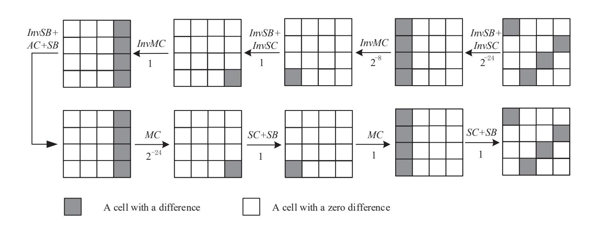
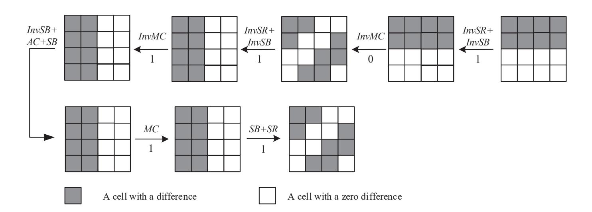
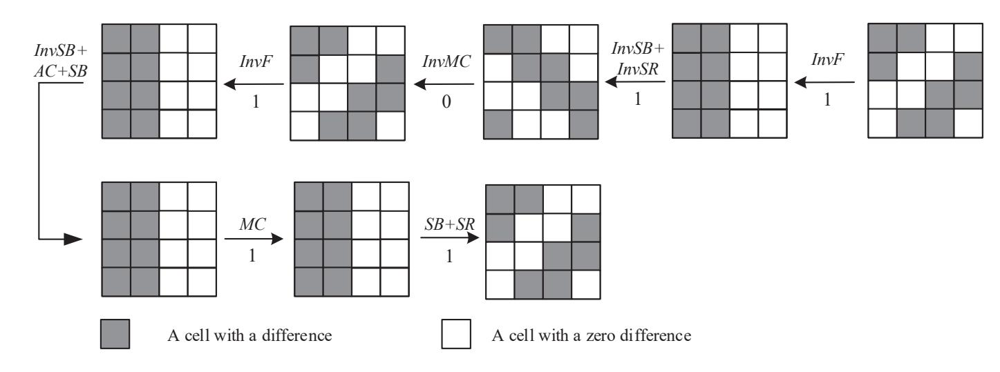
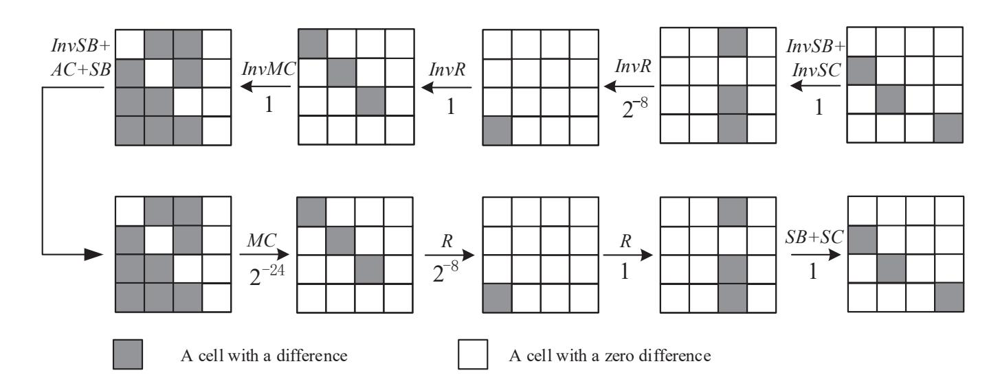
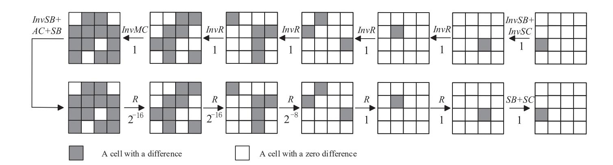

{0}------------------------------------------------

# **Structural Evaluation of AES-like Ciphers against Mixture Differential Cryptanalysis**

Xiaofeng Xie<sup>1</sup> and Tian Tian<sup>2</sup>*,*<sup>3</sup>

**Abstract.** In ASIACRYPT 2017, Rønjom et al. analyzed AES with the yoyo attack. Similar to their 4-round AES distinguisher, Grassi proposed the 4-round mixture differential cryptanalysis as well as a key recovery attack on 5-round AES, which was shown to be better than the classical square attack in computation complexity. After that, Bardeh et al. combined the exchange attack with the 4-round mixture differential distinguisher of AES, leading to the first secret-key chosen plaintext distinguisher for 6-round AES. Unlike the attack on 5-round AES, the result of 6-round keyrecovery attack on AES has extremely large complexity, which implies the weakness of mixture difference to a certain extent. Our work aims at evaluating the security of AES-like ciphers against mixture differential cryptanalysis. We propose a new structure called a boomerang structure and illustrate that a differential distinguisher of a boomerang structure just corresponds to a mixture differential distinguisher for AES-like ciphers. Based on the boomerang structure, it is shown that the mixture differential cryptanalysis is not suitable to be applied to AES-like ciphers with high round number. In specific, we associate the primitive index with our framework built on the boomerang structure and give the upper bound for the length of mixture differential distinguisher with probability 1 on AES-like ciphers. It can be directly deduced from our framework that there is no mixture differential distinguisher for 6-round AES.

**Keywords:** Mixture differential attacks · Boomerang structure · AES-like ciphers

# **1 Introduction**

Block ciphers are typical iterative ciphers built by iterating a simple round function many times to ensure that they behave like random permutations. The characteristic different from a random permutation can always be utilized as a secret-key distinguisher or be applied in key recovery. Differential cryptanalysis and linear cryptanalysis are among the best-known cryptanalysis of block ciphers. The designers of block ciphers always take the security against these cryptanalyses into consideration. Advanced Encryption Standard (AES) [\[1\]](#page-15-0) is the best known and most widely used block cipher, which has been proved to be secure against differential cryptanalysis by "wide trail". Since the proposal of AES, evaluating its security has been one of the most important problems in cryptanalysis.

Yoyo game cryptanalysis was introduced by Biham et al. for cryptanalysis of SKIP-JACK [\[2\]](#page-15-1). In ASIACRYPT 2017, the authors of [\[3\]](#page-15-2) presented a deterministic 4-round property based on Yoyo game cryptanalysis. With this property, they achieved a key recovery attack on 5-round AES with data complexity 2 <sup>11</sup>*.*<sup>3</sup> and computational complexity 2 <sup>31</sup>. At EUROCRYPT 2017, Grassi presented a new property of AES called "multiple-of-8" [\[4\]](#page-15-3), leading to the first secret-key distinguisher for 5-round AES. Although the work of [\[3\]](#page-15-2) and [\[4\]](#page-15-3) analyzed AES in terms of key recovery attack and secret-key distinguisher, respectively, the core ideas of them are very similar. After that, the 4-round yoyo property

<sup>1</sup> Information Engineering University, Zhengzhou 450001, China, [tiantian\\_d@126.com](mailto:tiantian_d@126.com)

<sup>2</sup> Information Engineering University, Zhengzhou 450001, China, [xiaofengxie514@126.com](mailto:xiaofengxie514@126.com)

{1}------------------------------------------------

has gained much attention in the literature. The authors of [5] proposed a new method called "mixture differential cryptanalysis" based on the subspace trail cryptanalysis [6]. The 4-round mixture differential distinguisher of AES they presented is similar to the 4-round yoyo distinguisher. Still, the pairs of texts used in [5] were constructed directly from the chosen plaintexts when attacking 5-round AES, different from the yoyo attack. Based on this 4-round distinguisher, a new key-recovery attack on 5-round AES with 2<sup>33.6</sup> chosen plaintexts and 2<sup>33.28</sup> computational cost was set up in [5]. Later the 4-round mixture differential distinguisher of AES is widely used in cryptanalysis. With this distinguisher, the authors of [7] broke the record for 5-round AES attacks, which was held by the classical Square attack, and the authors of [8] presented a 6-round secret-key distinguisher with 2<sup>88</sup> complexity. Actually, the 6-round distinguisher in [8] utilized a 5-round mixture differential distinguisher. In EUROCRYPT 2020 [9], Dunkelman et al. illustrated the relation between the mixture differential and the boomerang attack. They also proposed a new variant of boomerang attack called retracing boomerang attack, which covered the yoyo attack and the mixture differential cryptanalysis [9].

In this paper, we aim at evaluating the security of AES-like ciphers against mixture differential cryptanalysis. We convert the construction of mixture differential distinguishers into the problem of searching differential distinguishers for a new structure called "boomerang structure". The differential distinguishers utilized in the boomerang structure could be differential distinguishers, truncated differential distinguishers, and impossible differential distinguishers. Consequently, we can naturally evaluate the security against mixture differential using existing analysis methods, such as characteristic matrix. We also explain why high-order differential cryptanalysis could not combine with the mixture differential. By comparing the encryption of reduced round AES-like ciphers with their boomerang structure, we can observe that the mixture differential attack is unsuitable for cryptanalysis against AES-like ciphers with high rounds since the boomerang structure always contains more operations. Our results show that there is no mixture differential distinguisher for 6-, 7-, 8- and 9-round AES, Midori64, Midori128, and SKINNY64, respectively, where the bounds for AES, Midori64, and SKINNY64 are tight.

In Section 2, we introduce some concepts used in the following paper, including but not limited to the SPN and AES-like ciphers, mixture differential distinguishers, and some notations. Section 3 investigate the precondition of mixture differential distinguishers and reviews the previous distinguishers in our new insights. Section 4 evaluates the security of AES-like ciphers against mixture differential. Section 5 makes some discussion about related-key mixture differential distinguishers. Section 6 concludes this paper.

Throughout the paper, we use the following notations. Let  $\mathbb{Z}$  denote the set of integers and  $\mathbb{F}_2$  denote the finite field of two elements. For positive integers  $m_1, m_2, n$ , the set of all  $m_1 \times m_2$  matrices over  $\mathbb{Z}$  is denoted by  $\mathbb{Z}^{m_1 \times m_2}$ , and the *n*-dimensional vector space over  $\mathbb{F}_2$  is denoted by  $\mathbb{F}_2^n$ .

## <span id="page-1-0"></span>2 Preliminaries

In this section, we briefly introduce SPN ciphers, some basics of mixture differentials and impossible differentials against SPN ciphers.

### 2.1 SPN and AES-like ciphers

For an SPN block cipher, its intermediate state can typically be loaded into an n-dimensional vector  $\alpha = (\alpha_0, \alpha_1, \dots, \alpha_{n-1}) \in \mathbb{F}_2^{n \times b}$ , where  $\alpha_i \in \mathbb{F}_2^b$  for  $0 \le i < n$ . The round function of an SPN cipher is composed of Sub-Bytes layer (SB), Linear layer (L) and AddKey (AK). The Sub-Bytes layer is formed by concatenating n parallel S-boxes over  $\mathbb{F}_2^b$ , and the Linear layer is a linear function over  $\mathbb{F}_2^{n \times b}$ . The AddKey operation xor the  $(n \times b)$ -bit

{2}------------------------------------------------

round-key with the intermediate state  $\alpha$ . Overall, the round function of an SPN cipher can be described as  $R = AK \circ L \circ SB$ .

AES-like ciphers are SPN ciphers. In particular, the n-dimensional intermediate state  $\alpha$  of an AES-like cipher is treated as an  $m_1 \times m_2$  matrix over  $\mathbb{F}_2^b$  where  $m_1 \times m_2 = n$ . Thus, for the sake of discussion, the set of AES-like ciphers with the above framework is denoted by  $\varepsilon(m_1, m_2, b)$ . The linear layer of an AES-like cipher consists of a position permutation of cells (SC) and a MixColumn transformation (MC), i.e.,  $L = MC \circ SC$ . For the intermediate state  $\alpha = (\alpha_0, \alpha_1, \dots, \alpha_{n-1})$ , the position permutation SC permutes the cells of the state as follows:

$$(\alpha_0, \alpha_1, \dots, \alpha_{n-1}) \leftarrow (\alpha_{l_0}, \alpha_{l_1}, \dots, \alpha_{l_{n-1}}).$$

In the following paper, we define the index set  $SC(I) = \{l_i | i \in I\}$ , where  $I \subset \{0, 1, ..., n-1\}$ , and the index set  $Col(J) = \{i | \alpha_i \text{ belong to the } j\text{-th column}, j \in J\}$ . The MixColumn transformation MC mixes each column by a matrix M. Thus, the round function of an AES-like cipher can be written as

$$R = AK \circ MC \circ SC \circ SB.$$

Since the key addition does not influence the value of a difference, we omit AK when discussing differential cryptanalysis. For an AES-like cipher with round function R, we denote  $E_n$  as r-round encryption without the last MC in the following paper, i.e.,  $E_n = SC \circ SB \circ R^{n-1}$ .

### 2.2 Yoyo distinguishers and mixture differential

Before introducing the yoyo distinguisher of AES, we give the definitions of exchange words operation and difference pattern as follows.

**Definition 1** (Exchange words). Let  $\alpha, \beta \in \mathbb{F}_2^{n \times b}$ , where  $\alpha = (\alpha_0, \alpha_1, \dots, \alpha_{n-1}), \beta = (\beta_0, \beta_1, \dots, \beta_{n-1})$ , and  $I \subseteq \{0, 1, \dots, n-1\}$ . The exchange words function  $\rho^I(\alpha, \beta)$  is defined as follow:

$$\rho^{I}(\alpha,\beta)_{i} = \begin{cases} \beta_{i}, & i \in I, \\ \alpha_{i}, & \text{otherwise.} \end{cases}$$

For an index set  $I \subseteq \{0, 1, ..., n-1\}$  we define  $(\alpha', \beta')$  as an exchange pair of  $(\alpha, \beta)$  on index I, where  $\alpha' = \rho^I(\alpha, \beta)$ ,  $\beta' = \rho^I(\beta, \alpha)$ .

**Definition 2** (Difference pattern [3]). Let  $\alpha, \beta \in \mathbb{F}_2^{n \times b}$ , where  $\alpha = (\alpha_0, \alpha_1, \dots, \alpha_{n-1}), \beta = (\beta_0, \beta_1, \dots, \beta_{n-1})$ . The difference pattern  $v(\alpha \oplus \beta) \in \mathbb{F}_2^n$  is defined as follow:

$$\upsilon(\alpha \oplus \beta)_i = \begin{cases} 1, & \alpha_i \oplus \beta_i \neq 0, \\ 0, & \alpha_i \oplus \beta_i = 0. \end{cases}$$

The main idea of yoyo attacks is to divide the plaintext pairs into different subsets according to the definition of exchange word operation, and the ciphertext pairs in each subset have the same difference pattern after rounds of encryption. It is obvious that for the difference of state pair  $(\alpha, \beta)$  and their exchange pair  $(\alpha', \beta')$ , the equality  $\alpha' \oplus \beta' = \beta \oplus \alpha$  always holds. The generic yoyo distinguishers of SPN ciphers have been illustrated in [3] where authors discussed the relation of original pairs and their exchange pairs after encryption of Sub-Bytes layer and Linear layer. As a result, they gave the following lemma.

<span id="page-2-0"></span>**Lemma 1.** [3] Let  $\alpha, \beta \in \mathbb{F}_2^{n \times b}$  and S be a permutation over  $\mathbb{F}_2^{n \times b}$  formed by concatenating n parallel unknown b-bit S-boxes. Then

$$L \circ S(\alpha) \oplus L \circ S(\beta) = L \circ S(\rho^I(\alpha, \beta)) \oplus L \circ S(\rho^I(\beta, \alpha))$$

holds for every  $I \subseteq \{0, 1, \dots, n-1\}$ .

{3}------------------------------------------------

According to the above lemma, they gave the following theorem, which describes a generic distinguisher for the 2-round SPN structure.

**Theorem 1.** [3] Let  $\alpha, \beta \in \mathbb{F}_2^{n \times b}$  and S be a permutation over  $\mathbb{F}_2^{n \times b}$ . Then

$$\upsilon(S \circ L \circ S(\alpha) \oplus S \circ L \circ S(\beta)) = \upsilon(S \circ L \circ S(\rho^I(\alpha, \beta)) \oplus S \circ L \circ S(\rho^I(\beta, \alpha)))$$

holds for every  $I \subseteq \{0, 1, \dots, n-1\}$ .

As shown in [3], the 2-round AES can be written as

$$R^2 = (MC \circ SR) \circ (SB \circ MC \circ SR \circ SB).$$

The first part of the function  $(SB \circ MC \circ SR \circ SB)$  can be divided into four independent Super S-boxes, and the second part  $(MC \circ SR)$  is a linear function. Let  $\alpha, \beta \in \mathbb{F}_2^{16 \times 8}$ . Then for  $J \subset \{0, 1, 2, 3\}$  we have

$$R^2(\alpha) \oplus R^2(\beta) = R^2(\rho^I(\alpha, \beta)) \oplus R^2(\rho^I(\beta, \alpha)),$$

where I = SR(Col(J)). As a result, the 4-round AES encryption that omit the first and the last SR, say

$$E_4 = SB \circ MC \circ SR \circ SB \circ MC \circ SR \circ SB \circ MC \circ SB$$

has the following yoyo property

<span id="page-3-0"></span>
$$\upsilon(E_4(\alpha) \oplus E_4(\beta)) = \upsilon(E_4(\rho^I(\alpha,\beta)) \oplus E_4(\rho^I(\beta,\alpha))), \tag{1}$$

where  $I = Col(J), J \subset \{0, 1, 2, 3\}.$ 

Authors in [5] proposed the 4-round mixture differential distinguisher of AES which is similar to the 4-round yoyo distinguisher. The mixture differential cryptanalysis only exchanges the pairs in one side(output pairs or input pairs), which is different from yoyo attacks.

#### 2.3 Truncated differentials

For a function  $F: \mathbb{F}_2^n \to \mathbb{F}_2^n$ , the differential probability for an input difference  $\delta$  and an output difference  $\Delta$  is defined as

$$\Pr[\delta \xrightarrow{F} \Delta] = \frac{|\{x \in \mathbb{F}_2^n | F(x) \oplus F(x \oplus \delta) = \Delta\}|}{2^n}.$$

If  $\Pr[\delta \xrightarrow{F} \Delta] = 0$ , then the differential trail  $\delta \to \Delta$  is called an impossible differential of F [10]. For the case that  $A \subset \mathbb{F}_2^n$  and  $B \subset \mathbb{F}_2^n$ , we say

$$A \xrightarrow{F} B = \{\delta \to \Delta \mid \text{there exists } x \in \mathbb{F}_2^n, F(x \oplus \delta) \oplus F(x) = \Delta, \delta \in A, \Delta \in B\}$$

is a truncated differential trail of F. Define

$$\Pr[A \xrightarrow{F} B] = \Pr[F(x) \oplus F(x \oplus \delta) \in B | \delta \in A]$$

as the probability of  $A \stackrel{F}{\to} B$ . If  $\Pr[A \stackrel{F}{\to} B] = 0$ , then we also say that  $A \stackrel{F}{\to} B$  is an impossible differential for F.

In EUROCRYPT 2016, Sun et al. associated the primitive index with the characteristic matrix to bound the length of impossible differential distinguishers [11]. The definitions of the characteristic matrix and the primitive index of a linear layer P are as follows.

{4}------------------------------------------------

**Definition 3** (Characteristic matrix [11]). For  $P = (p_{ij}) \in \mathbb{F}_{2^b}^{m_1 \times m_2}$ , the characteristic matrix of P is defined as  $P^* = (p_{ij}^*) \in \mathbb{Z}^{m_1 \times m_2}$ , where  $p_{ij}^* = 0$  if  $p_{ij} = 0$  and  $p_{ij}^* = 1$  otherwise.

It is obvious that if the element with position (i, j) in the characteristic matrix is positive, then the value of *i*-th output byte is related to the *j*-th input byte. Thus, if all elements of a characteristic matrix  $P^*$  are positive, then the encryption with linear layer P is a full diffusion. As a result, to indicate encryption is a full diffusion, Sun et. defined the matrices whose elements are all positive as positive matrix [11].

**Definition 4** (Primitive index [11]). <sup>1</sup> Let  $P \in \mathbb{F}_{2^b}^{m \times m}$  and  $P^*$  be the characteristic matrix of P. Set

$$f_t(x) = x^t$$
.

Then the minimal integer t that makes  $f_t(P^*)$  a positive matrix is called Type 1 primitive index of P.

Remark 1. In the following paper, we denote Type 1 primitive index of P by  $L_1(P)$ .

# 3 New insights into mixture differential cryptanalysis

In [5], the authors emphasized the similarity between the truncated differentials and their 5-round AES distinguisher. In this section, we attempt to indicate the further relationship between mixture differentials and truncated differentials, and convert the mixture differential distinguishers into differential distinguishers or impossible differential distinguishers. As the first thing, we discuss the basic of mixture differential cryptanalysis.

### 3.1 The basic of mixture differential cryptanalysis

For a function  $F: \mathbb{F}_{2^q}^n \to \mathbb{F}_{2^q}^n$  and an index set  $I = \{i_0, i_1, \ldots, i_m\}$ , denote the component functions about the index set I by  $F_I = (F_{i_0}, F_{i_1}, \ldots, F_{i_m})$  where  $i_j \in I$  and  $i_j < i_{j+1}, 0 \le j < m$ . Similarly, denote the input vector about the index set I as  $x_I = (x_{i_0}, x_{i_1}, \ldots, x_{i_m})$  where  $i_j \in I$  and  $i_j < i_{j+1}, 0 \le j < m$ . Denote  $Var(F_i)$  as the set of all variables appearing in  $F_I$ . We are concerned with whether an r-round encryption could be divided into several independent small permutations. We provide a necessary and sufficient condition for this.

**Definition 5.** For a permutation  $F: \mathbb{F}_{2^q}^n \to \mathbb{F}_{2^q}^n$ , define the relation  $\mathcal{R}_F$  on the set of input words  $\{x_0, x_1, \dots, x_{n-1}\}$  such that  $(x_i, x_j) \in \mathcal{R}_F$  if and only if there exist Boolean functions  $F_{t_0}, F_{t_1}, \dots, F_{t_m}$  satisfying two conditions:

- $(1) x_i \in Var(F_{t_0}), x_j \in Var(F_{t_m});$
- (2)  $Var(F_{t_k}) \cap Var(F_{t_{k+1}}) \neq \emptyset$  for  $0 \le k < m$  if m > 0.

For a permutation  $F: \mathbb{F}_{2^q}^n \to \mathbb{F}_{2^q}^n$ ,  $\mathcal{R}_F$  is an equivalence relation on the set  $\{x_0, x_1, \ldots, x_{n-1}\}$  since  $\mathcal{R}_F$  is reflexive, symmetric and transitive. For convenience, we denote  $\mathcal{R}_F$  by  $\stackrel{F}{\sim}$ . For  $0 \leq j \leq n-1$ , the equivalence class of  $x_j$  under  $\stackrel{F}{\sim}$  is denoted by  $\overline{x}_j$ . Notice that if  $Var(F_i) \cap \overline{x}_j \neq \emptyset$  with  $0 \leq i, j < n$ , then  $Var(F_i) \subset \overline{x}_j$ , and so either  $Var(F_i) \subset \overline{x}_j$  or  $Var(F_i) \cap \overline{x}_j = \emptyset$ . Furthermore, if  $(x_i, x_j) \in \mathcal{R}_F$  and  $F_{t_0}, F_{t_1}, \ldots, F_{t_m}$  satisfies (2), then  $Var(F_{t_k}) \subset \overline{x}_i$  for all  $0 \leq k \leq m$ .

<span id="page-4-0"></span> $<sup>^{1}</sup>$  We have reduced the definition of Primitive index here since the Type 2 primitive index of P is not used in our work.

{5}------------------------------------------------

Example 1. For Midori64, the MixColumn matrix is given by

<span id="page-5-3"></span>
$$M = \left(\begin{array}{cccc} 0 & 1 & 1 & 1 \\ 1 & 0 & 1 & 1 \\ 1 & 1 & 0 & 1 \\ 1 & 1 & 1 & 0 \end{array}\right).$$

Let  $x = (x_0, x_1, \dots, x_{15}) \in \mathbb{F}_{2^4}^{16}$  and F = MC(x). Then

$$Var(F_0) = \{x_1, x_2, x_3\}$$
 and  $Var(F_1) = \{x_0, x_2, x_3\}.$ 

Considering the relation  $\mathcal{R}_F$ , since  $Var(F_0) = \{x_1, x_2, x_3\}$ , we have  $x_1 \stackrel{F}{\sim} x_2 \stackrel{F}{\sim} x_3$ . Furthermore, since  $Var(F_1) = \{x_0, x_2, x_3\}$ , we have  $x_0 \stackrel{F}{\sim} x_1 \stackrel{F}{\sim} x_2 \stackrel{F}{\sim} x_3$ .

<span id="page-5-2"></span>**Theorem 2.** Let  $F = (F_0, F_1, \ldots, F_{n-1})$  be a permutation on  $\mathbb{F}_{2^q}^n$ . Then F can be divided into m independent permutations if and only if there are at least m equivalence classes of the set  $\{x_0, x_1, \ldots, x_{n-1}\}$  under the equivalence relation  $\mathcal{R}_F$ .

*Proof.* If F can be divided into m independent permutations given by  $F_{J_0}, F_{J_1}, \ldots, F_{J_{m-1}}$ , then  $\{Var(F_{J_i})|0 \leq i \leq m-1\}$  is a partition of  $\{x_0, x_1, \ldots, x_{n-1}\}$ . It follows that if  $x_a \in Var(F_{J_i})$  for  $0 \leq a \leq n-1$  and  $0 \leq i \leq m-1$ , then  $\overline{x}_a \subset Var(F_{J_i})$ . Thus there are at least m equivalent classes under  $\mathcal{R}_F$ .

Conversely, if  $\overline{x}_{l_0}, \overline{x}_{l_1}, \dots, \overline{x}_{l_{m'-1}}$  be all equivalence classes under  $\mathcal{R}_F$  with  $m' \geq m$ . For  $0 \leq i \leq m'-1$ , let  $J_i = \{j | Var(F_j) \subset \overline{x}_{l_i}\}$ . Since  $\overline{x}_{l_i} \cap \overline{x}_{l_j} = \emptyset$  for  $0 \leq i \neq j \leq m'-1$ , it follows that F can be divided into m independent functions given by

$$F_{J_0}, F_{J_1}, \dots, F_{J_{m-2}}, F_{\bigcup_{m-1 < i < m'-1} J_i}.$$

Since F is a permutation, it follows that  $F_{J_1}, F_{J_2}, \ldots, F_{J_{m-2}}, F_{\bigcup_{m-1 \leq i \leq m'-1} J_i}$  are all permutations.

Since the cancellation of an input variable rarely happens during the iteration of rounds in block ciphers, in the following paper we assume that an input variable will not be eliminated during the encryption of a block cipher. For example, if  $F: \mathbb{F}_{2^q}^n \to \mathbb{F}_{2^q}^n$ ,  $x_0 \in Var(F_0), x_0 \in Var(F_1)$  and  $G: \mathbb{F}_{2^q}^2 \to \mathbb{F}_{2^q}$ , then  $x_0 \in Var(G(F_0, F_1))$ .

<span id="page-5-0"></span>**Lemma 2.** Let  $F: \mathbb{F}_{2^q}^n \to \mathbb{F}_{2^q}^n$  and  $G: \mathbb{F}_{2^q}^n \to \mathbb{F}_{2^q}^n$  be two permutations. If  $(x_i, x_j) \in \mathcal{R}_F$ , then  $(x_i, x_j) \in \mathcal{R}_{G \circ F}$ .

Proof. Since  $(x_i, x_j) \in \mathcal{R}_F$ , there exist  $F_{t_0}, F_{t_1}, \ldots, F_{t_m}$  satisfying  $x_i \in Var(F_{t_0}), \ x_j \in Var(F_{t_m})$ , and  $Var(F_{t_k}) \cap Var(F_{t_{k+1}}) \neq \emptyset$  for  $0 \leq k < m$ . Since G is invertible, for every  $x_{t_k}$ , there exists  $G_{l_k}$  satisfies  $x_{t_k} \in Var(G_{l_k})$ . Let  $H = G \circ F$ . It is clear that  $Var(F_{t_k}) \subset Var(H_{l_k})$ . Thus  $(x_i, x_j) \in \mathcal{R}_{G \circ F}$ .

<span id="page-5-1"></span>**Theorem 3.** Let  $F: \mathbb{F}_{2^q}^n \to \mathbb{F}_{2^q}^n$  and  $G: \mathbb{F}_{2^q}^n \to \mathbb{F}_{2^q}^n$  be two permutations and  $(x_i, x_j) \in \mathcal{R}_G$ . Then for every  $(x_{l_1}, x_{l_0}) \in \mathcal{R}_F$  and  $(x_{k_1}, x_{k_0}) \in \mathcal{R}_F$  with  $x_{l_0} \in Var(F_i)$  and  $x_{k_0} \in Var(F_j)$ , we have  $(x_{l_1}, x_{k_1}) \in \mathcal{R}_{G \circ F}$ .

Proof. Since  $(x_i, x_j) \in \mathcal{R}_G$ , there exist  $G_{t_0}, G_{t_1}, \ldots, G_{t_m}$  satisfying  $x_i \in Var(G_{t_0}), \ x_j \in Var(G_{t_m})$ , and  $Var(G_{t_k}) \cap Var(G_{t_{k+1}}) \neq \emptyset$  for  $0 \leq k < m$ . Let  $H = G \circ F$ . Since  $x_i \in Var(G_{t_0})$ , it follows that  $Var(F_i) \subset Var(H_{t_0})$ . Thus  $x_{l_0} \in Var(H_{t_0})$ . Similarly,  $x_{k_0} \in Var(H_{t_m})$ . Because  $Var(G_{t_k}) \cap Var(G_{t_{k+1}}) \neq \emptyset$ , we have  $Var(H_{t_k}) \cap Var(H_{t_{k+1}}) \neq \emptyset$ . As a result,  $(x_{l_0}, x_{k_0}) \in \mathcal{R}_{G \circ F}$ . By Lemma 2, we have  $(x_{l_1}, x_{k_1}) \in \mathcal{R}_{G \circ F}$ .

For most AES-like ciphers in  $\varepsilon(4,4,b)$ , the following result is valid, which immediately follows from Theorem 3.

{6}------------------------------------------------

<span id="page-6-1"></span>**Corollary 1.** Let  $R = MC \circ SC \circ SB$  be the round function of an AES-like cipher which belongs to  $\varepsilon(4,4,b)$ . If the linear layer satisfies the following two conditions:

(1) the MixColumn matrix M could not be transformed into the following form

$$M = \left(\begin{array}{cc} A & O \\ O & B \end{array}\right)$$

by changing column positions and row positions, where A is an  $n_0 \times n_1$  matrix and B is an  $n_2 \times n_3$  matrix with  $n_0 + n_2 = n_1 + n_3 = 4$ ,  $n_i > 0$  for i = 0, 1, 2, 3.

(2)  $\#\{i|SC^{-1}(Col(\{j\}))\cap Col(\{i\})\neq\varnothing,\ 0\leq i<4\}>2\ for\ every\ 0\leq j<4,\ that\ is\ to\ say,\ the\ words\ in\ each\ column\ are\ shifted\ from\ more\ than\ 2\ different\ columns.$ 

then the 2-round encryption  $R^2$  could not be divided into more than one independent function.

Proof. Let  $x=(x_0,x_1,\ldots x_{15})\in \mathbb{F}_{2^b}^{16}$ , and y=R(x). Then  $R^2(x)=R(y)$ . Without loss of generality, we assume that  $y_0,y_1,y_2,y_3$  are input words that are shifted to the j-th column after SC. Since condition 1 implies that all 4 input words of MC belong to the same equivalence class under  $\stackrel{MC}{\sim}$ , it follows that  $y_0\stackrel{R}{\sim}y_1\stackrel{R}{\sim}y_2\stackrel{R}{\sim}y_3$ . Assume  $y_0,y_1,y_2,y_3$  are shifted from columns indexed by  $I=\{i|SC(Col(\{j\}))\cap Col(\{i\})\neq\varnothing\}$ . Then we deduce from Theorem 3 that elements in  $\{x_i|i\in SC^{-1}(Col(I))\}$  are in the same equivalence class under  $\stackrel{R^2}{\sim}$ . From Condition 2 we know that |I|>2 which implies that  $\#\{x_i|i\in SC^{-1}(Col(I))\}\geq 12$ . Thus, every equivalence class of  $\stackrel{R^2}{\sim}$  has more than 12 elements. Since there are only 16 input words for  $R^2$ , there is only one equivalence class under  $\stackrel{R^2}{\sim}$ .

For a generic AES-like cipher in  $\varepsilon(m_1, m_2, b)$  with  $m_1 \times m_2 = n$  and round function R, it is clear that  $R^t$  is a permutation on  $\mathbb{F}^n_{2^b}$  for a positive integer t. We give the notation  $L_2(R)$  for a round function R as follows.

Remark 2. For a generic AES-like cipher with the round function R. Let us denote the least positive integer t such that the input set  $\{x_0, x_1, \ldots, x_{n-1}\}$  has only one equivalence class under  $\stackrel{F}{\sim}$  with  $F = R^t$  by  $L_2(R)$ .

Set  $\kappa = L_2(R)$ . Then it follows from Theorem 2 that  $R^{\kappa}$  could not be divided into more than one independent permutation. Assume  $R^{\kappa-1}$  can be divided into m independent functions where m > 1. Because the nonlinear layer SB works on words individually, the function  $SB \circ R^{\kappa-1}$  can also be divided into m independent functions. Thus, the  $\kappa$ -round encryption  $R^{\kappa}$  can be written as  $R^{\kappa} = G \circ F$ , where G is a linear function and  $F = SB \circ R^{\kappa-1}$  can be divided into m independent permutations given by

$$F_{J_0}(x_{I_0}), F_{J_1}(x_{I_1}), \dots, F_{J_{m-1}}(x_{I_{m-1}}).$$

Based on this representation, we give the following theorem.

<span id="page-6-0"></span>**Theorem 4.** For an AES-like cipher in  $\varepsilon(m_1, m_2, b)$  with  $m_1 \times m_2 = n$  and the round function R, let  $\kappa = L_2(R)$ . Then  $R^{\kappa} = G \circ F$  where G is a linear function and F can be divided into m independent permutations given by

$$F_{J_0}(x_{I_0}), F_{J_1}(x_{I_1}), \dots, F_{J_{m-1}}(x_{I_{m-1}}).$$

Let  $K \subset \{0, 1, \dots, m-1\}$ ,  $I = \bigcup_{i \in K} I_i$ ,  $p^0, p^1 \in \mathbb{F}_{2^b}^n$ ,  $p'^0 = \rho^I(p^0, p^1)$  and  $p'^1 = \rho^I(p^1, p^0)$ .

$$R^{\kappa}(p^0) \oplus R^{\kappa}(p^1) = R^{\kappa}(p'^0) \oplus R^{\kappa}(p'^1).$$

{7}------------------------------------------------

*Proof.* The  $\kappa$ -round encryption  $R^{\kappa}$  can be rewritten as

$$R^{\kappa}(x) = G \circ F(x) = G \circ (F_{J_0}(x_{I_0}), F_{J_1}(x_{I_1}), \dots, F_{J_{m-1}}(x_{I_{m-1}})).$$

Take  $I = I_0$  as an example. Since the exchange operation only exchanges the words indexed by  $I_0$ , we have

$$F(p'^{0}) \oplus F(p'^{1})$$

$$= (F_{J_{0}}(p_{I_{0}}^{1}), F_{J_{1}}(p_{I_{1}}^{0}) \dots, F_{J_{m-1}}(p_{I_{m-1}}^{0})) \oplus (F_{J_{0}}(p_{I_{0}}^{0}), F_{J_{1}}(p_{I_{1}}^{1}) \dots, F_{J_{m-1}}(p_{I_{m-1}}^{1}))$$

$$= F(p^{0}) \oplus F(p^{1}).$$

Since G is a linear function, it follows that

$$G \circ F(p'^0) \oplus G \circ F(p'^1) = G(F(p'^0)) \oplus G(F(p'^1)) = G \circ F(p^0) \oplus G \circ F(p^1).$$

The proof for any other case of I is an analogy. Hence this completes the proof.  $\Box$ 

Now we are going to illustrate the idea of constructing mixture differential distinguishers using the property given by Theorem 4. We know that for an input pair  $(p^0, p^1)$  and its exchanged pair  $(p'^0, p'^1)$ , the equality

$$R^{\kappa}(p^0) \oplus R^{\kappa}(p^1) = R^{\kappa}(p'^0) \oplus R^{\kappa}(p'^1)$$

holds. For an integer  $a \geq 0$ , let  $c^0 = R^{\kappa+a}(p^0), c^1 = R^{\kappa+a}(p^1), c'^0 = R^{\kappa+a}(p'^0), c'^1 = R^{\kappa+a}(p'^1)$  and  $\gamma = R^{\kappa}(p^0) \oplus R^{\kappa}(p'^0) = R^{\kappa}(p^1) \oplus R^{\kappa}(p'^1)$ . Then we have

$$c'^{0} = R^{a}(R^{\kappa}(p'^{0})) = R^{a}(\gamma \oplus R^{\kappa}(p^{0})) = R^{a}(\gamma \oplus R^{-a}(c^{0})). \tag{2}$$

Similarly, we have

<span id="page-7-0"></span>
$$c'^1 = R^a(\gamma \oplus R^{-a}(c^1)). \tag{3}$$

We define the encryption  $R^a(\gamma \oplus R^{-a}(x))$  as follow.

**Definition 6** (Boomerang structure). For an AES-like cipher with the round function R, let  $\kappa = L_2(R)$  and n be an integer not less than  $\kappa$ . The function  $B_n = R^{n-\kappa} \circ AC \circ R^{-(n-\kappa)}$  is called the boomerang structure of  $R^n$ , where AC represents constant addition operation.

Let n be an integer not less than  $\kappa$ . For a ciphertext pair  $(c^0, c^1)$ , and its plaintext pairs  $(p^0, p^1)$  where  $p^0 = R^{-n}(c^0)$  and  $p^1 = R^{-n}(c^1)$ , let  $(p'^0, p'^1)$  be the exchange pair of  $(p^0, p^1)$  and  $(c'^0, c'^1) = (R^n(p'^0), R^n(p'^1))$ . It is the relationship between the differences  $(c^0 \oplus c^1)$  and  $(c'^0 \oplus c'^1)$  that the mixture differential is concerned with. Based on Theorem 4, similar to Equations (2) and (3), we have

$$c'^{0} = R^{n-\kappa} \circ AC \circ R^{-(n-\kappa)}(c^{0}),$$
  
$$c'^{1} = R^{n-\kappa} \circ AC \circ R^{-(n-\kappa)}(c^{1}).$$

It can be seen that if there is a differential trail or an impossible differential distinguisher of boomerang structure  $B_n = R^{n-\kappa} \circ AC \circ R^{-(n-\kappa)}$ , then the propagation of difference  $c^0 \oplus c^1 \to c'^0 \oplus c'^1$  also has the same probability, i.e.,

$$\Pr[B_n(x \oplus \alpha) \oplus B_n(x) = \beta] = \Pr[c'^0 \oplus c'^1 = \beta \mid c^0 \oplus c^1 = \alpha], \alpha, \beta \in \mathbb{F}_2^n$$

and

$$\Pr[B_n(x) \oplus B_n(x \oplus \delta) \in B \mid \delta \in A] = \Pr[c'^0 \oplus c'^1 \in B \mid c^0 \oplus c^1 \in A], A, B \subset \mathbb{F}_2^n.$$

{8}------------------------------------------------

It can be seen that there is a one-to-one correspondence between mixture differential distinguishers of  $R^n$  and differential distinguishers of the boomerang structure  $B_n$ . Then, we convert the mixture differential distinguisher construction of  $R^n$  into searching differential distinguishers of the boomerang structure  $B_n$ . Note that for different pair  $(c^0, c^1)$ , the constant  $\gamma$  is different, which implies that the constant in AC is continually changing. Although the value of the constant does not influence the propagation of difference, we could not analyze the boomerang structure with high-order differential cryptanalysis since the constant is not fixed.

### 3.2 Previous distinguishers in the new framework

In the following of this paper, we denote the boomerang structure of r-round AES-like cipher as  $B_r$ . We are going to review the previous mixture differential distinguishers from the point of view of boomerang structure. First of all, we divide the mixture differential distinguishers into three types.

- (1) Type 1: distinguishers utilizing impossible differentials in boomerang structure;
- (2) Type 2: distinguishers utilizing truncated differentials in boomerang structure;
- (3) Type 3: distinguishers utilizing traditional differentials in boomerang structure.

For the AES round function  $R = MC \circ SR \circ SB$ , we have  $L_2(R) = 2$ . Denote  $F = SR \circ SB \circ MC$ . Then we review the AES distinguishers proposed in [3, 5, 8] in the view of boomerang structure.

Type 2 distinguisher for 4-round AES [5]. The boomerang structure of 4-round AES is

$$B_4 = SR \circ SB \circ MC \circ SR \circ SB \circ AC \circ SB^{-1} \circ SR^{-1} \circ MC^{-1} \circ SB^{-1} \circ SR^{-1}.$$

Since SR and SB are commutative,  $B_4$  can be written as

$$B_4 = SR \circ SB \circ MC \circ SB \circ AC \circ SB^{-1} \circ MC^{-1} \circ SB^{-1} \circ SR^{-1}.$$

It can be seen that there is a truncated differential distinguisher with probability 1 for  $B_4$  given by

$$\Pr[\upsilon(SR(x \oplus x'))] = \upsilon(SR^{-1}(B_4(x) \oplus B_4(x')))] = 1,$$

where  $x, x' \in \mathbb{F}_{2^8}^{16}$ . This distinguisher corresponds to the 4-round mixture differential distinguisher described by Equation (1). Moreover, it can also be extended to a series of Type 1 distinguishers, which are usually used to filter wrong key guesses.

**Type 2 distinguisher for 5-round AES** [8]. The 6-round AES distinguisher proposed in [8] is based on a Type 2 distinguisher for 5-round AES. The truncated differential distinguisher utilized in this Type 2 distinguisher is

$$\Pr[\upsilon(SR(B_5(x) \oplus B_5(x'))) \le 1 | \upsilon(SR(x_i \oplus x_i')) \le 1] = 2^{-56}, \text{ where } x, x' \in \mathbb{F}_{2^8}^{16},$$

We describe the truncated difference for  $B_5$  used in this distinguisher in Fig. 1.

**Type 1 distinguisher for 5,6-round AES** [3]. In [3], the authors presented Type 1 mixture differential distinguishers for 5-round and 6-round AES, respectively. The boomerang structure of 5-round AES is

$$B_5 = F^2 \circ SB \circ AC \circ SB^{-1} \circ F^{-2}$$
.

The impossible differential distinguisher utilized in the 5-round Type 1 distinguisher is presented in Fig. 2. This distinguisher only covers the following encryption

{9}------------------------------------------------

<span id="page-9-0"></span>

Figure 1: A truncated differential for boomerang structure of 5-round AES

<span id="page-9-1"></span>

Figure 2: An impossible differential for boomerang structure of 5-round AES

<span id="page-9-2"></span>

Figure 3: An impossible differential distinguisher for boomerang structure of 6-round AES

$$E_5' = F \circ SB \circ AC \circ SB^{-1} \circ F^{-2},$$

and the distinguisher can be described as

$$\Pr[v(SR(E_5'(x) \oplus E_5'(x'))) \le 2|wt(x_i \oplus x_i') \le 2] = 0$$

for  $x, x' \in \mathbb{F}_{2^8}^{16}$  and  $0 \le i < 4$ . The 6-round Type 1 distinguisher of AES does not cover the whole boomerang structure either. Let

$$E_6' = F \circ SB \circ AC \circ SB^{-1} \circ F^{-3}.$$

{10}------------------------------------------------

The impossible differential distinguisher of  $E'_6$  utilized in the 6-round Type 1 distinguisher is

$$\Pr[\upsilon(SR(E_6'(x) \oplus E_6'(x'))) \le 2|\upsilon(SR(x_i \oplus x_i')) \le 2] = 0, \text{ where } x, x' \in \mathbb{F}_{2^8}^{16},$$

which is presented in Fig. 3.

It is difficult to apply these distinguishers to distinguish AES since they do not cover the whole boomerang structure, and the difficulty lies in that the difference pattern of the intermediate state is unknown. Take Algorithm 4 in [3] as an example. Algorithm 4 in [3] combines the impossible differential distinguisher presented in Fig. 2 with a truncated differential distinguisher whose probability is  $2^{-13.4}$  to a 5-round AES distinguisher which we think is wrong. The theoretical explanation is given as follows.

Denote the truncated differential and the impossible differential utilized in the algorithm as

$$\Pr[A \xrightarrow{F} B] = 2^{-13.4},$$

$$\Pr[B \xrightarrow{B_4 \circ F^{-1}} C] = 0,$$

where  $F = SR \circ MC \circ SB$  and  $|C| = 2^{116.6}$ . The algorithm generates a set of random pairs  $\Omega$  with  $|\Omega| = 2^{13.4}$ . For every  $(p_0, p_1) \in \Omega$ , it generates a set of pairs  $\Lambda(p_0, p_1)$  by swapping bytes of their ciphertexts (mixture pair construction), and  $|\Lambda(p_0, p_1)| = 2^{11.4}$ . Then

$$\Pr[F(p_0') \oplus F(p_1') \notin C | F(p_0) \oplus F(p_1) \in B] = 1$$

for every  $(p'_0, p'_1) \in \Lambda(p_0, p_1)$  since  $F(p_0) \oplus F(p_1) \to F(p'_0) \oplus F(p'_1)$  follows the impossible differential  $\Pr[B \xrightarrow{B_4 \circ F^{-1}} C] = 0$ . For a set of random pairs  $\Delta$ , since  $|C| = 2^{116.6}$ , we have

$$\Pr[x_0 \oplus x_1 \notin C | (x_0, x_1) \in \Delta] = 1 - 2^{-11.4}.$$

Define a pair  $(p_0, p_1)$  satisfying  $F(p_0) \oplus F(p_1) \in B$  as a right pair, and others as wrong pairs. The algorithm judges a cipher as a 5-round AES encryption if it finds a right pair  $(p_0, p_1)$  by checking  $F(p'_0) \oplus F(p'_1) \notin C$  for every  $(p'_0, p'_1) \in \Lambda(p_0, p_1)$ . For AES, a right pair  $(p_0, p_1)$ ,

$$\Pr[F(p_0') \oplus F(p_1') \notin C \text{ for every } (p_0', p_1') \in \Lambda(p_0, p_1)] = 1,$$

which means it must be judged as a right pair. For a wrong pair, since  $\Lambda(p_0, p_1)$  can be regarded as a set of random pairs, we have

$$\Pr[F(p_0') \oplus F(p_1') \notin C \text{ for every } (p_0', p_1') \in \Lambda(p_0, p_1)]$$
$$= (1 - 2^{-11.4})^{2^{11.4}} \approx e^{-1} \approx 0.368.$$

Since there are nearly  $2^{13.4}$  wrong pairs to be checked, the probability that at least a wrong pair is judged as a right pair is  $1-(1-0.368)^{2^{13.4}}\approx 1$ . Similarly, for a random permutation, every  $\Lambda(p_0,p_1)$  can be regarded as a set of random pairs, and thus the probability that at least a pair  $(p_0,p_1)$  is judged as a right pair is  $1-(1-0.368)^{2^{13.4}}\approx 1$ , which means the probability that a random permutation is judged as 5-round AES is 1. To verify our analysis, we apply Algorithm 4 in [3] on some block ciphers, including full round AES128, Midori128, SIMON128 [12] and Spring128 [13]. All these block ciphers are identified as 6-round AES. The code of this experiment is presented at https://github.com/BLOCKCIPHERS702702.

As a result, we mainly focus on the distinguishers covering the whole boomerang structure.

{11}------------------------------------------------

# <span id="page-11-0"></span>4 Security evaluation of AES-like ciphers against mixture differential

In this section, we are going to evaluate the security of AES-like cipher against the three types of distinguishers, especially the security against Type 1 and Type 2 distinguishers.

### 4.1 Security evaluation against Type 1 distinguisher

In the previous mixture differential cryptanalysis against AES, the 4-round Type 2 distinguisher with probability 1 played a very important role. The following proposition illustrates the relation between this kind of distinguisher and Type 1 distinguisher.

<span id="page-11-1"></span>**Proposition 1.** For a boomerang structure, if there is a deterministic truncated differential, then there exists an impossible differential.

According to Proposition 1, if there is no impossible differential for a boomerang structure, there is no deterministic truncated differential either. As a result, if we can give an upper bound on the round number r for Type 1 distinguisher, then we know there is no r-round Type 2 distinguisher with probability 1. In [11], the upper bound of impossible differential distinguishers is well studied using "primitive index" and the characteristic matrix. Based on these methods, we give the following theorem.

<span id="page-11-2"></span>**Theorem 5.** For an AES-like cipher with the round function  $R = MC \circ SC \circ SB$ , let  $F = SC \circ SB \circ MC$ ,  $P = MC^{-1} \circ SC^{-1}$ , and  $r = L_1(P)$ . There is no impossible differential distinguisher for  $F^r \circ SB \circ AC \circ SB^{-1} \circ F^{-r}$ .

Proof. Let m be the length of input vectors. For a vector  $\alpha = (\alpha_0, \alpha_1, \dots, \alpha_{m-1})$ , denote  $H(\alpha) = \#\{\alpha_i | \alpha_i \neq 0\}$ . It follows from Lemma 1 in [11] that for  $\alpha \neq 0$  and  $H(\alpha) = 1$ , there exists a vector  $\beta = (\beta_0, \beta_1, \dots, \beta_{m-1})$  such that  $H(\beta) = m$  and  $\alpha \to \beta$  is a possible differential distinguisher for  $F^r$ . Thus, for any  $\alpha, \alpha'$  and corresponding  $\beta, \beta'$  satisfying  $H(\alpha) = H(\alpha') = 1$ ,  $H(\beta) = H(\beta') = m$ , since  $v(\beta) = v(\beta')$ , we have  $\alpha \to \alpha'$  is a possible differential distinguisher for  $F^r \circ SB \circ F^{-r}$ . Notice that  $H(\alpha) = H(\alpha') = 1$ , by Theorem 1 in [11], there is no impossible differential distinguisher for  $F^r \circ SB \circ AC \circ SB^{-1} \circ F^{-r}$ .  $\square$ 

<span id="page-11-3"></span>**Theorem 6.** For an AES-like cipher with the round function  $R = MC \circ SC \circ SB$  and  $P = MC^{-1} \circ SC^{-1}$ , let  $r = L_1(P) + L_2(R)$ . There is no Type 1 distinguisher for more than r-round encryption.

Proof. Let  $F = SC \circ SB \circ MC$  and  $\kappa = L_2(R)$ . The boomerang structure of (r+1)-round encryption is  $B_r = F^{\kappa} \circ SB \circ AC \circ SB^{-1} \circ F^{-\kappa}$ . By Theorem 5, there is no impossible differential distinguisher for  $B_r$ . Thus, no Type 1 distinguisher exists for more than r-round encryption.

The following corollary immediately follows from Theorem 6.

<span id="page-11-4"></span>Corollary 2. For an AES-like cipher with the round function R and the linear layer P. Let  $r = L_1(P) + L_2(R)$ . There is no Type 2 distinguisher with probability 1 for r-round encryption  $E_r$ . For an AES-like cipher with round function  $R = MC \circ SC \circ SB$ . Let  $P = MC^{-1} \circ SC^{-1}$  and  $r = L_1(P) + L_2(R)$ . There is no Type 1 distinguisher for more than r-round encryption.

For AES, since  $L_1(P) = 2$ ,  $L_2(R) = 2$ , it can be deduced from Corollary 2 that there is no Type 2 distinguisher with probability 1 for 5-round AES.

{12}------------------------------------------------

### 4.2 Security evaluation against Type 2 distinguisher

The point of constructing a Type 2 distinguisher for an AES-like cipher is searching a truncated differential for its boomerang structure.

For an AES-like cipher  $\mathcal{E}$  belonging to  $\varepsilon(4,4,b)$ , let  $R = MC \circ SR \circ SB$  be the round function. Based on Corollary 1, we give a reasonable assumption that  $L_2(R) = 2$ , which is the worst possible situation. Let  $F = SC \circ SB \circ MC$ . Then, for an integer  $n \geq 3$ , the boomerang structure of this n-round encryption is

<span id="page-12-1"></span>
$$B_n = F^{n-3} \circ SB \circ AC \circ SB^{-1} \circ F^{-(n-3)}. \tag{4}$$

Besides, the n-round encryption function  $E_n$  of the cipher can be written as

$$E_n = F^{n-3} \circ SC \circ SB \circ R^2.$$

The above two equations split  $B_n$  and  $E_n$  into two parts, respectively, where the second part of  $B_n$  and  $E_n$  are both  $F^{n-3}$ . Let us focus on the first parts of  $B_n$  and  $E_n$ . Generally speaking, as the increasing of n,  $F^{-(n-3)}$  in the first parts of  $B_n$  consists of more operations than  $R^2$  in the first part of  $E_n$ . Thus, it is expected that it should be more difficult to search differential distinguishers for  $B_n$  than  $E_n$ . That is also to say the mixture differential distinguisher should always be weaker than the truncated differential distinguisher against AES-like ciphers with a high round number. In the following, we give specific bounds on the round number of Type 2 distinguisher for some well-known AES-like ciphers.

Recall that the truncated differential distinguishers for  $B_n$  are in one-to-one correspondence with mixture differential distinguishers for  $E_n$ . Thus, to give a bound on the round number n that there is no mixture differential distinguishers for  $E_n$  is equivalent to bound the round number n that there is no truncated differential distinguishers for  $B_n$ . At the state of the art, there are two frameworks to construct truncated differentials: employing multiple differentials [14] and adopting the branch property of linear layer (byte-wise truncated differential) [15]. We analyze the truncated differential distinguishers for  $B_n$  using the two frameworks.

First, we investigate multiple differentials for  $B_n$  to give a security evaluation of  $\mathcal{E}$  described above for Type 2 mixture differential distinguishers.

<span id="page-12-0"></span>**Proposition 2.** Let  $\mathcal{B}$  be the branch number of MC and N be the minimum active S-boxes for differential trails of  $F^3 \circ SB$ . If SR shifts the words in every column into four different columns, then  $N \geq \mathcal{B}^2$ .

Proof. Note that there are three Mixcolumns in  $F^3 \circ SB$ . Let  $\alpha^i = (\alpha_0^i, \alpha_1^i, \dots, \alpha_{15}^i)$  and  $\beta^i = (\beta_0^i, \beta_1^i, \dots, \beta_{15}^i)$  be the input difference and output difference of the *i*-th MC. Without loss of generality, assume that  $(\alpha_0^1, \alpha_4^1, \alpha_8^1, \alpha_{12}^1)$  is one active column of  $\alpha^1$ . Since  $\alpha^1 = SR \circ SB \circ MC(\alpha^0)$ , the active bytes in  $(\alpha_0^1, \alpha_4^1, \alpha_8^1, \alpha_{12}^1)$  are shifted from different columns of  $\alpha^0$ . Denote  $a_i$  as the number of active columns for  $\alpha^i$ . It follows that

$$a_0 \ge v(\alpha_0^1, \alpha_4^1, \alpha_8^1, \alpha_{12}^1).$$

Similarly, the active bytes in  $(\beta_0^1, \beta_4^1, \beta_8^1, \beta_{12}^1)$  will be shifted to different columns, and so  $a_2 \ge \upsilon(\beta_0^1, \beta_4^1, \beta_8^1, \beta_{12}^1)$ . Thus we have

$$a_0 + a_2 \ge \upsilon(\alpha_0^1, \alpha_4^1, \alpha_8^1, \alpha_{12}^1) + \upsilon(\beta_0^1, \beta_4^1, \beta_8^1, \beta_{12}^1) \ge \mathcal{B}.$$

This implies that the minimum active S-boxes for every differential trail satisfies  $N \ge a_0 \times \mathcal{B} + a_2 \times \mathcal{B} \ge \mathcal{B}^2$ .

In the following, we denote the minimal number of active S-boxes in a differential trail of  $B_n$  by  $L_s(B_n)$ .

{13}------------------------------------------------

<span id="page-13-0"></span>**Theorem 7.** Let p be the maximal differential probability of S-boxes in  $B_n$ . Denote  $t = L_s(B_n)$ . If  $p^t \leq 2^{-16 \times b}$ , then there is no multiple differential for  $B_n$ .

*Proof.* Let  $A, B \subset \mathbb{F}^{16 \times b}$  be the input and output differences of  $B_n$ , respectively. Let N = |B|. Then the probability of multiple differentials satisfies

$$\Pr[A \to B] \leq \max_{\alpha \in A} \Pr[\alpha \to B] \leq N \times \max_{\alpha \in A, \beta \in B} \Pr[\alpha \to \beta] \leq N \times p^t.$$

For the random case, the probability that an output difference falls in B is given by  $P_{rand} = N \times 2^{-16 \times b}$ . Thus, if  $p^t \leq 2^{-16 \times b}$ , then  $\Pr[A \to B] \leq P_{rand}$ , which means the truncated difference  $A \to B$  is indistinguishable from random permutations. Since A and B are arbitrary, there is no multiple difference for  $B_n$ .

Applying Proposition 2 to AES, we have  $L_s(B_6) > \mathcal{B}^2 = 25$ . Since the maximal differential probability of AES S-box is  $2^{-6}$ , the following corollary could be deduced from Theorem 7.

**Corollary 3.** Let  $B_6 = F^3 \circ SB \circ AC \circ SB^{-1} \circ F^{-3}$  be the boomerang structure of 6-round AES, where  $F = SC \circ SB \circ MC$ . Then there is no multiple difference for  $B_6$ .

For the boomerang structure of SKINNY64 and the Midori family, Proposition 2 could not give an accurate value of  $L_s(B_n)$ , where  $B_n$  is described as in (4). Therefore, we construct MILP (Mixed-Integer Linear Programming) models based on Algorithm 1 to get  $L_s(B_n)$  for these ciphers. The notation  $l^{(MC)}(x_0, x_1, \ldots x_7)$  involved in Algorithm 1 denotes the inequalities whose solution characterizes the branching property function of Mixcolumn for AES-like ciphers. It is worth noting that there are two Sub-Bytes layers right next to each other without a linear layer in between. In this case, these Sub-Byte layers can be combined into a new Sub-Bytes layer which is formed by concatenating 16 parallel unknown S-boxes, which means

$$F^{n-3} \circ SB \circ AC \circ SB^{-1} \circ F^{-(n-3)} = F^{n-3} \circ S' \circ F^{-(n-3)}$$

where  $S' = SB \circ AC \circ SB^{-1}$ . As a result, for a more accurate estimate, let  $L_s(B_n)$  be the minimum active S-box of  $F^{n-3} \circ S' \circ F^{-(n-3)}$ . By utilizing the MILP solver (Gurobi), we can get  $L_s(B_n)$  for SKINNY64 and the Midori family. Since Midori64 and Midori128 share the same linear layer,  $L_s(B_n)$  of these two ciphers are the same. For the Midori family, we have  $L_s(B_7) = 39$  and  $L_s(B_8) = 55$ . The maximal probabilities of Midori64 S-box and Midori128 S-box are  $2^{-2}$  and  $2^{-3}$ , respectively. Since  $2^{-2\times39} < 2^{-64}$ , it follows from Theorem 7 that the round number of a multiple differential distinguisher of Midori64 is less than 7. Similarly, since  $2^{-3\times55} < 2^{-128}$ , it follows from Theorem 7 that the round number of a multiple differential distinguisher against Midori128 is less than 8. For SKINNY64, since the maximal differential probability of S-box is  $2^{-2}$  and  $L_s(B_8) = 43$ , it follows from Theorem 7 that the round number of a multiple differential distinguisher is less than 8. These results are presented in Table 1.

<span id="page-13-1"></span>Table 1: Bounds for the round number of multiple differential distinguishers against the boomerang structure  $B_n$ 

| Ciphers   | Cell size | Max probability of S-box | Round number |  |
|-----------|-----------|--------------------------|--------------|--|
|           | (b)       | (p)                      | (n)          |  |
| AES       | 8         | $2^{-6}$                 | < 6          |  |
| Midori64  | 4         | $2^{-2}$                 | < 7          |  |
| Midori128 | 4         | $2^{-3}$                 | < 8          |  |
| SKINNY64  | 4         | $2^{-2}$                 | < 8          |  |
|           |           |                          |              |  |

Second, for the security evaluation against Type 2 distinguishers by exploiting the branch property, we use the MILP modeling technique. For the details of building MILP

{14}------------------------------------------------

### <span id="page-14-1"></span>**Algorithm 1** Construct an MILP model $\mathcal{M}$ for $L_s(F^n \circ SB \circ F^{-n})$

```
1: for r = 0 to n do
            \mathcal{M}.var \leftarrow (x_0^r, x_1^r, \dots, x_{15}^r)
 2:
            M.var \leftarrow (y_0^r, y_1^r, \dots, y_{15}^r)
 3:
 4: end for
 5: M.con \leftarrow x^n = y^0
 6: for r = 0 to n - 1 do
            for i = 0 to 3 do
 7:
                 M.con \leftarrow l^{(MC)}(x_{Col(i)}^{r+1}, x_{SC(Col(i))}^{r})
M.con \leftarrow l^{(MC)}(y_{Col(i)}^{r}, y_{SC(Col(i))}^{r+1})
 8:
 9:
            end for
10:
11: end for
12: N_s = \sum_{r=0}^n \sum_{i=0}^{15} x_i^r + \sum_{r=1}^n \sum_{i=0}^{15} y_i^r
13: M.obj \leftarrow Min\{N_s\}
```

models to search the truncated differentials adopting the branch property of a linear layer, please refer to 16. Results on AES, Midori64, Midori128, and SKINNY64 are given in Table 2.

<span id="page-14-2"></span>Table 2: Bounds for the round number of byte-wise truncated differences against the boomerang structure  $B_n$ 

| Ciphers   | Round number $n$ |  |
|-----------|------------------|--|
| AES       | < 6              |  |
| Midori64  | < 7              |  |
| Midori128 | < 7              |  |
| SKINNY64  | < 9              |  |

Combining Tables 1 and 2, it can be seen that there is no Type 2 distinguisher for 6-round AES, 7-round Midori64, 8-round Midori128, and 9-round SKINNY64. We remark that the bounds of AES, Midori64, and SKINNY64 are tight since there are Type 2 distinguishers for 5-round AES (see [3]), 6-round Midori64 (see Appendix) and 8-round SKINNY64 (see Appendix).

### <span id="page-14-0"></span>5 Discussion

For the related-key mixture differential distinguisher, since the key structures also should be taken into consideration, it is much more challenging to give a security evaluation against the mixture differential. Since the mixture differential is a variant of boomerang attack [9], according to the excellent results about related-key boomerang attack [17–19] in recent years, we think that the bound for the mixture differential can be higher than the single-key situation.

From the view of the algebraic normal form of an encryption function, in the related-key situation, the Boolean function about reduced-round encryption should be F(x,k):  $\mathbb{F}_2^{n \times b} \times \mathbb{F}_2^m \to \mathbb{F}_2^{n \times b}$  rather than  $F(x): \mathbb{F}_2^{n \times b} \to \mathbb{F}_2^{n \times b}$ , where k represents key variables. The difficulty of the related-key mixture differential lies in how to construct  $(x,y) \in \mathbb{F}_2^{n \times b} \times \mathbb{F}_2^{n \times b}$  satisfying  $F(x,k) \oplus F(x,k \oplus \delta) = F(y,k) \oplus F(y,k \oplus \delta)$  according to  $\delta \in \mathbb{F}_2^m$ , which corresponds to Lemma 1.

{15}------------------------------------------------

### <span id="page-15-4"></span>6 Conclusions

This paper studies the security evaluation of AES-like ciphers against mixture differential cryptanalysis. The boomerang structure, which associates the mixture differential distinguishers with other types of differential distinguishers, is first proposed. Based on the boomerang structure, an upper bound on the number of rounds for an AES-like cipher to resist mixture differential cryptanalysis could be estimated. It is shown that there are no mixture difference distinguishers for 6-, 7-, 8- and 9-round AES, Midori64, Midori128, and SKINNY64, respectively.

### **Appendix**

The truncated differential distinguishers of 6-round Midori64 and 8-round SKINNY64 searched by MILP modeling technique are presented in Fig. 4 and Fig. 5, respectively.

<span id="page-15-5"></span>

Figure 4: A truncated differential distinguisher for boomerang structure of 6-round Midori64

### References

- <span id="page-15-0"></span>[1] Joan Daemen and Vincent Rijmen. The Design of Rijndael - The Advanced Encryption Standard (AES), Second Edition. Information Security and Cryptography. Springer, 2020.
- <span id="page-15-1"></span>[2] Eli Biham, Alex Biryukov, Orr Dunkelman, Eran Richardson, and Adi Shamir. Initial observations on skipjack: Cryptanalysis of skipjack-3xor. In Stafford E. Tavares and Henk Meijer, editors, Selected Areas in Cryptography '98, SAC'98, Kingston, Ontario, Canada, August 17-18, 1998, Proceedings, volume 1556 of Lecture Notes in Computer Science, pages 362–376. Springer, 1998.
- <span id="page-15-2"></span>[3] Sondre Rønjom, Navid Ghaedi Bardeh, and Tor Helleseth. Yoyo tricks with AES. In Tsuyoshi Takagi and Thomas Peyrin, editors, Advances in Cryptology - ASIACRYPT 2017 - 23rd International Conference on the Theory and Applications of Cryptology and Information Security, Hong Kong, China, December 3-7, 2017, Proceedings, Part I, volume 10624 of Lecture Notes in Computer Science, pages 217–243. Springer, 2017.
- <span id="page-15-3"></span>[4] Lorenzo Grassi, Christian Rechberger, and Sondre Rønjom. A new structural-differential property of 5-round AES. In Jean-Sébastien Coron and Jesper Buus

{16}------------------------------------------------

<span id="page-16-7"></span>

Figure 5: A truncated differential distinguisher for boomerang structure of 8-round SKINNY64

Nielsen, editors, *Advances in Cryptology - EUROCRYPT 2017 - 36th Annual International Conference on the Theory and Applications of Cryptographic Techniques, Paris, France, April 30 - May 4, 2017, Proceedings, Part II*, volume 10211 of *Lecture Notes in Computer Science*, pages 289–317, 2017.

- <span id="page-16-0"></span>[5] Lorenzo Grassi. Mixture differential cryptanalysis: a new approach to distinguishers and attacks on round-reduced AES. *IACR Trans. Symmetric Cryptol.*, 2018(2):133– 160, 2018.
- <span id="page-16-1"></span>[6] Lorenzo Grassi, Christian Rechberger, and Sondre Rønjom. Subspace trail cryptanalysis and its applications to AES. *IACR Trans. Symmetric Cryptol.*, 2016(2):192–225, 2016.
- <span id="page-16-2"></span>[7] Achiya Bar-On, Orr Dunkelman, Nathan Keller, Eyal Ronen, and Adi Shamir. Improved key recovery attacks on reduced-round AES with practical data and memory complexities. In Hovav Shacham and Alexandra Boldyreva, editors, *Advances in Cryptology - CRYPTO 2018 - 38th Annual International Cryptology Conference, Santa Barbara, CA, USA, August 19-23, 2018, Proceedings, Part II*, volume 10992 of *Lecture Notes in Computer Science*, pages 185–212. Springer, 2018.
- <span id="page-16-3"></span>[8] Navid Ghaedi Bardeh and Sondre Rønjom. The exchange attack: How to distinguish six rounds of AES with 2ˆ88.2 chosen plaintexts. In Steven D. Galbraith and Shiho Moriai, editors, *Advances in Cryptology - ASIACRYPT 2019 - 25th International Conference on the Theory and Application of Cryptology and Information Security, Kobe, Japan, December 8-12, 2019, Proceedings, Part III*, volume 11923 of *Lecture Notes in Computer Science*, pages 347–370. Springer, 2019.
- <span id="page-16-4"></span>[9] Orr Dunkelman, Nathan Keller, Eyal Ronen, and Adi Shamir. The retracing boomerang attack. In Anne Canteaut and Yuval Ishai, editors, *Advances in Cryptology - EUROCRYPT 2020 - 39th Annual International Conference on the Theory and Applications of Cryptographic Techniques, Zagreb, Croatia, May 10-14, 2020, Proceedings, Part I*, volume 12105 of *Lecture Notes in Computer Science*, pages 280–309. Springer, 2020.
- <span id="page-16-5"></span>[10] Eli Biham, Alex Biryukov, and Adi Shamir. Cryptanalysis of skipjack reduced to 31 rounds using impossible differentials. In Jacques Stern, editor, *Advances in Cryptology - EUROCRYPT '99, International Conference on the Theory and Application of Cryptographic Techniques, Prague, Czech Republic, May 2-6, 1999, Proceeding*, volume 1592 of *Lecture Notes in Computer Science*, pages 12–23. Springer, 1999.
- <span id="page-16-6"></span>[11] Bing Sun, Meicheng Liu, Jian Guo, Vincent Rijmen, and Ruilin Li. Provable security evaluation of structures against impossible differential and zero correlation linear

{17}------------------------------------------------

- cryptanalysis. In Marc Fischlin and Jean-Sébastien Coron, editors, *Advances in Cryptology - EUROCRYPT 2016 - 35th Annual International Conference on the Theory and Applications of Cryptographic Techniques, Vienna, Austria, May 8-12, 2016, Proceedings, Part I*, volume 9665 of *Lecture Notes in Computer Science*, pages 196–213. Springer, 2016.
- <span id="page-17-0"></span>[12] Ray Beaulieu, Douglas Shors, Jason Smith, Stefan Treatman-Clark, Bryan Weeks, and Louis Wingers. SIMON and SPECK: block ciphers for the internet of things. *IACR Cryptol. ePrint Arch.*, page 585, 2015.
- <span id="page-17-1"></span>[13] Tian Tian, Wenfeng Qi, Chendong Ye, and Xiaofeng Xie. Spring: A family of small hardware-oriented block ciphers based on NFSRs. *Journal of Cryptologic Research*, 2019(6(6)):815—-834, 2019.
- <span id="page-17-2"></span>[14] Céline Blondeau and Benoît Gérard. Multiple differential cryptanalysis: Theory and practice. In Antoine Joux, editor, *Fast Software Encryption - 18th International Workshop, FSE 2011, Lyngby, Denmark, February 13-16, 2011, Revised Selected Papers*, volume 6733 of *Lecture Notes in Computer Science*, pages 35–54. Springer, 2011.
- <span id="page-17-3"></span>[15] Zhenzhen Bao, Jian Guo, and Eik List. Extended truncated-differential distinguishers on round-reduced AES. *IACR Trans. Symmetric Cryptol.*, 2020(3):197–261, 2020.
- <span id="page-17-4"></span>[16] Amirhossein Ebrahimi Moghaddam and Zahra Ahmadian. New automatic search method for truncated-differential characteristics application to midori, SKINNY and CRAFT. *Comput. J.*, 63(12):1813–1825, 2020.
- <span id="page-17-5"></span>[17] Boxin Zhao, Xiaoyang Dong, Keting Jia, and Willi Meier. Improved related-tweakey rectangle attacks on reduced-round deoxys-bc-384 and deoxys-i-256-128. *IACR Cryptol. ePrint Arch.*, page 103, 2020.
- [18] Boxin Zhao, Xiaoyang Dong, and Keting Jia. New related-tweakey boomerang and rectangle attacks on deoxys-bc including BDT effect. *IACR Trans. Symmetric Cryptol.*, 2019(3):121–151, 2019.
- <span id="page-17-6"></span>[19] Jian Guo, Ling Song, and Haoyang Wang. Key structures: Improved related-key boomerang attack against the full AES-256. In Khoa Nguyen, Guomin Yang, Fuchun Guo, and Willy Susilo, editors, *Information Security and Privacy - 27th Australasian Conference, ACISP 2022, Wollongong, NSW, Australia, November 28-30, 2022, Proceedings*, volume 13494 of *Lecture Notes in Computer Science*, pages 3–23. Springer, 2022.