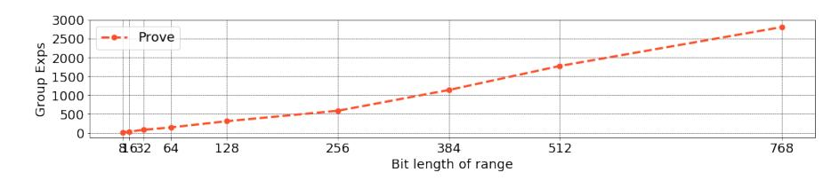
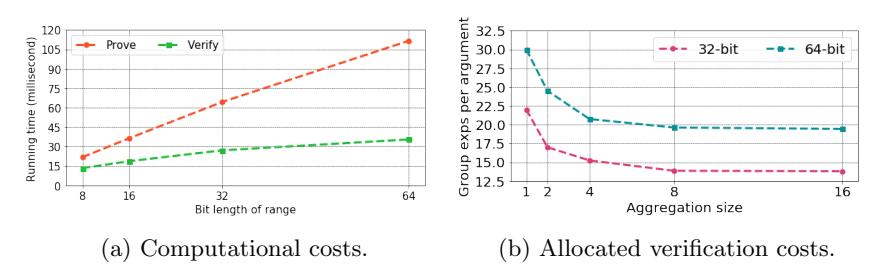
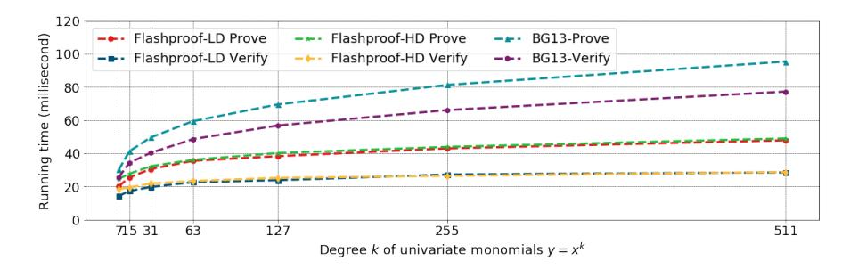
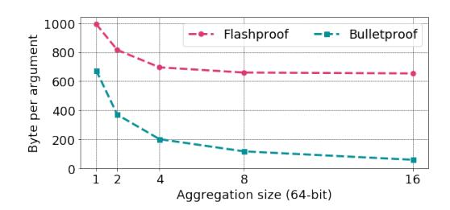

# Flashproofs: Efficient Zero-Knowledge Arguments of Range and Polynomial Evaluation with Transparent Setup★

Nan Wan[g](https://orcid.org/0000-0002-5399-1202) and Sid Chi-Kin Chau [★](https://orcid.org/0000-0003-0362-2844)★

Australian National University, Canberra, Australia {vincent.wang, sid.chau}@anu.edu.au

Abstract. We propose Flashproofs, a new type of efficient special honest verifier zero-knowledge arguments with a transparent setup in the discrete logarithm (DL) setting. First, we put forth gas-efficient range arguments that achieve ( 2 3 ) communication cost, and involve ( 2 3 ) group exponentiations for verification and a slightly sub-linear number of group exponentiations for proving with respect to the range [0, 2 − 1], where is the bit length of the range. For typical confidential transactions on blockchain platforms supporting smart contracts, verifying our range arguments consumes only 234K and 315K gas for 32-bit and 64-bit ranges, which are comparable to 220K gas incurred by verifying the most efficient zkSNARK with a trusted setup (EUROCRYPT '16) at present. Besides, the aggregation of multiple arguments can yield further efficiency improvement. Second, we present polynomial evaluation arguments based on the techniques of Bayer & Groth (EUROCRYPT '13). We provide two zero-knowledge arguments, which are optimised for lower-degree ( ∈ [3, 2 9 ]) and higher-degree ( > 2 9 ) polynomials, where is the polynomial degree. Our arguments yield a non-trivial improvement in the overall efficiency. Notably, the number of group exponentiations for proving drops from 8 log to 3(log + √︁ log ). The communication cost and the number of group exponentiations for verification decrease from 7 log to (log + 3 √︁ log ). To the best of our knowledge, our arguments instantiate the most communication-efficient arguments of membership and non-membership in the DL setting among those not requiring trusted setups. More importantly, our techniques enable a significantly asymptotic improvement in the efficiency of communication and verification (group exponentiations) from (log ) to ( √︁ log ) when multiple arguments satisfying different polynomials with the same degree and inputs are aggregated.

Keywords: Zero-knowledge arguments, range arguments, polynomial evaluation arguments, confidential transactions, smart contracts.

★ This paper appears in the proceedings of IACR Asiacrypt 2022

★★ This research was supported by ARC Discovery Project No: GA69027/DP200101985.

# 1 Introduction

Zero-knowledge proofs play a critical role in modern secure applications and systems, e.g., confidential transactions, signature schemes, federated learning and multi-party computation. A zero-knowledge proof allows a prover to convince a verifier of the truth of a statement without revealing any secret information. More formally, given an NP-language L, a prover aims to convince a verifier of knowing a witness for a statement ∈ L with high probability by a zeroknowledge proof that satisfies three properties:

- Completeness. A prover can convince a verifier of ∈ L, if ∈ L.
- Soundness. A prover cannot convince a verifier of ∈ L, if ∉ L.
- Zero-knowledge. The proof should reveal nothing except the truth that ∈ L.

There are varieties of zero-knowledge proofs [\[2,](#page-28-0) [5–](#page-28-1)[7,](#page-28-2) [13,](#page-28-3) [14,](#page-28-4) [17,](#page-28-5) [28,](#page-29-0) [37,](#page-29-1) [41,](#page-29-2) [46\]](#page-29-3) for general NP-complete languages, e.g., arithmetic circuits satisfiability. However, generic constructions used by these proofs tend to be sub-optimal and may not achieve the best efficiency as in specialised constructions for particular languages. This paper focuses on the zero-knowledge proofs for two particular languages in the discrete logarithm (DL) setting: range arguments and polynomial evaluation arguments. An argument is a computationally sound proof that no probabilistic polynomial-time provers are able to deceive a verifier into falsely accepting it.

Range proofs are designed to prove a committed value is within a specific range. Several zero-knowledge range proofs have been applied to confidential transactions (CT) [\[26\]](#page-29-4) on blockchain platforms. Blockchain has enabled a significant revolution towards decentralised peer-to-peer transactions. By default, blockchain does not ensure privacy but rather its transparency and immutability properties. However, with growing privacy concerns, confidential transactions have received increasing attention as they protect privacy by hiding transaction information. A plenty of confidential transaction protocols, e.g., AZTEC [\[45\]](#page-29-5), TornadoCash [\[40\]](#page-29-6), have been developed on blockchain platforms, e.g., Ethereum. As one of the most emerging blockchain technologies, smart contracts are playing an increasingly important role in promoting confidential transactions. They are publicly verifiable computer programs running on blockchain platforms to automate the execution of agreements without the intervention of intermediaries when some pre-determined conditions are met. To prevent inconsistent transactions, zero-knowledge range proofs are used to demonstrate sufficient funds in accounts for non-negative transfer values. However, many existing proposals for CT zero-knowledge proofs suffer from three drawbacks:

– Trusted Setup: Prior zero-knowledge proofs (e.g., zkSNARK [\[28\]](#page-29-0)) require a "trusted setup", where a group of trusted parties use some secret information to generate public parameters and destroy the secret information without revealing it. However, introducing a trusted setup will compromise the security and notion of decentralisation, which leaves a backdoor for misbehaving provers to exploit and create false proofs.

- Imbalanced Overhead: Recent zero-knowledge proofs have replaced trusted setups with transparent setups. However, achieving transparent setups may give rise to imbalanced overhead with either expensive computation costs or large communication costs, which would undermine the scalability of blockchain applications, where scalability refers to the capability of handling transactions in a short period. For example, Bulletproofs [\[13\]](#page-28-3) achieve a logarithmic proof size but require a linear number of group exponentiations for both proving and verification. The zkSTARK [\[5\]](#page-28-1) has poly-logarithmic verification efficiency but entails a large proof size about 45KB [\[31\]](#page-29-7).
- Trade-off With Soundness. There is a new class of range proofs (e.g. CKLR21 [\[20\]](#page-28-6)) based on bounded integer commitments in the DL setting, which can attain efficient computational and communication costs. However, one has to make a trade-off between the range size and the soundness error for a given group, which undermines the applicability of these range proofs. Note that using RSA or class groups [\[20\]](#page-28-6) could address this trade-off limitation by removing bounds on the size of integers, which, however, would either require a trusted setup or a different security assumption with considerably large groups[1](#page-2-0) .

On the other hand, polynomial evaluation proofs are designed to prove a public polynomial relation = (; ) between two committed values and , where is the polynomial degree. Notably, polynomial evaluation proofs are a basic building block for constructing the zero-knowledge proofs of membership and non-membership. For example, a polynomial function = (; ) = 0 can be built for membership proofs to prove that a committed value belongs to a public set , where the roots are the elements of . For non-membership proofs, ≠ 0 needs to be proved. A prover can commit to a value = −1 and demonstrate · = 1 with a multiplication proof. Proofs of membership and non-membership have extensive applications, e.g., anonymous credentials, group signatures, whitelist, and blacklist. Bayer & Groth [\[3\]](#page-28-7) (BG13) presented polynomial evaluation arguments that achieve (log ) efficiency in verification (group exponentiations) and communication based on the DL assumption. Nevertheless, the computational and communication costs for higher-degree polynomials are still high.

# 1.1 Contributions

In this paper, we propose Flashproofs, efficient special honest verifier zeroknowledge arguments of range and polynomial evaluation with a transparent setup. Flashproofs are 3-round public coin interactive protocols between a prover and a verifier. The prover sends an initial message to the verifier in the first round. The verifier replies with a uniformly random challenge, and then the prover responds to the challenge in the third round. Finally, the verifier decides

1 According to the recent study [\[22\]](#page-28-8), class groups of 3392-bit order can barely achieve 128-bit security as 256-bit elliptic curve groups.

#### N. Wang and S.C.K. Chau

4

whether to accept or reject based on the conversation. Flashproofs have perfect completeness, computational witness-extended emulation and perfect special honest verifier zero-knowledge under the typical DL assumption that applies to elliptic curve groups. We follow the transparent approach [13] without resorting to a trusted setup with elliptic curve groups. Besides, our arguments can be made non-interactive via Fiat-Shamir heuristic [25], where provers can generate random challenges by computing the hashes of the initial messages instead of verifiers, with a collision-resistant hash function modelled as a random oracle.

Range Arguments We put forth a new type of gas-efficient zero-knowledge range arguments to prove that a committed value lies in the range  $[0, 2^N - 1]$ , where N indicates the bit length. Our range arguments involve  $O(N^{\frac{2}{3}})$  group exponentiations for verification and achieve  $O(N^{\frac{2}{3}})$  communication cost. Besides, as illustrated in Fig. 1, our arguments with optimisation use a sub-linear number of group exponentiations for proving (Please refer to Section 3.2 for optimisation). They are highly suitable for confidential transactions on blockchain platforms. In a nutshell, our work achieves sub-linearly overall efficiency without resorting to a trusted setup while maintaining a negligible soundness error. Especially, our arguments greatly reduce the verification gas costs to a practically affordable level on smart contract platforms.

Fig. 1: Proving computational costs of our range arguments with optimisation.

Techniques. Our range arguments are based upon the bit-decomposition approach to proving that a committed value can be represented in binary form. We devise a new strategy to achieve superior computational efficiency compared to conventional works. The intuition is to fold the sequence of the bits of a committed value as a matrix. Then we prove each element in the matrix is either 0 or a certain power of 2 by using a quadratic-term cancellation technique. Finally, we flatten the two-dimension matrix to a one-dimension vector in a column-wise manner and prove that the committed value is the sum of the vector values. We introduce an optimisation technique to refine the efficiency in both computation and communication. Besides, the aggregation of multiple arguments is supported for further efficiency improvement.

Comparisons with State-of-the-art Range Proofs. Verifying our range arguments consumes about 234K and 315K gas for general 32-bit and 64-bit ranges. The gas costs are comparable to 220K gas incurred by verifying the most effi-

Table 1: Efficiency comparison of range arguments for the range  $[0, 2^N - 1]$ , where N is the bit length of the range,  $\mathbb G$  indicates a cyclic group of prime order p and  $\mathbb Z_p$  is the ring of integers modulo p. We essentially compare the involved group exponentiations as they dominate the computational cost. Besides, we take the nearest integer  $\lceil N^{\frac{1}{3}} \rfloor$  as the cubic root of N and  $N^{\frac{2}{3}}$  can thus be obtained by computing  $N \cdot \lceil N^{-\frac{1}{3}} \rfloor$ .  $F(N^{\frac{1}{3}})$  is a function that yields constant values based on  $N^{\frac{1}{3}}$ , where F(2) = 3, F(3) = 6, F(4) = 8, F(5) = 11, F(6) = 13, F(7) = 20, F(8) = 27, F(9) = 32, F(10) = 37. Please refer to Section 3.2 for the details of  $F(N^{\frac{1}{3}})$ .

| Type                               | Bulletproof                                       | This work $(3.2)$                                                                                       | This work with optimisation (3.2)                                                                   |
|------------------------------------|---------------------------------------------------|---------------------------------------------------------------------------------------------------------|-----------------------------------------------------------------------------------------------------|
| Prover No. of Exp (G)           | $14N + 4\log N + 12$                              | $\frac{1}{2}(N^{\frac{4}{3}} + 3N^{\frac{2}{3}} + 5N^{\frac{1}{3}} + N + 6)$                            | $(N^{\frac{2}{3}} + 1) \cdot F(N^{\frac{1}{3}}) + 2N^{\frac{1}{3}} + 2$                             |
| Verifier No. of Exp $(\mathbb{G})$ | $2N + 2\log N + 7$                                | $\frac{3}{2}(N^{\frac{2}{3}} + N^{\frac{1}{3}} + 2)$                                                    | $N^{\frac{2}{3}} + N^{\frac{1}{3}} + F(N^{\frac{1}{3}}) + 2$                                        |
| Proof Size No. of Elements      | $2\log N + 4 \ (\mathbb{G})$ $5 \ (\mathbb{Z}_p)$ | $N^{\frac{2}{3}} + 2 (\mathbb{G})$ $\frac{1}{2}(N^{\frac{2}{3}} + 3N^{\frac{1}{3}} + 4) (\mathbb{Z}_p)$ | $N^{\frac{2}{3}} + 2 \ (\mathbb{G})$ $N^{\frac{1}{3}} + F(N^{\frac{1}{3}}) + 1 \ (\mathbb{Z}_p)$ |

Table 2: Detailed efficiency comparison of Bullet proof with our optimised work, where N is the bit length of the range. Note that our range arguments are more succinct in proof size when  $N \leq 22$ .

|                           | N           | 8   | 10         | 12         | $\overline{14}$ | 16  | 18  | 20         | $\overline{22}$ | 32  | 52  | 64  |
|---------------------------|-------------|-----|------------|------------|-----------------|-----|-----|------------|-----------------|-----|-----|-----|
| Prover                    | Bulletproof | 136 | 252        | 252        | 252             | 252 | 480 | 480        | 480             | 480 | 932 | 932 |
| No. of Exp $(\mathbb{G})$ | This work   | 21  | 24         | 27         | 30              | 33  | 36  | 39         | 42              | 80  | 122 | 146 |
| Verifier                  | Bulletproof | 29  | 47         | 47         | 47              | 47  | 81  | 81         | 81              | 81  | 147 | 147 |
| No. of Exp $(\mathbb{G})$ | This work   | 11  | 12         | 13         | 14              | 15  | 16  | 17         | 18              | 22  | 27  | 30  |
| Proof Size                | Bulletproof | 482 | 546        | 546        | 546             | 546 | 610 | 610        | 610             | 610 | 674 | 674 |
| (Byte)                    | This work   | 385 | <b>417</b> | <b>449</b> | <b>481</b>      | 513 | 545 | <b>577</b> | 609             | 738 | 898 | 994 |

cient zkSNARK (Groth16) [28], which requires three elliptic curve pairing operations for any arithmetic circuits with the aid of a trusted setup. For the aggregation of 16 of our range arguments, it is estimated that the allocated gas costs per argument would be reduced by 20% to about 184K and 251K. Thus, with respect to proving ranges, our arguments can be a suitable alternative to the zkSNARKs for confidential transactions on blockchain platforms. Bulletproofs [13] are generic-purpose arguments in the DL setting for any arithmetic circuits with a transparent setup, which can instantiate range arguments. Bulletproof2 is designed to pursue  $O(\log N)$  communication efficiency at the expense of using O(N) number of group exponentiations in computation for the range  $[0, 2^N - 1]$ . Table 1 and 2 show efficiency comparisons with Bulletproof. Our arguments involve 15.7% and 20.4% of the group exponentiations used by

 $^2$  We will call the range instance of Bullet proofs by "Bullet proof" in the following.

Bulletproof for = 64, respectively, while incurring only 50% additional communication cost. For smaller 52-bit ranges[3](#page-5-0) , the advantage of our arguments in computational efficiency is even greater, whereas the discrepancy in communication efficiency is smaller. Moreover, our range arguments are more sensitive to , resulting in finer-grained performance and more flexible usage in different scenarios. Another range proof in the DL setting is CKLR21 [\[20\]](#page-28-6). It applies Legendre's three squares theorem [\[36\]](#page-29-9) to achieve constant efficiency in computation and communication by leveraging a bounded integer commitment scheme. However, it suffers an inherent trade-off between the range size and the soundness error (sometimes called "knowledge error") for a certain group. Soundness errors indicate the probability of a malicious prover cheating a verifier into accepting false proofs. Confidential transactions typically have stringent security requirements, demanding highly negligible soundness errors. As for the mainstream 256-bit elliptic curve groups in confidential transactions, CKLR21 achieves a soundness error 2−80 for 32-bit ranges at the risk of a re-run with a 65% probability. The errors would rise to 2−70 on smart contract platforms due to the 256-bit word limit[4](#page-5-1) . Besides, for 64-bit and larger ranges, the errors would surge to no less than 2−48. Thus, current CT platforms must increase the number of sequential iterations or use larger groups to obtain negligible soundness errors. Moving to larger groups is undesirable as it may require a major change to their infrastructure. Moreover, both ways would increase the computational and communication costs. Our arguments tend to be more efficient for verification and communication at a comparable level of soundness errors. For example, iterating CKLR21 three times helps achieve a negligible soundness error 2−240 for a 32-bit range but increases the proof size to about 827 bytes. Accordingly, the computational cost also grows. By comparison, our arguments have 738 bytes with a soundness error 2−256. Please see Table [5](#page-18-0) and [6](#page-19-0) for a detailed efficiency comparison.

Polynomial Evaluation Arguments Based on the techniques of BG13 [\[3\]](#page-28-7), we present two zero-knowledge arguments, which are optimised for the polynomials = (; ) of lower-degree ( ∈ [3, 2 9 ]) [5](#page-5-2) and higher-degree ( > 2 9 ), respectively. Two arguments are distinguished based on the proof size, with the higher-degree one outperforming the lower-degree one when the degree exceeds 2 9 . Our arguments essentially leverage the quadratic-term cancellation technique to greatly reduce the number of group exponentiations and elements for superior efficiency in computation and communication. To the best of our knowledge, our arguments instantiate the most communication-efficient zero-knowledge arguments of membership and non-membership in the DL setting among those not requiring trusted setups. Furthermore, we propose an aggregation optimisation, where multiple arguments satisfying different polynomials with the same degree and inputs can be aggregated such that the efficiency in verification (group exponentiations per argument) and communication is asymptotically increased from

3 A 52-bit range can cover all the values from 1 satoshi up to 21 million bitcoins.

4 The size of one field element in CKLR21 is larger than 256 bits for 32-bit ranges.

5 We skip the protocol for ∈ {1, 2}, which is simpler than the lower-degree one.

Table 3: Efficiency comparison of polynomial evaluation arguments with a transparent setup in the DL setting, where N is the polynomial degree. Note that  $\log N$  should be rounded up if N is not a power of 2.

| Type                               | Bulletproofs                                      | BG13                                                    | This Work(4.2) Lower-Deg $N \in [3, 2^9]$              | This Work (4.3) Higher-Deg $N > 2^9$                                                                            |
|------------------------------------|---------------------------------------------------|---------------------------------------------------------|-----------------------------------------------------------|--------------------------------------------------------------------------------------------------------------------|
| Prover No. of Exp (G)           | $14N + 4\log N + 12$                              | $8 \log N - 4$                                          | $4\log N + 2$                                             | $3\log N + 3\sqrt{\log N} + 2$                                                                                     |
| Verifier No. of Exp $(\mathbb{G})$ | $2N + 2\log N + 7$                                | $7\log N - 1$                                           | $2\log N + 7$                                             | $\log N + 3\sqrt{\log N} + 6$                                                                                      |
| Proof Size No. of Elements      | $2\log N + 8 \ (\mathbb{G})$ $5 \ (\mathbb{Z}_p)$ | $4\log N - 2 \ (\mathbb{G})$ $3\log N \ (\mathbb{Z}_p)$ | $\log N + 3 \ (\mathbb{G})$ $\log N + 3 \ (\mathbb{Z}_p)$ | $\begin{aligned} &2\sqrt{\log N} + 3 \ (\mathbb{G}) \\ &\log N + \sqrt{\log N} + 4 \ (\mathbb{Z}_p) \end{aligned}$ |

 $O(\log D)$  to  $O(\sqrt{\log D})$ . In addition, our range arguments can adapt the polynomial evaluation arguments for scenarios where y is even secretly committed without losing the sub-linear computational efficiency. For example, with the aid of the Maclaurin series [44], the polynomial evaluation arguments can satisfy complex mathematical relations between two committed values, e.g., trigonometric and exponential functions. The range arguments help confine the input x to a specific range to ensure y is in the safe range  $\left[-\frac{p-1}{2}, \frac{p-1}{2}\right]$  without overflow, where p is the group order.

Comparisons with State-of-the-art Polynomial Evaluation Proofs. Table 3 shows an efficiency comparison of polynomial evaluation arguments in the DL setting with a transparent setup. As compared to BG13, it is observed that our arguments achieve a significant improvement in the efficiency of computation and communication without a trusted setup. More concretely, for polynomials of degree  $D = 2^{16} - 1$ , our arguments incur 1122 bytes over a 256-bit elliptic curve group, yielding a 3.1× reduction in proof size. The allocated communication cost per argument would decrease by 72.4% to about 310 bytes for the aggregation of 16 distinct arguments. In addition, the efficiency in proving and verification is raised by a factor of 2 and 3.3, respectively. An alternative type of communication-efficient arguments with a transparent setup in the DL setting is the generic-purpose Bulletproofs, which require  $2 \log N + 13$  elements for any arithmetic circuits, where N is the number of multiplication gates. On the one hand, our arguments outperform Bulletproofs in the efficiency of computation and communication regarding the polynomial evaluation. On the other hand, our arguments only need three rounds, while Bulletproofs require  $\log N$  rounds.

#### 1.2 Outline of Our Paper

Our paper is organised as follows. First, we introduce the cryptographic preliminaries in Section 2. We elaborate on the core techniques of the range arguments and polynomial evaluation arguments as well as some optimisations in Section 3 and 4. A comprehensive evaluation of performance is given in Section 5. We provide the full protocols of our arguments and the security proofs in Section 6. We describe the related work in Section 7.

# 2 Preliminaries

We follow the definitions in [13, 29] to formalise homomorphic commitment schemes and zero-knowledge arguments of knowledge.

Let  $\lambda$  and  $\operatorname{negl}(\lambda)$  be the security parameter and the negligible function. PPT means probabilistic polynomial time. Denote a cyclic group of prime order p by  $\mathbb{G}$ , and the ring of integers modulo p by  $\mathbb{Z}_p$ . Let  $\mathbb{Z}_p^*$  be  $\mathbb{Z}_p \setminus \{0\}$ . Let  $g, h \overset{\$}{\leftarrow} \mathbb{G}, (g_i)_{i=0}^{n-1} \overset{\$}{\leftarrow} \mathbb{G}^n$  be uniformly random generators from  $\mathbb{G}$ . Let  $x \overset{\$}{\leftarrow} \mathbb{Z}_p^*$  be uniformly random element from  $\mathbb{Z}_p^*$ . Denote the vector spaces of dimension n over  $\mathbb{G}$  and  $\mathbb{Z}_p$  by  $\mathbb{G}^n$  and  $\mathbb{Z}_p^n$ , respectively.

# 2.1 Homomorphic Commitment Schemes

Homomorphic commitment schemes are a crucial building block for zero-knowledge proofs. A homomorphic commitment allows to commit to a value with a negligible chance of altering it before opening the commitment. A homomorphic commitment scheme is, hiding if a commitment does not reveal the value and, binding if a commitment can only be opened to one value.

A homomorphic commitment scheme is a pair of PPT algorithms  $(\mathcal{G}, \mathsf{Cm})$ , where the setup algorithm  $\mathcal{G}(\lambda)$  generates a commitment key ck and the commitment algorithm  $\mathsf{Cm}$  defines a function  $\mathsf{Cm}_{\mathsf{ck}} : \mathsf{M}_{\mathsf{ck}} \times \mathsf{R}_{\mathsf{ck}} \to \mathsf{C}_{\mathsf{ck}}$  for a message space  $\mathsf{M}_{\mathsf{ck}}$ , a randomness space  $\mathsf{R}_{\mathsf{ck}}$  and a commitment space  $\mathsf{C}_{\mathsf{ck}}$ . For a message  $m \in \mathsf{M}_{\mathsf{ck}}$ , a uniformly randomness  $r \in \mathsf{R}_{\mathsf{ck}}$  can be picked to produce a commitment  $c = \mathsf{Cm}_{\mathsf{ck}}(m;r)$ . The commitments are homomorphic for all well-formed commitment keys ck and  $m_0, m_1 \in \mathsf{M}_{\mathsf{ck}}, r_0, r_1 \in \mathsf{R}_{\mathsf{ck}}$ :

$$\mathsf{Cm}_{\mathsf{ck}}(m_0; r_0) \cdot \mathsf{Cm}_{\mathsf{ck}}(m_1; r_1) = \mathsf{Cm}_{\mathsf{ck}}(m_0 + m_1; r_0 + r_1)$$

$$\mathsf{Cm}_{\mathsf{ck}}(m_0; r_0)^{m_1} = \mathsf{Cm}_{\mathsf{ck}}(m_0 \cdot m_1; r_0 \cdot m_1)$$

**Definition 1 (Hiding).** A commitment scheme  $(\mathcal{G}, \mathsf{Cm})$  is hiding if a commitment does not reveal the value for all PPT adversaries  $\mathcal{A}$ :

$$Pr \begin{bmatrix} c = \mathsf{Cm}_{\mathsf{ck}}(m_b), \ b \in \{0,1\}, \\ b' \leftarrow \mathcal{A}(c), \ b = b' \end{bmatrix} \begin{vmatrix} \mathsf{ck} \leftarrow \mathcal{G}(\lambda), \\ (m_0, m_1 \in \mathsf{M}_{\mathsf{ck}}) \leftarrow \mathcal{A}(\mathsf{ck}) \end{vmatrix} \approx \frac{1}{2}$$

The scheme is perfectly hiding if the probability is equal to  $\frac{1}{2}$ .

**Definition 2 (Binding).** A commitment scheme  $(\mathcal{G}, \mathsf{Cm})$  is binding if a commitment can only be opened to one value for all PPT adversaries  $\mathcal{A}$ :

$$Pr\begin{bmatrix} \mathsf{Cm}_{\mathsf{ck}}(m_0;r_0) = \mathsf{Cm}_{\mathsf{ck}}(m_1;r_1), & \mathsf{ck} \leftarrow \mathcal{G}(\lambda), \\ m_0 \neq m_1 & (m_0,m_1 \in \mathsf{M}_{\mathsf{ck}},r_0,r_1 \in \mathsf{R}_{\mathsf{ck}}) \leftarrow \mathcal{A}(\mathsf{ck}) \end{bmatrix} \leq \mathsf{negl}(\lambda)$$

The scheme is perfectly binding if the probability is equal to 0.

We define the Pedersen commitment and Pedersen vector commitment as below, both of which are perfect hiding and computationally binding:

**Definition 3 (Pedersen Commitment).** Given  $M_{\mathsf{ck}} = \mathbb{Z}_p$ ,  $\mathsf{R}_{\mathsf{ck}} = \mathbb{Z}_p^*$ ,  $\mathsf{C}_{\mathsf{ck}} = \mathbb{G}$  of order p and  $g, h \overset{\$}{\leftarrow} \mathbb{G}$ :

$$Cm(m;r) = g^m h^r \pmod{p}$$

Definition 4 (Pedersen Vector Commitment). Given  $\mathsf{M}_{\mathsf{ck}} = \mathbb{Z}_p^n, \mathsf{R}_{\mathsf{ck}} = \mathbb{Z}_p^*, \mathsf{C}_{\mathsf{ck}} = \mathbb{G}_p^*$  of order p and  $(g_0, ..., g_{n-1}) \overset{\$}{\leftarrow} \mathbb{G}^n, h \overset{\$}{\leftarrow} \mathbb{G}$ :

$$Cm(m_0, ..., m_{n-1}; r) = h^r \prod_{i=0}^{n-1} g_i^{m_i} \pmod{p}$$

# 2.2 Zero-Knowledge Arguments of Knowledge

Based upon the discrete logarithm assumption, Flashproofs are public-coin honest-verifier zero-knowledge arguments of knowledge. A zero-knowledge argument is comprised of three interactive probabilistic polynomial-time algorithms  $(\mathcal{G}, \mathcal{P}, \mathcal{V})$ , where the setup algorithm  $\mathcal{G}(\lambda)$  returns a common reference string  $\sigma$ .  $\mathcal{P}$  and  $\mathcal{V}$  are the prover and verifier algorithms, which produce the public transcript,  $tr \leftarrow \langle \mathcal{P}(v), \mathcal{V}(t) \rangle$  on inputs v and t. Denote a polynomial-time decidable tertiary relation by  $\mathcal{R} \subset \{0,1\}^* \times \{0,1\}^* \times \{0,1\}^*$ . A CRS-dependent language can be defined as  $L_{\sigma} = \{u \mid \exists \omega : (\sigma, u, \omega) \in \mathcal{R}\}$ , where  $\omega$  is a witness for a statement u in the relation  $(\sigma, u, \omega) \in \mathcal{R}$ .

**Definition 5 (Argument of Knowledge).** The triple  $(\mathcal{G}, \mathcal{P}, \mathcal{V})$  is called an argument of knowledge for the relation  $\mathcal{R}$  if it satisfies the perfect completeness and computational witness-extended emulation.

**Definition 6 (Perfect Completeness).** An argument of knowledge  $(\mathcal{G}, \mathcal{P}, \mathcal{V})$  has perfect completeness if for all PPT adversaries  $\mathcal{A}$ :

$$Pr\Big[(\sigma,u,\omega) \notin \mathcal{R} \ or \ \langle \mathcal{P}(\sigma,u,\omega), \mathcal{V}(\sigma,u) \rangle = 1 \ \big| \ \sigma \leftarrow \mathcal{G}(\lambda), (u,\omega) \leftarrow \mathcal{A}(\sigma) \Big] = 1$$

**Definition 7 (Computational Witness-Extended Emulation).** An argument of knowledge  $(\mathcal{G}, \mathcal{P}, \mathcal{V})$  has witness-extended emulation if for all deterministic polynomial time  $\mathcal{P}^*$ , there exists an expected polynomial time emulator  $\mathcal{E}$  such that for all PPT adversaries  $\mathcal{A}$ :

$$Pr \left[ \mathcal{A}(tr) = 1 \middle| \begin{matrix} \sigma \leftarrow \mathcal{G}(\lambda) \\ (u,s) \leftarrow \mathcal{A}(\sigma), \\ tr \leftarrow O \end{matrix} \right] \approx Pr \left[ \begin{matrix} \mathcal{A}(tr) = 1 \\ \wedge \ tr \ is \ accepting \\ \rightarrow (\sigma,u,w) \in \mathcal{R} \end{matrix} \middle| \begin{matrix} \sigma \leftarrow \mathcal{G}(\lambda), \\ (u,s) \leftarrow \mathcal{A}(\sigma), \\ (tr,\omega) \leftarrow \mathcal{E}^O(\sigma,u) \end{matrix} \right]$$

where the oracle is defined as  $O = \langle \mathcal{P}^*(\sigma, u, s), \mathcal{V}(\sigma, u) \rangle$ .

Soundness can be defined based on the witness-extended emulation. Informally, whenever  $\mathcal{P}^*$  makes a convincing argument in state s, there exists a knowledge emulator  $\mathcal{E}$  that can extract a witness for  $(\sigma, u, \omega) \in \mathcal{R}$  by rewinding the interaction to any specific points and running again with the same state for the prover, but fresh randomness for the verifier.

**Definition 8 (Public Coin).** An argument of knowledge  $(\mathcal{G}, \mathcal{P}, \mathcal{V})$  is called public coin if the verifier chooses her messages uniformly at random and independently of the messages sent by the prover.

**Definition 9 (Perfect Special Honest Verifier Zero-Knowledge, SHVZK).** A public coin argument of knowledge  $(\mathcal{G}, \mathcal{P}, \mathcal{V})$  is called perfect special honest verifier zero-knowledge argument of knowledge for  $\mathcal{R}$  if there exists a PPT simulator  $\mathcal{S}$  such that for all interactive PPT adversaries  $\mathcal{A}$ :

$$Pr\begin{bmatrix} (\sigma, u, \omega) \in \mathcal{R} \\ \wedge \mathcal{R}(tr) = 1 \end{bmatrix} \begin{vmatrix} \sigma \leftarrow \mathcal{G}(\lambda), \\ (u, \omega, e) \leftarrow \mathcal{R}(\sigma), \\ tr \leftarrow \langle \mathcal{P}(v), \mathcal{V}(t) \rangle \end{bmatrix} = Pr\begin{bmatrix} (\sigma, u, \omega) \in \mathcal{R} \\ \wedge \mathcal{R}(tr) = 1 \end{bmatrix} \begin{vmatrix} \sigma \leftarrow \mathcal{G}(\lambda), \\ (u, \omega, e) \leftarrow \mathcal{R}(\sigma), \\ tr \leftarrow \mathcal{S}(u, e) \end{vmatrix}$$

where e is a public coin challenge,  $v = (\sigma, u, \omega)$  and  $t = (\sigma, u, e)$ .

An argument is zero-knowledge if no extra information except the witness can be inferred from the statement. A general approach to proving that an argument has special honest verifier zero-knowledge is to construct a simulator that knows the challenge and can simulate the whole transcript of the argument without knowing the witness.

# 3 Range Arguments

# 3.1 Overview of Bit-Decomposition Approach

Bit-decomposition is a folklore approach for constructing range proofs. The challenge consists in seeking an efficient method to prove that a committed value can be represented in binary form. Bulletproof employs a variant of the bit-decomposition approach by using an inner product argument [10] (Please refer to their original paper [13] for more details). The intuition is that a prover prepares one vector commitment, which commits to the bit vector  $\mathbf{b}$  of the target value y and to the vector  $\mathbf{a} = \mathbf{b} - \mathbf{1}^{\mathbf{N}}$ . The prover constructs an equation in Eqn. (1) to prove the three constraints: (I)  $\langle \mathbf{b}, \mathbf{2}^{\mathbf{N}} \rangle = y$ , (II)  $\langle \mathbf{b} - \mathbf{1}^{\mathbf{N}} - \mathbf{a}, \mathbf{r} \rangle = 0$  and (III)  $\langle \mathbf{b}, \mathbf{a} \circ \mathbf{r} \rangle = 0$ .

$$z^{2} \cdot \langle \mathbf{b}, \mathbf{2}^{N} \rangle + z \cdot \langle \mathbf{b} - \mathbf{1}^{N} - \mathbf{a}, \mathbf{r} \rangle + \langle \mathbf{b}, \mathbf{a} \circ \mathbf{r} \rangle = z^{2} \cdot y$$
 (1)

where  $z \in \mathbb{Z}_p^*$  is a random value and  $\mathbf{r} \in \mathbb{Z}_p^{*N}$  is a vector of random values provided by the verifier.  $\mathbf{1^N} = (1, 1, ..., 1)$  is a vector of 1 and  $\mathbf{2^N} = (2^0, 2^1, ..., 2^{N-1})$  is a vector of powers of 2.  $\langle \cdot, \cdot \rangle$  and  $\circ$  denote the inner product and the Hadamard product, respectively.

Then the prover takes advantage of the inner product argument to recursively compress the equation in  $O(\log N)$  rounds. The compression technique helps achieve  $O(\log N)$  communication efficiency but exposes two limitations:

- The process is computationally expensive, demanding O(N) group exponentiations for proving and verification.
- $-\,$  To a degree, the recursion impedes a parallel acceleration of proof generation.

#### 3.2 Our Techniques

We devise a new variant of the bit-decomposition approach that only needs three rounds. Our technique is highly lightweight in computation and does not require pairing operations. Compared to Bulletproof, our arguments involve far fewer group exponentiations in both proving and verification and also allow for a speedup of proof generation by parallelisation. In this section, we mainly concentrate on the core techniques of our arguments, whereas the full protocol is given in Section 6.1. Our techniques work as follows:

- 1. Given a commitment  $c_y = g^y h^{r_y}$ , we express the committed value  $y = \sum_{i=0}^{N-1} 2^i b_i$  as a sequence of terms  $(w_0, w_1, ..., w_{N-1})$  for the range  $[0, 2^N 1]$ , where  $b_i \in \{0, 1\}$  and  $w_i = 2^i b_i$ ,  $i \in \{0, 1, ..., N-1\}$ . Then we fold the sequence and arrange all the terms  $(w_i)_{i=0}^{N-1}$  in an  $L \times K$  matrix in Eqn. (2), where L and K indicate the number of rows and columns, respectively. If N is a prime integer, additional zeros of size  $\gamma \in \mathbb{Z}^+$  can be padded onto the high-order bits to make  $N + \gamma = K \cdot L$ .
- 2. We prove each coefficient  $w_{lK+k}$  is 0 or  $2^{lK+k}$ .
- 3. We flatten the two-dimension matrix to a one-dimension vector and prove that y is the sum of K values, such that  $y = \sum_{k=0}^{K-1} s_k$ , where  $s_k = \sum_{l=0}^{L-1} w_{lK+k}$  is the sum of L coefficients  $(w_{lK+k})_{l=0}^{L-1}$  in the k-th column.

$$\begin{pmatrix} 2^{0}b_{0} & \dots & 2^{K-1}b_{K-1} \\ 2^{K}b_{K} & \dots & 2^{K+K-1}b_{K+K-1} \\ \vdots & \ddots & \vdots \\ 2^{(L-1)K}b_{(L-1)K} \dots & 2^{(L-1)K+K-1}b_{(L-1)K+K-1} \end{pmatrix} = \begin{pmatrix} w_{0} & \dots & w_{K-1} \\ w_{K} & \dots & w_{K+K-1} \\ \vdots & \ddots & \vdots \\ w_{(L-1)K} & \dots & w_{(L-1)K+K-1} \end{pmatrix}$$
(2)

where the *i*-th term  $w_i$  in the *l*-th row and the *k*-th column is also denoted by  $w_{lK+k}, k \in \{0, ..., K-1\}$  and  $l \in \{0, ..., L-1\}$ .

Next, we describe the intuition in more details. Instead of proving each bit  $b_i \in \{0,1\}$  as Bulletproof, we turn to prove  $w_{lK+k} \in \{0,2^{lK+k}\}$  for each (i=lK+k). In the third round of the protocol, the prover computes and sends a value  $v_l = \sum_{k=0}^{K-1} w_{lK+k} e_k + r_l$  to the verifier for each l after acquiring a challenge vector  $(e_0, ..., e_{K-1})^{\mathsf{T}}$  from the verifier.  $v_l$  is a randomised inner product of the l-th row and the challenge vector, where  $r_l \in \mathbb{Z}_p^*$  is used to prevent  $v_l$  from leaking any information about the coefficients. The essence of our technique is an effective use of  $v_l$  for verifying  $w_{lK+k} \in \{0, 2^{lK+k}\}$ . Unlike Bulletproof, which requires the prover to satisfy the constraint (II) in Eqn. (1), we design a new technique to relieve the prover of this burden, which greatly reduces proving computational costs. The technique allows the verifier to compute a value  $f_l$  by subtracting  $v_l$  from  $\sum_{k=0}^{K-1} 2^{lK+k} e_k$  for each l:

$$f_l = \sum_{k=0}^{K-1} 2^{lK+k} e_k - v_l = \sum_{k=0}^{K-1} (2^{lK+k} - w_{lK+k}) e_k - r_l$$

For the case where N is a prime number, it suffices for the verifier to use 0 rather than  $2^{lK+k}e_k$  for the padded bits. Then computing  $f_l \cdot v_l$  for each l will generate a series of cross-terms in the challenges:

$$f_{l} \cdot v_{l} \stackrel{?}{=} \underbrace{\sum_{k=0}^{K-1} w_{lK+k} (2^{lK+k} - w_{lK+k}) e_{k}^{2}}_{= 0, \text{ if } w_{lK+k} \in \{0, 2^{lK+k}\}} + \sum_{k=0, j=1}^{K-K-2, j=K-1} t_{l,k,j} e_{k,j} + \sum_{k=0}^{K-1} q_{l,k} e_{k} + q_{l,K}$$

$$= 0, \text{ if } w_{lK+k} \in \{0, 2^{lK+k}\}$$
(6)

where  $t_{l,k,j} = w_{lK+k}(2^{lK+j} - w_{lK+j}) + w_{lK+j}(2^{lK+k} - w_{lK+k})$  and  $e_{k,j} = e_k \cdot e_j$  for  $k, j \in \{0, ..., K-1\} \land k \neq j$ .  $q_{l,k} = 2r_l(2^{lK+k-1} - w_{lK+k})$  for  $k \in \{0, ..., K-1\}$  and  $q_{l,K} = -r_l^2$ . The number of terms  $e_{k,j}$  is  $\frac{K(K-1)}{2}$ .

The verifier needs to ensure that the quadratic terms  $(e_k^2)_{k=0}^{K-1}$  are all cancelled out by only using the commitments to the coefficients of the remaining terms in Eqn. (3) for verification. Before obtaining the challenges, the prover must provide these commitments in the first round. Thus, by the binding property of Pedersen commitment and the Schwartz-Zippel lemma, it is with an overwhelming probability that the coefficient of the k-th quadratic term satisfies the constraint below:

$$w_{lK+k}(2^{lK+k}-w_{lK+k})=0\Longrightarrow w_{lK+k}\in\{0,2^{lK+k}\}$$

The prover also needs to provide the commitments  $(c_{s_k})_{k=0}^K$  in the first round so that the verifier can check the validity of  $(s_k)_{k=0}^K$  based upon the equation below:

$$\sum_{l=0}^{L-1} v_l \stackrel{?}{=} \sum_{k=0}^{K-1} s_k e_k + s_K, \quad s_K = \sum_{l=0}^{L-1} r_l$$
 (4)

Finally, the verifier can be convinced that y lies in the range  $[0, 2^N - 1]$  by checking the equation  $y \stackrel{?}{=} \sum_{k=0}^{K-1} s_k$ . As we use elliptic curve groups to instantiate the argument, where the group and field elements have roughly the same size, then the total number of elements would be:

$$|\Pi| = L + 2K + \frac{K(K-1)}{2} + 4 = \lceil \frac{N}{K} \rceil + \frac{K^2}{2} + \frac{3K}{2} + 4$$

The number of group exponentiations for verification is  $|\Pi|-1$ . We calculate the derivative  $\Delta_{|\Pi|} = K - \frac{N}{K^2} + \frac{3}{2}$ , such that when  $K \approx \lceil N^{\frac{1}{3}} \rfloor$ , both  $|\Pi|$  and verification complexity achieve the minimum. Table 4a provides a set of (L,K) values for different ranges.

**Optimisation.** We propose an optimisation technique to improve the overall efficiency. We change the way that the challenge vectors are generated at the expense of amplifying the soundness error from  $\frac{(p-K)!}{p!}$  to  $\frac{1}{p}$ , which is still sufficiently negligible with a large p. The high-level idea is to allow the verifier to

Table 4: Comparison of range arguments

(b) Comparison of range arguments for 64-bit

|   | (a)   | Value    | s of (L | ., K)  |
|---|-------|----------|---------|--------|
| Λ | 8-bit | t 16-bit | 32-bit  | 64-bit |
| L | 4     | 8        | 11      | 16     |
| K | 2     | 2        | 3       | 4      |
| _ |       |          |         |        |

| Type           | Prover No. of Exp (G) | Verifier No. of Exp (G) | Proof Size (Byte) |
|----------------|--------------------------|----------------------------|----------------------|
| Original Work  | 197                      | 33                         | 1090                 |
| Optimised Work | 146                      | 30                         | 994                  |
| Saving         | $51\ (25.9\%)$           | 3 (9.1%)                   | 96 (8.8%)            |

randomly produce a challenge e, such that the other challenges in the vector will be produced by taking different powers of e. This change opens the possibility of merging the terms of the same orders to reduce the number of group exponentiations in both proving and verification. We exemplify a concrete case with K=4 and consider the 4 challenges  $(e_k)_{k=0}^3=(e^{-1},e,e^4,e^5)$  for a simpler interpretation. To check whether the witness y is correctly represented in binary form, the verifier needs to ensure that none of the terms  $(e^{-2},e^2,e^8,e^{10})$  will appear on the right-hand side of Eqn. (3). Computing  $f_l \cdot v_l$  will generate a polynomial with only 8 terms instead of the original  $0.5 \cdot 16 + 0.5 \cdot 4 + 1 = 11$ :

$$P(e) = w_9 e^9 + w_6 e^6 + w_5 e^5 + w_4 e^4 + w_3 e^3 + w_1 e + w_{-1} e^{-1} + w_0$$

where  $w_*$  indicates the coefficients of the corresponding terms.

The coefficients of the combined terms  $e \cdot e^{-1}$ ,  $e \cdot e^4$  and  $e^{-1} \cdot e^5$  are respectively merged into  $w_0$ ,  $w_5$  and  $w_4$ . As shown in Table 4b, this optimisation saves 51 and 3 group exponentiations for proving and verification, respectively, and 3 group elements for communication when K = 4. Notably, the optimisation increases the proving efficiency by 25.9%. Note that a particular choice of K challenges can yield F(K) number of terms for computing  $f_l \cdot v_l$ . We provide a possible combination of the challenge exponents for F(K) as below and let the readers discover more possible combinations.

$$\begin{array}{llllllllllllllllllllllllllllllllllll$$

#### 3.3 Aggregate Range Arguments

Multiple arguments for the same range created by one prover can be aggregated for further efficiency gains. Given M witnesses  $(y_m)_{m=0}^{M-1}$ , the prover creates two unique sets  $(v_l^{(m)})_{l=0}^{L-1}$  and  $(s_k^{(m)})_{k=0}^K$  for each  $m \in \{0,...,M-1\}$ . The prover utilises  $M \cdot L$  generators, where the (m,l)-th generator is in charge of computing  $f_l^{(m)} \cdot v_l^{(m)}$ . Hence, the M coefficients of each term on the right-hand side of Eqn. (3) can be compacted in one commitment. Then we can apply the batch

verification technique [4] to reduce the number of group exponentiations by simultaneously checking the equations in Eqn. (4) for these arguments. The technique is based on the principle that checking  $a = 0 \land b = 0$  is equivalent to checking  $a + \rho b = 0$  with high probability, where  $\rho \in \mathbb{Z}_p^*$  is a random value. Thus, the verifier can produce a new random challenge  $z \in \mathbb{Z}_p^*$  and use the equation below to validate  $s_{L}^{(m)}$  in batches:

$$\sum_{m=0}^{M-1} \left( \sum_{l=0}^{L-1} v_l^{(m)} \right) z^m \stackrel{?}{=} \sum_{k=0}^{K-1} \left( \sum_{m=0}^{M-1} s_k^{(m)} z^m \right) e_k + \sum_{m=0}^{M-1} s_K^{(m)} z^m$$

Finally, the verifier can check  $y_m \stackrel{?}{=} \sum_{k=0}^{K-1} s_k^{(m)}$  for each m. The total number of elements is  $|\Pi_{\text{total}}| = M \cdot (\lceil \frac{N}{K} \rceil + K + 1) + \frac{K^2 + K}{2} + 3$ . When  $K \approx \lceil (MN)^{\frac{1}{3}} \rfloor \wedge \frac{N}{K} \geq 1$ , the complexity of both communication and verification achieves the minimum. Then for aggregating M optimised range arguments, we can use the formula  $\frac{F(K) + 2}{M} + \lceil \frac{N}{K} \rceil + K + 1$  to calculate the number of elements for communication cost or the allocated number of group exponentiations for verification per argument.

# 4 Polynomial Evaluation Arguments

Built upon the techniques of Bayer & Groth (BG13) [3], our polynomial evaluation arguments aim to prove that two committed values x and y satisfy a public polynomial relation y = P(x; D), where D is the degree. They achieve non-trivial efficiency gains in computation and communication thanks to the *quadratic-term* cancellation technique. We give two protocols, which respectively excel in handling the polynomials of lower-degree  $D \in [3, 2^9]$  and higher-degree  $D > 2^9$ . We essentially focus on the core techniques of our arguments, whereas the full protocols are given in Section 6.2 and 6.3.

#### 4.1 Overview of BG13

We begin with an overview of BG13 (Please refer to their original paper [3] for more details). Consider a polynomial function  $P(x;D) = \sum_{d=0}^{D} a_d x^d$ , where we assume  $D = 2^{J+1} - 1$  for  $J \in \{1,2,...\}$  without loss of generality by padding with zero-coefficients. First, the polynomial P(x;D) can be re-written as below by substituting the d-th term  $x^d$  with  $x^{\sum_{j=0}^{J} 2^j b_d^{(j)}} = \prod_{j=0}^{J} x^{2^j b_d^{(j)}}$ , where  $d = \sum_{j=0}^{J} 2^j b_d^{(j)}$ ,  $b_d^{(j)} \in \{0,1\}$  and  $J+1 = \lceil \log D \rceil$ :

$$P(x;D) = \sum_{d=0}^{D} a_d x^d = \sum_{d=0}^{D} a_d x^{\sum_{j=0}^{J} 2^j b_d^{(j)}} = \sum_{d=0}^{D} a_d \prod_{j=0}^{J} x^{2^j b_d^{(j)}}$$

Then BG13 defines a new polynomial Q(e; J+1) by substituting  $x^{2^j}$  with a masking value  $z_j = x^{2^j}e + m_j$  for each j, such that the coefficient of the leading

term  $e^{J+1}$  is equal to P(x;D), where  $m_i$  is a random value, e is the verifier's random challenge and  $w_i$  is the coefficient of the term  $e^j$ .

$$Q(e; J+1) = \sum_{d=0}^{D} \left(a_d \prod_{i=0}^{J} e^{1-b_d^{(j)}} z_j^{b_d^{(j)}}\right) = P(x; D) e^{J+1} + \sum_{j=0}^{J} w_j e^j$$
 (5)

The prover must provide the commitment to P(x; D) and the commitments to the coefficients  $(w_j)_{j=0}^J$  before acquiring the challenge e to prove that the polynomial Q(e; J+1) is well formed. In a nutshell, there are three constraints to satisfy:

- 1. P(x; D) is the coefficient of the leading term  $e^{J+1}$ .
- 2. The linearity between  $x^{2^j}$  and  $z_j = x^{2^j}e + m_j$  for  $j \in \{0, ..., J\}$ . 3. The quadratic relations between  $x^{2^j}$  hidden in  $z_j$  and  $x^{2^{j+1}}$  hidden in  $z_{j+1}$  for  $j \in \{0, ..., J-1\}.$

BG13 creates three sets of group elements  $(c_{x^{2J}})_{i=1}^J$ ,  $(c_{m_j})_{i=0}^J$ ,  $(c_{(x^{2J}m_i)})_{i=0}^{J-1}$  and two sets of field elements  $(r_j)_{j=0}^J$ ,  $(\xi_j)_{j=0}^{J-1}$ . Then it utilises two equations to fulfil the constraints 2 and 3 for each j:

$$\begin{split} z_j &\stackrel{?}{=} x^{2^j} e + m_j \Longrightarrow \mathsf{Cm}(z_j; r_j) \stackrel{?}{=} c^e_{x^{2^j}} \cdot c_{m_j} \\ 0 &\stackrel{?}{=} x^{2^{j+1}} e - x^{2^j} z_j + x^{2^j} m_j \Longrightarrow \mathsf{Cm}(0; \xi_j) \stackrel{?}{=} c^e_{x^{2^{j+1}}} \cdot c^{-z_j}_{x^{2^j}} \cdot c_{(x^{2^j} m_j)} \end{split}$$

# Techniques of Lower-Degree (LD) Protocol

In this protocol, we aim for optimisations to fulfil the constraint 2 and 3 for better computational and communication efficiency. Our technique is a new equation in Eqn. (6) that effectively leverages the field elements  $(z_j)_{i=0}^J$  rather than the group elements as in BG13 to achieve the verification, which significantly improves the computational efficiency by reducing the number of group exponentiations. The two equations for simultaneously satisfying the constraint 2 and 3 are:

$$z_0 \stackrel{?}{=} xe + m_0, \qquad z_j^2 - z_{j+1}e \stackrel{?}{=} (2x^{2^j}m_j - m_{j+1})e + m_j^2, \ j \in \{0, ..., J-1\}$$
 (6)

In Eqn. (6), first, we must ensure the linearity between the input x and  $z_0$ . Then computing  $z_j^2 - z_{j+1}e$  for  $j \in \{0, ..., J-1\}$  will cancel out quadratic terms  $e^2$  and leave the first-order term  $(2x^{2^j}m_i-m_{i+1})e$  and the constant term  $m_i^2$ . Our techniques only require the prover to provide the vector commitments to the coefficients of these two terms before acquiring the challenge e. This not only ensures the quadratic relations between  $x^{2^j}$  and  $x^{2^{j+1}}$  but also justifies the linearity between  $x^{2^j}$  and  $z_j = x^{2^j}e + m_j$  for  $j \in \{1, ..., J-1\}$ . Otherwise, the quadratic terms  $e^2$  must have appeared on the right-hand side with overwhelming probability. Compared with the techniques of BG13, ours entail far fewer computationally expensive group operations. With respect to the communication cost, the reduction by  $5 \log D$  elements is essentially attributed to the use of vector commitments. Moreover, our new equation in Eqn. (6) also contributes to decreasing the proof size.

#### 4.3 Techniques of Higher-Degree (HD) Protocol

On top of the lower-degree protocol, we aim for a further optimisation to fulfil the constraint 1. We attempt to trade  $\log D$  group elements in Eqn. (5) for  $3\sqrt{\log D}$  group and field elements by applying the technique of the polynomial commitment [10]. Intuitively, we can factor out common polynomial factors from the polynomial  $\sum_{j=0}^{J} w_j e^j$ . First, we rewrite  $\sum_{j=0}^{J} w_j e^j$  as  $\sum_{l=0}^{L-1} e^{lK} \sum_{k=0}^{K-1} w_{lK+k} e^k$  without loss of generality by padding with zero coefficients, where  $J+1=L\cdot K$  and  $l\in\{0,...,L-1\}$ ,  $k\in\{0,...,K-1\}$ . L polynomials  $(\sum_{k=0}^{K-1} w_{lK+k} e^k)_{l=0}^{L-1}$  can be factored out to build a matrix in a way that each row contains the coefficients of the factored polynomials, and each column is a vector of the coefficients of the same-order of e:

$$\begin{pmatrix} w_0 + \theta_0 & w_1 & \dots & w_{K-1} \\ w_K + \theta_1 & w_{K+1} & \dots & w_{2K-1} \\ \vdots & \vdots & \ddots & \vdots \\ w_{(L-1)K} + \theta_{L-1} & w_{(L-1)K+1} & \dots & w_{LK-1} \end{pmatrix}$$

The prover commits to all the columns as  $(c_{w_k})_{k=0}^{K-1}$  using vector commitments and creates a field value  $f_l = \sum_{k=0}^{K-1} w_{lK+k} e^k + \theta_l$  for each l, which is a randomised inner product of the l-th row and the challenge vector  $(1, e, ..., e^{K-1})^{\intercal}$ , where  $\theta_l \in \mathbb{Z}_p^*$  is a random value to prevent leaking information about the coefficients  $(w_{lK+k})_{k=0}^{K-1}$ .

$$c_{w_0} = \prod_{l=0}^{L-1} g_l^{w_{lK} + \theta_l} \cdot h^{r_{w_0}} \qquad (c_{w_k} = \prod_{l=0}^{L-1} g_l^{w_{lK+k}} \cdot h^{r_{w_k}})_{k=1}^{K-1}$$

where  $(g_l)_{l=0}^{L-1} \stackrel{\$}{\leftarrow} \mathbb{G}^L$ ,  $h \stackrel{\$}{\leftarrow} \mathbb{G}$  are distinct generators and  $(r_{w_k} \stackrel{\$}{\leftarrow} \mathbb{Z}_p^*)_{k=0}^{K-1}$  are random values.

The verifier computes  $\prod_{l=0}^{L-1} g_l^{f_l} \cdot h^s \stackrel{?}{=} \prod_{k=0}^{K-1} c_{w_k}^{e^k}$  to check the correctness of  $(f_l)_{l=0}^{L-1}$ , where  $s = \sum_{k=0}^{K-1} r_{w_k} e^k$ , and constructs a new equation in Eqn. (7) to replace Eqn. (5) for the constraint 1:

$$Q(e; J+1) - \sum_{l=0}^{L-1} f_l e^{lK} \stackrel{?}{=} P(x; D) e^{J+1} - \sum_{l=0}^{L-1} \theta_l e^{lK}$$
 (7)

The prover is required to provide the commitments to  $(\theta_l)_{l=0}^{L-1}$  before obtaining the challenge e. In addition to the proof size reduction, this technique greatly reduces the number of group exponentiations, which improves the efficiency in both communication and verification.

#### 4.4 Aggregate Polynomial Evaluation Arguments

The aggregation of multiple arguments is supported for a significant efficiency improvement. Recall that our techniques enable a non-trivial reduction in the

communication cost to  $\log D+3\sqrt{\log D}+7$  elements for higher-degree polynomials, where J+1 field elements  $(z_j=x^{2^j}e+m_j)_{j=0}^J$  dominate the whole argument. Thus, multiple arguments satisfying different polynomials with the same degree and inputs can split the communication cost of these field elements. Given M polynomials  $(P(x;D)^{(m)})_{m=0}^{M-1}$  of the same degree D, the prover utilises  $M\cdot L$  generators to create K commitments  $(c_{w_k})_{k=0}^{K-1}$  by compacting the coefficients of all M arguments. Then the prover provides two unique sets of  $(f_l^{(m)})_{l=0}^{L-1}$  and  $(\theta_l^{(m)})_{l=0}^{L-1}$  for each  $m\in\{0,...,M-1\}$ . Similar to the aggregate range argument, the verifier uses the equation below to check the constraint 1 for multiple arguments in batches, where  $z\in\mathbb{Z}_p^*$  is a new random challenge provided by the verifier:

$$\sum_{m=0}^{M-1} \left(Q(e;J+1)^{(m)} - \sum_{l=0}^{L-1} f_l^{(m)} e^{lK}\right) z^m \stackrel{?}{=} \sum_{m=0}^{M-1} P(x;D)^{(m)} z^m e^{J+1} - \sum_{l=0}^{L-1} (\sum_{m=0}^{M-1} \theta_l^{(m)} z^m) e^{lK}$$

For aggregating M arguments, we can use the formula  $\frac{\log D + \sqrt{\log D} + 7}{M} + \frac{1}{2\sqrt{\log D}} + \frac{1}{2\sqrt{\log D}} + \frac{1}{2\sqrt{\log D}} + \frac{1}{2\sqrt{\log D}} + \frac{1}{2\sqrt{\log D}} + \frac{1}{2\sqrt{\log D}} + \frac{1}{2\sqrt{\log D}} + \frac{1}{2\sqrt{\log D}} + \frac{1}{2\sqrt{\log D}} + \frac{1}{2\sqrt{\log D}} + \frac{1}{2\sqrt{\log D}} + \frac{1}{2\sqrt{\log D}} + \frac{1}{2\sqrt{\log D}} + \frac{1}{2\sqrt{\log D}} + \frac{1}{2\sqrt{\log D}} + \frac{1}{2\sqrt{\log D}} + \frac{1}{2\sqrt{\log D}} + \frac{1}{2\sqrt{\log D}} + \frac{1}{2\sqrt{\log D}} + \frac{1}{2\sqrt{\log D}} + \frac{1}{2\sqrt{\log D}} + \frac{1}{2\sqrt{\log D}} + \frac{1}{2\sqrt{\log D}} + \frac{1}{2\sqrt{\log D}} + \frac{1}{2\sqrt{\log D}} + \frac{1}{2\sqrt{\log D}} + \frac{1}{2\sqrt{\log D}} + \frac{1}{2\sqrt{\log D}} + \frac{1}{2\sqrt{\log D}} + \frac{1}{2\sqrt{\log D}} + \frac{1}{2\sqrt{\log D}} + \frac{1}{2\sqrt{\log D}} + \frac{1}{2\sqrt{\log D}} + \frac{1}{2\sqrt{\log D}} + \frac{1}{2\sqrt{\log D}} + \frac{1}{2\sqrt{\log D}} + \frac{1}{2\sqrt{\log D}} + \frac{1}{2\sqrt{\log D}} + \frac{1}{2\sqrt{\log D}} + \frac{1}{2\sqrt{\log D}} + \frac{1}{2\sqrt{\log D}} + \frac{1}{2\sqrt{\log D}} + \frac{1}{2\sqrt{\log D}} + \frac{1}{2\sqrt{\log D}} + \frac{1}{2\sqrt{\log D}} + \frac{1}{2\sqrt{\log D}} + \frac{1}{2\sqrt{\log D}} + \frac{1}{2\sqrt{\log D}} + \frac{1}{2\sqrt{\log D}} + \frac{1}{2\sqrt{\log D}} + \frac{1}{2\sqrt{\log D}} + \frac{1}{2\sqrt{\log D}} + \frac{1}{2\sqrt{\log D}} + \frac{1}{2\sqrt{\log D}} + \frac{1}{2\sqrt{\log D}} + \frac{1}{2\sqrt{\log D}} + \frac{1}{2\sqrt{\log D}} + \frac{1}{2\sqrt{\log D}} + \frac{1}{2\sqrt{\log D}} + \frac{1}{2\sqrt{\log D}} + \frac{1}{2\sqrt{\log D}} + \frac{1}{2\sqrt{\log D}} + \frac{1}{2\sqrt{\log D}} + \frac{1}{2\sqrt{\log D}} + \frac{1}{2\sqrt{\log D}} + \frac{1}{2\sqrt{\log D}} + \frac{1}{2\sqrt{\log D}} + \frac{1}{2\sqrt{\log D}} + \frac{1}{2\sqrt{\log D}} + \frac{1}{2\sqrt{\log D}} + \frac{1}{2\sqrt{\log D}} + \frac{1}{2\sqrt{\log D}} + \frac{1}{2\sqrt{\log D}} + \frac{1}{2\sqrt{\log D}} + \frac{1}{2\sqrt{\log D}} + \frac{1}{2\sqrt{\log D}} + \frac{1}{2\sqrt{\log D}} + \frac{1}{2\sqrt{\log D}} + \frac{1}{2\sqrt{\log D}} + \frac{1}{2\sqrt{\log D}} + \frac{1}{2\sqrt{\log D}} + \frac{1}{2\sqrt{\log D}} + \frac{1}{2\sqrt{\log D}} + \frac{1}{2\sqrt{\log D}} + \frac{1}{2\sqrt{\log D}} + \frac{1}{2\sqrt{\log D}} + \frac{1}{2\sqrt{\log D}} + \frac{1}{2\sqrt{\log D}} + \frac{1}{2\sqrt{\log D}} + \frac{1}{2\sqrt{\log D}} + \frac{1}{2\sqrt{\log D}} + \frac{1}{2\sqrt{\log D}} + \frac{1}{2\sqrt{\log D}} + \frac{1}{2\sqrt{\log D}} + \frac{1}{2\sqrt{\log D}} + \frac{1}{2\sqrt{\log D}} + \frac{1}{2\sqrt{\log D}} + \frac{1}{2\sqrt{\log D}} + \frac{1}{2\sqrt{\log D}} + \frac{1}{2\sqrt{\log D}} + \frac{1}{2\sqrt{\log D}} + \frac{1}{2\sqrt{\log D}} + \frac{1}{2\sqrt{\log D}} + \frac{1}{2\sqrt{\log D}} + \frac{1}{2\sqrt{\log D}} + \frac{1}{2\sqrt{\log D}} + \frac{1}{2\sqrt{\log D}} + \frac{1}{2\sqrt{\log D}} + \frac{1}{2\sqrt{\log D}} + \frac{1}{2\sqrt{\log D}} + \frac{1}{2\sqrt{\log D}} + \frac{1}{2\sqrt{\log D}} + \frac{1}{2\sqrt{\log D}} + \frac{1}{2\sqrt{\log D}} + \frac{1}{2\sqrt{\log D}} + \frac{1}{2\sqrt{\log D}} + \frac{1}{2\sqrt{\log D}} + \frac{1}{2\sqrt{\log D}} + \frac{1}{2\sqrt{\log D}} + \frac{1}{2\sqrt{\log D}} + \frac{1}{2\sqrt{\log D}} + \frac{1}{2\sqrt{\log D}} + \frac{1}{2\sqrt{\log D}}$ 

 $2\sqrt{\log D}$  to calculate the number of elements for communication cost or the allocated number of group exponentiations for verification per argument. For a certain degree D, the efficiency in verification (group exponentiations) and communication asymptotically approaches  $O(\sqrt{\log D})$  when M increases.

#### 4.5 Limitation & Extension

Limitation Overall, our techniques aim to reduce the number of group exponentiations and elements for superior efficiency in computation and communication. Based on the techniques of BG13, unfortunately, our protocols still inherit its limitation of using a linear number of field multiplications in verification for evaluating the worse-case polynomials with few zero terms. The field multiplications would dominate the computational costs over the group exponentiations when the degrees are fairly large, even the latter ones are far more computationally expensive. However, the computational costs of high-order polynomials with quite a few zero terms are less subject to this limitation. Hence, the more zero terms, the less subject to this limitation.

**Extension** Our arguments can be extended to satisfy multi-variate polynomial relations, e.g., the inner-product of two vectors. The efficiency in communication and computation would be linear in the number of variates.

#### 5 Empirical Experiments

In our experiments, we measured verification gas costs of the range proofs on Ethereum, one of the most popular blockchain platforms supporting smart contracts. We employed the 254-bit elliptic curve BN-128 [18]6 that ensures 127-bit

&lt;sup>6 Gas costs would be significantly reduced if precompiled contracts for non-pairing curves, e.g., secp256k1, are supported in future on smart contract platforms.

security as Ethereum provides gas-efficient precompiled contracts for BN-128 curve operations. We adopted keccak256 (Ethereum-SHA-3) as the hash function modelling the random oracle. Our empirical evaluation was conducted with the processor Intel Core i7-8700 CPU  $@3.2{\rm GHz}$ .

For range arguments, we conducted a full-scale performance comparison with several state-of-the-art range proofs with respect to the computational costs and gas costs on Ethereum. For polynomial evaluation arguments, we essentially compare the computational efficiency between ours and BG13. We skipped the measurement of Bulletproofs as its running time of both proving and verification is considerably greater than those two. The Java and Solidity code is published at this link7.

Computational Cost We measured running time in milliseconds as an evaluation metric of the computational costs. We used the well-known Bouncy Castle Crypto APIs [12] to implement the BN-128 elliptic curve since they were initially used in the Java implementation8 of Bulletproofs [9], which facilitates a fair comparison. All the experiments were executed on the Java Virtual Machine 15 in a single thread, with results averaged over 50 instances. Note that the Java implementation was aimed at performance comparison. Rust programming language is more suited to commercial usage for high efficiency.

Fig. 2: Computational cost of our range arguments.

Fig. 2a describes the running time of proving and verification in milliseconds of our optimised range arguments. The verification running time is  $O(N^{\frac{2}{3}})$  sublinear in the range size. The proving running time is slightly sub-linear when  $N \leq 64$ , which corresponds to the holistic sub-linearity in Fig. 1. Table 5 shows a detailed running time comparison with other state-of-the-art proofs. Our range arguments outperform Bulletproof in both proving and verification. Moreover, at a comparable level of soundness errors, our range arguments do not perform as efficiently as CKLR21 in proving but present higher efficiency in verification. Fig. 2b illustrates the allocated number of group exponentiations per argument for verifying aggregate range arguments with the increased aggregation size. The

&lt;sup>7 https://github.com/wangnan-vincent/Flashproofs

&lt;sup>8 The Java code [9] was implemented by the first author of Bulletproofs paper.

Table 5: Running time of range proofs in milliseconds, where CKLR21 was respectively run 3 and 5 iterations for 32-bit and 64-bit ranges to achieve a soundness error 2−240, which is practically close to 2−254 of ours. For CKLR21, we considered the additional 54% of the proving computational costs caused by reruns (mentioned in their paper).

|        | Type                                           |                 |                   | 8-bit 16-bit 32-bit 64-bit |                             |
|--------|------------------------------------------------|-----------------|-------------------|----------------------------|-----------------------------|
| Prove  | This work CKLR21 Bulletproof 132.2 251.4 | 21.8 -       | 36.4 -         | 64.4 55.1 482        | 111.5 73.9 950.4      |
| Verify | This work CKLR21 Bulletproof             | 13.4 - 51 | 18.7 - 85.9 | 27.1 37.9               | 35.5 50.8 150.5 262.9 |

Fig. 3: Computational costs of polynomial evaluation arguments.

costs are reduced asymptotically as the aggregation size grows. About 35% of the group exponentiations per argument are saved when 16 arguments of the 64-bit range are aggregated.

Fig. [3](#page-18-1) shows a running time comparison between our polynomial evaluation arguments and BG13 for monomials of different degrees[9](#page-18-2) . The computational costs grow logarithmically with the increased degrees. The higher-degree and lower-degree arguments significantly outperform BG13 in proving and verification. Besides, the running time discrepancy between higher-degree and lowerdegree arguments diminishes with the increased degrees. It is foreseeable that the higher-degree ones would be more competitive for the degrees over 29 .

Gas Cost We used the Solidity programming language [\[32\]](#page-29-12) and the Truffle development framework [\[39\]](#page-29-13) to measure the gas costs of verifying range proofs on Ethereum. We set 500,000 to the optimize-runs[10](#page-18-3) parameter of the Solidity

9 Note that the arguments may not be sound when = is greater than the group order . We use these monomials only for measuring the computational costs.

10 The number of runs specifies how often each opcode will be executed across the contract's lifetime [\[38\]](#page-29-14). The larger the value, the more gas efficient code is generated.

Table 6: Gas costs of verification on Ethereum in ascending order. SONIC\* indicates that the gas costs are estimated based on the data in SONIC [35]. We used the latest standard prices of gas and ether for reference at the time of writing, which were 15 GWei and \$1745 USD, respectively, taken from [24] and [19] at UTC 11:15 am 12 September 2022. Note that the prices are subject to market fluctuations, but the gas costs tend to be stable and more meaningful.

| Type                       | Transparent Setup | t Gas Cost | Ether   | USD    | Proof Size (Byte) |
|----------------------------|----------------------|------------|---------|--------|----------------------|
| zkSNARK (Groth16)          | X                    | 220,100    | 0.0033  | \$5.8  | 192                  |
| This work (32-bit)         | ✓                    | 233,250    | 0.0035  | \$6.1  | 738                  |
| This work (64-bit)         | ✓                    | 314,140    | 0.00471 | \$8.2  | 994                  |
| zkSNARK (SONIC, Helped)*   | ×                    | 492,000    | 0.00738 | \$12.9 | 385                  |
| zkSNARK (SONIC, Unhelped)* | ×                    | 655,000    | 0.00983 | \$17.2 | 1155                 |
| zkSNARK (BCTV14)           | ×                    | 773,124    | 0.0116  | \$20.2 | 288                  |
| Bulletproofs (32-bit)      | ✓                    | 2,046,252  | 0.03069 | \$53.6 | 610                  |
| Bulletproofs (64-bit)      | ✓                    | 3,703,549  | 0.05555 | \$96.9 | 674                  |

compiler with version 0.8.0. We ran the solidity-based code [1] to measure the gas costs of Bulletproof. We also measured the gas costs of verifying a zkSNARK (Groth16) [28] and a zkSNARK (BCTV14) [7] by running the solidity code from [30] and [23]. Note that the code of two zkSNARKs may not be used for verifying range proofs. But we feel it is meaningful to provide the results for reference as the zkSNARKs benefit from trusted setups to achieve constant verification efficiency for any arithmetic circuits.

Table 6 shows a comprehensive comparison of verification gas costs on Ethereum in ascending order. Benefitting from a trusted setup, the zkSNARK (Groth16) ranks first. Our range arguments incur a comparable amount of gas costs to Groth 16 and the least gas costs among those not requiring trusted setups. Notably, there is hardly any discrepancy in gas costs between Groth16 and our 32-bit range argument. We also roughly estimated the gas costs of SONIC, a typical zkSNARK with an updatable structured reference string setup. The helped and unhelped arguments consume approximately 492K and 655K, where helped means their proofs use an additional "helper" batch verification technique to improve the verification efficiency. The zkSNARK (BCTV14) consumes a constant 773K gas with the second smallest proof size. However communication efficient, Bulletproof is the most gas-consuming proof, which incurs 2046K and 3703K gas for 32-bit and 64-bit ranges, Moreover, from Table 2b, the aggregation of 16 of our range arguments saves an average of 8.2 (49.2K gas) and 10.6 (63.6K gas) group exponentiations per argument for 32-bit and 64-bit ranges, respectively, where one group exponentiation costs 6K gas [16] for BN-128 elliptic curve on Ethereum. Thus, it is estimated that the allocated gas costs per argument can be reduced to about 184,050 gas (0.00276 ETH, \$4.8) and 250,540 gas (0.00376 ETH, \$6.6).

Fig. 4: Allocated communication costs of aggregate range arguments.

Communication Cost We measured proof sizes as communication costs over a 256-bit field, the standard word size on Ethereum. We used the compressed form of elliptic curve points, where one point can be stored as a 256-bit value plus one extra bit indicating one of the two possible coordinates. In Table [6,](#page-19-0) Bulletproof is the most communication-efficient among those not requiring trusted setups for general 32-bit and 64-bit ranges. Our range arguments pursue superior computational efficiency through minor trade-offs in communication efficiency but still offer a slight advantage over CKLR21 at a comparable level of soundness errors. Fig. [4](#page-20-2) shows a comparison of the communication costs of 64-bit aggregate range arguments[11](#page-20-3) between Bulletproof and ours. Despite being less efficient than Bulletproof, our range arguments still achieve satisfactory performance, whose allocated communication cost per argument is asymptotically reduced to 656 bytes for the aggregation of 16 arguments. For instance, regarding 50 million UTXOs from 22 million transactions with 52-bit bitcoins, the aggregate Bulletproof and ours would take up about 17GB [\[13\]](#page-28-3) and 42GB. The communication cost is still a factor of 3.8× reduction in size, compared to the 160GB data[12](#page-20-4) of less succinct proofs in the current systems. Please see Table [3](#page-6-0) for the communication cost comparison of polynomial evaluation arguments.

# 6 Protocols & Security Proofs

#### 6.1 Range Argument

We describe the full protocol of our range arguments. Given a witness ∈ Z, a random \$←− Z ∗ , a commitment = ℎ ∈ G and the generators , ℎ \$←− G, () −1 =0 \$←− G , the protocol aims to prove ∈ [0, 2 − 1]:

# Prover :

$$y = \sum_{i=0}^{N-1} 2^{i} b_{i}, \quad b_{i} \in \{0, 1\}, \quad N + \gamma = L \cdot K, \ L, \ K \ge 2, \text{ for some } \gamma \in \mathbb{Z}^{0+}$$
 (8)

11 We did not find the aggregate proofs of CKLR21 in the DL setting [\[20\]](#page-28-6).

12 The data refers to the 50 million UTXOs mentioned in Bulletproofs [\[13\]](#page-28-3).

$$\sum_{i=0}^{N-1} 2^{i} b_{i} \to \begin{pmatrix} w_{0} & \dots & w_{K-1} \\ w_{K} & \dots & w_{K+K-1} \\ \vdots & \ddots & \vdots \\ w_{(L-1)K} & \dots & w_{(L-1)K+K-1} \end{pmatrix},$$
(9)

where  $w_{lK+k} = 2^{lK+k} b_{lK+k}$  for  $l \in \{0, ..., L-1\}, \ k \in \{0, ..., K-1\}$ 

$$(r_l \stackrel{\$}{\leftarrow} \mathbb{Z}_p^*)_{l=0}^{L-1}, \quad (r_{s_k} \stackrel{\$}{\leftarrow} \mathbb{Z}_p^*)_{k=1}^K, \quad (r_{q_k} \stackrel{\$}{\leftarrow} \mathbb{Z}_p^*)_{k=0}^K, \quad (r_{t_{k,j}} \stackrel{\$}{\leftarrow} \mathbb{Z}_p^*)_{k=0,j=1}^{k=K-2,j=K-1}$$

$$\tag{10}$$

#### $Prover \Longrightarrow Verifier :$

$$(c_{s_k} = g^{\sum_{l=0}^{L-1} w_{lK+k}} h^{r_{s_k}})_{k=0}^{K-1}, \quad c_{s_K} = g^{\sum_{l=0}^{L-1} r_l} h^{r_{s_K}}, \text{ where } r_{s_0} = r_y - \sum_{k=1}^{K-1} r_{s_k}$$
 (11)

$$(c_{t_{k,j}} = \prod_{l=0}^{L-1} g_l^{t_{l,k,j}} \cdot h^{r_{t_{k,j}}})_{k=0,j=1}^{k=K-2,j=K-1}, \text{ for } k \neq j$$
(12)

where  $t_{l,k,j} = w_{lK+k} (2^{lK+j} - w_{lK+j}) + w_{lK+j} (2^{lK+k} - w_{lK+k})$ 

$$\left(c_{q_k} = \prod_{l=0}^{L-1} g_l^{q_{l,k}} \cdot h^{r_{q_k}}\right)_{k=0}^K \tag{13}$$

where 
$$\left(q_{l,k}=2r_{l}(2^{lK+k-1}-w_{lK+k})\right)_{k=0}^{K-1},\ q_{l,K}=-r_{l}^{2}$$

Prover  $\longleftarrow$  Verifier :  $(e_k \stackrel{\$}{\leftarrow} \mathbb{Z}_p^*)_{k=0}^{K-1}$ 

 $\mathbf{Prover} \Longrightarrow \mathbf{Verifier}:$ 

$$\left(v_{l} = \sum_{k=0}^{K-1} w_{lK+k} e_{k} + r_{l}\right)_{l=0}^{L-1} \tag{14}$$

$$u = \sum_{k=0,j=1}^{k=K-2,j=K-1} r_{t_{k,j}} e_{k,j} + \sum_{k=0}^{K-1} r_{q_{l,k}} e_k + r_{q_{l,K}}, \quad \epsilon = \sum_{k=0}^{K-1} r_{s_k} e_k + r_{s_K}$$
 (15)

where  $e_{k,j} = e_k e_j$ , for  $k \neq j$ 

#### Verifier :

$$\prod_{l=0}^{L-1} g_l^{f_l v_l} \cdot h^u \stackrel{?}{=} \prod_{k=0, j=1}^{k=K-2, j=K-1} c_{t_{k,j}}^{e_{k,j}} \cdot \prod_{k=0}^{K-1} c_{q_k}^{e_k} \cdot c_{q_K}, \text{ where } f_l = \sum_{k=0}^{K-1} 2^{lK+k} e_k - v_l \ \ (16)$$

$$g^{\sum_{l=0}^{L-1} v_l} \cdot h^{\epsilon} \stackrel{?}{=} \prod_{k=0}^{K-1} c_{s_k}^{e_k} \cdot c_{s_K}$$
 (17)

$$c_y \stackrel{?}{=} \prod_{k=0}^{K-1} c_{s_k} \tag{18}$$

**Theorem 1.** Our range arguments have perfect completeness, computational witness-extended emulation and perfect special honest verifier zero-knowledge (SHVZK).

Proof. Perfect completeness follows by a careful inspection of the protocol. Then we describe a perfect SHVZK simulation. Given a challenge vector  $(e_k)_{k=0}^{K-1}$ , a simulator randomly chooses group elements  $(c_{t_k,j})_{k=0,j=1}^{k=K-2,j=K-1}, (c_{s_k})_{k=1}^{K-1}, (c_{q_k})_{k=1}^{K}$  and field elements  $(v_l)_{l=0}^{L-1}, u, \epsilon$ . By the perfect hiding property, the commitments in a real argument are uniformly random as in the simulation. The field elements in a real argument are also uniformly random due to the random choices of  $(r_l)_{l=0}^{L-1}, r_{q_K}$  and  $r_{s_K}$ . Hence, in both real argument and simulation, the random elements uniquely determine the values  $c_{q_K}$  in Eqn. (16),  $c_{s_0}$  in Eqn. (18) and  $c_{s_K}$  in (17). This means we have identical distributions of real and simulated arguments with the given challenge vector.

Finally, we prove witness-extended emulation. An emulator  $\mathcal E$  runs the argument with uniformly random challenges and rewinds the prover until it acquires  $T=\frac{K^2+K+2}{2}$  accepting transcripts. We expect  $\mathcal E$  to rewind  $\frac{T}{\delta}\cdot\delta=T$  times, where  $\delta$  is the probability of a prover making a convincing argument. Thus,  $\mathcal E$  runs in expected polynomial time. Then we can obtain the openings of the commitments  $(c_{t_k,j})_{k=0,j=1}^{k=K-2,j=K-1}$  and  $(c_{q_k})_{k=0}^K$  by computing:

$$\begin{pmatrix} t_{l,0,1} & r_{t_{0,1}} \\ \vdots & \vdots \\ t_{l,K-2,K-1} & r_{t_{K-2,K-1}} \\ q_{l,0} & r_{q_0} \\ \vdots & \vdots \\ q_{l,K-1} & r_{q_K} \end{pmatrix} = \begin{pmatrix} e_{0,1}^{(1)} & \dots & e_{K-2,K-1}^{(1)} & e_{0}^{(1)} & \dots & e_{K-1}^{(1)} & 1 \\ \vdots & \ddots & \vdots & \vdots & \ddots & \vdots & \vdots \\ e_{0,1}^{(T)} & \dots & e_{K-2,K-1}^{(T)} & e_{0}^{(T)} & \dots & e_{K-1}^{(T)} & 1 \end{pmatrix}^{-1} \cdot \begin{pmatrix} f_{l}^{(1)} v_{l}^{(1)} & u^{(1)} \\ \vdots & \vdots & \vdots \\ f_{l}^{(T)} v_{l}^{(T)} & u^{(T)} \end{pmatrix}$$

We can also extract the openings of the commitments  $(c_{s_k})_{k=0}^K$  by computing:

$$\begin{pmatrix} \sum_{l=0}^{L-1} w_{lK} & r_{s_0} \\ \vdots & \vdots \\ \sum_{l=0}^{L-1} w_{lK+K-1} & r_{s_{K-1}} \\ \sum_{l=0}^{L-1} r_{l} & r_{s_{K}} \end{pmatrix} = \begin{pmatrix} e_{0}^{(1)} & \dots & e_{K-1}^{(1)} & 1 \\ \vdots & \ddots & \vdots & \vdots \\ e_{0}^{(K+1)} & \dots & e_{K-1}^{(K+1)} & 1 \end{pmatrix}^{-1} \cdot \begin{pmatrix} \sum_{l=0}^{L-1} v_{l}^{(1)} & \epsilon^{(1)} \\ \vdots & \vdots & \vdots \\ \sum_{l=0}^{L-1} v_{l}^{(K+1)} & \epsilon^{(K+1)} \end{pmatrix}$$

Both two left multiplying matrices on the right-hand side consist of uniformly random challenges. They are invertible for being full-rank matrices, where all the rows and columns are linearly independent. Finally, the witness y can be obtained by summing up the openings of  $(c_{s_k})_{k=0}^{K-1}$ .

#### 6.2 Polynomial Evaluation Arguments for Lower Degree

We describe the full protocol of our lower-degree polynomial evaluation arguments. Given two witnesses  $x,y\in\mathbb{Z}_p$ , two randoms  $r_x,r_y\stackrel{\$}{\leftarrow}\mathbb{Z}_p^*$ , two commitments  $c_x=g^xh^{r_x},c_y=g^yh^{r_y}\in\mathbb{G}$  and the generators  $g,h\stackrel{\$}{\leftarrow}\mathbb{G},(g_j)_{j=0}^{J-1}\stackrel{\$}{\leftarrow}\mathbb{G}^J$ ,

the protocol aims to prove  $y=P(x;D)=\sum_{d=0}^D a_dx^d,\ D=2^{J+1}-1,\ J\in\{1,2,\ldots\}$ :

Prover

$$y = \sum_{d=0}^{D} a_d x^d = \sum_{d=0}^{D} a_d \prod_{j=0}^{J} x^{2^j b_d^{(j)}}, \ d = \sum_{j=0}^{J} 2^j b_d^{(j)}, \ b_d^{(j)} \in \{0, 1\}, \ J+1 = \lceil \log D \rceil \quad (19)$$

$$(m_j \stackrel{\$}{\leftarrow} \mathbb{Z}_p^*)_{j=0}^J, \ (r_{w_j} \stackrel{\$}{\leftarrow} \mathbb{Z}_p^*)_{j=0}^J, \ r_m, \ r_{v_0}, \ r_{v_1}, \ \hat{e} \stackrel{\$}{\leftarrow} \mathbb{Z}_p^*, \ (\hat{z}_j = x^{2^j} \hat{e} + m_j)_{j=0}^J$$

$$Q(\hat{e}; J+1) = \sum_{d=0}^{D} (a_d \prod_{j=0}^{J} \hat{e}^{1-b_d^{(j)}} \cdot \hat{z}_j^{b_d^{(j)}}) = y\hat{e}^{J+1} + \sum_{j=0}^{J} w_j \hat{e}^j$$
 (21)

 $\mathbf{Prover} \Longrightarrow \mathbf{Verifier}:$ 

$$c_m = g^{m_0} \cdot h^{r_m} \tag{22}$$

$$c_{\nu_0} = \prod_{j=0}^{J-1} g_j^{m_j^2} \cdot h^{r_{\nu_0}}, \quad c_{\nu_1} = \prod_{j=0}^{J-1} g_j^{2m_j x^{2^j} - m_{j+1}} \cdot h^{r_{\nu_1}}$$
(23)

$$(c_{w_j} = g^{w_j} \cdot h^{r_{w_j}})_{j=0}^J \tag{24}$$

Prover  $\longleftarrow$  Verifier :  $e \stackrel{\$}{\leftarrow} \mathbb{Z}_p^*$ 

 $Prover \Longrightarrow Verifier :$ 

$$(z_j = x^{2^j} e + m_j)_{j=0}^J \tag{25}$$

$$t = r_x e + r_m, \quad u = r_{v_1} e + r_{v_0}, \quad s = r_y e^{J+1} + \sum_{i=0}^{J} r_{w_j} e^j$$
 (26)

Verifier:

$$g^{z_0} \cdot h^t \stackrel{?}{=} c_x^e \cdot c_m \tag{27}$$

$$\prod_{j=0}^{J-1} g_j^{z_j^2 - z_{j+1}e} \cdot h^u \stackrel{?}{=} c_{\nu_1}^e \cdot c_{\nu_0}$$
 (28)

$$g^{Q(e;J+1)} \cdot h^{s} \stackrel{?}{=} c_{y}^{e^{J+1}} \cdot \prod_{j=0}^{J} c_{w_{j}}^{e^{J}}$$
(29)

**Theorem 2.** Our polynomial evaluation arguments of lower-degree have perfect completeness, computational witness-extended emulation and perfect special honest verifier zero-knowledge (SHVZK).

*Proof.* Perfect completeness follows by carefully inspecting the protocol. Next, we depict a perfect SHVZK simulation. Given a challenge e, a simulator randomly picks up group elements  $c_{v_1}$ ,  $(c_{w_j})_{j=1}^J$  and field elements  $(z_j)_{j=0}^J$ , t, u, s. By the perfect hiding property and the random choices of  $(m_j)_{j=0}^J$ ,  $r_m$ ,  $r_{v_0}$ ,  $r_{w_0}$ , the group and field elements are identically distributed in both real and simulated arguments. Therefore, in both real argument and simulation, the random elements uniquely determine the values  $c_m$ ,  $c_{v_0}$  and  $c_{w_0}$  in Eqn. (27), (28), (29).

Finally, we prove witness-extended emulation. An emulator  $\mathcal E$  runs the argument in expected polynomial time and rewinds the prover until it acquires J+2 accepting transcripts. With the first two transcripts,  $\mathcal E$  is able to extract the witness  $x=\frac{z_0^{(1)}-z_0^{(0)}}{e_1-e_0}$  and the random  $r_x=\frac{t_1-t_0}{e_1-e_0}$ . We can also get the openings of  $c_{v_1}$  and  $c_{v_0}$  by computing:

$$\begin{pmatrix} 2m_j x^{2^j} - m_{j+1} \ r_{v_1} \\ m_j^2 & r_{v_0} \end{pmatrix} = \begin{pmatrix} e_0 \ 1 \\ e_1 \ 1 \end{pmatrix}^{-1} \cdot \begin{pmatrix} z_j^2 - z_{j+1} e_0 \ u_0 \\ z_j^2 - z_{j+1} e_1 \ u_1 \end{pmatrix}$$

Similarly, for Eqn. (29), we obtain the openings of  $c_y$  and  $(c_{w_j})_{j=0}^{J-1}$  by computing:

$$\begin{pmatrix} y & r_{y} \\ w_{J} & r_{w_{J}} \\ \vdots & \vdots \\ w_{1} & r_{w_{1}} \\ w_{0} & r_{w_{0}} \end{pmatrix} = \begin{pmatrix} e_{0}^{J+1} & e_{0}^{J} & \dots & e_{0} & 1 \\ \vdots & \vdots & \ddots & \vdots & \vdots \\ e_{J+1}^{J+1} & e_{J+1}^{J} & \dots & e_{J+1} & 1 \end{pmatrix}^{-1} \cdot \begin{pmatrix} Q(e; J+1)_{0} & s_{0} \\ \vdots & \vdots & \vdots \\ Q(e; J+1)_{J+1} & s_{J+1} \end{pmatrix}$$

where the left multiplying matrix is invertible for being a Vandermonde matrix. Thanks to the binding property of Pedersen commitment, we can conclude that P(x; D), as the coefficient of the leading term of Q(e; J+1), is the opening of  $c_v$ .

# 6.3 Polynomial Evaluation Arguments for Higher Degree

We describe the full protocol of our higher-degree polynomial evaluation arguments, where the witnesses are the same as those of lower-degree ones except using different generators  $g,h \stackrel{\$}{\leftarrow} \mathbb{G}, (g_j)_{j=0}^{J-1} \stackrel{\$}{\leftarrow} \mathbb{G}^J, (g_l)_{l=0}^{L-1} \stackrel{\$}{\leftarrow} \mathbb{G}^L$ :

#### Prover:

$$(m_j \stackrel{\$}{\leftarrow} \mathbb{Z}_p^*)_{j=0}^J, \ (r_{w_k} \stackrel{\$}{\leftarrow} \mathbb{Z}_p^*)_{k=0}^{K-1}, \ (\theta_l, r_{\theta_l} \stackrel{\$}{\leftarrow} \mathbb{Z}_p^*)_{l=0}^{L-1}, \ r_m, \ r_{v_0}, \ r_{v_1}, \ \hat{e} \stackrel{\$}{\leftarrow} \mathbb{Z}_p^*$$
 (30)

$$\sum_{i=0}^{J} w_j \hat{e}^j = \sum_{l=0}^{L-1} \hat{e}^{lK} \sum_{k=0}^{K-1} w_{lK+k} \hat{e}^k, \quad J+1 = \lceil \log D \rceil = L \cdot K, \ L, K \ge 2$$
 (31)

$$\sum_{l=0}^{L-1} \theta_l + \sum_{l=0}^{L-1} \sum_{k=0}^{K-1} w_{lK+k} \hat{e}^k = \begin{pmatrix} w_0 + \theta_0 & w_1 & \dots & w_{K-1} \\ w_K + \theta_1 & w_{K+1} & \dots & w_{2K-1} \\ \vdots & \vdots & \ddots & \vdots \\ w_{(L-1)K} + \theta_{L-1} & w_{(L-1)K+1} & \dots & w_{LK-1} \end{pmatrix} \cdot \begin{pmatrix} 1 \\ \hat{e} \\ \vdots \\ \hat{e}^{K-1} \end{pmatrix} (32)$$

 $\mathbf{Prover} \Longrightarrow \mathbf{Verifier}:$ 

$$c_m = g^{m_0} \cdot h^{r_m} \tag{33}$$

$$c_{\nu_0} = \prod_{j=0}^{J-1} g_j^{m_j^2} \cdot h^{r_{\nu_0}}, \quad c_{\nu_1} = \prod_{j=0}^{J-1} g_j^{2m_j x^{2^j} - m_{j+1}} \cdot h^{r_{\nu_1}}$$
(34)

$$c_{w_0} = \prod_{l=0}^{L-1} g_l^{w_{lK} + \theta_l} \cdot h^{r_{w_0}}, \quad (c_{w_k} = \prod_{l=0}^{L-1} g_l^{w_{lK+k}} \cdot h^{r_{w_k}})_{k=1}^{K-1}$$
(35)

$$(c_{\theta_l} = g^{-\theta_l} \cdot h^{r_{\theta_l}})_{l=0}^{L-1} \tag{36}$$

Prover  $\Leftarrow$  Verifier :  $e \stackrel{\$}{\leftarrow} \mathbb{Z}_p^*$ 

 $Prover \Longrightarrow Verifier :$ 

$$(z_j = x^{2^j}e + m_j)_{j=0}^J, \quad (f_l = \sum_{k=0}^{K-1} w_{lK+k}e^k + \theta_l)_{l=0}^{L-1}$$
 (37)

$$t = r_x e + r_m$$
,  $u = r_{v_1} e + r_{v_0}$ ,  $s = \sum_{k=0}^{K-1} r_{w_k} e^k$ ,  $q = r_y e^{J+1} + \sum_{l=0}^{L-1} r_{\theta_l} e^{lK}$  (38)

Verifier:

$$g^{z_0} \cdot h^t \stackrel{?}{=} c_x^e \cdot c_m \tag{39}$$

$$\prod_{j=0}^{J-1} g_j^{z_j^2 - z_{j+1}e} \cdot h^u \stackrel{?}{=} c_{\nu_1}^e \cdot c_{\nu_0}$$

$$\tag{40}$$

$$\prod_{l=0}^{L-1} g_l^{f_l} \cdot h^s \stackrel{?}{=} \prod_{k=0}^{K-1} c_{w_k}^{e^k} \tag{41}$$

$$g^{\zeta} \cdot h^q \stackrel{?}{=} c_y^{e^{J+1}} \cdot \prod_{l=0}^{L-1} c_{\theta_l}^{e^{lK}}, \quad \text{where } \zeta = Q(e; J+1) - \sum_{l=0}^{L-1} f_l e^{lK}$$
 (42)

**Theorem 3.** Our polynomial evaluation arguments of higher-degree have perfect completeness, computational witness-extended emulation and perfect special honest verifier zero-knowledge (SHVZK).

Proof. Perfect completeness follows by a careful inspection of the protocol. Then, we provide a perfect SHVZK simulation. Given a challenge e, a simulator randomly picks up group elements  $c_{v_1}$ ,  $(c_{w_k})_{k=1}^{K-1}$ ,  $(c_{\theta_l})_{l=1}^{L-1}$  and field elements  $(z_j)_{j=0}^{J}$ ,  $(f_l)_{l=0}^{L-1}$ , t, u, s, q. By the perfect hiding property and the random choices of  $(m_j)_{j=0}^{J}$ ,  $r_m$ ,  $r_{v_0}$ ,  $r_{w_0}$ ,  $(\theta_l)_{l=0}^{L-1}$ , the group and field elements are identically distributed in both real and simulated arguments. Therefore, in both real argument and simulation, the random elements uniquely determine the values  $c_m$ ,  $c_{v_0}$ ,  $c_{w_0}$  and  $c_{\theta_0}$  in Eqn. (39), (40), (41) and (42).

Finally, we prove witness-extended emulation. We essentially describe the soundness of Eqn. (41) and (42) in this section. Please refer to Theorem 2 for the soundness of Eqn. (39) and (40). An emulator  $\mathcal{E}$  runs the argument and rewinds the prover until it acquires K accepting transcripts. We have the openings of  $(c_{w_k})_{k=0}^{K-1}$  by computing:

$$\begin{pmatrix} w_{lK+K-1} & r_{w_{K-1}} \\ \vdots & \vdots \\ w_{lK+1} & r_{w_1} \\ w_{lK} + \theta_l & r_{w_0} \end{pmatrix} = \begin{pmatrix} e_0^{K-1} & \dots & e_0 & 1 \\ \vdots & \ddots & \vdots & \vdots \\ e_{K-1}^{K-1} & \dots & e_{K-1} & 1 \end{pmatrix}^{-1} \cdot \begin{pmatrix} f_l^{(0)} & s_0 \\ \vdots & \vdots \\ f_l^{(K-1)} & s_{K-1} \end{pmatrix}$$

 $\mathcal{E}$  rewinds the prover to acquire L+1 accepting transcripts for the openings of  $c_y$  and  $(c_{\theta_l})_{l=0}^{L-1}$ :

$$\begin{pmatrix} y & r_y \\ -\theta_{L-1} & r_{\theta_{L-1}} \\ \vdots & \vdots \\ -\theta_0 & r_{\theta_0} \end{pmatrix} = \begin{pmatrix} e_0^{J+1} & e_0^{(L-1)K} & \dots & 1 \\ \vdots & \vdots & \ddots & \vdots \\ e_L^{J+1} & e_L^{(L-1)K} & \dots & 1 \end{pmatrix}^{-1} \cdot \begin{pmatrix} \zeta_0 & q_0 \\ \vdots & \vdots \\ \zeta_L & q_L \end{pmatrix}$$

## 7 Related Work

Range Proofs In 2003, Lipmaa [33] used Lagrange's four-square theorem [43] to create a constant 1700-byte range proof with an arbitrary range. Groth [27] improved the proof by using Legendre's three-square theorem. Deng et al. [21] also designed a constant-size range proof based on the RSA assumption by adapting Bulletproof for Lagrange's four-square theorem. However, these proofs rely on the RSA assumption, which requires a trusted setup to generate the RSA modulus. In 2008, Camenisch et al. [15] proposed a range proof based on the signature approach that depends on the q-Strong Diffie-Hellman assumption. Their method has O(N) communication cost and requires a trusted setup to make the proof non-interactive, where N is the bit length of the range. AZTEC protocol [45] also provided a signature-based range proof, which uses a trustedsetup protocol to build a huge signature database that contains every acceptable integer in the range. However, the security relies on trusting the parties that would destroy the private keys for generating the signatures. Bootle & Groth [11] presented a range argument under the DL assumption based on the bit-decomposition. Nonetheless, their approach achieves O(N) complexity in communication and computation with a trusted setup. Besides, one could use the asymptotically efficient STARKS [5] to avoid a trusted setup. Nevertheless, the proof size is quite large at 45KB [31]. Supersonic [14] achieves efficient logarithmic efficiency in verification and communication based on class groups with a transparent setup. Nevertheless, class groups demand large groups to meet current security requirements, which are less commonly applied in practical systems.

Polynomial Evaluation Proofs Table 1 lists a series of state-of-the-art generic-purpose zero-knowledge proofs with transparent setups. Most of them build on general NP-complete languages, which can be used for polynomial evaluation. Based on the hardness of the RSA assumption, Supersonic [14] is one of the most efficient proofs, which has  $O(\log N)$  efficiency in verification time and proof size. However, for a polynomial of degree  $D=2^{20}$ , it still needs 10.1KB and 60 group exponentiations for verification, whereas our argument only needs 1.25KB and 40 group exponentiations. Bootle and Groth [11] also proposed a polynomial evaluation argument based on BG13. However, it relies on common reference strings as a trusted setup to achieve efficient  $O(\frac{\log N}{\log\log N})$  complexity for proving and verification.

Table 7: An efficiency comparison [37] of generic-purpose zero-knowledge proofs with transparent setups for NP statements, where N is the statement size.

|                          |               | 1              |                | ,             |               |                 |               |
|--------------------------|---------------|----------------|----------------|---------------|---------------|-----------------|---------------|
| Type                     | Ligero [2]    | Bulletproofs [ | 13] STARKs [5] | Aurora [6]    | Fractal [17]  | Supersonic [14] | Spartan [37]  |
| Prover Running time   | $O(N \log N)$ | O(N)           | $O(N\log^2 N)$ | $O(N \log N)$ | $O(N \log N)$ | $O(N \log N)$   | $O(N \log N)$ |
| Verifier Running time | O(N)          | O(N)           | $O(N\log^2 N)$ | O(N)          | $O(\log^2 N)$ | $O(\log N)$     | $O(\log^2 N)$ |
| Proof Size               | $O(\sqrt{N})$ | $O(\log N)$    | $O(\log^2 N)$  | $O(\log^2 N)$ | $O(\log^2 N)$ | $O(\log N)$     | $O(\log^2 N)$ |

Membership Proofs In this section, we provide a brief related work on membership proofs. Most membership proofs require trusted setups, exposing vulnerabilities that malicious provers can exploit. Proposed by Camenisch et al. [15] in 2008, the most classical membership argument is based on a bilinear-group signature scheme. Based on the q-Strong Diffie-Hellman assumption, the argument has O(1) communication cost but requires O(N) group elements as signatures of all elements in the given set for a preliminary procedure. Therefore, the argument needs a trusted setup to accomplish this procedure for non-interactivity. Furthermore, the authors also proposed an alternative approach using an RSA-based accumulator for short signatures. However, this approach does not remove the trusted setup, either. Recently, Benarroch et al. [8] presented an accumulatorbased membership proof based on class groups without a trusted setup. For 128-bit security, the proof uses a 6000-bit discriminant class group to achieve a constant 6.4KB proof size. However, our membership argument requires a tremendous set of  $2^{169} \approx 7.5E50$  elements for this proof size, which tends to be more communication-efficient for general scenarios.

#### 8 Conclusion

In this paper, we proposed Flashproofs, a new type of efficient special honest verifier zero-knowledge arguments of knowledge with a transparent setup in the DL setting. First, we put forth new gas-efficient range arguments that achieve  $O(N^{\frac{2}{3}})$  communication cost, and involve  $O(N^{\frac{2}{3}})$  group exponentiations for verification and a slightly sub-linear number of group exponentiations for proving with respect to the range  $[0, 2^N - 1]$ . Our range arguments achieve a comparable amount of gas costs to the most efficient zkSNARK on blockchain platforms without resorting to a trusted setup. Second, we presented polynomial evaluation arguments based on the techniques of Bayer & Groth. We provided two zero-knowledge protocols that excel in handling lower-degree  $(D \in [3, 2^9])$  and higher-degree  $(D > 2^9)$  polynomials, respectively. Our arguments make a significant improvement in the efficiency of computation and communication. To the best of our knowledge, our arguments instantiate the most communicationefficient zero-knowledge arguments of membership and non-membership in the DL setting among those not requiring trusted setups. In future work, we will incorporate Flashproofs in more real-world blockchain-based applications, e.g., energy sharing and sharing economy [34, 42].

# References

- 1. Alex, V., Sergey, V.: Solidity implementation of bulletproof. [https://github.com/](https://github.com/BANKEX/BulletproofJS) [BANKEX/BulletproofJS](https://github.com/BANKEX/BulletproofJS) (2018)
- 2. Ames, S., Hazay, C., Ishai, Y., Venkitasubramaniam, M.: Ligero: Lightweight sublinear arguments without a trusted setup. In: Proceedings of the 2017 ACM SIGSAC Conference on Computer and Communications Security. CCS '17 (2017)
- 3. Bayer, S., Groth, J.: Zero-knowledge argument for polynomial evaluation with application to blacklists. In: Advances in Cryptology - EUROCRYPT 2013 (2013)
- 4. Bellare, M., Garay, J.A., Rabin, T.: Fast batch verification for modular exponentiation and digital signatures. In: Advances in Cryptology — EUROCRYPT'98 (1998)
- 5. Ben-Sasson, E., Bentov, I., Horesh, Y., Riabzev, M.: Scalable, transparent, and post-quantum secure computational integrity. IACR Cryptol. ePrint Arch. (2018)
- 6. Ben-Sasson, E., Chiesa, A., Riabzev, M., Spooner, N., Virza, M., Ward, N.P.: Aurora: Transparent succinct arguments for r1cs. In: Advances in Cryptology – EUROCRYPT 2019 (2019)
- 7. Ben-Sasson, E., Chiesa, A., Tromer, E., Virza, M.: Succinct non-interactive zero knowledge for a von neumann architecture. In: 23rd USENIX Security Symposium (USENIX Security 14) (2014)
- 8. Benarroch, D., Campanelli, M., Fiore, D., Gurkan, K., Kolonelos, D.: Zeroknowledge proofs for set membership: Efficient, succinct, modular. In: Financial Cryptography and Data Security (2021)
- 9. Benedikt, B.: Java implementation of bulletproof. [https://github.com/bbuenz/](https://github.com/bbuenz/BulletProofLib) [BulletProofLib](https://github.com/bbuenz/BulletProofLib) (2017)
- 10. Bootle, J., Cerulli, A., Chaidos, P., Groth, J., Petit, C.: Efficient zero-knowledge arguments for arithmetic circuits in the discrete log setting. In: Advances in Cryptology – EUROCRYPT 2016 (2016)
- 11. Bootle, J., Groth, J.: Efficient batch zero-knowledge arguments for low degree polynomials. In: Public-Key Cryptography – PKC 2018 (2018)
- 12. BouncyCastle: Bouncycastle. <https://www.bouncycastle.org/>
- 13. Bunz, B., Bootle, J., Boneh, D., Poelstra, A., Wuille, P., Maxwell, G.: Bulletproofs: Short proofs for confidential transactions and more. pp. 315–334 (05 2018)
- 14. B¨unz, B., Fisch, B., Szepieniec, A.: Transparent snarks from dark compilers. In: Advances in Cryptology – EUROCRYPT 2020 (2020)
- 15. Camenisch, J., Chaabouni, R., Shelat, A.: Efficient protocols for set membership and range proofs. In: Advances in Cryptology - ASIACRYPT 2008 (2008)
- 16. Cardozo, A.S., Williamson, Z.: <https://eips.ethereum.org/EIPS/eip-1108>
- 17. Chiesa, A., Ojha, D., Spooner, N.: Fractal: Post-quantum and transparent recursive proofs from holography. In: Advances in Cryptology – EUROCRYPT 2020 (2020)
- 18. Christian, R.: Eip-196: Precompiled contracts for addition and scalar multiplication on the elliptic curve 128. <https://eips.ethereum.org/EIPS/eip-196> (2017)
- 19. coindesk: <https://www.coindesk.com/price/ethereum> (2022)
- 20. Couteau, G., Klooß, M., Lin, H., Reichle, M.: Efficient range proofs with transparent setup from bounded integer commitments. In: Advances in Cryptology - CRYPTO 2021 (2021)
- 21. Deng, C., Tang, X., You, L., Hu, G.: Cuproof: A novel range proof with constant size. IACR Cryptol. ePrint Arch. (2021)
- 22. Dobson, S., Galbraith, S., Smith, B.: Trustless unknown-order groups. Mathematical Cryptology 1(2), 25–39 (Mar 2022), [https://journals.flvc.org/](https://journals.flvc.org/mathcryptology/article/view/130579) [mathcryptology/article/view/130579](https://journals.flvc.org/mathcryptology/article/view/130579)

- 23. Etherscan: [https://ropsten.etherscan.io/address/](https://ropsten.etherscan.io/address/0xa1f11d83a5222692c0eff9eca32254a7452c4f29#code#L1) [0xa1f11d83a5222692c0eff9eca32254a7452c4f29#code#L1](https://ropsten.etherscan.io/address/0xa1f11d83a5222692c0eff9eca32254a7452c4f29#code#L1)
- 24. Etherscan: <https://etherscan.io/gasTracker> (2022)
- 25. Fiat, A., Shamir, A.: How to prove yourself: Practical solutions to identification and signature problems. In: Advances in Cryptology — CRYPTO' 86 (1987)
- 26. Gregory, M.: Confidential transactions. [https://elementsproject.org/](https://elementsproject.org/features/confidential-transactions/investigation) [features/confidential-transactions/investigation](https://elementsproject.org/features/confidential-transactions/investigation) (2016)
- 27. Groth, J.: Non-interactive zero-knowledge arguments for voting. In: Applied Cryptography and Network Security (2005)
- 28. Groth, J.: On the size of pairing-based non-interactive arguments. In: Advances in Cryptology – EUROCRYPT 2016 (2016)
- 29. Groth, J., Kohlweiss, M.: One-out-of-many proofs: Or how to leak a secret and spend a coin. In: EUROCRYPTO (2015)
- 30. HarryR: <https://github.com/HarryR/ethsnarks>
- 31. matter labs: Awesome zero knowledge proofs. [https://github.com/matter-labs/](https://github.com/matter-labs/awesome-zero-knowledge-proofs) [awesome-zero-knowledge-proofs](https://github.com/matter-labs/awesome-zero-knowledge-proofs)
- 32. Language, S.P.: <https://docs.soliditylang.org>
- 33. Lipmaa, H.: On diophantine complexity and statistical zero-knowledge arguments. In: Advances in Cryptology - ASIACRYPT 2003 (2003)
- 34. Lyu, L., Chau, S.C.K., Wang, N., Zheng, Y.: Cloud-based privacy-preserving collaborative consumption for sharing economy. IEEE Transactions on Cloud Computing 10(3), 1647–1660 (2022)
- 35. Maller, M., Bowe, S., Kohlweiss, M., Meiklejohn, S.: Sonic: Zero-knowledge snarks from linear-size universal and updatable structured reference strings. In: Proceedings of the 2019 ACM SIGSAC Conference on Computer and Communications Security. p. 2111–2128 (2019)
- 36. Michaud-Rodgers, P.: Sum of three squares. [https://warwick.ac.uk/fac/sci/](https://warwick.ac.uk/fac/sci/maths/people/staff/michaud/threesquarestalk.pdf) [maths/people/staff/michaud/threesquarestalk.pdf](https://warwick.ac.uk/fac/sci/maths/people/staff/michaud/threesquarestalk.pdf) (2019)
- 37. Setty, S.: Spartan: Efficient and general-purpose zksnarks without trusted setup. In: Advances in Cryptology – CRYPTO 2020
- 38. Solidity: Solidity optimizer. [https://docs.soliditylang.org/en/v0.8.14/](https://docs.soliditylang.org/en/v0.8.14/internals/optimizer.html#optimizer-parameter-runs) [internals/optimizer.html#optimizer-parameter-runs](https://docs.soliditylang.org/en/v0.8.14/internals/optimizer.html#optimizer-parameter-runs) (2022)
- 39. Suite, T.: <https://www.trufflesuite.com>
- 40. TornadoCash: Tornadocash. <https://tornado.cash/> (2021)
- 41. Wahby, R., Tzialla, I., Shelat, A., Thaler, J., Walfish, M.: Doubly-efficient zksnarks without trusted setup. pp. 926–943 (05 2018)
- 42. Wang, N., Chau, S.C.K., Zhou, Y.: Privacy-preserving energy storage sharing with blockchain and secure multi-party computation. ACM SIGENERGY Energy Inform. Rev. 1(1), 32–50 (Dec 2022), <https://doi.org/10.1145/3508467.3508471>
- 43. Weisstein, E.W.: Lagrange's four-square theorem. [https://mathworld.wolfram.](https://mathworld.wolfram.com/LagrangesFour-SquareTheorem.html) [com/LagrangesFour-SquareTheorem.html](https://mathworld.wolfram.com/LagrangesFour-SquareTheorem.html) (2021)
- 44. Weisstein, E.W.: Maclaurin series. [https://mathworld.wolfram.com/](https://mathworld.wolfram.com/MaclaurinSeries.html) [MaclaurinSeries.html](https://mathworld.wolfram.com/MaclaurinSeries.html) (2021)
- 45. Williamson, Z.J.: The aztec protocol. [https://github.com/AztecProtocol/](https://github.com/AztecProtocol/AZTEC/blob/master/AZTEC.pdf) [AZTEC/blob/master/AZTEC.pdf](https://github.com/AztecProtocol/AZTEC/blob/master/AZTEC.pdf) (2018)
- 46. Zhang, J., Xie, T., Zhang, Y., Song, D.X.: Transparent polynomial delegation and its applications to zero knowledge proof. 2020 IEEE Symposium on Security and Privacy (SP) pp. 859–876 (2020)