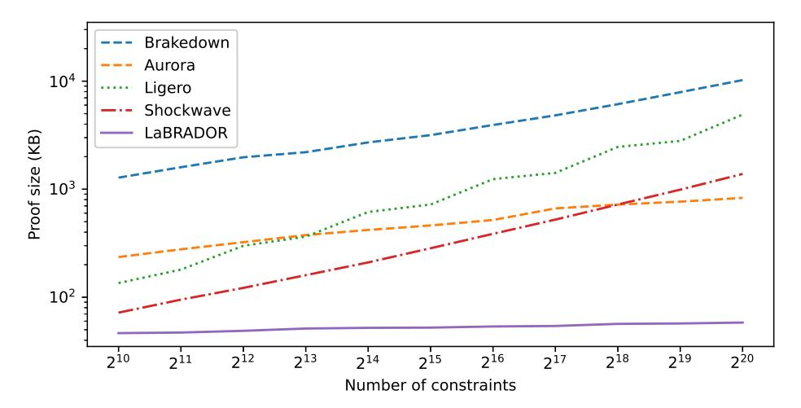

# LaBRADOR: Compact Proofs for R1CS from Module-SIS?

Ward Beullens and Gregor Seiler

IBM Research Europe

Abstract. The most compact quantum-safe proof systems for large circuits are PCP-type systems such as Ligero, Aurora, and Shockwave, that only use weak cryptographic assumptions, namely hash functions modeled as random oracles. One would expect that by allowing for stronger assumptions, such as the hardness of Module-SIS, it should be possible to design more compact proof systems. But alas, despite considerable progress in lattice-based proofs, no such proof system was known so far. We rectify this situation by introducing a Lattice-Based Recursively Amortized Demonstration Of R1CS (LaBRADOR), with more compact proof sizes than known hash-based proof systems, both asymptotically and concretely for all relevant circuit sizes. LaBRADOR proves knowledge of a solution for an R1CS mod 2<sup>64</sup> + 1 with 2<sup>20</sup> constraints, with a proof size of only 58 KB, an order of magnitude more compact than previous quantum-safe proofs.

# 1 Introduction

A (publicly-verifiable) system for proving arbitrary binary or arithmetic circuits is a very versatile cryptographic tool that is useful for the construction of many advanced protocols, e.g. in the areas of privacy-preserving cryptography, blockchain systems, and outsourced computation. The presentation of circuit satisfaction problems as rank-one constraint systems (R1CS) provides a convenient abstraction that simplifies proof systems and their comparison. The proof size is often of central importance because the proof needs to be transmitted over a network or stored on a blockchain.

Since many classical cryptographic algorithms will become insecure when large fault-tolerant quantum computers are built, it is important to develop efficient quantum-safe alternatives. Lattice-based cryptography has been very successful at providing quantum-safe basic primitives such as encryption and signature schemes. Lattice-based primitives offer practical output sizes and execution runtimes that are often faster than their classical counterparts, which makes them suitable as drop-in replacements for the classical algorithms. The same can not yet be said for more advanced protocols, and in particular lattice-based proof systems. The (plausibly) quantum-safe proof systems with the most compact proof

<sup>?</sup> This work is supported by the EU H2020 ERC Project 101002845 PLAZA. Ward Beullens holds Junior Post-Doctoral fellowship 1S95620N from the Research Foundation Flanders (FWO).

sizes for moderate to large statements are hash-based PCP-type systems such as Ligero [\[AHIV17\]](#page-28-0), Aurora [\[BCR](#page-28-1)+19], and Brakedown [\[GLS](#page-29-0)+21]. Their proof sizes scale sublinearly or even poly-logarithmically with the witness size. There are several lattice-based sublinear-size proof systems [\[BBC](#page-28-2)+18, [BLNS20,](#page-28-3) [ACL](#page-26-0)+22] but, even though they rely on much stronger cryptographic assumptions, they are only somewhat practical at best, and can still not compete with the concretely small proof size of the poly-logarithmic PCP-type systems.

Nevertheless, there has been steady progress in practical lattice-based zeroknowledge proof systems, e.g. [\[ESLL19,](#page-28-4) [ALS20,](#page-28-5) [ENS20,](#page-28-6) [LNP22\]](#page-29-1). The proof sizes of these systems scale linearly with the witness size, so even though they are efficient for proving small statements, they become inefficient for proving larger statements. The concrete proof size for proving a representative reference statement has been reduced from 3.8 MB in 2017 to 14 KB in 2022 [\[LNP22\]](#page-29-1). This has been achieved with a combination of (1) adapting techniques from non-lattice systems to the lattice setting; (2) finding ways around the unique lattice complications surrounding the requirement that certain vectors have to be short both in the honest execution as well as in the extraction from a prover algorithm; (3) developing new ways to exploit the algebraic structure of (cyclotomic) polynomial rings; and (4) optimizing the techniques and parameters in the resulting huge design space. The somewhat practical sublinear-size proof system from [\[NS22\]](#page-29-2) leverages and improves the insights and techniques developed for linear-size systems, in combination with new techniques that allowed for sublinear scaling.

Contributions. This work introduces a Lattice-Based Recursively Amortized Demonstration Of R1CS (LaBRADOR). LaBRADOR is the first lattice-based proof system that closes the proof-size gap with PCP-type systems and, in fact, improves upon them by a large margin. LaBRADOR builds upon and improves the set of techniques for practical lattice-based proof systems, and uses recursion to achieve very compact proof sizes. For the range of R1CS sizes that is relevant in practice, the proof size is dominated by the cost of the last step of the recursion, which is independent of the size of the R1CS instance. This means the proof size is almost constant in this range. Asymptotically, for R1CS with n constraints, LaBRADOR achieves a proof size of O(log n), which is still a quadratic improvement over the best hash-based PCP-systems such as Aurora, whose proof size is Θ(log<sup>2</sup> n). The LaBRADOR prover and verifier runtime is dominated by O(n) modular multiplications with a modulus q of size O(log n) (since q must be bigger than the witness norm; in practice we use a single-precision q ≈ 2 32 for all our examples).

Concrete sizes. The concrete proof sizes for our protocol are very compact. To prove knowledge of a solution for an R1CS modulo 2<sup>64</sup> + 1 with a number of constraints ranging from 2<sup>10</sup> to 2<sup>20</sup>, our proof size varies from 47 KB to 58 KB, which is much better than existing post-quantum approaches, especially at the high end of this range. Figure [1](#page-2-0) compares our proof sizes with those of Aurora [\[BCR](#page-28-1)<sup>+</sup>19] and Ligero [\[AHIV17\]](#page-28-0), obtained by running the open source libiop implementation, for a field with 64 bits, zero-knowledge disabled, and a soundness error of 2−125, configured to provide provable security. We also compare to Brakedown and Shockwave, using the numbers in [\[GLS](#page-29-0)+21], for a field size of 256 bits and 2−<sup>128</sup> soundness error. We remark that one can run Aurora with certain heuristics to significantly improve the proof size at the expense of provable security. Our proof sizes are still smaller than those of optimistic versions of Aurora. Our proof sizes are more than two and three orders of magnitude more compact than those of [\[NS22\]](#page-29-2) and k-R-ISIS [\[ACL](#page-26-0)+22] respectively. But unlike our work, the proofs from k-R-ISIS have the advantage that the verification time is sublinear in n.



<span id="page-2-0"></span>Fig. 1. Proof sizes of LaBRADOR compared to other SNARKs, for R1CS with a number of constraints varying from 2<sup>10</sup> to 2<sup>20</sup>. The data can be found in Table [1.](#page-27-0)

Zero-Knowledge Property. The zero-knowledge property is not crucial for sublinear-size proof systems and there are interesting applications for proof systems without zero-knowledge when the proof size is concretely smaller than the witness size. Moreover, achieving zero-knowledge can simply be done by designing a simple linear-sized shim protocol that masks the input witness. The shim can then be composed with our non-zero-knowledge proof system such that the composition is still zero-knowledge and the proof size not much larger than from our system alone. For these reasons we disregard the zero-knowledge property in this work. In all our comparisons to other proof systems we always use the variants that are also not zero-knowledge.

#### 1.1 Technical overview.

**Dot product constraints.** Our main result is a compact proof of knowledge of a short solution  $\vec{\mathbf{s}} = \vec{\mathbf{s}}_1, \dots, \vec{\mathbf{s}}_r \in \mathcal{R}_q^{n \times r}$  for a system of arbitrarily many dot product constraints, i.e. constraints of the form

$$f(\vec{\mathbf{s}}) = \sum_{1 \le i, j \le r} \mathbf{a}_{ij} \langle \vec{\mathbf{s}}_i, \vec{\mathbf{s}}_j \rangle + \sum_{i=1}^r \langle \vec{\boldsymbol{\varphi}}_i, \vec{\mathbf{s}}_i \rangle + \mathbf{b} = 0,$$

where  $\mathbf{a}_{ij}, \mathbf{b} \in \mathcal{R}_q = \mathbb{Z}_q[X]/(X^d+1)$  and  $\vec{\varphi}_i \in \mathcal{R}_q^n$ . We also allow for dot product constraints where we only require that the constant term of  $f(\vec{\mathbf{s}})$  is zero. In Section 6 we show that these dot product constraint systems are at least as powerful as R1CSs because proving knowledge of a solution for an R1CS reduces efficiently to proving knowledge of a short solution to a related dot product constraint system.

Recursive composition. Inspired by bulletproof-style arguments [BCC<sup>+</sup>16, BBB<sup>+</sup>18], we want to design a proof of knowledge of a short solution  $\vec{s}^{(0)}$  for a dot product constraint system  $\mathcal{F}^{(0)}$ , such that the proof consists of a short part  $\pi^{(1)}$ , and a potentially larger part  $\vec{s}^{(1)}$ , where the proof is valid if  $\vec{s}^{(1)}$  is itself a short solution to a new dot product constraint system  $\mathcal{F}^{(1)}$ , which can be deduced from  $\mathcal{F}^{(0)}$  and  $\pi^{(1)}$ . We also want that  $\vec{s}^{(1)}$  is more compact than the original solution  $\vec{s}^{(0)}$ . If we have such a proof system we can recursively apply it to get very compact proofs: we iteratively use the proof system on input  $(\mathcal{F}^{(i)}, \vec{s}^{(i)})$  to produce the next proof  $(\pi^{(i+1)}, \vec{s}^{(i+1)})$ , where  $\vec{s}^{(i+1)}$  is a short solution for some system  $\mathcal{F}^{(i+1)}$ . We do this until we reach some  $\vec{s}^I$  that is short enough so that it can be sent to the verifier, along with all the short proof pieces  $\pi^{(1)}, \ldots, \pi^{(I)}$ . The verifier then recomputes  $\mathcal{F}^{(I)}$  from  $\mathcal{F}^{(0)}$  and  $\pi^{(1)}, \ldots, \pi^{(I)}$ , and only verifies that  $\vec{s}^{(i+1)}$  is a short solution to  $\mathcal{F}^I$ . We prove (with some generality) that this kind of composition preserves soundness.

Amortization. Much like the work of Nguyen and Seiler [NS22], we achieve a sublinear proof size by splitting up the witness in multiple parts  $\vec{\mathbf{s}} = \vec{\mathbf{s}}_1, \dots, \vec{\mathbf{s}}_r$  (potentially splitting into more parts than in the dot product constraint system we are trying to prove), sending commitments  $\vec{\mathbf{t}}_i = \mathbf{A}\vec{\mathbf{s}}_i$  for each of the parts and doing an amortized proof of knowledge of openings. To do the amortized proof, the verifier chooses some challenges  $\mathbf{c}_i$ , and the prover sends  $\vec{\mathbf{z}} = \sum_i \mathbf{c}_i \vec{\mathbf{c}}_i$ . The verifier checks that  $\vec{\mathbf{z}}$  has small  $\ell_2$ -norm, and that and that  $\mathbf{A}\vec{\mathbf{z}} = \sum_i \mathbf{c}_i \vec{\mathbf{t}}_i$ . At the cost of sending  $O(r^2)$  so-called garbage terms and doing some checks, we can augment the proof to also prove that the openings to the  $\vec{\mathbf{t}}_i$  commitments satisfy the dot-product relations. Since the r parts of  $\vec{\mathbf{s}}^{(i)}$  are folded into  $\vec{\mathbf{z}}$ , the witness gets shorter by a factor r', although the size of the coefficients goes up by a factor  $\sqrt{r\tau}$ , where  $\tau$  is the  $\ell_2$ -norm of challenges  $\{\mathbf{c}_i\}_{i\in[r]}$ . To prevent the coefficients from growing indefinitely, we decompose  $\vec{\mathbf{z}} = \vec{\mathbf{z}}_0 + b\vec{\mathbf{z}}_1$  and set  $\vec{\mathbf{s}}^{(i+1)} = \vec{\mathbf{z}}_0||\vec{\mathbf{z}}_1$  instead.

**Proving smallness.** The amortized proof proves knowledge of an opening of the commitment that satisfies the dot product constraint system, but it does not

yet prove that the solution has small  $\ell_2$ -norm. To do this, we use an improved version of the modular Johnson-Lindenstrauss lemma of [GHL21]. This lemma essentially says that random linear projections preserve the  $\ell_2$ -norm quite well (up to some scaling factor). This means that instead of checking the  $\ell_2$ -norm of  $\vec{\mathbf{s}}$  directly, we can let the verifier choose a random projection  $\Pi: \mathbb{Z}_q^{dn} \to \mathbb{Z}_q^{256}$ , drawn from a certain distribution D. The prover then sends  $p = H\vec{\mathbf{s}} \mod q$  to the verifier and proves that p was computed correctly. With our distribution the  $\ell_2$ -norm of  $H\vec{\mathbf{s}} \mod q$  is larger than  $\sqrt{30} \|\vec{\mathbf{s}}\|_2$  with overwhelming probability, and smaller than  $\sqrt{128} \|\vec{\mathbf{s}}\|_2$  with probability close to 1/2. So if  $\|p\|_2$  is small, then  $\|\vec{\mathbf{s}}\|_2$  must have been small as well. The gap between the  $\ell_2$ -norm that is proven, and the  $\ell_2$ -norm of the real witness is only a factor  $\sqrt{128/30} \approx 2.07$ . Proving that p was computed correctly comes for free because  $p = H\vec{\mathbf{s}} \mod q$  is just 256 additional (constant terms of) dot product constraints, which we can simply add to the list of constraints.

Outer commitments. So far, the *i*-th iteration of the base protocol reduces the size of the witness by roughly a factor  $r^{(i)}/2$ , but it requires communicating a proof  $\pi^{(i)}$  that consists of the  $r^{(i)}$  Ajtai commitments  $\vec{\mathbf{t}}_i$  and  $O(r'^2)$  garbage terms, so a priori we cannot use large  $r^{(i)}$  without blowing up the proof size. An important optimization is that instead of sending the commitments  $\vec{\mathbf{t}}_i$  and the garbage terms, the prover just sends a short commitment  $\vec{\mathbf{u}}_1$  to the  $\vec{\mathbf{t}}_i$  and a subset of the garbage terms, and later in the protocol a second short commitment  $\vec{\mathbf{u}}_2$  to the remaining garbage terms. Then we just include  $\vec{\mathbf{t}}_i$  and the garbage terms in  $\vec{\mathbf{s}}^{(i+1)}$ . We call the  $\vec{\mathbf{u}}_i$  the outer commitment, and the  $\vec{\mathbf{t}}_i$  the inner commitments. This optimization allows us to move material from  $\pi^{(i+1)}$  to  $\vec{\mathbf{s}}^{(i+1)}$ which is very beneficial for the proof size of the overall protocol because all the material in  $\vec{\mathbf{s}}^{(i+1)}$  will be shrunk in the subsequent iterations. This optimization allows us to pick a much larger  $r'^{(i)}$ . Asymptotically,  $r'^{(i)} = O(|\vec{\mathbf{s}}^{(i)}|^{1/3})$  is optimal, which means that the size of the witness goes from  $|\vec{\mathbf{s}}^{(i)}|$  to  $O(|\vec{\mathbf{s}}^{(i)}|^{2/3})$  with each iteration of the protocol. Therefore, we need only  $O(\log \log n)$  iterations of the base protocol. In practice, using 6 or 7 iterations gives the best results.

# 2 Preliminaries

**Notation.** Let q be a modulus, and let  $\mathbb{Z}_q$  be the ring of integers mod q. We denote by  $\vec{a} \in \mathbb{Z}_q^m$  a vector of length m, and by  $a_i \in \mathbb{Z}_q$  the i-th entry of  $\vec{a}$ . We denote matrices  $A \in \mathbb{Z}_q^{m \times n}$  by capital letters. Let d be a power of two, and let  $\mathcal{R}$  and  $\mathcal{R}_q$  be the rings  $\mathbb{Z}[X]/(X^d+1)$  and  $\mathbb{Z}_q[X]/(X^d+1)$  respectively, where q,d are such that  $X^d+1$  splits in two irreducible factors mod q. We denote elements of  $\mathcal{R}$  and  $\mathcal{R}_q$  by boldface letters such as  $\mathbf{f}$ , and vectors of ring elements by  $\vec{\mathbf{a}}$ . If  $\mathbf{f} = a_0 + a_1X + \cdots + a_{n-1}X^{n-1} \in \mathcal{R}_n$ , then we denote by  $\mathbf{ct}(\mathbf{f})$  the constant term of  $\mathbf{f}$ , i.e.,  $\mathbf{ct}(\mathbf{f}) = a_0$ . If  $\vec{\mathbf{a}} \in \mathcal{R}_q^n$  is a vector of ring elements then we denote the i-th entry of  $\vec{\mathbf{a}}$  by  $\mathbf{a}_i \in \mathcal{R}$ , and we denote by  $\vec{\mathbf{s}} \in \mathbb{Z}_q^{dn}$  (lowercase) the vector obtained by concatenating the coefficients of all the entries of  $\vec{\mathbf{s}}$ . We denote matrices  $\mathbf{A} \in \mathcal{R}_q^{m \times n}$  by boldface capital letters. If  $\vec{\mathbf{a}} \in \mathcal{R}_q^{n_a}$  and  $\vec{\mathbf{b}} \in \mathcal{R}_q^{n_b}$ 

are vectors, we denote by  $\vec{\mathbf{a}}||\vec{\mathbf{b}} \in \mathcal{R}_q^{n_a+n_b}$  the vector obtained by concatenating  $\vec{\mathbf{a}}$  and  $\vec{\mathbf{b}}$ . We denote the set of integers  $\{1,\ldots,k\}$  by [k].

For an interactive protocol  $\Pi = (\mathcal{P}, \mathcal{V})$  between two algorithms  $\mathcal{P}$  and  $\mathcal{V}$  we write  $\langle \mathcal{P}(a), \mathcal{V}(b) \rangle$  to denote the random variable describing the output of  $\mathcal{V}$  after jointly running  $\mathcal{P}$  and  $\mathcal{V}$  where  $\mathcal{P}$  is given a as input and  $\mathcal{V}$  is given b as input.

<span id="page-5-1"></span>Challenge Space. Throughout the paper we let  $\mathcal{C} \subset \mathcal{R}$  be a challenge space, such that  $\mathbf{c}_1 - \mathbf{c}_2$  is invertible for any pair of distinct  $\mathbf{c}_1, \mathbf{c}_2$  in  $\mathcal{C}$ , and such that  $\|\mathbf{c}\|_{2} \leq \tau$  and  $\|\mathbf{c}\|_{p} \leq T$  for all  $\mathbf{c} \in \mathcal{C}$ , for some constants  $\tau, T \in \mathbb{R}$ , where

$$\left\|\mathbf{c}\right\|_{\mathsf{op}} = \sup_{\mathbf{r} \in \mathcal{R}} \frac{\left\|\mathbf{cr}\right\|_2}{\left\|\mathbf{r}\right\|_2}$$

is the operator norm of c.

In our concrete instantiations we use the ring  $\mathcal{R} = \mathbb{Z}_q[X]/(X^{64} + 1)$ , and as challenges we use ring elements with 23 zero coefficients, 31 coefficient that are  $\pm 1$ , and 10 coefficients that are  $\pm 2$ . There are more than  $2^{128}$  such elements. All these polynomials have  $l_2$ -norm 71 and we use rejection sampling to restrict to challenges with operator norm at most 15. (On average we need to sample roughly 6 elements before we sample an element  $\mathbf{c}$  with operator  $\|\mathbf{c}\|_{op} < 15$ .) Differences of distinct challenges are invertible according to [LS18, Corollary 1.2].

Weak Commitment Openings. In the analysis of our protocols, we need the notion of a weak commitment opening stemming from [ALS20, Section 4]. Given an Ajtai commitment  $\vec{t} = A\vec{s} \in \mathcal{R}^{\kappa}_q$ , a weak opening of norm  $\beta$  is a vector  $\vec{s}^*$  together with a challenge difference  $\bar{c} \in \mathcal{C} - \mathcal{C}$  such that  $\vec{t} = A\vec{s}^*$  and  $\|\bar{c}\vec{s}^*\| \leq \beta$ . The commitment  $\vec{t}$  is binding for weak openings of norm  $\beta$  if Module-SIS is hard for rank  $\kappa$  and norm  $4T\beta$ . If Module-SIS is hard for norm  $2\beta$ , then the commitment is binding for weak openings with the same challenge difference  $\bar{c}$ .

The Conjugation Automorphism  $\sigma_{-1}$ . For proving dot products  $\langle \vec{a}, \vec{b} \rangle$  between coefficient vectors  $\vec{a}, \vec{b} \in \mathbb{Z}_q^{nd}$  corresponding to polynomial vectors  $\vec{a}, \vec{b} \in \mathbb{R}_q^n$ , we use the observation that  $\langle \vec{a}, \vec{b} \rangle = \operatorname{ct} \left( \langle \sigma_{-1}(\vec{a}), \vec{b} \rangle \right)$  for the automorphism  $\sigma_{-1} \in \operatorname{Aut}(\mathbb{R}_q)$  defined by  $\sigma_{-1}(X) = X^{-1}$  that corresponds to -1 under  $\operatorname{Aut}(\mathbb{R}_q) \cong \mathbb{Z}_{2d}^{\times}$ . This was introduced in [LNP22], and the constant coefficient as a handle on dot products in [ENS20].

## <span id="page-5-0"></span>3 Composing proofs of knowledge

In this section, we define proofs-of-knowledge and proof-of-knowledge reductions, and we prove that composing proof-of-knowledge reductions preserves soundness.

Definition 3.1 (multi-round public-coin interactive proofs). A publiccoin interactive proof Π = (P, V) is a protocol between a prover P and a verifier V, where the prover takes as input (x, w), and the verifier gets x as input. The prover and verifier take turns sending messages, and the prover sends the last message. Finally the verifier outputs V (x, c1, . . . , ck, z1, . . . , zk<sup>0</sup> ) ∈ {accept,reject}, where V is a verification predicate, z1, . . . , zk<sup>0</sup> are the messages sent by the prover, and c1, . . . , c<sup>k</sup> are the messages sent by the verifier. Moreover, the verifier chooses its i-th message c<sup>i</sup> uniformly at random from some challenge set C<sup>i</sup> for all i ∈ [k].

Definition 3.2 (completeness). We say that an interactive protocol Π = (P, V) is a complete proof of knowledge for relation R with failure probability if for all (x, w) ∈ R, we have

$$\Pr[\langle \mathcal{P}(x, w), \mathcal{V}(x) \rangle = \mathsf{accept}] \ge 1 - \epsilon$$
.

Definition 3.3 (knowledge soundness). We say that an interactive protocol Π = (P, V) is a knowledge-sound proof of knowledge for a relation R with soundness error κ if there exists an oracle algorithm E (called the extractor), that runs in expected polynomial time such that for all (x, w) ∈ R, and all provers P <sup>∗</sup> we have

$$\Pr[(x, w') \in R \mid w' \leftarrow \mathcal{E}^{\mathcal{P}^*}(x)] \ge \epsilon(\mathcal{P}^*, x) - \kappa,$$

where (P ∗ , x) is the success probability of the prover P ∗ for the statement x, which is defined as

$$\epsilon(\mathcal{P}^*, x) = \Pr[\langle \mathcal{P}^*(), \mathcal{V}(x) \rangle = \mathsf{accept}].$$

Remark 3.4. Note that it makes sense for a proof system to be complete with regards to a relation R, and knowledge-sound for a different relation R<sup>0</sup> (usually R ⊂ R<sup>0</sup> ). This is often the case for efficient lattice-based proofs.

An alternative definition for knowledge soundness says that there is an extractor which outputs a witness with probability 1, but which is allowed to run in expected time O(poly(|x|)/((P ∗ , x) − κ)). Bellare and Goldreich showed that both definitions are equivalent for NP relations [\[BG92\]](#page-28-9), so we will use both definitions interchangeably. It is well known (see, e.g., [\[AF21\]](#page-28-10) for a proof) that to prove knowledge soundness it suffices to construct an extractor for deterministic provers.

Definition 3.5 (proof-of-knowledge reduction). We say a proof of knowledge Π = (P, V) for a relation R<sup>1</sup> is a reduction from R<sup>1</sup> to R<sup>2</sup> if the verification predicate of V "factors through R2", by which we mean that :

– The last message sent by P is a tuple (z 0 k , w2), and - there exists an efficient algorithm  $\tilde{\mathcal{V}}$  such that

$$\mathcal{V}$$
 accepts the transcript  $(x_1, c_1, \dots, c_k, z_1, \dots, z_{k'}, w_2)$ 
 $\iff$ 

$$(\tilde{\mathcal{V}}(x_1, c_1, \dots, c_k, z_1, \dots, z_{k'}), w_2) \in R_2$$

<span id="page-7-0"></span>**Definition 3.6 (Composition of reductions).** Let  $\Pi_{12} = (\mathcal{P}_{12}, \mathcal{V}_{12})$  be a proof-of-knowledge reduction from  $R_1$  to  $R_2$  and let  $\Pi_2 = (\mathcal{P}_2, \mathcal{V}_2)$  be a proof of knowledge for  $R_2$ . We define the composition  $\Pi_2 \circ \Pi_{12}$  as the interactive protocol  $(\mathcal{P}, \mathcal{V})$ , where  $\mathcal{P}(x_1, w_1)$  and  $\mathcal{V}(x_1)$  run  $\mathcal{P}_{12}(x_1, w_1)$  and  $\mathcal{V}_{12}(x_1)$ , except that instead of sending  $w_2$  and letting the verifier check that  $(x_2, w_2) \in R_2$  for the new statement  $x_2 \leftarrow \tilde{\mathcal{V}}(x_1, c_1, \ldots, c_k, z_1, \ldots, z_{k'})$ ,  $\mathcal{P}$  and  $\mathcal{V}$  run  $\mathcal{P}_2(x_2, w_2)$  and  $\mathcal{V}_2(x_2)$ . The composed verifier  $\mathcal{V}(x_1)$  accepts if and only if  $\mathcal{V}_2(x_2)$  accepts.

<span id="page-7-1"></span>Lemma 3.7 (Composition preserves knowledge soundness). Let  $\Pi_{12}$  and  $\Pi_2$  be proof systems as in Definition 3.6. If  $\Pi_{12}$  and  $\Pi_2$  are knowledge sound with soundness error  $\kappa_{12}$  and  $\kappa_2$  respectively, then their composition  $\Pi_2 \circ \Pi_{12}$  is a knowledge-sound proof of  $R_1$  with soundness error  $\kappa_{12} + \kappa_2$ .

*Proof.* Let  $\mathcal{E}_{12}$  and  $\mathcal{E}_2$  be extractors for  $\Pi_{12}$  and  $\Pi_2$  respectively. The idea of the proof is that we first use  $\mathcal{E}_2$  to construct a prover  $\mathcal{P}_{12}^*$  for the reduction  $\Pi_{12}$ , and then we extract a witness from  $\mathcal{P}_{12}^*$  using  $\mathcal{E}_{12}$ .

Let  $\mathcal{P}_1^*$  be a prover for  $\Pi_2 \circ \Pi_{12}$ . We define a prover  $\mathcal{P}_{12}^*$  for  $\Pi_{12}$ , that makes use of rewindable oracle access to  $\mathcal{P}_1^*$ , as follows. First,  $\mathcal{P}_{12}^*$  runs  $\mathcal{P}_1^*$ , outputs what  $\mathcal{P}$  outputs, and forwards the challenges from  $\mathcal{V}_{12}$  to  $\mathcal{P}_1^*$ , until  $\mathcal{P}_1^*$  outputs  $z_{k'}$ . Now  $\mathcal{P}_{12}^*$  will try to use  $\mathcal{E}_2$  to come up with a witness  $w_2$  such that  $(x_2, w_2) \in R_2$ , where  $x_2 = \tilde{\mathcal{V}}(x_1, c_1, \ldots, c_k, z_1, \ldots, z_{k'})$ . But first,  $\mathcal{P}_{12}^*$  continues running  $\mathcal{P}_{13}^*$  by simulating an honest verifier  $\mathcal{V}_2(x_2)$ . If the simulated verifier outputs reject, then  $\mathcal{P}_{12}^*$  aborts. (This step is to control the running time of  $\Pi_{12}$ ) Otherwise, if the simulated verifier outputs accept, then  $\mathcal{P}_{12}^*$  repeatedly rewinds  $\mathcal{P}_1^*$  to the point after it sent  $z_{k'}$ , and runs the extractor  $\mathcal{E}_2(x_2)$  with access to  $\mathcal{P}_1^*$ , which acts as a  $\Pi_{23}$ -prover. If the extractor  $\mathcal{E}_2$  succeeds and outputs a valid  $w_2$  such that  $(x_2, w_2) \in R_2$ , then  $\mathcal{P}_{12}^*$  outputs this  $w_2$  and  $\mathcal{V}_1(x_1)$  will accept. After each failed extraction attempt  $\mathcal{P}_{12}^*$  aborts with probability  $\kappa_2$ , otherwise it continues rewinding  $\mathcal{P}_{13}^*$  and running  $\mathcal{E}_{23}$ .

We now argue that this prover  $\mathcal{P}_{12}^*$  has an expected polynomial running time. Fix some randomness  $r = (r_1, r_2) \in \{0, 1\}^{\mathbb{N}} \times \{0, 1\}^{\mathbb{N}}$ , we denote by  $\epsilon$  the success probability of  $\mathcal{P}_{13}$  when  $\mathcal{P}_{1}$ 's randomness is fixed to  $r_1$  and when  $\mathcal{V}_{12}$ 's randomness is fixed to  $r_2$ . Similarly, we define s as the success probability of  $\mathcal{E}_{12}$  of extracting from  $\mathcal{P}_1$  conditional on  $r_1$  and  $r_2$  being used. If  $\mathcal{E}_{12}$  is an extractor with soundness error  $\kappa_2$  then we have  $s \geq \epsilon - \kappa_2$ . Conditional on the randomness r, if the prover succeeds on the first attempt (which happens with probability  $\epsilon$ ), then  $\mathcal{P}_{12}^*$  starts running  $\mathcal{E}_2$ , otherwise it does not run  $\mathcal{E}_2$  at all. Therefore, the expected number of extraction attempts is  $\epsilon$  times the inverse of the probability

that the process stops, which is

$$\frac{\epsilon}{s + (1 - s)\kappa_2} \,.$$

Suppose  $\epsilon \leq 2\kappa_2$ , then

$$\frac{\epsilon}{s + (1 - s)\kappa_2} \le \frac{\epsilon}{\kappa_2} \le 2.$$

Otherwise, if  $\epsilon \geq 2\kappa_2$ , then we have

$$\frac{\epsilon}{s+(1-s)\kappa_2} \leq \frac{\epsilon}{s} \leq \frac{\epsilon}{\epsilon-\kappa_2} \leq \frac{2\kappa_2}{2\kappa_2-\kappa_2} = 2.$$

For any fixed choice of randomness r and challenges c, the expected number of extraction attempts is bounded by 2, which means that the expected number of extraction attempts over all r and c must also be bounded by 2, so  $\mathcal{P}_{12}^*$  runs in expected polynomial time.

Now we argue that  $\mathcal{P}_{12}^*$  has success probability at least  $\epsilon(\mathcal{P}_1^*, x_1) - \kappa_2$ . Again, we fix randomness r. The prover  $\mathcal{P}_{12}^*$  starts running the extractor with probability  $\epsilon$ , and if it starts then the probability that  $\mathcal{E}_{23}$  eventually succeeds is exactly

$$\frac{s}{s + (1-s)\kappa_2} \, .$$

Therefore the success probability of  $\mathcal{P}_{12}^*$  conditioned on r being used is

$$\frac{\epsilon s}{s + (1 - s)\kappa_2} \ge \frac{\epsilon s}{s + \kappa_2} = \epsilon \left( 1 - \frac{\kappa_2}{s + \kappa_2} \right) \ge \epsilon \left( 1 - \frac{\kappa_2}{\epsilon} \right) = \epsilon - \kappa_2,$$

where we used that  $s \geq \epsilon - \kappa_2$ . For any fixed choice of randomness r the success probability of  $\mathcal{P}_{12}^*$  is at least the success probability of  $\mathcal{P}_{13}^* - \kappa_2$ , so by taking the average over all r we get  $\epsilon(\mathcal{P}_{12}^*, x_1) \geq \epsilon(\mathcal{P}_1^*, x_1) - \kappa_2$ .

Now there is an extractor for  $\Pi_2 \circ \Pi_{12}$  that just runs  $\mathcal{E}_{12}$  on the prover  $\mathcal{P}_{12}^*$ . This extractor runs in expected polynomial time, and outputs a witness for  $x_1 \in R_1$  with probability  $\epsilon(\mathcal{P}_{12}^*, x_1) - \kappa_{12} \ge \epsilon(\mathcal{P}_1^*, x_1) - \kappa_{12} - \kappa_2$ .

# 4 Modular Johnson-Lindenstrauss Lemma

<span id="page-8-0"></span>In our proof system, we need to prove knowledge of a long vector  $\vec{w} \in \mathbb{Z}^d$  with small  $\ell_2$ -norm. Revealing the entire vector so that the verifier can check that it has small  $\ell_2$ -norm would be very costly, so we rely on a version of the Johnson-Lindenstrauss lemma to reduce the dimensionality. The intuition is that random linear projections almost preserve the  $\ell_2$ -norm. So, instead of revealing  $\vec{w}$  we let the verifier sample a random linear map  $\Pi: \mathbb{Z}^d \to \mathbb{Z}^{256}$ , where the entries of  $\Pi$  are independent and equal to -1,0, or 1 with probabilities 1/4, 1/2, and 1/4 respectively. The prover then only reveals  $\Pi \vec{w}$ , which is much more compact than the long vector  $\vec{w}$ . One can check that the average of  $\|\Pi \vec{w}\|_2$  is  $\sqrt{128} \|\vec{w}\|_2$ , and Gentry, Halevi, and Lyubashevsky argue that regardless of the vector  $\vec{w}$ , with overwhelming probability, the  $\ell_2$ -norm cannot be much higher or lower [GHL21].

**Lemma 4.1 (Corollary 3.2, [GHL21]).** Let C be a distribution on  $\{-1,0,1\}$  with  $\Pr[C=0]=1/2$ , and  $\Pr[C=1]=\Pr[C=-1]=1/4$ , then for every vector  $\vec{w} \in \mathbb{Z}^d$  we have

$$\begin{split} &\Pr_{\vec{\pi} \leftarrow \mathsf{C}^d}[|\langle \vec{\pi}, \vec{w} \rangle| > \ 9.5 \, \|\vec{w}\|_2] \lesssim 2^{-141} \\ &\Pr_{\Pi \leftarrow \mathsf{C}^{256 \times d}}[\|\Pi \vec{w}\|_2 < \ \sqrt{30} \, \|\vec{w}\|_2] \lesssim 2^{-128} \\ &\Pr_{\Pi \leftarrow \mathsf{C}^{256 \times d}}[\|\Pi \vec{w}\|_2 > \sqrt{337} \, \|\vec{w}\|_2] \lesssim 2^{-128} \end{split}$$

Therefore, the prover can send  $\Pi \vec{w}$ , and prove that it is computed correctly. Then, if the verifier sees that  $\|\Pi \vec{w}\|_2 \leq \sqrt{30}b$  for some bound b, then he is convinced that  $\|\vec{w}\|_2$  is at most b. One caveat is that the prover only proves that  $\Pi \vec{w}$  is correct mod q, which might mess up the soundness because  $\|\Pi \vec{w}\|_2$  could be smaller than  $\|\Pi \vec{w}\|_2$ . Gentry, Halevi, and Lyubashevsky prove that, despite the potential reduction mod q, the proof strategy is still sound, on the condition that b < q/45d. They use a 256-bit prime q, so this restriction is not a problem for them. However, for efficiency reasons we want to use a small modulus q (e.g.  $q \approx 2^{32}$ ), so we strengthen their result to only require b < q/125 instead. We believe this lemma could be useful for future works in lattice-based proof systems. Its proof relies on the Berry-Esseen Theorem [Ber41, Ess42], and is given in Appendix A.

<span id="page-9-2"></span>Lemma 4.2 (strengthening of Corollary 3.3, [GHL21]). Let  $q \in \mathbb{N}$ , and let C be the distribution from lemma 4.1, then for every vector  $\vec{w} \in [\pm q/2]^d$  with  $\|\vec{w}\|_2 \geq b$  for some bound  $b \leq q/125$ , we have

$$\Pr_{\boldsymbol{\Pi} \leftarrow \mathsf{C}^{256 \times d}} \left[ \left\| \boldsymbol{\Pi} \vec{w} \mod q \right\|_2 < \sqrt{30} b \right] \lesssim 2^{-128} \,.$$

# <span id="page-9-1"></span>5 Protocol

#### <span id="page-9-0"></span>5.1 Principal Relation

We define the principal relation R for our proof system. The relation is parameterized by a rank  $n \geq 1$ , a multiplicity  $r \geq 1$ , and a norm bound  $\beta > 0$ . It consists of short solutions to dot product constraints over  $\mathcal{R}_q$  that can be proven efficiently with lattice techniques. Concretely, a statement consists of a family  $\mathcal{F} = (f^{(k)} \mid k = 1, \ldots, K)$  of quadratic dot product functions  $f: \mathcal{R}_q^n \times \cdots \times \mathcal{R}_q^n \to \mathcal{R}_q$  (r times) of the form

$$f(\vec{\bm{s}}_1,\ldots,\vec{\bm{s}}_r) = \sum_{i,j=1}^r \bm{a}_{ij} \langle \vec{\bm{s}}_i,\vec{\bm{s}}_j \rangle + \sum_{i=1}^r \langle \vec{\bm{\varphi}}_i,\vec{\bm{s}}_i \rangle - \bm{b}\,,$$

where  $\mathbf{a}_{i,j}, \mathbf{b} \in \mathcal{R}_q$  and  $\vec{\varphi}_i \in \mathcal{R}_q^n$ . The matrix  $(\mathbf{a}_{ij})$  can be assumed to be symmetric without loss of generality, i.e.  $\mathbf{a}_{ij} = \mathbf{a}_{ji}$ . Sometimes we are only interested

in the constant polynomial coefficient of a function f. For such a function all the higher coefficients of the polynomial  $\boldsymbol{b}$  are irrelevant so we do not include them in the statement. This saves space, especially when there are many such functions. We collect these functions in a second family  $\mathcal{F}' = (f'^{(l)} \mid l = 1, \dots, L)$  in a statement for the relation  $\mathcal{R}$ . Now, a witness consists of r vectors  $\vec{s}_1, \dots, \vec{s}_r \in \mathcal{R}_q^n$  such that  $f(\vec{s}_1, \dots, \vec{s}_r) = \mathbf{0}$  for all  $f \in \mathcal{F}$ ,  $\operatorname{ct}(f'(\vec{s}_1, \dots, \vec{s}_r)) = 0$  for all  $f' \in \mathcal{F}'$ , and  $\sum_{i=1}^r \|\vec{s}_i\|_2^2 \leq \beta^2$ . In symbols,

$$\mathcal{R} = \left\{ ((\mathcal{F}, \mathcal{F}', \beta), (\vec{s}_1, \dots, \vec{s}_r)) \left| \begin{array}{l} f(\vec{s}_1, \dots, \vec{s}_r) = \mathbf{0} & \forall f \in \mathcal{F} \,, \ \operatorname{ct} \left( f'(\vec{s}_1, \dots, \vec{s}_r) \right) = 0 & \forall f' \in \mathcal{F}' \,, \ \sum_{i=1}^r \left\| \vec{s}_i \right\|_2^2 \leq \beta^2 \end{array} \right\}.$$

We reduce R1CS to this relation R in Section 6. In this section, we construct an interactive proof for  $\mathcal{R}$  with very compact proof sizes. Our proof introduces a small amount of slack, which means that it does not exactly prove knowledge of a solution with norm bound  $\beta$ , but only a solution with a norm bound that is slightly bigger, approximately by a factor of two. This does not pose a problem for our reduction from R1CS.

#### 5.2 Main Protocol

Our main protocol is an interactive proof for the principal relation R that works by committing to the witness vectors, replacing the norm statement with a Johnson-Lindenstrauss projection, aggregating the dot product functions, and amortizing over the witness vectors.

Committing. In the first step of the protocol the prover commits to the vectors  $\vec{s}_i$  by computing Ajtai commitments

$$\vec{\boldsymbol{t}}_i = \boldsymbol{A}\vec{\boldsymbol{s}}_i \in \mathcal{R}_q^\kappa$$
 .

We have that  $\|\vec{s}_i\| \leq \beta$ , but the commitments must tolerate some slack. Especially because they need to be binding with respect to weak openings extracted from an amortized opening. We handle this in the security analysis of the protocol.

Sending all the  $\vec{t}_i$  would be costly. Therefore the prover again commits to them in a single Ajtai commitment  $\vec{u}_1$  and only sends  $\vec{u}_1$ . This allows to only send the  $\vec{t}_i$  as part of the prover's last message and thus push the  $\vec{t}_i$  to the target relation of the protocol, which can be proven recursively with little cost. The  $\vec{t}_i$  have coefficients that are arbitrary modulo q. So they need to be decomposed into  $t_1 \geq 2$  parts with respect to a small base  $b_1$  before committing. That is, one writes  $\vec{t}_i = \vec{t}_i^{(0)} + \vec{t}_i^{(1)}b_1 + \cdots + \vec{t}_i^{(t_1-1)}b_1^{t_1-1}$  where centered representatives

modulo  $b_1$  are used, i.e.  $\|\vec{t}_i^{(k)}\|_{\infty} \leq b_1/2$ . Now let  $\vec{t} \in \mathcal{R}_q^{rt_1\kappa}$  be a concatenation of all the decomposition parts  $\vec{t}_i^{(k)}$ . Then we get the Ajtai commitment

<span id="page-11-0"></span>
$$\vec{\boldsymbol{u}}_1 = \boldsymbol{B}\vec{\boldsymbol{t}} \in \mathcal{R}_q^{\kappa_1}, \text{ with } \|\vec{\boldsymbol{t}}\| \le \gamma_1.$$
 (1)

We say that  $\vec{u}_1$  is an *outer* commitment, and  $\vec{t}_i$ , i = 1, ..., r, are the *inner* commitments. The decomposition parameters  $t_1, b_1$  and the norm bound  $\gamma_1$  are discussed in Subsection 5.4.

Projecting. Now, the norm statement in the relation R can be replaced by a Johnson-Lindenstrauss projection. So the verifier sends random matrices  $\Pi_i \in \{-1,0,1\}^{256\times nd}$  for  $i=1,\ldots,r$ . Then the prover sends the projection  $\vec{p}=\sum_{i=1}^r \Pi_i \vec{s}_i$ . The verifier checks that  $\|\vec{p}\| \leq \sqrt{128}\beta$ . This is true with probability 1/2, but the prover can request projection matrices until it is the case. Moreover, it implies with overwhelming probability that  $\sum_{i=1}^r \|\vec{s}_i\|^2 \leq (128/30)\beta^2$ . Here the slack of a factor of  $\sqrt{128/30} \approx 2$  is introduced. For proving correct projection, we write  $\vec{p} = \sum_i \Pi_i \vec{s}_i$  as dot product constraints on the polynomial vectors  $\vec{s}_i$ . Let  $\vec{\pi}_i^{(j)}$  be the jth row of  $\Pi_i$  for  $j=1,\ldots,256$ . Then for each  $j=1,\ldots,256$  define the dot product function

$$\sum_{i=1}^r \langle \sigma_{-1}(\vec{\boldsymbol{\pi}}_i^{(j)}), \vec{\boldsymbol{s}}_i \rangle - p_j.$$

These functions do not vanish in  $\mathcal{R}_q$  but have zero constant coefficients. So they are of the form of the functions in the family  $\mathcal{F}'$ .

Aggregating. In the first aggregation step, the above functions for proving the JL projection and the functions in  $\mathcal{F}'$  are aggregated to only  $\lceil 128/\log q \rceil$  functions with zero constant coefficients by linear combining all functions with uniformly random challenges from  $\mathbb{Z}_q$ . This preserves the zero constant coefficients. So the verifier sends  $\vec{\psi}^{(k)} \stackrel{\$}{\leftarrow} (\mathbb{Z}_q)^L$  and  $\vec{\omega}^{(k)} \in (\mathbb{Z}_q)^{256}$  for  $k = 1, \ldots, \lceil 128/\log q \rceil$ , where  $L = |\mathcal{F}'|$ . The prover computes

$$f''^{(k)}(\vec{s}_{1},...,\vec{s}_{r}) = \sum_{l=1}^{L} \psi_{l}^{(k)} f'^{(l)}(\vec{s}_{1},...,\vec{s}_{r}) + \sum_{j=1}^{256} \omega_{j}^{(k)} (\langle \sigma_{-1}(\vec{\pi}_{i}^{(j)}), \vec{s}_{i} \rangle - p_{j})$$

$$= \sum_{i,j=1}^{r} \boldsymbol{a}''^{(k)} \langle \vec{s}_{i}, \vec{s}_{j} \rangle + \sum_{i=1}^{r} \langle \vec{\varphi}''^{(k)}_{i}, \vec{s}_{i} \rangle - b_{0}''^{(k)},$$

where  $b_0''^{(k)} = \sum_l \psi_l^{(k)} b_0'^{(l)} + \langle \vec{\omega}^{(k)}, \vec{p} \rangle$ . Then the prover extends these integers to full polynomials  $b''^{(k)}$  so that the new functions  $f''^{(k)}$  become completely vanishing and of the same type as the functions in  $\mathcal{F}$ . The prover sends the  $b''^{(k)}$  and the verifier checks that their constant coefficients are correct.

In the second step, we aggregate all functions in  $\mathcal{F}$  together with the new functions. The verifier sends  $K + \lceil 128/\log q \rceil$  random challenge polynomials  $\vec{\alpha} \stackrel{\$}{\leftarrow} \mathcal{R}_q^K$ 

and  $\vec{\beta} \stackrel{\$}{\leftarrow} \mathcal{R}_q^{\lceil 128/\log q \rceil}$ , where  $K = |\mathcal{F}|$ . Then, define

$$\begin{aligned} F(\vec{\bm{s}}_1,\ldots,\vec{\bm{s}}_r) &= \sum_{k=1}^K \bm{\alpha}_k f^{(k)}(\vec{\bm{s}}_1,\ldots,\vec{\bm{s}}_r) + \sum_{k=1}^{\lceil 128/\log q \rceil} \bm{\beta}_k f''^{(k)} \ &= \sum_{i,j=1}^r \bm{a}_{ij} \langle \vec{\bm{s}}_i, \vec{\bm{s}}_j \rangle + \sum_{i=1}^r \langle \vec{\bm{\vec{\vec{\sigma}}}_i, \vec{\bm{s}}_i \rangle - \bm{b} \,. \end{aligned}$$

Amortizing. Finally, we amortize over the  $\vec{s}_i$ . This means that instead of opening the individual inner commitments  $\vec{t}_i$  by sending all the  $\vec{s}_i$ , the prover opens a random linear-combination  $\vec{z} = c_1 \vec{t}_1 + \cdots + c_r \vec{t}_r$  with challenge polynomials  $c_i \in \mathcal{C} \subset \mathcal{R}_q$  chosen by the verifier. The verifier checks that

<span id="page-12-0"></span>
$$A\vec{z} = \sum_{i=1}^{r} c_i \vec{t}_i \in \mathcal{R}_q^{\kappa} \quad \text{and} \quad \|\vec{z}\| \le \gamma.$$
 (2)

The aggregated dot product constraint  $F(\vec{s}_1, ..., \vec{s}_r) = \mathbf{0}$  is proven probabilistically using the amortized opening  $\vec{z}$ . This works by proving

<span id="page-12-1"></span>
$$\langle \vec{z}, \vec{z} \rangle = \sum_{i,j=1}^{r} g_{ij} c_{i} c_{j}, \quad \sum_{i=1}^{r} \langle \vec{\varphi}_{i}, \vec{z} \rangle c_{i} = \sum_{i,j=1}^{r} h_{ij} c_{i} c_{j},$$

$$\sum_{i,j=1}^{r} a_{ij} g_{ij} + \sum_{i=1}^{r} h_{ii} - b = 0,$$
(3)

where  $\vec{\varphi}_i \in \mathcal{R}_q^n$  are vectors independent of the challenges  $c_i$ , and the  $g_{ij}$ ,  $h_{ij}$  are garbage polynomials that are also independent of the  $c_i$ . If  $z = c_1 \vec{s}_1 + \cdots + c_r \vec{s}_r$ , then these equations together imply with low soundness error that

$$F(\vec{s}_1,\ldots,\vec{s}_r) = \sum_{i,j=1}^r a_{ij} \langle \vec{s}_i, \vec{s}_j \rangle + \sum_{i=1}^r \langle \vec{\varphi}_i, \vec{s}_i \rangle - b = 0.$$

Moreover, the garbage matrices  $(g_{ij})$  and  $(h_{ij})$  can assumed to be symmetric.

This strategy is implemented in the protocol in the following way. The prover computes the garbage polynomials

$$\bm{g}_{ij} = \langle \vec{\bm{s}}_i, \vec{\bm{s}}_j \rangle \quad \text{and} \quad \bm{h}_{ij} = \frac{1}{2} \left( \langle \vec{\bm{\varphi}}_i, \vec{\bm{s}}_j \rangle + \langle \vec{\bm{\varphi}}_j, \vec{\bm{s}}_i \rangle \right)$$

for i, j = 1, ..., r. Then, similarly to the inner commitments  $\vec{t}_i$ , the prover does not directly send the garbage polynomials but produces an outer commitment to them. Here the  $h_{ij}$  are again arbitrary modulo q and hence will be decomposed into  $t_1$  parts modulo  $b_1$ . On the other hand, the remaining garbage polynomials  $g_{ij}$  are short modulo q. Nevertheless, they are decomposed into  $t_2 \geq 2$  parts

with respect to a base  $b_2$  to reduce their width further. Let  $\vec{g} \in \mathcal{R}_q^{t_2(r^2+r)/2}$  and  $\vec{h} \in \mathcal{R}_q^{t_1(r^2+r)/2}$  be vectors containing all the decomposition parts of all the garbage polynomials. Then the second outer commitment is given by

<span id="page-13-0"></span>
$$\vec{\boldsymbol{u}}_2 = C\vec{\boldsymbol{g}} + D\vec{\boldsymbol{h}} \in \mathcal{R}_q^{\kappa_2} \quad \text{with} \quad \sqrt{\|\vec{\boldsymbol{g}}\|^2 + \|\vec{\boldsymbol{h}}\|^2} \le \gamma_2.$$
 (4)

We note that the garbage polynomials  $g_{ij}$  are independent of all challenges, not just the  $c_i$ . Therefore the prover can compute them already at the very beginning of the protocol and include them in the first outer commitment  $\vec{u}_1$ . This change allows for a slightly better security proof.

Finally, the verifier sends the r challenge polynomials  $c_1, \ldots, c_r \stackrel{\$}{\leftarrow} \mathcal{C}$ , and the prover replies with the amortized opening  $\vec{z} = c_1 \vec{s}_1 + \cdots + c_r \vec{s}_r$  and the outer commitment openings  $\vec{t}, \vec{g}, \vec{h}$ . The amortized opening is such that  $||\vec{z}|| \leq \gamma$ .

Verifying. The verifier checks that  $\vec{z}$  is an amortized opening with challenges  $c_i$  for the inner commitments defined by  $\vec{t}$ , and that  $\vec{t}$  and  $\vec{g}$ ,  $\vec{h}$  are openings for the outer commitments. That is, he checks (1),(2),(4). Moreover, the verifier checks the dot product equations (3) where the vectors  $\vec{\varphi}_i$ , matrix  $(a_{ij})$ , and polynomial b are those defining the aggregated function F.

# <span id="page-13-1"></span>5.3 Recursion and Decomposition

The target relation of our main protocol is almost another instance of the dot product constraint relation R. Indeed, the witness as given by the last prover message consists of four vectors  $\vec{z}$ ,  $\vec{t}$ ,  $\vec{g}$ ,  $\vec{h}$  that must only fulfill equations of dot product type and norm checks in (1),(2),(3),(4). The only difference is that there are three separate norm checks instead of a single global one. But those checks only serve to ensure that the outer and inner commitments are binding. So, when we consolidate the three checks into

$$\|\vec{z}\|^2 + \|\vec{t}\|^2 + \|\vec{g}\|^2 + \|\vec{h}\|^2 \le \gamma^2 + \gamma_1^2 + \gamma_2^2,$$

we obtain a protocol that is sound for a suitable choice of the commitment ranks  $\kappa$ ,  $\kappa_1$  and  $\kappa_2$ , and whose target relation is exactly another instance of R. A different approach would be to generalize  $\mathcal{R}$  by allowing several norm checks, which could be handled in the protocol with several parallel Johnson-Lindenstrauss projections.

It now follows that the protocol can be recursed to further reduce the proof size. See Section 3 for details and specifically Lemma 3.7 for how this affects the soundness error. The protocol relies on amortization to achieve small proof sizes, so before directly recursing the protocol on the target relation we first decrease the rank and increase the multiplicity by decomposing the witness vectors and rewriting the target relation using the decomposed vectors. We also reduce the width of the masked opening  $\vec{z}$  and decompose it into two additive parts by reducing modulo a base b.

We start by slightly simplifying the target relation. Notice that all Equations (1)-(4) except the norm checks are linear in the witness vectors  $\vec{t}, \vec{g}, \vec{h}$ . So we may concatenate

$$\vec{\boldsymbol{v}} = \vec{\boldsymbol{t}} \parallel \vec{\boldsymbol{g}} \parallel \vec{\boldsymbol{h}} \in \mathcal{R}_q^m.$$

Then we can write all equations as linear dot product equations in the single vector  $\vec{v} \in \mathcal{R}_q^m$ , where  $m = rt_1\kappa + (t_1 + t_2)(r^2 + r)/2$ . The global norm check becomes  $\|\vec{z}\|^2 + \|\vec{v}\|^2 \le \gamma^2 + \gamma_1^2 + \gamma_2^2$ .

Decomposing the witness. If we would naively recurse our proof protocol and repeatedly fold the witness, then the coefficients of  $\vec{z}$  would quickly blow up. Therefore, we decompose  $\vec{z}$  into 2 additive parts by reducing the coefficients of  $\vec{z}$  modulo a base  $b \geq 2$ ; that is, we write  $\vec{z} = \vec{z}^{(0)} + b\vec{z}^{(1)}$  with centered representatives modulo b. The quadratic dot product  $\langle \vec{z}, \vec{z} \rangle$  in Equation (3) transforms to  $\langle \vec{z}^{(0)}, \vec{z}^{(0)} \rangle + 2b\langle \vec{z}^{(1)}, \vec{z}^{(0)} \rangle + b^2\langle \vec{z}^{(1)}, \vec{z}^{(1)} \rangle$ . There is no need to decompose  $\vec{v}$  since its width is controlled in the preceding execution of the protocol. So the reduction of  $\vec{z}$  can be anticipated and the decomposition bases  $b_1$  and  $b_2$  chosen such that  $b \approx b_1 \approx b_2$ . The final norm check we will use is

<span id="page-14-0"></span>
$$\|\vec{z}^{(0)}\|^2 + \|\vec{z}^{(1)}\|^2 + \|\vec{v}\|^2 \le \frac{2}{b^2}\gamma^2 + \gamma_1^2 + \gamma_2^2 = (\beta')^2.$$
 (5)

This implies  $\|\vec{z}\| = \|\vec{z}^{(0)} + b\vec{z}^{(1)}\| \le (1+b)\beta'$ .

Next, to prepare for the next iteration of our protocol, we write the vectors  $\vec{z}^{(0)}, \vec{z}^{(1)} \in \mathcal{R}_q^n$  as a concatenation of  $\nu \geq 1$  vectors  $\vec{s}_i' \in \mathcal{R}_q^{\lceil n/\nu \rceil}$ , i.e.,  $\vec{z}^{(0)} = \vec{s}_1' \parallel \cdots \parallel \vec{s}_{\nu}', \vec{z}^{(1)} = \vec{s}_{\nu+1}' \parallel \cdots \parallel \vec{s}_{2\nu}'$ , and similarly we write  $\vec{v} = \vec{s}_{2\nu+1}' \parallel \cdots \parallel \vec{s}_{2\nu+\mu}'$  as a concatenation of  $\mu$  vectors  $\vec{s}_i' \in \mathcal{R}_q^{\lceil m/\mu \rceil}$ . We then zero-pad all  $\vec{s}_i'$  to have length  $n' = \max\{\lceil n/\nu \rceil, \lceil m/\mu \rceil\}$ . To avoid padding too much, we choose the parameters such that  $\frac{n}{\nu} \approx \frac{m}{\mu}$ . So, we now have  $r' = 2\nu + \mu$  vectors  $\vec{s}_i'$  of rank n'.

Now, observe that the final verification equations are the norm check (5), and  $\kappa + \kappa_1 + \kappa_2 + 3$  dot product constraints, i.e., equations that can be written in the form,

$$g^{(k)}(\vec{s}_1, \dots, \vec{s}_{r'}) = \sum_{i,j=1}^{r'} a_{ij}^{(k)} \langle \vec{s}_i, \vec{s}_j \rangle + \sum_{i=1}^{r'} \langle \vec{\varphi}_i^{(k)}, \vec{s}_i \rangle - b^{(k)} = 0$$
 (6)

for  $k = 1, ..., \kappa + \kappa_1 + \kappa_2 + 3 = K'$ . The matrices  $(\boldsymbol{a}_{ij}^{(k)})$  are symmetric and tridiagonal, i.e.  $\boldsymbol{a}_{ij} = \boldsymbol{a}_{ji}$ , and  $\boldsymbol{a}_{ij} = 0$  for |i - j| > 1. Furthermore,  $\boldsymbol{a}_{ij}^{(k)} = \boldsymbol{0}$  unless  $i, j \leq 2\nu$ .

We let  $\mathcal{G} = \{g^{(k)} \mid k = 1, \dots, K'\}$  be the new family of dot product constraints. Then the verifier accepts if and only  $\|\vec{p}\| < \sqrt{128}\beta$ ,  $b_0''^{(k)}$  is correct, and  $((\mathcal{G}, \{\}, \beta'), (\vec{s}_i')_{i \in [r']})$  is in R with parameters  $n', r', \beta'$ , so we can indeed compose the protocol with itself recursively.

We have now finished the description of our protocol. It is completely presented in Figure 2, which includes the consolidated norm statement (5) from this section.

# <span id="page-15-0"></span>5.4 Norm Bounds and Decomposition Parameters

We now study the norm bound  $\beta'$  of the target relation that is derived from the bounds  $\gamma, \gamma_1, \gamma_2$  on  $\vec{z}, \vec{t} \parallel \vec{g}$  and  $\vec{h}$ , respectively. The bounds  $\gamma_1$  and  $\gamma_2$  are in turn derived from the decomposition parameters. The goal of the analysis is to choose bounds that are as small as possible while still being feasible in the honest execution of the protocol. Our analysis is heuristic, rather than worst-case, whenever this is allowed by the security proof. Although we have observed experimentally that our heuristics are highly accurate, it could happen that during an execution of the protocol some quantities are larger than predicted by our analysis. This does not affect the soundness of our proof and only potentially affects the proof size or prover runtime. For security, we need that the commitments are binding with respect to the lengths of the vectors that actually appear in an execution of the protocol. If the vectors turn out longer than expected the prover needs to either restart the protocol until the vectors are short enough, or increase the commitment parameters dynamically to ensure the commitments are binding.

Assume that the  $\mathbb{Z}_q$ -coefficients of the vectors  $\vec{s}_i$  have standard deviation  $\mathfrak{s} = \beta/\sqrt{rnd}$ . Then each  $\mathbb{Z}_q$ -coefficient of  $\vec{z}$  is the sum of rd coefficients from the  $\vec{s}_i$ , each multiplied with a challenge coefficient. The sum of the coefficients of a challenge polynomial has variance  $\tau$ . So we can model the coefficients of  $\vec{z} = \sum_i \mathbf{c}_i \vec{s}_i$  as Gaussian with standard deviation  $\mathfrak{s}\sqrt{r\tau}$ .

Before the next recursion level the vector  $\vec{z}$  is usually decomposed into two parts by reducing it modulo a base b. The coefficients of the low part are uniformly random modulo b and hence have standard deviation essentially  $b/\sqrt{12}$ . The coefficients of the high part are still Gaussian with standard deviation  $\mathfrak{s}\sqrt{r\tau}/b$ . If

$$b = \left\lfloor \sqrt{\sqrt{12r\tau}}\mathfrak{s} \right\rfloor,$$

then the low and high coefficients have about the same standard deviation  $\mathbf{s}' = b/\sqrt{12} \approx \mathbf{s}\sqrt{r\tau}/b$ . This determines how the inner commitments and garbage matrices are decomposed at the current level for producing the outer commitments. Indeed, as already explained, the coefficients of  $\vec{t}, \vec{g}, \vec{h}$  should all have standard deviation similar to  $\mathbf{s}'$  since together with the parts of  $\vec{z}$  they are going to form the new  $\vec{s}_i$ . Recall that in the uniformly random case of  $\vec{t}$  and  $\vec{h}$ , one wants to decompose into  $t_1 \geq 2$  parts. The minimal base for this is  $b_1 = \lceil q^{1/t_1} \rceil$ . We want  $b_1 \approx b$ , and therefore set

$$t_1 = \left\lfloor \frac{\log q}{\log b} \right\rfloor.$$

In the Gaussian case of  $\vec{g}$  we first need to analyze the standard deviation of the garbage polynomials  $g_{ij} = \langle \vec{s}_i, \vec{s}_j \rangle$ . For  $i \neq j$ , each  $\mathbb{Z}_q$ -coefficient of  $g_{ij}$  is

$$\begin{array}{c} \underline{\operatorname{Prover} \mathcal{P}} \\ \vec{s}_{1}, \dots, \vec{s}_{r} \in \mathcal{R}_{q}^{n}, \sum_{i=1}^{r} \|\vec{s}_{i}\|_{2}^{2} \leq \beta^{2} \\ \vec{s}_{i}, \dots, \vec{s}_{r} \in \mathcal{R}_{q}^{n}, \sum_{i=1}^{r} \|\vec{s}_{i}\|_{2}^{2} \leq \beta^{2} \\ \vec{s}_{i}^{(k)}, \vec{s}_{i}^{(k)}, \vec{s}_{i}^{(k)}, \vec{b}^{(k)} \\ \vec{b}^{(k)} = \sum_{i,j=1}^{r} a_{ij}^{(l)} \langle \vec{s}_{i}, \vec{s}_{j} \rangle + \sum_{i=1}^{r} \langle \vec{\varphi}_{i}^{(k)}, \vec{s}_{i} \rangle, \ k \in [K] \\ \vec{b}^{(l)} = \sum_{i,j=1}^{r} a_{ij}^{(l)} \langle \vec{s}_{i}, \vec{s}_{j} \rangle + \sum_{i=1}^{r} \langle \vec{\varphi}_{i}^{(l)}, \vec{s}_{i} \rangle, \ l \in [L] \\ \vec{t}_{i} = A\vec{s}_{i} = \vec{t}_{i}^{(0)} + \dots + \vec{t}_{i}^{(t_{1}-1)} b_{1}^{t_{1}-1} \\ g_{ij} = \langle \vec{s}_{i}, \vec{s}_{j} \rangle = g_{ij}^{(0)} + \dots + g_{ij}^{(t_{2}-1)} b_{2}^{t_{2}-1} \\ \vec{u}_{1} = \sum_{i=1}^{r} \sum_{k=0}^{t-1} B_{ik} \vec{t}_{i}^{(k)} + \sum_{i \leq j} \sum_{k=0}^{t_{2}-1} C_{ijk} g_{ij}^{(k)} \\ p_{j} = \sum_{i=1}^{r} \langle \vec{\pi}_{i}^{(j)}, \vec{s}_{i} \rangle & \vec{\mu}_{i} = \langle \vec{\pi}_{i}^{(j)} \rangle \\ \vec{w}_{i}^{(k)} = \sum_{l=1}^{L} \psi_{l}^{(k)} \vec{w}_{i}^{(l)} + \sum_{j=1}^{256} \omega_{j}^{(k)} \sigma_{-1}(\vec{\pi}_{i}^{(j)}) \\ \vec{w}_{i}^{(k)} = \sum_{i,j=1}^{L} a_{ij}^{(k)} \langle \vec{s}_{i}, \vec{s}_{j} \rangle + \sum_{i=1}^{r} \langle \vec{\varphi}_{i}^{(k)}, \vec{s}_{i} \rangle & \vec{b}^{(k)} \rangle \\ \vec{w}_{i}^{(k)} = \sum_{i,j=1}^{L} a_{ij}^{(k)} \langle \vec{s}_{i}, \vec{s}_{j} \rangle + \sum_{i=1}^{r} \langle \vec{\varphi}_{i}^{(k)}, \vec{s}_{i} \rangle & \vec{b}^{(k)} \rangle \\ \vec{w}_{i}^{(k)} = \sum_{i,j=1}^{L} a_{ij}^{(k)} \langle \vec{s}_{i}, \vec{s}_{j} \rangle + \sum_{i=1}^{r} \langle \vec{\varphi}_{i}^{(k)}, \vec{s}_{i} \rangle & \vec{b}^{(k)} \rangle \\ \vec{w}_{i}^{(k)} = \sum_{i,j=1}^{L} a_{ij}^{(k)} \langle \vec{s}_{i}, \vec{s}_{j} \rangle + \sum_{i=1}^{r} \langle \vec{\varphi}_{i}^{(k)}, \vec{s}_{i} \rangle & \vec{b}^{(k)} \rangle \\ \vec{w}_{i}^{(k)} = \sum_{i,j=1}^{L} a_{ij}^{(k)} \langle \vec{s}_{i}, \vec{s}_{j} \rangle + \sum_{i=1}^{256} a_{j}^{(k)} \sigma_{-1}(\vec{\pi}_{i}^{(j)}) \\ \vec{w}_{i}^{(k)} = \sum_{i,j=1}^{L} a_{ij}^{(k)} \langle \vec{s}_{i}, \vec{s}_{j} \rangle + \sum_{i=1}^{2} \langle \vec{\varphi}_{i}^{(k)}, \vec{s}_{i} \rangle & \vec{b}^{(i)} \rangle \\ \vec{w}_{i}^{(k)} = \sum_{i,j=1}^{L} a_{ij}^{(k)} \langle \vec{s}_{i}, \vec{s}_{i} \rangle + \sum_{i=1}^{256} a_{j}^{(k)} \sigma_{-1}(\vec{\pi}_{i}^{(j)}) \\ \vec{w}_{i}^{(k)} = \sum_{i,j=1}^{L} a_{ij}^{(k)} \langle \vec{s}_{i}, \vec{s}_{i} \rangle + \sum_{i=1}^{L} \langle \vec{s}_{i}^{(k)}, \vec{s}_{i} \rangle \\ \vec{w}_{i}^{(k)} = \sum_{i,j=1}^{L} a_{ij}^{(k)} \langle \vec{s}_{i}, \vec{s}_{i} \rangle + \sum_{i=1}^{256} a_{ij}^{(k)} \langle$$

<span id="page-16-0"></span>**Fig. 2.** Our main Protocol. The common reference string consists of the commitment matrices  $\mathbf{A} \in \mathcal{R}_q^{\kappa \times n}$ ,  $\mathbf{B}_{ik} \in \mathcal{R}_q^{\kappa_1 \times \kappa}$  for  $1 \leq i \leq r$ ,  $0 \leq k \leq t_1 - 1$ ,  $\mathbf{C}_{ijk} \in \mathcal{R}_q^{\kappa_2 \times 1}$  for  $1 \leq i \leq j \leq r$ ,  $0 \leq k \leq t_2 - 1$ , and  $\mathbf{D}_{ijk} \in \mathcal{R}_q^{\kappa_2 \times 1}$  for  $1 \leq i \leq j \leq r$ ,  $0 \leq k \leq t_1 - 1$ .

```
 \begin{array}{|c|c|c|} \hline {\sf VERIFY}({\sf st},{\sf tr}) \\ \hline 01 & {\sf st} = (\vec{\varphi}_i^{(k)}, a_{ij}^{(k)}, b^{(k)}, \vec{\varphi}_i'^{(l)}, a_{ij}'^{(l)}, b_0'^{(l)}) \\ 02 & {\sf tr} = (\vec{u}_1, \vec{\pi}_i^{(j)}, \vec{p}, \vec{\psi}^{(k)}, \vec{\omega}^{(k)}, b^{\prime\prime(k)}, \vec{\alpha}, \vec{\beta}, \vec{u}_2, c_i, \vec{z}, \vec{t}_i, g_{ij}, h_{ij}) \\ 03 & a_{ij}^{\prime\prime(k)} = \sum_{l=1}^{L} \psi_l^{(k)} a_{ij}^{\prime(l)} \\ 04 & \vec{\varphi}_i^{\prime\prime(k)} = \sum_{l=1}^{L} \psi_l^{(k)} \vec{\varphi}_i'^{(l)} + \sum_{j=1}^{256} \omega_j^{(k)} \sigma_{-1}(\vec{\pi}_i^{(j)}) \\ 05 & a_{ij} = \sum_{k=1}^{K} \alpha_k a_{ij}^{(k)} + \sum_{k=1}^{[128/\log q]} \beta_k a_{ij}^{\prime\prime(k)} \\ 06 & \vec{\varphi}_i = \sum_{k=1}^{K} \alpha_k \vec{\varphi}_i^{(k)} + \sum_{k=1}^{[128/\log q]} \beta_k \vec{\varphi}_i^{\prime\prime(k)} \\ 07 & b = \sum_{k=1}^{K} \alpha_k b^{(k)} + \sum_{k=1}^{[128/\log q]} \beta_k b^{\prime\prime(k)} \\ 08 & g_{ij} = g_{ji} \\ 09 & h_{ij} \stackrel{?}{=} h_{ji} \\ 10 & \vec{z} = \vec{z}^{(0)} + \vec{z}^{(1)} b, \quad \|\vec{z}^{(0)}\|_{\infty} \leq \frac{b}{2} \\ 11 & \vec{t}_i = \vec{t}_i^{(0)} + \cdots + \vec{t}_i^{(t-1)} b_1^{t-1}, \quad \|\vec{t}_i^{(k)}\|_{\infty} \leq \frac{b_2}{2}, \ k \leq t_1 - 2 \\ 12 & g_{ij} = g_{ij}^{(0)} + \cdots + g_{ij}^{(j-1)} b_2^{t-2}, \quad \|g_{ij}^{(k)}\|_{\infty} \leq \frac{b_2}{2}, \ k = 0 \leq t_2 - 2 \\ 13 & h_{ij} = h_{ij}^{(0)} + \cdots + h_{ij}^{(t-1)} b_1^{t-1}, \quad \|\vec{h}_{ij}^{(k)}\|_{\infty} \leq \frac{b_2}{2}, \ k \leq t_1 - 2 \\ 14 & \sum_{i=0}^{1} \left\|\vec{z}^{(i)}\right\|^2 + \sum_{i=1}^{r} \sum_{k=0}^{t-1} \left\|\vec{t}_i^{(k)}\right\|^2 + \sum_{i,j=1}^{r} \sum_{k=0}^{t-1} \left\|g_{ij}^{(k)}\right\|^2 + \sum_{i,j=1}^{r} \sum_{k=0}^{t-1} \left\|h_{ij}^{(k)}\right\|^2 \\ & \leq (\beta')^2 \\ 15 & A\vec{z} \stackrel{?}{=} c_1 \vec{t}_1 + \cdots + c_r \vec{t}_r \\ 16 & \langle \vec{z}, \vec{z} \rangle \stackrel{?}{=} \sum_{i,j=1}^{r} g_{ij} c_i c_j \\ 17 & \sum_{i=1}^{r} \langle \vec{\varphi}_i, \vec{z} \rangle c_i \stackrel{?}{=} \sum_{i,j=1}^{r} h_{ij} c_i c_j \\ 18 & \sum_{i,j=1}^{r} a_{ij} g_{ij} + \sum_{i=1}^{r} h_{ii} - b \stackrel{?}{=} 0 \\ 19 & \vec{u}_1 \stackrel{?}{=} \sum_{i=1}^{r} \sum_{k=0}^{t-1} B_{ik} \vec{t}^{(k)} + \sum_{1 \leq i \leq j \leq r} \sum_{k=0}^{t-1} C_{ijk} g_{ij}^{(k)} \\ 20 & \vec{u}_2 \stackrel{?}{=} \sum_{1 \leq i \leq j \leq r} \sum_{k=0}^{t-1} D_{ijk} h_{ij}^{(k)} \end{array}
```

**Fig. 3.** Verification algorithm for Figure 2. The algorithm checks that the last prover message is a witness for the target relation, which is an instance of the principal relation from Subsection 5.1. In particular, the algorithm uses the consolidated norm check in Line 14 as discussed in Subsection 5.3. The other checks in Lines 15–20 are of dot product type.

the sum of nd products of two coefficients with standard deviation  $\mathfrak{s}$ . Therefore, we model the coefficients of  $\vec{g}_{ij}$  as Gaussian with standard deviation  $\sqrt{nd}\mathfrak{s}^2$ . On the other hand, for i=j, each coefficient is essentially twice the sum of nd/2 products of two coefficients with standard deviation  $\mathfrak{s}$ . Hence, in this case, we model the coefficients as Gaussian with standard deviation  $\sqrt{2nd}\mathfrak{s}^2$ . If they are decomposed into  $t_2$  parts modulo  $b_2$ , then the  $t_2-1$  low parts are uniform with standard deviation  $b_2/\sqrt{12}$  and the high part is Gaussian with standard deviation  $\sqrt{2nd}\mathfrak{s}^2/b_2^{t_2-1}$ . So we want  $b_2=\left\lfloor(\sqrt{24nd}\mathfrak{s}^2)^{1/t_2}\right\rfloor$ . We also want  $b_2\approx b$  and thus

$$t_2 = \left\lfloor \frac{\log(\sqrt{24nd}\mathfrak{s}^2)}{\log b} \right\rfloor.$$

Now we turn to the norms. The coefficients of  $\vec{z}$  are not independent but we found experimentally that the  $\ell_2$ -norm is nonetheless around  $\mathfrak{s}\sqrt{r\tau nd}=\beta\sqrt{\tau}$ . The same holds for the other vectors  $\vec{t}$  and  $\vec{g} \parallel \vec{h}$ . We therefore use the following norm bounds

$$\begin{split} \gamma &= \beta \sqrt{\tau}, \\ \gamma_1 &= \sqrt{\frac{b_1^2 t_1}{12} r \kappa d + \frac{b_2^2 t_2}{12} \frac{r^2 + r}{2} d}, \\ \gamma_2 &= \sqrt{\frac{b_1^2 t_1}{12} \frac{r^2 + r}{2} d}, \\ \beta' &= \sqrt{\frac{2}{b^2} \gamma^2 + \gamma_1^2 + \gamma_2^2}. \end{split}$$

## 5.5 Security Analysis

For the completeness of the protocol in Figure 2, one can observe as usual that the verification equations defining the target relation are fulfilled in an honest execution of the protocol. The norm check is also satisfied according to our heuristic analysis from Subsection 5.4. The more interesting part is proving the knowledge soundness of our protocol, under the assumed hardness of Module-SIS. Our result is given in Theorem 5.1, and the proof can be found in Appendix B.

<span id="page-18-0"></span>**Theorem 5.1.** Let C be the challenge space  $C \subset \mathcal{R}_q$  from Section 2 consisting of polynomials with  $\ell_2$ -norm  $\tau$  and operator norm T. Suppose that Module-SIS is hard for rank  $\kappa_1 = \kappa_2$  and norm  $2\beta'$ , and also hard for rank  $\kappa$  and norm  $\max(8T(b+1)\beta', 2(b+1)\beta' + 4T\sqrt{128/30}\beta)$ . Further suppose that  $\beta \leq \sqrt{30/128}q/125$ . Then the protocol in Figure 2 is a knowledge-sound proof for relation R with soundness error  $\varepsilon_0 = 2^{-125}$  and norm slack  $\sqrt{128/30} \approx 2$ , i.e. the extractor is only guaranteed to output a witness with norm at most  $\sqrt{128/30}\beta$ .

Remark 5.2. The norm bounds for the hardness of Module-SIS in the Theorem are relative to the norm bound  $\beta'$  in the target relation, i.e. a bound on the

vectors revealed by the prover in his last message. If the protocol is recursed so that the verifier can not directly check the norm, but instead only gets a proof for it with slack  $\sqrt{128/30}$ , then the bounds for the Module-SIS hardness must also be increased by this factor.

## 5.6 No Outer Commitments and Fewer Garbage Polynomials

In the last level of the recursion, there is no point in producing the outer commitments as their openings are going to be sent at the end of the protocol. Moreover, not committing to the garbage polynomials allows us to use interaction as in [NS22] to reduce the number of garbage polynomials. We now explain this modification for the garbage polynomials  $\mathbf{h}_{ij}$  in the verification equation  $\sum_i \langle \vec{\varphi}_i, \vec{z} \rangle \mathbf{c}_i = \sum_{i,j} \mathbf{h}_{ij} \mathbf{c}_i \mathbf{c}_j$ . The r challenges  $\mathbf{c}_i$  are spread out over 2r rounds where the prover and verifier alternate between sending garbage polynomials and challenges. In this way the garbage polynomials in the (2i-1)th round can depend on the challenges  $\mathbf{c}_1, \ldots, \mathbf{c}_{i-1}$ . This in turn allows us to combine many of the previous garbage polynomials in a single polynomial if it is not necessary to separate between them. In round 2i-1,  $i \geq 1$ , the prover sends

$$\begin{aligned} \bm{h}_{2i-1} &= \sum_{1 \leq j < i} \left( \langle \vec{\bm{\varphi}}_j, \vec{\bm{s}}_i \rangle + \langle \vec{\bm{\varphi}}_i, \vec{\bm{s}}_j \rangle \right) \bm{c}_j, \ \bm{h}_{2i} &= \langle \vec{\bm{\varphi}}_i, \vec{\bm{s}}_i \rangle. \end{aligned}$$

The verifier sends the *i*th challenge  $c_i$  in round 2i. The verification equation becomes

$$\sum_{i=1}^r \langle \vec{\vec{\vec{q}}_i, \vec{z} \rangle \boldsymbol{c}_i = \sum_{i=1}^r \left( \boldsymbol{h}_{2i-1} \boldsymbol{c}_i + \boldsymbol{h}_{2i} \boldsymbol{c}_i^2 \right).$$

So there are merely 2r-1 (non-zero) garbage polynomials instead of  $(r^2 +$ r)/2 before. This still proves  $h_{2i} = \langle \vec{\varphi}_i, \vec{\varphi}_i \rangle$  with soundness error  $2r/2^{128}$ . The verifier is only interested in these diagonal terms as only those are needed for the verification equation  $\sum_{i,j} a_{ij} g_{ij} + \sum_{i} h_{2i} = b$ . The prover can not use later garbage terms to correct any error since in the verification equation the garbage terms are being multiplied by random challenges not known when he needs to send the the garbage terms. Any potential correction gets distorted by the random challenges. See [NS22, Lemma 2] for a formal treatment. The same technique can be applied to the other challenge polynomials  $g_{ij}$ . In the last iteration of the main protocol the target relation of the previous iteration of the main protocol is proven. The corresponding instance of the principal relation Rhas multiplicity  $r = \nu + \mu$  because we choose not to decompose  $\vec{z}$  before the last round of the protocol. Therefore, the only nonzero  $a_{ij}$  in all dot product functions have  $i = j \leq \nu$ . Indeed, the only quadratic function is for proving  $\langle \vec{z}, \vec{z} \rangle = \sum_{i,j} g_{ij} c_i c_j$  from the previous iteration of the main protocol. Hence, the verifier is only interested in the  $g_{ii}$  for  $i = 1, ..., \nu$ . By reordering the challenges in the protocol we can now use the verification equation

$$\langle \vec{z}, \vec{z} \rangle = \boldsymbol{g}_0 + \sum_{i=1}^{\nu} (\boldsymbol{g}_{2i-1} \boldsymbol{c}_i + \boldsymbol{g}_{2i} \boldsymbol{c}_i^2)$$

with only  $2\nu + 1$  garbage terms.

#### 5.7 Proof Size

The size of the non-interactive variant (via Fiat-Shamir) of the main protocol is given by the size of the outer commitments  $\vec{u}_1, \vec{u}_2$ , the Johnson-Lindenstrauss projection  $\vec{p}$ , and the  $\lceil 128/\log q \rceil$  polynomials  $b''^{(k)}$  for proving the partial functions  $\mathcal{F}'$  and the JL projection. For computing the size of  $\vec{p}$  we model the vector as Gaussian distributed with standard deviation  $\beta \sqrt{1/2}$ . Then using standard tail bounds we assume that each coefficient can be encoded using  $\log(12\beta/\sqrt{2})$  bits. Alternatively, one can directly compute the entropy of the Gaussian coefficients. The last prover message only needs to be counted once for the last iteration of the protocol. The challenges can all be expanded from short 128-bit seeds. So, this yields the following proof size in bits:

$$\underbrace{\frac{\left(\kappa_1 + \kappa_2\right) d \log q}_{\text{Outer commitments}} + \underbrace{256 \log(12\beta/\sqrt{2})}_{\text{JL projection}} + \underbrace{\left\lceil \frac{128}{\log q} \right\rceil d \log q}_{\text{JL proof}} + \underbrace{4 \cdot 128}_{\text{Challenges}}.$$

The last prover message consisting of masked opening  $\vec{z}$ , inner commitments  $\vec{t}_i$ , and garbage polynomials  $g_{ij}$ ,  $h_{ij}$  has size

$$\underbrace{nd\log\left(12\beta\sqrt{\tau/nd}\right)}_{\vec{\boldsymbol{z}}} + \underbrace{r\kappa d\log q}_{\vec{\boldsymbol{t}}_i} + \underbrace{\frac{r^2+r}{2}d\log\left(12\sqrt{2/(r^2nd)}\beta^2\right)}_{\boldsymbol{g}_{ij}} + \underbrace{\frac{r^2+r}{2}d\log q}_{\boldsymbol{h}_{ij}}\;.$$

Optimizing the Recursion Strategy. As explained, for small proof sizes we want to recurse the protocol several times. Essentially until the size of the last prover message is not anymore bigger than an optimal proof for it. The central goal of the recursion is to reduce the witness rank n. This is achieved in each recursion level by the decomposition of the masked opening  $\vec{z}$  into  $\nu$  parts in the construction of the target relation for the next level, c.f. Subsection 5.3. Here it is important to find a good trade-off between a small  $\nu$  that does not reduce the rank by much and hence results in more recursion levels, and a large  $\nu$  that results in a large number of garbage polynomials in the next level. Recall that there are  $r^2 + r$  garbage polynomials in the next level for  $r = 2\nu + \mu$ . The garbage polynomials (and inner commitments) are expanded so that they become approximately as wide as the (reduced) masked opening. So the vectors  $\vec{z}^{(0)} \parallel \vec{z}^{(1)}$  and  $\vec{v} = \vec{t} \parallel \vec{q} \parallel \vec{h}$  of rank 2n and m, respectively, are similarly wide. Then the amortization at the next level is as effective as possible. But there is only one global norm check for the two vectors so we also want their norm to be similar; that is,  $2n \approx m$ . We choose  $\nu$  at each level such that this is the case.

# <span id="page-20-0"></span>6 Proving R1CS.

In this section, we show how to reduce rank-1 constraint systems to our dot product constraint systems.

**Definition 6.1 (rank-1 constraint system (R1CS).).** A rank-1 constraint system of k constraints in n variables consists of three matrices  $\mathcal{A}, \mathcal{B}, \mathcal{C} \in \mathbb{Z}_N^{k \times n}$  modulo an integer N. We say a vector  $\vec{w} \in \mathbb{Z}_N^n$  satisfies the system if  $\mathcal{A}\vec{w} \circ \mathcal{B}\vec{w} = \mathcal{C}\vec{w}$ , where  $\circ$  denotes the component-wise product, i.e.  $(\vec{a} \circ \vec{b})_i = a_i b_i$ . This defines the R1CS relation mod N as follows

$$R_{R1CS} = \left\{ ((\mathcal{A}, \mathcal{B}, \mathcal{C}), (\vec{w})) \middle| \begin{array}{c} \mathcal{A}, \mathcal{B}, \mathcal{C} \in \mathbb{Z}_N^{k \times n} \\ \vec{w} \in \mathbb{Z}_N^n \\ \mathcal{A}\vec{w} \circ \mathcal{B}\vec{w} = \mathcal{C}\vec{w} \end{array} \right\}.$$

# Binary R1CS.

We first give an efficient reduction from  $R_{R1CS}$  to R, for binary R1CS (i.e., N=2). We can compose this reduction with our proof system from section 5 to efficiently prove binary R1CS. Padding with zeros if necessary, we can assume that the number of constraints and the number of variables are multiples of d, the dimension of  $\mathcal{R}$ . The reduction works as follows. The prover sends a commitment  $\vec{\mathbf{t}} = A(\vec{\mathbf{a}}||\vec{\mathbf{b}}||\vec{\mathbf{c}}||\vec{\mathbf{w}})$ , where  $\vec{w}$  is the R1CS witness, and  $\vec{a} = \mathcal{A}\vec{w}$ ,  $\vec{b} = \mathcal{B}\vec{w}$ ,  $\vec{c} = \mathcal{C}\vec{w}$ . Then we prove knowledge of an opening  $(\vec{\mathbf{a}}, \vec{\mathbf{b}}, \vec{\mathbf{c}}, \vec{\mathbf{w}})$  to the commitment  $\vec{\mathbf{t}}$ , such that indeed  $\vec{a} = \mathcal{A}\vec{w} \mod 2$ ,  $\vec{b} = \mathcal{B}\vec{w} \mod 2$ ,  $\vec{c} = \mathcal{C}\vec{w} \mod 2$ , such that the coefficients of  $\vec{\mathbf{a}}$ ,  $\vec{\mathbf{b}}$ ,  $\vec{\mathbf{c}}$ ,  $\vec{\mathbf{w}}$  are binary, and such that  $\vec{a} \circ \vec{b} = \vec{c}$ . These are proven as follows:

- − To prove that the coefficients of  $\vec{\bf a}$  are binary, the prover proves knowledge of  $\tilde{\bf a}$  such that  $\tilde{\bf a} = \sigma_{-1}(\vec{\bf a})$ , and such that the constant term of  $\langle \vec{\bf a}, \tilde{\bf a} 1 \rangle$  is zero. This constant term is equal to  $\sum_i \vec{\bf a}_i (\vec{\bf a}_i 1) \mod q$ . The prover also proves that  $\|\vec{\bf a}\| \|\tilde{\bf a}\| \|\tilde{\bf b}\| \|\tilde{\bf b}\| \|\tilde{\bf b}\| \|\tilde{\bf b}\| \|\tilde{\bf b}\| \|\tilde{\bf b}\| \|\tilde{\bf b}\| \|\tilde{\bf b}\| \|\tilde{\bf b}\| \|\tilde{\bf b}\| \|\tilde{\bf b}\| \|\tilde{\bf b}\| \|\tilde{\bf b}\| \|\tilde{\bf b}\| \|\tilde{\bf b}\| \|\tilde{\bf b}\| \|\tilde{\bf b}\| \|\tilde{\bf b}\| \|\tilde{\bf b}\| \|\tilde{\bf b}\| \|\tilde{\bf b}\| \|\tilde{\bf b}\| \|\tilde{\bf b}\| \|\tilde{\bf b}\| \|\tilde{\bf b}\| \|\tilde{\bf b}\| \|\tilde{\bf b}\| \|\tilde{\bf b}\| \|\tilde{\bf b}\| \|\tilde{\bf b}\| \|\tilde{\bf b}\| \|\tilde{\bf b}\| \|\tilde{\bf b}\| \|\tilde{\bf b}\| \|\tilde{\bf b}\| \|\tilde{\bf b}\| \|\tilde{\bf b}\| \|\tilde{\bf b}\| \|\tilde{\bf b}\| \|\tilde{\bf b}\| \|\tilde{\bf b}\| \|\tilde{\bf b}\| \|\tilde{\bf b}\| \|\tilde{\bf b}\| \|\tilde{\bf b}\| \|\tilde{\bf b}\| \|\tilde{\bf b}\| \|\tilde{\bf b}\| \|\tilde{\bf b}\| \|\tilde{\bf b}\| \|\tilde{\bf b}\| \|\tilde{\bf b}\| \|\tilde{\bf b}\| \|\tilde{\bf b}\| \|\tilde{\bf b}\| \|\tilde{\bf b}\| \|\tilde{\bf b}\| \|\tilde{\bf b}\| \|\tilde{\bf b}\| \|\tilde{\bf b}\| \|\tilde{\bf b}\| \|\tilde{\bf b}\| \|\tilde{\bf b}\| \|\tilde{\bf b}\| \|\tilde{\bf b}\| \|\tilde{\bf b}\| \|\tilde{\bf b}\| \|\tilde{\bf b}\| \|\tilde{\bf b}\| \|\tilde{\bf b}\| \|\tilde{\bf b}\| \|\tilde{\bf b}\| \|\tilde{\bf b}\| \|\tilde{\bf b}\| \|\tilde{\bf b}\| \|\tilde{\bf b}\| \|\tilde{\bf b}\| \|\tilde{\bf b}\| \|\tilde{\bf b}\| \|\tilde{\bf b}\| \|\tilde{\bf b}\| \|\tilde{\bf b}\| \|\tilde{\bf b}\| \|\tilde{\bf b}\| \|\tilde{\bf b}\| \|\tilde{\bf b}\| \|\tilde{\bf b}\| \|\tilde{\bf b}\| \|\tilde{\bf b}\| \|\tilde{\bf b}\| \|\tilde{\bf b}\| \|\tilde{\bf b}\| \|\tilde{\bf b}\| \|\tilde{\bf b}\| \|\tilde{\bf b}\| \|\tilde{\bf b}\| \|\tilde{\bf b}\| \|\tilde{\bf b}\| \|\tilde{\bf b}\| \|\tilde{\bf b}\| \|\tilde{\bf b}\| \|\tilde{\bf b}\| \|\tilde{\bf b}\| \|\tilde{\bf b}\| \|\tilde{\bf b}\| \|\tilde{\bf b}\| \|\tilde{\bf b}\| \|\tilde{\bf b}\| \|\tilde{\bf b}\| \|\tilde{\bf b}\| \|\tilde{\bf b}\| \|\tilde{\bf b}\| \|\tilde{\bf b}\| \|\tilde{\bf b}\| \|\tilde{\bf b}\| \|\tilde{\bf b}\| \|\tilde{\bf b}\| \|\tilde{\bf b}\| \|\tilde{\bf b}\| \|\tilde{\bf b}\| \|\tilde{\bf b}\| \|\tilde{\bf b}\| \|\tilde{\bf b}\| \|\tilde{\bf b}\| \|\tilde{\bf b}\| \|\tilde{\bf b}\| \|\tilde{\bf b}\| \|\tilde{\bf b}\| \|\tilde{\bf b}\| \|\tilde{\bf b}\| \|\tilde{\bf b}\| \|\tilde{\bf b}\| \|\tilde{\bf b}\| \|\tilde{\bf b}\| \|\tilde{\bf b}\| \|\tilde{\bf b}\| \|\tilde{\bf b}\| \|\tilde{\bf b}\| \|\tilde{\bf b}\| \|\tilde{\bf b}\| \|\tilde{\bf b}\| \|\tilde{\bf b}\| \|\tilde{\bf b}\| \|\tilde{\bf b}\| \|\tilde{\bf b}\| \|\tilde{\bf b}\| \|\tilde{\bf b}\| \|\tilde{\bf b}\| \|\tilde{\bf b}\| \|\tilde{\bf b}\| \|\tilde{\bf b}\| \|\tilde{\bf b}\| \|\tilde{\bf b}\| \|\tilde{\bf b}\| \|\tilde{\bf b}\| \|\tilde{\bf b}\| \|\tilde{\bf b}\| \|\tilde{\bf b}\| \|\tilde{\bf b}\| \|\tilde{\bf b}\| \|\tilde{\bf b}\| \|\tilde{\bf b}\| \|\tilde{\bf b}\| \|\tilde{\bf b}\| \|\tilde{\bf b}\| \|\tilde{\bf b}\| \|\tilde{\bf b}\| \|\tilde{\bf b}\| \|\tilde{\bf b}\| \|\tilde{\bf b}\| \|\tilde{\bf b}\| \|\tilde{\bf b}\| \|\tilde{\bf b}\| \|\tilde{\bf b}\| \|\tilde{\bf b}\| \|\tilde{\bf b}\| \|\tilde{\bf b}\| \|\tilde{\bf b}\| \|\tilde{\bf b}\| \|\tilde{\bf b}\| \|\tilde{\bf b}\| \|\tilde{\bf b}\| \|\tilde{\bf b}\| \|\tilde{\bf b}\| \|\tilde{\bf b}\| \|\tilde{\bf b}\| \|\tilde{\bf b}\| \|\tilde{\bf b}\| \|\tilde{\bf b}\| \|\tilde{\bf b}\| \|\tilde{\bf b}\| \|\tilde{\bf b}\|$
- To prove that  $\vec{a} \circ \vec{b} = \vec{c}$ , we use the observation that for integers  $a, b, c \in \{0, 1\}$  we have ab = c if and only if  $a + b 2c \in \{0, 1\}$ . A similar observation was used in [GOS12]. So the prover just has to prove that  $\vec{a} + \vec{b} 2\vec{c}$  has binary coefficients, which he does by proving that the constant term of  $\langle \vec{a} + \vec{b} 2\vec{c}, \tilde{\vec{a}} + \tilde{\vec{b}} 2\tilde{\vec{c}} 1 \rangle$  is zero mod q, which implies it is zero over the integers, because  $\sum_i (a_i + b_i 2c_i)(a_i + b_i 2c_i 1) \le 6k < q$ .
- Rather than proving the 3k linear relations  $\vec{a}' = \mathcal{A}\vec{w}', \vec{b}' = \mathcal{B}\vec{w}', \vec{c}' = \mathcal{C}\vec{w}'$  modulo 2 separately, we use the usual technique of first combining them into fewer relations. To do this, the verifier chooses, l  $\mathbb{F}_2$ -linear combinations of

the equations at random, and then the prover proves that only these l equations are satisfied. This results in a soundness error of  $2^{-l}$ . Concretely, the verifier sends  $\{\vec{\alpha}_i, \vec{\beta}_i, \vec{\gamma}_i\}_{i \in [l]}$ , the binary coefficients of the l linear combinations. The prover and the verifier both compute

$$\vec{\delta_i} = \operatorname{Lift}(\alpha_i \mathcal{A}^\mathsf{T} + \beta_i \mathcal{B}^\mathsf{T} + \gamma_i \mathcal{C}^\mathsf{T} \mod 2) \in \mathbb{Z}_q^{dn}$$

such that

$$\langle \alpha_i, \vec{\mathbf{a}} - \mathcal{A}\vec{\mathbf{w}} \rangle + \langle \beta_i, \vec{\mathbf{b}} - \mathcal{B}\vec{\mathbf{w}} \rangle + \langle \gamma_i, \vec{\mathbf{c}} - \mathcal{C}\vec{\mathbf{w}} \rangle$$
$$= \langle \alpha_i, \vec{\mathbf{a}} \rangle + \langle \beta_i, \vec{\mathbf{b}} \rangle + \langle \gamma_i, \vec{\mathbf{c}} \rangle - \langle \delta_i, \vec{\mathbf{w}} \rangle \mod 2$$

The prover responds with  $g_i = \langle \alpha_i, \vec{\mathbf{a}} \rangle + \langle \beta_i, \vec{\mathbf{b}} \rangle + \langle \gamma_i, \vec{\mathbf{c}} \rangle - \langle \delta_i, \vec{\mathbf{w}} \rangle \in \mathbb{Z}_q$  for all i in [l]. Note that there cannot be an overflow mod q, if we assume n+3k < q, and we prove that  $\vec{a}, \vec{b}, \vec{c}, \vec{w}$  have binary coefficients. The verifier checks that the  $g_i$  are indeed 0 mod 2. Then it is proven that the  $g_i$  are computed correctly mod q, which can be delegated to the protocol of Section 5 because these are a small number of  $\mathbb{Z}_q$ -linear equations on the coefficient vectors of the witness.

The full protocol is given in Figure 4, where with some abuse of notation we define two sets of inner product functions over  $\mathcal{R}_q$ . (where  $\mathbb{Z}_q$ -linear functions f should be interpreted as the unique  $\mathcal{R}_q$ -linear function f' such that  $\operatorname{ct}(f') = f$ .)

$$\begin{split} \mathcal{F}_1 = & \{ A(\vec{\mathbf{a}} || \vec{\mathbf{b}} || \vec{\mathbf{c}} || \vec{\mathbf{w}}) - \vec{\mathbf{t}} \} \\ \mathcal{F}_2 = & \{ \tilde{\vec{\mathbf{a}}} = \sigma_{-1}(\vec{\mathbf{a}}), \quad \tilde{\vec{\mathbf{b}}} = \sigma_{-1}(\vec{\mathbf{b}}), \quad \tilde{\vec{\mathbf{c}}} = \sigma_{-1}(\vec{\mathbf{c}}), \quad \tilde{\vec{\mathbf{w}}} = \sigma_{-1}(\vec{\mathbf{w}}), \\ & \langle \vec{\mathbf{a}}, \tilde{\vec{\mathbf{a}}} - \mathbf{1}_{\mathbf{k}/\mathbf{d}} \rangle, \quad \langle \tilde{\mathbf{b}}, \quad \tilde{\vec{\mathbf{b}}} - \mathbf{1}_{\mathbf{k}/\mathbf{d}} \rangle, \\ & \langle \vec{\mathbf{c}}, \tilde{\vec{\mathbf{c}}} - \mathbf{1}_{\mathbf{k}/\mathbf{d}} \rangle, \quad \langle \tilde{\mathbf{w}}, \tilde{\tilde{\mathbf{w}}} - \mathbf{1}_{\mathbf{n}/\mathbf{d}} \rangle, \\ & \langle \vec{\mathbf{a}} + \vec{\mathbf{b}} - 2\vec{\mathbf{c}}, \tilde{\vec{\mathbf{a}}} + \tilde{\vec{\mathbf{b}}} - 2\tilde{\vec{\mathbf{c}}} - \mathbf{1} \rangle \} \\ & \cup \{ \langle \alpha_i, \vec{a} \rangle + \langle \beta_i, \vec{b} \rangle + \langle \gamma_i, \vec{c} \rangle - \langle \delta_i, \vec{w} \rangle - g_i \}_{i \in [\lambda]} \,. \end{split}$$

**Theorem 6.2.** If n+3k < q and 6k < q, then the proof of knowledge reduction of Figure 4 is computationally knowledge-sound with soundness error  $2^{-l}$ , under the assumption that  $\mathsf{MSIS}_{m,2n+6k}$  is hard with an  $l_\infty$ -norm bound of 1. Moreover, if n+3k < 15q/128, then there is enough slack to compose the reduction with the main protocol of Section 5.

#### R1CS modulo $2^d + 1$ .

We now give a way to prove knowledge of a witness for an R1CS instance modulo  $2^d + 1$ . We use the ring morphism of evaluating at X = 2

$$\varphi: \mathcal{R} \to \mathbb{Z}_{2^d+1}: \sum_{i=0}^{d-1} a_i X^i \mapsto \sum_{i=0}^{d-1} a_i 2^i \mod 2^d + 1.$$

|                                                     | Verifier $\mathcal{V}$ $\mathcal{A}, \mathcal{B}, \mathcal{C} \in \{0, 1\}^{k \times n} \subset \mathbb{Z}_q^{k \times n}$ $A \in \mathcal{R}_q^{m/d \times (3k+n)/d}$ |
|-----------------------------------------------------|------------------------------------------------------------------------------------------------------------------------------------------------------------------------|
|                                                     | _                                                                                                                                                                      |
|                                                     | $A \in \mathcal{R}_q^{m/d \times (3k+n)/d}$                                                                                                                            |
|                                                     |                                                                                                                                                                        |
|                                                     |                                                                                                                                                                        |
|                                                     |                                                                                                                                                                        |
|                                                     |                                                                                                                                                                        |
|                                                     |                                                                                                                                                                        |
|                                                     |                                                                                                                                                                        |
| $\vec{\mathbf{t}}$                                  |                                                                                                                                                                        |
| <u>→</u>                                            |                                                                                                                                                                        |
| $\{\alpha_i, \beta_i, \gamma_i\}_{i \in [\lambda]}$ | $\vec{\alpha}_i, \vec{\beta}_i, \vec{\gamma}_i \stackrel{\$}{\leftarrow} \{0, 1\}^k$                                                                                   |
|                                                     |                                                                                                                                                                        |
|                                                     |                                                                                                                                                                        |
| $\{g_i\}_{i\in[\lambda]}$                           | 22                                                                                                                                                                     |
| <b>—</b>                                            |                                                                                                                                                                        |
|                                                     | is odd for some $i$                                                                                                                                                    |
|                                                     |                                                                                                                                                                        |
|                                                     |                                                                                                                                                                        |
| $\vec{\mathbf{r}}$                                  | $\mathcal{V}$ accepts if and only if:                                                                                                                                  |
| <b></b>                                             | •                                                                                                                                                                      |
|                                                     | $((\mathcal{F}_1,\mathcal{F}_2,\sqrt{q}),\vec{\mathbf{r}})\in R$                                                                                                       |
|                                                     | $\{\vec{\alpha}_i, \vec{\beta}_i, \vec{\gamma}_i\}_{i \in [\lambda]}$ $\{g_i\}_{i \in [\lambda]}$                                                                      |

**Fig. 4.** Proof of knowledge reduction from binary R1CS to R.

Using the non-adjacent form [Rei60], we can encode each element  $a \in \mathbb{Z}_{2^d+1}$  as an element  $Enc(a) \in \mathcal{R}_q$  with coefficients in  $\{-1,0,1\}$  and with  $l_2$ -norm at most  $\sqrt{d/2}$ , such that  $\varphi(\text{Lift}(Enc(a))) = a$ . We then have  $\varphi(\text{Lift}(Enc(a)Enc(b))) = ab \mod 2^d + 1$ , as long as no overflow mod q happens in the multiplication of the encodings.

In our proof system for R1CS mod  $2^d+1$ , the prover commits to small encodings of  $\mathcal{A}\vec{w}, \mathcal{B}\vec{w}, \mathcal{C}\vec{w}$ , and  $\vec{w}$  in  $\mathcal{R}_q$ , and proves knowledge of an opening with  $l_2$ -norm  $<\beta$  (where  $\beta$  is small enough to ensure the commitment is binding under MSIS) that encodes  $\vec{a}, \vec{b}, \vec{c}, \vec{w} \in \mathbb{Z}_{2^d+1}$  that is well-formed (meaning that  $\vec{a} = \mathcal{A}\vec{w}$ , etc.), and which additionally satisfies the quadratic constraints  $\vec{a} \circ \vec{b} = \vec{c}$ . The strategy to prove the quadratic constraints is to let the verifier send l challenge vectors  $\varphi_i \in \mathbb{Z}_{d^2+1}^k$ , and let the prover prove that  $\langle \varphi_i, \vec{a} \circ \vec{b} - \vec{c} \rangle = 0$  for all  $i \in [l]$ . This has soundness error  $p^{-l}$ , where p is the smallest prime factor of  $2^d+1$ . For example, the smallest prime factor of  $2^{64}+1$  is 18 bits long, so we can choose  $l = \lceil 128/18 \rceil = 8$  to get a negligible soundness error 1. To prove  $\langle \varphi_i, \vec{a} \circ \vec{b} - \vec{c} \rangle = 0$  mod  $2^d+1$ , the prover computes  $\vec{d}_i = \varphi_i \circ \vec{a}$  for all  $i \in [l]$  and commits to small encoding of these in  $\mathcal{R}_q$ . Then the prover proves knowledge of a short opening that encodes  $\vec{d}_i$  such that  $\varphi_i \circ \vec{a} = \vec{d}_i$ , and  $\langle \vec{d}_i, \mathcal{B}\vec{w} \rangle = \langle \varphi_i, \mathcal{C}\vec{w} \rangle$ .

The relations  $\mathcal{A}\vec{w}-\vec{a}=0$ ,  $\mathcal{B}\vec{w}-\vec{b}=0$ ,  $\mathcal{C}\vec{w}-\vec{c}=0$ ,  $\varphi_i\circ\vec{a}-\vec{d_i}=0$ ,  $\langle\vec{d_i},\vec{b}\rangle-\langle\varphi_i,\vec{c}\rangle=0$  mod X-2 are all linear relations or dot product relations. We let the verifier send l sets of challenges in  $\mathbb{Z}_{2^d+1}$  to aggregate the equations into l linear combinations. This aggregation step also has a soundness error of  $p^{-l}$ , where p is the largest prime factor of  $2^d+1$ . Concretely, the verifier sends a challenge vectors  $c^{(i)}=(\alpha^{(i)},\beta^{(i)},\gamma^{(i)},\delta^{(i)}_1,\ldots,\delta^{(i)}_l)\in\mathbb{Z}_{2^d+1}^{k\times l+3}$ , which defines the l linear combinations

$$f_{i}(\vec{a}, \vec{b}, \vec{c}, \vec{w}, \{\vec{d}_{i}\}) := \langle \alpha^{(i)}, \mathcal{A}\vec{w} - \vec{a} \rangle + \langle \beta^{(i)}, \mathcal{B}\vec{w} - \vec{b} \rangle + \langle \gamma^{(i)}, \mathcal{C}\vec{w} - \vec{c} \rangle$$

$$+ \langle \vec{d}_{i}, \vec{b} \rangle - \langle \varphi_{i}, \vec{c} \rangle + \sum_{j=1}^{l} \langle \delta_{j}^{(i)}, \varphi_{i} \circ \vec{a} - \vec{d}_{i} \rangle.$$

Let  $\vec{\mathbf{a}}, \vec{\mathbf{b}}, \vec{\mathbf{c}}, \vec{\mathbf{w}}$  and the  $\vec{\mathbf{d}}_i$  be the short encodings of  $\vec{a}, \vec{b}, \vec{c}, \vec{w}$  and the  $\vec{d}_i$  respectively, and let  $\tilde{f}_i(\vec{\mathbf{a}}, \vec{\mathbf{b}}, \vec{\mathbf{c}}, \vec{\mathbf{w}}, \{\vec{\mathbf{d}}_i\})$  be the dot product function over  $\mathcal{R}_q$  obtained by replacing all the coefficients of  $f_i(\vec{a}, \vec{b}, \vec{c}, \{\vec{d}_i\})$  by short encodings in  $\mathcal{R}_q$ . The prover computes  $\mathbf{g}_i = \tilde{f}_i(\vec{\mathbf{a}}, \vec{\mathbf{b}}, \vec{\mathbf{c}}, \vec{\mathbf{w}}, \{\vec{\mathbf{d}}_i\})$  for all  $i \in [l]$  over the ring  $\mathcal{R}_q$  (where we are guaranteed no overflows mod q occur if  $\sqrt{(n+(3+l)k)d\beta} + \beta^2/2 < q$ ), sends the  $\mathbf{g}_i$  to the verifier, and proves that they are computed correctly using our main protocol. The verifier checks that the main proof was valid and that the  $\mathbf{g}_i$  are indeed zero mod X-2. The protocol is displayed in Figure 5.

**Theorem 6.3.** Let  $\beta \in \mathbb{R}$  such that  $\sqrt{(n+(3+l)k)d/2}\beta + \beta^2/2 < q$ , then the protocol from Figure 5 is a computationally sound proof of knowledge with

<span id="page-24-0"></span> $<sup>^{1}</sup>$  In 1855, Thomas Clausens mentioned in a letter to Gauss that he managed to factorize  $2^{64} + 1$  into its prime factors 274177 and 67280421310721, adding that the latter was probably the largest prime number known at the moment [Bie64].

soundness error  $2p^{-l}$ , where p is the smallest prime factor of  $2^d+1$ , under the assumption that  $\mathsf{MSIS}_{m,n+3k}$  and  $\mathsf{MSIS}_{m_d,lk}$  are hard with an  $l_2$ -norm bound of  $\beta$ . If (n+(3+l)k)d < 0.3q, then we can put  $\beta = \sqrt{128/30}\sqrt{(n+(3+l)k)d/2}$  to have enough slack to compose the proof with the main protocol from Section 5.

| Prover $\mathcal{P}$                                                                                                                                            |                                                                    | Verifier $\mathcal{V}$                                                              |
|-----------------------------------------------------------------------------------------------------------------------------------------------------------------|--------------------------------------------------------------------|-------------------------------------------------------------------------------------|
| Inputs:                                                                                                                                                         |                                                                    |                                                                                     |
| $\vec{w} \in \mathbb{Z}_{2^d+1}$                                                                                                                                |                                                                    | $\mathcal{A}, \mathcal{B}, \mathcal{C} \in \mathbb{Z}_{2^d+1}^{k \times n}$         |
|                                                                                                                                                                 |                                                                    | $A \in \mathcal{R}_q^{m \times (3k+n)}$                                             |
|                                                                                                                                                                 |                                                                    | $B \in \mathcal{R}_q^{m_d \times (lk)}$                                             |
| $\vec{\mathbf{a}} \leftarrow Enc(\mathcal{A}\vec{w})$                                                                                                           |                                                                    |                                                                                     |
| $\vec{\mathbf{b}} \leftarrow Enc(\mathcal{B}\vec{w})$                                                                                                           |                                                                    |                                                                                     |
| $ \vec{\mathbf{c}} \leftarrow Enc(\mathcal{C}\vec{w}) $                                                                                                         |                                                                    |                                                                                     |
| $ \vec{\mathbf{w}} \leftarrow Enc(\vec{w}) $                                                                                                                    |                                                                    |                                                                                     |
| $ \vec{\mathbf{t}} = A(\vec{\mathbf{a}}  \vec{\mathbf{b}}  \vec{\mathbf{c}}  \vec{\mathbf{w}}) \mod q$                                                          | $\stackrel{\vec{\mathbf{t}}}{-\!\!\!-\!\!\!\!-\!\!\!\!-\!\!\!\!-}$ |                                                                                     |
|                                                                                                                                                                 | $\{\vec{\varphi}_i\}_{i\in [l]}$                                   | $\forall i \in [l] : \vec{\varphi}_i \overset{\$}{\leftarrow} \mathbb{Z}^k_{2^d+1}$ |
| $\forall i \in [l] : \vec{\mathbf{d}}_i \leftarrow Enc(\varphi_i \circ \mathcal{A}\vec{w})$                                                                     |                                                                    |                                                                                     |
| $ \vec{\mathbf{t}}_d = B(\vec{\mathbf{d}}_1    \dots    \vec{\mathbf{d}}_l)$                                                                                    | $\stackrel{\vec{\mathbf{t}}_d}{-\!\!\!\!-\!\!\!\!-\!\!\!\!-}$      |                                                                                     |
|                                                                                                                                                                 | $\{c^{(i)}\}_{i\in[l]}$                                            | $\forall i \in [l] : c^{(i)} \leftarrow \mathbb{Z}_{2^{d}+1}^{k(l+3)+l}$            |
| $\forall j \in [l]:$                                                                                                                                            |                                                                    |                                                                                     |
| $\mathbf{g}_j \leftarrow \tilde{f}_j(\vec{\mathbf{a}}, \vec{\mathbf{b}}, \vec{\mathbf{c}}, \vec{\mathbf{w}}, \{\vec{\mathbf{d}}_i\})$                           | $\frac{\{\mathbf{g}_j\}_{j\in[l]}}{}$                              | $\mathcal{V}$ rejects if $\mathbf{g}_j$ is not                                      |
|                                                                                                                                                                 |                                                                    | divisible by $X-2$ for some $j \in [l]$                                             |
| $\begin{aligned} \vec{\mathbf{r}} = (\vec{\mathbf{a}}, \vec{\mathbf{b}}, \vec{\mathbf{c}}, \vec{\mathbf{w}}, \{\vec{\mathbf{d}}_i\}_{i \in [l]}) \end{aligned}$ | <del>_</del>                                                       | $\mathcal V$ accepts if and only if:                                                |
|                                                                                                                                                                 |                                                                    | $((\{\tilde{f}_j\}_{j\in[l]},\{\},\beta),\vec{\mathbf{r}})\in R$                    |
|                                                                                                                                                                 |                                                                    |                                                                                     |

<span id="page-25-0"></span>**Fig. 5.** Proof of knowledge reduction from R1CS mod  $2^d + 1$  to R.

# Mixing rank-1 constraints modulo 2 and modulo $2^d + 1$ .

The binary R1CS is useful to prove 'binary' constraints, such as proving the correct computation of a cryptographic hash function, integer comparison, range proofs, and table lookups in small tables. On the other hand, the R1CS mod

 $2^d+1$  is more suitable for proving arithmetic constraints, such as integer addition and multiplication. Many applications require proving a mix of both kinds of constraints. For example, proving knowledge of a valid Dilithium signature, requires proving a lot of arithmetic modulo q=8380417, which would be expensive to express as a binary circuit, but also  $\ell_2$ -norm checks and hashing to a set of fixed-weight challenges, which is more difficult to express as an arithmetic circuit.

Luckily, it is possible to combine our proofs for binary R1CSs and R1CSs modulo  $2^d+1$ . Let  $\vec{w} \in \{0,1\}^{dn}$  be a binary witness that satisfies a binary R1CS instance  $\mathcal{A}_{\mathsf{bin}}, \mathcal{B}_{\mathsf{bin}}, \mathcal{C}_{\mathsf{bin}} \in \{0,1\}^{k \times dn}$ , and that simultaneously encodes a witness  $\vec{\mathbf{w}} \in \mathbb{Z}_{2^d+1}^n$  for an R1CS instance  $\mathcal{A}_{\mathsf{arith}}, \mathcal{B}_{\mathsf{arith}}, \mathcal{C}_{\mathsf{arith}} \in \mathbb{Z}_{2^d+1}^{k \times n}$ . The prover then sends an Ajtai commitment  $\vec{\mathbf{t}}$  to  $\mathcal{A}_{\mathsf{bin}}\vec{w}, \mathcal{B}_{\mathsf{bin}}\vec{w}, \mathcal{C}_{\mathsf{bin}}\vec{w}, Enc(\mathcal{A}_{\mathsf{arith}}\vec{\mathbf{w}}), Enc(\mathcal{B}_{\mathsf{arith}}\vec{\mathbf{w}}), Enc(\mathcal{C}_{\mathsf{arith}}\vec{\mathbf{w}})$ , and  $\vec{w}$  and runs the two proofs in parallel. Both the proof of the binary R1CS and the proof of the R1CS mod  $2^d+1$  reduce to an instance of our dot product constraint relation R. The prover then proves both instances with a single execution of our main protocol for R.

## 6.1 Proof Sizes of Our Protocol for R1CS

We now compute proof sizes for R1CS using the protocol from Section 6 followed by several recursive iterations of the main protocol from Section 5 where the last execution uses the variant without outer commitments and fewer garbage polynomials. The amortized opening  $\vec{z}$  is always reduced in width  $(b \ge 2)$  except in the second to last execution. This minimizes the number of garbage terms going to be sent in the very last execution. We use the ring  $\mathbb{Z}_q[X]/(X^d+1)$  with degree d=64 and modulus  $q\approx 2^{32}$  splitting into two prime ideals of degree d/2, and the challenge space  $\mathcal{C} \subset \mathcal{R}_q$  from Section 2 consisting of challenges with  $\ell_2$ -norm  $\tau$  and operator norm T. The commitment ranks  $\kappa$ ,  $\kappa_1$  and  $\kappa_2$  are computed in each level so that Module-SIS meets our desired security level of 128 bits for the norm bounds in Theorem 5.1. More precisely, we estimate the hardness of Module-SIS using the Core-SVP methodology [ADPS16] with the BDGL sieve [BDGL16]. The various other system parameters are computed as described in Section 5. Table 1 contains the proof sizes of the comparison of our proof of R1CS mod  $2^{64} + 1$  with other SNARKs in the literature, as discussed in the introduction and displayed in Figure 1. Table 2 contains the proof sizes for binary R1CS with the number of constraints k varying between  $2^{20}$  and  $2^{25}$ , and n = k. Table 3 contains the (relation) parameters in each level of recursion of the main protocol for the case of proving binary R1CS with  $2^{25}$  constraints.

#### References

<span id="page-26-0"></span>ACL<sup>+</sup>22. Martin R. Albrecht, Valerio Cini, Russell W. F. Lai, Giulio Malavolta, and Sri Aravinda Krishnan Thyagarajan. Lattice-based snarks: Publicly verifiable, preprocessing, and recursively composable. *IACR Cryptol. ePrint Arch.*, page 941, 2022.

| Proof system | 210  | 11<br>2 | 12<br>2 | 13<br>2 | 14<br>2 | 15<br>2 | 16<br>2 | 17<br>2 | 18<br>2 | 19<br>2 | 20<br>2    |
|--------------|------|---------|---------|---------|---------|---------|---------|---------|---------|---------|------------|
| Brakedown    | 1279 | 1597    | 1974    | 2200    | 2710    | 3165    | 3926    | 4824    | 6122    |         | 7899 10230 |
| Aurora       | 235  | 278     | 323     | 376     | 420     | 461     | 519     | 664     | 720     | 766     | 831        |
| Ligero       | 135  | 180     | 299     | 364     | 615     | 721     | 1239    | 1415    | 2461    | 2797    | 4905       |
| Shockwave    | 72   | 95      | 122     | 160     | 210     | 284     | 386     | 523     | 721     | 990     | 1384       |
| LaBRADOR     | 47   | 47      | 49      | 51      | 52      | 52      | 54      | 54      | 57      | 57      | 58         |

<span id="page-27-0"></span>Table 1. Proof sizes in kilobytes for R1CS with a varying number of constraints.

| No. of constraints | 220   | 21<br>2 | 22<br>2 | 23<br>2 | 24<br>2 | 25<br>2 |
|--------------------|-------|---------|---------|---------|---------|---------|
| Proof Size         | 49.02 | 49.37   | 51.47   | 51.6    | 52.7    | 53.84   |

<span id="page-27-1"></span>Table 2. Proof sizes in kilobytes for binary R1CS with a varying number of constraints.

| Level     | length | multiplicity | witness size | output size |
|-----------|--------|--------------|--------------|-------------|
|           | n      | r            | (KB)         | (KB)        |
| R1CS 7→ R |        |              | 4096.00      | 0.5         |
| 1         | 37450  | 112          | 32768.00     | 3.98        |
| 2         | 4780   | 33           | 5107.27      | 3.99        |
| 3         | 1231   | 15           | 712.99       | 3.52        |
| 4         | 616    | 8            | 196.10       | 3.37        |
| 5         | 326    | 7            | 85.49        | 3.34        |
| 6         | 326    | 5            | 55.84        | 4.22        |
| 7         | 163    | 4            | 41.20        | 30.91       |
| Total     |        |              |              | 53.84       |

<span id="page-27-2"></span>Table 3. Relation parameters and proof sizes for the recursive executions of the main protocol in the proof of binary R1CS with k = 2<sup>25</sup> constraints.

- <span id="page-28-13"></span>ADPS16. Erdem Alkim, L´eo Ducas, Thomas P¨oppelmann, and Peter Schwabe. Postquantum key exchange - A new hope. In USENIX Security Symposium, pages 327–343. USENIX Association, 2016.
- <span id="page-28-10"></span>AF21. Thomas Attema and Serge Fehr. Parallel repetition of (k1, . . . , kµ)-specialsound multi-round interactive proofs. Cryptology ePrint Archive, Paper 2021/1259, 2021. <https://eprint.iacr.org/2021/1259>.
- <span id="page-28-0"></span>AHIV17. Scott Ames, Carmit Hazay, Yuval Ishai, and Muthuramakrishnan Venkitasubramaniam. Ligero: Lightweight sublinear arguments without a trusted setup. In CCS, pages 2087–2104. ACM, 2017.
- <span id="page-28-5"></span>ALS20. Thomas Attema, Vadim Lyubashevsky, and Gregor Seiler. Practical product proofs for lattice commitments. In CRYPTO (2), volume 12171 of Lecture Notes in Computer Science, pages 470–499. Springer, 2020.
- <span id="page-28-8"></span>BBB<sup>+</sup>18. Benedikt B¨unz, Jonathan Bootle, Dan Boneh, Andrew Poelstra, Pieter Wuille, and Gregory Maxwell. Bulletproofs: Short proofs for confidential transactions and more. In IEEE Symposium on Security and Privacy, pages 315–334. IEEE Computer Society, 2018.
- <span id="page-28-2"></span>BBC<sup>+</sup>18. Carsten Baum, Jonathan Bootle, Andrea Cerulli, Rafa¨el del Pino, Jens Groth, and Vadim Lyubashevsky. Sub-linear lattice-based zero-knowledge arguments for arithmetic circuits. In CRYPTO (2), volume 10992 of Lecture Notes in Computer Science, pages 669–699. Springer, 2018.
- <span id="page-28-7"></span>BCC<sup>+</sup>16. Jonathan Bootle, Andrea Cerulli, Pyrros Chaidos, Jens Groth, and Christophe Petit. Efficient zero-knowledge arguments for arithmetic circuits in the discrete log setting. In EUROCRYPT (2), volume 9666 of Lecture Notes in Computer Science, pages 327–357. Springer, 2016.
- <span id="page-28-1"></span>BCR<sup>+</sup>19. Eli Ben-Sasson, Alessandro Chiesa, Michael Riabzev, Nicholas Spooner, Madars Virza, and Nicholas P. Ward. Aurora: Transparent succinct arguments for R1CS. In EUROCRYPT (1), volume 11476 of Lecture Notes in Computer Science, pages 103–128. Springer, 2019.
- <span id="page-28-14"></span>BDGL16. Anja Becker, L´eo Ducas, Nicolas Gama, and Thijs Laarhoven. New directions in nearest neighbor searching with applications to lattice sieving. In SODA, pages 10–24. SIAM, 2016.
- <span id="page-28-11"></span>Ber41. Andrew C Berry. The accuracy of the gaussian approximation to the sum of independent variates. Transactions of the american mathematical society, 49(1):122–136, 1941.
- <span id="page-28-9"></span>BG92. Mihir Bellare and Oded Goldreich. On defining proofs of knowledge. In CRYPTO, volume 740 of Lecture Notes in Computer Science, pages 390– 420. Springer, 1992.
- <span id="page-28-12"></span>Bie64. Kurt-R. Biermann. Thomas clausen, mathematiker und astronom. 1964(216):159–198, 1964.
- <span id="page-28-3"></span>BLNS20. Jonathan Bootle, Vadim Lyubashevsky, Ngoc Khanh Nguyen, and Gregor Seiler. A non-pcp approach to succinct quantum-safe zero-knowledge. In CRYPTO (2), volume 12171 of Lecture Notes in Computer Science, pages 441–469. Springer, 2020.
- <span id="page-28-6"></span>ENS20. Muhammed F. Esgin, Ngoc Khanh Nguyen, and Gregor Seiler. Practical exact proofs from lattices: New techniques to exploit fully-splitting rings. In ASIACRYPT (2), volume 12492 of Lecture Notes in Computer Science, pages 259–288. Springer, 2020.
- <span id="page-28-4"></span>ESLL19. Muhammed F. Esgin, Ron Steinfeld, Joseph K. Liu, and Dongxi Liu. Latticebased zero-knowledge proofs: New techniques for shorter and faster constructions and applications. In CRYPTO (1), volume 11692 of Lecture Notes in Computer Science, pages 115–146. Springer, 2019.

- <span id="page-29-5"></span>Ess42. Carl-Gustav Esseen. On the liapunoff limit of error in the theory of probability. *Arkiv för Matematik, Astronomi och Fysik.*, 28:1–19, 1942.
- <span id="page-29-3"></span>GHL21. Craig Gentry, Shai Halevi, and Vadim Lyubashevsky. Practical non-interactive publicly verifiable secret sharing with thousands of parties. *IACR Cryptol. ePrint Arch.*, page 1397, 2021.
- <span id="page-29-0"></span>GLS<sup>+</sup>21. Alexander Golovnev, Jonathan Lee, Srinath T. V. Setty, Justin Thaler, and Riad S. Wahby. Brakedown: Linear-time and post-quantum snarks for R1CS. *IACR Cryptol. ePrint Arch.*, page 1043, 2021.
- <span id="page-29-7"></span>GOS12. Jens Groth, Rafail Ostrovsky, and Amit Sahai. New techniques for noninteractive zero-knowledge. *Journal of the ACM (JACM)*, 59(3):1–35, 2012.
- <span id="page-29-9"></span>KS10. V Yu Korolev and Irina G Shevtsova. On the upper bound for the absolute constant in the berry–esseen inequality. *Theory of Probability & Its Applications*, 54(4):638–658, 2010.
- <span id="page-29-1"></span>LNP22. Vadim Lyubashevsky, Ngoc Khanh Nguyen, and Maxime Plançon. Lattice-based zero-knowledge proofs and applications: Shorter, simpler, and more general. *IACR Cryptol. ePrint Arch.*, page 284, 2022.
- <span id="page-29-4"></span>LS18. Vadim Lyubashevsky and Gregor Seiler. Short, invertible elements in partially splitting cyclotomic rings and applications to lattice-based zero-knowledge proofs. In *EUROCRYPT* (1), volume 10820 of *Lecture Notes in Computer Science*, pages 204–224. Springer, 2018.
- <span id="page-29-2"></span>NS22. Ngoc Khanh Nguyen and Gregor Seiler. Practical sublinear proofs for R1CS from lattices. *IACR Cryptol. ePrint Arch.*, page 1048, 2022.
- <span id="page-29-8"></span>Rei60. George W. Reitwiesner. Binary arithmetic. Adv. Comput., 1:231–308, 1960.

# <span id="page-29-6"></span>A Proof of Lemma 4.2

*Proof.* We give a proof by cases:

Case 1:  $\|\vec{w}\|_2 < q/10$ . If  $\|\Pi\vec{w} \mod q\|_2 < \sqrt{30}b$  then either  $\|\Pi\vec{w}\|_2 < \sqrt{30}b$ , which happens with probability at most  $2^{-128}$  by lemma 4.1, or there is a row  $\vec{\pi}_i$  of  $\Pi$ , such that  $\langle \vec{\pi}_i, \vec{w} \rangle \in [kq - \sqrt{30}b, kq + \sqrt{30}b]$  for a non-zero integer k. Since  $\sqrt{30}b < \sqrt{30}q/125 < 0.05q$ , this means that  $|\langle \vec{\pi}_i, \vec{w} \rangle| > 0.95q$ . However, by lemma 4.1, we have for each i that  $|\langle \vec{\pi}_i, \vec{w} \rangle| > 0.95q$  with probability at most  $2^{-141}$ . So, by a union bound over all the 256 rows of  $\Pi$  we have

$$\begin{split} & \Pr_{\boldsymbol{\Pi} \leftarrow \mathsf{C}^{256 \times d}} \left[ \left\| \boldsymbol{\Pi} \vec{w} \mod q \right\|_2 \leq \sqrt{30} b \right] \\ & \leq & \Pr_{\boldsymbol{\Pi} \leftarrow \mathsf{C}^{256 \times d}} \left[ \left\| \boldsymbol{\Pi} \vec{w} \right\|_2 < \sqrt{30} \left\| \vec{w} \right\|_2 \right] + 2^8 \cdot 2^{-141} \lesssim 2^{-128} \,. \end{split}$$

Case 2:  $\|\vec{w}\|_{\infty} \geq q/60$ . Let i be an index such that  $|w_i| \geq q/60$ , and let  $\vec{\pi}$  be a row of P. Fix all the entries of  $\vec{\pi}$  except the i-th entry, if  $|\langle \vec{\pi}, \vec{w} \rangle| \leq q/120$ , with  $\pi_i = 0$ , then  $|\langle \vec{\pi}, \vec{w} \rangle| > q/120$  for  $\pi_i = 1$  and  $\pi_i = -1$ , so  $|\langle \vec{\pi}, \vec{w} \rangle| \leq q/120$  with probability at most 1/2. Since  $\sum_{i=0}^{29} {2i \choose i} < 2^{128}$ , we have that the probability that 29 or fewer entries of  $\vec{\Pi}\vec{w}$  are larger than q/120 is less than  $2^{-128}$ . Since  $\sqrt{30}b < \sqrt{29}q/120$ , we have

$$\Pr_{\Pi \leftarrow \mathsf{C}^{256 \times d}} \left[ \Pi \vec{w} < \sqrt{30} b \right] < \Pr_{\Pi \leftarrow \mathsf{C}^{256 \times d}} \left[ \Pi \vec{w} < \sqrt{29} q / 120 \right] < 2^{-128} \,.$$

Case 3:  $\|\vec{w}\|_2 \ge q/10$  and  $\|\vec{w}\|_{\infty} < q/60$ . In this case, there exists a vector  $\vec{v} \in [-q/2, q/2]^d$  with  $q/11 \le \|\vec{v}\|_2 < q/10$ , and  $v_i = w_i$  or  $v_i = 0$  for all  $i \in [d]$ . Such a  $\vec{v}$  can be constructed, starting from  $\vec{v} = \vec{w}$ , and repeatedly setting entries of  $\vec{v}$  to zero, until  $\|\vec{v}\|_2 < q/10$ . Setting a single entry to zero reduces  $\|\vec{v}\|_2^2$  by at most  $\|\vec{w}\|_{\infty}^2 < q^2/60^2$ , so the final  $\vec{v}$  satisfies

$$q/11 \leq \sqrt{q^2/10^2 - q^2/60^2} \leq \left\| \vec{v} \right\|_2 < q/10 \,.$$

We have that  $\langle \vec{\pi}, \vec{w} \rangle = \langle \vec{\pi}, \vec{v} \rangle + \langle \vec{\pi}, \vec{w} - \vec{v} \rangle$ , and  $\langle \vec{\pi}, \vec{v} \rangle$  is independent of  $\langle \vec{\pi}, \vec{w} - \vec{v} \rangle$ , because  $\vec{v}$  and  $\vec{w} - \vec{v}$  have disjoint support. Now we argue that  $|\langle \vec{\pi}, \vec{w} \rangle| > \sqrt{30b}$ , with a fairly large probability. The intuition is that, since  $||\vec{v}||_{\infty} < 11/60 \, ||\vec{v}||_{2}$ , the  $l_2$ -norm of  $\vec{v}$  is not concentrated too much in a few entries, so intuitively  $\langle \vec{p}, \vec{v} \rangle$  is the sum of many small independent variables, and its distribution should therefore be close to a normal distribution. We can formalize this with the Berry-Esseen Theorem (with the constant 0.52 from [KS10]), which says that if  $X = X_1 + \cdots + X_k$  is a sum of independent variables with zero mean, variances  $\mathbb{E}[X_i^2] = \sigma_i^2 > 0$ , and third moments  $\mathbb{E}[|X_i|^3] = \rho_i$ , and if Y is a random variable following a normal distribution with zero mean and variance  $\sum_i \sigma_i^2$  then

$$\sup_{x} |\Pr[X \le x] - \Pr[Y \le x]| \le 0.52 \frac{\max_{i=1}^{k} \rho_i / \sigma_i^2}{\sqrt{\sum_i \sigma_i^2}}.$$

We apply the Berry-Esseen Theorem to  $\langle \vec{\pi}, \vec{v} \rangle = \sum_{i=1}^{d} \pi_i v_i$ . The *i*-th summand has variance  $v_i^2/2$  and third moment  $|v_i|^3/2$ , so we have  $\max_{i=1}^{k} \rho_i/\sigma_i^2 = ||\vec{v}||_{\infty}$  and the sum of the variances is  $||\vec{v}||_2^2/2$ . So we get

$$\sup_{x} |\Pr[\langle \vec{\pi}, \vec{v} \rangle \leq x] - \Pr[Y \leq x]| \leq 0.52 \sqrt{2} \frac{\|\vec{v}\|_{\infty}}{\|\vec{v}\|_{2}} \leq 0.52 \sqrt{2} \frac{q}{60} \frac{11}{q} < 0.15 \,,$$

where Y follows a normal distribution with standard deviation  $\|\vec{v}\|_2/\sqrt{2}$ .

Fix any value  $a \in [-q/2, q/2]$ . We will upper bound the probability that  $|\langle \vec{\pi}, \vec{w} \rangle|$  mod  $q \mid \langle \sqrt{30}b$ , conditioned on  $\langle \vec{\pi}, \vec{w} - \vec{v} \rangle = a \mod q$ . We can only have  $|\langle \vec{\pi}, \vec{w} \rangle|$  mod  $q \mid \langle \sqrt{30}b$  if either  $|\langle \vec{\pi}, \vec{v} \rangle| > q/2$  (which happens with probability at most  $2^{-141}$  by lemma 4.1), or if  $\langle \vec{\pi}, \vec{v} \rangle \in G$ , where

$$G = \{x \mid |x+a \mod q| < \sqrt{30}b\} \cap [-q/2, q/2] \,.$$

This G has measure  $2\sqrt{30}b < 2\sqrt{30}q/125$ , so since the width of Y is at least q/11, the probability that Y falls in G is at most  $\frac{11\cdot 2\sqrt{30}q}{\sqrt{2\cdot 3\cdot 14}q125} < 0.39$ . Either G or  $[-q/2,q/2]\setminus G$  is an interval, so it follows from the Berry-Esseen theorem that  $|\langle \vec{\pi},\vec{v}\rangle|\in G$  with probability at most  $0.39+2\cdot 0.15$ . Therefore

$$\Pr_{\Pi \leftarrow \mathsf{C}^{256 \times d}} \left[ \Pi \vec{w} < \sqrt{30} b \right] < (0.69 + 2^{-141})^{256} < 2^{-137} \,.$$

# <span id="page-31-0"></span>B Proof of Theorem 5.1

Proof. Let  $\mathcal{P}^*$  be a deterministic prover for the protocol with success probability  $\varepsilon > \varepsilon_0$ . First, notice that the prover always sends the same outer commitment  $\vec{u}_1$  in its first message. So the inner commitments  $\vec{t}_i$  and garbage matrix  $(g_{ij})$  from the last message must be the same in all accepting transcripts since they are an opening of norm at most  $\beta'$  for the commitment  $\vec{u}_1$ , which is binding under the assumed hardness of Module-SIS for rank  $\kappa_1$  and bound  $2\beta'$ . Similarly, the garbage matrix  $(h_{ij})$  must be the same in all accepting transcripts that coincide in the upper challenges  $\Pi_i$ ,  $\vec{\psi}^{(k)}$ ,  $\vec{\omega}^{(k)}$ ,  $\vec{\alpha}$ ,  $\vec{\beta}$ .

The extractor first runs  $\mathcal{P}^*$  repeatedly with freshly sampled challenges in each run until it hits an accepting transcript. This takes expected time  $1/\varepsilon$ . As a result the inner commitments  $\vec{t}_i$  are known. Then weak openings  $\vec{s}_i^*$  of norms  $2(b+1)\beta'$  to the inner commitments are extracted in the usual way for amortized proofs [NS22, Section 4]. For each  $i=1,\ldots,r$ , the extractor samples a first random accepting transcript by running the prover repeatedly with all challenges freshly sampled in each run. With probability 1/2 this first transcript is such that the challenges  $c_j$  for  $j \neq i$  define a heavy row for  $c_i$ . So in this case, the prover's success probability is at least  $\varepsilon/2 > 2^{-128}$  when it is run with  $c_i$  freshly sampled, but  $c_j$  for  $j \neq i$  fixed to the values in the first transcript. Then the extractor finds a second accepting transcript that differs in  $c_i$  but not in the  $c_j$  in expected time at most  $1/(\varepsilon/2-2^{-128})$ . From the two accepting transcripts with i-th challenges  $c_i$  and  $c_i'$ , and amortized openings  $\vec{z}$  and  $\vec{z}'$ , the extractor can compute the weak opening  $\vec{s}_i^* = (\vec{z} - \vec{z}')/\bar{c}_i$  for  $\vec{t}_i$  where  $\bar{c}_i = c_i - c_i'$ . We have  $\|\bar{c}_i\vec{s}_i^*\| \le 2(b+1)\beta'$  so the weak opening is of norm  $2(b+1)\beta'$ .

It remains to prove that the  $\vec{s}_i^*$  must fulfill the norm bound (with slack) and the dot product functions in the statement. We start with the norm and derive an upper bound on the success probability of  $\mathcal{P}^*$  under the assumption that the norm is too big; that is,  $\|\vec{s}_1^*\|^2 + \cdots + \|\vec{s}_r^*\|^2 > (128/30)\beta^2$ .

In this situation, according to Lemma 4.2, the probability that a random transcript is accepting and the vector  $\vec{p}$  is the correct projection of the  $\vec{s}_i^*$  is at most  $2^{-128}$  since the verifier checks that  $\|\vec{p}\| \leq \sqrt{128}\beta$ . Otherwise, consider the event where a transcript is accepting but  $\vec{p} \neq \sum_{i=1}^r \Pi_i \vec{s}_i^*$ , i.e.  $p_{j_0} \neq \sum_i \langle \vec{\pi}_i^{(j_0)}, \vec{s}_i^* \rangle$  for some  $j_0$ . The probability for this event and that all the polynomials  $b''^{(k)}$  are honestly computed is at most  $q^{-\lceil 128/\log q \rceil} \leq 2^{-128}$ . By honestly computed we mean

$$\boldsymbol{b^{\prime\prime}}^{(k)} = \sum_{i,j=1}^r \boldsymbol{a}_{ij}^{\prime\prime(k)} \boldsymbol{g}_{ij} + \sum_{i=1}^r \langle \boldsymbol{\vec{\varphi}}_i^{\prime\prime(k)}, \boldsymbol{\vec{s}}_i^* \rangle$$

for all  $k = 1, ..., \lceil 128/\log q \rceil$ . The reason for the low probability is that the verifier checks the constant coefficients of the  $b''^{(k)}$ . More precisely, the corresponding verification equations contain the additive and independently uniformly random

terms

$$\operatorname{ct}\left(\sum_{i=1}^r \langle \omega_{j_0}^{(k)} \sigma_{-1}(\vec{\boldsymbol{\pi}}_i^{(j_0)}), \vec{\boldsymbol{s}}_i^* \rangle \right) - \omega_{j_0}^{(k)} p_{j_0} = \omega_{j_0}^{(k)} \left(\sum_{i=1}^r \langle \vec{\boldsymbol{\pi}}_i^{(j_0)}, \vec{\boldsymbol{s}}_i^* \rangle - p_{j_0} \right).$$

Here we have used that the garbage polynomials  $g_{ij}$  are independent of the challenges  $\omega_{j_0}^{(k)}$ . Indeed, as explained, the  $g_{ij}$  are the same in all accepting transcripts. Next, consider accepting transcripts where the  $b''^{(k)}$  are maliciously computed, say  $b''^{(k_0)}$  is malicious for a  $k_0$ . The probability for this in conjunction with the equation

$$\begin{split} &\sum_{i,j=1}^{r} \boldsymbol{a}_{ij} \boldsymbol{g}_{ij} + \sum_{i=1}^{r} \langle \vec{\boldsymbol{\varphi}}_{i}, \vec{\boldsymbol{s}}_{i}^{*} \rangle - \boldsymbol{b} \\ &= \sum_{k=1}^{K} \alpha_{k} \left( \sum_{i,j=1}^{r} \boldsymbol{a}_{ij}^{(k)} \boldsymbol{g}_{ij} + \sum_{i=1}^{r} \langle \vec{\boldsymbol{\varphi}}_{i}^{(k)}, \vec{\boldsymbol{s}}_{i}^{*} \rangle - \boldsymbol{b}^{(k)} \right) \\ &+ \sum_{k=1}^{\left\lceil \frac{128}{\log q} \right\rceil} \beta_{k} \left( \sum_{i,j=1}^{r} \boldsymbol{a}_{ij}^{\prime\prime(k)} \boldsymbol{g}_{ij} + \sum_{i=1}^{r} \langle \vec{\boldsymbol{\varphi}}_{i}^{\prime\prime(k)}, \vec{\boldsymbol{s}}_{i}^{*} \rangle - \boldsymbol{b}^{\prime\prime(k)} \right) = \mathbf{0} \end{split}$$

is at most  $q^{-d/2}$  because the equation contains the additive independently uniformly random term

$$\beta_{k_0} \left( \sum_{j,j=1}^r \bm{a}_{ij}^{\prime\prime(k_0)} \bm{g}_{ij} + \sum_{i=1}^r \langle \bar{\bm{\varphi}}_i^{\prime\prime(k_0)}), \bm{\vec{s}}_i^* \rangle - \bm{b}^{\prime\prime(k_0)} \right).$$

In particular, this term is independently uniformly random modulo one of the two prime divisors of degree d/2 of (q). Now, if the equation does not hold in an accepting transcript, there must be some  $i_0$  such that  $\boldsymbol{h}_{i_0i_0} \neq \langle \vec{\boldsymbol{\varphi}}_{i_0}, \vec{\boldsymbol{s}}_{i_0}^* \rangle$  since the verifier checks the above equation with  $\langle \vec{\boldsymbol{\varphi}}_i, \vec{\boldsymbol{s}}_i^* \rangle$  replaced by  $\boldsymbol{h}_{ii}$ . We then write  $\vec{\boldsymbol{z}} = \vec{\boldsymbol{y}} + \boldsymbol{c}_{i_0} \vec{\boldsymbol{s}}_{i_0}^*$ . Now,  $\vec{\boldsymbol{y}}$  is a weak opening of norm  $4T(b+1)\beta'$  for  $\sum_{i\neq i_0} \boldsymbol{c}_i \vec{\boldsymbol{t}}_i$  of rank  $\kappa$ . The prover is bound to  $\vec{\boldsymbol{y}}$  for all accepting transcripts whose challenges differ only in  $\boldsymbol{c}_{i_0}$  since a different  $\vec{\boldsymbol{y}}'$  would still be a weak opening for the same challenge difference  $\vec{\boldsymbol{c}}_{i_0}$ . So,  $\vec{\boldsymbol{z}}$  must be of the same form in all accepting transcripts whose challenges differ only in  $\boldsymbol{c}_{i_0}$ . Substituting this expression for  $\vec{\boldsymbol{z}}$  into the verification equations gives

$$\begin{aligned} &\sum_{\substack{1 \leq i \leq r \ i \neq i_0}} \langle \vec{\boldsymbol{\varphi}}_i, \vec{\boldsymbol{y}} \rangle \boldsymbol{c}_i + \left( \langle \vec{\boldsymbol{\varphi}}_{i_0}, \vec{\boldsymbol{y}} \rangle + \sum_{\substack{1 \leq i \leq r \ i \neq i_0}} \langle \vec{\boldsymbol{\varphi}}_i, \vec{\boldsymbol{s}}_{i_0}^* \rangle \boldsymbol{c}_{i_0}^2 + \left( \vec{\boldsymbol{\varphi}}_{i_0}, \vec{\boldsymbol{s}}_{i_0}^* \rangle \boldsymbol{c}_{i_0}^2 \right) \ &= \sum_{\substack{1 \leq i,j \leq r \ i,j \neq i_0}} \boldsymbol{h}_{ij} \boldsymbol{c}_i \boldsymbol{c}_j + \sum_{\substack{1 \leq i \leq r \ i \neq i \neq i_0}} \boldsymbol{(h}_{ii_0} + \boldsymbol{h}_{i_0i}) \boldsymbol{c}_i \boldsymbol{c}_{i_0} + \boldsymbol{h}_{i_0i_0} \boldsymbol{c}_{i_0}^2 \,. \end{aligned}$$

This is a quadratic non-zero polynomial in  $c_{i_0}$  whose coefficients are independent of  $c_{i_0}$ . So it can only be zero with probability at most  $2 \cdot 2^{-128}$ . Since this holds for all accepting transcripts where some  $h_{ii}$  is malicious we see that this can only happen with probability at most  $2 \cdot 2^{-128}$ . Finally, adding probabilities shows that the prover can only produce an accepting transcript with probability at most

$$2^{-128} + q^{-\lceil 128/\log q \rceil} + q^{-d/2} + 2 \cdot 2^{-128} < 2^{-125} = \varepsilon_0.$$

This is in contradiction to  $\varepsilon > \varepsilon_0$  and hence the norm bound  $\sum_{i=1}^r ||\vec{s}_i^*||^2 \le (128/30)\beta^2$  must hold.

Now, we turn to the dot product functions. We have already proven that with probability at least  $1-2^{-127}$ , accepting transcripts must be such that  $\boldsymbol{h}_{ii}=\langle \vec{\boldsymbol{\varphi}}_i, \vec{\boldsymbol{s}}_i^* \rangle$  for all i. We now show that  $\boldsymbol{g}_{ij}=\langle \vec{\boldsymbol{s}}_i^*, \vec{\boldsymbol{s}}_j^* \rangle$  for all i,j. Recall that the  $\boldsymbol{g}_{ij}$  are deterministic in that they are the same in all accepting transcripts. Suppose that  $\boldsymbol{g}_{i_0j_0} \neq \langle \vec{\boldsymbol{s}}_{i_0}^*, \vec{\boldsymbol{s}}_{j_0}^* \rangle$  for some  $i_0, j_0$ . The argument for  $i_0=j_0$  follows almost exactly as for  $\boldsymbol{h}_{i_0i_0}$ . So we handle the case  $i_0 \neq j_0$ . Then, for an arbitrary accepting transcript we define  $\vec{\boldsymbol{y}}$  such that  $\vec{\boldsymbol{z}} = \vec{\boldsymbol{y}} + \boldsymbol{c}_{i_0} \vec{\boldsymbol{s}}_{i_0}^* + \boldsymbol{c}_{j_0} \vec{\boldsymbol{s}}_{j_0}^*$ . Here  $\vec{\boldsymbol{y}}$  is a (strong) opening of norm  $(b+1)\beta' + 2T\sqrt{128/30}\beta$  for  $\sum_{i \notin \{i_0,j_0\}} \boldsymbol{c}_i \vec{\boldsymbol{t}}_i$ . So the prover is bound to  $\vec{\boldsymbol{y}}$  in all accepting transcripts that have the same challenges  $\boldsymbol{c}_i, i \notin \{i_0,j_0\}$ . In these transcripts, we get from the verification equations that

$$\begin{split} \langle \vec{\boldsymbol{y}}, \vec{\boldsymbol{y}} \rangle + 2 \langle \vec{\boldsymbol{y}}, \vec{\boldsymbol{s}}_{i_0}^* \rangle \boldsymbol{c}_{i_0} + 2 \langle \vec{\boldsymbol{y}}, \vec{\boldsymbol{s}}_{j_0}^* \rangle \boldsymbol{c}_{j_0} \\ + 2 \langle \vec{\boldsymbol{s}}_{i_0}^*, \vec{\boldsymbol{s}}_{j_0}^* \rangle \boldsymbol{c}_{i_0} \boldsymbol{c}_{j_0} + \langle \vec{\boldsymbol{s}}_{i_0}^*, \vec{\boldsymbol{s}}_{i_0}^* \rangle \boldsymbol{c}_{i_0}^2 + \langle \vec{\boldsymbol{s}}_{j_0}^*, \vec{\boldsymbol{s}}_{j_0}^* \rangle \boldsymbol{c}_{j_0}^2 \\ = \sum_{i,j \notin \{i_0,j_0\}} \boldsymbol{g}_{ij} \boldsymbol{c}_i \boldsymbol{c}_j + \sum_{i \notin \{i_0,j_0\}} 2\boldsymbol{g}_{ii_0} \boldsymbol{c}_i \boldsymbol{c}_{i_0} + \sum_{i \notin \{i_0,j_0\}} 2\boldsymbol{g}_{ij_0} \boldsymbol{c}_i \boldsymbol{c}_{j_0} \\ + 2\boldsymbol{g}_{i_0j_0} \boldsymbol{c}_{i_0} \boldsymbol{c}_{j_0} + \boldsymbol{g}_{i_0i_0} \boldsymbol{c}_{i_0}^2 + \boldsymbol{g}_{j_0j_0} \boldsymbol{c}_{j_0}^2. \end{split}$$

This quadratic non-zero bivariate polynomial in  $c_{i_0}$  and  $c_{j_0}$  can only evaluate to zero with probability  $2 \cdot 2^{-128}$ . Since  $\varepsilon > 2^{-127}$  this can not be. Now, suppose that some of the functions  $f^{(k)}$  do not evaluate to zero or that some of the functions  $f'^{(l)}$  do not have zero constant coefficients. Then the aggregated function F only evaluates to zero with probability at most  $q^{-d/2}$  over the challenges  $\alpha_k, \beta_l$ . Otherwise, we must have that  $h_{ii}$  is malicious for some i, which only happens with probability  $2^{-127}$ . Together, we see that the prover can only win with probability at most  $q^{-d/2} + 2^{-127} < \varepsilon_0$ . This is again a contradiction and therefore the functions do hold.