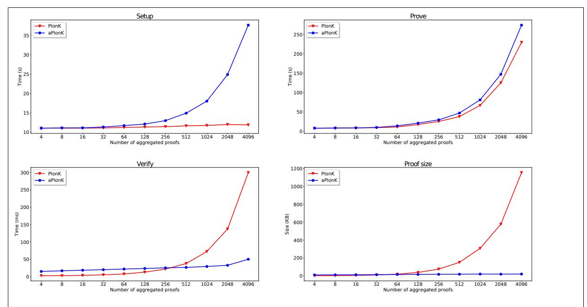

# aPlonK: Aggregated PlonK from Multi-Polynomial Commitment Schemes

Miguel Ambrona, Marc Beunardeau, Anne-Laure Schmitt, and Raphaël R. Toledo

Nomadic Labs, Paris, France name.surname@nomadic-labs.com

Abstract. PlonK is a prominent universal and updatable zk-SNARK for general circuit satisability. We present aPlonK, a variant of PlonK that reduces the proof size and verication time when multiple statements are proven in a batch. Both the aggregated proof size and the verication complexity of aPlonK are logarithmic in the number of aggregated statements. Our main building block, inspired by the techniques developed in SnarkPack (Gailly, Maller, Nitulescu, FC 2022), is a multi-polynomial commitment scheme, a new primitive that generalizes polynomial commitment schemes. Our techniques also include a mechanism for involving committed data into PlonK statements very eciently, which can be of independent interest.

We also implement an open-source industrial-grade library for zero-knowledge PlonK proofs with support for aPlonK. Our experimental results show that our techniques are suitable for real-world applications (such as blockchain rollups), achieving signicant performance improvements in proof size and verication time.

# 1 Introduction

In 1985 [\[GMR85\]](#page-24-0), Goldwasser, Micali and Racko introduced the notion of zero-knowledge arguments. They allow a prover to convince a verier of the validity of a certain statement without revealing any other information, e.g. why the statement is true. A few years later, Blum, Feldman and Micali [\[BFM88\]](#page-23-0), extended this notion and considered non-interactive zero-knowledge arguments (NIZK), where the communication between the two parties is unilateral: the prover produces a certicate that can be veried by everyone.

Existing generic protocols that implement zero-knowledge argument systems [\[BFM88,](#page-23-0) [DMP90,](#page-23-1) [FLS90\]](#page-24-1) for any NP relation have been perceived as mainly theoretical results for many years: they used to involve expensive NP reductions and repetitions of the same routine in order to achieve reasonable soundness. Only special purpose protocols for specic NP languages [\[Sch91,](#page-25-0) [Cra97,](#page-23-2) [CDS94,](#page-23-3) [GS08\]](#page-24-2) were considered ecient enough for practical deployment, and they have been widely used for building digital signatures and anonymous credentials.

Recently, the research community has witnessed signicant improvements on the design of ecient general-purpose zero-knowledge proof systems which oer various degrees of practicality [\[Gro16,](#page-24-3) [BCG](#page-23-4)<sup>+</sup>17, [BBB](#page-22-0)<sup>+</sup>18, [MBKM19,](#page-24-4) [LMR19\]](#page-24-5). Such improvements have been driven by the increasing development of blockchain systems that make use of zero-knowledge arguments to achieve privacy and scalability [\[BCG](#page-22-1)<sup>+</sup>14, [DFKP13\]](#page-23-5). In these systems, communication complexity is one of the most important performance factors, which has led to an increasing interest and remarkable progress in so-called succinct non-interactive arguments of knowledge (SNARKs) [\[GGPR13,](#page-24-6) [BCG](#page-22-2)<sup>+</sup>13, [PHGR13,](#page-25-1) [Gro16\]](#page-24-3), a class of non-interactive arguments of knowledge with sublinear (if not constant) communication and verication complexity. This comes at the cost of a signicantly slower prover, compared to other zero-knowledge proof systems with higher communication complexity [\[JKO13,](#page-24-7) [GMO16,](#page-24-8) [CGM16\]](#page-23-6).

PlonK, which stands for Permutations over Lagrange-bases for Oecumenical Non-interactive arguments of Knowledge, is a universal and updatable zero-knowledge SNARK for general circuit satisability. Given its signicant improvements with respect to its predecessor Sonic [\[MBKM19\]](#page-24-4), especially on prover eciency, PlonK has become very popular and has been adopted by several state-of-the-art blockchain projects such as Zcash [\[HBHW\]](#page-24-9), Mina [\[BMRS20\]](#page-23-7), the Dusk Network [\[MKF21\]](#page-25-2) or Anoma [\[GYB21\]](#page-24-10).

In this work we present aPlonK, a new auent of the PlonK family which focuses on reducing the proof size and verication time when multiple statements are proven in a batch. The aggregated proof size and the verication complexity of aPlonK are logarithmic in the number of aggregated statements, making it an appealing building block for many blockchain applications, where having low verication complexity is paramount.

Remark 1. aPlonK is the main proving system of the Epoxy library, developed by the Cryptography Team at Nomadic Labs [\[Nom22\]](#page-25-3). Epoxy is a validity rollup over the Tezos blockchain [\[Goo14\]](#page-24-11).

### <span id="page-1-2"></span>1.1 Blockchain applications of SNARKs

Blockchain developers were among the rst to deploy large-scale real-life applications of general purpose zeroknowledge proof systems, starting dierent lines of research in this area. We can cite Virgo [\[ZXZS20\]](#page-25-4) and its successors, used for Overeality [\[Ove22\]](#page-25-5); STARK [\[BBHR19\]](#page-22-3), used by Starkware [\[Sta21\]](#page-25-6); Halo [\[BGH19a\]](#page-23-8), used by Zcash [\[HBHW\]](#page-24-9); or PlonK [\[GWC19\]](#page-24-12), created by Aztec [\[Wil18\]](#page-25-7).

Privacy. Blockchains revolve around the property of public veriability, since anyone must be able to verify the transition between successive blockchain states. As such, all the information on a blockchain must be public, which makes it dicult to support privacy-friendly applications.

Using zk-SNARKs is a natural approach to keep public veriability while maintaining privacy. This was rst illustrated theoretically [\[MGGR13,](#page-24-13) [DFKP13,](#page-23-5) [BCG](#page-22-1)<sup>+</sup>14] but also in practice [\[HBHW\]](#page-24-9). These systems leverage zero-knowledge proofs to allow users to generate private transactions that hide the sender, the recipient, and (potentially) the transferred amount. Although zero-knowledge proofs are practical, they incur a considerable overhead on both the prover (the user) and the verier (the blockchain). Note that a SNARK proof verication typically involves heavier computations than a simple signature verication.

Scalability and validity rollups. Scalability is a an inherent issue in blockchain systems. The blockchain throughput cannot be simply increased with additional computing power, since every node should be able to validate state transitions. SNARKs can be of help here when they are used to certify expensive computations (e.g., the validity of multiple transactions), since the SNARK verication can become cheaper than the direct validation of the statement being proven. This idea has been explored in so-called validity rollups. (Note that in this context, zero-knowledge is not necessarily relevant.)

A validity rollup is an alternative chain that runs in parallel to the main chain, but stores a small amount of data on the main chain, e.g., a commitment to the rollup state. Transactions can be sent to a rollup operator, who knows the exhaustive rollup state and can update it accordingly. Periodically, the rollup operator will communicate to the main chain a commitment to the most updated version of the rollup state together with a proof that ensures its validity (ergo the name).[1](#page-1-0) The commitment to the new rollup state and such proof are published on the main blockchain and the nodes only need to check this single proof (instead of validating all the operations performed between rollup states).[2](#page-1-1) The blockchain (layer 1) becomes more scalable at the cost of having to produce such proof, which is generated by an independent operator (in layer 2). Unlike in layer 1, the operator can make use of extra computing power and parallelization to speedup the process of creating proofs, thus reducing the rollup latency.

Despite such promising properties and even if the rollup operator can use large computing power, producing proofs is a major bottleneck. A possible idea to reduce the proving cost (and thus the rollup latency) is to split the statement into smaller ones. For example, instead of proving the validity of 10,000 rollup transactions with one proof, one could produce 100 proofs of 100 transactions each. Dealing with smaller proofs can signicantly simplify the prover cost, whose complexity is linearithmic in the circuit size. Unfortunately, this would require that the blockchain nodes receive and verify 100 proofs instead of 1.

<span id="page-1-0"></span><sup>1</sup>A proof that the new committed state has been achieved by applying legitimate operations to the previous committed state.

<span id="page-1-1"></span><sup>2</sup>Remarkably, the blockchain nodes do not even need access to the rollup operations that were involved.

Our techniques in this work are particularly suitable for the above scenario. They allow the prover to combine the batch proofs, producing an aggregated proof that can be veried very eciently by the blockchain nodes. An alternative solution would be to use incrementally veriable computation (IVC) [\[Val08\]](#page-25-8). We discuss the dierences between these two approaches in Section [1.3.](#page-3-0)

Privacy-preserving rollups. To make rollups privacy-friendly, we can leverage the zero-knowledge property of SNARKs. For example, by having users create zero-knowledge proofs which are then aggregated by the rollup operator, their private information could remain hidden. Our techniques are also applicable to this scenario but require some coordination between users. We need the users to synchronize a few times during the proving process to achieve correctness, as all parties must use the same Fiat-Shamir randomness (see Section [4.1\)](#page-13-0). On the other hand, our distributed version of aPlonK can be adapted to prevent DoS attacks: if a user aborts the execution of their proof, or misbehaves, the aggregation of the rest of proofs can still be completed. Again, recursion and IVC are an alternative for implementing privacy-preserving rollups (see Section [1.3\)](#page-3-0).

### <span id="page-2-1"></span>1.2 Our contributions

We pursue the study of the PlonK proving system and establish several general techniques that reduce the proof size and verication time when multiple statements are proven in a batch.

aPlonK. Our main contribution is a multi-statement proving system coined aggregated PlonK or aPlonK for short, which allows one to combine k proofs into a single aggregated proof of O(log k) size that can be veried in O(log k) time. The aggregated proofs must be created coordinately, but their computation is highly parallelizable. aPlonK is the result of extending the techniques of Gailly, Maller and Nitulescu (Snark-Pack) [\[GMN20\]](#page-24-14), designed over Groth16 [\[Gro16\]](#page-24-3), to the framework of PlonK. This work and SnarkPack both use the generalized inner product argument presented in [\[BMV19\]](#page-23-9).

Multi-polynomial commitments. We introduce the notion of multi-polynomial commitment schemes, a generalization of polynomial commitment schemes designed to commit to several polynomials at the same time, while achieving sublinear commitment and proof sizes and sublinear verication complexity in the number of committed polynomials.

We then present a generic construction of a multi-polynomial commitment scheme from any homomorphic polynomial commitment scheme whose commitment space is one of the source groups of a set of bilinear groups. Our construction is inspired by the techniques of SnarkPack for building an inner-product argument with logarithmic verication time by combining a modied version of the inner-product argument [\[BBB](#page-22-0)<sup>+</sup>18, [BGH19b,](#page-23-10) [BCL](#page-23-11)<sup>+</sup>21, [DRZ20\]](#page-24-15) with a KZG-like [\[KZG10\]](#page-24-16) commitment scheme whose commitment space is the target group of a set of bilinear groups.

Our new notion of multi-polynomial commitments captures the essence of SnarkPack, hardcoded in their ad hoc construction for aggregating Groth16 proofs. We consider this an important contribution as it provides clarity, intuition and continues the modularity of PlonK-based systems.

Improvements over SnarkPack. While the verication of SnarkPack is presented as sublinear[3](#page-2-0) , their verier needs to perform a linear number of scalar operations for dealing with public inputs. (This is inherent for veriable computations.) We observe that for many applications (e.g. a validity rollup) most public inputs can be hidden from the verier as long as some relation on them is ensured (e.g., they form a chain). Our system can exploit this fact, to achieve actual sublinear verication time, when the use case allows for it.

Furthermore, we double the eciency of the main subroutine of SnarkPack by observing that their pair group commitments [\[GMN20,](#page-24-14) Section 3.2] do not need to be binding in order to achieve the desired security properties, if the underlying polynomial commitment scheme is inner-product binding and inner-product extractable (see Section [3\)](#page-9-0). Note that [\[BMM](#page-23-12)<sup>+</sup>21, Section 5.3] propose an alternative solution to achieve a

<span id="page-2-0"></span><sup>3</sup> It is in terms of elliptic curve operations.

binding committing function without doubling the commitment size. They use a dierent SRS without odd powers in one of the source groups. This requires a dedicated trusted setup, something which SnarkPack and this work want to avoid in order to reuse the SRS from existing ceremonies.

Commitments in PlonK relations. En route, we present a mechanism that allows a PlonK statement to refer to the data inside a public commitment. Such link does not require a high number of constraints to model the commitment opening, as it is performed outside of the PlonK circuit. This building block, necessary to instantiate aPlonK eciently, can be of independent interest, as it can be used for building hybrid proving systems or for proving statements modeled with non-deterministic circuits (see Section [4.2\)](#page-17-0).

Implementation and evaluation. We implement a general library for (zero-knowledge) PlonK proofs with support for aPlonK. Our library is implemented over the BLS12-381 elliptic curve [\[Bow17\]](#page-23-13) and uses bindings to the blst library [\[Sup21\]](#page-25-9). Our experiments show that the techniques described in this work are suitable for real-world applications, providing signicant performance improvements in proof size and verication time, while introducing a light overhead on prover complexity. Our code is publicly available as opensource [\[Nom22\]](#page-25-3).

# <span id="page-3-0"></span>1.3 Related work

In this section, we compare our techniques with other approaches for combining zero-knowledge proofs and present the main advantages of aPlonK.

IVC and recursion. Incrementally veriable computation (IVC) [\[Val08\]](#page-25-8), conceived by Valiant, is a framework that provides proof composability: with IVC one can conjunctively combine two proofs of size k into a proof of size k as well. This is a powerful technique that can be used to implement recursion. In the context of SNARKS, recursion allows one to prove statements like the following (parametrized by a state):

I know a previous state from which the current state can be reached and I also have a proof of this very statement for such previous state.

This can be achieved by expressing a SNARK verier in a SNARK circuit. One real-world application of this technique is the Mina blockchain [\[BMRS20\]](#page-23-7), which provides its user with a constant-size proof of validity of its most updated state. In particular, the proof ensures that one transition of the blockchain has been performed correctly and that there exists another proof for the preceding state. This allows the blockchain state to be constant.

Incidentally, recursion can also be used to aggregate proofs together by proving that one has seen valid proofs. This allows for natural parallelization by splitting a complex computation into smaller ones that are then aggregated.

However, the strength of recursive SNARKs comes with high costs. Expressing a SNARK verier in a SNARK circuit is very expensive. The current known techniques are (i) using cycles of pairing friendly elliptic curves [\[CCW19\]](#page-23-14) which require very big group elements, (ii) or implementing non-native operations such as modular arithmetic over a modulus (e.g. the SNARK's base eld order) that does not coincide with the SNARK's scalar eld order. This typically leads to a decrease in performance of several orders of magnitude.

This performance issue has led to new lines of research exploring alternatives techniques for achieving weaker versions of IVC. We can cite, Halo [\[BGH19a\]](#page-23-8), and its successor Halo2 (which uses PlonK instead of Sonic [\[MBKM19\]](#page-24-4)), Fractal [\[COS19\]](#page-23-15), Bünz et al. work [\[BCMS20\]](#page-23-16), or Nova [\[KST21\]](#page-24-17), a novel construction based on folding schemes. These works explore the idea of performing a weaker version of recursion by not modeling some expesive parts of the SNARK verication in the circuit. These excluded verication steps can be accumulated and carried out for future verication. These techniques achieve IVC by using a cycle of (not necessarily pairing-friendly) elliptic curves, leading to better performance.

Proof aggregation without recursion. Proof aggregation can be achieved more eciently without recursion and still be suitable for many applications such as validity rollups.

Aztec. The company Aztec [Wil18], creator of  $\mathcal{P}lon\mathcal{K}$ , achieves a form of proof aggregation which can be seen as a weak version of IVC. Thanks to this simplification, they do not require cycles of elliptic curves. However, they still need to model elliptic curves in a SNARK circuit, which involves simulating non-native field operations. The expensive pairing checks are accumulated as in Halo, by using standard batching techniques.

SnarkPack. Gailly, Maller and Nitulescu [GMN20] provide a framework for aggregating Groth16 proofs. As we explained in Section 1.2, their techniques (based on [BMM+21]) are the starting point of this paper and combine a homomorphic pair group commitment schemes with an inner-product argument to achieve logarithmic-size proofs and logarithmic verification complexity (in the number of aggregated proofs).

Our work achieves very efficient proof aggregation without cycles of elliptic curves and without simulating non-native operations. This is an improvement over Halo and Aztec, which brings us at the level of SnarkPack. However, unlike SnarkPack,  $a\mathcal{P}lon\mathcal{K}$  is defined over a universal SNARK. An immediate consequence is that we can aggregate different circuits. Furthermore, we can perform proof aggregation that connects the proven statements in an arbitrary fashion (e.g. Section 4.3).

#### 1.4 Technical overview

In a nutshell, a  $\mathcal{P}lon\mathcal{K}$  proof consists of a set of commitments to secret polynomials together with evaluations of such polynomials at a random point (sampled after the polynomials have been committed). A  $\mathcal{P}lon\mathcal{K}$  verifier simply checks that the evaluations are valid with respect to the corresponding polynomial commitments and that they satisfy a series of equations.

In the multi-statement setting, in order to achieve sublinear verification time in the number of aggregated proofs, the verifier will need to delegate some computations to the prover and independently verify that they were performed honestly. As we will see, such verification can be performed significantly faster than the delegated computation. In our construction, such delegation occurs twice: (i) a multi-polynomial commitment scheme is used to achieve sublinear commitments size and sublinear verification complexity on checking the commitment evaluations; (ii) we use *meta-verification* (which we describe below in more detail) to achieve constant verification complexity on checking the evaluation equations.

Multi-polynomial commitments. The main challenge of building a multi-polynomial commitment scheme is achieving sublinear commitment size (and sublinear verification) in the number of committed polynomials. We follow the techniques of Gailly, Maller and Nitulescu [GMN20, BMM+21], and start from the KZG polynomial commitment scheme [KZG10] defined over a set of bilinear groups ( $\mathbb{G}_1, \mathbb{G}_2, \mathbb{G}_t$ ) of prime order p equipped with a pairing p. We use the implicit notation p to denote p to denote p to designated generator of  $\mathbb{G}_i$  and p and p to denote p to denote p to define as follows:

- The commitment key is  $\mathsf{ck} \coloneqq [s, \dots, s^{d-1}]_1$  for a uniformly sampled  $s \in \mathbb{Z}_p$ .
- The verification key is  $vk := [s]_2$ .
- A polynomial  $f \in \mathbb{Z}_p^{< d}[X]$  is committed as  $\mu \coloneqq [f(s)]_1$ , using ck.
- A proof that f(z) = v is  $\pi := [h(s)]_1$ , where h(X) := (f(X) f(z))/(X s).
- Verification that f(z) = v is done by checking  $e(\mu [v]_1, [1]_2) = e(\pi, vk [z]_2)$ .

Observe that such scheme is homomorphic in the sense that if  $\mu_1$  and  $\mu_2$  are commitments to polynomials  $f_1$  and  $f_2$  respectively, then  $\mu_1 + \mu_2$  is a commitment to polynomial  $f_1 + f_2$ .

The homomorphic property allows for the following optimization when verifying that several commitments  $\mu_1, \ldots, \mu_k$  evaluate to claimed evaluations  $v_1, \ldots, v_k$  on a common point  $z \in \mathbb{Z}_p$ . First, compute a random linear combination of the commitments,  $\hat{\mu} := \sum_i r^i \mu_i$  for a uniformly sampled  $r \in \mathbb{Z}_p$ . Then, verify that  $\hat{\mu}$  opens to  $\hat{v} := \sum_i r^i v_i$  on z. This trick allows the verifier to only check one pairing equation instead of k, at the cost of a negligible statistical error. Indeed, it could occur that the aggregated commitment opens to the aggregated evaluation, whereas some of the commitments  $\mu_i$  do not open to the claimed  $v_i$  on z, but the probability of this event can be upper-bounded by k/p if r is chosen uniformly and independently.

Delegating the computation of  $\hat{\mu}$ . In order to achieve sublinear commitment size, the prover will commit to the commitments  $\mu_1, \ldots, \mu_k$ . A value r will be sampled after this meta-commitment, either by the verifier (in an interactive protocol) or through the Fiat-Shamir heuristic. The computation of the aggregated commitment  $\hat{\mu}$  will be delegated to the prover, who will include a proof ensuring that such computation is correct with respect to the meta-commitment.

What would be a suitable scheme for committing to the commitments? The computation that we need to assert on  $\hat{\mu}$  can be seen as a polynomial evaluation on r of a polynomial whose "coefficients" are  $\mu_i$ . Thus, a good candidate for our meta-commitment scheme is again a polynomial commitment scheme. This is precisely what Gailly et al. suggest in [GMN20]. We can use a variant of the KZG commitment scheme whose committing space is  $\mathbb{G}_t$ , by committing to  $\mu_1, \ldots, \mu_k$  as  $M := \sum_i e(\mu_i, [\tau^i]_2)$ , were  $\tau$  is a new SRS secret, independent of s.

A difficulty arises: how can we generalize the KZG proof of opening strategy in that case? If we define  $f(X) := \sum_i \operatorname{dlog}(\mu_i) X^i$ , we could provide the verifier with f(r) and  $\pi := [h(\tau)]_2$ , where h(X) is defined as (f(X) - v)/(X - r). The verifier would then check that  $M - [f(r)]_t = e(\pi, [\tau]_1 - [r]_1)$  and that  $\hat{\mu} = [f(r)]_1$ , which equals  $\sum_i r^i \mu_i$ , as desired. Unfortunately, this method requires explicitly knowing the coefficients of polynomial f. Given that group elements  $\mu_i$  are the result of committing to certain non-constant polynomial, their discrete logarithm will not be known to the prover.

A possible solution [GMN20, BMM+21] is to implement the opening of commitment M at r via an inner-product argument [BBB+18]. In particular, a modified version similar to those in [BGH19b, BCL+21], that we describe in detail in Figure 3, adjusted to support relation  $\operatorname{PoK}\{\mu:\langle\mu,\tau\rangle=M\wedge\langle r,\mu\rangle=\hat{\mu}\}$ . However, inner-product arguments are known to have linear verification. More concretely, the verification complexity is logarithmic in k except for one final check that a certain  $M'\in\mathbb{G}_{\mathsf{t}}$  corresponds to the commitment of a polynomial  $g(x):=\prod_{j=1}^{\kappa}(u_j^{-1}+u_j\,X^{2^{\kappa-j}})$ , for some known coefficients  $u_j$ , where  $\kappa=\lceil\log_2(k)\rceil$ . Polynomial g, given its nice factored form, can be evaluated in logarithmic time. This opens the possibility of, instead of performing the (expensive) linear check that M' is the commitment to g, verifying a proof of opening of M' at a random point  $\rho\in\mathbb{Z}_p$ , and checking that it opens to  $g(\rho)$ . This can be done precisely as we described in the previous paragraph. Intuitively, the inner-product argument has allowed us to replace the KZG-like proof of opening of unknown polynomial f, by a KZG-like proof of opening of a known polynomial g (at the cost of some other logarithmic complexity checks).

Remark 2. The meta-committing function  $\mu \mapsto \sum_i e(\mu_i, [\tau^i]_2)$  is not binding.<sup>4</sup> This is because  $\tau$  is also available in  $\mathbb{G}_1$ , which is necessary for the KZG-like verification. The authors of [GMN20] suggest to make the commitment binding by computing it twice with respect to two independent structured reference string, namely:  $\mu \mapsto (\sum_i e(\mu_i, [\tau^i]_2), \sum_i e(\mu_i, [\hat{\tau}^i]_2))$ .

Interestingly, we show that such duplication is not strictly necessary if the underlying polynomial commitment scheme satisfies two additional properties which we coin the *inner-product binding property* and *inner-product extractability* (see Section 3.1). We then show that the KZG polynomial commitment scheme satisfies both (Lemmas 2 and 3). This observation reduces the number of  $\mathbb{G}_t$  elements and  $\mathbb{G}_t$  operations involved in the aggregated proofs and the inner-product argument by a factor of 2 compared to the protocol from [GMN20].

Remark 3. The above committing function can be seen as an application of the bivariate polynomial commitment scheme from  $[BMM^+21, Section 6.1]$  if the second variable Y is evaluated at r, the batching randomness. Our opening function is different, as we explain in the next paragraph.

Achieving sublinear verification complexity. The above techniques allowed us to delegate the computation of  $\hat{\mu}$ . In order to get a complete multi-polynomial commitment scheme, we need to design a sublinear verification algorithm that takes as input a commitment to the evaluations instead of the evaluations themselves. This can be achieved generically through a proof for relation  $\text{PoK}\{v: \text{Commit-Evals}(v) = \text{com}_v \land \sum_i r^i v_i = \hat{v}\}$ . We refer to Section 3 for more details and we note that such relation will be proven with a  $\mathcal{P}lon\mathcal{K}$  circuit in what we call meta-verification (Section 4.1).

<span id="page-5-0"></span><sup>&</sup>lt;sup>4</sup>For example, the commitments of vectors  $([\tau]_1, [0]_1)$  and  $([0]_1, [1]_1)$  are identical.

**Meta-verification.** Using a multi-polynomial commitment is not enough to achieve sublinear verification. There is a linear number of equations/identities in the number of aggregated proofs that need to be verified. We exploit the fact that these identities involve scalar operations over  $\mathbb{Z}_p$ , the native field of  $\mathcal{P}lon\mathcal{K}$  circuits.

This observation allows us to delegate the verification of the identities to the prover, who will compute a  $\mathcal{P}lon\mathcal{K}$  proof of the fact that the identities are satisfied on the evaluations inside  $com_v$ , the commitment to the evaluations, whose validity has been ensured by the multi-polynomial commitment scheme (see Figure 5 for a precise description of the statement).

We then show that if function Commit-Evals, used for committing to the evaluations, is chosen adequately, it can be linked very naturally to a  $\mathcal{P}lon\mathcal{K}$  proof, without having to model the commitment opening with  $\mathcal{P}lon\mathcal{K}$  constraints, but outside of the circuit. This technique, necessary to have a small meta-verification circuit and thus maximize the number of proofs k that can be aggregated, can be of independent interest (see Section 4.2).

#### 2 Preliminaries

#### 2.1 Notation

For a finite set S, we write  $a \leftarrow S$  to denote that a is uniformly sampled from S. We denote the security parameter by  $\lambda \in \mathbb{N}$ . Given two functions  $f,g:\mathbb{N} \to [0,1]$ , we write  $f \approx g$  if the difference  $|f(\lambda) - g(\lambda)|$  is asymptotically smaller than the inverse of any polynomial. A function f is said to be negligible if  $f \approx 0$ , whereas it is said to be overwhelming when  $f \approx 1$ . For integers m, n, such that  $m \leq n$ , we denote by [m, n] the range  $\{m, m+1, \ldots, n\}$ . We denote by [n] the range [1, n]. Given  $d \in \mathbb{N}$  and a ring R, we denote by  $R^{< d}[X]$  the set of univariate polynomials over X with coefficients in R and degree strictly smaller than d. For  $n \in \mathbb{N}$ , we denote by  $\mathbf{v} \in R^n$  a vector length n over R, and for every  $i \in [n]$ , we denote by  $v_i$  its i-th component. Furthermore, for any  $k \leq n$ ,  $\mathbf{v}[:k]$  denotes the vector formed by the first k components of  $\mathbf{v}$ .

We consider a bilinear group generator  $\mathcal{G}$  that on input  $1^{\lambda}$ , produces a set of bilinear groups  $(\mathbb{G}_1, \mathbb{G}_2, \mathbb{G}_t)$  of order p (a  $\lambda$ -bits prime), equipped with a non-degenerate bilinear pairing  $e: \mathbb{G}_1 \times \mathbb{G}_2 \to \mathbb{G}_t$ , satisfying  $e(aG, bH) = ab \cdot e(G, H)$  for all  $G \in \mathbb{G}_1$ ,  $H \in \mathbb{G}_2$  and  $a, b \in \mathbb{Z}_p$ . We use additive notation for all three groups. Unless specified otherwise, we implicitly assume that all algorithms share the same common set of bilinear groups, sampled from the appropriate security parameter. For  $n \in \mathbb{N}$ , such that  $n \mid p-1$ , let  $\mathcal{H}_n$  be the subgroup generated by  $\omega_n \in \mathbb{Z}_p$ , a designated primitive n-th root of unity over  $\mathbb{Z}_p$ , and let  $Z_{\mathcal{H}_n}(X) := X^n - 1$ , which vanishes over  $\mathcal{H}_n$ . For every  $i \in [n]$ , let  $L_{i,n}$  be the Lagrange polynomial such that  $L_{i,n}(\omega_n^i) = 1$  and  $L_{i,n}(h) = 0$  for all  $h \in \mathcal{H}_n \setminus \{\omega_n^i\}$ . Throughout the paper, such n will denote the number of constraints in the constraint system of interest. To speed up polynomial operations through the discrete (I)FFT algorithm, it is convenient that n be a power of two.

#### 2.2 Succinct non-interactive arguments of knowledge

SNARKs are a class of arguments of knowledge that allow a prover to convince a verifier of the validity of a certain statement. They have the important property that proofs and verification time must be polylogarithmic in the length of the statement and the witness.

**Definition 1 (SNARKs).** A succinct non-interactive argument of knowledge (SNARK) for a binary relation  $\mathcal{R}$  is a triple of PPT algorithms

• Setup $(1^{\lambda}, \mathcal{R}) \to pp$ , on input the security parameter  $\lambda$  and relation  $\mathcal{R}$ , outputs a set of public parameters pp, also known as a common reference string.

<span id="page-6-0"></span> $<sup>^5</sup>$ It is more common to express  $\mathbb{G}_t$  in multiplicative notation, since its group operation is typically implemented through a polynomial multiplication.

<span id="page-6-1"></span><sup>&</sup>lt;sup>6</sup>Some elliptic-curves are designed so that a big power of 2 divides p-1, e.g.,  $2^{32}$  divides the order of the multiplicative subgroup of BLS12-381 [Bow17] scalar field.

- Prove(pp, x, w) →π, on input pp, statement x and witness w, outputs a proof.
- Verify(pp, x, π) → 1/0, on input pp, statement x and proof π, outputs a bit.

Completeness. A SNARK is complete if for every λ ∈ N and every (x, w) ∈ R:

$$\Pr\left[\textit{pp} \leftarrow \mathsf{Setup}(1^{\lambda}, \mathcal{R}); \ \pi \leftarrow \mathsf{Prove}(\textit{pp}, x, w) : \ \mathsf{Verify}(\textit{pp}, x, \pi) = 1\right] = 1 \ .$$

Knowledge Soundness. A SNARK is knowledge sound if for every PPT algorithm A, there exists an expected polynomial-time extractor E (with access to A's random tape) such that the following probability is negligible in λ:

$$\Pr\left[\textit{pp} \leftarrow \mathsf{Setup}(1^{\lambda}, \mathcal{R}); \; (\pi, x) \leftarrow \mathcal{A}(\textit{pp}) : \; w \leftarrow \mathcal{E}(\textit{pp}); \mathsf{Verify}(\textit{pp}, x, \pi) = 1 \; \land \; (x, w) \notin \mathcal{R}\right] \; \; .$$

Succinctness. A SNARK is succinct if |π| = poly(λ, log(|x| + |w|), for every (x, w) ∈ R).

Zero-knowledge. A SNARK is zero-knowledge if there exists a PPT (stateful) simulator S such that for every PPT (stateful) algorithm A, the following probabilities are negligibly close (in λ):

$$\Pr\left[ pp \leftarrow \mathsf{Setup}(1^{\lambda}, \mathcal{R}); \; (x, w) \leftarrow \mathcal{A}(pp); \; \pi \leftarrow \mathsf{Prove}(pp, x, w) : \; (x, w) \in \mathcal{R} \; \wedge \; \mathcal{A}(\pi) = 1 \right] \; ,$$

$$\Pr\left[ pp \leftarrow \mathcal{S}(1^{\lambda}); \; (x, w) \leftarrow \mathcal{A}(pp); \; \pi \leftarrow \mathcal{S}(pp, x) : \; (x, w) \in \mathcal{R} \; \wedge \; \mathcal{A}(\pi) = 1 \right] \; .$$

### 2.3 Polynomial commitment schemes

A polynomial commitment scheme (PCS) [\[KZG10\]](#page-24-16) is a commitment scheme where the objects being committed are univariate polynomials (of bounded degree). These systems are also equipped with a mechanism for proving (not necessarily in zero-knowledge) that the polynomial inside a certain commitment evaluates to a claimed value at a given evaluation point.

Denition 2 (Polynomial Commitment). A polynomial commitment scheme over a ring R consists of four PPT algorithms:

- Setup(1<sup>λ</sup> , d) → (ck, vk), on input the security parameter λ and a degree bound d ∈ N, outputs a commitment key ck and a verication key vk.
- Commit(ck, f) → com, given ck and a polynomial f ∈ R<d[X], outputs a commitment com.
- Open(ck, com, z, f) → π, given a commitment key, a commitment com, an evaluation point z ∈ R a polynomial f (that was committed in com), outputs a proof π.
- Check(vk, com, z, v, π) → 1/0, given a verication key vk, a commitment com, an evaluation point z, a claimed evaluation v and a proof π, outputs a bit (1 representing acceptance, 0 representing rejection).

For the sake of simplicity in the next denitions, we require that all algorithms except Setup be deterministic. Note that most instantiations from the literature are deterministic [\[KZG10,](#page-24-16) [BGH19b,](#page-23-10) [BDFG20\]](#page-23-17). We also require a polynomial commitment scheme to satisfy the following properties.

Completeness. A polynomial commitment scheme is complete if for every λ, d and every (ck, vk) ← Setup(1<sup>λ</sup> , d), any f ∈ R<d[X], z ∈ R, it holds:

$$\mathsf{Check}(\mathsf{vk},\mathsf{com},z,f(z),\mathsf{Open}(\mathsf{ck},\mathsf{com},z,f))=1$$
 ,

where com := Commit(ck, f).

Binding Property. A polynomial commitment scheme is binding if for every polynomial d ∈ N and every PPT adversary A, the following probability is negligible in λ:

$$\Pr\left[ \begin{array}{l} (\mathsf{ck},\mathsf{vk}) \leftarrow \mathsf{Setup}(1^\lambda,d) \\ (f,f') \leftarrow \mathcal{A}(\mathsf{ck}) \end{array} \right] : \quad \mathsf{Commit}(\mathsf{ck},f) = \mathsf{Commit}(\mathsf{ck},f') \, \wedge \, f \neq f' \right]$$

.

**Knowledge Soundness.** A polynomial commitment scheme is *knowledge sound* if for every polynomial  $d \in \mathbb{N}$  and every PPT adversary  $\mathcal{A}$ , there exists an (expected polynomial time) extractor  $\mathcal{E}$  such that the following probability is negligible in  $\lambda$ :

$$\Pr \begin{bmatrix} (\mathsf{ck}, \mathsf{vk}) \leftarrow \mathsf{Setup}(1^\lambda, d) \\ (\mathsf{com}, z, v, \pi) \leftarrow \mathcal{A}(\mathsf{ck}) \\ f \leftarrow \mathcal{E}(\mathsf{ck}) \end{bmatrix} : \begin{array}{c} \mathsf{Check}(\mathsf{vk}, \mathsf{com}, z, v, \pi) = 1 \\ \wedge \left(\mathsf{com} \neq \mathsf{Commit}(\mathsf{ck}, f) \, \vee \, (f(z) \neq v)\right) \end{bmatrix} .$$

### 2.4 Constraint systems

A constraint system is a list of polynomial equations over  $\mathbb{Z}_p[X_1,\ldots,X_m]$ , of restricted form. For simplicity in our exposition, in this work we consider polynomials of the form

$$\mathsf{q}_\mathsf{L} X_i + \mathsf{q}_\mathsf{R} X_j + \mathsf{q}_\mathsf{O} X_k + \mathsf{q}_\mathsf{M} X_i X_j + \mathsf{q}_\mathsf{C}$$
 ,

for certain scalar coefficients  $q_L, q_R, q_O, q_M, q_C \in \mathbb{Z}_p$ . This corresponds to the classical identity considered in the original  $\mathcal{P}lon\mathcal{K}$  paper [GWC19]. All our results extend to other versions of  $\mathcal{P}lon\mathcal{K}$ , that involve additional identities such as [GW19, PFM<sup>+</sup>22] and even to implementations that use a different number of wires per gate (instead of 3).

**Definition 3 (Constraint System).** A constraint system on m variables is a list of tuples  $(a,b,c,\mathsf{q_L},\mathsf{q_R},\mathsf{q_O},\mathsf{q_M},\mathsf{q_C})$  with  $a,b,c\in[m]$ ,  $\mathsf{q_L},\mathsf{q_R},\mathsf{q_O},\mathsf{q_M},\mathsf{q_C}\in\mathbb{Z}_p$ . We say a vector  $\boldsymbol{x}\in\mathbb{Z}_p^m$  satisfies constraint system  $\mathcal{C}=\{(a_i,b_i,c_i,\mathsf{q_L},\mathsf{q_R},\mathsf{q_O},\mathsf{q_M},\mathsf{q_C}_i)\}_{i\in[n]}$  if for every  $i\in[n]$ :

$$\mathsf{q}_{\mathsf{L}i}x_{a_i} + \mathsf{q}_{\mathsf{R}i}x_{b_i} + \mathsf{q}_{\mathsf{O}i}x_{c_i} + \mathsf{q}_{\mathsf{M}i}x_{a_i}x_{b_i} + \mathsf{q}_{\mathsf{C}i} = 0 \ .$$

The  $\mathcal{P}lon\mathcal{K}$  proving system is a zk-SNARK for the following relation, defined over so-called *public inputs*  $\boldsymbol{x} \in \mathbb{Z}_p^{\ell}$  and witness  $\boldsymbol{w} \in \mathbb{Z}_p^{m-\ell}$ :

<span id="page-8-0"></span>PoK 
$$\left\{ \boldsymbol{w} \in \mathbb{Z}_p^{m-\ell} : (\boldsymbol{x}, \boldsymbol{w}) \in \mathbb{Z}_p^m \text{ satisfies } \mathcal{C} \right\}$$
 (1)

The statement being proved is thus parametrized by both  $\mathcal{C}$  and  $\boldsymbol{x}$ .

#### <span id="page-8-1"></span>2.5 The $\mathcal{P}lon\mathcal{K}$ proving system

Let  $\mathcal{C} = \{(a_i, b_i, c_i, \mathsf{q}_{\mathsf{L}_i}, \mathsf{q}_{\mathsf{R}_i}, \mathsf{q}_{\mathsf{O}_i}, \mathsf{q}_{\mathsf{M}_i}, \mathsf{q}_{\mathsf{C}_i})\}_{i \in [n]}$  be a constraint system on m variables.  $\mathcal{P}lon\mathcal{K}$  requires that the system be preprocessed by defining univariate polynomials  $\mathsf{q}_\mathsf{L}(X), \mathsf{q}_\mathsf{R}(X), \mathsf{q}_\mathsf{O}(X), \mathsf{q}_\mathsf{M}(X), \mathsf{q}_\mathsf{C}(X)$  in  $\mathbb{Z}_p[X]$  satisfying:

$$\mathsf{q_L}(\omega_n^i) = \mathsf{q_L}_i \quad \mathsf{q_R}(\omega_n^i) = \mathsf{q_R}_i \quad \mathsf{q_O}(\omega_n^i) = \mathsf{q_O}_i \quad \mathsf{q_M}(\omega_n^i) = \mathsf{q_M}_i \quad \mathsf{q_C}(\omega_n^i) = \mathsf{q_C}_i \ ,$$

for every  $i \in [n]$ . We recall that  $\omega_n$  is a designated n-th primitive root of unity. Furthermore the relations between indices  $\{a_i, b_i, c_i\}_{i \in [n]}$  are captured through a permutation  $\sigma : [3n] \to [3n]$ , which decomposes in exactly m cycles: the j-th cycle involving all positions where the j-th variable is used. Such permutation is then transformed into a list of 3 polynomials  $S_{\sigma 1}$ ,  $S_{\sigma 2}$ ,  $S_{\sigma 3}$ , which are involved in the definition of the so-called permutation identities, parametrized by two scalars  $\beta, \gamma \in \mathbb{Z}_p$ :

$$perm-ids^{\sigma}_{\beta,\gamma}(A(X),B(X),C(X),Z(X))$$
,

defining two polynomials which must vanish over the whole subgroup  $\mathcal{H}_n$ . We describe in detail this identity, how it depends on polynomials  $S_{\sigma i}$ , and how these polynomials are created in Appendix A.1. Here, we just assume there exists an efficient mechanism to compute a polynomial Z (of degree at most n) that satisfies the  $perm-ids^{\sigma}$ , from  $\beta, \gamma$ , if polynomials A, B, C were honestly generated from a satisfying assignment to the constraint system  $\mathcal{C}$ .

Let  $\Psi$  be a polynomial commitment scheme, and let  $(\mathsf{ck}, \mathsf{vk}) \leftarrow \Psi.\mathsf{Setup}(1^{\lambda}, n)$ .  $\mathcal{P}lon\mathcal{K}$ 's preprocessing phase concludes by committing to the above polynomials using  $\Psi$ . That is,  $\mu_{\mathsf{q}_{\mathsf{l}}} \leftarrow \Psi.\mathsf{Commit}(\mathsf{ck}, \mathsf{q}_{\mathsf{L}})$ , and

similarly for  $\mu_{q_R}$ ,  $\mu_{q_O}$ ,  $\mu_{q_M}$ ,  $\mu_{q_C}$  and  $\mu_{S_{\sigma_1}}$ ,  $\mu_{S_{\sigma_2}}$ ,  $\mu_{S_{\sigma_3}}$ . These polynomial commitments, together with (ck, vk) form  $\mathcal{P}lon\mathcal{K}$ 's public parameters pp.

We describe  $\mathcal{P}lon\mathcal{K}$ 's prover and verifier in Figure 1. In a nutshell, the prover commits to certain polynomials A, B, C, that represent a valid trace witness. The prover then argues that such polynomials satisfy the identities over the whole subgroup  $\mathcal{H}_n$  by showing that the identities, instantiated with the witness polynomials, lead to polynomials which are divisible by  $Z_{\mathcal{H}_n}$ . This is done by committing to the quotient T of such division and evaluating all (committed) polynomials on a uniformly sampled point  $\xi$ . The verifier then checks that  $Z_{\mathcal{H}_n}(\xi)\mathsf{T}(\xi)$  equals the evaluation of the identities on  $\xi$ , which ensures that the previous division (over polynomials) was exact thanks to the knowledge soundness of  $\Psi$  and the Schwartz-Zippel Lemma.

If instantiated with a secure polynomial commitment  $\Psi$  which has logarithmic verification on the degree bound of polynomials<sup>7</sup>, the protocol from Figure 1 constitutes a SNARK for relation (1) by virtue of [GWC19, Theorem 7.1 & Corollary 7.2].

# <span id="page-9-0"></span>3 Multi-polynomial commitment schemes

We introduce the notion of multi-polynomial commitment schemes, a generalization of polynomial commitment schemes designed to commit to several polynomials at the same time. We require the commitment size be sublinear in the number of committed polynomials. Furthermore, we require that verification can be performed from a succinct (standard) commitment to the polynomial evaluations. That way, the verifier does not need to obtain the actual evaluations, which allows its running time to be sublinear in the number of polynomials involved.

**Definition 4** (Multi-polynomial commitment). A multi-polynomial commitment scheme over a ring R consists of five polynomial-time algorithms:

- Setup $(1^{\lambda}, d, K) \to (\mathsf{ck}, \mathsf{vk})$ , on input the security parameter  $\lambda$ , a degree bound  $d \in \mathbb{N}$ , and a vector length bound  $K \in \mathbb{N}$ , outputs a commitment key  $\mathsf{ck}$  and a verification key  $\mathsf{vk}$ .
- Commit-Polys(ck, f)  $\to$  com<sub>f</sub>, given a commitment key ck and a vector of k polynomials  $f \in R^{< d}[X]^k$ , with  $k \le K$ , outputs a commitment com<sub>f</sub>. We require that the size of com<sub>f</sub> be sublinear in k.
- Commit-Evals $(v) \to \mathsf{com}_v$ , given a vector  $v \in R^k$ , with  $k \le K$ , outputs a commitment  $\mathsf{com}_v$ . We require that the size of  $\mathsf{com}_v$  be sublinear in k.
- Open(ck, com<sub>f</sub>, z, f) → π, given a commitment key, a commitment com<sub>f</sub>, an evaluation point z ∈ R and a vector of k polynomials in R<sup><d</sup>[X] (that were committed in com<sub>f</sub>) with k ≤ K, outputs a proof π.
- Check(vk,  $com_f$ , z,  $com_v$ ,  $\pi$ )  $\to 1/0$ , given a verification key vk, a commitment to polynomials  $com_f$ , an evaluation point z, a commitment to evaluations  $com_v$ , and a proof  $\pi$ , outputs a bit. We require that the verification complexity be sublinear in K.

For the sake of simplicity, we require that all algorithms except Setup be deterministic. Our definitions could be adjusted to support non-determinism, but this is not necessary for our use case. (Commitments do not need to be hiding, as zero-knowledge can be enforced by other mechanisms.)

**Completeness.** A multi-polynomial commitment scheme is *complete* if for every  $\lambda, d, K$  and all  $(\mathsf{ck}, \mathsf{vk}) \leftarrow \mathsf{Setup}(1^{\lambda}, d, K)$ , for any  $k \leq K$ , any vector  $\mathbf{f} \in R^{< d}[X]^k$ , and any  $z \in R$ , it holds:

$$\mathsf{Check}(\mathsf{vk},\mathsf{com}_{\boldsymbol{f}},z,\mathsf{com}_{\boldsymbol{v}},\mathsf{Open}(\mathsf{ck},\mathsf{com}_{\boldsymbol{f}},z,\boldsymbol{f})) = 1 \ ,$$

<span id="page-9-1"></span>where  $\mathsf{com}_{\boldsymbol{f}} \coloneqq \mathsf{Commit\text{-}Polys}(\mathsf{ck}, \boldsymbol{f}) \text{ and } \mathsf{com}_{\boldsymbol{v}} \coloneqq \mathsf{Commit\text{-}Evals}(\boldsymbol{f}(z)).$ 

<sup>&</sup>lt;sup>7</sup>The authors propose to instantiate  $\Psi$  with the KZG polynomial commitment scheme [KZG10], which leads to a SNARK whose knowledge soundness holds in the algebraic group model.

<span id="page-9-2"></span> $<sup>^{8}</sup>$ We assume both keys implicitly contain d, K and that ck implicitly contains vk.

### PlonK.Prove(C, pp, x, w):

Inputs: constraint system C on m variables, preprocessed parameters pp for C, instance x, witness trace w

Output: PoK w ∈ Z m−` <sup>p</sup> : (x, w) ∈ Z m <sup>p</sup> satises C 

- 1: <sup>w</sup><sup>e</sup> := (x, <sup>w</sup>); <sup>A</sup>(X):= P<sup>n</sup> <sup>i</sup>=1 <sup>w</sup>e<sup>a</sup>iLi(X); <sup>B</sup>(X):= P<sup>n</sup> <sup>i</sup>=1 <sup>w</sup>e<sup>b</sup>iLi(X); <sup>C</sup>(X):= P<sup>n</sup> <sup>i</sup>=1 <sup>w</sup>e<sup>c</sup>iLi(X) [a](#page-10-1)
- 2: [A] := Ψ.Commit(ck, A); [B] := Ψ.Commit(ck, B); [C] := Ψ.Commit(ck, C)
- 3: β ← Hash([A], [B], [C]); γ ← Hash(β)
- 4: compute polynomial Z(X), satisfying perm-ids<sup>σ</sup> β,γ(A, B, C, Z) on H<sup>n</sup> . See Appendix [A.1](#page-26-1)

- 5: [Z] ← Ψ.Commit(ck, Z)
- 6: F(X) = (qLA + qRB + qOC + qMAB + qC)(X)
- 7: ids(X) = {F(X)} ∪ perm-ids <sup>σ</sup> β,γ(A, B, C, Z); α ← Hash(γ, [Z])
- 8: T(X) := P <sup>i</sup>∈[|ids|] α i ids <sup>i</sup>(X) /Z<sup>H</sup><sup>n</sup> (X)
- 9: [T] ← Ψ.Commit(ck, T)
- 10: ξ ← Hash(α, [T])
- 11: return ([A], [B], [C], [Z], [T]) together with evaluations on ξ and proofs of their correctness, of these commitments as well as all polynomials commitments in pp; evaluate Z also on ξω . Using Ψ.Open

# PlonK.Verify(C, pp, x, π):

Inputs: constraint system C on m variables, preprocessed parameters pp for C, instance x, proof π

Output: bool (true if the proof is accepted, false otherwise)

- 1: parse π as ([A], [B], [C], [Z], [T], πevals)
- 2: assert that the claimed evaluations in πevals are correct . Using Ψ.Check
- 3: β ← Hash([A], [B], [C]); γ ← Hash(β); α ← Hash(γ, [Z]); ξ ← Hash(α, [T])
- 4: evaluate {ids}<sup>i</sup> on ξ, leveraging the claimed evaluations, obtaining {ids}<sup>i</sup> . ids depend on β, γ

- 5: return P <sup>i</sup>∈[|ids|] α i
  - ids <sup>i</sup> = Z<sup>H</sup><sup>n</sup> (ξ)t . t is the claimed evaluation of T on ξ

<span id="page-10-0"></span>Fig. 1. The PlonK proving system for C := {(ai, bi, ci, q<sup>L</sup><sup>i</sup> , q<sup>R</sup><sup>i</sup> , q<sup>O</sup><sup>i</sup> , q<sup>M</sup><sup>i</sup> , q<sup>C</sup><sup>i</sup> )}i∈[n] , with preprocessed parameters pp that include commitment keys (ck, vk) of a polynomial commitment scheme Ψ and polynomial commitments [qL], [qR], [qO], [qM], [qC] and [Sσ,1], [Sσ,2], [Sσ,3].

Binding Property. A multi-polynomial commitment scheme is binding if for every polynomial d, K ∈ N and every PPT adversary A, the following probabilities are negligible in λ:

$$\Pr\left[(\mathsf{ck},\mathsf{vk}) \leftarrow \mathsf{Setup}(1^{\lambda},d,K);\ (\boldsymbol{f},\boldsymbol{f'}) \leftarrow \mathcal{A}(\mathsf{ck}): \begin{array}{c} \boldsymbol{f} \neq \boldsymbol{f'} \ \land \ \boldsymbol{f} \in R^{< d}[X]^k, \boldsymbol{f'} \in R^{< d}[X]^{k'}, k, k' \leq K \\ \mathsf{Commit-Polys}(\mathsf{ck},\boldsymbol{f}) = \mathsf{Commit-Polys}(\mathsf{ck},\boldsymbol{f'}) \end{array}\right] \ ,$$

$$\Pr\left[(\mathsf{ck},\mathsf{vk}) \leftarrow \mathsf{Setup}(1^{\lambda},d,K); \ (\boldsymbol{v},\boldsymbol{v'}) \leftarrow \mathcal{A}(\mathsf{ck}) : \begin{array}{l} \boldsymbol{v} \neq \boldsymbol{v'} \ \land \ \boldsymbol{v} \in R^k, \boldsymbol{v'} \in R^{k'}, k, k' \leq K \\ \mathsf{Commit-Evals}(\boldsymbol{v}) = \mathsf{Commit-Evals}(\boldsymbol{v'}) \end{array}\right] \ .$$

<span id="page-10-1"></span><sup>a</sup>Additional multiples of polynomial <sup>Z</sup><sup>H</sup><sup>n</sup> may be optionally added to each <sup>A</sup>, <sup>B</sup>, <sup>C</sup>, to achieve zero-knowledge.

**Knowledge Soundness.** A multi-polynomial commitment scheme is *knowledge sound* if for every polynomial  $d, K \in \mathbb{N}$  and every PPT adversary  $\mathcal{A}$ , there exists an (expected polynomial time) extractor  $\mathcal{E}$  such that the following probability is negligible in  $\lambda$ :

$$\Pr \begin{bmatrix} (\mathsf{ck}, \mathsf{vk}) \leftarrow \mathsf{Setup}(1^\lambda, d, K) & \mathsf{Check}(\mathsf{vk}, \mathsf{com}_{\boldsymbol{f}}, z, \mathsf{com}_{\boldsymbol{v}}, \pi) = 1 \\ (\mathsf{com}_{\boldsymbol{f}}, z, \mathsf{com}_{\boldsymbol{v}}, \pi) \leftarrow \mathcal{A}(\mathsf{ck}) & : \\ \boldsymbol{f} \leftarrow \mathcal{E}(\mathsf{ck}) & \land \begin{pmatrix} \mathsf{com}_{\boldsymbol{f}} \neq \mathsf{Commit-Polys}(\mathsf{ck}, \boldsymbol{f}) \\ \lor \mathsf{com}_{\boldsymbol{v}} \neq \mathsf{Commit-Evals}(\boldsymbol{f}(z)) \end{pmatrix} \end{bmatrix} .$$

### 3.1 A multi-polynomial commitment scheme from KZG and IPA

We present a generic construction of multi-polynomial commitments from:

- (i) a polynomial commitment scheme which is homomorphic over  $\mathbb{G}_1$ , inner-product binding and inner-product extractable (as defined below);
- (ii) a sublinear-verifier argument system for the following relation, parametrized by  $G \in \mathbb{G}_2^k$ ,  $C \in \mathbb{G}_t$ ,  $P \in \mathbb{G}_1$  and  $r \in \mathbb{Z}_p$ , where  $r = (1, r, \dots, r^{k-1})$ :

<span id="page-11-1"></span>PoK{ 
$$\mu \in \mathbb{G}_1^k : \langle \mu, G \rangle = C \land \langle r, \mu \rangle = P$$
}, (2)

The first building block can be instantiated with the celebrated KZG commitment scheme [KZG10] (described in Appendix B). For the second building block, we propose a modified version of the inner-product argument [BBB<sup>+</sup>18], inspired by [GMN20] (see Figure 3).

**Homomorphic Property.** A polynomial commitment scheme over group  $\mathbb{G}$  of prime order p is homomorphic if for every  $\lambda, d \in \mathbb{N}$ ,  $(\mathsf{ck}, \mathsf{vk}) \leftarrow \mathsf{Setup}(1^{\lambda}, d)$  and all  $f, g \in \mathbb{Z}_p^{< d}[X]$ , it holds:

$$Commit(ck, f) +_{\mathbb{G}} Commit(ck, g) = Commit(ck, f + g)$$
,

Inner-Product Binding Property. A homomorphic polynomial commitment scheme (over  $\mathbb{G}_1$ ) is inner-product binding if for every polynomial  $d, K \in \mathbb{N}$  and every PPT (stateful) algorithm  $\mathcal{A}$ , the following probability is negligible in  $\lambda$ :

$$\Pr\left[\begin{array}{c} (\mathsf{ck},\mathsf{vk}) \leftarrow \mathsf{Setup}(1^{\lambda},d) \\ \tau \leftarrow \mathbb{Z}_p \\ \boldsymbol{f},\boldsymbol{f'} \leftarrow \mathcal{A}(\mathsf{ck},[\boldsymbol{\tau}]_1,[\boldsymbol{\tau}]_2) \end{array} : \begin{array}{c} \boldsymbol{f} \neq \boldsymbol{f'},\boldsymbol{f},\boldsymbol{f'} \in \mathbb{Z}_p^{< d}[X]^k, \text{ with } k \leq K \\ \langle \mathsf{Commit}(\mathsf{ck},\boldsymbol{f}),\boldsymbol{\tau}[:k] \rangle = \langle \mathsf{Commit}(\mathsf{ck},\boldsymbol{f'}),\boldsymbol{\tau}[:k] \rangle \end{array}\right],$$

where  $\mathsf{Commit}(\mathsf{ck}, \boldsymbol{f})$  is a shorthand for  $(\mathsf{Commit}(\mathsf{ck}, f_1), \dots, \mathsf{Commit}(\mathsf{ck}, f_k))$  and  $\boldsymbol{\tau} \coloneqq (1, \tau, \dots, \tau^{K-1})$ .

<span id="page-11-0"></span>**Proposition 1.** The KZG PCS (Figure 7) is inner-product binding

We refer to Appendix B for a proof.

Inner-Product Extractability. A homomorphic polynomial commitment scheme (over  $\mathbb{G}_1$ ) is inner-product extractable if for every polynomial  $d, K \in \mathbb{N}$  and every PPT (stateful) algorithm  $\mathcal{A}$ , there exists an (expected polynomial time) extractor  $\mathcal{E}$  such that the following probability is negligible in  $\lambda$ :

$$\Pr \begin{bmatrix} (\mathsf{ck}, \mathsf{vk}) \leftarrow \mathsf{Setup}(1^{\lambda}, d) & G \in \mathbb{G}_{\mathsf{t}}, z \in \mathbb{Z}_p, \pmb{v} \in \mathbb{Z}_p^k, \pmb{\mu} \in \mathbb{G}_1^k, \text{ with } k \leq K \\ \tau, r \leftarrow \mathbb{Z}_p & \langle \pmb{\mu}, \pmb{\tau}[:k] \rangle = G \\ G, z, \pmb{v} \leftarrow \mathcal{A}(\mathsf{ck}, [\pmb{\tau}]_1, [\pmb{\tau}]_2) &: \mathsf{Check}(\mathsf{vk}, \langle \pmb{\mu}, \pmb{r} \rangle, z, \langle \pmb{v}, \pmb{r} \rangle, \pi) = 1 \\ (\pmb{\mu}, \pi) \leftarrow \mathcal{A}(r) & (\pmb{f}(z) \neq \pmb{v} \vee \langle \mathsf{Commit}(\mathsf{ck}, \pmb{f}), \pmb{\tau}[:k] \rangle \neq G ) \end{bmatrix},$$

where  $\mathsf{Commit}(\mathsf{ck}, \boldsymbol{f})$  is a shorthand for  $(\mathsf{Commit}(\mathsf{ck}, f_1), \dots, \mathsf{Commit}(\mathsf{ck}, f_k))$ ,  $\boldsymbol{\tau} \coloneqq (1, \tau, \dots, \tau^{K-1})$  and  $\boldsymbol{r} \coloneqq (1, r, \dots, r^{k-1})$ .

```
Setup(1λ
        , d, K):
1: (ckΨ , vkΨ ) ← Ψ.Setup(1λ
                            , d)
2: τ ← Zp; ckτ := [1, τ, τ 2
                           , ..., τ K−1
                                    ]2
3: return (ck := (ckΨ , ckτ ), vk := (vkΨ , [τ ]1))
Commit-Polys(ck := (ckΨ , ckτ ), f):
1: µi ← Ψ.Commit(ckΨ , fi) ∀i ∈ [k] (k := |f| ≤ K)
2: return comf := (k, Pk
                          i=1e(µi, ckτ i))
Commit-Evals(v):
Any function that is (sublinearly) shrinking, binding and admits a succinct and ecient proof for relation:
                            PoK
                                  v : Commit-Evals(v) = comv ∧
                                                                 Pk
                                                                    i=1 r
                                                                        i−1
                                                                           vi = ˆv

                                                                                                            (3)
Open(ck := (ckΨ , ckτ ), comf := (k, G), z, f):
1: v = f(z); comv := Commit-Evals(v); k = |f|; κ := dlog2
                                                             (k)e
2: µi ← Ψ.Commit(ckΨ , fi) ∀i ∈ [k] . Not necessary if µi were stored on Commit-Polys
3: r := Hash(comf , z, comv); r := (1, r, . . . , rn−1
                                                 );
                                                    ˆf := hf, ri; µˆ := hµ, ri; vˆ := hv, ri
4: πΨ ← Ψ.Open(ckΨ , µ, z, ˆ
                           ˆf, vˆ)
5: produce a proof πv of relation (3) w.r.t comv, vˆ and r
6: πIPA ← IPA.Prove(k, ckτ ,(G, r, µˆ), µ) (let {uj}
                                                  κ
                                                  j=1 be the sampled random challenges)
7: g(X) :=
            Qκ
              j=1(u
                    −1
                    j + uj X
                              2
                               κ−j
                                  ); ρ := Hash(πIPA) and vρ := g(ρ)
8: h(X) := (g(X) − vρ)/(X − ρ); πτ := [h(τ )]2 . πτ is comptued using ckτ
9: return (ˆµ, v, π ˆ Ψ , πv, πIPA, πτ )
Check(vk := (vkΨ , [τ ]1), comf := (k, G), z, comv, π := (ˆµ, v, π ˆ Ψ , πv, πIPA, πτ )):
1: r := Hash(comf , z, comv)
2: bΨ ← Ψ.Check(vkΨ , µ, z, ˆ v, π ˆ Ψ )
3: let bv be the result of verifying that πv is a valid proof of relation (3) w.r.t comv, vˆ and r
4: bIPA ← IPA.Verify0
                     (k, [τ ]1,(G, r, µˆ), πIPA) . Skip steps 6-7 of Figure 3
5: ρ := Hash(πIPA); vρ :=
                          Qκ
                            j=1(u
                                  −1
                                  j + uj ρ
                                           2
                                            κ−j
                                               ) . uj are the challenges computed during IPA.Verify0
```

<span id="page-12-1"></span>Fig. 2. Multi-polynomial commitment scheme based on an inner-product binding and inner-product extractable polynomial commitment scheme Ψ (over G1) and inner-product argument IPA from Figure [3.](#page-14-0)

<span id="page-12-0"></span>?= e([1]1, G<sup>0</sup> − [vρ]2) . G<sup>0</sup> ∈ G<sup>2</sup> is the last element of πIPA

6: b<sup>τ</sup> := e([τ ]<sup>1</sup> − [ρ]1, π<sup>τ</sup> )

7: return b<sup>Ψ</sup> ∧ b<sup>v</sup> ∧ bIPA ∧ b<sup>τ</sup>

**Proposition 2.** The KZG PCS (Figure 7) is inner-product extractable.

We refer to Appendix B for a proof.

<span id="page-13-1"></span>**Theorem 1.** If Hash:  $\{0,1\}^* \to \mathbb{Z}_p$  is a random oracle, and polynomial commitment scheme  $\Psi$  is complete, binding, knowledge sound, homomorphic, inner-product binding and inner-product extractable, then the scheme from Figure 2 is a complete, binding and knowledge sound multi-polynomial commitment scheme.

We refer to Appendix C.1 for a proof.

<span id="page-13-3"></span>Remark 4. Our scheme from Figure 2 could also be instantiated with a homomorphic commitment scheme  $\Psi$  that is not inner-product binding nor inner-product extractable. In that case, the multi-polynomial commitment scheme would need to be modified by adding a second  $\mathbb{G}_{\mathbf{t}}$  element  $\sum_{i=1}^k e(\mu_i, [\tilde{\tau}^i]_2)$  to  $\mathsf{com}_f$  for a new  $\tilde{\tau}$  independent of  $\tau$ . This modification would make the committing function binding, which would allow us to prove security without relying on the inner-product binding and inner-product extractability properties of  $\Psi$  (see Appendix C.1). Note that proofs of opening would need to include an extra element  $\pi_{\tilde{\tau}}$ , computed as  $[h(\tilde{\tau})]_2$ , analogously to  $\pi_{\tau}$  in step 8 of the Open algorithm, which would be verified with a second pairing equation in step 6 of the Check algorithm. Furthermore, the IPA protocol would need to be adapted, as described in Figure 3 through extra colored terms.

# 4 PlonK proof aggregation from multi-polynomial commitments

We study the problem of designing a multi-statement proving system, that can handle several  $\mathcal{P}lon\mathcal{K}$  proofs more efficiently than the simple parallel execution on every statement of the traditional  $\mathcal{P}lon\mathcal{K}$  system. For the sake of simplicity in our exposition, we assume that all statements are parametrized by the same  $\mathcal{P}lon\mathcal{K}$  constraint system (although each statement has its own public inputs). However, most of our techniques apply to the case with different systems.

#### <span id="page-13-0"></span> $4.1 \quad a\mathcal{P}lon\mathcal{K}$

A simple but effective first optimization is to share the random challenges sampled with Fiat-Shamir across all proofs. This can be beneficial for several reasons. For example, having a common evaluation point  $\xi$  for all proofs means that all polynomial commitments are opened at the same point, which can typically lead to significant optimizations by the underlying polynomial commitment scheme. Note that sharing such random challenges across proofs does not harm security as long as the challenges are computed from the partial transcripts of all proofs. In that case, from an extractor for the aggregated proving system one could build an extractor for any of the individual statements by fixing all other statements. On the other hand, this trick, which is the basis of many of our optimizations, requires that the provers of every different statement run coordinately or at least synchronize at every point where random challenges are sampled. This limitation prevents us from strictly achieving IVC [Val08], but does not limit the distribution of the prover computation. Thus, our system is perfectly applicable to creating a validity rollup (see Section 1.1).

Another rather simple optimization is to have a common polynomial T for all proofs, computed from a linear combination of all the identities. In the rest of this section, we describe our more sophisticated optimization techniques. The resulting proving system, that we call  $a\mathcal{P}lon\mathcal{K}$ , is described in Figure 4.

<span id="page-13-4"></span>**Theorem 2.** If multi-polynomial commitment scheme  $\Psi$  is complete, binding and knowledge sound, and Hash:  $\{0,1\}^* \to \mathbb{Z}_p$  is a random oracle, the protocol described in Figure 4 constitutes a SNARK for relation:

$$\operatorname{PoK}\left\{\left.\left\{\boldsymbol{w}_{i} \in \mathbb{Z}_{p}^{m-\ell}\right\}_{i \in [k]} \right. : \left.\left(\boldsymbol{x}_{i}, \boldsymbol{w}_{i}\right) \in \mathbb{Z}_{p}^{m} \right. \left. \left. \right. \right. \left. \right. \left. \left. \right. \right. \left. \left. \right. \left. \left. \right. \right. \left. \left. \right. \right. \right\} \right. \right. \right. \right. \right.$$

We refer to Appendix C.2 for a proof.

<span id="page-13-2"></span><sup>&</sup>lt;sup>9</sup>Such  $\tilde{\tau}$  could be the same secret used during the setup of  $\Psi$ , if  $\Psi$  is such that its structured reference string is formed by the powers of a secret scalar over  $\mathbb{G}_1$  and  $\mathbb{G}_2$ . KZG (Figure 7) is an example of such scheme.

```
IPA.Prove(k, \boldsymbol{G}, \boldsymbol{H}, (C_G, \boldsymbol{C}_H, r, P), \boldsymbol{\mu}):
Inputs: k := 2^{\kappa}, vectors G, \mathbf{H} \in \mathbb{G}_2^k, instance (C_G, C_H, r, P) \in \mathbb{G}_t^2 \times \mathbb{Z}_p \times \mathbb{G}_1, witness \mu \in \mathbb{G}_1^k
Output: PoK{ \mu \in \mathbb{G}_1^k: \langle \mu, G \rangle = C_G \wedge \langle \mu, H \rangle = C_H \wedge \langle r, \mu \rangle = P}, where r = (1, r, r^2, r^3, \dots, r^{k-1})
  1: set \boldsymbol{\mu}^{(\kappa)} \coloneqq \boldsymbol{\mu}, \, \boldsymbol{r}^{(\kappa)} \coloneqq (1, r, r^2, r^3, \dots, r^{2^{\kappa}-1}), \, \boldsymbol{G}^{(\kappa)} \coloneqq \boldsymbol{G}, \, \boldsymbol{H}^{(\kappa)} \coloneqq \boldsymbol{H}, \text{ and ts} \coloneqq (C_G, C_H, r, P)
  2: for every j from \kappa down to 1 do
                set L_G^{(j)} \coloneqq \langle \boldsymbol{\mu}_{\mathsf{l}}^{(j)}, \boldsymbol{G}_{\mathsf{R}}^{(j)} \rangle, L_H^{(j)} \coloneqq \langle \boldsymbol{\mu}_{\mathsf{l}}^{(j)}, \boldsymbol{H}_{\mathsf{R}}^{(j)} \rangle and L_r^{(j)} \coloneqq \langle \boldsymbol{\mu}_{\mathsf{l}}^{(j)}, \boldsymbol{r}_{\mathsf{R}}^{(j)} \rangle
               set R_G^{(j)} \coloneqq \langle \boldsymbol{\mu}_{\mathsf{R}}^{(j)}, \boldsymbol{G}_{\mathsf{I}}^{(j)} \rangle, R_H^{(j)} \coloneqq \langle \boldsymbol{\mu}_{\mathsf{R}}^{(j)}, \boldsymbol{H}_{\mathsf{I}}^{(j)} \rangle and R_r^{(j)} \coloneqq \langle \boldsymbol{\mu}_{\mathsf{R}}^{(j)}, \boldsymbol{r}_{\mathsf{I}}^{(j)} \rangle
                set u_i \leftarrow \mathsf{Hash}(L_G^{(j)}, R_G^{(j)}, L_H^{(j)}, R_H^{(j)}, L_r^{(j)}, R_r^{(j)}, \mathsf{ts}) \in \mathbb{Z}_p and \mathsf{ts} \coloneqq u_j
                set \boldsymbol{\mu}^{(j-1)} \coloneqq u_j \, \boldsymbol{\mu}_{\mathsf{l}}^{(j)} + u_j^{-1} \boldsymbol{\mu}_{\mathsf{R}}^{(j)}
               \text{set } \boldsymbol{G}^{(j-1)} \coloneqq u_i^{-1} \boldsymbol{G}_{\mathsf{L}}^{(j)} + u_j \ \boldsymbol{G}_{\mathsf{R}}^{(j)} \rhd u_j \text{ multiplies the left half of } \boldsymbol{\mu}^{(j)}, \text{ but the right half of } \boldsymbol{G}^{(j)}, \ \boldsymbol{H}^{(j)}, \ \boldsymbol{r}^{(j)}
               set \boldsymbol{H}^{(j-1)} \coloneqq u_i^{-1} \boldsymbol{H}_{\mathsf{L}}^{(j)} + u_i \boldsymbol{H}_{\mathsf{R}}^{(j)}
               set \mathbf{r}^{(j-1)} := u_i^{-1} \mathbf{r}_{\mathsf{L}}^{(j)} + u_i \mathbf{r}_{\mathsf{R}}^{(j)}
10: return \pi := (\{L_G^{(j)}, R_G^{(j)}, L_H^{(j)}, R_H^{(j)}, L_r^{(j)}, R_r^{(j)}\}_{j \in [\kappa]}, \boldsymbol{\mu}^{(0)}, \boldsymbol{G}^{(0)}, \boldsymbol{H}^{(0)}) \in (\mathbb{G}_{\mathsf{t}}^4 \times \mathbb{G}_1^2)^{\kappa} \times \mathbb{G}_1 \times \mathbb{G}_2^2
IPA. Verify(k, \boldsymbol{G}, \boldsymbol{H}, (C_G, \boldsymbol{C_H}, r, P), \pi):
Inputs: k := 2^{\kappa}, vectors G, \mathbf{H} \in \mathbb{G}_2^k, instance (C_G, C_H, r, P) \in \mathbb{G}_t^2 \times \mathbb{Z}_p \times \mathbb{G}_1, proof \pi
Output: bool (true if the proof is accepted, false otherwise)
 1: parse \pi as (\{L_G^{(j)}, R_G^{(j)}, L_H^{(j)}, R_H^{(j)}, L_r^{(j)}, R_r^{(j)}\}_{i \in [\kappa]}, \mu_0, G_0, H_0) \in (\mathbb{G}_t^4 \times \mathbb{G}_1^2)^{\kappa} \times \mathbb{G}_1 \times \mathbb{G}_2^2 or fail
  2: for every j from \kappa down to 1 do
 3: set u_j \leftarrow \mathsf{Hash}(L_G^{(j)}, R_G^{(j)}, L_H^{(j)}, R_H^{(j)}, L_r^{(j)}, R_r^{(j)}, \mathsf{ts}) \in \mathbb{Z}_p and set \mathsf{ts} \coloneqq u_j
 4: define g(X)\coloneqq\prod_{j=1}^{\kappa}(u_j^{-1}+u_j\,X^{2^{\kappa-j}})
                                                                                                                                                                                 \triangleright q is a polynomial of degree 2^{\kappa}-1
                                                                                                                                      \triangleright \mathcal{O}(\kappa) if g(r) is computed as \prod_{i=1}^{\kappa} (u_i^{-1} + u_j r^{2^{\kappa-j}})
  5: set r_0 \coloneqq g(r)
  6: let \mathbf{g} = (g_0, g_1, \dots, g_{2^{\kappa}-1}) be the coefficients of g in increasing order of degree
  7: assert \langle \boldsymbol{g}, \boldsymbol{G} \rangle = G_0, and \langle \boldsymbol{g}, \boldsymbol{H} \rangle = H_0
                                                                                                                                                                                                                                                  \triangleright \mathcal{O}(2^{\kappa})
 8: return true iff r_0 \cdot \mu_0 = P + \sum_{j=1}^{\kappa} (u_j^2 L_r^{(j)} + u_j^{-2} R_r^{(j)}) and the following hold:
                          e(\mu_0,G_0) = C_G + \textstyle\sum_{j=1}^{\kappa} (u_j^2 L_G^{(j)} + u_j^{-2} R_G^{(j)}) \quad \wedge \quad e(\mu_0,H_0) = C_H + \textstyle\sum_{i=1}^{\kappa} (u_j^2 L_H^{(j)} + u_i^{-2} R_H^{(j)})
Fig. 3. Inner-product argument (IPA) for relation PoK{ \mu \in \mathbb{G}_1^{2^{\kappa}} : \langle \mu, G \rangle = C_G \land \langle \mu, H \rangle = C_H \land \langle r, \mu \rangle = P }.
```

Shared permutation argument. Permutation arguments [BG12, BCC<sup>+</sup>16, MBKM19] can be used for arguing correctness of a shuffle  $\sigma$ .  $\mathcal{P}lon\mathcal{K}$ 's permutation argument [GWC19] is used for enforcing that the wires which are supposed to be equal have indeed been instantiated with the same value. This is done by committing to a polynomial Z (see step 4 of the  $\mathcal{P}lon\mathcal{K}$ . Prove routine from Figure 1), which satisfies the

<span id="page-14-0"></span>The figure describes two schemes obtained by including or discarding the colored terms.

permutation identities (see Appendix A.1) with respect to the wire polynomials A, B, C.

We observe that it is possible to share the permutation argument across all proofs for the same circuit, since the permutation  $\sigma$  is common to all of them. To do so, we linearly batch the wire polynomials  $A_j$ ,  $B_j$ ,  $C_j$ 

```
a\mathcal{P}lon\mathcal{K}.\mathsf{Setup}(1^{\lambda},\mathcal{C} := \{a_i,b_i,c_i,\mathsf{q}_{\mathsf{L}_i},\mathsf{q}_{\mathsf{R}_i},\mathsf{q}_{\mathsf{O}_i},\mathsf{q}_{\mathsf{M}_i},\mathsf{q}_{\mathsf{C}_i}\}_{i\in[n]},k):
  1: q_L(X) := \sum_{i=1}^n q_{L_i} L_{i,n}(X); define q_R, q_O, q_M, q_C analogously
   2: \sigma: [3n] \to [3n] be \mathcal{C}_{\sigma}; pp.polys \coloneqq (\mathsf{q_L}, \mathsf{q_R}, \mathsf{q_O}, \mathsf{q_M}, \mathsf{q_C}, \mathsf{S}_{\sigma_1}, \mathsf{S}_{\sigma_2}, \mathsf{S}_{\sigma_3})
  3: (\mathsf{ck}, \mathsf{vk}) \leftarrow \Psi.\mathsf{Setup}(1^{\lambda}, n, k); \ \mu_{\mathsf{pp}} \leftarrow \Psi.\mathsf{Commit-Polys}(\mathsf{ck}, \mathsf{pp.polys})
  4: return pp := (n, \sigma, \mathsf{ck}, \mathsf{vk}, \mu_{\mathsf{pp}}, \mathsf{pp}.\mathsf{polys})
a\mathcal{P}lon\mathcal{K}.\mathsf{Prove}(\mathsf{pp} \coloneqq (n,\sigma,\mathsf{ck},\_,\mu_{\mathsf{pp}},\mathsf{pp}.\mathsf{polys}), \{\boldsymbol{x_j}\}_{j \in [k]}, \{\boldsymbol{w}_j\}_{j \in [k]}):
  1: \widetilde{\boldsymbol{w}}_i := (\boldsymbol{x}_i, \boldsymbol{w}_i) for all i \in [k]
  2: \mathsf{A}_j(X) \coloneqq \textstyle \sum_{i=1}^n \widetilde{w}_{j \, a_i} \mathsf{L}_{i,n}(X); \ \mathsf{B}_j(X) \coloneqq \textstyle \sum_{i=1}^n \widetilde{w}_{j \, b_i} \mathsf{L}_{i,n}(X); \ \mathsf{C}_j(X) \coloneqq \textstyle \sum_{i=1}^n \widetilde{w}_{j \, c_i} \mathsf{L}_{i,n}(X) \text{ for all } j \in [k]
  3: \mathbf{W}\coloneqq (\mathsf{A}_1,\mathsf{B}_1,\mathsf{C}_1,\ldots,\mathsf{A}_k,\mathsf{B}_k,\mathsf{C}_k);\;\;\mu_\mathsf{w}\coloneqq \varPsi.\mathsf{Commit-Polys}(\mathsf{ck},\mathbf{W})
  4: \beta \leftarrow \mathsf{Hash}(\mu_{\mathsf{w}}); \ \gamma \leftarrow \mathsf{Hash}(\beta); \ \delta \leftarrow \mathsf{Hash}(\gamma)
  5: \widehat{\mathsf{A}}(X) \coloneqq \sum_{j=1}^k \delta^j \mathsf{A}_j(X); \ \widehat{\mathsf{B}}(X) \coloneqq \sum_{j=1}^k \delta^j \mathsf{B}_j(X); \ \widehat{\mathsf{C}}(X) \coloneqq \sum_{j=1}^k \delta^j \mathsf{C}_j(X)
  6: compute polynomial Z(X), satisfying perm-ids _{\beta,\gamma}^{\sigma}(\widehat{A},\widehat{B},\widehat{C},Z) on \mathcal{H}_n
                                                                                                                                                                                                                                                      ⊳ See Appendix A.1
   7: \mu_z \leftarrow \Psi.Commit-Polys(ck, Z)
  8: F_j(X) := (\mathsf{q_L}\mathsf{A}_j + \mathsf{q_R}\mathsf{B}_j + \mathsf{q_O}\mathsf{C}_j + \mathsf{q_M}\mathsf{A}_j\mathsf{B}_j + \mathsf{q_C} + \mathsf{PI}_{\boldsymbol{x_j}})(X) for all j \in [k]
  9: ids(X) := \bigcup_{j \in [k]} F_j(X) \cup perm \cdot ids^{\sigma}_{\beta,\gamma}(\widehat{A}, \widehat{B}, \widehat{C}, Z)
10: \alpha \leftarrow \mathsf{Hash}(\delta, \mu_{\mathsf{z}})
11: \mathsf{T}(X) \coloneqq \left(\sum_{i \in [|ids|]} \alpha^i ids_i(X)\right) / Z_{\mathcal{H}_n}(X)
                                                                                                                                                            \triangleright This division is exact if the identities hold over \mathcal{H}_n
12: \ \mu_{\mathsf{t}} \leftarrow \varPsi.\mathsf{Commit-Polys}(\mathsf{ck},\mathsf{T})
13: \xi \leftarrow \mathsf{Hash}(\alpha, \mu_\mathsf{t})
14: ev(com, \mathbf{f}, x) := (\Psi.Open(ck, com, x, \mathbf{f}), \Psi.Commit-Evals(ck, \mathbf{f}(x)))
15: \ (\pi_{\mathsf{w}}, \nu_{\mathsf{w}}) \leftarrow \mathsf{ev}(\mu_{\mathsf{w}}, \mathbf{W}, \xi) \quad \  (\pi_{\mathsf{z}}, \nu_{\mathsf{z}}) \leftarrow \mathsf{ev}(\mu_{\mathsf{z}}, \mathsf{Z}, \xi) \quad \  (\overline{\pi}_{\mathsf{z}}, \nu_{\overline{\mathsf{z}}}) \leftarrow \mathsf{ev}(\mu_{\mathsf{z}}, \mathsf{Z}, \omega \xi) \quad \  (\pi_{\mathsf{t}}, \nu_{\mathsf{t}}) \leftarrow \mathsf{ev}(\mu_{\mathsf{t}}, \mathsf{T}, \xi)
16: (\pi_{pp}, \nu_{pp}) \leftarrow ev(\mu_{pp}, pp.polys, \xi)
17: compute \pi_{\text{meta}}, a PoK \{w_{\text{meta}} : \mathcal{R}_{n,k}((\alpha, \beta, \gamma, \delta, \xi, \nu_{\text{w}}, \nu_{\text{z}}, \nu_{\tilde{\text{z}}}, \nu_{\text{t}}, \nu_{\text{pp}}, \{x_j\}_{j \in [k]}), w_{\text{meta}}) = 1\} \triangleright See Section 4.1
18: return \pi := (\mu_{\mathsf{w}}, \mu_{\mathsf{z}}, \mu_{\mathsf{t}}, \nu_{\mathsf{w}}, \nu_{\mathsf{z}}, \nu_{\mathsf{t}}, \nu_{\mathsf{pp}}, \pi_{\mathsf{w}}, \pi_{\mathsf{z}}, \overline{\pi}_{\mathsf{z}}, \pi_{\mathsf{t}}, \pi_{\mathsf{pp}}, \pi_{\mathsf{meta}})
a\mathcal{P}lon\mathcal{K}.\mathsf{Verify}(\mathsf{pp} \coloneqq (n,\_,\_,\mathsf{vk},\mu_{\mathsf{pp}},\_), \{\boldsymbol{x_j}\}_{j \in [k]}, \boldsymbol{\pi} \coloneqq (\mu_{\mathsf{w}},\mu_{\mathsf{z}},\mu_{\mathsf{t}},\nu_{\mathsf{w}},\nu_{\mathsf{z}},\nu_{\mathsf{z}},\nu_{\mathsf{t}},\nu_{\mathsf{pp}},\pi_{\mathsf{w}},\pi_{\mathsf{z}},\pi_{\mathsf{t}},\pi_{\mathsf{pp}},\pi_{\mathsf{meta}})):
  1: \beta \leftarrow \mathsf{Hash}(\mu_{\mathsf{w}}); \ \gamma \leftarrow \mathsf{Hash}(\beta); \ \delta \leftarrow \mathsf{Hash}(\gamma); \ \alpha \leftarrow \mathsf{Hash}(\delta, \mu_{\mathsf{z}}); \ \xi \leftarrow \mathsf{Hash}(\alpha, \mu_{\mathsf{t}})
   2: v(com, v, x, \pi) := \Psi.Check(vk, com, x, v, \pi)
  3: b_{\mu} := \mathsf{v}(\mu_{\mathsf{w}}, \nu_{\mathsf{w}}, \xi, \pi_{\mathsf{w}}) \wedge \mathsf{v}(\mu_{\mathsf{z}}, \nu_{\mathsf{z}}, \xi, \pi_{\mathsf{z}}) \wedge \mathsf{v}(\mu_{\mathsf{z}}, \overline{\nu_{\mathsf{z}}}, \omega \xi, \overline{\pi}_{\mathsf{z}}) \wedge \mathsf{v}(\mu_{\mathsf{t}}, \nu_{\mathsf{t}}, \xi, \pi_{\mathsf{t}}) \wedge \mathsf{v}(\mu_{\mathsf{pp}}, \nu_{\mathsf{pp}}, \xi, \pi_{\mathsf{pp}})
   4: let b_{\text{meta}} be the result of verifying \pi_{\text{meta}} w.r.t. relation \mathcal{R}_{n,k}((\alpha,\beta,\gamma,\delta,\xi,\nu_{\text{w}},\nu_{\text{z}},\nu_{\tilde{\text{z}}},\nu_{\text{t}},\nu_{\text{pp}},\{x_j\}_{j\in[k]}),\cdot)
   5: return b_{\mu} \wedge b_{\mathsf{meta}}
                             Fig. 4. The a\mathcal{P}lon\mathcal{K} proving system, based on multi-polynomial commitment scheme \Psi.
```

<span id="page-15-0"></span>

for every proof  $j \in [k]$ , with some uniformly sampled coefficient  $\delta \in \mathbb{Z}_p$  as follows:

$$\widehat{\mathsf{A}} \coloneqq \textstyle \sum_{j=1}^k \delta^j \mathsf{A}_j \qquad \qquad \widehat{\mathsf{B}} \coloneqq \textstyle \sum_{j=1}^k \delta^j \mathsf{B}_j \qquad \qquad \widehat{\mathsf{C}} \coloneqq \textstyle \sum_{i=1}^k \delta^j \mathsf{C}_j \enspace .$$

```
Rn,k((α, β, γ, δ, ξ, νw, νz, ν¯z, νt, νpp, {xj }j∈[k]),({aj , bj , cj}j∈[k]
                                                                       , z, z,t, eqL
                                                                                  , eqR
                                                                                       , eqO
                                                                                            , eqM
                                                                                                 , eqC
                                                                                                     , es1
                                                                                                          , es2
                                                                                                              , es3
                                                                                                                  )) :=
     idj := eqL
               aj + eqR
                         bj + eqO
                                  cj + eqM
                                           ajbj + eqC + PIxj
                                                                (ξ) ∀j ∈ [k]
     ˆa :=
          Pk
             j=1 δ
                   j
                    aj ; bˆ :=
                                Pk
                                   j=1 δ
                                        j
                                         bj ; ˆc :=
                                                     Pk
                                                        j=1 δ
                                                             j
                                                               cj
     perm-id1
               := (ˆa + βξ + γ)(bˆ + βηξ + γ)(ˆc + βη0
                                                           ξ + γ)z − (ˆa + βes1 + γ)(ˆb + βes2 + γ)(ˆc + βes3 + γ)z
     perm-id2
               := (z − 1)L1,n(ξ)
     bids :=

              ZHn (ξ) · t = (Pk
                                 j=1 α
                                       j−1
                                           idj ) + α
                                                    k
                                                     perm-id1 + α
                                                                    k+1perm-id2

     w := (a1, b1, c1, . . . , ak, bk, ck) and epp := (eqL
                                                         , eqR
                                                              , eqO
                                                                   , eqM
                                                                        , eqC
                                                                             , es1
                                                                                 , es2
                                                                                     , es3
                                                                                         )
     return bids ∧ νw = Commit-Evals(w) ∧ νz = Commit-Evals(z) ∧ ν¯z = Commit-Evals(z)
                  ∧ νt = Commit-Evals(t) ∧ νpp = Commit-Evals(epp) .
```

<span id="page-16-1"></span>Fig. 5. Meta-verication relation for aggregating k proofs of n-constraints circuits. η<sup>2</sup> and η<sup>3</sup> are non-quadratic residues over Zp, see Section [A.1.](#page-26-1)

If each of the polynomial triples (A<sup>j</sup> , B<sup>j</sup> , C<sup>j</sup> ) satises the copy-constraints induced by permutation σ, so will the batched triple (Ab, <sup>B</sup>b, <sup>C</sup>b), which guarantees correctness. The converse is also true with overwhelming probability over the choice of δ, which assures soundness (this intuition can be formalized via a forking argument). Thus, the permutation argument for k proofs can be achieved with just one Z polynomial instead of k of them (see steps [5](#page-13-0) and [6](#page-13-0) of the aPlonK.Prove routine from Figure [4\)](#page-15-0). The number of permutation identities is consequently reduced from 2k to just 2.

Using a multi-polynomial commitment. Replacing the polynomial commitment scheme used by PlonK by a multi-polynomial commitment scheme can lead to major improvements in proof size and verication time. It allows us to commit to all wire polynomials together in one single multi-polynomial commitment with sublinear size in the number of aggregated proofs k. With our multi-polynomial commitment scheme from Figure [2,](#page-12-1) the commitment size would be constant (1 G<sup>t</sup> element) instead of linear in k, and the commitment verication complexity would be O(log k) instead of O(k).

This technique achieves sublinear complexity (in k) on commitment verication operations. However, the verier still needs to check all the identities, which involves a O(k) number of scalar operations. For that, the verier needs to receive all the evaluations of the committed polynomials (whose validity can be asserted through the already veried evaluation commitment) and use them to verify the identities. Our next technique addresses this issue.

<span id="page-16-0"></span>Meta-verication. The verication of identities only involves scalar operations over Zp, but this is the native eld of PlonK circuits. This opens the possibility of, instead of verifying the identities directly, verifying a PlonK proof that the identities are correct. Such proof would need to ensure that:

- the prover knows evaluations satisfying all the identities,
- such evaluations coincide with the evaluations veried during the multi-polynomial commitment check.

We formally describe the meta-verication equation in Figure [5.](#page-16-1) It is parametrized by the number of constraints in the circuit n, and the number of aggregated proofs k. The public inputs to the meta-verication circuit are (α, β, γ, δ, ξ, νw, νz, ν¯z, ν<sup>t</sup> , νpp, {x<sup>j</sup> }j∈[k]), where α, β, γ, δ, ξ are Fiat-Shamir sampled scalars; νw, νz, ν<sup>t</sup> , νpp are evaluation commitments of (respectively) the wire polynomials, Z polynomial, T polynomial and setup polynomials at ξ; ν¯z is (a commitment to) the evaluation of polynomial Z at ωξ; and for every j ∈ [k], x<sup>j</sup> is the vector of public inputs to the j-th statement. On the other hand, the secret inputs to the meta-verification relation are the actual polynomial evaluations at  $\xi$  and  $\omega\xi$  of the committed polynomials.

By just verifying a single  $\mathcal{P}lon\mathcal{K}$  proof, the verifier can assert the correctness of all identities without performing a  $\mathcal{O}(k)$  number of scalar operations. On the other hand, we make three observations that deserve attention:

- <span id="page-17-2"></span>(i) The Commit-Evals algorithm needs to be modeled in a  $\mathcal{P}lon\mathcal{K}$  circuit. There is flexibility for the choice of such algorithm, but modeling any commitment scheme that is binding will require a significant number of constraints.
- (ii) The verifier complexity is still  $\mathcal{O}(k)$  on scalar operations, given the public inputs  $\{x_j\}_{j\in[k]}$  to the meta-verification circuit.
- (iii) This technique imposes a bound on k, the number of aggregated proofs, since the meta-verification circuit size is linear in k and there is an inherent upper-bound on the size of  $\mathcal{P}lon\mathcal{K}$  circuits.

The first issue can be partially solved by instantiating Commit-Evals with a SNARK-friendly hash function like Poseidon [GKR<sup>+</sup>21] or Anemoi [BBC<sup>+</sup>22], which can be implemented with a moderate number of constraints. Alternatively, in Section 4.2, we show how to build a commitment scheme that can be involved very efficiently in a  $\mathcal{P}lon\mathcal{K}$  statement. This can be of independent interest.

We refer to Section 4.3 for details on how the second issue can be addressed, depending on the circuit being proved.

Finally, if the first issue is satisfactorily solved, the upper-bound on k could be sufficient for most applications. Even if it is not, one could consider proving the meta-verification relation with several  $\mathcal{P}lon\mathcal{K}$  proofs, what can lead to a second layer of aggregation and iterate this process if necessary.

#### <span id="page-17-0"></span>4.2 Commitments in $\mathcal{P}lon\mathcal{K}$ statements

We present a mechanism that allows the data committed in a public commitment to be involved in a  $\mathcal{P}lon\mathcal{K}$  statement. More concretely, let Com be a commitment scheme for vectors over  $\mathbb{Z}_p$ . We enhance the  $\mathcal{P}lon\mathcal{K}$  proving system to support the following relation:

$$\operatorname{PoK}\left\{\left.\left(\boldsymbol{w},\boldsymbol{w}'\right)\in\mathbb{Z}_p^m\times\mathbb{Z}_p^{m'}\;:\;\left(\boldsymbol{x},\boldsymbol{w},\boldsymbol{w'}\right)\in\mathbb{Z}_p^{\ell+m+m'}\;\text{satisfies}\;\mathcal{C}\;\wedge\;\operatorname{\mathsf{Com}}(\boldsymbol{w})=\operatorname{\mathsf{com}}\;\right\}\;\;. \tag{4}$$

The statement being proved is thus parametrized by  $\mathcal{C},~ \boldsymbol{x}$  and com.

For that, we define  $\mathsf{Com}$  of a vector  $w \in \mathbb{Z}_p^m$  as the Kate commitment  $[\mathsf{KZG10}]$  to any polynomial f that evaluates to  $w_i$  on  $\omega^{i-1}$  for all  $i \in [m]$ . Similarly to how public inputs are treated in  $\mathcal{P}lon\mathcal{K}$ , we will dedicate a section of m constraints to the link between  $\mathsf{Com}$  and the circuit wires. Say, constraints  $i^*$  to  $i^*+m-1$  for some  $i^*$ . For that, we define a selector  $\mathsf{q}_{\mathsf{com}}$  such that  $\mathsf{q}_{\mathsf{com}}(\omega^i) = -1$  if  $i \in [i^*, i^*+m-1]$  or 0 otherwise. Furthermore, we deactivate (set to zero) all other selectors in this range of constraints except  $\mathsf{q}_{\mathsf{L}}$ , which evaluates to 1 in it, allowing us to "fetch" the values inside  $\mathsf{com}$  into a-wires, which will be then used across the circuit. The  $\mathcal{P}lon\mathcal{K}$  identity will consequently get added the new term  $\mathsf{q}_{\mathsf{com}}(X) \cdot \mathsf{com}(\omega^{-i^*}X)$ . Observe that by setting  $i^* = 0$ , one can avoid having a new evaluation point  $\omega^{-i^*}\xi$ . This can be achieved by shifting away the constraints dedicated to public inputs, which in the original  $\mathcal{P}lon\mathcal{K}$  were defined to be the first  $\ell$ . Note that if we do not want to open the whole vector w, we can activate  $\mathsf{q}_{\mathsf{com}}$  on a smaller range; then the verifier can dynamically adapt by querying  $\mathsf{com}(\omega^{-j^*}X)$  for a chosen j. This can prove useful if we want to use this technique in the context of vector commitments.

Hybrid statements. Proving statements about committed data is a powerful tool that can be used for constructing hybrid proving systems [CGM16, AGM18, CFtQ19]. Such commitments can be the meeting point between a SNARK proof and other systems, e.g., a sigma protocol asserting the validity of the committed

<span id="page-17-1"></span><sup>&</sup>lt;sup>10</sup>Note that f can be randomly chosen among the set of all polynomials bound to  $\boldsymbol{v}$  on  $1, \omega, \ldots, \omega^{m-1}$ , this results in a potentially perfectly hiding commitment.

data with respect to some algebraic statement. The binding property of the commitment ensures that both proofs talk about the same data.

In particular, we can choose the Commit-Evals algorithm from our multi-polynomial commitment scheme (Figure [2\)](#page-12-1) to be the above Com. This provides a satisfying solution to issue [\(i\)](#page-17-2) from the previous section. In that case, the meta-verication circuit (Figure [5\)](#page-16-1) could be extended to also handle the PoK from relation [\(3\)](#page-12-0), see Figure [2.](#page-12-1)

Randomized circuits. Another remarkable application of involving commitments in the statement is being able to express randomized circuits. Randomness can be used to simplify the verication of certain computations: given a Boolean circuit <sup>C</sup>, it is often possible to nd a (smaller) circuit <sup>C</sup>b, taking an extra input r, which is equivalent to C in the sense that, for every x:

$$\Pr_{r \leftarrow \mathbb{Z}_p} \left[ C(x) = 1 \Rightarrow \widehat{C}(x;r) = 1 \right] = 1 \qquad \text{and} \qquad \Pr_{r \leftarrow \mathbb{Z}_p} \left[ \widehat{C}(x;r) = 1 \Rightarrow C(x) = 1 \right] \approx 1 \enspace .$$

Verifying the more ecient <sup>C</sup>b(x; <sup>r</sup>) = 1 for a uniformly sampled <sup>r</sup> is an overwhelming evidence that C(x) = 1. However, it is important to choose r uniformly and independently of x. When proving a randomized circuit in PlonK, r will be treated as an additional public input. We must guarantee that r cannot be biased by the prover and that the prover cannot change its secret input based on r. On the other hand, the circuit trace that the prover commits to depends on r, this is natural, since r is involved in the constraint system. The solution is to have the prover commit to the witness seed[11](#page-18-1) using Com, then derive r from such commitment through the Fiat-Shamir heuristic and nally, completing the rest of the trace (which now depends on r).

### <span id="page-18-0"></span>4.3 Hiding public inputs

Our techniques allowed us to signicantly reduce the verier complexity, for the most part now being logarithmic in the number of aggregated proofs k. However, as in SnarkPack [\[GMN20\]](#page-24-14), our verier complexity is still linear in k, due to the ` public inputs per proof to process. This seems an inherent limitation.

However, depending on the application, such limitation could be relaxed. For example, the verier may have access to a commitment to the relevant public inputs and may be interested in simply checking that verication passes with respect to some opening of the commitment. In other scenarios, the circuit public inputs themselves could be irrelevant to the verier, who only wants to assert some relation between them. For example, in some incremental computations like a transactional rollup of a blockchain: where each of the k proofs takes 2 public inputs, an initial rollup state and a nal (modied) state, and the verier is simply interested in asserting that the nal state of a given proof matches the initial state of the next proof, but not on the actual value of such intermediate states. This rollup-like conguration is used for our benchmarks (Section [5\)](#page-18-2).

In those cases, our techniques can be very naturally extended to achieve actual sublinear verication complexity by performing the relevant checks on public inputs in the meta-verication circuit. This can be seen as new mechanism to implement a weak form of IVC.

## <span id="page-18-2"></span>5 Implementation and evaluation

We have implement the algorithms described in this work and evaluated their performance in a series of benchmarks presented in Section [5.2.](#page-21-0) Our source code is written in OCaml with bindings to C implementations of the heaviest cryptographic functions. We use the BLS12-381 elliptic curve [\[Bow17\]](#page-23-13) for pairings through bindings to the blst library [\[Sup21\]](#page-25-9). Our implementation is publicly available as open-source [\[Nom22\]](#page-25-3).

<span id="page-18-1"></span><sup>11</sup>In PlonK, the term witness usually refers the whole trace of the circuit being veried. Such trace is typically derivable from a succinct witness that we call the witness seed: a value that determines (and from which one can eciently compute) the rest of the trace.

<span id="page-19-0"></span>**Table 1.** Proof size comparison. k is the number of aggregated proofs (formulas valid for  $k \geq 3$ ).

|                              | $\mathbb{Z}_p$ | $\mathbb{G}_1$                  | $\mathbb{G}_2$ | $\mathbb{G}_{t}$               |
|------------------------------|----------------|---------------------------------|----------------|--------------------------------|
| $\mathcal{P}lon\mathcal{K}$  | 3k + 12        | 3k + 4                          | 0              | 0                              |
| $a\mathcal{P}lon\mathcal{K}$ | 19             | $2\lceil \log_2 3k \rceil + 10$ | 2              | $2\lceil \log_2 3k \rceil + 3$ |

Our comparisons are performed between  $\mathcal{P}lon\mathcal{K}$  and  $a\mathcal{P}lon\mathcal{K}$  for aggregating a batch of k different proofs of a constraint system of n constraints. In the case of  $\mathcal{P}lon\mathcal{K}$ , we use the KZG polynomial commitment and implement a simple proof aggregation, but which uses our shared permutation argument and the batch verification optimizations applicable to KZG [GWC19]. In the case of  $a\mathcal{P}lon\mathcal{K}$ , we implement the scheme described in Figure 4 instantiated with a multi-polynomial commitment scheme constructed from the KZG polynomial commitment scheme (Figure 7) and the IPA argument from Figure 3. Our experimental results from Section 5.2 show that the performance and proof size improvements of  $a\mathcal{P}lon\mathcal{K}$  are significant even against the optimized version of  $\mathcal{P}lon\mathcal{K}$  that we compare it with, which in turn is a lot more performant than the naïve parallel execution of standard  $\mathcal{P}lon\mathcal{K}$ .

Remark 5. We leverage the homomorphic properties of the IPA statement, see relation (2), to perform only one IPA instead of four: for the evaluation of the commitments to (i) public parameter polynomials, (ii) wire polynomials, (iii) the permutation polynomial and (iv) the T polynomial. This is possible if all inner-product arguments use the same r, since in that case:

$$\langle \boldsymbol{\mu}, \boldsymbol{G} \rangle = C \quad \wedge \quad \langle \boldsymbol{r}, \boldsymbol{\mu} \rangle = P \quad \wedge \quad \langle \boldsymbol{\mu'}, \boldsymbol{G} \rangle = C' \quad \wedge \quad \langle \boldsymbol{r}, \boldsymbol{\mu'} \rangle = P'$$

if and only if, with overwhelming probability over the choice of  $\zeta$ :

$$\langle \boldsymbol{\mu} + \zeta \boldsymbol{\mu'}, \boldsymbol{G} \rangle = C + \zeta C' \quad \wedge \quad \langle \boldsymbol{r}, \boldsymbol{\mu} + \zeta \boldsymbol{\mu'} \rangle = P + \zeta P'$$
.

#### 5.1 Theoretical results

We present a detailed comparison between  $\mathcal{P}lon\mathcal{K}$  and  $a\mathcal{P}lon\mathcal{K}$  on their proof size, verifier complexity and prover complexity in terms of scalar field and group elements/operations. In the rest of this section k represents the number of aggregated statements, n is the common circuit size measured in number of constraints and  $\ell$  is the number of public inputs for each atomic statement.

Proof size (Table 1). Observe that the aggregated proof sizes of both  $\mathcal{P}lon\mathcal{K}$  and  $a\mathcal{P}lon\mathcal{K}$  are independent on the circuit size n and only depend on the number of aggregated statements k. With  $\mathcal{P}lon\mathcal{K}$ , the proof size is linear in k, whereas with  $a\mathcal{P}lon\mathcal{K}$ , it is logarithmic.

Verifier complexity (Table 2). The verifier complexity of  $\mathcal{P}lon\mathcal{K}$  is  $\mathcal{O}(k\log n + k\ell)$ , whereas the verifier complexity of  $a\mathcal{P}lon\mathcal{K}$  is  $\mathcal{O}(\log k + \ell')$ , where  $\ell' = \mathcal{O}(k\ell)$  is the number of public inputs to the meta-verification circuit. Note that, when applicable (e.g. for a rollup), our technique for hiding public inputs can lead to a constant  $\ell'$ . In that case, the verifier complexity of  $a\mathcal{P}lon\mathcal{K}$  would be  $\mathcal{O}(\log k)$ . This is an important difference with respect to SnarkPack [GMN20], where the verification of aggregated proofs is linear in the number of public inputs.

Prover complexity (Table 3). The prover complexity of  $\mathcal{P}lon\mathcal{K}$  is  $\mathcal{O}(kn\log n)$ . The  $a\mathcal{P}lon\mathcal{K}$  prover requires more operations but stays in the same order of complexity with respect to operations in  $\mathbb{Z}_p$  and  $\mathbb{G}_1$ . It additional requires  $\mathcal{O}(\log k)$  hashes, pairings, and operations in  $\mathbb{G}_2$ ,  $\mathbb{G}_t$ . However, as evidenced by our experimental results from Section 5.2, the overhead of these additional computations is not very significant compared to the complexity of the rest of computations.

<span id="page-20-0"></span>**Table 2.** Verifier complexity comparison. k is the number of aggregated proofs, n is the circuit size,  $\ell$  is the number of public inputs per proof,  $n' = \mathcal{O}(k + \ell)$  is the meta-verification circuit size (see Table 4),  $\ell' (\leq n')$  is the number of public inputs to it (in our implementation, it is set to 15), and  $\kappa = \lceil \log_2(3k) \rceil$ .

| Operation                                                                                                                                                                    | $\mathcal{P}lon\mathcal{K}$                                         | $a\mathcal{P}lon\mathcal{K}$                                                                                    |
|------------------------------------------------------------------------------------------------------------------------------------------------------------------------------|---------------------------------------------------------------------|-----------------------------------------------------------------------------------------------------------------|
| $\begin{array}{ c c c c } & \operatorname{inv} & & & & & \\ \mathbb{Z}_p & \operatorname{mul} & & & & & \\ & & \operatorname{add} & & & & & \\ & & & & & & & \\ \end{array}$ | $k\ell + 2k \\ k\log_2(n) + 2k\ell + 11k + 20 \\ 2k\ell + 11k + 14$ | $\begin{array}{c} \kappa + \ell' + 2 \\ 5\kappa + \log_2(n') + 2\ell' + 35 \\ \kappa + 2\ell' + 28 \end{array}$ |
| $\mathbb{G}_1$ mul add                                                                                                                                                       | 3k + 15 $3k + 16$                                                   | $2\kappa + 13$ $2\kappa + 17$                                                                                   |
| $\mathbb{G}_{t} \ \ \mathrm{add}$                                                                                                                                            | 0<br>0                                                              | $\frac{2\kappa}{2\kappa + 3}$                                                                                   |
| Pairing                                                                                                                                                                      | 2                                                                   | 4                                                                                                               |
| Hash                                                                                                                                                                         | 9                                                                   | $\kappa + 10$                                                                                                   |

<span id="page-20-1"></span>**Table 3.** Prover complexity comparison. k is the number of aggregated proofs, n is the circuit size,  $n' = \mathcal{O}(k + \ell)$  is the meta-verification circuit size (see Table 4), and K is the first power of two over 3k.

| Operation                                                | $\big $ $\textcolor{Plon}{\mathcal K}$ | $ $ $aPlon\mathcal{K}$                                                                                                                                                                                                                                                                |
|----------------------------------------------------------|----------------------------------------|---------------------------------------------------------------------------------------------------------------------------------------------------------------------------------------------------------------------------------------------------------------------------------------|
| $\mathbb{Z}_p$ mul add                                   |                                        | $ \begin{array}{ c c } \hline \mathcal{P}lon\mathcal{K} + \log_2(K) + 2n' + 6 \\ \hline \mathcal{P}lon\mathcal{K} + 3K + 3\log_2(K) + \frac{29}{2}n'\log_2(n') + 155n' + 16 \\ \hline \mathcal{P}lon\mathcal{K} + 2K + \log_2(K) + 29n'\log_2(n') + 140n' + 13 \\ \hline \end{array}$ |
| $\mathbb{G}_1$ $\operatorname{mul}$ $\operatorname{add}$ | 3kn + 6n + 3k + 12  3kn + 6n + 3k + 12 | $\begin{array}{ c c } \hline \mathcal{P}lon\mathcal{K} + 9n' + 8 \\ \hline \mathcal{P}lon\mathcal{K} + 9n' + 9k + 27 \\ \hline \end{array}$                                                                                                                                           |
| $\mathbb{G}_2$ $\mathrm{mul}$ $\mathrm{add}$             | 0 0                                    | $ \begin{array}{c c} 3K-2\\ 2K-1 \end{array} $                                                                                                                                                                                                                                        |
| $\mathbb{G}_{t} \ \mathrm{add}$                          | 0                                      | 2K+k-2                                                                                                                                                                                                                                                                                |
| Pairing                                                  | 0                                      | 2K+3k+2                                                                                                                                                                                                                                                                               |
| Hash                                                     | 9                                      | $\log_2(K) + 10$                                                                                                                                                                                                                                                                      |

<span id="page-20-2"></span>**Table 4.** Meta-verification circuit size (measured in number of constraints). For circuits that aggregate k proofs and for two different alternatives implementations of Commit-Evals and two different schedules of public inputs.

|                                                                                                                       | Without public inputs | Rollup-like public inputs |
|-----------------------------------------------------------------------------------------------------------------------|-----------------------|---------------------------|
| Base cost (ignoring Commit-Evals)                                                                                     | 25k + 344             | 28k + 339                 |
| $\operatorname{Extra}\ \operatorname{cost}\ \operatorname{if}\ \operatorname{Commit-Evals} = \operatorname{Poseidon}$ | 200k + 1061           | 210k + 1061               |
| $\overline{\mathrm{Extra}\;\mathrm{cost}\;\mathrm{if}\;Commit\text{-}Evals} = (KZG.Commit\circ\mathrm{IFFT})$         | 3k + 12               | 3k + 12                   |

Meta-verification circuit size (Table 4). We present the size measured in number of constraints of the meta-verification circuit which models  $\mathcal{R}_{n,k}$  (described in Figure 5). Such numbers are helpful to interpret the verifier and prover complexities given in Tables 2 and 3 respectively. Table 4 describes the base cost of implementing relation  $\mathcal{R}_{n,k}$  when ignoring the logic related to Commit-Evals. We consider two different schedules of public inputs: (i) a circuit without public inputs, which serves as a lower-bound on the size of the meta-verification circuit; (ii) a rollup-like public input schedule, where each circuit being proved has two public inputs and the meta-verification circuit checks that they are linked in a chain (i.e., that the second public input of one circuit coincides with the first public input of the next). We also present the additional cost of modeling Commit-Evals through the Poseidon (implemented following the results of [ASTW22]) and the cost of modeling it with a Kate commitment as described in Section 4.2. Note how, even though Poseidon



<span id="page-21-1"></span>Fig. 6. Times and proof sizes for dierent numbers of proofs. The circuit has 2 <sup>16</sup> constraints with 2 public inputs per proof. In aPlonK, public inputs are hidden to the verier (except the rst of the rst proof and the last of the last proof); the rst public input of each proof is checked to be equal to the second public input of the previous proof.

is a SNARK-friendly hash function, implementing Commit-Evals with it would be very costly and the main factor on the meta-verication circuit size. This would introduce a relatively small limit on the number of proofs that can be aggregated with this technique. On the other hand, when modeling Commit-Evals as described in Section [4.2,](#page-17-0) the overhead is minimal compared to the rest of the verication circuit, improving by an order of magnitude the number of proofs that can be aggregated.

#### <span id="page-21-0"></span>5.2 Experimental results

We present our experimental results in Figure [6,](#page-21-1) which includes a comparison of the setup, proving and verication times, as well as proof sizes of PlonK and aPlonK, for dierent aggregation sizes. All experiments were performed on a 2.9GHz Intel Xeon Platinum 8375C vCPU with 1 TB of RAM and 128 processors.

We use a circuit of n = 2<sup>16</sup> constraints. Our circuit performs a computation which involves several additions and multiplications across various inputs, two of which are considered public. That way we guarantee that all selectors qL, qR, qO, qM, q<sup>C</sup> are non-trivial. Nevertheless, note that the complexity of all algorithms is independent of the actual architecture of the circuit and their performance only depends on the number of constraints n. We choose a rollup-like schedule of public inputs, joined in a chain as described in the previous section.

The logic associated to Commit-Evals in the meta-verication circuit should be implemented through our method for involving commitments outside of PlonK (Section [4.2\)](#page-17-0). While we counted these extra constraints in Table [4,](#page-20-2) such method has not been implemented for simplicity. We expect the overhead of having this logic into account to be negligible given that it only increases the meta-verication circuit by 3k + 12 constraints.

Setup. The setup of PlonK is constant since the circuit of interest always has n = 2<sup>16</sup> constraints. However, in aPlonK, it is linear in k. This is because the size of the meta-verication circuit grows linearly with the number of aggregated proofs. Fortunately, the impact of aPlonK's setup is in the order of seconds

for aggregating thousands or proofs. Furthermore, note that the setup performance is not critical, as it is precomputed only once.

Proving. All experiments have used parallelization over all the 128 available cores. When k ≤ 128 a core is assigned for each proof. After that threshold we can expect a linear growth since each core will need to produce more than one proof. One CPU was also in charge of orchestrating the distribution and computing the meta-verication proof, a step which was performed sequentially. The dierence between PlonK and aPlonK proving times comes from the proving time of the meta-verication circuit. We can see a overhead of approximately 20% (45 seconds) for aPlonK proving time for 2 <sup>12</sup> aggregated proofs. This represents 1% of the total machine time. Furthermore, such overhead would be even less important if circuits were larger, as the complexity of our aggregation routines is independent of n.

Verication and proof sizes. Our experimental results on verication corroborate the fact that PlonK is linear while aPlonK is logarithmic in the number of aggregated proofs. aPlonK becomes more ecient after a threshold of about k = 300 proofs. On the other hand, the proof size of aPlonK becomes smaller starting from k = 64 proofs.

# Acknowledgments

We are very thankful to Antonio Locascio, Danny Willems, Julien Coolen, Marco Stronati, Marina Polubelova and Victor Dumitrescu, developers and co-authors of our implementation [\[Nom22\]](#page-25-3), for very fruitful discussions and all their help and feedback.

We would also like to thank Mary Maller, for her feedback and clarications about SnarkPack in the early stages of this project.

# References

- <span id="page-22-6"></span>AGM18. Shashank Agrawal, Chaya Ganesh, and Payman Mohassel. Non-interactive zero-knowledge proofs for composite statements. In Hovav Shacham and Alexandra Boldyreva, editors, CRYPTO 2018, Part III, volume 10993 of LNCS, pages 643673. Springer, Heidelberg, August 2018.
- <span id="page-22-7"></span>ASTW22. Miguel Ambrona, Anne-Laure Schmitt, Raphael R. Toledo, and Danny Willems. New optimization techniques for PlonK's arithmetization. Cryptology ePrint Archive, Report 2022/462, 2022. [https:](https://eprint.iacr.org/2022/462) [//eprint.iacr.org/2022/462.](https://eprint.iacr.org/2022/462)
- <span id="page-22-0"></span>BBB<sup>+</sup>18. Benedikt Bünz, Jonathan Bootle, Dan Boneh, Andrew Poelstra, Pieter Wuille, and Greg Maxwell. Bulletproofs: Short proofs for condential transactions and more. In 2018 IEEE Symposium on Security and Privacy, pages 315334. IEEE Computer Society Press, May 2018.
- <span id="page-22-5"></span>BBC<sup>+</sup>22. Clémence Bouvier, Pierre Briaud, Pyrros Chaidos, Léo Perrin, and Vesselin Velichkov. Anemoi: Exploiting the link between arithmetization-orientation and ccz-equivalence. Cryptology ePrint Archive, Paper 2022/840, 2022. [https://eprint.iacr.org/2022/840.](https://eprint.iacr.org/2022/840)
- <span id="page-22-3"></span>BBHR19. Eli Ben-Sasson, Iddo Bentov, Yinon Horesh, and Michael Riabzev. Scalable zero knowledge with no trusted setup. In Alexandra Boldyreva and Daniele Micciancio, editors, Advances in Cryptology - CRYPTO 2019 - 39th Annual International Cryptology Conference, Santa Barbara, CA, USA, August 18-22, 2019, Proceedings, Part III, volume 11694 of Lecture Notes in Computer Science, pages 701732. Springer, 2019.
- <span id="page-22-4"></span>BCC<sup>+</sup>16. Jonathan Bootle, Andrea Cerulli, Pyrros Chaidos, Jens Groth, and Christophe Petit. Ecient zeroknowledge arguments for arithmetic circuits in the discrete log setting. In Marc Fischlin and Jean-Sébastien Coron, editors, EUROCRYPT 2016, Part II, volume 9666 of LNCS, pages 327357. Springer, Heidelberg, May 2016.
- <span id="page-22-2"></span>BCG<sup>+</sup>13. Eli Ben-Sasson, Alessandro Chiesa, Daniel Genkin, Eran Tromer, and Madars Virza. SNARKs for C: Verifying program executions succinctly and in zero knowledge. In Ran Canetti and Juan A. Garay, editors, CRYPTO 2013, Part II, volume 8043 of LNCS, pages 90108. Springer, Heidelberg, August 2013.
- <span id="page-22-1"></span>BCG<sup>+</sup>14. Eli Ben-Sasson, Alessandro Chiesa, Christina Garman, Matthew Green, Ian Miers, Eran Tromer, and Madars Virza. Zerocash: Decentralized anonymous payments from bitcoin. In 2014 IEEE Symposium on Security and Privacy, pages 459474. IEEE Computer Society Press, May 2014.

- <span id="page-23-4"></span>BCG<sup>+</sup>17. Jonathan Bootle, Andrea Cerulli, Essam Ghada, Jens Groth, Mohammad Hajiabadi, and Sune K. Jakobsen. Linear-time zero-knowledge proofs for arithmetic circuit satisability. In Tsuyoshi Takagi and Thomas Peyrin, editors, ASIACRYPT 2017, Part III, volume 10626 of LNCS, pages 336365. Springer, Heidelberg, December 2017.
- <span id="page-23-11"></span>BCL<sup>+</sup>21. Benedikt Bünz, Alessandro Chiesa, William Lin, Pratyush Mishra, and Nicholas Spooner. Proof-carrying data without succinct arguments. In Tal Malkin and Chris Peikert, editors, CRYPTO 2021, Part I, volume 12825 of LNCS, pages 681710, Virtual Event, August 2021. Springer, Heidelberg.
- <span id="page-23-16"></span>BCMS20. Benedikt Bünz, Alessandro Chiesa, Pratyush Mishra, and Nicholas Spooner. Proof-carrying data from accumulation schemes. Cryptology ePrint Archive, Report 2020/499, 2020. [https://eprint.iacr.org/](https://eprint.iacr.org/2020/499) [2020/499.](https://eprint.iacr.org/2020/499)
- <span id="page-23-17"></span>BDFG20. Dan Boneh, Justin Drake, Ben Fisch, and Ariel Gabizon. Ecient polynomial commitment schemes for multiple points and polynomials. Cryptology ePrint Archive, Report 2020/081, 2020. [https://eprint.](https://eprint.iacr.org/2020/081) [iacr.org/2020/081.](https://eprint.iacr.org/2020/081)
- <span id="page-23-0"></span>BFM88. Manuel Blum, Paul Feldman, and Silvio Micali. Non-interactive zero-knowledge and its applications (extended abstract). In 20th ACM STOC, pages 103112. ACM Press, May 1988.
- <span id="page-23-18"></span>BG12. Stephanie Bayer and Jens Groth. Ecient zero-knowledge argument for correctness of a shue. In David Pointcheval and Thomas Johansson, editors, EUROCRYPT 2012, volume 7237 of LNCS, pages 263280. Springer, Heidelberg, April 2012.
- <span id="page-23-8"></span>BGH19a. Sean Bowe, Jack Grigg, and Daira Hopwood. Halo: Recursive proof composition without a trusted setup. IACR Cryptol. ePrint Arch., page 1021, 2019.
- <span id="page-23-10"></span>BGH19b. Sean Bowe, Jack Grigg, and Daira Hopwood. Halo: Recursive proof composition without a trusted setup. Cryptology ePrint Archive, Report 2019/1021, 2019. [https://eprint.iacr.org/2019/1021.](https://eprint.iacr.org/2019/1021)
- <span id="page-23-12"></span>BMM<sup>+</sup>21. Benedikt Bünz, Mary Maller, Pratyush Mishra, Nirvan Tyagi, and Psi Vesely. Proofs for inner pairing products and applications. In Mehdi Tibouchi and Huaxiong Wang, editors, ASIACRYPT 2021, Part III, volume 13092 of LNCS, pages 6597. Springer, Heidelberg, December 2021.
- <span id="page-23-7"></span>BMRS20. Joseph Bonneau, Izaak Meckler, Vanishree Rao, and Evan Shapiro. Mina: Decentralized cryptocurrency at scale, 2020. Whitepaper. [https://docs.minaprotocol.com/static/pdf/technicalWhitepaper.pdf.](https://docs.minaprotocol.com/static/pdf/technicalWhitepaper.pdf)
- <span id="page-23-9"></span>BMV19. Benedikt Bünz, Mary Maller, and Noah Vesely. Ecient proofs for pairing-based languages. Cryptology ePrint Archive, Report 2019/1177, 2019. [https://eprint.iacr.org/2019/1177.](https://eprint.iacr.org/2019/1177)
- <span id="page-23-20"></span>BN06. Mihir Bellare and Gregory Neven. Multi-signatures in the plain public-key model and a general forking lemma. In Ari Juels, Rebecca N. Wright, and Sabrina De Capitani di Vimercati, editors, ACM CCS 2006, pages 390399. ACM Press, October / November 2006.
- <span id="page-23-13"></span>Bow17. Sean Bowe. Bls12-381: New zk-snark elliptic curve construction, 2017. ECC Posts. [https://](https://electriccoin.co/blog/new-snark-curve/) [electriccoin.co/blog/new-snark-curve/.](https://electriccoin.co/blog/new-snark-curve/)
- <span id="page-23-14"></span>CCW19. Alessandro Chiesa, Lynn Chua, and Matthew Weidner. On cycles of pairing-friendly elliptic curves. SIAM J. Appl. Algebra Geom., 3(2):175192, 2019.
- <span id="page-23-3"></span>CDS94. Ronald Cramer, Ivan Damgård, and Berry Schoenmakers. Proofs of partial knowledge and simplied design of witness hiding protocols. In Yvo Desmedt, editor, CRYPTO'94, volume 839 of LNCS, pages 174187. Springer, Heidelberg, August 1994.
- <span id="page-23-19"></span>CFtQ19. Matteo Campanelli, Dario Fiore, and Anaïs Querol. LegoSNARK: Modular design and composition of succinct zero-knowledge proofs. In Lorenzo Cavallaro, Johannes Kinder, XiaoFeng Wang, and Jonathan Katz, editors, ACM CCS 2019, pages 20752092. ACM Press, November 2019.
- <span id="page-23-6"></span>CGM16. Melissa Chase, Chaya Ganesh, and Payman Mohassel. Ecient zero-knowledge proof of algebraic and non-algebraic statements with applications to privacy preserving credentials. In Matthew Robshaw and Jonathan Katz, editors, CRYPTO 2016, Part III, volume 9816 of LNCS, pages 499530. Springer, Heidelberg, August 2016.
- <span id="page-23-15"></span>COS19. Alessandro Chiesa, Dev Ojha, and Nicholas Spooner. Fractal: Post-quantum and transparent recursive proofs from holography. Cryptology ePrint Archive, Report 2019/1076, 2019. [https://eprint.iacr.](https://eprint.iacr.org/2019/1076) [org/2019/1076.](https://eprint.iacr.org/2019/1076)
- <span id="page-23-2"></span>Cra97. Ronald Cramer. Modular design of secure yet practical cryptographic protocols. 1997.
- <span id="page-23-5"></span>DFKP13. George Danezis, Cedric Fournet, Markulf Kohlweiss, and Bryan Parno. Pinocchio coin: Building zerocoin from a succinct pairing-based proof system. In Proceedings of the First ACM Workshop on Language Support for Privacy-Enhancing Technologies, PETShop '13, page 2730, New York, NY, USA, 2013. Association for Computing Machinery.
- <span id="page-23-1"></span>DMP90. Alfredo De Santis, Silvio Micali, and Giuseppe Persiano. Non-interactive zero-knowledge with preprocessing. In Sha Goldwasser, editor, CRYPTO'88, volume 403 of LNCS, pages 269282. Springer, Heidelberg, August 1990.

- <span id="page-24-15"></span>DRZ20. Vanesa Daza, Carla Ràfols, and Alexandros Zacharakis. Updateable inner product argument with logarithmic verier and applications. In Aggelos Kiayias, Markulf Kohlweiss, Petros Wallden, and Vassilis Zikas, editors, PKC 2020, Part I, volume 12110 of LNCS, pages 527557. Springer, Heidelberg, May 2020.
- <span id="page-24-1"></span>FLS90. Uriel Feige, Dror Lapidot, and Adi Shamir. Multiple non-interactive zero knowledge proofs based on a single random string (extended abstract). In 31st FOCS, pages 308317. IEEE Computer Society Press, October 1990.
- <span id="page-24-6"></span>GGPR13. Rosario Gennaro, Craig Gentry, Bryan Parno, and Mariana Raykova. Quadratic span programs and succinct NIZKs without PCPs. In Thomas Johansson and Phong Q. Nguyen, editors, EUROCRYPT 2013, volume 7881 of LNCS, pages 626645. Springer, Heidelberg, May 2013.
- <span id="page-24-19"></span>GKR<sup>+</sup>21. Lorenzo Grassi, Dmitry Khovratovich, Christian Rechberger, Arnab Roy, and Markus Schofnegger. Poseidon: A new hash function for zero-knowledge proof systems. In Michael Bailey and Rachel Greenstadt, editors, USENIX Security 2021, pages 519535. USENIX Association, August 2021.
- <span id="page-24-14"></span>GMN20. Nicolas Gailly, Mary Maller, and Anca Nitulescu. Snarkpack: Practical snark aggregation. In Ittay Eyal and Juan Garay, editors, FC 2022: 26th International Conference on Financial Cryptography and Data Security, volume 13411 of LNCS, St George's, Grenada, 2020. Springer, Heidelberg, Germany. [https:](https://ia.cr/2021/529) [//ia.cr/2021/529.](https://ia.cr/2021/529)
- <span id="page-24-8"></span>GMO16. Irene Giacomelli, Jesper Madsen, and Claudio Orlandi. ZKBoo: Faster zero-knowledge for Boolean circuits. In Thorsten Holz and Stefan Savage, editors, USENIX Security 2016, pages 10691083. USENIX Association, August 2016.
- <span id="page-24-0"></span>GMR85. Sha Goldwasser, Silvio Micali, and Charles Racko. The knowledge complexity of interactive proofsystems (extended abstract). In 17th ACM STOC, pages 291304. ACM Press, May 1985.
- <span id="page-24-11"></span>Goo14. L.M. Goodman. Tezos: a self-amending crypto-ledger, 2014. [https://tezos.com/whitepaper.pdf.](https://tezos.com/whitepaper.pdf)
- <span id="page-24-3"></span>Gro16. Jens Groth. On the size of pairing-based non-interactive arguments. In Marc Fischlin and Jean-Sébastien Coron, editors, EUROCRYPT 2016, Part II, volume 9666 of LNCS, pages 305326. Springer, Heidelberg, May 2016.
- <span id="page-24-2"></span>GS08. Jens Groth and Amit Sahai. Ecient non-interactive proof systems for bilinear groups. In Nigel P. Smart, editor, EUROCRYPT 2008, volume 4965 of LNCS, pages 415432. Springer, Heidelberg, April 2008.
- <span id="page-24-18"></span>GW19. Ariel Gabizon and Zachary J. Williamson. The turbo-plonk program syntax for specifying snark programs, 2019. Preprint. [https://docs.zkproof.org/pages/standards/accepted-workshop3/proposal-turbo\\_](https://docs.zkproof.org/pages/standards/accepted-workshop3/proposal-turbo_plonk.pdf) [plonk.pdf.](https://docs.zkproof.org/pages/standards/accepted-workshop3/proposal-turbo_plonk.pdf)
- <span id="page-24-12"></span>GWC19. Ariel Gabizon, Zachary J. Williamson, and Oana Ciobotaru. PLONK: Permutations over lagrange-bases for oecumenical noninteractive arguments of knowledge. Cryptology ePrint Archive, Report 2019/953, 2019. [https://eprint.iacr.org/2019/953.](https://eprint.iacr.org/2019/953)
- <span id="page-24-10"></span>GYB21. Christopher Goes, Awa Sun Yin, and Adrian Brink. Anoma: Undening money: A protocol for private, asset-agnostic digital cash and n-party bartering, 2021. [https://anoma.network/papers/whitepaper.](https://anoma.network/papers/whitepaper.pdf) [pdf.](https://anoma.network/papers/whitepaper.pdf)
- <span id="page-24-9"></span>HBHW. Daira Hopwood, Sean Bowe, Taylor Hornby, and Nathan Wilcox. Zcash protocol speciation. [https:](https://zips.z.cash/protocol/protocol.pdf) [//zips.z.cash/protocol/protocol.pdf.](https://zips.z.cash/protocol/protocol.pdf)
- <span id="page-24-7"></span>JKO13. Marek Jawurek, Florian Kerschbaum, and Claudio Orlandi. Zero-knowledge using garbled circuits: how to prove non-algebraic statements eciently. In Ahmad-Reza Sadeghi, Virgil D. Gligor, and Moti Yung, editors, ACM CCS 2013, pages 955966. ACM Press, November 2013.
- <span id="page-24-17"></span>KST21. Abhiram Kothapalli, Srinath Setty, and Ioanna Tzialla. Nova: Recursive zero-knowledge arguments from folding schemes. Cryptology ePrint Archive, Report 2021/370, 2021. [https://eprint.iacr.org/2021/](https://eprint.iacr.org/2021/370) [370.](https://eprint.iacr.org/2021/370)
- <span id="page-24-16"></span>KZG10. Aniket Kate, Gregory M. Zaverucha, and Ian Goldberg. Constant-size commitments to polynomials and their applications. In Masayuki Abe, editor, ASIACRYPT 2010, volume 6477 of LNCS, pages 177194. Springer, Heidelberg, December 2010.
- <span id="page-24-5"></span>LMR19. Russell W. F. Lai, Giulio Malavolta, and Viktoria Ronge. Succinct arguments for bilinear group arithmetic: Practical structure-preserving cryptography. In Lorenzo Cavallaro, Johannes Kinder, XiaoFeng Wang, and Jonathan Katz, editors, ACM CCS 2019, pages 20572074. ACM Press, November 2019.
- <span id="page-24-4"></span>MBKM19. Mary Maller, Sean Bowe, Markulf Kohlweiss, and Sarah Meiklejohn. Sonic: Zero-knowledge SNARKs from linear-size universal and updatable structured reference strings. In Lorenzo Cavallaro, Johannes Kinder, XiaoFeng Wang, and Jonathan Katz, editors, ACM CCS 2019, pages 21112128. ACM Press, November 2019.
- <span id="page-24-13"></span>MGGR13. Ian Miers, Christina Garman, Matthew Green, and Aviel D. Rubin. Zerocoin: Anonymous distributed E-cash from Bitcoin. In 2013 IEEE Symposium on Security and Privacy, pages 397411. IEEE Computer Society Press, May 2013.

- <span id="page-25-2"></span>MKF21. Toghrul Maharramov, Dmitry Khovratovich, and Emanuele Francioni. The dusk network whitepaper, 2021. Whitepaper. [https://dusk.network/uploads/The\\_Dusk\\_Network\\_Whitepaper\\_v3\\_0\\_0.pdf.](https://dusk.network/uploads/The_Dusk_Network_Whitepaper_v3_0_0.pdf)
- <span id="page-25-3"></span>Nom22. Nomadic Labs' Cryptography Team. aPlonK, a library for zero-knowledge proofs and validity rollups, 2022. [https://gitlab.com/nomadic-labs/privacy-team/.](https://gitlab.com/nomadic-labs/privacy-team/)
- <span id="page-25-5"></span>Ove22. Overeality Labs. Infrastructure for web3 interoperability, 2022. [https://overeality.io/home.](https://overeality.io/home)
- <span id="page-25-10"></span>PFM<sup>+</sup>22. Luke Pearson, Joshua Fitzgerald, Héctor Masip, Marta Bellés-Muñoz, and Jose Luis Muñoz-Tapia. Plonkup: Reconciling plonk with plookup. Cryptology ePrint Archive, Report 2022/086, 2022. [https:](https://ia.cr/2022/086) [//ia.cr/2022/086.](https://ia.cr/2022/086)
- <span id="page-25-1"></span>PHGR13. Bryan Parno, Jon Howell, Craig Gentry, and Mariana Raykova. Pinocchio: Nearly practical veriable computation. In 2013 IEEE Symposium on Security and Privacy, pages 238252. IEEE Computer Society Press, May 2013.
- <span id="page-25-11"></span>PS00. David Pointcheval and Jacques Stern. Security arguments for digital signatures and blind signatures. Journal of Cryptology, 13(3):361396, June 2000.
- <span id="page-25-0"></span>Sch91. Claus-Peter Schnorr. Ecient signature generation by smart cards. Journal of Cryptology, 4(3):161174, January 1991.
- <span id="page-25-6"></span>Sta21. StarkWare. ethstark documentation. Cryptology ePrint Archive, Paper 2021/582, 2021. [https://eprint.](https://eprint.iacr.org/2021/582) [iacr.org/2021/582.](https://eprint.iacr.org/2021/582)
- <span id="page-25-9"></span>Sup21. Supranational. blst, a bls12-381 signature library focused on performance and security., 2021. [https:](https://github.com/supranational/blst/tree/757aa00a90c03779f70d0ddab6bc84b40861bb4b) [//github.com/supranational/blst/tree/757aa00a90c03779f70d0ddab6bc84b40861bb4b.](https://github.com/supranational/blst/tree/757aa00a90c03779f70d0ddab6bc84b40861bb4b)
- <span id="page-25-8"></span>Val08. Paul Valiant. Incrementally veriable computation or proofs of knowledge imply time/space eciency. In Ran Canetti, editor, TCC 2008, volume 4948 of LNCS, pages 118. Springer, Heidelberg, March 2008.
- <span id="page-25-7"></span>Wil18. Zachary J. Williamson. Aztec network (white paper), 2018. Whitepaper. [https://github.com/](https://github.com/AztecProtocol/AZTEC/blob/master/AZTEC.pdf) [AztecProtocol/AZTEC/blob/master/AZTEC.pdf.](https://github.com/AztecProtocol/AZTEC/blob/master/AZTEC.pdf)
- <span id="page-25-4"></span>ZXZS20. Jiaheng Zhang, Tiancheng Xie, Yupeng Zhang, and Dawn Song. Transparent polynomial delegation and its applications to zero knowledge proof. In 2020 IEEE Symposium on Security and Privacy, SP 2020, San Francisco, CA, USA, May 18-21, 2020, pages 859876. IEEE, 2020.

# A Additional denitions

#### <span id="page-26-1"></span>A.1 PlonK permutation identities

Given a permutation σ : [3n] → [3n], η<sup>1</sup> = 1 ∈ Zp, η2, η<sup>3</sup> ∈ Z<sup>p</sup> two quadratic non-residues (declared during the preprocessing phase of PlonK) such that η<sup>3</sup> ∈/ η2Hn, the permutation polynomials Sσ<sup>1</sup> , Sσ<sup>2</sup> , Sσ<sup>3</sup> are dened as

$$\mathsf{S}_{\sigma k}\coloneqq \sum_{i=1}^n \eta_{q_{ki}}\omega^{r_{ki}}\mathsf{L}_i(X), \qquad \forall k\in[3]$$
 .

with qkin + rki = σ(kn + i) such that 0 ≤ rki < n.

The permutation identities are parametrized by two scalars β, γ ∈ Z<sup>p</sup> and is formed by the following polynomials:

$$\begin{split} perm\text{-}ids^{\sigma}_{\sigma,\beta,\gamma}(\mathsf{A}(X),\mathsf{B}(X),\mathsf{C}(X),\mathsf{Z}(X)) \coloneqq \\ \left\{ \ \mathsf{P}(X,\eta_2X,\eta_3X,X) - \mathsf{P}(\mathsf{S}_{\sigma 1}(X),\mathsf{S}_{\sigma 2}(X),\mathsf{S}_{\sigma 3}(X),\omega X), \ \ (\mathsf{Z}(X)-1)\mathsf{L}_1(X) \ \right\} \ , \end{split}$$

where 
$$P(Y_1, Y_2, Y_3, Y_4)$$
 is defined as  $(A(X) + \beta Y_1 + \gamma)(B(X) + \beta Y_2 + \gamma)(C(X) + \beta Y_3 + \gamma)Z(Y_4)$ 

An honest prover, who has built polynomials <sup>A</sup>, <sup>B</sup> and <sup>C</sup> from a trace witness <sup>w</sup><sup>e</sup> that respects the permutation constraints induced by σ, can construct a polynomial Z that satises the permutation identities as follows (dene W = (A, B, C)).

$$\mathsf{Z} \coloneqq \mathsf{L}_1 + \sum_{i=2}^n \mathsf{L}_i \prod_{j=1}^{i-1} \prod_{k=0}^2 \frac{(W_k(\omega^j) + \beta \eta_k \omega^j + \gamma)}{(W_k(\omega^j) + \beta \mathsf{S}_{\sigma_k}(\omega^j) + \gamma)} \enspace.$$

### A.2 Assumptions

Denition 5 (q-DLOG Assumption). For q ∈ N, the q-discrete logarithm assumption (relative to bilinear group generator G) states that for any PPT algorithm A, the following probability is negligible in λ:

$$\Pr\left[ (\mathbb{G}_1, \mathbb{G}_2, \mathbb{G}_t, e) \leftarrow \mathcal{G}(1^{\lambda}); \ \boldsymbol{x} \coloneqq (1, \dots, x^q); \ \boldsymbol{y} \leftarrow \mathcal{A}([\boldsymbol{x}]_1, [\boldsymbol{x}]_2): \ \boldsymbol{y} = \boldsymbol{x} \right] \ .$$

# <span id="page-26-2"></span>B Building blocks for multi-polynomial commitments

The multi-polynomial commitment scheme from Figure [2](#page-12-1) relies on two main building blocks: (i) a homomorphic polynomial commitment scheme whose commitment space is G1, and (ii) an argument system for relation PoK{ µ : hµ, Gi = C<sup>G</sup> ∧ hr, µi = P }. In this section we provide a description of candidate instantiations for such building blocks. For the former, we choose the well-known KZG homomorphic polynomial commitment scheme [\[KZG10\]](#page-24-16). For the latter, we propose the protocol from Section [B.2,](#page-28-0) a modied version of the inner-product argument [\[BBB](#page-22-0)<sup>+</sup>18]. Similar modications of the inner-product argument have been proposed in the literature [\[BGH19b,](#page-23-10) [BCL](#page-23-11)<sup>+</sup>21]. Here we present our own version, specialized for our use case, and prove its security for completeness.

#### B.1 KZG polynomial commitment

We describe in Figure [7](#page-27-1) the well-known KZG homomorphic polynomial commitment scheme [\[KZG10\]](#page-24-16).

Lemma 1. The polynomial commitment scheme from Figure [7](#page-27-1) is complete, homomorphic, binding and knowledge sound in the algebraic group model under the q-DLOG assumption.

<span id="page-26-0"></span>Proof. Completeness and the homomorphic property can be checked by inspection. Breaking the binding property implies nding two dierent polynomials f, f 0 such that [f(s)]<sup>1</sup> = [f 0 (s)]<sup>1</sup> which is equivalent to nding a non-trivial linear relation between the elements of ck, which is hard under the q-DLOG assumption. We refer to [\[GWC19,](#page-24-12) Section 3] for a proof of knowledge soundness in the algebraic group model. ut

<span id="page-27-1"></span>**Lemma 2.** The polynomial commitment scheme from Figure 7 is inner-product binding (in the standard model) under the q-DLOG assumption.

*Proof.* Let  $\mathcal{A}$  be an adversary against the inner-product binding property of the scheme from Figure 7, for some  $d, K \in \mathbb{N}$ . We build an adversary  $\mathcal{B}$  against the q-DLOG problem (for q = K-1).  $\mathcal{B}$  is given  $[x]_1$  and  $[x]_2$  for some  $x \leftarrow \mathbb{Z}_p$  and  $x \coloneqq (1, x, \ldots, x^{K-1})$ .  $\mathcal{B}$  will now flip a fair coin:

- If the coin results in heads,  $\mathcal{B}$  will simulate  $\mathsf{ck} \coloneqq ([s]_1, [s]_2)$  by sampling s uniformly at random.  $\mathcal{B}$  will call  $\mathcal{A}$  on  $(\mathsf{ck}, [x]_1, [x]_2)$ , receiving two distinct vectors of polynomials  $f, f' \in \mathbb{Z}_p[X]^k$  for some  $k \leq K$ , such that  $\sum_{i=1}^k x^{i-1} (f_i f_i')(s) = 0$ . If  $(f_i f_i')(s) \neq 0$  for some i, then  $\mathcal{B}$  can extract x by solving a non-trivial polynomial equation over  $\mathbb{Z}_p$ .  $\mathcal{B}$  will win the q-DLOG game in this branch with non-negligible probability unless  $(f_i f_i')(s) = 0$  with overwhelming probability for all  $i \in [k]$ .
- If the coin results in tails,  $\mathcal{B}$  will simulate  $\tau$  by sampling it uniformly at random. It will then instantiate  $\mathsf{ck}$  with  $([x]_1, [x]_2)$  and call  $\mathcal{A}$  on  $(\mathsf{ck}, [\tau]_1, [\tau]_2)$ , receiving two distinct vectors of polynomials  $f, f' \in \mathbb{Z}_p[X]^k$  for some  $k \leq K$ , such that  $\sum_{i=1}^k \tau^{i-1}(f_i f_i')(x) = 0$ . Assume  $\mathcal{B}$  is almost never successful in the previous branch, then  $(f_i f_i')(x) = 0$  with overwhelming probability for all  $i \in [k]$ . Since  $f \neq f'$  there must exist an index i such that  $(f_i f_i')(X)$  is not the zero polynomial. However,  $(f_i f_i')(x) = 0$ , thus  $\mathcal{B}$  can extract x by solving a non-trivial polynomial equation over  $\mathbb{Z}_p$ .

Algorithm  $\mathcal{B}$  must be successful in at least one of the branches with the same probability that  $\mathcal{A}$  is, so the total advantage of  $\mathcal{B}$  solving the q-DLOG problem is at least half the advantage of  $\mathcal{A}$  against the inner-product binding property.

<span id="page-27-0"></span>**Lemma 3.** The polynomial commitment scheme from Figure 7 is inner-product extractable in the algebraic group model under the q-DLOG assumption.

*Proof.* We proceed in the symbolic model, which immediately implies generic security. As explained above, symbolic security can be turned into a proof in the algebraic group model under the q-DLOG assumption.

Let  $\mathcal{A}$  be a symbolic adversary against the inner-product extractability of the scheme from Figure 7, for some  $d, K \in \mathbb{N}$ . On its first message,  $\mathcal{A}$  outputs polynomial  $G \in \mathbb{Z}_p[S,T]$  and scalars  $z \in \mathbb{Z}_p$ ,  $\mathbf{v} \in \mathbb{Z}_p^k$ , for

some  $k \leq K$ .<sup>12</sup> After being given  $r \in \mathbb{Z}_p$ ,  $\mathcal{A}$  outputs polynomials  $\boldsymbol{\mu} \in \mathbb{Z}_p[S,T]^k$  and  $\pi \in \mathbb{Z}_p[S,T]$ .<sup>13</sup> We define an extractor  $\mathcal{E}$  that runs the first step of  $\mathcal{A}$ , parses the resulting polynomial G(S,T) as  $\sum_{j=1}^{2K-1} T^{j-1} f_j(S)$  and outputs  $\boldsymbol{f} := (f_1, \ldots, f_k)$ . We need to show that if the following equations hold with non-negligible probability over the choice of r, and for  $\boldsymbol{T} := (1, T, \ldots, T^{k-1})$ ,  $\boldsymbol{r} := (1, r, \ldots, r^{k-1})$ ,

$$\langle \boldsymbol{\mu}(S,T), \boldsymbol{r} \rangle - \langle \boldsymbol{v}, \boldsymbol{r} \rangle = \pi(S,T)(S-z)$$
 (5)

<span id="page-28-5"></span><span id="page-28-4"></span><span id="page-28-3"></span>
$$\langle \boldsymbol{\mu}(S,T), \boldsymbol{T} \rangle = G(S,T) ,$$
 (6)

then the above extractor produces k polynomials f satisfying f(z) = v and  $\langle f, T \rangle = G(S, T)$ .

First, given the structural conditions of footnote 13, polynomial  $\mu_i$ , for every  $i \in [k]$ , must be expressible as  $\mu_i := P_i(S) + Q_i(T)$  for some univariate polynomials  $P_i$  and  $Q_i$ . We can thus express equation (6) as  $\sum_{i=1}^k P_i(S)T^{i-1} + \sum_{i=1}^k Q_i(T)T^{i-1} = G(S,T)$ , which implies that  $f_j(S)$  is constant for every j > k. Now, by subtracting equations (6) and (5) and rearranging terms, we get:

$$G(S,T) = \langle \boldsymbol{\mu}(S,T), \boldsymbol{T} - \boldsymbol{r} \rangle + \pi(S,T)(S-z) + \langle \boldsymbol{v}, \boldsymbol{r} \rangle . \tag{7}$$

Partially evaluating equation (7) on S=z leads to  $G(z,T)=\langle \boldsymbol{\mu}(z,T),\boldsymbol{T}-\boldsymbol{r}\rangle+\langle \boldsymbol{v},\boldsymbol{r}\rangle$ , a polynomial equation on T, which evaluated on T=r gives  $G(z,r)=\langle \boldsymbol{v},\boldsymbol{r}\rangle$ . Now, define  $h(X):=G(z,X)-\langle \boldsymbol{v},\boldsymbol{X}\rangle$ , where  $\boldsymbol{X}:=(1,X,\ldots,X^{k-1})$  and observe that polynomial h is determined by the first message of  $\mathcal{A}$ , before r is chosen. Furthermore, if the last equality holds with non-negligible probability over the choice of r, then h(r)=0 for a non-negligible amount of values of r over  $\mathbb{Z}_p$ . Since  $\deg(h)<2K$ , which is negligible, h must be the zero polynomial. Given that h can be expressed as  $h(X)=\left(\sum_{j=1}^{2K-1}X^{j-1}f_j(z)\right)-\sum_{j=1}^kX^{j-1}v_j$ , we can deduce that  $f_j(z)=v_j$  for every  $j\in[k]$  and  $f_j(z)=0$  for all j>k. Furthermore,  $f_j$  is a constant polynomial for every j>k, so  $f_j(X)$  must be the zero polynomial for every j>k. Consequently,  $\langle \boldsymbol{f},\boldsymbol{T}\rangle=G(S,T)$ , as desired.

#### <span id="page-28-0"></span>B.2 Modified inner-product argument

<span id="page-28-6"></span>**Lemma 4.** The argument from Figure 3 has perfect completeness and computational witness-extended emulation for either extracting a non-trivial linear relation between group elements in G, H or extracting a valid witness for relation:

$$\operatorname{PoK}\{\boldsymbol{\mu} \in \mathbb{G}_{1}^{2^{\kappa}}: \langle \boldsymbol{\mu}, \boldsymbol{G} \rangle = C_{G} \wedge \langle \boldsymbol{\mu}, \boldsymbol{H} \rangle = C_{H} \wedge \langle \boldsymbol{r}, \boldsymbol{\mu} \rangle = P \} .$$

*Proof.* We focus on the variant of Figure 3 which includes colored terms. A proof for the simpler version could be easily derived from this one. Correctness can be checked by inspection. For witness-extended emulation, we focus on the interactive version of the protocol from Figure 3 where every hash evaluation producing  $u_j$  is replaced by a round of interaction where the verifier samples  $u_j$  uniformly at random. We will see that there exists an efficient extractor  $\mathcal{E}$  that produces a witness from  $3^{\kappa}$  different valid transcripts. Since  $n=2^{\kappa}$  is polynomial-size and  $3^{\kappa}$  equals  $n^{\log_2 3}$ , the result then follows from the General Forking Lemma from [BCC+16, BBB+18]. We proceed by induction on  $\kappa$ .

If  $\kappa = 0$  the extractor from a transcript simply returns  $\mu^{(0)}$ , which is a valid witness if the transcript is valid (the transcript verification equations are those of the NP-relation when  $\kappa = 0$ ).

We now argue that if (for some  $\kappa > 0$ ) we have an extractor  $\mathcal{E}_{\kappa-1}$  for the protocol of size  $\kappa-1$ , we can build an extractor  $\mathcal{E}_{\kappa}$  for the protocol of size  $\kappa$ .  $\mathcal{E}_{\kappa}$  will run the prover until values  $(L_G^{(\kappa)}, L_H^{(\kappa)}, L_T^{(\kappa)}, R_G^{(\kappa)}, R_H^{(\kappa)}, R_T^{(\kappa)})$  have been fixed and sent to the verifier. Observe that the protocol after this first step is equivalent to a

<span id="page-28-1"></span><sup>&</sup>lt;sup>12</sup>Since the bilinear pairing is available, polynomial G may contain crossed monomials  $S^iT^j$  for every  $0 \le i < d$ , and  $0 \le j < K$  or higher degree non-crossed monomials  $S^i$  for  $0 \le i < 2d-1$ ,  $T^j$  for  $0 \le j < 2K-1$ .

<span id="page-28-2"></span><sup>&</sup>lt;sup>13</sup>In this case, since these polynomials correspond to elements of  $\mathbb{G}_1$ ,  $\pi$  and every  $\mu_i$  cannot contain crossed monomials that depend on both S and T.

protocol of size  $\kappa-1$  on a different public input:

$$\mathbf{G}' := u_{\kappa}^{-1} \mathbf{G}_{\mathsf{L}}^{(\kappa)} + u_{\kappa} \mathbf{G}_{\mathsf{R}}^{(\kappa)} \quad C_{G}' := C_{G} + u_{\kappa}^{2} L_{G}^{(\kappa)} + u_{\kappa}^{-2} R_{G}^{(\kappa)} \quad r' = r 
\mathbf{H}' := u_{\kappa}^{-1} \mathbf{H}_{\mathsf{L}}^{(\kappa)} + u_{\kappa} \mathbf{H}_{\mathsf{R}}^{(\kappa)} \quad C_{H}' := C_{H} + u_{\kappa}^{2} L_{H}^{(\kappa)} + u_{\kappa}^{-2} R_{H}^{(\kappa)} \quad P' = (P + u_{\kappa}^{2} L_{r}^{(\kappa)} + u_{\kappa}^{-2} R_{r}^{(\kappa)}) / (u_{\kappa}^{-1} + u_{\kappa} r^{2^{\kappa-1}}) .$$
(8)

This is possible because  $\mathbf{r}^{(\kappa-1)} := u_{\kappa}^{-1} \mathbf{r}_{\mathsf{L}}^{(\kappa)} + u_{\kappa} \mathbf{r}_{\mathsf{R}}^{(\kappa)}$  can be expressed as  $(u_{\kappa}^{-1} + u_{\kappa} r^{2^{\kappa-1}})(1, r, r^2, \dots, r^{2^{\kappa-1}-1})$ . Thus,  $\mathbf{r}^{(\kappa-1)}$  is again a vector containing the powers of a single element (actually the same r), modulo multiplication by a constant. We got rid of the constant by dividing by it on the definition of P'.

At this point,  $\mathcal{E}_{\kappa}$  forks the execution of the prover three times, by providing three different challenges  $u_{\kappa}$ , say  $u_{\kappa,1}$ ,  $u_{\kappa,2}$  and  $u_{\kappa,3}$ . From this step, the protocol can be seen as an execution of the protocol of size  $\kappa-1$  on public inputs  $(2^{\kappa-1}, \mathbf{G}'_i, \mathbf{H}'_i, (C'_{G,i}, C'_{H,i}, r, P'_i))$ , for i=1,2,3, defined as in equation (8) by using the corresponding challenge  $u_{\kappa,i}$ . We can leverage the extractor  $\mathcal{E}_{\kappa-1}$  to obtain, from  $3 \cdot 3^{\kappa-1} = 3^{\kappa}$  valid transcripts, witnesses  $\boldsymbol{\mu_i} \in \mathbb{G}_1^{2^{\kappa-1}}$  such that for all  $i \in \{1,2,3\}$ :

$$\langle \boldsymbol{\mu_i}, \boldsymbol{G}_i' \rangle = C_{G,i}' \quad \wedge \quad \langle \boldsymbol{\mu_i}, \boldsymbol{H}_i' \rangle = C_{H,i}' \quad \wedge \quad \sum_{j=0}^{2^{\kappa-1}} \mu_{i,j} r^j = P_i' .$$

Now, if  $u_{\kappa,i} \neq u_{\kappa,j}$  for  $i \neq j$ , which will occur with overwhelming probability, extractor  $\mathcal{E}_{\kappa}$  can solve a linear system of equations and find  $\nu_1, \nu_2, \nu_3 \in \mathbb{Z}_p$  such that

$$\sum_{i=1}^{3} u_{\kappa,i}^{-2} \nu_i = 0 \qquad \qquad \sum_{i=1}^{3} \nu_i = 1 \qquad \qquad \sum_{i=1}^{3} u_{\kappa,i}^{2} \nu_i = 0 .$$

Extractor  $\mathcal{E}_{\kappa}$  concludes by defining  $\boldsymbol{\mu} \in \mathbb{G}_{1}^{2^{\kappa}}$  as:

<span id="page-29-1"></span>
$$\boldsymbol{\mu} \coloneqq \sum_{i=1}^{3} (\nu_i u_{\kappa,i}^{-1} \boldsymbol{\mu_i}, \ \nu_i u_{\kappa,i} \boldsymbol{\mu_i})$$
.

Observe that this represents a valid witness for the relation of Lemma 4:

$$\begin{split} \langle \boldsymbol{\mu}, \boldsymbol{G} \rangle &= \sum_{i=1}^{3} \nu_{i} u_{\kappa,i}^{-1} \langle \boldsymbol{\mu}_{i}, \boldsymbol{G}_{\mathsf{L}} \rangle + \sum_{i=1}^{3} \nu_{i} u_{\kappa,i} \langle \boldsymbol{\mu}_{i}, \boldsymbol{G}_{\mathsf{R}} \rangle = \sum_{i=1}^{3} \nu_{i} \langle \boldsymbol{\mu}_{i}, u_{\kappa,i}^{-1} \boldsymbol{G}_{\mathsf{L}} + u_{\kappa,i} \boldsymbol{G}_{\mathsf{R}} \rangle \\ &= \sum_{i=1}^{3} \nu_{i} \langle \boldsymbol{\mu}_{i}, \boldsymbol{G}'_{i} \rangle = \sum_{i=1}^{3} \nu_{i} C'_{G,i} = \sum_{i=1}^{3} \nu_{i} \left( C_{G} + u_{\kappa,i}^{2} L_{G}^{(\kappa)} + u_{\kappa,i}^{-2} R_{G}^{(\kappa)} \right) \\ &= \left( \sum_{i=1}^{3} \nu_{i} \right) C_{G} + \left( \sum_{i=1}^{3} \nu_{i} u_{\kappa,i}^{2} \right) L_{G}^{(\kappa)} + \left( \sum_{i=1}^{3} \nu_{i} u_{\kappa,i}^{-2} \right) R_{G}^{(\kappa)} \\ &= C_{G} \; . \end{split}$$

Similarly,  $\langle \boldsymbol{\mu}, \boldsymbol{H} \rangle = C_H$ . Finally,

$$\begin{split} \langle \pmb{r}, \pmb{\mu} \rangle &= \sum_{i=1}^{3} \nu_{i} u_{\kappa,i}^{-1} \langle \pmb{r}_{\mathsf{L}}, \pmb{\mu_{i}} \rangle + \sum_{i=1}^{3} \nu_{i} u_{\kappa,i} \langle \pmb{r}_{\mathsf{R}}, \pmb{\mu_{i}} \rangle = \sum_{i=1}^{3} \nu_{i} \langle u_{\kappa,i}^{-1} \pmb{r}_{\mathsf{L}} + u_{\kappa,i} \pmb{r}_{\mathsf{R}}, \, \pmb{\mu_{i}} \rangle \\ &= \sum_{i=1}^{3} \nu_{i} (u_{\kappa,i}^{-1} + r^{2^{\kappa-1}} u_{\kappa,i}) \langle \pmb{r}_{\mathsf{L}}, \, \pmb{\mu_{i}} \rangle = \sum_{i=1}^{3} \nu_{i} (u_{\kappa,i}^{-1} + r^{2^{\kappa-1}} u_{\kappa,i}) P_{i}' \\ &= \sum_{i=1}^{3} \nu_{i} \left( P + u_{\kappa,i}^{2} L_{r}^{(\kappa)} + u_{\kappa,i}^{-2} R_{r}^{(\kappa)} \right) = \left( \sum_{i=1}^{3} \nu_{i} \right) P + \left( \sum_{i=1}^{3} \nu_{i} u_{\kappa,i}^{2} \right) L_{r}^{(\kappa)} + \left( \sum_{i=1}^{3} \nu_{i} u_{\kappa,i}^{-2} \right) R_{r}^{(\kappa)} \\ &= P \; . \end{split}$$

#### C Proofs of the main body

#### <span id="page-29-0"></span>C.1 Proof of Theorem 1

<span id="page-29-2"></span>Theorem 1 establishes that the scheme from Figure 2 is a complete, binding and knowledge sound multipolynomial commitment scheme. We first establish the following helper lemma, which we prove after the proof of Theorem 1.

**Lemma 5.** Let  $\mathcal{A}$  be an algebraic (stateful) algorithm. If the q-DLOG assumption holds, then the following probability is negligible in  $\lambda$ , for any  $K \in \mathbb{N}$  and any polynomial  $g \in \mathbb{Z}_p[X]$  with  $\deg(g) \leq K$ :

$$\Pr\begin{bmatrix} \tau, \rho \leftarrow \mathbb{Z}_p \\ G \leftarrow \mathcal{A}([\tau]_1, [\tau]_2) : G \neq [g(\tau)]_t \land e([\tau]_1 - [\rho]_1, \pi) = G - g(\rho) \\ \pi \leftarrow \mathcal{A}(\rho) \end{bmatrix},$$

where  $\boldsymbol{\tau} \coloneqq (1, \tau, \dots, \tau^{K-1})$ .

Proof (of Theorem 1). Completeness can be checked by inspection.

For the binding property, note that Commit-Evals is binding by definition. We will prove that that Commit-Polys is binding if  $\Psi$  is inner-product binding. For that, let  $\mathcal{A}$  be an adversary against the binding property of the scheme from Figure 2 (for  $d, K \in \mathbb{N}$ ). We will build an adversary  $\mathcal{B}$  against the inner-product binding property of  $\Psi$  (for the same d, K), who succeeds with the same probability  $\mathcal{A}$  does. On input  $(\mathsf{ck}_{\Psi}, [\tau]_1, [\tau]_2)$ ,  $\mathcal{B}$  simulates the commitment key of the multi-polynomial commitment as  $\mathsf{ck} \coloneqq (\mathsf{ck}_{\Psi}, [\tau]_2)$  and the verification key as  $\mathsf{vk} \coloneqq (\mathsf{vk}_{\Psi}, [\tau]_1)$ . Adversary  $\mathcal{B}$  sends  $\mathsf{ck}$  to  $\mathcal{A}$ , who will produce  $\mathbf{f} \in \mathbb{Z}_p^{< d}[X]^k$  and  $\mathbf{f'} \in \mathbb{Z}_p^{< d}[X]^{k'}$ , with k, k' < K, such that  $\mathbf{f} \neq \mathbf{f'}$  and Commit-Polys( $\mathsf{ck}, \mathbf{f'}$ ). Adversary  $\mathcal{B}$  will simply output  $(\mathbf{f}, \mathbf{f'})$ , which must be a valid forgery to its own inner-product binding game, since:

$$(k, \langle \Psi.\mathsf{Commit}(\mathsf{ck}_{\Psi}, \boldsymbol{f}), \boldsymbol{\tau} \rangle) = \mathsf{Commit-Polys}(\mathsf{ck}, \boldsymbol{f}) = \mathsf{Commit-Polys}(\mathsf{ck}, \boldsymbol{f'}) = (k', \langle \Psi.\mathsf{Commit}(\mathsf{ck}_{\Psi}, \boldsymbol{f'}), \boldsymbol{\tau} \rangle) \enspace ,$$

which implies that  $\langle \Psi.\mathsf{Commit}(\mathsf{ck}_{\Psi}, \boldsymbol{f}), \boldsymbol{\tau} \rangle = \langle \Psi.\mathsf{Commit}(\mathsf{ck}_{\Psi}, \boldsymbol{f'}), \boldsymbol{\tau} \rangle$  and that  $|\boldsymbol{f}| = |\boldsymbol{f'}|$ , as desired.

Finally, we show that the scheme is  $knowledge\ sound$ . Let  $\mathcal{A}$  be an algorithm that on input ck produces  $(\mathsf{com}_f, z, \mathsf{com}_v, \pi)$  s.t.  $\mathsf{Check}(\mathsf{vk}, \mathsf{com}_f, z, \mathsf{com}_v, \pi) = 1$  with non-negligible probability. We will define an extractor  $\mathcal{E}$  that runs in expected polynomial time and produces f such that  $\mathsf{com}_f = \mathsf{Commit-Polys}(\mathsf{ck}, f)$  and  $\mathsf{com}_v = \mathsf{Commit-Evals}(f(z))$  with overwhelming probability conditioned on  $\mathsf{Check}(\mathsf{vk}, \mathsf{com}_f, z, \mathsf{com}_v, \pi) = 1$ .

For that, we will extend algorithm  $\mathcal{A}$  (against knowledge soundness for some  $d, K \in \mathbb{N}$ ) into an algorithm  $\mathcal{B}$  against the inner-product extractability of  $\Psi$  (for the same  $d, K \in \mathbb{N}$ ). Given  $(\mathsf{ck}_{\Psi}, [\tau]_1, [\tau]_2)$ ,  $\mathcal{B}$  will prepare the multi-polynomial commitment key  $\mathsf{ck}$  as described above and run  $\mathcal{A}$  on it, producing  $(\mathsf{com}_f, z, \mathsf{com}_v, \pi)$ . Parse  $\mathsf{com}_f$  as (k, G).  $\mathcal{B}$  will then run the knowledge extractor of the proof of relation (3) contained in  $\pi$  to obtain a vector v s.t. Commit-Evals $(v) = \mathsf{com}_v$ . After that,  $\mathcal{B}$  will output (G, z, v) as its first message of the inner-product extractability game. On receiving r,  $\mathcal{B}$  will rewind  $\mathcal{A}$  and provide r as the output of Hash on  $(\mathsf{com}_f, z, \mathsf{com}_v)$ . By the Forking Lemma [PS00, BN06], this second execution of  $\mathcal{A}$  results in a tuple  $(\mathsf{com}_f, z, \mathsf{com}_v, \tilde{\pi})$  which also satisfies  $\mathsf{Check}(\mathsf{vk}, \mathsf{com}_f, z, \mathsf{com}_v, \tilde{\pi}) = 1$  with non-negligible probability. Parse  $\tilde{\pi}$  as  $(\hat{\mu}, \hat{v}, \pi_{\Psi}, \pi_v, \pi_{\mathsf{IPA}}, \pi_{\tau})$ . Now observe that by virtue of Lemma 5, steps 5-6 from the Check algorithm from Figure 2 serve as a replacement for the skipped steps 6-7 from the inner-product argument from Figure 3. Therefore,  $\mathcal{B}$  can leverage the extractor of the inner-product argument to obtain  $\mu \in \mathbb{G}_1^k$  such that  $\langle \mu, \tau[:k] \rangle = G$  and  $\langle r, \mu \rangle = \hat{\mu}$ , where  $r = (1, r, \ldots, r^{k-1})$ . Algorithm  $\mathcal{B}$  will output  $(\mu, \pi_{\Psi})$ .

Observe that  $\mathcal{B}$  is a successful algorithm against the inner-product extractability of  $\Psi$  in the sense that  $G \in \mathbb{G}_{\mathsf{t}}, z \in \mathbb{Z}_p, v \in \mathbb{Z}_p^k, \mu \in \mathbb{G}_1^k$  for some  $k \leq K$  and with non-negligible probability  $\langle \mu, \tau [:k] \rangle = G$  and  $\Psi$ .Check( $\mathsf{ck}_{\Psi}, \hat{\mu}, z, \hat{v}, \pi_{\Psi}$ ) = 1, where  $\hat{\mu} = \langle \mu, r \rangle$  and  $\hat{v} = \langle v, r \rangle$ , as ensured by the proof of relation (3) contained in  $\tilde{\pi}$  (and given the binding property of Commit-Evals). Therefore, given the inner-product extractability of  $\Psi$ , there exists an extractor  $\mathcal{E}_{\mathcal{B}}$  that produces k polynomials f s.t. f(z) = v and  $\mathsf{com}_f = (k, G) = (k, \langle \Psi.\mathsf{Commit}(\mathsf{ck}_{\Psi}, f), \tau [:k] \rangle)$  which equals Commit-Polys( $\mathsf{ck}, f$ ). Consequently, given  $\mathcal{A}$ , we can define an extractor  $\mathcal{E}$  for the knowledge soundness game that builds  $\mathcal{B}$  from  $\mathcal{A}$  and replays  $\mathcal{E}_{\mathcal{B}}$ , as desired.

#### Proof of Lemma 5

For simplicity, we describe a proof in the generic group model. As observed before, it can be lifted to a proof in the algebraic group model under the q-DLOG assumption.

<span id="page-30-0"></span><sup>&</sup>lt;sup>14</sup>Verification keys are implicitly contained in commitment keys, thus we need to show how to simulate them.

<span id="page-30-1"></span> $<sup>^{15}</sup>$ We can assume w.l.o.g. that  $\mathcal A$  made such query since its winning probability would be negligible otherwise.

Proof. Algorithm  $\mathcal{A}$ , will output a polynomial  $G \in \mathbb{Z}_p[T]$  of degree bounded by 2K. (Note that  $\mathcal{A}$  can obtain  $[\tau^i]_t$  for every  $i \in [0, 2K-2]$  by using the pairing, and no more relevant elements.) Then, after receiving  $\rho \in \mathbb{Z}_p$ ,  $\mathcal{A}$  will output a second polynomial  $\pi \in \mathbb{Z}_p[T]$  of degree bounded by K.  $\mathcal{A}$  is successful iff  $G(T) \neq g(T)$  and  $(T-\rho)\pi(T) = G(T) - g(\rho)$ . Once G is fixed, the probability that it evaluates to the same value as g on a uniformly chosen  $\rho$  is negligible. (It can be upper-bounded by 2K/p, given that G and g are distinct polynomials with degree bounded by 2K.) This means that, with overwhelming probability over the choice of  $\rho$ , the right-hand side of the previous equality is a polynomial that does not evaluate to 0 on  $\rho$ . On the other hand, the left-hand side is a polynomial that evaluates to 0 on  $\rho$ , independently of  $\pi(T)$ . We conclude that both polynomials cannot be equal and thus, the adversary cannot succeed in the symbolic model, what implies that the adversary's success probability in the generic group model is negligible.

### <span id="page-31-0"></span>Theorem 1 without the inner-product binding property or inner-product extractability

The scheme from Figure 2 could be instantiated with a polynomial commitment scheme  $\Psi$  that is not inner-product binding nor inner-product extractable if it is modified as described in Remark 4. This is because function  $\mathsf{Com}: \mathbb{G}^k_1 \to \mathbb{G}^2_t$  defined as  $\mathsf{Com}(\mu) \coloneqq (\langle \mu, \tau[:k] \rangle, \langle \mu, \tilde{\tau}[:k] \rangle)$  is binding, as long as  $\tau$  and  $\tilde{\tau}$  are sampled independently and only given as powers in  $\mathbb{G}_1$  and  $\mathbb{G}_2$ .

The binding of the modified multi-polynomial commitment scheme follows directly from the previous fact and the (standard) binding property of  $\Psi$ , which together imply that Commit-Polys is binding. Also, note that Commit-Evals is binding by definition.

The knowledge soundness of the multi-polynomial commitment scheme could be proven as follows. Let  $\mathcal{A}$ be an algorithm that on input ck produces  $(\mathsf{com}_f, z, \mathsf{com}_v, \pi)$  satisfying  $\mathsf{Check}(\mathsf{vk}, \mathsf{com}_f, z, \mathsf{com}_v, \pi) = 1$  with non-negligible probability  $\delta$ . We define an extractor  $\mathcal{E}$  that runs in expected polynomial time and produces fsuch that  $com_f = Commit-Polys(ck, f)$  and  $com_v = Commit-Evals(f(z))$  with overwhelming probability. From an analog version of Lemma 5 we could show that the steps 5-6 from the Check algorithm from Figure 2 (after the proper modifications) serve as a replacement for the skipped steps 6-7 from the inner-product argument from Figure 3. Say  $\mathcal{A}$  has performed q queries to the random oracle Hash and assume without loss of generality that  $\mathcal{A}$  has queried the random oracle on  $(\mathsf{com}_f, z, \mathsf{com}_n)$ , obtaining r, the scalar involved in the inner-product argument. Parse  $\mathsf{com}_f$  as (k, G, H).  $\mathcal{E}$  can leverage the extractor of the inner-product argument to obtain  $\mu \in \mathbb{G}_1^k$  such that  $\langle \mu, \tau[:k] \rangle = G$  and  $\langle \mu, \tilde{\tau}[:k] \rangle = H$ , and  $\langle r, \mu \rangle = \hat{\mu}$ . Furthermore,  $\mathcal{E}$  can run the knowledge soundness extractor of  $\Psi$  to obtain a polynomial  $\hat{f}$  such that  $\hat{f}(z) = \hat{v}$  and  $\hat{\mu} = \Psi.\mathsf{Commit}(\mathsf{ck}_{\Psi}, \hat{f})$ . Additionally,  $\mathcal{E}$  can run the knowledge extractor of the given proof of relation (3) to obtain a vector v such that  $\mathsf{Commit\text{-}Evals}(\boldsymbol{v}) = \mathsf{com}_{\boldsymbol{v}}$  and  $\langle \boldsymbol{r_i}, \boldsymbol{v} \rangle = \hat{v}$ , for every  $i \in [k]$ , where  $\boldsymbol{r} = (1, r, \dots, r^{k-1})$ . If the total running time of the above extractors is t, by the generalized Forking Lemma [PS00, BN06],  $\mathcal{E}$  can run the above extraction k times, on k different  $r_i$ , obtaining k different tuples  $(\mu_i \in \mathbb{G}_1^k, \hat{f}_i \in \mathbb{Z}_p[X], v_i \in \mathbb{Z}_p^k)$ , such that for every  $i \in [k]$ :

$$\langle \boldsymbol{\mu_i}, \boldsymbol{\tau} \rangle = \mathsf{com}_{\boldsymbol{f}} \quad \wedge \quad \langle \boldsymbol{r_i}, \boldsymbol{v_i} \rangle = \hat{f_i}(z) \quad \wedge \quad \mathsf{Commit-Evals}(\boldsymbol{v_i}) = \mathsf{com}_{\boldsymbol{v}} \quad \wedge \quad \langle \boldsymbol{r_i}, \boldsymbol{\mu_i} \rangle = \boldsymbol{\varPsi}.\mathsf{Commit}(\mathsf{ck}_{\boldsymbol{\varPsi}}, \hat{f_i}) \enspace .$$

The expected running time of such extraction is  $\mathcal{O}(kqt/\delta)$ , which is polynomial since  $\delta$  is non-negligible and  $\mathcal{A}$  runs in polynomial-time. Now, given that function Com is binding, it must be  $\boldsymbol{\mu_i} = \boldsymbol{\mu_j}$  for all  $i, j \in [k]$ . Similarly, since Commit-Evals is binding, we must have  $\boldsymbol{v_i} = \boldsymbol{v_j}$  for every  $i, j \in [k]$ . So  $\mathcal{E}$  ended up with vectors  $\boldsymbol{\mu} \in \mathbb{G}_1^k$  and  $\boldsymbol{v} \in \mathbb{Z}_p^k$  such that for every  $i \in [k]$ :

$$\langle \boldsymbol{r_i}, \boldsymbol{v} \rangle = \hat{f}_i(z) \quad \wedge \quad \langle \boldsymbol{r_i}, \boldsymbol{\mu} \rangle = \boldsymbol{\varPsi}.\mathsf{Commit}(\mathsf{ck}_{\boldsymbol{\varPsi}}, \hat{f}_i) \enspace,$$

for k different  $r_i$ . Let R be the Vandermonde matrix formed by vectors  $r_i$  for every  $i \in [k]$ , which is invertible given that  $r_i \neq r_j$  for different i, j. And let  $\hat{f} := (\hat{f}_1, \dots, \hat{f}_k)$ . We have:

$$R \boldsymbol{v} = \hat{\boldsymbol{f}}(z) \wedge R \boldsymbol{\mu} = \Psi.\mathsf{Commit}(\mathsf{ck}_{\Psi}, \hat{\boldsymbol{f}}) \qquad \text{or equivalently} \qquad \boldsymbol{v} = R^{-1} \hat{\boldsymbol{f}}(z) \wedge \boldsymbol{\mu} = R^{-1} \Psi.\mathsf{Commit}(\mathsf{ck}_{\Psi}, \hat{\boldsymbol{f}}) \;\; ,$$

where  $\Psi$ .Commit $(\mathsf{ck}_{\Psi}, \hat{f})$  is a shorthand for the column vector  $(\Psi$ .Commit $(\mathsf{ck}_{\Psi}, \hat{f}_1), \ldots, \Psi$ .Commit $(\mathsf{ck}_{\Psi}, \hat{f}_k)$ ). Extractor  $\mathcal{E}$  will output  $f = R^{-1}\hat{f}$ , which satisfies f(z) = v and, by the homomorphic property of  $\Psi$ ,  $\mu = \Psi$ .Commit $(\mathsf{ck}_{\Psi}, f)$ , where  $\langle \mu, \tau[:k] \rangle = G$  and  $\langle r, \mu \rangle = \hat{\mu}$ , so Commit-Polys $(\mathsf{ck}, f) = \mathsf{com}_f$  as desired.

#### <span id="page-32-0"></span>C.2 Proof of Theorem 2

Theorem 2 establishes that the scheme described in Figure 4 constitutes a SNARK for relation:

$$\operatorname{PoK}\left\{\,\{\boldsymbol{w}_i\in\mathbb{Z}_p^{m-\ell}\}_{i\in[k]}\,:\, (\boldsymbol{x_i},\boldsymbol{w_i})\in\mathbb{Z}_p^m \text{ satisfies } \mathcal{C} \ \, \forall i\in[k]\,\,\right\}\ \, ,$$

if  $\Psi$  is a complete, binding and knowledge sound multi-polynomial commitment scheme and  $\mathsf{Hash}:\{0,1\}^*\to\mathbb{Z}_p$  is a random oracle.

We first establish the following helper lemma.

<span id="page-32-4"></span>**Lemma 6.** Let E be a vector of m multi-variate linear polynomials on n variables over  $\mathbb{Z}_p$ . Let  $k \in \mathbb{N}$  and  $x_i \in \mathbb{Z}_p^n$  for  $i \in [k]$ . If  $\Pr[\delta \leftarrow \mathbb{Z}_p : E(\sum_{i \in [k]} \delta^{i-1} x_i) = \mathbf{0}]$  is non-negligible, then  $E(x_i) = \mathbf{0}$  for all  $i \in [k]$ .

Proof (by contrapositive). Assume there exist  $i^* \in [k]$  and  $j^* \in [m]$  such that  $E_{j^*}(\boldsymbol{x_{i^*}}) \neq \boldsymbol{0}$ . Define  $P(\Delta) := E_{j^*}(\sum_{i \in [k]} \Delta^{i-1}\boldsymbol{x_i})$ . By linearity, it holds that  $P(\Delta) = \sum_{i \in [k]} \Delta^{i-1}E_{j^*}(\boldsymbol{x_{i^*}})$ , so P is a non-zero polynomial given that  $E_{j^*}(\boldsymbol{x_{i^*}})$  is different from 0. Thus, P will not vanish on a uniformly sampled  $\delta$  except with negligible probability.

Proof (of Theorem 2). Correctness can be checked by inspection. To show knowledge soundness we need to build an extractor which can produce valid witnesses for all the atomic statements from the interaction with a successful  $a\mathcal{P}lon\mathcal{K}$  prover. We rely on the knowledge soundness extractor of  $\mathcal{P}lon\mathcal{K}$  [GWC19]. Note that the scheme from Figure 4 is essentially the original  $\mathcal{P}lon\mathcal{K}$  construction with the following modifications:

- <span id="page-32-1"></span>(1) The Fiat-Shamir random challenges  $\alpha, \beta, \gamma, \xi$  are shared across all proofs.
- <span id="page-32-2"></span>(2) The T polynomial is common for all proofs.
- <span id="page-32-3"></span>(3) We use a shared permutation argument, thus there is a common polynomial Z for all proofs with respect to the same  $\mathcal{P}lon\mathcal{K}$  constraint system.
- <span id="page-32-5"></span>(4) We use a multi-polynomial commitment scheme instead of a standard polynomial commitment scheme.
- <span id="page-32-6"></span>(5) The polynomial evaluations on  $\xi$  (and  $\omega\xi$ ) are not included in the proof. Instead, we include a commitment to them, together with a meta-verification proof of the relation from Figure 5.

As explained in Section 4.1, the  $\mathcal{P}lon\mathcal{K}$  extractor can be easily modified to support modifications (1)-(2), by extracting a witness for each of the statements when fixing all others.

The shared permutation argument in modification (3) guarantees that a random linear combination of the wires of each proof (through powers of a uniformly sampled random value  $\delta$ ) meets the copy-satisfiability constraints of permutation  $\sigma$ . If that is the case with overwhelming probability over the choice of  $\delta$ , then by virtue of Lemma 6, each of the wire evaluations of every individual statement being proved also meets the copy-satisfiability constraints. Thus applying the standard  $\mathcal{P}lon\mathcal{K}$  on a proof that satisfies the shared permutation argument will result in an extracted set of witnesses that meets the copy-satisfiability constraints as desired.

Modification (4) is minimal from the extractor point of view. Note that  $\mathcal{P}lon\mathcal{K}$ 's extractor relies on the definition of "knowledge soundness in the algebraic group model" from [GWC19, Section 3], a unified security notion that captures extractability and the binding property at the same time. Such definition is the basis of  $\mathcal{P}lon\mathcal{K}$ 's extractor (then formalized through so-called polynomial protocols). Note that our binding property (on Commit-Polys) and knowledge soundness for multi-polynomial commitments (Section 3) together, imply such definition, which guarantees that the same extractor can be used after modification (4).

Finally, note that modification (5) can be addressed as follows. We can use the extractor of the meta-verification proof for relation  $\mathcal{R}_{n,k}((\alpha,\beta,\gamma,\delta,\xi,\nu_{\mathsf{w}},\nu_{\mathsf{z}},\nu_{\mathsf{z}},\nu_{\mathsf{t}},\nu_{\mathsf{pp}},\{\boldsymbol{x}_j\}_{j\in[k]}),\cdot)$  (see Figure 5) to obtain evaluations  $(\{\mathsf{a}_j,\mathsf{b}_j,\mathsf{c}_j\}_{j\in[k]},\mathsf{z},\bar{\mathsf{z}},\mathsf{t},\mathsf{e}_{\mathsf{q}_\mathsf{L}},\mathsf{e}_{\mathsf{q}_\mathsf{R}},\mathsf{e}_{\mathsf{q}_\mathsf{O}},\mathsf{e}_{\mathsf{q}_\mathsf{M}},\mathsf{e}_{\mathsf{q}_\mathsf{C}},\mathsf{e}_{\mathsf{s}_1},\mathsf{e}_{\mathsf{s}_2},\mathsf{e}_{\mathsf{s}_3})$  that satisfy all identities and are the actual evaluation of the corresponding committed polynomials at  $\xi$  (and  $\omega\xi$  in the case of  $\bar{\mathsf{z}}$ ), as ensured by the multi-polynomial commitment binding property (on Commit-Evals) and the knowledge soundness. Such extracted evaluations thus satisfy all the properties that are verified in a standard  $\mathcal{P}lon\mathcal{K}$  proof and can consequently be used by the standard  $\mathcal{P}lon\mathcal{K}$  extractor.