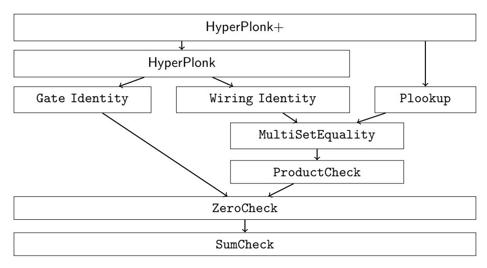
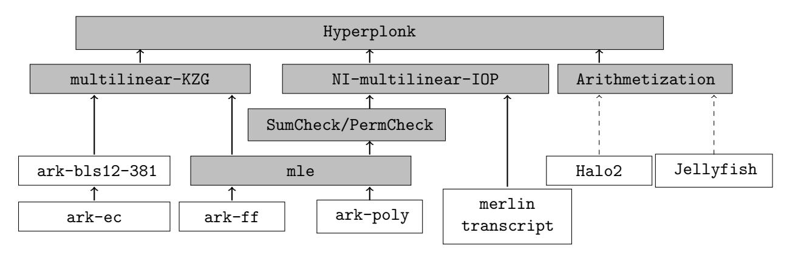
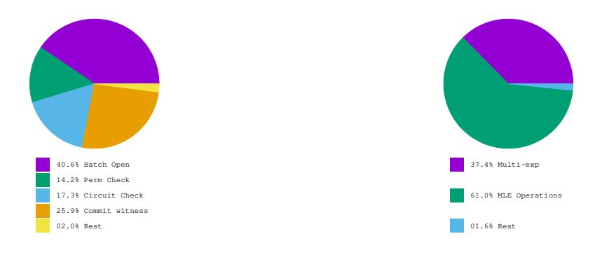
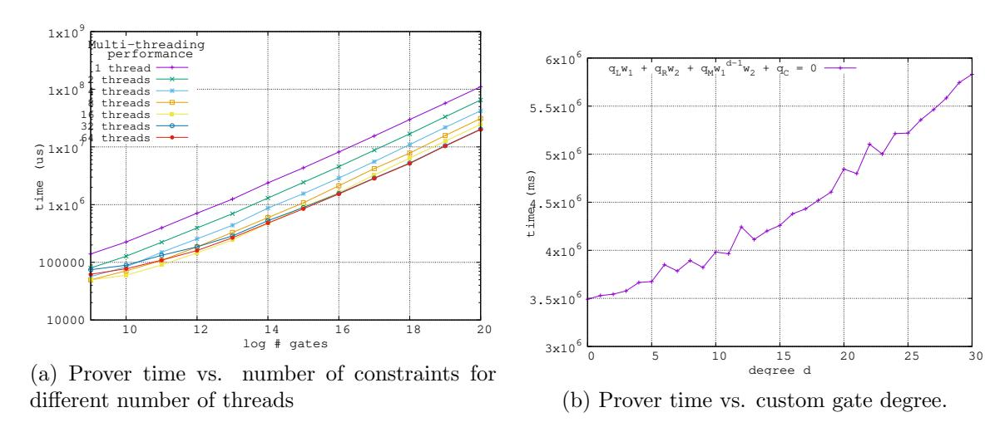

# <span id="page-0-0"></span>HyperPlonk: Plonk with Linear-Time Prover and High-Degree Custom Gates

Binyi Chen Espresso Systems

Benedikt B¨unz Stanford University,

Dan Boneh Stanford University

Zhenfei Zhang Espresso Systems

Espresso Systems

January 9, 2023

#### Abstract

Plonk is a widely used succinct non-interactive proof system that uses univariate polynomial commitments. Plonk is quite flexible: it supports circuits with low-degree "custom" gates as well as circuits with lookup gates (a lookup gate ensures that its input is contained in a predefined table). For large circuits, the bottleneck in generating a Plonk proof is the need for computing a large FFT.

We present HyperPlonk, an adaptation of Plonk to the boolean hypercube, using multilinear polynomial commitments. HyperPlonk retains the flexibility of Plonk but provides several additional benefits. First, it avoids the need for an FFT during proof generation. Second, and more importantly, it supports custom gates of much higher degree than Plonk without harming the running time of the prover. Both of these can dramatically speed up the prover's running time. Since HyperPlonk relies on multilinear polynomial commitments, we revisit two elegant constructions: one from Orion and one from Virgo. We show how to reduce the Orion opening proof size to less than 10kb (an almost factor 1000 improvement) and show how to make the Virgo FRI-based opening proof simpler and shorter.

## Contents

| 1 | Introduction                                                       | 3  |  |  |  |  |  |  |  |  |  |  |
|---|--------------------------------------------------------------------|----|--|--|--|--|--|--|--|--|--|--|
|   | 1.1<br>Technical overview<br>                                      | 6  |  |  |  |  |  |  |  |  |  |  |
|   | 1.2<br>Additional related work<br>                                 | 10 |  |  |  |  |  |  |  |  |  |  |
| 2 | Preliminaries                                                      |    |  |  |  |  |  |  |  |  |  |  |
|   | 2.1<br>Proofs and arguments of knowledge.<br>                      | 11 |  |  |  |  |  |  |  |  |  |  |
|   | 2.2<br>Multilinear polynomial commitments.<br>                     | 13 |  |  |  |  |  |  |  |  |  |  |
|   | 2.3<br>PIOP compilation<br>                                        | 15 |  |  |  |  |  |  |  |  |  |  |
| 3 | A toolbox for multivariate polynomials                             | 16 |  |  |  |  |  |  |  |  |  |  |
|   | 3.1<br>SumCheck PIOP for high degree polynomials<br>               | 16 |  |  |  |  |  |  |  |  |  |  |
|   | 3.2<br>ZeroCheck PIOP<br>                                          | 19 |  |  |  |  |  |  |  |  |  |  |
|   | 3.3<br>ProductCheck PIOP<br>                                       | 21 |  |  |  |  |  |  |  |  |  |  |
|   | 3.4<br>Multiset Check PIOP<br>                                     | 22 |  |  |  |  |  |  |  |  |  |  |
|   | 3.5<br>Permutation PIOP<br>                                        | 24 |  |  |  |  |  |  |  |  |  |  |
|   | 3.6<br>Another permutation PIOP for small fields<br>               | 25 |  |  |  |  |  |  |  |  |  |  |
|   | 3.7<br>Lookup PIOP<br>                                             | 27 |  |  |  |  |  |  |  |  |  |  |
|   | 3.8<br>Batch openings<br>                                          | 30 |  |  |  |  |  |  |  |  |  |  |
|   | 3.8.1<br>A more efficient batching scheme in a special setting<br> | 32 |  |  |  |  |  |  |  |  |  |  |
|   |                                                                    |    |  |  |  |  |  |  |  |  |  |  |
| 4 | HyperPlonk: Plonk on the boolean hypercube                         | 33 |  |  |  |  |  |  |  |  |  |  |
|   | 4.1<br>Constraint systems<br>                                      | 34 |  |  |  |  |  |  |  |  |  |  |
|   | 4.2<br>The PolyIOP protocol<br>                                    | 35 |  |  |  |  |  |  |  |  |  |  |
| 5 | HyperPlonk+: HyperPlonk with Lookup Gates                          | 37 |  |  |  |  |  |  |  |  |  |  |
|   | 5.1<br>Constraint systems<br>                                      | 37 |  |  |  |  |  |  |  |  |  |  |
|   | 5.2<br>The PolyIOP protocol<br>                                    | 38 |  |  |  |  |  |  |  |  |  |  |
| 6 | Instantiation and evaluation                                       | 40 |  |  |  |  |  |  |  |  |  |  |
|   | 6.1<br>Implementation<br>                                          | 40 |  |  |  |  |  |  |  |  |  |  |
|   | 6.2<br>Evaluation<br>                                              | 40 |  |  |  |  |  |  |  |  |  |  |
|   | 6.3<br>MultiThreading performance<br>                              | 41 |  |  |  |  |  |  |  |  |  |  |
|   | 6.4<br>High degree gates<br>                                       | 42 |  |  |  |  |  |  |  |  |  |  |
|   | 6.5<br>Comparisons<br>                                             | 42 |  |  |  |  |  |  |  |  |  |  |
|   |                                                                    |    |  |  |  |  |  |  |  |  |  |  |
| 7 | Orion+: a linear-time multilinear PCS with constant proof size     | 43 |  |  |  |  |  |  |  |  |  |  |
| A | Zero Knowledge PIOPs and zk-SNARKs                                 | 59 |  |  |  |  |  |  |  |  |  |  |
|   | A.1<br>Definition<br>                                              | 59 |  |  |  |  |  |  |  |  |  |  |
|   | A.2<br>Polynomial masking<br>                                      | 59 |  |  |  |  |  |  |  |  |  |  |
|   | A.3<br>Zero knowledge SumCheck<br>                                 | 60 |  |  |  |  |  |  |  |  |  |  |
|   | A.4<br>Zero knowledge compilation for SumCheck-based PIOPs<br>     | 61 |  |  |  |  |  |  |  |  |  |  |
|   | A.5<br>zk-SNARKs from PIOPs<br>                                    | 63 |  |  |  |  |  |  |  |  |  |  |
| B | The FRI-based multilinear polynomial commitment                    | 63 |  |  |  |  |  |  |  |  |  |  |
|   |                                                                    |    |  |  |  |  |  |  |  |  |  |  |

## <span id="page-2-0"></span>1 Introduction

Proof systems [\[49,](#page-55-0) [6\]](#page-52-0) have a long and rich history in cryptography and complexity theory. In recent years, the efficiency of proof systems has dramatically improved and this has enabled a multitude of new real-world applications that were not previously possible. In this paper, we focus on succinct non-interactive arguments of knowledge, also called SNARKs [\[16\]](#page-52-1). Here, succinct refers to the fact that the proof is short and verification time is fast, as explained below. Recent years have seen tremendous progress in improving the efficiency of the prover [\[75,](#page-57-0) [62,](#page-56-0) [79,](#page-57-1) [2,](#page-51-0) [12,](#page-52-2) [84,](#page-57-2) [35,](#page-54-0) [27,](#page-53-0) [44,](#page-55-1) [68,](#page-56-1) [24,](#page-53-1) [50,](#page-55-2) [80\]](#page-57-3).

Let us briefly review what a (preprocessing) SNARK is. We give a precise definition in [Section 2.](#page-9-1) Fix a finite field F, and consider the relation R(C, x, w) that is true whenever x ∈ F n , w ∈ F <sup>m</sup>, and C(x, w) = 0, where C is the description of an arithmetic circuit over F that takes n + m inputs. A SNARK enables a prover P to non-interactively and succinctly convince a verifier V that P knows a witness w ∈ F <sup>m</sup> such that R(C, x, w) holds, for some public circuit C and x ∈ F n .

In more detail, a SNARK is a tuple of four algorithms (Setup, I,P, V), where Setup(1<sup>λ</sup> ) is a randomized algorithm that outputs parameters gp, and I(gp, C) is a deterministic algorithm that pre-processes the circuit C and outputs prover parameters pp and verifier parameters vp. The prover P(pp, x, w) is a randomized algorithm that outputs a proof π, and the verifier V(vp, x, π) is a deterministic algorithm that outputs 0 or 1. The SNARK must be complete, knowledge sound, and succinct, as defined in [Section 2.](#page-9-1) Here succinct means that if C contains s gates, and x ∈ F n , then the size of the proof should be Oλ(log s) and the verifier's running time should be O˜ <sup>λ</sup>(n+log s). A SNARK is often set in the random oracle model where all four algorithms can query the oracle. If the Setup algorithm is randomized, then we say that the SNARK requires a trusted setup; otherwise, the SNARK is said to be transparent because Setup only has access to public randomness via the random oracle. Optionally, we might want the SNARK to be zero-knowledge, in which case it is called a zkSNARK.

Modern SNARKs are constructed by compiling an information-theoretic object called an Interactive Oracle Proof (IOP) [\[13\]](#page-52-3) to a SNARK using a suitable cryptographic commitment scheme. There are several examples of this paradigm. Some SNARKs use a univariate polynomial commitment scheme to compile a Polynomial-IOP to a SNARK. Examples include Sonic [\[62\]](#page-56-0),Marlin [\[35\]](#page-54-0), and Plonk [\[44\]](#page-55-1). Other SNARKs use a multivariate linear (multilinear) commitment scheme to compile a multilinear-IOP to a SNARK. Examples include Hyrax [\[75\]](#page-57-0), Libra [\[79\]](#page-57-1), Spartan [\[68\]](#page-56-1), Quarks [\[69\]](#page-56-2), and Gemini [\[24\]](#page-53-1). Yet other SNARKs use a vector commitment scheme (such as a Merkle tree) to compile a vector-IOP to a SNARK. The STARK system [\[10\]](#page-52-4) is the prime example in this category, but other examples include Aurora [\[12\]](#page-52-2), Virgo [\[84\]](#page-57-2), Brakedown [\[50\]](#page-55-2), and Orion [\[80\]](#page-57-3). While STARKs are post-quantum secure, require no trusted setup, and have an efficient prover, they generate a relatively long proof (tens of kilobytes in practice). The paradigm of compiling an IOP to a SNARK using a suitable commitment scheme lets us build universal SNARKs where a single trusted setup can support many circuits. In earlier SNARKs, such as [\[52,](#page-55-3) [47,](#page-55-4) [18\]](#page-53-2), every circuit required a new trusted setup.

The Plonk system. Among the IOP-based SNARKs that use a Polynomial-IOP, the Plonk system [\[44\]](#page-55-1) has emerged as one of the most widely adopted in industry. This is because Plonk proofs are very short (about 400 bytes in practice) and fast to verify. Moreover, Plonk supports custom gates, as we will see in a minute. An extension of Plonk, called PlonKup [\[66\]](#page-56-3), further extends Plonk to incorporate lookup gates using the Plookup IOP of [\[44\]](#page-55-1).

One difficulty with Plonk, compared to some other schemes, is the prover's complexity. For a circuit C with s arithmetic gates, the Plonk prover runs in time Oλ(s log s). The primary bottlenecks come from the fact that the prover must commit to and later open several degree O(s) polynomials. When using the KZG polynomial commitment scheme [\[56\]](#page-55-5), the prover must (i) compute a multi-exponentiation of size O(s) in a pairing-friendly group where discrete log is hard, and (ii) compute several FFTs and inverse-FFTs of dimension O(s). When using a FRI-based polynomial commitment scheme [\[9,](#page-52-5) [57,](#page-55-6) [84\]](#page-57-2), the prover computes an O(cs)-sized FFT and O(cs) hashes, where 1/c is the rate of a certain Reed-Solomon code. The performance further degrades for circuits that contain high-degree custom gates, as some FFTs and multi-exponentiations have size proportional to the degree of the custom gates.

In practice, when the circuit size s is bigger than 220, the FFTs become a significant part of the running time. This is due to the quasi-linear running time of the FFT algorithm, while other parts of the prover scale linearly in s. The reliance on FFT is a direct result of Plonk's use of univariate polynomials. We note that some proof systems eliminate the need for an FFT by moving away from Plonk altogether [\[68,](#page-56-1) [24,](#page-53-1) [50,](#page-55-2) [80,](#page-57-3) [41\]](#page-54-1).

Hyperplonk. In this paper, we introduce HyperPlonk, an adaptation of the Plonk IOP and its extensions to operate over the boolean hypercube B<sup>µ</sup> := {0, 1} µ . We present HyperPlonk as a multilinear-IOP, which means that it can be compiled using a suitable multilinear commitment scheme to obtain a SNARK (or a zkSNARK) with an efficient prover.

HyperPlonk inherits the flexibility of Plonk to support circuits with custom gates, but presents several additional advantages. First, by moving to the boolean hypercube we eliminate the need for an FFT during proof generation. We do so by making use of the classic SumCheck protocol [\[61\]](#page-56-4), and this reduces the prover's running time from Oλ(s log s) to Oλ(s). The efficiency of SumCheck is the reason why many of the existing multilinear SNARKs [\[75,](#page-57-0) [79,](#page-57-1) [68,](#page-56-1) [69,](#page-56-2) [24\]](#page-53-1) use the boolean hypercube. Here we show that Plonk can similarly benefit from the SumCheck protocol.

Second, and more importantly, we show that the hypercube lets us incorporate custom gates more efficiently into HyperPlonk. A custom gate is a function G : F ` → F, for some `. An arithmetic circuit C with a custom gate G, denoted C[G], is a circuit with addition and multiplication gates along with a custom gate G that can appear many times in the circuit. The circuit may contain multiple types of custom gates, but for now, we will restrict to one type to simplify the presentation. These custom gates can greatly reduce the circuit size needed to compute a function, leading to a faster prover. For example, if one needs to implement the S-box in a block cipher, it can be more efficient to implement it as a custom gate.

Custom gates are not free. Let G : F ` → F be a custom gate that computes a multivariate polynomial of total degree d. Let C[G] be a circuit with a total of s gates. In the Plonk IOP, the circuit C[G] results in a prover that manipulates univariate polynomials of degree O(s · d). Consequently, when compiling Plonk using KZG [\[56\]](#page-55-5), the prover needs to do a group multi-exponentiation of size O(sd) as well as FFTs of this dimension. This restricts custom gates in Plonk to gates of low degree.

We show that the prover's work in HyperPlonk is much lower. Let G : F ` → F be a custom gate that can be evaluated using k arithmetic operations. In HyperPlonk, the bulk of the prover's work when processing C[G] is only O(sk log<sup>2</sup> k) field operations. Moreover, when using KZG multilinear commitments [\[65\]](#page-56-5), the total number of group exponentiations is only O(s + d log s), where d is the total degree of G. This is much lower than Plonk's O(sd) group exponentiations. It lets us use custom gates of much higher degree in HyperPlonk.

Making Plonk and its Plonkup extension work over the hypercube raises interesting challenges, as discussed in [Section 1.1.](#page-5-0) In particular, adapting the Plookup IOP [\[44\]](#page-55-1), used to implement table lookups, requires changing the protocol to make it work over the hypercube (see Section [3.7\)](#page-26-0). The resulting version of HyperPlonk that supports lookup gates is called HyperPlonk+ and is described in [Section 5.](#page-36-0) There are also subtleties in making HyperPlonk zero knowledge. In [Appendix A,](#page-58-0) we describe a general compiler to transform a multilinear-IOP into one that is zero knowledge.

Batch openings and commit-and-prove SNARKs. The prover in HyperPlonk needs to open several multilinear polynomials at random points. We present a new sum-check-based batchopening protocol [\(Section 3.8\)](#page-29-0) that can batch many openings into one, significantly reducing the prover time, proof size, and verifier time. Our protocol takes O(k · 2 µ ) field operations for the prover for batching k of µ-variate polynomials, compared to O(k <sup>2</sup>µ · 2 µ ) for the previously best protocol [\[73\]](#page-57-4). Under certain conditions, we also obtain a more efficient batching scheme with complexity O(2<sup>µ</sup> ), which yields a very efficient commit-and-prove protocol.

Improved multilinear commitments. Since HyperPlonk relies on a multilinear commitment scheme, we revisit two approaches to constructing multilinear commitments and present significant improvements to both.

First, in [Section 7](#page-42-0) we use our commit-and-prove protocol to improve the Orion multilinear commitment scheme [\[80\]](#page-57-3). Orion is highly efficient: the prover time is strictly linear, taking only O(2<sup>µ</sup> ) field operations and hashes for a multilinear polynomial in µ variables (no group exponentiations are used). The proof size is O(λµ<sup>2</sup> ) hash and field elements, and the verifier time is proportional to the proof size. In [Section 7](#page-42-0) we describe Orion+, that has the same prover complexity, but has O(µ) proof size and O(µ) verifier time, with good constants. In particular, for security parameter λ = 128 and µ = 25 the proof size with Orion+ is only about 7 KBs, compared with 5.5 MB with Orion, a nearly 1000x improvement. Using Orion+ in HyperPlonk gives a strictly linear time prover.

Second, in [Appendix B,](#page-62-1) we show how to generically transform a univariate polynomial commitment scheme into a multilinear commitment scheme using the tensor-product univariate Polynomial-IOP from [\[24\]](#page-53-1). This yields a new construction for multilinear commitments from FRI [\[9\]](#page-52-5) by applying the transformation to the univariate FRI-based commitment scheme from [\[57\]](#page-55-6). This approach leads to a more efficient FRI-based multilinear commitment scheme compared to the prior construction in [\[84\]](#page-57-2), which uses recursive techniques. Using this commitment scheme in HyperPlonk gives a quantum-resistant quasilinear-time prover.

Another permutation PIOP for small fields. Looking ahead, the HyperPlonk IOP builds upon a linear-time polynomial IOP for the permutation check relation. However, for µ-variate polynomials, the linear-time permutation PIOP has soundness error O( µ |F| ), which limits its usage with polynomial-sized fields [\[23\]](#page-53-3). To remedy this, we also propose another permutation PIOP with a much smaller soundness error, that is, O( µ 2 |F| ). The tradeoff is that the PIOP has quasi-linear (rather than linear) prover time.

<span id="page-5-2"></span>

| Application              | RR1CS        | Spartan | RPLONK+      | Jellyfish | HyperPlonk |
|--------------------------|--------------|---------|--------------|-----------|------------|
| 3-to-1 Rescue Hash       | 288 [1]      | 422 ms  | 144 [71]     | 40 ms     | 88 ms      |
| Zexe's recursive circuit | 22 [81]<br>2 | 6 min   | 17 [81]<br>2 | 13.1s     | 5.1s       |
| Rollup of 50 private tx  | 25<br>2      | 39 min  | 20 [71]<br>2 | 110 s     | 38.2 s     |

Table 1: The prover runtime of Hyperplonk, Spartan [\[68\]](#page-56-1), and Jellyfish Plonk, for popular applications. The first column (next to the column of the applications) shows the number of R1CS constraints for each application. The third column shows the corresponding number of constraints in HyperPlonk+. Note that the Zexe and the Rollup applications are using the BW6-761 curve. For more detail see Section [6.5.](#page-41-1)

Evaluation results. After applying the optimizations in Appendix [C,](#page-64-0) when instantiated with the pairing-based multilinear commitment scheme of [\[65\]](#page-56-5), the proof size of Hyperplonk is µ + 5 group elements and 4µ + 29 field elements[1](#page-5-1) . Using BLS12-381 as the pairing group, we obtain 4.7KB proofs for µ = 20 and 5.5KB proofs for µ = 25. For comparison, Kopis [\[69\]](#page-56-2) and Gemini [\[24\]](#page-53-1), which also have linear-time provers, report proofs of size 39KB and 18KB respectively for µ = 20. In Table [1](#page-5-2) and Table [6](#page-43-0) we show that our prototype HyperPlonk implementation outperforms an optimized commercial-strength Plonk system for circuits with more than 2<sup>14</sup> gates. It also shows the effects of PLONK arithmetization compared to R1CS by comparing the prover runtime for several important applications. Hyperplonk outperforms Spartan [\[68\]](#page-56-1) for these applications by a factor of over 60. We discuss the evaluation further in [Section 6.](#page-39-0)

### <span id="page-5-0"></span>1.1 Technical overview

In this section we give a high level overview of how to make Plonk and its extensions work over the hybercube. We begin by describing Plonk in a modular way, breaking it down into a sequence of elementary components shown in [Figure 1.](#page-8-0) In [Section 3](#page-15-0) we show how to instantiate each component over the hybercube.

Some components of Plonk in [Figure 1](#page-8-0) rely on the simple linear ordering of the elements of a finite cyclic group induced by the powers of a generator. On the hypercube there is no natural simple ordering, and this causes a problem in the Plookup protocol [\[44\]](#page-55-1) that is used to implement a lookup gate. To address this we modify the Plookup argument in [Section 5](#page-36-0) to make it work over the hypercube. We give an overview of our approach below.

A review of Plonk. Let us briefly review the Plonk SNARK. Let C[G] : F <sup>n</sup>+<sup>m</sup> → F be a circuit with a total of s gates, where each gate has fan-in two and can be one of addition, multiplication, or a custom gate G : F <sup>2</sup> → F. Let x ∈ F <sup>n</sup> be a public input to the circuit. Plonk represents the resulting computation as a sequence of n + s + 1 triples[2](#page-5-3) :

$$\hat{M} := \left\{ \left( L_i, R_i, O_i \right) \in \mathbb{F}^3 \right\}_{i=0,\dots,n+s}. \tag{1}$$

<span id="page-5-1"></span><sup>1</sup>The constants depend linearly on the degree of the custom gates. These numbers are for simple degree 2 arithmetic circuits.

<span id="page-5-3"></span><sup>2</sup>A more general Plonkish arithmetization [\[83\]](#page-57-6) supports wider tuples, but triples are sufficient here.

This Mˆ is a matrix with three columns and n+s+ 1 rows. The first n rows encode the n public input; the next s rows represent the left and right inputs and the output for each gate; and the final row enforces that the final output of the circuit is zero. We will see how in a minute.

In basic (univariate) Plonk, the prover encodes the cells of Mˆ using a cyclic subgroup Ω ⊆ F of order 3(n + s + 1). Specifically, let ω ∈ Ω be a generator. Then the prover interpolates and commits to a polynomial M ∈ F[X] such that

$$M(\omega^{3i}) = L_i$$
,  $M(\omega^{3i+1}) = R_i$ ,  $M(\omega^{3i+2}) = O_i$  for  $i = 0, ..., n+s$ .

Now the prover needs to convince the verifier that the committed M encodes a valid computation of the circuit C. This is the bulk of Plonk system.

Hyperplonk. In HyperPlonk we instead use the boolean hypercube to encode Mˆ . From now on, suppose that n + s + 1 is a power of two, so that n + s + 1 = 2<sup>µ</sup> . The prover interpolates and commits to a multilinear polynomial M ∈ F[Xµ+2] = F[X1, . . . , Xµ+2] such that

<span id="page-6-0"></span>
$$M(0,0,\langle i\rangle) = L_i, \quad M(0,1,\langle i\rangle) = R_i, \quad M(1,0,\langle i\rangle) = O_i, \quad \text{for } i = 0,\dots, n+s.$$
 (2)

Here hii is the µ-bit binary representation of i. Note that a multilinear polynomial on µ+2 variables is defined by a vector of 2µ+2 = 4×2 µ coefficients. Hence, it is always possible to find a multilinear polynomial that satisfies the 3 × 2 µ constraints in [\(2\)](#page-6-0). Next, the prover needs to convince the verifier that the committed M encodes a valid computation of the circuit C. To do so, we need to adapt Plonk to work over the hypercube.

Let us start with the pre-processing algorithm I(gp, C) that outputs prover and verifier parameters pp and vp. The verifier parameters vp encode the circuit C[G] as a commitment to four multilinear polynomials (S1, S2, S3, σ), where S1, S2, S<sup>3</sup> ∈ F[X<sup>µ</sup> ] and σ ∈ F[Xµ+2]. The first three are called selector polynomials and σ is called the wiring polynomial. We will see how they are defined in a minute. There is one more auxiliary multilinear polynomial I ∈ F[X<sup>µ</sup> ] that encodes the input x ∈ F n . This polynomial is defined as I(hii) = x<sup>i</sup> for i = 0, . . . , n − 1, and is zero on the rest of the boolean cube Bµ. The verifier, on its own, computes a commitment to the polynomial I to ensure that the correct input x ∈ F n is being used in the proof. Computing a commitment to I can be done in time Oλ(n), which is within the verifier's time budget.

With this setup, the Plonk prover P convinces the verifier that the committed M satisfies two polynomial identities:

The gate identity: Let S1, S2, S<sup>3</sup> : F <sup>µ</sup> → {0, 1} be the three selector polynomials that the preprocessing algorithm I(gp, C) committed to in vp. To prove that all gates were evaluated correctly, the prover convinces the verifier that the following identity holds for all x ∈ B<sup>µ</sup> := {0, 1} µ :

<span id="page-6-1"></span>
$$0 = S_{1}(\mathbf{x}) \cdot \left( \underbrace{M(0,0,\mathbf{x})}_{L_{[\mathbf{x}]}} + \underbrace{M(0,1,\mathbf{x})}_{R_{[\mathbf{x}]}} \right) + S_{2}(\mathbf{x}) \cdot \underbrace{M(0,0,\mathbf{x})}_{L_{[\mathbf{x}]}} \cdot \underbrace{M(0,1,\mathbf{x})}_{R_{[\mathbf{x}]}}$$

$$+ S_{3}(\mathbf{x}) \cdot G\left( \underbrace{M(0,0,\mathbf{x})}_{L_{[\mathbf{x}]}}, \underbrace{M(0,1,\mathbf{x})}_{R_{[\mathbf{x}]}} \right) - \underbrace{M(1,0,\mathbf{x})}_{O_{[\mathbf{x}]}} + I(\mathbf{x})$$

$$(3)$$

where [x] = Pµ−<sup>1</sup> <sup>i</sup>=0 xi2 i is the integer whose binary representation is x ∈ Bµ. For each i = 0, . . . , n+ s, the selector polynomials S1, S2, S<sup>3</sup> are defined to do the "right" thing:

```
• for an addition gate: S1(hii) = 1, S2(hii) = S3(hii) = 0 (so Oi = Li + Ri )
• for a multiplication gate: S1(hii) = S3(hii) = 0, S2(hii) = 1 (so Oi = Li
                                                                        · Ri )
• for a G gate: S1(hii) = S2(hii) = 0, S3(hii) = 1 (so Oi = G(Li
                                                                          , Ri) )
• when i < n or i = n + s: S1(hii) = S2(hii) = S3(hii) = 0 (so Oi = I(hii) ).
```

The last bullet ensures that O<sup>i</sup> is equal to the i-th input for i = 0, . . . , n − 1, and that the final output of the circuit, On+s, is equal to zero.

The wiring identity: Every wire in the circuit C induces an equality constraint on two cells in the matrix Mˆ . In HyperPlonk, the wiring constraints are captured by a permutation ˆσ : Bµ+2 → Bµ+2. The prover needs to convince the verifier that

<span id="page-7-0"></span>
$$M(\mathbf{x}) = M(\hat{\sigma}(\mathbf{x}))$$
 for all  $\mathbf{x} \in B_{\mu+2} := \{0, 1\}^{\mu+2}$ . (4)

To do so, the pre-processing algorithm I(gp, C) commits to a multilinear polynomial σ : F <sup>µ</sup>+2 → F that satisfies σ(x) = [ˆσ(x)] for all x ∈ Bµ+2 (recall that [ˆσ(x)] is the integer whose binary representation is ˆσ(x) ∈ Bµ+2). The prover then convinces the verifier that the following two sets are equal (both sets are subsets of F 2 ):

<span id="page-7-1"></span>
$$\left\{ \left( [\mathbf{x}], M(\mathbf{x}) \right) \right\}_{\mathbf{x} \in B_{\mu+2}} = \left\{ \left( [\hat{\sigma}(\mathbf{x})], M(\mathbf{x}) \right) \right\}_{\mathbf{x} \in B_{\mu+2}}.$$
 (5)

This equality of sets implies that [\(4\)](#page-7-0) holds.

Proving the gate identity. The prover convinces the verifier that the Gate identity holds by proving that the polynomial defined by the right hand side of [\(3\)](#page-6-1) is zero for all x ∈ Bµ. This is done using a ZeroCheck IOP, defined in [Section 3.2.](#page-18-0) If the custom gate G has total degree d and there are s gates in the circuit, then the total degree of the polynomial in [\(3\)](#page-6-1) is (d + 1)(s + n + 1) which is about (d · s). If this were a univariate polynomial, as in Plonk, then a ZeroCheck would require a multi-exponentiation of dimension (d · s) and an FFT of the same dimension. When the polynomial is defined over the hypercube, the ZeroCheck is implemented using the SumCheck protocol in [Section 3.1,](#page-15-1) which requires no FFTs. In that section we describe two optimizations to the SumCheck protocol for the settings where the multivariate polynomial has a high degree d in every variable:

- First, in every round of SumCheck the prover sends a polynomial commitment to a univariate polynomial of degree d, instead of sending the polynomial in the clear as in regular SumCheck. This greatly reduces the proof size.
- Second, in standard SumCheck, the prover opens the univariate polynomial commitment at three points: at 0, 1, and at a random r ∈ F. We optimize this step by showing that opening the commitment at a single point is sufficient. This further shortens the final proof.

The key point is that the resulting ZeroCheck requires the prover to do only about s + d · µ group exponentiations, which is much smaller than d · s in Plonk. The additional arithmetic work that the prover needs to do depends on the number of multiplication gates in the circuit implementing the custom gate G, not on the total degree of G, as in Plonk. As such, we can support much larger custom gates than Plonk.

In summary, proof generation time is reduced for two reasons: (i) the elimination of the FFTs, and (ii) the better handling of high-degree custom gates.

<span id="page-8-0"></span>

Figure 1: The multilinear polynomial-IOPs that make up HyperPlonk.

**Proving the wiring identity.** The prover convinces the verifier that the Wiring identity holds by proving the set equality in (5). We describe a set equality protocol over the hypercube in Section 3.4. Briefly, we use a technique from Bayer and Groth [8], that is also used in Plonk, to reduce this problem to a certain ProductCheck over the hypercube (Section 3.3). We then use an idea from Quarks [69] to reduce the hypercube ProductCheck to a ZeroCheck, which then reduces to a SumCheck. This sequence of reductions is shown in Figure 1. Again, no FFTs are needed.

**Table lookups.** An important extension to Plonk supports circuits with table lookup gates. The table is represented as a fixed vector  $\mathbf{t} \in \mathbb{F}^{2^{\mu}-1}$ . A table lookup gate ensures that a specific cell in the matrix  $\hat{M}$  is contained in  $\mathbf{t}$ . For example, one can set  $\mathbf{t}$  to be the field elements in  $\{0, 1, \dots, B\}$  for some B (padding the vector by 0 as needed). Now, checking that a cell in  $\hat{M}$  is contained in  $\mathbf{t}$  is a simple way to implement a range check.

Let  $f, t: B_{\mu} \to \mathbb{F}$  be two multilinear polynomials. Here the polynomial t encodes the table t, where the table values are  $t(B_{\mu})$ . The polynomial f encodes the cells of  $\hat{M}$  that need to be checked. An important step in supporting lookup gates in Plonk is a way for the prover to convince the verifier that  $f(B_{\mu}) \subseteq t(B_{\mu})$ , when the verifier has commitments to f and t. The Plookup proof system by Gabizon and Williamson [44] is a way for the prover to do just that. More recently preprocessed alternatives to lookup have been developed [82, 67]. These perform better if the table is known, e.g. a range of values but are in general orthogonal to Plookup.

The problem is that Plookup is designed to work when the polynomials are defined over a cyclic subgroup  $\mathbb{G} \subseteq \mathbb{F}^*$  of order q with generator  $\omega \in \mathbb{G}$ . In particular, Plookup requires a function next :  $\mathbb{F} \to \mathbb{F}$  that induces an ordering of  $\mathbb{G}$ . This function must satisfy two properties: (i) the sequence

<span id="page-8-1"></span>
$$\omega$$
,  $\operatorname{next}(\omega)$ ,  $\operatorname{next}(\operatorname{next}(\omega))$ , ...,  $\operatorname{next}^{(q-1)}(\omega)$  (6)

should traverse all of  $\mathbb{G}$ , and (ii) the function next should be a *linear* function. This is quite easy in a cyclic group: simply define  $\text{next}(x) := \omega x$ .

To adapt Plookup to the hypercube we need a linear function next :  $\mathbb{F}^{\mu} \to \mathbb{F}^{\mu}$  that traverses all of  $B_{\mu}$  as in (6), starting with some element  $\mathbf{x}_0 \in B_{\mu}$ . However, such an  $\mathbb{F}$ -linear function

does not exist. Nevertheless, we construct in Section 3.7 a quadratic function from  $\mathbb{F}^{\mu}$  to  $\mathbb{F}^{\mu}$  that traverses  $B_{\mu}$ . The function simulates  $B_{\mu}$  using a binary extension and has a beautiful connection to similar techniques used in early PCP work[15]. We then show how to linearize the function by modifying some of the building blocks that Plookup uses. This gives an efficient Plookup protocol over the hypercube. Finally, in Section 5 we use this hypercube Plookup protocol to support lookup gates in HyperPlonk. The resulting protocol is called HyperPlonk+.

#### <span id="page-9-0"></span>1.2 Additional related work

The origins of SNARKs date back to the work of Kilian [58] and Micali [64] based on the PCP theorem. Many of the SNARK constructions cited in the previous sections rely on techniques introduced in the proof of the PCP theorem.

Recursive SNARKs [74] are an important technique for building a SNARK for a long computation. Early recursive SNARKs [37, 17, 14, 36] built a prover for the entire SNARK circuit and then repeatedly used this prover. More recent recursive SNARKs rely on accumulation schemes [26, 29, 19, 28, 59] where the bulk of the SNARK verifier runs outside of the prover.

Many practical SNARKs rely on the random oracle model and often use a non-falsifiable assumption. Indeed, a separation result due to Gentry and Wichs [48] suggests that a SNARK requires either an idealized model or a non-falsifiable assumption. An interesting recent direction is the construction of batch proofs [38, 39, 76] in the standard model from standard assumptions. These give succinct proofs for computations in  $\mathcal{P}$ , namely succinct proofs for computations that do not rely on a hidden witness. SNARKs give succinct proofs for computations in  $\mathcal{N}\mathcal{P}$ .

## <span id="page-9-1"></span>2 Preliminaries

**Notation:** We use  $\lambda$  to denote the security parameter. For  $n \in \mathbb{N}$  let [n] be the set  $\{1, 2, \ldots, n\}$ ; for  $a, b \in \mathbb{N}$  let [a, b) denote the set  $\{a, a + 1, \ldots b - 1\}$ . A function  $f(\lambda)$  is  $\mathsf{poly}(\lambda)$  if there exists a  $c \in \mathbb{N}$  such that  $f(\lambda) = O(\lambda^c)$ . If for all  $c \in \mathbb{N}$ ,  $f(\lambda)$  is  $o(\lambda^{-c})$ , then  $f(\lambda)$  is in  $\mathsf{negl}(\lambda)$  and is said to be  $\mathsf{negligible}$ . A probability that is  $1 - \mathsf{negl}(\lambda)$  is  $\mathsf{overwhelming}$ . We use  $\mathbb{F}$  to denote a field of prime order p such that  $\log(p) = \Omega(\lambda)$ .

A *multiset* is an extension of the concept of a set where every element has a positive multiplicity. Two finite multisets are equal if they contain the same elements with the same multiplicities.

Recall that a **relation** is a set of pairs (x, w). An **indexed relation** is a set of triples (i, x; w). The index i is fixed at setup time.

In defining the syntax of the various protocols, we use the following convention concerning public values (known to both the prover and the verifier) and secret ones (known only to the prover). In any list of arguments or returned tuple (a, b, c; d, e), those variables listed before the semicolon are public, and those listed after it are secret. When there is no secret information, the semicolon is omitted.

**Useful facts.** We next list some facts that will be used throughout the paper.

**Lemma 2.1** (Multilinear extensions). For every function  $f: \{0,1\}^{\mu} \to \mathbb{F}$ , there is a unique multilinear polynomial  $\tilde{f} \in \mathbb{F}[X_1, \ldots, X_{\mu}]$  such that  $\tilde{f}(\mathbf{b}) = f(\mathbf{b})$  for all  $\mathbf{b} \in \{0,1\}^{\mu}$ . We call  $\tilde{f}$  the

multilinear extension of f, and  $\tilde{f}$  can be expressed as

$$\tilde{f}(\mathbf{X}) = \sum_{\boldsymbol{b} \in \{0,1\}^{\mu}} f(\boldsymbol{b}) \cdot eq(\boldsymbol{b}, \mathbf{X})$$

where 
$$eq(\mathbf{b}, \mathbf{X}) := \prod_{i=1}^{\mu} (\mathbf{b}_i \mathbf{X}_i + (1 - \mathbf{b}_i)(1 - \mathbf{X}_i)).$$

<span id="page-10-1"></span>**Lemma 2.2** (Schwartz-Zippel Lemma). Let  $f \in \mathbb{F}[X_1, \ldots, X_{\mu}]$  be a non-zero polynomial of total degree d over field  $\mathbb{F}$ . Let S be any finite subset of  $\mathbb{F}$ , and let  $r_1, \ldots, r_{\mu}$  be  $\mu$  field elements selected independently and uniformly from set S. Then

$$\Pr\left[f(r_1,\ldots,r_{\mu})=0\right] \le \frac{d}{|S|}.$$

**Linear codes.** We review the definition of linear code.

<span id="page-10-2"></span>**Definition 2.1** (Linear Code). An  $(n, k, \delta)$ -linear error-correcting code  $E : \mathbb{F}^k \to \mathbb{F}^n$  is an injective mapping from  $\mathbb{F}^k$  to a linear subspace C in  $\mathbb{F}^n$ , such that (i) the injective mapping can be computed in linear time in k; (ii) any linear combination of codewords is still a codeword; and (iii) the relative hamming distance  $\Delta(u, v)$  between any two different codewords  $u, v \in \mathbb{F}^k$  is at least  $\delta$ . The rate of the code E is defined as k/n.

## <span id="page-10-0"></span>2.1 Proofs and arguments of knowledge.

We define interactive proofs of knowledge, which consist of a non-interactive *preprocessing* phase run by an indexer as well as an interactive *online* phase between a prover and a verifier.

**Definition 2.2** (Interactive Proof and Argument of Knowledge). An interactive protocol  $\Pi = (\mathsf{Setup}, \mathcal{I}, \mathcal{P}, \mathcal{V})$  between a prover  $\mathcal{P}$  and verifier  $\mathcal{V}$  is an argument of knowledge for an indexed relation  $\mathcal{R}$  with knowledge error  $\delta : \mathbb{N} \to [0,1]$  if the following properties hold, where given an index  $\mathbb{I}$ , common input  $\mathbb{K}$  and prover witness  $\mathbb{K}$ , the deterministic indexer outputs  $(\mathsf{vp}, \mathsf{pp}) \leftarrow \mathcal{I}(\mathbb{I})$  and the output of the verifier is denoted by the random variable  $\langle \mathcal{P}(\mathsf{pp}, \mathbb{K}, \mathbb{W}), \mathcal{V}(\mathsf{vp}, \mathbb{K}) \rangle$ :

• Perfect Completeness: for all  $(i, x, w) \in \mathcal{R}$ 

$$\Pr\left[ \ \left\langle \mathcal{P}(\mathsf{pp}, \mathbb{x}, \mathbb{w}), \mathcal{V}(\mathsf{vp}, \mathbb{x}) \right\rangle = 1 \middle| \begin{array}{c} \mathsf{gp} \leftarrow \mathsf{Setup}(1^\lambda) \\ (\mathsf{vp}, \mathsf{pp}) \leftarrow \mathcal{I}(\mathsf{gp}, \mathbb{i}) \end{array} \right] = 1$$

•  $\delta$ -Soundness (adaptive): Let  $\mathcal{L}(\mathcal{R})$  be the language corresponding to the indexed relation  $\mathcal{R}$  such that  $(i, x) \in \mathcal{L}(\mathcal{R})$  if and only if there exists w such that  $(i, x, w) \in \mathcal{R}$ .  $\Pi$  is  $\delta$ -sound if for every pair of probabilistic polynomial time adversarial prover algorithm  $(\mathcal{A}_1, \mathcal{A}_2)$  the following holds:

$$\Pr\left[ \left\langle \mathcal{A}_2(\mathtt{i}, \mathtt{x}, \mathsf{st}), \mathcal{V}(\mathsf{vp}, \mathtt{x}) \right\rangle = 1 \wedge (\mathtt{i}, \mathtt{x}) \not\in \mathcal{L}(\mathcal{R}) \middle| \begin{array}{l} \mathsf{gp} \leftarrow \mathsf{Setup}(1^\lambda) \\ (\mathtt{i}, \mathtt{x}, \mathsf{st}) \leftarrow \mathcal{A}_1(\mathsf{gp}) \\ (\mathsf{vp}, \mathsf{pp}) \leftarrow \mathcal{I}(\mathsf{gp}, \mathtt{i}) \end{array} \right] \leq \delta(|\mathtt{i}| + |\mathtt{x}|) \,.$$

We say a protocol is computationally sound if  $\delta$  is negligible. If  $\mathcal{A}_1, \mathcal{A}_2$  are unbounded and  $\delta$  is negligible, then the protocol is statistically sound. If  $A = (\mathcal{A}_1, \mathcal{A}_2)$  is unbounded, the soundness definition becomes for all  $(i, x) \notin \mathcal{L}(\mathcal{R})$ 

$$\Pr\left[\langle \mathcal{A}_2(\mathbf{i},\mathbf{x},\mathsf{gp}),\mathcal{V}(\mathsf{vp},\mathbf{x})\rangle = 1 \middle| \begin{array}{c} \mathsf{gp} \leftarrow \mathsf{Setup}(1^\lambda) \\ (\mathsf{vp},\mathsf{pp}) \leftarrow \mathcal{I}(\mathsf{gp},\mathbf{i}) \end{array} \right] \leq \delta(|\mathbf{i}| + |\mathbf{x}|)$$

•  $\delta$ -Knowledge Soundness: There exists a polynomial  $poly(\cdot)$  and a probabilistic polynomial-time oracle machine  $\mathcal{E}$  called the extractor such that given oracle access to any pair of probabilistic polynomial time adversarial prover algorithm  $(\mathcal{A}_1, \mathcal{A}_2)$  the following holds:

$$\Pr\left[\begin{array}{c|c} \langle \mathcal{A}_2(i, \mathbf{x}, \mathsf{st}), \mathcal{V}(\mathsf{vp}, \mathbf{x}) \rangle = 1 & \mathsf{gp} \leftarrow \mathsf{Setup}(1^\lambda) \\ \wedge & (i, \mathbf{x}, \mathsf{w}) \not \in \mathcal{R} & (i, \mathbf{x}, \mathsf{st}) \leftarrow \mathcal{A}_1(\mathsf{gp}) \\ & (\mathsf{vp}, \mathsf{pp}) \leftarrow \mathcal{I}(\mathsf{gp}, i) \\ & \mathsf{w} \leftarrow \mathcal{E}^{\mathcal{A}_1, \mathcal{A}_2}(\mathsf{gp}, i, \mathbf{x}) \end{array}\right] \leq \delta(|i| + |\mathbf{x}|)$$

An interactive protocol is "knowledge sound", or simply an "argument of knowledge", if the knowledge error  $\delta$  is negligible in  $\lambda$ . If the adversary is unbounded, then the argument is called an interactive proof of knowledge.

- <u>Public coin</u> An interactive protocol is considered to be public coin if all of the verifier messages (including the final output) can be computed as a deterministic function given a random public input.
- <u>Zero knowledge</u>: An interactive protocol  $\langle \mathcal{P}, \mathcal{V} \rangle$  is considered to be zero-knowledge if there is a PPT simulator  $\mathcal{S}$  such that for every PPT adversary  $\mathcal{A} = (\mathcal{A}_1, \mathcal{A}_2)$ , auxiliary input  $z \in \{0,1\}^{\mathsf{poly}(\lambda)}$ , it holds that

$$\begin{split} \left| \Pr \left[ \begin{array}{c} \langle \mathcal{P}(\mathsf{pp}, \mathbbm{x}, \mathbbm{w}), \mathcal{A}_2(\mathsf{st}, \mathbbm{i}, \mathbbm{x}) \rangle = 1 \wedge (\mathbbm{i}, \mathbbm{x}, \mathbbm{w}) \in \mathcal{R} \; \left| \begin{array}{c} \mathsf{gp} \leftarrow \mathsf{Setup}(1^\lambda) \\ (\mathbbm{i}, \mathbbm{x}, \mathbbm{w}, \mathsf{st}) \leftarrow \mathcal{A}_1(z, \mathsf{gp}) \\ (\mathsf{vp}, \mathsf{pp}) \leftarrow \mathcal{I}(\mathsf{gp}, \mathbbm{i}) \end{array} \right] - \\ \Pr \left[ \; \left\langle \mathcal{S}(\sigma, z, \mathsf{pp}, \mathbbm{x}), \mathcal{A}_2(\mathsf{st}, \mathbbm{i}, \mathbbm{x}) \right\rangle = 1 \wedge (\mathbbm{i}, \mathbbm{x}, \mathbbm{w}) \in \mathcal{R} \; \left| \begin{array}{c} (\mathsf{gp}, \sigma) \leftarrow \mathcal{S}(1^\lambda) \\ (\mathbbm{i}, \mathbbm{x}, \mathbbm{w}, \mathsf{st}) \leftarrow \mathcal{A}_1(z, \mathsf{gp}) \\ (\mathsf{vp}, \mathsf{pp}) \leftarrow \mathcal{I}(\mathsf{gp}, \mathbbm{i}) \end{array} \right] \right| \leq \mathsf{negl}(\lambda) \; . \end{split}$$

We say that  $\langle \mathcal{P}, \mathcal{V} \rangle$  is statistically zero knowledge if  $\mathcal{A}$  is unbounded; and say it perfectly zero knowledge if  $\operatorname{negl}(\lambda)$  is replaced with zero.  $\langle \mathcal{P}, \mathcal{V} \rangle$  is honest-verifier zero knowledge (HVZK) if the adversary  $\mathcal{A}_2$  honestly follows the verifier algorithm.

We introduce both notions of soundness and knowledge soundness. Knowledge soundness implies soundness, as the existence of an extractor implies that  $(i, x) \in \mathcal{L}(\mathcal{R})$ . Furthermore, we show in Lemma 2.3 that soundness directly implies knowledge soundness for certain oracle relations and oracle arguments.

**PolyIOPs.** SNARKs can be constructed from information-theoretic proof systems that give the verifier oracle access to prover messages. The information-theoretic proof is then compiled using a cryptographic tool, such as a polynomial commitment. We now define a specific type of information-theoretic proof system called polynomial interactive oracle proofs.

Definition 2.3. A polynomial interactive oracle proof (PIOP) is a public-coin interactive proof for a polynomial oracle relation R = {(i, x; w)}. The relation is an oracle relation in that i, and x can contain oracles to µ-variate polynomials over some field F. The oracles specify µ and the degree in each variable. These oracles can be queried at arbitrary points in F µ to evaluate the polynomial at these points. The actual polynomials corresponding to the oracles are contained in the pp and the w, respectively. We denote an oracle to a polynomial f by [[f]]. In every protocol message, the P sends multi-variate polynomial oracles. The verifier in every round sends a random challenge.

We measure the following parameters for the complexity of a PIOP:

- The prover time measures the runtime of the prover.
- The verifier time measures the runtime of the verifier.
- The query complexity is the number of queries the verifier performs to the oracles.
- The round complexity measures the number of rounds. In our protocols, it is always equivalent to the number of oracles sent.
- The size of the proof oracles is the length of the transmitted polynomials.
- The size of the witness is the length of the witness polynomial.

Proof of Knowledge. As a proof system, the PIOP satisfies perfect completeness and unbounded knowledge-soundness with knowledge-error δ. Note that the extractor can query the oracle at arbitrary points to efficiently recover the entire polynomial.

Non-interactive arguments. Interactive public-coin arguments can be made non-interactive using the Fiat-Shamir transform. The Fiat-Shamir transform replaces the verifier challenges with hashes of the transcript up to that point. The works by [\[5,](#page-52-9) [78\]](#page-57-10) show that this is secure for multiround special-sound protocols and multi-round oracle proofs.

#### Soundness and knowledge soundness.

<span id="page-12-1"></span>Lemma 2.3 (Sound PIOPs are knowledge sound). Consider a δ-sound PIOP for oracle relations R such that for all (i, x, w) ∈ R, w consists only of polynomials such that the instance contains oracles to these polynomials. The PIOP has δ knowledge-soundness, and the extractor runs in time O(|w|)

Proof. We will show that we can construct an extractor E that can produce w<sup>∗</sup> such that (i, x, w<sup>∗</sup> ) ∈ R if and only if (i, x) ∈ L(R). This implies that the soundness error exactly matches the knowledge soundness error. For each oracle of a µ-variate polynomial with degree d in each variable, the extractor queries the polynomial at (d + 1)<sup>µ</sup> distinct points to extract the polynomial inside the oracle and thus w ∗ . If (i, x, w<sup>∗</sup> ) ∈ R then by definition (i, x) ∈ L(R). Additionally assume that (i, x) ∈ L(R) but (i, x, w<sup>∗</sup> ) 6∈ R. Then there must exists w<sup>0</sup> 6= w<sup>∗</sup> such that (i, x, w<sup>0</sup> ) ∈ R. Since the relation only admits polynomials as witnesses and these polynomials are degree d and µ-variate, then there cannot be two distinct witnesses that agree on (d+1)<sup>µ</sup> oracle queries. Therefore w<sup>0</sup> = w<sup>∗</sup> which leads to a contradiction. The extractor, therefore, outputs the unique, valid witness for every (i, x) in the language, and thus, the soundness and knowledge soundness error are the same.

#### <span id="page-12-0"></span>2.2 Multilinear polynomial commitments.

Definition 2.4 (Commitment scheme). A commitment scheme Γ is a tuple Γ = (Setup, Commit, Open) of PPT algorithms where:

- $\mathsf{Setup}(1^{\lambda}) \to \mathsf{gp}$  generates public parameters  $\mathsf{gp}$ ;
- Commit(gp; x)  $\rightarrow$  (C; r) takes a secret message x and outputs a public commitment C and (optionally) a secret opening hint r (which might or might not be the randomness used in the computation).
- Open(gp, C, x, r)  $\rightarrow b \in \{0, 1\}$  verifies the opening of commitment C to the message x provided with the opening hint r.

A commitment scheme  $\Gamma$  is **binding** if for all PPT adversaries A:

$$\Pr \left[ b_0 = b_1 \neq 0 \, \land \, x_0 \neq x_1 \, : \, \begin{array}{c} \operatorname{gp} \leftarrow \operatorname{Setup}(1^{\lambda}) \\ (C, x_0, x_1, r_0, r_1) \leftarrow \mathcal{A}(\operatorname{gp}) \\ b_0 \leftarrow \operatorname{Open}(\operatorname{gp}, C, x_0, r_0) \\ b_1 \leftarrow \operatorname{Open}(\operatorname{gp}, C, x_1, r_1) \end{array} \right] \leq \operatorname{negl}(\lambda)$$

A commitment scheme  $\Gamma$  is **hiding** if for any polynomial-time adversary A:

$$\left| \Pr \left[ \begin{array}{c} \operatorname{gp} \leftarrow \operatorname{Setup}(1^{\lambda}) \\ (x_0, x_1, st) \leftarrow \mathcal{A}(\operatorname{gp}) \\ b = b' : b \overset{\$}{\leftarrow} \{0, 1\} \\ (C_b; r_b) \leftarrow \operatorname{Commit}(\operatorname{gp}; x_b) \\ b' \leftarrow \mathcal{A}(\operatorname{gp}, st, C_b) \end{array} \right] - 1/2 = \operatorname{negl}(\lambda) \ .$$

If the adversary is unbounded, then we say the commitment is statistically hiding. We additionally define polynomial commitment schemes for multi-variate polynomials.

**Definition 2.5.** (Polynomial commitment) A polynomial commitment scheme is a tuple of protocols  $\Gamma = (\mathsf{Setup}, \mathsf{Commit}, \mathsf{Open}, \mathsf{Eval})$  where  $(\mathsf{Setup}, \mathsf{Commit}, \mathsf{Open})$  is a binding commitment scheme for a message space R[X] of polynomials over some ring R, and

• Eval((vp, pp), C,  $\mathbf{z}$ , y, d,  $\mu$ ; f)  $\to$   $b \in \{0,1\}$  is an interactive public-coin protocol between a PPT prover  $\mathcal{P}$  and verifier  $\mathcal{V}$ . Both  $\mathcal{P}$  and  $\mathcal{V}$  have as input a commitment C, points  $\mathbf{z} \in \mathbb{F}^{\mu}$  and  $y \in \mathbb{F}$ , and a degree d. The prover has prover parameters pp, and the verifier has verifier parameters pp. The prover additionally knows the opening of C to a secret polynomial  $f \in \mathcal{F}_{\mu}^{(\leq d)}$ . The protocol convinces the verifier that  $f(\mathbf{z}) = y$ .

A polynomial commitment scheme is **correct** if an honest committer can successfully convince the verifier of any evaluation. Specifically, if the prover is honest, then for all polynomials  $f \in \mathcal{F}_{\mu}^{(\leq d)}$  and all points  $z \in \mathbb{F}^{\mu}$ ,

$$\Pr \left[ \begin{aligned} & \text{gp} \leftarrow \mathsf{Setup}(1^{\lambda}) \\ b = 1 \ : & \begin{aligned} & (C;r) \leftarrow \mathsf{Commit}(\mathsf{gp},f) \\ & y \leftarrow f(\mathbf{z}) \\ & b \leftarrow \mathsf{Eval}(\mathsf{gp},c,z,y,d,\mu;f,r) \end{aligned} \right] = 1 \ .$$

We require that Eval is an interactive argument of knowledge and has knowledge soundness, which ensures that we can extract the committed polynomial from any evaluation.

Multi-variate polynomial commitments can be instantiated from random oracles using the FRI protocol [84], bilinear groups [65], groups of unknown order [30] and discrete logarithm groups. We give a table of polynomial commitments with their different properties in Table 2:

<span id="page-14-1"></span>

|                   |                  | Prover time:                                                                 |                                         |                                          |                  |        |      |
|-------------------|------------------|------------------------------------------------------------------------------|-----------------------------------------|------------------------------------------|------------------|--------|------|
| Scheme            |                  | Commit+ Eval                                                                 | Verifier time                           | Proof size                               | $n = 2^{25}$     | Setup  | Add. |
| KZG-based [65]    | BL               | $n \mathbb{G}_1$                                                             | $\log(n) P$                             | $\log(n) \mathbb{G}_1$                   | 0.8KB            | Univ.  | Yes  |
| Dory [60]         | $_{\mathrm{BL}}$ | $n\mathbb{G}_1 + \sqrt{n}P$                                                  | $\log(n) \mathbb{G}_T$                  | $6\log(n) \mathbb{G}_T$                  | $30 \mathrm{KB}$ | Trans. | Yes  |
| Bulletproofs [27] | DL               | $n \mathbb{G}$                                                               | $n \mathbb{G}$                          | $2\log(n)$ G                             | 1.6KB            | Trans. | Yes  |
| FRI-based (§B)    | RO               | $n\log(n)/\rho\mathbb{F} + n/\rho H$                                         | $\log^2(n) \frac{\lambda}{\log \rho} H$ | $\log^2(n) \frac{\lambda}{-\log \rho} H$ | 250KB            | Trans. | No   |
| Orion             | RO               | $nH + \frac{n}{k} + k$ rec.                                                  | $\lambda \log^2 nH$                     | $\lambda \log^2 n H$                     | 5.5MB            | Trans. | No   |
| Orion + (§7)      | BL               | $ n/k\mathbb{G}_1 + nH + (k\lambda H + \frac{n}{k}\mathbb{F}) \text{ rec.} $ | $\log(n)P$                              | $4\log n \ \mathbb{G}_1$                 | 7KB              | Univ.  | No   |

Table 2: Multi-linear polynomial commitment schemes for  $\mu$ -variate linear polynomials and  $n=2^{\mu}$ . The prover time measures the complexity of committing to a polynomial and evaluating it once. The commitment size is constant for all protocols. Unless constants are mentioned, the metrics are assumed to be asymptotic. In the 4th row,  $\rho$  denotes the rate of Reed-Solomon codes. In the 5th and 6th rows, k denotes the number of rows of the matrix that represents the polynomial coefficients. The 6th column measures the concrete proof size for  $n=2^{25}$ , i.e.  $\mu=25$  and 128-bit security. Legend: BL=Bilinear Group, DL=Discrete Logarithm, RO=Random Oracle, H= Hashes, P= pairings,  $\mathbb{G}=$  group scalar multiplications, rec.= Recursive circuit size, univ.= universal setup, trans.= transparent setup, Add.=Additive

Virtual oracles and commitments. Given multiple polynomial oracles, we can construct virtual oracles to the functions of these polynomials. An oracle to  $g([[f_1]], \ldots, [[f_k]])$  for some function g is simply the list of oracles  $\{[[f_1]], \ldots, [[f_k]]\}$  as well as a description of g. In order to evaluate  $g([[f_1]], \ldots, [[f_k]])$  at some point  $\mathbf{x}$  we compute  $y_i = f_i(\mathbf{x}) \forall i \in [k]$  and output  $g(y_1, \ldots, y_k)$ . Equivalently given commitments to polynomials, we can construct a virtual commitment to a function of these polynomials in the same manner. If g is an additive function and the polynomial commitment is additively homomorphic, then we can use the homomorphism to do the evaluation. A common example is that given additive commitments  $C_f$ ,  $C_g$  to polynomials  $f(\mathbf{X})$ ,  $g(\mathbf{X})$ , we want to construct a commitment to (1-Y)f+Yg. Then  $(C_f, C_g)$  serves as such a commitment and we can evaluate it at  $(y, \mathbf{x})$  by evaluating  $(1-y)C_f+y\cdot C_g$  at  $\mathbf{x}$ .

#### <span id="page-14-0"></span>2.3 PIOP compilation

PIOP compilation transforms the interactive oracle proof into an interactive argument of knowledge (without oracles)  $\Pi$ . The compilation replaces the oracles with polynomial commitments. Every query by the verifier is replaced with an invocation of the Eval protocol at the query point  $\mathbf{z}$ . The compiled verifier accepts if the PIOP verifier accepts and if the output of all Eval invocations is 1. If  $\Pi$  is public-coin, then it can further be compiled to a non-interactive argument of knowledge (or NARK) using the Fiat-Shamir transform.

<span id="page-14-2"></span>**Theorem 2.4** (PIOP Compilation [30, 35]). If the polynomial commitment scheme  $\Gamma$  has witness-extended emulation, and if the t-round Polynomial IOP for  $\mathcal{R}$  has negligible knowledge error, then  $\Pi$ , the output of the PIOP compilation, is a secure (non-oracle) argument of knowledge for  $\mathcal{R}$ . The compilation also preserves zero knowledge. If  $\Gamma$  is hiding and Eval is honest-verifier zero-knowledge, then  $\Pi$  is honest-verifier zero-knowledge. The efficiency of the resulting argument of knowledge  $\Pi$  depends on the efficiency of both the PIOP and  $\Gamma$ :

- <u>Prover time</u> The prover time is equal to the sum of (i) prover time of the PIOP, (ii) the oracle length times the commitment time, and (iii) the query complexity times the prover time of  $\Gamma$ .
- Verifier time The verifier time is equal to the sum of (i) the verifier time of the PIOP and (ii) the verifier time for Γ times the query complexity of the PIOP.
- Proof size The proof size is equal to sum of (i) the message complexity of the PIOP times the commitment size and (ii) the query complexity times the proof size of  $\Gamma$ . If the proof size is  $O(\log^c(|\mathbf{w}|))$ , then we say the proof is succinct.

**Batching.** The prover time, verifier time, and proof size can be significantly reduced using batch openings of the polynomial commitments. After batching, the proof size only depends on the number of oracles plus a single polynomial commitment opening.

## <span id="page-15-0"></span>3 A toolbox for multivariate polynomials

We begin by reviewing several important PolyIOPs that will serve as building blocks for Hyper-Plonk. Some are well-known, and some are new. Figure 1 serves as a guide for this section: we define the PolyIOPs listed in the figure following the dependency order.

**Notation.** From here on, we let  $B_{\mu} := \{0,1\}^{\mu} \subseteq \mathbb{F}^{\mu}$  be the boolean hypercube. We use  $\mathcal{F}_{\mu}^{(\leq d)}$  to denote the set of multivariate polynomials in  $\mathbb{F}[X_1,\ldots,X_{\mu}]$  where the degree in each variable is at most d; moreover, we require that each polynomial in  $\mathcal{F}_{\mu}^{(\leq d)}$  can be expressed as a virtual oracle to c = O(1) multilinear polynomials. that is, with the form  $f(\mathbf{X}) := g(h_1(\mathbf{X}),\ldots,h_c(\mathbf{X}))$  where  $h_i \in \mathcal{F}_{\mu}^{(\leq 1)}$   $(1 \leq i \leq c)$  is multilinear and g is a c-variate polynomial of total degree at most d. Looking ahead, we restrict ourselves to this kind of polynomials so that we can have sumchecks for the polynomials with linear-time provers.

For polynomials  $f, g \in \mathcal{F}_{\mu}^{(\leq d)}$ , we denote  $\mathsf{merge}(f, g) \in \mathcal{F}_{\mu+1}^{(\leq d)}$  as

<span id="page-15-2"></span>
$$\mathsf{merge}(f,g) := h(\mathbf{X}_0,\dots,\mathbf{X}_\mu) := (1-\mathbf{X}_0) \cdot f(\mathbf{X}_1,\dots,\mathbf{X}_\mu) + \mathbf{X}_0 \cdot g(\mathbf{X}_1,\dots,\mathbf{X}_\mu) \tag{7}$$

so that  $h(0, \mathbf{X}) = f(\mathbf{X})$  and  $h(1, \mathbf{X}) = g(\mathbf{X})$ . In the following definitions, we omit the public parameters  $\mathsf{gp} := (\mathbb{F}, \mu, d)$  when the context is clear. We use  $\delta_{\mathsf{check}}^{d,\mu}$  to denote the soundness error of the PolyIOP for relation  $\mathcal{R}_{\mathsf{check}}$  with public parameter  $(\mathbb{F}, d, \mu)$ , where  $\mathsf{check} \in \{\mathsf{sum}, \mathsf{zero}, \mathsf{prod}, \mathsf{mset}, \mathsf{perm}, \mathsf{lkup}\}$ .

## <span id="page-15-1"></span>3.1 SumCheck PIOP for high degree polynomials

In this section, we describe a PIOP for the sumcheck relation using the classic sumcheck protocol [61]. However, we modify the protocol and adapt it to our setting of high-degree polynomials.

**Definition 3.1** (SumCheck relation). The relation  $\mathcal{R}_{SUM}$  is the set of all tuples  $(\mathbf{x}; \mathbf{w}) = ((v, [[f]]); f)$  where  $f \in \mathcal{F}_{\mu}^{(\leq d)}$  and  $\sum_{\mathbf{b} \in B_{\mu}} f(\mathbf{b}) = v$ .

**Construction.** The classic SumCheck protocol [61] is a PolyIOP for the relation  $\mathcal{R}_{\text{SUM}}$ . When applying the protocol to a polynomial  $f \in \mathcal{F}_{\mu}^{(\leq d)}$ , the protocol runs in  $\mu$  rounds where in every round, the prover sends a univariate polynomial of degree at most d to the verifier. The verifier

| Scheme    | P time              | V time | Num of queries | Num of rounds | Proof oracle size | Witness size |
|-----------|---------------------|--------|----------------|---------------|-------------------|--------------|
| SumCheck  | log2<br>O(2µd<br>d) | O(µ)   | µ + 1          | µ             | dµ                | O(2µ)        |
| ZeroCheck | log2<br>O(2µd<br>d) | O(µ)   | µ + 1          | µ             | dµ                | O(2µ)        |
| ProdCheck | log2<br>O(2µd<br>d) | O(µ)   | µ + 2          | µ + 1         | O(2µ)             | O(2µ)        |
| MsetEqChk | log2<br>O(2µd<br>d) | O(µ)   | µ + 2          | µ + 1         | O(2µ)             | µ)<br>O(k2   |
| PermCheck | log2<br>O(2µd<br>d) | O(µ)   | µ + 2          | µ + 1         | O(2µ)             | O(2µ)        |
| Plookup   | log2<br>O(2µd<br>d) | O(µ)   | µ + 3          | µ + 2         | O(2µ)             | O(2µ)        |
| BatchEval | O(2µk)              | O(kµ)  | 1              | µ + log k     | O(µ + log k)      | µ)<br>O(k2   |

Table 3: The complexity of PIOPs. d and µ denote the degree and the number of variables of the multivariate polynomials; k in MsetCheck is the length of each element in the multisets; k in BatchEval is the number of evaluations.

then sends a random challenge point for the univariate polynomial. At the end of the protocol, the verifier checks the consistency between the univariate polynomials and the multi-variate polynomial using a single query to f.

Given a tuple (x; w) = (v, [[f]]; f) for µ-variate degree d polynomial f such that P b∈B<sup>µ</sup> f(b) = v:

- For i = µ, µ − 1, . . . , 1:
  - The prover computes ri(X) := P b∈Bi−<sup>1</sup> f(b, X, αi+1, . . . , αµ) and sends the oracle [[r<sup>i</sup> ]] to the verifier. r<sup>i</sup> is univariate and of degree at most d.
  - The verifier checks that v = ri(0) + ri(1), samples α<sup>i</sup> ← F, sends α<sup>i</sup> to the prover, and sets v ← ri(αi).
- Finally, the verifier accepts if f(α1, . . . , αµ) = v.

Theorem 3.1. The PIOP for RSUM is perfectly complete and has knowledge error δ d,µ sum := dµ/|F|.

We refer to [\[73\]](#page-57-4) for the proof of the theorem.

Sending r as an oracle. Unlike in the classic sumcheck protocol, we send an oracle to r<sup>i</sup> , in each round, instead of the actual polynomial. This does not change the soundness analysis, as the soundness is still proportional to the degree of the univariate polynomials sent in each round. However, it reduces the communication and verifier complexity, especially if the degree of r is large, as in our application of Hyperplonk with custom gates.

Moreover, the verifier has to evaluate r<sup>i</sup> at three points: 0, 1, and α<sup>i</sup> . As a useful optimization, the prover can instead send an oracle for the degree d − 2 polynomial

$$r_i'(X) := \frac{r_i(X) - (1 - X) \cdot r_i(0) - X \cdot r_i(1)}{X \cdot (1 - X)},$$

along with ri(0). The verifier then computes ri(1) ← v − ri(0) and

$$r_i(\alpha_i) \leftarrow r_i'(\alpha) \cdot (1 - \alpha_i) \cdot \alpha_i + (1 - \alpha_i) \cdot r_i(0) + \alpha_i \cdot r_i(1).$$

This requires only one query to the oracle of r 0 i at α<sup>i</sup> and one field element per round. Computing sumcheck for high-degree polynomials. Consider a multi-variate polynomial  $f(\mathbf{X}) := h(g_1(\mathbf{X}), \dots, g_c(\mathbf{X}))$  such that h is degree d and can be evaluated through an arithmetic circuit with O(d) gates. In the sumcheck protocol, the prover has to compute a univariate polynomial  $r_i(X)$  in each round using the previous verifier messages  $\alpha_1, \dots, \alpha_{i-1}$ . We adapt the algorithm by [72, 79] that showed how the sumcheck prover can be run in time linear in  $2^{\mu}$  using dynamic programming. The algorithm takes as input a description of f as well as the sumcheck round challenges  $\alpha_1, \dots, \alpha_{\mu}$ . It outputs the round polynomials  $r_1, \dots, r_{\mu}$ . The sumcheck prover runs the algorithm in parallel to the sumcheck protocol, taking each computed  $r_i$  as that rounds message:

### <span id="page-17-0"></span>**Algorithm 1** Computing $r_1, \ldots, r_{\mu}$ [72, 79]

```
1: procedure SumCheck Prover(h, g_1(\mathbf{X}), \dots, g_c(\mathbf{X}))
          For each g_j build table A_j:\{0,1\}^\mu\to\mathbb{F} of all evaluations over B_\mu
          for i \leftarrow \mu \dots 1 do
 3:
               For each b \in B_{i-1} and each j \in [c], define r^{(j,b)}(X) := (1 - X)A_j[b, 0] + XA_j[b, 1].
 4:
               Compute r^{(b)}(X) \leftarrow h(r^{(1,b)}(X), \dots, r^{(c,b)}(X)) for all b \in B_{i-1} using Algorithm 2.
 5:
              r_i(X) \leftarrow \sum_{\boldsymbol{b} \in B_{i-1}} r_{\boldsymbol{b}}(X).
 6:
               Send r_i(X) to \mathcal{V}.
 7:
               Receive \alpha_i from \mathcal{V}.
 8:
               Set A_i[\mathbf{b}] \leftarrow r^{(j,\mathbf{b})}(\alpha_i) for each \mathbf{b} \in B_{i-1}.
 9:
          end for
10:
11: end procedure
```

In [72, 79],  $r^{(b)}(X) := h(r^{(1,b)}(X), \dots, r^{(c,b)}(X))$  is computed by evaluating h on d distinct values for X, e.g.  $X \in \{0, \dots, d\}$  and interpolating the output. This works as h is a degree d polynomial and each  $r^{j,b}$  is linear. Evaluating  $r^{j,b}$  on d points can be done in d steps. So the total time to evaluate all  $r^{j,b}$  for  $j \in [c]$  is  $c \cdot d$ . Furthermore, the circuit has O(d) gates, and evaluating it on d inputs, takes time  $O(d^2)$ . Assuming that  $c \approx d$  the total time to compute  $r^{(b)}$  with this algorithm is  $O(d^2)$  and the time to run Algorithm 1 is  $O(2^{\mu}d^2)$ .

We show how this can be reduced to  $O(2^{\mu} \cdot d \log^2 d)$  for certain low depth circuits, such as  $h := \prod_c r_c(\mathbf{X})$ . The core idea is that evaluating the circuit for h symbolically, instead of at d individual points, is faster if fast polynomial multiplication algorithms are used.

We will present the algorithm for computing  $h(X) := \prod_{j=1}^{d} r_j(X)$ , then we will discuss how to extend this for more general h. Assume w.l.o.g. that d is a power of 2.

In round i there are  $d/2^i$  polynomial multiplications for polynomials of degree  $2^{i-1}$ . In FFT-friendly<sup>3</sup> fields, polynomial multiplication can be performed in time  $O(d \log(d))$ .<sup>4</sup> The total running time of the algorithm is therefore  $\sum_{i=1}^{\log_2(d)} \frac{d}{2^i} 2^{i-1} \log(2^{i-1}) = \sum_{i=1}^{\log_2(d)} O(d \cdot i) = O(d \log^2(d))$ .

Algorithm 2 naturally extends to more complicated, low-depth circuits. Addition gates are performed directly through polynomial addition, which takes O(d) time for degree d polynomials. As long as the circuit is low-depth and has O(d) multiplication gates, the complexity remains  $O(d \log^2(d))$ . Furthermore, we can compute  $r^k(X)$  for  $k \leq d$  using only a single FFT of length  $\deg(r) \cdot k$  for an input polynomial r. The FFT evaluates r at  $\deg(r) \cdot k$  points. Then we raise each

<span id="page-17-2"></span><span id="page-17-1"></span> $<sup>^{3}</sup>$ These are fields where there exists an element that has a smooth order of at least d.

<sup>&</sup>lt;sup>4</sup>Recent breakthrough results have shown that polynomial multiplication is  $O(d \log(d))$  over arbitrary finite fields [54] and there have been efforts toward building practical, fast multiplication algorithms for arbitrary fields [11]. In practice, and especially for low-degree polynomials, using Karatsuba multiplication might be faster.

# <span id="page-18-1"></span>**Algorithm 2** Evaluating $h := \prod_{j=1}^{d} r_j$

```
Require: r_1, \ldots, r_d are linear functions
 1: procedure h(r_1(X), \ldots, r_d(X))
         t_{1,j} \leftarrow r_j for all j \in [d].
 2:
         for i \leftarrow 1 \dots \log d do
 3:
             for j \in [d/2^i] do
 4:
                 t_{i+1,j}(X) \leftarrow t_{i,2j-1}(X) \cdot t_{i,2j}(X)
                                                                             ▶ Using fast polynomial multiplication
 5:
 6:
         end for
 7:
         return h = t_{\log_2(d),1}
 9: end procedure
```

point to the power of k. This takes time  $O(\deg(r) \cdot k(\log(\deg(r)) + \log(k)))$  and saves a factor of  $\log(k)$  over a repeated squaring implementation.

**Batching.** Multiple sumcheck instances, e.g. (s, [[f]]) and (s', [[g]]) can easily be batched together. This is done using a random-linear combination, i.e. showing that  $(s+\alpha s', [[f]]+\alpha[[g]]) \in \mathcal{L}(\mathcal{R}_{SUM})$  for a random verifier-generated  $\alpha$  [75, 34]. The batching step has soundness  $\frac{1}{\mathbb{R}}$ .

Complexity. Overall, Algorithm 1 calls Algorithm 2 for each point in the boolean hypercube and then on each point in a cube of half the size. The total runtime of Algorithm 1 is, therefore,  $O(2^{\mu}d\log^2 d)$  if h is degree d and low-depth. We summarize the complexity of the PIOP for  $\mathcal{R}_{SUM}$  with respect to  $f \in \mathcal{F}_{\mu}^{(\leq d)}$ , below:

- The prover time is  $\mathsf{tp}_{\mathrm{sum}}^f = \mathcal{O}(2^{\mu} \cdot d \log^2 d)$  F-ops (for low-depth f that can be evaluated in time O(d)).
- The verifier time is  $\mathsf{tv}_{\mathsf{sum}}^f = \mathcal{O}(\mu)$ .
- The query complexity is  $q_{\text{sum}}^f = \mu + 1$ ,  $\mu$  queries to univariate oracles, one to multi-variate f.
- The round complexity and the number of proof oracles is  $rc_{\text{sum}}^f = \mu$ .
- The number of field elements sent by  $\mathcal{P}$  is  $\mu$ .
- The size of the proof oracles is  $\mathsf{pl}_{\mathrm{sum}}^f = d \cdot \mu$ ; the size of the witness is  $c \cdot 2^{\mu}$ .

#### <span id="page-18-0"></span>3.2 ZeroCheck PIOP

In this section, we describe a PIOP showing that a multivariate polynomial evaluates to zero everywhere on the boolean hypercube. The PIOP builds upon the sumcheck PIOP in Section 3.1 and is a key building block for product-check PIOP in Section 3.3. The zerocheck PIOP is also helpful in HyperPlonk for proving the gate identity.

<span id="page-18-2"></span>**Definition 3.2** (ZeroCheck relation). The relation  $\mathcal{R}_{ZERO}$  is the set of all tuples  $(\mathbf{x}; \mathbf{w}) = (([[f]]); f)$  where  $f \in \mathcal{F}_{\mu}^{(\leq d)}$  and  $f(\mathbf{x}) = 0$  for all  $\mathbf{x} \in B_{\mu}$ .

We use an idea from [68] to reduce a ZeroCheck to a SumCheck.

**Construction.** Given a tuple (x; w) = (([[f]]); f), the protocol is the following:

- $\mathcal{V}$  sends  $\mathcal{P}$  a random vector  $\mathbf{r} \stackrel{\$}{\leftarrow} \mathbb{F}^{\mu}$
- Let  $\hat{f}(\mathbf{X}) := f(\mathbf{X}) \cdot eq(\mathbf{X}, \mathbf{r})$  where  $eq(\mathbf{x}, \mathbf{y}) := \prod_{i=1}^{\mu} (x_i y_i + (1 x_i)(1 y_i))$ .
- Run a sumcheck PolyIOP to convince the verifier that  $((0, [[\hat{f}]]); \hat{f}) \in \mathcal{R}_{SUM}$ .

**Batching.** It is possible to batch two instances  $\left(([[f]]); f\right) \in \mathcal{R}_{\text{ZERO}}$  and  $\left(([[g]]); g\right) \in \mathcal{R}_{\text{ZERO}}$  by running a zerocheck on  $\left(([[f+\alpha g]]); f+\alpha g\right)$  for a random  $\alpha \in \mathbb{F}$ . The soundness error of the batching protocol  $\frac{1}{\mathbb{F}}$ .

**Theorem 3.2.** The PIOP for  $\mathcal{R}_{ZERO}$  is perfectly complete and has knowledge error  $\delta_{zero}^{d,\mu} := d\mu/|\mathbb{F}| + \delta_{sum}^{d+1,\mu} = \mathcal{O}(d\mu/|\mathbb{F}|)$ .

*Proof.* Completeness. For every  $(([[f]]); f) \in \mathcal{R}_{ZERO}$ ,  $\hat{f}$  is also zero everywhere on the boolean hypercube, thus the sumcheck of  $\hat{f}$  is zero, and completeness follows from sumcheck's completeness.

**Knowledge soundness.** By Lemma 2.3, it is sufficient to argue the soundness error of the protocol. We note that  $[[f]] \in \mathcal{L}(\mathcal{R}_{ZERO})$  (i.e.,  $(([[f]]); f) \in \mathcal{R}_{ZERO})$  if and only if the following auxiliary polynomial

$$g(\mathbf{Y}) := \sum_{\mathbf{x} \in B_{\mu}} f(\mathbf{x}) \cdot eq(\mathbf{x}, \mathbf{Y})$$

is identically zero. This is because eq(x, y) for a  $\mathbf{x}, \mathbf{y} \in B_{\mu}$  is 1 if  $\mathbf{x} = \mathbf{y}$  and 0 otherwise. So  $g(\mathbf{y}) = f(\mathbf{y})$  for all  $\mathbf{y} \in B_{\mu}$ . Therefore, for any  $[[f]] \notin \mathcal{L}(\mathcal{R}_{\text{ZERO}})$ , the corresponding g is a non-zero polynomial and by Lemma 2.2,

$$g(\mathbf{r}) = \sum_{\mathbf{x} \in B_{\mu}} f(\mathbf{x}) \cdot eq(\mathbf{x}, \mathbf{r}) = 0$$

with probability  $d\mu/|\mathbb{F}|$  over the choice of  $\mathbf{r}$ , thus the probability that the verifier accepts is at most  $d\mu/|\mathbb{F}|$  plus the probability that the SumCheck PIOP verifier accepts when  $((0,[[\hat{f}]]);\hat{f}) \notin \mathcal{R}_{\text{SUM}}$ , which is  $d\mu/|\mathbb{F}| + \delta_{\text{sum}}^{d+1,\mu}$  as desired.

**Complexity.** We analyze the complexity of the PIOP for  $\mathcal{R}_{ZERO}$  with respect to  $f \in \mathcal{F}_{\mu}^{(\leq d)}$ .

- The prover time is  $\mathsf{tp}_{\mathsf{zero}}^f = \mathsf{tp}_{\mathsf{sum}}^{\hat{f}} = \mathcal{O}(d\log^2 d \cdot 2^{\mu})$  F-ops.
- The verifier time is  $\mathsf{tv}_{\mathsf{zero}}^f = \mathcal{O}(\mu)$ .
- The query complexity is  $q_{\text{zero}}^f = q_{\text{sum}}^{\hat{f}} = \mu + 1$ .
- The round complexity and the number of proof oracles is  $rc_{zero}^f = rc_{sum}^{\hat{f}} = \mu$ .
- The number of field elements sent by  $\mathcal{P}$  is  $\mathsf{nf}_{\mathsf{zero}}^f = \mathsf{nf}_{\mathsf{sum}}^{\hat{f}} = \mu$ .
- The size of the proof oracles is  $\mathsf{pl}_{\mathrm{zero}}^f = \mathsf{pl}_{\mathrm{sum}}^{\hat{f}} = d\mu$ ; the size of the witness is  $\mathcal{O}(2^{\mu})$ .

#### <span id="page-20-0"></span>3.3 ProductCheck PIOP

We describe a PIOP for the product check relation, that is, for a rational polynomial (where both the nominator and the denominator are multivariate polynomials), the product of the evaluations on the boolean hypercube is a claimed value s. The PIOP uses the idea from the Quark system [69, §5], we adapt it to build upon the zerocheck PIOP in Section 3.2. Product check PIOP is a key building block for the multiset equality check PIOP in Section 3.4.

**Definition 3.3** (ProductCheck relation). The relation  $\mathcal{R}_{PROD}$  is the set of all tuples  $(\mathbf{x}; \mathbf{w}) = ((s, [[f_1]], [[f_2]]); f_1, f_2)$  where  $f_1 \in \mathcal{F}_{\mu}^{(\leq d)}$ ,  $f_2 \in \mathcal{F}_{\mu}^{(\leq d)}$ ,  $f_2(b) \neq 0 \ \forall b \in B_{\mu}$  and  $\prod_{\mathbf{x} \in B_{\mu}} f'(\mathbf{x}) = s$ , where f' is the rational polynomial  $f' := f_1/f_2$ . In the case that  $f_2 = c$  is a constant polynomial, we directly set  $f := f_1/c$  and write  $(\mathbf{x}; \mathbf{w}) = ((s, [[f]]); f)$ .

**Construction.** The Quark system [69, §5] constructs a proof system for the  $\mathcal{R}_{PROD}$  relation. The proof system uses an instance of the  $\mathcal{R}_{ZERO}$  PolyIOP on  $\mu + 1$  variables. Given a tuple  $(\mathbf{x}; \mathbf{w}) = ((s, [[f_1]], [[f_2]]); f_1, f_2)$ , we denote by  $f' := f_1/f_2$ . The protocol is the following:

•  $\mathcal{P}$  sends an oracle  $\tilde{v} \in \mathcal{F}_{\mu+1}^{(\leq 1)}$  such that for all  $\mathbf{x} \in B_{\mu}$ ,

$$\tilde{v}(0, \mathbf{x}) = f'(\mathbf{x}), \qquad \tilde{v}(1, \mathbf{x}) = \tilde{v}(\mathbf{x}, 0) \cdot \tilde{v}(\mathbf{x}, 1).$$

• Define  $\hat{h} := \mathsf{merge}(\hat{f}, \hat{g}) \in \mathcal{F}_{\mu+1}^{(\leq \max(2,d+1))}$  where

$$\hat{f}(\mathbf{X}) := \tilde{v}(1, \mathbf{X}) - \tilde{v}(\mathbf{X}, 0) \cdot \tilde{v}(\mathbf{X}, 1), \qquad \hat{g}(\mathbf{X}) := f_2(\mathbf{X}) \cdot \tilde{v}(0, \mathbf{X}) - f_1(\mathbf{X}).$$

Run a ZeroCheck PolyIOP for  $([[\hat{h}]]; \hat{h}) \in \mathcal{R}_{\text{ZERO}}$ , i.e., the polynomial  $\tilde{v}$  is computed correctly.

•  $\mathcal{V}$  queries  $[[\tilde{v}]]$  at point  $(1, \ldots, 1, 0) \in \mathbb{F}^{\mu+1}$ , and checks that the evaluation is s.

**Theorem 3.3.** Let  $d' := \max(2, d+1)$ . The PIOP for  $\mathcal{R}_{PROD}$  is perfectly complete and has knowledge error  $\delta_{prod}^{d,\mu} := \delta_{zero}^{d',\mu+1} = \mathcal{O}(d'\mu/|\mathbb{F}|)$ .

*Proof.* Completeness. First, if the prover honestly generates  $\tilde{v}$ , it holds that  $(([[\hat{h}]]); \hat{h}) \in \mathcal{R}_{ZERO}$ , and the verifier accepts in the sub-PIOP, given that ZeroCheck is complete. Second, if  $((s, [[f_1]], [[f_2]]); f_1, f_2) \in \mathcal{R}_{PROD}$ , the evaluation  $\tilde{v}(1, \ldots, 1, 0)$  is exactly the product of f's evaluations on the boolean hypercube  $B_{\mu}$  (c.f. [69, §5]), which is s as desired.

**Knowledge soundness.** By Lemma 2.3, it is sufficient to argue the soundness error of the protocol. For any  $(s, [[f_1]], [[f_2]]) \notin \mathcal{L}(\mathcal{R}_{PROD})$  and any  $\tilde{v}$  sent by a malicious prover, it holds that either  $\tilde{v}$  is not computed correctly (i.e.,  $(([[\hat{h}]]); \hat{h}) \notin \mathcal{R}_{ZERO})$ , or the evaluation  $\tilde{v}(1, \ldots, 1, 0) \neq s$  and  $\mathcal{V}$  rejects. Hence the probability that  $\mathcal{V}$  accepts is at most  $\max(\delta_{zero}^{d', \mu+1}, 0) = \delta_{zero}^{d', \mu+1}$  as claimed.  $\square$ 

**Complexity.** Let  $\hat{h}$  be the polynomials described in the construction, we analyze the complexity of the PIOP for  $\mathcal{R}_{PROD}$  with respect to  $f' := f_1/f_2$  where  $f_1, f_2 \in \mathcal{F}_{\mu}^{(\leq d)}$ .

- The prover time is  $\mathsf{tp}_{\mathrm{prod}}^{f'} = \mathsf{tp}_{\mathrm{zero}}^{\hat{h}} + 2^{\mu} = \mathcal{O}(d\log^2 d \cdot 2^{\mu})$  F-ops. The term  $2^{\mu}$  is for computing the product polynomial  $\tilde{v}$ .
- The verifier time is  $\mathsf{tv}_{\mathrm{prod}}^{f'} = \mathsf{tv}_{\mathrm{zero}}^{\hat{h}} = \mathcal{O}(\mu).$
- The query complexity is  $q_{\text{prod}}^{f'} = q_{\text{zero}}^{\hat{h}} + 1 = \mu + 2$ , the additional query is for  $\tilde{v}(1, \dots, 1, 0)$ .

- The round complexity and the number of proof oracles is  $rc_{prod}^{f'} = rc_{zero}^{\hat{h}} + 1 = \mu + 1$ .
- The number of field elements sent by  $\mathcal{P}$  is  $\mathsf{nf}^{f'}_{prod} = \mathsf{nf}^{\hat{h}}_{zero} = \mu$ .
- The size of the proof oracles is  $\mathsf{pl}_{\mathrm{prod}}^f = 2^\mu + \mathsf{pl}_{\mathrm{zero}}^{\hat{h}} = \mathcal{O}(2^\mu)$ ; the size of the witness is  $\mathcal{O}(2^\mu)$ .

#### <span id="page-21-0"></span>3.4 Multiset Check PIOP

We describe a multivariate PIOP checking that two multisets are equal. The PIOP builds upon the product-check PIOP in Section 3.3. The multiset check PIOP is a key building block for the permutation PIOP in Section 3.5 and the lookup PIOP in Section 3.7. A similar idea has been proposed in the univariate polynomial setting by Gabizon in a blogpost [43].

**Definition 3.4** (Multiset Check relation). For any  $k \geq 1$ , the relation  $\mathcal{R}_{MSET}^k$  is the set of all tuples

$$(\mathbf{x}; \mathbf{w}) = (([[f_1]], \dots, [[f_k]], [[g_1]], \dots, [[g_k]]); (f_1, \dots, f_k, g_1, \dots, g_k))$$

where  $f_i, g_i \in \mathcal{F}_{\mu}^{(\leq d)}$   $(1 \leq i \leq k)$  and the following two multisets of tuples are equal:

$$\left\{\mathbf{f}_{\mathbf{x}} := \left[f_1(\mathbf{x}), \dots, f_k(\mathbf{x})\right]\right\}_{\mathbf{x} \in B_{\mu}} = \left\{\mathbf{g}_{\mathbf{x}} := \left[g_1(\mathbf{x}), \dots, g_k(\mathbf{x})\right]\right\}_{\mathbf{x} \in B_{\mu}}$$

**Basic construction.** We start by describing a PolyIOP for  $\mathcal{R}^1_{\text{MSET}}$ . The protocol can be obtained from a protocol for  $\mathcal{R}_{\text{PROD}}$ . Given a tuple (([[f]], [[g]]); (f, g)), the protocol is the following:

- $\mathcal{V}$  samples and sends  $\mathcal{P}$  a challenge  $r \stackrel{\$}{\leftarrow} \mathbb{F}$ .
- Set f' := r + f and g' := r + g, run a ProductCheck PolyIOP for  $((1, [[f']], [[g']]); f', g') \in \mathcal{R}_{PROD}$ .

**Theorem 3.4.** The PIOP for  $\mathcal{R}^1_{MSET}$  is perfectly complete and has knowledge error  $\delta^{d,\mu}_{mset,1} := 2^{\mu}/|\mathbb{F}| + \delta^{d,\mu}_{prod} = \mathcal{O}\big((2^{\mu} + d\mu)/|\mathbb{F}|\big)$ .

*Proof.* Completeness. For any  $(([[f]], [[g]]); (f, g)) \in \mathcal{R}^1_{MSET}$ , it holds that

$$\prod_{\mathbf{x}\in B_{\mu}} (r+f(\mathbf{x})) = \prod_{\mathbf{x}\in B_{\mu}} (r+g(\mathbf{x})),$$

thus  $\prod_{\mathbf{x}\in B_{\mu}}(r+f(\mathbf{x}))/(r+g(\mathbf{x}))=1$ , i.e.,  $((1,[[r+f]],[[r+g]]);r+f,r+g)\in\mathcal{R}_{PROD}$ . Therefore completeness holds given that the PolyIOP for  $\mathcal{R}_{PROD}$  is complete.

**Knowledge soundness.** By Lemma 2.3, it is sufficient to argue the soundness error of the protocol. For any  $([[f]], [[g]]) \notin \mathcal{L}(\mathcal{R}^1_{\text{MSET}})$  (i.e.,  $(([[f]], [[g]]); (f, g)) \notin \mathcal{R}^1_{\text{MSET}})$ , it holds that

$$F(Y) := \prod_{\mathbf{x} \in B_{\mu}} (Y + f(\mathbf{x})) \neq G(Y) := \prod_{\mathbf{x} \in B_{\mu}} (Y + g(\mathbf{x})).$$

By Lemma 2.2,  $F(r) \neq G(r)$  with probability at least  $1 - (2^{\mu}/|\mathbb{F}|)$ . Conditioned on  $F(r) \neq G(r)$ , it holds that  $((1,[[r+f]],[[r+g]]);r+f,r+g) \notin \mathcal{R}_{PROD}$ . Hence the probability that  $\mathcal{V}$  accepts conditioned on  $F(r) \neq G(r)$  is at most  $\delta_{prod}^{d,\mu}$ . In summary, the probability that  $\mathcal{V}$  accepts is at most  $2^{\mu}/|\mathbb{F}| + \delta_{prod}^{d,\mu}$  as claimed.

The final construction. Next we describe the protocol for  $\mathcal{R}_{\text{MSET}}^k$  for any  $k \geq 1$ . Given a tuple

$$(([[f_1]],\ldots,[[f_k]],[[g_1]],\ldots,[[g_k]]);(f_1,\ldots,f_k,g_1,\ldots,g_k)),$$

the protocol is the following:

- $\mathcal{V}$  samples and sends  $\mathcal{P}$  challenges  $r_2, \ldots, r_k \stackrel{\$}{\leftarrow} \mathbb{F}$ .
- Run a Multiset Check PolyIOP for  $\left(([[\hat{f}]],[[\hat{g}]]);(\hat{f},\hat{g})\right) \in \mathcal{R}^1_{\mathrm{MSET}}$ , where  $\hat{f},\hat{g} \in \mathcal{F}_{\mu}^{(\leq d)}$  are defined as  $\hat{f} := f_1 + r_2 \cdot f_2 + \cdots + r_k \cdot f_k$  and  $\hat{g} := g_1 + r_2 \cdot g_2 + \cdots + r_k \cdot g_k$ .

**Theorem 3.5.** The PIOP for  $\mathcal{R}_{MSET}^k$  is perfectly complete and has knowledge error  $\delta_{mset,k}^{d,\mu} := 2^{\mu}/|\mathbb{F}| + \delta_{mset,1}^{d,\mu} = \mathcal{O}((2^{\mu} + d\mu)/|\mathbb{F}|)$ .

*Proof.* Completeness. Completeness holds since the PolyIOP for  $(([[f]], [[g]]); (f, g)) \in \mathcal{R}^1_{MSET}$  is complete.

**Knowledge soundness.** By Lemma 2.3, it is sufficient to argue the soundness error of the protocol. Given any

$$([[f_1]], \ldots, [[f_k]], [[g_1]], \ldots, [[g_k]]) \notin \mathcal{L}(\mathcal{R}_{MSET}^k)$$

let

$$U := \left\{ \mathbf{f}_{\mathbf{x}} := \left[ f_1(\mathbf{x}), \dots, f_k(\mathbf{x}) \right] \right\}_{\mathbf{x} \in B_n}, \qquad V := \left\{ \mathbf{g}_{\mathbf{x}} := \left[ g_1(\mathbf{x}), \dots, g_k(\mathbf{x}) \right] \right\}_{\mathbf{x} \in B_n}$$

denote the corresponding multisets. Let W be the maximal multiset such that  $W \subseteq U$  and  $W \subseteq V$ . We set  $U' := U \setminus W$ ,  $V' := V \setminus W$ . We observe that |U'| = |V'| > 0 as  $U \neq V$ , and  $U' \cap V' = \emptyset$  by definition of W. Thus there exists an element  $\mathbf{x} \in \mathbb{F}^k$  where  $\mathbf{x} \in U'$  but  $\mathbf{x} \notin V'$ . It is well-known that the map  $\phi_{\mathbf{r}} : (x_1, \ldots, x_k) \to x_1 + r_2 x_2 + \cdots + r_k x_k$  is a universal hash family [33, 77, 70], that is, for any  $\mathbf{x}, \mathbf{y} \in \mathbb{F}^k$ ,  $\mathbf{x} \neq \mathbf{y}$ , it holds that

$$\Pr_{\mathbf{r}} \left[ \phi_{\mathbf{r}}(\mathbf{x}) = \phi_{\mathbf{r}}(\mathbf{y}) \right] \le \frac{1}{|\mathbb{F}|}.$$

Thus by union bound, the probability (over the choice of  $\mathbf{r}$ ) that

$$\phi_{\mathbf{r}}(\mathbf{x}) \in \{\phi_{\mathbf{r}}(\mathbf{y}) : \mathbf{y} \in V'\}$$

is at most  $|V'|/|\mathbb{F}| \leq 2^{\mu}/|\mathbb{F}|$ . Conditioned on that above does not happen, we have that  $\left(([[\hat{f}]],[[\hat{g}]])\right) \notin \mathcal{L}(\mathcal{R}^1_{\mathrm{MSET}})$  and the probability that  $\mathcal{V}$  accepts in the PolyIOP for  $\mathcal{R}^1_{\mathrm{MSET}}$  is at most  $\delta^{d,\mu}_{\mathrm{mset},1}$ . In summary, the soundness error is at most  $2^{\mu}/|\mathbb{F}| + \delta^{d,\mu}_{\mathrm{mset},1}$  as claimed.

Complexity. We analyze the complexity of the PIOP for  $\mathcal{R}_{MSET}$  with respect to

$$\mathbf{F} := (f_1, \dots, f_k, g_1, \dots, g_k) \in \left(\mathcal{F}_{\mu}^{(\leq d)}\right)^{2k}.$$

• The prover time is  $\mathsf{tp}_{k,\mathrm{mset}}^{\mathbf{F}} = \mathsf{tp}_{1,\mathrm{mset}}^{\hat{f},\hat{g}} = \mathsf{tp}_{\mathrm{prod}}^{f'/g'} = \mathcal{O}\left(d\log^2 d \cdot 2^{\mu}\right)$  F-ops (for k where  $\hat{f} := f_1 + r_2 \cdot f_2 + \dots + r_k \cdot f_k$  and  $\hat{g} := g_1 + r_2 \cdot g_2 + \dots + r_k \cdot g_k$  can be evaluated in time O(d)).

<span id="page-22-0"></span> $<sup>\</sup>overline{^{5}}$ E.g., if k = 1 and  $U = \{1, 1, 1, 2\}$  and  $V = \{1, 1, 2, 2\}$ , then  $W = \{1, 1, 2\}$ ,  $U' = \{1\}$  and  $V' = \{2\}$ .

- The verifier time is  $\mathsf{tv}^\mathbf{F}_{\mathrm{mset}} = \mathsf{tv}^{f'/g'}_{\mathrm{prod}} = \mathcal{O}(\mu).$
- The query complexity is  $q_{\text{mset}}^{\mathbf{F}} = q_{\text{prod}}^{f'/g'} = \mu + 2$ .
- The round complexity and the number of proof oracles is  $\mathsf{rc}^\mathbf{F}_{\mathsf{mset}} = \mathsf{rc}^{f'/g'}_{\mathsf{prod}} = \mu + 1$ .
- The number of field elements sent by  $\mathcal{P}$  is  $\mathsf{nf}_{\mathrm{mset}}^{\mathbf{F}} = \mathsf{nf}_{\mathrm{prod}}^{f'/g'} = \mu$ .
- The size of the proof oracles is  $\mathsf{pl}^{\mathbf{F}}_{\mathrm{mset}} = \mathsf{pl}^{f'/g'}_{\mathrm{prod}} = \mathcal{O}(2^{\mu})$ ; the size of the witness is  $\mathcal{O}(k \cdot 2^{\mu})$ .

#### <span id="page-23-0"></span>3.5 Permutation PIOP

We describe a multivariate PIOP showing that for two multivariate polynomials  $f, g \in \mathcal{F}_{\mu}^{(\leq d)}$ , the evaluations of g on the boolean hypercube is a predefined permutation  $\sigma$  of f's evaluations on the boolean hypercube. The permutation PIOP is a key building block of HyperPlonk for proving the wiring identity.

<span id="page-23-2"></span>**Definition 3.5** (Permutation relation). The indexed relation  $\mathcal{R}_{PERM}$  is the set of tuples

$$(\mathbf{i};\mathbf{x};\mathbf{w}) = \left(\sigma; ([[f]],[[g]]); (f,g)\right),$$

where  $\sigma: B_{\mu} \to B_{\mu}$  is a permutation,  $f, g \in \mathcal{F}_{\mu}^{(\leq d)}$ , and  $g(\mathbf{x}) = f(\sigma(\mathbf{x}))$  for all  $\mathbf{x} \in B_{\mu}$ .

**Construction.** Gabizon et. al. [46] construct a permutation argument. We adapt their scheme into a multivariate PolyIOP. The construction uses a PolyIOP instance for  $\mathcal{R}_{\text{MSET}}$ . Given a tuple  $(\sigma; ([[f]], [[g]]); (f, g))$  where  $\sigma$  is the predefined permutation, the indexer generates two oracles  $[[s_{\text{id}}]], [[s_{\sigma}]]$  such that  $s_{\text{id}} \in \mathcal{F}_{\mu}^{(\leq 1)}$  maps each  $\mathbf{x} \in B_{\mu}$  to  $[\mathbf{x}] := \sum_{i=1}^{\mu} \mathbf{x}_i \cdot 2^{i-1} \in \mathbb{F}$ , and  $s_{\sigma} \in \mathcal{F}_{\mu}^{(\leq 1)}$  maps each  $\mathbf{x} \in B_{\mu}$  to  $[\sigma(\mathbf{x})]$ . The PolyIOP is the following:

• Run a Multiset Check PolyIOP for

$$(([[s_{id}]], [[f]], [[s_{\sigma}]], [[g]]); (s_{id}, f, s_{\sigma}, g)) \in \mathcal{R}^{2}_{MSET}.$$

**Theorem 3.6.** The PIOP for  $\mathcal{R}_{PERM}$  is perfectly complete and has knowledge error  $\delta_{perm}^{d,\mu} := \delta_{mset,2}^{d,\mu} = \mathcal{O}((2^{\mu} + d\mu)/|\mathbb{F}|)$ .

*Proof.* Completeness. For any  $(\sigma; ([[f]], [[g]]); (f, g)) \in \mathcal{R}_{PERM}$ , it holds that the multiset  $\{([\mathbf{x}], f(\mathbf{x}))\}_{\mathbf{x} \in B_{\mu}}$  is identical to the multiset  $\{([\sigma(\mathbf{x})], g(\mathbf{x}))\}_{\mathbf{x} \in B_{\mu}}$ . Thus

$$(([[s_{id}]], [[f]], [[s_{\sigma}]], [[g]]); (s_{id}, f, s_{\sigma}, g)) \in \mathcal{R}^{2}_{MSET}$$

and completeness follows from the completeness of the PolyIOP for  $\mathcal{R}^2_{\mathrm{MSET}}$ .

**Knowledge soundness.** By Lemma 2.3, it is sufficient to argue the soundness error of the protocol. The PolyIOP has soundness error  $\delta_{\text{mset},2}^{d,\mu}$  as the permutation relation holds if and only if the above multiset check relation holds.

**Complexity.** The complexity of the PIOP for  $\mathcal{R}_{PERM}$  with respect to  $f, g \in \mathcal{F}_{\mu}^{(\leq d)}$  is identical to the complexity of the PIOP for  $\mathcal{R}_{MSET}^2$  with respect to  $(s_{id}, f, s_{\sigma}, g)$ .

<span id="page-23-1"></span><sup>&</sup>lt;sup>6</sup>Here we further require  $|\mathbb{F}| \geq 2^{\mu}$  so that  $[\mathbf{x}]$  never overflow.

#### <span id="page-24-0"></span>3.6 Another permutation PIOP for small fields

We describe a different multivariate PIOP for  $\mathcal{R}_{PERM}$ . This PIOP directly reduces to  $\mathcal{R}_{SUM}$  and has soundness  $O(\mu^2/|\mathbb{F}|)$  instead of  $O(2^{\mu}/|\mathbb{F}|)$ . This enables using polynomial-sized fields such as in [23]. The downside is that the PIOP has quasi-linear (rather than linear) prover time. This comes from splitting up the permutation into  $\mu$  multi-linear polynomials. We emphasize that to obtain linear-time provers, the PIOPs used in Section 4 and Section 5 are the version in Section 3.5, rather than in this section.

For simplicity, we only describe the construction for multi-linear polynomials f, g. It can be easily extended to higher degree polynomials by adding an additional ZeroCheck and proving equivalence between a multi-variate and a multi-linear polynomial on the boolean hypercube.

**Construction.** Our core idea is similar to the protocol in  $\mathcal{R}_{\text{BATCH}}$ . Given a permutation  $\sigma$ :  $B_{\mu} \to B_{\mu}$ , we reduce the equality check  $f(b') = g(\sigma(b'))$  for a given point  $b' \in B_{\mu}$  to a sum-check via multilinear extension. We then use a zero-check over all b' to prove the equality for all  $b' \in B_{\mu}$ , which in turn can be reduced to another sumcheck. The resulting sumcheck is over a polynomial with  $2\mu$  variables and individual degree  $\mu+1$ , and naively running the protocol takes time quadratic in  $2^{\mu}$ . Fortunately, we can utilize that  $\sigma$  is a permutation on  $B_{\mu}$  and reduce the prover computation to  $O(2^{\mu}\mu\log^2(\mu))$ .

We begin by defining a multi-linear version of the permutation  $\sigma$ .  $\tilde{\sigma} = (\sigma_1(\mathbf{X}), \dots, \sigma_{\mu}(\mathbf{X}))$ :  $\mathbb{F}^{\mu} \to \mathbb{F}^{\mu}$ , such that for all  $i \in [\mu]$ ,  $\sigma_i$  is the multi-linear extension of the *i*th binary digit of  $\sigma$ . Note that  $\sigma_i(\mathbf{x}) \in \{0,1\}$  for all  $\mathbf{x} \in B_{\mu}$  and  $i \in [\mu]$ . We now rewrite the permutation relation as an  $\mathcal{R}_{\text{ZERO}}$  relation for a polynomial equality equation.

$$f(\tilde{\sigma}(\mathbf{x})) - g(\mathbf{x}) = 0 \forall \mathbf{x} \in B_{\mu}.$$

We can now expand  $f(\tilde{\sigma}(\mathbf{x})) - g(\mathbf{x})$  to its multilinear extension form just as in the protocol for  $\mathcal{R}_{BATCH}$ . This becomes

$$\sum_{\mathbf{y} \in B_{\mu}} (f(\mathbf{y}) eq(\tilde{\sigma}(\mathbf{x}), \mathbf{y}) - g(\mathbf{y}) eq(\mathbf{x}, \mathbf{y})) = 0 \forall \mathbf{x} \in B_{\mu}.$$

Next, we use the standard trick in Section 3.2 to reduce the zerocheck to another sumcheck. Namely, for a random challenge  $\mathbf{t} \in \mathbb{F}^{\mu}$ , we check that

<span id="page-24-1"></span>
$$\sum_{\mathbf{x} \in B_{\mu}} eq(\mathbf{t}, \mathbf{x}) \cdot \sum_{\mathbf{y} \in B_{\mu}} (f(\mathbf{y}) eq(\tilde{\sigma}(\mathbf{x}), \mathbf{y}) - g(\mathbf{y}) eq(\mathbf{x}, \mathbf{y})) = 0.$$
 (8)

This is a  $2\mu$ -round sumcheck. Unfortunately, we cannot directly evaluate this sumcheck efficiently. To see this, consider the second round of the sumcheck after the verifier has sent a challenge  $\alpha_1$ . The prover needs to evaluate

$$eq(\tilde{\sigma}(\alpha_1, x_2, \dots, x_{\mu}), \mathbf{y}) = eq((\sigma_1(\alpha_1, x_2, \dots, x_{\mu}), \dots, \sigma_{\mu}(\alpha_1, x_2, \dots), x_{\mu}), \mathbf{y})$$

for all  $(x_2, \ldots, x_{\mu}) \in B_{\mu-1}$  and all  $\mathbf{y} \in B_{\mu}$ . This takes time  $O(2^{2\mu})$ , i.e. quadratic in the size of the permutation.

To remedy this we take advantage of the fact that  $\sigma$  is a permutation and has an inverse permutation  $\sigma^{-1}$  such that  $\sigma(\sigma^{-1}(\mathbf{x})) = \mathbf{x} \forall \mathbf{x} \in B_{\mu}$ . We similarly define  $\tilde{\sigma}^{-1} : \mathbb{F}^{\mu} \to \mathbb{F}^{\mu}$  as the

multi-linear version of the inverse permutation  $\sigma^{-1}$ . More precisely,  $\tilde{\sigma}^{-1} = (\sigma_1^{-1}(\mathbf{X}), \dots, \sigma_{\mu}^{-1}(\mathbf{X}))$ :  $\mathbb{F}^{\mu} \to \mathbb{F}^{\mu}$ , such that for all  $i \in [\mu]$ ,  $\sigma_i^{-1}$  is the multi-linear extension of the *i*th binary digit of  $\sigma^{-1}$ . We can then rewrite the sumcheck from Equation 8 as

<span id="page-25-0"></span>
$$\sum_{\mathbf{x} \in B_{\mu}} eq(\mathbf{t}, \mathbf{x}) \cdot \sum_{\mathbf{y} \in B_{\mu}} (f(\mathbf{y}) eq(\mathbf{x}, \tilde{\sigma}^{-1}(\mathbf{y})) - g(\mathbf{y}) eq(\mathbf{x}, \mathbf{y})) = 0$$
(9)

For any  $\mathbf{x}$  and  $\mathbf{y} \in B_{\mu}$  the inner sum is  $f(\mathbf{y})$  if  $\mathbf{x} = \sigma^{-1}(\mathbf{y})$  or equivalently  $f(\sigma(\mathbf{x}))$  and  $-g(\mathbf{x})$ if  $\mathbf{x} = \mathbf{y}$  and 0 otherwise. Since we sum over the entire boolean hypercube for both  $\mathbf{x}$  and  $\mathbf{y}$  and  $\sigma$ is a permutation on  $B_{\mu}$ , (9) is equivalent to  $\sum_{\mathbf{x} \in B_{\mu}} eq(\mathbf{t}, \mathbf{x}) (f(\sigma(\mathbf{x})) - g(\mathbf{x}))$ 

The prover can run the sumcheck from (9) efficiently by treating  $\tilde{\sigma}^{-1}$  as a permutation in the first  $\mu$  rounds of the sumcheck, where we only consider x values within the hypercube. In the latter  $\mu$  rounds **x** has been replaced with verifier challenges  $\alpha_1, \ldots, \alpha_{\mu}$  and we can now treat  $\tilde{\sigma}^{-1}$  as a collection of  $\mu$  multi-linear functions. We present the PIOP and the corresponding prover algorithm in Algorithm 3. The verifier is identical to the  $\mathcal{R}_{SUM}$  verifier for the sumcheck equation (9).

#### <span id="page-25-1"></span>**Algorithm 3** Permutation PIOP with better soundness.

- 1: **procedure** PERM2 PROVER $(f \in \mathcal{F}_{\mu}^{(\leq 1)}, g \in \mathcal{F}_{\mu}^{(\leq 1)}, \sigma : B_{\mu} \to B_{\mu})$ 2:  $\mathcal{V}$  sends  $\mathcal{P}$  a random vector  $\mathbf{t} \stackrel{\hspace{0.1em}\mathsf{\scriptscriptstyle\$}}{\leftarrow} \mathbb{F}^{\mu}$ .
- Run the sumcheck for  $\mu$  rounds on the outer sum as described in Algorithm 1. Note that in the *i*th round, for any given value of  $\mathbf{x} \in B_{\mu-i}$ ,  $eq((\alpha_1, \dots, \alpha_i, \mathbf{x}), \tilde{\sigma}^{-1}(\mathbf{y}))$  is non-zero for at most  $2^i$  values of  $\mathbf{y} \in B_{\mu}$ . This is because  $\tilde{\sigma}^{-1}$  is a permutation on the boolean hypercube, thus the eq value is non-zero only if the last  $\mu - i$  values of  $\tilde{\sigma}^{-1}(\mathbf{y})$  are identical to  $\mathbf{x}$ . Similarly  $eq((\alpha_1,\ldots,\alpha_i,\mathbf{x}),\mathbf{y})\neq 0$  for at most  $2^i$  values of  $\mathbf{y}$  for any given  $\mathbf{x}$ . The prover can, therefore, evaluate all inner sumchecks in each round in time  $O(2^{\mu})$ . The prover runs in time  $O(\mu 2^{\mu})$ .
- Run the inner sumcheck with  $\mathbf{x} = \boldsymbol{\alpha}$  as described in Algorithm 1 and treating  $\tilde{\sigma}_1^{-1}, \dots, \tilde{\sigma}_{\mu}^{-1}$ as multi-linear polynomials. The prover runs in time  $O(2^{\mu}\mu\log^2(\mu))$  as the sumcheck has  $\mu$ rounds and degree  $\mu$ .
- 5: end procedure

Theorem 3.7. The PERM2 PIOP described by the sumcheck for Equation (9) and the corresponding prover from Algorithm 3 for  $\mathcal{R}_{PERM}$  is perfectly complete and has knowledge error  $\delta_{perm2}^{1,\mu} := \delta_{sum}^{\mu+1,2\mu} = O(\mu^2/|\mathbb{F}|).$ 

*Proof.* Completeness. For any  $(\sigma; ([[f]], [[g]]); (f, g)) \in \mathcal{R}_{PERM}$ , it holds that  $f(\sigma(\mathbf{x})) - g(\mathbf{x}) = 0$ for all  $\mathbf{x} \in B_{\mu}$ . Moreover, for all  $\mathbf{x}, \mathbf{y} \in B_{\mu}$ , it holds that  $eq(\mathbf{x}, \tilde{\sigma}^{-1}(\mathbf{y})) = 1$  if  $\sigma(\mathbf{x}) = \mathbf{y}$  and  $eq(\mathbf{x}, \tilde{\sigma}^{-1}(\mathbf{y})) = 0$  otherwise; and  $eq(\mathbf{x}, \mathbf{y}) = 1$  if  $\mathbf{x} = \mathbf{y}$  and  $eq(\mathbf{x}, \mathbf{y}) = 0$  otherwise. Thus for  $h(\mathbf{x}) = \sum_{\mathbf{y} \in B_n} f(\mathbf{y}) \cdot eq(\mathbf{x}, \tilde{\sigma}^{-1}(\mathbf{y})) - g(\mathbf{y}) eq(\mathbf{x}, \mathbf{y})$ 

$$([[h]];h) \in \mathcal{R}_{ZERO}$$

and completeness follows from the completeness of the PolyIOP for  $\mathcal{R}_{ZERO}$ .

Knowledge soundness. By Lemma 2.3, it is sufficient to argue the soundness error of the protocol. The permutation relation holds if and only if the above zerocheck relation holds, which reduces to a sumcheck for Equation (9). The sumcheck PolyIOP is over a virtual polynomial that has  $2\mu$ variables and individual degree  $\mu + 1$ . Thus the soundness error is  $\delta_{\mathcal{R}_{\text{SUM}}}^{\mu+1,2\mu} = O(\mu^2/|\mathbb{F}|)$ .

Complexity. The prover complexity of the PERM2 PIOP with respect to  $f, g \in \mathcal{F}_{\mu}^{(\leq 1)}$  is  $O(2^{\mu}\mu \log^2(\mu))$  as the prover uses  $O(\mu 2^{\mu})$  in step 3 and  $O(2^{\mu}\mu \log^2(\mu))$  in step 4 of the algorithm. The verifier is simply the sumcheck verifier for a  $2\mu$  round sumcheck and runs in time  $O(\mu)$ . The verifier queries  $2\mu$  univariate polynomials and  $2+\mu$  multi-linear polynomials  $(f, g, \tilde{\sigma}^{-1})$  each at one point. The PIOP proof size consists of  $2\mu$  univariate oracles (one per round of the sumcheck).

## <span id="page-26-0"></span>3.7 Lookup PIOP

This section describes a multivariate PIOP checking the table lookup relation. The PIOP builds upon the multiset check PIOP (Section 3.4) and is a key building block for HyperPlonk+ (Section 5). Our construction is inspired by a univariate PIOP for the table lookup relation called Plookup [44]. However, it is non-trivial to adapt Plookup to the multivariate setting because their scheme requires the existence of a subdomain of the polynomial that is a cyclic subgroup  $\mathbb G$  with a generator  $\omega \in \mathbb G$ . Translating to the multilinear case, we need to build an efficient function g that generates the entire boolean hypercube; moreover, g has to be linear so that the degree of the polynomial does not blow up. However, such a linear function does not exist. Fortunately, we can construct a quadratic function from  $\mathbb F^\mu$  to  $\mathbb F^\mu$  that traverses  $B_\mu$ . We then show how to linearize it by modifying some of the building blocks that Plookup uses. This gives an efficient Plookup protocol over the hypercube.

<span id="page-26-2"></span>**Definition 3.6** (Lookup relation). The indexed relation  $\mathcal{R}_{LOOKUP}$  is the set of tuples

$$(\mathtt{i}; \mathtt{x}; \mathtt{w}) = \big(\mathbf{t}; [[f]]; (f, \mathsf{addr})\big)$$

where  $\mathbf{t} \in \mathbb{F}^{2^{\mu}-1}$ ,  $f \in \mathcal{F}_{\mu}^{(\leq d)}$ , and  $\mathsf{addr} : B_{\mu} \to [1, 2^{\mu})$  is a map such that  $f(\mathbf{x}) = \mathbf{t}_{\mathsf{addr}(\mathbf{x})}$  for all  $\mathbf{x} \in B_{\mu}$ .

Before presenting the PIOP for  $\mathcal{R}_{\text{LOOKUP}}$ , we first show how to build a *quadratic* function that generates the entire boolean hypercube.

A quadratic generator in  $\mathbb{F}_{2^{\mu}}$ . For every  $\mu \in \mathbb{N}$ , we fix a primitive polynomial  $p_{\mu} \in \mathbb{F}_{2}[X]$  where  $p_{\mu} := X^{\mu} + \sum_{s \in S} X^{s} + 1$  for some set  $S \subseteq [\mu - 1]$ , so that  $\mathbb{F}_{2}[X]/(p_{\mu}) \cong \mathbb{F}_{2}^{\mu}[X] \cong \mathbb{F}_{2^{\mu}}$ . By definition of primitive polynomials,  $X \in \mathbb{F}_{2}^{\mu}[X]$  is a generator of  $\mathbb{F}_{2}^{\mu}[X] \setminus \{0\}$ . This naturally defines a generator function  $g_{\mu} : B_{\mu} \to B_{\mu}$  as

$$g_{\mu}(\boldsymbol{b}_1,\ldots,\boldsymbol{b}_{\mu})=(\boldsymbol{b}_{\mu},\boldsymbol{b}'_1,\ldots,\boldsymbol{b}'_{\mu-1}),$$

where  $b'_i = b_i \oplus b_\mu$   $(i \leq 1 < \mu)$  if  $i \in S$ , and  $b'_i = b_i$  otherwise. Essentially, for a polynomial  $f \in \mathbb{F}_2^{\mu}[X]$  with coefficients b,  $g_{\mu}(b)$  is the coefficient vector of  $X \cdot f(X)$ . Hence the following lemma is straightforward.

<span id="page-26-1"></span>**Lemma 3.8.** Let  $g_{\mu}: B_{\mu} \to B_{\mu}$  be the generator function defined above. For every  $\mathbf{x} \in B_{\mu} \setminus \{0^{\mu}\}$ , it holds that  $\{g_{\mu}^{(i)}(\mathbf{x})\}_{i \in [2^{\mu}-1]} = B_{\mu} \setminus \{0^{\mu}\}$ , where  $g_{\mu}^{(i)}(\cdot)$  denotes i repeated application of  $g_{\mu}$ .

Directly composing a polynomial f with the generator g will blow up the degree of the resulting polynomial; moreover, the prover needs to send the composed oracle  $f(g(\cdot))$ . Both of which affect the efficiency of the PIOP. We address the issue by describing a trick that manipulates f in a way that simulates the behavior of  $f(g(\cdot))$  on the boolean hypercube, but without blowing up the degree.

Linearizing the generator. For a multivariate polynomial  $f \in \mathcal{F}_{\mu}^{(\leq d)}$ , we define  $f_{\Delta_{\mu}} \in \mathcal{F}_{\mu}^{(\leq d)}$  as

$$f_{\Delta_{\mu}}(\mathbf{X}_1,\ldots,\mathbf{X}_{\mu}) := \mathbf{X}_{\mu} \cdot f(1,\mathbf{X}_1',\ldots,\mathbf{X}_{\mu-1}') + (1-\mathbf{X}_{\mu}) \cdot f(0,\mathbf{X}_1,\ldots,\mathbf{X}_{\mu-1})$$

where  $\mathbf{X}'_i := 1 - \mathbf{X}_i \ (i \le 1 < \mu)$  if  $i \in S$ , and  $\mathbf{X}'_i := \mathbf{X}_i$  otherwise.

<span id="page-27-0"></span>**Lemma 3.9.** For every  $\mu \in \mathbb{N}$ , let  $g_{\mu} : B_{\mu} \to B_{\mu}$  be the generator function defined in Lemma 3.8. For every  $d \in \mathbb{N}$  and polynomial  $f \in \mathcal{F}_{\mu}^{(\leq d)}$ , it holds that  $f_{\Delta_{\mu}}(\mathbf{x}) = f(g_{\mu}(\mathbf{x}))$  for every  $\mathbf{x} \in B_{\mu}$ . Moreover,  $f_{\Delta_{\mu}}$  has individual degree d and one can evaluate  $f_{\Delta_{\mu}}$  from 2 evaluations of f.

*Proof.* By definition,  $f_{\Delta_{\mu}}$  has individual degree d and an evaluation of  $f_{\Delta_{\mu}}$  can be derived from 2 evaluations of f. Next, we argue that  $f_{\Delta_{\mu}}(\mathbf{x}) = f(g_{\mu}(\mathbf{x}))$  for every  $\mathbf{x} \in B_{\mu}$ .

First,  $f_{\Delta_{\mu}}(0^{\mu}) = f(g_{\mu}(0^{\mu}))$  because  $f_{\Delta_{\mu}}(0^{\mu}) = f(0^{\mu})$  and  $g_{\mu}(0^{\mu}) = 0^{\mu}$  by definition of  $f_{\Delta_{\mu}}, g_{\mu}$ . Second, for every  $\mathbf{x} \in B_{\mu} \setminus \{0^{\mu}\}$ , by definition of  $g_{\mu}$ ,

$$f(g_{\mu}(\mathbf{x}_1,\ldots,\mathbf{x}_{\mu}))=f(\mathbf{x}_{\mu},\mathbf{x}'_1,\ldots,\mathbf{x}'_{\mu-1}),$$

where  $\mathbf{x}_i' = \mathbf{x}_i \oplus \mathbf{x}_{\mu}$  ( $i \leq 1 < \mu$ ) for every i in the fixed set S, and  $\mathbf{x}_i' = \mathbf{x}_i$  otherwise. We observe that  $\mathbf{x}_i \oplus \mathbf{x}_{\mu} = 1 - \mathbf{x}_i$  when  $\mathbf{x}_{\mu} = 1$  and  $\mathbf{x}_i \oplus \mathbf{x}_{\mu} = \mathbf{x}_i$  when  $\mathbf{x}_{\mu} = 0$ , thus we can rewrite

$$f(\mathbf{x}_{\mu}, \mathbf{x}'_{1}, \dots, \mathbf{x}'_{\mu-1}) = \mathbf{x}_{\mu} \cdot f(1, \mathbf{x}_{1}^{*}, \dots, \mathbf{x}_{\mu-1}^{*}) + (1 - \mathbf{x}_{\mu}) \cdot f(0, \mathbf{x}_{1}, \dots, \mathbf{x}_{\mu-1})$$
$$= f_{\Delta_{\mu}}(\mathbf{x}_{1}, \dots, \mathbf{x}_{\mu})$$

where  $\mathbf{x}_i^* = 1 - \mathbf{x}_i$   $(i \leq 1 < \mu)$  for every i in the fixed set S, and  $\mathbf{x}_i^* = \mathbf{x}_i$  otherwise. The last equality holds by definition of  $f_{\Delta_{\mu}}$ . In summary,  $f(g_{\mu}(\mathbf{x}_1, \dots, \mathbf{x}_{\mu})) = f_{\Delta_{\mu}}(\mathbf{x}_1, \dots, \mathbf{x}_{\mu})$  for every  $B_{\mu}$  and the lemma holds.

Construction. Now we are ready to present the PIOP for  $\mathcal{R}_{LOOKUP}$ , which is an adaptation of Plookup [44] in the multivariate setting. The PIOP invokes a protocol for  $\mathcal{R}^2_{MSET}$ . We introduce a notation that embeds a vector to the hypercube while still preserving the vector order with respect to the generator function. For a vector  $\mathbf{t} \in \mathbb{F}^{2^{\mu}-1}$ , we denote by  $t \leftarrow \text{emb}(\mathbf{t}) \in \mathcal{F}^{(\leq 1)}_{\mu}$  the multilinear polynomial such that  $t(0^{\mu}) = 0$  and  $t(g^{(i)}_{\mu}(1,0^{\mu-1})) = \mathbf{t}_i$  for every  $i \in [2^{\mu} - 1]$ . By Lemma 3.8, t is well-defined and embeds the entire vector  $\mathbf{t}$  onto  $B_{\mu} \setminus \{0^{\mu}\}$ .

For an index  $\mathbf{t} \in \mathbb{F}^{2^{\mu}-1}$ , the indexer generates an oracle [[t]] where  $t \leftarrow \mathsf{emb}(\mathbf{t})$ . For a tuple  $(\mathbf{t}; [[f]]; (f, \mathsf{addr}))$  where  $f(B_{\mu}) \subseteq t(B_{\mu}) \setminus \{0\}$ , let  $(a_1, \ldots, a_{2^{\mu}-1})$  be the vector where  $a_i \in \mathbb{N}$  is the number of appearance of  $\mathbf{t}_i$  in  $f(B_{\mu})$ . Note that  $\sum_{i=1}^{2^{\mu}-1} a_i = 2^{\mu}$ . Denote by  $\mathbf{h} \in \mathbb{F}^{2^{\mu+1}-1}$  the vector

$$\mathbf{h} := \left(\underbrace{\mathbf{t}_1, \dots, \mathbf{t}_1}_{1+\boldsymbol{a}_1}, \, \mathbf{t}_2, \dots, \mathbf{t}_{i-1}, \, \underbrace{\mathbf{t}_i, \dots, \mathbf{t}_i}_{1+\boldsymbol{a}_i}, \, \mathbf{t}_{i+1}, \dots, \mathbf{t}_{2^{\mu}-2}, \, \underbrace{\mathbf{t}_{2^{\mu}-1}, \dots \mathbf{t}_{2^{\mu}-1}}_{1+\boldsymbol{a}_{2^{\mu}-1}}\right).$$

We present the protocol below:

- $\mathcal{P}$  sends  $\mathcal{V}$  oracles [[h]], where  $h \leftarrow \mathsf{emb}(\mathbf{h}) \in \mathcal{F}_{u+1}^{(\leq 1)}$ .
- Define  $g_1 := \mathsf{merge}(f, t) \in \mathcal{F}_{\mu+1}^{(\leq d)}$  and  $g_2 := \mathsf{merge}(f, t_{\Delta_{\mu}}) \in \mathcal{F}_{\mu+1}^{(\leq d)}$ , where merge is defined in equation (7). Run a multiset check PIOP (Section 3.4) for

$$(([[g_1]], [[g_2]], [[h]], [[h_{\Delta_{\mu+1}}]]); (f, t, h)) \in \mathcal{R}^2_{MSET}.$$

•  $\mathcal{V}$  queries  $h(0^{\mu+1})$  and checks that the answer equals 0.

**Theorem 3.10.** The PIOP for  $\mathcal{R}_{LOOKUP}$  is perfectly complete and has knowledge error  $\delta_{lkup}^{d,\mu} := \delta_{mset,2}^{d,\mu+1} = \mathcal{O}((2^{\mu} + d\mu)/|\mathbb{F}|)$ .

*Proof.* Completeness. Denote by  $n := 2^{\mu}$ . For any  $(\mathbf{t}; [[f]]; (f, \mathsf{addr})) \in \mathcal{R}_{LOOKUP}$ , let  $\mathbf{h} \in \mathbb{F}^{2n-1}$  be the vector defined in the construction. Gabizon and Williamson [44] observed that

$$\left\{\left[\mathbf{f}_{i},\mathbf{f}_{i}\right]\right\}_{i\in[n]}\cup\left\{\left[\mathbf{t}_{i},\mathbf{t}_{\left(i\bmod\left(n-1\right)\right)+1}\right]\right\}_{i\in[n-1]}=\left\{\left[\mathbf{h}_{i},\mathbf{h}_{\left(i\bmod\left(2n-1\right)\right)+1}\right]\right\}_{i\in[2n-1]},$$

equivalently, by definition of t, h and by Lemma 3.9, the following two multisets of tuples are equal

$$\left\{\left[f(\mathbf{x}),f(\mathbf{x})\right]\right\}_{\mathbf{x}\in B_{\mu}}\cup\left\{\left[t(\mathbf{x}),t_{\Delta_{\mu}}(\mathbf{x})\right]\right\}_{\mathbf{x}\in B_{\mu}\backslash\{0^{\mu}\}}=\left\{\left[h(\mathbf{x}),h_{\Delta_{\mu+1}}(\mathbf{x})\right]\right\}_{\mathbf{x}\in B_{\mu+1}\backslash\{0^{\mu+1}\}}.$$

By adding element  $[0,0] = [t(0^{\mu}), t_{\Delta_{\mu}}(0^{\mu})] = [h(0^{\mu+1}), h_{\Delta_{\mu+1}}(0^{\mu+1})]$  on both sides, we have

$$\left\{ \left[ f(\mathbf{x}), f(\mathbf{x}) \right] \right\}_{\mathbf{x} \in B_{\mu}} \cup \left\{ \left[ t(\mathbf{x}), t_{\Delta_{\mu}}(\mathbf{x}) \right] \right\}_{\mathbf{x} \in B_{\mu}} = \left\{ \left[ h(\mathbf{x}), h_{\Delta_{\mu+1}}(\mathbf{x}) \right] \right\}_{\mathbf{x} \in B_{\mu+1}}.$$

Hence the verifier accepts in the multiset check by completeness of the PIOP for  $\mathcal{R}^2_{\mathrm{MSET}}$ .

**Knowledge soundness.** By Lemma 2.3, to argue knowledge soundness, it is sufficient to argue the soundness error of the protocol. Fix  $n := 2^{\mu}$ , for any  $(\mathbf{t}; [[f]]) \notin \mathcal{L}(\mathcal{R}_{\text{LOOKUP}})$ , denote by  $\mathbf{f} \in \mathbb{F}^n$  the evaluations of f on  $B_{\mu}$ . Gabizon et. al. [44] showed that for any  $\mathbf{h} \in \mathbb{F}^{2n-1}$ , it holds that

$$\left\{\left[\mathbf{f}_{i},\mathbf{f}_{i}\right]\right\}_{i\in[n]}\cup\left\{\left[\mathbf{t}_{i},\mathbf{t}_{\left(i\bmod\left(n-1\right)\right)+1}\right]\right\}_{i\in[n-1]}\neq\left\{\left[\mathbf{h}_{i},\mathbf{h}_{\left(i\bmod\left(2n-1\right)\right)+1}\right]\right\}_{i\in[2n-1]},$$

since  $t(0^{\mu}) = 0$  and  $\mathcal{V}$  checks that  $h(0^{\mu+1}) = 0$ , with a similar argument as in the completeness proof, we have

$$\left\{\left[f(\mathbf{x}),f(\mathbf{x})\right]\right\}_{\mathbf{x}\in B_{\mu}}\cup\left\{\left[t(\mathbf{x}),t_{\Delta_{\mu}}(\mathbf{x})\right]\right\}_{\mathbf{x}\in B_{\mu}}\neq\left\{\left[h(\mathbf{x}),h_{\Delta_{\mu+1}}(\mathbf{x})\right]\right\}_{\mathbf{x}\in B_{\mu+1}}$$

and the multiset check relation does not hold. Therefore, the probability that  $\mathcal{V}$  accepts is at most  $\delta_{\mathrm{mset},2}^{d,\mu+1}$  as claimed.

**Complexity.** Let f,  $\mathbf{F} := (g_1, g_2, h, h_{\Delta_{\mu+1}}) \in (\mathcal{F}_{\mu+1}^{(\leq d)})^2 \times (\mathcal{F}_{\mu+1}^{(\leq 1)})^2$  be the polynomials defined in the construction. We analyze the complexity of the PIOP for  $\mathcal{R}_{\text{LOOKUP}}$  with respect to  $f \in \mathcal{F}_{\mu}^{(\leq d)}$ .

- The prover time is  $\mathsf{tp}_{lkup}^f = \mathsf{tp}_{mset}^F = \mathcal{O}\left(d\log^2 d \cdot 2^{\mu}\right)$  F-ops.
- The verifier time is  $\mathsf{tv}_{\mathsf{lkup}}^f = \mathsf{tv}_{\mathsf{mset}}^{\mathbf{F}} = \mathcal{O}(\mu)$ .
- The query complexity is  $q_{\text{lkup}}^f = 1 + q_{\text{mset}}^F = \mu + 3$ .
- The round complexity and the number of proof oracles is  $rc_{lkup}^f = 1 + rc_{mset}^F = \mu + 2$ .
- The number of field elements sent by  $\mathcal{P}$  is  $\mathsf{nf}_{\mathrm{lkup}}^f = \mathsf{nf}_{\mathrm{mset}}^F = \mu$ .
- The size of the proof oracles is  $\operatorname{pl}_{\text{lkup}}^f = 2^{\mu+1} + \operatorname{pl}_{\text{mset}}^F = \mathcal{O}(2^{\mu})$  where  $2^{\mu+1}$  is the oracle size of h. The size of the witness is  $\mathcal{O}(2^{\mu})$ .

#### <span id="page-29-0"></span>3.8 Batch openings

This section describes a batching protocol proving the correctness of multiple multivariate polynomial evaluations. Essentially, the protocol reduces multiple oracle queries to different polynomials into a *single* query to a multivariate oracle. The batching protocol is helpful for HyperPlonk to enable efficient batch evaluation openings. In particular, the SNARK prover only needs to compute a single multilinear PCS evaluation proof, even if there are multiple PCS evaluations.

We note that Thaler [73, §4.5.2] shows how to batch two evaluations of a *single* multilinear polynomial. The algorithm can be generalized for multiple evaluations of *different* multilinear polynomials. However, the prover time complexity is  $O(k^2\mu \cdot 2^{\mu})$  where k is the number of evaluations, and  $\mu$  is the number of variables. In comparison, our algorithm achieves complexity  $O(k \cdot 2^{\mu})$  which is  $k\mu$ -factor faster. Note that  $O(k \cdot 2^{\mu})$  is already optimal as the prover needs to take  $O(k \cdot 2^{\mu})$  time to evaluate  $\{f_i(\mathbf{z}_i)\}_{i \in [k]}$  before batching.

**Definition 3.7** (BatchEval relation). The relation  $\mathcal{R}^k_{BATCH}$  is the set of all tuples  $(\mathbf{x}; \mathbf{w}) = ((\mathbf{z}_i)_{i \in [k]}, (y_i)_{i \in [k]}, ([[f_i]])_{i \in [k]}; (f_i)_{i \in [k]})$  where  $\mathbf{z}_i \in \mathbb{F}^{\mu}$ ,  $y_i \in \mathbb{F}$ ,  $f_i \in \mathcal{F}^{(\leq d)}_{\mu}$  and  $f_i(\mathbf{z}_i) = y_i$  for all  $i \in [k]$ .

**Remark 3.1.** The polynomials  $\{f_i\}_{i\in[k]}$  are not necessarily distinct. E.g., to evaluate a single polynomial f at k distinct points, we can set  $f_1 = f_2 = \cdots = f_k = f$ .

Remark 3.2. The polynomials  $\{f_i\}_{i\in[k]}$  are all  $\mu$ -variate. This is without loss of generality. E.g., suppose one of the evaluated polynomial  $f'_j$  has only  $\mu-1$  variables, we can define  $f_j(Y,\mathbf{X})=Y\cdot f'_j(\mathbf{X})+(1-Y)\cdot f'_j(\mathbf{X})$  which is essentially  $f'_j$  but with  $\mu$  variables. The same trick easily extends to  $f'_j$  with arbitrary  $\mu'<\mu$  variables.

**Construction.** For ease of exposition, we consider the case where  $f_1, \ldots, f_k$  are multilinear. We emphasize that the same techniques can be extended for multi-variate polynomials.

Assume w.l.o.g that  $k = 2^{\ell}$  is a power of 2. We observe that  $\mathcal{R}^k_{\text{BATCH}}$  is essentially a ZeroCheck relation over the set  $Z := \{\mathbf{z}_i\}_{i \in [k]} \subseteq \mathbb{F}^{\mu}$ , that is, for every  $i \in [k]$ ,  $f_i(\mathbf{z}_i) - y_i = 0$ . Nonetheless, Z is outside the boolean hypercube, and we cannot directly reuse the ZeroCheck PIOP.

The key idea is to interpret each zero constraint as a sumcheck via multilinear extension, so that we can work on the boolean hypercube later. In particular, for every  $i \in [k]$ , we want to constrain  $f_i(\mathbf{z}_i) - y_i = 0$ . Since  $f_i$  is multilinear, by definition of multilinear extension, this is equivalent to constraining that

<span id="page-29-1"></span>
$$c_i := \left(\sum_{\boldsymbol{b} \in B_{\mu}} f_i(\boldsymbol{b}) \cdot eq(\boldsymbol{b}, \mathbf{z}_i)\right) - y_i = 0.$$
(10)

Note that equation (10) holds for every  $i \in [k]$  if and only if the polynomial

$$\sum_{i \in [k]} eq(\mathbf{Z}, \langle i \rangle) \cdot c_i$$

is identically zero, where  $\langle i \rangle$  is  $\ell$ -bit representation of i-1. By Lemma 2.2, it is sufficient to check that for a random vector  $\mathbf{t} \stackrel{\hspace{0.1em}\mathsf{\scriptscriptstyle\$}}{\leftarrow} \mathbb{F}^{\ell}$ , it holds that

<span id="page-29-2"></span>
$$\sum_{i \in [k]} eq(\mathbf{t}, \langle i \rangle) \cdot c_i = \sum_{i \in [k]} eq(\mathbf{t}, \langle i \rangle) \cdot \left[ \left( \sum_{\mathbf{b} \in B_{\mu}} f_i(\mathbf{b}) \cdot eq(\mathbf{b}, \mathbf{z}_i) \right) - y_i \right] = 0.$$
 (11)

Next, we arithmetize equation (11) and make it an algebraic formula. For every  $(i, \mathbf{b}) \in [k] \times B_{\mu}$ , we set value  $g_{i,\mathbf{b}} := eq(\mathbf{t},\langle i \rangle) \cdot f_i(\mathbf{b})$ , and define an MLE  $\tilde{g}$  for  $(g_{i,\mathbf{b}})_{i \in [k], \mathbf{b} \in B_{\mu}}$  such that  $\tilde{g}(\langle i \rangle, \mathbf{b}) =$  $g_{i,\mathbf{b}}\forall (i,\mathbf{b}) \in [k] \times B_{\mu}$ ; similarly, we define an MLE  $\tilde{e}q$  for  $(eq(\mathbf{b},\mathbf{z}_i))_{i\in[k],\mathbf{b}\in B_{\mu}}$  where  $\tilde{e}q(\langle i\rangle,\mathbf{b}) =$  $eq(\boldsymbol{b}, \mathbf{z}_i) \forall (i, \boldsymbol{b}) \in [k] \times B_{\mu}$ . Let  $s := \sum_{i \in [k]} eq(\mathbf{t}, \langle i \rangle) \cdot y_i$ , then equation (11) can be rewritten as

$$\sum_{i \in [k], \boldsymbol{b} \in B_{\mu}} \tilde{g}(\langle i \rangle, \boldsymbol{b}) \cdot \tilde{e}q(\langle i \rangle, \boldsymbol{b}) = s.$$

This is equivalent to prove a sumcheck claim for the degree-2 polynomial  $g^* := \tilde{g}(\mathbf{Y}, \mathbf{X}) \cdot \tilde{e}q(\mathbf{Y}, \mathbf{X})$ over set  $B_{\ell+\mu}$ . Hence we obtain the following PIOP protocol in Algorithm 4. Note that  $g^* = \tilde{g} \cdot \tilde{e}q$ is only with degree 2. Thus we can run a classic sumcheck without sending any univariate oracles.

#### <span id="page-30-0"></span>**Algorithm 4** Batch evaluation of multi-linear polynomials

- 1: **procedure** BATCHEVAL( $[f_i \in \mathcal{F}_{\mu}^{(\leq 1)}, \mathbf{z}_i \in \mathbb{F}^{\mu}, y_i \in \mathbb{F}]_{i=1}^k$ )
  2:  $\mathcal{V}$  sends  $\mathcal{P}$  a random vector  $\mathbf{t} \stackrel{\$}{\leftarrow} \mathbb{F}^{\ell}$ .
- Define sum  $s := \sum_{i \in [k]} eq(\mathbf{t}, \langle i \rangle) \cdot y_i$ . 3:
- Let  $\tilde{g}$  be the MLE for  $(g_{i,b})_{i\in[k],b\in B_{\mu}}$  where 4:

$$g_{i,\mathbf{b}} := eq(\mathbf{t}, \langle i \rangle) \cdot f_i(\mathbf{b}).$$

- Let  $\tilde{e}q$  be the MLE for  $(eq(\boldsymbol{b}, \mathbf{z}_i))_{i \in [k], \boldsymbol{b} \in B_{\mu}}$  such that  $\tilde{e}q(\langle i \rangle, \boldsymbol{b}) = eq(\boldsymbol{b}, \mathbf{z}_i)$ . 5:
- $\mathcal{P}$  and  $\mathcal{V}$  run a SumCheck PIOP for  $(s, [[g^*]]; g^*) \in \mathcal{R}_{SUM}$ , where  $g^* := \tilde{g} \cdot \tilde{e}q$ . 6:
- Let  $(a_1, a_2) \in \mathbb{F}^{\ell+\mu}$  be the sumcheck challenge vector.  $\mathcal{P}$  answers the oracle query  $\tilde{g}(a_1, a_2)$ . 7:
- $\mathcal{V}$  evaluates  $\tilde{e}q(\boldsymbol{a}_1,\boldsymbol{a}_2)$  herself, and checks that

$$\tilde{g}(\boldsymbol{a}_1, \boldsymbol{a}_2) \cdot \tilde{eq}(\boldsymbol{a}_1, \boldsymbol{a}_2)$$

is consistent with the last message of the sumcheck.

#### 9: end procedure

**Remark 3.3.** If the SNARK is using a homomorphic commitment scheme, to answer query  $\tilde{q}(a_1, a_2)$  the prover only needs to provide a single PCS opening proof for a  $\mu$ -variate polynomial

$$g'(\mathbf{X}) := \tilde{g}(\mathbf{a}_1, \mathbf{X}) = \sum_{i \in [k]} eq(\langle i \rangle, \mathbf{a}_1) \cdot eq(\mathbf{t}, \langle i \rangle) \cdot f_i(\mathbf{X})$$

on point  $\mathbf{a}_2$ . The verifier can evaluate  $\{eq(\langle i \rangle, \mathbf{a}_1) \cdot eq(\mathbf{t}, \langle i \rangle)\}_{i \in [k]}$  in time O(k), and homomorphically compute g''s commitment from the commitments to  $\{f_i\}_{i\in[k]}$ , and checks the opening proof against g''s commitment. Finally, the verifier checks that  $g'(\mathbf{a}_2)$  matches the claimed evaluation  $\tilde{g}(\mathbf{a}_1, \mathbf{a}_2)$ .

**Analysis.** The PIOP for  $\mathcal{R}_{BATCH}$  is complete and knowledge-sound given the completeness and knowledge-soundness of the sumcheck PIOP.

Next, we analyze the complexity of the protocol: The prover time is  $O(k \cdot 2^{\mu})$  as it runs a sumcheck PIOP for a polynomial  $q^* := \tilde{q} \cdot \tilde{e}q$  of degree 2 and  $\mu + \log k$  variables, where  $\tilde{q}$  and eq˜ can both be constructed in time O(k · 2 µ ). Note that this is already optimal as the prover anyway needs to take O(k · 2 µ ) time to evaluate {fi(zi)}i∈[k] before batching. The verifier takes time O(µ + log k) in the sumcheck; the sum s can be computed in time O(k); the evaluation eq˜ (a1, a2) = P i∈[k] eq(a1,hii)·eq˜ (hii, a2) can be derived from a<sup>1</sup> and the k evaluations {eq˜ (hii, a2) = eq(a2, zi)}i∈[k] where each evaluation eq(a2, zi) takes time O(µ). In summary, the verifier time is O(kµ).

#### <span id="page-31-0"></span>3.8.1 A more efficient batching scheme in a special setting

Sometimes one only needs to open a single multilinear polynomial at multiple points, where each point is in the boolean hypercube. In this setting, we provide a more efficient algorithm with complexity O(2<sup>µ</sup> ) which is k times faster than Algorithm [4.](#page-30-0) We also note that the technique can be used to construct an efficient Commit-and-Prove SNARK scheme from multilinear commitments.

Recall the sumcheck equation [\(11\)](#page-29-2) in the general batch opening scheme, when there is only one polynomial f and assume for simplicity that y<sup>i</sup> = 0∀i ∈ [k] [7](#page-31-1) , we can rewrite it as

$$\sum_{i \in [k]} eq(\mathbf{t}, \langle i \rangle) \cdot \left( \sum_{\mathbf{b} \in B_{\mu}} f(\mathbf{b}) \cdot eq(\mathbf{b}, \mathbf{z}_i) \right) = \sum_{\mathbf{b} \in B_{\mu}} f(\mathbf{b}) \left( \sum_{i \in [k]} eq(\mathbf{t}, \langle i \rangle) \cdot eq(\mathbf{b}, \mathbf{z}_i) \right).$$

Denote by d<sup>i</sup> = eq(t,hii). The above is essentially a sumcheck for polynomial f · eq˜<sup>∗</sup> on set Bµ, where

$$\tilde{eq}^*(\mathbf{X}) := \sum_{i \in [k]} d_i \cdot eq(\mathbf{X}, \mathbf{z}_i)$$
.

Thus we can reduce the batching argument to a PCS opening on polynomial f.

In the sumcheck protocol, in each round µ − i + 1 ∈ [µ], the prover needs to evaluate a degree-2 polynomial ri(X) on point x<sup>i</sup> ∈ {0, 1, 2}, where

<span id="page-31-2"></span>
$$r_i(X) := \sum_{\boldsymbol{b} \in B_{i-1}} f(\boldsymbol{b}, X, \boldsymbol{\alpha}) \cdot \tilde{eq}^*(\boldsymbol{b}, X, \boldsymbol{\alpha})$$
(12)

and α = (αi+1, . . . , αµ) are the round challenges. Note that the evaluation f(b, x<sup>i</sup> , α) is easy to obtain by maintaining a table f(Bi−1, {0, 1, 2}, α) as in Algorithm [1.](#page-17-0) Next we argue that the evaluation ri(xi) can be computed in time O(k) given the evaluations f(Bi−1, {0, 1, 2}, α). Since there are µ rounds and the complexity for maintaining the table is O(2<sup>µ</sup> ), the total complexity is O(2<sup>µ</sup> + kµ).

We observe that in equation [\(12\)](#page-31-2), since {zi}i∈[k] are in the boolean hypercube, and

$$\begin{split} \tilde{eq}^*(\boldsymbol{b}, X, \boldsymbol{\alpha}) &= \sum_{j \in [k]} d_i \cdot eq((\boldsymbol{b}, X, \boldsymbol{\alpha}), \mathbf{z}_j) \\ &= \sum_{j \in [k]} d_j \cdot eq(\boldsymbol{b}, \mathbf{z}_j[1..i-1]) \cdot eq(X, \mathbf{z}_j[i]) \cdot eq(\boldsymbol{\alpha}, \mathbf{z}_j[i+1..]) \,, \end{split}$$

by definition of eq, there are at most k choices of b where eq˜∗(b, X, α) is non-zero. In particular, the `-th (1 ≤ ` ≤ k) such vector is c` := z` [1..i − 1] such that

$$\tilde{eq}^*(\mathbf{c}_{\ell}, X, \boldsymbol{\alpha}) = \sum_{j \in [k]} d_j \cdot eq(\mathbf{z}_{\ell}[1..i-1], \mathbf{z}_j[1..i-1]) \cdot eq(X, \mathbf{z}_j[i]) \cdot eq(\boldsymbol{\alpha}, \mathbf{z}_j[i+1..]).$$

<span id="page-31-1"></span><sup>7</sup>The algorithm can be easily extended when y<sup>i</sup> are non-zero.

we note that for each  $j \in [k]$ , the value  $eq(\boldsymbol{\alpha}, \mathbf{z}_j[i+1..])$  can be maintained dynamically; the value  $eq(X, \mathbf{z}_j[i])$  can be computed in time O(1). Moreover,  $eq(\mathbf{z}_\ell[1..i-1], \mathbf{z}_j[1..i-1])$  equals 1 if  $\mathbf{z}_\ell[1..i-1] = \mathbf{z}_j[1..i-1]$  and equals 0 otherwise. In summary, all non-zero values  $\{\tilde{eq}^*(\mathbf{c}_\ell, X, \boldsymbol{\alpha})\}_{\ell \in [k]}$  can be computed in a batch in time O(k). Therefore for each  $x_i \in \{0, 1, 2\}$ , one can evaluate  $r_i(x_i)$  from evaluations  $\{f(\mathbf{c}_\ell, x_i, \boldsymbol{\alpha})\}_{\ell \in [k]}$  in time O(k), by evaluating  $\{\tilde{eq}^*(\mathbf{c}_\ell, x_i, \boldsymbol{\alpha})\}_{\ell \in [k]}$  first and computing the inner product between  $(\tilde{eq}^*(\mathbf{c}_\ell, x_i, \boldsymbol{\alpha}))_{\ell \in [k]}$  and  $(f(\mathbf{c}_\ell, x_i, \boldsymbol{\alpha}))_{\ell \in [k]}$ .

Applications to Commit-and-Prove SNARKs. Our batching scheme is helpful for building Commit-and-Prove SNARKs (CP-SNARKs) from multilinear commitments. In the setting of CP-SNARKs, given two commitments  $C_f, C_g$  that commit to vectors  $\mathbf{f} \in \mathbb{F}^n$ ,  $\mathbf{g} \in \mathbb{F}^m$   $(m \leq n)$ , and given two sets  $I_f \subseteq [n]$ ,  $I_g \subseteq [m]$ , one needs to prove that the values of  $\mathbf{f}(I_f)$  is consistent with  $\mathbf{g}(I_g)$ . This problem can be solved using a variant of our special batching scheme with complexity O(n).

For simplicity suppose that  $n=m,^8$  and we assume w.l.o.g that  $n=2^{\mu}$ . The idea is to view  $\mathbf{f}, \mathbf{g}$  as the evaluations of polynomials  $f, g \in \mathcal{F}_{\mu}^{(\leq 1)}$  on the boolean hypercube  $B_{\mu}$ . Then the commitments  $C_f, C_g$  can be instantiated with multilinear commitments to polynomials f, g respectively. The relation that  $\mathbf{f}(I_f) = \mathbf{g}(I_g)$  is a slightly more general version of the batching relation: let  $k = |I_f| = |I_g|$ , it is equivalent to prove that  $f(\mathbf{z}_i) = g(\mathbf{u}_i)$  for all  $i \in [k]$ , where  $\mathbf{z}_i, \mathbf{u}_i \in B_{\mu}$  map to the i-th index of set  $I_f, I_g$  respectively.

Similar to equation (11), we can define a sumcheck relation

$$\begin{split} & \sum_{i \in [k]} eq(\mathbf{t}, \langle i \rangle) \cdot \left[ \left( \sum_{\mathbf{b} \in B_{\mu}} f(\mathbf{b}) \cdot eq(\mathbf{b}, \mathbf{z}_{i}) \right) - \left( \sum_{\mathbf{b} \in B_{\mu}} g(\mathbf{b}) \cdot eq(\mathbf{b}, \mathbf{u}_{i}) \right) \right] \\ & = \sum_{\mathbf{b} \in B_{\mu}} f(\mathbf{b}) \left( \sum_{i \in [k]} eq(\mathbf{t}, \langle i \rangle) \cdot eq(\mathbf{b}, \mathbf{z}_{i}) \right) - \sum_{\mathbf{b} \in B_{\mu}} g(\mathbf{b}) \left( \sum_{i \in [k]} eq(\mathbf{t}, \langle i \rangle) \cdot eq(\mathbf{b}, \mathbf{u}_{i}) \right) = 0 \,, \end{split}$$

which is essentially a sumcheck for the degree-2 polynomial  $h := f \cdot e\tilde{q}_f - g \cdot e\tilde{q}_g$  on set  $B_{\mu}$ , where

$$e\tilde{q}_f(\mathbf{X}) := \sum_{i \in [k]} eq(\mathbf{t}, \langle i \rangle) \cdot eq(\mathbf{X}, \mathbf{z}_i) \,, \qquad e\tilde{q}_g(\mathbf{X}) := \sum_{i \in [k]} eq(\mathbf{t}, \langle i \rangle) \cdot eq(\mathbf{X}, \mathbf{u}_i) \,.$$

We can use the same sumcheck algorithm underlying the special batching scheme. The complexity is  $O(2^{\mu})$ . The CP-SNARK proving is then reduced to two PCS openings, one for commitment  $C_f$  and one for  $C_g$ .

## <span id="page-32-0"></span>4 HyperPlonk: Plonk on the boolean hypercube

Equipped with the building blocks in Section 3, we now describe the Polynomial IOP for Hyper-Plonk. In Section 4.1, we introduce  $\mathcal{R}_{\text{PLONK}}$  — an indexed relation on the boolean hypercube that generalizes the vanilla Plonk constraint system [46]. We present a Polynomial IOP protocol for  $\mathcal{R}_{\text{PLONK}}$  and analyze its security and efficiency in Section 4.2.

<span id="page-32-1"></span><sup>&</sup>lt;sup>8</sup>the same technique applies for  $n \neq m$ 

#### <span id="page-33-0"></span>4.1 Constraint systems

**Notation.** For any  $m \in \mathbb{Z}$  and  $i \in [0, 2^m)$ , we use  $\langle i \rangle_m = \mathbf{v} \in B_m$  to denote the *m*-bit binary representation of *i*, that is,  $i = \sum_{j=1}^m \mathbf{v}_j \cdot 2^{j-1}$ .

<span id="page-33-3"></span>**Definition 4.1** (HyperPlonk indexed relation). Fix public parameters  $\mathsf{gp} := (\mathbb{F}, \ell, n, \ell_w, \ell_q, f)$  where  $\mathbb{F}$  is the field,  $\ell = 2^{\nu}$  is the public input length,  $n = 2^{\mu}$  is the number of constraints,  $\ell_w = 2^{\nu_w}, \ell_q = 2^{\nu_q}$  are the number of witnesses and selectors per constraint<sup>9</sup>, and  $f : \mathbb{F}^{\ell_q + \ell_w} \to \mathbb{F}$  is an algebraic map with degree d. The indexed relation  $\mathcal{R}_{PLONK}$  is the set of all tuples

$$(i; x; w) = ((q, \sigma); (p, [[w]]); w),$$

where  $\sigma: B_{\mu+\nu_w} \to B_{\mu+\nu_w}$  is a permutation,  $q \in \mathcal{F}_{\mu+\nu_q}^{(\leq 1)}$ ,  $p \in \mathcal{F}_{\mu+\nu_w}^{(\leq 1)}$ ,  $w \in \mathcal{F}_{\mu+\nu_w}^{(\leq 1)}$ , such that

- the wiring identity is satisfied, that is,  $(\sigma; ([[w]], [[w]]); w) \in \mathcal{R}_{PERM}$  (Definition 3.5);
- the gate identity is satisfied, that, is,  $(([[\tilde{f}]]); \tilde{f}) \in \mathcal{R}_{ZERO}$  (Definition 3.2), where the virtual polynomial  $\tilde{f} \in \mathcal{F}_{\mu}^{(\leq d)}$  is defined as

<span id="page-33-4"></span>
$$\tilde{f}(\mathbf{X}) := f(q(\langle 0 \rangle_{\nu_q}, \mathbf{X}), \dots, q(\langle \ell_q - 1 \rangle_{\nu_q}, \mathbf{X}), w(\langle 0 \rangle_{\nu_w}, \mathbf{X}), \dots, w(\langle \ell_w - 1 \rangle_{\nu_w}, \mathbf{X}));$$
(13)

• the public input is consistent with the witness, that is, the public input polynomial  $p \in \mathcal{F}_{\nu}^{(\leq 1)}$  is identical to  $w(0^{\mu+\nu_w-\nu}, \mathbf{X}) \in \mathcal{F}_{\nu}^{(\leq 1)}$ .

 $\mathcal{R}_{PLONK}$  is general enough to capture many computational models. In the introduction, we reviewed how  $\mathcal{R}_{PLONK}$  captures simple arithmetic circuits.  $\mathcal{R}_{PLONK}$  can be used to capture higher degree circuits with higher arity and more complex gates, including state machine computations.

State machines.  $\mathcal{R}_{\text{PLONK}}$  can model state machine computations, as shown by Gabizon and Williamson [45]. A state machine execution with n-1 steps starts with an initial state  $\mathsf{state}_0 \in \mathbb{F}^k$  where k is the width of the state vector. In each step  $i \in [0, n-1)$ , given input the previous state  $\mathsf{state}_i$  and an online input  $\mathsf{inp}_i \in \mathbb{F}$ , the state machine executes a transition function f and outputs  $\mathsf{state}_{i+1} \in \mathbb{F}^w$ . Let  $\mathcal{T} := (\mathsf{state}_0, \dots, \mathsf{state}_{n-1})$  be the execution trace and define  $\mathsf{inp}_{n-1} := \bot$ , we say that  $\mathcal{T}$  is valid for input  $(\mathsf{inp}_0, \dots, \mathsf{inp}_{n-1})$  if and only if (i)  $\mathsf{state}_{n-1}[0] = 0^k$ , and (ii)  $\mathsf{state}_{i+1} = f(\mathsf{state}_i, \mathsf{inp}_i)$  for all  $i \in [0, n-1)$ .

We build a HyperPlonk indexed relation that captures the state machine computation. W.l.o.g we assume that  $n=2^{\mu}$  for some  $\mu \in \mathbb{N}.^{10}$  Let  $\nu_w$  be the minimal integer such that  $2^{\nu_w} > 2k$ . We also assume that there is a low-depth algebraic predicate  $f_*$  that captures the transition function f, that is,  $f_*(\mathsf{state}', \mathsf{state}, \mathsf{inp}) = 0$  if and only if  $\mathsf{state}' = f(\mathsf{state}, \mathsf{inp})$ . For each  $i \in [0, n)$ :

- the online input at the *i*-th step is  $\mathsf{inp}_i := w(\langle 0 \rangle_{\nu_w}, \langle i \rangle_u);$
- the input state of step i is  $\mathsf{state}_{\mathsf{in},i} \coloneqq \left[ w \left( \langle 1 \rangle_{\nu_w}, \langle i \rangle_{\mu} \right), \ldots, w \left( \langle k \rangle_{\nu_w}, \langle i \rangle_{\mu} \right) \right];$
- the output state of step i is  $\mathsf{state}_{\mathsf{out},i} := \left[ w \left( \langle k+1 \rangle_{\nu_w}, \langle i \rangle_{\mu} \right), \ldots, w \left( \langle 2k \rangle_{\nu_w}, \langle i \rangle_{\mu} \right) \right];$
- the selector for step i is  $\mathbf{q}_i := q(\langle i \rangle_{\mu});$

<span id="page-33-1"></span><sup>&</sup>lt;sup>9</sup>We can pad zeroes if the actual number is not a power of two.

<span id="page-33-2"></span><sup>&</sup>lt;sup>10</sup>We can pad with dummy states if the number of steps is not a power of two.

• the transition and output correctness are jointly captured by a high-degree algebraic map f',

$$f'(\mathsf{inp}_i, \mathsf{state}_{\mathsf{in},i}, \mathsf{state}_{\mathsf{out},i}; \mathbf{q}_i) := (1 - \mathbf{q}_i) \cdot f_*(\mathsf{state}_{\mathsf{out},i}, \mathsf{state}_{\mathsf{in},i}, \mathsf{inp}_i) + \mathbf{q}_i \cdot \mathsf{state}_{\mathsf{in},i}[0]$$
.

For all  $i \in [0, n-1)$ , we set  $\mathbf{q}_i = 0$  so that  $\mathsf{state}_{i+1} = f_i(\mathsf{state}_i, \mathsf{inp}_i)$  if and only if

$$f'(\mathsf{inp}_i, \mathsf{state}_{\mathsf{in},i}, \mathsf{state}_{\mathsf{out},i}; \mathbf{q}_i) = f_*(\mathsf{state}_{\mathsf{out},i}, \mathsf{state}_{\mathsf{in},i}, \mathsf{inp}_i) = 0;$$

we set  $\mathbf{q}_{n-1} = 1$  so that  $\mathsf{state}_{\mathsf{in},n-1}[0] = 0$  if and only if

$$f'(\mathsf{inp}_{n-1},\mathsf{state}_{\mathsf{in},n-1},\mathsf{state}_{\mathsf{out},n-1};\mathbf{q}_{n-1}) = \mathsf{state}_{\mathsf{in},n-1}[0] = 0 \,.$$

Note that we also need to enforce equality between the *i*-th input state and the (i-1)-th output state for all  $i \in [n-1]$ . We achieve it by fixing a permutation  $\sigma$  and constraining that the witness assignment is invariant after applying the permutation.

**Remark 4.1.** We can halve the size of the witness and remove the permutation check by using the polynomial shifting technique in Section 3.7. Specifically, we can remove output state columns state  $out_i$  and replace it with state  $in_{in_i+1}$  for every  $i \in [0, n)$ .

## <span id="page-34-0"></span>4.2 The PolyIOP protocol

In this Section, we present a multivariate PIOP for  $\mathcal{R}_{PLONK}$  that removes expensive FFTs.

**Construction.** Intuitively, the PIOP for  $\mathcal{R}_{PLONK}$  builds on a zero-check PIOP (Section 3.2) for custom algebraic gates and a permutation-check PIOP (Section 3.5) for copy constraints; consistency between the public input and the online witness is achieved via a random evaluation check between the public input polynomial and the witness polynomial.

Let  $gp := (\mathbb{F}, \ell, n, \ell_w, \ell_q, f)$  be the public parameters and let  $d := \deg(f)$ . For a tuple  $(i; x; w) = ((q, \sigma); (p, [[w]]); w)$ , we describe the protocol in Figure 2.

**Theorem 4.1.** Let  $\operatorname{gp} := (\mathbb{F}, \ell, n, \ell_w, \ell_q, f)$  be the public parameters where  $\ell_w, \ell_q = O(1)$  are some constants. Let  $d := \deg(f)$ . The construction in Figure 2 is a multivariate PolyIOP for relation  $\mathcal{R}_{PLONK}$  (Definition 4.1) with soundness error  $\mathcal{O}(\frac{2^{\mu} + d\mu}{|\mathbb{F}|})$  and the following complexity:

- the prover time is  $tp_{plonk}^{gp} = \mathcal{O}(nd \log^2 d)$ ;
- the verifier time is  $tv_{plonk}^{gp} = \mathcal{O}(\mu + \ell)$ ;
- the query complexity is  $q_{plonk}^{gp} = 2\mu + 4 + \log \ell_w$ , that is,  $2\mu + \log \ell_w$  univariate oracle queries, 3 multilinear oracle queries, and 1 query to the virtual polynomial  $\tilde{f}$ .
- the round complexity and the number of proof oracles is  $rc_{plonk}^{gp} = 2\mu + 1 + \nu_w$ ;
- the number of field elements sent by the prover is  $\inf_{plonk}^{gp} = 2\mu$ ;
- the size of the proof oracles is  $pl_{plonk}^{gp} = \mathcal{O}(n)$ ; the size of the witness is  $n\ell_w$ .

<span id="page-35-0"></span>**Indexer.**  $\mathcal{I}(q,\sigma)$  calls the permutation PIOP indexer  $([[s_{\mathrm{id}}]],[[s_{\sigma}]]) \leftarrow \mathcal{I}_{\mathrm{perm}}(\sigma)$ . The oracle output is  $([[q]],[[s_{\mathrm{id}}]],[[s_{\sigma}]])$ , where  $q \in \mathcal{F}_{\mu+\nu_q}^{(\leq 1)}$ ,  $s_{\mathrm{id}},s_{\sigma} \in \mathcal{F}_{\mu+\nu_w}^{(\leq 1)}$ .

The protocol.  $\mathcal{P}(\mathsf{gp}, i, p, w)$  and  $\mathcal{V}(\mathsf{gp}, p, [[q]], [[s_{\mathrm{id}}]], [[s_{\sigma}]])$  run the following protocol.

- 1.  $\mathcal{P}$  sends  $\mathcal{V}$  the witness oracle [[w]] where  $w \in \mathcal{F}_{\mu+\nu_w}^{(\leq 1)}$ .
- 2.  $\mathcal{P}$  and  $\mathcal{V}$  run a PIOP for the gate identity, which is a zero-check PIOP (Section 3.2) for  $\left([[\tilde{f}]]; \tilde{f}\right) \in \mathcal{R}_{\text{ZERO}}$  where  $\tilde{f} \in \mathcal{F}_{\mu}^{(\leq d)}$  is as defined in Equation 13.
- 3.  $\mathcal{P}$  and  $\mathcal{V}$  run a PIOP for the wiring identity, which is a permutation PIOP (Section 3.5) for  $(\sigma; ([[w]], [[w]]); (w, w)) \in \mathcal{R}_{PERM}$ .
- 4.  $\mathcal{V}$  checks the consistency between witness and public input. It samples  $\mathbf{r} \stackrel{\$}{\leftarrow} \mathbb{F}^{\nu}$ , queries [[w]] on input  $(\langle 0 \rangle_{\mu+\nu_w-\nu}, \mathbf{r})$ , and checks  $p(\mathbf{r}) \stackrel{?}{=} w(\langle 0 \rangle_{\mu+\nu_w-\nu}, \mathbf{r})$ .

Figure 2: PIOP for  $\mathcal{R}_{PLONK}$ .

<span id="page-35-1"></span>Remark 4.2. Two separate sumcheck PIOPs are underlying the HyperPlonk PIOP. We can batch the two sumchecks into one by random linear combination. The optimized protocol has round complexity  $\mu + 1 + \log \ell_w$ , and the number of field elements sent by the prover is  $\mu$ . The query complexity  $\mu + 3 + \log \ell_w$ , that is,  $\mu + \log \ell_w$  univariate queries, 2 multilinear queries, and 1 queries to the virtual polynomial  $\tilde{f}$ .

**Remark 4.3.** The prover's memory consumption is linear to the number of constraints. For space-bounded provers, we can split the proving work to multiple parallel parties or apply the techniques from [24] to obtain a space-efficient prover with quasilinear proving time. We leave concrete specifications of space-efficient HyperPlonk provers as future work.

**Lemma 4.2.** The PIOP in Figure 2 is perfectly complete.

*Proof.* For any  $((q, \sigma); (p, [[w]]); w) \in \mathcal{R}_{PLONK}$ , by Definition 4.1, it holds that

- $([[\tilde{f}]]; \tilde{f}) \in \mathcal{R}_{ZERO}$ , thus  $\mathcal{V}$  passes the check in Step 2 as the ZeroCheck PIOP is complete;
- $(\sigma; ([[w]], [[w]]); w) \in \mathcal{R}_{PERM}$ , thus  $\mathcal{V}$  passes the check in Step 3 as the permutation PIOP is complete;
- the public input polynomial  $p \in \mathcal{F}_{\nu}^{(\leq 1)}$  is identical to  $w(0^{\mu+\nu_w-\nu}, \mathbf{X}) \in \mathcal{F}_{\nu}^{(\leq 1)}$ , thus their evaluations are always the same, and  $\mathcal{V}$  passes the check in Step 4.

In summary, the lemma holds as desired.

**Lemma 4.3.** Let  $gp := (\mathbb{F}, \ell = 2^{\nu}, n = 2^{\mu}, \ell_w = 2^{\nu_w}, \ell_q, f)$  be the public parameters and let  $d := \deg(f)$  The PIOP in Figure 2 has soundness error

$$\delta_{plonk}^{\mathsf{gp}} := \max \left\{ \delta_{zero}^{d,\mu}, \delta_{perm}^{1,\mu+\nu_w}, \frac{\nu}{|\mathbb{F}|} \right\} \,.$$

*Proof.* For any  $((q, \sigma); (p, [[w]])) \notin \mathcal{L}(\mathcal{R}_{PLONK})$ , that is,  $((q, \sigma); (p, [[w]]); w) \notin \mathcal{R}_{PLONK}$ , at least one of the following conditions holds:

- $([[\tilde{f}]]; \tilde{f}) \notin \mathcal{R}_{ZERO};$
- $(\sigma;([[w]],[[w]]);w) \notin \mathcal{R}_{PERM};$
- $p(\mathbf{X}) \neq w(0^{\mu+\nu_w-\nu}, \mathbf{X});$

In the first condition, the probability that  $\mathcal{V}$  passes the ZeroCheck in Step 2 is at most  $\delta_{\text{zero}}^{d,\mu}$ ; in the second condition, the probability that  $\mathcal{V}$  passes the permutation check in Step 3 is at most  $\delta_{\text{perm}}^{1,\mu+\nu_w}$ ; in the last condition, by Lemma 2.2,  $\mathcal{V}$  passes the evaluation check in Step 4 with probability at most  $\nu/|\mathbb{F}|$ . In summary, for any  $((q,\sigma);(p,[[w]]);w) \notin \mathcal{R}_{\text{PLONK}}$ , the probability that  $\mathcal{V}$  accepts is at most  $\max\{\delta_{\text{zero}}^{d,\mu},\delta_{\text{perm}}^{1,\mu+\nu_w},\nu/|\mathbb{F}|\}$  as claimed.

**Zero knowledge.** We refer to Appendix A for the zero-knowledge version of the HyperPlonk PIOP.

## <span id="page-36-0"></span>5 HyperPlonk+: HyperPlonk with Lookup Gates

This section illustrates how to integrate lookup gates into the HyperPlonk constraint system. Then we present and analyze a Polynomial IOP protocol for the extended relation.

## <span id="page-36-1"></span>5.1 Constraint systems

The HyperPlonk+ indexed relation  $\mathcal{R}_{\text{PLONK}+}$  is built on  $\mathcal{R}_{\text{PLONK}}$  (Definition 4.1). The difference is that  $\mathcal{R}_{\text{PLONK}+}$  further enables a set of non-algebraic constraints enforcing that some function over the witness values belongs to a preprocessed table. We illustrate via a simple example. Suppose we capture a fan-in-2 circuit with n addition/multiplication gates using relation  $\mathcal{R}_{\text{PLONK}}$ . We need to further constrain that for a subset of gates, the sum of two input wires should be in the range  $[0,\ldots,B)$ . What we can do is to set up a preprocessed table table =  $\{0,1,\ldots,B\}$  and a selector  $q_{lk} \in \mathbb{F}^n$  so that for every  $i \in [n]$ ,  $q_{lk}(i) = 1$  if the i-th gate has a range-check, and  $q_{lk}(i) = 0$  otherwise. Then we prove a lookup relation that for all  $i \in [n]$ , the value  $q_{lk}(i) \cdot (w_1(i) + w_2(i))$  is in table, where  $w_1(i), w_2(i)$  are the first and the second input wire of gate i.

We generalize the idea above and enable enforcing arbitrary algebraic functions (over the selectors and witnesses) to be in the table. Namely, the index further setups an algebraic functions  $f_{lk}$ . Each constraint is of the form

$$f_{lk}(q_{lk}(\langle 0 \rangle, \langle i \rangle), \ldots, q_{lk}(\langle \ell_{lk} - 1 \rangle, \langle i \rangle), w(\langle 0 \rangle, \langle i \rangle), \ldots, w(\langle \ell_w - 1 \rangle, \langle i \rangle)) \in \mathsf{table}$$

where  $\ell_{lk}$  is the number of selectors,  $\ell_w$  is the number of witness wires and  $\langle i \rangle$  is the binary representation of i. Note that the constraint in the previous paragraph is a special case where  $f_{lk} = q_{lk}(i) \cdot (w_1(i) + w_2(i))$ . We formally define the relation below.

<span id="page-36-2"></span>**Definition 5.1** (HyperPlonk+ indexed relation). Let  $gp_1 := (\mathbb{F}, \ell, n, \ell_w, \ell_q, f)$  be the public parameters for relation  $\mathcal{R}_{PLONK}$  (Definition 4.1). Let  $gp_2 := (\ell_{lk}, f_{lk})$  be the additional public parameters

where  $\ell_{lk} = 2^{\nu_{lk}}$  is the number of lookup selectors and  $f_{lk} : \mathbb{F}^{\ell_{lk} + \ell_w} \to \mathbb{F}$  is an algebraic map. The indexed relation  $\mathcal{R}_{PLONK+}$  is the set of all triples

$$(i; x; w) = ((i_1, i_2); (p, [[w]]); w)$$

where  $i_2 := (\mathsf{table} \in \mathbb{F}^{n-1}, q_{lk} \in \mathcal{F}_{\mu + \nu_{lk}}^{(\leq 1)})$  such that

- $(i_1; x; w) \in \mathcal{R}_{PLONK};$
- there exists  $\operatorname{addr}: B_{\mu} \to [1, 2^{\mu}) \ such \ that \ \left(\operatorname{table}; [[g]]; (g, \operatorname{addr})\right) \in \mathcal{R}_{LOOKUP} \ (Definition \ 3.6),$  where  $g \in \mathcal{F}_{\mu}^{(\leq \deg(f_{lk}))}$  is defined as

<span id="page-37-2"></span>
$$g(\mathbf{X}) := f_{lk}\left(q_{lk}(\langle 0 \rangle_{\nu_{lk}}, \mathbf{X}), \ldots, q_{lk}(\langle \ell_{lk} - 1 \rangle_{\nu_{lk}}, \mathbf{X}), w(\langle 0 \rangle_{\nu_w}, \mathbf{X}), \ldots, w(\langle \ell_w - 1 \rangle_{\nu_w}, \mathbf{X})\right). \tag{14}$$

<span id="page-37-3"></span>**Remark 5.1** (Supporting vector lookups). We can generalize  $\mathcal{R}_{PLONK+}$  to support vector lookups where each "element" in the table is a vector rather than a single field element. Let  $k \in \mathbb{N}$  be the length of the vector. The lookup table is table  $\in \mathbb{F}^{k \times (n-1)}$ ; the lookup function  $f_{lk} : \mathbb{F}^{2^{\nu_{lk}} + 2^{\nu_w}} \to \mathbb{F}^k$  is an algebraic map that outputs k field elements.

<span id="page-37-4"></span>**Remark 5.2** (Supporting multiple tables). We can generalize  $\mathcal{R}_{PLONK+}$  to support multiple lookup tables. In particular, the index  $i_2$  can specify k > 1 lookup tables  $\mathsf{table}_1, \ldots, \mathsf{table}_k$  and k lookup functions  $f_{lk}^{(1)}, \ldots, f_{lk}^{(k)}$ ; and we require that all of the k lookup relations hold.

## <span id="page-37-0"></span>5.2 The PolyIOP protocol

**Construction.** The PIOP for  $\mathcal{R}_{\text{PLONK+}}$  is a combination of the PIOP for  $\mathcal{R}_{\text{PLONK}}$  and the PIOP for a lookup relation (Section 3.7). Let  $\mathsf{gp} := (\mathsf{gp}_1, \mathsf{gp}_2)$  be the public parameters where  $\mathsf{gp}_1 := (\mathbb{F}, \ell, n, \ell_w, \ell_q, f)$  and  $\mathsf{gp}_2 := (\ell_{lk}, f_{lk})$ . We denote  $d_{lk} := \deg(f_{lk})$ . For a tuple  $(i; x; w) = ((i_1, i_2); (p, [[w]]); w)$  where  $i_2 := (\mathsf{table} \in \mathbb{F}^{n-1}, q_{lk} \in \mathcal{F}_{\mu+\nu_{lk}}^{(\leq 1)})$  we describe the protocol in Figure 3.

<span id="page-37-1"></span>**Indexer.**  $\mathcal{I}(i_1, i_2 = (\mathsf{table}, q_{lk}))$  calls the HyperPlonk PIOP indexer  $\mathsf{vp}_{plonk} \leftarrow \mathcal{I}_{plonk}(i_1)$ , and calls the Lookup PIOP indexer  $\mathsf{vp}_t \leftarrow \mathcal{I}_{lkup}(\mathsf{table})$ . The oracle output is  $\mathsf{vp} := ([[q_{lk}]], \mathsf{vp}_t, \mathsf{vp}_{plonk})$ .

The protocol.  $\mathcal{P}(\mathsf{gp}, i, p, w)$  and  $\mathcal{V}(\mathsf{gp}, p, \mathsf{vp})$  run the following protocol.

- 1.  $\mathcal{P}$  sends  $\mathcal{V}$  the witness oracle [[w]] where  $w \in \mathcal{F}_{\mu + \nu_m}^{(\leq 1)}$ .
- 2. Run a HyperPlonk PIOP (Section 4.2) for  $(i_1; x; w) \in \mathcal{R}_{PLONK}$ .
- 3. Run a lookup PIOP (Section 3.7) for  $(\mathsf{table}; [[g]]) \in \mathcal{L}(\mathcal{R}_{LOOKUP})$  where  $g \in \mathcal{F}_{\mu}^{(\leq d_{lk})}$  is as defined in Equation 14.

Figure 3: PIOP for  $\mathcal{R}_{PLONK+}$ .

**Theorem 5.1.** Let  $\operatorname{gp} := (\operatorname{gp}_1, \operatorname{gp}_2)$  be the public parameters, where  $\operatorname{gp}_1 := (\mathbb{F}, \ell, n, \ell_w, \ell_q, f)$  and  $\ell_w, \ell_q = O(1)$  are some constants;  $\operatorname{gp}_2 := (\ell_{lk}, f_{lk})$  and  $\ell_{lk} = O(1)$  is some constant. Let  $d' := \max(\deg(f), \deg(f_{lk}))$  and let g be the polynomial defined in Equation 14. The construction in Figure 3 is a multivariate PolyIOP for relation  $\mathcal{R}_{PLONK+}$  with soundness error  $\mathcal{O}(\frac{2^{\mu}+d'\mu}{|\mathbb{F}|})$  and the following complexity:

- The prover time is  $\operatorname{tp}_{plonk+}^{\sf gp} = \operatorname{tp}_{plonk}^{\sf gp_1} + \operatorname{tp}_{lkup}^g = \mathcal{O}(nd'\log^2 d')$   $\mathbb{F}$ -ops.
- The verifier time is  $\mathsf{tv}_{plonk+}^{\mathsf{gp}} := \mathsf{tv}_{plonk}^{\mathsf{gp}_1} + \mathsf{tv}_{lkup}^g = \mathcal{O}(\mu + \ell) \ \mathbb{F}\text{-}ops.$
- The query complexity is  $q_{plonk+}^{gp} = q_{plonk}^{gp_1} + q_{lkup}^g = 3\mu + 7 + \log \ell_w$ , that is,  $3\mu + \log \ell_w$  univariate oracle queries, 5 multilinear oracle queries, 1 query to the virtual polynomial  $\tilde{f}$ , and 1 query to the virtual polynomial g defined in Equation 14.
- The round complexity and the number of proof oracles is  $rc_{plonk+}^{gp} = rc_{plonk}^{gp_1} + rc_{lkup}^g = 3\mu + 3 + \log \ell_w$ .
- The number of field elements sent by P is  $3\mu$ .
- The size of the proof oracles is  $\mathcal{O}(n)$ ; the size of the witness is  $n\ell_w$ .

**Remark 5.3.** Similar to Remark 4.2, there are 3 separate sumcheck PIOPs underlying the HyperPlonk+ PIOP. By random linear combination, we can batch the 3 sumchecks into a single one. The optimized protocol has query complexity  $\mu + 7 + \log \ell_w$ , round complexity  $\mu + 3 + \log \ell_w$ , and the number of field elements sent by the prover is  $\mu$ .

**Remark 5.4.** We emphasize that the PolyIOP for  $\mathcal{R}_{PLONK+}$  naturally works for the more general versions of  $\mathcal{R}_{PLONK+}$  that involve vector lookups (Remark 5.1) or multiple tables (Remark 5.2). Because we can transform the problem of building PIOPs for the more general relations to the problem of building PIOPs for  $\mathcal{R}_{PLONK+}$  by applying the randomization and domain separation techniques in Section 4 of [44].

Lemma 5.2. The PIOP in Figure 3 is perfectly complete.

*Proof.* For any  $((i_1, \mathsf{table}, q_{lk}); (p, [[w]]); w) \in \mathcal{R}_{PLONK+}$ , by Definition 5.1, it holds that

- $(i_1; x; w) \in \mathcal{R}_{PLONK}$ , thus  $\mathcal{V}$  passes the check in Step 2 as the HyperPlonk PIOP is complete;
- $(table; [[g]]) \in \mathcal{L}(\mathcal{R}_{LOOKUP})$ , thus  $\mathcal{V}$  passes the check in Step 3 as the lookup PIOP is complete.

In summary, the lemma holds as desired.

**Lemma 5.3.** Let  $gp := (gp_1, gp_2)$  be the public parameters. Let  $n = 2^{\mu} \in gp_1$  denote the number of constraints. Let  $f_{lk} \in gp_2$  be the lookup gate map and set  $d_{lk} := deg(f_{lk})$ . The PIOP in Figure 3 has soundness error

$$\delta_{plonk+}^{\mathsf{gp}} \vcentcolon= \max \left\{ \delta_{plonk}^{\mathsf{gp}_1}, \delta_{lkup}^{d_{lk},\mu} \right\} \,.$$

*Proof.* For any  $((i_1, \mathsf{table}, q_{lk}); (p, [[w]])) \notin \mathcal{L}(\mathcal{R}_{PLONK+})$ , that is,  $((i_1, \mathsf{table}, q_{lk}); (p, [[w]]); w) \notin \mathcal{R}_{PLONK}$ , at least one of the following conditions holds:

- $(i_1; x; w) \notin \mathcal{R}_{PLONK};$
- (table; [[g]])  $\notin \mathcal{L}(\mathcal{R}_{LOOKUP})$ , where  $g \in \mathcal{F}_{\mu}^{(\leq d_{lk})}$  is as defined in Equation 14.

For the first case, the probability that  $\mathcal{V}$  accepts in the HyperPlonk PIOP is at most  $\delta_{\text{plonk}}^{\mathsf{gp}_1}$ ; for the second case, the probability that  $\mathcal{V}$  passes the lookup check is at most  $\delta_{\text{lkup}}^{d_{\text{lk}},\mu}$ . Thus for every instance not in  $\mathcal{L}(\mathcal{R}_{\text{PLONK+}})$ , the probability that  $\mathcal{V}$  accepts is at most  $\max(\delta_{\text{plonk}}^{\mathsf{gp}_1}, \delta_{\text{lkup}}^{d_{\text{lk}},\mu})$ .

Zero knowledge. We refer to [Appendix A](#page-58-0) for the zero-knowledge version of the HyperPlonk+ PIOP.

## <span id="page-39-0"></span>6 Instantiation and evaluation

### <span id="page-39-1"></span>6.1 Implementation

We implement HyperPlonk as a library using about 5600 lines of RUST. Figure [4](#page-39-3) highlights the building blocks contributing to our HyperPlonk code base. Our backend is built on top of the Arkworks [\[4\]](#page-52-11). Specifically, we adopted the finite field, elliptic curve, and polynomial libraries from this project. We then build our PIOP libraries, including our core zero and permutation checks, and use merlin transcript [\[40\]](#page-54-11) to turn it into a non-interactive protocol. We also implement a multilinear KZG commitment scheme variant that is compatible with our batch-evaluation PIOP.

Our implementation is highly modular: one may switch between different elliptic curves, other multilinear polynomial commitment schemes and various circuit frontends within our framework.

The current version of our code base has a few limitations, which do not affect the benchmarks reported in this section. Firstly, it is built for benchmarking purposes with mock circuits, but we aim to support Halo2 and Jellyfish arithmetization as frontends. Secondly, we are not yet supporting lookup tables and thus HyperPlonk+.

<span id="page-39-3"></span>

Figure 4: Stack of libraries comprising HyperPlonk. The components in grey we implemented ourselves. The arithmetization frontends have not yet been linked to the implementation.

#### <span id="page-39-2"></span>6.2 Evaluation

We benchmark HyperPlonk on an AWS EC2 instance running Ubuntu 20.04. The server has 64 cores (AMD EPYC 7R13 at 2.65GHz) and 128 GB of RAM. The hyperplonk benchmarks were run using a rust implementation available online[11](#page-39-4). We utilize a multi-linear KZG commitment built using curve BLS12-381. If not otherwise indicated, we use the same custom gate as the Jellyfish library. The gate has 5 inputs, 13 selectors, and degree 5.

Proof size and verification time. Our implementation is modeled after the unrolled and optimized Hyperplonk scheme described in Appendix [C.](#page-64-0) The proof size is 176 µ+ 1168 bytes. One

<span id="page-39-4"></span><sup>11</sup><https://github.com/EspressoSystems/hyperplonk>

caveat is that we do not yet commit to the univariate polynomials in each round of the sum check. This slightly increases the proof size. The verification time for µ = 20 is less than 20ms on a consumer-grade laptop.

Cost breakdown. We present a cost breakdown of HyperPlonk's prover cost. The breakdown is measured on a consumer-grade laptop[12](#page-40-1). As we see in Figure [5a,](#page-40-2) the majority of the computation is spent on committing and (batch) opening the commitment; the actual time spent on the information-theoretic PIOPs (Perm Check and Circuit Check) is about 30%. The batch opening does not yet take advantage of the fact that many evaluation points and polynomials are identical. This could reduce the complexity of the resulting zero-check.

Figure [5b](#page-40-2) gives another breakdown. It shows that the majority of the time (61%) is spent on multi-linear evaluations. This includes the operations performed within the sumcheck protocol. The rest of the time is spent on elliptic curve multi-exponentiations. Batching zero-checks and improving the batch-opening implementation could further reduce the number of MLE operations. We note that both multi-exponentiations and sumchecks are highly parallelizable and hardware-friendly, thus we expect further performance improvement on special-purpose hardware (e.g. GPUs).

<span id="page-40-2"></span>It is also worth noting that HyperPlonk never requires the explicit multiplication of polynomials. This enables high-degree custom gates for HyperPlonk.



(a) In terms of building blocks

(b) In terms of computations

Figure 5: Cost breakdown for vanilla RPLONK with 2<sup>20</sup> constraints.

### <span id="page-40-0"></span>6.3 MultiThreading performance

A key advantage of HyperPlonk is that it does not rely on FFT algorithms that are less parallelizable. Indeed, in Figure [6a](#page-41-2) we observe an almost linear improvement when num of threads is small. We also observe that with low parallelization, the prover's run time is linear in the number of gates. For example, increase from a single thread to two threads, the prover time is reduced by 45% on average. In contrast, from 32 to 64 threads, there is almost no additional speedup. We assume that this is implementation dependent.

<span id="page-40-1"></span><sup>12</sup>2021 Apple MacBook Pro with M1 chip

<span id="page-41-2"></span>

Figure 6

#### <span id="page-41-0"></span>6.4 High degree gates

It has been shown in VeriZexe [81] that custom gates, even at degree 5, allow for significant improvement of circuit size and prover time. For example, one may perform an elliptic curve group addition with just two gates; while a naive version may require 10+ gates. The better expressibility of high-degree gates enables VeriZexe to improve 9x of prover time over the previous state-of-the-art [25].

However, in a univariate Plonk system, such as [44, 66], high-degree custom gates increase the size of the required FFTs as well as the number of group operations. This limits their utility as they get larger. In comparison, in HyperPlonk, high-degree only affects the number of field operations. Our benchmark result in Figure 6b validates this observation and shows that the prover time from a degree 2 gate to a degree 32 gate only increases by 30%. These more expressive gates can significantly reduce the number of gates in the circuit which more than offsets the added cost.

#### <span id="page-41-1"></span>6.5 Comparisons

We compare our scheme with both Jellyfish Plonk<sup>13</sup>, and Spartan [68]<sup>14</sup>. Jellyfish is a highly optimized implementation of Plonk with lookup arguments. It is the state-of-the-art plonk prove system that uses Arkworks as the backend. Spartan is a multilinear ZKP system. Spartan's statements are written in Rank-1-Constraint-System ( $\mathcal{R}_{R1CS}$ ), which is simpler but less expressive.

Hyperplonk, Plonk, and Spartan are polynomial IOPs that can be combined with various polynomial commitments. The commitment has a large impact on the performance of the proof system. For sake of comparison, we ensure that all 3 systems use the same elliptic curve and the same implementation. Concretely we use the Arkworks BLS12-381 implementation. Hyperplonk uses the multi-linear KZG commitment, Jellyfish the univariate KZG commitment, and Spartan uses an inner product argument [20, 27] -based polynomial commitment. We refer to the Spartan fork as Ark-Spartan to highlight the use of the Arkworks BLS12-381 backend.

<span id="page-41-3"></span><sup>&</sup>lt;sup>13</sup>https://github.com/EspressoSystems/jellyfish/tree/hyperplonk-bench

<span id="page-41-4"></span><sup>14</sup>https://github.com/zhenfeizhang/ark-spartan

Comparison by application. We have presented data points for a few typical applications in Table [4.](#page-42-1) The proof systems are evaluated using mock circuits. The circuit sizes for both the RPLONK+ (using the Jellyfish custom gate) and for the RR1CS arithmetization are taken from references and demonstrate the advantages of (Hyper)Plonk. For example, a proof of knowledge of exponent for a 256-bits elliptic curve group element requires 3315 RR1CS constraints [\[63\]](#page-56-14), while it reduces to 783 for RPLONK+[\[81\]](#page-57-5). Note that our HyperPlonk implementation does not yet support lookup, but we estimate that the slowdown will only be minor and offset by further optimizations.

<span id="page-42-1"></span>

| Application              | RR1CS        | Ark-Spartan | RPLONK+      | Jellyfish | HyperPlonk |
|--------------------------|--------------|-------------|--------------|-----------|------------|
| 3-to-1 Rescue Hash       | 288 [1]      | 422 ms      | 144 [71]     | 40 ms     | 88 ms      |
| PoK of Exponent          | 3315 [63]    | 902 ms      | 783 [63]     | 64 ms     | 105 ms     |
| ZCash circuit            | 17 [55]<br>2 | 8.3 s       | 15 [42]<br>2 | 0.8 s     | 0.6 s      |
| Zexe's recursive circuit | 22 [81]<br>2 | 6 min       | 17 [81]<br>2 | 13.1 s    | 5.1 s      |
| Rollup of 50 private tx  | 25<br>2      | 39 minb     | 20 [71]<br>2 | 110 s     | 38.2 s     |
| zkEVM circuita           | N/A          | N/A         | 27<br>2      | 1 hourb,c | 25 minb,c  |

Table 4: Prover runtime of Hyperplonk vs. Spartan[\[68\]](#page-56-1) and the Jellyfish Plonk implementation for popular applications. Column 2 shows the number of RR1CS constraints for each application and column 4 shows the corresponding number of constraints in HyperPlonk+/Ultraplonk. We emphasize that the Zexe and the Rollup applications are using the BW6-761 curve because they need to use two-chain curves. The rest of the applications are using the BLS12-381 curve.

Comparison by circuit size. We also compare HyperPlonk with Jellyfish and Ark-Spartan. We run both the vanilla-gate version of HyperPlonk that supports just additions and multiplication gates as well as the degree 5 Jellyfish gate. Note that n Jellyfish gates are significantly more expressive than n vanilla or R1CS gates. We measure both the single-threaded performance in Table [5](#page-43-1) and the multi-threaded performance in Table [6.](#page-43-0) Our benchmark shows that multi-threaded HyperPlonk outperforms Jellyfish starting from 2<sup>14</sup> constraints; the advantage grows when circuit size increases. This is mainly because FFTs scale worse than multi-exponentiations.

HyperPlonk also has slightly better performance than Spartan. The difference is more pronounced in the multi-threaded benchmark which is likely because the Ark-Spartan implementation does not take full advantage of parallelism. We stress again that plonk+ is more expressive than RR1CS, and thus a fair comparison should be over the same application rather than the same size of constraints. Table [4](#page-42-1) shows that HyperPlonk is 5 ∼ 60x faster than Spartan in those applications.

## <span id="page-42-0"></span>7 Orion+: a linear-time multilinear PCS with constant proof size

Recently, Xie et al. [\[80\]](#page-57-3) introduced a highly efficient multilinear polynomial commitment scheme called Orion. The prover time is strictly linear, that is, O(2<sup>µ</sup> ) field operations and hashes where µ is the number of variables. For µ = 27, it takes only 115 seconds to commit to a polynomial and

<sup>a</sup> So far, there have been no approaches to express zkEVM as an R1CS circuit. Common approaches rely heavily on lookup tables which require plonk+. <sup>b</sup> Estimations. <sup>c</sup> This assumes a linear scaling factor that is in favor of Jellyfish. Note that we observe a super-linear growth for log degree from 20 to 23 in Jellyfish, while a sub-linear growth in HyperPlonk.

<span id="page-43-1"></span>

|                     | $2^{10}$ | $2^{11}$ | $2^{12}$ | $2^{13}$ | $2^{14}$ | $2^{15}$ | $2^{16}$ | $2^{17}$ | $2^{18}$ | $2^{19}$ | $2^{20}$ |
|---------------------|----------|----------|----------|----------|----------|----------|----------|----------|----------|----------|----------|
| HP (Vanilla Gate)   | 0.22     | 0.4      | 0.7      | 1.2      | 2.2      | 4.1      | 7.8      | 14.6     | 28       | 53       | 103      |
| HP (Jellyfish Gate) | 0.33     | 0.6      | 1.1      | 1.9      | 3.6      | 6.8      | 13       | 24.5     | 49.5     | 95       | 185      |
| Jellyfish Plonk     | 0.49     | 0.9      | 1.5      | 2.8      | 5.5      | 10.5     | 19.4     | 37.9     | 74       | 143      | 284      |
| Ark-Spartan         | 0.95     | 1.6      | 2.5      | 4.4      | 6.4      | 12.1     | 20.8     | 38.7     | 69.2     | 135      | 223      |

Table 5: Single-thread prover's performance (in seconds) for varying number of constraints under different schemes.

<span id="page-43-0"></span>

|                     | $2^{10}$ | $2^{11}$ | $2^{12}$ | $2^{13}$ | $2^{14}$ | $2^{15}$ | $2^{16}$ | $2^{17}$ | $2^{18}$ | $2^{19}$ | $2^{20}$ |
|---------------------|----------|----------|----------|----------|----------|----------|----------|----------|----------|----------|----------|
| HP (Vanilla Gate)   | 0.07     | 0.1      | 0.14     | 0.2      | 0.3      | 0.5      | 0.8      | 1.4      | 2.5      | 5.1      | 9.6      |
| HP (Jellyfish Gate) | 0.1      | 0.13     | 0.18     | 0.27     | 0.4      | 0.67     | 1.2      | 2        | 3.7      | 7.3      | 13.5     |
| Jellyfish Plonk     | 0.07     | 0.1      | 0.15     | 0.25     | 0.46     | 0.78     | 1.4      | 2.7      | 5.5      | 10.8     | 22       |
| Ark-Spartan         | 0.51     | 0.72     | 0.9      | 1.4      | 1.9      | 3.1      | 4.7      | 8.3      | 13.7     | 27       | 44       |

Table 6: 64-thread prover's performance (in seconds) for varying number of constraints under different schemes.

compute an evaluation proof using a single thread on a consumer-grade desktop. The verifier time and proof size is  $O_{\lambda}(\mu^2)$ , which also improves the state-of-the-art [22, 50]. However, the concrete proof size is still unsatisfactory, e.g., for  $\mu=27$ , the proof size is 6 MBs. In this section, we describe a variant of Orion PCS that enjoys similar proving complexity but has  $O(\mu)$  proof size and verifier time, with good constants. In particular, for security parameter  $\lambda=128$  and  $\mu=27$ , the proof size is less than 10KBs, which is  $600\times$  smaller than Orion for  $\mu=27$ .

This section is organized as follows. We start by reviewing the linear-time PCS from tensor product arguments [22, 50], which Orion builds upon, then we describe our techniques for shrinking the proof size. Finally, we analyze the security and complexity of the construction.

Linear-time PCS from tensor-product argument [22, 50]. Bootle, Chiesa, and Groth [22] propose an elegant scheme for building PCS with strictly linear-time provers. Golovnev et al. [50] later further simplify the scheme. Let  $f \in \mathcal{F}_{\mu}^{(\leq 1)}$  be a multilinear polynomial where  $f_{\boldsymbol{b}} \in \mathbb{F}$  is the coefficient of  $\mathbf{X}_{\boldsymbol{b}} := \mathbf{X}_1^{\boldsymbol{b}_1} \cdots \mathbf{X}_{\mu}^{\boldsymbol{b}_{\mu}}$  for every  $\boldsymbol{b} \in B_{\mu}$ . Denote by  $n = 2^{\mu}$ ,  $k = 2^{\nu} < 2^{\mu}$  and m = n/k, one can view the evaluation of f as a tensor product, that is,

<span id="page-43-2"></span>
$$f(\mathbf{X}) = \langle \mathbf{w}, \mathbf{t}_0 \otimes \mathbf{t}_1 \rangle \tag{15}$$

where  $\mathbf{w} = (f_{\langle 0 \rangle}, \dots, f_{\langle n-1 \rangle})$ ,  $\mathbf{t}_0 = (\mathbf{X}_{\langle 0 \rangle}, \mathbf{X}_{\langle 1 \rangle}, \dots, \mathbf{X}_{\langle k-1 \rangle})$  and  $\mathbf{t}_1 = (\mathbf{X}_{\langle 0 \rangle}, \mathbf{X}_{\langle k \rangle}, \dots, \mathbf{X}_{\langle (m-1) \cdot k \rangle})$ . Here  $\langle i \rangle$  denotes the  $\mu$ -bit binary representation of i. Let  $E : \mathbb{F}^m \to \mathbb{F}^M$  be a linear encoding scheme, that is, a linear function whose image is a linear code (Definition 2.1). Golovnev et al. [50, §4.2] construct a PCS scheme as follows:

• Commitment: To commit a multilinear polynomial f with coefficients  $\mathbf{w} \in \mathbb{F}^n$ , the prover  $\mathcal{P}$  interprets  $\mathbf{w}$  as a  $k \times m$  matrix, namely  $\mathbf{w} \in \mathbb{F}^{k \times m}$ , encodes  $\mathbf{w}$ 's rows, and obtains matrix  $W \in \mathbb{F}^{k \times M}$  such that  $W[i,:] = E(\mathbf{w}[i,:])$  for every  $i \in [k]$ . Then  $\mathcal{P}$  computes a Merkle tree commitment for each column of W and builds another Merkle tree T on top of the column commitments. The polynomial commitment  $C_f$  is the Merkle root of T.

- Evaluation proof: To prove that  $f(\mathbf{z}) = y$  for some point  $\mathbf{z} \in \mathbb{F}^{\mu}$  and value  $y \in \mathbb{F}$ , the prover  $\mathcal{P}$  translates  $\mathbf{z}$  to vectors  $\mathbf{t}_0 \in \mathbb{F}^k$  and  $\mathbf{t}_1 \in \mathbb{F}^m$  as above and proves that  $\langle \mathbf{w}, \mathbf{t}_0 \otimes \mathbf{t}_1 \rangle = y$  (where  $\mathbf{w} \in \mathbb{F}^{k \times m}$  is the message encoded and committed in  $C_f$ ). To do so,  $\mathcal{P}$  does two things:
  - **Proximity check:** The prover shows that the matrix  $W \in \mathbb{F}^{k \times M}$  committed by  $C_f$  is close to k codewords. Specifically, the verifier sends a random vector  $\mathbf{r} \in \mathbb{F}^k$ , the prover replies with a vector  $\mathbf{y_r} := \mathbf{r} \cdot \mathbf{w} \in \mathbb{F}^m$  which is the linear combination of  $\mathbf{w}$ 's rows according to  $\mathbf{r}$ . The verifier checks that the encoding of  $\mathbf{y_r}$ , namely  $E(\mathbf{y_r}) \in \mathbb{F}^M$ , is close to  $\mathbf{r} \cdot W$ , the linear combination of W's rows. This implies that the k rows of W are all close to codewords [50, §4.2].
  - Consistency check: The prover shows that  $\langle \mathbf{w}, \mathbf{t}_0 \otimes \mathbf{t}_1 \rangle = y$  where  $\mathbf{w} \in \mathbb{F}^{k \times m}$  is the k error-decoded messages from  $W \in \mathbb{F}$  committed in  $C_f$ . The scheme is similar to the proximity check except that we replace the random vector  $\mathbf{r}$  with  $\mathbf{t}_0$ . After receiving the linearly combined vector  $\mathbf{y}_0 \in \mathbb{F}^m$ , the verifier further checks that  $\langle \mathbf{y}_0, \mathbf{t}_1 \rangle = y$ .

We describe the concrete PCS evaluation protocol below.

Protocol 1 (PCS evaluation [50]): The goal is to check that  $\langle \mathbf{w}, \mathbf{t}_0 \otimes \mathbf{t}_1 \rangle = y$  (where  $\mathbf{w} \in \mathbb{F}^{k \times m}$  is the message encoded and committed in  $C_f$ ).

- 1.  $\mathcal{V}$  sends a random vector  $\mathbf{r} \in \mathbb{F}^k$ .
- 2.  $\mathcal{P}$  sends vector  $\mathbf{y_r}, \mathbf{y_0} \in \mathbb{F}^m$  where

$$\mathbf{y_r} = \sum_{i=1}^k \mathbf{r}_i \cdot \mathbf{w}[i,:], \text{ and } \mathbf{y}_0 = \sum_{i=1}^k \mathbf{t}_{0,i} \cdot \mathbf{w}[i,:],$$

where  $\mathbf{w} \in \mathbb{F}^{k \times m}$  is the message matrix being encoded and committed.

- 3.  $\mathcal{V}$  sends  $\mathcal{P}$  a random subset  $I \subseteq [M]$  with size  $|I| = \Theta(\lambda)$ .
- 4.  $\mathcal{P}$  opens the entire columns  $\{W[:,j]\}_{j\in I}$  using Merkle proofs, where  $W\in \mathbb{F}^{k\times M}$  is the rowwise encoded matrix. That is,  $\mathcal{P}$  outputs the column commitment  $h_j$  for every column  $j\in I$ , and provide the Merkle proof for  $h_j$  w.r.t. to Merkle root  $C_f$ .
- 5. V checks that (i) the Merkle openings are correct w.r.t.  $C_f$ , and (ii) for all  $j \in I$ , it holds that

$$E(\mathbf{y_r})_j = \langle \mathbf{r}, W[:,j] \rangle \text{ and } E(\mathbf{y}_0)_j = \langle \mathbf{t}_0, W[:,j] \rangle \,.$$

6. V checks that  $\langle \mathbf{y}_0, \mathbf{t}_1 \rangle = y$ .

Note that by sampling a subset I with size  $\Theta(\lambda)$  and checking that  $\mathbf{r} \cdot W$ ,  $\mathbf{t}_0 \cdot W$  are consistent with the encodings  $E(\mathbf{y_r})$ ,  $E(\mathbf{y_0})$  on set I, the verifier is confident that  $\mathbf{r} \cdot W$ ,  $\mathbf{t}_0 \cdot W$  are indeed close to the encodings  $E(\mathbf{y_r})$ ,  $E(\mathbf{y_0})$  with high probability. By setting  $k = \sqrt{n}$ , the prover takes O(n)  $\mathbb{F}$ -ops and hashes; the verifier time and proof size are both  $O_{\lambda}(\sqrt{n})$ . Orion describes an elegant code-switching scheme that reduces the proof size and verifier time down to  $O_{\lambda}(\log^2(n))$ . However, the concrete proof size is still large. Next, we describe a scheme that has much smaller proof.

**Linear-time PCS with small proofs.** Similar to Orion (and more generally, the proof composition technique [21, 22, 50]), instead of letting the verifier check the correctness of  $\mathbf{y_r}$ ,  $\mathbf{y_0}$  and the openings of the columns  $W[:,j] \forall j \in I$ , the prover can compute another (succinct) outer proof validating the correctness of  $\mathbf{y_r}$ ,  $\mathbf{y_0}$ , W[:,j]. However, we need to minimize the outer proof's circuit complexity, which is non-trivial. Orion builds an efficient SNARK circuit that removes all of the

hashing gadgets, with the tradeoff of larger proof size. We describe a variant of their scheme that minimizes the proof size without significantly increasing the circuit complexity.

Specifically, after receiving challenge vector r ∈ F k , P instead sends V commitments Cr, C<sup>0</sup> to the messages yr, y0; after receiving V's random subset I ⊂ [M], P computes a SNARK proof for the following statement:

#### Statement 1 (PCS Eval verification):

- Witness: yr, y<sup>0</sup> ∈ F <sup>m</sup>, {W[:, j]}j∈<sup>I</sup> .
- Circuit statements:
  - Cr, C<sup>0</sup> are the commitments to yr, y<sup>0</sup> respectively.
  - For all j ∈ I, it holds that
    - ∗ h<sup>j</sup> = H(W[:, j]) where H is a fast hashing scheme;
    - ∗ E(yr)<sup>j</sup> = hr, W[:, j]i and E(y0)<sup>j</sup> = ht0, W[:, j]i.
  - hy0, t1i = y.
- Public output: {hj}j∈<sup>I</sup> , and Cr, C0.

Besides the SNARK proof, the prover also provides the openings of {hj}j∈<sup>I</sup> with respect to the commitments C<sup>f</sup> . Intuitively, the new protocol is "equivalent" to [Protocol 1,](#page-0-0) because the SNARK witness {W[:, j]}j∈<sup>I</sup> and yr, y<sup>0</sup> are identical to those committed in C<sup>f</sup> , Cr, C<sup>0</sup> by the binding property of the commitments; and the SNARK does all of the verifier checks. Unfortunately, the scheme has the following drawbacks:

- Instantiating the commitments with Merkle trees leads to a large overhead on the proof size. In particular, the proof contains |I| Merkle proofs, each with length O(log n). For 128-bit security, we need to set |I| = 1568, and the proof size is at least 1 MBs for µ = 20.
- The random subset I varies for different evaluation instances. It is non-trivial to efficiently lookup the witness {E(yr)<sup>j</sup> , E(y0)j}j∈<sup>I</sup> in the circuit if the set I is dynamic (i.e. we need an efficient random access gadget).
- The circuit complexity is huge. In particular, the circuit is dominated by the commitments to yr, y<sup>0</sup> and the hash commitments to {W[:, j]}j∈<sup>I</sup> . This leads to 2m + k|I| hash gadgets in the circuit. Note that we can't use algebraic hash functions like Rescue [\[1\]](#page-51-1) or Poseidon [\[51\]](#page-55-12), which are circuit-friendly, but have slow running times. For µ = 26, k = m = √ n and 128-bit security (where |I| = 1568), this leads to 13 million hash gadgets where each hash takes hundreds to thousands of constraints, which is unaffordable.

We resolve the above issues via the following observations.

First, a large portion of the multilinear PCS evaluation proof is Merkle opening paths. We can shrink the proof size by replacing Merkle trees with multilinear PCS that enable efficient batch openings [\(Section 3.8\)](#page-29-0). Specifically, in the committing phase, after computing the hashes of W's columns, instead of building another Merkle tree T of size M = O(n/k) and set the Merkle root as the commitment, the prover can commit to the column hashes using a multilinear PCS (e.g. KZG). Though the KZG committing is more expensive, the problem size has been reduced to O(n/k), thus for sufficiently large k, the committing complexity is still approximately O(n) F-ops. A great advantage is that the batch opening proof for {hj}j∈<sup>I</sup> consists of only O(log n) group/field elements, with good constant. Even better, when instantiating the outer proof with HyperPlonk(+), the openings can be batched with those in the outer SNARK and thus incur almost no extra cost in proof size.

Second, with Plookup, we can efficiently simulate random access in arrays in the SNARK circuit. For example, to extract witness {Yr,j = E(yr)j}j∈<sup>I</sup> , we can build an (online) table T where each element of the table is a pair (i, E(yr)i) (1 ≤ i ≤ M). Then for every j ∈ I, we build a lookup gate checking that (j, Yr,j ) is in the table T, thus guarantee that Yr,j is identical to E(yr)<sup>j</sup> . The circuit description is now independent of the random set I and we only need to preprocess the circuit once in the setup phase.

Third, with the help of Commit-and-Prove-SNARKs (CP-SNARK) [\[31,](#page-54-13) [32,](#page-54-14) [3\]](#page-52-12), there is no need to check the consistency between commitments Cr, C<sup>0</sup> and yr, y<sup>0</sup> in the circuit. Instead, we can commit (yr, y0) to a multilinear commitment C, and build a CP-SNARK proof showing that the vector underlying C is identical to the witness vector (yr, y0) in the circuit. We further observe that C can be a part of the witness polynomials, which further removes the need of an additional CP-SNARK proof.

After applying previous optimizations, the proof size is dominated by the |I| field elements {hj}j∈<sup>I</sup> . We can altogether remove them by applying the CP-SNARK trick again. In particular, since {hj}j∈<sup>I</sup> are both committed in the polynomial commitment C<sup>f</sup> and the SNARK witness commitment, it is sufficient to construct a CP-SNARK proving that they are consistent in the two commitments with respect to set I. We refer to [Section 3.8](#page-29-0) for constructing CP-SNARK proofs from multilinear commitments.

Since the bulk of verification work is delegated to the prover, there is no need to set k = √ n. Instead, we can set an appropriate k = Θ(λ/ log n) to minimize the outer circuit size. In particular, the circuit is dominated by 2 linear encodings (of length n/k) and |I| hashes (of length k). If we use vanilla HyperPlonk+ as the outer SNARK scheme and use Reinforced Concrete [\[7\]](#page-52-13) as the hashing scheme that has a similar running time to SHA-256, for µ = 30, k = 64 and 128-bit security (where |I| = 1568), the circuit complexity is only ≈ 2 <sup>26</sup> constraints. And we can expect the running time of the outer proof to be Oλ(n).

The resulting multilinear polynomial commitment scheme is shown in [Figure 7.](#page-47-0)

<span id="page-46-0"></span>Remark 7.1 (CP-SNARKs instantiation.). We can use the algorithm in [Section 3.8.1](#page-31-0) to instantiate the CP-SNARK in [Figure 7](#page-47-0) from any multilinear PIOP-based SNARKs with minimal overhead. First, we can split the witness polynomial into two parts: one includes the vector (yr, y0) while the other includes the rest. The witness polynomial commitment to (yr, y0) is essentially the commitment Cp<sup>y</sup> in [Figure 7,](#page-47-0) so that we don't need to additionally commit to (yr, y0) and provide a proof. We emphasize that Cp<sup>y</sup> is sent before the prover receives the challenge set I, which is essential for knowledge soundness.

Second, the CP-proof generation between the multilinear commitment C<sup>f</sup> and the SNARK witness polynomial commitment (w.r.t. set I) consists of a sumcheck with O(log m) rounds and 2 PCS openings (one for C<sup>f</sup> and one for the witness polynomial). If we instantiate the SNARK with HyperPlonk+, we can batch the proving of the CP-proof and the SNARK proof so that the CP-proof adds no extra cost to the proof size beyond the original SNARK proof.

<span id="page-47-0"></span>Building blocks: A CP-SNARK scheme OSNARK; an (extractable) polynomial commitment scheme PC; a hash commitment scheme HCom; and a linear encoding scheme E with minimum distance  $\delta$ .

Setup $(1^{\lambda}, \mu^*) \to gp$ : Given security parameter  $\lambda$ , upper bound  $\mu^*$  on the number of variables, set  $m^*$  so that the running time of OSNARK (and PC) is  $O_{\lambda}(2^{\mu^*})$  for circuit size (and degree)  $m^*$ . Run  $gp_o \leftarrow OSNARK.Setup(1^{\lambda}, m^*)$ ,  $gp_{pc} \leftarrow PC.Setup(1^{\lambda}, m^*)$ , run the indexing phase of OSNARK for the circuit statement in Figure 8 and obtain  $(\mathsf{vp}_o, \mathsf{pp}_o)$ . Output  $\mathsf{gp} := (\mathsf{gp}_o, \mathsf{gp}_{pc}, \mathsf{vp}_o, \mathsf{pp}_o)$ .

Commit(gp; f)  $\to C_f$ : Given polynomial  $f \in \mathcal{F}_{\mu}^{(\leq 1)}$  with coefficients  $\mathbf{w} = (f_{\langle 0 \rangle}, \dots, f_{\langle n-1 \rangle})$ , set m = n/k so that the running time of OSNARK (and PC) is  $O_{\lambda}(2^{\mu})$  for circuit size (and degree) m. Interpret  $\mathbf{w}$  as a  $k \times m$  matrix (i.e.  $\mathbf{w} \in \mathbb{F}^{k \times m}$ ):

- Compute matrix  $W \in \mathbb{F}^{k \times M}$  such that  $W[i,:] = E(\mathbf{w}[i,:]) \forall i \in [k]$ . Here  $E : \mathbb{F}^m \to \mathbb{F}^M$  is the linear encoding.
- For each column  $j \in [M]$ , compute hash commitment  $h_j \leftarrow \mathsf{HCom}(W[:,j])$ , where  $W[:,j] \in \mathbb{F}^k$  is the j-th column of W.
- Let  $p_h$  be the polynomial that interpolates vector  $(h_j)_{j \in [M]}$ . Output commitment  $C_f \leftarrow \mathsf{PC.Commit}(\mathsf{gp}_{pc}, p_h)$ .

Open(gp,  $C_f$ , f): Given polynomial  $f \in \mathcal{F}_{\mu}^{(\leq 1)}$  with coefficients  $\mathbf{w} \in \mathbb{F}^{k \times m}$ , run the committing algorithm and check if the output is consistent with  $C_f$ .

Eval(gp;  $C_f$ ,  $\mathbf{z}$ , y; f): Given public parameter gp, point  $\mathbf{z} \in \mathbb{F}^{\mu}$  and commitment  $C_f$  to polynomial  $f \in \mathcal{F}_{\mu}^{(\leq 1)}$  with coefficients  $\mathbf{w} \in \mathbb{F}^{k \times m}$ , transform  $\mathbf{z}$  to vectors  $\mathbf{t}_0 \in \mathbb{F}^k$  and  $\mathbf{t}_1 \in \mathbb{F}^m$  as in Equation (15) such that  $f(\mathbf{z}) = \langle \mathbf{w}, \mathbf{t}_0 \otimes \mathbf{t}_1 \rangle$ . The prover  $\mathcal{P}$  and the verifier  $\mathcal{V}$  run the following protocol:

- 1.  $\mathcal{V}$  sends  $\mathcal{P}$  a random vector  $\mathbf{r} \in \mathbb{F}^k$ .
- 2. Define vectors

$$\mathbf{y_r} = \sum_{i=1}^k \mathbf{r}_i \cdot \mathbf{w}[i,:], \qquad \mathbf{y}_0 = \sum_{i=1}^k \mathbf{t}_{0,i} \cdot \mathbf{w}[i,:].$$

Let  $p_{\mathbf{r}}$  be the polynomial that interpolates  $(\mathbf{y}_{\mathbf{r}}, \mathbf{y}_{0})$ .  $\mathcal{P}$  sends  $\mathcal{V}$  commitment  $C_{p_{\mathbf{y}}} \leftarrow \mathsf{PC.Commit}(\mathsf{gp}_{pc}, p_{\mathbf{y}})$ .

- 3.  $\mathcal{V}$  sends a random subset  $I \subseteq [M]$  with size  $t := \frac{-\lambda}{\log(1-\delta)}$ .
- 4.  $\mathcal{P}$  sends  $\mathcal{V}$ , a CP-SNARK proof  $\pi_o$  showing that
  - the statement in Figure 8 holds true;
  - the SNARK witness  $(\mathbf{y_r}, \mathbf{y_0})$  is identical to the vector committed in  $C_{p_y}$ ;
  - the SNARK witness  $(h_j)_{j\in I}$  is consistent with that in the polynomial commitment  $C_f$  w.r.t. set I.
- 5.  $\mathcal{V}$  checks  $\pi_o$  with public input  $(\alpha, \mathbf{r}, y, \mathbf{z})$ , and commitments  $C_{p_y}, C_f$ .

Figure 7: The multilinear polynomial commitment scheme.

#### <span id="page-48-0"></span>Witness:

- messages  $\mathbf{y_r}, \mathbf{y_0} \in \mathbb{F}^m$ , encodings  $\mathbf{Y_r}, \mathbf{Y_0} \in \mathbb{F}^M$ , and evaluation vectors  $\mathbf{t_0} \in \mathbb{F}^k$ ,  $\mathbf{t_1} \in \mathbb{F}^m$ ;
- the columns of W in subset I, that is,  $W' = (W[:,j])_{j \in I} \in \mathbb{F}^{k \times |I|}$ ;
- the values of  $\mathbf{Y_r}, \mathbf{Y_0}$  in subset I, that is  $\mathbf{Y_r'} = (\mathbf{Y_{r,j}})_{j \in I} \in \mathbb{F}^{|I|}$ , and  $\mathbf{Y_0'} = (\mathbf{Y_{0,j}})_{j \in I} \in \mathbb{F}^{|I|}$ ;
- column hashes  $\mathbf{h} = (h_1, \dots, h_{|I|}) \in \mathbb{F}^{|I|}$ .

## Public input:

- challenge vector  $\mathbf{r} \in \mathbb{F}^k$ ;
- random subset  $I \subseteq [M]$ ;
- evaluation point  $\mathbf{z} \in \mathbb{F}^{\mu}$  and claimed evaluation  $y \in \mathbb{F}$ .

#### Circuit statements:

- $\mathbf{t}_0, \mathbf{t}_1$  is the correct transformation from  $\mathbf{z}$  as in Equation (15).
- $\mathbf{Y_r} = E(\mathbf{y_r})$  and  $\mathbf{Y_0} = E(\mathbf{y_0})$ .
- For  $i = 1 \dots |I|$ , let  $j_i \in I$  be the *i*-th element in I, it holds that
  - $-\mathbf{Y}'_{\mathbf{r},i} = \mathbf{Y}_{\mathbf{r},j_i}$ , that is,  $(j_i, \mathbf{Y}'_{\mathbf{r},i})$  is in the table  $\{(k, \mathbf{Y}_{\mathbf{r},k})\}_{k \in [M]}$ , and
  - $\mathbf{Y}'_{0,i} = \mathbf{Y}_{0,j_i}$ , that is,  $(j_i, \mathbf{Y}'_{0,i})$  is in the table  $\{(k, \mathbf{Y}_{0,k})\}_{k \in [M]}$ .
- For  $i = 1 \dots |I|$ , it holds that
  - $-h_i = \mathsf{HCom}(W'[:,i])$  where  $\mathsf{HCom}: \mathbb{F}^k \to \mathbb{F}$  is the hash commitment scheme;
  - $\mathbf{Y}'_{\mathbf{r},i} = \langle \mathbf{r}, W'[:,i] \rangle \text{ and } \mathbf{Y}'_{0,i} = \langle \mathbf{t}_0, W'[:,i] \rangle.$
- $\langle \mathbf{y}_0, \mathbf{t}_1 \rangle = y$ .

Figure 8: The outer SNARK circuit statement. The circuit configuration is independent of the random set I.

**Theorem 7.1.** The multilinear polynomial commitment scheme in Figure 7 is correct and binding. The PCS evaluation protocol is knowledge-sound.

*Proof.* Correctness and binding. Correctness holds obviously by inspection of the protocol. We prove the binding property by contradiction. Suppose an adversary finds a commitment  $C_f$  and two polynomials  $f_1, f_2$  with different coefficients  $\mathbf{w}_1, \mathbf{w}_2 \in \mathbb{F}^{k \times m}$  such that  $C_f$  can open to both  $\mathbf{w}_1$  and  $\mathbf{w}_2$ . There are two cases:

- 1.  $C_f$  can open to two different vectors of column hash commitments  $\mathbf{h}_1, \mathbf{h}_2 \in \mathbb{F}^M$ , which contradicts the binding property of the PCS PC.
- 2.  $C_f$  binds to a single vector  $\mathbf{h} \in \mathbb{F}^M$ , but encoding  $\mathbf{w}_1, \mathbf{w}_2$  lead to two different encoded matrices  $W_1, W_2 \in \mathbb{F}^{k \times M}$ . This contradicts the collision resistance of the hash function.

In summary, the binding property holds.

**Knowledge soundness.** We use a similar technique as in [50] that enables extracting polynomials even if the linear code E is not efficiently decodable. For any adversary A that can pass the PCS evaluation check with probability more than  $\epsilon$ , the extractor  $\mathcal{E}^{A}$  works as follows:

1. Run  $\mathcal{A}$  and obtain commitment  $C_f$ , point  $\mathbf{z} \in \mathbb{F}^{\mu}$ , and evaluation  $y \in \mathbb{F}$ . Run the extractors of the PCS and the hash function to recover the matrix  $W' \in \mathbb{F}^{k \times M}$  underlying  $C_f$ . Abort if the extraction fails.

- 2. Set  $S \leftarrow \emptyset$ , repeat the following procedures until  $|S| \ge k$  or the number of **r** being sampled is more than  $8k/\epsilon$ :
  - Sample and send  $\mathcal{A}$  a random vector  $\mathbf{r} \stackrel{\$}{\leftarrow} \mathbb{F}^k$ .
  - Obtain the PCS commitments  $C_{p_y}$ . Use the PCS extractor to extract the vector  $(\mathbf{y_r}, \mathbf{y_0}) \in \mathbb{F}^{2m}$ . Abort and rerun with another  $\mathbf{r}$  if the extraction fails.
  - Sample and send  $\mathcal{A}$  a random subset  $I \subseteq [M]$ .
  - Obtain the CP-SNARK proof  $\pi_o$ . Add the pair  $(\mathbf{r}, \mathbf{y_r})$  into set S if the proof correctly verifies.
- 3. If  $|S| \ge k$  and the random vectors  $\{\mathbf{r}\}$  in S are linearly independent, run the Gaussian elimination algorithm to extract the witness  $\mathbf{w}$  from  $S = \{(\mathbf{r}, \mathbf{y_r})\}$ , otherwise abort.

The extractor runs in polynomial time as Step 2 runs in polynomial time, and the extractor executes Step 2 for at most  $8k/\epsilon$  times. Next, we argue that the extractor's success probability is non-negligible. Since  $\mathcal{A}$  succeeds with probability at least  $\epsilon$ , with probability at least  $\epsilon/2$  over the choice of  $(C_f, \mathbf{z}, y)$ , the adversary passes the PCS evaluation protocol Eval(gp;  $C_f, \mathbf{z}, y$ ) with probability at least  $\epsilon/2$ . We denote by B the event that the above happens.

Conditioned on event B, we first argue that with high probability,  $\mathcal{E}$  can add k pairs to S, and the  $\mathbf{r}$ 's in S are linearly-independent. Note that for each run of PCS evaluation (with a freshly sampled vector  $\mathbf{r}$ ), the probability that the extractor adds a pair to S is at least  $\epsilon/2 - \mathsf{negl}(\lambda) \geq \epsilon/4$ . This is because  $\mathcal{A}$  passes the checks with probability at least  $\epsilon/2$ , and thus with probability at least  $\epsilon/2 - \mathsf{negl}(\lambda)$ ,  $\mathcal{A}$  passes all the checks, and the PCS extractor suceeds. Therefore, by Chernoff bound, the probability that  $\mathcal{E}$  adds k pairs to S within  $8k/\epsilon$  runs of Step 2 is at least  $1 - \exp(-k/8)$ . Moreover, as noted by Lemma 2 of [50], the random vectors  $\{\mathbf{r}\}$  in set S are linearly independent with overwhelming probability.

Next, still conditioned on event B, we argue that with probability  $1 - \mathsf{negl}(\lambda)$ , there exists a coefficient matrix  $\mathbf{w} \in \mathbb{F}^{k \times m}$  that is consistent with the commitment  $C_f$ , such that  $\langle \mathbf{w}, \mathbf{t}_0 \otimes \mathbf{t}_1 \rangle = y$  (i.e. the evaluation is correct) and  $\mathbf{y_r} = \sum_{i=1}^k \mathbf{r}_i \cdot \mathbf{w}_i$  for every pair  $(\mathbf{r}, \mathbf{y_r})$  in set S. Let  $W' \in \mathbb{F}^{k \times M}$  be the matrix extracted by  $\mathcal{E}$  at Step 1, note that W' commits to  $C_f$ . Consider each run of PCS evaluation where the extractor adds a pair  $(\mathbf{r}, \mathbf{y_r})$  to S. Since  $C_f, C_{p_y}$  are binding, and the SNARK proofs verify, it holds that w.h.p over the choice of I,  $E(\mathbf{y_r})$  is close to  $\sum_{i=1}^k \mathbf{r}_i \cdot W_i'$ . By Lemma 1 in [50], w.h.p. over the choice of  $\mathbf{r}$ , it also holds that  $W_i'$  is close to a codeword for all  $i \in [k]$ . Therefore, there exists a matrix  $\mathbf{w} \in \mathbb{F}^{k \times m}$  such that (i)  $W_i'$  is close to  $E(\mathbf{w}_i)$  for all  $i \in [k]$ , and (ii)  $\mathbf{y_r} = \sum_{i=1}^k \mathbf{r}_i \cdot \mathbf{w}_i$ . Moreover, by the uniqueness of encoding,  $\mathbf{w}$  is identical for every challenge vector  $\mathbf{r}$  in set S. Similarly, we can argue that  $\mathbf{y}_0 = \sum_{i=1}^k \mathbf{t}_{0,i} \cdot \mathbf{w}_i$  and thus  $\langle \mathbf{w}, \mathbf{t}_0 \otimes \mathbf{t}_1 \rangle = y$ .

Given the above, we conclude that with high probability, it holds that (i)  $\mathcal{E}$  adds k pairs to S where the  $\mathbf{r}$ 's in S are linearly independent; and (ii) there exists  $\mathbf{w} \in \mathbb{F}^{k \times m}$  that is consistent with  $C_f$  and  $\langle \mathbf{w}, \mathbf{t}_0 \otimes \mathbf{t}_1 \rangle = y$  and  $\mathbf{y_r} = \sum_{i=1}^k \mathbf{r}_i \cdot \mathbf{w}_i$  for every pair  $(\mathbf{r}, \mathbf{y_r})$  in set S. In summary, conditioned on event B, the extractor can extract the coefficient matrix  $\mathbf{w}$  via Gaussian elimination with high probability, which completes the proof.

**Theorem 7.2.** When instantiating the outer SNARK with HyperPlonk+, the multilinear PCS in Figure 7 has committing and evaluation opening complexity  $O_{\lambda}(n)$ ; the proof size and verifier time is  $O_{\lambda}(\log n)$ .

*Proof.* Fix  $k = \Theta(\lambda/\log n)$  and let m = n/k. The committing algorithm takes O(n)  $\mathbb{F}$ -ops to encode the coefficients  $\mathbf{w} \in \mathbb{F}^{k \times m}$  to  $W \in \mathbb{F}^{k \times M}$ , O(n) hashes to compute the column commitments, and an O(m)-sized MSM to commit to the vector of column commitments. The total complexity is  $O_{\lambda}(n)$ .

The evaluation proving mainly consists of the following steps:

- compute a HyperPlonk+ SNARK proof for the statement in Figure 8;
- compute a CP-SNARK proof between the commitment  $C_f$  and the SNARK witness polynomial commitment with respect to a set I.

By the linear algorithm specified in Section 3.8.1, the CP-SNARK proof generation is dominated by a multi-group-exponentiations with size s, where s is the circuit size; similarly, the HyperPlonk+ SNARK proving is also dominated by a few multi-group-exponentiations with size s. Next, we prove that the outer circuit complexity is s = O(m), Hence the evaluation opening complexity is also  $O_{\lambda}(n)$ .

**Lemma 7.3.** The number of constraints in the circuit in Figure 8 is  $O(m) + |H| \cdot O(k\lambda)$ , where |H| is the number of constraints for a hash instance.

Proof. The circuit for computing  $\mathbf{t}_0$ ,  $\mathbf{t}_1$  from  $\mathbf{z}$  takes O(k) and O(m) constraints, respectively; the circuit for encoding  $\mathbf{y_r}$ ,  $\mathbf{y}_0$  takes O(m) constraints; the extraction of  $\mathbf{Y'_r}$ ,  $\mathbf{Y'_0}$  from  $\{E(\mathbf{y_r})_j, E(\mathbf{y_0})\}_{j\in I}$ , takes 2|I| lookup gates; the computation of  $\mathbf{Y'_r}$ ,  $\mathbf{Y'_0}$  takes O(k|I|) constraints; the computation of y takes O(m) constraints; the computation of hashes  $\{h_i\}$  takes  $k|I| = O(k\lambda)$  hash gadgets as  $|I| = \Theta(\lambda)$ , thus the number of constraints is  $O(m) + |H| \cdot O(k\lambda)$ .

The evaluation verifier checks the the CP-SNARK proof  $\pi_o$  which takes time  $O_{\lambda}(\log n)$ .

The evaluation proof consists of a single CP-SNARK proof  $\pi_o$ . As noted by Remark 7.1, the proof size is no more than that of a single HyperPlonk+ proof for circuit size s = O(m). In summary, the proof size is  $O_{\lambda}(\log n)$ .

**Remark 7.2.** We stress that the CP-SNARK proving time (between  $C_f$  and the SNARK witness) for set I is independent of the size of I, as the complexity of the special batching algorithm in Section 3.8.1 is independent of the number of evaluations. This is highly important because |I| can be as large as thousands in practice.

Remark 7.3. If we instantiate the linear code with the generalized Spielman code proposed in [80], and instantiate the outer SNARK with vanilla HyperPlonk+, for 128-bit security and  $\mu = 30$ , the outer circuit size is approximately  $2^{26}$ , thus the proof is less than 10 KBs.

**Remark 7.4.** In practice, to minimize the outer circuit complexity, we choose k such that  $2 \cdot \ell(n/k) = k|I| \cdot |H|$ , where  $\ell(n/k)$  is the circuit size for encoding a message with length n/k. Note that |I| = 1568 for 128-bit security and |I| = 980 for 80-bit security.

**Remark 7.5.** In contrast with Orion, Orion+ requires using a pairing-friendly field. We leave the construction of linear-time PCS with succinct proofs/verifier that supports arbitrary fields as future work.

## Conclusions and open problems

We presented a SNARK with a fast prover that is an adaption of Plonk to the boolean hypercube. We also present Orion+, a significantly improved multi-linear commitment scheme with short proofs and fully-linear prover time. There are several open questions:

- Higher degree shifts: We show how to build a generator for the boolean hypercube that enables a next function that shifts points in the hypercube by 1. This is critical for building a lookup protocol. In some versions of the Halo 2 arithmetization, the proof system accesses machine states from more than the previous step. To implement this, we need higher degree shifts. This can be done by composing the next function multiple times, but this has an exponential blow-up in verifier time. Implementing higher degree next functions efficiently remains an open problem.
- Better codes and hash functions for Orion+: The utility of Orion+ for smaller polynomials is limited by the use of recursion. Only for large multilinear polynomials (approximately with more than 24 variables), does the recursive circuit size become less than the original polynomial size. The keys to improving this are linear codes with better distance and more efficient and circuit-friendly hash functions.
- Automatic custom gate design: HyperPlonk+ supports high-degree custom gates efficiently. Currently, designing suitable custom gates for specific applications is a task left to the circuit designer. It remains an open problem to have a more principled approach that automates and optimizes the design of the custom gates for any given application.
- Linear-time permutation argument for small fields: In Section [3.6](#page-24-0) we present a permutation argument with good soundness even for non-exponential fields. The argument unfortunately only has quasi-linear prover time. An important open question is whether there exists a permutation argument or a multi-set argument with linear prover time and optimal soundness.

Acknowledgments. We want to thank Ben Fisch and Alex Oezdemir for helpful discussions and Tiancheng Xie for answering many questions regarding Orion and Virgo. We want to thank Alessandro Chiesa for bringing the permutation check soundness question as well a connection to PCPs to our attention. Finally, we thank Srinath Setty for suggesting improvements to our evaluation section. This work was partially funded by NSF, DARPA, the Simons Foundation, UBRI, and NTT Research. Opinions, findings, and conclusions or recommendations expressed in this material are those of the authors and do not necessarily reflect the views of DARPA.

## References

- <span id="page-51-1"></span>[1] A. Aly, T. Ashur, E. Ben-Sasson, S. Dhooghe, and A. Szepieniec. Design of symmetric-key primitives for advanced cryptographic protocols. IACR Trans. Symm. Cryptol., 2020(3):1–45, 2020.
- <span id="page-51-0"></span>[2] S. Ames, C. Hazay, Y. Ishai, and M. Venkitasubramaniam. Ligero: Lightweight sublinear arguments without a trusted setup. In B. M. Thuraisingham, D. Evans, T. Malkin, and D. Xu, editors, ACM CCS 2017, pages 2087–2104. ACM Press, Oct. / Nov. 2017.

- <span id="page-52-12"></span>[3] D. F. Aranha, E. M. Bennedsen, M. Campanelli, C. Ganesh, C. Orlandi, and A. Takahashi. ECLIPSE: Enhanced compiling method for pedersen-committed zkSNARK engines. Cryptology ePrint Archive, Report 2021/934, 2021. <https://eprint.iacr.org/2021/934>.
- <span id="page-52-11"></span>[4] arkworks contributors. arkworks zksnark ecosystem, 2022.
- <span id="page-52-9"></span>[5] T. Attema, S. Fehr, and M. Klooß. Fiat-shamir transformation of multi-round interactive proofs. Cryptology ePrint Archive, Report 2021/1377, 2021. [https://eprint.iacr.org/](https://eprint.iacr.org/2021/1377) [2021/1377](https://eprint.iacr.org/2021/1377).
- <span id="page-52-0"></span>[6] L. Babai and S. Moran. Arthur-merlin games: A randomized proof system, and a hierarchy of complexity classes. J. Comput. Syst. Sci., 36(2):254–276, 1988.
- <span id="page-52-13"></span>[7] M. Barbara, L. Grassi, D. Khovratovich, R. Lueftenegger, C. Rechberger, M. Schofnegger, and R. Walch. Reinforced concrete: Fast hash function for zero knowledge proofs and verifiable computation. Cryptology ePrint Archive, Report 2021/1038, 2021. [https://eprint.iacr.](https://eprint.iacr.org/2021/1038) [org/2021/1038](https://eprint.iacr.org/2021/1038).
- <span id="page-52-6"></span>[8] S. Bayer and J. Groth. Efficient zero-knowledge argument for correctness of a shuffle. In D. Pointcheval and T. Johansson, editors, EUROCRYPT 2012, volume 7237 of LNCS, pages 263–280. Springer, Heidelberg, Apr. 2012.
- <span id="page-52-5"></span>[9] E. Ben-Sasson, I. Bentov, Y. Horesh, and M. Riabzev. Fast reed-solomon interactive oracle proofs of proximity. In I. Chatzigiannakis, C. Kaklamanis, D. Marx, and D. Sannella, editors, ICALP 2018, volume 107 of LIPIcs, pages 14:1–14:17. Schloss Dagstuhl, July 2018.
- <span id="page-52-4"></span>[10] E. Ben-Sasson, I. Bentov, Y. Horesh, and M. Riabzev. Scalable, transparent, and post-quantum secure computational integrity. Cryptology ePrint Archive, Report 2018/046, 2018. [https:](https://eprint.iacr.org/2018/046) [//eprint.iacr.org/2018/046](https://eprint.iacr.org/2018/046).
- <span id="page-52-10"></span>[11] E. Ben-Sasson, D. Carmon, S. Kopparty, and D. Levit. Elliptic curve fast fourier transform (ecfft) part ii: Scalable and transparent proofs over all large fields. 2022.
- <span id="page-52-2"></span>[12] E. Ben-Sasson, A. Chiesa, M. Riabzev, N. Spooner, M. Virza, and N. P. Ward. Aurora: Transparent succinct arguments for R1CS. In Y. Ishai and V. Rijmen, editors, EUROCRYPT 2019, Part I, volume 11476 of LNCS, pages 103–128. Springer, Heidelberg, May 2019.
- <span id="page-52-3"></span>[13] E. Ben-Sasson, A. Chiesa, and N. Spooner. Interactive oracle proofs. In M. Hirt and A. D. Smith, editors, TCC 2016-B, Part II, volume 9986 of LNCS, pages 31–60. Springer, Heidelberg, Oct. / Nov. 2016.
- <span id="page-52-8"></span>[14] E. Ben-Sasson, A. Chiesa, E. Tromer, and M. Virza. Scalable zero knowledge via cycles of elliptic curves. In J. A. Garay and R. Gennaro, editors, CRYPTO 2014, Part II, volume 8617 of LNCS, pages 276–294. Springer, Heidelberg, Aug. 2014.
- <span id="page-52-7"></span>[15] E. Ben-Sasson and M. Sudan. Short pcps with polylog query complexity. SIAM Journal on Computing, 38(2):551–607, 2008.
- <span id="page-52-1"></span>[16] N. Bitansky, R. Canetti, A. Chiesa, and E. Tromer. From extractable collision resistance to succinct non-interactive arguments of knowledge, and back again. In S. Goldwasser, editor, ITCS 2012, pages 326–349. ACM, Jan. 2012.

- <span id="page-53-4"></span>[17] N. Bitansky, R. Canetti, A. Chiesa, and E. Tromer. Recursive composition and bootstrapping for SNARKs and proof-carrying data. Cryptology ePrint Archive, Report 2012/095, 2012. <https://eprint.iacr.org/2012/095>.
- <span id="page-53-2"></span>[18] N. Bitansky, A. Chiesa, Y. Ishai, R. Ostrovsky, and O. Paneth. Succinct non-interactive arguments via linear interactive proofs. In A. Sahai, editor, TCC 2013, volume 7785 of LNCS, pages 315–333. Springer, Heidelberg, Mar. 2013.
- <span id="page-53-6"></span>[19] D. Boneh, J. Drake, B. Fisch, and A. Gabizon. Halo infinite: Proof-carrying data from additive polynomial commitments. In T. Malkin and C. Peikert, editors, CRYPTO 2021, Part I, volume 12825 of LNCS, pages 649–680, Virtual Event, Aug. 2021. Springer, Heidelberg.
- <span id="page-53-9"></span>[20] J. Bootle, A. Cerulli, P. Chaidos, J. Groth, and C. Petit. Efficient zero-knowledge arguments for arithmetic circuits in the discrete log setting. In M. Fischlin and J.-S. Coron, editors, EUROCRYPT 2016, Part II, volume 9666 of LNCS, pages 327–357. Springer, Heidelberg, May 2016.
- <span id="page-53-11"></span>[21] J. Bootle, A. Cerulli, E. Ghadafi, J. Groth, M. Hajiabadi, and S. K. Jakobsen. Linear-time zero-knowledge proofs for arithmetic circuit satisfiability. In T. Takagi and T. Peyrin, editors, ASIACRYPT 2017, Part III, volume 10626 of LNCS, pages 336–365. Springer, Heidelberg, Dec. 2017.
- <span id="page-53-10"></span>[22] J. Bootle, A. Chiesa, and J. Groth. Linear-time arguments with sublinear verification from tensor codes. In R. Pass and K. Pietrzak, editors, TCC 2020, Part II, volume 12551 of LNCS, pages 19–46. Springer, Heidelberg, Nov. 2020.
- <span id="page-53-3"></span>[23] J. Bootle, A. Chiesa, Z. Guan, and S. Liu. Linear-time probabilistic proofs with sublinear verification for algebraic automata over every field. Cryptology ePrint Archive, Report 2022/1056, 2022. <https://eprint.iacr.org/2022/1056>.
- <span id="page-53-1"></span>[24] J. Bootle, A. Chiesa, Y. Hu, and M. Orr`u. Gemini: Elastic SNARKs for diverse environments. In O. Dunkelman and S. Dziembowski, editors, EUROCRYPT 2022, Part II, volume 13276 of LNCS, pages 427–457. Springer, Heidelberg, May / June 2022.
- <span id="page-53-8"></span>[25] S. Bowe, A. Chiesa, M. Green, I. Miers, P. Mishra, and H. Wu. ZEXE: Enabling decentralized private computation. In 2020 IEEE Symposium on Security and Privacy, pages 947–964. IEEE Computer Society Press, May 2020.
- <span id="page-53-5"></span>[26] S. Bowe, J. Grigg, and D. Hopwood. Halo: Recursive proof composition without a trusted setup. Cryptology ePrint Archive, Report 2019/1021, 2019. [https://eprint.iacr.org/](https://eprint.iacr.org/2019/1021) [2019/1021](https://eprint.iacr.org/2019/1021).
- <span id="page-53-0"></span>[27] B. B¨unz, J. Bootle, D. Boneh, A. Poelstra, P. Wuille, and G. Maxwell. Bulletproofs: Short proofs for confidential transactions and more. In 2018 IEEE Symposium on Security and Privacy, pages 315–334. IEEE Computer Society Press, May 2018.
- <span id="page-53-7"></span>[28] B. B¨unz, A. Chiesa, W. Lin, P. Mishra, and N. Spooner. Proof-carrying data without succinct arguments. In T. Malkin and C. Peikert, editors, CRYPTO 2021, Part I, volume 12825 of LNCS, pages 681–710, Virtual Event, Aug. 2021. Springer, Heidelberg.

- <span id="page-54-4"></span>[29] B. B¨unz, A. Chiesa, P. Mishra, and N. Spooner. Recursive proof composition from accumulation schemes. In R. Pass and K. Pietrzak, editors, TCC 2020, Part II, volume 12551 of LNCS, pages 1–18. Springer, Heidelberg, Nov. 2020.
- <span id="page-54-7"></span>[30] B. B¨unz, B. Fisch, and A. Szepieniec. Transparent SNARKs from DARK compilers. In A. Canteaut and Y. Ishai, editors, EUROCRYPT 2020, Part I, volume 12105 of LNCS, pages 677–706. Springer, Heidelberg, May 2020.
- <span id="page-54-13"></span>[31] M. Campanelli, A. Faonio, D. Fiore, A. Querol, and H. Rodr´ıguez. Lunar: A toolbox for more efficient universal and updatable zkSNARKs and commit-and-prove extensions. In M. Tibouchi and H. Wang, editors, ASIACRYPT 2021, Part III, volume 13092 of LNCS, pages 3–33. Springer, Heidelberg, Dec. 2021.
- <span id="page-54-14"></span>[32] M. Campanelli, D. Fiore, and A. Querol. LegoSNARK: Modular design and composition of succinct zero-knowledge proofs. In L. Cavallaro, J. Kinder, X. Wang, and J. Katz, editors, ACM CCS 2019, pages 2075–2092. ACM Press, Nov. 2019.
- <span id="page-54-10"></span>[33] J. L. Carter and M. N. Wegman. Universal classes of hash functions. In Proceedings of the ninth annual ACM symposium on Theory of computing, pages 106–112, 1977.
- <span id="page-54-8"></span>[34] A. Chiesa, M. A. Forbes, and N. Spooner. A zero knowledge sumcheck and its applications. Cryptology ePrint Archive, Report 2017/305, 2017. <https://eprint.iacr.org/2017/305>.
- <span id="page-54-0"></span>[35] A. Chiesa, Y. Hu, M. Maller, P. Mishra, N. Vesely, and N. P. Ward. Marlin: Preprocessing zkSNARKs with universal and updatable SRS. In A. Canteaut and Y. Ishai, editors, EU-ROCRYPT 2020, Part I, volume 12105 of LNCS, pages 738–768. Springer, Heidelberg, May 2020.
- <span id="page-54-3"></span>[36] A. Chiesa, D. Ojha, and N. Spooner. Fractal: Post-quantum and transparent recursive proofs from holography. In A. Canteaut and Y. Ishai, editors, EUROCRYPT 2020, Part I, volume 12105 of LNCS, pages 769–793. Springer, Heidelberg, May 2020.
- <span id="page-54-2"></span>[37] A. Chiesa and E. Tromer. Proof-carrying data and hearsay arguments from signature cards. In A. C.-C. Yao, editor, ICS 2010, pages 310–331. Tsinghua University Press, Jan. 2010.
- <span id="page-54-5"></span>[38] A. R. Choudhuri, A. Jain, and Z. Jin. Non-interactive batch arguments for NP from standard assumptions. In T. Malkin and C. Peikert, editors, CRYPTO 2021, Part IV, volume 12828 of LNCS, pages 394–423, Virtual Event, Aug. 2021. Springer, Heidelberg.
- <span id="page-54-6"></span>[39] A. R. Choudhuri, A. Jain, and Z. Jin. SNARGs for P from LWE. Cryptology ePrint Archive, Report 2021/808, 2021. <https://eprint.iacr.org/2021/808>.
- <span id="page-54-11"></span>[40] H. de Valence. Merlin transcript, 2022.
- <span id="page-54-1"></span>[41] J. Drake. Plonk-style SNARKs without FFTs. [link,](https://notes.ethereum.org/DLRqK9V7RIOsTZkab8Hm_Q?view) 2019.
- <span id="page-54-12"></span>[42] EspressoSystems. Specifications: Configurable asset privacy. Github, 2022.
- <span id="page-54-9"></span>[43] A. Gabizon. Multiset checks in plonk and plookup. <https://hackmd.io/@arielg/ByFgSDA7D>.

- <span id="page-55-1"></span>[44] A. Gabizon and Z. J. Williamson. plookup: A simplified polynomial protocol for lookup tables. Cryptology ePrint Archive, Report 2020/315, 2020. <https://eprint.iacr.org/2020/315>.
- <span id="page-55-10"></span>[45] A. Gabizon and Z. J. Williamson. Proposal: The turbo-plonk program syntax for specifying snark programs. [https://docs.zkproof.org/pages/standards/accepted-workshop3/](https://docs.zkproof.org/pages/standards/accepted-workshop3/proposal-turbo_plonk.pdf) [proposal-turbo\\_plonk.pdf](https://docs.zkproof.org/pages/standards/accepted-workshop3/proposal-turbo_plonk.pdf), 2020.
- <span id="page-55-9"></span>[46] A. Gabizon, Z. J. Williamson, and O. Ciobotaru. PLONK: Permutations over lagrange-bases for oecumenical noninteractive arguments of knowledge. Cryptology ePrint Archive, Report 2019/953, 2019. <https://eprint.iacr.org/2019/953>.
- <span id="page-55-4"></span>[47] R. Gennaro, C. Gentry, B. Parno, and M. Raykova. Quadratic span programs and succinct NIZKs without PCPs. In T. Johansson and P. Q. Nguyen, editors, EUROCRYPT 2013, volume 7881 of LNCS, pages 626–645. Springer, Heidelberg, May 2013.
- <span id="page-55-7"></span>[48] C. Gentry and D. Wichs. Separating succinct non-interactive arguments from all falsifiable assumptions. In L. Fortnow and S. P. Vadhan, editors, 43rd ACM STOC, pages 99–108. ACM Press, June 2011.
- <span id="page-55-0"></span>[49] S. Goldwasser, S. Micali, and C. Rackoff. The knowledge complexity of interactive proof systems. SIAM Journal on Computing, 18(1):186–208, 1989.
- <span id="page-55-2"></span>[50] A. Golovnev, J. Lee, S. Setty, J. Thaler, and R. S. Wahby. Brakedown: Linear-time and postquantum SNARKs for R1CS. Cryptology ePrint Archive, Report 2021/1043, 2021. [https:](https://eprint.iacr.org/2021/1043) [//eprint.iacr.org/2021/1043](https://eprint.iacr.org/2021/1043).
- <span id="page-55-12"></span>[51] L. Grassi, D. Khovratovich, C. Rechberger, A. Roy, and M. Schofnegger. Poseidon: A new hash function for zero-knowledge proof systems. In M. Bailey and R. Greenstadt, editors, USENIX Security 2021, pages 519–535. USENIX Association, Aug. 2021.
- <span id="page-55-3"></span>[52] J. Groth. On the size of pairing-based non-interactive arguments. In M. Fischlin and J.-S. Coron, editors, EUROCRYPT 2016, Part II, volume 9666 of LNCS, pages 305–326. Springer, Heidelberg, May 2016.
- <span id="page-55-13"></span>[53] U. Hab¨ock. A summary on the fri low degree test. Cryptology ePrint Archive, 2022.
- <span id="page-55-8"></span>[54] D. Harvey and J. Van Der Hoeven. Polynomial multiplication over finite fields in time. Journal of the ACM (JACM), 69(2):1–40, 2022.
- <span id="page-55-11"></span>[55] D. Hopwood, S. Bowe, T. Hornby, and N. Wilcox. Zcash protocol specification. version 2022.3.8. Online, 2022. <https://zips.z.cash/protocol/protocol.pdf>.
- <span id="page-55-5"></span>[56] A. Kate, G. M. Zaverucha, and I. Goldberg. Constant-size commitments to polynomials and their applications. In M. Abe, editor, ASIACRYPT 2010, volume 6477 of LNCS, pages 177– 194. Springer, Heidelberg, Dec. 2010.
- <span id="page-55-6"></span>[57] A. Kattis, K. Panarin, and A. Vlasov. RedShift: Transparent SNARKs from list polynomial commitment IOPs. Cryptology ePrint Archive, Report 2019/1400, 2019. [https://eprint.](https://eprint.iacr.org/2019/1400) [iacr.org/2019/1400](https://eprint.iacr.org/2019/1400).

- <span id="page-56-8"></span>[58] J. Kilian. A note on efficient zero-knowledge proofs and arguments (extended abstract). In 24th ACM STOC, pages 723–732. ACM Press, May 1992.
- <span id="page-56-10"></span>[59] A. Kothapalli, S. Setty, and I. Tzialla. Nova: Recursive zero-knowledge arguments from folding schemes. Cryptology ePrint Archive, Report 2021/370, 2021. [https://eprint.iacr.](https://eprint.iacr.org/2021/370) [org/2021/370](https://eprint.iacr.org/2021/370).
- <span id="page-56-11"></span>[60] J. Lee. Dory: Efficient, transparent arguments for generalised inner products and polynomial commitments. In K. Nissim and B. Waters, editors, TCC 2021, Part II, volume 13043 of LNCS, pages 1–34. Springer, Heidelberg, Nov. 2021.
- <span id="page-56-4"></span>[61] C. Lund, L. Fortnow, H. Karloff, and N. Nisan. Algebraic methods for interactive proof systems. Journal of the ACM (JACM), 39(4):859–868, 1992.
- <span id="page-56-0"></span>[62] M. Maller, S. Bowe, M. Kohlweiss, and S. Meiklejohn. Sonic: Zero-knowledge SNARKs from linear-size universal and updatable structured reference strings. In L. Cavallaro, J. Kinder, X. Wang, and J. Katz, editors, ACM CCS 2019, pages 2111–2128. ACM Press, Nov. 2019.
- <span id="page-56-14"></span>[63] S. Masson, A. Sanso, and Z. Zhang. Bandersnatch: a fast elliptic curve built over the BLS12- 381 scalar field. Cryptology ePrint Archive, Report 2021/1152, 2021. [https://eprint.iacr.](https://eprint.iacr.org/2021/1152) [org/2021/1152](https://eprint.iacr.org/2021/1152).
- <span id="page-56-9"></span>[64] S. Micali. CS proofs (extended abstracts). In 35th FOCS, pages 436–453. IEEE Computer Society Press, Nov. 1994.
- <span id="page-56-5"></span>[65] C. Papamanthou, E. Shi, and R. Tamassia. Signatures of correct computation. In A. Sahai, editor, TCC 2013, volume 7785 of LNCS, pages 222–242. Springer, Heidelberg, Mar. 2013.
- <span id="page-56-3"></span>[66] L. Pearson, J. Fitzgerald, H. Masip, M. Bell´es-Mu˜noz, and J. L. Mu˜noz-Tapia. PlonKup: Reconciling PlonK with plookup. Cryptology ePrint Archive, Report 2022/086, 2022. [https:](https://eprint.iacr.org/2022/086) [//eprint.iacr.org/2022/086](https://eprint.iacr.org/2022/086).
- <span id="page-56-7"></span>[67] J. Posen and A. A. Kattis. Caulk+: Table-independent lookup arguments. Cryptology ePrint Archive, Report 2022/957, 2022. <https://eprint.iacr.org/2022/957>.
- <span id="page-56-1"></span>[68] S. Setty. Spartan: Efficient and general-purpose zkSNARKs without trusted setup. In D. Micciancio and T. Ristenpart, editors, CRYPTO 2020, Part III, volume 12172 of LNCS, pages 704–737. Springer, Heidelberg, Aug. 2020.
- <span id="page-56-2"></span>[69] S. Setty and J. Lee. Quarks: Quadruple-efficient transparent zkSNARKs. Cryptology ePrint Archive, Report 2020/1275, 2020. <https://eprint.iacr.org/2020/1275>.
- <span id="page-56-13"></span>[70] D. R. Stinson. Universal hashing and authentication codes. Designs, Codes and Cryptography, 4(3):369–380, 1994.
- <span id="page-56-6"></span>[71] E. System. Jellyfish jellyfish cryptographic library, 2022.
- <span id="page-56-12"></span>[72] J. Thaler. Time-optimal interactive proofs for circuit evaluation. In R. Canetti and J. A. Garay, editors, CRYPTO 2013, Part II, volume 8043 of LNCS, pages 71–89. Springer, Heidelberg, Aug. 2013.

- <span id="page-57-4"></span>[73] J. Thaler. Proofs, arguments, and zero-knowledge, 2020.
- <span id="page-57-8"></span>[74] P. Valiant. Incrementally verifiable computation or proofs of knowledge imply time/space efficiency. In R. Canetti, editor, TCC 2008, volume 4948 of LNCS, pages 1–18. Springer, Heidelberg, Mar. 2008.
- <span id="page-57-0"></span>[75] R. S. Wahby, I. Tzialla, a. shelat, J. Thaler, and M. Walfish. Doubly-efficient zkSNARKs without trusted setup. In 2018 IEEE Symposium on Security and Privacy, pages 926–943. IEEE Computer Society Press, May 2018.
- <span id="page-57-9"></span>[76] B. Waters and D. J. Wu. Batch arguments for NP and more from standard bilinear group assumptions. Cryptology ePrint Archive, Report 2022/336, 2022. [https://eprint.iacr.](https://eprint.iacr.org/2022/336) [org/2022/336](https://eprint.iacr.org/2022/336).
- <span id="page-57-11"></span>[77] M. N. Wegman and J. L. Carter. New hash functions and their use in authentication and set equality. Journal of computer and system sciences, 22(3):265–279, 1981.
- <span id="page-57-10"></span>[78] D. Wikstr¨om. Special soundness in the random oracle model. Cryptology ePrint Archive, Report 2021/1265, 2021. <https://eprint.iacr.org/2021/1265>.
- <span id="page-57-1"></span>[79] T. Xie, J. Zhang, Y. Zhang, C. Papamanthou, and D. Song. Libra: Succinct zero-knowledge proofs with optimal prover computation. In A. Boldyreva and D. Micciancio, editors, CRYPTO 2019, Part III, volume 11694 of LNCS, pages 733–764. Springer, Heidelberg, Aug. 2019.
- <span id="page-57-3"></span>[80] T. Xie, Y. Zhang, and D. Song. Orion: Zero knowledge proof with linear prover time. Cryptology ePrint Archive, Report 2022/1010, 2022. <https://eprint.iacr.org/2022/1010>.
- <span id="page-57-5"></span>[81] A. L. Xiong, B. Chen, Z. Zhang, B. B¨unz, B. Fisch, F. Krell, and P. Camacho. VERI-ZEXE: Decentralized private computation with universal setup. Cryptology ePrint Archive, Report 2022/802, 2022. <https://eprint.iacr.org/2022/802>.
- <span id="page-57-7"></span>[82] A. Zapico, V. Buterin, D. Khovratovich, M. Maller, A. Nitulescu, and M. Simkin. Caulk: Lookup arguments in sublinear time. Cryptology ePrint Archive, Report 2022/621, 2022. <https://eprint.iacr.org/2022/621>.
- <span id="page-57-6"></span>[83] Zcash. PLONKish arithmetization. [link,](https://zcash.github.io/halo2/concepts/arithmetization.html) 2022.
- <span id="page-57-2"></span>[84] J. Zhang, T. Xie, Y. Zhang, and D. Song. Transparent polynomial delegation and its applications to zero knowledge proof. In 2020 IEEE Symposium on Security and Privacy, pages 859–876. IEEE Computer Society Press, May 2020.

## <span id="page-58-0"></span>A Zero Knowledge PIOPs and zk-SNARKs

In this Section, we describe a compiler that transforms a class of sumcheck-based multivariate PolyIOPs into ones that are zero knowledge. The general framework consists of two parts. The first part is to mask the oracle polynomials so that their oracle query answers do not reveal the information of the original polynomial; moreover, we require that the masking do not change evaluations over the boolean hypercube, thus the correctness of PIOPs still holds. The second part is making the underlying sumcheck PIOPs zero knowledge. For this we reuse the ZK sumchecks described in [79].

We note that in contrast with univariate PIOPs, there is a subtlety in compiling multivariate PIOPs: the zero-knowledge property is hard to achieve if the set of query points is highly structural. E.g., suppose f is 2-variate and there are are 4 query points  $(r_1, r_2)$ ,  $(r_1, r_1)$ ,  $(r_2, r_1)$ ,  $(r_2, r_2)$ . Though all of the 4 points are distinct, each dimension has at least 2 points that share the same value. This makes the adversary much easier to cancel out the masking randomness and obtain a correlation between the evaluations of f on the 4 points. We resolve the issue by restricting the set of query points to be less structured. In particular, we require that there is at least one dimension where each point has a distinct value. We also slightly modify the underlying sumcheck protocols to satisfy the restriction while the soundness is not affected.

The Section is organized as follows. We define zero knowledge PIOPs in Section A.1. In Section A.2, we describe a scheme masking the multivariate polynomials. Section A.3 reviews the ZK sumchecks in [79]. We describe the ZK compiler for PIOPs in Section A.4 and explain how to obtain a zk-SNARK from a zk-PIOP and a PCS in Section A.5.

#### <span id="page-58-1"></span>A.1 Definition

We follow [35] and define the (honest verifier) zero-knowledge property of PIOPs. Since the provers in sumcheck PIOPs also send field elements, we slightly adapt the definition in [35].

**Definition A.1.** A PIOP  $\langle \mathcal{P}, \mathcal{V} \rangle$  has perfect zero-knowledge with query bound t and query checker C if there is a PPT simulator S such that for every field  $\mathbb{F}$ , index i, instance x, witness w, and every (t, C)-admissable verifier  $\mathcal{V}^*$ , the following transcripts are identically distributed:

$$\text{View}\left(\mathcal{P}(\mathbb{F},i;\mathbf{x};\mathbf{w}),\mathcal{V}^*\right) \approx \mathcal{S}^{\mathcal{V}^*}(\mathbb{F},i;\mathbf{x})\,.$$

Here the view consists of  $\mathcal{V}^*$ 's randomness, the non-oracle messages sent by  $\mathcal{P}$ , and the list of answers to  $\mathcal{V}^*$ 's oracle queries. A verifier is (t,C)-admissible if it makes no more than t queries, and each query is accepted by the checker C. We say that  $\langle \mathcal{P}, \mathcal{V} \rangle$  is honest-verifier-zero-knowlege (HVZK) if there is a simulator for  $\mathcal{V}$ .

#### <span id="page-58-2"></span>A.2 Polynomial masking

**Definition A.2.** A randomized algorithm msk is a  $(t, C, \mu)$ -masking if

- 1. for every  $d \in \mathbb{N}$  and every polynomial  $f \in \mathcal{F}_{\mu}^{(\leq d)}$ , the masked polynomial  $f^* \xleftarrow{\$} \mathsf{msk}(f, t, C)$  does not change evaluations over the boolean hypercube  $B_{\mu}$ ;
- 2. for every  $d \in \mathbb{N}$  and every polynomials  $f \in \mathcal{F}_{\mu}^{(\leq d)}$ , and every list of queries  $\mathbf{q} := (q_1, \dots, q_t)$  that is accepted by the checker C, let  $f^* \stackrel{\hspace{0.1em}\mathsf{\scriptscriptstyle\$}}{\leftarrow} \mathsf{msk}(f,t,C)$ . It holds that  $(f^*(q_1),\dots,f^*(q_t))$  is uniformly distributed over  $\mathbb{F}^t$ .

<span id="page-59-1"></span>**Lemma A.1.** There is a  $(t, C_{\ell}, \mu)$ -masking algorithm  $\mathsf{msk}(f, t, \ell)$  for every  $\mu, t \in \mathbb{N}$  and  $\ell \in [\mu]$ , where checker  $C_{\ell}$  accepts a list of queries  $(q_1, \ldots, q_t)$  if and only if  $b_{i,\ell} \notin \{0, 1, b_{1,\ell}, \ldots, b_{i-1,\ell}\}$  for every query  $q_i := (b_{i,1}, \ldots, b_{i,\mu}) \in \mathbb{F}^{\mu}$   $(1 \leq i \leq t)$ . For any  $f \in \mathcal{F}_{\mu}^{(\leq d)}$  and  $\ell \in [\mu]$ , the degree of the masked polynomial  $f^* \leftarrow \mathsf{msk}(f, t, \ell)$  is  $\mathsf{max}(d, t + 1)$ .

*Proof.* Given a polynomial  $f \in \mathcal{F}_{\mu}^{(\leq d)}$ , query bound t, and checker  $C_{\ell}$ , the algorithm does follow:

- Sample a univariate polynomial  $R(X) := c_0 + c_1 X + \dots + c_{t-1} X^{t-1}$  where  $c_0, \dots, c_{t-1} \stackrel{\$}{\leftarrow} \mathbb{F}$ .
- Output  $f^* := f + Z(X_\ell) \cdot R(X_\ell)$ , where  $Z(X_\ell) := X_\ell \cdot (1 X_\ell)$ .

It is clear that  $f^*$  has degree  $\max(d, t+1)$ ;  $f^*$  does not change f's evaluations over  $B_{\mu}$  as Z evaluates to zero over  $B_{\mu}$ . Next, we argue that  $\mathbf{f}^* := (f^*(q_1), \dots, f^*(q_t)) \in \mathbb{F}^t$  is uniformly random. Denote query  $q_i := (b_{i,1}, \dots, b_{i,\mu})$   $(1 \le i \le t)$ , we define  $\mathbf{R}$  to be

$$\mathbf{R} := \left( Z(b_{1,\ell}) \cdot R(b_{1,\ell}), \ldots, Z(b_{t,\ell}) \cdot R(b_{t,\ell}) \right).$$

Since the queries satisfy  $b_{i,\ell} \notin \{0,1\}$  for every  $i \in [t]$ , it holds that  $z_i := Z(b_{i,\ell})$  are non-zero and thus invertible. Moreover, since R is a random univariate polynomial with degree t-1 and  $\{b_{1,\ell},\ldots,b_{t,\ell}\}$  are distinct, it holds that  $\{R(b_{1,\ell}),\ldots,R(b_{t,\ell})\}$  are uniformly random. Therefore  $\mathbf{R}$  is uniformly random, and thus  $\mathbf{f}^* = \mathbf{f} + \mathbf{q}$  is also uniformly random where  $\mathbf{f} := (f(q_1),\ldots,f(q_t))$ .  $\square$ 

## <span id="page-59-0"></span>A.3 Zero knowledge SumCheck

**Construction.** Xie et al. [79] described an efficient ZK compiler for sumchecks. For reader's convenience, we adapt Construction 1 in [79] to a PIOP.

Zero knowledge SumCheck PIOP  $\langle \mathcal{P}, \mathcal{V} \rangle \text{:}$ 

- Input: polynomial  $f \in \mathcal{F}_{\mu}^{(\leq d)}$  and claimed sum  $H \in \mathbb{F}$ .
- $\mathcal{P}$  samples a polynomial  $g := c_0 + g_1(\mathbf{x}_1) + \dots + g_{\mu}(\mathbf{x}_{\mu})$  where  $g_i(\mathbf{x}_i) := c_{i,1}\mathbf{x}_i + \dots + c_{i,d}\mathbf{x}_i^d$  and  $c_{i,1},\dots,c_{i,d}$  are uniformly random.  $\mathcal{P}$  sends oracle g and a claimed sum  $G := \sum_{\mathbf{x} \in B_n} g(\mathbf{x})$ .
- $\mathcal{V}$  sends a challenge  $\rho \stackrel{\$}{\leftarrow} \mathbb{F}^*$ .
- $\mathcal{P}$  and  $\mathcal{V}$  run SumCheck PIOP (Section 3.1) over polynomial  $f + \rho g$  and claimed sum  $H + \rho G$ .
- $\mathcal{V}$  queries g and f at point  $\mathbf{r}$  where  $\mathbf{r} \in \mathbb{F}^{\mu}$  is the vector of sumcheck's challenges.  $\mathcal{V}$  then checks that  $f(\mathbf{r}) + \rho g(\mathbf{r})$  is consistent with the last message of the sumcheck.

The completeness of the ZK PIOP holds obviously, it was shown in [34] that the PIOP also preserves soundness. The zero knowledge property is proved in [79] and we state it below.

**Lemma A.2** (Theorem 3 of [79]). For every field  $\mathbb{F}$ , verifier  $\mathcal{V}^*$  and multivariate polynomial  $f \in \mathcal{F}_{\mu}^{(\leq d)}$ , there is a simulator  $\mathcal{S}_{sum}(\mathbb{F}, \mu, d, H)$  that perfectly simulates  $\mathcal{P}$ 's oracle answers except for  $f(\mathbf{r})$ . Here  $H := \sum_{\mathbf{x} \in B_{\mu}} f(\mathbf{x})$ .

#### <span id="page-60-0"></span>A.4 Zero knowledge compilation for SumCheck-based PIOPs

A general description to the sumcheck-based PIOPs. The multivariate PIOPs considered in this paper can all be adapted to the following format.

#### General sumcheck-based PIOPs:

- 1. Both  $\mathcal{P}$  and  $\mathcal{V}$  have oracle access to a public multilinear polynomial  $p_0 \in \mathcal{F}_{\mu_0}^{(\leq 1)}$ .
- 2. For every  $i \in [k_1]$ ,  $\mathcal{P}$  sends a multilinear polynomial  $p_i \in \mathcal{F}_{\mu_i}^{(\leq 1)}$ , and  $\mathcal{V}$  sends some random challenges.  $p_i$  is a function of  $p_0, \ldots, p_{i-1}$  and verifier's previous challenges.
- 3.  $\mathcal{P}$  and  $\mathcal{V}$  sequentially run  $k_2$  sumcheck PIOPs. The i-th  $(1 \leq i \leq k_2)$  sumcheck is over a polynomial  $f_i := h_i(g_1, \ldots, g_{c_i}) \in \mathcal{F}_{\nu_i}^{(\leq d_i)}$ , where  $h_i$  is public information and each multilinear polynomial  $g_j \in \mathcal{F}_{\nu_i}^{(\leq 1)}$   $(1 \leq j \leq c_i)$  is  $g_j := v_{|\mathbf{X}_S = \boldsymbol{b}|}$  for some boolean vector  $\boldsymbol{b}$  and some  $v \in \{p_1, \ldots, p_{k_1}\}$ , that is,  $g_j$  is a partial polynomial of v where the variables in S are set to  $\boldsymbol{b}$ .
- 4. For every  $i \in [k_2]$ ,  $\mathcal{V}$  queries a random point  $\mathbf{r}_i \in \mathbb{F}^{\nu_i}$  to the oracle  $f_i$ , where  $\mathbf{r}_i$  are the round challenges in the *i*-th sumcheck.  $\mathcal{V}$  then checks that  $f_i(\mathbf{r}_i)$  is consistent with the last message in the *i*-th sumcheck.
- 5. For every  $i \in [k_3]$ , the verifier queries a point  $\mathbf{c}_i \in \mathbb{F}^{\mu_{j_i}}$  to an oracle  $p_{j_i}$   $(0 \le j_i \le k_1)$  and checks that the evaluation is  $y_i$ . We emphasize that the evaluations  $\{y_i\}_{i \in [k_3]}$  can be efficiently and deterministically derived from  $\{\mathbf{c}_i, j_i\}_{i \in [k_3]}$  and the public oracle  $p_0$ .

We note that the above description captures all of the multivariate PIOPs in this paper because

- for the case where  $\mathcal{P}$  sends an oracle  $f := h(g_1, \dots, g_c) \in \mathcal{F}_{\mu}^{(\leq d)}$  for d > 1, we can instead let  $\mathcal{P}$  send  $g_1, \dots, g_c \in \mathcal{F}_{\mu}^{(\leq 1)}$  as h is public information;
- $\bullet$  for the case where  $\mathcal{P}$  sends multiple multilinear oracles in a round, we can merge the polynomials into a single polynomial;
- the PIOPs we consider are all finally reduced to one or more sumcheck PIOPs.

**Construction.** We present a generic framework that transforms any (sumcheck-based) multi-variate PIOPs into zero knowledge PIOPs. For a PIOP  $\langle \mathcal{P}, \mathcal{V} \rangle$ , let  $(\{p_i\}_{i \in [0,k_1]}, \{f_i\}_{i \in [k_2]})$  be the polynomials denoted in the above protocol. For every  $i \in [k_1]$ , let  $t_i \in \mathbb{N}$  be the number of  $p_i$ 's partial polynomials that appear in the sumcheck polynomials  $f_1, \ldots, f_{k_2}$ , and let  $t^* := \max\{t_i\}_{i \in [k_1]}$ . For every  $i \in [k_1]$ , we assume that there exists index  $\ell_i \in [\mu_i]$  such that for every  $p_i$ 's partial polynomial  $v_{|\mathbf{X}_S=\mathbf{b}|}$  that appears in some sumcheck (where  $p_i$ 's variables in set S are boolean), it holds that  $\ell_i$  is not in the set S. Let msk be the masking algorithm described in Lemma A.1. The compiled zero knowledge PIOP  $\langle \hat{\mathcal{P}}, \hat{\mathcal{V}} \rangle$  works as follows.

#### The ZK-compiler for sumcheck-based PIOPs:

1. For every  $i \in [k_1]$ ,  $\hat{\mathcal{P}}$  sends an oracle  $[[p_i^*]]$  where  $p_i^* \stackrel{\$}{\leftarrow} \mathsf{msk}(p_i, t_i, \ell_i)$ .  $\hat{\mathcal{V}}$  sends the same challenges as  $\mathcal{V}$  does.

- 2.  $\hat{\mathcal{P}}$  and  $\hat{\mathcal{V}}$  sequentially run  $k_2$  zero knowledge sumcheck PIOPs (Section A.3). The *i*-th  $(1 \leq i \leq k_2)$  sumcheck is over the polynomial  $f_i^* := h_i(g_1^*, \dots, g_{c_i}^*) \in \mathcal{F}_{\nu_i}^{(\leq d_i t^*)}$ , where  $h_i$  is the same as in  $\langle \mathcal{P}, \mathcal{V} \rangle$ ; each  $g_j^* \in \mathcal{F}_{\nu_i}^{(\leq t^*)}$   $(1 \leq j \leq c_i)$  is  $g_j^* := v_{|\mathbf{X}_S = \boldsymbol{b}}^*$  for some boolean vector  $\boldsymbol{b}$  and some  $v^* \in \{p_1^*, \dots, p_{k_1}^*\}$ .
- 3. For every  $i \in [k_2]$ ,  $\hat{\mathcal{V}}$  queries a random point  $\mathbf{r}_i \in \mathbb{F}^{\nu_i}$  to the oracle  $f_i$ , where  $\mathbf{r}_i$  are the round challenges in the i-th ZK sumcheck.  $\hat{\mathcal{V}}$  then checks that  $f_i(\mathbf{r}_i)$  is consistent with the last message of the i-th ZK sumcheck. We emphasize a slight modification over the original PIOP  $\langle \mathcal{P}, \mathcal{V} \rangle$ : in the i-th sumcheck,  $\hat{\mathcal{V}}$  samples each round challenge  $\mathbf{r}_{i,j}$   $(1 \leq j \leq \mu_i)$  in the set  $\mathbb{F} \setminus \{0, 1, \mathbf{r}_{1,j}, \dots, \mathbf{r}_{i-1,j}\}$  rather than in  $\mathbb{F}$ .
- 4.  $\hat{\mathcal{V}}$  simulates  $\mathcal{V}$ , i.e., for all  $i \in [k_3]$ , queries points  $\mathbf{c}_i$  to oracle  $p_{j_i}^*$  and checks the evaluation.

<span id="page-61-0"></span>**Theorem A.3.** Given any PIOP  $\langle \mathcal{P}, \mathcal{V} \rangle$  for some relation over the boolean hypercube, the compiled PIOP  $\langle \hat{\mathcal{P}}, \hat{\mathcal{V}} \rangle$  is HVZK. Moreover,  $\langle \hat{\mathcal{P}}, \hat{\mathcal{V}} \rangle$  preserves perfect completeness and negligible soundness.

*Proof.* Completeness. Completeness holds because the sumcheck relations are over boolean hypercubes and the masked polynomials' evaluations do not change over the boolean hypercubes by the property of msk.

**Soundness.** Compared to the sumchecks in  $\langle \mathcal{P}, \mathcal{V} \rangle$ , the following changes of the sumchecks in  $\langle \hat{\mathcal{P}}, \hat{\mathcal{V}} \rangle$  affect soundness error:

- 1. The degrees of the sumcheck polynomials are increased by a factor  $t^*$ .
- 2. The challenge space of j-th round in the i-th  $(1 \le i \le k_2)$  sumcheck is  $\mathbb{F} \setminus \{0, 1, \mathbf{r}_{1,j}, \dots, \mathbf{r}_{i-1,j}\}$  rather than  $\mathbb{F}$ .
- 3. The sumcheck protocols are replaced with ZK sumchecks.

Since  $t^*$  and  $k_2$  are constants and ZK sumchecks preserves soundness [34], the compiled protocol preserves negligible soundness.

HVZK. We describe the simulator as follows.

# The simulator $\mathcal{S}^{\hat{\mathcal{V}}}(\mathbb{F},i;x)$ :

- 1. Honestly generate the public polynomial  $p_0 \in \mathcal{F}_{\mu_0}^{(\leq 1)}$ .
- 2. Pick arbitrary polynomial  $\{\tilde{p}_i\}_{i\in[k_1]}$  conditioned on that the sumcheck relations over  $f_1,\ldots,f_{k_2}$  hold. Send  $\hat{\mathcal{V}}$  polynomials  $\{\tilde{p}_i^*\}_{i\in[k_1]}$  where  $\tilde{p}_i^* \stackrel{\$}{\leftarrow} \mathsf{msk}(\tilde{p}_i,t_i,\ell_i)$ , obtain from  $\hat{\mathcal{V}}$  the challenges in the first  $k_1$  rounds.
- 3. Run the next  $k_2$  ZK sum check PIOPs using  $p_0$  and the sampled polynomials  $\{\tilde{p}_i^*\}_{i\in[k_1]}$ .
- 4. For every  $i \in [k_2]$ , answer query  $f_i^*(\mathbf{r}_i)$  honestly using  $\{\tilde{p}_i^*\}_{i \in [k_1]}$ .
- 5. For every  $i \in [k_3]$ , answer query  $\mathbf{c}_i$  with value  $y_i$ , where  $\{y_i\}_{i \in [k_3]}$  are deterministically derived from  $\{\mathbf{c}_i, j_i\}_{i \in [k_3]}$  and the public polynomial  $p_0$ .

Next we show that  $\mathcal{S}^{\hat{\mathcal{V}}}(\mathbb{F}, i; x) \approx \text{View}(\hat{\mathcal{P}}(\mathbb{F}, i; x; w), \hat{\mathcal{V}})$ . We set  $H_0 := \mathcal{S}^{\hat{\mathcal{V}}}(\mathbb{F}, i; x)$  and consider following hybrid games.

- Game  $H_1$ : identical to  $H_0$  except that step 3 is replaced with the ZK sumcheck simulator's output. We note that  $H_1 \approx H_0$  by the ZK property of the ZK sumchecks.
- Game  $H_2$ : identical to  $H_1$  except that the queries in step 4 are answered with random values. (Note that  $f_i^*(\mathbf{r}_i)$ 's answer is a random value consistent with the last message of the *i*-th sumcheck.) We argue that  $H_2 \approx H_1$ : for every  $i \in [k_1]$ , the number of queries to oracle  $\tilde{p}_i^* \leftarrow \mathsf{msk}(\tilde{p}_i, t_i, \ell_i)$  is no more than  $t_i$  and the  $\ell_i$ -th element in each of the query point are distinct and non-boolean, by Lemma A.1, the answers to the queries are uniformly random.
- Game  $H_3$ : identical to  $H_2$  except that the polynomials  $\{\tilde{p}_i\}_{i\in[k_1]}$  in step 2 are replaced with  $\{p_i\}_{i\in[k_1]}$ . Note that  $H_3\approx H_2$  as the verifier's view does not change at all.
- Game  $H_4 := \text{View}(\hat{\mathcal{P}}(\mathbb{F}, \mathbf{i}; \mathbf{x}; \mathbf{w}), \hat{\mathcal{V}})$ : identical to  $H_3$  except that the queries in step 4 are answered honestly and the ZK sumchecks are run honestly using  $p_0$  and the sampled polynomials  $\{p_i^*\}_{i \in [k_1]}$ . With similar arguments (for  $H_1$  and  $H_2$ ) we have  $H_4 \approx H_3$ .

Given above, it holds that  $\mathcal{S}^{\hat{\mathcal{V}}}(\mathbb{F}, i; x) \approx \text{View}(\hat{\mathcal{P}}(\mathbb{F}, i; x; w), \hat{\mathcal{V}})$  and we complete the proof.

### <span id="page-62-0"></span>A.5 zk-SNARKs from PIOPs

In the ZK PIOP of Section A.4, the masked polynomials sent by the prover are with the form  $f^* := f + Z(\mathbf{x}_\ell) \cdot R(\mathbf{x}_\ell)$  where  $f \in \mathcal{F}_\mu^{(\leq 1)}$  is multilinear and  $Z(\mathbf{x}_\ell) := \mathbf{x}_\ell \cdot (1 - \mathbf{x}_\ell)$  is univariate and with degree t+1. It is shown in Theorem 10 of [19] that every additive and m-spanning PCS can be compiled into a hiding PCS with a zero-knowledge Eval protocol, where m-spanning means that commitments to polynomials of degree at most m can already generate the commitment space  $\mathbb{G}$ . Thus we can construct a hiding PCS for  $f^*$  with ZK evaluations from any additive and spanning polynomial commitment schemes (e.g., KZG and FRI). In particular, one instantiation is to set the commitment of  $f^*$  to be  $(C_1, C_2) \in \mathbb{G}$  where  $C_1$  is the multilinear commitment to f and f is the univariate commitment to f and f is the apply the ZK transformation in [19].

By combining Theorem 2.4 and Theorem A.3 we obtain the following corollary.

**Corollary A.4.** Given any (non-hiding) additive and spanning polynomial commitment schemes, we can transform any (non-ZK) sumcheck-based PIOP (Section A.4) for relation  $\mathcal{R}$  to a zk-SNARK for  $\mathcal{R}$ .

## <span id="page-62-1"></span>B The FRI-based multilinear polynomial commitment

In this Section, we construct a simple multilinear polynomial commitment scheme (PCS) from FRI [9]. Along the way, we also show how to generically transform a univariate PCS to a multilinear PCS using the tensor-product univariate PIOP from [24], which might be of independent interest. We note that Virgo [84, §3] describes another scheme constructing multilinear PCS from FRI. The main idea is to build the evaluation opening proof from a univariate sumcheck [12], which in turn uses FRI. However, the naive scheme incurs linear-time overhead for the verifier. Virgo [84, §3] resolves the issue by delegating the verifier computation to the prover. To this end, the prover needs to compute another GKR proof convincing that the linear-time verifier will accept the proof. This complicates the scheme and adds additional concrete overhead on prover time and proof size.

We refer to [9, 57] and [53] for background of FRI low-degree testing and the approach to build univariate PCS from FRI. We note that the FRI-based univariate PCS supports batch opening. The evaluation opening protocol for multiple points on multiple polynomials invokes only a *single* call to the FRI protocol. Below we present a generic approach to transforming any univariate PCS into a multilinear PCS.

Generic transformation from univariate PCS to multilinear PCS. Bootle et al. built a univariate PIOP for the tensor-product relation in Section 5 of [24]. The tensor-product relation  $(\mathbf{x}, \mathbf{w}) = ((\mathbb{F}, n, z_1, \dots, z_{\mu}, y), \mathbf{f})$  states that  $\mathbf{f} \in \mathbb{F}^n$  satisfies that  $\langle \mathbf{f}, \otimes_j (1, z_j) \rangle = y$ , where  $\langle \cdot, \cdot \rangle$  denotes an inner product, and  $\otimes$  denotes a tensor product. The PIOP naturally implies an algorithm that transforms univariate polynomial commitment schemes to multilinear polynomial commitment schemes.

- The commitment to a multilinear polynomial  $\tilde{f}$  with monomial coefficients,  $\mathbf{f}$  is the commitment to a univariate polynomial f with the same coefficients.
- To open  $\tilde{f}$  at point  $(z_1, \ldots, z_{\mu})$  that evaluates y, the prover and the verifier runs the univariate PIOP for the relation  $(\mathbf{x}, \mathbf{w}) = ((\mathbb{F}, n, z_1, \ldots, z_{\mu}, y), \mathbf{f})$ , which reduces to a batch evaluation on a set of  $\mu + 1$  univariate polynomials.

We provide the concrete construction below. Let  $PC_u = (Setup, Commit, BatchOpen, BatchVfy)$  be a univariate PCS, we construct a multilinear PCS  $PC_m$  as follows.

- $\mathsf{PC}_m.\mathsf{Setup}(1^\lambda, \mu) \to (\mathsf{ck}, \mathsf{vk})$ . On input security parameter  $\lambda$  and the number of variables  $\mu$ , output  $\mathsf{PC}_u.\mathsf{Setup}(1^\lambda, n)$  where  $n = 2^\mu$ .
- $PC_m$ .Commit(ck,  $\tilde{f}$ )  $\to c$ . On input committer key ck, multilinear polynomial  $\tilde{f}$  with coefficients  $\mathbf{f} \in \mathbb{F}^n$ , output  $PC_u$ .Commit(ck, f) where f has the same coefficients as  $\mathbf{f}$ .
- $\mathsf{PC}_m.\mathsf{Open}(\mathsf{ck}, \tilde{f}, \mathbf{z}, y) \to \pi$ . On input committer key ck, multilinear polynomial  $\tilde{f}$ , point  $\mathbf{z} \in \mathbb{F}^{\mu}$  and evaluation  $y \in \mathbb{F}$ , the prover computes the proof as follows. Let  $f_0(X) := f(X)$  be the committed univariate polynomial that has the same coefficients as  $\tilde{f}$ , consider the following PIOP for the tensor-product relation  $(\mathbf{x}, \mathbf{w}) = ((\mathbb{F}, n, \mathbf{z}, y), \mathbf{f})$ :
  - The prover sends the verifier univariate polynomials  $f_1, \ldots, f_{\mu}$  such that for all  $i \in [\mu]$ ,

$$f_i(X) = g_{i-1}(X) + \mathbf{z}_i \cdot h_{i-1}(X)$$
,

where  $g_{i-1}, h_{i-1}$  satisfies that  $f_{i-1}(X) = g_{i-1}(X^2) + X \cdot h_{i-1}(X^2)$ .

- The verifier samples a random challenge  $\beta \leftarrow_{\$} \mathbb{F}^{\times}$  (where  $\mathbb{F}^{\times}$  is a multiplicative subgroup of  $\mathbb{F}$ ), and queries the oracles to obtain evaluations  $\{a_i, b_i, c_i\}_{i \in \{0, ..., \mu\}}$  such that

$$a_i := f_i(\beta), \qquad b_i := f_i(-\beta), \qquad c_i := f_{i+1}(\beta^2).$$

Note that we skip  $f_{\mu+1}(\beta^2)$  and set  $c_{\mu} := y$ .

– The verifier checks that for all  $i \in \{0, \dots, \mu\}$ ,

$$c_i = \frac{a_i + b_i}{2} + z_i \cdot \frac{a_i - b_i}{2\beta} .$$

The opening proof  $\pi$  comprises (i) the univariate commitments to  $f_1, \ldots, f_{\mu}$ , (ii) the evaluations  $\{a_i, b_i, c_i\}_{i \in \{0, \ldots, \mu\}}$ , and (iii) the batch opening proof for polynomials  $(f_0, f_1, \ldots, f_{\mu})$  at points  $(\beta, -\beta, \beta^2)$ , where the random challenge  $\beta$  is derived via the Fiat-Shamir transform.

•  $\mathsf{PC}_m.\mathsf{Vfy}(\mathsf{vk},c,\mathbf{z},y,\pi) \in \{0,1\}$ . On input verifier key  $\mathsf{vk}$ , commitment c, point  $\mathbf{z}$ , evaluation y, and proof  $\pi$ , parse  $\pi$  to commitments  $(c_1,\ldots,c_\mu)$ , evaluations evals, and the batch opening proof  $\pi^*$ . Derive random challenge  $\beta$  via the Fiat-Shamir transform, perform the verification check in the above PIOP, and run  $\mathsf{PC}_u.\mathsf{BatchVfy}(\mathsf{vk},(c,c_1,\ldots,c_\mu),(\beta,-\beta,\beta^2),\mathsf{evals},\pi^*)$ .

Efficiency. We emphasize that when instantiated  $PC_u$  with the FRI-based PCS, the multilinear polynomial commitment scheme has approximately the same complexity as that in the univariate setting. In particular, the committing phase takes only a Merkle root computation with tree depth  $\log(n)$ ; the opening phase takes (i)  $\mu$  Merkle commitment computation where the i-th  $(1 \le i \le \mu)$  Merkle tree is with size  $2^{\mu-i}$ , and (ii) a univariate PCS batch evaluation protocol that is simply a single call to the FRI protocol.

## <span id="page-64-0"></span>C Unrolled and optimized Hyperplonk

In Figure 9 and Figure 10, we present an optimized and batched version of HyperPlonk. The protocol batches the zerochecks and additionally batches all evaluations using  $\mathcal{R}_{BATCH}$ . Moreover, the sumcheck has complexity proportional to  $2^{\mu}$  rather than  $2^{\mu+\nu_w}$  where  $\nu_w$  is the logarithm of the number of wires.

**Proof size analysis of the compiled protocol.** We analyze the concrete proof size of the optimized PIOP. We analyze the proof size after compilation, i.e., where the prover sends commitments and performs evaluation proofs. The prover sends

- 1.  $\ell_w + 2$  of  $\mu$ -variate multilinear polynomial commitments ( $\ell_w$  for the witness and 2 for the product polynomial),
- 2.  $\mu$  of degree  $\max(d-2, \ell_w-1)$  univariate polynomial commitments and  $2\mu$  claimed evaluations (in the first batched sumcheck),
- 3.  $8 + 2 \cdot \ell_w + \ell_q$  claimed multilinear evaluations,
- 4. 1 univariate evaluation of a batched univariate polynomial,
- 5. 1 multilinear evaluation of a batched multilinear polynomial, and
- 6.  $2 \cdot (\mu + \lceil \log_2(8 + 2 \cdot \ell_w + \ell_q) \rceil)$  field elements for the sumcheck in the PIOP of  $\mathcal{R}_{BATCH}$ .

For KZG-based commitments, the proof size is  $2 + \ell_w + \mu$   $\mathbb{G}_1$  elements and  $4\mu + 10 + 2 \cdot \ell_w + \ell_q + 2\lceil \log_2(8 + 2 \cdot \ell_w + \ell_q) \rceil$  field elements. For the case where  $\ell_w = \ell_q = 3$ , using BLS12-381, where  $\mathbb{G}_1$  elements are 48 bytes and field elements are 32 bytes the proof size becomes  $176 \cdot \mu + 1168$  bytes. For  $\mu = 20$ , this is only 4688 bytes.

<span id="page-65-0"></span>**Indexer.** The indexer  $\mathcal{I}$  on an input circuit C calls the permutation indexer  $\mathcal{I}_{perm}(\sigma)$ :  $([[s_{id}]], [[s_{\sigma}]]) \leftarrow$  $\mathcal{I}_{\text{perm}}(\sigma)$  and computes the selector polynomial  $q \in \mathcal{F}_{\mu+\nu_q}^{(\leq 1)}$ . Let  $\ell_w = 2^{\nu_w}$  be the number of wires, denote

$$\mathbf{S}_{\sigma} := \big( [[s_{\sigma}(\langle 0 \rangle_{\nu_w}, \mathbf{X})]], [[s_{\sigma}(\langle 1 \rangle_{\nu_w}, \mathbf{X})]], \dots, [[s_{\sigma}(\langle \ell_w - 1 \rangle_{\nu_w}, \mathbf{X})]] \big)$$

the lists of partial polynomials of  $s_{\sigma} \in \mathcal{F}_{\mu+\nu_{w}}^{(\leq 1)}$ . The indexer outputs ([[q]],  $\mathbf{S}_{\sigma}$ ). We note that for all  $i \in [0, 2^{\mu+\nu_{w}})$ ,  $s_{\mathrm{id}} \in \mathcal{F}_{\mu+\nu_{w}}^{(\leq 1)}$  evaluates to i at point  $\langle i \rangle_{\mu+\nu_{w}} \in B_{\mu+\nu_{w}}$  (where  $\langle i \rangle_{\mu+\nu_{w}}$  denotes  $\mu + \nu_{w}$ -bit binary encoding of i). Since multilinear extension is unique, it holds that  $s_{\mathrm{id}}(\mathbf{X}) = \mathbf{E}_{\mathbf{x}}$  $\sum_{i \in [\mu + \nu_w]} 2^{i-1} \cdot \mathbf{X}_i$  and thus one can evaluate  $s_{id}$  at any points in time  $O(\mu + \nu_w)$ . Hence, there is no need for the indexer to output oracle  $[[s_{id}]]$ .

Figure 9: The indexer of the optimized PIOP for  $\mathcal{R}_{PLONK}$ .

<span id="page-66-0"></span> $\mathcal{P}(\mathsf{gp}, i, p, w)$  and  $\mathcal{V}(\mathsf{gp}, p, [[q]], \mathbf{S}_{\sigma})$  run the following protocol.

- 1.  $\mathcal{P}$  sends  $\mathcal{V}$  the witness oracles  $\mathbf{W} := ([[w_0]], [[w_1]], \dots, [[w_{\ell_w-1}]])$  where  $w_i := w(\langle i \rangle_{\nu_w}, \mathbf{X})$  is the ith  $(0 \le i < \ell_w)$  partial polynomial of the witness polynomial  $w \in \mathcal{F}_{\mu+\nu_w}^{(\le 1)}$ .
- 2.  $\mathcal{V}$  sends input challenge  $\mathbf{r}_{IO} \stackrel{\$}{\leftarrow} \mathbb{F}^{\nu}$ ,  $\mathcal{R}_{\mathrm{MSET}}^{1}$  challenge  $\gamma$  and  $\mathcal{R}_{\mathrm{MSET}}^{2}$  challenges  $\beta$ .
- 3.  $\mathcal{P}$  computes the product polynomial  $\tilde{v} \in \mathcal{F}_{\mu+1}^{(\leq 1)}$  from  $\mathbf{W}, \mathbf{S}_{\sigma}, s_{\mathrm{id}}$  and the challenges  $\beta, \gamma$  (See Section 3.3), where for all  $\mathbf{x} \in B_{\mu}$ ,

$$\tilde{v}(0, \mathbf{x}) = \prod_{i \in [0, \ell_w)} \frac{\mathbf{W}_i(\mathbf{x}) + \beta \cdot s_{id}(\langle i \rangle_{\nu_w}, \mathbf{x}) + \gamma}{\mathbf{W}_i(\mathbf{x}) + \beta \mathbf{S}_{\sigma, i}(\mathbf{x}) + \gamma}.$$

Here  $\mathbf{W}_i, \mathbf{S}_{\sigma,i}$  denotes the *i*th polynomial in  $\mathbf{W}, \mathbf{S}_{\sigma}$  respectively.  $\mathcal{P}$  then sends oracles  $[[\tilde{v}(0, \mathbf{X})]], [[\tilde{v}(1, \mathbf{X})]]$  to  $\mathcal{V}$ .

4. Verifier sends challenges  $\alpha_1, \alpha_2$  to batch three zerochecks, one resulting from the gate identity (see Section 4.2) and two from the productcheck (see Section 3.3). The two zerocheck virtual polynomials  $Q_1(\mathbf{X}) \in \mathcal{F}_{\mu}^{(\leq 2)}, \ Q_2(\mathbf{X}) \in \mathcal{F}_{\mu}^{(\leq \ell_w + 1)}$  for the productcheck are  $Q_1(\mathbf{X}) := \tilde{v}(1, \mathbf{X}) - \tilde{v}(\mathbf{X}, 0)\tilde{v}(\mathbf{X}, 1)$  and

$$Q_2(\mathbf{X}) := \prod_{i \in [0,\ell_w)} (\mathbf{W}_i(\mathbf{X}) + \beta \cdot s_{\mathrm{id}}(\langle i \rangle_{\nu_w}, \mathbf{X}) + \gamma) - \tilde{v}(0,\mathbf{X}) \prod_{i \in [0,\ell_w)} (\mathbf{W}_i(\mathbf{X}) + \beta \mathbf{S}_{\sigma,i}(\mathbf{X}) + \gamma) \,.$$

Note that  $\tilde{v}(\mathbf{X},0), \tilde{v}(\mathbf{X},1)$  can be simulated given the oracle accesses to  $[[\tilde{v}(0,\mathbf{X})]], [[\tilde{v}(1,\mathbf{X})]],$  because for all  $b \in \{0,1\}, \tilde{v}(\mathbf{X},b) = (1-\mathbf{X}_1) \cdot \tilde{v}(0,\mathbf{X}_2,\ldots,\mathbf{X}_{\mu},b) + \mathbf{X}_1 \cdot \tilde{v}(1,\mathbf{X}_2,\ldots,\mathbf{X}_{\mu},b).$ 

- 5. V send zerocheck challenge  $r_Z \stackrel{\hspace{0.1em}\mathsf{\scriptscriptstyle\$}}{\leftarrow} \mathbb{F}^{\mu}$
- 6.  $\mathcal{P}$  and  $\mathcal{V}$  run sumcheck resulting from batched zerocheck. The sumcheck is of size  $\mu$  and has degree  $\max(d+1,\ell_w+2)$ . In each round, the prover sends an oracle to the univariate round polynomial as well as the claimed evaluation. The verifier delays querying the oracles. Similarly, in the last round, the verifier receives the claimed evaluations of all the multilinear polynomials. There are  $8+2\cdot\ell_w+\ell_q$  total evaluations:
  - $1 + \ell_w$  of **W** ( $\ell_w$  from the batched sumcheck, one to check the outputs)
  - 3 of  $\tilde{v}(0, \mathbf{X})$  and 4 of  $\tilde{v}(1, \mathbf{X})$  from the product check
  - $\ell_q$  of q (one per selector)
  - $\ell_w$  of  $\mathbf{S}_{\sigma}$  from the product check (there is no need to query  $s_{\mathrm{id}}$  as  $\mathcal{V}$  can efficiently evaluate it).
- 7.  $\mathcal{V}$  uses the claimed evaluations to verify all previous protocols.
- 8.  $\mathcal{P}$  and  $\mathcal{V}$  run the univariate batch-opening algorithm from [19] to reduce all the round polynomial queries to one.
- 9.  $\mathcal{P}$  and  $\mathcal{V}$  run  $\mathcal{R}_{BATCH}$  on all evaluations using a degree 2,  $\mu + \lceil \log_2(8 + 2 \cdot \ell_w + \ell_q) \rceil$  round sum-check. In the protocol, the prover directly transmits the round polynomial using 2 field elements. The verifier can compute the third from the claimed sum.

Figure 10: Optimized PIOP for  $\mathcal{R}_{PLONK}$ .