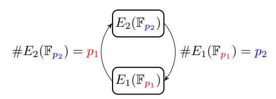
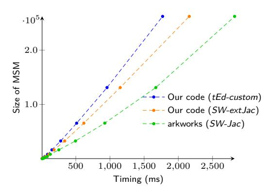
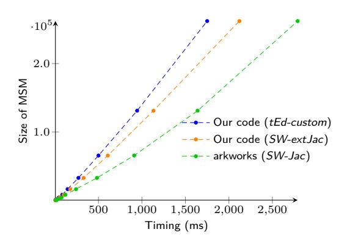

# EdMSM: Multi-Scalar-Multiplication for SNARKs and Faster Montgomery multiplication

Gautam Botrel and Youssef El Housni

Linea, ConsenSys gautam.botrel@consensys.net youssef.elhousni@consensys.net

Abstract. The bottleneck in the proving algorithm of most of elliptic-curve-based SNARK proof systems is the Multi-Scalar-Multiplication (MSM) algorithm. In this paper we give an overview of a variant of the Pippenger MSM algorithm together with a set of optimizations tailored for curves that admit a twisted Edwards form. We prove that this is the case for SNARK-friendly chains and cycles of elliptic curves, which are useful for recursive constructions. Our contribution is twofold: first, we optimize the arithmetic of finite fields by improving on the well-known Coarsely Integrated Operand Scanning (CIOS) modular multiplication. This is a contribution of independent interest that applies to many different contexts. Second, we propose a new coordinate system for twisted Edwards curves tailored for the Pippenger MSM algorithm.

Accelerating the MSM over these curves is critical for deployment of recursive proof systems applications such as proof-carrying-data, blockchain rollups and blockchain light clients. We implement our work in Go and benchmark it on two different CPU architectures (x86 and arm64). We show that our implementation achieves a 40-47% speedup over the state-of-the-art implementation (which was implemented in Rust). This MSM implementation won the first place in the ZPrize competition in the open division "Accelerating MSM on Mobile" and will be deployed in two real-world applications: Linea zkEVM by ConsenSys and probably Celo network.

 $\textbf{Keywords:} \ \, \text{elliptic curves} \ \, \cdot \ \, \text{multi-scalar-multiplication} \ \, \cdot \ \, \text{implementation} \ \, \cdot \ \, \text{zero-knowledge proof}$ 

### 1 Introduction

A SNARK is a cryptographic primitive that enables a prover to prove to a verifier the knowledge of a satisfying witness to a non-deterministic (NP) statement by producing a proof  $\pi$  such that the size of  $\pi$  and the cost to verify it are both sub-linear in the size of the witness. Today, the most efficient SNARKs use elliptic curves to generate and verify the proof. A SNARK usually consists in three algorithms Setup, Prove and Verify.

The Setup and Prove algorithms involve solving multiple large instances of tasks about polynomial arithmetic in  $\mathbb{F}_r[X]$  (where r is a prime) and multi-scalar multiplication (MSM) over the points of an elliptic curve. Fast arithmetic in  $\mathbb{F}_r[X]$ , when manipulating large-degree polynomials, is best implemented using the Fast Fourier Transform (FFT) [Pol71] and MSMs of large sizes are best implemented using a variant of Pippenger's algorithm [BDLO12, Section 4]. For example, Table 1 reports the numbers of MSMs required in the Setup, Prove and Verify algorithms in the [Gro16] SNARK and the KZG-based PLONK universal SNARK [GWC19]. The sizes of the MSMs are given in terms of the number of gates in the arithmetic circuits defining the computation to be proved by the SNARK (notation in the Table caption). The report excludes the number of FFTs as

the dominating cost for such constructions is the MSM computation ( $\sim 80\%$  of the overall time).

<span id="page-1-0"></span>**Table 1:** Cost of Setup, Prove and Verify algorithms for [Gro16] and PLONK. m = number of wires, n = number of multiplication gates, a = number of addition gates and  $\ell =$  number of public inputs.  $M_{\mathbb{G}_{i \in 1,2}} =$  multiplication in  $\mathbb{G}_{i \in 1,2}$  and P=pairing.

|             | Setup                            | Prove                            | Verify                    |
|-------------|----------------------------------|----------------------------------|---------------------------|
| [Gro16]     | $3n \ \mathrm{M}_{\mathbb{G}_1}$ | $(3n+m-\ell)$ $M_{\mathbb{G}_1}$ | 3 P                       |
|             | $m$ $M_{\mathbb{G}_2}$           | $n$ $\mathtt{M}_{\mathbb{G}_2}$  | $\ell$ $M_{\mathbb{G}_1}$ |
| PLONK (KZG) | $d (\geq n+a) M_{\mathbb{G}_1}$  | $9(n+a)$ $M_{\mathbb{G}_1}$      | 2 P                       |
|             | $1 \ M_{\mathbb{G}_2}$           | $g(n+a)$ $\operatorname{Fig}_1$  | 18 M <sub>G₁</sub>        |

Given a set of n elements  $G_1, \dots, G_n$  (bases) in  $\mathbb G$  a cyclic group (e.g. cyclic subgroup of the group of points on an elliptic curve) whose order  $\#\mathbb G$  has b bits and a set of n integers  $a_1, \dots, a_n$  (scalars) between 0 and  $\#\mathbb G$ , the goal is to compute efficiently the group element  $[a_1]G_1 + \dots + [a_n]G_n$ . In SNARK applications, we are interested in large instances of variable-base MSMs  $(n = 10^7, 10^8, 10^9)$  — with random bases and random scalars — over the pairing groups  $\mathbb G_1$  and  $\mathbb G_2$ .

The naive algorithm uses a double-and-add strategy to compute each  $[a_i]G_i$  then adds them all up, costing on average  $3/2 \cdot b \cdot n$  group operations (+). On the one hand, there are several algorithms that optimize the total number of group operations as a function of n such as Strauss [Str64], Bos-Coster [dR95, Sec. 4] and Pippenger [Pip76] algorithms. For large instances of a variable-base MSM, the fastest approach is a variant of Pippenger's algorithm [BDLO12, Sec. 4]. For simplicity, we call it the bucket method. On the other hand, efficient implementation of finite fields arithmetic impacts directly the performance of the group operation and therefore the performance of the whole MSM algorithm. In this paper we are interested in the bucket-method MSM on inner curves of 2-chains and 2-cycles of elliptic curves.

**Contributions.** Our contribution is twofold: first, we discovered an optimization that reduces the number of operations needed to compute the modular multiplication of two big integers for most (but not all) choices of modulus. To the best of our knowledge, we are not aware of any prior art describing this optimization. Our multiplication algorithm improves on the CIOS algorithm [Aca98] by saving 5N + 2 additions, where N is the number of 64-bit machine words in the modulus. When N = 6 for instance, this yields a 8% improvement. On arm64, our implementation achieves an additional 17% thanks to a collection of assembly optimizations explained in Sec. 6.

Second, we analyse the complexity of the bucket method variant of the Pippenger MSM algorithm. We propose a new coordinate system for twisted Edwards curves tailored for this algorithm. We finally show how to use the algebraic structure of elliptic curves to further reduce the complexity of the algorithm.

We choose, as an example, the widely used BLS12-377 elliptic  $[BCG^+20]$  as an inner 2-chain. We implement both the finite field arithmetic using our algorithm and the bucket MSM algorithm using the twisted Edwards new coordinate system. Our implementation in Go outperforms the state-of-the-art implementation in Rust [aC22] by 40-47%.

Our implementation won the first place in the ZPrize competition in the open division "Accelerating MSM on Mobile" (https://www.zprize.io/) and will be deployed in two real-world applications: Linea zkEVM by ConsenSys (https://consensys.net/zkevm/) and probably Celo network (https://celo.org/). The zkEVM use-case uses our CPU MSM implementation to generate a PLONK proof of a batch of transactions to scale the Ethereum blockchain, while the Celo network would use our techniques to reduce its Groth16 proof generation time on a mobile from 3s to 400ms.

Organization of the paper. Section 2 provides preliminaries on CIOS modular multiplication and proofs of our new algorithm. Section 3 provides definitions of 2-chains and 2-cycles of elliptic curves and some results we prove. In section 4, we explain the bucket method and provide its complexity analysis. Section 5 provides our optimizations to the bucket method for both generic elliptic curves and the twisted Edwards curves. We prove that inner 2-chains and 2-cycles always fall into the second more optimized case. Finally, section 6 reports on our implementation of the bucket method alongside our optimizations. We choose to tailor the implementation to the widely used BLS12-377 curve and to benchmark our results on two different CPU architectures(x86 and arm64).

# <span id="page-2-0"></span>2 Optimizing modular multiplication

## 2.1 The Montgomery multiplication: theory

The modular multiplication problem. Given integers a, b and p the modular multiplication problem is to compute the remainder of the product

$$ab \mod p$$
.

On computers a division operation is much slower than other operations such as multiplication. Thus, a naive implementation of  $ab \mod p$  using a division operation is prohibitively slow. In 1985, Montgomery introduced a method to avoid costly divisions [Mon85]. This method, now called the Montgomery multiplication, is among the fastest solutions to the problem and it continues to enjoy widespread use in modern cryptography.

Overview of the solution: the Montgomery multiplication. There are many good expositions of the Montgomery multiplication (e.g. [BM17]). As such, we do not go into detail on the mathematics of the Montgomery multiplication. Instead, this paragraph is intended to establish notation that is used throughout this section.

The Montgomery multiplication algorithm does not directly compute  $ab \mod p$ . Instead it computes  $abR^{-1} \mod p$  for some carefully chosen number R called the Montgomery radix. Typically, R is set to the smallest power of two exceeding p that falls on a computer word boundary. For example, if p is 381 bits then  $R = 2^{6 \times 64} = 2^{384}$  on a 64-bit architecture.

In order to make use of the Montgomery multiplication the numbers a and b must be encoded into the Montgomery form: instead of storing (a,b), we store the numbers  $(\tilde{a},\tilde{b})$  given by  $\tilde{a}=aR \mod p$  and  $\tilde{b}=bR \mod p$ . A simple calculation shows that the Montgomery multiplication produces the product  $ab \mod p$ , encoded in the Montgomery form:  $(aR)(bR)R^{-1}=abR \mod p$ . The idea is that numbers are always stored in the Montgomery form so as to avoid costly conversions to and from the Montgomery form.

Other arithmetic operations such as addition, subtraction are unaffected by the Montgomery form encoding. But the modular inverse computation  $a^{-1} \mod p$  must be adapted to account for the Montgomery form. We do not discuss modular inversion in this section (cf. [BY19] and [Por20]).

#### 2.2 The Montgomery multiplication: implementation

For security purposes, cryptographic protocols use large moduli — a,b and p are stored on multiple machine words (multi-precision). In this section, we let D denote the base in which integers are represented. (For example,  $D=2^{64}$  if a word is 64 bits). A large number a can be represented by its base-D digits  $a_0,\ldots,a_N$  stored in machine words (uint) such that  $a=\sum_{i=0}^N a_i D^i$ .

There are several variations of multi-precision Montgomery multiplication. To compute  $\tilde{c} = \tilde{a}\tilde{b}R^{-1}$ , we need to multiply the operands  $(P = \tilde{a}\tilde{b})$  and then compute  $PR^{-1} \mod p$ . This second step (Montgomery reduction) can be computed efficiently (see Algorithm 1 [BM17]) when we precompute the number  $-p^{-1} \mod R$ .

A popular choice is the Coarsely Integrated Operand Scanning (CIOS) variant [Aca98] which interleaves the operands multiplication and the reduction step. In some settings, factors such as modulus size, CPU cache management, optimization techniques, architecture and available instruction set might favor other variants.

**How fast is the CIOS method?** Let N denote the number of machine words needed to store the modulus p. For example, if p is a 381-bit prime and the hardware has 64-bit word size then N=6. The CIOS method solves modular multiplication using  $4N^2+4N+2$  unsigned integer additions and  $2N^2+N$  unsigned integer multiplications.

Our optimization reduces the number of additions needed in the CIOS Montgomery multiplication to only  $4N^2 - N$ , a saving of 5N + 2 additions. This optimization can be used whenever the highest bit of the modulus is zero (and not all of the remaining bits are set — see below for details).

The core of the state-of-the-art CIOS Montgomery multiplication is reproduced below. This listing is adapted from Section 2.3.2 of Tolga Acar's thesis [Aca98]. The symbols in this listing have the following meanings:

- N is the number of machine words needed to store the modulus p.
- D is the word size. For example, on a 64-bit architecture D is  $2^{64}$ .
- $\tilde{a}[i], \tilde{b}[i], p[i]$  are the *i*-th words of the integers  $\tilde{a}, \tilde{b}$  and p.
- p'[0] is the lowest word of the number  $-p^{-1} \mod R$ . This quantity is precomputed, as it does not depend on the inputs  $\tilde{a}$  and  $\tilde{b}$ .
- t is an array of N+2 words.
- C, S are machine words. A pair (C, S) refers to (high-bits, low-bits) of a two-word number. For short we denote them (hi,lo).

Next, we show that we can avoid the additions in lines 5 and 12 of Alg. 1 when the highest word of the modulus p is at most (D-1)/2-1. This condition holds if and only if the highest bit of the modulus is zero and not all of the remaining bits are set. With 64bits machine words  $(D=2^{64})$  the most significant word of the modulus should be at most 0x7FFFFFFFFFFFFFFFFFFFFFFFFFFFFFFFFFFFF

**Our optimization.** Observe that lines 4 and 10 have the form  $(hi, lo) := m_1 + m_2 \cdot B + m_3$ , where hi, lo,  $m_1$ ,  $m_2$ ,  $m_3$  and B are machine-words where each is at most D-1. If  $B \leq (D-1)/2-1$  then a simple calculation shows that

$$m_1 + m_2 \cdot B + m_3 \le (D-1) + (D-1)(\frac{D-1}{2} - 1) + (D-1)$$
  
 $\le D(\underbrace{\frac{D-1}{2}}_{\text{hi}}) + \underbrace{(\frac{D+1}{2} - 1)}_{\text{lo}}$ 

From which we derive the following Lemma:

<span id="page-3-0"></span>**Lemma 1.** If 
$$B \leq (D-1)/2 - 1$$
, then  $hi \leq (D-1)/2$ .

We use Lemma 1 to prove the following Proposition:

```
Algorithm 1: The CIOS Montgomery multiplication
  Input: a˜ = aR and ˜b = bR with a, ˜
                              ˜b < R
  Output: abR mod p
1 for i = 0 to N − 1 do
2 C = 0;
3 for j = 0 to N − 1 do
4 (C, t[j]) = t[j] + ˜a[j] ·
                        ˜b[i] + C
5 (t[N + 1], t[N]) = t[N] + C;
6 C = 0;
7 m = t[0] · p
             0
              [0] mod D;
8 (C, _) = t[0] + m · p[0];
9 for j = 1 to N − 1 do
10 (C, t[j − 1]) = t[j] + m · p[j] + C
11 (C, t[N − 1]) = t[N] + C;
12 t[N] = t[N + 1] + C;
13 t[N + 1] = 0;
14 if t < p then
15 return t; // abR mod p
16 else
17 return t − p; // abR mod p
```

<span id="page-4-0"></span>**Proposition 1.** *If the highest word of p is at most* (*D* − 1)*/*2 − 1*, then the variables t*[*N*] *and t*[*N* + 1] *always store the value 0 at the beginning of each iteration of the outer i-loop.*

*Proof.* We prove this proposition by induction. The base case *i* = 0 is trivial, since the *t* array is initialized to 0. For the inductive step at the iteration *i*, we suppose that *t*[*N*] = *t*[*N* + 1] = 0 and trace the execution through the iteration. Begin at the final iteration of the first inner loop (*j* = *N* − 1) on line 4. Because *a < p* ˜ and because the highest word of *p* is smaller than (*D* − 1)*/*2, we may use Lemma [1](#page-3-0) to see that the carry *C* is at most (*D* − 1)*/*2. Then line 5 sets

$$t[N] = C$$
$$t[N+1] = 0.$$

A similar observation holds at the end of the second inner loop (*j* = *N* − 1) on line 10: Lemma [1](#page-3-0) implies that the carry *C* is at most (*D* − 1)*/*2. We previously observed that *t*[*N*] is also at most (*D* − 1)*/*2, so *t*[*N*] + *C* is at most

$$\frac{D-1}{2} + \frac{D-1}{2} = D - 1$$

which fits entirely into a single word. Then line 11 sets *C* to 0 and line 12 sets *t*[*N*] to 0. The proof by induction is now complete.

With this proposition, we no longer need the addition at line 5, and guarantee that addition on line 11 will fit in one machine word. *t* size is reduced to *N* + 1 words.

**Performance.** In practice (cf. Sec[.6.](#page-12-0)) Algorithm [2](#page-5-1) yields a 5-10% improvement over Algorithm [1](#page-4-0) given different *N* values. For *N* = 4, we measure 5.9% improvement. For *N* = 6, which is the value that corresponds to a field on which a 128-bit secure elliptic curve should be defined, our algorithm achieves a 8% improvement. The improvement peaks at *N* = 8 (10%) and decreases afterwards. We measure 5% for *N* = 10. This is expected as the number of additions we saved is linear whereas the total number of word

```
Algorithm 2: Our optimized CIOS Montgomery multiplication
   Input: \tilde{a} = aR \mod p, \tilde{b} = bR \mod p
   Output: abR \mod p
1 for i = 0 to N - 1 do
      C=0:
 2
      for j = 0 to N - 1 do
 3
       (C, t[j]) = t[j] + \tilde{a}[j] \cdot \tilde{b}[i] + C
 4
      t[N] = C;
5
      C=0;
6
       m = t[0] \cdot p'[0] \mod D;
       (C, \_) = t[0] + m \cdot p[0];
8
      for j = 1 to N - 1 do
9
       (C, t[j-1]) = t[j] + m \cdot p[j] + C
10
      t[N-1] = t[N] + C;
12 t[N] = 0;
13 if t < p then
                                                                          // abR \mod p
      return t;
14
15 else
      return t-p;
                                                                          // abR \mod p
```

<span id="page-5-1"></span>multiplications and additions in the algorithm is quadratic. Moreover, as N grows it becomes necessary to push/pop registers to the stack which overshadows the gains.

The same reasoning applies as well to the squaring algorithm (cf. Alg. 5 in the appendix A). Note that the condition on the modulus p i.e.  $p[N-1] \leq (D-1)/2-1$  is a relaxed condition compared to other techniques that impose a specific form for p such as Montgomery-friendly primes [BD21] (e.g.  $p=2^{e_2}\alpha\pm 1$  where  $2^{e_2}$  is an upper bound for the reduction coefficient R). However, in our method, we impose the inputs  $\tilde{a}, \tilde{b}$  to be reduced mod p. This can limit lazy reduction techniques [Sco07] for multiplication over the extensions of  $\mathbb{F}_p$ .

# <span id="page-5-0"></span>3 2-chain and 2-cycle of elliptic curves

#### <span id="page-5-2"></span>3.1 2-chains

Following [EG22], a 2-chain of elliptic curves is a set of two curves as in Definition 2.

**Definition 1.** A 2-chain of elliptic curves is a list of two distinct curves  $E_1/\mathbb{F}_{p_1}$  and  $E_1/\mathbb{F}_{p_2}$  where  $p_1$  and  $p_2$  are large primes and  $p_1 \mid \#E_2(\mathbb{F}_{p_2})$ . SNARK-friendly 2-chains are composed of two curves that have highly 2-adic subgroups of orders  $r_1 \mid \#E_1(\mathbb{F}_{p_1})$  and  $r_2 \mid \#E_2(\mathbb{F}_{p_2})$  such that  $r_1 \equiv r_2 \equiv 1 \mod 2^L$  for a large integer  $L \geq 1$ . This also means that  $p_1 \equiv 1 \mod 2^L$ .

In a 2-chain, the first curve is denoted the *inner curve*, while the second curve whose order is the characteristic of the inner curve, is denoted the *outer curve* (cf. Fig. 1).

Inner curves from polynomial families. The best elliptic curves amenable to efficient implementations arise from polynomial based families. These curves are obtained by parameterizing the Complex Multiplication (CM) equation with polynomials p(x), t(x), r(x) and y(x). The authors of [EG22] showed that the polynomial-based pairing-friendly Barreto-Lynn–Scott families of embedding degrees k=12 (BLS12) and k=24 (BLS24) [BLS03] are the most suitable to construct inner curves in the context of pairing-based SNARKs.

$$\underbrace{E_2(\mathbb{F}_{p_2})}_{\#E_2(\mathbb{F}_{p_2}) = h \cdot \mathbf{p}}$$

$$\underbrace{E_1(\mathbb{F}_{p_1})}_{\#E_1(\mathbb{F}_{p_1})}$$

Figure 1: A 2-chain of elliptic curves.

<span id="page-6-1"></span>These curves require the seed x to satisfy  $x \equiv 1 \mod 3 \cdot 2^L$  to have the 2-adicity requirement with respect to both r and p.

A particular example of an efficient 2-chain for SNARK applications is composed of the inner curve BLS12-377  $[BCG^+20]$  and the outer curve BW6-761 [EG20].

We prove useful a result 2 that will be needed later to optimize the MSM computation.

<span id="page-6-3"></span>**Proposition 2** ([EG22, Sec. 3.4]). All inner BLS curves admit a short Weierstrass form  $Y^2 = X^3 + 1$ .

<span id="page-6-2"></span>**Lemma 2.** All inner BLS curves admit a twisted Edwards form  $ay^2 + x^2 = 1 + dx^2y^2$  with  $a = 2\sqrt{3} - 3$  and  $d = -2\sqrt{3} - 3$  over  $\mathbb{F}_p$ . If further -a is a square, the equation becomes  $-x^2 + y^2 = 1 + d'x^2y^2$  with  $d' = 7 + 4\sqrt{3} \in \mathbb{F}_p$ .

*Proof.* Proposition 2 shows that all inner BLS curves are of the form  $W_{0,1}: y^2 = x^3 + 1$ . The following map

$$W_{0,1} \to E_{a,d}$$
  
 $(x,y) \mapsto \left(\frac{x+1}{y}, \frac{x+1-\sqrt{3}}{x+1+\sqrt{3}}\right)$ 

defines the curve  $E_{a,d}$ :  $ay^2 + x^2 = 1 + dx^2y^2$  with  $a = 2\sqrt{3} - 3$  and  $d = -2\sqrt{3} - 3$ . The inverse map is

$$E_{a,d} \to W_{0,1}$$
  
 $(x,y) \mapsto \left(\frac{(1+y)\sqrt{3}}{1-y} - 1, \frac{(1+y)\sqrt{3}}{(1-y)x}\right)$ 

If -a is a square in  $\mathbb{F}_p$ , the map  $(x,y)\mapsto (x/\sqrt{-a},y)$  defines from  $E_{a,d}$  the curve  $E_{-1,d'}$  of equation  $-x^2+y^2=1+d'x^2y^2$  with  $d'=-d/a=(2\sqrt{3}+3)/(2\sqrt{3}-3)=7+4\sqrt{3}$ .

These maps work only if  $\sqrt{3}$  is defined in  $\mathbb{F}_p$ , that is 3 is a quadratic residue. This is always the case in  $\mathbb{F}_p$  on which an inner BLS curve is defined. Let  $\left(\frac{3}{p}\right)$  be  $3^{\frac{p-1}{2}} \mod p$ , the Legendre symbol. The quadratic reciprocity theorem tells us that  $\left(\frac{3}{p}\right)\left(\frac{p}{3}\right)=(-1)^{\frac{p-1}{2}}$ .

We have  $p \equiv 1 \mod 4$  from the 2-adicity condition, so  $\left(\frac{3}{p}\right) = \left(\frac{p}{3}\right)$ . Now  $\left(\frac{p}{3}\right) \equiv p \mod 3$  which is always equal to 1 for all BLS curves  $(x \equiv 1 \mod 3 \mod x - 1 \mid p - 1)$ . More generally one can prove that when p = 2 or  $p \equiv 1$  or  $11 \mod 12$  then 3 is a quadratic residue in  $\mathbb{F}_p$ . For inner BLS, we have  $p \equiv 1 \mod 3 \cdot 2^L$  with  $L \gg 2$ .

## **3.2** 2-cycles

<span id="page-6-0"></span>**Definition 2.** A 2-cycle of elliptic curves is a list of two distinct prime-order curves  $E_1/\mathbb{F}_{p_1}$  and  $E_1/\mathbb{F}_{p_2}$  where  $p_1$  and  $p_2$  are large primes,  $p_1 = \#E_2(\mathbb{F}_{p_2})$  and  $p_2 = \#E_1(\mathbb{F}_{p_1})$ . SNARK-friendly 2-cycles are composed of two curves that have highly 2-adic subgroups, i.e.  $\#E_1(\mathbb{F}_{p_1}) \equiv \#E_2(\mathbb{F}_{p_2}) \equiv 1 \mod 2^L$  for a large integer  $L \geq 1$ . This also means that  $p_1 \equiv p_2 \equiv 1 \mod 2^L$ .

This notion was initially introduced under different names, for example *amicable pairs* (or equivalently *dual elliptic primes* [Mih07]) for 2-cycles of ordinary curves, and *aliquot cycles* for the general case [SS11]. Some examples of SNARK-friendly 2-cycles include MNT4-MNT6 curves [BCTV14], Tweedle curves [BGH19] and Pasta curves [Hop20].

<span id="page-7-1"></span>In particular a 2-cycle is a 2-chain where both curves are inner and outer curves with respect to each other (cf. Fig. 2). This means that both curves in a 2-cycle admit a twisted Edwards form following the same reasoning as in subsection 3.1. In the sequel we will focus on the case of BLS12 inner curves that form a 2-chain but we stress that these results apply to 2-chain inner curves from other families (e.g. BLS24 and BN [AHG22]) and to 2-cycles as well.



Figure 2: A cycle of elliptic curves.

## <span id="page-7-0"></span>4 The bucket method

The high-level strategy of the bucket-method MSM can be given in three steps:

- Step 1: reduce the b-bit MSM to several c-bit MSMs for some fixed  $c \leq b$
- Step 2: solve each c-bit MSM efficiently
- Step 3: combine the c-bit MSMs into the final b-bit MSM

### 4.1 Step 1: reduce the b-bit MSM to several c-bit MSMs

- 1. Choose a window c < b
- 2. Write each scalar  $a_1, \dots, a_n$  in binary form and partition each into c-bit parts

$$a_i = (\underbrace{a_{i,1}, a_{i,2}, \cdots, \underbrace{a_{i,b/c}}_{c\text{-bit}}})_2$$

3. Deduce b/c instances of c-bit MSMs from the partitioned scalars

$$T_{1} = [a_{1,1}]G_{1} + \dots + [a_{n,1}]G_{n}$$

$$\vdots$$

$$T_{j} = [a_{1,j}]G_{1} + \dots + [a_{n,j}]G_{n}$$

$$\vdots$$

$$T_{b/c} = [a_{1,b/c}]G_{1} + \dots + [a_{n,b/c}]G_{n}$$

Cost of Step 1 is negligible.

## 4.2 Step 2: solve each c-bit MSM $T_j$ efficiently

1. For each  $T_j$ , accumulate the bases  $G_i$  inside buckets Each element  $a_{i,j}$  is in the set  $\{0, 1, 2, \dots 2^c - 1\}$ . We initialize  $2^c - 1$  empty buckets (with points at infinity) and accumulate the bases  $G_i$  from each  $T_j$  inside the bucket corresponding to the scalar  $a_{i,j}$ .

$$\begin{array}{cccccccccccccccccccccccccccccccccccc$$

Cost: 
$$n - (2^c - 1) = n - 2^c + 1$$
 group operations.

2. Combine the buckets to compute  $T_j$ 

This step is also a c-bit MSM of size  $2^c - 1$  but this time the scalars are ordered and known in advance  $S_1 + [2]S_2 + \cdots + [2^c - 1]S_{2^c - 1}$ , thus we can compute this instance efficiently as follows

$$\begin{array}{c} S_{2^c-1} \\ + & S_{2^c-1} \\ + & S_{2^c-1} \\ + & S_{2^c-1} \\ + & S_{2^c-1} \\ + & S_{2^c-1} \\ + & S_{2^c-1} \\ + & S_{2^c-2} \\ + & S_{2^c-2} \\ + & S_{2^c-2} \\ + & \cdots \\ + & S_3 \\ + & S_2 \\ + & S_2 \\ + & \cdots \\ + & S_3 \\ + & S_2 \\ + & S_1 \\ \hline \\ \begin{bmatrix} 2^c - 1 \end{bmatrix} S_{2^c-1} \\ + & \begin{bmatrix} 2^c - 2 \end{bmatrix} S_{2^c-2} \\ + & \cdots \\ + & \begin{bmatrix} 3 \end{bmatrix} S_3 \\ + & \begin{bmatrix} 2 \end{bmatrix} S_2 \\ + & S_1 \\ \hline \\ & & \end{bmatrix} \\ \hline \\ & & & & & & & & & & \\ \hline & & & & &$$

Cost of Step 2: 
$$n - 2^{c} + 1 + 2^{c+1} - 3 = n + 2^{c} - 2$$
 group operations.

## 4.3 Step 3: combine the c-bit MSMs into the final b-bit MSM

Algorithm 3 gives an iterative way to combine the small MSMs into the original MSM.

Cost of Step 3: 
$$(b/c-1)(c+1) = b-c+b/c-1$$
 group operations.

Combining Steps 1, 2 and 3, the expected overall cost of the bucket method is

Total cost: 
$$\frac{b}{c}(n+2^c) + (b-c-b/c-1) \approx \frac{b}{c}(n+2^c)$$
 group operations.

```
Algorithm 3: Step 3
Input: \{T_1, \ldots, T_{b/c}\}
Output: T = [a_1]G_1 + \cdots + [a_n]G_n

1 T \leftarrow T_1;
2 for i from 2 to b/c do

3 T \leftarrow [2^c]T; // Double c times

4 T \leftarrow T + T_i; // Add
```

<span id="page-9-1"></span>Remark 1 (On choosing c). The theoretical minimum occurs at  $c \approx \log n$  and the asymptotic scaling looks like  $\%(b\frac{n}{\log n})$ . However, in practice, empirical choices of c yield a better performance because the memory usage scales with  $2^c$  and there are fewer edge cases if c divides b. For example, with  $n = 10^7$  and b = 256, we observed a peak performance at c = 16 instead of  $c = \log n \approx 23$ .

# <span id="page-9-0"></span>5 Optimizations

#### 5.1 Parallelism

Since each c-bit MSM is independent of the rest, we can compute each (Step 2) on a separate core. This makes full use of up to b/c cores but increases memory usage as each core needs  $2^c-1$  buckets (points). If more than b/c cores are available, further parallelism does not help much because m MSM instances of size n/m cost more than 1 MSM instance of size n.

### 5.2 Precomputation

When the bases  $G_1, \dots, G_n$  are known in advance, we can use a smooth trade-off between precomputed storage vs. run time. For each base  $G_i$ , choose k as big as the storage allows and precompute k points  $[2^c - k]G, \dots, [2^c - 1]G$  and use the bucket method only for the first  $2^c - 1 - k$  buckets instead of  $2^c - 1$ . The total cost becomes  $\approx \frac{b}{c}(n + 2^c - k)$ . However, large MSM instances already use most available memory. For example, when  $n = 10^8$  our implementation needs 58GB to store enough BLS12-377 curve points to produce a Groth16 [Gro16] proof. Hence, the precomputation approach yield negligible improvement in our case.

#### 5.3 Algebraic structure

Since the bases  $G_1, \dots, G_n$  are points in  $\mathbb{G}_1$  (or  $\mathbb{G}_2$ ), we can use the algebraic structure of elliptic curves to further optimize the bucket method.

**Non-Adjacent-Form (NAF).** Given a point  $G_i = (x, y) \in \mathbb{G}_1$  (or  $\mathbb{G}_2$ ), on a Weierstrass curve for instance, the negative  $-G_i$  is (x, -y). This observation is well known to speed up the scalar multiplication  $[s]G_i$  by encoding the scalar s in a signed binary form  $\{-1, 0, 1\}$  (later called 2-NAF — the first usage might go back to 1989 [MO90]). However, this does not help in the bucket method because the cost increases with the number of possible scalars regardless of their encodings. For a c-bit scalar, we always need  $2^c - 1$  buckets. That is said, we can use the 2-NAF decomposition differently. Instead of writing the c-bit scalars in the set  $\{0, \dots, 2^c - 1\}$ , we write them in the signed set  $\{-2^{c-1}, \dots, 2^{c-1} - 1\}$  (cf. Alg. 4). If a scalar  $a_{i,j}$  is strictly positive we add  $G_i$  to the bucket  $S_{(a_{i,j})_2}$  as usual,

and if  $a_{i,j}$  is strictly negative we add  $-G_i$  to the bucket  $S_{|(a_{i,j})_2|}$ . This way we reduce the number of buckets by half.

```
Total cost: \approx \frac{b}{c}(n+2^{c-1}) group operations.
```

```
Algorithm 4: Signed-digit decomposition Input: (a_0, \cdots, a_{b/c-1}) \in \{0, \cdots, 2^c - 1\} Output: (a'_0, \cdots, a'_{b/c-1}) \in \{-2^{c-1}, \cdots, 2^{c-1} - 1\}

1 for i from 0 to b/c - 1 do

2 | if a_i \geq 2^{c-1} then

3 | assert i \neq b/c - 1;  // No overflow for the final digit

4 | a'_i \leftarrow a_i - 2^c;  // Force this digit into \{-2^{c-1}, \cdots, 2^{c-1} - 1\}

5 | a_{i+1} \leftarrow a_{i+1} + 1;  // Lend 2^c to the next digit

6 | else

7 | a'_i \leftarrow a_i

8 return (a'_0, \cdots, a'_{b/c-1});
```

<span id="page-10-0"></span>The signed-digit decomposition cost is negligible but it works only if the bitsize of  $\#\mathbb{G}_1$  (and  $\#\mathbb{G}_2$ ) is strictly bigger than b. We use the spare bits to avoid the overflow. This observation should be taken into account at the curve design level.

Curve forms and coordinate systems. To minimize the overall cost of storage but also run time, one can store the bases  $G_i$  in affine coordinates. This way we only need the tuples  $(x_i, y_i)$  for storage (although we can batch-compress these following [Kos21]) and we can make use of mixed addition with a different coordinate systems.

The overall cost of the bucket method is  $\frac{b}{c}(n+2^{c-1})+(b-c-b/c-1)$  group operations. This can be broken down explicitly to:

- Mixed additions: to accumulate  $G_i$  in the c-bit MSM buckets with cost  $\frac{b}{c}(n-2^{c-1}+1)$
- Additions: to combine the bucket sums with cost  $\frac{b}{c}(2^c-3)$
- Additions and doublings: to combine the c-bit MSMs into the b-bit MSM with cost b-c+b/c-1
  - b/c 1 additions and
  - $\blacksquare b c$  doublings

For large MSM instances, the dominating cost is in the mixed additions as it scales with n. For this, we use extended Jacobian coordinates  $\{X,Y,ZZ,ZZZ\}$   $\{x=X/ZZ,y=Y/ZZZ,ZZ^3=ZZZ^2\}$  trading-off memory for run time compared to the usual Jacobian coordinates  $\{X,Y,Z\}$   $\{x=X/Z^2,y=Y/Z^3\}$  (cf. Table 2).

<span id="page-10-1"></span>**Table 2:** Cost of arithmetic in Jacobian and extended Jacobian coordinate systems. m=Multiplication and s=Squaring in the field.

| Coordinate systems | Mixed addition              | Addition                     | Doubling                    |
|--------------------|-----------------------------|------------------------------|-----------------------------|
| Jacobian           | $7\mathbf{m} + 4\mathbf{s}$ | $11\mathbf{m} + 5\mathbf{s}$ | $2\mathbf{m} + 5\mathbf{s}$ |
| Extended Jacobian  | $8\mathbf{m} + 2\mathbf{s}$ | $12\mathbf{m} + 2\mathbf{s}$ | $6\mathbf{m} + 4\mathbf{s}$ |

We work over fields of large prime characteristic ( $\neq 2,3$ ), so the elliptic curves in question have always a short Weierstrass (SW) form  $y^2 = x^3 + ax + b$ . Over this form, the

| Form              | Coordinates system                                                       | Equation                                                             | Mixed addition cost            |  |
|-------------------|--------------------------------------------------------------------------|----------------------------------------------------------------------|--------------------------------|--|
| short Weierstrass | extended Jacobian                                                        | $y^2 = x^3 + ax + b$                                                 | 10 <b>m</b>                    |  |
| Jacobi quartics   | XXYZZ, doubling-oriented $XXYZZ$ , $XXYZZR$ , doubling-oriented $XXYZZR$ | $y^2 = x^4 + 2ax^2 + 1$                                              | 9 <b>m</b>                     |  |
| Edwards           | projective, inverted                                                     | $x^2 + y^2 = c^2(1 + dx^2y^2)$                                       | 9 <b>m</b>                     |  |
| twisted Edwards   | extended $(XYZT)$<br>$x = X/Z, y = Y/Z, x \cdot y = T/Z$                 | $ax^2 + y^2 = 1 + dx^2y^2$                                           | 8m (dedicated)<br>9m (unified) |  |
| twisted Edwards   | extended $(XYZT)$<br>$x = X/Z, y = Y/Z, x \cdot y = T/Z$                 | $\begin{vmatrix} -x^2 + y^2 = 1 + dx^2y^2 \\ (a = -1) \end{vmatrix}$ | 7m (dedicated)<br>8m (unified) |  |

<span id="page-11-0"></span>**Table 3:** Cost of mixed addition in different elliptic curve forms and coordinate systems assuming  $1\mathbf{m} = 1\mathbf{s}$ . Formulas and references from [BL22].

fastest mixed addition is achieved using extended Jacobian coordinates. However, there are other forms that enable even faster mixed additions (cf. Table 3).

It appears that a twisted Edwards (tEd) form is appealing for the bucket method since it has the lowest cost for the mixed addition in extended coordinates. Furthermore, the arithmetic on this form is complete, i.e. the addition formulas are defined for all inputs. This improves the run time by eliminating the need of branching in case of adding the neutral element or doubling compared to a SW form. We showed in Lemma 2 that all inner BLS curves admit a tEd form.

For the arithmetic, we use the formulas in [HWCD08] alongside some optimizations. We take the example of BLS12-377 for which a=-1:

- To combine the c-bit MSMs into a b-bit MSM we use unified additions [HWCD08, Sec. 3.1] (9m) and dedicated doublings [HWCD08, Sec. 3.3] (4m + 4s).
- To combine the bucket sums we use unified additions  $(9\mathbf{m})$  to keep track of the running sum and unified re-additions  $(8\mathbf{m})$  to keep track of the total sum. We save  $1\mathbf{m}$  by caching the multiplication by 2d' from the running sum.
- To accumulate the  $G_i$  in the c-bit MSM we use unified re-additions with some precomputations. Instead of storing  $G_i$  in affine coordinates we store them in a custom coordinates system (X,Y,T) where y-x=X, y+x=Y and  $2d' \cdot x \cdot y = T$ . This saves 1m and 2a (additions) at each accumulation of  $G_i$ .

We note that although the dedicated addition (resp. the dedicated mixed addition) in [HWCD08, Sec. 3.2] saves the multiplication by 2d', it costs  $4\mathbf{m}$  (resp.  $2\mathbf{m}$ ) to check the operands equality:  $X_1Z_2 = X_2Z1$  and  $Y_1Z_2 = Y_2Z1$  (resp.  $X_1 = X_2Z1$  and  $Y_1 = Y_2Z1$ ). This cost offset makes both the dedicated (mixed) addition and the dedicated doubling slower than the unified (mixed) addition in the MSM case. We also note that the conversion of all the  $G_i$  points given on a SW curve with affine coordinates to points on a tEd curve (also with a=-1) with the custom coordinates (X,Y,T) is a one-time computation dominated by a single inverse using the Montgomery batch trick. In SNARKs, since the  $G_i$  are points from the proving key, this computation can be part of the Setup algorithm and do not impact the Prove algorithm. If the Setup ceremony is yet to be conducted, it can be performed directly with points in the twisted Edwards form.

Our implementation shows that an MSM instance of size  $2^{16}$  on the BLS12-377 curve is 30% faster when the  $\mathbb{G}_i$  points are given on a tEd curve with the custom coordinates

compared to the Jacobian-extended-based version which takes points in affine coordinates on a SW curve.

# <span id="page-12-0"></span>6 Implementation

We implemented our algorithm in Go language. We've benchmarked the implementation against the arkworks Rust library [aC22], a widely used library in SNARK projects. We've chosen two different CPU architectures: a x86 z1d.large AWS machine (Intel Xeon Platinum 8151 CPU @ 3.40GHz) and a arm64 Samsung Galaxy A13 5G (Model SM-A136ULGDXAA with SoC MediaTek Dimensity 700 (MT6833)) running on Android 12 (API level 32).

We achieved a speed up of 40-47% for MSM instances of sizes ranging from  $2^8$  to  $2^{18}$ . The source code is available under MIT or Apache2 licenses at:

https://github.com/gbotrel/zprize-mobile-harness

**Table 4:** Comparison of the arkworks and our MSM instances of  $2^{16}$   $\mathbb{G}_1$ -points on the BLS12-377 curve.

| Implementation | Timing  | Curve form and coordinates system | Parallelism? | Precomputation? | 2-NAF<br>buckets? |
|----------------|---------|-----------------------------------|--------------|-----------------|-------------------|
| arkworks       | 2309 ms | SW Jacobian $(X, Y, Z)$           | 1            | X               | ×                 |
| Submission     | 509 ms  | tEd (a = -1) Custom $(X, Y, T)$   | <b>✓</b>     | X               | <b>✓</b>          |

The speedup against arkworks comes from the algorithmic optimizations discussed in this paper and the bigint arithmetic optimizations.

Finite field arithmetic implementation on arm64. We use a Montgomery CIOS variant to handle the field multiplication (Details of the algorithms and proofs are in section 2).

The two inner loops (line 3 and line 9 in Alg. 2) have the same form. They perform one  $word \times word$  multiplication and two word + word additions. These additions can overflow and the two distinct carry chains need to be propagated up to the last iteration.

For efficiency reasons, it is highly desirable to keep the carry in the CPU flag (i.e avoid moving it to a register) between the additions.

On x86 architectures, we leverage the ADCX, ADOX and MULX instructions to efficiently handle the interleaved carry chains in the algorithm. ADCX and ADOX perform unsigned addition with carry using distinct CPU flags, while MULX performs unsigned multiply without affecting flags.

On arm64 architecture, we split the inner loops in two to ensure the carry propagation are uninterrupted. In the first part, we multiply and propagate the first carry from the loword. The large number of available registers (in practice 28 for arm64 against 14 for x86) allows us to store this intermediary result in registers.

In the second part, we propagate the second carry chain from the hi word.

The same technique is used for the squaring function – except we have three carry to propagate since we double the intermediate product (line 5 in Alg. 5).

The impact of these optimizations is  $\sim 17\%$  for  $\mathbb{F}_p$  multiplication and  $\sim 25\%$  for the squaring. For an ext-Jac MSM instance of size  $2^{16}$ , the timing was 821ms before these arm64 field arithmetic optimizations and 620ms after. For the tEd-custom version the speedup is only related to the  $\mathbb{F}_p$ -multiplication since there are no squaring in the mixed addition. For this same version, we stored (y-x,y+x) in the coordinates system instead of

(*x, y*) and added ∼ 40 lines of arm64 assembly for a small function in F*<sup>p</sup>* (Butterfly(a, b) → a = a + b; b = a - b). The butterfly performance impact was ∼ 5%, as it speeds up the unified (mixed) addition in the *tEd* form.

<span id="page-13-0"></span>We report in Figure [3](#page-13-0) a comparison of our code to the arkworks baseline on the Samsung Galaxy A13 and in Figure [4](#page-13-1) the comparison on the x86 AWS machine. We report timings of several MSM instances of different sizes (powers of 2) and with different curve parameterizations (*SW* in extended Jacobians vs. *tEd* (*a* = −1) in custom/extended coordinates).



<span id="page-13-1"></span>**Figure 3:** Comparison of our MSM code and the arkworks one for different instances on the BLS12-377 G<sup>1</sup> group on the Samsung Galaxy A13.



**Figure 4:** Comparison of our MSM code and the arkworks one for different instances on the BLS12-377 G<sup>1</sup> group on the x86 AWS machine.

For different sizes ranging from 2 8 to 2 <sup>18</sup> the speed up is 40-47% with the *tEd* version and 20-35% with *SW-extJac*.

## **7 Conclusion**

Multi-scalar-multiplication dominates the proving cost in most elliptic-curve-based SNARKs. Inner curves such as the BLS12-377 are optimized elliptic curves suitable for both proving generic-purpose statements and in particular for proving composition and recursive statements. Hence, it is critical to aggressively optimize the computation of MSM instances on these curves. We showed that our work yield a very fast implementation both when the points are given on a short Weierstrass curve and even more when the points are given on a twisted Edwards curve. We showed that this is always the case for inner curves such as BLS12-377 and that the conversion cost is a one-time computation that can be

performed in the *Setup* phase. We note that, more generally, these tricks apply to any elliptic curve that admits a twisted Edwards form — particularly SNARK-friendly 2-cycles of elliptic curves. We suggest that this should be taken into account at the design level of SNARK-friendly curves.

Open question: For the Groth16 SNARK [Gro16], the same scalars  $a_i$  are used for two MSMs on two different elliptic curves ( $\mathbb{G}_1$  and  $\mathbb{G}_2$  MSMs where these are the pairing groups [Cos12, Chapter 2]). We ask if it is possible to mutualize a maximum of computations between these two instances? It seems that moving to a type-2 pairing [GPS08] would allow to deduce the  $\mathbb{G}_1$  instance from the  $\mathbb{G}_2$  one using an efficient homomorphism over the resulting single point (the Trace map, cf. [Cos12, Section 2.3.1]). However,  $\mathbb{G}_2$  computations would be done on the much slower full extension  $\mathbb{F}_{p^k}$  (instead of  $\mathbb{F}_{p^{k/d}}$  where d is the twist degree and k the embedding degree of the curve). The pairing, needed for proof verification, would also be also slightly slower (using the anti-Trace map, cf. [Cos12, Section 2.3.1]).

## References

- <span id="page-14-3"></span>[aC22] arkworks Contributors. arkworks zkSNARK ecosystem. https://arkworks.rs, 2022.
- <span id="page-14-1"></span>[Aca98] Tolga Acar. High-Speed Algorithms and Architectures For Number-Theoretic Cryptosystems. PhD thesis, June 1998.
- <span id="page-14-10"></span>[AHG22] Diego F. Aranha, Youssef El Housni, and Aurore Guillevic. A survey of elliptic curves for proof systems. Cryptology ePrint Archive, Paper 2022/586, 2022. https://eprint.iacr.org/2022/586.
- <span id="page-14-2"></span>[BCG<sup>+</sup>20] Sean Bowe, Alessandro Chiesa, Matthew Green, Ian Miers, Pratyush Mishra, and Howard Wu. ZEXE: Enabling decentralized private computation. pages 947–964, 2020.
- <span id="page-14-8"></span>[BCTV14] Eli Ben-Sasson, Alessandro Chiesa, Eran Tromer, and Madars Virza. Scalable zero knowledge via cycles of elliptic curves. LNCS, pages 276–294, 2014.
- <span id="page-14-6"></span>[BD21] Jean-Claude Bajard and Sylvain Duquesne. Montgomery-friendly primes and applications to cryptography. 11(4):399–415, November 2021.
- <span id="page-14-0"></span>[BDLO12] Daniel J. Bernstein, Jeroen Doumen, Tanja Lange, and Jan-Jaap Oosterwijk. Faster batch forgery identification. LNCS, pages 454–473, 2012.
- <span id="page-14-9"></span>[BGH19] Sean Bowe, Jack Grigg, and Daira Hopwood. Halo: Recursive proof composition without a trusted setup. Cryptology ePrint Archive, Report 2019/1021, 2019. https://eprint.iacr.org/2019/1021.
- <span id="page-14-11"></span>[BL22] Daniel Bernstein and Tanja Lange. Explicit-formulas database. https://www.hyperelliptic.org/EFD/, 2022.
- <span id="page-14-7"></span>[BLS03] Paulo S. L. M. Barreto, Ben Lynn, and Michael Scott. Constructing elliptic curves with prescribed embedding degrees. LNCS, pages 257–267, 2003.
- <span id="page-14-4"></span>[BM17] Joppe W. Bos and Peter L. Montgomery. Montgomery arithmetic from a software perspective. Cryptology ePrint Archive, Report 2017/1057, 2017. https://eprint.iacr.org/2017/1057.
- <span id="page-14-5"></span>[BY19] Daniel J. Bernstein and Bo-Yin Yang. Fast constant-time gcd computation and modular inversion. *IACR Transactions on Cryptographic Hardware and Embedded Systems*, 2019(3):340–398, May 2019.

- <span id="page-15-14"></span>[Cos12] Craig Costello. *Fast formulas for computing cryptographic pairings*. PhD thesis, Queensland University of Technology, 2012.
- <span id="page-15-3"></span>[dR95] Peter de Rooij. Efficient exponentiation using procomputation and vector addition chains. LNCS, pages 389–399, 1995.
- <span id="page-15-8"></span>[EG20] Youssef El Housni and Aurore Guillevic. Optimized and secure pairing-friendly elliptic curves suitable for one layer proof composition. LNCS, pages 259–279, 2020.
- <span id="page-15-7"></span>[EG22] Youssef El Housni and Aurore Guillevic. Families of SNARK-friendly 2-chains of elliptic curves. LNCS, pages 367–396, 2022.
- <span id="page-15-15"></span>[GPS08] Steven D. Galbraith, Kenneth G. Paterson, and Nigel P. Smart. Pairings for cryptographers. *Discrete Applied Mathematics*, 156(16):3113–3121, 2008. Applications of Algebra to Cryptography.
- <span id="page-15-1"></span>[Gro16] Jens Groth. On the size of pairing-based non-interactive arguments. LNCS, pages 305–326, 2016.
- <span id="page-15-2"></span>[GWC19] Ariel Gabizon, Zachary J. Williamson, and Oana Ciobotaru. PLONK: Permutations over lagrange-bases for oecumenical noninteractive arguments of knowledge. Cryptology ePrint Archive, Report 2019/953, 2019. [https:](https://eprint.iacr.org/2019/953) [//eprint.iacr.org/2019/953](https://eprint.iacr.org/2019/953).
- <span id="page-15-10"></span>[Hop20] Daira Hopwood. The pasta curves for halo 2 and beyond. [https:](https://electriccoin.co/blog/the-pasta-curves-for-halo-2-and-beyond/) [//electriccoin.co/blog/the-pasta-curves-for-halo-2-and-beyond/](https://electriccoin.co/blog/the-pasta-curves-for-halo-2-and-beyond/), 2020.
- <span id="page-15-13"></span>[HWCD08] Hüseyin Hisil, Kenneth Koon-Ho Wong, Gary Carter, and Ed Dawson. Twisted Edwards curves revisited. LNCS, pages 326–343, 2008.
- <span id="page-15-12"></span>[Kos21] Dmitrii Koshelev. Batch point compression in the context of advanced pairingbased protocols. Cryptology ePrint Archive, Report 2021/1446, 2021. [https:](https://eprint.iacr.org/2021/1446) [//eprint.iacr.org/2021/1446](https://eprint.iacr.org/2021/1446).
- <span id="page-15-9"></span>[Mih07] Preda Mihailescu. Dual elliptic primes and applications to cyclotomy primality proving. arXiv [0709.4113](https://arxiv.org/abs/0709.4113), 2007.
- <span id="page-15-11"></span>[MO90] François Morain and Jorge Olivos. Speeding up the computations on an elliptic curve using addition-subtraction chains. *RAIRO - Theoretical Informatics and Applications - Informatique Théorique et Applications*, 24(6):531–543, 1990.
- <span id="page-15-5"></span>[Mon85] Peter L. Montgomery. Modular multiplication without trial division. *Mathematics of Computation*, 44(170):519–521, 1985.
- <span id="page-15-4"></span>[Pip76] Nicholas Pippenger. On the evaluation of powers and related problems (preliminary version). In *17th Annual Symposium on Foundations of Computer Science, Houston, Texas, USA, 25-27 October 1976*, pages 258–263. IEEE Computer Society, 1976.
- <span id="page-15-0"></span>[Pol71] J. M. Pollard. The Fast Fourier Transform in a finite field. *Math. Comp.*, 25(114):365–374, April 1971.
- <span id="page-15-6"></span>[Por20] Thomas Pornin. Optimized binary gcd for modular inversion. Cryptology ePrint Archive, Paper 2020/972, 2020. <https://eprint.iacr.org/2020/972>.

- <span id="page-16-3"></span>[Sco07] Michael Scott. Implementing cryptographic pairings. In *Proceedings of the First International Conference on Pairing-Based Cryptography*, Pairing'07, pages 177–196, Berlin, Heidelberg, 2007. Springer-Verlag.
- <span id="page-16-4"></span>[SS11] Joseph H. Silverman and Katherine E. Stange. Amicable Pairs and Aliquot Cycles for Elliptic Curves. *Experimental Mathematics*, 20(3):329 – 357, 2011.
- <span id="page-16-0"></span>[Str64] Ernst G. Strauss. Addition chains of vectors (problem 5125). *American Mathematical Monthly*, 70(114):806–808, 1964.

## <span id="page-16-2"></span>**A Our optimized Montgomery squaring**

The condition on the modulus differs, here

$$p[N-1] \le \frac{D-1}{4} - 1 \ .$$

However, the reasoning is similar to section [2](#page-2-0) and we end up with Algorithm [5.](#page-16-1)

```
Algorithm 5: Our optimized CIOS Montgomery squaring
  Input: a˜ = aR mod p
  Output: a
           2R mod p
1 for i = 0 to N − 1 do
2 C, t[i] = ˜a[i] · a˜[i] + t[i];
3 h = 0;
4 for j = i + 1 to N − 1 do
5 h, C, t[j] = 2˜a[j] · a˜[i] + t[j] + (h, C)
6 t[N] = C;
7 C = 0;
8 m = t[0] · p
             0
              [0];
9 (C, _) = t[0] + p[0] · m;
10 for j = 1 to N − 1 do
11 C, t[j − 1] = p[j] · m + t[j] + C
12 t[N − 1] = t[N] + C;
13 t[N] = 0;
14 if t < p then
15 return t; // a
                                                         2R mod p
16 else
17 return t − p; // a
                                                         2R mod p
```