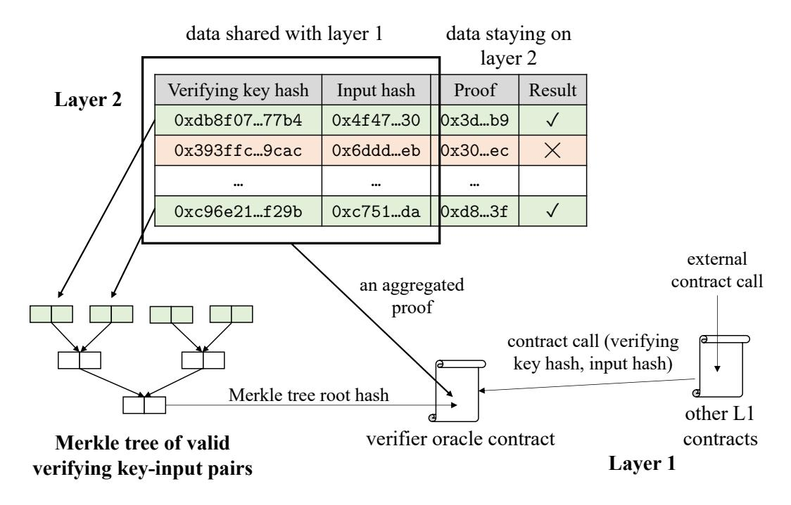
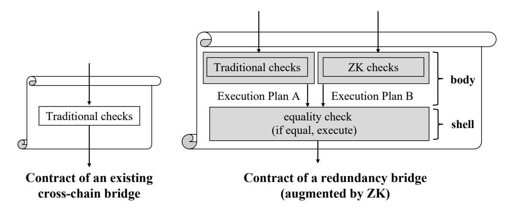
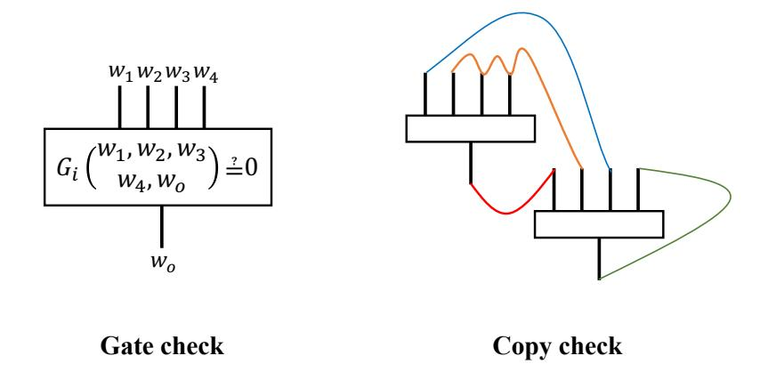
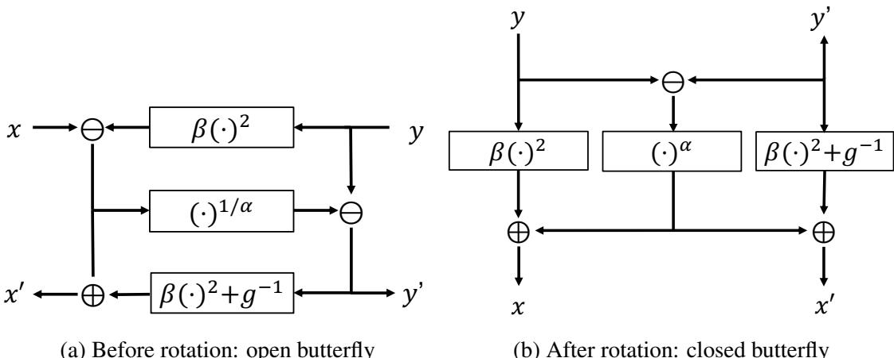

<span id="page-0-0"></span>We want to congratulate Anemoi [\(2022/840\)](https://eprint.iacr.org/2022/840) for being accepted in CRYPTO 2023!


This note has been updated to reflect new changes in the CRYPTO 2023 version of the Anemoi paper. We are proud to be an early user of Anemoi.

## An efficient verifiable state for zk-EVM and beyond from the Anemoi hash function

Jianwei Liu, Harshad Patil, Akhil Sai Peddireddy, Kevin Singh, Haifeng Sun, Huachuang Sun, Weikeng Chen

#### Abstract

In our survey of the various zk-EVM constructions, it becomes apparent that verifiable storage of the EVM state starts to be one of the dominating costs. This is not surprising because a big differentiator of EVM from UTXO is exactly the ability to carry states and, most importantly, their transitions; i.e., EVM is a *state* machine.

In other words, to build an efficient zk-EVM, one must first build an efficient verifiable state. The common approach, which has been used in production, is a Merkle forest to authenticate the memory that would be randomly accessed within zk-SNARK, and optimize the verification of such memory accesses.

In this note, we describe a way to instantiate a Merkle tree with very few gates in TurboPlonk. We use customized gates in TurboPlonk to implement a SNARK-friendly hash function called Anemoi and its Jive mode of operation [\[Bou+22\]](#page-46-0), by Clemence Bouvier, Pierre Briaud, Pyrros ´ Chaidos, Leo Perrin, Robin Salen, Vesselin Velichkov, and Danny Willems. ´

We demonstrate that with 16 gates (≈ 1 gate per round in a 14-round Amenoi hash), one can verify a 3-to-1 compression in a 3-ary Merkle tree. Before this, prior implementations would often require hundreds of gates. We anticipate this technique to benefit a large number of applications built off zk-SNARK.

Our code can be found in noah: <https://github.com/FindoraNetwork/noah>

# Contents

| 1               |                                 | Introduction                                                                                                                                                                                                                                                      | 3                                |
|-----------------|---------------------------------|-------------------------------------------------------------------------------------------------------------------------------------------------------------------------------------------------------------------------------------------------------------------|----------------------------------|
|                 | 1.1<br>1.2<br>1.3<br>1.4        | Our approach: use the standard TurboPlonk recipe on Anemoi<br><br>Applications on scalability: zk-Rollup, zk-EVM, and zk-BatchVerify<br>Applications on security: Zerocash, zk-DID, and zk-Bridge<br>Rest of the note<br>                                         | 4<br>7<br>10<br>11               |
| 2               | 2.1<br>2.2<br>2.3<br>2.4<br>2.5 | Background<br>TurboPlonk<br><br>Flystel S-box: rotating an algebraic butterfly<br>Anemoi permutation: a substitution–permutation network<br>Jive mode of operation: k-to-1 compression for Merkle trees<br><br>Anemoi variable-length hash: a sponge construction | 13<br>13<br>16<br>17<br>17<br>17 |
| 3               |                                 | Starting point                                                                                                                                                                                                                                                    | 19                               |
| 4               |                                 | Initial attempt                                                                                                                                                                                                                                                   | 20                               |
| 5               | 5.1<br>5.2<br>5.3<br>5.4        | Optimization<br>Use processed round key polynomials as selectors<br>Skip unnecessary opening during linearization<br>Connect the output wire to the next gate<br><br>Other unexplored optimization<br>                                                            | 24<br>24<br>25<br>26<br>28       |
| 6               | 6.1<br>6.2<br>6.3               | Final protocol<br>Indexer<br><br>Prover<br><br>Verifier<br>                                                                                                                                                                                                       | 30<br>30<br>33<br>38             |
| 7               | 7.1<br>7.2<br>7.3<br>7.4        | Design and implementation<br>3-ary Merkle tree<br><br>Domain separation in the Jive CRH<br><br>Concrete instantiation for the Jive CRH<br><br>Concrete instantiation for the Merkle tree membership proof<br>                                                     | 41<br>41<br>41<br>41<br>43       |
| 8               |                                 | Reference materials                                                                                                                                                                                                                                               | 45                               |
| Acknowledgments |                                 |                                                                                                                                                                                                                                                                   | 46                               |
| References      |                                 |                                                                                                                                                                                                                                                                   | 47                               |

# <span id="page-2-0"></span>1 Introduction

Verifiable accesses to persistent storage (referred to as "state" in the rest of the note) have been a recurring topic in the research of zero-knowledge proofs for many years. The history of finding an efficient instantiation can be summarized as follows.

- SNARK with a quasilinear prover is a critical enabler of the original Zerocash paper [\[Ben+14\]](#page-46-2), which uses SHA256 to build a Merkle tree for a verifiable state. In the paper, for each layer of the binary Merkle tree, it takes 28161 R1CS constraints.
- Ajtai hash, or the subset sum hash, is used in an SOSP paper for verifiable state [\[BFRSBW13\]](#page-46-3) and then the proof-carrying data via cycles of curves paper [\[BCTV14\]](#page-46-4). This hash takes bits as inputs. As a result, in many situations, a bit-decomposition of the field elements needs to be performed. The parameter choice of Ajtai hash is a complicated discussion. Daira Hopwood has estimated this cost [\[Dai\]](#page-47-0), and suggested a heuristic that Ajtai hash often takes 7% of the time for SHA256, which means about 1970 R1CS constraints. However, this means that the Ajtai hash is not more efficient than Pedersen hash described below. Given that the security of the Ajtai hash is less well-understood, Zcash did not use the Ajtai hash.
- Pedersen hash over a suitable embedded curve is used in production first in the Sapling upgrade to Zcash designed by the Electric Coin Company [\[HBHW\]](#page-48-0). A twisted Edwards curve, called Jubjub [\[Jub\]](#page-48-1), was identified to be an embedded curve of BLS12-381, which the Zcash Foundation builds the Sapling proof system over. The advantage of using a twisted Edwards curve is that it has a simple formula to validate point additions. In the end, Pedersen hash shows that for each layer, one can do with about 1000 R1CS constraints.
- Starting from MiMC [\[AGRRT16\]](#page-46-5), we have witnessed a number of algebraic hash functions that are designed to be SNARK-friendly (or originally MPC-friendly). Two such hash functions used in production are Rescue [\[AABSDS20\]](#page-46-6) and Poseidon [\[GKRRS21\]](#page-47-1). It is worth noting that there is complexity-theory evidence that the need for SNARK-friendly cryptographic primitives could be inherent [\[CL20\]](#page-47-2). Many prior instantiations have about 300 R1CS constraints and about 150 customized gates for verification of each layer of the Merkle tree.

Trend: algebraic-hash-proof-system co-design. There is a trend of research for algebraic hashes to be designed, not just as standalone cryptographic instantiations, but also related to a particular proof system. For example, Reinforced Concrete [\[GKLRSW21\]](#page-47-3) leverages the lookup arguments that become popular recently in UltraPlonk implementations. Sinsemilla [\[Sin\]](#page-49-0) in Zcash is another example, which uses lookup arguments to implement a hash function with the same security guarantees as the Pedersen hash.

We also see work in the other direction: building a zero-knowledge proof system that is friendly to a particular algebraic hash. This is the case for most TurboPlonk implementations used in production, with customized gates for Rescue and Poseidon. We consider this note to be another example, as we are making modifications to TurboPlonk to suit Anemoi, without modifying Anemoi.

The future will be a closer collaboration between practitioners and cryptanalysts, i.e., a co-design of algebraic hashes and proof systems, which is similar to the trend of hardware-software co-design in hardware acceleration for ZK and hardware-friendly proof systems.

We now come back to describe our approach.

## <span id="page-3-0"></span>1.1 Our approach: use the standard TurboPlonk recipe on Anemoi

Our approach is to leverage a recent algebraic hash function—Anemoi [\[Bou+22\]](#page-46-0)—by Clemence ´ Bouvier, Pierre Briaud, Pyrros Chaidos, Leo Perrin, Robin Salen, Vesselin Velichkov, and Danny ´ Willems and tweak an existing TurboPlonk implementation[1](#page-0-0) to inline Anemoi as part of the proof system. We do not claim novelty for our work of tweaking, as it follows the standard recipe of TurboPlonk, and we expect many practitioners in zk-SNARK can independently come up with the exact same implementation without reading the rest of this note.

We now turn our attention to the main enabler—Anemoi hash, which explores the CCZ equivalence [\[CCZ98\]](#page-46-7) between a high-degree polynomial, which is used for computation of the hash, and a lowdegree polynomial, which is used for verification of the hash. Readers are encouraged to read the original Anemoi paper [\[Bou+22\]](#page-46-0), as we will only be providing the necessary background.

Our approach: inline Anemoi in TurboPlonk. The Anemoi hash follows the substitutionpermutation network (SPN). It consists of four steps: constant additions, MDS diffusion (here, MDS means "maximum distance separable"), pseudo-Hadamard transform, and S-box. We can also understand such a construction as a combination of a linear layer, consisting of constant additions and MDS diffusion, and a nonlinear layer with an S-box. We already know how to inline the linear layer: one only needs to represent the linear combination explicitly in the quotient polynomial. Many TurboPlonk implementations used in the industry have already created customized gates for some of the heavy operations in a SNARK-friendly hash function, such as a power-5 gate that computes x → x 5 .

A round with input (a, b, c, d) is being processed correctly resulting in output (a ′′, b′′, c′′, d′′) if and only if the following equations are satisfied.

$$(c' - c'')^5 + g \cdot (c')^2 = a'$$

$$(d' - d'')^5 + g \cdot (d')^2 = b'$$

$$(c' - c'')^5 + g \cdot (c'')^2 + g^{-1} = a''$$

$$(d' - d'')^5 + g \cdot (d'')^2 + g^{-1} = b''$$

where g is a generator of the field F, (a ′ , b′ , c′ , d′ ) is the result of applying the linear layer and the pseudo Hadamard transform to (a, b, c, d), defined as follows:

$$a' = (2a+d) + g \cdot (2b+c) + prk_1[i] \quad b' = g \cdot (2a+d) + (g^2+1) \cdot (2b+c) + prk_2[i]$$

$$c' = (a+d) + g \cdot (b+c) + prk_3[i] \qquad d' = g \cdot (a+d) + (g^2+1) \cdot (b+c) + prk_4[i]$$

Here, prk<sup>1</sup> to prk<sup>4</sup> are *processed* round key vectors, described later in the notes. For an SPN with r rounds, there will be four vectors each containing r processed round key constants, and prk1[i] means the first processed round key constant for the i-th round.

<sup>1</sup> In this note, we refer to TurboPlonk as a large family of protocols improved upon the textbook Plonk with customized gates but without lookups, rather than a specific proof system.

We observe, however, if we use a TurboPlonk with four input wires (i.e.,  $w_1$ ,  $w_2$ ,  $w_3$ ,  $w_4$ ), we can replace (a, b, c, d) and (a'', b'', c'', d'') as the input for the j-th gate and the (j + 1)-th gate. That is,

$$\begin{array}{lll} \text{gate } j \colon & w_1[j] = a & w_2[j] = b & w_3[j] = c & w_4[j] = d \\ \text{gate } j + 1 \colon & w_1[j+1] = a'' & w_2[j+1] = b'' & w_3[j+1] = c'' & w_4[j+1] = d'' \end{array}$$

In TurboPlonk, the input wire vectors are arithmetized as witness polynomials. Let  $\omega$  be the generator of a suitable domain. We have:

$$\begin{array}{lll} \text{gate } j \colon & w_1(\omega^{j-1}) = a & w_2(\omega^{j-1}) = b & w_3(\omega^{j-1}) = c & w_4(\omega^{j-1}) = d \\ \text{gate } j + 1 \colon & w_1(\omega^j) = a'' & w_2(\omega^j) = b'' & w_3(\omega^j) = c'' & w_4(\omega^j) = d'' \end{array}$$

which allows us to express the equations as a constraint system between the input wires in the two gates. For example,  $(c'-c'')^5+g\cdot(c')^2=a'$  can be represented as:

$$\begin{split} &(w_1(\omega^{j-1}) + w_4(\omega^{j-1}) + g \cdot (w_2(\omega^{j-1}) + w_3(\omega^{j-1})) + q_{prk3}(\omega^{j-1}) - w_3(\omega^j))^5 \\ &+ g \cdot (w_1(\omega^{j-1}) + w_4(\omega^{j-1}) + g \cdot (w_2(\omega^{j-1}) + w_3(\omega^{j-1})) + q_{prk3}(\omega^{j-1}))^2 \\ &= 2w_1(\omega^{j-1}) + w_4(\omega^{j-1}) + g \cdot (2w_2(\omega^{j-1}) + w_3(\omega^{j-1})) + q_{prk1}(\omega^{j-1}) \end{split}$$

This equation, and other equations of this kind, can be easily represented in TurboPlonk. Note that not all the gates in the constraint system need to satisfy this equation: for example, those gates that are not relevant to the Anemoi hash. Therefore, to express such a constraint more precisely, we use an additional selector polynomial  $q_{sel1}(X)$ , defined as follows. For the j-th gate, if  $q_{sel1}(\omega^{j-1}) = 0$ , then this gate is not related to  $(c'-c'')^5 + g \cdot (c')^2 = a'$ , and if  $q_{sel1}(\omega^{j-1}) \neq 0$ , then this gate must satisfy  $(c'-c'')^5 + g \cdot (c')^2 = a'$ . Without loss of generality, we can let  $q_{sel1}(\omega^{j-1}) = 1$ . This gives the following equation that all the gates can satisfy.

$$\begin{split} q_{sel1}(\omega^{j-1}) \\ & \cdot \left( \begin{array}{l} (w_1(\omega^{j-1}) + w_4(\omega^{j-1}) + g \cdot (w_2(\omega^{j-1}) + w_3(\omega^{j-1})) + q_{prk3}(\omega^{j-1}) - w_3(\omega^j))^5 \\ + g \cdot ((w_1(\omega^{j-1}) + w_4(\omega^{j-1})) + g \cdot (w_2(\omega^{j-1}) + w_3(\omega^{j-1})) + q_{prk3}(\omega^{j-1}))^2 \\ -2w_1(\omega^{j-1}) - w_4(\omega^{j-1}) - g \cdot (2w_2(\omega^{j-1}) + w_3(\omega^{j-1})) - q_{prk1}(\omega^{j-1}) \\ = 0 \\ \end{split} \right) \\ = 0 \end{split}$$

We can represent this in TurboPlonk by adding a term in the quotient polynomial t(X). We use the following polynomial in our initial construction discussed in Section 4.

$$\frac{-\alpha^{6}}{Z_{H}(X)} \cdot q_{sel1}(X) \cdot \left(\begin{array}{c} (\widetilde{w_{1}}(X) + \widetilde{w_{4}}(X) + g \cdot (\widetilde{w_{2}}(X) + \widetilde{w_{3}}(X)) + q_{prk3}(X) - \widetilde{w_{3}}(X\omega))^{5} \\ +g \cdot (\widetilde{w_{1}}(X) + \widetilde{w_{4}}(X) + g \cdot (\widetilde{w_{2}}(X) + \widetilde{w_{3}}(X)) + q_{prk3}(X))^{2} \\ -2\widetilde{w_{1}}(X) - \widetilde{w_{4}}(X) - g \cdot (2\widetilde{w_{2}}(X) + \widetilde{w_{3}}(X)) - q_{prk1}(X) \end{array}\right)$$

The prover convinces the verifier by committing the witness polynomials  $\widetilde{w_1}(X)$ ,  $\widetilde{w_2}(X)$ ,  $\widetilde{w_3}(X)$ , and  $\widetilde{w_4}(X)$  and opening the polynomials  $\widetilde{w_1}(X)$ ,  $\widetilde{w_2}(X)$ ,  $\widetilde{w_3}(X)$ ,  $\widetilde{w_4}(X)$ ,  $q_{sel1}(X)$ ,  $q_{prk1}(X)$ , and  $q_{prk3}(X)$  at a random point  $\zeta$  as well as opening  $\widetilde{w_3}(X)$  at  $\zeta \omega$ . The verifier can use such information to check if  $(c'-c'')^5+g\cdot(c')^2=a'$  is satisfied.

We apply the same approach to the other three equations. In the end, we have four more such terms to the quotient polynomial t(X) in TurboPlonk. This construction is not without cost: we need to add 12 field elements in F in the TurboPlonk proof. With subsequent optimization (described in Section [5.1,](#page-23-1) Section [5.2,](#page-24-0) Section [5.3\)](#page-25-0), we can reduce the number of additional field elements to 5.

Experiment results. To demonstrate the efficiency of using Anemoi hash function, we measure the number of gates, indexer time, re-indexer time, prover time, proof size, and verifier time of each invocation of a Jive compression with four inputs, over our TurboPlonk system and over the BN254 curve. We run the benchmark in a batch of 500. We run our experiment on a c6i.xlarge instance on AWS, with 4 virtual CPU cores and 8GB of memory, with an all-core Turbo frequency of up to 3.5 GHz. We argue that this setup would be considered as a very weak consumer laptop today. The operating system is Ubuntu 22.04, and Rust is 1.70.0, with the following results.

- Number of gates: 16 per Jive compression, averaged from 8000 for a batch of 500.
- Indexer time: 2.51 ms per Jive compression, averaged from 1.26 s for a batch of 500.
- Re-indexer time: 1.25 ms per Jive compression, averaged from 623 ms for a batch of 500.
- Prover time: 1.61 ms per Jive compression, averaged from 807 ms for a batch of 500.

in many applications, which we will discuss in Section [1.2](#page-6-0) and Section [1.3.](#page-9-0)

practice often reduces the prover cost.

• Verifier time: 4.55 ms for everything, without relying on batch proof verification, since Turbo-Plonk has a constant verification cost.

Compared with previous techniques that take hundreds of gates, using Anemoi reduces the number of gates needed for a Merkle tree membership proof by about 7×. As a result, it reduces the indexer time, re-indexer time,[2](#page-0-0) prover time, and in some situations the required SRS length in TurboPlonk. The experiment result is encouraging as it shows that using the Anemoi hash function is able to reduce the cost of verifying a membership proof of a Merkle tree in zk-SNARK, and can be used

Trend: proof systems with a complex lexicon and concise witnesses. Our work in this note is consistent with a trend in modern proof systems to explore the *sparsity* in a zero-knowledge proof system, in which we prefer to put more logic in the proof system (i.e., having a complex lexicon) in order to reduce the size of the witness representation (i.e., having concise witnesses), which in

For example, in TurboPlonk, one can enable customized gates and represent the same program in zk-SNARK with fewer gates. When the number of gates is lower, the TurboPlonk proof system can work on shorter polynomials, and sometimes polynomials with a lower density (or weight).

We expect a more systematic study on the sparsity theory to appear soon as the different varieties of open-sourced industry implementations of TurboPlonk are sufficient for us to do experiments and collect empirical evidence. Through such a study, we can then have a better understanding and eventually define the lexicon and conciseness here regarding a proof system.

Mic drop. We have the feeling that the endgame of the algebraic hash may be coming soon, as it does not seem to be easy to further reduce the number of gates per invocation. This has something

<sup>2</sup>We define *re-indexing* as the process of running the indexer without recomputing the polynomial commitments of the selectors. Those polynomial commitments may have been computed and stored somewhere.

to do with the security analysis of the several design strategies for algebraic hash—the number of rounds in a substitution-permutation network is unlikely to be small. An informal example to help readers understand the issue is that, if the algebraic hash can be expressed with only a few polynomial identity relations in the TurboPlonk, it seems to suggest the possibility of being vulnerable to Grobner basis attacks. Nevertheless, the authors are not experts in this area, and we ¨ would like to see this discussion above to be false.

Another reason for the endgame is that the algebraic hash that can be instantiated with very few gates in TurboPlonk is already good enough for many ZK applications. To explain why, we evaluate a privacy token transfer protocol based on Zerocash. It shows that the portion of the prover overhead due to the Merkle tree has dropped significantly. This suggests that the use of a Merkle tree will unlikely continue being the performance bottleneck in many applications as time goes on. Therefore, the priorities today are to optimize other building blocks in various ZK applications, including zk-EVM, zk-DID, and zk-BatchVerify.

The semifinal with table lookup. Recently we have seen a lot of work in table lookup, including Caulk [\[ZBKMNS22\]](#page-49-1), Caulk+ [\[PK22\]](#page-48-2), and flookup [\[GK22\]](#page-47-4). Compared with the Merkle tree, table lookup requires a very long SRS and has a concretely large table construction time, but it is known to be concretely more efficient than a construction that uses a Merkle tree in zk-SNARK to perform a lookup. The original Caulk [\[ZBKMNS22\]](#page-49-1) paper estimates that Caulk is 100× faster than proving the Merkle tree in Groth16 [\[Gro16\]](#page-47-5) using the Poseidon hash function [\[GKRRS21\]](#page-47-1)–this is impressive because Groth16 requires circuit-specific setup, while Caulk only requires universal (and updatable) setup.

We feel that it is time to revisit the Merkle tree, as it has various benefits that are important for real-world deployment. Table lookup's requirement of a very long SRS is hard to meet through a setup ceremony, and the table construction also takes a significant amount of time, while the Merkle tree has sublinear overhead and is easily updatable. Our preliminary estimations show that with tree-top caching, the gap between Merkle tree (with TurboPlonk in this note and Anemoi) and Caulk in terms of proving time is narrowed down to 1.5× to 2×, instead of 100×. We expect future improvements in these two directions, SNARK-friendly hash functions in proof systems and table lookup, will be an *exciting* competition.

# <span id="page-6-0"></span>1.2 Applications on scalability: zk-Rollup, zk-EVM, and zk-BatchVerify

An efficient SNARK-friendly hash implementation benefits applications that seek for improving blockchain efficiency: zk-Rollup, zk-EVM, and zk-BatchVerify.

zk-Rollup: a succinct proof for a batch of transactions. We start with the simple example of rolling up a number of coin transfer operations, where a user in layer 2 can transfer coins to another user. This is often done by maintaining and updating a Merkle tree of all the accounts and their associated balances, and a (zero-knowledge) proof shows that all operations on the Merkle tree are legitimate, in that coins are correctly transmitted between the users. This proof is then provided to a smart contract in layer 1 which keeps track of the root hash of the Merkle tree and only approves updates to the root hash when a valid proof is present. This smart contract on layer 1, additionally, facilitates the transfer of tokens between layer 1 and layer 2.

<span id="page-7-0"></span>

Figure 1: System architecture of zk-BatchVerify.

By making the proving cost for such a membership proof in the Merkle tree cheaper, we are able to reduce the overhead to maintain and update the account balances. This improvement makes it easier for layer 2 to support more users and more types of tokens.

zk-EVM: a succinct proof for a virtual random access machine. As an extension to traditional zk-Rollup, in zk-EVM layer 2 rolls up not only simple transactions, but also smart contract executions. Many important EVM applications are memory-heavy, such as Uniswap, ERC-20, and ERC-721, as their logic is generally simple, but they need to work with an ever-growing state. Moreover, the access to this state is often "random access", in which the EVM may access a few locations in a large memory, and the locations, which depend on the current state and the contract call, cannot be easily predicted without knowing the information in the contract call. That is, a more pressing and inherent challenge for zk-EVM may be about the "random access" part, which has not received enough attention.

For a given smart contract, one can build an application-specific and SNARK-friendly state representation through a Merkle forest, which consists of many Merkle trees. The Merkle trees can be instantiated with a SNARK-friendly collision-resistant hash (CRH) function. This note shows that with the Anemoi hash function as well as a TurboPlonk variant that is tailored for the Anemoi hash function, one can instantiate such a Merkle forest efficiently.

zk-BatchVerify: a substitute for layer-1 on-chain proof verification. We anticipate more layer-1 applications to use zero-knowledge proofs. In more detail, the smart contracts of these layer-1 applications may receive a proof (if privacy is needed, this proof can be zero-knowledge) from the user through the contract call and then run the verifier on this proof. One concern with this design is that proof verification on layer 1 is expensive. According to Matter Labs [\[Zks\]](#page-49-2), the verification cost of a Groth16 proof can be 300 k, the verification cost of a TurboPlonk proof can be 600 k, and the verification of a STARK proof can be 5000 k. Though the transaction fee in USD is changing, at the time of writing it is at least \$50, which is already expensive for many dApps. One solution to solve this problem, we call it zk-BatchVerify, is to verify the proofs on layer 2 and return the verification results to layer 1, as shown in Figure [1.](#page-7-0) Since this is a new application, we provide a brief description as follows.

- Layer 2: The sequencer on layer 2 maintains a table as shown in Figure [1.](#page-7-0) Each row consists of the verifying key hash, the input hash, the proof, and the verification result. If the verification result is true, it means that given a verification key and an input with the corresponding hash values as well as a proof as input, a verifier will accept this proof. Otherwise, the result will be false. Note that layer 2 does not need to be restricted to a particular proof system—it can support different variants of TurboPlonk, Groth16, and STARK, and it can be curve-agnostic—it can support BLS12-381, BN254, and other application-specific curves. A SNARK-friendly hash function can be used to hash the verifying key and the input, while the L1 dApp contracts store the verifying key hash as a hard-coded parameter.
- Merkle tree: Layer 2 then arranges the list of verifying key hashes and the input hashes of those rows that pass the verification on layer 2 to a Merkle tree. There may be more than one hash functions: one SNARK-friendly, one EVM-friendly, and to reduce the overhead of opening this Merkle tree in EVM, one may use the cap hash optimization [\[Wu21\]](#page-49-3). The root hash (or the cap hash) is then passed to the verifier oracle contract on layer 1.
- Aggregated proof: A zk-Rollup, or an optimistic zk-Rollup, will be used to convince the layer-1 verifier oracle contract that the Merkle tree consists of only valid verifying key-input hash pairs. The use of SNARK-friendly hash function in the Merkle tree may help with proof generation.
- Verifier oracle contract: The verifier oracle contract is a smart contract on layer 1, and it supports two operations: (1) it can accept the Merkle root hash (or cap hash) and the corresponding aggregated proof from the sequencer and update its content once the proof is validated and (2) it can respond to contract calls from other L1 contracts asking if a particular pair of verifying key and input (given as hashes) is included in the Merkle tree, given a Merkle tree membership proof. It is useful that the verifier oracle contract can make the Merkle tree root hash (or cap hash) private, so it can enforce that other L1 contracts must make an explicit contract call, and the verifier oracle contract can charge a fee in this process. This provides a revenue model for zk-BatchVerify in addition to charging for each proof verification on layer 2.
- Other L1 contracts: Other contracts on layer 1 are clients of zk-BatchVerify. They have the hash of the verifying key hardcoded (or, if needed, computed on the fly). To see if a particular input should be accepted, it computes the hash of the input (probably through a different hash function), and makes a contract call to the verifier oracle contract.

One can see that the SNARK-friendly hash function is being used in various places in the system of zk-BatchVerify. Improvement on the hash function can reduce the overhead of the construction of the Merkle tree as well as the hashing of verifying keys and inputs. For proof systems that use a SNARK-friendly hash function as the Fiat-Shamir sponge, an efficient SNARK-friendly hash function also helps with the cost.

#### <span id="page-9-0"></span>1.3 Applications on security: Zerocash, zk-DID, and zk-Bridge

An efficient SNARK-friendly hash implementation also benefits various applications that offer security: Zerocash, zk-DID, and zk-Bridge. It is important to realize that efficiency is a crucial limiting factor for the adoption of these applications.

Zerocash. In order to create a privacy token transfer transaction in Zerocash, a user may need to download a structured reference string (SRS, often at the scale of 1 GB for Groth16) and run a prover on the user's device. In many dApps, the prover will be running in WebAssembly (which is the case of a browser prover), the use of WebAssembly leads to a performance penalty of 10×, according to an experiment by the Manta Network [\[Man\]](#page-48-3).

zk-DID. Privacy ensures that a user only discloses minimal information about the DID necessary for the dApp. For example, a user may need to convince a smart contract that the user meets the age requirement, without revealing the age as well as other identity information. This can be done using zk-SNARK. However, the same issue arises that the user needs to generate the proof on the user's device. It is difficult for the user to download a long SRS as well as run an expensive prover. With a SNARK-friendly hash implementation, the SRS can be shorter, and the prover is lighter, which helps the user to generate the zero-knowledge proof used in zk-DID.

zk-Bridge (or more generally, a redundancy bridge). There have been a number of incidents of cross-chain bridges being compromised, and hackers have been able to steal a large number of coins. There are many distinct reasons why a cross-chain bridge was compromised, and a universal solution that can prevent all these attacks and is trustless would be very unlikely to exist. For this reason, a trend in the industry is a new concept called *the redundancy bridge*, in which we rely on more than one mechanism to secure the bridge, even if these mechanisms have some overlapping. This is closely related to the concept of *N-version programming* mentioned in the original practical Byzantine fault tolerance (PBFT) paper [\[CL99;](#page-47-6) [PBCWC96\]](#page-48-4). One of the tools that can be used in building a redundancy bridge is zero-knowledge proofs [\[Xie+22\]](#page-49-4), in the following ways:

- Proof of source chain consensus: Traditional cross-chain bridge uses a small committee to vote on the latest block header, and if this small committee is compromised, an attacker can cause the destination chain smart contract to accept a forged block header, which may enable the attacker to withdraw tokens that do not belong to the attacker. To make it harder for an attacker to perform such an attack, as shown in Figure [2,](#page-10-1) we have the destination chain smart contract to require a proof of source chain consensus, which works as follows.
  - If the source chain uses *proof-of-work (PoW)*: the proof of source chain consensus proves that the new block is extended from the previous block, and it has an expected amount of proven work based on the current difficulty. The zero-knowledge proof will be mostly checking an evaluation of SHA256 or Equihash.
  - If the source chain uses *proof-of-stake (PoS)*: the proof of source chain consensus proves that the validators have endorsed the new block header with their signatures. In this case, the attacker needs to compromise the validators of the source chain in order to convince the target chain smart contract about a forged new block header. The zero-knowledge proof will be verifying ed25519 (or others) ECDSA/EdDSA signatures.

• Proof of expected contract executions: The use of zero-knowledge proofs is not limited in verifying the source chain consensus (i.e., passing the source chain block header). It can naturally be extended to verify the other operations in a cross-chain bridge, such as the withdrawal process. The zero-knowledge proof shows that the execution plan that is calculated by an independent and separate implementation is valid, and this execution plan will be compared with the execution plan created in the existing cross-chain bridge contract.

The redundancy bridge wants to ensure that an attacker needs *not only* to pass the existing security mechanisms *but also* to pass the checks based on zero-knowledge proofs. Only when both of them agree with each other, the bridge will perform the withdrawal. This can be implemented through a *shell mechanism* [\[Can01\]](#page-47-7), described as follows.

<span id="page-10-1"></span>

Figure 2: Comparison between an existing cross-chain bridge and a redundancy bridge.

The shell mechanism by Ran Canetti for universal composability (UC) security is a useful model to describe the redundancy design shown in Figure [2.](#page-10-1) The contract of the redundancy bridge will be separated into two parts: a body and a shell. The body has restricted access to the blockchain—it can only propose an execution plan to the shell instead of interacting with the blockchain directly. If the shell agrees with the execution plan, the shell executes this plan. The shell is designed to be minimalistic, so it can be treated as a trusted computing base (TCB). In the redundancy bridge, the shell obtains one execution plan from the existing bridge logic, and another execution plan from an independent implementation with a zero-knowledge proof of its correctness (as well as the source chain consensus). Only when these two plans are equal, the shell will perform the operations.

The use of a SNARK-friendly hash function benefits the redundancy bridge. For the zero-knowledge proof to verify the consensus or the withdrawal, it may require access to a persistent state, which can be realized through a Merkle tree built off a SNARK-friendly hash function.

## <span id="page-10-0"></span>1.4 Rest of the note

The rest of the note is organized as follows.

- Section [2](#page-12-0) provides some necessary background on TurboPlonk as well as the components of the Anemoi hash function.
- Section [3](#page-18-0) provides our starting point, a TurboPlonk implementation used in production, which does not have customized gates for the Anemoi hash function.
- Section [4](#page-19-0) presents a version of the TurboPlonk for the Anemoi hash function, but without any optimization. This is to help readers understand how the customized gates work without involving the tricky and confusing detail about the TurboPlonk optimization.
- Section [5](#page-23-0) discusses how to apply standard optimization techniques of TurboPlonk to the strawman construction. We believe that this section will be instructive, in that such techniques are only implicit in the original Plonk paper [\[GWC19\]](#page-47-8).
- Section [6](#page-29-0) puts it all together and provides the detailed construction of the indexer, the prover, and the verifier of the final TurboPlonk construction.
- Section [7](#page-40-0) describes a design and implementation of privacy token transfer based on the Zerocash construction, which uses a Merkle tree built off the Anemoi hash function.
- Section [8](#page-44-0) lists the reference materials that we found useful when we were working on this note.

# <span id="page-12-0"></span>2 Background

In this section we provide the necessary background of TurboPlonk, Flystel S-box, Anemoi permutation, Jive mode of operation, and Anemoi variable-length hash.

### <span id="page-12-1"></span>2.1 TurboPlonk

TurboPlonk is Plonk [\[GWC19\]](#page-47-8) with customized gates. There are many different ways to construct customized gates, and as a result, TurboPlonk does not mean a specific construction, but a family of proof systems based on Plonk. Readers are encouraged to read the original Plonk paper [\[GWC19\]](#page-47-8), as we will be keeping it high-level here.

Circuit representation. TurboPlonk expresses the statement to be proven in zero knowledge as a circuit. The circuit consists of gates, and all the gates have the same number of wires. Usually, there is one output wire, and the rest are input wires. Here are two examples:

- the textbook TurboPlonk [\[GWC19\]](#page-47-8) has 2 input wires and 1 output wire, in total 3 wires
- the baseline presented in Section [3](#page-18-0) has 4 input wires and 1 output wire, in total 5 wires

<span id="page-12-2"></span>Note that the distinction between "input" and "output" wires is indeed artificial, and we expect that it will be deprecated soon, as TurboPlonk does not distinguish them. Customized gates can use these wires in an arbitrary way.



Figure 3: TurboPlonk consists of the gate check and the copy check.

TurboPlonk enforces that these gates in the circuit satisfy certain conditions, which consist of a gate check and a copy check, as follows.

• Gate check: Each gate in the circuit has some parameters that are independent of the values on the wires, which uniquely define the gate predicate Gi(w1, w2, w3, w4, wo) ∈ {0, 1} for each gate Gi , as shown in Figure [3,](#page-12-2) and here, w1, w2, w3, w4, w<sup>o</sup> are the values on the wires. We call these parameters as "selectors". Different gates can have very different selectors. We say that the gate check passes if for every gate G<sup>i</sup> in the circuit, it holds that Gi(w1, w2, w3, w4, wo) = 0. A reader may wonder why the equation is written in this way rather than G′ i (w1, w2, w3, w4) = wo, which is naturally closer to what a "gate" sounds like. We want to point out that the former definition is indeed more general, as it captures the case when there is more than one possible value for wo. It also captures the case when checking if a specific value of w<sup>o</sup> makes Gi(w1, w2, w3, w4, wo) = 0 is easy, but finding this particular value is expensive (and probably computationally hard).

• Copy check: The statement we are proving in TurboPlonk is unlikely going to be described with a single gate because one gate can only access a limited number of values. It requires a large number of gates. To combine these gates in order to represent the statement that we are proving, we need to connect the wires in these gates. In Figure [3](#page-12-2) we use colored lines to represent such connections. There is a lot of flexibility in connecting the wires. It can connect an output wire to an input wire in the same gate or in a different gate. It can connect two input wires in the same gate or in a different gate. It can connect more than two wires. We call such connections "copy" as the values in the connected wires should be exactly the same copy. This allows TurboPlonk to use multiple gates to represent a more complicated statement.

By using the gate check and the copy check, we can represent the statement that we are proving in the circuit, and the statement can be proven if and only if it passes both checks. Now, we describe *arithmetization*, i.e., how to represent the circuit and express both checks mathematically.

Arithmetization. The arithmetization process expresses the relation as some conditions between these polynomials. TurboPlonk first interpolates the values on the different kinds of wires into polynomials. In our case, we have five polynomials, w1(X), w2(X), w3(X), w4(X), and wo(X). Then, we represent the gate parameters as "selectors" polynomials. There is a lot of customizability in this step, and different TurboPlonk implementations can have different ways to define and use such parameters. In our example in Section [3,](#page-18-0) we have a few selector polynomials q1(X), q2(X), q3(X), q4(X), qm1(X), qm2(X), qc(X), qecc(X), and qo(X). Each selector polynomial is interpolated from one kind of the gate parameters in each of the gates, and it allows us to express this part of the gate check as the *existence of a polynomial* g(X) in the following equation.

```
q1(X) · w1(X) + q2(X) · w2(X) + q3(X) · w3(X) + q4(X) · w4(X) // linear combination
+ qm1(X) · w1(X) · w2(X) + qm2(X) · w3(X) · w4(X) // multiplication (somewhat)
+ qc(X) // constants
+ PI(X) // inputs
+ qecc(X) · w1(X) · w2(X) · w3(X) · w4(X) · wo(X) // operations on twisted Edwards curves
− qo(X) · wo(X) // output
= g(X) · ZH(X)
```

where PI(X) is a separate polynomial that defines the input and ZH(X) is the vanishing polynomial that evaluates to zero in the domain H. The existence of g(X) means that it passes this part of the gate check. There are other parts of the gate check that we will defer to Section [3.](#page-18-0)

Now that we have discussed the gate check, we turn our attention to the copy check. In TurboPlonk, we express the connections between the wires of different gates (for N gates, there are in total 5N wires) as a permutation σ. If σ(i) = j (i, j ∈ {1, 2, ..., 5N}), it means that the i-th wire and the j-th wire are connected together and therefore they must have the same value. All the connections can be expressed in this way. Then, in a domain H of size N with generator ω (which should also be a quadratic residue), we define a polynomial S(X) with the starting point (and the endpoint) as S(1) = 1 and the following recursion.

$$S(\omega^{i}) = S(\omega^{i-1}) \cdot \frac{H(w_{1}(\omega^{i-1}), \omega^{i-1}) \cdot H(w_{2}(\omega^{i-1}), k_{1} \cdot \omega^{i-1}) \cdot H(w_{3}(\omega^{i-1}), k_{2} \cdot \omega^{i-1}) \cdot}{H(w_{4}(\omega^{i-1}), k_{3} \cdot \omega^{i-1}) \cdot H(w_{o}(\omega^{i-1}), k_{4} \cdot \omega^{i-1})}{H(w_{1}(\omega^{i-1}), \sigma^{*}(i)) \cdot H(w_{2}(\omega^{i-1}), \sigma^{*}(N+i)) \cdot H(w_{3}(\omega^{i-1}), \sigma^{*}(2N+i)) \cdot}{H(w_{4}(\omega^{i-1}), \sigma^{*}(3N+i)) \cdot H(w_{o}(\omega^{i-1}), \sigma^{*}(4N+i))}$$

where H(x, y) = x+βy+γ with random β and γ and works as a universal one-way hash function, k<sup>1</sup> to k<sup>4</sup> are different quadratic non-residue, and σ ∗ (·) is a special function derived from σ, which outputs the corresponding k(·) · ω (·) of the other wire that the corresponding wire connects to.

The requirement that S(1) = 1 implies that S(ω <sup>N</sup> ) = 1. If we assume that the hash function here is a black box, then S(ω <sup>N</sup> ) means that all those wires that are connected together must have the same value. This concludes the copy check.

Perform both checks in polynomial IOPs. The last step is to find a way to convince the verifier that these polynomials satisfy these conditions without sending the verifier the polynomials. There are two reasons why we do not want to send the polynomials. First, sending the polynomials in their entirety leads to a large proof size. Second, for zero knowledge, the prover cannot reveal the entire polynomial. To solve this issue, in polynomial IOPs, instead of sending the polynomials, we send *polynomial commitments* [\[KZG10;](#page-48-5) [MBKM19;](#page-48-6) [Gab19;](#page-47-9) [CHMMVW20;](#page-47-10) [BCMS20;](#page-46-8) [PST13\]](#page-48-7), which are cryptographic commitments of polynomials that can be opened at an arbitrary point. The verifier checks if the polynomials satisfy the conditions by opening the polynomials on both sides of the equations at a random point and checks if the evaluations on this random point satisfy the equations. If so, then by the Demillo-Lipton-Zippel-Schwartz lemma [\[DL78;](#page-47-11) [Zip79;](#page-49-5) [Sch80\]](#page-49-6), the verifier knows that the polynomials satisfy these conditions unless with a negligible probability (as long as the finite field is sufficiently large). This is the standard recipe for proof systems from polynomial IOPs (interactive oracle proofs) [\[RRR16;](#page-48-8) [BCS16\]](#page-46-9), and can be considered the raw version of TurboPlonk. The modern construction of TurboPlonk can be viewed as an optimized version of this raw version. This gives us TurboPlonk, a proof system for such circuits.

"Supergates": checking multiple equations in one gate. An important observation in Turbo-Plonk is that, in the gate check, the gate function can be very general, in that the gate function can check multiple equations over the polynomial rings. For example, in the proof system that we will present in Section [3,](#page-18-0) the gate function also enforces three equations.

$$q_b(X)\cdot w_2(X)\cdot (w_2(X)-1)=0$$
 // boolean testing on the second wire  $q_b(X)\cdot w_3(X)\cdot (w_3(X)-1)=0$  // boolean testing on the third wire  $q_b(X)\cdot w_4(X)\cdot (w_4(X)-1)=0$  // boolean testing on the fourth wire

where qb(X) is a selector that determines if the current gate enforces this boolean condition on its second, third, and fourth wires. In addition to the three equations above, the gate can still enforce the previous equation for linear combination, multiplication, constants, inputs, and others, by appropriately setting the gate parameters.

This observation, which goes beyond the original Plonk paper, suggests a large *design space* for TurboPlonk: one can use multiple equations, and multiple equations can be "activated" in one gate. We now turn our attention to the different building blocks of the Anemoi hash function. Details of our final TurboPlonk proof will be given in Section [6.](#page-29-0)

### <span id="page-15-0"></span>2.2 Flystel S-box: rotating an algebraic butterfly

A new cryptographic tool presented in the Anemoi paper [\[Bou+22\]](#page-46-0) is the Flystel S-box, which is based on the butterfly structure [\[PUB16;](#page-48-9) [LTYW18;](#page-48-10) [CP17\]](#page-47-12). In this note, we assume that the S-box is defined on F<sup>p</sup> where p is a large odd prime.

<span id="page-15-1"></span>

- (a) Before rotation: open butterfly
- (b) After rotation: closed butterfly

Figure 4: The open and closed butterfly in the Flystel S-box.

The Flystel S-box is a function that takes as input (x, y) and outputs (x ′ , y′ ). Figure [4a](#page-15-1) shows the workflow of this function, which is equivalent to the following formulas.

$$x' = x - \beta y^{2} + \beta (y - (x - \beta y^{2}))^{2/\alpha} + g^{-1}$$
$$y' = y - (x - \beta y^{2})^{1/\alpha}$$

Here, g is a constant. The problem with the two formulas above is that computing (·) <sup>1</sup>/α is expensive and it is a polynomial of a very high degree. The Flystel S-box solves this issue by observing that, if we *rotate* the butterfly in the counterclockwise direction, we can have the closed form of the butterfly, as shown in Figure [4b,](#page-15-1) which is equivalent to the following formulas.

$$x = \beta \cdot y^{2} + (y - y')^{\alpha}$$

$$x' = \beta \cdot (y')^{2} + (y - y')^{\alpha} + g^{-1}$$

This is, excitingly, a low-degree polynomial (for example, in BLS12-381, α = 5). In other words, although it is slightly expensive to compute it, it is easy to verify it, given (x, y) as well as (x ′ , y′ ). We can then use this easy-to-verify S-box in a classical substitution-permutation network, and obtain a fixed permutation that can be used to construct a collision-resistant hash function as well as a sponge, which we now describe.

#### <span id="page-16-0"></span>2.3 Anemoi permutation: a substitution-permutation network

The Anemoi permutation [Bou+22] follows the standard structure of a substitution-permutation network. The permutation has N rounds, and each round consists of four steps: (1) constant addition, (2) MDS matrix, (3) pseudo-Hadamard transform, and (4) S-box. We assume the input to the Anemoi permutation is of size  $2\ell$ . The four steps can be described as follows.

- Constant addition: For input  $(\vec{x}, \vec{y}) \in (\mathbb{F}^{\ell}, \mathbb{F}^{\ell})$ , the r-th round has some round-specific constants  $\vec{c}_r \in \mathbb{F}^{\ell}$  and  $\vec{d}_r \in \mathbb{F}^{\ell}$ . It outputs  $(\vec{x} + \vec{c}_r, \vec{y} + \vec{d}_r)$ .
- MDS matrix: The MDS matrix in the Anemoi permutation is a fixed matrix M of size  $\mathbb{F}^{\ell \times \ell}$ . For input  $(\vec{x}, \vec{y}) \in (\mathbb{F}^{\ell}, \mathbb{F}^{\ell})$ , we have  $\vec{u} = M \cdot \vec{x}$  and  $\vec{v} = M \cdot \vec{y}_{\omega}$  where  $\vec{y}_{\omega}$  a shifted version of  $\vec{y}$  (in the Amenoi permutation, moving the first element to the end). The Anemoi permutation uses a shift instead of having another MDS matrix for  $\vec{y}$ .
- **Pseudo-Hadamard transform:** For input  $(\vec{x}, \vec{y}) \in (\mathbb{F}^{\ell}, \mathbb{F}^{\ell})$ , an additional step is made after the MDS matrix to mix  $\vec{x}$  and  $\vec{y}$ . The mix needs to be invertible. In Anemoi, this is done by having  $\vec{v} := \vec{y} + \vec{x}$  and  $\vec{u} := \vec{y} + 2\vec{x}$ . It outputs  $(\vec{u}, \vec{v})$ .
- S-box: For input  $(\vec{x}, \vec{y}) \in (\mathbb{F}^{\ell}, \mathbb{F}^{\ell})$ , and we let the S-box be  $S(x, y) \to (x', y')$ , then the output  $\vec{u}$  and  $\vec{v}$  can be computed by letting (u[i], v[i]) = S(x[i], y[i]) for  $i = 1, ..., \ell$ .

The operations listed above will be repeated for N rounds, followed by an additional MDS matrix step in the end. This gives a permutation with input  $\mathbb{F}^{2\ell}$  and output  $\mathbb{F}^{2\ell}$ . With such a permutation, we can then construct the collision-resistant hash function and a sponge.

## <span id="page-16-1"></span>2.4 Jive mode of operation: k-to-1 compression for Merkle trees

An important observation in [Bou+22] is that in many zk-SNARK applications we use the SNARK-friendly hash function mostly for Merkle trees (or a Merkle forest). However, when people design a SNARK-friendly hash function, we expect it to be cryptographically secure enough so that it can be modeled as a random oracle. This is, however, *an overkill*. For a Merkle tree to work, all we need is a collision-resistant hash function.

The Anemoi paper [Bou+22] shows a construction of a collision-resistant hash function CRH directly from the permutation  $P(\vec{x}, \vec{y}) \to (\vec{u}, \vec{v})$ , as shown below.

$$\mathsf{CRH}(\vec{x}, \vec{y}) = P(\vec{x}, \vec{y}) + \sum_{i=1}^{\ell} (x[i] + y[i] + u[i] + v[i])$$

The cost of the collision-resistant hash function is therefore very close to the cost of the permutation itself, and we use it to instantiate the Merkle tree in zk-SNARK.

## <span id="page-16-2"></span>2.5 Anemoi variable-length hash: a sponge construction

One can use the Anemoi permutation to construct a sponge. The Anemoi paper [Bou+22] suggests the use of the Hirose variant [Hir18] of the sponge construction. When the field  $\mathbb F$  is sufficiently large, for a permutation from  $\mathbb F^{2\ell}$  to  $\mathbb F^{2\ell}$ , we can create a sponge with the rate  $(2\ell-1)$  and capacity

| 1. A variable-length hash function can be made directly from such a sponge construction. We want<br>to note that the sponge construction is somewhat "naturally immune" to length-extension attacks,<br>so we do not need special treatment about the length. |  |  |
|---------------------------------------------------------------------------------------------------------------------------------------------------------------------------------------------------------------------------------------------------------------|--|--|
|                                                                                                                                                                                                                                                               |  |  |
|                                                                                                                                                                                                                                                               |  |  |
|                                                                                                                                                                                                                                                               |  |  |
|                                                                                                                                                                                                                                                               |  |  |
|                                                                                                                                                                                                                                                               |  |  |
|                                                                                                                                                                                                                                                               |  |  |
|                                                                                                                                                                                                                                                               |  |  |

# <span id="page-18-0"></span>3 Starting point

Our starting point is a regular TurboPlonk implementation. We can specify a TurboPlonk implementation via the polynomial identity relations and the strategy to open the polynomials. We use the standard copy check, which is the same for the majority of the TurboPlonk constructions. Therefore, for the sake of conciseness, we focus on the gate check here. For any element x in a domain H, we have the following in this TurboPlonk system.

```
q1(X) · w1(X) + q2(X) · w2(X) + q3(X) · w3(X) + q4(X) · w4(X) // linear combination
+ qm1(X) · w1(X) · w2(X) + qm2(X) · w3(X) · w4(X) // multiplication (somewhat)
+ qc(X) // constants
+ PI(X) // inputs
+ qecc(X) · w1(X) · w2(X) · w3(X) · w4(X) · wo(X) // operations on twisted Edwards curves
= qo(X) · wo(X) // output
 qb(X) · w2(X) · (w2(X) − 1) = 0 // boolean testing on the second wire
 qb(X) · w3(X) · (w3(X) − 1) = 0 // boolean testing on the third wire
 qb(X) · w4(X) · (w4(X) − 1) = 0 // boolean testing on the fourth wire
```

In the linearization step, we open some polynomials at some random points, as shown below.

$$q_1(X) \cdot w_1(\zeta) + q_2(X) \cdot w_2(\zeta) + q_3(X) \cdot w_3(\zeta) + q_4(X) \cdot w_4(\zeta) \quad \text{// linear combination} \\ + q_{m1}(X) \cdot w_1(\zeta) \cdot w_2(\zeta) + q_{m2}(X) \cdot w_3(\zeta) \cdot w_4(\zeta) \quad \text{// multiplication (somewhat)} \\ + q_c(X) \quad \text{// constants} \\ + \text{PI}(X) \quad \text{// inputs} \\ + q_{ecc}(X) \cdot w_1(\zeta) \cdot w_2(\zeta) \cdot w_3(\zeta) \cdot w_4(\zeta) \cdot w_o(\zeta) \quad \text{// operations on twisted Edwards curves} \\ = q_o(X) \cdot w_o(\zeta) \quad \text{// output} \\ q_b(X) \cdot w_2(\zeta) \cdot (w_2(\zeta) - 1) = 0 \quad \text{// boolean testing on the second wire} \\ q_b(X) \cdot w_3(\zeta) \cdot (w_3(\zeta) - 1) = 0 \quad \text{// boolean testing on the fourth wire} \\ q_b(X) \cdot w_4(\zeta) \cdot (w_4(\zeta) - 1) = 0 \quad \text{// boolean testing on the fourth wire} \\ \end{cases}$$

Binary testing supergates. The last three equations (for boolean testing) are what we discuss in Section [2](#page-12-0) as an example of "supergates". These three equations enforce that, for those gates whose qb(X) ̸= 0, it requires that the 2nd, 3rd, and 4th (input) wires to be *binary*, that is, either 0 or 1.

# <span id="page-19-0"></span>4 Initial attempt

In the rest of the note we focus specifically on the case where ℓ = 2. We design the customized gates for the Anemoi hash function by representing the equations directly into polynomial identity relations and inlining the linear layer (constant addition and MDS matrix) into these relations. Let us consider the relationship between the state after S-box in a round (x[1], x[2], y[1], y[2]) and the state after S-box in the following round (x ′ [1], x′ [2], y′ [1], y′ [2]).

Apply the constant addition. Let the r-th round addition constants be (cr[1], cr[2], dr[1], dr[2]). Then, after applying the constant addition, we have:

$$\begin{pmatrix} x[1] \\ x[2] \\ y[1] \\ y[2] \end{pmatrix} \Rightarrow \begin{pmatrix} x[1] + c_r[1] \\ x[2] + c_r[2] \\ y[1] + d_r[1] \\ y[2] + d_r[2] \end{pmatrix}$$

Apply the MDS matrix. The next is to apply the MDS matrix. The Anemoi paper [\[Bou+22\]](#page-46-0) suggests that one can simply use the following matrix for ℓ = 2 where g is a generator.

$$\begin{bmatrix} 1 & g \\ g & g^2 + 1 \end{bmatrix}$$

After applying the MDS matrix as described in the Anemoi permutation, we have:

$$\begin{pmatrix} x[1] + c_r[1] \\ x[2] + c_r[2] \\ y[1] + d_r[1] \\ y[2] + d_r[2] \end{pmatrix} \Rightarrow \begin{pmatrix} x[1] + g \cdot x[2] + (c_r[1] + g \cdot c_r[2]) \\ g \cdot x[1] + (g^2 + 1) \cdot x[2] + (g \cdot c_r[1] + (g^2 + 1) \cdot c_r[2]) \\ y[2] + g \cdot y[1] + (d_r[2] + g \cdot d_r[1]) \\ g \cdot y[2] + (g^2 + 1) \cdot y[1] + (g \cdot d_r[2] + (g^2 + 1) \cdot d_r[1]) \end{pmatrix}$$

Note that ⃗y needs to be shifted before applying the MDS matrix, as described in Section [2.](#page-12-0)

Apply the pseudo Hadamard transform. Now we apply the pseudo Hadamard transform, which gives us the following results.

$$\begin{pmatrix} (2x[1] + y[2]) + g \cdot (2x[2] + y[1]) \\ + (2c_r[1] + d_r[2] + g \cdot (2c_r[2] + d_r[1])) \\ g \cdot (2x[1] + y[2]) + (g^2 + 1) \cdot (2x[2] + y[1]) \\ + (g \cdot (2c_r[1] + d_r[2]) + (g^2 + 1) \cdot (2c_r[2] + d_r[1])) \\ (x[1] + y[2]) + g \cdot (x[2] + y[1]) \\ + (c_r[1] + d_r[2] + g \cdot (c_r[2] + d_r[1])) \\ g \cdot (x[1] + y[2]) + (g^2 + 1) \cdot (x[2] + y[1]) \\ + (g \cdot (c_r[1] + d_r[2]) + (g^2 + 1) \cdot (c_r[2] + d_r[1])) \end{pmatrix}$$

**Processed round keys.** Now, for convenience, we define "processed round keys" (PRK), which are the parts highlighted above, and they are round-specific.

$$\begin{split} \operatorname{prk} &\mathbf{1}_r := 2c_r[1] + d_r[2] + g \cdot (2c_r[2] + d_r[1]) \\ \operatorname{prk} &\mathbf{2}_r := g \cdot (2c_r[1] + d_r[2]) + (g^2 + 1) \cdot (2c_r[2] + d_r[1]) \\ \operatorname{prk} &\mathbf{3}_r := c_r[1] + d_r[2] + g \cdot (c_r[2] + d_r[1]) \\ \operatorname{prk} &\mathbf{4}_r := g \cdot (c_r[1] + d_r[2]) + (g^2 + 1) \cdot (c_r[2] + d_r[1]) \end{split}$$

And therefore, we know that the input to the S-box is as follows.

$$\left( \begin{array}{l} 2x[1] + y[2] + g \cdot (2x[2] + y[1]) + \operatorname{prk1}_r \\ g \cdot (2x[1] + y[2]) + (g^2 + 1) \cdot (2x[2] + y[1]) + \operatorname{prk2}_r \\ x[1] + y[2] + g \cdot (x[2] + y[1]) + \operatorname{prk3}_r \\ g \cdot (x[1] + y[2]) + (g^2 + 1) \cdot (x[2] + y[1]) + \operatorname{prk4}_r \end{array} \right)$$

And the output should be, by definitions:

$$\begin{pmatrix} x'[1] \\ x'[2] \\ y'[1] \\ y'[2] \end{pmatrix}$$

This gives us four equations based on the closed Flystel butterfly in Section 2, as follows:

$$\begin{split} &(x[1]+y[2]+g\cdot(x[2]+y[1])+\operatorname{prk3}_r-y'[1])^5\\ &+g\cdot(x[1]+y[2]+g\cdot(x[2]+y[1])+\operatorname{prk3}_r)^2\\ &=(2x[1]+y[2])+g\cdot(2x[2]+y[1])+\operatorname{prk1}_r\\ &(g\cdot(x[1]+y[2])+(g^2+1)\cdot(x[2]+y[1])+\operatorname{prk4}_r-y'[2])^5\\ &+g\cdot(g\cdot y[2]+(g^2+1)\cdot y[1]+\operatorname{prk4}_r)^2\\ &=g\cdot(2x[1]+y[2])+(g^2+1)\cdot(2x[2]+y[1])+\operatorname{prk2}_r\\ &x[1]+y[2]+g\cdot(x[2]+y[1])+\operatorname{prk3}_r-y'[1])^5+g\cdot y'[1]^2+g^{-1}\\ &=x'[1]\\ &(g\cdot(x[1]+y[2])+(g^2+1)\cdot(x[2]+y[1])+\operatorname{prk4}_r-y'[2])^5+g\cdot y'[2]^2+g^{-1}\\ &=x'[2] \end{split}$$

We replace (x[1], x[2], y[1], y[2]), (x'[1], x'[2], y'[1], y'[2]),  $(\mathsf{prk1}_r, \mathsf{prk2}_r, \mathsf{prk3}_r, \mathsf{prk4}_r)$  as follows.

$$\begin{array}{lll} x[1] \Rightarrow w_1(X) & x'[1] \Rightarrow w_1(X\omega) & \mathsf{prk1}_r \Rightarrow q_{prk1}(X) \\ x[2] \Rightarrow w_2(X) & x'[2] \Rightarrow w_2(X\omega) & \mathsf{prk2}_r \Rightarrow q_{prk2}(X) \\ y[1] \Rightarrow w_3(X) & y'[1] \Rightarrow w_3(X\omega) & \mathsf{prk3}_r \Rightarrow q_{prk3}(X) \\ y[2] \Rightarrow w_4(X) & y'[2] \Rightarrow w_4(X\omega) & \mathsf{prk4}_r \Rightarrow q_{prk4}(X) \end{array}$$

We add four selector polynomials qsel1(X), qsel2(X), qsel3(X), and qsel4(X) to configure whether an equation applies to a gate. The new polynomial identity relations are as follows.

$$q_{sel1}(X) \cdot ((w_1(X) + w_4(X) + g \cdot (w_2(X) + w_3(X)) + q_{prk3}(X) - w_3(X\omega))^5$$

$$+ g \cdot (w_1(X) + w_4(X) + g \cdot (w_2(X) + w_3(X)) + q_{prk3}(X))^2$$

$$- (2w_1(X) + w_4(X) + g \cdot (2w_2(X) + w_3(X)) + q_{prk1}(X))) = 0$$

// the first equation for Anemoi/Jive

$$q_{sel2}(X) \cdot ((g \cdot (w_1(X) + w_4(X)) + (g^2 + 1) \cdot (w_2(X) + w_3(X)) + q_{prk4}(X) - w_4(X\omega))^5$$

$$+ g \cdot (g \cdot (w_1(X) + w_4(X)) + (g^2 + 1) \cdot (w_2(X) + w_3(X)) + q_{prk4}(X))^2$$

$$- (g \cdot (2w_1(X) + w_4(X)) + (g^2 + 1) \cdot (2w_2(X) + w_3(X)) + q_{prk2}(X))) = 0$$

// the second equation for Anemoi/Jive

$$q_{sel3}(X) \cdot ((w_1(X) + w_4(X) + g \cdot (w_2(X) + w_3(X)) + q_{prk3}(X) - w_3(X\omega))^5 + g \cdot (w_3(X\omega))^2 + g^{-1} - w_1(X\omega)) = 0$$

// the third equation for Anemoi/Jive

$$q_{sel4}(X) \cdot ((g \cdot (w_1(X) + w_4(X)) + (g^2 + 1) \cdot (w_2(X) + w_3(X)) + q_{prk4}(X) - w_4(X\omega))^5 + g \cdot (w_4(X\omega))^2 + g^{-1} - w_2(X\omega)) = 0$$

// the fourth equation for Anemoi/Jive

A strategy to open the points for linearization is as follows. This strategy opens all the polynomials

that we have discussed, and it is suboptimal. Later we will discuss how to optimize this strategy.

$$q_{sel1}(\zeta) \cdot ((w_1(\zeta) + w_4(\zeta) + g \cdot (w_2(\zeta) + w_3(\zeta)) + q_{prk3}(\zeta) - w_3(\zeta\omega))^5$$

$$+ g \cdot (w_1(\zeta) + w_4(\zeta) + g \cdot (w_2(\zeta) + w_3(\zeta)) + q_{prk3}(\zeta))^2$$

$$- (2 \cdot w_1(\zeta) + w_4(\zeta) + g \cdot (2 \cdot w_2(\zeta) + w_3(\zeta)) + q_{prk1}(\zeta))) = 0$$

// the first equation for Anemoi/Jive

$$q_{sel2}(\zeta) \cdot ((g \cdot (w_1(\zeta) + w_4(\zeta)) + (g^2 + 1) \cdot (w_2(\zeta) + w_3(\zeta)) + q_{prk4}(\zeta) - w_4(\zeta\omega))^5$$

$$+ g \cdot (g \cdot (w_1(\zeta) + w_4(\zeta)) + (g^2 + 1) \cdot (w_2(\zeta) + w_3(\zeta)) + q_{prk4}(\zeta))^2$$

$$- (g \cdot (2 \cdot w_1(\zeta) + w_4(\zeta)) + (g^2 + 1) \cdot (2 \cdot w_2(\zeta) + w_3(\zeta)) + q_{prk2}(\zeta))) = 0$$

// the second equation for Anemoi/Jive

$$q_{sel3}(\zeta) \cdot ((w_1(\zeta) + w_4(\zeta) + g \cdot (w_2(\zeta) + w_3(\zeta)) + q_{prk3}(\zeta) - w_3(\zeta\omega))^5 + g \cdot (w_3(\zeta\omega))^2 + g^{-1} - w_1(\zeta\omega)) = 0$$

// the third equation for Anemoi/Jive

$$\begin{aligned} q_{sel4}(\zeta) & \cdot ((g \cdot (w_1(\zeta) + w_4(\zeta)) + (g^2 + 1) \cdot (w_2(\zeta) + w_3(\zeta)) + q_{prk4}(\zeta) - w_4(\zeta\omega))^5 \\ & + g \cdot (w_4(\zeta\omega))^2 + g^{-1} - w_2(\zeta\omega)) = 0 \end{aligned}$$

// the fourth equation for Anemoi/Jive

Cost analysis. In later sections we will use some optimization tricks on this initial attempt, so it would be useful for us to see what can be improved.

The initial attempt has the following cost, which we describe as 8 + 12.

- additional indexing for four selector polynomials qsel1(X), qsel2(X), qsel3(X), qsel4(X) and four processed key polynomials qprk1(X), qprk2(X), qprk3(X), qprk4(X)
- additional opening for four selector polynomials qsel1(ζ), qsel2(ζ), qsel3(ζ), qsel4(ζ), four processed key polynomials qprk1(ζ), qprk2(ζ), qprk3(ζ), qprk4(ζ), and four witness polynomials on input wires w1(ζω), w2(ζω), w3(ζω), w4(ζω)

There are other side effects. For example, the use of the shifting trick in w4(ζω) requires us to increase the hiding bound of <sup>w</sup>4(X), or more precisely, <sup>w</sup>f<sup>4</sup>(X). We consider such costs to be minor, and will only be focusing on costs relevant to multiscalar multiplication (MSM) in this note.

# <span id="page-23-0"></span>5 Optimization

In this section we discuss optimization to the construction in Section [4.](#page-19-0) The optimization presented here is standard and not really novel because these ideas have been used in production. We choose to present the optimization step-by-step as we believe that it is instructive.

## <span id="page-23-1"></span>5.1 Use processed round key polynomials as selectors

For a gate that the technique is applied to, the processed round key polynomials, with an overwhelming probability, are nonzeros. For a gate that is not related to the Anemoi hash, we can choose whatever we want as the evaluation for qprk1(X) to qprk4(X) at the location of this gate. We proceed by making qprk1(X) to qprk4(X) zeroes in locations not related to the Anemoi hash.

Now, we can replace the four selector polynomials qsel1(X), qsel2(X), qsel3(X), qsel4(X) with any of the processed round key polynomials. We choose to only use qprk3(X) for all four equations. This gives us a TurboPlonk that is defined with the following polynomials. We highlight the difference using an orange box.

$$q_{prk3}(X) \cdot ((w_1(X) + w_4(X) + g \cdot (w_2(X) + w_3(X)) + q_{prk3}(X) - w_3(X\omega))^5$$

$$+ g \cdot (w_1(X) + w_4(X) + g \cdot (w_2(X) + w_3(X)) + q_{prk3}(X))^2$$

$$- (2w_1(X) + w_4(X) + g \cdot (2w_2(X) + w_3(X)) + q_{prk1}(X))) = 0$$

// the first equation for Anemoi/Jive

$$q_{prk3}(X) \cdot ((g \cdot (w_1(X) + w_4(X)) + (g^2 + 1) \cdot (w_2(X) + w_3(X)) + q_{prk4}(X) - w_4(X\omega))^5$$

$$+ g \cdot (g \cdot (w_1(X) + w_4(X)) + (g^2 + 1) \cdot (w_2(X) + w_3(X)) + q_{prk4}(X))^2$$

$$- (g \cdot (2w_1(X) + w_4(X)) + (g^2 + 1) \cdot (2w_2(X) + w_3(X)) + q_{prk2}(X))) = 0$$

// the second equation for Anemoi/Jive

$$q_{prk3}(X) \cdot ((w_1(X) + w_4(X) + g \cdot (w_2(X) + w_3(X)) + q_{prk3}(X) - w_3(X\omega))^5 + g \cdot (w_3(X\omega))^2 + g^{-1} - w_1(X\omega)) = 0$$

// the third equation for Anemoi/Jive

$$q_{prk3}(X) \cdot ((g \cdot (w_1(X) + w_4(X)) + (g^2 + 1) \cdot (w_2(X) + w_3(X)) + q_{prk4}(X) - w_4(X\omega))^5 + g \cdot (w_4(X\omega))^2 + g^{-1} - w_2(X\omega)) = 0$$

// the fourth equation for Anemoi/Jive

The corresponding opening strategy is as follows.

$$\begin{aligned} q_{prk3}(\zeta) &\cdot ((w_1(\zeta) + w_4(\zeta) + g \cdot (w_2(\zeta) + w_3(\zeta)) + q_{prk3}(\zeta) - w_3(\zeta\omega))^5 \\ &+ g \cdot (w_1(\zeta) + w_4(\zeta) + g \cdot (w_2(\zeta) + w_3(\zeta)) + q_{prk3}(\zeta))^2 \\ &- (2 \cdot w_1(\zeta) + w_4(\zeta) + g \cdot (2 \cdot w_2(\zeta) + w_3(\zeta)) + q_{prk1}(\zeta))) = 0 \end{aligned}$$

// the first equation for Anemoi/Jive

$$\begin{array}{l}
q_{prk3}(\zeta) \cdot ((g \cdot (w_1(\zeta) + w_4(\zeta)) + (g^2 + 1) \cdot (w_2(\zeta) + w_3(\zeta)) + q_{prk4}(\zeta) - w_4(\zeta\omega))^5 \\
+ g \cdot (g \cdot (w_1(\zeta) + w_4(\zeta)) + (g^2 + 1) \cdot (w_2(\zeta) + w_3(\zeta)) + q_{prk4}(\zeta))^2 \\
- (g \cdot (2 \cdot w_1(\zeta) + w_4(\zeta)) + (g^2 + 1) \cdot (2 \cdot w_2(\zeta) + w_3(\zeta)) + q_{prk2}(\zeta))) = 0
\end{array}$$

// the second equation for Anemoi/Jive

$$\frac{q_{prk3}(\zeta)}{q_{prk3}(\zeta)} \cdot ((w_1(\zeta) + w_4(\zeta) + g \cdot (w_2(\zeta) + w_3(\zeta)) + q_{prk3}(\zeta) - w_3(\zeta\omega))^5
+ g \cdot (w_3(\zeta\omega))^2 + g^{-1} - w_1(\zeta\omega)) = 0$$

// the third equation for Anemoi/Jive

$$\frac{q_{prk3}(\zeta)}{(g \cdot (w_1(\zeta) + w_4(\zeta)) + (g^2 + 1) \cdot (w_2(\zeta) + w_3(\zeta)) + q_{prk4}(\zeta) - w_4(\zeta\omega))^5} + g \cdot (w_4(\zeta\omega))^2 + g^{-1} - w_2(\zeta\omega)) = 0$$

// the fourth equation for Anemoi/Jive

Cost analysis. The construction in Section [5.1](#page-23-1) has the following cost, which we call 4 + 8.

- additional indexing for four processed key polynomials qprk1(X), qprk2(X), qprk3(X), qprk4(X)
- additional opening for four processed key polynomials qprk1(ζ), qprk2(ζ), qprk3(ζ), qprk4(ζ), and four witness polynomials on input wires w1(ζω), w2(ζω), w3(ζω), w4(ζω)

## <span id="page-24-0"></span>5.2 Skip unnecessary opening during linearization

Note that our construction has an overlinearization issue. In TurboPlonk, we actually do not need to open all the polynomials in the equation because verifiers can use their corresponding polynomial commitments, which are linearly homomorphic, to check a polynomial commitment equation. An example is the boolean testing constraint, in which qb(X) was never opened. This also explains what readers can see from many TurboPlonk implementations where the indexer polynomials are generally never opened, and the verifier uses their commitments for a zero test/identity test.

$$q_b(X) \cdot w_2(\zeta) \cdot (w_2(\zeta) - 1) = 0$$

For linearization, we need to lower the degree of the quotient polynomial to n by opening these polynomials at specific points and replacing the polynomials with their corresponding evaluations. It is important to first identify what polynomials must be opened.

Looking at the equations in Section [5.1,](#page-23-1) we can see that two of the processed round key polynomials, qprk3(X) and qprk4(X), are inside a bracket of (·) 5 . The verifier cannot perform the identity test over these commitments because the commitments are, although homomorphic, only linearly homomorphic. As a result, we first know that qprk3(X) and qprk4(X) must be opened.

Then, we look at the other two processed round key polynomials, qprk1(X) and qprk2(X). They are a linear component of the equation, and therefore, we can use the same treatment as other indexer polynomials. This gives us the following opening strategy, while the quotient polynomial remains unchanged.

$$q_{prk3}(\zeta) \cdot ((w_1(\zeta) + w_4(\zeta) + g \cdot (w_2(\zeta) + w_3(\zeta)) + q_{prk3}(\zeta) - w_3(\zeta\omega))^5$$

$$+ g \cdot (w_1(\zeta) + w_4(\zeta) + g \cdot (w_2(\zeta) + w_3(\zeta)) + q_{prk3}(\zeta))^2$$

$$- (2 \cdot w_1(\zeta) + w_4(\zeta) + g \cdot (2 \cdot w_2(\zeta) + w_3(\zeta)) + q_{prk1}(X))) = 0$$

// the first equation for Anemoi/Jive

$$\begin{aligned} q_{prk3}(\zeta) & \cdot ((g \cdot (w_1(\zeta) + w_4(\zeta)) + (g^2 + 1) \cdot (w_2(\zeta) + w_3(\zeta)) + q_{prk4}(\zeta) - w_4(\zeta\omega))^5 \\ & + g \cdot (g \cdot (w_1(\zeta) + w_4(\zeta)) + (g^2 + 1) \cdot (w_2(\zeta) + w_3(\zeta)) + q_{prk4}(\zeta))^2 \\ & - (g \cdot (2 \cdot w_1(\zeta) + w_4(\zeta)) + (g^2 + 1) \cdot (2 \cdot w_2(\zeta) + w_3(\zeta)) + q_{prk2}(X))) = 0 \end{aligned}$$

// the second equation for Anemoi/Jive

$$q_{prk3}(\zeta) \cdot ((w_1(\zeta) + w_4(\zeta) + g \cdot (w_2(\zeta) + w_3(\zeta)) + q_{prk3}(\zeta) - w_3(\zeta\omega))^5 + g \cdot (w_3(\zeta\omega))^2 + g^{-1} - w_1(\zeta\omega)) = 0$$

// the third equation for Anemoi/Jive

$$q_{prk3}(\zeta) \cdot ((g \cdot (w_1(\zeta) + w_4(\zeta)) + (g^2 + 1) \cdot (w_2(\zeta) + w_3(\zeta)) + q_{prk4}(\zeta) - w_4(\zeta\omega))^5 + g \cdot (w_4(\zeta\omega))^2 + g^{-1} - w_2(\zeta\omega)) = 0$$

// the fourth equation for Anemoi/Jive

Cost analysis. The construction in Section [5.2](#page-24-0) has the following cost, which we call 4 + 6.

- additional indexing for four processed key polynomials qprk1(X), qprk2(X), qprk3(X), qprk4(X)
- additional opening for two of the processed key polynomials qprk3(ζ), qprk4(ζ), and four witness polynomials on input wires w1(ζω), w2(ζω), w3(ζω), w4(ζω)

## <span id="page-25-0"></span>5.3 Connect the output wire to the next gate

We now describe the last optimization that we apply to give us 4 + 5. Looking at the equations shown in Section [5.1](#page-23-1) and Section [5.2,](#page-24-0) we have used w1(ζ), w2(ζ), w3(ζ), w4(ζ), w1(ζω), w2(ζω), w3(ζω), w4(ζω), but we have never used the output wire wo(ζ). To further optimize the TurboPlonk instantiation, we want to further reduce the number of polynomials being opened, since this can reduce the proof size.

To do that, we want to substitute w4(ζω) with wo(ζ). We can also use wo(ζ) to replace the other three w1(ζω), w2(ζω), w3(ζω), here, without loss of generality, we choose to replace w4(ζω).

Simply replacing w4(ζω) with wo(ζ) is not sufficient, because we also need to enforce that the output is correctly connected to the fourth input wire of the next gate. This is, in fact, very easy to achieve, by using the copy check. With the assumption that the copy check has been done, we have the following equations.

$$q_{prk3}(X) \cdot ((w_1(X) + w_4(X) + g \cdot (w_2(X) + w_3(X)) + q_{prk3}(X) - w_3(X\omega))^5$$

$$+ g \cdot (w_1(X) + w_4(X) + g \cdot (w_2(X) + w_3(X)) + q_{prk3}(X))^2$$

$$- (2w_1(X) + w_4(X) + g \cdot (2w_2(X) + w_3(X)) + q_{prk1}(X))) = 0$$

// the first equation for Anemoi/Jive

$$q_{prk3}(X) \cdot ((g \cdot (w_1(X) + w_4(X)) + (g^2 + 1) \cdot (w_2(X) + w_3(X)) + q_{prk4}(X) - w_0(X))^5 + g \cdot (g \cdot (w_1(X) + w_4(X)) + (g^2 + 1) \cdot (w_2(X) + w_3(X)) + q_{prk4}(X))^2 - (g \cdot (2w_1(X) + w_4(X)) + (g^2 + 1) \cdot (2w_2(X) + w_3(X)) + q_{prk2}(X))) = 0$$

// the second equation for Anemoi/Jive

$$q_{prk3}(X) \cdot ((w_1(X) + w_4(X) + g \cdot (w_2(X) + w_3(X)) + q_{prk3}(X) - w_3(X\omega))^5 + g \cdot (w_3(X\omega))^2 + g^{-1} - w_1(X\omega)) = 0$$

// the third equation for Anemoi/Jive

$$q_{prk3}(X) \cdot ((g \cdot (w_1(X) + w_4(X)) + (g^2 + 1) \cdot (w_2(X) + w_3(X)) + q_{prk4}(X) - w_o(X))^5 + g \cdot (w_o(X))^2 + g^{-1} - w_2(X\omega)) = 0$$

// the fourth equation for Anemoi/Jive

The opening strategy is similar. Note that wo(ζ) is already opened for the other part of TurboPlonk, so this optimization allows us to reduce the number of openings by one. In addition, w4(X), or more precisely, <sup>w</sup>f<sup>4</sup>(X), does not need a higher hiding degree.

$$q_{prk3}(\zeta) \cdot ((w_1(\zeta) + w_4(\zeta) + g \cdot (w_2(\zeta) + w_3(\zeta)) + q_{prk3}(\zeta) - w_3(\zeta\omega))^5$$

$$+ g \cdot (w_1(\zeta) + w_4(\zeta) + g \cdot (w_2(\zeta) + w_3(\zeta)) + q_{prk3}(\zeta))^2$$

$$- (2 \cdot w_1(\zeta) + w_4(\zeta) + g \cdot (2 \cdot w_2(\zeta) + w_3(\zeta)) + q_{prk1}(X))) = 0$$

// the first equation for Anemoi/Jive

$$\begin{aligned} q_{prk3}(\zeta) &\cdot ((g \cdot (w_1(\zeta) + w_4(\zeta)) + (g^2 + 1) \cdot (w_2(\zeta) + w_3(\zeta)) + q_{prk4}(\zeta) - w_o(\zeta))^5 \\ &+ g \cdot (g \cdot (w_1(\zeta) + w_4(\zeta)) + (g^2 + 1) \cdot (w_2(\zeta) + w_3(\zeta)) + q_{prk4}(\zeta))^2 \\ &- (g \cdot (2 \cdot w_1(\zeta) + w_4(\zeta)) + (g^2 + 1) \cdot (2 \cdot w_2(\zeta) + w_3(\zeta)) + q_{prk2}(X))) = 0 \end{aligned}$$

// the second equation for Anemoi/Jive

$$|q_{prk3}(\zeta)| \cdot (|w_1(\zeta)| + |w_4(\zeta)| + g \cdot (|w_2(\zeta)| + |w_3(\zeta)|) + |q_{prk3}(\zeta)| - |w_3(\zeta\omega)|^5 + g \cdot (|w_3(\zeta\omega)|)^2 + g^{-1} - |w_1(\zeta\omega)| = 0$$

// the third equation for Anemoi/Jive

$$q_{prk3}(\zeta) \cdot ((g \cdot (w_1(\zeta) + w_4(\zeta)) + (g^2 + 1) \cdot (w_2(\zeta) + w_3(\zeta)) + q_{prk4}(\zeta) - w_o(\zeta))^5 + g \cdot (w_o(\zeta))^2 + g^{-1} - w_2(\zeta\omega)) = 0$$

// the fourth equation for Anemoi/Jive

Cost analysis. The construction in Section [5.3](#page-25-0) has the following cost, which we call 4 + 5.

- additional indexing for four processed key polynomials qprk1(X), qprk2(X), qprk3(X), qprk4(X)
- additional opening for two of the processed key polynomials qprk3(ζ), qprk4(ζ), and three of the witness polynomials on input wires w1(ζω), w2(ζω), w3(ζω).

## <span id="page-27-0"></span>5.4 Other unexplored optimization

We did not explore more optimization techniques, as we consider the rest to be too aggressive and can have some side effects.

Explicitly structured round keys. One observation is that the round keys are generated from an open butterfly structure in Anemoi. There can be other ways to generate the round keys, and may be able to reduce the number of processed round key polynomials. We did not explore such directions because even if we can reduce the number of processed round key polynomials, it seems to only benefit the verifier, in that the verifier may do one or two fewer scalar multiplication.

More than five wires. A construction with more wires may be able to reduce the number of gates further. We choose to stick to five because, assuming that the number of gates (after padding) is N = 2<sup>k</sup> , then the FFT space for computing the quotient polynomial is of size larger than 5N but smaller than 6N (for sufficiently large N), and for BLS12-381, the curve that we are using, we can

use a mixed-radix FFT of size 2 k+1 · 3. When we increase the number of wires further, we may have to use an FFT space of size 2 <sup>k</sup>+3, i.e., 8N. Not only does the FFT cost go up, but we also need to commit more polynomials, as the quotient polynomial needs to be split into more size-N polynomials and we need to commit more witness polynomials. We think implementing the Anemoi hash function over a different curve or with different numbers of wires to be an interesting work on its own.

Curve where α = 3 is permissible. Let the constraint field prime be q. If 3 ∤ (q−1), then we can use α = 3 in the S-box. This is beneficial because, assuming that we do not have other gates that cause the quotient polynomial to go to very high degrees (which is not the case in Section [3,](#page-18-0) as we have the customized gate for twisted Edwards curves, and we also have five wires), having α = 3 allows us to have a quotient polynomial of lower degrees. This not only reduces the cost of FFT but also reduces the cost of MSM and the proof size. The increase in the number of rounds necessary for security appears to be minor. Unfortunately, for BLS12-381, α = 3 is not permissible since 3 | (q − 1).

Using a higher α in the S-box. Another direction is to use α that is larger in the hope that it can reduce the number of rounds. This seems to not be worthwhile in general, as the reduction to the number of rounds is minor, but it increases the work of FFT and MSM and increases the proof size, unless there are already other high-degree customized gates, or there are more wires.

# <span id="page-29-0"></span>6 Final protocol

For completeness we present the final protocol in this section. The polynomial identity relations are as follows.

$$q_{1}(X) \cdot w_{1}(X) + q_{2}(X) \cdot w_{2}(X) + q_{3}(X) \cdot w_{3}(X) + q_{4}(X) \cdot w_{4}(X) \quad \text{$\#$ linear combination} \\ + q_{m1}(X) \cdot w_{1}(X) \cdot w_{2}(X) + q_{m2}(X) \cdot w_{3}(X) \cdot w_{4}(X) \quad \text{$\#$ multiplication (somewhat)} \\ + q_{c}(X) \quad \text{$\#$ constants} \\ + \text{PI}(X) \quad \text{$\#$ inputs} \\ + q_{ecc}(X) \cdot w_{1}(X) \cdot w_{2}(X) \cdot w_{3}(X) \cdot w_{4}(X) \cdot w_{o}(X) \quad \text{$\#$ operations on twisted Edwards curves} \\ = q_{o}(X) \cdot w_{o}(X) \quad \text{$\#$ output} \\ q_{b}(X) \cdot w_{2}(X) \cdot (w_{2}(X) - 1) = 0 \quad \text{$\#$ boolean testing on the second wire} \\ q_{b}(X) \cdot w_{3}(X) \cdot (w_{3}(X) - 1) = 0 \quad \text{$\#$ boolean testing on the fourth wire} \\ q_{b}(X) \cdot w_{4}(X) \cdot (w_{4}(X) - 1) = 0 \quad \text{$\#$ boolean testing on the fourth wire} \\ q_{prk3}(X) \cdot ((w_{1}(X) + w_{4}(X) + g \cdot (w_{2}(X) + w_{3}(X)) + q_{prk3}(X) - w_{3}(X\omega))^{5} \\ + g \cdot (w_{1}(X) + w_{4}(X) + g \cdot (w_{2}(X) + w_{3}(X)) + q_{prk3}(X))^{2} \\ - (2w_{1}(X) + w_{4}(X) + g \cdot (2w_{2}(X) + w_{3}(X)) + q_{prk1}(X))) = 0 \\ \text{$\#$ the first equation for Anemoi/Jive} \\ q_{prk3}(X) \cdot ((g \cdot (w_{1}(X) + w_{4}(X)) + (g^{2} + 1) \cdot (w_{2}(X) + w_{3}(X)) + q_{prk4}(X) - w_{o}(X))^{5} \\ + g \cdot (g \cdot (w_{1}(X) + w_{4}(X)) + (g^{2} + 1) \cdot (w_{2}(X) + w_{3}(X)) + q_{prk4}(X)^{2} \\ - (g \cdot (2w_{1}(X) + w_{4}(X)) + (g^{2} + 1) \cdot (2w_{2}(X) + w_{3}(X)) + q_{prk2}(X))) = 0 \\ \end{cases}$$

$$q_{prk3}(X) \cdot ((g \cdot (w_1(X) + w_4(X)) + (g^2 + 1) \cdot (w_2(X) + w_3(X)) + q_{prk4}(X) - w_o(X))^{\circ} + g \cdot (g \cdot (w_1(X) + w_4(X)) + (g^2 + 1) \cdot (w_2(X) + w_3(X)) + q_{prk4}(X))^{2} - (g \cdot (2w_1(X) + w_4(X)) + (g^2 + 1) \cdot (2w_2(X) + w_3(X)) + q_{prk2}(X))) = 0$$

// the second equation for Anemoi/Jive

$$q_{prk3}(X) \cdot ((w_1(X) + w_4(X) + g \cdot (w_2(X) + w_3(X)) + q_{prk3}(X) - w_3(X\omega))^5 + g \cdot (w_3(X\omega))^2 + g^{-1} - w_1(X\omega)) = 0$$

// the third equation for Anemoi/Jive

$$q_{prk3}(X) \cdot ((g \cdot (w_1(X) + w_4(X)) + (g^2 + 1) \cdot (w_2(X) + w_3(X)) + q_{prk4}(X) - w_o(X))^5 + g \cdot (w_o(X))^2 + g^{-1} - w_2(X\omega)) = 0$$

// the fourth equation for Anemoi/Jive

We now describe the indexer, the prover, and the verifier.

### <span id="page-29-1"></span>6.1 Indexer

The indexer in TurboPlonk computes the commitments and openings for indexer polynomials, which consist of the following:

• The fourteen selector polynomials:

$$q_1(X), q_2(X), q_3(X), q_4(X), q_o(X), q_{m1}(X), q_{m2}(X), q_c(X), q_{ecc}(X), q_b(X), q_{prk1}(X), q_{prk2}(X), q_{prk3}(X), q_{prk4}(X)$$

• The five permutation polynomials:

$$S_{\sigma 1}(X), S_{\sigma 2}(X), S_{\sigma 3}(X), S_{\sigma 4}(X), S_{\sigma o}(X)$$

First of all, let the number of gates be n, the constraint system should have indicated a permutation σ : [5n] → [5n], which fulfills the following requirements.

- Let w(X) be the concatenated witness polynomial of w1(X), w2(X), w3(X), w4(X), wo(X). The concatenation is over the evaluation representation, not the coefficient representation.
- The evaluation of w(X) remains unchanged after applying σ as a permutation over the evaluation of w(X) itself.

Now, given four different quadratic non-residues (k1, k2, k3, k4) and a generator ω with order n, we define a mapping as follows.

$$\sigma_{0}(i) = \begin{cases} \omega^{i-1} & i \in \{1, 2, ..., n\} \\ k_{1} \cdot \omega^{i-1-n} & i \in \{n+1, n+2, ..., 2n\} \\ k_{2} \cdot \omega^{i-1-2n} & i \in \{2n+1, 2n+2, ..., 3n\} \\ k_{3} \cdot \omega^{i-1-3n} & i \in \{3n+1, 3n+2, ..., 4n\} \\ k_{4} \cdot \omega^{i-1-4n} & i \in \{4n+1, 4n+2, ..., 5n\} \end{cases}$$

where i = 1, 2, ..., n. And we apply this mapping to each element in σ, obtaining a map σ ∗ (x) : [5n] → F. We split this map into five permutation polynomials, as follows.

- Sσ1(X)'s evaluation on 1, ω, ..., ω<sup>n</sup>−<sup>1</sup> equals σ ∗ (x)'s evaluation on 1, 2, ..., n.
- Sσ2(X)'s evaluation on 1, ω, ..., ω<sup>n</sup>−<sup>1</sup> equals σ ∗ (x)'s evaluation on n + 1, n + 2, ..., 2n.
- Sσ3(X)'s evaluation on 1, ω, ..., ω<sup>n</sup>−<sup>1</sup> equals σ ∗ (x)'s evaluation on 2n + 1, 2n + 2, ..., 3n.
- Sσ4(X)'s evaluation on 1, ω, ..., ω<sup>n</sup>−<sup>1</sup> equals σ ∗ (x)'s evaluation on 3n + 1, 3n + 2, ..., 4n.
- Sσo(X)'s evaluation on 1, ω, ..., ω<sup>n</sup>−<sup>1</sup> equals σ ∗ (x)'s evaluation on 4n + 1, 4n + 2, ..., 5n.

Step 1: commit all polynomials. We first commit all these indexer polynomials. The commitments are included in the verifier parameters. We then perform some precomputation: we prepare a representation of these polynomials that are easy to be use later for proving, by doing a coset FFT over them. The prepared polynomials are included in the prover parameters.

Step 2: precompute the two helper polynomials. Compute the following polynomial defined on a domain H of size n:

$$L_1(X) = \frac{X^n - 1}{X - 1}$$

and store its coset FFT representation. This is done by first observing that L1(X) evaluates to n on X = 1 and 0 otherwise in H. We can perform an inverse FFT to convert it back to the coefficient representation (which indeed looks nontrivial). Then, we perform a coset FFT, which gives us the prepared version of this polynomial.

Another polynomial we precompute is the vanishing polynomial of domain H of size n:

$$Z_H(X) = X^n - 1$$

and we want to store its coset FFT representation. This is done by a coset FFT over the coefficient representation above. The representations for the two helper polynomials are included in the prover parameters.

Step 3: compute the Lagrange interpolation constants. Recall that the Lagrange interpolation from (1, y0),(ω, y1), ...,(ω n , yn) where ω is the generator for a domain H, into to a polynomial f(X) of degree n is as follows:

$$f(X) = \sum_{j=0}^{n} y_j \left( \prod_{\substack{0 \le m \le n \\ m \ne j}} \frac{X - \omega^m}{\omega^j - \omega^m} \right)$$

We can rewrite it as follows.

$$f(X) = \sum_{j=0}^{n} y_j \left( \prod_{\substack{0 \le m \le n \\ m \ne j}} \frac{X - \omega^m}{\omega^j - \omega^m} \right)$$
$$= \left( \prod_{0 \le m \le n} (X - \omega^m) \right) \left( \sum_{j=0}^{n} \frac{y_j}{X - \omega^j} \left( \prod_{\substack{0 \le m \le n \\ m \ne j}} \frac{1}{\omega^j - \omega^m} \right) \right)$$

Now, precompute c<sup>j</sup> for every j ∈ {0, 1, ..., n}.

$$c_j = \prod_{\substack{0 \le m \le n \\ m \ne j}} \frac{1}{\omega^j - \omega^m}$$

This allows us to simplify f(X) as follows.

$$f(X) = \left(\prod_{0 \le m \le n} (X - \omega^m)\right) \sum_{j=0}^n \frac{c_j \cdot y_j}{X - \omega^j}$$
$$= (X^n - 1) \sum_{j=0}^n \frac{c_j \cdot y_j}{X - \omega^j}$$

These constants c<sup>j</sup> (j ∈ {0, 1, ..., n}) are included in the verifier parameters. We conclude the description of the indexer.

#### <span id="page-32-0"></span>6.2 Prover

The prover in TurboPlonk uses the prover parameters from the indexer and a complete constraint system with all the gate values and copy check information ready. It follows the following steps.

Step 1: assemble public inputs. The prover parameters have indicated which witness value indeed belongs to public inputs. The prover finds those witness values and stores them in a vector of length  $n_{in}$ , which is the number of field elements in public inputs. This is to enable us to calculate the state of the verifier.

**Step 2: instantiate the verifier.** For the purpose of the Fiat-Shamir transform, we create a cryptographic sponge, which will absorb the verifier's state as well as the messages that the verifier would receive from the prover in an interactive proof protocol.

After we create the sponge, we put the following two things into the sponge: (1) verifier parameters and (2) public inputs.

Step 3: commit witness polynomials with hiding. Given the witness polynomials  $w_1(X)$ ,  $w_2(X), w_3(X), w_4(X), w_o(X)$ , we add a random blinding polynomial over each of them. The prover samples  $b_1, b_2, b_3, ..., b_{13} \in \mathbb{F}$  and computes blinded witness polynomials.

$$\widetilde{w_1}(X) = w_1(X) + Z_H(X) \cdot (b_1 \cdot X^2 + b_2 \cdot X + b_3)$$

$$\widetilde{w_2}(X) = w_2(X) + Z_H(X) \cdot (b_4 \cdot X^2 + b_5 \cdot X + b_6)$$

$$\widetilde{w_3}(X) = w_3(X) + Z_H(X) \cdot (b_7 \cdot X^2 + b_8 \cdot X + b_9)$$

$$\widetilde{w_4}(X) = w_4(X) + Z_H(X) \cdot (b_{10} \cdot X + b_{11})$$

$$\widetilde{w_o}(X) = w_o(X) + Z_H(X) \cdot (b_{12} \cdot X + b_{13})$$

We commit each of the polynomial above and put the polynomial commitments  $cm_{w1}, cm_{w2}, cm_{w3}, cm_{w4}, cm_{wo} \in \mathbb{G}_1$  into the sponge.

Step 4: build the sigma polynomial, for wiring. The prover squeezes out two challenges  $\beta, \gamma \in \mathbb{F}$  from the sponge. We now need to build the sigma polynomial. It helps for us to first compute:

$$S_{i} := \frac{(w_{i} + \beta \cdot \omega^{i-1} + \gamma) \cdot (w_{n+i} + \beta \cdot k_{1} \cdot \omega^{i-1} + \gamma) \cdot (w_{2n+i} + \beta \cdot k_{2} \cdot \omega^{i-1} + \gamma)}{(w_{3n+i} + \beta \cdot k_{3} \cdot \omega^{i-1} + \gamma) \cdot (w_{4n+i} + \beta \cdot k_{4} \cdot \omega^{i-1} + \gamma)}{(w_{i} + \sigma^{*}(i) \cdot \beta + \gamma) \cdot (w_{n+i} + \sigma^{*}(n+i) \cdot \beta + \gamma) \cdot (w_{2n+i} + \sigma^{*}(2n+i) \cdot \beta + \gamma)} \cdot (w_{3n+i} + \sigma^{*}(3n+i) \cdot \beta + \gamma) \cdot (w_{4n+i} + \sigma^{*}(4n+i) \cdot \beta + \gamma)}$$

We can then define the permutation polynomial z(X) with the following evaluations:

$$z(\omega^{i-1}) = \begin{cases} 1 & i = 1\\ \prod_{j=1}^{i-1} S_i & i = 2, 3, ..., n \end{cases}$$

Step 5: commit the sigma polynomial, with hiding. The prover first samples  $b_{14}, b_{15}, b_{16} \in \mathbb{F}$  and apply them as blinding factors to the polynomial z(X).

$$\widetilde{z}(X) = z(X) + Z_H(X) \cdot (b_{14}X^2 + b_{15}X + b_{16})$$

We commit this polynomial and put the polynomial commitment  $cm_z \in \mathbb{G}_1$  into the sponge.

Step 6: compute the quotient polynomial. The prover squeezes out a challenge  $\alpha$  from the sponge. This is used to construct the following polynomial.

$$t(X) = t_{sat}(X) \cdot \frac{1}{Z_H(X)} + t_{\sigma 1}(X) \cdot \frac{\alpha}{Z_H(X)} - t_{\sigma 2}(X) \cdot \frac{\alpha}{Z_H(X)} + t_{\sigma 3}(X) \cdot \frac{\alpha^2}{Z_H(X)} + t_{b1}(X) \cdot \frac{\alpha^3}{Z_H(X)} + t_{b2}(X) \cdot \frac{\alpha^4}{Z_H(X)} + t_{b3}(X) \cdot \frac{\alpha^5}{Z_H(X)} - t_{h1}(X) \cdot \frac{\alpha^6}{Z_H(X)} - t_{h2}(X) \cdot \frac{\alpha^7}{Z_H(X)} - t_{h3}(X) \cdot \frac{\alpha^8}{Z_H(X)} - t_{h4}(X) \cdot \frac{\alpha^9}{Z_H(X)}$$

where

$$\begin{split} t_{sat}(X) &= q_1(X) \cdot \widetilde{w_1}(X) + q_2(X) \cdot \widetilde{w_2}(X) + q_3(X) \cdot \widetilde{w_3}(X) + q_4(X) \cdot \widetilde{w_4}(X) \\ &+ q_{m1}(X) \cdot \widetilde{w_1}(X) \cdot \widetilde{w_2}(X) + q_{m2}(X) \cdot \widetilde{w_3}(X) \cdot \widetilde{w_4}(X) + q_c(X) + \mathsf{PI}(X) \\ &+ q_{ecc}(X) \cdot \widetilde{w_1}(X) \cdot \widetilde{w_2}(X) \cdot \widetilde{w_3}(X) \cdot \widetilde{w_4}(X) \cdot \widetilde{w_o}(X) \\ &- q_o(X) \cdot \widetilde{w_o}(X) \end{split}$$

and

$$t_{\sigma_1}(X) = (\widetilde{w_1}(X) + \beta \cdot X + \gamma) \cdot (\widetilde{w_2}(X) + \beta \cdot k_1 \cdot X + \gamma) \cdot (\widetilde{w_3}(X) + \beta \cdot k_2 \cdot X + \gamma) \cdot (\widetilde{w_4}(X) + \beta \cdot k_3 \cdot X + \gamma) \cdot (\widetilde{w_o}(X) + \beta \cdot k_4 \cdot X + \gamma) \cdot \widetilde{z}(X)$$

and

$$\begin{split} t_{\sigma 2}(X) = & (\widetilde{w_1}(X) + \beta \cdot S_{\sigma 1}(X) + \gamma) \cdot (\widetilde{w_2}(X) + \beta \cdot S_{\sigma 2}(X) + \gamma) \cdot (\widetilde{w_3}(X) + \beta \cdot S_{\sigma 3}(X) + \gamma) \\ & \cdot (\widetilde{w_4}(X) + \beta \cdot S_{\sigma 4}(X) + \gamma) \cdot (\widetilde{w_o}(X) + \beta \cdot S_{\sigma o}(X) + \gamma) \\ & \cdot \widetilde{z}(X\omega) \quad \text{// the shifting trick} \end{split}$$

and

$$t_{\sigma 3}(X) = (\widetilde{z}(X) - 1) \cdot L_1(X)$$

and

$$t_{b1}(X) = q_b(X) \cdot \widetilde{w}_2(X) \cdot (1 - \widetilde{w}_2(X))$$


$$t_{b2}(X) = q_b(X) \cdot \widetilde{w}_3(X) \cdot (1 - \widetilde{w}_3(X))$$


$$t_{b3}(X) = q_b(X) \cdot \widetilde{w}_4(X) \cdot (1 - \widetilde{w}_4(X))$$

and

$$t_{h1}(X) = q_{prk3}(X)$$

$$\cdot \begin{pmatrix} (\widetilde{w_1}(X) + \widetilde{w_4}(X) + g \cdot (\widetilde{w_2}(X) + \widetilde{w_3}(X)) + q_{prk3}(X) - \widetilde{w_3}(X\omega))^5 \\ + g \cdot (\widetilde{w_1}(X) + \widetilde{w_4}(X) + g \cdot (\widetilde{w_2}(X) + \widetilde{w_3}(X)) + q_{prk3}(X))^2 \\ - (2 \cdot \widetilde{w_1}(X) + \widetilde{w_4}(X) + g \cdot (2 \cdot \widetilde{w_2}(X) + \widetilde{w_3}(X)) + q_{prk1}(X)) \end{pmatrix}$$

$$t_{h2}(X) = q_{prk3}(X)$$

$$\cdot \begin{pmatrix} (g \cdot (\widetilde{w_1}(X) + \widetilde{w_4}(X)) + (g^2 + 1) \cdot (\widetilde{w_2}(X) + \widetilde{w_3}(X)) + q_{prk4}(X) - \widetilde{w_o}(X))^5 \\ + g \cdot (g \cdot (\widetilde{w_1}(X) + \widetilde{w_4}(X)) + (g^2 + 1) \cdot (\widetilde{w_2}(X) + \widetilde{w_3}(X)) + q_{prk4}(X))^2 \\ - (g \cdot (2 \cdot \widetilde{w_1}(X) + \widetilde{w_4}(X)) + (g^2 + 1) \cdot (2 \cdot \widetilde{w_2}(X) + \widetilde{w_3}(X)) + q_{prk2}(X)) \end{pmatrix}$$

$$t_{h3}(X) = q_{prk3}(X)$$

$$\cdot \begin{pmatrix} (\widetilde{w_1}(X) + \widetilde{w_4}(X) + g \cdot (\widetilde{w_2}(X) + \widetilde{w_3}(X)) + q_{prk3}(X) - \widetilde{w_3}(X\omega))^5 \\ + g \cdot (\widetilde{w_3}(X\omega))^2 + g^{-1} - \widetilde{w_1}(X\omega) \end{pmatrix}$$

$$t_{h4}(X) = q_{prk3}(X)$$

$$\cdot \begin{pmatrix} (g \cdot (\widetilde{w_1}(X) + \widetilde{w_4}(X)) + (g^2 + 1) \cdot (\widetilde{w_2}(X) + \widetilde{w_3}(X)) + q_{prk4}(X) - \widetilde{w_o}(X))^5 \\ + g \cdot (\widetilde{w_2}(X))^2 + g^{-1} - \widetilde{w_1}(X\omega) \end{pmatrix}$$

Then, in the coefficient representations, we split the polynomial into five parts:  $t_1(X)$ ,  $t_2(X)$ ,  $t_3(X)$ ,  $t_4(X)$ , and  $t_5(X)$ , where each polynomial has degree n+2. This is because t(X) is expected to have degree  $3 \cdot (n+2) + 2 \cdot (n+1) + (n+2) - n = 5n + 10$ , and  $5n + 10 = 5 \cdot (n+2)$ .

Step 7: commit the split quotient polynomials, without hiding. We commit all these polynomials and put the commitments  $cm_{t1}$ ,  $cm_{t2}$ ,  $cm_{t3}$ ,  $cm_{t4}$ , and  $cm_{t5}$  into the sponge.

Step 8: open the polynomials at a random point. The prover squeezes a random challenge  $\zeta \in \mathbb{F}$  and compute the following opening evaluations:

$$\widetilde{w}_{1}(\zeta), \widetilde{w}_{2}(\zeta), \widetilde{w}_{3}(\zeta), \widetilde{w}_{4}(\zeta), \widetilde{w}_{o}(\zeta), S_{\sigma 1}(\zeta), S_{\sigma 2}(\zeta), S_{\sigma 3}(\zeta), S_{\sigma 4}(\zeta), q_{prk3}(\zeta), q_{prk4}(\zeta), \widetilde{w}_{1}(\zeta\omega), \widetilde{w}_{2}(\zeta\omega), \widetilde{w}_{3}(\zeta\omega), \widetilde{z}(\zeta\omega)$$

And we remind the readers that some evaluations are over  $\zeta \omega$  instead of  $\zeta$ . This is common in entry product arguments. The prover puts these, which are elements in  $\mathbb{F}$ , into the sponge.

Step 9: compute the linearization polynomial. The linearization polynomial is, at a high level, to replace  $\widetilde{w_1}(X)$ ,  $\widetilde{w_2}(X)$ ,  $\widetilde{w_3}(X)$ ,  $\widetilde{w_1}(X\omega)$ ,  $\widetilde{w_2}(X\omega)$ ,  $\widetilde{w_3}(X\omega)$ ,  $\widetilde{w_4}(X)$ ,  $\widetilde{w_o}(X)$ ,  $S_{\sigma 1}(X)$ ,  $S_{\sigma 2}(X)$ ,  $S_{\sigma 3}(X)$ ,  $S_{\sigma 4}(X)$ ,  $q_{prk3}(X)$ ,  $q_{prk4}(X)$ , and  $\widetilde{z}(X\omega)$  with the evaluations over that random point. More specifically, r(X) reads as follows. Note that the locations of  $Z_H(X)$  are different now. The constant terms of r(X) are removed here.

$$\begin{split} r(X) &= r_{\mathsf{sat}}(X) + r_1(X) \cdot \alpha - r_2(X) \cdot \alpha + r_3(X) \cdot \alpha^2 + r_4(X) \cdot \alpha^3 \\ &+ r_5(X) \cdot \alpha^4 + r_6(X) \cdot \alpha^5 + r_7(X) \cdot \alpha^6 + r_8(X) \cdot \alpha^7 \\ &- Z_H(\zeta)(t_1(X) + \zeta^{n+2} \cdot t_2(X) + \zeta^{2(n+2)} \cdot t_3(X) + \zeta^{3(n+2)} \cdot t_4(X) + \zeta^{4(n+2)} \cdot t_5(X)) \end{split}$$

where

$$\begin{split} r_{\mathsf{sat}}(X) &= \widetilde{w_1}(\zeta) \cdot q_1(X) + \widetilde{w_2}(\zeta) \cdot q_2(X) + \widetilde{w_3}(\zeta) \cdot q_3(X) + \widetilde{w_4}(\zeta) \cdot q_4(X) \\ &+ \widetilde{w_1}(\zeta) \cdot \widetilde{w_2}(\zeta) \cdot q_{m1}(X) + \widetilde{w_3}(\zeta) \cdot \widetilde{w_4}(\zeta) \cdot q_{m2}(X) + q_c(X) \\ &+ q_{ecc}(X) \cdot \widetilde{w_1}(\zeta) \cdot \widetilde{w_2}(\zeta) \cdot \widetilde{w_3}(\zeta) \cdot \widetilde{w_4}(\zeta) \cdot \widetilde{w_o}(\zeta) \\ &- \widetilde{w_o}(\zeta) \cdot q_o(X) \end{split}$$

and

$$r_1(X) = (\widetilde{w_1}(\zeta) + \beta \cdot \zeta + \gamma) \cdot (\widetilde{w_2}(\zeta) + \beta \cdot k_1 \cdot \zeta + \gamma) \cdot (\widetilde{w_3}(\zeta) + \beta \cdot k_2 \cdot \zeta + \gamma) \cdot (\widetilde{w_4}(\zeta) + \beta \cdot k_3 \cdot \zeta + \gamma) \cdot (\widetilde{w_o}(\zeta) + \beta \cdot k_4 \cdot \zeta + \gamma) \cdot \widetilde{z}(X)$$

and

$$r_2(X) = (\widetilde{w_1}(\zeta) + \beta S_{\sigma 1}(\zeta) + \gamma) \cdot (\widetilde{w_2}(\zeta) + \beta S_{\sigma 2}(\zeta) + \gamma) \cdot (\widetilde{w_3}(\zeta) + \beta S_{\sigma 3}(\zeta) + \gamma) \cdot (\widetilde{w_4}(\zeta) + \beta S_{\sigma 4}(\zeta) + \gamma) \cdot \beta \cdot S_{\sigma o}(X) \cdot \widetilde{z}(\zeta\omega)$$

Note that  $S_{\sigma o}(X)$  is not being replaced by its evaluation, and

$$r_3(X) = \widetilde{z}(X) \cdot L_1(\zeta)$$

and

$$r_4(X) = q_b(X) \cdot \widetilde{w_2}(\zeta) \cdot (\widetilde{w_2}(\zeta) - 1)$$


$$r_5(X) = q_b(X) \cdot \widetilde{w_3}(\zeta) \cdot (\widetilde{w_3}(\zeta) - 1)$$


$$r_6(X) = q_b(X) \cdot \widetilde{w_4}(\zeta) \cdot (\widetilde{w_4}(\zeta) - 1)$$

and

$$r_7(X) = q_{prk3}(\zeta) \cdot q_{prk1}(X)$$

$$r_8(X) = q_{prk3}(\zeta) \cdot q_{prk2}(X)$$

Now we have the linearization polynomial. Although this polynomial is not linear, its degree is down from  $\approx 5n$  to  $\approx n$ , and one can see that the polynomial collapses to a small one.

We note that the evaluation of r(X) at point  $\zeta$  is as follows. The prover does not need to include

this number in the proof because it can be computed by the verifier.

$$\begin{split} r(\zeta) &= -\mathsf{PI}(\zeta) + \alpha \cdot (\widetilde{w_1}(\zeta) + \beta S_{\sigma 1}(\zeta) + \gamma) \cdot (\widetilde{w_2}(\zeta) + \beta S_{\sigma 2}(\zeta) + \gamma) \cdot (\widetilde{w_3}(\zeta) + \beta S_{\sigma 3}(\zeta) + \gamma) \\ & \cdot (\widetilde{w_4}(\zeta) + \beta S_{\sigma 4}(\zeta) + \gamma) \cdot (\widetilde{w_o}(\zeta) + \gamma) \cdot \widetilde{z}(\zeta\omega) + \alpha^2 L_1(\zeta) \\ &- \alpha^6 \cdot q_{prk3}(\zeta) \\ & \cdot \begin{pmatrix} (\widetilde{w_1}(\zeta) + \widetilde{w_4}(\zeta) + g \cdot (\widetilde{w_2}(\zeta) + \widetilde{w_3}(\zeta)) + q_{prk3}(\zeta) - \widetilde{w_3}(\zeta\omega))^5 \\ & \cdot \begin{pmatrix} (\widetilde{w_1}(\zeta) + \widetilde{w_4}(\zeta) + g \cdot (\widetilde{w_2}(\zeta) + \widetilde{w_3}(\zeta)) + q_{prk3}(\zeta))^2 \\ & - (2 \cdot \widetilde{w_1}(\zeta) + \widetilde{w_4}(\zeta) + g \cdot (2 \cdot \widetilde{w_2}(\zeta) + \widetilde{w_3}(\zeta))) \end{pmatrix} \\ & - \alpha^7 \cdot q_{prk3}(\zeta) \\ & \cdot \begin{pmatrix} (g \cdot (\widetilde{w_1}(\zeta) + \widetilde{w_4}(\zeta)) + (g^2 + 1) \cdot (\widetilde{w_2}(\zeta) + \widetilde{w_3}(\zeta)) + q_{prk4}(\zeta) - \widetilde{w_o}(\zeta))^5 \\ & + g \cdot (g \cdot (\widetilde{w_1}(\zeta) + \widetilde{w_4}(\zeta)) + (g^2 + 1) \cdot (\widetilde{w_2}(\zeta) + \widetilde{w_3}(\zeta)) + q_{prk4}(\zeta))^2 \\ & - (g \cdot (2 \cdot \widetilde{w_1}(\zeta) + \widetilde{w_4}(\zeta)) + (g^2 + 1) \cdot (2 \cdot \widetilde{w_2}(\zeta) + \widetilde{w_3}(\zeta)) \end{pmatrix} \\ & - \alpha^8 \cdot q_{prk3}(\zeta) \\ & \cdot \begin{pmatrix} (\widetilde{w_1}(\zeta) + \widetilde{w_4}(\zeta) + g \cdot (\widetilde{w_2}(\zeta) + \widetilde{w_3}(\zeta)) + q_{prk3}(\zeta) - \widetilde{w_3}(\zeta\omega))^5 \\ & + g \cdot (\widetilde{w_3}(\zeta))^2 + g^{-1} - \widetilde{w_1}(\zeta\omega) \end{pmatrix} \\ & - \alpha^9 \cdot q_{prk3}(\zeta) \\ & \cdot \begin{pmatrix} (g \cdot (\widetilde{w_1}(\zeta) + \widetilde{w_4}(\zeta)) + (g^2 + 1) \cdot (\widetilde{w_2}(\zeta) + \widetilde{w_3}(\zeta)) + q_{prk4}(\zeta) - \widetilde{w_o}(\zeta))^5 \\ & + g \cdot (\widetilde{w_o}(\zeta))^2 + g^{-1} - \widetilde{w_2}(\zeta\omega) \end{pmatrix} \end{pmatrix}$$

Step 10: compute the opening proof polynomials. Now we want to prove that the previous openings are correct, as well as r(X) is actually vanishing in H. We first squeeze out a challenge  $v \in \mathbb{F}$  from the sponge. This is done by showing that one can find a polynomial  $W_{\mathcal{E}}(X)$  such that:

$$W_{\zeta}(X) = \frac{1}{X - \zeta} \begin{pmatrix} \widetilde{w_{1}}(X) - \widetilde{w_{1}}(\zeta) \\ +v(\widetilde{w_{2}}(X) - \widetilde{w_{2}}(\zeta)) \\ +v^{2}(\widetilde{w_{3}}(X) - \widetilde{w_{3}}(\zeta)) \\ +v^{3}(\widetilde{w_{4}}(X) - \widetilde{w_{4}}(\zeta)) \\ +v^{4}(\widetilde{w_{o}}(X) - \widetilde{w_{o}}(\zeta)) \\ +v^{5}(S_{\sigma 1}(X) - S_{\sigma 1}(\zeta)) \\ +v^{6}(S_{\sigma 2}(X) - S_{\sigma 2}(\zeta)) \\ +v^{7}(S_{\sigma 3}(X) - S_{\sigma 3}(\zeta)) \\ +v^{8}(S_{\sigma 4}(X) - S_{\sigma 4}(\zeta)) \\ +v^{9}(q_{prk3}(X) - q_{prk3}(\zeta)) \\ +v^{10}(q_{prk4}(X) - q_{prk4}(\zeta)) \\ +v^{11}(r(X) - r(\zeta)) \end{pmatrix}$$

and similarly, another polynomial  $W_{\zeta\omega}(X)$  as follows.

$$W_{\zeta\omega}(X) = \frac{1}{X - \zeta\omega} \begin{pmatrix} \widetilde{z}(X) - \widetilde{z}(\zeta\omega) \\ + v(\widetilde{w_1}(X) - \widetilde{w_1}(\zeta\omega)) \\ + v^2(\widetilde{w_2}(X) - \widetilde{w_2}(\zeta\omega)) \\ + v^3(\widetilde{w_3}(X) - \widetilde{w_3}(\zeta\omega)) \end{pmatrix}$$

We commit these two polynomials as  $cm_{\zeta}$  and  $cm_{\zeta\omega}$ .

**Step 11: output the full proof.** After the Fiat-Shamir transform, the final proof reads as follows.

$$\begin{pmatrix} \mathsf{cm}_{w1}, \mathsf{cm}_{w2}, \mathsf{cm}_{w3}, \mathsf{cm}_{w4}, \mathsf{cm}_{wo}, \\ \mathsf{cm}_{z}, \\ \mathsf{cm}_{t1}, \mathsf{cm}_{t2}, \mathsf{cm}_{t3}, \mathsf{cm}_{t4}, \mathsf{cm}_{t5}, \\ \widetilde{w}_{1}(\zeta), \widetilde{w}_{2}(\zeta), \widetilde{w}_{3}(\zeta), \widetilde{w}_{4}(\zeta), \widetilde{w}_{o}(\zeta), \\ S_{\sigma 1}(\zeta), S_{\sigma 2}(\zeta), S_{\sigma 3}(\zeta), S_{\sigma 4}(\zeta), \\ q_{prk3}(\zeta), q_{prk4}(\zeta), \widetilde{w}_{1}(\zeta\omega), \widetilde{w}_{2}(\zeta\omega), \widetilde{w}_{3}(\zeta\omega), \\ \widetilde{z}(\zeta\omega), \\ \mathsf{cm}_{\zeta}, \mathsf{cm}_{\zeta\omega} \end{pmatrix}$$

#### <span id="page-37-0"></span>6.3 Verifier

The verifier reads the full proof above and proceeds as follows.

Step 1: compute all the challenges. For convenience, the verifier first computes all the random challenges in this protocol execution:  $\beta$ ,  $\gamma$ ,  $\alpha$ ,  $\zeta$ , v, and u.

- Initialize the same cryptographic sponge.
- Put  $cm_{w1}$ ,  $cm_{w2}$ ,  $cm_{w3}$ ,  $cm_{w4}$ ,  $cm_{wo}$  into the sponge and squeeze out  $\beta, \gamma \in \mathbb{F}$  from the sponge.
- Put cm<sub>z</sub> into the sponge and squeeze out  $\alpha \in \mathbb{F}$  from the sponge.
- Put  $cm_{t1}$ ,  $cm_{t2}$ ,  $cm_{t3}$ ,  $cm_{t4}$ ,  $cm_{t5}$  into the sponge and squeeze out  $\zeta \in \mathbb{F}$  from the sponge.
- Put  $\widetilde{w_1}(\zeta)$ ,  $\widetilde{w_2}(\zeta)$ ,  $\widetilde{w_3}(\zeta)$ ,  $\widetilde{w_4}(\zeta)$ ,  $\widetilde{w_o}(\zeta)$ ,  $S_{\sigma 1}(\zeta)$ ,  $S_{\sigma 2}(\zeta)$ ,  $S_{\sigma 3}(\zeta)$ ,  $S_{\sigma 4}(\zeta)$ ,  $q_{prk3}(\zeta)$ ,  $q_{prk4}(\zeta)$ ,  $\widetilde{w_1}(\zeta\omega)$ ,  $\widetilde{w_2}(\zeta\omega)$ ,  $\widetilde{w_3}(\zeta\omega)$ ,  $\widetilde{z}(\zeta\omega)$  into the sponge and squeeze out  $v \in \mathbb{F}$  from the sponge.
- Put  $\operatorname{cm}_{\zeta}$  and  $\operatorname{cm}_{\zeta\omega}$  into the sponge and squeeze out  $u\in\mathbb{F}$  from the sponge.

Step 2: compute  $r(\zeta)$ . Recall from the Step 9 of the prover,  $r(\zeta)$  can indeed be computed by the verifier.

$$\begin{split} r(\zeta) &= -\mathsf{PI}(\zeta) + \alpha \cdot (\widetilde{w_1}(\zeta) + \beta S_{\sigma 1}(\zeta) + \gamma) \cdot (\widetilde{w_2}(\zeta) + \beta S_{\sigma 2}(\zeta) + \gamma) \cdot (\widetilde{w_3}(\zeta) + \beta S_{\sigma 3}(\zeta) + \gamma) \\ & \cdot (\widetilde{w_4}(\zeta) + \beta S_{\sigma 4}(\zeta) + \gamma) \cdot (\widetilde{w_o}(\zeta) + \gamma) \cdot \widetilde{z}(\zeta\omega) + \alpha^2 L_1(\zeta) \\ & - \alpha^6 \cdot q_{prk3}(\zeta) \\ & \cdot \begin{pmatrix} (\widetilde{w_1}(\zeta) + \widetilde{w_4}(\zeta) + g \cdot (\widetilde{w_2}(\zeta) + \widetilde{w_3}(\zeta)) + q_{prk3}(\zeta) - \widetilde{w_3}(\zeta\omega))^5 \\ & \cdot \begin{pmatrix} (\widetilde{w_1}(\zeta) + \widetilde{w_4}(\zeta) + g \cdot (\widetilde{w_2}(\zeta) + \widetilde{w_3}(\zeta)) + q_{prk3}(\zeta))^2 \\ & - (2 \cdot \widetilde{w_1}(\zeta) + \widetilde{w_4}(\zeta) + g \cdot (2 \cdot \widetilde{w_2}(\zeta) + \widetilde{w_3}(\zeta))) \end{pmatrix} \\ & - \alpha^7 \cdot q_{prk3}(\zeta) \\ & \cdot \begin{pmatrix} (g \cdot (\widetilde{w_1}(\zeta) + \widetilde{w_4}(\zeta)) + (g^2 + 1) \cdot (\widetilde{w_2}(\zeta) + \widetilde{w_3}(\zeta)) + q_{prk4}(\zeta) - \widetilde{w_o}(\zeta))^5 \\ & + g \cdot (g \cdot (\widetilde{w_1}(\zeta) + \widetilde{w_4}(\zeta)) + (g^2 + 1) \cdot (\widetilde{w_2}(\zeta) + \widetilde{w_3}(\zeta)) + q_{prk4}(\zeta))^2 \\ & - (g \cdot (2 \cdot \widetilde{w_1}(\zeta) + \widetilde{w_4}(\zeta)) + (g^2 + 1) \cdot (2 \cdot \widetilde{w_2}(\zeta) + \widetilde{w_3}(\zeta)) \end{pmatrix} \\ & - \alpha^8 \cdot q_{prk3}(\zeta) \\ & \cdot \begin{pmatrix} (\widetilde{w_1}(\zeta) + \widetilde{w_4}(\zeta) + g \cdot (\widetilde{w_2}(\zeta) + \widetilde{w_3}(\zeta)) + q_{prk3}(\zeta) - \widetilde{w_3}(\zeta\omega))^5 \\ & + g \cdot (\widetilde{w_3}(\zeta))^2 + g^{-1} - \widetilde{w_1}(\zeta\omega) \end{pmatrix} \\ & - \alpha^9 \cdot q_{prk3}(\zeta) \\ & \cdot \begin{pmatrix} (g \cdot (\widetilde{w_1}(\zeta) + \widetilde{w_4}(\zeta)) + (g^2 + 1) \cdot (\widetilde{w_2}(\zeta) + \widetilde{w_3}(\zeta)) + q_{prk4}(\zeta) - \widetilde{w_o}(\zeta))^5 \\ & + g \cdot (\widetilde{w_o}(\zeta))^2 + g^{-1} - \widetilde{w_2}(\zeta\omega) \end{pmatrix} \end{pmatrix}$$

**Step 3: assemble cm**<sub>r</sub>. The verifier can also assemble the commitment of r(X) from available commitments, as follows.

$$\begin{split} \mathsf{cm}_r &= \mathsf{cm}_{sat} + \mathsf{cm}_{r1} \cdot \alpha - \mathsf{cm}_{r2} \cdot \alpha + \mathsf{cm}_{r3} \cdot \alpha^2 \\ &- Z_H(\zeta) \cdot (\mathsf{cm}_{t1} + \zeta^{n+2} \cdot \mathsf{cm}_{t2} + \zeta^{2(n+2)} \cdot \mathsf{cm}_{t3} + \zeta^{3(n+2)} \cdot \mathsf{cm}_{t4} + \zeta^{4(n+2)} \cdot \mathsf{cm}_{t5}) \\ &+ \mathsf{cm}_b \cdot (\widetilde{w_2}(\zeta) \cdot (\widetilde{w_2}(\zeta) - 1) \cdot \alpha^3 + \widetilde{w_3}(\zeta) \cdot (\widetilde{w_3}(\zeta) - 1) \cdot \alpha^4 + \widetilde{w_4}(\zeta) \cdot (\widetilde{w_4}(\zeta) - 1) \cdot \alpha^5) \\ &+ \mathsf{cm}_{prk1} \cdot q_{prk3}(\zeta) \cdot \alpha^6 + \mathsf{cm}_{prk2} \cdot q_{prk3}(\zeta) \cdot \alpha^7 \end{split}$$

where

$$\begin{split} \mathsf{cm}_{sat} &= \widetilde{w_1}(\zeta) \cdot \mathsf{cm}_{q1} + \widetilde{w_2}(\zeta) \cdot \mathsf{cm}_{q2} + \widetilde{w_3}(\zeta) \cdot \mathsf{cm}_{q3} + \widetilde{w_4}(\zeta) \cdot \mathsf{cm}_{q4} \\ &+ \widetilde{w_1}(\zeta) \cdot \widetilde{w_2}(\zeta) \cdot \mathsf{cm}_{m1} + \widetilde{w_3}(\zeta) \cdot \widetilde{w_4}(\zeta) \cdot \mathsf{cm}_{m2} + \mathsf{cm}_{qc} \\ &+ \widetilde{w_1}(\zeta) \cdot \widetilde{w_2}(\zeta) \cdot \widetilde{w_3}(\zeta) \cdot \widetilde{w_4}(\zeta) \cdot \widetilde{w_o}(\zeta) \cdot \mathsf{cm}_{ecc} \\ &- \widetilde{w_o}(\zeta) \cdot \mathsf{cm}_o \end{split}$$

and

$$\begin{aligned} \mathsf{cm}_{r1} = & (\widetilde{w_1}(\zeta) + \beta \cdot \zeta + \gamma) \cdot (\widetilde{w_2}(\zeta) + \beta \cdot k_1 \cdot \zeta + \gamma) \cdot (\widetilde{w_3}(\zeta) + \beta \cdot k_2 \cdot \zeta + \gamma) \\ & \cdot (\widetilde{w_4}(\zeta) + \beta \cdot k_3 \cdot \zeta + \gamma) \cdot (\widetilde{w_o}(\zeta) + \beta \cdot k_4 \cdot \zeta + \gamma) \cdot \mathsf{cm}_z \end{aligned}$$

and

$$\begin{split} \mathsf{cm}_{r2} = & (\widetilde{w_1}(\zeta) + \beta S_{\sigma 1}(\zeta) + \gamma) \cdot (\widetilde{w_2}(\zeta) + \beta S_{\sigma 2}(\zeta) + \gamma) \cdot (\widetilde{w_3}(\zeta) + \beta S_{\sigma 3}(\zeta) + \gamma) \\ & \cdot (\widetilde{w_4}(\zeta) + \beta S_{\sigma 4}(\zeta) + \gamma) \cdot \beta \cdot \widetilde{z}(\zeta\omega) \cdot \mathsf{cm}_{\sigma o} \end{split}$$

and

$$\mathsf{cm}_{r3} = L_1(\zeta) \cdot \mathsf{cm}_z$$

Step 4: compute linear combination of commitments. Let the cumulative commitment cm be as follows. Note that the last one has a coefficient u.

$$\begin{split} \mathsf{cm} &= \mathsf{cm}_{w1} + v \cdot \mathsf{cm}_{w2} + v^2 \cdot \mathsf{cm}_{w3} + v^3 \cdot \mathsf{cm}_{w4} + v^4 \cdot \mathsf{cm}_{wo} + v^5 \cdot \mathsf{cm}_{\sigma1} + v^6 \cdot \mathsf{cm}_{\sigma2} \\ &+ v^7 \cdot \mathsf{cm}_{\sigma3} + v^8 \cdot \mathsf{cm}_{\sigma4} + v^9 \cdot \mathsf{cm}_{prk3} + v^{10} \cdot \mathsf{cm}_{prk4} + v^{11} \cdot \mathsf{cm}_r \\ &+ u \cdot (\mathsf{cm}_z + v \cdot \mathsf{cm}_{w1} + v^2 \cdot \mathsf{cm}_{w2} + v^3 \cdot \mathsf{cm}_{w3}) \end{split}$$

**Step 5: compute linear combination of evaluations.** Let the cumulative evaluation s be as follows. Also, note the last one.

$$s = \widetilde{w_1}(\zeta) + v \cdot \widetilde{w_2}(\zeta) + v^2 \cdot \widetilde{w_3}(\zeta) + v^3 \cdot \widetilde{w_4}(\zeta) + v^4 \cdot \widetilde{w_o}(\zeta) + v^5 \cdot S_{\sigma 1}(\zeta) + v^6 \cdot S_{\sigma 2}(\zeta) + v^7 \cdot S_{\sigma 3}(\zeta) + v^8 \cdot S_{\sigma 4}(\zeta) + v^9 \cdot q_{prk3}(\zeta) + v^{10} \cdot q_{prk4}(\zeta) + v^{11} \cdot r(\zeta) + u \cdot (\widetilde{z}(\zeta\omega) + v \cdot \widetilde{w_1}(\zeta\omega) + v^2 \cdot \widetilde{w_2}(\zeta\omega) + v^3 \cdot \widetilde{w_3}(\zeta\omega))$$

**Step 6: pairing.** Compute L, R as follows.

$$L = e((\mathsf{cm}_{\zeta} + u \cdot \mathsf{cm}_{\zeta\omega}), x \cdot H)$$

where H is the generator of  $\mathbb{G}_2$  in the SRS and x is the secret in the SRS. The element  $x \cdot H$  here is part of the SRS.

$$R = e((\zeta \cdot \mathsf{cm}_\zeta + u \cdot \zeta \cdot \omega \cdot \mathsf{cm}_{\zeta\omega} + \mathsf{cm} - s \cdot G), H)$$

where G is the generator of  $\mathbb{G}_1$  in the SRS.

**Step 7: decision.** The verifier accepts the proof if L=R and rejects otherwise.

# <span id="page-40-0"></span>7 Design and implementation

In this section we present an application of the Anemoi hash function and the proof system that we have constructed so far. The application that we present is an anonymous privacy token transfer, which is based on the Zerocash construction [\[Ben+14\]](#page-46-2). We focus on the Merkle tree membership proof that is needed in zk-SNARK for the user to claim the ownership of an unspent token. The code for this anonymous privacy token transfer can be found in the Noah library.

<https://github.com/FindoraNetwork/noah/>

### <span id="page-40-1"></span>7.1 3-ary Merkle tree

Coin commitments in Noah are organized into a 3-ary Merkle tree, which can store about 2 <sup>32</sup> coin commitments. All the coin commitments are at the leaf level. The internal node's value is the hash of their left child, middle child, and right child, which is:

h = H (left hash ∥ middle hash ∥ right hash)

As can be seen, we only need a 3-to-1 compression function here. We implement this with the Jive CRH mentioned in Section [2](#page-12-0) with ℓ = 2. Note that ℓ = 2 gives us actually a compression function that is 4-to-1. We could have considered a 4-ary tree, but we find the improvement to be limited, and there is an additional cost for the user to retrieve the Merkle tree path. Given that we will only do 3-to-1, we will use a constant for the 4th input into the Jive CRH, for domain separation.

## <span id="page-40-2"></span>7.2 Domain separation in the Jive CRH

The Anemoi hash function uses the first 200 digits of π to generate the round keys. We apply the opened Flystel structure to the next 200 digits of π and generate 20 padding constants, which will be used as the 4th input to the Jive CRH. For the i-th level of the Merkle tree, the i-th padding constant will be used during the compression.

We are aware that such a domain separation is not actually necessary in theory, as one can construct a Merkle tree using the CRH without such domain separation. We choose to do this because we feel that leaving the 4th input zeroes is, although okay theoretically, usually not a good design.

Relation with salts and peppers. The padding constants in the domain separation may look like *salts* or *peppers*. Salts and peppers refer to a random string that is hashed together with a user's password, in an effort to make it difficult to create a rainbow table. The difference between salts and peppers is that the salts are stored along with the hash, while the peppers are stored in a private location. Our padding constants here are not salts and peppers, as they are the same for the Merkle tree, rather than generated randomly every time a new coin commitment is inserted.

## <span id="page-40-3"></span>7.3 Concrete instantiation for the Jive CRH

We present the details of the constraint system for the Jive CRH.

- Let the current state be (x[1], x[2], y[1], y[2]) and the next state be (x ′ [1], x′ [2], y′ [1], y′ [2]) (immediately after the S-box)
- Set x[1], x[2], y[1] to be the input
- Set y[2] to be the salt
- 1st round: Create a gate with w<sup>1</sup> = x[1], w<sup>2</sup> = x[2], w<sup>3</sup> = y[1], w<sup>4</sup> = y[2], and w<sup>o</sup> = y ′ [2]
  - Apply the Anemoi hash function constraint to this gate, by setting:

$$\begin{aligned} q_{prk1} &= \mathsf{prk1}_1 & q_{prk2} &= \mathsf{prk2}_1 \\ q_{prk3} &= \mathsf{prk3}_1 & q_{prk4} &= \mathsf{prk4}_1 \end{aligned}$$

– Enforce w<sup>4</sup> = salt by setting:

$$\begin{array}{lll} q_1 = 0 & q_2 = 0 & q_3 = 0 \\ \boldsymbol{q_4} = \boldsymbol{1} & q_{m1} = 0 & q_{m2} = 0 \\ \boldsymbol{q_c} = -\mathbf{salt} & PI = 0 & q_{ecc} = 0 \\ q_o = 0 & q_b = 0 \end{array}$$

- each of the 2nd to 14th rounds: Let x[1], x[2], y[1], y[2], x′ [1], x′ [2], y′ [1], y′ [2] progress to the next round. Create a gate with w<sup>1</sup> = x[1], w<sup>2</sup> = x[2], w<sup>3</sup> = y[1], w<sup>4</sup> = y[2], and w<sup>o</sup> = y ′ [2]
  - Apply the Anemoi hash function constraint to this gate, by setting:

$$\begin{aligned} q_{prk1} &= \mathsf{prk1}_r & q_{prk2} &= \mathsf{prk2}_r \\ q_{prk3} &= \mathsf{prk3}_r & q_{prk4} &= \mathsf{prk4}_r \end{aligned}$$

– Suppress the rest of the constraints by setting:

$$\begin{array}{lll} q_1 = 0 & q_2 = 0 & q_3 = 0 \\ q_4 = 0 & q_{m1} = 0 & q_{m2} = 0 \\ q_c = 0 & PI = 0 & q_{ecc} = 0 \\ q_o = 0 & q_b = 0 \end{array}$$

- sum of the output: Let x[1], x[2], y[1], and y[2] be the final state. The sum of the output of the permutation can be calculated by creating a gate with w<sup>1</sup> = x[1], w<sup>2</sup> = x[2], w<sup>3</sup> = y[1], w<sup>4</sup> = y[2], and w<sup>o</sup> be a variable that stores the supposed sum of the output, denoted by output-sum
  - Suppress the Anemoi hash function constraint, by setting:

$$q_{prk1} = q_{prk2} = q_{prk3} = q_{prk4} = 0$$

– Enforce that output-sum is the sum of x[1], x[2], y[1], and y[2] by setting:

$$\begin{aligned} \bm{q_1} &= \bm{2g} & q_2 = \bm{g^2} + \bm{g} + \bm{1} & \bm{q_3} = \bm{g^2} + \bm{g} + \bm{1} \\ \bm{q_4} &= \bm{2g} & q_{m1} = 0 & q_{m2} = 0 \\ q_c &= 0 & PI = 0 & q_{ecc} = 0 \\ \bm{q_o} &= \bm{1} & q_b = 0 \end{aligned}$$

- sum of the input and output: Note that the output of the Jive CRH is the sum of the input and the output. Let x[1], x[2], y[1] be the input again. Create a gate with w<sup>1</sup> = x[1], w<sup>2</sup> = x[2], w<sup>3</sup> = x[3], w<sup>4</sup> = output-sum, and w<sup>o</sup> be the Jive CRH output, denoted by result
  - Suppress the Anemoi hash function constraint, by setting:

$$q_{prk1} = q_{prk2} = q_{prk3} = q_{prk4} = 0$$

– Enforce that result is the sum of x[1], x[2], y[1], output-sum, and the salt by setting:

$$\begin{array}{lll} \bm{q_1} = \bm{1} & \bm{q_2} = \bm{1} & \bm{q_3} = \bm{1} \\ \bm{q_4} = \bm{1} & q_{m1} = 0 & q_{m2} = 0 \\ \bm{q_c} = \bm{salt} & PI = 0 & q_{ecc} = 0 \\ \bm{q_o} = \bm{1} & q_b = 0 \end{array}$$

• The Jive CRH output is the result variable

Note that in the construction above, an invocation of the Jive CRH takes 14 gates.

## <span id="page-42-0"></span>7.4 Concrete instantiation for the Merkle tree membership proof

We now describe how to verify a Merkle tree membership proof in zk-SNARK, given a leaf, the path, and a root hash.

- Compute the leaf hash by applying the Anemoi variable-length hash function (for which we omit the detail here) to the leaf
- Going up in the tree path, we compute three variables: is-left-child, is-mid-child is-right-child
  - if the present node is the left child of its parent
    - \* is-left-child = 1, is-mid-child = 0, is-right-child = 0
  - if the present node is the middle child of its parent
    - \* is-left-child = 0, is-mid-child = 1, is-right-child = 0
  - if the present node is the right child of its parent
    - \* is-left-child = 0, is-mid-child = 0, is-right-child = 1
- Check that is-left-child, is-mid-child, and is-right-child are binary, and only one of them is one, by creating a gate with w<sup>1</sup> = ϕ, w<sup>2</sup> = is-left-child, w<sup>3</sup> = is-mid-child, w<sup>4</sup> = is-right-child, and w<sup>o</sup> = ϕ, where ϕ is a zero variable, and setting:
  - Suppress the Anemoi hash function constraint, by setting:

$$q_{prk1} = q_{prk2} = q_{prk3} = q_{prk4} = 0$$

– Enforce the desired relation by setting:

$$q_1 = 0$$
  $q_2 = 1$   $q_3 = 1$
 $q_4 = 1$   $q_{m1} = 0$   $q_{m2} = 0$
 $q_c = -1$   $PI = 0$   $q_{ecc} = 0$
 $q_o = 0$   $q_b = 1$

- In each layer, given the left child hash hleft, the middle child hash hmid, and the right child hash hright, we check if the present node (whose hash is hnode) is in the correct location by creating two gates, as follows:
  - The first gate has w<sup>1</sup> = hleft, w<sup>2</sup> = is-left-child, w<sup>3</sup> = hmid, w<sup>4</sup> = is-mid-child, and w<sup>o</sup> be hleft if is-left-child, hmid if is-mid-child, and zero if is-right-child. We use partial-sum to denote w<sup>o</sup> here. Suppress the Anemoi constraint and enforce the desired relation by setting:

$$q_{prk1} = q_{prk2} = q_{prk3} = q_{prk4} = 0$$

 $q_1 = 0$   $q_2 = 0$   $q_3 = 0$
 $q_4 = 0$   $q_{m1} = 1$   $q_{m2} = 1$
 $q_c = 0$   $PI = 0$   $q_{ecc} = 0$
 $q_o = 1$   $q_b = 0$

– The second gate has w<sup>1</sup> = hright, w<sup>2</sup> = is-right-child, w<sup>3</sup> = partial-sum, w<sup>4</sup> = ϕ, and w<sup>o</sup> = hnode. Suppress the Anemoi constraint and enforce the desired relation by setting:

$$q_{prk1} = q_{prk2} = q_{prk3} = q_{prk4} = 0$$

 $q_1 = 0$   $q_2 = 0$   $q_3 = 1$
 $q_4 = 0$   $q_{m1} = 1$   $q_{m2} = 0$
 $q_c = 0$   $PI = 0$   $q_{ecc} = 0$
 $q_o = 1$   $q_b = 0$

• Use the Jive CRH to check the hashes layer by layer

# <span id="page-44-0"></span>8 Reference materials

In this section we list the reference materials we found useful when working on this note.

SNARK-friendly hash functions. Cryptographically secure hash functions have become increasingly researched in the past decade. By applying well-studied techniques and designs from hash functions over a characteristic-2 field (e.g., SHA3) to a prime field, there have been many SNARKfriendly hash functions. To list a few, we have MiMC [\[AGRRT16\]](#page-46-5), Poseidon [\[GKRRS21\]](#page-47-1), Rescue [\[AABSDS20\]](#page-46-6), and Anemoi [\[Bou+22\]](#page-46-0). These SNARK-friendly hash functions commonly have two applications in zk-SNARK: one is to serve as a collision-resistant hash function to construct a Merkle tree, and another one is to instantiate the Fiat-Shamir sponge used for proof recursion.

TurboPlonk variants. Since the invention of TurboPlonk [\[Tur\]](#page-49-7), we have seen many new variants being deployed in the industry, and they have contributed to our knowledge of efficient proof systems. This includes Matter Labs's Franklin crypto library [\[Fra\]](#page-47-13), Polygon Zero (formerly, Mir)'s Plonky2 [\[Plo\]](#page-48-12), Dusk Network's PLONK [\[Dus\]](#page-47-14), and most notably Zcash's Halo2 [\[Hal\]](#page-48-13). Some of these libraries also use lookup arguments, and TurboPlonk proof systems with lookup are often referred to as UltraPlonk.

Verifiable data structures. There are four common types of verifiable data structures used in zk-SNARK: (1) Merkle tree [\[Mer87\]](#page-48-14), (2) RSA accumulators [\[BM93;](#page-46-10) [LLX07;](#page-48-15) [BBF19\]](#page-46-11), (3) offline memory checking [\[BEGKN91;](#page-46-12) [CDDGS03;](#page-46-13) [SAGL18;](#page-48-16) [Set20\]](#page-49-8), and (4) table lookup [\[ZBKMNS22;](#page-49-1) [PK22;](#page-48-2) [GK22\]](#page-47-4). There are pros and cons between these verifiable data structures, and their asymptotic efficiency varies. In practice, we consider the concrete efficiency, and this paper suggests that the Anemoi hash function, as a SNARK-friendly hash function, may have significantly helped the Merkle tree in this competition.

# <span id="page-45-0"></span>Acknowledgments

We had a discussion with the authors of [\[Bou+22\]](#page-46-0) and learned a lot about Anemoi. We would like to thank Daira Hopwood, Yuncong Hu, Dmitry Khovratovich, Pratyush Mishra, Robin Salen, Markus Schofnegger, Danny Willems, and Zhenfei Zhang for discussions that eventually help make this work.

We would also like to thank the researchers who have pioneered the study of SNARK-friendly hash functions, despite the fact that it is known among researchers that these constructive cryptanalysis papers have a harder time in the peer-review process due to biased opinions. Nevertheless, we believe that the adoption of these hash functions in the blockchain industry and the important applications that they enabled have demonstrated their values, and it is now only a matter of time.

Update: We would like to congratulate Anemoi (as well as Griffin) for being accepted in CRYPTO 2023. This is a breakthrough over prior constructive SNARK-friendly hash function papers.

- LowMC in EUROCRYPT 2015
- MiMC in ASIACRYPT 2016
- GMiMC in ESORICS 2019
- Rescue in FSE 2020
- Poseidon in USENIX Security 2021
- Reinforced Concrete in CCS 2022
- Ciminion in EUROCRYPT 2022
- Now, Anemoi and Griffin in CRYPTO 2023

# <span id="page-46-1"></span>References

<span id="page-46-13"></span><span id="page-46-12"></span><span id="page-46-11"></span><span id="page-46-10"></span><span id="page-46-9"></span><span id="page-46-8"></span><span id="page-46-7"></span><span id="page-46-6"></span><span id="page-46-5"></span><span id="page-46-4"></span><span id="page-46-3"></span><span id="page-46-2"></span><span id="page-46-0"></span>[AABSDS20] Abdelrahaman Aly, Tomer Ashur, Eli Ben-Sasson, Siemen Dhooghe, and Alan Szepieniec. "Design of symmetric-key primitives for advanced cryptographic protocols". In: *FSE '20*. 2020. [AGRRT16] Martin Albrecht, Lorenzo Grassi, Christian Rechberger, Arnab Roy, and Tyge Tiessen. "MiMC: Efficient encryption and cryptographic hashing with minimal multiplicative complexity". In: *ASIACRYPT '16*. 2016. [BBF19] Dan Boneh, Benedikt Bunz, and Ben Fisch. "Batching techniques for accumu- ¨ lators with applications to IOPs and stateless blockchains". In: *CRYPTO '19*. 2019. [BCMS20] Benedikt Bunz, Alessandro Chiesa, Pratyush Mishra, and Nicholas Spooner. ¨ "Proof-carrying data from accumulation schemes". In: *TCC '20*. 2020. [BCS16] Eli Ben-Sasson, Alessandro Chiesa, and Nicholas Spooner. "Interactive oracle proofs". In: *TCC '16b*. 2016. [BCTV14] Eli Ben-Sasson, Alessandro Chiesa, Eran Tromer, and Madars Virza. "Scalable zero knowledge via cycles of elliptic curves". In: *CRYPTO '14*. 2014. [BEGKN91] Manuel Blum, Will Evans, Peter Gemmell, Sampath Kannan, and Moni Naor. "Checking the correctness of memories". In: *FOCS '91*. 1991. [BFRSBW13] Benjamin Braun, Ariel J. Feldman, Zuocheng Ren, Srinath Setty, Andrew J. Blumberg, and Michael Walfish. "Verifying computations with state". In: *SOSP '13*. 2013. [BM93] Josh Benaloh and Michael de Mare. "One-way accumulators: A decentralized alternative to digital signatures". In: *EUROCRYPT '93*. 1993. [Ben+14] Eli Ben-Sasson, Alessandro Chiesa, Christina Garman, Matthew Green, Ian Miers, Eran Tromer, and Madars Virza. "Zerocash: Decentralized anonymous payments from Bitcoin". In: *S&P '14*. 2014. [Bou+22] Clemence Bouvier, Pierre Briaud, Pyrros Chaidos, Robin Salen, L ´ eo Perrin, ´ Vesselin Velichkov, and Danny Willems. "New design techniques for Efficient arithmetization-oriented hash functions: Anemoi permutations and Jive compression". In: *IACR ePrint 2022/840*. 2022. [CCZ98] Claude Carlet, Pascale Charpin, and Victor Zinoviev. "Codes, bent functions and permutations suitable for DES-like cryptosystems". In: *Designs, Codes and Cryptography '98*. 1998. [CDDGS03] Dwaine Clarke, Srinivas Devadas, Marten van Dijk, Blaise Gassend, and G. Edward Suh. "Incremental multiset hash functions and their application to memory integrity checking". In: *ASIACRYPT '03*. 2003.

- <span id="page-47-10"></span>[CHMMVW20] Alessandro Chiesa, Yuncong Hu, Mary Maller, Pratyush Mishra, Noah Vesely, and Nicholas Ward. "Marlin: Preprocessing zkSNARKs with universal and updatable SRS". In: *EUROCRYPT '20*. 2020.
- <span id="page-47-2"></span>[CL20] Alessandro Chiesa and Siqi Liu. "On the impossibility of probabilistic proofs in relativized worlds". In: *ITCS '20*. 2020.
- <span id="page-47-6"></span>[CL99] Miguel Castro and Barbara Liskov. "Practical Byzantine fault tolerance". In: *OSDI '99*. 1999.
- <span id="page-47-12"></span>[CP17] Anne Canteaut and Sebastien Duval L ´ eo Perrin. "A generalisation of Dillon's ´ APN permutation with the best known differential and nonlinear properties for all fields of size 2 <sup>4</sup>k+2". In: *IEEE Transactions on Information Theory '17*. 2017.
- <span id="page-47-7"></span>[Can01] Ran Canetti. "Universally composable security: A new paradigm for cryptographic protocols". In: *FOCS '01*. 2001.
- <span id="page-47-11"></span>[DL78] Richard A. Demillo and Richard J. Lipton. "A probabilistic remark on algebraic program testing". In: *Information Processing Letters '78*. 1978.
- <span id="page-47-0"></span>[Dai] *Daira Hopwood's response in "choose improved hash function for Merkle Tree (or replace Merkle Tree)" PR #2258 to zcash/zcash*. URL: [https://github.](https://github.com/zcash/zcash/issues/2258#issuecomment-339801513) [com/zcash/zcash/issues/2258#issuecomment-339801513](https://github.com/zcash/zcash/issues/2258#issuecomment-339801513).
- <span id="page-47-14"></span>[Dus] *Dusk Plonk*. URL: <https://github.com/dusk-network/plonk>.
- <span id="page-47-13"></span>[Fra] *franklin-crypto: Gadget library for PLONK/Plookup*. URL: [https://github](https://github.com/matter-labs/franklin-crypto). [com/matter-labs/franklin-crypto](https://github.com/matter-labs/franklin-crypto).
- <span id="page-47-4"></span>[GK22] Ariel Gabizon and Dmitry Khovratovich. "flookup: Fractional decompositionbased lookups in quasi-linear time independent of table size". In: *IACR ePrint 2022/1447*. 2022.
- <span id="page-47-3"></span>[GKLRSW21] Lorenzo Grassi, Dmitry Khovratovich, Reinhard Luftenegger, Christian Rech- ¨ berger, Markus Schofnegger, and Roman Walch. "Reinforced Concrete: A fast hash function for verifiable computation". In: *IACR ePrint 2021/1038*. 2021.
- <span id="page-47-1"></span>[GKRRS21] Lorenzo Grassi, Dmitry Khovratovich, Christian Rechberger, Arnab Roy, and Markus Schofnegger. "Poseidon: A new hash function for zero-knowledge proof systems". In: *USENIX Security '21*. 2021.
- <span id="page-47-8"></span>[GWC19] Ariel Gabizon, Zachary J. Williamson, and Oana Ciobotaru. "PLONK: Permutations over Lagrange-bases for oecumenical noninteractive arguments of knowledge". In: *IACR ePrint 2019/953*. 2019.
- <span id="page-47-9"></span>[Gab19] Ariel Gabizon. "AuroraLight: Improved prover efficiency and SRS size in a Sonic-like system". In: *IACR ePrint 2019/601*. 2019.
- <span id="page-47-5"></span>[Gro16] Jens Groth. "On the size of pairing-based non-interactive arguments". In: *EU-ROCRYPT '16*. 2016.

<span id="page-48-0"></span>[HBHW] Daira Hopwood, Sean Bowe, Taylor Hornby, and Nathan Wilcox. *Zcash protocol specification*. URL: [https://zips.z.cash/protocol/protocol.](https://zips.z.cash/protocol/protocol.pdf) [pdf](https://zips.z.cash/protocol/protocol.pdf).

<span id="page-48-13"></span>[Hal] *halo2*. URL: <https://github.com/zcash/halo2>.

<span id="page-48-11"></span>[Hir18] Shoichi Hirose. "Sequential hashing with minimum padding". In: *MDPI Cryptography '18*. 2018.

<span id="page-48-1"></span>[Jub] *What is Jubjub?* URL: <https://z.cash/technology/jubjub/>.

<span id="page-48-5"></span>[KZG10] Aniket Kate, Gregory M. Zaverucha, and Ian Goldberg. "Constant-size commitments to polynomials and their applications". In: *ASIACRYPT '10*. 2010.

<span id="page-48-15"></span>[LLX07] Jiangtao Li, Ninghui Li, and Rui Xue. "Universal accumulators with efficient nonmembership proofs". In: *ACNS '07*. 2007.

<span id="page-48-10"></span>[LTYW18] Yongqiang Li, Shizhu Tian, Yuyin Yu, and Mingsheng Wang. "On the generalization of butterfly structure". In: *IACR Transactions on Symmetric Cryptology '18*. 2018.

<span id="page-48-6"></span>[MBKM19] Mary Maller, Sean Bowe, Markulf Kohlweiss, and Sarah Meiklejohn. "Sonic: Zero-knowledge SNARKs from linear-size universal and updateable structured reference strings". In: *CCS '19*. 2019.

<span id="page-48-3"></span>[Man] *WASM Z-prize challenge proposal (draft)*. URL: [https://github.com/](https://github.com/Manta-Network/wasm-zkp-challenge) [Manta-Network/wasm-zkp-challenge](https://github.com/Manta-Network/wasm-zkp-challenge).

<span id="page-48-14"></span>[Mer87] Ralph C. Merkle. "A digital signature based on a conventional encryption function". In: *CRYPTO '87*. 1987.

<span id="page-48-4"></span>[PBCWC96] Calton Pu, Andrew P. Black, Crispin Cowan, Jonathan Walpole, and Charles Consel. "A specialization toolkit to increase the diversity of operating systems". In: *ICMAS Workshop on Immunity-Based Systems '96*. 1996.

<span id="page-48-2"></span>[PK22] Jim Posen and Assimakis A. Kattis. "Caulk+: Table-independent lookup arguments". In: *IACR ePrint 2022/957*. 2022.

<span id="page-48-7"></span>[PST13] Charalampos Papamanthou, Elaine Shi, and Roberto Tamassia. "Signatures of Correct Computation". In: *TCC '13*. 2013.

<span id="page-48-9"></span>[PUB16] Leo Perrin, Aleksei Udovenko, and Alex Biryukov. "Cryptanalysis of a the- ´ orem: Decomposing the only known solution to the big APN problem". In: *CRYPTO '16*. 2016.

<span id="page-48-12"></span>[Plo] *Plonky2 & more*. URL: <https://github.com/mir-protocol/plonky2>.

<span id="page-48-8"></span>[RRR16] Omer Reingold, Guy N. Rothblum, and Ron D. Rothblum. "Constant-round interactive proofs for delegating computation". In: *STOC '16*. 2016.

<span id="page-48-16"></span>[SAGL18] Srinath Setty, Sebastian Angel, Trinabh Gupta, and Jonathan Lee. "Proving the correct execution of concurrent services in zero-knowledge". In: *OSDI '18*. 2018.

<span id="page-49-6"></span>[Sch80] Jack T. Schwartz. "Fast probabilistic algorithms for verification of polynomial

identities". In: *JACM '80*. 1980.

<span id="page-49-8"></span>[Set20] Srinath Setty. "Spartan: Efficient and general-purpose zkSNARKs without trusted

setup". In: *CRYPTO '20*. 2020.

<span id="page-49-0"></span>[Sin] *Sinsemilla*. URL: [https : / / zcash . github . io / halo2 / design /](https://zcash.github.io/halo2/design/gadgets/sinsemilla.html)

[gadgets/sinsemilla.html](https://zcash.github.io/halo2/design/gadgets/sinsemilla.html).

<span id="page-49-7"></span>[Tur] *Proposal: The Turbo-PLONK program syntax for specifying SNARK programs*.

URL: [https://docs.zkproof.org/pages/standards/accepted-](https://docs.zkproof.org/pages/standards/accepted-workshop3/proposal-turbo_plonk.pdf)

[workshop3/proposal-turbo\\_plonk.pdf](https://docs.zkproof.org/pages/standards/accepted-workshop3/proposal-turbo_plonk.pdf).

<span id="page-49-3"></span>[Wu21] Alexander Wu. "Optimizations and improvements to cryptographic libraries for

zkSNARKs". MA thesis. EECS Department, University of California, Berkeley, 2021. URL: [http://www2.eecs.berkeley.edu/Pubs/TechRpts/](http://www2.eecs.berkeley.edu/Pubs/TechRpts/2021/EECS-2021-102.html)

[2021/EECS-2021-102.html](http://www2.eecs.berkeley.edu/Pubs/TechRpts/2021/EECS-2021-102.html).

<span id="page-49-4"></span>[Xie+22] Tiancheng Xie, Jiaheng Zhang, Zerui Cheng, Fan Zhang, Yupeng Zhang, Yongzheng

Jia, Dan Boneh, and Dawn Song. "zkBridge: Trustless cross-chain bridges made

practical". In: *CCS '22*. 2022.

<span id="page-49-1"></span>[ZBKMNS22] Arantxa Zapico, Vitalik Buterin, Dmitry Khovratovich, Mary Maller, Anca Ni-

tulescu, and Mark Simkin. "Caulk: Lookup arguments in sublinear time". In:

*CCS '22*. 2022.

<span id="page-49-5"></span>[Zip79] Richard Zippel. "Probabilistic algorithms for sparse polynomials". In: *EUROSAM '79*.

1979.

<span id="page-49-2"></span>[Zks] *zkSync*. URL: <https://zksync.io/>.