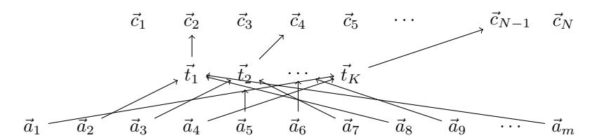
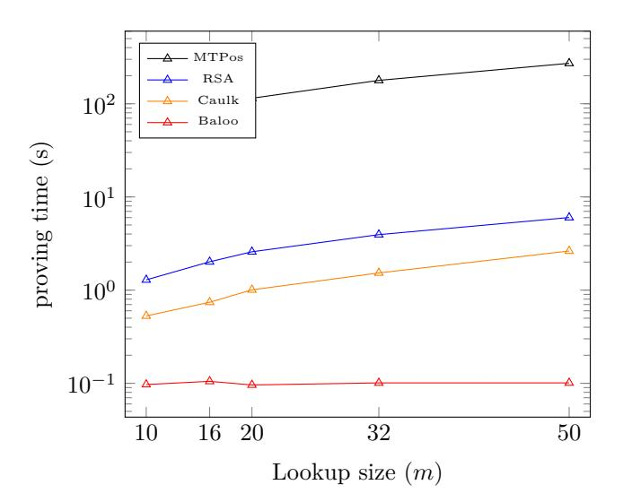

# **Baloo: Algebraic Lookup Arguments**

Arantxa Zapico<sup>a</sup>, Ariel Gabizon<sup>3</sup>, Dmitry Khovratovich<sup>1</sup>, Mary Maller<sup>1</sup> and Carla Ràfols<sup>4</sup>

- <sup>1</sup> Ethereum Foundation
- <sup>2</sup> Zeta Function Technologies
- <sup>3</sup> Universitat Pompeu Fabra

#### Abstract.

We present Baloo, a protocol for lookup tables where the prover work is linear on the number of lookups and independent of the table size. Baloo is built over previous lookup arguments, and the framework for SNARKs from Ràfols and Zapico (CRYPTO 21).

Our protocol supports *commit-and-prove expansions*: the prover selects the subtable containing the elements used in the lookup, that is unknown to the verifier, commits to it and later proves its relation with the committed elements. This feature makes Baloo especially suitable for proving input-output relations on hash functions, and in particular to instantiate the Ethereum Virtual Machine (EVM).

**Keywords:** Public Key Cryptography · SNARKs · lookups

## 1 Introduction

The rise of succinct proving systems in the recent decade has brought us close to one of the Holy Grails of computer science. Namely, being able to prove a large computation while spending not much more time on the proof than on the computation itself. We know how to make a proof only a handful of bytes large, and how to make the verifier run in a millisecond – but the prover time remains a bottleneck.

In recent years, there has been increasing focus on improving prover efficiency in cryptographic protocols. A key technique that has gained attention is the use of lookups table arguments, which allow heavy computations to be replaced by retrieving values from pre-defined tables, such as caches or databases.

In lookup table arguments, prover and verifier each have as input some representation of a table  $\vec{c}$  and a vector  $\vec{a}$ , and the former aims to convince the latter that all elements of  $\vec{a}$  are also present in  $\vec{c}$ . When this is the case, we say that  $\vec{a}$  is a lookup on  $\vec{c}$ . In the settings we consider in this work, we have  $\vec{c} \in \mathbb{F}^N$  and  $\vec{a} \in \mathbb{F}^m$ , with m << N. We also assume that the table  $\vec{c}$  is public, and its representation can be precomputed and reused in several prover-verifier interactions. For instance,  $\vec{c}$  can contain all field elements within a range, or input-output pairs for some heavy public computation.

This approach can significantly speed up certain operations, such as efficient regular  $(2^n)$  integer arithmetic and bit-oriented algorithms, like modern hash functions. Until recently, the most efficient construction for proving lookups was Plookup [GW20], which constrained prover time to be linear in the size of the lookup table, N, limiting its use with

E-mail: arantxa.zapico@ethereum.org (Arantxa Zapico), ariel.gabizon@gmail.com (Ariel Gabizon), khovratovich@gmail.com (Dmitry Khovratovich), mary.maller@ethereum.org (Mary Maller), carla.rafols@upf.edu (Carla Ràfols)

<span id="page-0-0"></span><sup>&</sup>lt;sup>a</sup>This work was done while Arantxa Zapico was a PhD student at Universitat Pompeu Fabra, funded by Protocol Labs PhD Fellowship PL-RGP1-2021-062.

large tables. However, in 2022, a second breakthrough lead by Caulk [\[ZBK](#page-28-0)<sup>+</sup>22, [PK22\]](#page-27-0) appears as the first method to prove *m* lookups in more reasonable *O*(*m*<sup>2</sup> ) time, i.e. independent of *N*, after a pre-processing step of size *O*(*N* log *N*).

At the same time, a number of computationally powerful blockchains, with Ethereum being the most prominent example, barely withstand the demand for a higher transaction rate and computational bandwidth. One bold attempt to get consensus on the computation without every node repeating work is to use a SNARK as a certificate of correctness. However, efforts to build a prover for Ethereum's virtual machine [\[BBCCL21,](#page-23-0) [Eth22,](#page-25-0) [Pol22,](#page-27-1) [Sta22,](#page-28-1) [Zha22,](#page-29-0) [zks22\]](#page-29-1) have been hindered by the cost of proving the Keccak hash function, even if a prover is lookup-enhanced. As Keccak is used in the Merkle tree of the blockchain state, a proof for all state transitions in one block results in tens of millions of lookups — an amount insurmountable by Caulk.

Baloo is the first lookup argument to prove *m* lookups in quasi-linear time. It is tailored to prime fields suitable for KZG commitments and opening proofs [\[KZG10\]](#page-27-2), which are around 256-bit large, and thus to computations defined on such domains. The prover complexity is quasi-linear in the field and linear in the group. This is thanks to a number of new techniques designed around proving statements over sets that are not multiplicative subgroups (where we cannot use Fast Fourier Transforms).

# **2 Related Work**

In Fig. [1](#page-2-0) we compare the concrete costs of the closest schemes to this work (that is, use univariate polynomials and are pairing-based), when compiled using the KZG polynomial commitment scheme [\[KZG10\]](#page-27-2). Plookup [\[GW20\]](#page-26-0) and Halo2 [\[BGH19\]](#page-24-0) require no preprocessing but the prover work in the group is quasi-linear in the size of the table. They can be compiled using any polynomial commitment scheme including solutions that do not require pairings. Caulk [\[ZBK](#page-28-0)<sup>+</sup>22] introduced the first solution with prover work that is sublinear in the size of the table by using preprocessing, but they incur a quadratic cost in the number of lookups. Posen and Kattis introduced Caulk+[\[PK22\]](#page-27-0), an improvement over Caulk that leads to a table-independent prover, still quadratic on number of lookups. Flookup [\[GK22\]](#page-26-1) reduced the prover complexity to quasi-linear on the lookups while retaining a table-independent prover. However, their techniques rely on committing to a table as roots of a polynomial instead of coefficients. This means their commitments are not homomorphic, which limits the applicability of their solution to stand-alone set membership proofs and makes it challenging to use their lookup to speed up SNARK provers (see Section [C\)](#page-34-0). We discuss concurrent and follow-up work at the end of this section.

We provide an implementation of Ba*loo* and compare its performance with those protocols that have publicly available implementations in Appendix [D.](#page-36-0)

Other approaches, such as discrete-log based [\[BG13,](#page-24-1) [GK15,](#page-26-2) [BCC](#page-23-1)<sup>+</sup>15, [BCG](#page-24-2)<sup>+</sup>18] require no trusted setup but incur a linear verifier. Bootle et al. [\[BCG](#page-24-2)<sup>+</sup>18] initially suggested the use of lookup arguments to improve the prover time in proving machine computations. Their solution targetted the TinyRAM virtual machine [\[BCG](#page-23-2)<sup>+</sup>13]. Campanelli et al. [\[CFH](#page-25-1)<sup>+</sup>22] present also a scheme for position-hiding linkability of RSA accumulators for large prime numbers and Pedersen commitments. Concretely they achieve good efficiency: their proof size is constant and their proving times do not depend on the size of the accumulator. Further, they can support larger lookup tables than Ba*loo* because they are not constrained by the size of their setup. However, their scheme crucially relies on groups of hidden order such as a trusted RSA modulus or class groups.

Lookup arguments are often used in the context of key-value lookups in verifiable registries [\[CDGM19\]](#page-24-3). Multiple works [\[TBP](#page-28-2)<sup>+</sup>19, [MKL](#page-27-3)<sup>+</sup>20, [HHK](#page-27-4)<sup>+</sup>21, [TFBT21\]](#page-28-3) explore how to ensure the correctness of the table that is used in verifiable registries. Campanelli et

<span id="page-2-0"></span>

| <b>Table 1:</b> Cost comparison of our scheme with other | pairing-based lookups. $N$ is the size |
|----------------------------------------------------------|----------------------------------------|
| of the table and $m$ the size of the set to be opened.   | The preprocessing costs are given in   |
| the number of group operations.                          |                                        |

| Scheme                      | Preproc         | Proof size                                   | ]            | Verifier            |    |
|-----------------------------|-----------------|----------------------------------------------|--------------|---------------------|----|
|                             |                 |                                              | $\mathbb{G}$ | $\mathbb{F}$        |    |
| Plookup [GW20]              | _               | $5\mathbb{G}_1, 9\mathbb{F}$                 | O(N)         | $O(N \log N)$       | 2P |
| Halo2 [BGH19]               | _               | $6\mathbb{G}_1, 5\mathbb{F}$                 | O(N)         | $O(N \log N)$       | 2P |
| Caulk [ZBK <sup>+</sup> 22] | $O(N \log N)$   | $14\mathbb{G}_1, 1\mathbb{G}_2, 4\mathbb{F}$ | 15m          | $O(m^2 + m\log(N))$ | 4P |
| Caulk+ [PK22]               | $O(N \log N)$   | $7\mathbb{G}_1, 1\mathbb{G}_2, 2\mathbb{F}$  | 8m           | $O(m^2)$            | 3P |
| Flookup [GK22]              | $O(N \log^2 N)$ | $7\mathbb{G}_1, 1\mathbb{G}_2, 4\mathbb{F}$  | 6m           | $O(m\log^2 m)$      | 3P |
| cq [EFG22]                  | $O(N \log N)$   | $8\mathbb{G}_1, 3\mathbb{F}$                 | 8m           | $O(m \log m)$       | 5P |
| Baloo                       | $O(N \log N)$   | $12\mathbb{G}_1, 1\mathbb{G}_2, 4\mathbb{F}$ | 14m          | $O(m \log^2 m)$     | 5P |

al. [CEO22] demonstrate how homomorphic commitments can be used to build key-value lookups. Their solution is zero-knowledge, does not require a trusted setup or pairings, and uses techniques similar to Section C. However, their prover work is linear on the size of the table. Agrawal and Raghuraman [AR20] build key-value lookups using hidden order groups. Campanelli et al. [CFG $^+$ 20] use lookup arguments to construct *verifiable decentralized storage* and achieve a sublinear prover assuming preprocessing. Benarroch et al. [BCF $^+$ 21] discuss commit-and-prove set membership proofs, which is a useful primitive for constructing modular zero-knowledge proofs.

Concurrent and follow-up work. Eagen et al. [EFG22] introduce cq, a lookup argument where prover work is O(m) in the group and  $O(m\log m)$  in the field, for m lookups on tables of any size N. To prove that for a table  $\vec{c} \in \mathbb{F}^N$  and vector  $\vec{a} \in \mathbb{F}^m$ , it is true that all the elements in  $\vec{a}$  are also in  $\vec{c}$ , Baloo creates an intermediate shorter table  $\vec{t} \in \mathbb{F}^k$  with  $k \leq N$  such that  $\vec{t}$  has all the elements in  $\vec{c}$  that are used in  $\vec{a}$ . That is, our first step is to get rid of the unused elements in  $\vec{c}$ . The main novelty in [EFG22], and follow-up work [PH23, CFF<sup>+</sup>24], is to use a property of logarithmic derivatives exploited in [Hab22] that allows to link directly the initial table  $\vec{c}$  with the lookup  $\vec{a}$ , with prover work independent of  $|\vec{c}|$ . On the downside, the commitments to vectors  $\vec{c}$ , and  $\vec{a}$  are not homomorphic. Baloo is, to the best of our knowledge, the most efficient lookup argument with homomorphic commitments that uses a univariate setup.

Roughly speaking, the techniques of cq are related to the ones used to prove the permutation argument in Plonk [GWC19]. In contrast, the ones of this work are based on a novel analysis of an argument for simple linear relations of [RZ21], which was designed as a plug-in for the Marlin proof system [CHM<sup>+</sup>20]. The core technical part of this work is to use techniques developed in the context of the Marlin proof system, namely, Checkable Subspace Sampling (CSS) arguments, to show that a vector  $\vec{d}$  is in the row space of some public matrix  $\mathbf{M}$  and use them in another context where  $\mathbf{M}$  is unknown. Therefore, our work presents a new technique, a stronger analysis of Marlin-like sparse polynomial commitments.

The essence of Baloo is the observation that, to prove the lookup relation between  $\vec{t}$  and  $\vec{a}$  it is enough to prove the existence of a matrix  $\mathbf{M} \in \mathbb{F}^{m \times k}$  such that (i)  $\mathbf{M}\vec{t} = \vec{a}$ , and (ii) the rows of  $\mathbf{M}$  are unit vectors and so,  $\mathbf{M}$  is what we define as a lookup matrix. Proving matrix-vector products is a problem that arises in the design of SNARKs for R1CS arithmetization [BCR<sup>+</sup>19, CHM<sup>+</sup>20, CFF<sup>+</sup>21, Set20, RZ21]. Baloo's characterization of a lookup argument has opened a line of research where SNARK techniques can be exploited. Setty et al. proposed in Lasso [STW24] the first completely linear-time lookup building on multivariate polynomial commitments. The authors follow the same approach of committing to the (secret) matrix that relates  $\vec{a}$  and  $\vec{t}$  proposed in this work, but upholding

 $_{\rm Ba}$ loo

the techniques in Spartan [Set20]. A significant contribution of Lasso [STW24] and the companion paper [AST24] is the observation that many tables in practice are structured tables. Roughly speaking, this means that the lookup operation can be reconstructed by different lookups in smaller tables. This allows to handle much bigger tables than previous works. As pointed out in [STW24], to use proof systems that use KZG commitments [KZG10], Lasso needs an additional argument to link them with multivariate commitments, whereas Baloo natively supports them. Recently, Garreta and Manzur [GM24] introduced FLI, a folding scheme for lookup instances built over Baloo and the folding scheme for R1CS presented in [KST22].

It is natural to ask how Baloo can be used for lookup arguments over witnesses defined on smaller domains. Natural examples include 64-bit proof systems such as Plonky2 [PZ22] and a family of hash functions [GKL<sup>+</sup>22, SLST23, Sal23] recently introduced to speed up such proof systems. This question was addressed for the multivariate case, building on Lasso, in a recent work [DP25], and we leave the extension to the univariate case for future work.

## 3 Preliminaries

### 3.1 Notation

A bilinear group gk is a tuple  $gk = (q, \mathbb{G}_1, \mathbb{G}_2, \mathbb{G}_T, e, \mathcal{P}_1, \mathcal{P}_2)$  where  $\mathbb{G}_1, \mathbb{G}_2$  and  $\mathbb{G}_T$  are groups of prime order q, the elements  $\mathcal{P}_1$ ,  $\mathcal{P}_2$  are generators of  $\mathbb{G}_1$ ,  $\mathbb{G}_2$  respectively,  $e: \mathbb{G}_1 \times \mathbb{G}_2 \to \mathbb{G}_T$  is an efficiently computable, non-degenerate bilinear map, and there is no efficiently computable isomorphism between  $\mathbb{G}_1$  and  $\mathbb{G}_2$ . Elements in  $\mathbb{G}_{\gamma}$ , are denoted implicitly as  $[a]_{\gamma} = a\mathcal{P}_{\gamma}$ , where  $\gamma \in \{1, 2, T\}$  and  $[1]_T = e(\mathcal{P}_1, \mathcal{P}_2)$ . With this notation,  $e([a]_1, [b]_2) = [ab]_T$ .

Let  $\lambda \in \mathbb{N}$  denote the security parameter and  $1^{\lambda}$  its unary representation. A function  $\text{negl}: \mathbb{N} \to \mathbb{R}^+$  is called *negligible* if for all c > 0, there exists  $k_0$  such that  $\text{negl}(k) < \frac{1}{k^c}$  for all  $k > k_0$ . For a non-empty set S, let  $x \leftarrow S$  denote sampling an element of S uniformly at random and assigning it to x.

PPT denotes probabilistic polynomial-time, and algorithms are randomized unless explicitly noted otherwise. Let  $y \leftarrow A(x;r)$  denote running algorithm A on input x and randomness r and assigning its output to y and  $y \leftarrow A(x)$  denotes  $y \leftarrow A(x;r)$  for a uniformly random r.

For a finite field  $\mathbb{F}$ ,  $\mathbb{F}[X]$  the ring of univariate polynomials with coefficients in  $\mathbb{F}$ . For  $m \in \mathbb{F}$ , we set  $[m] = \{1, \ldots, m\}$ . For a set S, |S| denotes its cardinality, and  $\alpha \leftarrow S$  means  $\alpha$  has been uniformly sampled from S. Matrices are denoted in boldface.

#### <span id="page-3-0"></span>3.2 Lagrange Polynomials

Given a vector  $\vec{v} \in \mathbb{F}^d$  and a basis  $\mathcal{B} = \{B_i(X)\}_{i=1}^d$  of the polynomials of degree d-1, we can represent vector v as a polynomial  $v(X) = \sum_{i=1}^d v_i B_i(X)$ . We call such a representation an *encoding* of  $\vec{v}$ , and omit reference to the basis when possible.

Along this work, we will set  $\mathcal{B}$  to be the basis of Lagrange interpolation polynomials for some set S of size d. We recall the Lagrange basis with respect to a set  $S=(s_1,\ldots,s_d)$  consists of d polynomials  $p_i(X)$  of degree d-1 such that  $p_i(s_i)=1$  and  $p_i(s_j)=0$  when  $i\neq j$ . The vanishing polynomial  $z_S(X)$  is the polynomial that takes value 0 in all the elements of S, i.e.,  $z_S(X)=\prod_{s_i\in S}(X-s_i)$ . For any set of Lagrange interpolation polynomials  $\{p_i(X)\}_{i=1}^d$  it is true that  $\sum_{i=1}^d p_i(X)=1$ ,  $z_S(X)|p_i(X)p_j(X)$  for  $i\neq j$ , and since  $p_i^2(X)=p_i(X)(1-\sum_{j\neq i}p_j(X))$ , it always hold that  $p_i^2(X)\equiv p_i(X)\mod z_S(X)$ .

We will work with three different sets and their corresponding Lagrange interpolation basis in order to encode vectors of three different sizes:  $\mathbb{H}$  of size N,  $\mathbb{V}$  of size m, and  $\mathbb{H}_I$

of size k. If possible, we choose the set S to be a set of roots of unity in the field  $\mathbb{F}$ , as this choice leads to sparse representations for both Lagrange and vanishing polynomials. For a vector of size N, we assume without loss of generality that there exists a primitive Nth root of unity  $\omega^1$ . We define the subgroup  $\mathbb{H} = \{\omega, \omega^2, \dots, \omega^{N-1}, 1\} \subset \mathbb{F}$ . The Lagrange interpolation polynomials for this set are denoted as  $\{\lambda_s(X)\}_{s=1}^N$ , and the vanishing polynomial is  $z_H(X)$ . Since  $\mathbb{H}$  is a subgroup, the Lagrange polynomial  $\lambda_s(X)$  can be expressed as  $\lambda_s(X) = \frac{\omega^s}{N} \frac{X^N - 1}{X - \omega^s}$ , and the vanishing polynomial is  $z_H(X) = X^N - 1$ . For vectors of size m ( $m \neq N$ ) we assume  $\nu$  is a primitive mth root of unity, and we define the set  $\mathbb{V} = \{\nu, \nu^2, \dots, \nu^m\}$ . The Lagrange interpolation polynomials for this set are denoted as  $\{\mu_j(X)\}_{j=1}^m$ , and the vanishing polynomial is  $z_V(X)$ .

Finally, we consider vectors of size k, which are constructed as subvectors of a vector of size N. To do this, we define  $I \subset [N]$  with |I| = k, and we set  $\mathbb{H}_I \subset \mathbb{H}$  such that  $\mathbb{H}_I = \{\omega^s \mid s \in I\}$ , maintaining the same order as in  $\mathbb{H}$ . For simplicity, we rename the elements in  $\mathbb{H}_I$  and denote them as  $\mathbb{H}_I = \{\xi_i\}_{i=1}^k$ , where  $\xi_i = \omega^s$  for the ith index  $s \in I$ . The Lagrange polynomials for this set are denoted as  $\{\tau_i(X)\}_{i=1}^k$ , and the vanishing polynomial is  $z_I(X)$ . Note that  $\mathbb{H}_I$  is generally not a subgroup and thus  $z_I(X)$  and the  $\tau_i(X)$ 's are not sparse.

## <span id="page-4-2"></span>3.3 Cryptographic Assumptions

The security of our protocols holds in the Algebraic Group Model (AGM) of Fuchsbauer et al. [FKL18], using the bilinear version of the q-dlog and q-sfrac assumptions [GG17, BB04] defined below. In the AGM, adversaries are restricted to be algebraic algorithms, namely, whenever  $\mathcal{A}$  outputs a group element [y] in a cyclic group  $\mathbb{G}$  of order p, it also outputs its representation as a linear combination of all previously received group elements. In other words, if  $[y] \leftarrow \mathcal{A}([x_1], \ldots, [x_m])$ ,  $\mathcal{A}$  must also provide  $\vec{z}$  such that  $[y] = \sum_{j=1}^m z_j[x_j]$ . This definition generalizes naturally in asymmetric bilinear groups with a pairing  $e: \mathbb{G}_1 \times \mathbb{G}_2 \to \mathbb{G}_T$ , where for  $i \in 1, 2$ , the adversary must construct  $\mathbb{G}_i$  elements as linear combinations of received  $\mathbb{G}_i$  elements.

**Definition 1** (q-dlog). The  $q(\lambda)$ -discrete logarithm assumption holds for a bilinear group generator  $qk \leftarrow \mathcal{G}(1^{\lambda})$  if for all PPT algorithm  $\mathcal{A}$

$$\mathsf{Adv}_{gk,\mathcal{A}}^{q-dlog}(\lambda) = \mathsf{Pr}\left[x \leftarrow \mathcal{A}(gk,[x]_{1,2},\dots,[x^q]_{1,2})\right] = \mathsf{negl}(\lambda).$$

**Definition 2** (q-sfrac). The  $q(\lambda)$ -Simple Fractional assumption holds for a bilinear group generator  $gk \leftarrow \mathcal{G}(1^{\lambda})$  if for all PPT algorithm  $\mathcal{A}$  the following probability is negligible in  $\lambda$

$$\mathsf{Adv}_{gk,\mathcal{A}}^{q-sfrac}(\lambda) = \Pr \begin{bmatrix} \frac{r(x)}{s(x)} e([1]_1,[1]_2) \leftarrow \mathcal{A}(gk,[1]_{1,2},[x]_{1,2},\dots,[x^q]_{1,2}) & gk \leftarrow \mathcal{G}(1^\lambda) \\ \wedge \deg(r) < \deg(s) \leq q. & x \leftarrow \mathbb{F} \end{bmatrix}.$$

## 3.4 Non-Interactive Argument of Knowledge

Let  $\mathcal{R}$  be a family of universal relations. Given a relation  $R \in \mathcal{R}$  and an instance x we call w a witness for x if  $(x, w) \in R$ ,  $\mathcal{L}(R) = \{x | \exists w : (x, w) \in R\}$  is the language of all the x that have a witness w in the relation R, while  $\mathcal{L}(R)$  is the language of all the pairs (x, R) such that  $x \in \mathcal{L}(R)$ . We will assume R is implicit as prover and verifier input.

<span id="page-4-1"></span>**Definition 3.** A Non-Interactive Argument of Knowledge is a tuple of PPT algorithms (Setup, Prove, Verify) such that:

•  $(srs, \tau) \leftarrow Setup(\mathcal{R})$ : On input a family of relations  $\mathcal{R}$ , Setup outputs a structured reference string srs and a trapdoor  $\tau$  as a private output;

<span id="page-4-0"></span><sup>&</sup>lt;sup>1</sup>In the case a (FFT-friendly) group of this size does not exist, we pad with zero entries.

•  $\pi \leftarrow \text{Prove}(\text{srs}, (\mathsf{x}, w))$ : On input a pair  $(\mathsf{x}, w) \in \mathsf{R}$ , it outputs a proof  $\pi$  of the fact that  $\mathsf{x} \in \mathcal{L}(\mathsf{R})$ ;

 1/0 ← Verify(srs, x, π): On input the srs, the instance x and the proof, it produces a bit expressing acceptance (1), or rejection (0);

and that satisfies completeness, knowledge soundness and zero-knowledge as defined below.

**Completeness:** holds if an honest prover will always convince an honest verifier. Formally,  $\forall R \in \mathcal{R}, (x, w) \in R$ ,

$$\Pr\left[\mathsf{Verify}(\mathsf{srs},\mathsf{x},\pi) = 1 \,\middle|\, \begin{matrix} (\mathsf{srs},\tau) \leftarrow \mathsf{Setup}(\mathcal{R}) \\ \pi \leftarrow \mathsf{Prove}(\mathsf{srs},(\mathsf{x},w)) \end{matrix}\right] = 1.$$

**Knowledge-Soundness:** captures the fact that a cheating prover cannot, except with negligible probability, create a proof  $\pi$  accepted by the verification algorithm unless it has a witness w such that  $(x, w) \in R$ . Formally, for all PPT adversaries  $\mathcal{A}$ , there exists a PPT extractor  $\mathcal{E}$  such that

$$\Pr\left[ (\mathsf{x}, w) \notin \mathsf{R} \land \mathsf{Verify}(\mathsf{srs}, \mathsf{x}, \pi) = 1 \, \middle| \begin{array}{l} (\mathsf{srs}, \tau) \leftarrow \mathsf{Setup}(\mathcal{R}) \\ (\mathsf{x}, \pi) \leftarrow \mathcal{A}(\mathsf{srs}) \\ w \leftarrow \mathcal{E}(\mathsf{srs}, \mathsf{x}, \pi) \end{array} \right] \leq \mathsf{negl}.$$

### <span id="page-5-0"></span>3.5 The KZG Polynomial Commitment Scheme

Our construction heavily relies on the polynomial commitment introduced by Kate, Zaverucha and Goldberg in [KZG10] that we described below. As noted in Caulk [ZBK<sup>+</sup>22], the protocol can be slightly modified to support degree checks, so it consists on a tuple (KZG.Setup, KZG.Commit, KZG.Open, KZG.Verify) such that:

- $\operatorname{srs}_{\mathsf{KZG}} \leftarrow \mathsf{KZG.Setup}(gk,d)$ : On input a bilinear group gk and a degree bound d, it samples  $x \leftarrow \mathbb{F}$  uniformly, and outputs a structured reference string  $\operatorname{srs}_{\mathsf{KZG}} = (\{[x^i]_{1,2}\}_{i=1}^d)$ .
- $\mathsf{cm}_{\mathsf{c}} \leftarrow \mathsf{KZG}.\mathsf{Commit}\big(\mathsf{srs}_{\mathsf{KZG}}, p(X)\big)$ : On input polynomial  $p(X) \in \mathbb{F}[X]$  of degree d, it outputs  $\mathsf{cm}_{\mathsf{c}} = [p(x)]_1$ .
- $(s, \pi_{\mathsf{KZG}}) \leftarrow \mathsf{KZG.Open}(\mathsf{srs}_{\mathsf{KZG}}, p(X), \alpha)$ : Let  $\deg < d$  be the degree of p(X). Given  $\alpha \in \mathbb{F}$ , prover computes

$$q(X) = \frac{p(X) - p(\alpha)}{X - \alpha} ,$$

sets  $s = p(\alpha), [Q]_1 = [q(x)x^{d-\deg + 1}]_1$ , and outputs  $(s, \pi_{\mathsf{KZG}} = [Q]_1)$ .

•  $1/0 \leftarrow \mathsf{KZG}.\mathsf{Verify}(\mathsf{srs}_{\mathsf{KZG}},\mathsf{cm}_{\mathsf{c}},\deg,\alpha,s,\pi_{\mathsf{KZG}})$ : Verifier accepts if and only if

$$e(\mathsf{cm}_{\mathsf{c}} - [s]_1, [x^{d-\deg + 1}]_2) = e([Q]_1, [x - \alpha]_2).$$

**Multiple Openings.** We also implement the optimization noted in [KZG10] to open one polynomial to many distinct points. In a nutshell, given the polynomial p(X), a vector of opening points  $\vec{\alpha} \in \mathbb{F}^t$  and  $\vec{s}$  such that  $s_i = p(\alpha_i)$  for all i = 1, ..., t, prover and verifier define  $C_{\vec{\alpha}}(X)$  as the unique polynomial of degree t-1 such that  $C_{\vec{\alpha}}(\alpha_i) = s_i$  for all  $i \in [t]$ . Then,  $p(\alpha_i) = s_i$  for all i = 1, ..., t if and only if there exists q(X) such that

$$p(X) - C_{\vec{\alpha}}(X) = \prod_{i=1}^{t} (X - \alpha_i) q(X).$$

**Subset openings.** Crucial for our construction is the subvector opening scheme of Tomescu et al. [TAB<sup>+</sup>20] that works for the vector commitment inspired by KZG.

Consider  $\vec{c} \in \mathbb{F}^N$  and let  $\vec{t} \in \mathbb{F}^k$  be a subvector of  $\vec{c}$ , i.e., there exists  $I \subset [N]$  such that  $\vec{t} = (c_i)_{i \in I}$ . Given an encoding  $C(X) = \sum_{s=1}^N c_s \lambda_s(X)$  of  $\vec{c} \in \mathbb{F}^N$  and  $C_I(X) = \sum_{i=1}^k t_i \tau_i(X)$ , where  $\{\tau_i(X)\}$  are the Lagrange interpolation polynomials of the set  $\mathbb{H}_I = \{\xi_i\}_{i=1}^k = \{\omega^s\}_{s \in I}$ , then note that for  $z_I(X) = \prod_{i=1}^k (X - \xi_i)$ ,

$$C(X) - C_I(X) = z_I(X)Q_I(X),$$

for some polynomial  $Q_I(X)$  if and only if  $t_i = c_s$  for the pairs (i, s) such that  $\xi_i = \omega^s$ .

What is more, it is demonstrated in [TAB<sup>+</sup>20] that the prover can compute  $[Q_I]_1$  by performing k group and  $O(k \log^2(k))$  field operations, given they already have stored proofs  $\{[Q_s]_1\}_{s\in I}$  that  $C(\omega^s)=c_s$ . Precomputing all the proofs  $\{[Q_s]_1\}_{s=1}^N$  can be done in time  $O(N \log N)$  using techniques by Feist and Khovratovich [FK23].

## 3.6 Polynomial Holographic Proofs

For a family of relations  $\mathcal{R}$ , we denote  $(R, x, w) \in \mathcal{R}$  if  $(x, w) \in R$ , and  $R \in \mathcal{R}$ .

<span id="page-6-1"></span>**Definition 4.** [Polynomial Holographic IOPs (PHP) [CFF<sup>+</sup>21]] A Polynomial Holographic IOP for a family of relations  $\mathcal{R}$  is a tuple PHP = (rnd, n, m, d,  $\mathcal{I}, \mathcal{P}, \mathcal{V}$ ), where |.|, rnd, n, m, d:  $\{0,1\}^* \to \mathbb{N}$  are polynomial-time computable functions, and  $\mathcal{I}, \mathcal{P}, \mathcal{V}$  are algorithms that work as follows:

- Offline phase: The encoder or indexer  $\mathcal{I}(\mathsf{R})$  is executed on a relation description  $\mathsf{R} \in \mathcal{R}$ , and returns  $\mathsf{n}(0)$  polynomials  $\{p_{0,j}(X)\}_{j=1}^{\mathsf{n}(0)} \in \mathbb{F}[X]$  encoding the relation  $\mathsf{R}$ .
- Online phase: The prover  $\mathcal{P}(\mathsf{R},\mathsf{x},\mathsf{w})$  and the verifier  $\mathcal{V}^{\mathcal{I}(\mathsf{R})}(\mathsf{x})$  are executed for  $\mathsf{rnd}(|\mathsf{R}|)^2$  rounds, the prover has a tuple  $(\mathsf{x},\mathsf{w}) \in \mathsf{R}$ , and the verifier has an instance  $\mathsf{x}$  and oracle access to the polynomials encoding  $\mathsf{R}$ . In the ith round,  $\mathcal{V}$  sends a message  $\rho_i \in \mathbb{F}$  to the prover, and  $\mathcal{P}$  replies with  $\mathsf{m}(i)$  messages  $\{\pi_{i,j} \in \mathbb{F}\}_{j=1}^{\mathsf{m}(i)}$ , and  $\mathsf{n}(i)$  oracle polynomials  $\{p_{i,j} \in \mathbb{F}[X]\}_{i=1}^{\mathsf{n}(i)}$ , such that  $\deg(p_{i,j}) < \mathsf{d}(|\mathsf{R}|,i,j)$ .
- **Decision phase**: After the rnd(|R|)-th round, the verifier outputs two sets of algebraic checks of the following type:
  - Degree checks: to check a bound on the degree of the polynomials sent by the prover.
  - Polynomial checks: to verify that certain polynomial identities hold between the oracle polynomials and the messages sent by the prover.

The verifier accepts if and only if all the checks are satisfied.

**Definition 5.** A PHP is complete if for any triple  $(R, x, w) \in \mathcal{R}$ , the checks returned by  $\mathcal{V}^{\mathcal{I}(R)}$  after interacting with the honest prover  $\mathcal{P}(R, x, w)$ , are satisfied with probability 1.

**Definition 6.** A PHP is  $\epsilon$ -sound if for every relation-instance tuple  $(R,x) \notin \mathcal{L}(\mathcal{R})$  and polynomial-time prover  $\mathcal{P}^*$  we have

$$\Pr\left[\langle \mathcal{P}^*, \mathcal{V}^{\mathcal{I}(\mathsf{R})}(\mathsf{x})\rangle = 1\right] \le \epsilon.$$

<span id="page-6-0"></span> $<sup>^{2}|\</sup>mathsf{R}|$  is the size of the witness in field elements

**Definition 7.** A PHP is  $\epsilon$ -knowledge sound if there exists a polynomial-time knowledge extractor  $\mathcal{E}$  such that for any prover  $\mathcal{P}^*$ , relation R, instance x and auxiliary input z we have

$$\Pr\left[(\mathsf{R},\mathsf{x},\mathsf{w}) \in \mathcal{R} : \mathsf{w} \leftarrow \mathcal{E}^{\mathcal{P}^*}(\mathsf{R},\mathsf{x},z)\right] \geq \Pr\left[\langle \mathcal{P}^*(\mathsf{R},\mathsf{x},z), \mathcal{V}^{\mathcal{I}(\mathsf{R})}(\mathsf{x})\rangle = 1\right] - \epsilon,$$

where  $\mathcal{E}$  has oracle access to  $\mathcal{P}^*$ , it can query the next message function of  $\mathcal{P}^*$  (and also rewind it) and obtain all the messages and polynomials returned by it.

#### <span id="page-7-1"></span>3.7 Generalized Sumcheck

Following [BCR<sup>+</sup>19], in Section 5.2.4 we construct a scheme for inner product relations that rely on the univariate sumcheck argument. Since the sumcheck in [BCR<sup>+</sup>19] requires to work with Lagrange polynomials that interpolate subgroups, and we will work with an arbitrary subset  $\mathbb{H}_I$  of  $\mathbb{H}$ , we use the generalized variant of the sumcheck:

**Theorem 1** (Generalized Sumcheck [RZ21]). Let  $\mathbb{H}_I = \{\xi_i\}_{i=1}^k$  be an arbitrary subset of size k in some finite field  $\mathbb{F}$  and  $z_I(X)$  its vanishing polynomial. For any  $P(X) \in \mathbb{F}[X]$ ,  $\sum_{i=1}^k P(\xi_i) = \sigma$  if and only if there exist polynomials  $Q(X) \in \mathbb{F}[X]$ ,  $R(X) \in \mathbb{F}[X]$  with  $\deg(R) \leq k-2$  such that

$$P(X)N_{\mathbb{H}_I}(X) - \sigma = XR(X) + z_I(X)Q(X),$$

where  $N_{\mathbb{H}_I}(X) = \sum_{i=1}^k \tau_i(0)^{-1} \tau_i(X)$  and  $\tau_i(X)$  is the ith Lagrange polynomial associated to  $\mathbb{H}_I$ .

## 4 Overview

In this section we provide a technical overview of the Baloo protocol, which proves a committed lookup relation, informally:

Given element  $\mathsf{cm}_{\mathsf{a}} \in \mathbb{G}_1$  and a public set represented as vector  $\vec{c} \in \mathbb{F}^N$ , there exists  $\vec{a} \in \mathbb{F}^m$  such that all elements of  $\vec{a}$  are elements of  $\vec{c}$  and  $\mathsf{cm}_{\mathsf{a}}$  is a KZG commitment to  $\vec{a}$ .

To give an intuition of our protocol, we will first analyze the relation above in algebraic terms: given a public table represented in vector  $\vec{c} \in \mathbb{F}^N$  and a vector  $\vec{a} \in \mathbb{F}^m$ , prove that for all  $j \in [m]$ , there exists  $s \in [N]$  such that  $a_j = c_s$ . The first observation made also in previous work ([ZBK+22], [PK22]) is that as not all elements of  $\vec{c}$  are used in  $\vec{a}$ , we can create a new, shorter table  $\vec{t}$  by selecting from  $\vec{c}$  only those elements that are also in  $\vec{a}$ . This step is to prevent the prover from an unnecessary dependency on N.

Secondly, we prove that  $\vec{a}$  is a result of some expansion of  $\vec{t}$ , i.e., we design a lookup argument for  $\vec{a}$  in the new table  $\vec{t}$ . The hurdle of this step is that  $\vec{t}$  is unknown to the verifier and is encoded as a polynomial with an unknown Lagrange basis  $\{\tau_i(X)\}_{i=1}^k$ . Designing an efficient lookup argument for such a table is our main contribution. To do so, we note that the relation above has a simple algebraic representation: as  $\vec{a}$  is a vector generated using elements of  $\vec{t}$ , there exists a matrix  $\mathbf{M} \in \mathbb{F}^{m \times k}$  whose rows are unit vectors such that

<span id="page-7-0"></span>
$$\mathbf{M}\vec{t} = \vec{a}.\tag{1}$$

Concretely, all elements in **M** are zero except for one element per row  $1 = m_{j,i}$  when j, i are such that  $a_i = t_i$ . Recall we call such a matrix a *lookup matrix*.

In Figure 1, we depict the relations we aim to prove:  $\vec{c}$  is the original table.  $\vec{t}$  is a subvector of it: it keeps the ordering of the elements in  $\vec{c}$ , and takes some of them only

once. On the other hand,  $\vec{a}$  is itself a lookup on  $\vec{t}$ : all elements of  $\vec{a}$  are taken from  $\vec{t}$ , in no strict order and with potential repetitions.

<span id="page-8-0"></span>

**Figure 1:** Relation between  $\vec{t}$ ,  $\vec{c}$ , and  $\vec{a}$

To prove equation (1) and that **M** is a lookup matrix, we leverage SNARK techniques where proving linear relations is done via a lincheck argument, e.g. [BCR<sup>+</sup>19]. In particular, we use the framework of Ràfols and Zapico [RZ21], that separates the lincheck into two parts: a Checkable Subspace Sampling (CSS) argument, and an inner product.

The CSS is a PHP that deals with the problem of committing to a matrix of size  $m \times k$  in a succinct way. The solution, adopted in other works ([CHM+20], [CFF+21]), is to sample a vector in the row-space of matrix  $\mathbf{M}$  and then commit to such vector. If the new vector is sampled using random coins chosen by the verifier, the linear relation can be reduced to proving the following inner product (with overwhelming probability):

$$(\vec{r}^{\mathsf{T}}\mathbf{M}) \cdot \vec{t} = \vec{r}^{\mathsf{T}}\vec{a}. \tag{2}$$

Finally, to prove M is of the correct form, we adapt the construction of [RZ21] to prove that a matrix has one non-zero element per column, so it works for lookup matrices.

Overall, to build Baloo and prove the committed relation defined at the beginning of this section, we first use a succinct argument from [PK22] to prove an element  $\mathsf{cm}_t$  is the commitment to a subvector of the vector committed in  $\mathsf{cm}_c$ , introduced in Section 5.1. Then, we design a PHP for proving  $\vec{a}$  is an expansion of vector  $\vec{t}$ , in Section 5.2 and compile it into a succinct argument in Section 6.1. Finally, we put all the building blocks together and present the full Baloo construction with optimizations in 6.2.

#### 4.1 Select a subvector

We denote by  $\mathsf{cm}_\mathsf{c}$  the commitment to  $\vec{c}$ . Then we create a commitment  $\mathsf{cm}_\mathsf{t}$  to a subvector  $\vec{t} \in \mathbb{F}^k$  defined by  $\vec{a}$  through the set of index  $I = \{s \in [N] \text{ s.t. } \exists a_j \text{ with } c_s = a_j\}$ . That is,  $\vec{t}$  is the subvector of  $\vec{c}$  that contains only the elements of  $\vec{c}$  that are also in  $\vec{a}$ , i.e.,  $\vec{t} = (c_s)_{s \in I}$ . Recall that Since I is unknown to the verifier, we cannot use directly the subvector protocol in Section 3.5.

Instead, to prove that  $\mathsf{cm}_t$  commits to a subvector of  $\vec{c}$ , the prover provides  $W_1 \in \mathbb{G}_1, [z_I]_2$  such that

$$e(\mathsf{cm}_{\mathsf{c}} - \mathsf{cm}_{\mathsf{t}}, [1]_2) = e(W_1, [z_I]_2),$$

along with a proof of well-formedness of  $[z_I]_2$ . That is, a proof that  $[z_I]_2$  is a commitment to the vanishing polynomial of *some* subset of  $\mathbb{H}$ . For proving the latter, we use the Caulk+ core protocol by [PK22] described in Section 5.1. If the prover has access to precomputed KZG proofs  $\{[Q_s]_1\}_{s=1}^N$  of opening for all the elements  $c_s \in \vec{c}$  and individual proofs  $\{[H_s]_1\}_{s=1}^N$  of statements " $(X-\omega^s)|z_H(X)$ ", it performs only  $O(|\vec{t}|)$  group operations to convince the verifier that  $cm_t$  is a commitment to some subvector of  $\vec{c}$ .

## <span id="page-8-1"></span>4.2 PHP for expansion

Our Checkable Subspace Sampling, that is a PHP for a special sampling relation, can be seen as a partial evaluation problem: given matrix  $\mathbf{M} \in \mathbb{F}^{m \times k}$ , sets  $\mathbb{H}_I$  and  $\mathbb{V}$  of size k

and m with Lagrange interpolation polynomials  $\{\tau_i(X)\}_{i=1}^k$  and  $\{\mu_j(X)\}_{j=1}^m$  respectively, we can construct a bivariate polynomial encoding matrix  $\mathbf{M}$  as follows:

<span id="page-9-0"></span>
$$M(X,Y) = (\mu_1(Y), \dots, \mu_m(Y)) \mathbf{M} (\tau_1(X) \dots \tau_k(X))^{\top}$$
(3)

Then, the goal of a CSS argument is to show that for some  $\alpha \in \mathbb{F}$  sent by the verifier,

$$D(X) = M(X, \alpha) = \sum_{i=1}^{k} \sum_{j=1}^{m} M_{ji} \tau_i(X) \mu_j(\alpha).$$

That is, D(X) is an encoding for  $\vec{d} = \sum_{j=1}^{m} \mu_j(\alpha) \vec{m}_j$ , where  $\vec{m}_j$  are the row vectors of  $\mathbf{M}$ . Performing a CSS argument allows to reduce the statement in eq. (1) to a single inner product relation  $\vec{d} \cdot \vec{t} = \sum_{j=1}^{m} a_j \mu_j(\alpha)$ , that can be proven with the univariate sumcheck [BCR<sup>+</sup>19].

We solve many challenges when using the framework in [RZ21]:

- The indexer. The framework is built to work for a public matrix  $\mathbf{M}$  and secret  $\vec{t}, \vec{a}$ . Because in our case matrix  $\mathbf{M}$  is only known by the prover, we replace the offline phase performed by the indexer in the CSS with a commitment phase performed by the prover itself. To support our protocol, we give a new definition of Commitand-Prove CSS which works for matrices that are chosen in a commit-and-prove fashion [CFQ19], that is, the prover selects matrix  $\mathbf{M}$ , communicates it to the verifier in a succinct manner and then convinces them that  $\mathbf{M}\vec{t} = \vec{a}$ .
- Matrix M. To prove the lookup relation between  $\vec{a}$  and  $\vec{t}$ , the prover must convince the verifier that matrix M is a lookup matrix, i.e., that its rows are unit vectors. For this, we adapt a construction of CSS given in [RZ21] for so-called *basic matrices* to work for lookup matrices. A basic matrix is a matrix with one non-zero element per column, while a lookup matrix has only one non-zero element per row.
- Inner Product. To complete the proof for the linear relation, in Section 5.2.4 we present a scheme for proving the inner product relation between  $\vec{d}$  as described above and table  $\vec{t}$ , from its encodings D(X) and T(X). Both T(X) and D(X) can be naturally written in the Lagrange basis  $\{\tau_i(X)\}_{i=1}^k$  corresponding to set  $\mathbb{H}_I$ , and we build the argument from the encoding using the generalized univariate sumcheck in Section 3.7.

#### 4.3 Summary

We summarize the statement to be proven and challenges of building an argument for it in Fig. 2.

# 5 Building Blocks

In this section we present the building blocks of Baloo. In Section 5.1, we describe the Caulk+ core protocol that lets the prover convince the verifier that a group element  $\mathsf{cm}_\mathsf{t}$  is a commitment to a subvector of a public table  $\vec{c}$ , by performing  $O(|\vec{t}|)$  operations. In Section 5.2 we introduce the expansion argument that proves the committed lookup relation between  $\mathsf{cm}_\mathsf{t}$  and  $\mathsf{cm}_\mathsf{a}$ . This expansion argument consists of a CSS scheme introduced in Section 5.2.3 and the inner product described in Section 5.2.4.

<span id="page-10-1"></span>**Statement:** Given  $\mathsf{cm}_\mathsf{c}$  a commitment to  $C(X) = \sum_{j=1}^N c_i \vec{\lambda}_j(X)$ , the claim is that  $\mathsf{cm}_\mathsf{a}$  is a commitment to  $A(X) = \sum_{j=1}^m a_j \vec{\mu}_j(X)$ , and  $\vec{a} \in \mathbb{F}^m$  is a lookup of  $\vec{c} \in \mathbb{F}^N$ .

 $\{\lambda_j(X)\}_{j=1}^N$  (respectively,  $\{\mu_j(X)\}_{j=1}^m$ ) are Lagrange basis polynomials associated to the set of roots of unity  $\mathbb{H}=\{\omega^i\}_{i=1}^N$  (resp.  $\mathbb{V}=\{\nu^i\}_{i=1}^m$ ).

#### **Proof Elements:**

- I is a set of indexes  $I \subset [N]$  and  $\mathbb{H}_I = \{\xi_i\}_{i=1}^k$  the set of  $\mathbb{H}$  indexed by I. The verifier does not know I and only sees  $[z_I]_1$  a commitment to  $z_I(X)$ .
- $\{\tau_i(X)\}_{i=1}^k$  is the set of Lagrange basis polynomials associated to  $\mathbb{H}_I$ , which is an arbitrary subset of  $\mathbb{H}$ .
- $\vec{t} \in \mathbb{F}^k$  is a subtable, i.e.  $\vec{t} = (\vec{c})_I$ .  $\mathsf{cm_t}$  is a commitment to  $T(X) = \sum_{j=1}^k t_j \tau_j(X)$ , and such that  $\vec{a} = \mathbf{M}\vec{t}$ , where  $\mathbf{M}$  is a matrix whose non-zero elements are ones, and where there is at most one non-zero element per row.
- The matrix  $\mathbf{M}$  is represented by a bivariate polynomial with mixed polynomial basis, i.e.

$$M(X,Y) = (\mu_1(Y), \dots, \mu_m(Y)) \ \mathbf{M} (\tau_1(X) \dots \tau_k(X))^{\top},$$

to make it compatible with the encodings of  $\vec{a}, \vec{t}$  on left and right sides.

• The bivariate encoding is never sent to the verifier, but only a partial evaluation on a challenge  $\alpha$ , i.e. a commmitment to  $D(X) = M(X, \alpha)$ . The prover sends certain commitments that allow to prove that D(X) is correct<sup>3</sup>.

Figure 2: Summary of Baloo.

### <span id="page-10-0"></span>5.1 Caulk+ core

We use a subroutine of the lookup argument Caulk+, which we call Caulk+ core, as a building block of Baloo. Caulk+, by Posen and Kattis [PK22], is an improvement on Caulk [ZBK+22] that takes prover computation in the group from  $O(m^2 + m \log(N))$  to just  $O(m^2)$  for m lookups on tables of size N. Following their blueprint, our first step is to create a subtable. That is, given a public vector  $\vec{c}$ , encoded as polynomial C(X) and committed as  $\mathsf{cm}_{\mathsf{c}}$ , and elements  $\mathsf{cm}_{\mathsf{t}} \in \mathbb{G}_1$  and  $k \in \mathbb{N}$ , Caulk+ core proves that  $\mathsf{cm}_{\mathsf{t}}$  is a commitment to a subvector  $\vec{t} \in \mathbb{F}^k$  of  $\vec{c}$ . In other words, there exist  $I \subset [N]$  such that  $\vec{t} = (c_s)_{s \in I}$ .

 $\mathsf{Caulk}+\mathsf{core}$  considers the subvector length k as a public parameter, and proves the following relation

$$\mathsf{R}_{\mathsf{subtable}} = \left\{ \begin{array}{l} (C(X), \mathsf{cm_t}, [z_I]_2); \\ (\mathbb{H}_I, T(X)) \end{array} \middle| \begin{array}{l} \mathbb{H}_I = \{\xi_1, \dots, \xi_k\} \subset \mathbb{H} \\ \forall \xi \in \mathbb{H}_I, \ T(\xi) = C(\xi) \\ \mathsf{cm_t} = [T(x)]_1 \\ [z_I]_2 = [z_I(x)]_2 \ \text{for} \ z_I(X) = \prod_{i=1}^k (X - \xi_i) \end{array} \right\}$$

where  $C(X) = \sum_{s=1}^{N} c_s \lambda_s(X)$  for  $\{\lambda_s(X)\}_{s=1}^{N}$  the Lagrange interpolation polynomials of a subgroup of roots of unity  $\mathbb{H} = \{\omega^s\}_{s=1}^{N}$ .

In Fig. 3 we describe a SNARK for  $R_{\text{subtable}}$  [PK22]. The prover running time of Caulk+core is quasi-linear in k for field and linear in k for group operations (assuming some precomputations). We refer the reader to Section B for more details.

<span id="page-11-2"></span>Setup<sub>C+</sub>: Runs KZG.Setup(par, N) to obtain
$$\{[x^s]_{1,2}\}_{s=1}^N$$
, computes  $[z_H(x)]_1$  for  $z_H(X) = \prod_{s=0}^{N-1} (X - \omega^s)$  and outputs  $\text{srs} = \left(\{[x^s]_{1,2}\}_{s=1}^N, [z_H(x)]_1\right)$

Prover<sub>C+</sub>: Takes as input  $\mathbb{H}_I$ , T(X),  $\{[Q_i(x)]_1 = [(C(x) - C(\xi_i))/(x - \xi_i)]_1, [H_i(x)]_1 = [z_H(x)/(x - \xi_i)]_1\}_{i=1}^k$

- Set  $z_I(X) = \prod_{i=1}^k (X \xi_i)$  and  $z_{H \setminus I} = \prod_{s \in [N] \setminus I} (X \omega^s)$
- Compute  $W_1 = \left[\frac{C(x) T(x)}{z_I(x)}\right]_1$  and  $W_2 = [z_{H \setminus I}(x)]_1$
- Compute  $W_3 = [(z_I(x) x^k)x^{N-k+1}]_1$

It outputs  $\pi_{C+} = (W_1, W_2, W_3)$ .

Verifier<sub>C+</sub>: On input srs,  $\pi_{C+}$ , cm<sub>c</sub>, cm<sub>t</sub> and  $[z_I]_2$ , accepts if and only if

(i)
$$e\left(\operatorname{cm}_{\mathsf{c}} - \operatorname{cm}_{\mathsf{t}}, [1]_{2}\right) = e\left(W_{1}, [z_{I}]_{2}\right) \quad \# \ \vec{t} \text{ and } \vec{c} \text{ agree on } \mathbb{H}_{I}$$

(ii)
$$e([z_H(x)]_1, [1]_2) = e(W_2, [z_I]_2)$$
 #  $z_I$  is the vanishing of some  $\mathbb{H}_I \subset \mathbb{H}$
(iii)  $e([x^{N-k+1}]_1, [z_I]_2 - [x^k]_2) = e(W_3, [1]_2)$  #  $|\mathbb{H}| = k$

**Figure 3:** The Caulk+ core [PK22] quasi-linear time protocol for proving R<sub>subtable</sub> that a commitment contains a subtable.

<span id="page-11-3"></span>**Theorem 2.** The protocol in Fig. 3 is a knowledge sound Non-Interactive Argument of Knowledge (Fig. 3) in the algebraic group model assuming the q-dlog and the q-sfrac (App. 3.3) assumptions hold.

We refer the reader to Appendix A for the proof.

## <span id="page-11-0"></span>5.2 Expansion Argument

In this section we introduce the building blocks of a PHP (Definition 4) that proves vector  $\vec{a}$  encoded in a polynomial A(X) is an expansion of the vector  $\vec{t}$  encoded in a polynomial T(X), which means that for all  $j \in [m]$  there exists  $i \in [k]$  such that  $a_j = t_i$ . Our PHP uses two main components: (i) a checkable subspace sampling argument and (ii) an inner product argument.

Designing (i) is the main technical contribution of this work, and there are several challenges sorted in order to achieve a CSS for a lookup matrix. We divide the presentation of such protocol in three parts: In Section 5.2.1 we introduce the definition of a Commitand-Prove CSS, after discussing its need. In section 5.2.2, we introduce the relation prover and verifier will run the proving phase for, and introduce the final CSS for it in 5.2.3. In Section 5.2.4 we describe the PHP for inner product relations we will use. All these schemes are compiled into a succinct argument in Section 6.

<span id="page-11-1"></span><sup>&</sup>lt;sup>3</sup>In previous works, these commitments were sent by the indexer. Our analysis shows that the technique works when these commitments are potentially adversarially chosen.

### <span id="page-12-0"></span>**5.2.1 Commit-and-Prove Checkable Subspace Sampling**

The first step for proving the relation between *⃗t* and *⃗a* through polynomial encodings is that the prover and the verifier agree on a polynomial *D*(*X*) encoding a uniformly sampled element in the row space of matrix **M** such that **M***⃗t* = *⃗a*. That is, that *D*(*X*) is a random linear combination of polynomials *M⃗* (*X*) = (*M*1(*X*)*, . . . , Mm*(*X*))<sup>⊤</sup> that are encodings of the rows *⃗m<sup>i</sup>* of **M**.

Naturally, we do not want the verifier to have to read **M** and thus they need to receive a succinct representation of it. In many SNARK constructions ([\[CHM](#page-25-5)<sup>+</sup>20], [\[CFF](#page-24-6)<sup>+</sup>21], [\[RZ21\]](#page-27-6)) where matrix **M** is public before the interaction, such a representation is given during an offline phase of the CSS by a trusted party, called the indexer. We take a similar approach but, since matrix **M** is not part of the instance, we present a variant of CSS schemes where we ask the prover to provide the succinct representation.

We call this variant a commit-and-prove CSS, where instead of having an indexer that in an offline phase computes polynomials describing the matrix, we have that the prover commits to a matrix and then proves attributes of it. More concretely, *⃗a* is an *expansion* of *⃗t* if and only if **M** is a matrix that has unit vectors in its rows, that is, there exists only one non-zero element in each row of **M** and it equals 1.

In our commit-and-prove CSS, the prover and verifier first engage in a commit and sampling phase, during which they jointly agree on the statement being proven. This statement is described in Section [5.2.2.](#page-13-1) Afterwards the prover and verifier engage in a proving phase where the prover demonstrates that the statement is correct (Section [5.2.3\)](#page-13-0).

**Definition 8** (Commit-and-Prove CSS)**.** A commit-and-prove checkable subspace sampling argument over a field F, is a tuple of PPT algorithms (PCSS*,* VCSS) that defines *k, m* ∈ N, a set of allowed vectors of polynomials M(*X*), a coinspace C, a sampling function Smp : C → F *<sup>m</sup>* and runs in four different stages:

- **Commit Phase:** The prover PCSS sends a vector of polynomials *⃗pM⃗* (*X*) that succinctly describe a vector *M⃗* (*X*) ∈ M(*X*).
- **Sampling Phase**: Prover PCSS and verifier VCSS engage in an interactive protocol Sample. In some round, the verifier sends cns ← C, and the prover replies with a polynomial *D*(*X*) = *⃗s*<sup>⊤</sup>*M⃗* (*X*), for *⃗s* = Smp(cns).
- **Proving Phase**: PCSS and VCSS engage in an interactive protocol to prove that *⃗pM⃗* (*X*)*,* cns*, D*(*X*) ∈ LCSS where LCSS is the language for the following relation:

$$\mathsf{R}_{\mathsf{CSS}} = \left\{ \begin{array}{c|c} \left( (\vec{p}_{\vec{M}}(X), \mathsf{cns}, D(X)), \vec{M}(X) \right) & \vec{M}(X) \in \mathcal{M}(X) \\ \left( (\vec{p}_{\vec{M}}(X), \mathsf{cns}, D(X)), \vec{M}(X) \right) & \vec{p}_{\vec{M}}(X) = Commit(\vec{M}(X)) \\ \vec{s} = \mathsf{Smp}(\mathsf{cns}); \\ D(X) = \vec{s}^{\intercal} \vec{M}(X) \end{array} \right\}.$$

• **Decision Phase**: When the proving phase is concluded, the verifier outputs a bit indicating acceptance or rejection.

**Completeness.** A Commit-and-Prove checkable subspace sampling argument is complete if for any (*⃗pM⃗* (*X*)*,* cns*, D*(*X*))*,*(*M⃗* (*X*)) ∈ RCSS, the probability of this event is 1:

$$\left[\begin{array}{c|c} \vec{p}_{\vec{M}}(X) \leftarrow \mathcal{P}_{\mathsf{CSS}}(\vec{M}(X)); \\ 1 \leftarrow \langle \mathcal{P}_{\mathsf{CSS}}(\mathsf{inst}, \vec{M}(X)), \mathcal{V}_{\mathsf{CSS}}(\mathsf{inst}) \rangle & \vec{p}_{\vec{M}}(X) \leftarrow \mathsf{Sample} \langle \mathcal{P}_{\mathsf{CSS}}(\vec{M}(X)), \mathcal{V}_{\mathsf{CSS}}(\mathcal{C}) \rangle; \\ \mathsf{inst} \leftarrow (\vec{p}_{\vec{M}}(X), \mathsf{cns}, D(X)) \end{array}\right]$$

**Soundness.** A Commit-and-Prove checkable subspace sampling argument is  $\epsilon$ -sound if for any polynomial-time prover  $\mathcal{P}^*_{\mathsf{CSS}} = (\mathcal{P}^*_{\mathsf{CSS},1}, \mathcal{P}^*_{\mathsf{CSS},2})$ , the probability of the following event is less than  $\epsilon$ :

$$\begin{bmatrix} \text{inst} \not\in \mathcal{L}(\mathsf{R}_{\mathsf{CSS}}) & \vec{p}_{\vec{M}}(X) \leftarrow \mathcal{P}_{\mathsf{CSS},1}^*; \\ b = 1 & \text{inst} \leftarrow (\vec{p}_{\vec{M}}(X), \mathsf{cns}, D(X)); \\ b \leftarrow \langle \mathcal{P}_{\mathsf{CSS}}^*(\mathsf{inst}), \mathcal{V}_{\mathsf{CSS},2}(\mathsf{inst}) \rangle \end{bmatrix}$$

#### <span id="page-13-1"></span>5.2.2 Our Concrete CSS Relation

Commit Phase: Similar to [RZ21], we encode matrix M following Marlin [CHM<sup>+</sup>20], through the bivariate polynomial (Eq. 3, Section 4.2)

$$M(X,Y) = \sum\nolimits_{j=1}^{m} \tau_{\mathsf{col}(j)}(0)^{-1} \tau_{\mathsf{col}(j)}(X) \mu_{j}(Y),$$

where  $\operatorname{col}: [m] \mapsto [k]$  is such that  $\operatorname{col}(j) = i$  if and only if  $M_{j,i}$  is the only non-zero element in row j of  $\mathbf{M}$ , and  $\{\mu_j(X)\}_{j=1}^m$ ,  $\{\tau_i(X)\}_{i=1}^k$  are the Lagrange interpolation polynomials of some set  $\mathbb{V}$  of size m and  $\mathbb{H}_I$  of size k, respectively. Note that M(X,Y) is naturally an encoding of  $\vec{M}(X)$  as well.

We will use the set of polynomials  $\{\hat{\tau}_i(X) = \frac{\tau_i(X)}{\tau_i(0)}\}_{i=1}^k$  instead of simply  $\tau_i(X)$ , to later implement the Generalized Sumcheck of Section 3.7.

Therefore, we define the allowed set of vectors of polynomials that define lookup matrices for which we can design a CSS as:

$$\mathcal{M}(X) = \left\{ (\hat{\tau}_{\mathsf{col}(1)}(X), \dots, \hat{\tau}_{\mathsf{col}(m)}(X)) : \text{ for some } \mathsf{col} : [m] \mapsto [k] \text{ and } \mathbb{H}_I \subset \mathbb{H} \right\}.$$

The succinct representation of  $\vec{M}(X)$  is a polynomial v(X) where  $v(\nu_j) = \xi_{\operatorname{col}(j)}^{-1}$  for all  $\nu_j \in \mathbb{V}$ . Recall that all  $\xi_i$  equal some  $\omega^s \in \mathbb{H}_I$ . This polynomial declares for each row in  $\mathbf{M}$  which is the column that takes value 1. As  $\mathbb{H}_I$  is unknown to the verifier, the representation of  $\vec{M}(X)$  must include information about it, and so includes the vanishing polynomial of  $\mathbb{H}_I z_I(X) = \prod_{\xi \in \mathbb{H}_I} (X - \xi)$

**Sampling Phase:** As in [CHM<sup>+</sup>20], computing an encoding of a vector sampled in the row space of **M** using verifier's coin  $\alpha$ , is done through a partial evaluation  $M(X, \alpha)$ . That is,

$$D(X) = M(X, \alpha) = \sum_{j=1}^{m} \tau_{\mathsf{col}(j)}(0)^{-1} \tau_{\mathsf{col}(j)}(X) \mu_{j}(\alpha)$$

is an encoding of  $\vec{d} = \sum_{j=1}^{m} \mu_j(\alpha) \vec{M}_j$ , where  $\vec{M}_j$  is the jth row of  $\mathbf{M}$  and is a unit vector in  $\mathbb{F}^k$ . Proving well-formedness of D(X) can be thought now as proving that  $D(X) = \vec{s}^{\top} \vec{M}(X)$  for some  $\vec{M}(X) \in \mathcal{M}(X)$  and  $\vec{s} = (\mu_1(\alpha), \dots, \mu_m(\alpha))$ . That is,  $\mathsf{cns} = \alpha$  and  $\mathsf{Samp}(X) = \vec{\mu}(X)$ .

**Proving Phase:** Then the proving phase is run with respect to  $R_{I,\vec{M}} \in R_{CSS}$ :

$$\mathsf{R}_{I,\vec{M}} = \left\{ \begin{aligned} &(v(X), z_I(X), \alpha, D(X)), \vec{M}(X)) \\ &(v_J) = \xi_{\mathsf{col}(j)}^{-1} \text{ for all } \nu_j \in \mathbb{V} \\ &z_I(X) = \prod_{\xi \in \mathbb{H}_I} (X - \xi) \\ &\vec{s} = (\mu_j(\alpha))_{j=1}^m, \\ &D(X) = \vec{s}^\intercal \vec{M}(X) = \sum_{j=1}^m \mu_j(\alpha) \hat{\tau}_{\mathsf{col}(j)}(X) \end{aligned} \right\}$$

#### <span id="page-13-0"></span>5.2.3 The CSS Scheme

In Fig. 4 we provide a commit-and-prove CSS for the relation defined above. During the committing and sampling phase the prover and verifier agree on an instance

<span id="page-14-0"></span>Commit Phase:  $\mathcal{P}_{CSS}$  computes and outputs  $z_I(X) = \prod_{i=1}^k (X - \xi_i)$  and  $v(X) = \sum_{j=1}^m \xi_{\mathsf{col}(j)}^{-1} \mu_j(X)$ .

Sampling Phase:  $V(z_I(X), v(X))$  sends  $\alpha \in \mathbb{F}$  and  $\mathcal{P}((z_I(X), v(X)), \vec{M}(X))$ computes and outputs

 $\begin{array}{l} D(\vec{X}) = M(X,\alpha) = \vec{\mu}(\alpha)\vec{M}(X) = \sum_{j=1}^{m} \mu_{j}(\alpha)\tau_{\mathsf{col}(j)}(X)(\tau_{\mathsf{col}(j)}(0))^{-1}. \\ \mathbf{Proving \ Phase:} \ \mathcal{V}_{\mathsf{CSS}}(z_{I}(X),v(X),\alpha,D(X)) \ \mathrm{sends} \ \beta \in \mathbb{F} \setminus \mathbb{H}. \end{array}$

 $\mathcal{P}((z_I(X), v(X), \alpha, D(X)), \vec{M}(X))$  computes  $E(X) = M(\beta, X) = \sum_{j=1}^m \mu_j(X) \tau_{\mathsf{col}(j)}(\beta) (\tau_{\mathsf{col}(j)}(0))^{-1}$  and  $Q_1(X)$  such that

$$E(X)(\beta v(X) - 1) + z_I(\beta)z_I(0)^{-1} = z_V(X)Q_1(X).$$

It outputs  $(E(X), Q_1(X))$ , a proof that  $\deg(E) < m$ , and a proof that  $z_I(X)$  is a commitment to k distinct elements of  $\mathbb{H}$ .

**Decision Phase:**  $\mathcal{V}_{CSS}(z_I(X), v(X), \alpha, D(X), \beta, E(X), Q_1(X))$  accepts if and only if  $(i) \deg(E) < m,$

(ii)
$$E(X)(\beta v(X) - 1) + z_I(\beta)z_I(0)^{-1} = z_V(X)Q_1(X)$$

(iii)  $D(\beta) = E(\alpha)$

(iv)  $z_I(X)$  is a commitment to k distinct roots<sup>4</sup>

Figure 4: Commit-and-Prove CSS for  $\vec{M}(X) \in \mathcal{M}(X)$ .

 $(z_I(X), v(X), \alpha, D(X))$  where  $z_I(X) = \prod_{i=1}^k (X - \xi_i)$ . Note that  $z_I(X)$  is proven to be correctly formed in the Caulk+ core protocol (see Section 5.1).

To prove well-formedness of D(X), we first recall that every lookup matrix is a transpose of a basic matrix, as defined in [RZ21]. Indeed, lookup matrices have only one non-zero element per row, while basic matrices have just one non-zero element per column. What is more, the rowspace of matrix M is the column space of  $\mathbf{M}^{\top}$ . Then, it is the same to

sample an element in the column space of  $\mathbf{M}^{\top}$  or in the row space of  $\mathbf{M}$ . What is more,  $M(X,Y) = \sum_{i=1}^{k} \sum_{j=1}^{m} M_{i,j} \tau_i(X) \mu_j(Y)$  is an encoding of both  $\mathbf{M}$  and  $\mathbf{M}^{\top}$ . Thus, we observe that  $E(X) = M(\beta, X)$  encodes a vector sampled in the column space of  $\mathbf{M}^{\top}$  and a vector sampled in the row space of its transpose  $\mathbf{M}$  using the same coin  $\beta$ . So we use the argument in [RZ21] to prove correct computation of the polynomial E(X) that encodes a basic matrix, and then use the fact that if for a uniformly sampled  $\alpha \in \mathbb{F} E(\alpha) = D(\beta)$ , it must be the case that  $D(X) = M(X, \alpha)$ , i.e., D(X) encodes a vector in the row space of M sampled with coins  $\alpha$ . So during the proving phase, the prover first sends a commitment to the polynomial

$$E(X) = M(X, \beta) = \sum_{j=1}^{m} \tau_{\mathsf{col}(j)}(0)^{-1} \tau_{\mathsf{col}(j)}(\beta) \mu_{j}(X).$$

They prove that E(X) has exactly this form by showing that (i) E(X) has degree less than m and (ii)  $E(\nu_j) = \tau_{\mathsf{col}(j)}(0)^{-1}\tau_{\mathsf{col}(j)}(\beta)$  for all  $\nu_j \in V$ . Below, we prove that point (ii) holds if and only if there exists  $Q_1(X)$  such that

$$E(X)(\beta v(X) - 1) + z_I(\beta)z_I(0)^{-1} = z_V(X)Q_1(X).$$

<span id="page-14-1"></span><sup>&</sup>lt;sup>4</sup>In our protocol, well-formedness of  $z_I(X)$  is given by Caulk+ core.

**Theorem 3.** The protocol in Fig 4 satisfies completeness.

*Proof.* To prove that equation (ii) in the verifier check is satisfied, first recall that  $\sum_{j=1}^{m} \mu_j(X) = 1$  (Section 3.2) and note:

$$\begin{split} E(X)(\beta v(X) - 1) &= \left(\sum_{j=1}^{m} \tau_{\operatorname{col}(j)}(\beta)(\tau_{\operatorname{col}(j)}(0))^{-1} \mu_{j}(X)\right) \left(\beta \sum_{j=1}^{m} \xi_{\operatorname{col}(j)}^{-1} \mu_{j}(X) - \sum_{j=1}^{m} \mu_{j}(X)\right) \\ &= \left(\sum_{j=1}^{m} \tau_{\operatorname{col}(j)}(\beta)(\tau_{\operatorname{col}(j)}(0))^{-1} \mu_{j}(X)\right) \left(\sum_{j=1}^{m} (\beta \xi_{\operatorname{col}(j)}^{-1} - 1) \mu_{j}(X)\right) \\ &= \sum_{j=1}^{m} \tau_{\operatorname{col}(j)}(\beta)(\tau_{\operatorname{col}(j)}(0))^{-1} (\beta \xi_{\operatorname{col}(j)}^{-1} - 1) \mu_{j}^{2}(X) \\ &+ \sum_{j=1}^{m} \sum_{r \neq j} \tau_{\operatorname{col}(j)}(\beta)(\tau_{\operatorname{col}(j)}(0))^{-1} (\beta \xi_{\operatorname{col}(j)}^{-1} - 1) \mu_{j}(X) \mu_{j}(X) \mu_{j}(X) \\ &\operatorname{Since} \ \mu_{j}^{2}(X) \equiv \mu_{j}(X) \mod z_{V}(X) \operatorname{and} z_{V}(X) |\mu_{j}(X) \mu_{r}(X) : \\ &= \sum_{j=1}^{m} \tau_{\operatorname{col}(j)}(\beta)(\tau_{\operatorname{col}(j)}(0))^{-1} (\beta \xi_{\operatorname{col}(j)}^{-1} - 1) \mu_{j}(X) \mod z_{V}(X) \\ &\operatorname{Expanding} \ \operatorname{the} \ \operatorname{definition} \ \operatorname{of} \ \tau_{\operatorname{col}(j)}(\beta) \ \operatorname{and} \ \tau_{\operatorname{col}(j)}^{-1}(0) : \\ &= \sum_{j=1}^{m} \left(\prod_{i \neq \operatorname{col}(j)} \frac{\beta - \xi_{i}}{\xi_{j} - \xi_{i}} - \xi_{i} - \xi_{i} \right) \left(\beta \xi_{\operatorname{col}(j)}^{-1} - 1 \right) \mu_{j}(X) \mod z_{V}(X) \\ &= \sum_{j=1}^{m} \left(\prod_{i \neq \operatorname{col}(j)} \frac{\beta - \xi_{i}}{-\xi_{i}} \right) \left(\beta \xi_{\operatorname{col}(j)}^{-1} - 1 \right) \mu_{j}(X) \mod z_{V}(X) \\ &= z_{I}(\beta) \sum_{j=1}^{m} \left(\prod_{i \neq \operatorname{col}(j)} \frac{1}{-\xi_{i}} \right) \xi_{\operatorname{col}(j)}^{-1} \mu_{j}(X) \mod z_{V}(X) \\ &= z_{I}(\beta) z_{I}(0)^{-1} \sum_{i \neq \operatorname{col}(j)} \pi_{j}(X) = -z_{I}(\beta) z_{I}(0)^{-1} \mod z_{V}(X) \end{split}$$

Thus, there exists  $Q_1(X)$  such that  $E(X)(\beta v(X) - 1) + z_I(\beta)z_I(0)^{-1} = Q_1(X)z_V(X)$ Equation (iii) follows as  $D(X) = M(X, \alpha)$  and  $E(X) = M(\beta, X)$ .

**Theorem 4.** If  $z_I(X) = \prod_{i=1}^k (X - \xi_i)$  for unique roots  $\xi_i$  then the CSS protocol in Fig. 4 is sound.

Proof. Set  $v_j = v(\nu_j)$  for all  $j \in [m]$ , then there exists  $q(X) \in \mathbb{F}[X]$  such that  $v(X) = \sum_{j=1}^m v_j \mu_j(X) + z_V(X) q(X)$ . We first argue that the PHP enforces the form of E(X) with respect to the evaluations  $\{v_j\}_{j \in [m]}$ . We then argue that given this E(X), the form of D(X) is determined by v(X) and  $z_I(X)$  except with negligible probability. Third we will show that  $v_j^{-1}$  is a root of  $z_I(X)$  for all  $j \in [m]$ . Finally we will show that D(X) is exactly in our allowed set of matrices.

Form of E(X): We show  $E(X) = \sum_{j=1}^{m} \left(\frac{-z_I(\beta)}{z_I(0)(\beta v_j - 1)}\right) \mu_j(X)$  except with negligible probability over the choice of  $\beta$ . Since  $\deg(E) < m$ , there exist coefficients  $\{e_j\}_{j=1}^m$  such

that  $E(X) = \sum_{j=1}^{m} e_j \mu_j(X)$ . So we have:

$$E(X)(\beta v(X) - 1) = \left(\sum_{j=1}^{m} e_{j}\mu_{j}(X)\right) \left(\beta \sum_{j=1}^{m} v_{j}\mu_{j}(X) + \beta z_{V}(X)q(X) - \sum_{j=1}^{m} \mu_{j}(X)\right)$$
$$= \sum_{j=1}^{m} e_{j}(\beta v_{j} - 1)\mu_{j}(X) \mod z_{V}(X).$$

Since  $\beta \notin \mathbb{H}_I$ ,  $z_I(\beta) \neq 0$  and equation (ii) says that for all  $\nu_j \in \mathbb{V}$ ,  $\sum_{j=1}^m e_j(\beta v_j - 1)\mu_j(\nu_j) + z_I(\beta)z_I(0)^{-1} = 0$ , and then for all  $j \in [m]$ ,  $e_j(\beta v_j - 1) = -z_I(\beta)z_I(0)^{-1}$ . Thus for all j,  $\beta v_j - 1 \neq 0$  and it follows that  $e_j = \frac{-z_I(\beta)}{z_I(0)(\beta v_j - 1)}$ .

Form of D(X): We show that  $D(X) = -\sum_{j=1}^{m} \frac{z_I(X)\mu_j(\alpha)}{z_I(0)v_j(X-v_j^{-1})}$  except with negligible probability. Let

$$f(X) = \sum_{j=1}^{m} \left( \prod_{s=1, s \neq j}^{m} (Xv_s - 1) \right) z_I(0)^{-1} z_I(X) \mu_j(\alpha) + D(X) \prod_{j=1}^{m} (Xv_j - 1)$$

Then at random  $\beta$  we have that

$$f(\beta) = \sum_{j=1}^{m} \left( \prod_{s=1, s \neq j}^{m} (\beta v_s - 1) \right) z_I(0)^{-1} z_I(\beta) \mu_j(\alpha) + D(\beta) \prod_{j=1}^{m} (\beta v_j - 1)$$

$$\Rightarrow \frac{f(\beta)}{\prod_{j=1}^{m} (\beta v_j - 1)} = \sum_{j=1}^{m} \frac{z_I(\beta)}{z_I(0)(\beta v_j - 1)} \mu_j(\alpha) + D(\beta)$$

$$\Rightarrow \frac{f(\beta)}{\prod_{j=1}^{m} (\beta v_j - 1)} = -E(\alpha) + D(\beta)$$

provided that  $\prod_{j=1}^{m} (\beta v_j - 1) \neq 0$ , which is the case as explained above. Now by the verifier's check (iii) we have  $-E(\alpha) + D(\beta) = 0$  and hence that  $f(\beta) = 0$ . If  $f(X) \neq 0$  then  $f(\beta) \neq 0$  except with negligible probability because  $v(X), z_I(X), D(X)$  are chosen before  $\beta$ . Thus

$$D(X) = -\sum_{j=1}^{m} \frac{\left(\prod_{s=1, s \neq j}^{m} (Xv_s - 1)\right) z_I(0)^{-1} z_I(X) \mu_j(\alpha)}{\prod_{j=1}^{m} (Xv_j - 1)} = -\sum_{j=1}^{m} \frac{z_I(X) \mu_j(\alpha)}{z_I(0) v_j(X - v_j^{-1})}$$
(4)

Form of v(X): We show that for all  $j \in [m]$ ,  $v_j^{-1}$  is a root of  $z_I(X)$ . In other words, there exists a map col:  $[m] \mapsto [k]$  such that for all  $j \in [m]$ ,  $v_j^{-1} = \xi_{\operatorname{col}(j)}$ . Indeed, define  $J = \{j : v_j^{-1} \notin \mathbb{H}_I\}$ , and the set  $V = \{v_j : j \in J\}$ . We assume for contradiction that there is some  $v_j^{-1}$  that is not a root of  $z_I(X)$ , which means that V is not empty. Then,

<span id="page-16-0"></span>
$$D_{J^c}(X) = -\sum\nolimits_{j \in [m] \backslash J} \frac{z_I(X)\mu_j(\alpha)}{z_I(0)v_j(X - v_i^{-1})}$$

is a polynomial, and following the definition of D(X) in Eq. 4 we can write:

$$D(X) - D_{J^c}(X) = -\sum_{i \in J} \frac{z_I(X)\mu_j(\alpha)}{z_I(0)v_j(X - v_j^{-1})} =$$

$$-\frac{z_I(X)}{z_I(0)} \sum_{v \in V} \frac{1}{v(X - v^{-1})} \left( \sum_{j: v_j = v} \mu_j(\alpha) \right) - \frac{z_I(X)}{z_I(0)} \sum_{v \in V} \frac{P_v(\alpha)}{v(X - v^{-1})}$$

where, for any  $v \in V$ ,  $P_v(X) = \sum_{j:v_j=v} \mu_j(X)$ . Regardless of  $\alpha$ , this identity can only hold if, for all  $v \in V$ ,  $P_v(\alpha) = 0$ . Indeed, the left side is a polynomial because the prover sent D(X) and  $D_{J^c}(X)$  is a polynomial by definition of J, but a polynomial cannot be equal to a sum of non-trivial rational functions with different poles. The probability that  $P_v(\alpha) = 0$  for all  $v \in V$  can be bounded by the probability that  $P_v(\alpha) = 0$  for any single  $v \in V$ . But this probability is at most  $\frac{m-1}{|\mathbb{F}|}$ , because all these polynomials were defined independently of  $\alpha$ . We conclude that the probability that V is not empty is negligible.

D(X) is in the space of allowed matrices: Let us substitute our mapping col from  $v_i^{-1}$  to the roots of  $z_I(X)$  into our expression for D(X) in Eq. 4:

$$D(X) = -\sum_{j=1}^m \frac{z_I(X)\mu_j(\alpha)}{z_I(0)\xi_{\mathsf{col}(j)}^{-1}(X - \xi_{\mathsf{col}(j)})} = \sum_{j=1}^m \frac{-\xi_{\mathsf{col}(j)}z_I(X)\mu_j(\alpha)}{z_I(0)(X - \xi_{\mathsf{col}(j)})}$$

Now the lagrange polynomials for the set  $\{\xi_i\}_{i=1}^k$  are given by

$$\tau_i(X) = \prod_{s=1, s \neq i}^k \frac{X - \xi_s}{\xi_i - \xi_s} = \prod_{s=1, s \neq i}^k (X - \xi_s) \prod_{s=1, s \neq i}^k \frac{1}{\xi_i - \xi_s} = \frac{z_I(X)}{(X - \xi_i)} \prod_{s=1, s \neq i}^k \frac{1}{(\xi_i - \xi_s)}.$$

Evaluating in
$$X = 0$$
,  $\tau_{\mathsf{col}(j)}(0) = \frac{z_I(0)}{-\xi_{\mathsf{col}(j)}} \prod_{s=1, s \neq \mathsf{col}(j)}^k \frac{1}{(\xi_{\mathsf{col}(j)} - \xi_s)}$  and

$$\begin{split} &\tau_{\operatorname{col}(j)}(0)^{-1}\tau_{\operatorname{col}(j)}(X) = \\ &= \left(\frac{-\xi_{\operatorname{col}(j)}}{z_I(0)} \prod_{s=1, s \neq \operatorname{col}(j)}^k (\xi_{\operatorname{col}(j)} - \xi_s)\right) \left(\frac{z_I(X)}{(X - \xi_{\operatorname{col}(j)})} \prod_{s=1, s \neq \operatorname{col}(j)}^k \frac{1}{(\xi_{\operatorname{col}(j)} - \xi_s)}\right) \\ &= \frac{-\xi_{\operatorname{col}(j)}}{z_I(0)} \frac{z_I(X)}{(X - \xi_{\operatorname{col}(j)})} \end{split}$$

Substituting these into our expression for D(X) yields our result:

$$D(X) = \sum_{j=1}^{m} \tau_{\mathsf{col}(j)}(0)^{-1} \tau_{\mathsf{col}(j)}(X) \mu_{j}(\alpha) = \sum_{j=1}^{m} \mu_{j}(\alpha) \hat{\tau}_{\mathsf{col}(j)}(X)$$

#### <span id="page-17-0"></span>5.2.4 Inner products from Generalized Sumcheck

In Fig. 5, we introduce a PHP for proving that for two vectors  $\vec{a}, \vec{b} \in \mathbb{F}^k$  encoded as polynomials a(X), b(X) and an element  $\sigma \in \mathbb{F}$  it is true that  $\vec{a} \cdot \vec{b} = \sigma$ . Formally, we build a PHP for the following relation:

$$\mathsf{R}_{\mathsf{gIP}} = \left\{ \begin{array}{c|c} (a(X), b(X), \sigma, z_I(X)) \; ; \; a_i = a(\xi_i)\tau_i(0)^{-1}, \; b_i = b(\xi_i) \\ (\vec{a}, \; \vec{b}, \; \mathbb{H}_I) & \text{and } \sum_{i=1}^k a_i b_i = \sigma \end{array} \right\}$$

for  $\mathbb{H}_I = \{\xi_i\}_{i=1}^k$  some fixed set of known size k,  $\{\tau_i(X)\}_{i=1}^k$  its Lagrange interpolation polynomials, and  $z_I(X)$  its vanishing polynomial.

Importantly, our scheme uses polynomial encodings of both vectors, but in the case of vector  $\vec{a}$  the encoding is normalized, in particular,  $a(X) = \sum_{i=1}^k a_i \hat{\tau}_i(X) = \sum_{i=1}^k a_i \frac{\tau_i(X)}{\tau_i(0)}$ . This is because we will instantiate our inner product argument setting a(X) to be polynomial D(X) from the previous section and  $D(X) = \sum_{i=1}^k \frac{d_i}{\tau_i(0)} \tau_i(X)$ . Let  $z_I(X)$  be the vanishing polynomial of  $\mathbb{H}_I$ . Inspired by the linear check of Aurora [BCR<sup>+</sup>19], we compute an encoding  $\sum_{i=1}^k a_i b_i \hat{\tau}_i(X)$  of the Hadamard product between

Let  $z_I(X)$  be the vanishing polynomial of  $\mathbb{H}_I$ . Inspired by the linear check of Aurora [BCR<sup>+</sup>19], we compute an encoding  $\sum_{i=i}^k a_i b_i \hat{\tau}_i(X)$  of the Hadamard product between  $\vec{a}, \vec{b}$  and use a univariate sumcheck argument to obtain the inner product from it. Importantly, since  $\mathbb{H}_I$  may contain any set of distinct points that do not necessarily form a multiplicative group, we instantiate our inner product argument with the generalized sumcheck in Section 3.7.

<span id="page-18-0"></span>Offline Phase: On input  $R_{g|P}$ ,  $\mathcal{I}_{IP}$  outputs the polynomial  $z_I(X) = \prod_{\xi \in \mathbb{H}_I} (X - \xi)$ Online Phase:  $\mathcal{P}_{IP}(z_I(X), a(X), b(X))$  computes R(X), Q(X) such that

$$a(X)b(X) - \sigma = XR(X) + z_I(X)Q(X).$$

It outputs (R(X), Q(X)) and a proof that  $z_I(X)$  has distinct k roots. **Decision Phase:**  $\mathcal{V}_{\mathsf{IP}}(z_I(X), a(X), b(X), R(X), Q(X))$  accepts if and only if (i)  $\deg(R(X)) < k - 1$ , (ii)

$$a(X)b(X) - \sigma = XR(X) + z_I(X)Q(X)$$
.

and (iii)  $z_I(X)$  has distinct k roots.

**Figure 5:** PHP for a generalised inner product argument. As before, well-formedness of  $z_I(X)$  is given by Caulk+ core.

**Theorem 5** (Inner Product Polynomial Relation). The argument in Fig. 5 is a sound PHP for the relation  $R_{glP}$ , as defined in Definition 4.

*Proof.* Let  $\xi_i$ ,  $i=1,\ldots,k$  be the roots of  $z_I(X)$ . If we define  $a_i=a(\xi_i)\tau_i(0)^{-1}$  and  $b_i=b(\xi_i)$ , we can represent  $a(X)=\sum_{i=1}^k a_i\tau_i(0)^{-1}\tau_i(X)+z_I(X)q_1(X)$  and  $b(X)=\sum_{i=1}^k b_j\tau_j(X)+z_I(X)q_2(X)$ . Then there exists  $q_3(X)$  such that

$$a(X)b(X) = \left(\sum_{i=1}^{k} a_i \tau_i(0)^{-1} \tau_i(X)\right) \left(\sum_{j=1}^{k} b_j \tau_j(X)\right) + z_I(X)q_3(X).$$

We recall that for  $i \neq j$ ,  $z_I(X)|(\tau_i(X)\tau_j(X))$  and also  $z_I(X)|\tau_i^2(X) - \tau_i(X)$  for all  $i \in [k]$  (Section 3.2). Hence, there exists  $q_4(X)$  such that  $a(X)b(X) = \sum_i a_i b_i \tau_i(0)^{-1} \tau_i(X) + z_I(X)q_4(X)$  Finally observe that  $\sum_i a_i b_i \tau_i(0)^{-1} \tau_i(X) = \sum_i a_i b_i + XR(X)$ . This is because the left hand side evaluated at 0 is  $\sum_i a_i b_i \tau_i(0)^{-1} \tau_i(0) = \sum_i a_i b_i$ . for some XR(X) of degree strictly smaller than  $z_I(X)$ . Putting this together we have that

$$a(X)b(X) = \sum_{i} a_i b_i + XR(X) + z_I(X)q_4(X)$$

and therefore  $\sum_i a_i b_i = \sigma$  if and only if  $a(X)b(X) - \sigma = XR(X) + z_I(X)Q(X)$  for some R(X), Q(X) for R(X) of degree k-2.

## <span id="page-19-1"></span>6 Baloo Full Construction

In Section 6.1, we compile the CCS of Fig. 4 and PHP of Fig. 5 into a non-interactive argument of knowledge cp-expansion, following the compiler in [CFF $^+$ 21], and obtain the protocol in Fig. 6. The result in [CFF $^+$ 21] proves Theorem 6 and thus soundness of our scheme in the AGM, under the q-dlog assumption. In Section 6.2, in Fig. 7 and 8, we fully described Baloo, which is the result of combining the protocol for  $R_{cp-expansion}$  below and the Caulk+ core protocol in Section 5.1 that proves  $R_{subtable}$ . Importantly, the numbers expressed in Table 1 are explained in the rolled-out protocol in Section 6.2, after we apply some efficiency improvements.

## <span id="page-19-0"></span>6.1 Compilation of the cp-expansion Subprotocol

In Fig. 6 we describe a protocol for proving the relation

$$\mathsf{R}_{\mathsf{cp\text{-}expansion}} = \left\{ \begin{pmatrix} (\mathsf{cm}_{\mathsf{a}}, \mathsf{cm}_{\mathsf{t}}, \mathbb{H}_I, \mathbb{V}), (A(X), T(X)) \end{pmatrix} \middle| \begin{array}{l} \mathsf{cm}_{\mathsf{t}} = \mathsf{KZG}.\mathsf{Commit}(\mathsf{srs}, T(X)) \\ \mathsf{cm}_{\mathsf{a}} = \mathsf{KZG}.\mathsf{Commit}(\mathsf{srs}, A(X)) \\ \forall \nu \in \mathbb{V}, \ A(\nu) \in \{T(\xi_i) : \xi_i \in \mathbb{H}\} \end{pmatrix} \right\}$$

The commit and prove lookup takes as input commitments  $\mathsf{cm}_\mathsf{t}$ ,  $\mathsf{cm}_\mathsf{a}$  to vectors  $\vec{t} \in \mathbb{F}^k$ ,  $\vec{a} \in \mathbb{F}^m$  encoded as polynomials T(X), A(X). It also takes as input  $[z_I]_2$  a commitment to the vanishing polynomial respect to a set  $\mathbb{H}_I = \{\xi_1, \dots, \xi_k\}$ . The polynomial T(X) is computed using the Lagrange interpolation basis  $\{\tau_i(X)\}_{i=1}^k$  corresponding to set  $\mathbb{H}_I$ . The polynomial A(X) is computed using the Lagrange interpolation basis  $\{\mu_j(X)\}_{j=1}^m$  corresponding to subgroup  $\mathbb{V} = \{\nu, \dots, \nu^m = 1\}$ .

The prover aims to convince the verifier that there exists some mapping col:  $[m] \mapsto [k]$  such that  $a_j = t_{\mathsf{col}(j)}$  for all  $j \in [m]$ . The prover and verifier use as subroutine the CSS from Fig. 4 to agree on an encoding D(X) such that for  $\hat{\tau}_i(X) = (\tau_i(X))/(\tau_i(0))$ ,

$$D(X) = \sum\nolimits_{j=1}^m \mu_j(\alpha) \hat{\tau}_{\mathsf{col}(j)}(X)$$

at a random point  $\alpha$ . Then the prover and verifier engage in the generalised inner product argument from Fig. 5 so show that, if  $d_i = D(\xi_i)\tau_i(0)$ , and  $T(\xi_i) = t_i$ , then  $\sum_{i=1}^k d_i t_i = A(\alpha)$ . Since  $d_i = \sum_{j \in \mathsf{col}^{-1}(i)} \mu_j(\alpha)$ ,

$$A(\alpha) = \sum_{i=1}^k d_i t_i = \sum_{i=1}^k t_i \sum_{j \in \mathsf{col}^{-1}(i)} \mu_j(\alpha) = \sum_{j=1}^m \mu_j(\alpha) t_{\mathsf{col}(j)}$$

we thus have that  $a_j = A(\nu_j) = t_{\mathsf{col}(j)}$  with overwhelming probability, as required.

Recall that this protocol is a subroutine of Baloo in Fig. 7 and thus the common inputs to the systems are the KZG commitments to  $z_I(X)$ , C(X) and T(X). The srs of the full scheme is  $(\{[x^s]_{1,2}\}_{s=1}^N)$ , where N is the maximum degree among all polynomials and  $x \leftarrow \mathbb{F}$ . Prover and Verifier instantiate  $\mathcal{P}_{\mathsf{IP}}$  and  $\mathcal{V}_{\mathsf{IP}}$  for the PHP of Fig. 5. All oracle polynomials sent by  $\mathcal{P}_{\mathsf{IP}}$  are translated into polynomials evaluated (in the source groups) at x. Polynomial equations are checked by the verifier from group elements using pairings. For quadratic checks, the prover must send the commitments to the polynomials in different source groups.

All the openings at any point, as well as the degrees of the opened polynomials, are proven using the KZG polynomial commitment. For degree checks with  $\deg(p) = d < N$  and p(X) a polynomial that is never opened, the prover sends a single extra polynomial  $\hat{p}(X) = X^{N-d}p(X)$ , and the verifier checks one extra pairing equation as explained in Section 3.5.

<span id="page-19-2"></span>**Theorem 6.** The protocol in Fig. 6 is a non-interactive argument of knowledge for the relation  $R_{cp-expansion}$  satisfying knowledge soundness and completeness as in Definition 3.

```
Common input x = (cm_t = [T(x)]_1, cm_a = [A(x)]_1, [z_I]_2 = [z_I(x)]_2, \mathbb{H}_I, \mathbb{V}) and
srs = \left\{ \{ [x^s]_{1,2} \}_{s=1}^N \right\}
\mathsf{Prover}_{\mathsf{cp-e}}(\mathsf{srs},\mathsf{x},A(X),T(X)):
     • Compute v(X) = \sum_{i=1}^{m} \xi_{col(i)}^{-1} \mu_{i}(X),
     • Output \pi_1 = ([v]_2 = [v(x)]_2,).
Verifier<sub>cp-e</sub>(srs, x, \pi_1): Send \alpha \in \mathbb{F}
Prover<sub>cp-e</sub>(srs, x, A(X), T(X), \alpha):
     • Compute D(X) = M(X, \alpha) = \sum_{j=1}^{m} \mu_j(\alpha) \hat{\tau}_{\mathsf{col}(j)}(X) and find R(X), Q_2(X) such
                                    D(X)T(X) - A(\alpha) = XR(X) + z_I(X)Q_2(X)
     • Set \hat{R}(X) = X^{N-m+2}
     • Output \pi_2 = ([D]_2 = [D(x)]_2, [R]_1 = [R(x)]_1, [\hat{R}]_1 = [\hat{R}(x)]_1, [Q_2]_1 = [Q_2(x)]_1).
Verifier<sub>cp-e</sub>(srs, x, \pi_1, \pi_2): Send \beta \in \mathbb{F}
Prover<sub>cp-e</sub>(srs, x, A(X), T(X), \alpha, \beta):
     • Compute E(X) = M(\beta, X) = \sum_{i=1}^{m} \mu_j(X) \hat{\tau}_{\mathsf{col}(j)}(\beta) and Q_1(X) such that
                                E(X)(\beta v(X) - 1) + z_I(\beta)z_I(0)^{-1} = z_V(X)Q_1(X)
     • (u_1, [w_1]_1) \leftarrow \mathsf{Open}.\mathsf{KZG}(\mathsf{srs}_{\mathsf{KZG}}, [E]_1, \deg = m-1, \alpha)
     • (u_2, [w_2]_1) \leftarrow \mathsf{Open}.\mathsf{KZG}(\mathsf{srs}_{\mathsf{KZG}}, \mathsf{cm}_{\mathsf{a}}, \deg = \bot, \alpha)
     • (u_3, u_4, [w_3]_1) \leftarrow \mathsf{Open.KZG}(\mathsf{srs}_{\mathsf{KZG}}, [z_I]_2, \deg = \bot, (0, \beta))
     • (u_5, [w_4]_1) \leftarrow \mathsf{Open.KZG}(\mathsf{srs}_{\mathsf{KZG}}, [D]_2, \deg = \bot, \beta)
     • Output \pi_3 = ([E]_1 = [E(x)]_1, [Q_1]_1 = [Q_1(x)]_1,
        (u_1, [w_1]_1), (u_2, [w_2]_1), (u_3, u_4, [w_3]_1), (u_5, [w_4]_1)
Verifier<sub>cp-e</sub>(srs, x, \pi_1, \pi_2, \pi_3): Accept if and only if
(i) e(\mathsf{cm}_\mathsf{t}, [D]_2) - e(u_2[1]_1, [1]_2) = e([R]_1, [x]_2) + e([Q_2]_1, [z_I]_2) \# \mathsf{Cond} (ii) Fig. 5
(ii)e([E]_1,(\beta[v]_2-1))+e(u_3^{-1}u_4[1]_1,[1]_2)=e([Q_1]_1,[z_V(x)]_2) \# \text{Cond (ii) Fig. 4}
                    (iii) e([R]_1, [x^{N-m+2}]_2) = e([\hat{R}]_1, [1]_2) \# \text{Cond (i) Fig. 5}
                                      (iv) u_1 = u_5. # Cond (iii) in Fig. 4
                     (v) 1 \leftarrow \mathsf{KZG.Verify}(\mathsf{srs}_{\mathsf{KZG}}, [E]_1, \deg = m - 1, \alpha, u_1, [w_1]_1)
                        (vi) 1 \leftarrow \mathsf{KZG.Verify}(\mathsf{srs}_{\mathsf{KZG}}, \mathsf{cm_a}, \deg = \bot, \alpha, u_2, [w_2]_1)
               (vii)1 \leftarrow \mathsf{KZG}.\mathsf{Verify}(\mathsf{srs}_{\mathsf{KZG}}, [z_I]_2, \deg = \bot, (0, \beta), (u_3, u_4), [w_3]_1)
                       (viii) 1 \leftarrow \mathsf{KZG.Verify}(\mathsf{srs}_{\mathsf{KZG}}, [D]_2, \deg = \bot, \beta, u_5, [w_4]_1)
```

**Figure 6:** cp-expansion argument for proving A(X) has entries in a (potentially unknown) subtable T(X).

### <span id="page-21-0"></span>6.2 The Full Baloo Construction

In this section, we provide our full Baloo construction for proving the relation

$$\mathsf{R}_{\mathsf{lookup}} = \left\{ \begin{array}{l} ((\mathsf{cm}_\mathsf{c}, \mathsf{cm}_\mathsf{a}, \mathbb{H}, \mathbb{V}), (A(X), C(X)) \\ (\mathsf{cm}_\mathsf{a} = \mathsf{KZG}.\mathsf{Commit}(\mathsf{srs}, C(X)) \\ \forall \nu \in \mathbb{V}, \ A(\nu) \in \{C(\omega^s) : \omega^s \in \mathbb{H}\} \end{array} \right\}$$

where  $\mathbb{V}$  is a set of roots of unity that is *independent* from N, the size of the lookup table  $\vec{c}$ . For simplicity we omit  $\vec{c}$  and  $\mathbb{V}$  from the relation description. The prover for the full construction is formally given in Fig. 7 and the verifier is given in Fig. 8. We also apply several efficiency optimizations which are specified in Appendix B.

```
Common input: \operatorname{cm}_{\mathsf{c}} = [C(x)]_1, [z_H(x)]_1 = [\prod_{i=0}^{N-1} (x - \omega^s)]_1, \operatorname{srs} = \{[x^i]_{1,2}\}_{i=1}^d
Take cm_a as input.
Receive \pi_1 = ([z_I]_2, [v]_1, [\mathsf{cm}_\mathsf{t}]_1) and send \alpha \in \mathbb{F}
Receive \pi_2 = ([D]_1, [R]_1, [Q_2]_1) and send \beta \in \mathbb{F}
Receive \pi_3 = ([E]_1, [Q_1]_1) and send \rho, \gamma \in \mathbb{F}
Receive \pi_4 = (u_1, u_2, u_3, u_4, u_5, [a]_1, [w_1]_1, [w_2]_1, [w_3]_1, [w_4]_1)
Compute
                                [P_1]_1 = u_1[\mathsf{cm_t}] - u_2[1]_1 - [R]_1 - u_4[Q_2]_1
 # [P_1]_1 = [T(x)D(\beta) - A(\alpha) - R(x) - z_I(\beta)Q_2(x)]_1
                              [P_2]_1 = u_5(\beta[v]_1 - 1) + u_3^{-1}u_4 - z_V(\rho)[Q_1]_1
 \# [P_2]_1 = [E(\rho)(\beta v(x) - 1) + z_I(\beta)z_I(0)^{-1} - z_V(\rho)Q_1(x)]_1
Set s = d - m + 1 for d the maximum power of x in srs and accept if and only if
    1. e((\mathsf{cm}_{\mathsf{c}} - \mathsf{cm}_{\mathsf{t}}) + \gamma[z_H(x)]_1, [1]_2) - e([a]_1, [z_I]_2) = 0
        # Check that C+ elements [a_1]_1 and [a_2]_1 verify
    2. e(\alpha[w_1]_1, [1]_2) - e([w_1]_1, [x]_2) + e([E]_1 + \gamma \mathsf{cm}_\mathsf{a} - [u_1 + \gamma u_2]_1, [x^s]_2) = 0
# Check that E(\alpha) = u_1, A(\alpha) = u_2, \deg(E(X)) < m
    3. e(-[u_3]_1 + \gamma[R]_1, [1]_2) - e([w_2]_1, [x]_2) + e([1 + \gamma^2 x^{s+1}]_1, [z_I]_2) + e(-\gamma^2 [x^m]_1 + \gamma^3 [R]_1, [x^{s+1}]_2) = 0
        # Check that z_I(0) = u_3, R(0) = 0, \deg(z_I(X)) = m and \deg(R(X)) < m
    4. e(\beta[w_3]_1 + [D]_1 + \gamma^2[P_1]_1 - [u_1 + \gamma u_4]_1, [1]_2) - e([w_3]_1, [x]_2) + e([\gamma]_1, [z_I]_2) = 0
        # Check that D(\beta) = E(\alpha), z_I(\beta) = u_4,
        T(X)D(X) - A(\alpha) = R(X) + z_I(X)Q_2(X)
    5. e(\rho[w_4]_1 + [E]_1 + \gamma[P_2]_1 - [u_5]_1, [1]_2) - e([w_4]_1, [x]_2) = 0
        # Check that E(\rho) = u_5 and E(X)(\beta v(X) - 1) + z_I(\beta)z_I(0)^{-1} = z_V(X)Q_1(X)
These checks can be batched into 1 equation with 5 pairings.
```

Figure 8: Optimized Baloo verifier.

<span id="page-22-0"></span>Common input:
$$cm_c = [C(x)]_1, [z_H(x)]_1 = [\prod_{i=0}^{N-1} (x-\omega^i)]_1, srs = \{[x^i]_{1,2}\}_{i=1}^d$$

- 1. Take as input  $\{[Q_i(x)]_1, [H_i(x)]_1\}_{i=1}^N$  and A(X)
- 2. Choose  $I \subset [N]$  such that |I| = k and  $\forall \nu \in \mathbb{V}, \exists \xi \in \mathbb{H}_I$  s.t.  $A(\nu) = C(\xi)$
- 3. Compute  $T(X) = \sum_{i=1}^k t_i \tau_i(X)$  for  $\tau_i(X) = \prod_{s \in I, s \neq i} \frac{X \xi_s}{\xi_i \xi_s}$ , and  $v(X) = \sum_{j=1}^m \xi_{col(j)}^{-1} \mu_j(X)$
- 4. Output  $\pi_1 = ([z_I]_2 = [z_I(x)]_2, [v]_1 = [v(x)]_1, \mathsf{cm_t} = [T(x)]_1).$
- 5. Receive  $\alpha \in \mathbb{F}$
- 6. Compute  $D(X) = M(X, \alpha) = \sum_{j=1}^m \mu_j(\alpha) \hat{\tau}_{\mathsf{col}(j)}(X)$ , where  $\hat{\tau}_{\mathsf{col}(j)}(X) = \tau_{\mathsf{col}(j)}(X) \tau_{\mathsf{col}(j)}^{-1}(0)$
- 7. Find  $R(X), Q_2(X)$  such that  $\deg(R(X)) < m-1, R(0) = 0$ , and

$$D(X)T(X) - A(\alpha) = R(X) + z_I(X)Q_2(X)$$

- 8. Output  $\pi_2 = ([D]_1 = [D(x)]_1, [R]_1 = [R(x)]_1, [Q_2]_1 = [Q_2(x)]_1,)$ .
- 9. Receive  $\beta \in \mathbb{F}$
- 10. Compute  $E(X) = M(\beta, X) = \sum_{j=1}^{m} \mu_j(X) \hat{\tau}_{\mathsf{col}(j)}(\beta)$  and  $Q_1(X)$  such that

$$E(X)(\beta v(X) - 1) + z_I(\beta)z_I(0)^{-1} = z_V(X)Q_1(X)$$

- 11. Output  $\pi_3 = ([E]_1 = [E(x)]_1, [Q_1]_1 = [Q_1(x)]_1)$
- 12. Receive  $\rho, \gamma \in \mathbb{F}$
- 13. Compute  $([a_1]_1, [a_2]_1, \_) \leftarrow \mathsf{Prover}_{\mathsf{C}+}(T(X), \mathbb{H}_I)$  and set  $[a]_1 = [a_1]_1 + \gamma[a_2]_2$  # Compress Caulk+ proof.
- 14. Set  $u_1 = E(\alpha), u_2 = A(\alpha),$

$$\hat{w}_1(X) = \frac{E(X) - u_1}{X - \alpha} + \gamma \frac{A(X) - u_2}{X - \alpha}$$

# Prove that  $E(\alpha) = u_1$ ,  $A(\alpha) = u_2$ ,  $\deg(E(X)) < m$

15. Set  $u_3 = z_I(0)$  and

$$w_2(X) = \frac{z_I(X) - u_3}{X} + \gamma \frac{R(X)}{X} + \gamma^2 X^{d-m+1} (z_I(X) - X^m) + \gamma^3 X^{d-m+1} R(X)$$

# Prove that  $z_I(0) = u_3$ , R(0) = 0,  $\deg(z_I(X)) = m$  and  $\deg(R(X)) < m$

16. Set  $P_1(X) = T(X)D(\beta) - A(\alpha) - R(X) - z_I(\beta)Q_2(X)$ ,  $u_4 = z_I(\beta)$  and

$$w_3(X) = \frac{D(X) - u_1}{X - \beta} + \gamma \frac{z_I(X) - u_4}{X - \beta} + \gamma^2 \frac{P_1(X)}{X - \beta}$$

# Prove that  $D(\beta) = E(\alpha)$ ,  $z_I(\beta) = u_4$ ,  $T(X)D(X) - A(\alpha) = R(X) + z_I(X)Q_2(X)$

17. Set  $u_5 = E(\rho)$ ,  $P_2(X) = E(\rho)(\beta v(X) - 1) + z_I(\beta)z_I(0)^{-1} - z_V(\rho)Q_1(X)$ ,

$$w_4(X) = \frac{E(X) - u_5}{(X - \rho)} + \gamma \frac{P_2(X)}{X - \rho}$$

# Prove that  $E(X)(\beta v(X) - 1) + z_I(\beta)z_I(0)^{-1} = z_V(X)Q_1(X)$

18. Set s = d - m + 1 for d the maximum power of x in srs and output

$$\pi_3 = (u_1, u_2, u_3, u_4, u_5, [a]_1, [w_1]_1 = [\hat{w}_1(x)x^s]_1, [w_2]_1 = [w_2(x)]_1, [w_3]_1 = [w_3(x)]_1, [w_4]_1 = [w_4(x)]_1).$$

Figure 7: Optimized Baloo prover. Underlined steps are messages from Verifier (Fig. 8).

**Acknowledgments** We thank the anonymous reviewers of *Communications in Cryptology* for their valuable feedback, which greatly improved the quality of this work.

# **References**

- <span id="page-23-7"></span>[ac22] arkworks contributors. arkworks zksnark ecosystem, 2022. URL: <https://arkworks.rs>.
- <span id="page-23-3"></span>[AR20] Shashank Agrawal and Srinivasan Raghuraman. KVaC: Key-Value Commitments for blockchains and beyond. In Shiho Moriai and Huaxiong Wang, editors, *ASIACRYPT 2020, Part III*, volume 12493 of *LNCS*, pages 839–869. Springer, Cham, December 2020. [doi:10.1007/978-3-030-64840-4\\_28](https://doi.org/10.1007/978-3-030-64840-4_28).
- <span id="page-23-5"></span>[AST24] Arasu Arun, Srinath T. V. Setty, and Justin Thaler. Jolt: SNARKs for virtual machines via lookups. In Marc Joye and Gregor Leander, editors, *EUROCRYPT 2024, Part VI*, volume 14656 of *LNCS*, pages 3–33. Springer, Cham, May 2024. [doi:](https://doi.org/10.1007/978-3-031-58751-1_1) [10.1007/978-3-031-58751-1\\_1](https://doi.org/10.1007/978-3-031-58751-1_1).
- <span id="page-23-6"></span>[BB04] Dan Boneh and Xavier Boyen. Short signatures without random oracles. In Christian Cachin and Jan Camenisch, editors, *EU-ROCRYPT 2004*, volume 3027 of *LNCS*, pages 56–73. Springer, Berlin, Heidelberg, May 2004. [doi:10.1007/978-3-540-24676](https://doi.org/10.1007/978-3-540-24676-3_4) [-3\\_4](https://doi.org/10.1007/978-3-540-24676-3_4).
- <span id="page-23-0"></span>[BBCCL21] Olivier Bégassat, Alexandre Belling, Théodore Chapuis-Chkaiban, and Nicolas Liochon1. A specification for a zk-evm, 2021. [https://ethresear.ch/t/a-zk-evm-specification/1](https://ethresear.ch/t/a-zk-evm-specification/11549) [1549](https://ethresear.ch/t/a-zk-evm-specification/11549).
- <span id="page-23-1"></span>[BCC<sup>+</sup>15] Jonathan Bootle, Andrea Cerulli, Pyrros Chaidos, Essam Ghadafi, Jens Groth, and Christophe Petit. Short accountable ring signatures based on DDH. In Günther Pernul, Peter Y. A. Ryan, and Edgar R. Weippl, editors, *ESORICS 2015, Part I*, volume 9326 of *LNCS*, pages 243–265. Springer, Cham, September 2015. [doi:10.1007/978-3-319-24174-6\\_13](https://doi.org/10.1007/978-3-319-24174-6_13).
- <span id="page-23-4"></span>[BCF<sup>+</sup>21] Daniel Benarroch, Matteo Campanelli, Dario Fiore, Kobi Gurkan, and Dimitris Kolonelos. Zero-knowledge proofs for set membership: Efficient, succinct, modular. In Nikita Borisov and Claudia Díaz, editors, *FC 2021, Part I*, volume 12674 of *LNCS*, pages 393–414. Springer, Berlin, Heidelberg, March 2021. [doi:10.1007/978-3-662-64322-8\\_19](https://doi.org/10.1007/978-3-662-64322-8_19).
- <span id="page-23-2"></span>[BCG<sup>+</sup>13] Eli Ben-Sasson, Alessandro Chiesa, Daniel Genkin, Eran Tromer, and Madars Virza. SNARKs for C: Verifying program executions

- succinctly and in zero knowledge. In Ran Canetti and Juan A. Garay, editors, *CRYPTO 2013, Part II*, volume 8043 of *LNCS*, pages 90–108. Springer, Berlin, Heidelberg, August 2013. [doi:](https://doi.org/10.1007/978-3-642-40084-1_6) [10.1007/978-3-642-40084-1\\_6](https://doi.org/10.1007/978-3-642-40084-1_6).
- <span id="page-24-2"></span>[BCG<sup>+</sup>18] Jonathan Bootle, Andrea Cerulli, Jens Groth, Sune K. Jakobsen, and Mary Maller. Arya: Nearly linear-time zero-knowledge proofs for correct program execution. In Thomas Peyrin and Steven Galbraith, editors, *ASIACRYPT 2018, Part I*, volume 11272 of *LNCS*, pages 595–626. Springer, Cham, December 2018. [doi:10.1007/978-3-030-03326-2\\_20](https://doi.org/10.1007/978-3-030-03326-2_20).
- <span id="page-24-5"></span>[BCR<sup>+</sup>19] Eli Ben-Sasson, Alessandro Chiesa, Michael Riabzev, Nicholas Spooner, Madars Virza, and Nicholas P. Ward. Aurora: Transparent succinct arguments for R1CS. In Yuval Ishai and Vincent Rijmen, editors, *EUROCRYPT 2019, Part I*, volume 11476 of *LNCS*, pages 103–128. Springer, Cham, May 2019. [doi:10.1007/978-3-030-17653-2\\_4](https://doi.org/10.1007/978-3-030-17653-2_4).
- <span id="page-24-1"></span>[BG13] Stephanie Bayer and Jens Groth. Zero-knowledge argument for polynomial evaluation with application to blacklists. In Thomas Johansson and Phong Q. Nguyen, editors, *EUROCRYPT 2013*, volume 7881 of *LNCS*, pages 646–663. Springer, Berlin, Heidelberg, May 2013. [doi:10.1007/978-3-642-38348-9\\_38](https://doi.org/10.1007/978-3-642-38348-9_38).
- <span id="page-24-0"></span>[BGH19] Sean Bowe, Jack Grigg, and Daira Hopwood. Halo: Recursive proof composition without a trusted setup. Cryptology ePrint Archive, Report 2019/1021, 2019. URL: [https://eprint.iacr.](https://eprint.iacr.org/2019/1021) [org/2019/1021](https://eprint.iacr.org/2019/1021).
- <span id="page-24-3"></span>[CDGM19] Melissa Chase, Apoorvaa Deshpande, Esha Ghosh, and Harjasleen Malvai. SEEMless: Secure end-to-end encrypted messaging with less trust. In Lorenzo Cavallaro, Johannes Kinder, XiaoFeng Wang, and Jonathan Katz, editors, *ACM CCS 2019*, pages 1639–1656. ACM Press, November 2019. [doi:10.1145/](https://doi.org/10.1145/3319535.3363202) [3319535.3363202](https://doi.org/10.1145/3319535.3363202).
- <span id="page-24-4"></span>[CEO22] Matteo Campanelli, Felix Engelmann, and Claudio Orlandi. Zero-knowledge for homomorphic key-value commitments with applications to privacy-preserving ledgers. In Clemente Galdi and Stanislaw Jarecki, editors, *SCN 22*, volume 13409 of *LNCS*, pages 761–784. Springer, Cham, September 2022. [doi:10.100](https://doi.org/10.1007/978-3-031-14791-3_33) [7/978-3-031-14791-3\\_33](https://doi.org/10.1007/978-3-031-14791-3_33).
- <span id="page-24-6"></span>[CFF<sup>+</sup>21] Matteo Campanelli, Antonio Faonio, Dario Fiore, Anaïs Querol, and Hadrián Rodríguez. Lunar: A toolbox for more efficient universal and updatable zkSNARKs and commit-and-prove extensions. In Mehdi Tibouchi and Huaxiong Wang, editors, *ASI-ACRYPT 2021, Part III*, volume 13092 of *LNCS*, pages 3–33.

- Springer, Cham, December 2021. [doi:10.1007/978-3-030-9](https://doi.org/10.1007/978-3-030-92078-4_1) [2078-4\\_1](https://doi.org/10.1007/978-3-030-92078-4_1).
- <span id="page-25-4"></span>[CFF<sup>+</sup>24] Matteo Campanelli, Antonio Faonio, Dario Fiore, Tianyu Li, and Helger Lipmaa. Lookup arguments: Improvements, extensions and applications to zero-knowledge decision trees. In Qiang Tang and Vanessa Teague, editors, *PKC 2024, Part II*, volume 14602 of *LNCS*, pages 337–369. Springer, Cham, April 2024. [doi:10.1007/978-3-031-57722-2\\_11](https://doi.org/10.1007/978-3-031-57722-2_11).
- <span id="page-25-3"></span>[CFG<sup>+</sup>20] Matteo Campanelli, Dario Fiore, Nicola Greco, Dimitris Kolonelos, and Luca Nizzardo. Incrementally aggregatable vector commitments and applications to verifiable decentralized storage. In Shiho Moriai and Huaxiong Wang, editors, *ASIACRYPT 2020, Part II*, volume 12492 of *LNCS*, pages 3–35. Springer, Cham, December 2020. [doi:10.1007/978-3-030-64834-3\\_1](https://doi.org/10.1007/978-3-030-64834-3_1).
- <span id="page-25-1"></span>[CFH<sup>+</sup>22] Matteo Campanelli, Dario Fiore, Semin Han, Jihye Kim, Dimitris Kolonelos, and Hyunok Oh. Succinct zero-knowledge batch proofs for set accumulators. In Heng Yin, Angelos Stavrou, Cas Cremers, and Elaine Shi, editors, *ACM CCS 2022*, pages 455–469. ACM Press, November 2022. [doi:10.1145/3548606.3560677](https://doi.org/10.1145/3548606.3560677).
- <span id="page-25-8"></span>[CFQ19] Matteo Campanelli, Dario Fiore, and Anaïs Querol. LegoSNARK: Modular design and composition of succinct zero-knowledge proofs. In Lorenzo Cavallaro, Johannes Kinder, XiaoFeng Wang, and Jonathan Katz, editors, *ACM CCS 2019*, pages 2075–2092. ACM Press, November 2019. [doi:10.1145/3319535.3339820](https://doi.org/10.1145/3319535.3339820).
- <span id="page-25-5"></span>[CHM<sup>+</sup>20] Alessandro Chiesa, Yuncong Hu, Mary Maller, Pratyush Mishra, Psi Vesely, and Nicholas P. Ward. Marlin: Preprocessing zk-SNARKs with universal and updatable SRS. In Anne Canteaut and Yuval Ishai, editors, *EUROCRYPT 2020, Part I*, volume 12105 of *LNCS*, pages 738–768. Springer, Cham, May 2020. [doi:10.1007/978-3-030-45721-1\\_26](https://doi.org/10.1007/978-3-030-45721-1_26).
- <span id="page-25-6"></span>[DP25] Benjamin E. Diamond and Jim Posen. Succinct arguments over towers of binary fields. LNCS, pages 93–122. Springer, Cham, June 2025. [doi:10.1007/978-3-031-91134-7\\_4](https://doi.org/10.1007/978-3-031-91134-7_4).
- <span id="page-25-2"></span>[EFG22] Liam Eagen, Dario Fiore, and Ariel Gabizon. cq: Cached quotients for fast lookups. Cryptology ePrint Archive, Report 2022/1763, 2022. URL: <https://eprint.iacr.org/2022/1763>.
- <span id="page-25-0"></span>[Eth22] Zkevm introduction, 2022. [https://github.com/privacy-sca](https://github.com/privacy-scaling-explorations/zkevm-specs/blob/master/specs/introduction.md) [ling-explorations/zkevm-specs/blob/master/specs/int](https://github.com/privacy-scaling-explorations/zkevm-specs/blob/master/specs/introduction.md) [roduction.md](https://github.com/privacy-scaling-explorations/zkevm-specs/blob/master/specs/introduction.md).
- <span id="page-25-7"></span>[FK23] Dankrad Feist and Dmitry Khovratovich. Fast amortized kzg proofs, 2023. URL: <https://eprint.iacr.org/2023/033>.

- <span id="page-26-7"></span>[FKL18] Georg Fuchsbauer, Eike Kiltz, and Julian Loss. The algebraic group model and its applications. In Hovav Shacham and Alexandra Boldyreva, editors, *CRYPTO 2018, Part II*, volume 10992 of *LNCS*, pages 33–62. Springer, Cham, August 2018. [doi:10.1007/978-3-319-96881-0\\_2](https://doi.org/10.1007/978-3-319-96881-0_2).
- <span id="page-26-8"></span>[GG17] Essam Ghadafi and Jens Groth. Towards a classification of non-interactive computational assumptions in cyclic groups. In Tsuyoshi Takagi and Thomas Peyrin, editors, *ASIACRYPT 2017, Part II*, volume 10625 of *LNCS*, pages 66–96. Springer, Cham, December 2017. [doi:10.1007/978-3-319-70697-9\\_3](https://doi.org/10.1007/978-3-319-70697-9_3).
- <span id="page-26-2"></span>[GK15] Jens Groth and Markulf Kohlweiss. One-out-of-many proofs: Or how to leak a secret and spend a coin. In Elisabeth Oswald and Marc Fischlin, editors, *EUROCRYPT 2015, Part II*, volume 9057 of *LNCS*, pages 253–280. Springer, Berlin, Heidelberg, April 2015. [doi:10.1007/978-3-662-46803-6\\_9](https://doi.org/10.1007/978-3-662-46803-6_9).
- <span id="page-26-1"></span>[GK22] Ariel Gabizon and Dmitry Khovratovich. flookup: Fractional decomposition-based lookups in quasi-linear time independent of table size. Cryptology ePrint Archive, Report 2022/1447, 2022. URL: <https://eprint.iacr.org/2022/1447>.
- <span id="page-26-6"></span>[GKL<sup>+</sup>22] Lorenzo Grassi, Dmitry Khovratovich, Reinhard Lüftenegger, Christian Rechberger, Markus Schofnegger, and Roman Walch. Reinforced concrete: A fast hash function for verifiable computation. In Heng Yin, Angelos Stavrou, Cas Cremers, and Elaine Shi, editors, *ACM CCS 2022*, pages 1323–1335. ACM Press, November 2022. [doi:10.1145/3548606.3560686](https://doi.org/10.1145/3548606.3560686).
- <span id="page-26-5"></span>[GM24] Albert Garreta and Ignacio Manzur. FLI: Folding lookup instances. In Kai-Min Chung and Yu Sasaki, editors, *ASI-ACRYPT 2024, Part V*, volume 15488 of *LNCS*, pages 402–435. Springer, Singapore, December 2024. [doi:10.1007/978-981-9](https://doi.org/10.1007/978-981-96-0935-2_13) [6-0935-2\\_13](https://doi.org/10.1007/978-981-96-0935-2_13).
- <span id="page-26-0"></span>[GW20] Ariel Gabizon and Zachary J. Williamson. plookup: A simplified polynomial protocol for lookup tables. Cryptology ePrint Archive, Report 2020/315, 2020. URL: [https://eprint.iacr.org/20](https://eprint.iacr.org/2020/315) [20/315](https://eprint.iacr.org/2020/315).
- <span id="page-26-4"></span>[GWC19] Ariel Gabizon, Zachary J. Williamson, and Oana Ciobotaru. PLONK: Permutations over Lagrange-bases for oecumenical noninteractive arguments of knowledge. Cryptology ePrint Archive, Report 2019/953, 2019. URL: [https://eprint.iacr.org/20](https://eprint.iacr.org/2019/953) [19/953](https://eprint.iacr.org/2019/953).
- <span id="page-26-3"></span>[Hab22] Ulrich Haböck. Multivariate lookups based on logarithmic derivatives. Cryptology ePrint Archive, Report 2022/1530, 2022. URL: <https://eprint.iacr.org/2022/1530>.

<span id="page-27-4"></span>[HHK<sup>+</sup>21] Yuncong Hu, Kian Hooshmand, Harika Kalidhindi, Seung Jin Yang, and Raluca Ada Popa. Merkle<sup>2</sup> : A low-latency transparency log system. In *2021 IEEE Symposium on Security and Privacy*, pages 285–303. IEEE Computer Society Press, May 2021. [doi:10.1109/SP40001.2021.00088](https://doi.org/10.1109/SP40001.2021.00088).

- <span id="page-27-7"></span>[KST22] Abhiram Kothapalli, Srinath Setty, and Ioanna Tzialla. Nova: Recursive zero-knowledge arguments from folding schemes. In Yevgeniy Dodis and Thomas Shrimpton, editors, *CRYPTO 2022, Part IV*, volume 13510 of *LNCS*, pages 359–388. Springer, Cham, August 2022. [doi:10.1007/978-3-031-15985-5\\_13](https://doi.org/10.1007/978-3-031-15985-5_13).
- <span id="page-27-2"></span>[KZG10] Aniket Kate, Gregory M. Zaverucha, and Ian Goldberg. Constantsize commitments to polynomials and their applications. In Masayuki Abe, editor, *ASIACRYPT 2010*, volume 6477 of *LNCS*, pages 177–194. Springer, Berlin, Heidelberg, December 2010. [doi:10.1007/978-3-642-17373-8\\_11](https://doi.org/10.1007/978-3-642-17373-8_11).
- <span id="page-27-3"></span>[MKL<sup>+</sup>20] Sarah Meiklejohn, Pavel Kalinnikov, Cindy S. Lin, Martin Hutchinson, Gary Belvin, Mariana Raykova, and Al Cutter. Think global, act local: Gossip and client audits in verifiable data structures. *CoRR*, abs/2011.04551, 2020. URL: <https://arxiv.org/abs/2011.04551>.
- <span id="page-27-5"></span>[PH23] Shahar Papini and Ulrich Haböck. Improving logarithmic derivative lookups using GKR. Cryptology ePrint Archive, Report 2023/1284, 2023. URL: <https://eprint.iacr.org/2023/1284>.
- <span id="page-27-0"></span>[PK22] Jim Posen and Assimakis A. Kattis. Caulk+: Table-independent lookup arguments. Cryptology ePrint Archive, Report 2022/957, 2022. URL: <https://eprint.iacr.org/2022/957>.
- <span id="page-27-1"></span>[Pol22] Polygon zkevm documentation, 2022. [https://docs.hermez.](https://docs.hermez.io/zkEVM/Overview/Overview/) [io/zkEVM/Overview/Overview/](https://docs.hermez.io/zkEVM/Overview/Overview/).
- <span id="page-27-8"></span>[PZ22] Team Polygon Zero. Plonky2: Fast recursive arguments with plonk and frio, 2022. URL: [https://github.com/mir-proto](https://github.com/mir-protocol/plonky2/blob/main/plonky2/plonky2.pdf) [col/plonky2/blob/main/plonky2/plonky2.pdf](https://github.com/mir-protocol/plonky2/blob/main/plonky2/plonky2.pdf).
- <span id="page-27-6"></span>[RZ21] Carla Ràfols and Arantxa Zapico. An algebraic framework for universal and updatable SNARKs. In Tal Malkin and Chris Peikert, editors, *CRYPTO 2021, Part I*, volume 12825 of *LNCS*, pages 774–804, Virtual Event, August 2021. Springer, Cham. [doi:10.1007/978-3-030-84242-0\\_27](https://doi.org/10.1007/978-3-030-84242-0_27).
- <span id="page-27-9"></span>[Sal23] Robin Salen. Two additional instantiations from the tip5 hash function construction, 2023. URL: [https://toposware.com/pa](https://toposware.com/paper_tip5.pdf) [per\\_tip5.pdf](https://toposware.com/paper_tip5.pdf).

- <span id="page-28-4"></span>[Set20] Srinath Setty. Spartan: Efficient and general-purpose zk-SNARKs without trusted setup. In Daniele Micciancio and Thomas Ristenpart, editors, *CRYPTO 2020, Part III*, volume 12172 of *LNCS*, pages 704–737. Springer, Cham, August 2020. [doi:10.1007/978-3-030-56877-1\\_25](https://doi.org/10.1007/978-3-030-56877-1_25).
- <span id="page-28-6"></span>[SLST23] Alan Szepieniec, Alexander Lemmens, Jan Ferdinand Sauer, and Bobbin Threadbare. The Tip5 hash function for recursive STARKs. Cryptology ePrint Archive, Report 2023/107, 2023. URL: <https://eprint.iacr.org/2023/107>.
- <span id="page-28-1"></span>[Sta22] Starknet, 2022. <https://starkware.co/starknet/>.
- <span id="page-28-5"></span>[STW24] Srinath T. V. Setty, Justin Thaler, and Riad S. Wahby. Unlocking the lookup singularity with Lasso. In Marc Joye and Gregor Leander, editors, *EUROCRYPT 2024, Part VI*, volume 14656 of *LNCS*, pages 180–209. Springer, Cham, May 2024. [doi:](https://doi.org/10.1007/978-3-031-58751-1_7) [10.1007/978-3-031-58751-1\\_7](https://doi.org/10.1007/978-3-031-58751-1_7).
- <span id="page-28-7"></span>[TAB<sup>+</sup>20] Alin Tomescu, Ittai Abraham, Vitalik Buterin, Justin Drake, Dankrad Feist, and Dmitry Khovratovich. Aggregatable subvector commitments for stateless cryptocurrencies. In Clemente Galdi and Vladimir Kolesnikov, editors, *SCN 20*, volume 12238 of *LNCS*, pages 45–64. Springer, Cham, September 2020. [doi:](https://doi.org/10.1007/978-3-030-57990-6_3) [10.1007/978-3-030-57990-6\\_3](https://doi.org/10.1007/978-3-030-57990-6_3).
- <span id="page-28-2"></span>[TBP<sup>+</sup>19] Alin Tomescu, Vivek Bhupatiraju, Dimitrios Papadopoulos, Charalampos Papamanthou, Nikos Triandopoulos, and Srinivas Devadas. Transparency logs via append-only authenticated dictionaries. In Lorenzo Cavallaro, Johannes Kinder, XiaoFeng Wang, and Jonathan Katz, editors, *ACM CCS 2019*, pages 1299– 1316. ACM Press, November 2019. [doi:10.1145/3319535.33](https://doi.org/10.1145/3319535.3345652) [45652](https://doi.org/10.1145/3319535.3345652).
- <span id="page-28-3"></span>[TFBT21] Nirvan Tyagi, Ben Fisch, Joseph Bonneau, and Stefano Tessaro. Client-auditable verifiable registries. Cryptology ePrint Archive, Report 2021/627, 2021. URL: [https://eprint.iacr.org/20](https://eprint.iacr.org/2021/627) [21/627](https://eprint.iacr.org/2021/627).
- <span id="page-28-8"></span>[vzGG13] Joachim von zur Gathen and Jürgen Gerhard. *Modern Computer Algebra (3. ed.)*. Cambridge University Press, 2013. [doi:https:](https://doi.org/https://doi.org/10.1017/CBO9781139856065) [//doi.org/10.1017/CBO9781139856065](https://doi.org/https://doi.org/10.1017/CBO9781139856065).
- <span id="page-28-0"></span>[ZBK<sup>+</sup>22] Arantxa Zapico, Vitalik Buterin, Dmitry Khovratovich, Mary Maller, Anca Nitulescu, and Mark Simkin. Caulk: Lookup arguments in sublinear time. In Heng Yin, Angelos Stavrou, Cas Cremers, and Elaine Shi, editors, *ACM CCS 2022*, pages 3121–3134. ACM Press, November 2022. [doi:10.1145/354860](https://doi.org/10.1145/3548606.3560646) [6.3560646](https://doi.org/10.1145/3548606.3560646).

<span id="page-29-0"></span>[Zha22] Ye Zhang. Introducing zkevm, 2022. https://scroll.io/blog/zkEVM.

<span id="page-29-1"></span>[zks22] zkevm faq, 2022. https://docs.zksync.io/zkevm/.

## <span id="page-29-2"></span>A Proof of Theorem 2

*Proof.* Let  $\mathcal{A}$  be an algebraic adversary attempting to break knowledge soundness. We design an extractor  $\mathcal{E}$  that behaves as follows. When the adversary  $(C(X), \mathsf{cm_t}, [z_I]_2, \pi) \leftarrow \mathcal{A}(\mathsf{srs})$  outputs a proof  $\pi = (W_1, W_2, W_3)$ , then it also outputs the representations  $w_1(X), w_3(X)$  of maximum degree N such that

$$W_1 = [w_1(x)]_1, W_3 = [w_3(x)]_1$$

The extractor  $\mathcal{E}$  computes

$$z_I(X) = w_3(X)X^{-(N-k+1)} + X^k, T(X) = C(X) - w_1(X)z_I(X)$$

and returns  $\mathbb{H}_I$ , T(X) where  $\mathbb{H}_I$  consists of the roots of  $z_I(X)$ .

We show that either  $\mathcal{E}$  succeeds with overwhelming probability or we can construct a reductions  $\mathcal{B}_1$  and  $\mathcal{B}_2$  such that

$$\mathcal{A}_{\mathcal{A},\mathcal{E}}^{0}(\lambda) \leq \mathcal{A}_{\mathcal{B}_{1}}^{\mathsf{q-sfrac}}(\lambda) + \mathcal{A}_{\mathcal{B}_{2}}^{\mathsf{q-dlog}}(\lambda)$$

 $\underline{\mathsf{Game}^0} \mapsto \underline{\mathsf{Game}^1}$ : Let  $\mathsf{Game}^0$  be the original knowledge soundness game. We first transition to a game  $\mathsf{Game}^1$  that behaves identically to  $\mathsf{Game}^0$  except that, when  $\mathcal{A}$  outputs the representation  $w_3(X)$ , if  $z_I(X) = w_3(X)X^{-(N-k+1)} + X^k$  is not a degree k polynomial (with positive degree monomials only) then  $\mathsf{Game}^1$  aborts.

We show the existence of a reduction  $\mathcal{B}_1$  such that

$$\mathcal{A}^0_{\mathcal{A},\mathcal{E}}(\lambda) \leq \mathcal{A}^1_{\mathcal{A},\mathcal{E}}(\lambda) + \mathcal{A}^{\mathsf{q-sfrac}}_{\mathcal{B}_1}(\lambda)$$

The reduction  $\mathcal{B}_1$  gets as input srs and forwards this reference string to run  $(C(X), \mathsf{cm_t}, [z_I]_2, \pi) \leftarrow \mathcal{A}(\mathsf{srs})$ . When  $\mathcal{A}$  outputs a proof  $\pi = (W_1, W_2, W_3)$ , then it also outputs the representation  $w_3(X)$  of maximum degree N such that

$$z_I = [w_3(x)x^{-N+k-1} + x^k]_2$$

Write  $w_3(X) = \sum_{s=0}^{N} a_s X^s$  Then  $\mathcal{B}_1$  returns

$$\sum_{s=0}^{N-k} a_s X^s, X^{N-k+1}, [z_I]_2 - [x^k]_2 - [\sum_{s=N-k+1}^{N} a_s x^s]_2$$

If  $a_s \neq 0$  for  $0 \leq s \leq N-k$ , then the degree of  $\sum_{s=0}^{N-k} a_s X^s$  is less than N-k+1 and hence  $\mathcal{B}_1$  breaks the **q-sfrac** assumption.

If  $a_s = 0$  for all  $0 \le s \le N - k$  then

$$z_I(X) = w_3(X)X^{-(N-k+1)} + X^k = \sum_{s=0}^{k-1} a_{N-k+1+s}X^s + X^k$$

which is a degree k polynomial.

 $\underline{\mathsf{Game}^1 \mapsto \mathsf{Game}^2}$  We second transition to a game  $\mathsf{Game}^2$  that behaves identically to  $\mathsf{Game}^1$  except that, when  $\mathcal{A}$  outputs the representation  $w_3(X)$ , if  $z_I(X) = w_3(X)X^{-(N-k+1)} + X^k$  does not divide  $z_H(X)$ , then  $\mathsf{Game}^2$  aborts. We show the existence of a reduction  $\mathcal{B}_2$  such that

$$\mathcal{A}^1_{\mathcal{A},\mathcal{E}}(\lambda) \leq \mathcal{A}^2_{\mathcal{A},\mathcal{E}}(\lambda) + \mathcal{A}^{\mathsf{q-dlog}}_{\mathcal{B}_1}(\lambda)$$

See that if  $\mathsf{Game}^2$  does not abort, then  $z_I = [f(X)]$  for some f(X) of degree k that divides  $z_H(X)$ . This means that  $z_I(X) = \prod_{i=1}^k (X - \xi_i)$  for  $\mathbb{H}_I$  some subset of  $\mathbb{H}$  of size k.

The reduction  $\mathcal{B}_2$  gets as input srs and forwards this reference string to run  $(C(X), \mathsf{cm_t}, [z_I]_2, \pi) \leftarrow \mathcal{A}(\mathsf{srs})$ . When  $\mathcal{A}$  outputs a proof  $\pi = (W_1, W_2, W_3)$ , then it also outputs the representation  $w_3(X), w_2(X)$  of maximum degree d such that

$$z_I = [f(x)]_2 = [w_3(x)x^{-N+k-1} + x^k]_2, W_2 = [w_2(x)]_1$$

Then  $\mathcal{B}_2$  computes the degree N polynomial  $g(X) = Z_H(X) - z_I(X)w_2(X)$  and solves to find the N roots. It checks amongst these roots whether any solution x corresponds to the  $\mathsf{qdlog}$  challenge and if yes it returns x. Else it aborts.

By the second verification equation we have that  $Z_H(x) - g(x)w_2(x) = 0$  whenever  $\mathcal{A}$  convinces the verifier. See that if g(X) does not divide  $Z_H(X)$ , then  $Z_H(X) - g(X)w_2(X) \neq 0$ . But then x must lie in the roots and  $\mathcal{B}_2$  succeeds.

 $\underline{\mathsf{Game}^2 \mapsto 0}$  We finally show that for any adversary  $\mathcal{A}$

$$\mathcal{A}^2_{\mathcal{A},\mathcal{E}}(\lambda) = 0$$

Indeed, when  $\mathcal{A}$  also outputs the representation  $w_3(X)$ , we have that either  $[z_I]_2 = [z_I(x)]_2$  for  $z_I(X) = w_3(X)X^{-(N-k+1)} + X^k$  a degree N polynomial dividing  $z_H(X)$ , or  $\mathsf{Game}^2$  aborts. The adversary  $\mathcal{A}$  also outputs a representation  $w_1(X)$  of maximum degree N such that  $[W]_1 = [w_1(x)]_1$ . By the first verification equation we have that  $T(X) = C(X) - w_1(X)z_I(X)$  is such that  $\mathsf{cm}_t = [T(X)]_1$ . Further  $T(\xi_i) = C(\xi_i) + 0$  for all  $i \in [k]$ , making  $z_I(X)$  and T(X) a correct witness.

## <span id="page-30-0"></span>B Baloo Prover Cost

In this section we elaborate on the Prover's computational costs while showing that those are quasi-linear in m.

## **B.1 Optimizations for** cp**-**expansion

In this section we describe some optimizations that can be applied to the protocol in Fig. [6](#page-20-0) in order to achieve a construction with smaller proof size and that requires less work from the verifier.

**Opening** *t* **polynomials in one point.** As noted in [\[GWC19\]](#page-26-4),[\[CHM](#page-25-5)<sup>+</sup>20], whenever we have many openings of different polynomials at the same point, the prover can provide a joint proof after receiving a random element *γ* ∈ F from the verifier, i.e., if

$$(u_1, [w_1]_1) \leftarrow \mathsf{KZG.Open}(\mathsf{srs}_{\mathsf{KZG}}, f_1(X), \deg = d, \alpha)$$

 $(u_2, [w_2]_1) \leftarrow \mathsf{KZG.Open}(\mathsf{srs}_{\mathsf{KZG}}, f_2(X), \deg = d, \alpha)$

then [*w*]<sup>1</sup> = [*w*1]<sup>1</sup> + *γ*[*w*2]<sup>2</sup> is a proof that *f*1(*X*) + *γf*2(*X*) opens to *u*<sup>1</sup> + *γu*<sup>2</sup> at *α*.

**Openings for Pairings.** To save the verifier some work, we use a technique introduced in [\[GWC19\]](#page-26-4) and attributed to M. Maller. In order to verify that *a*(*X*)*b*(*X*) = *c*(*X*)*d*(*X*) for *a*(*X*)*, b*(*X*)*, c*(*X*)*, d*(*X*) the algebraic representations of [*a*]1*,* [*b*]2*,* [*c*]1*,* [*d*]2, instead of asking the verifier to check that

$$e([a]_1, [b]_2) = e([c]_1, [d]_2),$$

we ask the prover to show that [*b*]2*,* [*d*]<sup>2</sup> open to *u*1*, u*<sup>2</sup> at *β* and that *u*1[*a*]<sup>1</sup> − *u*2[*c*]<sup>1</sup> opens to zero at *β*. Note that now the prover can also commit to *b*(*X*) and *d*(*X*) in G<sup>1</sup> instead of G2. We apply this technique to the equations that verify the inner product relation and the well-formedness of [*E*]1; that is, equations (*i*) and (*ii*). Note that we can open this equations together with other elements. Indeed, we will check equation (*i*) by opening a polynomial [*P*1]<sup>1</sup> at *β*, and batch that KZG opening together with the one for [*D*]1.

**Degree checks.** Degree checks as deg(*f*) ≤ *k < d* can be included in a KZG proof that *f*(*α*) = *u* if the prover sets *w*ˆ(*X*) = *<sup>f</sup>*(*X*)−*f*(*α*) *X*−*α* , outputs (*u,* [*w*]<sup>1</sup> = [ ˆ*w*(*x*)*x <sup>d</sup>*−*k*+1]) and the verifier checks

$$e([f]_1 - [u]_1, [x^{d-k+1}]_2) = e([w]_1, [x - \alpha]_2),$$

as explained in Section [3.5.](#page-5-0) This is conditional on *α* being randomly chosen after *f*(*X*).

Throughout Ba*loo* we require 3 degree checks: (*i*) that deg(*E*(*X*)) *< m*−1, (*ii*) that deg(*z<sup>I</sup>* (*X*)) = *m*, and (*iii*) that deg(*R*(*X*)) = *m* − 2. For (*i*) we check via a KZG opening that *E*(*X*) has bounded degree. For (*ii*) we check that *z<sup>I</sup>* (*X*) − *X<sup>m</sup>* has degree bounded by *m* − 1 during our opening check that *z<sup>I</sup>* (0) is correct. Degree bounding *f*(*X*) *< k* via an opening at 0 checks that

$$e([f]_1 - [u]_1, [1]_2) = e([w]_1, [x]_2),$$

and
$$e([f]_1, [x^{d-k+2}]_2) = e([w]_2, [x]_2),$$

because 0 is not a random point.

For (iii) we recall that the polynomial R(X) is sent for the inner product relation to show that  $a(X)b(X)-\sigma=XR(X)+z_I(X)Q(X)$ . In our optimised protocol we instead send  $\bar{R}(X)=XR(X)$  and show that  $\bar{R}(0)=0$  and that  $\bar{R}(X)$  has degree bounded by m-1. We then show that  $a(X)b(X)-\sigma=\bar{R}(X)+z_I(X)Q(X)$ . This is equivalent because  $\bar{R}(0)=0$  if and only if  $\bar{R}(X)=XR(X)$ . Where we can batch this check with opening and degree bounding  $z_I(X)$  at the same point (namely 0) and with the same degree (m-1), this check is essentially free.

Batching Pairings. We also apply standard techniques to batch pairings that share the same elements in one of the two groups. Namely, upon sampling a uniform  $\gamma_2 \in \mathbb{F}$ , the verifier can aggregate the equations

$$e([a]_1, [b_1]_2) = e([c_1]_1, [d]_2)$$
 and  $e([a]_1, [b_2]_2) = e([c_2]_1, [d]_2),$
as  $e([a]_1, [b_1 + \gamma b_2]_2) = e([c_1 + \gamma c_2]_1, [d]_2)$

Note that we can adapt KZG openings equations so they can be batched further, namely if we parse the verification pairing as  $e([f]_1-u+[w]_1\alpha,[1]_2)=e([w]_1,[x]_2)$ , then two openings of different polynomials at different points can be verified by two pairings.

Finally, note that in order to check  $E(\alpha) = D(\beta)$ , the proves needs to provide proof of both openings but can only send  $u_2 = E(\alpha)$  and the verifier checks  $D(\beta)$  opens to  $u_2$  as well.

#### B.2 Generic algorithms

An excellent survey of various algorithms for polynomials with pseudocode is given in [vzGG13]. Let  $\mathbb{F}$  be a domain with Fast Fourier Transform of size N. Polynomials in  $\mathbb{F}[X]$  are considered as vectors of coefficients in the standard basis  $\{1, X, X^2, \ldots, X^N\}$  unless stated otherwise. The set I does not support FFTs. The computational costs are counted in operations in  $\mathbb{F}$ . We are using the following basic results (everywhere d < N):

- Multiplication: two polynomials of degree d can be multiplied in  $O(d \log d)$  time.
- Inversion: given a polynomial f of degree d can be inverted modulo  $X^{\ell}$ ,  $\ell > d$ , in  $O(d \log d)$  time.
- Division: a polynomial f of degree d can be divided with a remainder by a polynomial g of degree d' < d in  $O(d \log d)$  time, i.e. we can find q(X), r(X) of degree d'' < d such that

$$f(X) = q(X)q(X) + r(X)$$

• Vanishing polynomial: a polynomial  $z_I(X)$  that vanishes on set I of size d can be computed in  $O(d \log^2 d)$  time.

- Evaluation: a polynomial f of degree d can be evaluated in d points in  $O(d \log^2 d)$  time.
- Interpolation: a polynomial f of degree d with values  $c_i$  at points  $x_i$ ,  $0 \le i \le d$ , can be computed (interpolated) in  $O(d \log^2 d)$  time.

### B.3 Costs analysis

For simplicity we assume that m = k.

Aggregation of individual proofs. The subset opening proofs for the set of points  $\mathbb{H}_I \subseteq \mathbb{H}$  are computed as  $[H]_1 = \sum_{i \in I} r_i [H_i]_1$  The coefficients  $r_i = \prod_{s \in I, s \neq i} \frac{1}{(\omega^i - \omega^s)}$  are altogether computed in  $O(m \log^2 m)$  time as follows. Let  $Z_I'(X)$  be the derivative of  $Z_I(X)$  then we have  $r_i = \frac{1}{Z_I'(\omega^i)}$  [vzGG13, p. 300]. We use a vanishing polynomial reconstruction algorithm (see above) and symbolically compute  $Z_I'(X)$  in  $O(m \log^2 m)$  time. Then we evaluate  $Z_I'(X)$  over I also in  $O(m \log^2 m)$  time. Thus  $[H]_1$  can be computed in m group operations.

Running time of Caulk+ core. The costs of Fig. 7 break down as follows:

- Polynomial  $\frac{C(x)-T(x)}{z_I(x)}$  similarly to  $[H]_1$  using  $O(m\log^2 m)$  field operations. Then it takes m group operations to compute  $W_1$ .
- The group element  $W_2$  is computed as a linear combination of  $[H_i(x)]_1$  as in  $[ZBK^+22]$  in time m group and  $O(k \log^2 k)$  field operations (see above).
- The polynomial in  $W_3$  has O(m) nonzero coefficients and thus needs at most m group operations to be computed.

In Fig. 7 the element  $W_3$  is unused and this computation can be omitted. Overall we need 2m group operations and  $O(m \log^2 m)$  field operations.

Running time of cp-expansion argument Fig. 6 We first note that Lagrange polynomials  $\mu_j(X)$  and  $\tau_i(X)$  have succinct form. Concretely we have, assuming |V| = m:

$$\mu_j(X) = \frac{X^m - 1}{m\nu^{-j}(X - \nu^j)}, \quad \tau_i(X) = \frac{z_I(X)}{z_I'(\xi_i)(X - \xi_i)} = \frac{r_i z_I(X)}{(X - \xi_i)}$$

where  $z'_I(X)$  is the derivative of  $z_I(X)$ . All  $\mu_j(X)$  can be batch-evaluated in m points in  $m \log m$  time as one evaluation is  $\log m$  time. For  $\tau_i(X)$  we compute  $r_i = \frac{1}{z'_I(\xi_i)}$  using the evaluation algorithm for  $z_I(X)$  in  $O(m \log^2 m)$  time, and then inverting in  $m \log(m)$  time. Then in order to batch-evaluate all  $\tau_i(X)$  at some point  $\beta$ , we evaluate  $z_I(X)$  at  $\beta$  in m time and each  $\frac{r_i}{\beta - \xi_i}$  in  $\log m$  time. These costs are all in  $\mathbb{F}$ .

The field operation costs of Fig. 3 break down as follows:

- Polynomial v(X) has degree m and can be computed via interpolation in  $O(m \log^2 m)$ .
- Polynomial D(X) is computed by interpolation as follows. We first batch-evaluate  $\mu_j(X)$  at  $\alpha$  in  $O(m \log m)$  time. Then we batch-evaluate  $\tau_i(X)$  at 0 in  $O(m \log^2 m)$  time, so that we know all coefficients of  $\tau_{\operatorname{col}(j)}(X)$  in the sum. Those coefficients are exactly values of D(X) at  $\xi_i$ . From those we interpolate D(X) in  $O(m \log^2 m)$  time.
- Polynomials  $R(X), Q_1(X), Q_2(X)$  can be computed using the division algorithm (above) in  $O(m \log^2 m)$  time
- Polynomial E(X) is computed by interpolation again. As for D(X) we batch-evaluate all  $\tau_i(X)$  at  $\beta$  so that we know all coefficients of  $\mu_j(X)$  in  $O(m \log^2 m)$  time. As  $\mu_j(X)$  are defined over a subgroup of roots of unity, the interpolation of E(X) is in  $O(m \log m)$  time.

Computing  $[z_I(x)]_2$  takes  $m \, \mathbb{G}_2$  operations. Computing the 12  $\mathbb{G}_1$  elements that Prover sends takes  $11m \, \mathbb{G}_1$  operations as those commitments are either to polynomials of degree m (those are  $t, v, D, E, Q_1, R, Q_2, w_3, w_4$ ) or have at most m non-zero coefficients  $([w_1]_1, [w_2]_1)$ , or need constant time  $([a]_1)$ . Overall we need  $11m \, \mathbb{G}_1$  operations,  $m \, \mathbb{G}_2$  operations, and  $O(m \log^2 m)$  field operations.

Full running cost By summing up the prover costs for Caulk+ core and cp-expansion we get that the total Prover cost in Baloo is  $13m \, \mathbb{G}_1$  operations,  $m \, \mathbb{G}_2$  operations and  $O(m \log^2 m)$  field operations.

# <span id="page-34-0"></span>C Faster SNARKs using Baloo

<span id="page-34-1"></span>

|        | Prover Time (s) |         |         |         | Verifier Time (s) |       |       |       | Proof Size |        |       |
|--------|-----------------|---------|---------|---------|-------------------|-------|-------|-------|------------|--------|-------|
| m =    | 10              | 16      | 20      | 32      | 50                | 10    | 16    | 20    | 32         | 50     | (KB)  |
| MTPos  | 69.715          | 102.607 | 128.766 | 200.975 | 271.400           | 0.029 | 0.033 | 0.032 | 0.027      | 0.028  | 0.290 |
| Harisa | 1.228           | 2.014   | 2.374   | 3.939   | 6.011             | 0.011 | 0.011 | 0.012 | 0.012      | 0.013  | 1.170 |
| Caulk  | 0.565           | 0.803   | 0.991   | 1.468   | 2.767             | 0.045 | 0.046 | 0.041 | 0.043      | 0.0483 | 0.890 |
| Baloo  | 0.097           | 0.105   | 0.096   | 0.101   | 0.101             | 0.020 | 0.021 | 0.019 | 0.021      | 0.020  | 0.794 |

**Table 2:** Comparison table for lookups

Commit-and-prove lookup tables are especially suitable for the Ethereum Foundation's zero-knowledge Ethereum Virtual Machine (zkEVM), which nowadays uses Halo2 with KZG commitments as a backend. In this section we describe an overview of how lookups are currently used in the Halo2 proving system [BGH19] and claim Baloo can be used as a drop-in replacement to

the Halo2 lookup argument with better prover efficiency. In other words Ba*loo* is backwards-compatible with instantiations of Halo2 that use KZG commitments.

Baloo is a proving system for the relation that

$$\mathsf{R}_{\mathsf{lookup}} = \left\{ \begin{array}{c|c} \mathsf{cm_a}; \ A(X) & \mathsf{cm_a} = \mathsf{Commit}(\mathsf{srs}, A(X)) \\ \forall \nu \in \mathbb{V}, \ A(\nu) \in \{c_s\}_{s=1}^N \end{array} \right\}$$

where  $\mathbb{V}$  is a set of roots of unity that is *independent* from N (the size of the lookup table  $\mathsf{cm}_{\mathsf{c}}$ ) and Commit is the KZG commitment algorithm [KZG10]. This lookup argument only handles a single column. Suppose instead that we want to prove f(x) = y by precomputing all possible values  $T = \{(x_s, f(x_s))\}_{s=1}^N$  and looking up whether  $(x, y) \in T$ . To achieve this we require more functionality from our lookup argument. In particular we need to be able to prove a lookup argument over *multicolumned* tables.

Multi-column Baloo We build on the Halo2 approach <sup>5</sup>. Given a lookup with input column polynomials  $[A_0(X), \ldots, A_{k-1}(X)]$  and a multi-columned table of the form  $C = \{c_{i,s}\}_{i,s=1}^{k,N}$ , their prover shows that for all  $\nu \in \mathbb{V}$ , there exists some s such that  $(A_0(\nu), \ldots, A_{k-1}(\nu)) = (c_{0,s}, \ldots, c_{k-1,s})$ . It does this by taking a random linear combination of the input column polynomials and the table columns and then running a lookup argument over the compressed values. We present a similar compression for Baloo such that we can run lookups over multi-columned tables.

Similarly than in Caulk+, described in Section 5.1, the pre-processing phase commits to the table  $\{c_{i,s}\}_{i,s=1}^{k,N}$  by committing to the column polynomials

$$C_s(X) = \sum_{s=1}^{N} c_s \lambda_s(X)$$

for  $\{\lambda_s(X)\}_{s=1}^N$  the Lagrange interpolation polynomials of a set of roots of unity  $H = \{\omega^s\}_{s=1}^N$  of size N. The pre-processing phase also computes auxiliary information for the prover, namely it computes commitments to the polynomials

$$\{Q_{i,s}(X) = (C_s(X) - C_s(\omega_j))/(X - \omega^s)\}_{i,s=1}^{k,N},$$

$$H_s(X) = \{z_H(X)/(X - \omega^s)\}_{s=1}^N,$$

in time  $kN \log_2(N)$ .

Given the input column polynomials  $[A_0(X), \ldots, A_{k-1}(X)]$  we sample a random value  $\theta$ . Suppose that I is the set of points such that  $j \in I$  if and only if  $(c_{0,s}, \ldots, c_{k-1,s})$  appears in the input columns i.e.  $(c_{0,s}, \ldots, c_{k-1,s}) \in \{(A_0(\nu), \ldots, A_{k-1}(\nu))\}_{\nu \in \mathbb{V}}$ . Then the prover commitments to the compressed polynomials

$$A_{\text{comp}}(X) = A_0(X) + \ldots + \theta^{k-1} A_{k-1}(X) = \sum_{j=1}^m \left( \sum_{i=0}^k \theta^i A_i(\nu_j) \right) \mu_j(X)$$

<span id="page-35-0"></span> $<sup>^5 \</sup>mathrm{https://zcash.github.io/halo2/design/proving-system/circuit-commitments.html}$

$$C_{\text{comp}}(X) = C_0(X) + \ldots + \theta^{k-1} C_{k-1}(X) = \sum_{s=1}^{N} \left( \sum_{i=0}^{k} \theta^i c_{i,s} \right) \lambda_s(X)$$
for  $s \in I$ ,  $Q_{\text{comp},j} = Q_{0,s}(X) + \ldots + \theta^{k-1} Q_{k-1,s}(X)$

$$= \left( \sum_{i=0}^{k-1} \theta^i C_i(X) - \theta^i C_i(\omega^s) \right) / (X - \omega^s)$$

Then,  $C_{\mathsf{comp}}(X)$  describes table  $C_{\mathsf{comp}} = \{\sum_{i=0}^{k-1} \theta^i c_{i,s}\}_{s=1}^N$ . The randomiser  $\theta$  is sampled from a large field. Thus the probability that  $\sum_{i=0}^k \theta^i A_i(\nu) \in C_{\mathsf{comp}}$  is negligible unless there exists some s such that  $(A_0(\nu), \ldots, A_{k-1}(\nu)) = (c_{0,s}, \ldots, c_{k-1,s})$ . The auxiliary information that the prover requires for efficiency, namely commitments to  $\{H_s(X), Q_{\mathsf{comp},s}(X)\}_{s \in I}$ , can be computed in km time where  $m = |\mathbb{V}|$  is the number of lookups.

Thus for  $\mathsf{cm}_{\mathsf{comp}}$  a commitment to  $A_{\mathsf{comp}}(X)$ , the prover demonstrates that  $\mathsf{cm}_{\mathsf{comp}} \in R_{\mathsf{lookup}}$  with respect to the table  $C_{\mathsf{comp}}$ .

# <span id="page-36-0"></span>**D** Implementation

In this section, we compare Baloo's performance with its most direct competitors: Caulk, Harisa and Merkle Trees with Poseidon Hases. Baloo has been implemented<sup>6</sup> in Rust using the arkworks library [ac22]. We use Caulk's implementation<sup>7</sup> to measure its performance and run Harisa and Merkle Trees using the Legosnark code<sup>8</sup>. We instantiate Baloo, Caulk and Merkle Trees for tables of size  $2^{20}$  (recall that in RSA based systems performance is independent of table size), and consider  $m = 10, 16, 20, 50^9$ . Benchmarks were obtained by running the respective codes in a laptop with CPU i7-8565U and 8GB of RAM.

We highlight prover work in Fig. 9, where y axis represent prover time, and x axis represent the value of m. We specify running numbers of the provers, as well as verifiers and proof size in Table 2.

<span id="page-36-1"></span> $<sup>^6</sup>$ https://github.com/anonshidf7seifh/baloo

<span id="page-36-2"></span><sup>7</sup>https://github.com/caulk-crypto/caulk

<span id="page-36-3"></span><sup>8</sup>https://github.com/matteocam/libsnark-lego/

<span id="page-36-4"></span><sup>&</sup>lt;sup>9</sup>Chosen over the available numbers for RSA accumulators in the Legosnark codebase.

<span id="page-37-0"></span>

**Figure 9:** Comparison for lookup tables