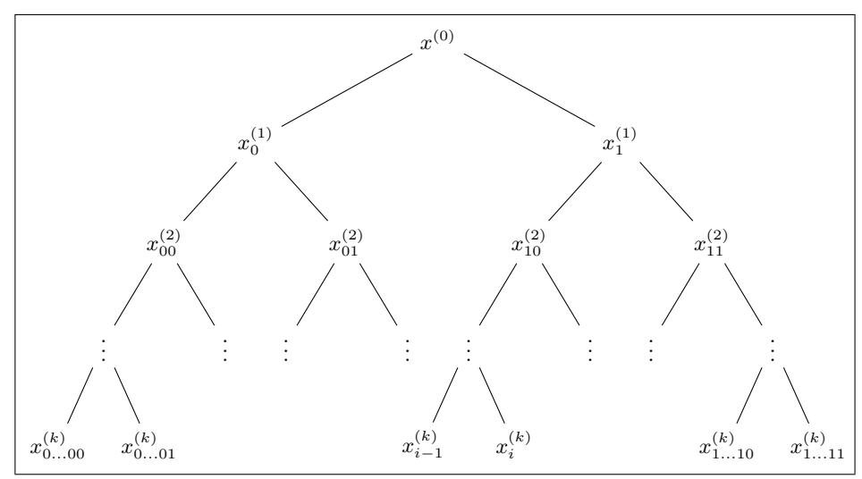
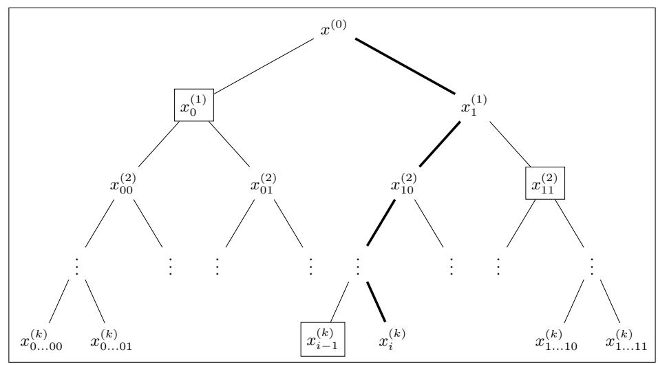

# Folding Schemes with Selective Verification<sup>⋆</sup>

Carla Ràfols<sup>1</sup> and Alexandros Zacharakis<sup>2</sup>

<sup>1</sup> Pompeu Fabra University, Barcelona, Spain, carla.rafols@upf.edu <sup>2</sup> Toposware Inc., alexandros.zacharakis@toposware.com

Abstract. In settings such as delegation of computation where a prover is doing computation as a service for many verifiers, it is important to amortize the prover's costs without increasing those of the verifier. We introduce folding schemes with selective verification. Such a scheme allows a prover to aggregate m NP statements x<sup>i</sup> ∈ L in a single statement x ∈ L. Knowledge of a witness for x implies knowledge of witnesses for all m statements. Furthermore, each statement can be individually verified by asserting the validity of the aggregated statement and an individual proof π<sup>i</sup> with size sublinear in the number of aggregated statements. In particular, verification of statement x<sup>i</sup> does not require reading (or even knowing) all the statements aggregated. We demonstrate natural folding schemes for various languages: inner product relations, vector and polynomial commitment openings and relaxed R1CS of NOVA. All these constructions incur a minimal overhead for the prover, comparable to simply reading the statements.

Keywords: Folding · Aggregation · Delegation of computation · SNARKs · Vector commitments · Verifiable databases.

## 1 Introduction

Succinct non-interactive arguments of knowledge (SNARKs) have been proven an invaluable tool in the last decade, both in theoretical as well as practical terms. Such constructions allow a prover to convince a verifier that some NP relation is satisfied in a way such that communication and (in some cases) verification time are sublinear in the size of the NP witness. They can also be adapted to satisfy the zero-knowledge property, which guarantees that no information about the NP witness is leaked through the proof.

While the first real-world application of SNARKs [\[2\]](#page-27-0) aimed at preserving the privacy of the prover, the potential of this primitive for improving scalability in many applications is increasingly recognized, for example roll-up architectures or the Filecoin network. In these applications, where the size of the computations is really large, the efficiency of the prover is the main bottleneck. Therefore, improving prover's efficiency is an active area of research, trying to reduce prover

<sup>⋆</sup> This work has been partially funded by Protocol Labs Research Grant PL-RGP1- 2021-048.

overhead [\[5,](#page-27-1) [6,](#page-27-2) [20\]](#page-28-0) or memory requirements [\[8\]](#page-27-3) or building hardware accelerators for the provers, to name a few approaches.

Despite the many improvements achieved and those that for sure will come after the considerable research effort we have seen in reducing this cost, SNARK proofs will remain expensive for the prover. Also, it is natural to envisage a scenario where these proofs are outsourced to some powerful entity, in the spirit of secure delegation of computation [\[17\]](#page-28-1), where an untrusted prover performs computations as a service to several "muggles", or computationally weak verifiers. In this scenario, the prover is providing a service to many verifiers and also has their data (i.e. there are no privacy requirements). The current overhead of the prover is crucial in this scenario. The efficiency of the prover is essential in this scenario, as it will seriously hinder scalability, and also the cost of the prover will be directly reflected in the cost of the service. On the other hand, using some kind of batching or recursive proof composition in this setting seems unsatisfactory, as each verifier does not necessarily want to know all the other statements that are being verified and incur the additional costs that this represents.

### 1.1 Our Contributions

The aim of this work is to mitigate the necessity of large computational resources for the prover in applications where he provides services to many clients. Instead of trying to improve the efficiency of SNARK constructions, we take a different approach: we amortize the proving cost across multiple proofs of independent and unrelated statements. This means that, when having to make M computations of different statements, instead of producing M separate SNARK proofs for each, the prover "collapses" all these statements into a single statement in a verifiable way and only produces a proof for the latter using a SNARK. This is a novel application of folding schemes [\[19\]](#page-28-2), originally introduced to improve recursive proof composition. The guarantee we get is that if the proof for the aggregated statement verifies, then all statements are correct.

Additionally, since the ultimate goal is to be able to prove unrelated statements, possibly coming from different parties, we augment aggregation with a local property we call selective verification. This property captures that a small proof π<sup>i</sup> -which importantly, is sublinear in the number of aggregated statementsis evidence that a statement x<sup>i</sup> was considered in the construction of the final aggregated statement and, thus, a proof for the latter along with π<sup>i</sup> stands as a proof for the validity of x<sup>i</sup> . Note that it is not necessary to even know the statements used in aggregation to assert the validity of x<sup>i</sup> .

A crucial requirement for efficiency is that aggregation of M statements is more efficient than producing M SNARK proofs. We demonstrate this by considering natural aggregation schemes for various relations through simple public coin protocols and the Fiat-Shamir transform. Specifically, we consider (1) inner product relations of committed values, (2) vector commitment openings, (3) knowledge of openings of polynomial commitments at the same point, and (4) the relaxed R1CS relation of NOVA [\[19\]](#page-28-2).

All the constructions are extremely efficient for the prover, who during folding does work comparable to reading the statements/witnesses (modulo a linear number of hash function computations needed to derive the non-interactive challenge of the Fiat-Shamir transform). Verification incurs a small overhead since now the verifier also needs to check, apart from the SNARK proof, that the statement in question is indeed "contained" in the aggregated statement. This is dominated by log M hash function computations where M is the number of aggregated statements. This seems a good compromise since the verifier benefits from the reduced costs of the service as well.

Nevertheless, there are several other advantages in the construction for the verifier. First, the same techniques used for folding can be used "locally" by the verifier to aggregate many statements into a single statement x<sup>i</sup> which will then be aggregated with other independent queries from other verifiers. Therefore, the additional cost of each verifier can be amortized when the verifier makes multiple queries. Second, since all verifiers need to assert the validity of the same folded statement, one could explore the possibility of distributing this task, incentivizing a few randomly chosen verifiers to check the aggregated statement. As long as one is honest, a cheating prover will be identified. If a verifier does not validate the proof himself, it can still query it in the future to the prover (along with other statements of interest that it locally aggregates) instead of simply relying on other parties. Thus, the verification cost can be fine-tuned on large scale systems without compromising security.

Our techniques are quite general. In particular, (1) we show a generic way to augment every non-interactive 2-folding scheme to a non-interactive M-scheme using combinatorial techniques, (2) show this construction achieves selective verification, and (3) we do not rely on some specific SNARK construction.

#### 1.2 Applications

As we have discussed, selective verification can improve efficiency on applications with a single server serving multiple clients in a trustless way. It allows us to amortize the server's costs across multiple queries from clients, while only incurring a small overhead for the clients. We discuss two applications in more detail.

Delegation of computation as a service. For delegation of computation in a trustless setting, one would normally resort to a SNARK, especially in cases where interaction is prohibitive. We discuss how to use folding schemes to mitigate the problem of prover's costs.

We will consider two cases: (1) each party needs to perform arbitrary computations, and (2) all parties are interested in doing the same computation on different inputs. Especially in the latter case, we can significantly reduce the costs of the prover through folding schemes with selective verification.

For case (1), many SNARKs are constructed by separately considering some information-theoretic part and a cryptographic primitive. Two main approaches are known: (i) using interactive oracle proofs [\[1\]](#page-27-4) and vector commitments [\[14\]](#page-28-3) and (ii) using algebraic [\[15\]](#page-28-4) or polynomial [\[13\]](#page-28-5) holographic proofs and polynomial commitments [\[18\]](#page-28-6). In the former, the prover and verifier, after interacting, reduce the validity of the claim to the opening of some commitments to vectors at some random indices, while in the latter the validity of the statement is reduced to opening some polynomial commitments in random values. The interaction can be removed through the Fiat-Shamir transform.

In either case, we can use the folding constructions of the previous section to amortize the cost of the latter step: inner product arguments for the former and polynomial commitment for the latter[3](#page-3-0) . Specifically, with each computational query, the prover computes all the commitments that are part of the SNARK but it refrains for the time from computing the opening of (the vector or polynomial) commitment. After multiple interactions with different verifiers, it folds all the (vector or polynomial) commitments to a single one and opens the latter at some random indices or points respectively. The randomness can be derived by hashing the folded statement. Each verifier can now assert the folding proof as well as some evidence sent by the server asserting the inclusion of her statement. To be concrete, for example in Plonk [\[16\]](#page-28-7), the prover will compute round until round 3 for each different statement. Then, it will wait to open the polynomial commitments until it has the transcripts of many other protocols until round 3. Using a technique presented by Turel et al. in [\[22\]](#page-28-8), the prover will then create a Merkle tree of hashes of the transcript, to derive an opening point that is a hash of all involved transcripts. Then, the prover will send all the openings that each verifier needs to verify its statement (including an opening of the linearization polynomial r(X)), together with a proof that all the commitments corresponding to these openings have been folded into a single commitment value, and a proof of correct opening of this commitment[4](#page-3-1) .

In case (2), where all parties are interested in performing the same computation on different inputs, one could use the NOVA approach. Specifically, the computation is encoded as a relaxed R1CS statement and the various instances of this statement are aggregated using the NOVA folding scheme compiled to support selective verification. As we discussed, a folding of this type of statements is very efficient. This is in constrast to the previous case, since the SNARK information theoretic part (which needs to be in fact executed for each query to the proving server) is in fact costly for the prover. Considering the case of a single

<span id="page-3-0"></span><sup>3</sup> In fact, both inner product arguments and polynomial commitment folding can be used for either approach but the presentation becomes more natural by using one approach for each.

<span id="page-3-1"></span><sup>4</sup> We note that it is also possible to use a different strategy if one changes slightly the statement about the polynomial commitments: the prover can fold statements of the form "I know a polynomial that is a valid opening of a commitment" and fold such statements for each verifier resulting in a claim about a single polynomial commitment. Then, it can prove this statement at a single point which will be the same for all verifiers. The point is derived by hashing the final folded statement. During folding, the transcript of the first protocol rounds is included in the hashing part of the folding. Thus, each verifier can check that its transcript indeed contributed in the sampling of the FS challenge point.

computation allows us to completely remove the need for this part and directly fold statements, which is not much costlier than simply reading the statements.

Verifiable Databases. In a verifiable database, a client outsources the storage of a database to a server in a trustless way. Specifically, the client only holds a small digest of the database and can query/modify the database in a verifiable way through communication with the prover. Such a construction can be built using vector commitments. The database is encoded as a vector and the client only needs to hold the (constant size) commitment to the database. A query to the database can be answered verifiably by asking the server to open the commitment to the desired locations. Furthermore, if the underlying commitment scheme is homomorphic (for example the Pedersen commitment), updating the database is efficient since one just needs to homomorphically update the digest by removing the old values and adding the new ones.

Consider the case where a server outsources storage to various clients. Naively implementing this would require that it sends an (expensive to produce) proof of opening for every query of every client to its database. Using a folding scheme with selective verification (for example the inner product language construction) can naturally minimize this cost.

In particular, each query to the server is answered without any verifiability guarantee; the clients simply get their responses and perform their updates acting in good faith. However, periodically, the server folds all the claims from all the clients using the folding scheme and publishes a single statement and individualized proofs for each client to convince about the validity of all statements of one period. Due to the efficiency of the folding scheme, the amortized cost for this is much less than proving each claim individually.

An interesting feature of the described mechanism is that it can be used to any algebraic commitment (i.e. any Pedersen type) commitment, in particular, they can be used in DLOG groups without pairings. In this setting, to open a vector to many positions, the cost of the verifier is linear in the size of the commitment. Our solution allows amortizing the prover cost in this setting without much overhead to the verifier, which is critical in this setting where individual verification is already quite expensive.

### 1.3 Related Work

The techniques in this work are inspired by a recent line of work on proof composition techniques, namely [\[9,](#page-27-5) [12,](#page-27-6) [11,](#page-27-7) [4\]](#page-27-8). In general, these techniques consider the notion of proof aggregation, namely, how to derive a single proof π that asserts the validity of two or more proofs. The motivation for this line of work is twofold. First, amortizing the cost of the (inefficient) verification of folding technique based constructions [\[7,](#page-27-9) [10\]](#page-27-10) and second, to construct proof carrying data [\[3\]](#page-27-11) and incrementally verifiable computation [\[21\]](#page-28-9).

Our work differs in that (1) the main goal is to amortize the proving cost and (2) we consider the notion of aggregating unrelated statements, that is, one should assert the validity of statement without even knowing the other statements considered during aggregation. NOVA [\[19\]](#page-28-2) is closer to our work in that it directly considers aggregating statements instead of proofs, in an attempt to minimize the proving cost.

Perhaps closest to our work is [\[22\]](#page-28-8). There, they use a tree like structure similar to ours in order to derive the same Fiat-Shamir challenge across multiple parallel executions of an inner product argument protocol [\[10\]](#page-27-10) with different parties. In particular, the protocol transcripts are committed in a Merkle tree so that each party can assert that its transcript was considered in the production of the challenge. We consider statement aggregation instead of executing multiple proofs in parallel which is conceptually different and more efficient.

## 2 Definitions

In this section we recall the definition of folding schemes for NP relations introduced in NOVA [\[19\]](#page-28-2). On a high level, given an NP language L and the corresponding NP relation R, a folding scheme allows a prover and a verifier to reduce the validity of 2 or more statements of the form x<sup>i</sup> ∈ L to a single statement x ∈ L. The resulting statement is of the same form, so it can be further aggregated. A prover knowing witnesses w<sup>i</sup> s.t. (x<sup>i</sup> , wi) ∈ R for all the statements also obtains a witness w for the folded statement x.

A folding scheme takes to the extreme proof composition techniques used to construct PCD [\[3\]](#page-27-11) and IVC [\[21\]](#page-28-9). The core idea of these techniques is to incrementally prove statements that assert that (1) a computation step is performed correctly and (2) there exists a proof that asserts that the input of the computation in this step is correct. Using generic constructions, however, is extremely inefficient.

To alleviate this, a recent line of work [\[9,](#page-27-5) [12,](#page-27-6) [11,](#page-27-7) [4\]](#page-27-8) follows a different approach: they defer an expensive part of proof verification of the aforementioned proof and aggregate it with deferred parts from other steps. At any point, the verifier can perform this expensive part and assert that all steps of the computation are correct. Importantly, the aggregation part is cheap and the deferred part does not grow with the number of computational steps proven. Therefore, the expensive part is performed once for an arbitrarily large number of steps.

NOVA takes this approach to the extreme in the following sense: it defers the verification of the statement itself. More concretely, the statement asserting the correctness of the first i − 1 steps is encoded as a statement X ∈ L for some language and the correctness of the i-th step as x ∈ L for the same language. The two statements are then "folded" to a new statement X<sup>∗</sup> ∈ L, correctness of which implies correctness of both statements. Since all statements are of the same form, the process can be repeated for an arbitrary number of steps and it is enough to prove the final statement to assert correctness of all steps.

Assuming the existence of such a mechanism to fold statements, one can then encode in a circuit the verification process of this folding and construct an IVC scheme. Importantly, the folding verification is cheap, achieving very low recursion overheads.

In our work, we consider using similar techniques, albeit for a different goal: aggregating statements to reduce the amortized proving cost of proving many different statements. That is, instead of encoding the folding verification as a circuit and build IVC, we directly use the folding scheme to allow a prover to prove the validity of a bunch of M different statements using only a single proof by means of aggregation. Additionally, we present a mechanism, selective verification that allows a verifier to assert the correctness of one of the M statements efficiently: it needs to know neither all the M aggregated statements nor the entire proof of aggregation (which grows linearly in M). It simply needs the proof of the final statement and a proof that is sublinear in M.

Taking into account that producing proofs is a computationally intense task, this allows much better amortized proving time with little overhead for verification. Indeed, [\[19\]](#page-28-2) introduces a folding scheme construction that captures all NP computations and allows very fast statement aggregation.

#### 2.1 Folding Schemes

We next present the formal definition of a folding scheme. The notion is essentially the same as presented in [\[19\]](#page-28-2) with two modifications: we only consider a non-interactive definition, namely the prover simply presents a proof of correct folding to the verifier, and we consider a definition that allows aggregating M statements instead of 2 as it is discussed in NOVA. Looking ahead, our concrete instantiations will be folding schemes for 2 statements that are then bootstrapped to folding schemes of M statements using a generic bootstrapping compiler.

The formalization of a folding scheme is quite natural. Given a number of instance/witness pairs (x<sup>i</sup> , wi) that satisfy some NP relation, there exists a folding algorithm that outputs a new instance/witness pair (x, w) that also satisfies the NP relation, along with some evidence π that the new instance x is indeed a "folded" statement derived from the statements x<sup>i</sup> . One can think of the folded statement as encoding all statements of interest. The properties required are:

- 1. completeness, stating that if we aggregate instance-witness pairs (x<sup>i</sup> , wi) satisfying the NP relation, then (1) folding results in an instance-witness pair also satisfying the relation and (2) the folding proof is accepted;
- 2. knowledge soundness, stating that if after correct aggregation the proving party knows a witness for the resulting statement, then it should also know witnesses for all statements (x<sup>i</sup> , wi) that were considered during aggregation.

Definition 1 (Folding scheme). Let λ ∈ N be a security parameter and Lpp be an NP language parametrized by some parameters pp(λ) depending on λ and Rpp the corresponding relation. Finally, let M = poly(λ). An M-folding scheme FS for the language family L = {Lpp}pp∈{0,1}<sup>∗</sup> is a tuple of an algorithms FS = (Fold, FoldVrfy) such that for all pp = pp(λ) and m ≤ M

– (x, w, π) ← Fold (pp, x1, w1, . . . , xm, wm): takes as input the parameters pp, and m instance-witness pairs (x<sup>i</sup> , wi) ∈ Lpp and outputs a new instancewitness pair (x, w) ∈ Rpp and a proof of correct folding π,

 $-0/1 \leftarrow \text{FoldVrfy}(\text{pp}, x_1, \dots, x_m, x, \pi)$ : takes as input the parameters pp, m instances  $x_i$ , an aggregated statement x and a proof of correct folding  $\pi$  and outputs a bit indicating whether folding was done correctly or not,

that satisfies the following properties:

1. Completeness: for all  $m \leq M$ , all  $pp = pp(\lambda)$  and all (even computationally unbounded) algorithms A,

$$\Pr\left[ \begin{cases} \{q_1,\ldots,q_m\} \subseteq \mathcal{R}_{\mathsf{pp}} \land \\ ((x,w) \not\in \mathcal{R}_{\mathsf{pp}} \lor b = 0) \end{cases} \middle| \begin{matrix} (x_1,w_1),\ldots,(x_m,w_m) \leftarrow \mathcal{A}(\mathsf{pp}) \\ q_1 = (x_1,w_1),\ldots,q_m = (x_m,w_m) \\ (x,w,\pi) \leftarrow \mathsf{Fold}(\mathsf{pp},\mathbf{q}) \\ b \leftarrow \mathsf{FoldVrfy}\left(\mathsf{pp},\mathbf{x},x,\pi\right) \end{cases} \right] \le \mathsf{negl}(\lambda)$$

2. **Knowledge soundness**: for all  $m \leq M$  and all  $pp = pp(\lambda)$  there exists a PPT extractor  $\mathcal{E}$  such that for all PPT algorithms  $\mathcal{A}$ 

$$\Pr\left[\begin{array}{c|c} (x,w) \in \mathcal{R}_{\mathsf{pp}} \land & (\mathbf{x},x,w,\pi) \leftarrow \mathcal{A}(\mathsf{pp}) \\ b = 1 \land & \mathbf{w} \leftarrow \mathcal{E}^{\mathcal{A}}(\mathsf{pp}) \\ \exists 1 \leq i \leq m \ s.t. \ (x_i,w_i) \not \in \mathcal{R}_{\mathsf{pp}} \middle| b \leftarrow \mathsf{FoldVrfy} \ (\mathsf{pp},\mathbf{x},x,\pi) \end{array}\right] \leq \mathsf{negl}(\lambda)$$

In Sec. 4 we present 2-folding schemes for various relations: inner product relations of committed values, vector and polynomial commitment openings and the relaxed R1CS relation of [19]. We derive the constructions by means of public coin protocols that we compile to a non-interactive variant through the Fiat-Shamir heuristic.

<span id="page-7-0"></span>Remark 1. We emphasize that after folding the statements, the corresponding witnesses are not needed. In particular, the witnesses are only used to construct the witness for the final folded statement and then they can be safely deleted. Indeed, to assert the validity of all statements, it is enough to (1) present the proof of correct folding and (2) convince about the validity of the folded statement. The latter can be done using only the folded statement/witness pair, for example with a SNARK. Put it differently, while the folded statements "encodes" all the aggregated statements by means of a folding proof, it is also -in some sense-independent of them after the folding has taken place.

#### 2.2 Folding Schemes with Selective Verification

As we discuss in the introduction, the main goal of this work to allow to reduce the resources used in "as a service" scenarios: a prover needs to serve multiple verifiers in a trustless way. A characteristic example is a prover that verifiably outsources its computational resources to verifiers who need to perform arbitrary computations.

We emphasize that this is a different goal from NOVA [19] and related works, which aim to achieve proof composition and construct IVC schemes. In our case, there are natural additional properties one would want to achieve. Perhaps the most natural is to allow verifying single statements that are "encoded" in the

folded statements without the need to know or even care about the validity of the rest of the statements. Let us elaborate on this.

Consider the case where a prover wants to serve m statements for m different parties. Simple folding is indeed a means to that goal: the prover needs to convince for the validity of a single statement to convince all verifiers about the validity of all m statements. Nevertheless, it is still inefficient in terms of verification. The inefficiency stems from the fact that in order to verify correct folding, all the statements need to be considered as part of the proof of correct aggregation.

While this is natural in cases where a single verifier is interested in many statements, it can be prohibitive in scenarios where multiple verifiers are interested in the validity of different statements: first, the verifiers need to know each others' queries to the prover to assert validity of the folded statement, and second, the verification cost scales linearly with the total number of statements considered.

In this section, we mitigate this issue by considering a stronger notion of folding schemes that allows to assert that a single statement was considered during aggregation of multiple statements -and hence knowledge of a witness of the latter implies knowledge of the witness of the former, without the need to know all the statements involved. Importantly, verification of inclusion of a single statement to the folded statement is sublinear in the total number of statements involved. We call this stronger notion folding with selective verification.

We require (and later achieve) a strong version of this notion: one can derive a proof of inclusion of a single statement to a folded statement only by knowing the aggregated statements and the proof of correct folding. In particular, creation of such a proof does not require any witness information on the statements and can be performed by parties different than the prover. Looking ahead, our bootstrapping construction achieves this property by simply handing parts of the folding proof corresponding to each statement, each being sublinear (logarithmic) in the total size of the folding proof.

We next define the stronger notion of a folding scheme that supports selective verification.

Definition 2 (Folding scheme with selective verification). Let λ ∈ N be a security parameter and Lpp be an NP language parametrized by some parameters pp(λ) depending on λ and Rpp the corresponding relation. Finally, let M = poly(λ) and let FS = (Fold, FoldVrfy) be an M-folding scheme for L = {Lpp}pp∈{0,1}<sup>∗</sup> . FS has selective verification if there exists a pair of algorithms (SelPrv, SelVrfy) such that for all m ≤ M,

- (π1, . . . , πm) ← SelPrv(pp, x1, . . . , xm, x, π): takes as input the parameters pp, m instances x1, . . . , xm, a folded instance x and a folding proof π and outputs m proofs π1, . . . , πm,
- 0/1 ← SelVrfy(pp, x, i, x<sup>i</sup> , πi): takes as input the parameters pp, a folded statement x, a position i ∈ {1, . . . , m}, a statement x<sup>i</sup> and a proof π<sup>i</sup> and outputs a bit indicating if x<sup>i</sup> was aggregated (among other statements) to x,

that satisfies the following properties:

1. Selective completeness: for all  $m \leq M$ , all  $pp = pp(\lambda)$  and all (even computationally unbounded) algorithms A,

$$\Pr\left[ \begin{cases} \{q_1, \dots, q_m\} \subseteq \mathcal{R}_{\mathsf{pp}} \land & x_1, w_1, \dots, x_m, w_m \leftarrow \mathcal{A}(\mathsf{pp}) \\ \exists i \in \{1, \dots, m\} : & (x, w, \pi) \leftarrow \mathsf{Fold}\left(\mathsf{pp}, \mathbf{q}\right) \\ b_i = 0 & (\pi_1, \dots, \pi_m) \leftarrow \mathsf{SelPrv}(\mathsf{pp}, \mathbf{x}, x, \pi) \\ b_i \leftarrow \mathsf{SelVrfy}(\mathsf{pp}, x, i, x_i, \pi_i) \end{cases} \right] \leq \mathsf{negl}(\lambda)$$

2. Selective knowledge soundness: for all  $m \leq M = \mathsf{poly}(\lambda)$  and all  $\mathsf{pp} = \mathsf{pp}(\lambda)$  there exists a PPT extractor  $\mathcal E$  such that for all PPT algorithms  $\mathcal A$ 

$$\Pr\left[ \begin{array}{l} \mathsf{SelVrfy}(\mathsf{pp}, x, i, x_i, \pi_i) = 1 \land \\ (x, w) \in \mathcal{R}_\mathsf{pp} \ \land \ (x_i, w_i) \not \in \mathcal{R}_\mathsf{pp} \end{array} \middle| \begin{array}{l} (i, x_i, \pi_i, x, w) \leftarrow \mathcal{A}(\mathsf{pp}) \\ w_i \leftarrow \mathcal{E}^{\mathcal{A}}(\mathsf{pp}) \end{array} \right] \leq \mathsf{negl}(\lambda)$$

3. **Efficiency:**  $|\pi_i| = o(m \cdot |x|)$ , namely, the proof size should be asymptotically smaller than the total size of folded statements.

The definition captures that if (1) the prover knows a valid witness w for the folded statement x and (2) the i-th proof verifies, then it should be the case that the prover knows witness  $w_i$  such that  $(x_i, w_i) \in \mathcal{R}_{pp}$ . Note that from the perspective of a party asserting the validity of  $x_i$ , it is not necessary to know the other statements considered in the construction of x. Furthermore, the other statements need not be honestly generated; even if the adversary samples them, knowledge of the witness of the i-th statement is still guaranteed.

The efficiency condition rules out trivial constructions. Without it, one could set the proof of statement i to be simply the set of all aggregated statements along with a proof of correct folding. The verifier would then simply need to check that one of the statements corresponds to the one that is of interest to her. The interesting part of the definition is to achieve the same goal with sublinear communication.

Finally, note that we do not require the extractor to be able to extract all m statements that would "explain" the folded statement x; rather, we ask that given a witness for the folded statement and a valid proof, we can extract a witness only for the i-th statement. This is exactly what one would want for selective verification since ultimately, this is a *local property*: we want to ensure that some statement is correct without caring how we end up with the folded statement; the latter is simply a means to verify correctness of the statement of interest.

#### 3 Bootstrapping Construction for Folding Schemes

In this section we show how to bootstrap any 2-folding scheme to an M-folding scheme for any polynomial M. Additionally, the bootstrapped construction satisfies the stronger notion of selective verifiability. Thus, to construct a selectively

verifiable folding scheme, it is enough to construct a simple 2-folding scheme – which as we shall see is a relatively simple task using Σ-protocol techniques– and simply applying the bootstrapping compiler.

The crucial observation to bootstrapping is that statement aggregation is by definition "incremental". The fact that the folded statement is of the same form as the folded ones directly implies that we can further fold the former with a new statement. A simple argument shows the final statement "encodes" all three statements and a single proof for it along with the two folding proofs is convincing for the validity of all. The process can be repeated an arbitrary amount of times.

To achieve the additional property of selective verifiability we only rely on combinatorial properties: instead of incrementally aggregating statements, we arrange them in a statement tree. Thus, the fact that a single statement is "encoded" in the final folded statement only depends on a small amount of statements: the ones that consist the path from the leaf (statement we want a proof for) to the root (folded statement). Thus, the corresponding proof is sublinear in the number of statements, consisting of the folding proofs for the statements in this path.

We next present the bootstrapping construction and then we show that it also achieves the stronger notion of selective verifiability.

#### 3.1 Construction

Our construction allows to derive an M-folding scheme from any 2-folding scheme[5](#page-10-0) .

Roughly, to aggregate M = 2<sup>k</sup> (w.l.o.g.) statements, we create a statement aggregation tree as follows. We build a tree by putting the statements on the leaves of the tree and we fold each pair of them resulting in 2 k−1 statements of the same form. Then we proceed recursively until we are left with a single statement.

To prove that the folded statement encodes all the statements, we give a proof π consisting of all the 2-folding proofs we made along the way to derive the root of the tree.

It is easy to see that the construction satisfies knowledge soundness. Consider the final 2-folding proving that the root is the folded statement of its two children. Given a valid witness for the folded statement and a proof of correct aggregation, we can extract witnesses for its two children –guaranteed by the knowledge soundness of the base 2-folding scheme.

We emphasize that our construction is incremental as well: the final statement –having the same form as the folded statement– can be furthered aggregated if needed.

<span id="page-10-0"></span><sup>5</sup> The bootstrapping construction can in fact bootstrap any m-folding scheme for m ≥ 2. We only present the m = 2 case for ease of presentation. All constructions in this work are derived from 2-folding schemes but one could in fact consider m > 2 to improve concrete efficiency.

<span id="page-11-0"></span>

Fig. 1: Demonstration of the process of deriving the folding tree. We assume we fold  $2^k$  statements (the leaves of the tree). We index with the position of the node in the tree in binary and we use superscript for the level of the node in the tree. A node  $x_{\mathbf{b}}^{(l)}$  is computed as the (non-interactive) folding of  $x_{\mathbf{b}0}^{(l-1)}$  and  $x_{\mathbf{b}1}^{(l-1)}$  using the underlying scheme FS. The aggregation proof consists of all the folding proof performed.

We give a pictorial representation of the construction in Fig. 1 and present the bootstrapping construction in Fig. 2. Next we show that the resulting construction is an M-folding scheme for any polynomial size m.

<span id="page-11-1"></span>**Theorem 1.** Let FS be a 2-folding scheme for a language family  $\mathcal{L}$  with corresponding relations  $\mathcal{R}$ . Then, for any constant constant  $k \in \mathbb{N}$ , construction BootstrapFS of Fig. 2 is a  $2^k$ -folding scheme for the same language family.

Proof. Completeness follows directly by straightforward calculations and the completeness of BootstrapFS. We next show that BootstrapFS satisfies knowledge soundness.

Let  $m = 2^k$ ,  $x_1, \ldots, x_m$  be statements and w a witness for the folded statement x output by an adversary  $\mathcal{A}$ . We construct an extractor  $\mathcal{E}$  that extracts the witnesses  $w_1, \ldots, w_m$  given a witness for the folded statement w and a valid folding proof  $\pi$ , that uses as a black box the extractor  $\mathcal{E}'$  for FS guaranteed to exist by knowledge soundness of FS.

Consider the binary tree defined by the honest BootstrapFS.FoldVrfy algorithm: the leaves are defined in the first level by the statements, that is, we label each leaf with  $(x_1^{(k)},\bot),(x_2^{(k)},\bot),\ldots,(x_m^{(k)},\bot)$  where  $x_j^{(k)}=x_j$  and for each pair of statements folded, we define a parent node connected to each of them labeled by the folded statement and the proof of correct folding. Note that verification passes, if

```
BootstrapFS.Fold(pp, q_1 = (x_1, w_1), \dots, q_m = (x_m, w_m)):
         - Denote m = 2^k
         - if k=0 then output q_1, \pi_1=\bot, otherwise group the 2^k statements to 2 groups
             of 2^{k-1} elements each and denote them \mathbf{q}_1, \mathbf{q}_2
         - Recursively compute:
              (\tilde{q}_1 = (\tilde{x}_1, \tilde{w}_1), \tilde{\pi}_1) \leftarrow \mathsf{BootstrapFS.Fold}(\mathsf{pp}, \mathbf{q}_1)
              (\tilde{q}_2 = (\tilde{x}_2, \tilde{w}_2), \tilde{\pi}_2) \leftarrow \mathsf{BootstrapFS.Fold}(\mathsf{pp}, \mathbf{q}_2)
         - (q = (x, w), \pi^*) \leftarrow \mathsf{FS}.\mathsf{Fold}(\mathsf{pp}, \tilde{q}_1, \tilde{q}_2)
         - output q, \pi = (\pi_1, \pi_2, \tilde{x}_1, \tilde{x}_2, \pi^*)
BootstrapFS.FoldVrfy(pp, x_1, \ldots, x_m, x, \pi):
         - Denote m = 2^k
         - if k = 0 then output 1 iff x = x_1, otherwise
               1. group the 2^k statements to 2 groups of 2^{k-1} elements each and denote
                     them \mathbf{x}_1, \mathbf{x}_2
               2. parse the proof as \pi = (\pi_1, \pi_2, \tilde{x}_1, \tilde{x}_2, \pi^*)
         - recursively compute
             b_1 \leftarrow \mathsf{BootstrapFS}.\mathsf{FoldVrfy}(\mathsf{pp}, \mathbf{x}_1, \tilde{x}_1, \tilde{x_1})
             b_2 \leftarrow \mathsf{BootstrapFS}.\mathsf{FoldVrfy}(\mathsf{pp},\mathbf{x}_2,\tilde{x}_2,\tilde{\pi_2})
         -b \leftarrow \mathsf{FS.FoldVrfy}(\mathsf{pp}, \tilde{x}_1, \tilde{x}_2, x, \pi^*)
         - output b \wedge b_1 \wedge b_2
```

Fig. 2: Bootstrapping construction BootstrapFS for deriving an m-folding scheme from a 2-folding scheme FS. We assume (w.l.o.g.) that the number of initial statements is  $2^k$ .

- $\begin{array}{l} \text{1. for any node labeled } (x_{j}^{(i-1)},\pi_{j}^{(i-1)}) \text{ with child nodes } (x_{2j-1}^{(i)},\cdot),(x_{2j}^{(i)},\cdot) \text{ verification passes, namely, FS.FoldVrfy}(\mathsf{pp},x_{2j-1}^{(i)},x_{2j}^{(i)},x_{j}^{(i-1)},\pi_{j}^{(i-1)}) = 1 \\ \text{2. In this shows the state of the labels of the property of the property of the property of the property of the property of the property of the property of the property of the property of the property of the property of the property of the property of the property of the property of the property of the property of the property of the property of the property of the property of the property of the property of the property of the property of the property of the property of the property of the property of the property of the property of the property of the property of the property of the property of the property of the property of the property of the property of the property of the property of the property of the property of the property of the property of the property of the property of the property of the property of the property of the property of the property of the property of the property of the property of the property of the property of the property of the property of the property of the property of the property of the property of the property of the property of the property of the property of the property of the property of the property of the property of the property of the property of the property of the property of the property of the property of the property of the property of the property of the property of the property of the property of the property of the property of the property of the property of the property of the property of the property of the property of the property of the property of the property of the property of the property of the property of the property of the property of the property of the property of the property of the property of the property of the property of the property of the property of the property of the property of the property of the$
- 2. the root node is labeled with  $(x, \cdot)$

We next show that for all such adversaries  $\mathcal{A}$ , there exists a family of extractors  $\mathcal{E}_{j}^{i}$  for  $0 \leq i \leq k-1, 1 \leq j \leq 2^{i}$  such that given as input a derived tree for some statements  $x_{1}, \ldots, x_{m}, \mathcal{E}_{j}^{(i)}$  extracts valid witnesses  $w_{2j-1}^{(i+1)}, w_{2j}^{(i+1)}$  for the statements  $x_{2j-1}^{(i+1)}, x_{2j}^{(i+1)}$  that are the children nodes of  $x_{j}^{(i)}$  in the derived tree. The construction is recursive. We denote  $\mathcal{E}^{(*)}$  the trivial extractor that given the witness for the root node (output by the adversary  $\mathcal{A}$ ), it simply outputs it.

Base case:  $\mathcal{E}_1^{(0)}$  runs  $\mathcal{E}^{(*)}$  to get the witness  $w_1^{(0)}$  for the root. It then queries the derived tree and constructs the adversary  $\mathcal{A}_1^{(0)}$  that outputs  $x_1^{(1)}, x_2^{(1)}$ , folded statement-witness pair  $x_1^{(0)}, w_1^{(0)}$  and proof  $\pi_1^{(0)}$  which is part of the label of the root node. Finally, it invokes  $\mathcal{E}'$  with access to  $\mathcal{A}_1^{(0)}$  to derive witnesses  $w_1^{(1)}, w_2^{(1)}$  for the statements  $x_1^{(1)}, x_2^{(1)}$ .

**Recursive case**: Now, let  $i \geq 1$  and consider any j with  $1 \leq j \leq 2^i$ . We construct an extractor  $\mathcal{E}_j^{(i)}$  assuming the existence of an extractor for a level closer to the root node. Let  $(x_{p(j)}^{(i-1)}, \cdot)$  denote the label of the parent node of

the node labeled with  $(x_j^{(i)},\pi_j^{(i)})$  and let  $(x_{2j-1}^{(i+1)},\cdot),(x_{2j}^{(i+1)},\cdot)$  be the labels of the children of  $x_j^{(i)}$ . Now, we construct  $\mathcal{A}_j^{(i)}$  that has hardcoded the binary tree and

- It invokes the extractor  $\mathcal{E}_{p(j)}^{(i-1)}$  corresponding to statement  $x_{p(j)}^{(i-1)}$  to get a witness  $\boldsymbol{w}_{i}^{(i)}$  for  $\boldsymbol{x}_{j}^{(i)}$  (and all its siblings which it ignores).
- It then constructs an adversary  $\mathcal{A}_{j}^{(i)}$  that outputs  $x_{2j-1}^{(i+1)}, x_{2j}^{(i+1)}$ , the folded statement-witness pair  $x_{j}^{(i)}, w_{j}^{(i)}$  and the proof of correct folding  $\pi_{j}^{(i)}$  constructions. tained in the node label.
- Finally, it invokes the extractor  $\mathcal{E}'$  of FS with access to  $\mathcal{A}_i^{(i)}$  and gets witnesses  $w_{2j-1}^{(i+1)}, w_{2j}^{(i+1)}.$ - It outputs witnesses  $w_{2j-1}^{(i+1)}, w_{2j}^{(i+1)}.$

We are now ready to construct the extractor  $\mathcal{E}$ .  $\mathcal{E}$  queries  $\mathcal{A}$  to get statements  $x_1, \ldots, x_m$ , a folded statement-witness pair  $(x_1^{(0)}, w_1^{(0)})$  and a proof of correct folding  $\pi$ . It then uses the proof and the statements to construct the tree, queries the extractors  $\mathcal{E}_1^{(k-1)}, \dots, \mathcal{E}_{m/2}^{(k-1)}$  -each of which outputs 2 witnesses for 2 leaf nodes- and concatenates their outputs.

Let's now consider the running time and the probability of success of the extractor  $\mathcal{E}$ .

For the running time, let  $t(\lambda)$  be the running time of  $\mathcal{E}'$  and denote  $t_i(\lambda)$ the running time of an extractor on level i (note that all these extractors are identical). By construction, we have that  $t_i(\lambda) = t_{i-1}(\lambda) + t(\lambda)$  and  $t_0(\lambda) = t_{i-1}(\lambda) + t(\lambda)$ |w|, namely the time to output the folded witness w. This recurrence relation corresponds to  $t_i(\lambda) = i \cdot t(\lambda) + |w|$ . Finally, the running time of the extractor  $\mathcal{E}$ is

$$\begin{split} t_{\mathcal{E}}(\lambda,k) &= t_{\mathsf{BootstrapFS}}(\lambda,k) + 2^{k-1}t_{k-1}(\lambda) = \\ &= t_{\mathsf{BootstrapFS}}(\lambda,k) + 2^{k-1}(k-1)\cdot t(\lambda) + |w| \end{split}$$

where  $t_{\mathsf{BootstrapFS}}(k)$  is the time of  $\mathsf{BootstrapFS}.\mathsf{FoldVrfy}$  algorithm for folding  $m=2^k$  statements (equivalently the time needed to construct the statement tree). This corresponds to a quasilinear overhead  $m \log m$  for the time of the extractor  $\mathcal{E}$ , which is polynomial for any number of polynomial statements.

We next show that the advantage of  $\mathcal{E}$  is polynomially related to that of  $\mathcal{E}'$ . We denote with p' the probability that extractor  $\mathcal{E}'$  succeeds in outputting the witnesses in FS conditioned on  $\mathcal{A}$  outputting a valid witness for the folded statement and a verifying proof, namely,

$$p' = \Pr \left[ \left. \{ (x_1, w_1), (x_2, w_2) \} \subseteq \mathcal{R}_{\mathsf{pp}} \right| \begin{matrix} (x_1, x_2, x, w, \pi) \leftarrow \mathcal{A}(\mathsf{pp}) \\ (w_1, w_2) \leftarrow \mathcal{E}'^{\mathcal{A}}(\mathsf{pp}) \\ \mathsf{FoldVrfy} \left( \mathsf{pp}, x_1, x_2, x, \pi \right) = 1 \\ (x, w) \in \mathcal{R}_{\mathsf{pp}} \end{matrix} \right]$$

Claim. Consider any adversary A against BootstrapFS and the folding tree derived by its output. Fix i, j such that  $0 \le i \le k-1$  and  $1 \le j \le 2^i$  and consider the tree node  $(x_j^{(i)}, \pi_j^{(i)})$  and let  $(x_{2j-1}^{(i+1)}, \cdot), (x_{2j}^{(i+1)}, \cdot)$  be its children. Let  $W_i$  be the event that the extractor  $\mathcal{E}_j^{(i)}$  outputs a valid witness for all the children nodes of  $x_j^{(i)}$ , that is

$$W_i = \left\{ \left. \left\{ (x_{2j-1}^{(i+1)}, w_{2j-1}^{(i+1)}), (x_{2j}^{(i+1)}, w_{2j}^{(i+1)}) \right\} \subseteq \mathcal{R}_{\mathsf{pp}} \right| \begin{pmatrix} (x_1, \dots, x_m, x, w, \pi) \leftarrow \mathcal{A}(\mathsf{pp}) \\ (w_{2j-1}^{(i+1)}, w_{2j}^{(i+1)}) \leftarrow \mathcal{E}_j^{(i)} \,^{\mathcal{A}}(\mathsf{pp}) \end{pmatrix} \right\}$$

Then  $\Pr[W_i] \ge p' \Pr[W_{i-1}].$ 

*Proof.* We have  $\Pr[W_i] \geq \Pr[W_i \mid W_{i-1}] \Pr[W_{i-1}]$ . Now, the probability of  $W_i$  conditioned on  $W_{i-1}$  is the probability that an extractor on the *i*-th level succeeds conditioned on the probability that the extractor on level i-1 succeeds. If the extractor of the parent node succeeds, then its output contains a valid statement/witness  $x_j^{(i)}, w_j^{(i)}$  and therefore  $\mathcal{A}_j^{(i)}$  outputs a valid folded witness by construction. Thus, the probability of this event is exactly p'.

Solving the recurrence relation gives that  $\Pr[W_{k-1}] \geq p'^{k-2} \Pr[W_1]$ . Now,  $\Pr[W_1]$  is the probability that the extractor associated with the root node outputs valid witnesses assuming that  $\mathcal{A}$  outputs a valid witness for the (final) folded statement. This means that, conditioned on  $\mathcal{A}$  outputting a valid witness,  $\Pr[W_{k-1}] \geq p'^{k-1}$ .

Finally, consider the probability that  $\mathcal{E}$  succeeds conditioned on  $\mathcal{A}$  outputting a valid witness. This events happens if all extractors in level k-1 succeed. So, the probability that  $\mathcal{E}$  fails is bounded by  $\frac{m}{2}(1-p'^{k-1})=2^{k-1}(1-p'^{k-1})$ . Noting that

$$1 - {p'}^{k-1} = (1 - p')({p'}^{k-2} + \dots + 1) \le (1 - p')(k-1)$$

we get for any adversaries  $\mathcal{A}, \mathcal{A}'$  against knowledge soundness of BootstrapFS and FS respectively,  $\mathsf{Adv}_{\mathcal{A}}(\lambda, k) \leq (k-1)2^{k-1}\mathsf{Adv}_{\mathcal{A}'}(\lambda)$ 

Remark 2. As noted in Remark 1, after performing a folding and computing a witness for the folded statement, there is no need to store the witnesses for the initial statements any more. We note that this is the case for the compiled construction as well. In particular, in applications where the statements to be aggregated are "streamed" the prover can be implemented to perform the folding by storing only three witness at any time. This can drastically reduce the memory requirements for aggregation.

Remark 3. NOVA and similar related work inherently rely on heuristic arguments for security. In particular, to construct IVC schemes, it is inherent in the techniques used in these works that one needs to encode the folding/proof aggregation in a circuit and prove statements about it. Since aggregation relies on the random oracle, one needs to instantiate it using a hash function and prove statements about it. Thus, we need to make the heuristic argument that the hash function instantiation is secure. In contrast, our application does not involve encoding the folding argument in a circuit and proving statements about it. Therefore, our construction does not need to rely on such heuristic arguments. In particular, our construction is secure in the random oracle model.

<span id="page-15-0"></span>

Fig. 3: Demonstration of the process of deriving the folding tree. We assume we fold  $2^k$  statements (the leaves of the tree). We index with the position of the node in the tree in binary and we use superscript for the level of the node in the tree. A node  $x_{\mathbf{b}}^{(l)}$  is computed as the (non-interactive) folding of  $x_{\mathbf{b}0}^{(l-1)}$  and  $x_{\mathbf{b}1}^{(l-1)}$  using the underlying scheme FS. Bold edges denote the path the verification follows and rectangles the statements the prover presents to the verifier of statement i.

#### 3.2 Selective Verifiability of the Bootstrapped Construction

Our bootstrapping construction also satisfies the stronger notion of selective verifiability without further modifications. This follows by the tree structure employed: proving inclusion of a single statement needs only to consider the foldings occurring from the root node (final statement) to the leaf corresponding to the statement in consideration. This is similar to how tree-based vector commitment schemes (e.g. Merkle trees) work.

A crucial observation is that if we have a statement of the form  $x_1 \in \mathcal{L}$  and we are presented with a different statement  $x_2 \in \mathcal{L}$ , after folding these to a third statement  $x \in \mathcal{L}$ , knowledge of a witness for the latter ensures knowledge for both statements (in particular the first which is of interest to us) even if the second is selected adversarially. This means that from the perspective of a verifier interested in a specific statement, it is not important what other statements are considered or how they are sampled as long as they correctly end up to the claimed aggregated statement.

We first demonstrate how a statement "inclusion" proof works in Fig. 3. Next, we formally present the algorithms that lead to selective verifiability of the bootstrapped construction in Fig. 4. The resulting protocol achieves selective verifiability with proof size  $|\pi_i| = \mathcal{O}(|x| \cdot k)$  when folding  $m = 2^k$  statements. This means we can aggregate polynomially many statements while each statement can be verified with a proof that is logarithmic in the number of statements.

An important observation, as far as efficiency is concerned, is that the proofs themselves are folded statements with their corresponding proofs, and thus yield little overhead to produce/verify –assuming the underlying folding scheme is concretely efficient. Essentially, the prover has to perform  $\mathcal{O}(2^k)$  number of foldings and simply save the intermediate results in the process to be able to present as evidence later. As we will see in the next section, folding itself can be extremely efficient for many languages of interest. In some cases, the overhead induced by folding for the prover is comparable to the time needed to simply read the statements. This can lead to significant improvements compared to -for example-producing a SNARK proof for each statement.

We next show that the bootstrapped construction equipped with the additional algorithms presented in Fig. 4 achieves the stronger notion of selective verifiability. The proof is essentially identical to that of Thm. 1; the only difference is that we simply focus on a small part of the implicit tree which we construct using the elements contained in the proof for a single statement.

```
 \begin{aligned} & \text{BootstrapFS.SelPrv}(\mathsf{pp}, x_1, \dots, x_m, x, \pi) \text{:} \\ & - \text{ Parse the input } (\mathbf{x}, x, \pi) \text{ as a tree where} \\ & \bullet (x_1^{(k)}, \bot), \dots, (x_m^{(k)}, \bot) \text{ are the leaves} \\ & \bullet \text{ For each pair of nodes } x_L = (x_{2j-1}^{(\ell)}, \bot), \ x_R = (x_{2j}^{(\ell)}, \bot) \text{ add the node} \\ & (x_F, \pi_F) = (x_j^{(\ell-1)}, \pi_j^{(\ell-1)}) \text{ where } \pi_F \text{ is a proof of correctness of the folding} \\ & \text{ of } x_L, x_R \text{ to } x_F, \text{ namely:} \end{aligned}   & \text{FS.FoldVrfy}(\mathbf{pp}, x_L, x_R, x_F, \pi_F) = 1   & - \text{ For } 1 \le j \le m \text{:} \\ & \bullet \text{ set } \pi_j := () \\ & \bullet \text{ Let } j = b_k \cdots b_1 \text{ in binary notation} \\ & \bullet \text{ For } 1 \le \ell \le k \text{:} \\ & \pi_j := \left(\pi_j, \left(x_{b_k \dots b_{k-\ell+2}0}^{(\ell)}, x_{b_k \dots b_{k-\ell+2}1}^{(\ell)}, \pi_{b_k \dots b_{k-\ell+2}}^{(\ell-1)}\right) \right) \\ & - \text{ Output } \pi_1, \dots, \pi_m \end{aligned}   & \text{BootstrapFS.SelVrfy}(\mathbf{pp}, x, j, x_j, \pi_j) \text{:} \\ & - \text{ Let } j = b_k \cdots b_1 \text{ in binary notation.} \\ & - \text{ Set } x_1^{(0)} = x \\ & - \text{ Parse } \pi_j = \left((x_0^{(1)}, x_1^{(1)}, \pi_1^{(0)}), \dots, (x_{b_k \dots b_20}^{(k)}, x_{b_k \dots b_21}^{(k)}, \pi_{b_k \dots b_21}^{(k-1)}\right) \\ & - \text{ For } 1 \le \ell \le k \\ & \text{ Set } x_L = x_{b_k \dots b_{k-\ell+2}0}^{(\ell)}, x_R = x_{b_k \dots b_{k-\ell+2}1}^{(\ell)}, \\ & \text{ Set } x_F = x_{b_k \dots b_{k-\ell+2}0}, x_R = x_{b_k \dots b_{k-\ell+2}1}^{(\ell)}, \\ & \text{ Set } x_F = x_{b_k \dots b_{k-\ell+2}0}, x_F = \pi_{b_k \dots b_{k-\ell+2}1}^{(\ell-1)}, \\ & b_\ell := \text{FS.FoldVrfy}(\mathbf{pp}, x_L, x_R, x_F, \pi_F) \\ & - \text{ Output } b_1 \wedge \dots \wedge b_\ell \wedge (x_j = x_{b_k \dots b_1}^{(k)}) \end{aligned}
```

Fig. 4: The SelPrv, SelVrfy that make construction BootstrapFS achieve selective verification. We again assume (w.l.o.g.) that the number of initial statements is  $m = 2^k$  for some fixed constant k.

**Theorem 2.** Let FS be a 2-aggregation scheme for a language family  $\mathcal{L}$  with corresponding relations  $\mathcal{R}$ . Then, for any constant k construction BootstrapFS of Fig. 2 satisfies selective verification through the algorithms of Fig. 4

*Proof.* Assume (w.l.o.g.) that  $m=2^k$ . Selective completeness follows directly by straightforward calculations and the completeness of BootstrapFS. Efficiency follows by the fact that a proof of inclusion of statement i contains  $\mathcal{O}(\log m)$  statements of  $\mathcal{L}_{pp}$  and proofs of correct folding, which are polynomially related to the size of the statement. We next show that BootstrapFS satisfies selective knowledge soundness.

To simplify matters, we define the notion of the *derived*  $\ell$ -th sub-tree defined by the proof, a statement  $x_{\ell}$  and the folded statement. Concretely, we consider the sub-tree defined by the proof for the  $\ell$ -th statement  $\pi_{\ell}$ : it contains the part of the statement tree defined from the root to the leaf node  $(x_{\ell}, \perp)$  along with all the sibling nodes in the path.

Now let  $(\ell, x_\ell, \pi, x)$  and the derived sub-tree defined by these values. As in the previous proof, we construct recursively a series of extractors, one for each i with  $0 \le i \le k-1$ .

Base case: For i=0,  $\mathcal{E}_0^{(1)}$  runs  $\mathcal{E}^{(*)}$  to get the witness  $w_1^{(0)}$  for the root. It then queries the derived sub-tree and constructs the adversary  $\mathcal{A}_1^{(0)}$  that outputs  $x_1^{(1)}, x_2^{(1)}, x_1^{(0)}, w_1^{(0)}, \pi_0^{(1)}$ . Finally, it invokes  $\mathcal{E}'$  with access to  $\mathcal{A}_1^{(1)}$  to get corresponding witnesses  $w_1^{(1)}, w_2^{(1)}$ . Recursive case: Let  $x^{(1)}, \ldots, x^{(k)}$  be the statements contained in path from the

**Recursive case:** Let  $x^{(1)}, \ldots, x^{(k)}$  be the statements contained in path from the root of the derived sub-tree to the leaf labeled with  $(x_i, \perp)$  and let  $(x_1^{(i+1)}, \cdot)$ ,  $(x_2^{(i+1)}, \cdot)$  be the labels of the children of  $x^{(i)}$ . Now, we construct  $\mathcal{A}^{(i)}$  that has hardcoded the derived sub-tree and works as follows:

- It invokes the extractor  $\mathcal{E}^{(i-1)}$  corresponding to the parent statement  $x^{(i-1)}$  to get a witness  $w^{(i)}$  for statement  $x^{(i)}$  (and all its siblings which it ignores).
- It then constructs an adversary  $\mathcal{A}^{(i)}$  that outputs  $x_1^{(i+1)}, x_2^{(i+1)}, x_2^{(i)}, w^{(i)}$  and the proof  $\pi^{(i)}$ .
- Finally, it invokes the extractor  $\mathcal{E}'$  of FS with access to  $\mathcal{A}^{(i)}$  and gets witnesses  $w_1^{(i+1)}, w_2^{(i+1)}$  which it then outputs.

We then construct the extractor  $\mathcal{E}$ .  $\mathcal{E}$  queries  $\mathcal{A}$  to get  $\ell, x_{\ell}, x, \pi$  and a witness for the folded statement  $w_1^{(1)}$ . Then it simply queries  $\mathcal{E}^{(k-1)}$  and outputs the witness corresponding to  $x_{\ell}$ .

Working as in the proof of Thm. 1, we can deduce that the running time of the extractor is

$$t_{\mathcal{E}}(\lambda, k) = t_{\mathsf{SelVrfv}}(\lambda, k) + (k-1) \cdot t(\lambda) + |w|$$

where  $t_{\mathsf{SelVrfy}}(\lambda, k)$  is the time of BootstrapFS.SelVrfy algorithm and  $t(\lambda)$  is the time of the extractor  $\mathcal{E}'$  of FS.

Finally, for the success probability of the extractor, it is enough to note that the proof verifies if the final folded statement computed during verification

is the same as the claimed statement by the adversary A, which means it is accompanied by a valid witness in the case of successful adversaries. Working as in the proof of Thm. [1](#page-11-1) we get that for any adversaries A, A′ against selective knowledge soundness of BootstrapFS and knowledge soundness of FS respectively,

$$\mathsf{Adv}_{\mathcal{A}}(\lambda,k) \leq (k-1)\mathsf{Adv}_{\mathcal{A}'}(\lambda)$$

□

## <span id="page-18-0"></span>4 Folding Schemes from Interactive Public Coin Protocols

In this section we present folding schemes for various relations. We present four constructions:

- 1. a folding scheme for the language of inner product relations of committed values under algebraic commitments,
- 2. a folding scheme for the language of openings of algebraic vector commitments,
- 3. a folding scheme for the language of openings of polynomial commitments at the same point.

We also recall the 2-folding scheme construction of NOVA [\[19\]](#page-28-2) that allows to fold arbitrary (variants of) R1CS relations that capture general compuatation.

All the constructions are derived through simple public coin protocols. Thus, they can be compiled to non-interactive folding schemes through the Fiat-Shamir transform. Selective verifiability can then be achieved by means of the bootstrapping construction of Fig. [2,](#page-12-0)[4.](#page-16-0) In all constructions we assume a base folding scheme for folding m = 2 statements.

We emphasize that the folding overhead for all constructions is low. The prover is dominated by field operations and the verifier by group operations (constant for each 2-folding). Both need to also perform hash computations in the non-interactive version of the protocols. Nevertheless, since we do not need to encode the folding as a circuit and prove statements about it –as is done by previous works– we can instantiate the construction with any hash function instead of "SNARK friendly" ones. Thus, the overhead for hashing is insignificant.

We start by introducing some notation for groups.

Notation. We use additive notation for groups. Let gk be the description of a group sampled by some group generation algorithm, gk ← G(1<sup>λ</sup> ). Let P be a fixed generator of the group described in gk. We denote with [x] the element xP. We naturally extend this notation to vectors of elements. With this notation, a Pedersen commitment key[6](#page-18-1) is denoted as [r] ∈ G<sup>n</sup> and a commitment to x ∈ F <sup>n</sup> as [c] = [r] <sup>⊤</sup>x. We recall that the binding property states that it is computationally infeasible to find x ̸= x ′ such that [r] <sup>⊤</sup>x = [r] <sup>⊤</sup>x ′ given a uniformly distributed commitment key [r].

<span id="page-18-1"></span><sup>6</sup> We only consider the non-hiding version in this work. The results can be extended to the hiding version as well.

#### 4.1 Folding Scheme for Inner Product Relation of Committed Values

Consider a language family L containing languages parametrized by a group key gk and two Pedersen commitment keys [r], [s] ∈ Gn, each consisting of n uniformly distributed group elements[7](#page-19-0) .

The NP language is defined as

$$\mathcal{L}_{\mathsf{gk},[\mathbf{r}],[\mathbf{s}]} = \left\{ ([c],[d],z) \mid \exists \mathbf{a},\mathbf{b} \text{ s.t. } [c] = [\mathbf{r}]^{\top}\mathbf{a}, \ [d] = [\mathbf{s}]^{\top}\mathbf{b} \text{ and } z = \mathbf{a}^{\top}\mathbf{b} \right\}$$

and let Rgk,[r],[s] be the corresponding NP relation. We show how to fold two statements of this form to a single statement. The construction is similar with the folding technique of Bootle et. al. [\[7\]](#page-27-9). Let

$$q_1 = (([c_1], [d_1], z_1), (\mathbf{a}_1, \mathbf{b}_1)), \qquad q_2 = (([c_2], [d_2], z_2), (\mathbf{a}_2, \mathbf{b}_2)),$$

such that (supposedly) q1, q<sup>2</sup> ∈ Rgk,[r],[s] . The strategy to fold the statements is as follows:

- The prover P first sends "cross-term values" z1,<sup>2</sup> = a<sup>1</sup> <sup>⊤</sup>b<sup>2</sup> and z2,<sup>1</sup> = a<sup>2</sup> <sup>⊤</sup>b1.
- The verifier V then sends a random challenge χ ∈ F
- The prover and verifier construct the new statement ([c], [d], z) as

$$[c] = [c_1] + \chi[c_2],$$
  $[d] = [d_1] + \chi^2[d_2],$   $z = z_1 + \chi z_{2,1} + \chi^2 z_{1,2} + \chi^3 z_2$ 

and the prover sets the new witness to a = a<sup>1</sup> + χa2, b = b<sup>1</sup> + χ <sup>2</sup>b2.

It is easy to assert that the new witness pair satisfies the NP relation as long as the two initial statements do. Intuitively, this satisfies soundness since (1) a prover being able to open a commitment of the form [α] + χ[β] for a random χ should in fact know openings for the combined commitments since they are defined before the challenge χ and (2) the "mixed" inner products z1,2, z2,<sup>1</sup> are defined before the challenge χ is known, which means that one could treat the resulting relation as a polynomial relation on a formal variable X, that is a(X) <sup>⊤</sup>b(X) = z(X). If this relation holds formally, then it is to assert that both a1 <sup>⊤</sup>b<sup>1</sup> = z<sup>1</sup> and a<sup>2</sup> <sup>⊤</sup>b<sup>2</sup> = z<sup>2</sup> hold. The challenge essentially is a randomized test on this relation.

We define the protocol formally in Fig. [5.](#page-20-0) Next, we show that (1) an honest prover always outputs a valid statement-witness pair, and (2) given an adversary that outputs a valid witness after the execution of the protocol for the folded statement, we can extract witnesses for the two statements x1, x2. Note, that if this holds, the Fiat-Shamir compiled construction directly yields a noninteractive 2-folding scheme, where the proof is simply the pair of elements z1,2, z2,<sup>1</sup> sent from the prover to the verifier.

<span id="page-19-0"></span><sup>7</sup> The construction works for the generalized Pedersen commitment scheme, namely keys that are sampled from distributions other than the uniform one. The only requirement is that the distribution satisfies some hardness assumption that guarantees the commitment scheme is binding.

<span id="page-20-0"></span>for 
$$i \in \{1, 2\}$$
:  $x_i = ([c_i], [d_i], z_i)$ ,  $w_i = (\mathbf{a}_i, \mathbf{b}_i)$ 

$$\begin{array}{ccccccccccccccccccccccccccccccccccc$$

Fig. 5: Public coin protocol for folding statements for the language of inner product of openings of committed values.

Theorem 3. Consider construction of fig. [5.](#page-20-0) Then the following conditions hold:

- 1. The resulting statement-witness pair defined after the end of the protocol satisfies the NP relation Rgk,[r],[s] and
- 2. The protocol satisfies special-soundness, namely, given four accepting executions for distinct verifier challenges, we can extract witnesses w1, w<sup>2</sup> for the initial statements x1, x<sup>2</sup> except with negligible probability.

Proof.

1. We simply need to verify the NP relation is satisfied. First, we check that the openings of the commitments are valid. We have

$$[\mathbf{r}]^{\top}(\mathbf{a}_1 + \chi \mathbf{a}_2) = [\mathbf{r}]^{\top} \mathbf{a}_1 + \chi [\mathbf{r}]^{\top} \mathbf{a}_2 = [c_1] + \chi [c_2] = [c]$$
  
 $[\mathbf{s}]^{\top}(\mathbf{b}_1 + \chi^2 \mathbf{b}_2) = [\mathbf{s}]^{\top} \mathbf{b}_1 + \chi^2 [\mathbf{s}]^{\top} \mathbf{b}_2 = [d_1] + \chi^2 [d_2] = [d]$ 

Finally, we assert that the inner product is correct. We have

$$\mathbf{a}^{\top}\mathbf{b} = (\mathbf{a}_1 + \chi \mathbf{a}_2)^{\top}(\mathbf{b}_1 + \chi^2 \mathbf{b}_2)$$

$$= \mathbf{a}_1^{\top}\mathbf{b}_1 + \chi^2 \mathbf{a}_1^{\top}\mathbf{b}_2 + \chi \mathbf{a}_2^{\top}\mathbf{b}_1 + \chi^3 \mathbf{a}_2^{\top}\mathbf{b}_2$$

$$= z_1 + \chi^2 z_{1,2} + \chi z_{2,1} + \chi^3 z_2 = z$$

2. Assume we have four accepting executions of the interactive protocol with different challenges χ1, χ2, χ3, χ4. First we show that using any two transcripts we can extract valid openings for the commitments [c1], [d1], [c2], [d2]. We first focus on the commitments [c1], [c2]. After successful execution with challenges χ<sup>i</sup> , χ<sup>j</sup> , we have two openings a (i) , a (j) for commitments [c (i) ] = [c1] + χ<sup>i</sup> [c2] and [c (j) ] = [c1] + χ<sup>j</sup> [c2] respectively. This means that

$$[c_1] + \chi_i[c_2] = [\mathbf{r}]^{\top} \mathbf{a}^{(i)}, \qquad [c_1] + \chi_j[c_2] = [\mathbf{r}]^{\top} \mathbf{a}^{(j)}$$

Denote with Xi,j the matrix whose first row is (1, χi) and second row is (1, χ<sup>j</sup> ) and note that this matrix is invertible for χ<sup>i</sup> ̸= χ<sup>j</sup> . We can write the above system of equations as

$$\mathbf{X}_{i,j} \begin{bmatrix} c_1 \\ c_2 \end{bmatrix} = [\mathbf{r}]^\top \begin{pmatrix} \mathbf{a}^{(i)} \\ \mathbf{a}^{(j)} \end{pmatrix}$$

Denoting X−<sup>1</sup> i,j the inverse of Xi,j we get

$$\begin{bmatrix} c_1 \\ c_2 \end{bmatrix} = [\mathbf{r}]^\top \mathbf{X}_{i,j}^{-1} \begin{pmatrix} \mathbf{a}^{(i)} \\ \mathbf{a}^{(j)} \end{pmatrix}$$

so we indeed extract openings for the two commitments. Furthermore, note for any pair i ̸= j with i, j ∈ {1, 2, 3, 4} we extract the same openings a1, a<sup>2</sup> except with negligible probability, otherwise we break the binding property of the commitment scheme. Similarly, we extract openings b1, b<sup>2</sup> for the commitments [d1], [d2]. Now, since we have an accepting witness for each of the four executions the following equations hold:

$$\mathbf{a}^{(i)\top}\mathbf{b}^{(i)} = z_1 + \chi_i^2 z_{1,2} + \chi_i z_{2,1} + \chi_i^3 z_2, \qquad 1 \le i \le 4$$

Assuming that no breaking of the binding property has happened, each opening a (i) can be written as a (i) = a<sup>1</sup> + χia<sup>2</sup> for the same a1, a<sup>2</sup> and similarly for the [d1], [d2] commitments. We can now rewrite the above equations as

$$(\mathbf{a}_1 + \chi_i \mathbf{a}_2)^{\top} (\mathbf{b}_1 + \chi_i^2 \mathbf{b}_2) = z_1 + \chi_i^2 z_{1,2} + \chi_i z_{2,1} + \chi_i^3 z_2$$

or equivalently

$$\mathbf{a_1}^{\top} \mathbf{b_1} + \chi_i \mathbf{a_2}^{\top} \mathbf{b_1} + \chi_i^2 \mathbf{a_1}^{\top} \mathbf{b_2} + \chi_i^{3\top} \mathbf{a_2}^{\top} \mathbf{b_2} = z_1 + \chi_i^2 z_{1,2} + \chi_i z_{2,1} + \chi_i^3 z_2$$

Viewing this as a polynomial equation of degree 3 and noting it is satisfied for 4 distinct points, it should hold as a polynomial identity, therefore a<sup>1</sup> <sup>⊤</sup>b<sup>1</sup> = z<sup>1</sup> and a<sup>2</sup> <sup>⊤</sup>b<sup>2</sup> = z2.

□

Efficiency. The work of the prover consists of a linear number of field operations, specifically, combining the two witness with the random challenge of the verifier χ and computing the cross term inner products z1,<sup>2</sup> and z2,1. The verifier performs a constant number of operations in the field and group to derive the new statement. In the context of non-interactive folding with selective verification, folding M statements of size n consists of O(Mn) field operations and O(M) hash computations for the prover and O(log M) field and group operations and hash computations for the verifier.

#### 4.2 Folding Scheme for Algebraic Vector Commitment Openings

A vector commitment [14] allows a prover to succinctly commit to a vector  $\mathbf{a} \in \mathbb{F}^n$  and later verifiably open a subset  $S \subseteq \{1,\ldots,n\}$  of the positions of the committed vector. We construct a folding scheme for the language of openings of algebraic vector commitments. Here, algebraic means that (1) the commitment key consists of a vector group elements and (2) the commitment algorithm is the inner product of the key with the committed vector given as elements in the field. In what follows, we denote with  $\mathbf{a}_{|S}$  the subvector of  $\mathbf{a}$  defined by the set  $S \subseteq \{1,\ldots,n\}$  More concretely, we consider the language

$$\mathcal{L}_{\mathsf{gk},[\mathbf{r}]} = \{([c], S, \mathbf{a}_S) \mid \exists \mathbf{a} \text{ s.t. } [c] = [\mathbf{r}]^{\top} \mathbf{a} \text{ and } \mathbf{a}_{|S} = \mathbf{a}_S \}$$

Our strategy for constructing a folding scheme for this relation is to reduce it to an inner product. That is, we first show that the language above can be interactively reduced to an inner product statement, and then we can use the folding scheme of the previous section for inner product relations.

For the reduction, we first note that the validity of an S-subopening can be expressed as |S| inner products: for each  $s \in S$  we need to assert that  $\mathbf{a}^{\top}\mathbf{e}_{n,s} = a_s$ , where  $\mathbf{e}_{n,s}$  is the n-dimensional vector which is 0 everywhere except the s-th condition. These |S| statements can be compressed to a single inner product by taking a sufficiently random linear combination of the equations. This is a well-known technique that reduces many inner products to a single "twisted" instance, as in [7].

That is, consider a vector **b** that is  $b_i = 0$  for all  $i \in \{1, ..., n\} \setminus S$  and takes some different power of a challenge  $\chi$  in the rest of the positions, for some random element  $\chi \in \mathbb{F}$ . Then, with overwhelming probability the relation  $\mathbf{a}^{\top}\mathbf{b} = \mathbf{a}_S^{\top}\mathbf{b}$  holds if and only if all the relations hold.

We can now express the above as an instance of an inner product relation. Let [c] be some committed value and  $\mathbf{a}_S$  a claimed opening at positions S. The verifier reduces this claim to an inner product by doing the following:

- It samples  $\chi \leftarrow \mathbb{F}$  and constructs the vector  $\mathbf{b} = (1, \chi, \dots, \chi^{|S|-1})$
- It commits to the vector  $\mathbf{b}$  as  $[d] = [\mathbf{r}_{|S}]^{\top} \mathbf{b}$ . Note that this corresponds to a commitment w.r.t.  $[\mathbf{r}]$  which is 0 everywhere outside S.
- It computes the inner product  $z = \mathbf{a}_S^{\top} \mathbf{b}$ .
- It sends  $\chi$  to the prover and asks to prove the IP statement ([c], [d], z)

A simple application of the Schwartz-Zippel lemma is enough to assert that ([c], [d], z) is a valid inner product statement if and only if the S opening of [c] is  $\mathbf{a}_S$  (except with negligible probability).

We present the interactive reduction of VC opening to inner product in Fig. 6. After applying the reduction we can simply fold the reduced statement with other IP statements.

#### **Theorem 4.** Consider construction of Fig. 6.

1. The resulting statement-witness pair defined after the end of the protocol satisfies the inner product NP relation  $\mathcal{R}_{\mathsf{gk},[r],[r]}$ , and

<span id="page-23-0"></span>
$$x = ([c], S, \mathbf{a}_S), w = \mathbf{a}$$

$$\mathcal{P} : q = (x, w)$$

$$\chi \leftarrow \mathbb{F}$$

$$\mathbf{b} = (1, \chi, \dots, \chi^{|S|-1})$$

$$[d] = [\mathbf{r}_{|S}]^{\top} \mathbf{b}$$

$$z = \mathbf{a}_S^{\top} \mathbf{b}$$

$$w' = \mathbf{a}, \mathbf{b}$$

$$y : x$$

$$\lambda \leftarrow \mathbb{F}$$

$$\mathbf{b} = (1, \chi, \dots, \chi^{|S|-1})$$

$$[d] = [\mathbf{r}_{|S}]^{\top} \mathbf{b}$$

$$z = \mathbf{a}_S^{\top} \mathbf{b}$$

$$z = \mathbf{a}_S^{\top} \mathbf{b}$$

$$z' = ([c], [d], z)$$

Fig. 6: Public coin protocol for interactively reducing a VC opening claim to an inner product claim.

2. The protocol satisfies special-soundness, namely, given |S| valid statementwitness pairs after distinct verifier challenges, we can extract a valid witness w for the initial statement x except with negligible probability.

Proof.

1. Let b ′ be the vector that agrees with b on S and is zero everywhere in {1, . . . , n} \ S and note this corresponds to an opening of [d]. We have

$$z = \mathbf{a}^{\top} \mathbf{b}' = \sum_{i=1}^{n} a_i b_i' = \sum_{s \in S} a_s b_s' = \sum_{s \in S} a_s b_s = \mathbf{a}_S^{\top} \mathbf{b}$$

2. After each execution, we get a valid opening a for [c]. All these openings should be the same except with negligible probability, otherwise we break the binding property of the vector commitment. We next show that a<sup>S</sup> = a<sup>|</sup>S. Since each inner product is valid, the following relation is satisfied for each execution a<sup>|</sup>Sb = aSb.

Equivalently, we have (a<sup>|</sup>S−aS) <sup>⊤</sup>b = 0. Next, note that, since each b encodes monomials of degree bounded by |S| − 1 derived from some field element χ, this corresponds to |S| polynomial relations of the form p(χ) = 0. Since p's degree is bounded by |S| − 1 and it has |S| roots, it should be the case that p is identically zero, which means that (a<sup>|</sup><sup>S</sup> = aS).

□

The only efficiency overhead for both the prover and the verifier is to compute the values [d], z each needing |S| field and group operations.

#### 4.3 Folding Scheme for Polynomial Commitment Openings

A polynomial commitment scheme [\[18\]](#page-28-6) is a primitive that allows a prover to succinctly commit to a polynomial and later open it at an arbitrary point. Our next construction allows to fold statements about openings of polynomial commitments at the same point v. We assume a linearly homomorphic polynomial commitment, namely if [c], [d] are commitments to p(X), q(X), then α[c]+β[d] is a commitment to αp(X) +βq(X). The language is parameterized by parameters and a key for a polynomial commitment scheme pp, ck as well as an opening point v ∈ F. We assume that all polynomials are of a fixed degree d; generalizing this to achieve any degree d ≤ D for some bound D and hiding commitments is also possible. Formally, the language is defined as

$$\mathcal{L}_{\mathsf{pp},\mathsf{ck},v} = \left\{ [c], y \mid \exists p(X) \in \mathbb{F}^{\leq d}[X] \text{ s.t. } [c] = \mathsf{Com}_{\mathsf{pp},\mathsf{ck}}(p(X)) \text{ and } p(v) = y \right\}$$

The construction follows simple techniques of [\[11\]](#page-27-7). We combine the two polynomial commitments with a random challenge from the verifier. We present the construction in Fig. [7.](#page-24-0) We present a theorem capturing the properties of the protocol next.

<span id="page-24-0"></span>
$$i \in \{1, 2\}: x_i = [c_i], y_i, w_i = p_i(X)$$

$$P : q_i = (x_i, w_i)$$

$$\chi \leftarrow \mathbb{F}$$

$$p(X) = p_1(X) + \chi p_2(X)$$

$$[c] = [c_1] + \chi [c_2]$$

$$y = y_1 + \chi y_2$$

$$w = p(X)$$

$$x = ([c], y)$$

Fig. 7: Public coin protocol for folding statements for the openings of polynomial commitments.

Theorem 5. Consider construction of Fig. [7.](#page-24-0) Then the following conditions hold:

- 1. The resulting statement-witness pair defined after the end of the protocol satisfies the NP relation Rpp,ck,v, and
- 2. The protocol satisfies special-soundness, namely, given two accepting executions for distinct verifier challenges, we can extract witnesses w1, w<sup>2</sup> for the initial statements x1, x<sup>2</sup> except with negligible probability.

#### Proof.

- 1. This follows directly by the homomorphic properties of the commitment scheme.
- 2. For special soundness, it is enough to note that given d + 1 valid transcripts for different challenges, we can solve a linear system of equations of the form p (i) (X) = p1(X) + χip2(X) to get coefficients for polynomials p1(X), p2(X) that are valid openings for [c1], [c2] respectively. Additionally, consider any

pair of these equations and note that if the final statement is valid, then p (i) (v) = y (i) for two distinct i. This means that p1(v) + χip2(v) = y (i) = y<sup>1</sup> + χiy2. This system admints a unique solution, namely, p1(v) = y<sup>1</sup> and p2(v) = y2.

□

Efficiency. In this construction, the proof of correct folding is trivial: the challenge χ fully defines the aggregated statement and witness pair. The work of the prover and verifier consists of a linear number of field operations and a constant number of group operations, respectively. In the context of non-interactive folding with selective verification, aggregating M statements of size n is dominated by O(M d) field operations and O(M) hash computations for the prover and O(log M) group operations and hash computations for the verifier.

### 4.4 Folding Scheme for Committed Relaxed R1CS

NOVA [\[19\]](#page-28-2) introduces a generalization the R1CS characterization of NP, called relaxed R1CS which is amenable to folding, that is, there exists an efficient folding scheme for this language. Roughly, given three m × m matrices A, B, C, the relaxed R1CS language parameterized by these matrices and a natural number n < m is defined as:

$$\mathcal{L}_{\mathbf{A},\mathbf{B},\mathbf{C}}^{\text{relaxed}} = \left\{ (\mathbf{x}, u, \mathbf{e}) \in \mathbb{F}^n \times \mathbb{F} \times \mathbb{F}^m \mid \exists \mathbf{w} \in \mathbb{F}^{m-n} \text{ s.t.} \right.$$
$$\mathbf{z} = \begin{pmatrix} \mathbf{x} \\ u \\ \mathbf{w} \end{pmatrix} \land \mathbf{A} \mathbf{z} \circ \mathbf{B} \mathbf{z} = u \mathbf{C} \mathbf{z} + \mathbf{e} \right\}$$

It is easy to see that this language indeed captures NP: we can just consider instances with u = 1 and e = 0. These extra terms are introduced so as to be able to fold two statements to a single statement without changing the language structure. They then modify the language to be compatible with commit and prove techniques. In what follows we denote with C the commitment space for an additively homomorphic commitment scheme[8](#page-25-0) . One can simply consider the (generalized) Pedersen commitment scheme.

The new relation, denoted Committed Relaxed R1CS is described next:

$$\mathcal{L}^{\text{c-relaxed}}_{\mathsf{ck}_1,\mathsf{ck}_2,\mathbf{A},\mathbf{B},\mathbf{C}} = \left\{ (\mathbf{x},u,[e],[w]) \in \mathbb{F}^n \times \mathbb{F} \times \mathcal{C}^2 \mid \exists (\mathbf{w},\mathbf{e}) \in \mathbb{F}^{m-n} \times \mathbb{F}^m \text{ s.t.} \right.$$
$$[w] = \mathsf{Com}_{\mathsf{ck}_1}(\mathsf{pp},\mathbf{w}) \wedge [e] = \mathsf{Com}_{\mathsf{ck}_2}(\mathsf{pp},\mathbf{e}) \wedge$$
$$\left( (\mathbf{x},u,\mathbf{e}),\mathbf{w} \right) \in \mathcal{R}^{\text{relaxed}}_{\mathbf{A},\mathbf{B},\mathbf{C}} \right\}$$

We recall NOVA's 2-folding scheme for the latter relation in Fig. [8.](#page-26-0)

Since this construction (when made non-interactive by means of the Fiat-Shamir transform) is a 2-folding scheme, we can directly apply the bootstrapping

<span id="page-25-0"></span><sup>8</sup> We omit the blinding factor for the commitment schemes for the sake of simplicity.

<span id="page-26-0"></span>
$$i \in \{1, 2\}: x_i = (\mathbf{x}_i, u_i, [e_1], [w_1]), w_i = (\mathbf{w}_i, \mathbf{e}_i)$$

$$\mathcal{P}: q_i = (x_i, w_i)$$

$$\mathbf{z}_i = (\mathbf{x}_i^{\top}, u_i, \mathbf{w}_i^{\top})^{\top}$$

$$\mathbf{t} = \mathbf{A}\mathbf{z}_1 \circ \mathbf{B}\mathbf{z}_2 + \mathbf{A}\mathbf{z}_2 \circ \mathbf{B}\mathbf{z}_1$$

$$-u_1 \mathbf{C}\mathbf{z}_2 - u_2 \mathbf{C}\mathbf{z}_1$$

$$[t] = \mathbf{Com}_{\mathsf{ck}_2}(\mathsf{pp}_2, \mathbf{t})$$

$$\overset{\mathcal{X}}{\longleftarrow} \qquad \qquad \qquad \qquad \qquad \qquad \qquad \qquad \qquad \qquad \qquad \qquad \qquad \qquad \qquad \qquad \qquad \qquad \qquad$$

Fig. 8: Public coin protocol for folding statements for the openings of polynomial commitments.

construction that allows us to achieve selective verification. The limitation of the constructions stems from the fact that the two initial instances have to describe the same computation.

We state the fact that there exists a non-interactive folding scheme for this language. We refer the reader to [\[19,](#page-28-2) Sec. 5] for the underlying details.

Theorem 6. There exists a non-interactive 2-folding scheme for the family of languages of committed relaxed R1CS. The prover's computation is dominated by O(m) field operations and the verifier's work is dominated by O(ℓ) field operations and a constant number of group and field operations. Both prover and verifier also need to perform a hash function computation.

This corresponds to [\[19,](#page-28-2) Construction 3] and is obtained by applying the Fiat-Shamir transform to the interactive folding scheme [\[19,](#page-28-2) Construction 2].

Efficiency. There is a minimal overhead for the prover, who -apart from a linear number in hash computations- does little more work than reading the witnesses: almost all of its work consists of field operations. The verifier performs a logarithmic number of hash computations and group operations. It additionally needs to do n log M field operations, where M is the total number of folded statements. The latter part can be reduced to log M group operations if one considers a variation of the language where the part of the statement x is succinctly committed as well.

## References

- <span id="page-27-4"></span>[1] Eli Ben-Sasson, Alessandro Chiesa, and Nicholas Spooner. "Interactive Oracle Proofs". In: TCC 2016-B, Part II. Ed. by Martin Hirt and Adam D. Smith. Vol. 9986. LNCS. Springer, Heidelberg, 2016, pp. 31–60. doi: [10.1007/978-3-662-53644-5\\_2](https://doi.org/10.1007/978-3-662-53644-5_2).
- <span id="page-27-0"></span>[2] Eli Ben-Sasson et al. "Zerocash: Decentralized Anonymous Payments from Bitcoin". In: 2014 IEEE Symposium on Security and Privacy. IEEE Computer Society Press, May 2014, pp. 459–474. doi: [10.1109/SP.2014.36](https://doi.org/10.1109/SP.2014.36).
- <span id="page-27-11"></span>[3] Nir Bitansky et al. "Recursive composition and bootstrapping for SNARKS and proof-carrying data". In: 45th ACM STOC. Ed. by Dan Boneh, Tim Roughgarden, and Joan Feigenbaum. ACM Press, June 2013, pp. 111–120. doi: [10.1145/2488608.2488623](https://doi.org/10.1145/2488608.2488623).
- <span id="page-27-8"></span>[4] Dan Boneh et al. "Halo Infinite: Proof-Carrying Data from Additive Polynomial Commitments". In: CRYPTO 2021, Part I. Ed. by Tal Malkin and Chris Peikert. Vol. 12825. LNCS. Virtual Event: Springer, Heidelberg, Aug. 2021, pp. 649–680. doi: [10.1007/978-3-030-84242-0\\_23](https://doi.org/10.1007/978-3-030-84242-0_23).
- <span id="page-27-1"></span>[5] Jonathan Bootle, Alessandro Chiesa, and Jens Groth. "Linear-Time Arguments with Sublinear Verification from Tensor Codes". In: TCC 2020, Part II. Ed. by Rafael Pass and Krzysztof Pietrzak. Vol. 12551. LNCS. Springer, Heidelberg, Nov. 2020, pp. 19–46. doi: [10.1007/978- 3- 030-](https://doi.org/10.1007/978-3-030-64378-2_2) [64378-2\\_2](https://doi.org/10.1007/978-3-030-64378-2_2).
- <span id="page-27-2"></span>[6] Jonathan Bootle, Alessandro Chiesa, and Siqi Liu. "Zero-Knowledge Succinct Arguments with a Linear-Time Prover". In: IACR Cryptol. ePrint Arch. (2020), p. 1527. url: <https://eprint.iacr.org/2020/1527>.
- <span id="page-27-9"></span>[7] Jonathan Bootle et al. "Efficient Zero-Knowledge Arguments for Arithmetic Circuits in the Discrete Log Setting". In: EUROCRYPT 2016, Part II. Ed. by Marc Fischlin and Jean-Sébastien Coron. Vol. 9666. LNCS. Springer, Heidelberg, May 2016, pp. 327–357. doi: [10.1007/978- 3- 662- 49896-](https://doi.org/10.1007/978-3-662-49896-5_12) [5\\_12](https://doi.org/10.1007/978-3-662-49896-5_12).
- <span id="page-27-3"></span>[8] Jonathan Bootle et al. "Gemini: Elastic SNARKs for Diverse Environments". In: IACR Cryptol. ePrint Arch. (2022), p. 420. url: [https://](https://eprint.iacr.org/2022/420) [eprint.iacr.org/2022/420](https://eprint.iacr.org/2022/420).
- <span id="page-27-5"></span>[9] Sean Bowe, Jack Grigg, and Daira Hopwood. Halo: Recursive Proof Composition without a Trusted Setup. Cryptology ePrint Archive, Report 2019/1021. <https://eprint.iacr.org/2019/1021>. 2019.
- <span id="page-27-10"></span>[10] Benedikt Bünz et al. "Bulletproofs: Short Proofs for Confidential Transactions and More". In: 2018 IEEE Symposium on Security and Privacy. IEEE Computer Society Press, May 2018, pp. 315–334. doi: [10.1109/SP.](https://doi.org/10.1109/SP.2018.00020) [2018.00020](https://doi.org/10.1109/SP.2018.00020).
- <span id="page-27-7"></span>[11] Benedikt Bünz et al. "Proof-Carrying Data Without Succinct Arguments". In: CRYPTO 2021, Part I. Ed. by Tal Malkin and Chris Peikert. Vol. 12825. LNCS. Virtual Event: Springer, Heidelberg, Aug. 2021, pp. 681–710. doi: [10.1007/978-3-030-84242-0\\_24](https://doi.org/10.1007/978-3-030-84242-0_24).
- <span id="page-27-6"></span>[12] Benedikt Bünz et al. "Recursive Proof Composition from Accumulation Schemes". In: TCC 2020, Part II. Ed. by Rafael Pass and Krzysztof Pietrzak.

- Vol. 12551. LNCS. Springer, Heidelberg, Nov. 2020, pp. 1–18. DOI: 10.  $1007/978-3-030-64378-2_1$ .
- <span id="page-28-5"></span>[13] Matteo Campanelli et al. Lunar: a Toolbox for More Efficient Universal and Updatable zkSNARKs and Commit-and-Prove Extensions. Cryptology ePrint Archive, Report 2020/1069. https://eprint.iacr.org/2020/1069. 2020.
- <span id="page-28-3"></span>[14] Dario Catalano and Dario Fiore. "Vector Commitments and Their Applications". In: *PKC 2013*. Ed. by Kaoru Kurosawa and Goichiro Hanaoka. Vol. 7778. LNCS. Springer, Heidelberg, 2013, pp. 55–72. DOI: 10.1007/978-3-642-36362-7\_5.
- <span id="page-28-4"></span>[15] Alessandro Chiesa et al. "Marlin: Preprocessing zkSNARKs with Universal and Updatable SRS". In: *EUROCRYPT 2020*, *Part I*. Ed. by Anne Canteaut and Yuval Ishai. Vol. 12105. LNCS. Springer, Heidelberg, May 2020, pp. 738–768. DOI: 10.1007/978-3-030-45721-1\_26.
- <span id="page-28-7"></span>[16] Ariel Gabizon, Zachary J. Williamson, and Oana Ciobotaru. PLONK: Permutations over Lagrange-bases for Oecumenical Noninteractive arguments of Knowledge. Cryptology ePrint Archive, Report 2019/953. https://eprint.iacr.org/2019/953. 2019.
- <span id="page-28-1"></span>[17] Shafi Goldwasser, Yael Tauman Kalai, and Guy N. Rothblum. "Delegating computation: interactive proofs for muggles". In: 40th ACM STOC. Ed. by Richard E. Ladner and Cynthia Dwork. ACM Press, May 2008, pp. 113–122. DOI: 10.1145/1374376.1374396.
- <span id="page-28-6"></span>[18] Aniket Kate, Gregory M. Zaverucha, and Ian Goldberg. "Constant-Size Commitments to Polynomials and Their Applications". In: ASIACRYPT 2010.
   Ed. by Masayuki Abe. Vol. 6477. LNCS. Springer, Heidelberg, Dec. 2010, pp. 177–194. DOI: 10.1007/978-3-642-17373-8\_11.
- <span id="page-28-2"></span>[19] Abhiram Kothapalli, Srinath Setty, and Ioanna Tzialla. "Nova: Recursive Zero-Knowledge Arguments from Folding Schemes". In: *CRYPTO 2022*. Ed. by Yevgeniy Dodis and Thomas Shrimpton. Vol. 13510. Lecture Notes in Computer Science. Springer, 2022, pp. 359–388. DOI: 10.1007/978-3-031-15985-5\\_13. URL: https://doi.org/10.1007/978-3-031-15985-5\\_13.
- <span id="page-28-0"></span>[20] Noga Ron-Zewi and Ron Rothblum. "Proving as Fast as Computing: Succinct Arguments with Constant Prover Overhead". In: *Electron. Colloquium Comput. Complex.* (2021), p. 180. URL: https://eccc.weizmann.ac.il/report/2021/180.
- <span id="page-28-9"></span>[21] Paul Valiant. "Incrementally Verifiable Computation or Proofs of Knowledge Imply Time/Space Efficiency". In: *TCC 2008*. Ed. by Ran Canetti. Vol. 4948. LNCS. Springer, Heidelberg, Mar. 2008, pp. 1–18. DOI: 10. 1007/978-3-540-78524-8\_1.
- <span id="page-28-8"></span>[22] Thomas Yurek et al. hbACSS: How to Robustly Share Many Secrets. Cryptology ePrint Archive, Report 2021/159. https://eprint.iacr.org/2021/159. 2021.