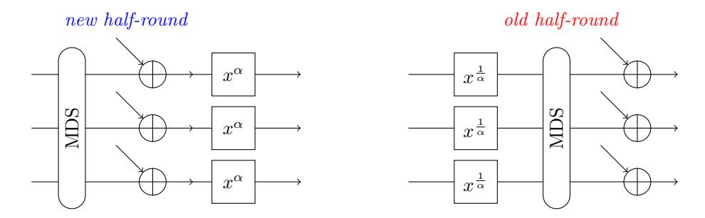
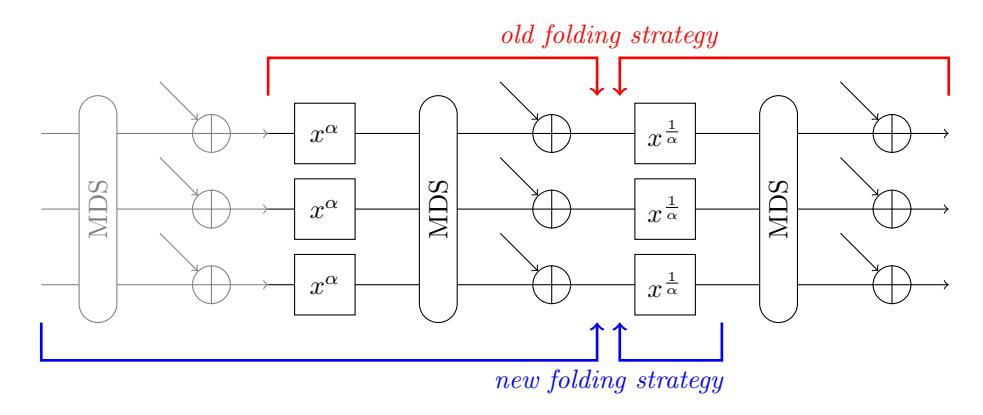

# Rescue-Prime Optimized

Tomer Ashur tomer@cryptomeria.tech Cryptomeria BV Al Kindi al.kindi@protonmail.com Polygon Willi Meier willi.meier@fhnw.ch FHNW

> Alan Szepieniec alan@asdm.gmbh

Bobbin Threadbare bobbinth@polygon.technology

AS Discrete Mathematics GmbH

Polygon

14th November 2022

Keywords: Arithmetization-Oriented, Hash function, Rescue Prime, Merkle tree hashing

## 1 Introduction

This note specifies two instances of a hash function obtained from applying the Marvellous design strategy [\[1\]](#page-9-0) to a specific context. The context in question is native hashing in a STARK [\[2\]](#page-9-1) Virtual Machine such as Miden [\[9\]](#page-9-2).

This context induces unique design constraints, which this specification addresses. The hash function must be defined over the same field that the VM is defined over, which is the prime field with p = 2<sup>64</sup> − 2 <sup>32</sup> + 1 elements. One of the main use cases is Merkle tree hashing, and so the hash function must support an interface for efficient two-to-one hashing. There are two parameter sets, targeting security level 128 and 160, respectively.

# 2 Specification

The starting point is Rescue-Prime [\[8\]](#page-9-3), and we assume the reader is familiar with this docment. What is described here is the deviations from this standard. A complete reference implementation in SageMath serves as a companion to this specification. It is available at [https://github.com/](https://github.com/ASDiscreteMathematics/rpo) [ASDiscreteMathematics/rpo](https://github.com/ASDiscreteMathematics/rpo).

#### 2.1 Integer Parameters

Table [1](#page-1-0) fixes some integer parameters. Additionally, this choice for p fixes α and α −1 , which are the exponents of the power maps in the forward and backward S-box layer, respectively (see Fig. [1\)](#page-2-0). Specifically, α = 7 and

- α <sup>−</sup><sup>1</sup> = 10540996611094048183
  - = 1001001001001001001001001001000110110110110110110110110110110111<sup>2</sup> .

Table 1: Integer parameters for the two instances of Rescue-Prime Optimized

<span id="page-1-0"></span>

| prime field modulus p | 64 −<br>32 + 1<br>2<br>2 | 64 −<br>32 + 1<br>2<br>2 |
|-----------------------|--------------------------|--------------------------|
| security level λ      | 128                      | 160                      |
| round number N        | 7                        | 7                        |
| state size m          | 12                       | 16                       |
| rate r                | 8                        | 10                       |
| capacity c            | 4                        | 6                        |

#### 2.2 Round Constants

The round constants are defined as follows:

- Start from the string RPO(%i,%i,%i,%i).
- Populate the wildcards "%i" with the ASCII decimal expansion of the integer parameters p, m, c, λ, in that order.
- Use SHAKE256 to expand this ASCII string into 9 · 2 · N · m pseudorandom bytes.
- For every chunk of 9 bytes, compute the matching integer by interpreting the byte array as as the integer's base-256 expansion with least significant digit first.
- Reduce the obtained integer modulo p.
- Collect all such integers. The list of obtained field elements constitutes the list of round constants.

The function get round constants of the reference implementation accomplishes this task.

#### 2.3 MDS Matrix

The MDS matrix is circulant. Its first row is

$$[7, 23, 8, 26, 13, 10, 9, 7, 6, 22, 21, 8]$$

for 128 bits of security, and

[256, 2, 1073741824, 2048, 16777216, 128, 8, 16, 524288, 4194304, 1, 268435456, 1, 1024, 2, 8192] for 160.

#### 2.4 Order of Operations within a Round

The operations within every half-round are reordered. The correct order is now:

- 1. MDS matrix
- 2. injection of constants
- 3. alpha or alpha-inverse S-box layer.



Figure 1: New versus old half-rounds.

### <span id="page-2-0"></span>2.5 Padding Rule

The padding rule makes a distinction depending on whether the length of the input is a multiple of the rate r or not.

- The zero-length input is not allowed.
- If the input length is a multiple of the rate r, then
  - Initialize all capacity elements to 0.
  - No changes are made to the message.
- If the input length is not a multiple of the rate r, then
  - Initialize the first capacity element to 1 and all others to 0.
  - Append to the input a single 1 element followed by as many zeros as are necessary to make the input length a multiple of the rate.

In either case the sponge methodology applies: absorb r elements from the input in between applications of the permutation, until no input is left.

### 2.6 Overwrite Mode

In the absorb phase of the sponge construction, the state elements associated with the rate are overwritten by the matching elements from the input chunk, rather than added into. Specifically, if the state elements are s[0] through s[m − 1] and the input chunk is i[0] through i[r − 1] then correct absorption is given by s[j] ← i[j] for all 0 ≤ j < r rather than s[j] ← s[j] + i[j] for all 0 ≤ j < r.

### <span id="page-2-1"></span>2.7 Indexation of State Elements

The state is divided into the capacity part, with indices 0 through c − 1, and the rate part, with indices c through m − 1. After the last permutation is done, the digest is given by elements c through c + r/2 − 1.

## 3 Test Vectors

The test vectors are generated by the method print test vectors from the reference implementation. For the sake of completeness, they are repeated here.

#### 3.1 128 Bits Instance

```
[ 0 ] −>
[ 1 5 0 2 3 6 4 7 2 7 7 4 3 9 5 0 8 3 3 5880949717274681448 162790463902224431 6 9 0 1 3 4 0 4 7 6 7 7 3 6 6 4 2 6 4 ]
[ 0 1 ] −>
[ 7478710183745780580 3308077307559720969 3383561985796182409 1 7 2 0 5 0 7 8 4 9 4 7 0 0 2 5 9 8 1 5 ]
[ 0 1 2 ] −>
[ 1 7 4 3 9 9 1 2 3 6 4 2 9 5 1 7 2 9 9 9 17979156346142712171 8280795511427637894 9 3 4 9 8 4 4 4 1 7 8 3 4 3 6 8 8 1 4 ]
[ 0 1 2 3 ] −>
[ 5105868198472766874 13090564195691924742 1058904296915798891 1 8 3 7 9 5 0 1 7 4 8 8 2 5 1 5 2 2 6 8 ]
[ 0 1 2 3 4 ] −>
[ 9133662113608941286 12096627591905525991 14963426595993304047 1 3 2 9 0 2 0 5 8 4 0 0 1 9 9 7 3 3 7 7 ]
[ 0 1 2 3 4 5 ] −>
[ 3134262397541159485 10106105871979362399 138768814855329459 1 5 0 4 4 8 0 9 2 1 2 4 5 7 4 0 4 6 7 7 ]
[ 0 1 2 3 4 5 6 ] −>
[ 162696376578462826 4991300494838863586 660346084748120605 1 3 1 7 9 3 8 9 5 2 8 6 4 1 7 5 2 6 9 8 ]
[ 0 1 2 3 4 5 6 7 ] −>
[ 2242391899857912644 12689382052053305418 235236990017815546 5 0 4 6 1 4 3 0 3 9 2 6 8 2 1 5 7 3 9 ]
[ 0 1 2 3 4 5 6 7 8 ] −>
[ 9 5 8 5 6 3 0 5 0 2 1 5 8 0 7 3 9 7 6 1310051013427303477 7491921222636097758 9 4 1 7 5 0 1 5 5 8 9 9 5 2 1 6 7 6 2 ]
[ 0 1 2 3 4 5 6 7 8 9 ] −>
[ 1994394001720334744 10866209900885216467 13836092831163031683 1 0 8 1 4 6 3 6 6 8 2 2 5 2 7 5 6 6 9 7 ]
[ 0 1 2 3 4 5 6 7 8 9 1 0 ] −>
[ 1 7 4 8 6 8 5 4 7 9 0 7 3 2 8 2 6 4 0 5 17376549265955727562 2371059831956435003 1 7 5 8 5 7 0 4 9 3 5 8 5 8 0 0 6 5 3 3 ]
[ 0 1 2 3 4 5 6 7 8 9 10 1 1 ] −>
[ 1 1 3 6 8 2 7 7 4 8 9 1 3 7 7 1 3 8 2 5 3906270146963049287 10236262408213059745 7 8 5 5 2 8 6 7 0 0 5 8 1 4 0 0 7 ]
[ 0 1 2 3 4 5 6 7 8 9 10 11 1 2 ] −>
[ 1 7 8 9 9 8 4 7 3 8 1 2 8 0 2 6 2 1 8 1 14717912805498651446 10769146203951775298 2 7 7 4 2 8 9 8 3 3 4 9 0 4 1 7 8 5 6 ]
[ 0 1 2 3 4 5 6 7 8 9 10 11 12 1 3 ] −>
[ 3 7 9 4 7 1 7 6 8 7 4 6 2 9 5 4 3 6 8 4386865643074822822 8854162840275334305 7 1 2 9 9 8 3 9 8 7 1 0 7 2 2 5 2 6 9 ]
[ 0 1 2 3 4 5 6 7 8 9 10 11 12 13 1 4 ] −>
[ 7244773535611633983 19359923075859320 10898655967774994333 9 3 1 9 3 3 9 5 6 3 0 6 5 7 3 6 4 8 0 ]
[ 0 1 2 3 4 5 6 7 8 9 10 11 12 13 14 1 5 ] −>
[ 4935426252518736883 12584230452580950419 8762518969632303998 1 8 1 5 9 8 7 5 7 0 8 2 2 9 7 5 8 0 7 3 ]
[ 0 1 2 3 4 5 6 7 8 9 10 11 12 13 14 15 1 6 ] −>
[ 1 4 8 7 1 2 3 0 8 7 3 8 3 7 2 9 5 9 3 1 11225255908868362971 18100987641405432308 1 5 5 9 2 4 4 3 4 0 0 8 9 6 4 4 2 3 3 ]
[ 0 1 2 3 4 5 6 7 8 9 10 11 12 13 14 15 16 1 7 ] −>
[ 8348203744950016968 4041411241960726733 17584743399305468057 1 6 8 3 6 9 5 2 6 1 0 8 0 3 5 3 7 0 5 1 ]
[ 0 1 2 3 4 5 6 7 8 9 10 11 12 13 14 15 16 17 1 8 ] −>
[ 1 6 1 3 9 7 9 7 4 5 3 6 3 3 0 3 0 0 5 0 1090233424040889412 10770255347785669036 1 6 9 8 2 3 9 8 8 7 7 2 9 0 2 5 4 0 2 8 ]
```

## 3.2 160 Bits Instance

```
[ 0 ] −>
[ 4766737105427868572 7538777753317835226 13644171984579649606 6748107971891460622 3 4 8 0 0 7 2 9 3 8 3 4 2 1 1 9 9 3 4 ]
[ 0 1 ] −>
[ 6 2 7 7 2 8 7 7 7 7 6 1 7 3 8 2 9 3 7 5688033921803605355 1104978478612014217 973672476085279574 7 8 8 3 6 5 2 1 1 6 4 1 3 7 9 7 7 7 9 ]
[ 0 1 2 ] −>
[ 3071553803427093579 12239501990998925662 14411295652479845526 5735407824213194294 6 7 1 4 8 1 6 7 3 8 6 9 1 5 0 4 2 7 0 ]
[ 0 1 2 3 ] −>
[ 4455998568145007624 18218360213084301612 8963555484142424669 13451196299356019287 6 6 0 9 6 7 3 2 0 7 6 1 4 3 4 7 7 5 ]
[ 0 1 2 3 4 ] −>
[ 7894041400531553560 3138084719322472990 15017675162298246509 12340633143623038238 3 7 1 0 1 5 8 9 2 8 9 6 8 7 2 6 1 9 0 ]
[ 0 1 2 3 4 5 ] −>
[ 1 8 3 4 5 9 2 4 3 0 9 1 9 7 5 0 3 6 1 7 6448668044176965096 5891298758878861437 18404292940273103487 3 9 9 7 1 5 7 4 2 0 5 8 3 6 0 8 1 1 ]
[ 0 1 2 3 4 5 6 ] −>
[ 4293522863608749708 11352999694211746044 15850245073570756600 1206950096837096206 6 9 4 5 5 9 8 3 6 8 6 5 9 6 1 5 8 7 8 ]
[ 0 1 2 3 4 5 6 7 ] −>
[ 1339949574743034442 5967452101017112419 824612579975542151 3327557828938393394 1 4 1 1 3 1 4 9 3 9 9 6 6 5 6 9 7 1 5 0 ]
[ 0 1 2 3 4 5 6 7 8 ] −>
[ 3540904694808418824 5951416386790014715 13859113410786779774 17205554479494520251 7 3 5 9 3 2 3 6 0 8 2 6 0 1 9 5 1 1 0 ]
[ 0 1 2 3 4 5 6 7 8 9 ] −>
[ 7504301802792161339 12879743137663115497 17245986604042562042 8175050867418132561 1 0 6 3 9 6 5 9 1 0 6 6 4 7 3 1 2 6 8 ]
[ 0 1 2 3 4 5 6 7 8 9 1 0 ] −>
```

```
[ 1 8 2 6 7 4 7 5 4 6 1 7 3 6 2 5 5 6 0 2 4481864641736940956 11260039501101148638 7529970948767692955 4 1 7 7 8 1 0 8 8 8 7 0 4 7 5 3 1 5 0 ]
[ 0 1 2 3 4 5 6 7 8 9 10 1 1 ] −>
[ 1 6 6 0 4 1 1 6 1 2 8 8 9 2 6 2 3 5 6 6 1520851983040290492 9361704524730297620 7447748879766268839 1 0 8 3 4 4 2 2 0 2 8 5 7 1 0 2 8 8 0 6 ]
[ 0 1 2 3 4 5 6 7 8 9 10 11 1 2 ] −>
[ 243957224918814907 9966149007214472697 18130816682404489504 3814760895598122151 8 6 2 5 7 3 5 0 0 6 5 2 2 3 3 7 8 7 ]
[ 0 1 2 3 4 5 6 7 8 9 10 11 12 1 3 ] −>
[ 1 3 4 1 4 3 4 3 8 2 3 1 3 0 4 7 4 8 7 7 1002887112060795246 16685735965176892618 16172309857128312555 5 1 5 8 0 8 1 5 1 9 8 0 3 1 4 7 1 7 8 ]
[ 0 1 2 3 4 5 6 7 8 9 10 11 12 13 1 4 ] −>
[ 1 4 6 1 4 1 3 2 9 2 5 4 8 2 1 3 3 9 6 1 7618082792229868740 1881720834768448253 11508391877383996679 5 3 4 8 3 8 6 0 7 3 0 7 2 4 1 3 2 6 1 ]
[ 0 1 2 3 4 5 6 7 8 9 10 11 12 13 14 1 5 ] −>
[ 6268111131988518030 17920308297240232909 17719152474870950965 14857432101092580778 5 7 0 8 9 3 7 5 5 3 8 3 3 1 8 0 7 7 8 ]
[ 0 1 2 3 4 5 6 7 8 9 10 11 12 13 14 15 1 6 ] −>
[ 1 1 5 9 7 7 2 6 7 4 1 9 6 4 1 9 8 1 2 1 1568026444559423552 3233218961458461983 9700509409081014876 7 9 8 9 0 6 1 4 1 3 1 6 4 5 7 7 3 9 0 ]
[ 0 1 2 3 4 5 6 7 8 9 10 11 12 13 14 15 16 1 7 ] −>
[ 1 1 1 8 0 5 8 0 6 1 9 6 9 2 8 3 4 1 8 2 16871004730930134181 17810700669516829599 13679692060051982328 1 0 3 8 6 0 8 5 7 1 9 3 3 0 7 6 0 0 6 4 ]
[ 0 1 2 3 4 5 6 7 8 9 10 11 12 13 14 15 16 17 1 8 ] −>
[ 6222872143719551583 3842704143974291265 18311432727968603639 12278517700025439333 7 0 1 1 9 5 3 0 5 2 8 5 3 2 8 2 2 2 5 ]
```

## 4 Motivation

#### 4.1 Circulant MDS Matrix

Rescue-Prime is secure when instantiated with any MDS matrix. Therefore, a circulant MDS matrix such as the one proposed by Polygon Zero may be chosen instead of the one defined by the specification. The obvious questions are

- 1) Is the proposed matrix really MDS?
- 2) Does the structure enable faster computation of matrix-vector products?

#### 4.1.1 MDS Test

As for question (1), we were granted access to Polygon Zero's MDS test procedure and were able to verify the correctness of this function. As a result, we are confident that the circulant matrices specified above are in fact MDS.

In the interest of disseminating science, we present a self-contained description of this algorithm here. Credit for this function goes to Hamish Ivey-Law from Polygon Zero [\[7\]](#page-9-4).

The key insight is that the standard cofactor expansion method for computing determinants induces a dependency relation on intermediate computation results. The resulting graph is directed and acyclic. As a consequence, it allows for a dynamic programming approach.

Specifically, the dependency relation is this: to compute the determinant of a (k + 1) × (k + 1) matrix, you need to select a row or column and combine it with the (k + 1)-many k × k determinants of minors that do not cover that row or column. Therefore, if you have the determinants of all k × k submatrices, computing the determinants of all (k + 1) × (k + 1) submatrices is straightforward.

This observation suggests the following strategy: Compute the determinants of all 2 × 2 submatrices. Use those values to compute the determinants of all 3 × 3 submatrices. And so on until the final dimension has been reached. For every computed determinant, verify that its value is nonzero.

This method tests a matrix for hyperinvertibility, which is the property that every square submatrix is invertible. Hyperinvertibility is equivalent to MDS. The next lemma and proof are folklore knowledge.

Lemma 1. A matrix is hyperinvertible iff it is MDS.

*Proof.* Hyperinvertibility  $\Rightarrow$  MDS. Let M be an  $m \times m$  hyperinvertible matrix. If there is nonzero a codeword  $(\mathbf{x}|\mathbf{x}M)$  whose Hamming weight is less than m+1, then  $\mathrm{HW}(\mathbf{x}M) < m+1-\mathrm{HW}(\mathbf{x})$ . Let  $\bar{\mathbf{x}}$  denote  $\mathbf{x}$  after dropping the zeros, and  $\bar{M}$  the  $\mathrm{HW}(\bar{\mathbf{x}}) \times m$  matrix whose corresponding rows are dropped. Clearly,  $\bar{\mathbf{x}}\bar{M} = \mathbf{x}M$  and so  $\mathrm{HW}(\bar{\mathbf{x}}\bar{M}) < m+1-\mathrm{HW}(\mathbf{x})$ . Equivalently,  $\bar{\mathbf{x}}\bar{M}$  has to contain at least  $\mathrm{HW}(\mathbf{x})$  zeros. Therefore, some  $\mathrm{HW}(\bar{\mathbf{x}}) \times \mathrm{HW}(\bar{\mathbf{x}})$  submatrix of  $\bar{M}$  and of M sends  $\bar{\mathbf{x}}$  to  $\mathbf{0}$ , which can only happen if it is singular, contradicting the assumption that M is hyperinvertible.

<u>MDS</u> ⇒ hyperinvertibility. Let  $\mathcal{C} \subset \mathbb{F}^{2m}$  be an MDS code of dimension m and (I|M) its systematic generator matrix. Then  $\mathcal{C} = \{(\mathbf{x}|\mathbf{x}M) \mid \mathbf{x} \in \mathbb{F}^m\}$ . If M is not hyperinvertible, then some square  $k \times k$  submatrix  $\tilde{M}$  is singular. Then build a codeword as follows. Set  $\mathbf{x}$  to a (left-) kernel vector of  $\tilde{M}$  in those coordinates that correspond to  $\tilde{M}$ , and to 0 in other coordinates. The codeword  $(\mathbf{x}|\mathbf{x}M) \in \mathcal{C}$  has at least m-k zeros in the first half and at least k zeros in the second half, so its Hamming weight is at most m, contradicting the assumption of  $\mathcal{C}$  being MDS.

To find a suitable circulant MDS matrix, it suffices to sample the first row from a suitable distribution, test the resulting circulant matrix for hyperinvertibility, and repeat if it does not pass the test.

#### 4.1.2 Fast Multiplication

As for question (2), the answer is in the affirmative. Let  $R_p = \frac{\mathbb{Z}_p[X]}{\langle X^m - 1 \rangle}$  be the ring of polynomials with multiplication modulo  $X^m - 1$ . There is an isomorphism between the elements of  $R_p$  and circulant  $m \times m$  matrices over  $\mathbb{Z}_p$  given by

$$a_0 + a_1 X + a_2 X^2 + \dots + a_{m-1} X^{m-1} \leftrightarrow \begin{pmatrix} a_0 & a_{m-1} & \dots & a_1 \\ a_1 & a_0 & & a_2 \\ \vdots & & \ddots & \vdots \\ a_{m-1} & a_{m-2} & \dots & a_0 \end{pmatrix} . \tag{1}$$

A fast way to multiply polynomials modulo  $X^m-1$  translates to a fast circulant matrix times vector multiplication procedure. We describe below two methods for fast polynomial multiplication modulo  $X^m-1$ .

Note that the coefficient vector of the polynomial corresponds to the first column of the matrix, and not the first row. To translate between row and column, one needs to reverse the entire vector except for the element at the first position.

#### 4.1.3 Karatsuba-based

Karatsuba multiplication [6] splits the multiplication of two polynomials of degree at most n-1 up into three multiplications of polynomials of degree n/2-1, and applies that split recursively. In the limit the procedure requires only  $O(n^{1.58})$  multiplications, compared to the  $n^2$  for the schoolbook algorithm. While the number of multiplications is reduced, the number of additions is increased. However, additions generally do not need to be followed up with modular reduction.

Let  $a(X) = a_l(X) + X^{n/2} \cdot a_r(X)$  and  $b(X) = b_l(X) + X^{n/2} \cdot b_r(X)$  with all of  $a_l(X)$ ,  $a_r(X)$ ,  $b_l(X)$ , and  $b_r(X)$  having degree at most n/2 - 1. Let

- $c_0(X) = a_l(X) \times a_l(X)$ ,
- $c_2(X) = a_r(X) \times b_r(X)$ ,
- $c_1(X) = (a_l(X) + a_r(X)) \times (b_l(X) + b_r(X)) c_0(X) c_2(X);$

then c(X) = a(X)×b(X) = c0(X)+Xn/<sup>2</sup> · c1(X)+X<sup>n</sup> · c2(X). Note that c(X) can be calculated with only 3 multiplications of polynomials of half the number of coefficients. Applying this reduction recursively is what generates Karatsuba's multiplication algorithm.

After using Karatsuba to find the product of two polynomials t(X) and s(X) that represent the MDS matrix and state vector respectively, the next step is the reduction modulo X<sup>m</sup> − 1. This step is straightforward: just iterate over the coefficients of monomials Xm/<sup>2</sup> through Xm−<sup>1</sup> and add them to the coefficients of monomials X<sup>0</sup> through Xm/2−<sup>1</sup> .

#### 4.1.4 NTT-based

Using the same isomorphism as in the previous section and the fact that multiplication in the ring R<sup>p</sup> can be done efficiently using the Number Theory Transform (NTT) and its inverse, we can get a O(n · log(n)) algorithm for circulant matrix times vector multiplication procedure. More precisely, let ω be a primitive n-th root of unity and define the following Zp[X]-linear map:

$$NTT_{\omega}: \begin{cases} R_p \longrightarrow (\mathbb{Z}_p)^n \\ a(X) \mapsto (a(\omega^0), a(\omega^1), \cdots, a(\omega^n)) \end{cases}$$
 (2)

which is just the evaluation of the polynomial a at the powers of ω, i.e. the n-th roots of unity. This is called the Number Theory Transform (NTT), and is a special case of the Discrete Fourier Transform. Then, using the Chinese Remainder Theorem, one can show that NT T<sup>ω</sup> is an isomorphism of algebras. This means that, in particular, the following holds:

$$NTT_{\omega}\left(a(X)\times b(X)\right)=NTT_{\omega}(a(X))\odot NTT_{\omega}(b(X))$$

or equivalently

$$a(X) \times b(X) = NTT_{\omega}^{-1} (NTT_{\omega}(a(X)) \odot NTT_{\omega}(b(X)))$$

where is ⊙ is the Hadamard product. This in particular yields the following algorithm:

<span id="page-6-0"></span>Algorithm 1 Circulant matrix times vector multiplication using NTT

Require: n ≥ 1, a(X), b(X) ∈ R<sup>p</sup> and ω is a primitive n-th root of unity.

Ensure: C(X) = a(X) × b(X)

α ← NT Tω(a(X))

β ← NT Tω(b(X))

γ ← α ⊙ β

C(X) ← NT T <sup>−</sup><sup>1</sup> ω γ

Given that in our current context the matrix we are multiplying with is fixed once and for all, the previous algorithm can be optimized by pre-computing the NTT of the MDS matrix such that in the end it will be necessary to compute only one NTT and one inverse NTT per input vector b. Since the NTT and the inverse NTT can be computed in O(n · log(n)) using the Fast Fourier Transform (FFT), the complexity of Alg. [1](#page-6-0) is also O(n · log(n)).

#### 4.2 Reduced Round Number

According to the specification [\[8\]](#page-9-3), the Gr¨obner basis attack dominates for the range in which the given parameters lie. Moreover, the number of rounds should be set to N = ⌈1.5 · min(l1, 5)⌉, where l<sup>1</sup> is the minimal number required to guarantee that the Gr¨obner basis attack has complexity at least as large as the security parameter, and where the factor 1.5 is a security margin. For both the 128-bit variant and the 160-bit variant, the estimate for the complexity of the Gröbner basis attack exceeds the security level as soon as  $N \geq 3$ . Plugging this data point into the formula gives rise to a recommended number of rounds of  $N = \lceil 1.5 \cdot 5 \rceil = 8$ . Setting instead N = 7 constitutes a 12.5% reduction in the number of rounds.

The reason why we feel confident recommending N=7 is threefold:

- The relative reduction is still less than the relative security margin induced by the factor 1.5.
- The estimate of the Gröbner basis attack complexity according to the specification is still more than double the security level. The estimate according to experiments run in the course of this research project were lower, but still indicate that the security target is met with margin.
- Since the publication of the original Marvellous paper [1], the first version of which appeared online in 2019, there has been little progress in attacking either Rescue or Rescue-Prime.

### 4.3 Order of Operations for Better Folding

One of the costly steps in both the prover and the verifier of a STARK is the computation of the vector of values of AIR transition constraint polynomials for two consecutive rows of the algebraic execution trace (AET). The AIR constraints are evaluated point by point on the codewords that represent the trace. The generated codewords are different from zero except in locations that correspond to a row in the AET and its successor.

Rescue and Rescue-Prime have S-boxes that send x to  $x^{\frac{1}{\alpha}}$ , where  $\alpha$  is the smallest invertible non-trivial power map degree. To avoid a very high degree AIR, the Marvellous paper [1] introduced *folding*. This technique involves arithmetizing the evolution of the state forwards in time for a part of the time step, and backwards in time for the remaining part. By traversing over the  $x \mapsto x^{\frac{1}{\alpha}}$  map backwards, the degree of the resulting AIR drops to  $\alpha$ . The equation is found by equating two distinct expressions for the value of the same wire in the middle. The corresponding polynomial is found by moving all terms to the left hand side.



Figure 2: New versus old folding strategy.

The original folding strategy makes no distinction between the cost of multiplying a vector by a matrix or by its inverse. The AIR polynomials have the same number of terms. However, considerable effort was spent making the MDS matrix-vector multiplication fast, and it seems

difficult to simultaneously make multiplication by the matrix's inverse fast. This problem motivates an alternative folding strategy, namely one that avoids using the inverse MDS matrix altogether.

The new folding strategy in forwards direction: one MDS, one injection of constants, one  $x \mapsto x^{\alpha}$  S-box layer, another MDS, and another injection of constants. Only the map  $x \mapsto^{\frac{1}{\alpha}}$  is computed in backwards direction.

To argue why this re-arrangement does not affect security, consider moving the MDS matrix and injection of constants of the very last step to the front. This move does not degrade security according to the following heuristic argument. An attack that meaningfully distinguishes the new permutation (that is, after the move) from a permutation selected uniformly at random, can be translated to an attack on the old permutation (that is, before rearrangement) with a linear overhead. Note that the round constants are sampled independently from those of Rescue-Prime.

### 4.4 Usability in a Stack-Based Virtual Machine

#### 4.4.1 Indexation

As per § 2.7, the capacity elements are indexed 0 through c-1 and the rate elements c through m-1. This choice stands in contrast to traditional indexing choices, which puts the rate part first. While the choice of indexation is irrelevant from a security point of view (see below), this present choice benefits usability in the context of a stack machine.

The unorthodox indexing scheme corresponds to putting the capacity part deep into the stack, and the rate part in the shallow end. As a result, squeezing and absorbing corresponds to operations that affect only the top of the stack. The capacity part of the sponge state does not need to be touched except when the hasher is initialized and after hashing is finished.

To see why any choice of indexation is arbitrary from the point of view of security, observe that any permutation can be absorbed into one or even all MDS matrices without changing the fact that they are MDS. The end result is a permutation with an identical security argument.

#### 4.4.2 Overwrite Mode

In many stack-based VMs, at most one element can be pushed onto the stack per clock cycle. Therefore, first pushing elements onto the stack and then adding them into the sponge state would require a large number of operations: in addition to push and add operations, stack manipulation operations are also necessary to arrange the stack correctly. In the overwrite mode, we can drop rate elements from the stack and then simply push the new rate elements onto the stack. This procedure is strictly more efficient than the procedure when elements are absorbed through addition as it requires no additional stack manipulation operations.

The security of overwrite mode has been analyzed e.g. in § 4.3 of the Sponge SoK [3].

#### 4.5 Padding Rule

A sponge function is defined to absorb r elements from the input in between applications of the permutation. When the message cannot be split into an integral number of r-element blocks, a padding rule is used to determine how to handle the last block. To avoid trivial collisions, a padding rule must be  $sponge\ compliant$  (see [3, Def. 1]). The Marvellous paper [1] extended "the simplest padding rule" (see [3, Def. 2]) suggesting to append a single 1 element at the end of the message, followed by the necessary amount of zeros to make the length a multiple of r. As a result, the padded message is always longer than the message before padding.

We are interested in an efficient two-to-one hashing as a primary optimization goal. Therefore, we would like to avoid the costly overhead of an additional permutation call to accomodate the padding. Inspired by [\[5\]](#page-9-7) and similar to [\[4\]](#page-9-8) we abuse the notion of domain separation.

We consider messages with length a multiple of r as belonging to the 0-domain, and all other message as belonging to the 1-domain. As messages in the 0-domain have a predetermined length that is already a multiple of r elements, no further padding is required. For messages in the 1-domain, we apply "the simplest padding rule". The domain is encoded in the first capacity element which results in a 1-bit security loss because now the attacker has two domains in which to search for "valid" preimages.

Acknowledgments This project was made possible through the financial support of [Poly](https://polygon.technology/)[gon,](https://polygon.technology/) for which the authors would like to express gratitude.

## References

- <span id="page-9-0"></span>[1] Abdelrahaman Aly, Tomer Ashur, Eli Ben-Sasson, Siemen Dhooghe, and Alan Szepieniec. Design of symmetric-key primitives for advanced cryptographic protocols. Cryptology ePrint Archive, Paper 2019/426, 2019. <https://eprint.iacr.org/2019/426>.
- <span id="page-9-1"></span>[2] Eli Ben-Sasson, Iddo Bentov, Yinon Horesh, and Michael Riabzev. Scalable, transparent, and post-quantum secure computational integrity. Cryptology ePrint Archive, Paper 2018/046, 2018. <https://eprint.iacr.org/2018/046>.
- <span id="page-9-6"></span>[3] Guido Bertoni, Joan Daemon Micha¨el Peeters, and Gilles Van Assche. Cryptographic sponge functions, 2011.
- <span id="page-9-8"></span>[4] Cl´emence Bouvier, Pierre Briaud, Pyrros Chaidos, L´eo Perrin, and Vesselin Velichkov. Anemoi: Exploiting the link between arithmetization-orientation and ccz-equivalence. IACR Cryptol. ePrint Arch., page 840, 2022.
- <span id="page-9-7"></span>[5] Shoichi Hirose. Sequential hashing with minimum padding. Cryptogr., 2(2):11, 2018.
- <span id="page-9-5"></span>[6] Anatolii Karatsuba and Yuri Ofman. Multiplication of many-digital numbers by automatic computers. In Doklady Akademii Nauk, volume 145, pages 293–294. Russian Academy of Sciences, 1962.
- <span id="page-9-4"></span>[7] Daniel Lubarov, Brendan Famer, William Borgeaud, Hamish Ivey-Law, Connor Southard, Brendan Gluth, Nick Ward, and Jacqueline Nabaglo. Polygon Zero. [https://polygon.](https://polygon.technology/solutions/polygon-zero) [technology/solutions/polygon-zero](https://polygon.technology/solutions/polygon-zero).
- <span id="page-9-3"></span>[8] Alan Szepieniec, Tomer Ashur, and Siemen Dhooghe. Rescue-Prime: a standard specification (SoK). Cryptology ePrint Archive, Paper 2020/1143, 2020. [https://eprint.iacr.org/](https://eprint.iacr.org/2020/1143) [2020/1143](https://eprint.iacr.org/2020/1143).
- <span id="page-9-2"></span>[9] Bobbin Threadbare. Polygon Miden. [https://polygon.technology/solutions/](https://polygon.technology/solutions/polygon-miden) [polygon-miden](https://polygon.technology/solutions/polygon-miden).