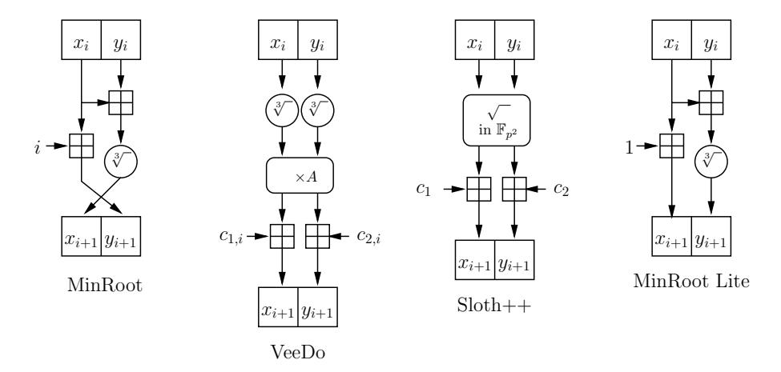

# MinRoot:

# Candidate Sequential Function for Ethereum VDF

Dmitry Khovratovich Ethereum Foundation khovratovich@gmail.com

Mary Maller Ethereum Foundation mary.maller@ethereum.org Pratyush Ranjan Tiwari Johns Hopkins University ptiwari4@jhu.edu

November 24, 2022

#### Abstract

We present a candidate sequential function for a VDF protocol to be used within the Ethereum ecosystem. The new function, called MinRoot, is an optimized iterative algebraic transformation and is a strict improvement over competitors VeeDo and Sloth++. We analyze various attacks on sequentiality and suggest weakened versions for public scrutiny. We also announce bounties on certain research directions in cryptanalysis.

## 1 Introduction

Distributed consensus protocols often require not only fast computations for efficiency, but also guaranteed slow computations for security. When we say guaranteed slow computations we mean that there is a lower bound on the time the computation takes even if one has access to an unlimited number of cores; i.e., the computation cannot be parallelized. Slow computations are required when a party is supposed to produce an output that will eventually benefit some other participants, so that the slowness of computation would guarantee unpredictability and thus fairness.

VDF usage in Ethereum. An example of this requirement in Ethereum is the following. A group of 32 validators progressively builds a chain of collective randomness, with one value O generated per epoch E. This randomness is used to select, for example, which validator can add a block onto the blockchain and reap the rewards of doing so. If the randomness is unbiased then the frequency with which a validator is selected depends on their stake in the system. However, if a malicious actor were to bias the randomness, then they can sample many different strings of randomness and select the one which benefits them most. Currently the randomness O is given by the reveals from a RANDAO commit-reveal scheme used to generate a random number where the commits are inputs produced by the validators during E. However this commit-reveal scheme is biasable: a malicious validator that plays last can choose whether or not to reveal and the result will be different based on their choice. To transform O into a form of unbiasable randomness, one solution is to pass O through a verifiable delay function (VDF) which is guaranteed to be slow to compute, such that all validators must choose whether to reveal or not before they know the output of the VDF. Note that O can be evaluated by any VDF evaluator for each epoch E. It is expected that the lowest execution time will be achieved on specialized hardware, and such hardware should be available to the participants. To summarize, a VDF protocol should have the following features

- Tight latency bounds: the minimal time needed to compute the VDF with arbitrary parallelism on modern hardware should be close to the best known algorithm to date.
- Minimum hardware: as a benign VDF computation brings no benefit to the executor, it should as cheap as possible so that parties could afford it.

- Succinct proofs: the VDF outputs should be widely available to all Ethereum nodes, and their verification should not expose a DoS attack vector.
- Quantum upgrade: when/if the quantum computers become powerful enough it should be possible to switch to a post-quantum version of the protocol while retaining the deployed hardware.
- Delay granularity: it should be possible to select the VDF expected running time with sufficient precision in seconds.

VDF informal definition A VDF is a tuple (F, Π) of function F and non-interactive protocol Π which works as follows:

- 1. Prover runs F on challenge I and produces output O;
- 2. Prover engages in Π and produces a proof π that F(I) = O;
- 3. Verifier obtains (I, O, π) and verifies π.

To qualify for a VDF, the proof protocol should be complete and sound, the proof should be succinct, non-malleable (to prevent manipulation with the VDF output) and allow fast verification. A number of VDF constructions has been proposed in the recent past [\[LW17,](#page-11-0) [Wes19,](#page-11-1) [BBBF18,](#page-10-0) [Pie19,](#page-11-2) [FMPS19,](#page-10-1) [EFKP20,](#page-10-2) [LV20,](#page-11-3) [DGMV20\]](#page-10-3) with their own advantages and limitations.

VDF based on an iterative sequential function . An important class of VDFs is built as follows: F is an iteration of so called iterative sequential function [\[BBBF18\]](#page-10-0) and Π is a proof of computation, for example a recursive SNARK [\[BGH20,](#page-10-4) [COS20\]](#page-10-5). Here the SNARK part provides soundness and succinctness, whereas the iterative sequential function guarantees that the computation time can not be reduced on parallel machines.

Our contributions This document describes a candidate iterative sequential function called Min-Root. As of November 2022, Ethereum plans to use the Nova proof system [\[KST22\]](#page-11-4) as a recursive SNARK for a VDF. While this is not am immediate requirement, we expect that the resulting protocol would suit a large number of applications as well as other blockchains currently united as the [VDF](https://www.vdfalliance.org/) [Alliance.](https://www.vdfalliance.org/)

Paper structure. In this report we first recall VDF and sequentiality definitions and then extend them in Section [2.](#page-1-0) We propose MinRoot in Section [3.](#page-4-0) We describe our own cryptanalytic attacks on MinRoot in classical (Section [4\)](#page-6-0) and quantum (Section [5\)](#page-8-0) scenarios. We describe cryptanalytic targets and research bounties in Section [6.](#page-9-0)

## 2 Definitions

### 2.1 Generic definitions

A VDF is defined by Boneh et al. [\[BBBF18\]](#page-10-0) as follows.

Definition 1 (Verifiable Delay Functions). A verifiable delay function (VDF) consists of the following algorithms:

• Setup(λ,t) → pp: The puzzle generation algorithm takes as input a security parameter λ and a difficulty parameter t and outputs public parameters pp which fix the domain X and range Y of the puzzle and other information required to compute a puzzle or verify a puzzle solution

- Eval(pp, x) → (y, π): The puzzle evaluation algorithm takes as input the public parameters pp, an input from the domain x. It outputs a puzzle solution y and a proof π.
- Verify(pp, x, y, π) → 0/1: The puzzle verification algorithm takes as input the public parameters pp, an input from the domain x, an input from the range y and a proof π. It outputs either 0 or 1.

Additionally, VDFs must satisfy the correctness, soundness and sequentiality definitions as defined below.

Definition 2 (Correctness). A verifiable delay function is correct if ∀λ,t, pp ← Setup(λ,t), and ∀x ∈ X if (y, π) ← Eval(pp, x) then Verify(pp, x, y, π) = 1.

Definition 3 (Soundness). For soundness it is required that an adversary can not get a verifier to accept an incorrect VDF solution.

$$\mathbb{P}\left[\begin{array}{c|c} \mathsf{Verify}(\mathsf{pp},x,y,\pi) = 1 & \mathsf{pp} \leftarrow \mathsf{Setup}(\lambda,\mathsf{t}) \\ y \neq \mathsf{Eval}(\mathsf{pp},x) & (x,y,\pi) \leftarrow \mathcal{A}(\lambda,\mathsf{t},\mathsf{pp}) \end{array}\right] \leq \mathsf{negl}$$

Definition 4 (Sequentiality). For functions σ(t) and p(t), the VDF is (p, σ)-sequential if no pair of randomized algorithms A0, which runs in total time O(poly(λ,t)), and A1, which runs in parallel time σ(t) on at most p(t) processors, can win the following sequentiality game with probability greater than negl(λ):

- pp ← Setup(λ,t);
- L ← A0(λ, pp,t); (preprocessing of pp)
- x \$←− X ; (choosing random input)
- yA ← A1(L, pp, x); (computing an output)
- Win if yA = y where (y, π) = Eval(pp, x).

Function σ(t) is a lower bound on how fast an adversary can compute a VDF. For the Ethereum application we need σ(t) to significantly exceed the time that is given to a party to craft their input, i.e. minutes, whereas the VDF computation time can be a few hours or days. Thus σ(t) must be set to at least t/100, and for the security margin we set it to be t/2. See more discussion on this topic in [\[BBBF18\]](#page-10-0).

### 2.2 Multiple targets

We would like to cover additionally the case when the adversary is able to choose an input from a fairly big set. This corresponds to the real world use case when it is possible to grind a number of possible inputs by, for instance, hashing a nonce.

Definition 5 (Multiple Target Sequentiality). For functions σ(t) and p(t), the VDF is (p, σ)-multitargetsequential if no pair of randomized algorithms A0, which runs in total time O(poly(λ,t)), and A1, which runs in parallel time σ(t) on at most p(t) processors, can win the following sequentiality game with probability greater than negl(λ):

- pp ← Setup(λ,t);
- L ← A0(λ, pp,t); (preprocessing of pp)
- X \$←− X , |X| < p(t); (choosing random input set)
- yA ← A1(L, pp, x), x ∈ X; (computing an output)
- Win if yA = y where (y, π) = Eval(pp, x).

#### 2.3 VDF from IVC

As indicated in [BBBF18], one can build a sequential VDF by proving an incrementally verifiable computation (IVC) of a so called sequential function.

**Definition 6** (Sequential function). Function  $f: X \to Y$  is a  $(t, \epsilon)$ -sequential function if for  $\lambda = O(\log |X|)$  the following conditions hold:

- 1. There exists an algorithm that for all  $x \in X$  evaluates f in parallel time t using  $poly(\log t, \lambda)$  processors.
- 2. For all A that run in parallel time strictly less than  $(1 \epsilon)t$  with poly $(t, \lambda)$  processors:

$$\mathbb{P}\left[y_a = f(x) \; \big| \; y_a \leftarrow \mathcal{A}(\lambda, x), \; x \xleftarrow{\$} X\right] \leq \mathsf{negl}(\lambda)$$

**Definition 7.** Let  $g: X \to X$  be a  $(t, \epsilon)$ -sequential function. A function  $f: \mathbb{N} \times X \to X$  defined as

$$f(k,x) = g^{(k)}(x) = \underbrace{g \circ g \circ \cdots \circ g}_{k \text{ times}}$$

is said to be an iterated sequential function (with round function g) if for all  $k = 2^{o(\lambda)}$  the function  $h: X \to X$  defined as h(x) = f(k, x) is  $(kt, \epsilon)$ -sequential.

A straightforward SNARK prover computes a proof for a circuit of size m in time superlinear of m [BBHR19]. However, it turns out that with a reasonable amount of parallel processors a prover can run in time only logarithmic of m. One can carefully split an iterated sequential function into chunks and apply such a prover as soon as each chunk is ready, in order to obtain a sequential VDF.

**Theorem 1** ([BBBF18],informal). Let S be a SNARK system such that a parallel prover using  $O(m \log m)$  processors computes a SNARK for a circuit of size m in time  $\alpha m$ . Let f be an iterated sequential function with  $(s,\epsilon)$ -sequential round function g. Then there exists a  $\sigma(t)$ -sequential VDF with  $\sigma(t) = (1 - \epsilon)t$  that is evaluated on  $O_{\alpha}(\log \frac{t}{s} \cdot \log t)$  processors.

#### 2.4 Concrete security

The sequentiality Definition 6 deals with adversaries whose computational power is upper bounded only asymptotically as a function of security parameter  $\lambda$ . It thus makes sense to investigate how concretely powerful an adversary should be to violate the sequentiality property. For this we also have to specify the number of processors run by a regular evaluator.

**Definition 8** (Concrete sequentiality). We say that the VDF function F is  $(\sigma, \alpha, T_0, T_1, n_E)$ -parallel if there exist two adversaries  $A_0$  and  $A_1$  that win the multitarget sequentiality game with probability  $\alpha$  against an evaluator with  $n_E$  processors, so that  $A_0$  runs in total time  $T_0$ , counted in calls to F, and  $A_1$  runs in parallel time  $\sigma$ t and total time  $T_1$ .

This definition implies that  $A_1$  uses at least  $T_1$  processors.

**Definition 9.** We say that the function has  $\lambda$  bits of VDF security if it is not  $(\sigma = 0.5, \alpha, T_0, T_1, n_E = 2^{16})$ -parallel for any  $\alpha \leq 1$  such that  $\max(T_0/\alpha, T_1/\alpha) < 2^{\lambda}$ .

#### 2.5 Theoretical shortcomings

In this section we mention a few issues that prevents a construction of VDF and sequential function on a more solid basis.

**Existence of sequentiality** It is known that a very wide class of functions from  $\mathbb{P}$  (i.e. computable in polynomial time) can be computed in polylogarithmic time on a polynomial number of parallel processors. These functions are known as  $\mathbb{NC}$ . The provable existence of sequential functions that *can not* be computed in polylogarithmic parallel time would imply that  $\mathbb{NC} \neq \mathbb{P}$ , which is an unsolved mathematical problem.

Sequentiality from  $\mathbb{P}$ -complete problems We know, however, should sequential functions appear they would be  $\mathbb{P}$ -complete, i.e. any other  $\mathbb{P}$  problem would reduce to them by a reduction from  $\mathbb{NC}$ . The candidate  $\mathbb{P}$ -complete problems, such as CVP (Circuit Value Problem), do not appear to be effective enough for our usecase. They are either solvable in (quasi)linear time, thus spending most of the algorithm on just reading the input, or require just a too large input to constitute a significant gap to a parallel implementation. An interested reader may find more information on  $\mathbb{P}$ -complete problems and open research directions in  $[GHR^+95]$ .

## 3 MinRoot candidate sequential function

### 3.1 Related work and design rationale

We build MinRoot candidate sequential function g to be used for an iterated round function f. There exist several candidates for g in the literature with VeeDo and Sloth++ [BBBF18] being the most prominent. In the core, both transform the state S to S' so that the pair satisfies a low-degree polynomial relation G(S, S') = 0. In more details, the forward direction is some inverse to a power function, where the exponent is selected to be an injective mapping. When  $p \not\equiv 1 \pmod{3}$  we have:

Sloth++:
$$(x_{i+1}, y_{i+1}) \leftarrow \underbrace{(x_i, y_i)^{(p^2+1)/4}}_{\text{over } \mathbb{F}_{p^2}} + (c_1, c_2)$$
VeeDo: $(x_{i+1}, y_{i+1}) \leftarrow A \cdot \underbrace{(x_i^{(2p-1)/3}, y_i^{(2p-1)/3})}_{\text{both over } \mathbb{F}_p} + (c_{1,i}, c_{2,i})$ 

Here  $(x_i, y_i)$  is the state at *i*-th step. We have found a better alternative to both, with only one exponentiation per round, which we call MinRoot (Figure 1):

Domain : 
$$X = \mathbb{F}_p^2$$
; (1)

MinRoot round function : 
$$g_{MR}(x_{i+1}, y_{i+1}, i) \leftarrow ((x_i + y_i)^{(2p-1)/3}, x_i) + (0, i)$$
 (2)

If we have  $p \equiv 1 \pmod{3}$  but  $p \not\equiv 1 \pmod{5}$ , which is the case for the primes which are prime group orders of popular BLS12-381 and BN254 curves, we use the fifth root as  $(x_i + y_i)^{(4p-3)/5}$ .

**MinRoot VDF.** We suggest using MinRoot round function within an IVC-based VDF as described in [BBBF18]. Ethereum plans to use Nova [KST22] as an underlying SNARK. Given that we can run up to  $2^{30}$  iterations of  $g_{MR}$  per second, we have the following parameter range:

- $t \approx 2^{36}$  for 1 minute;
- $t \approx 2^{42}$  for 1 hour:
- $t \approx 2^{46}$  for 1 day.

We denote the resulting VDF as  $F_{MR}^t$ .

Figure 1: Round functions of candidate iterated sequential functions (assuming the field where the cubic root is well defined).

#### 3.2 Security reductions

We claim sequentiality of MinRoot round function based on the following conjecture.

Conjecture 1. For a being co-prime with p-1, computing  $x^{\frac{1}{a}} \mod p$  is on average at least as hard as computing  $x^2 \mod p$ .

The hardness of squaring is discussed in Section 3.5.

### 3.3 Security claims

Even if  $g_{MR}$  is sequential it does not guarantee that f, the iterated  $g_{MR}$ , is iterated sequential. The latter statement is captured as follows. We formulate it as a claim rather than a conjecture to emphasize that it is a subject of cryptanalytic investigation.

Claim 1. We claim 128 bits of multitarget VDF security (Definition 9) for MinRoot over 256-bit field  $\mathbb{F}_p$  against both classical and quantum adversaries.

### 3.4 Performance comparison

We first observe that VeeDo uses two parallelizable exponentiations per round, whereas MinRoot does only one. Thus for the same delay time and same state size VeeDo requires twice the hardware, whereas the smaller state would reduce the security against precomputation attacks. Note also that VeeDo needs additional storage for constants (or hardware that computes those).

A comparison to Sloth++ is less straightforward. Assuming that both state elements in all designs are l-bit primes, we get that MinRoot uses one exponentiation to an l-bit exponent, VeeDo uses two, whereas Sloth++ computes a single 2l-bit exponentiation of a 2l-bit field element, which should yield twice longer step at CPU or an ASIC circuit twice as large. On the other hand, a hardware of the same size would imply twice smaller state, which succumbs to precomputation attacks. We conclude that MinRoot is more efficient in terms of hardware.

Concrete performance of MinRoot We assume that to compute a root function one uses a window-based square-and-multiply algorithm, which boils down to a sequence of modular multiplications. Our CPU benchmarks demonstrate that a naive 256-bit exponentiation takes about 10000 ns. An optimized ASIC implementation will be faster but given that at least 40 gates are needed for squaring [MOS20]. The ASIC estimate for this design is 1ns per square/multiply. This means that the ASIC can takes 300ns per MinRoot iteration which gives us 3.3 million iterations/second. For the prover, each iteration is 3 constraints. To create a proof, a prover performs 2 multi-scalar multiplication/multi-exponentiation (MSMs) the size of the number of constraints. At 3.3 million iterations per second this is 2 MSMs of size  $10^7$  per second for  $2 \times 10^7$  bases/second. We currently have GPU code that does  $2 \times 10^7$  bases/second on a 384 bit curve and this should go up to about  $4 \times 10^7$  bases/second when we move to 256-bit curves. This means that a single GPU should be able to create SNARK proofs for 2 ASIC VDF evaluators.

### 3.5 Sequentiality of the round function: latency bounds

Currently the fastest exponentiation  $x^y$  algorithm that works with variable base is the windowing-ladder algorithm [CP05]. In the nutshell it splits the exponent y into windows of bitlength k, precomputes powers of x, and then applies the square-and-multiply method. For the 256-bit exponent the optimal k equals 5, which yields 256 squares and 66 multiplications. We are aware of no substantial improvement to this bound.

Going further down, the modulo squaring itself has been the subject of latency analysis in various models. For the gate depth model, the best available lower bounds [WW20] indicate that a squaring modulo  $\ell$ -bit prime circuit has depth at least  $2\log_2(\ell-1)-2\log_2(\log_2(\ell-1)-1)-4$ , whereas the concrete upper bounds yield circuits of depth smaller than  $5\log_2\ell$  [MOS20]. We consider this gap to be small enough to prevent breakthroughs in circuit construction.

## 4 Classical Cryptanalysis

In this section we consider attacks on sequentiality against both the MinRoot round function  $g_{MR}$  and the full VDF function  $F_{MR}^t$ .

Multitarget parallel adversary In our attacks we consider multitarget adversaries as the most powerful ones. The online adversaries get their set of VDF inputs as follows. We allow each adversary's processor sampling a VDF input at the rate of one per time equal to the single call of  $g_{MR}$ . We assume a common memory of size M shared by adversary's processors. Further simplifying towards the adversary, we assume that lookups in the memory can be made in parallel from S processors in constant time, even though more realistic algorithms require  $\sqrt{max(S, M)}$  time [LSSS85].

### 4.1 Precomputation attacks

Here we consider attacks based on precomputing certain calls to  $F_{MR}^t$ , shortly denoted by F. Note that for the security level of 128 bits we allow an adversary to make up to  $2^{128}$  precomputation calls to F. Recall that the VDF function  $F_{MR}^t$  maps X of size  $N=2^{512}$  to itself. Let the inverse of  $g_{MR}$  be computable with advantage  $\gamma$  over the forward iteration (it is approximately  $2^{-6}$ ).

#### 4.1.1 Attack 1

The simplest attack works as follows:

- 1. Precomputation adversary  $A_0$  applies  $F^{-1}$  (i.e. invert F) to  $M/\gamma$  elements of X and create a proof for every inversion.
- 2. Stores results as  $\overline{X} = \{(I, O, \pi)\}.$

3. Online adversary  $A_1$  samples input set X of size S on S processors and checks if there is an overlap.

This costs at most M precomputation time and  $max(M/\gamma, S)$  space, but the chance to find a matching input is at most  $\frac{MS}{\gamma N}$ . Therefore the function is at best  $(0, \frac{MS}{\gamma N}, M, S, n_E)$ -parallel.

#### 4.1.2 Attack 2

We make the following improvements to Attack 1:

- Offline adversary computes only half-chains.
- Online adversary computes half-chains starting from all points of X but in the forward direction.

At the same cost this attack doubles the size of both matching sets chains and thus increases the matching probability by the factor of 4. The sequentiality advantage is  $\sigma = 1/2$ . Therefore the function is at best  $(0.5, \frac{4MS}{\gamma N}, M, S, n_E)$ -parallel.

**Remark 1.** Note that since all round functions are different, a precomputed segment is valid for only specific rounds. If the round function was the same, the winning probability would increase by the difficulty factor t.

#### 4.1.3 Attack 3

This attack modifies Attack 1 in the following way:

- Offline adversary is the same.
- Online adversary samples a new VDF input on each processor throughout 1/2 of time required to compute F.

The adversary samples t/2 as many inputs, so F is  $(1/2, \frac{tMS}{2\gamma N}, M, St/2, n_E)$ -parallel. The attack is in fact as powerful as Attack 1, since those two have the same success rate for the same online cost.

#### 4.1.4 Mitigation and parameter selection

Looking at the attacks from the security level perspective, we obtain that the most powerful is Attack 2 where we set M = S and the value  $max(T_0/\alpha, T_1/\alpha)$  is minimized for  $M = \sqrt{N}$ . In this scenario we have

$$\lambda < 0.5 \log(\gamma N)$$

Therefore, if we select  $N=2^{512}$ , the real security level approaches 250 bits, and we can safely claim that MinRoot has 128 bits of multitarget security.

#### 4.2 Algebraic attacks

Algebraic attacks aim to find a shortcut in computing F by exploiting its algebraic properties. In order to speed up t rounds, i.e. computing  $f^t$  one should be able to solve equations of form

$$f^{-t}(I) = O (3)$$

for given I.

If (3) is multivariate, then the problem is NP-complete. The the best methods that tackle practicalsize systems of relatively low degree are Groebner basis algorithms [CLO97, Fau02]. These algorithms find a generating set for the ideal generated by (3) so that they can be solved as univariate equations. Little is known about the actual complexity of Groebner basis algorithms, but the available heuristic analysis suggests that it is exponential in d, thus quickly become impractical. Even in the unlucky case when a Groebner basis can be found for the system of equations that describe a VDF, we still face the problem of solving univariate equations for it.

Univariate equations over finite fields can be solved using Berlekamp or Cantor-Zassenhaus algorithms. It is known [vzGG13] that an equation of degree r can be solved using  $O(r\log p)$  operations over elements of  $\mathbb{F}_p$ . This should be compared with  $O(d\log p)$  operations needed to compute  $f^d$ . We conclude that, unless  $f^d$  has some structure that makes the univariate equations of its Groebner basis of very low degree (at most  $\sqrt[3]{d}$ ), generic algebraic methods are not applicable even if f or  $\widehat{f}$  has univariate representation.

We note that univariate algorithms can be parallelized to have logarithmic depth. The following theorem is an improvement of a classical result by Valiant.

**Theorem**[[Pan96] Th. 12.1] The GCD and resultant of two univariate polynomials of degree d can be computed in parallel time  $O(\log^3 d)$  using  $\frac{d^2}{\log^2 d}$  processors.

However, to be a threat to the 128-bit security the degree should not exceed  $2^{70}$ , which is reached in less than 30 rounds of degree-5 round function (the inverse of  $g_{mr}$ ). We conjecture that existing parallel GCD algorithms can not compute a GCD of polynomials degree  $2^{64}$  faster than a sequential evaluation of 30 MinRoot rounds.

There exist algorithms to invert a bijective transformation of degree d in  $O(d^{\omega})$  time for certain transformations [CMW08] but to the best of our knowledge they have never been implemented.

## 5 Quantum Cryptanalysis

Quantum algorithms are considered in more details in Appendix. Here we apply Grover algorithm to precomputation attacks from Section 4.1

## 5.1 Grover+Precomputation Attack

The main advantage of Grover algorithm compared to classical counterparts is the ability to search in a larger candidate space. However, the Grover algorithm itself is sequential, i.e. a parallel algorithm can only increase the detection probability but can not decrease the Grover running time.

Thus we modify the classical Attack 1 as follows:

- 1. Precomputation adversary  $A_0$  applies  $F^{-1}$  (i.e. invert F) to  $M/\gamma$  elements of X and create a proof for every inversion.
- 2. Stores results as  $\overline{X} = \{(I, O, \pi)\}$  in quantum memory (QRAM) [BNPS19].
- 3. Online adversary  $A_1$  runs S copies of multitarget Grover algorithms (Appendix A.1.2) that check if  $\overline{X}$  overlaps with X. Each copy runs for 1/2 of time needed to compute F.

This costs M precomputation time and max(M,S) space. Assume for the sake of simplicity that a quantum predicate check runs in time equal to a single round of F, so that each Grover processor makes t/2 iterations. The probability to find a match of M stored proofs among S inputs over t/2 iterations is  $\frac{MSt^2}{4\gamma N}$  (4). Therefore the function is  $(1/2, \frac{MSt^2}{4\gamma N}, M, St/2, n_E)$ -parallel.

The maximum probability and the number of security level bits to beat is achieved for  $M=St/2=\sqrt{2\gamma N/t}$ . For the maximum reasonable length of 1 year we get  $t\approx 2^{54}$  with the maximum possible security level of  $0.5\log N-30$  bits, i.e. around 225 bits for 512-bit N. Thus we can safely claim 128-bit security against quantum adversaries too.

#### Attacks that do not work

Interestingly, Grover algorithm does not seem to improve if use chain-based approach (Section 4.1.2). The reason is that the latter requires to compute several iterations of f which can not be iterated in Grover. Thus we conclude that the attack above is the best we can hope with Grover.

For the same reason we can not effectively run a quantum meet-in-the-middle attack [\[BHT97\]](#page-10-12) on F by splitting in two parts, as Grover would need to compute many iterations of F sequentially.

### 5.2 Practicality of Quantum Search

Grover's search is usually discussed for some oracle function f(·). However, several practical issues need to be considered when a specific construction of f(·) is being considered. The work of Viamontes, Markov and Hayes [\[VMH05\]](#page-11-11) focuses on these issues. The first issue is that in order to query f(·) in superposition, we need a quantum hardware implementation of f(·). While a quantum circuit is usually similar in size to its classical counterpart, if the the circuit's maximum depth exceeds √ N then the evaluation of f(·) is the more cost consuming part of searching a size N database. This would diminish the quantum speedup by a considerable amount. Hence, to come up with resource estimates for quantum attacks we first come up with the quantum circuits for the VDF candidates.

## 5.3 Quantum Grobner

We note that quite little is known about the quantum complexity of Groebner basis algorithms nor of the equation solving. There exist several results showing that Gaussian elimination of sparse matrices can be sped up greatly on a quantum computer<https://arxiv.org/abs/0811.3171>, which in turns would shorten the elimination step in the Groebner basis algorithms. However, it is the subject of the future research if an algorithm like F4 or F5 [\[Fau02\]](#page-10-9) can be improved as a whole. We expect that if it can be done, running a quantum algorithm every few steps would induce high latency, and the high value of D would rule out such strategies. To the best of our knowledge there is no quantum improvement to solving univariate equations either.

## 6 Cryptanalysis targets and research bounties

In order to facilitate third-party cryptanalysis of MinRoot candidate function, we suggest the following weakened versions:

- MinRoot over 16-bit prime 65537. We expect practical attacks here.
- MinRoot over 24-bit prime. We expect theoretical attacks faster than 264 .
- MinRoot over 32-bit prime. We expect theoretical attacks faster than 264 .
- MinRoot over 64-bit prime. We expect theoretical attacks faster than 2128 .

We also plan to announce bounties for the most interesting research and fastest implementations of:

- Parallel GCD algorithms;
- Inversion of several MinRoot rounds using algebraic tools.
- Evaluation of MinRoot round function on one CPU core, on GPU, and on multiple processors.

## Acknowledgements

We thank Dankrad Feist and Avihu Levi for fruitful discussions that led to the improvement of the MinRoot design.

## References

- [BBBF18] Dan Boneh, Joseph Bonneau, Benedikt B¨unz, and Ben Fisch. Verifiable delay functions. In CRYPTO (1), volume 10991 of Lecture Notes in Computer Science, pages 757–788. Springer, 2018.
- [BBHR19] Eli Ben-Sasson, Iddo Bentov, Yinon Horesh, and Michael Riabzev. Scalable zero knowledge with no trusted setup. In CRYPTO (3), volume 11694 of Lecture Notes in Computer Science, pages 701–732. Springer, 2019.
- [BGH20] Sean Bowe, Jack Grigg, and Daira Hopwood. Halo2. URL: https://github. com/zcash/halo2, 2020.
- [BHMT02] Gilles Brassard, Peter Høyer, Michele Mosca, and Alain Tapp. Quantum amplitude amplification and estimation. Quantum Computation and Information, page 53–74, 2002.
- [BHT97] Gilles Brassard, Peter Høyer, and Alain Tapp. Quantum cryptanalysis of hash and clawfree functions. SIGACT News, 28(2):14–19, 1997.
- [BNPS19] Xavier Bonnetain, Mar´ıa Naya-Plasencia, and Andr´e Schrottenloher. Quantum security analysis of aes. IACR Transactions on Symmetric Cryptology, 2019(2):55–93, 2019.
- [CLO97] David A. Cox, John Little, and Donal O'Shea. Ideals, varieties, and algorithms - an introduction to computational algebraic geometry and commutative algebra (2. ed.). Undergraduate texts in mathematics. Springer, 1997.
- [CMW08] Antonio Cafure, Guillermo Matera, and Ariel Waissbein. Efficient inversion of rational maps over finite fields. In Algorithms in algebraic geometry, pages 55–77. Springer, 2008.
- [COS20] Alessandro Chiesa, Dev Ojha, and Nicholas Spooner. Fractal: Post-quantum and transparent recursive proofs from holography. In EUROCRYPT (1), volume 12105 of Lecture Notes in Computer Science, pages 769–793. Springer, 2020.
- [CP05] Richard E. Crandall and Carl Pomerance. Prime numbers: a computational perspective. Springer, 2nd ed edition, 2005.
- [DGMV20] Nico D¨ottling, Sanjam Garg, Giulio Malavolta, and Prashant Nalini Vasudevan. Tight verifiable delay functions. In Security and Cryptography for Networks - 12th International Conference, SCN 2020, Amalfi, Italy, September 14-16, 2020, Proceedings, pages 65–84, 2020.
- [EFKP20] Naomi Ephraim, Cody Freitag, Ilan Komargodski, and Rafael Pass. Continuous verifiable delay functions. In Advances in Cryptology - EUROCRYPT 2020 - 39th Annual International Conference on the Theory and Applications of Cryptographic Techniques, Zagreb, Croatia, May 10-14, 2020, Proceedings, Part III, pages 125–154, 2020.
- [Fau02] Jean Charles Faugere. A new efficient algorithm for computing gr¨obner bases without reduction to zero (f5). In Proceedings of the 2002 international symposium on Symbolic and algebraic computation, pages 75–83, 2002.
- [FMPS19] Luca De Feo, Simon Masson, Christophe Petit, and Antonio Sanso. Verifiable delay functions from supersingular isogenies and pairings. In Advances in Cryptology - ASIACRYPT 2019 - 25th International Conference on the Theory and Application of Cryptology and Information Security, Kobe, Japan, December 8-12, 2019, Proceedings, Part I, pages 248– 277, 2019.

- [GHR+95] Raymond Greenlaw, H James Hoover, Walter L Ruzzo, et al. Limits to parallel computation: P-completeness theory. Oxford University Press on Demand, 1995.
- [Gro96] Lov K. Grover. A fast quantum mechanical algorithm for database search. In STOC, pages 212–219. ACM, 1996.
- [KST22] Abhiram Kothapalli, Srinath Setty, and Ioanna Tzialla. Nova: Recursive zero-knowledge arguments from folding schemes. In CRYPTO (4), volume 13510 of Lecture Notes in Computer Science, pages 359–388. Springer, 2022.
- [LSSS85] Hans-Werner Lang, Manfred Schimmler, Hartmut Schmeck, and Heiko Schr¨oder. Systolic sorting on a mesh-connected network. IEEE Trans. Computers, 34(7):652–658, 1985.
- [LV20] Alex Lombardi and Vinod Vaikuntanathan. Fiat-shamir for repeated squaring with applications to ppad-hardness and vdfs. In Advances in Cryptology - CRYPTO 2020 - 40th Annual International Cryptology Conference, CRYPTO 2020, Santa Barbara, CA, USA, August 17-21, 2020, Proceedings, Part III, pages 632–651, 2020.
- [LW17] Arjen K. Lenstra and Benjamin Wesolowski. Trustworthy public randomness with sloth, unicorn, and trx. Int. J. Appl. Cryptogr., 3(4):330–343, 2017.
- [MOS20] Ahmet Can Mert, Erdinc Ozturk, and Erkay Savas. Low-latency asic algorithms of modular squaring of large integers for vdf evaluation. Cryptology ePrint Archive, Report 2020/480, 2020. <https://ia.cr/2020/480>.
- [Pan96] Victor Y Pan. Parallel computation of polynomial gcd and some related parallel computations over abstract fields. Theoretical Computer Science, 162(2):173–223, 1996.
- [Pie19] Krzysztof Pietrzak. Simple verifiable delay functions. In ITCS, volume 124 of LIPIcs, pages 60:1–60:15. Schloss Dagstuhl - Leibniz-Zentrum f¨ur Informatik, 2019.
- [Sho94] Peter W. Shor. Algorithms for quantum computation: Discrete logarithms and factoring. In FOCS, pages 124–134. IEEE Computer Society, 1994.
- [VMH05] George F. Viamontes, Igor L. Markov, and John P. Hayes. Is quantum search practical? Comput. Sci. Eng., 7(3):62–70, 2005.
- [vzGG13] Joachim von zur Gathen and J¨urgen Gerhard. Modern Computer Algebra. Cambridge University Press, 3rd edition, 2013.
- [Wes19] Benjamin Wesolowski. Efficient verifiable delay functions. In EUROCRYPT (3), volume 11478 of Lecture Notes in Computer Science, pages 379–407. Springer, 2019.
- [WW20] Benjamin Wesolowski and Ryan Williams. Lower bounds for the depth of modular squaring. Cryptology ePrint Archive, Report 2020/1461, 2020. <https://ia.cr/2020/1461>.
- [Zal99] Christof Zalka. Grover's quantum searching algorithm is optimal. Physical Review A, 60(4), 1999.

# A Quantum algorithms

Quantum algorithms are the algortihms specially designed for quantum computers. A unique property of a quantum computer is able to perform operations not on a single state but on a superposition of states, so that certain classical algorithms can be amortized. The most famous examples are Shor's algorithm for factorization [\[Sho94\]](#page-11-12) and its derivative for discrete logarithm search, as well as the Grover search algorithm [\[Gro96\]](#page-11-13). The latter is our main interest as we have excluded factoring- and DLP-based schemes from consideration.

### A.1 Grover's algorithm

The Grover algorithm was originally formulated as a database search, however, it can be equivalently written as a preimage search algorithm for some hard-to-invert function. Concretely, given  $O \in Z_N$  (or any other domain efficiently mappable to  $Z_N$ ) and function H, Grover algorithm finds I such that H(I) = O in time equivalent to  $\sqrt{N}$  calls to H on a quantum computer. Note that the algorithm is inherently sequential and so far no one knows how to parallelize it so that the computing time can be reduced. The probability to find the preimage in t time grows as  $t^2/N$  [BHT97].

#### A.1.1 Single-target Grover's

Grover's algorithm makes a particular sequence of operations multiple times. At a high-level, after each iteration the probability amplitude of the marked index state is increased. Once enough iterations are performed, this amplitude is high enough that when a measurement is performed, with high probability the resulting index corresponds to the special marked state. Each iteration is made of 2 simple operations. The following description assumes that we are using Grover's algorithm to perform unstructured search on a boolean function  $f: \{0,1\}^n \to \{0,1\}$  where there is only one unique element x' such that f(x') = 1 and  $N = 2^n$ . The input to Grover's algorithm is an equal superposition of all inputs:

$$\phi_0 = \frac{1}{\sqrt{N}} \sum_{r=0}^{N-1} |x\rangle$$

The 2 operations performed at each iteration of Grover's algorithm are as follows:

• Amplitude flip  $|x'\rangle \to -|x'\rangle$ : The amplitude of the unique element x' is negated. This operation is implemented using the following gate logic:

$$(-1)^{f(x)} |x\rangle = \begin{cases} |x\rangle & \text{if } f(x) = 0\\ -|x\rangle & \text{if } f(x) = 1 \end{cases}$$

Post this operation, the state of the input qubits is:

$$-\frac{1}{\sqrt{N}}\left|x'\right\rangle + \sum_{x \neq x'} \frac{1}{\sqrt{N}}\left|x\right\rangle$$

• **Diffusion operator**: The goal of the diffusion operator is to increase the amplitude of x'. The diffusion operator flips the amplitude of each  $x \in \{0,1\}^n$  around the average amplitude  $\mu = \frac{1}{N} \sum_x A_x$  where  $A_x$  represents the amplitude of x. This operation is implemented using the following gate logic:

$$\sum_{x \in \{0,1\}} \alpha_x |x\rangle \mapsto \sum_{x \in \{0,1\}^n} (2\mu - A_x) |x\rangle$$

The mean amplitude before the diffusion operator is roughly  $\frac{1}{\sqrt{N}}$ . Therefore, after the diffusion operator all entries remain roughly the same as they go from,  $\frac{1}{\sqrt{N}}$  to  $\frac{2}{\sqrt{N}} - \frac{1}{\sqrt{N}}$ . However, the amplitude of x',  $A_{x'}$ , goes from  $-\frac{1}{\sqrt{N}}$  to  $\frac{3}{\sqrt{N}}$ .

The above two operations are then repeatedly applied, increasing the amplitude of x' after each round by  $\frac{2}{\sqrt{N}}$ . After  $O(\sqrt{N})$  rounds, the amplitude of x' is up to a desirable constant and at this point a measurement is performed which collapses the state to x' with constant probability.

#### A.1.2 Multi-target Grover

For us the main interest is the multi-target version of the Grover algorithm, which we hope to use in the pre-computation attacks. The same algorithm works in the multi-target case but now instead of requiring O( √ N) iterations, the number of iterations required is O( q N k ) as there are k targets whose amplitude gets amplified after each iteration. Hence, the multi-target Grover's finds a pre-image to one of k targets in time p N/k. The probability to find the pre-image in t time grows as

$$f_{MG}(k,t,N) = kt^2/N \tag{4}$$

according to [\[BHMT02\]](#page-10-13).

#### A.1.3 Quantum Parallelism

Achieving speed-ups via parallelism is an important line of work for most search algorithms. However, in the case of Grover's algorithm, the work of Zalka [\[Zal99\]](#page-11-14) proves that quantum searching can not be parallelized better than the naive case. The naive case assigns different parts of the search space to separate quantum computers. And hence, you get a linear improvement in search time with multiple quantum computers corresponding to increased computational cost.