{0}------------------------------------------------

# Regularizers to the Rescue: Fighting Overfitting in Deep Learning-Based Side-channel Analysis

Azade Rezaeezade · Lejla Batina

Received: date / Accepted: date

Abstract Despite considerable achievements of deep learning-based side-channel analysis, overfitting represents a significant obstacle in finding optimized neural network models. This issue is not unique to the sidechannel domain. Regularization techniques are popular solutions to overfitting and have long been used in various domains. At the same time, the works in the sidechannel domain show sporadic utilization of regularization techniques. What is more, no systematic study investigates these techniques' effectiveness. In this paper, we aim to investigate the regularization effectiveness on a randomly selected model, by applying four powerful and easy-to-use regularization techniques to eight combinations of datasets, leakage models, and deep learning topologies. The investigated techniques are L1, L2, dropout, and early stopping. Our results show that while all these techniques can improve performance in many cases, L1 and L2 are the most effective. Finally, if training time matters, early stopping is the best technique.

Keywords Side-channel Analysis, Deep Learning, Regularization, Overfitting, ASCON, AES

# 1 Introduction

Embedded security products like smart cards and IoT devices are used daily. To protect the confidential and

Azade Rezaeezade

Cyber Security Research Group, Delft University of Technology, Mekelweg 2, Delft, The Netherlands

E-mail: a.rezaeezade-1@tudelft.nl

Lejla Batina

Digital Security Group, Radboud University, Postbus 9010, Nijmegen, The Netherlands

E-mail: lejla@cs.ru.nl

cryptographic solutions. After implementing a cryptographic algorithm (in hardware or software), there is often a dependency between the secret data processed during cryptographic operation and the side-channel measurements such as the power consumption [\[17\]](#page-16-0) or electromagnetic emanation [\[32\]](#page-17-0) from the chip running those implementations. An attacker can thus find the secret data by exploiting this dependency and using the techniques introduced as side-channel analysis (SCA) [\[22\]](#page-16-1). Implementing countermeasures can decrease this dependency. However, even after using countermeasures, there can still remain some leaks in implementations. As a result, an attacker can still perform SCA by applying more powerful techniques. Evaluators conduct side-channel analysis to ensure that despite the mentioned dependencies, the products might still be considered secure against known side-channel attacks such that if a certain attack is possible, then the attacker needs extensive resources to succeed (deeming the attack non-profitable or not feasible) [\[29\]](#page-17-1).

private information they contain, manufacturers utilize

SCA is typically divided into non-profiling and profiling attacks [\[7\]](#page-16-2). In the non-profiling attacks, the adversary has access to a large number of side-channel measurements from the device under attack and he/she analyzes those measurements using statistical techniques. Simple and differential power analysis [\[17\]](#page-16-0), correlation power analysis [\[5\]](#page-16-3) and mutual information analysis [\[11\]](#page-16-4) are examples of non-profiling SCA. On the other hand, profiling attacks take advantage of a clone device to create a fingerprint of an instruction or data (or a profile), then use this profile to analyze the device under attack. Template attack [\[7\]](#page-16-2) and machine learning-based attacks [\[14,](#page-16-5) [19,](#page-16-6) [28\]](#page-17-2) are examples of profiling SCA.

Deep learning-based side-channel analysis (DL-SCA) is a powerful approach to profiling SCA. Multilayer

{1}------------------------------------------------

perceptron (MLP) and Convolutional Neural Networks (CNNs) are two deep learning architectures that have been used widely in DL-SCA. CNN and MLP are capable of learning even higher-order leakages derived from masking-protected implementations. They can also handle the features pre-processing (finding Points of Interest) implicitly [\[6,](#page-16-7) [16\]](#page-16-8). However, using deep learning has certain bottlenecks. One of the well-known problems is overfitting. Overfitting happens when a deep model fits the training measurements perfectly but cannot generalize to previously unseen measurements. Hence, an overfitted model cannot evaluate the product correctly.

Regularization techniques are used during the training to decrease the complexity of the model on the fly and prevent overfitting. So far, many regularization techniques have been introduced. However, while there is a strong recommendation for using regularization techniques in DL-SCA from previous research [\[30\]](#page-17-3), no comprehensive study shows a practical consequence of using them in DL-SCA. Indeed, while most of the previous works that consider regularization techniques do advocate the usage of those, they do not rely on systematic evaluation nor meaningful comparisons.

This work aims to fill this gap and show how the most commonly used regularization techniques, i.e., L1, L2, dropout, and early stopping, can improve deep learningbased SCA. The main contributions of this paper can be summarized as follows:

- We compare the influence of four popular regularization techniques (L1, L2, dropout, and early stopping) on randomly selected models in DL-SCA. For this analysis, we run hundreds of deep learning models with and without regularization techniques. We consider software- and hardware-based datasets and two different cryptographic algorithms to make our comparison more complete and thorough. The considered datasets are 1) ASCAD, a protected software implementation of the AES algorithm; 2) AES HD, an unprotected hardware implementation of the AES algorithm; and 3) Unprotected ASCON, an unprotected software implementation of ASCON. Besides, depending on the considered dataset, we utilize two widely used deep learning models (MLP and CNN) and three different leakage models (Hamming weight, Hamming distance, and Identity leakage model).
- We show that the improvements that many techniques in deep learning offer heavily depend on the model's characteristics (its architectural and learning hyperparameters). In many cases, the combination of the hyperparameters and the used technique decreases the performance (while one would expect improvement).

- We introduce the deterioration rate to show how reliable a specific regularization technique is. This metric shows the probability that a model worsens after applying a regularization technique. We also consider profiling time as another metric providing insights into the performance of various techniques.
- We consider the baseline model's performance and its relation to the improvements that the regularized model can offer. We show that when the implicit regularization of the baseline model is high, adding a regularization technique worsens it. In contrast, applying regularization techniques improves the performance when the baseline model's implicit regularization is low.
- In this study, we apply deep learning models to attack the ASCON primitive. Although some works evaluate and attack ASCON via various methods like differential power analysis [\[33\]](#page-17-4) and Soft Analytical Side-Channel Attack [\[21\]](#page-16-9), relatively few have exploited the power of deep learning to assess its side-channel vulnerabilities [\[34,](#page-17-5) [38\]](#page-17-6). We pinpoint an attack vector in the initialization phase of this primitive, demonstrating that ASCON is vulnerable to conventional deep learning used against the AES algorithm.

#### 2 Background

# 2.1 Deep Learning-based Side-channel Analysis

Profiling SCA runs in two steps. In the first step (profiling phase), a profile is built using the measurements collected from a clone device. In the second step (attack phase), the adversary uses the profile to find the key used on the target device. The assumption is that the measurements collected from clone and target devices follow the same distribution. Profiling and attack steps match the training and test phases of machine/deep learning. [1](#page-1-0)

DL-SCA is defined as a classification problem. The profiling set X contains Np measurements collected while multiple cryptographic operations were performed on Np plaintexts and key pairs. Depending on the chosen leakage model, the measurements' labels are calculated using a combination of their corresponding plaintexts and keys. The goal is to find the underlying distribution of the profiling data. The deep learning model learns this distribution by tuning its parameters (the neurons' weights and biases) using the profiling data.

1 Our focus here is on deep learning. However, all the descriptions are also accurate for machine learning.

{2}------------------------------------------------

In the attack phase, the learned distribution is used to classify  $N_a$  measurements from the target device. For each key candidate, an  $S_k$  score is calculated as  $S_k = \sum_{i=1}^{N_a} \log p(x_i, c_j)$ , where  $N_a$  is the number of measurements in the attack set and  $p(x_i, c_j)$  indicates the probability that a measurement  $x_i$  belongs to class  $c_j$ . The final step is sorting the keys based on the calculated scores. The key with the biggest score is considered the most probable key used for cryptographic operation on the target device.

The guessing entropy (GE) and required number of attack traces (NT) metrics can be defined using this score vector. Let us suppose that the correct key  $(k^*)$  used during cryptographic operation is placed in the  $r^{th}$  place. This place is called the **rank** of the  $k^*$  among all the possible keys. Guessing Entropy is defined as the average rank of  $k^*$  over a number of experiments. The second metric, the required number of attack traces, is defined as the average minimum number of measurements the model needs to place  $k^*$  in the first place (to reach GE = 1) [36].

#### 2.2 Regularization Techniques

The primary goal of training a deep learning model is to prepare it to predict unseen data accurately. This goal is interpreted as improving the generalization power of a deep neural network. The challenge is that the model is learning from the training data, so it tries to increase the accuracy (or decrease the loss) in the training set by fitting the training examples and reducing the training error. Nevertheless, the final goal is to use the model for a test set and decrease the generalization error (test error). Thus, an appropriate learning algorithm: 1) should make the training error small, and 2) should make the gap between training and test error minimal [12]. Underfitting occurs when a deep learning model does not reach a sufficiently small error value in the training set. Overfitting happens when a model cannot reduce the gap between training and test error. While both underfitting and overfitting should be avoided, the latter is more challenging to control. Especially in deep learning, where much input training data and many input features are available, the best strategy is to fix underfitting by choosing more complex models [10].

Regularization is a well-studied and widely used solution to improve the generalization power of machine learning and deep neural models. In general, **regularization** is defined as "any modification we make to a learning algorithm tending to reduce the test error but not the training error [12]." This definition covers many techniques, from adding penalties to the objective function to multi-task learning and ensemble methods. The

shared part of all these techniques is reducing overfitting and improving generalization. This paper inspects the influence of applying four regularization techniques on DL-SCA. Those techniques are  $L_1$  and  $L_2$  norm penalties, dropout, and early stopping, which have all been used for a long time in machine learning and now in deep learning.

# 2.2.1 $L_2$ and $L_1$ Norm Penalties

 $L_2$  parameter norm penalty or weight decay adds a penalty term in the form of all the model's squared weights to the objective function. The simplest form of formulating  $L_2$  regularization is shown in Eq. (1):

$$\tilde{E}(\mathbf{W}; \mathbf{X}, y) = E(\mathbf{W}; \mathbf{X}, y) + \frac{1}{2} \lambda \sum_{ij} \mathbf{w}_{ij}^{2},$$
(1)

where E is an arbitrary objective function measuring the training error.  $\mathbf{X}$  are the training examples and y are their corresponding labels.  $\mathbf{W}$  is the current weights matrix, and  $\lambda$  is a parameter governing how strongly large weights are penalized. When using  $L_2$  regularization,  $\lambda$  is a hyperparameter that should be tuned.  $\tilde{\mathbf{E}}$  is the modified objective function. Considering Eq. (1), when updating weights using gradient descent, a constant term in the form of  $\lambda \mathbf{W}$  subtracts from updated weights in each step. This term controls the growth of the weights and suppresses irrelevant components of the weight vector [18].

 $L_1$  regularization is another way to penalize the size of the models (number of parameters). The difference between  $L_1$  and  $L_2$  regularization stems from the penalty term added to the objective function. One can see the modified objective function after using  $L_1$  in Eq. (2):

$$\tilde{E}(\mathbf{W}; \mathbf{X}, y) = E(\mathbf{W}; \mathbf{X}, y) + \frac{1}{2} \lambda \sum_{ij} |\mathbf{w}_{ij}|, \qquad (2)$$

where  $|\mathbf{w}_{ij}|$  is the sum of all the model's absolute values of weights. Adding this term to the objective function shows itself as  $\lambda sign(\mathbf{W})$  term in the weight update operation using gradient descent. In practice,  $L_1$  can be seen as a built-in feature selection mechanism because it tends to shrink some weights toward zero. Using  $L_1$  adds  $\lambda$  to the hyperparameters that should be tuned.

#### 2.2.2 Dropout

The idea of this technique is to temporarily remove random neural units along with their connections from the primary network during the training. Each unit may be removed with a q probability called the dropout rate.

{3}------------------------------------------------

The dropout rate is a hyperparameter and should be tuned. Dropout, in essence, is training multiple smaller networks selected randomly from the bigger primary neural network by removing some neural units in each training step. Since these smaller networks share the primary neural network's weights, the averaging at test time is as simple as using the primary network without any dropout [\[39\]](#page-17-8).

Since regular dropout can not prevent overfitting in CNN, we used spatial dropout [\[40\]](#page-17-9) for combinations with CNN topology. In CNN models, when a filter is applied to an input vector (or matrix in the case of 2D convolution), it extracts a vector (or matrix) called feature map [2](#page-3-0) and its elements are highly correlated. Dropping just one of these correlated elements may not prevent overfitting; instead, we can drop the whole feature map. Applying each filter to the convolutional layer input creates a feature map. If a convolution layer has m filters, the outcome of the layer is a set with m feature maps. Spatial dropout drops one or more entire extracted feature maps selected randomly among these m feature maps.

#### 2.2.3 Early Stopping

In the general definition of early stopping, when training a neural network with sufficient capacity for and enough epochs, the training error keeps decreasing, while the validation error starts to rise again after a while. This rise is a sign that overfitting starts. With early stopping, we can stop training as soon as validation error starts to rise. However, the drop and rise of the validation error are not very smooth in reality. The validation error curve shows many ups and downs, and finding the exact point where the validation error starts to increase is not possible. One solution is to stop training if the generalization does not improve after a specific number of epochs. This specific number of epochs is called "patience".

#### 2.3 Related Work

The competitive performance of the DL-SCA methods compared to more traditional SCA methods has attracted much attention in recent years. Many researchers utilized different notions and techniques used in deep learning like reinforcement learning [\[36\]](#page-17-7), wight visualization [\[41\]](#page-17-10), and information bottleneck [\[25\]](#page-17-11), to improve the performance of DL-SCA even further. Regularizers have been used from the early days of machine learning

emergence, and their practicality was noticed in various domains. DL-SCA is not an exception. For example, in [\[25\]](#page-17-11), Perin et al. proposed a technique based on the information bottleneck to monitor the training evolution. Using this technique, they could find the best epoch to stop the training. In [\[37\]](#page-17-12), Robissout et al. introduced a metric to evaluate the performance of a deep neural network in the side-channel domain during the profiling phase. They used this metric as a monitoring metric for early stopping. In [\[16\]](#page-16-8), Kim et al. used several regularization techniques, including dropout, L2, and data augmentation. In [\[35\]](#page-17-13), Rezaeezade et al. inspected the influence of increasing the training set size on the generalization power of CNN and MLP neural networks for SCA in the presence of dropout. In [\[26\]](#page-17-14), Perin et al. used the ensemble method to improve the model's generalization and reduce overfitting. The ensemble method is a regularization technique combining multiple classifiers to form a better hypothesis. This technique reduces the final model's dependencies on the structural hyperparameters. Perin et al. showed that ensembles of many non-optimal models could even perform better than the best-obtained model. Batch normalization is another regularization technique [\[15\]](#page-16-13) used in many DL-SCA works, e.g., [\[23,](#page-17-15) [31\]](#page-17-16). We note that while a number of related works used some form of regularization, they do not compare the results with and without the regularization. Hence, it is difficult to assess how well those methods performed or whether they were even necessary.

#### 3 Experimental Setup

#### 3.1 Neural Network Topologies

Multilayer Perceptron (MLP) is a simple feed-forward neural network consisting of input, output, and one or more hidden layers. The input layer takes training examples as input and sends them through a fully connected graph of hidden layers to the output layer. The output layer represents output classes in classification problems. MLP approximates the underlying distribution of training examples by updating the network's weights using gradient descent and the backpropagation algorithm.

Convolutional Neural Network (CNN) is another type of feed-forward neural networks. It has one or more convolutional layers after the input layer. The layer highlights the most important features using kernels that are vectors of coefficients (or matrices of coefficients in case of 2D convolution) updated using backpropagation. After each convolution layer, there is an

2 In a Convolutional Neural Network (CNN), a feature map is the output of a filter applied to the previous layer.

{4}------------------------------------------------

activation function, and then there can be a max/average-pooling layer. The network extracts the most important features using pooling layers. After these layers, there is usually one or more fully connected layers.

#### 3.2 Datasets and Leakage Models

In our experiments, we consider two publicly available datasets: ASCAD random key, which contains measurements from a software implementation of AES-128, and AES\_HD, which includes measurements from a hardware implementation of AES-128. To check if the outcomes can be generalized to other primitives, we add a third dataset, which contains measurements from an unprotected software implementation of ASCON. For software-based implementation, the leakage can be modeled with Hamming Weight (HW) and Identity (ID) leakage models. In contrast, for hardware-based implementation, Hamming Distance (HD) models the leakage more precisely.

ASCAD Random Keys 3: This dataset was provided using an assembly implementation of AES-128 published by ANSSI. The implementation is protected with Boolean masking. To collect the measurements, while the cryptographic operation was running on an ATMega8515 MCU target [1], the side-channel measurements were collected by measuring the target's electromagnetic emanations (EM). Each measurement has 250 000 time samples, which were finally reduced to a window containing 1 400 most-leaky time samples. The cryptographic operation was repeated 200 000 times with varying plaintext and keys to collect the profiling set examples, then repeated another 100 000 times with varying plaintext and a fixed key to collect the attack set examples. Details about the cryptographic design are provided in [31]. Since the first and second bytes are masked with zero (so they can be broken with first-order SCA), we attack the third byte using  $Y = Sbox[P_3 \oplus k_3]$  for the ID leakage model and  $Y = HW(Sbox[P_3 \oplus k_3])$  for the HW leakage model.

**AES\_HD**4: This dataset is collected using an FPGA implementation of AES-128 on Xilinx Virtex-5. The implementation is unprotected. The side-channel measurements are the target's electromagnetic emanations (EM), which are represented by 1 250 time samples. In total, 500 000 traces were captured when the target encrypted 500 000 randomly generated plaintexts with a fixed key. From these 500 000 measurements, we select the first 450 000 as profiling examples and the last

 $50\,000$  as attack examples. We attacked the last round's  $Sbox^{-1}$  output overwriting in a register that contains the previous inverse ShiftRows operation value. The leakage is modeled as  $Y = HW(Sbox^{-1}[C_j \oplus k_j] \oplus C_{j'})$ , where  $C_j$  and  $C_{j'}$  are two ciphertext bytes related according to the inverse ShiftRows operation, and  $k_j$  is the corresponding round key byte. In our experiments, j = 10 and j' = 6.

Unprotected\_Ascon: This dataset collected using multiple operations of the reference software implementation of ASCON-1285. More information about AS-CON primitive is provided in Appendix A. The traces contain power samples during the first round permutation of the ASCON-128 initialization. The initialization phase of ASCON-128 uses a 128-bit key, a 128-bit nonce, and a 64-bit constant IV which are split up into five 64-bit words  $x_0$  to  $x_4$ . The  $x_0$  contains the constant,  $x_1$  and  $x_2$  contain the key, and  $x_3$  and  $x_4$  contain the fresh nonce. We propose to attack half of the key using  $Y = k_1^{(1)} \& (255 \oplus IV_1 \oplus M_1^{(1)}) \oplus M_1^{(1)} \oplus M_1^{(2)}$  leakage mode where  $k^{(1)}$  is half of the key written in  $x_1$  and  $M_1^{(1)}$  and  $M_1^{(2)}$  are the first and second half of the variable nonce (the superscripts show the first or second half of the key and nonce). The other half can be recover using  $Y = k_1^{(2)} \& (255 \oplus k_1^{(1)} \oplus M_1^{(1)}) \oplus k_1^{(1)} \& (255 \oplus M_1^{(1)}) \oplus$  $IV_1 \oplus M_1^{(1)} \oplus M_1^{(2)}$  leakage model with  $x_1$  being plugged in as known parameter. The nonce is public and fresh for every encryption, so it can be used as something that we know in SCA. The proposed Y is an Identity leakage model and can recover eight bits (one byte) of the key in each attack. More information about the attack point is provided in Appendix B. The training set contains 50 000 traces captured during the first round permutation in the initialization phase of ASCON using randomly generated nonces and randomly generated keys. The test set contains 10 000 traces captured during the first round permutation in the initialization phase of ASCON using randomly generated nonces and a fixed key. Each trace contains 772 time samples covering the targeted permutation. The traces are collected using ChipWhisperer Lite board and its internal oscilloscope, and the target is the STM32F4 microcontroller, a 32-bit platform.

#### 3.3 Analysis Methodology

This paper aims to inspect the impact of applying  $L_1$ ,  $L_2$ , dropout, and early stopping on the performance of DL-SCA. To interpret the results, we compare the average performance of a large number of neural networks

3 https://github.com/ANSSI-FR/ASCAD/tree/master/ ATMEGA\_AES\_v1/ATM\_AES\_v1\_variable\_key

4 https://github.com/AISyLab/AES\_HD\_Ext

&lt;sup>5 https://github.com/ascon/ref

{5}------------------------------------------------

that use a regularization technique with their average performance without any regularization technique. The following steps outline the methodology we use to compare the performance with and without regularization techniques:

– Acquiring baseline models: In this step, we start by generating 500 neural networks with the random search. We consider a specific combination of the dataset, neural network topology, and leakage model for the search. The ranges used for searching hyperparameters of MLP and CNN are listed in Table [1.](#page-5-0) These ranges are chosen based on the ranges reported in the previous works [\[27,](#page-17-18)[31,](#page-17-16)[41\]](#page-17-10). Since those 500 neural networks are generated randomly, many of them cannot decrease GE. Then, we select the 200 best as the "baseline models" and make the primary pool of models to start from.

It is worth mentioning that in a fixed number of randomly generated neural networks, the number of MLP models that reached GE = 1 was significantly larger than CNN. For example, among 500 randomly generated MLPs with the HW leakage model in the ASCAD dataset, 172 models reached GE = 1, and the rest were able to decrease the GE to small numbers (less than 10). In the case of CNNs with the HW leakage model, only 70 models reached GE = 1, and many models could not even decrease the GE lower than a random guess. However, at the same time, the best CNN models could converge to GE = 1 with far fewer attack traces than MLP models. In the previous example, the five best MLP models ranked the key in first place with 550 attack traces on average, while this metric was around 50 for the five best CNN models. We refer to this observation as the "general ability of MLP models to find the key" and the "potential ability of CNN models to find the key". These names are selected according to this practical experience that MLP models are less dependent on their hyperparameters to find the correct key. In contrast, CNN models are sensitive to slight hyperparameter changes.

– The average performance of baseline models: We use two metrics to represent the average performance of baseline models. The average GE that 200 baseline models can reach in an attack set with 5 000 attack traces is called "AVERAGE GE". The average required number of attack traces the baseline models need to reach GE = 1 is referred to as "AVERAGE NT". For those neural networks that cannot reach GE = 1 with 5 000 attack traces, we assume NT = 5 000.

Table 1: Searched range of MLP and CNN hyperparameters. For both MLP and CNN dense layers, we used the ranges shown in Dense layers part of Table [1.](#page-5-0)

| Hyperparameters                                                                                                                                             | Range                                                                                                                                                      |  |  |  |
|-------------------------------------------------------------------------------------------------------------------------------------------------------------|------------------------------------------------------------------------------------------------------------------------------------------------------------|--|--|--|
| Dense layers                                                                                                                                                |                                                                                                                                                            |  |  |  |
| Number of neurons Number of layers                                                                                                                       | [10, 90], step = 10 + [100, 500], step = 100 [1, 8], step = 1                                                                                           |  |  |  |
| Convolution layers                                                                                                                                          |                                                                                                                                                            |  |  |  |
| Number of layers Number of kernels First layer's filter size ( i th) layer filter size Pooling Pooling size Pooling stride | [1, 4], step = 1 [4, 20], step = 1 [2, 4, 8, 12, 16] 2 ((i − 1)f ilter size) "Average", "Max" [2, 10], step = 2 [2, 10], step = 2     |  |  |  |
|                                                                                                                                                             | Learning hyperparameters                                                                                                                                   |  |  |  |
| Optimizer Weight initialization                                                                                                                          | "Adam", "RMSprop" "random uniform", "he uniform", "glorot uniform",                                                                                  |  |  |  |
| Activation function Batch size Learning rate Epochs                                                                                                | "relu", "selu", "elu" [100, 900], step = 100 [0.005, 0.001, 0.0005, 0.0001, 0.00005, 0.00001] 200 in ASCAD and AES HD, 30 in Unprotected ASCON |  |  |  |

– Re-training regularized models: We re-train the baseline neural networks in the presence of different regularization techniques (L1, L2, dropout, and early stopping). These regularization techniques have their own hyperparameters, which should be tuned for each neural network. To do this tuning, we examine a range for each regularization hyperparameter. Then we consider the best-acquired performance as the performance of that baseline model in the presence of a specific regularization technique. Again, the considered metrics are GE and NT. The tuned baseline model with the best performance is called the "regularized model."

An example can clarify the process: we want to retrain each baseline model in the presence of L1 regularization. To do so, while all the other hyperparameters[6](#page-5-1) of the baseline models stay the same, we add L1 regularization to neural network layers. L1 has a regularization constant λ that can take 12 different values listed in Table [2.](#page-6-0)[7](#page-5-2) We build 12 models similar to the baseline model but having L1 regularization with different λ values. Among the 12 re-trained models, we consider the model with the smallest GE as the best-tuned model and report its performance (the value of GE and its corresponding NT) as the regularized model's performance. If a neural network can reach GE = 1 with two or more

6 Including the architectural and learning specifications.

7 These values have been specified based on the grid search strategy.

{6}------------------------------------------------

Table 2: Hyperparameters of L1, L2, dropout, and early stopping regularization techniques and the experimented ranges.

| Technique        | HyperparameterRange |                                                                                                                                                  |  |
|------------------|---------------------|--------------------------------------------------------------------------------------------------------------------------------------------------|--|
| W eightdecay(L1) | λ                   | [5 × 10−2 , 10−2 , 5 × 10−3 , 10−3 , 5 × 10−4 , 10−4 , 5 × 10−5 , 10−5 , 5 × 10−6 , 10−6 , 5 × 10−7 , 10−7 ] |  |
| W eightdecay(L2) | λ                   | [5 × 10−2 , 10−2 , 5 × 10−3 , 10−3 , 5 × 10−4 , 10−4 , 5 × 10−5 , 10−5 , 5 × 10−6 , 10−6 , 5 × 10−7 , 10−7 ] |  |
| Dropout          | Dropout rate        | [0.1, 0.2, 0.3, 0.4, 0.5, 0.6, 0.7, 0.8, 0.9]                                                                                                    |  |
| Earlystopping    | P atience           | [10, 15, 20, 25, 30] in the ASCAD and the AES HD datasets [3, 5, 7] in the ASCON datasets                                                     |  |

λ values, we consider the smallest NT and GE = 1 as the performance of the regularized model.

Table 3: Eight different combinations considered in the experimental setup.

| Dataset | NN topology | Leakage model | Combinations                 |
|---------|-------------|---------------|------------------------------|
| ASCAD   |             | HW            | ASCAD HW MLP ASCAD HW CNN |
|         | MLP         |               | ASCAD ID MLP ASCAD ID CNN |
| AES HD  | CNN         | HD            | AES HD MLP AES HD CNN     |
| ASCON   |             | ID            | ASCON ID MLP ASCON ID CNN |

– The average performance of regularized models: The AVERAGE GE and the AVERAGE NT are calculated as performance metrics for the regularized models. We compare the AVERAGE GE and AVERAGE NT of the baseline and the regularized models for each regularization technique. This way, the influence of each regularization technique on the performance of DL-SCA can be observed. The examined ranges for hyperparameters of different regularization techniques are listed in Table [2.](#page-6-0)

We considered three different datasets, including protected and unprotected implementations on hardware and software of two different primitives (AES and AS-CON), with the intention of covering a more comprehensive range of side-channel evaluation use cases and showing that our conclusions hold under different circumstances. Also, we considered two widely used neural network topologies in SCA (CNN and MLP) and three common leakage models in the SCA community (ID, HW, and HD) to show how the results are affected using different regularizations. The experimented combinations are listed in Table [3.](#page-6-1)

#### 4 Experimental Results

First, we explore the modifications of the AVERAGE NT and AVERAGE GE for baseline and regularized models in Section [4.1.](#page-6-2) Then, we evaluate the models' deterioration rate in Section [4.2.](#page-11-0) Finally, in Section [4.3,](#page-12-0) we monitor the effect of using different regularization techniques on profiling time.

#### 4.1 Performance Comparison

# 4.1.1 L1 Regularization

L1 regularization penalizes the size of the model parameters in a way that causes a subset of them to become zero. The effect of this is an implicit feature selection. As a result, L1 regularization will be most effective when the input is noisy, and the traces include samples that do not carry information. In other words, L1 regularization helps the neural networks to extract the point of interest more efficiently. In our experiments, we use L1 regularization in every dense and convolution layer in both MLP and CNN topologies. Figure [1a](#page-7-0) shows the AVERAGE GE and the AVERAGE NT for baseline and regularized models for the ASCAD dataset. Notice how regularized models always reach lower average GE than the baseline ones. The difference is especially pronounced for the ID leakage model and CNN. The differences become even more clear once considering the average number of traces to break the target. In three out of four settings, regularization allows for reducing the number of required attack traces in half. The results for the ASCAD dataset show that L1 regularization is effective for all the combinations, but it tends to perform better with MLP models. That is because the CNN models naturally provide more effective feature selection than MLP models, and the influence of feature selection is more tangible in the case of MLP.

Next, Figure [1b](#page-7-0) demonstrates the AVERAGE GE and the AVERAGE NT for baseline and regularized models for the AES HD dataset. For this dataset, the baseline models perform well on average but require many traces to break the target. Adding L1 reduces the average GE up to five times on average and the required number of traces to break the target for ≈ 40%.

{7}------------------------------------------------

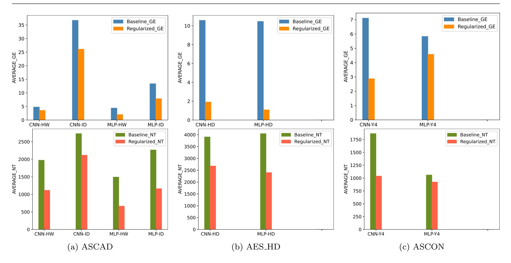

Fig. 1: The average performance with and without  $L_1$  regularization, for ASCAD, AES\_HD and Unprotected\_ASCON datasets. The AVERAGE\_GE (left) is calculated for baseline (blue) and regularized (orange) models. The AVERAGE\_NT is calculated for baseline (green) and regularized (red) models.

We believe we do not see an even larger influence on the number of attack traces due to a limited attack set size. Indeed, when a model fails to find the correct key, we do not have any estimation of the number of traces it would need to find the key, so we use the maximum number of traces in the attack set to show that the model did not succeed in finding the key.

Finally, Figure 1c shows the AVERAGE\_GE and the AVERAGE\_NT for baseline and regularized models for Unprotected\_ASCON dataset. Since this dataset contains measurements from unprotected software implementation of a primitive, and the traces are collected using ChipWhisperer, it can be considered an easy dataset to attack. As a consequence, starting from the first step of our methodology to acquire baseline models, more than 200 of the random models were converging to GE = 1 in each scenario, which means AV-ERAGE\_GE would be equal to one, and no more improvement would be possible in this regard. So we slightly modified the methodology. The modification is replacing 20% of the primary baseline models with models that do not converge (GE > 10) (these models are randomly selected too). This will give the regularization techniques a chance to improve some models that are not useful in the first place. We discuss the effect of adding regularization after this modification to the baseline models' pool here. To see what improvement regularization techniques can offer when GE = 1, we

discuss the results before modification in Appendix C. As shown in Figure 1c, the AVERAGE\_GE and AVERAGE\_NT are already low for baseline models. However, adding  $L_1$  regularization decreased AVERAGE\_GE to less than half in the CNN with ID leakage model. While the effect of adding  $L_1$  is smaller for the MLP with ID leakage model, it still improves models that do not converge without any regularization. The effect of adding  $L_1$  on the AVERAGE\_NT of CNN models is considerable as well. In Figure 1c, one can see that using  $L_1$  can decrease the required number of attack traces up to two times for CNN models.

Comparing CNN-HW and MLP-HW combinations in Figure 1a, CNN-ID and MLP-ID combinations again in Figure 1a, and the CNN-ID and MLP-ID combinations in Figure 1c we can see the "general ability of MLP models to find the key" mentioned in Section 3.3 more clearly. While the AVERAGE\_GE and AVERAGE\_NT are similar for CNN-HD and MLP-HD combinations in Figure 1b, this ability is recognizable after applying  $L_1$  regularization.

#### $4.1.2 L_2$ Regularization

 $L_2$  regularization shrinks the weights to values close to zero but rarely counts irrelevant features out. In our experiments, we use  $L_2$  regularization in every dense and convolution layer in both MLP and CNN topolo-

{8}------------------------------------------------

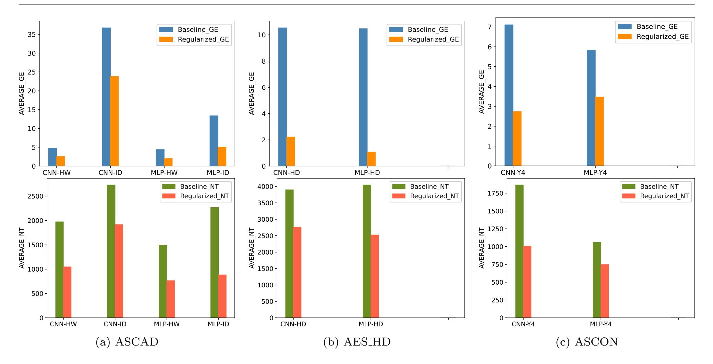

Fig. 2: The average performance with and without  $L_2$  regularization, for ASCAD, AES\_HD and Unprotected\_ASCON datasets. The AVERAGE\_GE (left) is calculated for baseline (blue) and regularized (orange) models. The AVERAGE\_NT is calculated for baseline (green) and regularized (red) models.

gies. Figure 2a shows the AVERAGE\_GE and the AV-ERAGE\_NT for the baseline and regularized models for the ASCAD dataset. As one can see, the regularized models can always reach lower AVERAGE\_GE and AVERAGE\_NT. The AVERAGE\_GE sharp decrease in all four settings is noticeable. This decrease shows that the  $L_2$  regularization improves models that cannot converge to GE = 1. The difference between baseline and regularized AVERAGE\_GE is the most pronounced for the CNN with the ID leakage model. The effectiveness of  $L_2$  regularization is also apparent when considering the average number of attack traces. Applying this regularization reduces AVERAGE\_NT by half or less in three out of four settings. The improvement for the MLP with the ID leakage model is the most significant one. The observed improvements are the consequence of reducing overfitting by making the weights smaller and close to zero.

Figure 2b demonstrates the AVERAGE\_GE and the AVERAGE\_NT for the baseline and regularized models for the AES\_HD dataset. As the AVERAGE\_GE and the AVERAGE\_NT reflect, the average performance of baseline models is almost the same for both combinations. However, the  $L_2$  regularization improves the results more for MLP models. Adding  $L_2$  reduces the average GE five times in the CNN-ID and seven times in the MLP-HD settings. The influence on the required number of attack traces is not as significant, but it is

still more in the MLP-HD combination. Besides the reasons mentioned in Section 4.1.1, this limited effect on AVERAGE\_NT results from the noise level and type in this dataset.

Lastly, Figure 2c represents the AVERAGE\_GE and the AVERAGE\_NT for the baseline and regularized models for the Unprotected\_ASCON dataset. The AVERAGE\_GE plot shows almost three times improvement in CNN networks and almost two times improvement in MLP networks after using  $L_2$  regularization. The impact on the required number of attack traces does not strictly follow those numbers. However, the effect is considerable, especially for the CNN networks where regularized models need twice fewer traces than baseline models.

 $L_1$  and  $L_2$  regularization considerably enhance the performance in all datasets. However, the  $L_2$  regularization is slightly more effective for the ASCAD and Unprotected\_ASCON datasets, while  $L_1$  is more effective for AES\_HD. This observation stems from the distinct effect of these regularization techniques and the nature of noise in the considered datasets.  $L_1$  bypasses the influence of irrelevant features by implicit feature selection while  $L_2$  considers almost all the input features. The input in the ASCAD dataset is a narrowed window of the entire measurement, including the time samples corresponding to the first round S-box calculation. The input in the Unprotected\_ASCON dataset

{9}------------------------------------------------

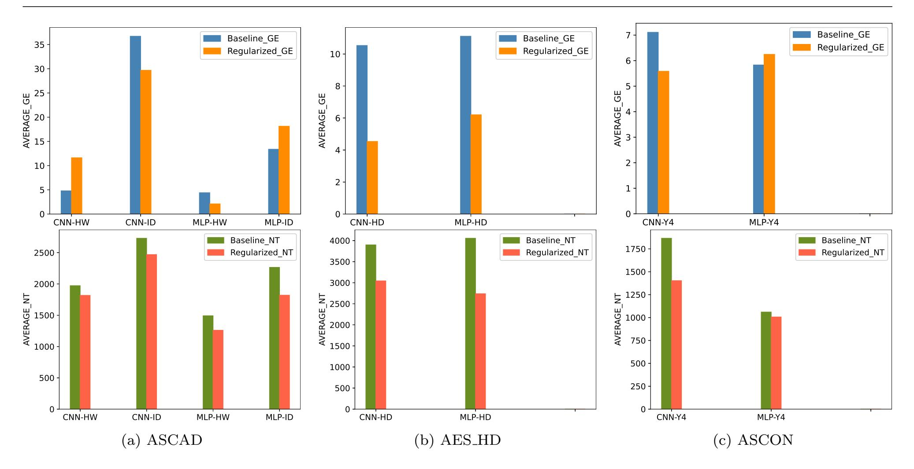

Fig. 3: The average performance with and without dropout regularization for ASCAD, AES\_HD, and Unprotected\_ASCON datasets. The AVERAGE\_GE (left) is calculated for baseline (blue) and regularized (orange) models. The AVERAGE\_NT is calculated for baseline (green) and regularized (red) models.

is with time samples restricted to the first round of permutation in the initialization phase. Quite the contrary, in the AES\_HD dataset, the input contains all the samples collected during the AES decryption operation. Therefore, input includes many irrelevant samples collected during pre-processing, ten rounds of AES, and the final processing. As a result, the AES\_HD dataset needs stronger feature selection to confine the effect of these irrelevant time samples. The results indicate that both regularization techniques have different but equally valuable properties.

#### 4.1.3 Dropout

As mentioned in Section 2.2.2, the dropout technique used in different neural network layers depends on the layer type. In our experiment, we used typical dropout after every dense layer in MLP and CNN models and spatial dropout after every convolution layer in CNN. Figure 3a shows the AVERAGE\_GE and the AVERAGE\_NT for the baseline and regularized models for the ASCAD dataset. Looking at Figure 3a, one can see that the average GE for CNN-HW and MLP-ID combinations increased after applying dropout. This observation indicates that adding dropout may cause inferior performance in many cases. A closer look at the GE and NT measurements for each baseline and dropout regularized model shows that many models de-

teriorate after applying dropout (more description is in Section 4.2). However, we still can see a decrease in the AVERAGE\_NT for these two combinations, which indicates the potential of dropout when it is effective. The effectiveness of this technique when it does not deteriorate a model is so significant that it can compensate for the increase in the required number of attack traces imposed by deteriorated models. In the other two combinations (CNN-ID and MLP-HW), the AVERAGE\_GE and AVERAGE\_NT decrease slightly, showing model deterioration happens here as well. Still, it is less compared to CNN-HW and MLP-ID combinations.

Figure 3b shows the results for the AES\_HD dataset. With the decrease in the AVERAGE\_GE and the AV-ERAGE\_NT of regularized models, the deterioration effect is not detectable here. Still, one can see that the AVERAGE\_GE and AVERAGE\_NT improvement after applying dropout is less compared to  $L_1$  and  $L_2$ .

Figure 3c shows the AVERAGE\_GE and AVERAGE\_NT for baseline and regularized models using dropout for Unprotected\_ASCON dataset. Considering the AVERAGE\_GE, one can see that after adding dropout, the performance improved for the CNN-ID combination, while it declined slightly for the MLP-ID combination (because of the deterioration of some models). For the AVERAGE\_NT, still, the average for the MLP-ID combination improved a bit because the number of

{10}------------------------------------------------

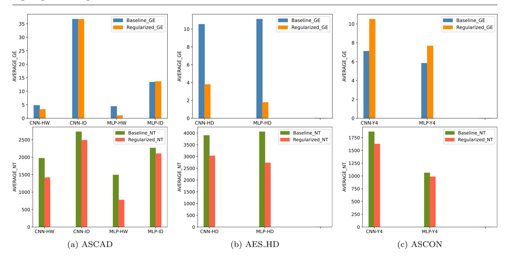

Fig. 4: The average performance with and without early stopping regularization for ASCAD, AES\_HD, and Unprotected\_ASCON datasets. The AVERAGE\_GE (left) is calculated for baseline (blue) and regularized (orange) models. The AVERAGE\_NT is calculated for baseline (green) and regularized (red) models.

models that deteriorated was scant, and they could not degrade the average influence of adding dropout.

Dropout works better when using MLP with fewer output classes (HW or HD leakage models), which is the indirect effect of the deep learning model size. In the case of the ID leakage model, there are 256 output classes, while the number of output classes for HW and HD leakage models is 9. However, since the number of input samples and training examples is the same for all leakage models, significantly larger models cannot be used for the ID leakage model. As a result, dropout regularization cannot produce enough distinct smaller networks to reflect the ensemble effect for 256 output classes.

#### 4.1.4 Early Stopping

Early stopping controls overfitting by manipulating the number of training iterations (epochs). This technique is adequate when the initial number of epochs is significantly larger than what the model needs to learn the underlying leakage distribution. Figure 4a indicates the AVERAGE\_GE and AVERAGE\_NT for baseline and regularized models for the ASCAD dataset. Based on the results, the AVERAGE\_GE improvement is minimal in the ASCAD dataset, which means early stopping cannot improve models that do not converge without early stopping. The effect is more evident in CNN-ID and MLP-ID settings. If a baseline model does not

reach GE=1 without early stopping, using this technique does not significantly help the model to reach GE=1. On the other hand, the epoch-wise evolution of GE shows that when GE reaches 1, it rarely increases again. Early stopping seems helpful regarding the required number of attack traces. The regularized models managed to achieve smaller AVERAGE\_NT in all four settings. Stopping a model as soon as it reaches GE=1 reduces overfitting and helps the model find the key with fewer attack traces.

Next, Figure 4b depicts the AVERAGE\_GE and AVERAGE\_NT for baseline and regularized models for the AES\_HD dataset. The early stopping effectiveness on this dataset is similar to  $L_1$  and  $L_2$  regularization. This outcome shows that even early stopping regularization can improve GE and the required number of attack traces in a noisy dataset like AES\_HD. This technique is considerably helpful in settings with MLP and limited output classes (HW and HD).

Finally, Figure 4c demonstrates the AVERAGE\_GE and AVERAGE\_NT before and after using early stopping for Unprotected\_ASCON. As mentioned in Section 4.1.1, Unprotected\_ASCON is considered an easy dataset. Therefore, neural networks generally need fewer epochs to learn the pattern. As expressed in Table 1, we used 30 epochs in this dataset. The results show that this value is sufficient because a large number of models could converge with this number of epochs. This smaller

{11}------------------------------------------------

|                |        | ASCAD  |        |        | AES HD |        | Unprotected ASCON |        |
|----------------|--------|--------|--------|--------|--------|--------|-------------------|--------|
|                | CNN-HW | CNN-ID | MLP-HW | MLP-ID | CNN-HD | MLP-HD | CNN-Y4            | MLP-Y4 |
| L1             | 1.5%   | 4.5%   | 0%     | 6.5%   | 3%     | 0.5%   | 0.5%              | 9%     |
| L2             | 0%     | 2%     | 0%     | 1.5%   | 2%     | 0.5%   | 2%                | 1.5%   |
| Dropout        | 29.5%  | 19%    | 7.5%   | 23.5%  | 22.5%  | 10.5%  | 10%               | 5.5%   |
| Early stopping | 8.5%   | 18%    | 0.5%   | 19%    | 14%    | 4%     | 9.5%              | 2%     |

Table 4: The deterioration rate.

value for the number of epochs imposes a smaller value for the patience hyperparameter for early stopping. As shown in Table [2,](#page-6-0) we used three different values for the patience hyperparameter. However, comparing the AV-ERAGE GE for baseline and regularized models shows that this regularization technique is not effective in the Unprotected ASCON. Early stopping is suggested for long training or problems with smooth learning, i.e., problems with less fluctuation in validation accuracy or validation loss. In the Unprotected ASCON, none of these conditions are fulfilled. Therefore, using early stopping does not improve model performance in many cases. A deeper look into the models shows that only a handful of non-converging baseline models converged after adding early stopping. Besides, early stopping with the used patience hyperparameters caused underfitting for some other models. These two facts justify increasing the AVERAGE GE for regularized models. Surprisingly, the improvement provided by early stopping for the rest of the models is significant enough to promote the AVERAGE NT and to compensate for underfitting caused by early stopping.

#### 4.2 Deterioration Rate

Although all results (Figure [1a](#page-7-0) to Figure [4a\)](#page-10-0) give insights into the influence of regularization techniques on DL-SCA attack performance, we can extract even more information from the experiments. One example is the percentage of models that deteriorate after using a regularization technique. We call this metric the "deterioration rate," which is the percentage of the regularized models that perform worse than their baseline counterparts. This metric shows how confident we can be that adding specific regularization techniques helps to improve the final performance. One can see the deterioration rates for L1, L2, dropout, and early stopping techniques in Table [4.](#page-11-1)

The deterioration rate for L1 regularizer is a bit higher for CNN-ID and MLP-ID combinations in the ASCAD dataset and MLP-ID combination in Unprotected ASCON dataset compared to the rest. The selected leakage model (ID) causes this higher deterioration rate. The larger number of output classes makes the model more sensitive to changes. The dispersion of the traces that we collect is fixed and independent from the leakage model that we select. When the selected leakage model leads into more output classes, we are partitioning the same data into more classes. This can make the model more sensitive to small variations in the input features. This could potentially make the model less robust to noise or other small changes in the input. Besides, with more output classes, the model generally becomes more complex, requiring more parameters to learn. This can make the model more sensitive to the nuances in the training data. Looking carefully, one can see that the columns with the ID leakage model in Table [4](#page-11-1) show higher deterioration rates on average.

The deterioration rate for L2 regularization is less than 2% for all the settings showing that L2-regularized models almost always perform better than the baseline model regardless of the selected settings. This outcome confirms that adding L2 regularization will improve the performance or, in the worst case, will simply not help.

The situation is different when dropout is used. Deterioration rates in Table [4](#page-11-1) indicate that dropout degrades many regularized models. CNN with the HW leakage model suffers the most from applying dropout. After that, MLP with ID leakage model and CNN with HD leakage models are the combinations that worsen considerably after using dropout. The variation in the leakage models and network topology that experience the highest deterioration rate shows that the root cause of this observation is beyond the selected settings. The recognized deterioration after applying dropout is not unique to DL-SCA. In [\[9\]](#page-16-15), Gabrin et al. reported reduced test accuracy after using dropout. Li et al. [\[20\]](#page-16-16) showed that dropout could help accuracy but not in all cases. In [\[39\]](#page-17-8), Srivastava et al. noted the necessity of changing the training and architectural hyperparameters to tune the model again after using dropout.

While the situation is better for early stopping compared to dropout, using it can still degrade some models. Again, CNN-ID is the combination that deteriorated the most, resulting from both neural network and leakage model selection. MLP-HW and MLP-HD show low deterioration rates after applying early stopping.

{12}------------------------------------------------

ASCAD AES HD Unprotected ASCON CNN-HW CNN-ID MLP-HW MLP-ID CNN-HD MLP-HD CNN-Y4 MLP-Y4 Baseline models 933 986 651 663 825 465 16 12 L1 3739 4620 1854 2603 6027 4832 23 18 L2 3934 3958 1396 2097 6881 4194 28 17 Dropout 2420 3299 1209 1626 3759 1967 25 16

Early stopping 632 898 165 579 432 256 14 9

Table 5: Average profiling time (in seconds) for baseline and regularized models with different regularization techniques.

However, for MLP-ID, it seems to be dependent on the dataset. Looking at Table [4](#page-11-1) column-wise, MLP-HW combinations for the ASCAD dataset, MLP-HD combination for the AES HD dataset and MLP ID combination for the Unprotected ASCON dataset have the lowest deterioration rates for all regularization techniques. As mentioned in Section [3.3,](#page-4-3) MLP models are "generally able to find the key", while CNN models are "potentially able to find the key", and they should be tuned to work well. As a result, MLPs "absorb" changes in hyperparameters or added regularization techniques while applying small changes prevents CNNs from finding the key. In essence, the changes imposed on MLP models by regularization techniques do not deteriorate the models. This is why the combinations containing MLP show more improvements after applying regularization techniques, especially when models are smaller, i.e., when the number of output classes is less.

#### 4.3 Profiling Time Changes

The average profiling time is the last considered metric that gives us useful information about the influence of regularization techniques on the models' performance. Table [5](#page-12-1) shows the calculated profiling time for baseline and regularized models. The numbers show that early stopping can reduce profiling time. The only change this technique imposes on the models is forcing them to stop the training as soon as the accuracy does not change for a number of epochs. This way, it can stop the training process earlier and reduce the profiling time. All the other techniques increase the profiling time considerably. The smaller numbers for Unprotected ASCON dataset can be justified using two facts. Firstly, the number of epochs in this dataset is 30, while it is 200 for the other two datasets. Besides, the number of input time samples for this dataset is 772, while it is almost twice as much in the other two datasets (1 400 for the ASCAD and 1 250 for the AES HD dataset). These two together will result in an

average less training time for both combinations for the-Unprotected ASCON dataset.

#### 5 Discussion

So far, the experiments have investigated the influence of different regularization techniques on DL-SCA. Based on the experiments, the overall view confirms the dependency of regularized model improvement on different factors like the level of the dataset's noise, leakage model, and neural network topology. In other words, the improvement that a specific regularization technique offers differs per model and depends on the model's characteristics. However, it is still relevant to answer these two general questions:

- What is the most effective regularization technique among L1, L2, dropout, and early stopping?
- When does a regularization technique work at its best?

This section tries to find an answer to these two questions.

#### 5.1 Different Techniques Effectiveness in General

Considering the results in Section [4,](#page-6-4) it is not easy to say which regularization technique is the most effective among the four experimented ones. As mentioned earlier, the effectiveness of a regularization technique depends on different factors. However, Figures [5](#page-13-0) and [6](#page-13-1) try to give an overall comparison of L1, L2, dropout, and early stopping effectiveness in DL-SCA. The plots present the required number of attack traces (NT) over the size of all the baseline or regularized models for ASCAD HW MLP and AES HD CNN combinations.

As shown in Figure [5,](#page-13-0) the baseline models spread almost all around the plot (the green spots) for the ASCAD HW MLP combination. Adding L1 (red) or L2(yellow), regularization pushes the spots to the bottom part of the plot so that the NT is less than 2000 traces for all L1 and L2-regularized models. In contrast, while adding dropout (blue) increases the density at the

{13}------------------------------------------------

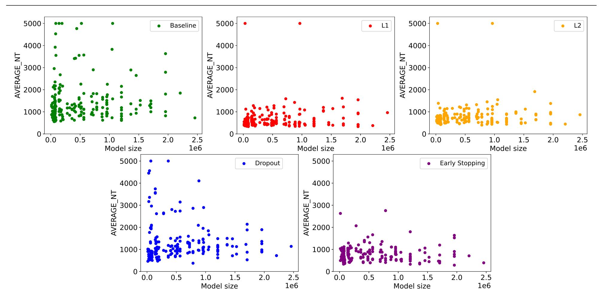

Fig. 5: The dispersion of baseline and regularized models NT over their size in ASCAD\_HW\_MLP combination.

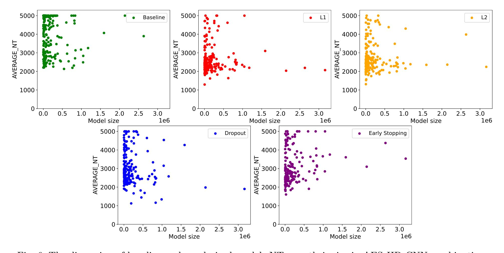

Fig. 6: The dispersion of baseline and regularized models NT over their size in AES\_HD\_CNN combination.

bottom of the plot, many spots remain on the upper side, which means it cannot improve many models as good as  $L_1$  and  $L_2$ . Early stopping (purple) influence is considerably better than dropout but not as good as  $L_1$  and  $L_2$ . Based on the dispersion of spots,  $L_1$  improves the models slightly more than  $L_2$ .

The plots in Figure 6 (AES\_HD\_CNN combination) confirm the mentioned conclusion. In this combination,

most of the selected models are small.8 Therefore, the spots group in the left part of the plots. However, one can still see the sparseness of baseline models along the y-axis. Adding  $L_1$  and  $L_2$  regularization pushes the red and yellow spots to the lower corner. The better effectiveness happens for  $L_1$  again. Early stopping pushes

&lt;sup>8 The small size of neural networks is imposed during the hyperparameter search and baseline model selection. In general, hyperparameter tuning imposes selecting smaller models that offer a better implicit regularization.

{14}------------------------------------------------

down the purple spots, and its effectiveness is close to L2 regularization. In the case of dropout, while there are a few spots lower than 1500 (the other three regularization techniques could not push more than one spot under 1500), the rest of the spots mostly spread from 2000 to around 3500. This spreading range shows the poorer effectiveness of dropout.

#### 5.2 Implicit and Explicit Regularization Comparison

Recent works have studied implicit and explicit regularizations and their connections. Here, we use simplified definitions of those terms without getting into the details to specify when it is a good idea to use regularization techniques. Implicit regularization[9](#page-14-0) is the effect imposed by the characteristics of the neural network architecture and the learning algorithm. In other words, it is the regularization that can be provided with a model and the learning algorithm. Designing a model using hyperparameter tuning along with deep and detailed knowledge about the dataset in hand can result in finding the optimal hyperparameters and parameter[10](#page-14-1) set for the problem, which provides a model with sufficient implicit regularization. This regularization does not change the objective function [\[2\]](#page-16-17) [\[13\]](#page-16-18). The gradient descent algorithm (and stochastic gradient descent as its extension) offers implicit regularization inherently [\[2\]](#page-16-17) [\[3\]](#page-16-19). On the other hand, explicit regularization modifies the expected loss and objective function and reduces the effective capacity of a given model to reduce overfitting. Explicit regularization is mostly provided by regularization techniques like dropout and norm penalties [\[13\]](#page-16-18).

Implicit and explicit notions and the best and the worst baseline models in each combination are used to state when applying regularization techniques is effective. Among the baseline models selected for each combination, some models work very well and can rank the correct key in the first place with a few attack traces. These are the models close to carefully designed networks and offer adequate implicit regularization by themselves. They reduce overfitting and increase generalization sufficiently with the learning algorithm. Also, some other models can only find the key with a significant number of traces or cannot rank the key in the first place even after using the maximum available attack traces. The implicit regularization of these models is insufficient, and they usually need extra regularization to reduce overfitting (and increase generalization).

In Figure [7,](#page-15-0) one can see the AVERAGE NT for ten baseline models that perform the best (green spots in Figure [7a\)](#page-15-0) and ten baseline models that perform the worst (green spots in Figure [7b\)](#page-15-0) among 200 selected baseline models in ASCAD HW CNN combination. In Figure [7a,](#page-15-0) one can see that the best ten selected baseline models have an acceptable performance before applying any regularization techniques. On the other hand, their counterpart regularized models perform worse in almost all cases. Figure [7a](#page-15-0) indicates the worst ten selected baseline models in the ASCAD HW CNN combination. As the opposite of best-selected models, the AV-ERAGE NT for these baseline models is around 5000, while regularized models' performance is far better. In many cases, the performance of the worst models after applying a regularization technique is comparable with the best baseline models. Figure [8](#page-15-1) shows the same behavior for the AES HD CNN combination. As depicted in Figure [8,](#page-15-1) the best ten baseline models worsen after adding regularization techniques. At the same time, the worst ten baseline models show good performance after applying regularization techniques.

This observation shows that regularization techniques are more effective when the selected baseline model does not offer enough regularization by itself. Thus, it seems efficient to use regularization techniques specially when the model is selected randomly and does not provide excellent performance.

#### 6 Conclusions and Future Work

This work provides an in-depth study of L1, L2, dropout, and early stopping influence on the performance of DL-SCA (eight different combinations of datasets, leakage models, and deep learning network topologies). Our experimental results show that while all these techniques can improve the DL-SCA performance, some of them are more effective than others. Considering the average required attack traces (AVERAGE NT), the average guessing entropy (AVERAGE GE), and the deterioration rate, we observe that L1 and L2 are the most effective regularization techniques. While early stopping has moderate effectiveness, it can reduce training time. In comparison, other techniques increase training time considerably. Since the dropout deterioration rate is very high compared to the other techniques and it increases the training time, we recommend using it carefully. Overall, there is potential in using regularization techniques to resolve the overfitting issue in SCA, but they should be used with care and consideration for their strength and weakness.

In future work, it would be interesting to compare the influence of other, more advanced regularization

9 Also, algorithmic regularization.

10 The internal variables of a neural network that are learned during the training process.

{15}------------------------------------------------

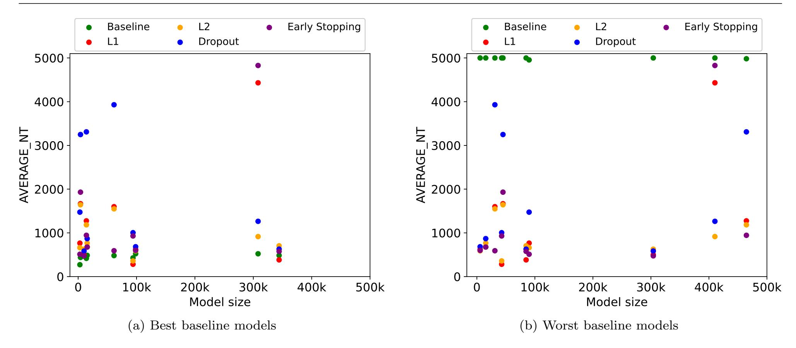

Fig. 7: (a) Ten best baseline models in ASCAD\_HW\_CNN combination along with their  $L_1$ ,  $L_2$ , dropout, and early stopping regularized counterparts. Baseline models have better performance than their regularized counterparts. (b) Ten worst baseline models in ASCAD\_HW\_CNN combination along with their  $L_1$ ,  $L_2$ , dropout, and early stopping regularized counterparts. Regularized models have better performance than their baseline counterparts

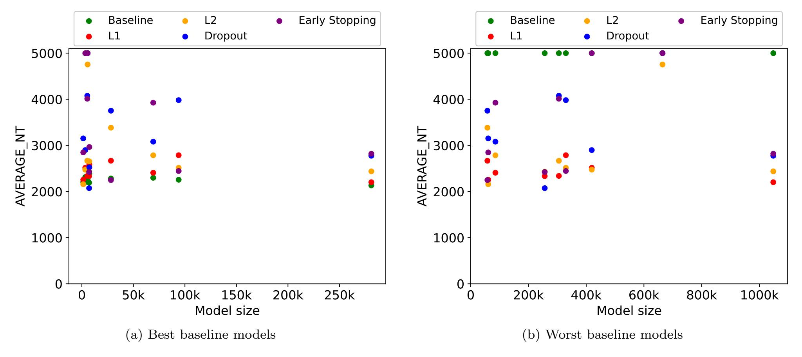

Fig. 8: (a) Ten best baseline models in AES\_HD\_CNN combination along with their  $L_1$ ,  $L_2$ , dropout, and early stopping regularized counterparts. Baseline models have better performance than their regularized counterparts. (b) Ten worst baseline models in AES\_HD\_CNN combination along with their  $L_1$ ,  $L_2$ , dropout, and early stopping regularized counterparts. Regularized models have better performance than their baseline counterparts

techniques, like batch normalization and data augmentation, with the current work results. Another interesting direction is combining different techniques and checking if adding two or more regularization techniques can improve the performance further. We tried it already for a limited number of models with dropout and  $L_2$  regularization together. The results showed that

a model using both dropout and  $L_2$  performed better than the baseline or regularized model with only dropout or  $L_2$ . However, to generalize the observation, a more comprehensive study is needed. Besides, while we used ASCAD random key, AES\_HD, and Unprotected\_ASCON for our experiments, other datasets, especially from public cryptography, can be targeted to

{16}------------------------------------------------

further investigate regularization techniques' effectiveness.

#### Acknowledgments

This work received funding in the framework of the NWA Cybersecurity Call with project name PROACT with project number NWA. 1215.18.014, which is (partly) financed by the NWO (Netherlands Organisation for Scientific Research). Additionally, this work was supported in part by the Netherlands Organization for Scientific Research NWO project DISTANT (CS.019).

We wish to thank Leo Weissbart from CESCA lab, Radboud University, for his great help in providing the Unprotected ASCON dataset and attacking the AS-CON primitive.

#### References

- 1. Agence nationale de la s´ecurit´e des syst`emes d'information (ANSSI). ASCAD. Github repository, 2018. <https://github.com/ANSSI-FR/ASCAD>.
- 2. S. Arora, N. Cohen, W. Hu, and Y. Luo. Implicit regularization in deep matrix factorization. Advances in Neural Information Processing Systems, 32, 2019.
- 3. D. G. T. Barrett and B. Dherin. Implicit gradient regularization. In 9th International Conference on Learning Representations, ICLR 2021, Virtual Event, Austria, May 3-7, 2021. OpenReview.net, 2021.
- 4. G. Bertoni, J. Daemen, M. Peeters, and G. Van Assche. Duplexing the sponge: single-pass authenticated encryption and other applications. In Selected Areas in Cryptography: 18th International Workshop, SAC 2011, Toronto, ON, Canada, August 11-12, 2011, Revised Selected Papers 18, pages 320–337. Springer, 2012.
- 5. E. Brier, C. Clavier, and F. Olivier. Correlation power analysis with a leakage model. In M. Joye and J. Quisquater, editors, Cryptographic Hardware and Embedded Systems - CHES 2004: 6th International Workshop Cambridge, MA, USA, August 11-13, 2004. Proceedings, volume 3156 of Lecture Notes in Computer Science, pages 16–29. Springer, 2004.
- 6. E. Cagli, C. Dumas, and E. Prouff. Convolutional neural networks with data augmentation against jitterbased countermeasures - profiling attacks without preprocessing. In W. Fischer and N. Homma, editors, Cryptographic Hardware and Embedded Systems - CHES 2017 - 19th International Conference, Taipei, Taiwan, September 25-28, 2017, Proceedings, volume 10529 of Lecture Notes in Computer Science, pages 45–68. Springer, 2017.
- 7. S. Chari, J. R. Rao, and P. Rohatgi. Template attacks. In B. S. K. Jr., C¸ . K. Ko¸c, and C. Paar, editors, Cryptographic Hardware and Embedded Systems - CHES 2002, 4th International Workshop, Redwood Shores, CA, USA, August 13-15, 2002, Revised Papers, volume 2523 of Lecture Notes in Computer Science, pages 13–28. Springer, 2002.
- 8. C. Dobraunig, M. Eichlseder, F. Mendel, and M. Schl¨affer. Ascon v1. 2. Submission to the CAE-SAR Competition, 5(6):7, 2016.

- 9. C. Garbin, X. Zhu, and O. Marques. Dropout vs. batch normalization: an empirical study of their impact to deep learning. Multim. Tools Appl., 79(19-20):12777–12815, 2020.
- 10. A. G´eron. Hands-on machine learning with Scikit-Learn, Keras, and TensorFlow. " O'Reilly Media, Inc.", 2022.
- 11. B. Gierlichs, L. Batina, P. Tuyls, and B. Preneel. Mutual information analysis. In E. Oswald and P. Rohatgi, editors, Cryptographic Hardware and Embedded Systems - CHES 2008, 10th International Workshop, Washington, D.C., USA, August 10-13, 2008. Proceedings, volume 5154 of Lecture Notes in Computer Science, pages 426–442. Springer, 2008.
- 12. I. J. Goodfellow, Y. Bengio, and A. C. Courville. Deep Learning. Adaptive computation and machine learning. MIT Press, 2016.
- 13. A. Hern´andez-Garc´ıa and P. K¨onig. Data augmentation instead of explicit regularization. CoRR, abs/1806.03852, 2018.
- 14. A. Heuser and M. Zohner. Intelligent machine homicide breaking cryptographic devices using support vector machines. In W. Schindler and S. A. Huss, editors, Constructive Side-Channel Analysis and Secure Design - Third International Workshop, COSADE 2012, Darmstadt, Germany, May 3-4, 2012. Proceedings, volume 7275 of Lecture Notes in Computer Science, pages 249–264. Springer, 2012.
- 15. S. Ioffe and C. Szegedy. Batch normalization: Accelerating deep network training by reducing internal covariate shift. In F. R. Bach and D. M. Blei, editors, Proceedings of the 32nd International Conference on Machine Learning, ICML 2015, Lille, France, 6-11 July 2015, volume 37 of JMLR Workshop and Conference Proceedings, pages 448– 456. JMLR.org, 2015.
- 16. J. Kim, S. Picek, A. Heuser, S. Bhasin, and A. Hanjalic. Make some noise. unleashing the power of convolutional neural networks for profiled side-channel analysis. IACR Trans. Cryptogr. Hardw. Embed. Syst., 2019(3):148–179, 2019.
- 17. P. C. Kocher, J. Jaffe, and B. Jun. Differential power analysis. In M. J. Wiener, editor, Advances in Cryptology - CRYPTO '99, 19th Annual International Cryptology Conference, Santa Barbara, California, USA, August 15-19, 1999, Proceedings, volume 1666 of Lecture Notes in Computer Science, pages 388–397. Springer, 1999.
- 18. A. Krogh and J. A. Hertz. A simple weight decay can improve generalization. In J. E. Moody, S. J. Hanson, and R. Lippmann, editors, Advances in Neural Information Processing Systems 4, [NIPS Conference, Denver, Colorado, USA, December 2-5, 1991], pages 950–957. Morgan Kaufmann, 1991.
- 19. L. Lerman, G. Bontempi, and O. Markowitch. A machine learning approach against a masked AES - reaching the limit of side-channel attacks with a learning model. J. Cryptogr. Eng., 5(2):123–139, 2015.
- 20. X. Li, S. Chen, X. Hu, and J. Yang. Understanding the disharmony between dropout and batch normalization by variance shift. In IEEE Conference on Computer Vision and Pattern Recognition, CVPR 2019, Long Beach, CA, USA, June 16-20, 2019, pages 2682–2690. Computer Vision Foundation / IEEE, 2019.
- 21. S. Luo, W. Wu, Y. Li, R. Zhang, and Z. Liu. An efficient soft analytical side-channel attack on ascon. In International Conference on Wireless Algorithms, Systems, and Applications, pages 389–400. Springer, 2022.
- 22. S. Mangard, E. Oswald, and T. Popp. Power analysis attacks - revealing the secrets of smart cards. Springer, 2007.

{17}------------------------------------------------

- 23. L. Masure, C. Dumas, and E. Prouff. A comprehensive study of deep learning for side-channel analysis. IACR Trans. Cryptogr. Hardw. Embed. Syst., 2020(1):348–375, 2020.
- 24. NIST Information Technology Laboratory. Nist lightweight cryptography standardization process. The National Institute of Standards and Technology, 2023. [https://csrc.nist.gov/News/2023/](https://csrc.nist.gov/News/2023/lightweight-cryptography-nist-selects-ascon) [lightweight-cryptography-nist-selects-ascon](https://csrc.nist.gov/News/2023/lightweight-cryptography-nist-selects-ascon).
- 25. G. Perin, I. Buhan, and S. Picek. Learning when to stop: A mutual information approach to prevent overfitting in profiled side-channel analysis. In S. Bhasin and F. D. Santis, editors, Constructive Side-Channel Analysis and Secure Design - 12th International Workshop, COSADE 2021, Lugano, Switzerland, October 25-27, 2021, Proceedings, volume 12910 of Lecture Notes in Computer Science, pages 53–81. Springer, 2021.
- 26. G. Perin, L. Chmielewski, and S. Picek. Strength in numbers: Improving generalization with ensembles in machine learning-based profiled side-channel analysis. IACR Trans. Cryptogr. Hardw. Embed. Syst., 2020(4):337–364, 2020.
- 27. G. Perin and S. Picek. On the influence of optimizers in deep learning-based side-channel analysis. In O. Dunkelman, M. J. J. Jr., and C. O'Flynn, editors, Selected Areas in Cryptography - SAC 2020 - 27th International Conference, Halifax, NS, Canada (Virtual Event), October 21- 23, 2020, Revised Selected Papers, volume 12804 of Lecture Notes in Computer Science, pages 615–636. Springer, 2020.
- 28. S. Picek, A. Heuser, A. Jovic, S. A. Ludwig, S. Guilley, D. Jakobovic, and N. Mentens. Side-channel analysis and machine learning: A practical perspective. In 2017 International Joint Conference on Neural Networks, IJCNN 2017, Anchorage, AK, USA, May 14-19, 2017, pages 4095– 4102. IEEE, 2017.
- 29. S. Picek, A. Heuser, G. Perin, and S. Guilley. Profiled side-channel analysis in the efficient attacker framework. In V. Grosso and T. P¨oppelmann, editors, Smart Card Research and Advanced Applications - 20th International Conference, CARDIS 2021, L¨ubeck, Germany, November 11-12, 2021, Revised Selected Papers, volume 13173 of Lecture Notes in Computer Science, pages 44–63. Springer, 2021.
- 30. S. Picek, G. Perin, L. Mariot, L. Wu, and L. Batina. Sok: Deep learning-based physical side-channel analysis. ACM Comput. Surv., oct 2022. Just Accepted.
- 31. E. Prouff, R. Strullu, R. Benadjila, E. Cagli, and C. Dumas. Study of deep learning techniques for side-channel analysis and introduction to ASCAD database. IACR Cryptol. ePrint Arch., page 53, 2018.
- 32. J. Quisquater and D. Samyde. Electromagnetic analysis (EMA): measures and counter-measures for smart cards. In I. Attali and T. P. Jensen, editors, Smart Card Programming and Security, International Conference on Research in Smart Cards, E-smart 2001, Cannes, France, September 19-21, 2001, Proceedings, volume 2140 of Lecture Notes in Computer Science, pages 200–210. Springer, 2001.
- 33. K. Ramezanpour, A. Abdulgadir, W. Diehl, J.-P. Kaps, and P. Ampadu. Active and passive side-channel key recovery attacks on ascon. In Proc. NIST Lightweight Cryptogr. Workshop, pages 1–27, 2020.
- 34. K. Ramezanpour, P. Ampadu, and W. Diehl. Scarl: sidechannel analysis with reinforcement learning on the ascon authenticated cipher. arXiv preprint arXiv:2006.03995, 2020.
- 35. A. Rezaeezade, G. Perin, and S. Picek. To overfit, or not to overfit: improving the performance of deep learning-

- based sca. In International Conference on Cryptology in Africa, pages 397–421. Springer, 2022.
- 36. J. Rijsdijk, L. Wu, G. Perin, and S. Picek. Reinforcement learning for hyperparameter tuning in deep learning-based side-channel analysis. IACR Trans. Cryptogr. Hardw. Embed. Syst., 2021(3):677–707, 2021.
- 37. D. Robissout, G. Zaid, B. Colombier, L. Bossuet, and A. Habrard. Online performance evaluation of deep learning networks for profiled side-channel analysis. In G. M. Bertoni and F. Regazzoni, editors, Constructive Side-Channel Analysis and Secure Design - 11th International Workshop, COSADE 2020, Lugano, Switzerland, April 1- 3, 2020, Revised Selected Papers, volume 12244 of Lecture Notes in Computer Science, pages 200–218. Springer, 2020.
- 38. D. Shanmugam and P. Schaumont. Improving sidechannel leakage assessment using pre-silicon leakage models. In International Workshop on Constructive Side-Channel Analysis and Secure Design, pages 105–124. Springer, 2023.
- 39. N. Srivastava, G. E. Hinton, A. Krizhevsky, I. Sutskever, and R. Salakhutdinov. Dropout: a simple way to prevent neural networks from overfitting. J. Mach. Learn. Res., 15(1):1929–1958, 2014.
- 40. J. Tompson, R. Goroshin, A. Jain, Y. LeCun, and C. Bregler. Efficient object localization using convolutional networks. In IEEE Conference on Computer Vision and Pattern Recognition, CVPR 2015, Boston, MA, USA, June 7- 12, 2015, pages 648–656. IEEE Computer Society, 2015.
- 41. G. Zaid, L. Bossuet, A. Habrard, and A. Venelli. Methodology for efficient CNN architectures in profiling attacks. IACR Transactions on Cryptographic Hardware and Embedded Systems, 2020(1):1–36, 2020.

# A ASCON

Ascon is a lightweight cryptographic algorithm selected by NIST in February 2023 to be standardized [\[24\]](#page-17-19). Ascon is a sponge-based [\[4\]](#page-16-20) cryptography primitive. It is an authenticated encryption with an associated data algorithm, which means that besides encrypting the message to ensure confidentiality, the algorithm adds a tag to the encrypted message used to ensure the integrity of the encrypted message and the associated data. This algorithm takes four inputs, including plaintext P, associated data A, nonce M, and a key k, and produces the authenticated ciphertext C and the authentication tag T as output. The 128-bit key, the 128-bit fresh nonce, and a 64-bit constant build the 320-bit initial state processed in five 64-bit words x0 to x4. Figure [9](#page-18-2) shows four phases of Ascon Initialization, Associated Data Process, Plaintext Process (Ciphertext Process in decryption), and Finalization. The initial state (x0 to x4) updates through these four phases and uses as the secret state for encryption and tag generation. Since the key is straightly processed in the Initialization and Finalization phases, these two are candidates for side-channel attacks. In Ascon-128, the Initialization phase includes twelve same permutation function, p aa = 12, that processes the 320 bit initial state. The permutation function has three parts: 1) the addition of the round constants, 2) the non-linear five-bit S-box (substitution layer), and 3) the linear diffusion layer. Our attack point is the S-box output described in more detail in Appendix [B.](#page-18-0) The optional associated data processing phase handles the data that does not need encryption, but its integrity needs to be maintained. The encryption phase xors the 64-bit plaintext blocks with the secret state. In Ascon-128,

{18}------------------------------------------------

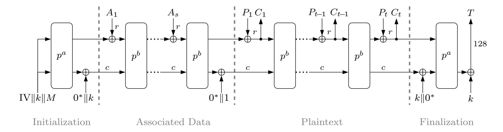

Fig. 9: Ascon's mode of operation and S-box

each plaintext block  $P_i$  goes through six consecutive permutations,  $p^bb = 6$ , to produce ciphertext block  $C_i$ . The Finalization phase provides the 128-bit authentication tag T. For more details about different parts of Ascon primitive, one can see [8].

#### B Substitution Layer in Ascon and Our Attack Point

The substitution layer of Ascon performs S-box on the five 64-bit states horizontally, i.e., S-box operation takes 5-bit input that includes only one bit from each word  $x_0$  to  $x_4$  and gives 5-bit output (Figure 10).

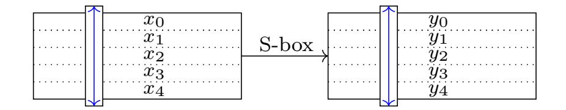

Fig. 10: Ascon column-wise S-box and the  $y_i$  outputs.

The lookup table of Ascon includes 32 entries. Since we have 64 columns (each  $x_i$  has 64 bits), the S-box applies 64 times which takes time if we use the lookup table. The advantage of the Ascon S-box operation is that it can be implemented as xor operations on  $x_i$ s much faster than the lookup table. Figure 11 shows the implementation of Ascon S-box with xors.

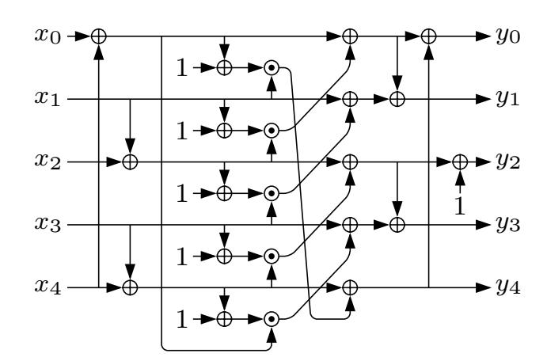

Fig. 11: Ascon S-box implementation with xor.

Looking at Figure 11 and taking  $x_i$ s as the inputs of the substitution layer and  $y_i$ s as the outputs of this layer, the

outputs of non-linear S-box can be expressed as:

$$y_{0} = x_{0} + x_{1} + x_{2} + x_{3} + x_{1}x_{2} + x_{0}x_{1} + x_{1}x_{4}$$

$$y_{1} = x_{0} + x_{1} + x_{2} + x_{3} + x_{4} + x_{1}x_{2} + x_{1}x_{3} + x_{2}x_{3}$$

$$y_{2} = x_{1} + x_{2} + x_{4} + x_{3}x_{4} + 1$$

$$y_{3} = x_{0} + x_{1} + x_{2} + x_{3} + x_{4} + x_{0}x_{3} + x_{0}x_{4}$$

$$y_{4} = x_{1} + x_{3} + x_{4} + x_{0}x_{1} + x_{1}x_{4}$$

$$(3)$$

where  $x_0$  is the public constant,  $x_1$  and  $x_2$  are the high and low part of the secret key, and  $x_3$  and  $x_4$  are the high and low part of the public nonce. Looking into 3, one can see that in  $y_4$ , all the parameters are public except  $x_1$ . This fact makes  $y_4$  a good intermediate value for side-channel attacks. Besides, it is possible to recover  $x_1$  with the divide and conquer strategy. We propose to use the following leakage model to recover the whole  $x_1$  in eight attacks. Each attack recovers eight bits of  $x_1$ .

$$Y = k_1^{(1)} & (255 \oplus IV_1 \oplus M_1^{(1)}) \oplus M_1^{(1)} \oplus M_1^{(2)}$$
(4)

Two significant differences exist between the used intermediate value for attacking AES primitive (ASCAD and AES\_HD) and Ascon primitive (Unprotected\_Ascon). Firstly, the known and variable parts used in the former are plaintext (ASCAD) and ciphertext (AES\_HD), while it is nonce for the latter. Secondly, for recovering 128 bits of the key for the former, we use the same intermediate value and leakage model for all 16 S-box outputs. In contrast, we can recover half of the key with the selected intermediate value for Ascon. To obtain the remaining key bits, we use  $y_0$  or  $y_1$  (since they have non-linear terms including  $x_2$ ). The other recovered half of the key,  $x_1$ , is plugged into the next selected intermediate value, and we can recover the rest of the key.

#### C Regularizer Benefit When GE Is One

As mentioned in Section 4.1.1, more than 200 of the randomly generated models in ASCON\_ID\_MLP and ASCON\_ID\_CNN scenarios converged to GE = 1 (In fact, their final GE was less than two). With a view of this, after selecting the 200 best models in each scenario, the AVERAGE\_GE was less than two for baseline models. Since all the baseline models could find the key in the first place, inspecting the effect of regularization techniques in such a situation is compelling. Figure 12 shows the AVERAGE\_GE and AVERAGE\_NT for the baseline and regularized models after using  $L_1$ ,  $L_2$ , dropout, and early stopping. Interestingly one can see that while the AVERAGE\_GE increased most of the time, the AVERAGE\_NT

{19}------------------------------------------------

decreased in almost all the cases. It means that even if a model is good and can recover the key without any regularization techniques, we can still improve the performance by adding a regularization technique that appears as less required attack traces. Compared to the rest, the improvement is more pronounced for L1 and L2 regularization for the CNN-ID combination. For the CNN-ID combination, the required attack traces decreased up to two times for regularized models with L1 and L2, even the AVERAGE NT decreased slightly. The improvement for this combination after using dropout and early stopping is not as sharp as L1 and L2 but is better compared to the MLP-ID combination. The improvement of AVERAGE NT for the MLP-ID combination is minimal for all the regularization techniques.

A closer look into the modified baseline models' deterioration rates in Unprotected ASCON dataset in Table [4](#page-11-1) and the deterioration rates for the primary selected models (the ones with AV ERAGE GE < 2) in Table [6](#page-19-0) approves that in both schemes more or less similar number of models deteriorated.

Table 6: The deterioration rate for primary baseline models.

|                | Unprotected ASCON |        |  |
|----------------|-------------------|--------|--|
|                | CNN-Y4            | MLP-Y4 |  |
| L1             | 1%                | 9%     |  |
| L2             | 1.5%              | 1.5%   |  |
| Dropout        | 7%                | 7.5%   |  |
| Early stopping | 6.5%              | 2%     |  |

{20}------------------------------------------------

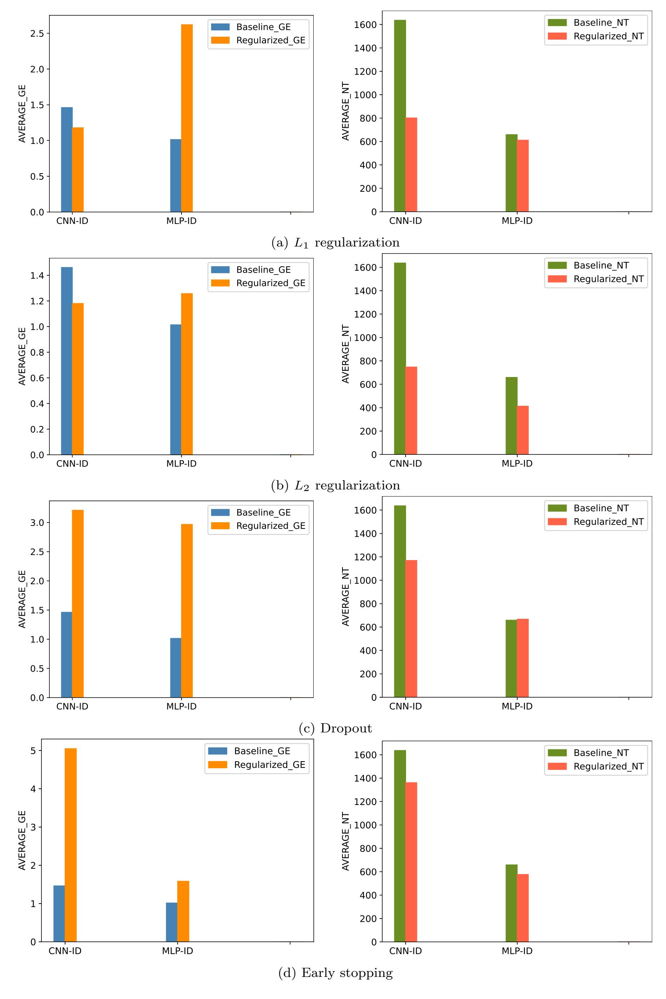

Fig. 12: The average performance with and without  $L_1$ ,  $L_2$ , dropout and early stopping regularization, for Unprotected\_ASCON dataset. The AVERAGE\_GE (left) is calculated for baseline (blue) and regularized (orange) models. The AVERAGE\_NT is calculated for baseline (green) and regularized (red) models.