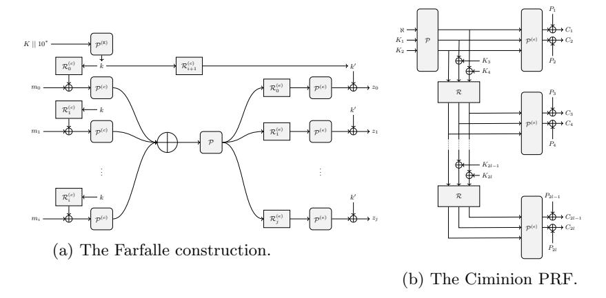
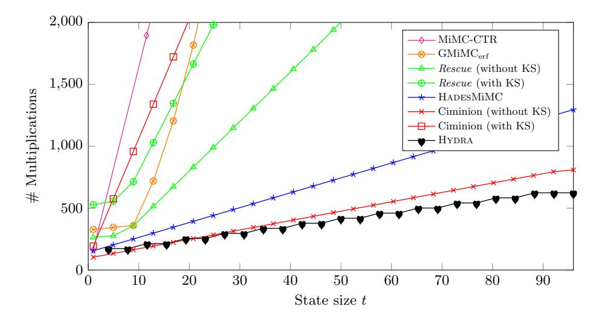
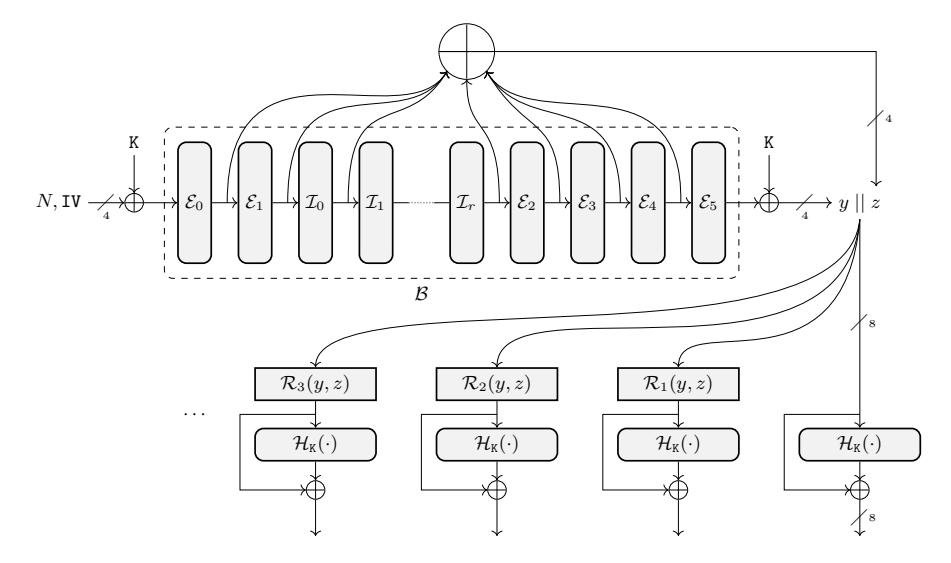
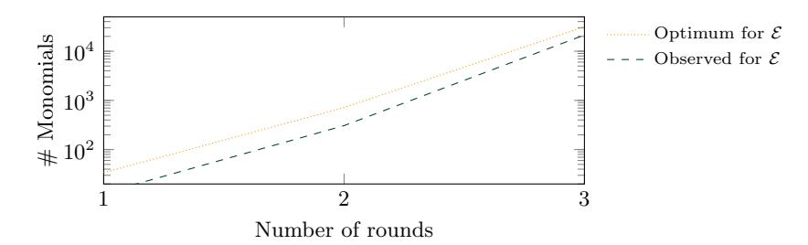
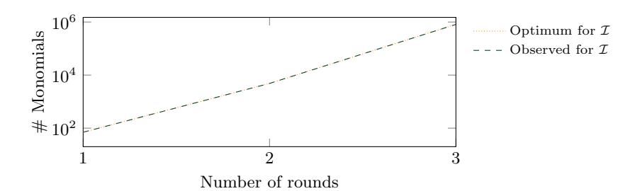

# From Farfalle to Megafono via Ciminion: The PRF Hydra for MPC Applications

## Full Version

Lorenzo Grassi<sup>1</sup> , Morten Øygarden<sup>2</sup> , Markus Schofnegger<sup>3</sup> , and Roman Walch4,5,<sup>6</sup>

```
1 Radboud University Nijmegen (Nijmegen, The Netherlands)
              2 Simula UiB (Bergen, Norway)
          3 Horizen Labs (Austin, United States)
      4 Graz University of Technology (Graz, Austria)
          5 Know-Center GmbH (Graz, Austria)
             6 TACEO GmbH (Graz, Austria)
```

lgrassi@science.ru.nl, morten.oygarden@simula.no, mschofnegger@horizenlabs.io, roman.walch@iaik.tugraz.at

Abstract. The area of multi-party computation (MPC) has recently increased in popularity and number of use cases. At the current state of the art, Ciminion, a Farfalle-like cryptographic function, achieves the best performance in MPC applications involving symmetric primitives. However, it has a critical weakness. Its security highly relies on the independence of its subkeys, which is achieved by using an expensive key schedule. Many MPC use cases involving symmetric pseudo-random functions (PRFs) rely on secretly shared symmetric keys, and hence the expensive key schedule must also be computed in MPC. As a result, Ciminion's performance is significantly reduced in these use cases.

In this paper we solve this problem. Following the approach introduced by Ciminion's designers, we present a novel primitive in symmetric cryptography called Megafono. Megafono is a keyed extendable PRF, expanding a fixed-length input to an arbitrary-length output. Similar to Farfalle, an initial keyed permutation is applied to the input, followed by an expansion layer, involving the parallel application of keyed ciphers. The main novelty regards the expansion of the intermediate/internal state for "free", by appending the sum of the internal states of the first permutation to its output. The combination of this and other modifications, together with the impossibility for the attacker to have access to the input state of the expansion layer, make Megafono very efficient in the target application.

As a concrete example, we present the PRF Hydra, an instance of Megafono based on the Hades strategy and on generalized versions of the Lai–Massey scheme. Based on an extensive security analysis, we implement Hydra in an MPC framework. The results show that it outperforms all MPC-friendly schemes currently published in the literature.

Keywords: Megafono – Hydra – Farfalle – Ciminion – MPC Applications

## 1 Introduction

Secure multi-party computation (MPC) allows several parties to jointly and securely compute a function on their combined private inputs. The correct output is computed and given to all parties (or a subset) while hiding the private inputs from other parties. In this work we focus on secret-sharing based MPC schemes, such as the popular SPDZ protocol [\[25,](#page-29-0) [24\]](#page-29-1) or protocols based on Shamir's secret sharing [\[47\]](#page-30-0). In these protocols private data is shared among all parties, such that each party receives a share which by itself does not contain any information about the initial data. When combined, however, the parties are able to reproduce the shared value. Further, the parties can use these shares to compute complex functions on the data which in turn produce shares of the output.

MPC has been applied to many use cases, including privacy-preserving machine learning [\[46\]](#page-30-1), private set intersection [\[40\]](#page-30-2), truthful auctions [\[14\]](#page-29-2), and revocation in credential systems [\[38\]](#page-30-3). In the literature describing these use cases, data is often directly entered from and delivered to the respective parties. However, in practice this data often has to be transferred securely from/to third parties before it can be used in the MPC protocol. Moreover, in some applications, intermediate results of an MPC computation may need to be stored securely in a database. As described in [\[35\]](#page-30-4), one can use MPC-friendly pseudo-random functions (PRFs), i.e., PRFs designed to be efficient in MPC, to efficiently realize this secure data storage and data transfer by directly encrypting the data using a secret-shared symmetric key.

Besides being used to securely transmit data in given MPC computations, these MPC-friendly PRFs can also be used as a building block to speed up many MPC applications, such as secure database join via an MPC evaluation of a PRF [\[44\]](#page-30-5), distributed data storage [\[35\]](#page-30-4), virtual hardware security modules[7](#page-1-0) , MPC-in-the-head based zero-knowledge proofs [\[39\]](#page-30-6) and signatures [\[17\]](#page-29-3), oblivious TLS [\[1\]](#page-28-0), and many more. In all these use cases, the symmetric encryption key is shared among all participating parties. Consequently, if one has to apply a key schedule for a given PRF, one has to compute this key schedule at least once in MPC for every fresh symmetric key.

To be MPC-friendly, a PRF should minimize the number of multiplications in the native field of the MPC protocol. At the current state of the art, Ciminion [\[27\]](#page-29-4) is one of the most competitive schemes for PRF applications. Proposed at Eurocrypt'21, it is based on the Farfalle mode of operation [\[10\]](#page-28-1). However, as we are going to discuss in detail, Ciminion has a serious drawback: Its security heavily relies on the assumption that the subkeys are independent. For this requirement, the subkeys are generated via a sponge hash function [\[11\]](#page-28-2) instantiated via an expensive permutation. As a result, in all (common) cases where the key is shared among the parties, the key schedule cannot be computed locally and needs to be evaluated in MPC. This leads to a significant increase in the multiplicative complexity of Ciminion. In this paper, we approach this problem in two steps. First, we propose Megafono, a new mode of operation inspired by

<span id="page-1-0"></span><sup>7</sup> <https://www.fintechfutures.com/files/2020/09/vHSM-Whitepaper-v3.pdf>

<span id="page-2-1"></span>

Fig. 1: Farfalle and Ciminion (notation adapted to the one used in this paper).

Farfalle and Ciminion.<sup>8</sup> It is designed to be competitive in all MPC applications. Secondly, we show how to instantiate it in an efficient way. The obtained PRF HYDRA is currently the most competitive MPC-friendly PRF in the literature.

#### 1.1 Related Works: Ciminion and the MPC Protocols

Traditional PRFs (e.g., AES, KECCAK) are not efficient in MPC settings. First, MPC applications usually work over a prime field  $\mathbb{F}_p$  for a large p (e.g.,  $p \approx 2^{128}$ ), while traditional cryptographic schemes are usually bit-/byte-oriented. Hence, a conversion between  $\mathbb{F}_{2^n}$  and  $\mathbb{F}_p$  must take place, which can impact the performance. Secondly, traditional schemes are designed to minimize their plain implementation cost, and therefore no particular focus is laid on minimizing specifically the number of nonlinear operations (e.g., AND gates).

For these reasons, several MPC-friendly schemes over  $\mathbb{F}_q^t$  for  $q=p^s$  and  $t\geq 1$  have been proposed in the literature, including LowMC [4], MiMC [3], GMiMC [2], HADESMIMC [33], and Rescue [5]. All those schemes are block ciphers – hence, invertible – and they are often used in counter (CTR) mode. However, invertibility is not required in MPC applications, and a lower multiplicative complexity may be achieved by working with non-invertible functions, as recently shown by in [27]. In the following, we briefly discuss the Farfalle construction and the MPC-friendly primitive Ciminion based on it.

**Farfalle.** Farfalle [10] is an efficiently parallelizable permutation-based construction of arbitrary input and output length, taking as input a key. As shown in Fig. 1a and recalled in Section 3, the Farfalle construction consists of a *compression layer* followed by an *expansion layer*. The compression layer produces

<span id="page-2-0"></span><sup>&</sup>lt;sup>8</sup> "Megafono" is the Italian word for "megaphone", a cone-shaped horn used to amplify a sound and direct it towards a given direction. Our strategy resembles this goal.

a single accumulator value from the input data. A permutation is potentially applied to the obtained state. Then, the expansion layer transforms it into a tuple of (truncated) output blocks. Both the compression and expansion layers involve the secret key, and they are instantiated via a set of permutations (namely, P (c) ,P,P (e) ) and rolling functions (R (c) i , R (e) i ).

Ciminion. As shown with Ciminion in [\[27\]](#page-29-4), a modified version of Farfalle based on a Feistel scheme can be competitive for MPC protocols, an application which Farfalle's designers did not consider. Following Fig. [1b](#page-2-1) and Section [3,](#page-8-0)

- (1) compared to Farfalle, the compression phase is missing, a final truncation is applied, and the key addition is performed before P (e) is applied, and
- (2) in contrast to MPC-friendly block ciphers, Ciminion is a non-invertible PRF. For encryption it is used as a stream cipher, where the input is defined as the concatenation of the secret key and a nonce.

The main reason why Ciminion is currently the most competitive scheme in MPC protocols is related to one crucial feature of Farfalle, namely the possibility to instantiate its internal permutations with a smaller number of rounds compared to other design strategies. This is possible since the attacker does not have access to the internal states of the Farfalle construction. Hence, while the permutation P (c) is designed in order to behave like a pseudo-random permutation (PRP), the number of rounds of the permutation P (e) can be minimized and kept significantly lower for both security and good performance.

Besides minimizing the number of nonlinear operations, Ciminion's designers paid particular attention to the number of linear operations. Indeed, even though the main cost in MPC applications depends on the number of multiplications, other factors (e.g., the number of linear operations) affect efficiency as well.

## 1.2 The Megafono Design Strategy

The main drawback of Ciminion is the expensive key schedule to generate subkeys that can be considered independent. This implies that Ciminion only excels in MPC applications where the key schedule can be precomputed for a given shared key, or in the (non-common) scenarios where the key is not shared among the parties. However, in the latter case, the party knowing the key can also compute Ciminion's keystream directly in plain (i.e., without MPC) if the nonce and IV are public in a given use case (which is also true for any stream cipher).

Clearly, the easiest solution is the removal of the nonlinear key schedule. However, by e.g. defining the subkey as an affine function of the master key, the security analysis of Ciminion does not hold anymore. As we discuss in detail in Section [4,](#page-9-0) this is a direct consequence of the Farfalle construction itself. Even if the attacker does not have any information about the internal states of Farfalle, they can exploit the fact that its outputs are generated from the same unknown input (namely, the output of P (c) and/or P). Given these outputs and by exploiting the relations of the corresponding unknown inputs (which are related to the definition of the rolling function), the attacker can potentially find the key and break the scheme. For example, this strategy is exploited in the attacks on the Farfalle schemes Kravatte and Xoofff [\[16,](#page-29-5) [20\]](#page-29-6). In Ciminion, this problem is solved by including additions with independent secret subkeys in the application of the rolling function. In this way, the mentioned relation is unknown due to the presence of the key, and P (e) can be instantiated via an efficient permutation.

We make the following three crucial changes in the Farfalle design strategy.

- 1. First, we replace the permutation P (e) with a keyed permutation Ck.
- 2. Secondly, we expand the input of this keyed permutation. The second change aims to frustrate algebraic attacks, whose cost is related to both the degree and the number of variables of the nonlinear equation system representing the attacked scheme. In order to create new independent variables for "free" (i.e., without increasing the overall multiplicative complexity), we reuse the computations needed to evaluate P. That is, we define the new variable as the sum of all the internal state of P, and we conjecture that it is sufficiently independent of its output (details are provided in the following).
- 3. Finally, we replace the truncation in Ciminion with a feed-forward operation, for avoiding to discard any randomness without any impact on the security.

Our result is a new design strategy which we call Megafono.

## 1.3 The PRF Hydra

Given the mode of operation, we instantiate it with two distinct permutations, one for the initial phase and one for the expansion phase. As in Ciminion, assuming the first keyed permutation behaves like a PRP and since the attacker does not know the internal states of Megafono, we choose a second permutation that is cheaper to evaluate in the MPC setting. In particular, while the first permutation is evaluated only once, the number of calls to the second permutation (and so the overall cost) is proportional to the output size.

For minimizing the multiplicative complexity, we instantiate the round functions of the keyed permutations C<sup>k</sup> in the expansion part with quadratic functions. However, since no quadratic function is invertible over Fp, we use them in a mode of operation that guarantees invertibility. We opted for the generalized Lai–Massey constructions similar to the ones recently proposed in [\[34\]](#page-30-8). Moreover, we show that the approach of using of high-degree power maps with low-degree inverses proposed in Rescue does not have any benefits in this scenario.

We instantiate the first permutation P via the Hades strategy [\[33\]](#page-30-7), which mixes rounds with full S-box layers and rounds with partial S-box layers. Similar to Neptune [\[34\]](#page-30-8), we use two different round functions, one for the internal part and one for the external one. We decided to instantiate the internal rounds with a Lai–Massey scheme, and the external ones with invertible power maps.

The obtained PRF scheme called Hydra is presented in Section [5](#page-14-0) and Section [6,](#page-18-0) and its security analysis is proposed in Section [7.](#page-22-0)

<span id="page-5-0"></span>

Fig. 2: Number of MPC multiplications of several designs over F t p , with p ≈ 2 128 and t ≥ 2 (security level of 128 bits).

## 1.4 MPC Performance and Comparison

The performance of any MPC calculation scales with the number of nonlinear operations. In Figure [2](#page-5-0) we compare the number of multiplications required to evaluate different PRFs for various plaintext sizes t using secret shared keys. One can observe that Hydra requires the smallest number of multiplications, with the difference growing further for larger sizes. The only PRF that is competitive to Hydra is Ciminion, but only if the key schedule does not have to be computed, which happens if shared round keys can be reused from a previous computation. However, this implies that the key schedule was already computed once in MPC, requiring a significant amount of multiplications. Hydra, on the other hand, does not require the computation of an expensive key schedule and also requires fewer multiplications than Ciminion without a key schedule for larger state sizes.

In Section [8,](#page-25-0) we implement and compare the different PRFs in the MP-SPDZ [\[41\]](#page-30-9) library and confirm the results expected from Figure [2.](#page-5-0) Indeed,

- (1) taking key schedules into account, Hydra is five times faster than Ciminion for t = 8, which grows to a factor of 21 for t = 128,
- (2) without key schedules, Ciminion is only slightly faster than Hydra for smaller t, until it gets surpassed by Hydra for t > 16, showing that Hydra is also competitive, even if the round keys are already present.

Compared to all other benchmarked PRFs, Hydra is significantly faster for any state size t. Furthermore, Hydra requires the least amount of communication between the parties due to its small number of multiplications, giving it an advantage in low-bandwidth networks. As a result, we suggest to replace each of the benchmarked PRFs with HYDRA in all their use cases, especially if a large number of words need to be encrypted.

#### 1.5 Notation

Throughout the paper, we work over a finite field  $\mathbb{F}_q$ , where  $q=p^s$  for an odd prime number p and an integer  $s\geq 1$  (when needed, we will also assume a fixed vector space isomorphism  $\mathbb{F}_{p^s}\cong \mathbb{F}_p^s$ ). We use  $\mathbb{F}_q^n$ , for  $n\geq 1$ , to denote the n-dimensional vector space over  $\mathbb{F}_q$ , and we use the notation  $\mathbb{F}_q^*$  to denote  $\mathbb{F}_q$  strings of arbitrary length. The  $\cdot \mid \mid \cdot$  operator denotes the concatenation of two elements. An element  $x\in \mathbb{F}_q^t$  is represented as  $x=(x_0,x_1,\ldots,x_{t-1})$ , where  $x_i$  denotes its i-th entry. Given a matrix  $M\in \mathbb{F}_q^{t\times s}$ , we denote its entry in row r and column c either as  $M_{r,c}$  or M[r,c]. We use the Fraktur font notation to denote a subspace of  $\mathbb{F}_q^r$ , while we sometimes use the calligraphic notation to emphasize functions. Given integers  $a\geq b\geq 1$ , we define the truncation function  $\mathcal{T}_{a,b}: \mathbb{F}_q^a \to \mathbb{F}_q^b$  as  $\mathcal{T}_{a,b}(x_0,\ldots,x_{a-1})=(x_0,\ldots,x_{b-1})$ . Finally, for MPC, we describe that the value  $x\in \mathbb{F}_p$  is secret shared among all parties by [x].

## <span id="page-6-1"></span>2 Symmetric Primitives for MPC Applications

Here we elaborate on why expensive key schedules are not desirable in many MPC use cases, and we discuss the cost metric in MPC protocols in more details.

#### <span id="page-6-0"></span>2.1 MPC Use Cases and Key Schedules

To highlight that expensive key schedules are not suitable for many scenarios, we describe the use cases discussed in [27] and [35] in greater detail. Concretely, we discuss the data transfer into and out of the MPC protocol, as well as using symmetric PRFs to securely store intermediate results during an MPC evaluation. In the latter case, the setting is the following: The parties want to suspend the MPC evaluation and continue at a later point. As discussed in [35], the trivial solution for this problem is that each party encrypts its share of the data with a symmetric key and stores the encrypted share, e.g., at a cloud provider. The total storage overhead of this approach is a factor n for n MPC parties, since each party stores its encrypted shares of the data. Additionally, each party needs to memorize its symmetric key. The solution to reduce the storage overhead is to use a secret shared symmetric key (i.e., each party knows only a share of the key and the real symmetric key remains hidden), which can directly be sampled as part of the MPC protocol, and encrypt the data using MPC. The resulting ciphertexts cannot be decrypted by any party since no one knows the symmetric key, but can be used inside the MPC protocols at a later point to again create the shares of the data. This approach avoids the storage overhead of the data, and each party only has to memorize its share of the symmetric key which has the same size as the symmetric key itself. However, if the used PRF involves a key schedule, one also has to compute it in MPC for this use case. Other solutions either involve precomputing the round keys, or directly sampling random round keys in MPC instead of sampling a random symmetric key. These approaches require no storage overhead for the encrypted data, but each party needs to memorize its shares of the round keys. In Ciminion, the size of the round keys is equivalent to the size of the encrypted data (when using the same nonce for encrypting the full dataset), hence the whole protocol would be more efficient if each party would just memorize its shares of the dataset instead. Providing fewer round keys and using multiple nonces instead requires the recomputation of Ciminion's initial permutation in MPC, decreasing its performance.

Similar considerations also apply if the MPC parties are different from the actual data providers or if the output of the computation needs to be securely transferred to an external party. The solutions to both problems involve storing the dataset encrypted at some public place (e.g., in a cloud) alongside a publickey encryption of the shares of the symmetric key, such that only the intended recipient can get the shares. If the parties want to avoid expensive key schedules in MPC, they either have to provide shares of the round keys (which have the same size as the encrypted data in Ciminion), or provide fewer round keys alongside multiple nonces, decreasing the performance in MPC.

Remark 1. In this paper, we focus on comparing MPC-friendly PRFs which are optimized for similar use cases as the ones discussed in this section, i.e., use cases which require fast MPC en-/decryption of large amounts of data. Hence, we do not focus on PRFs not defined over F<sup>p</sup> which are optimized for, e.g., Picnic-style signatures, such as LowMC [\[4\]](#page-28-3), Rain [\[28\]](#page-29-7), or weakPRF [\[26\]](#page-29-8).

## <span id="page-7-0"></span>2.2 Cost Metric for MPC Applications

Modern MPC protocols such as SPDZ [\[25,](#page-29-0) [24\]](#page-29-1) are usually split into a dataindependent offline phase and a data-dependent online phase. In the offline phase, a bundle of shared correlated randomness is generated, most notably Beaver triples [\[9\]](#page-28-7) of the form ([a], [b], [a · b]). This bundle is then used in the online phase to perform the actual computation on the private data.

Roughly speaking, the performance scales with the number of nonlinear operations necessary to evaluate the symmetric primitives in the MPC protocol (sometimes we use the term "multiplication" to refer to the nonlinear operation). This is motivated by the fact that each multiplication requires one Beaver triple, which is computed in the offline phase, as well as one round of communication during the online phase (see Appendix [D\)](#page-32-0). In contrast, linear operations do not require any offline computations and can directly be applied to the shares without communication. Consequently, the number of multiplications is a decent first estimation of the cost metric in MPC, and MPC-friendly PRFs usually try to minimize this number. Whereas each multiplication requires communication between the parties, the depth directly defines the required number of communication rounds, since parallel multiplications can be processed in the same round. Thus, the depth should be low in high-latency networks. To summarize,

- the cost of the offline phase of the MPC protocols directly scales with the number of required Beaver triples (i.e., multiplications), and
- the cost of the online phase scales with both the number of multiplications and the multiplicative depth.

As a concrete example, in many MPC-friendly PRFs, such as HadesMiMC, MiMC, GMiMC, and Rescue, the nonlinear layer is instantiated with a power map R(x) = x d for d ≥ 2 over Fq. Then, the cost per evaluation is

<span id="page-8-1"></span>
$$\# \texttt{triples} = \texttt{cost}_d := \text{hw}(d) + \lfloor \log_2(d) \rfloor - 1, \quad \texttt{depth}_{\text{online}} = \texttt{cost}_d. \quad (1)$$

Several algorithms to reduce the number of multiplications and communication rounds were developed in the literature. Here we discuss those relevant for our goals. They require random pairs [r], [r 2 ], and [r], [r −1 ], which can be generated from Beaver triples in the offline phase (see Algorithm [2](#page-33-0) and Algorithm [3\)](#page-33-1).

Decreasing the Number of Online Communication Rounds. In the preferred case of d = 3, the cost is two Beaver triples and a depth of two. However, in [\[35\]](#page-30-4) the authors propose a method to reduce the multiplicative depth by delegating the cubing operation to a random value in the offline phase. Hence, all cubings can be performed in parallel reducing the depth. This algorithm (see Algorithm [4\)](#page-33-2) requires two triples, but only one online communication round.

Special Case: R(x) = x 1/d . Optimizations can also be applied for the case R(x) = x <sup>d</sup> with very large d. In [\[5\]](#page-28-6), the authors propose two different algorithms to evaluate R (see Algorithm [5](#page-34-0) and Algorithm [6\)](#page-35-0), in which the cost of evaluating R(x) = x d can be reduced to the cost of evaluating R(x) = x <sup>1</sup>/d (plus an additional multiplication in the online phase) which requires significantly fewer multiplications if 1/d is smaller than d. This is, for example, relevant when evaluating Rescue with its high-degree power maps in MPC. The algorithm works by delegating the 1/d power map evaluation to the offline phase, and evaluating the costly d power map on a random value in plain. Furthermore, since the main MPC work (i.e., 1/d) is evaluated in the input-independent offline phase, all communication rounds can be parallelized, significantly reducing the multiplicative depth. Using these algorithms and cost<sup>d</sup> from Eq. [\(1\)](#page-8-1), the cost of evaluating x d in MPC is modified to the following, with a significantly smaller multiplicative depth and a smaller number of multiplications for large d:

$$\# \mathtt{triples} = 2 + \min \left\{ \mathtt{cost}_d, \mathtt{cost}_{1/d} \right\} \,, \qquad \mathtt{depth}_{\mathrm{online}} = 2.$$

## <span id="page-8-0"></span>3 Starting Points of Megafono: Farfalle and Ciminion

Here we recall Farfalle and Ciminion, which are starting points for Megafono.

Farfalle and  $^{1/2}\times$  Farfalle. Farfalle is a keyed PRF proposed in [10] with inputs and outputs of arbitrary length. As shown in Fig. 1a, it has a compression layer and an expansion layer, each involving the parallel application of a permutation. For our goal, we focus only on the expansion phase, and introduce the term  $^{1/2}\times$  Farfalle for a modified version of Farfalle that lacks the initial compression phase and only accepts input messages of a fixed size n.

Let  $K \in \mathbb{F}_q^{\kappa}$  be the secret key for  $\kappa \geq 1$ .  $^{1/2 \times}$ Farfalle uses a key schedule  $K : \mathbb{F}_q^{\kappa} \to (\mathbb{F}_q^n)^*$  for the subkeys used in the expansion phase, two unkeyed permutations  $\mathcal{P}, \mathcal{P}^{(e)} : \mathbb{F}_q^n \to \mathbb{F}_q^n$ , and a rolling function  $\mathcal{R} : \mathbb{F}_q^n \to \mathbb{F}_q^n$ . We define  $\mathcal{R}_i$  as  $\mathcal{R}_i(y) = \rho_i + \mathcal{R} \circ \mathcal{R}_{i-1}(y)$  for each  $i \geq 1$  and  $\rho_i \in \mathbb{F}_q^n$ , where we assume  $\mathcal{R}_0$  to be the identity function, i.e.,  $\mathcal{R}_0(y) = y$ . Given an input  $x \in \mathbb{F}_q$ ,  $1/2 \times \text{Farfalle} : \mathbb{F}_q^n \to (\mathbb{F}_q^n)^*$  operates as  $1/2 \times \text{Farfalle}(x) = y_0 \mid\mid y_1 \mid\mid y_2 \mid\mid \cdots \mid\mid y_j \mid\mid \cdots$ , where  $\forall i \geq 0 : y_i := k_{i+1} + \mathcal{P}^{(e)} \left( \mathcal{R}_i \left( \mathcal{P}(x + k_0) \right) \right)$ .

From  $^{1/2\times}$  Farfalle to Ciminion. Ciminion [27] is based on a modified version of  $^{1/2\times}$  Farfalle over  $\mathbb{F}_q^n$  for a certain  $n \geq 2$ . As shown in Fig. 1b, the main difference with respect to  $^{1/2\times}$  Farfalle is the definition of the function  $k + \mathcal{P}^{(e)}$ . In Farfalle/ $^{1/2\times}$  Farfalle, the key addition is the last operation. In Ciminion,  $k + \mathcal{P}^{(e)}(x)$  is replaced by  $\mathcal{F}^{(e)}(x+k)$  for a non-invertible function  $\mathcal{F}^{(e)}$  instantiated via a truncated permutation, i.e.,  $\mathcal{F}^{(e)}(x+k) \coloneqq \mathcal{T}_{n,n'} \circ \mathcal{P}^{(e)}(x+k)$  for a certain  $1 \leq n' < n$ . Moving the key inside the scheme prevents its cancellation when using the difference of two outputs.

In Ciminion, the key schedule  $\mathcal{K}: \mathbb{F}_q^{\kappa} \to (\mathbb{F}_q^n)^{\star}$  uses a sponge function [11] instantiated via the permutation  $\mathcal{P}$ . We refer to [27, Section 2] for more details.

## <span id="page-9-0"></span>4 The Megafono Strategy for Hydra

Generating the subkeys of Ciminion via a sponge function and a strong permutation is expensive in terms of multiplications. This makes it inefficient in cases where the secret keys are shared among the parties, as discussed in Section 2.1. Another weakness of Ciminion is the final truncation. While it prevents an attacker from computing the inverse of the final permutations  $\mathcal{P}^{(e)}$ , it is wasteful as it lowers the output of each iteration. To fix these issues, here we propose the Megafono strategy, based on the design strategy of Ciminion (and  $^{1/2}$ ×Farfalle), but with some crucial modifications.

**Definition of Megafono.** Let  $n \geq 1$  be an integer and let  $\mathbb{F}_q$  be a field, where  $q = p^s$  for a prime integer  $p \geq 2$  and a positive integer  $s \geq 1$ . Let  $K \in \mathbb{F}_q^{\kappa}$  be the secret key for  $n \geq \kappa \geq 1$ . The ingredients of MEGAFONO are

<span id="page-9-1"></span><sup>&</sup>lt;sup>9</sup> We mention that in [10], authors use the terms "masks" and "(compressing) rolling function" instead of "subkeys" and "key schedule". In Farfalle, the same subkey is used in the expansion phase, that is,  $k_1 = k_2 = \cdots = k_i$ . Here, we consider the most generic case in which the subkeys are not assumed to be equal.

- (1) a key schedule  $\mathcal{K}: \mathbb{F}_q^{\kappa} \to (\mathbb{F}_q^n)^{\star}$  for generating the subkeys, that is,  $\mathcal{K}(\mathtt{K}) =$  $(k_0, k_1, \ldots, k_i, \ldots)$  where  $k_i \in \mathbb{F}_q^n$  for each  $i \geq 0$ , (2) an iterated unkeyed permutation  $\mathcal{P} : \mathbb{F}_q^n \to \mathbb{F}_q^n$  defined as

$$\mathcal{P}(x) = \mathcal{P}_{r-1} \circ \dots \circ \mathcal{P}_1 \circ \mathcal{P}_0(x) \tag{2}$$

for round permutations  $\mathcal{P}_0, \mathcal{P}_1, \dots, \mathcal{P}_{r-1}$  over  $\mathbb{F}_q^n$ ,

(3) a (sum) function  $\mathcal{S}: \mathbb{F}_q^n \to \mathbb{F}_q^n$  defined as

<span id="page-10-0"></span>
$$S(x) := \sum_{i=0}^{r-1} \mathcal{P}_i \circ \dots \circ \mathcal{P}_1 \circ \mathcal{P}_0(x), \tag{3}$$

(4) a function  $\mathcal{F}_k: \mathbb{F}_q^{2n} \to \mathbb{F}_q^{2n}$  defined as

$$\mathcal{F}_k(x) := \mathcal{C}_k(x) + x,$$

where  $C_k: \mathbb{F}_q^{2n} \to \mathbb{F}_q^{2n}$  is a block cipher for a secret key  $k \in \mathbb{F}_q^{2n}$ , and (5) a rolling function  $\mathcal{R}: \mathbb{F}_q^{2n} \to \mathbb{F}_q^{2n}$ . For  $y, z \in \mathbb{F}^n$ , we further define

$$\mathcal{R}_i(y,z) := \varphi_i + \mathcal{R} \circ \mathcal{R}_{i-1}(y,z)$$

for 
$$i \geq 1$$
, where  $\varphi_i \in \mathbb{F}_q^{2n}$  and  $\mathcal{R}_0(y,z) = (y,z)$ .

 $\text{Megafono}_{K}: \mathbb{F}_{q}^{n} \to (\mathbb{F}_{q}^{n})^{\star}$  is a PRF that takes as input an element of  $\mathbb{F}_{q}^{n}$  and returns an output of a desired length, defined as

$$MEGAFONO_{K}(x) := \mathcal{F}_{k_{2}}(y, z) \mid\mid \mathcal{F}_{k_{3}}(\mathcal{R}_{1}(y, z)) \mid\mid \cdots \mid\mid \mathcal{F}_{k_{i+2}}(\mathcal{R}_{i}(y, z)) \mid\mid \cdots$$

for  $i \in \mathbb{N}$ , where  $y, z \in \mathbb{F}_q^n$  are defined as

$$y := k_1 + \mathcal{P}(x + k_0)$$
 and  $z := \mathcal{S}(x + k_0)$ .

Remark 2. The main goal of MEGAFONO is a secure variant of Ciminion without a heavy key schedule and without relying on independent subkeys  $(k_0, k_1, \ldots)$ . For this reason, we only consider the case k = n and  $\mathcal{K}(K) = (K, \ldots, K, \ldots)$  in the following. Nevertheless, there may be applications in which a key schedule is acceptable, and hence we propose MEGAFONO in its more general form.

Remark 3. The function  $\mathcal{F}_k$  is meant to play the role of  $\mathcal{P}^{(e)}$  (in the notation we have used to describe Farfalle and Ciminion). We use this notation to emphasize that the function is keyed and that we no longer require it to be a permutation.

#### <span id="page-10-1"></span>Rationale of Megafono

Following its structure, MEGAFONO shares several characteristics with Ciminion and <sup>1/2</sup>×Farfalle. Indeed, many attacks on Farfalle (and Ciminion, <sup>1/2</sup>×Farfalle) discussed in [10, Sect. 5] also apply to MEGAFONO. Here we focus on the differences, by explaining and motivating the criteria for designing MEGAFONO.

Expansion Phase. We emphasize the following point which is crucial for understanding the design rationale of Megafono. As in <sup>1</sup>/2×Farfalle and Ciminion, the attacker has access to outputs w<sup>i</sup> = F<sup>k</sup> (Ri(y, z)) for i ≥ 0 that depend on a single common unknown input (y, z) (in addition to the key). By exploiting the relation among several inputs of F<sup>k</sup> and the knowledge of the corresponding outputs, the attacker can break the entire scheme. Examples of such attacks can be found in [\[16,](#page-29-5) [20\]](#page-29-6). In this scenario, one attack consists of solving the system of equations {w<sup>i</sup> − F<sup>k</sup> (Ri(y, z)) = 0}i≥<sup>0</sup> with Gr¨obner bases. We provide details in Section [7.4](#page-23-0) and point out that the cost depends on several factors, including (i) the number of variables, (ii) the number of equations, (iii) the degree of the equations, and (iv) the considered representative of the system of equations.

Even–Mansour Construction. In Ciminion, the keyed permutation P is chosen in order to resemble a PRP. Indeed, since P is computed only once, it has little impact on the overall cost. Further, if P resembles a PRP, it is unlikely that an attacker can create texts with a special structure at the input of P (e) . This allows for a simplified security analysis of the expansion phase, as it rules out attacks that require control of the inputs of P (e) .

By performing a key addition before the expansion phase, the first part of the scheme becomes an Even–Mansour construction [\[30\]](#page-29-9) of the form x 7→ K + P(x + K). As proven in [\[21,](#page-29-10) [29\]](#page-29-11), an Even–Mansour scheme is indistinguishable from a random permutation up to q n/<sup>2</sup> queries for K ∈ F n q , assuming both the facts that (i) the unkeyed permutation P behaves as a pseudo-random public permutation, and that (ii) the attacker knows both the inputs and outputs of the construction. Since n/2 · log<sup>2</sup> (q) is higher than our security level, this allows us to make a security claim on a subcomponent of the entire scheme, and so to further simplify the overall security analysis.

Keyed Permutation in the Expansion Phase. In Farfalle, the final key addition is crucial against attacks inverting the final permutation P (e) . However, an attacker can cancel the influence of the key by using the differences of two outputs if the key schedule is linear. For example, assume that the key schedule for the expansion phase is the identity map (as in Farfalle), and let x be the input of the expansion phase. Let y<sup>j</sup> = K + P (e) (R<sup>j</sup> (x)) and y<sup>h</sup> = K + P (e) (Rh(x)) be two outputs of the expansion phase. Any difference of the form

<span id="page-11-0"></span>
$$y_j - y_h = \mathcal{P}^{(e)}(\mathcal{R}_j(x)) - \mathcal{P}^{(e)}(\mathcal{R}_h(x))$$
(4)

results in a system of equations that is independent of the key or, equivalently, that depends only on the intermediate unknown state. This is an advantage when trying to solve the associated polynomial system with Gr¨obner bases.

The key in Ciminion has been moved from the end of P (e) to the beginning, with the goal of preventing its cancellation by considering differences of the outputs. Inverting P (e) is instead prevented by introducing a final truncation, which has the side effect of reducing the output size and thus the throughput.

Recently, in [8] the authors showed that moving the key inside of  $\mathcal{P}^{(e)}$  is actually not sufficient by itself for preventing the construction of a system of equations – similar to (Eq. (4)) – which is independent of the secret key. For this reason, instead of working with a permutation-based non-invertible function, we propose to instantiate the last permutation with a block cipher  $\mathcal{C}_k$ , defined as an iterated permutation with a key addition in each round. In this way, we achieve the advantages of both  $^{1/2\times}$ Farfalle and Ciminion. First, the output size of  $\mathcal{C}_k$  is equal to the input size and it is not possible to invert  $\mathcal{C}_k$  without guessing the key (as in  $^{1/2\times}$ Farfalle). Secondly, a carefully chosen  $\mathcal{C}_k$  will prevent the possibility to set up a system of equations for the expansion part that is independent of the key by considering differences of outputs (as in Ciminion).

## Feed-Forward in Expansion Phase and Nonlinear Rolling Function.

The proposed changes in MEGAFONO may allow new potential problems. Let  $v_j = \mathcal{C}_k\left(\mathcal{R}_j(y,z)\right)$  and  $v_l = \mathcal{C}_k\left(\mathcal{R}_l(y,z)\right)$  be two outputs of the expansion phase for a shared input (y,z) and let  $\mathcal{R}'_{j-l}$  denote the function satisfying  $\mathcal{R}'_{j-l} \circ \mathcal{R}_l(\cdot) = \mathcal{R}_j(\cdot)$  for j > l. Since  $\mathcal{C}_k(\cdot)$  is invertible for each fixed k, we have that

$$\forall j > l : \qquad \mathcal{C}_k \circ \mathcal{R}'_{j-l} \circ \mathcal{C}_k^{-1}(v_l) = v_j \implies \mathcal{R}'_{j-l} \circ \mathcal{C}_k^{-1}(v_l) = \mathcal{C}_k^{-1}(v_j).$$

That is, it is possible to set up a system of equations that depend on the keys only (equivalently, that do not depend on the internal unknown state (y, z)). We therefore apply the feed-forward technique on the expansion phase, i.e., we work with  $(y, z) \mapsto \mathcal{F}_k(y, z) := \mathcal{C}_k(y, z) + (y, z)$ , which prevents this problem.

Assume moreover that the functions  $\mathcal{R}_i$ ,  $i \geq 1$  are linear. Given two outputs  $w_j = \mathcal{F}_k \left( \mathcal{R}_j(y, z) \right)$  and  $w_l = \mathcal{F}_k \left( \mathcal{R}_l(y, z) \right)$ ,

$$\begin{split} \mathcal{R}_{j-l}'(w_l) - w_j &= \mathcal{R}_{j-l}' \left( \mathcal{F}_k \left( \mathcal{R}_l(y,z) \right) \right) - \mathcal{F}_k \left( \mathcal{R}_j(y,z) \right) \\ &= \mathcal{R}_{j-l}' \left( \mathcal{R}_l(y,z) + \mathcal{C}_k \left( \mathcal{R}_l(y,z) \right) \right) - \mathcal{R}_j(y,z) - \mathcal{C}_k \left( \mathcal{R}_j(y,z) \right) \\ &= \mathcal{R}_{j-l}' \left( \mathcal{R}_l(y,z) \right) + \mathcal{R}_{j-l}' \left( \mathcal{C}_k \left( \mathcal{R}_l(y,z) \right) \right) - \mathcal{R}_j(y,z) - \mathcal{C}_k \left( \mathcal{R}_j(y,z) \right) \\ &= \mathcal{R}_{j-l}' \left( \mathcal{C}_k \left( \mathcal{R}_l(y,z) \right) \right) - \mathcal{C}_k \left( \mathcal{R}_j(y,z) \right) \end{split}$$

for each j, l with j > l. Similar equations can be derived for affine  $\mathcal{R}_i$ . Even if we are not aware of any attack that exploits such an equality, we suggest to work with a nonlinear rolling function. We point out that using a nonlinear function is also suggested by Farfalle's designers in order to frustrate meet-in-the-middle attacks in the expansion phase (see [10, Sect. 5] for more details).

Creating New Variables to Replace a Heavy Key Schedule. Due to the structure of  $^{1/2}$ ×Farfalle and Ciminion, and under the assumption that  $\mathcal{P}$  behaves like a PRP, an attacker cannot control the inputs and outputs of the expansion phase. However, (meet-in-the-middle) attacks that require only the knowledge of the outputs of such an expansion phase are possible, because multiple outputs are created via a single *common* (unknown) input. The cost of such an attack depends on the number of involved variables and on the degree of the equations. We start by examining how Farfalle and Ciminion prevent such an attack.

Farfalle has been proposed for achieving the best performances in software and/or hardware implementations. For this reason, the field considered in applications is typically  $\mathbb{F}_2^n$ , where n is large (at least equal to the security level k). This implies that a large number of variables is needed to model the scheme as a polynomial system, which prevents the attack previously described, even when working with a low-degree permutation  $\mathcal{P}^{(e)}$ . Depending on the details of the permutation, the number of variables could be minimized by working over an equivalent field  $\mathbb{F}_{2^l}^m$  where  $n=m\cdot l$ , without crucially affecting the overall degree of the equations that describe the scheme. For instance, 16 variables, as opposed to 128, are sufficient for describing AES, since all its internal operations (namely, the S-box, ShiftRows, and MixColumns) are naturally defined over  $\mathbb{F}_{28}^{16}$ . This is not the case for SHA-3/Keccak, for which only the nonlinear layer (defined as the concatenation of  $\chi$  functions) admits a natural description over  $\mathbb{F}_{2^5}^{5\cdot l}$ . In general, this scenario can easily be prevented when working with weak-arranged SPN schemes [18] and/or unaligned SPN schemes [15], for which this equivalent representation that minimizes the number of variables comes at the price of huge/prohibitive degrees of the corresponding functions.

Ciminion has, on the other hand, been proposed for minimizing the multiplicative complexity in the natural representation of the scheme over  $\mathbb{F}_q^n$  for large/huge q and small n, namely, the opposite of Farfalle. Hence, in order to work with low-degree permutations  $\mathcal{P}^{(e)}$ , it is necessary to "artificially" increase the number of variables to prevent attacks. By using a heavy key schedule, one can guarantee that the algebraic relation between the keys  $k_0, k_1, k_2, \ldots$  is non-trivial, i.e., described by dense algebraic functions of high degree. Such a complex relation could not be exploited in an algebraic attack, and the attacker is then forced to treat the subkeys as independent variables. To summarize,

- in Farfalle, the (MitM) attack on the expansion phase is prevented by working over a field  $\mathbb{F}_p^n$  for a small prime p and a large integer n, and
- in Ciminon, it is prevented by "artificially" increasing the number of variables, working with a heavy key schedule.

None of the two approaches is suitable for our goal, since we mainly target applications over a field  $\mathbb{F}_p^n$  for a huge prime p in which a heavy key schedule cannot be computed efficiently. For this reason, we propose to increase the number of variables "for free" by reusing the computation needed to evaluate  $\mathcal{P}$ . Since  $\mathcal{P}$  is instantiated as an iterated permutation in practical use cases, we can fabricate a new  $\mathbb{F}_q^n$  element by considering the sum of all internal states of  $\mathcal{P}$ . This corresponds to the definition of the function  $\mathcal{S}$  in Eq. (3). In this way, we can double the size of the internal state (and so, the number of variables) for free.

In more detail, for a given input  $x \in \mathbb{F}_q^n$ , let  $y \in \mathbb{F}_q^n$  be the output  $\mathbb{K} + \mathcal{P}(x + \mathbb{K})$ , and let  $z \in \mathbb{F}_q^n$  be the output  $\mathcal{S}(x + \mathbb{K})$ . Then y and z are not independent, since  $z = \mathcal{S}(\mathcal{P}^{-1}(y - \mathbb{K}))$ . However, for proper choices of  $\mathcal{P}$  and  $\mathcal{S}$ , the relation between the two variables is too complex to be exploited in practice, exactly as

<span id="page-13-0"></span><sup>&</sup>lt;sup>10</sup> Note that it is not possible to define y as a function of z, since there is no way to uniquely recover x given z.

in the case of the keys  $k_0, k_1, k_2, \ldots$  in Ciminion. As a result, the attacker is forced to consider both y and z as two independent variables, which is exactly our goal.

Similar Techniques in the Literature. For completeness, we mention that the idea of reusing internal states of an iterated function is not new in the literature. E.g., let  $E_k^{(r)}$  be an iterated cipher of  $r \geq 1$  rounds. In [45], the authors set up a PRF F as the sum of the output of the iterated cipher after r rounds and the output after s rounds for  $s \neq r$ , that is,  $F(x) = E_k^{(r)}(x) + E_k^{(s)}(x)$ . Later on, a similar approach has been exploited in the Fork design strategy [6], which is an expanding invertible function defined as  $x \mapsto E_{\hat{k}}^{(r_0)}(E_k^{(s)}(x)) ||E_{\hat{k}}^{(r_1)}(E_k^{(s)}(x))$ .

## 4.2 Modes of Use of Megafono

As in the case of Farfalle and Ciminion, Megafono can be used for key derivation and key-stream generation. It allows amortizing the computation of the key among different computations with the same initial master key K. Besides that, other possible use cases of Megafono are a wide block cipher, in which Megafono is used to instantiate the round function of a contracting Feistel scheme, and a (session-supporting) authenticated encryption scheme. Since these applications were also proposed for Farfalle, we do not describe them here, but refer to [10, Sect. 4] for further details.

We conclude by pointing out the following. MEGAFONO is designed to be competitive for applications that require a natural description over  $\mathbb{F}_q^n$ , where q is a large prime of order at least  $2^{64}$ . However, this does not mean that MEGAFONO cannot be efficiently used in other applications, e.g., for designing schemes that aim to be competitive in software or hardware. From this point of view, the main difference with respect to Farfalle and Ciminion is the fact that MEGAFONO requires two permutations with different domains, namely,  $\mathbb{F}_q^n$  and  $\mathbb{F}_q^{2n}$ . However, this is not a problem when e.g. considering the family of the SHA-3/Keccak permutations [12], defined over  $\mathbb{F}_2^n$  for  $n=25\cdot 2^l$  for  $l\in\{0,1,\ldots,6\}$ . In this case it is possible to instantiate  $\mathcal{P}$  and  $\mathcal{C}_k$  with two unkeyed/keyed permutations defined over domains whose size differs by a factor of two. The resulting PRF based on MEGAFONO would be similar to the PRF KRAVATTE based on Farfalle proposed in [10, Sect. 7]. (Proposing concrete round numbers for this version is beyond the scope of this paper. Rather, we leave the open problem to evaluate and compare the performances of the two PRFs for future work.)

## <span id="page-14-0"></span>5 Specification of Hydra

#### 5.1 The PRF Hydra

Let  $p > 2^{63}$  (i.e.,  $\lceil \log_2(p) \rceil \ge 64$ ) and let  $t \ge 4$  be the size of the output. The security level is denoted by  $\kappa$ , where  $2^{80} \le 2^{\kappa} \le \min\{p^2, 2^{256}\}$ , and  $K \in \mathbb{F}_p^4$  is

<span id="page-15-1"></span>

Fig. 3: The HYDRA PRF (where  $r := R_{\mathcal{I}} - 1$  for aesthetic reasons).

the master key. We assume that the data available to an attacker is limited to  $2^{40} \le 2^{\kappa/2} \le \min\{p, 2^{128}\}$ . For a plaintext  $P \in \mathbb{F}_p^t$ , the ciphertext is defined by

$$C = \text{Hydra}([N \mid\mid \text{IV}]) + P,$$

where Hydra :  $\mathbb{F}_p^4 \to \mathbb{F}_p^t$  is the Hydra PRF,  $IV \in \mathbb{F}_p^3$  is a fixed initial value and  $N \in \mathbb{F}_p$  is a nonce (e.g., a counter).

Hydra. An overview of HYDRA<sup>11</sup> is given in Fig. 3, where

- (1)  $y := \mathtt{K} + \mathcal{B}([N \mid | \mathtt{IV}] + \mathtt{K}) \in \mathbb{F}_p^4$  for a certain permutation  $\mathcal{B} : \mathbb{F}_p^4 \to \mathbb{F}_p^4$  defined in the following,
- (2)  $z \in \mathbb{F}_p^4$  defined as  $z =: \mathcal{S}_{\mathtt{K}}([N \| \mathtt{IV}])$  for the non-invertible function  $\mathcal{S}_{\mathtt{K}} : \mathbb{F}_p^4 \to \mathbb{F}_p^4$  which corresponds to the sum of the internal states of  $\mathtt{K} + \mathcal{B}([N \| \mathtt{IV}] + \mathtt{K})$ , (3)  $\mathcal{H}_{\mathtt{K}} : \mathbb{F}_p^8 \to \mathbb{F}_p^8$  is a keyed permutation defined in Section 5.4, and
- (4) the functions  $\mathcal{R}_i: (\mathbb{F}_p^4)^2 \to \mathbb{F}_p^8$  are defined as

<span id="page-15-2"></span>
$$\forall i \ge 1: \qquad \mathcal{R}_i(y, z) := \varphi_i + \mathcal{R} \circ \mathcal{R}_{i-1}(y, z), \tag{5}$$

where  $\mathcal{R}_0(y,z)=(y,z)$ , and where  $\mathcal{R}: \left(\mathbb{F}_p^4\right)^2 \to \mathbb{F}_p^8$  is the rolling function defined in Section 5.3, and  $\varphi_i \in \mathbb{F}_p^8$  are random constants.

We give an algorithmic description of Hydra in Algorithm 7.

<span id="page-15-0"></span><sup>&</sup>lt;sup>11</sup> The (Lernaean) Hydra is a mythological serpentine water monster with many heads. In our case, we can see  $\mathcal{B}$  as the body of the Hydra, and the multiple parallel permutations  $\mathcal{H}_K$  as its multiple heads.

#### <span id="page-16-1"></span>5.2The Body of the Hydra: The Permutation $\mathcal{B}$

The permutation  $\mathcal{B}: \mathbb{F}_p^4 \to \mathbb{F}_p^4$  is defined as

$$\mathcal{B}(x) = \underbrace{\mathcal{E}_5 \circ \cdots \circ \mathcal{E}_2}_{\text{4 times}} \circ \underbrace{\mathcal{I}_{R_{\mathcal{I}} - 1} \circ \cdots \circ \mathcal{I}_0}_{R_{\mathcal{I}} \text{ times}} \circ \underbrace{\mathcal{E}_1 \circ \mathcal{E}_0}_{\text{2 times}} (M_{\mathcal{E}} \times x), \tag{6}$$

where the external and internal rounds  $\mathcal{E}_i, \mathcal{I}_j : \mathbb{F}_p^4 \to \mathbb{F}_p^4$  are defined as

$$\mathcal{E}_i(\cdot) = \varphi^{(\mathcal{E},i)} + M_{\mathcal{E}} \times S_{\mathcal{E}}(\cdot), \qquad \mathcal{I}_i(\cdot) = \varphi^{(\mathcal{I},j)} + M_{\mathcal{I}} \times S_{\mathcal{I}}(\cdot)$$

for  $i \in \{0, 1, \dots, 5\}$  and each  $j \in \{0, 1, \dots, R_{\mathcal{I}} - 1\}$ , where  $\varphi^{(\mathcal{E}, i)}, \varphi^{(\mathcal{I}, j)} \in \mathbb{F}_p^4$  are randomly chosen round constants (we refer to Appendix E for details on how we generate the pseudo-random constants).

The Round Function  $\mathcal{E}$ . Let  $d \geq 3$  be the *smallest* odd integer such that  $\gcd(d, p-1) = 1$ . The nonlinear layer  $S_{\mathcal{E}} : \mathbb{F}_p^4 \to \mathbb{F}_p^4$  is defined as

$$S_{\mathcal{E}}(x_0, x_1, x_2, x_3) = (x_0^d, x_1^d, x_2^d, x_3^d).$$

We require  $M_{\mathcal{E}} \in \mathbb{F}_n^{4\times 4}$  to be an MDS matrix and recommend an AES-like matrix such as circ(2, 3, 1, 1) or circ(3, 2, 1, 1).

<span id="page-16-3"></span>The Round Function  $\mathcal{I}$ . The nonlinear layer  $S_{\mathcal{I}}: \mathbb{F}_p^4 \to \mathbb{F}_p^4$  is defined as  $S_{\mathcal{I}}(x_0, x_1, x_2, x_3) = (y_0, y_1, y_2, y_3)$  where

<span id="page-16-0"></span>
$$y_l = x_l + \left( \left( \sum_{j=0}^3 (-1)^j \cdot x_j \right)^2 + \left( \sum_{j=0}^3 (-1)^{\lfloor j/2 \rfloor} \cdot x_j \right) \right)^2$$
 for  $0 \le l \le 3$ . (7)

Note that the two vectors  $\lambda^{(0)} := (1, -1, 1, -1), \lambda^{(1)} := (1, 1, -1, -1) \in \mathbb{F}_p^4$ , that define the coefficients in the sums of (7), are linearly independent and their entries sum to zero. This latter condition is needed to guarantee invertibility by Proposition 1.  $M_{\mathcal{I}} \in \mathbb{F}_p^{4 \times 4}$  is an invertible matrix that satisfies the following conditions (which are justified in Appendix G.2):

- (a) for each  $i \in \{0,1\}$ :  $\sum_{j=0}^{3} \lambda_{j}^{(i)} \cdot \left(\sum_{l=0}^{3} M_{\mathcal{I}}[j,l]\right) \neq 0$ ,
- (b) for each  $i \in \{0,1\}$  and each  $j \in \{0,1,\ldots,3\}$ :  $\sum_{l=0}^{3} \lambda_l^{(i)} \cdot M_{\mathcal{I}}[l,j] \neq 0$ , and (c) its minimal polynomial is of maximum degree and irreducible (for preventing infinitely long subspace trails – see Appendix H for details)

In particular, we suggest using an invertible matrix of the form

<span id="page-16-2"></span>
$$M_{\mathcal{I}} = \begin{pmatrix} \mu_{0,0}^{(\mathcal{I})} & 1 & 1 & 1\\ \mu_{1,0}^{(\mathcal{I})} & \mu_{1,1}^{(\mathcal{I})} & 1 & 1\\ \mu_{2,0}^{(\mathcal{I})} & 1 & \mu_{2,2}^{(\mathcal{I})} & 1\\ \mu_{3,0}^{(\mathcal{I})} & 1 & 1 & \mu_{3,3}^{(\mathcal{I})} \end{pmatrix}, \tag{8}$$

for which the conditions (a), (b), and (c) are satisfied (we suggest to use the tool given in Appendix H.1 in order to check that the condition (c) is satisfied).

## <span id="page-17-1"></span>5.3 The Rolling Function

The rolling function  $\mathcal{R}: (\mathbb{F}_p^4)^2 \to \mathbb{F}_p^8$  is defined as  $\mathcal{R}(y,z) = M_{\mathcal{R}} \times S_{\mathcal{R}}(y,z)$ , where a round constant is included in the definition of  $\mathcal{R}_i$  (Eq. (5)) and the nonlinear layer  $S_{\mathcal{R}}$  is defined as

$$S_{\mathcal{R}}(y_0, y_1, y_2, y_3, z_0, z_1, z_2, z_3) = (y_0 + v, \dots, y_3 + v, z_0 + w, \dots, z_3 + w),$$

with  $v, w \in \mathbb{F}_p$  defined as

<span id="page-17-2"></span>
$$v = \left(\sum_{i=0}^{3} (-1)^i \cdot y_i\right) \cdot \left(\sum_{i=0}^{3} (-1)^{\left\lfloor \frac{i}{2} \right\rfloor} \cdot z_i\right), \ w = \left(\sum_{i=0}^{3} (-1)^i \cdot z_i\right) \cdot \left(\sum_{i=0}^{3} (-1)^{\left\lfloor \frac{i}{2} \right\rfloor} \cdot y_i\right),$$

$$\tag{9}$$

and the linear layer  $M_{\mathcal{R}} \in \mathbb{F}_p^{8 \times 8}$  is defined as

$$M_{\mathcal{R}} = \operatorname{diag}(M_{\mathcal{I}}, M_{\mathcal{I}}) = \begin{pmatrix} M_{\mathcal{I}} & 0^{4 \times 4} \\ 0^{4 \times 4} & M_{\mathcal{I}} \end{pmatrix},$$

where  $M_{\mathcal{I}} \in \mathbb{F}_p^{4 \times 4}$  is the matrix just defined for the body's internal rounds.

## <span id="page-17-0"></span>5.4 The Heads of the Hydra: The Permutation $\mathcal{H}_{K}$

The keyed permutation  $\mathcal{H}_K : \mathbb{F}_p^8 \to \mathbb{F}_p^8$  is defined as

$$\mathcal{H}_{\mathtt{K}}(y,z) = \underbrace{\mathtt{K}' + \mathcal{J}_{R_{\mathcal{H}}-1} \circ (\mathtt{K}' + \mathcal{J}_{R_{\mathcal{H}}-2}) \circ \ldots \circ (\mathtt{K}' + \mathcal{J}_{1}) \circ (\mathtt{K}' + \mathcal{J}_{0})}_{R_{\mathcal{H}} \text{ times}}(y,z),$$

where  $K' = K \mid\mid (M_{\mathcal{E}} \times K) \in \mathbb{F}_p^8$ , and  $\mathcal{J}_j : \mathbb{F}_p^8 \to \mathbb{F}_p^8$  is defined as

$$\mathcal{J}_i(\cdot) = \varphi_i + M_{\mathcal{J}} \times S_{\mathcal{J}}(\cdot),$$

where  $\varphi_i \in \mathbb{F}_p^8$  are random round constants for each  $i \in \{0, 1, \dots, R_{\mathcal{H}} - 1\}$ . The nonlinear layer  $S_{\mathcal{J}}(x_0, x_1, \dots, x_7) = (y_0, \dots, y_7)$  is defined by

$$y_l = x_l + \left(\sum_{h=0}^{7} (-1)^{\left\lfloor \frac{h}{4} \right\rfloor} \cdot x_h\right)^2 \text{ for } 0 \le l \le 7.$$

As in (7), we note that the coefficients in the sum, (1,1,1,1,-1,-1,-1,-1), sums to zero.  $M_{\mathcal{J}} \in \mathbb{F}_p^{8\times 8}$  is an invertible matrix that fulfills similar conditions to (a), (b), and (c) described in Section 5.2, i.e.,  $(a) \sum_{h=0}^{7} (-1)^h \cdot \left(\sum_{l=0}^{7} M_{\mathcal{J}}[h,l]\right) \neq 0$ ,  $(b) \sum_{l=0}^{7} (-1)^l \cdot M_{\mathcal{J}}[l,h] \neq 0$ , for  $h \in \{0,\ldots,7\}$ , and (c) the minimal polynomial of  $M_{\mathcal{J}}$  is of maximum degree and irreducible (as detailed in Appendix H). We recommend that  $M_{\mathcal{J}}$  has a similar form to the matrix in Eq. (8) for eight rows and columns.

#### <span id="page-18-1"></span>5.5 Number of Rounds

In order to provide  $\kappa$  bits of security and assuming a data limit of  $2^{\kappa/2}$ , the number of rounds for the functions  $\mathcal{B}$  and  $\mathcal{H}_K$  must be at least

$$R_{\mathcal{I}} = \left\lceil 1.125 \cdot \left\lceil \max\left\{ \frac{\kappa}{4} - \log_2(d) + 6, \widehat{R_{\mathcal{I}}} \right\} \right\rceil \right\rceil, \quad R_{\mathcal{H}} = \left\lceil 1.25 \cdot \max\left\{ 24, 2 + R_{\mathcal{H}}^* \right\} \right\rceil,$$

where  $\widehat{R_{\mathcal{I}}}$  and  $R_{\mathcal{H}}^*$  are the minimum positive integers that satisfy Eq. (15) and Eq. (12), respectively. Note that we have added a security margin of 12.5% for  $\mathcal{B}$  and 25% for  $\mathcal{H}_{\mathbb{K}}$ . In Appendix A, we provide a script that returns the number of rounds  $R_{\mathcal{I}}$  and  $R_{\mathcal{H}}$  for given p and  $\kappa$ . For instance, with  $\kappa = 128$ , we get  $R_{\mathcal{I}} = 42$  and  $R_{\mathcal{H}} = 39$ . A concrete instantiation of Hydra's matrices for  $p = 2^{127} + 45$  is given in Appendix C.

About Related-Key Attacks. We do *not* claim security against related-key attacks, since the keys are randomly sampled in each computation, without any input or influence of a potential attacker. Thus, an attacker cannot know or choose any occurring relations between different keys. Indeed, since we focus on MPC protocols in a malicious setting with either honest or dishonest majority (e.g., SPDZ [25, 24]), any difference added to one shared key would be immediately detected by the other parties in the protocol. We also emphasize that the same assumption has been made in previous related works [33, 27].

## <span id="page-18-0"></span>6 Design Rationale of $\mathcal{B}$ , $\mathcal{R}_i$ and $\mathcal{H}_{\mathbb{K}}$

#### 6.1 The Body $\mathcal{B}$

The Hades Design Strategy. For  $\mathcal{B}$ , we aim to retain the advantages of HADES [33], in particular the security arguments against statistical attacks and the efficiency of the partial middle rounds. The HADES strategy is a way to design SPN schemes over  $\mathbb{F}_q^t$  in which rounds with full S-box layers are mixed with rounds with partial S-box layers. The external rounds with full S-box layers (t S-boxes in each nonlinear layer) at the beginning and at the end of the construction provide security against statistical attacks. The rounds with partial S-box layers (t' < t S-boxes and t - t' identity functions) in the middle of the construction are more efficient in settings such as MPC and help to prevent algebraic attacks. In all rounds, the linear layer is defined via the multiplication of an MDS matrix.

This strategy has recently been pushed to its limit in Neptune [34], a modified version of the sponge hash function Poseidon [32]. In such a case, instead of using the same matrix and the same S-box both for the external and the internal rounds, Neptune's designers propose to use two different S-boxes and two different matrices for the external and internal rounds.

The External Rounds of  $\mathcal{B}$ . As in Hades, Poseidon, and Neptune, we use the external rounds to provide security against statistical attacks. In the case of Hades and Poseidon, this is achieved by instantiating the external full rounds with power maps  $x \mapsto x^d$  for each of the t words. We recall that this nonlinear layer requires  $t \cdot (\text{hw}(d) + |\log_2(d)| - 1)$  multiplications (see e.g. [34] for details).

We adopt this approach for  $\mathcal{B}$ , using 2 external rounds at the beginning and 2+2=4 external rounds at the end, where 2 rounds are included as a security margin against statistical attacks (see Appendix G.1 for more details). With respect to Hades and Poseidon, we do not impose that the number of external rounds at the beginning is equal to the number of external rounds at the end (even if we try to have a balance between them). Instead, we choose the number of external rounds to be even at each side in order to maximize the minimum number of active S-boxes from the wide-trail design strategy [23] (the minimum number of active S-boxes over two consecutive rounds is related to the branch number of the matrix that defines the linear layer).

The Internal Rounds of  $\mathcal{B}$ . To minimize our primary cost metric (the number of multiplications over  $\mathbb{F}_p$ ), we opt for using maps with degree  $2^l \geq 2$  which cost  $l \geq 1$  multiplications in the internal rounds. Indeed, let us compare the cost in terms of  $\mathbb{F}_p$  multiplications in order to reach a certain degree  $\Delta$  when using a round instantiated with the quadratic map  $x \mapsto x^2$ , with one instantiated via an invertible power map  $x \mapsto x^d$  with  $d \geq 3$ , for odd d. Comparing the overall number of  $\mathbb{F}_p$  multiplications, the first option is the most competitive, since

$$\underbrace{\lceil \log_2(\varDelta) \rceil = \lceil \log_d(\varDelta) \cdot \log_2(d) \rceil}_{\text{using } x \mapsto x^2} \leq \underbrace{\lceil \log_d(\varDelta) \rceil \cdot (\lfloor \log_2(d) \rfloor + \text{hw}(d) - 1)}_{\text{using } x \mapsto x^d},$$

where  $\lceil \log_d(\Delta) \cdot \log_2(d) \rceil \leq \lceil \log_d(\Delta) \rceil \cdot \lceil \log_2(d) \rceil$  and  $\lfloor \log_2(d) \rfloor + \operatorname{hw}(d) - 1 \geq \lfloor \log_2(d) \rfloor + 1 = \lceil \log_2(d) \rceil$ . For example, consider d = 3,  $\Delta = 2^{128}$ . With quadratic maps we need 128  $\mathbb{F}_p$  multiplications to reach degree  $\Delta$ . In the second case, 162  $\mathbb{F}_p$  multiplications are needed, requiring 27% more multiplications in total.

Nonlinear Layer. However,  $x \mapsto x^2$  is not invertible, which may affect the security. Therefore, we use the quadratic map in a mode that preserves the invertibility, as in a Feistel or Lai–Massey construction [43]. The latter over  $\mathbb{F}_q^2$  is defined as  $(x,y)\mapsto (x+F(x-y),y+F(x-y))$ , where  $F:\mathbb{F}_q\to\mathbb{F}_q$ . Generalizations over  $\mathbb{F}_p^n$  have recently been proposed [34], including one defined as  $(x_0,x_1,\ldots,x_{n-1})\mapsto (y_0,y_1,\ldots,y_{n-1})$ , where  $y_i=x_i+F\left(\sum_{j=0}^{n-1}(-1)^j\cdot x_j\right)$  for  $i\in\{0,1,\ldots,n-1\}$  and even  $n\geq 3$ . This can be further generalized as follows.

<span id="page-19-0"></span>**Proposition 1.** Let  $q = p^s$ , where  $p \ge 3$  is a prime and s is a positive integer, and let  $n \ge 2$ . Given  $1 \le l \le n-1$ , let  $\lambda_0^{(i)}, \lambda_1^{(i)}, \ldots, \lambda_{n-1}^{(i)} \in \mathbb{F}_q$  be such that  $\sum_{i=0}^{n-1} \lambda_i^{(i)} = 0$  for  $i \in \{0, 1, \ldots, l-1\}$ . Let  $F : \mathbb{F}_q^l \to \mathbb{F}_q$ . The Lai-Massey function

F : F n <sup>q</sup> → F n <sup>q</sup> defined as F(x0, . . . , xn−1) = (y0, . . . , yn−1) is invertible when

$$y_h = x_h + F\left(\sum_{j=0}^{n-1} \lambda_j^{(0)} \cdot x_j, \sum_{j=0}^{n-1} \lambda_j^{(1)} \cdot x_j, \dots, \sum_{j=0}^{n-1} \lambda_j^{(l-1)} \cdot x_j\right), \text{ for } 0 \le h \le n-1.$$

We provide the proof in Appendix [F.1.](#page-35-2) No conditions are imposed on F. Even if not strictly necessary, we choose {λ (0) j } n−1 <sup>j</sup>=0 , . . . , {λ (l−1) j } n−1 <sup>j</sup>=0 such that they are linearly independent. Since we require P<sup>n</sup>−<sup>1</sup> <sup>j</sup>=0 λ (i) <sup>j</sup> = 0 for i ∈ {0, . . . , l −1}, there can be at most l = n − 1 linearly independent {λ (i) j }-vectors.

To reduce the number of rounds and matrix multiplications, we chose a generalized Lai–Massey construction instantiated with a nonlinear function of degree 4 that can be computed with 2 multiplications only.

Linear Layer. The Lai–Massey construction allows for invariant subspaces [\[48\]](#page-30-13). Hence, it is crucial to choose the matrix M<sup>I</sup> in order to break them. For this goal, in Appendix [H,](#page-43-0) we show how to adapt the analysis/tool proposed in [\[36,](#page-30-14) [37\]](#page-30-15) for breaking arbitrarily long subspace trails for P-SPN schemes to the case of the generalized Lai–Massey constructions. In particular, based on [\[36,](#page-30-14) Proposition 13], we show that this result can be always achieved by choosing a matrix for which the minimal polynomial is of maximum degree and irreducible.

Moreover, the interpolation polynomial must be dense. Therefore, we require

(a) for 
$$i \in \{0, 1, \dots, l-1\}$$
:  $\sum_{j=0}^{n-1} \lambda_j^{(i)} \cdot \left(\sum_{k=0}^{n-1} M_{\mathcal{I}}[j, k]\right) \neq 0$ ,

(b) for 
$$i \in \{0, 1, \dots, l-1\}$$
 and  $j \in \{0, 1, \dots, n-1\}$ :  $\sum_{k=0}^{n-1} \lambda_k^{(i)} \cdot M_{\mathcal{I}}[k, j] \neq 0$ .

We give further details on these two conditions in Appendix [G.2.](#page-38-0)

## 6.2 The Heads H<sup>K</sup>

As in Farfalle and Ciminion, the attacker knows the outputs of the expansion phase of Megafono, but cannot choose them (to e.g. set up a chosen-ciphertext attack). By designing B in order to resemble a PRP, the attacker cannot know or choose the inputs of H<sup>K</sup> (i.e., the output of B). Further, it is not possible to choose inputs of B which result in specific statistical/algebraic properties at the inputs of HK. This severely limits the range of attacks that may work at the expansion phase of Megafono, and so of Hydra.

As a result, we find that the possible attacks are largely algebraic in nature, such as using Gr¨obner bases. The idea of this attack is to construct a system of equations that links the inputs and the outputs of H<sup>K</sup> in order to find the intermediate variables and the key. In our case, this corresponds to 12 variables: eight to represent the input and four variables related to the key. With this number of variables over such a large field (relative to the security level), we will see in Section [7.4](#page-23-0) that it will not be necessary for H<sup>K</sup> to reach its maximal degree. Since H<sup>K</sup> is an iterated permutation, it is also possible to introduce new variables at the outputs of each round  $\mathcal{J}_i$  in order to reduce the overall cost of the Gröbner basis attack. In such a case, the cost of the attack depends on  $\min\{\deg(\mathcal{J}^{-1}), \deg(\mathcal{J})\}$ . Indeed, since we can work at round level, each round function  $y = \mathcal{J}(x)$  can be rewritten as  $\mathcal{J}^{-1}(y) = x$ , and the cost of the attack depends on the minimum degree among these equivalent representations.

Therefore, we instantiate the round function of  $\mathcal{H}_K$  with a low-degree function, in particular a generalized Lai–Massey construction of degree 2 (where the matrix that defines the linear layer satisfies analogous condition to the ones given for  $M_{\mathcal{I}}$ ). An alternative approach (used e.g. in Rescue) applies both high-degree and low-degree nonlinear power maps (recalled in Section 2.2). It is efficient in the MPC setting, and would prompt  $\mathcal{H}_K$  to quickly reach its maximal degree. However, since reaching the maximal degree will not be a primary concern of ours (due to the high number of variables), we opt for the former choice of round functions, which allows Hydra to be fast in the plain setting as well.

## 6.3 The Rolling Functions $\mathcal{R}_i$

Finally, we consider a nonlinear rolling function, as already done in Xoofff [22] and Ciminion. This has multiple advantages, such as frustrating the meet-in-the-middle attacks on the expansion phase described in [16, 20] and previously recalled in Section 4.1, and destroying possible relation between consecutive outputs due to the feed-forward operation (see Section 4.1 for details).

We work with a rolling function that is different from what is used in the heads, in order to break symmetry e.g. avoid certain approaches such as slide attacks [13]. The following (generalized) result ensures the invertibility of the chosen rolling function.

<span id="page-21-0"></span>**Proposition 2.** Let  $n=2\cdot n'\geq 4$ , with  $n'\geq 2$ , and  $\{\lambda_i,\lambda_i',\varphi_i,\varphi_i'\}_{0\leq i\leq n'-1}$  be a set of constants in  $\mathbb{F}_p\setminus\{0\}$  satisfying  $\sum_{i=0}^{n'-1}\lambda_i=\sum_{i=0}^{n'-1}\lambda_i'=\sum_{i=0}^{n'-1}\varphi_i'=0$ . Let furthermore  $G,H:\mathbb{F}_p\to\mathbb{F}_p$  be any  $\mathbb{F}_p$  functions. Then the function  $\mathcal{F}$  over  $\mathbb{F}_p^n$  defined as  $\mathcal{F}(x_0,\ldots,x_{n-1})=(y_0,\ldots,y_{n-1})$  is invertible for

$$y_i := \begin{cases} x_i + \left(\sum_{j=n'}^{n-1} \varphi_{j-n'} \cdot x_j\right) \cdot G\left(\sum_{j=0}^{n'-1} \lambda_j \cdot x_j\right) & \text{if } i \in \{0, \dots, n'-1\}, \\ x_i + \left(\sum_{j=0}^{n'-1} \varphi_j' \cdot x_j\right) \cdot H\left(\sum_{j=n'}^{n-1} \lambda_{j-n'}' \cdot x_j\right) & \text{if } i \in \{n', \dots, n-1\}. \end{cases}$$

The proof is given in Appendix F.2. We impose that  $(\lambda_0, \ldots, \lambda_{n'-1}), (\varphi'_0, \ldots, \varphi'_{n'-1}) \in \mathbb{F}_p^{n'}$  and  $(\varphi_0, \ldots, \varphi_{n'-1}), (\lambda'_0, \ldots, \lambda'_{n'-1}) \in \mathbb{F}_p^{n'}$  are pairwise linearly independent, in order to guarantee that the variables v and w in Eq. (9) are independent (i.e., there is no  $\omega \in \mathbb{F}_p$  such that  $v = \omega \cdot w$ ) with high probability.

As before, the matrix  $M_{\mathcal{R}}$  is chosen in order to break infinitely long invariant subspace trails. Since the constants that defined the (generalized) Lai-Massey functions (namely, (1, -1, 1, -1) and  $(1, 1, -1, -1) \in \mathbb{F}_p^4$ ) are the same for the rolling function and for the body's internal rounds, we defined  $M_{\mathcal{R}}$  via  $M_{\mathcal{I}}$ .

## <span id="page-22-0"></span>7 Security Analysis

Inspired by Ciminion, we choose the number of rounds such that  $x \mapsto K + \mathcal{B}(x + K)$  behaves like a PRP (where an attacker is free to choose its inputs and outputs) and no attack works on the expansion phase of HYDRA. In the following, we motivate this choice and justify the number of rounds given in Section 5.5.

## 7.1 Overview

Attacks on the Body. Attacks taking into account the relations between the inputs and the outputs of HYDRA are in general harder than the attacks taking into account the relations between the inputs and the outputs of  $\mathcal{B}$ . Hence, if an attacker is not able to break  $x \mapsto K + \mathcal{B}(x + K)$  if they have full control over the inputs and outputs, they cannot break HYDRA by exploiting the relation of its inputs and outputs. Based on this fact, the chosen number of rounds guarantees that  $x \mapsto K + \mathcal{B}(x + K)$  resembles a PRP against attacks with a computational complexity of at most  $2^{\kappa}$  and with a data complexity of at most  $2^{\kappa/2}$ .

We point out that this approach results in a very conservative choice for the number of rounds of  $\mathcal{B}$ . Indeed, in a realistic attack scenario the outputs of  $x \mapsto \mathtt{K} + \mathcal{B}(x + \mathtt{K})$  are hidden by  $\mathcal{H}_{\mathtt{K}}$ , and the overall design will still be secure if  $\mathcal{B}$  is instantiated with a smaller number of rounds. However,  $\mathcal{B}$  is computed only once, and the overall cost grows linearly with the number of computed heads  $\mathcal{H}_{\mathtt{K}}$ . Hence, we find that the benefits of allowing us to simplify the security analysis of the heads outweighs this modest increase in computational cost.

Attacks on the Heads. In order to be competitive in MPC, we design  $\mathcal{H}_{K}$  such that HYDRA is secure under the assumption that  $K+\mathcal{B}(x+K)$  behaves like a PRP. In particular, the attacker only knows the outputs of the  $\mathcal{H}_{K}$  calls, and cannot choose any inputs with particular statistical or algebraic properties. Hence, the only possibility is to exploit the relations among the outputs of consecutive  $\mathcal{H}_{K}$  calls, which originate from the same (unknown) input  $y, z \in \mathbb{F}_p^4$ . This can be used when constructing systems of polynomial equations from  $\mathcal{H}_{K}$ . Indeed, we will later see that the most competitive attacks are Gröbner basis ones.

#### 7.2 Security Analysis of $\mathcal{B}$

Since  $\mathcal{B}$  is heavily based on the HADES construction, its security analysis is also similar. In particular, the external rounds of a HADES design provide security against statistical attacks. Since this part of  $\mathcal{B}$  is the same as in HADESMiMC, the security analysis proposed in [33, Sect. 4.1-5.1] also applies here. The internal rounds of  $\mathcal{B}$  are instantiated with a Lai–Massey scheme, while the internal rounds of HADESMiMC are instantiated with a partial SPN scheme. However, the security argument proposed for HADESMiMC in [33, Sect. 4.2-5.2] regarding algebraic attacks can be easily adapted to the case of  $\mathcal{B}$ .

We refer to Appendix G for more details. We point out that  $x \mapsto K + \mathcal{B}(x + K)$  is an Even-Mansour construction in which  $\mathcal{B}$  is independent of the key, while a key addition takes place among every round in HADESMiMC. This fact is taken care of in the analysis proposed in Appendix G, keeping in mind that the Even-Mansour construction cannot guarantee more than  $2 \cdot \log_2(p) \ge \kappa$  bits of security [21, 29] (this value is reached when  $\mathcal{B}$  resembles a PRP).

Finally, in Appendix H we show how to choose the matrix that defines the linear layer of the internal rounds of  $\mathcal{B}$  in order to break the invariant subspace trails of the Lai–Massey scheme, by modifying the strategy proposed in [36] for the case of partial SPN schemes.

#### <span id="page-23-1"></span>7.3 Statistical and Invariant Subspace Attacks on $\mathcal{H}_{K}$

It is infeasible for the attacker to choose inputs  $\{x_j\}_j$  for  $\mathcal{B}$  such that the corresponding outputs  $\{y_j\}_j$  satisfy certain statistical/algebraic properties, which makes it hard to mount statistical attacks on the heads  $\mathcal{H}_K$ . However, it is still desirable that  $\mathcal{H}_K$  has good statistical properties.

To this end, the matrix  $M_{\mathcal{J}} \in \mathbb{F}_p^{8\times 8}$  is chosen such that no (invariant) subspace trail and probability-1 truncated differential can cover more than 7 rounds (see Appendix H). Hence, the probability of each differential characteristic over  $R_{\mathcal{H}}$  rounds is at most  $p^{-\lfloor R_{\mathcal{H}}/8 \rfloor}$ , since the maximum differential probability of  $S_{\mathcal{J}}$  is  $p^{-1}$  (see Appendix I.1) and at least one  $S_{\mathcal{J}}$  function is active every 8 rounds. By choosing  $R_{\mathcal{H}} \geq 24$ , the probability of each differential characteristic is at most  $p^{-3} \leq 2^{-1.5\kappa}$ , which we conjecture to be sufficient for preventing differential and, more generally, other statistical attacks in the considered scenario.

#### <span id="page-23-0"></span>7.4 Algebraic and Gröbner Basis Attacks on $\mathcal{H}_{K}$

It is not possible to mount an interpolation attack, since the input y, z is unknown and the polynomials associated with the various heads differ for each i. Thus, the remainder of this section will be devoted to Gröbner basis attacks.

Note that the variables y and z are clearly not independent, as they both depend on x. Moreover, z can be written as a function of y (the converse does not hold, since the function that outputs z is, in general, not invertible). However, these functions would be dense and reach maximum degree, which implies that the cost of an attack making use of them would be prohibitively expensive. Hence, we will treat y and z as independent variables in the following.

**Preliminaries: Gröbner Basis Attacks.** The most efficient methods for solving multivariate systems over large finite fields involve computing a Gröbner basis associated with the system. We refer to [19] for details on the underlying theory.

Computing a Gröbner basis (in the grevlex order) is, in general, only one of the steps involved in solving a system of polynomials. In our setting, an attacker is able to set up an overdetermined polynomial system where a unique solution can be expected. In this case it is often possible to read the solution

directly from the grevlex Gröbner basis, which is why we will solely focus on the step of computing said basis. There are no general complexity estimates for the running time of state-of-the-art Gröbner basis algorithms such as  $F_4$  [31]. There is, however, an important class of polynomial systems, known as semi-regular (see [7] for a definition), that is well understood. For a semi-regular system the degree of the polynomials encountered in  $F_4$  is expected to reach the degree of regularity  $D_{\text{reg}}$ , which in this case can be defined as the index of the first non-positive coefficient in the series

<span id="page-24-1"></span>
$$H(z) = \frac{\prod_{i=1}^{n_e} (1 - z^{d_i})}{(1 - z)^{n_v}},$$
(10)

for  $n_e$  polynomials in  $n_v$  variables, where  $d_i$  is the degree of the *i*-th equation. The estimated complexity of computing a grevlex Gröbner basis is then

<span id="page-24-2"></span>
$$\mathcal{O}\left(\binom{D_{\text{reg}} + n_v}{n_v}^{\omega}\right),\tag{11}$$

where  $2 \le \omega \le 3$  is the linear algebra constant representing the cost of matrix multiplication and  $D_{\text{reg}}$  the associated degree of regularity [7].

Gröbner Basis Attacks on  $\mathcal{H}_{\kappa}$ . There are many possible ways to represent a cryptographic construction as a system of multivariate polynomials, and this choice impacts the performance of the Gröbner basis algorithm. Note that the degree of  $\mathcal{H}_{\kappa}(\mathcal{R}_i(y,z))$  increases with i, and it is therefore not possible to collect enough polynomials for solving by direct linearization at a relatively small degree, as discussed in Appendix G.2. Instead, we find that the most efficient attack includes only  $\mathcal{H}_{\kappa}(y,z)$  and  $\mathcal{H}_{\kappa}(\mathcal{R}_1(y,z))$  in a representation that introduces new variables and equations for each round. While this increases the number of variables, it keeps the degree low, and allows exploitation of the small number of multiplications in each round. We outline our findings in the following, and we refer to Appendix I.2 for more details on the underlying arguments.

The most promising intermediate modeling can be reduced to a system of  $2R_{\mathcal{H}} + 2$  quadratic equations in  $2R_{\mathcal{H}} - 2$  variables, where  $R_{\mathcal{H}}$  is the number of rounds in  $\mathcal{H}_{K}$ . Further analysis shows that the tested systems are semi-regular, and in particular that the degrees encountered in the  $F_4$  algorithm are well-estimated by the series H(z) in Eq. (10). Solving times are also comparable to that of solving randomly generated semi-regular systems with the same parameters. Still, the systems from  $\mathcal{H}_{K}$  are sparser than what can be expected from randomly generated systems. To ensure that this cannot be exploited, we add 2 extra rounds on top of this baseline. Hence, for a security level  $\kappa$  we follow Eq. (11) and define  $R_{\mathcal{H}}^* = R_{\mathcal{H}}^*(\kappa)$  to be the minimum positive integer such that

<span id="page-24-0"></span>
$$\left( \frac{2R_{\mathcal{H}}^* - 2 + D_{\text{reg}}}{2R_{\mathcal{H}}^* - 2} \right)^2 \ge 2^{\kappa} \,, \tag{12}$$

where  $D_{\text{reg}}$  is computed from Eq. (10) using  $n_e = 2R_{\mathcal{H}}^* + 2$  and  $n_v = 2R_{\mathcal{H}}^* - 2$ . We claim that  $R_{\mathcal{H}}^*(\kappa) + 2$  is sufficient to provide  $\kappa$ -bit security against this attack.

<span id="page-25-2"></span>Table 1: Online and offline phase performance in MPC for several constructions with state sizes t using a secret shared key. Prec is the number of precomputed elements (multiplication triples, squares, inverses). Depth describes the number of online communication rounds. The runtime is averaged over 200 runs.

|     |           |       |              |       | Offline     |        |       | Online      | Combined |         |        |
|-----|-----------|-------|--------------|-------|-------------|--------|-------|-------------|----------|---------|--------|
| t   | Cipher    | Rou   | $_{\rm nds}$ | Prec. | Time        | Data   | Depth | Time        | Data     | Time    | Data   |
|     |           |       |              |       | $_{\rm ms}$ | MB     |       | $_{\rm ms}$ | kB       | ms      | MB     |
|     | Hydra     | 6, 42 | , 39         | 171   | 39.99       | 3.86   | 131   | 6.81        | 5.37     | 46.80   | 3.87   |
| 8   | Ciminion  | 90    | , 14         | 867   | 227.47      | 19.55  | 735   | 21.81       | 28.02    | 249.29  | 19.58  |
| 0   | HADESMiMC | 6     | , 71         | 238   | 52.66       | 5.37   | 79    | 17.58       | 5.99     | 70.24   | 5.38   |
|     | Rescue    |       | 10           | 960   | 254.80      | 21.65  | 33    | 12.65       | 23.32    | 267.45  | 21.68  |
|     | Hydra     | 6, 42 | , 39         | 294   | 72.67       | 6.63   | 134   | 13.36       | 9.69     | 86.03   | 6.64   |
| 32  | Ciminion  | 90    | , 14         | 3207  | 910.11      | 72.30  | 2895  | 84.37       | 103.29   | 994.47  | 72.41  |
| 32  | HADESMiMC | 6     | , 71         | 526   | 137.49      | 11.87  | 79    | 225.86      | 13.29    | 363.35  | 11.88  |
|     | Rescue    |       | 10           | 3840  | 1253.76     | 86.60  | 33    | 109.80      | 92.82    | 1363.56 | 86.70  |
|     | Hydra     | 6, 42 | , 39         | 458   | 119.07      | 10.33  | 138   | 20.57       | 15.45    | 139.64  | 10.35  |
| 64  | Ciminion  | 90    | , 14         | 6327  | 2262.55     | 142.64 | 5775  | 178.66      | 203.64   | 2441.21 | 142.84 |
| 04  | HADESMIMC | 6     | , 71         | 910   | 251.44      | 20.53  | 79    | 899.55      | 23.02    | 1150.99 | 20.55  |
|     | Rescue    |       | 10           | 7680  | 2851.56     | 173.20 | 33    | 402.34      | 185.50   | 3253.90 | 173.39 |
|     | Hydra     | 6, 42 | , 39         | 786   | 206.08      | 17.72  | 146   | 37.49       | 26.97    | 243.58  | 17.75  |
| 128 | Ciminion  | 90    | , 14         | 12567 | 4854.43     | 283.32 | 11535 | 328.79      | 404.34   | 5183.22 | 283.72 |
| 120 | HADESMiMC | 6     | , 71         | 1678  | 463.59      | 37.85  | 79    | 4371.02     | 42.47    | 4834.61 | 37.89  |
|     | Rescue    |       | 10           | 15360 | 5934.39     | 346.40 | 33    | 1549.16     | 370.84   | 7483.55 | 346.77 |

Concrete Example for  $\kappa=128$ . In this case we get  $R_{\mathcal{H}}^*(128)=29$ , which in turn yields  $n_e=60$  quadratic equations in  $n_v=56$  variables. By expanding the resulting series in Eq. (10), we get  $D_{\text{reg}}=23$  for this system, and the security estimate  $\binom{56+23}{56}^2 \approx 2^{130.8}$  follows. Thus, we claim that  $R_{\mathcal{H}}^*(128)+2=31$  is sufficient to provide 128-bit security against Gröbner basis attacks.

## <span id="page-25-0"></span>8 Hydra in MPC Applications

In this section, we evaluate the performance of Hydra compared to other PRFs in MPC use cases which assume a secret shared key. We implemented Hydra and its competitors using the MP-SPDZ library [41]<sup>12</sup> (version 0.2.8, files can be found in Appendix A) and benchmark it using SPDZ [25, 24] with the MAS-COT [42] offline phase protocol. Concretely, we benchmark a two-party setting in a simulated LAN network (1 Gbit/s and  $\ll$  1 ms average round-trip time) using a Xeon E5-2669v4 CPU (2.6 GHz), where each party is assigned only 1 core. SPDZ, and therefore all the PRFs, is instantiated using a 128-bit prime p, with gcd(3, p-1) = 1, thus ensuring that  $x \mapsto x^3$  is a permutation, as required by HADESMIMC, Rescue, MiMC, GMIMC, and Hydra. All PRFs are instantiated

<span id="page-25-1"></span><sup>12</sup> https://github.com/data61/MP-SPDZ/

with  $\kappa = 128$ . HYDRA requires  $4 \cdot R_{\mathcal{E}} \cdot (\text{hw}(d) + \lfloor \log_2(d) \rfloor - 1) + 2 \cdot R_{\mathcal{I}} + (R_{\mathcal{H}} + 2) \cdot \lceil \frac{t}{8} \rceil - 2$  multiplications, hence  $130 + 41 \cdot \lceil \frac{t}{8} \rceil$  in this setting.

We implemented all  $x^3$  evaluations using the technique from [35] (see Algorithm 4), which requires one precomputed Beaver triple, one precomputed shared random square, and one online communication round. Furthermore, we implemented  $x^{1/3}$  (as used in Rescue) using the technique described in [5] (see Algorithm 6). MP-SPDZ allows to precompute squares and inverses from Beaver triples in an additional communication round in the offline phase (see Section 2).

In Table 1, we compare the performance of HYDRA to some competitors when encrypting t plaintext words,  $^{13}$  for a comparison with more PRFs we refer to Appendix J. We give concrete runtimes, as well as the amount of data transmitted by each party during the evaluation of the offline and online phases. Further, we give the combined number of triples, squares, and inverses which need to be created during the offline phase, as well as the total number of communication rounds (i.e., the depth of the PRF) in the online phase. In the offline phase only the required number of triples, squares, and inverses is precomputed.

Table 1 shows that the offline phase dominates both the overall runtime and the total communication between the parties. HYDRA always requires less precomputation than Ciminion, HADESMiMC, and Rescue, hence, it has a significantly more efficient offline phase with the advantage growing with t. Looking at the online phase, HYDRA is faster and requires less communication than its competitors, which is due to the smaller number of multiplications and the better plain performance. While Ciminion is slow due to the expensive key schedule, HADESMIMC requires many expensive MDS matrix multiplications (see Appendix K) and Rescue requires expensive  $x^{1/d}$  evaluations.

For the sake of completeness, in Table 2 we also compare the performance of HYDRA to Ciminion and Rescue in the case in which the round keys are already present. Comparing HYDRA to Ciminion without a key schedule, one can observe that Ciminion's online phase is always faster. However, HYDRA's number of multiplications scales significantly better than Ciminion's, hence, for larger state sizes ( $t \geq 32$ ) HYDRA has a faster offline phase performance, as well as less communication in the online phase.

To summarize, our experiments show that HYDRA is the most efficient PRF in both phases of the MPC protocols. Only if we discard the key schedules, Ciminion is competitive for small state sizes t < 32. Thus, using HYDRA leads to a significant performance improvement in MPC use cases, especially in high-throughput conditions. In applications, where the offline phase plays a minor role, e.g., when triples are continuously precomputed and rarely consumed, HYDRA still leads to an performance advantage due to requiring less communication between the parties, however, the advantage will be smaller.

<span id="page-26-0"></span><sup>&</sup>lt;sup>13</sup> The use cases discussed in this paper basically boil down to encrypting many plaintext words using a secret-shared key. Hence, this benchmark is also representative for the use cases from Section 2.1.

<span id="page-27-0"></span>Table 2: Online and offline phase performance in MPC for several constructions with state sizes t using a secret shared key. Prec is the number of precomputed elements (multiplication triples, squares, inverses). Depth describes the number of online communication rounds. The runtime is averaged over 200 runs.

|     |                   |              |         | Offline                |       |                 | Online    |       | Combined                        |       |
|-----|-------------------|--------------|---------|------------------------|-------|-----------------|-----------|-------|---------------------------------|-------|
| t   | Cipher            | Rounds Prec. |         | Time                   |       | Data Depth Time |           | Data  | Time                            | Data  |
|     |                   |              |         | ms                     | MB    |                 | ms        | kB    | ms                              | MB    |
|     | Hydra             | 6, 42, 39    | 171     | 39.99                  | 3.86  | 131             | 6.81      | 5.37  | 46.80                           | 3.87  |
|     | Ciminion (No KS)a | 90, 14       | 148     | 35.64                  | 3.34  | 107             | 3.98      | 5.02  | 39.62                           | 3.35  |
| 8   | Rescue (No KS)a   | 10           | 480     | 129.47                 | 10.83 | 33              | 6.95      | 11.80 | 136.42                          | 10.84 |
|     | Hydra             | 6, 42, 39    | 294     | 72.67                  | 6.63  | 134             | 13.36     | 9.69  | 86.03                           | 6.64  |
|     | Ciminion (No KS)a | 90, 14       | 328     | 80.79                  | 7.40  | 119             | 5.42      | 11.16 | 86.21                           | 7.41  |
| 32  | Rescue (No KS)a   |              | 10 1920 | 538.19                 | 43.30 |                 | 33 47.35  | 46.74 | 585.54                          | 43.35 |
|     | Hydra             | 6, 42, 39    |         | 458 119.07 10.33       |       | 138             |           |       | 20.57 15.45 139.64 10.35        |       |
|     | Ciminion (No KS)a | 90, 14       | 568     | 154.38                 | 12.81 | 135             | 8.05      | 19.35 | 162.42                          | 12.83 |
| 64  | Rescue (No KS)a   |              |         | 10 3840 1226.39        | 86.60 |                 | 33 144.14 |       | 93.34 1370.53                   | 86.70 |
|     | Hydra             | 6, 42, 39    |         | 786 206.08 17.72       |       | 146             |           |       | 37.49 26.97 243.58 17.75        |       |
| 128 | Ciminion (No KS)a | 90, 14 1048  |         | 274.90                 | 23.63 |                 | 167 10.70 | 35.74 | 285.60                          | 23.67 |
|     | Rescue (No KS)a   |              |         | 10 7680 2943.21 173.20 |       |                 |           |       | 33 737.84 186.52 3681.05 173.39 |       |

<span id="page-27-1"></span><sup>a</sup> Assumes round keys are present, i.e., no key schedule computation in MPC.

The Effect of the Network. The performance of MPC applications depends on the network speed. A lower bandwidth leads to a larger effect of the communication between the parties on the overall performance. Moreover, a longer round-trip time leads to larger contributions of the number of communication rounds. In the offline phase only shared correlated randomness is created, thus the network performance affects all PRFs in the same way. Consequently, if a PRF has a faster offline phase in the LAN setting, it is also faster in a slower network environment. The situation is different in the online phase: In fast networks, the online phase performance is mostly determined by the plain runtime. In a slower network, more time is spent waiting for the network to deliver packages. Hydra has a small number of multiplications, hence a preferable offline phase in all networks. Further, it requires little communication in the online phase, making it suitable for low-bandwidth networks. However, it has a larger depth compared to HadesMiMC and Rescue, leading to worse runtimes in high-delay networks where runtime is dominated by round trip time × depth. Ciminion's key schedule has a large depth and requires lots of communication between the parties (compare Data column in Table [1](#page-25-2) and Table [2\)](#page-27-0). Thus, Ciminion is only competitive in slow networks if the key schedule does not need to be computed. Overall, Hydra has a good balance between a small number of multiplications, little communication, decent plain performance, and a reasonable depth, making it the preferred PRF for MPC applications in most network environments.

Acknowledgments. Lorenzo Grassi is supported by the European Research Council under the ERC advanced grant agreement under grant ERC-2017-ADG Nr. 788980 ESCADA. Morten Øygarden has been funded by The Research Council of Norway through the project "qsIoT: Quantum safe cryptography for the Internet of Things". Roman Walch is supported by the "DDAI" COMET Module within the COMET – Competence Centers for Excellent Technologies Programme, funded by the Austrian Federal Ministry for Transport, Innovation and Technology (bmvit), the Austrian Federal Ministry for Digital and Economic Affairs (bmdw), the Austrian Research Promotion Agency (FFG), the province of Styria (SFG) and partners from industry and academia. The COMET Programme is managed by FFG.

## References

- <span id="page-28-0"></span>[1] D. Abram, I. Damg˚ard, P. Scholl, and S. Trieflinger. "Oblivious TLS via Multiparty Computation". In: CT-RSA. Vol. 12704. LNCS. 2021, pp. 51–74.
- <span id="page-28-5"></span>[2] M. R. Albrecht, L. Grassi, L. Perrin, S. Ramacher, C. Rechberger, D. Rotaru, A. Roy, and M. Schofnegger. "Feistel Structures for MPC, and More". In: ESORICS. Vol. 11736. LNCS. 2019, pp. 151–171.
- <span id="page-28-4"></span>[3] M. R. Albrecht, L. Grassi, C. Rechberger, A. Roy, and T. Tiessen. "MiMC: Efficient Encryption and Cryptographic Hashing with Minimal Multiplicative Complexity". In: ASIACRYPT. Vol. 10031. LNCS. 2016, pp. 191–219.
- <span id="page-28-3"></span>[4] M. R. Albrecht, C. Rechberger, T. Schneider, T. Tiessen, and M. Zohner. "Ciphers for MPC and FHE". In: EUROCRYPT. Vol. 9056. LNCS. 2015, pp. 430– 454.
- <span id="page-28-6"></span>[5] A. Aly, T. Ashur, E. Ben-Sasson, S. Dhooghe, and A. Szepieniec. "Design of Symmetric-Key Primitives for Advanced Cryptographic Protocols". In: IACR Trans. Symmetric Cryptol. 2020.3 (2020), pp. 1–45.
- <span id="page-28-9"></span>[6] E. Andreeva, V. Lallemand, A. Purnal, R. Reyhanitabar, A. Roy, and D. Viz´ar. "Forkcipher: A New Primitive for Authenticated Encryption of Very Short Messages". In: ASIACRYPT. Vol. 11922. LNCS. 2019, pp. 153–182.
- <span id="page-28-11"></span>[7] M. Bardet, J.-C. Faug´ere, B. Salvy, and B.-Y. Yang. "Asymptotic behaviour of the degree of regularity of semi-regular polynomial systems". In: Proc. of MEGA. Vol. 5. 2005.
- <span id="page-28-8"></span>[8] A. Bariant, C. Bouvier, G. Leurent, and L. Perrin. "Algebraic Attacks against Some Arithmetization-Oriented Primitives". In: IACR Trans. Symmetric Cryptol. 2022.3 (2022), pp. 73–101.
- <span id="page-28-7"></span>[9] D. Beaver. "Efficient Multiparty Protocols Using Circuit Randomization". In: CRYPTO. Vol. 576. LNCS. 1991, pp. 420–432.
- <span id="page-28-1"></span>[10] G. Bertoni, J. Daemen, S. Hoffert, M. Peeters, G. V. Assche, and R. V. Keer. "Farfalle: parallel permutation-based cryptography". In: IACR Trans. Symmetric Cryptol. 2017.4 (2017), pp. 1–38.
- <span id="page-28-2"></span>[11] G. Bertoni, J. Daemen, M. Peeters, and G. Van Assche. "On the Indifferentiability of the Sponge Construction". In: EUROCRYPT. Ed. by N. P. Smart. Vol. 4965. LNCS. 2008, pp. 181–197.
- <span id="page-28-10"></span>[12] G. Bertoni, J. Daemen, M. Peeters, and G. Van Assche. The KECCAK reference. <https://keccak.team/files/Keccak-reference-3.0.pdf>. 2011.

- <span id="page-29-16"></span>[13] A. Biryukov and D. A. Wagner. "Slide Attacks". In: Fast Software Encryption – FSE 1999. Vol. 1636. LNCS. 1999, pp. 245–259.
- <span id="page-29-2"></span>[14] P. Bogetoft, I. Damg˚ard, T. P. Jakobsen, K. Nielsen, J. Pagter, and T. Toft. "A Practical Implementation of Secure Auctions Based on Multiparty Integer Computation". In: Financial Cryptography. Vol. 4107. LNCS. 2006, pp. 142–147.
- <span id="page-29-13"></span>[15] N. Bordes, J. Daemen, D. Kuijsters, and G. V. Assche. "Thinking Outside the Superbox". In: CRYPTO. Vol. 12827. LNCS. 2021, pp. 337–367.
- <span id="page-29-5"></span>[16] C. Chaigneau, T. Fuhr, H. Gilbert, J. Guo, J. Jean, J.-R. Reinhard, and L. Song. "Key-Recovery Attacks on Full Kravatte". In: IACR Trans. Symmetric Cryptol. 2018.1 (2018), pp. 5–28.
- <span id="page-29-3"></span>[17] M. Chase, D. Derler, S. Goldfeder, C. Orlandi, S. Ramacher, C. Rechberger, D. Slamanig, and G. Zaverucha. "Post-Quantum Zero-Knowledge and Signatures from Symmetric-Key Primitives". In: CCS. ACM, 2017, pp. 1825–1842.
- <span id="page-29-12"></span>[18] C. Cid, L. Grassi, A. Gunsing, R. L¨uftenegger, C. Rechberger, and M. Schofnegger. "Influence of the Linear Layer on the Algebraic Degree in SP-Networks". In: IACR Trans. Symmetric Cryptol. 2022.1 (2022), pp. 110–137.
- <span id="page-29-17"></span>[19] D. Cox, J. Little, and D. O'Shea. Ideals, varieties, and algorithms: an introduction to computational algebraic geometry and commutative algebra. Springer Science & Business Media, 2013.
- <span id="page-29-6"></span>[20] T. Cui and L. Grassi. "Algebraic Key-Recovery Attacks on Reduced-Round Xoofff". In: SAC. Vol. 12804. LNCS. 2020, pp. 171–197.
- <span id="page-29-10"></span>[21] J. Daemen. "Limitations of the Even-Mansour Construction". In: ASIACRYPT. Vol. 739. LNCS. 1991, pp. 495–498.
- <span id="page-29-15"></span>[22] J. Daemen, S. Hoffert, G. V. Assche, and R. V. Keer. "The design of Xoodoo and Xoofff". In: IACR Trans. Symmetric Cryptol. 2018.4 (2018), pp. 1–38.
- <span id="page-29-14"></span>[23] J. Daemen and V. Rijmen. "The Wide Trail Design Strategy". In: Cryptography and Coding - IMA International Conference 2001. Vol. 2260. LNCS. 2001, pp. 222–238.
- <span id="page-29-1"></span>[24] I. Damg˚ard, M. Keller, E. Larraia, V. Pastro, P. Scholl, and N. P. Smart. "Practical Covertly Secure MPC for Dishonest Majority - Or: Breaking the SPDZ Limits". In: ESORICS. Vol. 8134. LNCS. 2013, pp. 1–18.
- <span id="page-29-0"></span>[25] I. Damg˚ard, V. Pastro, N. P. Smart, and S. Zakarias. "Multiparty Computation from Somewhat Homomorphic Encryption". In: CRYPTO. Vol. 7417. LNCS. Springer, 2012, pp. 643–662.
- <span id="page-29-8"></span>[26] I. Dinur, S. Goldfeder, T. Halevi, Y. Ishai, M. Kelkar, V. Sharma, and G. Zaverucha. "MPC-Friendly Symmetric Cryptography from Alternating Moduli: Candidates, Protocols, and Applications". In: CRYPTO. Vol. 12828. LNCS. 2021, pp. 517–547.
- <span id="page-29-4"></span>[27] C. Dobraunig, L. Grassi, A. Guinet, and D. Kuijsters. "Ciminion: Symmetric Encryption Based on Toffoli-Gates over Large Finite Fields". In: EUROCRYPT. Vol. 12697. LNCS. 2021, pp. 3–34.
- <span id="page-29-7"></span>[28] C. Dobraunig, D. Kales, C. Rechberger, M. Schofnegger, and G. Zaverucha. "Shorter Signatures Based on Tailor-Made Minimalist Symmetric-Key Crypto". In: IACR Cryptol. ePrint Arch. (2021). Accepted at ACM CCS 2022.
- <span id="page-29-11"></span>[29] O. Dunkelman, N. Keller, and A. Shamir. "Minimalism in Cryptography: The Even-Mansour Scheme Revisited". In: EUROCRYPT. Vol. 7237. LNCS. 2012, pp. 336–354.
- <span id="page-29-9"></span>[30] S. Even and Y. Mansour. "A Construction of a Cipher From a Single Pseudorandom Permutation". In: ASIACRYPT. Vol. 739. LNCS. 1991, pp. 210–224.

- <span id="page-30-16"></span>[31] J.-C. Faug´ere. "A new efficient algorithm for computing Gr¨obner bases (F4)". In: Journal of pure and applied algebra 139.1-3 (1999), pp. 61–88.
- <span id="page-30-11"></span>[32] L. Grassi, D. Khovratovich, C. Rechberger, A. Roy, and M. Schofnegger. "Poseidon: A New Hash Function for Zero-Knowledge Proof Systems". In: USENIX Security Symposium. USENIX Association, 2021.
- <span id="page-30-7"></span>[33] L. Grassi, R. L¨uftenegger, C. Rechberger, D. Rotaru, and M. Schofnegger. "On a Generalization of Substitution-Permutation Networks: The HADES Design Strategy". In: EUROCRYPT. Vol. 12106. LNCS. 2020, pp. 674–704.
- <span id="page-30-8"></span>[34] L. Grassi, S. Onofri, M. Pedicini, and L. Sozzi. "Invertible Quadratic Non-Linear Layers for MPC-/FHE-/ZK-Friendly Schemes over F n <sup>p</sup> : Application to Poseidon". In: IACR Trans. Symmetric Cryptol. 2022.3 (2022), pp. 20–72.
- <span id="page-30-4"></span>[35] L. Grassi, C. Rechberger, D. Rotaru, P. Scholl, and N. P. Smart. "MPC-Friendly Symmetric Key Primitives". In: CCS. ACM, 2016, pp. 430–443.
- <span id="page-30-14"></span>[36] L. Grassi, C. Rechberger, and M. Schofnegger. "Proving Resistance Against Infinitely Long Subspace Trails: How to Choose the Linear Layer". In: IACR Trans. Symmetric Cryptol. 2021.2 (2021), pp. 314–352.
- <span id="page-30-15"></span>[37] C. Guo, F.-X. Standaert, W. Wang, X. Wang, and Y. Yu. "Provable Security of SP Networks with Partial Non-Linear Layers". In: IACR Transactions on Symmetric Cryptology 2021.2 (2021), pp. 353–388.
- <span id="page-30-3"></span>[38] L. Helminger, D. Kales, S. Ramacher, and R. Walch. "Multi-party Revocation in Sovrin: Performance through Distributed Trust". In: CT-RSA. Vol. 12704. LNCS. Springer, 2021, pp. 527–551.
- <span id="page-30-6"></span>[39] Y. Ishai, E. Kushilevitz, R. Ostrovsky, and A. Sahai. "Zero-knowledge from secure multiparty computation". In: STOC. ACM, 2007, pp. 21–30.
- <span id="page-30-2"></span>[40] D. Kales, C. Rechberger, T. Schneider, M. Senker, and C. Weinert. "Mobile Private Contact Discovery at Scale". In: USENIX Security Symposium. USENIX Association, 2019, pp. 1447–1464.
- <span id="page-30-9"></span>[41] M. Keller. "MP-SPDZ: A Versatile Framework for Multi-Party Computation". In: CCS. ACM, 2020, pp. 1575–1590.
- <span id="page-30-17"></span>[42] M. Keller, E. Orsini, and P. Scholl. "MASCOT: Faster Malicious Arithmetic Secure Computation with Oblivious Transfer". In: CCS. ACM, 2016, pp. 830– 842.
- <span id="page-30-12"></span>[43] X. Lai and J. L. Massey. "A Proposal for a New Block Encryption Standard". In: EUROCRYPT. Vol. 473. LNCS. 1990, pp. 389–404.
- <span id="page-30-5"></span>[44] S. Laur, R. Talviste, and J. Willemson. "From Oblivious AES to Efficient and Secure Database Join in the Multiparty Setting". In: ACNS. Vol. 7954. LNCS. 2013, pp. 84–101.
- <span id="page-30-10"></span>[45] B. Mennink and S. Neves. "Optimal PRFs from Blockcipher Designs". In: IACR Trans. Symmetric Cryptol. 2017.3 (2017), pp. 228–252.
- <span id="page-30-1"></span>[46] P. Mohassel and Y. Zhang. "SecureML: A System for Scalable Privacy-Preserving Machine Learning". In: IEEE Symposium on Security and Privacy. IEEE Computer Society, 2017, pp. 19–38.
- <span id="page-30-0"></span>[47] A. Shamir. "How to Share a Secret". In: Commun. ACM 22.11 (1979), pp. 612– 613.
- <span id="page-30-13"></span>[48] S. Vaudenay. "On the Lai-Massey Scheme". In: ASIACRYPT. Vol. 1716. LNCS. 1999, pp. 8–19.

## SUPPLEMENTARY MATERIAL

## <span id="page-31-0"></span>A Supplementary Files

In the repository

<https://extgit.iaik.tugraz.at/krypto/hydra>

we provide the following files as supplementary material.

- MP-SPDZ: This folder contains the MP-SPDZ framework and cipher implementations used for benchmarking.
- calc round numbers.sage: This script calculates the number of rounds for a given security level κ.
- hydra.sage: This script contains the reference implementation of Hydra, written in sage.

We refer to the Readme.md file in the repository for more information about the supplied files.

## B Megafono and Hydra Version 0

In the first version of this paper, Megafono and Hydra were different from the ones proposed in this current version. Here we list the main differences.

## About Megafono Version 0:

- in the first version, a final truncation-summation techniques was applied to the outputs of the expanding parts. We decided to replace it with a feedforward operation both in order to avoid wasting encryption material and in order to increase the security with respect to guessing attacks;
- we apply the rolling function on the entire state ykz, as opposed to only z. We also suggest to make use of a nonlinear rolling function;
- we re-formulated the security assumption of Megafono regarding the independence between y and z;
- we also added a discussion regarding the possibility to use Megafono for more traditional confidentiality/authenticity goals as a possible replacement of Farfalle.

## About Hydra Version 0:

– the main change regards the fact that we replaced the Amaryllises construction with power maps. We noticed that for the proposed design, the construction instantiated with the power maps has almost the same security and efficiency as the one instantiated with Amaryllises. Using power maps helps simplify the construction, and allows us to devote more space to discuss the design rationale. We point out that Amaryllises is discussed in [\[9\]](#page-54-0) instead;

- due to this change, the body of HYDRA is almost equivalent to the cipher HADESMIMC. As a result, we can simplify the security analysis by re-using results from the HADESMIMC paper;
- we decided to instantiate  $\mathcal{B}$  with only 6 external rounds, and show that this is indeed sufficient for achieving security;
- we replaced the linear rolling function with a nonlinear one.

We emphasize that we are currently not aware of any attack on HYDRA Version 0.

## <span id="page-32-1"></span>C Hydra Matrices for $p = 2^{127} + 45$

In this section we give concrete instantiations of the matrices used in the HYDRA PRF which fulfill all conditions of Section 5 for  $\mathbb{F}_p$  with  $p=2^{127}+45$ . More specifically, for this prime we instantiate the body of HYDRA with the MDS matrix  $M_{\mathcal{E}}$  in the external rounds, where

$$M_{\mathcal{E}} = \begin{pmatrix} 3 & 2 & 1 & 1 \\ 1 & 3 & 2 & 1 \\ 1 & 1 & 3 & 2 \\ 2 & 1 & 1 & 3 \end{pmatrix},$$

the matrix  $M_{\mathcal{I}}$  in the internal rounds, where

$$M_{\mathcal{I}} = \begin{pmatrix} 1 & 1 & 1 & 1 \\ 1 & 4 & 1 & 1 \\ 3 & 1 & 3 & 1 \\ 4 & 1 & 1 & 2 \end{pmatrix},$$

and finally, the matrix  $M_{\mathcal{I}}$  in the heads of HYDRA, where

$$M_{\mathcal{J}} = \begin{pmatrix} 3 & 1 & 1 & 1 & 1 & 1 & 1 \\ 7 & 3 & 1 & 1 & 1 & 1 & 1 \\ 4 & 1 & 4 & 1 & 1 & 1 & 1 \\ 3 & 1 & 1 & 8 & 1 & 1 & 1 & 1 \\ 7 & 1 & 1 & 7 & 1 & 1 & 1 \\ 8 & 1 & 1 & 1 & 5 & 1 & 1 \\ 5 & 1 & 1 & 1 & 1 & 2 & 1 \\ 4 & 1 & 1 & 1 & 1 & 1 & 6 \end{pmatrix}.$$

## <span id="page-32-0"></span>D MPC Subprotocols

In this section, we restate well known MPC subprotocols, such as beaver multiplication (Algorithm 1), generating shared squares (Algorithm 2) and shared inverses (Algorithm 3) from Beaver triples, calculating  $[x]^3$  (Algorithm 4), as well as two methods for calculating  $[x]^d$  (Algorithm 5 and Algorithm 6).

## Algorithm 1: Beaver Multiplications [\[2\]](#page-54-1).

```
Data: [x], [y]
  Result: [xy]
  // Offline Phase
1 [a], [b], [ab] ← GenTriple()
  // Online Phase
2 s ← Open([x] − [a])
3 t ← Open([x] − [b])
4 [xy] ← [ab] + [x] · t + [y] · s − s · t
5 return [xy]
```

## Algorithm 2: Random square from Beaver triple.

```
Data: [a], [b], [ab]
  Result: [a], [a
                   2
1 y ← Open([a] + [b])
2 [a
    2
      ] ← y · [a] − [ab]
3 return [a], [a
                  2
```

## Algorithm 3: Random inverse from Beaver triple.

```
Data: [a], [b], [ab]
  Result: [a], [a
                 −1
1 y ← Open([ab])
2 if y = 0 then
3 Abort.
4 [a
    −1
       ] ← [b] · y
                 −1
5 return [a], [a
                −1
```

#### Algorithm 4: Optimized [x] 3 evaluation [\[12\]](#page-54-2).

```
Data: [x]
  Result: [x
            3
  // Offline Phase
1 [a], [b], [ab] ← GenTriple()
2 [r], [r
       2
        ] ← GenSquare()
3 [r
   3
    ] ← [r] · [r
              2
               ] // Using [a], [b], [ab]
  // Online Phase
4 y ← Open([x] − [r])
5 [x
    3
     ] = 3 · y · [r
               2
                ] + 3 · y
                       2
                         · [r] + y
                                3 + [r
                                     3
6 return [xy]
```

#### Algorithm 5: Forward method to calculate [x] d [\[1\]](#page-54-3).

```
Data: [x]
  Result: [x
           d
  // Offline Phase
1 [a], [b], [ab] ← GenTriple()
2 [r], [r
      −1
        ] ← GenInv()
3 [r
   −d
     ] ← Pow([r
               −1
                 ], d) // Using multiple Beaver triples or squares
  // Online Phase
4 y ← Open([x] · [r]) // Using [a], [b], [ab]
5 [x
   d
    ] ← y
         d
           · [r
             −d
6 return [x
           d
```

#### Algorithm 6: Backwards method to calculate [x] d [\[1\]](#page-54-3).

```
Data: [x]
  Result: [x
           d
  // Offline Phase
1 [a], [b], [ab] ← GenTriple()
2 [r], [r
      −1
        ] ← GenInv()
3 [r
   1/d] ← Pow([r], 1/d) // Using multiple Beaver triples or squares
  // Online Phase
4 y ← Open([x] · [r
                 1/d]) // Using [a], [b], [ab]
5 [x
   d
    ] ← y
         d
           · [r
             −1
6 return [x
           d
```

## E The Hydra PRF – Specification Details

Pseudo Code. A pseudo code of Hydra is proposed in Algorithm [7.](#page-36-0)

<span id="page-35-1"></span>Generation of Matrices and Constants. We pseudo-randomly generate all matrices and constants using Shake-128 [\[3\]](#page-54-4) seeded with the string Hydra and the used prime. Thereby, we use rejection sampling to sample field elements, and we reject and resample matrices and constants if they do not meet the requirements specified in this paper. We refer to our source code present in the supplementary material (Appendix [A\)](#page-31-0) for more details.

## F Proofs

## <span id="page-35-2"></span>F.1 Proof of Proposition [1](#page-19-0)

Proof. As in a Lai–Massey construction, the invertibility follows from the fact that for i ∈ {0, 1, . . . , l − 1}

$$\sum_{h=0}^{n-1} \lambda_h^{(i)} \cdot y_h = \sum_{h=0}^{n-1} \lambda_h^{(i)} \cdot \left( x_h + F\left( \sum_{j=0}^{n-1} \lambda_j^{(1)} x_j, \sum_{j=0}^{n-1} \lambda_j^{(2)} x_j, \dots, \sum_{j=0}^{n-1} \lambda_j^{(t)} x_j \right) \right)$$

$$= \sum_{h=0}^{n-1} \lambda_h^{(i)} x_h + \sum_{h=0}^{n-1} \lambda_h^{(i)} \cdot F\left( \sum_{j=0}^{n-1} \lambda_j^{(1)} x_j, \sum_{j=0}^{n-1} \lambda_j^{(2)} x_j, \dots, \sum_{j=0}^{n-1} \lambda_j^{(t)} x_j \right) = \sum_{h=0}^{n-1} \lambda_h^{(i)} x_h.$$

It follows that 
$$x_h = y_h - F\left(\sum_{j=0}^{n-1} \lambda_j^{(0)} \cdot y_j, \sum_{j=0}^{n-1} \lambda_j^{(1)} \cdot y_j, \dots, \sum_{j=0}^{n-1} \lambda_j^{(l-1)} \cdot y_j\right)$$
 for each  $h \in \{0, 1, \dots, n-1\}$ .

## **Algorithm 7:** The HYDRA PRF.

```
Data: Prime integer p \geq 2^{63}, 4 \leq t \leq 2^{\kappa/2}, N \in \mathbb{F}_p, K \in \mathbb{F}_p^4.
      Result: h \in \mathbb{F}_p^t.
  1 Let t = 8 \cdot t' + t'' for t', t'' \in \mathbb{N}, where t'' = t \mod 8.
  2 Let x, y, z \leftarrow 0 \in \mathbb{F}_p^4.
      // First step (computing \mathcal{B})
  \mathbf{3} \ x \leftarrow M_{\mathcal{E}} \times (\mathtt{K} + [N \mid\mid \mathtt{IV}]).
  4 for i \leftarrow 0 to 1 do
            x \leftarrow \mathcal{E}_i(x).
             z \leftarrow z + x.
  7 for i \leftarrow 0 to R_{\mathcal{I}} - 1 do
            x \leftarrow \mathcal{I}_i(x).
            z \leftarrow z + x.
10 for i \leftarrow 2 to 5 do
            x \leftarrow \mathcal{E}_i(x).
11
            z \leftarrow z + x.
13 y \leftarrow \mathcal{E}_7(x) + K.
      // Expansion step (using \mathcal{H}_K)
14 for i \leftarrow 0 to t' do
15
            h_i \leftarrow \mathcal{H}_{\mathtt{K}}(\mathcal{R}_i(y,z)).
16 h_{t'} \leftarrow T_{8,t''}(h_{t'}).
17 return h := h_0 || h_1 || \cdots || h_{t'-1} || h_{t'} \in \mathbb{F}_p^t.
```

## <span id="page-36-1"></span>F.2 Proof of Proposition 2

*Proof.* We will show the invertibility of  $\mathcal{F}$  by constructing a pre-image for any given  $(y_0, \ldots, y_{n-1}) \in \mathbb{F}_q^n$ . To this end, define

$$a = \sum_{i=0}^{n'-1} \lambda_i \cdot y_i, \quad a' = G(a)$$
 and  $b = \sum_{i=n'}^{n-1} \lambda'_{i-n'} \cdot y_i, \quad b' = H(b),$ 

and consider the  $n\times n\text{-matrix }M_{a,b}=\begin{bmatrix}I&A\\B&I\end{bmatrix}$  , where

$$A = a' \cdot \begin{bmatrix} \varphi_0 \ \varphi_1 \dots \varphi_{n'-1} \\ \varphi_0 \ \varphi_1 \dots \varphi_{n'-1} \\ \vdots \ \ddots \ \vdots \\ \varphi_0 \ \varphi_1 \dots \varphi_{n'-1} \end{bmatrix}, \qquad B = b' \cdot \begin{bmatrix} \varphi'_0 \ \varphi'_1 \dots \varphi'_{n'-1} \\ \varphi'_0 \ \varphi'_1 \dots \varphi'_{n'-1} \\ \vdots \ \ddots \ \vdots \\ \varphi'_0 \ \varphi'_1 \dots \varphi'_{n'-1} \end{bmatrix},$$

and I is the  $n' \times n'$ -identity matrix. By Theorem 3 in [20], we have

$$\det(M_{a,b}) = \det(I - B \times A),$$

and we can furthermore write

$$B \times A = a' \cdot b' \cdot \left(\sum_{j=0}^{n'-1} \varphi_j'\right) \cdot \begin{bmatrix} \varphi_0 \ \varphi_1 \dots \varphi_{n'-1} \\ \varphi_0 \ \varphi_1 \dots \varphi_{n'-1} \\ \vdots & \ddots & \vdots \\ \varphi_0 \ \varphi_1 \dots \varphi_{n'-1} \end{bmatrix}.$$

The assumption  $\left(\sum_{j=0}^{n'-1} \varphi_j'\right) = 0$  ensures that  $B \times A$  is the zero matrix, and hence  $\det(M_{a,b}) = 1$ . In particular,  $M_{a,b}$  is invertible and there is a tuple  $(x_0, \ldots, x_{n-1}) \in \mathbb{F}_q^n$  satisfying

$$M_{a,b} \times (x_0, \dots, x_{n-1})^{\top} = (y_0, \dots, y_{n-1})^{\top}.$$

In particular, we have that  $(x_0, \ldots, x_{n-1})$  is the pre-image of  $(y_0, \ldots, y_{n-1})$  under  $\mathcal{F}$ . Indeed, by construction of  $M_{a,b}$ , we only need to show that  $a = \sum_{i=0}^{n'-1} \lambda_i \cdot x_i$  and that  $b = \sum_{i=n'}^{n-1} \lambda'_{i-n'} \cdot x_i$ . In a manner similar to that of Appendix F.1, we get

$$a = \sum_{i=0}^{n'-1} \lambda_i \cdot y_i = \sum_{i=0}^{n'-1} \lambda_i \cdot x_i + a' \cdot \left(\sum_{j=n'}^{n-1} \varphi_{j-n'} \cdot x_j\right) \underbrace{\left(\sum_{h=0}^{n'-1} \lambda_h\right)}_{=0} = \sum_{i=0}^{n'-1} \lambda_i \cdot x_i.$$

The case of b is identical, which completes the proof.

## <span id="page-37-1"></span>G Details about the Security Analysis of $\mathcal{B}$

In this section, we assume the attacker knows both the inputs and outputs of  $x \mapsto K + \mathcal{B}(x + K)$ . The aim is to determine a sufficient number of rounds to guarantee that  $x \mapsto K + \mathcal{B}(x + K)$  resembles a PRP against attacks with a computational complexity of at most  $2^{\kappa}$ , and data complexity at most  $2^{\kappa/2}$ .

#### <span id="page-37-0"></span>G.1 Statistical Attacks

The security of  $\mathcal{B}$  against statistical attacks as the differential one [5, 6], truncated differentials [16], and others, follows the security argument proposed for HADESMIMC and POSEIDON. Indeed, the external rounds of  $\mathcal{B}$  are the same as in HADESMIMC and POSEIDON, and the security argument of HADESMIMC and POSEIDON against statistical attacks depends on these external rounds only. In [10, Sect. 4 – 5], it is shown that the permutation

$$x \mapsto \underbrace{\mathcal{E}_3 \circ \mathcal{E}_2}_{\text{2 times}} \circ \mathcal{L} \circ \underbrace{\mathcal{E}_1 \circ \mathcal{E}_0}_{\text{2 times}}(\cdot),$$

where  $\mathcal{E}_i$  are the external rounds and  $\mathcal{L}: \mathbb{F}_p^{4\times 4} \to \mathbb{F}_p^4$  is an invertible linear layer that is secure against statistical attacks. Moreover, the security against statistical attacks does not decrease when replacing  $\mathcal{L}$  with an invertible nonlinear function (i.e., the internal rounds). Hence we refer to the analysis proposed in [10], from which we deduce that statistical attacks do not pose any threat to  $\mathcal{B}$ .

#### <span id="page-38-0"></span>G.2 Algebraic Attacks

We mainly use the internal rounds of  $\mathcal{B}$  in order to gain security against algebraic attacks. First, we point out that no subspace trail [18, 19, 11] can cover an arbitrary number of rounds  $\mathcal{I}$ , due to the choice of the matrix  $M_{\mathcal{I}}$ , as explained in Appendix H. In there, we show how to adapt the analysis/tool proposed in [13, 14] for breaking arbitrarily long subspace trail for P-SPN schemes to the case of the generalized Lai–Massey constructions.

**Density of the Algebraic Representation.** Algebraic attacks are especially efficient against schemes that have a simple algebraic structure in larger fields. It is well-known that many attacks, such as interpolation and Gröbner basis attacks, can exploit a sparse polynomial representation of the scheme. Consequently, it is important to study the density of these polynomials. We recall (see, e.g, Theorem 2.4 in [8]) that the number of possible monomials in a polynomial of degree D in t variables is

<span id="page-38-1"></span>
$$N(d,t) := \binom{t+D}{D}.$$
 (13)

The conditions (a) and (b) on  $M_{\mathcal{I}}$ , described in Section 5.2, are introduced to ensure that the density of the polynomials representing the scheme are close to this upper bound. We justify them in the following.

Conditions on the Linear Layer. Let  $x \in \mathbb{F}_p^t$  be the input of one round. By simple computation, the j-th  $\mathbb{F}_p$ -output of the next round is

$$y_j = \sum_{l=0}^{t-1} M_{\mathcal{I}}[j, l] \cdot x_l + \left(\sum_{l=0}^{t-1} M_{\mathcal{I}}[j, l]\right) \cdot G\left(\sum_{h=0}^{t-1} \lambda_h \cdot x_h\right)$$

for a certain (simplified) quadratic function G, and where we omitted constant additions for simplicity. Let  $\hat{y} = G\left(\sum_{h=0}^{t-1} \lambda_h \cdot x_h\right)$ . By applying the nonlinear  $S_{\mathcal{I}}$ , the *i*-th  $\mathbb{F}_p$ -output is

$$y_{i} + G\left(\sum_{h=0}^{t-1} \lambda_{h} \cdot \left(\sum_{l=0}^{t-1} M_{\mathcal{I}}[h, l] \cdot x_{l} + \left(\sum_{l=0}^{t-1} M_{\mathcal{I}}[h, l]\right) \cdot \hat{y}\right)\right)$$

$$= y_{i} + G\left(\sum_{l=0}^{t-1} x_{l} \cdot \left(\sum_{h=0}^{t-1} \lambda_{h} \cdot M_{\mathcal{I}}[h, l]\right) + \hat{y} \cdot \sum_{h=0}^{t-1} \lambda_{h} \cdot \left(\sum_{l=0}^{t-1} M_{\mathcal{I}}[h, l]\right)\right).$$

Hence, the condition  $\sum_{h=0}^{t-1} \lambda_h \cdot \left(\sum_{l=0}^{t-1} M_{\mathcal{I}}[h,l]\right) \neq 0$  is crucial in order to ensure the growth of the degree, while the conditions  $\sum_{h=0}^{t-1} \lambda_h \cdot M_{\mathcal{I}}[h,l] \neq 0$  for each  $l \in \{0,1,\ldots,t-1\}$  ensure that the polynomial is not sparse.

<span id="page-39-0"></span>

Fig. 4: Comparison of the maximum number of monomials and the observed number of monomials in B for the E rounds.

<span id="page-39-1"></span>

Fig. 5: Comparison of the maximum number of monomials and the observed number of monomials in B for the I rounds.

Forward Direction Density. For the external rounds E, our practical tests (Fig. [4\)](#page-39-0) indicate that the maximum number of possible monomials is not reached at the i-th round. The growth in number of monomials is nevertheless strong, and the results seem to suggest that the discrepancy can be more than accounted for by including an additional round E. For the internal rounds I, the growth of the number of monomials is closer to the optimum, reaching its maximum in some of our tests (Fig. [5\)](#page-39-1).

Backward Direction Density. We note that the inverse of each E round has a larger degree than the forward direction for small d, since x 7→ x <sup>1</sup>/d is used instead of x 7→ x d . The polynomial is also more dense, and hence we conclude that an E −1 round provides at least the degree and density of an E round.

<span id="page-39-2"></span>Interpolation Attack. The goal of the interpolation attack [\[15\]](#page-54-14) is to construct an interpolation polynomial that describes the function. The cost of setting up such an attack depends on the number of monomials in the interpolation polynomial, which can be estimated with the degree of the function. If the number of unknown monomials is sufficiently large, then it is not possible to construct the interpolation polynomial faster than using a brute-force attack. Roughly speaking, if the interpolation polynomial is dense and has a sufficiently high degree, this attack does not work.

Let us consider a scenario in which only one input component is active and the others are fixed, that is, the polynomial depends only on a single variable. We make the following three conservative assumptions when estimating the degree growth for a MitM interpolation attack. Firstly, we only count one out of the two initial external rounds. This is to account for the fact that the external rounds do not produce dense polynomials of maximal degree, as observed in Fig. 4. Secondly, we arbitrarily discount 3 internal rounds in order to destroy possible relations existing between the coefficients of the monomials (due to the fact that the degree-4 function that defines the nonlinear layer is not generic, but has a particular structure). Thirdly, we expect that three external rounds are needed to prevent an attacker going in the backwards direction. Thus only one of the four final rounds will be counted toward our degree estimate. Since the data available for constructing the polynomial is restricted by  $2^{\kappa/2}$ , the number of internal rounds  $R_{\mathcal{I}}$  must satisfy

$$4^{R_{\mathcal{I}}-3} \cdot d^2 \ge 2^{\kappa/2} \implies R_{\mathcal{I}} \ge \frac{\kappa}{4} - \log_2(d) + 3,$$

where 4 and  $d \ge 3$  are the degrees of the internal and the external rounds respectively. Finally, we add an extra 3 rounds in order to destroy invariant subspaces of the Lai–Massey scheme, and hence estimate that

<span id="page-40-1"></span>
$$R_{\mathcal{I}} \ge \frac{\kappa}{4} - \log_2(d) + 6 \tag{14}$$

rounds are necessary for preventing MitM interpolation attacks.

**Higher-Order Differential Attack.** Given a vectorial Boolean function  $\mathcal{F}$  over  $\mathbb{F}_2^n$  of degree d, the higher-order differential attack [17, 16] exploits that

$$\sum_{x \in \mathfrak{V} + v} x = \sum_{x \in \mathfrak{V} + v} \mathcal{F}(x) = 0$$

for each affine subspace  $\mathfrak{V}+v\subseteq\mathbb{F}_2^n$  of dimension strictly larger than d (i.e.,  $\dim(\mathfrak{V})\geq d+1$ ). The corresponding attack in the case of a prime field  $\mathbb{F}_p$  has recently been proposed in [4]. Since this result is related to the degree of the polynomial that describes the permutation, we claim that the number of rounds necessary to guarantee security against the interpolation attack provides security against this attack as well.

<span id="page-40-0"></span>**Linearization Attack.** Many well-known techniques for solving multivariate polynomial systems of equations use linearization (see, e.g., [7]). Given a system of polynomial equations, the idea is to turn it into a system of linear equations by adding new variables that replace all the monomials in the system of degree larger than 1. The resulting linear system of equations can be solved using linear algebra if there are sufficiently many equations.

Consider a system in t unknowns of degree limited by D, where the number of monomials, N(D, t), is given by Eq. (13). The attack has a computational cost

of  $\mathcal{O}(N(D,t)^{\omega})$  operations (for  $2 < \omega \leq 3$ ) and a memory cost of  $\mathcal{O}(N(D,t)^2)$  to store the linear equations. Depending on parameter choices, the hybrid approach which combines exhaustive search with this approach may lead to a reduced cost. Guessing x < t variables leads to a complexity of

$$\mathcal{O}\left(p^x\cdot N(D,t-x)^{\omega}\right)$$
.

For simplicity, we start by assuming that the attacker can collect enough (input, output) pairs to directly linearize a polynomial system representing  $\mathcal{B}$  with 4 key variables. The degree D is given by  $D = d^2 \cdot 4^{R_{\mathcal{I}}-3}$ , using the same assumptions as the analysis for the interpolation attack that yielded Eq. (14). Since  $2^{\kappa} \leq p^2$ , it follows that the attack is not feasible if

$$\forall x \in \{0,1\}: \qquad p^x \cdot \left( \binom{4-x+d^2 \cdot 4^{R_{\mathcal{I}}-3}}{4-x} \right)^2 \geq 2^{\kappa} \,,$$

where we consider  $\omega = 2$  and where we have 4 variables (namely, the key). Let x' = 4 - x. Note that

$$p^x \cdot \left( \binom{D+x'}{x'} \right)^2 \ge p^x \cdot \left( \frac{\prod_{j=1}^{x'} (D+j)}{x'!} \right)^2 \ge p^x \cdot \left( \frac{(D+1)^{x'}}{x'^{x'}} \right)^2 \ge p^x \cdot \left( \frac{D}{x'} \right)^{2 \cdot x'}$$

where  $z^z \geq z!$  for each  $z \geq 1$ . Hence, this attack is prevented if

<span id="page-41-0"></span>
$$R_{\mathcal{I}} \ge 4 - \log_2(d) + \max_{x \in \{0,1\}} \frac{\kappa - x \cdot \log_2(p)}{4 \cdot (4 - x)}.$$
 (15)

Recalling the restriction  $4^{R_{\mathcal{I}}-3} \cdot d^2 \geq 2^{\kappa/2}$  discussed in the analysis for the interpolation attack, we note that it will, in practice, not be possible to linearize directly as assumed above. Rather, algorithms such as [7] must go to a higher degree, and linearize a larger system, making the lower bound in Eq. (15) extremely conservative for preventing attacks of this kind. Even when ignoring the issues of data complexity, we point out that the number of rounds necessary for preventing interpolation attacks are largely sufficient for preventing linearization strategies when  $\kappa = \log_2(p)$ .

## G.3 Gröbner Basis Attack

Given a system of  $n_e$  nonlinear equations in  $n_v$  variables, a Gröbner basis allows to factorize this system of equations and find a solution (if it exists). We refer to Section 7.4 for more details. Here we limit ourselves to recall that the cost of this attack depends on the number of nonlinear equations, their degree, the number of variables, and on the particular representation of the studied system. Here we consider the two extreme cases: one in which the attacker only works with the input and the output of the permutation (i.e., no additional variables are introduced), and one in which the attacker introduces intermediate variables in every round.

Inputs and Outputs. The polynomial system in this modeling is the same as described in Appendix G.2, i.e., 4 key variables with polynomials of degree  $d^2 \cdot 4^{R_{\mathcal{I}}-3}$ . The tools presented in Section 7.4 can be used for estimating how this attack performs depending on the number of equations the attacker has access to. Similar to what we described in Appendix G.2, this attack is optimized when it is possible to directly linearize the system, meaning that Eq. (15) provides a conservative lower bound on  $R_{\mathcal{I}}$  to prevent this strategy as well.

**Intermediate Variables.** For this strategy, we introduce additional variables in each round in order to reduce the overall degree growth. For simplicity we focus on a slightly modified permutation with only two external rounds: one at the beginning and one at the end. We emphasize that adding the remaining external rounds will not make the resulting equation system easier to solve.

In our representation, we replace both sums in the Lai–Massey construction of each internal round by two new variables. More formally, let

$$z_i^{(0)} = \sum_{j=0}^{3} \lambda_j^{(0)} \cdot x_j, \quad z_i^{(1)} = \sum_{j=0}^{3} \lambda_j^{(1)} \cdot x_j,$$

where  $z_i^{(0)}, z_i^{(1)}$  are two new variables introduced in the *i*-th internal round. Using this approach, each internal round adds two degree-2 equations. Moreover, we use four variables for the key, and we introduce a layer of four new variables after the first external round (i.e., before starting with the internal rounds in our scenario) and after the last internal round (i.e., before the last external round in our scenario). Note that for the first internal round we can reuse the variables introduced after the first external round, and thus we do not need to add two new variables.

In total, we have thus 4 variables for the key,  $2 \cdot 4 = 8$  variables for the transitions between the external and internal rounds, and 2(r-1) variables for r internal rounds. The number of equations is the same, and hence

$$n_e = n_v = 12 + 2(r - 1).$$

Of these equations, 8 are of degree  $d \geq 3$  and 4 + 2(r - 1) are of degree 4.

We implemented this modeling for an increasing number of r intermediate rounds, and computed the associated grevlex Gröbner basis using the  $F_4$  algorithm on the same setup described in Appendix I.2. The results are presented in Table 3. Based on these results, we find it highly unlikely that the Gröbner basis approach will outperform the other methods we have investigated. For a rough comparison, consider the interpolation attack in Appendix G.2, which requires  $r \gtrsim \kappa/4$ . Thus, to outperform this attack, any algorithm with constant exponential growth will have to grow by at most a factor of 16 for any additional intermediate round. The growth we observe in our experiments seems to increase from this factor. Indeed, the running time when going from 1 to 2 internal rounds is increased by a factor of around 15.5, and the factor between

<span id="page-43-1"></span>Table 3: Running time (in seconds) for the  $F_4$  algorithm on scaled down versions of  $\mathcal{B}$  over  $\mathbb{F}_{7741}$ . r denotes the number of internal rounds.

| $\overline{r}$   | 1  | 2   | 3     | 4       |
|------------------|----|-----|-------|---------|
| Running Time (s) | 28 | 433 | 18408 | 639614* |

<sup>\*</sup> The computation was not completed, but ran out of memory at the given time.

2 and 3 rounds is 42.5. The factor between r=3, and the data point where the computations for r=4 ran out of memory is 34.7. This observation, along with the conservative choice of only including two external rounds in these tests, leads us to reasonably conjecture that the complexity of Gröbner basis attacks greatly exceeds the complexity of interpolation attacks.

The conclusion does not change when the attacker covers 2 internal rounds for free by exploiting the invariant subspace of the Lai–Massey construction.

## <span id="page-43-0"></span>H Preventing Infinitely Long Subspace Trails in Lai–Massey Constructions

As shown in [21], a weakness of the Lai–Massey construction is the possibility to choose a nonzero input difference such that the quadratic function in the  $\mathcal{I}$  rounds is not active. Here, we show how to choose the matrix  $M_{\mathcal{I}}$  in order to fix this problem.

For reaching this goal, we follow the same strategy proposed for HADESMiMC in [13]. Instead of talking of differences, we deal with subspaces and we make use of the *subspace trail* notation introduced in [11].

**Definition 1 ((Invariant) Subspace Trail [18, 19, 11]).** Let  $\mathcal{I}: \mathbb{F}_p^t \to \mathbb{F}_p^t$ . Let  $(\mathfrak{U}_0, \ldots, \mathfrak{U}_r)$  denote a set of r+1 subspaces with  $\dim(\mathfrak{U}_i) \leq \dim(\mathfrak{U}_{i+1})$ . If for each  $i \in \{1, \ldots, r\}$  and for each  $a_i \in \mathbb{F}^t$  there exists  $a_{i+1} \in \mathbb{F}^t$  such that  $\mathcal{I}(\mathfrak{U}_i + a_i) \subseteq \mathfrak{U}_{i+1} + a_{i+1}$ , then  $(\mathfrak{U}_0, \ldots, \mathfrak{U}_r)$  is a subspace trail of length r. If the subspace is invariant (that is,  $\mathfrak{U}_i = \mathfrak{U}_j$  for each  $i, j = 0, \ldots, r$ ), the trail is called an invariant subspace trail.

As in the case of HadesMiMC, the choice of the linear layer M plays a crucial role for preventing subspace trails that can cover an arbitrary number of rounds. Here we focus on the general case where

$$y_i = x_i + F\left(\sum_{j=0}^{t-1} \lambda_j^{(1)} \cdot x_j, \sum_{j=0}^{t-1} \lambda_j^{(2)} \cdot x_j, \dots, \sum_{j=0}^{t-1} \lambda_j^{(s)} \cdot x_j\right).$$

We note that this includes both the nonlinear layer in  $\mathcal{I}$  of the  $\mathcal{B}$  permutation, defined over  $\mathbb{F}^4$ , and the nonlinear layer in each of the rounds of the  $\mathcal{H}_K$  permutation, defined over  $\mathbb{F}^8$ .

For the follow-up, we recall the concept of infinitely long invariant/iterative subspace trails.

**Algorithm 8:** Determining if a given matrix is potentially vulnerable to subspace trails in HYDRA.

```
Data: Matrix M \in \mathbb{F}_p^{n \times n}, where n \in \{4, 8\}.

Result: False if there is a nonzero chance of vulnerability, True otherwise.

1 l \leftarrow n.

2 M' \leftarrow M.

3 for i \leftarrow 0 to l do

4 if \deg(\Phi_{M'}) < n or \Phi_{M'} is not irreducible then

5 return False

6 M' \leftarrow M \times M'.
```

**Definition 2 (Infinitely Long Invariant/Iterative Subspace Trail [13]).** Let  $(\mathfrak{V}_0, \mathfrak{V}_1, \dots, \mathfrak{V}_{l-1})$  be a constant-dimensional subspace trail for l rounds. We call this subspace trail an infinitely long iterative subspace trail of period l for the considered scheme if it repeats itself an arbitrary number of times, i.e., if

$$(\mathfrak{V}_0,\mathfrak{V}_1,\ldots,\mathfrak{V}_{l-1},\mathfrak{V}_0,\mathfrak{V}_1,\ldots,\mathfrak{V}_{l-1},\ldots,\mathfrak{V}_0,\mathfrak{V}_1,\ldots,\mathfrak{V}_{l-1},\ldots)$$

is an infinitely long subspace trail.

# <span id="page-44-0"></span>H.1 Sufficient Condition for Preventing Infinitely Long Subspace Trails

The existence of an infinitely long subspace trail relies on a matrix M for which a nontrivial M-invariant subspace exists. Equivalently, a matrix M for which no M-invariant subspace exists is considered secure. Therefore, we can reuse [13, Proposition 13], i.e., we determine if the minimal polynomial of a given  $t \times t$  matrix has maximum degree t and is irreducible. If this is the case, no infinitely long subspace trails with inactive or active F functions exist, and the same result can also be applied to  $M_{\mathcal{E}}$  in  $\mathcal{B}$ . We refer to Algorithm 8 for the detailed approach. We limit ourselves to recall the definition of minimal polynomial.

**Definition 3.** Let  $M \in \mathbb{F}_p^{t \times t}$  be an invertible matrix. The characteristic polynomial  $\Psi \in \mathbb{F}_p[x]$  is defined as  $\Psi(x) = \det(x \cdot I - M)$ . The minimal polynomial  $\Phi \in \mathbb{F}_p[x]$  is the monic polynomial of minimal degree such that

```
    Φ(M) × v = 0<sup>t</sup> = (0,0,...,0)<sup>T</sup> ∈ F<sup>t</sup><sub>p</sub> for each v ∈ F<sup>t</sup><sub>p</sub>;
    for each polynomial P ∈ F<sub>p</sub>[x] that is annihilating (in the sense that P(M) × v = 0<sup>t</sup> as before for each v ∈ F<sup>t</sup><sub>p</sub>), Φ divides P.
```

This approach only provides a sufficient condition for ensuring that no invariant subspace exists. However, there may be matrices that do not satisfy it, but still provide security. We study this case in the following.

#### H.2 Preventing Infinitely Long Subspace Trails

As a starting point for our analysis, we first define the subspaces  $\mathfrak{X}^{(i)}$ .

**Definition 4.** For  $i \geq 0$  and  $t \geq 2$ , let  $\mathfrak{X}^{(i)} \subseteq \mathbb{F}_p^t$  be the subspace defined as

$$\mathfrak{X}^{(i)} = \left\{ x \in \mathbb{F}_p^t \,\middle|\, \sum_{l=0}^{t-1} \left( \lambda_l^{(h)} \cdot \left( M^j \times x \right)_l \right) = 0 \in \mathbb{F}^t \text{ for each } j \le i, 0 \le h \le s \right\}$$
$$= \bigcap_{h=0}^s \left\{ x \in \mathbb{F}_p^t \,\middle|\, \sum_{l=0}^{t-1} \left( \lambda_l^{(h)} \cdot \left( M^j \times x \right)_l \right) = 0 \in \mathbb{F}^t \text{ for each } j \le i \right\}. \tag{16}$$

Moreover, let I be the largest  $i \ge t-1$  such that  $1 \le \dim(\mathfrak{X}^{(i)}) \le t-1$  (that is,  $\dim(\mathfrak{X}^{(I)}) \ge 1$  and  $\dim(\mathfrak{X}^{(I+1)}) = 0$ ).

By taking a pair of texts in the same coset of  $\mathfrak{X}^{(i)}$ , the first *i* rounds are essentially linear, since the input difference of F is always zero. Depending on M, this behavior may repeat for an arbitrary number of rounds, and our goal is to avoid this by choosing M properly.

**Inactive** F **Function.** We will first focus on the case where F is not active (i.e., the input differences are always zero). This corresponds to the case in which the inputs of F are elements of  $\mathfrak{X}^{(i)}$  for a certain i. Working as in [13], we derive the following result.

**Proposition 3.** A subspace  $\mathfrak{I} \subset \mathbb{F}_p^t$  defines an infinitely long subspace trail with inactive F if and only if  $\mathfrak{I} \subseteq \mathfrak{X}^{(0)}$  and  $M \times \mathfrak{I} = \mathfrak{I}$ .

*Proof.* Clearly, a subspace  $\mathfrak{I} \subseteq \mathfrak{X}^{(0)}$  fulfilling  $M \times \mathfrak{I} = \mathfrak{I}$  generates an infinitely long invariant subspace trail with inactive F functions, since this function is inactive in the first round and then  $\mathfrak{I}$  is repeated infinitely.

Next, we show that, given an infinitely long invariant subspace trail  $\mathfrak{I}$  with inactive F functions, it must satisfy  $\mathfrak{I} \subseteq \mathfrak{X}^{(0)}$  and  $M \times \mathfrak{I} = \mathfrak{I}$ . Indeed,  $\mathfrak{I} \subseteq \mathfrak{X}^{(0)}$ , otherwise F would be active in the first round. Moreover,  $\mathfrak{I}$  is invariant if and only if  $M \times \mathfrak{I} = \mathfrak{I}$ . The result follows immediately.

It remains to show that the nonexistence of infinitely long invariant subspace trails implies the nonexistence of infinitely long iterative subspace trails. For this purpose, we prove that if an infinitely long iterative subspace trail with inactive F functions exists, then an invariant one exists as well. Let  $\{\mathfrak{I}, M \cdot \mathfrak{I}, M^2 \cdot \mathfrak{I}, \ldots, M^{l-1} \cdot \mathfrak{I}\}$  be an l-round iterative subspace trail. Let  $\mathfrak{I}' := \langle \mathfrak{I}, M \cdot \mathfrak{I}, M^2 \cdot \mathfrak{I}, \ldots, M^{l-1} \cdot \mathfrak{I} \rangle$ . By definition,  $\mathfrak{I}'$  generates an invariant subspace. Moreover, it is a non-trivial subspace of  $\mathbb{F}_p^t$  (that is,  $\mathfrak{I}' \subset \mathbb{F}_p^t$ ) since on such a subspace F is never active by assumption.

Finding a Subspace Trail. In order to prevent all invariant subspace trails with inactive F functions, it is thus sufficient to determine that the condition  $\mathfrak{I} = M \times \mathfrak{I}$  is never reached for a proper subspace  $\mathfrak{I} \subseteq \mathfrak{X}^{(0)}$ . This is the case if  $\dim (\mathfrak{I} \cap (M \times \mathfrak{I})) \leq \dim (\mathfrak{I}) - 1$ , which means that the dimension of  $\mathfrak{I}$  exceeds the dimension of  $\mathfrak{I} \cap (M \times \mathfrak{I})$ . Further, note that an iterative subspace trail of the form  $\{\mathfrak{I}, M \cdot \mathfrak{I}, M^2 \cdot \mathfrak{I}, \ldots, M^{l-1} \cdot \mathfrak{I}\}$  does not exist either in this case, since otherwise  $\mathfrak{U} = M \times \mathfrak{U}$  for  $\mathfrak{U} = \langle \mathfrak{I}, M \cdot \mathfrak{I}, M^2 \cdot \mathfrak{I}, \ldots, M^{l-1} \cdot \mathfrak{I} \rangle \subseteq \mathfrak{X}^{(0)} \Longrightarrow \dim (\mathfrak{U}) < t$ , where  $l \in \mathbb{N}$  denotes the period of the iterative subspace trail.

Active F Function. In order to provide security, we must also consider infinitely long subspace trails in which the input difference of the F function is nonzero. If such a subspace exists, it would be possible to skip the middle rounds without increasing the degree, which reduces the resistance against algebraic attacks.

To give a concrete example, consider again the case t=4, where  $\lambda_0=\lambda_2=1$  and  $\lambda_1=\lambda_3=-1$ . Moreover, let

$$M_{\mathcal{I}} = \begin{pmatrix} \mu_0 & 1 & 1 & 1 \\ 1 & \mu_1 & 1 & 1 \\ 1 & 1 & \mu_1 & 1 \\ 1 & 1 & 1 & \mu_1 \end{pmatrix}$$

for  $\mu_0, \mu_1 \in \mathbb{F}_p$ . The two-dimensional subspace  $\mathfrak{I} = \langle (1,0,0,0), (0,1,1,1) \rangle \subseteq \mathbb{F}_p^4$  generates an infinitely long invariant subspace trail in which F is active. Indeed, given  $(x,y,y,y) \in \mathfrak{I}$ , note that the input of F is (x-y,x-y,x-y,x-y), which is in general not equal to zero.

In the following, we give a necessary condition that, if satisfied, guarantees that no infinitely long invariant subspace trail with active F functions exists.

**Proposition 4.** If a subspace  $\mathfrak{I} \subset \mathbb{F}_p^t$  defines an infinitely long invariant subspace trail with active F functions, then

$$\langle (1,1,\ldots,1) \rangle \subseteq \mathfrak{I}.$$

*Proof.* Let  $\Im$  be an invariant subspace trail. For each  $x \in \Im$ ,

$$M \times (x_0 + F(x_0, \dots, x_{t-1}), x_1 + F(x_0, \dots, x_{t-1}), \dots, x_{t-1} + F(x_0, \dots, x_{t-1}))^T \in \mathfrak{I},$$

or equivalently  $M \times x + F(x_0, \dots, x_{t-1}) \cdot M \times (1, 1, \dots, 1)^T \in \mathfrak{I}$ , i.e.,

$$M \times \Im + \langle M \times (1, 1, \dots, 1)^T \rangle = \Im \implies M \times (\Im + \langle (1, 1, \dots, 1)^T \rangle) = \Im$$

where M is invertible. Since  $\Im$  is an invariant subspace, we have that

$$\dim \left( M \times (\mathfrak{I} + \langle (1,1,\ldots,1)^T \rangle) \right) = \dim \left( \mathfrak{I} + \langle (1,1,\ldots,1)^T \rangle \right) = \dim(\mathfrak{I}),$$
 and hence  $\langle (1,1,\ldots,1)^T \rangle \subseteq \mathfrak{I}$ .

Finding a Subspace Trail. We can determine the existence of infinitely long subspace trails in the case of active F functions with a simple method. First, we start with the subspace  $\mathfrak{I}_0 = \langle (1,\ldots,1) \rangle$ . If  $\mathfrak{I}_0 = M \times \mathfrak{I}_0$ ,  $\mathfrak{I}_0$  generates such a subspace trail and M is vulnerable. If  $\mathfrak{I}_0 \neq M \times \mathfrak{I}_0$ , we define  $\mathfrak{I}_1 = \langle \mathfrak{I}_0, M \times \mathfrak{I}_0 \rangle$  and again determine if  $\mathfrak{I}_1 = M \times \mathfrak{I}_1$ . Note that, since  $\mathfrak{I}_0 \neq M \times \mathfrak{I}_0$  and M is nonzero,  $\dim(\mathfrak{I}_1) > \dim(\mathfrak{I}_0)$ . Eventually, we will either reach full dimension or an invariant subspace. If the largest possible dimension t is reached, no infinitely long invariant subspace trail for active F functions exists.

## I Details about the Security Analysis of $\mathcal{H}_{\tt K}$

## <span id="page-47-0"></span>I.1 Maximum Differential Probability of a Generalized Lai–Massey Construction

**Lemma 1.** Let  $t \geq 2$ . Let  $\omega_0, \omega_1, \omega_2, \ldots, \omega_{t-1} \in \mathbb{F}_p \setminus \{0\}$  where  $\sum_{h=0}^{t-1} \omega_h = 0$ . Let  $S'' : \mathbb{F}_p^t \to \mathbb{F}_p^t$  be defined as  $S''(x_0, x_1, \ldots, x_{t-1}) = y_0 ||y_1|| \ldots ||y_{t-1}||$  where

$$\forall l \in \{0, 1, \dots, t-1\}: \qquad y_l = x_l + \left(\sum_{h=0}^{t-1} \omega_h \cdot x_h\right)^2.$$

Then, for each  $\Delta_I, \Delta_O \in \mathbb{F}_n^t$ 

$$\operatorname{Prob}(\Delta_I \to \Delta_O) = \begin{cases} p^{-1} & \text{if} \quad \Delta_O[0] = \Delta_O[1] = \dots = \Delta_O[t-1] (\neq 0) \\ 0 & \text{otherwise} \end{cases}$$

*Proof.* We count the number of solutions  $x \in \mathbb{F}_p^t$  of  $S''(x + \Delta_I) - S''(x) = \Delta_O$ , that is, of

$$\left(\sum_{h=0}^{t-1} \omega_h \cdot (x_h + \Delta_I[l])\right)^2 - \left(\sum_{h=0}^{t-1} \omega_h \cdot x_h\right)^2 = \Delta_O[l]$$

for each  $l \in \{0, 1, \ldots, t-1\}$ . First of all, such system of equations admits solution(s) **only if**  $\Delta_O[l] = \Delta_O[j]$  for each  $l, j \in \{0, 1, \ldots, t-1\}$ . Secondly, it is not hard to check that each one of the equations in the system is linear in  $x_0, x_1, \ldots, x_{t-1}$ . Hence, the number of solutions is at most  $p^{t-1}$  (t-1) variables are free to take any possible value, while the remaining one is fixed), which implies that  $\operatorname{Prob}(\Delta_I \to \Delta_O) \leq \frac{p^{t-1}}{p^t} = p^{-1}$ .

We emphasize that the previous result can be easily generalized to the case in which the quadratic function is replaced by a generic degree-d function. In such a case, its maximum differential probability is (d-1)/p.

## <span id="page-48-0"></span>I.2 Details About Gr¨obner Basis Attacks Against H<sup>K</sup>

This appendix focuses on Gr¨obner basis attacks against HK. We start by briefly discussing the case where we only keep the 12 initial variables y, z and K, before we consider in greater detail the case where the intermediate rounds of H<sup>K</sup> are modeled with extra variables and equations. The final output of Hydra is assumed to be known in all scenarios.

Polynomial System with Initial Variables We make two observations on HK(y, z), as described in Section [5.4.](#page-17-0) Firstly, the initial round J<sup>0</sup> only affects y and z. Secondly, J<sup>i</sup> includes only a single multiplication. Thus we can, after taking suitable linear combinations, write the output of HK(y, z) as one polynomial in degree 2R<sup>H</sup> , and seven polynomials of degree 2RH−<sup>1</sup> . Upon generalizing this second point, we find that we can further write HK(y, z) out as eight polynomials; one in degree 2<sup>R</sup><sup>H</sup> , one in degree 2RH−<sup>1</sup> , and so on, all the way down to degree 2RH−<sup>7</sup> . Moreover, this maximal degree will only be in the eight variables from y and z (the K-variables will only appear in monomials of smaller degree, due to the first observation). A similar statement holds for successive heads, H<sup>K</sup> (Ri(y, z)), with each degree multiplied by a factor 2<sup>i</sup> . Hence, while an attacker can use more output to sample more polynomials, the degree of these polynomials increases exponentially, thus limiting their use in the polynomial solving process. As noted in Section [7.3,](#page-23-1) we already require R<sup>H</sup> ≥ 24 (and we typically require an even greater number due to Eq. [\(12\)](#page-24-0)). At these magnitudes, we find that modeling with only the initial variables will simply not be competitive when compared to other attack approaches.

## Setup and Reduction of the Intermediate Variable Polynomial System

Each head H<sup>K</sup> included in this modeling now increases the number of variables, so the attacker wants to include as few of them as possible. On the other hand, as H<sup>K</sup> depends on the 12 unknown field elements comprising y, z and K, at least two heads are needed to construct an (over-)determined polynomial system. Thus, we choose to set up the system of equations using HK(y, z) and H<sup>K</sup> (R1(y, z)).

Since there is only a single squaring repeated in S<sup>J</sup> , we can, after taking suitable linear combinations, model each intermediate round J<sup>j</sup> with one quadratic equation and seven linear equations, in eight new variables. Similarly, the rolling function R<sup>1</sup> can be modeled using two quadratic equations and six linear equations in eight new variables. The 16 output elements of HK(y, z) and H<sup>K</sup> (R1(y, z)) are assumed known, and twelve variables are used for the input y, z and K. We use the linear equations in the system to eliminate variables. Further 16 variables can be eliminated using the known output. Assuming these relations are linear independent, we can reduce to a smaller system of 2r + 2 quadratic equations in 2r − 2 variables, where r is the number of rounds. This is indeed the case we have observed in all our experiments.

Practical Tests We have tested the difficulty of computing a grevlex Gr¨obner basis for the reduced systems described above, with a varying number of rounds

<span id="page-49-0"></span>Table 4: Running time (in seconds) and step degrees in the F<sup>4</sup> algorithm when solving polynomial systems from Hydra over F7741.

|    |           |          | r Step Degrees Total Time Time Max Step Time Random |          |
|----|-----------|----------|-----------------------------------------------------|----------|
| 6  | 2345      | 0.1      | 0.1                                                 | 0.1      |
| 7  | 234555    | 0.9      | 0.4                                                 | 0.5      |
| 8  | 234566    | 13.4     | 7.3                                                 | 8.8      |
| 9  | 2345676   | 293.8    | 198.4                                               | 229.2    |
| 10 | 23456786  | 8799.5   | 6250.7                                              | 7740.8   |
| 11 | 234567888 | 229606.8 | 89768.6                                             | 209272.9 |

r, over F7741. The tests have been performed running the F<sup>4</sup> algorithm implemented in the computer algebra system MAGMA V2.22-6, on 72 x Intel(R) Xeon(R) CPU E5-2699 v3 @ 2.30GHz, with 252 GiB RAM.

The results are presented in Table [4.](#page-49-0) 'Step Degrees' lists the degree of the polynomials associated with each step. The maximal step, i.e., the most costly step in terms of running time, is underlined. We find that all tested cases behave like quadratic semi-regular systems of 2r + 2 polynomials in 2r − 2 variables. In particular, the degree of the maximal step coincides with the degree of regularity (as described in Section [7.4\)](#page-23-0) for such systems. We present the total running time of F4, as well as the time spent at the maximal step, to give an impression of how the problem scales as r increases. For comparison, we also include the running time for random quadratic systems of 2r+ 2 polynomials in 2r−2 variables (i.e., the coefficients of all possible monomials up to degree two is a random element of Fp), with a unique solution. Random systems are believed to be semi-regular with high probability (and they indeed turned out to be so in our tests), and the practical hardness of solving them has been studied in cryptographic solving challenges[14](#page-49-1) [\[22\]](#page-55-3). In our tests, the step degrees for the random systems coincide with the associated systems from Hydra, yet the time for solving the former systems are consistently smaller.

Finally, we point out that the unique solution can be directly read from the grevlex Gr¨obner basis in all our experiments. Hence, there is no need for any further steps in the solving process.

Adding 2 Extra Rounds Due to the above results, we conclude that the Gr¨obner basis attack against H<sup>K</sup> is comparable to that of of solving a semiregular system with 2r + 2 quadratic polynomials in 2r − 2 variables. However, we note that not all polynomials in our modeling will contain every variable, which adds a certain structure that an attacker might be able to use when reducing the matrices encountered in F4. To account for this property, we add two extra rounds on top of this baseline (in addition to the conservative choice of using ω = 2 for the linear algebra constant).

<span id="page-49-1"></span><sup>14</sup> <https://www.mqchallenge.org/>

## <span id="page-50-0"></span>J Full MPC Benchmarks

In Table 5 and Table 6, we give the full MPC benchmarks. Compared to Table 1, we additionally compare HYDRA to GMiMC $_{\rm erf}$  and MiMC-CTR and give benchmarks for more state sizes t. Looking at MiMC, one can observe, that it has a fast online phase performance, but it requires significantly more data transmission between the parties. Furthermore, its large number of multiplications also leads to an expensive offline phase. GMiMC, on the other hand, has a decent performance for very small t, but its number of rounds does not scale well with larger state sizes. Consequently, our benchmark show that it is somewhat competitive for t=8, but its runtime and data transmission explodes with larger t. In any case, HYDRA has the faster offline phase performance and also a comparable online phase performance with less data communication compared to MiMC and GMiMC, with the advantage of HYDRA growing with the state size t.

## <span id="page-50-1"></span>K Effect of the linear layer

In Section 8, we noted that HadesMiMC has a slow online phase performance when evaluated in a LAN setting due to having many MDS matrix multiplications with bad plain performance. To highlight this effect, we compare Hydra and HadesMiMC (with and without its linear key schedule) to a (insecure) version of HadesMiMC (dubbed HadesMiMC-circ) for which we replaced the random MDS matrices with the matrix  $M = \text{circ}(2,1,1,\ldots,1)$ . The corresponding matrix-vector multiplications can purely be implemented using additions. In Table 7 one can observe that this change, as expected, has no effect on the offline phase performance and the communication between the parties. However, the runtime of the online phase became significantly faster and is now twice as fast as the online phase of Hydra. However, combining both phases, one can observe that Hydra still leads to faster runtimes and less communication due to overall having less multiplications, with larger state sizes further increasing the advantage of Hydra.

<span id="page-51-0"></span>Table 5: Online and offline phase performance in MPC for several constructions with state sizes t using a secret shared key. Prec is the number of precomputed elements (multiplication triples, squares, inverses). Depth describes the number of online communication rounds. The runtime is averaged over 200 runs. Bold values are best values with key schedules, Italic the best without.

|                   |              | Offline  |                        |       | Online          | Combined  |              |                             |       |
|-------------------|--------------|----------|------------------------|-------|-----------------|-----------|--------------|-----------------------------|-------|
| Cipher            | Rounds Prec. |          | Time                   |       | Data Depth Time |           | Data         | Time                        | Data  |
|                   |              |          | ms                     | MB    |                 | ms        | kB           | ms                          | MB    |
| t = 8:            |              |          |                        |       |                 |           |              |                             |       |
| Hydra             | 6, 42, 39    | 171      | 39.99                  | 3.86  | 131             | 6.81      | 5.37         | 46.80                       | 3.87  |
| Ciminion (No KS)a | 90, 14       | 148      | 35.64                  | 3.34  | 107             | 3.98      | 5.02         | 39.62                       | 3.35  |
| Ciminion          | 90, 14       | 867      | 227.47                 | 19.55 | 735             | 21.81     | 28.02        | 249.29                      | 19.58 |
| HadesMiMC         | 6, 71        | 238      | 52.66                  | 5.37  | 79              | 17.58     | 5.99         | 70.24                       | 5.38  |
| Rescue (No KS)a   | 10           | 480      | 129.47                 | 10.83 | 33              | 6.95      | 11.80        | 136.42                      | 10.84 |
| Rescue            | 10           | 960      | 254.80                 | 21.65 | 33              | 12.65     | 23.32        | 267.45                      | 21.68 |
| GMiMC             | 177          | 354      | 92.78                  | 7.99  | 179             | 5.96      | 8.78         | 98.74                       | 8.00  |
| MiMC              |              | 81 1296  | 372.63                 | 29.23 | 83              | 6.28      | 31.38        | 378.91                      | 29.26 |
| t = 16:           |              |          |                        |       |                 |           |              |                             |       |
| Hydra             | 6, 42, 39    | 212      | 52.72                  | 4.78  | 132             | 9.87      | 6.81         | 62.59                       | 4.79  |
| Ciminion (No KS)a | 90, 14       | 208      | 50.51                  | 4.69  | 111             | 5.22      | 7.06         | 60.74                       | 4.70  |
| Ciminion          | 90, 14 1647  |          | 458.36                 | 37.13 | 1455            | 49.75     | 53.11        | 508.11                      | 37.19 |
| HadesMiMC         | 6, 71        | 334      | 84.86                  | 7.54  | 79              | 69.08     | 8.42         | 153.95                      | 7.55  |
| Rescue (No KS)a   | 10           | 960      | 263.58                 | 21.65 | 33              | 18.80     | 23.45        | 282.38                      | 21.68 |
| Rescue            |              | 10 1920  | 531.54                 | 43.30 | 33              | 38.68     | 46.49        | 570.21                      | 43.35 |
| GMiMC             |              | 546 1092 | 292.14                 | 24.63 | 548             | 15.81     | 26.62        | 307.96                      | 24.66 |
| MiMC              |              | 81 2592  | 770.12                 | 58.46 | 83              | 6.21      | 62.62        | 776.33                      | 58.52 |
| t = 32:           |              |          |                        |       |                 |           |              |                             |       |
| Hydra             | 6, 42, 39    | 294      | 72.67                  | 6.63  |                 | 134 13.36 | 9.69         | 86.03                       | 6.64  |
| Ciminion (No KS)a | 90, 14       | 328      | 80.79                  | 7.40  | 119             | 5.42      | 11.16        | 86.21                       | 7.41  |
| Ciminion          | 90, 14 3207  |          | 910.11                 | 72.30 | 2895            |           | 84.37 103.29 | 994.47                      | 72.41 |
| HadesMiMC         | 6, 71        | 526      | 137.49                 | 11.87 |                 | 79 225.86 | 13.29        | 363.35                      | 11.88 |
| Rescue (No KS)a   |              | 10 1920  | 538.19                 | 43.30 | 33              | 47.35     | 46.74        | 585.54                      | 43.35 |
| Rescue            |              |          | 10 3840 1253.76        | 86.60 |                 | 33 109.80 |              | 92.82 1363.56               | 86.70 |
| GMiMC             |              |          | 2114 4228 1424.02      | 95.35 | 2116            |           |              | 57.97 102.14 1481.99        | 95.46 |
| MiMC              |              |          | 81 5184 1713.06 116.91 |       | 83              |           |              | 13.77 125.08 1726.83 117.04 |       |

<span id="page-51-1"></span><sup>a</sup> Assumes round keys are present, i.e., no key schedule computation in MPC.

<span id="page-52-0"></span>Table 6: Online and offline phase performance in MPC for several constructions with state sizes t using a secret shared key. Prec is the number of precomputed elements (multiplication triples, squares, inverses). Depth describes the number of online communication rounds. The runtime is averaged over 200 runs. Bold values are best values with key schedules, Italic the best without.

|                   |              | Offline      |                                    |              | Online |            | Combined |                                 |        |
|-------------------|--------------|--------------|------------------------------------|--------------|--------|------------|----------|---------------------------------|--------|
| Cipher            | Rounds Prec. |              | Time                               | Data         | Depth  | Time       | Data     | Time                            | Data   |
|                   |              |              | ms                                 | MB           |        | ms         | kB       | ms                              | MB     |
| t = 64:           |              |              |                                    |              |        |            |          |                                 |        |
| Hydra             | 6, 42, 39    | 458          | 119.07                             | 10.33        | 138    | 20.57      | 15.45    | 139.64                          | 10.35  |
| Ciminion (No KS)a | 90, 14       | 568          | 154.38                             | 12.81        | 135    | 8.05       | 19.35    | 162.42                          | 12.83  |
| Ciminion          | 90, 14       | 6327         | 2262.55                            | 142.64       | 5775   | 178.66     | 203.64   | 2441.21                         | 142.84 |
| HadesMiMC         | 6, 71        | 910          | 251.44                             | 20.53        | 79     | 899.55     | 23.02    | 1150.99                         | 20.55  |
| Rescue (No KS)a   | 10           | 3840         | 1226.39                            | 86.60        | 33     | 144.14     | 93.34    | 1370.53                         | 86.70  |
| Rescue            | 10           | 7680         | 2851.56                            | 173.20       | 33     | 402.34     | 185.50   | 3253.90                         | 173.39 |
| GMiMC             |              | 8322 16644   | 6253.29                            | 375.36       | 8324   | 255.78     | 400.63   | 6509.07                         | 375.76 |
| MiMC              |              | 81 10368     | 4060.68                            | 233.82       | 83     | 23.71      | 250.01   | 4084.39                         | 234.07 |
| t = 96:           |              |              |                                    |              |        |            |          |                                 |        |
| Hydra             | 6, 42, 39    | 622          | 172.42                             | 14.03        | 142    | 33.99      | 21.21    | 206.40                          | 14.05  |
| Ciminion (No KS)a | 90, 14       | 808          | 213.55                             | 18.22        | 151    | 9.76       | 27.54    | 223.31                          | 18.25  |
| Ciminion          | 90, 14       | 9447         | 3693.60                            | 212.98       | 8655   | 257.04     | 303.99   | 3950.64                         | 213.28 |
| HadesMiMC         | 6, 71        | 1294         | 344.34                             | 29.19        |        | 79 2114.35 | 32.74    | 2458.69                         | 29.22  |
| Rescue (No KS)a   | 10           | 5760         | 2011.83                            | 129.90       | 33     | 303.15     | 139.93   | 2314.98                         | 130.04 |
| Rescue            |              | 10 11520     | 4457.93                            | 259.80       | 33     | 803.78     | 278.17   | 5261.71                         | 260.08 |
| GMiMC             |              |              | 18626 37252 12907.70               | 840.11 18628 |        | 547.09     |          | 895.74 13454.79                 | 841.01 |
| MiMC              |              | 81 15552     | 5771.92                            | 350.73       | 83     | 27.49      | 374.94   | 5799.41                         | 351.11 |
| t = 128:          |              |              |                                    |              |        |            |          |                                 |        |
| Hydra             | 6, 42, 39    | 786          | 206.08                             | 17.72        | 146    | 37.49      | 26.97    | 243.58                          | 17.75  |
| Ciminion (No KS)a | 90, 14       | 1048         | 274.90                             | 23.63        | 167    | 10.70      | 35.74    | 285.60                          | 23.67  |
| Ciminion          |              | 90, 14 12567 | 4854.43                            | 283.32 11535 |        | 328.79     | 404.34   | 5183.22                         | 283.72 |
| HadesMiMC         | 6, 71        | 1678         | 463.59                             | 37.85        |        | 79 4371.02 | 42.47    | 4834.61                         | 37.89  |
| Rescue (No KS)a   | 10           | 7680         | 2943.21                            | 173.20       | 33     | 737.84     | 186.52   | 3681.05                         | 173.39 |
| Rescue            |              | 10 15360     | 5934.39                            | 346.40       |        | 33 1549.16 | 370.84   | 7483.55                         | 346.77 |
| GMiMC             |              |              | 33026 66052 23295.70 1489.61 33028 |              |        |            |          | 955.50 1587.45 24251.20 1491.20 |        |
| MiMC              |              | 81 20736     | 7588.20                            | 467.64       | 83     | 35.43      | 499.86   | 7623.63                         | 468.14 |

<span id="page-52-1"></span><sup>a</sup> Assumes round keys are present, i.e., no key schedule computation in MPC.

<span id="page-53-0"></span>Table 7: Online and offline phase performance in MPC for several constructions with state sizes t using a secret shared key. Prec is the number of precomputed elements (multiplication triples, squares, inverses). Depth describes the number of online communication rounds. The runtime is averaged over 200 runs. **Bold** values are best values with key schedules, Italic the best without.

|                                |                      |       | Offline     |       |       | Online      |       | Comb    | ined  |
|--------------------------------|----------------------|-------|-------------|-------|-------|-------------|-------|---------|-------|
| Cipher                         | Rounds               | Prec. | Time        | Data  | Depth | Time        | Data  | Time    | Data  |
|                                |                      |       | $_{\rm ms}$ | MB    |       | $_{\rm ms}$ | kB    | ms      | MB    |
| t = 8:                         |                      |       |             |       |       |             |       |         |       |
| Hydra                          | 6, 42, 39            | 171   | 39.99       | 3.86  | 131   | 6.81        | 5.37  | 46.80   | 3.87  |
| HadesMiMC (No KS) <sup>a</sup> | 6,71                 | 238   | 51.49       | 5.37  | 79    | 10.67       | 5.99  | 62.16   | 5.38  |
| HadesMiMC                      | 6, 71                | 238   | 52.66       | 5.37  | 79    | 17.58       | 5.99  | 70.24   | 5.38  |
| HadesMiMC-circ (No KS)         | ) <sup>a</sup> 6, 71 | 238   | 51.06       | 5.37  | 79    | 3.57        | 5.99  | 54.62   | 5.38  |
| HadesMiMC-circ                 | 6, 71                | 238   | 55.10       | 5.37  | 79    | 3.82        | 5.99  | 58.92   | 5.38  |
| t = 16:                        |                      |       |             |       |       |             |       |         |       |
| Hydra                          | 6, 42, 39            | 212   | 52.72       | 4.78  | 132   | 9.87        | 6.81  | 62.59   | 4.79  |
| HadesMiMC (No KS) <sup>a</sup> | 6, 71                | 334   | 88.46       | 7.54  | 79    | 41.36       | 8.42  | 129.82  | 7.55  |
| HadesMiMC                      | 6, 71                | 334   | 84.86       | 7.54  | 79    | 69.08       | 8.42  | 153.95  | 7.55  |
| HadesMiMC-circ (No KS)         | ) <sup>a</sup> 6, 71 | 334   | 89.95       | 7.54  | 79    | 5.84        | 8.42  | 105.99  | 7.55  |
| HadesMiMC-circ                 | 6,71                 | 334   | 83.93       | 7.54  | 79    | 6.06        | 8.42  | 99.78   | 7.55  |
| t = 32:                        |                      |       |             |       |       |             |       |         |       |
| Hydra                          | 6, 42, 39            | 294   | 72.67       | 6.63  | 134   | 13.36       | 9.69  | 86.03   | 6.64  |
| HadesMiMC (No KS) <sup>a</sup> | 6, 71                | 526   | 138.03      | 11.87 | 79    | 128.36      | 13.29 | 266.38  | 11.88 |
| HadesMiMC                      | 6, 71                | 526   | 137.49      | 11.87 | 79    | 225.86      | 13.29 | 363.35  | 11.88 |
| HadesMiMC-circ (No KS)         | ) <sup>a</sup> 6, 71 | 526   | 137.72      | 11.87 | 79    | 6.14        | 13.29 | 144.86  | 11.88 |
| HadesMiMC-circ                 | 6,71                 | 526   | 138.15      | 11.87 | 79    | 6.70        | 13.29 | 144.85  | 11.88 |
| t = 64:                        |                      |       |             |       |       |             |       |         |       |
| Hydra                          | 6, 42, 39            | 458   | 119.07      | 10.33 | 138   | 20.57       | 15.45 | 139.64  | 10.35 |
| HadesMiMC (No KS) <sup>a</sup> | 6, 71                | 910   | 242.49      | 20.53 | 79    | 411.90      | 23.02 | 654.39  | 20.55 |
| HadesMiMC                      | 6, 71                | 910   | 251.44      | 20.53 | 79    | 899.55      | 23.02 | 1150.99 | 20.55 |
| HadesMiMC-circ (No KS          | ) <sup>a</sup> 6, 71 | 910   | 242.01      | 20.53 | 79    | 11.40       | 23.02 | 253.51  | 20.55 |
| HadesMiMC-circ                 | 6, 71                | 910   | 244.90      | 20.53 | 79    | 11.53       | 23.02 | 256.33  | 20.55 |
| t = 128:                       |                      |       |             |       |       |             |       |         |       |
| Hydra                          | 6, 42, 39            | 786   | 206.08      | 17.72 | 146   | 37.49       | 26.97 | 243.58  | 17.75 |
| HadesMiMC (No KS) <sup>a</sup> | 6, 71                | 1678  | 456.94      | 37.85 | 79    | 1864.89     | 42.47 | 2321.83 | 37.89 |
| HADESMiMC                      | 6, 71                | 1678  | 463.59      | 37.85 | 79    | 4371.02     | 42.47 | 4834.61 | 37.89 |
| HadesMiMC-circ (No KS          | ) <sup>a</sup> 6, 71 | 1678  | 477.78      | 37.85 | 79    | 21.48       | 42.47 | 505.26  | 37.89 |
| HadesMiMC-circ                 | 6, 71                | 1678  | 463.89      | 37.85 | 79    | 21.83       | 42.47 | 485.72  | 37.89 |

<span id="page-53-1"></span><sup>&</sup>lt;sup>a</sup> Assumes round keys are present, i.e., no key schedule computation in MPC.

## References for Supplementary Material

- <span id="page-54-3"></span>[1] A. Aly, T. Ashur, E. Ben-Sasson, S. Dhooghe, and A. Szepieniec. "Design of Symmetric-Key Primitives for Advanced Cryptographic Protocols". In: IACR Trans. Symmetric Cryptol. 2020.3 (2020), pp. 1–45.
- <span id="page-54-1"></span>[2] D. Beaver. "Efficient Multiparty Protocols Using Circuit Randomization". In: CRYPTO. Vol. 576. LNCS. 1991, pp. 420–432.
- <span id="page-54-4"></span>[3] G. Bertoni, J. Daemen, M. Peeters, and G. Van Assche. The KECCAK reference. <https://keccak.team/files/Keccak-reference-3.0.pdf>. 2011.
- <span id="page-54-16"></span>[4] T. Beyne, A. Canteaut, I. Dinur, M. Eichlseder, G. Leander, G. Leurent, M. Naya-Plasencia, L. Perrin, Y. Sasaki, Y. Todo, and F. Wiemer. "Out of Oddity - New Cryptanalytic Techniques Against Symmetric Primitives Optimized for Integrity Proof Systems". In: CRYPTO. Vol. 12172. LNCS. 2020, pp. 299–328.
- <span id="page-54-5"></span>[5] E. Biham and A. Shamir. "Differential Cryptanalysis of DES-like Cryptosystems". In: CRYPTO. Vol. 537. LNCS. 1990, pp. 2–21.
- <span id="page-54-6"></span>[6] E. Biham and A. Shamir. Differential Cryptanalysis of the Data Encryption Standard. Springer, 1993.
- <span id="page-54-17"></span>[7] N. Courtois, A. Klimov, J. Patarin, and A. Shamir. "Efficient algorithms for solving overdefined systems of multivariate polynomial equations". In: International Conference on the Theory and Applications of Cryptographic Techniques. Springer. 2000, pp. 392–407.
- <span id="page-54-13"></span>[8] J. Ding, A. Petzoldt, and D. S. Schmidt. Multivariate Public Key Cryptosystems. https://doi.org/10.1007/978-1-0716-0987-3. Springer, 2020.
- <span id="page-54-0"></span>[9] L. Grassi. "On Generalizations of the Lai-Massey Scheme: the Blooming of Amaryllises". In: IACR Cryptol. ePrint Arch. (2022), p. 1245.
- <span id="page-54-8"></span>[10] L. Grassi, R. L¨uftenegger, C. Rechberger, D. Rotaru, and M. Schofnegger. "On a Generalization of Substitution-Permutation Networks: The HADES Design Strategy". In: EUROCRYPT. Vol. 12106. LNCS. 2020, pp. 674–704.
- <span id="page-54-10"></span>[11] L. Grassi, C. Rechberger, and S. Rønjom. "Subspace Trail Cryptanalysis and its Applications to AES". In: IACR Trans. Symmetric Cryptol. 2016.2 (2017), pp. 192–225.
- <span id="page-54-2"></span>[12] L. Grassi, C. Rechberger, D. Rotaru, P. Scholl, and N. P. Smart. "MPC-Friendly Symmetric Key Primitives". In: CCS. ACM, 2016, pp. 430–443.
- <span id="page-54-11"></span>[13] L. Grassi, C. Rechberger, and M. Schofnegger. "Proving Resistance Against Infinitely Long Subspace Trails: How to Choose the Linear Layer". In: IACR Trans. Symmetric Cryptol. 2021.2 (2021), pp. 314–352.
- <span id="page-54-12"></span>[14] C. Guo, F.-X. Standaert, W. Wang, X. Wang, and Y. Yu. "Provable Security of SP Networks with Partial Non-Linear Layers". In: IACR Transactions on Symmetric Cryptology 2021.2 (2021), pp. 353–388.
- <span id="page-54-14"></span>[15] T. Jakobsen and L. R. Knudsen. "The Interpolation Attack on Block Ciphers". In: FSE. Vol. 1267. LNCS. 1997, pp. 28–40.
- <span id="page-54-7"></span>[16] L. R. Knudsen. "Truncated and Higher Order Differentials". In: FSE. Vol. 1008. LNCS. 1994, pp. 196–211.
- <span id="page-54-15"></span>[17] X. Lai. "Higher Order Derivatives and Differential Cryptanalysis". In: Communications and Cryptography: Two Sides of One Tapestry. Springer US, 1994, pp. 227–233.
- <span id="page-54-9"></span>[18] G. Leander, M. A. Abdelraheem, H. AlKhzaimi, and E. Zenner. "A Cryptanalysis of PRINTcipher: The Invariant Subspace Attack". In: CRYPTO. Vol. 6841. LNCS. 2011, pp. 206–221.

- <span id="page-55-1"></span>[19] G. Leander, B. Minaud, and S. Rønjom. "A Generic Approach to Invariant Subspace Attacks: Cryptanalysis of Robin, iSCREAM and Zorro". In: EURO-CRYPT. Vol. 9056. LNCS. 2015, pp. 254–283.
- <span id="page-55-0"></span>[20] J. R. Silvester. "Determinants of block matrices". In: The Mathematical Gazette 84.501 (2000), pp. 460–467.
- <span id="page-55-2"></span>[21] S. Vaudenay. "On the Lai-Massey Scheme". In: ASIACRYPT. Vol. 1716. LNCS. 1999, pp. 8–19.
- <span id="page-55-3"></span>[22] T. Yasuda, X. Dahan, Y.-J. Huang, T. Takagi, and K. Sakurai. "MQ challenge: hardness evaluation of solving multivariate quadratic problems". In: (2015).