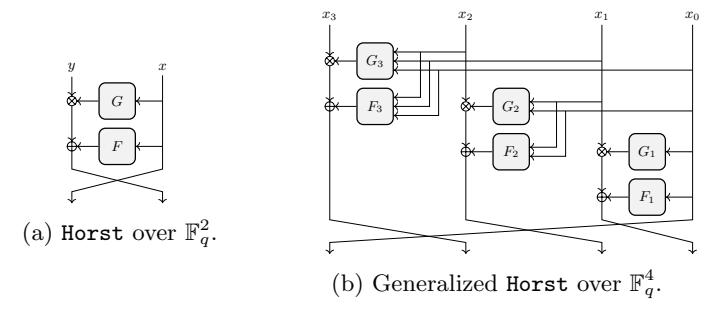
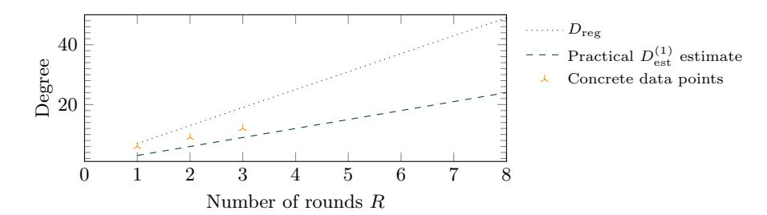
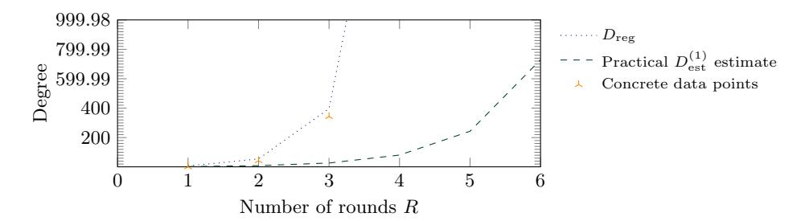
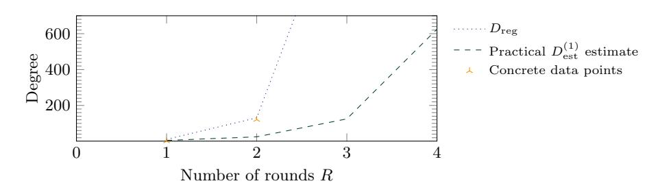

# Horst Meets Fluid-SPN: Griffin for Zero-Knowledge Applications <sup>⋆</sup>

(Full Version)

Lorenzo Grassi<sup>1</sup> , Yonglin Hao<sup>2</sup> , Christian Rechberger<sup>3</sup> , Markus Schofnegger<sup>4</sup> , Roman Walch3,5,<sup>6</sup> , and Qingju Wang<sup>7</sup>

```
1 Ruhr University Bochum, Bochum (Germany)
2 State Key Laboratory of Cryptology, P.O. Box 5159, Beijing 100878 (China)
                3 Graz University of Technology (Austria)
                      4 Horizen Labs (United States)
                     5 Know-Center GmbH (Austria)
                       6 TACEO GmbH (Austria)
```

<sup>7</sup> Telecom Paris, Institut Polytechnique de Paris (France) lorenzo.grassi@ruhr-uni-bochum.de, haoyonglin@yeah.net, firstname.lastname@iaik.tugraz.at, mschofnegger@horizenlabs.io, qingju.wang@telecom-paris.fr

Abstract. Zero-knowledge (ZK) applications form a large group of use cases in modern cryptography, and recently gained in popularity due to novel proof systems. For many of these applications, cryptographic hash functions are used as the main building blocks, and they often dominate the overall performance and cost of these approaches.

Therefore, in the last years several new hash functions were built in order to reduce the cost in these scenarios, including Poseidon and Rescue among others. These hash functions often look very different from more classical designs such as AES or SHA-2. For example, they work natively over prime fields rather than binary ones. At the same time, for example Poseidon and Rescue share some common features, such as being SPN schemes and instantiating the nonlinear layer with invertible power maps. While this allows the designers to provide simple and strong arguments for establishing their security, it also introduces crucial limitations in the design, which may affect the performance in the target applications.

In this paper, we propose the Horst construction, in which the addition in a Feistel scheme (x, y) 7→ (y+F(x), x) is extended via a multiplication, i.e., (x, y) 7→ (y × G(x) + F(x), x).

By carefully analyzing the performance metrics in SNARK and STARK protocols, we show how to combine an expanding Horst scheme with a Rescue-like SPN scheme in order to provide security and better efficiency in the target applications. We provide an extensive security analysis for our new design Griffin and a comparison with all current competitors.

Keywords: Hash Functions – Griffin – Zero-Knowledge – Horst – Fluid-SPN

<sup>⋆</sup> Author list in alphabetical order.

### 1 Introduction

Concepts like multi-party computation (MPC), homomorphic encryption (HE), post-quantum signature schemes, and zero-knowledge (ZK) proof systems have recently grown in popularity. Some of these applications favor cryptographic schemes with specific properties, such as a small number of multiplications. Considering  $\mathbb{F}_p^t$  for a prime  $p\geq 3$  and  $t\geq 1$ , examples include Feistel-MiMC [3], GMiMC [2], POSEIDON[32], Rescue [4, 59], Grendel [58], Reinforced Concrete [31], Neptune [35], and Anemoi [16], among others.

The performance metrics vary between the different use cases. While the cost in e.g. MPC is well-studied [36, 3, 34], ZK protocols often have more sophisticated optimization targets. The two major classes of ZK proof systems are zero-knowledge succinct non-interactive arguments of knowledge (zk-SNARKs) and zero-knowledge scalable transparent arguments of knowledge (zk-STARKs), which are also the ones we focus on in this paper.

Recent hash functions proposed for these protocols differ substantially from each other, however their internal permutations are usually SPN constructions. While this approach may have advantages for arguing security, it can also have various limitations affecting the performance in ZK protocols.

### <span id="page-1-1"></span>1.1 Hash and Compression Functions in ZK Settings

Cost Metrics in ZK Protocols. In many ZK applications, the prover uses ZK proofs to convince a verifier that they know a preimage x of a given hash or compression output  $y = \mathcal{H}(x)$  without revealing anything about x. The efficiency of these protocols depends on the details of  $\mathcal{H}$ . In zk-SNARKs, the cost of the proof is proportional to the number of nonlinear operations one has to perform, and in some cases (e.g., Plonk [29]) the number of linear operations must also be considered. In zk-STARKs, the cost is related to the degree and the depth of the circuit that must be verified. In both cases, it is not required to recompute  $\mathcal{H}$  in order to determine if  $y = \mathcal{H}(x)$ . Indeed, one can verify any equivalent cheaper representation  $\mathcal{F}(x,y) = 0$  which is satisfied if and only if  $y = \mathcal{H}(x)$ .

Most previous designs focused only on a subset of cost metrics. For example, the idea of MiMC, HadesMiMC, and Poseidon was to minimize the number of multiplications. As a result, they can be efficient in SNARKs, but their comparatively large round numbers lead to disadvantages in other proof systems. In contrast, *Rescue* has an inner structure tailored for STARKs, which results in comparatively low round numbers and decent Plonk performance. However, the efficiency in other SNARKs and the plain performance suffer from this structure.

**SPN Schemes and Power Maps.** Competitive hash functions for ZK protocols include *Rescue* and Poseidon. Both schemes are instantiated via an SPN permutation, whose round function  $\mathcal{R}: \mathbb{F}_p^t \to \mathbb{F}_p^t$  is defined as

<span id="page-1-0"></span>
$$\mathcal{R}(\cdot) = c + M \times S(\cdot),\tag{1}$$

where c is a round constant,  $M \in \mathbb{F}_p^{t \times t}$  is an MDS matrix, and  $S : \mathbb{F}_p^t \to \mathbb{F}_p^t$  is an S-box layer defined as

<span id="page-2-1"></span>
$$S(x_0, x_1, \dots, x_{t-1}) = S_0(x_0) || S_1(x_1) || \dots || S_{t-1}(x_{t-1})$$
(2)

for invertible maps  $S_i : \mathbb{F}_p \to \mathbb{F}_p$  ( $\cdot \mid \mid \cdot$  denotes concatenation). Every round of *Rescue* consists of two steps, one in which all  $S_i$  correspond to  $x \mapsto x^{1/d}$  and one in which all  $S_i$  correspond to  $x \mapsto x^d$ . Poseidon uses two different rounds, one in which  $S_i(x) = x^d$  and one in which  $S_0(x) = x^d$  and  $S_{i\neq 0}(x) = x$  (identity).

#### 1.2 Our Contribution

**SPN Schemes in ZK.** An SPN scheme usually allows for simple and strong security arguments regarding statistical attacks, including the (classical) differential [12] and linear [46] attacks. For example, the combination of a linear layer with a high branch number (e.g., an MDS matrix) and an S-box layer with a good maximum differential probability (e.g., certain classes of low-degree S-boxes) allows to efficiently use the wide trail design strategy [22].

However, SPN schemes over  $\mathbb{F}_p^t$  have a crucial limitation in our setting. Indeed, a common way to instantiate the nonlinear layer for ZK use cases is to use invertible power maps  $x\mapsto x^d$  (hence,  $\gcd(d,p-1)=1$ ). Since the square function is not a permutation over  $\mathbb{F}_p$ , one has to use a function of degree  $d\geq 3$ , which affects the performance. This is true for every state element, and hence the number of multiplications is at least 2t for a t-element state, and 3t for the particular ZK settings we are interested in (due to the specification of p).

Horst Schemes. Together with an SPN, another popular cryptographic construction is the Feistel one, represented e.g. by GMiMC in the case of ZK-friendly schemes. Given a function F over a generic field  $\mathbb{F}$ , a Feistel scheme is defined as the map  $(x,y)\mapsto (y+F(x),x)$  over  $\mathbb{F}_p^2$ . Several generalizations over  $\mathbb{F}_p^t$  are proposed in the literature [62, 52, 38].

Inspired by the results presented in [13] and in [21], in Section 3.2 we propose a modified Feistel scheme, called Horst, in which the linear relation between y and F(x) is combined with a nonlinear one, i.e.,  $(y, x) \mapsto (x, y \times G(x) + F(x))$ . To guarantee invertibility, we require that  $G(x) \neq 0$  for each input x.

In Section 3.2, we show how to construct such a low-degree (non-trivial) function over any prime field  $\mathbb{F}_p$  independently of the size of p, and we propose an initial security analysis regarding the indifferentiability/indistinguishability of a generic iterated Horst construction.

Besides that, our experiments suggest that the strength against algebraic attacks such as Gröbner basis [17, 20] attacks is easier to argue by using Horst instead of the classical Feistel, resulting in another advantage of the new structure. We explore this direction in Section 6.3.

<span id="page-2-0"></span><sup>&</sup>lt;sup>8</sup> The name Horst (due to the cryptographer Horst Feistel) has been chosen in order to emphasize the link between  $(x, y) \mapsto (y + F(x), x)$  and  $(y, x) \mapsto (x, y \times G(x) + F(x))$ .

**Griffin.** In Section 5 we specify a new family of sponge hash and compression functions called Griffin, using the internal permutation Griffin- $\pi$ . Griffin- $\pi$  cannot be rewritten as in Eqs. (1) and (2) since its nonlinear layer is not divided into independent nonlinear S-boxes. Instead, it is composed of two nonlinear sublayers defined via three different nonlinear functions. Two of them are defined via the invertible power maps  $x \mapsto x^d$  and  $x \mapsto x^{1/d}$ , which is inspired by Rescue. The final one is defined by our proposed Horst strategy, using the map  $(x,y)\mapsto (x,y\cdot G(x))$  for a quadratic function G s.t.  $G(z)\neq 0$  for each z.

Since the cost metrics in our target use cases are mainly related to the number of nonlinear operations, a linear layer with an MDS matrix may be the simplest choice. However, for a  $t \times t$  matrix this usually requires  $\mathcal{O}(t^2)$  multiplications. Hence, we propose a matrix that can be implemented with a small number of operations. It is inspired by the linear layer of AES, i.e., it can be decomposed as the multiplication of two matrices. However, while in AES one of these two matrices (the one corresponding to the ShiftRows operation) only changes the position of the elements, both the matrices in the linear layer of GRIFFIN- $\pi$  provide full diffusion. This allows to achieve this property in each state word after a single round.

As a result, similarly to the SPN wide trail design strategy and thanks to the details of the linear layer, we have simple arguments against statistical attacks. Moreover, due to the *Rescue*-like construction, we gain efficient verifiability and a high degree both in the forward and the backward direction. Finally, with our Horst construction, we have minimal multiplicative complexity and good security against algebraic attacks.

Modes of Operation. Our proposed permutation GRIFFIN- $\pi$  can be used both in a sponge mode and in a compression mode. The former is more versatile while the latter can be more efficient in specific settings (for example, when only compression for small fixed-sized inputs is needed). We also compare our construction with other compression modes used in the literature, in particular those in Haraka [42] and Jive [16].

Security Analysis. A security analysis of the proposed design is given in Section 6. From the algebraic perspective, Gröbner basis attacks at the round level are the most efficient ones. We present several strategies considering the details of the function. Further, we compare GRIFFIN- $\pi$  instantiated with Feistel and with Horst in Section 6.3, observing that security is easier to argue with Horst.

From the statistical perspective, well-known techniques like the wide trail design strategy do not apply since our design does not have an SPN structure. For this reason, we apply a simple bound against classical differential and linear attacks, which is sufficient for our purposes. For rebound attacks, an advanced

<span id="page-3-0"></span><sup>&</sup>lt;sup>9</sup> The griffin is a legendary creature with the body, tail, and back legs of a lion, and the head and wings of an eagle. The name Griffin has been chosen since our design merges ideas of a *Fluid-SPN* and a construction as the **Horst** one.

form of a (truncated) differential attack, we propose an analysis using dedicated tools that help us to provide the bound on the minimal number of rounds needed.

Efficiency in Plain and ZK Settings. Following the cost metrics from Section 1.1, with Griffin we aim to find a beneficial tradeoff between all of them. We evaluate the performance of Griffin in SNARKs using R1CS and compare it to various other constructions in Section 7.2. Our evaluation shows that Griffin is better suited for these zk-SNARKs than any previously proposed design. In the case of zk-STARKs and Plonk (a SNARK with different arithmetization), Griffin provides similar performance as the currently best hash functions for STARKs, the best performance for many configurations in Plonk (especially larger state sizes) and is only slightly less efficient for smaller state sizes in some Plonk configurations compared to the recent design Anemoi proposed in [16]. We show a comparison of Griffin and similar constructions in Plonk in Section 7.3. We show the comparison between Griffin and its competitors in zk-STARKs in App. A. As was our goal, Griffin provides an efficient tradeoff between the plain performance and the performance across different ZK proof systems.

# 2 Cost Metrics for Zero-Knowledge Proof Systems

In this section, we analyze the cost metrics for R1CS-based SNARKs and Plonk [29]. For a similar analysis for AIR-based STARKs we refer to App. A.1, and we also discuss the relations between these three cost metrics in App. A.2. We start by providing a brief introduction to arithmetization techniques used in various ZK proof systems. We directly focus on iterative functions to give an intuition on how to describe a hash function in this context.

### 2.1 Zero-Knowledge Proofs

A ZK proof system is a two-player protocol between a prover and a verifier, allowing the prover to convince the verifier that they know a witness w to a statement x without revealing anything about the witness beyond what can be implied by x. For example, the prover can use ZK proofs to convince a verifier that they know a preimage w of a given hash  $y = \mathcal{H}(w)$  without revealing anything about w. The proof system needs to be complete and sound with a negligible soundness error  $\epsilon$ , and it must fulfill the zero-knowledge property, which informally states that the proof is independent of the witness w.

The two major classes of ZK proof systems are zk-SNARKs and zk-STARKs, where zk-SNARKs require a trusted setup and are not post-quantum secure. Recenty, many use cases involving ZK proofs have emerged, two of them mainly relying on hash functions: set membership proofs based on Merkle tree accumulators and verifiable computation based on recursive proofs. In both cases one has to prove the knowledge of preimages of hashes, and thus the overall performance mainly depends on the efficiency of the hash function used in the protocol.

#### 2.2 Arithmetization

To prove a solution of a computational problem, one has to translate the problem into an algebraic representation. This step is known as arithmetization and it differs between the various proof systems. Many algebraic representations have been proposed in the literature, with rank-1 constraint satisfaction systems (R1CS) and Plonk gates being the most widely used representations in zk-SNARKs, and the algebraic intermediate representation (AIR) being used in zk-STARKs [7].

Concretely, in applications involving preimage proofs, the algebraic representation describes the relation between the preimage and the final hash. The witness of the ZK proof captures all intermediate values (including the preimage) required to satisfy this representation for a given instance of the problem (i.e., a specific hash). For this purpose, let  $q = p^n$  for a prime  $p \geq 2$  and  $n \geq 1$ , and let  $\mathcal{H}: \mathbb{F}_q^t \to \mathbb{F}_q^t$ , where  $\mathbb{F}_q$  is a field and  $t \geq 1$ . We focus on an iterative function  $\mathcal{H}(a) = \mathcal{F}_{r-1} \circ \cdots \circ \mathcal{F}_1 \circ \mathcal{F}_0(a)$ , where  $\mathcal{F}_0, \mathcal{F}_1, \ldots, \mathcal{F}_{r-1} : \mathbb{F}_q^t \to \mathbb{F}_q^t$ . Given  $a, b \in \mathbb{F}_q^t$ , the goal is to prove  $\mathcal{H}(a) = b$  without revealing a. To efficiently determine whether  $\mathcal{H}(a) = b$ , the prover can use the intermediate values  $x_0 \equiv a, x_1, x_2, \ldots, x_{r-1} \equiv b$  such that  $\mathcal{F}_i(x_i) - x_{i+1} = 0$  for  $i \in \{0, 1, \ldots, r-1\}$ . In particular, they can prove any equivalent system of equations, i.e., they can introduce functions  $\mathcal{G}_0, \mathcal{G}_1, \ldots, \mathcal{G}_{s-1} : (\mathbb{F}_q^t)^r \to \mathbb{F}_q^t$  such that the previous system of equations is satisfied if and only if  $\mathcal{G}_j(x_0, x_1, \ldots, x_{r-1}) = 0$  for  $j \in \{0, 1, \ldots, s-1\}$ .

**Definition 1 (Zero-Equivalence).** Let  $q = p^n$  for a prime  $p \ge 2$  and  $n \ge 1$ . Let  $\mathcal{F}_0, \ldots, \mathcal{F}_{r-1} : \mathbb{F}_q^t \to \mathbb{F}_q^t$  be  $r \ge 1$  functions. Let  $\mathcal{G}_0, \ldots, \mathcal{G}_{s-1} : (\mathbb{F}_q^t)^r \to \mathbb{F}_q^t$  be  $s \ge 1$  functions. We say that  $\mathcal{G}_0, \ldots, \mathcal{G}_{s-1}$  are **zero-equivalent** to  $\mathcal{F}_0, \ldots, \mathcal{F}_{r-1}$  if for each  $x_0, x_1, x_2, \ldots, x_{r-1} \in \mathbb{F}_q^t$  the following holds:

$$\forall i \in \{0, \dots, r-1\} : x_{i+1} = \mathcal{F}_i(x_i) \iff \forall j \in \{0, \dots, s-1\} : \mathcal{G}_j(x_0, \dots, x_{r-1}) = 0.$$

This strategy is based on the notion of *non-procedural computation* introduced in [4], which describes the idea of not only evaluating schemes in the plain direction, but using intermediate relations instead.

The choice of the equivalent functions  $\mathcal{G}_0, \ldots, \mathcal{G}_{s-1}$  depends on the cost metric of the given proof system. For the following, we say that a scheme is *fluid* if it admits an equivalent representation which can be proven and/or verified more efficiently.<sup>10</sup> As an example for r = s, we report the ones given in [4].

**Example 1.** An invertible function  $\mathcal{F}(x) = x^{1/d}$  over  $\mathbb{F}_q$  can be proven via  $\mathcal{G}: \mathbb{F}_q^2 \to \mathbb{F}_q$  defined as  $\mathcal{G}(x,y) = x - y^d$  by imposing  $\mathcal{G}(x,y) = 0$ . Similarly, given  $\mathcal{F}(x) = 1/x$  over  $\mathbb{F}_q \setminus \{0\}$ , one can choose  $\mathcal{G}: (\mathbb{F}_q \setminus \{0\})^2 \to \mathbb{F}_q$  as  $\mathcal{G}(x,y) = xy - 1$ .

A scheme that satisfies the condition just given is a fluid scheme. In [16], the authors noticed that  $y = x^{1/d}$  and  $y^d = x$  are CCZ-equivalent. For this reason, in [16, Sect. 4.1] they deduce that a function is arithmetization-oriented if it is CCZ-equivalent to a function that can be verified efficiently.

<span id="page-5-0"></span>A fluid material continuously deforms (flows) under an applied external force. In our case, the scheme adapts its algebraic representation to the target protocol.

**Definition 2 (CCZ Equivalence).** Two functions  $\mathcal{F}, \mathcal{G} : \mathbb{F}_q^t \to \mathbb{F}_q^t$  are CCZ-equivalent if there exists an affine permutation  $\mathcal{A}$  over  $(\mathbb{F}_q^t)^2$  such that  $\{(x, \mathcal{F}(x)) \mid \forall x \in \mathbb{F}_q^t\} = \{\mathcal{A} \circ (x, \mathcal{G}(x)) \mid \forall x \in \mathbb{F}_q^t\}.$

Restricting to CCZ equivalence is not necessary, and there exist fluid schemes that do not satisfy any CCZ equivalence condition, as shown in the following.

**Example 2.** Consider  $y = \mathcal{F}(x) = x^{e/d}$  over  $\mathbb{F}_q$  such that  $d, e \geq 3$  and  $\gcd(q-1,e) = \gcd(q-1,d) = \gcd(e,d) = 1$ . This permutation can be easily verified via  $\mathcal{G}(x,y) = y^d - x^e = 0$ , but we are not aware of any CCZ equivalence between  $y = x^{e/d}$  and  $y^d = x^e$ .

**Example 3.** Let  $\mathcal{F}_0, \mathcal{F}_1 : \mathbb{F}_q \to \mathbb{F}_q$  be defined as  $y = \mathcal{F}_0(x) = \gamma + x^d$  and  $z = \mathcal{F}_1(y) = y^{1/d}$ , where  $\gamma \neq 0$  and where  $x \mapsto x^d$  is assumed to be invertible. Then  $\mathcal{H} = \mathcal{F}_1 \circ \mathcal{F}_0$  can be efficiently proven via a single function  $\mathcal{G} : \mathbb{F}_q^3 \to \mathbb{F}_q$  defined as  $\mathcal{G}(x, y, z) = z^d - (\gamma + x^d)$ , which is independent of y.

This resembles the arithmetization of *Rescue* in zk-STARKs. Both representations are valid and require the same number of multiplications, but they have different degrees when chained together. In this sense, *Rescue* is a *Fluid-SPN*.

### <span id="page-6-0"></span>2.3 Rank-1 Constraint Satisfaction Systems (R1CS)

Many proof systems (e.g., Groth16 [37], Ligero [5], Aurora [8], Bulletproofs [18]) require to translate the circuit into an R1CS, with Groth16 being the fastest proof system with the smallest proofs to date. An R1CS is a set of  $\eta$  equations (i.e.,  $\eta$  constraints) on the variables  $a_0, \ldots, a_m \in \mathbb{F}_q$  (with  $a_0 = 1$ ) such that

$$\forall j \in \{0, 1, \dots, \eta - 1\}: \quad \left(\sum_i u_{i,j} \cdot a_i\right) \cdot \left(\sum_i v_{i,j} \cdot a_i\right) = \left(\sum_i w_{i,j} \cdot a_i\right),$$

where  $u_{i,j}$ ,  $v_{i,j}$ ,  $w_{i,j} \in \mathbb{F}_q$  are constants describing the j-th constraint. These are derived from the hash or compression function when proving the knowledge of an input and are independent of the given output value. An assignment to the variables  $a_0, \ldots, a_m$  is the witness of the ZK proof and captures all intermediate values (including the preimage) when computing a given output value. The role of the zk-SNARK is to prove that the witness satisfies the R1CS system without revealing the witness itself. The efficiency then depends on the number of constraints  $\eta$  in the constraint system, i.e., the prover complexity is in  $\mathcal{O}(\eta)$ .

In R1CS constraints, every statement needs to be translated into multiplications of linear combinations of the witness variables. Consequently, linear operations can be embedded into subsequent constraints and do not require additional constraints. For nonlinear operations, the designer has to find a representation which fully captures the relation between the input and the output of the operation, while minimizing the number of degree-2 equations. Cost Metric. We measure the number of R1CS constraints, i.e., the minimum number of nonlinear operations of linear combinations of witness variables required to fully represent any (equivalent) relation between the input and its output (e.g., a preimage and the corresponding hash). In order to perform an efficient verification, we therefore suggest to work with the zero-equivalent functions that can be computed with the minimum number of nonlinear operations.

#### 2.4 Plonk Arithmetization

Plonk [29] is a zk-SNARK which does not use R1CS constraints. Its arithmetization is based on Plonk gates with constraints of the form

<span id="page-7-0"></span>
$$q_{L_i} \cdot a_{L_i} + q_{R_i} \cdot a_{R_i} + q_{O_i} \cdot a_{O_i} + q_{M_i} \cdot (a_{L_i} \cdot a_{R_i}) + q_{C_i} = 0, \tag{3}$$

where the a values are again the witness variables and the q values describe a given constraint. Using this equation, one can either describe a 2-fan-in addition (setting  $q_{M,i}=0$ ) or a 2-fan-in multiplication (setting  $q_{L,i}=q_{R,i}=0$ ). Thus, to use the Plonk proof system one needs to describe the given circuit using 2-fan-in addition and multiplication gates. As a result, contrary to R1CS constraints, additions cannot be embedded into subsequent multiplication constraints anymore and require separate Plonk gates.

Cost Metric. We measure the number of Plonk gates, i.e., the minimum number of 2-fan-in additions and multiplications of witness variables required to fully represent any (equivalent) relation between the input and its output.

<span id="page-7-1"></span>Remark 1. The Plonk proof system can be modified to use constraints different from Eq. (3). Some implementations of the Plonk system extend Eq. (3) to allow 3-fan-in addition gates which are beneficial in various use cases. In this case the cost metric changes accordingly, i.e., the cost is then the minimum number of 2-fan-in multiplications and 3-fan-in additions of witness variables required to fully represent any (equivalent) relation between the input and the output.

### 3 The Road to Griffin

#### 3.1 Related Work: SPN Schemes for ZK Applications

We first recall some of the SPN schemes proposed in the literature for zero-knowledge applications, focusing on the evolution of their designs from Poseidon and *Rescue* to Neptune and Anemoi.

**Poseidon and** *Rescue*. Two well-known examples of SPN schemes for ZK settings are Poseidon and *Rescue*. Their round function is defined as in Eq. (1), where all S-boxes  $S_0, \ldots, S_{t-1}$  operate over  $\mathbb{F}_p$  independently of the others, i.e.,

$$S(x_0, x_1, \dots, x_{t-1}) = S_0(x_0) || S_1(x_1) || \dots || S_{t-1}(x_{t-1}).$$

An important advantage of these SPN schemes is that several techniques such as the wide trail design strategy [22] have been developed in order to study their security. For example, using the branch number of the linear layer and the maximum differential probability of the S-boxes, it is possible to provide a simple and strong security argument against classical differential (and linear) attacks.

At the same time, a strong limitation on the choice of the S-box arises for these schemes. Indeed, as already recalled in the introduction, when working over a prime field the designer is restricted to S-box functions of degree  $d \geq 3$  in order to build permutations. At the current state of the art, invertible nonlinear maps over  $\mathbb{F}_p$  include only power maps  $x \mapsto x^d$  for  $\gcd(d, p-1) = 1$  and the Dickson polynomials  $D_{\alpha}(x) = \sum_{i=0}^{\left\lfloor \frac{d}{d-i} \right\rfloor} \frac{d}{d-i} \binom{d-i}{i} (-\alpha)^i x^{d-2i}$  for  $\gcd(d, p^2-1) = 1$ , besides other invertible functions constructed via the Legendre function and the  $x \mapsto (-1)^x$  operator proposed in [33]. In particular, quadratic nonlinear components cannot be used. This may not be an issue in more classical use cases, but it leads to performance limitations in the settings we consider.

**Neptune and Anemoi.** One way to gain more flexibility regarding the degree is by considering S-boxes over  $\mathbb{F}_p^n$  for  $n \geq 2$ , that is, SPN schemes in which the nonlinear layer is defined as

$$S(x_0, \ldots, x_{t-1}) = S_0(x_0, \ldots, x_{n-1}) \mid\mid S_1(x_n, \ldots, x_{2n-1}) \mid\mid \cdots \mid\mid S_{t'-1}(x_{t-n}, \ldots, x_{t-1})$$

for a certain  $n \geq 2$  such that t = nt', where  $S_0, \ldots, S_{t'-1}$  over  $\mathbb{F}_{p^n} \equiv \mathbb{F}_p^n$  are invertible functions. Naturally, it is still possible to instantiate such S-boxes over  $\mathbb{F}_{p^n}$  via the power maps or the other invertible maps previously recalled. However, the algebraic representation over  $\mathbb{F}_p^n$  becomes more complicated, and the number of multiplications in  $\mathbb{F}_p$  increases exponentially. Other invertible degree-2 functions over  $\mathbb{F}_p^n$  constructed via a local map have recently been presented in [35], and they include e.g. the Lai–Massey one [43] as a special case.

Examples of such SPN schemes are Neptune and Anemoi. The hash function Neptune is inspired by Poseidon, but the power maps in the external rounds are replaced by the concatenation of independent S-boxes over  $\mathbb{F}_{p^2} \equiv \mathbb{F}_p^2$  based on quadratic Lai–Massey functions. In the Anemoi scheme, the S-boxes over  $\mathbb{F}_{p^2} \equiv \mathbb{F}_p^2$  are based on a particular instantiation of the Feistel scheme called Flystel and defined as  $(x,y)\mapsto (u,v):=\left(x-2yz^{1/d}+z^{2/d},y-z^{1/d}\right)$  for  $z:=x-y^2$ , where  $d\geq 3$  satisfies  $\gcd(d,p-1)=1.^{11}$  Exploiting its CCZ-equivalent function, this can be efficiently verified via  $(y^2+(y-v)^d-x,v^2+(y-v)^d-u)=(0,0)$ .

### <span id="page-8-0"></span>3.2 Non-SPN Schemes: From Feistel to Horst

While the strategy exploited by the previous SPN schemes is indeed appealing for designing ZK-friendly schemes, here we explore a different approach. In order to be invertible, the low-degree (quadratic) S-boxes of both Neptune and Anemoi are constructed via a function that is affine equivalent to a Feistel scheme (we

<span id="page-8-1"></span><sup>&</sup>lt;sup>11</sup> The constants  $\beta$ ,  $\gamma$ , and  $\delta$  are omitted in this description.

recall that [30] recently proved the affine equivalent relation existing between Feistel and Lai–Massey schemes). Hence, given the functions  $\tilde{F}_0, \tilde{F}_1, \ldots, \tilde{F}_{t-2}$  over  $\mathbb{F}_p$ , we may also directly consider a Feistel scheme, such as Type-I/-II/-III Feistel schemes [62, 52, 38] defined respectively as

$$(x_0, x_1, \dots, x_{t-1}) \mapsto (x_1 + \tilde{F}(x_0), x_2, x_3, \dots, x_{t-1}, x_0),$$

$$(x_0, x_1, \dots, x_{t-1}) \mapsto (x_1 + \tilde{F}_0(x_0), x_2, x_3 + \tilde{F}_2(x_2), \dots, x_{t-1} + \tilde{F}_{t-2}(x_{t-2}), x_0),$$

$$(x_0, x_1, \dots, x_{t-1}) \mapsto (x_1 + \tilde{F}_0(x_0), x_2 + \tilde{F}_1(x_1), \dots, x_{t-1} + \tilde{F}_{t-2}(x_{t-2}), x_0),$$

in which the circular shift is replaced by a multiplication with an invertible linear layer that accelerates the full diffusion.

An example of a ZK-friendly generalized Feistel scheme is GMiMC (broken in [11]). In order to prevent internal collisions, the round functions of GMiMC are instantiated via invertible power maps. We considered variants of it instantiated via quadratic maps  $\tilde{F}_i(x) = x^2$  and with the circular shifts being replaced by multiplications with invertible matrices. As we are going to explain in more detail in the following, practical tests suggest that these schemes may not provide the expected security level against some algebraic attacks like the Gröbner basis one. A possible reason for that could be the strong arrangement/alignment/structure existing in the Feistel network. To solve this issue, we propose the following.

Let  $q=p^n$  for a prime  $p\geq 2$  and  $n\geq 1$  as before. Given a function  $F:\mathbb{F}_q\to\mathbb{F}_q$ , the nonlinear layer of a Feistel scheme over  $\mathbb{F}_q^2$  is defined as  $(x,y)\mapsto (x,y+F(x))$ , which is invertible independently of F. Instead of considering a linear relation between y and F(x), here we combine y and F(x) in a nonlinear way without losing the advantageous properties of Feistel schemes. The simplest way is to replace the sum with a multiplication, but then the invertibility cannot be guaranteed anymore. We solve this with a stronger assumption on the function.

**Definition 3** (Horst Scheme). Let  $G: \mathbb{F}_q \to \mathbb{F}_q \setminus \{0\}$  and  $F: \mathbb{F}_q \to \mathbb{F}_q$ . We define the Horst scheme over  $\mathbb{F}_q^2$  as in Fig. 1a, i.e.,

$$(y,x) \mapsto (x, y \cdot G(x) + F(x))$$
.

In particular, we call this scheme

- (1) Feistel or Horst<sup>+</sup> if G is identically equal to 1, i.e.,  $G(x) \equiv 1$ ,
- (2)  $\operatorname{Horst}^{\times}$  if  $F(x) = \alpha \cdot G(x) + \beta$  for certain  $\alpha, \beta \in \mathbb{F}_q$  (hence,  $y \cdot G(x) + F(x) \equiv (\alpha + y) \cdot G(x) + \beta$ ).

Since  $\mathbb{F}_q$  is a field and  $G(x) \neq 0$  for each  $x \in \mathbb{F}_q$ , Horst is invertible.

Feistel Schemes with Nonlinear Diffusion for Constructing S-Boxes. The idea behind Horst is not entirely new in the literature. In the case F(x) = 0 for each  $x \in \mathbb{F}_q$ , we note that a Feistel scheme based on a nonlinear relation between the branches was allegedly also used in order to set up the 8-bit S-boxes of Streebog [25] and Kuznyechik [27], two Russian standards of a hash function and a

block cipher, respectively. This was discovered in [13], where the authors reconstructed the design of the S-box from its lookup table definition. The nonlinear diffusion in this case consists of multiplications in  $\mathbb{F}_{2^4}$  between the two branches.

Similarly, in [21] the authors construct S-boxes over small fields by a modified version of a Feistel network instantiated with a nonlinear operation between the branches. Also in this case, the components of the round are chosen randomly and tested against various criteria, in order to ensure that the resulting construction is invertible. This approach is feasible when working over small finite fields.

However, to the best of our knowledge, no generalization from e.g.  $\mathbb{F}_{2^4}$  to larger binary extension fields or larger prime fields is publicly available. Indeed, given  $(x,y) \mapsto x \cdot G(y)$ , while a brute-force approach may be sufficient to achieve invertibility (i.e.,  $G(y) \neq 0$  for each y) and efficiency in terms of linear or nonlinear operations for small fields, this does not seem feasible when considering larger fields. We solve this problem in the following, by showing how to construct G in an efficient way for the Horst approach given above.

Generalized Feistel Constructions over Groups. Various independent works discuss generalized Feistel contructions over groups [60, 55, 39]. We emphasize that these are not compatible with our results presented here. In particular, let  $(\mathfrak{G}, \#)$  be a group with respect to an operation #. The generalized Feistel schemes studied in [60, 55, 39] are of the form  $(x,y)\mapsto (y\#F(x),x)$  for a function  $F:\mathfrak{G}\to\mathfrak{G}$ . By the definition of a group, there exists an identity element  $\iota\in\mathfrak{G}$  such that  $z\#\iota=\iota\#z=z$  for each  $z\in\mathfrak{G}$ , and for each  $z\in\mathfrak{G}$ , there exists  $w,y\in\mathfrak{G}$  such that  $w\#z=z\#y=\iota$  (where y=w if G is abelian). However,  $(\mathbb{F}_q,\times)$ , where  $q=p^n$  and  $\times$  is the multiplication, is not a group. Indeed, 0 does not satisfy the previous condition (e.g., it does not admit any inverse). Hence, the results proposed in [60, 55, 39] do not apply to Horst.

**Initial Security Considerations.** The security of Feistel schemes [45] has been heavily analyzed both from the indistinguishability point of view [53, 54, 48] and from the indifferentiability one [19, 23]. Here we make an initial analogous security analysis for the Horst scheme. In the following,  $F^{(i)}: \mathbb{F}_q \to \mathbb{F}_q$  and  $G^{(i)}: \mathbb{F}_q \to \mathbb{F}_q$  denote the functions in the *i*-th round for  $i \in \{0, \ldots, r-1\}$ .

It is always possible to set up a distinguisher for one (trivial) and two rounds of the Horst scheme. Consider three inputs of the form  $(y_i, x) \in \mathbb{F}_q^2$  and the corresponding outputs  $(z_i, w_i) \in \mathbb{F}_q^2$  for  $i \in \{0, 1, 2\}$ , where  $z_i := y_i \cdot G^{(0)}(x) + F^{(0)}(x)$  and for unknown  $w_0, w_1, w_2 \in \mathbb{F}_q$ . In the case of 2-round Horst, we have  $(y_2 - y_0) \cdot (z_1 - z_0) = (z_2 - z_0) \cdot (y_1 - y_0)$  with probability 1, while this occurs with probability 1/q in the case of a pseudo-random permutation (PRP).

In App. B, we present distinguishers for 3 and 4 rounds of  $\mathtt{Horst}^{\times}$ , by adapting the analogous attacks on Feistel schemes proposed by Patarin in e.g. [54]. For the particular  $\mathtt{Horst}^{\times}$  defined as  $(y,x)\mapsto (x,y\cdot G(x))$  (i.e., F is identically

<span id="page-10-0"></span><sup>&</sup>lt;sup>12</sup> Roughly speaking, in the first case, the attacker does not have any information about the functions  $F_i$  that define the round. In the second case, they can e.g. query such functions, which are publicly available.

<span id="page-11-0"></span>

Fig. 1: The generalized Horst scheme over  $\mathbb{F}_q^t$ .

equal to zero), we point out that it is possible to set up a distinguisher on an arbitrary number of rounds, by noting that  $(0,x) \in \mathbb{F}_q^2$  is always mapped to  $(x,0) \in \mathbb{F}_q^2$  after one round and to  $(0,\star) \in \mathbb{F}_q^2$  after two rounds for each  $x \in \mathbb{F}_q$  and for each  $G : \mathbb{F}_q \to \mathbb{F}_q \setminus \{0\}$ .

The problems of setting up distinguishers for more than 2 rounds of Horst and for more than 6 rounds of Feistel or Horst<sup>×</sup> are open for future research.

**Generalized** Horst. Next, we generalize the Horst scheme over  $\mathbb{F}_q^t$  for  $t \geq 2$ .

**Definition 4 (Generalized Horst).** Let  $t \geq 2$ . For each  $i \in \{1, 2, \ldots, t-1\}$ , let  $G_i : \mathbb{F}_q^i \to \mathbb{F}_q \setminus \{0\}$  and  $F_i : \mathbb{F}_q^i \to \mathbb{F}_q$ . We define the Generalized Horst scheme over  $\mathbb{F}_q^t$  as  $x = (x_0, \ldots, x_{t-1}) \mapsto y = (y_0, \ldots, y_{t-1})$ , where

$$y_i := \begin{cases} x_{i+1} \cdot G_{i+1}(x_0, x_1, \dots, x_i) + F_{i+1}(x_0, x_1, \dots, x_i) & \text{if } i \in \{0, 1, \dots, t-2\}, \\ x_0 & \text{otherwise } (i = t-1). \end{cases}$$
(4)

We refer to Fig. 1b for t=4. The final circular shift is crucial for achieving full diffusion (as in the case of any Feistel scheme), but it can be replaced with a different linear diffusion. The invertibility follows from the fact that

<span id="page-11-1"></span>
$$x_i := \begin{cases} y_{t-1} & \text{if } i = 0, \\ \frac{y_{i-1} - F_i(x_0, x_1, \dots, x_{i-1})}{G_i(x_0, x_1, \dots, x_{i-1})} & \text{otherwise } (i \in \{1, 2, \dots, t-1\}). \end{cases}$$

We point out that the case  $G_1 = G_2 = \cdots = G_{t-1} = 1$  corresponds to the T-function proposed and analyzed in [41]. Moreover, based on [62, 52, 38], we highlight the possibility to set up Type-I/-II/-III, expanding, contracting Horst schemes analogous to Type-I/-II/-III, expanding, contracting Feistel schemes. We give the following concrete examples.

- A Type-I Feistel scheme is characterized by  $G_i = 1$  for  $i \in \{1, \ldots, t-1\}$ ,  $F_j = 0$  for  $j \in \{2, \ldots, t-1\}$ , and without a condition on  $F_1$ . Hence, if  $G_i = 1, F_i = 0$  for  $i \in \{2, \ldots, t-1\}$ , and without a condition on  $G_1$  and  $F_1$ , the scheme resembles a Type-I Horst.

- A Type-III Feistel scheme is characterized by  $G_i=1$  for  $i\in\{1,\ldots,t-1\}$  and  $F_j(x_0,\ldots,x_{j-1})=\tilde{F}_j(x_{j-1})$  for  $j\in\{1,\ldots,t-1\}$ . Hence, if  $G_j(x_0,\ldots,x_{j-1})=\tilde{G}_j(x_j)$  and  $F_j(x_0,\ldots,x_{j-1})=\tilde{F}_j(x_{j-1})$  for  $j\in\{1,\ldots,t-1\}$ , the scheme resembles a Type-III Horst.

### 3.3 Constructing Nonzero Functions G

<span id="page-12-0"></span>One way of instantiating G is to exploit the following result.

**Lemma 1.** Let  $G: \mathbb{F}_q \to \mathbb{F}_q$  such that  $G'(x) := G(x) \cdot x$  is a permutation over  $\mathbb{F}_q$  and  $G(0) \neq 0$ . Then,  $G(x) \neq 0$  for each  $x \in \mathbb{F}_q$ .

*Proof.* By definition,  $G'(0) = 0 \cdot G(0) = 0$ . Since G' is a permutation by assumption, it follows that  $G'(x) \neq 0$  for each  $x \neq 0$ . Hence,  $G(x) = G'(x)/x \neq 0$  for each  $x \in \mathbb{F}_q \setminus \{0\}$ . Since  $G(0) \neq 0$ , it follows that  $G(x) \neq 0$  for each  $x \in \mathbb{F}_q$ .  $\square$

Let  $d \geq 3$  be the smallest integer such that  $x \mapsto x^d$  is invertible over  $\mathbb{F}_q$ , hence  $\gcd(d, q - 1) = 1$ . Let  $\alpha \in \mathbb{F}_q \setminus \{0\}$ . A concrete example of G over  $\mathbb{F}_q$  is

$$G(z) = \frac{(z \pm \alpha)^d \mp \alpha^d}{z} = \sum_{i=1}^d \binom{d}{i} z^{i-1} \cdot (\pm \alpha)^{d-i},$$

which satisfies Lemma 1. Indeed,  $G(0) = d \cdot (\pm \alpha)^{d-1} \neq 0$  by assumption on  $\alpha$  and  $z \mapsto G(z) \cdot z = (z \pm \alpha)^d \mp \alpha^d$  is invertible by assumption on d.

Result for Binary Fields. In the case of binary fields  $\mathbb{F}_{2^n}$ , Lemma 1 can be exploited by noting that  $x\mapsto x^{2^i}$  are linear operations over  $\mathbb{F}_2^n$ . Indeed, by defining  $G(x)=\sum_{i=0}^d \alpha_i\cdot x^{2^i-1}$  for  $\alpha_0\in\mathbb{F}_{2^n}\setminus\{0\}$  and  $\alpha_1,\alpha_2,\ldots,\alpha_d\in\mathbb{F}_{2^n}$ , due to Lemma 1, G satisfies the required property if and only if the matrix corresponding to  $G'(x)=x\cdot G(x)=\sum_{i=0}^d \alpha_i\cdot x^{2^i}$  rewritten over  $\mathbb{F}_2^n$  is invertible.

Result for Prime Fields. In the case of a prime field  $\mathbb{F}_p$  for  $p\geq 3$ , we can also exploit the fact that the quadratic map  $x\mapsto x^2$  is not invertible over  $\mathbb{F}_p$  in order to construct G. Let  $\alpha,\beta\in\mathbb{F}_p$  such that  $\alpha^2-4\beta$  is a quadratic nonresidue modulo p, that is,  $\alpha^2-4\beta\neq w^2$  for each  $w\in\mathbb{F}_p$ . In this case,  $G(x)=x^2+\alpha x+\beta$  satisfies the required property. Indeed, the solutions of  $x^2+\alpha x+\beta=0$  are given by  $x_\pm=-(\alpha\pm\sqrt{\alpha^2-4\beta})/2$ . Since  $\alpha^2-4\beta$  is a quadratic nonresidue, no solution  $x_\pm$  exists. Note that the function G just given does in general not satisfy the requirement of Lemma 1. Indeed, a function  $H(x)=\eta x^3+\psi x^2+\varphi x$  over  $\mathbb{F}_p$  is invertible if and only if  $p=2\mod 3$  and  $\psi^2=3\eta\varphi\mod p$  (we refer to [50, Corollary 2.9] for the proof). As a result,  $G'(x)=G(x)\cdot x=x^3+\alpha x^2+\beta x$  is not a permutation either if (i)  $p=1\mod 3$  or if (ii)  $p=2\mod 3$  and  $\alpha^2=3\beta$  does not satisfy the condition that  $\alpha^2-4\beta$  is a quadratic nonresidue modulo p.

### 3.4 Combining Horst with a Rescue-like SPN: The Birth of Griffin

A Fluid-SPN scheme whose nonlinear layer uses both  $x \mapsto x^d$  and  $x \mapsto x^{1/d}$  (where  $d \geq 3$  is the smallest integer ensuring invertibility) can be efficiently proven/verified in ZK protocols. Further, the overall degree of the function increases quickly due to the degree-(1/d) S-boxes, while the round-level constraints remain of degree d. This prevents attacks exploiting the degree of the entire function. However, while this representation is efficient in STARKs, such a nonlinear layer may be too expensive for SNARKs and for the plain performance.

An unarranged scheme based on generalized Horst seems beneficial since it provides diffusion in the nonlinear layer. To minimize the multiplicative complexity, we work with quadratic functions  $G_j$  in Definition 4, while we fix all  $F_i$  functions to zero for efficiency reasons. Further, we work with  $G_j(x_0, x_1, \ldots, x_{j-1}) = G'_j(\sum_{l=0}^{j-1} \lambda_l \cdot x_l)$ , where  $G'_j : \mathbb{F}_p \to \mathbb{F}_p$  for each  $j \in \{2, \ldots, t-1\}$ .

**Nonlinear Layer.** By combining a *Fluid*-SPN scheme and Horst in a single nonlinear layer, we get  $S: \mathbb{F}_p^t \to \mathbb{F}_p^t$  defined as  $S(\cdot) = S'' \circ S'(\cdot)$ , where

$$(S'(x_0, \dots, x_{t-1}))_i = \begin{cases} x_0^{1/d} & \text{if } i = 0, \\ x_1^d & \text{if } i = 1, \\ x_i & \text{otherwise,} \end{cases}$$
$$(S''(x_0, \dots, x_{t-1}))_i = \begin{cases} x_i & \text{if } i \in \{0, 1\}, \\ x_i \cdot (z_{i-1}^2 + \alpha_i z_{i-1} + \beta_i) & \text{otherwise,} \end{cases}$$

such that  $\alpha_i^2 - 4\beta_i$  is a quadratic nonresidue and  $z_i$  is a linear combination of the inputs and outputs  $\{x_0, \ldots, x_{i-1}\} \cup \{x_0^{1/d}, x_1^d\}$ . Clearly, S' is inspired by the nonlinear layer of Rescue, while S'' is based on the Horst function. Further, note that both S' and S'' are invertible if  $\gcd(d, p-1) = 1$  and by choosing  $(\alpha_i, \beta_i)$  such that  $\alpha_i^2 - 4\beta_i$  is a quadratic nonresidue.

Number of Multiplications. The number of multiplications per round for the verification process is  $2(\text{hw}(d) + \lfloor \log_2(d) \rfloor - 1)$  for S' and 2(t-2) for S'', i.e., <sup>13</sup>

$$2t + 2(\text{hw}(d) + |\log_2(d)| - 3) \in \mathcal{O}(t)$$

multiplications are needed per round. <sup>14</sup> Hence, for large t, the cost of our design is almost independent of the value of d. For comparison, each external round of POSEIDON and each step of Rescue costs  $t(\operatorname{hw}(d) + \lfloor \log_2(d) \rfloor - 1)$  multiplications, while each round of Anemoi costs  $\frac{t}{2}(\operatorname{hw}(d) + \lfloor \log_2(d) \rfloor - 1 + 2)$  multiplications, where t is even. A comparison of the number of multiplication for the most-used case d=5 is given in Table 1.

<span id="page-13-1"></span><span id="page-13-0"></span>Given  $d = \sum_{i=0}^{\lfloor \log_2(d) \rfloor} d_i \cdot 2^i$  for  $d_i \in \{0,1\}$ , evaluating  $x \mapsto x^d$  may require computing  $x^{2^j}$  for  $j \in \{0,1,\ldots,\lfloor \log_2(d) \rfloor \}$  with  $\lfloor \log_2(d) \rfloor$  multiplications, plus  $\mathrm{hw}(d)-1$  multiplications for  $x \mapsto x^d$  (where  $\mathrm{hw}(\cdot)$  is the Hamming weight, given in Definition 6).

Note that  $x \mapsto x^d$  costs  $\mathrm{hw}(d) + \lfloor \log_2(d) \rfloor - 1$  multiplications (see [35] for details).

<span id="page-14-0"></span>Table 1: Number of multiplication per round for the verification process of several ZK-friendly hash functions (instantiated with d=5) proposed in the literature over  $\mathbb{F}_p^t$ . (\*The number given for POSEIDON refers to the external full rounds.)

| GRIFFIN | Anemoi | Poseidon* | Rescue |
|---------|--------|-----------|--------|
| 2t + 2  | 2.5t   | 3t        | 6t     |

**Griffin with Feistel.** To highlight the advantages of Horst, we consider a variant of Griffin instantiated with a classical Feistel, where S'' is replaced by

<span id="page-14-1"></span>
$$(\widehat{S''}(x_0, \dots, x_{t-1}))_i = \begin{cases} x_i & \text{if } i \in \{0, 1\}, \\ x_i + (z_{i-1}^2 + \alpha_i \cdot z_{i-1} + \beta_i) & \text{otherwise,} \end{cases}$$
(5)

where as before  $\alpha_i^2 - 4\beta_i$  is a quadratic nonresidue for each i, while  $z_i$  is a linear combination of the inputs and outputs  $\{x_0, \ldots, x_{i-1}\} \cup \{y_0, y_1\}$ . As we discuss in Section 6.3, the security of this variant against algebraic attacks is smaller and more difficult to argue than in Griffin. Moreover, the diffusion is slower, which leads to a crucial impact on the performance in the target ZK applications. This highlights the importance of the nonlinear combination in the Horst scheme.

**Linear Layer.** In many recent SNARK/STARK-friendly designs, an MDS matrix is used for every state size t, and hence the number of linear operations is an element in  $\mathcal{O}(t^2)$  in general. Since our target applications mostly use large primes for a security level of 128 or 256 bits, an MDS matrix for large t is not required from a statistical point of view. For example, security against (classical) differential and linear attacks can also be provided with smaller branch numbers.

In Griffin we only use an MDS matrix for  $t \in \{3,4\}$ , and we use a more efficient linear layer for t > 4. Still, we want to achieve full diffusion over a single round to obtain stronger security against statistical attacks. For this goal and for the case  $t = 4 \cdot t' \geq 8$ , we reconsider the linear layer of AES written over  $\mathbb{F}_{28}^{16}$  as the multiplication of two matrices, namely  $M = M_{\text{MC}} \times M_{\text{SR}}$  where

$$M_{\rm SR} = {\rm diag}(I, I_2, I_3, I_4), \qquad M_{\rm MC} = {\rm circ}(2 \cdot I, 3 \cdot I, I, I),$$

where I is the  $4 \times 4$  identity matrix,  $I_2 = \text{circ}(0, 1, 0, 0)$ ,  $I_3 = \text{circ}(0, 0, 1, 0)$ , and  $I_4 = \text{circ}(0, 0, 0, 1)$ . As is well-known,  $M = M_{\text{MC}} \times M_{\text{SR}}$  does not provide full diffusion over a single round, due to the fact that each  $I_i$  is sparse. In particular,  $M_{\text{SR}}$  only changes the position of the input words, without mixing them.

As we will show in detail in Section 5.1, we replaced every  $I_i$  with an MDS matrix  $M_4$  and we generalize the matrix  $M_{\rm MC}$  via the circulant matrix circ(2 ·  $I, I, \ldots, I$ ). This achieves full diffusion over a single round and efficiency. Indeed, for  $t \geq 8$  (and similarly for  $t \in \{3,4\}$ ), the multiplication with  $M_4$  only needs 12 arithmetic operations, resulting in  $12t' = 12(t/4) \approx 3t$  operations for all  $M_4$

matrices. Further,  $\operatorname{circ}(2 \cdot I, I, \dots, I) \cdot \boldsymbol{x}$  can be computed with 4(t/4) + t = 2t additions. Hence, our linear layer M only requires around  $5t \in \mathcal{O}(t)$  operations.

# 4 Modes of Operation

For our setting, we build a hash function with the sponge construction and a compression function with the feed-forward operation and the truncation. Both use the Griffin- $\pi$  permutation proposed in the following section.

The generic hash function using a sponge construction can be used in all parts of modern protocols where hash functions are needed, for example to compute a digest of a message or as a pseudo-random oracle. At the same time, these protocols are instantiated with Merkle trees, where t input elements are mapped into n < t output elements. When building a Merkle tree via a single-call sponge hash function for this purpose, the state needs to be increased in order to include the capacity part, which negatively affects the performance. Hence, we also propose a compression function to be used in Merkle tree constructions.

### 4.1 Sponge Hash Functions

The sponge construction (Fig. 2) introduced in [9, 10] builds upon an internal permutation and can be used to achieve various goals such as encryption, authentication, and hashing. Both the input and the output may be of arbitrary size. The state size is split into t=r+c, where r and c denote the number of elements in the rate (outer) and capacity (inner) part, respectively. Given an input message m, we assume the padding rule proposed for Poseidon in [32, Section 4.2], consisting of adding the smallest number < r of zeros such that the size of  $m \mid\mid 0^*$  is a multiple of r and of replacing the initial value  $\mathrm{IV} \in \mathbb{F}_p^c$  instantiating the inner part with  $|m| \mid\mid \mathrm{IV}' \in \mathbb{F}_p^c$ , where  $|m| \in \mathbb{F}_p$  is the size of the input message m and  $\mathrm{IV}' \in \mathbb{F}_p^{c-1}$  is an initial value.

**Security.** As proven in [10], if the inner permutation resembles a random one, the sponge construction is indifferentiable from a random oracle up to around  $p^{c/2}$  queries. Equivalently, to provide  $\kappa$  bits of security,  $p^{c/2} \geq 2^{\kappa}$ , i.e.,  $c \geq \lfloor 2\kappa \cdot \log_p(2) \rfloor$ . For such a hash function  $\mathcal{H} : \mathbb{F}_p^{\star} \to \mathbb{F}_p^{\infty}$ , it is hard to find

```
(collision resistance) x, x' \neq x such that \mathcal{H}(x) = H(x'), (preimage resistance) x given y such that \mathcal{H}(x) = y, or (second-preimage resistance) x' given x \neq x' such that \mathcal{H}(x') = \mathcal{H}(x).
```

We assume an output of at least  $\lceil 2\kappa/\log_2(p) \rceil$  elements to prevent birthday bound attacks. Further, we require  $c \geq \lceil 2\kappa/\log_2(p) \rceil$  for a  $\kappa$ -bit security level.

#### <span id="page-15-0"></span>4.2 Compression Functions

Let  $p \geq 2$  be a prime and let  $1 \leq n < t$ . A cryptographic compression function  $\mathcal{C}$ :  $\mathbb{F}_p^t \to \mathbb{F}_p^n$  takes t-element inputs and compresses them to n-element outputs such

that collision resistance and (second-)preimage resistance defined as before are guaranteed. One possible way to set up a compression function via a permutation is to combine the truncation function with the feed-forward operation, i.e.,

$$x \in \mathbb{F}_p^t \mapsto \mathcal{C}(x) := \operatorname{Tr}_n(\mathcal{P}(x) + x) \in \mathbb{F}_p^n,$$

where  $\mathcal{P}$  is a permutation over  $\mathbb{F}_p^t$  and  $\operatorname{Tr}_n$  yields the first n elements, i.e.,  $\operatorname{Tr}_n(x_0, x_1, \ldots, x_{t-1}) := x_0 \mid\mid x_1 \mid\mid \cdots \mid\mid x_{n-1}$ .

**Security.** Let  $\mathcal{E}_k : \mathbb{F}_p^t \to \mathbb{F}_p^t$  be a cipher for a key  $k \in \mathbb{F}_p^t$ . Assume that for a particular  $IV \in \mathbb{F}_p^t$ ,  $\mathcal{E}_{IV}(x) = \mathcal{P}(x)$  for each  $x \in \mathbb{F}_p^t$ . Then  $x \mapsto \mathcal{P}(x) + x$  over  $\mathbb{F}_p^t$  corresponds to the first round of the Davies-Meyer construction  $(x, IV) \mapsto \mathcal{E}_{IV}(x) + x$ . As shown in [57, 14], this compression function provides  $\kappa$ -bit security against collision and (second-)preimage attacks if  $p^t \geq 2^{2\kappa}$ . The final truncation does not decrease the security if  $p^n \geq 2^{2\kappa}$  (due to the birthday bound).

In the following, we consider t=2n for the case we have in mind. From now on, we impose  $n=t/2 \geq \lceil 2\kappa/\log_2(p) \rceil$ . Note that  $p^{t-n} \geq 2^{\kappa}$  guarantees that it is infeasible to find the truncated part by exhaustive search.

**Related Work.** A similar compression function has been used in several schemes in the literature, including Haraka [42] and Jive [16]. With respect to the one just defined, the compression function used in there is defined as

$$x \in \mathbb{F}_q^t \mapsto \operatorname{Tr}_n(M_{\mathcal{C}}' \times \mathcal{P}(x) + M_{\mathcal{C}} \times x) \in \mathbb{F}_p^n,$$

where  $M_{\mathcal{C}}, M'_{\mathcal{C}} \in \mathbb{F}_p^{t \times t}$  are two invertible functions. For example, in the case of Jive instantiated via t=4 and n=2,

$$M_{\mathcal{C}} = M_{\mathcal{C}}' = \begin{pmatrix} 1 & 0 & 1 & 0 \\ 0 & 1 & 0 & 1 \\ 0 & 0 & 1 & 0 \\ 0 & 0 & 0 & 1 \end{pmatrix}.$$

If no condition is imposed on the inputs of the compression function, the matrix multiplications via  $M_{\mathcal{C}}, M'_{\mathcal{C}}$  do not affect the security. Indeed, assume the permutation  $\mathcal{P}'$  over  $\mathbb{F}_p^t$  defined as  $\mathcal{P}'(x) := M'_{\mathcal{C}} \times \mathcal{P}(M_{\mathcal{C}}^{-1} \times x)$ . Since

$$\operatorname{Tr}_n(M'_{\mathcal{C}} \times \mathcal{P}(x) + M_{\mathcal{C}} \times x) = \operatorname{Tr}_n(\mathcal{P}'(x') + x')$$

for  $x' = M_{\mathcal{C}} \times x$ , the security of these constructions is identical.

#### <span id="page-16-0"></span>5 Griffin and Griffin- $\pi$

Griffin-Sponge and Griffin-Compression are respectively a sponge hash function and a compression function over  $\mathbb{F}_p^t$  instantiated with the permutation Griffin- $\pi$ , where  $p > 2^{63}$  (i.e.,  $\lceil \log_2(p) \rceil > 63$ ) for a prime p and  $t \in \{3, 4t'\}$  for a positive integer  $t' \in \{1, 2, \ldots, 6\}$ , i.e., t is either 3 or a multiple of 4. We limit

<span id="page-17-1"></span>

Fig. 2: GRIFFIN- $\pi$  (top) and the GRIFFIN sponge (bottom), where  $\boxplus$  and  $\oplus$  denote the element-wise addition of two vectors in  $\mathbb{F}_p^t$  and  $\mathbb{F}_p^r$ , respectively.

ourselves to  $t \le 24$ , since this is sufficient for the applications we have in mind. For the sponge case we assume that the rate r satisfies  $r \ge t/3$ .

The security level is  $\kappa$  bits, where  $80 \le \kappa \le \min \{256, \lfloor \log_2(p) \cdot t/3 \rfloor\}$ . The condition  $2^{\kappa} \le p^{t/3}$  follows from (i) the analysis just given regarding the security of the sponge hash function and of the compression one, and (ii) the condition on the rate for the sponge case.<sup>15</sup> We assume there exists  $d \in \{3, 5, 7, 11\}$  such that  $\gcd(d, p - 1) = 1$ .<sup>16</sup> In the following, we refer to GRIFFIN when we do not distinguish between the modes of operation.

### <span id="page-17-0"></span>5.1 Specification of Griffin- $\pi$

The Griffin- $\pi$  permutation  $\mathcal{G}^{\pi}: \mathbb{F}_p^t \to \mathbb{F}_p^t$  is defined by

$$\mathcal{G}^{\pi}(\cdot) := \mathcal{F}_{R-1} \circ \cdots \circ \mathcal{F}_1 \circ \mathcal{F}_0(M \times \cdot),$$

where  $M \in \mathbb{F}_p^{t \times t}$  is an invertible matrix and  $\mathcal{F}_i : \mathbb{F}_p^t \to \mathbb{F}_p^t$  is a round function of the form  $\mathcal{F}_i(\cdot) = c^{(i)} + M \times S(\cdot)$  for a round constant  $c^{(i)} \in \mathbb{F}_p^t$ , a nonlinear layer  $S : \mathbb{F}_p^t \to \mathbb{F}_p^t$ , and  $i \in \{0, 1, \dots, R-1\}$ . The same matrix M is applied to the input and in every round. We assume  $c^{(R-1)} = 0$ .

<span id="page-17-5"></span>The Nonlinear Layer S. Let  $d \in \{3, 5, 7, 11\}$  be the smallest integer such that  $\gcd(d, p-1) = 1$ . Let  $(\alpha_i, \beta_i) \in \mathbb{F}_p^2 \setminus \{(0, 0)\}$  be pairwise distinct such that  $\alpha_i^2 - 4\beta_i$  is a quadratic nonresidue modulo p for  $2 \le i \le t-1$ . The nonlinear layer  $S(x_0, \ldots, x_{t-1}) = y_0 \mid |\cdots \mid |y_{t-1}|$  is then defined by

<span id="page-17-4"></span>
$$y_{i} = \begin{cases} x_{0}^{1/d} & \text{if } i = 0, \\ x_{1}^{d} & \text{if } i = 1, \\ x_{2} \cdot \left( (L_{i}(y_{0}, y_{1}, 0))^{2} + \alpha_{2} \cdot L_{i}(y_{0}, y_{1}, 0) + \beta_{2} \right) & \text{if } i = 2, \\ x_{i} \cdot \left( (L_{i}(y_{0}, y_{1}, x_{i-1}))^{2} + \alpha_{i} \cdot L_{i}(y_{0}, y_{1}, x_{i-1}) + \beta_{i} \right) & \text{otherwise,} \end{cases}$$

$$(6)$$

<span id="page-17-2"></span>The condition  $2^{3\kappa} \leq p^t$  implies the condition  $2^{2\kappa} \leq p^t$  for the compression case, since  $2^{2\kappa} \leq 2^{3\kappa} \leq p^t$ . For the sponge case, the combination of  $c \geq \lceil 2\kappa / \log_2(p) \rceil$  and  $c \leq 2t/3$  implies  $2t/3 \geq \lceil 2\kappa / \log_2(p) \rceil$ , that is,  $2^{\kappa} \leq p^{t/3}$ .

<span id="page-17-3"></span><sup>&</sup>lt;sup>16</sup> Griffin- $\pi$  may be used also with  $d \notin \{3, 5, 7, 11\}$ . However, the security analysis and the number of rounds must be adapted for this case.

where  $y_0 = x_0^d$ ,  $y_1 = x_1^{1/d}$ , and  $L_i : \mathbb{F}_p^3 \to \mathbb{F}_p$  are of the form  $L_i(z_0, z_1, z_2) = \gamma_i \cdot z_0 + z_1 + z_2$  for arbitrary pairwise distinct  $\gamma_i \in \mathbb{F}_p \setminus \{0\}$  (e.g.,  $\gamma_i = i - 1$ ).

The Linear Layer M. For  $t \in \{3,4\}$ , the matrices must be MDS. We suggest

$$M_3 = \begin{pmatrix} 2 & 1 & 1 \\ 1 & 2 & 1 \\ 1 & 1 & 2 \end{pmatrix}, \quad M_4 = \begin{pmatrix} 5 & 7 & 1 & 3 \\ 4 & 6 & 1 & 1 \\ 1 & 3 & 5 & 7 \\ 1 & 1 & 4 & 6 \end{pmatrix},$$

where  $M_4$  corresponds to  $M_{4,4}^{8,4}$  from [26], setting  $\alpha = 2.17$  This allows for an efficient implementation, as further shown in [26, Figure 13]. Indeed, the multiplication by  $M_4$  can be computed with only 8 additions and 4 multiplications.

For  $t = 4t' \ge 8$ , M is defined as

<span id="page-18-1"></span>
$$M = M'' \times M' \equiv M' \times M'' = \begin{pmatrix} 2 \cdot M_4 & M_4 & \dots & M_4 \\ M_4 & 2 \cdot M_4 & \dots & M_4 \\ \vdots & \vdots & \ddots & \vdots \\ M_4 & M_4 & \dots & 2 \cdot M_4 \end{pmatrix}, \tag{7}$$

where  $M' = \operatorname{diag}(M_4, M_4, \dots, M_4) \in \mathbb{F}_p^{t \times t}$  and  $M'' = \operatorname{circ}(2 \cdot I, I, \dots, I) \in \mathbb{F}_p^{t \times t}$  for a  $4 \times 4$  MDS matrix  $M_4$  and the  $4 \times 4$  identity matrix I.

Choosing the Constants. We use a pseudo-random number generator based on SHAKE [51] in order to choose our round constants  $\{c^{(i)}\}_{i=0}^{R-2}$  and the constants  $\{(\alpha_2,\beta_2)\}$  that define the nonlinear layer. The other constants  $\{(\alpha_i,\beta_i)\}_{i=3}^{t-1}$  are defined as  $\alpha_i=(i-1)\cdot\alpha_2$  and  $\beta_i=(i-1)^2\cdot\beta_2$ . Note that  $L_p(\alpha_i^2-4\cdot\beta_i)=L_p((i-1)^2\cdot(\alpha_2^2-4\cdot\beta_2))=L_p(\alpha_2^2-4\cdot\beta_2)=-1$ .

### 5.2 Number of Rounds of Griffin- $\pi$

For  $\kappa$ -bit security, the round number R including a margin of 20% must satisfy

$$R \ge \left\lceil 1.2 \cdot \max \left\{ 6, \left\lceil \frac{2.5 \cdot \kappa}{\log_2(p) - \log_2(d-1)} \right\rceil, 1 + R_{\mathrm{GB}} \right\} \right\rceil,$$

where  $R_{\rm GB} \geq 1$  is the smallest integer such that

$$\min \left\{ \binom{R_{\rm GB} \cdot (d+t) + 1}{1 + t \cdot R_{\rm GB}}, \binom{d^{R_{\rm GB}} + 1 + R_{\rm GB}}{1 + R_{\rm GB}} \right\} \ge 2^{\kappa/2}.$$

These numbers are supported by our security analysis given in Section 6. Some instances for GRIFFIN- $\pi$  are given in Table 2.

<span id="page-18-0"></span><sup>&</sup>lt;sup>17</sup> We use the smallest  $\alpha \geq 2$  such that the resulting matrix is MDS.

<span id="page-19-1"></span>Table 2: Instances of GRIFFIN- $\pi$  with security margin. We focus on the most common cases, namely  $d \in \{3, 5\}$ ,  $\kappa = 128$ ,  $p \approx 2^{256}$ , and  $c = \lceil 2\kappa/\log_2(p) \rceil$ .

|         | t=3 | t = 4 | t = 8 | $t \in \{12, 16, 20, 24\}$ |
|---------|-----|-------|-------|----------------------------|
| R (d=3) |     |       | 11    | 10                         |
| R (d=5) | 14  | 11    | 9     | 9                          |

# <span id="page-19-0"></span>6 Security of Griffin and Griffin- $\pi$

We aim for GRIFFIN- $\pi$  instances that prevent attacks on the hash and compression function. Distinguishers on GRIFFIN- $\pi$  that cannot be exploited for an attack on the entire construction (e.g., zero sum partitions) are not taken into account. This approach is largely applied in the literature and similar designs.

### <span id="page-19-3"></span>6.1 Statistical Attacks on Griffin- $\pi$

The best statistical attacks against GRIFFIN- $\pi$  include the differential [12] and the rebound attack [49, 47]. Our security analysis is supported by dedicated automatic MILP tools which we designed in order to search for bounds on the minimal number of rounds against rebound attacks. Other attacks such as linear cryptanalysis, impossible differential, zero-correlation, integral/square, multiple-of-n, and mixture differential attacks are analyzed in App. F.1.

**Differential Cryptanalysis.** Differential cryptanalysis [12] and its variations are the most widely used techniques to analyze symmetric-key primitives. Given pairs of inputs with fixed input differences, differential cryptanalysis considers the probability distribution of the corresponding output differences. Let  $\Delta_I, \Delta_O \in \mathbb{F}_p^t$  be respectively the input and the output differences through a permutation  $\mathcal{P}$  over  $\mathbb{F}_p^t$ . The differential probability (DP) for  $\Delta_O$  given  $\Delta_I$  is

<span id="page-19-2"></span>
$$\operatorname{Prob}(\Delta_I \to \Delta_O) = (|\{x \in \mathbb{F}_p^t \mid \mathcal{P}(x + \Delta_I) - \mathcal{P}(x) = \Delta_O\}|)/p^t.$$

Its maximum DP is  $\mathrm{DP_{max}} = \mathrm{max}_{\Delta_I,\Delta_O \in \mathbb{F}_p^t \setminus \{0\}} \mathrm{Prob}(\Delta_I \to \Delta_O)$ . As Griffin- $\pi$  is an iterated scheme, we search for ordered sequences of differences over any number of rounds, i.e., differential characteristics/trails. Assuming independent rounds, the DP of a differential trail is the product of the DPs of its one-round differences. Our goal is to find the minimum number of rounds such that each characteristic's probability is smaller than  $2^{-2.5\kappa}$  in order to also prevent clustering effects. Based on other works published in the literature, we chose this arbitrary value since more characteristics can be used simultaneously to set up a differential attack, and hence each probability must be significantly smaller than  $2^{-\kappa}$  for security. For this purpose, we first compute  $\mathrm{DP_{max}}$  of the components of the nonlinear layer S, and the branch number of the matrix M.

**Lemma 2.** Let  $d \ge 3$  be an integer such that gcd(d, p-1) = 1. Then,  $DP_{max}(x \mapsto x^d) = DP_{max}(x \mapsto x^{1/d}) = (\min\{d, 1/d\} - 1)/p$ . <sup>18</sup>

<span id="page-20-1"></span>**Lemma 3.** Let  $\alpha, \beta \in \mathbb{F}_p \setminus \{0\}$  such that  $\alpha^2 - 4\beta$  is a quadratic nonresidue modulo p. Let  $F: \mathbb{F}_p^2 \to \mathbb{F}_p$  be defined as  $F(x,\ell) = x \cdot (\ell^2 + \alpha \cdot \ell + \beta)$ . Given an input difference  $\Delta_I = (\delta_x, \delta_\ell) \neq (0,0)$  and an output difference  $\Delta_O$ , the maximum differential probability of F is given by

$$Prob(\Delta_I \to \Delta_O) \le \begin{cases} 0 & \text{if } \delta_{\ell} = 0 \text{ and } \Delta_O \neq 0, \\ \frac{2}{p} & \text{if } \delta_{\ell} = 0 \text{ or } \delta_x = \Delta_O = 0, \\ \frac{p-1}{p^2} \le \frac{1}{p} & \text{otherwise.} \end{cases}$$

We emphasize that the probability is zero if  $\delta_{\ell} = 0$  and  $\Delta_{O} \neq 0$  simultaneously.

The previous probabilities are always smaller than d/p for each  $d \ge 3$ . The proofs for Lemmas 2 and 3 are given in App. C.1.

Since a nonlinear mixing takes place between the  $\mathbb{F}_p$  elements, it is not possible to apply the previous two lemmas directly in order to provide an estimation of the differential probability over a single round. For example, in the case of  $(x_i, \ell_i) \mapsto x_i \cdot (\ell_i^2 + \alpha_i \cdot \ell_i + \beta_i)$ , where  $\ell_i := L_i(y_0, y_1, x_{i-1})$ , the values of  $\ell_i$  and of the corresponding difference  $\delta_{\ell_i}$  cannot be considered as variables, since they depend on the values of  $x_0, x_1, x_{i-1} \in \mathbb{F}_p$  and on the corresponding differences. Still, the previous results imply that the differential probability over a single round cannot be bigger than (d-1)/p. Hence,

$$\left(\frac{d-1}{p}\right)^R \le 2^{-2.5\kappa} \implies R \ge \frac{2.5\kappa}{\log_2(p) - \log_2(d-1)}$$

rounds are sufficient to achieve a probability smaller than  $2^{-2.5\kappa}$  over the entire permutation, where the value 2.5 has been chosen to prevent clustering effect.

We emphasize that we expect that every differential probability has much  $smaller\ probability$ , since the activation of many S-boxes is helped by our diffusion matrix (besides the diffusion in the nonlinear layer). For this purpose, we prove the following result regarding the branch number of M in App. C.2.

**Proposition 1.** Let  $t = 4t' \in \{8, 12, ..., 24\}$ . The branch number of the matrix  $M \in \mathbb{F}_p^{t \times t}$  defined as in Eq. (7) is t' + 4.

We recall that  $M \in \mathbb{F}_p^{t \times t}$  is an MDS matrix for  $t \in \{3,4\}$  and its branch number is equal to t+1 in these cases.

**Rebound Attacks.** In a rebound attack [44, 49], the goal of the attacker is to find two (input, output) pairs such that the two inputs and the corresponding

<span id="page-20-0"></span><sup>&</sup>lt;sup>18</sup> Note that  $\min\{d, 1/d\} = d$  in our case.

<span id="page-20-2"></span><sup>&</sup>lt;sup>19</sup> An analysis for this case is given in Lemma 4.

outputs satisfy certain (truncated) differences. The approach consists of the inbound and the outbound phase. According to these phases, the internal permutation P of the hash function is split into three subparts, that is, P = Pfw◦Pin◦Pbw. The inbound phase is placed in the middle of the permutation and the two outbound phases are placed next to the inbound part. In the outbound phase, two high-probability (truncated) differential trails are constructed, which are then connected in the inbound phase. We claim that 6 rounds are sufficient against this attack. From our analysis, we know that there exist truncated differentials with probability 1 over a single round, but they cannot be extended over more rounds, and any classical differential characteristic over 2 rounds has a probability smaller than 2−<sup>κ</sup> (for common d). Hence, by using an inside-out approach, the attacker can cover less than 4 rounds in the inbound phase. Since one round can be covered with a truncated differential characteristic of probability 1, the attacker can cover two rounds (one in each direction) in the outbound phase. Thus, no rebound attack on 6 rounds of Griffin-π can be set up.

Verification with a Dedicated Tool. Our results have been verified via a dedicated mixed integer linear programming (MILP) tool. The results obtained with the tool for rebound attacks are presented in App. [D.](#page-43-0) The tool deduces all necessary word conditions of differential characteristics for making a successful rebound attack and traversing all possible settings of the inbound phase, assuming that the single inbound phase state can be used to modify word conditions of two S layers for free (without costing any degree of freedom). Even under such an impractical assumption, the tool cannot find a feasible rebound attack for 3 or more Griffin-π rounds, which supports the conclusion that 6 rounds are sufficient against rebound attacks.

### 6.2 Algebraic Attacks

Algebraic attacks exploit weak algebraic properties of the design (e.g., low degrees or low density). Our analysis suggests that interpolation attacks and Gr¨obner basis attacks are the most efficient ones against Griffin. For this purpose, we analyze the algebraic properties of the obtained equation systems and also practically implement Griffin-π to obtain better estimates.

We also claim security against higher-order differentials, which is implied by the security against interpolation attacks. We do not claim security against zero-sum partitions [\[15\]](#page-31-14). We refer to App. [F.2](#page-53-0) for more details.

Interpolation Attacks. The goal of an interpolation attack [\[40\]](#page-33-19) is to construct an interpolation polynomial describing the function. In the case of a hash function, an interpolation polynomial can potentially be exploited to set up collisions or forgery attacks. The cost of the attack grows with the number of different monomials in the interpolation polynomial, where (an upper/lower bound of) the number of different monomials can be estimated given the degree of the function. If the number of unknown monomials is sufficiently large, this cannot be done faster than by exhaustive search. Roughly speaking, if the interpolation polynomial is dense and if its degree is maximum, this attack does not work.

In our case, 3 rounds are sufficient to reach the maximum degree. Indeed, due to Fermat's little theorem,  $1/d \equiv d'$  where  $(d \cdot d' - 1) \mod (p - 1) = 0$ . Since  $d \geq 3$  is the smallest integer s.t.  $\gcd(d, p - 1) = 1$ , d' is of the same order as p. In order to frustrate variants of the interpolation attack like MitM approaches or inside-out approaches starting from the middle of the construction, we double the number of rounds, conjecturing that  $2 \cdot 3 = 6$  rounds are sufficient to prevent interpolation attacks and their variants. We further refer to App. E.1 for a more detailed analysis about the density of GRIFFIN- $\pi$ .

<span id="page-22-0"></span>Gröbner Basis Attacks. A Gröbner basis [17, 20] allows to solve the system of equations that represent the cryptographic construction in a set of variables depending on the attack goals. In general, a Gröbner basis attack consists of three steps. First, the attacker needs to set up the equation system and compute a Gröbner basis for it. Secondly, they perform a change of term ordering for the basis, usually going to a term order which makes it easier to eliminate variables and find the solutions. Finally, the attacker uses the system obtained in the second step in order to start solving for the variables. As is usually done in the literature, here we focus on the complexity of the first step (i.e., computing a Gröbner basis), which can be estimated by

$$\mathcal{O}\left(\binom{D_{\text{reg}} + n_v}{n_v}\right)^{\omega}\right),$$

where  $D_{\text{reg}}$  is the degree of regularity,  $n_v$  is the number of variables, and  $2 \le \omega < 3$  is a constant representing the complexity of a matrix multiplication. Theoretical estimations of the degree of regularity are known only for regular and semi-regular equation systems [6]. For example, in the case of a regular system of equations with  $n_e = n_v$ , where  $n_e$  denotes the number of polynomials in the system, the degree of regularity is estimated by  $D_{\text{reg}} = 1 + \sum_{i=1}^{n_e} (d_i - 1)$ , where  $d_i$  is the degree of the *i*-th equation. Since most of our equation systems do not exhibit the properties of regular sequences, we compute the actual degrees reached during the computations (the "practical" degree of regularity) for reduced versions of Griffin- $\pi$ , and use these estimates for the final round numbers.

As largely done in the literature (e.g., [32, 4, 16]), here we claim that the security of Griffin with respect to the Gröbner basis attack follows from the infeasibility of solving the CICO problem instantiated by Griffin- $\pi$ .

**Definition 5.** The invertible function  $\mathcal{P}: \mathbb{F}_p^t \to \mathbb{F}_p^t$  is  $\kappa$ -secure against the CICO  $(t_1,t_2)$ -problem (where  $0 < t_1,t_2 < t$  and  $t_1+t_2=t$ ) if no algorithm with expected complexity smaller than  $2^{\kappa}$  finds  $I_2 \in \mathbb{F}_p^{t_2}$  and  $O_2 \in \mathbb{F}_p^{t_1}$  for given  $I_1 \in \mathbb{F}_p^{t_1}$  and  $O_1 \in \mathbb{F}_p^{t_2}$  such that  $\mathcal{P}(I_1 \mid\mid I_2) = O_1 \mid\mid O_2$ .

To support this claim, note that e.g. a preimage attack on the sponge hash function corresponds to solving the CICO problem (by simply reordering the elements). Indeed, the attacker cannot control (i) the inner part of a sponge hash

function corresponding to  $I_1$  in CICO and (ii) its output  $O_1$ , which depends on the element for which we are searching for a preimage, while no condition is imposed on the message (corresponding to  $I_2$ ) and the truncated part (corresponding to  $O_2$ ). Analogously, an attack on the CICO problem just given corresponds to a preimage attack on the compression function  $\mathcal{P}(I_1 \mid\mid I_2) = O_1 + I_1 \mid\mid O_2 \equiv O_1' \mid\mid O_2$  (where  $I_1, O_1$  are fixed).

Intermediate Variables. Using the inputs and outputs of GRIFFIN- $\pi$  directly is infeasible since the degree is maximum and the polynomials are dense. A possible strategy to overcome this problem consists of introducing intermediate variables. This is a method to decrease the degrees in the equation system (and thus in general also the number of appearing monomials) at the cost of more variables. For Griffin- $\pi$ , we can introduce new variables in each round in order to avoid reaching a degree of 1/d. Let  $x = x_0 \parallel \cdots \parallel x_{t-1}$  and  $y = y_0 \parallel \cdots \parallel y_{t-1}$ be respectively the state before and after a nonlinear layer. Then, the relation between x and y can be described by 2 equations of degree d and t-2 equations of degree 3, using the fact that  $y_1 = x_1^{1/d}$  can be rewritten as  $y_1^d = x_1$  and the definition of our nonlinear layer given in Eq. (6). In order to connect two rounds with this approach, we denote the input of the next nonlinear layer by affine functions in  $y_0, \ldots, y_{t-1}$ , depending on the linear layer matrix M and the round constants. Hence, we add t variables in each round, except for the last one, where we simply use the desired output values. We then have  $n_v = r + (R-1)t$ variables (where r is the rate) and the same number of equations  $n_e = n_v$ . In each round, 2 equations are of degree d and (t-2) equations are of degree 3. We focus on r=1, since by experiments this is the easiest case from the attacker's point of view.

When implementing this system in Sage and Magma, the observed degrees of regularity are  $\geq D_{\rm est}^{(1)} = dR$  for a degree-d nonlinear layer after R rounds (see App. E.2 for details). Using  $D_{\rm est}^{(1)}$ , we obtain an estimated complexity of  $\binom{D_{\rm est}^{(1)}+n_v}{n_v}^\omega = \binom{dR+n_v}{n_v}^\omega$  operations. By setting  $\omega=2$  (optimistic from the attacker's point of view) and for a security level of  $\kappa$  bits, R must satisfy

<span id="page-23-0"></span>
$$\log_2\left(\binom{D_{\text{est}}^{(1)} + n_v}{n_v}\right) = \log_2\left(\binom{dR + 1 + tR}{1 + tR}\right) \ge \frac{\kappa}{2}.$$
 (8)

Partial Intermediate Variables. Another strategy consists in introducing only a single intermediate variable for each round in order to avoid the high degree growth in the second word. The other state words go through the nonlinear layer without adding any more variables. In particular, we introduce a single new equation  $y_1^d - x_1 = 0$  in each round, where  $y_1$  is the new variable. Hence, we have r + R variables in total, and we again focus on r = 1. The degree of the equations increases in each round, however not as fast as it would without adding a variable for the second word. By practical experiments, we found that the degree of regularity can be estimated conservatively by  $D_{\rm est}^{(2)} = d^R$  for this strategy (see App. E.2 for details). Even if the equations here have a higher

degree than in the first strategy, the number of variables and equations is smaller, since only one relation is added in each round (instead of t). Still, there is one crucial difference. Adding intermediate variables for all state words leads to a complexity which scales significantly with t. In this case, we add only one variable in each round, regardless of t. This means that we require

<span id="page-24-1"></span>
$$\log_2\left(\binom{D_{\text{est}}^{(2)} + n_v}{n_v}\right) = \log_2\left(\binom{d^R + 1 + R}{1 + R}\right) \ge \frac{\kappa}{2}.$$
 (9)

Gröbner Basis Summary. Given the results just presented, we require that Eq. (8) and Eq. (9) are fulfilled for a  $\kappa$ -bit security level. However, due to the particular structure of our nonlinear layer, it is possible to choose the input such that the degrees in the first round are lower than expected. In particular, an attacker may choose the input such that  $y_0 = x_0^{1/d} = u_1$  and  $y_1 = x_1^d = u_2$ , where  $u_1, u_2$  are two fixed constants chosen by the attacker. This can be done by simply solving a linear equation system with these constraints. Consequently, the first two words are constant, the third word is linear, and only then the degree starts to grow. In order to protect from this attack, we add 1 round to the final round number needed for preventing Gröbner basis attacks.

For completeness, we also describe two additional attack strategies in App. E.3. They are both less efficient than the ones just presented.

#### <span id="page-24-0"></span>6.3 Feistel versus Horst: Security of Griffin Instantiated with Feistel

We consider the security of GRIFFIN instantiated with a Feistel scheme as in Eq. (5) with respect to the two Gröbner basis approaches discussed in Section 6.2.

In the first Gröbner basis strategy we introduce intermediate variables for the whole state, i.e., we add t new variables and equations per round. In our experiments with Sage and Magma we could observe that the practical degree of regularity was constant regardless of the number of rounds in our tests for  $R \geq 2$ . Indeed, we were able to compute Gröbner bases in practice for the round numbers proposed for Griffin (with Horst). We emphasize that this does not necessarily mean that the complexity of an attack changes only slightly with increased round numbers, but rather that it is harder for the designer to argue security. A similar behaviour was reported in [1, Section 6.1] for MiMC, where computing the Gröbner basis is efficient with intermediate variables, but the other steps in the full attack (monomial reordering, factorization) are not.

For the second strategy, where we only introduce intermediate variables to avoid the degree-(1/d) growth in each round, it is easier to argue security. Still, the maximum degree in each round is reduced due to the missing multiplication. In particular, the difference is  $\deg(R_{i-1})$  in each round, where  $\deg(R_i)$  is the degree in the *i*-th round. Additionally, we could observe faster Gröbner basis computations for the Feistel version compared to the Horst version. Concretely, the difference is about a factor of 8 between the two versions.

Hence, even with a detailed analysis of the first strategy, the number of rounds would have to be increased due to the second strategy. This suggests

that using the multiplication instead of the addition is better when aiming for security and efficiency in the applications discussed in this paper.

### 7 Performance Evaluation

In this section, we evaluate the performance of Griffin and compare it to Poseidon, Rescue-Prime [59] (a newer variant of Rescue with less security margin), GMiMC<sub>erf</sub>, Grendel, and Neptune. Since GMiMC<sub>erf</sub> was broken in [11], we use the updated round numbers proposed in [24, App. G]. Grendel has been broken too [33], leading to an adaptation of the round numbers by the designers. Our evaluation includes the updated numbers. Further, we compare Griffin to the follow-up design Anemoi [16].

First we evaluate the plain performance, then we compare the efficiency when used in R1CS-based SNARKs and Plonk. For an evaluation in STARKs we refer to App. A.3. We instantiate all hash functions to provide 128 bits of security. All benchmarks were obtained on Linux using an Intel Xeon E5-2699 v4 CPU (2.2 GHz, turboboost up to 3.6 GHz) using stable Rust version 1.59 and the target-cpu=native flag. Each of the individual benchmarks has only access to one thread. We refer to Section 7.3 for the source code.

Remark 2. The target use case plays a crucial role for the state size t. Indeed, while large primes are used in SNARK-based proof systems (and hence t can be small for a certain desired level of security), smaller primes are often preferred in STARK-based proof systems due to efficiency. For example, in Plonky2 [56] a 64-bit prime is used. Therefore, we emphasize that the efficiency with larger state sizes (e.g.,  $t \ge 12$ ) is as important as the efficiency with smaller ones.

Remark 3. The Pedersen hash function [61, Sec. 5.4.1.7] is also relevant for ZK proof systems. However, since it is not preimage-resistant, uses hardness assumptions vulnerable to quantum computers, and requires more R1CS constraints than Poseidon and Rescue (see [31]), we do not consider it in our benchmarks.

Remark 4. As is often the case in symmetric cryptography, it is difficult to consider versions with equal security margins in the comparisons. For example, adding the same number of rounds or nonlinear functions to two designs with different structures may affect both the security and the performance of the two designs differently. Therefore, we focus on the original specifications given by the designers, noting that the security margins may vary between the different constructions.

#### 7.1 Plain Performance

In Table 3, we compare the plain performance of the permutations when instantiated with the scalar fields of the commonly used BLS12 and BN254 elliptic curves.<sup>20</sup> In both of these fields d=5 is the smallest value for which

<span id="page-26-1"></span>Table 3: Plain performance of different permutations in Rust (measured in  $\mu s$ ). \* Benchmarks run with old instances (12 instead of 14 rounds).

| Permutation    | 3      | 4      | 5       | 8        | State size 9 | t<br>12 | 16      | 20      | 24      |  |  |  |
|----------------|--------|--------|---------|----------|--------------|---------|---------|---------|---------|--|--|--|
|                |        |        | 5       |          |              | 12      | 16      | 20      | 24      |  |  |  |
|                | 12.07* |        |         | BLS12 (d |              |         |         |         |         |  |  |  |
| BLS12 $(d=5)$  |        |        |         |          |              |         |         |         |         |  |  |  |
| Griffin 11     | 15.97  | 105.45 | _       | 89.32    | _            | 93.76   | 98.19   | 103.78  | 107.96  |  |  |  |
| $GMiMC_{erf}$  | 20.14  | 20.70  | 21.65   | 26.07    | 26.44        | 37.72   | 65.94   | 107.45  | 167.75  |  |  |  |
| Neptune        | _      | 19.54  | _       | 30.87    | _            | 60.20   | 93.14   | 128.95  | 171.97  |  |  |  |
| Poseidon       | 18.61  | 24.36  | 30.60   | 55.52    | 63.10        | 95.84   | 149.61  | 212.85  | 286.75  |  |  |  |
| Rescue-Prime 4 | 412.91 | 434.13 | 451.49  | 645.79   | 739.24       | 1005.20 | 1363.40 | 1759.10 | 2147.80 |  |  |  |
| Grendel 8      | 822.54 | 959.92 | 1001.30 | 1154.60  | 1215.60      | 1283.30 | 1425.30 | 1411.90 | 1459.20 |  |  |  |
|                |        |        |         | BN254 (d | = 5)         |         |         |         |         |  |  |  |
| Griffin 10     | 06.90* | 99.33  | _       | 84.97    | _            | 88.21   | 92.08   | 96.85   | 100.10  |  |  |  |
| $GMiMC_{erf}$  | 18.67  | 19.34  | 20.08   | 23.44    | 24.63        | 34.05   | 69.49   | 107.82  | 156.35  |  |  |  |
| Neptune        | _      | 17.38  | _       | 29.83    | -            | 58.41   | 89.89   | 125.87  | 166.11  |  |  |  |
| Poseidon       | 17.56  | 23.23  | 29.37   | 51.06    | 58.96        | 89.20   | 139.68  | 196.64  | 267.80  |  |  |  |
| Rescue-Prime 3 | 379.78 | 400.87 | 411.16  | 598.86   | 683.81       | 929.89  | 1275.50 | 1639.30 | 2006.10 |  |  |  |
| Grendel 7      | 703.36 | 808.78 | 849.89  | 994.20   | 1034.30      | 1094.20 | 1213.30 | 1196.00 | 1253.50 |  |  |  |

 $x^d$  is a permutation. As the table shows, the fastest permutation for  $t \leq 16$  is GMiMC<sub>erf</sub>. However, as we show later, it has the worst performance when used with SNARKs and STARKs. Rescue-Prime and Grendel have the worst plain performance due to having t high-degree  $x^{1/d}$  or Legendre symbol evaluations per round. GRIFFIN also uses  $x^{1/d}$ , but only once per round. Thus, GRIFFIN scales significantly better with larger t than the other designs. Indeed, for small t GRIFFIN is slower than POSEIDON and NEPTUNE, but the differences get smaller for larger t, until GRIFFIN is faster than POSEIDON and NEPTUNE if  $t \geq 16$ .

Regarding the recent follow-up work Anemoi, we expect that it has a slower plain performance compared to GRIFFIN due to having more of the expensive  $x^{1/d}$  evaluations per round (which dominate plain performance) while having a similar number of rounds. Furthermore, since in GRIFFIN the number of  $x^{1/d}$  evaluations is fixed to only one per round while it depends on the statesize t in Anemoi, we expect the performance difference to grow even further in favour of GRIFFIN. These expectations are confirmed by the benchmarks given in [16].

#### <span id="page-26-0"></span>7.2 R1CS-Based SNARKs with Griffin

Here we evaluate the efficiency of GRIFFIN when used in R1CS-based zk-SNARKs and compare it to its competitors by giving the number of R1CS constraints, as well as concrete runtimes for proving the knowledge of preimages and membership witnesses for Merkle tree accumulators. Our implementation is written in Rust using the bellman\_ce library for creating Groth16 [37] proofs.<sup>21</sup>

Describing Griffin as a R1CS system is straightforward. The first two words of the nonlinear layer (i.e.,  $y_0, y_1$  in Eq. (6)) each require  $|\log_2(d)| + \text{hw}(d) - 1$

<span id="page-26-2"></span> $p_{\rm BLS381} = {\tt 0x73eda753299d7d483339d80809a1d80553bda402fffe5bfeffffff00000001}, \\ p_{\rm BN254} = {\tt 0x30644e72e131a029b85045b68181585d2833e84879b9709143e1f593f0000001}.$

<span id="page-26-3"></span><sup>21</sup> https://docs.rs/bellman\_ce/0.3.5/bellman\_ce/

<span id="page-27-0"></span>Table 4: Bellman\_ce performance of various hash functions in the sponge mode of operation (one permutation per call) for different state sizes t. Performance numbers are for proving the knowledge of preimages of hashes (Perm) and for proving the membership of a Merkle tree accumulator with  $2^{24}$  elements (MT). Proving times are given in ms.

\* Benchmarks run with old instances (12 instead of 14 rounds).

| State size t (MT arity)         |            |                                   |              |                                                   |                 |                   |                 |                                                 |                                                |                                                        |               |                                                                      |                    |
|---------------------------------|------------|-----------------------------------|--------------|---------------------------------------------------|-----------------|-------------------|-----------------|-------------------------------------------------|------------------------------------------------|--------------------------------------------------------|---------------|----------------------------------------------------------------------|--------------------|
| Hash                            |            | 3 (2:                             | 1)           | 4 (2                                              | · 1)            | 5 (4              |                 | 8 (4                                            |                                                | 9 (8                                                   | · 1)          | 12 (8                                                                | · 1)               |
|                                 |            | Prove                             | R1CS         |                                                   |                 |                   |                 |                                                 |                                                | Prove                                                  |               | Prove                                                                |                    |
|                                 |            |                                   |              |                                                   |                 | LS12 (d =         |                 |                                                 |                                                | 1                                                      |               |                                                                      |                    |
|                                 | Perm       | 39.08*                            | 112          | 42.46                                             | 110             | l (**             | - /             | 60.54                                           | 162                                            | I                                                      | _             | 82.29                                                                | 234                |
| Griffin                         | MT         | 451.88*                           | 2760         | 495.74                                            | 2712            | _                 | _               | 422.50                                          | 2136                                           | _                                                      | _             | 424.07                                                               | $\frac{234}{2192}$ |
| NEPTUNE                         | Perm<br>MT | _<br>_                            | _<br>_       | 71.53<br>969.71                                   | 228<br>5544     |                   | _<br>_          | 95.54<br>728.11                                 | 264<br>3360                                    | _<br>_                                                 | _<br>_        | 120.55<br>747.22                                                     | 306<br>2768        |
| Poseidon                        | Perm<br>MT | 75.31<br>1013.70                  | 240<br>5832  | 88.29<br>1093.00                                  | 264<br>6408     | 93.43<br>654.85   | 288<br>3648     | 108.40<br>877.17                                | 363<br>4548                                    | 114.35<br>630.17                                       | 387<br>3416   | 132.54<br>719.52                                                     | 459<br>3992        |
| Rescue-Prime                    | Perm<br>MT | 75.12<br>851.56                   | 252 $6120$   | 77.55<br>872.26                                   | 264<br>6408     | 78.01<br>512.97   | $270 \\ 3432$   | 96.71<br>726.84                                 | 384<br>4800                                    | 106.61<br>541.93                                       | 432<br>3776   | 138.93<br>737.59                                                     | 576<br>4928        |
| $\mathrm{GMiMC}_{\mathrm{erf}}$ | Perm<br>MT | 173.71<br>3060.80                 | 678 $16344$  | $\begin{vmatrix} 176.91 \\ 2842.40 \end{vmatrix}$ | 684<br>16488    | 180.20<br>1537.40 | 690<br>8472     | 190.01<br>1640.80                               | 708<br>8688                                    | 193.76<br>1118.20                                      | 714 $6032$    | 253.53<br>1535.60                                                    | 942<br>7856        |
| Grendel                         | Perm<br>MT | 148.76<br>2297.70                 | 870<br>20952 | $\begin{vmatrix} 160.50 \\ 2535.40 \end{vmatrix}$ | $1000 \ 24072$  | 191.33<br>1403.20 | $1050 \\ 12792$ | 216.12<br>1505.40                               | $\begin{array}{c c} 1200 \\ 14592 \end{array}$ | $\begin{array}{ c c c c c c c c c c c c c c c c c c c$ | 1260<br>10400 | 231.53<br>1268.00                                                    | 1320<br>10880      |
| Anemoi                          | Perm<br>MT |                                   |              | n/a<br>n/a                                        | 140<br>3432     | _<br>_            |                 | n/a<br>n/a                                      | $\begin{vmatrix} 240 \\ 3072 \end{vmatrix}$    |                                                        |               | n/a<br>n/a                                                           | $300 \\ 2720$      |
|                                 |            |                                   |              |                                                   | В               | N254 (d =         | = 5)            |                                                 |                                                |                                                        |               |                                                                      | _                  |
| GRIFFIN                         | Perm<br>MT | $22.48^{\star} \\ 266.77^{\star}$ | 112<br>2760  | $\begin{vmatrix} 24.24 \\ 294.07 \end{vmatrix}$   | 110<br>2712     | _<br>_            | -<br>-          | $\begin{vmatrix} 35.08 \\ 251.90 \end{vmatrix}$ | 162<br>2136                                    | _<br>_                                                 | -<br>-        | $\begin{array}{ c c c }\hline 48.05 \\ 257.31 \\ \hline \end{array}$ | $234 \\ 2192$      |
| NEPTUNE                         | Perm<br>MT | _<br>_                            | -<br>-       | 42.75<br>621.76                                   | 228<br>5544     |                   | -<br>-          | 61.30<br>512.69                                 | 264<br>3360                                    | _<br>_                                                 | -<br>-        | 86.31<br>569.48                                                      | 306<br>2768        |
| Poseidon                        | Perm<br>MT | 43.47<br>604.91                   | 240<br>5832  | 51.58<br>656.77                                   | 264<br>6408     | 54.35<br>391.55   | 288<br>3648     | 64.46<br>542.02                                 | 363<br>4548                                    | 70.82<br>385.03                                        | 387<br>3416   | 79.86<br>446.87                                                      | 459<br>3992        |
| Rescue-Prime                    | Perm<br>MT | 43.54<br>510.03                   | 252<br>6120  | 44.36<br>520.01                                   | 264<br>6408     | 44.87<br>306.12   | 270<br>3432     | 54.52<br>436.83                                 | 384<br>4800                                    | 61.51<br>323.67                                        | 432<br>3776   | 80.97<br>445.66                                                      | 576<br>4928        |
| $\mathrm{GMiMC}_{\mathrm{erf}}$ | Perm<br>MT | 101.81<br>2148.60                 | 678<br>16344 | 104.95<br>1791.20                                 | 684<br>16488    | 107.36<br>952.34  | 690<br>8472     | 115.99<br>1049.80                               | 708<br>8688                                    | 119.02<br>717.61                                       | 714<br>6032   | 164.38<br>1046.70                                                    | 942<br>7856        |
| Grendel                         | Perm<br>MT | 86.85<br>1401.20                  | 870<br>20952 | 94.12<br>1523.60                                  | $1000 \\ 24072$ | 113.33<br>854.51  | $1050 \\ 12792$ | 127.31<br>920.43                                | 1200<br>14592                                  | 131.54<br>759.53                                       | 1260<br>10400 | 135.80<br>776.86                                                     | 1320<br>10880      |
| Anemoi                          | Perm<br>MT | _<br>_                            | -<br>-       | n/a<br>n/a                                        | 140  <br>3432   | _                 | -<br>-          | n/a<br>n/a                                      | 240<br>3072                                    |                                                        | -<br>-        | n/a<br>n/a                                                           | 300<br>2720        |

constraints (2 constraints if d=3, 3 constraints if d=5). The squaring of each  $L(\cdot)$  and each word of the remaining state require an additional constraint each. Since the linear layers can be incorporated into the constraints of the subsequent nonlinear layers (see Section 2.3), the total number of R1CS constraints for describing the whole GRIFFIN- $\pi$  permutation is

$$(2 \cdot |\log_2(d)| + 2 \cdot \text{hw}(d) + 2 \cdot t - 6) \cdot R,$$

i.e.,  $2 \cdot R \cdot t$  R1CS constraints if d=3 and  $R \cdot (2 \cdot t+2)$  ones if d=5. In Table 4 we compare the number of R1CS constraints and the concrete runtime to create a ZK proof using the bellman\_ce library when instantiated with two different elliptic curves (BLS12-381, BN254) which require d to be  $d \geq 5$ . We compare

the performance of the hash functions when proving the knowledge of a preimage of a specific hash and when proving membership of a Merkle tree accumulator with  $2^{24}$  elements. For these benchmarks we instantiate all permutations in a sponge mode of operations. Consequently, when constructing Merkle trees with arity (x:1) we require a state size t which is at least one word larger than x. In all cases, verifying the created ZK proof took < 4 ms which is why we do not explicitly list this runtime in Table 4.

Remark 5. As mentioned above, the hash functions in Table 4 are instantiated using the sponge mode of operation. One can, however, also read the benchmarks from Table 4 when using the compression function from Section 4.2. For a (x:1) compression we require a state size of t=x. As an example, the GRIFFIN benchmark with t=8 is a valid benchmark for a (4:1) compression using the sponge mode of operation and a (8:1) compression using the compression function from Section 4.2. Or, when considering 64-bit field elements and a 128-bit security, a (2:1) compression with GRIFFIN can be achieved either with a sponge and t=12 or with a compression function and t=8.

Table 4 shows that GRIFFIN requires the smallest number of R1CS constraints to prove the knowledge of a preimage of a hash for several state sizes t. However, since GRIFFIN is defined for  $t \in \{3,4t'\}$ , it cannot be instantiated with t=5 or t=9 (the smallest state sizes for Merkle trees with arities 4 and 8, respectively). Thus, to create trees of this arity, GRIFFIN either requires a larger state size with a sponge compared to its competitors (e.g., more words in the inner part of the sponge), or it has to be used together with the compression function from Section 4.2. As shown in Table 4, even the first approach results in significantly fewer R1CS constraints and smaller proving times compared to the other hash functions. Concretely, using GRIFFIN results in nearly half of the required constraints compared to POSEIDON and Rescue and two third of the constraints compared to the recently proposed Neptune. Only Anemoi comes close, however, it scales worse than GRIFFIN for larger t. Consequently, GRIFFIN has the fastest proving times which also lead to the fastest membership proving times when used as a hash function in Merkle tree accumulators.

#### <span id="page-28-0"></span>7.3 Plonk Performance of Griffin

Describing Griffin with Plonk gates can be done as follows. Each affine layer usually requires  $t\cdot (t-1)$  addition gates. However, due to the specific structure of our linear layers which are optimized for a low number of additions, the number gets reduced significantly (similar to Poseidon and Neptune where the affine layers can be represented with fewer addition gates as well). Regarding the nonlinear layer, the first two words require  $\lfloor \log_2(d) \rfloor + \operatorname{hw}(d) - 1$  multiplication gates. Computing  $L(\cdot)$  requires one addition gate for i=2 and two gates for i>2. Computing  $z_i=L_i(\cdot)^2+\alpha_iL_i(\cdot)+\beta_i$  requires one gate plus an additional multiplication gate for  $y_i=x_i\cdot z_i$ . Summing up, Griffin requires

$$(R+1) \cdot \# \text{mat} + R \cdot (2 \cdot |\log_2(d)| + 2 \cdot \text{hw}(d) + 4t - 11)$$

<span id="page-29-0"></span>Table 5: Number of Plonk gates to describe various hash functions when instantiated with a 256-bit prime field. Numbers are given for Plonk implementations using either 2-fan-in addition gates or 3-fan-in addition gates.

|                                 |      |       |         |        |       | State | size $t$                |            |      |      |           |      |  |  |
|---------------------------------|------|-------|---------|--------|-------|-------|-------------------------|------------|------|------|-----------|------|--|--|
| Hash                            |      | 2-far | i-in ad | dition | gates |       | 3-fan-in addition gates |            |      |      |           |      |  |  |
|                                 | 3    | 4     | 5       | 8      | 9     | 12    | 3                       | 4          | 5    | 8    | 9         | 12   |  |  |
| d=3                             |      |       |         |        |       |       |                         |            |      |      |           |      |  |  |
| GRIFFIN                         | 197  | 278   | _       | 574    | _     | 904   | 163                     | 231        | _    | 471  | _         | 704  |  |  |
| Reinforced Concrete             | 372  | _     | _       | _      | _     | _     | 270                     | _          | _    | _    | _         | _    |  |  |
| Rescue-Prime                    | 432  | 560   | 720     | 1152   | 1440  | 2496  | 324                     | 448        | 480  | 768  | $\bf 864$ | 1536 |  |  |
| Poseidon                        | 600  | 844   | 1100    | 1976   | 2304  | 3420  | 407                     | 640        | 674  | 1256 | 1308      | 2030 |  |  |
| Neptune                         | -    | 687   | -       | 1435   | _     | 2451  | _                       | 534        | -    | 1074 | _         | 1812 |  |  |
| Grendel                         | 1485 | 1792  | 2040    | 2560   | 2835  | 3456  | 1386                    | 1680       | 1800 | 2176 | 2295      | 2736 |  |  |
| $\mathrm{GMiMC}_{\mathrm{erf}}$ | 1312 | 1650  | 1992    | 3042   | 3400  | 4498  | 984                     | 1320       | 1328 | 2028 | 2040      | 2768 |  |  |
| Anemoi                          | -    | 256   | -       | 544    | -     | 1080  | -                       | <b>200</b> | -    | 396  | -         | 696  |  |  |
|                                 |      |       |         | d      | = 5   |       |                         |            |      |      |           |      |  |  |
| Griffin                         | 201  | 228   | _       | 492    | _     | 836   | 171                     | 193        | _    | 407  | _         | 655  |  |  |
| Reinforced Concrete             | 378  | _     | _       | _      | _     | _     | 276                     | _          | _    | _    | _         | _    |  |  |
| Rescue-Prime                    | 420  | 528   | 630     | 1280   | 1584  | 2688  | 336                     | 440        | 450  | 896  | 1008      | 1728 |  |  |
| Poseidon                        | 518  | 708   | 916     | 1665   | 1947  | 2901  | 379                     | 560        | 602  | 1107 | 1167      | 1791 |  |  |
| Neptune                         | -    | 755   | -       | 1507   | _     | 2529  | _                       | 602        | -    | 1146 | _         | 1890 |  |  |
| Grendel                         | 1392 | 1700  | 1890    | 2520   | 2772  | 3300  | 1305                    | 1600       | 1680 | 2160 | 2268      | 2640 |  |  |
| $\mathrm{GMiMC}_{\mathrm{erf}}$ | 1130 | 1368  | 1610    | 2360   | 2618  | 4396  | 904                     | 1140       | 1150 | 1652 | 1666      | 2826 |  |  |
| Anemoi                          |      | 284   | -       | 592    | _     | 1140  | _                       | 228        | -    | 444  | _         | 756  |  |  |

Plonk gates, i.e.,  $(R+1) \cdot \# \text{mat} + R \cdot (4t-5)$  gates if d=3 and  $(R+1) \cdot \# \text{mat} + R \cdot (4t-3)$  gates if d=5. Depending on t, the gates per linear layer # mat varies: # mat = 5 for t=3, # mat = 8 for t=4, # mat = 24 for t=8, and  $\# \text{mat} = \frac{8t}{4} + 2t - 4$  otherwise. Further, an intermediate constraint from the nonlinear layer can be reused in the subsequent linear layer calculations, and hence the total number of constraints gets reduced by R for t>4.

Remark 6. Considering 3-fan-in addition gates (see Remark 1), GRIFFIN requires  $(R+1)\cdot\#\mathrm{mat}+R\cdot(2\cdot\lfloor\log_2(d)\rfloor+2\cdot\mathrm{hw}(d)+3t-8)$  Plonk gates, with  $\#\mathrm{mat}=3$  for t=3,  $\#\mathrm{mat}=6$  for t=4,  $\#\mathrm{mat}=20$  for t=8, and  $\#\mathrm{mat}=\frac{6t}{4}+4\cdot\left\lfloor\frac{t/4-1}{2}\right\rfloor+t$  otherwise. As above, one intermediate constraint from the nonlinear layer can be reused in the subsequent linear layer calculations, and hence the total number of constraints gets reduced by R for  $t\geq 4$ .

In Table 5, we compare the efficiency of different hash functions in Plonk by counting the number of gates required for one permutation. Compared to Poseidon and Rescue, Griffin always requires the smallest number of Plonk gates due to having a small number of multiplications (Section 7.2) and a small number of rounds implying a small number of linear layers. Only Anemoi requires a smaller number of gates for d=3 and small state sizes, due to having more efficient linear layers requiring fewer addition gates. However, Griffin's linear layer becomes more efficient with larger state sizes until Griffin is more

efficient than Anemoi in these configurations as well at around  $t \geq 12$ . We also compare Griffin to Reinforced Concrete [31], a hash function with a fixed state size t=3 introducing novel techniques to use lookup tables in  $\mathbb{F}_p$  designs. This leads to fast plain performances, but potentially also introduces the risk of side-channel attacks. Further, this prevents Reinforced Concrete from (efficiently) being used in R1CS-based SNARKs or AIR-based STARKs. However, it is usable and specifically designed for Plookup [28], an extension to Plonk allowing lookup tables. Interestingly though, Griffin requires fewer Plonk gates than Reinforced Concrete when using Plonk with the Plookup extension.

Acknowledgments. The authors thank all reviewers for their suggestions on how to improve the quality of the paper. We also thank them for the suggestion of the name Horst, for pointing out the similarity between Horst and the Sbox used in Streebog, and for pointing out a mistake in the differential security analysis of Griffin. We thank Danny Willems for pointing out an optimization in the Plonk arithmetization for Griffin. Lorenzo Grassi is supported by the German Research Foundation (DFG) within the framework of the Excellence Strategy of the Federal Government and the States – EXC 2092 CaSa – 39078197. Roman Walch is supported by the "DDAI" COMET Module within the COMET - Competence Centers for Excellent Technologies Programme, funded by the Austrian Federal Ministry for Transport, Innovation and Technology (bmvit), the Austrian Federal Ministry for Digital and Economic Affairs (bmdw), the Austrian Research Promotion Agency (FFG), the province of Styria (SFG) and partners from industry and academia. The COMET Programme is managed by FFG. Yonglin Hao is supported by National Natural Science Foundation of China (Grant No. 62002024), National Key Research and Development Program of China (No. 2018YFA0306404). Qingju Wang was funded, in part, by Huawei Technologies Co., Ltd (Agreement No.: YBN2020035184) when she was working at the University of Luxembourg.

#### References

- <span id="page-30-3"></span>M. R. Albrecht, C. Cid, L. Grassi, D. Khovratovich, R. Lüftenegger, C. Rechberger, and M. Schofnegger. "Algebraic Cryptanalysis of STARK-Friendly Designs: Application to MARVELlous and MiMC". In: ASIACRYPT 2019. Vol. 11923. LNCS. 2019, pp. 371–397.
- <span id="page-30-1"></span>[2] M. R. Albrecht, L. Grassi, L. Perrin, S. Ramacher, C. Rechberger, D. Rotaru, A. Roy, and M. Schofnegger. "Feistel Structures for MPC, and More". In: ESORICS 2019. Vol. 11736. LNCS. 2019, pp. 151–171.
- <span id="page-30-0"></span>[3] M. R. Albrecht, L. Grassi, C. Rechberger, A. Roy, and T. Tiessen. "MiMC: Efficient Encryption and Cryptographic Hashing with Minimal Multiplicative Complexity". In: ASIACRYPT 2016. Vol. 10031. LNCS. 2016, pp. 191–219.
- <span id="page-30-2"></span>[4] A. Aly, T. Ashur, Eli Ben-Sasson, S. Dhooghe, and A. Szepieniec. "Design of Symmetric-Key Primitives for Advanced Cryptographic Protocols". In: *IACR Trans. Symmetric Cryptol.* 2020.3 (2020), pp. 1–45.

- <span id="page-31-6"></span>[5] S. Ames, C. Hazay, Y. Ishai, and M. Venkitasubramaniam. "Ligero: Lightweight Sublinear Arguments Without a Trusted Setup". In: CCS. ACM, 2017, pp. 2087– 2104.
- <span id="page-31-15"></span>[6] M. Bardet, J.-C. Faug´ere, B. Salvy, and B.-Y. Yang. "Asymptotic behaviour of the degree of regularity of semi-regular polynomial systems". In: Proc. of MEGA. Vol. 5. 2005.
- <span id="page-31-5"></span>[7] E. Ben-Sasson, I. Bentov, Y. Horesh, and M. Riabzev. Scalable, transparent, and post-quantum secure computational integrity. Cryptology ePrint Archive, Report 2018/46. 2018.
- <span id="page-31-7"></span>[8] E. Ben-Sasson, A. Chiesa, M. Riabzev, N. Spooner, M. Virza, and N. P. Ward. "Aurora: Transparent Succinct Arguments for R1CS". In: EUROCRYPT 2019. Vol. 11476. LNCS. 2019, pp. 103–128.
- <span id="page-31-11"></span>[9] G. Bertoni, J. Daemen, M. Peeters, and G. Van Assche. Sponge functions. In: Ecrypt Hash Workshop 2007, [http://www.csrc.nist.gov/pki/HashWorkshop/](http://www.csrc.nist.gov/pki/HashWorkshop/Public Comments/2007_May.html) [PublicComments/2007\\_May.html](http://www.csrc.nist.gov/pki/HashWorkshop/Public Comments/2007_May.html). 2007.
- <span id="page-31-12"></span>[10] G. Bertoni, J. Daemen, M. Peeters, and G. Van Assche. "On the Indifferentiability of the Sponge Construction". In: EUROCRYPT 2008. Vol. 4965. LNCS. 2008, pp. 181–197.
- <span id="page-31-9"></span>[11] T. Beyne, A. Canteaut, I. Dinur, M. Eichlseder, G. Leander, G. Leurent, M. Naya-Plasencia, L. Perrin, Y. Sasaki, Y. Todo, and F. Wiemer. "Out of Oddity - New Cryptanalytic Techniques Against Symmetric Primitives Optimized for Integrity Proof Systems". In: CRYPTO 2020. Vol. 12172. LNCS. 2020, pp. 299– 328.
- <span id="page-31-1"></span>[12] E. Biham and A. Shamir. "Differential Cryptanalysis of DES-like Cryptosystems". In: CRYPTO 1990. Vol. 537. LNCS. 1990, pp. 2–21.
- <span id="page-31-2"></span>[13] A. Biryukov, L. Perrin, and A. Udovenko. "Reverse-Engineering the S-Box of Streebog, Kuznyechik and STRIBOBr1". In: EUROCRYPT (1). Vol. 9665. Lecture Notes in Computer Science. Springer, 2016, pp. 372–402.
- <span id="page-31-13"></span>[14] J. Black, P. Rogaway, and T. Shrimpton. "Black-Box Analysis of the Block-Cipher-Based Hash-Function Constructions from PGV". In: CRYPTO. Vol. 2442. Lecture Notes in Computer Science. Springer, 2002, pp. 320–335.
- <span id="page-31-14"></span>[15] C. Boura, A. Canteaut, and C. D. Canni`ere. "Higher-Order Differential Properties of Keccak and Luffa". In: FSE 2011. Vol. 6733. LNCS. 2011, pp. 252– 269.
- <span id="page-31-0"></span>[16] C. Bouvier, P. Briaud, P. Chaidos, L. Perrin, R. Salen, V. Velichkov, and D. Willems. "New Design Techniques for Efficient Arithmetization-Oriented Hash Functions: Anemoi Permutations and Jive Compression Mode". In: IACR Cryptol. ePrint Arch. (2022), p. 840.
- <span id="page-31-3"></span>[17] B. Buchberger. "Ein Algorithmus zum Auffinden der Basiselemente des Restklassenringes nach einem nulldimensionalen Polynomideal". PhD thesis. University of Innsbruck, 1965.
- <span id="page-31-8"></span>[18] B. B¨unz, J. Bootle, D. Boneh, A. Poelstra, P. Wuille, and G. Maxwell. "Bulletproofs: Short Proofs for Confidential Transactions and More". In: IEEE Symposium on Security and Privacy. IEEE Computer Society, 2018, pp. 315–334.
- <span id="page-31-10"></span>[19] J.-S. Coron, J. Patarin, and Y. Seurin. "The Random Oracle Model and the Ideal Cipher Model Are Equivalent". In: CRYPTO 2008. Vol. 5157. LNCS. 2008, pp. 1– 20.
- <span id="page-31-4"></span>[20] D. A. Cox, J. Little, and D. O'Shea. Ideals, Varieties, and Algorithms – An Introduction to Computational Algebraic Geometry and Commutative Algebra. 2nd ed. Undergraduate Texts in Mathematics. Springer, 1997.

- <span id="page-32-8"></span>[21] R. A. de la Cruz Jim´enez. "On some methods for constructing almost optimal S-Boxes and their resilience against side-channel attacks". In: IACR Cryptol. ePrint Arch. (2018), p. 618.
- <span id="page-32-6"></span>[22] J. Daemen and V. Rijmen. "The Wide Trail Design Strategy". In: Cryptography and Coding - IMA International Conference 2001. Vol. 2260. LNCS. 2001, pp. 222–238.
- <span id="page-32-15"></span>[23] Y. Dai and J. P. Steinberger. "Indifferentiability of 8-Round Feistel Networks". In: Advances in Cryptology - CRYPTO 2016. Vol. 9814. LNCS. 2016, pp. 95–120.
- <span id="page-32-17"></span>[24] C. Dobraunig, L. Grassi, A. Guinet, and D. Kuijsters. "Ciminion: Symmetric Encryption Based on Toffoli-Gates over Large Finite Fields". In: EUROCRYPT 2021. Vol. 12697. LNCS. 2021, pp. 3–34.
- <span id="page-32-12"></span>[25] V. Dolmatov and A. Degtyarev. "GOST R 34.11-2012: Hash Function". In: RFC 6986 (2013), pp. 1–40.
- <span id="page-32-16"></span>[26] S. Duval and G. Leurent. "MDS Matrices with Lightweight Circuits". In: IACR Trans. Symmetric Cryptol. 2018.2 (2018), pp. 48–78.
- <span id="page-32-13"></span>[27] Federal Agency on Technical Regulation and Metrology. GOST R 34.12-2015: Block Cipher. 2015.
- <span id="page-32-18"></span>[28] A. Gabizon and Z. J. Williamson. "plookup: A simplified polynomial protocol for lookup tables". In: IACR Cryptol. ePrint Arch. (2020), p. 315.
- <span id="page-32-5"></span>[29] A. Gabizon, Z. J. Williamson, and O. Ciobotaru. PLONK: Permutations over Lagrange-bases for Oecumenical Noninteractive arguments of Knowledge. Cryptology ePrint Archive, Report 2019/953. 2019.
- <span id="page-32-11"></span>[30] L. Grassi. "On Generalizations of the Lai-Massey Scheme: the Blooming of Amaryllises". In: IACR Cryptol. ePrint Arch. (2022), p. 1245.
- <span id="page-32-1"></span>[31] L. Grassi, D. Khovratovich, R. L¨uftenegger, C. Rechberger, M. Schofnegger, and R. Walch. Reinforced Concrete: Fast Hash Function for Zero Knowledge Proofs and Verifiable Computation. Cryptology ePrint Archive, Report 2021/1038. accpted at ACM CCS 2022. 2021.
- <span id="page-32-0"></span>[32] L. Grassi, D. Khovratovich, C. Rechberger, A. Roy, and M. Schofnegger. "Poseidon: A New Hash Function for Zero-Knowledge Proof Systems". In: USENIX Security Symposium. USENIX Association, 2021, pp. 519–535.
- <span id="page-32-10"></span>[33] L. Grassi, D. Khovratovich, S. Rønjom, and M. Schofnegger. "The Legendre Symbol and the Modulo-2 Operator in Symmetric Schemes over Fnp Preimage Attack on Full Grendel". In: IACR Trans. Symmetric Cryptol. 2022.1 (2022), pp. 5–37.
- <span id="page-32-4"></span>[34] L. Grassi, R. L¨uftenegger, C. Rechberger, D. Rotaru, and M. Schofnegger. "On a Generalization of Substitution-Permutation Networks: The HADES Design Strategy". In: EUROCRYPT 2020. Vol. 12106. LNCS. 2020, pp. 674–704.
- <span id="page-32-2"></span>[35] L. Grassi, S. Onofri, M. Pedicini, and L. Sozzi. "Invertible Quadratic Non-Linear Layers for MPC-/FHE-/ZK-Friendly Schemes over Fnp: Application to Poseidon". In: IACR Trans. Symmetric Cryptol. 2022.3 (2022), pp. 20–72.
- <span id="page-32-3"></span>[36] L. Grassi, C. Rechberger, D. Rotaru, P. Scholl, and N. P. Smart. "MPC-Friendly Symmetric Key Primitives". In: CCS. ACM, 2016, pp. 430–443.
- <span id="page-32-9"></span>[37] J. Groth. "On the Size of Pairing-Based Non-interactive Arguments". In: EU-ROCRYPT 2016. Vol. 9666. LNCS. 2016, pp. 305–326.
- <span id="page-32-7"></span>[38] V. T. Hoang and P. Rogaway. "On Generalized Feistel Networks". In: CRYPTO. Vol. 6223. LNCS. 2010, pp. 613–630.
- <span id="page-32-14"></span>[39] H. B. Hougaard. "3-round Feistel is Not Superpseudorandom Over Any Group". In: IACR Cryptol. ePrint Arch. (2021), p. 675.

- <span id="page-33-19"></span>[40] T. Jakobsen and L. R. Knudsen. "The Interpolation Attack on Block Ciphers". In: FSE 1997. Vol. 1267. LNCS. 1997, pp. 28–40.
- <span id="page-33-12"></span>[41] A. Klimov and A. Shamir. "Cryptographic Applications of T-Functions". In: SAC 2003. Vol. 3006. LNCS. 2003, pp. 248–261.
- <span id="page-33-4"></span>[42] S. K¨olbl, M. M. Lauridsen, F. Mendel, and C. Rechberger. "Haraka v2 - Efficient Short-Input Hashing for Post-Quantum Applications". In: IACR Trans. Symmetric Cryptol. 2016.2 (2016), pp. 1–29.
- <span id="page-33-5"></span>[43] X. Lai and J. L. Massey. "A Proposal for a New Block Encryption Standard". In: EUROCRYPT 1990. Vol. 473. LNCS. 1990, pp. 389–404.
- <span id="page-33-18"></span>[44] M. Lamberger, F. Mendel, C. Rechberger, V. Rijmen, and M. Schl¨affer. "Rebound Distinguishers: Results on the Full Whirlpool Compression Function". In: ASIACRYPT 2009. Vol. 5912. LNCS. 2009, pp. 126–143.
- <span id="page-33-8"></span>[45] M. Luby and C. Rackoff. "How to Construct Pseudorandom Permutations from Pseudorandom Functions". In: SIAM J. Comput. 17.2 (1988), pp. 373–386.
- <span id="page-33-2"></span>[46] M. Matsui. "Linear Cryptanalysis Method for DES Cipher". In: EUROCRYPT 1993. Vol. 765. LNCS. 1993, pp. 386–397.
- <span id="page-33-17"></span>[47] K. Matusiewicz, M. Naya-Plasencia, I. Nikolic, Y. Sasaki, and M. Schl¨affer. "Rebound Attack on the Full Lane Compression Function". In: ASIACRYPT 2009. Vol. 5912. LNCS. 2009, pp. 106–125.
- <span id="page-33-11"></span>[48] U. M. Maurer and K. Pietrzak. "The Security of Many-Round Luby-Rackoff Pseudo-Random Permutations". In: EUROCRYPT 2003. Vol. 2656. LNCS. 2003, pp. 544–561.
- <span id="page-33-16"></span>[49] F. Mendel, C. Rechberger, M. Schl¨affer, and S. S. Thomsen. "The Rebound Attack: Cryptanalysis of Reduced Whirlpool and Grøstl". In: FSE 2009. Vol. 5665. LNCS. 2009, pp. 260–276.
- <span id="page-33-13"></span>[50] R. Mollin and S. C. "On Permutation Polynomials Over Finite Fields". In: International Journal of Mathematics and Mathematical Sciences 10 (Jan. 1987).
- <span id="page-33-15"></span>[51] National Institute of Standards and Technology. "SHA-3 Standard: Permutation-Based Hash and Extendable-Output Functions". In: Federal Information Processing Standards Publication (FIPS) (202 2015).
- <span id="page-33-3"></span>[52] K. Nyberg. "Generalized Feistel Networks". In: ASIACRYPT. Vol. 1163. LNCS. 1996, pp. 91–104.
- <span id="page-33-9"></span>[53] J. Patarin. "About Feistel Schemes with Six (or More) Rounds". In: FSE 1998. Vol. 1372. LNCS. 1998, pp. 103–121.
- <span id="page-33-10"></span>[54] J. Patarin. "Generic Attacks on Feistel Schemes". In: ASIACRYPT 2001. Vol. 2248. LNCS. 2001, pp. 222–238.
- <span id="page-33-7"></span>[55] S. Patel, Z. Ramzan, and G. S. Sundaram. "Luby-Rackoff Ciphers: Why XOR Is Not So Exclusive". In: Selected Areas in Cryptography. Vol. 2595. Lecture Notes in Computer Science. Springer, 2002, pp. 271–290.
- <span id="page-33-20"></span>[56] Polygon. Introducing Plonky2. 2022.
- <span id="page-33-14"></span>[57] B. Preneel, R. Govaerts, and J. Vandewalle. "Hash Functions Based on Block Ciphers: A Synthetic Approach". In: CRYPTO. Vol. 773. Lecture Notes in Computer Science. Springer, 1993, pp. 368–378.
- <span id="page-33-1"></span>[58] A. Szepieniec. "On the Use of the Legendre Symbol in Symmetric Cipher Design". In: IACR Cryptol. ePrint Arch. (2021), p. 984.
- <span id="page-33-0"></span>[59] A. Szepieniec, T. Ashur, and S. Dhooghe. Rescue-Prime: a Standard Specification (SoK). Cryptology ePrint Archive, Report 2020/1143. 2020.
- <span id="page-33-6"></span>[60] S. Vaudenay. "Decorrelation: A Theory for Block Cipher Security". In: J. Cryptol. 16.4 (2003), pp. 249–286.

- <span id="page-34-4"></span>[61] Zcash. ZCash protocol specification. https://github.com/zcash/zips/blob/master/protocol/protocol.pdf. 2021.
- <span id="page-34-0"></span>[62] Y. Zheng, T. Matsumoto, and H. Imai. "On the Construction of Block Ciphers Provably Secure and Not Relying on Any Unproved Hypotheses". In: CRYPTO. Vol. 435. LNCS. 1989, pp. 461–480.

### <span id="page-34-3"></span>Source Code

The source code used in our evaluations is publicly available at https://extgit.iaik.tugraz.at/krypto/zkfriendlyhashzoo/-/tree/master/bellman [20].

## <span id="page-34-1"></span>A STARKs with Griffin

We first analyze the cost metric in STARKs and then the performance of GRIF-FIN compared to various competitors.

### <span id="page-34-2"></span>A.1 Algebraic Intermediate Representation (AIR)

zk-STARKs [5] and their implementations, such as the Wintefell library  $^{22}$  for which an independantly authored Griffin implementation exists, require to translate the computational problem into an algebraic intermediate representation (AIR). The AIR consists of a sequence of machine states (the algebraic execution trace (AET)) and multivariate polynomials describing the transition between those states. The machine states consist of w registers each, and the sequence has a length of T machine states. Thus, the AET is a  $T\times w$  matrix, where the i-th row describes the machine state at timestep i. With  $d_{\rm max}$  being the maximum degree of all multivariate transition polynomials, the efficiency of the proof system (i.e., proof size, prover/verification time) depends on w,T, and  $d_{\rm max}$ , where smaller values lead to more efficient proofs. In the literature, several different performance metrics have been proposed to compare the efficiency of different AIRs, such as  $w\cdot T\cdot d_{\rm max}$  in [1],  $8\cdot w\cdot T\cdot d_{\rm max}\cdot \log_2(w\cdot T)$  in [17], or  $\left\lceil \frac{\log_2(|\mathbb{F}|)}{64}\right\rceil^2\cdot (d_{\rm max}+w)\cdot T\cdot \log_2(T)$  in [6].

There exist many different ways to design an AIR from a given circuit. For arithmetic hash functions purely built with additions and multiplications, an AIR can be built as follows. (1) The AET consists of a machine with a state size of w, which is equal to the state size t of the hash function, and represents the state after each round. (2) The length T of the AET sequence equals the number of rounds r of the hash function. (3) The multivariate update polynomials correspond to the applied round function, which is why  $d_{\text{max}}$  corresponds to the maximum degree of the representation of the nonlinear layers.

One can also consider various tradeoffs, e.g., increasing the state size w of the AIR by adding intermediate variables to reduce the maximum degree  $d_{\max}$  of

<span id="page-34-5"></span>https://github.com/facebook/winterfell

the update polynomials. The designer must find an optimal AIR representation which minimizes the cost. In many cases, though, starting with the straightforward AIR described in this section will give the best result. Indeed, the designers of Poseidon and *Rescue* propose such AIRs with slight modifications.<sup>23</sup>

**Cost Metric.** We approximate the cost metric to be in  $\mathcal{O}(d_{\text{max}} \cdot T)$ , i.e., the number of rounds times the degree of the round function representation. In order to perform an efficient verification, we therefore suggest to work with the zero-equivalent functions that minimize  $\mathcal{O}(d_{\text{max}} \cdot T)$ .

#### <span id="page-35-0"></span>A.2 Relations Between SNARK and STARK Cost Metrics

Similar to e.g. HE or MPC use cases, the performance of the proof systems scales with the number of nonlinear operations. However, the metrics can differ significantly. While for HE it is important to minimize the multiplicative depth, for MPC it is crucial to minimize the total number of multiplications. In ZK proof systems, on the other hand, it is important to find an efficient equivalent representation which minimizes the degree and/or the number of multiplications. Thus, while having to compute  $y = x^{1/d}$  for small d is inefficient in MPC due to the large number of multiplications, it is efficient in SNARKs/STARKs by switching the representation to  $y^d = x$ . Further, observe that the degree of a nonlinear relation differs from the number of multiplications. The relations  $y_3 = x^3$  and  $y_4 = x^4$  have a different degree (i.e.,  $y_3$  is more beneficial in STARKs), however, they require the same number of multiplications to compute, which make them equivalent in MPC and SNARKs. Similarly, the relations  $y_5 = x^5$  and  $y_5' = \sum_{i=0}^5 x^i$  have the same degree and are equally beneficial in STARKs, but  $y_5'$  requires more multiplications, making it worse for MPC and SNARKs.

#### <span id="page-35-1"></span>A.3 STARK Performance of Griffin

Here we analyze the efficiency of Griffin and its competitors in zk-STARKs by comparing the AIR representations of the different hash functions. For this purpose, we transform Griffin into an efficient AIR representation: We construct a straightforward AIR, where the machine size w equals the state size t and represents the state of Griffin after each round. Thus, the length of the AET sequence T corresponds to the number of rounds R. Describing the nonlinear layer as  $y_0^d = x_0$ ,  $y_1 = x_1^d$ ,  $y_2 = x_2 \cdot \left( (\gamma_2 \cdot y_0 + y_1)^2 + \alpha_2(\gamma_2 \cdot y_0 + y_1) + \beta_2 \right)$ , and  $y_i = x_i \cdot \left( (\gamma_i \cdot y_0 + y_1 + x_{i-1})^2 + \alpha_i(\gamma_i \cdot y_0 + y_1 + x_{i-1}) + \beta_i \right)$  for  $i \in \{3, \ldots, t-1\}$ , one can observe that the maximum degree of the multivariate update polynomials is given by d, since per definition  $d \geq 3$ . As before, the linear layers can be included into the description of the nonlinear layers.

Compared to the AIR representation of Poseidon, Rescue/Rescue-Prime, and Grendel, the structure of the Griffin AIR constraints is simpler. Indeed,

<span id="page-35-2"></span>Poseidon uses heavy preprocessing to combine t partial rounds into one to reduce the effective number of partial rounds.

<span id="page-36-0"></span>Table 6: Comparison of AIR cost for different permutations instantaited with a 256-bit prime field. The total AIR cost is given as the product of  $w \cdot T \cdot d_{\text{max}}$ .

|                                 |          |          | J  | = 2              | 1    | 1                     |             |     | <i>d</i> = |     |      |      | 1   |             |     | <i>d</i> = | _ 5 |      | max. |
|---------------------------------|----------|----------|----|------------------|------|-----------------------|-------------|-----|------------|-----|------|------|-----|-------------|-----|------------|-----|------|------|
|                                 | $ _{R}$  | 211      |    |                  | AIR  | $ _{R_{\mathcal{D}}}$ | $R_{\rm D}$ |     |            | _   | d    | AIR  | R.  | $R_{\rm D}$ | R   |            | -   | d    | AIR  |
|                                 | 10       | <u> </u> |    | $u_{\text{max}}$ | Ant  | I t F                 | пр          | 11  | w          |     | umax | Ant  | ILF | пър         | 11  | w          |     | umax | AIII |
| t = 3:                          |          |          |    |                  |      |                       |             |     |            |     |      |      |     |             |     |            |     |      |      |
| Griffin                         | -        | _        | _  | _                | -    | -                     | _           | 16  | 3          | 16  | 3    | 144  | -   | _           | 14  | 3          | 14  | 5    | 210  |
| Rescue-Prime                    | -        | _        | _  | _                | -    | -                     | _           | 18  | 3          | 18  | 3    | 162  | -   | _           | 14  | 3          | 14  | 5    | 210  |
| Poseidon                        | _        | _        | _  | _                | _    | 8                     | 83          | _   | 3          | 36  | 3    | 324  | 8   | 56          | _   | 3          | 27  | 5    | 405  |
| $GMiMC_{erf}$                   | _        | _        | _  | _                | _    | -                     | _           | 328 | 1          | 328 | 3    | 984  | -   | _           | 256 | 1          | 256 | 5    | 1280 |
| Grendel                         | 38       | 9        | 38 | 4                | 1368 | -                     | -           | 33  | 9          | 33  | 4    | 1188 | -   | -           | 29  | 9          | 29  | 6    | 1566 |
| t=4:                            |          |          |    |                  |      |                       |             |     |            |     |      |      |     |             |     |            |     |      |      |
| GRIFFIN                         | <br> -   | _        | _  | _                | -    | l –                   | _           | 15  | 4          | 15  | 3    | 180  | -   | _           | 11  | 4          | 11  | 5    | 220  |
| Rescue-Prime                    | _        | _        | _  | _                | _    | -                     | _           | 14  | 4          | 14  | 3    | 168  | _   | _           | 11  | 4          | 11  | 5    | 220  |
| Poseidon                        | _        | _        | _  | _                | _    | 8                     | 84          | _   | 4          | 29  | 3    | 348  | 8   | 56          | _   | 4          | 22  | 5    | 440  |
| Neptune                         | _        | _        | _  | _                | _    | 6                     | 68          | _   | 4          | 23  | 4    | 368  | 6   | 68          | _   | 4          | 23  | 5    | 460  |
| $\mathrm{GMiMC}_{\mathrm{erf}}$ | _        | _        | _  | _                | _    | _                     | _           | 330 | 1          | 330 | 3    | 990  | _   | _           | 228 | 1          | 288 | 5    | 1440 |
| Grendel                         | 31       | 12       | 31 | 4                | 1488 | -                     | _           | 28  | 12         | 28  | 4    | 1344 | _   | _           | 25  | 12         | 25  | 6    | 1800 |
| Anemoi                          | _        | _        | _  | -                | _    | _                     | _           | 14  | 4          | 14  | 3    | 168  | -   | _           | 14  | 4          | 14  | 5    | 280  |
| t = 8:                          |          |          |    |                  |      |                       |             |     |            |     |      |      |     |             |     |            |     |      |      |
| GRIFFIN                         | -        | _        | _  | _                | _    | -                     | _           | 11  | 8          | 11  | 3    | 264  | -   | _           | 9   | 8          | 9   | 5    | 360  |
| Rescue-Prime                    | -        | _        | _  | _                | _    | _                     | _           | 8   | 8          | 8   | 3    | 192  | -   | _           | 8   | 8          | 8   | 5    | 320  |
| Neptune                         | -        | _        | _  | _                | _    | 6                     | 72          | _   | 8          | 15  | 4    | 480  | 6   | 72          | _   | 8          | 15  | 5    | 600  |
| Poseidon                        | _        | _        | _  | _                | _    | 8                     | 84          | _   | 8          | 19  | 3    | 456  | 8   | 57          | _   | 8          | 16  | 5    | 640  |
| $\mathrm{GMiMC}_{\mathrm{erf}}$ | -        | _        | _  | _                | -    | -                     | _           | 338 | 1          | 338 | 3    | 1014 | -   | _           | 236 | 1          | 236 | 5    | 1180 |
| Grendel                         | 17       | 24       | 17 | 4                | 1632 | -                     | -           | 16  | 24         | 16  | 4    | 1536 | -   | -           | 15  | 24         | 15  | 6    | 2160 |
| Anemoi                          | -        | _        | _  | _                | _    | -                     | _           | 12  | 8          | 12  | 3    | 288  | -   | -           | 12  | 8          | 12  | 5    | 480  |
| t = 12:                         |          |          |    |                  |      |                       |             |     |            |     |      |      |     |             |     |            |     |      |      |
| GRIFFIN                         | <u> </u> | _        | _  | _                | _    | _                     | _           | 10  | 12         | 10  | 3    | 360  | l – | _           | 9   | 12         | 9   | 5    | 540  |
| Rescue-Prime                    | _        | _        | _  | _                | _    | -                     | _           | 8   | 12         | 8   | 3    | 288  | _   | _           | 8   | 12         | 8   | 5    | 480  |
| Poseidon                        | _        | _        | _  | _                | _    | 8                     | 85          | _   | 12         | 16  | 3    | 576  | 8   | 57          | _   | 12         | 13  | 5    | 780  |
| Neptune                         | _        | _        | _  | _                | _    | 6                     | 78          | _   | 12         | 13  | 4    | 624  | 6   | 78          | _   | 12         | 13  | 5    | 780  |
| $GMiMC_{erf}$                   | _        | _        | _  | _                | _    | -                     | _           | 346 | 1          | 346 | 3    | 1038 | _   | _           | 314 | 1          | 314 | 5    | 1570 |
| Grendel                         | 12       | 36       | 12 | 4                | 1728 | _                     | _           | 12  | 36         | 12  | 4    | 1728 | -   | _           | 11  | 36         | 11  | 6    | 2376 |
| Anemoi                          | -        | _        | _  | _                | _    | -                     | _           | 10  | 12         | 10  | 3    | 360  | -   | _           | 10  | 12         | 10  | 5    | 600  |

Poseidon requires heavy precomputations to combine its partial rounds for a more compact AIR representation, the AIR of *Rescue* needs to combine the two nonlinear layers per round with a meet-in-the-middle approach, and *Grendel* requires to prove the Legendre symbol via introducing additional witness variables. However, the AIR of GRIFFIN is just a straightforward translation, and is therefore easier to use in practice.

In Table 6 we compare the AIRs of the six different permutations when instantiated with 128-bit security, a 256-bit prime field, four different state sizes t, and for the most common cases where d=3 and d=5. For some prime fields, Grendel can be instantiated with d=2 which is why we also give numbers for

this case. We give the AIR numbers by first listing the values for w, T, and  $d_{\text{max}}$ , and then use their product as metric as in [1].

The optimized AIR representations of all hash functions, with the exception of Grendel and  $GMiMC_{erf}$ , use a machine state with a size w equal to the state size t. Moreover, the maximum degree  $d_{\text{max}}$  equals the degree of the nonlinear layers d. Consequently, the length of the AET sequence T, which is equal to the number of rounds in *Rescue* and Griffin and depends on the number of rounds and the state size t in Poseidon and Neptune, constitutes the performance difference between these four designs, with smaller T yielding a more efficient AIR. In any case, Poseidon and Neptune have the largest T, i.e., a worse AIR compared to Griffin, Rescue, and Anemoi. The difference between the number of rounds of GRIFFIN, Rescue, and Anemoi depends on both t and d. Thus, there are cases, where Griffin has a better AIR (e.g., t=3), cases where Rescue has fewer rounds (e.g.,  $t \in \{8,12\}$ ) and cases for which Rescue and Anemoi all produce the cheapest AIR (e.g., t=4). In all cases, though, GRIFFIN has significantly better plain performance than Rescue (and we expect faster plain performance compared to Anemoi as shown in [11]), reducing the time to build the AET.

Even though *Grendel* can be instantiated with d=2 in some prime fields, the resulting round numbers, in addition to  $d_{\text{max}} \geq 4$ , lead to a significantly worse AIR compared to GRIFFIN and *Rescue*. Further, even though GMiMC<sub>erf</sub> can be represented with w=1 [6] in an AIR, the large number of rounds make it less efficient than the other designs.

# <span id="page-37-0"></span>B Security of Horst Schemes

In [27], Patarin proposed distinguishers for 3-/4-round of Feistel. In this section, we propose similar distinguisher for  $\{3, 4, 5\}$  rounds of  $\mathtt{Horst}^{\times}$ , where each round is defined as

$$(y,x) \mapsto (x,(y+\alpha_i)\cdot H(x)+\beta_i),$$

where  $H^{(i)}: \mathbb{F}_q \to \mathbb{F}_q$  denotes the *i*-th round function for each  $i \in \{0, \dots, r-1\}$ , and where  $\alpha_i, \beta_i \in \mathbb{F}_q$  for each  $i \in \{0, \dots, r-1\}$ . We expect that the distinguisher proposed for 5-/6-round Feistel in [27] can be adapted to 5-round Horst<sup>×</sup> as well and leave it as an open problem for future research.

3 Rounds. In the case of Feistel/Horst<sup>×</sup>, we can consider inputs of the form  $(\hat{y}, x_i) \in \mathfrak{G}^2$  for several  $i \in \mathbb{N}$  and the corresponding outputs  $(z_i, w_i) \in \mathfrak{G}^2$ . We then have that

$$z_i = (x_i + \alpha_1) \cdot H^{(1)}((\hat{y} + \alpha_0) \cdot H^{(0)}(x_i) + \beta_0) + \beta_1.$$

Since  $H^{(0)}$  and  $H^{(1)}$  are PRFs, the probability to have a collision of the form

$$(z_i - \beta_1) \cdot x_j = (z_j - \beta_1) \cdot x_i$$

for  $j \neq i$  is around 2/q in the case of Feistel/Horst<sup>×</sup> and around 1/q in the case of a PRP. Indeed, note that  $(z_i - \beta_1) \cdot x_j = (z_j - \beta_1) \cdot x_i$  can occur either if

- $-(\hat{y}+\alpha_0)\cdot H^{(0)}(x_i)+\beta_0=(\hat{y}+\alpha_0)\cdot H^{(0)}(x_j)+\beta_0$ , that is,  $H^{(0)}(x_i)=H^{(0)}(x_j)$ , which happens with a probability of 1/q, or
- $-(x_i+\alpha_1)\cdot H^{(1)}((\hat{y}+\alpha_0)\cdot H^{(0)}(x_i)+\beta_0) = (x_j+\alpha_1)\cdot H^{(1)}((\hat{y}+\alpha_0)\cdot H^{(0)}(x_j)+\beta_0)$  and  $H^{(0)}(x_i) \neq H^{(0)}(x_j)$ , for which the probability is  $(1-1/q)\cdot 1/q \approx 1/q$ .

In the generic case of a Horst scheme in which  $G^{(i)}$  and  $F^{(i)}$  are unrelated, the problem to set up a distinguisher for 3 rounds is open for future research.

4 Rounds. The previous 3-round distinguisher can easily be extended to 4 rounds. Indeed, it is sufficient to start with inputs of the form  $(y_i, \hat{y}) \in \mathbb{F}_q^2$ , and to reuse the previous distinguisher, by noting that the outputs of the first rounds are of the form  $(\hat{y}, x_i) \in \mathbb{F}_q^2$ .

# C Proofs – Differential Cryptanalysis

### C.1 Maximum Differential Probability of S

**Proof of Lemma 2** – Maximum Differential Probability of  $x \mapsto x^{1/d}$ . First we prove that  $DP_{\max}(x \mapsto x^d) = DP_{\max}(x \mapsto x^{1/d})$ . Given the input and output differences  $\delta_I$  and  $\delta_O$ , we want to analyze the maximal number of solutions x of  $(x + \delta_I)^{1/d} - x^{1/d} = \delta_O$ , or equivalently of

$$(x+\delta_I)^{1/d} = x^{1/d} + \delta_O.$$

Computing the power of d of both sides, we have

$$x + \delta_I = (x^{1/d} + \delta_O)^d \implies (x^{1/d} + \delta_O)^d - x = \delta_I.$$

By making use of the change of variable  $y=x^{1/d}$  or  $x=y^d$  in the above equation, we get

$$(y + \delta_O)^d - y^d = \delta_I.$$

Since every step is invertible, we have that the number of solutions of  $(x + \delta_I)^{1/d} - x^{1/d} = \delta_O$  for  $y = x^d$  corresponds to the number of solutions of  $(y + \delta_O)^d - y^d = \delta_I$  for  $y = x^{1/d}$ . That is,  $\mathrm{DP}_{\mathrm{max}}(x \mapsto x^d) = \mathrm{DP}_{\mathrm{max}}(x \mapsto x^{1/d})$  for each d such that  $\gcd(d, p - 1) = 1$ .

We then prove that  $\mathrm{DP_{max}}(x\mapsto x^{d'})=\frac{d'-1}{p}$  for a generic d' such that  $\gcd(d',p-1)=1$ . The equation  $(x+\delta_I)^{d'}-x^{d'}=\delta_O$  equals to  $\sum_{i=0}^{d'-1}\binom{d'}{i}\cdot x^i\cdot \delta_I^{d'-i}=\delta_O$ . The maximal degree of the left-hand side with respect to x is d'-1, hence the maximal number of solutions x is d'-1, therefore  $\mathrm{DP_{max}}(x\mapsto x^{d'})=(d'-1)/p$ . This completes the proof.

<span id="page-38-0"></span>Proof of Lemma 3 – Maximum Differential Probability of  $(x, \ell) \mapsto y = x \cdot (\ell^2 + \alpha \ell + \beta)$ . Given  $\Delta_I = (\delta_x, \delta_\ell)$  and  $\Delta_O = \delta_y$ , we look for the number of solutions of

$$\delta_y = (\delta_x + x) \cdot ((\delta_\ell + \ell)^2 + \alpha(\delta_\ell + \ell) + \beta) - x \cdot (\ell^2 + \alpha\ell + \beta)$$

=  $\delta_x \cdot (\delta_\ell^2 + \delta_\ell \cdot (2\ell + \alpha) + (\ell^2 + \alpha \cdot \ell + \beta)) + x \cdot \delta_\ell \cdot (\delta_\ell + (2\ell + \alpha))$ .

We analyze the following cases independently.

- If  $\delta_{\ell} = 0$  and  $\delta_x \neq 0$ , then

$$\delta_x \cdot (\ell^2 + \alpha \cdot \ell + \beta) = \delta_y \implies \ell^2 + \alpha \cdot \ell + (\beta - \delta_y / \delta_x) = 0,$$

which admits at most two different solutions in  $\ell$  (independently of x) if  $\delta_y \neq 0$ , i.e.,  $\mathrm{DP_{max}}((\delta_\ell = 0, \delta_x) \mapsto \delta_y) \leq 2/p$ . If  $\delta_y = 0$ , then no solution is possible (since  $\ell^2 + \alpha \cdot \ell + \beta \neq 0$  for each  $\ell \in \mathbb{F}_p$ ), thus  $\mathrm{DP_{max}}((\delta_\ell = 0, \delta_x) \mapsto \delta_y = 0) = 0$ .

– If  $\delta_{\ell} \neq 0$  and  $\delta_x = 0$ , we have

$$x \cdot \delta_{\ell} \cdot (\delta_{\ell} + (2\ell + \alpha)) = \delta_{y}.$$

If  $\delta_y = 0$ , this equation admits x = 0 or  $\ell = -(\alpha + \delta_\ell)/2$  as possible solutions, which means that  $\mathrm{DP}_{\mathrm{max}}((\delta_\ell, \delta_x = 0) \mapsto \delta_y = 0) \leq (2p-1)/p^2 \leq 2/p$ . Otherwise, if  $\delta_y \neq 0$  and  $\ell \neq -(\alpha + \delta_\ell)/2$ ,

$$x = \frac{\delta_y}{\delta_\ell \cdot (\delta_\ell + (2\ell + \alpha))}.$$

As a result,  $DP_{\max}((\delta_{\ell}, \delta_x = 0) \mapsto \delta_y) \leq (p-1)/p^2 \leq 1/p$ .

– If  $\delta_{\ell} \neq 0$  and  $\delta_x \neq 0$ , the solutions are given by

$$x = \frac{\delta_y - \delta_x \cdot \left(\delta_\ell^2 + \delta_\ell \cdot (2\ell + \alpha) + (\ell^2 + \alpha \cdot \ell + \beta)\right)}{\delta_\ell \cdot (\delta_\ell + (2\ell + \alpha))}$$

if  $\ell \neq -(\alpha + \delta_{\ell})/2$ . Hence, again  $\mathrm{DP}_{\mathrm{max}}((\delta_x, \delta_{\ell}) \mapsto \delta_y) \leq (p-1)/p^2 \leq 1/p$ . This result also holds for  $\delta_y = 0$ .

Maximum Differential Probability of  $(x, \ell) \mapsto y = x \cdot (\ell^2 + \alpha \ell + \beta)$  with Fixed  $\ell, \delta_{\ell}$ . We assume that  $\ell$  and  $\delta_{\ell}$  are fixed and work as before.

- If  $\delta_{\ell} = 0$  and  $\delta_x \neq 0$ , then the equality  $\ell^2 + \alpha \cdot \ell + (\beta \delta_y/\delta_x) = 0$  depends on the values of  $\ell$  and/or  $\delta_y$ , but is independent of the values of x.
- If  $\delta_{\ell} \neq 0$  and  $\delta_{x} = 0$ , then the equality  $x \cdot \delta_{\ell} \cdot (\delta_{\ell} + (2\ell + \alpha)) = \delta_{y}$  admits at most 1 solution if  $\delta_{\ell} + (2\ell + \alpha) \neq 0$ . If  $\delta_{\ell} + (2\ell + \alpha) = 0$ , it is satisfied by any x if  $\delta_{y} = 0$ , and never if  $\delta_{y} \neq 0$ .
- If  $\delta_{\ell} \neq 0$  and  $\delta_{x} \neq 0$ , then there is at most one solution if  $\ell \neq -(\alpha + \delta_{\ell})/2$ . Otherwise, the equality for any x depends on  $\ell, \delta_{y}, \delta_{x}$  (that is, if  $\delta_{y} = \delta_{x} \cdot (\ell^{2} + \alpha \cdot \ell + \beta)$ ).

<span id="page-39-0"></span>As a result, the following holds.

**Lemma 4.** Let  $\alpha, \beta \in \mathbb{F}_p \setminus \{0\}$  such that  $\alpha^2 - 4\beta$  is a quadratic nonresidue modulo p. Let  $\ell, \delta_{\ell} \in \mathbb{F}_p$  be arbitrary and fixed. For each  $\delta_x, \delta_y \in \mathbb{F}_p$ , the number

of solutions  $\#sol_{\ell,\delta_{\ell}}$  of  $F_{\ell+\delta_{\ell}}(x+\delta_x)-F_{\ell}(x)=\delta_y$  where  $F_z(x)=x\cdot(z^2+\alpha\cdot z+\beta)$  is given by

$$\#sol_{\ell,\delta_{\ell}} = \begin{cases} 0 & \text{if } (1st) \ \delta_{\ell} = 0, \delta_{x} \neq 0, \ell^{2} + \alpha \cdot \ell + (\beta - \delta_{y}/\delta_{x}) \neq 0, \\ & \text{or } (2nd) \ \delta_{\ell} \neq 0, \delta_{x} = 0, \delta_{y} \neq 0, \delta_{\ell} + (2\ell + \alpha) = 0, \\ & \text{or } (3rd) \ \delta_{\ell} \neq 0, \delta_{x} \neq 0, \ell = -(\alpha + \delta_{\ell})/2, \delta_{y} \neq \delta_{x} \cdot (\ell^{2} + \alpha \cdot \ell + \beta), \\ p & \text{if } (1st) \ \delta_{\ell} = 0, \delta_{x} \neq 0, \ell^{2} + \alpha \cdot \ell + (\beta - \delta_{y}/\delta_{x}) = 0, \\ & \text{or } (2nd) \ \delta_{\ell} \neq 0, \delta_{x} = 0, \delta_{y} = 0, \delta_{\ell} + (2\ell + \alpha) = 0, \\ & \text{or } (3rd) \ \delta_{\ell} \neq 0, \delta_{x} \neq 0, \ell = -(\alpha + \delta_{\ell})/2, \delta_{y} = \delta_{x} \cdot (\ell^{2} + \alpha \cdot \ell + \beta), \\ 1 & \text{otherwise.} \end{cases}$$

#### <span id="page-40-1"></span>C.2 Branch Number of M

The quality of a linear diffusion layer can be reflected by its branch number. For a vector  $\boldsymbol{x}$  over the field  $\mathbb{F}_p$ , its hamming weight  $\mathrm{hw}(\boldsymbol{x})$  is defined in the following.

<span id="page-40-0"></span>**Definition 6.** The Hamming weight of a vector, denoted as  $hw(\cdot)$ , is defined as the number of nonzero elements.

For an arbitrary matrix  $M \in \mathbb{F}_p^{n \times m}$ , the branch number #b of M is

<span id="page-40-2"></span>
$$#b(M) := \min_{\boldsymbol{x} \in \mathbb{F}_n^m \setminus \{\mathbf{0}\}} \left\{ \text{hw}(\boldsymbol{x}) + \text{hw}(M\boldsymbol{x}) \right\}.$$
 (10)

According to Section 5.1, for  $t=8,12,\ldots,24$ , we have  $M\in\mathbb{F}_p^{t\times t}$  and  $t'=t/4\in\{2,\ldots,6\}$ . Denoting the column vectors of I as  $\boldsymbol{e}_0,\ldots,\boldsymbol{e}_3$ , where  $I\in\mathbb{F}_p^{4\times 4}$  is the  $4\times 4$  identity matrix, we have  $I=(\boldsymbol{e}_0,\ldots,\boldsymbol{e}_3)$ . We also express a random  $4\times 4$  MDS matrix A with its column vectors as  $\boldsymbol{a}_0,\ldots,\boldsymbol{a}_3$  such that  $A=(\boldsymbol{a}_0,\ldots,\boldsymbol{a}_3)$ , or express  $A=(a_{i,j})$ , with its element  $a_{i,j}\in\mathbb{F}_p$  for  $0\leq i,j<4$ . Then, the  $t\times t$  matrix  $M\in\mathbb{F}_p^{t\times t}$  can be represented as

<span id="page-40-6"></span>
$$M = \begin{pmatrix} 2A & A & \dots & A \\ A & 2A & \dots & A \\ \vdots & & \ddots & \vdots \\ A & A & \dots & 2A \end{pmatrix}.$$

With the column vectors

$$\mathbf{x} = (x_{0,0}, \dots, x_{0,3}, x_{1,0}, \dots, x_{1,3}, \dots, x_{t'-1,0}, \dots, x_{t'-1,3})^T,$$
(11)

$$\mathbf{y} = (y_{0,0}, \dots, y_{0,3}, y_{1,0}, \dots, y_{1,3}, \dots, y_{t'-1,0}, \dots, y_{t'-1,3})^T$$
(12)

over  $\mathbb{F}_p^{4t'}$ , according to the definition of the branch number in Eq. (10), there must be vectors  $x, y \in \mathbb{F}_p^t$  satisfying

<span id="page-40-5"></span><span id="page-40-3"></span>
$$Mx = y, (13)$$

<span id="page-40-4"></span>
$$hw(\boldsymbol{x}) + hw(\boldsymbol{y}) = \#b(M). \tag{14}$$

In the remainder of this part, without specific instructions, we constantly use  $\boldsymbol{x}, \boldsymbol{y}$  to represent the vectors satisfying Eq. (13) and Eq. (14) simultaneously so as to prove  $\#b(M) = \text{hw}(\boldsymbol{x}) + \text{hw}(\boldsymbol{y}) = t' + 4$  when  $t' = 2, \dots, 6$ .

Inequality:  $\#b(M) \le t'+4$ . For arbitrary t', we can easily prove that  $\#b \le t'+4$ . Indeed, it is sufficient to set  $x_{0,0} = 1, x_{1,0} = \cdots = x_{t'-1,0} = \frac{-1}{t'}, (y_{0,0}, \dots, y_{0,3}) = (a_{0,0}(1-\frac{1}{t'}), a_{1,0}(1-\frac{1}{t'}), a_{2,0}(1-\frac{1}{t'}), a_{3,0}(1-\frac{1}{t'}))$  and other entries of  $\boldsymbol{x}, \boldsymbol{y}$  equal to 0 so as to satisfy Eq. (13). Therefore, we have  $\#b(M) \le t'+4$ .

Equality: #b(M) = t' + 4. For j = 0, ..., 3, let us define the summation  $s_j$  and column vectors  $\boldsymbol{x}_j, \boldsymbol{x}_j'$  as

$$s_j = \sum_{i=0}^{t'-1} x_{i,j},\tag{15}$$

$$\mathbf{x}_j = (x_{0,j}, \dots, x_{t'-1,j})^T,$$
 (16)

<span id="page-41-3"></span>
$$\mathbf{x}_{j} = (x_{0,j}, \dots, x_{t'-1,j}) ,$$
 (10)
 $\mathbf{x}_{j}' = (x_{0,j} + s_{j}, \dots, x_{t'-1,j} + s_{j})^{T}.$  (17)

<span id="page-41-2"></span><span id="page-41-1"></span><span id="page-41-0"></span>

We prove the following lemma.

**Lemma 5.** For  $x_j, x_j'$  (j = 0, ..., 3) in Eq. (16) and Eq. (17), when  $hw(x_j') \le \frac{t_j'}{2}$ , there is  $hw(x_j) \ge hw(x_j')$ .

*Proof.* Without loss of generality, we let  $x_{i,j} + s_j = 0$  for  $i = \lfloor \frac{t'}{2} \rfloor, \ldots, t' - 1$ , and  $(x_{0,j} + s_j, \ldots, x_{\lfloor \frac{t'}{2} \rfloor - 1, j} + s_j) \neq \mathbf{0}$ .

- If  $s_j = 0$ , clearly  $\boldsymbol{x}_j = \boldsymbol{x}_j'$  and  $\text{hw}(\boldsymbol{x}_j) = \text{hw}(\boldsymbol{x}_j')$ .
- If  $s_j \neq 0$ , we have  $x_{i,j} = -s_j \neq 0$  for  $i = \lfloor \frac{t'}{2} \rfloor, \ldots, t'-1$ . Therefore,  $\operatorname{hw}(\boldsymbol{x}_j) \geq \lfloor \frac{t'}{2} \rfloor + 1 \geq \frac{t'}{2} \geq \operatorname{hw}(\boldsymbol{x}_j')$ .

Note that Eq. (13) can be rewritten as

$$\begin{pmatrix} x_{0,0} + s_0 & x_{0,1} + s_1 & x_{0,2} + s_2 & x_{0,3} + s_3 \\ x_{1,0} + s_0 & x_{1,1} + s_1 & x_{1,2} + s_2 & x_{1,3} + s_3 \\ \vdots & \vdots & \vdots & \vdots \\ x_{t'-1,0} + s_0 & x_{t'-1,1} + s_1 & x_{t'-1,2} + s_2 & x_{t'-1,3} + s_3 \end{pmatrix} \times \begin{pmatrix} \boldsymbol{a}_0 \\ \boldsymbol{a}_1 \\ \boldsymbol{a}_2 \\ \boldsymbol{a}_3 \end{pmatrix}$$

$$= \begin{pmatrix} y_{0,0} & y_{0,1} & y_{0,2} & y_{0,3} \\ y_{0,0} & y_{0,1} & y_{1,2} & y_{1,3} \\ \vdots & \vdots & \vdots & \vdots \\ y_{t'-1,0} & y_{t'-1,1} & y_{t'-1,2} & y_{t'-1,3} \end{pmatrix} \times \begin{pmatrix} \boldsymbol{e}_0 \\ \boldsymbol{e}_1 \\ \boldsymbol{e}_2 \\ \boldsymbol{e}_3 \end{pmatrix}.$$

For  $j=0,\ldots,t'-1$ , we define  $\boldsymbol{\alpha}_j=(x_{j,0}+s_0,\ldots,x_{j,3}+s_3)$  and  $\boldsymbol{\beta}_j=(y_{j,0},\ldots,y_{j,3})$ . Since  $A=(\boldsymbol{a}_0,\ldots,\boldsymbol{a}_3),\ \boldsymbol{\alpha}_j\cdot A=\boldsymbol{\beta}_j$ . Following that A is an MDS matrix and its branch number is 5, we have

$$hw(\boldsymbol{\alpha}_j) + hw(\boldsymbol{\beta}_j) = \begin{cases} 0 & \text{if } hw(\boldsymbol{\alpha}_j) = 0, \\ 5 & \text{otherwise.} \end{cases}$$

Combining the definition of  $\beta_j$  and y in Eq. (12), we can deduce

<span id="page-42-0"></span>
$$hw(\boldsymbol{y}) = \sum_{j=0}^{t'-1} hw(\boldsymbol{\beta}_j).$$
 (18)

Moreover, from Eq. (16) and Eq. (11),  $x_0, \ldots, x_3$  form a partition of x such that

<span id="page-42-1"></span>
$$hw(\boldsymbol{x}) = \sum_{j=0}^{3} hw(\boldsymbol{x}_{j}). \tag{19}$$

<span id="page-42-2"></span>**Lemma 6.** If there is only one k = 0, ..., t' - 1 s.t.  $\beta_k \neq 0$ , then  $hw(\beta_k) = 4$ .

*Proof.* Without loss of generality, we let  $\beta_0 \neq \mathbf{0}$ . In this situation, for arbitrary  $j = 0, \ldots, 3$  and  $x_{0,j} + s_j \neq 0$ , we can prove that  $x_{i,j} \neq 0$  for all  $i = 0, \ldots, t' - 1$ .

- If  $s_j = 0$ , there must be  $x_{1,j} = \cdots = x_{t'-1,j} = 0$ . However,  $x_{0,j} \neq 0$  contradicts the definition of  $s_j$  in Eq. (15).
- If  $s_j \neq 0$ , there must be  $x_{1,j} = \cdots = x_{t'-1,j} = -s_j \neq 0$  and  $x_{0,j} = t's_j \neq 0$  according to Eq. (15). Therefore,  $\text{hw}(\boldsymbol{x})$  can be computed as  $\text{hw}(\boldsymbol{x}) = t' \cdot \text{hw}(\boldsymbol{\alpha}_0)$ . There is also  $\text{hw}(\boldsymbol{\beta}_0) + \text{hw}(\boldsymbol{\alpha}_0) \geq 5$ . Therefore, we have

$$\#b(M) = \mathrm{hw}(\boldsymbol{x}) + \mathrm{hw}(\boldsymbol{y}) = t' \cdot \mathrm{hw}(\boldsymbol{\alpha}_0) + \mathrm{hw}(\boldsymbol{\beta}_0) \ge (t'-1) \cdot \mathrm{hw}(\boldsymbol{\alpha}_0) + 5.$$

Since  $\#b(M) \le t' + 4$ ,  $\text{hw}(\boldsymbol{\alpha}_0) = 1$  is the only solution when  $t' \ge 2$ . It follows that  $\text{hw}(\boldsymbol{\beta}_0) = 4$ .

**Theorem 1.** For  $2 \le t' \le 6$ , the branch number of M is #b(M) = t' + 4.

*Proof.* Let  $\eta$  be the number of nonzero  $\beta_i$ 's  $(j = 0, 1, \dots, t' - 1)$ .

- If  $1 \leq \frac{t'}{2} < \eta \leq t'$ , there must be some  $0 \leq j \leq 3$  such that  $\text{hw}(\boldsymbol{x}_j) > 0$ . Without loss of generality, let  $\boldsymbol{\beta}_0, \dots, \boldsymbol{\beta}_{\eta-1}$  be the  $\eta$  nonzero vectors. In the following we consider four cases depending on the number of nonzero  $\boldsymbol{x}_j$ 's.
  - 1. There is just one j such that  $x_j \neq 0$ . There must be  $x'_j \neq 0$  and  $\operatorname{hw}(y) = 4\eta$ . If  $s_j = 0$ , we have  $\operatorname{hw}(x_j) = \operatorname{hw}(x'_j) = \eta \geq t' \eta + 1$  and that  $\operatorname{hw}(x) + \operatorname{hw}(y) = \#b(M) = 5\eta \geq 10$ , contradicting  $\#b(M) \leq t' + 4$ . If  $s_j \neq 0$ , we have  $a_{\eta,j} = \cdots = a_{t'-1,j} = -s_j \neq 0$ ,  $a_{0,j} \neq 0$ . We have  $\operatorname{hw}(x) + \operatorname{hw}(y) \geq t' + 3\eta + 1 > t' + 4$ , contradicting  $\#b(M) \leq t' + 4$ .
  - 2. There exist two j's such that  $x_j \neq 0$ . Then there must be  $x'_j \neq 0$  and  $\text{hw}(y) \geq 3\eta$ . Moreover, there is constantly  $\text{hw}(x_j) \geq t' \eta + 1$ . We have  $\text{hw}(x) + \text{hw}(y) \geq 2t' + \eta + 2 \geq \frac{5t'}{2} + 2$ , contradicting  $\#b(M) \leq t' + 4$ .
  - 3. There exist three j's such that  $\bar{x_j} \neq 0$ . Then there must be  $x'_j \neq 0$  and  $\text{hw}(y) \geq 2\eta$ . Moreover, there is constantly  $\text{hw}(x_j) \geq t' \eta + 1$ . We have  $\text{hw}(x) + \text{hw}(y) \geq 3t' \eta + 3 \geq 2t' + 3$ , contradicting  $\#b(M) \leq t' + 4$ .

4. For all j = 0, 1, 2, 3,  $x_j \neq 0$ . There must be  $x'_j \neq 0$  and  $hw(y) \geq \eta$ . Moreover, there is constantly  $hw(x_j) \ge t' - \eta + 1$ . We have hw(x) + 1 $hw(y) \ge 4t' - 3\eta + 4 \ge t' + 4$ . Adding the constraint that #b(M) = $hw(x) + hw(y) \le t' + 4$ , the only solution is #b(M) = t' + 4 and it can only be acquired when  $\eta = t'$ , hw(y) = t', and  $hw(x_i) = 1$  are all

- Therefore, for  $\eta > \frac{t'}{2}$ , the branch number can only be #b(M) = t' + 4.

   If  $\eta \leq \frac{t'}{2}$ , we have  $\text{hw}(\boldsymbol{x}_j') \leq \eta \leq \frac{t'}{2}$  for all  $j = 0, \ldots, 3$ . It can be deduced from Lemma 5 that  $\text{hw}(\boldsymbol{x}_j) \geq \text{hw}(\boldsymbol{x}_j')$  and according to Eq. (18) and Eq. (19), there is  $\#b \geq 5\eta$ . Adding the constraint that  $\#b(M) \leq t' + 4$ , all possible solutions are the following.
  - 1. For t'=6, we have  $\eta=1$  and  $\eta=2$ . For  $\eta=1$  and t'=6, with Lemma 6, we have  $hw(\boldsymbol{x}) + hw(\boldsymbol{y}) = t' + 4 = 10$ . For  $\eta = 2$  and t' = 6, we have  $hw(x) + hw(y) \ge 5\eta = 10$ . Therefore, there is #b(M) = t' + 4
  - 2. For  $2 \le t' < 6$ , there is only one satisfying value  $\eta = 1$ . So #b(M) = t' + 4is the direct application of Lemma 6.

To sum up, #b(M) = t' + 4 for all 2 < t' < 6.

# <span id="page-43-0"></span>Dedicated MILP Tool for Rebound Attacks on Griffin- $\pi$

To verify the result of rebound attacks on GRIFFIN- $\pi$  in Section 6.1, we set up a dedicated mixed integer linear programming (MILP) tool to look for the maximal number of rounds that rebound attack can mount based on truncated differentials [21].

The MILP approach is widely used to derive differential and linear bounds for symmetric primitives [26, 24, 4, 3, 31]. For example, in truncated differential MILP models, a model  $\mathcal{M}$  is constructed to describe the truncated differential patterns with the highest probability. First, truncated word differences are represented in  $\mathcal{M}$  as binary variables denoted as  $\mathcal{M}$ .var: 0 for zero differences (also known as *inactive*) and 1 for nonzero ones (also known as *active*). Then, the truncated differential propagation rules are described as the linear constraints denoted as  $\mathcal{M}$ .con. Finally, the objective function  $\mathcal{M}$ .obj is set so as to upperbound the propagation probability. In the context of rebound attacks, the  $\mathcal{M}.obj$ is set differently, as we show in details here.

The rebound attacks we considered for GRIFFIN- $\pi$  are based on the truncated differentials, therefore the core of our dedicated tool is the construction of MILP models  $\mathcal{M}$  capturing the truncated differential propagation of GRIFFIN- $\pi$ . In the round function  $\mathcal{F}_i(\cdot) = c^{(i)} + M \times S(\cdot)$ , the round constant addition operation with  $c^{(i)}$  does not change the difference propagation, so we omit it in the MILP model to simplify the differential propagation of the *i*-th round as follows:

$$\varDelta X^{(i)} \xrightarrow{S} \varDelta Y^{(i)} \xrightarrow{M} \varDelta Z^{(i)} \triangleq \varDelta X^{(i+1)}.$$

The truncated differences of ∆X(i) , ∆Y (i) and ∆Z(i) are represented in the model M as follows:

$$\Delta X^{(i)} = (\delta_{x_0^{(i)}}, \dots, \delta_{x_{t-1}^{(i)}}) \xrightarrow{S} \Delta Y^{(i)} = (\delta_{y_0^{(i)}}, \dots, \delta_{y_{t-1}^{(i)}}) \xrightarrow{M} \Delta Z^{(i)} = (\delta_{z_0^{(i)}}, \dots, \delta_{z_{t-1}^{(i)}}), \dots, \delta_{z_{t-1}^{(i)}}$$

where δ's ∈ M.var are binary variables: δ = 1 for nonzero difference and δ = 0 for zero ones. When the context allows, we omit the index.

Common MILP Constraints on Linear Components. Before explaining the dedicated tool for the rebound attacks, we first introduce our method of modeling the truncated differential propagation for the linear layer M of Griffin-π, which is commonly used in constructing truncated differential MILP models.

MILP Models for Linear Combinations. Let the linear step be z = x + y. It follows exactly the truncated differential propagation rule of ordinary linear combinations, so the available values for (δz, δx, δy) can be easily deduced in Table [7](#page-44-0) and can be captured by the MILP model as Eq. [\(20\)](#page-44-1) originated in [\[28\]](#page-55-6).

<span id="page-44-0"></span>Table 7: All possible truncated difference values for the linear step z = x + y.

| δz | δx | δy |
|----|----|----|
| 0  | 0  | 0  |
| 1  | 0  | 1  |
| 0  | 1  | 1  |
| 1  | 1  | 0  |
| 1  | 1  | 1  |

$$\mathcal{M}.\text{var} \leftarrow \delta_x, \delta_y, \delta_z \text{ are binary},$$

$$\begin{pmatrix} \delta_x + \delta_y - \delta_y > 0 \end{pmatrix}$$

<span id="page-44-1"></span>
$$\mathcal{M}.\operatorname{con} \leftarrow \begin{cases} \delta_x + \delta_y - \delta_z \ge 0, \\ \delta_x - \delta_y + \delta_z \ge 0, \\ -\delta_x + \delta_y + \delta_z \ge 0. \end{cases}$$
 (20)

Note that Eq. [\(20\)](#page-44-1) is the classical MILP description of the truncated differential propagation rule of the ordinary linear combinations. For simplicity, we use Eq. [\(21\)](#page-44-2) to represent the constraints in Eq. [\(20\)](#page-44-1):

<span id="page-44-2"></span>
$$\mathcal{M}.\mathsf{con} \leftarrow (\delta_x, \delta_y, \delta_z)_+.$$
 (21)

MILP Models for Matrix M. Assume the truncated input and output differences of M in the r-th round are ∆Y (r) = (δ<sup>y</sup><sup>0</sup> , . . . , δ<sup>y</sup>t−<sup>1</sup> ) and ∆X(r+1) = ∆Z(r) = (δ<sup>z</sup><sup>0</sup> , . . . , δ<sup>z</sup>t−<sup>1</sup> ). For t ∈ {3, 4}, the corresponding M are MDS matrices, so the relationship between ∆Y (r) and ∆Z(r) can be described simply with the knowledge of the branch number #b(M) = t + 1. The description of the MILP model in this situation is as Eq. [\(22\)](#page-45-0), where d<sup>M</sup> is a dummy binary variable.

 $\mathcal{M}.\text{var} \leftarrow \delta_{y_i}, \delta_{z_i}, d_M \text{ as binaries},$

<span id="page-45-0"></span>
$$\mathcal{M}.\operatorname{con} \leftarrow \begin{cases} d_{M} \leq \sum_{i=0}^{t-1} \delta_{y_{i}}, \sum_{i=0}^{t-1} \delta_{z_{i}} \leq t \cdot d_{M}, \\ \mathcal{M}.\operatorname{con} \leftarrow \sum_{i=0}^{t-1} \delta_{y_{i}} + \sum_{i=0}^{t-1} \delta_{z_{i}} \geq \#b(M) \cdot d_{M}. \end{cases}$$

$$(22)$$

For  $t=4t'\geq 8$ , according to Eq. (7), the linear layer M has branch number #b(M)=t'+4 and can be decomposed as  $M''\times M'$ . The branch number property of M can easily be captured by Eq. (22). However, we introduce a new method of describing the decomposition property of M, aiming at deriving more accurate bounds. First, We use an additional variable  $\Delta W^{(r)}$  to represent the output truncated difference of M':

$$\Delta Y^{(r)} \xrightarrow{M'} \Delta W^{(r)} \xrightarrow{M''} \Delta Z^{(r)}$$
.

According to the definition of M', the transformation from  $\Delta Y^{(r)}$  to  $\Delta W^{(r)}$  can be regarded as t' parallel  $4 \times 4$  linear layers, each of which can be described as Eq. (22) with branch number #b(M) = 5. Next, we introduce and combine two methods to describe the truncated differential propagation of M''.

– Assume  $\Delta W^{(r)} = (\delta_{w_0}, \dots, \delta_{w_{t-1}})$ . The transformation  $\Delta W^{(r)} \to \Delta Z^{(r)}$  is additions of words over  $\mathbb{F}_p$ , so the truncated differential propagation of each word addition can be described by equations in Eq. (20) directly:

$$\mathcal{M}.\mathsf{con} \leftarrow (\delta_{w_i}, \delta_{w_{i+4}}, \dots, \delta_{w_{i+t-4}}, \delta_{z_i})_+, i = 0, 1, 2, 3; j = i+4 \cdot k, k = 0, \dots, t/4-1.$$

– In order to get the tighter bounds, we further decompose M'' as  $M'' = \operatorname{circ}(2 \cdot I, I, \dots, I) = \operatorname{circ}(I, I, \dots, I) + \operatorname{circ}(I, 0, \dots, 0) = M_1 + M_2$ . We express the truncated differential propagation of  $M_1$  and  $M_2$  in two steps. Note they follow the propagation rules of ordinary linear combinations, after defining four dummy binary variables  $\delta_{\operatorname{tmp}_i}$  for i = 0, 1, 2, 3, we can use the two MILP descriptions in Eq. (20) to respectively describe them:

$$\mathcal{M}.\mathsf{con} \leftarrow \begin{cases} (\delta_{w_i}, \delta_{w_{i+4}}, \dots, \delta_{w_{t-4}}, \delta_{\mathsf{tmp}_i})_+, & i = 0, 1, 2, 3 \\ (\delta_{w_j}, \delta_{\mathsf{tmp}_{(j \bmod 4)}}, \delta_{z_j})_+, & j = 0, 1, \dots, t-1 \end{cases}$$

Finally, we take the maximal value of the objective function of the models using two descriptions. In this way, the differential bound of Griffin- $\pi$  can be derived in a more precise manner than simply considering the branch number #b(M)=t'+4 of M.

Word Conditions in Inbound and Outbound Phases. Unlike in differential attacks where only the nonlinear operations contribute to the DP of differentials, in rebound attacks, the complexities are decided by the number of word conditions which can be imposed by both nonlinear and linear operations.

ticular differential propagations can only happen when the corresponding word conditions are satisfied. The word conditions lying in the inbound phase can be satisfied manually with the message modification technique for free while those in the outbound phase can only be satisfied randomly with probability  $p^{-1}$ . In our model, for any operation  $f: \mathbb{F}_p^m \to \mathbb{F}_p$ , a word condition is imposed when such differential propagation  $\mathbf{0} \neq \Delta I \xrightarrow{f} \Delta O = 0$  appears. Such a word condition is tracked in  $\mathcal{M}$  with a binary variable. If the word condition lies in the inbound phase, the binary variable has the value 0. Otherwise, it has the value 1. Furthermore, the inbound-outbound manner of rebound attacks considers both forward and backward directions, so the corresponding word condition deduction should involve not only S and M, but their inverses  $S^{-1}$  and  $M^{-1}$  as well. For clear interpretation, we use binary variables  $\tau$ 's to track the word conditions in the nonlinear layer S,  $S^{-1}$  and  $\mu$ 's for those in the linear layer M,  $M^{-1}$ . Details are provided in the following.

Word conditions are actually equations of words or word differences because par-

MILP Models for Conditions in S. The nonlinear layer S of Griffin- $\pi$  is composed of four nonlinear operations, namely

$$x_0 \mapsto {x_0}^{1/d} = y_0, \ x_1 \mapsto {x_1}^d = y_1, \ (\ell, x_i) \mapsto x_i \cdot (\ell^2 + \alpha \ell + \beta) = y_i \text{ for } 2 \le i \le t - 1,$$

where  $\ell$  is a linear function of the first two words  $y_0$  and  $y_1$  for i=2, and another linear function of three words  $y_0$ ,  $y_1$  and  $x_{i-1}$  for  $3 \le i \le t-1$ .

For i=0,1, there is constantly  $\delta_{y_i}=\delta_{x_i}$  and no word condition is introduced, so we set  $\tau_i=0\in\mathcal{M}.\mathsf{con}$ . For  $i=2,\ldots,t-1$ , we discuss cases depending on values of  $(\delta_\ell,\delta_{x_i},\delta_{y_i})$ .

- $(\delta_{\ell}, \delta_{x_i}, \delta_{y_i}) \in \{(1, 1, 1), (0, 0, 0), (0, 1, 1)\}$ : no word condition is introduced, so we set  $\tau_i = 0$ .
- $(\delta_{\ell}, \delta_{x_i}, \delta_{y_i}) = (1, 0, 0)$ : one word condition is introduced as  $x_i = 0$ , so we set  $\tau_i = 1$ .
- $-(\delta_{\ell}, \delta_{x_i}, \delta_{y_i}) = (1, 1, 0)$ : one word condition is introduced from  $\delta_{y_i} = 0$  as

$$(x_i + \delta_{x_i})[(\ell + \delta_{\ell})^2 + \alpha_i(\ell + \delta_{\ell}) + \beta_i] - x_i(\ell^2 + \alpha_i\ell + \beta_i) = 0,$$

so we set  $\tau_i = 1$ .

We summarize all possible values for  $(\delta_{\ell}, \delta_{x_i}, \delta_{y_i}, \tau_i)$  in Table 8. The relations of  $\delta_{\ell}, \delta_{x_i}, \delta_{y_i}, \tau_i$  can be represented in a MILP model as

$$\begin{split} \mathcal{M}.\text{var} &\leftarrow \!\! \delta_\ell, \delta_{x_i}, \delta_{y_i}, \tau_i \text{ as binaries,} \\ \mathcal{M}.\text{con} &\leftarrow \!\! - \delta_{y_i} - \tau_i + 1 \geq 0, \\ \mathcal{M}.\text{con} &\leftarrow \!\! - \delta_\ell + \delta_{y_i} + \tau_i \geq 0, \\ \mathcal{M}.\text{con} &\leftarrow \!\! - \delta_\ell + \delta_{x_i} - \delta_{y_i} - \tau_i \geq 0, \\ \mathcal{M}.\text{con} &\leftarrow \!\! - \delta_\ell - \tau_i \geq 0, \\ \mathcal{M}.\text{con} &\leftarrow \!\! - \delta_{x_i} + \delta_{y_i} + \tau_i \geq 0. \end{split}$$

<span id="page-46-0"></span><sup>&</sup>lt;sup>24</sup> Such a technique is widely used in collision attacks of hash functions [30].

<span id="page-47-0"></span>Table 8: All possible values of  $(\delta_{\ell}, \delta_{x_i}, \delta_{y_i}, \tau_i)$  for S and  $(\delta_{\ell}, \delta_{y_i}, \delta_{x_i}, \tau_i)$  for  $S^{-1}$ .

| $\delta_\ell$ | $\delta_{x_i}$ , | $\delta_{y_i}$ | $\tau_i$ |
|---------------|------------------|----------------|----------|
| 0             | 0                | 0              | 0        |
| 1             | 0                | 1              | 0        |
| 1             | 0                | 0              | 1        |
| 0             | 1                | 1              | 0        |
| 1             | 1                | 0              | 1        |
| 1             | 1                | 1              | 0        |
|               |                  |                |          |

MILP Models for Conditions in  $S^{-1}$ . Since  $x_0 = y_0^d$  and  $x_1 = y_1^{1/d}$ , there is constantly  $\delta_{y_i} = \delta_{x_i}$ , no condition is introduced for i = 0, 1. For  $i = 2, \ldots, t-1$ , similarly to the situation for S, several cases of word conditions can be identified depending on  $(\delta_\ell, \delta_{y_i}, \delta_{x_i})$ . An additional binary variable  $\tau_i$  is also used to represent the number of word conditions for the tuple  $(\delta_\ell, \delta_{y_i}, \delta_{x_i})$ . We find that values of  $(\delta_\ell, \delta_{y_i}, \delta_{x_i}, \tau_i)$  for  $S^{-1}$  are exactly the same as those of  $(\delta_\ell, \delta_{x_i}, \delta_{y_i}, \tau_i)$  for S, and they are already given in Table 8.

MILP Models for Conditions in M. We recall the MILP description of the differential propagation of M as  $\Delta Y^{(i)} \xrightarrow{M} \Delta Z^{(i)}$ . Omitting the index of the round, we have  $(\delta_{y_0}, \ldots, \delta_{y_{t-1}}) \xrightarrow{M} (\delta_{z_0}, \ldots, \delta_{z_{t-1}})$ . The extra word conditions for M are introduced when cancellation happens. Let the matrix of M be  $(a_{i,j})_{t \times t}$ . If  $\delta_{z_i} = 0$ , one word condition is introduced as

$$\sum_{j=0}^{t-1} (a_{i,j} \cdot \delta_{y_j}) = 0.$$

We use a binary variable  $\mu_i$  to represent the number of word conditions introduced by  $\delta_{z_i}$  as follows.

- 1. We add two variables  $\mathcal{M}.var \leftarrow \mu_i, d_M$  as binaries.
- 2. For j = 0, ..., t 1, if  $a_{i,j} \neq 0$ , we add a constraint  $\mathcal{M}.\mathsf{con} \leftarrow d_M \geq \delta_{u_j}$ .
- 3. We add a constraint  $\mathcal{M}.\text{con} \leftarrow \mu_i = d_M \delta_{z_i}$ .

MILP Models for Conditions in  $M^{-1}$ . For  $M^{-1}$ , we denote the corresponding matrix as  $(b_{i,j})_{t\times t}$ . If  $\delta_{y_i}=0$ , one word condition is introduced as

$$\sum_{j=0}^{t-1} (b_{i,j} \cdot \delta_{z_j}) = 0.$$

The number of word condition introduced by  $\delta_{y_i}$  can be modeled as follows.

- 1. We add two variables  $\mathcal{M}.var \leftarrow \mu_i, d_M$  as binaries.
- 2. For j = 0, ..., t 1, if  $b_{i,j} \neq 0$  we add a constraint  $\mathcal{M}.\mathsf{con} \leftarrow d_M \geq \delta_{z_j}$ .
- 3. We add a constraint  $\mathcal{M}.\mathsf{con} \leftarrow \mu_i = d_M \delta_{y_i}$ .

Secure Bounds against Rebound Attacks. In rebound attacks, the adversary aims at constructing a pair of intermediate states at round  $r_m$  ( $1 \le r_m \le R-1$ ), denoted as  $(Y^{(r_m)}, \hat{Y}^{(r_m)})$ , having nonzero truncated difference  $\Delta Y^{(r_m)}$  whose truncated differential propagation follows some predefined characteristic  $\Delta X^{(0)} \xrightarrow{\mathcal{F}^R} \Delta X^R$ , where  $\mathcal{F}^R$  represent R-round of  $\mathcal{F}$ .

According to the parameters in Table 2, we require c words in  $\Delta X^{(0)}$  and  $\left\lfloor \frac{\kappa}{\log_2 p} \right\rfloor$  words in  $\Delta X^{(R)}$  are 0. Reflected to the MILP model  $\mathcal{M}$ , we add the following constraints:

$$\begin{split} \mathcal{M}.\mathrm{con} \leftarrow & \sum_{i=0}^{t-1} \delta_{x_i^{(0)}} \leq t - c, \\ \mathcal{M}.\mathrm{con} \leftarrow & \sum_{i=0}^{t-1} \delta_{x_i^{(R)}} \leq t - \left\lfloor \frac{\kappa}{\log_2 p} \right\rfloor. \end{split}$$

We further assume that all the word conditions between  $\Delta Y^{(r_m-1)}$  and  $\Delta Y^{(r_m+1)}$  can manually be satisfied by modifying words in  $Y^{(r_m)}$ . This has upper-bounded the power of the message modification technique [30] because each word can only be used once and can hardly modify words after S layers. Therefore, the objective function of the MILP model can be defined as follows:

$$\mathcal{M}.\mathtt{obj} \leftarrow \min \left( \sum_{i \leq r_m - 1 \bigvee i > r_m + 1} \sum_{j=1}^{t-1} \tau_j^{(i)} \right. \\ \left. + \sum_{i < r_m - 1 \bigvee i \geq r_m + 1} \sum_{j=0}^{t-1} \mu_j^{(i)} \right).$$

For  $r_m = 1, ..., R-1$ , we construct the model for the  $r_m$ -th round, and the solution is the minimum number of unfixed word conditions, denoted as  $\theta_{R,r_m} = \mathcal{M}.\mathtt{obj}$ . If the condition

$$\left| \frac{\kappa}{\log_2 p} \right| \le \min_{1 \le r_m \le R - 1} \theta_{R, r_m}$$

holds for all  $r_m$  settings, we know that R rounds are sufficient to resist rebound attacks. Otherwise, we may update  $R \leftarrow R + 1$  to the model and repeat the process. In this way, we are able to acquire the secure bound.

The number of rounds required to resist rebound attacks for values of p we focus on are listed in Table 9. We claim that it is not possible to mount a rebound attack on more than 3 rounds of GRIFFIN- $\pi$ . Equivalently, 4 rounds are sufficient for providing security against this attack.

### E Algebraic Attacks – Details

#### <span id="page-48-0"></span>E.1 Density of Griffin- $\pi$

Since the only high-degree nonlinear function of GRIFFIN- $\pi$  is  $x \mapsto x^{1/d}$ , it is important to analyze the density of the construction, and in particular the density of the polynomials in each word. First, note that we apply a linear layer in

<span id="page-49-2"></span>Table 9: Secure instances of GRIFFIN- $\pi$  considering only rebound attacks. The best setting corresponding to R is always  $r_m=1$ , which indicates that any start-from-the-middle strategy  $(r_m>1)$  cannot provide a result better than a pure random search.

| $\lceil \log_2 p \rceil$ | $\kappa$          | c       | t                              | R      |
|--------------------------|-------------------|---------|--------------------------------|--------|
| 32<br>32                 | $\frac{128}{256}$ | 8<br>16 |                                | 3<br>3 |
| 64<br>64                 | 128<br>256        | 4<br>8  | $\geq 8$<br>$\geq 12$          | 3      |
| 128<br>128               | 128<br>256        | 2<br>4  | $3,4,\geq 8 \\ \geq 8$         | 3      |
| 256<br>256               | 128<br>256        | 1<br>2  | $3, 4, \ge 8$<br>$3, 4, \ge 8$ | 3      |

the beginning, in order to ensure that the variables are mixed before the first nonlinear operation in the sponge setting. Hence, the input  $x_1$  to the nonlinear function in the second word is a linear combination of all input variables. In practice, we evaluated  $x \mapsto x^{1/d}$  and found that it provides (almost) full density over  $\mathbb{F}_p$ . This behaviour was also observed after a small number of rounds in multiple words for different t due to the mixing. Moreover, we compared GRIF-FIN- $\pi$  to the Rescue permutation and could not find any significant differences regarding the polynomial density. Thus, we claim that the polynomial representation of our construction is dense after 3 rounds, and in particular with the round numbers we propose (e.g.,  $R \geq 6$  for statistical attacks).

### E.2 Practical Results for Gröbner Bases

<span id="page-49-0"></span>**Intermediate Variables.** Concrete data points for practical Gröbner basis computations when introducing t intermediate variables in each round are shown in Fig. 3 for d=3 and in Fig. 4 for d=5. The theoretical estimation for the degree of regularity is given by

$$D_{\text{reg}} = 1 + \sum_{i=1}^{n_e} (\deg(f_i) - 1) = 1 + R(2(d-1)) + 2(t-2)).$$

<span id="page-49-1"></span>**Partial Intermediate Variables.** Concrete data points for practical Gröbner basis computations when introducing 1 intermediate variable in each round in order to avoid the high-degree growth are shown in Fig. 5 for d = 3 and in Fig. 6 for d = 5. Since the degree of the equation in the (i - 1)-th round is  $\deg(R_{i-1})$

<span id="page-49-3"></span><sup>&</sup>lt;sup>25</sup> Skipping this linear layer would only delay the variable mixing for one single round.

<span id="page-50-1"></span>

Fig. 3: Comparison of the theoretical estimation Dreg for d = 3, t = 3, the adapted estimation D (1) est using the practical results, and concrete data points from our practical tests with Sage (degree growth is the same in Magma).

<span id="page-50-2"></span>

Fig. 4: Comparison of the theoretical estimation Dreg for d = 5, t = 3, the adapted estimation D (1) est using the practical results, and concrete data points from our practical tests with Sage (degree growth is the same in Magma).

for R ≥ 2 and the degree of the equation in the next round is 2d · deg(Ri−1) + deg(Ri−1), we have that

$$D_{\text{reg}}^{(2)} = 1 + \sum_{i=1}^{n_e} (\deg(f_i) - 1)$$

$$= 1 + ((2d+1) - 1) + (2d(2d+1) + 2d + 1 - 1) + \cdots$$

$$= 1 + (2d+1) - 1 + (2d+1)^2 - 1 + (2d+1)^3 - 1 + \cdots$$

$$= 1 + \left(\sum_{i=1}^{R} (2d+1)^i\right) - R.$$

### <span id="page-50-0"></span>E.3 Additional Strategies for Gr¨obner Bases

Apart from the main strategies given in Section [6.2,](#page-22-0) there also exist other approaches which we briefly describe here. However, they are in general weaker, and hence we do not use them to determine the final number of rounds.

<span id="page-51-0"></span>

Fig. 5: Comparison of the theoretical estimation Dreg for d = 3, t = 3, the adapted estimation D (2) est using the practical results, and concrete data points from our practical tests with Sage.

<span id="page-51-1"></span>

Fig. 6: Comparison of the theoretical estimation Dreg for d = 5, t = 3, the adapted estimation D (2) est using the practical results, and concrete data points from our practical tests with Sage.

Full-Round Equation System. When considering the nonlinear layer described in Section [5.1](#page-17-5) and given in Eq. [\(6\)](#page-17-4), we see that y<sup>1</sup> = x<sup>1</sup> <sup>1</sup>/d, and hence the round function exhibits a high degree for low d. However, the starting variables may be chosen such that x<sup>1</sup> is constant. Hence, we need full diffusion in order to inrease the degree of a polynomial containing at least one input variable significantly. Since full diffusion is achieved after only one round and our representation is dense, we conclude that ⌈κ/ log<sup>2</sup> (p)⌉ + 1 rounds of Griffin-π are sufficient against this attack. Note that using more than a single input variable increases the complexity in this case.

Adding an Intermediate Variable for L. A technique that can be combined with both main strategies described in Section [6.2](#page-22-0) is to add an additional variable for the degree-2 function L. This increases the number of equations and variables by R, while only slightly reducing the overall degrees of the equations. Indeed, in our practical evaluations, we found that combining this technique with any of the above strategies leads to higher solving complexities.

# F Security Analysis – Other Attacks

#### <span id="page-52-0"></span>F.1 Other Statistical Attacks

**Linear Attack.** Linear cryptanalysis [25] is often used to deduce distinguishers against the underlying permutation of sponge-based hash functions. It has been introduced by Matsui at EUROCRYPT 1993 for the case of symmetric primitives defined over binary fields, and later on generalized to symmetric primitives over prime fields in [2, 14]. The natural extension of linear cryptanalysis to the case of elements in  $\mathbb{F}_p$  regards the search of a linear combination of input, output, and key words that is unbalanced, i.e., biased towards an element of  $\mathbb{F}_p$  with probability higher than 1/p.

Due to the same analysis proposed for differential attacks in Section 6.1, linear attacks pose no threat to both the hash function GRIFFIN and the permutation GRIFFIN- $\pi$  instantiated with the same number of rounds previously defined for classical differential cryptanalysis.

Impossible Differential and Zero-correlation Attacks. According to the definition of M, the difference of one word can affect the whole t-word state only by one round function call. Therefore, the impossible differential [8, 22] and zero-correlation [9] attacks can hardly be mounted on 3 or more rounds.

Boomerang Attack. The boomerang attack [29] is a variant of a differential attack. Instead of constructing pairs satisfying differential paths, boomerang attacks look for quartets satisfying two differential paths simultaneously. For hash functions using compression functions, where message blocks are involved in the computation of intermediate internal states, the boomerang attack can be effective since the difference in the whole state can be eliminated with specifically designed message block differences. As studied in Section 6.1, differential trails with high probability are rather unlikely to occur for more than 6 rounds. Hence, the number of rounds necessary to prevent the differential attacks and/or the rebound attacks are sufficient to prevent the boomerang attack as well.

Integral/Square Attack, Multiple-of-n & Mixture Differential Crypt-analysis. As a scheme working natively on larger field elements, Griffin could be potentially attacked by all attacks vectors that exploit the strong alignment on symmetric schemes, as the integral and square attacks [13], or more recently the multiple-of-n differential cryptanalysis [18] and the mixture differential one [16]. However, we claim that such attacks become quickly infeasible, since the nonlinear layer S is not aligned and the matrix M provides full diffusion after a single round.

#### <span id="page-53-0"></span>F.2 Higher-Order Differentials and Zero-Sum Partitions

Given a vectorial Boolean function  $\mathcal{F}$  over  $\mathbb{F}_2^n$  of degree d, the higher-order differential attack [23, 21] exploits the fact that

$$\sum_{x \in \mathfrak{V}+v} x = \sum_{x \in \mathfrak{V}+v} \mathcal{F}(x) = 0$$

for any affine subspace  $\mathfrak{V} + v \subseteq \mathbb{F}_2^n$  of dimension strictly larger than d (i.e.,  $\dim(\mathfrak{V}) \geq d+1$ ). In a binary field  $\mathbb{F}_{2^n}$ , such an approach has recently been used for MiMC [15, 12].

The corresponding attack in the case of a prime field  $\mathbb{F}_p$  has been recently proposed in [7]. Since this result is related to the degree of the polynomial that describes the permutation, we claim that the number of rounds necessary to guarantee security against the interpolation attack provides security against this attack as well.

A possible variant of higher-order sums in the case of permutations is the zero-sum partition attack/distinguisher.

**Definition 7 (Zero-Sum Partition [10]).** Let  $\mathcal{P}$  be a permutation over  $\mathbb{F}_q^t$  for a prime  $q \geq 2$ . A zero-sum partition for  $\mathcal{P}$  of size l < t is a collection of l disjoint sets  $\{X_1, \ldots, X_l\}$  with the following properties:

$$-X_i \subset \mathbb{F}^t \text{ for each } i \in \{1, \dots, l\} \ \mathscr{E} \bigcup_{i=1}^l X_i = \mathbb{F}^t, \\ -\forall i \in \{1, \dots, l\} : \sum_{x \in X_i} x = \sum_{x \in X_i} \mathcal{P}(x) = 0.$$

This direction has been investigated e.g. in [10] for two SHA-3 candidates, Luffa and Keccak. Since it is expected that a randomly chosen function does not have many zero sums, the existence of several such sets can be seen as a distinguishing property of the internal function. Here we explicitly state that we do not make claims about the security of Griffin against zero-sum partitions. This choice is motivated by the gap present in the literature between the number of rounds of the internal permutation that can be covered by a zero-sum partition and by the number of rounds in the corresponding sponge hash function that can be broken e.g. via a preimage or a collision attack. As a concrete example, consider the case of Keccak. While 24 rounds of Keccak-f can be distinguished from a random permutation using a zero-sum partition [10] (that is, full Keccak-f), preimage/collision attacks on Keccak can only be set up for up to 6 rounds of Keccak-f [19]. This suggests that zero-sum partitions should be largely ignored for practical applications.

### References for Supplementary Material

- <span id="page-53-1"></span>[1] A. Aly, T. Ashur, Eli Ben-Sasson, S. Dhooghe, and A. Szepieniec. "Design of Symmetric-Key Primitives for Advanced Cryptographic Protocols". In: *IACR Trans. Symmetric Cryptol.* 2020.3 (2020), pp. 1–45.
- <span id="page-53-2"></span>[2] T. Baignères, J. Stern, and S. Vaudenay. "Linear Cryptanalysis of Non Binary Ciphers". In: SAC 2007. Vol. 4876. LNCS. 2007, pp. 184–211.

- <span id="page-54-5"></span>[3] S. Banik, S. K. Pandey, T. Peyrin, Y. Sasaki, S. M. Sim, and Y. Todo. "GIFT: A Small Present - Towards Reaching the Limit of Lightweight Encryption". In: CHES 2017. Ed. by W. Fischer and N. Homma. Vol. 10529. LNCS. Springer, 2017, pp. 321–345.
- <span id="page-54-4"></span>[4] C. Beierle, J. Jean, S. K¨olbl, G. Leander, A. Moradi, T. Peyrin, Y. Sasaki, P. Sasdrich, and S. M. Sim. "The SKINNY Family of Block Ciphers and Its Low-Latency Variant MANTIS". In: CRYPTO 2016. Ed. by M. Robshaw and J. Katz. Vol. 9815. LNCS. 2016, pp. 123–153.
- <span id="page-54-0"></span>[5] E. Ben-Sasson, I. Bentov, Y. Horesh, and M. Riabzev. Scalable, transparent, and post-quantum secure computational integrity. Cryptology ePrint Archive, Report 2018/46. 2018.
- <span id="page-54-2"></span>[6] E. Ben-Sasson, L. Goldberg, and D. Levit. STARK Friendly Hash - Survey and Recommendation. Cryptology ePrint Archive, Report 2020/948. 2020.
- <span id="page-54-14"></span>[7] T. Beyne, A. Canteaut, I. Dinur, M. Eichlseder, G. Leander, G. Leurent, M. Naya-Plasencia, L. Perrin, Y. Sasaki, Y. Todo, and F. Wiemer. "Out of Oddity - New Cryptanalytic Techniques Against Symmetric Primitives Optimized for Integrity Proof Systems". In: CRYPTO 2020. Vol. 12172. LNCS. 2020, pp. 299– 328.
- <span id="page-54-7"></span>[8] E. Biham, A. Biryukov, and A. Shamir. "Cryptanalysis of Skipjack Reduced to 31 Rounds Using Impossible Differentials". In: EUROCRYPT 1999. Vol. 1592. LNCS. 1999, pp. 12–23.
- <span id="page-54-8"></span>[9] A. Bogdanov and M. Wang. "Zero Correlation Linear Cryptanalysis with Reduced Data Complexity". In: FSE 2012. Vol. 7549. LNCS. 2012, pp. 29–48.
- <span id="page-54-15"></span>[10] C. Boura, A. Canteaut, and C. D. Canni`ere. "Higher-Order Differential Properties of Keccak and Luffa". In: FSE 2011. Vol. 6733. LNCS. 2011, pp. 252– 269.
- <span id="page-54-3"></span>[11] C. Bouvier, P. Briaud, P. Chaidos, L. Perrin, R. Salen, V. Velichkov, and D. Willems. "New Design Techniques for Efficient Arithmetization-Oriented Hash Functions: Anemoi Permutations and Jive Compression Mode". In: IACR Cryptol. ePrint Arch. (2022), p. 840.
- <span id="page-54-13"></span>[12] C. Bouvier, A. Canteaut, and L. Perrin. "On the Algebraic Degree of Iterated Power Functions". In: IACR Cryptol. ePrint Arch. (2022), p. 366.
- <span id="page-54-9"></span>[13] J. Daemen, L. R. Knudsen, and V. Rijmen. "The Block Cipher Square". In: FSE. Vol. 1267. LNCS. 1997, pp. 149–165.
- <span id="page-54-6"></span>[14] C. Dobraunig, L. Grassi, A. Guinet, and D. Kuijsters. "Ciminion: Symmetric Encryption Based on Toffoli-Gates over Large Finite Fields". In: EUROCRYPT 2021. Vol. 12697. LNCS. 2021, pp. 3–34.
- <span id="page-54-12"></span>[15] M. Eichlseder, L. Grassi, R. L¨uftenegger, M. Øygarden, C. Rechberger, M. Schofnegger, and Q. Wang. "An Algebraic Attack on Ciphers with Low-Degree Round Functions: Application to Full MiMC". In: ASIACRYPT 2020. Vol. 12491. LNCS. 2020, pp. 477–506.
- <span id="page-54-11"></span>[16] L. Grassi. "Mixture Differential Cryptanalysis: a New Approach to Distinguishers and Attacks on round-reduced AES". In: IACR Trans. Symmetric Cryptol. 2018.2 (2018), pp. 133–160.
- <span id="page-54-1"></span>[17] L. Grassi, D. Khovratovich, C. Rechberger, A. Roy, and M. Schofnegger. "Poseidon: A New Hash Function for Zero-Knowledge Proof Systems". In: USENIX Security Symposium. USENIX Association, 2021, pp. 519–535.
- <span id="page-54-10"></span>[18] L. Grassi, C. Rechberger, and S. Rønjom. "A New Structural-Differential Property of 5-Round AES". In: EUROCRYPT 2017. Vol. 10211. LNCS. 2017, pp. 289– 317.

- <span id="page-55-12"></span>[19] J. Guo, G. Liao, G. Liu, M. Liu, K. Qiao, and L. Song. "Practical Collision Attacks against Round-Reduced SHA-3". In: J. Cryptol. 33.1 (2020), pp. 228– 270.
- <span id="page-55-0"></span>[20] Hash functions for Zero-Knowledge applications Zoo. [https://extgit.iaik.](https://extgit.iaik.tugraz.at/krypto/zkfriendlyhashzoo) [tugraz.at/krypto/zkfriendlyhashzoo](https://extgit.iaik.tugraz.at/krypto/zkfriendlyhashzoo). IAIK, Graz University of Technology. Aug. 2021.
- <span id="page-55-2"></span>[21] L. R. Knudsen. "Truncated and Higher Order Differentials". In: FSE 1994. Vol. 1008. LNCS. 1994, pp. 196–211.
- <span id="page-55-9"></span>[22] L. R. Knudsen. DEAL – A 128-bit Block Cipher. 1998.
- <span id="page-55-11"></span>[23] X. Lai. "Higher Order Derivatives and Differential Cryptanalysis". In: Communications and Cryptography: Two Sides of One Tapestry. Springer US, 1994, pp. 227–233.
- <span id="page-55-4"></span>[24] X. Ma, L. Hu, S. Sun, K. Qiao, and J. Shan. "Tighter Security Bound of MIBS Block Cipher against Differential Attack". In: Network and System Security - NSS 2014. Vol. 8792. LNCS. 2014, pp. 518–525.
- <span id="page-55-8"></span>[25] M. Matsui. "Linear Cryptanalysis Method for DES Cipher". In: EUROCRYPT 1993. Vol. 765. LNCS. 1993, pp. 386–397.
- <span id="page-55-3"></span>[26] N. Mouha, Q. Wang, D. Gu, and B. Preneel. "Differential and Linear Cryptanalysis Using Mixed-Integer Linear Programming". In: Inscrypt 2011. Vol. 7537. LNCS. 2011, pp. 57–76.
- <span id="page-55-1"></span>[27] J. Patarin. "Generic Attacks on Feistel Schemes". In: ASIACRYPT 2001. Vol. 2248. LNCS. 2001, pp. 222–238.
- <span id="page-55-6"></span>[28] S. Sun, L. Hu, P. Wang, K. Qiao, X. Ma, and L. Song. "Automatic Security Evaluation and (Related-key) Differential Characteristic Search: Application to SIMON, PRESENT, LBlock, DES(L) and Other Bit-Oriented Block Ciphers". In: ASIACRYPT 2014. Vol. 8873. LNCS. 2014, pp. 158–178.
- <span id="page-55-10"></span>[29] D. A. Wagner. "The Boomerang Attack". In: FSE. Vol. 1636. LNCS. 1999, pp. 156–170.
- <span id="page-55-7"></span>[30] X. Wang, Y. L. Yin, and H. Yu. "Finding Collisions in the Full SHA-1". In: CRYPTO 2005. Vol. 3621. LNCS. 2005, pp. 17–36.
- <span id="page-55-5"></span>[31] H. Wu and T. Huang. TinyJAMBU: A Family of Lightweight Authenticated Encryption Algorithms. Submission to the NIST lightweight cryptographic standardization process (Finalist). 2021.