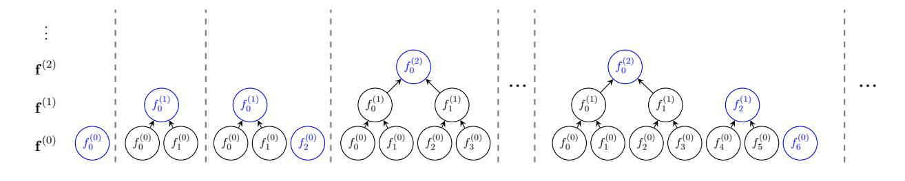
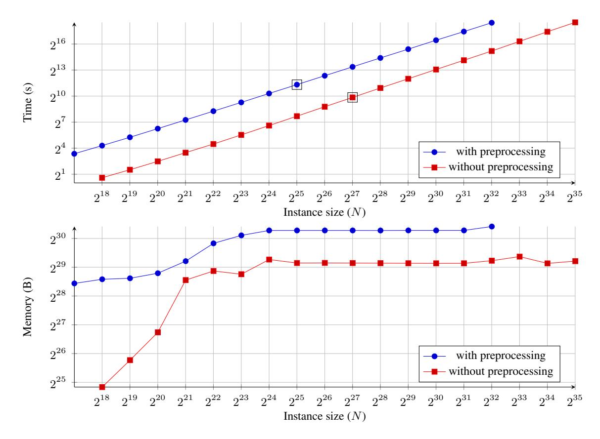

## Gemini: Elastic SNARKs for Diverse Environments

Jonathan Bootle jbt@zurich.ibm.com IBM Research

Alessandro Chiesa alessandro.chiesa@epfl.ch EPFL

Yuncong Hu yuncong\_hu@berkeley.edu UC Berkeley

Michele Orrù michele.orru@berkeley.edu UC Berkeley

### **Abstract**

We introduce and study *elastic SNARKs*, a class of succinct arguments where the prover has multiple configurations with different time and memory tradeoffs, which can be selected depending on the execution environment and the proved statement. The output proof is independent of the chosen configuration.

We construct an elastic SNARK for rank-1 constraint satisfiability (R1CS). In a time-efficient configuration, the prover uses a linear number of cryptographic operations and a linear amount of memory. In a space-efficient configuration, the prover uses a quasilinear number of cryptographic operations and a logarithmic amount of memory. A key component of our construction is an elastic probabilistic proof. Along the way, we also formulate a streaming framework for R1CS that we deem of independent interest.

We additionally contribute Gemini, a Rust implementation of our protocol. Our benchmarks show that Gemini, on a single machine, supports R1CS instances with tens of billions of constraints.

**Keywords**: interactive oracle proofs; SNARKs; streaming algorithms

## **Contents**

| 1 | Introduction<br>1.1<br>Our results                                             | 3<br>3   |  |  |  |  |  |  |  |
|---|--------------------------------------------------------------------------------|----------|--|--|--|--|--|--|--|
|   |                                                                                |          |  |  |  |  |  |  |  |
| 2 | Techniques<br>5                                                                |          |  |  |  |  |  |  |  |
|   | 2.1<br>Elasticity and a streaming model<br>                                    | 5        |  |  |  |  |  |  |  |
|   | 2.2<br>A modular construction of elastic SNARKs<br>                            | 6        |  |  |  |  |  |  |  |
|   | 2.3<br>An elastic realization of the KZG polynomial commitment scheme          | 7        |  |  |  |  |  |  |  |
|   | 2.4<br>An elastic scalar-product protocol<br>                                  | 8        |  |  |  |  |  |  |  |
|   | 2.5<br>Warm-up: an elastic non-holographic PIOP for R1CS                       | 12       |  |  |  |  |  |  |  |
|   | 2.6<br>Elastic holographic PIOP for R1CS                                       | 15       |  |  |  |  |  |  |  |
|   | 2.7<br>Implementation and optimizations<br>                                    | 19       |  |  |  |  |  |  |  |
|   | 2.8<br>Evaluation                                                              | 20       |  |  |  |  |  |  |  |
|   |                                                                                |          |  |  |  |  |  |  |  |
| 3 | Preliminaries<br>3.1<br>Notation                                               | 23<br>23 |  |  |  |  |  |  |  |
|   |                                                                                |          |  |  |  |  |  |  |  |
|   | 3.2<br>Polynomial IOPs<br>                                                     | 23       |  |  |  |  |  |  |  |
| 4 | Streaming model                                                                | 25       |  |  |  |  |  |  |  |
|   | 4.1<br>Streaming algorithms                                                    | 25       |  |  |  |  |  |  |  |
|   | 4.2<br>Streaming R1CS<br>                                                      | 26       |  |  |  |  |  |  |  |
|   |                                                                                |          |  |  |  |  |  |  |  |
| 5 | Tensor-product protocol                                                        | 27       |  |  |  |  |  |  |  |
|   | 5.1<br>Basic tensor-product protocol                                           | 27       |  |  |  |  |  |  |  |
|   | 5.2<br>Batched tensor-product protocol<br>                                     | 29       |  |  |  |  |  |  |  |
| 6 | Elastic protocols for scalar products                                          | 31       |  |  |  |  |  |  |  |
|   | 6.1<br>Elastic scalar-product protocol (special case)                          | 31       |  |  |  |  |  |  |  |
|   | 6.2<br>Proof of Theorem 6.2                                                    | 32       |  |  |  |  |  |  |  |
|   | 6.3<br>Space efficient realization of Construction 3<br>                       | 33       |  |  |  |  |  |  |  |
|   | 6.4<br>Elastic scalar-product protocol (general case)<br>                      | 35       |  |  |  |  |  |  |  |
|   | 6.5<br>Hadamard-product protocol                                               | 36       |  |  |  |  |  |  |  |
|   |                                                                                |          |  |  |  |  |  |  |  |
| 7 | A non-holographic protocol for R1CS                                            | 37       |  |  |  |  |  |  |  |
|   | 7.1<br>Proof of Theorem 7.1                                                    | 38       |  |  |  |  |  |  |  |
|   |                                                                                |          |  |  |  |  |  |  |  |
| 8 | Achieving holography<br>8.1<br>Proof of Theorem 8.1                            | 40<br>40 |  |  |  |  |  |  |  |
|   |                                                                                |          |  |  |  |  |  |  |  |
|   | 8.2<br>Lookup protocol<br>                                                     | 41       |  |  |  |  |  |  |  |
|   | 8.3<br>Entry product<br>                                                       | 46       |  |  |  |  |  |  |  |
| 9 | Polynomial commitment schemes                                                  | 48       |  |  |  |  |  |  |  |
|   | 9.1<br>Definition<br>                                                          | 48       |  |  |  |  |  |  |  |
|   | 9.2<br>An elastic polynomial commitment scheme<br>                             | 49       |  |  |  |  |  |  |  |
|   |                                                                                |          |  |  |  |  |  |  |  |
|   | 10 Elastic argument systems<br>10.1 Preprocessing arguments with universal SRS | 51<br>52 |  |  |  |  |  |  |  |
|   |                                                                                |          |  |  |  |  |  |  |  |
|   | 10.2 Elastic PIOP to argument compiler                                         | 52       |  |  |  |  |  |  |  |
|   | 10.3 Proof of Theorem 10.1<br>                                                 | 53       |  |  |  |  |  |  |  |
|   | Acknowledgements                                                               | 54       |  |  |  |  |  |  |  |
|   | References                                                                     | 54       |  |  |  |  |  |  |  |
|   |                                                                                |          |  |  |  |  |  |  |  |

## <span id="page-2-0"></span>**1 Introduction**

Succinct non-interactive arguments of knowledge (SNARKs) allow for efficient verification of NP statements. Recent years have seen a surge of interest in SNARKs, catalyzed by several real-world applications. While reducing argument size and verification time were an initial focus, the cost of running the prover algorithm has now emerged as a critical bottleneck. This is particularly important as the size of proved computations increases, and recent applications demand proving large computations.

For example, popular scaling solutions for blockchains (*roll-up architectures*) require regularly producing SNARKs attesting to the validity of large batches of transactions, which translates to proving the correctness of billions of gates. As another example, the Filecoin network generates proofs for about 930 billion constraints every day.[1](#page-2-2) In both cases, efficiently producing SNARKs attesting to the correctness of large computations is critical, yet many SNARK implementations today do not scale to large computations because of the prohibitive memory requirements of the proving algorithm. Indeed, research that focuses on the time complexity of the prover algorithm has achieved notable theoretical and practical improvements [\[BCGGHJ17;](#page-53-2) [BCGJM18;](#page-53-3) [XZZPS19;](#page-55-0) [Set20;](#page-55-1) [BCG20;](#page-53-4) [Lee20;](#page-55-2) [KMP20;](#page-55-3) [Zha+21;](#page-55-4) [BCL22;](#page-53-5) [GLSTW21;](#page-54-0) [RR22\]](#page-55-5), but with linear space complexity. These constructions rely on, among other things, a component that achieves linear-time proving via dynamic programming techniques [\[Tha13\]](#page-55-6), which demands storing in memory the proved computation.

The notion of *complexity-preserving SNARKs* introduced in [\[BC12\]](#page-53-6) aims to *simultaneously* optimize time and space: it requires that the prover's time and space complexity are at most polylogarithmic factors away from those of the proved computation. Complexity-preserving SNARKs were subsequently studied (and improved) in a line of works [\[BCCT13;](#page-53-7) [HR18;](#page-55-7) [BHRRS20;](#page-54-1) [BHRRS21\]](#page-54-2). The holy grail would be to preserve time and space complexity up to constant factors, but known constructions are far from this goal, and achieve improved space complexity at the expense of time complexity.

In sum, a line of works achieves excellent time complexity at the expense of space complexity, and a different line of works achieves excellent space complexity at the expense of time complexity. It remains a challenging open question to construct SNARKs that simultaneously do well in both parameters. In this paper we do not answer this question, but instead introduce and achieve a notion that meaningfully relaxes this goal: a single SNARK that can be configured to optimize for time complexity *or* optimize for space complexity.

## <span id="page-2-1"></span>**1.1 Our results**

- **(1) Elastic SNARKs.** We advocate the study of SNARKs whose prover admits two different realizations:
- a *time-efficient* prover that receives as input instance and witness;
- a *space-efficient* prover with *streaming* access to these same inputs.

These *elastic* provers can choose which realization to use, and allocate resources depending on the execution environment and the instance size. In addition, the two algorithms are compatible in such a way that during the execution of the protocol the space-efficient prover can pause and transcribe a prover state, and then the protocol can continue with the time-efficient prover (thereafter enjoying the benefits of the faster prover).

We build on the notion of streams in [\[BHRRS20\]](#page-54-1) to study the above goal. We study stream composition, and propose a definitional framework for streaming instances of Rank-1 Constraint Satisfiability (R1CS). Within this framework we contribute an elastic SNARK for R1CS that we describe next.

**(2) An elastic SNARK for R1CS.** We realize the above notion by constructing an elastic (preprocessing) SNARK for R1CS, that we name Gemini. In time-efficient mode the prover uses a linear number of

<span id="page-2-2"></span><sup>1</sup><https://research.protocol.ai/sites/snarks/>

cryptographic operations and linear space, and in space-efficient mode the prover uses a quasilinear number of cryptographic operations and logarithmic space. When referring to time efficiency, we use the asymptotic notation *O<sup>λ</sup>* to denote cryptographic operations, so to distinguish them from (less expensive) field operations for which we use the asymptotic notation *O*. Our main result is the (informally stated) theorem below.

<span id="page-3-2"></span>**Definition 1.** *The R1CS problem asks: given a finite field* F*, coefficient matrices A, B, C* ∈ F *N*×*N each containing at most M* = Ω(*N*) *non-zero entries,[2](#page-3-0) and an instance vector* **x** *over* F*, is there a witness vector* **w** *such that A***z** ◦ *B***z** = *C***z** *for* **z** := (**x***,* **w**) ∈ F *N ? (Here, "*◦*" denotes the entry-wise product.)*

<span id="page-3-1"></span>**Theorem 1** (informal)**.** *There exists an elastic SNARK for* RR1CS *whose prover admits two realizations:*

- *a* time-efficient *prover that runs in Oλ*(*M*) *time and O*(*M*) *space;*
- *a* space-efficient *prover that runs in Oλ*(*M* log<sup>2</sup> *M*) *time and O*(log *M*) *space.*

*Verification time is Oλ*(|**x**| + log *M*) *time and proof size is O*(log *M*)*.*

The above SNARK is obtained via a popular paradigm that combines a polynomial IOP and a polynomial commitment scheme in order to obtain an interactive argument, and then relies on the Fiat–Shamir paradigm to make the protocol non-interactive. The (omitted) cryptographic assumptions in the informal statement are inherited from those for the underlying polynomial commitment scheme, which in our case is [\[KZG10\]](#page-55-8).

Briefly, after observing that the polynomial commitment scheme in [\[KZG10\]](#page-55-8) can be realized elastically, our main contribution is achieving an elastic polynomial IOP. A key component of this latter is an elastic scalar product protocol, which runs in linear-time and linear-space or quasilinear-time and log-space. Our scalar product argument is based on the sumcheck protocol, which, thanks to its recursive nature, facilitates migrating from a space-efficient instance to a time-efficient one.

- **(3) Implementation.** We implement the construction of [Theorem 1](#page-3-1) in Rust using the arkworks ecosystem [\[ark\]](#page-53-8), replicating the modularity of the IOP construction. In particular, we develop new streaming-friendly primitives that we believe could be of independent interest for future projects realizing space-efficient cryptographic proofs. Our implementation additionally includes a simpler SNARK that is *not* preprocessing (the verification procedure reads R1CS instances without providing succinct verification). In [Section 2.7,](#page-18-0) we summarize our design choices and algorithmic optimizations for the implementation.
- **(4) Evaluation.** Most benchmarks for time-efficient SNARKs in the literature do not consider large circuits, due to prohibitive memory usage. Our benchmarks, discussed further in [Section 2.8,](#page-19-0) show the following.
- Gemini is able to prove instances of arbitrary size. On a single machine with a memory budget of around 1 GB, we ran the prover of the preprocessing SNARK for instances of size 2 <sup>32</sup> and the prover of the non-preprocessing SNARK (where the verifier reads the R1CS instance in full) for instances of size 2 35 . We "stopped" at these sizes only due to time constraints.
  - In contrast, the largest instance size reported in the literature is in DIZK [\[WZCPS18\]](#page-55-9), where a distributed realization of the preprocessing SNARK (with circuit-specific setup) of [\[Gro16\]](#page-54-3) is run for an R1CS instance of size 2 <sup>31</sup> over a cluster of 20 machines with 256 executors.
- Gemini is concretely and economically efficient. The preprocessing SNARK can prove instances of size 2 31 in two days and costs about 82% (about 400 USD) less than DIZK on Amazon EC2.
- Gemini provides succinct proofs and verification. For instances of size 2 <sup>35</sup>, the proof size is about 27 KB and the verification time is below 30 ms.

<span id="page-3-0"></span><sup>2</sup>Note that *M* = Ω(*N*) without loss of generality because if *M < N/*3 then there are variables of **z** that do not participate in any constraint, which can be dropped. Thus the main size measure for R1CS is the sparsity parameter *M*.

## <span id="page-4-0"></span>2 Techniques

We summarize the main ideas behind our results. In Section 2.1 we outline the streaming model that we use to express space-efficient algorithms. In Section 2.2 we describe how to construct elastic SNARKs from elastic polynomial commitment schemes and elastic probabilistic proofs. We describe an example of an elastic polynomial commitment scheme in Section 2.3. Then, in Sections 2.4 to 2.6 we sketch our elastic probabilistic proof. We conclude in Section 2.7 and Section 2.8 by discussing our implementation and evaluation.

## <span id="page-4-1"></span>2.1 Elasticity and a streaming model

The notion of elasticity refers to having multiple realizations of the same algorithm (more precisely, function) for use in different situations. Specifically in this work:

Elasticity means that we aim for two realizations: a **time-efficient realization** for a setting where time complexity is most important, possibly at the expense of space complexity; and a **space-efficient realization** for a setting where space complexity (i.e., memory consumption) is most important, possibly at the expense of time complexity.

This means that in theorem statements, and in their proofs, we will consider two realizations with different complexities for the same function (e.g., the SNARK prover).

Time-efficient algorithms are a familiar concept. Space-efficient algorithms in this paper are *streaming algorithms*: algorithms that receive their inputs in *streams* (small pieces at a time) so that they can use less memory than the size of their inputs. Below we elaborate on: (i) streams; and (ii) streaming algorithms.

Streams and streaming oracles. A *stream* is a sequence  $K \in \Sigma^I$ , where  $\Sigma$  is an alphabet and I is a well-ordered countable set. Streams are accessed via oracles: if K is a sequence, the *streaming oracle*  $\mathcal{S}(K)$  of K takes two input commands, start and next; the oracle responds to the i-th next command with the i-th element of K; in case earlier elements of the stream need to be read again, the start command resets the oracle to the first element in the sequence. The oracle does *not* allow random access to elements of K.

**Streaming algorithms.** A *streaming algorithm* is an algorithm that has access to its inputs via streaming oracles and produces a stream as its output, by outputting the next element upon receiving the next command. The complexity of a streaming algorithm is measured in terms of its time complexity, space complexity, and the number of passes that it makes over each input stream (via the start command).

Any binary operation over an alphabet can be viewed as a streaming algorithm which takes as input two sequences K and K' over the same alphabet  $\Sigma$  that are indexed by the same set I. The binary operation acts on successive pairs of elements of K and K', to produce a new stream on the fly. For instance, let  $\mathbf{f}$ ,  $\mathbf{g}$  be two vectors over a finite field  $\mathbb{F}$ , and  $\mathcal{S}(\mathbf{f})$ ,  $\mathcal{S}(\mathbf{g})$  their canonical streams. (The canonical stream of a vector is the sequence of its entries, from last to first.) For a scalar  $\rho \in \mathbb{F}$ , the stream  $\mathcal{S}(\mathbf{f} + \rho \mathbf{g})$  can be evaluated as a new stream using  $\mathcal{S}(\mathbf{f})$  and  $\mathcal{S}(\mathbf{g})$ , by responding to each next query in the following way: first query  $\mathcal{S}(\mathbf{f})$  to obtain the i-th entry  $f_i$  of  $\mathbf{f}$ ; then query  $\mathcal{S}(\mathbf{g})$  to obtain the i-th entry  $g_i$  of  $\mathbf{g}$ ; and finally respond with  $f_i + \rho g_i$ .

Since a streaming algorithm produces a stream as output, multiple streaming algorithms can be *composed* so that the output stream produced by one algorithm is the input stream for the next algorithm. The time and space complexity and number of input passes of streaming algorithms behave predictably under composition. If  $\mathcal{A}$  is a streaming algorithm with time complexity  $t_{\mathcal{A}}$ , space complexity  $s_{\mathcal{A}}$ , and  $k_{\mathcal{A}}$  input passes, and  $\mathcal{B}$  is a streaming algorithm with time complexity  $t_{\mathcal{B}}$ , space complexity  $s_{\mathcal{B}}$ , and  $k_{\mathcal{B}}$  input passes, then  $\mathcal{A}$  composed with  $\mathcal{B}$  has time complexity  $t_{\mathcal{A}} + k_{\mathcal{A}}t_{\mathcal{B}}$ , space complexity  $s_{\mathcal{A}} + s_{\mathcal{B}}$ , and  $k_{\mathcal{A}}k_{\mathcal{B}}$  input passes.

### <span id="page-5-0"></span>**2.2 A modular construction of elastic SNARKs**

Many succinct arguments are built in two steps. First, construct an information-theoretic probabilistic proof in a model where the verifier has a certain type of query access to the prover's messages. Second, compile the probabilistic proof into an interactive succinct argument, via a cryptographic commitment scheme that "supports" this query access.[3](#page-5-1) Finally, if non-interactivity is desired, apply the Fiat–Shamir transformation [\[FS86\]](#page-54-4). This modular approach has enabled researchers to study the efficiency and security of simpler components, which has facilitated much progress in succinct arguments.

We observe that the approach used in [\[CHMMVW20;](#page-54-5) [BFS20\]](#page-54-6) to construct SNARKs *preserves elasticity*: if the ingredients to the approach are elastic then the resulting SNARK is elastic. There are two ingredients.

- *Polynomial IOPs.* A probabilistic proof in which the prover sends polynomial oracles to the verifier, who accesses them via polynomial evaluation queries. This is an interactive oracle proof [\[BCS16;](#page-53-9) [RRR16\]](#page-55-10) where query access to prover messages is changed from "point queries" to "polynomial evaluation queries".
- *Polynomial commitments.* A cryptographic primitive that enables a sender to commit to a polynomial **f** ∈ F[*X*] of bounded degree, and later prove that **f**(*z*) = *v* for given *z, v* ∈ F.

If the polynomial IOP is additionally *holographic* then the resulting succinct argument is a *preprocessing argument*, which means that it is possible, in an offline phase, to perform a public computation that enables sub-linear verification in a later online phase. The lemma below summarizes how elasticity is preserved. The formal statement (and its proof) are relative to the formalism for streaming algorithms outlined in [Section 2.1.](#page-4-1)

<span id="page-5-3"></span>**Theorem 2** (informal)**.** *Suppose that we are given the following ingredients.*

- *A public-coin polynomial IOP for a relation* R *with: (i) time-efficient prover time t*P*; (ii) space-efficient prover space s*<sup>P</sup> *with k*<sup>P</sup> *passes; (iii) O oracles; (iv) query complexity q; (v) verifier complexity t*V*.*
- *A polynomial commitment scheme with: (i) time-efficient commit (and open) time t*PC*.*Com*; (ii) space-efficient commit (and open) space s*PC*.*Com *with k*PC*.*Com *passes; (iii) checking time t*PC*.*Check*.*

*Then there exists an interactive argument system for the relation* R *with: (i) time-efficient prover time t*<sup>P</sup> + *O* · *t*PC*.*Com + *q* · *t*PC*.*Com*; (ii) space-efficient prover space s*<sup>P</sup> + *O* · *s*PC*.*Com *with q* · *k*<sup>P</sup> · *k*PC*.*Com *passes; (iii) verifier complexity t*<sup>V</sup> + *q* ·*t*PC*.*Check*. Moreover, the argument system is preprocessing if the given polynomial IOP is holographic (with time and space properties similarly preserved by the transformation).*

Informally, the argument prover commits to each polynomial oracle via the polynomial commitment scheme, and answers polynomial evaluation queries by sending the requested evaluation along with a proof that it is consistent with the corresponding polynomial commitment. The security and most efficiency measures are studied in [\[CHMMVW20;](#page-54-5) [BFS20\]](#page-54-6). Less obvious is how space complexity is affected.

A streaming implementation of the PIOP prover does not necessarily produce all of its output polynomial streams one by one, and therefore the space complexity of the resulting argument prover is not, e.g., just the sum *s*<sup>P</sup> + *s*PC*.*Com of the PIOP prover space and the PC commitment algorithm space. When two (or more) of the PIOP prover's message polynomials all depend on the same input stream, the prover may avoid extra passes over the input stream by producing both of them at the same time which would require space *s*<sup>P</sup> + 2*s*PC*.*Com.[4](#page-5-2) Furthermore, the commitment algorithm requires several passes over a single input

<span id="page-5-1"></span><sup>3</sup>The argument prover and argument verifier emulate the underlying probabilistic proof, with the argument prover sending commitments to proof messages and sending answers to queries together with commitment openings to authenticate those answers.

<span id="page-5-2"></span><sup>4</sup>For example, if one polynomial consists of all of the even coefficients of another, one can produce streams of the coefficients of both polynomials simultaneously, in half the number of passes required to compute streams of each polynomial one at a time.

polynomial, so that the argument prover must run the PIOP prover several times in order to complete the commitment to each polynomial, keeping partially computed commitments to each polynomial in memory. Such considerations lead to the space-efficient argument prover having space complexity  $s_{\mathcal{P}} + O \cdot s_{\mathsf{PC.Com}}$  with  $q \cdot k_{\mathcal{P}} \cdot k_{\mathsf{PC.Com}}$  passes. Fortunately, the PIOP constructions in this paper actually satisfy the strong property that each polynomial can be produced independently without rerunning the entire prover algorithm, which reduces the space complexity to  $s_{\mathcal{P}} + s_{\mathsf{PC.Com}}$ .

**Remark 2.1** (types of polynomials). The above discussion is deliberately ambiguous about certain aspects: are the polynomials univariate or multivariate? are the polynomials represented as vectors of coefficients or as vectors of evaluations (or vectors in some other basis)? These details do not matter for Theorem 2 as long as the two ingredients "match up": if the PIOP outputs polynomials represented in a way that is compatible with how the PC scheme expects inputs. Nevertheless, in this paper we focus on the case of univariate polynomials represented as vectors of coefficients, because our construction and implementation are in this setting.

Remark 2.2 (multilinear vs. univariate). The fact that the approach in [CHMMVW20; BFS20] preserves space efficiency in the case of multilinear polynomials represented over the boolean hypercube was used in [BHRRS20; BHRRS21]. Theorem 2 is a straightforward observation about [CHMMVW20; BFS20] that additionally preserves elasticity. In particular, we believe that the constructions in [BHRRS20; BHRRS21] could be shown to have elastic realizations, by showing that the underlying multilinear PIOP and multilinear PC schemes have elastic realizations. We choose to work with univariate polynomials, instead of multilinear polynomials, because they have received more interest by practitioners, and thus focus our investigation on the concrete efficiency of elastic SNARKs based on univariate polynomials. We leave the study of concrete efficiency of elastic SNARKs based on multilinear polynomials to future work.

<span id="page-6-2"></span>**Remark 2.3** (elastic setup and indexer). For any succinct argument, elasticity is a desirable property as the size of the statement to be proven increases. In this paper we focus on elasticity of the prover, which is the main bottleneck for proving large instances. We briefly comment on elasticity for other algorithms.

- Setup. The setup algorithm samples the public parameters of the argument system. While the complexity of the setup algorithm can be linear (or more!) in the statement size, we do not discuss setup algorithms in this paper for two reasons: (i) known setup algorithms have straightforward realizations that are simultaneously efficient in time and space (there is less of a tension between optimizing for time or for space as there is for the prover); (ii) public parameters are typically sampled via "cryptographic ceremonies" that realize the setup functionality via secure multi-party protocols [BGM17], and so it is more relevant to discuss the time and space efficiency of the protocols that realize these ceremonies.
- *Indexer*. In the case of preprocessing arguments, an indexer algorithm produces the *proving key* and *verification key*. The indexer in our construction and implementation is elastic, but we do not discuss it since all ideas relevant for the indexer can be straightforwardly inferred from those relevant for the prover.

### <span id="page-6-0"></span>2.3 An elastic realization of the KZG polynomial commitment scheme

We use a univariate polynomial commitment scheme from [KZG10] to construct our SNARK (see Section 2.2). Below we review this scheme and explain how to realize it elastically.

**Review:** a polynomial commitment from [KZG10]. The setup algorithm samples and outputs public parameters for the scheme to support polynomials of degree at most  $D \in \mathbb{N}$ : the description of a bilinear group  $(\mathbb{G}_1, \mathbb{G}_2, \mathbb{G}_T, q, G, H, e)$ ; the commitment key  $\mathsf{ck} \coloneqq (G, \tau G, \dots, \tau^D G) \in \mathbb{G}_1^{D+1}$  for a random field

<span id="page-6-1"></span><sup>&</sup>lt;sup>5</sup>Here  $|\mathbb{G}_1| = |\mathbb{G}_2| = |\mathbb{G}_T| = q$ , G generates  $\mathbb{G}_1$ , H generates  $\mathbb{G}_2$ , and  $e: \mathbb{G}_1 \times \mathbb{G}_2 \to \mathbb{G}_T$  is a non-degenerate bilinear map.

element  $\tau \in \mathbb{F}_q$ ; and the receiver key  $\operatorname{rk} \coloneqq (G, H, \tau H) \in \mathbb{G}_1 \times \mathbb{G}_2^2$ . The commitment to a polynomial  $\mathbf{p} \in \mathbb{F}_q[X]$  of degree  $d \leq D$  is computed as  $C \coloneqq \langle \mathbf{p}, \operatorname{ck} \rangle = \mathbf{p}(\tau)G \in \mathbb{G}_1$ . Subsequently, to prove that the committed polynomial  $\mathbf{p}$  evaluates to v at  $z \in \mathbb{F}_q$ , the committer computes the witness polynomial  $\mathbf{w}(X) \coloneqq (\mathbf{p}(X) - \mathbf{p}(z))/(X - z)$ , and outputs the evaluation proof  $\pi \coloneqq \langle \mathbf{w}, \operatorname{ck} \rangle = \mathbf{w}(\tau)G \in \mathbb{G}_1$ . Finally, to verify the evaluation proof, the receiver checks that  $e(C - vG, H) = e(\pi, \tau H - zH)$ .

**Elastic realization.** An elastic realization of the above scheme requires a time-efficient realization and a space-efficient realization for each relevant algorithm of the scheme. Here we do not discuss the setup algorithm, as it has a natural time-and-space-efficient realization (see Remark 2.3). We do not discuss the verification algorithm either, because it only involves a constant number of scalar multiplications and pairings. Our focus is thus on the commitment and opening algorithm.

- Commitment algorithm. For  $d \leq D$ , we are given streams of the commitment key elements  $(G, \tau G, \dots, \tau^d G)$  and of the coefficients  $(p_i)_{i=0}^d$  of the polynomial  $\mathbf{p}(X) = \sum_{i=0}^d p_i X^i$  to be committed. We compute the commitment  $C = \sum_{i=0}^d p_i \tau^i G$  by multiplying each coefficient-key pair  $(p_i, \tau^i G)$  together and adding them to a running total. Each scalar-multiplication of  $p_i \cdot \tau^i G$  is performed in linear time and constant space.
- Opening algorithm. We are given the same streams as above, and an opening location z. By rearranging the expression for the witness polynomial  $\mathbf{w}(X) = (\mathbf{p}(X) \mathbf{p}(z))/(X z)$ , we stream the coefficients  $(w_i)_{i=0}^{d-1}$  of  $\mathbf{w}(X)$  via Ruffini's rule:  $w_i \coloneqq p_{i+1} + w_{i+1}z$ . The evaluation proof  $\pi = \sum_{i=0}^{d-1} w_i \tau^i G$  is computed in the same way as the commitment algorithm.

We discuss optimizations on the above streaming approach in Section 2.7.2.

Note that the recurrence relation in the opening algorithm uses  $w_{j+1}$  to compute  $w_j$ , which means that  $\mathbf{w}(X)$  is computed from its highest-degree coefficient to its lowest-degree coefficient. In turn, this means that the commitment key ck and the polynomial  $\mathbf{p}(X)$  are streamed from highest-degree to lowest-degree coefficient. The setup and commitment algorithms are agnostic to the streaming order.

The above discussion implies the following (informal) lemma.

**Lemma 2.4** (informal). The polynomial commitment scheme of [KZG10] has an elastic realization.

### <span id="page-7-0"></span>2.4 An elastic scalar-product protocol

A scalar-product protocol enables the prover to convince the verifier that the scalar product of two committed vectors equals a certain target value. Many constructions of succinct arguments for NP crucially rely on scalar-product protocols [BCCGP16; PLS19; BCG20]. The PIOP for R1CS that we construct in Sections 2.5 and 2.6 relies on a PIOP for scalar products where the prover has two realizations: (i) one that runs in linear-time and linear-space; and (ii) one that runs in quasilinear-time and logarithmic-space.

<span id="page-7-1"></span>**Definition 2.** A **PIOP for scalar products** is a PIOP where the verifier receives as input  $(\mathbb{F}, N, u)$  and has (polynomial evaluation) query access to  $\mathbf{f}, \mathbf{g} \in \mathbb{F}^N$ , and checks with the help of the prover that  $\langle \mathbf{f}, \mathbf{g} \rangle = u$ .

<span id="page-7-2"></span>**Theorem 2.5** (informal). For every finite field  $\mathbb{F}$ , there is a PIOP for scalar products over  $\mathbb{F}$  with the following parameters:

- soundness error  $O(N/|\mathbb{F}|)$ ;
- round complexity  $O(\log N)$ ;
- proof length O(N) and query complexity  $O(\log N)$ ;
- a time-efficient prover that runs in time O(N) and space O(N);
- a space-efficient prover that runs in time  $O(N \log N)$  and space  $O(\log N)$  (with  $O(\log N)$  input passes);

• a verifier that runs in time  $O(\log N)$  and space  $O(\log N)$ .

Below we outline the scalar-product protocol, deferring to Section 6 security proofs and a more in-depth discussion of the protocol. We also note that our PIOP uses two slightly different protocols: one for *twisted scalar-products*  $\langle \mathbf{f} \circ \mathbf{y}, \mathbf{g} \rangle = u$  for a vector  $\mathbf{y}$  of the form  $(1, \rho_0) \otimes (1, \rho_1) \otimes \cdots \otimes (1, \rho_{n-1})$  where  $n \coloneqq \log N$  (by log we denote the ceiling of the logarithm base 2); and one for Hadamard products  $\mathbf{f} \circ \mathbf{g} = \mathbf{h}$ . These follow from simple modifications to the scalar-product protocol.

We proceed in three steps. In Section 2.4.1 we describe how to reduce checking a scalar product to checking tensor products of univariate polynomials. In Section 2.4.2 we describe a tensor product protocol. In Section 2.4.3 we describe how to realize this latter protocol in an elastic way.

## <span id="page-8-0"></span>2.4.1 Verifying scalar products using the sumcheck protocol

Consider two vectors  $\mathbf{f}$ ,  $\mathbf{g} \in \mathbb{F}^N$  with  $\langle \mathbf{f}, \mathbf{g} \rangle = u$  as in Definition 2. The verifier has polynomial evaluation query access to  $\mathbf{f}$  and  $\mathbf{g}$  (the verifier can obtain any evaluations of the polynomials  $\mathbf{f}(X) = \sum_{i=0}^{N-1} f_i X^i$  and  $\mathbf{g}(X) = \sum_{i=0}^{N-1} g_i X^i$ ). The product polynomial  $\mathbf{h}(X) \coloneqq \mathbf{f}(X) \cdot \mathbf{g}(X^{-1})$  has  $\langle \mathbf{f}, \mathbf{g} \rangle = \sum_{i=0}^{N-1} f_i g_i$  as the coefficient of  $X^0$ , because for every  $i, j \in [N]$  the powers of X associated with  $f_i$  and  $g_j$  multiply together to give  $X^0$  if and only if i = j. Therefore, to check the scalar-product  $\langle \mathbf{f}, \mathbf{g} \rangle = u$ , it suffices to check that the coefficient of  $X^0$  in the product polynomial  $\mathbf{h}(X)$  equals u.

However, this check must somehow be performed without the prover actually computing  $\mathbf{h}(X)$ . This is because the fastest algorithm for computing  $\mathbf{h}(X)$  requires  $O(N\log N)$  time and O(N) space (via FFTs), which is neither time-efficient nor space-efficient. On the other hand, the scalar product  $\langle \mathbf{f}, \mathbf{g} \rangle = u$  can be checked (directly) in time O(N) and space O(1), which leaves open the possibility of a scalar-product protocol where the prover does better than computing  $\mathbf{h}(X)$  explicitly (and then running some protocol).

This issue is addressed in prior work, if the verifier can query the *multilinear* polynomials  $\hat{\mathbf{f}}(\mathbf{X})$  and  $\hat{\mathbf{g}}(\mathbf{X})$  associated to the vectors  $\mathbf{f}, \mathbf{g} \in \mathbb{F}^N$ : we index the entries of  $\mathbf{f}$  using binary vectors, and  $f_i = f_{b_0,\dots,b_{n-1}}$  is the coefficient of  $X_0^{b_0} \cdots X_{n-1}^{b_{n-1}}$ , where  $(b_0,\dots,b_{n-1})$  is the binary decomposition of i. Prior work [Tha13; XZZPS19; BCG20] yields the following lemma.

<span id="page-8-1"></span>**Lemma 2.6.** Let  $\mathbb{F}$  be a finite field and N be a positive integer; set  $n := \log N$ . Let  $\widehat{\mathbf{f}}(X_0, \dots, X_{n-1})$  and  $\widehat{\mathbf{g}}(X_0, \dots, X_{n-1})$  be multilinear polynomials. The sumcheck protocol (as a reduction to claims about polynomial evaluations) for the claim

$$\frac{1}{2^n} \sum_{\boldsymbol{\omega} \in \{-1,1\}^n} (\widehat{\mathbf{f}} \cdot \widehat{\mathbf{g}})(\boldsymbol{\omega}) = u$$

has the following properties: soundness error is  $O(\log N/|\mathbb{F}|)$ ; round complexity is  $O(\log N)$ ; prover time O(N); and verifier time  $O(\log N)$ .

One can use the (multivariate) sumcheck protocol of [LFKN92] to reduce  $\langle \mathbf{f}, \mathbf{g} \rangle = u$  to two evaluation queries  $\hat{\mathbf{f}}(\boldsymbol{\rho})$  and  $\hat{\mathbf{g}}(\boldsymbol{\rho})$ , where  $\boldsymbol{\rho} := (\rho_0, \dots, \rho_{n-1}) \in \mathbb{F}^n$  are the random verifier challenges used in the sumcheck protocol. Crucially, the prover algorithm in the sumcheck protocol applied to the product of two multilinear polynomials also has a space-efficient realization which runs in time  $O(N \log N)$  and space  $O(\log N)$  [CMT12], which would provide an elastic solution in this multilinear regime.

In our setting the verifier can only query the *univariate* polynomials  $\mathbf{f}(X)$  and  $\mathbf{g}(X)$  associated with the vectors  $\mathbf{f}, \mathbf{g} \in \mathbb{F}^N$ . Nevertheless, we follow a similar approach, by running the sumcheck protocol on the *multivariate* polynomials  $\hat{\mathbf{f}}(\mathbf{X})$  and  $\hat{\mathbf{g}}(\mathbf{X})$ , producing two claimed evaluations  $\hat{\mathbf{f}}(\boldsymbol{\rho}) = u$  and  $\hat{\mathbf{g}}(\boldsymbol{\rho}) = u'$ .

We check that these claimed evaluations are consistent with f and g using evaluations of the *univariate* polynomials f(X) and g(X) in the *tensor product protocol* of the following section.

<span id="page-9-3"></span>**Remark 2.7** (unstructured fields). Many probabilistic proofs using univariate polynomials (e.g., the low-degree test in [BBHR18]) require the size (of the multiplicative group) of the field  $\mathbb{F}$  to be *smooth*, so that the field contains high-degree roots of unity. In contrast, the scalar-product protocol in this paper (indeed, all the PIOPs in this paper) work with univariate polynomials over *any* field  $\mathbb{F}$  that is sufficiently large.

## <span id="page-9-0"></span>2.4.2 A tensor-product protocol

We seek a protocol for checking the multilinear evaluation  $\hat{\mathbf{f}}(\boldsymbol{\rho}) = v$  while having access to  $\mathbf{f}(X)$  (and possibly other polynomials sent by the prover) via univariate polynomial evaluations. Observe that  $\hat{\mathbf{f}}(\mathbf{X})$  and  $\mathbf{f}(X)$  have the same coefficients, and moreover the polynomial  $\hat{\mathbf{f}}(\rho_0, X_1, \dots, X_{\log N-1})$  (partially evaluating  $\hat{\mathbf{f}}(\mathbf{X})$  by setting  $X_0$  equal to  $\rho_0$ ) has the same coefficients as the polynomial  $\mathbf{f}'(X) \coloneqq \mathbf{f}_e(X) + \rho_0 \cdot \mathbf{f}_o(X)$ . Here,  $\mathbf{f}_e(X)$  and  $\mathbf{f}_o(X)$  are the odd and even parts defined by  $\mathbf{f}(X) = \mathbf{f}_e(X^2) + X\mathbf{f}_o(X^2)$ .

This suggests a protocol where the prover sends  $\mathbf{f}'(X)$  to the verifier. If the verifier can check that  $\mathbf{f}'(X)$  was correctly computed from  $\mathbf{f}(X)$ , then checking consistency between  $\mathbf{f}(X)$  and an evaluation of  $\hat{\mathbf{f}}(X_0,\ldots,X_{\log N-1})$  is reduced to checking consistency between  $\mathbf{f}'(X)$  and an evaluation of  $\hat{\mathbf{f}}(\rho_0,X_1,\ldots,X_{\log N-1})$ . Repeating this reduction with every value  $\rho_j$ , the prover and verifier arrive at a claim about constant-degree polynomials, which the prover can send to the verifier and the verifier directly checks.

To check that  $\mathbf{f}'(X)$  is consistent with  $\mathbf{f}(X)$ , the verifier samples a random challenge point  $\beta \in \mathbb{F}^{\times}$  (where  $\mathbb{F}^{\times}$  denotes the multiplicative group of  $\mathbb{F}$ ), and makes polynomial evaluation queries in order to check the following equations:

<span id="page-9-2"></span>
$$\mathbf{f}'(\beta^2) = \mathbf{f}_e(\beta) + \rho_0 \cdot \mathbf{f}_o(\beta) = \frac{\mathbf{f}(\beta) + \mathbf{f}(-\beta)}{2} + \rho_0 \cdot \frac{\mathbf{f}(\beta) - \mathbf{f}(-\beta)}{2\beta} . \tag{1}$$

This is reminiscent of a reduction in [BBHR18] used to construct a low-degree test for univariate polynomials. By the Schwartz–Zippel lemma, the check passes with small probability unless  $\mathbf{f}'(X)$  was computed correctly. Noting that  $\widehat{\mathbf{f}}(\boldsymbol{\rho}) = \langle \mathbf{f}, \otimes_{j=0}^{n-1}(1, \rho_j) \rangle$ , this procedure gives a (univariate) polynomial IOP for this relation.

**Definition 3.** The **tensor-product** relation  $\mathcal{R}_{TC}$  is the set of tuples

$$(i, \mathbf{x}, \mathbf{w}) = (\perp, (\mathbb{F}, N, \rho_0, \dots, \rho_{n-1}, u), \mathbf{f})$$

where 
$$n = \log N$$
,  $\mathbf{f} \in \mathbb{F}^N$ ,  $u \in \mathbb{F}$ , and  $\langle \mathbf{f}, \otimes_j (1, \rho_j) \rangle = u$ .

We provide details of the tensor-product protocol in Section 5. In fact, the tensor check will be useful not only as part of our scalar-product protocol, but also more generally as part of simple checks that take place as part of our R1CS protocols (as described in Sections 2.5 and 2.6).

### <span id="page-9-1"></span>2.4.3 Elastic realization of the prover algorithm

Most complexity measures claimed in Theorem 2.5 follow straightforwardly from the sumcheck protocol described in Lemma 2.6. We are left to describe an elastic realization of the prover algorithm for the tensor-product protocol.

The prover's task is to compute the polynomials  $\mathbf{f}^{(j)}$  for each round  $j \in [n]$ . Given  $\mathbf{f}^{(j-1)}$ , which has degree  $O(N/2^j)$ , the prover can compute  $\mathbf{f}^{(j)}$  in  $O(N/2^j)$  operations via Equation 1. Summing up the

<span id="page-10-0"></span>

**Figure 1:** A streaming algorithm for computing the coefficients of  $\mathbf{f}^{(j)}$  from  $\mathbf{f}^{(0)} := \mathbf{f}$ . Nodes in blue denote the coefficients that are stored in memory at any moment.

prover costs for  $j \in [n]$  gives O(N) operations. Hence a linear-time prover realization for the tensor-product protocol is straightforward. Next, we give a space-efficient prover realization that uses logarithmic space.

**Logarithmic space.** We want the prover to run in logarithmic space, given streaming access to  $\mathbf{f}$  and  $\mathbf{g}$ . This is different from the time-efficient case, as the prover cannot store  $\mathbf{f}^{(j-1)}$  to help it compute  $\mathbf{f}^{(j)}$ , as this requires linear space (for small j). Instead, the prover computes each  $\mathbf{f}^{(j)}$  from scratch using streams of  $\mathbf{f}$ .

First we explain how the prover can *produce* a stream of  $\mathbf{f}^{(j)}$  efficiently, given streaming access to  $\mathbf{f}$ , in a similar way to streaming evaluations of multivariate polynomials and low-degree extensions [CMT12; BHRRS20; BHRRS21]. Our contribution is to show that  $\mathbf{f}^{(j)}$  can be evaluated in O(N) time and  $O(\log N)$  space, saving a logarithmic factor over prior work. Then, we explain how to perform the consistency checks.

• Streaming  $\mathbf{f}^{(j)}$ . Let  $\mathbf{f} = \sum_{i=0}^{N-1} f_i X^i$ . We can compute  $\mathbf{f}' = \sum_{i=0}^{N/2-1} (f_{2i} + \rho f_{2i+1}) X^i$  from a stream of coefficients of  $\mathbf{f}$  by reading each pair of coefficients  $f_{2i}$ ,  $f_{2i+1}$  from the stream, and computing the next coefficient as  $f_i' \coloneqq f_{2i} + \rho f_{2i+1}$  of  $\mathbf{f}'$ . This uses a constant amount of space: store  $f_{2i}$  and  $f_{2i+1}$ , and delete them right after computing  $f_i'$ . Each coefficient of  $\mathbf{f}'$  costs two arithmetic operations to compute.

The prover can produce the stream  $\mathcal{S}(\mathbf{f}^{(j)})$  for  $\mathbf{f}^{(j)}$  by applying the same idea recursively as follows. Initialize a stack Stack consisting of pairs  $(j,x) \in [\log N] \times \mathbb{F}$ , and a list of challenges  $\rho_0, \ldots, \rho_j$ . To generate  $\mathcal{S}(\mathbf{f}^{(j)})$ , the prover proceeds as follows.

- If the top element in the stack is of the form (j, y) for some  $y \in \mathbb{F}$ , pop it and return y.
- If the top two elements in the stack are of the form (k', x') and (k, x) with k = k' (and k < j), then pop them and push  $(k+1, x + \rho_k x')$ , where  $x + \rho_k x'$  is equal to  $f_{k+1}^{(j)}$  (recall that the values are streamed from last to first index);
- Otherwise, query the stream  $S(\mathbf{f})$  for the next element  $x \in \mathbb{F}$  and add (0, x) to the stack.

The stack Stack must be initialized with some zero-entries if  $N \neq 2^n$  (for instance, where N is odd) for correctness, but we avoid discussing this case here for simplicity. A visual representation of this process is displayed in Figure 1. This procedure produces a stream of  $\mathbf{f}^{(j)}$  from a stream of  $\mathbf{f}$  in O(N) and using  $\log N$  memory space (since the stack Stack holds at most  $\log N$  elements at any time).

• Space-efficient tensor check. The verifier must perform consistency checks to make sure that each polynomial  $\mathbf{f}^{(j)}$  was correctly computed from  $\mathbf{f}^{(j-1)}$ , and similarly for  $\mathbf{g}^{(j)}$ . This check requires the computation of  $\mathbf{f}^{(0)}, \ldots, \mathbf{f}^{(n-1)}$ . We compute them in parallel with a minor modification to the algorithm illustrated in Figure 1. Instead of returning only when the top of the stack has a particular index, we always output the top element in the stack. We thus construct a streaming algorithm  $\mathcal{S}(\mathbf{f}^{(0)}, \ldots, \mathbf{f}^{(n-1)})$  that returns elements

of the form (*j, x*) ∈ [*n*] × F where *x* is the next coefficient of the polynomial **f** (*j*) . With the above stream, it is possible to produce all streams S(**f** (*j*) ) and evaluations **f** (*j*) (*β* 2 ), **f** (*j*) (+*β*), **f** (*j*) (−*β*), for each *j* ∈ [*n*] with a single pass over S(**f**). In particular computing each evaluation requires storing a single F-element; therefore, the total consistency check uses *n* = log *N* memory and *N* time. This allows to check [Equation 1,](#page-9-2) substituting **f** <sup>0</sup> = **f** (*j*) *,***f** = **f** (*j*−1) for *j* ∈ [*n*].

Based on the costs of maintaining the stacks for **f** and **g**, and computing the coefficients of **q** (*j*) incrementally, it follows that each round takes time *O*(*N*) and space *O*(log *N*). Therefore, summing over the *O*(log *N*) rounds, the protocol requires time *O*(*N* log *N*) and space *O*(log *N*).

**Remark 2.8.** Based on the tensor product protocol in [Section 2.4.2,](#page-9-0) one can construct a linear-time univariate sumcheck protocol with proof length *O*(*N*) and query complexity *O*(log *N*), which we believe could be of independent interest for future research. There are other univariate sumcheck protocols in the literature, however these protocols cannot be used in our setting.

- − The univariate sumcheck protocol in [\[BCRSVW19\]](#page-53-12) is a 1-message PIOP with proof length *O*(*N*) and query complexity *O*(1). That protocol does not seem useful here, because the prover requires *O*(*N* log *N*) time and *O*(*N*) space due to the use of FFTs. In contrast, our protocol achieves elasticity, at the cost of logarithmic round complexity and logarithmic query complexity.
- − Drake [\[Dra20\]](#page-54-9) sketches a Hadamard product protocol based on univariate polynomials that does not use FFTs. That protocol, also inspired by the low-degree test in [\[BBHR18\]](#page-53-11), may conceivably lead to a univariate sumcheck protocol that is elastic. No details (or implementations) of the protocol are available.

## <span id="page-11-0"></span>**2.5 Warm-up: an elastic non-holographic PIOP for R1CS**

We describe an elastic PIOP for R1CS [\(Definition 1\)](#page-3-2) based on the elastic scalar-product protocol in [Section 2.4.](#page-7-0) While not sublinear here, the verifier can be made elastic via similar techniques to the elastic prover. We build on this construction later in [Section 2.6,](#page-14-0) and construct a *holographic* PIOP with logarithmic verifier time.

<span id="page-11-1"></span>**Theorem 2.9** (informal)**.** *For every finite field* F*, there is a PIOP for* RR1CS *over* F *with the following parameters:*

- *soundness error O*(*N/*|F|)*;*
- *round complexity O*(log *N*)*;*
- *proof length O*(*N*) *and query complexity O*(log *N*)*;*
- *a time-efficient prover that runs in time O*(*M*) *and space O*(*M*)*;*
- *a space-efficient prover that runs in time O*(*M* log<sup>2</sup> *N*) *and space O*(log *N*) *(with O*(log *N*) *input passes);*
- *a time-efficient verifier that runs in time O*(*M*) *and space O*(*M*)*; and*
- *a space-efficient verifier that runs in time O*(*M* log *N*) *and space O*(log *N*) *(with O*(log *N*) *input passes). Above, N is dimension of R1CS matrices and M the number of non-zero entries in the R1CS matrices.*

The theorem holds for *any* finite field F, and in particular does not require any smoothness properties for F. In order for the space-efficient realization of the prover to be well-defined, we must adopt a streaming model for R1CS instances. Below we describe a choice that: (i) suffices for the theorem; (ii) is realistic (as we elaborate shortly). After that we outline the PIOP for R1CS (and postpone details to [Section 7\)](#page-36-0).

**Streaming R1CS.** The R1CS problem is captured using the following indexed relation:

**Definition 2.10.** The indexed relation  $\mathcal{R}_{R1CS}$  is the set of all triples  $(i, \mathbf{x}, \mathbf{w}) = ((\mathbb{F}, N, M, A, B, C), \mathbf{x}, \mathbf{w})$  where  $\mathbb{F}$  is a finite field, A, B, C are matrices in  $\mathbb{F}^{N \times N}$  each having at most M non-zero entries, and  $\mathbf{z} := (\mathbf{x}, \mathbf{w})$  is a vector in  $\mathbb{F}^N$  such that  $A\mathbf{z} \circ B\mathbf{z} = C\mathbf{z}$ .

We define streams for each of i, x, w, with A, B, C in sparse representation.

**Definition 2.11.** The stream of U is a pair  $(S_{rmaj}(U), S_{cmaj}(U))$ , where  $S_{rmaj}(U)$  denotes the sequence of elements in the support (row, column, value) ordered in in row major (that is, lexicographic order with row), and  $S_{cmaj}(U)$  denotes the ordering of the ordering of the same sequence in column major.

In our definition of streams for R1CS, we allow the *computation trace*  $(A\mathbf{z}, B\mathbf{z}, C\mathbf{z})$  of an R1CS instance to be streamed as part of the witness.

**Definition 2.12** (streaming R1CS). The streams associated with  $((\mathbb{F}, N, M, A, B, C), \mathbf{x}, \mathbf{w})$  consist of:

- index streams: streams of the R1CS matrices, in row-major and column-major:  $(S_{rmaj}(A), S_{cmaj}(A))$ ,  $(S_{rmaj}(B), S_{cmaj}(B))$ ,  $(S_{rmaj}(C), S_{cmaj}(C))$ ;
- instance stream: stream of the instance vector  $S(\mathbf{x})$ ;
- witness streams: stream of the witness  $S(\mathbf{w})$  and of the computation trace vectors  $S(A\mathbf{z})$ ,  $S(B\mathbf{z})$ ,  $S(C\mathbf{z})$ . The field description  $\mathbb{F}$ , instance size N, and maximum number M of non-zero entries are explicit inputs.

Including steams for the computation trace  $(A\mathbf{z}, B\mathbf{z}, C\mathbf{z})$  makes the PIOP for R1CS space efficient even when matrix multiplication by A, B, C requires a large amount of memory and the computation trace cannot be computed element by element on the fly given streaming access to  $\mathbf{x}$  and  $\mathbf{w}$ . On the other hand, for R1CS instances defined by many natural computations, such as a machine computation which repeatedly applies a transition function to a small state, the matrices A, B, C are such that their non-zero entries all lie in a thin, central diagonal band (that is, they are *banded*). In this case, one can generate a stream of  $\mathcal{S}(A\mathbf{z})$  using the streams  $\mathcal{S}(\mathbf{x}), \mathcal{S}(\mathbf{w})$ , and  $\mathcal{S}_{\text{cmai}}(A)$ . (And similarly for B and C.)

**The PIOP construction.** We outline the PIOP construction underlying Theorem 2.9. The protocol adopts standard ideas from [BCRSVW19] and an optimization from [Gab20] for concrete efficiency. In the time-efficient realization, the prover receives (i, x, w) as input and the verifier receives (i, x) as input. In the space-efficient realization, these inputs are provided as streams according to Definition 4.9.

In the first step of the protocol, the prover sends  $\mathbf{z}$  to the verifier. To check that  $A\mathbf{z} \circ B\mathbf{z} = C\mathbf{z}$ , the verifier replies by sending a random challenge  $v \in \mathbb{F}^{\times}$  to the prover, which the prover expands into a vector  $\mathbf{y}_C \coloneqq (1, v, v^2, \dots, v^{N-1})$ . Multiplying each side of the equation  $A\mathbf{z} \circ B\mathbf{z} = C\mathbf{z}$  on the left by  $\mathbf{y}_C^{\mathsf{T}}$ , the prover is left to convince the verifier that

<span id="page-12-0"></span>
$$\langle A\mathbf{z} \circ \mathbf{y}_C, B\mathbf{z} \rangle = \langle C\mathbf{z}, \mathbf{y}_C \rangle$$
 (2)

The prover sends the value  $u_C := \langle C\mathbf{z}, \mathbf{y}_C \rangle \in \mathbb{F}$  to the verifier. The prover will convince the verifier that Equation 2 holds by reducing the two claims  $\langle A\mathbf{z} \circ \mathbf{y}_C, B\mathbf{z} \rangle = u_C$  and  $\langle C\mathbf{z}, \mathbf{y}_C \rangle = u_C$  to tensor consistency checks on  $\mathbf{z}$ , for which we can apply the tensor-product protocol in Section 2.4.

As a subprotocol for the first claim, the prover and verifier run a twisted scalar product protocol, as described in Section 2.4. This generates two new claims, one about each of  $A\mathbf{z}$  and  $B\mathbf{z}$ , leaving us with a total of three claims:

<span id="page-12-1"></span>
$$\langle A\mathbf{z}, \mathbf{y}_{B} \circ \mathbf{y}_{C} \rangle = u_{A} ,$$
  
 $\langle B\mathbf{z}, \mathbf{y}_{B} \rangle = u_{B} ,$   
 $\langle C\mathbf{z}, \mathbf{y}_{C} \rangle = u_{C} .$  (3)

Here,  $\mathbf{y}_B := \otimes_j (1, \rho_j)$ , where  $\rho_0, \rho_1, \dots, \rho_{n-1} \in \mathbb{F}^\times$  are the random challenges sent by the verifier during the scalar-product protocol. Setting  $\mathbf{y}_A := \mathbf{y}_B \circ \mathbf{y}_C$ , and moving the matrices A, B, C into the right input argument of the scalar-product relation, we have

<span id="page-13-0"></span>
$$\langle \mathbf{z}, \mathbf{a}^* \rangle = u_A \quad \text{where} \quad \mathbf{a}^* := \mathbf{y}_A^{\mathsf{T}} A ,$$

$$\langle \mathbf{z}, \mathbf{b}^* \rangle = u_B \quad \text{where} \quad \mathbf{b}^* := \mathbf{y}_B^{\mathsf{T}} B ,$$

$$\langle \mathbf{z}, \mathbf{c}^* \rangle = u_C \quad \text{where} \quad \mathbf{c}^* := \mathbf{y}_C^{\mathsf{T}} C .$$
(4)

Although  $\mathbf{y}_B, \mathbf{y}_C, \mathbf{y}_A$  all have a tensor structure,  $\mathbf{a}^*, \mathbf{b}^*, \mathbf{c}^*$  will not generally have the same structure, which means that Equation 4 cannot be checked directly using the tensor-product protocol. Thus, the verifier sends another random challenge  $\eta \in \mathbb{F}^{\times}$  to the prover. Taking linear combinations of the three claims in Equation 4 using powers of  $\eta$  yields a single scalar-product claim

<span id="page-13-1"></span>
$$\langle \mathbf{z}, \, \mathbf{a}^* + \eta \cdot \mathbf{b}^* + \eta^2 \cdot \mathbf{c}^* \rangle = u_A + \eta \cdot u_B + \eta^2 \cdot u_C$$
 (5)

The prover and verifier run a second twisted scalar-product protocol for Equation 5. This produces two new claims

<span id="page-13-3"></span><span id="page-13-2"></span>
$$\langle \mathbf{z}, \mathbf{y} \rangle = u_D ,$$
 (6)

$$\langle \mathbf{a}^* + \eta \cdot \mathbf{b}^* + \eta^2 \cdot \mathbf{c}^*, \mathbf{y} \rangle = u_E , \qquad (7)$$

where y is a vector with the same tensor structure as described in Section 2.4, generated using random challenges produced by the verifier.

Finally, the prover and the verifier engage in a tensor-product protocol to check Equation 6. The verifier can check Equation 7 directly, since  $\mathbf{a}^*$ ,  $\mathbf{b}^*$ ,  $\mathbf{c}^*$  can be computed directly from the R1CS matrices A, B, C, along with the random challenges used throughout the R1CS protocol.

**Time-efficient prover.** The prover runs in linear time if the prover algorithms for the underlying scalar-product and tensor-product subprotocols are realized in linear time. Note that the cost of computing  $\mathbf{a}^*$ ,  $\mathbf{b}^*$ ,  $\mathbf{c}^*$  is linear in the number of non-zero entries in A, B, C. As a result, the verifier also runs in linear time.

**Space-efficient prover.** The scalar-product and tensor-product subprotocols used in the construction have a space-efficient prover that runs in time  $O(N \log N)$  and space  $O(\log N)$ , given  $O(\log N)$  passes over streams of the subprotocol inputs. Therefore, to give a space-efficient protocol for the entire R1CS protocol, it suffices to explain how to produce a stream for each subprotocol input.

The first twisted scalar-product protocol for  $\langle A\mathbf{z} \circ \mathbf{y}_C, B\mathbf{z} \rangle = u_C$  requires streaming access to  $A\mathbf{z}$ ,  $B\mathbf{z}$ ,  $\mathbf{y}_C$ . The prover has streaming access to  $A\mathbf{z}$  and  $B\mathbf{z}$  as part of the streams of the R1CS instance, so we explain how to generate a stream for the vector  $\mathbf{y}_C = \otimes_j (1, v^{2^j}) \in \mathbb{F}^N$ . This stream can be generated in O(N) field operations. Let  $v_j := v^{2^j}$  for  $j \in [0, \dots, n-1]$ . The i-th entry of  $\mathbf{y}_C$  is  $\prod_j v_j^{b_j}$ , where  $(b_0, \dots, b_{n-1})$  is the binary representation of i. Consider how the binary representation of i changes when we subtract 1 from i. If  $b_0 = 1$  then it simply changes to 0. If i ends with binary digits  $(b_0, \dots, b_{k-1}, b_k) = (0, \dots, 0, 1)$  then these digits change to  $(1, \dots, 1, 0)$ . This means that we can get from the i-th entry of  $\mathbf{y}_C$  to the (i-1)-th by multiplying by either  $v_0^{-1}$  or  $v_k^{-1}v_{k-1}\cdots v_0$  for some  $k \in [n]$ . To generate the stream of  $\mathbf{y}_C$ , the prover computes  $v_j := v^{2^j}$  for  $j \in [0, \dots, n-1]$  via repeated squaring, which uses  $O(\log N)$  operations and  $O(\log N)$  space. Then, the prover can generate each element of  $\mathbf{y}_C$  in O(N) operations by multiplying by the correct quotient.

The second scalar product protocol for Equation 5 requires streaming access to  $\mathbf{z}$ ,  $\mathbf{a}^* = \mathbf{y}_A^\mathsf{T} A$ ,  $\mathbf{b}^* = \mathbf{y}_B^\mathsf{T} B$  and  $\mathbf{c}^* = \mathbf{y}_C^\mathsf{T} C$ . The prover has access to  $\mathcal{S}(\mathbf{z})$  by concatenating the witness stream  $\mathcal{S}(\mathbf{w})$  to the instance

stream  $S(\mathbf{x})$ . To generate the stream of  $\mathbf{a}^* := \mathbf{y}_A^\mathsf{T} A$ , the prover computes the *i*-th element of  $\mathbf{a}^*$  by multiplying each element of  $\mathbf{y}_A$  by each element of the *i*-th column of  $\mathbf{a}^*$ , and adding the result to a running total. The stream  $S_{\text{cmaj}}(A)$  from the R1CS instance gives access to the non-zero entries of A, column by column. For  $\mathbf{y}_A$ , instead of generating the entire stream of  $\mathbf{y}_A$  for each *i*, which would cost  $O(N^2)$  field operations in total, the prover generates elements of  $\mathbf{y}_A$  on the fly, at a cost  $O(\log N)$  operations per element. Since A has M non-zero entries, the stream of  $\mathbf{a}^*$  costs  $O(M \log N)$  operations to compute. The scalar product protocol requires  $O(\log N)$  passes over the stream, and the prover runs in  $O(M \log^2 N)$  time.

Combining this with the space-efficient realizations of the scalar-product and tensor-product subprotocols, which require  $O(\log N)$  passes over their inputs, we obtain a space-efficient prover algorithm which runs in  $O(M\log^2 N)$  time and  $O(\log N)$  space.

## <span id="page-14-0"></span>2.6 Elastic holographic PIOP for R1CS

The verifier complexity in the non-holographic PIOP for R1CS described in Section 2.5 is linear in the size of the R1CS instance. To run a scalar-product protocol to check Equation 5, the verifier must compute  $\mathbf{a}^*, \mathbf{b}^*, \mathbf{c}^*$  via expensive matrix-vector multiplications involving all of the non-zero entries of the matrices A, B, C.

Below we describe how to construct a *holographic* PIOP for R1CS, in which the verifier's direct access to A, B, C is replaced by query access. In this PIOP, the prover can either run in linear-time and linear-space or quasilinear-time and log-space, while the verifier runs in logarithmic time (and thus logarithmic space).

**Theorem 3** (informal). For every finite field  $\mathbb{F}$ , there exists an **holographic** PIOP for  $\mathcal{R}_{R1CS}$  over  $\mathbb{F}$  with the following parameters:

- soundness error  $O(M/|\mathbb{F}|)$ ;
- round complexity  $O(\log M)$ ;
- proof length O(M) and query complexity  $O(\log M)$ ;
- an indexer that runs in time O(M) and space O(M);
- a time-efficient prover that runs in time O(M) and space O(M);
- a space-efficient prover that runs in time  $O(M \log^2 M)$  and space  $O(\log M)$  with  $O(\log M)$  input passes.
- a verifier that runs in time  $O(|\mathbf{x}| + \log M)$  (and thus space  $O(|\mathbf{x}| + \log M)$ ).

Here, M is the number of non-zero entries in the R1CS matrices.

**High-level overview.** Our protocol follows the strategy in [BCG20]. The main difference between the holographic PIOP here and the non-holographic PIOP in Section 2.5 is that the prover and verifier use an alternative strategy to check Equation 4. The verifier does not compute  $\mathbf{a}^*$  (respectively,  $\mathbf{b}^*$ ,  $\mathbf{c}^*$ ) to check that  $\langle \mathbf{z}, \mathbf{a}^* \rangle = u_A$  (same for B, C, cf. Equation 4). Instead, the prover sends additional oracle messages to the verifier, which correspond to partial computations of the scalar product; the verifier checks these via multiple auxiliary subprotocols. The key subprotocols are a *look-up* protocol and an *entry-product* protocol.

Our main contribution is a space-efficient realization of these subprotocols, which leads to a space-efficient holographic R1CS protocol. The main challenge is to show that it is possible to generate the prover's extra messages in a space-efficient manner from R1CS streams (Definition 4.9). This places particular restrictions on the design of a space-efficient look-up protocol, which we explain how to deal with in Section 2.6.1. We explain how to construct a space-efficient entry-product protocol in Section 2.6.2.

**Achieving holography.** For a matrix  $U \in \{A, B, C\}$ , consider the vectors  $\mathsf{row}_U$ ,  $\mathsf{col}_U$ ,  $\mathsf{val}_U \in \mathbb{F}^M$  such that, for every  $i \in [M]$ ,  $\mathsf{val}_{U,i} \in \mathbb{F}$  is the  $(\mathsf{row}_{U,i}, \mathsf{col}_{U,i})$ -entry of U, ordered column-major. We assume that the matrices A, B, C have the same support, which means that  $\mathsf{row} := \mathsf{row}_A = \mathsf{row}_B = \mathsf{row}_C$  and

 $col := col_A = col_B = col_C$ . This can be achieved by suitably padding  $val_A$ ,  $val_B$ ,  $val_C$  with zeroes, and increases the length of row, col, val by at most a factor of 3.

The prover constructs the following vectors and sends them to the verifier as oracle messages:

<span id="page-15-1"></span>
$$\mathbf{r}_{A}^{*} \coloneqq \mathbf{y}_{A}|_{\mathsf{row}} , \qquad \mathbf{r}_{B}^{*} \coloneqq \mathbf{y}_{B}|_{\mathsf{row}} , \qquad \mathbf{r}_{C}^{*} \coloneqq \mathbf{y}_{C}|_{\mathsf{row}} , \qquad \mathbf{z}^{*} \coloneqq \mathbf{z}|_{\mathsf{col}} ,$$
 (8)

where  $\mathbf{r}_A^*$  is the vector whose i-th element is the row<sub>i</sub>-th element of  $\mathbf{a}^*$ , and similarly for  $\mathbf{r}_B^*$ ,  $\mathbf{r}_C^*$ ,  $\mathbf{z}^*$ . That is,  $\mathbf{y}_A|_{\text{row}} := (\mathbf{y}_{A,i})_{i \in \text{row}}$ . One proceeds similarly for  $\mathbf{r}_B^*$ ,  $\mathbf{r}_C^*$ . Using Equation 8, Equation 3 can be reformulated as:

<span id="page-15-2"></span>
$$\langle \mathbf{r}_{A}^{*} \circ \mathsf{val}_{A}, \ \mathbf{z}^{*} \rangle = u_{A} \ ,$$

$$\langle \mathbf{r}_{B}^{*} \circ \mathsf{val}_{B}, \ \mathbf{z}^{*} \rangle = u_{B} \ ,$$

$$\langle \mathbf{r}_{C}^{*} \circ \mathsf{val}_{C}, \ \mathbf{z}^{*} \rangle = u_{C} \ .$$

$$(9)$$

Then, the verifier must check the three claims of Equation 9, and that  $\mathbf{r}_A^*$ ,  $\mathbf{r}_B^*$ ,  $\mathbf{r}_C^*$ ,  $\mathbf{z}^*$  were correctly computed. The prover and verifier run a twisted scalar-product protocol for the three claims. To check that  $\mathbf{r}_A^*$ ,  $\mathbf{r}_B^*$ ,  $\mathbf{r}_C^*$  and  $\mathbf{z}^*$  were correctly computed, the prover and verifier run a look-up protocol, which we describe in more detail in Section 2.6.1.

Elastic realization. The twisted scalar-product protocol and look-up protocol are elastic protocols with both time and space-efficient prover realization, and a succinct verifier. Our holographic PIOP for R1CS inherits a time-efficient prover and succinct verifier from these subprotocols. However, to give a space-efficient prover realization, we must show that the prover can produce streams of  $\mathbf{r}_A^*$ ,  $\mathbf{r}_B^*$ ,  $\mathbf{r}_C^*$ , using input R1CS streams and the verifier challenges. The R1CS streams  $\mathcal{S}_{\text{cmaj}}(A)$ ,  $\mathcal{S}_{\text{cmaj}}(B)$  and  $\mathcal{S}_{\text{cmaj}}(C)$  of the matrices A, B and C produce elements of the form  $(i, j, e) \in [N] \times [N] \times \mathbb{F}$ . Streaming only the first element of the triple produces the stream  $\mathcal{S}_{\text{cmaj,row}}(A) = \mathcal{S}_{\text{cmaj,row}}(B) = \mathcal{S}_{\text{cmaj,row}}(C)$  of the vector row (we recall that we assumed the support of A, B, C to be the same, and that row is ordered column-major).

Similarly, the second element of the triple induces a stream  $\mathcal{S}_{\text{cmaj.col}}(A)$  of the vector col, which is also equal to  $\mathcal{S}_{\text{cmaj.col}}(B)$  and  $\mathcal{S}_{\text{cmaj.col}}(C)$ , again since the support is the same. Additionally,  $\mathcal{S}_{\text{cmaj.col}}(A)$  is non-increasing: the column indices, in the dense representation of the matrix, are sorted in decreasing order when streamed column-major. As a result, the entries of  $\mathbf{z}^*$  can be produced one by one in O(1) space from streams  $\mathcal{S}(\mathbf{z})$  and  $\mathcal{S}_{\text{cmaj}}(A)$ : examine each entry of  $\mathcal{S}_{\text{cmaj.col}}(A)$ , advance forwards  $\mathbf{z}$  if the column changed, and output that same entry as long as the next element of  $\mathcal{S}_{\text{cmaj.col}}(A)$  stays unchanged.

The streams  $\mathcal{S}_{\mathrm{cmaj.val}}(A)$  (respectively,  $\mathcal{S}_{\mathrm{cmaj.val}}(B)$  and  $\mathcal{S}_{\mathrm{cmaj.val}}(C)$ ) are defined by projecting onto the third element of the streams  $\mathcal{S}_{\mathrm{cmaj}}(A)$  (respectively,  $\mathcal{S}_{\mathrm{cmaj}}(B)$  and  $\mathcal{S}_{\mathrm{cmaj}}(C)$ ), and produce the streams for the vectors  $\mathrm{val}_A$ ,  $\mathrm{val}_B$ , and  $\mathrm{val}_C$  in column-major order.

For  $\mathbf{r}_A^*$ ,  $\mathbf{r}_B^*$  and  $\mathbf{r}_C^*$ , recall that  $\mathbf{y}_B = \otimes_j (1, \rho_j)$ ,  $\mathbf{y}_C = \otimes_j (1, v^{2^j})$ , and  $\mathbf{y}_A = \mathbf{y}_B \circ \mathbf{y}_C = \otimes_j (1, \rho_j v^{2^j})$ . Thus, any entry of  $\mathbf{r}_B^*$  or  $\mathbf{r}_C^*$  (and hence  $\mathbf{r}_A^*$ ) can be computed in  $O(\log N)$  operations from  $v \in \mathbb{F}^\times$  and  $\rho_0, \dots, \rho_{n-1} \in \mathbb{F}^\times$ .

### <span id="page-15-0"></span>2.6.1 Lookup protocol

Lookup protocols enable the prover to convince the verifier that all of the entries in a vector  $\mathbf{g}^* \in \mathbb{F}^M$  appear as entries of another vector  $\mathbf{g} \in \mathbb{F}^N$  according to the data stored in the *address vector*  $\mathbf{addr} \in [N]^M$ , i.e.:

$$\{(\mathbf{g}_i^*,\mathsf{addr}_i)\}_{i\in[M]}\subseteq\{(\mathbf{g}_j,j)\}_{j\in[N]}\ .$$

We denote this condition by " $(\mathbf{g}^*, \mathsf{addr}) \subseteq (\mathbf{g}, [N])$ ". In order to verify that  $\mathbf{r}_U^*$  and  $\mathbf{z}^*$  were correctly computed, the verifier must check four lookup relations:

$$\begin{aligned} &(\mathbf{r}_{A}^{*},\mathsf{row}) \subseteq (\mathbf{y}_{A},[N]) \ , \\ &(\mathbf{r}_{B}^{*},\mathsf{row}) \subseteq (\mathbf{y}_{B},[N]) \ , \\ &(\mathbf{r}_{C}^{*},\mathsf{row}) \subseteq (\mathbf{y}_{C},[N]) \ , \\ &(\mathbf{z}^{*},\mathsf{col}) \subseteq (\mathbf{z},[N]) \ . \end{aligned}$$

Note that  $\mathbf{y}_A = \mathbf{y}_B \circ \mathbf{y}_C$ , and  $\mathbf{r}_A^*$ ,  $\mathbf{r}_B^*$ ,  $\mathbf{r}_C^*$  come from looking up the entries of  $\mathbf{y}_A$ ,  $\mathbf{y}_B$  and  $\mathbf{y}_C$  at the indices specified by row. Therefore, instead of checking that  $(\mathbf{r}_A^*, \text{row}) \subseteq (\mathbf{y}_A, [N])$ , it suffices to check the Hadamard product relation  $\mathbf{y}_A = \mathbf{y}_B \circ \mathbf{y}_C$ . This can be done using an extension of the twisted scalar product protocol. This leaves four look-up relations to check.

**Polynomial identities for look-up relations.** To verify look-up relations, we use the polynomial identity from [GW20] and construct a PIOP to verify it via an approach similar to [BCG20].

We reduce the lookup conditions  $(\mathbf{r}_U^*, \mathsf{row}) \subseteq (\mathbf{y}_U, [N])$  and  $(\mathbf{z}^*, \mathsf{col}) \subseteq (\mathbf{z}, [N])$  to simpler inclusion conditions such as  $\mathbf{f}^* \subseteq \mathbf{f}$ , where each entry in the vector  $\mathbf{f}^*$  equals some entry in the vector  $\mathbf{f}$ . To do so, for each matrix  $U \in \{A, B, C\}$ , we *algebraically hash* the pairs  $(\mathbf{z}^*, \mathsf{col}), (\mathbf{z}, [N]), (\mathbf{r}_U^*, \mathsf{row}), (\mathbf{y}_U, [N])$  into vectors  $\mathbf{z}^* + \eta \cdot \mathsf{col}$  (and similarly for the other pairs) in parallel, by taking a random linear combination of each pair using the same random challenge  $\eta \in \mathbb{F}^\times$  from the verifier. Let  $\mathsf{sort}(\mathbf{g}, \mathbf{f})$  denote the function that sorts the entries of  $\mathbf{g} \parallel \mathbf{f}$  according to order of appearance in  $\mathbf{f}$ .

**Lemma 2.13** ([GW20, Claim 3.1]). Let  $\mathbf{f}^* \in \mathbb{F}^M$  and  $\mathbf{f} \in \mathbb{F}^N$ . Then  $\mathbf{f}^* \subseteq \mathbf{f}$  if and only if there exists a witness  $\mathbf{w} \in \mathbb{F}^{M+N}$  such that the equation below in  $\mathbb{F}[Y, Z]$  is satisfied:

<span id="page-16-0"></span>
$$\prod_{j=0}^{M+N-1} \left( Y(1+Z) + w_{j+1} + w_j \cdot Z \right) = (1+Z)^M \prod_{j=0}^{M-1} \left( Y + f_j \right) \prod_{j=0}^{N-1} \left( Y(1+Z) + f_{j+1} + f_j \cdot Z \right)$$
(11)

where indices are taken (respectively) modulo M+N, N. If  $\mathbf{f}^* \subseteq \mathbf{f}$  then  $\mathbf{w} := \mathsf{sort}(\mathbf{f}^*, \mathbf{f})$  is a valid witness.

The strategy in the look-up protocol is for the prover to compute  $\mathbf w$  and prove that Equation 11 is satisfied, for every look-up relation that needs to be checked. The prover computes  $\mathbf w$  and sends it to the verifier. Then, the verifier sends random challenges  $v, \zeta \in \mathbb{F}^{\times}$  to the prover, who computes each of the three product expressions in Equation 11, evaluated at v and  $\zeta$ :

$$e_{0} = \prod_{i=0}^{M+N-1} \left( v(1+\zeta) + w_{i+1 \mod M+N} + w_{i} \cdot \zeta \right),$$

$$e_{1} = \prod_{i=0}^{M-1} \left( v + f_{i}^{*} \right),$$

$$e_{2} = \prod_{i=0}^{N-1} \left( v(1+\zeta) + f_{i+1 \mod N} + f_{i} \cdot \zeta \right).$$
(12)

The prover then sends the three product values  $e_0$ ,  $e_1$ ,  $e_2$  to the verifier. The verifier checks that Equation 11 holds at v and  $\zeta$  by checking that  $e_0 = (1+\zeta)^M e_1 e_2$ , and uses three *entry-product* subprotocols, which we describe in Section 2.6.2, to check that  $e_0$ ,  $e_1$ ,  $e_2$  were correctly computed from  $\mathbf{f}^*$ ,  $\mathbf{f}$ , and  $\mathbf{w}$ .

This approach requires polynomial query access to  $\mathbf{f}_{\circlearrowright}^*$ , the cyclic right-shift of  $\mathbf{f}^*$ , since the inputs to the entry product protocols depend on  $\mathbf{f}_{\circlearrowleft}^*$ . The look-up protocol in [BCG20] uses a *shift* subprotocol to check this condition. By contrast, we avoid this additional step by considering instead the lookup protocol over vectors with a leading zero coefficient. Queries on the right-shift  $\mathbf{f}_{\circlearrowleft}^*$  can be related to queries on  $\mathbf{f}^*$  with a single evaluation query, since the leading coefficient is known in advance. We explain this optimization in Section 8.

**Elastic realization.** As shown in prior work [BCG20], if the underlying entry product protocols have a linear-time prover realization and succinct verifier, then the same is true for the look-up protocol. We focus on explaining a space-efficient prover realization of the look-up protocol. Assuming that the entry-product protocol has a suitable space-efficient realization, it suffices to explain how to realize streaming access to look-up protocol vectors  $\mathbf{f}^*$ ,  $\mathbf{f}$ ,  $\mathbf{w}$  using previously derived streams.

First we consider  $(\mathbf{z}^*, \text{col})$  and  $(\mathbf{z}, [N])$ . Each pair is algebraically hashed into vectors  $\mathbf{f}^*$  and  $\mathbf{f}$ . One can produce the streams  $\mathcal{S}(\mathbf{f}^*)$  and  $\mathcal{S}(\mathbf{f})$  from the streams  $\mathcal{S}(\mathbf{z}^*)$ ,  $\mathcal{S}_{\text{cmaj.col}}(A)$ ,  $\mathcal{S}(\mathbf{z})$ ,  $\mathcal{S}([N])$ , by applying the same algebraic hash function to pairs of entries on-the-fly. The same applies to input pairs  $(\mathbf{r}_U^*, \text{row})$  and  $(\mathbf{y}_U, [N])$ .

Next we explain how to generate a stream of  $\mathbf{w} = \operatorname{sort}(\mathbf{f}^*, \mathbf{f})$  using small space. This is more challenging because storing the entire vectors  $\mathbf{f}^*$  and  $\mathbf{f}$  and sorting them requires space O(M+N). In the case of inputs  $(\mathbf{z}^*,\operatorname{col})$  and  $(\mathbf{z},[N])$ , as col is a non-decreasing sequence, it turns out that  $\mathcal{S}_{\operatorname{cmaj.col}}(A)$  is already sorted into a suitable order, and it suffices to *merge* the streams of  $\mathbf{f}^*$  and  $\mathbf{f}$  together to produce a stream for  $\mathbf{w}$ . The same is not true for row, which is not necessarily ordered. However, the vector row in non-decreasing form is already available from the inputs: it can be constructed from  $\mathcal{S}_{\operatorname{rmaj}}(A)$ , the sparse representation of the matrix in row-major order. To apply the same idea to input pairs  $\mathbf{r}_U^*$  and row, we build  $\mathcal{S}_{\operatorname{rmaj.row}}(A)$ , which is non-decreasing, and use it to produce the stream of the sorted vector for the lookup protocol. We describe our look-up protocol in more detail in Section 8.2.1.

On alternative proof techniques for look-up relations. Prior work such as [Set20] checks look-up relations using an *offline memory-checking* [BEGKN91; CDDGS03] abstraction in which the prover shows that g\* was correctly constructed entry by entry from g using read and write operations. This leads to an alternative polynomial identity replacing Equation 25, which uses a list of *timestamps* recording when a particular element of g\* is read from g. In this case though, it is unclear how to generate the timestamps required by this method without storing linear memory. While in [GW20] the polynomial relation is independent from the ordering of the matrix (row-major or column-major), the memory-checking approach requires random access to the vector row in order to access the last visited timestamps, which cannot be done in small space.

### <span id="page-17-0"></span>2.6.2 Entry product protocol

Let  $\mathbf{f} = (f_0, \dots, f_{N-1}) \in \mathbb{F}^N$  such that  $e = f_0 \cdots f_{N-1}$ . We describe an entry-product protocol, building on [BCG20, Sec. 6.4], that reduces an entry product statement  $\prod_i f_i = e$  to a single scalar-product relation, using polynomial evaluation query access to  $\mathbf{f}$ .

Compared with the prior work, our work exploits the structure of univariate polynomials to simplify the scheme and remove the need for *cyclic-shift tests* [BCG20, Sec. 6.3]. We propose additional optimizations in Section 2.7 which improve the concrete efficiency of our protocol.

**High-level overview.** Let  $\mathbf{f}$  be as above, with  $f_{N-1}=1.6$  Let  $\psi\in\mathbb{F}^{\times}$  and let  $\mathbf{y}'=(1,\psi,\ldots,\psi^{N-1})$ . Let

<span id="page-17-1"></span><sup>&</sup>lt;sup>6</sup>This restriction is merely didactical. Given any  $\mathbf{f} \in \mathbb{F}^N$ , representing the coefficients of a degree N-1 polynomial, it is easy to simulate polynomial-evaluation query access to  $(\mathbf{f},1)$  using the polynomial  $\mathbf{f}(X)+X^{N+1}$ . For any evaluation query in  $x \in \mathbb{F}$ , forward evaluation queries to  $\mathbf{f}$  and add  $x^{N+1}$  before returning. This costs  $O(\log N)$   $\mathbb{F}$ -ops.

g be the vector of partial products of the entries of f, that is:

$$\mathbf{g} := (\prod_{i>0} f_i, \quad \prod_{i>1} f_i, \quad \dots, \quad f_{N-2} f_{N-1}, \quad f_{N-1}) \tag{13}$$

Then, observe that:

<span id="page-18-1"></span>
$$\langle \mathbf{g} \circ \mathbf{y}', \mathbf{f}_{\circlearrowleft} \rangle = \sum_{i=1}^{N-1} g_i f_{i-1} \psi^i + g_0 f_{N-1}$$

$$= \sum_{i=1}^{N-1} g_{i-1} \psi^i + e + g_{N-1} \psi^N - g_{N-1} \psi^N$$

$$= \psi \mathbf{g}(\psi) + e - \psi^N .$$
(14)

In the entry product protocol, the prover sends the oracle  $\mathbf{g}$  to the verifier, and the verifier replies with the random challenge  $\psi \in \mathbb{F}^{\times}$ , and makes a polynomial evaluation query  $\mathbf{g}(\psi) = v$ . Then, both parties engage in a twisted scalar product protocol to verify Equation 14. Polynomial evaluation queries  $\mathbf{f}_{\bigcirc}(x)$  for  $x \in \mathbb{F}$  made as part of the twisted scalar-product protocol can be computed using evaluation queries  $\mathbf{f}(x)$ . To do this, note that  $\mathbf{f}_{\bigcirc}(x) = x\mathbf{f}(x) - x^N + 1$  since  $f_{N-1} = 1$ ; thus the verifier can compute  $\mathbf{f}_{\bigcirc}(x)$  from  $\mathbf{f}(x)$  in  $O(\log N)$  operations. We give a formal description of the entry product protocol in Section 8.3.

**Elastic realization.** As with other subprotocols, the entry-product protocol inherits a linear-time prover realization and succinct verifier from the underlying twisted scalar-product protocol.

To give a space-efficient realization, it suffices to show that  $\mathbf{g}$  can be generated element-by-element given access to the stream  $\mathcal{S}(\mathbf{f})$ : the partial products of elements of  $\mathbf{f}$  can be produced by streaming each successive element of  $\mathcal{S}(\mathbf{f})$  and multiplying it into a running product. Note that the partial products in  $\mathbf{g}$  are computed from the last entry to the first, starting with  $f_{N-1}$ . This is because streams of polynomials move from the highest-order coefficient to the lowest to be compatible with space-efficient commitment algorithms, as explained in Section 2.3.

### <span id="page-18-0"></span>2.7 Implementation and optimizations

We implemented the elastic SNARKs from Sections 2.5 and 2.6 by leveraging and extending arkworks [ark], a Rust ecosystem for developing and programming with zk-SNARKs. Our implementation is called ark-gemini, and is open-sourced as part of arkworks. The code structure follows the modular design of our construction, which involves combining an elastic polynomial commitment scheme and an elastic PIOP. We deem each of the components of our implementation (the streaming infrastructure, the commitment scheme, and the subprotocols for sumcheck, tensor check, entry product, and lookup) to be of independent interest for future work on space-efficient SNARKs. Below, we provide an overview of the streaming infrastructure and the algorithmic optimizations that we adopted in the implementation.

### 2.7.1 Streaming infrastructure

We extend the arkworks framework with support for streams in order to express space-efficient protocols. A stream is a wrapper over iter::Iterator, the Rust interface for iterators. Streams can be restarted and iterated over multiple times. We use Rust's borrow abstractions to produce streams that avoid copying elements whenever possible: a stream either returns a field element, or a reference to a field element. In other words, we have a zero-copy interface where data structures do not require to be copied from memory, unless really needed. In practice, input streams can be instantiated with arrays (e.g., memory-mapped files) or a

concurrent data stream downloaded from the web, but could be potentially extended to new inputs. Streams can be composed.

Baum, Malozemoff, Rosen, and Scholl [BMRS21] also study streaming provers, and provide a Rust implementation relying on asynchronous programming features of Rust. Rust's asynchronous streams are also iterators, and thus our approach can be seen as a generalization of their framework.

### <span id="page-19-1"></span>2.7.2 Optimizations

We leverage several algorithmic optimizations that improve the concrete performance of our scheme.

**Elastic provers.** Our elastic SNARK allows switching from the space-efficient implementation to the time-efficient implementation with specified memory threshold. For example, in the scalar product, if the prover has enough memory, then it can transcribe the intermediate prover state and proceed with the time-efficient implementation of the prover function. This allows for a more fine-grained control of the space complexity of the prover, and to benefit from the speed-up of the time-efficient prover for the last few rounds of the protocol. Since the prover's messages are the same in both modes, this switch does not affect the end result.

**Batch tensor-product protocols.** As discussed in Section 2.4.2, we use a tensor product protocol to check the multivariate evaluation claims resulting from the sumcheck protocol. In our holographic PIOP, we batch multiple tensor product claims in parallel using the same randomness. Moreover, the polynomials in each round can be batched into a single polynomial commitment per round of the tensor product protocol.

**Batch [KZG10] for multiple points and polynomials.** Boneh et al. [BDFG20] proposed an optimization of [KZG10] to batch evaluation proofs for a set of evaluation points over different polynomials, exploiting the structure of univariate polynomials. We adapt and implement these optimizations to our elastic polynomial commitment scheme. In particular, while our tensor product protocol requires the verifier to query different polynomials at different evaluation points, evaluation proofs are batched into a single group element. This makes the concrete size of the evaluation proof smaller than for multi-linear approaches such as [ZGKPP17; ZGKPP18], which require a logarithmic-size evaluation proof. We elaborate on this in Section 9.

Offline memory-checking. As discussed in Section 2.6.1, the offline memory-checking protocol is not compatible with space efficiency, because the computation of timestamps (in general) requires random-access over the sparse representation of the R1CS matrices A, B, C. Nevertheless, we observe that in the particular implementation of our protocol, the offline memory checking can be used to prove the lookup for  $(\mathbf{z}_U^\star, \operatorname{col}_U) \subseteq (\mathbf{z}, [N])$ . We view the offline memory-checking as an optimization because it is concretely more efficient than the plookup protocol. That is because the sender in the plookup protocol must send additional commitments to the verifier; whereas, the commitments in the offline memory-checking can be precomputed by the indexer. We elaborate on this in Section 8.2.2.

#### <span id="page-19-0"></span>2.8 Evaluation

We run extensive benchmarks for Gemini (both preprocessing and non-preprocessing SNARKs), over an Amazon AWS EC2 c5.9xlarge instance, with 36 cores. We use the Rust library rayon for multi-threading, and use parallelism for multi-scalar multiplications and for the batched sumcheck in the preprocessing SNARK (multiple sumcheck instances are run in parallel). We select BLS12-381 as the underlying pairing-friendly elliptic curve, but note that we do not rely on the smoothness of this curve's prime field (see Remark 2.7).

We benchmark instance sizes N from  $2^{18}$  to  $2^{35}$  (with M=N). These sizes are much larger than what is commonly reported in the literature, and showcase the behavior of our SNARK over very large instances.

**Proving space.** Gemini supports proving instances of arbitrary sizes. Figure 2 shows that memory usage remains constant as instance size increases: it is below 1GB memory for the non-preprocessing SNARK, and slightly more than 1GB for the preprocessing SNARK. Two main parameters affect memory usage.

- The memory budget allocated for multi-scalar multiplication (MSM). Algorithms for MSM (e.g., Pippenger's algorithm) achieve improved time efficiency at the expense of large space usage (linear in the number of scalar multiplications), which precludes an elastic implementation. In practice, to maintain space efficiency, it is useful to allocate a constant-size buffer, and apply the MSM algorithm over chunks of the inputs, accumulating the final result. We set the buffer to be of size  $2^{20}$ .
- The sumcheck round threshold, after which the elastic prover transcribes the sumcheck intermediate state and proceeds with the time-efficient algorithm. We set the threshold to 22: the last 22 rounds of the sumcheck protocol are performed with the time-efficient prover.

The memory usage is obtained reading the value of resident data and stack memory at regular intervals of 10 seconds on /proc/[pid]/statm.

The overall memory consumption appears constant, suggesting that the above parameters dominate the logarithmic factor in space complexity. The difference in memory consumption between the two SNARKs is explained by the batch sumcheck (used solely in the preprocessing SNARK), where multiple instances are transcribed in memory at the same time.

Our benchmarks stop at  $2^{35}$  for the non-preprocessing SNARK and the  $2^{32}$  for the preprocessing one, but the upper limit in our benchmarks is arbitrary: as long as it is possible to generate the input streams for the time prover, then prover can terminate while keeping memory usage small. Prior work on preprocessing SNARKs for R1CS provide benchmarks for sizes up to  $2^{20}$ . When running benchmarks ourselves to compare our work with previous literature such as Marlin<sup>7</sup>, we were unable to proceed beyond size  $2^{24}$  due to out of memory crashes. This is due to the kernel's OOM (Out Of Memory) Killer process that intervenes forbidding new allocations and terminating the prover before the end of its execution.<sup>8</sup>

**Proving time.** The elastic prover switches to the time-efficient mode if the intermediate state fits within the memory budget. In particular, when the instance size is small enough, the elastic prover runs in the time-efficient mode only. The most time expensive operations in the protocol are the cryptographic operations, namely the multi-scalar multiplications. For this reason, in Figure 2, where we show the running times for for different values of N, with M=N, it is possible to observe a graph that evolves almost linearly. The squared logarithmic factor does not influence noticeably the overall runtime (as far as we were able to measure within the window of instance sizes of our benchmarks).

**Proving cost in dollars.** The preprocessing SNARK prover spends about  $7.6 \times 10^{-5}$  seconds per gate. Using the AWS estimator (on-demand hourly cost 1.836 USD obtained from https://calculator.aws), we conclude that the cost for the preprocessing SNARK is about  $2.30 \times 10^{-5}$  USD per gate. In particular, the estimated cost for instance size  $2^{31}$  is 89 USD. In contrast, for this instance size, DIZK [WZCPS18] incurs a much higher cost at around 500 USD; this is because DIZK runs the prover on 20 more powerful and expensive machines (r3.8xlarge EC2 instances with on-demand hourly cost 2.656 USD) for about 10 hours. In the case of non-preprocessing SNARK, the cost is lower and around 40 USD for the size  $2^{35}$ .

**Proof size and verification time.** We measure the proof size and verification time for the preprocessing SNARK. The verifier can cheaply verify proofs for large instances since it does not read the instance (instead,

<span id="page-20-1"></span><span id="page-20-0"></span><sup>7</sup>cf. https://github.com/arkworks-rs/marlin.

<sup>&</sup>lt;sup>8</sup>We observe that the program will still crash if we instruct the kernel to allow for memory over commitment. See vm.overcommit=2 at https://www.kernel.org/doc/Documentation/vm/overcommit-accounting.

<span id="page-21-0"></span>

**Figure 2:** Running time (above) and memory usage (below) for the elastic prover in the *preprocessing* protocol (blue) and the *non-preprocessing* protocol (red), for different R1CS sizes with N=M. The black squares indicate the size for which the time-efficient prover triggers an out-of-memory crash (it uses too much memory).

it uses a short verification key derived from the instance). For instance sizes ranging from  $2^{12}$  to  $2^{35}$ , the proof size is about 13-27 KB and the verification time is about 16-30 ms.

### <span id="page-22-0"></span>3 Preliminaries

### <span id="page-22-1"></span>3.1 Notation

For integers a,b with a < b integers, let [a,b] denote the set  $\{a,\ldots,b-1\}$ ; [b] will be used as a shorthand for [0,b]. Let  $\log \colon \mathbb{N} \to \mathbb{Z}$  denote the base-2 logarithm function, rounded up to the nearest integer. Let  $\mathbb{F}$  be a field; and let  $\mathbb{F}^\times$  denote its invertible elements. For a vector  $\mathbf{a}$  over  $\mathbb{F}$  of length N, let  $a_i$  denote its i-th entry. Let  $\mathbf{a} \circ \mathbf{b}$  denote the Hadamard product of vectors  $\mathbf{a}$  and  $\mathbf{b}$ ;  $\mathbf{a} \cdot \mathbf{b}$  their dot product and  $\mathbf{a} \otimes \mathbf{b}$  their tensor product. We view vectors both as an element of  $\mathbb{F}^N$  as well as a polynomial in  $\mathbb{F}[X]$  of degree at most N. Given a vector  $\mathbf{a} \in \mathbb{F}^N$  and an indexing vector  $\mathrm{idx} \in [N]^M$ , let  $\mathbf{a}|_{\mathrm{idx}} \in \mathbb{F}^M$  be the vector whose i-th element is  $a_{\mathrm{idx}_i}$ . We will occasionally explicitly refer to the polynomial associated with a vector  $\mathbf{a} \in \mathbb{F}^N$  using the notation  $\mathbf{a}(X) \in \mathbb{F}[X]$ .

Algorithms are written in calligraphic math font. We use standard big O notation for asymptotic operations over field elements. We use  $\operatorname{negl}(\lambda)$  as a shorthand for  $\operatorname{negl}(\lambda) = \lambda^{-\omega(1)}$ . We use  $O_{\lambda}$  to describe big O notation in which  $\lambda$  is considered a constant. This will be useful when describing the cost of cryptographic operations, which depend on a security parameter  $\lambda$ .

We use S(a) to denote the stream of a. This is defined in Page 5 for vectors and matrices, and in Definition 4.9 for R1CS instances.

**Definition 3.1.** Let  $\mathbf{v} \in \mathbb{F}^N$ . We denote with  $\mathbf{v}_{\circlearrowright} \in \mathbb{F}^N$  the right rotation, i.e  $\mathbf{v}_{\circlearrowright} \coloneqq (v_N, v_1, \dots, v_{N-1})$ .

**Definition 3.2** (multilinear polynomials). Let  $\mathbf{f} \in \mathbb{F}^N$ , with  $N=2^n$ . Write  $\widehat{\mathbf{f}}(X_0,\ldots,X_{n-1})$  for the multilinear polynomial whose coefficients are the entries of  $\mathbf{f}$ , ordered so that  $\mathbf{f}_{i_0...i_{n-1}}$  is the coefficient of  $X_0^{i_0}\cdots X_{n-1}^{i_{n-1}}$ .

<span id="page-22-3"></span>**Definition 3.3** (odd and even parts). Let  $\mathbf{f}(X) \in \mathbb{F}[X]$ . Let  $\mathbf{f}_e(X), \mathbf{f}_o(X) \in \mathbb{F}[X]$  be the even and odd parts of  $\mathbf{f}(X)$  i.e. the unique polynomials such that  $\mathbf{f}(X) = \mathbf{f}_e(X^2) + X\mathbf{f}_o(X^2)$ .

## <span id="page-22-2"></span>3.2 Polynomial IOPs

A polynomial IOP [CHMMVW20; BFS20] over a field family  $\mathcal F$  for an indexed relation  $\mathcal R$  is specified by a tuple

$$\mathsf{IOP} = (\mathsf{k}, o, \mathsf{d}, \mathcal{I}, \mathcal{P}, \mathcal{V})$$

where  $k, o, d \colon \{0, 1\}^* \to \mathbb{N}$  are polynomial-time computable functions and  $\mathcal{I}, \mathcal{P}, \mathcal{V}$  are three algorithms known as the *indexer*, *prover*, and *verifier*. The parameter k specifies the number of interaction rounds, o specifies the number of polynomials in each round, and d specifies degree bounds on these polynomials.

In the offline phase ("0-th round"), the indexer  $\mathcal{I}$  receives as input a field  $\mathbb{F} \in \mathcal{F}$  and an index i for  $\mathcal{R}$ , and outputs o(0) polynomials  $\mathbf{p}_0^{(0)}, \ldots, \mathbf{p}_{o(0)-1}^{(0)} \in \mathbb{F}[X]$  of degrees at most  $d(|i|, 0, 1), \ldots, d(|i|, 0, o(0))$  respectively. Note that the offline phase does not depend on any particular instance or witness, and merely considers the task of encoding the given index i.

In the online phase, given an instance x and witness w such that  $(i,x,w) \in \mathcal{R}$ , the prover  $\mathcal{P}$  receives  $(\mathbb{F},i,x,w)$  and the verifier  $\mathcal{V}$  receives  $(\mathbb{F},x)$  and oracle access to the polynomials output by  $\mathcal{I}(\mathbb{F},i)$ . The prover  $\mathcal{P}$  and the verifier  $\mathcal{V}$  interact over k=k(|i|) rounds.

For  $j \in [k]$ , in the j-th round of interaction, the verifier  $\mathcal{V}$  sends a message  $\rho_j \in \mathbb{F}^\times$  to the prover  $\mathcal{P}$ ; then the prover  $\mathcal{P}$  replies with o(i) oracle polynomials  $\mathbf{p}_0^{(j)}, \dots, \mathbf{p}_{o(j)-1}^{(j)} \in \mathbb{F}[X]$ . The verifier may query any of the polynomials it has received any number of times. A query consists of a location  $z \in \mathbb{F}$  for an

oracle  $\mathbf{p}_i^{(j)}$ , and its corresponding answer is  $\mathbf{p}_i^{(j)}(z) \in \mathbb{F}$ . After the interaction, the verifier accepts or rejects. The function d determines which provers to consider for the completeness and soundness properties of the proof system. In more detail, we say that a (possibly malicious) prover  $\tilde{\mathcal{P}}$  is **admissible** for IOP if, on every interaction with the verifier  $\mathcal{V}$ , it holds that for every round  $j \in [k]$  and oracle index  $i \in [o(j)]$  we have  $\deg(\mathbf{p}_i^{(j)}) \leq \mathsf{d}(|\dot{\mathbf{i}}|,j,i)$ . The honest prover  $\mathcal{P}$  is required to be admissible under this definition.

**Remark 3.4** (non-oracle messages). We also allow the prover in an IOP to arbitrary messages that the verifier will simply read in full (without making any queries), at any point in the interaction, as in a typical interactive proof. We refer to such messages as *non-oracle messages*, to differentiate them from the *oracle messages* to which the verifier has query access. These non-oracle messages can typically be viewed as degenerate cases of oracle messages, and we use them in protocol descriptions for ease of exposition.

We say that IOP has perfect completeness and soundness error  $\epsilon$  if the following holds.

- Completeness. For every field  $\mathbb{F} \in \mathcal{F}$  and index-instance-witness tuple  $(i, x, w) \in \mathcal{R}$ , the probability that  $\mathcal{P}(\mathbb{F}, i, x, w)$  convinces  $\mathcal{V}^{\mathcal{I}(\mathbb{F}, i)}(\mathbb{F}, x)$  to accept in the interactive oracle protocol is 1.
- **Soundness.** For every field  $\mathbb{F} \in \mathcal{F}$ , index-instance pair  $(i, x) \notin \mathcal{L}(\mathcal{R})$ , and admissible prover  $\tilde{\mathcal{P}}$ , the probability that  $\tilde{\mathcal{P}}$  convinces  $\mathcal{V}^{\mathcal{I}(\mathbb{F},i)}(\mathbb{F},x)$  to accept in the interactive oracle protocol is at most  $\epsilon$ .

The proof length I is the sum of all degree bounds in the offline and online phases,  $I(|i|) := \sum_{j=0}^{\mathsf{k}(|i|)-1} \sum_{i=0}^{o(i)-1} \mathsf{d}(|i|,j,i)$ .

The *query complexity* q is the total number of queries made by the verifier to the polynomials. This includes queries to the polynomials output by the indexer and those sent by the prover.

All PIOPs that we construct achieve the stronger property of *knowledge soundness* (against admissible provers). We define both of these properties below.

**Knowledge soundness.** We say that IOP has knowledge error  $\epsilon$  if there exists a probabilistic polynomial-time extractor  $\mathbf{E}$  for which the following holds. For every field  $\mathbb{F} \in \mathcal{F}$ , index i, instance  $\mathbb{x}$ , and admissible prover  $\tilde{\mathcal{P}}$ , the probability that  $\mathbf{E}^{\tilde{\mathcal{P}}}(\mathbb{F}, i, \mathbb{x}, 1^{l(|i|)})$  outputs  $\mathbb{w}$  such that  $(i, \mathbb{x}, \mathbb{w}) \in \mathcal{R}$  is at least the probability that  $\tilde{\mathcal{P}}$  convinces  $\mathcal{V}^{\mathcal{I}(\mathbb{F},i)}(\mathbb{F},\mathbb{x})$  to accept minus  $\epsilon$ . Here the notation  $\mathbf{E}^{\tilde{\mathcal{P}}}$  means that the extractor  $\mathbf{E}$  has black-box access to each of the next-message functions that define the interactive algorithm  $\tilde{\mathcal{P}}$ . (In particular, the extractor  $\mathbf{E}$  can "rewind" the prover  $\tilde{\mathcal{P}}$ .) Note that since  $\mathbf{E}$  receives the proof length  $\mathbb{I}(|i|)$  in unary,  $\mathbf{E}$  has enough time to receive, and perform efficient computations on, polynomials output by  $\tilde{\mathcal{P}}$ .

**Additional properties.** All of our PIOP protocols will satisfy the following additional properties:

- *Public coins:* IOP is *public-coin* if each verifier message to the prover is a uniformly random string of some prescribed length (or an empty string). Hence the verifier's randomness is its messages  $\rho_0, \ldots, \rho_{k-1} \in \mathbb{F}^{\times}$  and possibly additional randomness  $\rho_k \in \mathbb{F}^{\times}$  used after the interaction. All verifier queries can be postponed, without loss of generality, to a query phase that occurs after the interactive phase with the prover.
- *Non-adaptive queries:* IOP is *non-adaptive* if all of the verifier's query locations are solely determined by the verifier's randomness and inputs (the field  $\mathbb{F}$  and the instance  $\mathbb{x}$ ).

**Polynomial IOPs of proximity.** An *polynomial IOP of proximity* is similar to a PIOP, with the difference that the verifier  $\mathcal{V}$  has query access to the candidate witness  $\mathbf{w}$  (we assume that  $\mathbf{w}$  can be parsed as a polynomial or polynomials) as well as  $(\mathcal{I}(\mathbb{F}, \mathbf{i}), \mathbf{p}_0^{(0)}, \dots, \mathbf{p}_{o(\mathbf{k})-1}^{(k-1)})$ . Completeness and soundness properties of PIOPPs are defined similarly to those of PIOPs, except that  $\mathcal{V}$  has query access to the polynomials in the witness  $\mathbf{w}$ .

## <span id="page-24-0"></span>**4 Streaming model**

We provide a formal model of streams and streaming algorithms.

**Definition 4.1.** *A* stream *is a sequence K* ∈ Σ *I , where* Σ *is a finite alphabet, and I is a well-ordered set.*

**Definition 4.2** (streaming oracle)**.** *Let K be a stream over the alphabet* Σ *and index I. The* streaming oracle S(*K*) *of K behaves as follows:*

- *On inputs* start *and a session number L* ∈ N*, the oracle creates or resets a counter i<sup>L</sup>* ∈ *I* ∪ {⊥} *which is initially set to the first element of I.*
- *On inputs* next *and a session number <sup>L</sup>* <sup>∈</sup> <sup>N</sup>*, if <sup>i</sup><sup>L</sup>* <sup>∈</sup> *<sup>I</sup>, then the oracle returns <sup>k</sup>i<sup>L</sup>* ∈ *U, and updates i<sup>L</sup> to the next element of I (or to* ⊥ *if i<sup>L</sup> is equal to the last element of I). If i<sup>L</sup>* = ⊥ *then the oracle returns* ⊥*.*

**Remark 4.3.** The use of session numbers *L* allows the same stream to be accessed in different positions by multiple algorithms simultaneously. However, to avoid an unrealistic streaming model in which algorithms have arbitrary random access to streamed data, in this work, no stream will be accessed through more than a logarithmic number of sessions simultaneously.

If *v* is an array whose elements have a clear ordering in context, then we simply say that *A* has streaming oracle access to *v*. We now introduce the streaming algorithm, which has access to streaming oracles in a specific order and produce an output stream.

## <span id="page-24-1"></span>**4.1 Streaming algorithms**

**Definition 4.4** (streaming algorithm)**.** *We say that A is a* **streaming algorithm** *over* Σ *if A receives no inputs, but has access to various streaming oracles* S(*K*<sup>1</sup> )*, . . . ,* S(*K<sup>l</sup>* ) *over some alphabet* Σ *through* start *and* next *commands. In addition, A produces output upon receiving the command* next*, which takes one element of* Σ *as input. We write O* = *A*(S(*K*<sup>1</sup> )*, . . . ,* S(*K<sup>l</sup>* )) *to show that O is the entire output stream of A.*

It is possible to compose streaming algorithms so that one stream algorithm has streaming access to the output of another stream algorithm.

**Definition 4.5** (composing streaming algorithms)**.** *Let A and B be streaming algorithms. Suppose that B takes inputs* S(*K*<sup>1</sup> )*, . . . ,* S(*K<sup>l</sup>* )*. We write A*(*B*) *when A interacts with B as follows:*

- *when A sends a* start *command to B, the execution of B is reset, and A also sends* start *commands to each of* S(*K*<sup>1</sup> )*, . . . ,* S(*K<sup>l</sup>* )*;*
- *A forwards any* start *or* next *command from B to the correct streaming oracle, and returns the output to B;*
- *on input* next*, the execution of B yields the next outputs and returns it to A.*

<span id="page-24-2"></span>**Lemma 4.6.** *If* A *is a streaming algorithm with time complexity t*A*, space complexity s*A*, and k*<sup>A</sup> *input passes, and* B *is a streaming algorithm with time complexity t*B*, space complexity s*B*, and k*<sup>B</sup> *input passes, then* A *composed with* B *has time complexity t*<sup>A</sup> + *k*A*t*B*, space complexity s*<sup>A</sup> + *s*B*, and k*A*k*<sup>B</sup> *input passes.*

## <span id="page-25-0"></span>4.2 Streaming R1CS

We introduce the streaming R1CS model. We begin by recalling the indexed R1CS relation.

**Definition 4.7.** The indexed relation  $\mathcal{R}_{R1CS}$  is the set of all triples  $(i, x, w) = ((\mathbb{F}, N, M, A, B, C), \mathbf{x}, \mathbf{w})$  where  $\mathbb{F}$  is a finite field, A, B, C are matrices in  $\mathbb{F}^{N \times N}$  each having at most M non-zero entries, and  $\mathbf{z} := (\mathbf{x}, \mathbf{w})$  is a vector in  $\mathbb{F}^N$  such that  $A\mathbf{z} \circ B\mathbf{z} = C\mathbf{z}$ .

We define a streaming R1CS instance in the terms of the sparse representation of the R1CS matrices A, B and C.

**Definition 4.8.** The stream of U is a pair  $(S_{\mathrm{rmaj}}(U), S_{\mathrm{cmaj}}(U))$ , where  $S_{\mathrm{rmaj}}(U)$  denotes the sequence of elements in the support (row, column, value) ordered in in row major (that is, lexicographic order with row), and  $S_{\mathrm{cmaj}}(U)$  denotes the ordering of the ordering of the same sequence in column major.

<span id="page-25-1"></span>**Definition 4.9** (streaming R1CS). The streams associated with  $((\mathbb{F}, N, M, A, B, C), \mathbf{x}, \mathbf{w})$  consist of:

- index streams: streams of the R1CS matrices, in row-major and column-major:  $(S_{rmaj}(A), S_{cmaj}(A))$ ,  $(S_{rmaj}(B), S_{cmaj}(B))$ ,  $(S_{rmaj}(C), S_{cmaj}(C))$ ;
- instance stream: stream of the instance vector  $S(\mathbf{x})$ ;
- witness streams: stream of the witness  $S(\mathbf{w})$  and of the computation trace vectors  $S(A\mathbf{z})$ ,  $S(B\mathbf{z})$ ,  $S(C\mathbf{z})$ . The field description  $\mathbb{F}$ , instance size N, and maximum number M of non-zero entries are explicit inputs.

The streaming R1CS relation naturally captures other models of computation, such as R1CS automata.

**Definition 4.10** (R1CS automata). Let  $\mathbb{F}$  be a finite field,  $T \in \mathbb{N}$  be a computation time, and  $k \in \mathbb{N}$  a computation width. We consider execution traces  $f \in (\mathbb{F}^k)^T$ . Each state  $f[t] \in \mathbb{F}^k$  represents the state of the computation at time  $t \in [T]$ .

An RICS automaton is specified by matrices  $A, B, C \in \mathbb{F}^{k \times 2k}$  that define constraints between different time steps, and a set of boundary constraints  $\mathcal{B} \subseteq [T] \times [k] \times \mathbb{F}$ .

An execution trace f is accepted by the automaton if:

- f satisfies the R1CS time constraints i.e.  $\forall t \in [T]$ , it holds that  $Af[t, t+1] \circ Bf[t, t+1] = Af[t, t+1]$ ;
- f satisfies the R1CS boundary conditions i.e.  $\forall (t, j, \alpha) \in \mathcal{B}$  it holds that  $f[t]_i = \alpha$ .

**Theorem 4.11** (automata to streaming R1CS). Let  $(\mathbb{F}, k, T, A, B, C, \mathcal{B})$  be an R1CS automata instance. Then there is an R1CS instance which verifies the same computation as  $(\mathbb{F}, k, T, A, B, C, \mathcal{B})$ , and whose streams, for the streaming R1CS model, can be produced in time  $O(k^2 \log k)$  and space  $O(k^2)$ .

Further, the witness streams can be produced from f in  $O(k^2)$  operations per element of  $\mathbb{F}^k$ , and using space  $O(k^2)$ .

## <span id="page-26-0"></span>5 Tensor-product protocol

We introduce a tensor-product checking protocol which is used in our constructions. Then we show how to batch multiple tensor-product checks, which leads to better performance than running the basic protocol multiple times.

## <span id="page-26-1"></span>5.1 Basic tensor-product protocol

The tensor-product protocol checks the following relation.

**Definition 5.1.** The **tensor-product** relation  $\mathcal{R}_{\mathrm{TC}}$  is the set of tuples

$$(i, x, w) = (\bot, (\mathbb{F}, N, \rho_0, \dots, \rho_{n-1}, u), \mathbf{f})$$

where  $n = \log N$ ,  $\mathbf{f} \in \mathbb{F}^N$ ,  $u \in \mathbb{F}$ , and  $\langle \mathbf{f}, \otimes_i (1, \rho_i) \rangle = u$ .

<span id="page-26-2"></span>**Theorem 5.2.** For every finite field  $\mathbb{F}$  and positive integer N, there is a PIOP for the indexed relation  $\mathcal{R}_{TC}$  that supports instances over  $\mathbb{F}$ , with:

| time-efficient           | space-efficient | verifier | soundness                              | round<br>complexity | message     | query       |  |
|--------------------------|-----------------|----------|----------------------------------------|---------------------|-------------|-------------|--|
| prover prover time       |                 | ume      | error                                  | complexity          | complexity  | complexity  |  |
| O(N) F-ops $O(N)$ memory |                 |          | $O\left(\frac{N}{ \mathbb{F} }\right)$ | $O(\log N)$         | $O(\log N)$ | $O(\log N)$ |  |

We prove Theorem 5.2 with the following construction.

<span id="page-26-3"></span>**Construction 1.** We construct a PIOP for the indexed relation  $\mathcal{R}_{TC}$ . The prover  $\mathcal{P}$  takes as input an index  $i = \bot$ , instance  $x = (\mathbb{F}, N, \rho_0, \ldots, \rho_{n-1}, u)$ , and witness w = f; the verifier  $\mathcal{V}$  takes as input the index i and the instance x.

- Write  $\mathbf{f}^{(0)}(X) = \mathbf{f}(X)$ .
- For  $j \in [n]$ , the prover  $\mathcal{P}$  computes

$$\mathbf{f}^{(j)}(X) := \mathbf{f}_e^{(j-1)}(X) + \rho_{j-1} \cdot \mathbf{f}_e^{(j-1)}(X)$$
.

where  $\mathbf{f}^{(j)}(X) = \mathbf{f}_e^{(j-1)}(X^2) + X\mathbf{f}^{(j)}(X^2)_o$ . The prover sends the oracle messages  $\mathbf{f}^{(1)}, \dots, \mathbf{f}^{(n-1)}$  to the verifier.

• The verifier V samples a challenge  $\beta \leftarrow \mathbb{F}^{\times}$  uniformly at random and makes the following evaluation queries for  $j \in [n]$ :

<span id="page-26-5"></span>
$$e^{(j)} := \mathbf{f}^{(j)}(\beta), \qquad \bar{e}^{(j)} := \mathbf{f}^{(j)}(-\beta), \qquad \hat{e}^{(j)} := \mathbf{f}^{(j+1)}(\beta^2),$$

$$(15)$$

Skip  $\hat{e}^{(n)}$  and artificially set  $\hat{e}^{(n)} := u$ .

• check that, for all  $j \in [n]$ :

<span id="page-26-4"></span>
$$\hat{e}^{(j)} = \frac{e^{(j)} + \bar{e}^{(j)}}{2} + \rho_j \cdot \frac{e^{(j)} - \bar{e}^{(j)}}{2\beta},\tag{16}$$

### **Lemma 5.3.** Construction 1 has perfect completeness.

*Proof.* Suppose that  $\langle \mathbf{f}, \otimes_j (1, \rho_j) \rangle = u$ . We argue that the verifier's consistency checks of Equation 16 are satisfied. Firstly, indexing  $\mathbf{f} \in \mathbb{F}^N$  by  $i_0, \dots, i_{n-1} \in \{0, 1\}$ , one can prove by induction on j that:

$$\mathbf{f}^{(j)}(X) = \sum_{i_0, \dots, i_{n-1} \in \{0, 1\}} \mathbf{f}^{(i_0, \dots, i_{n-1})_2} \rho_0^{i_0} \cdots \rho_{j-1}^{i_{j-1}} X^{i_j + 2i_{j+1} + \dots + 2^{n-1-j}} i_{n-1}$$

for  $j \in [n]$ . This shows that  $\mathbf{f}^{(n)}(\beta) = \mathbf{f}^{(n)}(-\beta) = u$ . By definition of  $\mathbf{f}_e^{(j-1)}$  and  $\mathbf{f}_o^{(j-1)}$  (Definition 3.3), we have  $\mathbf{f}^{(j-1)}(X) = \mathbf{f}_e^{(j-1)}(X^2) + X \cdot \mathbf{f}_o^{(j-1)}(X^2)$  and  $\mathbf{f}^{(j)}(X) \coloneqq \mathbf{f}_o^{(j-1)}(X) + \rho_{j-1} \cdot \mathbf{f}_e^{(j-1)}(X)$ . Thus  $\mathbf{f}^{(j-1)}(X) + \mathbf{f}^{(j-1)}(-X) = 2\mathbf{f}_e^{(j-1)}(X^2)$  and  $\mathbf{f}^{(j-1)}(X) - \mathbf{f}^{(j-1)}(-X) = 2X\mathbf{f}_o^{(j-1)}(X^2)$ . Evaluation at  $\beta$  and taking linear combinations of the last two equations shows that the consistency checks are satisfied.  $\square$ 

## **Lemma 5.4.** Construction 1 has soundness error $\frac{N-1}{|\mathbb{F}^{\times}|}$ .

*Proof.* Suppose that  $\langle \mathbf{f}, \otimes_j (1, \rho_j) \rangle \neq u$ . Fix a malicious prover, which determines certain next-message functions  $\tilde{\mathbf{f}}^{(1)}(X), \ldots, \tilde{\mathbf{f}}^{(n-1)}(X), e^{(0)}$  and  $\bar{e}^{(0)}$ . Set  $\tilde{\mathbf{f}}^{(n)} = e^{(n)} = \bar{e}^{(n)} = u$ , noting that  $\tilde{\mathbf{f}}^{(j)}$  has degree at most  $N/2^j$ .

Since  $\langle \mathbf{f}, \otimes_j (1, \rho_j) \rangle \neq u$  we must have  $\mathbf{f}^{(j)}(X) \neq \mathbf{f}_e^{(j-1)}(X) + \rho_{j-1} \cdot \mathbf{f}_o^{(j-1)}(X)$ , for some  $j \in [n]$ . Let  $j^*$  be the largest value of j for which this happens. This implies that:

$$\mathbf{p}(X) \coloneqq \mathbf{f}^{(j^*)}(X^2) - \frac{\mathbf{f}^{(j^*-1)}(X) + \mathbf{f}^{(j^*-1)}(-X)}{2} - \rho_{j^*-1} \frac{\mathbf{f}^{(j-1)}(X) - \mathbf{f}^{(j^*-1)}(-X)}{2\beta}$$

is a non-zero polynomial of degree at most  $2^{n-(j^*-1)}-1$ . Setting  $X=Y^{2^{j^*-1}}$ , and evaluating at  $Y=\beta$ , the probability that  $\mathbf p$  evaluates to 0 is at most  $\frac{2^n-1}{|\mathbb F^\times|}$ . This implies that the verifier check in Equation 16 is satisfied with probability at most  $\frac{N-1}{|\mathbb F^\times|}$ .

**Lemma 5.5.** The prover for Construction 1 can be implemented in O(N) operations in  $\mathbb{F}$ , and space complexity O(N).

*Proof.* The prover requires  $O(N/2^j)$  space to store  $\mathbf{f}^{(j)}(X)$ , and  $N/2^j$  operations to compute  $\mathbf{f}^{(j+1)}(X)$  from  $\mathbf{f}^{(j)}(X)$ . Summing up the prover's time complexity at each step gives O(N) operations.

<span id="page-27-0"></span>**Lemma 5.6.** The prover for Construction 1 can be implemented in  $O(N \log N)$  operations in  $\mathbb{F}$ , and space complexity  $O(\log N)$  with O(1) passes over  $\mathbf{f}$ .

Evaluation queries also evaluated simultaneously by the prover after compilation, but we don't see this at our current level of abstraction

*Proof.* Figure 3 gives an algorithm  $\mathcal{S}_{\mathrm{fold}}(\mathcal{S}(\mathbf{f}), j, \rho_0, \dots, \rho_{j-1})$  for producing streams of  $\mathcal{S}(\mathbf{f}^{(0)}), \dots, \mathcal{S}(\mathbf{f}^{(j)})$  simultaneously. The indices k of items (k, x) in Stack form an ascending sequence with  $k \leq j$ . Whenever two items (k, x) and (k, x') are next to each other at the beginning of the sequence, they are merged using O(1) field operations. The algorithm never adds an item with k=j to the stack, so the stack never contains more than  $j \leq \log N$  elements. To produce an item with k=j requires passing through and merging together exactly  $2^j$  elements of the stream of  $\mathbf{f}$ , and uses  $2^j$  operations. Producing all  $N/2^j$  elements of  $\mathcal{S}(\mathbf{f}^{(j)})$  costs  $N/2^j \cdot 2^j = N$  operations.

To produce the streams  $\mathcal{S}(\mathbf{f}^{(0)}), \dots, \mathcal{S}(\mathbf{f}^{(n)})$  requires a single pass over  $\mathcal{S}(\mathbf{f})$  and uses O(N) operations.

```
Stream S_{j\text{-th fold}}(\mathbf{f}, \boldsymbol{\rho}) = S(\mathbf{f}^{(j)})
Stream S_{\text{fold}}(S(\mathbf{f}), (\rho_0, \dots, \rho_{\ell-1}))
   if Stack.Len() < 2:
                                                                                         while (k, x) := S_{\text{fold}}(\mathbf{f}, \boldsymbol{\rho}).\mathsf{next}():
       \mathsf{Item} \coloneqq (0, \mathcal{S}(\mathbf{f}).\mathsf{next}())
                                                                                             if k = j: return x
   else:
                                                                                             else: continue
       (k,x) := \mathsf{Stack}.\mathsf{Pop}()
       (k', x') := \mathsf{Stack.Pop}()
       if k \neq k':
           Stack.Push((k', x'))
           Stack.Push((k, x))
           ltem := (0, \mathcal{S}(\mathbf{f}).next())
           Item := (k+1, x'+\rho_k x)
   if ltem_0 < \ell:
       Stack.Push(Item)
   yield Item
```

**Figure 3:** On the left-hand side, the stream for generating the coefficients of all *all* folded polynomials  $\mathbf{f}^{(0)}, \dots, \mathbf{f}^{(n)}$ , as a pair composed of the current round number, and the next coefficient. On the right, the stream for generating coefficients of the vector  $\mathbf{f}^{(j)}$ , given  $\mathcal{S}(\mathbf{f})$  and  $\boldsymbol{\rho} = (\rho_0, \dots, \rho_{n-1})$  with  $n \geq j$ .

### <span id="page-28-0"></span>**5.2** Batched tensor-product protocol

We present a protocol for checking m instances of  $\mathcal{R}_{TC}$  at the same time. The new protocol gives a query complexity which depends additively on m instead of multiplicatively.

**Definition 5.7.** The batched tensor-product relation  $\mathcal{R}_{BTC}$  is the set of tuples

$$(i, \mathbf{x}, \mathbf{w}) = \left(\bot, (\mathbb{F}, N, \rho_0, \dots, \rho_{n-1}, \{u_i\}_{i=0}^{m-1}), (\mathbf{f}_0, \dots, \mathbf{f}_{m-1})\right)$$

where 
$$N=2^n$$
,  $\mathbf{f}_0,\ldots,\mathbf{f}_{m-1}\in\mathbb{F}^N$ ,  $u_0,\ldots,u_{m-1}\in\mathbb{F}$ , and  $\langle \mathbf{f}_i,\otimes_j(1,\rho_j)\rangle=u_i$  for each  $i\in[m]$ .

**Theorem 5.8.** For every finite field  $\mathbb{F}$  and positive integer N, there is a holographic PIOP for the indexed relation  $\mathcal{R}_{BTC}$  that supports instances over  $\mathbb{F}$ , with:

| time-efficient<br>prover   | space-efficient<br>prover                                      | verifier<br>time                  | soundness<br>error                       | round complexity | message complexity | query<br>complexity |
|----------------------------|----------------------------------------------------------------|-----------------------------------|------------------------------------------|------------------|--------------------|---------------------|
| O(mN) F-ops $O(mN)$ memory | $O(N(\log N + m))$ F-ops $O(\log N)$ memory $O(\log N)$ passes | $O(m + \log N)$ $\mathbb{F}$ -ops | $O\left(\frac{m+N}{ \mathbb{F} }\right)$ | $O(\log N)$      | $O(m + \log N)$    | $O(m + \log N)$     |

<span id="page-28-2"></span>**Construction 2.** We construct a PIOP for the indexed relation  $\mathcal{R}_{BTC}$ . The prover  $\mathcal{P}$  takes as input an index  $i = \bot$ , instance  $\mathbf{x} = (\mathbb{F}, N, \rho_0, \dots, \rho_{n-1}, \{u_i\}_{i=0}^{m-1})$ , and witness  $\mathbf{w} = (\mathbf{f}_0, \dots, \mathbf{f}_{m-1})$ ; the verifier  $\mathcal{V}$  takes as input the index i and the instance  $\mathbf{x}$ .

- The verifier samples random challenge  $\zeta \in \mathbb{F}^{\times}$ .
- The prover  $\mathcal{P}$  computes the polynomial  $\mathbf{f}(X) = \sum_{i=0}^{m-1} \zeta^i \mathbf{f}_i(X)$  and sends it to the verifier.
- The prover and verifier run the tensor-product check with  $(\mathbb{i}, \mathbb{x}, \mathbb{w}) = (\bot, (\mathbb{F}, N, \rho_0, \dots, \rho_{n-1}, \sum_i u_i \zeta^i), \mathbf{f})$  and randomness  $\beta_0$  to check that  $\langle \mathbf{f}, \otimes_i (1, \rho_i) \rangle = \sum_i u_i \zeta^i$ .
- The verifier samples randomness  $\beta$  and makes an oracle query to learn  $\mathbf{f}(\beta)$ . For  $i = 0, \dots, m-1$ , the verifier makes oracle queries to learn  $\mathbf{f}_i(\beta)$ . The verifier checks whether  $\mathbf{f}(\beta) = \sum_{i=0}^{m-1} \mathbf{f}_i(\beta) \zeta^i$ .

**Remark 5.9.** Since the simple tensor-product check requires an evaluation of f at a random point, Construction 2 can be optimized so that Construction 1 uses the same randomness  $\beta$  as Construction 2, which saves one evaluation query.

## **Lemma 5.10.** Construction 2 has perfect completeness.

*Proof.* Suppose that  $\langle \mathbf{f}_i, \otimes_j (1, \rho_j) \rangle = u_i$  for each i. By definition,  $\mathbf{f} = \sum_{i=0}^{m-1} \zeta^i \mathbf{f}_i$ . Querying each polynomial in this expression at  $\beta$ , it is clear that the verifier's check is satisfied.

Next, since  $\langle \mathbf{f}_i, \otimes_j (1, \rho_j) \rangle = u_i$  for each i, taking a linear combination of these expressions using powers of  $\zeta$ , it is clear that  $\langle \mathbf{f}, \otimes_j (1, \rho_j) \rangle = \sum_i u_i \zeta^i$ , so the basic tensor-product protocol accepts.

# **Lemma 5.11.** Construction 2 has soundness error $\frac{m+N-2}{|\mathbb{F}^{\times}|}$ .

*Proof.* Suppose that there is some i for which  $\langle \mathbf{f}_i, \otimes_j(1, \rho_j) \rangle \neq u_i$ . Fix a malicious prover, which determines next-message function  $\tilde{\mathbf{f}}(X)$ . Let  $\mathbf{f}(X) = \sum_{i=0}^{m-1} \zeta^i \mathbf{f}_i(X)$ . By the Schwartz–Zippel lemma,  $\langle \mathbf{f}, \otimes_j(1, \rho_j) \rangle \neq \sum_{i=0}^{m-1} \zeta^i u_i$ , except with probability at most  $(m-1)/|\mathbb{F}^\times|$  over the random choice of  $\zeta$ . If  $\tilde{\mathbf{f}}(X) = \mathbf{f}(X)$ , then by the soundness of the basic tensor-product protocol, the verifier accepts with probability at most  $(N-1)/|\mathbb{F}^\times|$ . If  $\tilde{\mathbf{f}}(X) \neq \mathbf{f}(X)$ , then by the Schwartz–Zippel lemma,  $\mathbf{f}(\beta) \neq \sum_{i=0}^{m-1} \zeta^i \mathbf{f}_i(\beta)$ , except with probability at most  $(N-1)/|\mathbb{F}^\times|$  over the random choice of  $\beta$ .

**Lemma 5.12.** Construction 2 can be implemented in  $O(N(\log N + m))$  operations in  $\mathbb{F}$ , and space complexity  $O(m + \log N)$  with  $O(\log N)$  passes over each  $\mathbf{f}_i$  for  $i \in [m]$ .

*Proof.* By Lemma 5.6, the basic tensor-product check requires  $O(\log N)$  passes over  $\mathcal{S}(\mathbf{f})$  and uses  $O(\log N)$  memory. Since  $\mathbf{f}(X) = \sum_{i=0}^{m-1} \zeta^i \mathbf{f}_i(X)$ , the stream  $\mathcal{S}(\mathbf{f})$  can be computed by a streaming algorithm that uses O(mN) operations, O(1) space (never storing more than a single coefficient of one  $\mathbf{f}_i$  polynomial and the partial computation of a coefficient of  $\mathbf{f}$ ), and a single pass over each of its m inputs. Composing the two streaming algorithms and using Lemma 4.6 gives the result.

## <span id="page-30-0"></span>6 Elastic protocols for scalar products

We describe elastic PIOP protocols which reduce checking twisted scalar product relations to consistency checks of the type described in Section 5.

**Definition 6.1.** The **twisted scalar product** relation  $\mathcal{R}_{TSP}$  is the set of tuples

$$(i, x, w) = (\bot, (\mathbb{F}, N, u), (\mathbf{f}, \mathbf{y}, \mathbf{g}))$$

where  $\mathbf{f}, \mathbf{y}, \mathbf{g} \in \mathbb{F}^N$ ,  $u \in \mathbb{F}$ , and  $\langle \mathbf{f} \circ \mathbf{y}, \mathbf{g} \rangle = u$ .

Standard scalar products are the special case where every entry of y is equal to 1.

We give two elastic PIOPs for  $\mathcal{R}_{TSP}$ . The first, in Section 6.1, is a protocol for the special case where  $\mathbf{y} \coloneqq \otimes_{j=0}^{n-1} (1, v_j)$  for *public*  $v_0, \dots, v_{n-1}$ .

<span id="page-30-2"></span>**Theorem 6.2.** For every finite field  $\mathbb{F}$ , every  $N \in \mathbb{N}$  with  $n = \log N$ , there is a holographic PIOP for the indexed relation  $\mathcal{R}_{TSP}$  with  $\mathbf{y} := \bigotimes_{j=0}^{n-1} (1, v_j)$  for public  $v_0, \ldots, v_{n-1} \in \mathbb{F}$ , with:

| time-efficient space-efficient |        | verifier | soundness                              | round       | message     | query       |
|--------------------------------|--------|----------|----------------------------------------|-------------|-------------|-------------|
| prover                         | prover | time     | error                                  | complexity  | complexity  | complexity  |
| O(N) F-ops $O(N)$ memory       |        |          | $O\left(\frac{N}{ \mathbb{F} }\right)$ | $O(\log N)$ | $O(\log N)$ | $O(\log N)$ |

The second protocol, in Section 6.4, reduces the general case to the special case. Finally, in Section 6.5, we give a PIOP for Hadamard products of vectors, which also follows from the special case of twisted scalar products.

**Definition 6.3.** The **Hadamard product** relation  $\mathcal{R}_{HP}$  is the set of tuples  $(i, x, w) = (\bot, (\mathbb{F}, N), (\mathbf{f}, \mathbf{g}, \mathbf{h}))$  where  $\mathbf{f}, \mathbf{g}, \mathbf{h} \in \mathbb{F}^N$  and  $\mathbf{f} \circ \mathbf{g} = \mathbf{h}$ .

<span id="page-30-4"></span>**Theorem 6.4.** For every finite field  $\mathbb{F}$  and positive integer N, there is a holographic PIOP for the indexed relation  $\mathcal{R}_{HP}$  that supports instances over  $\mathbb{F}$ , with:

| time-efficient           | time-efficient space-efficient                  |      | soundness                              | round       | message     | query       |
|--------------------------|-------------------------------------------------|------|----------------------------------------|-------------|-------------|-------------|
| prover                   | prover                                          | time | error                                  | complexity  | complexity  | complexity  |
| O(N) F-ops $O(N)$ memory | $\mathbb{F}$ -ops $O(N \log N) \mathbb{F}$ -ops |      | $O\left(\frac{N}{ \mathbb{F} }\right)$ | $O(\log N)$ | $O(\log N)$ | $O(\log N)$ |

### <span id="page-30-1"></span>**6.1** Elastic scalar-product protocol (special case)

<span id="page-30-3"></span>**Construction 3.** We construct a PIOP for the indexed relation  $\mathcal{R}_{TSP}$ . The prover  $\mathcal{P}$  takes as input an index  $i = \bot$ , instance  $\mathbf{x} = (\mathbb{F}, v_0, v_1, \dots, v_{n-1}, u)$ , and witness  $\mathbf{w} = (\mathbf{f}, \mathbf{g})$ ; the verifier  $\mathcal{V}$  takes as input the index i and the instance  $\mathbf{x}$ .

**Interactive phase.** Let  $\mathcal{H} := \{-1, 1\}$ . The prover and verifier run a **multivariate** sumcheck protocol on the multivariate polynomials  $\hat{\mathbf{f}}, \hat{\mathbf{g}}$  associated with  $\mathbf{f}, \mathbf{g} \in \mathbb{F}^N$  to show that

$$\frac{1}{2^n} \sum_{\omega \in \mathcal{H}^n} (\widehat{\mathbf{f} \circ \mathbf{y}} \cdot \widehat{\mathbf{g}})(\omega) = u . \tag{17}$$

The verifier  $\mathcal{V}$  for the multivariate sumcheck protocol outputs a claim that  $(\widehat{\mathbf{f} \circ \mathbf{y}} \cdot \widehat{\mathbf{g}}) (\rho_0, \dots, \rho_{n-1}) = u$ , where  $\rho_0, \dots, \rho_{n-1}$  is the verifier randomness used in the sumcheck protocol.

The prover sends claimed evaluations  $u_A, u_B \in \mathbb{F}$  to the verifier, corresponding to the claims that  $\widehat{\mathbf{f} \circ \mathbf{y}}(\rho_0, \dots, \rho_{n-1}) = u_A$ . and  $\widehat{\mathbf{g}}(\rho_0, \dots, \rho_{n-1}) = u_B$ . The verifier checks whether  $u_A \cdot u_B = u_C$ . Rewriting the first evaluation claim, the output of the interactive phase consists of the two claims:

<span id="page-31-1"></span>
$$\hat{\mathbf{f}}(v_0 \rho_0, \dots, v_{n-1} \rho_{n-1}) = u_A , \qquad \hat{\mathbf{g}}(\rho_0, \dots, \rho_{n-1}) = u_B .$$
 (18)

**Query phase.** The prover and the verifier run the **univariate** PIOP for tensor products from Construction 1 to check that the two claims from Equation 18 are true:

- one execution with  $x = (\mathbb{F}, N, v_0 \rho_0, \dots, v_{n-1} \rho_{n-1}, u_A)$  and w = f; and
- one execution with  $\mathbf{x} = (\mathbb{F}, N, \rho_0, \dots, \rho_{n-1}, u_B)$  and  $\mathbf{w} = \mathbf{g}$ .

**Remark 6.5.** The message complexity of the sumcheck protocol can be reduced from  $3 \log N$  to  $2 \log N$  field elements. In each round of the sumcheck protocol, the prover sends the coefficients of the polynomial  $\mathbf{q}^{(j)}$ , and the verifier checks whether  $\mathbf{q}^{(j)}(1) + \mathbf{q}^{(j)}(-1) = 2 \cdot \mathbf{q}^{(j-1)}(\rho_{j-1})$ . Since  $\mathbf{q}^{(j)}(X) = q_{j,0} + q_{j,1}X + q_{j,2}X^2$  is quadratic,  $\mathbf{q}^{(j)}(1) + \mathbf{q}^{(j)}(-1) = 2q_{j,0} + 2q_{j,2}$ , and the verification checks amount to checking whether  $2q_{j,0} + 2q_{j,2} = \mathbf{q}^{(j-1)}(\rho_{j-1})$ . Thus, instead of having the prover send  $q_{j,1}$  in each round, and asking the verifier to perform the aforementioned checks, the verifier can simply use  $\mathbf{q}^{(j-1)}(\rho_{j-1})$  (which is known from the previous round, or equal to u when j=0) as the *definition* of the value of  $q_{j,1}$ .

**Remark 6.6.** Construction 3 is a univariate PIOP and uses Construction 1 to reduce claims about multivariate polynomial evaluations, which can be rewritten as tensor products, to claims about univariate polynomial evaluations. However, one can convert Construction 3 into a multivariate PIOP by concluding the protocol using a multivariate evaluation query rather than invoking Construction 1. This means that one can compile our PIOPs into succinct arguments using either multivariate or univariate polynomial commitment schemes.

### <span id="page-31-0"></span>6.2 Proof of Theorem 6.2

We prove completeness in Lemma 6.9. We prove soundness in Lemma 6.10. We analyse the complexity of the time-efficient prover and the verifier in Lemma 6.11. We analyse the complexity of the space-efficient prover in Lemma 6.12.

In our analysis, we rely on results from prior work, stated in two lemmas. The first relates polynomial coefficients to sums of evaluations.

<span id="page-31-2"></span>**Lemma 6.7** ([BCG20, Lemma 5.7]). Let  $\mathcal{H}$  be a multiplicative subgroup of a finite field  $\mathbb{F}$  and let  $\mathbf{p}(X_0,\ldots,X_{n-1})\in\mathbb{F}[X_0,\ldots,X_{n-1}]$ . If we denote by  $p_{i_0,\ldots,i_{n-1}}\in\mathbb{F}$  the coefficient of  $X_0^{i_0}\cdots X_{n-1}^{i_{n-1}}$  in the polynomial  $\mathbf{p}(X_0,\ldots,X_{n-1})$ , then

$$\sum_{\boldsymbol{\omega} \in \mathcal{H}^n} \mathbf{p}(\boldsymbol{\omega}) = \left(\sum_{\mathbf{i} \equiv \mathbf{0} \bmod |\mathcal{H}|} p_{\mathbf{i}}\right) \cdot |\mathcal{H}|^n . \tag{19}$$

<span id="page-31-3"></span>The second describes the properties of sumcheck protocol for products of multilinear polynomials, as studied in [Tha13; XZZPS19; BCG20].

**Lemma 6.8.** For every finite field  $\mathbb{F}$  and every  $N \in \mathbb{N}$  with  $n = \log N$ , the sumcheck protocol for

$$\frac{1}{2^n} \sum_{\omega \in \mathcal{H}^n} (\widehat{\mathbf{f}} \cdot \widehat{\mathbf{g}})(\omega) = u .$$
 (20)

for  $\mathcal{H} = \{-1, 1\}$  and the multilinear polynomials  $\widehat{\mathbf{f}}(X_0, \dots, X_{n-1})$  and  $\widehat{\mathbf{g}}(X_0, \dots, X_{n-1})$  associated with  $\mathbf{f}, \mathbf{g} \in \mathbb{F}^N$  has the following properties: soundness error is  $O(n/|\mathbb{F}|)$  (as a reduction to claims about polynomial evaluations); round complexity is O(n); the prover uses O(N) field operations; and the verifier uses O(n) field operations.

## <span id="page-32-1"></span>**Lemma 6.9.** Construction 3 has perfect completeness.

*Proof.* Suppose that  $\langle \mathbf{f} \circ \mathbf{y}, \mathbf{g} \rangle = u$ . By Lemma 6.7,  $\frac{1}{2^n} \sum_{\omega \in \mathcal{H}^n} (\widehat{\mathbf{f} \circ \mathbf{y}} \cdot \widehat{\mathbf{g}})(\omega) = \left( \sum_{\mathbf{i} \equiv \mathbf{0} \bmod 2} (\widehat{\mathbf{f} \circ \mathbf{y}} \cdot \widehat{\mathbf{g}})_{\mathbf{i}} \right)$ . Since  $\widehat{\mathbf{f} \circ \mathbf{y}}$  and  $\widehat{\mathbf{g}}$  are multilinear polynomials, the contributions to the coefficients of  $\widehat{\mathbf{f} \circ \mathbf{y}} \cdot \widehat{\mathbf{g}}$  with  $\mathbf{i} \equiv 0 \bmod 2$  are exactly the terms  $\widehat{\mathbf{f} \circ \mathbf{y}_{\mathbf{j}}} \cdot \widehat{\mathbf{g}}_{\mathbf{j}}$  where  $\mathbf{j} \in \{0,1\}^n$  is the unique vector such that  $\mathbf{i} = 2\mathbf{j}$ . Hence,  $\frac{1}{2^n} \sum_{\omega \in \mathcal{H}^n} (\widehat{\mathbf{f} \circ \mathbf{y}} \cdot \widehat{\mathbf{g}})(\omega) = \langle \mathbf{f} \circ \mathbf{y}, \mathbf{g} \rangle = u$ .

By the completeness property of the sumcheck protocol (Lemma 6.8), the claims  $\hat{\mathbf{f}}(v_0\rho_0,\ldots,v_{n-1}\rho_{n-1})=u_A$  and  $\hat{\mathbf{g}}(\rho_0,\ldots,\rho_{n-1})=u_B$  are true.

By completeness of the PIOP for tensor products, Construction 1, the verifier accepts.  $\Box$ 

## <span id="page-32-2"></span>**Lemma 6.10.** Construction 3 has soundness error $\epsilon_{SP} := O(N/|\mathbb{F}|)$ .

*Proof.* Suppose that  $\langle \mathbf{f} \circ \mathbf{y}, \mathbf{g} \rangle \neq u$ . By the soundness of the sumcheck protocol, the probability that the sumcheck verifier accepts and the output claims are both true is at most  $\frac{2n}{|\mathbb{F}|}$ . If the claims produced by the sumcheck protocol are not true, then by the soundness of the tensor-product protocol (Construction 1), the probability that the verifier for the tensor-product protocol accepts is at most  $\frac{N}{|\mathbb{F}|}$ . The result follows by a union bound.

<span id="page-32-3"></span>**Lemma 6.11.** The prover in Construction 3 has arithmetic complexity O(N). The verifier in Construction 3 has arithmetic complexity  $O(\log N)$ .

*Proof.* This follows from the arithmetic complexities of the prover and the verifier in the sumcheck protocol given in Lemma 6.8, and those of the tensor-product protocol given in Theorem 5.2.  $\Box$ 

### <span id="page-32-0"></span>6.3 Space efficient realization of Construction 3

<span id="page-32-4"></span>**Lemma 6.12.** The prover for Construction 3 can be implemented using a streaming algorithm with arithmetic complexity  $O(N \log N)$  that makes  $O(\log N)$  passes over the streams  $S(\mathbf{f})$  and  $S(\mathbf{g})$ .

**Remark 6.13.** Lemma 6.12 follows directly from [CTY11; CMT12], which proves results about streaming provers for interactive proofs for uniform circuits. We provide a direct proof below for the special case of twisted scalar products.

The techniques used to prove Lemma 6.12 are related to those in [BHRRS20], used for messages for a split-and-fold protocol that was shown to be closely related to the sumcheck protocol in [BCS21]. Our algorithm has a prover arithmetic complexity of  $O(N\log N)$ , which is more efficient than the  $O(N\log^2 N)$  algorithm given in [BHRRS20] and has a significant impact on concrete efficiency. We must also carefully modify our protocol to account for the vector  $\mathbf{y}$  to reason about a twisted scalar-product relation, which requires extra thought.

*Proof.* We show how to implement the space-efficient prover for Construction 3 using streaming access to the inputs  ${\bf f}$  and  ${\bf g}$ . By Lemma 5.6, the tensor product protocol can be implemented in space  $O(\log N)$  using O(1) passes. It remains to show how to compute the next-message function for the sumcheck protocol in small space. Define partially evaluated polynomials in  $\mathbb{F}[X_j,X_{j+1},\ldots,X_n]$ 

$$\mathbf{f}^{(j)}(X_j,\dots,X_{n-1})\coloneqq\widehat{\mathbf{f}\circ\mathbf{y}}(\rho_0,\dots,\rho_{j-1},X_j,\dots,X_{n-1}) = \sum_{i_j,\dots,i_{n-1}\in\{0,1\}} \mathbf{f}^{(j)}_{i_j,\dots,i_{n-1}}X_j^{i_j}\cdots X_{n-1}^{i_{n-1}} \ ,$$
 
$$\mathbf{g}^{(j)}(X_j,\dots,X_{n-1})\coloneqq\widehat{\mathbf{g}}(\rho_0,\dots,\rho_{j-1},X_j,\dots,X_{n-1}) = \sum_{i_j,\dots,i_{n-1}\in\{0,1\}} \mathbf{g}^{(j)}_{i_j,\dots,i_{n-1}}X_j^{i_j}\cdots X_{n-1}^{i_{n-1}} \ .$$

In the (j+1)-th round of the sumcheck protocol, the prover  $\mathcal{P}$  sends the polynomial

$$\mathbf{q}^{(j)}(X) \coloneqq \frac{1}{2^{n-(j+1)}} \sum_{\omega_{j+1},\dots,\omega_{n-1} \in \mathcal{H}} (\widehat{\mathbf{f} \circ \mathbf{y}} \cdot \widehat{\mathbf{g}}) (\rho_0,\dots,\rho_{j-1}, X_j, \omega_{j+1},\dots,\omega_{n-1})$$

$$= \frac{1}{2^{n-(j+1)}} \sum_{\omega_{j+1},\dots,\omega_{n-1} \in \mathcal{H}} (\mathbf{f}^{(j)} \cdot \mathbf{g}^{(j)}) (X_j, \omega_{j+1},\dots,\omega_{n-1}) .$$

By Lemma 6.7, we see that

$$\mathbf{q}^{(j)}(X) = \sum_{i_j, k_j \in \{0,1\}} \sum_{i_{j+1} \in \{0,1\}} \cdots \sum_{i_{n-1} \in \{0,1\}} \mathbf{f}^{(j)}_{i_j, i_{j+1}, \dots, i_{n-1}} \cdot \mathbf{g}^{(j)}_{k_j, i_{j+1}, \dots, i_{n-1}} \ X_j^{i_j + k_j} \ .$$

This implies that

$$\begin{split} q_{j,0} &= \left( \sum_{i_{j+1} \in \{0,1\}} \cdots \sum_{i_{n-1} \in \{0,1\}} \mathbf{f}_{0,i_{j+1},\dots,i_{n-1}}^{(j)} \cdot \mathbf{g}_{0,i_{j+1},\dots,i_{n-1}}^{(j)} \right) \;, \\ q_{j,1} &= \left( \sum_{i_{j} \in \{0,1\}} \cdots \sum_{i_{n-1} \in \{0,1\}} \mathbf{f}_{i_{j},i_{j+1},\dots,i_{n-1}}^{(j)} \cdot \mathbf{g}_{1-i_{j},i_{j+1},\dots,i_{n-1}}^{(j)} \right) \;, \text{ and} \\ q_{j,2} &= \left( \sum_{i_{j+1} \in \{0,1\}} \cdots \sum_{i_{n-1} \in \{0,1\}} \mathbf{f}_{1,i_{j+1},\dots,i_{n-1}}^{(j)} \cdot \mathbf{g}_{1,i_{j+1},\dots,i_{n-1}}^{(j)} \right) \;. \end{split}$$

From these formulae, it is clear that  $q_{j,0}$ ,  $q_{j,1}$  and  $q_{j,2}$ , can be computed simultaneously in O(1) memory using streams for  $\mathbf{f}^{(j)}$  and  $\mathbf{g}^{(j)}$ .

Next, we show that streams of  $\mathbf{f}^{(j)}$  and  $\mathbf{g}^{(j)}$  can be generated in  $O(\log N)$  memory and O(N) operations using a single pass over the streams of  $\mathbf{f}$  or  $\mathbf{g}$ . The algorithm  $\mathcal{S}_{\text{fold}}(\cdot)$  described in Figure 3 and analysed in Lemma 5.6 generates the stream of  $\mathbf{g}^{(j)}$  from the stream of  $\mathbf{g}$  for any j with the required complexity parameters. Similarly,  $\mathcal{S}_{\text{fold}}(\cdot)$  generates  $\mathbf{f}^{(j)}$  from the stream of  $\mathbf{f} \circ \mathbf{y}$  for any j. To complete the proof, we explain how to generate the stream of  $\mathbf{f} \circ \mathbf{y}$  using a single pass over the stream of  $\mathbf{f}$ , and  $v_0 \dots, v_{n-1}$ , using  $O(\log N)$  space.

The entries of  $\mathbf{f} \circ \mathbf{y}$  are given by  $(\mathbf{f}_{i_0,\dots,i_{n-1}} v_0^{i_0} \cdots v_{n-1}^{i_{n-1}})_{i_0,\dots,i_{n-1} \in \{0,1\}}$ . To generate the stream of  $\mathbf{f} \circ \mathbf{y}$  in a single pass over the stream of  $\mathbf{f}$ , begin by computing the sequence  $v_0, v_0 v_1, \dots, v_0 \cdots v_{n-1}$ . Then, compute the sequence  $d_0 \coloneqq v_0 v_1^{-1}, d_1 \coloneqq v_0 v_1 v_2^{-1}, \dots, d_{n-1} \coloneqq v_0 \cdots v_{n-1} v_n^{-1}$ . Next, define  $\mathcal{S}^{(n)}$  as follows. Let  $\mathcal{S}^{(0)} \coloneqq (v_0)$ , and define  $\mathcal{S}^{(j+1)}$  recursively as the concatenation  $\mathcal{S}^{(j)} \parallel (d_j) \parallel \mathcal{S}^{(j)}$ . Now, the

sequence  $(\mathbf{y}_{i_0,\dots,i_{n-1}})_{i_0,\dots,i_{n-1}}$  can be computed by starting with  $z=\upsilon_0\upsilon_1\cdots\upsilon_{n-1}$  (which is equal to  $\mathbf{y}_{1,\dots,1}$ ), and multiplying z by each element of the palindromic sequence  $\mathcal{S}^{(n)}\in\mathbb{F}^{N-1}$  in turn.

This method generates the stream of  $\mathbf{y}$  in  $O(\log N)$  space using O(N) operations, and multiplying this stream by the stream of  $\mathbf{f}$  gives the stream of  $\mathbf{f} \circ \mathbf{y}$  with the stated time and memory complexity.

## <span id="page-34-0"></span>**6.4** Elastic scalar-product protocol (general case)

To verify  $\mathcal{R}_{TSP}$ , the prover and verifier begin by running one scalar-product subprotocol on  $\mathbf{f} \circ \mathbf{g}$  and  $\mathbf{h}$ . This reduces the claim that  $\langle \mathbf{f} \circ \mathbf{g}, \mathbf{h} \rangle = u$  to claims about  $\mathbf{f} \circ \mathbf{g}$  and  $\mathbf{h}$ . Then, the claim about  $\mathbf{f} \circ \mathbf{g}$  can be rewritten as claim about scalar-product between  $\mathbf{f}$  and  $\mathbf{g}$ . Finally, the prover and verifier run a second scalar-product subprotocol to reduce this to claims about  $\mathbf{f}$  and  $\mathbf{g}$ . The end result is a claim about each of  $\mathbf{f}$ ,  $\mathbf{g}$  and  $\mathbf{h}$ .

<span id="page-34-2"></span>**Construction 4.** We construct a PIOP for the indexed relation  $\mathcal{R}_{TSP}$ . The prover  $\mathcal{P}$  takes as input an index  $i = \bot$ , instance  $x = (\mathbb{F}, N, u)$ , and witness  $w = (\mathbf{f}, \mathbf{g}, \mathbf{h})$ ; the verifier  $\mathcal{V}$  takes as input the index i and the instance x.

**Interactive phase.** Letting  $\mathbf{f}^{(0)}(X) := \mathbf{f} \circ \mathbf{g}(X), \mathbf{g}^{(0)}(X) := \mathbf{h}(X), \mathbf{h}^{(0)}(X) := \mathbf{f}(X), \text{ and } \mathbf{k}^{(0)}(X) := \mathbf{g}(X)$  the protocol proceeds as follows.

- The prover and verifier run the interactive phase of the scalar-product protocol (Construction 3) with index  $i = \bot$ , instance  $x = (\mathbb{F}, N, u)$ , and witness  $w = (\mathbf{f} \circ \mathbf{g}, \mathbf{h})$  to check that  $\langle \mathbf{f} \circ \mathbf{g}, \mathbf{h} \rangle = u$ . The protocol outputs claims that  $u_A = \langle \mathbf{f} \circ \mathbf{g}, \otimes_j (1, \rho_j) \rangle$  and  $u_B = \langle \mathbf{h}, \otimes_j (1, \rho_j) \rangle$ , where  $\rho_0, \ldots, \rho_{n-1}$  is the verifier randomness used in the subprotocol.
- The prover and verifier run the interactive phase of the scalar-product protocol (Construction 3) with index  $i = \bot$ , instance  $x = (\mathbb{F}, N, \rho_0, \dots, \rho_{n-1}, u_A)$ , and witness  $w = (\mathbf{f} \circ \otimes_j (1, \rho_j), \mathbf{g})$  to check that  $\langle \mathbf{f} \circ \otimes_j (1, \rho_j), \mathbf{g} \rangle = u_A$ . The protocol outputs claims that  $u_C = \langle \mathbf{f}, \otimes_j (1, \rho_j r_j) \rangle$  and  $u_D = \langle \mathbf{g}, \otimes_j (1, r_j) \rangle$ , where  $r_0, \dots, r_{n-1}$  is the verifier randomness used in the subprotocol.
- The output of the interactive phase consists of the three claims:

<span id="page-34-1"></span>
$$u_C = \langle \mathbf{f}, \otimes_j (1, \rho_j r_j) \rangle$$
,  $u_D = \langle \mathbf{g}, \otimes_j (1, r_j) \rangle$ ,  $u_B = \langle \mathbf{h}, \otimes_j (1, \rho_j) \rangle$ . (21)

**Query phase.** The prover and the verifier run the **univariate** PIOP for tensor products from Construction 1 to check that the three claims from Equation 21 are true:

- one execution with  $\mathbf{x} = (\mathbb{F}, N, \rho_0 r_0, \dots, \rho_{n-1} r_{n-1}, u_C)$  and  $\mathbf{w} = \mathbf{f}$ ;
- one execution with  $\mathbf{x} = (\mathbb{F}, N, r_0, \dots, r_{n-1}, u_D)$  and  $\mathbf{w} = \mathbf{g}$ ; and
- one execution with  $\mathbf{x} = (\mathbb{F}, N, \rho_0, \dots, \rho_{n-1}, u_B)$  and  $\mathbf{w} = \mathbf{h}$ .

### **Lemma 6.14.** Construction 4 has perfect completeness.

Sketch. Suppose that  $\langle \mathbf{f} \circ \mathbf{g}, \mathbf{h} \rangle = u$ . By Lemma 6.9 (completeness of Construction 3), the verifier for the first scalar-product subprotocol will accept, and the subprotocol produces correct claims about  $u_A$  and  $u_B$ . Writing  $u_A = \langle \mathbf{f} \circ \mathbf{g}, \otimes_j (1, \rho_j) \rangle = \langle \mathbf{f} \circ \otimes_j (1, \rho_j), \mathbf{g} \rangle$  and applying similar reasoning to the second scalar-product subprotocol completes the proof.

**Lemma 6.15.** Construction 4 has soundness error  $2\epsilon_{\rm SP}$ .

*Proof.* Suppose that  $\langle \mathbf{f} \circ \mathbf{g}, \mathbf{h} \rangle \neq u$ . By Lemma 6.10 (soundness of Construction 3), the probability that the verifier for the first scalar-product subprotocol accepts and that the claims about  $u_A$  and  $u_B$  are true is at most  $\epsilon_{\mathrm{SP}}$ . If the claim about  $u_A$  is false, then by Lemma 6.10, the probability that the verifier for the second scalar-product subprotocol accepts and that the claims about  $u_C$  and  $u_D$  are true is at most  $\epsilon_{\mathrm{SP}}$ .

Therefore, by a union bound, except with probability at most  $2\epsilon_{\rm SP}$ , at least one of the claims about  $u_B$ ,  $u_C$  or  $u_D$  is false, or the verifier rejects.

**Lemma 6.16.** The prover in Construction 4 has arithmetic complexity O(N), and the verifier has arithmetic complexity  $O(\log N)$ .

Sketch. By Lemma 6.11, the prover in Construction 3 has arithmetic complexity O(N) and the verifier in Construction 3 has arithmetic complexity  $O(\log N)$ . Construction 4 consists of two executions of Construction 3, so the result follows.

**Lemma 6.17.** Construction 4 has an implementation with a streaming prover that uses  $O(N \log N)$  arithmetic operations over  $\mathbb{F}$ ,  $O(\log N)$  space, and  $O(\log N)$  passes over  $\mathcal{S}(\mathbf{f})$ ,  $\mathcal{S}(\mathbf{g})$  and  $\mathcal{S}(\mathbf{h})$ .

*Proof.* This follows immediately from the space-efficient implementation of Construction 3 and its analysis in Lemma 6.12.

## <span id="page-35-0"></span>6.5 Hadamard-product protocol

We describe a Hadamard product protocol.

<span id="page-35-1"></span>**Construction 5.** We construct a PIOP for the indexed relation  $\mathcal{R}_{HP}$ . The prover  $\mathcal{P}$  takes as input an index  $i = \bot$ , instance  $x = (\mathbb{F}, N)$ , and witness  $w = (\mathbf{f}, \mathbf{g}, \mathbf{h})$ ; the verifier  $\mathcal{V}$  takes as input the index i and the instance x.

**Interactive phase.** The protocol proceeds as follows.

- The verifier V sends uniformly random challenge  $v \in \mathbb{F}^{\times}$ .
- The prover  $\mathcal{P}$  computes  $u = \langle \mathbf{h}, \mathbf{y} \rangle$ , where  $\mathbf{y} \coloneqq (1, v, \dots, v^{N-1})$ , and sends the non-oracle message  $u \in \mathbb{F}$ . Note that in the space-efficient variant, the prover need not compute  $\mathbf{y}$  from v explicitly.
- The prover  $\mathcal{P}$  and verifier  $\mathcal{V}$  engage in a twisted scalar-product protocol with  $\mathbf{w} \coloneqq (\mathbf{f}, \mathbf{g})$  and  $\mathbf{x} \coloneqq (\mathbb{F}, N, v, u)$  to show that  $\langle \mathbf{f} \circ \mathbf{y}, \mathbf{g} \rangle = u$ . The twisted scalar product protocol outputs claims  $u_A = \langle \mathbf{f}, \mathbf{y} \circ \otimes_j (1, \rho_j) \rangle$  and  $u_B = \langle \mathbf{g}, \otimes_j (1, \rho_j) \rangle$ .

The output of the interactive phase consists of three claims

$$u_A = \langle \mathbf{f}, \mathbf{y} \circ \otimes_j (1, \rho_j) \rangle$$
,  $u_B = \langle \mathbf{g}, \otimes_j (1, \rho_j) \rangle$ ,  $u = \langle \mathbf{h}, \mathbf{y} \rangle$ .

**Query phase.** The prover and the verifier run the **univariate** PIOP for tensor products from Construction 1 to check that the three claims from Equation 21 are true:

- one execution with  $\mathbf{x} = (\mathbb{F}, N, v^{2^0} \rho_0, \dots, v^{2^{n-1}} \rho_{n-1}, u_A)$  and  $\mathbf{w} = \mathbf{f}$ ;
- one execution with  $\mathbf{x}=(\mathbb{F},N,\rho_0,\ldots,\rho_{n-1},u_B)$  and  $\mathbf{w}=\mathbf{g}$ ; and
- one execution with  $\mathbf{x} = (\mathbb{F}, N, v^{2^0}, \dots, v^{2^{n-1}}, u)$  and  $\mathbf{w} = \mathbf{h}$ .

Theorem 6.4 follows in a straightforward manner from Theorem 6.2, with soundness using the Schwartz–Zippel lemma.

## <span id="page-36-0"></span>7 A non-holographic protocol for R1CS

We present a non-holographic protocol for  $\mathcal{R}_{R1CS}$ .

<span id="page-36-1"></span>**Theorem 7.1.** For every finite field  $\mathbb{F}$  and positive integer N, there is a PIOP for the indexed relation  $\mathcal{R}_{R1CS}$  for instances with  $N \times N$  matrices with M non-zero entries, with the following complexity parameters:

| time-efficient prover    | space-efficient prover                                      | time-efficient<br>verifier             | space-efficient<br>verifier                          | soundness<br>error                     | round complexity | proof<br>length | query<br>complexity |
|--------------------------|-------------------------------------------------------------|----------------------------------------|------------------------------------------------------|----------------------------------------|------------------|-----------------|---------------------|
| O(M) F-ops $O(M)$ memory | $O(M \log^2 N)$ F-ops $O(\log N)$ memory $O(\log N)$ passes | $O(M)$ $\mathbb{F}$ -ops $O(M)$ memory | $O(M \log N)$ F-ops $O(\log N)$ memory $O(1)$ passes | $O\left(\frac{N}{ \mathbb{F} }\right)$ | $O(\log N)$      | $O(\log N)$     | $O(\log N)$         |

Note that Theorem 7.1 features an elastic verifier as well as an elastic prover.

<span id="page-36-4"></span>**Construction 6.** We construct a PIOP for the indexed relation  $\mathcal{R}_{R1CS}$ . The indexer algorithm is trivial. The prover  $\mathcal{P}$  takes as input an index  $i = (\mathbb{F}, N, M, A, B, C)$ , instance x = x, and witness w = w; the verifier  $\mathcal{V}$  takes as input the index i and the instance x. The protocol proceeds as follows.

- The prover  $\mathcal{P}$  sets  $\mathbf{z} := (\mathbf{x}, \mathbf{w}) \in \mathbb{F}^N$  and sends the oracle message  $\mathbf{w}$  to the verifier. The prover computes  $A\mathbf{z}, B\mathbf{z}, C\mathbf{z} \in \mathbb{F}^N$ .
- The prover  $\mathcal{P}$  and verifier  $\mathcal{V}$  run the interactive phase of the Hadamard-product protocol (Construction 5) with  $\mathbf{x} \coloneqq (\mathbb{F}, N)$  and  $\mathbf{w} \coloneqq (A\mathbf{z}, B\mathbf{z}, C\mathbf{z})$  to show that  $A\mathbf{z} \circ B\mathbf{z} = C\mathbf{z}$ . This generates claims that  $u_A = \langle A\mathbf{z}, \mathbf{y} \circ \otimes_j (1, \rho_j) \rangle$ ,  $u_B = \langle B\mathbf{z}, \otimes_j (1, \rho_j) \rangle$  and  $u_C = \langle C\mathbf{z}, \mathbf{y} \rangle$  for verifier randomness  $\rho_0, \ldots, \rho_{n-1}, v \in \mathbb{F}$  and  $\mathbf{y} \coloneqq (1, v, \ldots, v^{N-1})$ . Rewrite these claims as

<span id="page-36-2"></span>
$$u_A = \langle \mathbf{z}, \mathbf{a}^* \rangle$$
 (22)

<span id="page-36-3"></span>
$$u_B = \langle \mathbf{z}, \mathbf{b}^* \rangle ,$$
 (23)

$$u_C = \langle \mathbf{z}, \mathbf{c}^* \rangle ,$$
 (24)

where  $\mathbf{a}^* \coloneqq \mathbf{y}^\mathsf{T} \circ \otimes_j (1, \rho_j)^\mathsf{T} A$ ,  $\mathbf{b}^* \coloneqq \otimes_j (1, \rho_j)^\mathsf{T} B$  and  $\mathbf{c}^* \coloneqq \mathbf{y}^\mathsf{T} C$ .

• Note that to run the holographic protocol, the prover and verifier use Construction 7 instead of what follows from this point.

The verifier V samples random challenge  $\eta \leftarrow \mathbb{F}^{\times}$  and sends  $\eta$  to the prover P. The challenge is used to bundle the three claims into one:

$$u_A + \eta \cdot u_B + \eta^2 \cdot u_C = \langle \mathbf{z}, \ \mathbf{a}^* + \eta \cdot \mathbf{b}^* + \eta^2 \cdot \mathbf{c}^* \rangle$$
.

The prover and verifier run the interactive phase of the scalar-product protocol (Construction 3) to check this claim. This produces two claims:

- a claim

$$u_D = \langle \mathbf{z}, \otimes_j (1, \rho'_j) \rangle$$

about **z** which the verifier can check using the tensor product protocol (Construction 1) with  $\mathbf{x} = (\mathbb{F}, N, \rho'_0, \dots, \rho'_{n-1}, u_D)$  and  $\mathbf{w} = \mathbf{z}$ ;

- a claim

$$u_E = \langle \mathbf{a}^* + \eta \cdot \mathbf{b}^* + \eta^2 \cdot \mathbf{c}^*, \otimes_i (1, \rho_i') \rangle$$

which the verifier can check for themselves. Here,  $\rho'_0, \ldots, \rho'_{n-1} \in \mathbb{F}$  is the verifier randomness used in the scalar-product protocol.

### <span id="page-37-0"></span>7.1 Proof of Theorem 7.1

Completeness follows from the completeness of each subprotocol and Equations 22 to 24. The soundness error of the protocol and query complexity follow from those of the scalar-product protocol, Hadamard product protocol and consistency-check protocol. We analyse the complexity of the time-efficient prover in Lemma 7.2. We analyse the complexity of the space-efficient prover in Lemma 7.3. We analyse the complexity of the space-efficient prover in Lemma 7.5.

<span id="page-37-1"></span>**Lemma 7.2.** The prover in Construction 6 can be implemented with arithmetic complexity O(M) and O(M) memory.

*Proof sketch.* The prover  $\mathcal{P}$  computes  $A\mathbf{z}$ ,  $B\mathbf{z}$  and  $C\mathbf{z}$ , which uses O(M) arithmetic operations and O(M) space. The prover  $\mathcal{P}$  uses the Hadamard-product protocol, scalar-product protocol and consistency-check protocol as subroutines, running the protocols on vectors of length N. This uses O(N) arithmetic operations and O(N) memory.

<span id="page-37-2"></span>**Lemma 7.3.** The prover in Construction 6 can be implemented with arithmetic complexity  $O(M \log^2 N)$ ,  $O(\log N)$  memory, and  $O(\log N)$  passes over the streams  $S(\mathbf{z})$ ,  $S(A\mathbf{z})$ ,  $S(B\mathbf{z})$  and  $S(C\mathbf{z})$ , and  $S_{\mathrm{cmaj}}(U)$  for  $U \in \{A, B, C\}$ .

*Proof sketch.* We explain how to implement the space-efficient prover for Construction 6. Recall that  $\mathcal{S}_{\text{cmaj}}(U)$  provides streaming access to the vectors  $\text{row}_U$ ,  $\text{col}_U$  and  $\text{val}_U \in \mathbb{F}^M$  of row indices, column indices and non-zero entries of  $U \in \{A, B, C\}$  in column major order.

The prover  $\mathcal{P}$  uses the Hadamard-product protocol, scalar-product protocol and tensor-product protocol as subroutines, running the protocols on vectors of length N. These protocols use  $O(N \log N)$  arithmetic operations,  $O(\log N)$  memory and  $O(\log N)$  passes over the witnesses for the protocols.

The prover has direct access to streams for the witnesses for the Hadamard-product protocol and the consistency check. However, one of the witnesses for the scalar-product protocol is the vector  $\mathbf{a}^* + \eta \cdot \mathbf{b}^* + \eta^2 \mathbf{c}^*$  where  $\mathbf{a}^* = \mathbf{y}^\mathsf{T} \circ \otimes_j (1, \rho_j)^\mathsf{T} A$ ,  $\mathbf{b}^* = \otimes_j (1, \rho_j)^\mathsf{T} B$  and  $\mathbf{c}^* = \mathbf{y}^\mathsf{T} C$ .

The prover can generate the streams of  $\mathbf{a}^*$ ,  $\mathbf{b}^*$  and  $\mathbf{c}^*$  using the algorithm in Figure 4. The prover multiplies each of the M non-zero elements of A, B and C by  $O(\log N)$  field elements (the seeds used to generate vectors such as  $\otimes_j(1,\rho_j)$ ). Since the Hadamard-product prover makes  $O(\log N)$  passes over streams of the witness (e.g.  $\mathbf{z}_A$ ), the prover uses  $O(M\log^2 N)$  arithmetic operations.

<span id="page-37-3"></span>**Lemma 7.4.** The verifier in Construction 6 can be implemented with O(M) field operations.

*Proof.* The verifier V uses the scalar-product protocol and consistency-check protocol as subroutines. The dominant cost for the verifier is the computation of the claim

$$u_E = \langle \mathbf{a}^* + \eta \cdot \mathbf{b}^* + \eta^2 \mathbf{c}^*, \otimes_j (1, \rho_j') \rangle = \langle (\mathbf{y}^\mathsf{T} \circ \otimes_j (1, \rho_j)^\mathsf{T}) \cdot A + \eta \otimes_j (1, \rho_j)^\mathsf{T} B + \eta^2 \mathbf{y}^\mathsf{T} C, \otimes_j (1, \rho_j') \rangle .$$

This requires O(M) field operations, because it costs O(N) to calculate all entries of the vectors  $\otimes_j (1, \rho_j)$ , v and  $\otimes_j (1, \rho_j')$ , and  $\mathbf{y} \circ \otimes_j (1, \rho_j)$ , O(M) entries to perform multiplications by A, B and C and then O(N) to evaluate the scalar product. Note that  $\mathcal V$  can evaluate  $\mathbf{z}(X)$  at any point  $\gamma$  with  $O(|\mathbf{x}|)$  operations by querying  $\mathbf w$  at  $\gamma$  and computing the expression  $\mathbf x(X) + X^{|\mathbf x|} \mathbf w(X)$  by using  $\mathbf x$ .

<span id="page-37-4"></span>**Lemma 7.5.** The verifier in Construction 6 can be implemented with arithmetic complexity  $O(M \log N)$ ,  $O(\log N)$  memory, and O(1) passes over the streams  $\mathcal{S}_{\text{cmaj}}(U)$  for  $U \in \{A, B, C\}$ .

```
Stream S(\mathbf{u}^*) = S_{\text{mat-prod}}(\boldsymbol{\rho}, U)
                                                                                                                  Stream S(\mathbf{y}) = S_{\text{tensor}}(\boldsymbol{\rho})
Initialize:
                                                                                                                  Initialize:
    i' \coloneqq N
                                                                                                                     i := N
    (i, j, a) \coloneqq \mathcal{S}_{\mathrm{cmaj}}(U).\mathsf{next}()
                                                                                                                     / Let b_k be the k-th bit of N
Next element:
                                                                                                                     t := \prod_k \rho_k^{b_k}
                                                                                                                     carry \coloneqq \left[ \rho_i^{-1} \prod_{k < i} \rho_k \right]_{i \in [n]}
    Item = 0; Decrement j'
    / Accumulate the inner product until end of line is reached
                                                                                                                  Next element:
    while (j'=j):
                                                                                                                     Decrement j
       / Let b_k be the k-th bit of i, for k \in [n]
                                                                                                                     I k is the position of the borrow
       I t = y_i could be computed more efficiently in specific R1CS instances
                                                                                                                      k := \text{least bit set of } i
       t \coloneqq \prod_k \rho_k^{b_k}
                                                                                                                      t \coloneqq t \cdot \mathsf{carry}_k
       \mathsf{Item} \coloneqq \mathsf{Item} + t \cdot a
                                                                                                                     yield t
       (i, j, a) \coloneqq \mathcal{S}_{\text{cmaj}}(U).\mathsf{next}()
    yield Item
```

**Figure 4:** Streams  $S(a^*)$ ,  $S(b^*)$ ,  $S(c^*)$ , and S(y).

Proof sketch. As in Lemma 7.4, the main cost for the verifier in this protocol is the cost of checking the claim

$$u_E = \langle \mathbf{a}^* + \eta \cdot \mathbf{b}^* + \eta^2 \mathbf{c}^*, \otimes_j (1, \rho_j') \rangle$$
  
=  $\langle (\mathbf{y}^\mathsf{T} \circ \otimes_j (1, \rho_j)^\mathsf{T}) \cdot A, \otimes_j (1, \rho_j') \rangle + \eta \cdot \langle \otimes_j (1, \rho_j)^\mathsf{T} B, \otimes_j (1, \rho_j') \rangle + \eta^2 \cdot \langle \mathbf{y}^\mathsf{T} C, \otimes_j (1, \rho_j') \rangle$ .

The verifier can compute the value on the right hand side as follows. Consider the term  $\langle \otimes_j (1, \rho_j)^\mathsf{T} B, \otimes_j (1, \rho_j') \rangle = \sum_{k \in [M]} [\otimes_j (1, \rho_j)^\mathsf{T}]_{\mathsf{row}_{B,k}} \cdot \mathsf{val}_{B,k} \cdot [\otimes_j (1, \rho_j')]_{\mathsf{col}_{B,k}}$ . To compute this term, the verifier sets a running total z to be equal to 0, and for each  $k \in [M]$ , streams the k-th element of  $\mathsf{row}_B$ ,  $\mathsf{col}_B$  and  $\mathsf{val}_B$  to get values i, j and v. The verifier computes the binary decomposition of i and j and uses them to compute the i-th and j-th entries of  $\otimes_j (1, \rho_j)^\mathsf{T}$  and  $\otimes_j (1, \rho_j')^\mathsf{T}$ , by performing at most  $O(\log N)$  multiplications. The verifier then multiplies these values values together, multiplies by v, and adds the result to the running total z. Repeating this process for the terms containing A and C, it is easy to see that the verifier uses  $O(M \log N)$  operations and  $O(\log N)$  space.

## <span id="page-39-0"></span>8 Achieving holography

We extend the *non-holographic* elastic PIOP of the previous section to additionally achieve holography.

<span id="page-39-2"></span>**Theorem 8.1.** For every finite field  $\mathbb{F}$  and positive integers N, M, there is a holographic PIOP for the indexed relation  $\mathcal{R}_{R1CS}$  for instances with  $N \times N$  matrices with M non-zero entries and public input  $\mathbf{x}$ , with the following complexity parameters:

| time-efficient           | space-efficient                                             | verifier                                     | soundness                              | round       | message     | query       |
|--------------------------|-------------------------------------------------------------|----------------------------------------------|----------------------------------------|-------------|-------------|-------------|
| prover                   | prover time                                                 |                                              | error                                  | complexity  | complexity  | complexity  |
| O(M) F-ops $O(M)$ memory | $O(M \log^2 N)$ F-ops $O(\log M)$ memory $O(\log M)$ passes | $O( \mathbf{x}  + \log M)$ $\mathbb{F}$ -ops | $O\left(\frac{M}{ \mathbb{F} }\right)$ | $O(\log M)$ | $O(\log M)$ | $O(\log M)$ |

### <span id="page-39-1"></span>8.1 Proof of Theorem 8.1

Part of Construction 6 (the non-holographic R1CS protocol) generates the claims that

$$u_A = \langle \mathbf{z}, \mathbf{y}^\mathsf{T} \circ \otimes_j (1, \rho_j)^\mathsf{T} \cdot A \rangle ,$$
  

$$u_B = \langle \mathbf{z}, \otimes_j (1, \rho_j)^\mathsf{T} B \rangle ,$$
  

$$u_C = \langle \mathbf{z}, \mathbf{y}^\mathsf{T} C \rangle ,$$

and then checks these claims using a scalar-product protocol. The holographic protocol checks the claims using the alternative construction following the strategy in [BCG20]. The key subprotocols are a look-up protocol in Section 8.2 and an entry-product protocol in Section 8.3. As discussed in Section 2, we leverages plookup in Section 8.2.1 and offline-memory checking in Section 8.2.2 to build the look-up protocol.

**Remark 8.2.** In the construction, we will assume that the matrices A, B and C have the same support, which means that row :=  $\mathsf{row}_A = \mathsf{row}_B = \mathsf{row}_C$  and  $\mathsf{col} := \mathsf{col}_A = \mathsf{col}_B = \mathsf{col}_C$ . This can be achieved by padding  $\mathsf{val}_A$ ,  $\mathsf{val}_B$  and  $\mathsf{val}_C$  with zeroes as required, and increases the length of the sparse representations of A, B and C by at most a factor of A.

<span id="page-39-3"></span>**Construction 7.** We construct a PIOP for the indexed relation  $\mathcal{R}_{R1CS}$ . The indexer algorithm takes as input an index  $(\mathbb{F}, N, M, A, B, C)$ , outputs the oracle messages  $\operatorname{val}_U$  for  $U \in \{A, B, C\}$ , and runs the indexer algorithm of Construction 8 on row and  $\operatorname{col}$ . The prover  $\mathcal{P}$  takes as input the index  $\dot{\mathbf{i}} = (\mathbb{F}, N, M, A, B, C)$ , instance  $\mathbf{x} = \mathbf{x}$ , and witness  $\mathbf{w} = \mathbf{w}$ ; the verifier  $\mathcal{V}$  takes as input the instance  $\mathbf{x}$  and has query access to the indexer's oracle messages. The protocol proceeds as follows.

- The protocol begins by running the first two steps of Construction 6.
- The prover P constructs the vectors

$$\mathbf{z}^{\star} \coloneqq \mathbf{z}|_{\mathsf{col}}$$
,  $\mathbf{r}_{A}^{\star} \coloneqq (\mathbf{y} \circ \otimes_{j} (1, \rho_{j}))|_{\mathsf{row}}$ ,  $\mathbf{r}_{B}^{\star} \coloneqq (\otimes_{j} (1, \rho_{j}))|_{\mathsf{row}}$ ,  $\mathbf{r}_{C}^{\star} \coloneqq \mathbf{y}|_{\mathsf{row}}$ .

It sends  $\mathbf{z}^{\star}$ ,  $\mathbf{r}_{A}^{\star}$ ,  $\mathbf{r}_{B}^{\star}$ ,  $\mathbf{r}_{C}^{\star} \in \mathbb{F}^{M}$  as oracle messages to the verifier.

<span id="page-39-4"></span><sup>&</sup>lt;sup>9</sup>If the lookup protocol is implemented using the memory-checking protocol, the indexer runs the indexer of Construction 9 and Construction 8.

```
Stream S(\mathbf{z}^*) = S_{\mathrm{lu}}(\mathbf{z}, U)
                                                                     Stream S_{\text{tensor-lu}}(\mathbf{r}_U^{\star}) = S(\boldsymbol{\rho}, U)
Initialize:
                                                                     Next message:
    a \coloneqq \bot / \text{holds } z_i
                                                                         / Get row;
    i := N
                                                                         (r, \_, \_) \coloneqq \mathcal{S}_{\text{cmaj}}(U).\mathsf{next}()
                                                                         / Let b_k be the k-th bit of r
Next message:
                                                                         I t could be computed more efficiently in specific R1CS instances
   / Get col,
    (\_, c, \_) \coloneqq \mathcal{S}_{\text{cmai}}(U).\mathsf{next}()
                                                                         t := \prod_k \rho_k^{b_k}
   / Fast-forward S(\mathbf{z}) to i
                                                                         vield t
    while (i > c)
       Decrement i
       a := \mathcal{S}(\mathbf{z}).\mathsf{next}()
   / Since col is ordered, now i = c
    yield a
```

**Figure 5:** Stream of the vectors  $\mathbf{z}^{\star}$ ,  $\mathbf{r}_{A}^{\star}$ ,  $\mathbf{r}_{B}^{\star}$ ,  $\mathbf{r}_{C}^{\star}$ .  $\mathcal{S}_{\mathrm{cmaj}}(U)$  produces the sparse representation triplets (row, col, value) in column-major; we use pattern-matching with "\_" to assign the value we are interested in.

- The prover  $\mathcal{P}$  and verifier  $\mathcal{V}$  engage in the following scalar product subprotocols in parallel using the same verifier randomness for each subprotocol:
  - one with statement  $\mathbf{x} = (\mathbb{F}, M, u_A)$  and witness  $\mathbf{w} = (\mathbf{r}_A^{\star}, \mathsf{val}_A, \mathbf{z}^{\star});$ - one with statement  $\mathbf{x} = (\mathbb{F}, M, u_B)$  and witness  $\mathbf{w} = (\mathbf{r}_B^{\star}, \mathsf{val}_B, \mathbf{z}^{\star});$  and - one with statement  $\mathbf{x} = (\mathbb{F}, M, u_C)$  and witness  $\mathbf{w} = (\mathbf{r}_C^{\star}, \mathsf{val}_C, \mathbf{z}^{\star}).$
- Let  $\mathbf{r}_B := \otimes_j (1, \rho_j)$ ,  $\mathbf{r}_C := \mathbf{y}$  and  $\mathbf{r}_A := \mathbf{y} \circ \otimes_j (1, \rho_j)$ . The prover  $\mathcal{P}$  and the verifier  $\mathcal{V}$  engage (in parallel) the following subprotocols:
  - $-\mathbf{z}^{\star} \subseteq \mathbf{z}$ : invoke lookup with index  $i = \text{col with statement } \mathbf{x} = (\mathbb{F}, M, N)$  and witness  $\mathbf{w} = (\mathbf{z}^{\star}, \mathbf{z})$
  - $\mathbf{r}_A^{\star} = \mathbf{r}_B^{\star} \circ \mathbf{r}_C^{\star}$ : invoke Hadamard protocol protocol with statement  $\mathbf{x} = (\mathbb{F}, M)$  and witness  $\mathbf{w} = (\mathbf{r}_B^{\star}, \mathbf{r}_C^{\star}, \mathbf{r}_A^{\star})$
  - $\mathbf{r}_B^{\star} \subseteq \mathbf{r}_B$ : invoke lookup with index  $i = \text{row with statement } \mathbf{x} = (\mathbb{F}, M, N)$  and witness  $\mathbf{w} = (\mathbf{r}_B^{\star}, \mathbf{r}_B)$
  - $\mathbf{r}_C^{\star} \subseteq \mathbf{r}_C$ : invoke lookup with index i = row, statement  $\mathbf{x} = (\mathbb{F}, M, N)$  and witness  $\mathbf{w} = (\mathbf{r}_C^{\star}, \mathbf{r}_B)$

### <span id="page-40-0"></span>8.2 Lookup protocol

**Definition 8.3.** The **lookup** relation  $\mathcal{R}_{\mathrm{LU}}$  is the set of tuples  $(\mathbb{i}, \mathbb{x}, \mathbb{w}) = (\mathsf{addr}, (\mathbb{F}, M, N), (\mathbf{f}^*, \mathbf{f}))$  where  $\mathbf{f}^* \in \mathbb{F}^M$ ,  $\mathbf{f} \in \mathbb{F}^N$ ,  $\mathsf{addr} \in [N]^M$  such that  $\mathbf{f}_i^* = \mathbf{f}_{\mathsf{addr}_i}$ .

We can transform the relations in Construction 7 into the above lookup relations. For example, for the relation  $\mathbf{z}^* \subseteq \mathbf{z}$ , we consider representing  $\mathbf{z}^*$  as  $\mathbf{f}^*$ ,  $\mathbf{z}$  as  $\mathbf{f}$ , and col as addr. It is non-trivial to construct this protocol for this relation in the streaming model. At first glance, it would appear that random access to the vector  $\mathbf{f}$  is necessary, since  $\mathbf{f}^*$  is indexed both by  $i \in [N]$  and by  $\operatorname{addr}_i$ . To overcome these issues, we require the stream of the index addr to be implemented as two different streaming oracles.

- (i) S(addr), the stream of the vector addr;
- (ii)  $S_{\text{sort}}(\text{addr})$ , the stream of the vector addr, sorted in decreasing order.

The previous literature studying PIOPs for  $\mathcal{R}_{LU}$  essentially follows two different approaches: the plookup protocol and the offline-memory checking protocol. Only the plookup protocol is compatible with our elastic model. In the following sections, we discuss both of these two lookup protocols and their limitations.

**Theorem 8.4.** For every finite field  $\mathbb{F}$  and positive integer N, there is a holographic PIOP for the indexed relation  $\mathcal{R}_{LU}$  with:

| time-efficient                         | space-efficient                                           | verifier                      | soundness                              | round       | message     | query       |
|----------------------------------------|-----------------------------------------------------------|-------------------------------|----------------------------------------|-------------|-------------|-------------|
| prover                                 | prover                                                    | time                          | error                                  | complexity  | complexity  | complexity  |
| $O(M)$ $\mathbb{F}$ -ops $O(M)$ memory | $O(M \log M)$ F-ops $O(\log M)$ memory $O(\log M)$ passes | $O(\log M)$ $\mathbb{F}$ -ops | $O\left(\frac{M}{ \mathbb{F} }\right)$ | $O(\log M)$ | $O(\log M)$ | $O(\log M)$ |

**Remark 8.5.** In the lookup protocol, the verifier needs to query the polynomial  $\mathbf{f}(x) = \sum_{i=0}^{d} i \cdot x^i$  at a random point  $\alpha$ . This can be computed in time  $O(\log d)$  with  $\mathbf{f}(\alpha) = \frac{\alpha(1-\alpha^d)}{(1-\alpha)^2} - \frac{d\alpha^{d+1}}{1-\alpha}$ , by differentiating the geometric series formula. If  $\alpha = 1$ , we obtain the well-known formula  $\mathbf{f}(1) = d(d+1)/2$ .

### <span id="page-41-0"></span>8.2.1 Plookup

This technique was previously employed in [GW20; BCG20]. It expresses the lookup as a polynomial relation of this form:

**Lemma 8.6** ([GW20, Claim 3.1]). Let  $\mathbf{f}^* \in \mathbb{F}^M$  and  $\mathbf{f} \in \mathbb{F}^N$ . Then  $\mathbf{f}^* \subseteq \mathbf{f}$  if and only if there exists  $\mathbf{w} \in \mathbb{F}^{M+N}$  such that the equation below in  $\mathbb{F}[Y, Z]$  is satisfied:

<span id="page-41-1"></span>
$$\prod_{j=0}^{M+N-1} \left( Y(1+Z) + w_{j+1} + w_j \cdot Z \right) = (1+Z)^M \prod_{j=0}^{M-1} \left( Y + f_j \right) \prod_{j=0}^{N-1} \left( Y(1+Z) + f_{j+1} + f_j \cdot Z \right)$$
(25)

where indices are taken (respectively) modulo M+N, N. If  $\mathbf{f}^* \subseteq \mathbf{f}$ , then  $\mathbf{w} := \mathsf{sort}(\mathbf{f}^*, \mathbf{f})$  satisfies Equation 25.

In the above equation, we consider the subset relation  $\mathbf{a} \subseteq \mathbf{d}$ , and use  $\mathbf{a}_{\circlearrowright}$  to denote the rotation of the vector  $\mathbf{a}$ . Therefore, it is sufficient to test the above polynomial equality over two random points in the field.

As the above equation will prove a simpler subset statement that  $\mathbf{a} \subseteq \mathbf{d}$ , we will *hash* the values with their indices to prove the lookup relation  $\mathcal{R}_{LU}$ : the verifier sends  $\eta \in \mathbb{F}$  sampled uniformly ar random and then, the prover defines:

<span id="page-41-2"></span>
$$\mathbf{a} := \mathbf{z}^* + \eta \cdot \text{col}$$

$$\mathbf{d} := \mathbf{z} + \eta \cdot [N]$$
(26)

We proceed similarly for  $\mathbf{r}_U^*$ , and  $\mathbf{r}_U$ . We note that there is no need to send these oracles to the verifier: the verifier simply needs to substitute Equation 26 and ask for an evaluation in the vectors composing it.

**Remark 8.7.** Note that the verifier does not have the oracle access to the shift vectors  $\mathbf{d}_{\circlearrowright}$  and  $\mathbf{w}_{\circlearrowright}$ . To avoid having the prover send the shifted oracles and having the verifier check consistency between them, the prover can add a leading zero to  $\mathbf{d}$  and  $\mathbf{w}$ . The plookup relation Equation 25 still holds as long as there is no zero entry in the set, which is guaranteed by the algebraic hash. As a result, the verifier can obtain the evaluation of the shifted oracles as follows:

$$\mathbf{d}_{\circlearrowleft}(x) = x^{N} \mathbf{d}(x) \qquad \mathbf{w}_{\circlearrowright}(x) = x^{N+M} \mathbf{w}(x) . \tag{27}$$

<span id="page-42-1"></span>**Construction 8.** We construct a PIOP for the indexed relation  $\mathcal{R}_{LU}$ . Given  $i = \mathsf{addr}$  as input, the indexer algorithm outputs  $\mathsf{addr}$  as an oracle message. The prover  $\mathcal{P}$  takes as input an index  $i = \mathsf{addr}$ , instance  $x = (\mathbb{F}, M, N)$ , and witness  $y = (\mathbf{f}^*, \mathbf{f})$ ; the verifier y has query access to the index i and the witness y and takes as input the instance y. The protocol proceeds as follows.

- The prover P constructs and sends the oracle message  $\mathbf w$  to the verifier  $\mathcal V$ .
- The verifier V samples random elements  $v, \zeta \leftarrow \mathbb{F}^{\times}$  and sends them to P.
- The prover  $\mathcal{P}$  computes:

$$\begin{split} e_a &\coloneqq \prod_{j=0}^{M-1} (a_j + \zeta) \\ e_d &\coloneqq \prod_{j=0}^{N-1} ((1+\zeta)v + d_{\bigcirc j} + \zeta d_j) \\ e_w &\coloneqq \prod_{j=0}^{M+N-1} ((1+\zeta)v + w_{\bigcirc j} + \zeta w_j) \end{split}$$

and sends them to the verifier.

- The verifier  $\mathcal V$  checks that  $(1+v)^M e_a e_d = e_w$
- The prover  $\mathcal{P}$  and the verifier  $\mathcal{V}$  engage (in parallel) the entry-product subprotocol with the following statements and witnesses:
  - entry product with statement  $\mathbf{x} = (\mathbb{F}, M, e_a)$  and witness  $\mathbf{w} = (\mathbf{a} + v)$ ;
  - entry product with statement  $\mathbf{x} = (\mathbb{F}, N, e_d)$  and witness  $\mathbf{w} = ((1 + \zeta)\upsilon + \mathbf{d}_{\circlearrowright} + \zeta\mathbf{d})$ ;
  - entry product with statement  $\mathbf{x} = (\mathbb{F}, N+M, e_w)$  and witness  $\mathbf{w} = ((1+\zeta)\upsilon + \mathbf{w}_{\circlearrowright} + \zeta\mathbf{w}).$

In order to achieve space-efficiency, we design the algorithm in Figure 6 to realize the stream of the vectors in Construction 8. For example, we can use  $\mathcal{S}_{\text{set}}(\mathcal{S}_{\text{merge}}(\mathbf{z}_U^{\star}, \mathbf{z}))$  to construct the stream of the sorted vector  $\mathbf{w}$ .

### <span id="page-42-0"></span>8.2.2 Memory checking

The offline memory-checking technique originated in [BEGKN91] and was used in prior argument systems [SATJ18; Set20]. It can be used to prove claims of the form  $f^* \subset f$ , but and unlike the plookup protocol some

```
Stream Smerge(S1
                    , S2
                         )
Initialize:
  a := S1
          .next()
  b := S2
          .next()
Next message:
  if (a 6= b)
     a := S1
             .next()
  else
     b := S2
             .next()
  yield a
                                  Stream Ssubset(S1
                                                       , ζ)
                                  Next message:
                                    a := S1
                                             .next()
                                    yield a + ζ
                                                                   Stream Sset(S1
                                                                                    , υ, ζ)
                                                                   Initialize:
                                                                     a := 0
                                                                   Next message:
                                                                     b := a
                                                                     a := S1
                                                                              .next()
                                                                     if a 6= ⊥
                                                                        yield υ(1 + ζ) + a + ζ · b
                                                                     else
                                                                        yield υ(1 + ζ) + ζ · b
```

**Figure 6:** Stream of the vectors for the lookup protocol.

oracles can be computed by the indexer. The indexer, for the specific relation RLU, computes three oracles from the index addr: the read timestamp read-ts, the write timestamp write-ts, and the audit timestamp audit-ts as follows:

$$\mathsf{read\text{-}ts} \coloneqq (\max j \in [M] : \mathsf{addr}_j = \mathsf{addr}_i)_{i \in \mathsf{addr}} \ , \tag{28}$$

$$write-ts := [N] , (29)$$

$$\mathsf{audit\text{-}ts} \coloneqq (\max j < i : \mathsf{addr}_j = \mathsf{addr}_i)_{i \in \mathsf{addr}} \ . \tag{30}$$

If, at the *i*-th position, no such maximum exists, the element is set to zero. At the core of the memory-checking protocol there is the following polynomial relation.

**Theorem 8.8.** *Let* **f** <sup>∗</sup> ∈ F *<sup>M</sup>,* **f** ∈ F *N , and* addr ∈ [*N*] *<sup>M</sup>. We have* **f** ∗ *<sup>i</sup>* = **f**addr*<sup>i</sup> for all i* ∈ [*M*] *if and only if*

<span id="page-43-1"></span>
$$\begin{split} \prod_{j=1}^{N} (X - \mathbf{H}_{Y}(j, \mathbf{f}_{j})) \cdot \prod_{j=1}^{M} (X - \mathbf{H}_{Y}(\mathsf{addr}_{j}, \mathbf{f}_{j}^{*}, \mathsf{write-ts}_{j})) \\ = \prod_{j=1}^{M} (X - \mathbf{H}_{Y}(\mathsf{addr}_{j}, \mathbf{f}_{j}^{*}, \mathsf{read-ts}_{j})) \cdot \prod_{j=1}^{N} (X - \mathbf{H}_{Y}(j, \mathbf{f}_{j}, \mathsf{audit-ts}_{j})) \end{split} \tag{31}$$

*where* H*<sup>Y</sup>* (*a, b, c*) = *a* + *Y* · *b* + *Y* 2 · *c, and* read*-*ts*,* write*-*ts *and* audit*-*ts *are vectors produced by the offline memory-checking procedure described in [\[Set20\]](#page-55-1).*

The prior work [\[Set20\]](#page-55-1) expresses [Equation 31](#page-43-1) in the circuit, and leverages an external proof system to generate the proof. In contrast, we reduce the [Equation 31](#page-43-1) into four entry product arguments. The verifier samples random challenges *β, σ* ∈ F × , and both parties engage in the entry product protocols for *X* = *β* and *Y* = *σ*. As discussed in [Section 2.7.2,](#page-19-1) the offline-memory checking is only compatible with the lookup claim **z** *? ,* col ⊆ **z***,* [*N*] .

The timestamp oracles read-ts*,*write-ts*,* and audit-ts can be computed in linear-time by the indexer, as shown in [Fig. 7.](#page-44-1) Then if the underlying entry product protocol is linear-time, the overall offline memorychecking protocol is also linear-time. We now consider the space-efficient realization. The biggest challenge

```
Indexer for Construction 9

read-ts := (0)_{i \in [N]}

write-ts := (0)_{i \in [N]}

audit-ts := (0)_{i \in [N]}

for (i, a) \in [N] \times \text{addr}

write-ts[i] := i

read-ts[i] := audit-ts[a]

audit-ts[a] := i
```

Figure 7: Linear-time algorithm for generating the timestamp vectors in Construction 9 [BEGKN91; Set20].

is to produce the streams of timestamp oracles read-ts, write-ts, and audit-ts. However, we observe that because we organize the non-zero entries in the column-major order, the elements in the stream of  $col_U$  are in non-descending order. As a result, the streams of read-ts, write-ts, and audit-ts can be computed by a single pass of  $col_U$ .

<span id="page-44-0"></span>**Construction 9.** We construct a holographic PIOP for the indexed relation  $\mathcal{R}_{LU}$ . On input addr, the indexer produces the oracle messages read-ts, audit-ts. The prover  $\mathcal{P}$  takes as input an index i= addr, instance  $x=(\mathbb{F},M,N)$ , and witness  $y=(\mathbf{f}^*,\mathbf{f})$ ; the verifier y takes as input the index i and the instance x. The prover y and the verifier y proceed as follows:

- The verifier V samples random elements  $\beta, \sigma \leftarrow \mathbb{F}^{\times}$  and sends them to  $\mathcal{P}$ .
- The prover P computes:

$$\begin{split} e_{\mathsf{init}} &= \prod_{j=1}^{N} (\beta - \mathbf{H}_{\sigma}(j, f_{j})), \\ e_{\mathsf{ws}} &= \prod_{j=1}^{M} (\beta - \mathbf{H}_{\sigma}(\mathsf{addr}_{j}, f_{j}^{*}, \mathsf{write-ts}_{j})), \\ e_{\mathsf{rs}} &= \prod_{j=1}^{M} (\beta - \mathbf{H}_{\sigma}(\mathsf{addr}_{j}, f_{j}^{*}, \mathsf{read-ts}_{j})), \\ e_{\mathsf{as}} &= \prod_{j=1}^{N} (\beta - \mathbf{H}_{\sigma}(j, f_{j}, \mathsf{audit-ts}_{j})) \enspace . \end{split}$$

and sends them to the verifier.

- The verifier V checks that  $e_{\text{init}} \cdot e_{\text{ws}} = e_{\text{rs}} \cdot e_{\text{as}}$
- Let  $\mathbf{init}$ ,  $\mathbf{as} \in \mathbb{F}^N$  and  $\mathbf{ws}$ ,  $\mathbf{rs} \in \mathbb{F}^M$  denote the vectors involved in each entry product. The prover  $\mathcal{P}$  and the verifier  $\mathcal{V}$  engage entry-product subprotocols with the following statements and witnesses:
  - entry product with statement  $x = (\mathbb{F}, M, e_{\mathsf{init}})$  and witness  $w = \mathsf{init}$ ;

- entry product with statement  $x = (\mathbb{F}, M, e_{ws})$  and witness w = ws;
- entry product with statement  $\mathbf{x} = (\mathbb{F}, M, e_{rs})$  and witness  $\mathbf{w} = rs$ ;
- entry product with statement  $\mathbf{x} = (\mathbb{F}, N, e_{\mathsf{as}})$  and witness  $\mathbf{w} = \mathbf{as}$ .

An oracle query to e.g. init in a subprotocol is made by taking the appropriate linear combination of queries to (0, ..., N-1),  $\mathbf{f}$  and  $0^N$ .

## <span id="page-45-0"></span>8.3 Entry product

Let f be a monic polynomial whose product of coefficients is e. We design a proof system for proving that  $e = \prod_i f_i$ . More formally:

**Definition 8.9.** The entry product relation  $\mathcal{R}_{EP}$  is the set of tuples  $(i, x, w) = (\bot, (\mathbb{F}, N, e), \mathbf{f})$  where  $\mathbf{f} \in \mathbb{F}^N$  and  $\prod_{i=0}^{N-1} f_i = e$ .

**Theorem 8.10.** For every finite field  $\mathbb{F}$  and positive integer N, there is a PIOP for the indexed relation  $\mathcal{R}_{\mathrm{EP}}$  with:

| time-efficient           | space-efficient                                           | verifier                      | soundness                              | round       | message     | query       |
|--------------------------|-----------------------------------------------------------|-------------------------------|----------------------------------------|-------------|-------------|-------------|
| prover                   | prover                                                    | time                          | error                                  | complexity  | complexity  | complexity  |
| O(N) F-ops $O(N)$ memory | $O(N \log N)$ F-ops $O(\log N)$ memory $O(\log N)$ passes | $O(\log N)$ $\mathbb{F}$ -ops | $O\left(\frac{N}{ \mathbb{F} }\right)$ | $O(\log N)$ | $O(\log N)$ | $O(\log N)$ |

We can evaluate Equation 32 at a random point  $\alpha$  and check it using a scalar-product protocol. This requires one scalar-product protocol and two evaluation queries.

<span id="page-45-2"></span>**Construction 10.** We construct a PIOP for the indexed relation  $\mathcal{R}_{EP}$ . The prover  $\mathcal{P}$  takes as input an index  $i = \bot$ , instance  $x = (\mathbb{F}, N, e)$ , and witness w = f; the verifier  $\mathcal{V}$  takes as input the index i and the instance x. The prover  $\mathcal{P}$  and the verifier  $\mathcal{V}$  proceed as follows:

- The prover  $\mathcal{P}$  constructs  $\mathbf{g} := (\prod_{i \geq 0} f_i, \prod_{i \geq 1} f_i, \ldots, f_{N-2} f_{N-1}, f_{N-1})$ , and sends the field element  $f_{N-1}$  and the oracle message  $\mathbf{g}$  to the verifier.
- The verifier samples a random  $\alpha \leftarrow \mathbb{F}^{\times}$  and sends it to the prover.
- The verifier queries the oracle for  $\mathbf{g}$  to learn  $\mathbf{g}(\alpha)$ , and the prover and verifier compute  $u \coloneqq \mathbf{g}(Y)Y + f_{N-1}(e-Y^N)$ .

The prover  $\mathcal{P}$  and verifier  $\mathcal{V}$  engage in a twisted scalar-product protocol (Construction 3) with index  $i = \bot$ , instance  $\mathbf{x} = (\mathbb{F}, N, \mathbf{y}, u)$ , and witness  $\mathbf{w} = (\mathbf{g} \circ \mathbf{y}, \mathbf{f}_{\circlearrowright})$  and produces claims that  $A = \langle \mathbf{g}, \otimes_j (1, v_j \rho_j) \rangle$  and  $C = \langle \mathbf{f}_{\circlearrowleft}, \otimes_j (1, \rho_j) \rangle$ . where  $\mathbf{y} = (\alpha^0, \dots, \alpha^{N-1}) = \otimes_j (1, v_j)$  and  $(\rho_0, \dots, \rho_{n-1})$  are the verifier randomnesses in the scalar product protocol. They check these claims using the tensor product protocol (Construction 1).

**Lemma 8.11.** Let  $\mathbf{f}, \mathbf{g} \in \mathbb{F}^N$ , with  $f_{N-1} \neq 0$ . Let  $e \in \mathbb{F}$ . Then

<span id="page-45-1"></span>
$$\langle \mathbf{g} \circ \mathbf{Y}, \mathbf{f}_{\circlearrowleft} \rangle = \mathbf{g}(Y)Y + f_{N-1}(e - Y^N)$$
 (32)

*if and only if*

$$\mathbf{g} \coloneqq (\prod_{i \ge 0} f_i, \ \prod_{i \ge 1} f_i, \ \dots, \ f_{N-2} f_{N-1}, \ f_{N-1})$$
 .

*and* Q *i*≥0 *f<sup>i</sup>* = *e.*

*Proof.* If **f** = (*f*<sup>0</sup> *, f*<sup>1</sup> *, f*<sup>2</sup> *, . . . , fN*−<sup>1</sup> ), then **f** = (*fN*−<sup>1</sup> *, f*<sup>0</sup> *, f*<sup>1</sup> *, . . . , fN*−<sup>2</sup> ), so

<span id="page-46-0"></span>
$$\langle \mathbf{g} \circ \mathbf{Y}, \mathbf{f}_{\circlearrowright} \rangle = g_0 f_{N-1} + g_1 f_0 Y + \dots + g_{N-2} f_{N-3} Y^{N-2} + g_{N-1} f_{N-2} Y^{N-1} . \tag{33}$$

We also have

<span id="page-46-1"></span>
$$\mathbf{g}(Y)Y + f_{N-1}(e - Y^N) = \sum_{i=1}^{N-1} g_{i-1}Y^i + f_{N-1}e + g_{N-1}Y^N - f_{N-1}Y^N . \tag{34}$$

Comparing coefficients shows that the polynomials in [Equation 33](#page-46-0) and [Equation 34](#page-46-1) are equal if and only if *g<sup>i</sup>* = *gi*+1*f<sup>i</sup>* for *i* ∈ [*N* − 1], with *gN*−<sup>1</sup> = *fN*−<sup>1</sup> and *g*0*fN*−<sup>1</sup> = *efN*−<sup>1</sup> . Since *fN*−<sup>1</sup> 6= 0, the claim follows.

**Remark 8.12.** [Construction 10](#page-45-2) requires **f** to be a monic polynomial, however, the polynomial **f** 0 in the lookup protocol does not satisfy this condition. To solve that, the prover and the verifier run the entry product for **f**(*x*) = **f** 0 (*x*) + *x n* . Note that the claim of the entry product remains the same. Moreover, the verifier can easily query the shifted oracle as follows: **f**(*x*) = 1 + *x***f** 0 (*x*).

## <span id="page-47-0"></span>9 Polynomial commitment schemes

We use polynomial commitment schemes to compile our PIOPs into cryptographic arguments. We require elastic polynomial commitment schemes to compile elastic PIOPs into elastic argument systems. We will use the same polynomial commitment scheme as [CHMMVW20], which is a variant of the construction in [KZG10]. Our contribution is to show that this scheme has elastic commitment and opening algorithms.

**Theorem 9.1.** The commitment scheme of [CHMMVW20] is elastic, with:

| setup<br>time | time-efficient commitment                                    | time-efficient opening             | space-efficient commitment                 | space-efficient opening                    | check<br>time        | commitment and opening sizes |
|---------------|--------------------------------------------------------------|------------------------------------|--------------------------------------------|--------------------------------------------|----------------------|------------------------------|
| MSM(D) ops    | $\begin{array}{c} MSM(D) \ ops \\ O(D) \ memory \end{array}$ | $\frac{MSM(D)  ops}{O(D)  memory}$ | O(D) SM ops $O(1)$ SM memory $O(1)$ passes | O(D) SM ops $O(1)$ SM memory $O(1)$ passes | O(1) SM<br>+ O(1) PA | O(1) GE                      |

In the above theorem, we let MSM denote multi-scalar exponentiation, SM denotes exponentiation, PA denotes pairing, GE denotes a group element, and D denotes the maximum degree of the polynomials. In the rest of this section, we give formal definitions for an elastic polynomial commitment scheme and show how to construct it.

#### <span id="page-47-1"></span>9.1 Definition

A polynomial commitment scheme over a field family  $\mathcal{F}$  is a tuple of algorithms PC = (Setup, Com, Open, Check) with the following syntax.

- Setup  $\mathsf{PC.Setup}(1^\lambda, D) \to (\mathsf{ck}, \mathsf{rk})$ . On input a security parameter  $\lambda$  (in unary), and a maximum degree bound  $D \in \mathbb{N}$ ,  $\mathsf{PC.Setup}$  samples a commitment key  $\mathsf{ck}$  and verification key  $\mathsf{rk}$ , which contain the description of a finite field  $\mathbb{F} \in \mathcal{F}$ .
- Commit  $PC.Com(ck, \mathbf{p}) \to C$ . On input ck and a univariate polynomial  $\mathbf{p}$  of degree at most D over the field  $\mathbb{F}$ , PC.Com outputs commitment C to the polynomial  $\mathbf{p}$ .
- Open PC.Open(ck,  $\mathbf{p}, z$ )  $\to \pi$ . On input ck, a univariate polynomial  $\mathbf{p}$ , degree bounds D, and a query point  $z \in \mathbb{F}$ , PC.Open outputs an evaluation proof  $\pi$ .
- Check PC.Check(rk,  $C, z, v, \pi$ )  $\in \{0, 1\}$ . On input rk, the commitment C, query point  $z \in \mathbb{F}$ , alleged evaluation v, and an evaluation proof  $\pi$ , PC.Check outputs 1 if  $\pi$  attests that the polynomial  $\mathbf{p}$  committed in C has degree at most D and evaluates to v at z.

A polynomial commitment scheme PC must satisfy *completeness* and *extractability*.

**Definition 9.2** (Completeness). For every degree bound  $D \in \mathbb{N}$  and efficient adversary A,

$$\Pr\left[\begin{array}{c} \deg(\mathbf{p}) \leq D \\ \Downarrow \\ \mathsf{PC.Check}(\mathsf{rk}, C, z, v, \pi, \xi) = 1 \end{array} \right. \left. \begin{array}{c} (\mathsf{ck}, \mathsf{rk}) \leftarrow \mathsf{PC.Setup}(1^\lambda, D) \\ (\mathbf{p}, z) \leftarrow \mathcal{A}(\mathsf{ck}, \mathsf{rk}) \\ C \leftarrow \mathsf{PC.Com}(\mathsf{ck}, \mathbf{p}) \\ v = \mathbf{p}(z) \\ \pi \leftarrow \mathsf{PC.Open}(\mathsf{ck}, \mathbf{p}, z) \end{array} \right] = 1 \enspace .$$

**Definition 9.3** (Extractability). For every degree bound  $D \in \mathbb{N}$  and efficient adversary A there exists an efficient extractor  $\mathcal{E}$  such that for every round bound  $r \in \mathbb{N}$ , efficient query sampler  $\mathcal{Q}$ , and efficient adversary  $\mathcal{B}$  the probability below is negligibly close to 1 (as a function of  $\lambda$ ):

$$\Pr\left[\begin{array}{c|c} \mathsf{PC.Check}(\mathsf{rk},C,z,v,\pi) = 1 & (\mathsf{ck},\mathsf{rk}) \leftarrow \mathsf{PC.Setup}(1^\lambda,D) \\ \downarrow & C \leftarrow \mathcal{A}(\mathsf{ck},\mathsf{rk}) \\ \mathsf{p} \leftarrow \mathcal{E}(\mathsf{ck},\mathsf{rk}) \\ \mathsf{deg}(\mathbf{p}) \leq D \ \textit{and} \ v = \mathbf{p}(z) & (\pi,v,\mathsf{st}) \leftarrow \mathcal{B}(\mathsf{ck},\mathsf{rk}z) \end{array}\right].$$

(The above definition captures the case where A, Q, B share the same random string to win the game.)

## <span id="page-48-0"></span>9.2 An elastic polynomial commitment scheme

The polynomial commitment scheme of [KZG10] consists of the following algorithms.

• Setup PC.Setup $(1^{\lambda}, D) \to \text{ck.}$  First, PC.Setup samples a bilinear group  $(\mathbb{G}_1, \mathbb{G}_2, \mathbb{G}_T, q, G, H, e) \leftarrow \text{SampleGrp}(1^{\lambda})$ . Next, PC.Setup samples  $\beta \in \mathbb{F}$ , computes  $\beta H$  and computes the vector

$$\Sigma = (G_D, G_{D-1}, \dots, G_1, G_0) := \begin{pmatrix} \beta^D G & \beta^{D-1} G & \dots & \beta G & G \end{pmatrix} \in \mathbb{G}_1^{D+1} .$$

Finally, PC.Setup outputs  $\operatorname{ck} \coloneqq ((\mathbb{G}_1, \mathbb{G}_2, \mathbb{G}_T, q, G, H, e), \Sigma)$  and  $\operatorname{rk} \coloneqq (G, H, \beta H)$ .

- Commit PC.Com(ck,  $\mathbf{p}$ )  $\to C$ . The commitment algorithm PC.Com parses  $\mathbf{p}(X) \in \mathbb{F}[X]$  of degree  $d \le D$  as  $\sum_{j=0}^d p_j X^j$  and outputs  $C := \sum_{j=0}^d p_j \cdot G_j \in \mathbb{G}_1$ .
- Open PC.Open(ck,  $\mathbf{p}, z$ )  $\to \pi$ . The opening algorithm PC.Open computes witness polynomial  $\mathbf{w}(X) \coloneqq \frac{\mathbf{p}(X) \mathbf{p}(z)}{X z}$ , parses  $\mathbf{w}(X)$  as  $\sum_{j=0}^{d-1} w_j X^j$  and outputs the evaluation proof  $\pi \coloneqq \sum_{j=0}^{d-1} w_j G_j \in \mathbb{G}_1$ .
- Check PC.Check(rk,  $C, z, v, \pi$ )  $\in \{0, 1\}$ . The check algorithm PC.Check outputs 1 if and only if  $e(C vG, H) = e(\pi, \beta H zH)$ .

Below we explain how to implement this scheme in small space using streaming algorithms. We only need to consider the Com and Open algorithms, since the Check algorithm is succinct and the setup algorithm has natural time-and-space-efficient realizations.

The stream  $\mathcal{S}(\Sigma)$  of the vector  $\Sigma$  is simply the sequence  $(G_D,\ldots,G_0)$ . The stream  $\mathcal{S}(\mathbf{p})$  associated with the polynomial  $\mathbf{p} = \sum_{j=0}^D p_j X^j$  is the sequence  $(p_d,\ldots,p_0)$ . Note that it is important that  $\mathcal{S}(\Sigma)$  and  $\mathcal{S}(\mathbf{p})$  are ordered from highest powers of  $\beta$  and X to lowest in order to support an efficient PC.Open algorithm.

**Commit.** On input  $((\mathbb{G}_1,\mathbb{G}_2,\mathbb{G}_T,q,G,H,e),\mathcal{S}(\mathbf{\Sigma}),\mathcal{S}(\mathbf{p}))$ ,  $\mathsf{PC_s}.\mathsf{Com}$  sets  $C=0\in\mathbb{G}_1$ . Then, for  $j=d,d-1,\ldots,0$ ,  $\mathsf{PC_s}.\mathsf{Com}$  uses the streaming oracles to get  $p_j=\mathcal{S}(\mathbf{p}).\mathsf{next}()$  and  $G_j=\mathcal{S}(\mathbf{\Sigma}).\mathsf{next}()$  and computes  $C\coloneqq C+p_jG_j$ . Otherwise,  $\mathsf{PC_s}.\mathsf{Com}$  outputs  $C\in\mathbb{G}_1$ .

Note that  $PC_s$ . Com only needs to store the value of C throughout the entire loop.

**Open.** On input  $((\mathbb{G}_1, \mathbb{G}_2, \mathbb{G}_T, q, G, H, e), \mathcal{S}(\mathbf{\Sigma}), \mathcal{S}(\mathbf{p}))$ , evaluation point  $z \in \mathbb{F}$ , opening challenge  $\xi \in \mathbb{F}$ , PC<sub>s</sub>. Open sets  $\pi = 0 \in \mathbb{G}_1$  and  $w_d := 0 \in \mathbb{F}$ , and consumes the first element of the stream  $\mathcal{S}(\mathbf{\Sigma})$  by fetching  $G_d = \mathcal{S}(\mathbf{\Sigma}).\mathsf{next}()$ .

Then, for  $j=d-1,\ldots,0$ ,  $\operatorname{PC_s.Open}$  uses the streaming oracles to get  $p_{j+1}=\mathcal{S}(\mathbf{p}).\operatorname{next}()$  and  $G_j=\mathcal{S}(\mathbf{\Sigma}).\operatorname{next}()$ , and computes  $w_j\coloneqq p_{j+1}+w_{j+1}z$  and  $\pi\coloneqq\pi+w_jG_j$ . Finally,  $\operatorname{PC_s.Com}$  outputs  $\pi\in\mathbb{G}_1$ .

Note that  $PC_s$ . Com only needs to store the values of  $\pi$ ,  $w_{j+1}$  for the next iteration of the loop.

Remark 9.4. The Open and Check algorithms (as well as the completeness and extractability properties) can be generalized as in [CHMMVW20; BDFG20] to allow *batched* opening and evaluation checking. Given polynomials  $\mathbf{p}_0, \dots, \mathbf{p}_{m-1}$  and claimed evaluations  $v_0, \dots, v_{m-1}$  at a point z, the party verifying the commitment and openings selects a random opening challenge  $\xi \in \mathbb{F}$ , and the PC.Open and PC.Check algorithms are run on polynomial  $\mathbf{p} \coloneqq \sum_{i=0}^{m-1} \xi^i \mathbf{p}_i$  and claimed evaluation  $v \coloneqq \sum_{i=0}^{m-1} \xi^i v_i$ . Given points  $z_0, \dots, z_\ell$  and claimed evaluations  $v_0, \dots, v_\ell$ , the evaluation proof defines  $\mathbf{Z}(X) \coloneqq \prod_i (X - z_i)$ . Let  $\mathbf{q}(X)$  and  $\mathbf{r}(X)$  be respectively quotient and reminder of the Euclidian division between  $\mathbf{p}(X)$  and  $\mathbf{Z}(X)$ . Let  $R, Z \in \mathbb{G}$  be the group elements associated to  $\mathbf{r}(X)$  and  $\mathbf{Z}(X)$ . The evaluation proof is  $\pi \coloneqq \langle \mathbf{q}(X), \mathsf{ck} \rangle$  while the evaluations are obtained as  $v_i \coloneqq \mathbf{r}(z_i)$ . The PC.Check algorithm reconstructs  $\mathbf{r}(X)$  from the claimed evaluations via polynomial interpolation and checks that  $e(C - R, H) = e(\pi, Z)$ .

We briefly describe how the PC.Open algorithm can be implemented in small space. The stream  $\mathcal{S}(\mathbf{p})$  can be computed by a streaming algorithm that uses  $O(m\ell D)$  operations,  $O(\ell)$  space (never storing more than  $\mathbf{p}_i,\ldots,\mathbf{p}_{i-\ell+1}$  coefficients for the partial computation of the opening), and a single pass over each of the m polynomials  $\mathbf{p}_i$ . Composing this streaming algorithm with the opening algorithm using Lemma 4.6 gives a batched opening algorithm.

The complexity of batched operations for PC is given in the following table.

| time-efficient                                                   | space-efficient                                                             | check                      | opening |
|------------------------------------------------------------------|-----------------------------------------------------------------------------|----------------------------|---------|
| opening                                                          | opening                                                                     | time                       | size    |
| $O(D)$ SM $+$ $O(m\ell D)$ $\mathbb{F}$ ops $O(mD+m\ell)$ memory | $O(D)$ SM $+ O(m\ell D)$ $\mathbb{F}$ ops $O(\ell)$ SM memory $O(1)$ passes | $O(m+\ell)$ SM + $O(1)$ PA | O(1) GE |

We note that, in Construction 1,  $\ell = 3$  as we demand evaluations for  $\beta, -\beta, \beta^2$  as displayed in Eq. 15.

## <span id="page-50-0"></span>10 Elastic argument systems

We describe a compiler that uses elastic polynomial commitment schemes and elastic PIOPs to construct elastic cryptographic arguments.

## <span id="page-50-1"></span>**Theorem 10.1.** Consider the following.

• A holographic PIOP over a field family  $\mathcal{F}$ , for an indexed relation  $\mathcal{R}$ , with:

| indexer           | time-efficient                                  | space-efficient                                                            | verifier               | soundness  | round      | message    | query      | communication |
|-------------------|-------------------------------------------------|----------------------------------------------------------------------------|------------------------|------------|------------|------------|------------|---------------|
| time              | prover                                          | prover                                                                     | time                   | error      | complexity | complexity | complexity | complexity    |
| $t_{\mathcal{I}}$ | $t_{\mathcal{P}}$ time $s_{\mathcal{P}}$ memory | $t_{\mathcal{P}}'$ time $s_{\mathcal{P}}'$ memory $k_{\mathcal{P}}$ passes | $t_{\mathcal{V}}$ time | $\epsilon$ | k          | I          | q          | сс            |

- a public-coin verifier and non-adaptive queries; and
- message schedule specified by o and d with output stream ordering  $\{(a,b,c): a \in [k], b \in [o(a)], c \in d(|i|,a,b)\}$  ordered first in ascending order by round number a, then ascending order by oracle number b, then descending order by polynomial coefficient c.
- maximum degree bound  $D := \max_{a,b} \{ d(|i|, a, b) \};$
- A polynomial commitment scheme PC over a field family  $\mathcal{F}$ , with

| setup                | time-efficient                               | time-efficient                      | space-efficient                                             | space-efficient                                 | check              | commitment and |
|----------------------|----------------------------------------------|-------------------------------------|-------------------------------------------------------------|-------------------------------------------------|--------------------|----------------|
| time                 | commitment                                   | opening                             | commitment                                                  | opening                                         | time               | opening sizes  |
| $t_{PC.\mathcal{G}}$ | $t_{\rm PC.Com}$ time $s_{\rm PC.Com}$ space | $t_{\rm O}$ time $s_{\rm O}$ memory | $t'_{PC.Com}$ time $s'_{PC.Com}$ memory $k_{PC.Com}$ passes | $t_{\rm O}'$ time $s_{\rm O}'$ memory po passes | $t_{\sf PC.Check}$ | PC.Com         |

and input ordering  $\{p_d, p_{d-1}, \dots, p_0\}$  for all streams of input polynomials  $\mathbf{p}(X) = \sum_{i=0}^d p_i X^i$ , for the PC.Com and PC.Open algorithms.

Then there is a preprocessing argument for R with

| generator            | indexer                                   | verifier                          | soundness                                 | round      | communication                                                           |
|----------------------|-------------------------------------------|-----------------------------------|-------------------------------------------|------------|-------------------------------------------------------------------------|
| time                 | time                                      | time                              | error                                     | complexity | complexity                                                              |
| $t_{PC.\mathcal{G}}$ | $t_{\mathcal{I}} + o(0) \cdot t_{PC.Com}$ | $t_{\mathcal{V}} + qt_{PC.Check}$ | $\epsilon + \operatorname{negl}(\lambda)$ | k+2        | $cc + \textstyle\sum_{i=1}^{k} o(i) \cdot  PC.Com  + q \cdot  PC.Open $ |

and prover complexity

| time-efficient                                                                                                                                                               | space-efficient                                                                                                                                                                                                                                                                                                      |  |  |
|------------------------------------------------------------------------------------------------------------------------------------------------------------------------------|----------------------------------------------------------------------------------------------------------------------------------------------------------------------------------------------------------------------------------------------------------------------------------------------------------------------|--|--|
| prover                                                                                                                                                                       | prover                                                                                                                                                                                                                                                                                                               |  |  |
| $\begin{aligned} t_{\mathcal{P}} + \sum_{i=0}^{k-1} o(i) \cdot t_{PC.Com} + q(t_{O} + te) \text{ time} \\ s_{\mathcal{P}} + s_{PC.Com} + s_{O} \text{ memory} \end{aligned}$ | $ \begin{aligned} &(k_{PC.Com} + po)t_{\mathcal{P}}' + \sum_{i=0}^{k-1} o(i) \cdot t_{PC.Com}' + q \cdot (t_{O}' + te) \text{ time} \\ &s_{\mathcal{P}}' + \sum_{i=0}^{k-1} o(i) \cdot s_{PC.Com}' + q \cdot s_{O}' + O(q) \text{ memory} \\ &(k_{PC.Com} + po) \cdot k_{\mathcal{P}} \text{ passes} \end{aligned} $ |  |  |

In Section 10.1 we give formal definitions for preprocessing arguments with a universal structured reference string. In Section 10.2 we present a compiler and prove Theorem 10.1.

### <span id="page-51-0"></span>10.1 Preprocessing arguments with universal SRS

Following [CHMMVW20, Section 7], a preprocessing argument ARG with universal SRS for an indexed relation  $\mathcal{R}$  is a tuple of probabilistic polynomial-time algorithms ( $\mathcal{G}_{ARG}$ ,  $\mathcal{I}_{ARG}$ ,  $\mathcal{P}_{ARG}$ ,  $\mathcal{V}_{ARG}$ ) consisting of a generator  $\mathcal{G}_{ARG}$ , an indexer  $\mathcal{I}_{ARG}$ , a prover  $\mathcal{P}_{ARG}$  and a verifier  $\mathcal{V}_{ARG}$  such that the following properties hold.

• Completeness. For all size bounds  $N \in \mathbb{N}$  and efficient A,

$$\Pr\left[\begin{array}{c|c} (\texttt{i}, \texttt{x}, \texttt{w}) \not\in \mathcal{R}_{\mathsf{N}} & \mathsf{srs} \leftarrow \mathcal{G}_{\mathsf{ARG}}(1^{\lambda}, \mathsf{N}) \\ \lor & (\texttt{i}, \texttt{x}, \texttt{w}) \leftarrow \mathcal{A}(\mathsf{srs}) \\ \langle \mathcal{P}_{\mathsf{ARG}}(\mathsf{ipk}, \texttt{x}, \texttt{w}), \mathcal{V}_{\mathsf{ARG}}(\mathsf{ivk}, \texttt{x}) \rangle = 1 & (\mathsf{ipk}, \mathsf{ivk}) \leftarrow \mathcal{I}_{\mathsf{ARG}}^{\mathsf{srs}}(\texttt{i}) \end{array}\right] = 1 \ .$$

• Soundness. For all size bounds  $N \in \mathbb{N}$  and efficient  $\tilde{\mathcal{P}} = (\tilde{\mathcal{P}}_1, \tilde{\mathcal{P}}_2)$ ,

$$\Pr\left[ \begin{array}{c|c} (i, x) \not\in \mathcal{L}(\mathcal{R}_{\mathsf{N}}) & \mathsf{srs} \leftarrow \mathcal{G}_{\mathsf{ARG}}(1^{\lambda}, \mathsf{N}) \\ \land & (i, x, \mathsf{st}) \leftarrow \tilde{\mathcal{P}}_{\mathsf{1}}(\mathsf{srs}) \\ \langle \tilde{\mathcal{P}}_{\mathsf{2}}(\mathsf{st}), \mathcal{V}_{\mathsf{ARG}}(\mathsf{ivk}, x) \rangle = 1 & (\mathsf{ipk}, \mathsf{ivk}) \leftarrow \mathcal{I}_{\mathsf{ARG}}^{\mathsf{srs}}(i) \end{array} \right] = \mathrm{negl}(\lambda) \enspace .$$

All of the constructions in this paper achieve the stronger property of *knowledge soundness* as defined in [CHMMVW20, Section 7], using the same proof as in [CHMMVW20].

## <span id="page-51-1"></span>10.2 Elastic PIOP to argument compiler

We show how to compile our elastic PIOPs into an elastic argument systems elastic commitment schemes. We follow the compiler construction analysed in [CHMMVW20, Theorem 8.1].

<span id="page-51-2"></span>**Construction 11.** As the input PIOP has a public-coin verifier and non-adaptive queries, we assume that all of the verifier queries in the PIOP take place at the end.

**Setup.** srs  $\leftarrow \mathcal{G}_{\mathsf{ARG}}(1^{\lambda}, \mathsf{N})$ : Let  $D \coloneqq \max_{i \in [\mathsf{k}]} \max_{j \in [o(i)]} \mathsf{d}(|\dot{\mathsf{i}}|, i, j)$ . The generator  $\mathcal{G}_{\mathsf{ARG}}$  runs  $\mathsf{PC.Setup}(1^{\lambda}, D)$  to get output  $\mathsf{ck}$ , which contains the description of a finite field  $\mathbb{F} \in \mathcal{F}$ .

Offline phase. In the offline phase ("0-th round"), the indexer  $\mathcal{I}_{\mathsf{ARG}}$  receives as input a commitment key ck, a field  $\mathbb{F} \in \mathcal{F}$  and an index i for  $\mathcal{R}$ . Then  $\mathcal{I}_{\mathsf{ARG}}$  runs the IOP indexer  $\mathcal{I}$ , which outputs o(0) polynomials  $\mathbf{p}_{0,1},\ldots,\mathbf{p}_{0,o(0)} \in \mathbb{F}[X]$  of degrees at most  $\mathsf{d}(|i|,0,1),\ldots,\mathsf{d}(|i|,0,o(0))$  respectively. For each polynomial  $\mathbf{p}_{0,i}$ , the indexer  $\mathcal{I}_{\mathsf{ARG}}$  computes  $C_{0,i} = \mathsf{PC}_{\mathsf{s}}.\mathsf{Com}(\mathsf{ck},\mathbf{p}_{0,i},\bot)$ .

**Online phase.** In the online phase, given the commitment key ck, an instance x and witness w such that  $(i, x, w) \in \mathcal{R}$ , the prover  $\mathcal{P}_{\mathsf{ARG}}$  receives  $(\mathbb{F}, \mathsf{ck}, i, x, w)$  and the verifier  $\mathcal{V}$  receives  $(\mathbb{F}, x, \mathsf{ck})$  and the commitments produced by  $\mathcal{I}_{\mathsf{ARG}}(\mathbb{F}, i, \mathsf{ck})$ . The prover  $\mathcal{P}_{\mathsf{ARG}}$  and the verifier  $\mathcal{V}_{\mathsf{ARG}}$  interact over k+2=k(|i|)+2 rounds.

- For  $i \in [k]$ , in the i-th round of interaction, the verifier  $\mathcal{V}_{\mathsf{ARG}}$  runs  $\mathcal{V}$  and forwards its message  $\rho_i \in \mathbb{F}^{\times}$  to the prover  $\mathcal{P}_{\mathsf{ARG}}$ . The prover  $\mathcal{P}_{\mathsf{ARG}}$  forwards this message to  $\mathcal{P}$  which replies with o(i) oracle polynomials  $\mathbf{p}_{i,1},\ldots,\mathbf{p}_{i,o(i)} \in \mathbb{F}[X]$  of degrees at most  $\mathsf{d}(|\mathfrak{i}|,i,1),\ldots,\mathsf{d}(|\mathfrak{i}|,i,o(i))$  respectively. For each polynomial  $\mathbf{p}_{i,j}$ , the prover  $\mathcal{P}_{\mathsf{ARG}}$  computes the commitment  $C_{i,j} \coloneqq \mathsf{PC}.\mathsf{Com}(\mathsf{ck},\mathbf{p}_{i,j},\bot)$  and sends  $C_{i,j}$  to the verifier  $\mathcal{V}_{\mathsf{ARG}}$ .
- The verifier  $V_{ARG}$  runs V to obtain opening queries, each consisting of an evaluation point  $z \in \mathbb{F}$ , and a pair of indices (i,j) which specify an oracle  $\mathbf{p}_{i,j}$ . The verifier  $V_{ARG}$  forwards all of the queries to

the prover  $\mathcal{P}_{\mathsf{ARG}}$ . Then, for each query (z,i,j), the prover  $\mathcal{P}_{\mathsf{ARG}}$  computes  $v\coloneqq \mathbf{p}_{i,j}(z)\in\mathbb{F}$ , computes  $\pi := \mathsf{PC.Open}(\mathsf{ck}, \mathbf{p}_{i,j}, z)$ , and sends v and  $\pi$  to  $\mathcal{V}_{\mathsf{ARG}}$ . The verifier  $\mathcal{V}_{\mathsf{ARG}}$  forwards the evaluation point vto V.

• The verifier  $V_{ARG}$  computes  $b \leftarrow PC.Check(ck, C, z, v, w)$  for each opening query. If b = 1 for every execution of PC.Check, and V accepts, then  $V_{ARG}$  accepts. Otherwise,  $V_{ARG}$  rejects.

#### <span id="page-52-0"></span>10.3 **Proof of Theorem 10.1**

The completeness and soundness properties, and indexer, prover and verifier efficiency for the time-efficient argument produced by the compiler follow from the proof of [CHMMVW20, Theorem 8.1].

To prove Theorem 10.1, it remains to describe a space-efficient implementation of the prover algorithm Construction 11.

<span id="page-52-1"></span>**Construction 12** (space-efficient prover). We describe a space-efficient prover algorithm for the online phase of ARG.

For  $i \in [k]$ , in the i-th round of interaction,  $\mathcal{P}_{\mathsf{ARG}}$  initializes o(i) different sessions with the space efficient commitment algorithm PC.Com, using o(i) different sessions for the streaming oracle S(ck), and runs the space-efficient implementation of the prover algorithm  $\mathcal{P}$  (for the i-th round)  $k_{\mathsf{PC},\mathsf{Com}}$  times, forwarding each coefficient of each polynomial  $\mathbf{p}_{i,j}(X)$  to the correct session for PC.Com.

To answer the verifier's queries,  $\mathcal{P}_{\mathsf{ARG}}$  initializes q different sessions with the PC.Open algorithm, using q different sessions for the streaming oracle S(ck). For each  $i \in [k]$ , consider the evaluation queries  $(z_1,i,j_1),\ldots,(z_t,i,j_t)$  made during the i-th round. The prover  $\mathcal{P}_{\mathsf{ARG}}$  executes  $\mathcal{P}_{\mathsf{r}}$ , po times, to produce po passes over the coefficients of the polynomials  $\mathbf{p}_{i,0}(X), \dots, \mathbf{p}_{i,o(i)}(X)$ . The prover  $\mathcal{P}_{\mathsf{ARG}}$  forwards the coefficients produced during each pass to the correct session for the PC.Open algorithm. During the first pass over each of the polynomials  $\mathbf{p}_{i,j_r}(X)$ ,  $\mathcal{P}_{\mathsf{ARG}}$  computes  $\mathbf{p}_{i,j_r}(z_r)$  using Horner's rule.

Note that input/output orderings of the  $\mathcal{P}$  algorithm and the PC.Com and PC.Open algorithms ensure that the polynomials produced by  $\mathcal{P}$  are fed to PC.Com and PC.Open in the correct order.

We justify each of the complexity parameters of Construction 12 in turn.

**Prover time.** For each round  $i \in [k]$ , the prover  $\mathcal{P}_{ARG}$  runs the prover algorithm  $\mathcal{P}$  for the i-th round a total

of  $k_{\mathsf{PC.Com}}$  + po times. In total, this incurs a time cost of  $k_{\mathsf{PC.Com}}$  + po complete executions of  $\mathcal{P}$ . In addition,  $\mathcal{P}_{\mathsf{ARG}}$  commits to  $\sum_{i=0}^{\mathsf{k}-1} o(i)$  polynomials using PC.Com, and for q queries, evaluates a polynomial of degree D and runs PC.Open.

```
This gives a total prover time of (k_{PC,Com} + po)t'_{P} +
sum_{i=0}^{\mathsf{k}-1}o(i)\cdot t_{\mathsf{PC.Com}}'+q\cdot (t_{\mathsf{O}}'+\mathsf{te}).
```

**Prover space.** For each round  $i \in [k]$ , the prover  $\mathcal{P}_{ARG}$  runs the prover algorithm  $\mathcal{P}$  for the *i*-th round, while running o(i) executions of PC.Com in parallel. This gives space costs of  $s'_{\mathcal{P}} + o(i)s'_{\mathsf{PC.Com}}$ .

Subsequently,  $\mathcal{P}_{\mathsf{ARG}}$  runs  $\mathcal{P}$  again to answer evaluation queries, running q executions of PC.Open and computing evaluations of at most q polynomials in parallel at any time. This gives space costs of  $q \cdot s'_{O} + O(q)$ .

**Number of passes.** The prover  $\mathcal{P}_{ARG}$  runs  $\mathcal{P}$  a total of  $k_{PC,Com}$  + po times in order to provide enough passes for PC.Com and PC.Open. Each execution of  $\mathcal{P}$  uses at most  $k_{\mathcal{P}}$ , giving a total of  $(k_{\mathsf{PC.Com}} + \mathsf{po}) \cdot k_{\mathcal{P}}$ .

## <span id="page-53-0"></span>Acknowledgements

This research was supported in part by: a donation from the Ethereum Foundation; a grant from the Sloan Foundation.

Jonathan Bootle was partially supported by the SNSF ERC Transfer Grant CRETP2-166734 – FELICITY and partially supported by the EU H2020 ERC Project 101002845 – PLAZA.

Yuncong Hu was supported by NSF CISE Expeditions Award CCF-1730628, NSF CAREER 1943347, and gifts from the Sloan Foundation, Alibaba, Amazon Web Services, Ant Group, Ericsson, Facebook, Futurewei, Google, Intel, Microsoft, Nvidia, Scotiabank, Splunk, and VMware.

## <span id="page-53-1"></span>References

- <span id="page-53-8"></span>[ark] arkworks: an ecosystem for developing and programming with zkSNARKs. URL: https://github.com/arkworks-rs.
- <span id="page-53-11"></span>[BBHR18] E. Ben-Sasson, I. Bentov, Y. Horesh, and M. Riabzev. "Fast Reed–Solomon Interactive Oracle Proofs of Proximity". In: *Proceedings of the 45th International Colloquium on Automata, Languages and Programming.* ICALP '18. 2018, 14:1–14:17.
- <span id="page-53-6"></span>[BC12] N. Bitansky and A. Chiesa. "Succinct Arguments from Multi-Prover Interactive Proofs and their Efficiency Benefits". In: *Proceedings of the 32nd Annual International Cryptology Conference*. CRYPTO '12. 2012, pp. 255–272.
- <span id="page-53-10"></span>[BCCGP16] J. Bootle, A. Cerulli, P. Chaidos, J. Groth, and C. Petit. "Efficient Zero-Knowledge Arguments for Arithmetic Circuits in the Discrete Log Setting". In: *Proceedings of the 35th Annual International Conference on Theory and Application of Cryptographic Techniques*. EUROCRYPT '16. 2016, pp. 327–357.
- <span id="page-53-7"></span>[BCCT13] N. Bitansky, R. Canetti, A. Chiesa, and E. Tromer. "Recursive Composition and Bootstrapping for SNARKs and Proof-Carrying Data". In: *Proceedings of the 45th ACM Symposium on the Theory of Computing*. STOC '13. 2013, pp. 111–120.
- <span id="page-53-4"></span>[BCG20] J. Bootle, A. Chiesa, and J. Groth. "Linear-Time Arguments with Sublinear Verification from Tensor Codes". In: *Proceedings of the 18th Theory of Cryptography Conference*. TCC '20. 2020, pp. 19–46.
- <span id="page-53-2"></span>[BCGGHJ17] J. Bootle, A. Cerulli, E. Ghadafi, J. Groth, M. Hajiabadi, and S. K. Jakobsen. "Linear-Time Zero-Knowledge Proofs for Arithmetic Circuit Satisfiability". In: *Proceedings of the 23rd International Conference on the Theory and Applications of Cryptology and Information Security*. ASIACRYPT '17. 2017, pp. 336–365.
- <span id="page-53-3"></span>[BCGJM18] J. Bootle, A. Cerulli, J. Groth, S. K. Jakobsen, and M. Maller. "Arya: Nearly Linear-Time Zero-Knowledge Proofs for Correct Program Execution". In: *Proceedings of the 24th International Conference on the Theory and Application of Cryptology and Information Security*. ASIACRYPT '18. 2018, pp. 595–626.
- <span id="page-53-5"></span>[BCL22] J. Bootle, A. Chiesa, and S. Liu. "Zero-Knowledge Succinct Arguments with a Linear-Time Prover". In: *Proceedings of the 42nd Annual International Conference on Theory and Application of Cryptographic Techniques*. EUROCRYPT '22. 2022.
- <span id="page-53-12"></span>[BCRSVW19] E. Ben-Sasson, A. Chiesa, M. Riabzev, N. Spooner, M. Virza, and N. P. Ward. "Aurora: Transparent Succinct Arguments for R1CS". In: *Proceedings of the 38th Annual International Conference on the Theory and Applications of Cryptographic Techniques*. EUROCRYPT '19. 2019, pp. 103–128.
- <span id="page-53-9"></span>[BCS16] E. Ben-Sasson, A. Chiesa, and N. Spooner. "Interactive Oracle Proofs". In: *Proceedings of the 14th Theory of Cryptography Conference*. TCC '16-B. 2016, pp. 31–60.

- <span id="page-54-17"></span>[BCS21] J. Bootle, A. Chiesa, and K. Sotiraki. "Sumcheck Arguments and Their Applications". In: *Proceedings of the 41st Annual International Cryptology Conference*. CRYPTO '15. 2021, pp. 742–773.
- <span id="page-54-15"></span>[BDFG20] D. Boneh, J. Drake, B. Fisch, and A. Gabizon. *Efficient polynomial commitment schemes for multiple points and polynomials*. Cryptology ePrint Archive, Report 2020/081. 2020.
- <span id="page-54-12"></span>[BEGKN91] M. Blum, W. Evans, P. Gemmell, S. Kannan, and M. Naor. "Checking the correctness of memories". In: *Proceedings of the 32nd Annual Symposium on Foundations of Computer Science*. FOCS '91. 1991, pp. 90–99.
- <span id="page-54-6"></span>[BFS20] B. Bünz, B. Fisch, and A. Szepieniec. "Transparent SNARKs from DARK Compilers". In: *Proceedings of the 39th Annual International Conference on the Theory and Applications of Cryptographic Techniques*. EUROCRYPT '20. 2020, pp. 677–706.
- <span id="page-54-7"></span>[BGM17] S. Bowe, A. Gabizon, and I. Miers. *Scalable Multi-party Computation for zk-SNARK Parameters in the Random Beacon Model*. Cryptology ePrint Archive, Report 2017/1050. 2017.
- <span id="page-54-1"></span>[BHRRS20] A. R. Block, J. Holmgren, A. Rosen, R. D. Rothblum, and P. Soni. "Public-Coin Zero-Knowledge Arguments with (almost) Minimal Time and Space Overheads". In: *Proceedings of the 18th Theory of Cryptography Conference*. TCC '20. 2020, pp. 168–197.
- <span id="page-54-2"></span>[BHRRS21] A. R. Block, J. Holmgren, A. Rosen, R. D. Rothblum, and P. Soni. "Time- and Space-Efficient Arguments from Groups of Unknown Order". In: *Proceedings of the 41st Annual International Cryptology Conference*. CRYPTO '21. 2021, pp. 123–152.
- <span id="page-54-14"></span>[BMRS21] C. Baum, A. J. Malozemoff, M. B. Rosen, and P. Scholl. "Mac'n'Cheese: Zero-Knowledge Proofs for Boolean and Arithmetic Circuits with Nested Disjunctions". In: *Proceedings of the 41st Annual International Cryptology Conference*. CRYPTO '21. 2021, pp. 92–122.
- <span id="page-54-13"></span>[CDDGS03] D. Clarke, S. Devadas, M. v. Dijk, B. Gassend, and G. E. Suh. "Incremental multiset hash functions and their application to memory integrity checking". In: *International conference on the theory and application of cryptology and information security*. Springer. 2003, pp. 188–207.
- <span id="page-54-5"></span>[CHMMVW20] A. Chiesa, Y. Hu, M. Maller, P. Mishra, N. Vesely, and N. Ward. "Marlin: Preprocessing zkSNARKs with Universal and Updatable SRS". In: *Proceedings of the 39th Annual International Conference on the Theory and Applications of Cryptographic Techniques*. EUROCRYPT '20. 2020, pp. 738–768.
- <span id="page-54-8"></span>[CMT12] G. Cormode, M. Mitzenmacher, and J. Thaler. "Practical Verified Computation with Streaming Interactive Proofs". In: *Proceedings of the 4th Symposium on Innovations in Theoretical Computer Science*. ITCS '12. 2012, pp. 90–112.
- <span id="page-54-16"></span>[CTY11] G. Cormode, J. Thaler, and K. Yi. "Verifying computations with streaming interactive proofs". In: *Proceedings of the VLDB Endowment* 5.1 (2011), pp. 25–36.
- <span id="page-54-9"></span>[Dra20] J. Drake. *PLONK without FFTs*. 2020. URL: https://www.youtube.com/watch?v=ffXgxvlCBvo.
- <span id="page-54-4"></span>[FS86] A. Fiat and A. Shamir. "How to prove yourself: practical solutions to identification and signature problems". In: *Proceedings of the 6th Annual International Cryptology Conference*. CRYPTO '86. 1986, pp. 186–194.
- <span id="page-54-10"></span>[Gab20] A. Gabizon. *Lineval Protocol*. Available at https://hackmd.io/aWXth2dASPaGVrXiGg1Cmg? view. 2020.
- <span id="page-54-0"></span>[GLSTW21] A. Golovnev, J. Lee, S. T. V. Setty, J. Thaler, and R. S. Wahby. *Brakedown: Linear-time and post-quantum SNARKs for R1CS*. Cryptology ePrint Archive, Report 2021/1043. 2021.
- <span id="page-54-3"></span>[Gro16] J. Groth. "On the Size of Pairing-Based Non-interactive Arguments". In: *Proceedings of the 35th Annual International Conference on Theory and Applications of Cryptographic Techniques*. EUROCRYPT '16. 2016, pp. 305–326.
- <span id="page-54-11"></span>[GW20] A. Gabizon and Z. J. Williamson. *plookup: A simplified polynomial protocol for lookup tables*. Cryptology ePrint Archive, Report 2020/315. 2020.

- <span id="page-55-7"></span>[HR18] J. Holmgren and R. Rothblum. "Delegating Computations with (Almost) Minimal Time and Space Overhead". In: *Proceedings of the 59th Annual IEEE Symposium on Foundations of Computer Science*. FOCS '18. 2018, pp. 124–135.
- <span id="page-55-3"></span>[KMP20] A. Kothapalli, E. Masserova, and B. Parno. *A Direct Construction for Asymptotically Optimal zkSNARKs*. Cryptology ePrint Archive, Report 2020/1318. 2020.
- <span id="page-55-8"></span>[KZG10] A. Kate, G. M. Zaverucha, and I. Goldberg. "Constant-Size Commitments to Polynomials and Their Applications". In: *Proceedings of the 16th International Conference on the Theory and Application of Cryptology and Information Security*. ASIACRYPT '10. 2010, pp. 177–194.
- <span id="page-55-2"></span>[Lee20] J. Lee. *Dory: Efficient, Transparent arguments for Generalised Inner Products and Polynomial Commitments*. Cryptology ePrint Archive, Report 2020/1274. 2020.
- <span id="page-55-12"></span>[LFKN92] C. Lund, L. Fortnow, H. J. Karloff, and N. Nisan. "Algebraic Methods for Interactive Proof Systems". In: *Journal of the ACM* 39.4 (1992), pp. 859–868.
- <span id="page-55-11"></span>[PLS19] R. d. Pino, V. Lyubashevsky, and G. Seiler. "Short Discrete Log Proofs for FHE and Ring-LWE Ciphertexts". In: *Proceedings of the 22nd International Conference on Practice and Theory of Public-Key Cryptography*. PKC '19. 2019, pp. 344–373.
- <span id="page-55-5"></span>[RR22] N. Ron-Zewi and R. D. Rothblum. "Proving as Fast as Computing: Succinct Arguments with Constant Prover Overhead". In: *Proceedings of the 54th Annual ACM Symposium on Theory of Computing*. STOC '22. 2022.
- <span id="page-55-10"></span>[RRR16] O. Reingold, R. Rothblum, and G. Rothblum. "Constant-Round Interactive Proofs for Delegating Computation". In: *Proceedings of the 48th ACM Symposium on the Theory of Computing*. STOC '16. 2016, pp. 49–62.
- <span id="page-55-15"></span>[SATJ18] S. T. V. Setty, S. Angel, G. Trinabh, and L. Jonathan. "Proving the correct execution of concurrent services in zero-knowledge". In: *Proceedings of the 13th USENIX Symposium on Operating Systems Design and Implementation*. OSDI '18. 2018, pp. 339–356.
- <span id="page-55-1"></span>[Set20] S. T. V. Setty. "Spartan: Efficient and General-Purpose zkSNARKs Without Trusted Setup". In: *40th Annual International Cryptology Conference*. CRYPTO '20. 2020, pp. 704–737.
- <span id="page-55-6"></span>[Tha13] J. Thaler. "Time-Optimal Interactive Proofs for Circuit Evaluation". In: *Proceedings of the 33rd Annual International Cryptology Conference*. CRYPTO '13. 2013, pp. 71–89.
- <span id="page-55-9"></span>[WZCPS18] H. Wu, W. Zheng, A. Chiesa, R. A. Popa, and I. Stoica. "DIZK: A Distributed Zero Knowledge Proof System". In: *Proceedings of the 27th USENIX Security Symposium*. USENIX Security '18. 2018, pp. 675–692.
- <span id="page-55-0"></span>[XZZPS19] T. Xie, J. Zhang, Y. Zhang, C. Papamanthou, and D. Song. "Libra: Succinct Zero-Knowledge Proofs with Optimal Prover Computation". In: *Proceedings of the 39th Annual International Cryptology Conference*. CRYPTO '19. 2019, pp. 733–764.
- <span id="page-55-13"></span>[ZGKPP17] Y. Zhang, D. Genkin, J. Katz, D. Papadopoulos, and C. Papamanthou. "vSQL: Verifying Arbitrary SQL Queries over Dynamic Outsourced Databases". In: *Proceedings of the 38th IEEE Symposium on Security and Privacy*. S&P '17. 2017, pp. 863–880.
- <span id="page-55-14"></span>[ZGKPP18] Y. Zhang, D. Genkin, J. Katz, D. Papadopoulos, and C. Papamanthou. "vRAM: Faster Verifiable RAM with Program-Independent Preprocessing". In: *Proceedings of the 39th IEEE Symposium on Security and Privacy*. S&P '18. 2018, pp. 908–925.
- <span id="page-55-4"></span>[Zha+21] J. Zhang et al. "Doubly Efficient Interactive Proofs for General Arithmetic Circuits with Linear Prover Time". In: *Proceedings of the 28th ACM Conference on Computer and Communications Security*. CCS '21. 2021, pp. 159–177.