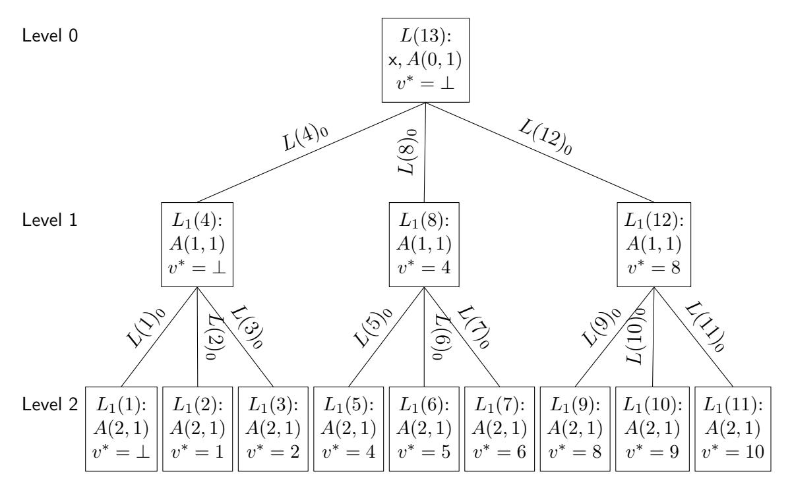

# Multilinear Schwartz-Zippel mod N and Lattice-Based Succinct Arguments

Benedikt Bünz\*

New York University

Ben Fisch†

Yale University

September 27, 2023

#### Abstract

We show that for  $\mathbf{x} \stackrel{\$}{\leftarrow} [0, 2^{\lambda})^{\mu}$  and any integer N the probability that  $f(\mathbf{x}) \equiv 0 \mod N$  for any non-zero multilinear polynomial  $f \in \mathbb{Z}[X_1, \dots, X_{\mu}]$ , co-prime to N is inversely proportional to N. As a corollary we show that if  $\log_2 N \ge \log_2(2\mu)\lambda + 8\mu^2$  then the probability is bounded by  $\frac{\mu+1}{2^{\lambda}}$ . We also give tighter numerically derived bounds, showing that if  $\log_2 N \ge 418$ , and  $\mu \le 20$  the probability is bounded by  $\frac{\mu}{2^{\lambda}} + 2^{-120}$ .

We then apply this Multilinear Composite Schwartz-Zippel Lemma (LCSZ) to resolve an open problem in the literature on succinct arguments: that the *Bulletproofs* protocol for linear relations over classical Pedersen commitments in prime-order groups remains knowledge sound when generalized to commitment schemes that are binding only over short integer vectors. In particular, this means that the Bulletproofs protocol can be instantiated with plausibly post-quantum commitments from lattice hardness assumptions (SIS/R-SIS/M-SIS). It can also be instantiated with commitments based on groups of unknown order (GUOs), in which case the verification time becomes logarithmic instead of linear time.

Prior work on lattice-based Bulletproofs (Crypto 2020) and its extensions required modifying the protocol to sample challenges from special sets of polynomial size. This results in a non-negligible knowledge error, necessitating parallel repetition to amplify soundness, which impacts efficiency and poses issues for the Fiat-Shamir transform. Our analysis shows knowledge soundness for the original Bulletproofs protocol with the exponential-size integer challenge set  $[0, 2^{\lambda}]$  and thus achieves a negligible soundness error without repetition, circumventing a previous impossibility result (Crypto 2021). Our analysis also closes a critical gap in the original security proof of DARK, a GUO-based polynomial commitment scheme (Eurocrypt 2020). Along the way to achieving our result we also define Almost Special Soundness (AMSS), a generalization of Special-Soundness. Our main result is divided into two parts: (1) that the Bulletproofs protocol over generalized commitments is AMSS, and (2) that AMSS implies knowledge soundness. This framework serves to simplify the application of our analytical techniques to protocols beyond Bulletproofs in the future.

# 1 Introduction

The famous DeMillo-Lipton-Schwartz-Zippel (DLSZ) lemma [DL77; Zip79; Sch80] states that for any field  $\mathbb F$ , non-empty finite subset  $S\subseteq \mathbb F$ , and non-zero  $\mu$ -variate polynomial f over  $\mathbb F$  of total degree d, the number of zeros of f contained in  $S^{\mu}$  is bounded by  $d\cdot |S|^{\mu-1}$  (or equivalently, the probability that  $f(\mathbf x)=0$  for  $\mathbf x$  sampled uniformly from  $S^{\mu}$  is bounded by  $\frac{d}{|S|}$ ). For  $\mu=1$  this simply follows from the Fundamental Theorem of Algebra, but for multivariate polynomials, the number of zeros over the whole field could be unbounded. The computational significance of this lemma is that sampling an element from S only takes  $n\cdot \log_2(|S|)$  random bits but the probability of randomly sampling a zero of f from  $S^{\mu}$  is inversely proportional to |S|, which is exponential in the number of random bits. One of its original motivations was an efficient randomized algorithm for polynomial identity testing, but it has since found widespread application in computer science [KI04].

The classical lemma applies more broadly to integral domains, but not to more general commutative rings such as the ring  $\mathbb{Z}_N$ . As a simple counterexample, over the ring of integers modulo N=2p the polynomial f(X)=pX mod N vanishes on half of the points in [0,N).

\*bb@nyu.edu

†ben.fisch@vale.edu

&lt;sup>1This paper supersedes an earlier pre-print on the LCSZ [BF22] and also incorporates content published in the updated EPRINT of DARK [BFS19].

This counterexample exploits the fact that f is of the form  $f(X) = u \cdot g(X)$  where u is a zero-divisor. There are also simple counterexamples for f co-prime to N: setting  $N = 2^{\lambda}$  the polynomial  $f(X) = X^{\lambda} \mod N$  vanishes on half of the points in [0, N). However, there are no such counterexamples when f is both multilinear and co-prime to N. In fact, we will show in this work the probability a random vector from  $S^{\mu} = [0, m)^{\mu}$  is a zero of a  $\mu$ -linear polynomial (multilinear with  $\mu$  variables) co-prime to N is negligible in the minimum of  $\log m$  and  $\log N$ . As we will show in our main result, this special case of f and N still has a surprisingly powerful application to cryptography that resolves multiple recent open questions in the area of succinct arguments.

The DLSZ lemma has previously been extended to commutative rings by restricting the set S to special subsets in which the difference of any two elements is not a zero divisor [BCPS15]. For example, in the case of  $\mathbb{Z}_N$  this would require the difference of any two elements in S to be co-prime to N. All examples of such sets have  $O(\log N)$  size. Our present work explores the setting where S is the contiguous interval [0, m) and thus does not have this restriction.

As a warmup, it is easy to see that any univariate linear polynomial  $f(X) = c \cdot X + b$  co-prime to N has at most one root modulo N. If there were two such roots  $x_1 \not\equiv x_2 \mod N$  then  $c(x_1 - x_2) \equiv 0 \mod N$  implies c is a zero divisor (i.e.,  $gcd(c, N) \not\equiv 1$ ). Furthermore,  $c \cdot x_1 \equiv -b \mod N$  implies  $-b = c \cdot x_1 + q \cdot N$  for some  $q \in \mathbb{Z}$ , and thus, gcd(c, N) also divides b. This would contradict the co-primality of f and N. So for x uniformly distributed in S = [0, m) the probability of  $f(x) \equiv 0 \mod N$  in this case is indeed at most  $\frac{1}{|S|}$ . Unfortunately, this does not generalize nicely to polynomials of arbitrary degree as illustrated by the counterexample above. On the other hand, we are able to generalize the lemma in a meaningful way to multivariate linear polynomials (i.e, at most degree 1 in each variable). We bound the probability of sampling a zero from  $S^{\mu} = [0, m)^{\mu}$  of a  $\mu$ -linear polynomial co-prime to N by  $\epsilon + \frac{\mu}{|S|}$ , where  $\epsilon$  is tightly bounded by a product of regularized beta functions.

We also formulate an inverse lemma showing that for all sufficiently large  $N, \epsilon$  is negligibly small. In particular, for  $\log N \geq 8\mu^2 + (1+\log\mu)\lambda$ ,  $\epsilon$  is at most  $2^{-\lambda}$ , showing that the probability decays exponentially. Our technique for deriving this threshold lower bound  $t(\lambda,\mu)$  on N for a target  $\lambda$  formulates  $t(\lambda,\mu)$  as the objective function of a knapsack problem. We derive an analytical solution by deriving bounds on the regularized beta function. We also apply a knapsack approximation algorithm to find tighter values of  $t(\lambda,\mu)$  for specific values of  $\mu$  and  $\lambda$ . We call our new lemma the multilinear composite Schwartz-Zippel (LCSZ) lemma.

#### 1.1 Bulletproofs for short pre-images

Using the multi-linear composite Schwartz-Zippel lemma (LCSZ), we can prove that a generalization of the Bulletproofs Polynomial Commitment [BCCGP16; BBBPWM18; WTsTW18] is secure even with large challenge sets. The generalization allows for commitments to "short" (i.e., bounded norm) integer vectors. This includes groups of unknown order, such as the RSA group or class groups, as well as lattice-based commitments (i.e. Ajtai commitments based on the Integer SIS or Ring-SIS assumptions). The instantiation using commitments based on groups of unknown order is essentially a variation of DARK [BFS20], and our analysis closes a vital gap in the security proof that was first discovered by [BHRRS21].2 Unlike the fix proposed by [BHRRS21], our analysis covers the original DARK protocol and enables the use of a large challenge space instead of relying on binary challenges. Our analysis is also the first to show that lattice-based Bulletproofs [BLNS20] (i.e., Bulletproofs instantiated with Ajtai commitments) with a challenge space of exponential size (e.g.,  $[0,2^{\lambda})$ ) has a negligible knowledge error (without parallel repetition). All previous attempts [BLNS20; ACK21b; AL21] had analyzed small, specially constructed challenge sets, which result in a knowledge error  $o(\frac{1}{\mathsf{poly}(\lambda)})$ , and thus these protocols used parallel repetition to amplify soundness. In fact, [AL21] give an impossibility result, showing that the approach of specially constructing such sets is limited and unlikely to result in a negligible soundness error. Furthermore, parallel-repetition is not always compatible with the Fiat-Shamir transform [AFK21; Wik21].

In a bit more detail, lattice-based Bulletproofs use commitments to an integer vector  $\mathbf{x} \in \mathbb{Z}^n$ of the form  $C = \mathbf{A}\mathbf{x} \mod q$  where  $\mathbf{A}$  is a matrix over a  $\mathbb{Z}$ -module  $\mathcal{R}$  and q is a prime number. When  $\mathcal{R} = \mathbb{Z}$ , the commitment is binding to integer vectors of bounded L2 norm B under the short-integer solution (SIS) assumption for a matrix of appropriate dimensions and q sufficiently larger than B. A more general assumption called module SIS (M-SIS) allows for  $\mathcal{R}$  to be an m-th cyclotomic ring  $\mathcal{R} = \mathbb{Z}[X]/\Phi_m(X)$ . The goal of the protocol is to argue, for a public input  $\mathbf{z} \in \mathbb{Z}^n$  and prime p, that  $\langle \mathbf{z}, \mathbf{x} \rangle = y \mod p$ . The protocol is knowledge sound if there is a knowledge extractor that can obtain an integer vector  $\tilde{\mathbf{x}} \in \mathbb{Z}^n$  of sufficiently small norm and a sufficiently small positive integer s such that  $\mathbf{A}\tilde{\mathbf{x}} = s \cdot C$  and  $\langle \mathbf{z}, \tilde{\mathbf{x}} \rangle = s \cdot y \mod p$ . The protocol has knowledge error  $\delta$  if for any adversary succeeding with probability  $\epsilon$  the extractor runs in time  $\operatorname{\mathsf{poly}}(n)/\epsilon$  and succeeds with probability at least  $1-\delta/\epsilon$ . The pair  $(\tilde{\mathbf{x}},s)$  is also known as a "relaxed" opening of the commitment C, which can be interpreted as an opening to the rational  $\tilde{\mathbf{x}}/s$ . This is binding under M-SIS if  $s \cdot ||\tilde{\mathbf{x}}||_2 \leq B$ . The recent work by Albrecht and Lai [AL21] called s the slack and the norm increase factor  $t = ||\tilde{\mathbf{x}}||_2/||\mathbf{x}||_2$  the stretch. It is important to keep  $s \cdot t \cdot ||\mathbf{x}||_2 \leq B$  for the protocol to be meaningfully sound as otherwise the commitment is no longer binding. While the size of q could always be increased to accommodate a larger B,

&lt;sup>2The analysis we provide in this paper also applies to DARK in its original form. We include this in an updated appendix of the original DARK paper.

this increases the communication complexity of the protocol. Thus, for the protocol to remain succinct it is important that s · t ∈ 2 O(polylog(n)). The impossibility result of [\[AL21\]](#page-28-4) suggested that prior approaches to analyzing lattice-based Bulletproofs would not be able to demonstrate knowledge soundness with small slack using challenge sets of size greater than poly(λ), and thus would have knowledge soundness error o(1/poly(λ)) without parallel repetition. Our work gets around this barrier with new analysis techniques, achieving exponentially small knowledge error 2 −λ with s · t ∈ 2 O(polylog(n)) .

Prior analysis of DARK and lattice Bulletproofs considered the special-soundness of the protocol. Informally, a public-coin interactive argument for a given relation is special-sound if an extractor can obtain a witness from any tree of accepting transcripts with distinct challenges at any branch. By the "forking lemma", which shows how to generate such trees, special-soundness implies knowledge soundness. DARK and lattice Bulletproofs both have a similar structure, the main difference being the instantiation of the vector commitment, although in both cases the vector commitment is only binding to short vectors in Z n of norm at most B ∈ 2 O(polylog(n)) . This restriction on the size of B is for succinctness in the case of lattice Bulletproofs and for quasilinear prover complexity in the case of DARK (the time complexity of creating a DARK commitment is Ω(n log B) group operations). Special-soundness of these protocol thus requires that the extractor can obtain from any such transcript tree a relaxed opening to the integer vector commitment with slack s and stretch t such that s · t ∈ 2 O(polylog(n)). In a specialsoundness analysis, the differences of challenges in a transcript tree are arbitrary. The strech and slack of the extracted opening grow multiplicatively with those differences, which makes it difficult to bind them tightly. In fact, with challenges chosen from the set [0, 2 λ ), the extractor might obtain an opening with slack 2o(λn) , which is far too large for either DARK or lattice Bulletproofs. However, using the LCSZ, we are able to show that Bulletproofs with vector commitments binding to short vectors (which generalize both DARK and lattice Bulletproofs) satisfies a less stringent requirement we call almost-special soundness (AMSS), which we show also implies knowledge soundness.

Almost Special Soundness We introduce almost-special soundness (AMSS) as a generalization of special-soundness. AMSS protocols are multi-round protocols where every round is associated with a commitment that is binding over openings to messages in a set W. This does not have to be an explicit message sent to the verifier but roughly represents the prover's state at a round of the protocol. At a very high level, protocols are AMSS if there exists an algorithm that extracts from any forking transcript tree an opening to these commitments, and if the opening is not inside a subset W′ ⊂ W then re-running (or completing) the protocol starting from this extracted state on fresh challenges would fail (with overwhelmingly high probability) to result in a transcript accepted by the verifier. One additional key requirement, stated informally here, is that re-running the protocol on the same challenges would either result in the same transcript or a break of the commitment scheme. We leverage these combined properties to show that AMSS protocols are knowledge-sound. We then show that Bulletproofs with commitments to short pre-images are almost-special sound, which relies on the inverse LCSZ.

As a brief overview, we begin by viewing the relaxed openings of the commitment scheme as rational openings. For any commitment C the opening (f, N) such that com(f) = N · C is interpreted as an opening of C to the rational vector f/N. In the terminology of [\[AL21\]](#page-28-4), the slack is thus the size of the absolute value of the denominator |N| and the stretch is the L2 norm of the numerator ||f||2. The Bulletproofs verifier accepts the protocol transcript only if the final message is a "small" integer (of bounded absolute value). This suggests that if the prover were to run the honest protocol starting with f/N as its private state, then its success would imply f(r) ≡ 0 mod N where f is a multilinear polynomial with the coefficients defined by f and r are the verifier challenges. We can use the inverse LCSZ to show that if N is too "large" and r is sampled randomly then this probability is negligible. Making this analysis formal is non-trivial, and we present a summary of the ideas in the technical overview below.

Along the way to showing that AMSS implies knowledge soundness we also introduce a variant of the standard forking lemma, which we call the path predicate forking lemma. This lemma shows the existence of a PPT algorithm to generate a transcript tree satisfying additional properties for AMSS protocols that enable the efficient extraction of a witness.

Fiat-Shamir transform The Fiat-Shamir transform is a method for transforming an interactive protocol with a public coin verifier into a non-interactive publicly verifiable protocol by replacing the verifier public-coin challenges with hashes of the prover's messages. Recent work [\[ACK21a;](#page-28-6) [Wik21\]](#page-31-2) has shown that the Fiat-Shamir transform is secure for multi-round special-sound protocols. However, the security proof does not translate immediately to almost special-sound (AMSS) protocols. We prove security of the Fiat-Shamir transform for AMSS protocols with computationally unique commitments, where it is infeasible to open two distinct commitments to the same message. The deterministic variants of DARK and Ajtai commitments have this property.

# 1.2 Related work

Lattice-based Bulletproofs Most practical lattice-based succinct proof systems have focused on single-round protocols. These protocols [\[LNS21;](#page-30-2) [ALS20;](#page-28-7) [ENS20;](#page-29-6) [NS22\]](#page-30-3) have o( p (m)) communication complexity.Bulletproofs [\[BCCGP16;](#page-28-1) [BBBPWM18\]](#page-28-2) is a multiround argument of knowledge for the opening of Pedersen vector commitments, which are binding based on the discrete-logarithm assumption. The Bulletproofs protocol has a recursive structure involving logn rounds for commitments to vectors of length n, and is public-coin, where the verifier's challenges are integers uniformly sampled from  $[0, 2^{\lambda})$ . The overall communication is only  $2\log_2(n)$   $\lambda$ -bit sized messages. Bootle et al. [BLNS20] adapted the protocol to the lattice setting by replacing the Pedersen commitments with vector commitments based on Ring SIS or Module SIS over a cyclotomic ring  $\mathcal{R}$ . They also replace the challenge set  $[0, 2^{\lambda})$  with a smaller subset of  $\mathcal{R}$ . The challenges are monomials with binary coefficients such that the differences of any two challenges divide 2 in the ring. This allows them to demonstrate special-soundness, i.e. an extractor that can obtain an opening to the lattice-based vector commitment from any ternary tree of valid transcripts with distinct challenges on each edge. However, the smaller challenge set results in a larger soundness error and thus necessitates parallel repetition. This combined with the slack of the extractor leads to total communication  $O(\lambda^2 \log^2(n))$ , compared with the  $O(\lambda \log(n))$  complexity of the original Bulletproofs protocol for Pedersen commitments.

Bulletproofs with subtractive sets [ACK21b] generalize the techniques of [BLNS20] to allow for commitments based on Module SIS (M-SIS) and also more general challenge sets: special sets where differences in challenges are invertible. [AL21] further generalize the protocol, allowing for more general challenge sets they call (k, 3)-subtractive over  $\mathcal{R}$ . A set S is (k, 3)-subtractive if for any triple of challenges  $\{c_1, c_2, c_3\} \subseteq S$  and  $i \in \{1, 2, 3\}$  the product  $\prod_{j \neq i} (c_i - c_j)$  divides s. They show that the Bulletproofs protocol using M-SIS commitments and (k, 3)-subtractive challenge sets achieves slack  $k^{\log n}$  and knowledge error  $\log n/|S|$ . They construct a (2,3)-subtractive set of size O(m) for an order m power-of-two cyclotomic ring  $\mathcal{R}$  and show that it is nearly optimal: there is no (2,3)-subtractive set in such a ring of size greater than m+1. This means that the size of the challenge set is at most linear in the bit-length of the commitments (i.e., polynomial rather than exponential in the security parameter  $\lambda$ ), necessitating  $O(\lambda/\log m)$  parallel repetitions of the protocol to amplify soundness. Beyond increasing the communication complexity this also poses difficulties for the security of the Fiat-Shamir transform [AFK21; Wik21].

Their upper bounds on the size of (k,r)-subtractive sets relative to k extends to primepower cyclotomic rings and even larger values of k, suggesting that using small challenge sets (and boosting soundness through parallel repetition) was fundamentally required for achieving a sufficiently small extraction slack, at least based on the prior analysis techniques. [AL21] state that "unless fundamentally new techniques are discovered" their impossibility result "represents a barrier to practically efficient lattice-based succinct arguments in the Bulletproof framework".

Comparison to our work Our work overcomes this barrier, showing that lattice-based Bulletproofs can indeed be instantiated with the exponential-sized challenge set  $[0,2^{\lambda})$  and still achieve sufficiently small slack and stretch. The analysis is based on our variant of the DLSZ lemma for multilinear polynomials mod composite N (i.e., our LCSZ lemma). This also demonstrates compatibility of lattice-based Bulletproofs with the Fiat-Shamir transform. Specifically, our analysis is able to achieve both slack and stretch of  $2^{O(\lambda \log n)}$  and knowledge error  $\lambda n \cdot 2^{-\Omega(\lambda)}$ . Prior analysis of lattice-Bulletproofs [BLNS20; ACK21b; AL21] instantiated with smaller challenges sets required  $O(\lambda/\log(m))$  parallel repetitions where m is the degree of the cyclotomic polynomial of the ring used for M-SIS commitments. On the other hand, they achieved a smaller slack of  $2^{O(\log m \log n)}$ , thus allowing for a smaller modulus q than what our analysis of lattice-based Bulletproofs over the challenge set  $[0,2^{\lambda})$  requires. Specifically, with vectors of length n over  $\mathbb{Z}_p$ , the modulus q is  $O(\log m \log n + \log p)$  bits in their case and  $O(\lambda \log n + \log p)$  bits in ours. Overall, for a commitment matrix in  $\mathcal{R}^{\kappa \times n}$ , according to prior analysis the prover needs to send  $O(\kappa m(\lambda \log^2 n + \log p \log n \cdot \lambda / \log m))$  bits whereas according to our analysis the prover needs to send  $O(\kappa m(\lambda \log^2 n + \log p \log n))$  bits. The reduction in overall complexity is most significant when  $\log p \gg \log m \log n$ . In other words, this is practically relevant for succinct-arguments applied to statements with a large field size relative to arithmetic complexity (e.g.,  $\log p = 256$ ,  $\log m = 10$ , and  $\log n = 15$ ). An interesting direction for future work is to look at ways to pack the coefficients of vectors over a smaller modulus  $p' \ll p$  into vectors over the larger modulus and still make use of the linear form opening. Another direction is to use an exponential-size challenge set of smaller norm elements (i.e., over the polynomial ring rather than integers), but this would require further generalizations of the LCSZ lemma.

Comparison of our work to LaBRADOR [BS22] Recently, LaBRADOR [BS22] presented a new argument system for dot product constraints that circumvented the prior limitations of slack and knowledge error in lattice-based arguments that have a recursive structure like Bulletproofs. In contrast to our work, which provides a tighter analysis of the original simple Bulletproofs protocol in the lattice setting without modification, LaBRADOR changes the way the protocol works, allowing the verifier to request additional random linear projections of the committed vectors at each level of recursion, which are folded into prover's original claim. The projection is a map  $\Pi: \mathbb{Z}^n \to \mathbb{Z}^{256}$  with entries sampled randomly and independently from a distribution over  $\{-1,0,1\}$  with probability 1/4, 1/2, and 1/4 respectively. If the prover is committed to  $\mathbf{x}$  then the verifier learns  $y = \Pi \mathbf{x} \mod q$  and checks that its L2 norm is appropriately bounded. Since  $\Pi$  is independent of the challenges used for extraction, the knowledge extractor is able to obtain  $\tilde{\mathbf{x}}$ , independent of  $\Pi$ , such that  $\Pi \tilde{\mathbf{x}} \mod q$  has bounded norm. Based on the

modular Johnson-Lindenstrauss Lemma [GHL22], for sufficiently large q this implies on bound on the L2 norm of the extracted vector. This allows for tightly bounding the slack at each level of extraction even when using challenges sampled from an exponential size set over  $\mathcal{R}$ .

This is closely related to how we are able to a tighter slack/stretch of the original Bulletproofs protocol without modification, leveraging the fact that final message sent in the protocol is a certain random linear projection of the original vector x: it is an evaluation of a multilinear polynomial  $f_{\mathbf{x}}$  with  $\log n$  variables and coefficients  $\mathbf{x}$  on the random challenges  $c_1, ..., c_{\log n}$ sampled by the verifier from  $[0,2^{\lambda})$  in each round. Unlike the analysis of LaBRADOR, our extractor does not operate modulo q. Instead, we allow for slack in the opening of a commitment C, extracting  $\tilde{\mathbf{x}} \in \mathcal{R}^n$  and  $s \in \mathbb{Z}$  such that  $\mathbf{A}\tilde{\mathbf{x}} = s \cdot C \mod q$  and the multilinear polynomial hwith rational coefficient vector  $\frac{1}{s} \cdot \tilde{\mathbf{x}}$  satisfies  $h(c_1, ..., c_{\log n}) \in \mathbb{Z}$ . Our analysis applies our new composite Schwartz-Zippel lemma in a similar way to how the modular Johnson-Lindenstrauss lemma functions in the analysis of LaBRADOR. It implies for large s and  $\vec{c} = (c_1, ..., c_{\log n})$ uniformly distributed independent of h that  $h(\vec{c}) \notin \mathbb{Z}$  with overwhelming probability, thus bounding the size of the slack s for the extracted opening. However, unlike LaBRADOR, the coefficients of g are derived by the extractor using the verifier's challenges and are thus not independent. This complicates the analysis. We get around this by using 4-ary transcript trees, where h can be extracted from a 3-ary subtree and the challenges  $c_1,...,c_{\log n}$  come from an independent path. We provide a more detailed overview in the next section.

DARK and Groups of Unknown Order The DARK Polynomial Commitment [BFS20] is a polynomial commitment with succinct verification using groups of unknown order. If instantiated with class groups (see [BH01]) the protocol does not require a trusted setup. The scheme is particularly interesting because of the short proof sizes. Unfortunately, the original scheme had a gap in the security proof that was first discovered by [BHRRS21]. This paper provides a fix to this security proof and shows that a slight modification to the original protocol is secure. Our protocol is a generalization that applies to general linear-homomorphisms of which polynomial evaluations are a special case. It also uses a Bulletproofs-style folding which makes it easier to generalize. Concretely, however, the group-of-unknown order instantiation of our protocol has the same concrete efficiencies as the original DARK protocol when used as a polynomial commitment. We also applied the techniques (The CSZ and AMSS) developed in this paper to the original DARK protocol and added that to the appendix of the eprint [BFS19]. [BHRRS21] had originally provided a fix to DARK using binary challenges. This blows up the communication complexity. Concretely each round requires sending  $\lambda$  commitments, whereas we prove that a slight modification of the original DARK protocol is correct, which only requires sending 2 commitments per round. Both [BHRRS21] and our scheme are secure under the hidden order assumption (Assumption 1). However, interestingly, when applying the Fiat-Shamir heuristic to AMSS protocols (see full version), we require that the commitment be computationally unique. For the DARK-style commitment in groups of unknown order, this requires the stronger subgroup hidden-order assumption.

## 2 Technical overview

The regular DeMillo-Lipton-Schwartz-Zippel lemma is relatively simple to prove. Consider the special case of a multilinear polynomial over a field. As a base case, a univariate linear polynomial has at most one root over the field. For the induction step, express  $f(X_1,...,X_{\mu+1}) =$  $g(X_1,...,X_{\mu}) + X_{\mu+1}h(X_1,...,X_{\mu})$  for random variables  $X_1,...,X_{\mu+1}$ . The probability that  $h(x_1,...,x_n) = 0$  over random  $x_i$  sampled from S is at most  $\mu/|S|$  by the inductive hypothesis, and if  $h(x_1,...,x_{\mu})=w\neq 0$  and  $g(x_1,...,x_{\mu})=u$ , then  $u+X_{\mu+1}w$  has at most one root (base case). By the union bound, the overall probability is at most  $\mu/|S| + 1/|S| = (\mu + 1)/|S|$ . This simple proof does not work for multilinear polynomials modulo a composite integer. The base case is the same for f coprime to N, which has at most one root. However, in the induction step, it isn't enough that  $h(x_1,...,x_\mu)\neq 0$  as it still may be a zero divisor, in which case the polynomial  $u + X_{\mu+1}w$  is not necessarily coprime to N and the base case no longer applies. The number of roots depends on  $gcd(u + X_{\mu+1}w, N)$  and our new analysis takes into account its distribution. For each prime divisor  $p_i$  of N, the highest power of  $p_i$  that divides  $u + X_{\mu+1}w$ follows a geometric distribution. Using a modified inductive argument, we are able to show that the probability  $f(x_1, \ldots, x_{\mu}) \equiv 0 \mod p^r$  is bounded by the probability that  $\sum_{i=1}^n Z_i \geq r$  for i.i.d. geometric variables with success parameter  $1 - \frac{1}{p}$ . This probability is equal to a  $I_{\frac{1}{p}}(r, \mu)$ where I is the regularized beta function. Furthermore, by CRT this probability is independent for each prime factor of N, and thus, the overall probability can be bounded by a product of regularized beta functions.

"Inverse" multilinear composite Schwartz-Zippel (LCSZ) lemma While our main theorem gives a tight bound on the probability for particular values of  $N, \mu$ , and m, cryptographic applications require finding concrete parameters such that the probability is exponentially small in a security parameter  $\lambda$ . Concretely, we want to find a value  $N^*$  such that for all  $N \geq N^*$  the probability that  $f(X_1, \ldots, X_{\mu}) \equiv 0 \mod N$  is bounded by  $2^{-\lambda}$ . To do this, we first derive simple and useful bounds for the regularized beta function:

• 
$$I_{\frac{1}{p}}(r,\mu) \le \left(\frac{n}{p}\right)^r$$
 for  $p \ge 2\mu$ 

- $I_{\frac{1}{n}}(r,\mu) \leq \frac{r^n}{p^r}$  for  $r \geq 2\mu$
- $\log(I_{1/p}(r-1,\mu)) \log(I_{1/p}(r,\mu))$  is non-increasing in r for any  $p > \mu$  and for r = 1 in p.

We then formulate finding  $N^*$  as an optimization problem.  $N^*$  is the maximum value of N such that the probability of  $f(\mathbf{x}) \equiv 0 \mod N$  is greater than  $2^{-\lambda}$ . For any N let S(N) denote the set of pairs (p,r) where p is a prime divisor of N with multiplicity r. Taking the logarithm of both the objective and the constraint yields a knapsack-like constraint maximization problem where the objective is  $\log(N^*) = \sum_{(p_i,r_i)\in S(N^*)} r_i \cdot \log(p_i)$  and the constraint is  $\sum_{(p_i,r_i)\in S(N^*)} -\log(I_{\frac{1}{p_i}}(r,\mu)) \leq \lambda$ . Using the bounds on  $I_{\frac{1}{p_i}}$  and several transformations of the problem we show that any optimal solution to this problem must be bounded by  $t=8\mu^2+\log_2(2\mu)\lambda$ , which in turn implies that  $N^*\leq 2^t$ .

**Tighter computational solution** We further show that a simple greedy knapsack algorithm computes an upper bound to the knapsack problem. The algorithm uses the fact that  $\frac{\log(p)}{\log(I_{1/p}(r-1,\mu))-\log(I_{1/p}(r,\mu))}$  the so-called marginal density of each item is non increasing over certain regions. Adding the densest items to the knapsack computes an upper bound to the objective. We run the algorithm on a large number of values for  $\mu$  and  $\lambda$  and report the result.

#### 2.1 Bulletproofs for Short Pre-Images and Almost Special Soundness

In the Bulletproofs Inner Product Argument a prover convinces a verifier that it knows the opening  $\mathbf{f} \in \mathbb{F}_p^n$  to a homomorphic commitment  $C = \mathsf{com}(\mathbf{f}) \in \mathbb{G}$  where  $\mathbb{G}$  is a prime-order group. At a very high level, it does this by iteratively computing  $\vec{f}' = \mathbf{f}_L + x \cdot \mathbf{f}_R \in \mathbb{F}^{n/2}$ , where  $\mathbf{f}_L, \mathbf{f}_R$  are the left and right half of  $\mathbf{f}$  respectively and  $x \in \mathbb{F}$  is a verifier generated challenge, and sending a commitment to the new  $\mathbf{f}'$  to the verifier. After  $\log_2(n)$  rounds, the prover sends a single field element as the final message. This naturally generalizes to homomorphic commitments that map vectors in  $\mathbb{Z}^n$  to a group  $\mathbb{G}$ . The Bulletproofs protocol operates in exactly the same way over integer vectors but using more general instantiations of the commitment scheme. In particular, we consider schemes that may only be binding to short vectors in  $\mathbb{Z}^n$ , such as the DARK commitment using groups of unknown order or lattice-based (Ajtai) commitments. Additionally, the verifier checks that the final message is a "small" integer. Furthermore, we consider commitments that are binding under what we call short rational openings that open C to  $\mathbf{h} = \mathbf{f}/s$  by showing  $s \cdot C = \mathsf{com}(\mathbf{f})$ , where the numerator and denominator of  $\mathbf{h}$  have bounded norms in reduced form. We consider such rational openings due to "slack" in the knowledge extractor for Bulletproofs over rings like Z instead of fields, where the extractor obtains  $\mathbf{f}$  and s satisfying  $s \cdot C = \mathsf{com}(\mathbf{f})$ , but cannot invert s to obtain a direct pre-image of C. In the soundness analysis, we leverage the fact that the final integer is small in order to bound the numerator/denominator (i.e., stretch and slack) of the extracted opening. This is where we invoke the new LCSZ lemma for multilinear polynomials. To gain some intuition in how we apply LCSZ, if the prover's private state at the start of protocol were a rational vector  $\mathbf{f}/s$  such that  $\mathsf{com}(\mathbf{f}) = s \cdot C$ , then running protocol would result in an integer y that is the evaluation of a multilinear polynomial h with rational coefficients f/s at the  $\log_2(n)$  challenges  $\vec{c} = (c_1, ..., c_{\log n})$  sampled by the verifier, i.e.  $y = h(\vec{c})$ . Equivalently,  $f(\vec{c}) \equiv 0 \mod s$ . If  $\vec{c}$  were sampled uniformly and independent from f, then the LCSZ lemma states that as s grows too large this probability becomes vanishingly small.

For commitments binding over  $\mathbb{Z}_p$ , Bulletproofs satisfies special-soundness: there exists an efficient extractor that can extract a witness (i.e., an opening to the input commitment) from any forking tree of transcripts. Special-soundness implies knowledge-soundness by the classic forking lemma, which shows how to generate a transcript tree in polynomial time. Unfortunately, Bulletproofs with commitments that are only binding over small norm (rational) openings fails to satisfy special-soundness because the opening extracted from a forking tree of transcripts may have a very large norm (i.e., large slack or stretch). On the other hand, it turns out that we can leverage the intuition above in order to bound the size (slack and stretch) of extracted openings. Along the way, we introduce a new notion called almost-special soundness.

Almost Special Soundness A k-ary transcript tree for a  $\mu$ -round public-coin interactive proof labels each node of a k-ary  $\mu$ -depth tree with a prover message and each edge with a verifier public-coin challenge so that the labels along any root-to-leaf path in the tree form a valid transcript between the prover and verifier that would cause the verifier to accept. An interactive proof for a relation  $\mathcal{R}$  is  $k^{(\mu)}$ -special-sound if there exists an extractor that can efficiently extract a witness  $\mathbf{w}$  from any k-ary tree of protocol transcripts for input  $\mathbf{x}$  so that  $(\mathbf{x},\mathbf{w}) \in \mathcal{R}$ . Bulletproofs for standard Pedersen vector commitments has this property for 3-ary trees, but not for vector commitments with bounded-norm openings because the extractor may obtain an opening that has a too large norm. On the other hand, if a prover running the protocol honestly were to start in its head with an opening of the commitment that has a too large norm there is a negligible probability over the random challenges that it would result in a valid transcript, whose last message is an integer of bounded norm. This applies to rational openings as well with a large norm numerator or denominator. This probability analysis relies on LCSZ, as explained in the paragraph above. We will say that rational openings have "large. norm" if they have either a large numerator (stretch), large denominator (slack), or both.

This observation suggests the following strawman extraction analysis: show that one of the valid transcripts in the tree corresponds to running the honest prover on the extracted opening, and conclude that if the extracted rational opening had large norm then it would have a negligible probability of resulting in a valid transcript. A fallacy in this argument is that the extracted witness is computed from the transcripts, and is thus dependent on the challenges appearing in the transcripts, whereas running the prover on a large norm opening only results in an invalid transcript with high probability over challenges sampled independently from this opening. To address this we could attempt the following: generate a 4-ary tree T via rejection sampling from polynomially many random simulations, extract an opening  $\mathbf{w}^*$  from its 3-ary left subtree  $T_L$ , show that some transcript tr in  $T \setminus T_L$  is the result of running the prover on  $\mathbf{w}^*$ . The extracted witness is now independent of the challenges appearing in tr and was well-defined during the generation of T, after  $T_L$  was created and before tr was added. Given that T was generated via polynomially many random simulations we can argue this event had a negligible probability of occurring.

The remaining challenge, however, is to show that some transcript  $\operatorname{tr}$  in  $T\setminus T_L$  is consistent with running the honest prover on the extracted opening  $\mathbf{w}^*$ . It turns out that for protocols like Bulletproofs this is only true when the extracted opening of the input commitment is within the space over which the scheme is binding, which seems to bring us back to square one. For example, the transcript for a single round Bulletproofs protocol over an input commitment C to a vector in  $\mathbb{Z}^2$  and commitment basis  $\mathbf{g} = (g_L, g_R) \in \mathbb{G}^2$  consists of  $(C, C_L, C_R, r, f') \in \mathbb{G}^3 \times \mathbb{Z}$  such that  $f' \cdot (g_R + rg_L) = C_R + r^2C_L + rC$ . Given an opening  $\mathbf{f} = (f_L, f_R)$  such that  $\operatorname{com}(\mathbf{f}) = \langle \mathbf{f}, \mathbf{g} \rangle = C$  and  $\langle (0, f_L), \mathbf{g} \rangle = C_L$  and  $\langle (f_R, 0), \mathbf{g} \rangle = C_R$  then "re-running" the protocol on the openings with challenge r gives  $f^* = f_L + r \cdot f_R$  such that  $f^* \cdot (g_R + rg_L) = C_R + r^2C_L + rC = C^*$ . If  $f^*$  is sufficiently small then this implies  $f^* = f'$ , otherwise it is a break of the commitment scheme as it provides conflicting openings to  $C^*$ . However,  $f^*$  is only guaranteed to be small if the extracted opening  $\mathbf{f}$  has low norm.

To get around this issue, we can increase the parameters of the commitment scheme so that it is binding over slightly larger openings, and we will argue level by level that the extracted openings remain small (using the independent path and the fact that re-generation of transcripts either returns the same commitments/messages or a break of the commitment scheme). In other words, while we want to show that every extracted value remains below some norm bound A, each extraction step produces a value that might be as large as some bound B > A, but for which the scheme is still binding, and thus re-running the protocol on this value will conflict with some path in the transcript tree with overwhelmingly high probability if too much larger than A. This is precisely where we apply our new LCSZ lemma. If the extracted opening with numerator  $\mathbf{f}$  and denominator s has too large norm then re-running the protocol with this opening as the prover's private state and using the challenges  $c_1, ..., c_\mu$  from the independent path would conflict with the transcript along the independent path (the final message will not be a small integer) except with negligible probability over the random challenges. The final message is equal to the evaluation  $h(c_1,...,c_\mu)$  where h is a multilinear polynomial with coefficient vector  $\mathbf{f}/s$ . This allows us to bound the norm growth at each level by some sufficiently small value  $C \in (A, B)$ . Crucially, while the growth from A to B is at least quadratic in A, the growth from A to C will be constant.

We generalize this to the notion of Almost Special Sound(AMSS) protocols and replace the bounds A and B with arbitrary predicates  $\phi_a$  and  $\phi_b$ . We prove that all protocols with this structure are knowledge sound, just like special-sound protocols, where the knowledge error is dependent on the probability that a random completion of a transcript starting from a message that fails predicate  $\phi_a$  results in a valid transcript. Intuitively, this captures the fact that once the adversary has a private state that fails the desired extraction predicate, it will fail with overwhelming probability over fresh challenges to complete the proof transcript successfully.

Our proof that AMSS implies knowledge-soundness relies on a lemma that we call the *path predicate forking lemma*. The usual forking lemma shows how to generate forking transcript tree, which in special-sound protocols can be passed directly to the extractor. In our case, we need to generate transcript tree that satisfies additional predicates on each node. In the standard forking lemma [BCCGP16], the predicate would simply be that challenges on each child of a node in the transcript tree are distinct from previous challenges. Our new lemma considers more general predicates, which may depend on partial transcripts that have already been generated in the course of the transcript generation algorithm. The analysis is similar and uses a union bound over all polynomial steps of the transcript tree generation process.

**Fiat-Shamir transform** The analysis showing that AMSS protocols are knowledge-sound critically relies on the fact that in the transcript tree generation process for an interactive protocol, the challenges on any given branch are sampled uniformly and independently. This is used to show that the transcript tree generated satisfies a certain property with overwhelming probability. The Fiat-Shamir transform converts an interactive public-coin protocol into a non-interactive protocol by replacing the verifier's messages with a transcript hash. The problem with applying the Fiat-Shamir transform to an AMSS protocol is that the adversary can now grind the challenges in each round when generating a transcript, breaking uniformity and independence of challenges. Using a union bound, we could still bound the probability that the transcript tree does not have the desired property, but this would result in a factor  $Q^{\mu}$  loss where Q is the number of queries an adversary performs, and  $\mu$  is the number of rounds in the protocol. However, we can instead focus on protocols where grinding challenges is impossible for the

adversary. To do this, we introduce the notion of *computationally unique* commitments. In a computationally unique commitment scheme, it is infeasible to open two distinct commitments to the same message. We prove that this property is held by a large class of deterministic homomorphic commitment schemes, which include those from groups of unknown order and lattice assumptions. We prove security of the Fiat-Shamir transform for AMSS protocols in the random oracle model with computationally unique commitments. This analysis is in the full version.

# 3 Main theorem statement (LCSZ)

**Theorem 1** (Multilinear Composite Schwartz-Zippel (LCSZ)). Let  $N = \prod_{i=1}^{\ell} p_i^{r_i}$  for distinct primes  $p_1, ..., p_{\ell}$ . Let f be any  $\mu$ -linear integer polynomial co-prime to N. For any integer m > 1 and  $\mathbf{x}$  sampled uniformly from  $[0, m)^{\mu}$ , then

$$\mathbb{P}_{\mathbf{x} \leftarrow [0,m)^{\mu}}[f(\mathbf{x}) \equiv 0 \bmod N] \le \frac{\mu}{m} + \prod_{i=1}^{\ell} I_{\frac{1}{p_i}}(r_i, \mu),$$

where  $I_{\frac{1}{p}}(r,\mu)=(1-\frac{1}{p})^{\mu}\sum_{j=r}^{\infty}\binom{\mu+r-1}{r}\left(\frac{1}{p}\right)^{j}$  is the regularized beta function.

**Remark 1.** The regularized beta function characterizes the tail distribution of the sum of independent geometric random variables. If  $Y = \sum_{i=1}^{\mu} Z_i$  where each  $Z_i$  is an independent geometric random variable with parameter  $\epsilon$  then  $P[Y \geq r] = I_{1-\epsilon}(r,\mu)$ . Y is a negative binomial variable with parameters  $\epsilon, \mu$ .

**Remark 2.** A close reading of the proof reveals that if m=N, then the theorem statement simplifies to  $\mathbb{P}_{\mathbf{x}\leftarrow[0,N)^{\mu}}[f(\mathbf{x})\equiv 0 \bmod N] \leq \prod_{i=1}^{\ell} I_{\frac{1}{p_i}}(r_i,\mu)$ . This is because  $\mathbf{x}$  is uniform mod N and thus uniform mod any  $N^*|N$ .

**Remark 3.** The theorem is nearly tight for all N. Setting  $f(\mathbf{x}) = \prod_{i=1}^{\mu} x_i$  and m = N gives  $P_{\mathbf{x} \leftarrow [0,m)^{\mu}}[f(\mathbf{x}) \equiv 0 \bmod N] = \mathbb{P}_{\mathbf{x} \leftarrow [0,N)^{\mu}}[f(\mathbf{x}) \equiv 0 \bmod N] = \prod_{i=1}^{\ell} I_{\frac{1}{n_i}}(r_i,\mu)$ .

**Remark 4.**  $1-e^{-\mu/p_i} \leq I_{\frac{1}{p_i}}(1,\mu) = 1-(1-\frac{1}{p_i})^{\mu} \leq \frac{\mu}{p_i}$ . Hence, for square-free N the probability in Theorem 1 is upper bounded by  $\frac{\mu}{m} + \frac{\mu^{\ell}}{N}$ , but for  $\ell > 1$  this is a loose upper bound unless  $\mu \ll p_i$  for all  $p_i|N$ . For  $\ell = 1$  (i.e., prime N), Theorem 1 coincides with the Schwartz-Zippel lemma

**Remark 5.**  $I_{\frac{1}{p_i}}(r_i, 1) = \left(\frac{1}{p_i}\right)^{r_i}$ . Hence, for  $\mu = 1$ , the bound in Theorem 1 is  $\frac{1}{N} + \frac{1}{m}$ .

We defer the proof of Theorem 1 to Appendix A.1.

### 4 Inverse LCSZ

Theorem 1 (LCSZ) bounds the probability  $\mathbb{P}_{\mathbf{x}\leftarrow[0,m)^{\mu}}[f(\mathbf{x}\equiv 0 \bmod N]]$  for given values of  $\mu, N$ , and m, which has the form  $\frac{\mu}{m} + \delta_{N,\mu}$ . In the case that N is prime,  $\delta_{N,\mu} = \frac{\mu}{N}$ , which agrees with the standard Schwartz-Zippel lemma applied to  $\mu$ -linear polynomials. The term  $\delta_{N,\mu}$  for composite N, which is dependent on both  $\mu$  and the factorization of N, has a complicated closed form expression in terms of a product of regularized beta functions.

This section analyzes the inverse: for a given  $\mu, \lambda \in \mathbb{N}$  what size threshold  $t(\lambda, \mu) \in \mathbb{N}$  is sufficient such that  $\delta_{N,\mu} \leq 2^{-\lambda}$  for all  $N \geq t(\lambda, \mu)$ ? In other words:

$$t(\lambda,\mu) := \sup\{N \in \mathbb{N} : \prod_{(p,r) \in S(N)} I_{\frac{1}{p}}(r,\mu) \ge 2^{-\lambda}\}. \tag{$t(\lambda,\mu)$ def)}$$

For  $\mu=1$ , since  $I_{1/p}(r,1)=\frac{1}{p^r}$  and  $\prod_{(p,r)\in S(N)}I_{\frac{1}{p}}(r,\mu)=\frac{1}{N}$ , it is easy to see that  $t(\lambda,\mu)=2^{\lambda}$ . For  $\mu\geq 2$ , the value of  $t(\lambda,\mu)$  (or even an upper bound) is not nearly as easy to derive. For the rest of this section we will focus on this  $\mu\geq 2$  case. We will analytically derive an upper bound to  $t(\lambda,\mu)$ , showing that  $\log t(\lambda,\mu)\in O(\mu^{2+\epsilon}+\frac{\lambda}{\epsilon})$  for any  $\epsilon\geq \log_{\mu}(2)$ .

**Theorem 2** (Inverse LCSZ). For all  $\mu \geq 2$ ,  $\epsilon \geq \log_{\mu}(2)$ , and all N such that

$$\log N \ge 4\mu^{2+\epsilon} + (1 + \frac{1}{\epsilon}) \cdot \lambda.$$

we have that for any  $\mu$ -linear polynomial f that is coprime with N

$$\mathbb{P}_{x \leftarrow [0,m)^{\mu}}[f(x) \equiv 0 \bmod N] \le 2^{-\lambda} + \frac{\mu}{m}.$$

By setting  $\epsilon = \log_{\mu}(2)$  we get:

Corollary 1. For all N such that

$$\log N \ge 8\mu^2 + \log_2(2\mu) \cdot \lambda.$$

we have that for any n-linear polynomial f that is coprime with N

$$P_{x \leftarrow [0,m)^{\mu}}[f(x) \equiv 0 \mod N] \le 2^{-\lambda} + \frac{\mu}{m}.$$

We defer the proof of Theorem 2 to Appendix A.3  $\,$ 

## 4.1 Computational Inverse LCSZ

Theorem [2](#page-7-1) provides an analytical upper bound on t(λ, µ) for any µ, λ ∈ N. However, the analytical bound does not appear to be tight for µ ≥ 2 (for µ = 1 it is tight). This next section provides an algorithm to derive an upper bound on t(λ, µ) for any specific values of λ, µ. The algorithm gives tighter bounds than Theorem [2](#page-7-1) for a table of tested values (Table [1\)](#page-8-0). This is useful in practice, e.g. for deriving concrete cryptographic security parameters in cryptographic protocols that rely on LCSZ.

## Algorithm 1 Greedy algorithm that returns an upper bound to Eq. [\(Constrained Max 2\)](#page-36-0)

Input µ ∈ N, λ ∈ N

- 1. Initialize a max heap H that stores tuples (p, r, d) ∈ P × Z × R and sorts them by the third value.
- 2. Initialize w ← 0 and v ← 0.
- 3. Push (density(2, 1), 2, 1) onto the heap and set pmax = 2.
- 4. While w < λ
- 5. (a) Pop (p, r, d) from H.
  - (b) Push (p, r + 1,(density(p, r + 1)) onto H
  - (c) Set v ← v + val(p, r)
  - (d) Set w ← w + weight(p, r)
  - (e) If p = pmax then set pmax ← next prime(p) and push (density(pmax, 1), pmax, 1) onto H
- 6. Output v

Theorem 3 (Computational bound). Let k be the output of algorithm Algorithm [1](#page-8-1) on input λ, µ. Then for all m ∈ N, all N ≥ 2 k and all µ-linear polynomials f, coprime with N, log2 N ≥ t(λ, µ) and

$$P_{\mathbf{x} \leftarrow [0,m)^{\mu}}[f(\mathbf{x}) \equiv 0 \bmod N] \le 2^{-\lambda} + \frac{\mu}{m}.$$

The proof of the Theorem is in Appendix [A.4.](#page-39-0)

## 4.2 Computational Results

Using Algorithm [1](#page-8-1) we computed analytical bounds for all µ ∈ (1, 50) for different values of λ. The precise bound for µ = 20 and λ = 120 is:

$$2^{v} \ge 2^{36} \cdot 3^{20} \cdot 5^{11} \cdot 7^{8} \cdot 11^{5} \cdot 13^{5} \cdot 17^{4} \cdot 19^{3} \cdot 23^{3} \cdot 29^{2} \cdot 31^{2} \cdot 37^{2} \cdot 41^{2} \cdot 43^{2} \cdot 47^{2} \cdot 53^{2} \cdot 59 \cdot 61 \cdot 67 \cdot 71 \cdot 73 \cdot 79 \cdot 83 \cdot 89 \cdot 97 \cdot 101 \cdot 103 \cdot 107 \cdot 109 \cdot 113 \cdot 127 \cdot 131 \cdot 137 \cdot 139 \cdot 149 \cdot 151 \cdot 157 \cdot 163$$

Other results are presented in their logarithmic form in Table [1.](#page-8-0) The results are significantly tighter than the analytical Theorem [2.](#page-7-1) For n = 20 and λ = 120 the analytical theorem gives a value for log2 (N) of 3839 vs the computational which is 416. We also provide the open-source Python implementation of the algorithm[3](#page-8-2) .

| µ |    | λ = 40 | λ = 120 | λ = 240 | µ  | λ = 40 | λ = 120 | λ = 240 |
|---|----|--------|---------|---------|----|--------|---------|---------|
| 1 |    | 40     | 120     | 240     | 25 | 241    | 472     | 758     |
|   | 10 | 133    | 289     | 500     | 26 | 248    | 481     | 772     |
|   | 20 | 207    | 416     | 679     | 27 | 256    | 492     | 792     |
|   | 21 | 216    | 429     | 695     | 28 | 264    | 506     | 806     |
|   | 22 | 222    | 437     | 718     | 29 | 275    | 516     | 820     |
|   | 23 | 228    | 448     | 732     | 30 | 278    | 527     | 831     |
|   | 24 | 233    | 464     | 749     | 50 | 419    | 736     | 1105    |

Table 1: Computationally determined values of t(λ, µ) such that for all N ≥ t(λ, µ), Px←[0,m) µ [f(x) ≡ 0 mod N] ≤ 2 −λ + µ m for different µ and different λ

# 5 Definitions and Notations

# 5.1 Integer Polynomials

If f is a multivariate polynomial, then ||f||∞ denotes the maximum over the absolute values of all coefficients of f.

3 <https://github.com/bbuenz/Composite-Schwartz-Zippel>

**Lemma 1** (Evaluation Bound). For any  $\mu$ -linear integer polynomial f and  $m \geq 2$ :

$$\mathbb{P}_{\mathbf{x} \leftarrow [0,m)^{\mu}}[|f(\mathbf{x})| \le \frac{1}{m^{\mu}} \cdot ||f||_{\infty}] \le \frac{3\mu}{m}$$

*Proof.* Let  $f^{(0)} := f$ . Given a vector  $\mathbf{x} = (x_1, ..., x_{\mu})$ , for each  $j \in [1, \mu]$  define  $f_{\mathbf{x}}^{(j)}$  to be the  $\mu - j$ -variate partial evaluation  $f_{\mathbf{x}}^{(j)} := f(x_1, ..., x_j, X_{j+1}, ..., X_{\mu})$ . Then we can rewrite the lemma statement as:

$$P_{\mathbf{x} \leftarrow [0,m)^{\mu}}[||f_{\mathbf{x}}^{(\mu)}||_{\infty} \le \frac{1}{m^{\mu}} \cdot ||f^{(0)}||_{\infty}] \le \frac{3\mu}{m}$$

We will bound the probability for random **x** that there exists any j for which  $||f_{\mathbf{x}}^{(j)}|| < \frac{1}{m} \cdot ||f_{\mathbf{x}}^{(j-1)}||$ . If no such j exists, then  $||f^{(\mu)}|| \geq \frac{1}{m^{\mu}} \cdot ||f^{(0)}||$ .

For any j, we can write  $f_{\mathbf{x}}^{(j)} = g(X_{j+1}, ..., X_{\mu}) + x_j \cdot h(X_{j+1}, ..., X_{\mu})$  where g, h are  $\mu - j$  variate multilinear integer polynomials and  $||f_{\mathbf{x}}^{(j-1)}|| = \max(||g||, ||h||)$  because the coefficients of g and h are a partition of the coefficients of  $f_{\mathbf{x}}^{(j-1)}$ . Suppose now that  $||f_{\mathbf{x}}^{(j)}|| < \frac{1}{m} \cdot ||f_{\mathbf{x}}^{(j-1)}||$ , i.e. that  $||g + x_j \cdot h|| < \frac{1}{m} \cdot \max(||g||, ||h||)$  and consider two cases:

Case 1:  $||h|| = \max(||g||, ||h||)$ . For any integer  $\Delta \neq 0$ , using the triangle inequality:

$$||g + (x_j + \Delta)h|| = ||g + x_j h + \Delta h|| \ge ||\Delta h|| - ||g + x_j h|| > (1 - \frac{1}{m}) \cdot ||h|| \ge \frac{1}{m} \cdot ||h||$$

The last part of the inequality holds because  $1 - \frac{1}{m} \ge \frac{1}{m}$  for any  $m \ge 2$ .

Case2:  $||g|| = \max(||g||, ||h||)$ . Using the triangle inequality,

$$\frac{1}{m}||g|| > ||g + x_j \cdot h|| \ge ||g|| - ||x_j \cdot h||$$

This implies, for  $m \ge 2$ , that  $||h|| > \frac{1}{m} \cdot ||g||$  because:

$$||x_j \cdot h|| > (1 - \frac{1}{m}) \cdot ||g|| \implies ||h|| > \frac{m-1}{x_j \cdot m} \cdot ||g|| \ge \frac{1}{m} ||g||$$

The last step uses that  $x_j \in [1, m)$ . For  $x_j = 0$ ,  $||g + x_j h|| = ||g||$ . Finally, for any integer  $\Delta$ , by the triangle inequality:

$$||g + (x_j + \Delta) \cdot h|| \ge ||\Delta h|| - ||g + x_j \cdot h|| > \frac{|\Delta|}{m} \cdot ||g|| - \frac{1}{m} \cdot ||g|| = \frac{|\Delta| - 1}{m} \cdot ||g||$$

When  $|\Delta| \geq 2$  this implies that  $||g + (x_j + \Delta) \cdot h|| > \frac{1}{m} \cdot ||g||$ .

In both cases, we conclude that for any choice of  $(x_1, ..., x_{j-1})$  for the first j-1 components of the random  $\mathbf{x}$ , which define g and h, there are at most three choices of  $x_j$  such that the event  $||f_{\mathbf{x}}^{(j)}|| < \frac{1}{m} \cdot ||f_{\mathbf{x}}^{(j-1)}||$  holds true (i.e., if true for  $x_j$ , then it is also true for at most  $x_j + 1$  and  $x_j - 1$ ). Thus this event occurs with probability at most  $\frac{3}{m}$ . Finally, by a union bound over j, the probability this event occurs for some index j is at most  $\frac{3\mu}{m}$ .

**Fact 1.** Let  $q \in \mathbb{Z}$  be any positive integer. For any integer  $E \in \mathbb{Z}$  such that  $|E| \leq \frac{q^{d+2}-q}{2(q-1)}$  there exists a unique degree d integer polynomial  $f \in \mathbb{Z}[X]$  with  $||f||_{\infty} \leq q/2$  such that f(q) = E.

**Lemma 2** (Rational Encoding of multi-linear polynomials). Let  $q \in \mathbb{Z}$  be any positive integer. Let  $\vec{q} = [q^{2^{i-1}}]_{i=1}^{\mu} \in \mathbb{Z}^{\mu}$ . Consider any  $\beta_d, \beta_n \in \mathbb{N}$  such that  $\beta_d \cdot \beta_n \leq \frac{q}{2}$ . Let  $Z = \{z \in \mathbb{Z} : |z| \leq \beta_d\}$ , let  $\mathcal{F} = \{f \in \mathbb{Z}[X_1, \dots, X_{\mu}] : ||f||_{\infty} \leq \beta_n\}$  be a  $\mu$ -linear polynomial, and let  $\mathcal{H} = \{f/z \in \mathbb{Q}[X_1, \dots X_{\mu}] : f \in \mathcal{F} \land z \in Z\}$ . Then for any  $h_1, h_2 \in \mathcal{H}$ , if  $h_1(\vec{q}) = h_2(\vec{q})$  then  $h_1 = h_2$ .

Proof. Let  $h_1 = \frac{f_1}{z_1}$  and  $h_2 = \frac{f_2}{z_2}$ . If  $h_1(\vec{q}) = h_2(\vec{q})$  then  $z_1 f_2(\vec{q}) = z_2 f_1(\vec{q})$ . Since  $||z_2 \cdot f_1||_{\infty} \leq \beta_d \cdot \beta_n \leq \frac{q}{2}$  and likewise  $||z_1 \cdot f_2||_{\infty} \leq \frac{q}{2}$ . Note that there exist a unique univariate degree  $2^{\mu} - 1$  polynomial  $\hat{f}_1$  that has the same coefficients as  $f_1$  such that for all q  $f_1(\vec{q}) = \hat{f}_1(q)$ . Let  $f_2$  be the univariate degree  $2^{\mu} - 1$  polynomial with the same coefficients as  $\hat{f}_2$ . It then follows from Fact 1 that if  $z_1 f_2(\vec{q}) = z_1 \hat{f}_2(q) = z_2 \hat{f}_1(q) = z_2 f_1(\vec{q})$  then  $z_1 f_2 = z_2 f_1$ , or equivalently,  $h_1 = h_2$ .

#### 5.2 Groups of Unknown Order

A group of unknown order is a group where the order is computationally hard to compute. It is defined by an algorithm GGen that on input security parameter, samples a group  $\mathbb{G}$ , along with size bounds on the group that depend on the security parameter (we omit the size bounds for simplicity). We define three assumptions in these groups. The hidden order assumption which is the most basic, minimal assumption, saying that it is hard to compute the order of random group elements. The stronger sub-group hidden order assumption states that it is hard to compute any information about the order of a sampled subgroup, e.g., a subgroup generated by a commitment key. And finally, the famous RSA assumption which states that it is hard to compute roots of random elements in the group and implies the hidden order assumption.

**Assumption 1** (Hidden Order Assumption). The hidden order assumption holds for a group sampling algorithm GGen if for any probabilistic polynomial time adversary A:

$$\Pr\left[ a \cdot \mathsf{G} = 0 : \ \mathsf{G} \xleftarrow{\$} \mathbb{G} \\ a \in \mathbb{Z} \leftarrow \mathcal{A}(\mathbb{G}, \mathsf{G}) \right] \leq \mathsf{negl}(\lambda) \ .$$

Assumption 2 (Subgroup Hidden Order Assumption). The subgroup hidden order assumption is a generalization of the hidden order assumption. It says that it is difficult to compute a multiple of the order of any element in a subgroup sampled according to some distribution. It holds for a group sampling algorithm GGen and subgroup sampling4 algorithm SGGen if for any probabilistic polynomial time adversary A:

$$\Pr\left[\gcd(a, |\mathbb{H}|) \neq 1: \begin{array}{l} \mathbb{G} \leftarrow GGen(1^{\lambda}) \\ \mathbb{H} \leftarrow SGGen(\mathbb{G}) \\ a \in \mathbb{Z} \leftarrow \mathcal{A}(\mathbb{G}, \mathbb{H}) \end{array}\right] \leq \mathsf{negl}(\lambda) \ .$$

**Assumption 3** (RSA assumption, [RSA78; CPP17]). The RSA assumption holds for GGen if for any probabilistic polynomial time adversary A:

$$\Pr\left[\begin{array}{c} \mathbb{G}, N \leftarrow GGen(1^{\lambda}) \\ \ell \cdot \mathsf{U} = \mathsf{G} \ : \ \mathsf{G} \xleftarrow{\$} \mathbb{G}, \ell \xleftarrow{\$} [N] \\ \mathsf{U} \in \mathbb{G} \leftarrow \mathcal{A}(\mathbb{G}, \mathsf{G}) \end{array}\right] \leq \mathsf{negl}(\lambda) \ .$$

The RSA Assumption implies Assumption 1[BFS19]

# 5.3 IP Transcript Trees

Let (P, V) be a  $\mu$ -round public coin interactive protocol. A  $\mu$ -round public-coin protocol (P, V) consists of  $\mu$ -rounds of messages between the prover and verifier, where in each round the prover sends a message to the verifier and the verifier responds with  $x \leftarrow \mathcal{X}$  sampled uniformly from the challenge space  $\mathcal{X}$ . At the end of the protocol, the verifier outputs either accept or reject. By convention, the protocol starts with the prover's first message and ends with the prover's last message. A transcript thus contains  $\mu + 1$  prover messages and  $\mu$  challenges. We will denote transcripts by a  $\mu \times 2$  matrix A such that A(0,0) is the protocol input x, A(0,1) is the prover's first message, and for all  $i \geq 1$ , A(i,0) is the verifier's ith round challenge and A(i,1) is the prover's ith round response. We restrict our attention to protocols in which the verifier's decision is a deterministic function  $D_V$  of the transcript, but is also without loss of generality. An accepting transcript is an array A such that  $D_V(A) = accept$ .

A k-ary transcript tree for (P,V) is a labeling of a  $\mu$ -depth k-ary tree such that the labels on every root-to-leaf path forms an accepting (P,V) transcript. It will be convenient to order the nodes of the tree according to a depth-first reverse topological sort (aka post-order tree traversal). This is a topological sorting of the tree with directed edges flowing from leaves to root which places left subtrees before right subtrees. This ordering associates each node with an index in [1, N] where  $N = \text{size}(\mu, k) = \frac{k^{\mu+1}-1}{k-1}$ . A post-order labeling of the tree is a function  $L:[1,N] \to \{0,1\}^*$ . We may refer to the level of a node in the tree. The root of a tree is always at level  $\theta$  and the leaves of a depth  $\mu$  tree are at level  $\mu$ . The height of node at level  $\ell$  within a  $\mu$ -depth tree is  $\mu - \ell$ . For each  $v \in [1,N]$  let  $S_v \subseteq [1,N]$  denote the indices of all nodes in the subtree rooted

&lt;sup>4The subgroup sampling algorithm takes  $\mathbb{G}$  as input, which is interpreted as a succinct description of  $\mathbb{G}$ , such as a list of generators, not necessarily the list of all elements in  $\mathbb{G}$ .

Figure 1: IP transcript tree for µ = k = 3. Nodes and edges are labeled using post-order labeling. We also indicate v ∗ for every node.

at node v. For each v ∈ [1, N] let v ∗ denote the largest index v ∗ < v such that the node at index v ∗ does not belong to the subtree Sv. Note that for nodes on the leftmost path of the tree v ∗ does not exist so we denote it by ⊥. For any subset S ⊆ [1, N] et pred(S) denote a superset of S which include the indices of all predecessors of nodes S. Finally, for each v ∈ [1, N] let Lv : [1, v] → {0, 1} ∗ denote the restriction of L to the subset pred([1, v]). More generally, for any S ⊆ [1, N] let LS : S → {0, 1} ∗ denote the restriction of the labeling L to the subset of node indices S. LSv thus denotes the labeling of the subtree Sv. Note that Lv is not the same as LSv .

A transcript tree is thus a special post-order labeling of the tree L : [1, N] → X ×M where X is the verifier's challenge set and M is the space of prover messages. We can think of the first component (i.e., the verifier challenge) as a label on the node's incoming edge and the second component (i.e., prover's response) as a label on the node itself. The root has no incoming edge, but the root label's first component is the protocol input. For any root-to-leaf path of nodes with indices {v0, ..., vµ} the labeling L defines the matrix A such that L(vi) = (A(i, 0), A(i, 1)) and A is an accepting transcript. Given a label L(v) for v < N (non-roots) we will use the notation L(v)0 to denote the first component of the label containing the verifier's challenge and L(v)1 the second component containing the prover's response. We define a k-ary forking transcript tree to be a k-ary transcript tree in which the challenge labels on all edges sharing a common parent are distinct.

Finally, we define a transcript tree labeling as a function of transcript trees that returns a derived labeling of the tree, i.e. a function f : (X ×M) N → CN that given the labeling L corresponding to a k-ary transcript tree induces the labeling f(L) : [1, N] → C. For any ν ∈ [1, N] let pred(ν) denote the indices of the path starting at the root and ending at node ν so that Lpred(ν) denotes the labels assigned to the nodes along this path by L, i.e. in a transcript tree this is the prefix of all transcripts that pass through ν. A localized transcript tree labeling further restricts f so that the label cν ∈ C that f(L) assigned to node ν is a function of Lpred(ν) .

## 5.4 Path Predicate Forking Lemma

The standard forking lemma for µ-round public coin interactive protocols characterizes the efficiency of generating a k-ary µ-depth transcript tree for which the challenges labeling the children within the tree fork, i.e. are distinct. More precisely, the forking lemma says that given any adversarial prover A that may deviate from the honest protocol but causes the verifier to accept with probability ϵ, there is a tree generation algorithm that has only black-box access to A, runs in time t ∈ O( λ ϵ ·k µ ·(µ+tV )), where tV is the running time of the verifier's decision algorithm, and succeeds with probability 1 − t · negl(λ) in producing a transcript tree with the forking property.

Our path predicate forking lemma generalizes the property of the transcript tree that can be generated by considering arbitrary predicates on partial labelings of the tree. In the standard forking lemma, the predicate would simply be that new challenges are distinct from previous challenges. The lemma considers more general predicates for each node v ∈ [1, N], which may depend on Lv. Recall that for each v ∈ [1, N], the node v ∗ is the largest index v ∗ < v such that the node at this index is not contained in the subtree Sv rooted at v and pred([1, v∗ ]) is the superset of [1, v∗ ] that includes the indices of all predecessors of nodes [1, v∗ ], which by definition also do not intersect with Sv. Our lemma considers predicates at level ℓv of the form πv : (X × M) pred([1,v∗]) × X µ−ℓv → {0, 1}, i.e. each predicate πv takes as input a labeling function Lv ∗ and a vector of challenges x ∈ X µ−ℓv .

The vector of challenges will represent the leftmost path down the tree starting from v, which by definition is independent of the partial labeling Lv ∗ . We denote the indices of the leftmost path from v to the leaves as lpathv and the challenge labels along this path assigned by L as L(lpathv )0. For example in Figure [1](#page-11-0) the predicate π8 for node 8 would take as input the labels on the subtree spanned by node 4, the root label, and the challenge L(5)0. The lemma says that if πv(Lv ∗ , x) = 1 with overwhelming probability 1 − negl(λ) for any post-order labeling L : [1, N] → X × M of the kary µ-depth tree, any node v in the tree, and x sampled randomly, then the transcript generation algorithm produces a transcript tree represented by some post-order labeling L for which πv(Lv ∗ , L(lpathv )0) = 1 for all v in the tree. In fact, the lemma is even more general as it has a weaker requirement that πv(Lv, x) = 1 with overwhelming probability conditioned on πu(Lu, L(lpathu )0) = 1 for all u ≤ v ∗ . The standard forking lemma is a special case where πv checks that the challenge label on v is distinct from the challenge labels on any of its left siblings. The challenge label L(v)0 on v is the first component of L(lpathv )0. Assuming v is not a first child, the labels on the left sibling(s) of v as well as its parent are included in Lv ∗ .

Proof Overview We will begin with a high level overview of the proof. The algorithm is exactly the same as the recursive tree generation algorithm for the standard forking lemma. The difference is only in the analysis. The standard forking lemma considers predicates πv(Lv ∗ , x) that are functions only of the challenges assigned by Lv ∗ to left sibling nodes of v and a single (fresh) x ∈ X rather than a vector, and are independently true with overwhelming probability.

Just as in the standard forking lemma, the analysis is a simple union bound. First, the tree generation algorithm is transformed to a Monte Carlo algorithm that runs for t ∈ poly(λ) steps and succeeds with overwhelming probability. The standard forking lemma is based on the observation that a t-step algorithm makes at most t samples from X and thus the predicates hold true for all sampled challenges with probability at least 1−t·negl(λ). In our case, the analysis is very similar. Let L denote the labeling returned by the Monte Carlo tree generation algorithm. We begin with the observation that this tree generation algorithm constructs the labeling in depth-first post-order. In particular, when the transcript tree generation algorithm visits a node v at heigh hv it has already derived a partial labeling Lv ∗ . It samples a random vector x ∈ X hv and attempts to derive a valid transcript for lpathv using this challenge vector x. If it succeeds then it sets L(lpathv )0 = x, otherwise the entire vector x is discarded and it tries again starting from v. Suppose there exists some v such that πv(Lv ∗ , L(lpathv )0) = 0 and let v be the lowest index node with this property. This would imply that there occurred an event where the algorithm had already constructed Lv ∗ satisfying πu(Lu∗ , L(lpathu )0) = 1 for all u ≤ v ∗ and then sampled x ← X hv , setting L(lpathv )0 = x, such that πv(Lv ∗ , x) = 0. However, by hypothesis this event occurs with probability negl(λ) over random x. Since the algorithm runs for only t ∈ poly(λ) steps, an event of this kind occurs with probability at most t · negl(λ).

Thus, we obtain a Monte Carlo algorithm that returns a transcript tree where all the predicates are satisfied with overwhelming probability.

Lemma 3 (Path Predicate Forking Lemma). Let (P, V ) be a µ-round public-coin protocol with prover message space M and verifier challenge space X . For each node v ∈ [1, N] of a µ-depth k-ary balanced tree on N = size(µ, k) nodes, let hv denote the height of v. Let {πv : v ∈ [1, N]} denote a set of predicates, where πv(Lv ∗ , x) is a function of the partial labeling Lv ∗ and challenge vector x ∈ X hv , with the property that for any post-order labeling function L : [1, N] → X × M and any v ∈ [1, N]:

$$Pr_{\mathbf{x} \leftarrow \mathcal{X}^{h_v}}[\pi_v(L_{v^*}, \mathbf{x}) = 1 \mid \forall_{u \leq v^*} \pi_u(L_{u^*}, L(\mathsf{Ipath}_u)_0) = 1] \geq 1 - \delta$$

Let tV denote the worst-case running time of the verifier's decision algorithm DV . There is an algorithm TreeA(z) that, given a security parameter λ ∈ N and oracle access to an adversarial prover  $\mathcal{A}$  that causes V to accept with probability  $\epsilon$  on public input z, runs in time at most  $t = 2\lambda \cdot \frac{k^{\mu}}{\epsilon} \cdot (\mu + t_V)$  and with probability at least  $1 - t \cdot \delta - 2^{-\lambda}$  outputs a k-ary transcript tree with post-order labeling  $L: [1, N] \to \mathcal{X} \times \mathcal{M}$  such that  $\pi_v(L_{v^*}, L(\mathsf{lpath}_v)_0) = 1$  for all  $v \in [1, N]$ .

*Proof.* We will first describe a Las Vegas tree-finding algorithm that runs in expected polynomial time as we can then transform it to a Monte Carlo algorithm with a finite runtime and overwhelming success probability.

**Tree finding algorithm** The tree-finding algorithm  $\text{Tree}(k, \mathsf{z})$  begins by sampling a random tape  $\sigma$  for the adversary. Let  $A(\sigma)$  denote the  $deterministic^5$  adversary with fixed random tape  $\sigma$ . For all  $i \in [0, \mu]$  define  $T_i(\sigma, k, \mathsf{z}, x_1, ..., x_i)$  as follows:

Algorithm  $T_i(\sigma, k, \mathsf{z}, x_1, ..., x_i)$ :

- If  $i = \mu$ : Simulate the protocol with  $\mathcal{A}(\sigma)$  as the prover and fixing the verifier's challenges  $\mu$  ordered challenges to the values  $x_1, ..., x_{\mu}$ . If the verifier outputs 1 during this simulation then return the protocol transcript tr, and otherwise return fail.
- Else if  $0 \le i < \mu$ : Sample  $x_{i+1} \leftarrow \mathcal{X}$  and run  $T_i(\sigma, k, y, x_1, ..., x_{i+1})$ . This either returns fail or a transcript tree denoted tree. If it returns fail, then output fail. Otherwise, save the pair  $(x_{i+1}, \text{tree})$ . If  $i < \mu 1$  then tree is a tree of accepting transcripts that share a common prefix for the first i+1 rounds, which includes the challenges  $x_1, ..., x_{i+1}$ . If  $i+1 = \mu$  then tree is a single accepting transcript. Repeat this process as many times as needed, each time sampling a fresh  $x'_{i+1}$ , running  $T_i(\sigma, y, x_1, ..., x'_{i+1})$ , ignoring the runs that fail, saving the successful challenge/tree pairs until k pairs have been recorded. Together the transcripts in all k recorded trees form one larger tree of accepting transcripts that share a commmon prefix  $tr_{\text{pre}}$  for the first i rounds of messages with fixed challenges  $x_1, ..., x_i$ .

Tree(k, z) repeatedly samples  $\sigma$  and runs  $T_0(\sigma, k, z)$  until it outputs a tree of accepting transcripts.

We now analyze the expected runtime of  $\mathsf{Tree}(k,\mathsf{z})$  and success probability of returning an k-ary tree of accepting transcripts given that  $\mathcal{A}$  succeeds with probability  $\epsilon$ .  $T_0(\sigma,k,\mathsf{z})$  returns fail iff the first iteration of each subroutine  $T_i$  returns fail for i=1 to  $\mu$ . The probability this happens is equal to the probability that  $T_\mu(\sigma,y,x_1,...,x_\mu)$  outputs fail for a uniformly distributed challenge tuple  $(x_1,...,x_\mu)$ . This is equal to the failure probability of  $\mathcal{A}(\sigma)$ , i.e.  $1-\epsilon$ . Thus,  $\mathsf{Tree}(k,\mathsf{z})$  calls  $T_0$  in expectation  $1/\epsilon$  times. Letting  $t_0$  be a random variable for the runtime of  $T_0(\sigma,\mathsf{z})$  over random  $\sigma$ , the expected runtime of  $\mathsf{Tree}(k,\mathsf{z})$  is  $t_0/\epsilon$ .

It remains to analyze the expected runtime  $\mathbb{E}[t_0]$  of  $T_0(\sigma, \mathbf{z})$ . Each call to  $T_i(\sigma, k, \mathbf{z}, x_1, ..., x_i)$  for  $i \in [1, \mu]$  that occurs in the execution trace of  $T_0(\sigma, k, \mathbf{z})$  is on i.i.d. uniformly distributed challenges  $x_1, ..., x_i$ . Let  $t_i$  be a random variable denoting the runtime of  $T_i(\sigma, k, \mathbf{z}, x_1, ..., x_i)$  over a uniformly distributed challenge prefix  $\mathbf{x}_i = (x_1, ..., x_i)$  and uniformly distributed  $\sigma$ . We omit the time to sample a random challenge from the runtime analysis as this will only affect the runtime up to a constant factor. Since  $T_{\mu}(\sigma, k, \mathbf{z}, \mathbf{x}_{\mu})$  makes  $\mu$  calls to the oracle  $\mathcal{A}$  and one call to the verifier's decision algorithm  $D_V$  its runtime is at most  $\mu + t_V$ , where  $t_V$  is the worst case running time of  $D_V$ .

For  $i < \mu$ ,  $T_i(\sigma, k, y, \mathbf{x}_i)$  outputs fail iff the first call to each  $T_j$  subroutine for  $j \in [i+1,\mu]$  returns fail, in which case the runtime is  $t_{\mathcal{A}}$ . The probability  $T_i(\sigma, k, \mathbf{z}, \mathbf{x}_i)$  outputs fail for random  $\sigma$  and  $\mathbf{x}_i$  is again equal to the failure probability of  $\mathcal{A}(\sigma)$ , i.e.  $1-\epsilon$ . If it does not output fail, then in expectation it runs an additional  $(k-1)/\epsilon$  iterations of  $T_{i+1}(\sigma, k, \mathbf{z}, \mathbf{x}_i, x_{i+1})$  sampling a fresh  $x_{i+1}$  for each iteration. Thus, the expected runtime  $\mathbb{E}(t_i)$  is:

$$\mathbb{E}[(1-\epsilon)\cdot t_{\mathcal{A}} + (k-1)\cdot t_{i+1}] \leq \mathbb{E}[t_{i+1}\cdot k]$$

This recurrence relation shows:

$$\mathbb{E}[t_0] \leq \mathbb{E}[t_\mu \cdot k^\mu]$$

Thus, we have shown that the expected runtime of  $\text{Tree}(k, \mathsf{z})$  is  $\mathbb{E}[t] \leq \frac{k^{\mu}}{\epsilon} \cdot (\mu + t_V)$ .

&lt;sup>5Any probabilistic adversarial algorithm can be represented by a deterministic algorithm that takes as input a random tape.

By standard techniques[6](#page-14-0) , the Las Vegas algorithm Tree(k, z) may be transformed to a Monte Carlo algorithm that runs for 2λ · E[t]) steps and succeeds except with probability 1 − 2 −λ .

Transcript tree property analysis The transcript tree labels returned by Tree(k, z) are computed in depth-first post-order by the Monte Carlo tree generation algorithm. Let L denote this post-order labeling. Consider any node v that is labeled with challenge L(v)0 = x in the tree. Let i denote the level of v within the tree and let x = (x1, .., xi−1, x, xi+1, ..., xµ) denote the vector of challenge labels assigned to the path starting from the root to v and following the left-most path down the tree from v. During the execution of Tree(k, z) the following event occurred: immediately after x was sampled as a candidate label for v, the challenges xi+1, ..., xµ were sampled uniformly and independently such that A(σ, k, z, x) succeeded (i.e., produced a valid transcript). If this event had not occurred (i.e., A(σ, k, z, x) failed) then x would have been discarded and the process would have been repeated.

In other words, when the transcript tree generation algorithm visits a node v it has already derived a partial labeling Lv ∗ for the nodes at indices pred([1, v∗ ]), which are not in any subtree rooted at v. It samples a random vector x ∈ X hv and attempts to derive a valid transcript for lpathv using this challenge vector x. If it succeeds, then it sets L(lpathv )0 = x, otherwise the entire vector x is discarded, and it tries again starting from v. Suppose there exists some v such that πv(Lv ∗ , L(lpathv )0) = 0 and let v be the lowest index node with this property. This would imply that there occurred an event where the algorithm had already partially constructed L such that πu(Lu∗ , L(lpathu )0) = 1 for all u ≤ v ∗ and then subsequently sampled x ← X hv , setting L(lpathv )0 = x, such that πv(Lv ∗ , x) = 0. However, by hypothesis this event occurs with probability δ over random x. The algorithm runs for at most t = 2λ ϵ k µ · (µ + tV ) steps in total, hence by a union bound the probability that an event of this kind occurs at all is at most t · δ.

Thus, we obtain a Monte Carlo extraction algorithm that returns a transcript tree where all the predicates are satisfied with overwhelming probability (for appropriate setting of the parameters). More precisely, for any security parameter λ ∈ N and for t = 2λ ϵ · k µ · (µ + tV ) the extraction algorithm runs in time at most t and (by a union bound) succeeds in returning a transcript tree labeling L where, for all v, πv(Lv ∗ , L(lpathv )0) = 1 with probability at least 1 − t · δ − 2 −λ .

# 5.5 Knowledge Soundness

An NP relation R is a subset of strings x, w ∈ {0, 1} ∗ such that there is a decision algorithm to decide (x, w) ∈ R that runs in time polynomial in |x| and |w|. The language of R, denoted LR, is the set {x ∈ {0, 1} ∗ : ∃w ∈ {0, 1} ∗ s.t. (x, w) ∈ R}. The string w is called the witness and x the instance. An interactive proof of knowledge for an NP relation R is a special kind of two-party interactive protocol between a prover denoted P and a verifier denoted V, where P has a private input w and both parties have a common public input x such that (x, w) ∈ R. Informally, the protocol is complete if P(x, w) always causes V(x) to output 1 for any (x, w) ∈ R. The protocol is knowledge sound if there exists an extraction algorithm E called the extractor such that for every x and adversarial prover A that causes V(x) to output 1 with non-negligible probability, E outputs w such that (x, w) ∈ R with overwhelming probability given access[7](#page-14-1) to A.

Definition 1 (Interactive Proof of Knowledge). An interactive protocol Π = (P, V) between a prover P and verifier V is a proof of knowledge for a relation R with knowledge error δ : N → [0, 1] if the following properties hold, where on common input x and prover witness w the output of the verifier is denoted by the random variable ⟨P(x, w), V(x)⟩:

• Perfect Completeness: for all (x, w) ∈ R

$$\Pr\left[\langle \mathcal{P}(x, w), \mathcal{V}(x) \rangle = 1\right] = 1$$

• δ-Knowledge Soundness: There exists a polynomial poly(·) and a probabilistic oracle machine E called the extractor such that given oracle access to any adversarial

6Run λ independent instances in parallel for 2 · E[t] steps. By Markov, each instance terminates (i.e., succeeds) with probability at least 1/2. The probability none succeed is at most 2−λ

7The extractor can run A for any specified number of steps, inspect the internal state of A, and even rewind A to a previous state.

interactive prover algorithm  $\mathcal{A}$  and any input  $x \in \mathcal{L}_R$  the following holds: if

$$\mathbb{P}\left[\langle \mathcal{A}(x), \mathcal{V}(x) \rangle = 1\right] = \epsilon(x)$$

then  $\mathcal{E}^{\mathcal{A}}(x)$  with oracle access to  $\mathcal{A}$  runs in time  $\frac{\mathsf{poly}(|x|)}{\epsilon(x)}$  and outputs w such that  $(x,w) \in R$  with probability at least  $1 - \frac{\delta(|x|)}{\epsilon(x)}$ .

An interactive proof is "knowledge sound", or simply a "proof of knowledge", if has negligible knowledge error  $\delta$ .

Remark 6. Definition 1 places no restriction on the runtime of the adversary, however, it does not guarantee extraction from an adversary that succeeds with sufficiently small  $\epsilon(x)$  such that  $\epsilon(x) \leq \delta(|x|)$ . For  $\mathcal{R}$  in NP, this definition of knowledge soundness implies the alternative formulation of Bellare and Goldreich [BG93], which says that the protocol has knowledge error  $\delta(|x|)$  if there exists an extractor that succeeds in expected time  $\frac{\text{poly}(|x|)}{\epsilon(x) - \delta(|x|)}$ . An extractor which succeeds with probability  $p = 1 - \frac{\delta(|x|)}{\epsilon(x)}$  in  $t = \frac{\text{poly}(|x|)}{\epsilon(x)}$  steps can run repeatedly (for t steps per iteration) on fresh randomness until it obtains a witness for the relation, which it can verify efficiently. It will succeed in an expected  $\frac{t}{p} = \frac{\text{poly}(|x|)}{\epsilon(x) - \delta(|x|)}$  steps. Finally, this has been shown to imply another equivalent formulation which requires the extractor to run in expected time O(poly(|x|)) and succeed with probability  $\frac{\epsilon(x) - \delta(|x|)}{q(|x|)}$  for some polynomial q. It is easy to see this implies the former because such an extractor can be repeated, succeeding in expected time  $\frac{q \cdot \text{poly}(|x|)}{\epsilon(x) - \delta(|x|)}$ .

Interactive arguments Knowledge soundness holds against unbounded provers. The DARK protocol does not satisfy knowledge soundness because it relies on the computational binding property of cryptographic commitments. Interactive proofs that are only secure against computationally bounded adversaries are called *interactive arguments*. Adapting Definition 1 for arguments is more subtle than simply restricting the runtime of the adversary. The issue comes from the fact that the knowledge soundness definition quantifies the success of the extractor over all inputs x. For example, there could exist an input x that encodes the factorization of an RSA modulus which allows the adversarial prover to break the binding property of commitments that are based on the difficulty of factoring. For this input, the adversarial prover could succeed while the extractor would fail. This particular problem is fixed by requiring the adversary to generate the input x. If the trapdoor is exponentially hard to compute the polynomial time adversary will not be able to embed the trapdoor in x with non-negligible probability. (See Damgård and Fujisaki [DF02] for a broader discussion of these issues).

Witness-extended emulation A property called witness-extended emulation [Lin01] strengthens the knowledge-soundness definition so that the extractor outputs not only a witness but also a simulated transcript of the messages between the prover and verifier. This property is helpful for composability. In particular, if the interactive proof is used as a subprotocol within a larger protocol, it may be necessary in the security analysis to construct a simulator that needs to both obtain the adversary's witness as well as simulate its view in the subprotocol. Fortunately, Lindell [Lin01] proved that every knowledge sound protocol also satisfies witness-extended emulation. Groth and Ishai [GI08] further adapt the definition of witness-extended emulation for interactive arguments with setup (i.e., SRS model). This is the definition we will use in the present work.

Before presenting the definition we will introduce some useful notations. In the SRS model, there is an additional setup algorithm Setup that generates public parameters pp that are common inputs to the prover  $\mathcal{P}$  and verifier  $\mathcal{V}$ . The setup, which may or may not require a trusted party to sample trapdoor secrets, typically generates these parameters based on a security parameter  $\lambda$  necessary for computational security. Without loss of generality, the length of  $pp \leftarrow Setup(\lambda)$  is at least  $\lambda$  bits. The relation  $\mathcal{R}$  being proved may also depend on the setup parameters, denote  $\mathcal{R}_{pp}$ . For any prover algorithm  $\mathcal{P}^*$  interacting with a verifier algorithm  $\mathcal{V}$ , which may deviate arbitrarily from the honest prover algorithm  $\mathcal{P}$ , let  $Record(\mathcal{P}^*, pp, x, st)$  denote the message transcript between  $\mathcal{P}^*$  and  $\mathcal{V}$  on shared inputs x and pp and initial prover state st. For  $tr \leftarrow Record(\mathcal{P}^*, pp, x, st)$  let  $V_{check}(tr)$  denote the verifier's decision algorithm to accept or reject the transcript. Furthermore, let  $\mathcal{E}^{Record(\mathcal{P}^*,pp,x,st)}$  denote a machine  $\mathcal{E}$  with a transcript oracle for this interaction that can be rewound to any round and run again on fresh verifier randomness.

**Definition 2** (Witness-extended emulation [GI08; Lin01]). An interactive proof in the SRS model  $\Pi = (\mathsf{Setup}, \mathcal{P}, \mathcal{V})$  satisfies witness-extended emulation for relation  $\mathcal{R}$  if for every deterministic polynomial time  $\mathcal{P}^*$  there exists an expected polynomial time emulator  $\mathcal{E}$  such that for any non-uniform8 adversary  $\mathcal{A}$  and distinguisher  $\mathcal{D}$  that runs in time  $poly(\lambda)$  the following condition holds:

$$\Pr \left[ \begin{aligned} \mathsf{pp} \leftarrow \mathsf{Setup}(1^\lambda) \\ \mathcal{D}(\mathsf{tr}) = 1: & (x, \mathsf{st}) \leftarrow \mathcal{A}(\mathsf{pp}) \\ & \mathsf{tr} \leftarrow \mathsf{Record}(\mathcal{P}^*, \mathsf{pp}, x, \mathsf{st}) \end{aligned} \right] \approx_\lambda$$

$$\begin{split} \Pr\left[ \begin{array}{c} \mathsf{pp} \leftarrow \mathsf{Setup}(1^\lambda) \\ \mathcal{D}(\mathsf{tr}) = 1 : & (x, \mathsf{st}) \leftarrow \mathcal{A}(\mathsf{pp}) \\ & \mathsf{tr} \leftarrow \mathsf{Record}(\mathcal{P}^*, \mathsf{pp}, x, \mathsf{st}) \end{array} \right] \approx_\lambda \\ \Pr\left[ \begin{array}{c} \mathcal{D}(\mathsf{tr}) = 1 \text{ and} \\ V_{\mathsf{check}}(\mathsf{tr}) = 1 \Rightarrow (x, w) \in \mathcal{R}_{\mathsf{pp}} \end{array} \right. & (x, \mathsf{st}) \leftarrow \mathcal{A}(\mathsf{pp}) \\ & (\mathsf{tr}, w) \leftarrow \mathcal{E}^{\mathsf{Record}(\mathcal{P}^*, \mathsf{pp}, x, \mathsf{st})}(\mathsf{pp}, x) \end{array} \right] \end{split}$$

**Lemma 4** (Lindell [Lin01]). Any proof of knowledge for relation  $\mathcal{R}$  also satisfies witnessextended emulation for  $\mathcal{R}$ .

**Lemma 5.** Let  $\mathcal{R}$  denote any NP relation. Given a commitment scheme com = (Setup, Commit, Open), for any pp  $\leftarrow$  Setup( $\lambda$ ) let  $\mathcal{R}'(pp)$  denote the relation:

$$\mathcal{R}'(\mathsf{pp}) = \left\{ \begin{array}{c} (\mathsf{x}, \mathsf{w}) : \mathcal{R}(\mathsf{x}, \mathsf{w}) = 1 \\ & \vee \\ [\mathsf{w} = (C, \sigma_1, \sigma_2) \ \land \ \sigma_1 \neq \sigma_2 \ \land \ \mathsf{Open}(\mathsf{pp}, C, \sigma_1) = \mathsf{Open}(\mathsf{pp}, C, \sigma_2) = 1] \end{array} \right\}$$

Let  $\Pi(pp)$  denote the interactive protocol between  $\mathcal P$  and  $\mathcal V$  parameterized by the setup parameter pp. If for all pp  $\leftarrow \mathsf{Setup}(\lambda)$  the protocol  $\Pi(\mathsf{pp})$  is a proof of knowledge (Definition 1) for  $\mathcal{R}'(pp)$  then the tuple (Setup,  $\mathcal{P}, \mathcal{V}$ ) as an interactive proof with setup satisfies witness-extended emulation (Definition 2) for  $\mathcal{R}$ .

*Proof.* By Lemma 4 a knowledge sound interactive proof for  $\mathcal{R}'(\mathsf{pp})$  also satisfies witnessextended emulation for  $\mathcal{R}'(pp)$ . It remains to show that this implies witness-extended emulation for  $\mathcal{R}$ . It suffices to show that:

$$\begin{split} \Pr\left[ \begin{array}{c} \mathcal{D}(\mathsf{tr}) = 1 \text{ and} & \mathsf{pp} \leftarrow \mathsf{Setup}(\lambda) \\ V_{\mathsf{check}}(\mathsf{tr}) = 1 \Rightarrow \ (x, w) \in \mathcal{R} \end{array} \right] &: \begin{array}{c} (x, \mathsf{st}) \leftarrow \mathcal{A}(\mathsf{pp}) \\ (\mathsf{tr}, w) \leftarrow \mathcal{E}^{\mathsf{Record}(\mathcal{P}^*, \mathsf{pp}, x, \mathsf{st})}(\mathsf{pp}, x) \end{array} \right] \approx_{\lambda} \\ \Pr\left[ \begin{array}{c} \mathcal{D}(\mathsf{tr}) = 1 \text{ and} \\ V_{\mathsf{check}}(\mathsf{tr}) \Rightarrow \ (x, w) \in \mathcal{R}'(\mathsf{pp}) \end{array} \right] &: \begin{array}{c} (x, \mathsf{st}) \leftarrow \mathcal{A}(\mathsf{pp}) \\ (\mathsf{tr}, w) \leftarrow \mathcal{E}^{\mathsf{Record}(\mathcal{P}^*, \mathsf{pp}, x, \mathsf{st})}(\mathsf{pp}, x) \end{array} \right] \end{split}$$

The difference between these two probabilities is bounded by the probability, over the distribution on the right side of the equation, that  $(x, w) \in \mathcal{R}'(pp)$  but  $(x, w) \notin \mathcal{R}$ . This event implies that w encodes a break to the commitment scheme with parameters pp. Since A,  $P^*$ , Setup and  $\mathcal{E}$  all run in time  $poly(\lambda)$  this occurs with probability at most  $negl(\lambda)$  over randomly sampled  $pp \leftarrow Setup(\lambda)$  by the computational binding property of the commitment scheme. More precisely, supposing that the difference between these two probabilities is  $\epsilon(\lambda)$ , then we can use  $\mathcal{A}$ ,  $P^*$ , and  $\mathcal{E}$  to construct an algorithm  $\mathcal{A}'$  which on input  $pp \leftarrow \mathsf{Setup}(\lambda)$  simulates  $(x, \mathsf{st}) \leftarrow \mathcal{A}(pp)$  and  $(\mathsf{tr}, w) \leftarrow$  $\mathcal{E}^{\mathsf{Record}(\mathcal{P}^*,\mathsf{pp},x,\mathsf{st})}(\mathsf{pp},x)$  returning w such that:

$$\Pr\left[\begin{array}{c} w = (C, \sigma_1, \sigma_2) \\ \land \\ \sigma_1 \neq \sigma_2 \\ \land \\ \mathsf{Vf}_{\mathsf{pp}}(C, \sigma_1) = \mathsf{Vf}_{\mathsf{pp}}(C, \sigma_2) = 1 \end{array} \right] = \epsilon(\lambda)$$

If  $\epsilon(\lambda)$  is non-negligible this contradicts the binding property of the commitment scheme. 

**Zero knowledge** We recall the definition of honest verifier zero-knowledge (HVZK) for interactive proofs. HVZK only considers simulating the view of a verifier that follows the protocol honestly. The Fiat-Shamir transform compiles public-coin proofs that have HVZK into non-interactive proofs that have statistical zero-knowledge (for malicious verifiers).

&lt;sup>8A non-uniform adversary may run a different algorithm for each input length.

**Definition 3** (HVZK for interactive arguments). Let  $\mathsf{View}_{\langle \mathcal{P}(x,w),\mathcal{V}(x)\rangle}$  denote the view of the verifier in an interactive protocol on common input x and prover witness input w. The interactive protocol has δ-statistical honest verifier zero-knowledge if there exists a probabilistic polynomial time algorithm  $\mathcal{S}$  such that for every  $(x,w) \in \mathcal{R}$ , the distribution  $\mathcal{S}(x)$  is δ-close to  $\mathsf{View}_{\langle \mathcal{P}(x,w),\mathcal{V}(x)\rangle}$  (as distributions over the randomness of  $\mathcal{P}$  and  $\mathcal{V}$ ).

# 6 Almost-Special-Soundness

We first define deterministic (non-hiding) commitment scheme over a message space  $\mathcal{M}$  and opening space  $\mathcal{W} \supseteq \mathcal{M}$ . When  $\mathcal{M} = \mathcal{W}$  it is identical to collision-resistant hash functions. More generally, the commitment function is a collision-resistant hash function  $H: \mathcal{M} \to \{0,1\}^{\lambda}$ , but the algorithm that verifies an opening of C to m is not restricted to checking H(m) = C (e.g., this may not be possible when  $m \notin \mathcal{M}$ ).

These schemes do not provide a way to commit to  $\mathbf{x} \in \mathcal{W} \setminus \mathcal{M}$ , but is nonetheless useful to define in the context of arguments of knowledge. Suppose a party commits to a message  $m \in \mathcal{M}$  as C = H(m) and is asked to prove knowledge of an opening of C using an argument system for which the knowledge extractor is only guaranteed to extract an opening to a message in the superset  $\mathcal{W}$ . There are applications where it doesn't matter whether the prover knows an actual input  $m \in \mathcal{M}$  to H such that H(m) = C as long as it is committed in a binding way to some message in  $\mathcal{W}$  that it knows. In fact, commitment schemes where  $\mathcal{M} = \mathbb{Z}^n$  and  $\mathcal{W} \subseteq \mathbb{Q}^n$  together with arguments of knowledge that extract openings to  $\mathcal{W}$  suffice to construct linear-map vector commitments over prime fields  $\mathbb{F}_p$ , with polynomial commitment schemes as a special case. These have very powerful applications including the construction of generic succinct non-interactive argument (SNARK) systems for all of NP.

**Definition 4** (Deterministic Commitment Scheme). A deterministic commitment scheme  $\Gamma$  is a tuple  $\Gamma = (\mathsf{Setup}, \mathcal{G}, \mathsf{Commit}, \mathsf{Open})$  where:

- Setup( $1^{\lambda}$ )  $\rightarrow$  pp is a PPT algorithm that generates public parameters pp, which define a finite set of indices  $\mathcal{I}$ , a message space  $\mathcal{M}$ , and an opening space  $\mathcal{W} \supseteq \mathcal{M}$ ;
- $\mathcal{G}(pp, \iota) \to pp^*$  is a PPT algorithm that generates parameters for the index  $\iota \in \mathcal{I}$ ;
- Commit( $pp^*, m$ )  $\to C$  is a polynomial time computable function that takes a secret message m and returns a public commitment C.
- Open(pp\*,  $C, w, \sigma$ )  $\rightarrow b \in \{0, 1\}$  is a PPT algorithm that verifies the opening of commitment C to the message  $w \in \mathcal{W}$  provided with an opening hint  $\sigma \in \{0, 1\}^*$ .

A commitment scheme  $\Gamma$  is **binding** if for all PPT adversaries  $\mathcal{A}$ :

$$\Pr \begin{bmatrix} \mathsf{pp} \leftarrow \mathsf{Setup}(1^\lambda) \\ (\iota, C, m_0, m_1, \sigma_0, \sigma_1) \leftarrow \mathcal{A}(\mathsf{pp}) \\ b_0 = b_1 = 1 \, \land \, m_0 \neq m_1 \ : \ \ \mathsf{pp}^* \leftarrow \mathcal{G}(\mathsf{pp}, \iota) \\ b_0 \leftarrow \mathsf{Open}(\mathsf{pp}^*, C, m_0, \sigma_0) \\ b_1 \leftarrow \mathsf{Open}(\mathsf{pp}^*, C, m_1, \sigma_1) \end{bmatrix} \leq \mathsf{negl}(\lambda).$$

We say that a tuple  $(C, (m_0, \sigma_0), (m_1, \sigma_1))$  is a *break* of the commitment scheme, if  $\mathsf{Open}(\mathsf{pp}^*, C, x_1, \sigma_1) = \mathsf{Open}(\mathsf{pp}^*, C, m_1, \sigma_1) = 1$  and  $m_0 \neq m_1$ .

**Remark on**  $\mathcal{I}$ : The standard definition of commitment schemes does not have an indexing set  $\mathcal{I}$ , or equivalently has  $|\mathcal{I}| = 1$ . The more general definition we presented is important for our applications, and it is important for the scheme to be binding even for an adversarially sampled index. As a simple example, Setup might determine a prime-order group  $\mathcal{G}$  in which the discrete logarithm is hard and  $\mathcal{I} \subset \mathcal{G}$  is the set of p-1 generators. The commitment function at index  $g \in \mathcal{I}$  computes  $x \mapsto g^x$  for  $x \in \mathbb{F}_p$ .

**Definition 5** (Almost-Special-Soundness (new)). Let  $\chi$  denote any set of size  $2^{\lambda}$ . Let  $\Gamma = (\mathsf{Setup}, \mathcal{G}, \mathsf{Commit}, \mathsf{Open})$  denote a deterministic commitment scheme with message space  $\mathcal{M}$ , opening space  $\mathcal{W}$ , and indexing set  $\mathcal{I}$ . Let  $\Pi$  be  $\mu$ -round public-coin interactive proof with challenge space  $\chi$  for a relation  $\mathcal{R}_{\mathsf{pp}}$ , such that the commitment parameters  $\mathsf{pp} \leftarrow \mathsf{Setup}(1^{\lambda})$  are generated as part of the setup of  $\Pi$  and where the relation is possibly dependent on  $\mathsf{pp}$ .  $\Pi$  is  $(k^{(\mu)}, \delta(\cdot), \Gamma, \phi)$ -almost-special-sound if there exists

- 1. A pair of predicates  $\phi = (\phi_a, \phi_b)$  where  $\phi_a, \phi_b : [\mu] \times \mathcal{M} \to \{0, 1\}$  and  $\phi_a(i, m_i) = 1 \implies \phi_b(i, m_i) = 1$ .
- 2. A negligible function  $\delta: \mathbb{N} \to \mathbb{R}$

3. There is a localized transcript tree labeling F (Section 5.3) that assigns to each node  $\nu$  of a valid transcript tree for  $\Pi$  a commitment label  $C^{(\nu)}$  for the scheme  $\Gamma$  at an index  $\iota_{\nu} \in \mathcal{I}$ . Additionally, any leaf node  $\nu$  of the transcript tree is labelled with  $C^{(\nu)}$  for some index  $\iota_{\nu} \in \mathcal{I}$  together with an opening  $(m_{\nu}, o_{\nu})$  such that  $\mathsf{Open}(\mathsf{pp}_{\iota_{\nu}}, C^{(\nu)}, m_{\nu}, o_{\nu}) = 1$  and  $\phi_a(\mu, m_{\mu}) = 1$ .

**Extract Witness:** ExtractWitness $(x, F, \text{tree}, \text{treeOpenings}) \to w$  takes as input an instance x, the tree labeling function F, a k-ary transcript tree tree and purported openings treeOpenings =  $[(m_1, \sigma_1), \ldots, (m_N, \sigma_N)]$ , to the commitments of each node in the tree, that are defined by F. If tree, treeOpenings, satisfy the following properties then  $(x, w) \in \mathbb{R}_{pp}$ 

- 1. The challenge labels for the children of each node are distinct.
- 2. For each  $\nu \in \mathsf{tree}$ ,  $\mathsf{Open}(\mathsf{pp}_{\nu}, C^{\nu}, m_{\nu}, \sigma_{\nu}) = 1$
- 3. For each  $\nu \in \text{tree}$ ,  $\phi_a(\sigma_{\nu}) = 1$ .

.

**Extract Internal:** ExtractInternal $(F, \nu, \text{subtree} = [(\iota_1, m_1, \sigma_1), \dots, (\iota_t, m_t, \sigma_t)]) \to (m, \sigma)$  takes as input a node  $\nu$  such that  $C^{\nu} = F(\nu)$  is the commitment assigned to  $\nu$  by F, as well as the transcript subtree of size t, spanned at  $\nu$ , defined by the indices  $\iota$  of the subtree along with purported openings to each commitment  $F(\iota) = C^{\iota}$  in the subtree.

Given that each nodes children in the subtree have distinct challenge labels, the algorithm either outputs a break of  $\Gamma$  (Definition 4) or satisfies the following property:

$$\forall i \in [t] \phi_a(\mathsf{level}(\iota_i), m_i) = 1 \land \mathsf{Open}(\mathsf{pp}_{\iota_i}, C^{(\iota_i)}, m_i, \sigma_i) = 1 \\ \Downarrow \\ \mathsf{Open}(\mathsf{pp}_{\nu}, C^{\nu}, m, \sigma) = 1 \land \phi_b(\mathsf{level}(\nu), m) = 1$$

Here level:  $[k^{\mu}] \rightarrow [\mu]$  maps from a node to its level in the tree.

**Extend algorithm** Extend $(\iota, \operatorname{tr}) \to ((m'_{\ell_{\iota} = \operatorname{level}(\iota)+1}, \sigma'_{\ell_{\iota}}), \ldots, (m'_{\mu}, \sigma_{\mu}))$ , such that  $\operatorname{tr} = [C, (C_1, \alpha_1), \ldots, (C_{\mu}, \alpha_{\mu})]$  is an accepting transcript that includes the node  $\iota$ , i.e.  $C_{\ell_{\iota}} = C^{(\iota)}$ . For any openings to  $C_i, \ldots, C_{\mu}, (m_i, \sigma_i), \ldots, (m_{\mu}, \sigma_{\mu})$ , one of the following cases holds:

1.  $\exists j \in [i, \mu]$  such that  $(C_j, (m_j, \sigma_j), (m'_j, \sigma'_j))$  is a break of  $\Gamma$ 

2.

$$P_{\alpha_{i},\dots,\alpha_{\mu}\leftarrow\chi}\left[\phi_{a}(\operatorname{level}(\iota),m)=0\middle|\begin{array}{l}m_{i}=m'_{i}\forall i\in[\ell_{\iota}+1,\mu]\\\phi_{a}(m'_{i})=1\forall i\in[\ell_{\iota}+1,\mu]\\\phi_{b}(m_{\ell_{\iota}})=1\end{array}\right]\leq\delta(\lambda)$$

**Short-hand notation:** An interactive proof is  $(k^{(\mu)}, \delta)$ -almost-special-sound if it is  $(k^{(\mu)}, \delta, \mathsf{com}, \phi)$ -almost-special-sound for some commitment scheme  $\mathsf{com}$  and some predicate pair  $\phi$ . We may omit  $\delta$  and simply write  $k^{(\mu)}$ -almost-special-soundness if this holds for some negligible function  $\delta : \mathbb{N} \to \mathbb{R}$ .

Remark 7. Any special sound protocol satisfies almost-special-soundness as 3) essentially captures the special soundness definition. More precisely a  $k^{(\mu)}$ -special sound satisfies  $k^{(\mu)}$ -almost-special-soundness by setting the commitment scheme to be trivial (i.e., identity function) and the ith round commitment  $C^{(i)}$  to the prover's ith round message and setting the predicates  $\phi_a=1, \phi_b=0$  to be trivial as well (i.e., always return 1 and 0 respectively). The algorithm Extend can output an arbitrary set of messages because the condition on the algorithm is vacuously true as  $\phi_a(i,m)\neq 0$  for any (i,m). The algorithm Extract $(\nu,C^{(\nu)},*)$  is trivial because  $C^{(\nu)}$  is the message itself. The algorithm Break is also trivial as  $\phi_b$  is always 0. The algorithm Extract $(x, \text{openTree}) \to w$  exists by the definition of  $k^{(\mu)}$ -special soundness.

**Theorem 4** (AMSS implies Knowledge Soundness). If a  $\mu$ -round interactive proof for a relation  $\mathcal{R}$  with  $\lambda$ -bit challenges,  $\mu \in O(\log(\lambda + |\mathsf{x}|))$ , and verifier decision algorithm runtime  $t_V \in \mathsf{poly}(|\mathsf{pp}|, |\mathsf{x}|, \lambda)$  on input  $\mathsf{x} \in \mathcal{L}_{\mathcal{R}}$  and parameters  $\mathsf{pp} \leftarrow \Gamma.\mathsf{Setup}(1^{\lambda})$  is

&lt;sup>9Crucially, the definition does not require the *i*th position of all transcripts to use the same commitment index. The commitment index  $\mu_i$  used in a particular transcript for the *i*th commitment  $C^{(i)}$  might be a function of the transcript prefix preceding  $C^{(i)}$ .

 $(k^{(\mu)}, \delta, \Gamma, \phi)$ -almost-special-sound then for  $\delta'(\lambda) = 2\lambda(k+1)^{\mu}(\mu+t_V) \cdot \max(\delta(\lambda), k \cdot 2^{-\lambda}) + 2^{-\lambda}$  it is  $\delta'$ -knowledge sound for the modified relation:

$$\mathcal{R}'(pp) = \{(x, w) : \mathcal{R}(x, w) = 1 \ \lor w \in \mathcal{L}_{break}(pp)\}$$

where

$$\mathcal{L}_{\mathsf{break}}(\mathsf{pp}) = \{ (\mathcal{C}, \sigma_1, \sigma_2, \iota) : \iota \in \mathcal{I} \ \land \ \sigma_1 \neq \sigma_2 \ \land \ \mathsf{Open}(\mathsf{pp}_\iota, \mathcal{C}, \sigma_1) = \mathsf{Open}(\mathsf{pp}_\iota, \mathcal{C}, \sigma_2) = 1 \}$$

**Remark 8.**  $\delta'(\lambda)$  is a negligible function if  $\delta(\lambda)$  is negligible, assuming  $k \in O(1)$ ,  $\mu \in O(\log(\lambda + |\mathbf{x}|))$ ,  $t_V \in \mathsf{poly}(|\mathbf{x}|, \lambda)$ , and  $|\mathbf{x}| \in \mathsf{poly}(\lambda)$ .

The proof of Theorem 4 is in Appendix B. By Lemma 5, this theorem has the following corollary:

Corollary 2. An interactive proof with  $\lambda$ -bit challenges that is  $k^{(\mu)}$ -almost-special-sound for a relation  $\mathcal{R}$  and has at most  $\mu \in O(\log(\lambda + |\mathbf{x}|))$  rounds on any instance  $\mathbf{x} \in \mathcal{L}_{\mathcal{R}}$  has witness-extended emulation for  $\mathcal{R}$ .

# 7 Argument of knowledge of "short" rational opening

For any deterministic homomorphic commitment to vectors in  $\mathbb{Z}_p^n$ , where the commitment function is a homomorphism  $\operatorname{com}: \mathbb{Z}_p^n \to \mathbb{G}$ , there is a generic succinct argument of knowledge of a commitment opening (i.e., a homomorphism preimage) with  $O(\log n)$  communication complexity [BDFG21; AC20; BCS21]. This same protocol can also be used to argue knowledge of any linear form of the committed vector. This is also known as a linear-map vector commitment (LMVC) [LM19; CNRZZ22], and captures polynomial commitments as a special case.

We generalize this result to work with deterministic homomorphic integer vector commitments that are only binding over *short* vectors in  $\mathbb{Z}^n$ , which includes vector commitment schemes based on lattices and groups of unknown order. Furthermore, the protocol can still be used to argue knowledge of any linear form  $h: \mathbb{Z}^n \to \mathbb{G}$  of the committed vector, where  $\mathbb{G}$  is a prime order group. The protocol is essentially the same as the succinct homomorphism preimage protocol [BDFG21; AC20], but where the verifier additionally checks a bound on the prover's final message. This can also be viewed as a special case of the sumcheck argument with a bound check, as described in [BCS21], but we provide a much tighter soundness analysis.

A bit more precisely, the protocol is not an argument of knowledge of a short integer vector pre-image per se, but rather a short rational opening of the commitment  $C = \mathsf{com}(\mathbf{x})$ , which is some  $\mathbf{x}' \in \mathbb{Z}^n$  and  $z \in \mathbb{Z}$  such that  $\mathsf{com}(\mathbf{x}') = z \cdot C$  and  $\mathbf{x}'/z \in \mathcal{M} \subseteq \mathbb{Q}^n$  where  $\mathcal{M} = \{\mathbf{x}/z \in \mathbb{Q}^n : z \in \mathbb{Z}, \gcd(\mathbf{x},z) = 1, ||\mathbf{x}|| \leq \beta_n, |z| \leq \beta_d\}$  is a subset of rational vectors with bounded norm denominators and numerators in reduced form. We call this an opening of the commitment C to the rational vector  $\mathbf{x}'/z \in \mathcal{M}$ . If the commitment scheme is binding over such rational openings to vectors in  $\mathcal{M}$  and  $[0,p)^n \subseteq \mathcal{M}$ , then it also functions as a binding commitment scheme for vectors in  $\mathbb{Z}_p^n$  where an opening to  $m \in \mathcal{M}$  is also an opening to  $m \mod p \in \mathbb{Z}_p^n$  and the protocol is thus an argument of knowledge of an opening to a unique vector in  $\mathbb{Z}_p^n$ . Finally, for any linear form  $h: \mathbb{Z}_p^n \to \mathbb{G}$  the modified commitment  $\mathsf{com}^*(\mathbf{x}) = (\mathsf{com}(\mathbf{x}), h(\mathbf{x}))$  preserves binding over  $\mathcal{M}$  and running the same protocol for  $\mathsf{com}^*$  becomes an argument of knowledge for an opening of the commitment (C,y) to a unique  $\mathbf{x}^* \in \mathbb{Z}_p^n$  such that  $h(\mathbf{x}^*) = y$ .

Remark on zero-knowledge Deterministic commitment schemes are non-hiding and our construction is focussed on producing a succinct argument of knowledge without concern for zero-knowledge. To obtain a zero-knowledge argument, the succinct argument can be composed with (i.e., applied as the pivot to) a sigma protocol for pre-images of  $\phi$ . See [ACK21b] for further details.

**Definition 6** ( $\mathbb{Z}$ -linear commitment scheme). Let  $\Gamma = (\mathsf{Setup}, \mathcal{G}, \mathsf{Commit}, \mathsf{Open})$  be a deterministic commitment scheme such that for any  $\mathsf{pp} = (\mathcal{I}, \mathcal{M}, \mathcal{W}) \leftarrow \mathsf{Setup}(1^{\lambda})$  where  $\mathcal{M} \subseteq \mathcal{W} \subseteq \mathbb{Z}^n$  and  $\iota \in \mathcal{I}$  the commitment function  $\mathsf{Commit}(\mathsf{pp}_{\iota}, \cdot) : \mathcal{M} \to \mathbb{G}$  is the restriction  $h|_{\mathcal{M}}$  of a group homomorphism  $h : \mathbb{Z}^n \to \mathbb{G}$ . We say that  $\Gamma$  is a  $\mathbb{Z}$ -linear deterministic commitment scheme.

**Definition 7** (Rational openings). Let  $\Gamma = (\mathsf{Setup}, \mathcal{G}, \mathsf{Commit}, \mathsf{Open})$  be  $\mathbb{Z}$ -linear deterministic commitment scheme where commitments are contained within a finite group  $\mathbb{G}$ . Let  $\mathcal{W}^* \subseteq \mathbb{Q}^n$  and let  $\mathsf{Setup}^*(1^\lambda)$  denote a new setup algorithm that runs  $\mathsf{Setup}(1^\lambda)$  but

replaces  $\mathcal{W}$  with  $\mathcal{W}^*$ . Let  $\mathsf{Open}^*(\mathsf{pp}, C, \mathbf{x}/z, (z, \mathbf{x}, \sigma))$  denote a new opening verification algorithm which on inputs  $z \in \mathbb{Z}$ ,  $\mathbf{x} \in \mathbb{Z}^n$  such that  $\mathbf{x}/z \in \mathcal{W}^*$  and  $C \in \mathbb{G}$  returns 1 if and only if  $z \neq 0 \mod |\mathbb{G}|$ , and  $\mathsf{Open}(\mathsf{pp}, z \cdot C, \mathbf{x}, \sigma) = 1$ . We call the opening hint  $(z, \mathbf{x}, \sigma)$  a rational opening of C to  $\mathbf{x}/z \in \mathcal{W}^*$ . We say  $\Gamma$  is binding over rational openings to  $\mathcal{W}^* \subseteq \mathbb{Q}^n$  if  $\Gamma^* = (\mathsf{Setup}^*, \mathcal{G}, \mathsf{Commit}, \mathsf{Open}^*)$  satisfies the usual definition of commitment binding (See Definition 4).

**Lemma 6** (trivial). If (Setup,  $\mathcal{G}$ , Commit, Open) is a  $\mathbb{Z}$ -linear deterministic commitment scheme binding over  $\mathcal{W} \subseteq \mathbb{Q}^n$  where  $\mathsf{Commit}(\mathsf{pp}_\iota, \cdot) : \mathbb{Z}^n \to \mathbb{G}_{\mathsf{com}}$  and  $h : \mathbb{Z}^n \to \mathbb{G}$  is any homomorphism, then the modified scheme (Setup,  $\mathcal{G}$ , Commit, Open\*) where:

- Setup $(1^{\lambda}) \to pp$  and  $\mathcal{G}(\iota, pp) \to pp$ ,
- $\bullet \; \mathsf{Commit}^*(\mathsf{pp}_\iota,\mathbf{x}\in\mathbb{Z}^n) \to (\mathsf{Commit}(\mathsf{pp}_\iota,\mathbf{x}),h(\mathbf{x})) \in \mathbb{G}_{\mathsf{com}} \times \mathbb{G}$
- $\bullet \ \operatorname{Open}^*(\operatorname{pp}_\iota,(C,y) \in \mathbb{G}_{\operatorname{com}} \times \mathbb{G}, \mathbf{x} \in \mathbb{Z}^n, s) \to \operatorname{Open}(\operatorname{pp}_\iota, \mathbf{x}, s, C)$

is also a  $\mathbb{Z}$ -linear deterministic commitment scheme binding over  $\mathcal{W}$ .

*Proof.* Any break of the modified scheme includes a break of the original scheme, i.e. tuples  $(\mathbf{x}, \iota, s, (C, y))$  and  $(\mathbf{x}', \iota, s', (C, y))$  such that  $\mathbf{x} \neq \mathbf{x}' \in \mathcal{W}$  and  $\mathsf{Open}(\mathsf{pp}_{\iota}, C, \mathbf{x}, s) = 1$  and  $\mathsf{Open}(\mathsf{pp}_{\iota}, C, \mathbf{x}', s') = 1$ .

Commitment schemes binding over bounded rationals Let  $\beta = \beta_n \cdot \beta_d$  for some  $\beta_n, \beta_d > 0$ . Let  $\mathcal{W}(\beta_n, \beta_d) := \{\mathbf{x}/z \in \mathbb{Q}^n : z \in \mathbb{Z}, ||\mathbf{x}|| \leq \beta_n, |z| \leq \beta_d\}$ . The following lemmas establish several families of integer vector commitment schemes that are binding over  $\mathcal{W}(\beta_n, \beta_d)$ .

Lemma 7. Let  $\Gamma = (\mathsf{Setup}, \mathcal{G}, \mathsf{Commit}, \mathsf{Open})$  denote any  $\mathbb{Z}$ -linear deterministic commitment scheme that maps  $\mathbb{Z}^n \to \mathbb{G}^k$  where for any  $\iota \in \mathcal{I}$  and  $\mathsf{pp}_{\iota} = \mathcal{G}(\mathsf{pp}, \iota)$  the algorithm  $\mathsf{Open}(\mathsf{pp}_{\iota}, C, \mathbf{x})$  receives no hint and simply checks  $C = \mathsf{Commit}(\mathsf{pp}_{\iota}, \mathbf{x}) = \langle \mathbf{x}, \mathbf{g}_{\mathsf{pp}_{\iota}} \rangle$  where  $\mathbf{g}_{\mathsf{pp}_{\iota}} \in \mathbb{G}^{n \times k}$  is a basis for the homomorphism. Let  $\mathcal{A}(\mathsf{pp})$  denote a polynomial time algorithm that on input  $\mathsf{pp} \leftarrow \mathsf{Setup}(1^{\lambda})$  returns  $\iota \in \mathcal{I}, (z, \mathbf{x}), (z', \mathbf{x}') \in \mathbb{Z} \times \mathbb{Z}^n$  and  $Y \in \mathbb{G}$  such that with probability non-negligible in  $\lambda$ :

- (a)  $z'\mathbf{x} \neq z\mathbf{x}'$
- (b)  $\frac{\mathbf{x}}{z}, \frac{\mathbf{x}'}{z'} \in \mathcal{W}(\beta_{\mathsf{n}}, \beta_{\mathsf{d}})$
- (c)  $z \cdot Y = \mathsf{Commit}(\mathsf{pp}_{\iota}, \mathbf{x}) \text{ and } z' \cdot Y = \mathsf{Commit}(\mathsf{pp}_{\iota}, \mathbf{x}')$
- (d)  $z, z' \neq 0 \mod |\mathbb{G}|$  and either  $\frac{\mathbf{x}}{z} \neq 0 \mod |\mathbb{G}|$  or  $\frac{\mathbf{x}'}{z'} \neq 0 \mod |\mathbb{G}|$

If  $|\mathbb{G}|$  is prime then  $\mathcal{A}$  breaks the binding of  $\Gamma$  over  $\mathcal{W}_{\beta} = \{\mathbf{x} \in \mathbb{Z}^n : ||\mathbf{x}|| \leq \beta\}$ . Otherwise,  $\mathcal{A}$  either breaks the binding property over  $\mathcal{W}_{\beta}$  or outputs an element u in the span of  $\mathbf{g}_{pp_{\lambda}}$  and an integer multiple of its order.

Proof. Let com := Commit(ppl,·). Condition (c) implies com( $z' \cdot \mathbf{x}$ ) = com( $z \cdot \mathbf{x}'$ ). Condition (b) implies  $\frac{\mathbf{x}}{z} = \frac{\mathbf{x}_1}{z_1}$  for  $||\mathbf{x}_1|| \leq \beta_n$  and  $|z_1| \leq \beta_d$  where  $\gcd(\mathbf{x}_1, z_1) = 1$ , and likewise  $\frac{\mathbf{x}'}{z'} = \frac{\mathbf{x}_2}{z_2}$  for  $||\mathbf{x}_2|| \leq \beta_n$  and  $|z_2| \leq \beta_d$  where  $\gcd(\mathbf{x}_2, z_2) = 1$ . Let  $\Delta_1 = z/z_1 \in \mathbb{Z}$  and  $\Delta_2 = z'/z_2 \in \mathbb{Z}$  and let  $\Delta = \Delta_1 \cdot \Delta_2$ . These relations imply that  $\Delta \cdot \operatorname{com}(z_2 \cdot \mathbf{x}_1) = \Delta \cdot \operatorname{com}(z_1 \cdot \mathbf{x}_2)$  where, condition (b) implies that,  $||z_1 \cdot \mathbf{x}_2|| \leq \beta$  and  $||z_2 \cdot \mathbf{x}_1|| \leq \beta$ . Finally,  $\Delta \neq 0$  mod  $|\mathbb{G}|$  by condition (d) and  $z_2 \cdot \mathbf{x}_1 \neq z_1 \cdot \mathbf{x}_2$  by condition (a). Let  $\mathbf{x}^* = z_2 \cdot \mathbf{x}_1 - z_1 \cdot \mathbf{x}_2$  and  $u = \operatorname{com}(\mathbf{x}^*)$ . We have established that  $\mathbf{x}^* \neq 0$  and  $\Delta \cdot u = 0$  and  $\Delta \neq 0$  mod  $|\mathbb{G}|$ . If  $|\mathbb{G}| = q$  is prime, then the space of commitments is a  $\mathbb{Z}_q$ -module and this implies  $\operatorname{com}(z_2 \cdot \mathbf{x}_1) = \operatorname{com}(z_1 \cdot \mathbf{x}_2)$ , which breaks the binding of  $\Pi_{\text{cm}}$  over  $\mathcal{W}_{\beta}$ . If  $|\mathbb{G}|$  is not prime, then either u is the zero vector, which breaks binding over  $\mathcal{W}_{\beta}$ , or otherwise  $\Delta$  must be a multiple of the order of  $u \in \mathbb{G}^k$ , which is in the span of  $\mathbf{g}_{pp_l}$ .  $\square$ 

Corollary 3 (Homomorphic prime-order commitments). Let  $\Gamma = (\mathsf{Setup}, \mathcal{G}, \mathsf{Commit}, \mathsf{Open})$  denote any  $\mathbb{Z}$ -linear deterministic commitment scheme where the commitments are contained within a k-dimensional  $\mathbb{Z}$ -module  $\mathbb{G}^k$  and  $\mathbb{G}$  is a group of prime-order q. Suppose that for non-zero C the algorithm  $\mathsf{Open}(\mathsf{pp}_{\iota}, C, \mathbf{x})$  checks  $\mathsf{Commit}(\mathsf{pp}_{\iota}, \mathbf{x}) = C$  and the element  $\mathbf{0}_{\mathbb{G}} \in \mathbb{G}^k$  is the unique valid commitment to  $\mathbf{0} \in \mathbb{Z}^n$ . If  $\Gamma$  is binding over  $\mathcal{W}_{\beta} = \{\mathbf{x} \in \mathbb{Z}^n : ||\mathbf{x}|| \leq \beta\}$  then  $\Gamma$  is also binding over rational openings to  $\mathcal{W}(\beta_{\mathsf{n}}, \beta_{\mathsf{d}})$ .

 $^{10}$ In a group of unknown order it may be difficult to check that  $z \neq 0 \mod |\mathbb{G}|$ . If g is a generator (e.g., the generator of a subgroup of unknown order) then it suffices to check  $z \cdot g = 0$ . In any case, GUOs are typically used for commitments under the hardness assumption that it is difficult to compute any multiple of the order of  $\mathbb{G}$ , in which case checking  $z \neq 0 \mod |\mathbb{G}|$  can be dropped from verification.

Proof. Suppose there exists a polynomial time algorithm  $\mathcal{A}(\mathsf{pp})$  that on input  $\mathsf{pp} \leftarrow \mathsf{Setup}(1^\lambda)$  returns  $\iota \in \mathcal{I}$  and  $C \in \mathbb{G}^k$  and conflicting valid openings  $(z, \mathbf{x}), (z', \mathbf{x}') \in \mathbb{Z} \times \mathbb{Z}^n$  of C to  $\mathbf{x}/z \neq \mathbf{x}'/z' \in \mathcal{W}(\beta_\mathsf{n}, \beta_\mathsf{d})$  with probability non-negligible in  $\lambda$ . By validity of the openings  $z, z' \neq 0 \mod q$ . If  $\mathbf{x} = \mathbf{0} \mod q$  then  $z \cdot C = \mathsf{Commit}(\mathsf{pp}_\iota, \mathbf{x}) = \mathbf{0}_\mathbb{G}$ , which implies  $C = \mathbf{0}_\mathbb{G}$  because  $z \neq 0 \mod q$  and q is prime. If  $C = \mathbf{0}_\mathbb{G}$  then only  $\mathbf{x} = \mathbf{x}' = 0$  would be accepted as valid openings of  $z \cdot C$  and  $z' \cdot C$  respectively, contradicting  $\mathbf{x}/z \neq \mathbf{x}'/z'$ . This shows that  $\mathbf{x} \neq \mathbf{0} \mod q$  and the same argument shows that  $\mathbf{x}' \neq \mathbf{0} \mod q$ . Therefore, by Lemma 7,  $\mathcal{A}(\mathsf{pp})$  breaks the binding of  $\Pi$  over  $\mathcal{W}_\beta = \{\mathbf{x} \in \mathbb{Z}^n : ||\mathbf{x}|| \leq \beta\}$ , a contradiction.

Homomorphic prime-order examples. Examples of commitments to integer vectors that satisfy the conditions in Corollary 3 trivially include Pedersen commitments but also Ajtai commitments based on Integer-SIS/Ring-SIS/Module-SIS. Let q be a prime, let  $n, \kappa \in \mathbb{N}$  denote security parameters, Let  $\Phi_m(x)$  be the m-th cyclotomic polynomial11 (i.e., its roots are the primitive m-th roots of unity). Let  $\mathcal{R} = \mathbb{Z}[x]/\Phi_m$  and  $\mathcal{R}_q = \mathbb{Z}_q[x]/\Phi_m$ , and let n = n(m) and B = B(m) be functions.

- Integer-SIS. The problem  $SIS_{n,q,m,B}$  is: given  $\mathbf{A} \stackrel{\$}{\leftarrow} \mathbb{Z}_q^{m \times n}$ , find  $\mathbf{z} \in \mathbb{Z}^n$  such that  $\mathbf{A} \cdot \mathbf{z} = 0^m \mod q$  and  $0 < \|\mathbf{z}\| \le B$ .
- Ring-SIS. The problem R-SISn,q,m,B is: given  $\mathbf{a} \stackrel{\$}{\leftarrow} \mathcal{R}_q^n$ , find  $\mathbf{z} \in \mathcal{R}^n$  such that  $\mathbf{a} \cdot \mathbf{z} = 0 \mod q$  and  $0 < \|\mathbf{z}\| \le B$ .
- Module-SIS. For some  $\kappa > 0$ , the problem M-SIS $\kappa,n,q,m,B$  is: given  $\mathbf{A} \stackrel{\$}{\leftarrow} \mathcal{R}_q^{\kappa \times n}$ , find  $\mathbf{z} \in \mathcal{R}^n$  such that  $\mathbf{A} \cdot \mathbf{z} = 0^{\kappa} \mod q$  and  $0 < ||\mathbf{z}|| \le B$ .

Note that SIS and R-SIS are both special cases of M-SIS, with appropriate setting of the parameters. For example, Ring-SIS is the same as Module-SIS when  $\kappa=1$ . All three problems are related to certain worst case lattice problems, and are believed to be hard for appropriate settings of the parameters n,q,m,B, and  $\kappa$ . In particular, these problems are believed to be post-quantum secure when the following conditions holds:

- Integer-SIS [MP13; GPV08] m sufficiently large and  $n, \log(q) \leq poly(m)$  and  $q \geq B\sqrt{m} \cdot \omega(\sqrt{\log m})$ .
- Module-SIS [LS15, Th. 3.6]:  $m\kappa$  sufficiently large and  $q > B \cdot (m\kappa)^{1/2} \omega(\sqrt{\log m\kappa})$ , and both n and  $\log q$  are less than  $\operatorname{poly}(m\kappa)$ .

Corollary 4 (Homomorphic GUO commitments). Let  $\Gamma = (\mathsf{Setup}, \mathcal{G}, \mathsf{Commit}, \mathsf{Open})$  denote any  $\mathbb{Z}$ -linear deterministic commitment scheme where for any  $\mathsf{pp}$ ,  $\iota$ , and  $\mathsf{pp}_{\iota} = \mathcal{G}(\mathsf{pp}, \iota)$  the function  $\mathsf{Commit}(\mathsf{pp}_{\iota}) : \mathbb{Z}^n \to \mathbb{G}$  is a homomorphism with basis  $\mathsf{g}_{\mathsf{pp}_{\iota}}$ . Suppose that the subgroup hidden order assumption for  $\mathbb{G}$  holds12 with respect to the distribution over subgroups  $\langle \mathsf{g}_{\mathsf{pp}_{\iota}} \rangle \subseteq \mathbb{G}$  induced by sampling  $\mathsf{pp} \leftarrow \mathsf{Setup}(1^{\lambda})$  and any adversarially sampled  $\iota \in \mathcal{I}$ . If  $\Gamma$  is binding over  $\mathcal{W}_{\beta} = \{\mathbf{x} \in \mathbb{Z}^n : ||\mathbf{x}|| \leq \beta\}$  then  $\Gamma$  is also binding over rational openings to  $\mathcal{W}(\beta_{\mathsf{n}}, \beta_{\mathsf{d}})$ .

Corollary 5 (DARK commitments). The integer vector commitment scheme known as DARK [BFS20] uses a group of unknown order  $\mathbb{G}$  and for  $\mathbf{x} \in \mathbb{Z}^n$  computes the homomorphism  $\mathbf{x} \mapsto g^{f_{\mathbf{x}}(q)}$ , where  $f_{\mathbf{x}}(q) = \sum_{i=1}^{n} \mathbf{x}_i q^{i-1}$ , given setup parameters  $q \in \mathbb{N}$  and  $g \in \mathbb{G}$  sampled uniformly at random. Setting  $q = \lceil 2\sqrt{n}\beta \rceil$ , DARK is binding over rational openings to  $\mathcal{W}(\beta_n, \beta_d)$  based on the hidden order assumption in  $\mathbb{G}$ .

Proof. For  $\mathbf{x} \in \mathbb{Z}^n$  let  $f_{\mathbf{x}}$  denote the univariate polynomial with coefficient vector  $\mathbf{x}$ . By Fact 1,  $f_{\mathbf{x}}(q) \neq f_{\mathbf{x}'}(q)$  for all  $\mathbf{x} \neq \mathbf{x}'$  of  $L_{\infty}$  norm at most q/2 which is guaranteed if the  $L_2$  norm is at most  $q/(2\sqrt{n})$ . By the hidden order assumption (Assumption 1) no polynomial-time adversary can compute integers  $x \neq y$  such that  $g^x = g^y$  for  $g \stackrel{\$}{\leftarrow} \mathbb{G}$ . DARK is therefore binding over  $\mathcal{W}_{\beta} = \{\mathbf{x} \in \mathbb{Z}^n : ||\mathbf{x}|| \leq \beta\}$  for  $q \geq 2\sqrt{n}\beta$  by the hidden order assumption, and as a corollary to Lemma 7 it is also binding over  $\mathcal{W}(\beta_{\mathsf{n}}, \beta_{\mathsf{d}})$  under the hidden order assumption.

&lt;sup>11When m is a power of two we have that  $\Phi_m(x) = x^{m/2} + 1$ .

&lt;sup>12If the generators  $\mathbf{g}_{\mathsf{pp}_{\iota}}$  are uniformly distributed for any  $\iota$  and  $\mathbb{G}$  is cyclic (or more generally a random element in the span of  $\mathbf{g}_{\mathsf{pp}_{\iota}}$  is statistically close to uniform over  $\mathbb{G}$ ) then this is equivalent to the assumption that it is hard to compute a multiple of the order of a random element, which is implied by the difficulty of taking square roots of random elements (the RSA assumption) for  $\mathbb{G}$ . In certain groups where it is difficult to compute any integer that shares a common factor with  $|\mathbb{G}|$  then the assumption holds regardless of how  $\mathbf{g}_{\mathsf{pp}_{\iota}}$  is sampled. One such group is the multiplicative subgroup  $\mathbb{H} = \{x^4 : x \in \mathbb{Z}_N^\times\}$  for  $N = p \cdot q$ , where p and q are unknown safe primes and thus  $|\mathbb{H}| = (p-1)(q-1)/4 = p' \cdot q'$  for unknown primes p', q'.

**Definition 8.** We define a integer matrix norm family  $\mathcal{F}$  as an infinite collection  $\mathcal{F} = \{\mathcal{N}_{m,n}\}$  of matrix norms  $\mathcal{N}_{m,n} : \mathbb{Z}^{m \times n} \to \mathbb{R}$ . We say that the  $\mathcal{F}$  is  $\alpha(m,n,k)$ -submultiplicative if for all  $m,n,k \in \mathbb{N}$ ,  $M \in \mathbb{Z}^{m \times n}$ , and  $X \in \mathbb{Z}^{n \times k}$ :

$$\mathcal{N}_{m,k}(M \cdot X) \leq \alpha(m,n,k) \cdot \mathcal{N}_{m,n}(M) \cdot \mathcal{N}_{n,k}(X)$$

**Lemma 8.** Let (Setup,  $\mathcal{G}$ , Commit, Open) be any  $\mathbb{Z}$ -linear deterministic commitment scheme that is binding over  $\mathcal{W}_{\beta} = \{\mathbf{x} \in \mathbb{Z}^n : ||\mathbf{x}|| \leq \beta\}$ , where the norm  $||\cdot||$  belongs to an  $\alpha$ -submultiplicative norm family. Let  $U: \mathbb{Z}^m \to \mathbb{Z}^n$  denote any injective linear map, i.e.  $U \in \mathbb{Z}^{m \times n}$  is a full row rank matrix. Then the modified scheme (Setup,  $\mathcal{G}$ , Commit\*, Open\*) over  $\mathbb{Z}^m$  where:

- $\mathsf{Commit}^*(\mathsf{pp}, \mathbf{x} \in \mathbb{Z}^m) \to \mathsf{Commit}(\mathsf{pp}, \mathbf{x} \cdot U)$
- $\bullet \ \operatorname{Open}^*(\operatorname{pp},C,\mathbf{x}\in\mathbb{Z}^m,s)\to\operatorname{Open}(\operatorname{pp},C,\mathbf{x}\cdot U,s)$

is binding over  $W^* = \{ \mathbf{x} \in \mathbb{Z}^m : ||\mathbf{x}|| \le \frac{\beta}{\alpha \cdot ||U||} \}.$ 

*Proof.* Suppose  $(C, \mathbf{x} \in \mathbb{Z}^m, s)$  and  $(C, \mathbf{x}' \in \mathbb{Z}^m, s')$  are both accepted by Open\* for distinct  $\mathbf{x}, \mathbf{x}' \in \mathcal{W}^*$ , then both  $(C, \mathbf{x} \cdot U, s)$  and  $(\mathbf{x}' \cdot U, s', C)$  are accepted by Open. Since U is injective,  $\mathbf{x} \cdot U \neq \mathbf{x}' \cdot U$ . Furthermore, since the norm is  $\alpha$ -submultiplicative,  $||\mathbf{x} \cdot U|| \leq \alpha \cdot ||\mathbf{x}|| \cdot ||U|| \leq \beta$ . Similarly,  $||\mathbf{x}' \cdot U|| \leq \beta$ . This contradicts the binding of (Setup,  $\mathcal{G}$ , Commit, Open).

**Lemma 9.** Let (Setup,  $\mathcal{G}$ , Commit, Open) be any  $\mathbb{Z}$ -linear deterministic commitment scheme that is binding over rational openings to  $\mathcal{W}(\beta_n, \beta_d)$ , where the norm  $||\cdot||$  belongs to an  $\alpha$ -submultiplicative norm family. Let  $U: \mathbb{Z}^m \to \mathbb{Z}^n$  denote any injective linear map, i.e.  $U \in \mathbb{Z}^{m \times n}$  is a full row rank matrix. Then the modified scheme (Setup,  $\mathcal{G}$ , Commit\*, Open\*) over  $\mathbb{Z}^m$  where:

- Commit\*(pp,  $\mathbf{x} \in \mathbb{Z}^m$ )  $\rightarrow$  Commit(pp,  $\mathbf{x} \cdot U$ )
- $\bullet \ \operatorname{Open}^*(\operatorname{pp},C,\mathbf{x}\in\mathbb{Z}^m,s)\to\operatorname{Open}(\operatorname{pp},C,\mathbf{x}\cdot U,s)$

is binding over  $\mathcal{W}(\frac{\beta_n}{\alpha||U||}, \beta_d)$ .

Proof. Let  $\beta_{\mathsf{n}}^* = \frac{\beta_{\mathsf{n}}}{\alpha||U||}$ . Suppose  $(C, \mathbf{x} \in \mathbb{Z}^m, z \in \mathbb{Z}, s)$  and  $(C, \mathbf{x}' \in \mathbb{Z}^m, z' \in \mathbb{Z}, s')$  are both accepted by  $\mathsf{Open}^*$  for distinct  $\mathbf{x}/z, \mathbf{x}'/z \in \mathcal{W}(\beta_{\mathsf{n}}^*, \beta_{\mathsf{d}})$ , then both  $(C, \mathbf{x} \cdot U, z, s)$  and  $(\mathbf{x}' \cdot U, z', s', C)$  are accepted by  $\mathsf{Open}$ . Let  $\mathbf{x}/z = \mathbf{x}_1/z_1$  in reduced form so that  $||\mathbf{x}_1|| \leq \beta_{\mathsf{n}}^*$  and  $|z_1| \leq \beta_{\mathsf{d}}$ . Similarly, let  $\mathbf{x}'/z' = \mathbf{x}_1'/z_1'$  in reduced form so that  $||\mathbf{x}_1'|| \leq \beta_{\mathsf{n}}^*$  and  $|z_1'| \leq \beta_{\mathsf{d}}$ . Since the norm is  $\alpha$ -submultiplicative,  $||\mathbf{x}_1 \cdot U|| \leq \alpha \cdot ||\mathbf{x}_1|| \cdot ||U|| \leq \beta_{\mathsf{n}}$ . Similarly,  $||\mathbf{x}_1' \cdot U|| \leq \beta_{\mathsf{n}}$ . This shows that  $\mathbf{x} \cdot U/z \in \mathcal{W}(\beta_{\mathsf{n}}, \beta_{\mathsf{d}})$  and  $\mathbf{x}' \cdot U/z' \in \mathcal{W}(\beta_{\mathsf{n}}, \beta_{\mathsf{d}})$ . Furthermore, since  $z'\mathbf{x} \neq z\mathbf{x}'$  and U is injective,  $z'\mathbf{x} \cdot U \neq z\mathbf{x}' \cdot U$ . This contradicts the binding of (Setup,  $\mathcal{G}$ , Commit, Open).

#### 7.1 Interactive protocol for short rational openings

The public input of the protocol is a homomorphism  $\operatorname{com}: \mathbb{Z}^n \to \mathbb{G}$ , a target value  $C \in \mathbb{G}$ , and a bound  $\beta \in \mathbb{R}$ . The honest prover has a witness  $\mathbf{x}$  of L2 norm at most  $\beta$  such that  $\operatorname{com}(\mathbf{x}) = C$ . The prover's claim is that it knows some witness  $(z, \mathbf{x})$  such that  $\operatorname{com}(\mathbf{x}) = z \cdot C$  and  $||\mathbf{x}|| \leq 2^{\lambda \log n} \sqrt{\xi} \cdot \beta$  and  $|z| \leq \sqrt{\xi}/2^{\lambda \log n}$  for a soundness slack parameter  $\xi$ . In other words, setting  $\beta_n = 2^{\lambda \log n} \sqrt{\xi} \cdot \beta$  and  $\beta_d = \sqrt{\xi}/2^{\lambda \log n}$  so that  $\beta_n \cdot \beta_d = \xi \cdot \beta$ , the knowledge extractor for this protocol opens a valid rational opening for C as long as the commitment scheme is binding over  $\mathcal{W}(\beta_n, \beta_d) := \{\mathbf{x}/z \in \mathbb{Q}^n : z \in \mathbb{Z}, ||\mathbf{x}||_2 \leq \beta_n, |z| \leq \beta_d\}$ . We prove that it suffices to set  $\xi = 2^{(16+2\mu)\lambda + 6\operatorname{CSZ}_{\mu,\lambda} + 2\mu + 6}$ , where  $\operatorname{CSZ}_{\log n,\lambda} \in O(\log^2 n + \lambda \log \log n)$  is derived from the Multilinear Composite Schwartz Zippel (Theorem 2). Hence  $\xi \in 2^{O(\lambda \log n + \log^2 n)}$ .

Let  $\mathbf{g} = (\mathbf{g}_1, ..., \mathbf{g}_n)$  denote a basis of com such that  $\mathsf{com}(\mathbf{x}) = \langle \mathbf{x}, \mathbf{g} \rangle$ . The interactive protocol is essentially the succinct argument for homomorphism preimages from [BDFG21; AC20], but where the verifier additionally checks a bound on the prover's final message. This is also a special case of a sumcheck argument with a bound check, as described in [BCS21]. The prover's final message is an integer  $x^* \in \mathbb{Z}$  and the verifier immediately rejects the proof unless  $|x|^* \leq \beta \cdot 2^{\lambda \log n}$ . We include the full protocol in the figure below for completeness.

An important observation, as first noted in [BBBPWM18] and leveraged in Halo [BGH19], is that the verifier does not use its input  $\mathbf{g}$  unless n=1. Thus, the verifier does not need to compute  $\mathbf{g} \in \mathbb{G}^{2^i}$  at each round of recursion. Instead, it only needs to compute the final  $g' \in \mathbb{G}$  at the final round, which can be computed as  $g' = \sum_{i=1}^n u_i \mathbf{g}_i$  where  $u_i$  is the ith coefficient of the polynomial  $u(X) = \prod_{j=1}^{\log n} (r_j + X^{2^{j-1}})$  where  $r_j$  is the verifier's challenge at the jth round.

Figure 2: A succinct interactive protocol for short rational openings. The honest prover's input must have norm at most  $\beta$ . For simplicity n is a power of 2.

$$\begin{array}{c|ccccccccccccccccccccccccccccccccccc$$

Application: polynomial commitment scheme Given any prime p of size  $|p| \geq \beta$  and any deterministic homomorphic commitment scheme (Setup, com, Vf) that is binding over  $D = \{\mathbf{x} \in \mathbb{Z}^n : ||\mathbf{x}|| \leq \xi \cdot \beta\}$ , where com :  $\mathbb{Z}^n \to \mathbb{G}_{\mathsf{com}}$  is a homomorphism and  $\xi$  is the slack parameter of the homomorphism-preimage (HPI) protocol, we can commit to the coefficient vector  $\mathbf{x} \in [0, p)^n$  of a degree-n polynomial  $f_{\mathbf{x}}(Z) = \sum_i \mathbf{x}_i Z^i$  as  $C = \mathsf{com}(\mathbf{x})$  and open evaluations of the committed polynomial at any point  $z \in \mathbb{Z}_p$  to  $t = f_{\mathbf{x}}(z)$  by running the HPI protocol for the homomorphism  $\mathbf{x} \mapsto (\mathsf{com}(\mathbf{x}), f_{\mathbf{x}}(z))$ . Setting  $\beta_1 = 2^{\lambda \log n} \sqrt{\xi} \cdot \beta$  and  $\beta_2 = \sqrt{\xi}/2^{\lambda \log n}$ , this protocol proves knowledge of a pair  $(a, \mathbf{x}^*)$  such that  $\mathsf{com}(\mathbf{x}^*) = a \cdot C$  and  $f_{\mathbf{x}^*}(z) = a \cdot t \mod p$  where  $||\mathbf{x}|| \leq \beta_1$  and  $|a| \leq \beta_2$ . This is a valid rational opening of C to  $\mathbf{x}^*/a$ , and by Corollary 3 the commitment is binding for rational openings in  $\mathcal{W}(\beta_1, \beta_2)$ . This proves for the polynomial  $f(X) = \sum_i f_{\mathbf{x}^*,i}/aX^i \in \mathbb{Z}_p$ , f(z) = t. The protocol has logarithmic communication complexity but requires a linear verifier to compute the final g' value.

Special case: DARK rational openings with log verifier In the special case that  $\mathbb{G}$  is a group of unknown order and  $\mathsf{com}(\mathbf{x}) = g^{f_{\mathbf{x}}(q)}$  for  $q \in \mathbb{N}$  and g a random element in  $\mathbb{G}$ , where  $f_{\mathbf{x}}(q) = \sum_{i=1}^{n} \mathbf{x}_i q^{i-1}$ , the verifier complexity can be made logarithmic by adding a proof-of-exponentiation (PoE)[Wes19] step. By Corollary 5, for  $q = \lceil \sqrt{n} 2\xi \beta \rceil$  this commitment scheme is binding over vectors in  $\{\mathbf{x} \in \mathbb{Z}^n : ||\mathbf{x}||_2 \leq \xi \beta\}$  and for any  $\beta_{\mathsf{n}}, \beta_{\mathsf{d}} > 0$  such that  $\beta_{\mathsf{n}} \cdot \beta_{\mathsf{d}} = \xi \beta$ , is binding under rational openings to  $\mathcal{W}(\beta_{\mathsf{n}}, \beta_{\mathsf{d}}) := \{\mathbf{x}/z \in \mathbb{Q}^n : z \in \mathbb{Z}, ||\mathbf{x}||_2 \leq \beta_{\mathsf{n}}, |z| \leq \beta_{\mathsf{d}}\}.$ 

When using this as a linear-map vector commitment scheme over  $\mathbb{F}_p$ , where the honest prover may commit to any  $\mathbf{x} \in [0,p)^n$  which has L2 norm at most  $\beta = \sqrt{n} \cdot p$ , we would set  $q = \lceil n2\xi p \rceil$ . The resulting interactive argument in this case is a slight variation of the DARK evaluation protocol.

The verifier complexity is made logarithmic using a PoE as follows. Recall that the verifier only needs to compute the final round  $g' = \prod \mathbf{g}_i^{u_i}$  where  $u_i$  are the coefficients of  $u(X) = \prod_{j=1}^{\log n} (r_j + X^{2^{j-1}})$ . In this case,  $\mathbf{g}_i = g^{(q^i)}$ , and thus  $g' = g^{(\sum_i u_i q^i)} = g^{u(q)}$ . The Wesolowski PoE[Wes19] enables a Prover to convince a Verifier that  $Y = X^a \in \mathbb{G}$  for  $X, Y \in \mathbb{G}$  and  $a \in \mathbb{Z}$ . In the protocol, the verifier sends a random  $2\lambda$ -bit prime  $\ell$ , and the prover computes  $Q \leftarrow g^{(\lfloor \frac{a}{\ell} \rfloor)}$  and sends it to the verifier. The verifier then computes  $r \leftarrow a \mod \ell$  and checks that  $Y = X^r + Q^{\ell}$ . The protocol is secure under the adaptive root assumption in  $\mathbb{G}$ . Note that the verifier just has to compute  $a \mod \ell$  and do two  $O(\lambda)$ -bit scalar multiplications. The prover runs the PoE protocol on input (g, g', u(q)) in order to show that g' was constructed correctly. Note that the verifier can evaluate  $u(q) \mod \ell$  in  $O(\log(n))$  field multiplications in  $\mathbb{F}_{\ell}$ . To do this the prover computes  $q^{(2^j)} \mod \ell$  for  $j \in [0, \log_2(n) - 1]$  using  $\log_2(n)$  multiplications. And then evaluates  $u(q) \mod \ell = \prod_{j=1}^{\log n} (r_j + X^{2^{j-1}}) \mod \ell$  using another  $\log_2(n)$  multiplications. Alternatively, one can use Pietrzak's proof of exponentiation [Pie19]. The protocol only

works for powers of 2. The prover would send the  $g_i \leftarrow g^{q^{2^i}}$  for all  $i \in [0, \log_2(n))$ . The verifier can efficiently compute  $g^{u(q)}$  given the  $g_i$  values. The proof size would be  $O(\log_2(n))$ , but importantly, it can be instantiated without any assumptions in all groups[HHKKP22]. Using preprocessing of q, it also has prover  $O(\sqrt(n))$ , independent of |q|.

#### 7.2 Almost special soundness analysis

**Theorem 5** (Bulletproofs for short openings is AMSS). Let  $n=2^{\mu}$  for  $\mu \geq 1$ . Let  $CSZ_{\mu,\lambda}=8\mu^2+\log_2(2\mu)\lambda$ .13. Let  $\Gamma=(\mathsf{Setup},\mathcal{G},\mathsf{Commit},\mathsf{Open})$  denote any  $\mathbb{Z}$ -linear deterministic commitment scheme satisfying the following conditions:

- For  $\beta_{\mathsf{n}} = 2^{\lambda\mu}\sqrt{\xi} \cdot \beta$  and  $\beta_{\mathsf{d}} = \sqrt{\xi}/2^{\lambda\mu}$  where  $\log \xi = (14+2\mu)\lambda + 6\mathsf{CSZ}_{\mu,\lambda} + 2(\mu+4)$  it is binding to  $\mathcal{W}(\beta_{\mathsf{n}},\beta_{\mathsf{d}}) := \{\mathbf{x}/z \in \mathbb{Q}^n : z \in \mathbb{Z}, ||\mathbf{x}||_2 \leq \beta_{\mathsf{n}}, |z| \leq \beta_{\mathsf{d}}\}$  under rational openings.
- Open(ppt, C,  $\mathbf{x}$ ) receives no hint, i.e. checks Commit(ppt,  $\mathbf{x}$ ) = C.
- The group  $\mathbb{G}$  defined for any  $pp \leftarrow \mathsf{Setup}(1^{\lambda})$  is a GUO (i.e., the hidden order assumption holds in  $\mathbb{G}$ ) or a  $\mathbb{Z}_q$ -module for prime q (i.e.,  $\mathbb{G} = \mathbb{G}_1^k$  and  $|\mathbb{G}_1| = q$ ).

Let  $\Pi$  denote the interactive protocol which runs the protocol in Figure 2 for parameters  $\beta$  and  $\mathbf{g} \in \mathbb{G}^n$  defined by  $\mathsf{pp} \leftarrow \mathsf{Setup}(1^\lambda)$ , an index  $\iota \in \mathcal{I}$ ,  $\mathsf{pp}_\iota = \mathcal{G}(\mathsf{pp}, \iota)$ , and  $\mathsf{Commit}(\mathsf{pp}_\iota, \mathbf{x}) = \langle \mathbf{x}, \mathbf{g} \rangle$  for  $\mathbf{x} \in \mathbb{Z}^n$ . There exists a predicate pair  $\phi = (\phi_a, \phi_b)$  and commitment scheme  $\Gamma^*$  such that  $\Pi$  is an  $(4^{(\mu)}, \frac{3\mu}{2^\lambda}, \Gamma^*, \phi)$ -almost-special-sound interactive argument for the relation:

$$\mathsf{SRO}_{\beta,\mathsf{pp}_{\iota}} = \{ (C, \mathsf{w} = (z, \mathbf{x})) : \langle \mathbf{x}, \mathsf{g} \rangle = z \cdot C \text{ and } \mathbf{x}/z \in \mathcal{W}(\beta_{\mathsf{n}}, \beta_{\mathsf{d}}) \}$$

**Remark 9.** Note that  $\xi \in 2^{O(\lambda \log n + \log^2 n)}$ .  $\mathsf{CSZ}_{\mu,\lambda}$  is derived from the Multilinear Composite Schwartz Zippel Theorem (Theorem 2). We can also substitute any value for  $\mathsf{CSZ}_{\mu,\lambda}$  using the table of concrete bounds in Theorem 3 for fixed 120-bit security in place of the analytical bound from Theorem 2).

*Proof.* The commitment scheme  $\Gamma^* = (\mathsf{Setup}^*, \mathcal{G}^*, \mathsf{Commit}^*, \mathsf{Open}^*)$  is defined as follows:

- Setup\*(1 $^{\lambda}$ ) first runs pp  $\leftarrow$  Setup(1 $^{\lambda}$ ), which determines  $\mathbb{G}$  and  $\mathcal{I}$  among other parameters. The new indexing set is defined as  $\mathcal{I}^* = \mathcal{I} \cup \bigcup_{i=1}^{\mu} \mathcal{I} \times \chi^i$ .
- $\mathcal{G}^*(\mathsf{pp}, \iota \in \mathcal{I}, \mathbf{r} \in \chi^i)$  for  $i \in [0, \mu]$  first computes  $\mathsf{pp}_{\iota} = \mathcal{G}(\mathsf{pp}, \iota)$  to determine the basis  $\mathbf{g} \in \mathbb{G}^n$  such that  $\mathsf{Commit}(\mathsf{pp}_{\iota}, \mathbf{x}) = \langle \mathbf{x}, \mathbf{g} \rangle$  for all  $\mathbf{x} \in \mathbb{Z}^n$ , and then computes  $\mathbf{g}^{(i)} = U_i \cdot \mathbf{g}$  where  $U_i \in \mathbb{Z}^{2^{\mu-i} \times n}$  is defined recursively as:  $U_0 = I_{2^{\mu}}$  and  $U_i = (r_i \cdot I_{2^{\mu-i}} \quad I_{2^{\mu-i}}) \cdot U_{i-1}$  for  $i \geq 1$ . The notation  $I_k$  for  $k \in \mathbb{N}$  denotes the  $k \times k$  identity matrix. Let  $\beta_{\mathsf{n}}^{(i)} = \beta_{\mathsf{n}} \cdot 2^{-(i\lambda + \frac{\mu}{2})}$  for  $i \geq 1$  and  $\beta_{\mathsf{n}}^{(0)} = \beta_{\mathsf{n}}$ .

The output  $\operatorname{pp}_{\iota,\mathbf{r}}$  determines the message space  $\mathcal{M}_i = \{\mathbf{x} \in \mathbb{Z}^{2^{\mu-i}} : ||\mathbf{x}|| \leq \beta_{\mathsf{n}}^{(i)}\}$  and opening space  $\mathcal{W}_i(\beta_{\mathsf{n}}^{(i)},\beta_{\mathsf{d}}) = \{\mathbf{x}/z \in \mathbb{Q}^{2^{\mu-i}} : z \in \mathbb{Z}, ||\mathbf{x}||_2 \leq \beta_{\mathsf{n}}^{(i)}, |z| \leq \beta_{\mathsf{d}}\}$  and includes  $\mathbf{g}^{(i)} \in \mathbb{G}^{2^{\mu-i}}$ .

- Commit\*( $\operatorname{pp}_{\iota,\mathbf{r}}, \mathbf{x} \in \mathbb{Z}^{2^{\mu-i}}$ ) returns  $C = \langle \mathbf{x}, \mathbf{g}^{(i)} \rangle$ , as well as  $C_L = \langle \mathbf{x}_L, \mathbf{g}_R^{(i)} \rangle$  and  $\langle \mathbf{x}_R, \mathbf{g}_L^{(i)} \rangle$  for  $i \in [1, \mu]$ . Here  $\mathbf{x}_L, \mathbf{g}_L$  denote the left half of  $\mathbf{x}$  and  $\mathbf{g}$  respectively and  $\mathbf{x}_R, \mathbf{g}_R$  the right. For i = 0, it just returns  $C = \langle \mathbf{x}, \mathbf{g} \rangle$ .
- Open\*(pp $\iota$ ,**r**,  $(C, C_L, C_R)$ ,  $\mathbf{x} \in \mathbb{Z}^{2^{\mu-i}}$ ,  $z \in \mathbb{Z}$ ) returns 1 iff  $\mathbf{x}/z \in \mathcal{W}_i(\beta_n^{(i)}, \beta_d)$ , and  $\langle \mathbf{x}, \mathbf{g}^{(i)} \rangle = z \cdot C$ ,  $\langle \mathbf{x}_L, \mathbf{g}_R^{(i)} \rangle = z \cdot C_L$ ,  $\langle \mathbf{x}_R, \mathbf{g}_L^{(i)} \rangle = z \cdot C_R$ , and  $z \neq 0 \mod |\mathbb{G}|$  for  $i \in [1, \mu 1]$ . For i = 0, the  $C_L$  and  $C_R$  checks are omitted. (If  $\mathbb{G}$  is a GUO,  $z \neq 0$  suffices). For  $i = \mu$  it returns 1 iff  $|\mathbf{x}| \leq \beta_n^{(\mu)}$  and  $\mathbf{x} \cdot \mathbf{g}^{(\mu)} = C$ .

The setup of the proof system determines the bound  $\beta \in \mathbb{R}$ ,  $\mathsf{pp} \leftarrow \mathsf{Setup}(1^{\lambda})$ , and an index  $\iota$  and  $\mathsf{pp}_{\iota} = \mathcal{G}(\mathsf{pp}, \iota)$  so that the protocol in Figure 2 is run on shared inputs  $\beta$ ,  $C \in \mathbb{G}$ , and  $\mathbf{g} \in \mathbb{G}^n$  to the prover/verifier, where  $\mathsf{Commit}(\mathsf{pp}_{\iota}, \mathbf{x}) = \langle \mathbf{x}, \mathbf{g} \rangle$  for  $\mathbf{x} \in \mathbb{Z}^n$ . The parameters  $\beta$ ,  $\mathsf{pp}_{\iota}$  thus determine the relation  $\mathsf{SRO}_{\beta,\mathsf{pp}_{\iota}}$ . This setup can also be viewed as running  $\mathsf{Setup}^*(1^{\lambda})$  as an extension of  $\mathsf{Setup}(1^{\lambda})$ , which determines the same parameters. The public input C to the relation  $\mathsf{SRO}_{\beta,\mathsf{pp}_{\iota}}$  is thus a commitment for  $\Gamma^*$  at index  $\iota \in \mathcal{I}$ . By construction, the ith round prover message of the protocol for  $i \in [1, \mu]$  is a commitment for  $\Gamma^*$  at index  $(\iota, \mathbf{r}_i) \in \mathcal{I} \times \chi^i$  where  $\mathbf{r}_i = (r_1, ..., r_i)$  are the first i round challenges in the protocol transcript.

Let  $E_i = \begin{pmatrix} r_i \cdot I_{2^{\mu-i}} & I_{2^{\mu-i}} \end{pmatrix}$  so that  $U_i = E_i \cdot U_{i-1}$  for all  $i \geq 1$ . Right-multiplication by  $U_0$  is injective. For  $i \geq 1$ , right-multiplication by  $E_i$  is an injective map from

 $^{13}$ The  $\mathsf{CSZ}_{\mu,\lambda}$  value can be replaced with values from the table in Theorem 3

 $\mathbb{Z}^{2^{\mu-i}} \to \mathbb{Z}^{2^{\mu-i+1}}$ . Thus, by induction, right-multiplication by  $U_i$  is an injective map from  $\mathbb{Z}^{2^{\mu-i}} \to \mathbb{Z}^{2^{\mu}}$ . The number of non-zero entries in  $U_1$  is exactly  $2^{\mu}$ , and for each i > 1 the number of non-zero entries in  $U_i$  is no greater than the number of non-zero entries in  $U_{i-1}$ . The entries of  $U_i$  are subset products of  $\{r_1, ..., r_i\}$  and thus each have absolute value at most  $2^{i\lambda}$ . Therefore, we can bound the Frobenius norm  $||U_i|| \leq 2^{i\lambda + \frac{\mu}{2}}$ . Let  $\beta_{\mathsf{n}}^{(i)} = \beta_{\mathsf{n}} \cdot 2^{-(i\lambda + \frac{\mu}{2})}$ . Since the Frobenius norm is 1-submultiplicative, by Lemma 9, the commitment scheme  $\Gamma^*$  at index  $(\iota, \mathbf{r}_i)$  is binding over rational openings of  $C_L, C_R$  to  $\mathcal{W}_i(\beta_{\mathsf{n}}^{(i)}/, \beta_{\mathsf{d}})$ .

For each round of the protocol, let  $r_i$  denote the *i*th round challenge and  $(C_L^{(i)}, C_R^{(i)})$  denote the *i*th round prover messages for  $i \in [0, \mu - 1]$ . Let  $x_{\mu} \in \mathbb{Z}$  denote the prover's  $\mu$ th round message. We define  $C_0 = C$  (the input) and "virtual" messages  $C_{i+1} = C_L^{(i)} + r_{i+1}^2 C_R^{(i)} + r_{i+1} C^{(i)}$  for each  $i \in [0, \mu - 1]$ . In transcript trees we will denote by  $C^{(\nu)}$  the virtual commitment corresponding to a node index  $\nu \in [0, N]$  (i.e., the virtual commitment defined by the partial transcript ending at node  $\nu$ ). These virtual commitments will be included in the localized transcript tree labeling F.

Transcript tree labeling F In any transcript the ith round prover message is a triple of commitments in  $\mathbb{G}^3$ . Given a transcript tree defined by  $L:[1,N]\to\chi\times\mathbb{G}^3$ , the function  $F(L)(\nu)=(C^{(\nu)},C_R^{(\nu)},C_L^{(\nu)})$  assigns a  $\Gamma^*$  commitment label to node  $\nu\in[1,N]$ , computed as follows. The root of a transcript tree, which is at index N in a post-order labelling and level 0, is assigned the commitment label  $F(L)(N)=C^{(N)}=C$ , where C is the input commitment to the protocol. Each internal node of a transcript tree with index  $\nu$  is assigned  $(C^{(\nu)}=C_L^{(\omega)}+r_{\nu}^2C_R^{(\omega)}+r_{\nu}C_{\omega},C_L^{(\omega)},C_R^{(\omega)})$ . F is localized because  $C^{(\nu)}$  is computed from the partial transcript that L assigns to the predecessor nodes of  $\nu$ .

Finally, we show that  $C^{(\nu)}$  is a correct  $\Gamma^*$  commitment for the index  $\iota_{\nu}$ . Define  $\mathbf{g}_N = \mathbf{g} = \mathcal{G}^*(\mathsf{pp},\iota)$  for the root, and  $\mathbf{g}_{\nu} = \mathcal{G}^*(\mathsf{pp},\iota,\mathbf{r}^{(\nu)})$  for a node on level  $i \geq 1$  whose transcript prefix has the challenge sequence  $\mathbf{r}^{(\nu)} = (r_1^{(\nu)},...,r_i^{(\nu)})$ . Note that on the ith level  $\mathbf{g}_{\nu} \in \mathbb{G}^{2^{\mu-i}}$ . In a correct transcript tree, for any node  $\nu$  at the  $\ell_{\nu}$ th level,  $C^{(\nu)} = \langle \mathbf{x}', \mathbf{g}_{\nu} \rangle$  for some  $\mathbf{x}' \in \mathbb{Z}^{2^{\mu-\ell_{\nu}}}$ . Additionally,  $C^{(\nu)}_L = \langle (\mathbf{0}, \mathbf{x}'_L), \mathbf{g}_{\nu} \rangle$  and  $C^{(\nu)}_R = \langle (\mathbf{x}'_R, \mathbf{0}), \mathbf{g}_{\nu} \rangle$  where  $\mathbf{x}'_L$  and  $\mathbf{x}'_R$  are the left and right half of  $\mathbf{x}'$ , respectively.

The predicates  $\phi_a$  and  $\phi_b$  We define the numerator bounds  $B_0 \geq \cdots \geq B_{\mu}$  such that  $\log B_{\mu} = \mu \lambda + \log \beta$  (corresponding to the numerator verification bound on the prover's final round message) and  $\log B_i = \mathsf{CSZ}_{\mu-i,\lambda} + (2\mu-i)\lambda + \frac{\mu}{2} + \log \beta$  for  $i \geq 1$ . We define denominator bounds  $D_0 \geq \cdots \geq D_{\mu}$  such that  $D_{\mu} = 1$  (corresponding to the denominator verification bound on the prover's final round message, i.e. that it is an integer) and  $\log D_i = \mathsf{CSZ}_{\mu-i,\lambda}$  for  $i \geq 1$ .

For any  $i \in [0, \mu]$  and  $\mathbf{m} = \mathbf{x}/z \in \mathbb{Q}^{2^{\mu-i}}$  we define:

- $\phi_a(i, \mathbf{m}) = 1$  iff  $\mathbf{m} \in \mathcal{W}_i(B_i, D_i)$
- $\phi_b(i, \mathbf{m}) = 1 \text{ iff } \mathbf{m} \in \mathcal{W}_i(\beta_n^{(i)}/2^{2\lambda+1}, \beta_d)$

Note that  $\log \beta_{\mathsf{n}}^{(i)} = (2\mu - i)\lambda + \log \beta + 2(\lambda + 1 + \mathsf{CSZ}_{\mu,\lambda}) + \frac{1}{2} \ge \log B_i$  and  $\beta_{\mathsf{d}} \ge D_i$  for all  $i \in [0,\mu]$ , thus  $\mathcal{W}_i(B_i,D_i) \subseteq \mathcal{W}_i(\beta_{\mathsf{n}}^{(i)},\beta_{\mathsf{d}})$ . This shows that ith round commitments (i.e., commitment labels assigned by F to nodes on the ith level) are binding under rational openings to  $\mathcal{W}_i(B_i,D_i)$  as a subset of  $\mathcal{W}_i(\beta_{\mathsf{n}}^{(i)},\beta_{\mathsf{d}})$  and also that  $\phi_a(i,\mathbf{m})=1$  implies  $\phi_b(i,\mathbf{m})=1$ .

The following facts will be needed later on in the proof:

- $\beta_d = \sqrt{\xi}/2^{\mu\lambda} \ge 2^{3\lambda} \cdot D_0^3$  for  $\frac{1}{2} \log \xi \ge (\mu + 3)\lambda + 3\mathsf{CSZ}_{\mu,\lambda}$
- $\beta_{\mathsf{n}}^{(i)}/2^{2\lambda+1} = 2^{(\mu-i-2)\lambda-\frac{\mu}{2}-1}\sqrt{\xi} \cdot \beta \geq 2^{6\lambda+2}B_{i+1}D_{i+1}^2 \text{ for } \frac{1}{2}\log\xi \geq (\mu+8)\lambda + 3\mathsf{CSZ}_{\mu,\lambda} + \mu + 3$

Both conditions are satisfied by the theorem hypothesis.

The Extract algorithms The ExtractInternal  $(F,i,\nu,\text{openSubtree})$  algorithm operates as follows to extract an opening of  $(C^{(\nu)},C_R^{(\nu)},C_L^{(\nu)})$  for a node  $\nu$  on the ith tree level. The input openSubtree contains openings  $(\mathbf{x}_{u_j},t_{u_j})$  for all three children nodes  $u_1,u_2,$  and  $u_3$  of node  $\nu$ . Let  $C_j=F(L)(u_j)$  and let  $r_j$  denote the challenge labels that L assigns to  $u_j$  where  $r_1\neq r_2\neq r_3\neq r_4\neq 0$ . By construction,  $C_j=C_L^{(\nu)}+r_j^2C_R^{(\nu)}+r_jC^{(\nu)}$  for  $j\in\{1,2,3,4\}$ . Define  $\mathbf{R}\in\mathbb{Z}^{3\times 3}$  to be the matrix with rows  $(r_j,r_j^2,1)$  for  $j\in\{1,2,3\},$ 

**T** the diagonal matrix with diagonal entries  $t_{u_1}, t_{u_2}, t_{u_3} \neq 0$  (also non-zero mod prime  $|\mathbb{G}|$ ), and let  $E_j = (r_j \cdot I_{2^{\mu-i-1}} \quad I_{2^{\mu-i-1}})$ . We can summarize the relations as:

$$\mathbf{R} \cdot \begin{bmatrix} C^{(\nu)} \\ C_R^{(\nu)} \\ C_L^{(\nu)} \end{bmatrix} = \begin{bmatrix} C^{(u_1)} \\ C^{(u_2)} \\ C^{(u_3)} \end{bmatrix} \qquad \mathbf{T} \cdot \begin{bmatrix} C^{(u_1)} \\ C^{(u_2)} \\ C^{(u_3)} \end{bmatrix} = \begin{bmatrix} \langle \mathbf{x}_{u_1}, \mathbf{g}_{u_1} \rangle \\ \langle \mathbf{x}_{u_2}, \mathbf{g}_{u_2} \rangle \\ \langle \mathbf{x}_{u_3}, \mathbf{g}_{u_3} \rangle \end{bmatrix} = \begin{bmatrix} \mathbf{x}_{u_1} \cdot E_1 \\ \mathbf{x}_{u_2} \cdot E_2 \\ \mathbf{x}_{u_3} \cdot E_3 \end{bmatrix} \cdot \mathbf{g}_{\nu}$$

$$\mathbf{T} \cdot \mathbf{R} \cdot \begin{bmatrix} C^{(\nu)} \\ C_R^{(\nu)} \\ C_L^{(\nu)} \end{bmatrix} = \mathbf{T} \cdot \begin{bmatrix} C^{(u_1)} \\ C^{(u_2)} \\ C^{(u_3)} \end{bmatrix} = \begin{bmatrix} \mathbf{x}_{u_1} \cdot E_1 \\ \mathbf{x}_{u_2} \cdot E_2 \\ \mathbf{x}_{u_3} \cdot E_3 \end{bmatrix} \cdot \mathbf{g}_{\nu} = \mathbf{X} \cdot \mathbf{g}_{\nu}.$$

Let  $\mathbf{P} = adj(\mathbf{T} \cdot \mathbf{R}) \in \mathbb{Z}^{3 \times 3}$ , the adjugate matrix so that  $\mathbf{P} \cdot \mathbf{T} \cdot \mathbf{R} = \det(\mathbf{T}) \cdot \det(\mathbf{R}) \cdot \mathbf{I}_3$ . Let  $t_{\nu} = \det(\mathbf{T}) \cdot \det(\mathbf{R}) = t_{u_1} \cdot t_{u_2} \cdot t_{u_3} \cdot \det(\mathbf{R})$ . Since **R** is Vandermonde it has a non-zero integer determinant, which is also non-zero mod prime  $|\mathbb{G}|$ . Therefore  $t_{\nu} \neq 0$ , and also  $t_{\nu} \neq 0 \mod |\mathbb{G}|$  in the case that  $|\mathbb{G}|$  is prime.

Finally:

$$\mathbf{P} \cdot \mathbf{T} \cdot \mathbf{R} \cdot \begin{bmatrix} C^{(\nu)} \\ C_R^{(\nu)} \\ C_L^{(\nu)} \end{bmatrix} = t_{\nu} \cdot \begin{bmatrix} C^{(\nu)} \\ C_R^{(\nu)} \\ C_L^{(\nu)} \end{bmatrix} = \mathbf{P} \cdot \mathbf{X} \cdot \mathbf{g}_{\nu}.$$

Letting  $\mathbf{P}_1$  denote the first row of  $\mathbf{P}$  we obtain  $t_{\nu} \cdot C_{\nu} = \langle \mathbf{P}_1, \mathbf{X} \cdot \mathbf{g}_{\nu} \rangle$ . The extractor sets  $\mathbf{x}^{(\nu)} := \langle \mathbf{P}_1, \mathbf{X} \rangle$ , which now satisfies  $\langle \mathbf{x}^{(\nu)}, \mathbf{g}_{\nu} \rangle = t_{\nu} \cdot C_{\nu}$ . Similarly, it sets  $\mathbf{x}_R^{(\nu)} = \langle \mathbf{P}_2, \mathbf{X} \rangle$  and  $\mathbf{x}_L^{(\nu)} = \langle \mathbf{P}_3, \mathbf{X} \rangle$ , which satisfy  $\langle \mathbf{x}_R^{(\nu)}, g_{\nu} \rangle = t_{\nu} \cdot C_R^{(\nu)}$  and  $\langle \mathbf{x}_L^{(\nu)}, g_{\nu} \rangle = t_{\nu} \cdot C_L^{(\nu)}$ . If all entries of  $\mathbf{T}$  have absolute value bounded by  $D_{i+1}$  then  $|t_{\nu}| \leq 2^{3\lambda} D_{i+1}^3$ . We

will next bound the norm of  $\mathbf{x}_{\nu}$  assuming that all  $\mathbf{x}_{u_i}$  have norm bounded by  $B_{i+1}$ , first note that all entries of the adjugate matrix are determinants of  $2 \times 2$  submatrices, thus  $||adj(\mathbf{T})|| \le D_{i+1}^2 \sqrt{3} \text{ and } ||adj(\mathbf{R})|| \le 2^{3\lambda} \sqrt{3}. \text{ Since } \mathbf{P} = adj(\mathbf{T} \cdot \mathbf{R}) = adj(\mathbf{R}) \cdot adj(\mathbf{T}),$ and since the Frobenius norm is 1-submultiplicative,  $||\mathbf{P}|| \le 3 \cdot 2^{3\lambda} D_{i+1}^2$ . For each j,  $||\mathbf{x}_{u_j} \cdot E_j||^2 = (r_j^2 + 1) \cdot ||\mathbf{x}_{u_j}||^2$ , thus  $||\mathbf{X}||^2 = \sum_{j=1}^3 ||\mathbf{x}_{u_j} \cdot E_j||^2 \le 3 \cdot (2^{2\lambda} + 1) \cdot B_{i+1}^2$ . Finally, for any  $j \in \{1, 2, 3\}$ ,  $||\langle \mathbf{P}_j, \mathbf{X} \rangle|| \le ||\mathbf{P} \cdot \mathbf{X}|| \le 2^{3\lambda} D_{i+1}^2 \cdot \sqrt{3} (2^{\lambda} + 1) B_{i+1} \le 2^{4\lambda + 1} B_{i+1} D_{i+1}^2$ . As shown above, this implies  $\mathbf{x}^{(\nu)}/t_{\nu}$ ,  $\mathbf{x}_{R}^{(\nu)}/t_{\nu}$ ,  $\mathbf{x}_{L}^{(\nu)}/t_{\nu} \in \mathcal{W}_{i}(\beta_{\mathsf{n}}^{(i)}, \beta_{\mathsf{d}})$ . Note that for all  $i \in \{1, 2, 3, 4\}$  we have that:

$$t_{u_i} \cdot \langle (r_i, r_i^2, 1), (C^{(\nu)}, C_R^{(\nu)}, C_L^{(\nu)}) \rangle = \langle (r_i \mathbf{x}_{u_i}, \mathbf{x}_{u_i}), \mathbf{g}_{\nu} \rangle$$

Multiplying both sides by  $t_{\nu}$  we get:

$$t_{u_i} t_{\nu} \cdot \langle (r_i, r_i^2, 1), (C^{(\nu)}, C_R^{(\nu)}, C_L^{(\nu)}) \rangle = t_{\nu} \langle (r_i \mathbf{x}_{u_i}, \mathbf{x}_{u_i}), \mathbf{g}_{\nu} \rangle$$

We can now replace  $(C^{(\nu)}, C_R^{(\nu)}, C_L^{(\nu)})$  with the extracted openings:

$$t_{u_i} \cdot \langle r_i \mathbf{x}^{(\nu)} + r_i^2 \mathbf{x}_R^{(\nu)} + \mathbf{x}_L^{(\nu)}, \mathbf{g}_{\nu} \rangle = t_{\nu} \langle (r_i \mathbf{x}_{u_i}, \mathbf{x}_{u_i}), \mathbf{g}_{\nu} \rangle$$

 $t_{u_i} \cdot \langle r_i \mathbf{x}^{(\nu)} + r_i^2 \mathbf{x}_R^{(\nu)} + \mathbf{x}_L^{(\nu)}, \mathbf{g}_{\nu} \rangle = t_{\nu} \langle (r_i \mathbf{x}_{u_i}, \mathbf{x}_{u_i}), \mathbf{g}_{\nu} \rangle$  Let  $\mathbf{x}^{\nu} = (\mathbf{a}, \mathbf{b}), \mathbf{x}_L^{\nu} = (\mathbf{a}_L, \mathbf{b}_L)$  and  $\mathbf{x}_R^{\nu} = (\mathbf{a}_R, \mathbf{b}_R)$  denote the subdivision of each vector into two equal length halves. Two cases ensue. Either

- $t_{u_i} \cdot (r_i \cdot \mathbf{a} + r_i^2 \mathbf{a}_R + \mathbf{a}_L) = t_{\nu} r_i \mathbf{x}_{u_i}$  and  $t_{u_i} \cdot (r_i \cdot \mathbf{b} + r_i^2 \mathbf{b}_R + \mathbf{b}_L) = t_{\nu} \mathbf{x}_{u_i}$ ; or
- they are distinct openings of the commitment  $C^{(u_i)} = \langle (r_i, r_i^2, 1), (C^{(\nu)}, C_R^{(\nu)}, C_L^{(\nu)}) \rangle$  to the rationals  $\mathbf{h}_1 = \frac{(r_i \mathbf{x}_{u_i}, \mathbf{x}_{u_i})}{t_{\nu}}$  and  $\mathbf{h}_2 = \frac{r_i \mathbf{x}^{(\nu)} + r_i^2 \mathbf{x}_R^{(\nu)} + \mathbf{x}_L^{(\nu)}}{t_{u.}}$ .

Given that  $||\mathbf{x}^{(\nu)}||, ||\mathbf{x}_L^{\nu}||$  and  $||\mathbf{x}^{(\nu)}||$  are all bounded by  $B' = 2^{4\lambda+1}B_{i+1}D_{i+1}^2$  we have that  $||(r_i\mathbf{x}^{(\nu)} + r_i^2\mathbf{x}_R^{(\nu)} + \mathbf{x}_L^{(\nu)}||$  is bounded by  $3 \cdot 2^{2\lambda}B' \leq 2^{6\lambda+3}B_{i+1}D_{i+1}^2$  and thus  $\mathbf{h}_1, \mathbf{h}_2 \in \mathcal{W}_i(\beta_n^{(i)}, \beta_d)$ . Additionally,  $||(\mathbf{x}_{u_i}, \mathbf{x}_{u_i})|| \leq 2^{\lambda+1} \cdot B_{i+1} \leq B'$  and thus  $\mathbf{h}_1, \mathbf{h}_2 \in \mathcal{W}_i(\beta_n^{(i)}, \beta_d)$ . In this case, the algorithm returns these openings as a break of the commitment scheme  $\Gamma^*$ .

Otherwise:

$$r_i \cdot \mathbf{a} + r_i^2 \mathbf{a}_R + r_i \mathbf{a}_L = r_i^2 \cdot \mathbf{b} + r_i^3 \mathbf{b}_R + r_i \mathbf{b}_L \forall i \in \{1, 2, 3, 4\}$$

Since the  $4 \times 4$  Vandermonde matrix with rows  $(1, r_i, r_i^2, r_i^3)$  has a trivial kernel, this equation implies:

$$\mathbf{a} = \mathbf{b}_L$$
  $\mathbf{b} = \mathbf{a}_R$   
 $\mathbf{b}_R = 0$   $\mathbf{a}_L = 0$ 

Therefore,  $(\mathbf{x}^{(\nu)}, t_{\nu})$  is a valid opening to the commitment  $(C^{(\nu)}, C_R^{(\nu)}, C_L^{(\nu)})$ .

At the root,  $\mathsf{ExtractWitness}(C,\mathsf{openTree})$  runs  $\mathsf{ExtractInternal}(0,N,C,\mathsf{openTree})$  to either obtain a witness  $(\mathbf{x}, t)$  such that  $\langle \mathbf{x}, \mathbf{g} \rangle = t \cdot C$  where  $\mathbf{x}/t \in \mathcal{W}(\beta_n, \beta_d)$  or a break of the commitment scheme  $\Gamma^*$ .

The Extend algorithm For  $\mathbf{h} \in \mathbb{Q}^{2^{\mu-i}}$  and an accepting transcript  $\operatorname{tr} = [C, (C_1, r_1), \dots, (C_{\mu}, \bot)]$  with challenges in  $\chi$ , the algorithm  $\operatorname{Extend}(i, \mathbf{h}, \operatorname{tr})$  sets  $\mathbf{h}_i := \mathbf{h}$  and runs the following iterative algorithm: for j = i to  $\mu - 1$  set  $\mathbf{h}_{j+1} := \mathbf{h}_{j,L} + r_{j+1} \cdot \mathbf{h}_{j,R}$  where  $\mathbf{h}_{j,L}$  and  $\mathbf{h}_{j,R}$  are the left/right coefficient split of  $\mathbf{h}_j$ . It returns  $\mathbf{h}_i, \dots, \mathbf{h}_{\mu}$ .

Note that if  $\mathbf{h}_i$  is the honest prover's committed state in the *i*th round of the protocol  $\Pi$  and  $r_{i+1},...,r_{\mu}$  are the last  $\mu-i$  round challenges then the value  $\mathbf{h}_{\mu} \in \mathbb{Z}$  returned by  $\mathsf{Extend}(i,\mathbf{h}_i,r_{i+1},...,r_{\mu})$  returns is also the honest prover's last message to the verifier.

If  $\forall_{j\geq i} \mathbf{h}'_{j} = \mathbf{x}_{j}/z_{j}$  then Extend outputs  $\mathbf{h}_{i},...,\mathbf{h}_{\mu}$ . Otherwise, let  $j\in[i,\mu)$  be the first index where  $\mathbf{h}'_{j+1}\neq\mathbf{x}_{j+1}/z_{j+1}$  and output  $(\mathbf{x}_{j,L}+r_{j+1}\cdot\mathbf{x}_{j,R},z_{j})$ , where  $\mathbf{x}_{j,L}$  and  $\mathbf{x}_{j,R}$  are the left/right halves of  $\mathbf{x}_{j}$ , as the attempted opening for  $C^{(j+1)}$ .

**Subclaim 1** (Application of New Schwartz-Zippel Lemma). For any  $i \in [\mu]$  and  $\mathbf{h} \in \mathbb{Q}^{2^{\mu-i}}$ , if  $\phi_a(i, \mathbf{h}) = 0$  then the probability over uniform i.i.d.  $r_{i+1}, ..., r_{\mu}$  that  $\mathbf{h}_{\mu}$  returned by  $\mathsf{Extend}(i, \mathbf{h}, r_{i+1}, ..., r_{\mu})$  satisfies  $\phi_a(\mu, \mathbf{h}_{\mu}) = 1$  is at most  $\frac{3(\mu-i)}{2^{\lambda}}$ .

Let  $\mathbf{x}/N = \mathbf{h}$  for  $\gcd(\mathbf{x}, N) = 1$  denote the reduced form of  $\mathbf{h} \in \mathbb{Q}^{2^{\mu-i}}$ . If  $\phi_a(i, \mathbf{h}) = 0$  then either  $z > D_i$  or  $||\mathbf{x}|| > B_i$  while  $\phi_a(\mu, \mathbf{h}_{\mu}) = 1$  implies  $\mathbf{h}_{\mu} \in \mathbb{Z}$  and  $|\mathbf{h}_{\mu}| \leq B_{\mu}$ . Let  $\mu' = \mu - i$ . Observe that  $\mathbf{h}_{\mu} = \frac{1}{z} \cdot f(r_{\mu}, ..., r_{i+1})$  where f is a  $\mu'$ -linear polynomial with coefficient vector  $\mathbf{x}$ .

Case 1  $N > D_i$ :

If  $|N| > D_i$  then since  $\log D_i = \mathsf{CSZ}_{\mu-i}$ , the probability that  $\mathbf{h}_{\mu} \in \mathbb{Z}$  is:

$$\mathbb{P}_{(r_{i+1},...,r_{\mu})\leftarrow [0,2^{\lambda})^{\mu-i}}[f(r_{\mu},...,r_{i+1})\equiv 0 \bmod N] \leq \frac{\mu-i+1}{2^{\lambda}}.$$

by the Multilinear Composite Schwartz-Zippel Lemma (Theorem 2).

Case 2  $N \leq D_i \wedge ||\mathbf{x}|| > B_i$ :

In this case, if  $|\mathbf{h}_{\mu}| \leq B_{\mu}$  then  $|f(r_{\mu},...,r_{i+1})| \leq N \cdot B_{\mu} \leq 2^{\mathsf{CSZ}_{\mu-i,\lambda}} \cdot B_{\mu}$ . Furthermore, the fact that  $||\mathbf{x}|| > B_i$  and  $\log B_i = \mathsf{CSZ}_{\mu-i,\lambda} + (\mu-i)\lambda + \frac{\mu}{2} + \log B_{\mu}$  imply:

$$\log(\mathsf{CSZ}_{\mu-i,\lambda} \cdot B_{\mu}) \le \log B_i - (\mu - i)\lambda - \frac{\mu}{2} < \log ||\mathbf{x}|| - (\mu - i)\lambda - \frac{\mu}{2}.$$

Since  $||\mathbf{x}|| \leq 2^{\mu/2} \cdot ||f||_{\infty}$ , the Evaluation Bound Lemma (Lemma 1) implies:

$$\mathbb{P}[\mathbf{h}_{\mu} \leq B_{\mu}] \leq \mathbb{P}[|f(r_{\mu}, ..., r_{i+1})| \leq D_{i} \cdot B_{\mu}] \leq \mathbb{P}[|f(r_{\mu}, ..., r_{i+1})|$$

$$\leq \frac{1}{2^{(\mu - i)\lambda}} \cdot ||f||_{\infty}] \leq \frac{3(\mu - i)}{2^{\lambda}}$$

Together these imply that if  $\phi_a(i, \mathbf{x}/N) = 0$  then the probability over the random challenges that the final element  $\mathbf{h}_{\mu}$  of the list returned by Extend satisfies  $\phi_a(\mu, \mathbf{h}_{\mu}) = 1$  is negligible.

**Subclaim 2.** For any  $i \in [\mu - 1]$ , given a valid transcript together with the "virtual" commitments  $(C^{(0)}, ..., C^{(\mu)})$ , round challenges  $(r_1, ..., r_{\mu})$ , and openings  $(o_i, ..., o_{\mu})$  of the  $\mu - i + 1$  last  $\Gamma^*$ -commitment triples  $C_i, ..., C_{\mu}$  where for  $j \in [i, \mu]$ :

- $C_j = (C^{(j)}, C_L^{(j)}, C_R^{(j)})$
- $o_j$  contains an opening of  $C^{(j)}$  to a rational vector  $\mathbf{h}_j$ , such that  $\phi_b(j,\mathbf{h}_j)=1$
- $\phi_a(j, \mathbf{h}_i) = 1$  if  $j \ge i + 1$

then either  $\mathsf{Extend}(i, \mathbf{h}_i, r_{i+1}, ..., r_{\mu})$  returns  $\mathbf{h}_{i+1}, ..., \mathbf{h}_{\mu}$  or  $\mathsf{Break}(i, \mathbf{h}_i, (o_i, ..., o_{\mu}))$  returns for some  $j \geq i$  a valid opening of  $\mathcal{C}^{(j)}$  to  $\mathbf{h}'_j \neq \mathbf{h}_j$ .

Proof. Let  $(\mathbf{h}'_{i+1},...,\mathbf{h}'_{\mu})$  denote the output of Extend $(i,\mathbf{h}_i,r_{i+1},...,r_{\mu})$  and suppose it is not equal to  $(\mathbf{h}_{i+1},...,\mathbf{h}_{\mu})$ . Let  $j\in[i,\mu)$  denote the first index for which  $\mathbf{h}_{j+1}\neq\mathbf{h}'_{j+1}$ . This means that  $\mathbf{h}_j=\mathbf{h}'_j$  and thus  $\mathbf{h}'_{j+1}=\mathbf{h}_{j,L}+r_{j+1}\cdot\mathbf{h}_{j,R}$  where  $\mathbf{h}_{j,L}$  and  $\mathbf{h}_{j,R}$  are the left/right halves of  $\mathbf{h}_j$ . Let  $\mathbf{g}^{(j)}=\mathcal{G}^*(\mathsf{pp},\iota,\mathbf{r}^{(j)})$  denote the commitment basis determined by  $r_1,...,r_j$ , let  $\mathbf{g}^{(j)}=(\mathbf{g}^{(j)}_L,\mathbf{g}^{(j)}_R)$ , and let  $\mathbf{g}^{(j+1)}=r_{j+1}\cdot\mathbf{g}^{(j)}_L+\mathbf{g}^{(j)}_R$ . Let  $\mathbf{h}_j=\mathbf{x}_j/z_j$  so that  $\langle \mathbf{x}_j,\mathbf{g}_j\rangle=z_j\cdot C^{(j)}$  by validity of the opening of  $\mathcal{C}_j$ . Let

Let  $\mathbf{h}_{j} = \mathbf{x}_{j}/z_{j}$  so that  $\langle \mathbf{x}_{j}, \mathbf{g}_{j} \rangle = z_{j} \cdot C^{(j)}$  by validity of the opening of  $C_{j}$ . Let  $\mathbf{x}_{j} = (\mathbf{x}_{j,L}, \mathbf{x}_{j,R})$  so that  $\mathbf{x}'_{j+1} = \mathbf{x}_{j,L} + r_{j+1}\mathbf{x}_{j,R}$  and  $\mathbf{h}'_{j+1} = \mathbf{x}'_{j+1}/z_{j}$ . Validity of the opening of  $C_{j}$  additionally implies  $z_{j} \cdot C_{L}^{(j)} = \langle \mathbf{x}_{j,L}, \mathbf{g}_{R}^{(j)} \rangle$  and  $z_{j} \cdot C_{R}^{(j)} = \langle \mathbf{x}_{j,R}, \mathbf{g}_{L}^{(j)} \rangle$ . Furthermore,  $\phi_{b}(j, \mathbf{h}_{j}) = 1$  implies  $||\mathbf{x}'_{j+1}|| \leq 2^{\lambda+1} ||\mathbf{x}_{j}|| \leq \beta_{n}^{(j)}/2^{\lambda} = \beta_{n}^{(j+1)}$  and thus  $\mathbf{h}'_{j+1} \in \mathcal{W}(\beta_{n}^{(i)}, \beta_{d})$ .

In a correct transcript:

$$\langle \mathbf{x}_{j,L}, \mathbf{g}_R^{(j)} \rangle + r_{j+1}^2 \langle \mathbf{x}_{j,L}, \mathbf{g}_R^{(j)} \rangle + r_{j+1} \langle x_j, \mathbf{g}^{(j)} \rangle = z_j \cdot C^{(j+1)}$$

Thus ⟨xj,L + rj+1 · xj,R, g (j) R + rj+1g (j) L ⟩ = ⟨x ′ j+1, g (j+1)⟩ = zj · C (j+1). This shows that h ′ j+1 ̸= hj+1 is a conflicting valid opening to C (j+1) .

# References

- [AC20] Thomas Attema and Ronald Cramer. "Compressed Σ-Protocol Theory and Practical Application to Plug & Play Secure Algorithmics". In: CRYPTO 2020, Part III. Ed. by Daniele Micciancio and Thomas Ristenpart. Vol. 12172. LNCS. Springer, Heidelberg, Aug. 2020, pp. 513– 543. doi: [10.1007/978-3-030-56877-1\\_18](https://doi.org/10.1007/978-3-030-56877-1_18).
- [ACK21a] Thomas Attema, Ronald Cramer, and Lisa Kohl. A Compressed Σ-Protocol Theory for Lattices. Cryptology ePrint Archive, Report 2021/307. <https://eprint.iacr.org/2021/307>. 2021.
- [ACK21b] Thomas Attema, Ronald Cramer, and Lisa Kohl. "A Compressed Σ-Protocol Theory for Lattices". In: CRYPTO 2021, Part II. Ed. by Tal Malkin and Chris Peikert. Vol. 12826. LNCS. Virtual Event: Springer, Heidelberg, Aug. 2021, pp. 549–579. doi: [10.1007/978-3-030-84245-](https://doi.org/10.1007/978-3-030-84245-1_19) [1\\_19](https://doi.org/10.1007/978-3-030-84245-1_19).
- [AFK21] Thomas Attema, Serge Fehr, and Michael Klooß. Fiat-Shamir Transformation of Multi-Round Interactive Proofs. Cryptology ePrint Archive, Report 2021/1377. <https://eprint.iacr.org/2021/1377>. 2021.
- [AL21] Martin R. Albrecht and Russell W. F. Lai. "Subtractive Sets over Cyclotomic Rings - Limits of Schnorr-Like Arguments over Lattices". In: CRYPTO 2021, Part II. Ed. by Tal Malkin and Chris Peikert. Vol. 12826. LNCS. Virtual Event: Springer, Heidelberg, Aug. 2021, pp. 519–548. doi: [10.1007/978-3-030-84245-1\\_18](https://doi.org/10.1007/978-3-030-84245-1_18).
- [ALS20] Thomas Attema, Vadim Lyubashevsky, and Gregor Seiler. "Practical Product Proofs for Lattice Commitments". In: CRYPTO 2020, Part II. Ed. by Daniele Micciancio and Thomas Ristenpart. Vol. 12171. LNCS. Springer, Heidelberg, Aug. 2020, pp. 470–499. doi: [10.1007/978-3-](https://doi.org/10.1007/978-3-030-56880-1_17) [030-56880-1\\_17](https://doi.org/10.1007/978-3-030-56880-1_17).
- [BBBPWM18] Benedikt B¨unz, Jonathan Bootle, Dan Boneh, Andrew Poelstra, Pieter Wuille, and Greg Maxwell. "Bulletproofs: Short Proofs for Confidential Transactions and More". In: 2018 IEEE Symposium on Security and Privacy. IEEE Computer Society Press, May 2018, pp. 315–334. doi: [10.1109/SP.2018.00020](https://doi.org/10.1109/SP.2018.00020).
- [BCCGP16] Jonathan Bootle, Andrea Cerulli, Pyrros Chaidos, Jens Groth, and Christophe Petit. "Efficient Zero-Knowledge Arguments for Arithmetic Circuits in the Discrete Log Setting". In: EUROCRYPT 2016, Part II. Ed. by Marc Fischlin and Jean-S´ebastien Coron. Vol. 9666. LNCS. Springer, Heidelberg, May 2016, pp. 327–357. doi: [10.1007/978-3-](https://doi.org/10.1007/978-3-662-49896-5_12) [662-49896-5\\_12](https://doi.org/10.1007/978-3-662-49896-5_12).
- [BCPS15] Anurag Bishnoi, Pete L. Clark, Aditya Potukuchi, and John R. Schmitt. On zeros of a polynomial in a finite grid. 2015. doi: [10.48550/ARXIV.](https://doi.org/10.48550/ARXIV.1508.06020) [1508.06020](https://doi.org/10.48550/ARXIV.1508.06020). url: <https://arxiv.org/abs/1508.06020>.
- [BCS21] Jonathan Bootle, Alessandro Chiesa, and Katerina Sotiraki. "Sumcheck Arguments and Their Applications". In: CRYPTO 2021, Part I. Ed. by Tal Malkin and Chris Peikert. Vol. 12825. LNCS. Virtual Event: Springer, Heidelberg, Aug. 2021, pp. 742–773. doi: [10.1007/978-3-](https://doi.org/10.1007/978-3-030-84242-0_26) [030-84242-0\\_26](https://doi.org/10.1007/978-3-030-84242-0_26).
- [BDFG21] Dan Boneh, Justin Drake, Ben Fisch, and Ariel Gabizon. "Halo Infinite: Proof-Carrying Data from Additive Polynomial Commitments". In: CRYPTO 2021, Part I. Ed. by Tal Malkin and Chris Peikert. Vol. 12825. LNCS. Virtual Event: Springer, Heidelberg, Aug. 2021, pp. 649–680. doi: [10.1007/978-3-030-84242-0\\_23](https://doi.org/10.1007/978-3-030-84242-0_23).

- [BF22] Benedikt B¨unz and Ben Fisch. Schwartz-Zippel for multilinear polynomials mod N. Cryptology ePrint Archive, Report 2022/458. [https:](https://eprint.iacr.org/2022/458) [//eprint.iacr.org/2022/458](https://eprint.iacr.org/2022/458). 2022.
- [BFS19] Benedikt B¨unz, Ben Fisch, and Alan Szepieniec. Transparent SNARKs from DARK Compilers. Cryptology ePrint Archive, Report 2019/1229. <https://eprint.iacr.org/2019/1229>. 2019.
- [BFS20] Benedikt B¨unz, Ben Fisch, and Alan Szepieniec. "Transparent SNARKs from DARK Compilers". In: EUROCRYPT 2020, Part I. Ed. by Anne Canteaut and Yuval Ishai. Vol. 12105. LNCS. Springer, Heidelberg, May 2020, pp. 677–706. doi: [10.1007/978-3-030-45721-1\\_24](https://doi.org/10.1007/978-3-030-45721-1_24).
- [BG93] Mihir Bellare and Oded Goldreich. "On Defining Proofs of Knowledge". In: CRYPTO'92. Ed. by Ernest F. Brickell. Vol. 740. LNCS. Springer, Heidelberg, Aug. 1993, pp. 390–420. doi: [10 . 1007 / 3 - 540 - 48071 -](https://doi.org/10.1007/3-540-48071-4_28) [4\\_28](https://doi.org/10.1007/3-540-48071-4_28).
- [BGH19] Sean Bowe, Jack Grigg, and Daira Hopwood. Halo: Recursive Proof Composition without a Trusted Setup. Cryptology ePrint Archive, Report 2019/1021. <https://eprint.iacr.org/2019/1021>. 2019.
- [BH01] Johannes Buchmann and Safuat Hamdy. "A survey on IQ cryptography". In: Public-Key Cryptography and Computational Number Theory. 2001, pp. 1–15.
- [BHRRS21] Alexander R. Block, Justin Holmgren, Alon Rosen, Ron D. Rothblum, and Pratik Soni. "Time- and Space-Efficient Arguments from Groups of Unknown Order". In: CRYPTO 2021, Part IV. Ed. by Tal Malkin and Chris Peikert. Vol. 12828. LNCS. Virtual Event: Springer, Heidelberg, Aug. 2021, pp. 123–152. doi: [10.1007/978-3-030-84259-8\\_5](https://doi.org/10.1007/978-3-030-84259-8_5).
- [BLNS20] Jonathan Bootle, Vadim Lyubashevsky, Ngoc Khanh Nguyen, and Gregor Seiler. "A Non-PCP Approach to Succinct Quantum-Safe Zero-Knowledge". In: CRYPTO 2020, Part II. Ed. by Daniele Micciancio and Thomas Ristenpart. Vol. 12171. LNCS. Springer, Heidelberg, Aug. 2020, pp. 441–469. doi: [10.1007/978-3-030-56880-1\\_16](https://doi.org/10.1007/978-3-030-56880-1_16).
- [BS22] Ward Beullens and Gregor Seiler. LaBRADOR: Compact Proofs for R1CS from Module-SIS. Cryptology ePrint Archive, Report 2022/1341. <https://eprint.iacr.org/2022/1341>. 2022.
- [CNRZZ22] Matteo Campanelli, Anca Nitulescu, Carla R`afols, Alexandros Zacharakis, and Arantxa Zapico. Linear-map Vector Commitments and their Practical Applications. Cryptology ePrint Archive, Report 2022/705. [https:](https://eprint.iacr.org/2022/705) [//eprint.iacr.org/2022/705](https://eprint.iacr.org/2022/705). 2022.
- [CPP17] Geoffroy Couteau, Thomas Peters, and David Pointcheval. "Removing the Strong RSA Assumption from Arguments over the Integers". In: EUROCRYPT 2017, Part II. Ed. by Jean-S´ebastien Coron and Jesper Buus Nielsen. Vol. 10211. LNCS. Springer, Heidelberg, 2017, pp. 321– 350. doi: [10.1007/978-3-319-56614-6\\_11](https://doi.org/10.1007/978-3-319-56614-6_11).
- [DF02] Ivan Damg˚ard and Eiichiro Fujisaki. "A Statistically-Hiding Integer Commitment Scheme Based on Groups with Hidden Order". In: ASI-ACRYPT 2002. Ed. by Yuliang Zheng. Vol. 2501. LNCS. Springer, Heidelberg, Dec. 2002, pp. 125–142. doi: [10.1007/3-540-36178-2\\_8](https://doi.org/10.1007/3-540-36178-2_8).
- [DL77] Richard A DeMillo and Richard J Lipton. A Probabilistic Remark on Algebraic Program Testing. Tech. rep. GEORGIA INST OF TECH AT-LANTA SCHOOL OF INFORMATION and COMPUTER SCIENCE, 1977.
- [ENS20] Muhammed F. Esgin, Ngoc Khanh Nguyen, and Gregor Seiler. "Practical Exact Proofs from Lattices: New Techniques to Exploit Fully-Splitting Rings". In: ASIACRYPT 2020, Part II. Ed. by Shiho Moriai and Huaxiong Wang. Vol. 12492. LNCS. Springer, Heidelberg, Dec. 2020, pp. 259–288. doi: [10.1007/978-3-030-64834-3\\_9](https://doi.org/10.1007/978-3-030-64834-3_9).
- [GHL22] Craig Gentry, Shai Halevi, and Vadim Lyubashevsky. "Practical Noninteractive Publicly Verifiable Secret Sharing with Thousands of Parties". In: EUROCRYPT 2022, Part I. Ed. by Orr Dunkelman and Stefan Dziembowski. Vol. 13275. LNCS. Springer, Heidelberg, 2022, pp. 458–487. doi: [10.1007/978-3-031-06944-4\\_16](https://doi.org/10.1007/978-3-031-06944-4_16).

- [GI08] Jens Groth and Yuval Ishai. "Sub-linear Zero-Knowledge Argument for Correctness of a Shuffle". In: EUROCRYPT 2008. Ed. by Nigel P. Smart. Vol. 4965. LNCS. Springer, Heidelberg, Apr. 2008, pp. 379–396. doi: [10.1007/978-3-540-78967-3\\_22](https://doi.org/10.1007/978-3-540-78967-3_22).
- [GPV08] Craig Gentry, Chris Peikert, and Vinod Vaikuntanathan. "Trapdoors for hard lattices and new cryptographic constructions". In: 40th ACM STOC. Ed. by Richard E. Ladner and Cynthia Dwork. ACM Press, May 2008, pp. 197–206. doi: [10.1145/1374376.1374407](https://doi.org/10.1145/1374376.1374407).
- [HHKKP22] Charlotte Hoffmann, Pavel Hub´acek, Chethan Kamath, Karen Klein, and Krzysztof Pietrzak. "Practical Statistically-Sound Proofs of Exponentiation in Any Group". In: CRYPTO 2022, Part II. Ed. by Yevgeniy Dodis and Thomas Shrimpton. Vol. 13508. LNCS. Springer, Heidelberg, Aug. 2022, pp. 370–399. doi: [10.1007/978-3-031-15979-4\\_13](https://doi.org/10.1007/978-3-031-15979-4_13).
- [Kar15] Dmitrii Karp. Normalized incomplete beta function: log-concavity in parameters and other properties. 2015. doi: [10.48550/ARXIV.1509.](https://doi.org/10.48550/ARXIV.1509.05120) [05120](https://doi.org/10.48550/ARXIV.1509.05120). url: <https://arxiv.org/abs/1509.05120>.
- [KI04] Valentine Kabanets and Russell Impagliazzo. "Derandomizing Polynomial Identity Tests Means Proving Circuit Lower Bounds". In: Comput. Complex. 13.1-2 (2004), pp. 1–46. doi: [10.1007/s00037-004-0182-6](https://doi.org/10.1007/s00037-004-0182-6). url: <https://doi.org/10.1007/s00037-004-0182-6>.
- [Lin01] Yehuda Lindell. "Parallel Coin-Tossing and Constant-Round Secure Two-Party Computation". In: CRYPTO 2001. Ed. by Joe Kilian. Vol. 2139. LNCS. Springer, Heidelberg, Aug. 2001, pp. 171–189. doi: [10.1007/3-](https://doi.org/10.1007/3-540-44647-8_10) [540-44647-8\\_10](https://doi.org/10.1007/3-540-44647-8_10).
- [LM19] Russell W. F. Lai and Giulio Malavolta. "Subvector Commitments with Application to Succinct Arguments". In: CRYPTO 2019, Part I. Ed. by Alexandra Boldyreva and Daniele Micciancio. Vol. 11692. LNCS. Springer, Heidelberg, Aug. 2019, pp. 530–560. doi: [10.1007/978-3-](https://doi.org/10.1007/978-3-030-26948-7_19) [030-26948-7\\_19](https://doi.org/10.1007/978-3-030-26948-7_19).
- [LNS21] Vadim Lyubashevsky, Ngoc Khanh Nguyen, and Gregor Seiler. "Shorter Lattice-Based Zero-Knowledge Proofs via One-Time Commitments". In: PKC 2021, Part I. Ed. by Juan Garay. Vol. 12710. LNCS. Springer, Heidelberg, May 2021, pp. 215–241. doi: [10.1007/978-3-030-75245-](https://doi.org/10.1007/978-3-030-75245-3_9) [3\\_9](https://doi.org/10.1007/978-3-030-75245-3_9).
- [LS15] Adeline Langlois and Damien Stehl´e. "Worst-case to average-case reductions for module lattices". In: Des. Codes Cryptogr. 75.3 (2015), pp. 565–599.
- [MP13] Daniele Micciancio and Chris Peikert. "Hardness of SIS and LWE with Small Parameters". In: CRYPTO 2013, Part I. Ed. by Ran Canetti and Juan A. Garay. Vol. 8042. LNCS. Springer, Heidelberg, Aug. 2013, pp. 21–39. doi: [10.1007/978-3-642-40041-4\\_2](https://doi.org/10.1007/978-3-642-40041-4_2).
- [NS22] Ngoc Khanh Nguyen and Gregor Seiler. "Practical Sublinear Proofs for R1CS from Lattices". In: CRYPTO 2022, Part II. Ed. by Yevgeniy Dodis and Thomas Shrimpton. Vol. 13508. LNCS. Springer, Heidelberg, Aug. 2022, pp. 133–162. doi: [10.1007/978-3-031-15979-4\\_5](https://doi.org/10.1007/978-3-031-15979-4_5).
- [Pie19] Krzysztof Pietrzak. "Proofs of Catalytic Space". In: ITCS 2019. Ed. by Avrim Blum. Vol. 124. LIPIcs, Jan. 2019, 59:1–59:25. doi: [10.4230/](https://doi.org/10.4230/LIPIcs.ITCS.2019.59) [LIPIcs.ITCS.2019.59](https://doi.org/10.4230/LIPIcs.ITCS.2019.59).
- [RS62] J Barkley Rosser and Lowell Schoenfeld. "Approximate formulas for some functions of prime numbers". In: Illinois Journal of Mathematics 6.1 (1962), pp. 64–94.
- [RSA78] Ronald L. Rivest, Adi Shamir, and Leonard M. Adleman. "A Method for Obtaining Digital Signatures and Public-Key Cryptosystems". In: Communications of the Association for Computing Machinery 21.2 (Feb. 1978), pp. 120–126. doi: [10.1145/359340.359342](https://doi.org/10.1145/359340.359342).
- [Sch80] Jacob T Schwartz. "Fast probabilistic algorithms for verification of polynomial identities". In: Journal of the ACM (JACM) 27.4 (1980), pp. 701–717.

[Wes19] Benjamin Wesolowski. "Efficient Verifiable Delay Functions". In: EU-ROCRYPT 2019, Part III. Ed. by Yuval Ishai and Vincent Rijmen. Vol. 11478. LNCS. Springer, Heidelberg, May 2019, pp. 379–407. DOI:  $10.1007/978-3-030-17659-4_13$ .

[Wik21] Douglas Wikström. Special Soundness in the Random Oracle Model. Cryptology ePrint Archive, Report 2021/1265. https://eprint.iacr.org/2021/1265. 2021.

[WTsTW18] Riad S. Wahby, Ioanna Tzialla, abhi shelat, Justin Thaler, and Michael Walfish. "Doubly-Efficient zkSNARKs Without Trusted Setup". In: 2018 IEEE Symposium on Security and Privacy. IEEE Computer Society Press, May 2018, pp. 926–943. DOI: 10.1109/SP.2018.00060.

[Zip79] Richard Zippel. "Probabilistic algorithms for sparse polynomials". In: International symposium on symbolic and algebraic manipulation. Springer. 1979, pp. 216–226.

# A Proofs for the Multilinear Composite Schwartz Zippel Lemma

# A.1 Proof of main LCSZ theorem (Theorem 1)

**Theorem 1** (Multilinear Composite Schwartz-Zippel (LCSZ)). Let  $N = \prod_{i=1}^{\ell} p_i^{r_i}$  for distinct primes  $p_1, ..., p_{\ell}$ . Let f be any  $\mu$ -linear integer polynomial co-prime to N. For any integer m > 1 and  $\mathbf{x}$  sampled uniformly from  $[0, m)^{\mu}$ , then

$$\mathbb{P}_{\mathbf{x} \leftarrow [0,m)^{\mu}}[f(\mathbf{x}) \equiv 0 \bmod N] \leq \frac{\mu}{m} + \prod_{i=1}^{\ell} I_{\frac{1}{p_i}}(r_i, \mu),$$

where  $I_{\frac{1}{p}}(r,\mu) = (1-\frac{1}{p})^{\mu} \sum_{j=r}^{\infty} {\mu+r-1 \choose r} \left(\frac{1}{p}\right)^j$  is the regularized beta function.

*Proof.* We begin by introducing some notations.

- For a polynomial  $f \in \mathbb{Z}[X_1, ..., X_{\mu}]$  let  $\vec{f}$  denote the coefficients of f and let cont(f) denote the greatest integer divisor of f, i.e. the *content*.
- $\vec{\beta} = (\beta_1, ..., \beta_\mu) \in [0, m)^\mu$  is a random variable distributed uniformly over  $[0, m)^\mu$ . For any  $i \geq 1$ , let  $\vec{\beta}_i = (\beta_1, ..., \beta_i)$ , let  $f_0 = f$ , and let  $f_i(\vec{\beta}_i) := f(\beta_1, ..., \beta_i, X_{i+1}, ..., X_\mu)$ .
- Given the random variable  $\vec{\beta}$  distributed uniformly over  $[0, m)^{\mu}$ , define for each  $j \in [1, \ell]$  and  $i \in [1, \mu]$  the random variable  $Y_{j,i}$  (as a function of  $\vec{\beta}$ ) representing the multiplicity of  $p_j$  in  $cont(f_i(\vec{\beta}_i))$ ). Naturally, we set  $Y_{j,0} = 0$  for all j because  $\forall_j f_0 \neq 0 \mod p_j$ . (Note:  $Y_{j,i}$  are not independent). For any  $i \in [\mu]$  the event that  $\forall_j Y_{j,i} \geq r_j$  is equivalent to the event that  $f_i(\vec{\beta}_i) = 0 \mod N$  and the event that  $\forall_j Y_{j,i} = r_i$  is equivalent to  $cont(f_i(\vec{\beta}_i)) = N$ . The event  $\forall_j Y_{j,\mu} \geq r_j$  is thus equivalent to  $f(\vec{\beta}) = 0 \mod N$ .
- Let  $\{Z_{j,i}\}$  for  $i \in [\mu]$  and  $j \in [\ell]$  be a set of independent random variables, where  $Z_{j,i}$  is geometric with parameter  $1 \frac{1}{p_j}$ .

From the CCDF (complementary CDF) of geometric random variables we have that  $P[Z_{j,i} \geq k] = (\frac{1}{p_j})^k$ . Setting  $Z_j := \sum_{i=1}^{\mu} Z_{j,i}$ , from the CCDF of the negative binomial distribution (i.e., tail distribution of the sum of independent geometric random variables) it follows that  $\forall_j P[Z_j \geq r] = I_{\frac{1}{p_j}}(r,\mu)$ .

Next, we establish an important subclaim:

Claim 1. For any  $i \geq 2$  and  $\vec{k}, \vec{k'} \in \mathbb{N}^{\ell}$  where  $\forall_i k_i \geq 0$ :

$$P[\forall_j Y_{j,i} \ge k_j + k'_j | \forall_j Y_{j,i-1} = k'_j] \le \frac{1}{m} + P[\forall_j Z_{j,i} \ge k_j].$$

Furthermore, for all  $i \geq 1$ ,  $P[\forall_j Y_{j,i} \geq Y_{j,i-1} + k_j] \leq \frac{1}{m} + P[\forall_j Z_{j,i} \geq k_j]$ .

Proof. Since the order of the variables does not matter, w.l.o.g. assume that  $\forall_{j \in [1,\ell']} k_j \geq 1$  and  $\forall_{j > \ell'} k_j = 0$ . Let  $N^* = \prod_{j=1}^{\ell'} p_j^{k_j}$  and  $N' = \prod_{j=1}^{\ell'} p_j^{k_j'}$ . For any  $i \geq 2$  and any  $\mathbf{x} \in [0,m)^{i-1}$ , in the event that  $\vec{\beta}_{i-1} = \mathbf{x}$  and  $\forall_j Y_{j,i-1} = k_j'$ , then by definition  $f_{i-1}(\mathbf{x}) \equiv 0 \mod N'$  and  $\forall_j f_{i-1}(\mathbf{x})/N' \not\equiv 0 \mod p_j$ . In case i = 1, we have that  $\forall_j Y_{j,0} = 0$ , N' = 1,

and  $\forall_j f_0 = f \neq 0 \mod p_j$ . Thus, for all  $i \geq 1$ , conditioned on the events that  $\vec{\beta}_{i-1} = \mathbf{x}$  and  $\forall j \ Y_{j,i-1} = k'_j$ , there exist multilinear  $\mu - i$  variate polynomials  $h_i, g_i$  such that  $f_{i-1}(\mathbf{x})/N' = h_i(X_{i+1}, \dots, X_{\mu}) + X_i \cdot g_i(X_{i+1}, \dots, X_{\mu})$  where for all j at least one of  $h_i$  or  $g_i$  is nonzero modulo  $p_j$ .

Furthermore, for any  $i \geq 1$ , conditioned on the events  $\forall j \ Y_{j,i-1} = k'_j \text{ and } \vec{\beta}_{i-1} = \mathbf{x}$ , the event that  $\forall_j Y_{j,i} \geq k_j + k'_j$  is equivalent to the event that  $h_i + \beta_i g_i \equiv 0 \mod N^*$ . For each index  $t \in [1, 2^{\mu-i}]$  let  $h_i[t]$  and  $g_i[t]$  denote the tth coefficients of  $h_i$  and

For each index  $t \in [1, 2^{\mu-i}]$  let  $h_i[t]$  and  $g_i[t]$  denote the tth coefficients of  $h_i$  and  $g_i$  respectively (i.e., the coefficients on the tth monomial in a canonical ordering of the  $2^{\mu-i}$  monomials over the  $\mu-i$  variables  $X_{i+1}, ..., X_{\mu}$ ). Given that for every  $j \in [\ell']$  the polynomial  $h_i + X_i \cdot g_i$  is non-zero modulo  $p_j$ , for each  $j \in [\ell']$  there exists at least one index  $t_j$  for which the univariate linear polynomial  $h_i[t_j] + X_i g_i[t_j]$  is non-zero modulo  $p_j$ . We now have that:

$$P[\forall_j Y_{j,i} \ge k_j + k_j' | \vec{\beta}_{i-1} = \mathbf{x} \land \forall_j Y_{j,i-1} = k_j']$$

$$\tag{1}$$

$$= P[\forall_j \ h_i + \beta_i \cdot g_i \equiv 0 \bmod p_j^{k_j}] \tag{2}$$

$$\leq P[\forall_j \ h_i[t_j] + \beta_i \cdot g_i[t_j] \equiv 0 \bmod p_i^{k_j}]. \tag{3}$$

For each  $t_j$  there is at most one solution to the equation  $h_i[t_j] + X_i \cdot g_i[t_j] \equiv 0 \mod p_j$ . Consequently, by CRT, there is at most one integer solution  $x^* \in [0, N^*)$  to the system of equations  $\forall_j h_i[t_j] + X_i \cdot g_i[t_j] \equiv 0 \mod p_j^{-14}$ . If  $x^*$  was uniform mod  $N^*$  then the probability would be  $\frac{1}{N^*}$ . However, we must also consider the case that  $x^*$  is not uniform mod  $N^*$ .

Let E denote the event that the system of equations  $\forall_j \ h_i[t_j] + \beta_i \cdot g_i[t_j] \equiv 0 \mod p_j^{k_j}$  from equation (3) is satisfied. There is at most one integer equivalence class modulo  $N^*$  satisfying this system of equations and the random variable  $\beta_i$  is uniformly distributed over [0,m). Let U denote the event that  $\beta_i \in [0,m-m \mod N^*)$  and let  $\bar{U}$  denote the event that  $\beta_i \in [m-m \mod N^*,m)$ . Conditioned on U,  $\beta_i$  is uniformly distributed modulo  $N^*$ , and thus  $P[E|U] \leq 1/N^*$ . Conditioned on  $\bar{U}$ ,  $\beta_i$  is uniformly distributed over the set  $[m-m \mod N^*,m)$ . As this set is a contiguous interval of less than  $N^*$  integers it contains at most one solution to the systems of equations, and thus,  $P[E|\bar{U}] \leq 1/(m \mod N^*)$ . The probability of  $\bar{U}$  is exactly  $\frac{m \mod N^*}{m}$ . Therefore:

$$P[E] = P[E|U] \cdot P[U] + P[E|\bar{U}] \cdot P[\bar{U}] \tag{4}$$

$$\leq \frac{1}{N^*} \cdot \left(1 - \frac{m \bmod N^*}{m}\right) + \frac{1}{m \bmod N^*} \cdot \frac{m \bmod N^*}{m} \tag{5}$$

$$\leq \frac{1}{N^*} + \frac{1}{m}.\tag{6}$$

We also have that:

$$P[\forall_{j \in [\ell]} Z_{j,i} \ge k_j] = \prod_{j=1}^{\ell'} P[Z_{j,i} \ge k_j] = \prod_{j=1}^{\ell'} \left(\frac{1}{p_j}\right)^{k_j} = \frac{1}{N^*}.$$

Thus, putting it all together, for any  $i \ge 1$  and any  $\mathbf{x} \in [0, m)^{i-1}$ :

$$P[\forall_j Y_{j,i} \ge k_j + k'_j | \vec{\beta}_{i-1} = \mathbf{x} \land \forall_j Y_{j,i-1} = k'_j] \le \frac{1}{m} + \frac{1}{N^*} = \frac{1}{m} + P[\forall_j Z_{j,i} \ge k_j].$$

Since the probability bound is independent of  $\mathbf{x}$ , this implies:

$$P[\forall_j Y_{j,i} \ge k_j + k'_j | \forall_j Y_{j,i-1} = k'_j] \le \frac{1}{m} + P[\forall_j Z_{j,i} \ge k_j].$$

Consequently, for any  $i \geq 2$  and  $\vec{k} \in \mathbb{N}^{\ell}$  where  $\forall_i k_i > 0$ :

$$P[\forall_{j} Y_{j,i} \ge Y_{j,i-1} + k_{j}] \le \max_{\vec{k'}} P[\forall_{j} Y_{j,i} \ge k_{j} + k'_{j} | \forall_{j} Y_{j,i-1} = k'_{j}] \le \frac{1}{m} + P[\forall_{j} Z_{j,i} \ge k_{j}].$$

Similarly, for i = 1 and  $\vec{k} \in \mathbb{N}^{\ell}$  where  $\forall_i k_i > 0$ :

$$P[\forall_j Y_{j,i} \ge k_j] \le \frac{1}{m} + P[\forall_j Z_{j,i} \ge k_j].$$

This is where the proof falls apart for higher degree polynomials. For example if the polynomial is quadratic in each variable then there could be up to  $2^{\ell}$  solutions where  $\ell$  is the number of prime factors.

We now prove the full theorem by induction over  $i \in [1, \mu]$ . Specifically, we will prove the following inductive hypothesis for  $i \in [1, \mu]$ :

$$P[f_i(\vec{\beta_i}) = 0 \bmod N] = P[\forall_j Y_{j,i} \ge r_j] \le \frac{i}{m} + \prod_{j=1}^{\ell} P[\sum_{k=1}^{i} Z_{j,k} \ge r_j].$$

Setting  $i = \mu$  this is equivalent to the theorem statement.

**Base Case:** The base case follows directly from the subclaim for the case i = 1.

$$P[\forall_j Y_{j,1} \geq r_j] \leq \frac{1}{m} + P[\forall_j Z_{j,1} \geq r_j] = \frac{1}{m} + \prod_{j=1}^{\ell} P[Z_{j,1} \geq r_j].$$

**Induction Step:** Assume the inductive hypothesis holds for some  $1 \le i < \mu$ , i.e.:

$$P[\forall_j Y_{j,i} \ge r_j] \le \frac{i}{m} + \prod_{j=1}^{\ell} P[\sum_{k=1}^{i} Z_{j,k} \ge r_j].$$

We will show this implies the hypothesis holds for i + 1:

$$\begin{split} &P[\forall_j Y_{j,i+1} \geq r_j] = \sum_{\vec{k} \in \mathbb{N}^\ell} P[\forall_j Y_{j,i+1} - Y_{j,i} \geq r_j - k_j | \forall_j Y_{j,i} = k_j] \cdot P[\forall_j Y_{j,i} = k_j] \\ &\leq \sum_{\vec{k}} (P[\forall_j Z_{j,i+1} \geq r_j - k_j] + \frac{1}{m}) \cdot P[\forall_j Y_{j,i} = k_j] \quad \text{(by subclaim)} \\ &= \frac{1}{m} + \sum_{\vec{k}} P[\forall_j Z_{j,i+1} \geq r_j - k_j] \cdot P[\forall_j Y_{j,i} = k_j] \\ &= \frac{1}{m} + \sum_{\vec{\Delta} \in \mathbb{Z}^\ell : \forall_j \Delta_j \leq r_j} P[\forall_j Z_{j,i+1} \geq \Delta_j] \cdot P[\forall_j Y_{j,i} = r_j - \Delta_j] \quad \text{(change of variables)} \\ &= \frac{1}{m} + \sum_{\vec{\Delta} \in \mathbb{Z}^\ell : \forall_j \Delta_j \leq r_j} \sum_{\vec{k} \in \mathbb{N}^\ell} P[\forall_j Z_{j,i+1} = \Delta_j + k_j] \cdot P[\forall_j Y_{j,i} = r_j - \Delta_j] \\ &= \frac{1}{m} + \sum_{\vec{\Delta'} \in \mathbb{N}^\ell} P[\forall_j Z_{j,i+1} = \Delta'_j] \cdot \sum_{\vec{k} \in \mathbb{N}^\ell} P[\forall_j Y_{j,i} = r_j - (\Delta'_j - k_j)] \quad \text{(c.o.v.)} \\ &= \frac{1}{m} + \sum_{\vec{\Delta'} \in \mathbb{N}^\ell} P[\forall_j Z_{j,i+1} = \Delta'_j] \cdot P[\forall_j Y_{j,i} \geq r_j - \Delta'_j] \\ &\leq \frac{1}{m} + \sum_{\vec{\Delta'} \in \mathbb{N}^\ell} P[\forall_j Z_{j,i+1} = \Delta'_j] \cdot (P[\forall_j \sum_{i'=1}^i Z_{j,i'} \geq r_j - \Delta'_j] + \frac{i}{m}) \quad \text{(inductive hyp.)} \\ &= \frac{i+1}{m} + \sum_{\vec{\Delta'}} P[\forall_j Z_{j,i+1} = \Delta'_j] \cdot P[\forall_j \sum_{k=1}^i Z_{j,k} \geq r_j - \Delta'_j] \\ &= \frac{i+1}{m} + P[\forall_j \sum_{k=1}^i Z_{j,k} \geq r_j - Z_{j,i+1}] \quad \text{(independence of variables)} \\ &= \frac{i+1}{m} + \prod_{i=1}^\ell P[\sum_{k=1}^{i+1} Z_{j,k} \geq k_j]. \quad \text{(independence of variables)} \end{split}$$

## A.2 Bounds on the regularized beta function

We provide useful bounds of the regularized beta function that are necessary for the proofs of Theorems 2 and 3.

The regularized incomplete beta function is defined for  $k, \mu \in \mathbb{N}$  as:

$$I_{\epsilon}(k,\mu) = (1-\epsilon)^{\mu} \sum_{j=k}^{\infty} {\mu+j-1 \choose j} \epsilon^{j}.$$

Special values are  $I_{\epsilon}(k,1) = \epsilon^k$ , which matches the tail distribution of a geometric variable with parameter  $1 - \epsilon$ , and  $I_{\epsilon}(1,\mu) = 1 - (1 - \epsilon)^{\mu}$ , which is the probability that at least one of  $\mu$  geometric variables of parameter  $1 - \epsilon$  is positive.

**Lemma 10.**  $I_{\epsilon}(k,\mu) \leq (\epsilon\mu)^k$  for all  $\mu, k \in \mathbb{N}$  and  $\epsilon \in (0,1)$  where  $\epsilon\mu \leq 1/2$ .

*Proof.* For k=0 the statement holds because  $I_{\epsilon}(0,\mu)=1$ . For  $\mu=1$  we have  $I_{\epsilon}(k,1)=\epsilon^k$ . It remains to prove the inequality for  $\mu\geq 2$  and  $k\geq 1$ . We will use the following ordinary generating function identity for binomial coefficients:  $\sum_{j=0}^{\infty} {a+j \choose a} x^j = \frac{1}{(1-x)^{a+1}}$ .

This allows us to write  $I_{\epsilon}(k,\mu)$  as:

$$I_{\epsilon}(k,\mu) = (1-\epsilon)^{\mu} \cdot \left(\sum_{j=0}^{\infty} {\mu+j-1 \choose j} \epsilon^{j} - \sum_{j=0}^{k-1} {\mu+j-1 \choose j} \epsilon^{j}\right)$$

$$= (1 - \epsilon)^{\mu} \cdot (\frac{1}{(1 - \epsilon)^{\mu}} - \sum_{j=0}^{k-1} \binom{\mu + j - 1}{j} \epsilon^{j}) = 1 - (1 - \epsilon)^{\mu} \sum_{j=0}^{k-1} \binom{\mu + j - 1}{j} \epsilon^{j}$$

Using the geometric series identity  $(\epsilon \mu)^k = 1 - (1 - \epsilon \mu) \cdot \sum_{j=0}^{k-1} (\epsilon \mu)^j$ , we obtain:

$$(\epsilon \mu)^k - I_{\epsilon}(k, \mu) = \sum_{j=0}^{k-1} (1 - \epsilon)^{\mu} \cdot {\binom{\mu + j - 1}{j}} \epsilon^j - (1 - \epsilon \mu) (\epsilon \mu)^j$$
$$= \sum_{j=0}^{k-1} ((1 - \epsilon)^{\mu} \cdot {\binom{\mu + j - 1}{j}} - (1 - \epsilon \mu) \mu^j) \epsilon^j.$$

Let  $\Phi_{\epsilon,\mu}(k) = (\epsilon\mu)^k - I_{\epsilon}(k,\mu)$  so that the goal is to show  $\Phi_{\epsilon,\mu}(k) \geq 0$  for  $k,\mu \in \mathbb{N}$  where  $\mu \geq 2$  and  $\epsilon\mu \leq 1/2$ . Observe that:

$$\Phi_{\epsilon,\mu}(1) = \epsilon \mu - 1 + (1 - \epsilon)^{\mu} = (1 - \epsilon)^{\mu} - (1 - \epsilon \mu) \ge 0.$$

$$\lim_{k \to \infty} \Phi_{\epsilon,\mu}(k) = 0.$$

Thus, it suffices to show that  $\Phi_{\epsilon,\mu}(k)$  is non-increasing on the interval  $k \in [2,\infty)$  when  $\epsilon \mu \leq 1/2$  as this implies that  $\Phi_{\epsilon,\mu}(k) \geq 0$  for all  $k \geq 1$ ,  $\mu \geq 2$ , and  $\epsilon \mu \leq 1/2$ . Moreover, we can easily show this by showing that for all  $\mu, j \geq 2$  and  $\epsilon \mu \leq 1/2$ :

$$(1 - \epsilon)^{\mu} \cdot {\mu + j - 1 \choose j} \le (1 - \epsilon \mu) \cdot \mu^{j}.$$

Letting  $R(\mu, j) = \frac{\binom{\mu + j - 1}{j}}{\mu^j}$ , observe that:

$$R(\mu,j) = \frac{\binom{\mu+j-1}{j}}{\mu^j} = \frac{\prod_{i=0}^{j-1}(\mu+i)}{j!\;\mu^j} = \prod_{i=0}^{j-1}\frac{\mu+i}{\mu\cdot(i+1)}.$$

Since  $\mu + i \le \mu \cdot (i+1)$  for all  $\mu \ge 2$  and  $i \ge 0$ , it follows that  $R(\mu, j) \le R(\mu, 2) = \frac{1}{2} \cdot (1 + \frac{1}{\mu})$  for  $j \ge 2$ . Furthermore, for  $\epsilon \in (0, 1/\mu)$ :

$$\frac{d}{d\epsilon} \frac{(1-\epsilon)^{\mu}}{1-\epsilon\mu} = \frac{(\mu-1)\epsilon\mu(1-\epsilon)^{\mu-1}}{(1-\epsilon\mu)^2} \ge 0.$$

Thus, for  $\epsilon \in (0, \frac{1}{2\mu}]$  and  $\mu \geq 2$ :

$$\frac{(1-\epsilon)^{\mu}}{(1-\epsilon\mu)} \cdot R(\mu,j) \le \frac{(1-\frac{1}{2\mu})^{\mu}}{1/2} \cdot R(\mu,2) \le \frac{(1+\frac{1}{\mu})}{\sqrt{e}} \le e^{\frac{1}{\mu}-1/2} \le 1.$$

This completes the proof.

**Lemma 11.**  $I_{\epsilon}(k,\mu) \leq \epsilon^k \cdot k^{\mu}$  for  $k \geq 2\mu$  and  $\epsilon \leq 1/2$ .

This is tighter than Bound 1 for larger k, i.e. when  $k^{\mu} < \mu^{k}$ .

*Proof.* Similar to the analysis in Bound 1, define  $\Psi_{\epsilon,\mu}(k) = \epsilon^k k^{\mu} - I_{\epsilon}(k,\mu)$  so that:

$$\Psi_{\epsilon,\mu}(k) = \epsilon^k k^{\mu} - 1 + (1 - \epsilon)^{\mu} \sum_{j=0}^{k-1} \binom{\mu + j - 1}{j} \epsilon^j.$$

Bound 2 holds iff  $\Psi_{\epsilon,\mu}(k) \geq 0$  for all  $k \geq 2\mu$  and  $\epsilon \leq 1/2$ . For  $\mu = 1$  we have  $I_{\epsilon}(k,1) = \epsilon^k$  so

$$\Psi_{\epsilon,1}(k) = \epsilon^k \cdot k - \epsilon^k > 0.$$

Furthermore,  $\lim_{k\to\infty} \Psi_{\epsilon,\mu}(k) = 0$ . Thus, it suffices to show that  $\Psi_{\epsilon,\mu}$  is non-increasing on the interval  $[2\mu,\infty)$  for  $\mu \geq 2$  and  $\epsilon \leq 1/2$ .

Observe that:

$$\begin{split} \Psi_{\epsilon,\mu}(k+1) - \Psi_{\epsilon,\mu}(k) &= \epsilon^{k+1}(k+1)^{\mu} - \epsilon^{k}k^{\mu} + (1-\epsilon)^{\mu}\binom{\mu+k-1}{k}\epsilon^{k} \\ &= \epsilon^{k}\left[\epsilon(k+1)^{\mu} - k^{\mu} + (1-\epsilon)^{\mu}\binom{\mu+k-1}{k}\right]. \end{split}$$

Defining:

$$\Delta_{\epsilon}(k,\mu) := (1-\epsilon)^{\mu} \frac{\binom{\mu+k-1}{k}}{k^{\mu}} + \epsilon (1+\frac{1}{k})^{\mu}.$$

 $\Psi_{\epsilon,\mu}(k)$  is non-increasing on  $k \in [2\mu,\infty]$  iff  $\Delta_{\epsilon}(k,\mu) \leq 1$  for all  $k \geq 2\mu$ . We will prove this for  $\mu \geq 2$  and  $\epsilon \leq 1/2$ . Using the inequality  $(1 + \frac{1}{k})^{\mu} \leq \sqrt{e}$  for  $k \geq 2\mu$ :

$$\Delta_{\epsilon}(2\mu,\mu) \le (1-\epsilon)^{\mu} \frac{\binom{3n-1}{2\mu}}{(2\mu)^{\mu}} + \epsilon \sqrt{e}.$$

The right hand side is decreasing as  $\mu \to \infty$  and thus for  $\mu \ge 2$  and  $\epsilon \le 1/2$ :

$$\Delta_{\epsilon}(2\mu,\mu) \leq (1-\epsilon)^2 \cdot \frac{\binom{5}{4}}{4^2} + \epsilon \sqrt{e} = (1-\epsilon)^2 \cdot \frac{5}{16} + \epsilon \sqrt{e} < 1.$$

To see why this is less than 1 for  $\epsilon \leq 1/2$ , note that  $\frac{d}{d\epsilon}(1-\epsilon)^2 \cdot c_1 + \epsilon \cdot c_2 = 2c_1\epsilon + c_2 - 2c_1$  is positive when  $\epsilon \geq 0$  and  $c_2 \geq 2c_1$ , and  $\sqrt{e} > \frac{5}{8}$ . Thus, on the interval  $\epsilon \in [0, \frac{1}{2}]$ ,  $(1-\epsilon)^2 \frac{5}{16} + \epsilon \sqrt{e} \leq \frac{1}{4} \cdot \frac{5}{16} + \frac{1}{2} \sqrt{e} = 0.902...$  Finally, since  $\Delta_{\epsilon}(k,\mu)$  is decreasing as  $k \to \infty$ :

$$\forall_{k>2\mu,\mu\geq2,\epsilon\leq1/2} \ \Delta_{\epsilon}(k,\mu) \leq \Delta_{\epsilon}(2\mu,\mu) < 1.$$

Corollary 6. For any prime p and any positive integer  $\mu$ 

$$P[\sum_{i=1}^{\mu} X_i \ge r] = I_{\frac{1}{p}}(r,\mu) \le \begin{cases} \frac{r^{\mu}}{p^r} \text{ if } r \ge 2\mu\\ (\frac{\mu}{p})^r \text{ if } p \ge 2\mu\\ 1 \text{ otherwise} \end{cases},$$

where  $X_i$  are independent geometric variables with parameter  $(\frac{1}{p})$  and  $P[X_i \geq r] =$  $\left(\frac{1}{p}\right)^r$ .

## Proof of Inverse LCSZ (Theorem 2)

**Theorem 2** (Inverse LCSZ). For all  $\mu \geq 2$ ,  $\epsilon \geq \log_{\mu}(2)$ , and all N such that

$$\log N \ge 4\mu^{2+\epsilon} + (1 + \frac{1}{\epsilon}) \cdot \lambda.$$

we have that for any  $\mu$ -linear polynomial f that is coprime with N

$$\mathbb{P}_{x \leftarrow [0,m)^{\mu}}[f(x) \equiv 0 \bmod N] \le 2^{-\lambda} + \frac{\mu}{m}.$$

By Theorem 1 (CSZ) we have that for  $N = \prod_i p_i^{r_i}$ :

$$\mathbb{P}_{\mathbf{x} \leftarrow [0,m)^{\mu}}[f(\mathbf{x}) \equiv 0 \bmod N] \le \prod_{i} I_{\frac{1}{p_i}}(r_i, \mu) + \frac{\mu}{m}.$$

For  $\mu = 1$  and  $\log_2(N) \geq \lambda$ , Theorem 1 shows that  $\mathbb{P}_{x \leftarrow [0,m)}[f(x) \equiv 0 \mod N] \leq 1$  $2^{-\lambda} + \frac{1}{m}$ . This is derived by substituting  $I_{1/p}(r,1) = \frac{1}{p^r}$ , which gives  $\mathbb{P}_{x \leftarrow [0,m)}[f(x) \equiv 0 \mod N] \leq \frac{1}{N} + \frac{1}{m}$ . The case  $\mu \geq 2$  is more complicated. This is the focus of the rest

For a given  $N \in \mathbb{N}$ , let S(N) denote the set of pairs (p,r) where p is a prime divisor

of N and r is its multiplicity, i.e.  $N = \prod_{(p,r) \in S} p^r$ . It follows from Theorem 1 (CSZ) that if  $N \ge t(\lambda,\mu) = \sup_{N \in \mathbb{N}} \{\prod_{(p,r) \in S(N)} I_{\frac{1}{p}}(r,\mu) \ge t(\lambda,\mu) \}$  $2^{-\lambda}$ } then

$$\mathbb{P}_{\mathbf{x} \leftarrow [0,m)^{\mu}}[f(\mathbf{x}) \equiv 0 \bmod N] \le 2^{-\lambda} + \frac{\mu}{m}.$$

Assuming  $t(\lambda, \mu) < \infty$ , we obtain the following constrained maximization problem:

$$\begin{split} \log_2 t(\lambda,\mu) := \max_{N \in \mathbb{N}} \log_2 N \\ \text{subject to } \sum_{(p,r) \in S(N)} -\log_2 I_{\frac{1}{p}}(r,\mu) \leq \lambda. \end{split} \tag{Constrained Max 1}$$

In order to derive an upper bound on  $\log_2 t(\lambda, \mu)$ , we construct a sequence of modified maximization problems, each of which is an upper bound to the prior. The last in this sequence is a knapsack problem for which we analytically derive an upper bound.

**Definition 9.** Let  $\operatorname{val}(p,r) := r \log_2 p$  and let  $\operatorname{weight}_{\mu}(p,r) = -\log_2 I_{\frac{1}{p}}(r,\mu)$ . Additionally, for all  $\epsilon \geq \log_{\mu}(2)$ , let:

$$\mathsf{weight}_{\mu,\epsilon}(p,r) := \begin{cases} r \cdot (\log_2(p) - \log_2(\mu)) \text{ if } p \geq \mu^{1+\epsilon} \\ r \cdot \log_2(p) - \mu \cdot \log_2(r) \text{ if } p < \mu^{1+\epsilon} \wedge r > 2(1+\epsilon) \frac{\mu \ln \mu}{\ln p} \\ 0 \text{ otherwise} \end{cases}$$

Claim 2. For any prime p and  $r \in \mathbb{N}$ , if  $\epsilon \ge \log_{\mu}(2)$  then  $\mathsf{weight}_{\mu}(p,r) \le \mathsf{weight}_{\mu,\epsilon}(p,r)$ .

*Proof.* If  $\epsilon \geq \log_{\mu}(2)$  then  $\mu^{1+\epsilon} \geq 2\mu$  and the claim follows from Corollary 6 (to Lemma 10 and Lemma 11).

Claim 3. For any prime p, weight $\mu,\epsilon$ (p,r) is non-decreasing over  $r \geq 1$  and increasing for  $r > 2(1+\epsilon)\frac{\mu\log\mu}{\log p}$ .

Proof. We first show that the function  $\operatorname{weight}_{\mu,\epsilon}(p,r)$  is non-decreasing in r in each of the three cases, which comprise three subdivisions of the plane  $\operatorname{Primes} \times \mathbb{N}$ , which we denote  $S_A$ ,  $S_B$ , and  $S_C$  respectively.  $S_A$  contains all (p,r) where  $p \geq \mu^{1+\epsilon}$ , in which case  $\frac{d}{dr}\operatorname{weight}_{\mu,\epsilon}(p,r) = \log_2(p) - \log_2(\mu) > 0$ .  $S_B$  contains all (p,r) where  $r > 2(1+\epsilon)\frac{\mu \ln \mu}{\ln p}$  and  $p < \mu^{1+\epsilon}$ , in which case  $\frac{d}{dr}\operatorname{weight}_{\mu,\epsilon}(p,r) = \log_2(p) - \frac{\mu}{r \ln 2}$ , and  $\log_2(p) - \frac{\mu}{r \ln 2} \geq \log_2 p - \frac{1}{2 \ln 2} > 0$ . The weight function is constant at 0 for all remaining pairs, which comprise set  $S_C$ .

It remains to show that  $\operatorname{weight}_{\mu,\epsilon}(p,r)$  increases in r across the boundary between  $S_B$  and  $S_C$ , for which it suffices to show that the weight is positive for all  $(p,r) \in S_B$ . Suppose, towards contradiction, that  $r \log_2 p \leq \mu \log_2 r$  and  $r > 2(1+\epsilon) \frac{\mu \log_2 \mu}{\log_2 p}$ . This would imply that both  $\frac{r}{\log_2 r} \leq \frac{\mu}{\log_2 p}$  and  $\frac{r}{2(1+\epsilon)\log\mu} > \frac{\mu}{\log_2 p}$ , which implies that  $\log_2 r > 2(1+\epsilon)\log\mu$ . Since  $\frac{r}{\log_2 r}$  is monotonic increasing in r, this in turn implies that  $\frac{r}{\log_2 r} > \frac{\mu^2}{4\log_2 \mu} \geq \mu$  for all  $\mu \geq 1$ . Finally, the implication that  $\frac{r}{\log_2 r} > \mu$  contradicts the assumption that  $r \log_2 p \leq \mu \log_2 r$ .

The first modified maximization problem is:

$$\max_{N\in\mathbb{N}}\sum_{(p,r)\in S(N)}\operatorname{val}(p,r)$$
 subject to 
$$\sum_{(p,r)\in S(N)}\operatorname{weight}_{\mu,\epsilon}(p,r)\leq \lambda.$$
 (Constrained Max 2)

Claim 4. Eq. (Constrained Max 2) is an upper bound to Eq. (Constrained Max 1) for any  $\mu$  and  $\epsilon \ge \log_{\mu}(2)$ :

*Proof.* For any  $N \in \mathbb{N}$ , by definition  $\sum_{(p,r)\in S(N)} \mathsf{val}(p,r) = \log_2 N$ . Thus the only difference between the two maximization problems are the constraints. Furthermore, if  $\epsilon \geq \log_{\mu}(2)$  then, by Claim 2, Eq. (Constrained Max 2) is simply a relaxation of the constraints in Eq. (Constrained Max 1).

Let Primes denote the infinite set of prime numbers.

**Definition 10** (Marginal Value/Weight). Using  $\mathsf{val}(p,r)$  and  $\mathsf{weight}(p,r)$  as defined in Definition  $9, r \geq 1$  and  $p \in \mathsf{Primes}$ , let  $\Delta \mathsf{val}(p,r) := \mathsf{val}(p,r) - \mathsf{val}(p,r-1) = \log_2 p$  and  $\Delta \mathsf{val}(p,0) := \mathsf{val}(p,0) = 0$ . Similarly, for  $r \geq 1$  let  $\Delta \mathsf{weight}_{\mu,\epsilon}(p,r) := \mathsf{weight}_{\mu,\epsilon}(p,r) - \mathsf{weight}_{\mu,\epsilon}(p,r-1)$  and  $\Delta \mathsf{weight}_{\mu,\epsilon}(p,0) := \mathsf{weight}_{\mu,\epsilon}(p,0) = 1$ .

By Claim [3,](#page-36-4) ∆weightµ,ϵ(p, r) is non-negative for all prime p and r ∈ N, and positive for r > 2(1 + ϵ) µ log µ log p . The following knapsack problem gives an upper bound to Eq. [\(Constrained Max 2\)](#page-36-0) :

$$\max_{S\subseteq \mathsf{Primes}\times \mathbb{N}} \sum_{(p,r)\in S} \Delta \mathsf{val}(p,r)$$
 
$$\mathsf{subject \ to} \ \sum_{(p,r)\in S} \Delta \mathsf{weight}_{\mu,\epsilon}(p,r) \leq \lambda.$$
 (Knapsack Problem)

Claim 5. Eq. [\(Knapsack Problem\)](#page-37-0) is an upper bound to Eq. [\(Constrained Max 2\)](#page-36-0).

Proof. Le S ∗ denote argmax of Eq. [\(Knapsack Problem\)](#page-37-0) with v ∗ = P (p,r)∈S∗ ∆val(p, r) and suppose (towards contradiction) that there exists N ∈ N such that

$$\sum_{(p,r)\in S(N)} \mathsf{weight}_{\mu,\epsilon}(p,r) \leq \lambda$$

and

$$\sum_{(p,r)\in S(N)}\operatorname{val}(p,r)>v^*.$$

Consider the set S ′ , which includes S(N) and adds for each (p, r) ∈ S(N) the pairs (p, j) for each j ≤ r, i.e:

$$S' = \bigcup_{(p,r) \in S(N)} \bigcup_{j=0}^{r} \{(p,j)\}.$$

Observe that:

$$\sum_{(p,r)\in S'} \Delta \mathrm{val}(p,r) = \sum_{(p,r)\in S(N)} \sum_{j=0}^r \Delta \mathrm{val}(p,j) = \sum_{(p,r)\in S(N)} \mathrm{val}(p,r) > v^*.$$

and

$$\sum_{(p,r)\in S'}\Delta \mathsf{weight}_{\mu,\epsilon}(p,r) = \sum_{(p,r)\in S(N)} \sum_{j=0}^r \Delta \mathsf{weight}_{\mu,\epsilon}(p,j) = \sum_{(p,r)\in S(N)} \mathsf{weight}_{\mu,\epsilon}(p,r) \leq \lambda.$$

This is a contradiction to the assumption that v ∗ is the solution to Eq. [\(Knapsack](#page-37-0) [Problem\)](#page-37-0).

Finally, we prove a series of claims that will enable us to derive an upper bound on Eq. [\(Knapsack Problem\)](#page-37-0). First, we define:

Definition 11 (Density). densityµ,ϵ(p, r) = ∆val(p,r) ∆weightµ,ϵ(p,r) where ∆val(p, r) and ∆weight(p, r) are defined in Definition [10.](#page-36-5)

Claim 6. For all S ⊆ Primes × N:

$$\sum_{(p,r) \in S} \Delta \mathsf{val}(p,r) \leq \sum_{(p,r) \in S} \Delta \mathsf{weight}(p,r) \cdot \max_{(p,r) \in S} \{\mathsf{density}_{\mu,\epsilon}(p,r)\}.$$

Proof.

$$\begin{split} & \sum_{(p,r) \in S} \Delta \mathsf{weight}(p,r) \cdot \max_{(p,r) \in S} \{\mathsf{density}_{\mu,\epsilon}(p,r)\} \\ & \geq \sum_{(p,r) \in S} \mathsf{weight}_{\mu}(p,r) \cdot \mathsf{density}_{\mu,\epsilon}(p,r) \\ & = \sum_{(p,r) \in S} \mathsf{val}(p,r). \end{split}$$

Claim 7. If µ ≥ 2, ϵ ≥ logµ (2), r ≥ 1, and p ≥ µ 1+ϵ then densityµ,ϵ(p, r) ≤ 1 + 1 ϵ

*Proof.* If  $\epsilon \geq \log_{\mu}(2)$  and  $p \geq \mu^{1+\epsilon}$  then  $p \geq 2\mu$ , and thus:

$$\mathsf{density}_{\mu,\epsilon}(p,r) = \frac{\Delta \mathsf{val}(p,r)}{\Delta \mathsf{weight}_{\mu,\epsilon}(p,r)} = \frac{\log p}{\log_2(p) - \log_2(\mu)}.$$

Furthermore,  $p \ge \mu^{1+\epsilon}$  implies that:

$$\log_2(p) - \log_2(\mu) \ge \log_2(p) - \frac{1}{1+\epsilon} \log_2(p) = \log_2(p) \cdot \frac{\epsilon}{1+\epsilon}.$$

Thus 
$$\operatorname{density}_{\mu,\epsilon}(p,r) \leq \frac{\log_2(p)}{\log_2(p) \cdot \frac{\epsilon}{1+\epsilon}} = 1 + \frac{1}{\epsilon}$$
.

Claim 8. If  $\mu \geq 2$ ,  $\epsilon \geq \log_{\mu}(2)$ ,  $r > 2(1+\epsilon) \cdot \frac{\mu \cdot \ln \mu}{\ln p}$ , and  $p < \mu^{1+\epsilon}$  then  $\operatorname{density}_{\mu,\epsilon}(p,r) \leq 1 + \frac{1}{\epsilon}$ 

*Proof.* Since  $p < \mu^{1+\epsilon}$ , the conditions on r imply  $r > 2(1+\epsilon)\frac{\mu \ln \mu}{\ln p} > 2\mu$  and thus:

$$\mathsf{density}_{\mu,\epsilon}(p,r) = \frac{\Delta \mathsf{val}(p,r)}{\Delta \mathsf{weight}_{\mu,\epsilon}(p,r)} = \frac{\ln p}{\ln p + \mu \ln \frac{r-1}{r}} = \frac{1}{1 - \frac{\mu}{\ln p} \ln \frac{r}{r-1}}.$$

density $\mu,\epsilon$ (p,r) is non-negative because  $\Delta \mathsf{val}(p,r)$  is non-negative and  $\Delta \mathsf{weight}(p,r)$  is positive over  $r > 2(1+\epsilon)\frac{\mu\log\mu}{\log p}$ . Thus, for p and r satisfying these conditions, it must be the case that  $0 \le \frac{\mu}{\ln p} \ln \frac{r}{r-1} < 1$ . Furthermore, this term is decreasing (approaching zero) as r increases, which shows that for r and p subject to these conditions density $\mu,\epsilon$ (p,r) is also decreasing in r. Combining this with the fact that  $\ln \frac{r}{r-1} = \ln(1+\frac{1}{r-1}) \le \frac{1}{r-1}$ :

$$\mathsf{density}_{\mu,\epsilon}(p,r) \leq \mathsf{density}_{\mu,\epsilon}(p,2(1+\epsilon)\frac{\mu\ln\mu}{\ln p} + 1) \leq \frac{1}{1 - \frac{\mu}{\ln p}\frac{\ln p}{2(1+\epsilon)\mu\ln\mu}} = \frac{1}{1 - \frac{1}{2(1+\epsilon)\ln\mu}} \leq 1 + \frac{1}{\epsilon}.$$

**Claim 9.** For  $\alpha \in \mathbb{R}$  let  $\mathsf{Primes}(\alpha)$  denote the set of prime numbers strictly less than  $\alpha$ . For  $\mu \in \mathbb{N}$  and  $\epsilon \in (0,1)$  define:

$$B_{\mu,\epsilon} := \{(p,r) : p \in \mathsf{Primes}(\mu^{1+\epsilon}), r \leq 2(1+\epsilon) \frac{\mu \ln \mu}{\ln n} \}.$$

Then:

$$\sum_{(p,r)\in B_{\mu,\epsilon}} \Delta \mathrm{val}(p,r) \le 4\mu^{2+\epsilon}.$$

*Proof.* Let  $\pi(X)$  denote the prime counting function. We use the fact that  $\pi(x) \leq 1.3 \cdot \frac{x}{\ln(x)}$  for all x > 1 [RS62].

$$\begin{split} \sum_{(p,r) \in B_{\mu,\epsilon}} \Delta \mathrm{val}(p,r) &= \sum_{p \in \mathsf{Primes}(\mu^{1+\epsilon})} \sum_{r=0}^{\lfloor 2(1+\epsilon)\frac{\mu \ln \mu}{\ln p} \rfloor} \log p = \sum_{\mathsf{Primes}(\mu^{1+\epsilon})} 2(1+\epsilon)\mu \log_2 \mu \\ &\leq 1.3 \cdot \frac{\mu^{1+\epsilon}}{\ln(\mu^{1+\epsilon})} \cdot \frac{2 \cdot (1+\epsilon)\mu \ln(\mu)}{\ln(2)} \leq 4\mu^{2+\epsilon}. \end{split}$$

Putting together these claims, we obtain the bound:

**Claim 10.** For all  $\mu \geq 2$ ,  $\epsilon \geq \log_{\mu}(2)$  and  $S \subseteq \text{Primes} \times \mathbb{N}$ :

$$\sum_{(p,r) \in S} \Delta \mathrm{val}(p,r) \leq 4n^{2+\epsilon} + \sum_{(p,r) \in S} \Delta \mathrm{weight}_{\mu,\epsilon}(p,r) \cdot (1+\frac{1}{\epsilon}).$$

Proof. Partition S into disjoint sets  $S_1$  and  $S_2$  such that  $S_2$  contains all the pairs  $(p,r)\in S$  for which either  $p\geq \mu^{1+\epsilon}$  or  $r>2(1+\epsilon)\frac{\mu\ln\mu}{\ln p}$ , and  $S_1$  contains the remaining pairs.  $S_1\subseteq B_{\mu,\epsilon}$  from Claim 9 and thus  $\sum_{(p,r)\in S_1}\Delta {\rm val}(p,r)\leq 4\mu^{2+\epsilon}$ . Furthermore, by Claim 7, if  $(p,r)\in S_2$  then  ${\rm density}_{\mu,\epsilon}(p,r)\leq 1+\frac{1}{\epsilon}$  and by Claim 6:

$$\sum_{(p,r) \in S_2} \Delta \mathsf{val}(p,r) \leq \sum_{(p,r) \in S_2} \Delta \mathsf{weight}_{\mu,\epsilon}(p,r) \cdot (1 + \frac{1}{\epsilon}).$$

Putting everything together:

$$\begin{split} \sum_{(p,r) \in S} \Delta \mathrm{val}(p,r) &= \sum_{(p,r) \in S_1} \Delta \mathrm{val}(p,r) + \sum_{(p,r) \in S_2} \Delta \mathrm{val}(p,r) \\ &\leq 4n^{2+\epsilon} + \sum_{(p,r) \in S} \Delta \mathrm{weight}_{\mu,\epsilon}(p,r) \cdot (1+\frac{1}{\epsilon}). \end{split}$$

Finally, we can conclude from Claim 10 that for any  $S \in \mathsf{Primes} \times \mathbb{N}$ ,  $\mu \geq 2$ , and  $\epsilon \geq \log_{\mu}(2)$ , if  $\sum_{(p,r) \in S} \Delta \mathsf{weight}_{\mu,\epsilon}(p,r) \leq \lambda$ , i.e., if S satisfies the constraints of Eq. (Knapsack Problem) then:

$$\sum_{(p,r) \in S} \Delta \mathsf{weight}_{\mu,\epsilon}(p,r) \leq 4n^{2+\epsilon} + \lambda \cdot (1 + \frac{1}{\epsilon}).$$

The right hand side of the equation is therefore an upper bound for the solution to Eq. (Knapsack Problem), and consequently (by Claim 4 and Claim 5), an upper bound for the solution  $t(\lambda,\mu)$  to Eq. (Constrained Max 1) when  $\mu \geq 2$ . In conclusion, for any  $N \in \mathbb{N}, \ \mu \geq 2$ , and  $\epsilon \geq \log_{\mu}(2)$ , if  $\log_2 N \geq 4n^{2+\epsilon} + \lambda \cdot (1 + \frac{1}{\epsilon})$  then  $\log_2 N \geq t(\lambda,\mu)$  and:

$$\mathbb{P}_{\mathbf{x} \leftarrow [0,m)^{\mu}}[f(\mathbf{x}) \equiv 0 \bmod N] \le 2^{-\lambda} + \frac{\mu}{m}$$

## A.4 Proof of Computational Inverse LCSZ (Theorem 3)

**Theorem 3** (Computational bound). Let k be the output of algorithm Algorithm 1 on input  $\lambda, \mu$ . Then for all  $m \in \mathbb{N}$ , all  $N \geq 2^k$  and all  $\mu$ -linear polynomials f, coprime with N,  $\log_2 N \geq t(\lambda, \mu)$  and

$$P_{\mathbf{x} \leftarrow [0,m)^{\mu}}[f(\mathbf{x}) \equiv 0 \bmod N] \le 2^{-\lambda} + \frac{\mu}{m}.$$

As shown in the prior section,  $t(\lambda, \mu)$  is upper bounded by a solution to a knapsack problem, Eq. (Knapsack Problem), over the infinite set of items Primes  $\times$  N. There is a simple well-known greedy algorithm that returns an upper bound to the optimal value for the knapsack problem over a *finite* set of items. This algorithm greedily adds items to the knapsack in order of decreasing density until the knapsack overflows the weight bound, and returns the total value of the added items at this point. Over an infinite set of items, it is not generally possible to sort by decreasing density. However, by leveraging monotonicity properties of the density function in our case, we are able to adapt the greedy approximation algorithm to work for Eq. (Knapsack Problem). In particular, we are able to enumerate over pairs in Primes  $\times$  N in an order of non-increasing density.

Claim 11. Let A and B be any pair of discrete strictly ordered sets which contain minimum elements  $a_0 \in A$  and  $b_0 \in B$ . Let a+ denote the next element of A after a and likewise b+ the next element of B after b. If  $f: A \times B \to \mathbb{R}^+$  is monotonically non-increasing over pairs  $(a,b_0)$  as  $a \in A$  increases, and for any fixed a, monotonically non-increasing over pairs (a,b) as  $b \in B$  increases, then the following algorithm enumerates the pairs  $(a,b) \in A \times B$  in order of decreasing f(a,b). The algorithm initializes the set  $C = \{(a_0,b_0)\}$  and also a variable  $\max_A$  to keep track of the highest order element in A seen so far. At each iteration, it removes a pair  $(a,b) \in C$  of lowest f(a,b) value and appends (a,b) to the output enumeration list. Before proceeding to the next iteration, it adds (a,b+) to C, and if  $a = \max_A$  then it also adds  $(a+,b_0)$  to C and updates  $\max_A := a+$ .

Proof. Suppose, towards contradiction, that the algorithm appends (a,b) to the output list, and there exists at least one pair (a',b') not yet in the list at this iteration such that f(a',b') > f(a,b). If  $b' \neq b_0$  and  $(a',b_0)$  appeared in the output list already, then each  $(a',b^*)$  for  $b^* \in [b_0,b']$  would also have been added to C and removed before (a,b) because  $f(a',b^*) \geq f(a',b') > f(a,b)$ . This would be a contradiction, so it remains to consider the case that  $b' = b_0$ , i.e. that  $(a',b_0)$  did not appear in the list and  $f(a',b_0) > f(a,b)$ .

First, this implies that a' > a. Otherwise, If  $a' \leq a$ , then  $(a', b_0)$  would have been added to C before (a, b) and thus removed before (a, b). Second,  $b \neq b_0$  and

 $f(a,b) < f(a,b_0)$ , as otherwise this would imply that  $f(a',b_0) > f(a,b) \ge f(a,b_0)$ , contradicting the monotonicity property. Thus  $(a,b_0)$  must already appear in the output list because it is added to C before (a,b) and removed before (a,b). Furthermore, for all  $a^* \in [a,a']$ ,  $f(a^*,b_0) \ge f(a',b_0) > f(a,b)$ , thus each such pair  $(a^*,b_0)$  would have been added and removed before (a,b). This is a contradiction.

We use the enumeration algorithm of Claim 11 to implement the greedy algorithm that obtains an upper bound to a generic knapsack problem over the infinite set of items  $\mathsf{Primes} \times \mathbb{N}$ :

$$\max_{S\subseteq \mathsf{Primes}\times \mathbb{N}} \sum_{(p,r)\in S} \mathsf{val}(p,r)$$
 subject to 
$$\sum_{(p,r)\in S} \mathsf{weight}(p,r) \leq \lambda.$$
 (Generic Knapsack Problem)

for any val, weight: Primes  $\times \mathbb{N} \to \mathbb{R}^+$  where density $(p,r) = \frac{\mathsf{val}(p,r)}{\mathsf{weight}(p,r)}$  is monotonic non-increasing over r for any fixed p, and also over p for fixed r=1. This is presented below as Algorithm 1.

Moreover, we will show that the density function defined in terms of  $\mathsf{val}(p,r) = \log p$ ,  $\mathsf{weight}(p,1) = -\log I_{1/p}(1,\mu)$ , and  $\mathsf{weight}(p,r) = \log I_{1/p}(r-1,) - \log I_{1/p}(r,\mu)$  for r>1 satisfies this monotonicity property. The density function in Eq. (Knapsack Problem) also has this monotonicity property, but we are able to obtain a tighter bound on Eq. (Constrained Max 1) by defining regularized beta function directly instead of the simpler form upper bounds on the regularized beta function that were more useful for deriving the analytical result in Theorem 2.

Claim 12. Eq. (Generic Knapsack Problem) with density  $(p,r) = \frac{\mathsf{val}(p,r)}{\mathsf{weight}(p,r)}$ ,  $\mathsf{val}(p,r) = \log p$ , and  $\mathsf{weight}(p,r) = \log I_{1/p}(r-1,\mu) - \log I_{1/p}(r,\mu)$  is an upper bound to Eq. (Constrained Max 1).

*Proof.* The analysis is the same as in Claim 5, replacing  $\Delta \mathsf{weight}_{\mu,\epsilon}$  with the weights defined here.

Claim 13. For  $p \in \mathbb{P}, r \in \mathbb{N}$  and  $\mu \geq 2 \in \mathbb{N}$  let  $\operatorname{density}(p,r) = \frac{\operatorname{val}(p,r)}{\operatorname{weight}(p,r)}$  where  $\operatorname{val}(p,r) = \log p$ , and  $\operatorname{weight}(p,r) = \log I_{1/p}(r-1,\mu) - \log I_{1/p}(r,\mu)$  for  $r \geq 1$ . Then  $\operatorname{density}(p,r)$  is decreasing in r and  $\operatorname{density}(p,1)$  is non-increasing in p.

Proof. Part 1: density(p,r) is decreasing in r density $(p,r) = \frac{\log p}{\mathsf{weight}(p,r)}$  is decreasing in r iff  $\mathsf{weight}(p,r)$  is increasing in r.

$$\mathsf{weight}(p,r) = -\log I_{1/p}(r,\mu) + \log I_{1/p}(r-1,\mu) = \log \frac{I_{1/p}(r-1,\mu)}{I_{1/p}(r,\mu)}.$$

is decreasing in r if  $\frac{I_{1/p}(r-1,\mu)}{I_{1/p}(r,\mu)}$  is decreasing in r. This is the case if for all r

$$\frac{I_{1/p}(r,\mu)}{I_{1/p}(r+1,\mu)} - \frac{I_{1/p}(r-1,\mu)}{I_{1/p}(r,\mu)} > 0.$$

Which is equivalent to showing that

$$I_{1/p}(r,\mu) \cdot I_{1/p}(r,\mu) - I_{1/p}(r-1,\mu) \cdot I_{1/p}(r-1,\mu) > 0.$$
 (7)

The regularized beta function  $I_x(a,b)$  is log convave for all b>1 as shown in [Kar15]. This implies that for b>1 and all  $\alpha,\beta>0$   $I_x(a+\alpha,b)\cdot I_x(a+\beta,b)-I_x(a,b)\cdot I_x(a+\alpha+\beta,b)>0$ . Setting  $a=r-1,b=\mu,\alpha=1,\beta=1$  this shows that Eq. (7) holds and weight is incresing in r, and density is decreasing in r for all  $\mu>1$ .

Part 2: density(p, 1) is non-increasing in p.

$$\operatorname{density}(p,1) = \frac{\log p}{\operatorname{weight}(p,1)} = \frac{\ln p}{-\ln(1-(1-p^{-1})^{\mu})}.$$

The derivative  $\frac{d}{dp}$ density(p,1) is non-negative iff:

$$-p^{-1} \cdot \ln(1 - (1 - p^{-1})^{\mu}) - \frac{\ln p \cdot \mu (1 - p^{-1})^{\mu - 1} \cdot p^{-2}}{1 - (1 - p^{-1})^{\mu}} \ge 0.$$

Equivalently:

$$-\ln(1-(1-p^{-1})^{\mu}) - \frac{\ln p \cdot \mu(1-p^{-1})^{\mu-1}p^{-1}}{1-(1-p^{-1})^{\mu}} \ge 0.$$

Set  $x = 1 - \frac{1}{p}$ , which increases over the range (1/2,1) as p increases in the range  $[2,\infty)$ . The requisite inequality for  $x \in (1/2,1)$  becomes:

$$-\ln(1-x^{\mu}) + \frac{\ln(1-x) \cdot \mu \cdot x^{\mu-1}(1-x)}{1-x^{\mu}} \ge 0.$$

which, rearranging terms, holds true iff for  $x \in (1/2, 1)$ :

$$\frac{\ln(1-x^{\mu})(1-x^{\mu})}{\ln(1-x)(1-x)x^{\mu-1}} \le \mu.$$

In fact we can show this inequality holds true over all  $x \in (0,1)$ . Using the inequalities  $\ln(1-x^{\mu}) \leq -x^{\mu}$  and  $-\ln(1-x) \geq x$  we obtain:

$$\frac{\ln(1-x^{\mu})(1-x^{\mu})}{\ln(1-x)(1-x)x^{\mu-1}} \le \frac{x^{\mu}(1-x^{\mu})}{x(1-x)x^{\mu-1}} = \frac{1-x^{\mu}}{1-x} \le \mu.$$

#### Proof of Theorem 3

Proof. Algorithm 1 is a greedy enumeration algorithm over pairs (p,r) following the enumeration strategy in Claim 11. By Claim 13, density satisfies the monotonicity conditions required for Claim 11 and thus the enumeration algorithm enumerates pairs in order of non-increasing density. Thus, the algorithm outputs an upper bound to (Generic Knapsack Problem) with density density  $(p,r) = \frac{\mathsf{val}(p,r)}{\mathsf{weight}(p,r)}$ ,  $\mathsf{val}(p,r) = \log p$ , and  $\mathsf{weight}(p,r) = \log I_{1/p}(r-1,\mu) - \log I_{1/p}(r,\mu)$ . By Claim 12 this is an upper bound to Eq. (Constrained Max 1) which in turn by Theorem 1 gives a bound on  $\log_2 t(\lambda,\mu)$ .

# B Proof of Almost Special Soundness Theorems

**Theorem 4** (AMSS implies Knowledge Soundness). If a  $\mu$ -round interactive proof for a relation  $\mathcal{R}$  with  $\lambda$ -bit challenges,  $\mu \in O(\log(\lambda + |\mathbf{x}|))$ , and verifier decision algorithm runtime  $t_V \in \mathsf{poly}(|\mathsf{pp}|, |\mathbf{x}|, \lambda)$  on input  $\mathbf{x} \in \mathcal{L}_{\mathcal{R}}$  and parameters  $\mathsf{pp} \leftarrow \Gamma.\mathsf{Setup}(1^{\lambda})$  is  $(k^{(\mu)}, \delta, \Gamma, \phi)$ -almost-special-sound then for  $\delta'(\lambda) = 2\lambda(k+1)^{\mu}(\mu + t_V) \cdot \max(\delta(\lambda), k \cdot 2^{-\lambda}) + 2^{-\lambda}$  it is  $\delta'$ -knowledge sound for the modified relation:

$$\mathcal{R}'(pp) = \{(x, w) : \mathcal{R}(x, w) = 1 \ \lor w \in \mathcal{L}_{\mathsf{break}}(pp)\}$$

where

$$\mathcal{L}_{\mathsf{break}}(\mathsf{pp}) = \{(\mathcal{C}, \sigma_1, \sigma_2, \iota) : \iota \in \mathcal{I} \ \land \ \sigma_1 \neq \sigma_2 \ \land \ \mathsf{Open}(\mathsf{pp}_\iota, \mathcal{C}, \sigma_1) = \mathsf{Open}(\mathsf{pp}_\iota, \mathcal{C}, \sigma_2) = 1\}$$

*Proof.* Suppose we have a protocol that is  $(k^{(\mu)}, \delta)$ -almost-special-sound with challenge space  $\mathcal{X}$  of size  $2^{\lambda}$  for some negligible function  $\delta : \mathbb{N} \to \mathbb{R}$ . We will make use of algorithms ExtractWitness, ExtractInternal, and Extend and their properties that are guaranteed to exist by the definition of almost-special-soundness (Definition 5).

For any node  $\nu$  of a (k+1)-ary transcript tree let  $S_{\nu}^*$  denote the *left k*-ary subtree rooted at  $\nu$  defined by a breadth-first search from  $\nu$  that visits only the first k children of each node reached (i.e., prunes the rightmost branch from each node of the complete (k+1)-ary subtree  $S_{\nu}$ ).

In Definition 12, we define an algorithm  $\mathsf{TreeExtract}(\ell_{\nu}, \nu, L_{S_{\nu}}, F(L)_{S_{\nu}})$  that operates on a labeled subtree of a (k+1)-ary transcript tree that has depth  $\mu$ , where  $\ell_{\nu}$  is the level of  $\nu$ , L defines a (k+1)-ary transcript tree and F(L) is a localized transcript tree labeling, while  $L_{S_{\nu}}$  and  $F(L)_{S_{\nu}}$  are their respective restrictions to the subtree  $S_{\nu}$  rooted at  $\nu$ .15 This algorithm uses the algorithm Extract as a subroutine. There are three potential outcomes of running  $\mathsf{TreeExtract}(k, \ell_{\nu}, \nu, L_{S_{\nu}}, F(L)_{S_{\nu}})$ :

1. If any of the calls to ExtractInternal return break, i.e. a break of a commitment scheme, the algorithm immediately outputs that break as a valid witness.

&lt;sup>15In addition to commitment/challenge labels, we assume information about the commitment scheme indices used by F(L) for each node in  $S_{\nu}$  are also implicit inputs.

- 2. It returns openSubtree, which contains valid openings of all the commitment labels F(L) assigned to nodes in  $S_{\nu}$  valid for their corresponding commitment scheme indices, including the label  $\mathcal{C}_{\nu}$  on node  $\nu$  with respect to index  $\iota_{\nu}$ . In this case we say it "succeeds".
- 3. It returns  $\perp$ .

The TreeExtract algorithm is not guaranteed to succeed. In particular, the calls to ExtractInternal are only guaranteed to either succeed or break the commitment scheme when the openings of subtrees satisfy predicate  $\phi_a$  and the challenge labels are distinct within the pruned subtrees  $S_{\nu}^*$ . Definition 12 also defines TreeExtract\* $(k, \ell_{\nu}, \nu, L_{S_{\nu}^*}), F(L)_{S_{\nu}^*})$ , an algorithm that only extracts openings of the commitments in  $F(L)_{S_{\nu}^*}$  and returns an opening of  $C_{\nu}$  as a commitment for index  $\iota_{\nu}$ . This runs similarly to TreeExtract, but it is only a function of nodes present in the left k-ary subtree  $S_{\nu}^*$ . While it is possible that TreeExtract fails and TreeExtract\* succeeds, they will always output the same opening of  $C_{\nu}$  in the event that both succeed.

Let  $\operatorname{size}(k,\mu) = \frac{k^{\mu+1}-1}{k-1}$ , which is the number of nodes is a k-ary depth  $\mu$  tree. Given any  $\mu$ -round protocol that satisfies  $(k^{(\mu)},\delta)$ -almost-special-soundness, setting  $N = \operatorname{size}(k+1,\mu)$  we will define a collection of predicates  $\{\pi_{\nu} : \nu \in [1,N]\}$  for the nodes of a k-ary transcript tree with post-order labeling L, such that each  $\pi_{\nu}$  is a function of the partial labeling  $L_{\nu^*}$  and a  $\mu - \ell_{\nu}$ -length challenge vector  $\mathbf{r} \in \mathcal{X}^{\mu - \ell_{\nu}}$ , where  $\ell_{\nu}$  is the level of node  $\nu$  in the tree. Recall that  $\nu^* < \nu$  is the node of highest index smaller than  $\nu$  that is not a member of the subtree of  $\nu$ , and  $L_{\nu^*}$  are the labels L assigned to  $\operatorname{pred}([1,\nu^*])$ , the superset of  $[1,\nu^*]$  that includes all its  $\operatorname{predecessors}$ . Let  $\omega$  denote the parent node of  $\nu$ . Note that if  $\nu$  is not a first child then  $\omega \in \operatorname{pred}([1,\nu^*])$ . Similarly, if  $\nu'$  is a left-sibling of  $\nu$  then  $\nu' \in [1,\nu^*]$ . So the labels on both  $\nu'$  and  $\omega$  would be included in  $L_{\nu^*}$ . Finally, for any localized transcript tree labeling F, the induced labeling  $F(L)_{S_{\omega}^*}$  is a function of  $L_{\nu^*}$ . This is because the labels that F(L) assigns to  $S_{\omega}^*$  are computed from the labels that L assigns to  $S_{\omega}^*$  and its  $\operatorname{predecessors} \operatorname{pred}([1,\nu^*])$ .

The predicate  $\pi_{\nu}(L_{\nu^*}, \mathbf{r})$  is defined as follows:

- If  $\nu$  has no left-sibling, then  $\pi_{\nu}$  always returns 1.
- If  $\nu$  has 0 < i < k left-siblings (i.e., it is neither the first nor last child) then  $\pi_{\nu}(L_{\nu^*}, \mathbf{r}) = 1$  iff the challenge label  $L(\nu)_0$  assigned to  $\nu$  is distinct from the challenge labels assigned to its i left-siblings.
- If  $\nu$  has no right-sibling (i.e., is rightmost child) then let  $(m_{\omega}, o_{\omega})$  denote the output returned by TreeExtract\* $(k, \ell_{\omega}, C_{\omega}, L_{S_{\omega}^*}, F(L)_{S_{\omega}^*})$  if successful in returning a valid opening of the commitment  $\mathcal{C}_{\omega}$  with respect to its index  $\iota_{\omega}$ . We say it "fails" otherwise, including potentially returning a break of the commitment scheme. Let m' denote the last message in the output list of Extend $(\ell_{\omega}, m_{\omega}, \mathbf{r})$  and finally:

$$\pi_{\nu}(L_{\nu^*},\mathbf{r}) = \begin{cases} 1 & \text{if TreeExtract}^*(k,\ell_{\omega},\omega,L_{S_{\omega}^*},F(L)_{S_{\omega}^*}) \text{ fails} \\ 1 & \text{if } \phi_a(\ell_{\omega},m_{\omega}) = 1 \\ 1 & \text{if } \phi_a(\ell_{\omega},m_{\omega}) = 0 \land \phi_a(\mu,m') = 0 \\ 0 \text{ otherwise} \end{cases}$$

As remarked above, while TreeExtract operates on the entire (k+1)-ary subtree of labels rooted at  $\omega$ , the algorithm TreeExtract\* takes as input only the labelings of the left k-ary subtree  $S_{\omega}^*$ , i.e.  $L_{S_{\omega}^*} \subseteq L_{\nu^*}$ , and  $F(L)_{S_{\omega}^*}$ , which can all be derived from  $L_{\nu^*}$ . By the definition of  $(k^{(\mu)}, \delta)$ -almost-special-soundness (Definition 5, pt. 5), for any  $\nu \in [0, N)$  that has no right-sibling and any  $L_{\nu^*}$ :

$$\mathbb{P}_{\mathbf{r} \leftarrow \mathcal{X}^{\mu - \ell_{\nu}}} [\pi_{v}(L_{\nu^{*}}, \mathbf{r}) = 1] \ge 1 - \delta(\lambda)$$

If  $\nu$  has 0 < i < k left-siblings then by a union bound:

$$\mathbb{P}_{\mathbf{r} \leftarrow \mathcal{X}^{\mu-\ell_{\nu}}}[\pi_{v}(L_{\nu^{*}}, \mathbf{r}) = 1] \ge 1 - \frac{i}{2^{\lambda}}$$

For any  $\nu \in [0,N]$  let  $\operatorname{lpath}(\nu)_0$  denote the challenge labels  $L(\cdot)_0$  along the leftmost branch from  $\nu$  to a leaf starting with the label  $L(\nu)_0$  on  $\nu$ . By Lemma 3 (Path Predicate Forking Lemma) there is an algorithm  $\operatorname{Tree}^{\mathcal{A}}(\mathsf{z})$  that, given a security parameter  $\lambda \in \mathbb{N}$ , an input  $\mathsf{x} \in \mathcal{L}_{\mathcal{R}}$ , and oracle access to an adversarial prover  $\mathcal{A}$  that causes V to accept on input  $\mathsf{x}$  with probability  $\epsilon$ , runs in time at most  $t = 2\lambda \cdot \frac{(k+1)^{\mu}}{\epsilon} \cdot (\mu + t_V)$ , where  $t_V$  is the worst-case running time of verifier's decision algorithm, and returns with probability at least  $1 - t \cdot \max(\delta(\lambda), \frac{k}{2^{\lambda}}) - 2^{-\lambda}$  a (k+1)-ary transcript tree with post-order labeling  $L: [1,N] \to \mathcal{X} \times \mathcal{M}$  such that  $\pi_v(L_{v^*}, \operatorname{lpath}(v)_0) = 1$  for all  $v \in [1,N]$ .

In particular, L defines a (k+1)-ary transcript tree with the properties:

- 1. The challenge labels on the first k children of any node are distinct, i.e., if  $\omega$  has children  $\nu_1, ..., \nu_{k+1}$  ordered from left-to-right, then for any  $i, j \in [1, k]$  if  $i \neq j$  then  $L_0(\nu_i) \neq L_0(\nu_j)$ .
- 2. If  $\nu$  is the (k+1)th child of  $\omega$  and running TreeExtract $(k, \ell_{\omega}, \omega, L_{S_{\omega}^*}, F(L)_{S_{\omega}^*})$  at level  $\ell_{\omega}$  returns an opening of the commitment label  $\mathcal{C}_{\omega} = F(L)(\omega)$  to  $m_{\omega}$  with respect to index  $\iota_{\omega}$  such that  $\phi_a(\ell_{\omega}, m_{\omega}) \neq 1$ , then the final output of Extend $(\ell_{\omega}, m_{\omega}, \mathsf{lpath}(\nu)_0)$  is a message m' such that  $\phi_a(\mu, m') \neq 1$ .

By Lemma 12 there is a deterministic extraction algorithm that takes any L with the above properties and computes a witness w such that  $(x, w) \in \mathcal{R}'$ .

In conclusion, for any adversarial prover that succeeds on input x with probability  $\epsilon(x)$ , there is a probabilistic extractor that runs in time at most  $t = 2\lambda \frac{(k+1)^{\mu}}{\epsilon(x)}(\mu + t_V)$  and with probability at least  $1 - t \cdot \max(\delta(\lambda), \frac{k}{2^{\lambda}}) - 2^{-\lambda}$  returns a witness for  $\mathcal{R}'$ . Since  $t \in \frac{\text{poly}(|x|,\lambda)}{\epsilon(x)}$  assuming  $\mu \in O(\log(\lambda + |x|))$  and  $t_V \in \text{poly}(|x|,\lambda)$ , this satisfies the definition of  $\delta'$ -knowledge soundness with  $\delta'(\lambda) = 2\lambda(k+1)^{\mu}(\mu + t_V) \cdot \max(\delta(\lambda), k \cdot 2^{-\lambda}) + 2^{-\lambda}$ , which is a negligible function of  $\lambda$  as long as  $\delta(\lambda)$  is negligible.

**Definition 12** (Tree Extractor). We define an algorithm TreeExtract $(k, \ell, \nu, C_{\nu}, L_{S_{\nu}}, F(L)_{S_{\nu}})$  where  $\ell_{\nu}$  is the level of  $\nu$  in a (k+1)-ary transcript tree with depth  $\mu$ , L is a labeling that defines a valid transcript tree and F(L) is a localized induced labeling,  $C_{\nu} = F(L)(\nu)$  is the commitment label on  $\nu$  for commitment index  $\iota_{\nu}$ , and and  $L_{S_{\nu}}$  and  $F(L)_{S_{\nu}}$  are their restrictions to the (k+1)-ary subtree  $S_{\nu}$  rooted at  $\nu$ .  $L_{S_{\nu}}$  also contains the commitment indices in  $\mathcal{I}$  for each node of the subtree  $S_{\nu}$ . If TreeExtract $(k, \ell_{\nu}, \nu, L_{S_{\nu}}, F(L)_{S_{\nu}})$  fails it returns  $\bot$ . Otherwise, it succeeds and returns openSubtree, which contains openings of all the commitment labels F(L) assigned to nodes in  $S_{\nu}$  with respect to their corresponding commitment indices in  $\mathcal{I}$ , and also an opening (m, o) for the root. The algorithms runs as follows:

- For all leaf nodes u, if the opening of  $(m_u, o_u)$  of  $C_u = F(L)(u)$  with respect to index  $\iota_u$  does not satisfy  $\phi_a(\mu, m_u) = 1$  then abort and output  $\bot$ , otherwise output  $(m_u, o_u)$  and continue.
- For each node  $\omega \in S_{\nu}$  on the second to last level with commitment label  $\mathcal{C}_{\omega} = F(L)(\omega)$  with respect to index  $\iota_{\omega}$ , set openLeaves to include the first k leaves of  $\omega$  along with their openings and commitment indices. If the challenge labels on these k leaves given by L are not all distinct then abort and return  $\bot$ . Otherwise run Extract( $\mu 1, \omega, C_{\omega}$ , openLeaves) to get an opening  $(m_{\omega}, o_{\omega})$  of  $\mathcal{C}_{\omega}$  with respect to  $\iota_{\omega}$ . If  $\phi(\mu 1, m_{\omega}) \neq 1$  then abort and return  $\bot$ .
- Continue iteratively: once openings for all commitment labels of all subtrees rooted at the ith level have been computed, for each node  $\omega$  on level i-1 with label  $\mathcal{C}_{\omega} = F(L)(\omega)$  with respect to  $\iota_{\omega}$ , if its first k children do not have distinct challenge labels in L abort and return  $\bot$ , otherwise run ExtractInternal $(F, i, \text{subtree}_{\omega}^*)$  on the commitment label openings subtree, of the left k-ary subtree  $S_{\omega}^*$  (excluding node  $\omega$ ), which were computed in prior iterations, to get  $(m_{\omega}, o_{\omega})$ . If  $\phi_a(i, m_{\omega}) \neq 1$  abort and return  $\bot$ .

Finally, TreeExtract\* $(k, \ell_{\nu}, \nu, C_{\nu}, L_{S_{\nu}^*})$  denotes the algorithm that only extracts openings of the commitments in  $L_{S_{\nu}^*}$  and returns an opening of  $C_{\nu}$ . This runs exactly like TreeExtract except that it only iterates over nodes that are present in the left k-ary subtree  $S_{\nu}^*$ .

The TreeExtract algorithm is not guaranteed to succeed. In particular, the internal calls to Extract are only guaranteed to succeed when the openings of subtrees satisfy predicate  $\phi_a$  and the challenge labels are distinct within the pruned subtrees  $S_{\nu}^*$ . If any internal step fails then TreeExtract outputs  $\bot$ . While it is possible that TreeExtract fails and TreeExtract\* succeeds, it is easy to see that they output the same opening of the commitment label  $C_{\nu}$  on node  $\nu$  assuming both succeed. Furthermore, while TreeExtract operates on a labeling of a (k+1)-ary transcript tree, the calls to ExtractInternal run on labelings of k-ary transcript trees because it is defined for a protocol that is  $(k^{(\mu)}, \delta)$ -almost-special-sound. The reason we always pass the labeling/opening of the left k-ary subtree (as opposed to an arbitrary k-ary subtree) to ExtractInternal is to ensure that the opening of  $C_{\nu}$  included in the output of TreeExtract $(k, \ell_{\nu}, \nu, L_{S_{\nu}}, F(L)_{S_{\nu}})$  is a function of only the labels on the left k-ary subtree  $S_{\nu}^*$  and its predecessors, and in particular is computed independently from any of the labels assigned to the (rightmost) subtree rooted at the (k+1)th (rightmost) child of  $\nu$ . This fact is used in the proof of Theorem 4.

**Definition 13** (Predicate Special Soundness). Let  $\rho$  denote any binary predicate that takes as input any k-ary  $\mu$ -depth transcript tree. A  $\mu$ -round public coin interactive proof for a relation  $\mathcal{R}$  with  $\lambda$ -bit challenges is  $(k^{(\mu)}, \rho)$ -special sound if there exists a deterministic extraction algorithm  $\mathcal{E}$  that takes as input an instance  $x \in \mathcal{L}_{\mathcal{R}}$ , any k-ary forking transcript tree rooted at x with labeling L such that  $\rho(L) = 1$ , and returns a witness w such that  $(x, w) \in \mathcal{R}$  in time  $\mathsf{poly}(\lambda, k^{\mu})$ .

Setting  $\rho=1$ , i.e. the trivial predicate that is always true, recovers the standard definition of  $k^{(\mu)}$ -special soundness. Recall that we defined a *forking* transcript tree (Section 5.3) as a transcript tree in which the challenge labels on edges that share the same parent node are distinct.16

**Lemma 12.** Let  $\Pi(\mathsf{pp})$  denote a  $(k^{(\mu)}, \delta, \Gamma, \phi)$ -almost-special-sound protocol for a relation  $\mathcal{R}$  and any  $\delta \in [0, 1]$ , parametrized by  $\mathsf{pp} \leftarrow \Gamma.\mathsf{Setup}(1^{\lambda})$ . Define the binary predicate  $\rho$  as a function of a (k+1)-ary  $\mu$ -depth forking transcript tree given by labeling L, which uses the algorithm TreeExtract from Definition 12, the algorithm Extend and localized transcript tree labelling F from Definition 5 and returns 1 iff the following condition holds:

For any node  $\omega$  with (k+1)th child  $\nu$ , if  $\mathsf{TreeExtract}(k,\ell_{\omega},\omega,L_{S_{\omega}^*},F(L)_{S_{\omega}^*})$  returns an opening  $(m_{\omega},o_{\omega})$  of the label  $\mathcal{C}_{\omega}=F(L)(\omega)$  on node  $\omega$  (at level  $\ell_{\omega}$ ) with respect to commitment index  $\iota_{\omega}\in\mathcal{I}$  such that  $\phi_a(\ell_{\omega},m_{\omega})\neq 1$ , then the final output of  $\mathsf{Extend}(\ell_{\omega},m_{\omega},\mathsf{lpath}(\nu)_0)$  is a message m' such that  $\phi_a(\mu,m')\neq 1$ .

 $\Pi(pp)$  is  $((k+1)^{(\mu)}, \rho)$ -special sound for the relation  $\mathcal{R}'(pp)$  defined in Theorem 4.

**Remark 10.** The value of  $\delta$  does not affect  $((k+1)^{\mu}, \rho)$ -special soundness. The value of  $\delta$  affects the runtime of the extraction algorithm that is able to generate a transcript tree satisfying the predicate  $\rho$  (in Theorem 4).

*Proof.* We will argue that, assuming the (k+1)-ary forking transcript tree has property  $\rho$ , for any  $\omega \in [1, N]$ , either TreeExtract $(k, \ell_{\omega}, \omega, L_{S_{\omega}}, F(L)_{S_{\omega}})$ :

- 1. returns a break of the commitment scheme
- 2. returns a subtree openSubtree of openings of the commitment labels in  $F(L)_{S_{\omega}}$  satisfying  $\phi_a$  (i.e., each opening of a label  $C_{\omega}$  to  $m_{\omega}$  for a node  $\omega$  on level  $\ell_{\omega}$  satisfies  $\phi_a(\ell_{\omega}, m_{\omega}) = 1$ )
- 3. or it returns openSubtree and there is an efficient algorithm that uses openSubtree and L to break the commitment scheme.
- Step 1: Suppose that  $\omega$  is a node of highest level  $\ell_{\omega}$  for which TreeExtract fails . In other words, for any node of higher level than  $\ell_{\omega}$ , the output of TreeExtract is a subtree opening that satisfies  $\phi_a$ . This means that all the openings of internal (non-root) nodes of the subtree labeling  $F(L)_{S_{\omega}}$  computed while running TreeExtract on  $\omega$  satisfy  $\phi_a$ . Furthermore, L has the property that all challenge labels on the first k siblings are distinct.
- Step 2: By the definition of almost-special-soundness and the hypothesis in Step 1, the algorithm TreeExtract $(k, \ell_{\omega}, \omega, L_{S_{\omega}}, F(L)_{S_{\omega}})$  either returns a break of the commitment scheme or succeeds in returning openSubtree consisting of the openings of  $F(L)_{S_{\omega}}$  such that the openings of all internal (non-root) nodes satisfy  $\phi_a$ , and the opening  $(m_{\omega}, o_{\omega})$  of the subtree root  $\omega$  satisfies  $\phi_b(\ell_{\omega}, m_{\omega}) = 1$ . The opening  $(m_{\omega}, o_{\omega})$  is also identical to the output of TreeExtract\* $(k, \ell_{\omega}, \omega, L_{S_{\omega}^*}, F(L)_{S_{\omega}^*})$ .
- Step 3: Suppose that TreeExtract $(k, \ell_{\omega}, \omega, L_{S_{\omega}}, F(L)_{S_{\omega}})$  does not return a break of the commitment scheme (i.e., returns a subtree opening as described in Step 2). Let  $\nu$  denote the rightmost child of  $\omega$ . By hypothesis, if  $\phi_a(\ell_{\omega}, m_{\omega}) = 0$  then the final output of Extend $(\ell_{\omega}, \operatorname{Ipath}(\nu))$  is a message m' such that  $\phi_a(\mu, m') = 0$  (or a break of  $\Gamma$  in which case we return immediately). However, this implies that m' must be distinct from the label F(L) assigned to the leaf node of the rightmost branch extending from  $\nu$ . Let  $\operatorname{Ipath}(\nu) = (v_1, ..., v_{\mu})$  denote the transcript along the root-to-leaf path passing

&lt;sup>16We could have defined predicate special soundness in an even more general way such that the forking property of the tree is not required, yet can be encapsulated in the predicate. However, this would not be useful for our present work and less convenient for notational purposes.

through node  $\omega$  and ending with its leftmost branch. For each  $i \in [1, \mu]$  let  $\hat{C}_i = L(v_i)_1$  and  $\hat{\mathbf{C}} = (\hat{C}_1, ..., \hat{C}_{\mu})$  with corresponding commitment indices  $\vec{\iota} = (\iota_1, ..., \iota_{\mu})$ . Finally, since  $\phi_b(\ell_{\omega}, m_{\omega}) = 1$  and openSubtree contains openings  $(m_{\ell_{\nu}}, o_{\ell_{\nu}}), ...(m_{\mu}, o_{\mu})$  of the commitments  $\hat{C}_{\ell_{\nu}}, ... \hat{C}_{\mu}$  with respect to their corresponding indices  $\vec{\iota}$  that all satisfy predicate  $\phi_a(i, m_i) = 1$ , if  $m' \neq m_{\mu}$  then by the definition of almost-special-soundness this implies that Extend outputs a conflicting opening of some commitment label in  $\hat{\mathbf{C}}$ .

Let C = F(L)(N) denote the transcript tree root commitment label. The extractor uses TreeExtract to either obtain a break of the commitment scheme or openTree, which includes an opening for C. If every opening in openTree satisfies predicate  $\phi_a$  then it runs ExtractWitness(x, openTree) to obtain witness w satisfying R(x, w) = 1. Otherwise, it uses the Break algorithm (as described in the previous step) to output an index  $\iota \in \mathcal{I}$  and conflicting openings of a commitment with respect to  $\iota$ , which is a witness for R'(pp).

# C Fiat-Shamir Transform of Almost-Special-Sound Protocols

Recently, [Wik21; AFK21] showed that for  $\mu$ -round special sound protocols the noninteractive Fiat-Shamir transform of these protocols only suffers a security loss that is linear in the number of queries the adversary makes to the random oracle. These proofs do not directly apply to almost-special-sound protocols. In particular, in a noninteractive protocol, we cannot guarantee that the challenges on  $lpath(\nu)$  are mutually independent. With the FS transform each challenge is a deterministic function of the partial transcript of prover messages preceding the challenge. If the adversary has some degree of freedom in choosing each prover message without altering prior round messages, then it may be able to sample each challenge conditional on previous challenges, called grinding. In the case of analyzing DARK, we were able to bound the probability that  $f(x_1,\ldots,x_{\mu})\equiv 0 \mod N$  for independently sampled  $x_1,\ldots,x_{\mu}$ . If the adversary can grind challenges then it can for each challenge  $x_i$  ensure that  $f(x_1,\ldots,x_i,X_{i+1},\ldots,X_{\mu})\equiv 0 \bmod N_i$  where  $N_i$  is a factor of N of size roughly  $N^{\frac{1}{\mu}}$ . The proof of Theorem 5 relies on the fact that  $\mathbb{P}_{(\alpha_{i+1},...,\alpha_{\mu})\leftarrow[0,2^{\lambda})^{\mu-i}}[g(\alpha_{i+1},...,\alpha_{\mu})\equiv 0 \mod N]=\delta$  is negligible for sufficiently large N. Analyzing a grinding adversary of the non-interactive protocol that makes at most T queries to the random oracle corresponds to analyzing the probability that for any set of T values

$$\mathbb{P}_{S = \{\alpha_{i,j}\}_{i \in [\mu], j \in [T]}) \leftarrow [0, 2^{\lambda})^{\mu \cdot T}} \exists (j_1, \dots, j_{\mu}) \text{ s.t. } [g(\alpha_{1,j_1}, \dots, \alpha_{\mu,j_{\mu}}) \equiv 0 \text{ mod } N]$$

which by a union bound is less than  $T^{\mu} \cdot \delta$ .

However, what conditions might be sufficient to prevent an adversary from grinding challenges? If for every partial transcript, there is a unique next prover message that leads to an accepting transcript then the adversary would not have the opportunity to grind. In fact, it suffices for this to be computationally hard. We will show that this is the case for any protocol satisfying the definition of almost-special soundness with respect to a computationally unique commitment scheme, which we define. This implies that the messages in each round are commitments from a scheme where it is computationally difficult to come up with two distinct commitments to the same message (note this implies the scheme cannot be hiding). The DARK protocol has precisely this property. Finally, we prove that the Fiat-Shamir transform of these almost-special-sound protocols is secure.

**Definition 14** (Random Oracle). In our version of the random oracle model, all random oracle algorithms have black-box access to a shared random function  $\mathcal{H}: \mathcal{M}^{\leq u} \to \mathcal{X}$  where  $\mathcal{M}^{\leq u}$  consists of all vectors  $(m_1, ..., m_i) \in \mathcal{M}^i$  for each  $i \leq u$ .  $\mathcal{H}$  assigns to each of the  $\frac{|\mathcal{M}|^{u+1}-1}{|\mathcal{M}|-1}$  unique elements of  $\mathcal{M}^{\leq u}$  an output independently and uniformly distributed in  $\mathcal{X}$ . Random oracles may be assigned indices from a set  $\mathcal{I}$ , where for any distinct  $i, j \in \mathcal{I}$  the oracles  $\mathcal{H}_i$  and  $\mathcal{H}_j$  are independently distributed random functions. For any k < u and fixed  $\mathbf{m} = (m_1, ..., m_k)$  we will use the notation  $\mathcal{H}_{\mathbf{m}}: \mathcal{M}^{\leq u-k} \to \mathcal{X}$  where  $\mathcal{H}_{\mathbf{m}}(m'_1, ..., m'_i) = \mathcal{H}(\mathbf{m}, m'_1, ..., m'_i)$  for any  $i \leq u - k$ . This is equivalent to a random oracle family indexed by  $\mathcal{M}^k$ .

A Q-query random oracle algorithm is an algorithm that makes at most Q queries to the random oracle.

**Definition 15** (Non-interactive Proof of Knowledge in RO). An non-interactive protocol  $\Pi = (\mathcal{P}, \mathcal{V})$  between a prover  $\mathcal{P}$  and verifier  $\mathcal{V}$  in the random oracle model (i.e., with shared oracle access to the random function  $\mathcal{H}$ ) is a proof of knowledge for a relation  $\mathcal{R}$  with knowledge error  $\delta : \mathbb{N}^2 \to [0, 1]$  if the following properties hold:

• Perfect Completeness: for all  $(x, w) \in \mathcal{R}$ 

$$\mathbb{P}\left[\mathcal{V}^{\mathcal{H}}(x,\pi) = 1 : \pi \leftarrow \mathcal{P}^{\mathcal{H}}(x,w)\right] = 1$$

•  $\underline{\delta}$ -Knowledge Soundness: There exists a polynomial  $\mathsf{poly}(\cdot)$  and a probabilistic oracle machine  $\mathcal{E}$  called the *extractor* such that given oracle access to any Q-query random oracle algorithm  $\mathcal{A}$  and any input  $x \in \mathcal{L}_R$  the following holds17: if

$$\mathbb{P}\left[\mathcal{V}^{\mathcal{H}}(x,\pi) = 1 : \pi \leftarrow \mathcal{A}^{\mathcal{H}}(x)\right] = \epsilon(x)$$

then  $\mathcal{E}^{\mathcal{A}}(x)$  outputs w such that  $(x,w) \in \mathcal{R}$  in an expected  $\frac{\mathsf{poly}(|x|)}{\epsilon(x) - \delta(|x|,Q)}$  number of steps. In the course of running with black-box access to  $\mathcal{A}$ ,  $\mathcal{E}^{\mathcal{A}}(x)$  implements the random oracle for  $\mathcal{A}$ , i.e. it intercepts all queries that  $\mathcal{A}$  makes to  $\mathcal{H}$  and simulates the response.

 $\Pi$  is called "knowledge sound" or a "proof of knowledge" for  $\mathcal{R}$  if for all Q polynomial in |x| the knowledge error  $\delta(|x|, Q)$  is a negligible function of |x|.

**Definition 16** (Non-interactive argument of knowledge in SRS/RO). A non-interactive proof system  $\Pi = (\mathsf{Setup}, \mathcal{P}^{\mathcal{H}}, \mathcal{V}^{\mathcal{H}})$  with setup procedure  $\mathsf{pp} \leftarrow \mathsf{Setup}(\lambda)$  in the random oracle model, where  $\mathcal{P}^{\mathcal{H}}$  and  $\mathcal{V}^{\mathcal{H}}$  are given shared access to both the random oracle  $\mathcal{H}$  and the parameters  $\mathsf{pp}$  (where  $|\mathsf{pp}| \geq \lambda$ ), is an argument of knowledge for relation  $\mathcal{R}$  with knowledge error  $\mathsf{err} : \mathbb{N}^2 \to [0,1]$  if there exists a polynomial time extractor  $\mathcal{E}$  such that for any non-uniform polynomial time adversary  $\mathcal{A}$  and deterministic Q-query polynomial time prover  $P^*$  the following holds:18

$$\mathbb{P}\left[\begin{array}{ccc} (x,w) \in \mathcal{R} \ and \\ \mathcal{V}^{\mathcal{H}}(\mathsf{pp},x,\pi) = 1 \end{array} : \begin{array}{c} \mathsf{pp} \leftarrow \mathsf{Setup}(\lambda) \\ (x,\mathsf{st}) \leftarrow \mathcal{A}(\mathsf{pp}) \\ \pi \leftarrow P^*(\mathsf{st}) \\ w \leftarrow \mathcal{E}^{P^*(\mathsf{st})}(\mathsf{pp},x) \end{array} \right] \geq \mathbb{P}\left[\begin{array}{ccc} \mathsf{pp} \leftarrow \mathsf{Setup}(\lambda) \\ \mathcal{V}^{\mathcal{H}}(\mathsf{pp},x,\pi) = 1 \end{array} : \begin{array}{c} \mathsf{pp} \leftarrow \mathsf{Setup}(\lambda) \\ (x,\mathsf{st}) \leftarrow \mathcal{A}(\mathsf{pp}) \\ \pi \leftarrow P^*(\mathsf{st}) \end{array} \right] - \mathsf{err}(\lambda,Q)$$

**Definition 17** (FS Transform). For any  $\mu$ -round public-coin interactive proof  $\Pi$  the FS transform  $\Pi_{FS}^{\mathcal{H}}$  of  $\Pi$  with respect to the random oracle  $\mathcal{H}$  is a non-interactive proof in the random oracle model which on public input x simulates the interactive protocol  $\Pi$  by replacing each ith round public-coin challenge, for  $i \in [1, \mu]$ , with  $\mathcal{H}(\mathsf{x}, m_1, ..., m_i)$ , where  $m_1, ..., m_i$  denote the first i prover messages.

Lemma 13 (FS for special-sound multiround protocols [AFK21; Wik21]). For any  $\mu$ round interactive proof  $\Pi = (\mathcal{P}, \mathcal{V})$  for relation  $\mathcal{R}$  and its FS transform  $\Pi_{FS} = (\mathcal{P}^{\mathcal{H}}, \mathcal{V}^{\mathcal{H}})$ with random oracle  $\mathcal{H}$ , there exists a random oracle algorithm Tree which given blackbox access to any Q-query deterministic prover algorithm  $\mathcal{P}^*$ , input  $x \in \mathcal{L}_R$ , and  $k \in \mathbb{N}$ makes at most  $Q + \mu$  queries to  $\mathcal{H}$  and returns a k-ary forking transcript tree for  $\Pi$  in expected time  $k^{\mu} + Q \cdot (k^{\mu} - 1)$  and succeeds with probability  $\frac{\epsilon(x) - (Q+1) \cdot \kappa}{(1-\kappa)}$  where  $\kappa = 1 - (1 - \frac{k-1}{2^{\lambda}})^{\mu}$  and  $\epsilon(x)$  is the probability (over  $\mathcal{H}$ ) that  $\mathcal{P}^*$  outputs a non-interactive proof for x that  $\mathcal{V}^{\mathcal{H}}$  accepts. Moreover, the transcript tree satisfies additional properties:

- Every root-to-leaf labelled path (i.e., transcript included in the tree) matches the output of  $\mathcal{P}^{*\mathcal{H}'}(x)$  with a partially fresh random oracle  $\mathcal{H}'$ , and thus has the format of a valid  $\Pi_{FS}$  proof with respect to  $\mathcal{H}'$ .
- For any node  $\nu$ , the labels  $L_{S_{\nu}}$  on the subtree  $S_{\nu}$  are generated by a  $(Q + \mu)$ -query random oracle algorithm independently from all labels  $L_{\nu^*}$ , i.e. labels computed on lower indexed nodes that do not belong to  $S_{\nu}$ . In particular, if  $\nu$  is the kth child of  $\omega$  then  $L_{S_{\nu}}$  is independent of the labels on the (k-1)-ary left subtree of  $\omega$ .

&lt;sup>17The algorithm  $\mathcal{A}$  may explicitly hardcode a witness or may not have one, so no witness is given to  $\mathcal{A}$  as input. 18This definition says that there is overwhelming intersection between the event where the adversary generates an input x and corresponding proof  $\pi$  that convinces the verifier, and the event where the extractor succeeds in obtaining a witness from the input x generated by the adversary. This not only ensures that extraction succeeds with close to the same probability of the adversary's success over randomly sampled parameters, but also excludes the pathological case that both the adversary and extractor succeed with noticeable probability on disjoint sets of inputs. This definition is also equivalent to fixing the transcript distinguisher in the definition of witness-extended emulation (Definition 2) to be the verifier decision algorithm. In WEE the transcript distinguisher could be arbitrary, which is a stronger property important for simulation analysis.

Lemma 13 immediately implies that the FS transform of any  $k^{(\mu)}$ -special sound protocol for  $\mathcal{R}$  is knowledge sound in the RO model. However, we need to work a bit harder to apply this lemma to almost-special-sound protocols. We will only be able to show computational knowledge soundness for protocols that are almost-special-sound with respect to a computationally-unique commitment scheme. The DARK proof system has this property.

**Definition 18** (RO relation hardness). Let  $\mathcal{R}^{\mathcal{H}}(\mathsf{pp})$  denote a family of relations parametrized by a random oracle  $\mathcal{H}$  and setup  $\mathsf{pp} \leftarrow \mathsf{Setup}(\lambda)$  with security parameter  $\lambda$  where  $|\mathsf{pp}| \geq \lambda$ .  $\mathcal{R}^{\mathcal{H}}(\mathsf{pp})$  is  $(Q, \epsilon(\lambda))$ -hard in the RO model if for any pair of polynomial time random oracle algorithms  $\mathcal{A}_1, \mathcal{A}_2$  where  $\mathcal{A}_1$  makes at most Q queries to a random oracle  $\mathcal{H}'$  (possibly distinct from  $\mathcal{H}$ ) and  $\mathcal{A}_2$  makes at most Q queries to random oracle  $\mathcal{H}$ :

$$\mathbb{P}\left[ (\mathsf{x},\mathsf{w}) \in \mathcal{R}^{\mathcal{H}}(\mathsf{pp}) : \begin{array}{c} \mathsf{pp} \leftarrow \mathsf{Setup}(\lambda) \\ \mathsf{x} \leftarrow \mathcal{A}_1^{\mathcal{H}'}(\mathsf{pp}) \\ \mathsf{w} \leftarrow \mathcal{A}_2^{\mathcal{H}}(\mathsf{pp},\mathsf{x}) \end{array} \right] \leq \epsilon(\lambda)$$

**Definition 19** (Computationally Unique Commitments). A deterministic commitment scheme  $\Gamma = (\mathsf{Setup}, \mathcal{G}.\mathsf{Commit}, \mathsf{Open})$  is computationally-unique if for any polynomial-time adversary  $\mathcal{A}$ 

$$\Pr \begin{bmatrix} \mathsf{pp} \leftarrow \mathsf{Setup}(1^\lambda) \\ (C_0, C_1, x, r_0, r_1, \iota) \leftarrow \mathcal{A}(\mathsf{pp}) \\ b_0 = b_1 = 1 \, \land \, C_0 \neq C_1 \ : \ \ \mathsf{pp}_\iota = \mathcal{G}(\mathsf{pp}, \iota) \\ b_0 \leftarrow \mathsf{Open}(\mathsf{pp}_\iota, C_0, x, r_0) \\ b_1 \leftarrow \mathsf{Open}(\mathsf{pp}_\iota, C_1, x, r_1) \end{bmatrix} \leq \mathsf{negl}(\lambda)$$

**Lemma 14.** Any deterministic homomorphic commitment scheme  $\Gamma$  that is binding under rational openings to  $\mathcal{W} \subseteq \mathbb{Q}^n$  is computationally unique if the commitment group  $\mathbb{G}$  is either prime or is a group of unknown order in which the subgroup hidden order assumption holds for all of  $\mathbb{G}$ .

Proof. Suppose  $C' \neq C \in \mathbb{G}$  and  $\mathbf{x}/z \in \mathcal{W}$  and  $\mathsf{com}(\mathbf{x}) = z \cdot C$  and  $\mathsf{com}(\mathbf{x} \cdot \Delta) = z \cdot \Delta \cdot C$ . This implies that  $z\Delta \cdot (C' - C) = 0$ . In a prime-order group this is impossible because  $C' - C \neq 0$ . In a group of unknown order,  $z\Delta$  is a multiple of the order of C' - C, which violates the subgroup hidden order assumption for  $\mathbb{G}$ .

**Lemma 15.** For any  $\mu$ ,  $Q = \mathsf{poly}(\lambda)$ , and computationally-unique commitment scheme  $\Gamma = (\mathsf{Setup}, \mathcal{G}, \mathsf{Commit}, \mathsf{Open})$ , predicate  $\rho : \mathcal{M}^2 \times \mathcal{X}^\mu \to \{0,1\}$ , and  $\mathsf{ext} : \mathcal{M} \times \mathcal{X}^{\leq \mu} \to \mathcal{M}$  where  $\forall i, m \in \mathcal{M}$ :

$$\mathbb{P}_{\alpha_1,...,\alpha_{\mu}}[\rho_i(m,m_{\mu},\alpha_1,...,\alpha_{\mu})=1: \text{ext}(m,\alpha_1,...,\alpha_{\mu})=m_{\mu}] \leq \delta$$

the relation

$$\mathcal{R}^{\mathcal{H}}_{\mathsf{ext}}(\mathsf{pp},\mu,\rho) = \left\{ (\mathsf{x} = (C,m,o), \mathsf{w} = (\mathsf{tr},M)) : \begin{array}{l} \mathsf{tr} = (C_1,...,C_\mu) \\ \forall_{i \in [\mu]} \ \alpha_i = \mathcal{H}(C,C_1,...,C_{i-1}) \\ M = ((m_1,o_1),...,(m_\mu,o_\mu)) \\ \mathsf{Open}(\mathsf{pp},C,m,o) = 1 \\ \mathsf{pp}_i = \mathcal{G}(\mathsf{pp},\alpha_1,...,\alpha_i) \\ \forall_{i \in [\mu]} \mathsf{Open}(\mathsf{pp}_i,C_i,m_i,o_i) = 1 \\ \forall_{i \in [\mu]} \mathsf{ext}(m,\alpha_1,...,\alpha_i) = m_i \\ \rho(m,m_\mu,\alpha_1,...,\alpha_\mu) = 1 \end{array} \right\}$$

is  $(Q, \delta + \mathsf{negl}(\lambda))$ -hard in the RO model.

Proof. Consider any pair of polynomial time random oracle algorithms  $x \leftarrow \mathcal{A}_1^{\mathcal{H}'}(pp)$  and  $w \leftarrow \mathcal{A}_2^{\mathcal{H}}(pp,x)$  that for setup parameter  $\lambda$  make at most  $Q = poly(\lambda)$  queries to their respective oracles  $\mathcal{H}'$  and  $\mathcal{H}$ . For fixed x let  $T_{\mathcal{H}}(x) = (T_1, ..., T_{\mu})$  denote a random variable representing the output tr included in w conditioned on the event that w satisfies at least all validity criteria other than possibly the last, i.e.  $\rho(m, m_{\mu}, \alpha_1, ..., \alpha_{\mu}) = 1$ . Note that  $T_{\mathcal{H}}(x)$  is also dependent on the randomness of the oracle  $\mathcal{H}$ . Presuming this event occurs with probability at least  $\epsilon(x)$ , we can repeat  $\mathcal{A}_2^{\mathcal{H}}(pp,x)$  on fresh internal randomness (not changing  $\mathcal{H}$ ) in expectation  $1/\epsilon(x)$  times until it outputs w satisfying this event with a particular assignment v to the random variable v by sampling new answers to any subset of the queries v to an oracle v by sampling new answers to any subset of the queries v to the queries v but keeping all

other queries consistent with  $\mathcal{H}$ . For  $i=\mu$  we do not change the oracle and  $\mathcal{H}^*=\mathcal{H}$ . Define the random variable  $T_{\mathcal{H}^*}(\mathsf{x})$  in the same way for the new oracle  $\mathcal{H}^*$ . Suppose further that repeating the same experiment with  $\mathcal{A}_2^{\mathcal{H}^*}(\mathsf{pp},\mathsf{x})$  were to return with probability greater than  $\delta'(\mathsf{x})$  a vector  $\mathsf{tr}' = (C_1',...,C_\mu') \neq \mathsf{tr}$  where the first distinct index between  $\mathsf{tr}'$  and  $\mathsf{tr}$  is some  $k \leq i$ . For  $i=\mu$  we just repeat the same experiment with  $\mathcal{H}$ . For all  $i \in [\mu]$  let  $\alpha_i = \mathcal{H}(C,C_1,...,C_{i-1})$ , let  $m_i = \mathsf{ext}(m,\alpha_1,...,\alpha_i)$ , let  $\alpha_i' = \mathcal{H}^*(C,C_1',...,C_{i-1}')$ , and let  $m_i' = \mathsf{ext}(m,\alpha_1',...,\alpha_i')$ . Since the oracle answers to queries C and  $\{q_j = (C,C_1,...,C_\ell)\}_{1\leq \ell < k}$  have not changed and  $(C_1,...,C_{k-1}) = (C_1',...,C_{k-1}')$  it follows that  $(\alpha_1,...,\alpha_k) = (\alpha_1',...,\alpha_k')$  and  $(m_1,...,m_k) = (m_1',...,m_k')$ . The result of these two experiments would thus include openings of the distinct commitments  $C_k \neq C_k'$  to the same message  $m_k = m_k'$ . By computational uniqueness of the commitment scheme, for  $\mathsf{pp} \leftarrow \mathsf{Setup}(\lambda)$  and  $\mathsf{x} \leftarrow \mathcal{A}_1^{\mathcal{H}'}(\mathsf{pp})$  either  $\delta'(\mathsf{x})$  or  $\epsilon(\mathsf{x})$  is negligible in  $\lambda$ , as we have shown that it is possible to construct and adversary using  $\mathcal{A}_1$  and  $\mathcal{A}_2$  that on input  $\mathsf{pp}$  breaks the uniqueness of the commitment scheme (Definition 19) in expected time  $(\frac{1}{\epsilon(\mathsf{x})} + \frac{1}{\delta'(\mathsf{x})}) \cdot \mathsf{poly}(\lambda)$ .

We draw two conclusions from this. For  $pp \leftarrow Setup(\lambda)$  and  $x \leftarrow \mathcal{A}_1^{\mathcal{H}'}(pp)$ , if  $\mathcal{A}_2^{\mathcal{H}}(pp,x)$  succeeds in returning w satisfying the aforementioned event (i.e., all criteria except the last predicate) with non-negligible probability then there is a unique vector  $(C_1,...,C_{\mu})$  such that:

- (a)  $\mathbb{P}[T_{\mathcal{H}}(x) = (C_1, ..., C_{\mu})] \ge 1 \mathsf{negl}(\lambda)$
- (b) While this unique vector of high support may depend on  $\mathcal{H}$ , for all  $i \in [\mu]$  the first i components  $(C_1, ..., C_i)$  are independent of the answers to the values  $\mathcal{H}(q)$  for  $q \in \{(C, C_1, ..., C_j)\}_{1 \le j < \mu}$ .

If (a) were false then running the experiment above for case  $i=\mu$  would succeed with non-negligible probability  $\delta'$  in returning a distinct assignment to  $\mathcal{T}_{\mathcal{H}}(\mathsf{x})$ , which contradicts the computational uniqueness of the commitment scheme as shown above. If (b) were false, then for some  $i<\mu$  the experiment would succeed with non-negligible probability  $\delta'$  in returning a distinct assignment to  $\mathcal{T}_{\mathcal{H}}(\mathsf{x})$  where the first index of distinction is  $k\leq i$ , again contradicting the computational uniqueness of the commitment scheme as shown above.

Finally, (b) implies that  $(\alpha_1, ..., \alpha_{\mu})$  where  $\alpha_i = \mathcal{H}(C, C_1, ..., C_i)$  is uniformly distributed and hence  $\mathbb{P}[\rho(m, m_{\mu}, \alpha_1, ..., \alpha_{\mu}) = 1] \leq \delta$  as stated in the hypothesis. Thus, conditioned on the event that w satisfies at least all validity criteria except the predicate, then its first component is  $\mathsf{tr} = (C_1, ..., C_{\mu})$  with probability  $1 - \mathsf{negl}(\lambda)$ , in which case it fails the last criteria (i.e., the predicate) with probability  $1 - \delta$ . In conclusion, by a union bound it satisfies all criteria with probability at most  $\delta + \mathsf{negl}(\lambda)$ .

**Theorem 6** (Fiat Shamir for AMSS protocols with unique commitments). If  $\Pi$  is a  $(k^{(\mu)}, \delta, \mathsf{com}, \phi)$ -almost-special-sound protocol for a relation  $\mathcal{R}$  and a computationally-unique commitment scheme com (Definition 19) whose setup runs  $\mathsf{pp} \leftarrow \mathsf{com}.\mathsf{Setup}(\lambda)$  then its FS transform  $\Pi_{FS}$  is an argument of knowledge for  $\mathcal{R}$  in the RO model (Definition 16) with knowledge error:

$$\operatorname{err}(\lambda,Q) = \frac{(Q+1)\kappa}{1-\kappa} + 2\lambda(k^{\mu} + Q\cdot(k^{\mu}-1))\cdot\delta + \operatorname{negl}(\lambda)$$

where  $\kappa = 1 - (1 - \frac{k}{2^{\lambda}})^{\mu}$ .

Proof. Let  $\mathcal{V}^{\mathcal{H}}$  denote the resulting verifier for  $\Pi_{FS}$ . We will construct an extractor  $\mathcal{E}$  which is given black-box access to any deterministic Q-query prover algorithm  $\mathcal{P}^*$ , where Q is assumed to be polynomial in  $\lambda$ .  $\mathcal{E}$  has the power to intercept and respond to the queries  $\mathcal{P}^*$  makes to the random oracle, simulating (i.e., reprogramming) the oracle responses. On input x and parameters pp,  $\mathcal{E}$  first tests that  $\mathcal{P}^*$  outputs a proof  $\pi$  such that  $\mathcal{V}^{\mathcal{H}}(pp, x, \pi) = 1$  and otherwise aborts. If this first step succeeds, then  $\mathcal{E}$  continues by running the tree generation algorithm from Lemma 13 to generate a (k+1)-ary forking transcript tree. Given black-box access to a deterministic Q-query prover algorithm, this tree generation algorithm runs in expected polynomial time  $k^{\mu} + Q \cdot (k^{\mu} - 1)$  succeeding with probability  $\frac{\epsilon(x) - (Q+1) \cdot \kappa}{(1-\kappa)}$  where  $\kappa = 1 - (1 - \frac{k}{2^{\lambda}})^{\mu}$  and  $\epsilon(x)$  is the probability over the randomness of  $\mathcal{H}$  that  $\mathcal{P}^*$  outputs a non-interactive proof that  $\mathcal{V}^{\mathcal{H}}$  accepts.  $\mathcal{E}$  will repeat  $\lambda$  iterations of running this tree generation algorithm for  $2(k^{\mu} + Q \cdot (k^{\mu} - 1))$  steps each time, and returns the first trial that succeeds. By Markov, this results in a new tree generation algorithm that runs in strict polynomial time  $2\lambda(k^{\mu} + Q \cdot (k^{\mu} - 1))$  with negligible loss  $2^{-\lambda}$  in its probability of success.

For any (k+1)-ary transcript tree, there is a polynomial time procedure (Definition 12) which as shown in Lemma 12 either:

- (a) Extracts a witness w such that  $(x, w) \in \mathcal{R}$
- (b) Extracts a break to the binding of the commitment scheme, i.e. an element of  $\mathcal{L}_{break}(pp)$  defined in Theorem 4.
- (c) Extracts an opening  $(m_{\omega}, o_{\omega})$  for the commitment label on some node  $\omega$  at some level i with rightmost child  $\nu$  at level i+1 such that  $\phi_b(i, m_{\omega}) = 1$ ,  $\phi_a(i, m_{\omega}) = 0$ , openings of all commitment labels on the leftmost path  $|path(\nu)|$  extending down from  $\nu$  to messages equal to  $|path(i, m, \alpha_i, ..., \alpha_{\mu})| = (m_i, ..., m_{\mu})$  where  $(\alpha_i, ..., \alpha_{\mu})$  are the verifier challenges along this path such that  $\forall_{j \geq i} \phi_a(j, m_j) = 1$ .

The third extraction event was ruled out (with overwhelming probability) from any transcript tree generated via the Path Predicate Forking Lemma, see Theorem 4 and Lemma 3. In particular, the transcript tree generated there was shown to satisfy a predicate (with overwhelming probability) that eliminates the possibility that  $\phi_a(i, m_\omega) = 0$  yet  $\phi_a(\mu, m_\mu) = 1$ . The analysis leveraged the way that transcripts are sampled by that tree generation algorithm. However, we will need to use a slightly different analysis this time

First, we define the relation for all  $i \in [\mu]$ , commitment scheme parameters pp, and random oracle  $\mathcal{H}^*$ :

$$\mathcal{R}_{\text{ext}}^{\mathcal{H}^*}(\text{pp},\mu-i) = \left\{ \begin{aligned} & \text{tr} = (\mathbf{x},C_1,...,C_{\mu-i}) \\ \forall_{j \in [\mu-i]} \ \alpha_j = \mathcal{H}^*(C,C_1,...,C_{j-1}) \\ M = ((m_1,o_1),...,(m_{\mu-i},o_{\mu-i})) \\ \forall_{j \in [\mu-i]} \text{com.Open}(\text{pp},C_j,m_j,o_j) = 1 \\ \text{Extend}(i,m,\alpha_1,...,\alpha_{\mu-i}) = (m_1,...,m_{\mu-i}) \\ \phi_b(i,m) = 1,\phi_a(i,m) = 0,\phi_a(\mu,m_{\mu-i}) = 1 \end{aligned} \right\}$$

We note that by Lemma 13, in case (c) occurs, there is a  $(Q + \mu)$ -query polynomial time algorithm  $\mathcal{A}_1$  that generates (C, m, o) and transcript prefix  $\mathbf{y}$ , and an independent  $(Q + \mu)$ -query adversary  $\mathcal{A}_2^{\mathcal{H}^*}$  which generates the witness  $(\mathsf{tr}, M)$  such that  $((C, m, o), (\mathsf{tr}, M)) \in \mathcal{R}_{\mathsf{ext}}^{\mathcal{H}_{\mathbf{y}}^*}(\mathsf{pp}, \mu - i)$  for some i.  $\mathcal{A}_1$  represents the algorithm that ran the partial tree generation that created all labels on the left k-ary subtree of  $\omega$  and also the prefix y labeling the trunk (i.e., from root to  $\omega$ ) of subtree  $S_{\nu}$ , and then also ran the tree extraction algorithm (Definition 12) on this left k-ary subtree of  $\omega$ . Note that conditioned on event (c),  $\omega$  is the first node and index i for which this tree extraction succeeds in producing an opening  $(m_{\omega}, o_{\omega})$  such that  $\phi_b(i, m_{\omega}) = 1$  but  $\phi_a(i, m_{\omega}) = 0$ . By Lemma 13 the root-to-leaf path that includes the prefix y and  $lpath(\nu)$  matches the output of some  $\mathcal{A}_*^{\mathcal{H}^*}(x)$  with partially fresh random oracle  $\mathcal{H}^*$ , and there is also a subtree generation algorithm that is a  $(Q + \mu)$ -query algorithm which generated the labels on subtree  $S_{\nu}$ .  $\mathcal{A}_{2}^{\mathcal{H}^{*}}$  represents the combination of these two algorithms and also the subtree extractor that opens the commitments on these labels. Conditioned on (c), the openings of the commitment labels within this subtree all satisfy predicate  $\phi_a$  and the opened messages of the commitment labels  $lpath(\nu)_0$  along the leftmost path from  $\nu$  match the output of Extend $(i, m, \mathsf{lpath}(v)_1)$  where  $\mathsf{lpath}(\nu)_1$  are the challenge labels along this path.

Let  $\rho_i$  denote the predicate such that  $\rho_i(m, m', \alpha_1, ..., \alpha_{\mu-i}) = 1$  iff  $\phi_b(i, m) = 1$ ,  $\phi_a(i, m) = 0$ , and  $\phi_a(\mu, m') = 1$ . By the definition of  $(k^{(\mu)}, \delta, \mathsf{com}, \phi)$ -almost-special-soundness, for uniform random  $\beta_1, ..., \beta_{\mu-i}$ :

$$\mathbb{P}_{\beta_1,...,\beta_{\mu-i}}[\rho(m,m_{\mu-i},\beta_1,...,\beta_{\mu-i})=1:\mathsf{Extend}(i,m,\beta_1,...,\beta_{\mu-i})=(m_1,...,m_{\mu-i})]\leq \delta$$

Thus, since  $Q + \mu$  is polynomial in  $\lambda$ , by Lemma 15 the relation  $\mathcal{R}^{\mathcal{H}^*}_{\text{ext}}(\mathsf{pp}, \mu - i)$  is  $(Q + \mu, \delta + \mathsf{negl}(\lambda))$ -hard in the RO model for  $Q = \mathsf{poly}(\lambda)$ . This shows that for any particular index in the transcript tree, the event of type (c) occurs with probability at most  $\delta + \mathsf{negl}(\lambda)$  when running the extractor with polynomial time provers making a polynomial number of queries to the RO. This experiment may effectively occur times over the course of the tree generation algorithm, but we can loosely union bound the probability that event (c) ever occurs by the runtime of the tree generation algorithm. Similarly, we can eliminate event (b) as occurring with  $\mathsf{negl}(\lambda)$  by the computational binding property of the commitment scheme, which does not require an additional union bound.

Finally, letting  $\epsilon(x, \mathsf{st})$  denote the probability over the parameters and random oracle that the verifier accepts the proof  $\pi$  output by  $P^*(\mathsf{st})$  for public input x, we conclude that:

$$\mathbb{P}\left[\begin{array}{c} \mathsf{pp} \leftarrow \mathsf{Setup}(\lambda) \\ (x,w) \in \mathcal{R} \ and \\ \mathcal{V}^{\mathcal{H}}(\mathsf{pp},x,\pi) = 1 \end{array} \right. : \begin{array}{c} (x,\mathsf{st}) \leftarrow \mathcal{A}(\mathsf{pp}) \\ x \leftarrow P^*(\mathsf{st}) \\ w \leftarrow \mathcal{E}^{P^*(\mathsf{st})}(\mathsf{pp},x) \end{array} \right] = \mathbb{P}\left[\begin{array}{c} \mathsf{pp} \leftarrow \mathsf{Setup}(\lambda) \\ (x,w) \in \mathcal{R} \end{array} \right. : \begin{array}{c} (x,\mathsf{st}) \leftarrow \mathcal{A}(\mathsf{pp}) \\ \pi \leftarrow P^*(\mathsf{st}) \\ w \leftarrow \mathcal{E}^{P^*(\mathsf{st})}(\mathsf{pp},x) \end{array} \right] \\ \geq \sum_{x,\mathsf{st}} \left(\frac{\epsilon(x,\mathsf{st}) - (Q+1)\kappa}{1-\kappa} - 2\lambda(k^{\mu} + Q \cdot (k^{\mu} - 1)) \cdot \delta - \mathsf{negl}(\lambda) \right) \cdot \mathbb{P}\left[\mathcal{A}(\mathsf{pp}) = (x,\mathsf{st}) : \mathsf{pp} \leftarrow \mathsf{Setup}(\lambda)\right] \\ \geq \mathbb{P}\left[\begin{array}{c} \mathsf{pp} \leftarrow \mathsf{Setup}(\lambda) \\ \mathcal{V}^{\mathcal{H}}(\mathsf{pp},x,\pi) = 1 \end{array} \right. : \begin{array}{c} \mathsf{pp} \leftarrow \mathsf{Setup}(\lambda) \\ (x,\mathsf{st}) \leftarrow \mathcal{A}(\mathsf{pp}) \\ \pi \leftarrow P^*(\mathsf{st}) \end{array} \right] - \frac{(Q+1)\kappa}{1-\kappa} - 2\lambda(k^{\mu} + Q \cdot (k^{\mu} - 1)) \cdot \delta - \mathsf{negl}(\lambda) \\ \pi \leftarrow P^*(\mathsf{st}) \end{array}$$

The first equality holds because  $\mathcal{E}^{\mathcal{P}^*(\mathsf{st})}(\mathsf{pp},x)$  aborts in its first step if the deterministic  $\mathcal{P}^*(\mathsf{st})$  outputs  $\pi$  such that  $\mathcal{V}^{\mathcal{H}}(\mathsf{pp},x,\pi) \neq 1$ .