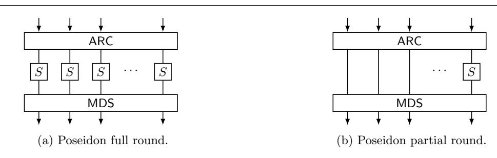
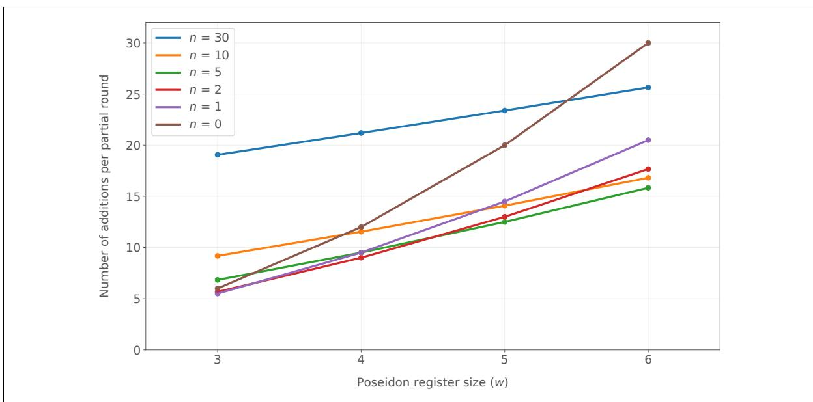
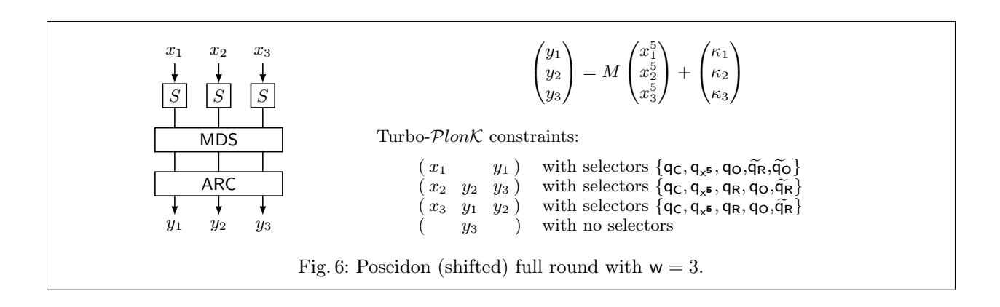
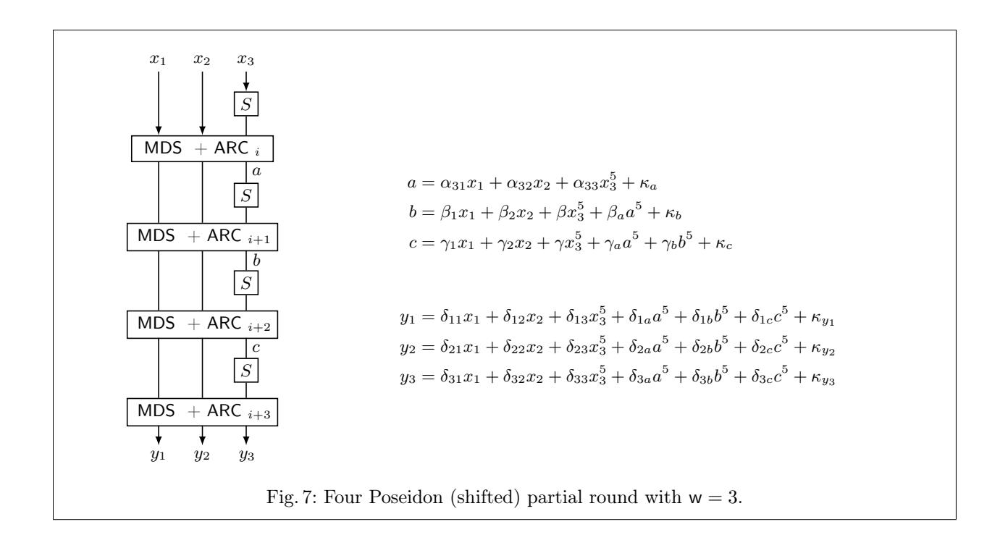

# New optimization techniques for PlonK's arithmetization

Miguel Ambrona, Anne-Laure Schmitt, Raphael R. Toledo, and Danny Willems

Nomadic Labs, Paris, France name.surname@nomadic-labs.com

Abstract. PlonK is a universal and updatable zk-SNARK for general circuit satisfiability that allows a verifier to check the validity of a certain NP statement very efficiently, optionally in zero-knowledge. PlonK requires that the NP relation of interest be expressed as a system of so-called PlonK constraints. Such conversion is complex and can be implemented in various ways, having a great impact on the prover complexity (which is typically linearithmic in the number of PlonK constraints).

We propose several general results for simplifying PlonK constraint systems, which produce more compact but equivalent systems and can lead to significant performance improvements. We also develop an automated optimizer of constraints, based on our techniques, that can be used to construct very compact and less error-prone constraint systems, favoring a more auditable circuit design.

Finally, we demonstrate the potential of our techniques by implementing optimized constraint systems for the Poseidon hash, obtaining the most compact representations in the Turbo-PlonK model with minimal custom gates. En route, we devise a novel optimization idea for implementing Poseidon partial rounds and show that it can be applied to both simplifying SNARK circuits and achieving performance improvements in CPU implementations of the Poseidon hash.

# 1 Introduction

Succinct non-interactive arguments of knowledge (SNARKs) [\[GGPR13,](#page-18-0) [BCG](#page-17-0)<sup>+</sup>13, [PHGR13,](#page-20-0) [Gro16\]](#page-19-0) are a class of non-interactive arguments of knowledge systems with generally constant communication complexity and logarithmic verification complexity. This comes at the cost of a significantly slower prover, compared to other zero-knowledge proof systems with higher communication complexity [\[JKO13,](#page-19-1) [GMO16,](#page-19-2) [CGM16\]](#page-18-1).

To be secure, SNARKs usually require a so-called structured reference string (SRS), usually comprising the successive powers of, which if known would break soundness. The generation of such SRS is usually performed collaboratively through a multi-party computation (MPC) protocol in so-called setup ceremonies [\[BGM17\]](#page-18-2). These ceremonies require a significant effort and can last for several months [\[Com16,](#page-18-3) [Fil20,](#page-18-4) [Azt20\]](#page-17-1).

The first SNARKs required a new SRS for every different NP relation to be proven, however, recent designs [\[MBKM19,](#page-19-3) [GKM](#page-18-5)<sup>+</sup>18, [GWC19,](#page-19-4) [CHM](#page-18-6)<sup>+</sup>20] use an SRS that is universal and can encode any circuit (of bounded size). Furthermore, the SRS of these new constructions is updatable and can be upgraded without having to perform a new setup ceremony. Other works [\[BCR](#page-17-2)<sup>+</sup>19, [BDFG21\]](#page-17-3) even allow for an SRS to be subversion-resistant [\[ALSZ21\]](#page-17-4) or in the transparent setting [\[BFLS91\]](#page-17-5), that can be generated from cryptographic hash functions, without a trusted setup.

PlonK [\[GWC19\]](#page-19-4), which stands for Permutations over Lagrange-bases for Oecumenical Non-interactive arguments of Knowledge, is a universal and updatable zero-knowledge SNARK for general circuit satisfiability. Given its significant improvements with respect to its predecessor Sonic [\[MBKM19\]](#page-19-3), especially on prover efficiency, PlonK has become very popular and has been adopted by several state-of-the-art blockchain projects such as Zcash [\[HBHW22\]](#page-19-5), Mina [\[BMRS20\]](#page-18-7), the Dusk Network [\[MKF21\]](#page-19-6) or Anoma [\[GYB21\]](#page-19-7).

In PlonK's original paper, circuits are expressed in terms of a 2 fan-in 1 fan-out parametric arithmetic gate over an algebraic field (typically, the scalar field of an elliptic curve). The whole constraint system is transformed into polynomials which are then committed using a polynomial commitment scheme and evaluated on a random point during the proving process. On the one hand, the circuit polynomials and commitments, which correspond to the public circuit parameters, are computed in a preprocessing phase. On the other hand, the polynomials associated to the witness of the NP relation, their commitments and their evaluations are computed by the prover.

Using Fast Fourier Transforms for the polynomial conversion and efficient polynomial multiplication, and computing the commitments with KZG [\[KZG10\]](#page-19-8), the prover complexity is in O(kn · logn) scalar operations for the former and O(kn) group operations for the latter where k is the number of wires, and n the number of constraints.

As the gate fan-in/fan-out is limited, the arithmetization of cryptographic primitives may be inefficient and require a significant number of constraints. PlonK extensions have been developed to alleviate this issue. Turbo-PlonK [\[GW19\]](#page-19-9), for instance, allows the use of custom gates to express the same statement in fewer constraints. Many implementations [\[HBHW22,](#page-19-5) [BMRS20\]](#page-18-7) rely on this extension to enable efficient elliptic curve operations or hashing.

The circuit is furthermore limited by the SRS size. Indeed, as the polynomials are committed with the SRS, the number of constraints in a circuit is upper-bounded by the size of the SRS. As the SRS cannot be easily replaced (in a trustworthy manner), its size has direct implications on the circuit and thus on the SNARK's scope. As such, a compact representation of circuits is paramount to make PlonK-based SNARKs more practical. This is the subject of this paper.

## 1.1 Applications of SNARKs

A number of blockchain projects have jumped on the opportunity of using zk-SNARKs, and leverage the unique properties that zero-knowledge proofs provide, for various applications. From identification to storage (Filecoin [\[Lab17\]](#page-19-10)) as well as private transactions (Zcash [\[HBHW22\]](#page-19-5)). Unlike other alternative ZK proving systems, zk-SNARKs enjoy extremely efficient verification times and very compact proofs, this makes them particularly suitable for on-chain validation.

The prover is however significantly slower, typically, linearithmic in the number of polynomial constraints necessary to model the circuit associated to the NP relation. Furthermore, in most SNARK implementations, these polynomial constraints live over the scalar field of an elliptic curve, this makes it expensive to implement circuits that contain Boolean operations, since these must be simulated using scalar values over a much bigger domain. Consequently, modeling standard cryptographic primitives such as AES, SHA2 or Blake or standard digital signatures with SNARKs is costly. Alternatively, many blockchain systems have opted for adopting less standard but more SNARK-friendly hash functions such as Poseidon [\[GKR](#page-18-8)<sup>+</sup>21], Rescue [\[BCL](#page-17-6)<sup>+</sup>20] or Sinsemilla [\[HBHW22\]](#page-19-5). Furthermore, SNARKs are typically efficient over their native scalar field. Modelling algebraic operations over different fields would incur significant overheads. Consequently, a common solution is to implement the desired (algebraic) cryptographic primitives over a curve designed to be compatible with another curve. An example is the Jubjub curve, whose base field was designed to be compatible with the scalar field of BLS13-381.

Hash functions are an essential building block for blockchain applications, as they are the basis for Merkletree-based set accumulator schemes and signature schemes. Although SNARK-friendly hash functions can be implemented significantly more efficiently than their more standard counterparts, they are still one of the main bottlenecks [\[WS21,](#page-20-1) [Zca21\]](#page-20-2).

For these reasons, it is important to develop new techniques that allow us to model efficient and compact circuits of such primitives.

### 1.2 Our contributions

We pursue the study of PlonK-based constraint systems and propose several general results that can lead to performance improvements and more compact proving systems.

Simplification of PlonK constraint systems. We propose generic optimization mechanisms to simplify Turbo-PlonK constraint systems. Our techniques can reduce the number of constraints and variables in the arithmetization, while preserving the satisfiability of the underlying system of polynomials equations induced by them (therefore preserving the NP relation being proved).

Our simplifications exploit the fact that Turbo-PlonK constraints can access the wires corresponding to the next constraint in the system. We revisit this idea, originally proposed in [\[GW19\]](#page-19-9), which opens many new opportunities for optimization, e.g., by sharing wires across constraints (see Section [3.1\)](#page-7-0). Furthermore, we show how different constraints with unused wires can be combined together if they are "compatible"; and how abandoning the input/output wires abstraction and thinking of constraints as the polynomial equations they induce can be advantageous, e.g., applying Gaussian elimination on such equations can lead to equations that can be modeled with fewer constraints.

Automated optimizer of constraints. We propose an automated mechanism for applying the above simplification techniques, abstracted out as simple rewriting rules (Section [3.2\)](#page-8-0). This allows a user to design circuits in the original and less error-prone (but unoptimized) input/output abstraction based on arithmetic gates and then use our automated optimizer to benefit from our simplification techniques. Furthermore, our automated optimizer can lead to simplifications that could hardly be implemented manually, for example, by identifying separate parts of the circuit that can be combined together.

Optimized circuits for the Poseidon hash. We demonstrate the potential of our techniques by implementing optimized circuits for the Poseidon hash. En route, we devise a novel idea for implementing partial rounds, coined the linear skip (Section [4.2\)](#page-10-0), that leverages the fact that partial rounds are almost linear functions, and the composition of linear functions is again a linear function. To the best of our knowledge, this technique has not been used in existing PlonK-based implementations of the Poseidon circuit [\[Dus21,](#page-18-9) [Zca21,](#page-20-2) [WS21\]](#page-20-1) and has not been considered in the literature.

Remark 1. This work is part of a library implemented by the Nomadic Labs' Crypto Team [\[Nom22b\]](#page-19-11), designed to develop private transactions (based on the Sapling protocol by Zcash [\[HBHW22\]](#page-19-5)) and zeroknowledge rollups over the Tezos blockchain [\[Goo14\]](#page-19-12). The current proposal uses Merkle-trees as set accumulators and Schnorr signatures for validating the authenticity of transactions. Both primitives heavily rely on a secure hash function, which as been chosen to be Poseidon. This justifies our efforts to optimize constraint systems and the choice of the Poseidon hash as our use case in this paper.

### 1.3 Related work

Zero-knowledge arguments. Zero-knowledge arguments were introduced by Goldwasser, Micali and Rackoff in 1985 [\[GMR85\]](#page-19-13). They allow a prover to convince a verifier of the validity of a certain statement without revealing any other information, e.g., why the statement is true. A few years later, Blum, Feldman and Micali [\[BFM88\]](#page-17-7), extended this notion and considered non-interactive zero-knowledge arguments (NIZK), where the communication between the two parties is unilateral: the prover produces a "certificate" of the validity of the statement, that can be verified by everyone.

Existing generic protocols that implement zero-knowledge argument systems [\[BFM88,](#page-17-7) [DMP90,](#page-18-10) [FLS90\]](#page-18-11) for any NP relation have been perceived as mainly theoretical results for many years, given that they used to involve expensive NP reductions and required several executions of the same routine in order to achieve reasonable soundness. Only special purpose protocols for specific NP languages [\[Sch91,](#page-20-3) [Cra97,](#page-18-12) [CDS94,](#page-18-13) [GS08\]](#page-19-14) were considered efficient enough for practical deployment, and they have been widely used for building digital signatures and anonymous credentials.

Recently, we have witnessed significant improvements on the design of efficient general-purpose zeroknowledge proof systems which enjoy varying degrees of practicality [\[Gro16,](#page-19-0) [BCG](#page-17-8)<sup>+</sup>17, [BBB](#page-17-9)<sup>+</sup>18, [MBKM19,](#page-19-3) [LMR19\]](#page-19-15). Such improvements have been motivated by the increasing development of blockchain systems that demand zero-knowledge arguments to achieve privacy and scalability [\[BCG](#page-17-10)<sup>+</sup>14, [DFKP13\]](#page-18-14). In these systems, communication complexity is one of the most important performance factors, which has led to an increasing interest and remarkable progress in so-called succinct non-interactive arguments of knowledge (SNARKs); or zk-SNARKs, if they provide zero-knowledge.

PlonK family. A number of projects has branched out since PlonK's release.

Following Turbo-PlonK, Plookup [\[GW20\]](#page-19-16), in 2020, allows the use of look-up tables and as such facilitates range checks and queries with the use of new identities.

Several polynomial commitments schemes, SHPlonk [BDFG20] and FFlonk [GW21a], released in 2020 and 2021, implicitly target  $\mathcal{P}lon\mathcal{K}$ . FFlonk and SHPlonk are variants of the KZG protocol that respectively allow the opening multiple polynomials at a single point, via an "FFT-like identity", and the opening of multiple polynomials at multiple points at lower verifier cost. However, these variants usually increase the cost of the prover or the verifier, so they may be applicable to specific scenarios only.

Updates to the original protocol were also released over the years. This include more efficient methods to handle zero-knowledge, published by Mina in 2020 [pro20], and public inputs, published by Gabizon and Williamson in 2021 [GW21b].

The Electric Coin Company changed their proving system from Groth16 to  $\mathcal{P}lon\mathcal{K}$  in 2020 when publishing Halo2 [BGH]. This project presents a different "PLONKish" arithmetization and allows recursion. Plonkup [PFM+22], in 2022, presented an implementation of  $\mathcal{P}lon\mathcal{K}$  with Turbo- $\mathcal{P}lon\mathcal{K}$  and Plookup. Mir protocol released in 2022 Plonky2 [pro22] a variant of  $\mathcal{P}lon\mathcal{K}$  using Fast Reed-Solomon Interactive proofs (FRI) also enabling recursion.

R1CS vs  $\mathcal{P}lon\mathcal{K}$ 's constraint system. Groth16 and  $\mathcal{P}lon\mathcal{K}$  are the two main proof systems used in the blockchain world. They differ in many points, including the universality of the setup, but especially in their arithmetization.  $\mathcal{P}lon\mathcal{K}$  uses an algebraic gate which corresponds to the equality of the addition and multiplication of two input and with an output variable while Groth16 uses Rank 1 Constraint Systems (R1CS) which corresponds to the equality of the multiplication of the sum of n variables with another sum. As such, it is hard to compare these constraint systems.

R1CS can encode linear combinations of any size without an additional overhead, whereas  $\mathcal{P}lon\mathcal{K}$  is limited by the number of wires in the gate's architecture. However,  $\mathcal{P}lon\mathcal{K}$  offers custom gates which allow the verification of complex, potentially non-linear, operations in one constraint. Lookups can also be efficiently used with  $\mathcal{P}lon\mathcal{K}$ 's extension, Plookup, decreasing the cost of binary operations such as decompositions as well as facilitating standard cryptography such as Pedersen hash (c.f. Sinsemilla).

Alternative efficient implementations of Poseidon. In the original Poseidon paper [GKR<sup>+</sup>19, Appendix B], the authors propose an optimization that exploits the structure of partial rounds and the fact that they only involve one S-box. This idea, inspired by a similar technique proposed for LowMC [DKP<sup>+</sup>19], consists of rearranging the structure of the constant and linear layers in order to express the (linear part) of partial rounds as the multiplication by a very sparse matrix. This can greatly reduce the number of operations required for its evaluation.

This technique is similar to our proposed optimization called the *linear skip*, where such (linear part) of partial rounds is replaced by the identity matrix at the cost of carrying a computation for the next layer. Another fundamental difference between the two mechanisms is that our linear skip can be applied to jumping over *several* partial rounds (at the cost of carrying a bigger linear computation with every skipped round).

## 2 Preliminaries

#### 2.1 Notation

We consider bilinear groups  $(\mathbb{G}_1, \mathbb{G}_2, \mathbb{G}_t, e : \mathbb{G}_1 \times \mathbb{G}_2 \to \mathbb{G}_t)$  of prime order p. We use additive notation for all three groups. Throughout the paper, all polynomial equations will have coefficients over the scalar field  $\mathbb{Z}_p$ .

We use bold case for vectors. Given a vector  $\boldsymbol{x}$  over some n dimensional vector space, we denote by  $x_i$  it's i-th coordinate, for all  $i \in [n]$ . We denote concatenation as  $\parallel$ , used as a separator of elements of the same type (typically constraints).

#### 2.2 Hades strategy

Confusion and diffusion [Sha49] are two key properties when building cryptographic primitives. One of the simplest ways to achieve both is to use a substitution-permutation network (SPNs). This approach has been

<span id="page-4-0"></span>

Fig. 1: Poseidon rounds. ARC adds a round-dependent constant to each state element, S is a non-linear function, typically x 7→ x <sup>5</sup> and MDS is a linear function applied to all the elements in the register.

recently revisited in the case of algebraic hash functions in an effort to reduce the number of permutations. These partial SPNs (P-SPNs) gave birth to Zorro in 2013, LowMC in 2015 and MiMC in 2016 to cite a few. These P-SPNs are lighter in computational cost, but are also more difficult to analyze security-wise and are sometime vulnerable to attacks [\[EGL](#page-18-17)<sup>+</sup>20].

Grassi et al. presented in 2020 the HADES Design Strategy together with an analysis framework built upon the wide trail design strategy. The Hades strategy is organized in layers, with so-called partial rounds (P-SPNs) surrounded by full rounds (SPNs) to prevent statistical attacks. They instantiated HadesMiMC and compared it in an MPC setting with MiMC, GMiMc and rescue showing a higher runtime and lower communication cost.

### 2.3 Poseidon

Poseidon [\[GKR](#page-18-8)<sup>+</sup>21] is an algebraic hash function family presented by Grassi et al. in 2020 relying on the Hades Design strategy. In particular, Poseidon consists of a substitution-permutation network applied to a state with w registers. Such network combines so-called full rounds with partial rounds. In a full round the state is modified by adding a constant to each register element, applying a non-linear function (S-box) to each of them and a linear linear layer involving all the elements in the state. Partial round are similar, but only apply the non-linear S-box to one of the register elements (see Figure [1\)](#page-4-0).

The use of partial rounds aims at reducing the number of non-linear (and more expensive) operations. For this reason, it is particularly amenable for its implementation in R1CS constraint systems and PlonK-based ones and the Poseidon function family has been used in a number of projects, including Zcash [\[HBHW22\]](#page-19-5), the Dusk Network [\[MKF21\]](#page-19-6) and Mina [\[BMRS20\]](#page-18-7).

### 2.4 SNARKs arithmetizations

Most SNARKs model NP relations as arithmetic circuits that are represented by systems of multivariate polynomial equations. More concretely, let Cx(w) := R(x, w) be a circuit parameterized by a statement x, which is satisfiable (on a certain input witness w) iff x belongs in the NP language induced by R. Circuit C<sup>x</sup> is modeled by a system of n multivariate polynomial equations f1(x, w) = 0 ∧ . . . ∧ fn(x, w) = 0 on variables x and w; in such a way that C<sup>x</sup> is satisfiable iff so is the system of equations. Variables x are so-called public inputs whereas variables w correspond to the witness of the NP relation. The proving system allows a prover to convince a verifier that they know an assignment on variables w that satisfies all polynomial equations when variables x are fixed to some public value that determines the statement being proven.

The specific details about how arithmetic circuits are transformed into polynomial constraints are known as the system's arithmetization. Different SNARKs impose different additional restrictions on the system of polynomial constraints. For example, Rank 1 Constraint Systems (R1CS) require that every polynomial f<sup>i</sup> be such that it can be factored into three linear polynomials  $a_i$ ,  $b_i$  and  $c_i$  as follows:

$$f_i(\boldsymbol{x}, \boldsymbol{w}) = a_i(\boldsymbol{x}, \boldsymbol{w}) b_i(\boldsymbol{x}, \boldsymbol{w}) - c_i(\boldsymbol{x}, \boldsymbol{w})$$
.

On the other hand,  $\mathcal{P}lon\mathcal{K}$  imposes the following restrictions (see Section 2.5):

- Each polynomial  $f_i$  can involve on at most N different variables, where N is known as the gate architecture size. The original publication [GWC19] describes a wire architecture of N=3, but different values of N have been explored by several implementations of  $\mathcal{P}lon\mathcal{K}$ , e.g., the Dusk Network uses N=4 [Dus21] and Mina uses N=15 wires [WS21].
- A polynomial  $f_i$  can only contain monomials of a restricted form. The original version of  $\mathcal{P}lon\mathcal{K}$  allows for a constant monomial, any degree-1 monomial, and just one degree-2 monomial, but the set of supported monomials (or more generally, terms) may be extended with so-called *custom gates* [GW19].

## <span id="page-5-0"></span>2.5 $\mathcal{P}lon\mathcal{K}$ 's arithmetization

From  $\mathcal{P}lon\mathcal{K}$  constraint system. In the  $\mathcal{P}lon\mathcal{K}$  proof system [GWC19], a constraint is a tuple (a, b, c, sels) where a, b, c are formal variables and sels is a set of so-called selectors. A selector is a circuit parameter used as a switch to activate a gate. Constraints are often represented in a matrix, with one row per constraint and a column for each selector, where the matrix values are the selector coefficients of each constraint.

In the original version of  $\mathcal{P}lon\mathcal{K}$ , the available selectors are  $q_L,q_R,q_O$ , adding the left, right and output wires (resp. a, b and c),  $q_M$ , multiplying two wires (a and b), and  $q_C$  adding a public constant. As such, every constraint, induces a polynomial equation:

<span id="page-5-2"></span>
$$q_{\mathsf{L}} \cdot \mathsf{a} + q_{\mathsf{R}} \cdot \mathsf{b} + q_{\mathsf{O}} \cdot \mathsf{c} + q_{\mathsf{M}} \cdot \mathsf{a} \cdot \mathsf{b} + q_{\mathsf{C}} = 0 \ . \tag{1}$$

Such equation captures addition and multiplication gates, useful for modeling algebraic circuits. For example, an addition gate c = a + b can be modeled by setting  $q_L = q_R = 1$ ,  $q_O = -1$  and  $q_M = q_C = 0$ . And a multiplication gate c = ab can be modeled as  $q_M = 1$ ,  $q_O = -1$  and  $q_L = q_R = q_C = 0$ .

To a polynomial equation. NP relations are converted it into algebraic circuits by modeling their satisfiability as sets of polynomial equations of the form (1), induced by  $\mathcal{P}lon\mathcal{K}$  constraints  $\{(a_i,b_i,c_i,\mathsf{sels}_i)\}_{i\in[n]}$ . These constraints are then compiled into a single polynomial equation:

<span id="page-5-3"></span>
$$(Q_l \cdot A + Q_r \cdot B + Q_o \cdot C + Q_m \cdot A \cdot B + Q_c)(X) = 0 , \qquad (2)$$

where polynomials A, B and C encode the *witness* to the NP relation and Q polynomials define the circuit and may be precomputed. The polynomials can be efficiently computed using iFFT as follows. Let  $\omega \in \mathbb{Z}_p$  be a primitive  $2^k$ -th root of unity, for some k such that  $n < 2^k$ . Polynomial  $Q_l$  is defined as the minimal polynomial that evaluates to  $q_{L_i}$  on  $\omega^i$ , for every  $i \in [n]$ . (The rest of Q polynomials are defined analogously.) A  $\mathcal{P}lon\mathcal{K}$  proof will be simply an argument of knowledge of polynomials A, B, C such that equation (2) holds when evaluated on  $\omega^i$ , for every  $i \in [n]$ .

Defining  $\mathcal{P}lon\mathcal{K}$  as a polynomial protocol. As such,  $\mathcal{P}lon\mathcal{K}$  can be seen as a polynomial protocol in which a party proves the veracity of several polynomial identities on a witness in a subgroup. These identities are those induced by circuit's constraints, as well as those induced by copy-constraints (which check that the witness is consistent with the circuit structure) and potentially other ones by extra functionalities like  $\mathsf{P}look\mathsf{up}$  or  $\mathsf{Turbo}\text{-}\mathcal{P}lon\mathcal{K}$ . The prover computes then a new polynomial T by dividing a combination of all identities and the unitary smallest polynomial that vanishes on each point of the subgroup.

In practice, the proof is achieved by leveraging a polynomial commitment scheme [KZG10] as follows. The selectors and circuit-relative polynomials are committed in a preprocessing phase and made public (that

<span id="page-5-1"></span><sup>&</sup>lt;sup>1</sup> As we will see, extra selectors may be introduced for encoding complex functionalities more efficiently [GW19].

<span id="page-5-4"></span><sup>&</sup>lt;sup>2</sup> As well as other polynomial equalities relative to the so-called *copy-constraints* which we omit here for simplicity.

way, the verifier only needs to handle the commitments to these polynomials, which are much more compact than the polynomials themselves). The prover also commits to the wire polynomials A, B, C (after, possibly, having added a blinding factor term to achieve zero-knowledge) and T. The prover is then challenged to evaluate all committed polynomials at a point ξ ∈ Z<sup>p</sup> chosen uniformly at random.

The verifier will check the validity of the polynomial evaluations given by the prover at ξ, and then use these evaluations to check that a certain polynomial identity is 0 at ξ. This identity ensures that T has been computed correctly, which implies that all polynomials identities vanish in the subgroup, as desired.

Extending to arbitrary polynomials Turbo-PlonK. The Turbo-PlonK proposal is key in unlocking PlonK capabilities by allowing one to change PlonK's constraint equation [\(1\)](#page-5-2) or even append another one to it. With this technique, one can view the selectors q<sup>L</sup> and so on as elementary gates that are added up to form an arithmetic identity. We can define new multivariate polynomials of any degree P(a, b, c), a new selector q<sup>P</sup> and add the expression q<sup>P</sup> · P(a, b, c) to [\(1\)](#page-5-2) and [\(2\)](#page-5-3). Another possibility offered by Turbo-PlonK is the addition of new identities. These identities, of the form I(a, b, c,sels) = 0, must also hold when evaluated on all ω i . They can be switched off by setting all selectors to 0. Several identities can share the same selectors, in which case additional identity-specific may be needed to switch identities. This new functionality can be of great help when checking different relations on the same variable or checking domain independent relations such as arithmetic and elliptic curve operations.

One has to be careful when adding a new gate because it increases the prover and verifier costs. A specialized custom gate can drastically cut the cost of one component of a circuit, but may be less efficient than a more general purpose gate which could be reused. For example, adding the rather generic power of 5 gate, q<sup>x</sup> <sup>5</sup> , for the Poseidon circuit increases the prover cost by 1 to 2n group operations (c.f. Table [2\)](#page-15-0) but as it substantially decreases the number of constraints, from 624 to 464 constraints, the overall proving cost is reduced by ≈ 10% (c.f. Table [1\)](#page-15-1).

Furthermore, because of FFT threshold effects, experimentation is often needed when choosing the most adequate custom gate. Hence, measuring the frequency usage of the associated selector can be helpful to determine the usefulness of a specific custom gate alongside the analysis of a custom gate's degree and complexity as well as the reduction in the number of constraints.

## <span id="page-6-0"></span>3 New optimizations on PlonK's arithmetization

A Turbo-PlonK constraint is simply a PlonK constraint inducing (possibly) more than one polynomial equality.

Definition 1 (Turbo-PlonK constraint). A Turbo-PlonK constraint is a tuple (a, b, c,sels) where a, b, c are formal variables and sels is a set of selectors. A selector is a pair q : α, where q is the selector's name and α ∈ Zp, its coefficient.

Definition 2 (Turbo-PlonK constraint system). A Turbo-PlonK constraint system is an ordered list of Turbo-PlonK constraints. There exists a function P that maps each pair of consecutive constraints into a set of polynomial equations (each corresponding to a so-called identity), involving the formal variables of both constraints, but whose coefficients depend only on the selectors of the first.

Remark 2. One may ask why only the variables of a constraint and the next are involved in an equation. Why not the second next too? The reason is that accessing the next constraint variables comes "for free". Indeed, PlonK's permutation argument requires evaluating the permutation polynomials on ξ, but also on ξω, which corresponds to the next constraint values. Accessing further values, e.g. two constraints away, is possible but would incur the additional cost (for both prover and verifier) of opening polynomial commitments at a new evaluation point, e.g. ξω<sup>2</sup> , making these gates less practical.

As an example of a Turbo-PlonK custom gate, we can introduce a selector called qbin, with associated identity qbin a (a − 1) = 0, to ensure that the first variable in a constraint is Boolean. That way, constraint (a, b, c, {q<sup>M</sup> : 1, q<sup>O</sup> : −1, qbin : 1}) would model the fact that c = b or c = 0, ensured by the polynomial constraints (checked in parallel):

$$-c + ab = 0$$
 and  $a(a-1) = 0$ .

We can also extend the arithmetic identity by defining linear selectors referring to the next gate wires as:

<span id="page-7-1"></span>
$$(a_i, b_i, c_i, \{q_L, q_R, q_O, q_M, q_C, \widetilde{q}_L, \widetilde{q}_R, \widetilde{q}_O\}) , \qquad (3)$$

representing identity

<span id="page-7-2"></span>
$$q_{L} a_{i} + q_{R} b_{i} + q_{O} c_{i} + q_{M} a_{i} b_{i} + q_{C} + \widetilde{q}_{L} a_{i+1} + \widetilde{q}_{R} b_{i+1} + \widetilde{q}_{O} c_{i+1} = 0 ,$$

$$(4)$$

where ai+1, bi+1 and ci+1 refer to the next-constraint wires. Note that the polynomial equation induced by a constraint is no longer fully determined by the constraint itself, but also its relative position in the constraints system.

In the rest of this work, we consider all arithmetic selectors from [\(3\)](#page-7-1), as well as an extra arithmetic selector q<sup>x</sup> <sup>5</sup> : δ that adds an extra term δ a 5 i to the identity from [\(4\)](#page-7-2). (This selector will be used to model Poseidon S-boxes with just 1 constraint.) Our results are generic with respect to other possible selectors whose identity runs in parallel.

## <span id="page-7-0"></span>3.1 Optimizing Turbo-PlonK constraint systems

We propose several ideas for optimizing a constraint system. In Section [3.2](#page-8-0) we then present an automated mechanism, formalized as re-writing rules (Figure [3\)](#page-9-0), that systematically applies these atomic optimizations.

## Shared wires across constraints

Two linear combinations that involve common wires can be implemented more efficiently if they are handled together. For example, a linear combination of the form out = α1x + α2y + α3z, would require two constraints to be implemented (over a 3-wires architecture), for example, as:[3](#page-7-3)

<span id="page-7-4"></span>
$$(x, y, \mathsf{out}, \{\mathsf{q_L} : \alpha_1, \mathsf{q_R} : \alpha_2, \widetilde{\mathsf{q}_L} : \alpha_3, \mathsf{q_O} : -1\}) \parallel (z, \_, \_, \emptyset)$$
.

Now, imagine we needed to encode an extra linear combination that depends on the same x, y, z, say out′ = β1x + β2y + β3z. (This situation could occur, e.g., when modelling a Poseidon linear gate.) We could model both linear combinations with 3 constraints instead of 4 as follows:

$$(x,\_,\mathsf{out},\{\mathsf{q_L}:\alpha_1,\widetilde{\mathsf{q}_L}:\alpha_2,\widetilde{\mathsf{q}_R}:\alpha_3,\mathsf{q_O}:-1\})\parallel(y,z,\mathsf{out}',\{\mathsf{q_L}:\beta_2,\mathsf{q_R}:\beta_3,\widetilde{\mathsf{q}_R}:\beta_1,\mathsf{q_O}:-1\})\parallel(\_,x,\_,\emptyset)\ . \tag{5}$$

Furthermore, observe how, conveniently, some wires in the above constraints are unbound. This will be exploited in our next optimization.

#### Merging constraints

The use of next-constraint selectors can lead to constraints that have an empty set of selectors whose only purpose is to include wires that are used by the previous constraint. An example is the last constraint of [\(5\)](#page-7-4). Such constraints can be combined with other constraints if the wires are not in conflict. For example, two groups of (three) constraints as the one in [\(5\)](#page-7-4) can be combined into simply one group of five:

<span id="page-7-3"></span><sup>3</sup> We use symbol to express the fact that the variable is not being used by the selectors of this constraint or the previous constraint. In practice, any value could be put in the place of without affecting the induced system of equations. But we want to highlight that is a special symbol that refers to the fact that the variable is not used.

 $(x_1,\_,\mathsf{out}_1,\mathsf{sels}_1) \parallel (y_1,z_1,\mathsf{out}_1',\mathsf{sels}_1') \parallel (\_,x_1,\_,\emptyset) \text{ and } (x_2,\_,\mathsf{out}_2,\mathsf{sels}_2) \parallel (y_2,z_2,\mathsf{out}_2',\mathsf{sels}_2') \parallel (\_,x_2,\_,\emptyset) ,$  can be transformed into

$$(x_1, \_, \mathsf{out}_1, \mathsf{sels}_1) \parallel (y_1, z_1, \mathsf{out}_1', \mathsf{sels}_1') \parallel (x_2, x_1, \mathsf{out}_2, \mathsf{sels}_2) \parallel (y_2, z_2, \mathsf{out}_2', \mathsf{sels}_2') \parallel (\_, x_2, \_, \emptyset)$$
.

Also, note that the order of constraints does not matter as long as they do not use the next-constraint selectors. Thus, we could conveniently reorder constraints to make the merging more effective.

#### Gaussian elimination

 $\mathcal{P}lon\mathcal{K}$  constraints were initially designed for modelling gates of an arbitrary circuit. (That explains the legacy names of selectors  $q_L$ ,  $q_R$  and  $q_O$ , standing for left, right and output wires, respectively.)

It is advantageous to view constraints as the polynomial equalities that they induce and not think about what wires represent inputs and what wires represent outputs. That way, we can transform the polynomial equalities into an equivalent set of equalities that can be represented with simpler or fewer constraints. For example, imagine we want to compute  $r := 8x^5 + 2y^5$  and  $s := 4x^5 - 3y^5$ . The naive approach would require introducing two auxiliary variables and a total of 4 Turbo- $\mathcal{P}lon\mathcal{K}$  constraints:

$$\begin{array}{ll} (x,\_,\mathsf{aux}_1,\{\mathsf{q_{x^5}}\!:\!1,\mathsf{q_O}\!:\!-1\}) & (y,\_,\mathsf{aux}_2,\{\mathsf{q_{x^5}}\!:\!1,\mathsf{q_O}\!:\!-1\}) \\ (\mathsf{aux}_1,\mathsf{aux}_2,r),\{\mathsf{q_L}\!:\!8,\mathsf{q_R}\!:\!2,\mathsf{q_O}\!:\!-1\}) & (\mathsf{aux}_1,\mathsf{aux}_2,s),\{\mathsf{q_L}\!:\!4,\mathsf{q_R}\!:\!-3,\mathsf{q_O}\!:\!-1\}) \end{array}$$

Alternatively, we could simplify the polynomial equalities (trying to minimize the number of power-of-5 monomials) first by considering linear combinations between them. For example,

$$\begin{cases} 8x^5 + 2y^5 - r = 0 \\ 4x^5 - 3y^5 - s = 0 \end{cases} \iff \begin{cases} 8x^5 + 2y^5 - r = 0 \\ -8y^5 - 2s + r = 0 \end{cases} \iff \begin{cases} 32x^5 - 3r - 2s = 0 \\ -8y^5 - 2s + r = 0 \end{cases}$$

Now, it is possible to model both equations with just two constraints, avoiding the use of auxiliary variables, as follows:

$$(x, r, s, \{q_{x5}: 32, q_R: -3, q_O: -2\})$$
  $(y, r, s, \{q_{x5}: -8, q_R: 1, q_O: -2\})$ .

This idea will be used in Section 4 for building highly optimized full and partial Poseidon rounds.

### <span id="page-8-0"></span>3.2 Automated optimizer of constraints

We propose an automated mechanism for applying the techniques presented in the previous section in order to simplify constraint systems. This method is less error-prone and can lead to more effective optimizations than the manual application of the simplification rules, e.g., by combining separated parts of the circuit that are compatible. Nevertheless, specific manual optimizations for concrete parts of a circuit can result in very performant circuits as we will show in Section 4.

Our techniques are specialized for a Turbo- $\mathcal{P}lon\mathcal{K}$  design that includes the arithmetic identity from (4), but may include other arbitrary identities (as long as they use independent selectors). Given a list of constraints  $\Gamma \coloneqq ((\mathsf{a}_1,\mathsf{b}_1,\mathsf{c}_1,\mathsf{sels}_1),\ldots,(\mathsf{a}_n,\mathsf{b}_n,\mathsf{c}_n,\mathsf{sels}_n))$ , we say  $\Gamma$  is admissible if its last constraint does not contain next-constraint selectors. We define  $\mathcal{P}(\Gamma)$  as the set:

$$\{\mathsf{q}_{\mathsf{L}\,i}\,\mathsf{a}_i + \mathsf{q}_{\mathsf{R}\,i}\,\mathsf{b}_i + \mathsf{q}_{\mathsf{O}\,i}\,\mathsf{c}_i + \mathsf{q}_{\mathsf{M}\,i}\,\mathsf{a}_i\,\mathsf{b}_i + \mathsf{q}_{\mathsf{C}\,i} + \widetilde{\mathsf{q}}_{\mathsf{L}\,i}\,\mathsf{a}_{i+1} + \widetilde{\mathsf{q}}_{\mathsf{R}\,i}\,\mathsf{b}_{i+1} + \widetilde{\mathsf{q}}_{\mathsf{O}\,i}\,\mathsf{c}_{i+1}\}_{i\in[n]} \ ,$$

where  $\mathsf{sels}_i = \{\mathsf{qL}_i, \mathsf{qR}_i, \mathsf{qO}_i, \mathsf{qM}_i, \mathsf{qC}_i, \widetilde{\mathsf{qL}}_i, \widetilde{\mathsf{qR}}_i, \widetilde{\mathsf{qO}}_i\}$ . Note that  $\mathsf{a}_{n+1}, \mathsf{b}_{n+1}, \mathsf{c}_{n+1}$  are not defined, but if  $\Gamma$  is admissible, its respective coefficients  $\widetilde{\mathsf{qL}}_n, \widetilde{\mathsf{qR}}_n, \widetilde{\mathsf{qO}}_n$  will be 0.

Let  $\Gamma$  be a list of Turbo- $\mathcal{P}lon\mathcal{K}$  constraints and let L be a set of multivariate linear polynomials over  $\mathbb{Z}_p$ . We say  $(\Gamma, L)$  is an extended constraint system.

<span id="page-9-2"></span>Permute. For any permutation of three elements σ ∈ S3:

$$\frac{(x_1,x_2,x_3,\mathsf{sels} \cup \{\widetilde{\mathsf{q}}_\mathsf{L} : \alpha_1,\widetilde{\mathsf{q}}_\mathsf{R} : \alpha_2,\widetilde{\mathsf{qo}} : \alpha_3\}) \| (y_1,y_2,y_3,\emptyset)}{(x_1,x_2,x_3,\mathsf{sels} \cup \{\widetilde{\mathsf{q}}_\mathsf{L} : \alpha_{\sigma(1)},\widetilde{\mathsf{q}}_\mathsf{R} : \alpha_{\sigma(2)},\widetilde{\mathsf{qo}} : \alpha_{\sigma(3)}\}) \| (y_{\sigma(1)},y_{\sigma(2)},y_{\sigma(3)},\emptyset)}$$

Reduce.

$$\frac{(x_1, x_2, x_3, \mathsf{sels} \cup \{\widetilde{\mathsf{q}}_\mathsf{L} : 0, \widetilde{\mathsf{q}}_\mathsf{R} : 0, \widetilde{\mathsf{q}}_\mathsf{O} : 0\}) \| (y_1, y_2, y_3, \emptyset)}{(x_1, x_2, x_3, \mathsf{sels})}$$

Combine constraints.

$$\frac{(x_1,x_2,x_3,\emptyset) \parallel (y_1,y_2,y_3,\mathsf{sels})}{(z_1,z_2,z_3,\mathsf{sels})} \quad \text{if } \forall i \in [3], \\ z_i = \mathsf{comb}(x_i,y_i) \neq \bot^a$$

Fig. 2: Constraint rules.

<span id="page-9-0"></span>Collect linear. If <sup>Γ</sup><sup>0</sup> is admissible (its last constraint does not include <sup>e</sup>qL, <sup>q</sup>e<sup>R</sup>, <sup>q</sup>e<sup>O</sup>):

$$\frac{\varGamma_0 \parallel (x_1, x_2, x_3, \{\mathsf{q_L} : \alpha_1, \mathsf{q_R} : \alpha_2, \mathsf{q_O} : \alpha_3, \mathsf{q_C} : \alpha_0\}) \parallel \varGamma_1; \ L}{\varGamma_0 \parallel \varGamma_1; \ L \cup \{\alpha_0 + \sum_{i=1}^3 \alpha_i x_i = 0\}}$$

Free variable.

$$\frac{\varGamma;\; L \cup \{\alpha_0 + \sum_{i \in S} \alpha_i x_i = 0\}}{\varGamma;\; L[x_j \mapsto -(\alpha_0 + \sum_{i \in S \setminus \{j\}} \alpha_i x_i) \div \alpha_j]} \quad \text{if } x_j \notin \varGamma \text{ and } \alpha_j \neq 0$$

Efficient sum. If Γ<sup>0</sup> is admissible:

$$\frac{\Gamma_0 \parallel \Gamma_1; \ L \cup \{\alpha_0 + \sum_{i=1}^6 \alpha_i x_i = 0\}}{\Gamma_0 \| (x_1, x_2, x_3, \{\mathsf{q_L} : \alpha_1, \mathsf{q_R} : \alpha_2, \mathsf{q_O} : \alpha_3, \mathsf{q_C} : \alpha_0, \widetilde{\mathsf{q_L}} : \alpha_4, \widetilde{\mathsf{q_R}} : \alpha_5, \widetilde{\mathsf{q_O}} : \alpha_6\}) \| (x_4, x_5, x_6, \emptyset) \parallel \Gamma_1; \ L \cap \{\alpha_0 + \sum_{i=1}^6 \alpha_i x_i = 0\}$$

Auxiliary variable.

$$\frac{\Gamma; L \cup \{t_1 + t_2 = 0\}}{\Gamma; L \cup \{t_1 - s = 0, s + t_2 = 0\}}$$
 for fresh variable s

Constraint rule. If Γ<sup>0</sup> is admissible:

$$\frac{\Gamma_0 \|\mathbf{g}\| \Gamma_1; \ L}{\Gamma_0 \|t(\mathbf{g})\| \Gamma_1; \ L} \quad \text{ for } t \in \mathsf{ConstraintRules} \quad \text{(see Figure 2)}$$

Fig. 3: Optimizer rules.

Definition 3. We say an extended constraint system (Γ, L), with N variables, is satisfiable if there exists an evaluation x ∈ Z N p such that, f(x) = 0 for every polynomial f ∈ P(Γ) ∪ L.

<span id="page-9-3"></span>Our rewriting rules are described in Figure [3.](#page-9-0) For simplicity, we focus on an architecture of N = 3 wires, but note all rules can be easily generalized to other values of N.

<span id="page-9-1"></span><sup>a</sup> For all x ̸= y, comb(x, x) = x, comb(x, y) = ⊥, comb(x, ) = x, comb( , y) = y.

Theorem 1. Let (Γ, L) be an admissible extended constraint system and let (Γ ′ , L′ ) be the result of applying any of the rules from Figure [3](#page-9-0) to (Γ, L). Then, (Γ ′ , L′ ) is admissible. Furthermore, (Γ, L) is satisfiable if and only if (Γ ′ , L′ ) is satisfiable.

As it will be clear in the proof (Appendix [A\)](#page-20-7), given a satisfying assignment for the former, we can efficiently build a satisfying assignment for the latter and vice versa.

Our optimizer of constraints applies the rules from Figure [3](#page-9-0) heuristically, as follows.

- 1. It first applies collect linear on all constraints if possible, moving all linear constraints to the set of linear polynomials L.
- 2. It then applies the free variable rule on all polynomials in L that contain at most two non-constant monomials (this is to guarantee that the substitution x<sup>j</sup> 7→ −(α<sup>0</sup> + P <sup>i</sup≯=<sup>j</sup> αixi)/α<sup>j</sup> does not increase the number of monomials in any polynomial in L).[4](#page-10-2) We also apply collect linear on any polynomial, if the substituted variable x<sup>j</sup> only appears in another polynomial in L.
- 3. We apply the auxiliary variable rule to partition polynomials in polynomials with less than 2N monomials (preparing them to apply efficient sum). This step is heuristically performed trying to generate partitions that include the same monomials so that our shared-wires heuristic can be more effective.
- 4. We move the resulting polynomials from L to Γ by applying efficient sum one by one. The new constraints are inserted at a position that allows us to perform further combinations if possible, e.g., with the combine constraints rule from Figure [2](#page-9-2) (this may require adjusting some of the constraints with the permute rule).

The optimizer is particularly efficient for optimizing circuits that involve linear computations. For example, the naive implementation of the Poseidon circuit from Table [1](#page-15-1) with w = 3 and N = 3, using an S-box custom gate requires 464 constraints. It can be reduced to just 272 constraints after our optimizer. (This is the same number of constraints that can be achieved with N = 4, but without the need of a fourth wire per gate.) Our prototype implementation is open source [\[Nom22c\]](#page-19-20).

# <span id="page-10-1"></span>4 Optimizing Poseidon Hash

## <span id="page-10-3"></span>4.1 Optimized implementation of Poseidon

We present an optimized Turbo-PlonK modelization of Poseidon for with w = 3. Our techniques can be generalized to other versions, see the discussion at the end of this section. We model (shifted) full rounds with 4 constraints where the last one has no selectors and is compatible with its successor. On the other hand, we can leverage the linear skip and model 4 (shifted) partial rounds with just 7 constraints where the last is compatible with its successor. Consequently we are effectively modeling every full round with 3 constraints and every partial round with 1.5 constraints.

## <span id="page-10-0"></span>4.2 Linear skip

A naive implementation of Poseidon Hash would require including constraints that model w additions (of w terms) for every (full or partial) round; and constraints modelling w S-boxes (per full round) plus one S-box per partial round.

We propose an optimization, coined the linear skip, which can be used to reduce the number of constraints modelling partial rounds. In a nutshell, we leverage the fact that the composition of linear functions is again a linear function in order to "skip" the evaluation of certain wires.

Consider Figure [4,](#page-11-0) describing the application of two Poseidon partial rounds to state (x1, . . . , xw), transforming it into state (z1, . . . , zw). First observe that equations [\(7\)](#page-11-1) and [\(11\)](#page-11-2) could be ignored since b<sup>i</sup> (respectively di) can be used as an alias for a<sup>i</sup> (respectively ci), for all i ∈ [w−1]. Furthermore, the constraints from equation [\(6\)](#page-11-3) could potentially be merged with the constraints from the preceding MDS gate (in constraint

<span id="page-10-2"></span><sup>4</sup> Note that the more monomials a polynomial has, the more constraints we will need to model it.

<span id="page-11-3"></span><span id="page-11-1"></span><span id="page-11-0"></span>

<span id="page-11-5"></span><span id="page-11-4"></span><span id="page-11-2"></span>Fig. 4: Two Poseidon partial rounds transforming state  $(x_1, \ldots, x_w)$  into state  $(z_1, \ldots, z_w)$ . For every  $i, j \in [w]$ ,  $\kappa_i, \hat{\kappa}_i, \alpha_{ij} \in \mathbb{Z}_p$  are constants determined by the primitive's specification.

systems such as R1CS or Plonk, where addition by constants is "free"), but let us ignore such optimization for now.

The linear trick consists of also ignoring equations (9) and (10), not creating variables nor constraints for wires  $y_i$  and  $c_i$  for any  $i \in [w-1]$ . (Note that we must keep a variable for  $c_w$ , which is the input to an S-box.) This way, the constraints modelling a pair of partial rounds can be reduced to:

$$\forall i \in [\mathbf{w}]. \ a_i = x_i + \kappa_i$$

$$c_{\mathbf{w}} = \sum_{j=1}^{\mathbf{w}-1} \alpha_{\mathbf{w}j} a_j + \alpha_{\mathbf{w}\mathbf{w}} b_{\mathbf{w}} + \hat{\kappa}_{\mathbf{w}}$$

$$b_{\mathbf{w}} = a_{\mathbf{w}}^5 \qquad d_{\mathbf{w}} = c_{\mathbf{w}}^5 \qquad \forall i \in [\mathbf{w}]. \ z_i = \sum_{j=1}^{\mathbf{w}-1} \alpha'_{ij} a_j + \alpha'_{i\mathbf{w}} b_{\mathbf{w}} + \alpha_{i\mathbf{w}} d_{\mathbf{w}} + \kappa'_i \ ,$$

where coefficients  $\alpha'_{ij}$  and  $\kappa'_i$  are the result of composing two linear functions. In particular:

$$\forall i,j \in [\mathbf{w}]. \ \alpha'_{ij} \coloneqq \textstyle \sum_{k=1}^{\mathbf{w}-1} \alpha_{ik} \alpha_{kj} \qquad \forall i \in [\mathbf{w}]. \ \kappa'_i \coloneqq \textstyle \sum_{k=1}^{\mathbf{w}-1} \alpha_{ik} \hat{\kappa}_i \ .$$

That is,  $M' = (\alpha'_{ij})$  is the result of multiplying the submatrix of M without the last column by the submatrix of M without the last row. Furthermore,  $\kappa'$  is the result of multiplying the submatrix of M without the last column by  $\hat{\kappa}$ .

Instead of having to perform 2w additions of w terms to model the pair of partial rounds, the linear skip allows us to model them with simply 1 addition of w terms and w additions of w+1 terms.

Multiple skips Observe that the above technique can be generalized to skipping multiple partial rounds. However, skipping too many rounds can be counterproductive, because the required sums become heavier as the number of skips increases. In particular, skipping n partial rounds would require 1 addition of w+i terms for every  $i=0,\ldots,n-1$ ; plus w extra additions of w+n terms. This can be more expensive than simply computing the (n+1)w additions of w terms for modelling the n+1 partial rounds with the naive approach. Figure 5 presents a comparison of the amortized number of additions per partial round between different choices of the skip size n. For every n and every register size w, we display  $t_{n,w}/(n+1)$ , where  $t_{n,w}$  is the number of additions necessary to model n+1 partial rounds when skipping n of them:

<span id="page-11-6"></span>
$$t_{n,w} := w(w+n-1) + \sum_{i=1}^{n-1} (w+i-1)$$
 (14)

Observe that the optimal number of skips will depend on the register size w, but also on the constraint system that is being used, since some systems can handle several additions per constraint.

<span id="page-12-0"></span>

Fig. 5: Number of additions per partial round for different skip sizes, n. The number of additions per partial round is defined as  $t_{n,w}/(n+1)$ , where  $t_{n,w}$  is defined in equation (14).

<span id="page-12-1"></span>

Modelling (shifted) full rounds We present in Figure 6 the structure of a shifted full round. Observe that modelling a shifted full round involves capturing the constraints  $\mathbf{y} = M\mathbf{x}^5 + \mathbf{\kappa}$ , or equivalently (moving everything to the left-hand side of the equation and multiplying by the inverse of M),  $M^{-1}\mathbf{y} - \mathbf{x}^5 - M^{-1}\mathbf{\kappa} = 0$ . Let  $M^{-1} = (\beta_{ij})$ . We can model the above equations with the following constraints:

$$\begin{array}{llllllllllllllllllllllllllllllllllll$$

Furthermore, observe how the last constraint (with no selectors) is compatible with the first constraint of the next shifted full round. Also, we will see that the last shifted full round (of the first block of full rounds) is compatible with the first shifted partial round.

<span id="page-13-0"></span>

Modelling (shifted) partial rounds In Figure [7](#page-13-0) we present the structure of 4 nested (shifted) partial rounds and the constraints necessary to model them. Ignoring the constraint coefficients and focusing on the variables that are involved we need to assert six linear relations that involve the following variables:[5](#page-13-1)

<span id="page-13-7"></span><span id="page-13-6"></span><span id="page-13-5"></span><span id="page-13-4"></span><span id="page-13-3"></span><span id="page-13-2"></span>
$$\begin{array}{cccccccccccccccccccccccccccccccccccc$$

We can apply Gaussian elimination and construct an equivalent system of six equations of the form. (Our goal is to have at most one power of five per constraint, this will avoid having to use auxiliary variables for computing such powers.)

<span id="page-13-13"></span><span id="page-13-12"></span><span id="page-13-11"></span><span id="page-13-10"></span><span id="page-13-9"></span><span id="page-13-8"></span>
$$\begin{array}{cccccccccccccccccccccccccccccccccccc$$

<span id="page-13-1"></span><sup>5</sup> Each equation must be interpreted as a linear combination of the involved terms with certain coefficients that are not specified for simplicity. We denote by . terms whose coefficient is 0 and can be ignored.

For that, follow these steps:

- 1. Cancel  $x_3^5$  in equations (16)-(20) with equation (15).
- 2. Cancel  $a^5$  in equations (17)-(20) with equation (16).
- 3. Cancel  $b^5$  in equations (18)-(20) with equation (17).
- 4. Cancel  $c^5$  in equation (19) with equation (18).
- 5. Cancel  $x_1$  in equation (19) with equation (17), note that the term  $b^5$  will come back.
- 6. Swap equations (17) and (19).

Finally, the above linear equations (21)-(26) can be implemented with the following constraints:

```
with selectors \{q_C, q_{x^5}, \widetilde{q}_L, \widetilde{q}_R, \widetilde{q}_O\}
                                                                                                                            modelling(21)
         x_1 \quad x_2
                              with selectors \{q_C, q_{x^5}, q_L, q_R, q_O, \widetilde{q}_L\}
                                                                                                                            modelling (22)
                              with selectors \{q_C,\ q_{x^5},\ q_L,\ q_R,\ q_O,\ \widetilde{q}_L,\ \widetilde{q_R},\ \widetilde{q_O}\}
                                                                                                                            modelling (23)
      y_2 \quad x_2
                              with selectors \{q_C, q_{x^5}, q_L, q_R, q_O, \widetilde{q}_L, \widetilde{q}_R, \widetilde{q}_O\}
                                                                                                                            modelling (24)
        x_1 \quad x_2
                              with selectors \{q_C, q_{x^5}, q_L, q_R, q_O, \widetilde{q}_L, \widetilde{q}_R\}
                                                                                                                            modelling (25)
                              with selectors \{q_C, \, q_{x^5}, \, q_L, \, q_R, \, q_O, \, \widetilde{q}_L, \, \widetilde{q_R}, \, \widetilde{q_O}\}
(c \quad a \quad b)
                                                                                                                            modelling (26)
(y_3 \ x_1 \ x_2)
                              with no selectors .
```

Note how, conveniently, the last constraint with no selectors starts with  $y_3$ , what makes it compatible with the first constraint associated to the subsequent partial round. (Both constraints will be merged if the optimizer is applied.)

As detailed in Table 1, the techniques presented above allow us to model one iteration of the Poseidon strategy with 3 constraints per full round, plus 6 constraints per block of 4 partial rounds and two extra constraints (given that the last full round and the last partial round cannot be merged). This gives a total of  $1.5R_P + 3R_F + 2$  constraints with an architecture of N = 3 wires per gate.<sup>6</sup>

In the case of N=4, we could apply the same techniques and model blocks of 6 partial rounds with 8 constraints and every full round with 3 constraint, thus achieving a total of  $1.\bar{3}R_P + 3R_F$  constraints. Finally in the case of N=4 and w = 5, it would be possible to model blocks of 3 partial rounds with 7 constraints and every full round in just 5, giving a total of  $2.\bar{3}R_P + 5R_F + 2.^7$

### 5 Results

## 5.1 Optimized $\mathcal{P}lon\mathcal{K}$ circuits for Poseidon

In Table 1 we present a comparison with respect to the number of constraints and prover cost of our optimized circuits for Poseidon and other existing references. We consider the most popular register sizes of w=3 and w=5 and three different Turbo- $\mathcal{P}lon\mathcal{K}$  models: (i) plain  $\mathcal{P}lon\mathcal{K}$  with no extra selectors, (ii) one extra selector,  $q_{x^5}$ , for computing S-boxes (function  $x\mapsto x^5$ ) in just one constraint<sup>8</sup>, and (iii)  $q_{x^5}$  combined with extra linear selectors that point to the next constraint (see Section 3). These models incur an overhead on the prover that we summarize in Table 2.9 On the other hand, they can lead to a significant reduction in the number of constraints. In *prover cost* we present an estimation on the number of group and field operations (the leading operations) that the prover would need to perform a proof for the corresponding number of

<span id="page-14-0"></span><sup>&</sup>lt;sup>6</sup> Remarkably, we have not used complex custom gates, simply the almost free next-constraint linear selectors and a custom gate for exponentiating the left wire to the power of 5.

<span id="page-14-1"></span><sup>&</sup>lt;sup>7</sup> Again, the last partial and full rounds would include a constraint that cannot be merged with the next.

<span id="page-14-2"></span><sup>&</sup>lt;sup>8</sup> This is the most popular S-box, since it is the minimal power that represents a non-linear permutation over the BLS12-381 curve and other relevant elliptic curves.

<span id="page-14-3"></span><sup>&</sup>lt;sup>9</sup> As in [GWC19], we have assumed the time required to perform FFT's over polynomials of degree k comparable to computing  $k \log(k)$  scalar multiplications.

<span id="page-15-1"></span>Table 1: Different implementations of one iteration of the Hades strategy, with w register size, R<sup>F</sup> full rounds and R<sup>P</sup> partial rounds, based on different parameter choices. N is the number of wires per PlonK gate. The schemes proposed in this work are marked with ∗. The prover cost is an estimation on the number of operations that the scheme incurs on the prover (based on the extra selectors used and the number of constraints in ⊛, see Table [2\)](#page-15-0).

| N | Reference/Scheme (w = 3)        | Extra selectors     | # Constraints         | ⊛    | # G1<br>mul | Prover cost<br># Zp<br>mul |
|---|---------------------------------|---------------------|-----------------------|------|-------------|----------------------------|
|   | Estimated count [GKK+19]        | -                   | 9RP<br>+ 15RF         | 624  | 5.61K       | 312K                       |
| 3 | Using S-box custom gate [GW19]  | qx<br>5             | 7RP<br>+ 9RF          | 464  | 5.10K       | 287K                       |
|   | ∗<br>Linear 1-skip + Optimizer  | qx<br>5 , next-gate | 3RP<br>+ 6RF          | 216  | 2.37K       | 127K                       |
|   | Section 4.1 + Optimizer<br>∗    | qx<br>5 , next-gate | 1.5RP<br>+ 3RF<br>+ 2 | 110  | 1.21K       | 56K                        |
|   | Estimated count [BGK+21]        | -                   | 6RP<br>+ 12RF         | 432  | 4.32K       | 272K                       |
|   | Using S-box custom gate [GW19]  | qx<br>5             | 4RP<br>+ 6RF          | 272  | 2.99K       | 193K                       |
| 4 | ∗<br>Linear 3-skip + Optimizer  | qx<br>5 , next-gate | 2.5RP<br>+ 6RF        | 188  | 2.06K       | 136K                       |
|   | Section 4.1 + Optimizer<br>∗    | qx<br>5 , next-gate | 1.3RP<br>+ 3RF        | 98   | 1.07K       | 62K                        |
|   |                                 |                     |                       |      |             |                            |
|   |                                 |                     |                       | ⊛    |             | Prover cost                |
| N | Reference/Scheme (w = 5)        | Extra selectors     | # Constraints         |      | # G1<br>mul | # Zp<br>mul                |
|   | Dusk Network (Hades252) [Dus21] | -                   | 13RP<br>+ 25RF        | 928† | 9.28K       | 658K                       |
|   | Linear 4-skip<br>∗              | -                   | 9.4RP<br>+ 25RF       | 730  | 7.30K       | 500K                       |
| 4 | Linear 1-skip + Optimizer<br>∗  | qx<br>5 , next-gate | 4RP<br>+ 10RF         | 304  | 3.34K       | 240K                       |
|   | Section 4.1 + Optimizer<br>∗    | qx<br>5 , next-gate | 2.3RP<br>+ 5RF<br>+ 2 | 173  | 1.90K       | 123K                       |

<sup>⊛</sup>Instantiation for values R<sup>F</sup> = 8, R<sup>P</sup> = 56, the recommended and most popular choice of parameters [\[GKR](#page-18-8)<sup>+</sup>21].

<span id="page-15-0"></span>Table 2: Prover cost, measured in number of G<sup>1</sup> multiplications and Z<sup>p</sup> multiplications (the leading operations in terms of computational cost) for the different models considered in Table [1.](#page-15-1) N is the number of wires per PlonK gate and n is the number of constraints in the circuit. These estimations have been calculated as in [\[GWC19\]](#page-19-4) and depend on the number of FFT's necessary to build the polynomials associated to the identities (whose complexity depends on the additional selectors).

| Model     |            | -          | qx         | 5          | qx<br>5 , next-gate |            |  |
|-----------|------------|------------|------------|------------|---------------------|------------|--|
| N         | 3          | 4          | 3          | 4          | 3                   | 4          |  |
| G1<br>mul | 9n         | 10n        | 11n        | 11n        | 11n                 | 11n        |  |
| Zp<br>mul | 54n log(n) | 72n log(n) | 70n log(n) | 88n log(n) | 76n log(n)          | 96n log(n) |  |

constraints and the corresponding model. Note that the different models that we have considered incur a negligible overhead on the verifier.

Other projects have opted for further modifications of PlonK including extra identities. For example, Zcash [\[Zca21\]](#page-20-2) defines specialized custom gates for full and partial rounds which allows them to model a Poseidon iteration with R<sup>P</sup> + R<sup>F</sup> + 1 constraints (65 constraints if we set R<sup>P</sup> = 56 and R<sup>F</sup> = 8). Another example is Mina [\[WS21\]](#page-20-1), that opted for using an architecture of N = 15 wires per gate and defines a very specialized custom gate to model 5 full rounds in one constraint, which allows them to implement a Poseidon iteration in R<sup>F</sup> /5 constraints (their implementation only includes full rounds). Although these models introduce a significant overhead on the prover, the considerable reduction on the number of constraints pays off. However, contrary to the simple extensions we have considered in Table [1,](#page-15-1) the models adopted by Zcash and Mina introduce a notable overhead on the verifier too. This is acceptable for their use case, since

<sup>†</sup>The Dusk Network uses R<sup>F</sup> = 8, R<sup>P</sup> = 59, which results in 967 constraints.

<span id="page-16-1"></span>

| Table 3: Number of additions and multiplications and CPU benchmarks for two instances of Poseidon. |  |
|----------------------------------------------------------------------------------------------------|--|
|----------------------------------------------------------------------------------------------------|--|

| Poseidon instance   | w = 3, RF<br>= 8, RP<br>= 56 |        |        |        |        | w = 5, RF<br>= 8, RP<br>= 59 |        |        |        |        |
|---------------------|------------------------------|--------|--------|--------|--------|------------------------------|--------|--------|--------|--------|
| # Skips             | no skip                      | 1-skip | 2-skip | 3-skip | 4-skip | no skip                      | 4-skip | 5-skip | 6-skip | 7-skip |
| # Additions         | 579                          | 495    | 486    | 495    | 513    | 1680                         | 1044   | 1041   | 1051   | 1063   |
| # Multiplications   | 816                          | 732    | 723    | 732    | 750    | 1972                         | 1336   | 1333   | 1343   | 1355   |
| Execution time (µs) | 16.03                        | 14.19  | 13.97  | 14.05  | 14.41  | 40.14                        | 26.09  | 26.06  | 26.42  | 26.68  |

they use recursion [\[BGH19,](#page-17-14) [BCMS20,](#page-17-15) [HGB21\]](#page-19-21) and their verifier runs over another PlonK circuit. However, these models are incomparable to those considered in this paper, where we focus on plain PlonK verifiers.

## 5.2 Optimized Poseidon on CPU

The linear skip essentially decreases the number of additions and multiplications in partial rounds, and it can be exploited to build a very efficient implementation of Poseidon on CPU. We provide an OCaml script, available in Mec [\[Nom21\]](#page-19-22), that computes the number of additions and multiplications for a given instance of Poseidon and a given number of skipped partial rounds. (As we argue in Figure [5](#page-12-0) there is an optimal number of skipped rounds after which skipping more rounds will be counterproductive.) Note that the linear skip introduces a negligible additional memory cost.

A C implementation of HADES over the scalar field of BLS12-381 is available under the MIT license in [\[Nom22a\]](#page-19-23). The implementation supports any security parameters and any number of skipped rounds. It uses the library blst [\[Sup21\]](#page-20-8) [10](#page-16-0) as a backend for arithmetic operations. The constants are loaded next to the state in a contiguous C array to take advantage of the CPU cache.

In Table [3](#page-16-1) we present a comparison between the number of operations and execution time of different Poseidon instantiations considering different skip sizes. All experiments were performed on an Intel(R) Core(TM) i7-8565U CPU @ 1.80GHz. We present average times in microseconds of each experiment running for 2 seconds. Standard deviations are in the order of tens of nanoseconds. Our implementation uses the C via FFI through an OCaml binding, but this introduces a negligible overhead.

We conclude that the linear skip can reduce the total execution time by a factor of 13% in the case of w = 3 or 35% with w = 5, when compared with the naive implementation with no skips.

## 6 Conclusions

We have shown how simple, yet powerful, optimization techniques make it possible to express circuits in the most basic Turbo-PlonK model very compactly, whose number of constraints is comparable to the one obtained through more complex and expensive custom gates. Our automated optimizer of constraints, implemented in a prototype which is publicly available as open source, allows users to focus on the circuit design and obtain efficient implementations while avoiding error-prone and complex manual optimizations. This way, the construction of circuits can be more transparent and easier to audit.

Our techniques have led to the most efficient and compact implementations of the Poseidon circuit in the Turbo-PlonK model with basic custom gates such as q<sup>x</sup> <sup>5</sup> and next-constraint linear selectors. Other projects, such as the Dusk Network could benefit from our techniques (in particular the linear skip) to reduce the number of constraints of their Hades implementation [\[Dus21\]](#page-18-9) by at least a factor of 25% for free (without any modifications of their model or additional custom gates). Furthermore, we believe our techniques nicely complement other works that aim at reducing the number of constraints by exploring additional PlonK identities and more complex custom gates [\[WS21,](#page-20-1) [Zca21\]](#page-20-2).

<span id="page-16-0"></span><sup>10</sup> Optimizations for AVX supported architectures are implemented. The benchmark values in Table[-3](#page-16-1) enjoy these optimizations.

An appealing direction for future work would be to explore additional heuristics and optimizer rules that can capture our most advanced optimizations presented in Section [4.](#page-10-1) Also, it would be very interesting to explore whether our techniques can be extended to other arithmetizations.

# Acknowledgments

We are very thankful to Marc Beunardeau, Victor Dumitrescu, Antonio Locascio, Marina Polubelova and Marco Stronati for very fruitful discussions about this project and for all their help and feedback.

# References

- <span id="page-17-4"></span>ALSZ21. Behzad Abdolmaleki, Helger Lipmaa, Janno Siim, and Michał Zając. On subversion-resistant snarks. Journal of Cryptology, 34(3):1–42, 2021.
- <span id="page-17-1"></span>Azt20. Aztec. Ignition ceremony, 2020. <https://ignition.aztecprotocol.com/>.
- <span id="page-17-9"></span>BBB<sup>+</sup>18. Benedikt Bünz, Jonathan Bootle, Dan Boneh, Andrew Poelstra, Pieter Wuille, and Greg Maxwell. Bulletproofs: Short proofs for confidential transactions and more. In 2018 IEEE Symposium on Security and Privacy, pages 315–334. IEEE Computer Society Press, May 2018.
- <span id="page-17-0"></span>BCG<sup>+</sup>13. Eli Ben-Sasson, Alessandro Chiesa, Daniel Genkin, Eran Tromer, and Madars Virza. SNARKs for C: Verifying program executions succinctly and in zero knowledge. In Ran Canetti and Juan A. Garay, editors, CRYPTO 2013, Part II, volume 8043 of LNCS, pages 90–108. Springer, Heidelberg, August 2013.
- <span id="page-17-10"></span>BCG<sup>+</sup>14. Eli Ben-Sasson, Alessandro Chiesa, Christina Garman, Matthew Green, Ian Miers, Eran Tromer, and Madars Virza. Zerocash: Decentralized anonymous payments from bitcoin. In 2014 IEEE Symposium on Security and Privacy, pages 459–474. IEEE Computer Society Press, May 2014.
- <span id="page-17-8"></span>BCG<sup>+</sup>17. Jonathan Bootle, Andrea Cerulli, Essam Ghadafi, Jens Groth, Mohammad Hajiabadi, and Sune K. Jakobsen. Linear-time zero-knowledge proofs for arithmetic circuit satisfiability. In Tsuyoshi Takagi and Thomas Peyrin, editors, ASIACRYPT 2017, Part III, volume 10626 of LNCS, pages 336–365. Springer, Heidelberg, December 2017.
- <span id="page-17-6"></span>BCL<sup>+</sup>20. Tim Beyne, Anne Canteaut, Gregor Leander, María Naya-Plasencia, Léo Perrin, and Friedrich Wiemer. On the security of the rescue hash function. Cryptology ePrint Archive, Report 2020/820, 2020. [https:](https://eprint.iacr.org/2020/820) [//eprint.iacr.org/2020/820](https://eprint.iacr.org/2020/820).
- <span id="page-17-15"></span>BCMS20. Benedikt Bünz, Alessandro Chiesa, Pratyush Mishra, and Nicholas Spooner. Recursive proof composition from accumulation schemes. In Rafael Pass and Krzysztof Pietrzak, editors, TCC 2020, Part II, volume 12551 of LNCS, pages 1–18. Springer, Heidelberg, November 2020.
- <span id="page-17-2"></span>BCR<sup>+</sup>19. Eli Ben-Sasson, Alessandro Chiesa, Michael Riabzev, Nicholas Spooner, Madars Virza, and Nicholas P. Ward. Aurora: Transparent succinct arguments for R1CS. In Yuval Ishai and Vincent Rijmen, editors, EUROCRYPT 2019, Part I, volume 11476 of LNCS, pages 103–128. Springer, Heidelberg, May 2019.
- <span id="page-17-11"></span>BDFG20. Dan Boneh, Justin Drake, Ben Fisch, and Ariel Gabizon. Efficient polynomial commitment schemes for multiple points and polynomials. Cryptology ePrint Archive, Report 2020/081, 2020. [https://eprint.](https://eprint.iacr.org/2020/081) [iacr.org/2020/081](https://eprint.iacr.org/2020/081).
- <span id="page-17-3"></span>BDFG21. Dan Boneh, Justin Drake, Ben Fisch, and Ariel Gabizon. Halo infinite: Proof-carrying data from additive polynomial commitments. In Tal Malkin and Chris Peikert, editors, CRYPTO 2021, Part I, volume 12825 of LNCS, pages 649–680, Virtual Event, August 2021. Springer, Heidelberg.
- <span id="page-17-5"></span>BFLS91. László Babai, Lance Fortnow, Leonid A. Levin, and Mario Szegedy. Checking computations in polylogarithmic time. In 23rd ACM STOC, pages 21–31. ACM Press, May 1991.
- <span id="page-17-7"></span>BFM88. Manuel Blum, Paul Feldman, and Silvio Micali. Non-interactive zero-knowledge and its applications (extended abstract). In 20th ACM STOC, pages 103–112. ACM Press, May 1988.
- <span id="page-17-12"></span>BGH. Sean Bowe, Jack Grigg, and Daira Hopwood. Halo2 (2020). URL: https://github. com/zcash/halo2.
- <span id="page-17-14"></span>BGH19. Sean Bowe, Jack Grigg, and Daira Hopwood. Halo: Recursive proof composition without a trusted setup. Cryptology ePrint Archive, Report 2019/1021, 2019. <https://eprint.iacr.org/2019/1021>.
- <span id="page-17-13"></span>BGK<sup>+</sup>21. Mario Barbara, Lorenzo Grassi, Dmitry Khovratovich, Reinhard Lueftenegger, Christian Rechberger, Markus Schofnegger, and Roman Walch. Reinforced concrete: Fast hash function for zero knowledge proofs and verifiable computation. Cryptology ePrint Archive, Report 2021/1038, 2021. [https:](https://eprint.iacr.org/2021/1038) [//eprint.iacr.org/2021/1038](https://eprint.iacr.org/2021/1038).

- <span id="page-18-2"></span>BGM17. Sean Bowe, Ariel Gabizon, and Ian Miers. Scalable multi-party computation for zk-SNARK parameters in the random beacon model. Cryptology ePrint Archive, Report 2017/1050, 2017. [https://eprint.iacr.](https://eprint.iacr.org/2017/1050) [org/2017/1050](https://eprint.iacr.org/2017/1050).
- <span id="page-18-7"></span>BMRS20. Joseph Bonneau, Izaak Meckler, Vanishree Rao, and Evan Shapiro. Mina: Decentralized cryptocurrency at scale, 2020. Whitepaper. <https://docs.minaprotocol.com/static/pdf/technicalWhitepaper.pdf>.
- <span id="page-18-13"></span>CDS94. Ronald Cramer, Ivan Damgård, and Berry Schoenmakers. Proofs of partial knowledge and simplified design of witness hiding protocols. In Yvo Desmedt, editor, CRYPTO'94, volume 839 of LNCS, pages 174–187. Springer, Heidelberg, August 1994.
- <span id="page-18-1"></span>CGM16. Melissa Chase, Chaya Ganesh, and Payman Mohassel. Efficient zero-knowledge proof of algebraic and non-algebraic statements with applications to privacy preserving credentials. In Matthew Robshaw and Jonathan Katz, editors, CRYPTO 2016, Part III, volume 9816 of LNCS, pages 499–530. Springer, Heidelberg, August 2016.
- <span id="page-18-6"></span>CHM<sup>+</sup>20. Alessandro Chiesa, Yuncong Hu, Mary Maller, Pratyush Mishra, Noah Vesely, and Nicholas P. Ward. Marlin: Preprocessing zkSNARKs with universal and updatable SRS. In Anne Canteaut and Yuval Ishai, editors, EUROCRYPT 2020, Part I, volume 12105 of LNCS, pages 738–768. Springer, Heidelberg, May 2020.
- <span id="page-18-3"></span>Com16. Electric Coin Company. The design of the ceremony, 2016. ECC Posts. [https://electriccoin.co/blog/](https://electriccoin.co/blog/the-design-of-the-ceremony/) [the-design-of-the-ceremony/](https://electriccoin.co/blog/the-design-of-the-ceremony/).
- <span id="page-18-12"></span>Cra97. Ronald Cramer. Modular design of secure yet practical cryptographic protocols. 1997.
- <span id="page-18-14"></span>DFKP13. George Danezis, Cedric Fournet, Markulf Kohlweiss, and Bryan Parno. Pinocchio coin: Building zerocoin from a succinct pairing-based proof system. In Proceedings of the First ACM Workshop on Language Support for Privacy-Enhancing Technologies, PETShop '13, page 27–30, New York, NY, USA, 2013. Association for Computing Machinery.
- <span id="page-18-16"></span>DKP<sup>+</sup>19. Itai Dinur, Daniel Kales, Angela Promitzer, Sebastian Ramacher, and Christian Rechberger. Linear equivalence of block ciphers with partial non-linear layers: Application to LowMC. In Yuval Ishai and Vincent Rijmen, editors, EUROCRYPT 2019, Part I, volume 11476 of LNCS, pages 343–372. Springer, Heidelberg, May 2019.
- <span id="page-18-10"></span>DMP90. Alfredo De Santis, Silvio Micali, and Giuseppe Persiano. Non-interactive zero-knowledge with preprocessing. In Shafi Goldwasser, editor, CRYPTO'88, volume 403 of LNCS, pages 269–282. Springer, Heidelberg, August 1990.
- <span id="page-18-9"></span>Dus21. Dusk Network. Hades252, 2021. <https://github.com/dusk-network/Hades252>.
- <span id="page-18-17"></span>EGL<sup>+</sup>20. Maria Eichlseder, Lorenzo Grassi, Reinhard Lüftenegger, Morten Øygarden, Christian Rechberger, Markus Schofnegger, and Qingju Wang. An algebraic attack on ciphers with low-degree round functions: Application to full MiMC. In Shiho Moriai and Huaxiong Wang, editors, ASIACRYPT 2020, Part I, volume 12491 of LNCS, pages 477–506. Springer, Heidelberg, December 2020.
- <span id="page-18-4"></span>Fil20. Filecoin. Trusted setup complete!, 2020. Filecoin Blog Posts. [https://filecoin.io/blog/posts/](https://filecoin.io/blog/posts/trusted-setup-complete/) [trusted-setup-complete/](https://filecoin.io/blog/posts/trusted-setup-complete/).
- <span id="page-18-11"></span>FLS90. Uriel Feige, Dror Lapidot, and Adi Shamir. Multiple non-interactive zero knowledge proofs based on a single random string (extended abstract). In 31st FOCS, pages 308–317. IEEE Computer Society Press, October 1990.
- <span id="page-18-0"></span>GGPR13. Rosario Gennaro, Craig Gentry, Bryan Parno, and Mariana Raykova. Quadratic span programs and succinct NIZKs without PCPs. In Thomas Johansson and Phong Q. Nguyen, editors, EUROCRYPT 2013, volume 7881 of LNCS, pages 626–645. Springer, Heidelberg, May 2013.
- <span id="page-18-18"></span>GKK<sup>+</sup>19. Lorenzo Grassi, Daniel Kales, Dmitry Khovratovich, Arnab Roy, Christian Rechberger, and Markus Schofnegger. Starkad and Poseidon: New hash functions for zero knowledge proof systems. Cryptology ePrint Archive, Report 2019/458, 2019. <https://eprint.iacr.org/2019/458>.
- <span id="page-18-5"></span>GKM<sup>+</sup>18. Jens Groth, Markulf Kohlweiss, Mary Maller, Sarah Meiklejohn, and Ian Miers. Updatable and universal common reference strings with applications to zk-SNARKs. In Hovav Shacham and Alexandra Boldyreva, editors, CRYPTO 2018, Part III, volume 10993 of LNCS, pages 698–728. Springer, Heidelberg, August 2018.
- <span id="page-18-15"></span>GKR<sup>+</sup>19. Lorenzo Grassi, Dmitry Khovratovich, Christian Rechberger, Arnab Roy, and Markus Schofnegger. Poseidon: A new hash function for zero-knowledge proof systems. Cryptology ePrint Archive, Report 2019/458, 2019. <https://ia.cr/2019/458>.
- <span id="page-18-8"></span>GKR<sup>+</sup>21. Lorenzo Grassi, Dmitry Khovratovich, Christian Rechberger, Arnab Roy, and Markus Schofnegger. Poseidon: A new hash function for zero-knowledge proof systems. In Michael Bailey and Rachel Greenstadt, editors, USENIX Security 2021, pages 519–535. USENIX Association, August 2021.

- <span id="page-19-2"></span>GMO16. Irene Giacomelli, Jesper Madsen, and Claudio Orlandi. ZKBoo: Faster zero-knowledge for Boolean circuits. In Thorsten Holz and Stefan Savage, editors, USENIX Security 2016, pages 1069–1083. USENIX Association, August 2016.
- <span id="page-19-13"></span>GMR85. Shafi Goldwasser, Silvio Micali, and Charles Rackoff. The knowledge complexity of interactive proof-systems (extended abstract). In 17th ACM STOC, pages 291–304. ACM Press, May 1985.
- <span id="page-19-12"></span>Goo14. L.M. Goodman. Tezos: a self-amending crypto-ledger, 2014. <https://tezos.com/whitepaper.pdf>.
- <span id="page-19-0"></span>Gro16. Jens Groth. On the size of pairing-based non-interactive arguments. In Marc Fischlin and Jean-Sébastien Coron, editors, EUROCRYPT 2016, Part II, volume 9666 of LNCS, pages 305–326. Springer, Heidelberg, May 2016.
- <span id="page-19-14"></span>GS08. Jens Groth and Amit Sahai. Efficient non-interactive proof systems for bilinear groups. In Nigel P. Smart, editor, EUROCRYPT 2008, volume 4965 of LNCS, pages 415–432. Springer, Heidelberg, April 2008.
- <span id="page-19-9"></span>GW19. Ariel Gabizon and Zachary J. Williamson. The turbo-plonk program syntax for specifying snark programs, 2019. Preprint. [https://docs.zkproof.org/pages/standards/accepted-workshop3/proposal-turbo\\_](https://docs.zkproof.org/pages/standards/accepted-workshop3/proposal-turbo_plonk.pdf) [plonk.pdf](https://docs.zkproof.org/pages/standards/accepted-workshop3/proposal-turbo_plonk.pdf).
- <span id="page-19-16"></span>GW20. Ariel Gabizon and Zachary J. Williamson. plookup: A simplified polynomial protocol for lookup tables. Cryptology ePrint Archive, Report 2020/315, 2020. <https://eprint.iacr.org/2020/315>.
- <span id="page-19-17"></span>GW21a. Ariel Gabizon and Zachary J. Williamson. fflonk: a fast-fourier inspired verifier efficient version of PlonK. Cryptology ePrint Archive, Report 2021/1167, 2021. <https://eprint.iacr.org/2021/1167>.
- <span id="page-19-18"></span>GW21b. Ariel Gabizon and Zachary J. Williamson. Public inputs in plonk's permutation argument, 2021. [https:](https://github.com/arielgabizon/plonk-addendum/blob/master/plonk-pubinputs.pdf) [//github.com/arielgabizon/plonk-addendum/blob/master/plonk-pubinputs.pdf](https://github.com/arielgabizon/plonk-addendum/blob/master/plonk-pubinputs.pdf).
- <span id="page-19-4"></span>GWC19. Ariel Gabizon, Zachary J. Williamson, and Oana Ciobotaru. PLONK: Permutations over lagrange-bases for oecumenical noninteractive arguments of knowledge. Cryptology ePrint Archive, Report 2019/953, 2019. <https://eprint.iacr.org/2019/953>.
- <span id="page-19-7"></span>GYB21. Christopher Goes, Awa Sun Yin, and Adrian Brink. Anoma: Undefining money: A protocol for private, asset-agnostic digital cash and n-party bartering, 2021. Whitepaper. [https://anoma.network/papers/](https://anoma.network/papers/whitepaper.pdf) [whitepaper.pdf](https://anoma.network/papers/whitepaper.pdf).
- <span id="page-19-5"></span>HBHW22. Daira Hopwood, Sean Bowe, Taylor Hornby, and Nathan Wilcox. Zcash protocol specifiation, 2022. Documentation. <https://zips.z.cash/protocol/protocol.pdf>.
- <span id="page-19-21"></span>HGB21. Ulrich Haböck, Alberto Garoffolo, and Daniele Di Benedetto. Darlin: Recursive proofs using marlin. Cryptology ePrint Archive, Report 2021/930, 2021. <https://eprint.iacr.org/2021/930>.
- <span id="page-19-1"></span>JKO13. Marek Jawurek, Florian Kerschbaum, and Claudio Orlandi. Zero-knowledge using garbled circuits: how to prove non-algebraic statements efficiently. In Ahmad-Reza Sadeghi, Virgil D. Gligor, and Moti Yung, editors, ACM CCS 2013, pages 955–966. ACM Press, November 2013.
- <span id="page-19-8"></span>KZG10. Aniket Kate, Gregory M. Zaverucha, and Ian Goldberg. Constant-size commitments to polynomials and their applications. In Masayuki Abe, editor, ASIACRYPT 2010, volume 6477 of LNCS, pages 177–194. Springer, Heidelberg, December 2010.
- <span id="page-19-10"></span>Lab17. Protocol Labs. Filecoin: A decentralized storage network, 2017. <https://filecoin.io/filecoin.pdf>.
- <span id="page-19-15"></span>LMR19. Russell W. F. Lai, Giulio Malavolta, and Viktoria Ronge. Succinct arguments for bilinear group arithmetic: Practical structure-preserving cryptography. In Lorenzo Cavallaro, Johannes Kinder, XiaoFeng Wang, and Jonathan Katz, editors, ACM CCS 2019, pages 2057–2074. ACM Press, November 2019.
- <span id="page-19-3"></span>MBKM19. Mary Maller, Sean Bowe, Markulf Kohlweiss, and Sarah Meiklejohn. Sonic: Zero-knowledge SNARKs from linear-size universal and updatable structured reference strings. In Lorenzo Cavallaro, Johannes Kinder, XiaoFeng Wang, and Jonathan Katz, editors, ACM CCS 2019, pages 2111–2128. ACM Press, November 2019.
- <span id="page-19-6"></span>MKF21. Toghrul Maharramov, Dmitry Khovratovich, and Emanuele Francioni. The dusk network whitepaper, 2021. Whitepaper. [https://dusk.network/uploads/The\\_Dusk\\_Network\\_Whitepaper\\_v3\\_0\\_0.pdf](https://dusk.network/uploads/The_Dusk_Network_Whitepaper_v3_0_0.pdf).
- <span id="page-19-22"></span>Nom21. Nomadic Labs. Mec: Mini elliptic curve library, 2021. <https://gitlab.com/dannywillems/ocaml-ec>.
- <span id="page-19-23"></span>Nom22a. Nomadic Labs. C implementation of poseidon, 2022. [https://gitlab.com/dannywillems/](https://gitlab.com/dannywillems/ocaml-bls12-381/-/blob/48cbc33a7dca01f6e6493c8a7edb1edfc74dcb77/src/primitives/poseidon/poseidon.c) [ocaml-bls12-381/-/blob/48cbc33a7dca01f6e6493c8a7edb1edfc74dcb77/src/primitives/poseidon/](https://gitlab.com/dannywillems/ocaml-bls12-381/-/blob/48cbc33a7dca01f6e6493c8a7edb1edfc74dcb77/src/primitives/poseidon/poseidon.c) [poseidon.c](https://gitlab.com/dannywillems/ocaml-bls12-381/-/blob/48cbc33a7dca01f6e6493c8a7edb1edfc74dcb77/src/primitives/poseidon/poseidon.c).
- <span id="page-19-11"></span>Nom22b. Nomadic Labs' Crypto Team. Library for zk proofs and zk rollups, 2022. [https://gitlab.com/](https://gitlab.com/nomadic-labs/privacy-team/) [nomadic-labs/privacy-team/](https://gitlab.com/nomadic-labs/privacy-team/).
- <span id="page-19-20"></span>Nom22c. Nomadic Labs' Crypto Team. Optimizer of PlonK-constraints, 2022. [https://gitlab.com/nomadic-labs/](https://gitlab.com/nomadic-labs/privacy-team/-/blob/master/nuplompiler/optimizer.ml) [privacy-team/-/blob/master/nuplompiler/optimizer.ml](https://gitlab.com/nomadic-labs/privacy-team/-/blob/master/nuplompiler/optimizer.ml).
- <span id="page-19-19"></span>PFM<sup>+</sup>22. Luke Pearson, Joshua Fitzgerald, Héctor Masip, Marta Bellés-Muñoz, and Jose Luis Muñoz-Tapia. Plonkup: Reconciling plonk with plookup. Cryptology ePrint Archive, Report 2022/086, 2022. [https:](https://ia.cr/2022/086) [//ia.cr/2022/086](https://ia.cr/2022/086).

- <span id="page-20-0"></span>PHGR13. Bryan Parno, Jon Howell, Craig Gentry, and Mariana Raykova. Pinocchio: Nearly practical verifiable computation. In 2013 IEEE Symposium on Security and Privacy, pages 238–252. IEEE Computer Society Press, May 2013.
- <span id="page-20-4"></span>pro20. Mina protocol. A more efficient approach to zero knowledge for plonk, 2020. https://minaprotocol.com/blog/a-more-efficient-approach-to-zero-knowledge-for-plonk.
- <span id="page-20-5"></span>pro22. Mir protocol. Plonky2, 2022. https://github.com/mir-protocol/plonky2.
- <span id="page-20-3"></span>Sch91. Claus-Peter Schnorr. Efficient signature generation by smart cards. *Journal of Cryptology*, 4(3):161–174, January 1991.
- <span id="page-20-6"></span>Sha49. C. E. Shannon. Communication theory of secrecy systems. *The Bell System Technical Journal*, 28(4):656–715, 1949.
- <span id="page-20-8"></span>Sup21. Supranational. blst (pronounced 'blast') is a bls12-381 signature library focused on performance and security. it is written in c and assembly, 2021. https://github.com/supranational/blst/tree/757aa00a90c03779f70d0ddab6bc84b40861bb4b.
- <span id="page-20-1"></span>WS21. David Wong and Joseph Spadavecchia. Poseidon gate (mina protocol), 2021. Kimchi Specification. https://ol-labs.github.io/mina-book/specs/kimchi/poseidon.html.
- <span id="page-20-2"></span>Zca21. Zcash. Poseidon128, 2021. https://github.com/zcash/halo2/blob/4bb7496b6ffbb676a5d0c82baa2358bdc5dc918a/halo2\_gadgets/src/primitives/poseidon/p128pow5t3.rs.

# <span id="page-20-7"></span>A Proofs of the main body

Proof (of Theorem 1). Let  $(\Gamma, L)$  be an admissible extended constraint system and let  $(\Gamma', L')$  be the result of applying any of the rules from Figure 3 to  $(\Gamma, L)$ . Then,  $(\Gamma', L')$  is admissible. Furthermore,  $(\Gamma, L)$  is satisfiable if and only if  $(\Gamma', L')$  is satisfiable.

We focus on every rule individually.

Collect linear. Since the last constraint of  $\Gamma_0$  does not contain next-constraint selectors, we have that  $\mathcal{P}(\Gamma_0 \parallel (x_1, x_2, x_3, \{\mathsf{q_L} : \alpha_1, \mathsf{q_R} : \alpha_2, \mathsf{q_O} : \alpha_3, \mathsf{q_C} : \alpha_0\}) \parallel \Gamma_1)$  is equal to  $\mathcal{P}(\Gamma_0) \cup \mathcal{P}(\Gamma_1) \cup \{\alpha_0 + \sum_{i=1}^3 \alpha_i x_i = 0\}$ , and  $\mathcal{P}(\Gamma_0 \parallel \Gamma_1) = \mathcal{P}(\Gamma_0) \cup \mathcal{P}(\Gamma_1)$ , from which the result follows immediately.

Free variable. Say  $\boldsymbol{x}$  is a satisfying assignment for  $(\Gamma, L)$ , since L contains equation  $\alpha_0 + \sum_{i \in S} \alpha_i x_i = 0$  with  $\alpha_j \neq 0$ , and it is satisfied by  $\boldsymbol{x}$ , it must be  $x_j = -(\alpha_0 + \sum_{i \in S \setminus \{j\}} \alpha_i x_i) \div \alpha_j$ , so  $\boldsymbol{x}$  must also be a satisfying assignment for  $(\Gamma, L[x_j \mapsto -(\alpha_0 + \sum_{i \in S \setminus \{j\}} \alpha_i x_i) \div \alpha_j])$ . Observe that  $\Gamma = \Gamma'$ , so  $\mathcal{P}(\Gamma) = \mathcal{P}(\Gamma')$ . On the other hand, if  $\boldsymbol{x}'$  is a satisfying assignment for  $(\Gamma', L')$ , because  $x_j$  is not in  $\Gamma'$  (and not in L'), we have that  $\boldsymbol{x}'$  modified so that  $x_j := -(\alpha_0 + \sum_{i \in S \setminus \{j\}} \alpha_i x_i) \div \alpha_j$  is a satisfying assignment for  $(\Gamma', L' \cup \{\alpha_0 + \sum_{i \in S} \alpha_i x_i\})$ .

Efficient sum. Since  $\Gamma$  is admissible, its last constraint does not include next-constraint selectors. In that case,  $\mathcal{P}(\Gamma) \cup L$  equals  $\mathcal{P}(\Gamma') \cup L'$  as desired.

Auxiliary variable. If x is a satisfying assignment of  $t_1 + t_2 = 0$ , then  $x, s \mapsto t_1$  is a satisfying assignment for  $t_1 - s = 0$  and  $s + t_2 = 0$ . On the other hand, if  $t_1 - s = 0$  and  $s + t_2 = 0$  are satisfiable at the same time, by adding both equations,  $t_1 + t_2 = 0$  must also be satisfiable.

Constraint rule. Note that L = L' and for any  $t \in \mathsf{ConstraintRules}$  we have  $\mathcal{P}(\mathsf{g} \| \Gamma_1) = \mathcal{P}(t(\mathsf{g}) \| \Gamma_1)$  which implies that  $\mathcal{P}(\Gamma_0 \| \mathsf{g} \| \Gamma_1) = \mathcal{P}(\Gamma_0 \| t(\mathsf{g}) \| \Gamma_1)$  given that  $\Gamma_0$  is admissible, as desired.