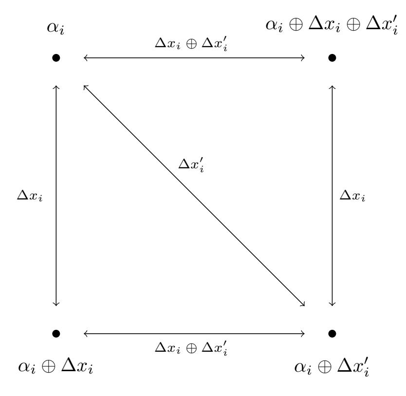
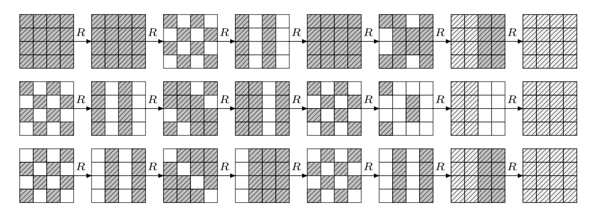

{0}------------------------------------------------

# **New Key-Recovery Attack on Reduced-Round AES**

Navid Ghaedi Bardeh<sup>1</sup>*,*<sup>2</sup> and Vincent Rijmen<sup>3</sup>*,*<sup>4</sup>

<sup>1</sup> Norwegian University of Science and Technology, Trondheim, Norway, [navid.ghaedibardeh@gmail.com](mailto:navid.ghaedibardeh@gmail.com) 2 iagon, Oslo, Norway 3 imec-COSIC KU Leuven, Leuven, Belgium, [vincent.rijmen@kuleuven.be](mailto:vincent.rijmen@kuleuven.be) <sup>4</sup> University of Bergen, Bergen, Norway

**Abstract.** A new fundamental 4-round property of AES, called the zero-difference property, was introduced by Rønjom, Bardeh and Helleseth at Asiacrypt 2017. Our work characterizes it in a simple way by exploiting the notion of related differences which was introduced and well analyzed by the AES designers. We extend the 4-round property by considering some further properties of related differences over the AES linear layer, generalizing the zero-difference property. This results in a new key-recovery attack on 7-round AES which is the first attack on 7-round AES by exploiting the zero-difference property.

**Keywords:** SPN · AES · Secret-Key model · Zero-difference cryptanalysis · Related differences · Related differentials

## **1 Introduction**

The Rijndael block cipher [\[DR98\]](#page-17-0) has been designed in the late 1990's by Joan Daemen and Vincent Rijmen, and was chosen as the Advanced Encryption Standard (AES) by NIST in 2000. It is since then the most used and the most analysed symmetric primitive worldwide. There are three versions of AES, with different key sizes, and a different number of rounds: AES-128 with 10 rounds, AES-192 with 12 rounds, and AES-256 with 14 rounds. During the previous two decades, many different cryptanalytic techniques have been applied to AES. Up to now, the best attacks on AES-128 in the secret-key model cover seven rounds. The impossible-differential attack [\[LP21\]](#page-17-1) and the meet-in-the-middle attack [\[DFJ13\]](#page-17-2) are the best-known two attacks on AES-128.

A key-recovery attack against a block cipher is generally based on the existence of a distinguishing property. A distinguishing property refers to a statistical or structural property of a cipher that a random permutation does not have, thus we can distinguish the cipher from a random permutation. For example, impossible-differential attacks and meet-in-the-middle attacks on 7-round AES-128 exploit 4-round distinguishers.

Recently, in a series of works, new distinguishers for reduced-round AES appeared [\[GRR17,](#page-17-3) [RBH17,](#page-18-0)[Gra18,](#page-17-4)[BR19b,](#page-17-5)[BR19a,](#page-16-0)[Bar19\]](#page-16-1). These distinguishers exhibit new and fundamental properties of the AES which result in new efficient key-recovery attacks on 5-round AES. At Eurocrypt 2017, the authors of [\[GRR17\]](#page-17-3) proposed the first key-independent 5-round distinguisher which requires 2 <sup>32</sup> chosen texts with a computational cost of 2 35*.*6 look-ups into a memory of size 2 <sup>36</sup> bytes. They showed that by encrypting cosets of certain subspaces of the plaintext space the number of times the difference of ciphertext pairs lies in a particular subspace of the state space always is a multiple of 8, known as the multiple-of-8 property. However, this distinguisher could not be exploited directly for mounting a keyrecovery attack because of the particular subspace used in the multiple-of-8 property. This

{1}------------------------------------------------

problem was solved in [\[Gra18\]](#page-17-4) which results in a new key-recovery attack on 5-round AES. Subsequent work at Crypto 2018 improved on their result and proposed a key-recovery attack on 5-round AES which requires 2 <sup>24</sup> chosen plaintexts and operations [\[BDK](#page-16-2)<sup>+</sup>18].

At Asiacrypt 2017, the authors of [\[RBH17\]](#page-18-0) presented distinguishers for 3- to 6-round AES. The authors introduced a new deterministic 4-round property in AES, which states that sets of pairs of plaintexts that are equivalent by exchange of any subset of diagonals encrypts to a set of pairs of ciphertexts after four rounds that all have a difference of zero in exactly the same columns before the final linear layer, called the *zero-difference property*. This deterministic property was extended to a probabilistic 5-round property in [\[BR19a\]](#page-16-0). By exploiting this 4-round distinguishing property, a new key-recovery on 5-round AES was described in [\[RBH17\]](#page-18-0). At Eurocrypt 2020, the authors of [\[DKRS20\]](#page-17-6) improved the key-recovery to the attack on 5-round AES to 2 <sup>9</sup> adaptive chosen plaintexts and ciphertexts (ACCs) and 2 <sup>23</sup> encryptions, and proposed a new attack on 5-round AES with 2 <sup>15</sup> ACCs and 2 <sup>16</sup>*.*<sup>5</sup> operations.

The aim of our paper is to present a key-recovery attack against 7-round AES-128 based on the zero-difference property. We provide a general formulation of the zerodifference property which allows to combine the 4-round zero-difference property with related differentials (introduced in [\[DR09\]](#page-17-7)). It results in a new 7-round related differentials characteristic. We then present the first key-recovery attack on 7-round AES based on the zero-difference property.

## **1.1 Our contributions**

This work generalizes the zero-difference property by providing new insights into it. It provides a simpler formulation and interpretation of the zero-difference property. For this, we recall the notion of *related differences* and *related differentials* which were introduced by Daemen and Rijmen in [\[DR09\]](#page-17-7). Related differentials can be considered a particular form of second-order differentials [\[Lai94\]](#page-17-8) where the AND of the differences defining the second-order differential equals zero.

The notion of related differences provides a very simple formulation of the zero-difference property. In particular, we show that the zero-difference property works on larger sets of pairs of plaintexts than the one described in its original formulation [\[RBH17\]](#page-18-0). We use the concept related differences to redefine the zero-difference property for SPN's. Most notably, we embed related differentials within the zero difference property for SPN's. We show here related differentials up to 4 rounds of AES, which result in extensions of the zero-difference property up to 8-round AES. We describe a new 7-round related-differential characteristic for AES, which embeds 4-round related differentials. This permits to mount a key-recovery attack on 7-round AES which data/time/memory complexities below 2 110*.*2 .

## **1.2 Related work**

The idea of using several differentials simultaneously in an attack has been studied in several works (see [\[DKR97,](#page-17-9)[BG11,](#page-16-3)[Tie16,](#page-18-1)[RBH17,](#page-18-0)[Gra18,](#page-17-4)[DKRS20\]](#page-17-6)). Besides the results which are constituted by assuming independence of the differentials, few works [\[Tie16,](#page-18-1) [RBH17,](#page-18-0)[Gra18,](#page-17-4)[DKRS20\]](#page-17-6) have studied the propagation of multiple input differences through a cipher with a focus on the correlation between their differentials.

Related differentials can be considered as a particular form of polytopic differentials (polytopic transition) introduced in polytopic cryptanalysis [\[Tie16\]](#page-18-1). While there is not any specific relation between input differences considered in polytopic differentials, the input and output differences in related differentials are restricted to have a specific form (they have to be related differences).

As opposed to higher-order differentials, the probability of related differentials can be evaluated by the ordinary differential cryptanalysis technique due to the specific form of 

{2}------------------------------------------------

related differences considered in related differentials.

## 1.3 Overview of this paper and main result

Section 2 describes the AES and recalls the notion of related difference and differential. Section 3 presents the link between the notion of related difference and the zero-difference property, and it generalizes the zero-difference property. Section 4 presents related differentials trails for 2 and 4-round AES. It also explains how to extend the zero-difference property to 6 and 8 rounds. Section 5 explains how to mount a key-recovery attack on 7-round AES based on the zero-difference property. For comparison, Table 1 summarizes the current best key-recovery attacks for 7 rounds of AES-128. Note that most of the known best attacks exploit properties of the AES key-schedule. Our result is independent of the key-schedule, which makes it in some sense more general.

| Attack                  | Rounds | Data        | Time        | Memory      | Key schedule | Ref.      |
|-------------------------|--------|-------------|-------------|-------------|--------------|-----------|
| Impossible Differential | 7      | $2^{112.2}$ | $2^{117.2}$ | $2^{112.2}$ | yes          | [LDKK08]  |
| Meet-in-the-Middle      | 7      | $2^{116}$   | $2^{116}$   | $2^{116}$   | yes          | [DKS10]   |
| Impossible Differential | 7      | $2^{105.1}$ | $2^{113}$   | $2^{74.1}$  | yes          | [BLNS18]  |
| Impossible Differential | 7      | $2^{104.9}$ | $2^{110.9}$ | $2^{71.9}$  | yes          | [LP21]    |
| Zero-Difference         | 7      | $2^{110.2}$ | $2^{110.2}$ | $2^{110.2}$ | no           | Section 5 |
| Meet-in-the-Middle      | 7      | $2^{97}$    | $2^{99}$    | $2^{98}$    | yes          | [DFJ13]   |

<span id="page-2-1"></span>**Table 1:** Current best cryptanalysis of 7-round AES-128 in the secret-key model.

## <span id="page-2-0"></span>2 Preliminaries

In this section, we start by providing a brief description of the AES. Then, the related differences and differentials, and the zero-difference cryptanalysis are described briefly with necessary results. We work throughout this paper with finite fields of characteristic 2 that are fields containing  $q = 2^m$  elements, seen as extensions of  $\mathbb{F}_2$ .

#### 2.1 **AES**

The Advanced Encryption Standard (AES) [AES01] is the most widely adopted block cipher in the world today. An AES internal state  $\alpha$  is typically represented by a 4 by 4 matrix of bytes

$$\begin{bmatrix} \alpha_0 & \alpha_4 & \alpha_8 & \alpha_{12} \\ \alpha_1 & \alpha_5 & \alpha_9 & \alpha_{13} \\ \alpha_2 & \alpha_6 & \alpha_{10} & \alpha_{14} \\ \alpha_3 & \alpha_7 & \alpha_{11} & \alpha_{15} \end{bmatrix}$$

where  $\alpha_i \in \mathbb{F}_{2^8}$ . AES-128 has 10 rounds where one full round of AES applies four operations to the state matrix:

- SubBytes (SB) applies 16 identical Sboxes  $S_a$ , 8-bit to 8-bit, independently to each byte of the state,
- ShiftRows (SR) shifts the *i*-th row left by *i* positions,
- MixColumns (MC) applies a fixed linear transformation to each column,
- AddKey (AK) xors a 128-bit round-key to the state.

{3}------------------------------------------------

In the last round, the MC operation is omitted. Also, an additional AK is applied to the plaintext before it is used as input to the first round. We denote by  $R^t(x)$  the sequence of t full rounds of AES, including the first additional AK.

## <span id="page-3-1"></span>2.2 Related differentials

In [DR09], Daemen and Rijmen define a new type of difference called related differences. They studied the propagation of these differences through the AES linear layer. We call an element of  $\mathbb{F}_q$  a word and a vector of words  $\alpha = (\alpha_0, \alpha_1, ..., \alpha_{n-1}) \in \mathbb{F}_q^n$  a state. Then the related differences and differentials are defined in [DR09] as below:

**Definition 1** (related differences [DR09]). A pair of differences  $\Delta x, \Delta x' \in \mathbb{F}_q^n$  are related differences if and only if:

<span id="page-3-0"></span>
$$\Delta x_i \Delta x_i' (\Delta x_i \oplus \Delta x_i') = 0, \text{ for } i = 0, ..., n - 1.$$
(1)

It is obvious that relation (1) holds iff at least one of  $\Delta x_i$ ,  $\Delta x_i'$  and  $\Delta x_i \oplus \Delta x_i'$  equals zero for every value of i. For a state  $\alpha \in \mathbb{F}_q^n$ , we can define four distinct states, called a quartet,  $(\alpha, \alpha \oplus \Delta x, \alpha \oplus \Delta x', \alpha \oplus \Delta x \oplus \Delta x')$  where the two differences  $\Delta x$  and  $\Delta x'$  are related. The main important property of this quartet is that the sets  $\{\alpha_i, \alpha_i \oplus \Delta x_i, \alpha_i \oplus \Delta x_i', \alpha_i \oplus \Delta x_i \oplus \Delta x_i'\}$ , for every i, contain only two different elements. In general, the set of all related differences  $\Delta x$  and  $\Delta x'$  is defined as follows

$$\mathcal{H} = \{ (\Delta x, \Delta x') \in \mathbb{F}_q^n \times \mathbb{F}_q^n \mid \forall i \quad \Delta x_i = 0 \quad \text{or} \quad \Delta x_i' = 0 \quad \text{or} \quad \Delta x_i \oplus \Delta x_i' = 0 \}.$$

As shown in [DR09], related differences can be combined into related differentials.



**Figure 1:** A schematic of the related differences and the associated quartet. The square collapses to a line or point depending on  $\Delta x_i$  and  $\Delta x_i'$ .

**Definition 2** (related differentials [DR09]). Two differentials  $(\Delta x, \Delta y)$  and  $(\Delta x', \Delta y')$  for a linear map M are related differentials if and only if,  $\Delta y = M(\Delta x)$ ,  $\Delta y' = M(\Delta x')$ , the differences  $\Delta x, \Delta x'$  are related differences and the differences  $\Delta y, \Delta y'$  are related differences.

The MixColumns map of AES has some related differentials, where two related differences  $\Delta x$  and  $\Delta x'$  are defined over  $\mathbb{F}_{2^8}^4$  [DR09]. Four of them are listed in Table 2. The other related differentials can be derived from these four by means of rotation and/or multiplication by a scalar (see [DR09] for more details). In this paper we call them byte-related differences and differentials when they are defined over  $\mathbb{F}_{2^8}^4$ .

{4}------------------------------------------------

<span id="page-4-0"></span>

| $\Delta x$   | $\Delta y$   | $\Delta x'$  | $\Delta y'$  | $\Delta x \oplus \Delta x'$ | $\Delta y \oplus \Delta y'$ |
|--------------|--------------|--------------|--------------|-----------------------------|-----------------------------|
| [0, 1, 4, 7] | [0, 9, 0, B] | [5, 1, 0, 7] | [E, 0, D, 0] | [5, 0, 4, 0]                | [E,9,D,B]                   |
| [0, 1, 0, 3] | [0, 1, 4, 7] | [2,0,1,0]    | [5, 1, 0, 7] | [2, 1, 1, 3]                | [5, 0, 4, 0]                |
| [7, 0, 7, 7] | [9, E, 0, 0] | [7, 7, 7, 0] | [0,0,9,E]    | [0, 7, 0, 7]                | [9, E, 9, E]                |
| [0, 3, 2, 0] | [7, 0, 7, 1] | [2,0,0,3]    | [7, 1, 7, 0] | [2, 3, 2, 3]                | [0, 1, 0, 1]                |

**Table 2:** The sets of byte-related differentials over AES MixColumns.

## <span id="page-4-2"></span>2.3 Zero-difference cryptanalysis

In [RBH17], a new fundamental property against 2 rounds of SPNs was introduced, called the zero-difference property. Consider an SPN where the round key is xored to state  $\alpha \in \mathbb{F}_q^n$ . The Sbox layer S can be seen as the concatenation of n independent Sboxes  $S_x$ over  $\mathbb{F}_q$  and P denotes the linear layer. We recall here the main definitions and notations from [RBH17].

**Definition 3** (The zero-difference pattern [RBH17]). Let  $\alpha \in \mathbb{F}_q^n$  and define the zero-difference pattern

$$\nu(\alpha) = (z_0, z_1, \dots, z_{n-1})$$

that returns a binary vector in  $\mathbb{F}_2^n$  where  $z_i = 1$  indicates that  $\alpha_i$  is zero or  $z_i = 0$  otherwise.

Thus,  $\nu(\alpha)$  simply indicates the non-zero words of the state.

<span id="page-4-3"></span>**Definition 4** ([RBH17]). For a vector  $v \in \mathbb{F}_2^n$  and a pair of states  $\alpha, \beta \in \mathbb{F}_q^n$  define a new state  $\rho^v(\alpha, \beta) \in \mathbb{F}_q^n$  such that the i'th component is defined by

$$\rho^{v}(\alpha,\beta)_{i} = \alpha_{i}v_{i} \oplus \beta_{i}(v_{i} \oplus 1).$$

This is equivalent to

$$\rho^{v}(\alpha,\beta)_{i} = \begin{cases} \alpha_{i} & \text{if } v_{i} = 1, \\ \beta_{i} & \text{if } v_{i} = 0. \end{cases}$$

Notice that  $(\alpha', \beta') = (\rho^v(\alpha, \beta), \rho^v(\beta, \alpha))$  is a new pair of states formed by exchanging individual words between  $\alpha$  and  $\beta$  according to the binary coefficients of v. From the definition it can be seen that

$$\rho^{v}(\alpha,\beta) \oplus \rho^{v}(\beta,\alpha) = \alpha \oplus \beta. \tag{2}$$

Assume d is the total number of common words between  $\alpha$  and  $\beta$ ,  $\alpha_i = \beta_i$ . Then, the number of possible unique pairs  $(\alpha', \beta')$  generated this way is  $2^{n-d-1}$  (including the original pair). Now, the following theorem shows a relation over a 2-round SPN.

<span id="page-4-1"></span>**Theorem 1** ([RBH17]). Let  $\alpha, \beta \in \mathbb{F}_q^n$  and  $\alpha' = \rho^v(\alpha, \beta)$ ,  $\beta' = \rho^v(\beta, \alpha)$  for any  $v \in \mathbb{F}_2^n$ , then

$$\nu(S \circ P \circ S(\alpha) \oplus S \circ P \circ S(\beta)) = \nu(S \circ P \circ S(\alpha') \oplus S \circ P \circ S(\beta'))$$

Since P is linear and invertible, given a difference  $\Delta x \in \mathbb{F}_q^n$ , we can compute the difference after  $P^{-1}(\Delta x)$ , with probability one. Therefore, we define  $\mu(\Delta x) = \nu(P^{-1}(\Delta x))$  and reformulate the result of Theorem 1 to a full 2-round SPN:

$$\mu(P \circ S \circ P \circ S(\alpha) \oplus P \circ S \circ P \circ S(\beta)) = \mu(P \circ S \circ P \circ S(\alpha') \oplus P \circ S \circ P \circ S(\beta')) \quad (3)$$

Theorem 1 states that sets of pairs of states that are equivalent by exchange of any subset of words encrypts to a set of pairs of states after 2-round SPN that all have a difference of (non-)zero in exactly the same words before the final linear layer. We call these pairs of states related pairs. In the next section, we will show that the set of related pairs is larger than the set considered here.

{5}------------------------------------------------

# <span id="page-5-0"></span>**3 Generalization of zero-difference cryptanalysis with related differences**

The central notion of this work is to redefine the zero-difference property with the concept of related differences. We will show that quartets defined with two related differences have the same property that quartets exploited in the zero-difference property have. This allows to redefine the main result of zero-difference cryptanalysis in [\[RBH17\]](#page-18-0), [Theorem 1,](#page-4-1) with the notion of related differences. Moreover, this redefinition permits to generate a larger number of related pairs than mentioned in [Subsection 2.3.](#page-4-2)

Besides generating a larger number of related pairs, this redefinition allows to embed related differentials within the zero-difference property. Since both input and output differences in related differentials are related differences, this combination is intuitively straightforward. Then, as a result, the adversary can attack more rounds of an SPN if related differentials exist for that SPN.

## **3.1 Generating more related pairs**

Zero-difference cryptanalysis [\[RBH17,](#page-18-0)[BR19a\]](#page-16-0) works with a quartet (*α, β, ρ<sup>v</sup>* (*α, β*)*, ρ<sup>v</sup>* (*β, α*)), where *α, β* ∈ F *n q* . This quartet is very similar to the quartet defined by two related differences ∆*x* and ∆*x* 0 in [Subsection 2.2.](#page-3-1) More precisely, this quartet can be defined by two related differences ∆*x* and ∆*x* <sup>0</sup> where the following condition holds:

$$\Delta x_i'(\Delta x_i \oplus \Delta x_i') = 0$$
, for  $i = 0, ..., n - 1$ .

Interestingly, this quartet has the same property that the quartet defined by related differences has:

*The sets* {*α<sup>i</sup> , α<sup>i</sup>* ⊕ ∆*x<sup>i</sup> , α<sup>i</sup>* ⊕ ∆*x* 0 *i , α<sup>i</sup>* ⊕ ∆*x<sup>i</sup>* ⊕ ∆*x* 0 *i* }*, for every i, contain only two different elements.*

The only difference between these two quartets is that the condition ∆*x<sup>i</sup>* = 0 was not considered in zero-difference property for generating new pairs of states. The following theorem shows that quartets defined by related differences work in the zero-difference property as well.

<span id="page-5-1"></span>**Theorem 2.** *Let α* ∈ F *n <sup>q</sup> and* ∆*x,* ∆*x* <sup>0</sup> ∈ F *n q be two related differences then*

$$\mu(F(\alpha) \oplus F(\alpha \oplus \Delta x)) = \mu(F(\alpha \oplus \Delta x') \oplus F(\alpha \oplus \Delta x \oplus \Delta x')) \tag{4}$$

*where F* = *P* ◦ *S* ◦ *P* ◦ *S.*

*Proof.* Since the Sbox layer operates independently on individual words and the sets {*α<sup>i</sup> , α<sup>i</sup>* ⊕ ∆*x<sup>i</sup> , α<sup>i</sup>* ⊕ ∆*x* 0 *i , α<sup>i</sup>* ⊕ ∆*x<sup>i</sup>* ⊕ ∆*x* 0 *i* }, for every *i*, contain only two different elements, we have

$$S(\alpha) \oplus S(\alpha \oplus \Delta x) \oplus S(\alpha \oplus \Delta x') \oplus S(\alpha \oplus \Delta x \oplus \Delta x') = 0.$$

It then follows that

$$P(S(\alpha)) \oplus P(S(\alpha \oplus \Delta x)) \oplus P(S(\alpha \oplus \Delta x')) \oplus P(S(\alpha \oplus \Delta x \oplus \Delta x')) = 0.$$

Since the Sbox layer operates independently on individual words and each S-box is a permutation, the (non-)zero words of each input difference map into (non-)zero words in the corresponding output difference

$$\mu(F(\alpha) \oplus F(\alpha \oplus \Delta x)) = \mu(F(\alpha \oplus \Delta x') \oplus F(\alpha \oplus \Delta x \oplus \Delta x')).$$

<span id="page-5-2"></span>

{6}------------------------------------------------

We now show that considering the condition  $\Delta x_i = 0$  makes it possible to generate a larger number of related pairs, instead of the  $2^{n-d-1}$  pairs in Definition 4. The set of all related pairs constituted by all related differences  $\Delta x$  and  $\Delta x'$  is defined as follows

$$\mathcal{Z} = \{(\alpha, \alpha \oplus \Delta x, \alpha \oplus \Delta x', \alpha \oplus \Delta x \oplus \Delta x') \in \mathbb{F}_q^n \times \mathbb{F}_q^n \times \mathbb{F}_q^n \times \mathbb{F}_q^n \mid (\Delta x, \Delta x') \in \mathcal{H}\}$$

Since we can choose two related differences  $\Delta x$  and  $\Delta x'$ , if we choose  $\Delta x_i = 0$  for some i, then there is exactly one value in those coordinates i of  $\alpha$  and  $\alpha \oplus \Delta x$ , i.e.  $\alpha_i$ . So we have freedom to choose a second value for those coordinates i, i.e.  $\alpha_i \oplus \Delta x'_i$ . In this way, when d words of  $\Delta x$  are zero, at most  $(q^d - 1) \cdot 2^{n-d-1}$  pairs can be generated. Note that, if  $\Delta x_i \neq 0$  for some i, then it means that we already chose the two values for those coordinates of  $\alpha$  and  $\alpha \oplus \Delta x$ .<sup>1</sup> For typical 128-bit SPN based block ciphers, we have  $q = 2^{32}$  and n = 4. As an example, by selecting d = 2, the total number of related pairs that are generated in this way is  $2^{65}$ , including the original pair.

In order to cover all cases to generate new pairs of states, the trivial case is also considered when both  $\Delta x_i$  and  $\Delta x_i'$  can equal zero for some coordinates i, which means that the four states have a common value in this coordinate. So we can state that the property of this quartet is that the sets  $\{\alpha_i, \alpha_i \oplus \Delta x_i, \alpha_i \oplus \Delta x_i', \alpha_i \oplus \Delta x_i'\}$ , for every i, contain at most two different elements.

The main advantage of redefining the zero-difference property with the concept of related differences, is to combine two techniques: related differentials and zero-difference cryptanalysis. In the next subsection, we discuss this in more details.

### 3.2 Embedding related differentials within zero-difference cryptanalysis

Now we are ready to combine the zero-difference property with related differentials for SPNs. Consider a t-round SPN which is divided into two parts:  $E = F \circ F'$ , where F' represents the first t-2 rounds of the encryption operation, and F represents the final two rounds of the encryption operation. Assume that there are related differentials with probability pr over F':

$$\Delta x \xrightarrow{F'} \Delta y,$$

$$\Delta x' \xrightarrow{F'} \Delta y'.$$

Since the differences  $\Delta y$  and  $\Delta y'$  are related differences, from Theorem 2, we have

$$\mu(F(\beta) \oplus F(\beta \oplus \Delta y)) = \mu(F(\beta \oplus \Delta y') \oplus F(\beta \oplus \Delta y \oplus \Delta y')), \tag{5}$$

where  $\beta = F'(\alpha)$  and  $\alpha \in \mathbb{F}_q^n$ . We then have a zero-difference property over the t-round SPN with probability pr:

$$\mu(F \circ F'(\alpha) \oplus F \circ F'(\alpha \oplus \Delta x)) = \mu(F \circ F'(\alpha \oplus \Delta x') \oplus F \circ F'(\alpha \oplus \Delta x \oplus \Delta x')). \tag{6}$$

We add this as a simple theorem to summarize the combination of the zero-difference property with related differentials for SPNs.

**Theorem 3.** Let  $E = F \circ F'$ , where F' and F are a t-round and a two-round SPN, respectively. If  $\Delta y = F'(\Delta x)$  and  $\Delta y' = F'(\Delta x')$  are related differentials with probability pr, then

$$\mu(E(\alpha) \oplus E(\alpha \oplus \Delta x)) = \mu(E(\alpha \oplus \Delta x') \oplus E(\alpha \oplus \Delta x \oplus \Delta x')) \tag{7}$$

holds with probability pr.

<span id="page-6-0"></span><sup>&</sup>lt;sup>1</sup>In [Gra18], a similar technique was used to generate new pairs of texts.

{7}------------------------------------------------

*Proof.* Since differences  $\Delta y$  and  $\Delta y'$  are related differences, with probability pr, from Theorem 2, we have

$$\mu(F(\beta) \oplus F(\beta \oplus \Delta y)) = \mu(F(\beta \oplus \Delta y') \oplus F(\beta \oplus \Delta y \oplus \Delta y')),$$

where  $\beta = F'(\alpha)$  and  $\alpha \in \mathbb{F}_q^n$ . It then follows that

$$\mu(F \circ F'(\alpha) \oplus F \circ F'(\alpha \oplus \Delta x)) = \mu(F \circ F'(\alpha \oplus \Delta x') \oplus F \circ F'(\alpha \oplus \Delta x \oplus \Delta x')).$$

The existence of related differentials for an SPN relies on the details of its linear layer. In the case of AES-like ciphers, the linear layer is composed of the MixColumns and ShiftRows transformations. As studied in [DR09], there exist some MixColumns-like transformations without related differentials. They show examples of matrices with Hadamard structures which allow no related differentials. For example, they showed that the following  $4 \times 4$  Hadamard matrix

$$M_{Anubis} = \left[ \begin{array}{cccc} 1 & 2 & 4 & 6 \ 2 & 1 & 6 & 4 \ 4 & 6 & 1 & 2 \ 6 & 4 & 2 & 1 \end{array} \right]$$

which is used for linear transformation in the Anubis block cipher [BR00] has related differentials. However, if the four 6's are replaced by 9's, then there are no related differentials.

Thus, in the cases of matrices which have related differentials, the combination mentioned here is not avoidable. In the next section, we will show that there are related differentials for up to 4-round AES with certain probabilities. They result into extensions of the zero-difference property up to 8 rounds, using the generalization mentioned here.

## <span id="page-7-0"></span>4 Extensions of the zero-difference property for reducedround AES

In this section, we investigate how to extend the result of Theorem 2 to 6- and 8-round AES. For this, we look for related differentials over reduced-round AES. Let's first reformulate the result of Theorem 2 for AES. Let  $S = SB \circ AK \circ MC \circ SB$  and  $P = SR \circ AK \circ MC \circ SR$  where S can be seen as the concatenation of four independent superboxes operating over  $\mathbb{F}_{28}^4$ . Then, four-round AES can be seen as

$$R^4 = AK \circ MC \circ SR \circ S \circ P \circ S \circ SR \circ AK.$$

This is a typical superbox representation of 4-round AES in the literature [DR09, Gil14, RBH17]. So the relation (4) also holds for the case of four-round AES where  $F = R^4$  and  $\alpha, \Delta x, \Delta x' \in \mathbb{F}_{2^8}^{4\times 4}$ . We say that  $\Delta x, \Delta x'$  are diagonal related differences if and only if

$$\Delta x_i \Delta x_i' (\Delta x_i \oplus \Delta x_i') = 0$$
, for  $i = 0, 1, 2, 3$ ,

where  $\Delta x_i$  and  $\Delta x_i'$  indicate the diagonal *i* of the differences. It other words, the diagonals i in  $\alpha_i, \alpha_i \oplus \Delta x_i, \alpha_i \oplus \Delta x_i'$  and  $\alpha_i \oplus \Delta x_i \oplus \Delta x_i'$  take at most two values, for every *i*.

Our aim now is to find related differentials over reduced-round AES. The basic idea consists of choosing an input quartet  $(\alpha, \alpha \oplus \Delta x, \alpha \oplus \Delta x', \alpha \oplus \Delta x \oplus \Delta x')$ , where  $\Delta x$  and  $\Delta x'$  are diagonal related differences, such that the corresponding output quartet

{8}------------------------------------------------

<span id="page-8-0"></span>
$$\begin{bmatrix} x_0 & x_4 & x_8 & x_{12} \\ x_1 & x_5 & x_9 & x_{13} \\ x_2 & x_6 & x_{10} & x_{14} \\ x_3 & x_7 & x_{11} & x_{15} \end{bmatrix} \xrightarrow{G} \begin{bmatrix} y_0 & y_4 & y_8 & y_{12} \\ y_1 & y_5 & y_9 & y_{13} \\ y_2 & y_6 & y_{10} & y_{14} \\ y_3 & y_7 & y_{11} & y_{15} \end{bmatrix}$$

**Figure 2:** A graphical representation of G given input and output x and y respectively. Input and output of each super-box indicates with a same color.

 $(R^t(\alpha), R^t(\alpha \oplus \Delta x), R^t(\alpha \oplus \Delta x'), R^t(\alpha \oplus \Delta x \oplus \Delta x'))$  for t = 2, 4, can be also defined by only two related differences

$$\Delta y = R^t(\alpha) \oplus R^t(\alpha \oplus \Delta x), \Delta y' = R^t(\alpha) \oplus R^t(\alpha \oplus \Delta x').$$

Then, the relation (4) will extend to 6-round and 8-round AES. To determine the essential role of MC in creating our results, we denote by now  $R^4 = MC \circ G \circ MC \circ G$  where

$$G = SR \circ SB \circ AK \circ MC \circ SR \circ SB \circ AK.$$

G can also be seen as four parallel superboxes operating on 4 bytes of the state independently (not four bytes placed in a column of state), a graphical representation of G depicted in Figure 2. This 4-round AES decomposition is a bit different from the decomposition of 4-round AES mentioned above. However, this 4-round AES decomposition will clearly show how the middle and last MC affect differences which forms a basis for our results. We have noticed that a careful combination of byte-related differentials sets from Table 2, provides related differentials over 2-round and 4-round AES.

#### <span id="page-8-2"></span>4.1 2-round related differentials for AES

Consider an input quartet  $(\alpha, \alpha \oplus \Delta x, \alpha \oplus \Delta x', \alpha \oplus \Delta x \oplus \Delta x')$  where

$$\alpha = \begin{bmatrix} \alpha_0 & \alpha_4 & \alpha_8 & \alpha_{12} \\ \alpha_1 & \alpha_5 & \alpha_9 & \alpha_{13} \\ \alpha_2 & \alpha_6 & \alpha_{10} & \alpha_{14} \\ \alpha_3 & \alpha_7 & \alpha_{11} & \alpha_{15} \end{bmatrix}, \qquad \Delta x = \begin{bmatrix} \Delta x_0 & \Delta x_4 & \Delta x_8 & \Delta x_{12} \\ \Delta x_1 & \Delta x_5 & \Delta x_9 & \Delta x_{13} \\ \Delta x_2 & \Delta x_6 & \Delta x_{10} & \Delta x_{14} \\ \Delta x_3 & \Delta x_7 & \Delta x_{11} & \Delta x_{15} \end{bmatrix},$$

$$\Delta x' = \begin{bmatrix} \Delta x_0 & 0 & \Delta x_8 & 0 \\ 0 & \Delta x_5 & 0 & \Delta x_{13} \\ \Delta x_2 & 0 & \Delta x_{10} & 0 \\ 0 & \Delta x_7 & 0 & \Delta x_{15} \end{bmatrix}, \qquad \Delta x \oplus \Delta x' = \begin{bmatrix} 0 & \Delta x_4 & 0 & \Delta x_{12} \\ \Delta x_1 & 0 & \Delta x_9 & 0 \\ 0 & \Delta x_6 & 0 & \Delta x_{14} \\ \Delta x_3 & 0 & \Delta x_{11} & 0 \end{bmatrix},$$

and  $\Delta x$  and  $\Delta x'$  are related differences. It is obvious from this quartet that two states  $\alpha \oplus \Delta x'$  and  $\alpha \oplus \Delta x \oplus \Delta x'$  are generated by exchanging diagonals 1 and 3 between  $\alpha$  and  $\alpha \oplus \Delta x$ . Now assume that we have

<span id="page-8-1"></span>
$$G(\alpha) \oplus G(\alpha \oplus \Delta x) = \begin{bmatrix} 2\lambda_0 & 3\lambda_1 & \lambda_2 & \lambda_3 \\ \lambda_0 & 2\lambda_1 & 3\lambda_2 & \lambda_3 \\ \lambda_0 & \lambda_1 & 2\lambda_2 & 3\lambda_3 \\ 3\lambda_0 & \lambda_1 & \lambda_2 & 2\lambda_3 \end{bmatrix}, \tag{8}$$

{9}------------------------------------------------

<span id="page-9-1"></span>
$$\begin{bmatrix} \Delta x_0 & \Delta x_4 & \Delta x_8 & \Delta x_{12} \\ \Delta x_1 & \Delta x_5 & \Delta x_9 & \Delta x_{13} \\ \Delta x_2 & \Delta x_6 & \Delta x_{10} \Delta x_{14} \\ \Delta x_3 & \Delta x_7 & \Delta x_{11} \Delta x_{15} \end{bmatrix} \xrightarrow{G} \begin{bmatrix} 2\lambda_0 & 3\lambda_1 & \lambda_2 & \lambda_3 \\ \lambda_0 & 2\lambda_1 & 3\lambda_2 & \lambda_3 \\ \lambda_0 & \lambda_1 & 2\lambda_2 & 3\lambda_3 \\ 3\lambda_0 & \lambda_1 & \lambda_2 & 2\lambda_3 \end{bmatrix} \xrightarrow{MC} \begin{bmatrix} 5\lambda_0 & 0 & 4\lambda_2 & 0 \\ 0 & 5\lambda_1 & 0 & 4\lambda_3 \\ 4\lambda_0 & 0 & 5\lambda_2 & 0 \\ 0 & 4\lambda_1 & 0 & 5\lambda_3 \end{bmatrix}$$

$$\begin{bmatrix} \Delta x_0 & 0 & \Delta x_8 & 0 \\ 0 & \Delta x_5 & 0 & \Delta x_{13} \\ \Delta x_2 & 0 & \Delta x_{10} & 0 \\ 0 & \Delta x_7 & 0 & \Delta x_{15} \end{bmatrix} \xrightarrow{G} \begin{bmatrix} 2\lambda_0 & 0 & \lambda_2 & 0 \\ 0 & 2\lambda_1 & 0 & \lambda_3 \\ \lambda_0 & 0 & 2\lambda_2 & 0 \\ 0 & \lambda_1 & 0 & 2\lambda_3 \end{bmatrix} \xrightarrow{MC} \begin{bmatrix} 5\lambda_0 & 7\lambda_1 & 0 & \lambda_3 \\ \lambda_0 & 5\lambda_1 & 7\lambda_2 & 0 \\ 0 & \lambda_1 & 5\lambda_2 & 7\lambda_3 \\ 7\lambda_0 & 0 & \lambda_2 & 5\lambda_3 \end{bmatrix}$$

$$\begin{bmatrix} 0 & \Delta x_4 & 0 & \Delta x_{12} \\ \Delta x_1 & 0 & \Delta x_9 & 0 \\ 0 & \Delta x_6 & 0 & \Delta x_{14} \\ \Delta x_3 & 0 & \Delta x_{11} & 0 \end{bmatrix} \xrightarrow{G} \begin{bmatrix} 0 & 3\lambda_1 & 0 & \lambda_3 \\ \lambda_0 & 0 & 3\lambda_2 & 0 \\ 0 & \lambda_1 & 0 & 3\lambda_3 \\ 3\lambda_0 & 0 & \lambda_2 & 0 \end{bmatrix} \xrightarrow{MC} \begin{bmatrix} 0 & 7\lambda_1 & 4\lambda_2 & \lambda_3 \\ \lambda_0 & 0 & 7\lambda_2 & 4\lambda_3 \\ 4\lambda_0 & \lambda_1 & 0 & 7\lambda_3 \\ 7\lambda_0 & 4\lambda_1 & \lambda_2 & 0 \end{bmatrix}$$

**Figure 3:** 2-round related differential trails starting with  $\Delta x$ ,  $\Delta x'$  and  $\Delta x \oplus \Delta x'$  respectively.

where  $\lambda_i \in \mathbb{F}_{2^8}$ . Since G is acting independently on 32-bit chunks of the state, the differences  $G(\alpha) \oplus G(\alpha \oplus \Delta x')$  and  $G(\alpha) \oplus G(\alpha \oplus \Delta x \oplus \Delta x')$  equal respectively

<span id="page-9-2"></span><span id="page-9-0"></span>
$$\begin{bmatrix} 2\lambda_0 & 0 & \lambda_2 & 0 \\ 0 & 2\lambda_1 & 0 & \lambda_3 \\ \lambda_0 & 0 & 2\lambda_2 & 0 \\ 0 & \lambda_1 & 0 & 2\lambda_3 \end{bmatrix}, \begin{bmatrix} 0 & 3\lambda_1 & 0 & \lambda_3 \\ \lambda_0 & 0 & 3\lambda_2 & 0 \\ 0 & \lambda_1 & 0 & 3\lambda_3 \\ 3\lambda_0 & 0 & \lambda_2 & 0 \end{bmatrix}.$$
(9)

In other words, since two diagonals in each of input differences  $\Delta x'$  and  $\Delta x \oplus \Delta x'$  equal zero, we have that the two diagonals in the corresponding output differences equal zero (notice that G contains two SR operations). Therefore, MC maps the three differences given in (8) and (9) to the following set of differences

$$\begin{bmatrix} 5\lambda_0 & 0 & 4\lambda_2 & 0 \\ 0 & 5\lambda_1 & 0 & 4\lambda_3 \\ 4\lambda_0 & 0 & 5\lambda_2 & 0 \\ 0 & 4\lambda_1 & 0 & 5\lambda_3 \end{bmatrix}, \begin{bmatrix} 5\lambda_0 & 7\lambda_1 & 0 & \lambda_3 \\ \lambda_0 & 5\lambda_1 & 7\lambda_2 & 0 \\ 0 & \lambda_1 & 5\lambda_2 & 7\lambda_3 \\ 7\lambda_0 & 0 & \lambda_2 & 5\lambda_3 \end{bmatrix}, \begin{bmatrix} 0 & 7\lambda_1 & 4\lambda_2 & \lambda_3 \\ \lambda_0 & 0 & 7\lambda_2 & 4\lambda_3 \\ 4\lambda_0 & \lambda_1 & 0 & 7\lambda_3 \\ 7\lambda_0 & 4\lambda_1 & \lambda_2 & 0 \end{bmatrix}, (10)$$

which are diagonal related differences. Therefore,

$$\mu(R^6(\alpha) \oplus R^6(\alpha \oplus \Delta x)) = \mu(R^6(\alpha \oplus \Delta x') \oplus R^6(\alpha \oplus \Delta x \oplus \Delta x')).$$

We now need to estimate the probability that, given an input quartet  $(\alpha, \alpha \oplus \Delta x, \alpha \oplus \Delta x', \alpha \oplus \Delta x \oplus \Delta x')$ , the conditions (8) and (9) hold. Note that the input and output

{10}------------------------------------------------

differences of G are related differences. This implies that for every i the sets

$$\{G(\alpha_i), G(\alpha_i \oplus \Delta x_i), G(\alpha_i \oplus \Delta x_i'), G(\alpha_i \oplus \Delta x_i \oplus \Delta x_i')\}$$

contain only two different elements. In other words, the output (input) difference of each superbox in G takes exactly a specific value considering this quartet. If we assume that the output differences of each superbox in G have a uniform distribution, then, for each specific value of  $(\lambda_0, \lambda_1, \lambda_2, \lambda_3)$ , the conditions (8) and (9) hold with probability  $(2^{32}-1)^{-4} \approx 2^{-128}$ . Thus, considering all possible non-zero values of each  $\lambda_i$ , the conditions (8) and (9) holds with probability  $(2^8-1)^4 \cdot 2^{-128} \approx 2^{-96}$ .

This 2-round related differentials trail is depicted in Figure 3. We have also noticed that an identical rotation on all columns of the difference  $G(\alpha) \oplus G(\alpha \oplus \Delta x)$ , causes a new related-differentials trail. There are three different cases for such rotations on  $G(\alpha) \oplus G(\alpha \oplus \Delta x)$ , i.e.

$$\begin{bmatrix} 3\lambda_0 & \lambda_1 & \lambda_2 & 2\lambda_3 \\ 2\lambda_0 & 3\lambda_1 & \lambda_2 & \lambda_3 \\ \lambda_0 & 2\lambda_1 & 3\lambda_2 & \lambda_3 \\ \lambda_0 & \lambda_1 & 2\lambda_2 & 3\lambda_3 \end{bmatrix}, \begin{bmatrix} \lambda_0 & \lambda_1 & 2\lambda_2 & 3\lambda_3 \\ 3\lambda_0 & \lambda_1 & \lambda_2 & 2\lambda_3 \\ 2\lambda_0 & 3\lambda_1 & \lambda_2 & \lambda_3 \\ \lambda_0 & 2\lambda_1 & 3\lambda_2 & \lambda_3 \end{bmatrix}, \begin{bmatrix} \lambda_0 & 2\lambda_1 & 3\lambda_2 & \lambda_3 \\ \lambda_0 & \lambda_1 & 2\lambda_2 & 3\lambda_3 \\ 3\lambda_0 & \lambda_1 & \lambda_2 & 2\lambda_3 \\ 2\lambda_0 & 3\lambda_1 & 2\lambda_2 & \lambda_3 \end{bmatrix}.$$

So there are four possible difference values for  $G(\alpha) \oplus G(\alpha \oplus \Delta x)$ . Then, such event happens with probability approximately  $4 \cdot 2^{-96} = 2^{-94}$ . For a random permutation, such an event happens with a negligible probability. We may summarize the result as follows.

<span id="page-10-1"></span>**Theorem 4.** Let  $\alpha \in \mathbb{F}_{2^8}^{4 \times 4}$  and  $\Delta x, \Delta x' \in \mathbb{F}_{2^8}^{4 \times 4}$  be two related differences, where all diagonals in  $\Delta x$  are non-zero and two non-consecutive diagonals in  $\Delta x'$  are zero, then the relations

$$R^{4}(\alpha) \oplus R^{4}(\alpha \oplus \Delta x) \oplus R^{4}(\alpha \oplus \Delta x') \oplus R^{4}(\alpha \oplus \Delta x \oplus \Delta x') = 0$$
 (11)

and

$$\mu(R^6(\alpha) \oplus R^6(\alpha \oplus \Delta x)) = \mu(R^6(\alpha \oplus \Delta x') \oplus R^6(\alpha \oplus \Delta x \oplus \Delta x')) \tag{12}$$

hold with probability approximately  $2^{-94}$ , averaged over all possible keys.

*Proof.* Assume that the input quartet  $(\alpha, \alpha \oplus \Delta x, \alpha \oplus \Delta x', \alpha \oplus \Delta x \oplus \Delta x')$  conforms to differences (8) and (9) which happens with probability approximately  $4 \cdot 2^{-96} = 2^{-94}$ , then the differences

<span id="page-10-0"></span>
$$\Delta y = R^2(\alpha) \oplus R^2(\alpha \oplus \Delta x), \Delta y' = R^2(\alpha) \oplus R^2(\alpha \oplus \Delta x')$$

are also related differences. The result then follows directly due to Theorem 2.  $\Box$ 

More importantly, these 2-round related differentials can be extended to 4-round related differentials.

#### 4.2 4-round related differentials for AES

Suppose now that the differences (10) map to the following differences through G, respectively:

$$\begin{bmatrix} 5\gamma_0 & 0 & 4\gamma_2 & 0 \\ 0 & 4\gamma_1 & 0 & 5\gamma_3 \\ 4\gamma_0 & 0 & 5\gamma_2 & 0 \\ 0 & 5\gamma_1 & 0 & 4\gamma_3 \end{bmatrix}, \begin{bmatrix} 5\gamma_0 & \gamma_1 & 0 & 7\gamma_3 \\ \gamma_0 & 0 & 7\gamma_2 & 5\gamma_3 \\ 0 & 7\gamma_1 & 5\gamma_2 & \gamma_3 \\ 7\gamma_0 & 5\gamma_1 & \gamma_2 & 0 \end{bmatrix}, \begin{bmatrix} 0 & \gamma_1 & 4\gamma_2 & 7\gamma_3 \\ \gamma_0 & 4\gamma_1 & 7\gamma_2 & 0 \\ 4\gamma_0 & 7\gamma_1 & 0 & 7\gamma_3 \\ 7\gamma_0 & 0 & \gamma_2 & 4\gamma_3 \end{bmatrix}, (13)$$

{11}------------------------------------------------

<span id="page-11-0"></span>
$$\frac{G}{G} = \begin{cases}$$

**Figure 4:** 4-round related differential trails starting with  $\Delta x$ ,  $\Delta x'$  and  $\Delta x \oplus \Delta x'$  respectively. Differences  $\Delta x$ ,  $\Delta x'$  and  $\Delta x \oplus \Delta x'$  are not shown here through the lack of space.

where  $\gamma_i \in \mathbb{F}_{2^8}$ . Then MC maps these three differences to a new set of differences, respectively:

<span id="page-11-1"></span>
$$\begin{bmatrix} E\gamma_{0} & 9\gamma_{1} & D\gamma_{2} & B\gamma_{3} \\ 9\gamma_{0} & D\gamma_{1} & B\gamma_{2} & E\gamma_{3} \\ D\gamma_{0} & B\gamma_{1} & E\gamma_{2} & 9\gamma_{3} \\ B\gamma_{0} & E\gamma_{1} & 9\gamma_{2} & D\gamma_{3} \end{bmatrix}, \begin{bmatrix} E\gamma_{0} & 0 & D\gamma_{2} & 0 \\ 0 & D\gamma_{1} & 0 & E\gamma_{3} \\ D\gamma_{0} & 0 & E\gamma_{2} & 0 \\ 0 & E\gamma_{1} & 0 & D\gamma_{3} \end{bmatrix}, \begin{bmatrix} 0 & 9\gamma_{1} & 0 & B\gamma_{3} \\ 9\gamma_{0} & 0 & B\gamma_{2} & 0 \\ 0 & B\gamma_{1} & 0 & 9\gamma_{3} \\ B\gamma_{0} & 0 & 9\gamma_{2} & 0 \end{bmatrix},$$

$$(14)$$

which are again diagonal related differences. Using the similar considerations to estimate the probability of set of related differences (8) and (9) in Subsection 4.1, we expect that the set of differences (13) holds with probability  $(2^8 - 1)^4 \cdot (2^{32} - 1)^{-4} \approx 2^{-96}$ , since there are  $(2^8 - 1)^4$  non-zero values for  $(\gamma_0, \gamma_1, \gamma_2, \gamma_3)$  and the specific output difference of each superbox happens with probability  $(2^{32} - 1)^{-1}$ .

Thus, the probability of 4-round related differentials trail is  $2^{-96} \cdot 2^{-96} = 2^{-192}$  approximately. Also another set of related differences, by exchanging the positions of  $5\gamma_i$  and  $4\gamma_i$ , and  $7\gamma_i$  and  $\gamma_i$  in the related differences set (13), works here. And, there are four sets of related differences for (8) and (9). Therefore, in total, there are eight 4-round related differentials trails so the probability of this event is  $4 \cdot 2 \cdot 2^{-192} = 2^{-189}$  approximately. For a random permutation, such an event happens with a negligible probability. It then provides relations up to 6 rounds

$$R^{t}(\alpha) \oplus R^{t}(\alpha \oplus \Delta x) \oplus R^{t}(\alpha \oplus \Delta x') \oplus R^{t}(\alpha \oplus \Delta x \oplus \Delta x') = 0,$$

for  $0 < t \le 6$ , since all differences are diagonal related differences every two rounds. There is another 4-round related differentials trail, provided in Appendix A. We may summarize the results as follows.

{12}------------------------------------------------

<span id="page-12-2"></span>**Theorem 5.** Let  $\alpha \in \mathbb{F}_{2^8}^{4 \times 4}$  and  $\Delta x, \Delta x' \in \mathbb{F}_{2^8}^{4 \times 4}$  be two related differences, where all diagonals in  $\Delta x$  are non-zero and two non-consecutive diagonals in  $\Delta x'$  are zero, then the relations

$$R^{t}(\alpha) \oplus R^{t}(\alpha \oplus \Delta x) \oplus R^{t}(\alpha \oplus \Delta x') \oplus R^{t}(\alpha \oplus \Delta x \oplus \Delta x') = 0, \tag{15}$$

for  $0 < t \le 6$ , and

$$\mu(R^8(\alpha) \oplus R^8(\alpha \oplus \Delta x)) = \mu(R^8(\alpha \oplus \Delta x') \oplus R^8(\alpha \oplus \Delta x \oplus \Delta x')) \tag{16}$$

hold with probability approximately  $2^{-189}$ , averaged over all possible keys.

*Proof.* Assume that the input quartet  $(\alpha, \alpha \oplus \Delta x, \alpha \oplus \Delta x', \alpha \oplus \Delta x \oplus \Delta x')$  conforms to the 4-round differential depicted in Figure 4 which happens with probability  $2^{-189}$ . Since the input differences, and state differences at the end of round 2 and 4 are diagonal related differences, from Theorem 2, we have

$$R^{t}(\alpha) \oplus R^{t}(\alpha \oplus \Delta x) \oplus R^{t}(\alpha \oplus \Delta x') \oplus R^{t}(\alpha \oplus \Delta x \oplus \Delta x') = 0$$

for  $0 < t \le 6$ . Also, since the differences

$$\Delta y = R^4(\alpha) \oplus R^4(\alpha \oplus \Delta x), \Delta y' = R^4(\alpha) \oplus R^4(\alpha \oplus \Delta x'),$$

are also related differences, due to Theorem 2 we have

$$\mu(R^8(\alpha) \oplus R^8(\alpha \oplus \Delta x)) = \mu(R^8(\alpha \oplus \Delta x') \oplus R^8(\alpha \oplus \Delta x \oplus \Delta x'))$$

Note that the probability that a random input quartet follows the set of relations 15 is negligible since a random quartet satisfies each relation with probability  $2^{-128}$ . However, Theorem 5 by itself cannot be considered as a distinguisher since the adversary cannot check those relations without the knowledge of the round-keys. In the next section, we show that the results of Theorem 5 can be exploited to mount a key recovery attack on 7-round AES.

## <span id="page-12-0"></span>5 New key-recovery attack for 7-round of AES-128

In this section, we present a 7-round key-recovery attack for AES-128, which follows from a straight-forward extension of Equation 15. Let an input quartet  $(P_0, P_0 \oplus \Delta x, P_0 \oplus \Delta x', P_0 \oplus \Delta x \oplus \Delta x')$  be generated by two related differences  $\Delta x$  and  $\Delta x'$  where  $P_0$  is a random plaintext and all diagonals in  $\Delta x$  are non-zero and two non-consecutive diagonals in  $\Delta x'$  are zero. Let  $(C_0, C_1, C_2, C_3)$  be the corresponding ciphertexts after 7-round AES. Assume now this input quartet  $(P_0, P_0 \oplus \Delta x, P_0 \oplus \Delta x', P_0 \oplus \Delta x \oplus \Delta x')$  conforms to the differential characteristics depicted in Figure 5, which embeds the previous 4-round related-differentials characteristic in the first four rounds. It happens with probability  $2^{-189}$  from Theorem 5. Thus, we have

$$R^{6}(P_{0}) \oplus R^{6}(P_{0} \oplus \Delta x) \oplus R^{6}(P_{0} \oplus \Delta x') \oplus R^{6}(P_{0} \oplus \Delta x \oplus \Delta x') = 0. \tag{17}$$

Assume the following additional condition holds

$$\mu(R^7(P_0) \oplus R^7(P_0 \oplus \Delta x')) = \mu(R^7(P_0 \oplus \Delta x) \oplus R^7(P_0 \oplus \Delta x \oplus \Delta x')), \tag{18}$$

where  $wt(\mu(R^7(P_0) \oplus R^7(P_0 \oplus \Delta x')) = 2$ . In other words, it means that  $SR^{-1} \circ MC^{-1}(C_0 \oplus C_2)$  is zero in two columns and that  $SR^{-1} \circ MC^{-1}(C_1 \oplus C_3)$  is zero in exactly the same

<span id="page-12-4"></span><span id="page-12-3"></span><span id="page-12-1"></span>

{13}------------------------------------------------

<span id="page-13-0"></span>

**Figure 5:** 7-round differential trails starting with  $\Delta x, \Delta x'$  and  $\Delta x \oplus \Delta x'$  respectively. A white cell indicates that the state difference is zero for that bytes. Both darker and lighter line pattern cell indicate that the state difference is non-zero in the cell while darker one also indicates the value of difference in a cell equal to the value of one of other two differences in the same cell.

columns. The goal of this attack is to find candidates for this quartet by first filtering output quartets exploiting the Condition (18). Then, for each of candidates the Condition (17) will be partially checked to recover some bytes of the last-round key. And, by guessing the remaining bytes of the last-round key, we can perform the check whether the quartet conforms to the 7-round differential characteristics.

We first need to estimate the probability that Condition (18) holds. Denote  $\Omega^t = R^t(P_0) \oplus R^t(P_0 \oplus \Delta x')$ . Condition (18) indicates that two columns in  $\Omega^6$  should be zero. On the other hand, observe that two diagonals in the difference  $\Omega^4$  are zero, see (14). This induces that two diagonals in the difference  $\Omega^5$  are zero. It follows that four bytes in  $\Omega^5$  should be zero. Thus, the pair  $(P_0, P_0 \oplus \Delta x')$  follows Condition (18) when four bytes in  $\Omega^5$  are zero. The pair  $(P_0 \oplus \Delta x, P_0 \oplus \Delta x \oplus \Delta x')$  then satisfies Condition (18) with probability one since

$$R^6(P_0) \oplus R^6(P_0 \oplus \Delta x') = R^6(P_0 \oplus \Delta x) \oplus R^6(P_0 \oplus \Delta x \oplus \Delta x').$$

Therefore, the condition  $wt(\mu(R^7(P_0) \oplus R^7(P_0 \oplus \Delta x')) = 2$  happens when any two diagonals in this difference  $\Omega^5$  are zero, i.e. four bytes are zero. This happens with probability  $\binom{4}{2} \cdot 2^{-4 \cdot 8} \approx 2^{-29 \cdot 4}$ , because there are  $\binom{4}{2}$  possible cases that two diagonals are zero in  $\Omega^5$ . So, in total, an input quartet  $(P_0, P_0 \oplus \Delta x, P_0 \oplus \Delta x', P_0 \oplus \Delta x \oplus \Delta x')$  follows the differential characteristics depicted in Figure 5 with probability  $2^{-189} \cdot 2^{-29 \cdot 4} = 2^{-218 \cdot 4}$ . On the other hand, for a random output quartet  $(C_0, C_1, C_2, C_3)$ , the probability that  $SR^{-1} \circ MC^{-1}(C_0 \oplus C_2)$  is zero in two columns, eight bytes, is  $\binom{4}{2} \cdot 2^{-8 \cdot 8} \approx 2^{-61 \cdot 4}$ . The probability that  $SR^{-1} \circ MC^{-1}(C_1 \oplus C_3)$  is zero in the exact same columns as  $SR^{-1} \circ MC^{-1}(C_0 \oplus C_2)$  is  $2^{-64}$ . Therefore, the probability that such random output quartet satisfies Condition (18) is  $2^{-61 \cdot 4} \cdot 2^{-64} = 2^{-125 \cdot 4}$ . The different steps of the attack will be described in the next subsections.

#### <span id="page-13-1"></span>5.1 Data collection

The input quartet  $(P_0, P_0 \oplus \Delta x, P_0 \oplus \Delta x', P_0 \oplus \Delta x \oplus \Delta x')$  can be seen as two pairs of plaintexts where the plaintext pair  $(P_0 \oplus \Delta x', P_0 \oplus \Delta x \oplus \Delta x')$  is generated by exchanging two diagonals between plaintexts in  $(P_0, P_0 \oplus \Delta x)$ . We now generate  $2^{218.4}$  such unique quartets as follows.

To generate input quartets  $(P_0, P_0 \oplus \Delta x, P_0 \oplus \Delta x', P_0 \oplus \Delta x \oplus \Delta x')$ , where  $P_0$  is a random plaintext and all diagonals in  $\Delta x$  are non-zero and two non-consecutive diagonals in  $\Delta x'$  are zero, we pick two random subsets  $A_0$  and  $A_1$  of  $\mathbb{F}^8_{2^8}$ , each of size m. Then we

{14}------------------------------------------------

generate all  $m^2$  possible plaintexts from these two sets where the first and third diagonals take the possible elements from the set  $A_0$  and the second and last diagonals take the possible elements from the set  $A_1$ . Note that, from each set, we can generate  $\binom{m}{2}$  unique combinations of pairs. Then the number of unique quartets generated from this set,  $A = A_0 \oplus A_1$ , is  $\binom{m}{2} \cdot \binom{m}{2}$  (see [BR19a, Theorem 2] for more details, assume there are only two sets). If we set  $m = 2^{55.1}$ , then we can prepare  $2^{109.2} \cdot 2^{109.2} = 2^{218.4}$  such quartets. The expected number of quartets conforming to the 7-round characteristic of Figure 5 equals one.

### <span id="page-14-1"></span>5.2 Search for double collisions

Among  $2^{218.4}$  quartets, the expected number of quartets satisfying Condition (18) is given by

$$2^{218.4 - 125.4} = 2^{93}.$$

We can find them, using hash tables as follows. We know that both pairs  $(P_0, P_0 \oplus \Delta x')$  and  $(P_0 \oplus \Delta x, P_0 \oplus \Delta x \oplus \Delta x')$ , which should satisfy Condition (18), are different in  $\Delta x'$ 

<span id="page-14-0"></span>
$$P_0 \oplus (P_0 \oplus \Delta x') = \Delta x' = (P_0 \oplus \Delta x) \oplus (P_0 \oplus \Delta x \oplus \Delta x'). \tag{19}$$

We also know that the set of plaintexts A is formed by spanning the first and third diagonals with the possible elements from  $A_0$  and the rest of diagonals with elements from  $A_1$ . In order to find two pairs that satisfy Condition (18), we first search for plaintext pairs which differ in  $\Delta x'$ , such that their corresponding ciphertext pairs differ in two columns before the last linear layer. Since we can generate  $2^{109.2}$  combinations of pairs from  $A_0$  and there are  $2^{55.1}$  elements in  $A_1$ , the expected number of remaining pairs equals  $2^{55.1} \cdot 2^{109.2-64} = 2^{100.3}$ . We store them in the list  $N_1$ . Therefore, it requires  $2^{110.2}$  table look ups in the ciphertexts table, using a hash table.

We now want to generate pairs of pairs (quartets) from  $N_1$ ,  $2^{100.3}$  pairs, such that they satisfy Condition (18). Notice that  $N_1$  contains pairs which differ in  $\Delta x'$ , so not all possible pairs of pairs,  $2^{199.6}$  quartets, are our desired input quartets. In other words, we are interested in pairs of pairs which constitute a quartet made by  $\Delta x'$  and  $\Delta x$ . Also, notice that the plaintexts  $P_0 \oplus \Delta x'$  and  $P_0 \oplus \Delta x \oplus \Delta x'$  are generated by exchanging two diagonals between  $P_0$  and  $P_0 \oplus \Delta x$ . Thus, in order to filter undesired input quartets, we insert the  $2^{100.3}$  remaining pairs into a hash table indexed by  $\Delta x'$ , i.e.  $2^{109.2}$  possible combinations of pairs from  $A_0$ . So, we find quartets which satisfy the conditions (18) and (19) simultaneously. The expected number of input quartets equals  $2^{199.6-109.2} = 2^{90.4}$ . By repeating this for all possible cases where two columns in the difference  $R^7(P_0) \oplus R^7(P_0 \oplus \Delta x')$  are zero,  $\binom{4}{2} = 6$  cases, we find  $6 \cdot 2^{90.4} = 2^{93}$  quartets which satisfy conditions (18) and (19). This part requires  $6 \cdot 2 \cdot 2^{100.3}$  table look-ups in the ciphertext table.

#### 5.3 Retrieving key candidates

We now check partially Condition (17) for each remaining quartet. W.l.o.g., we assume that the first two columns of  $R^6(P_0) \oplus R^6(P_0 \oplus \Delta x')$  are non-zero and the last two columns equal zero, which we already checked for in Condition (18). Now we should check that

$$R^6(P_0) \oplus R^6(P_0 \oplus \Delta x) \oplus R^6(P_0 \oplus \Delta x') \oplus R^6(P_0 \oplus \Delta x \oplus \Delta x') = 0,$$

considering only the first two columns of each state. Denote the last-round key by  $k_7$ . We swap the last SR and MC, and AK. This means that an equivalent round-key  $u_7 = SR^{-1}(MC^{-1}(k_7))$  is xored with data before the last SR and MC. For each  $(C_0, C_1, C_2, C_3)$ , assuming that we already applied  $SR^{-1} \circ MC^{-1}$  to all ciphertexts, we guess byte i of  $u_7^i$  and check

<span id="page-14-2"></span>
$$S_a^{-1}(C_0^i \oplus u_7^i) \oplus S_a^{-1}(C_1^i \oplus u_7^i) \oplus S_a^{-1}(C_2^i \oplus u_7^i) \oplus S_a^{-1}(C_3^i \oplus u_7^i) = 0, \tag{20}$$

{15}------------------------------------------------

for  $i = \{0, 1, 2, ..., 7\}$  (all bytes placed in the first two columns) where  $S_a^{-1}$  is the inverse of the AES s-box and  $C_j^i$  denotes byte i of  $C_j$ . For each quartet, the expected number of candidates for 8 bytes of  $u_7$  equals one<sup>2</sup>. Now we check that each of the first and second diagonal in the differences  $R^5(P_0) \oplus R^5(P_0 \oplus \Delta x')$  and  $R^5(P_0) \oplus R^5(P_0 \oplus \Delta x \oplus \Delta x')$  contains only two active bytes since we computed the first two columns of the differences  $R^6(P_0) \oplus R^6(P_0 \oplus \Delta x')$  and  $R^6(P_0) \oplus R^6(P_0 \oplus \Delta x \oplus \Delta x')$ . This is a 64-bit filtering, 32-bit filtering by checking the condition on each difference  $R^5(P_0) \oplus R^5(P_0 \oplus \Delta x')$  and  $R^5(P_0) \oplus R^5(P_0 \oplus \Delta x \oplus \Delta x')$ . Then, the expected number of quartets satisfying this condition equals  $2^{93-32-32} = 2^{29}$ .

In the first step, for each remaining quartet, four table look-ups in  $S_a^{-1}$  are required for each candidate  $u_7^i$ . We check eight bytes of  $u_7$  so this step needs  $4 \cdot 8 \cdot 2^8$  table look-ups in  $S_a^{-1}$ . In the second step, after eight bytes of  $u_7^i$  are computed, we need to decrypt partially the first two diagonals of  $SR^{-1} \circ MC^{-1} \circ SB^{-1}(C_i)$  for all four ciphertexts in each quartet. So this step requires  $4 \cdot 8$  table look-ups in  $S_a^{-1}$ . Therefore, these two steps can be done by

$$2^{93}(4 \cdot 8 \cdot 2^8 + 4 \cdot 8) \approx 2^{106}$$

table look-ups in  $S_a^{-1}$ . The remaining bytes of  $u_7$  are recovered with an exhaustive search for  $2^{29}$  quartets, which takes  $2^{29} \cdot 2^{64} = 2^{93}$  7-round encryptions.

### 5.4 The Attack Algorithm and its Analysis

The algorithm of our proposed attack is given in Algorithm 1. As described in Subsection 5.1,  $2^{110.2}$  chosen plaintexts are encrypted from the set  $A = A_0 \oplus A_1$ . Steps 2, 3 can be performed using hash tables. As described in Subsection 5.2, the expected size of the list  $N_2$  is  $2^{93}$ . Hence, Steps 4, 17 are performed for  $2^{93}$  quartets. These steps take  $2^{106}$  table look ups in  $S_a^{-1}$ . Steps 18, 20 are performed for  $2^{29}$  quartets which take  $2^{93}$  7-round encryptions. Therefore, the data complexity of the attack is  $2^{110.2}$  chosen plaintexts, the memory complexity is  $2^{110.2}$  128-bit blocks, and the time complexity is dominated by encrypting the plaintexts.

Note that this attack is independent of the AES key-schedule since only the last round-key is recovered during the attack. The best two attacks on 7-round AES-128, namely the impossible-differential and meet-in-the-middle attacks, exploit some relations between round-keys caused by the AES key-schedule.

# 6 Acknowledgments

We thank the anonymous reviewers for their valuable comments and suggestions. The authors also thank Lorenzo Grassi for shepherding the final version of the paper. This work was supported in part by the Research Council KU Leuven under contract number C16/18/004, and by the Norwegian Research Council. Navid Ghaedi Bardeh has been supported by Norwegian Research Council project number 288545.

## References

<span id="page-15-0"></span>[AES01] Advanced Encryption Standard (AES). National Institute of Standards and Technology (NIST), FIPS PUB 197, U.S. Department of Commerce, November 2001.

<span id="page-15-1"></span>The equation  $S_a^{-1}(a) \oplus S_a^{-1}(a \oplus x) = b$ , where  $a, b, x \in \mathbb{F}_{2^8}$ , has two solutions with probability 126/256. So Relation (20) suggests a candidate for a byte of the key with probability  $1 - (1 - (126/256)^2)^{255} \approx 1$ .

{16}------------------------------------------------

#### <span id="page-16-6"></span>Algorithm 1 Key-recovery attack on full 7-round AES

```
1: Ask for the encryption of 2^{110.2} plaintexts where the first and third diagonals take
    the possible elements from the set A_0 = \{a_0^0, a_0^1, \dots, a_0^{m-1}\} \subset \mathbb{F}_{2^8}^8 and the second and last diagonals take the possible elements from the set A_1 = \{a_1^0, a_1^1, \dots, a_1^{m-1}\} \subset \mathbb{F}_{2^8}^8,
     m=2^{55.1}.
 2: Store in a list N_1 all ciphertext pairs (C_0, C_1) such that P_0 \oplus P_1 = \Delta x' and wt(\mu(C_0 \oplus C_1))
     (C_1) = 2.
 3: Store in a list N_2 all quartets (C_0, C_1, C_2, C_3) from N_1 such that (P_0, P_0 \oplus \Delta x, P_0 \oplus A_1)
     \Delta x', P_0 \oplus \Delta x \oplus \Delta x').
 4: for all quartets (C_0, C_1, C_2, C_3) \in N_2 do
         for i \in \{0, 1, ..., 7\} do
 5:
              for each 2^8 guess of u_7^i do
 6:
                   if S_a^{-1}(\tilde{C_0^i} \oplus u_7^i) \oplus S_a^{-1}(C_1^i \oplus u_7^i) \oplus S_a^{-1}(C_2^i \oplus u_7^i) \oplus S_a^{-1}(C_3^i \oplus u_7^i) \neq 0 then
 7:
 8:
                        Discard u_7^i.
                   end if
 9:
              end for
10:
         end for
11:
         Partially decrypt the first two columns of each C_i through Y = SR^{-1} \circ MC^{-1} \circ SB^{-1},
12:
     using \{u_7^0, ..., u_7^7\}.
         if the first two diagonals of each Y(C_0) \oplus Y(C_2) and Y(C_0) \oplus Y(C_3) does not
13:
     contain only two active bytes then
              Discard (C_0, C_1, C_2, C_3)
14:
15:
         end if
16: end for
17: Repeat Steps 2-16 for other possible choices of two columns of state.
18: for each remaining (C_0, C_1, C_2, C_3) and its corresponding \{u_7^0, ..., u_7^7\} do
         Recover the rest of u_7 by an exhaustive search.
19:
20: end for
```

- <span id="page-16-1"></span>[Bar19] Navid Ghaedi Bardeh. A key-independent distinguisher for 6-round AES in an adaptive setting. Cryptology ePrint Archive, Report 2019/945, 2019. https://eprint.iacr.org/2019/945.
- <span id="page-16-2"></span>[BDK<sup>+</sup>18] Achiya Bar-On, Orr Dunkelman, Nathan Keller, Eyal Ronen, and Adi Shamir. Improved key recovery attacks on reduced-round AES with practical data and memory complexities. In Hovav Shacham and Alexandra Boldyreva, editors, CRYPTO 2018, Part II, volume 10992 of LNCS, pages 185–212. Springer, Heidelberg, August 2018.
- <span id="page-16-3"></span>[BG11] Céline Blondeau and Benoît Gérard. Multiple differential cryptanalysis: Theory and practice. In Antoine Joux, editor, FSE 2011, volume 6733 of LNCS, pages 35–54. Springer, Heidelberg, February 2011.
- <span id="page-16-4"></span>[BLNS18] Christina Boura, Virginie Lallemand, María Naya-Plasencia, and Valentin Suder. Making the impossible possible. *Journal of Cryptology*, 31(1):101–133, January 2018.
- <span id="page-16-5"></span>[BR00] Paulo Barreto and Vincent Rijmen. The Anubis block cipher. First open NESSIE Workshop, Leuven, 2000. https://tinyurl.com/3bnfnekc.
- <span id="page-16-0"></span>[BR19a] Navid Ghaedi Bardeh and Sondre Rønjom. The exchange attack: How to distinguish six rounds of AES with 2<sup>88.2</sup> chosen plaintexts. In Steven D. Galbraith and Shiho Moriai, editors, *ASIACRYPT 2019*, *Part III*, volume 11923 of *LNCS*, pages 347–370. Springer, Heidelberg, December 2019.

{17}------------------------------------------------

- <span id="page-17-5"></span>[BR19b] Navid Ghaedi Bardeh and Sondre Rønjom. Practical attacks on reduced-round AES. In Johannes Buchmann, Abderrahmane Nitaj, and Tajje eddine Rachidi, editors, *AFRICACRYPT 19*, volume 11627 of *LNCS*, pages 297–310. Springer, Heidelberg, July 2019.
- <span id="page-17-2"></span>[DFJ13] Patrick Derbez, Pierre-Alain Fouque, and Jérémy Jean. Improved key recovery attacks on reduced-round AES in the single-key setting. In Thomas Johansson and Phong Q. Nguyen, editors, *EUROCRYPT 2013*, volume 7881 of *LNCS*, pages 371–387. Springer, Heidelberg, May 2013.
- <span id="page-17-9"></span>[DKR97] Joan Daemen, Lars R. Knudsen, and Vincent Rijmen. The block cipher Square. In Eli Biham, editor, *FSE'97*, volume 1267 of *LNCS*, pages 149–165. Springer, Heidelberg, January 1997.
- <span id="page-17-6"></span>[DKRS20] Orr Dunkelman, Nathan Keller, Eyal Ronen, and Adi Shamir. The retracing boomerang attack. In Anne Canteaut and Yuval Ishai, editors, *EURO-CRYPT 2020, Part I*, volume 12105 of *LNCS*, pages 280–309. Springer, Heidelberg, May 2020.
- <span id="page-17-11"></span>[DKS10] Orr Dunkelman, Nathan Keller, and Adi Shamir. Improved single-key attacks on 8-round AES-192 and AES-256. In Masayuki Abe, editor, *ASIACRYPT 2010*, volume 6477 of *LNCS*, pages 158–176. Springer, Heidelberg, December 2010.
- <span id="page-17-0"></span>[DR98] Joan Daemen and Vincent Rijmen. The block cipher rijndael. In Jean-Jacques Quisquater and Bruce Schneier, editors, *Smart Card Research and Applications, This International Conference, CARDIS '98, Louvain-la-Neuve, Belgium, September 14-16, 1998, Proceedings*, volume 1820 of *Lecture Notes in Computer Science*, pages 277–284. Springer, 1998.
- <span id="page-17-7"></span>[DR09] Joan Daemen and Vincent Rijmen. New criteria for linear maps in aes-like ciphers. *Cryptogr. Commun.*, 1(1):47–69, 2009.
- <span id="page-17-12"></span>[Gil14] Henri Gilbert. A simplified representation of AES. In Palash Sarkar and Tetsu Iwata, editors, *ASIACRYPT 2014, Part I*, volume 8873 of *LNCS*, pages 200–222. Springer, Heidelberg, December 2014.
- <span id="page-17-4"></span>[Gra18] Lorenzo Grassi. Mixture differential cryptanalysis: a new approach to distinguishers and attacks on round-reduced AES. *IACR Trans. Symm. Cryptol.*, 2018(2):133–160, 2018.
- <span id="page-17-3"></span>[GRR17] Lorenzo Grassi, Christian Rechberger, and Sondre Rønjom. A new structuraldifferential property of 5-round AES. In Jean-Sébastien Coron and Jesper Buus Nielsen, editors, *EUROCRYPT 2017, Part II*, volume 10211 of *LNCS*, pages 289–317. Springer, Heidelberg, April / May 2017.
- <span id="page-17-8"></span>[Lai94] Xuejia Lai. *Higher Order Derivatives and Differential Cryptanalysis*, pages 227–233. Springer US, Boston, MA, 1994.
- <span id="page-17-10"></span>[LDKK08] Jiqiang Lu, Orr Dunkelman, Nathan Keller, and Jongsung Kim. New impossible differential attacks on AES. In Dipanwita Roy Chowdhury, Vincent Rijmen, and Abhijit Das, editors, *INDOCRYPT 2008*, volume 5365 of *LNCS*, pages 279–293. Springer, Heidelberg, December 2008.
- <span id="page-17-1"></span>[LP21] Gaëtan Leurent and Clara Pernot. New representations of the AES key schedule. In Anne Canteaut and François-Xavier Standaert, editors, *EUROCRYPT 2021, Part I*, volume 12696 of *LNCS*, pages 54–84. Springer, Heidelberg, October 2021.

{18}------------------------------------------------

<span id="page-18-3"></span>
$$\begin{array}{c}
R' \\
\hline
R' \\
\hline
C \\
\hline
C \\
C \\
C \\
C \\
C \\
C \\
C \\
C \\
C \\
C \\$$

**Figure 6:** 3-round related differential trails starting with  $\Delta x$ ,  $\Delta x'$  and  $\Delta x \oplus \Delta x'$  respectively. The function R' is  $SR \circ SB$ . Differences  $\Delta x$ ,  $\Delta x'$  and  $\Delta x \oplus \Delta x'$  are not shown here through the lack of space.

- <span id="page-18-0"></span>[RBH17] Sondre Rønjom, Navid Ghaedi Bardeh, and Tor Helleseth. Yoyo tricks with AES. In Tsuyoshi Takagi and Thomas Peyrin, editors, ASIACRYPT~2017, Part~I, volume 10624 of LNCS, pages 217–243. Springer, Heidelberg, December 2017.
- <span id="page-18-1"></span>[Tie16] Tyge Tiessen. Polytopic cryptanalysis. In Marc Fischlin and Jean-Sébastien Coron, editors, *EUROCRYPT 2016*, *Part I*, volume 9665 of *LNCS*, pages 214–239. Springer, Heidelberg, May 2016.

## <span id="page-18-2"></span>A Related differentials on reduced-round AES

#### A.1 3-round related differentials

Let us now consider an input quartet  $(\alpha, \alpha \oplus \Delta x, \alpha \oplus \Delta x', \alpha \oplus \Delta x \oplus \Delta x')$ 

$$\alpha = \begin{bmatrix} \alpha_0 & 0 & 0 & 0 & 0 \\ 0 & \alpha_5 & 0 & 0 & 0 \\ 0 & 0 & \alpha_{10} & 0 \\ 0 & 0 & 0 & \alpha_{15} \end{bmatrix}, \qquad \Delta x = \begin{bmatrix} \Delta x_0 & 0 & 0 & 0 \\ 0 & \Delta x_5 & 0 & 0 \\ 0 & 0 & \Delta x_{10} & 0 \\ 0 & 0 & 0 & \Delta x_{15} \end{bmatrix},$$

$$\Delta x' = \begin{bmatrix} \Delta x_0 & 0 & 0 & 0 \\ 0 & 0 & 0 & 0 \\ 0 & 0 &$$

where  $\Delta x$  and  $\Delta x'$  are related differences. This quartet conforms the differential characteristics depicted in Figure 6 with probability of  $4 \cdot 2 \cdot 2^{-24} \cdot 2^{-96} = 2^{-117}$ .

{19}------------------------------------------------

<span id="page-19-0"></span>
$$\frac{G}{G} = \begin{cases}$$

**Figure 7:** 4-round related differentials trails starting with  $\Delta x$ ,  $\Delta x'$  and  $\Delta x \oplus \Delta x'$  respectively. Differences  $\Delta x$ ,  $\Delta x'$  and  $\Delta x \oplus \Delta x'$  are not shown here through the lack of space.

## A.2 4-round related differentials

Let us now consider an input quartet  $(\alpha, \alpha \oplus \Delta x, \alpha \oplus \Delta x', \alpha \oplus \Delta x \oplus \Delta x')$ 

$$\alpha = \begin{bmatrix} \alpha_0 & \alpha_4 & \alpha_8 & \alpha_{12} \\ \alpha_1 & \alpha_5 & \alpha_9 & \alpha_{13} \\ \alpha_2 & \alpha_6 & \alpha_{10} & \alpha_{14} \\ \alpha_3 & \alpha_7 & \alpha_{11} & \alpha_{15} \end{bmatrix}, \qquad \Delta x = \begin{bmatrix} \Delta x_0 & 0 & \Delta x_8 & 0 \\ 0 & \Delta x_5 & 0 & \Delta x_{13} \\ \Delta x_2 & 0 & \Delta x_{10} & 0 \\ 0 & \Delta x_7 & 0 & \Delta x_{15} \end{bmatrix},$$

$$\Delta x' = \begin{bmatrix} \Delta x_0 & \Delta x_4 & 0 & \Delta x_{12} \\ \Delta x_1 & \Delta x_5 & \Delta x_9 & 0 \\ 0 & \Delta x_6 & \Delta x_{10} & \Delta x_{14} \\ \Delta x_3 & 0 & \Delta x_{11} & \Delta x_{15} \end{bmatrix}, \qquad \Delta x \oplus \Delta x' = \begin{bmatrix} 0 & \Delta x_4 & \Delta x_8 & \Delta x_{12} \\ \Delta x_1 & 0 & \Delta x_9 & \Delta x_{13} \\ \Delta x_2 & \Delta x_6 & 0 & \Delta x_{14} \\ \Delta x_3 & \Delta x_7 & \Delta x_{11} & 0 \end{bmatrix},$$

where  $\Delta x$  and  $\Delta x'$  are related differences. This quartet conforms the differential characteristics depicted in Figure 7 with probability of  $2^{-189}$ .

# B 6-round distinguisher for AES

Theorem 4 in Section 3 can be used directly to set up a straightforward 6-round chosen-plaintext distinguisher for AES. Consider an input quartet  $(P_0, P_0 \oplus \Delta x, P_0 \oplus \Delta x', P_0 \oplus \Delta x \oplus \Delta x')$  generated by two related differences  $\Delta x$  and  $\Delta x'$  where  $P_0$  is a random plaintext and all diagonals in  $\Delta x$  are non-zero and two non-consecutive diagonals in  $\Delta x'$  are zero. And, let this input quartet map to  $(C_0, C_1, C_2, C_3)$  after 6-round AES encryption. By Theorem 4, with probability  $2^{-94}$  we have

<span id="page-19-1"></span>
$$\mu(R^6(P_0) \oplus R^6(P_0 \oplus \Delta x')) = \mu(R^6(P_0 \oplus \Delta x) \oplus R^6(P_0 \oplus \Delta x \oplus \Delta x')). \tag{21}$$

{20}------------------------------------------------

Now assume the following condition is given by

<span id="page-20-0"></span>
$$wt(\mu(R^6(P_0) \oplus R^6(P_0 \oplus \Delta x)) = 3$$
 (22)

It then means that  $SR^{-1} \circ MC^{-1}(C_0 \oplus C_1)$  is zero in three columns and that  $SR^{-1} \circ MC^{-1}(C_2 \oplus C_3)$  is zero in exactly the same columns. This condition happens with probability  $4 \cdot 2^{-96} = 2^{-94}$ . So, in total,  $(C_0, C_1, C_2, C_3)$  follows (22) and (21) with probability  $2^{-94} \cdot 2^{-94} = 2^{-188}$ . In the case of a random permutation, however, the probability that a ciphertext quartet satisfies the conditions (22) and (21) simultaneously is  $2^{-94} \cdot 2^{-96} = 2^{-190}$ .

Similar to the data collection in Subsection 5.1, we set  $m=2^{47.5}$  and we prepare  $2^{188}$  different input quartets. For the AES case, the expected number of quartets that satisfy the conditions (22) and (21) equals one, while for a random permutation, the expected number of quartets equals  $2^{188-190}=2^{-2}$ . Thus, the data complexity of the 6-rounds distinguisher is  $m^2=2^{95}$  chosen plaintexts.