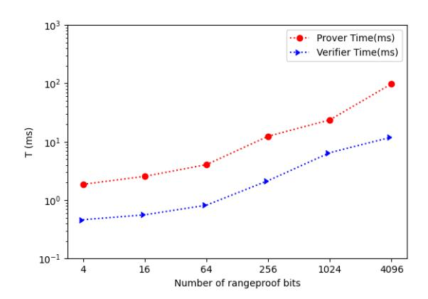

# Bulletproofs++: Next Generation Confidential Transactions via Reciprocal Set Membership Arguments

Liam Eagen∗ Sanket Kanjalkar Tim Ruffing Jonas Nick

Blockstream Research

July 17, 2023

#### Abstract

Zero-knowledge proofs are a cryptographic cornerstone of privacy-preserving technologies such as "Confidential Transactions" (CT), which aims at hiding monetary amounts in cryptocurrency transactions. Due to its asymptotically logarithmic proof size and transparent setup, most state-ofthe-art CT protocols use the Bulletproofs (BP) [\[1\]](#page-28-0) zero-knowledge proof system for set membership proofs such as range proofs. However, even taking into account recent efficiency improvements, BP comes with a serious overhead in terms of concrete proof size as well as verifier running time and thus puts a large burden on practical deployments of CT and its extensions.

In this work, we introduce Bulletproofs++ (BP++), a drop-in replacement for BP that improves its concrete efficiency and compactness significantly. As for BP, the security of BP++ relies only on the hardness of the discrete logarithm problem in the random oracle model, and BP++ retains all features of Bulletproofs including transparent setup and support for proof aggregation, multi-party proving and batch verification. Asymptotically, BP++ range proofs require only O(n/ log n) group scalar multiplications compared to O(n) for BP and BP+.

At the heart of our construction are novel techniques for permutation and set membership, which enable us to prove statements encoded as arithmetic circuits very efficiently. Concretely, a single BP++ range proof to establish that a committed value is in a 64-bit range (as commonly required by CT) is just 416 bytes over a 256-bit elliptic curve, 38% smaller than an equivalent BP and 27% smaller than BP+. When instantiated using the secp256k1 curve as used in Bitcoin, our benchmarks show that proving is about 5 times faster than BP and verification is about 3 times faster than BP. When aggregating 32 range proofs, proving and verification are about 9.5 times and 5.5 times faster, respectively.

∗ liameagen@protonmail.com

# Contents

| 1 | Introduction                                                                                                                                                                                                                                                                                                                               | 3                                                  |
|---|--------------------------------------------------------------------------------------------------------------------------------------------------------------------------------------------------------------------------------------------------------------------------------------------------------------------------------------------|----------------------------------------------------|
|   | 1.1 Contributions 1.2 Related Work                                                                                                                                                                                                                                                                                                | 4 5                                             |
| 2 | Preliminaries 2.1 Discrete Logarithm Relation Problem                                                                                                                                                                                                                                                                             | 6 7                                             |
|   | 2.2 Zero-Knowledge Arguments of Knowledge                                                                                                                                                                                                                                                                                            | 7                                                  |
| 3 | Technical Overview 3.1 Bulletproofs and Bulletproofs+  3.2 Reciprocal Argument 3.2.1 The Logarithmic Derivative 3.2.2 Application to Range Proofs  3.2.3 Application to MACT  3.3 Norm Linear Argument  3.4 Arithmetic Circuits                                                      | 8 9 9 10 10 11 11 12          |
| 4 | Norm Linear Argument 4.1 Norm Reduction  4.2 Norm Linear Argument  4.3 Full Protocol Description                                                                                                                                                                                                                | 12 13 13 14                               |
| 5 | Arithmetic Circuits 5.1 Equivalence to BP Circuits  5.2 Polynomial Encoding 5.2.1 Commitment Layout 5.2.2 Constraints and Inputs  5.2.3 Polynomial  5.2.4 Error Terms 5.3 Full Protocol Description  5.4 Multi-party Proving                                                | 14 15 15 16 17 17 18 19 21 |
| 6 | Reciprocal Argument 6.1 Warmup: Reciprocal Argument Protocol 6.2 Reciprocal Form Circuits  6.3 Full Protocol Description  6.4 Reciprocal Range Proofs 6.4.1 Arbitrary Ranges 6.4.2 Arithmetic Circuit  6.5 Multi-Asset Confidential Transactions  6.5.1 Arithmetic Circuit  | 21 22 23 24 25 25 26 26 27 |
| 7 | Implementation and Benchmarks                                                                                                                                                                                                                                                                                                              | 28                                                 |
|   | Changelog                                                                                                                                                                                                                                                                                                                                  | 28                                                 |
| A | Binary Range Proof                                                                                                                                                                                                                                                                                                                         | 31                                                 |
| B | Fast Scalar Multiplication B.1 Complex Multiplication                                                                                                                                                                                                                                                                             | 33 33                                           |
| C | Theorems and Proofs C.1 Norm Linear Argument  C.1.1 Proof of Theorem 1  C.2 Arithmetic Circuits C.2.1 Proof of Theorem 2  C.3 Proof of Theorem 3                                                                                                                                                    | 34 35 35 36 36 37                   |

# 1 Introduction

Cryptocurrencies like Bitcoin [\[2\]](#page-28-1) enable decentralized, peer-to-peer payments by maintaining a distributed public ledger called the blockchain. While this innovation has permitted an unprecedented degree of financial autonomy on the Internet, the fact that every transaction leaves a permanent record in the blockchain poses a substantial threat to the financial privacy of users. Even though cryptocurrency transactions are not typically associated with real-world identities, a surprisingly large amount of information can be extracted from the information in the blockchain [\[3,](#page-28-2) [4,](#page-28-3) [5,](#page-28-4) [6,](#page-28-5) [7,](#page-28-6) [8\]](#page-28-7).

Among the most glaring pieces of data that an observer can extract are the amounts of funds that transactions move from sender to recipient. These monetary amounts are stored as plain integers in many popular cryptocurrencies, including Bitcoin, which makes it easy for blockchain nodes to verify that a transaction is balanced, i.e., that the sum of all its input amounts equals the sum of all its output amounts (except for a small fee given to the miners).

Confidential Transactions A common countermeasure to this leak of information, e.g., as suggested first in the "Confidential Transactions" proposal [\[9,](#page-28-8) [10\]](#page-28-9) (CT), is to hide the monetary amounts in homomorphic commitments such as Pedersen commitments. The additive homomorphism ensures that blockchain nodes can verify the amounts in a confidential transaction without learning the plain amounts, by performing the necessary additions for checking the balance equation on the homomorphic commitments instead of the plain amounts. However, this approach is only sound if the amounts do not overflow during the homomorphic addition, because this would allow an attacker to violate balance and thus create money out of thin air. To exclude overflow, transactions are required to carry a non-interactive zero-knowledge (NIZK) range proof that demonstrates that committed amounts are in a range [0, 2 b ) of non-negative integers much smaller than the message space of the commitment space.

Bulletproofs Motivated by this application, the seminal Bulletproofs (BP) by B¨unz et al. [\[1\]](#page-28-0) was the first to achieve range proofs with an asymptotic size logarithmic in the number of bits in the range as well as concrete sizes less than 1 kB. Moreover, BP supports aggregate proving, i.e., a single range proof can cover multiple commitments at once, and this proof is significantly more compact than proving each commitment separately. This efficiency makes it feasible to use BP in cryptocurrencies, and BP range proofs have been successfully deployed in Grin [\[11\]](#page-29-0) and Monero [\[12\]](#page-29-1) in conjunction with other privacy-preserving features. However, even though Monero has subsequently upgraded [\[13\]](#page-29-2) to Chung et al. [\[14\]](#page-29-3)'s recent improvement Bulletproofs+ (BP+), which reduces the size of a single 64-bit range proof to 576 bytes, range proofs still account for 29% to 42% of the size of a typical Monero transaction.[1](#page-2-1) These concrete storage costs as well as the concrete verification efficiency still leave much to be desired, considering that all nodes in a cryptocurrency are required to download and verify the entirety of all range proofs created within the system.

Multi-asset Confidential Transactions While the initial CT proposal [\[9\]](#page-28-8) supports only a single asset (e.g., only Bitcoin), the protocol by Poelstra et al. [\[15\]](#page-29-4) (as deployed for instance in the Liquid sidechain [\[16\]](#page-29-5)) extends the idea to multi-asset confidential transactions (MACT), i.e., a single transaction can transfer multiple assets simultaneously, and no observer can learn the transacted amounts or the involved assets. Moreover, the range proof construction used in this protocol supports multi-party proving for transactions created by multiple senders. This is a prerequisite to using coin mixing protocols [\[17\]](#page-29-6) on top of MACT, which further enhance privacy.

However, it is thus far unclear how to fully leverage the potential of BP in MACT protocols. While it is possible to implement the range proofs in MACT using BP, the protocol by Poelstra et al. [\[15\]](#page-29-4) requires additional zero-knowledge proofs, called surjection proofs, to show that the assets on the output side of the transaction are a permutation of the assets on the input side of the transactions. These additional proofs are large and since they are constructed using techniques different from BP, it is not possible to aggregate them together with BP range proofs. The alternative approach taken by the Cloak [\[18\]](#page-29-7) MACT protocol overcomes this problem by using BP to encode a permutation argument as an arithmetic circuit. This avoids surjection proofs, but the way the circuit is constructed makes it incompatible with known multi-party proving techniques for BP. In summary, there is currently no solution to MACT that is practical and compatible with BP.

1A transaction with two inputs and two outputs needs has a size of 1532 bytes, and a transaction with one input and two outputs needs has a size of 2220 bytes after the v15 hardfork [\[13\]](#page-29-2). In either case, the aggregated range proof covering the two output amounts has a size of 640 bytes on a 256-bit elliptic curve as used in Monero (see also Table [1\)](#page-3-1).

| Range    | BP++     | BP+      | BP       |
|----------|----------|----------|----------|
| 1 × 64   | 10g + 3s | 15g + 3s | 16g + 5s |
| 2 × 64   | 10g + 5s | 17g + 3s | 18g + 5s |
| 4 × 64   | 12g + 5s | 19g + 3s | 20g + 5s |
| 8 × 64   | 14g + 5s | 21g + 3s | 22g + 5s |
| 16 × 64  | 15g + 4s | 23g + 3s | 24g + 5s |
| 32 × 64  | 18g + 5s | 17g + 4s | 26g + 5s |
| 64 × 64  | 19g + 4s | 27g + 3s | 28g + 5s |
| 256 × 64 | 21g + 5s | 31g + 3s | 32g + 5s |
| 384 × 64 | 21g + 5s | 31g + 3s | 32g + 5s |

Table 1: BP++ range proof sizes compared to BP and BP+. The range column of the table (m × n) indicates the number of aggregated proofs (m) and bits of range proven (n) by each proof. To allow for comparisons independent of the elliptic curve, we express the resulting proof size in terms of the number of group elements g and scalars s.

# 1.1 Contributions

The main contribution of this work is Bulletproofs++ (BP++), a zero-knowledge argument of knowledge for arithmetic circuits in the discrete logarithm setting.

Reciprocal Argument At the core of BP++ is the reciprocal argument, a novel interactive oracle proof (IOP) that generalizes permutation arguments and set membership arguments in the sense that it makes it possible to prove statements over objects similar to multi-sets. This approach builds on the work by Bayer and Groth [\[19\]](#page-29-8), who encode a multiset as the roots of a polynomial, and whose basic technique has been extended to show richer permutation arguments in plookup [\[20\]](#page-29-9) and plays a critical role in protocols based on Plonk [\[21\]](#page-29-10). These protocols use a "grand product", i.e., the product of numerous committed values, to show that a particular permutation, which encodes the structure of an arithmetic circuit, was applied correctly. The reciprocal argument of BP++ is essentially the logarithmic derivative of the polynomials used by Bayer-Groth permutation arguments. The logarithmic derivative transforms a product of linear factors into a sum, thereby linearizing the representation of the multiset.

Since the initial publication of a preprint of our work, the reciprocal argument has already been used in several other works: Hab¨ock [\[22\]](#page-29-11) modifies the "grand product" of Hyperplonk [\[23\]](#page-29-12) to use a variant of the reciprocal argument, which he rederives via the logarithmic derivative. Eagen, Fiore, and Gabizon [\[24\]](#page-29-13) develop a more asymptotically and concretely performant lookup argument, improving upon the sequence of works beginning with Caulk [\[25,](#page-29-14) [26\]](#page-29-15).[2](#page-3-2) As evident from these works, the reciprocal argument is clearly of independent interest.

Compactness and Efficiency BP++'s novel techniques improve the compactness and efficiency of BP(+) significantly. Table [1](#page-3-1) compares the size of BP++ range proofs with BP and BP+ range proofs. As demonstrated by the table, BP++ has a clear advantage in terms of proof size compared to the alternative.

The time needed for proving and verification is dominated in practice by multiplications of group elements with scalars. In BP and BP+ range proofs, the count of these multiplications scales linearly with n. However, BP++ offers an asymptotic improvement, reducing the count to O(n/ log n). The benchmarks in Section [7](#page-27-0) demonstrate that BP++'s improvements do in fact translate to actual implementations. A 64-bit range proof takes roughly 4 ms for proving and 0.9 ms for verifying, making it 5× quicker than BP in proving and 3× quicker in verification.

Modularity without Sacrificing Performance Since BP++ is capable of proving arbitrary statements encoded in arithmetic circuits, our range proofs construction is simply an arithmetic circuit encoding the range relation. As opposed to BP(+), the resulting range proof is just barely less efficient than a "direct construction" of a range proof, which demonstrates the power of our techniques. Moreover,

2After a per-table setup procedure, these arguments allow the prover to construct an argument for correctness of table look ups in time independent of the table size. This case is particularly interesting, as it is not currently known how to construct an analogous product check that depends only on the number of non-identity values being multiplied.

this approach simplifies the security analysis of the range proof to the correctness of the circuit and enhances its reusability in other applications.

MACT On the MACT side, we introduce a BP++ MACT protocol (again by specifying an arithmetic circuit) that relies on the same asset representation as Cloak but uses an instance of the reciprocal argument, substantially simplifying the permutation argument. The marginal cost of a BP++ MACT over an aggregated range proof is negligible in prover and verifier time, and proof size.

Compatibility with BP Since BP++ maintains the same interface and security assumptions established by BP(+), BP++ is a drop-in replacement for existing uses of BP(+).

For example, BP range proofs in existing protocols like Grin [\[11\]](#page-29-0), Monero [\[12\]](#page-29-1), and Liquid [\[16\]](#page-29-5) can be replaced without any change in security assumptions and with only minimal modification to existing protocols. This is also true for statements encoded as general arithmetic circuits. Moreover, the MACT protocol uses the same asset representation as Cloak, and so can be directly substituted for Cloak for smaller proof sizes and faster prover and verifier. These replacements retain all benefits of BP:

Aggregate proving A prover who would like to prove multiple statements simultaneously can create a single aggregated proof, which is more compact than simply giving multiple independent proofs. For example, in the common case that a cryptocurrency transaction creates m ≥ 1 commitments, an aggregate range proof can prove that m committed values are in range in just O(log n + log m) bits, instead of m · O(log n) bits in the case of m separate range proofs.

Multi-party aggregate proving For the case that multiple provers want to create a single aggregated proof, BP++ offers a natural MPC protocol. Multi-party proving yields large space savings when CT is combined with coin mixing protocols [\[27\]](#page-29-16).

Batch verification Multiple (possibly aggregated) proofs can be verified in a batch computation, improving efficiency further.

Conservative cryptographic assumptions BP++ is provably secure assuming only the hardness of the discrete logarithm problem and can be made non-interactive in the random oracle model, thus ensuring compatibility with assumptions widely accepted by engineers and users in the cryptocurrency ecosystem. Concretely, BP++ neither requires pairings nor cycles of curves and can be instantiated on the secp256k1 elliptic curve which used in Bitcoin, for which a wide range of implementations exist.

Transparent setup Since the public setup parameters only consist of random group elements, the setup is trustless assuming a common random string or the random oracle model.

# 1.2 Related Work

Range Proofs The complexity of the BP range protocol is roughly proportional to the number of digits in the range [A, B), which in the case of BP is n = ⌈log2 (B − A)⌉.

Using larger bases, it is possible to reduce the number of digits. The optimal base for a given range is the value b such that b b ≈ B −A, which allows representing the range using O(n/ log n) base b digits. Such a base is used in the range proof protocol by Camenisch, Chaabouni, and shelat [\[28\]](#page-29-17). Their protocol is inherently interactive but achieves O(n/ log n) proof size by batching the set membership checks for each digit, which is on a high-level similar to the approach in BP++.[3](#page-4-1) An alternative to digit decomposition range proofs are those based on Lagrange's four square theorem. This theorem states that any positive integer can be written as a sum of four squares, as originally proposed by Lipmaa [\[29\]](#page-29-18). In practice, this is often transformed to an instance of the three square theorem as was originally observed by Groth [\[30\]](#page-29-19). To show that a value v < B one can find a four, or three, square decomposition of the value B − v, which is positive only if the initial condition is met. These protocols require integer commitments, which historically required either RSA groups, and hence a trusted setup, or ideal class groups.

More recently, Couteau et al. [\[31\]](#page-29-20) developed a bounded integer commitment protocol that requires only the discrete logarithm assumption in a group of known order. This allows them to construct three-square range proofs using elliptic curves, which are highly performant and smaller than BP and BP+ range

3While the protocol by Camenisch, Chaabouni, and shelat [\[28\]](#page-29-17) uses Boneh-Boyen signatures, which also have the structure of a reciprocal, this reciprocal is not used in the same way as the reciprocal argument of BP++, and alternative signature protocols can be used instead with different security assumptions.

proofs. However, BP++ range proofs remain smaller as compared to their approach. Moreover, since their bounded integer commitment scheme requires the committed values to remain in a bounded interval, their approach requires a curve with order somewhat larger than 256 bits at the 128-bit security level. This lower bound on the group size or, equivalently, on the security of their approach is inherent and applies even if one ignores the non-tightness of the security analysis when setting parameters, as often done in practice. This limits their applicability to existing blockchains.

Generalizations of BP There are a number of other works building on BP, including BP+ [14] which uses a weighted inner product argument to reduce proving time and uses several other improvements to reduce proof size, and Flashproofs [32] which combine the BP inner product argument with Groth polynomial commitments [33] to reduce verifier complexity and attempt to minimize Ethereum gas costs. There has also been work to unify BP with the large, existing body of work on Sigma protocols [34], and to further generalize this to other related contexts like groups of unknown order [35] to support homomorphic commitments of arbitrary order. BP have also been generalized to inner product arguments in other contexts, including by Lee [36], who propose a general purpose SNARK protocol over a pairing friendly curve that uses an inner product to avoid trusted setup requirements. BP are also core to the structure of Halo [37] and Halo2 [38], which are now implemented in Zcash [39] and have inspired the development of accumulation schemes [40]. These allow a prover to efficiently aggregate multiple proofs in such a way that verification time depends only on the time to verify a single proof.

# 2 Preliminaries

**Notation** Hereafter, we denote the set of polynomially-bounded functions in the security parameter  $\lambda$  by  $poly(\lambda) = \{f : \exists a \in \mathbb{N}, \ f(\lambda) \in O(\lambda^a)\}$ , the set of negligible functions in the security parameter  $\lambda$  by  $negl(\lambda) = \{f : f(\lambda)^{-1} \notin poly(\lambda)\}$ . A function f is overwhelming if 1 - f is negligible.

A probabilistic interactive Turing machine  $\mathcal{A}$  is probabilistic polynomial-time (PPT) if its runtime is in  $poly(\lambda)$ ; it is probabilistic expected polynomial-time (expected-PPT) if its expected runtime is in  $poly(\lambda)$ ; it is deterministic polynomial-time (DPT) if it is PPT and does not read from its randomness tape.

We denote by  $\mathbb{G}$  a cyclic group of prime order p written additively, which is in practice typically a subgroup of an elliptic curve. We write group elements in  $\mathbb{G}$  with capital letters and scalars in  $\mathbb{F} := \mathbb{F}_p$  with lower case letters. We write  $\mathbb{F}[X]$  for the ring of polynomials over  $\mathbb{F}$  in indeterminate X; when we treat it a vector space, then as vector space over the field  $\mathbb{F}$ .

**Vectors** Vectors are written with bold letters, and matrices with capital letters. These can be distinguished from  $\mathbb{G}$  elements from context. We write the diagonal matrix of powers of  $\mu$  starting with  $\mu^0$  as diag( $\mu$ ). Vectors are zero indexed and implicitly padded with zeros on the right as necessary for various operations to be well-defined, i.e. addition and inner products. We denote the vector of all zeros by  $\mathbf{0}$  and the vector of all ones by  $\mathbf{1}$ . To access a slice of a vector, we write  $(\mathbf{v}_{k:})_i = \mathbf{v}_{k+i}$ .

We write the inner product of two vectors using angle brackets and an optional subscript to denote weighting by powers of the subscript. If the subscript is not present, it is implicitly 1. Inner products are defined for any vectors of quantities that can be multiplied, i.e. scalars and scalars or scalars and group elements. The norm of a vector refers to its self inner product and uses the same subscripting convention for weights. For example, the weighted inner product of x and G and the weighted norm of x are written

$$\langle \boldsymbol{x}, \boldsymbol{G} \rangle_{\mu} = \sum_{i=0} x_i G_i \mu^{i+1}$$
 and  $|\boldsymbol{x}|_{\mu}^2 = \langle \boldsymbol{x}, \boldsymbol{x} \rangle_{\mu}$ .

We write concatenation of vectors using || and tensor product of vectors using  $\otimes$ . Iterated tensor product is evaluated from left to right and obeys the convention

$$\bigotimes_{i=0}^{n} (1, x_i) = \left(1, x_0, x_1, x_0 x_1, x_2, \dots, \prod_{i=0}^{n} x_i\right).$$

This is convenient for describing, e.g., the vector of challenges used by the verifier for the norm linear argument.

We denote the vector of powers from  $\mu^0$  to  $\mu^{n-1}$  by  $\mathbf{e}_n(\mu)$ . It obeys the tensor product equation

$$\mathbf{e}_{ab}(\mu) = \mathbf{e}_a(\mu) \otimes \mathbf{e}_b(\mu^a) = (1, \mu, \dots, \mu^{ab-1}).$$

We decompose vectors into subvectors of even (indices  $0, 2, \ldots$ ) and odd (indices  $1, 3, \ldots$ ) components, instead of left and right halves as in BP, written as written as  $[a]_0$  and  $[a]_1$  respectively. This transformation simplifies certain parts of the protocol, and may help with locality in implementations. BP and BP+ can easily be modified to use even and odd halves, as can BP++ to use left and right halves.

## 2.1 Discrete Logarithm Relation Problem

BP++ is provably secure assuming the expected-PPT hardness of the discrete logarithm relation (DLR) problem, which is well-known to be tightly equivalent to the standard discrete logarithm problem [41, Lemma 3]. The DLR problem is, given a random collection of points in  $\mathbb{G}$ , the problem to find a non-trivial  $a \neq 0$  such that  $\langle a, G \rangle = 0_{\mathbb{G}}$ , where  $0_{\mathbb{G}}$  is the identity in  $\mathbb{G}$ .

**Definition 1** (Discrete Logarithm Relation (DLR) Problem). The discrete logarithm relation (DLR) problem in  $\mathbb{G}$  is hard if for all  $n \geq 1$  and for all expected-PPT adversaries  $\mathcal{A}$ ,

$$\Pr[\langle \boldsymbol{a}, \boldsymbol{G} \rangle = 0_{\mathbb{G}} \land \boldsymbol{a} \neq \boldsymbol{0} \mid \boldsymbol{G} \leftarrow \mathbb{S} \mathbb{G}^n; \boldsymbol{a} \leftarrow \mathcal{A}(\boldsymbol{G})] \leq negl(\lambda).$$

## 2.2 Zero-Knowledge Arguments of Knowledge

A zero-knowledge argument of knowledge consists of a non-interactive PPT Turing machine  $\mathcal{K}$  which outputs a common random string  $\sigma$ , and two interactive PPT Turing machines  $\mathcal{P}$  (prover) and  $\mathcal{V}$  (verifier). Critically,  $\sigma$  does not have any internal structure and can be chosen transparently, without a trusted setup. The prover and verifier interacting on inputs x and y will produce a transcript  $\pi$  and output a bit b indicating whether the verifier accepts, which we write  $\pi \leftarrow \langle \mathcal{P}(x), \mathcal{V}(y) \rangle = b$ . For any  $\sigma$ , a value w is a witness for a statement x if it satisfies the polynomial time relation  $(\sigma, x, w) \in \mathcal{R}$ .

A zero-knowledge argument of knowledge must satisfy completeness, soundness, and zero-knowledge. Completeness requires that the prover be able to convince the verifier to accept x with overwhelming probability if  $(\sigma, x, w) \in \mathcal{R}$ . Soundness requires that the prover fail with overwhelming probability to convince the verifier to accept if  $(\sigma, x, w) \notin \mathcal{R}$ .

**Definition 2** (Completeness). A triple  $(K, \mathcal{P}, \mathcal{V})$  satisfies perfect completeness if for all PPT A,

$$\Pr\left[\begin{array}{c|c} \langle \mathcal{P}(\sigma, u, w), \mathcal{V}(\sigma, u) \rangle = 1 & \sigma \leftarrow \mathcal{K}(1^{\lambda}); \\ \vee (\sigma, u, w) \not\in \mathcal{R} & (u, w) \leftarrow \mathcal{A}(\sigma) \end{array}\right] = 1.$$

The soundness notion we consider in this work is computational witness-extended emulation [42, 43]. This demonstrates that for any prover convincing the verifier of a statement with a particular probability, there exists an emulator producing transcript indistinguishable from a real transcript and a witness with probability negligibly different from the prover. The emulator can rerun the prover with the same internal state but different randomness in order to solve for a witness from the transcript. Since the emulator can always extract the witness from a proof, the proof is a sound argument of knowledge for the witness.

**Definition 3** (Computational Witness-Extended Emulation). The protocol  $(\mathcal{K}, \mathcal{P}, \mathcal{V})$  has WEE if for all DPT provers  $\mathcal{P}^*$ , there exists an expected-PPT emulator  $\mathcal{E}^{\mathsf{O}}$  with access to rewinding oracle  $\mathsf{O} = \langle \mathcal{P}^*(\sigma, u, s), \mathcal{V}(\sigma, u) \rangle$  such that for all pairs of adversaries  $(\mathcal{A}_1, \mathcal{A}_2)$ ,

$$\Pr\left[\mathcal{A}_{2}(\sigma, \pi) = 1 \mid \sigma \leftarrow \mathcal{K}(1^{\lambda}); (u, s) \leftarrow \mathcal{A}_{1}(\sigma); \pi \leftarrow \mathsf{O}\right] \\ -\Pr\left[\begin{array}{cc} (\pi \ is \ accepting \Rightarrow \\ (\sigma, u, w) \in \mathcal{R}) \\ \wedge \mathcal{A}_{2}(\sigma, \pi) = 1 \end{array} \middle| \begin{array}{c} \sigma \leftarrow \mathcal{K}(1^{\lambda}); \\ (u, s) \leftarrow \mathcal{A}_{1}(\sigma); \\ (\pi, w) \leftarrow \mathcal{E}^{\mathsf{O}}(\sigma, u) \end{array} \right] \leq negl(\lambda).$$

The protocol has CWEE when adversaries  $A_1$  and  $A_2$  are restricted to non-uniform polynomial time.

The zero-knowledge property requires that the verifier learns nothing about the witness from interacting with an honest prover. This is formalized via the existence of a simulator that is able to construct an identically distributed proof without knowledge of the witness. In the notion used here, the simulator has access to randomness used by the verifier; this is commonly called "special" zero-knowledge in the literature and requires the protocol to be public coin.

**Definition 4** (Public Coin). The protocol  $(K, \mathcal{P}, \mathcal{V})$  is public coin if all the verifier's randomness is drawn uniformly at random independently of interaction with the prover.

**Definition 5** (Perfect Special Honest Verifier Zero-Knowledge). The protocol  $(K, \mathcal{P}, \mathcal{V})$  has perfect Special Honest Verifier Zero-Knowledge (SHVZK) if there exists a simulator S such that for all pairs of adversaries  $(A_1, A_2)$ ,

$$\Pr \left[ \begin{array}{c|c} (\sigma, u, w) \in \mathcal{R} & \sigma \leftarrow \mathcal{K}(1^{\lambda}); (u, w, \rho) \leftarrow \mathcal{A}_{1}(\sigma); \\ \wedge \mathcal{A}_{2}(\sigma, \pi) = 1 & \pi \leftarrow \langle \mathcal{P}(\sigma, u, w), \mathcal{V}(\sigma, u; \rho) \rangle \end{array} \right] \\ = \Pr \left[ \begin{array}{c|c} (\sigma, u, w) \in \mathcal{R} & \sigma \leftarrow \mathcal{K}(1^{\lambda}); (u, w, \rho) \leftarrow \mathcal{A}_{1}(\sigma); \\ \wedge \mathcal{A}_{2}(\sigma, \pi) = 1 & \pi \leftarrow \mathcal{S}(u, \rho) \end{array} \right].$$

**General Forking Lemma** To show CWEE, BP++ will use the generalized forking lemma by Bootle et al. [44] (Lemma 2 in Appendix C). It allows handling extractors for multi-round zero-knowledge argument of knowledge generically.

**Trustless Common Setup** As a convention, all zero-knowledge arguments presented in this paper use the same setup algorithm  $\mathcal{K}$ , which outputs  $\sigma = (G, H, G)$ , where G and the components of the two vectors H, G (of sufficient size, which will be clear from the context) are random generators in  $\mathbb{G}$ . Since  $\mathcal{K}$  is transparent, it is possible to use make the setup trustless in the random oracle model.

Non-Interactive Proofs from Fiat-Shamir All zero-knowledge arguments presented in this paper are public coin, interactive protocols between a prover and honest verifier. This means that they can be made non-interactive via the Fiat-Shamir transform [45],4 and honest-verifier zero-knowledge of the interactive protocols immediately implies that the Fiat-Shamir transformed variants are non-interactive zero-knowledge in the random oracle model. Recent work has shown that also soundness is retained, even for multi-round protocols [48, 49, 50]. Concretely, we establish that our protocols achieve special soundness, which implies that their Fiat-Shamir version achieves knowledge soundness as shown by Attema, Fehr, and Klooß [48, Theorem 4] and further elaborated on by Ganesh et al. [51, Section 2.8].

Commitments as Inputs Our zero-knowledge arguments accept witness inputs in Pedersen vector commitments. For convenience later, given generators  $\sigma = (G, \mathbf{H}, \dots)$  from the zero-knowledge setup, we define a commitment to message  $\mathbf{v}$  with randomness s to be

$$\mathsf{Com}(\boldsymbol{m};s) = v_0 G + s H_0 + \langle \boldsymbol{v}_{1:}, \boldsymbol{H}_{8:} \rangle.$$

Generators  $H_0, \ldots, H_7$  are intentionally not used for commitments to simplify the notation in later sections.

Pedersen commitments are homomorphic, perfectly hiding, and computationally binding up to the hardness of the discrete logarithm relation problem. We omit a formal treatment of these properties because the security analysis of our protocols uses the underlying group directly and does not invoke these abstract properties.

## 3 Technical Overview

BP++ consists of four primary improvements over earlier, transparent discrete logarithm-based range proof protocols. First, we substitute the BP+ weighted inner product argument by a weighted norm argument, which reduces verifier time by approximately half in many common cases. Second, we introduce a novel set membership and permutation argument based on logarithmic derivatives called the reciprocal argument, which has already found significant applications beyond BP++. Third, we modify the BP arithmetic circuit protocol to accomplish "blinding" in one round of communication of a single group element, which can be easily adapted to other similarly constructed protocols. These modified circuits are extended to support first order use of the reciprocal argument, similarly to integration of plookup [20] into Halo2 [38]. Finally, we use these techniques to construct the shortest, and most verifier performant transparent range proof and MACT protocols.

&lt;sup>4The Fiat-Shamir transform replaces every verifier message with the invocation of a hash function applied to the entire proof transcript up to that point. The transcript must include the problem statement and all prover communication with the verifier. Failure to properly implement the Fiat-Shamir heuristic has been a common source of bugs [46, 47].

# 3.1 Bulletproofs and Bulletproofs+

BP uses a recursive argument to show the inner product relation

$$\left\{ \left( \boldsymbol{G}, \boldsymbol{H} \in \mathbb{G}^{n}, G \in \mathbb{G}; C \in \mathbb{G}; \boldsymbol{x}, \boldsymbol{y} \in \mathbb{Z}_{p}^{n} \right) : C = \langle \boldsymbol{x}, \boldsymbol{y} \rangle G + \langle \boldsymbol{x}, \boldsymbol{G} \rangle + \langle \boldsymbol{y}, \boldsymbol{H} \rangle \right\}. \tag{1}$$

The recursive structure of the argument is itself derived from the recursive structure in Bootle et al. [\[44\]](#page-30-9). In each round, a commitment to a scalar v and vectors x and y of length n is reduced to a commitment to vectors x ′ and y ′ of length n/2. If this commitment satisfies the relation, then the original commitment satisfies the relation with overwhelming probability.

In our notation, given a commitment C, the prover sends the verifier commitments (L, R), and the verifier chooses a challenge γ. The reduced commitment is defined as

$$C' = C + \gamma^{-2}L + \gamma^{2}R = v'G + \langle \boldsymbol{x}', \boldsymbol{G}' \rangle + \langle \boldsymbol{y}', \boldsymbol{H}' \rangle.$$
(2)

Each round of the protocol forms essentially a vector valued polynomial commitment. The key to ensuring that the reduced vectors are of length n/2 comes from the folding relation. The reduced vectors are defined, in terms of the challenge

$$x' = \gamma[x]_0 + \gamma^{-1}[x]_1$$
  $y' = \gamma^{-1}[y]_0 + \gamma[y]_1.$  (3)

Computing the inner product of these vectors as polynomials in γ, we find that the original inner product ⟨x, y⟩ from the inner product relation occurs as the γ 0 term

$$\langle \boldsymbol{x}', \boldsymbol{y}' \rangle = \langle \boldsymbol{x}, \boldsymbol{y} \rangle + \gamma^{-2} \langle [\boldsymbol{x}]_0, [\boldsymbol{y}]_1 \rangle + \gamma^2 \langle [\boldsymbol{x}]_1, [\boldsymbol{y}]_0 \rangle. \tag{4}$$

BP applies this same relation to the inner products between the basis points G and H and the witness vectors. That is, the reduced basis points are defined in terms of γ to be

$$G' = \gamma^{-1}[G]_0 + \gamma[G]_1 \qquad H' = \gamma[H]_0 + \gamma^{-1}[H]_1.$$
 (5)

This means when the inner products ⟨x ′ , G′ ⟩ and ⟨y ′ , H′ ⟩ are evaluated, the original inner products will appear on the γ 0 term. The γ −2 coefficients from all three reduced inner products are then collected into L and likewise the γ 2 coefficients into R. This reduction is applied until the reduced vectors are of length 2, at which point the reduced vectors are sent to the verifier.

BP+ uses a very similar recursive structure that also incorporates weights to show a weighted inner product relation, with the inner product replaced by a weighted inner product. BP+ also differs in how it handles blinding, but BP++ behaves like BP in this regard.

Both BP and BP+ construct a range proof by decomposing the value into binary digits and proving the validity of each digit, then showing that the linear combination of these digits equals the committed value. Binary digits are used since their validity is easy to check: d ∈ {0, 1} if and only if d(d − 1) = 0.

# 3.2 Reciprocal Argument

The primary technique that makes BP++ range proofs and MACT possible is the reciprocal argument. Let A be a collection of pairs of multiplicities and values (m ∈ F, v ∈ F) ∈ A. [5](#page-8-2) The reciprocal argument is a simple interactive protocol by which the prover can convince a verifier that the total multiplicity mˆ v for each value v ∈ F vanishes. In that case, we say A vanishes.

Definition 6. Let A be a collection of pairs of multiplicities and values. Let the total multiplicity of a value v ∈ F in A be mˆ v(A) such that

$$\hat{m}_v = \sum_{(m',v') \in A: v = v'} m'.$$

We say A vanishes if ∀v ∈ F : ˆmv(A) = 0. When A is clear from context, we will write mˆ v.

5This collection is similar to a multi-set in spirit, but it is formally a different kind of object: As opposed to standard definitions of multi-sets, multiplicities are in F instead of Z+, and the collection can contain multiple pairs with the same value v, and even multiple copies of the same pair (m, v).

The underlying idea of the protocol is that we can associate to A a rational function  $f_A(X)$  defined as a sum of poles at each -v with multiplicity m for  $(m, v) \in A$ 

$$f_A(X) = \sum_{i=0}^{|A|-1} \frac{m_i}{X + v_i}.$$
 (6)

This rational function vanishes if and only if the total multiplicity for each symbol vanishes. To show that this function vanishes, it suffices to evaluate it at a uniformly random value. This follows from a modification of the Schwartz-Zippel lemma.

#### 3.2.1 The Logarithmic Derivative

The rational function  $f_A(X)$  has the structure of a logarithmic derivative. The logarithmic derivative of a function f(X) is the derivative of the logarithm of f(X) with respect to X, i.e.,  $(\log f)'(X)$  for  $(\log f)(X) = \log(f(X))$ . Ordinarily, logarithms are not well-defined over a finite field, but in this case we can apply the chain rule to simplify

$$(\log f)'(X) = \frac{f'(X)}{f(X)}. (7)$$

This expression is well-defined over a finite field when f(X) is a rational function. Since the derivative is linear and the logarithm is a group homomorphism taking multiplication to addition, the logarithmic derivative takes  $\mathbb{F}(X)^{\times} \to \mathbb{F}(X)^{+}$ . Using the product rule, we can check this directly since

$$\frac{f'(X)}{f(X)} + \frac{g'(X)}{g(X)} = \frac{f'(X)g(X) + f(X)g'(X)}{f(X)g(X)} = \frac{(fg)'(X)}{(fg)(X)}.$$
 (8)

Consider the function  $g_A(X)$  for A as defined before as a collection of pairs of multiplicities and values

$$g_A(X) = \prod_{(m,v)\in A} (X+v)^m.$$
 (9)

Applying the logarithmic derivative to this polynomial, the product becomes a sum of m times the logarithmic derivative of X + v. This logarithmic derivative simplifies to become 1/(X + v) since the derivative of X + v is 1. So we have

$$(\log g_A)'(X) = \sum_{(v,m)\in A} \frac{m}{X+v} = f_A(X). \tag{10}$$

This is the sense in which  $f_A(X)$  is a logarithmic derivative.

#### 3.2.2 Application to Range Proofs

Consider the problem of proving a base-b range proof. We want to prove knowledge of some digits d such that each  $d_i \in [0, b-1]$ , and that these are the base-b digits of some value v.

A natural solution is to use a lookup argument: given a collection of values  $t_j \in T$  called the "table" and a collection of values  $v_i \in V$ , a lookup argument shows that all elements of V occur in T.

We can use the reciprocal argument to construct a lookup argument by using the reciprocal argument on  $A = \{(-1, v_i) : i\} \cup \{(m_j, t_j) : j\}$ . Note that the largest magnitude multiplicity for an element  $v_i \in V$  is -|V|, which occurs when V contains only a single element. As long as  $|V| \ll |\mathbb{F}|$ , this means that the total multiplicity of  $v_i \in V$  can only vanish if  $v_i$  occurs in T. Therefore, the prover can convince the verifier that all elements of V are in T if A. For a base b range proof,  $T = \{0, \ldots, b-1\}$  and V consisting of all the digits  $d_i$ , the rational function  $f_A(X)$  is

$$f_A(X) = -\sum_i \frac{1}{X+d_i} + \sum_{j=0}^{b-1} \frac{m_j}{X+j}.$$
 (11)

The BP range proof construction uses the binary case b=2, for which it is easy to check directly that  $d_i(d_i-1)=0$  with one multiplication per digit. However, Camenisch, Chaabouni, and shelat [28] suggest to select b such that  $b^b \approx B-A$ . This base uses only  $O(n/\log n)$  digits, where  $n=\lceil \log_2(B-A) \rceil$ , which is optimal in the sense that the witness length is a function of the base b and the number n of digits and is minimized when they are equal.

Unfortunately, the natural generalization of the binary digit check  $d_i(d_i-1)$  to bases b>2 does not result in a more efficient proof in BP. In the binary case, each digit requires a single multiplication, but the number of multiplications increases linearly in the size of the base. What we really want is an efficient lookup argument, which is where the reciprocal argument comes in. Rather than checking each digit is the root of some polynomial separately as in BP, we can use Eq. (11) to check membership of each digit in the set of valid digits. This enables us to construct range proofs with "optimal" base while retaining efficiency.

#### 3.2.3 Application to MACT

For MACT, we face a related problem when proving multi-asset conservation of money. In this case, we have two collections of amounts and types of tokens I and O corresponding to the inputs and outputs of a transaction. We want to show that the total amount of each token in I is equal to the total amount of each token in O and that each amount in I and O is a positive integer. The latter claim can be shown using a range proof and the former using a new invocation of the reciprocal argument. Let  $A = \{(v,t): (v,t) \in I\} \cup \{(-v,t): (v,t) \in O\}$ . If A vanishes then the sum of all the amounts in I equals the sum of all the amounts in I for each token I. If the amounts are all positive integers much smaller than I0, it follows that no tokens were created or destroyed in the transaction. In this case I1, is

$$f_A(X) = \sum_{(v,t)\in I} \frac{v}{X+t} - \sum_{(v,t)\in O} \frac{v}{X+t}.$$
 (12)

## 3.3 Norm Linear Argument

As described in Section 3.1, BP and BP+ show a (weighted) inner product relation involving two vectors  $\boldsymbol{x}$  and  $\boldsymbol{y}$  by letting the prover send commitments for both  $\boldsymbol{x}$  and  $\boldsymbol{y}$ . This introduces undesirable redundancy in some cases. Consider the motivating example of a binary range proof: A prover wants to show  $d_i(d_i-1)=0$  for each digit  $d_i$  in the digit vector  $\boldsymbol{d}$  that encodes the binary representation of some value  $\boldsymbol{v}$ . In a BP range proof, this requires committing to both  $\boldsymbol{x}=\boldsymbol{d}$  and  $\boldsymbol{y}=-(1-\boldsymbol{d})$ , even though  $\boldsymbol{y}$  is entirely determined by  $\boldsymbol{x}$  up to the addition of a constant.

Towards a BP++ binary range proof, we can rewrite  $d_i(d_i - 1) = 0$  and consider the equivalent constraint  $(d_i - 1/2)^2 = 1/4$  instead. This allows us to substitute the inner product relation by a norm relation, which is a relation involving the inner product of a *single* vector with itself, and thus requires only a commitment to that single vector. As a result, we not only save data to be committed and hence communication, but also roughly half the prover and verifier cost.

However, while this motivating example provides an intuition for why a norm relation can be preferable over an inner product relation, it turns out that in practice, it is almost always more efficient to use a BP++ reciprocal range proof instead of a BP++ binary range proof. As a consequence, we defer the details of BP++ binary range proofs to Appendix A, and now turn our attention towards arithmetic circuits instead.

In the case of arithmetic circuits, similarly as for binary range proofs, using a norm argument allows reducing the verifier time by half, provided we can commit to only a single vector per commitment instead of two. Unfortunately, the inner product relation of BP and the weighted inner product relation of BP+ cannot work for this purpose, since even if the initial x = y the reduction is asymmetric so  $x' \neq y'$ . To show a norm relation, we need a new reduction technique that is symmetric in the way it reduces x and y. Unlike BP, the reduced vectors are now defined to be

$$x' = [x]_0 + \gamma [x]_1$$
  $y' = [y]_0 + \gamma [y]_1.$  (13)

The reduction can be derived by computing the coefficients of the three polynomials  $1, \gamma, \gamma^2 - 1 \in \mathbb{F}[\gamma]$  where in BP we computed the coefficients of the polynomials  $\gamma^{-2}, 1, \gamma^2 \in \mathbb{F}[\gamma]$ . Since these polynomials are linearly independent in  $\mathbb{F}[\gamma]$ , the reduction is sound. Setting x = y = n we can show a norm relation, and with some modifications can show a weighted norm relation.

A norm by itself is not sufficient; we want to be able to show that the witness satisfies linear constraints without introducing extraneous terms. We can apply this reduction relation to an inner product of an additional vector  $\boldsymbol{l}$  and a public constraint vector  $\boldsymbol{c}$ . This will be especially relevant when handling the blinding procedure for arithmetic circuits and also helps in the MPC proving setting. Thus, BP++ will show the weighted norm linear relation for a witness  $(v, \boldsymbol{l}, \boldsymbol{n})$  and public  $(\mu, \boldsymbol{c})$  satisfy  $v = \langle \boldsymbol{c}, \boldsymbol{l} \rangle + |\boldsymbol{n}|_{\mu}^2$ .

#### 3.4 Arithmetic Circuits

In BP and BP+, arithmetic circuits are given as a separate protocol from range proofs. The circuit is encoded as four matrices a vector  $(W_L, W_R, W_O, W_V, \mathbf{c})$  and a witness  $(\mathbf{a}_L, \mathbf{a}_R, \mathbf{a}_O, \mathbf{v})$  satisfies the circuit if

$$W_L \boldsymbol{a}_L + W_R \boldsymbol{a}_R + W_O \boldsymbol{a}_O = W_V \boldsymbol{v} + \boldsymbol{c}$$
  
$$\boldsymbol{a}_L \circ \boldsymbol{a}_R = \boldsymbol{a}_O.$$
 (14)

While one could use an arithmetic circuit to prove a range proof in BP, it would be less efficient than the specialized range proof protocol. In the BP protocol for circuits, the prover constructs a vector valued polynomial commitment to some  $(v(X), \mathbf{x}(X), \mathbf{y}(X))$  and wants to show that when we apply the inner product equation to this witness, the  $X^2$  term of the  $t(X) = v(X) - \langle \mathbf{x}(X), \mathbf{y}(X) \rangle$  vanishes. To show this, the prover commits to all the other "error" terms of t(X) in Pedersen scalar commitments in  $T_1, T_3, T_4, T_5, T_6$ .

BP++ arithmetic circuits avoids these extra commitments, as well as the two final commitments necessary to blind in both BP and BP+. Rather than committing to these other terms in scalar commitments, we commit to them as a vector in the final blinding commitment. This is free, and conveniently generalizes to larger polynomials without increasing proof size. The norm linear argument naturally allows us to evaluate the committed t(X) at a random X by placing the coefficients in l and changing the c vector to be powers of X. We are then able to use the other commitments in the proof to blind these error terms at no additional cost in terms of proof size. This procedure is responsible for the much of the reduction in proof size.

BP++ also modifies the circuit protocol so that instead of the constraint  $\mathbf{a}_L \circ \mathbf{a}_R = \mathbf{a}_O$ , the arithmetic circuit checks that  $\mathbf{a}_L \circ \mathbf{a}_R$  equals a linear combination of the entire witness. Here, the operation  $\circ$  is the component-wise product of vectors, also known as the Hadamard product.

This makes it efficient to formulate reciprocal constraints, where the denominators occur in  $a_L$ , the reciprocals in  $a_R$ , and the numerators can be any linear combination on the right hand side. This new arithmetic circuit protocol allows encoding reciprocal range proofs and MACT more efficiently than existing protocols without the use of specialized protocols.

# 4 Norm Linear Argument

Unlike BP and BP+ which show inner product relations, BP++ is an argument of knowledge for the weighted norm linear relation

$$\left\{ \begin{pmatrix} \boldsymbol{H} \in \mathbb{G}^{l}, \boldsymbol{G} \in \mathbb{G}^{n}, \boldsymbol{G} \in \mathbb{G}; \\ \boldsymbol{C} \in \mathbb{G}, \boldsymbol{c} \in \mathbb{F}^{n}, \boldsymbol{\mu} \in \mathbb{F}; \boldsymbol{l} \in \mathbb{Z}_{p}^{l}, \boldsymbol{n} \in \mathbb{Z}_{p}^{n} \end{pmatrix} : \begin{array}{c} \boldsymbol{v} = \langle \boldsymbol{c}, \boldsymbol{l} \rangle + |\boldsymbol{n}|_{\boldsymbol{\mu}}^{2} \\ \boldsymbol{C} = \boldsymbol{v}\boldsymbol{G} + \langle \boldsymbol{l}, \boldsymbol{H} \rangle + \langle \boldsymbol{n}, \boldsymbol{G} \rangle \end{array} \right\}.$$
(15)

There are two practical advantages to using a norm linear argument over an inner product argument. First, certain types of constraints can be more efficiently expressed as a square. In particular, the binary digit constraint of BP b(b-1) = 0 can be rewritten in terms of a square. The inner product version requires committing to both factors in the product, whereas the squared version requires only committing to one factor. Given a suitable norm linear argument, this reduces the verifier complexity by half.

The second advantage comes in the arithmetic circuit blinding protocol. Unlike BP and BP+ which perform blinding after committing to the circuit witness, or in the case of BP+ after performing the argument, over the course of two additional rounds, BP++ arithmetic circuit protocol is able to perform blinding using a single round. This relies on the linear portion of commitment l and is particularly convenient to express using the norm linear argument. This blinding procedure is responsible for much of the reduction in proof size as compared to the predecessor protocols and means that norm linear argument protocols are able to have uniformly smaller proof sizes than existing inner product protocols.

This relation is equivalent to the weighted inner product relation, in the sense that both are capable of proving arithmetic circuit satisfiability and more narrowly in the sense that one could, in principle, write the norm linear relation as an inner product and thus construct a norm linear argument by reducing directly to an inner product argument. However, the latter requires committing to the vector  $\boldsymbol{n}$  twice, in both  $\boldsymbol{x}$  and  $\boldsymbol{y}$  from the inner product relation. While it is possible to simplify the initial commitment, by computing  $\langle \boldsymbol{n}, \boldsymbol{G} + \boldsymbol{H} \rangle$  in the inner product commitment, the vectors  $\boldsymbol{x}$  and  $\boldsymbol{y}$  are reduced asymmetrically. This means that even if  $\boldsymbol{x} = \boldsymbol{y}$  it is not the case that  $\boldsymbol{x}' \neq \boldsymbol{y}'$ .

# 4.1 Norm Reduction

This makes clear what we want from a norm linear argument: given a commitment C to vectors as defined in the relation, we want to reduce this commitment to a new commitment to vectors l ′ and n ′ of half the length of the original vectors. To this end, we need a folding relation for a pair of vectors that treats both vectors symmetrically. That is, instead of scaling the halves of x and y by complementary γ and γ −1 , we would like to use reduced vectors that are folded in the same way, such as

$$\mathbf{x}' = \rho^{-1}[\mathbf{x}]_0 + \gamma[\mathbf{x}]_1 \qquad \mathbf{y}' = \rho^{-1}[\mathbf{y}]_0 + \gamma[\mathbf{y}]_1.$$
 (16)

Now if x = y then x ′ = y ′ . Here the value is defined as ρ 2 = µ for weight µ. Taking the weighted inner product of these vectors by µ we can work out a relation that includes the original weighted inner product ⟨x, y⟩µ as one coefficient of a polynomial in γ

$$v_{x} = \rho^{-1}(\langle [\boldsymbol{x}]_{0}, [\boldsymbol{y}]_{1}\rangle_{\mu^{2}} + \langle [\boldsymbol{x}]_{1}, [\boldsymbol{y}]_{0}\rangle_{\mu^{2}}) \qquad v_{r} = \langle [\boldsymbol{x}]_{1}, [\boldsymbol{y}]_{1}\rangle_{\mu^{2}}$$

$$\langle \boldsymbol{x}', \boldsymbol{y}'\rangle_{\mu^{2}} = \langle \boldsymbol{x}, \boldsymbol{y}\rangle_{\mu} + v_{x}\gamma + v_{r}(\gamma^{2} - 1).$$

$$(17)$$

Note that this relation is sound because the polynomials 1, γ, γ2 −1 ∈ F[γ] are linearly independent. As in BP(+), the protocol follows straightforwardly from this relation by applying it to all the inner products in the commitment and grouping like terms. The prover can commit to the γ and γ 2 − 1 coefficients (X, R) and then the verifier can select a random γ to evaluate the relation. Because this relation is symmetric, the prover can apply it to the x = y = n case and reduce n to a single n ′ .

# 4.2 Norm Linear Argument

In the norm linear relation, there are 4 inner products that the prover needs to reduce: |n| 2 µ , ⟨n, G⟩, ⟨c,l⟩, and ⟨l, H⟩. Since n participates in a weighted inner product (norm), we need to modify the relation for G slightly, and since l, c, and H only participate in unweighted relations, there are no weights present. The reduced vectors are thus

$$v' = |\mathbf{n}'|_{\mu^2}^2 + \langle \mathbf{c}', \mathbf{l}' \rangle \qquad \mathbf{c}' = [\mathbf{c}]_0 + \gamma [\mathbf{c}]_1$$

$$\mathbf{l}' = [\mathbf{l}]_0 + \gamma [\mathbf{l}]_1 \qquad \mathbf{n}' = \rho^{-1} [\mathbf{n}]_0 + \gamma [\mathbf{n}]_1$$

$$\mathbf{G}' = \rho [\mathbf{G}]_0 + \gamma [\mathbf{G}]_1 \qquad \mathbf{H}' = [\mathbf{H}]_0 + \gamma [\mathbf{H}]_1.$$
(18)

The commitments X and R follow directly from expanding all the reduced inner products and gathering γ and γ 2 − 1 coefficients. Explicitly

$$v_x = \left(2\rho^{-1}\langle [\boldsymbol{n}]_0, [\boldsymbol{n}]_1\rangle_{\mu^2} + \langle [\boldsymbol{c}]_0, [\boldsymbol{l}]_1\rangle + \langle [\boldsymbol{c}]_1, [\boldsymbol{l}]_0\rangle\right)$$
(19)

$$v_r = \left( \left| [\boldsymbol{n}]_1 \right|_{\mu^2}^2 + \left\langle [\boldsymbol{c}]_1, [\boldsymbol{l}]_1 \right\rangle \right) \tag{20}$$

$$X = v_x G + \langle [\boldsymbol{l}]_1, [\boldsymbol{H}]_0 \rangle + \langle [\boldsymbol{l}]_0, [\boldsymbol{H}]_1 \rangle + \langle \rho[\boldsymbol{n}]_1, [\boldsymbol{G}]_0 \rangle + \langle \rho^{-1}[\boldsymbol{n}]_0, [\boldsymbol{G}]_1 \rangle$$
(21)

$$R = v_r G + \langle [\boldsymbol{l}]_1, [\boldsymbol{H}]_1 \rangle + \langle [\boldsymbol{n}]_1, [\boldsymbol{G}]_1 \rangle.$$
(22)

Evaluating the polynomial commitment at γ yields a commitment on the reduced basis to the reduced witness, i.e., we have

$$C + \gamma X + (\gamma^2 - 1)R = v'G + \langle l', H' \rangle + \langle n', G' \rangle.$$
(23)

The full protocol applies this reduction recursively until doing so does not reduce the overall proof size. This occurs when len (l) + len (n) ≤ 6, at which point the prover sends the reduced l and n to the verifier. If these vectors satisfy the norm linear relation for the reduced c and µ, then it follows by induction that the original commitment satisfies the relation.

Completeness follows directly from this equation holding and soundness from the linear independence of the polynomials 1, γ, γ2 − 1 ∈ F[γ]. Linear independence can be used to construct a round extractor, which as in BP can be used to construct an extractor for the entire protocol.

Theorem 1. The weighted norm linear argument has perfect completeness. Assuming the expected-PPT hardness of the discrete logarithm relation problem, the argument has CWEE and is therefore an argument of knowledge for the weighted norm linear relation.

See Appendix [C.1.1](#page-34-1) for the proof.

# 4.3 Full Protocol Description

The setup protocol for the norm linear argument K simply chooses all the group elements uniformly at random G, H, G → F.

# Weighted Norm Linear Argument ⟨Pnl, Vnl⟩

Common input: G, G, H, c, C, ρ and µ = ρ 2

$$\mathcal{P}$$
's input:  $(\boldsymbol{l}, \boldsymbol{n})$  and  $v = \langle \boldsymbol{c}, \boldsymbol{l} \rangle + |\boldsymbol{n}|_{\mu}^{2}$  such that  $C = vG + \langle \boldsymbol{l}, \boldsymbol{H} \rangle + \langle \boldsymbol{n}, \boldsymbol{G} \rangle$ 

1. If len (l) + len (n) < 6:

1.1 
$$\mathcal{P} \to \mathcal{V} : \boldsymbol{l}, \boldsymbol{n}$$

1.2 
$$\mathcal{V}$$
 computes  $v := \langle \boldsymbol{c}, \boldsymbol{l} \rangle + |\boldsymbol{n}|_{\mu}^2$ 

1.3 
$$V$$
 accepts if  $C \stackrel{?}{=} vG + \langle \boldsymbol{l}, \boldsymbol{H} \rangle + \langle \boldsymbol{n}, \boldsymbol{G} \rangle$ , otherwise reject

2. Else:

$$2.1 \ \mathcal{P} \rightarrow \mathcal{V} : X, R$$

$$2.2 \ \mathcal{V} \to \mathcal{P} : \gamma \leftarrow \$ \ \mathbb{F}$$

2.3 
$$\mathcal{P}$$
 computes  $l', n'$ 

2.4 
$$\mathcal{P}, \mathcal{V}$$
 compute  $G', H', c'$  and  $\rho' := \mu, \mu' := \mu^2, C' := C + \gamma X + (\gamma^2 - 1)R$ 

2.5 Run 
$$\langle \mathcal{P}_{nl}, \mathcal{V}_{nl} \rangle$$
 with  $(G, \mathbf{G}', \mathbf{H}', \mathbf{c}', C', \rho', \mu'; \mathbf{l}', \mathbf{n}')$ .

As in BP, it is not necessary for the verifier to actually compute the intermediate (G, H, c, C) values and the final verification check can be replaced with a single linear combination of public curve points. Letting k be the number of rounds before stopping and the vectors γl and γn be defined as

$$\gamma_l = \bigotimes_{i=0}^{k-1} (1, \gamma_i) \qquad \gamma_n = \bigotimes_{i=0}^{k-1} (\rho^{2^i}, \gamma_i), \tag{24}$$

the (G, H, c, C) in the final verification equation can be rewritten in terms of the original (G, H, c, C)

$$v = \langle \boldsymbol{c}, \boldsymbol{\gamma}_l \otimes \boldsymbol{l} \rangle + |\boldsymbol{n}|_{\mu}^2 \tag{25}$$

$$vG + \langle \boldsymbol{\gamma}_l \otimes \boldsymbol{l}, \boldsymbol{H} \rangle + \langle \boldsymbol{\gamma}_n \otimes \boldsymbol{n}, \boldsymbol{G} \rangle \stackrel{?}{=} C + \sum_{i=0}^{k-1} \gamma_i X_i + (\gamma_i^2 - 1) R_i.$$
 (26)

Also as in BP, when verifying multiple proofs simultaneously, the verifier can take a random linear combination of the equations and combine the γl ⊗ l and γn ⊗ n from different proofs if the G and H are the same. Thus the marginal cost of verifying an additional proof is only k = O(log n) additional scalar multiplications and O(n) field operations. There are additional optimizations that help reduce prover work discussed in Appendix [B.](#page-32-0)

# 5 Arithmetic Circuits

In BP, arithmetic circuits are represented using four public matrices and one public vector (WL, WR, WO, WV , c) and four witness vectors (aL, aR, aO, v), which must satisfy Eq. [\(14\)](#page-11-2). BP arithmetic circuits can accept inputs to the circuit via Pedersen scalar commitments Vi , and each element of v comes from one of these scalar commitments. To ensure the correctness of the extractor, and soundness, the matrix WV must have a left inverse X such that XWV = I.

This representation is closely related to the more common Rank 1 Constraint System (R1CS) and similarly supports arbitrary linear constraints and fan-in 2 multiplication gates. For each multiplication in the circuit, the prover commits to the left input in wL,i, the right input in wR,i and the output in wO,i. This is perfectly sensible in general, but we note that components of aO can be both output of a multiplication gate and subject to linear constraints in the components of  $a_L$  and  $a_R$ . Systems like R1CS require additional (redundant) constraints to handle these cases which can be encoded at no extra cost if the prover were able to directly show

$$\boldsymbol{a}_L \circ \boldsymbol{a}_R = W_{m,L} \boldsymbol{a}_L + W_{m,R} \boldsymbol{a}_R + W_{m,O} \boldsymbol{a}_O. \tag{27}$$

This motivates the BP++ circuit encoding, where we make exactly this change. It turns out that effectively every multiplication gate in reciprocal range proofs (Section 6.2) and MACT is of this form, and the savings from this change make it efficient to directly represent range proofs using arithmetic circuits. We also modify the circuits to accept input vectors from Pedersen vector commitments, rather

Concretely, an arithmetic circuit  $\mathcal{C}$  will be represented using two matrices  $(W_l, W_m)$ , two vectors  $(a_l, a_m)$  and two binary flags  $(f_l, f_m)$ . The witness for the circuit will consist of four vectors  $(\boldsymbol{w}_L, \boldsymbol{w}_R, \boldsymbol{w}_O, \boldsymbol{w}_V)$  where  $\boldsymbol{w}_L$  and  $\boldsymbol{w}_R$  are the left and right inputs to each multiplication, as in BP. To define linear constraints, rather than using one matrix per witness vector like BP, we use a single matrix defined over the entire non-input witness  $w = w_L || w_R || w_O$ . This is equivalent to having a matrix per witness vector, and we will refer to the portion of such a matrix  $W_l$  that "acts" on each of these vectors using the notation

$$W_l \boldsymbol{w} = W_{l,L} \boldsymbol{w}_L + W_{l,R} \boldsymbol{w}_R + W_{l,Q} \boldsymbol{w}_Q. \tag{28}$$

The matrices on the right-hand side are just the columns of  $W_l$  that multiply each component of the witness. So if  $\mathbf{w} \in \mathbb{F}^{N_w}$  and  $\mathbf{w}_L, \mathbf{w}_R \in \mathbb{F}^{N_m}$ , the matrix  $W_{l,L}$  consists of the first  $N_m - 1$  columns of  $W_l$ ,  $W_{l,R}$  consists of columns  $[N_m, 2N_m)$ , and  $W_{l,O}$  of columns  $[2N_m, N_w)$ . The inputs to the circuit are k vectors  $v_i \in \mathbb{F}^{N_v}$  and  $w_V$  refers to the concatenation of all  $v_i$ . This witness satisfies the circuit  $\mathcal{C}$  if it satisfies the following equations, and the circuit protocol is for the following relation

$$C = \begin{pmatrix} W_l \in \mathbb{F}^{N_l \times N_w}, \boldsymbol{a}_l \in \mathbb{F}^{N_l}, f_l \in \{0, 1\} \\ W_m \in \mathbb{F}^{N_m \times N_w}, \boldsymbol{a}_m \in \mathbb{F}^{N_m}, f_m \in \{0, 1\} \end{pmatrix}$$
(29)

$$\mathbf{0} = W_l \mathbf{w} + f_l \mathbf{w}_V + \mathbf{a}_l \tag{30}$$

$$\boldsymbol{w}_L \circ \boldsymbol{w}_R = W_m \boldsymbol{w} + f_m \boldsymbol{w}_V + \boldsymbol{a}_m \tag{31}$$

$$\mathbf{w}_{L} \circ \mathbf{w}_{R} = W_{m}\mathbf{w} + f_{m}\mathbf{w}_{V} + \mathbf{a}_{m}$$

$$\mathcal{R}_{ac} = \left\{ \begin{pmatrix} G \in \mathbb{G}, \mathbf{H} \in \mathbb{G}^{N_{v}+7}, \mathbf{G} \in \mathbb{G}^{N_{m}}; \\ \mathcal{C}, \mathbf{V} \in \mathbb{G}^{k}; \mathbf{v}_{i} \in \mathbb{F}^{N_{v}} : i = [0, k), \\ \mathbf{s}_{V} \in \mathbb{F}^{k}, \mathbf{w}_{O} \in \mathbb{F}^{N_{O}}\mathbf{w}_{L}, \mathbf{w}_{R} \in \mathbb{F}^{N_{m}} \end{pmatrix} : \text{Eq. (30)} \right\}$$

$$(32)$$

#### Equivalence to BP Circuits 5.1

Since BP circuit representation is capable of representing any arithmetic circuit, it suffices to show that this new format can encode satisfiability of BP circuits to show it is also capable of representing any arithmetic circuit. To see how, let X be the left inverse of  $W_V$  as before and let M be the columns of X with a basis for the orthogonal complement of X, the left null space of  $W_V$  concatenated as columns. This means the matrix M is invertible by construction and satisfies

$$MW_V = \begin{bmatrix} I \\ \mathbf{0} \end{bmatrix}$$
.

Then let  $\mathbf{w}_O = \mathbf{a}_O$ ,  $\mathbf{w}_L = \mathbf{a}_L$ , and  $\mathbf{w}_R = \mathbf{a}_R$  and define the constraints  $(W_m, W_l, f_m, f_l, \mathbf{a}_m, \mathbf{a}_l)$  such that

$$f_m = 0 f_l = 1 \mathbf{a}_l = M\mathbf{c} \mathbf{a}_m = \mathbf{0}$$

$$W_m \mathbf{w} = \mathbf{a}_O W_l \mathbf{w} = M(W_L \mathbf{a}_L + W_R \mathbf{a}_R + W_O \mathbf{a}_O)$$
(33)

In practice it is not efficient to actually compute M. In the case that elements of  $w_V$  are used in multiple constraints it is most efficient to add "copy" constraints that move each  $w_{V,i}$  into  $w_O$ . Since  $w_O$  elements can be used in any number of constraints, this allows elements of  $w_V$  to be used in multiple constraints. While this is marginally less efficient than BP, inputs must already be copied like this to be used in multiplication constraints.

#### 5.2Polynomial Encoding

In order to show the relation is satisfied, we need to reduce arithmetic circuit satisfiability to the norm linear argument. That is, construct some (v, l, n) such that if it satisfies the norm linear argument for  $(\mu, \mathbf{c})$  then the relation is satisfied. To do this, we transform the systems of equations in Eqs. (30) and (31) to a single equation by taking a random linear combination of the by power of  $\lambda$  and  $\mu$ . This makes the right hand side of Eq. (31) into a weighted inner product, so the linear combination of equations is

$$0 = \mathbf{e}_{N_l}(\lambda)^{\top} (W_l \boldsymbol{w} + f_l \boldsymbol{w}_V + \boldsymbol{a}_l) + \langle \boldsymbol{w}_L, \boldsymbol{w}_R \rangle_{\mu} - \mathbf{e}_{N_m}(\mu)^{\top} (W_m \boldsymbol{w} + f_m \boldsymbol{w}_V + \boldsymbol{a}_m).$$
(34)

As in BP, the prover commits to the witness in a collection of vector commitments  $C_L$ ,  $C_R$ ,  $C_O$ . To show that Eq. (34) is satisfied for the openings of these commitments, we can treat these commitments as a vector valued polynomial commitment to some  $(v(T), \mathbf{l}(T), \mathbf{n}(T))$ . The verifier can take a linear combination of these commitments to evaluate this witness at any value of T. Let the polynomial f(T) be the scalar valued polynomial that is the application of the norm linear relation to these polynomials

$$f(T) = v(T) - \langle \boldsymbol{c}(T), \boldsymbol{l}(T) \rangle - |\boldsymbol{n}(T)|_{\mu}^{2}.$$
(35)

We want f(T) = 0 only if Eq. (34) is satisfied. One natural way to establish this is to split f(T) into a polynomial  $\hat{f}(T)$  that depends on the vector commitments and some other polynomial g(T) so  $f(T) = \hat{f}(T) - g(T)$ . The polynomial  $\hat{f}(T)$  will have a distinguished "value" term that vanishes with overwhelming probability if and only if Eq. (34) is satisfied, and the polynomial g(T) will always have zero value term. We can choose g(T) so that all the non-value terms (also referred to as "error" terms) of  $\hat{f}(T)$  vanish. So, if  $\hat{f}(T) - g(T) = f(T) = 0$  then the value term must be zero.

BP uses a similar technique and commits to each coefficient of g(T) in a separate Pedersen scalar commitment. This takes a total of 5 group elements and 2 scalars. We are able to improve on this by instead committing to the error terms in l as part of the blinding commitment. This is effectively free, in the sense that it requires no additional group elements or scalars beyond the blinding commitment, but also raises the issue of blinding for the error terms. The prover can't just send g(T) to the verifier. Instead we blind these error terms using a novel protocol that puts the blinding in  $C_L$ ,  $C_R$ ,  $C_O$ , while still ensuring that f(T) = 0. This requires no additional rounds or commitments beyond a single blinding commitment. While the prover and verifier performance improvements are largely due to the reciprocal argument, the proof size reduction is due largely to this blinding protocol.

#### 5.2.1 Commitment Layout

When the prover commits to the circuit witness in  $(C_L, C_R, C_O)$  there is an important degree of freedom in how the witness can be laid out. Let these commitments be in norm linear form and define the witnesses  $(\mathbf{r}_X \in \mathbb{F}^8, \mathbf{l}_X \in \mathbb{F}^{N_l}, \mathbf{n}_X \in \mathbb{F}^{N_m})$  for X = L, R, O and the commitments

$$C_X = r_{X,0}G + \langle \boldsymbol{r}_{X,1}; || \boldsymbol{l}_X, \boldsymbol{H} \rangle + \langle \boldsymbol{n}_X, \boldsymbol{G} \rangle. \tag{36}$$

The  $\mathbf{r}_X$  vectors are the error term blinding vectors. The rest of the vectors will commit to the witness, with  $\mathbf{n}_L = \mathbf{w}_L$  and  $\mathbf{n}_R = \mathbf{w}_R$ . This is necessary since Eq. (34) requires the weighted inner product of these two vectors. The degree of freedom is how the vector  $\mathbf{w}_O$  is represented in the vectors  $(\mathbf{n}_O, \mathbf{l}_O, \mathbf{l}_L, \mathbf{l}_R)$ . We can quantify this degree of freedom in a function  $\mathcal{F}$  that injectively maps each component of  $\mathbf{w}_O$  to one component of these vectors so for  $\mathbf{t}_X \in \{\mathbf{l}_O, \mathbf{l}_L, \mathbf{l}_R, \mathbf{n}_O\}$  we have

$$w_{O,\mathcal{F}^{-1}(\mathbf{t}_{X},j)} = \mathbf{t}_{X,j} \qquad \mathbf{t}_{X,j} = 0 \text{ if } (\mathbf{t}_{X},j) \notin \text{im } \mathcal{F}.$$
 (37)

Different protocols prefer different layouts for performance reasons and compatibility to multiparty proving, which is why we do not just pick a canonical layout. Given the function  $\mathcal{F}$ , we need to partition the matrices  $W_l$  and  $W_m$  into their constituent matrices that act on each of the  $\mathbf{t}_X$  for t=n,l and X=L,R,O. Let  $M_{a,t,X}$  be the portion of  $W_a$  for a=l,m that act on  $\mathbf{t}_X$  and that therefore satisfy

$$W_a \boldsymbol{w} = \sum_{X=L,R,Q} M_{a,l,X} \boldsymbol{l}_X + M_{a,n,X} \boldsymbol{n}_X.$$
(38)

Since  $n_L = w_L$  and  $n_R = w_R$ , we have  $M_{a,n,L} = W_{a,L}$  and  $M_{a,n,R} = W_{a,R}$ . The rest of the matrices  $M_{a,l,X}$  and  $M_{a,n,O}$  can be constructed by applying function  $\mathcal{F}$  to the columns of  $W_{a,O}$ . Column j of matrix  $M_{a,t,X}$  equals column i of  $W_{a,O}$  if  $i = \mathcal{F}^{-1}(t_X, j)$  and is the all zero column otherwise.

#### 5.2.2 Constraints and Inputs

Given a layout, the prover commits to  $C_L$ ,  $C_R$ ,  $C_O$  and then the verifier chooses the linear challenge  $\lambda$  and the multiplicative challenge  $\mu$ . These challenges determine the random linear combination of the constraints, as well as the linear combination of inputs. Recall that  $\boldsymbol{w}_V$  is the concatenation of the input vectors  $\boldsymbol{v}_i$ , and that  $\boldsymbol{w}_V$  can appear in both the multiplicative and linear constraints. In BP, each input commitment commits to a single scalar, so we can simply take a linear combination of the input commitments to take a linear combination of the vector of input vector. This is no longer the case when we are dealing with vector commitments; we can only take a linear combination of the vectors  $\boldsymbol{v}_i$ .

Suppose we use the powers of  $\mu$  to separate the multiplicative constraints, and so we want to evaluate  $\langle \mathbf{e}_{kN_v}(\mu), \boldsymbol{w}_V \rangle$  in the proof. We can expand it using the tensor product structure of  $\mathbf{e}_{kN_v}(\mu) = \mathbf{e}_{N_v}(\mu) \otimes \mathbf{e}_k(\mu^{N_v})$  as

$$\langle \mathbf{e}_{kN_v}(\mu), \boldsymbol{w}_V \rangle = \left\langle \mathbf{e}_{N_v}(\mu), \sum_{i=0}^{k-1} \mu^{N_v i} \boldsymbol{v}_i \right\rangle. \tag{39}$$

We can obtain the  $\mu^{N_v i}$  linear combination of  $\mathbf{v}_i$  by multiplying  $\mu^{N_v i}$  with  $V_i$ . Treating the result as a norm linear commitment, we can use  $\mathbf{e}_{N_v}(\mu)$  in the constraint vector to compute the and obtain our desired result of  $\langle \mathbf{e}_{kN_V}(\mu), \mathbf{w}_V \rangle$ . This trick is not generally possible with a matrix  $W_V$  as used in BP arithmetic circuit representation.

There is an additional complexity that arises when using powers of both  $\lambda$  and  $\mu$  at the same time, that is when  $f_m f_l = 1$ . In that case taking the  $\lambda^{N_v i} + \mu^{N_v i+1}$  linear combination of  $V_i$  and then then taking the inner product with  $\mathbf{e}_{N_v}(\lambda) + \mathbf{e}_{N_v}(\mu)$  produces unwanted cross terms of the form  $\lambda^i \mu^{N_v j}$  and  $\mu^i \lambda^{N_v j}$ . To deal with these terms, we can subtract the linear constraint corresponding to each input weighted by these cross terms. Since the cross terms add  $\mathbf{w}_V$  scaled by these values, and since  $f_l = 1$ , subtracting off the corresponding linear constraints will balance. After making this adjustment, we can now define the randomization vectors and randomized constraints

$$\lambda = \mathbf{e}_{N_t}(\lambda) - f_l f_m(\mu \mathbf{e}_{N_n}(\lambda) \otimes \mathbf{e}_k(\mu^{N_v}) + \mathbf{e}_{N_v}(\mu) \otimes \mathbf{e}_k(\lambda^{N_v}))$$
(40)

$$\boldsymbol{\mu} = \mu \mathbf{e}_{N_m}(\mu) \tag{41}$$

$$\boldsymbol{c}_{n,X} = (\boldsymbol{\lambda}^{\top} M_{l,n,X} + \boldsymbol{\mu}^{\top} M_{m,n,X}) \operatorname{diag}(\boldsymbol{\mu})^{-1}$$

$$(42)$$

$$\mathbf{c}_{l,X} = \boldsymbol{\lambda}^{\top} M_{l,l,X} + \boldsymbol{\mu}^{\top} M_{m,l,X}. \tag{43}$$

Note that  $c_{n,X}$  is scaled by  $\operatorname{diag}(\mu)^{-1}$  so that the weighted inner product yields an ordinary inner product The input commitments will in general be scaled by the power of  $\lambda^{N_v i}$  if  $f_i = 1$  and  $\mu^{N_v i+1}$  if  $f_m = 1$ . Let the linear combination of inputs be

$$\hat{V} = 2\sum_{i=0}^{k-1} (f_l \lambda^{N_v i} + f_m \mu^{N_v i+1}) V_i = \hat{v}G + \langle \boldsymbol{r}_V || \hat{\boldsymbol{v}}, \boldsymbol{H} \rangle.$$

$$(44)$$

#### 5.2.3 Polynomial

Following the choice of  $\lambda$  and  $\mu$  by the verifier, the prover will commit to the blinding for the proof in the commitment  $C_S$  organized with the same naming convention as  $C_X$ . When laying out the polynomials  $(v(T), \mathbf{l}(T), \mathbf{n}(T))$  we need to ensure that verifier can evaluate these polynomials by taking a linear combination of commitments and that the resulting f(T) polynomial from Eq. (35) from applying the norm linear relation has the correct value term (which is the term that vanishes with overwhelming probability if and only if Eq. (34) is satisfied). Let  $\delta$  be a random value chosen by the verifier. The polynomials we will use arise from the following linear combination of commitments.

$$T^{-1}C_S + \delta C_O + TC_L + T^2C_R + T^3\hat{V} = (\hat{v}T^3 + r_0(T))G + \langle \mathbf{r}_{1:}(T)||\hat{\mathbf{l}}(T), \mathbf{H}\rangle + \langle \hat{\mathbf{n}}(T), \mathbf{G}\rangle$$
(45)

It is easy to see that the value term must be the  $T^3$  term, since the witnesses of  $C_L$  and  $C_R$  will be multiplied, and the coefficient of this product is  $T^3$ . Unfortunately, the product of  $C_O$  and  $\hat{V}$  also maps to the value term, but their product is also scaled by challenge  $\delta$ . This ensures that if it does not vanish then the value term will be distributed uniformly.

Given the polynomial, the linear constraints follow naturally: any linear constraints that are applied to the witness of a commitment with coefficient  $T^i$  will be scaled by  $T^{3-i}$ . The constraints vectors,

including the affine terms and some other public values, are

$$p_s(T) = |\boldsymbol{p}_n(T)|_{\mu}^2 + \langle \boldsymbol{\lambda}, \boldsymbol{a}_l \rangle T^3 + \langle \boldsymbol{\mu}, \boldsymbol{a}_m \rangle T^3$$
(46)

$$\mathbf{p}_{n}(T) = \delta^{-1} T^{3} \mathbf{c}_{n,O} + T^{2} \mathbf{c}_{n,L} + T \mathbf{c}_{n,R}$$
(47)

$$\hat{\mathbf{c}}_{l}(T) = 2(\delta^{-1}T^{3}\mathbf{c}_{l,O} + T^{2}\mathbf{c}_{l,L} + T\mathbf{c}_{l,R}) + f_{m}\mu\mathbf{e}_{N_{v}}(\mu)_{1:} + f_{l}\mathbf{e}_{N_{v}}(\lambda)_{1:}.$$
(48)

Adding  $p_n(T)$  and  $\hat{n}(T)$  to obtain n(T) and using  $\hat{c}_l$  as the constraint for  $\hat{l}$ , we have a witness and constraint vector such that applying the norm linear verification equation yields polynomial

$$\hat{f}(T) = p_s(T) + \hat{v}T^3 - \left\langle \hat{\boldsymbol{c}}_l(T), \hat{\boldsymbol{l}}(T) \right\rangle - |\boldsymbol{n}(T)|_{\mu}^2. \tag{49}$$

When writing out the coefficients of  $\hat{f}(T)$ , one can see that its  $T^3$  term vanishes when Eq. (34) is satisfied and therefore, as required, the  $T^3$  term is the value term. To summarize, we have polynomials

$$P(T) = p_s(T)G + \langle \boldsymbol{p}_n(T), \boldsymbol{G} \rangle \tag{50}$$

$$C(T) = P(T) + T^{-1}C_S + \delta C_O + TC_L + T^2C_R + T^3\hat{V}$$

$$= (v(T) + r_0(T))G + \langle \mathbf{l}(T), \mathbf{H} \rangle + \langle \mathbf{n}(T), \mathbf{G} \rangle$$
(51)

$$\hat{\boldsymbol{r}}(T) = \boldsymbol{r}(T) - T^{-1}\boldsymbol{r}_S(T) \tag{52}$$

$$v(T) = p_s(T) + \hat{v}T^3 + r_0(T) \tag{53}$$

$$\boldsymbol{l}(T) = \boldsymbol{r}_1 \cdot (T) || \hat{\boldsymbol{l}}(T) \tag{54}$$

$$\boldsymbol{n}(T) = \boldsymbol{p}_n(T) + \hat{\boldsymbol{n}}(T) \tag{55}$$

$$\hat{f}(T) = p_s(T) + \hat{v}T^3 - \left\langle \hat{\boldsymbol{c}}_l(T), \hat{\boldsymbol{l}}(T) \right\rangle - \left| \boldsymbol{n}(T) \right|_{\mu}^2$$
(56)

$$\mathbf{c}(T) = \hat{\mathbf{c}}_r(T) || \hat{\mathbf{c}}_l(T). \tag{57}$$

#### 5.2.4 Error Terms

Now, we can work backwards to derive what r(T) needs to be in order to satisfy the verification equation. Recall Eq. (35), which can be rewritten as

$$f(T) = \hat{f}(T) - \langle \hat{c}_r(T), r(T) \rangle. \tag{58}$$

Our original strategy was to construct a polynomial g(T) that has a zero value term by construction so that  $f(T) = \hat{f}(T) - g(T) = 0$ . Now we can define  $g(T) = \langle \hat{c}_r(T), r(T) \rangle$  and our goal becomes defining  $\hat{c}_r(T)$  such that value term is always zero. Then, we can simply check that  $f(\tau) = 0$  at a random challenge to verify that the value term vanishes.

Let  $\hat{c}_r(T) = (1, \beta T^{-1}, \beta T, \beta T^2, \beta T^3, \beta T^5, \beta T^6, \beta T^7)$  for random challenge  $\beta$  chosen by the verifier after  $C_L, C_R, C_O$  but before  $C_S$ . Now expanding q(T) we find

$$g(T) = \langle \hat{\boldsymbol{c}}_r(T), \boldsymbol{r}(T) \rangle$$

$$= \langle \hat{\boldsymbol{c}}_r(T), T^{-1} \boldsymbol{r}_S \rangle + \langle \hat{\boldsymbol{c}}_r(T), \hat{\boldsymbol{r}}(T) \rangle.$$
(59)

Let  $\hat{\boldsymbol{f}}$  be the vector of  $\hat{f}(T)$  coefficients not including the value term or constant, so that  $\hat{f}(T) = \langle (1, T^{-1}, T, T^2, T^3, T^5, T^6, T^7), \hat{\boldsymbol{f}} \rangle T^{-1}$ . We want  $\hat{f}(T) = g(T)$ , so we can make the substitution  $\boldsymbol{r}_S = (\hat{f}_0 || \beta^{-1} \hat{\boldsymbol{f}}_{1:}) - \boldsymbol{s}_T$  and cancelling  $\hat{f}(T)$  and g(T) results in

$$\langle \hat{\boldsymbol{c}}_r, T^{-1} \boldsymbol{s}_r \rangle = \langle \hat{\boldsymbol{c}}_r, \delta \boldsymbol{r}_O + T \boldsymbol{r}_L + T^2 \boldsymbol{r}_R + T^3 \boldsymbol{r}_V \rangle.$$
 (60)

The critical point here is that  $s_r$  is not a function of T, so if we group terms on the right hand side by their  $T^i$  coefficient, we can determine exactly what  $s_r$  must be in order to satisfy this equation, as well as some restrictions on  $r_X$ . Most importantly, there is no  $T^3$  term on the left hand side, so if the right hand side has a  $T^3$  term, then it will be scaled by  $\beta$ . Since all the terms on the right hand side are committed before  $\beta$ ,  $\hat{f}(T) \neq g(T)$  with overwhelming probability if the RHS has a non-zero  $T^3$  term.

The prover chooses all the components of  $r_X$  uniformly at random except for  $r_{O,4} = r_{L,3} = r_{R,2} = 0$  which are the terms that have degree 3 in Eq. (60) and the terms with degree greater than 6. The prover commits to  $C_S$  and the verifier chooses a uniformly random  $T = \tau$ . The prover and verifier can

compute  $C(\tau)$ , and the prover will then prove to the verifier that  $C(\tau)$  commits to  $(v(\tau), \mathbf{l}(\tau), \mathbf{n}(\tau))$  that satisfies the norm linear relation for  $(\mu, c(\tau))$ , either using the norm linear argument or by just sending the opening.

Completeness of the protocol follows straightforwardly from the protocol definition. Soundness requires that we demonstrate the value term faithfully encodes Eq. (34), but otherwise follows from describing an extractor and Lemma 2. Zero-knowledge requires a more complex argument to show that (v, l, n) is distributed uniformly at random, which ultimately reduces to showing that r contains a rank 7 linear combination of the blinding values  $r_L$ ,  $r_R$ ,  $r_O$ . Given this, the simulator is simple.

**Theorem 2** (Arithmetic Circuits). The arithmetic circuit protocol has perfect completeness and perfect honest verifier zero-knowledge. Assuming the expected-PPT hardness of the discrete logarithm relation problem, the protocol has computational witness-extended emulation.

See Appendix C.2.1 for the proof.

## 5.3 Full Protocol Description

## Arithmetic Circuit Protocol $\langle \mathcal{P}_{ac}, \mathcal{V}_{ac} \rangle$

Common input:  $G \in \mathbb{G}$ ,  $G \in \mathbb{G}^{N_m}$ ,  $H \in \mathbb{G}^{N_v+7}$ ,  $W_m \in \mathbb{F}^{N_m \times N_w}$ ,  $a_m \in \mathbb{F}^{N_m}$ ,  $W_l \in \mathbb{F}^{N_l \times N_w}$ ,  $a_l \in \mathbb{F}^{N_l}$ ,  $f_l$ ,  $f_l$ ,  $f_l$ ,  $f_l$ ,  $f_l \in \{0,1\}$ ,  $V \in \mathbb{G}^k$ 

$$\mathcal{P} \text{'s input: } \boldsymbol{v}_i \in \mathbb{F}^{N_v}, \, \boldsymbol{s}_V \in \mathbb{F}^k, \, \boldsymbol{w}_L, \, \boldsymbol{w}_R \in \mathbb{F}^{N_m}, \, \boldsymbol{w}_O \in \mathbb{F}^{N_O}, \, \mathcal{F} : [0 ... N_O - 1] \to (\{l_O, l_L, l_R\} \times [0 ... N_O - 1]) \cup (\{n_O\} \times [0 ... N_O - 1])$$

1.  $\mathcal{P}$  computes:

$$\begin{aligned} & \bm{r}_O, \bm{r}_L, \bm{n}_O, \bm{n}_L, \bm{l}_O, \bm{l}_L, C_O, C_L := \mathsf{CommitOL}(\bm{w}_O, \bm{w}_L, \mathcal{F}) \ & \bm{r}_R, \bm{n}_R, \bm{l}_R, C_R := \mathsf{CommitR}(\bm{w}_O, \bm{w}_R, \mathcal{F}) \end{aligned}$$

2.  $\mathcal{P}, \mathcal{V}$  run the Inner Arithmetic Circuit protocol  $\langle \mathcal{P}_{iac}, \mathcal{V}_{iac} \rangle$ .

#### CommitOL Subroutine

Input:  $\boldsymbol{w}_O, \boldsymbol{w}_L, \mathcal{F}$ 

$$\boldsymbol{r}_O' \hookleftarrow \mathbb{F}^6, \boldsymbol{r}_L' \hookleftarrow \mathbb{F}^5$$

$$\boldsymbol{r}_O := (r'_{O,0}, r'_{O,1}, r'_{O,2}, r'_{O,3}, 0, r'_{O,4}, r'_{O,5}, 0) \in \mathbb{F}^8$$

$$\mathbf{r}_L := (r'_{L,0}, r'_{L,1}, r'_{L,2}, 0, r'_{L,3}, r'_{L,4}, 0, 0) \in \mathbb{F}^8$$

$$\boldsymbol{n}_L := \boldsymbol{w}_L \in \mathbb{F}^{N_m}$$

Let 
$$\mathbf{n}_O \in \mathbb{F}^{N_m}$$
 such that  $\mathbf{n}_{O,j} := \begin{cases} \mathbf{w}_{O,i} \text{ if } \mathcal{F}^{-1}(\mathbf{n}_O,j) = i \\ 0 \text{ otherwise} \end{cases}$ 

Let  $\mathbf{l}_X \in \mathbb{F}^{N_v}$  for X = L, O such that

$$\boldsymbol{l}_{X,j} := \left\{ \begin{array}{l} \boldsymbol{w}_{O,i} \text{ if } \mathcal{F}^{-1}(\mathbf{l}_{X},j) = i \\ 0 \text{ otherwise} \end{array} \right.$$

$$C_X := r_{X,0}G + \langle r_{X,1}||l_X, H\rangle + \langle n_X, G\rangle \in G \text{ for } X = L, O.$$

Return  $r_O$ ,  $r_L$ ,  $n_O$ ,  $n_L$ ,  $l_O$ ,  $l_L$ ,  $C_O$ ,  $C_L$ 

### CommitR Subroutine

Input: wO, wR, F

$$\pmb{r}_R' \leftarrow \mathbb{F}^4$$

$$\mathbf{r}_R := (r'_{R,0}, r'_{R,1}, 0, r'_{R,2}, r'_{R,3}, 0, 0, 0) \in \mathbb{F}^8$$

$$\boldsymbol{n}_R := \boldsymbol{w}_R \in \mathbb{F}^{N_m}$$

Let lR ∈ F Nv such that

$$\boldsymbol{l}_{R,j} := \left\{ \begin{array}{l} \boldsymbol{w}_{O,i} \text{ if } \mathcal{F}^{-1}(\mathbf{l}_{R},j) = i \\ 0 \text{ otherwise} \end{array} \right.$$

$$C_R := r_{R,0}G + \langle \boldsymbol{r}_{R,1:} || \boldsymbol{l}_R, \boldsymbol{H} \rangle + \langle \boldsymbol{n}_R, \boldsymbol{G} \rangle \in G$$

Return rR, nR, lR, CR

# Inner Arithmetic Circuit Protocol ⟨Piac, Viac⟩

Common input: Same as the Arithmetic Circuit Protocol

P's input: Same as the Arithmetic Circuit Protocol and rX ∈ F 8 , nX ∈ F Nm, lX ∈ F Nv , CX ∈ G for X = L, R, O

1. 
$$\mathcal{P} \to \mathcal{V} : C_L, C_R, C_O$$

2. 
$$\mathcal{V} \to \mathcal{P} : \rho, \lambda, \beta, \delta \leftarrow \mathbb{F}$$

3. 
$$\mathcal{P}, \mathcal{V}$$
 compute:

$$M_{a,n,L} := (W_{a,i,j})_{0 \le j \le N_m - 1} \in \mathbb{F}^{N_a \times N_m}$$
 for  $a = l, m$ 

$$M_{a,n,R} := (W_{a,i,j})_{N_m \le j \le 2N_m - 1} \in \mathbb{F}^{N_a \times N_m}$$
 for  $a = l, m$ 

$$W_{a,O} := (W_{a,i,j})_{2N_m \le j \le N_w - 1} \in \mathbb{F}^{N_a \times N_O} \text{ for } a = l, m$$

Let 
$$M_{a,n,O} \in \mathbb{F}^{N_a \times N_m}$$
 for  $a = l, m$  such that

$$M_{a,n,O,j',j} := \begin{cases} (W_{a,O,j',i}) \text{ if } \mathcal{F}^{-1}(\mathbf{n}_O,j) = i \\ 0 \text{ otherwise} \end{cases}$$

Let 
$$M_{a,l,X} \in \mathbb{F}^{N_a \times N_v}$$
 for  $a = l, m, X = L, R, O$  such that

$$M_{a,l,X,j',j} := \begin{cases} (W_{a,O,j',i}) \text{ if } \mathcal{F}^{-1}(l_X,j) = i \\ 0 \text{ otherwise} \end{cases}$$

$$\mu:=\rho^2\in\mathbb{F}$$

$$\hat{V} := 2 \sum_{i=0}^{k-1} (f_i \lambda^{N_v i} + f_m \mu^{N_v i + 1}) V_i \in \mathbb{G}$$

$$\boldsymbol{\lambda} := \mathbf{e}_{N_l}(\lambda) - f_l f_m(\mu \mathbf{e}_{N_v}(\lambda) \otimes \mathbf{e}_k(\mu^{N_v}) + \mathbf{e}_{N_v}(\mu) \otimes \mathbf{e}_k(\lambda^{N_v})) \in \mathbb{F}^{N_l}$$

$$\boldsymbol{\mu} := \mu \mathbf{e}_{N_m}(\mu) \in \mathbb{F}^{N_m}$$

For 
$$X = L, R, O$$
:

$$\boldsymbol{c}_{n,X} := (\boldsymbol{\lambda}^\top M_{l,n,X} + \boldsymbol{\mu}^\top M_{m,n,X})\operatorname{diag} \mu^{-1} \in \mathbb{F}^{N_m}$$

$$\boldsymbol{c}_{l,X} := \boldsymbol{\lambda}^\top M_{l,l,X} + \boldsymbol{\mu}^\top M_{m,l,X} \in \mathbb{F}^{N_v}$$

$$p_n(T) := \delta^{-1} T^3 c_{n,O} + T^2 c_{n,L} + T c_{n,R} \in \mathbb{F}^{N_m}[T]$$

$$p_s(T) := |\boldsymbol{p}_n(T)|_{\mu}^2 + \langle \boldsymbol{\lambda}, \boldsymbol{a}_l \rangle T^3 + \langle \boldsymbol{\mu}, \boldsymbol{a}_m \rangle T^3 \in \mathbb{F}[T]$$

### 4. P computes:

$$\boldsymbol{l}_S \leftarrow \mathbb{F}^{N_v}$$

$$\boldsymbol{n}_S \leftarrow \mathbb{F}^{N_m}$$

$$\begin{split} &\hat{v} := 2\sum_{i=0}^{k-1} (f_{i}\lambda^{N_{v}i} + f_{m}\mu^{N_{v}i+1})v_{i,0} \in \mathbb{F} \\ &\hat{c}_{i}(T) := 2\left(\delta^{-1}T^{3}c_{i,0} + T^{2}c_{i,L} + Tc_{i,R}\right) + f_{m}\mu\mathbf{e}_{N_{v}}(\mu)_{1:} + f_{i}\mathbf{e}_{N_{v}}(\lambda)_{1:} \in \mathbb{F}^{N_{v}}[T] \\ &\hat{l}(T) := T^{-1}l_{S} + \delta l_{O} + Tl_{L} + T^{2}l_{R} + T^{3}(2\sum_{i=0}^{k-1} (f_{i}\lambda^{N_{v}i} + f_{m}\mu^{N_{v}i+1})v_{i,1:}) \in \mathbb{F}^{N_{v}}[T] \\ &\hat{n}(T) := T^{-1}n_{S} + \delta n_{O} + Tn_{L} + T^{2}n_{R} \in \mathbb{F}^{N_{m}}[T] \\ &n(T) := p_{n}(T) + \hat{n}(T) \in \mathbb{F}^{N_{m}}[T] \\ &\hat{f}(T) := p_{s}(T) + \hat{v}T^{3} - \left\langle \hat{c}_{i}(T), \hat{l}(T) \right\rangle - |n(T)|_{\mu}^{2} \in \mathbb{F}^{8}[T] \\ &\text{Let } \hat{f} \in \mathbb{F}^{8} \text{ be the vector of coefficients of } \hat{f}(T) \\ &r_{V} = (0, 2\sum_{i=0}^{k-1} (f_{i}\lambda^{N_{v}i} + f_{m}\mu^{N_{v}i+1})s_{V,i}, 0, \dots, 0) \in \mathbb{F}^{8} \\ &s_{r} := (\beta\delta r_{O,1}, 0, \beta^{-1}\delta r_{O,0} + r_{L,1}, \delta r_{O,2} + \beta^{-1}r_{L,0} + r_{R,1}, \delta r_{O,3} + r_{L,2} + r_{V,1} + \beta^{-1}r_{R,0}, r_{L,4} + r_{R,3}, \delta r_{O,5} + r_{R,4}, \delta r_{O,6} + r_{L,5}) \in \mathbb{F}^{8} \\ &r_{S} := (\hat{f}_{0}||\beta^{-1}\hat{f}_{1:}) - s_{r} \\ &C_{S} := r_{S,0}G + \left\langle r_{S,1:}||l_{S}, H \right\rangle + \left\langle n_{S}, G \right\rangle \in G \\ 5. &\mathcal{P} \to \mathcal{V} : C_{S} \\ 6. &\mathcal{V} \to \mathcal{P} : \tau \leftarrow \mathbb{F} \\ 7. &\mathcal{P} \text{ computes:} \\ &r(T) := T^{-1}r_{S} + \delta r_{O} + Tr_{L} + T^{2}r_{R} + T^{3}r_{V} \in \mathbb{F}^{8}[T] \\ &v(T) := p_{s}(T) + \hat{v}T^{3} + r_{0}(T) \in \mathbb{F}[T] \\ &l(T) := r_{1:}(T)||\hat{l}(T) \in \mathbb{F}^{7+N_{v}}[T] \\ 8. &\mathcal{P}, \mathcal{V} \text{ compute:} \\ &\mathcal{P}(T) := p_{s}(T)G + \left\langle p_{n}(T), G \right\rangle \in G[T] \\ &\hat{c}_{r}(T) := (1, \beta T^{-1}, \beta T, \beta T^{2}, \beta T^{3}, \beta T^{5}, \beta T^{6}, \beta T^{7}) \in \mathbb{F}^{8}[T] \\ &c(T) := \hat{c}_{r,1:}(T)||\hat{c}_{l}(T) \in \mathbb{F}^{7+N_{v}}[T] \\ &\mathcal{P}(T) := P(T) + T^{-1}C_{S} + \delta C_{O} + TC_{L} + T^{2}C_{R} + T^{3}\hat{V} \in G[T] \\ 9. &\mathcal{P}, \mathcal{V} \text{ run the weighted norm linear argument } \langle \mathcal{P}_{n}l, V_{nl} \rangle = b \text{ with common input } \\ &(G, G, H, c(\tau), C(\tau), \mu = \rho^{2}) \text{ and prover input } l(l(\tau), n(\tau), v(\tau)). \\ \end{cases}$$

#### 5.4 Multi-party Proving

BP++ is amenable to exactly the same kind of MPC protocol as BP. Each prover will own a distinct portion of the norm vector, and these portions should be concatenated to support both kinds of MPC arguments. The linear portion of the commitment can be shared among all the provers, in the same way that the scalar component of the BP MPC protocol is shared among all the provers. If the circuit splits into local circuits for each prover such that each is independently satisfied, then the protocol will be secure. This is stated without proof, although the techniques of Alupotha, Boyen, and Foo [52] should transpose directly to BP++ given the similarity of the underlying protocols. Informally, it is sufficient to show that the protocol is complete if no elements of the witness owned by different provers are ever multiplied. This is true by construction, as the only elements that are ever multiplied lie over the same basis element in the norm vector, and this basis element is owned by exactly one prover.

# 6 Reciprocal Argument

In this section, we formalize the reciprocal argument as an interactive protocol, describe an arithmetic circuit protocol that integrates the reciprocal argument, and then use that circuit protocol to build higher

level protocols for range proofs and MACT. The range proofs work by instantiating a lookup argument using the reciprocal argument as described in the technical overview. We also define the MACT protocols using the conservation of money check from the technical overview. Because these protocols are simply given as arithmetic circuits in "reciprocal" form they do not require special security proofs.

#### 6.1Warmup: Reciprocal Argument Protocol

Let A be a collection of pairs of multiplicities and values  $(m \in \mathbb{F}, v \in \mathbb{F}) \in A$ . Recall that the reciprocal argument is an interactive protocol by which the prover can convince a verifier that the total multiplicity  $\hat{m}_n$  for each value  $v \in \mathbb{F}$  vanishes, in which case we say A vanishes (Definition 6).

We present the protocol in a simple form in which the prover sends the verifier all the information directly, and the verifier will perform all checks on the prover messages. This protocol independently demonstrates the key technique used in reciprocal form circuits, range proofs, and MACTs. While this form is not very useful by itself, the protocol can be naturally adapted to an argument of knowledge by replacing the prover messages with commitments and changing the verifier checks accordingly. In order to make use of the reciprocal argument in BP++, we will not run the simple protocol in a black box manner but instead incorporate it into an arithmetic circuit protocol (see Section 6.2).

The protocol works as follows. First, the prover sends multiplicities m and values v in A. Next the verifier selects a random challenge  $\alpha$ , and the prover responds by sending the "reciprocals"  $r_i = m_i/(\alpha + v_i)$ . Finally, the verifier checks that each reciprocal is properly formed and that the sum of all the reciprocals vanish, i.e., if

$$(\alpha + v_i)r_i = m_i$$
 and  $\sum_i r_i = 0.$  (61)

Reciprocal Argument Protocol  $\langle \mathcal{P}_{ra}, \mathcal{V}_{ra} \rangle$ 

- 1.  $\mathcal{P} \to \mathcal{V} : \boldsymbol{m}, \boldsymbol{v}$ 2.  $\mathcal{V} \to \mathcal{P} : \alpha \leftarrow \mathbb{F}$ 3.  $\mathcal{P} \to \mathcal{V} : \boldsymbol{r} \text{ s.t. } r_i = m_i/(\alpha + v_i)$
- 4.  $\mathcal{V}$  accepts if  $(\alpha + v_i)r_i = m_i$  for  $i = 0 ... |\mathbf{r}| 1$  and  $\sum_i r_i = 0$

This protocol lacks perfect completeness because if  $\alpha = -v_i$  for any  $v_i$  then  $r_i$  is not well-defined. However, this only occurs with negligile probability since  $\alpha \leftarrow \mathbb{F}$ . Informally, soundness follows from the structure of the sum of the reciprocals. If  $(\alpha + v_i)r_i = m_i$ , then either  $\alpha = -v_i$  and  $m_i = 0$  or  $r_i = m_i/(\alpha + v_i)$ . So, with overwhelming probability if  $\sum_i r_i = 0$  we have that  $f_A(\alpha) = 0$  where

$$f_A(X) = \sum_{i=0}^{|A|-1} \frac{m_i}{X + v_i}.$$
 (62)

Since addition is commutative and associative, we can sum terms in  $f_A(X)$  with a common denominator and write it as a sum over the total multiplicities. Let  $V = \{v : \exists m : (m, v) \in A\}$  be the set of values in A. Then

$$f_A(X) = \sum_{v \in V} \frac{\hat{m}_v}{X + v}.$$
(63)

We can show that if  $f(\alpha_i) = 0$  for 2|V| distinct challenges  $\alpha_i$  then  $\hat{m}_v$  must be zero for all  $v \in V$ . This follows from two simple observations. First, the "poles"  $1/(X + v_i)$  are linearly independent in the ring  $\mathbb{F}(X)$  of rational functions in X (as vector space over  $\mathbb{F}$ ), and second,  $f_A(\alpha) = 0$  implies  $f_A(X) = 0$ by a slight modification of the Schwartz-Zippel lemma.

**Lemma 1** (Reciprocal Argument Vanishing). Let A be a collection of pairs of multiplicities and values. If there exist 2|A| accepting transcripts of the reciprocal argument protocol for A with pairwise distinct challenges  $\alpha_j$ , then A vanishes in the sense of Definition 6.

Proof. Let  $V = \{v : \exists m : (m, v) \in A\}$  be the set of values in A. There are at most |V| values  $\alpha$  such that there exists  $v_i \in V$  for which  $\alpha = -v_i$ . Let  $\alpha'$  be a vector of |V| challenges  $\alpha_j$  such that  $\alpha'_j \neq -v_i$  for any i, j. Let  $\boldsymbol{v}$  be the vector of elements in V, and note that the components of vector  $-\boldsymbol{v}$  are pairwise distinct and the components in  $\alpha'$  are pairwise distinct. This means the  $|V| \times |V|$  Cauchy matrix C formed from  $-\boldsymbol{v}$  and  $\alpha'$  is well-defined and therefore invertible. Let  $f_j = f_A(\alpha'_j)$  for  $f_A$  as defined in Eq. (63) and note that  $\boldsymbol{f} = C\hat{\boldsymbol{m}}_v = \boldsymbol{0}$ . Since C is invertible,  $\hat{\boldsymbol{m}}_v = \boldsymbol{0}$  and therefore A vanishes.

## 6.2 Reciprocal Form Circuits

We want to incorporate the reciprocal argument as a higher order operation into the arithmetic circuit protocol. This is analogous to the use of more complex "gates" [23] in other circuit representations. In particular, the integration of plookup into plonk in Halo2 [38]. This has the advantage of simplifying the analysis of protocols that use the reciprocal argument, since they can reuse the security proofs for general reciprocal form circuits rather than proving the soundness and zero-knowledge of every new, bespoke protocol.

Suppose we have an arithmetic circuit C and the arithmetic circuit witness  $(\boldsymbol{w}_L, \boldsymbol{w}_R, \boldsymbol{w}_O, \boldsymbol{w}_V)$ . To integrate the reciprocal argument, we want to show that this circuit is satisfied and that some set of rational functions  $\boldsymbol{f}(X)$  vanishes, where each rational function encodes a reciprocal argument instance. In general, we want the symbols and multiplicities to be able to depend on the arithmetic circuit witness  $\boldsymbol{w}$  and ultimately would like to be able to compile the  $\boldsymbol{f}(X)$  vanishing check into an arithmetic circuit for a particular  $X = \alpha$ .

We can define three matrices  $(W_n, W_d, W_p(X))$  and one witness vector  $\mathbf{w}_D$  to convert the check  $\mathbf{f}(X) = \mathbf{0}$  into a form that can be compiled into an arithmetic circuit. Let  $\mathbf{w}_I = \mathbf{w}_O ||\mathbf{w}_L|| \mathbf{w}_D$  be the "initial" witness and  $\mathbf{w}(X) = \mathbf{w}_D ||\mathbf{w}_L|| \mathbf{w}_P(X) ||\mathbf{w}_R|| \mathbf{w}_O$  be the entire witness. These matrices will ultimately be incorporated into arithmetic circuit constraint matrices, and for practical reasons we want the new constraints to have access to the inputs. These matrices will satisfy

$$w_{P,i}(X) = \frac{(W_n \boldsymbol{w}_I + f_m \boldsymbol{w}_V + \boldsymbol{a}_n)_i}{X + w_{D,i}}$$

$$(64)$$

$$W_d \mathbf{w}_I + f_l \mathbf{w}_V + \mathbf{a}_d = \mathbf{0} \tag{65}$$

$$f(X) = W_n(X)w(X) + a_n(X). \tag{66}$$

The initial witness is the portion of the witness committed before the verifier chooses  $\alpha$ , and  $\mathbf{w}_D$  is a list of all the private poles. For example, in Eq. (11) this vector would include all the  $d_i$ . The matrix  $W_n \mathbf{w}_I$  allows expressing the multiplicities for each private pole as a linear combination of the initial witness, and the matrix  $W_d$  relates the private poles to the rest of the initial witness. The matrix  $W_p(X)$  maps each pole  $w_{i,P}(X)$  to a reciprocal argument equation. That is, each reciprocal argument equation corresponds to a row of  $W_p(X)$ . If the pole  $w_{i,P}(X)$  appears in an equation, then the element of that row multiplying the pole is non-zero. The vector  $\mathbf{a}_p(X)$  adds all the poles whose denominators are public, for example  $m_j/(X+j)$  in Eq. (11). For the purposes of this paper, it is more convenient to describe reciprocal form circuits in terms of the reciprocal arguments rather than actually describing the matrices. This is sufficient since these matrices exist for any collection of reciprocal arguments.

Following commitment to  $\boldsymbol{w}_I$ , the verifier chooses  $\alpha$ , and the prover commits to  $\boldsymbol{w}_R$  and  $\boldsymbol{w}_P(\alpha)$ . We can now define the new arithmetic circuit  $\mathcal{C}'$  for  $\alpha$ . First, prepend the vector  $\boldsymbol{w}_D$  onto  $\boldsymbol{w}_L$  and the vector  $\boldsymbol{w}_P(\alpha)$  onto  $\boldsymbol{w}_R$  to produce  $\boldsymbol{w}_L'$  and  $\boldsymbol{w}_R'$  for  $\mathcal{C}'$ . We keep  $\boldsymbol{w}_O' = \boldsymbol{w}_O$ , and can let  $\boldsymbol{w}' = \boldsymbol{w}_L' ||\boldsymbol{w}_R'|| \boldsymbol{w}_O'$ . To verify that the committed vector  $\boldsymbol{w}_P'$  is correctly constructed as  $\boldsymbol{w}_P(\alpha)$ , we can clear the denominator of Eq. (64) and check

$$w_{D,i}w'_{P,i} = (W_n \boldsymbol{w}_I + f_m \boldsymbol{w}_V + \boldsymbol{a}_n)_i - \alpha w'_{P,i}. \tag{67}$$

This is satisfied if  $w'_{P,i} = w_{P,i}(\alpha)$  or if  $w_{D,i} = -\alpha$  and the numerator is zero. The latter occurs with negligible probability, so this is sufficient to check  $w'_P$  is correctly constructed. The rest of the constraints can be appended onto the  $W_l$  and  $W_m$  matrices to construct the  $W'_l$  and  $W'_m$  matrices for  $\mathcal{C}'$  as

$$W_l' \boldsymbol{w}' = (W_d \boldsymbol{w}_I) || (W_p(\alpha) \boldsymbol{w}(X)) || (W_l \boldsymbol{w})$$
(68)

$$W'_{m} \boldsymbol{w}' = (W_{n} \boldsymbol{w}_{I} - \alpha \boldsymbol{w}_{P}(\alpha)) || (W_{m} \boldsymbol{w}).$$

$$(69)$$

The order of the concatenations was chosen so that  $\mathbf{w}_V$  can appear in the definition of  $\mathbf{w}_P(X)$  since this is convenient for reciprocal range proofs and MACT. It can be easily changed as necessary without affecting the security of the protocol. Formally, the reciprocal form arithmetic circuit protocol shows that

the reciprocal form arithmetic circuit relation is satisfied for the circuit  $\mathcal{RC}$ . In the relation,  $A_i$  refers to the collection for the *i*th instance of the reciprocal argument. That is, the collection  $A_i$  is encoded as in Eq. (62) by  $f_i(X)$  in Eq. (66).

$$\mathcal{RC} = \begin{pmatrix} \mathcal{C}, W_n \in \mathbb{F}^{N_p \times N_I}, W_d \in \mathbb{F}^{N_d \times N_I}, \\ W_p(X) \in \mathbb{F}(X)^{N_p \times N_w'} \\ \boldsymbol{a}_n \in \mathbb{F}^{N_p}, \boldsymbol{a}_d \in \mathbb{F}^{N_d}, \boldsymbol{a}_p(X) \in \mathbb{F}(X)^{N_p} \end{pmatrix}$$
(70)

$$\mathcal{R}_{rf} = \left\{ (\sigma; x, \mathcal{RC}; w, \boldsymbol{w}_D \in \mathbb{F}^{N_p}) : A_i \text{ vanishes, Eq. (65)}, (\sigma; x; w) \in \mathcal{R}_{ac} \right\}$$
(71)

Given that we can compile reciprocal form circuits to arithmetic circuits for a particular  $\alpha$ , the security proofs are able to inherit most of the structure of those of arithmetic circuits. Zero-knowledge follows almost trivially, and soundness requires one additional level in the transcript tree for  $\alpha$  to extract the vanishing of  $f(\alpha)$ . The protocol too is very similar, the only difference is rather than committing to all  $C_L, C_R, C_O$  together, the prover will send  $C_L, C_O$ , which commit to the initial witness, the verifier will choose  $\alpha$ , and then the prover will send  $C_R$ .

**Theorem 3** (Reciprocal Form Arithmetic Circuits). The arithmetic circuit protocol for circuits in reciprocal form has completeness and perfect honest verifier zero-knowledge. Assuming the expected-PPT hardness of the discrete logarithm relation problem, the protocol has computational witness-extended emulation.

See Appendix C.3 for the proof.

## 6.3 Full Protocol Description

# Reciprocal Form Protocol $\langle \mathcal{P}_{rf}, \mathcal{V}_{rf} \rangle$

Common input: Same as the Arithmetic Circuit Protocol and  $W_n \in \mathbb{F}^{N_p \times N_I}, W_d \in \mathbb{F}^{N_d \times N_I}, W_p(X) \in \mathbb{F}(X)^{N_d \times N_w'}, \boldsymbol{a}_n \in \mathbb{F}^{N_p}, \boldsymbol{a}_d \in \mathbb{F}(X)^{N_d}, \boldsymbol{a}_p(X) \in \mathbb{F}(X)^{N_p}$ 

 $\mathcal{P}$ 's input: Same as the Arithmetic Circuit Protocol and  $\boldsymbol{w}_D \in \mathbb{F}^{N_p}$ 

1.  $\mathcal{P}$  computes:

$$\begin{aligned} \bm{w}_L' &:= \bm{w}_D || \bm{w}_L \in \mathbb{F}^{N_p + N_m} \ \bm{w}_O' &:= \bm{w}_O \in \mathbb{F}^{N_O} \ \bm{r}_O, \bm{r}_L, \bm{n}_O, \bm{n}_L, \bm{l}_O, \bm{l}_L, C_O, C_L := \mathsf{CommitOL}(\bm{w}_O', \bm{w}_L', \mathcal{F}) \end{aligned}$$

- 2.  $\mathcal{P} \to \mathcal{V} : C_L, C_O$
- 3.  $\mathcal{V} \to \mathcal{P} : \alpha \leftarrow \mathbb{F}$
- 4.  $\mathcal{P}$  computes:

$$\begin{split} & \boldsymbol{w}_I := \boldsymbol{w}_O || \boldsymbol{w}_L || \boldsymbol{w}_D \in \mathbb{F}^{N_O + N_m + N_p} \\ & \text{Fail if } \alpha + w_{D,i} = 0 \text{ for any } i = 0 \dots N_p - 1 \\ & \boldsymbol{w}_{P,i}' := (W_n \boldsymbol{w}_I + f_m \boldsymbol{w}_V + \boldsymbol{a}_n)_i \cdot (\alpha + w_{D,i})^{-1} \text{ for } i = 0 \dots N_p - 1 \\ & \boldsymbol{w}_R' := \boldsymbol{w}_P' || \boldsymbol{w}_R \in \mathbb{F}^{N_p + N_m} \\ & \boldsymbol{r}_R, \boldsymbol{n}_R, \boldsymbol{l}_R, C_R := \mathsf{CommitR}(\boldsymbol{w}_O', \boldsymbol{w}_R', \mathcal{F}) \\ & \boldsymbol{w}' := \boldsymbol{w}_L' || \boldsymbol{w}_R' || \boldsymbol{w}_O' \in \mathbb{F}^{2(N_p + N_m) + N_O} \end{split}$$

- 5.  $\mathcal{P} \to \mathcal{V} : C_R$
- 6.  $\mathcal{P}, \mathcal{V}$  compute:

$$\mathbf{w} := \mathbf{w}_L ||\mathbf{w}_R|| \mathbf{w}_O$$
  
Let  $W_I' \in \mathbb{F}^{2N_d + N_l \times N_w'}$  such that  $W_I' \mathbf{w}' = (W_d \mathbf{w}_I) ||(W_p(\alpha) \mathbf{w})||(W_l \mathbf{w})$ 

Let 
$$W'_m \in \mathbb{F}^{N_p+N_m \times N'_w}$$
 such that  $W'_m \boldsymbol{w}' = (W_n \boldsymbol{w}_I - \alpha \boldsymbol{w}_P') || (W_m \boldsymbol{w})$ 

$$\boldsymbol{a}'_m := \boldsymbol{a}_n || \boldsymbol{a}_m \in \mathbb{F}^{N_p+N_m}$$

$$\boldsymbol{a}'_l := \boldsymbol{a}_d || \boldsymbol{a}_p(\alpha) || \boldsymbol{a}_l \in \mathbb{F}^{N_d+N_p+N_l}$$

7.  $\mathcal{P}, \mathcal{V}$  run the Inner Arithmetic Circuit Protocol  $\langle \mathcal{P}_{iac}, \mathcal{V}_{iac} \rangle$  with  $W_l = W_l' \ W_m = W_m' \ w_L = w_L'$ ,  $w_R = w_L', \ w_O = w_O', \ a_m = a_m', \ a_l = a_l'$ .

## 6.4 Reciprocal Range Proofs

Given the reciprocal argument and reciprocal form arithmetic circuits, describing reciprocal range proofs is fairly simple. We want an argument for range proof relation

$$\mathcal{R}_{rp} = \left\{ \left( G, H \in \mathbb{G}; \boldsymbol{V} \in \mathbb{G}^k, \boldsymbol{A}, \boldsymbol{B} \in \mathbb{Z}^k, B_i - A_i \in (0, p); \boldsymbol{v}, \boldsymbol{s} \in \mathbb{F}^k \right) : \forall i : v_i \in [A_i, B_i), V_i = \mathsf{Com}(v_i; s_i) \right\}. \tag{72}$$

Assume that some base has been chosen for each range  $[A_i, B_i)$ . To show the relation for a given value  $v_i$ , the prover just needs to show the linear constraints  $\langle \boldsymbol{b}_i, \boldsymbol{d}_i \rangle = v_i - A_i$  for appropriately defined  $\boldsymbol{b}_i$  and the reciprocal constraints. The  $\boldsymbol{d}_i$  appear as the roots of the denominators, so  $\boldsymbol{w}_D$  naturally is just the concatenation of these values.

The only two remaining questions are how to compute  $b_i$  for a given range and base and how to arrange the multiplicities. Computing the base vector is slightly more complex in the general case. Arithmetic circuits, as mentioned before, allow placing the vector  $\mathbf{w}_O$  of witness elements that participate only linear constraints either in the  $\mathbf{l}_X$  portion of the witness, or in the  $\mathbf{n}_O$  portion of the witness. For reciprocal range proofs, it makes sense to either place them in  $\mathbf{n}_O$ , which we will call "inline" multiplicity range proofs, or in  $\mathbf{l}_L$ , which we will call "shared" multiplicity range proofs. The terminology refers to the fact that in the multiparty setting when multiplicities are placed in the linear portion of the witness multiple provers can reuse the same basis points in their separate proofs. Inline range proofs are so called because in the multiparty setting, multiplicities must be represented over the basis elements used by each prover to commit to their digits, so the multiplicities are inline with the digits.

#### 6.4.1 Arbitrary Ranges

Support for arbitrary ranges is always useful and is especially so for larger bases. While in some cases like  $B-A=2^{64}$  the optimal base b=16 satisfies  $b^b=B-A$ , this is typically not the case. In general, we need to modify  $\boldsymbol{b}$ . This problem was already studied and solved in the protocol by Chaabouni, Lipmaa, and shelat [53], in this sense that this protocol always produces the optimal number of digits. Unfortunately, this protocol requires one digit that is in base b' with 0 < b' < b depending on the range. For the reciprocal argument, this is not as efficient as using one additional base b digit and a binary digit, which we describe here without loss of generality letting A=0 and  $n=\lceil \log_b B \rceil$ .

Case 1:  $b-1 \mid B-1$  This is the natural generalization of the binary case, in the sense that 2-1=1 divides every range. For arbitrary bases this is obviously not the case, but when it is the prover will use the base vector  $\boldsymbol{b}$  consisting of powers of b except for the final component,  $b_{n-1} = B - b^{n-1}/b - 1$ 

Case 2:  $b^{n-1} < B \le 2b^{n-1}$  When the range is not divisible by b-1 but is sufficiently close to the lower power of b the prover can still use n digits by making the last digit binary. This is because the range can be covered by two overlapping ranges of size  $b^{n-1}$ . In this case the final base value is  $b_{n-1} = B - b^{n-1}$ .

Case 3:  $2b^{n-1} < B < b^n$  In the protocol by Chaabouni, Lipmaa, and shelat [53], one would use a larger final base for this case. As discussed, this is not efficient for the reciprocal argument, so instead the protocol will use another base b digit to put the range in form of case 2.

$$b_{n-1} = \left\lceil \frac{B-1}{2(b-1)} \right\rceil - \frac{b^{n-1}-1}{b-1} \qquad b_n = B - (b-1)b_{n-1} - b^{n-1}$$
 (73)

#### 6.4.2 Arithmetic Circuit

In both the inline and reciprocal cases, the vector  $\mathbf{w}_D$  consists of the concatenation of the digit vectors for all the ranges. The numerator for each digit reciprocal is always 1, so the numerator matrix is simply zero and  $\mathbf{a}_n = \mathbf{1}$ . The vector of reciprocals  $\mathbf{w}_P(X)$  is the concatenation of the values  $r_{i,j} = 1/(\alpha + d_{i,j})$  so they align with  $\mathbf{w}_D$  per value that verifies the range using

$$\langle W_{d,i}, \boldsymbol{w}_D \rangle = \langle \boldsymbol{b}_i, \boldsymbol{d}_i \rangle \qquad a_{d,i} = A_i$$
 (74)

which requires that  $f_l = 1$ . Now all that remains is to describe the matrix  $W_p(X)$  in terms of the multiplicities. In both the inline and shared cases, the prover is shows that the set membership check is satisfied for all the digits of each base. Let the vector  $\mathbf{m}_i$  be the number of times each symbol in  $[1, b_i)$  occurs in  $\mathbf{d}_i$ . Note this does not include a multiplicity for zero, as this multiplicity is equal to the number of digits minus the sum of the other multiplicities. For base b, let the total multiplicity be  $\hat{\mathbf{m}}_b = \sum_{i:b_i=b} \mathbf{m}_i$  and the total number of digits be  $\hat{n}_b = \sum_{i:b_i=b} len(\mathbf{d}_i)$ . In both the inline and the shared cases, the prover uses the vectors of reciprocals for each base to show the truth of set membership equation

$$\sum_{i:b_i=b} \langle \mathbf{1}, \mathbf{r}_i \rangle = \frac{\hat{n}_b - \langle \mathbf{1}, \hat{\mathbf{m}}_b \rangle}{X} + \sum_{j=0}^{b-2} \frac{\hat{m}_{b,j}}{X + j + 1}.$$
 (75)

The difference arises in how the prover commits to the multiplicities in the inline case, the prover commits to the vectors  $\mathbf{m}_i$  in  $\mathbf{w}_O$  padded so that they align with  $\mathbf{d}_i$ . The partition function  $\mathcal{F}$  in the inline case maps all of  $\mathbf{w}_O$  to  $\mathbf{n}_O$ . Since the  $\hat{\mathbf{m}}_b$  are a linear function of the  $\mathbf{m}_i$ , the matrix  $W_p(X)$  is defined to compute this function and then the right hand side of Eq. (75).

In the shared case, the prover commits to the all the  $\hat{\boldsymbol{m}}_b$  directly in  $\boldsymbol{w}_O$  and the partition function maps these values to  $\boldsymbol{l}_L$ . In this case, since neither  $\boldsymbol{l}_O$  or  $\boldsymbol{n}_O$  are used, the commitment can be safely dropped from the protocol. The matrix  $W_p(X)$  once again encodes Eq. (75) for each base, but now uses the committed total multiplicities.

**Theorem 4** (Reciprocal Range Proofs). Both the inline and shared multiplicity reciprocal range proofs and zero knowledge arguments of knowledge for the reciprocal range proof relation  $\mathcal{R}_{rp}$  Eq. (72) assuming the expected-PPT hardness of the discrete logarithm relation problem.

Proof. The reciprocal range proof protocols are both instances of the reciprocal form arithmetic circuit protocol, so they have SHVZK, CWEE, and completeness. To show they are arguments for Eq. (72), we must establish that the circuit is satisfiable only if the inputs v satisfy the relation. The protocol applies the reciprocal form circuit protocol to  $A = \{(-1, d_i) : i\} \cup \{(m_j, t_j) : j\}$ . By the soundness of the reciprocal form circuit protocol, A vanishes (Definition 6). So long as the number of digits is less than  $\mathbb{F}$ , which is the case by assumption, this implies all  $d_i$  are valid base b digits. Therefore  $v_i = \langle b_i, d_i \rangle + A_i$  implies that  $v_i \in [A_i, B_i)$ . Thus, the reciprocal range proof protocol is a zero knowledge argument of knowledge for Eq. (72).

#### 6.5 Multi-Asset Confidential Transactions

In a MACT, the prover wants to prove a closely related relation to that of an aggregated range proof. Given a transaction with a set of inputs I ( $o_i = 0$ ) and outputs O ( $o_i = 1$ ), each with a type and amount, the prover wants to show that the amount of input tokens of each type equals the amount of tokens output of each type and that all the output token amounts are "positive." This is because if one of the outputs were negative it would be possible to secretly create new tokens, by adding more tokens to one of the other outputs to be larger. It is typically not necessary to check that the inputs are positive since they are the outputs of some other transaction.

In a finite field, the positivity condition is checked by bounding each output  $(o_i = 1)$  by a range much smaller than the field characteristic. More precisely, it must be the case that any negligible amount of inputs and outputs cannot wrap around in the field to create a "negative" value. For simplicity, we can assume that all transaction outputs use the same range in the range proof [0, B), and in practice we can assume that  $B = 2^{64}$ . The MACT relation is thus

$$\mathcal{R}_{ct} = \left\{ \begin{pmatrix} G, H_0, H_1 \in \mathbb{G}; \boldsymbol{o} \in \{0, 1\}^k, \boldsymbol{V} \in \mathbb{G}^k, B \in \mathbb{Z}, \\ kB < p, \forall i : o_i = 0 \ v_i \in [0, B); \boldsymbol{v}, \boldsymbol{t}, \boldsymbol{s} \in \mathbb{F}^k \end{pmatrix} : \begin{array}{l} V_i = v_i G + t_i H_0 + s_i H_1 \\ \forall i : o_i = 1 : v_i \in [0, B) \\ \forall t : \sum_{i:t_i = t} (-1)^{o_i} v_i = 0 \end{array} \right\}.$$
 (76)

To check the range proof part of the relation, we can use any reciprocal range proof over all the transaction outputs, i.e.  $o_i = 1$ , for the optimal base b and range [0, B). To check that all the amounts of each type net to zero in  $\mathbb{F}$ , we can use Eq. (12). This is essentially a multiset permutation check with large multiplicities, and can be stated in the form of the reciprocal argument using the input/output bits o as

$$f(X) = \sum_{i=1}^{k} \frac{(-1)^{o_i} v_i}{X + t_i} = 0.$$
 (77)

From Lemma 1 it follows that if  $f(\alpha) = 0$  for a uniformly random  $\alpha$  then with overwhelming probability the total multiplicity associated to each  $t_i$  must be zero in  $\mathbb{F}$ . From the structure of the function, this total multiplicity is the sum of all the inputs of that type minus the sum of all the outputs of that type, and so the total multiplicity is zero in  $\mathbb{F}$  if and only if the amounts net to zero in  $\mathbb{F}$ .

Taking these together, we can show that the total amount of each type of asset nets to zero in  $\mathbb{Z}$ . We know by assumption that each transaction input amount lies in [0, B), and we know from the range proof that each transaction output amount lies in [0, B). Therefore, the total multiplicity of any type of asset  $\hat{m}_v$  lies in (-kB, kB), which occurs in a transaction with k inputs or k outputs all of the same type and maximum amount. Since kB < p, this value cannot wrap around the field, so if  $\hat{m}_v = 0 \mod p$  and  $\hat{m}_v \in (-kB, kB)$  it must be the case that  $\hat{m}_v = 0$ .

#### 6.5.1 Arithmetic Circuit

Each input and each output commit to two values, so  $N_v = 2$ . As in the reciprocal range proofs, all multiplicative constraints are reciprocal constraints and the matrices  $W_L, W_R$  have zero rows. The protocol can use any reciprocal range proof, and for the purposes of this protocol assume one is fixed by a reciprocal form circuit  $\mathcal{RC}$  for either a shared or inline digit range proof for all  $v_i$  with  $o_i = 1$  for the range [0, B).

We will append the vector  $\mathbf{t}$  of types to  $\mathbf{w}_D$  from the range proof, and we will add copy constraints to check that these are the same values from the input commitments. Note these copy constraints should be interleaved with the range proof linear constraints to line up with  $\mathbf{t}$  in  $\mathbf{w}_V$ . This requires  $f_l = 1$ , which is also required by the range proof. Each reciprocal in Eq. (77) has  $v_i(-1)^{o_i}$  as its numerator and  $X + t_i$  as its denominator. We will define  $w_{P,i}(X)$  to be the unsigned reciprocals  $w_{P,i}(X) = v_i/(X + t_i)$ . This lets us simplify  $(W_n\mathbf{w}_I + f_m\mathbf{w}_V + \mathbf{a}_n)_i = v_i$  for these terms and also requires  $f_m = 1$ . We can insert dummy constraints that check  $t_i = t_i$  in the multiplicative constraints so that the inputs align with the constraint matrix. To check that Eq. (77) holds, we can then append a row  $W_n(X)$  so that

$$\langle W_p(X)_0, \boldsymbol{w} \rangle = \sum_{i=1}^k (-1)^{o_i} w_{P,i}(X). \tag{78}$$

This completes the MACT arithmetic circuit. In total, each input adds only one element to  $\mathbf{w}_D$  and  $\mathbf{w}_P(X)$ , one copy constraint to  $W_d$  and one, trivial, row to  $W_n$ . There is also one constraint in  $W_p(X)$  to check Eq. (12).

The marginal cost of a MACT over an aggregated range proof is negligible in prover time, verifier time, and proof size. This is in stark contrast to existing protocols which either require large proofs, complex circuits, and require trading off multi-party proving for the full relation.

**Theorem 5** (Multi-Asset Confidential Transactions). The confidential transaction protocol, instantiated with any of the reciprocal range proofs is a zero-knowledge argument of knowledge for the MACT relation Eq. (76) assuming the expected-PPT hardness of the discrete logarithm relation problem.

Proof. Since the MACT protocol is an instantiation of the reciprocal form arithmetic circuit protocol, it has completeness and perfect SHVZK and CWEE. Therefore, it is sufficient to show that this circuit is satisfied if and only if the protocol inputs  $\boldsymbol{v}$  and  $\boldsymbol{t}$  satisfy the relation. As a consequence of Theorem 4, we know that all the transaction output commitments commit to values in [0,B) if they satisfy the circuit, and we know by assumption that all inputs lie in this range. Since kB < p, the magnitude of the total multiplicity of any type of asset cannot exceed p. The circuit invokes the reciprocal argument on the collection A formed as  $\{(v,t):(v,t)\in I\}\cup\{(-v,t):(v,t)\in O\}$ . By the soundness of the reciprocal form circuits, A vanishes (Definition 6), so total multiplicity of each token type must be zero in  $\mathbb{F}$ . Therefore, the total multiplicity of each type of asset must be 0 as an integer. Thus, the MACT protocol is a zero-knowledge argument of knowledge for Eq. (76).

# 7 Implementation and Benchmarks

To demonstrate the performance of BP++ in practice, we provide a reference implementation written in the C programming language.6

This implementation uses secp256k1, a popular elliptic curve used in Bitcoin and other cryptocurrencies. All operations on secret data performed by the prover implementation are constant time. Since the norm linear argument part of proving does not operate on secret data, it is allowed to use variable time operations. All rangeproof benchmarks use shared multiplicity for aggregating rangeproofs. The experiments were performed on an Intel i7-10510U system at 1.80GHz using a single thread. The 64-bit range proof size is 416 bytes, which is 28% smaller than BP+ (576 bytes) and 39% smaller than BP (672 bytes). As described in a paragraph below, the implementation uses a single multi-exponentiation algorithm and scalar precomputation optimizations. In summary, verifying a 64-bit range-proof took about 0.9 ms and proving about 4 ms. Figure 1 shows the proving and verification time as a function of the total number of range proof bits.

Comparison with BP (secp256k1), BP (Ristretto255) and BP+ (Ristretto255) In order to compare the performance of BP++ with existing implementations of BP and BP+, we ran a BP implementation on secp256k1 [54], a BP implementation on Ristretto255 [55] and a BP+ implementation on Ristretto255 [56]. The results are summarized in Table 2.

Despite secp256k1 having slower group operations than Ristretto255, for a 64-bit range proof, the BP++ prover is about 3 times and the verifier about 2.2 times faster than the BP+ implementation. The performance improvement in BP++ is amplified when aggregating multiple range proofs, e.g., when aggregating 32 64-bit range proofs, the BP++ prover and verifier are about 5-6 times faster than BP+. A large portion of the speedup in verification and proving time can be explained by the reduced number of multiplications of group elements with scalars, which decreases from O(n) in BP and BP+ to  $O(n/\log n)$  in BP++. In practice, this translates to only 16 basis points used for BP++'s norm argument in a single 64-bit range proof compared to 128 basis points for BP's inner product argument and explains the 4x improvement in proving time on the curve  $\sec 256k1$ .

Implemented Verification Optimizations Since the primary applications of BP++ are in the area of blockchains, verification time is of significant importance. To improve verifier performance, the BP paper suggests a few optimizations, such as using a single multi-exponentiation, batch verification, and an efficient method to compute scalars. The first two optimizations can be directly translated to BP++, but the method to compute scalars has to be slightly adapted from BP's inner product argument to BP++'s norm linear argument. All three optimizations have been implemented in the benchmarked code.

The BP++ verifier can calculate the coefficients for each  $G_i$ ,  $H_i$  directly in terms of norm linear challenges  $\gamma$  and  $\mu$ . To elaborate,  $s_i$  the coefficient of  $G_i$  can be computed as  $s_i = s_{i-j}\gamma_\kappa \rho^{-2^\kappa}$  where j is the nearest power of two smaller than i and  $\kappa = \lfloor \log_2(i) \rfloor$ . Combining all the mentioned optimizations, verifying m proofs of n bits each now only requires a single multi-exponentiation of  $O(mn/\log(mn))$  points and O(mn) scalar operations.

# Changelog

#### 2023-07-17

- Major rewrite. Range proofs are now described as circuits for an arithmetic circuit protocol. Added security proofs.
- Fixed soundness vulnerability in range proofs that required the introduction of new challenge variable  $\delta$  to the arithmetic circuit protocol.

#### 2022-03-30

• First public draft.

&lt;sup>6Our implementation used for benchmarking can be found at https://github.com/sanket1729/secp256k1-zkp/commit/785f9d728086dd5b9c697ca4d452c517b8243a85. We have since made improvements to the implementation to prepare for a potential merge into the secp256k1-zkp library, which can be followed at https://github.com/BlockstreamResearch/secp256k1-zkp/pull/207.

|                   | BP++               | BP+              | BP([55])         | BP([54])          |  |
|-------------------|--------------------|------------------|------------------|-------------------|--|
| Curve             | secp256k1          | Ristretto255     | Ristretto255     | secp256k1         |  |
| Range             | Prover time (ms)   |                  |                  |                   |  |
| 1 × 64 32 × 64 | 4.041 52.108    | 11.851 307.26 | 12.136 384.20 | 19.241 499.060 |  |
| Range             | Verifier time (ms) |                  |                  |                   |  |
| 1 × 64 32 × 64 | 0.840 6.424     | 1.815 28.920  | 1.907 29.490  | 2.223 33.548   |  |

Table 2: Proving and verification time compared to prior work.

Figure 1: Proving and verification time for BP++ range proofs. X-axis shows the total number of bits in range proof. For x > 64 bits, we consider aggregation of 64-bit range proofs. Y-axis shows time in milliseconds.

# References

- [1] Benedikt B¨unz et al. Bulletproofs: Short Proofs for Confidential Transactions and More. [https:](https://ia.cr/2017/1066) [//ia.cr/2017/1066](https://ia.cr/2017/1066). 2017.
- [2] Satoshi Nakamoto. Bitcoin: A Peer-to-Peer Electronic Cash System. 2008. url: [https://bitcoin.](https://bitcoin.org/bitcoin.pdf) [org/bitcoin.pdf](https://bitcoin.org/bitcoin.pdf).
- [3] Sarah Meiklejohn et al. "A Fistful of Bitcoins: Characterizing Payments Among Men with No Names". In: Internet Measurement Conference (IMC). doi: [10.1145/2504730.2504747](https://doi.org/10.1145/2504730.2504747).
- [4] Simon Barber et al. "Bitter to Better. How to Make Bitcoin a Better Currency". In: Financial Cryptography and Data Security (FC). doi: [10.1007/978-3-642-32946-3\\_29](https://doi.org/10.1007/978-3-642-32946-3_29).
- [5] Elli Androulaki et al. "Evaluating User Privacy in Bitcoin". In: FC 2013. doi: [10.1007/978-3-](https://doi.org/10.1007/978-3-642-39884-1_4) [642-39884-1\\_4](https://doi.org/10.1007/978-3-642-39884-1_4).
- [6] Michele Spagnuolo, Federico Maggi, and Stefano Zanero. "BitIodine: Extracting Intelligence from the Bitcoin Network". In: FC 2014. doi: [10.1007/978-3-662-45472-5\\_29](https://doi.org/10.1007/978-3-662-45472-5_29).
- [7] Maria Apostolaki, Cedric Maire, and Laurent Vanbever. "Perimeter: A Network-Layer Attack on the Anonymity of Cryptocurrencies". In: Financial Cryptography (1).
- [8] Simin Ghesmati, Walid Fdhila, and Edgar R. Weippl. "SoK: How private is Bitcoin? Classification and Evaluation of Bitcoin Privacy Techniques". In: ARES.
- [9] Gregory Maxwell. Confidential Transactions. [https://web.archive.org/web/20190502140939/](https://web.archive.org/web/20190502140939/https://people.xiph.org/~greg/confidential_values.txt) [https://people.xiph.org/~greg/confidential\\_values.txt](https://web.archive.org/web/20190502140939/https://people.xiph.org/~greg/confidential_values.txt). 2015.
- [10] Adam Gibson. An Investigation into Confidential Transactions. [https://github.com/AdamISZ/](https://github.com/AdamISZ/ConfidentialTransactionsDoc/raw/master/essayonCT.pdf) [ConfidentialTransactionsDoc/raw/master/essayonCT.pdf](https://github.com/AdamISZ/ConfidentialTransactionsDoc/raw/master/essayonCT.pdf). 2016.

- [11] Grin. <https://www.grin-tech.org/>.
- [12] Monero. <https://monero.org/>.
- [13] sethforprivacy. Monero will undergo a network upgrade on 13th August, 2022. [https : / / web .](https://web.getmonero.org/2022/04/20/network-upgrade-july-2022.html) [getmonero.org/2022/04/20/network-upgrade-july-2022.html](https://web.getmonero.org/2022/04/20/network-upgrade-july-2022.html). 2022.
- [14] Heewon Chung et al. Bulletproofs+: Shorter Proofs for Privacy-Enhanced Distributed Ledger. <https://ia.cr/2020/735>. 2020.
- [15] Andrew Poelstra et al. "Confidential Assets". In: FC 2018 Workshops. doi: [10.1007/978-3-662-](https://doi.org/10.1007/978-3-662-58820-8_4) [58820-8\\_4](https://doi.org/10.1007/978-3-662-58820-8_4).
- [16] Jonas Nick, Andrew Poelstra, and Gregory Sanders. Liquid: A Bitcoin Sidechain. Tech. rep. 2020. url: <https://blockstream.com/assets/downloads/pdf/liquid-whitepaper.pdf>.
- [17] G. Maxwell. CoinJoin: Bitcoin privacy for the real world. BitcoinTalk post, [https://bitcointalk.](https://bitcointalk.org/index.php?topic=279249.0) [org/index.php?topic=279249.0](https://bitcointalk.org/index.php?topic=279249.0). 2013.
- [18] Henry de Valence, Cathie Yun, and Oleg Andreev. Cloak. [https : / / github . com / stellar /](https://github.com/stellar/slingshot/blob/main/spacesuit/spec.md) [slingshot/blob/main/spacesuit/spec.md](https://github.com/stellar/slingshot/blob/main/spacesuit/spec.md). 2019.
- [19] Stephanie Bayer and Jens Groth. "Efficient Zero-Knowledge Argument for Correctness of a Shuffle". In: EUROCRYPT 2012. doi: [10.1007/978-3-642-29011-4\\_17](https://doi.org/10.1007/978-3-642-29011-4_17).
- [20] Ariel Gabizon and Zachary J. Williamson. plookup: A simplified polynomial protocol for lookup tables. <https://eprint.iacr.org/2020/315>. 2020.
- [21] Ariel Gabizon, Zachary J. Williamson, and Oana Ciobotaru. PLONK: Permutations over Lagrangebases for Oecumenical Noninteractive arguments of Knowledge. [https://eprint.iacr.org/2019/](https://eprint.iacr.org/2019/953) [953](https://eprint.iacr.org/2019/953). 2019.
- [22] Ulrich Hab¨ock. Multivariate lookups based on logarithmic derivatives. [https://eprint.iacr.org/](https://eprint.iacr.org/2022/1530) [2022/1530](https://eprint.iacr.org/2022/1530). 2022.
- [23] Binyi Chen et al. "HyperPlonk: Plonk with Linear-Time Prover and High-Degree Custom Gates". In: EUROCRYPT 2023, Part II. doi: [10.1007/978-3-031-30617-4\\_17](https://doi.org/10.1007/978-3-031-30617-4_17).
- [24] Liam Eagen, Dario Fiore, and Ariel Gabizon. cq: Cached quotients for fast lookups. [https://](https://eprint.iacr.org/2022/1763) [eprint.iacr.org/2022/1763](https://eprint.iacr.org/2022/1763). 2022.
- [25] Arantxa Zapico et al. "Caulk: Lookup Arguments in Sublinear Time". In: ACM CCS 2022. doi: [10.1145/3548606.3560646](https://doi.org/10.1145/3548606.3560646).
- [26] Jim Posen and Assimakis A. Kattis. Caulk+: Table-independent lookup arguments. [https://eprint.](https://eprint.iacr.org/2022/957) [iacr.org/2022/957](https://eprint.iacr.org/2022/957). 2022.
- [27] Tim Ruffing and Pedro Moreno-Sanchez. "ValueShuffle: Mixing Confidential Transactions for Comprehensive Transaction Privacy in Bitcoin". In: FC 2017 Workshops.
- [28] Jan Camenisch, Rafik Chaabouni, and abhi shelat. "Efficient Protocols for Set Membership and Range Proofs". In: ASIACRYPT 2008. doi: [10.1007/978-3-540-89255-7\\_15](https://doi.org/10.1007/978-3-540-89255-7_15).
- [29] Helger Lipmaa. "On Diophantine Complexity and Statistical Zero-Knowledge Arguments". In: ASIACRYPT 2003. doi: [10.1007/978-3-540-40061-5\\_26](https://doi.org/10.1007/978-3-540-40061-5_26).
- [30] Jens Groth. "Non-interactive Zero-Knowledge Arguments for Voting". In: ACNS 05. doi: [10.1007/](https://doi.org/10.1007/11496137_32) [11496137\\_32](https://doi.org/10.1007/11496137_32).
- [31] Geoffroy Couteau et al. "Efficient Range Proofs with Transparent Setup from Bounded Integer Commitments". In: EUROCRYPT 2021, Part III. doi: [10.1007/978-3-030-77883-5\\_9](https://doi.org/10.1007/978-3-030-77883-5_9).
- [32] Nan Wang and Sid Chi-Kin Chau. Flashproofs: Efficient Zero-Knowledge Arguments of Range and Polynomial Evaluation with Transparent Setup. <https://eprint.iacr.org/2022/1251>. 2022.
- [33] Jens Groth. "On the Size of Pairing-Based Non-interactive Arguments". In: EUROCRYPT 2016, Part II. doi: [10.1007/978-3-662-49896-5\\_11](https://doi.org/10.1007/978-3-662-49896-5_11).
- [34] Thomas Attema and Ronald Cramer. "Compressed Σ-Protocol Theory and Practical Application to Plug & Play Secure Algorithmics". In: CRYPTO 2020, Part III. doi: [10.1007/978-3-030-](https://doi.org/10.1007/978-3-030-56877-1_18) [56877-1\\_18](https://doi.org/10.1007/978-3-030-56877-1_18).
- [35] Benedikt B¨unz, Ben Fisch, and Alan Szepieniec. "Transparent SNARKs from DARK Compilers". In: EUROCRYPT 2020, Part I. doi: [10.1007/978-3-030-45721-1\\_24](https://doi.org/10.1007/978-3-030-45721-1_24).

- [36] Jonathan Lee. "Dory: Efficient, Transparent Arguments for Generalised Inner Products and Polynomial Commitments". In: TCC 2021, Part II. doi: [10.1007/978-3-030-90453-1\\_1](https://doi.org/10.1007/978-3-030-90453-1_1).
- [37] Sean Bowe, Jack Grigg, and Daira Hopwood. Halo: Recursive Proof Composition without a Trusted Setup. <https://eprint.iacr.org/2019/1021>. 2019.
- [38] The Halo 2 developers. Halo2. <https://zcash.github.io/halo2/>. 2020.
- [39] Electric Coin Company. Zcash. url: <https://z.cash/>.
- [40] Benedikt B¨unz et al. "Recursive Proof Composition from Accumulation Schemes". In: TCC 2020, Part II. doi: [10.1007/978-3-030-64378-2\\_1](https://doi.org/10.1007/978-3-030-64378-2_1).
- [41] Joseph Jaeger and Stefano Tessaro. "Expected-Time Cryptography: Generic Techniques and Applications to Concrete Soundness". In: TCC 2020, Part III. doi: [10.1007/978-3-030-64381-2\\_15](https://doi.org/10.1007/978-3-030-64381-2_15).
- [42] Yehuda Lindell. "Parallel Coin-Tossing and Constant-Round Secure Two-Party Computation". In: Journal of Cryptology 16.3 (June 2003). doi: [10.1007/s00145-002-0143-7](https://doi.org/10.1007/s00145-002-0143-7).
- [43] Jens Groth and Yuval Ishai. "Sub-linear Zero-Knowledge Argument for Correctness of a Shuffle". In: EUROCRYPT 2008. doi: [10.1007/978-3-540-78967-3\\_22](https://doi.org/10.1007/978-3-540-78967-3_22).
- [44] Jonathan Bootle et al. "Efficient Zero-Knowledge Arguments for Arithmetic Circuits in the Discrete Log Setting". In: EUROCRYPT 2016, Part II. doi: [10.1007/978-3-662-49896-5\\_12](https://doi.org/10.1007/978-3-662-49896-5_12).
- [45] Mihir Bellare and Phillip Rogaway. "Random Oracles are Practical: A Paradigm for Designing Efficient Protocols". In: ACM CCS 93. doi: [10.1145/168588.168596](https://doi.org/10.1145/168588.168596).
- [46] David Bernhard, Olivier Pereira, and Bogdan Warinschi. "How Not to Prove Yourself: Pitfalls of the Fiat-Shamir Heuristic and Applications to Helios". In: ASIACRYPT 2012. doi: [10.1007/978-](https://doi.org/10.1007/978-3-642-34961-4_38) [3-642-34961-4\\_38](https://doi.org/10.1007/978-3-642-34961-4_38).
- [47] Jim Miller. Coordinated disclosure of vulnerabilities affecting Girault, Bulletproofs, and PlonK. [https : / / blog . trailofbits . com / 2022 / 04 / 13 / part - 1 - coordinated - disclosure - of](https://blog.trailofbits.com/2022/04/13/part-1-coordinated-disclosure-of-vulnerabilities-affecting-girault-bulletproofs-and-plonk/)  [vulnerabilities-affecting-girault-bulletproofs-and-plonk/](https://blog.trailofbits.com/2022/04/13/part-1-coordinated-disclosure-of-vulnerabilities-affecting-girault-bulletproofs-and-plonk/). 2022.
- [48] Thomas Attema, Serge Fehr, and Michael Klooß. "Fiat-Shamir Transformation of Multi-round Interactive Proofs". In: TCC 2022, Part I. doi: [10.1007/978-3-031-22318-1\\_5](https://doi.org/10.1007/978-3-031-22318-1_5).
- [49] Douglas Wikstr¨om. Special Soundness in the Random Oracle Model. [https://eprint.iacr.org/](https://eprint.iacr.org/2021/1265) [2021/1265](https://eprint.iacr.org/2021/1265). 2021.
- [50] Ashrujit Ghoshal and Stefano Tessaro. "Tight State-Restoration Soundness in the Algebraic Group Model". In: CRYPTO 2021, Part III. doi: [10.1007/978-3-030-84252-9\\_3](https://doi.org/10.1007/978-3-030-84252-9_3).
- [51] Chaya Ganesh et al. "Fiat-Shamir Bulletproofs are Non-Malleable (in the Algebraic Group Model)". In: EUROCRYPT 2022, Part II. doi: [10.1007/978-3-031-07085-3\\_14](https://doi.org/10.1007/978-3-031-07085-3_14).
- [52] Jayamine Alupotha, Xavier Boyen, and Ernest Foo. "Compact Multi-Party Confidential Transactions". In: CANS 20. doi: [10.1007/978-3-030-65411-5\\_21](https://doi.org/10.1007/978-3-030-65411-5_21).
- [53] Rafik Chaabouni, Helger Lipmaa, and abhi shelat. "Additive Combinatorics and Discrete Logarithm Based Range Protocols". In: ACISP 10.
- [54] Bulletproofs secp256k1-zkp code. [https://github.com/BlockstreamResearch/secp256k1-zkp/](https://github.com/BlockstreamResearch/secp256k1-zkp/pull/23/commits/6fb7e058dc03a54ad44f9bc8ead68686304ee978) [pull/23/commits/6fb7e058dc03a54ad44f9bc8ead68686304ee978](https://github.com/BlockstreamResearch/secp256k1-zkp/pull/23/commits/6fb7e058dc03a54ad44f9bc8ead68686304ee978).
- [55] Dalek Crypto Bulletproofs. [https://github.com/dalek-cryptography/bulletproofs/commit/](https://github.com/dalek-cryptography/bulletproofs/commit/be67b6d5f5ad1c1f54d5511b52e6d645a1313d07) [be67b6d5f5ad1c1f54d5511b52e6d645a1313d07](https://github.com/dalek-cryptography/bulletproofs/commit/be67b6d5f5ad1c1f54d5511b52e6d645a1313d07).
- [56] Bulletproofs+ github. <https://github.com/KyoohyungHan/BulletProofsPlus/commit/2c9dd4075c1bbb8f9849909105eb4084c80b3877>.

# A Binary Range Proof

In this appendix, we show how to construct a BP++ binary range proof. For most ranges, the reciprocal range proof is substantially more efficient for the prover and the verifier than a binary range proof. However for some small ranges with B − A < 2 8 , a binary range proof can be more efficient.

The structure of the proof follows the construction used by BP(+) where each v is decomposed into a vector d of digits so that A ≤ v < B iff each dj ∈ {0, 1} and ⟨d, b⟩ = v + A for some public constants. In the case B − A = 2k , these constants are just powers of 2, and for arbitrary ranges the final constant is modified to be bn−1 = B − A − 2 n−1 .

The main advantage of this protocol over BP(+) is the ability to complete the square for each bit check. Where those protocols check that each digit satisfies  $d_i(d_i-1)=0$ , we will instead check  $\left(d_i-\frac{1}{2}\right)^2=\frac{1}{4}$ . This is efficient to check using a weighted norm argument, and more importantly only requires the prover commit to the vector  $\mathbf{d}$  once. In inner product based range proofs, both factors  $d_i$  and  $d_i-1$  need to be committed, roughly double the amount of data. This results in a verifier that is approximately twice as fast.

Given the input commitments  $V_i$  and  $(\mathbf{d}_i, \mathbf{b}_i)$  for each  $v_i$  and range  $[A_i, B_i)$ , the prover will commit to the concatenation of all the digit vectors, along with some blinding values  $s_0$  and  $s_d$ , in

$$D = s_0 G + s_d H_1 + \langle \boldsymbol{d}, \boldsymbol{G} \rangle. \tag{79}$$

The verifier will choose multiplicative challenge  $\mu$  and linear challenge  $\lambda$ , which serve essentially the same role in the arithmetic circuit protocol. The linear challenge will separate the linear constraints by defining the  $\mathbf{b} = \lambda^1 \mathbf{b}_1 || \dots || \lambda^k \mathbf{b}_k$  and computing its inner product with the concatenated digits. The multiplicative challenge will separate the multiplicative constraints by serving as the weights in the weighted norm. This transforms all the constraints into two vector equations

$$\langle \boldsymbol{b}, \boldsymbol{d} \rangle = \sum_{i=1}^{k} \lambda^{i} (v_{i} - A_{i})$$
(80)

$$\left| \mathbf{d} - \frac{1}{2} \mathbf{1} \right|_{\mu}^{2} = \sum_{i} \left( d_{i} - \frac{1}{2} \right)^{2} \mu^{i+1} = \left| \frac{1}{2} \right|_{\mu}^{2}$$
(81)

If these equations hold for random  $\lambda$  and  $\mu$ , then with overwhelming probability each  $\lambda$  and  $\mu$  monomial's coefficient vanishes. These coefficients encode the statement to prove. Since these equations do not share any monomials, it is sound to simply check that their sum vanishes. Let  $\delta$  be similarly defined to separate the norm error term. After defining a few public constants

$$p_s = |\mathbf{p}_n|_{\mu}^2 - 2\sum_{i=1}^k \lambda^i A_i$$
  $\mathbf{p}_n = -\frac{1}{2}\mathbf{1} + \mu^{-1}\operatorname{diag}\mu^{-1}\mathbf{b}$  (82)

the vector equations can be transformed into a single weighted norm check

$$|\mathbf{d} + \mathbf{p}_n|_{\mu}^2 = p_s + 2\sum_{i=1}^k \lambda^i v_i.$$
 (83)

If this equation is satisfied, then with overwhelming probability all the values belong to their respective ranges. Using a simplified version of the arithmetic circuit blinding protocol, the prover can transform this relation into a zero-knowledge protocol using only one additional round. The prover will sample uniformly random  $s \in \mathbb{F}^n$  and compute the first two coefficients

$$|s + \tau \delta(d + p_n)|_{\mu}^2 = f_0 + f_1 \tau + \tau^2 \delta^2(p_s + 2\sum_{i=1}^k \lambda^i v_i)$$
 (84)

as the third coefficient encodes the statement to prove. The verifier will choose a challenge  $\beta$ , and the prover will commit to the blinding commitment S so that all the blinding on  $H_0$  term cancels, like in the arithmetic circuit protocol. Now, for any challenge  $\tau$ , the prover knows an opening to the commitment

$$C(\tau) = \tau^2 p_s G + \tau \langle \boldsymbol{p}_n, \boldsymbol{G} \rangle + S + \tau \delta D + 2\tau^2 \delta^2 \sum_{i=1}^k \lambda^i V_i$$
 (85)

$$= v(\tau)G + \langle \boldsymbol{l}(\tau), \boldsymbol{H} \rangle + \langle \boldsymbol{n}(\tau), \boldsymbol{G} \rangle \tag{86}$$

that satisfies the norm linear relation for constraint vector  $\mathbf{c}(\tau) = \beta \tau || 0$  only if the range proof relation is satisfied. Intuitively, this is because

$$v(\tau) - \langle \boldsymbol{c}(\tau), \boldsymbol{l}(\tau) \rangle = f_0 + f_1 \tau + \tau^2 \delta^2(p_s + 2\sum_{i=1}^k \lambda^i v_i)$$
(87)

which is exactly the same expression, as a polynomial in the challenges, as |n(τ )| 2 µ only in the case of a valid proof.

Soundness follows from essentially the same reasoning as the arithmetic circuit protocol, since the β term prevents the H0 coefficient in D from being anything other than zero. Therefore, the second term still encodes the correct expression. Zero-knowledge follows straightforwardly from the fact that the H1 coefficient of every term is chosen uniformly at random.

Theorem 6 (Binary Range Proof). The binary range proof protocol has perfect completeness, perfect honest verifier zero-knowledge. Assuming the expected-PPT hardness of the discrete logarithm relation problem, the protocol has computational witness-extended emulation.

Proof. This protocol is almost similar enough to be subsumed into the arithmetic circuit framework, but unfortunately is not quite. This is because there are not enough commitments do blinding in the same way, as well as the direct evaluation of a norm on the witness vector. However, it is similar enough to see that both completeness, SHVZK, and CWEE follow by more or less exactly the same reasoning as the arithmetic circuit proof.

In the case of SHVZK, the distribution of (v,l, n) is uniformly random, so the simulator will similarly sample everything uniformly at random except for S, and choose this value so the verification equation is satisfied.

For CWEE, given a tree of transcripts, the extractor will rewind using the same challenges, with the same names, in the same way as for an arithmetic circuit with minor changes to accommodate e.g. differences in degree.

# B Fast Scalar Multiplication

In computing the norm linear argument, and in the original BP and BP+ inner product arguments, the prover needs to compute updated basis points at each round of the protocol. Each of these updated points is a linear combination of two points from the previous round, and in total the prover must compute O(n) of these for vectors of length n. This represents a non-trivial amount of the total prover computation.

The amount of time spent on computing the updated bases can be substantially reduced by taking advantage of the fact that each updated basis element is the same linear combination of different basis points. That is, the updated basis points G′ are

$$G' = sG_0 + tG_1. (88)$$

The particular values of s and t are not relevant for this protocol. For p = |F| and fixed s, t ∈ F, consider the lattice

$$L = \{(a, b, q) : tb - sa + pq = 0\}.$$
(89)

The shortest vector in this lattice has components smaller than approximately √p and can be computed using the extended Euclidean algorithm in O(log |F|) time. We can renormalize the vector equation defining G′ so that the multiplications by s and t are replaced by b and a respectively

$$bs^{-1}\mathbf{G}' = b\mathbf{G}_0 + a\mathbf{G}_1. \tag{90}$$

These multiplications can be performed in slightly more than half the time it would take the prover to perform multiplications by s and t by using Shamir's trick. The normalization factor of bs−1 can be deferred to the end of the proof as it factors out of subsequent rounds. This technique may be of independent interest.

# B.1 Complex Multiplication

In curves with complex multiplication (CM), such as secp256k1, we can do even better. For the purposes of this appendix, it suffices to assume that there exists some efficiently computable endomorphism that sends a point P to αP for some fixed α ∈ F so that computing αP via the endomorphism is much cheaper than a generic scalar multiplication.

We can use this endomorphism to make basis updates even more efficient. Consider the lattice

$$L' = \{(a, b, c, d, q) : (c + d\alpha)t - (a + b\alpha)s + pq = 0\}.$$
(91)

Every element of L' will satisfy

$$t = s \frac{c + d\alpha}{a + b\alpha}. (92)$$

The shortest vector in L' will have components which are all smaller than  $p^{1/4}$ . Basis updates can now be computed using four scalar multiplications of one quarter the length as

$$(c+d\alpha)s^{-1}\mathbf{G}' = c\mathbf{G}_0 + d(\alpha\mathbf{G}_0) + a\mathbf{G}_1 + b(\alpha\mathbf{G}_0). \tag{93}$$

Computing the shortest vector in L' may seem like it would require a general purpose algorithm, but for certain kinds of CM it can be stated in terms of the extended Euclidean algorithm once again. Specifically when the CM field is a Euclidean domain, then one can first write  $s/t = u + \alpha v$  for |u|, |v| smaller than approximately  $\sqrt{p}$  and then apply the extended Euclidean algorithm to this value and a factor of p over the CM field.

# C Theorems and Proofs

**Definition 7** (Tree of Transcripts [48]). Let  $\mathbf{k} = (k_0, \dots, k_{r-1}) \in N^r$ . A  $\mathbf{k}$ -tree of transcripts for a (2r+1)-move public-coin interactive proof is a set of  $\prod_{i=0}^{r-1} k_i$  transcripts arranged in the following tree structure. The nodes in this tree correspond to the prover's messages and the edges to the verifier's challenges. Every node at depth i has precisely  $k_i$  children corresponding to  $k_i$  pairwise distinct challenges. Every transcript corresponds to exactly one path from the root node to a leaf node.

**Definition 8** (k-Special-Soundness [48]). Let  $\mathbf{k} = (k_0, \dots, k_{r-1}) \in N^r$ . A (2r+1)-round public-coin interactive proof for relation  $\mathcal{R}$  is k-special-sound (k-SS) if there exists a polynomial time algorithm that, on input a statement x and a k-tree of accepting transcripts outputs a witness w such that  $(\sigma, x, w) \in \mathcal{R}$ .

**Lemma 2** (General Forking Lemma [44]). If  $(K, \mathcal{P}, \mathcal{V})$  is a **k**-special-sound interactive protocol where  $\prod_{i=0}^{k-1} k_i \in poly(\lambda)$ , then the protocol has WEE.

**Lemma 3.** Let  $\mathcal{R}$  be a relation and  $\mathcal{R}_{DLR} = \{ G \in \mathbb{G}^n; ; \boldsymbol{a} \in \mathbb{F}^n : \langle \boldsymbol{a}, \boldsymbol{G} \rangle = 0_{\mathbb{G}}, \boldsymbol{a} \neq \boldsymbol{0} \}$  be the relation that encodes solutions of the DLR problem (Definition 1). An interactive protocol  $(\mathcal{K}, \mathcal{P}, \mathcal{V})$  that has WEE for the relation  $\mathcal{R}' = \mathcal{R} \cup \mathcal{R}_{DLR}$ , where  $\boldsymbol{G} = \mathcal{K}(1^{\lambda})$ , has CWEE for the relation  $\mathcal{R}$  assuming expected-PPT hardness of the discrete logarithm relation (DLR) problem.

*Proof.* Let  $\mathcal{P}^*$  be a DPT prover for  $\mathcal{R}'$  and  $\mathcal{E}$  the corresponding witness-extended emulator. We define  $\mathcal{E}'$  as being equal to  $\mathcal{E}$  but failing when  $\mathcal{E}$  extracts a witness for  $\mathcal{R}_{DLR}$ .  $\mathcal{E}'$  is a computational witness extended emulator for  $\mathcal{R}$  if  $\mathcal{E}'$  fails with negligible probability.

If  $\mathcal{E}'$  would fail with non-negligible probability, then there exists a pair of non-uniform polynomial-time adversaries  $(\mathcal{A}_1, \mathcal{A}_2)$  such that  $\mathcal{E}$  outputs a solution to the DLR problem with non-negligible probability. This contradicts the assumed expected-PPT hardness of the DLR problem.

**Definition 9.** The Cauchy matrix for two vectors  $\mathbf{x}$  and  $\mathbf{y}$  of the same length is the matrix  $C_{i,j} = 1/(x_i - y_i)$ . It is invertible when all the  $x_i$  and  $y_i$  are unique.

**Lemma 4.** Given n linearly independent polynomials  $f_i(X)$  of degree d < m and  $m \ge n$  pairwise distinct  $\alpha_j \in \mathbb{F}$  the matrix  $M_{i,j} = f_i(\alpha_j)$  has rank n.

Proof. By way of contradiction, suppose  $n \times m$  matrix M was not rank n. Since M has n rows, if M has rank less than n, there must exist some non-zero  $\mathbf{c} \in \mathbb{F}^n$  such that  $M^{\top}\mathbf{c} = \mathbf{0}$ . Since the polynomials  $f_i(X)$  are linearly independent in  $\mathbb{F}[X]$ , for every  $\mathbf{c}$  the polynomial  $\sum_i c_i f_i(X) = g(X)$  is non-zero and has degree at most d. It holds that  $M^{\top}\mathbf{c} = (g(\alpha_0), \dots, g(\alpha_{m-1}))$ . If  $M^{\top}\mathbf{c} = \mathbf{0}$ , it must be the case that  $g(\alpha_i) = 0$  for m values of  $\alpha_i$ . Since m > d this means g is zero on more points than its degree and therefore must be identically zero. This contradicts the assumption of linear independence, therefore M must be rank n.

**Lemma 5** (Round Extractor). For any k group elements  $G \in \mathbb{G}^k$  and n linearly independent polynomials  $f_i(X) \in \mathbb{F}[X]$  of degree d < m over  $\mathbb{F}[X]$ , there exists an efficient extractor  $\chi$  such that for n commitments  $C_i$  and  $m \geq n$  transcripts  $(\alpha_j \in \mathbb{F}, \mathbf{w}_j \in \mathbb{F}^k)$  with distinct  $\alpha_j$  such that  $\langle \mathbf{w}_j, \mathbf{G} \rangle = \sum_{i=0}^{n-1} f_i(\alpha_j) C_i$ ,  $\chi$  either outputs  $\mathbf{s}$  such that  $\langle \mathbf{s}, \mathbf{G} \rangle = O$  or a collection of  $\mathbf{x}_i$  such that  $C_i = \langle \mathbf{x}_i, \mathbf{G} \rangle$  and  $\sum_i f_i(X) \mathbf{x}_i = \mathbf{0}$  in  $\mathbb{F}[X]$ .

Proof. Let  $M_{i,j} = f_i(\alpha_j)$ . By Lemma 4 this matrix has rank n. Let the matrix  $W \in \mathbb{F}^{m \times k}$  have as its rows the vectors  $\mathbf{w}_j$  and note  $W\mathbf{G} = M\mathbf{C}$ . If the vectors  $\mathbf{x}_i$  exist, then there exists some matrix X with rows equal to  $\mathbf{x}_i$  such that  $\mathbf{C} = X\mathbf{G}$  and W = MX. Since m > d, and each  $\sum_{i=0}^{n-1} f_i(X)x_{i,j}$  is of degree d but zero on the m values  $\alpha_j$ , if W = MX then  $\sum_i f_i(X)\mathbf{x}_i = \mathbf{0}$ .

If W = MX, it must be the case that every column of W lies in the image of M. This is not necessarily the case and when it is not the extractor will be able to find a discrete log relation. Let  $M^+$  be the Moore-Penrose pseudo inverse, which since M is of full rank is a left inverse for M. By the properties of the pseudo inverse, we have

$$MM^{+}WG = MM^{+}MC = MC = WG. (94)$$

Let  $W' = MM^+W$ . If W' = W then  $X = M^+W$  such that MX = W. In this case, the extractor will return the rows of X as  $x_i$ . If  $W' \neq W$ , then we have (W' - W)G = O and every non-zero row of W' - W is a discrete log relation. Since  $W' - W \neq 0$ , there exists a first non-zero row s and the extractor will return s.

## C.1 Norm Linear Argument

#### C.1.1 Proof of Theorem 1

*Proof. Completeness* follows from running the protocol and checking that all the algebraic equations are satisfied.

CWEE follows by essentially the same argument as the original inner product argument: Given a tree of transcripts, the norm linear argument extractor  $\chi_{nl}$  will apply a round extractor  $\chi$  as in Lemma 5 sequentially  $\log_2 n$  times. Each invocation of the round extractor will use 4 transcripts and extract a witness for the previous round of the norm linear argument or relation  $\mathcal{R}_{DLR}$  as defined in Lemma 3. So the entire extractor will find a witness for relation  $\mathcal{R}'$ , the union of  $\mathcal{R}_{DLR}$  and the norm linear relation, from four accepting transcripts and use  $4^{\lceil \log_2 n \rceil} = O(n^2)$  total transcripts, where n is the longer of the lengths of  $\boldsymbol{l}$  and  $\boldsymbol{n}$ . Since  $\chi_{nl}$  runs in polynomial time, the protocol has  $\boldsymbol{k}$ -SS for  $\mathcal{R}'$  and, further, since the number of transcripts is polynomial in the security parameter, the protocol has CWEE for the norm linear relation under the expected-PPT hardness of the DLR problem by Lemma 2 and Lemma 3. Within an invocation of the round extractor, fix  $\mu$  and  $\boldsymbol{c}$ , commitments (C, X, R), and basis points  $(G, G, \boldsymbol{H})$  and let  $\gamma_i$  be the challenge from each transcript. In each transcript the extractor has  $(v_i, \boldsymbol{l}_i, \boldsymbol{n}_i)$  such that

$$C'_{i} = C + \gamma_{i}X + (\gamma_{i}^{2} - 1)R$$

$$= v_{i}G + \langle \boldsymbol{l}_{i}, [\boldsymbol{H}]_{0} + \gamma_{i}[\boldsymbol{H}]_{1} \rangle + \langle \boldsymbol{n}_{i}, [\boldsymbol{G}]_{0} + \gamma_{i}[\boldsymbol{G}]_{1} \rangle$$

$$= v_{i}G + \langle \boldsymbol{l}'_{i}, \boldsymbol{H} \rangle + \langle \boldsymbol{n}'_{i}, \boldsymbol{G} \rangle.$$
(95)

Note that the  $l'_i$  and  $n'_i$  are multiplied by the same generators in each transcript, and that they satisfy  $\gamma_i[l'_i]_0 - [l'_i]_1 = \mathbf{0}$  and likewise for  $n'_i$ . The extractor can also compute  $\mathbf{c}_i = [\mathbf{c}]_0 + \gamma_i[\mathbf{c}]_1$ .

Per Definition 7, the challenges are pairwise distinct and therefore, the extractor can apply  $\chi$  from Lemma 5. If  $\chi$  returns a witness for  $\mathcal{R}_{DLR}$ , the extractor has a solution to the a DLR problem for basis points  $(G, \mathbf{G}, \mathbf{H})$  and returns it. Otherwise, the extractor obtains openings for C, X, R, denoted  $v_C, v_X, v_R, \mathbf{l}'_C$ , etc. There exist polynomials  $v(T) = v_C + v_X T + v_R (T^2 - 1)$ , and likewise for  $\mathbf{l}'(T)$  and  $\mathbf{n}'(T)$  such that  $v(\gamma_i) = v_i, \mathbf{l}'(\gamma_i) = \mathbf{l}'_i$ , and  $\mathbf{n}'(\gamma_i) = \mathbf{n}'_i$ . Since we know that each transcript is accepting, we know that  $T[\mathbf{l}'(T)]_0 - [\mathbf{l}'(T)]_1 = \mathbf{0}$  at four  $T = \gamma_i$  but only has degree 3 since  $\mathbf{l}'(T)$  and  $\mathbf{n}'(T)$  have degree 2. Therefore, the left hand side must be identically zero as a polynomial in T.

From this, it follows that  $l'(T) = (1||T) \otimes l(T)$  for l(T) degree 1 and  $l(\gamma_i) = l_i$ . This is similarly true for n'(T) and the degree one polynomial n(T). Writing  $l(T) = l_0 + l_1 T$  and grouping like terms, we find  $l_C = l_0 ||l_1, l_X = l_1||l_0, l_R = l_0||0$ , as well as for n(T).

Finally, applying the norm linear equation to  $(v(T), \boldsymbol{l}(T), \boldsymbol{n}(T))$  we obtain the quadratic equation  $v(T) - \langle \boldsymbol{c}(T), \boldsymbol{l}(T) \rangle - |\boldsymbol{n}(T)|_{\mu}^2 = 0$  that holds at 4 values of  $T = \gamma_i$  and therefore must also be identically zero. Expanding the right hand side in T we find that this implies  $v_X$  and  $v_R$  must be constructed according to the protocol and that  $v_C$  must satisfy the norm linear relation for  $(v_C, \boldsymbol{l}_C, \boldsymbol{n}_C)$  and the appropriate linear constraint and weight. So, the round extractor finds a witness for  $\mathcal{R}_{DLR}$  or a valid opening for C from four accepting transcripts. Let  $\mathcal{R}'$  be the union of the norm linear relation and  $\mathcal{R}_{DLR}$ . By running the round extractor  $\log_2 n$  times we extract a witness for  $\mathcal{R}'$ , which proves that the protocol has k-SS.

#### C.2 Arithmetic Circuits

**Lemma 6.** For fixed  $\mathbf{c}$  and  $\mu$ , let  $(v, \mathbf{l}, \mathbf{n})$  be a valid opening if  $v = \langle \mathbf{c}, \mathbf{l} \rangle + |\mathbf{n}|_{\mu}^{2}$  and let  $\mathbf{l} = \mathbf{r}||\mathbf{l}'|$  and  $\mathbf{c} = \hat{\mathbf{c}}_{r}||\hat{\mathbf{c}}_{l}|$ . The uniform distribution of openings is equal to the distribution  $(v + s_{0}, (\mathbf{r}' + \mathbf{s}_{1})||\mathbf{l}', \mathbf{n})$  where  $\mathbf{n}$  and  $\mathbf{l}'$  are drawn uniformly at random,  $(\hat{v}, \mathbf{r}')$  are any values such that  $(\hat{v}, \mathbf{r}'||\mathbf{l}', \mathbf{n})$  is a valid opening, and  $\mathbf{s}$  are drawn uniformly at random such that  $\langle \hat{\mathbf{c}}_{r}, \mathbf{s} \rangle = 0$ .

*Proof.* First, note that the uniform distribution on  $(v, \boldsymbol{l}, \boldsymbol{n})$  is equal to the distribution by first choosing  $\boldsymbol{n}$  and  $\boldsymbol{l'}$  uniformly at random and then choosing  $\boldsymbol{v}$  and  $\boldsymbol{r}$  uniformly at random such that the opening is valid for  $\boldsymbol{c}$ ,  $\mu$ ,  $\boldsymbol{n}$ , and  $\boldsymbol{l'}$ . Equivalently, letting  $C = \langle \hat{\boldsymbol{c}}_l, \boldsymbol{l'} \rangle + |\boldsymbol{n}|_{\mu}^2$ , choosing  $(v, \boldsymbol{r})$  such that  $v + \langle \hat{\boldsymbol{c}}_{r,1:}, \boldsymbol{r} \rangle = C$ , assuming  $\hat{\boldsymbol{c}}_r = 1$ .

Note this equation is affine in  $(v, \mathbf{r})$ . In particular, any two solutions always differ by a solution  $\mathbf{s}$  to the equation  $\langle \hat{\mathbf{c}}_r, \mathbf{s} \rangle = 0$ . Therefore, given any initial solution  $(\hat{v}, \mathbf{r}')$ , we can generate a uniformly random solution by choosing  $\mathbf{s}$  uniformly at random and letting  $v = \hat{v} + s_0$  and  $\mathbf{r} = \mathbf{r} + \mathbf{s}_1$ . This is precisely the distribution described in the lemma.

**Lemma 7.** For a matrix M and uniformly random a, the vector b = Ma is uniformly distributed at random in the image of the matrix.

*Proof.* Every element of the image of M has a unique, disjoint pre-image  $P_b$ . By linearity, the difference of any two elements of the pre-image is an element of the right null space of M and thus each pre-image has the same size. Therefore, a uniformly random vector  $\boldsymbol{a}$  will fall in a uniformly random pre-image, and so  $\boldsymbol{b}$  will be distributed uniformly at random in the image of M.

Corollary 1. Let M be a matrix such that the left null space  $\mathbf{v}^{\top}M = \mathbf{0}^{\top}$  is generated by one non-zero vector  $\mathbf{v}_0$ . For uniformly random  $\mathbf{a}$ , the distribution of  $M\mathbf{a}$  is the same as the uniform distribution of  $\mathbf{b}$  such that  $\langle \mathbf{v}_0, \mathbf{b} \rangle = 0$ .

#### C.2.1 Proof of Theorem 2

*Proof. Completeness* Perfect completeness follows from the protocol description. Since all the constraints vanish for a valid witness, and all other terms in f(T) also vanish, the norm linear relation always holds.

Perfect SHVZK follows very straightforwardly if we can show that (v, l, n) is distributed uniformly at random among valid openings. We will use Lemma 6 to show that the opening produced by an honest prover is distributed uniformly at random. First, note that the vectors l' and n as defined in the protocol and the lemma are chosen uniformly at random, and that the primitive witness from the lemma is just  $(\hat{f}_0, \beta^{-1}\hat{f}_{1:})$ . Now it remains to show that the values  $(v_b, r_b)$  which in this case are  $s_0 = r_0 - \hat{f}_0$  and  $s_{1:} = r_{1:} - \hat{f}_{1:}$  are distributed uniformly at random.

The values s as noted in the body, are a linear combination of the vectors  $r_L$ ,  $r_R$ ,  $r_O$ , and  $r_V$ . We can use Lemma 7 to show that the values s are distributed uniformly at random such that  $\langle \hat{c}_r, s \rangle = 0$  by showing that the rank of this matrix is 7, since the dimension of its image is 8. To show that the matrix has rank 7, it is sufficient to show that it has 7 linearly independent columns.

There are 6 linearly independent columns that come from the 6 linearly blinding factors from  $C_O$ . There are only 6 because both  $r_{O,4}$  and  $r_{O,7}$  are both zero. The seventh can be taken from  $r_{L,4}$ , which is independent of all the  $r_O$  blinding factors. Thus, we have 7 linearly independent columns, so s is chosen uniformly at random. The simulator thus will choose the opening, all challenges, and all commitments except for  $C_S$  uniformly at random. It will then choose  $C_S$  so that Eq. (34) is satisfied.

CWEE Given a tree of transcripts, the extractor  $\chi_{ac}$  will use  $N_m$  values of  $\rho$ , or equivalently  $\mu = \rho^2$ ,  $N_l$  values of  $\lambda$ , 2 values of  $\delta$ , 2 values of  $\beta$ , and 13 values of  $\tau$  to extract a valid witness for the AC relation or  $\mathcal{R}_{DLR}$  as defined in Lemma 3 from  $52N_lN_m$  transcripts. In total, with the additional  $O(\max(N_m, N_l + 7)^2)$  for the norm linear extractor, this is polynomial in the security parameter, so the whole protocol is k-SS and has CWEE for the AC relation assuming the expected-PPT hardness of the DlR problem by Lemma 2 and Lemma 3.

The extractor will begin by running  $\chi_{nl}$  to extract  $(v, \boldsymbol{l}, \boldsymbol{n})$  with  $O(N_m^2)$  transcripts. Then, the extractor will use all 13 values of  $\tau$  to extract openings with overwhelming probability, or a discrete log relation with negligible probability, for  $C_S$ ,  $C_O$ ,  $C_L$ ,  $C_R$ ,  $\hat{V}$  using the round extractor  $\chi$  from Lemma 5. From these openings, the extractor knows  $\hat{v}$  and can form the polynomials  $\hat{\boldsymbol{l}}(T)$  and n(T) from the protocol and can therefore construct  $\hat{f}(T)$ . Likewise, the prover can construct the polynomial  $g(T) = \langle \hat{c}_r(T), \boldsymbol{r}(T) \rangle$ . The polynomial  $\hat{f}(T)$  terms for -2 through 6, and g(T) has terms for -2 through possible 10.

We know that  $\hat{f}(T) - g(T) = 0$  on 13 values of T. Multiplying by  $T^2$ , the left hand side is a polynomial of degree 12 that is zero on 13 values, so it must be identically zero. In particular the value term must be zero. From the protocol, g(T) must have zero value term by construction, so  $\hat{f}(T)$  has zero value term.

$$0 = \mathbf{e}_{N_l}(\lambda)^{\top} (W_l \boldsymbol{w} + f_l \boldsymbol{w}_V + \boldsymbol{a}_l)$$

$$+ \langle \boldsymbol{w}_L, \boldsymbol{w}_R \rangle_{\mu} - \mu \mathbf{e}_{N_m}(\mu)^{\top} (W_m \boldsymbol{w} + f_m \boldsymbol{w}_V + \boldsymbol{a}_m)$$

$$- \delta \langle \boldsymbol{n}_O, \boldsymbol{n}_{\hat{V}} \rangle_{\mu} - \beta (r_{O,4} + r_{L,3} + r_{R,2})$$

$$(96)$$

Now, we will unwind each challenge in the value term to show that if it is zero, it must be the case that the rest of the value term is zero. Since all the remaining challenges  $\rho$ ,  $\lambda$ ,  $\beta$ ,  $\delta$  are all chosen in the same round, it doesn't matter the order they are unwound. Starting with  $\beta$ , the degree 1 terms in  $\beta$  are the r components that map to the value term, and everything else has degree 0. We know that the value terms is zero at 2 values of beta, which means that both the degree zero and degree one terms must be zero. Thus, all the interfering error term blinding components must net to zero, the remainder of the value term must also be zero. Similarly for  $\delta$  there is a  $\delta^0$  term that includes the inner product of  $\langle n_O, n_V \rangle$  and the rest of the terms of are of degree 0 in  $\delta$ . Since this polynomial in  $\delta$  is zero at two values of  $\delta$  it must be the case that the interfering inner product is zero and that the remainder of the value term is zero.

The remaining non-zero terms of the value term are precisely those on the right hand side of equation Eq. (96), which are the  $\mu$  and  $\lambda$  linear combination of the circuit constraints. Depending on whether  $f_l = 1$  or  $f_m = 1$ , the extractor can obtain openings for all V from  $\hat{V}$ , or solve the DLR problem, using the round extractor from Lemma 5. This is because at least one of  $f_l$  or  $f_m$  must be non-zero and  $\hat{V}$  is a linear combination of V by powers of either  $\lambda$  or  $\mu$ .

Starting with  $\mu$ , the final rest of the value term is a degree  $N_m$  polynomial in  $\mu$ . The constant coefficient is a large polynomial in  $\lambda$ , and every other coefficient is either a multiplicative constraint that does not depend on  $\lambda$ , or it is a polynomial in  $\lambda$  if  $f_m f_l = 1$ . In the case that it is a polynomial in  $\lambda$ , it will have two terms with the constant term equal to a multiplicative constraint, and a  $\lambda^i$  term multiplying a row of  $W_l w + f_l w_V + a_l$ . Using the  $N_m + 1$  transcripts for  $\mu$ , the extractor can show that each  $\mu^i$  coefficient is zero. Now using the  $N_l + 1$  transcripts with different values of  $\lambda$ , we can do the same for the remaining constant term, and the other terms if  $f_l f_m = 1$ , to show that all the linear constraints must vanish. Thus, we have extracted a valid witness from  $O(N_l N_m \max(N_l + 7, N_m)^2)$  transcripts, which is polynomial in the security parameter which proves that the protocol has k-SS for the union of the AC relation and  $\mathcal{R}_{DLR}$ .

### C.3 Proof of Theorem 3

*Proof. Completeness.* Completeness follows from executing the protocol. In selecting the reciprocal challenge  $\alpha$ , it is possible for the prover to fail if any of the denominators vanish. Since the number of reciprocals is negligible by construction, the probability of failure is negligible, so the protocol has completeness.

SHVZK. SHVZK follows directly from the SHVZK of the arithmetic circuit protocol. Since the reciprocal circuit is compiled to an arithmetic circuit, the simulator will simply choose random  $\alpha$  and then run the arithmetic circuit simulator on the resulting circuit. Thus, the protocol is SHVZK.

CWEE. Given a tree of transcripts, the extractor  $\chi_{rf}$  for the reciprocal form circuit relation  $\mathcal{R}_{rf}$  (Eq. (71)) will use the arithmetic circuit extractor  $\chi_{ac}$  on the compiled arithmetic circuit for particular challenges  $\alpha$ . Extractor  $\chi_{ac}$  obtains a valid witness for the AC relation or  $\mathcal{R}_{DLR}$  as defined in Lemma 3 using  $O(N_l N_m \max(N_l + 7, N_m)^2)$  total transcripts. If  $\chi_{ac}$  returns a witness for  $\mathcal{R}_{DLR}$ ,  $\chi_{rf}$  returns it. We will show below that, otherwise, the polynomial time extractor  $\chi_{rf}$  succeeds in extracting a witness for  $\mathcal{R}_{rf}$  when receiving a tree of transcripts with  $2N_p$  pairwise distinct challenges  $\alpha$ . Thus, the reciprocal form circuit protocol is k-SS and has CWEE for relation  $\mathcal{R}_{rf}$  assuming the expected-PPT hardness of the DLR problem by Lemma 2 and Lemma 3.

We now show that if  $\chi_{ac}$  does not return a solution to the DLR problem,  $\chi_{rf}$  returns a witness that satisfies Eq. (65) and the collections  $A_i$  encoded by Eq. (66) vanish. Following the notation of Section 6.3, we can see that  $\chi_{ac}$  extracts a witness  $\mathbf{w}' = \mathbf{w}'_L ||\mathbf{w}'_R|| \mathbf{w}'_O$  for a particular challenge  $\alpha$  such that

$$\mathbf{0} = W_l' \mathbf{w}' + f_l \mathbf{w}_V + \mathbf{a}_l'$$

$$= ((W_d \mathbf{w}_I)||(W_n(\alpha)\mathbf{w}(\alpha))||(W_l \mathbf{w})) + f_l \mathbf{w}_V + (\mathbf{a}_d||\mathbf{a}_n(\alpha)||\mathbf{a}_l).$$
(97)

It follows that Eq. (65) is satisfied.

In order to show that the encoded collections  $A_i$  vanish, we show that the circuit encodes instances of the reciprocal argument for  $\mathbf{m} = W_n \mathbf{w}_I + f_m \mathbf{w}_V + \mathbf{a}_n, \mathbf{v} = \mathbf{w}_D, \mathbf{r} = \mathbf{w}_P'$ . We can see that for the extracted witness  $\sum r_i + \sum a_{P,i}(\alpha) = 0$ , since from Eq. (97) it follows that  $\mathbf{0} = W_p(\alpha)\mathbf{w}(\alpha) + \mathbf{a}_p(\alpha) = \mathbf{f}(\alpha)$ . This implies  $\sum r_i + \sum a_{P,i}(\alpha) = 0$ , if  $W_p(X)$  and  $\mathbf{a}_p(X)$  are correctly constructed.

Moreover, for the witness  $\boldsymbol{w}'$  extracted by  $\chi_{ac}$  it holds that

$$\boldsymbol{w}_{L}' \circ \boldsymbol{w}_{R}' = W_{m}' \boldsymbol{w}' + f_{m} \boldsymbol{w}_{V} + \boldsymbol{a}_{m}' \tag{98}$$

$$(\mathbf{w}_D||\mathbf{w}_L) \circ (\mathbf{w}_P'||\mathbf{w}_R) = ((W_n \mathbf{w}_I - \alpha \mathbf{w}_P')||(W_m \mathbf{w})) + f_m \mathbf{w}_V + (\mathbf{a}_n||\mathbf{a}_m).$$
 (99)

Hence, it holds that

$$\alpha \mathbf{w}_P' + \mathbf{w}_D \circ \mathbf{w}_P' = W_n \mathbf{w}_I + f_m \mathbf{w}_V + \mathbf{a}_n \tag{100}$$

$$\alpha r + v \circ r = m. \tag{101}$$

which proves that the reciprocal form circuit protocol encodes instances of the reciprocal argument protocol for collections  $A_i$ .

Since the total size of the collections  $A_i$  sums to  $|w_D| = N_p$  and the extractor has  $2N_p$  transcripts with pairwise distinct challenges  $\alpha$ , by Lemma 1 all  $A_i$  vanish. By assumption,  $N_p$  is polynomial in the security parameter, so  $\chi_{rf}$  uses polynomially many transcripts to extract a witness for the reciprocal form circuit relation or  $\mathcal{R}_{DLR}$ . Thus, the reciprocal form circuit protocol is k-SS.