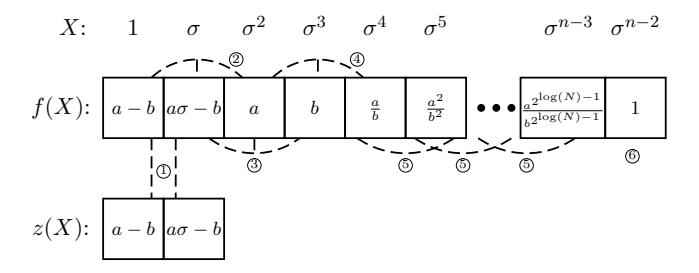
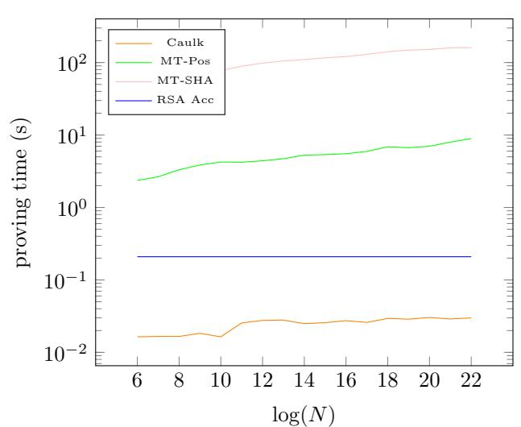
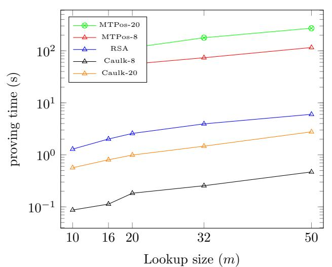

# Caulk: Lookup Arguments in Sublinear Time

Arantxa Zapico∗1 , Vitalik Buterin2 , Dmitry Khovratovich2 , Mary Maller2 , Anca Nitulescu3 , and Mark Simkin2

> 1 Universitat Pompeu Fabra† 2 Ethereum Foundation‡ 3 Protocol Labs§

#### Abstract

We present position-hiding linkability for vector commitment schemes: one can prove in zero knowledge that one or m values that comprise commitment cm all belong to the vector of size N committed to in C. Our construction Caulk can be used for membership proofs and lookup arguments and outperforms all existing alternatives in prover time by orders of magnitude.

For both single- and multi-membership proofs the Caulk protocol beats SNARKed Merkle proofs by the factor of 100 even if the latter is instantiated with Poseidon hash. Asymptotically our prover needs O(m2 + m log N) time to prove a batch of m openings, whereas proof size is O(1) and verifier time is O(log(log N)).

As a lookup argument, Caulk is the first scheme with prover time sublinear in the table size, assuming O(N log N) preprocessing time and O(N) storage. It can be used as a subprimitive in verifiable computation schemes in order to drastically decrease the lookup overhead.

Our scheme comes with a reference implementation and benchmarks.

## 1 Introduction

A vector commitment is a basic cryptographic scheme, which lies at the foundation of numerous constructions and protocols. In a nutshell, a vector commitment is a compact data structure that contains a potentially very large number of elements and allows proving that a specific element has been committed to it. A natural requirement is that a proof is succinct and unforgeable. A Merkle tree is a well-known example of a vector commitment.

For privacy-preserving applications it is vital to make proofs zero-knowledge, i.e. hiding the element that is asserted to be in the commitment, while still establishing a certain relationship, or link, to that element. A vector commitment to c = (c1, . . . , cN ) is linkable, if it permits proving that you know a secret si mathematically linked to ci . The simplest example is a proof of authorization where a party proves knowledge of a secret key belonging to one of multiple public keys in a set. A more elaborate example is a proof of coin ownership in private cryptocurrencies: coins are stored as hashes of a secret k and values v in a list or a tree and to spend v one proves knowledge of v and k without revealing them. A third example are lookup arguments in verifiable computation: prove that intermediate values a1, a2, . . . , am are all contained in a certain table, e.g., a table of all 16-bit numbers for the purpose of overflow checks in financial or mathematical computations. Other applications also include membership proofs, ring signatures, anonymous credentials and other schemes.

Currently, all of the above examples are being solved using heavy cryptography machinery involving significant computational overheads, which limits their scalability and adoption. The first version of

§anca@protocol.ai

∗This work was done while Arantxa Zapico was an intern at the Ethereum Foundation.

†arantxa.zapico@upf.edu

‡{v buterin, mary.maller, mark.simkin}@ethereum.org, khovratovich@gmail.com

the Zcash cryptocurrency [30] used a SHA-2-based Merkle tree to store the coins and the Groth16 [20] SNARK to prove coin ownership. The relatively high costs of Groth16 and the large prime-field circuits of SHA-2 made the resulting prover time of 40 seconds barely usable in practice. Even the most recent developments of algebraic hashes [1, 19] reduce *prover time* by an order of magnitude only. Another application of concern, lookup tables, so far has required the generic construction of Plookup [17], that makes the prover be at least as big as the table itself, no matter how many values they look up.

#### 1.1 Our Contributions

In this paper we present a novel construction, named Caulk, that allows to link a public set with a hidden subset in zero-knowledge and performs with unprecedented efficiency. We construct a proof of membership, with asymptotic complexity of  $O(\log N)$  for N-sized commitments, with a concrete efficiency improvement of a factor of 100x over SNARKs on top of a Merkle trees that uses the Poseidon hash function. The prover benefits of our construction are even more extreme when compared with Merkle trees that use SHA-2. Our construction achieves statistical zero-knowledge and soundness in the algebraic group model, requires a universal setup, and O(N) storage.

Our construction naturally extends to proof of subset memberships, thus leading the way to more efficient lookup arguments. We are the first to remove the bottleneck of big tables by achieving a  $O(m \log N + m^2)$  prover cost for m-subvector lookups. The verifier is succinct as it requires only  $O(\log(\log N))$  scalar operations as well as constant number of pairings to verify a constant-size proof. We envision the widespread deployment of our construction both in generic lookup-equipped proof systems [17, 27] and specific applications with membership proofs.

We have implemented Caulk1 in Rust, and we use that implementation for concrete comparison with other solutions as well.

#### 1.2 Paper Structure

We start with a technical overview of Caulk in Section 2 and related work is discussed in Section 3. In Section 4 we provide a self-contained description of the tools we use, in particular the polynomial commitment scheme by Kate, Zaverucha and Goldberg [22] (KZG) and associated precomputation techniques, which can be skipped by a knowledgeable reader.

In Section 5 we identify our constructions as special cases of a more general family of protocols that add a property that we call *position-hiding linkability* to vector commitment schemes. This primitive asserts that all (hidden) entries committed in an element cm are also (publicly) committed to in C. Position-hiding refers to the fact that no information about which elements were taken to construct cm should be leaked. We formalize its definition as well as the security notions it should satisfy.

In Section 6 we formally describe Caulk for the case of proving membership of a single element (m=1) and show that it is sound in the algebraic group model and statistically zero-knowledge. As an important building block we also present a construction of a proof system that demonstrates that a Pedersen commitment contains a root of unity. In Section 7 we extend Caulk even further to m-subset (m>1) proofs, with some values possibly repeating. In this scenario Caulk can be seen as a lookup table, and is thus a prover efficient alternative to schemes such as Plookup [17]. We discuss various optimizations in Section 8.

Caulk comes with an open source reference implementation in Rust using arkworks library. In Section 9 we compare its efficiency with some rival schemes.

### 2 Caulk in a nutshell

In the following we explain the high-level ideas behind our constructions for the case of proving membership of a single element (m=1) and the case of proving membership of multiple elements (m>1). The starting point of both is the KZG polynomial commitment scheme, which we describe in Section 4.2, that allows for committing to a polynomial C(X) and then later on opening evaluations  $C(\alpha)$  for some publicly known  $\alpha$ . We note that a vector  $\vec{c}$  can be encoded as a polynomial  $C(X) = \sum_{i=1}^{N} c_i \lambda_i(X)$ , where  $\{\lambda_i(X)\}_{i=1}^N$  are the Lagrange interpolation polynomials corresponding to some set of roots of unity

1https://github.com/caulk-crypto/caulk

 $\mathbb{H} = \{1, \omega, \dots, \omega^{N-1}\}$  with  $\omega^N = 1$ . That is,  $\lambda_i(\omega^{i-1}) = 1$  and  $\lambda_i(\omega^j) = 0$  for all  $j \neq i-1$ . Opening position i in the vector is done by simply revealing the corresponding evaluation of the polynomial at element  $\omega^{i-1}$ .

A KZG commitment to C(X) is an element  $C = \sum_{i=1}^{N} c_i [\lambda_i(x)]_1$  where x is secret and  $[.]_1$  denotes it is given in the source group  $\mathbb{G}_1$  of some (asymmetric) bilinear group. A proof of opening for value v at position i is an element  $[Q_i]_1$  such that

$$e(C - [v]_1, [1]_2) = e([Q_i]_1, [x - \omega^{i-1}]_2).$$

A proof of opening for a subset of positions  $I \subset [N]$  is an element  $[H_I]_1$ , such that if  $C_I(X) = \sum_{i \in I} c_i \tau_i(X)$  and  $z_I(X) = \prod_{i \in I} (X - \omega^{i-1})$ , where  $\{\tau_i(X)\}_{i \in I}$  are the Lagrange interpolation polynomials of  $\mathbb{H}_I = \{\omega^{i-1}\}_{i \in I}$ , then

$$e(C - [C_I(x)]_1, [1]_2) = e([H_I]_1, [z_I(x)]_2).$$

Our prover time is almost unaffected by the computation of the non-hiding KZG proofs  $[Q_i]_1$  and  $[H_I]_1$ . Indeed, the former can be pre-computed along with all proofs for individual positions using  $N \log N$  group operations, and the latter can be obtained from the pre-computed proofs for all  $i \in I$ , in time dependent on |I|, as shown in [28, 13] and discussed in Section 4.3. As a result, note that our prover does require linear storage.

In our case, we would like to show that a secret committed value (or a set of committed values) is at a secret position of our committed vector. On a very high level, the idea behind Caulk is to re-randomize the values provided as part of a KZG opening by appropriate blinders, such that no information about which element is at which position is revealed. The main technical challenge lies in efficiently proving that the blinded KZG opening is still well-formed. We outline the technical ideas between the single and multiple element cases separately.

**Single Element.** Instead of directly revealing value v, the prover now demonstrates knowledge of v and r behind a Pedersen commitment  $\mathsf{cm} = [v + \mathsf{h} r]_1$ , for unknown  $\mathsf{h}$  given as  $[\mathsf{h}]_1$  in the setup. Next, the prover would like to convince the verifier that v is stored somewhere in the vector. For this, the prover publishes  $[z(x)]_2 = [a(x - \omega^{i-1})]_2$  and shows that it is a blind commitment to polynomial  $X - \omega^{i-1}$ , which implies proving that it is a polynomial of degree 1 and that  $\omega^{i-1}$  is an Nth root of unity i.e. that  $(\omega^{i-1})^N = 1$ .

To prove well-formation of z(X), the prover additionally commits to an auxiliary polynomial f(X) of degree  $n = \log(N) + 6$ , which effectively encodes a set of constraints on z(X). Crucially important for efficiency, we define f(X) over a small subgroup of roots of unity  $\mathbb{V}_n = \{1, \ldots, \sigma^{n-1}\}$  with  $\sigma^n = 1$ . Concretely, the first 5 coefficients of f(X) are used to, by comparing it to z(X), extract  $\omega^{i-1}$ , the next  $\log(N)$  coefficients are used to obtain the 2-powers of  $(\omega^{i-1})^{-1}$  up to  $2^{\log(N)} = N$ , and the last one to prove that  $((\omega^{i-1})^{-1})^{2^{\log(N)}} = ((\omega^{i-1})^{-1})^N = (\omega^{i-1})^N = 1$ .

**Multiple Elements.** For the case of multiple elements, the prover would like to convince the verifier that all elements in vector  $\vec{a} = (a_1, \ldots, a_m)$  that are committed to in a KZG commitment cm, are also somewhere in the vector  $\vec{c}$  committed as C. We first encode  $\vec{a}$  as a polynomial  $\phi(X) = \sum_{j=1}^m a_j \mu_j(X)$ , where  $\{\mu_j(X)\}_{j=1}^m$  are Lagrange interpolation polynomials over a subgroup of roots of unity  $\mathbb{V}_m = \{1, \nu, \ldots, \nu^{m-1}\}$  with  $\nu^m = 1$ , and set cm =  $[\phi(x)]_1$ .

To prove linkability between  $\vec{c}$  and  $\vec{a}$ , the prover first sets  $\vec{c}_I$  to be the subvector of  $\vec{c}$  that contains all the elements  $c_i$  such that  $c_i = a_j$  for some  $a_j$ , without repetitions, and comptues  $C_I(X)$  using the Lagrange polynomials  $\{\tau_i(X)\}_{i\in I}$  that correspond to  $\mathbb{H}_I = \{\omega^{i-1}\}_{i\in I}$ . Using KZG proofs of openings for blinded commitments to  $C_I(X)$  and  $z_I(X)$ , the prover sends  $[H_I(x)]_1$  where  $H_I(X)$  is a blinded version of the polynomial  $H'_I(X)$  such that

$$C(X) - C_I(X) = z_I(X)H'_I(X).$$

Then, it remains to prove that  $z_I(X)$  has the right form and  $[C_I(x)]_1$  is a commitment to the same values as  $\mathsf{cm} = \sum_j^m a_j \mu_j(X)$ , just in a different basis, namely  $\{\tau_i(X)\}$  vs  $\{\mu_j(X)\}$ . For the first statement we again introduce an auxiliary polynomial  $u(X) = \sum_{j=1}^m \omega^{i_j-1} \mu_j(X)$  that includes all the  $\omega^{i-1}$  with  $i \in I$ , but with the corresponding repetitions. We prove that u(X)'s coefficients are Nth roots of unity by providing a proof that  $u_j(X) = u_{j-1}(X)u_{j-1}(X)$  for  $j = 1, \ldots, m$ , when evaluated at elements in  $\mathbb{V}_m$ ,

and showing that  $u_0(X) = u(X)$  and  $u_n(X) = 1$ . Then it remains to prove that  $z_I(X)$  vanishes at every coefficient of u(X) i.e.  $z_I(u(X))$  vanishes at all elements of  $\mathbb{V}_m$ . This is done by providing  $H_2(X)$  such that  $z_I(u(X)) = z_H(X)H_2(X)$ . Note that the argument holds also when u(X) has repeating coefficients.

that  $z_I(u(X)) = z_H(X)H_2(X)$ . Note that the argument holds also when u(X) has repeating coefficients. For the first statement, we introduce an auxiliary polynomial  $u(X) = \sum_{j=1}^m \omega^{i_j-1} \mu_j(X)$  that includes all the  $\omega^{i-1}$  with  $i \in I$  but with the corresponding repetitions. We also define polynomials  $\{u_j(X)\}_{j=0}^n$  and show that u(X)'s coefficients are Nth roots of unity by providing a proof that  $u_j(X) = u_{j-1}(X)u_{j-1}(X)$  for  $j = 1, \ldots, m$ , when evaluated at elements in  $\mathbb{V}_m$ , and that  $u_0(X) = u(X)$  and  $u_n(X) = 1$ . Then it remains to prove that  $z_I(X)$  vanishes at every coefficient of u(X) i.e.  $z_I(u(X))$  vanishes at all elements of  $\mathbb{V}_m$ . This is done by providing  $H_2(X)$  such that  $z_I(u(X)) = z_H(X)H_2(X)$ . Note that the argument holds also when u(X) has repeating coefficients.

(ii) is proven by asserting the polynomial equation

$$C_I(u(X)) - \phi(X) = z_H(X)H_3(X)$$

holds for some  $H_3(X)$ , thus linking an input  $\phi(X)$  in the known basis  $\{\mu_j(X)\}_{j=1}^m$  to  $C_I(X)$  in the unknown basis  $\{\tau_i(X)\}_{i\in I}$ .

## 3 Related Work

Merkle-SNARK. Zcash protocol [30] proposed a SNARK over a circuit describing a Merkle tree opening for the anonymous proof of coin ownership. It remains a very popular approach for various set membership proof protocols [29, 31]. The prover costs are logarithmic in the number of tree leafs, but the concrete efficiency varies depending on the hash function that comprises the tree [1, 19]. Regular hash functions such as SHA-2 are known to be very slow, whereas algebraic alternatives are rather novel and some applications are reluctant to use them.

Pairing Based. Camenisch et al.[9] describe a vector commitment that only requires constant prover and verifier costs. However the commitments themselves are computed by a trusted third party and have linear size because the prover requires access to  $\left[\frac{1}{x-c_i}\right]_1$  for all  $c_i$  in the vector and x secret. Benarroch et al. introduced in [5] what we define as position-hiding linkability for a commitment C corresponding to the PST vector commitment scheme [26] and a commitment cm to one element using Pedersen's scheme. Similar to ours, their construction consists on opening a public polynomial encoding a vector at some hiding position s (instead of at element  $\omega^{i-1}$ ) and prove that the output is the element committed in cm, along with well formation of the input (by showing that s < N). Still, their construction has a proof of size logarithmic in N and asks the verifier to perform  $O(\log N)$  group operations and  $\log(N)$  pairings.

Discrete-Log Based. In the discrete-logarithm setting a series of works have looked into achieving logarithmic sized zero-knowledge membership proof [3, 21, 7, 8]. These have the advantage that there is no trusted setup or pairings. The prover and verifier costs are asymptotically dominated by a linear number of field operations. For modest sized vectors this can be practical because the number of more computationally intensive group operations is logarithmic.

RSA Accumulators. Camenisch and Lysyanskaya [10] design a proof of knowledge protocol for linking a commitment over a prime ordered group to an RSA accumulator. There are no a-priori bounds on the size of the vector and nicely, RSA based schemes have constant size public parameters. This approach is used by Zerocoin [25] which is a privacy preserving payments system (the predecessor to Zerocash [4]). Benarroch et al. [5] improve on this result by allowing the use of prime ordered groups of "standard" size, e.g., 256 bits, whereas [10] needs a much larger group. As opposite to Merkle tree constructions, [5] has prover time constant on the size of the table, and gets up to almost four times faster for elements of arbitrary size and between 4.5 and 23.5 for elements that are large prime numbers; as drawback, proof size goes from 4 to 5 KB. Later, Campanelli et al. [11] present also an scheme for position-hiding linkability of RSA accumulators for large prime numbers and Pedersen commitments. Their proving times does not depend on the size of the accumulator and outperforms Merkle tree approaches by orders of magnitude; however they require either a trusted RSA modulus or class groups.

## 4 Preliminaries

A bilinear group gk is a tuple  $gk = (q, \mathbb{G}_1, \mathbb{G}_2, \mathbb{G}_T, e, [1]_1, [1]_2)$  where  $\mathbb{G}_1, \mathbb{G}_2$  and  $\mathbb{G}_T$  are groups of prime order q, the elements  $[1]_1, [1]_2$  are generators of  $\mathbb{G}_1, \mathbb{G}_2$  respectively. We also consider  $[h]_1$  another

| Scheme                                                                                             | Trusted Params                                              | srs                | Proof size                                                                                  | Prover work                                      | Verifier work                                 |
|----------------------------------------------------------------------------------------------------|-------------------------------------------------------------|--------------------|---------------------------------------------------------------------------------------------|--------------------------------------------------|-----------------------------------------------|
| $ \begin{aligned} \text{Merkle trees} &+ \text{zkSNARKs} \\ \text{RSA accumulators} \end{aligned}$ | $\begin{array}{c} {\rm Updatable} \\ {\rm Yes} \end{array}$ | $m\log(N) \\ O(1)$ | $13\mathbb{G}_1, 8\mathbb{F}$ $2 \mathcal{G}$                                               | $\tilde{O}(m\log(N)) \ O(\log(m))$               | $ \begin{array}{c} 2P \\ m \exp \end{array} $ |
| Caulk single opening (Sec. 6) Caulk lookup (Sec. 7)                                                | Updatable Updatable                                      | O(N) $O(N)$        | $6\mathbb{G}_1, 2\mathbb{G}_2, 4\mathbb{F}$ $14\mathbb{G}_1, 1\mathbb{G}_2, 4\mathbb{F}$ | $\tilde{O}(\log(N))$ $\tilde{O}(m^2 + m\log(N))$ | 4P 4P                                      |

Table 1: Cost comparison of our scheme with alternative proofs for membership and lookups. N is the size of the table and m the size of the set to be opened. We consider that Merkle trees + zk-SNARKs are implemented using Marlin [12] and note that these numbers are different with other SNARKs. Note that the asymptotic prover work for the Merkle trees + zkSNARKs hides the large constants involved in arithmetising hash functions. The RSA accumulator asymptotics hides large constants: for example  $\mathcal{G}$  denotes a hidden order group that has larger size than  $\mathbb{G}_1$ ,  $\mathbb{G}_2$ .

generator of  $\mathbb{G}_1$ , where h is unknown and h[1]1 = [h]1.  $e: \mathbb{G}_1 \times \mathbb{G}_2 \to \mathbb{G}_T$  is an efficiently computable, non-degenerate bilinear map, and there is no efficiently computable isomorphism between  $\mathbb{G}_1$  and  $\mathbb{G}_2$ . Elements in  $\mathbb{G}_{\gamma}$ , are denoted implicitly as  $[a]_{\gamma} = a[1]_{\gamma}$ , where  $\gamma \in \{1, 2, T\}$  and  $[1]_T = e([1]_1, [1]_2)$ . With this notation,  $e([a]_1, [b]_2) = [ab]_T$ .

Let  $\lambda \in \mathbb{N}$  denote the security parameter and  $1^{\lambda}$  its unary representation. A function  $\operatorname{negl}: \mathbb{N} \to \mathbb{R}$  is called  $\operatorname{negligible}$  if for all c > 0, there exists  $k_0$  such that  $\operatorname{negl}(k) < \frac{1}{k^c}$  for all  $k > k_0$ . For a non-empty set S, let  $x \leftarrow S$  denote sampling an element of S uniformly at random and assigning it to x.

Let PPT denote probabilistic polynomial-time. Algorithms are randomized unless explicitly noted otherwise. Let  $y \leftarrow A(x;r)$  denote running algorithm A on input x and randomness r and assigning its output to y. Let  $y \leftarrow A(x)$  denote  $y \leftarrow A(x;r)$  for a uniformly random r.

**Lagrange Polynomials and Roots of Unity.** We use  $\omega$  to denote a root of unity such that  $\omega^N = 1$ , and define  $\mathbb{H} = \{1, \omega, \dots, \omega^{N-1}\}$ . Also, we let  $\lambda_i(X)$  denote the  $i^{\text{th}}$  lagrange polynomial, i.e.,  $\lambda_i(X) = \prod_{s \neq i-1} \frac{X - \omega^s}{\omega^{i-1} - \omega^s}$  and  $z_H(X) = \prod_{i=0}^{N-1} (X - \omega^i) = X^N - 1$  the vanishing polynomial of  $\mathbb{H}$ . We will additionally consider smaller groups of roots of unity in Sections 6, 7 and 7.2, that will be introduced accordingly.

#### 4.1 Cryptographic Assumptions

The security of our protocols holds in the Algebraic Group Model (AGM) of Fuchsbauer et al. [15], using the bilinear version of the dlog, qDHE, qSFrac, and qSDH assumptions [18, 6]. In the AGM adversaries are restricted to be algebraic algorithms, namely, whenever  $\mathcal{A}$  outputs a group element [y] in a cyclic group  $\mathbb{G}$  of order p, it also outputs its representation as a linear combination of all previously received group elements. In other words, if  $[y] \leftarrow \mathcal{A}([x_1], \ldots, [x_m])$ ,  $\mathcal{A}$  must also provide  $\vec{z}$  such that  $[y] = \sum_{j=1}^m z_j[x_j]$ . This definition generalizes naturally in asymmetric bilinear groups with a pairing  $e: \mathbb{G}_1 \times \mathbb{G}_2 \to \mathbb{G}_T$ , where the adversary must construct new elements as a linear combination of of elements in the same group.

#### 4.2 The KZG Polynomial Commitment Scheme

Our constructions heavily rely on the KZG polynomial commitment scheme (Def. A.3) that we describe below, as well as its adaptation for vector commitments that we explain in the next section. For efficiency, we slightly modify the polynomial commitment in order to add degree checks to the original protocol, without incurring in extra proof elements or pairings. The polynomial commitment introduced by Kate, Zaverucha and Goldberg in [22] is a tuple of algorithms (KZG.Setup, KZG.Commit, KZG.Open, KZG.Verify) such that:

- $\operatorname{srs}_{\mathsf{KZG}} \leftarrow \mathsf{KZG}.\mathsf{Setup}(\mathsf{par}_{\mathsf{KZG}},d)$ : On input the system parameters and a degree bound d, it outputs a structured reference string  $\operatorname{srs}_{\mathsf{KZG}} = (\{[x^i]_{1,2}\}_{i=1}^d)$ .
- $C \leftarrow \mathsf{KZG}.\mathsf{Commit}(\mathsf{srs}_{\mathsf{KZG}}, p(X))$ : It outputs  $C = [p(x)]_1$ .

•  $(s, \pi_{\mathsf{KZG}}) \leftarrow \mathsf{KZG}.\mathsf{Open}(\mathsf{srs}_{\mathsf{KZG}}, p(X), \alpha)$ : Let deg < d be the degree of p(X). Prover computes

$$q(X) = \frac{p(X) - p(\alpha)}{X - \alpha} ,$$

sets  $s = p(\alpha), [Q]_1 = [q(x)x^{d-\deg + 2}]_1$ , and outputs  $(s, \pi_{\mathsf{KZG}} = [Q]_1)$ .

•  $1/0 \leftarrow \mathsf{KZG}.\mathsf{Verify}(\mathsf{srs}_{\mathsf{KZG}},\mathsf{C},\deg,\alpha,s,\pi_{\mathsf{KZG}})$ : Verifier accepts if and only if

$$e(\mathsf{C} - s, [x^{d-\deg + 2}]_2) = e([Q]_1, [x - \alpha]_2).$$

Security. It has been proven in [22, 12, 16] that the original KZG protocol, i.e., where  $[Q]_1 = [q(x)]_1$  and the pairing equation is  $e(C - s, [1]_2) = e([Q]_1, [x - \alpha]_2)$ , is a polynomial commitment scheme that satisfies completeness, evaluation blinding and extractability as in Def. A.3 in the AGM, under the dlog assumption. What is more, Marlin presents an alternative version of KZG with degree checks that does not require additional powers in  $\mathbb{G}_2$ . For our construction, we claim that adding  $x^{d-\deg+2}$  to the pairing and element  $[Q]_1$  does not affect completeness or extractability. We also argue that under the AGM, no PPT adversary  $\mathcal{A}$  can break soundness by providing a commitment to a polynomial p(X) such that  $\deg(p) > \deg$ . Indeed, if that is the case,  $\deg(Q) = d + 1$  for Q(X) the algebraic representation of  $[Q]_1$ , which will imply an attack to the d-DHE assumption, as the srs only contains powers  $[x^i]_1$  up to d.

#### 4.3 KZG as Vector Commitment Scheme

There is a natural isomorphism between vectors of size m and polynomials of degree m-1; where we can represent  $\vec{c} = (c_1, \ldots, c_m) \in \mathbb{F}^m$  as  $C(X) = \sum_{j=1}^m c_j B_j(X)$ , where  $\mathcal{B} = \{B_j(X)\}_{j=1}^m$  is a basis of the space of polynomials of degree up to m-1, and vice versa. This fact implies as well a natural relation between polynomial and vector commitments (Def. A.2), where in particular, the former implies the latter. What is more, when the basis  $\mathcal{B}$  chosen to encode the vector consists of Lagrange polynomials we have vector commitments with easy individual position openings: evaluating V(X) in the i-1th interpolation point returns  $c_i$ .

In this work we will use the protocol by Kate et al. for both cases, polynomial and vector commitments. For the latter, we will not only consider individual openings but also subset openings. In particular, let  $\mathbb{H} = \{1, \omega, \dots, \omega^{N-1}\}$  be a set of roots of unity and  $\{\lambda_i(X)\}_{i=1}^N$  its corresponding Lagrange interpolation set, with vanishing polynomial  $z_H(X)$ . That is,  $\lambda_i(\omega^{i-1}) = 1$  and  $\lambda_i(\omega^j) = 0$  for all  $j \neq i-1$ . We have that for some polynomial H(X),

$$C(X) - s = (X - \omega^{i-1})H(X)$$
 if and only if  $C(\omega^{i-1}) = c_i = s$ .

For a polynomial  $C_I(X) = \sum_{i \in I} s_i \tau_i(X)$  where  $s_i$  are claimed values for  $v_i$  and  $\{\tau_i(X)\}_{i \in I}$  the Lagrange interpolation polynomials of the set  $\{\omega^{i-1}\}_{i \in I}$ ,

$$C(X) - C_I(X) = \prod_{i \in I} (X - \omega^{i-1}) H(X) \text{ iff } V(\omega^{i-1}) = c_i = s_i \text{ for all } i \in I.$$

#### 4.4 Subset openings

For a vector  $\vec{c} \in \mathbb{F}^m$  and a subset  $I \subset [m]$ , the subvector opening scheme of Tomescu et. al [28] that works for the VC inspired by KZG presented above, consists on algorithms Open and Verify such that:

• Open(srsKZG,  $I, \vec{c}_I$ ): Compute  $C_I(X) = \sum_{i \in I} c_i \tau_i(X)$ , where  $\{\tau_i(X)\}$  are the Lagrange interpolation polynomials of the set  $\{\omega^{i-1}\}_{i \in I}$ , and find H(X) such that for  $z_I(X) = \prod_{i \in I} (X - \omega^{i-1})$ ,

$$C(X) - C_I(X) = z_I(X)H(X).$$

Output  $\pi_I = [H]_1 = [H(x)]_1$ .

• Verify(srsKZG, C, I,  $\vec{c}_I$ ,  $\pi_I$ ): Compute  $[z_I]_2 = [z_I(x)]_2$ ,  $C_I(X) = \sum_{i \in I} c_i \tau_i(X)$ , and  $C_I = [C_I(x)]_1$  and output 1 if and only if

$$e(C - C_I, [1]_2) = e([H]_1, [z_I]_2).$$

Open as aggregation of individual proofs We will additionally use a result by Tomescu et al. [28] that allows the prover to compute  $[H]_1$  in time  $\mathcal{O}(m\log^2(m))$  given it already has stored proofs  $\{[H_i]_1\}_{i\in I}$  that  $C(\omega^{i-1})=c_i$ . Indeed the prover sets

$$[H]_1 = \sum_{i \in I} \left( \prod_{k=1, k \neq i}^m \frac{1}{(\omega^{i-1} - \omega^{k-1})} \right) [H_i]_1$$

**Remark 1.** We remark that precomputing all the proofs  $[H_1]_1, \ldots, [H_N]_1$  that  $C(\omega^{i-1}) = c_i$  can be achieved in time  $\mathcal{O}(N \log N)$  using techniques by Feist and Khovratovich [13]. The overview of this technique by Tomescu et al. ([28], Section 3.4.4, "Computing All  $u_i$ 's Fast") is explained well.

#### 4.5 Multiple Openings

A KZG proof of opening can naturally be extended to open one polynomial in many points. Indeed, let p(X) be a polynomial,  $\vec{\alpha} \in \mathbb{F}^m$  a vector of opening points and  $\vec{s}$  such that  $s_i = p(\alpha_i)$  for all  $i = 1, \ldots, m$ . Define  $C_{\vec{\alpha}}(X)$  as the unique polynomial of degree m-1 such that  $C_{\vec{\alpha}}(\alpha_i) = s_i$  for all  $i \in [m]$ . We have that  $p(\alpha_i) = s_i$  for all  $i = 1, \ldots, m$  if and only if there exists q(X) such that

$$p(X) - C_{\vec{\alpha}}(X) = \prod_{i=1}^{m} (X - \alpha_i)Q(X)$$

We can thus redefine the KZG prover and verifier the following way:

•  $(s, \pi_{\mathsf{KZG}}) \leftarrow \mathsf{KZG.Open}(\mathsf{srs}_{\mathsf{KZG}}, p(X), \vec{\alpha})$ : Prover computes  $\{\tau_i(X)\}_{i=1}^m$  the interpolation Lagrange polynomials for the set  $\{\alpha_i\}_{i=1}^m$ ,  $z_{\alpha}(X) = \prod_{i=1}^m (X - \alpha_i)$  and define  $C_{\vec{\alpha}}(X) = \sum_{i=1}^m p(\alpha_i)\tau_i(X)$ . Then, it computes

$$Q(X) = \frac{p(X) - C_{\vec{\alpha}}(X)}{z_{\alpha}(X)} ,$$

sets  $s_i = p(\alpha_i), [Q]_1 = [Q(x)]_1$ , and outputs  $(\vec{s}, \pi_{\mathsf{KZG}} = [Q]_1)$ .

•  $1/0 \leftarrow \mathsf{KZG.Verify}(\mathsf{srs}_{\mathsf{KZG}},\mathsf{C},\vec{\alpha},\vec{s},\pi_{\mathsf{KZG}})$ : The verifier computes  $\{\tau_i(X)\}_{i=1}^m,\ \mathsf{C}_{\vec{\alpha}} = [C_{\vec{\alpha}}(x)]_1,\ [z_{\alpha}(x)]_2$  and verifies

$$p(X) - C_{\vec{\alpha}}(X) = Q(X)z_{\alpha}(X)$$

by making the pairing check

$$e(\mathsf{C} - \mathsf{C}_{\vec{\alpha}}, [1]_2) = e([Q]_1, [z_{\alpha}(x)]_2),$$

and outputs 1 if and only if the equation is satisfied and  $deg(p) \leq d$ .

#### 4.6 KZG for Bivariate Polynomials

For the protocol in Section 7.2 we will use bivariate polynomials, or polynomials of higher degree. What this mean is that, if we have a bivariate polynomial P(X,Y) with degree up to  $d_1 - 1$  in X and  $d_2 - 1$  in Y then we require a universal setup with  $d_1d_2$  powers. We work with a version of KZG that uses a univariate setup because these are already available for multiple different curves (i.e. we do *not* need a specialist setup just for our protocol and can work with prior KZG setups).

We observe that, by using the KZG open algorithm, we can commit to P(X,Y) as  $[P(x^{d_2},x)]_1$ . We must open P(X,Y) in two steps. First we partially open P(X,Y) at some point  $X=\alpha$  to a commitment  $[P(\alpha,x)]_1$ . The partial proof is given by a commitment  $[w_{\alpha}(x^{d_2},x)]$  to a partial witness

$$w_{\alpha}(X,Y) = \frac{P(X,Y) - P(\alpha,Y)}{X - \alpha}$$

We then fully evaluate  $P(\alpha, Y)$  at  $Y = \beta$  via a standard KZG proof with a degree bound of  $d_2 - 1$  on  $[P(\alpha, x)]_1$ .

#### 4.7 Proof of Opening of a Pedersen Commitment

Pedersen commitment schemes are a particular case of vector commitments. We will consider them for committing to single values in a zero knowledge way. Thus, the srs will additionally output  $[h]_1$  for some secret h and the commitment to some element s is computed as  $v[1]_1 + r[h]_1 = [v + hr]$ , for some randomly sampled  $h \in \mathbb{F}$ . We suggest a standard Fiat-Shamired Sigma protocol [24] to demonstrate knowledge of v, r such that  $\mathsf{cm} = [v + hr]_1$  for some v, r:

$$R_{\text{ped}} = \{ (\text{cm}; (v, r)) : \text{cm} = [v + hr]_1 \}$$

The proof consists of  $R = [s_1 + \mathsf{h} s_2]_1$ ,  $t_1 = s_1 + vc$  and  $t_2 = s_2 + rc$ , where  $c = \mathsf{H}(\mathsf{cm}, R)$  and  $s_1, s_2$  are elements chosen by the verifier. At the end, the verifier checks that  $R + c \cdot \mathsf{cm} = [t_1 + \mathsf{h} t_2]_1$ .

## 5 Position-Hiding Linkable Vector Commitments

We introduce the concept of position-hiding linkable vector commitment schemes. Informally, two vector commitment schemes  $VC_1$  and  $VC_2$  are position-hiding linkable if a prover is able to convince a verifier that for a given commitments C corresponding to  $VC_1$  and C corresponding to C, it is true that all the elements in the vector committed in C.

Basically, position-hiding linkability allows the prover to extract or isolate in zero-knowledge elements from some public set or table, and later prove further attributes on them. This new primitive should satisfy three security notions: completeness, as usual; linkability, that captures the fact that if the proof verifies then there is no element committed in cm that is not also committed in C; and position-hiding, which holds only if no information about the set of elements in C that have been used to construct cm is leaked.

**Definition 5.1** (Position-Hiding Linkability for Vector Commitments). Two vector commitment schemes  $VC_1$  and  $VC_2$  are position-hiding linkable if there exist algorithms (Setuplink, Provelink, Verifylink, Simulatelink) that behave as follows,

- Setuplink( $1^{\lambda}$ ,  $d_1$ ,  $d_2$ ): takes as input the security parameter, bounds on the length of vectors in VC1 and VC2, and outputs common parameters srs that include  $srs_1 = VC_1.srs$  and  $srs_2 = VC_2.srs$  as well as trapdoor x, including the corresponding trapdoors  $x_1$  and  $x_2$ .
- Provelink(srs,  $r, r', \vec{v}, \vec{a}$ ): on input the srs, commitment randomness r to vector  $\vec{v} \in \mathbb{F}^N$  and commitment randomness r' to  $\vec{a} \in \mathbb{F}^m$ , outputs a proof  $\pi$  that there exists some  $I \subset [N]$  such that for all  $j = 1, \ldots, m$ ,  $a_j = v_i$  for some  $i \in I$ .
- Verifylink(srs, C, cm,  $\pi$ ): On input the srs, commitments C and cm, and proof  $\pi$ , accepts or rejects.
- Simulatelink(x, C, cm): On input the trapdoors x and commitments C and cm, outputs a simulated proof  $\pi_{sim}$ ,

and satisfy the following properties:

**Completeness:** For all N, m with  $N \leq d_1, m \leq d_2$ , all  $\vec{v} \in \mathbb{F}^N$ , and all  $\vec{a} \in \mathbb{F}^m$  such that for all j = 1, ..., m,  $a_j = v_i$  for some  $i \in I$ , it holds that:

$$\Pr\left[ \begin{aligned} \text{Verify}_{\mathsf{link}}(\mathsf{srs},\mathsf{C},\mathsf{cm},\pi) &= 1 \begin{vmatrix} (\mathsf{srs},x) \leftarrow \mathsf{Setup}_{\mathsf{link}}(1^{\lambda},d_1,d_2); \\ \mathsf{C} \leftarrow \mathsf{VC}_1.\mathsf{Commit}(\mathsf{srs}_1,\vec{v},r); \\ \mathsf{cm} \leftarrow \mathsf{VC}_2.\mathsf{Commit}(\mathsf{srs}_2,\vec{a},r'); \\ \pi \leftarrow \mathsf{Prove}_{\mathsf{link}}(\mathsf{srs},r,r',\vec{v},\vec{a}) \end{vmatrix} = 1. \end{aligned} \right.$$

**Linkability** For all N, m with  $N \leq d_1, m \leq d_2$ , and all PPT adversaries, there exists an extractor  $\mathcal{X}_{\mathcal{A}}$  such that:

$$\Pr \begin{bmatrix} \mathsf{Verify_{link}}(\mathsf{srs},\mathsf{C},\mathsf{cm},\pi) = 1 & \land \\ |\vec{v}| = N & \land \\ (\exists \ j \in [m] \ s.t. \ a_j \neq c_i \ \forall i \in [N] \ \lor \\ \mathsf{VC_2.Commit}(\mathsf{srs_2},\vec{a},r') \neq \mathsf{cm} ) \end{bmatrix} \begin{pmatrix} (\mathsf{srs},x) \leftarrow \mathsf{Setup_{link}}(1^\lambda,d_1,d_2); \\ \vec{v} \leftarrow \mathcal{A}(\mathsf{srs}); \\ \mathsf{C} \leftarrow \mathsf{VC_1.Commit}(\mathsf{srs_1},\vec{v}); \\ (\pi,\mathsf{cm}) \leftarrow \mathcal{A}(\mathsf{srs},\mathsf{C}); \\ (\vec{a},r') \leftarrow \mathcal{X}_{\mathcal{A}}(\mathsf{cm},\pi) \end{bmatrix} = \mathsf{negl}(\lambda).$$

**Position-Hiding** For all N, m with  $N \leq d_1, m \leq d_2$ , for all  $\vec{v}$  and  $\vec{a}$ , all PPT adversaries A, there exists a PPT algorithm Simulatelink such that:

$$\begin{bmatrix} \mathcal{A}(\mathsf{srs},\mathsf{C},\mathsf{cm},\pi) = 1 \\ \mathcal{A}(\mathsf{srs},\mathsf{C},\mathsf{cm},\pi) = 1 \\ \mathcal{A}(\mathsf{srs},\mathsf{C},\mathsf{cm},\pi) = 1 \\ \mathcal{A}(\mathsf{srs},\mathsf{C},\mathsf{cm},\pi) = 1 \\ \mathcal{A}(\mathsf{srs},\mathsf{C},\mathsf{cm},\pi) = 1 \\ \mathcal{A}(\mathsf{srs},\mathsf{C},\mathsf{cm},\pi) = 1 \\ \mathcal{A}(\mathsf{srs},\mathsf{C},\mathsf{cm},\pi) = 1 \\ \mathcal{A}(\mathsf{srs},\mathsf{C},\mathsf{cm},\pi) = 1 \\ \mathcal{A}(\mathsf{srs},\mathsf{C},\mathsf{cm},\pi) = 1 \\ \mathcal{A}(\mathsf{srs},\mathsf{C},\mathsf{cm},\pi) = 1 \\ \mathcal{A}(\mathsf{srs},\mathsf{C},\mathsf{cm},\pi) = 1 \\ \mathcal{A}(\mathsf{srs},\mathsf{C},\mathsf{cm},\pi) = 1 \\ \mathcal{A}(\mathsf{srs},\mathsf{C},\mathsf{cm},\pi) = 1 \\ \mathcal{A}(\mathsf{srs},\mathsf{C},\mathsf{cm},\pi) = 1 \\ \mathcal{A}(\mathsf{srs},\mathsf{C},\mathsf{cm},\pi) = 1 \\ \mathcal{A}(\mathsf{srs},\mathsf{C},\mathsf{cm},\pi) = 1 \\ \mathcal{A}(\mathsf{srs},\mathsf{C},\mathsf{cm},\pi) = 1 \\ \mathcal{A}(\mathsf{srs},\mathsf{C},\mathsf{cm},\pi) = 1 \\ \mathcal{A}(\mathsf{srs},\mathsf{C},\mathsf{cm},\pi) = 1 \\ \mathcal{A}(\mathsf{srs},\mathsf{C},\mathsf{cm},\pi) = 1 \\ \mathcal{A}(\mathsf{srs},\mathsf{C},\mathsf{cm},\pi) = 1 \\ \mathcal{A}(\mathsf{srs},\mathsf{C},\mathsf{cm},\pi) = 1 \\ \mathcal{A}(\mathsf{srs},\mathsf{C},\mathsf{cm},\pi) = 1 \\ \mathcal{A}(\mathsf{srs},\mathsf{C},\mathsf{cm},\pi) = 1 \\ \mathcal{A}(\mathsf{srs},\mathsf{C},\mathsf{cm},\pi) = 1 \\ \mathcal{A}(\mathsf{srs},\mathsf{C},\mathsf{cm},\pi) = 1 \\ \mathcal{A}(\mathsf{srs},\mathsf{C},\mathsf{cm},\pi) = 1 \\ \mathcal{A}(\mathsf{srs},\mathsf{C},\mathsf{cm},\pi) = 1 \\ \mathcal{A}(\mathsf{srs},\mathsf{C},\mathsf{cm},\pi) = 1 \\ \mathcal{A}(\mathsf{srs},\mathsf{C},\mathsf{cm},\pi) = 1 \\ \mathcal{A}(\mathsf{srs},\mathsf{C},\mathsf{cm},\pi) = 1 \\ \mathcal{A}(\mathsf{srs},\mathsf{C},\mathsf{cm},\pi) = 1 \\ \mathcal{A}(\mathsf{srs},\mathsf{C},\mathsf{cm},\pi) = 1 \\ \mathcal{A}(\mathsf{srs},\mathsf{C},\mathsf{cm},\pi) = 1 \\ \mathcal{A}(\mathsf{srs},\mathsf{C},\mathsf{cm},\pi) = 1 \\ \mathcal{A}(\mathsf{srs},\mathsf{C},\mathsf{cm},\pi) = 1 \\ \mathcal{A}(\mathsf{srs},\mathsf{C},\mathsf{cm},\pi) = 1 \\ \mathcal{A}(\mathsf{srs},\mathsf{C},\mathsf{cm},\pi) = 1 \\ \mathcal{A}(\mathsf{srs},\mathsf{C},\mathsf{cm},\pi) = 1 \\ \mathcal{A}(\mathsf{srs},\mathsf{C},\mathsf{cm},\pi) = 1 \\ \mathcal{A}(\mathsf{srs},\mathsf{C},\mathsf{cm},\pi) = 1 \\ \mathcal{A}(\mathsf{srs},\mathsf{C},\mathsf{cm},\pi) = 1 \\ \mathcal{A}(\mathsf{srs},\mathsf{C},\mathsf{cm},\pi) = 1 \\ \mathcal{A}(\mathsf{srs},\mathsf{C},\mathsf{cm},\pi) = 1 \\ \mathcal{A}(\mathsf{srs},\mathsf{C},\mathsf{cm},\pi) = 1 \\ \mathcal{A}(\mathsf{srs},\mathsf{C},\mathsf{cm},\pi) = 1 \\ \mathcal{A}(\mathsf{srs},\mathsf{C},\mathsf{cm},\pi) = 1 \\ \mathcal{A}(\mathsf{srs},\mathsf{C},\mathsf{cm},\pi) = 1 \\ \mathcal{A}(\mathsf{srs},\mathsf{C},\mathsf{cm},\pi) = 1 \\ \mathcal{A}(\mathsf{srs},\mathsf{C},\mathsf{cm},\pi) = 1 \\ \mathcal{A}(\mathsf{srs},\mathsf{C},\mathsf{cm},\pi) = 1 \\ \mathcal{A}(\mathsf{srs},\mathsf{C},\mathsf{cm},\pi) = 1 \\ \mathcal{A}(\mathsf{srs},\mathsf{C},\mathsf{cm},\pi) = 1 \\ \mathcal{A}(\mathsf{srs},\mathsf{C},\mathsf{cm},\pi) = 1 \\ \mathcal{A}(\mathsf{srs},\mathsf{C},\mathsf{cm},\pi) = 1 \\ \mathcal{A}(\mathsf{srs},\mathsf{C},\mathsf{cm},\pi) = 1 \\ \mathcal{A}(\mathsf{srs},\mathsf{C},\mathsf{cm},\pi) = 1 \\ \mathcal{A}(\mathsf{srs},\mathsf{C},\mathsf{cm},\pi) = 1 \\ \mathcal{A}(\mathsf{srs},\mathsf{C},\mathsf{cm},\pi) = 1 \\ \mathcal{A}(\mathsf{srs},\mathsf{C},\mathsf{cm},\pi) = 1 \\ \mathcal{A}(\mathsf{srs},\mathsf{C},\mathsf{cm},\pi) = 1 \\ \mathcal{A}(\mathsf{srs},\mathsf{C},\mathsf{cm},\pi) = 1 \\ \mathcal{A}(\mathsf{srs},\mathsf{C},\mathsf{cm},\pi) = 1 \\ \mathcal{A}(\mathsf{srs},\mathsf{C},\mathsf{cm},\pi)$$

In the next sections, we introduce position-hiding linkability for KZG commitments of arbitrary size and Pedersen commitments for single elements (Section 6), as well as for two KZG commitments (Section 7).

## 6 Linking Vectors with Elements

In this section we present a method to link a commitment C to a vector  $\vec{c} \in \mathbb{F}^N$  (computed as  $C = [C(x)]_1$  with  $C(X) = \sum_{i=1}^N c_i \lambda_i(X)$ ), to a Pedersen commitment cm. By this we mean a method for a prover to convince a verifier that there exists an i such that C opens to v at some Nth rooth of unity  $\omega^{i-1}$  and  $cm = [v + hr]_1$ .

We will consider two groups of roots of unity:

- $\mathbb{H} = \{1, \omega, \dots, \omega^{N-1}\}$  of size N with  $\omega^N = 1$ , Lagrange interpolation polynomials  $\{\lambda_i(X)\}_{i=1}^N$  where  $\lambda_i(\omega^{i-1}) = 1$  and  $\lambda_i(\omega^j) = 0$  if  $j \neq i-1$ , and vanishing polynomial  $z_H(X)$ .
- $\mathbb{V}_n = \{1, \sigma, \dots, \sigma^{n-1}\}$  of size  $n = \log(N) + 6$  with  $\sigma^n = 1$ , Lagrange interpolation polynomials  $\{\rho_s(X)\}_{s=1}^n$  and vanishing polynomial  $z_{V_n}(X)^2$ .

Our construction can be divided into three main components. The first one is a proof of knowledge for the element v committed in cm, that is a proof for relation  $R_{\text{ped}}$  as defined in Section 4.7. The second is a modified protocol for computing blinded versions of KZG openings for statements  $C(\omega^{i-1}) = v$  that does not reveal the coordinate i or the evaluation v, which we describe below. The high-level idea here is to re-randomize a regular KZG opening with an additional blinding factor. Our third component then proves that the re-randomized vanishing polynomial used for the KZG opening is well-formed, i.e., a NIZK argument (as in Def. A.1) for the relation

$$R_{\rm unity} = \left\{ ({\rm srs},[z]_2;\; (a,i)):\; [z]_2 = [a(x-\omega^{i-1})]_2 \; \wedge \; (\omega^{i-1})^N = 1 \right\}$$

#### 6.1 Our Blinded Evaluation Construction

Our prover takes  $(r' = \bot, \vec{c})$  and (r, v) as input, where the first tuple represents the vector inside the (deterministic) KZG commitment and the second tuple represents the randomness and value for the pedersen commitment. Let  $C(X) = \sum_{i=1}^{N} c_i \lambda_i(X)$  be the polynomial encoding vector  $\vec{c}$ . In a regular KZG opening for position i, the prover would compute  $Q(X) = \frac{C(X) - v}{X - \omega^{i-1}}$  and reveal  $Q = [Q(x)]_1$ . Instead, our prover computes a special kind of obfuscated commitment to  $\omega^{i-1}$  by selecting a random a and committing to  $z(X) = aX - b = a(X - \omega^{i-1})$  where  $\omega^{i-1} = \frac{b}{a}$ , as an element  $[z]_2 = [z(x)]_2$ . The blinding factor is necessary, because the set  $\{\omega^{i-1}\}_{i=1}^m$  is polynomial sized, so revealing  $[x - \omega^{i-1}]_1$  would allow

&lt;sup>2 For simplicity, we describe our scheme for  $n = \log(N) + 6$ . Still, a subgroup with such size will most probably not exist, in which case we instantiate the protocol with the smallest subgroup of size bigger than n.

the verifier to do a brute force search to find the index. The prover then computes  $[T]_1 = [T(x)]_1$  and  $[S]_2 = [S(x)]_2$ , where

$$T(X) = \frac{Q(X)}{a} + \mathsf{h}s, \quad S(X) = -r - sz(X),$$

and s is a uniformly random value chosen by the prover. T(X) is the KZG quotient polynomial Q(X) divided by a (the blinding factor above) to compensate for z(X) having that blinding factor. The additional term  $[hs]_1$  mixed in to fully blind the evaluation  $[\frac{Q(X)}{a}]_1$  and preserve zero-knowledge.  $[S]_2$  is a term that compensates for the h terms in both  $[T]_1$  and cm. In the pairing equation that checks these points,  $[S]_2$  will be paired with h to ensure that it can only cancel out terms containing h and cannot make incorrect quotient polynomials appear correct.

We use two proofs of knowledge  $\pi_{ped}$  and  $\pi_{unity}$  as described in Section 4.7 and Section 6.2 respectively. The proof  $\pi_{ped}$  is for v, r such that  $cm = [v + hr]_1$ . The proof  $\pi_{unity}$  is for a, b such that  $[z]_2 = [ax - b]_2$  and  $a^N = b^N$ . The verifier checks the pairing equation

$$e(C - cm, [1]_2) = e([T]_1, [z]_2) + e([h]_1, [S]_2).$$

This equation asserts that, for the polynomials C(X), T(X), z(X), S(X) encoded in C,  $[T]_1$ ,  $[z]_2$ , and  $[S]_2$  respectively, it holds that

$$C(X) - v - hr = T(X)z(X) + hS(X).$$

Now, because  $T(X) = \frac{Q(X)}{a} + sh$ ,  $z(X) = a(X - \omega^{i-1})$ , and S(X) = -r - sz(X), this is

$$C(X) - v - \mathsf{h} r = \left(\frac{Q(X)}{a} + s\mathsf{h}\right) z(X) - \mathsf{h} r - \mathsf{h} s z(X) \Leftrightarrow C(X) - v = \left(\frac{Q(X)}{a}\right) z(X).$$

The full description of our protocol is given in Figure 1.

Prover: Sample blinders  $a, s \leftarrow \mathbb{F}$ 

Using  $C(X) = \sum_{i=1}^{N} c_i \lambda_i(X)$ , encoding of  $\vec{c}$  and v, r such that  $\mathsf{cm} = v[1]_1 + r[\mathsf{h}]_1$ 

Define

$$z(X) = a(X - \omega^{i-1}), \quad T(X) = \frac{C(X) - v}{z(X)} + sh, \quad S(X) = -r - sz(X)$$

 $\pi_{\mathsf{ped}} \leftarrow \mathsf{Prove}(R_{\mathsf{ped}}, \mathsf{cm}, (v, r))$ 

 $\pi_{\mathsf{unity}} \leftarrow \mathsf{Prove}(R_{\mathsf{unity}}, (\mathsf{srs}, [z]_2), (a, a\omega^{i-1}))$ 

Set  $[z]_2 = [z(x)]_2$ ,  $[T]_1 = [T(x)]_1$ ,  $[S]_2 = [S(x)]_2$  and return  $([z]_2, [T]_1, [S]_2, \pi_{ped}, \pi_{unity})$ 

Verifier: Accept if and only if the following conditions hold

$$\begin{split} e(\mathsf{C} - \mathsf{cm}, [1]_2) &= e([T]_1, [z]_2) + e([\mathsf{h}]_1, [S]_2) \\ 1 &\leftarrow \mathsf{Verify}_{\mathsf{ped}}(\mathsf{srs}, \mathsf{cm}, \pi_{\mathsf{ped}}) \\ 1 &\leftarrow \mathsf{Verify}_{\mathsf{unity}}(\mathsf{srs}, [z]_2, \pi_{\mathsf{unity}}) \end{split}$$

Figure 1: Zero-knowledge proof of membership. Shows that (v, r) is an opening of cm and that C opens to v at  $\omega^{i-1}$ .

**Theorem 1.** Let  $R_{ped}$  and  $R_{unity}$  be relations for which zero-knowledge argument of knowledge systems are given. The construction in Figure 1 implies position-hiding linkability for the commitment schemes corresponding to C and C in the algebraic group model under the qSDH and dlog assumptions.

Intuition. The arguments of knowledge for  $R_{\mathsf{ped}}$  and  $R_{\mathsf{unity}}$  imply well formation of  $\mathsf{cm}$  and  $[z]_2$ , i.e. assert that except with negligible probability,  $\mathsf{cm}$  is a pedersen commitment to a value v and  $[z]_2$  is a commitment to a polynomial  $z(X) = a(X + \omega^{i-1})$  for some  $i \in [N]$ .

Then, the fact that the first verification equation is satisfied imply there exist polynomials T(X), S(X) such that C(X) - (v + hr) = T(X)z(X) + hS(X). Because the prover does not know h in the field, this either implies that the prover gets to know h from  $[h]_1$ , breaking dlog, or that they output a valid KZG proof for  $C(\omega^{i-1}) = v$ , therefore either the statement is true, or the adversary breaks qSDH.

The full proof is given in Appendix B.

## **6.2** Correct computation of z(X)

The purpose of this section is provide a zero-knowledge proof of knowledge for relation  $R_{\text{unity}}$ , i.e. that the prover knows a, b such that  $[z]_2 = [ax - b]_2$  and  $a^N = b^N$ . This proof is used as a subprotocol in Fig. 1's construction for linkability of vector commitments.

In order to prove that  $\frac{a}{b}$  is inside the evaluation domain i.e. is an Nth root of unity, we prove that its Nth power is one. This can be done in time  $\log(N)$  by defining elements  $f_0, \ldots, f_{\log(N)}$  such that satisfy the following conditions: (i)  $f_0 = \frac{a}{b}$ , (ii) for  $i = 1, \ldots, \log(N)$   $f_i = f_{i-1}^2$ , and (iii)  $f_{\log(N)} = 1$ .

the following conditions: (i)  $f_0 = \frac{a}{b}$ , (ii) for  $i = 1, \ldots, \log(N)$   $f_i = f_{i-1}^2$ , and (iii)  $f_{\log(N)} = 1$ . Because we want to assert  $f_1 = \frac{a}{b}$  for the same elements a, b in z(X) = aX + b and we want to do it without giving z(X) in the field, we will assert this relation by adding 4 extra elements and replacing step (i) with the following constraints:

- $f_0 = z(1) = a b$
- $f_1 = z(\sigma) = a\sigma b$
- $f_2 = \frac{f_0 f_1}{1 \sigma} = \frac{a(1 \sigma)}{1 \sigma} = a$
- $f_3 = \sigma f_2 f_1 = \sigma a a\sigma + b = b$ , and finally
- $f_4 = \frac{f_2}{f_3} = \frac{a}{b}$ .

Once we have (i), we redefine the other conditions: (ii) For  $i = 0, ..., \log(N) - 1$ ,  $f_{5+i} = f_{4+i}^2$ , and (iii)  $f_{4+\log(N)} = 1$ . For succinctness, we aggregate all these constraints in a polynomial f(X) whose coefficients in the Lagrange basis associated to  $\mathbb{V}_n$  are the  $f_i's$ , i.e, such that  $f(\sigma^i) = f_i$  using the following lemma:

**Lemma 1.** Let z(X) be a polynomial of degree 1,  $n = \log(N) + 6$  and  $\sigma$  such that  $\sigma^n = 1$ . If there exists a polynomial  $f(X) \in \mathbb{F}[X]$  such that

- 1. f(X) = z(X) for  $1, \sigma$ .
- 2.  $f(\sigma^2)(1-\sigma) = f(1) f(\sigma)$
- 3.  $f(\sigma^3) = \sigma f(\sigma^2) f(\sigma)$
- 4.  $f(\sigma^4) f(\sigma^3) = f(\sigma^2)$
- 5.  $f(\sigma^{4+i+1}) = f(\sigma^{4+i})^2$ , for all  $i = 0, \dots, \log(N) 1$
- 6.  $f(\sigma^{5 + \log(N)} \sigma^{-1}) = 1$

Then, z(X) = aX - b where  $\frac{b}{a}$  is an N-th root of unity.

The proof is given in Appendix C and we also depict the constraints acting on the evaluations of f(X) in Fig. 2. In this Lemma we have assumed for simplicity that  $n = \log(N) + 6$  divides  $|\mathbb{F}|$ , however it is possible to remove this requirement with appropriate padding.

The prover will construct the polynomial f(X) as

$$f(X) = (a-b)\rho_1(X) + (a\sigma - b)\rho_2(X) + a\rho_3(X) + b\rho_4(X) + \sum_{i=0}^{\log(N)} \left(\frac{a}{b}\right)^{2^i} \rho_{5+i}(X). \tag{1}$$

and commit to it in zero-knowledge. Then, it will show it is correct by comparing  $f(\sigma^i)$  with the corresponding values from the constraints in Lemma 1. Namely, for some  $\alpha$  chosen by the verifier, it

Figure 2: Coefficients of f(X) in the basis  $\{\rho_s(X)\}$  and relation with those in z(X) in Lemma 1.

sets  $\alpha_1 = \sigma^{-1}\alpha$ ,  $\alpha_2 = \sigma^{-2}\alpha$  and sends  $v_1 = f(\alpha_1)$  and  $v_2 = f(\alpha_2)$  along with the corresponding proofs of opening. Given  $v_1, v_2$  it then shows that the following polynomial, which proves the constraints in Lemma 1, evaluates to 0 in  $\alpha$ :

$$\begin{split} p_{\alpha}(X) &= -h(X)z_{V_n}(\alpha) + \left(f(X) - z(X)\right)(\rho_1(\alpha) + \rho_2(\alpha)) + \left((1-\sigma)f(X) - f(\alpha_2) + f(\alpha_1)\right)\rho_3(\alpha) \\ &+ \left(f(X) + f(\alpha_2) - \sigma f(\alpha_1)\right)\rho_4(\alpha) + \left(f(X)f(\alpha_1) - f(\alpha_2)\right)\rho_5(\alpha) \\ &+ \left(f(X) - f(\alpha_1)f(\alpha_1)\right) \prod_{i \notin [5, \dots, 4 + \log(N)]} (\alpha - \sigma^i) + \left(f(\alpha_1) - 1\right)\rho_n(\alpha). \end{split}$$

Note that the polynomials that are already evaluated in  $\alpha$  in  $p_{\alpha}(X)$  are such that either the verifier can compute them, or they are opened by the prover.

Using  $v_1, v_2$ , the commitments to h(X), f(X) and after computing  $\rho_i(\alpha)$  for i = 1, 2, 3, 4, n - 1, n and  $\prod_{i \notin [5, \dots, 4 + \log(N)]} (\alpha - \sigma^i)$ , the verifier computes a commitment  $[P]_1$  to  $p_{\alpha}(X)$  and checks that (i)  $v_1, v_2$  are correct openings of f(X) at  $\alpha_1 = \sigma^{-1}\alpha$  and  $\alpha_2 = \sigma^{-2}\alpha$ , (ii) 0 is a correct opening of  $p_{\alpha}(X)$  at  $\alpha$ , and (iii)  $[z]_2$  has degree 1.

For this last check, we ask the prover to include a term  $X^{d-1}z(X)$  in h(X) and then the verifier computes  $[P]_1$  without the terms including z(X), i.e, without  $-X^dz(X)z_{V_n}(\alpha) - z(X)(\rho_1(\alpha) + \rho_2(\alpha))$ . It will instead add them in the group via the pairing later, to assure that it cannot be the case that  $\deg(z) > 1$ , unless  $\deg(p_\alpha) > d$ , which is not possible under the AGM.

We describe the interactive protocol in Fig. 3. In order to turn this public-coin interactive argument into a NIZK we can apply the Fiat-Shamir heuristic: all challenges sent by the verifier are instead generated from a cryptographic hash function.

**Theorem 2.** The protocol in Fig. 3 is a knowledge-sound argument (as defined in Def.A.1) for relation  $R_{unity}$  if KZG is a sound polynomial commitment scheme, under the the Algebraic Group and Random Oracle models. When used as a building block in the argument of Figure 1, the whole protocol satisfies zero-knowledge3.

Intuition. We first define an extractor that will use the algebraic representations provided by the adversary. We must show that the output of this extractor is a valid witness with overwhelming probability. The proof proceeds via a series of games where the final game is statistically hard. Game0 is the knowledge soundness game for the protocol in Fig 3. Game1 is defined by Game0 except that it checks whether  $f(\alpha_1) = v_1$ ,  $f(\alpha_2) = v_2$  and  $p_{\alpha}(\alpha) = 0$ . The advantage of  $\mathcal{A}$  in Game1 is negligible close to the one in Game0 or it breaks soundness of the KZG polynomial commitment scheme. Game2 is defined as Game1 except that it also checks whether the degree of z(X), the algebraic representation of  $[z]_2$ , is one. Note that if deg(z) > 1 then p(X), the algebraic representation of  $[P]_1$ , would be a polynomial of degree higher than d, where d is the bound for the powers of x the adversary has access to. The advantage of the adversary in Game2 then is the same as in Game1 unless they are able to break qDHE and compute  $[x^{d+1}]$ .

Now, because  $\alpha$  is sent by the verifier after the prover sends  $[F]_1, [H]_1$ , under the ROM we have that either  $p(X) - ((\rho_n(X) + \rho_1(X)) + z_{V_n}(X)X^{d-1})z(X) = 0$  or  $\alpha$  is one of its roots, so we conclude that the polynomial equation holds with overwhelming probability. Finally, note that its evaluation in each of the elements of  $\mathbb{V}_n$ , implies satisfiability of one of the constraints in Lemma 1 and as it includes them all, we have well formation of the polynomial z(X) such that  $[z]_2 = [z(x)]_2$ .

&lt;sup>3When used as an independent argument,  $[z]_2$  must be an output of the prover in the first round, or in any round of the main scheme when plugged into other protocols.

Common input: 
$$[z]_2$$

Prover: Sample r0, r1, r2, r3 \$ ←− F and let r(X) ← r1 + r2X + r3X2

$$f(X) = (a - b)\rho_1(X) + (a\sigma - b)\rho_2(X) + a\rho_3(X) + b\rho_4(X) + \sum_{i=0}^{\log(N)} \left(\frac{a}{b}\right)^{2^i} \rho_{5+i}(X) + r_0\rho_{5+\log(N)}(X) + r(X)z_{V_n}(X),$$

$$p(X) = (f(X) - (aX - b))(\rho_1(X) + \rho_2(X)) + ((1 - \sigma)f(X) - f(\sigma^{-2}X) + f(\sigma^{-1}X))\rho_3(X)$$

$$+ (f(X) + f(\sigma^{-2}X) - \sigma f(\sigma^{-1}X))\rho_4(X) + (f(X)f(\sigma^{-1}X) - f(\sigma^{-2}X))\rho_5(X)$$

$$+ (f(X) - f(\sigma^{-1}X)f(\sigma^{-1}X)) \prod_{i \notin [5; 4 + \log(N)]} (X - \sigma^i) + (f(\sigma^{-1}X) - 1)\rho_n(X),$$

Set 
$$\hat{h}(X) = \frac{p(X)}{z_{V_n}(X)}$$
,  $h(X) = \hat{h}(X) + X^{d-1}z(X)$  and output  $([F]_1 = [f(x)]_1, [H]_1 = [h(x)]_1)$ .

Verifier : Send challenge α ∈ F

Prover : α1 = σ −1α, α2 = σ −2α;

$$\begin{aligned} p_{\alpha}(X) &= -z_{V_n}(\alpha)h(X) + \left(f(X) - z(X)\right)\left(\rho_1(\alpha) + \rho_2(\alpha)\right) + \left((1 - \sigma)f(X) - f(\alpha_2) + f(\alpha_1)\right)\rho_3(\alpha) \\ &+ \left(f(X) + f(\alpha_2) - \sigma f(\alpha_1)\right)\rho_4(\alpha) + \left(f(X)f(\alpha_1) - f(\alpha_2)\right)\rho_5(\alpha) \\ &+ \left(f(X) - f(\alpha_1)f(\alpha_1)\right) \prod_{i \notin [5; \ 4 + \log(N)]} (\alpha - \sigma^i) + \left(f(\alpha_1) - 1\right)\rho_n(\alpha), \end{aligned}$$

Compute

$$\begin{split} ((v_1, v_2), \pi_1) \leftarrow \mathsf{KZG.Open}(\mathsf{srs}_{\mathsf{KZG}}, f(X), \deg = \bot, (\alpha_1, \alpha_2)) \\ (0, \pi_2) \leftarrow \mathsf{KZG.Open}(\mathsf{srs}_{\mathsf{KZG}}, p_\alpha(X), \deg = \bot, \alpha), \end{split}$$

and output v1, v2, π1, π2 .

Verifier : Set α1 = σ −1α; α2 = σ −2α,

$$[P]_{1} = -z_{V_{n}}(\alpha)[H]_{1} + (\rho_{1}(\alpha) + \rho_{2}(\alpha))[F]_{1} + \rho_{3}(\alpha)((1-\sigma)[F]_{1} + v_{1} - v_{2}) + \rho_{4}(\alpha)([F]_{1} + v_{2} - \sigma v_{1}) + \rho_{5}(\alpha)(v_{1}[F]_{1} - v_{2}) + \rho_{n}(\alpha)(v_{1} - 1) + \prod_{i \notin [5, \dots, 4 + \log(N)]} (\alpha - \sigma^{i})([F]_{1} - v_{1}^{2}),$$

Parse π2 = [q]1 and accept if and only if

$$\begin{split} 1 \leftarrow \mathsf{KZG.Verify} \big( \mathsf{srs}_{\mathsf{KZG}}, [F]_1, \deg &= \bot, (\alpha_1, \alpha_2), (v_1, v_2), \pi_1 \big), \\ e \big( [P]_1, [1]_2 \big) + e \big( - (\rho_1(\alpha) + \rho_2(\alpha)) - z_{V_n}(\alpha) [x^{d-1}]_1, [z]_2 \big) = e \big( [q]_1, [x - \alpha]_2 \big) \end{split}$$

Figure 3: NIZK argument of knowledge for Runity and deg(z) ≤ 1.

## 7 Lookup tables for hiding values

In this section we present the algorithms for position-hiding linkability of KZG vector commitment schemes. The aim is to prove that a commitment cm contains a *subset* of some larger vector committed in C. We refer to a subset and not to a subvector since our scheme proves that all the elements committed in cm are also committed in C, but with no specific order and possible repetitions. This is essentially a lookup table if we consider that C contains the honestly generated table.

Concrete efficiency. Our lookup proof has preprocessing time for C of  $N \log N \mathbb{G}_2$  operations, for N the size of the table. Prover time is  $m \log(N)$  scalar multiplications for m the size of the subset, proof size is constant and verifier time  $\log \log N$  scalar multiplications and constant number of pairing checks; additionally, update of proofs can be done in  $O(N) \mathbb{G}_2$  operations;

**Preliminaries** We will consider three evaluation domains

- 1.  $\mathbb{H} = \{1, \omega, \dots, \omega^{N-1}\}\$  is a group of roots of unity with Lagrange and vanishing polynomials  $\{\lambda_i(X)\}_{i=1}^N, z_H(X).$
- 2. For subset  $\mathbb{H}_I = \{\omega^{i-1}\}_{i \in I}$  of  $\mathbb{H}$  defined by  $I \subset [N]$ ,  $\{\tau_i(X)\}_{i \in I}$  is the set of its interpolation Lagrange polynomials with degree |I| 1 and  $z_I(X)$  its vanishing polynomial. Note that typically  $\mathbb{H}_I$  is not a subgroup.
- 3. For some constant m that bounds the size of the vector committed in cm, we consider another group of roots of unity  $\mathbb{V}_m = \{1, \nu, \dots, \nu^{m-1}\}$ , where  $\nu^m = 1$ , as well as its Lagrange and vanishing polynomials,  $\{\mu_j(X)\}_{j=1}^m$  and  $z_{V_m}(X)$ .

#### 7.1 Technical Overview

Our scheme uses as subprotocol a NIZK argument of knowledge for relation Runity,

$$R_{\mathsf{unity}} = \left\{ (\mathsf{srs}, [z_I]_2, N; \ (I, r)) : \ I \subset [N] \ \land \ [z_I]_2 = r \prod_{i \in I} [x - \omega^{i-1}]_2, \ \text{s.t.} (\omega^{i-1})^N = 1, \forall i \in I \right\}$$

The proof for this relation will be divided in two parts, one is a proof of relation

$$R'_{\text{unity}} = \left\{ \text{ (srs, } [u]_1, \mathbb{H}, \mathbb{V}) : [u]_1 = [u(x)]_1 \text{ for } u(X) \text{ s.t. } \forall \nu^j \in \mathbb{V}, \ u(\nu^j) = \omega^i, \text{ for some } \omega^i \in \mathbb{H} \right\},$$

and the other a proof that there exists some polynomial H(X) s.t.  $z_I(u(X)) = z_{V_m}H(X)$ .

In our protocol, the prover takes as input a commitment  $C(X) = \sum_{i=1}^{N} c_i \lambda_i(X)$  to the lookup table  $\vec{c}$ , a structured reference string srs, a commitment

$$\mathsf{cm} = [\phi(x)]_1 = \left[ \sum_{j=1}^m a_j \mu_j(x) + a_{m+1} z_{V_m}(x) \right]_1$$

to some vector  $\vec{a}$  and the opening witness  $\vec{a}=(a_1,\ldots,a_{m+1})$ . Here  $a_{m+1}$  is a random field element that blinds cm. The prover must show that it knows an opening  $\phi(X)=\sum_{j=1}^m a_j\mu_j(X)+a_{m+1}z_{V_m}(X)$  to cm such that  $a_j\in\{c_i\}_{i=1}^N$  for all  $1\leq j\leq m$ . The full argument is given in Fig. 4 and can be divided into three steps.

First, the prover considers the subset  $I \subset [N]$  such that for all j = 1, ..., m,  $a_j = c_i$  for some  $i \in I$ , and constructs the subvector  $\vec{c}_I = (c_i)_{i \in I}$  of  $\vec{c}$ . It commits to it in the Lagrange basis corresponding to  $\{\omega^{i-1}\}_{i \in I}$ ; namely,  $C_I(X) = \sum_{i \in I} c_i \tau_i(X)$ . Basically, the prover isolates the elements of  $\vec{c}$  that will compare with  $\vec{a}$  so they can work with polynomials of smaller degree.

To convince the verifier that all the elements in  $C_I(X)$  are elements of C(X), it provides commitments to  $z_I(X)$ ,  $H_1(X)$  such that

$$C(X) - C_I(X) = z_I(X)H_1(X).$$
 (2)

Here is the place where the precomputation is used: C(X) has degree N and so does  $H_1(X)$ . In order to compute a commitment to  $H_1(X)$ , we use the method described in Section 4.4. This is at the same time the most expensive step in updating a proof whenever C(X) is changed. However, if  $c_i$  values are updated in known order, and we precompute an opening for  $\tau_i$ , then whenever new  $c_i$  is available all openings can be updated in O(N) time, hence the claimed update cost.

Our challenge now is hiding  $C_I(X)$  and  $z_I(X)$  from the verifier without breaking soundness. In our solution the prover first demonstrates that  $z_I(X)$  is of the right form, meaning it is the vanishing polynomial of some subset  $\mathbb{H}_I$  of  $\mathbb{H}$ ; specifically, we need not only a hiding commitment but also a zero-knowledge proof of well formation of  $z_I(X)$ .

We divide the proof of well formation of  $z_I(X)$  in two steps. First, the prover creates the polynomial  $u(X) = \sum_{j=1}^m \omega^{i_j} \mu_j(X)$  of degree m-1 whose coefficients are the roots of unity  $\{\omega^{i-1}\}_{i\in I}$  and prove, in zero knowledge, its well formation. For that, it demonstrates that for all  $\nu^j \in \mathbb{V}$  it is the case that  $(u(\nu^j))^N = 1$ , via a call to a subprotocol  $\Pi_{\text{unity}'}$  that we describe in Section 7.2. This guarantees that u(X) is a commitment to elements in  $\mathbb{H}$ . Secondly, on input a commitment to u(X) as above and given that u(X) passes the verification of  $\Pi_{\text{unity}'}$ , we prove well formation of  $z_I(X)$  and thus that it satisfies relation  $R_{\text{unity}}$ . To achieve this we use the fact that all the coefficients of u(X) in the basis  $\{\mu_j(X)\}_{j=1}^m$  are roots of  $z_I(X)$ . For that, prover convinces verifier that

$$z_I(u(X)) = z_{V_m}(X)H_2(X)$$
, for some polynomial  $H_2(X)$ . (3)

Finally, note that  $C_I(X)$  has been committed to in an unknown-to-the-verifier Lagrange basis, which is  $\{\tau_i(X)\}$ . So the last step of our argument consists on linking the commitment to  $C_I(X)$  with  $[\phi(x)]_1$ , which is an input to the argument and a commitment to the same element in a known basis. The prover does so by providing  $H_3(X)$  such that

$$C_I(u(X)) - \phi(X) = z_{V_m}(X)H_3(X).$$
 (4)

In order to achieve zero-knowledge, upon receiving an aggregation challenge  $\chi$  from the verifier, the prover actually provides one commitment  $[H_2]_1 + \chi[H_3]_1$  to prove equations 3 and 4 together.

Note that for equation 2 to be satisfied,  $C_I(X)$  cannot take more than once each of the coefficients of C(X). On the other hand, when linking  $C_I(X)$  and  $\phi(X)$  through equation 4, we can only prove that all the coefficients of  $\phi(X)$  in the basis  $\{\mu_j(X)\}_{j=1}^m$  are also coefficients of  $C_I(X)$  in the basis  $\{\tau_i(X)\}_{i\in I}$ , but we cannot say in which order or how many times each of them appears. At the end, what we get, is a lookup table argument that assures that some element  $[\phi(x)]_1$  is a commitment in the Lagrange basis  $\{\mu_j(X)\}_{j=1}^m$  to some vector  $\vec{a}=(a_1,\ldots,a_m)$  such that for all  $j=1,\ldots,m$  there exists some  $i\in I$  such that  $a_j=c_i$ , i.e., a lookup table for potentially repeated indexes.

**Theorem 3.** Suppose that the argument of Fig. 4 is instantiated with a knowledge-sound scheme for relation  $\mathcal{R}'_{unity}$ . Then in the AGM with non-programmable ROs, either the argument of Fig. 4 implies linkability for the vector commitment schemes of C and cm, or there exists an adversary that breaks the q-SDH assumption.

Intuition. We prove linkability through a sequence of games. Game0 is the linkability game for the protocol of Fig. 4. Game1 additionally checks that: (i)  $[u]_1$  is the commitment to a polynomial u(X) such that  $u(\alpha) = v_1$ , (ii)  $[P]_1$  encodes a polynomial  $P_1(X) = z_I(X) + \chi C_I(X)$  such that  $P_1(v_1) = v_2$ , i.e,  $P_1(u(\alpha)) = z_I(u(\alpha)) + \chi C_I(u(\alpha)) = v_2$ , and (iii)  $[P]_2$  is the commitment to a polynomial  $P_2(X) = v_2 - \chi \phi(X) - z_{V_m}(\alpha)H_2(X)$  such that  $P_2(\alpha) = 0$ , that is,  $z_I(u(\alpha)) + \chi C_I(u(\alpha)) - \chi \phi(\alpha) = z_{V_m}(\alpha)H_2(\alpha)$ . Soundness of the KZG polynomial commitment scheme assures that the advantages of  $\mathcal{A}$  in both games have a negligible difference.

Game2 behaves identically to Game1 but it also verifies that u(X) is such that  $u(\nu^j)^N = 1$ . The advantage of  $\mathcal{A}$  in Game2 is then the same as in Game1, due to knowledge soundness of the argument for  $\mathcal{R}'_{\text{unity}}$ . Game3 works as Game2 but further checks that (iv)  $C(X) - C_I(X) = z_I(X)H_1(X)$ . The advantage of the adversary in Game3 is the same as in Game2, unless the trapdoor x is a root to the polynomial, in which case we can use  $\mathcal{A}$  as a subroutine for a successful adversary against qSDH. This

Common input: 
$$C = [C(x)]_1$$
, for  $C(X) = \sum_{i=1}^{N} c_i \lambda_i(X)$  and  $cm = [\phi(x)]_1$ .

Prover: Take as input srs and  $\phi(X)$  and proof  $[Q(x)]_2$  attesting that  $\{c_i\}_{i\in I}$  are openings of C. I.e., a commitment to  $Q(X) = \frac{C(X) - \sum_{i \in I} c_i \tau_i(X)}{\prod_{i \in I} (X - \omega^{i-1})}$ .

- Choose blinders  $r_1, r_2, r_3, r_4, r_5, r_6, r_7 \stackrel{\$}{\leftarrow} \mathbb{F}$  uniformly at random.
- For  $\mathbb{H}_I = \{\omega^{i-1}\}_{i \in I}$ , compute the interpolation polynomials  $\{\tau_i(X)\}_{i \in I}$ .
- Define  $z_I(X) = r_1 \prod_{i \in I} (X \omega^{i-1})$  and  $C_I(X) = \sum_{i \in I} c_i \tau_i(X) + (r_2 + r_3 X + r_4 X^2) z_I(X)$ .
- Compute  $[H_1(x)]_2 = [r_1^{-1}Q(x) (r_2 + r_3x + r_4x^2)]_2$ .
- Define  $\omega^{i_j}$  as the jth element in  $\{\omega^{i-1}\}_{i\in I}$  and compute

$$u(X) = \sum_{j=1}^{m} \omega^{i_j} \mu_j(X) + (r_5 + r_6 X + r_7 X^2) z_{V_m}(X).$$

- Compute a proof  $\pi_{\mathsf{unity'}}$  as in Fig. 5, proving that  $[u]_1$  satisfies  $R'_{\mathsf{unity}}$ .
- Output  $[C_I]_1 = [C_I(x)]_1$ ,  $[z_I]_1 = [z_I(x)]_1$ ,  $[u]_1 = [u(x)]_1$ ,  $[H_1]_2 = [H_1(x)]_2$ ,  $\pi_{\mathsf{unity'}}$ .

Verifier: Send challenge  $\chi \in \mathbb{F}$ 

**Prover:** • Find  $H_2(X)$  such that  $z_I(u(X)) + \chi(C_I(u(X)) - \phi(X)) = z_{V_m}(X)H_2(X)$ 

• Output  $[H_2]_1 = [H_2(x)]_1$ ,.

Verifier : Send challenge  $\alpha \in \mathbb{F}$ 

Prover: Compute

$$\begin{split} p_1(X) &\leftarrow z_I(X) + \chi C_I(X) \\ p_2(X) &\leftarrow z_I(u(\alpha)) + \chi (C_I(u(\alpha)) - \phi(X)) - z_{V_m}(\alpha) H_2(X) \\ (v_1, \pi_1) &\leftarrow \mathsf{KZG.Open}(\mathsf{srs}_{\mathsf{KZG}}, u(X), \deg = \bot, \alpha) \\ (v_2, \pi_2) &\leftarrow \mathsf{KZG.Open}(\mathsf{srs}_{\mathsf{KZG}}, p_1(X), \deg = \bot, v_1) \\ (0, \pi_3) &\leftarrow \mathsf{KZG.Open}(\mathsf{srs}_{\mathsf{KZG}}, p_2(X), \deg = \bot, \alpha) \end{split}$$

Output  $(v_1, v_2, \pi_1, \pi_2, \pi_3)$ .

<u>Verifier</u>: Compute  $[P_1]_1 \leftarrow [z_I]_1 + \chi[C_I]_1$  and  $[P_2]_1 \leftarrow v_2 - \chi \operatorname{cm} - z_{V_m}(\alpha)[H_2]_1$ .

Accept if and only if (i)  $V_{\pi'_{\text{unity}}}$  accepts, (ii)

$$1 \leftarrow \mathsf{KZG.Verify} \big( \mathsf{srs}_{\mathsf{KZG}}, [u]_1, \deg = \bot, \alpha, v_1, \pi_1 \big)$$

$$1 \leftarrow \mathsf{KZG.Verify} \big( \mathsf{srs}_{\mathsf{KZG}}, [P_1]_1, \deg = \bot, v_1, v_2, \pi_2 \big)$$

$$1 \leftarrow \mathsf{KZG.Verify} \big( \mathsf{srs}_{\mathsf{KZG}}, [P_2]_1, \deg = \bot, \alpha, 0, \pi_3 \big), \text{ and}$$

$$(iii) \quad e\big( [C]_1 - [C_I]_1, [1]_2 \big) = e\big( [z_I]_1, [H_1]_2 \big)$$

$$(5)$$

Figure 4: Lookup table for non-repeated indexes that uses a proof for  $R'_{unity}$  as blackbox.

polynomial equation implies then that  $C(\omega^{i-1}) - C_I(\omega^{i-1}) = 0$  for all  $i \in I$  and thus  $C_I(X)$  encodes the subvector  $\vec{c}_I$  of  $\vec{c}$ . Lastly, we show that the advantage of  $\mathcal{A}$  in Game3 is negligible.

Because  $\alpha$  was sent after prover sends  $[C_I]_1, [z_I]_1, [u]_1, [H_1]_1$  and  $[H_2]_1$ , except with negligible probability, condition (iii) holds as a polynomial equation for all X, that is,  $z_I(u(X)) + \chi C_I(u(X)) - \chi \phi(X) = z_{V_m}(X)H_2(X)$ . Similarly, because  $\chi$  was sampled by the verifier after receiving  $[C_I]_1, [z_I]_1, [u]_1$ , and  $[H_1]_1$ , we have that there exist  $H_{21}(X)$  and  $H_{22}(X)$  such that  $H_2(X) = H_{21}(X) + \chi H_{22}(X)$ ,  $z_I(u(X)) = z_{V_m}(X)H_{21}(X)$  and  $C_I(u(X)) - \phi(X) = z_{V_m}(X)H_{22}(X)$ .

The first equation says that  $z_I(X)$  is a polynomial with the coefficients of u(X) in the basis  $\{\mu_j(X)\}_{j=1}^m$  (that are Nth roots of unity) as roots (it may have more); on the other hand,  $C_I(u(X)) - \phi(X) = z_{V_m}(X)H_{22}(X)$  implies that the values that  $C_I(X)$  takes in the elements of  $\mathbb{H}_I$  are the values that  $\phi(X)$  takes in  $\mathbb{V}_m$ .

The full proof is given in Appendix. E

**Subtables** There is another nice feature that can be derived by the protocol in Fig. 4 and is the creation of sub-lookup tables. Namely, for some  $I \subset [N]$ , prover generates  $t(X) = \prod_{i \in I} (X - c_i)$ . To prove well formation of it, after having some  $C_I(X)$  that has been proven correct, it shows that there exists some  $H_3(X)$  such that

$$t(\tilde{C}_I(X)) = z_{V_m}(X)H_3(X).$$

Then, for any polynomial a(X) of degree up to m-1, if there exists  $H_4(X)$  such that

$$t(a(X)) = z_{V_m}(X)H_4(X),$$

then the coefficients of a(X) in the basis  $\{\mu_j(X)\}_{j=1}^m$  are coefficients of  $C_I(X)$  in basis  $\{\tau_i(X)\}_{i\in I}$ , with no specific order and potential repetitions.

#### 7.2 Multi-Unity Proof or Proving well formation of u(X)

The aim of this section is to prove in zero-knowledge that a commitment  $[u]_1$  is well formed, that is, encodes the polynomial  $u(X) = \sum_{j=1}^m \omega^{i_j} \mu_j(X) + r(X) z_{V_m}(X)$ , where  $\omega^{i_j}$  is the j-th element in I. Namely, that  $u(X) = \sum_{j=1}^m u_j \mu_j(X) + r(X) z_{V_m}(X)$  is such that all its coefficients are elements in  $\mathbb{H}$  and thus, they are all Nth roots of unity, or what is the same, that  $u_j^N = 1$  for all  $j = 1, \ldots, m$ .

For this argument, we will consider another group of roots of unity  $\mathbb{V}_n = \{1, \sigma, \dots, \sigma^{n-1}\}$  of size  $n = \log(N)$ , with  $\sigma^n = 1$ , Lagrange interpolation polynomials  $\{\rho_s(X)\}_{s=1}^n$  and vanishing polynomial  $z_{V_n}(X)$ .

Techniques. The prover first defines  $\vec{u}_0 = (u_1, \dots, u_m) \in \mathbb{F}^m$  to be the vector whose elements are the coefficients of u(X). They then iteratively define  $\vec{u}_j = \vec{u}_{j-1} \circ \vec{u}_{j-1}$ . I.e., they set

- $\vec{u}_1 = \vec{u}_0 \circ \vec{u}_0 = (u_1^2, \dots, u_m^2);$
- and for all j = 2, ..., n,  $\vec{u}_j = \vec{u}_{j-1} \circ \vec{u}_{j-1} = (u_1^{2^j}, ..., u_m^{2^j})$ .

They then must prove three conditions to the verifier: (i)  $\vec{u}_0$  consists on the coefficients of u(X), (ii) equation  $\vec{u}_j = \vec{u}_{j-1} \circ \vec{u}_{j-1}$  holds for all  $j = 1, \ldots, n-1$  and (iii)  $\vec{u}_{n-1} \circ \vec{u}_{n-1} = \vec{1}$ . Together this gives that all the coefficients  $u_j$  are Nth roots of unity.

As we are working with encodings as polynomials rather than vectors, the prover sets  $u_0(X) = u(X)$ ,  $u_n(X) = id(X)$  (for id(X) the polynomial that evaluates to 1 over  $\mathbb{V}_m$ ), and shows to the verifier that each of the following equations hold:

$$\begin{split} u(X)u(X) - u_1(X) &\equiv z_{V_m}(X)H_1(X),\\ &\vdots\\ u_{n-1}(X)u_{n-1}(X) - \operatorname{id}(X) &\equiv z_{V_m}(X)H_n(X), \end{split}$$

To aggregate all of these checks into one verification equation we consider  $\{\rho_s(Y)\}\$  the linear independent Lagrange interpolation polynomials over  $\mathbb{V}_n$  and demonstrate that

$$\left(u^{2}(X)\rho_{1}(Y) + \sum_{s=2}^{n} u_{s-1}^{2}(X)\rho_{s}(Y)\right) - \left(\sum_{s=1}^{n-1} u_{s}(X)\rho_{s}(Y) + \mathrm{id}(X)\rho_{n}(Y)\right) = z_{V_{m}}(X)h_{2}(X,Y), \quad (6)$$

for some polynomial  $h_2(X,Y)$ .

In the remainder of this section the prover aims to demonstrate that (6) holds at a challenge point  $(\alpha, \beta)$ .

**Proving** (6): Strategy We prove (6) by showing that for some polynomial  $h_1(Y)$ , the polynomial

$$p(Y) = \left(\underbrace{u^2(\alpha)\rho_1(\beta) + \sum_{s=2}^n u_{s-1}^2(\alpha)\rho_s(\beta) + z_{V_n}(\beta)(-h_1(\beta) + h_1(Y))}\right)$$
Denote  $\xi_1$ 

$$-\left(\underbrace{\sum_{s=1}^{n-1} u_s(\alpha)\rho_s(\beta) + \operatorname{id}(\alpha)\rho_n(\beta)}\right) - \underbrace{z_{V_m}(\alpha)h_2(\alpha, Y)}_{\text{Denote }\xi_4}$$

evaluates to 0 at  $Y = \beta$ . For this the prover sends several values needed to reconstruct the commitment  $[P]_1$  to p(Y), and then provides a proof that  $[P]_1$  opens to 0 at  $\beta$ .

**Proving** (6): Extra Notation First note that since the polynomials  $\rho_s(Y)$  take 1 and 0 values only, we obtain that for all  $Y \in \mathbb{V}_n$ 

$$u^{2}(X)\rho_{1}(Y) + \sum_{s=2}^{n} u_{s-1}^{2}(X)\rho_{s}(Y) = \left(u(X)\rho_{1}(Y) + \sum_{s=2}^{n} u_{s-1}(X)\rho_{s}(Y)\right)^{2}$$

We denote  $\bar{U}(X,Y) = \sum_{s=2}^n u_{s-1}(X)\rho_s(Y)$  and  $U(X,Y) = u(X)\rho_1(Y) + \bar{U}(X,Y)$  The prover begins by sending one commitment  $[\bar{U}]_1$  to  $\bar{U}(X,Y)$  and a second commitment  $[h_2]$  to  $h_2(X,Y)$ . These are bivariate commitments. While there exist bivariate polynomial commitment schemes [26], these are incompatible with universal power-of-tau setups that are publicly available [23]. We thus instead view  $\bar{U}(X,Y)$  and  $h_2(X,Y)$  as the univariate polynomials  $U(X^n,X)$  and  $h_2(X^n,X)$ . See Section 4.6 for more details.

The verifier responds with a random challenge  $X = \alpha$ .

**Proving** (6): **Definition of and commitment to**  $h_1$  The prover now wishes to find  $h_1$  such that p(Y) can be fully defined and its commitment can be computed by the verifier. They first provide a partial opening  $[\bar{U}_{\alpha}]_1$  to  $\bar{U}(\alpha, Y)$  and proves this is consistent with  $[\bar{U}]_1$ . They also open  $[u(x)]_1$  at  $\alpha$  to get  $v_1 = u(\alpha)$ . This allows the verifier to compute a commitment to the polynomial  $U(\alpha, Y)$  as  $U = [u(\alpha)]_1 \rho_1(x) + [\bar{U}_{\alpha}]_1$ .

The prover sends a commitment  $[h_1]_1 = [h_1(x)]_1$  to  $h_1(Y)$  such that

$$\sum_{s=1}^{n} u_{s-1}^{2}(\alpha)\rho_{s}(Y) = (U(\alpha, Y))^{2} + h_{1}(Y)z_{V_{n}}(Y).$$
(7)

The verifier responds with a second random challenge  $Y = \beta$  and then (7) appears as

$$\sum_{s=1}^{n} u_{s-1}^{2}(\alpha) \rho_{s}(\beta) = (U(\alpha, \beta))^{2} + h_{1}(\beta) z_{V_{n}}(\beta)$$
(8)

**Proving** (6): **Degree bound** The prover must show that  $\bar{U}_1(X,1) = 0$  i.e. that there is no  $\rho_1(Y)$  term. This convinces the verifier that the first term of  $U(\alpha,Y)$  is indeed  $u(\alpha)\rho_1(Y)$ . When opening  $[\bar{U}_{\alpha}]_1$  we enforce a degree bound of n-1. This is necessary because we are capturing bivariate polynomials with a univariate polynomial commitment scheme and we need to enforce that there are no  $X^n$  terms lingering in  $\bar{U}(\alpha,X)$ .

**Proving** (6): Sending  $\xi_1$  The prover communicates  $\xi_1$  by opening  $[\bar{U}_{\alpha}]_1$  to  $v_2$  at  $Y = \beta$  and verifier gets

$$\xi_1 = \{(8)\} = U(\alpha, \beta)^2 = (u(\alpha)\rho_1(\beta) + \bar{U}(\alpha, \beta))^2 = (v_1\rho_1(\beta) + v_2)^2$$

**Proving** (6): Sending  $\xi_2$  The prover communicates

 $\xi_2 = \sum_{s=1}^{n-1} u_s(\alpha) \rho_s(\beta)$ . To do this we open  $[\bar{U}(\alpha, Y)] = [\bar{U}_\alpha]_1$  to  $v_3$  at  $Y = \sigma\beta$  for  $\sigma$  the generator of  $\mathbb{V}_n$ . Indeed

$$\bar{U}(\alpha, \sigma\beta) = \sum_{s=2}^{n} u_{s-1}(\alpha)\rho_s(\sigma\beta) = \sum_{s=1}^{n-1} u_s(\alpha)\rho_s(\beta)$$
(9)

**Proving** (6): Finale Finally the verifier can compute a commitment to p(Y) as  $[p(Y)]_1 = [(v_2 + v_1)]_1 = [(v_2 + v_2)]_1 = [(v_2 + v_1)]_1 = [(v_2 + v_2)]_1 = [(v_2 + v_2)]_1 = [(v_2 + v_2)]_1 = [(v_2 + v_2)]_1 = [(v_2 + v_2)]_1 = [(v_2 + v_2)]_1 = [(v_2 + v_2)]_1 = [(v_2 + v_2)]_1 = [(v_2 + v_2)]_1 = [(v_2 + v_2)]_1 = [(v_2 + v_2)]_1 = [(v_2 + v_2)]_1 = [(v_2 + v_2)]_1 = [(v_2 + v_2)]_1 = [(v_2 + v_2)]_1 = [(v_2 + v_2)]_1 = [(v_2 + v_2)]_1 = [(v_2 + v_2)]_1 = [(v_2 + v_2)]_1 = [(v_2 + v_2)]_1 = [(v_2 + v_2)]_1 = [(v_2 + v_2)]_1 = [(v_2 + v_2)]_1 = [(v_2 + v_2)]_1 = [(v_2 + v_2)]_1 = [(v_2 + v_2)]_1 = [(v_2 + v_2)]_1 = [(v_2 + v_2)]_1 = [(v_2 + v_2)]_1 = [(v_2 + v_2)]_1 = [(v_2 + v_2)]_1 = [(v_2 + v_2)]_1 = [(v_2 + v_2)]_1 = [(v_2 + v_2)]_1 = [(v_2 + v_2)]_1 = [(v_2 + v_2)]_1 = [(v_2 + v_2)]_1 = [(v_2 + v_2)]_1 = [(v_2 + v_2)]_1 = [(v_2 + v_2)]_1 = [(v_2 + v_2)]_1 = [(v_2 + v_2)]_1 = [(v_2 + v_2)]_1 = [(v_2 + v_2)]_1 = [(v_2 + v_2)]_1 = [(v_2 + v_2)]_1 = [(v_2 + v_2)]_1 = [(v_2 + v_2)]_1 = [(v_2 + v_2)]_1 = [(v_2 + v_2)]_1 = [(v_2 + v_2)]_1 = [(v_2 + v_2)]_1 = [(v_2 + v_2)]_1 = [(v_2 + v_2)]_1 = [(v_2 + v_2)]_1 = [(v_2 + v_2)]_1 = [(v_2 + v_2)]_1 = [(v_2 + v_2)]_1 = [(v_2 + v_2)]_1 = [(v_2 + v_2)]_1 = [(v_2 + v_2)]_1 = [(v_2 + v_2)]_1 = [(v_2 + v_2)]_1 = [(v_2 + v_2)]_1 = [(v_2 + v_2)]_1 = [(v_2 + v_2)]_1 = [(v_2 + v_2)]_1 = [(v_2 + v_2)]_1 = [(v_2 + v_2)]_1 = [(v_2 + v_2)]_1 = [(v_2 + v_2)]_1 = [(v_2 + v_2)]_1 = [(v_2 + v_2)]_1 = [(v_2 + v_2)]_1 = [(v_2 + v_2)]_1 = [(v_2 + v_2)]_1 = [(v_2 + v_2)]_1 = [(v_2 + v_2)]_1 = [(v_2 + v_2)]_1 = [(v_2 + v_2)]_1 = [(v_2 + v_2)]_1 = [(v_2 + v_2)]_1 = [(v_2 + v_2)]_1 = [(v_2 + v_2)]_1 = [(v_2 + v_2)]_1 = [(v_2 + v_2)]_1 = [(v_2 + v_2)]_1 = [(v_2 + v_2)]_1 = [(v_2 + v_2)]_1 = [(v_2 + v_2)]_1 = [(v_2 + v_2)]_1 = [(v_2 + v_2)]_1 = [(v_2 + v_2)]_1 = [(v_2 + v_2)]_1 = [(v_2 + v_2)]_1 = [(v_2 + v_2)]_1 = [(v_2 + v_2)]_1 = [(v_2 + v_2)]_1 = [(v_2 + v_2)]_1 = [(v_2 + v_2)]_1 = [(v_2 + v_2)]_1 = [(v_2 + v_2)]_1 = [(v_2 + v_2)]_1 = [(v_2 + v_2)]_1 = [(v_2 + v_2)]_1 = [(v_2 +$  $(v_1\rho_1(\beta))^2$ 1 +  $(z_{V_n}(\beta)[h_1]_1 - [v_3 + id(\alpha)\rho_n(\beta)]_1 - (z_{V_m}(\alpha)[h_2]_1$ . Thus the prover finishes by demonstrating that  $p(\beta) = 0$ .

The protocol is shown in Figure 5.

**Efficiency.** In the protocol of Fig. 4, the work of the prover is dominated by the computation of H(X)and  $p_2(X)$  which have degree  $m^2$ , because  $[H_1]$  is formed in time m by using the pre-computed individual proofs, and all the other proof elements are commitments to polynomials of degree m. In the protocol of Fig. 5, prover work is dominated by the computation of  $[U]_1$  and  $[h_2]_1$  that are commitments to polynomials of degree  $m \log(N)$ .

**Theorem 4.** The protocol in Figure 5 is a knowledge-sound argument for relation  $R'_{unity}$  under the algebraic group model and random oracle model if the qSDH, qDHE, and qSFrac assumptions hold.

Intuition. We first define an extractor that will use the algebraic representations provided by the adversary. We must show that the output of this extractor is a valid witness with overwhelming probability. The proof proceeds via a series of games where the final game is statistically hard. Game0 is the knowledge-soundness game for the protocol in Fig. 5. Game1 behaves identically except that it checks whether  $u(\alpha) = v_1$ ,  $\bar{U}_{\alpha}(1) = 0$ ,  $\bar{U}_{\alpha}(\beta) = v_2$ ,  $\bar{U}_{\alpha}(\beta\sigma) = v_3$ , and  $p(\beta) = 0$  for u(X),  $\bar{U}_{\alpha}(X)$ , p(X) being the algebraic representations of  $[u]_1, [\bar{U}_{\alpha}]_1$ , and  $[P]_1$ , respectively. Soundness of the KZG polynomial commitment asserts that the difference of the advantages of A in  $\mathsf{Game}_0$  and  $\mathsf{Game}_1$  is negligible.

 $\mathsf{Game}_2$  is the same as  $\mathsf{Game}_1$  but it additionally checks that  $deg(\bar{U}_\alpha) < n-1$  and  $deg(h_2) < n-1$ . and aborts otherwise. To instantiate the protocol, we use the KZG polynomial commitment with the modification exposed in Section 4.2 and, as stated there, a prover that outputs a valid proof of opening for a polynomial with higher degree than the one declared, implies an attack to qDHE. Therefore,  $\mathsf{Adv}^{\mathsf{Game}_2}_{\mathcal{A}} \leq \mathsf{Adv}^{\mathsf{Game}_1}_{\mathcal{A}} + \mathsf{Adv}^{q\mathsf{DHE}}_{\mathcal{A}}$ 

Game3 behaves as Game2 but additionally verifies that  $\bar{U}(\alpha,Y) = \bar{U}_{\alpha}(Y)$ ,  $h_2(\alpha,Y) = h_{2,\alpha}(Y)$ , for  $U_{\alpha}(X), h_2(X), h_{2,\alpha}(X),$  the algebraic representations of  $[U_{\alpha}]_1, [h_2]_1,$  and  $[h_{2,\alpha}]_1.$  That is, Game3 checks correctness of the partial evaluations (see Section 4.6). In the full proof, we show that if it is not the case, the adversary can be used as a subroutine for a successful adversary against qSFrac.

Finally, since  $p(\beta) = 0$  and since  $[u]_1, [\bar{U}]_1, [h_1]_1, [h_2]_1$  have been sent by the prover before it sees challenge  $\beta$ , and  $[u]_1, [\bar{U}]_1, [h_2]_1$  before it sees challenge  $\alpha$ , with overwhelming probability

$$p(X) = (u(X)\rho_1(Y) + \bar{U}(X,Y))^2 - h_1(X)z_{V_n}(Y) - (\bar{U}(X,Y\sigma) + \mathrm{id}(X)\rho_n(Y)) - z_{V_m}(X)h_2(X,Y).$$

Note that the latter is equation 6 as at the beginning of Section 7.2. That is, it is the aggregation of the constraints that prove u(X) is a polynomial such that all its coefficients in the Lagrange basis  $\{\mu_i(X)\}$ are Nth roots of unity.

*Proof.* We proceed through a series of games to show that the protocol defined in Fig. 4 satisfies knowledge soundness. We set  $\mathsf{Game}_0$  to be the knowledge soundness game as defined in Definition A.1 and consider an algebraic adversary  $\mathcal A$  against it which has advantage  $\mathsf{Adv}_{\mathcal A}^{\mathsf{knowledge-sound}}(\lambda)$ . We define  $\mathsf{Game}_1$  and  $\mathsf{Game}_2$  and specify reductions  $\mathcal{B}_1$  and  $\mathcal{B}_2$  such that

$$\begin{split} \mathsf{Adv}^{\mathsf{k-sound}}_{\mathcal{A}}(\lambda) &= \mathsf{Adv}^{\mathsf{Game}_0}_{\mathcal{A}}(\lambda) \leq \mathsf{Adv}^{\mathsf{Game}_1}_{\mathcal{A}}(\lambda) + \mathsf{Adv}^{\mathsf{qSDH}}_{\mathcal{B}_1}(\lambda) \\ &\leq \mathsf{Adv}^{\mathsf{Game}_2}_{\mathcal{A}}(\lambda) + \mathsf{Adv}^{\mathsf{qSDH}}_{\mathcal{B}_1}(\lambda) + \mathsf{Adv}^{\mathsf{qDHE}}_{\mathcal{B}_2}(\lambda) \\ &\leq \mathsf{Adv}^{\mathsf{Game}_3}_{\mathcal{A}}(\lambda) + \mathsf{Adv}^{\mathsf{gSDH}}_{\mathcal{B}_1}(\lambda) + \mathsf{Adv}^{\mathsf{qDHE}}_{\mathcal{B}_2}(\lambda) + \mathsf{Adv}^{\mathsf{qSFrac}}_{\mathcal{B}_3}(\lambda) \\ &\leq \mathsf{Adv}^{\mathsf{qSDH}}_{\mathcal{B}_1}(\lambda) + \mathsf{Adv}^{\mathsf{qDHE}}_{\mathcal{B}_2}(\lambda) + \mathsf{Adv}^{\mathsf{qSFrac}}_{\mathcal{B}_3}(\lambda) + \mathsf{negl}(\lambda) \end{split}$$

Common input: 
$$[u]_1$$
 where  $[u]_1 = [u_0(X)]_1$ 

Prover: Take as input srs and u(X)

Samples blinders t1, . . . tn ← F.

For 
$$s = 1, ..., n$$
, define  $u_s(X) = \sum_{j=1}^m (\omega^{i_j})^{2^s} \mu_j(X) + t_s z_{V_m}(X)$ ,

Define 
$$U(X,Y) = \sum_{s=1}^{n} u_{s-1}(X)\rho_{s}(Y)$$
.

Define 
$$\bar{U}(X,Y) = U(X,Y) - u(X)\rho_1(Y)$$

Define 
$$h_2(X) = \sum_{s=1}^n \rho_s(Y) H_s(X)$$
 for  $H_s(X) = (u_{s-1}^2(X) - u_s(X))/z_{V_m}(X)$ 

Output 
$$([\bar{U}]_1 = [\bar{U}(x^n, x)]_1, [h_2]_1 = [h_2(x^n, x)]_1)$$

Verifier: Send challenge α ∈ F

**Prover:** Define 
$$h_1(Y) \leftarrow \left(U^2(\alpha, Y) - \sum_{s=1}^n u_{s-1}^2(\alpha)\rho_s(Y)\right)/z_{V_n}(Y)$$

Output [h1]1 = [h1(x)]1

Verifier: Send challenge β ∈ F

#### Prover:

$$\begin{split} p(Y) \leftarrow & (U^2(\alpha,\beta) - h_1(Y)z_{V_n}(\beta)) - \bar{U}(\alpha,\beta\sigma) + \operatorname{id}(\alpha)\rho_n(\beta)) - z_{V_m}(\alpha)h_2(\alpha,Y) \\ & (v_1,\pi_1) \leftarrow \mathsf{KZG.Open}\big(\mathsf{srs},u(X),\deg = \bot,X = \alpha\big) \\ & ([\bar{U}(\alpha,x)]_1,\pi_2) \leftarrow \mathsf{KZG.Open}\big(\mathsf{srs},\bar{U}(X,Y),\deg = \bot,X = \alpha\big) \\ & ([h_2(\alpha,x)]_1,\pi_3) \leftarrow \mathsf{KZG.Open}\big(\mathsf{srs},h_2(X,Y),\deg = \bot,X = \alpha\big) \\ & ((0,v_2,v_3),\pi_4) \leftarrow \mathsf{KZG.Open}\big(\mathsf{srs},\bar{U}(\alpha,Y),\deg = n-1,Y = (1,\beta,\beta\sigma)\big) \\ & (0,\pi_5) \leftarrow \mathsf{KZG.Open}\big(\mathsf{srs},p(Y),\deg = n-1,Y = \beta\big) \end{split}$$

Set 
$$([\bar{U}_{\alpha}]_1 = [\bar{U}(\alpha, x)]_1, [h_{2,\alpha}]_1 = [h_2(\alpha, x)]_1$$
 and output  $([\bar{U}_{\alpha}]_1, [h_{2,\alpha}]_1, v_1, v_2, v_3, \pi_1, \pi_2, \pi_3, \pi_4, \pi_5)$ 

Verifier: Compute U ← v1ρ1(β) + v2, [P]1 ← U 2 − [h1]1zVn (β) − (v3 + id(α)ρn(β)) − zVm(α)[h2,α]1

Accept if and only if

$$\begin{split} &1 = \mathsf{KZG.Verify}\big(\mathsf{srs}_{\mathsf{KZG}}, [u]_1, \deg = \bot, X = \alpha, v_1, \pi_1\big) \\ &1 = \mathsf{KZG.Verify}\big(\mathsf{srs}_{\mathsf{KZG}}, [\bar{U}]_1, \deg = \bot, X = \alpha, [\bar{U}_\alpha]_1, \pi_2\big) \\ &1 = \mathsf{KZG.Verify}\big(\mathsf{srs}_{\mathsf{KZG}}, [h_2]_1, \deg = \bot, X = \alpha, [h_{2,\alpha}]_2, \pi_3\big) \\ &1 = \mathsf{KZG.Verify}\big(\mathsf{srs}_{\mathsf{KZG}}, [\bar{U}_\alpha]_1, \deg = n-1, Y = (1, \beta, \beta\sigma), (0, v_2, v_3), \pi_4\big) \\ &1 = \mathsf{KZG.Verify}\big(\mathsf{srs}_{\mathsf{KZG}}, [P]_1, \deg = n-1, Y = \beta, 0, \pi_5\big) \end{split}$$

Figure 5: Argument for proving that some polynomial u(X) has Nth roots of unity as coefficients in the basis {µj (X)} m j=1.

In  $\mathsf{Game}_0$  the adversary will return  $[u]_1 = [u(x)]$  along with a proof. We define  $\mathsf{Game}_1$  identically to  $\mathsf{Game}_0$ , but after the adversary returns  $[u]_1$  and a proof,  $\mathsf{Game}_1$  additionally checks whether for  $u(X), \bar{U}_{\alpha}(X), p(X)$  the algebraic representations of  $[u]_1, [\bar{U}_{\alpha}]_1, [P]_1$ , it is true that  $u(\alpha) = v_1, \bar{U}_{\alpha}(1) = 0, \bar{U}_{\alpha}(\beta) = v_2, \bar{U}_{\alpha}(\beta\sigma) = v_3$ , and  $p(\beta) = 0$ ; and it aborts if one of the conditions does not hold.

The redution  $\mathcal{B}_1$  takes as input the challenge  $[y_1]_1,\ldots,[y_q]_1$ . It runs the following reduction  $\mathcal{B}_{\mathsf{KZG}}$  as a subroutine. The  $\mathcal{B}_{\mathsf{KZG}}$  runs the adversary  $\mathcal{A}$  against  $\mathsf{Game}_0$  over an srs in which  $[x]_1 = [y_1]_1$ . Whenever  $\mathcal{A}$  returns an output which wins the  $\mathsf{Game}_0$  game, if  $(f(X), \mathbf{v}, \mathbf{z})$  for some  $(f(X), \mathbf{v}, \mathbf{z}) \in \{(u(X), v_1, \alpha), (\bar{U}_{\alpha}(X), (1, \beta, \sigma\beta), (0, v_2, v_3)), (p(X), \beta, 0)\}$  is such that  $f(v_i) \neq z_i$ , then  $\mathcal{B}_{KZG}$  computes f(z) = v' and a valid proof  $\pi'$ . It outputs  $([f(x)]_1, \mathbf{z}, \mathbf{v}, \pi)$  and  $([f(x)]_1, \mathbf{z}, \mathbf{v}', \pi')$  and wins evaluation binding as they are both proofs that verify and open to different elements. Then  $\mathcal{B}_{\mathsf{qSDH}}$  can extract a qSDH solution from these openings following the proof in Theorem 3 of [22]. Thus

$$\mathsf{Adv}_{\mathcal{A}}^{\mathsf{k-sound}}(\lambda) = \mathsf{Adv}_{\mathcal{A}}^{\mathsf{Game}_0}(\lambda) \leq \mathsf{Adv}_{\mathcal{A}}^{\mathsf{Game}_1}(\lambda) + \mathsf{Adv}_{\mathcal{B}_1}^{\mathsf{qSDH}}(\lambda)$$

Now  $\mathsf{Game}_2$  behaves identically as  $\mathsf{Game}_1$  but it additionally checks that  $\deg(\bar{U}_\alpha) \leq n-1$  and  $\deg(h_2) \leq n-1$ . If it is not the case, it aborts. Suppose  $\mathcal{A}$  returns either  $\deg(\bar{U}_\alpha) = n-1+d$  or  $\deg(h_2) = n-1+d$  for some d>0. We argue the advantage of  $\mathcal{A}$  in  $\mathsf{Game}_1$  and  $\mathsf{Game}_2$  is the same unless we can build an adversary  $\mathcal{B}_2$  that succeeds against  $q\mathsf{DHE}$ . The  $\mathcal{B}_2$  takes as input the challenge  $[y_1]_1,\ldots,[y_{q+d-1}]_1$  and runs the adversary  $\mathcal{A}$  against  $\mathsf{Game}_1$  over an srs in which  $[x]_1 = [y_1]_1$ . Whenever  $\mathcal{A}$  returns an output which wins the  $\mathsf{Game}_1$  game, if  $(f(X),\mathbf{v},\mathbf{z})$  for

$$(f(X), \mathbf{v}, \mathbf{z}) \in \{(\bar{U}_{\alpha}(X), (1, \beta, \sigma\beta), (0, v_2, v_3)), (p(X), \beta, 0)\}$$

is such that f(X) has degree greater than n-1, then the corresponding proof  $\pi=[q(x)]_1$  has a representation q(X) has degree q+1. Thus  $\mathcal{B}_2$  succeeds in returning  $[\pi-\sum_{i=0}^{q-1}x^i]_1$  and

$$\mathsf{Adv}_{\mathcal{A}}^{\mathsf{Game}_1}(\lambda) \leq \mathsf{Adv}_{\mathcal{A}}^{\mathsf{Game}_2}(\lambda) + \mathsf{Adv}_{\mathcal{B}_2}^{\mathsf{qDHE}}(\lambda)$$

We define  $\mathsf{Game}_3$  identically to  $\mathsf{Game}_2$ , but after the adversary returns  $[u]_1$  and a proof,  $\mathsf{Game}_3$  additionally checks whether for  $\bar{U}(X), h_2(X), \bar{U}_{\alpha}(X), h_{2,\alpha}(X)$  the algebraic representations of  $[\bar{U}]_1, [\bar{U}_{\alpha}]_1, [h_2]_1, [h_2]_1, [h_2]_1, [h_2]_1, [h_2]_1, [h_2]_1, [h_2]_1, [h_2]_1, [h_2]_1, [h_2]_1, [h_2]_1, [h_2]_1, [h_2]_1, [h_2]_1, [h_2]_1, [h_2]_1, [h_2]_1, [h_2]_1, [h_2]_1, [h_2]_1, [h_2]_1, [h_2]_1, [h_2]_1, [h_2]_1, [h_2]_1, [h_2]_1, [h_2]_1, [h_2]_1, [h_2]_1, [h_2]_1, [h_2]_1, [h_2]_1, [h_2]_1, [h_2]_1, [h_2]_1, [h_2]_1, [h_2]_1, [h_2]_1, [h_2]_1, [h_2]_1, [h_2]_1, [h_2]_1, [h_2]_1, [h_2]_1, [h_2]_1, [h_2]_1, [h_2]_1, [h_2]_1, [h_2]_1, [h_2]_1, [h_2]_1, [h_2]_1, [h_2]_1, [h_2]_1, [h_2]_1, [h_2]_1, [h_2]_1, [h_2]_1, [h_2]_1, [h_2]_1, [h_2]_1, [h_2]_1, [h_2]_1, [h_2]_1, [h_2]_1, [h_2]_1, [h_2]_1, [h_2]_1, [h_2]_1, [h_2]_1, [h_2]_1, [h_2]_1, [h_2]_1, [h_2]_1, [h_2]_1, [h_2]_1, [h_2]_1, [h_2]_1, [h_2]_1, [h_2]_1, [h_2]_1, [h_2]_1, [h_2]_1, [h_2]_1, [h_2]_1, [h_2]_1, [h_2]_1, [h_2]_1, [h_2]_1, [h_2]_1, [h_2]_1, [h_2]_1, [h_2]_1, [h_2]_1, [h_2]_1, [h_2]_1, [h_2]_1, [h_2]_1, [h_2]_1, [h_2]_1, [h_2]_1, [h_2]_1, [h_2]_1, [h_2]_1, [h_2]_1, [h_2]_1, [h_2]_1, [h_2]_1, [h_2]_1, [h_2]_1, [h_2]_1, [h_2]_1, [h_2]_1, [h_2]_1, [h_2]_1, [h_2]_1, [h_2]_1, [h_2]_1, [h_2]_1, [h_2]_1, [h_2]_1, [h_2]_1, [h_2]_1, [h_2]_1, [h_2]_1, [h_2]_1, [h_2]_1, [h_2]_1, [h_2]_1, [h_2]_1, [h_2]_1, [h_2]_1, [h_2]_1, [h_2]_1, [h_2]_1, [h_2]_1, [h_2]_1, [h_2]_1, [h_2]_1, [h_2]_1, [h_2]_1, [h_2]_1, [h_2]_1, [h_2]_1, [h_2]_1, [h_2]_1, [h_2]_1, [h_2]_1, [h_2]_1, [h_2]_1, [h_2]_1, [h_2]_1, [h_2]_1, [h_2]_1, [h_2]_1, [h_2]_1, [h_2]_1, [h_2]_1, [h_2]_1, [h_2]_1, [h_2]_1, [h_2]_1, [h_2]_1, [h_2]_1, [h_2]_1, [h_2]_1, [h_2]_1, [h_2]_1, [h_2]_1, [h_2]_1, [h_2]_1, [h_2]_1, [h_2]_1, [h_2]_1, [h_2]_1, [h_2]_1, [h_2]_1, [h_2]_1, [h_2]_1, [h_2]_1, [h_2]_1, [h_2]_1, [h_2]_1, [h_2]_1, [h_2]_1, [h_2]_1, [h_2]_1, [h_2]_1, [h_2]_1, [h_2]_1, [h_2]_1, [h_2]_1, [h_2]_1, [h_2]_1, [h_2]_1, [h_2]_1, [h_2]_1, [h_2]_1, [h_2]_1, [h_2]_$ 

$$\bar{U}_{\alpha}(X) = \sum_{i,j} \alpha^i \bar{U}_{ni} X^j$$
 and  $h_{2,\alpha}(X) = \sum_{i,j} \alpha^i h_{2,ni} X^j$ 

and it aborts if one of the conditions does not hold.

The redution  $\mathcal{B}_3$  against qSFrac [18] takes as input the challenge  $[y_1]_1, \ldots, [y_q]_1$  and runs the adversary  $\mathcal{A}$  against  $\mathsf{Game}_2$  over an  $\mathsf{srs}$  in which  $[x]_1 = [y_1]_1$ . Whenever  $\mathcal{A}$  returns an output which wins the  $\mathsf{Game}_2$  game, if (f(X), V, z) for

$$(f(X), \phi(X), z) \in \{(\bar{U}(X), \bar{U}_{\alpha}(X), \alpha), (h_2(X), h_{2,\alpha}(X), \alpha)\}$$

is such that  $\phi(X) \neq \phi'(X) = \sum_{i,j} \alpha^i f_{ni} X^j$ , then set  $\pi$  be the proof for  $(f(X), \phi(X), z)$ . Then  $\mathcal{B}_3$  returns

$$\phi(X) - \phi'(X), (X^n - z), \pi - \left[\frac{f(x) - \phi'(x)}{x^n - z}\right]_1$$

We have that  $\deg(\phi(X) - \phi'(X)) < \deg(X^n - z)$  because  $\phi(X)$  has degree bounded by n - 1. Hence this is as a valid solution and

$$\mathsf{Adv}^{\mathsf{Game}_2}_{\mathcal{A}}(\lambda) \leq \mathsf{Adv}^{\mathsf{Game}_3}_{\mathcal{A}}(\lambda) + \mathsf{Adv}^{\mathsf{qSFrac}}_{\mathcal{B}_3}(\lambda)$$

Lets see that the advantage of A in  $Game_3$  is negligible.

Consider  $h_1(X), h_2(X, Y)$  the algebraic representations of  $[h_1]_1$ ,  $[h_2]_1$ . We can use the equations verified by  $\mathsf{Game}_1$  and replace the corresponding values in p(X), obtaining

$$\begin{split} p(X) &= (v_1 \rho_1(\beta) + v_2)^2 - h_1(X) z_{V_n}(\beta) - (v_3 + \operatorname{id}(\alpha) \rho_n(\beta)) - z_{V_m}(\alpha) h_{2,\alpha}(X) \\ &= \left( u(\alpha) \rho_1(\beta) + \bar{U}_{\alpha}(\beta) \right)^2 - h_1(X) z_{V_n}(\beta) - (\bar{U}_{\alpha}(\beta\sigma) + \operatorname{id}(\alpha) \rho_n(\beta)) - z_{V_m}(\alpha) h_{2,\alpha}(X) \\ &= \left( u(\alpha) \rho_1(\beta) + \bar{U}(\alpha,\beta) \right)^2 - h_1(X) z_{V_n}(\beta) - (\bar{U}(\alpha,\beta\sigma) + \operatorname{id}(\alpha) \rho_n(\beta)) - z_{V_m}(\alpha) h_2(\alpha,X) \end{split}$$

From the fact that  $p(\beta) = 0$  we get that

$$0 = \left(u(\alpha)\rho_1(\beta) + \bar{U}(\alpha,\beta)\right)^2 - \left(\bar{U}(\alpha,\beta\sigma) + \operatorname{id}(\alpha)\rho_n(\beta)\right) - z_{V_m}(\alpha)h_2(\alpha,\beta) - h_1(\beta)z_{V_n}(\beta)$$

Since  $[u]_1, [\bar{U}]_1, [h_1]_1, [h_2]_1$  have been sent by the prover before it sees challenges  $\beta$ , we have that except in the case where  $(Y = \beta)$  is a root of the polynomial below, which happens with negligible probability, for all Y.

$$0 = \left(u(\alpha)\rho_1(Y) + \bar{U}(\alpha, Y)\right)^2 - \left(\bar{U}(\alpha, Y\sigma) + \mathsf{id}(\alpha)\rho_n(Y)\right) - z_{V_m}(\alpha)h_2(\alpha, Y) - h_1(Y)z_{V_n}(Y) \tag{10}$$

Thus we have that

$$\begin{split} i &= 0 \Rightarrow 0 = u^2(\alpha) - \bar{U}(\alpha, \sigma^1) - z_{V_m}(\alpha) h_2(\alpha, \sigma^1) \\ 1 &\leq i \leq n-1 \Rightarrow 0 = \bar{U}^2(\alpha, \sigma^i) - \bar{U}(\alpha, \sigma^{i+1}) - z_{V_m}(\alpha) h_2(\alpha, \sigma^i) \\ i &= n \Rightarrow 0 = \bar{U}^2(\alpha, \sigma^{n-1}) - \operatorname{id}(\alpha) - z_{V_m}(\alpha) h_2(\alpha, \sigma^1) \end{split}$$

Since  $[u]_1, [\bar{U}]_1, [h_2]_1$  have been sent by the prover before it sees challenges  $\alpha$ , we have that except in the case where  $(X = \alpha)$  is a root of the polynomial below, which happens with negligible probability, for all X,

$$\begin{split} i &= 0 \Rightarrow 0 = u^2(X) - \bar{U}(X, \sigma^1) - z_{V_m}(X)h_2(X, \sigma^1) \\ 1 &\leq i \leq n - 1 \Rightarrow 0 = \bar{U}^2(X, \sigma^i) - \bar{U}(X, \sigma^{i+1}) - z_{V_m}(X)h_2(X, \sigma^i) \\ i &= n \Rightarrow 0 = \bar{U}^2(X, \sigma^{n-1}) - \operatorname{id}(X) - z_{V_m}(X)h_2(X, \sigma^1) \end{split}$$

Over  $\nu \in V_m$  we thus have that

$$i = 0 \Rightarrow 0 = u^{2}(\nu) - \bar{U}(\nu, \sigma^{1})$$
$$1 \le i \le n - 1 \Rightarrow 0 = \bar{U}^{2}(\nu, \sigma^{i}) - \bar{U}(\nu, \sigma^{i+1})$$
$$i = n \Rightarrow 0 = \bar{U}^{2}(\nu, \sigma^{n-1}) - 1$$

Together these gives us the desired requirement that  $u^N(\nu) = 1$  for all  $\nu \in V_m$  except with negligible probability.

**Theorem 5.** The protocol in Fig. 4 and 5 implies position-hiding linkability between the vector commitment schemes of C and cm, provided that the zk proof for  $R'_{unity}$  is instantiated with a the protocol in Fig. 5 and that  $\log(N) > 6$ .

The proof is in Appendix  $\mathbf{F}$ .

# 8 Optimizations

In this section we describe some optimizations we apply to the protocols in Fig. 4 and 5 in order to achieve the efficiency claimed in Table 1.

Opening t polynomials in one point. As noted in [16],[12], whenever we have t openings of different polynomials at the same point i.e. for t = 2 this would be of the form

$$\pi_1 \leftarrow \mathsf{KZG}.\mathsf{Open}(\mathsf{srs}_{\mathsf{KZG}}, f_1(X), \deg = d, \alpha)$$
  
 $\pi_2 \leftarrow \mathsf{KZG}.\mathsf{Open}(\mathsf{srs}_{\mathsf{KZG}}, f_2(X), \deg = d, \alpha)$ 

then we can send a single opening proof  $\pi$  as opposed to t opening proofs  $\pi_1, \ldots, \pi_t$ .

**Batching Pairings.** We also apply standard techniques to batch pairings that share the same elements in one of the two groups. Namely, we can aggregate the equations

$$e([a]_1, [b_1]_2) = e([c_1]_1, [d]_2)$$
 and  $e([a]_1, [b_2]_2) = e([c_2]_1, [d]_2)$ ,  
as  $e([a]_1, [b_1 + \gamma b_2]_2) = e([c_1 + \gamma c_2]_1, [d]_2)$ 

for  $\gamma$  some random field element sampled by the verifier.

Note that we can adapt KZG openings equations so they can be batched further, namely if we parse the verification pairing as  $e([F_1]_1 - s_1 + [Q_1]_1\alpha, [1]_2) = e([Q_1]_1, [x]_2)$ , then two openings of different polynomials at different points can be verified by two pairings.

**Fig. 1 and 3:** In Fig. 1 proofs have the form  $([z]_2, [T]_1, [S]_2, \pi_{\mathsf{ped}}, \pi_{\mathsf{unity}})$ . See that  $\pi_{\mathsf{ped}}$  consists of 1  $\mathbb{G}_1$  and  $2\mathbb{F}$  elements. In Fig. 3 proofs have the form  $([F]_1, [H]_1, v_1, v_2, \pi_1, \pi_2)$  which amounts to  $4\mathbb{G}_1$  and  $2\mathbb{F}_2$ . Thus we have a total of  $6\mathbb{G}_1$ ,  $2\mathbb{G}_2$  and  $4\mathbb{F}_2$ .

For the verifier, their first pairing check in Fig. 1 uses pairings of the form  $e(*,[1]_2)$ ,  $e(*,[z]_2)$ , and  $e([h]_1,*)$  amounting to 3 pairings. The Pedersen verifier uses no pairings. In Fig. 3 we have a KZG verifier which uses pairings of the form  $e(*,[1]_2)$ ,  $e(*,[x]_2)$ , and a pairing check that uses pairings of the form  $e(*,[1]_2)$ ,  $e(*,[x]_2)$ , and  $e(*,[x]_2)$ . Thus we can batch the pairing checks to get a total of 4 unique pairings over the two constructions.

Fig. 4 and 5: In Fig. 4 proofs have the form  $([C_I]_1, [z_I]_1, [u]_1, [H_1]_2, [H_2]_1, v_1, v_2, \pi_1, \pi_2, \pi_3, \pi_{\mathsf{unity'}})$ . Here the  $\pi_1, \pi_3$  are both openings at the same  $\alpha$  and can be batched into one proof. Thus there are  $7\mathbb{G}_1$ ,  $1\mathbb{G}_2$  and  $2\mathbb{F}$  in addition to the  $\pi_{\mathsf{unity'}}$ . In 3 proofs have that form  $([\bar{U}]_1, [h_2]_1, [h_1]_1, [\bar{U}_{\alpha}]_1, [h_{2,\alpha}]_1, v'_1, v'_2, v'_3, \pi'_1, \pi'_2, \pi'_3, \pi'_4, \pi'_5)$ . Here we can send the same verifier challenge  $\alpha$  in both Fig. 4 and Fig. 5 (assuming we run the protocols in parallel) which allows us to avoid sending  $v'_1, \pi'_1$  in Fig. 5. Further, this allows us to batch the proofs  $(\pi'_2, \pi'_3)$  with the proof for  $(\pi_1, \pi_3)$  because these all use the same  $\alpha$ . Thus  $\pi_{\mathsf{unity'}}$  contributes  $7\mathbb{G}_1$ , and  $2\mathbb{F}$  Thus we have a total of  $14\mathbb{G}_1$ ,  $1\mathbb{G}_2$  and  $4\mathbb{F}$ .

For the verifier, their pairing check in Fig. 4 uses pairings of the form  $e(*,[1]_2)$  and  $e([z_I]_1)$ . We also have 3 KZG verifiers which use pairings of the form  $e(*,[1]_2)$ ,  $e(*,[x]_2)$ . This amounts to 2 batched pairings. In Fig. 3 we have a 5 KZG verifiers. Two use a degree check and thus use pairings of the form  $e(*,[1]_2)$ ,  $e(*,[x]_2)$ , and  $e(*,[x^{d-n+1}]_2)$ . The others have the usual pairings as these do not have degree checks. Thus we can batch the pairing checks to get a total of 4 unique pairings over the two constructions.

# 9 Implementation

We have implemented our scheme in Rust using the arkworks library [2], and have released the implementation in open source. The code contains a subroutine that computes all KZG openings, which we need for fast proof preprocessing and which can be used in other projects. For all the schemes different from Caulk, we used the Legosnark implementation4. All the benchmarks included in this section have been obtained by running the corresponding codes in a laptop with CPU i7-8565U and 8GB of RAM; which allowed us to run the code for public sets of size up to  $2^{22}$  for the single case and  $2^{20}$  for lookups.

In Table 2 we compare Caulk's prover and verfiier time as well as proof size with its alternatives in the scenario where m=1 and for different values of N. In Figure 6, we highlight prover time in the y axis, while N is represented in the x axis on a logarithmic scale. We consider the following schemes:

- Caulk: the m=1 version;
- MT-Pos: SNARKed Merkle Poseidon tree with N elements.
- MT-SHA: SNARKed Merkle SHA-2 tree with N elements.
- Harisa [11]: RSA-2048 accumulator of N elements.

4https://github.com/matteocam/libsnark-lego/

We see that Caulk's prover is almost 100 times as fast as Merkle trees instantiated with a Poseidon Hash and Groth16 zkSNARK on top, and 10 times as fast as the RSA accumulator. Although the latter stays constant while Caulk's time grows slowly, we claim Caulk will still perform better for all values N that can be consider practical.

|          | Prover Time (s) |        |         |         | Verifier Time (s) |       |       |       | Proof Size |       |       |
|----------|-----------------|--------|---------|---------|-------------------|-------|-------|-------|------------|-------|-------|
| log(N) = | 6               | 10     | 14      | 18      | 22                | 6     | 10    | 14    | 18         | 22    | (KB)  |
| MTPos    | 2.360           | 4.235  | 5.279   | 6.881   | 8.953             | 0.025 | 0.027 | 0.026 | 0.028      | 0.300 | 0.290 |
| MTSha    | 52.310          | 77.619 | 110.183 | 141.280 | 160.027           | 0.030 | 0.028 | 0.028 | 0.026      | 0.027 | 0.290 |
| Harisa   | 0.029           |        |         | 0.011   |                   |       |       | 1.170 |            |       |       |
| Caulk    | 0.0164          | 0.0164 | 0.0249  | 0.0294  | 0.0299            | 0.009 | 0.009 | 0.009 | 0.011      | 0.011 | 0.600 |

Table 2: Comparison Table for individual openings

Figure 6: Comparison for single openings

|         | Prover Time (s) |         |         |         | Verifier Time (s) |       |       |       | Proof Size |        |       |
|---------|-----------------|---------|---------|---------|-------------------|-------|-------|-------|------------|--------|-------|
| m =     | 10              | 16      | 20      | 32      | 50                | 10    | 16    | 20    | 32         | 50     | (KB)  |
| MTPos8  | 26.820          | 41.290  | 53.027  | 81.605  | 126.940           | 0.027 | 0.028 | 0.031 | 0.031      | 0.032  | 0.290 |
| Caulk8  | 0.087           | 0.113   | 0.183   | 0.255   | 0.469             | 0.038 | 0.042 | 0.043 | 0.044      | 0.042  | 0.890 |
| Harisa  | 1.228           | 2.014   | 2.374   | 3.939   | 6.011             | 0.011 | 0.011 | 0.012 | 0.012      | 0.013  | 1.170 |
| MTPos20 | 69.715          | 102.607 | 128.766 | 200.975 | 271.400           | 0.029 | 0.033 | 0.032 | 0.027      | 0.028  | 0.290 |
| Caulk20 | 0.565           | 0.803   | 0.991   | 1.468   | 2.767             | 0.045 | 0.046 | 0.041 | 0.043      | 0.0483 | 0.890 |

Table 3: Comparison table for lookups

We compare Caulk's performance for lookup tables in Table [3](#page-23-2) with its most direct competitors. We consider the following schemes:

- MT-Pos-20: SNARKed Merkle tree with Poseidon hashes and N = 220 elements.
- MT-Pos-8: SNARKed Merkle tree with Poseidon hashes and N = 28 elements.
- Caulk-8: Caulk for vectors of size N = 28 .
- Caulk-20: Caulk for vectors of size N = 220 .
- Harisa [\[11\]](#page-25-9): RSA-2048 accumulator for vectors of size N = 216 elements. The performance of the prover in RSA accumulators is independent on the size of the vector.

In Figure [7,](#page-24-0) the y axis represent prover time, while the x axis represent the value of m. The size of the vector is different for every color line[5](#page-24-1) . Caulk is faster than Harisa for all the values of N we were able to compute, but approaches as N grows, and will perform worse for bigger tables. Also, we consider small values for m (up to 50) but we expect that for larger values of m the quadratic component of Caulk's prover time would make it unpractical. Both constructions are significantly faster than Merkle-SNARK.

Figure 7: Comparison for lookup tables

For pre-processing the powers of x in G1 and G2 as well as the single opening proofs, we use a laptop Dell XPS 17, CPU: Intel Core i9-11900H @2.5 Ghz, 16 GB RAM. The computation was single-core and the times are shown in Table [4.](#page-24-2)

| log(N)    | 8   | 12  | 16  | 20    |
|-----------|-----|-----|-----|-------|
| Time(sec) | 3.5 | 100 | 874 | 32830 |

Table 4: Pre-processing times

# Acknowledgments

We thank Matteo Campanelli for his help on running the LegoSNARK code.

5The values of m have been chosen over the available numbers for RSA accumulators in the Legosnark codebase.

## References

- [1] M. R. Albrecht, L. Grassi, C. Rechberger, A. Roy, and T. Tiessen. MiMC: Efficient Encryption and Cryptographic Hashing with Minimal Multiplicative Complexity. In ASIACRYPT 2016, volume 10031 of LNCS, pages 191–219, 2016.
- [2] arkworks contributors. arkworks zksnark ecosystem, 2022.
- [3] S. Bayer and J. Groth. Zero-knowledge argument for polynomial evaluation with application to blacklists. In T. Johansson and P. Q. Nguyen, editors, Advances in Cryptology - EUROCRYPT 2013, 32nd Annual International Conference on the Theory and Applications of Cryptographic Techniques, Athens, Greece, May 26-30, 2013. Proceedings, volume 7881 of Lecture Notes in Computer Science, pages 646–663. Springer, 2013.
- [4] E. Ben-Sasson, A. Chiesa, C. Garman, M. Green, I. Miers, E. Tromer, and M. Virza. Zerocash: Decentralized anonymous payments from bitcoin. In 2014 IEEE Symposium on Security and Privacy, SP 2014, Berkeley, CA, USA, May 18-21, 2014, pages 459–474. IEEE Computer Society, 2014.
- [5] D. Benarroch, M. Campanelli, D. Fiore, K. Gurkan, and D. Kolonelos. Zero-knowledge proofs for set membership: Efficient, succinct, modular. In N. Borisov and C. D´ıaz, editors, Financial Cryptography and Data Security - 25th International Conference, FC 2021, Virtual Event, March 1-5, 2021, Revised Selected Papers, Part I, volume 12674 of Lecture Notes in Computer Science, pages 393–414. Springer, 2021.
- [6] D. Boneh and X. Boyen. Short signatures without random oracles. In EUROCRYPT, volume 3027 of Lecture Notes in Computer Science, pages 56–73. Springer, 2004.
- [7] J. Bootle, A. Cerulli, P. Chaidos, E. Ghadafi, J. Groth, and C. Petit. Short accountable ring signatures based on DDH. In G. Pernul, P. Y. A. Ryan, and E. R. Weippl, editors, Computer Security - ESORICS 2015 - 20th European Symposium on Research in Computer Security, Vienna, Austria, September 21-25, 2015, Proceedings, Part I, volume 9326 of Lecture Notes in Computer Science, pages 243–265. Springer, 2015.
- [8] J. Bootle and J. Groth. Efficient batch zero-knowledge arguments for low degree polynomials. In M. Abdalla and R. Dahab, editors, Public-Key Cryptography - PKC 2018 - 21st IACR International Conference on Practice and Theory of Public-Key Cryptography, Rio de Janeiro, Brazil, March 25-29, 2018, Proceedings, Part II, volume 10770 of Lecture Notes in Computer Science, pages 561–588. Springer, 2018.
- [9] J. Camenisch, R. Chaabouni, and A. Shelat. Efficient protocols for set membership and range proofs. In J. Pieprzyk, editor, Advances in Cryptology - ASIACRYPT 2008, 14th International Conference on the Theory and Application of Cryptology and Information Security, Melbourne, Australia, December 7-11, 2008. Proceedings, volume 5350 of Lecture Notes in Computer Science, pages 234–252. Springer, 2008.
- [10] J. Camenisch and A. Lysyanskaya. Dynamic accumulators and application to efficient revocation of anonymous credentials. In M. Yung, editor, Advances in Cryptology - CRYPTO 2002, 22nd Annual International Cryptology Conference, Santa Barbara, California, USA, August 18-22, 2002, Proceedings, volume 2442 of Lecture Notes in Computer Science, pages 61–76. Springer, 2002.
- [11] M. Campanelli, D. Fiore, S. Han, J. Kim, D. Kolonelos, and H. Oh. Succinct zero-knowledge batch proofs for set accumulators. IACR Cryptol. ePrint Arch., page 1672, 2021.
- [12] A. Chiesa, Y. Hu, M. Maller, P. Mishra, P. Vesely, and N. Ward. Marlin: Preprocessing zksnarks with universal and updatable srs. In A. Canteaut and Y. Ishai, editors, Advances in Cryptology - EUROCRYPT 2020 - 39th Annual International Conference on the Theory and Applications of Cryptographic Techniques, Virtual Conference, May 1-15, 2020, Proceedings, Part I, volume 12105 of Lecture Notes in Computer Science, pages 738–768. Springer, 2020.
- [13] D. Feist and D. Khovratovich. Fast amortized kate proofs.

- [14] A. Fiat and A. Shamir. How to prove yourself: Practical solu- tions to identification and signature problems. In A. M. Odlyzko, editor, Advances in Cryptology - CRYPTO 1986, volume 263 of Lecture Notes in Computer Science, pages 186–194. Springer, 1987.
- [15] G. Fuchsbauer, E. Kiltz, and J. Loss. The algebraic group model and its applications. In H. Shacham and A. Boldyreva, editors, CRYPTO 2018, Santa Barbara, CA, USA, August 19-23, 2018, Proceedings, Part II, volume 10992 of LNCS, pages 33–62. Springer, 2018.
- [16] A. Gabizon and Z. J. Williamson. Plonk: Permutations over lagrange-bases for oecumenical noninteractive arguments of knowledge. IACR Cryptol. ePrint Arch., page 953, 2019.
- [17] A. Gabizon and Z. J. Williamson. plookup: A simplified polynomial protocol for lookup tables. IACR Cryptol. ePrint Arch., page 315, 2020.
- [18] E. Ghadafi and J. Groth. Towards a classification of non-interactive computational assumptions in cyclic groups. IACR Cryptol. ePrint Arch., page 343, 2017.
- [19] L. Grassi, D. Khovratovich, A. Roy, C. Rechberger, and M. Schofnegger. Poseidon: A new hash function for zero-knowledge proof systems. Usenix Security 2021, 2021.
- [20] J. Groth. On the size of pairing-based non-interactive arguments. In EUROCRYPT (2), volume 9666 of Lecture Notes in Computer Science, pages 305–326. Springer, 2016.
- [21] J. Groth and M. Kohlweiss. One-out-of-many proofs: Or how to leak a secret and spend a coin. In E. Oswald and M. Fischlin, editors, Advances in Cryptology - EUROCRYPT 2015 - 34th Annual International Conference on the Theory and Applications of Cryptographic Techniques, Sofia, Bulgaria, April 26-30, 2015, Proceedings, Part II, volume 9057 of Lecture Notes in Computer Science, pages 253–280. Springer, 2015.
- [22] A. Kate, G. M. Zaverucha, and I. Goldberg. Constant-size commitments to polynomials and their applications. In ASIACRYPT, volume 6477 of Lecture Notes in Computer Science, pages 177–194. Springer, 2010.
- [23] M. Kohlweiss, M. Maller, J. Siim, and M. Volkhov. Snarky ceremonies. In ASIACRYPT (3), volume 13092 of Lecture Notes in Computer Science, pages 98–127. Springer, 2021.
- [24] U. M. Maurer. Unifying zero-knowledge proofs of knowledge. In AFRICACRYPT, volume 5580 of Lecture Notes in Computer Science, pages 272–286. Springer, 2009.
- [25] I. Miers, C. Garman, M. Green, and A. D. Rubin. Zerocoin: Anonymous distributed e-cash from bitcoin. In 2013 IEEE Symposium on Security and Privacy, SP 2013, Berkeley, CA, USA, May 19-22, 2013, pages 397–411. IEEE Computer Society, 2013.
- [26] C. Papamanthou, E. Shi, and R. Tamassia. Signatures of correct computation. In TCC, volume 7785 of Lecture Notes in Computer Science, pages 222–242. Springer, 2013.
- [27] L. Pearson, J. Fitzgerald, H. Masip, M. Bell´es-Mu˜noz, and J. L. Mu˜noz-Tapia. Plonkup: Reconciling plonk with plookup. IACR Cryptol. ePrint Arch., page 86, 2022.
- [28] A. Tomescu, I. Abraham, V. Buterin, J. Drake, D. Feist, and D. Khovratovich. Aggregatable subvector commitments for stateless cryptocurrencies. In C. Galdi and V. Kolesnikov, editors, Security and Cryptography for Networks - 12th International Conference, SCN 2020, Amalfi, Italy, September 14-16, 2020, Proceedings, volume 12238 of Lecture Notes in Computer Science, pages 45–64. Springer, 2020.
- [29] Tornado cash privacy solution version 1.4, 2021. [https://tornado.cash/Tornado.cash\\_](https://tornado.cash/Tornado.cash_whitepaper_v1.4.pdf) [whitepaper\\_v1.4.pdf](https://tornado.cash/Tornado.cash_whitepaper_v1.4.pdf).
- [30] ZCash protocol specification, 2022, 1st February. [https://github.com/zcash/zips/blob/master/](https://github.com/zcash/zips/blob/master/protocol/protocol.pdf) [protocol/protocol.pdf](https://github.com/zcash/zips/blob/master/protocol/protocol.pdf).
- [31] Zksync rollup protocol, 2021. [https://github.com/matter-labs/zksync/blob/master/docs/](https://github.com/matter-labs/zksync/blob/master/docs/protocol.md) [protocol.md](https://github.com/matter-labs/zksync/blob/master/docs/protocol.md).

### A Definitions

Let  $\mathcal{R}$  be a family of universal relations. Given a relation  $R \in \mathcal{R}$  and an instance x we call w a witness for x if  $(x, w) \in R$ ,  $\mathcal{L}(R) = \{x | \exists w : (x, w) \in R\}$  is the language of all the x that have a witness w in the relation R, while  $\mathcal{L}(R)$  is the language of all the pairs (x, R) such that  $x \in \mathcal{L}(R)$ . We will assume R it is implicit as prover and verifier input.

**Definition A.1.** A Non-Interactive Zero-Knowledge Argument of Knowledge is a tuple of PPT algorithms (Setup, Prove, Verify, Simulate) such that:

- $(srs, x) \leftarrow Setup(\mathcal{R})$ : On input a family of relations  $\mathcal{R}$ , Setup outputs a structured reference string srs and a trapdoor x;
- $\pi \leftarrow \mathsf{Prove}(\mathsf{srs}, (\mathsf{x}, w))$ : On input a pair  $(\mathsf{x}, w) \in \mathsf{R}$ , it outputs a proof  $\pi$  of the fact that  $\mathsf{x} \in \mathcal{L}(\mathsf{R})$ ;
- $1/0 \leftarrow \text{Verify}(\text{srs}, \mathbf{x}, \pi)$ : On input the srs, the instance  $\mathbf{x}$  and the proof, it produces a bit expressing acceptance (1), or rejection (0);
- $\pi_{sim} \leftarrow \mathsf{Simulate}(\mathsf{srs}, x, \mathsf{x})$ : The simulator has the srs, the trapdoor x and the instance  $\mathsf{x}$  as inputs and it generates a simulated proof  $\pi_{sim}$ ,

and that satisfies completeness, knowledge soundness and zero-knowledge as defined below.

**Completeness:** holds if an honest prover will always convince an honest verifier. Formally,  $\forall R \in \mathcal{R}, (x, w) \in \mathbb{R}$ ,

$$\Pr\left[\begin{array}{c|c} \mathsf{Verify}(\mathsf{srs},\mathsf{x},\pi) = 1 & (\mathsf{srs},x) \leftarrow \mathsf{Setup}(\mathcal{R}) \\ \pi \leftarrow \mathsf{Prove}(\mathsf{srs},(\mathsf{x},w)) \end{array}\right] = 1.$$

Knowledge-Soundness: captures the fact that a cheating prover cannot, except with negligible probability, create a proof  $\pi$  accepted by the verification algorithm unless it has a witness w such that  $(x, w) \in \mathbb{R}$ . Formally, for all PPT adversaries  $\mathcal{A}$ , there exists a PPT extractor  $\mathcal{E}$  such that the following probability is negligible in  $\lambda$ 

$$\Pr\left[\begin{array}{c} (\mathsf{x},w) \notin \mathsf{R} \land \mathsf{Verify}(\mathsf{srs},\mathsf{x},\pi) = 1 \middle| \begin{array}{c} (\mathsf{srs},x) \leftarrow \mathsf{Setup}(\mathcal{R}) \\ (\mathsf{x},\pi) \leftarrow \mathcal{A}(\mathsf{srs}) \\ w \leftarrow \mathcal{E}(\mathsf{srs},\mathsf{x},\pi) \end{array}\right]$$

**Zero-Knowledge:** (Setup, Prove, Verify, Simulate) is zero-knowledge if for all  $R \in \mathcal{R}$ , instances x and PPT adversaries  $\mathcal{A}$ ,

$$\Pr\left[\begin{array}{c|c} \mathcal{A}(\mathsf{srs},\pi) = 1 & (\mathsf{srs},x) \leftarrow \mathsf{Setup}(\mathcal{R}) \\ \mathsf{x} \leftarrow \mathcal{A}(\mathsf{srs}) \\ \pi \leftarrow \mathsf{Prove}(\mathsf{srs},(\mathsf{x},w)) \end{array}\right] \approx \Pr\left[\begin{array}{c|c} \mathcal{A}(\mathsf{srs},\pi_{\mathrm{sim}}) = 1 & (\mathsf{srs},x) \leftarrow \mathsf{Setup}(\mathcal{R}) \\ \mathsf{x} \leftarrow \mathcal{A}(\mathsf{srs}) \\ \pi_{\mathrm{sim}} \leftarrow \mathsf{Simulate}(\mathsf{srs},x,\mathsf{x}) \end{array}\right].$$

**Definition A.2** (Vector Commitment Scheme). A Vector Commitment Scheme is a tuple of algorithms (Setup, Commit, Open, Verify) such that:

- $(x, srs) \leftarrow Setup(par, d)$ : On input the system parameters and a bound d on the size of the vectors, it outputs a structured reference string and trapdoor x.
- $C \leftarrow \mathsf{Commit}(\mathsf{srs}, \vec{v}, r)$ : On input the srs, a vector  $\vec{v}$ , and randomness r it outputs a commitment C.
- $(v_i, \pi) \leftarrow \mathsf{Open}(\mathsf{srs}, \vec{v}, r, i)$ : On input the srs, the vector, its size, the commitment randomness, and a position  $i \in [m]$  it outputs  $v_i \in \mathbb{F}$  and proof  $\pi$  that  $v_i$  is the ith element of vector  $\vec{v}$ .
- $1/0 \leftarrow \text{Verify}(\text{srs}, C, i, v_i, \pi)$ : On input the srs, the commitment, position, claimed value  $v_i$ , and the proof, it outputs a bit indicating acceptance or rejection.

A vector commitment scheme should satisfy the following properties:

**Correctness:** It captures the fact that an honest prover will always convince an honest verifier. Namely, for all vectors  $\vec{v} \in \mathbb{F}^N$  and  $i \in [N]$ 

$$\mathsf{Pr}\left[\begin{array}{c|c}\mathsf{Verify}\big(\mathsf{srs},\mathsf{C},i,v_i,\pi\big)=1\end{array}\middle|\begin{array}{c}\mathsf{srs}\leftarrow\mathsf{Setup}\big(\mathsf{par},N\big)\\\mathsf{C}\leftarrow\mathsf{Commit}\big(\mathsf{srs},\vec{v},r\big)\\(v_i,\pi)\leftarrow\mathsf{Open}\big(\mathsf{srs},\vec{v},r,i\big)\end{array}\right]=1$$

(Weak) Position Binding: Captures the fact that no PPT adversary A should be able to present for one commitment two valid openings for the same position. Formally:

$$\Pr\left[\begin{array}{c|c} \mathsf{Verify}\big(\mathsf{srs},\mathsf{C},i,y,\pi\big)=1, & \mathsf{srs} \leftarrow \mathsf{Setup}\big(\mathsf{par},N\big) \\ \mathsf{Verify}\big(\mathsf{srs},\mathsf{C},i,y',\pi'\big)=1 & (\vec{v},r,i,y,y',\pi,\pi') \leftarrow \mathcal{A}\big(\mathsf{srs}\big) \\ \mathrm{and}\ y \neq y' & \mathsf{C} \leftarrow \mathsf{Commit}\big(\mathsf{srs},\vec{v},r\big) \end{array}\right] \approx 0$$

(Strong) Position Binding: Captures the fact that no PPT adversary A should be able to present for one commitment two valid openings for the same position. Formally:

$$\Pr\left[\begin{array}{c|c} \mathsf{Verify}\big(\mathsf{srs},\mathsf{C},i,y,\pi\big) = 1, \\ \mathsf{Verify}\big(\mathsf{srs},\mathsf{C},i,y',\pi'\big) = 1 \\ \mathrm{and} \ y \neq y' \end{array} \right| \begin{array}{c} \mathsf{srs} \leftarrow \mathsf{Setup}\big(\mathsf{par},N\big) \\ (\mathsf{C},i,y,y',\pi,\pi') \leftarrow \mathcal{A}\big(\mathsf{srs}\big) \\ \end{array} \right] \approx 0$$

**Knowledge Soundness:** Captures the fact that whenever the prover provides a valid opening, it knows a valid pair  $(p(X), p(\alpha)) \in \mathbb{F}[X] \times \mathbb{F}$ , where  $deg(p) \leq deg$ . Formally, for all PPT adversaries  $\mathcal{A}$  there exists an efficient extractor  $\mathcal{E}$  such that:

$$\Pr\left[\begin{array}{c|c} \mathsf{Verify}\big(\mathsf{srs},\mathsf{C},i,y,\pi\big) = 1 & \mathsf{srs} \leftarrow \mathsf{Setup}\big(\mathsf{par},N\big) \\ \land v_i \neq y & \vec{v} \leftarrow \mathcal{E}\big(\mathsf{srs},\mathsf{C},N\big) \\ i,y,\pi) \leftarrow \mathcal{A}\big(\mathsf{srs},\vec{v},N,i\big) \end{array}\right] \approx 0$$

**Definition A.3** (Polynomial Commitment Scheme). A Polynomial Commitment Scheme is a tuple of algorithms (Setup, Commit, Open, Verify) such that:

- $(x, srs) \leftarrow Setup(par, d)$ : On input the system parameters and a degree bound d, it outputs a structured reference string and trapdoor x.
- $\mathsf{C} \leftarrow \mathsf{Commit}(\mathsf{srs}, p(X), r)$ : On input the srs and a polynomial p(X), and randomness r it outputs a commitment  $\mathsf{C}$  to p(X).
- $(s,\pi) \leftarrow \mathsf{Open}(\mathsf{srs}, p(X), r, \alpha)$ : On input the srs, the polynomial, commitment randomness r, a query point  $\alpha \in \mathbb{F}$ , it outputs  $s \in \mathbb{F}$  and an evaluation proof  $\pi$  that  $s = p(\alpha)$ .
- $1/0 \leftarrow \text{Verify}(\text{srs}, \mathsf{C}, \deg, \alpha, s, \pi)$ : On input the srs, the commitment, degree bound, query and evaluation points  $\alpha, s$ , and the proof of correct evaluation, it outputs a bit indicating acceptance or rejection.

A polynomial commitment scheme should satisfy the following properties:

**Completeness:** It captures the fact that an honest prover will always convince an honest verifier. Formally, for any polynomial p(X) such that  $deg(p) \leq d$  and query point  $\alpha \in \mathbb{F}$  the following probability is 1:

$$\mathsf{Pr}\left[\begin{array}{c|c}\mathsf{Verify}\big(\mathsf{srs},\mathsf{C},\deg,\alpha,s,\pi\big)=1\\\mathsf{Verify}\big(\mathsf{srs},\mathsf{C},\deg,\alpha,s,\pi\big)=1\\\mathsf{C}\leftarrow\mathsf{Commit}\big(\mathsf{srs},p(X),r\big)\\s=p(\alpha),\deg(p)=\deg\\(s,\pi)\leftarrow\mathsf{Open}\big(\mathsf{srs},p(X),r,\alpha\big)\end{array}\right]$$

**Soundness:** Captures the fact that a cheating prover should not be able to convince the verifier of a false opening. Formally, for all stateful PPT adversaries A:

$$\Pr\left[\begin{array}{c|c} \left(p(\alpha) \neq s \ \lor \ deg(p) > \deg\right) & \mathsf{srs} \leftarrow \mathsf{Setup}(\mathsf{par}, d) \\ \land & \land \\ \mathsf{Verify}(\mathsf{srs}, \mathsf{C}, \deg, \alpha, s, \pi) = 1 & \alpha \leftarrow \mathbb{F} \\ & (s, \pi) \leftarrow \mathcal{A}(\alpha) \end{array}\right] \approx 0$$

**Evaluation Binding:** Captures the fact that no PPT adversary A should be able to present two valid openings for different values but same evaluation point. Formally:

$$\Pr \left[ \begin{array}{c|c} \mathsf{Verify} \big( \mathsf{srs}, \mathsf{C}, \deg, \alpha, s, \pi \big) = 1, \\ \mathsf{Verify} \big( \mathsf{srs}, \mathsf{C}, \deg, \alpha, s', \pi' \big) = 1 \\ \mathrm{and} \ s \neq s' \end{array} \right] \begin{array}{c} \mathsf{srs} \leftarrow \mathsf{Setup} \big( \mathsf{par}, N \big) \\ (\mathsf{C}, \alpha, s, s', \pi, \pi') \leftarrow \mathcal{A} \big( \mathsf{srs} \big) \end{array} \right] \approx 0$$

**Extractability:** Captures the fact that whenever the prover provides a valid opening, it knows a valid pair  $(p(X), p(\alpha)) \in \mathbb{F}[X] \times \mathbb{F}$ , where  $deg(p) \leq deg$ . Formally, for all PPT adversaries  $\mathcal{A}$  there exists an efficient extractor  $\mathcal{E}$  such that:

$$\Pr\left[ \begin{array}{c|c} \mathsf{Verify} \Big(\mathsf{srs}, \mathsf{C}, \deg, \alpha, s, \pi \Big) = 1 \\ \wedge \\ \left( p(\alpha) \neq s \ \lor \ \deg(p) > \deg \right) \\ \end{array} \right. \left( \begin{array}{c|c} \mathsf{srs} \leftarrow \mathsf{Setup} \Big(\mathsf{par}, \deg \Big) \\ \mathsf{C} \leftarrow \mathcal{A} \Big(\mathsf{srs} \Big) \\ p(X) \leftarrow \mathcal{E} \Big(\mathsf{srs}, \mathsf{C}, \deg \Big) \\ \alpha \leftarrow \mathcal{A} \Big(\mathsf{srs}, \mathsf{C}, \deg \Big) \\ (s, \pi) \leftarrow \mathcal{A} \Big(\mathsf{srs}, p(X), \deg, \alpha \Big) \\ \end{array} \right] \approx 0$$

#### B Proof of Thm 1

*Proof.* We will proceed through a series of games to show that the protocol defined in Fig. 1 satisfies the linkability property. Let  $\mathcal{A}$  be an arbitrary algebraic PPT adversary in the linkability game and let  $\mathsf{Adv}_{\mathcal{A}}^\mathsf{linkability}(\lambda)$  be their advantage. Let  $\mathsf{Game}_0$  be defined as in Definition 5.1, which is where we want to bound the adversary's success probability. We define  $\mathsf{Game}_1$ ,  $\mathsf{Game}_2$  and denote  $\mathsf{Adv}_{\mathcal{A}}^{G_i}$  as the advantage of the adversary  $\mathcal{A}$  in game i. We also specify reductions  $\mathcal{B}_1, \mathcal{B}_2, \mathcal{B}_3, \mathcal{B}_4$  such that

$$\begin{split} \mathsf{Adv}^{\mathsf{linkability}}_{\mathcal{A}} &= \mathsf{Adv}^{\mathsf{Game}_0}_{\mathcal{A}} \leq \mathsf{Adv}^{\mathsf{Game}_1}_{\mathcal{A}}(\lambda) + \mathsf{Adv}^{\mathsf{unity}}_{\mathcal{B}_1}(\lambda) \\ &\leq \mathsf{Adv}^{\mathsf{Game}_2}_{\mathcal{A}}(\lambda) + \mathsf{Adv}^{\mathsf{ped}}_{\mathcal{B}_2}(\lambda) + \mathsf{Adv}^{\mathsf{unity}}_{\mathcal{B}_1}(\lambda) \\ &\leq \mathsf{Adv}^{\mathsf{unity}}_{\mathcal{B}_1}(\lambda) + \mathsf{Adv}^{\mathsf{ped}}_{\mathcal{B}_2}(\lambda) + \mathsf{Adv}^{\mathsf{dsg}}_{\mathcal{B}_3}(\lambda) + \mathsf{Adv}^{\mathsf{qSDH}}_{\mathcal{B}_4}(\lambda) \end{split}$$

In  $\mathsf{Game}_0$  the adversary will return  $\mathsf{cm}$  along with a proof  $([z]_2 = [z(x)]_2, [T]_1 = [T(x)]_1, [S]_2 = [S(x)]_2, \pi_{\mathsf{ped}}, \pi_{\mathsf{unity}})$ . We define  $\mathsf{Game}_1$  identically to  $\mathsf{Game}_0$ , but after the adversary returns  $\mathsf{cm}$  along with the proof,  $\mathsf{Game}_1$  additionally checks whether there exists a, b such that z(X) = a(X - b) with  $a^N = b^N$  and abort if this is not the case. Note that  $\mathsf{Game}_1$  can extract z(X), the algebraic representation of  $[z]_2$ , because the adversary  $\mathcal A$  is algebraic.

We observe that the adversary's advantage in  $\mathsf{Game}_0$  and  $\mathsf{Game}_1$  is identical, unless it manages to break the knowledge soundness of  $R_{\mathsf{unity}}$ . Given such an  $\mathcal{A}$ , we can thus directly get a reduction  $\mathcal{B}_1$  against the knowledge soundness of  $R_{\mathsf{unity}}$  and let the advantage of this adversary be  $\mathsf{Adv}_{\mathcal{B}_1}^{\mathsf{unity}}$ . The reduction  $\mathcal{B}_1$  simply runs  $\mathcal{A}$  and returns  $\pi_{\mathsf{unity}}$  that is returned by  $\mathcal{A}$ . It thus holds that

$$\mathsf{Adv}^{\mathsf{linkability}}_{\mathcal{A}}(\lambda) = \mathsf{Adv}^{\mathsf{Game}_0}_{\mathcal{A}}(\lambda) \leq \mathsf{Adv}^{\mathsf{Game}_1}_{\mathcal{A}}(\lambda) + \mathsf{Adv}^{\mathsf{unity}}_{\mathcal{B}_1}(\lambda).$$

Now define  $\mathsf{Game}_2$ , which is identical to  $\mathsf{Game}_1$ , but after the (algebraic) adversary  $\mathcal A$  outputs cm the game  $\mathsf{Game}_2$  extracts v and r such that  $\mathsf{cm} = [v + \mathsf{h} r]_1$ . If this extraction fails, meaning that cm is not correctly formed, then  $\mathsf{Game}_2$  aborts. We note that the  $\mathcal A$ 's advantage in  $\mathsf{Game}_1$  is identical to its advantage in  $\mathsf{Game}_2$ , unless it manages to break the knowledge soundness of  $R_{\mathsf{ped}}$ . Given  $\mathcal A$ , we can construct a reduction  $\mathcal B_2$  against the knowledge soundness of  $R_{\mathsf{ped}}$  analogously to the reduction above and let the advantage of this adversary be  $\mathsf{Adv}_{\mathcal B_2}^{\mathsf{ped}}$ . We observe that

$$\mathsf{Adv}^{\mathsf{Game}_1}_{\mathcal{A}}(\lambda) \leq \mathsf{Adv}^{\mathsf{Game}_2}_{\mathcal{A}}(\lambda) + \mathsf{Adv}^{\mathsf{ped}}_{\mathcal{B}_2}(\lambda).$$

Recall that any adversary who successfully wins  $\mathsf{Game}_2$  must output a proof that satisfies the following equation from the verification procedure

$$C(x) - v - hr = T(x)z(x) + hS(x) \Leftrightarrow$$

$$C(x) - v = T(x)a(x - \omega^{i}) + h(r + S(x)),$$

while at the same time it must hold that

$$C(X) - v \neq (X - \omega^i)aT(X)$$

for any polynomial aT(X), since v is not in the committed vector  $\vec{c}$ . Intuitively, the adversary cannot satisfy this equation, since h is unknown to the prover and thus (r + S(X)) is chosen independently of h. More formally, we consider two cases here. If

$$C(x) - v \neq T(x)a(x - \omega^i)$$

then we can construct a reduction  $\mathcal{B}_3$  breaking the discrete logarithm problem. Else if

$$C(x) - v = T(x)a(x - \omega^i)$$

then we can construct a reduction  $\mathcal{B}_4$  breaking the qSDH problem.

The reduction  $\mathcal{B}_3$  takes as input a challenge  $[y]_1$ . It runs the adversary  $\mathcal{A}$  against  $\mathsf{Game}_2$  over an srs in which  $[\mathsf{h}]_1 = [y]_1$  and  $\mathcal{B}_3$ 's choice of x (where x is the trapdoor information of the KZG commitment). Whenever the adversary returns an output  $([z]_2 = [z(x)]_2, [T]_1 = [T(x)]_1, [S]_2 = [S(x)]_2, \pi_{\mathsf{ped}}, \pi_{\mathsf{unity}})$  which wins the  $\mathsf{Game}_2$  game, then  $\mathcal{B}_3$  returns

$$h = \frac{C(x) - v - T(x)z(x)}{r + S(x)},$$

where T(X), r and S(X) are extracted from the outputs of  $\mathcal{A}$ . The reduction's success probability is exactly the success probability of the adversary conditioned on  $(r + S(x)) \neq 0$ .

The reduction  $\mathcal{B}_4$  takes as input the challenge  $[y_1]_1,\ldots,[y_q]_1$ . It runs the following reduction  $\mathcal{B}_4$  as a subroutine. The  $\mathcal{B}_{\mathsf{KZG}}$  runs the adversary  $\mathcal{A}$  against  $\mathsf{Game}_2$  over an srs in which  $[x]_1 = [y_1]_1$  and  $\mathcal{B}_{\mathsf{KZG}}$  's choice of h. Whenever the adversary returns an output  $([z]_2 = [z(x)]_2, [T]_1 = [T(x)]_1, [S]_2 = [S(x)]_2, \pi_{\mathsf{ped}}, \pi_{\mathsf{unity}})$  which wins the  $\mathsf{Game}_2$  game, then  $\mathcal{B}_{\mathsf{KZG}}$  returns the KZG openings

$$(v, [a^{-1}T]_1)$$
 and  $(C(\omega^i), [\frac{C(x) - C(\omega^i)}{x - \omega^i}]_1)$ 

for  $v \neq C(x)$ . Then  $\mathcal{B}_4$  can extract a qSDH solution from these openings following the proof in Theorem 1 of [22].

We can thus conclude that

$$\mathsf{Adv}^{\mathsf{linkability}}_{\mathcal{A}}(\lambda) \leq \mathsf{Adv}^{\mathsf{unity}}_{\mathcal{B}_1}(\lambda) + \mathsf{Adv}^{\mathsf{ped}}_{\mathcal{B}_2}(\lambda) + \mathsf{Adv}^{\mathsf{dlog}}_{\mathcal{B}_3}(\lambda) + \mathsf{Adv}^{\mathsf{qSDH}}_{\mathcal{B}_4}(\lambda).$$

Lastly, we prove the position hiding property of our construction. We define a simulator Simulate that has access to the trapdoor x of srs that is indistinguishable from an honest prover. First, Simulate calls the simulators of  $R_{\text{ped}}$  and  $R_{\text{unity}}$  on input the trapdoor x, and gets simulated proofs  $\pi'_{\text{ped}}$  and  $\pi'_{\text{unity}}$ . Then, it samples  $a, r, s \leftarrow \mathbb{F}$  and sets  $[z']_2 = [a]_2$ ,  $[S']_2 = [s]_2$ ,  $[T']_1 = (C \cdot \text{cm}^{-1} - [\text{hs}]_1)/a$ , and outputs  $([z']_2, [T']_1, [S']_2, \pi'_{\text{ped}}, \pi'_{\text{unity}})$ . Note that honestly generated  $[z]_2, [S]_2$  are randomized by a and s, respectively, and thus indistinguishable from  $[z']_2, [S']_2$ . Finally,  $[T']_1$  is the only element satisfying the verifying equation for given  $[z']_2, [S']_2$  and thus indistinguishable from honest  $[T]_1$  as well, which concludes the proof.

## C Proof of Lemma1

*Proof.* Because z(X) has degree 1, there exist  $a, b \in \mathbb{F}$  such that z(X) = aX - b. From the first condition, we have f(1) = a(1) = a - b, and  $f(\sigma) = a(\sigma) = a\sigma - b$ . From items 2 and 3,

$$f(\sigma^2) = \frac{f(1) - f(\sigma)}{1 - \sigma} = \frac{a - a\sigma}{1 - \sigma} = a,$$
  
$$f(\sigma^3) = \sigma f(\sigma^2) - f(\sigma) = \sigma a - a\sigma + b = b$$

By substituting  $f(\sigma^2) = a$  and  $f(\sigma^3) = b$  into condition 4 we see that  $f(\sigma^4) = \frac{a}{b}$ . Therefore, from item 5 we have that for every  $i = 0, \dots, \log(N) - 1$ ,  $f(\sigma^{4+i+1}) = f(\sigma^{4+i})^2 = \left(\frac{a}{b}\right)^{2^{i+1}}$ . In particular,  $f(\sigma^{4+(\log(N)-1)+1}) = \left(\frac{a}{b}\right)^{2^{\log(N)}} = \left(\frac{a}{b}\right)^N$ , that equals 1 by the 5th condition, proves that  $\frac{a}{b}$  is a Nth root of unity as required.

## D Proof of Thm. 2

*Proof.* We proceed through a series of games to show that the protocol defined in Fig. 3 satisfies knowledge soundness. We set  $\mathsf{Game}_0$  to be the soundness game as in Def. A.1 and consider an algebraic adversary  $\mathcal{A}$  against it which has advantage  $\mathsf{Adv}_{\mathcal{A}}^{\mathsf{k-sound}}$ . We define  $\mathsf{Game}_1$ ,  $\mathsf{Game}_2$  and specify reductions  $\mathcal{B}_1$  and  $\mathcal{B}_2$  such that

$$\begin{split} \mathsf{Adv}^{\mathsf{k-sound}}_{\mathcal{A}}(\lambda) &= \mathsf{Adv}^{\mathsf{Game}_0}_{\mathcal{A}}(\lambda) \leq \mathsf{Adv}^{\mathsf{Game}_1}_{\mathcal{A}}(\lambda) + \mathsf{Adv}^{\mathsf{qSDH}}_{\mathcal{B}_1}(\lambda) \\ &\leq \mathsf{Adv}^{\mathsf{Game}_2}_{\mathcal{A}}(\lambda) + \mathsf{Adv}^{\mathsf{qDHE}}_{\mathcal{B}_2}(\lambda) + \mathsf{Adv}^{\mathsf{qSDH}}_{\mathcal{B}_1}(\lambda) \\ &\leq \mathsf{Adv}^{\mathsf{qSDH}}_{\mathcal{B}_1}(\lambda) + \mathsf{Adv}^{\mathsf{qDHE}}_{\mathcal{B}_2}(\lambda) + \mathsf{negl}(\lambda). \end{split}$$

In Game0 the adversary will return  $[z]_2$  along with a proof  $([F]_1 = [f(x)]_1, [H]_2 = [h(x)], v_1, v_2, \pi_1, \pi_2)$ . We also consider  $\hat{p}(X)$ , the algebraic representation of  $[P]_1$  as constructed by the verifier. Note that  $\pi_2$  is KZG opening proof for  $p(X) = \hat{p}(X) - z(X)(\rho_1(\alpha) + \rho_2(\alpha) - z_{V_n}(\alpha)X^{d-1})$  opening to 0 at  $\alpha$ . We define Game1 identically to knowledge soundness, but after the adversary returns  $[z]_2$  along with the proof, Game2 additionally checks whether  $f(\alpha_1) = v_1$ ,  $f(\alpha_2) = v_2$ ,  $p(\alpha) = 0$  and aborts otherwise. Note that Game1 can extract f(X), h(x) because the adversary  $\mathcal{A}$  is algebraic, and p(X) is constructed from them.

We show the probability that  $f(\alpha_1) = v_1$ ,  $f(\alpha_2) = v_2$ ,  $p(\alpha) = 0$  is bounded by qSDH. We construct a reduction  $\mathcal{B}_1$  that takes as input a challenge  $[y]_1, \ldots, [y_q]_1$ . It runs the following reduction  $\mathcal{B}_{\mathsf{KZG}}$  as a subroutine. The  $\mathcal{B}_{\mathsf{KZG}}$  runs the adversary  $\mathcal{A}$  against  $\mathsf{Game}_0$  over an srs in which  $[x]_1 = [y]_1$ . Whever the adversary returns an output  $([F]_1 = [f(x)]_1, [H]_2 = [h(x)], v_1, v_2, \pi_1, \pi_2, \pi_3)$  that wins the  $\mathsf{Game}_0$  but not the  $\mathsf{Game}_1$  game, then  $\mathcal{B}_{\mathsf{KZG}}$  returns the KZG openings

$$(v_1, [F]_1)$$
 and  $(f(\alpha_1), [\frac{f(x) - f(\alpha_1)}{x - \alpha_1}])$ ,  $(v_2, [F]_1)$  and  $(f(\alpha_2), [\frac{f(x) - f(\alpha_2)}{x - \alpha_2}])$  or  $((0, [P]_1)$  and  $(p(\alpha), [\frac{p(x) - p(\alpha)}{x - \alpha}])$ 

for either  $v_1 \neq f(\alpha_1)$ ,  $v_2 \neq f(\alpha_2)$  or  $p(\alpha) \neq 0$ . Then  $\mathcal{B}_1$  can extract a q-SDH solution from these openings following the proof of Theorem 3 in [22]. Thus

$$\mathsf{Adv}^{\mathsf{k-sound}}_{\mathcal{A}}(\lambda) = \mathsf{Adv}^{\mathsf{Game}_0}_{\mathcal{A}}(\lambda) \leq \mathsf{Adv}^{\mathsf{Game}_1}_{\mathcal{A}}(\lambda) + \mathsf{Adv}^{\mathsf{qSDH}}_{\mathcal{B}_1}(\lambda).$$

We define  $\mathsf{Game}_2$  as  $\mathsf{Game}_1$  except that  $\mathsf{Game}_2$  additionally checks whether  $\deg(z) \leq 1$  for z(X) being the algebraic representation of  $[z]_2$ , and aborts otherwise. We show that  $\mathcal{A}$ 's advantage in both games is the same unless it breaks  $q\mathsf{DHE}$ . Indeed, assume  $\deg(z)=2$ , we construct an adversary  $\mathcal{B}_2$  against  $q\mathsf{DHE}$ . The  $\mathcal{B}_2$  takes as input the challenge  $[y_1]_1,\ldots,[y_q]_1$  and runs  $\mathcal{A}$  against  $\mathsf{Game}_1$  over an srs in which  $[x]_1=[y]_1$ . When  $\mathcal{A}$  returns an output  $([F]_1=[f(x)]_1,[H]_2=[h(x)],v_1,v_2,\pi_1,\pi_2)$  that wins the  $\mathsf{Game}_1$  but not the  $\mathsf{Game}_2$  game, then  $\mathcal{B}_2$  extracts  $\hat{p}(X)=\sum_{s=0}^{d+1}\hat{p}_sX^s$  as the algebraic representation of  $[P]_1$  computed by the verifier. Note that, since  $(-\rho_1(\alpha)-\rho_2(\alpha)-z_{V_n}(\alpha)X^{d-1})z(X)$  does not vanish at  $X=\alpha$ , we have that  $\hat{p}_{d+1}\neq 0$ . Then,  $\mathcal{B}_2$  sets  $\hat{P}(X)=P(X)-\hat{p}_{d+1}X^{d+1}$  and outputs  $([P]_1-[\hat{P}(x)]_1)\frac{1}{\hat{p}_{d+1}}=[x^{d+1}]_1$ , wining d-DHE. Thus

$$\mathsf{Adv}^{\mathsf{Game}_1}_{\mathcal{A}}(\lambda) = \mathsf{Adv}^{\mathsf{Game}_2}_{\mathcal{A}}(\lambda) + \mathsf{Adv}^{\mathsf{qDHE}}_{\mathcal{B}_2}(\lambda).$$

Finally, let us show that

$$\mathsf{Adv}^{\mathsf{Game}_2}_{\mathcal{A}}(\lambda) \leq \mathsf{negl}(\lambda).$$

Consider f(X), h(X) the algebraic representations of  $[F]_1$ ,  $[H]_1$ . The algebraic representation of the element  $[P]_1$  that the verifier constructs is

$$p(X) = -z_{V_n}(\alpha)h(X) + (\rho_1(\alpha) + \rho_2(\alpha))f(X) + \rho_3(\alpha)((1-\sigma)f(X) + v_1 - v_2) + \rho_4(\alpha)(f(X) + v_2 - \sigma v_1) + \rho_5(\alpha)(v_1f(X) - v_2) + \rho_n(\alpha)(v_1 - 1) + \prod_{i \notin [5, \dots, 4 + \log(N)]} (\alpha - \sigma^i)(f(X) - v_1^2)$$

Since  $\mathsf{Game}_2$  checks that  $v_1 = f(\sigma^{-1}\alpha), v_2 = f(\sigma^{-2}\alpha)$ , we can replace these values and see that

$$p(X) = -z_{V_n}(\alpha)h(X) + \left(\rho_1(\alpha) + \rho_2(\alpha)\right)f(X) + \rho_3(\alpha)\left((1-\sigma)f(X) + f(\sigma^{-1}\alpha) - f(\sigma^{-2}\alpha)\right)$$

$$+ \rho_4(\alpha)\left(f(X) + f(\sigma^{-2}\alpha) - \sigma f(\sigma^{-1}\alpha)\right) + \rho_5(\alpha)\left(f(\sigma^{-1}\alpha)f(X) - f(\sigma^{-2}\alpha)\right)$$

$$+ \rho_n(\alpha)\left(f(\sigma^{-1}\alpha) - 1\right) + \prod_{i \notin [5, \dots, 4 + \log(N)]} (\alpha - \sigma^i)\left(f(X) - f(\sigma^{-1}\alpha)^2\right)$$

Now, because  $p(\alpha) = 0$  and  $\alpha$  has been chosen by the verifier after the prover has sent  $[H]_1, [F]_1$ , except in the negligible case that  $\alpha$  is a root of p(X), we have that  $p(X) \equiv 0$ , i.e.

$$z_{V_n}(X)h(X) = -(\rho_1(X) + \rho_2(X))f(X) + \rho_3(X)((1-\sigma)f(X) + f(\sigma^{-1}X) - f(\sigma^{-2}X))$$

$$+ \rho_4(X)(f(X) + f(\sigma^{-2}X) - \sigma f(\sigma^{-1}X)) + \rho_5(X)(f(\sigma^{-1}X)f(X) - f(\sigma^{-2}X))$$

$$+ \rho_n(X)(f(\sigma^{-1}X) - 1) + \prod_{i \notin [5, \dots, 4 + \log(N)]} (X - \sigma^i)(f(X) - f(\sigma^{-1}X)^2)$$

 $z_{V_n}(X)$  divides the right side of the equation and thus, the latter vanishes for all the powers  $\{\sigma^i\}_{i=0}^{n-1}$ This implies that

- $f(1) = a(1), f(\sigma) = a(\sigma)$
- $f(\sigma^2) = \frac{v_2 v_1}{1} = \frac{f(\sigma^2 \sigma^{-2}) f(\sigma^2 \sigma^{-1})}{1} = \frac{f(1) f(\sigma)}{1}$
- $f(\sigma^3) = rf(\sigma^3\sigma^{-1}) f(\sigma^3\sigma^{-2}) = rf(\sigma^2) f(\sigma)$
- $f(\sigma^4) f(\sigma^4 \sigma^{-1}) = f(\sigma^4 \sigma^{-2})$ , i.e.  $f(\sigma^4) f(\sigma^3) = f(\sigma^2)$
- $1 = f(\sigma^{5 + \log(N)} \sigma^{-1}) = f(\sigma^{4 + \log(N)})$
- $(f(\sigma^{4+i+1}) f(\sigma^{4+i+1}\sigma^{-1})f(\sigma^{4+i+1}\sigma^{-1}))(\sigma^{i} \sigma^{5+\log(N)}) \prod_{j=1}^{5} (\sigma^{i} \sigma^{j}) = 0$  for all  $i = 0, \dots, \log(N) 1$ . Note that  $\prod_{\substack{j \notin [5, \dots, 4+\log(N)] \\ f(\sigma^{4+i+1}) f(\sigma^{4+i+1}\sigma^{-1})} (\sigma^{i} \sigma^{j}) \neq 0$  implies that  $0 = f(\sigma^{4+i+1}) f(\sigma^{4+i+1}\sigma^{-1})f(\sigma^{4+i+1}\sigma^{-1}) = f(\sigma^{4+i+1}) f(\sigma^{4+i+1})^{2}$ .

By Lemma 1 we have that z(X) = aX - b where  $\frac{a}{b}$  is an N-th root of unity.

For zero-knowledge, we define a simulator Simulate that has access to the trapdoor of srs and is indistinguishable from an honest prover. The simulator first chooses  $s_1, s_2, v_1, v_2$  uniformly at random and sets  $[F]_1 = [s_1]_1$  and  $[H]_1 = [s_2]_1$ . It computes  $\alpha_1 = \sigma^{-1}\alpha$ ,  $\alpha_2 = \sigma^{-2}\alpha$ . It then computes  $[w_1]_1 = ([F]_1 - v_1\tau_1(x) - v_2\tau_2(x))\frac{1}{(x-\alpha_1)(x-\alpha_2)}$ , for  $\tau_1(x) = \frac{x-\alpha_2}{\alpha_1-\alpha_2}$ ,  $\tau_2(x) = \frac{x-\alpha_1}{\alpha_2-\alpha_1}$ . It sets  $[P]_1$  the same as the verifier i.e.

$$[P]_{1} = -[H]_{1}z_{V_{n}}(\alpha) + [F]_{1}(\rho_{1}(\alpha) + \rho_{2}(\alpha)) + ([F]_{1}(1 - \sigma) - v_{2} + v_{1})\rho_{3}(\alpha) + ([F]_{1} + v_{2} - \sigma v_{1})\rho_{4}(\alpha) + ([F]_{1}v_{1} - v_{2})\rho_{5}(\alpha) + (v_{1} - 1)\rho_{n}(\alpha) + ([F]_{1} - v_{1}^{2}) \prod_{i \notin [5, \dots, 4 + \log(N)]} (\alpha - \sigma^{i})$$

and then computes  $[w_2]_1 = ([P]_1 - (\rho_n(\alpha) + \rho_1(\alpha) + z_{V_n}(\alpha)x^{d-1})z)\frac{1}{x-\alpha}$ , where z=a is the output of the simulator in the proof of Theorem 1. It returns  $([F]_1, [H]_1, v_1, v_2, \pi_1 = [w_1]_1, \pi_2 = [w_2]_2)$ .

We must argue that the simulators output is distributed identically to the honest provers. Then the provers components are randomised by

$$F: r_0 \rho_{5+\log(N)}(x) \qquad H: r(x)$$

$$v_1: r(\sigma^{-1}\alpha) z_{V_n}(\alpha) \qquad v_2: r(\sigma^{-2}\alpha) z_{V_n}(\alpha)$$

and the elements  $[w]_1, [w]_2$  are the unique elements satisfying the verifies equations given  $[F]_1, [H]_1, v_1, v_2$ .

The probability that the values  $r_1\rho_{6+\log(N)}(x)$ , r(x),  $r(\sigma^{-1}\alpha)z_{V_n}(\alpha)$ ,  $r(\sigma^{-2}\alpha)z_{V_n}(\alpha)$  are dependent for random  $\alpha$  is negligible because r(X) is a random degree 2 polynomial and the probability that  $\sigma^{-1}\alpha = x$  or  $\sigma^{-2}\alpha = x$  is  $\frac{2}{|\mathbb{F}|}$ . Where the simulators terms  $[F]_1, [H]_1, v_1, v_2$  are chosen uniformly at random and  $[w_1]_1, [w_2]_1$  are the unique terms that satisfy the verifies equations, we have that these distributions are identical except with negligible probability.

## E Proof of Thm. 3

*Proof.* We will proceed through a series of games to show that the protocol defined in Fig. 4 satisfies linkability as defined in Def. 5.1. Let  $\mathcal{A}$  be an arbitrary PPT adversary in the linkability game with advantage  $\mathsf{Adv}^{\mathsf{linkability}}_{\mathcal{A}}(\lambda)$ . We define  $\mathsf{Game}_1$ ,  $\mathsf{Game}_2$  and specify reductions  $\mathcal{B}_1$  and  $\mathcal{B}_2$  such that

$$\mathsf{Adv}^{\mathsf{linkability}}_{\mathcal{A}}(\lambda) \leq \mathsf{Adv}^{\mathsf{qSDH}}_{\mathcal{B}_1}(\lambda) + \mathsf{Adv}^{\mathsf{k-sound}}_{\mathcal{B}_2}(\lambda) + \mathsf{negl}(\lambda)$$

Let us transition from the linkability game for the protocol of Fig. 4 to a game Game1. Game1 behaves as linkability except that when  $\mathcal{A}$  returns  $v_1, v_2$ , Game1 checks whether  $u(\alpha) = v_1$ ,  $p_1(v_1) = v_2$ , and  $p_2(\alpha) = 0$ , for  $u(X), p_1(X), p_2(X)$ , the algebraic representations of  $[u]_1, [P_1]_1 = [z_I]_1 + \chi[C_I]_1$ , and  $[P_2]_1 = v_2 - \chi$ cm  $-z_{V_m}(\alpha)[H_2]_1$ . If not then Game1 aborts. We design  $\mathcal{B}_1$  such that

$$\mathsf{Adv}^{\mathsf{linkability}}_{\mathcal{A}}(\lambda) \leq \mathsf{Adv}^{\mathsf{Game}_1}_{\mathcal{A}}(\lambda) + \mathsf{Adv}^{\mathsf{qSDH}}_{\mathcal{B}_1}(\lambda)$$

Indeed, assume that  $\mathcal{A}$  succeeds against linkability but not  $\mathsf{Game}_1$ . Then this corresponds to the case where  $\mathcal{A}$  returns verifying  $v_1, v_2, \pi_1, \pi_2, \pi_3$  but the equality does not hold for some  $p(X) \in \{u(X), p_1(X), p_2(X)\}$ . Thus  $\mathcal{B}_1$  takes as input a challenge  $[y_1]_1, \ldots, [y_q]_1$  and runs the following reduction  $\mathcal{B}_{KZG}$  as a subroutine. The  $\mathcal{B}_{KZG}$  runs the adversary  $\mathcal{A}$  against  $\mathsf{Game}_0$  over an srs in which  $[x]_1 = [y_1]_1$ . Whenever the adversary wins the  $\mathsf{Game}_0$  but not the  $\mathsf{Game}_1$  game, then  $\mathcal{B}_{KZG}$  returns the KZG opening

$$(v,\pi)$$
 and  $(f(\alpha),[(f(x)-f(\alpha))/(x-\alpha)]_1)$ 

for (v, f(X)) corresponding to either  $(v_1, u(X)), (v_2, p_1(X)), (v_3, p_2(X))$  and  $\pi$  the corresponding proof. Then  $\mathcal{B}_{\mathsf{qSDH}}$  can extract a solution from these openings following the proof in Theorem 1 in [22].

Now let us transition to a new game. Game2 behaves identically except that when  $\mathcal{A}$  returns  $[u]_1$ , then  $\mathsf{Game}_2$  checks whether its algebraic representation u(X) is such that  $u(\nu^j)^N=1$  for all j. If not then  $\mathsf{Game}_2$  aborts. We design  $\mathcal{B}_2$  such that

$$\mathsf{Adv}^{\mathsf{Game}_1}_{\mathcal{A}}(\lambda) \leq \mathsf{Adv}^{\mathsf{Game}_2}_{\mathcal{A}}(\lambda) + \mathsf{Adv}^{\mathsf{k-sound}}_{\mathcal{B}_2}(\lambda)$$

Assume that  $\mathcal{A}$  succeeds against  $\mathsf{Game}_1$  but not  $\mathsf{Game}_2$ . Then  $\mathcal{B}_2$  chooses  $[u]_1 = [u(x)]_1$  in its own game and uses it as input to run  $\mathcal{A}$ . When  $\mathcal{A}$  returns  $\pi_{\mathsf{unity}}$ ,  $\mathcal{B}_2$  forwards it and wins knowledge-soundness of  $\Pi_{\mathsf{unity}}$  whenever  $\mathcal{A}$  succeeds.

Next we transition to a game  $\mathsf{Game}_3$  that behaves as  $\mathsf{Game}_2$  except that when  $\mathcal{A}$  returns its proof,  $\mathsf{Game}_3$  checks whether  $C(X) - C_I(X) = z_I(X)H_1(X)$ , for  $C(X), C_I(X), z_I(X), H_1(X)$  the algebraic representations of  $[C]_1, [C_I]_1, [H_1]_2, [z_I]_1$ . If not then  $\mathsf{Game}_3$  aborts. We design  $\mathcal{B}_3$  such that

$$\mathsf{Adv}^{\mathsf{Game}_2}_{\mathcal{A}}(\lambda) \leq \mathsf{Adv}^{\mathsf{Game}_3}_{\mathcal{A}}(\lambda) + \mathsf{Adv}^{\mathsf{qSDH}}_{\mathcal{B}_3}(\lambda)$$

The  $\mathcal{B}_3$  takes as input a challenge  $[y_1]_1, \ldots, [y_q]_1$  and runs the adversary  $\mathcal{A}$  against  $\mathsf{Game}_2$  over an srs in which  $[x]_1 = [y_1]_1$ . Whenever the adversary wins the  $\mathsf{Game}_2$  but not the  $\mathsf{Game}_3$  game, then  $\mathcal{B}_3$  learns

$$d(X) = C(X) - C_I(X) - z_I(X)H_1(X)$$

such that d(x) = 0 and  $d(X) \neq 0$ . Thus  $\mathcal{B}_3$  returns  $(1, \lceil 1/(x-1) \rceil_1)$  as a valid q-SDH solution.

Finally we show that the probability that  $\mathsf{Game}_3$  returns 1 but that for some  $j \in [m]$ , and for  $\vec{c}$  such that  $C(X) = \sum_{i=1}^N c_i \lambda_i(X)$ ,

$$\phi(\nu^j) \not\in \vec{c}$$

is negligible.

Recall that  $p_2(\alpha) = v_2 - \chi \operatorname{cm} - z_{V_m}(\alpha) H_2(\alpha) = z_I(v_1) + \chi C_I(v_1) - \chi \operatorname{cm} - z_{V_m}(\alpha) H_2(\alpha) = z_I(u(\alpha)) + \chi C_I(u(\alpha)) - \chi \operatorname{cm} - z_{V_m}(\alpha) H_2(\alpha) = 0$ . First, because  $\alpha$  has been sent by the verifier after the prover commits to  $\phi(X), z_I(X), u(X), H_2(X)$  and  $C_I(X)$ , we have that

$$z_I(u(X)) + \chi C_I(u(X)) - \chi \phi(X) - z_{V_m}(X)H_2(X) = 0$$

for all X except with negligible probability. Further, because  $\chi$  has been sent by the verifier after the prover commits, we have that there exists  $H_{2,1}(X)$  and  $H_{2,2}(X)$  such that

$$0 = z_I(u(X)) - z_{V_m}(X)H_{2,1}(X)$$
  

$$0 = C_I(u(X)) - \phi(X) - z_{V_m}(X)H_{2,2}(X)$$

except with negligible probability.

Thus.

$$z_I(u(\nu^j)) = z_I(\omega^{i_j}) = 0 \text{ for all } j = 1, \dots, m.$$

and  $z_I(X) = \prod_{j=1}^m (X - \omega^{i_j}) \hat{z}(X) = \prod_{i \in I} (X - \omega^i) \hat{z}(X)$ , for some polynomial  $\hat{z}(X)$ . From the second equation we also we have that

$$C_I(u(\nu^j)) = \phi(\nu^j) \ \forall \ j \in [m], \text{i.e., } C_I(\omega^{i_j}) = \phi(\nu^j).$$

Using

$$C(u(X)) - C_I(u(X)) = z_I(u(X))H_1(u(X))$$

we hence gets that

$$0 = C(u(\nu^{j})) - C_{I}(u(\nu^{j})) = C(\omega^{k}) - \phi(\nu^{j})$$

which concludes the proof.

## F Proof of Thm. 5

*Proof.* We first define a simulator Simulate and then argue that their transcript is indistinguishable from an honest provers transcript. The Simulate subverts the setup algorithm such that it knows the secret x contained in  $[x]_1, [x^2]_1, [x^3]_1, \ldots$  It takes as input some instance  $(C, \mathsf{cm})$  and aims to generate a verifying transcript.

It samples  $s_1$ ,  $s_2$ ,  $s_3$ ,  $s_4$ ,  $s_5$ ,  $s_6$ ,  $s_7$ ,  $s_8 \leftarrow \mathbb{F}$  at random and outputs  $[C_I]_1 = [s_1]_1, [z_I]_1 = [s_2]_1, [u]_1 = [s_3]_1, [H_1]_2 = [(C - s_1)/s_2]_2$  and a simulated proof  $\pi_{\text{unity}}$  that we describe in the next paragraph. After receiving  $\chi$  it outputs  $[H_2]_1 = [s_4]_1$ . After receiving  $\alpha$  it outputs  $v_1 = s_5, v_2 = s_6$ . and

$$\begin{split} \pi_1 &= [(u-v_1)/(x-\alpha)]_1 \\ \pi_2 &= [(z_I + \chi C_I)/(x-v_1)]_1 \\ \pi_3 &= [(v_2 - \chi \mathsf{cm} - z_{V_m}(\alpha)H_2)/(x-\alpha)] \end{split}$$

To simulate  $\pi_{\text{unity}}$  the simulate Simulate outputs  $[\bar{U}]_1 = [s_7]_1$ ,  $[h_2]_1 = [s_8]_1$ . After receiving  $\alpha$  it outputs  $[h_1]_1 = [s_9]_1$ . After receiving  $\beta$  it outputs  $[\bar{U}_{\alpha}]_1 = [s_{10}]_1$ ,  $[h_{2,\alpha}] = [s_{11}]_1$  and  $v_1 = s_{12}$ ,  $v_2 = s_{13}$ ,  $v_3 = s_{14}$  and

$$\begin{split} \pi_1 &= [(u-v_1)/(x-\alpha)]_1 \\ \pi_2 &= [(\bar{U}+\bar{U}_\alpha)/(x-\alpha)]_1 \\ \pi_3 &= [(h_2-h_{2,\alpha})/(x-\alpha)]_1 \\ \pi_4 &= [x^{\max.\deg-n}(\bar{U}_\alpha+\ell(x))/(x-1)(x-\beta)(x-\beta\sigma)]_1 \\ \pi_5 &= [x^{\max.\deg-n}((v_1\rho_1(\beta)+v_2)^2-h_1z_{V_n}(\beta)-(v_3+\mathrm{id}(\alpha)\rho_n(\beta))-z_{V_m}(\alpha)h_{2,\alpha})/(x-\beta)]_1 \end{split}$$

where  $\ell(x)$  is the polynomial that interpolates to  $(0, v_2, v_3)$  at  $(1, \beta\beta\sigma)$ .

We now argue Simulate's output is indistinguishable from an honest prover's output.

We consider each of the elements in Fig. 4 separately and argue they are identically distributed with overwhelming probability.

- $[C_I]_1$  is blinded by  $r_2$  for the prover and  $s_1$  for the simulator.
- $[z_I]_1$  is blinded by  $r_1$  for the prover and  $s_2$  for the simulator.
- $[u]_1$  is blinded by  $r_5$  for the prover and  $s_3$  for the simulator.
- $[H_1]_2$  is the unique element satisfied by the pairing check for both the prover and simulator given  $[C_I]_1$  and  $[z_I]_1$ .
- $[H_2]_1$  is blinded by  $r_3$  for the prover and  $s_4$  for the simulator. Note that  $r_3 \frac{\chi u(x)z_I(u(x))}{z_{V_m(x)}}$  is non-zero with overwhelming probability.
- $v_1$  is blinded by  $r_6$  for the prover and  $s_5$  for the simulator. Note that  $r_6 \alpha z_{V_m}(\alpha)$  is non-zero with overwhelming probability.
- $v_2$  is blinded by  $r_4$  for the prover and  $s_6$  for the simulator. Note that  $r_4u^2\alpha z_I(u(\alpha))$  is non-zero with overwhelming probability.
- $\pi_1, \pi_2, \pi_3$  are the unique element satisfied by the KZG opening checks for both the prover and the simulator

Finally we consider each of the elements in Fig. 5 separately and argue they are identically distributed with overwhelming probability.

- $[\bar{U}]_1$  is blinded by  $t_1$  for the prover and  $s_7$  for the simulator.
- $[h_2]_1$  is blinded by  $t_2$  for the prover and  $s_8$  for the simulator. Note that there exists a  $\rho_2(x)t_2$  term in the provers  $[h_2]_1$  which is linearly independent from all other terms and thus not cancelled with overwhelming probability.
- $[h_1]_1$  is blinded by  $t_3$  for the prover and  $s_9$  for the simulator. Note that there is a  $t_3^2 z_{V_m}^2(\alpha) \frac{\rho_4^2(x) \rho_4(x)}{z_{V_n}(x)}$  term in the provers  $[h_1]_1$  which is linearly independent from all other terms.
- $[\bar{U}_{\alpha}]_1$  is blinded by  $t_4$  for the prover and  $s_{10}$  for the simulator. Note that there is a  $t_4 z_{V_m}(\alpha) \rho_5(x)$  term in the provers  $[\bar{U}_{\alpha}]_1$  which is linearly independent from all other terms.
- $[h_{2,\alpha}]_1$  is blinded by  $t_5$  for the prover and  $s_{11}$  for the simulator. Note that there is a  $\rho_2(x)t_2$  term in the provers  $[h_{2,\alpha}]_1$  which is linearly independent from all other terms.
- $v_1$  is blinded by  $r_7$  for the prover and  $s_{12}$  for the simulator.
- $v_2$  is blinded by  $t_5$  for the prover and  $s_{13}$  for the simulator. Note that there is a  $t_5 z_{V_m}(\alpha) \rho_6(\beta)$  term in the provers  $v_2$  which is linearly independent from all other terms.
- $v_3$  is blinded by  $t_6$  for the prover and  $s_{14}$  for the simulator. Note that there is a  $t_6 z_{V_m}(\alpha) \rho_7(\beta)$  term in the provers  $v_3$  which is linearly independent from all other terms.
- $\pi_1, \pi_2, \pi_3, \pi_4, \pi_5$  are the unique elements satisfied by the KZG opening checks for both the prover and the simulator.