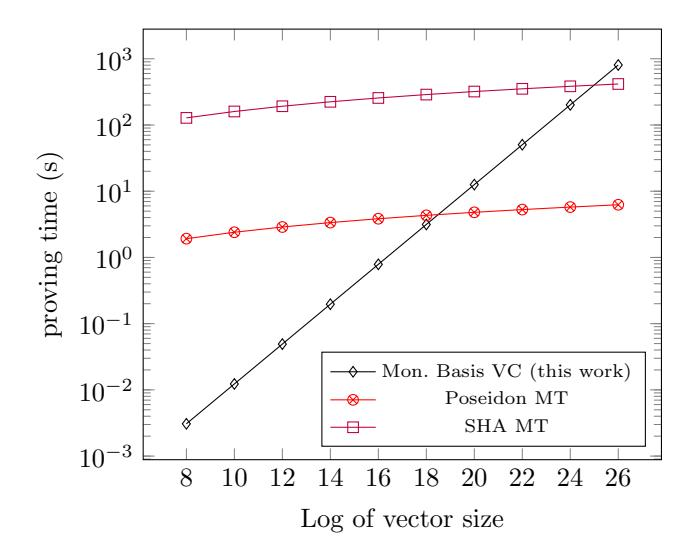
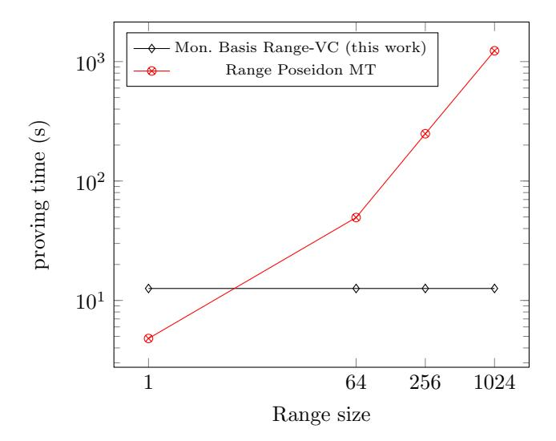
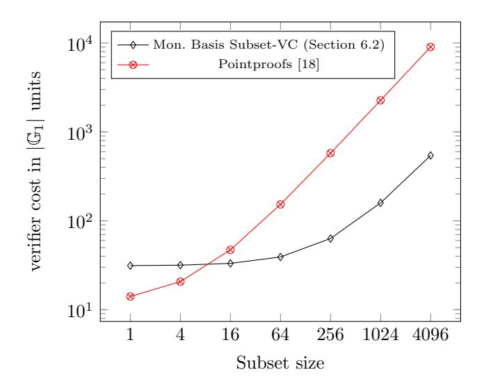
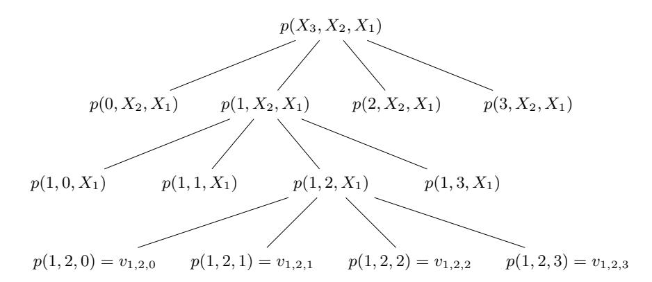
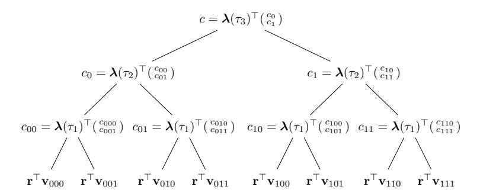

# Linear-map Vector Commitments and their Practical Applications

<span id="page-0-1"></span><span id="page-0-0"></span>Matteo Campanelli<sup>1</sup> , Anca Nitulescu<sup>1</sup> , Carla R`afols<sup>2</sup> , Alexandros Zacharakis<sup>2</sup> , and Arantxa Zapico2? .

<sup>1</sup> Protocol Labs {matteo, anca}@protocol.ai

Abstract. Vector commitments (VC) are a cryptographic primitive that allows one to commit to a vector and then "open" some of its positions efficiently. Vector commitments are increasingly recognized as a central tool to scale highly decentralized networks of large size and whose content is dynamic. In this work, we examine the demands on the properties that a vector commitment should satisfy in the light of the emerging plethora of practical applications and propose new constructions that improve the state-of-the-art in several dimensions and offer new tradeoffs. We also propose a unifying framework that captures several constructions and we show how to generically achieve some properties from more basic ones. On the practical side, we focus on building efficient schemes that do not require a new trusted setup (we can reuse existing ceremonies for other pairing-based schemes, such as "powers of tau" run by real-world systems such as Zcash or Filecoin). Our implementation demonstrates that our work overperforms in efficiency prior schemes with the same properties. Our contributions can be summarized as follows:

- Theoretical Formalisation: We formally define the notion of Linear Map Vector Commitments (LVC) inspired by the work of Lai and Malavolta [CRYPTO19]. Our definition aims at recovering all previous notions of VC and include properties such as updatability, aggregation and homomorphism. We introduce a stronger new unbounded aggregation concept that allows to aggregate multiple times without a disaggregation procedure. This relaxes incremental aggregation which is hard to achieve in general.
- Black-box Frameworks for LVC: We show how to lift the homomorphic properties of a simple LVC in order to obtain an LVC with unbounded aggregation and/or updatability. We also show that we can construct generic LVC (i.e. for any f : F <sup>m</sup> → F n ) from homomorphic LVC for a more restricted class of openings, inner-products IP (for n = 1).
- VC Constructions: We show two pairing-based LVC constructions for inner products IP based on the properties of monomial and Lagrange polynomial basis. We prove that the two satisfy all the relevant homomorphic properties to obtain unbounded aggregation and transformation to LVC. We also extend such schemes to support subvector openings SVC in a native way for special subsets or via aggregation for generic subsets.
- Adding Maintainability: We present two novel maintainable VC constructions that can be instantiated from any underlying VC scheme with homomorphic proofs. We show how to achieve a stronger, more flexible form of maintainability: our schemes allow to arbitrary tune the memory used to save on the opening time to obtain the desired trade-off. Both constructions are based on the tensor structure of multivariate and univariate polynomials:
  - 1. The multivariate case is a generalisation of a recent work, Hyperproofs that uses binary trees: we allow for any arity for the trees, so proofs are shorter and the leaves can be commitments for any LVC scheme, to allow more expressivity.
  - 2. The univariate construction generalizes in a similar way a previous construction of Tomescu et al. and it has the additional feature that the setup is independent of the trade-off, so the memory used can be decided by the prover on the fly.

<sup>2</sup> Universitat Pompeu Fabra {carla.rafols, alexandros.zacharakis, arantxa.zapico}@upf.edu

<sup>?</sup> Arantxa Zapico has been funded by a Protocol Labs PhD Fellowship PL-RGP1-2021-062. Alexandros Zacharakis has been partially funded by Protocol Labs Research Grant PL-RGP1-2021-048

# Table of Contents

<span id="page-1-2"></span>

|   | Linear-map Vector Commitments and their Practical Applications                                           | 1  |
|---|----------------------------------------------------------------------------------------------------------|----|
|   | Matteo Campanelli1<br>, Anca Nitulescu1<br>, Carla R`afols2<br>, Alexandros Zacharakis2<br>, and Arantxa |    |
|   | Zapico23                                                                                                 |    |
| 1 | Introduction                                                                                             | 2  |
|   | 1.1<br>Motivation for Better Vector Commitments                                                          | 3  |
|   | 1.2<br>Desired Properties and Limitations                                                                | 4  |
|   | 1.3<br>Our Contributions                                                                                 | 4  |
|   | 1.4<br>Related Work                                                                                      | 6  |
| 2 | Preliminaries                                                                                            | 7  |
| 3 | Definitions: Linear-map Vector Commitments                                                               | 8  |
|   | 3.1<br>Homomorphic Properties for LVC                                                                    | 9  |
| 4 | Generic Constructions from Homomorphic Proofs                                                            | 9  |
|   | 4.1<br>New Notion: Unbounded Aggregation                                                                 | 9  |
|   | 4.2<br>Unbounded Aggregation for LVC                                                                     | 11 |
|   | 4.3<br>From Inner-Products to Arbitrary Linear-Maps                                                      | 12 |
|   | 4.4<br>Updability for LVC                                                                                | 13 |
| 5 | Constructions for Inner-Pairing VC<br>                                                                   | 14 |
|   | 5.1<br>Monomial Basis                                                                                    | 14 |
|   | 5.2<br>Lagrange Basis                                                                                    | 16 |
| 6 | Subvector Openings                                                                                       | 18 |
|   | 6.1<br>Native SV Openings for the Monomial Basis                                                         | 18 |
|   | 6.2<br>Non-native SV Openings for the Monomial Basis                                                     | 19 |
|   | 6.3<br>Lagrange Basis                                                                                    | 19 |
| 7 | Implementation and Experimental Evaluation for LVC                                                       | 20 |
|   | 7.1<br>Comparison with SNARKs over Merkle Trees                                                          | 20 |
|   | 7.2<br>Proving time for Range Queries                                                                    | 21 |
|   | 7.3<br>Verification for Special Subsets                                                                  | 21 |
| 8 | Maintainable Vector Commitment Schemes                                                                   | 22 |
|   | 8.1<br>Multivariate Case                                                                                 | 22 |
|   | 8.2<br>Univariate Maintainable Vector Commitments                                                        | 29 |
| A | Vector Commitment Definitions                                                                            | 34 |
| B | Vector Commitment Applications                                                                           | 35 |
|   | B.1<br>Verifiable Databases                                                                              | 35 |
|   | B.2<br>Stateless Cryptocurrency                                                                          | 36 |
|   | B.3<br>Proof of Space                                                                                    | 36 |
|   | B.4<br>Compiling SNARKs from Vector Commitments                                                          | 37 |
|   | B.5<br>Applications of Range Openings                                                                    | 38 |
| C | Native SVC in [33]                                                                                       | 38 |
| D | Lagrange basis IP for Cosets of Roots of Unity                                                           | 38 |
|   | D.1<br>Proof of Theorem 9                                                                                | 38 |

## <span id="page-1-0"></span>1 Introduction

Vector commitment schemes [\[26,](#page-32-0) [10\]](#page-32-1) (or VC) allow a party to commit to a vector v through a short digest and then open some of its elements guaranteeing position binding[4](#page-1-1) (one should not be able to open a commitment at position i to two different values v<sup>i</sup> 6= v 0 i ). For this primitive to be interesting the proof of opening—or just "opening"—should be of size sublinear in m, the size of the committed vector. A vector commitment with subvector opening also supports a short opening for arbitrary subsets of positions I

<span id="page-1-1"></span><sup>4</sup> For the applications considered in this work, hiding properties are not necessary. In particular, our commitments are deterministic.

<span id="page-2-2"></span>(rather than individual ones only). More specifically this opening should be of size independent, not only of m, but of |I|. We denote commitment schemes with such property as SVC [24](also called VC with batch opening in [5]).

Functional Vector Commitments, first introduced by Libert, Ramanna and Yung in [25], capture the ability to compute commitments to vectors and later perform openings of linear functions (inner-products)  $f: \mathbb{F}^m \to \mathbb{F}^n$  of these vectors, for some field  $\mathbb{F}$ .

Both vector commitments with subvector openings and functional commitments for inner-products can be captured as vector commitments with openings for a more general class of function families, linear maps. Lai and Malavolta [24] were the first to introduce Linear Map Commitments (LMC). In such a scheme, the prover is able to open the commitment to some vector  $\mathbf{v}$  to the output of multiple linear functions or, equivalently, to the output of one linear-map  $f: \mathbb{F}^m \to \mathbb{F}^n$ , by producing a single short proof. In this work, we revisit Lai and Malavolta [24] LMC notion and augment it to a full-featured vector commitment generic definition that recovers all previously-defined schemes and more. We call our primitive Linear Map Vector Commitment and use LVC for short<sup>5</sup>.

#### <span id="page-2-0"></span>1.1 Motivation for Better Vector Commitments

Vector commitments are very useful to scale highly decentralized networks of large size and whose content is dynamic [11, 5, 8, 18] (such dynamic content can be the state of a blockchain, amount stored on a wallet, the value of a file in a decentralized storage network, etc.). Beyond the basic requirement that openings should be efficient, in this work we also discuss how to achieve some additional properties of LVC. We discuss some of the most prominent applications of LVC to motivate and justify the importance of these properties in practice.

Verifiable Databases. One of the applications that can be significantly improved by Vector Commitments is Verifiable Databases (VDB). In this setting, a client outsources the storage of a database to a server while keeping the ability to access and change some of its records, i.e. query functions of the data and update some of the data and ensure the server does not tamper with the data. Solutions using (binding) commitment schemes provide security but not efficiency in such a setting. A popular instantiation that achieves both of them is a Merkle tree [27], but this is not expressive enough to allow for functional openings.

For a VC scheme to be the ideal solution for VDB application, we require it to additionally support efficient updates and expressive openings. For example, an LVC scheme that allows the client to update records of the database in sublinear time and to verify linear-map queries at almost the same cost as simple position openings is a great improvement over current solutions.

Stateless Cryptocurrency. A recent application that motivated more efficient constructions of VC schemes is stateless cryptocurrency, i.e. a payment system based on a distributed ledger where neither validators of transactions nor system users need to store the full ledger state. The ideal vector commitment scheme that provides the best trade-off between storage, bandwidth, and computation in this setting should have all of the following properties: it must have a small commitment size, short proofs, efficient computation for openings and it should allow for proof updates and for aggregation to minimise communication in the transactions and maintainability for the proofs, that allows updating all pre-stored proofs in sublinear time.

Proof of Space. Proof of Space (PoS) is a protocol that allows miners (storage providers) to convince the network that they are dedicating physical storage over time in an efficient way. In a nutshell, a miner commits to a file (data) that uses a specified amount of disk space and then the miner proves that it continues to store the data by answering to recurring audits that consist of random spot-checks. A PoS construction based on vector commitments, as described in [15], requires short opening proofs for subvectors to be stored in a blockchain, cross-commitments aggregation techniques and the possibility to implement space-time tradeoffs to reduce the proving time for the miner (ideally sublinear in the size of the vector).

<span id="page-2-1"></span> $<sup>^{5}</sup>$  We prefer LVC rather than LMC to emphasize the Vector Commitment aspect of our notion.

<span id="page-3-4"></span>"Caching" Optimizations. In some applications, e.g. when performing HTTP queries, clients use the socalled prefetching[6](#page-3-2) and receive from a server not only the values of interest but other related values that could potentially be queried in the near future (e.g., values in a neighboring range of the queried values). Vector commitments with efficient proofs for special ("caching") subset openings allow to add verifiability to such queries in a way that does not affect the speed of the server since the proving procedure for a bigger subset is close or the same as for individual positions.

### <span id="page-3-0"></span>1.2 Desired Properties and Limitations

At the very least a basic LVC should be efficient (small proof size and low opening/verifying computational needs). Obviously, the same design goals as with other cryptographic protocols apply, i.e. ideally one would like to prove security under as standard assumptions as possible.

Reusable setup refers to the common reference string that many pairing-based schemes use as public parameters. Ideally, one would like to have a transparent setup (consisting of uniformly distributed elements) that does not rely on any trusted parameter generation. It is common to sacrifice this goal for efficiency and settle for a trusted setup (producing a SRS, or structured reference string) that can be generated in a ceremony. But such ceremonies are complicated to implement[7](#page-3-3) , so it is interesting to design LVC that do not have special SRS distributions and can reuse existing setups for other primitives.

Expressivity refers to the opening possibilities. One would like VC to be as expressive as possible, meaning that it should be possible to open to functions of the vector as general as possible (subvector openings, linear or arbitrary functions).

Proof Aggregation captures the ability to "pack" two or more proofs together obtaining a new proof for their combined claims (e.g. f(v) = y and f 0 (v) = y 0 ). This should be done without knowledge of the opening of the vector and aggregation cost should be sublinear in the vector length. Importantly, the resulting proof should not significantly grow each time we perform an aggregation. One-hop aggregation allows only to aggregate fresh proofs. Ideally, one would also want to aggregate already aggregated proofs.

Updatability allows to efficiently update opening proofs: if C is a commitment to v and a position needs to be updated resulting in a new commitment C 0 , an updatable VC must provide a method to update an opening π<sup>f</sup> for a function f that is valid for C into a new opening for the same function that is valid for the new commitment C 0 . The new opening should be computed by only knowing the portion of the vector that is supposed to change and in time faster than recomputing the opening from scratch.

Maintainability aims at amortizing the proving costs in systems where committed values have a long life span and evolve over time. This is achieved by means of dedicated memory to reduce the computation time needed to open proofs. Concretely, the property requires that (1) one can efficiently store some values to reduce the cost of computing any individual openings (2) after updating a single position of the committed vector, it should be possible to update all proofs in time sublinear in the size of the vector (less than computing a single proof from scratch in some cases).

Homomorphic properties apply to commitments as well as to proofs. An LVC has homomorphic commitments if it is possible to meaningfully combine commitments without knowing their openings: that is, from commitments C<sup>1</sup> and C<sup>2</sup> to v<sup>1</sup> and v2, any party must be able to compute a commitment to αv<sup>1</sup> + βv<sup>2</sup> for any α, β ∈ F. The scheme has homomorphic openings if it is possible to derive a proof that f(v<sup>1</sup> + v2) = y<sup>1</sup> + y<sup>2</sup> from proofs for the claims f(v1) = y<sup>1</sup> and f(v2) = y2. Finally, a vector commitment scheme has homomorphic proofs when it is possible to combine proofs of statements for different functions but same vector. As we will see, this property is interesting for its implications.

## <span id="page-3-1"></span>1.3 Our Contributions

Theoretical Advances. On the theoretical frontier, we unify previous definitions and augment them with additional properties. The basic notion we use is Linear Map Vector Commitments (LVC) and is inspired by the work of Lai and Malavolta [\[24\]](#page-32-2). We then define additional properties on top of this definition and explore their relations. Specifically, we augment this notion with updatability and aggregation properties,

<span id="page-3-2"></span><sup>6</sup> [https://developer.mozilla.org/en-US/docs/Web/HTTP/Link\\_prefetching\\_FAQ](https://developer.mozilla.org/en-US/docs/Web/HTTP/Link_prefetching_FAQ)

<span id="page-3-3"></span><sup>7</sup> This remains true even if many setups are updatable [\[21\]](#page-32-9) and they can be generated and updated noninteractively in a secure way as long as one party is honest. There might be issues if not enough parties participate in generating the SRS or updates are not properly validated.

<span id="page-4-1"></span>

| VC Scheme             | Setup       | Aggregation           | Updates | Assumption | Functional | Special Sets        |
|-----------------------|-------------|-----------------------|---------|------------|------------|---------------------|
|                       |             |                       |         |            | Opening    | Opening (size $n$ ) |
| PoS aggSVC [8]        | $Trusted^*$ | Incremental Same-Com* | hint*   | RSA*       | SVC        | O(n)                |
| Pointproofs [18]      | Trusted     | One-hop Cross-Com     | key     | pairings   | ×          | O(n)                |
| Stateless aggSVC [33] | Trusted     | One-hop Same-Com      | key     | pairings   | SVC        | O(1)                |
| Our Lagrange LVC      | Reusable    | UnboundedCross-Com    | key     | AGM        | LVC        | O(1)                |
| Our Monomial LVC      | Reusable    | UnboundedCross-Com    | key     | AGM        | LVC        | O(1)                |

Table 1: Comparison of our LVCs with other aggregatable VC schemes (aggSVC) designed for Stateless Cryptocurrencies and Proof of Space applications. All schemes have O(1)-sized proofs that verify in O(1) time and can update commitments in O(1) time.

(\*): additional notes on [8]: their construction can be instantiated transparently (but less efficiently) replacing RSA-like assumptions with class groups; hint-based updates in their second construction are to maintain a constant-size O(1) CRS; key-based updates are possible with a larger CRS; the work in [?] shows how to cross-commitment aggregate in [8].

.

including a novel notion -unbounded aggregation- capturing the ability to aggregate already aggregated proofs but relaxing incremental aggregation [8] in the sense that the verifier is allowed to do work linear in the number of aggregation hops (i.e. aggregation is "history" dependent), also, disaggregation is not possible. We show that having additional homomorphic properties is highly desirable, by arguing that any LVC that satisfies them: (1) can be augmented with unbounded aggregation as well as updatability; (2) can support general linear map openings (i.e. for any  $f: \mathbb{F}^m \to \mathbb{F}^n$ ) as long as it supports inner product openings (i.e. for  $f': \mathbb{F}^m \to \mathbb{F}$ ). This allows us to focus on efficient constructions for inner products with homomorphic properties.

VC Constructions. First, we present two pairing-based LVC constructions for inner products based on the properties of monomial and Lagrange polynomial basis and prove that they satisfy all the relevant homomorphic properties to obtain unbounded aggregation and support general linear maps. In terms of expressivity, these constructions generalize previous work [32, 33] by supporting linear functions instead of only position or subvector openings. VC for this class of functions are core components of important primitives such as arguments of knowledge for Inner Product (IP) relations or aggregation arguments [12].

Second, we present two novel maintainable constructions by exploiting the tensor structure of multivariate and univariate polynomials. These constructions allow a stronger, more flexible form of maintainability: they support an arbitrary memory/time trade-off for openings, meaning that one can decide how much memory it wants to use to reduce the opening time.

The multivariate case is a generalization of Hyperproofs [32] in several dimensions. Roughly speaking maintanability is achieved in Hyperproofs by constructing a binary tree of proofs where at the leaves there are the values of individual positions. We present a single construction that can be instantiated in several ways (recovering Hyperproofs as a special case) with these features: (i) the tree can be of any arity, so proofs are shorter<sup>8</sup>; (ii) the leaves can be commitments for any LVC and not only individual openings, to achieve a fully flexible trade-off. As a result of (ii), the scheme is more expressive (as it can support openings to linear functions/subvector openins at leaf level if the underlying commitment supports it).

The univariate construction presents a similar generalization of previous work by [34] but it has the additional feature that the setup is independent of the trade-off, and can be decided by the prover on the fly.

Practical Improvements. As in some applications like Proof of Space, the subset of opened positions is not very meaningful and its distribution is expected to be known in advance, we study how to improve verification efficiency for certain special subsets I openings in our inner-product constructions. For some structured sets I, we achieve a verifier that performs half of the work it does for arbitrary sets J of the

<span id="page-4-0"></span><sup>&</sup>lt;sup>8</sup> If one uses the Inner Pairing Product argument of Bünz et al. [7] on top of PST commitments as suggested in Hyperproofs the difference in proof size is not so relevant, but IPP will be much cheaper to run.

<span id="page-5-2"></span>

| VC Scheme            | Setup       | Homomorphic Aggregation |       | π      | Prove   | OpenAll              | UpdateAll         |
|----------------------|-------------|-------------------------|-------|--------|---------|----------------------|-------------------|
| Merkle Trees         | Transparent | ×                       | SNARK | log m  | O(k)    | O(m)                 | O(k + log m0<br>) |
| Hyperproofs [32]     | Trusted     | X                       | IPP   | log m  |         | O(k) O(m log m0<br>) | O(log m0<br>)     |
| Our Multivariate LVC | Trusted     | X                       | IPP   | log`   | m0 O(k) | O(m log m0<br>)      | O(log m0<br>)     |
| Our Univariate LVC   | Reusable    | X                       | IPP   | log m0 |         | O(k) O(m log m0<br>) | O(log m0<br>)     |

Table 2: Comparison of our schemes with other maintainable VC. We consider vectors of dimension m = k · m<sup>0</sup> where m<sup>0</sup> is the amount of memory dedicated for storing proofs. All schemes are aggregatable using generic techniques, SNARKs or Inner Pairing Products [\[7\]](#page-31-1). All times/sizes omit the dependence on the security parameter λ. We omit constant additive terms from proof sizes. In the multivariate construction, ` refers to a constant parameter.

same size in the Lagrange construction, and only a constant number of group operations in the one that uses the monomial basis.

Second, we mitigate the challenges of deploying these constructions due to their need of a trusted setup. With the exception of the multivariate variant of the maintainable construction, all our constructions can reuse trusted setups such as "powers of tau" that were run for pairing-based SNARK schemes used in real-world applications.[9](#page-5-1) , as opposed to for example [\[18\]](#page-32-6), in which a certain middle power of τ needs to be missing in the SRS.

In Appendix [7](#page-19-0) we demonstrate the practical benefits of our special subset construction by providing an implementation and comparisons with current solutions.

## <span id="page-5-0"></span>1.4 Related Work

Vector commitments were fully formalized in [\[10\]](#page-32-1) and two first constructions were proposed under standard, constant-size, assumptions: CDH in bilinear groups and RSA respectively. Many follow-up works built on these constructions to obtain better efficiency and more properties such as subvector openings, functional openings, aggregation, updates and variants of these. A number of constructions [\[8,](#page-32-5) [5\]](#page-31-0) use the properties of hidden order groups to achieve constructions with attractive features such as constant size parameters or incremental aggregation but are concretely less efficient than pairing-based constructions.

Merkle trees are quite efficient and only need a transparent setup. They also offer natural timememory tradeoffs due to their tree structure. Nevertheless, VC schemes based on bilinear groups are more expressive in terms of openings, have homomorphic properties, allow for efficient updates for the proofs and aggregation mechanisms, so they are becoming an interesting alternative.

Expressivity. VC were generalized by Libert et al. [\[25\]](#page-32-3), who formalize the notion of functional commitments (FC). They construct vector commitments with openings to linear-forms of the vector based on the Diffie-Hellman exponent assumption over pairing groups. Later, Lai and Malavolta [\[24\]](#page-32-2) introduce subvector openings and show applications to building succinct-arguments of knowledge (similar applications were shown by [\[5\]](#page-31-0)) in the bilinear group setting. They also generalize the notion of SVCs to allow the prover to reveal arbitrary linear maps computed over the committed vector. Previously, only Functional VC for single-output linear functions were proposed which did not account for provers that want to reveal multiple locations or function outputs of the committed vector in a concise way.

Updatability. Vector commitments that allow for updates are useful in applications such as stateless cryptocurrencies. A weak variant of updatability requires the algorithms that update the commitment and the opening to take as input an opening for the position in which the vector update occurs called hints. Recent RSA-based constructions are hint-updatable [\[5,](#page-31-0) [8\]](#page-32-5). Compared to hint updates, key-updates only need fixed update keys corresponding to the updated positions. Schemes based on bilinear groups require such fixed keys, and no extra information about the change made in the vector in order to update.

Aggregation. Vector Commitments with an additional aggregation property are very appealing for blockchain applications for their even shorter proofs of opening. Campanelli et al. [\[8\]](#page-32-5) showed two constructions of incrementally aggregatable SVCs, that have constant-size parameters and work over groups

<span id="page-5-1"></span><sup>9</sup> E.g., the one used by ZCash. <https://z.cash> or and Filecoin [\[14\]](#page-32-11)

<span id="page-6-1"></span>of unknown order. Unfortunately, the practical efficiency of these constructions is still not sufficient for their deployment in real-world systems.

Gorbunov et al. [18] show how to extend the VC scheme of [26] to allow for cross-commitment aggregation. Like our constructions, they assume the Algebraic Group Model (AGM) [17] in bilinear groups and a random oracle. Their final SVC requires public parameters whose size is linear in the size of the committed vector, while cross-commitment aggregation allow for splitting up a long vector into shorter ones and simply aggregate the proofs. However, this approach allows only for one-hop aggregation, meaning that already aggregated proofs cannot be reused in further aggregations by external nodes.

Tomescu et al.[33] showed how to realize an *updatable* SVC with one-hop aggregation from bilinear groups. Their scheme has linear-sized public parameters, and it supports commitment updates, proof updates from a static linear-sized update key tied only to the updated position, in contrast with the dynamic update *hints* required by related works.

Maintainability. Apart from Merkle tree based Vector Commitments which are known to be maintainable, Srinivasan et. al. [32] show that the multilinear PST polynomial commitment [29] can be turned to a maintainable VC construction. Pre-computing all (single-position) opening proofs is done in quasilinear time (contrary to the trivial quadratic time) and updating all proofs after a (single position) vector update needs only logarithmic time. Contrary to Merkle tree based approaches, the scheme has homomorphic properties. Furthermore, due to its algebraic structure, it supports one-hop aggregation through generic means, namely, Inner Pairing Product Arguments [7], albeit with a concretely expensive proving computation. Tomescu et al. [34] add the same attribute to KZG polynomial commitment schemes, resulting in an univariate construction with the same properties.

#### <span id="page-6-0"></span>2 Preliminaries

We denote the set of natural numbers by  $\mathbb{N}$  and let  $\lambda \in \mathbb{N}$  be the computational security parameter. We denote the list of integer numbers between 1 and n as [n]. All the algorithms defined throughout this work are assumed to be probabilistic Turing machines that run in polynomial time (abbreviated as PPT). We say that a function is negligible (in  $\lambda$ ), and we denote it by  $negl(\lambda)$ , if  $negl(\lambda) = \Omega(\lambda^{-c})$  for any fixed constant c > 1.

Vectors. For m-dimensional vectors  $\mathbf{a} \in \mathbb{F}^m$ , we denote the *i*-th entry by  $a_i \in \mathbb{F}$ . We use  $\mathbf{e}_i \in \mathbb{F}^m$  to denote the vectors of the canonical basis, more concretely  $\mathbf{e}_i$  is the vector with a 1 in the *i*-th coordinate and 0's elsewhere. For vectors  $\mathbf{a} \in \mathbb{F}^m$ ,  $\mathbf{b} \in \mathbb{F}^n$ , we denote  $\mathbf{a} \otimes \mathbf{b} \in \mathbb{F}^{m \cdot n} = (a_1 \mathbf{b}, \dots, a_n \mathbf{b})$  the tensor product of the vectors.

Lagrange basis. Let  $\mathbb{H} = \{h_1, \dots, h_m\}$  be a multiplicative group of size m in  $\mathbb{F}$ . We consider the set of Lagrange interpolation polynomials  $\{\lambda_j(X)\}_{j=1}^m$  associated with  $\mathbb{H}$ , namely,

$$\lambda_j(X) = \prod_{i \neq j} \frac{X - \mathsf{h}_i}{\mathsf{h}_j - \mathsf{h}_i}.$$

Recall that  $\sum_{j=1}^{m} \lambda_j(X) = 1$ . Moreover, we define  $t(X) = \prod_{j=1}^{m} (X - \mathsf{h}_j)$  the vanishing polynomial. We will also consider  $t_k(X) = \prod_{j \in J_k} (X - \mathsf{h}_j)$ , the vanishing polynomial of a subset  $\{\mathsf{h}_j\}_{j \in J_k} \subset \mathbb{H}$  and  $t_{k^c}(X) = \prod_{j \notin J_k} (X - \mathsf{h}_j)$ .

For the multivariate case, recall that  $\lambda_{\sigma}(X_{\nu},\ldots,X_{1})=\prod_{j=1}^{\nu}\lambda_{\sigma_{j}}(X_{j})$ . Using these, we can write the vector of multivariate Lagrange as the tensor product  $\lambda(X_{\nu})\otimes\cdots\otimes\lambda(X_{1})$ , where  $\lambda(X)$  is the univariate Lagrange basis.

Bilinear Groups. A bilinear group is given by a description  $\mathsf{gk} = (p, \mathbb{G}_1, \mathbb{G}_2, \mathbb{G}_T, e)$  with additive notation such that p is prime, so  $\mathbb{F} = \mathbb{F}_p$  is a field.  $\mathbb{G}_1, \mathbb{G}_2$  are cyclic (additive) groups of prime order p. We use the notation  $[a]_1, [b]_2, [c]_t$  for elements in  $\mathbb{G}_1, \mathbb{G}_2$  and  $\mathbb{G}_T$  respectively.  $e : \mathbb{G}_1 \times \mathbb{G}_2 \to \mathbb{G}_T$  is a bilinear asymmetric map (pairing), which means that  $\forall a, b \in \mathbb{Z}_p$ ,  $e([a]_1, [b]_2) := [ab]_t$ . We implicitly have that  $[1]_t := e([1]_1, [1]_2)$  generates  $\mathbb{G}_T$ . We use  $[a]_{1,2}$  to refer to 2 group elements  $[a]_1 \in \mathbb{G}_1, [a]_2 \in \mathbb{G}_2$ . In our constructions, we denote by  $\mathcal{G}(p)$  the algorithm that, given as input the prime value p, outputs a description  $\mathsf{gk} = (p, \mathbb{G}_1, \mathbb{G}_2, \mathbb{G}_T, e)$ .

<span id="page-7-2"></span>Algebraic Group Model (AGM). The algebraic group model [17] lies between the standard model and the stronger generic group model. In AGM, we consider only so-called algebraic adversaries. Such adversaries have direct access to group elements and, in particular, can use their bit representation, like in the standard model. However, these adversaries are assumed to output new group elements only by applying the group operation to received group elements (like in the generic group model). This requirement is formalized as follows: Suppose an adversary  $\mathcal{A}$  is given some group elements  $[x_1]_1 \dots [x_m]_1 \in \mathbb{G}_1$ . Then, for every new group element  $[z]_1 \in \mathbb{G}_1$  that the adversary outputs, it must also output  $z_1 \dots z_m \in \mathbb{F}$  such that  $[z]_1 = \sum_{i=1}^m [z_i x_i]_1$ .

Assumptions. We state the computational assumptions used in this work.

**Definition 1.** The  $(q_1, q_2)$ -DLOG assumption holds relative to  $\mathcal{G}(1^{\lambda})$  if for all PPT adversaries  $\mathcal{A}$ , the following probability is negligible in  $\lambda$ .

$$\Pr\left[\tau \leftarrow \mathcal{A}(\mathsf{gk}, \left\{[\tau^i]_1\right\}_{i=0}^{q_1}, \left\{[\tau^i]_2\right\}_{i=0}^{q_2}) \,\middle|\, \mathsf{gk} \leftarrow \mathcal{G}(1^\lambda); \ \tau \leftarrow \mathbb{F}\right].$$

In the tree-based construction we rely on a q-type assumption, the Bilinear Strong Diffie Hellman assumption ( $(q_1, q_2)$ -BSDH) [4]. When  $q_1 = q_2$ , we simply call it q-BSDH Assumption. We present it next.

**Definition 2.** The  $(q_1, q_2)$ -BSDH assumption holds relative to  $\mathcal{G}(1^{\lambda})$  if for all PPT adversaries  $\mathcal{A}$ , the following probability is negligible in  $\lambda$ .

$$\Pr\left[(c, \tfrac{1}{(\tau-c)}e([1]_1, [1]_2)) \leftarrow \mathcal{A}(\mathsf{gk}, \left\{[\tau^i]_1\right\}_{i=0}^{q_1}, \left\{[\tau^i]_2\right\}_{i=0}^{q_2}) \,\middle|\, \mathsf{gk} \leftarrow \mathcal{G}(1^\lambda); \ \tau \leftarrow \mathbb{F}\right].$$

## <span id="page-7-0"></span>3 Definitions: Linear-map Vector Commitments

We introduce preliminaries in App. 2.n the following, we define what we call Linear-map Vector Commitments (LVC) schemes. Notably, this definition has been introduced by Lai and Malavolta in [24] (except that there the name is *Linear Map Commitments*) to capture further functionalities of vector commitments, whose definition before only account for proofs of *position openings* (Vector Commitments) or more generally *subvector openings* (Sub-vector commitments) (See Appendix A for the formal definitions).e introduce the definition and security properties of LVC. Importantly, we do not consider the hiding property as for our applications all vectors are public.

<span id="page-7-1"></span>**Linear-map Vector Commitment** A linear-map vector commitment scheme for function families  $\mathcal{F} \subset \{f : \mathcal{M}^m \to \mathcal{M}^n\}$  is a tuple of PPT algorithms (LVC.KeyGen, LVC.Commit, LVC.Open, LVC, Vf) that work as follows:

LVC.KeyGen( $1^{\lambda}$ ,  $\mathcal{F}$ )  $\rightarrow$  (prk, vrk): The setup algorithm takes the security parameter  $\lambda$ , a family of functions  $\mathcal{F}$  implicitly defining the message space  $\mathcal{M}$ , and the maximum vector length  $m = \mathsf{poly}(\lambda)$ , and outputs a pair of keys (prk, vrk).

LVC.Commit(prk,  $\mathbf{v}$ )  $\rightarrow$  (C, aux): On input the proving key prk, and a vector  $\mathbf{v} = (v_1, v_2, \dots, v_m) \in \mathcal{M}^m$ , returns a commitment C and auxiliary information aux. This algorithm is *deterministic*.

LVC.Open(prk, aux,  $f, \mathbf{y}$ )  $\to \pi_f$ : Takes as input prk, the auxiliary information aux, a function  $f \in \mathcal{F}$ , and a claimed result  $\mathbf{y} \in \mathcal{M}^n$ . It outputs a proof  $\pi_f$  that  $f(\mathbf{v}) = \mathbf{y}$ .

LVC.Vf(vrk, C, f,  $\mathbf{y}$ ,  $\pi_f$ )  $\to 0/1$ : Takes as input the verification key vrk, C, function f,  $\mathbf{y} \in \mathcal{M}^n$ , and proof  $\pi_f$ . It accepts or rejects.

A LVC scheme must satisfy the following properties:

**Definition 3 (LVC correctness).** An LVC scheme is perfectly correct if for all  $\lambda \in \mathbb{N}$ , for any family of functions  $\mathcal{F} \subset \{f : \mathcal{M}^m \to \mathcal{M}^n\}$  and any  $\mathbf{v} \in \mathcal{M}^m$ ,

$$\Pr\left[ \begin{aligned} \mathsf{LVC.Vf}(\mathsf{vrk},\mathsf{C},f,\mathbf{y},\pi_f) &= 1 \left| \begin{aligned} (\mathsf{prk},\mathsf{vrk}) \leftarrow \mathsf{LVC.KeyGen}(1^\lambda,\mathcal{F}) \\ (C,\mathsf{aux}) \leftarrow \mathsf{LVC.Commit}(\mathsf{prk},\mathbf{v}) \\ \pi_f \leftarrow \mathsf{LVC.Open}(\mathsf{prk},\mathsf{aux},f,\mathbf{y}) \end{aligned} \right] = 1.$$

<span id="page-8-3"></span>**Definition 4 (LVC (strong) function binding.).** A linear map commitment LVC satisfies strong function binding if, for any PPT adversary  $\mathcal{A}$ , for all  $\lambda \in \mathbb{N}$ , for all integers  $K \in \mathsf{poly}(\lambda)$ , and for any family of functions  $\mathcal{F}$ , the following probability is negligible in  $\lambda$ :

$$\Pr \begin{bmatrix} \forall k \in [K] : \\ \mathsf{LVC.Vf}(\mathsf{vrk}, \mathsf{C}, f_k, \mathbf{y}_k, \pi_{f_k}) = 1 \\ \land \ \not \exists \ \mathbf{v} \in \mathcal{M}^m \ s. \ t. \\ \forall k \in [K] : \ f_k(\mathbf{v}) = \mathbf{y}_k \end{bmatrix} \begin{pmatrix} (\mathsf{prk}, \mathsf{vrk}) \leftarrow \mathsf{LVC.KeyGen}(1^\lambda, \mathcal{F}) \\ (\mathsf{C}, \{f_k, \mathbf{y}_k, \pi_{f_k}\}_{k \in [K]}) \leftarrow \mathcal{A}(\mathsf{prk}, \mathsf{vrk}) \end{bmatrix}$$

The definition above can be relaxed to hold only for *honestly-generated* commitments C, raising to the *weak function binding* notion. In the weak definition, the adversary  $\mathcal A$  returns a vector  $\mathbf v$  while the commitment C is computed via LVC.Commit. In this work, constructions are proven strong function binding.

#### <span id="page-8-0"></span>3.1 Homomorphic Properties for LVC

Homomorphic Commitments. Linear-map vector commitment schemes that satisfy homomorphic commitments allow to combine commitments of two vectors into a single one of their sum (or any linear combination). Namely, for all  $\lambda$ , and (vrk, prk)  $\leftarrow$  LVC.KeyGen(1 $^{\lambda}$ ,  $\mathcal{F}$ ), if (C<sub>1</sub>, aux<sub>1</sub>)  $\leftarrow$  LVC.Commit(prk, v<sub>1</sub>) and (C<sub>2</sub>, aux<sub>2</sub>)  $\leftarrow$  LVC.Commit(prk, v<sub>2</sub>), then  $\tilde{\mathsf{C}} = (\alpha \mathsf{C}_1 + \beta \mathsf{C}_2)$  is a valid commitment to  $\tilde{\mathbf{v}} = (\alpha \mathbf{v}_1 + \beta \mathbf{v}_2)$  for any  $\alpha, \beta \in \mathcal{M}$ .

In this work, we are particularly interested in LVC that also have *homomorphic proofs* for different functions applied to a committed vector and *homomorphic openings* for the same function applied to different initial vectors.

Homomorphic Proofs. An LVC scheme has homomorphic proofs if it allows recombine two proofs  $\pi_1$ ,  $\pi_2$  corresponding to linear maps  $f_1$ ,  $f_2$  into a new proof  $\tilde{\pi}$  that opens to a linear combination of  $f_1$  and  $f_2$  applied to the same committed vector. Namely, for all  $\lambda$ ,  $\mathcal{F} \subset \{f: \mathcal{M}^m \to \mathcal{M}^n\}$  and all vectors  $\mathbf{v} \in \mathcal{M}^m$ , and  $(\mathsf{vrk}, \mathsf{prk}) \leftarrow \mathsf{LVC}.\mathsf{KeyGen}(1^\lambda, \mathcal{F}), \ (\mathsf{C}, \mathsf{aux}) \leftarrow \mathsf{LVC}.\mathsf{Commit}(\mathsf{prk}, \mathbf{v}), \ \text{if} \ \pi_1 \leftarrow \mathsf{LVC}.\mathsf{Open}(\mathsf{prk}, \mathsf{aux}, f_1, \mathbf{y}_1)$  and  $\pi_2 \leftarrow \mathsf{LVC}.\mathsf{Open}(\mathsf{prk}, \mathsf{aux}, f_2, \mathbf{y}_2), \ \text{then for all} \ \alpha, \beta \in \mathcal{M}$ :

$$\tilde{\pi} = (\alpha \pi_1 + \beta \pi_2)$$
 verifies LVC.Vf(vrk, C,  $\tilde{f} = (\alpha f_1 + \beta f_2), \tilde{\mathbf{y}} = (\alpha \mathbf{y}_1 + \beta \mathbf{y}_2), \tilde{\pi}) = 1.$ 

Homomorphic Openings. An LVC scheme has homomorphic openings if we can combine opening proofs for the same linear-map f applied to two different vectors  $\mathbf{v}_1$  and  $\mathbf{v}_2$  to obtain a new proof of opening  $\tilde{\pi}$  that verifies with respect to the linear combination  $\tilde{\mathsf{C}}$  of the two initial commitments  $\mathsf{C}_1, \mathsf{C}_2$  and show the result of  $\mathbf{f}$  applied to the linear combination of the vectors  $\mathbf{v}_1$  and  $\mathbf{v}_2$ .

More formally, for all  $\lambda$ ,  $\mathcal{F} \subset \{f: \mathcal{M}^m \to \mathcal{M}^n\}$ , vectors  $\mathbf{v}_1, \mathbf{v}_2 \in \mathcal{M}^m$ , and  $(\mathsf{vrk}, \mathsf{prk}) \leftarrow \mathsf{LVC}.\mathsf{KeyGen}(1^\lambda, \mathcal{F})$ , if  $\pi_1 \leftarrow \mathsf{LVC}.\mathsf{Open}(\mathsf{prk}, \mathsf{aux}_1, f, \mathbf{y}_1)$  and  $\pi_2 \leftarrow \mathsf{LVC}.\mathsf{Open}(\mathsf{prk}, \mathsf{aux}_2, f, \mathbf{y}_2)$ , where  $(\mathsf{C}_1, \mathsf{aux}_2) \leftarrow \mathsf{LVC}.\mathsf{Commit}(\mathsf{prk}, \mathbf{v}_1)$  and  $(\mathsf{C}_2, \mathsf{aux}_2) \leftarrow \mathsf{LVC}.\mathsf{Commit}(\mathsf{prk}, \mathbf{v}_2)$ , then for all  $\alpha, \beta \in \mathcal{M}$ :

$$\tilde{\pi} = (\alpha \pi_1 + \beta \pi_2)$$
 verifies LVC.Vf(vrk,  $\tilde{C} = (\alpha C_1 + \beta C_2)$ ,  $f, \tilde{y} = (\alpha y_1 + \beta y_2)$ ,  $\tilde{\pi}$ ) = 1.

#### <span id="page-8-1"></span>4 Generic Constructions from Homomorphic Proofs

Many natural schemes (such as [33, 18], PST commitments or our constructions in Section 5) have homomorphic proofs or openings. This motivates us to consider generic constructions that enhance any LVC scheme with homomorphic properties. We start by defining the notions of unbounded aggregation for same and cross-commitments and then we show how to add such properties to LVC schemes that have homomorphic proofs for the former and, additionally, homomorphic commitments for the latter.

#### <span id="page-8-2"></span>4.1 New Notion: Unbounded Aggregation

The intuition for our definition is that, given t proofs, commitments or openings, we can aggregate them by performing a linear combination with random coefficients. Importantly, these coefficients have to

<span id="page-9-3"></span>be chosen after the claims are fixed and for that we rely on the RO model, as it is often the case for aggregation in the literature.

In our work, we go a step further and show how this procedure can be done over already aggregated proofs. Actually, aggregating already aggregated proofs consists off just sampling new coefficients and using them for fresh linear combinations. Importantly, the verifier needs to have access to the aggregation history: it has to recompute the coefficient corresponding to each initial proof  $\pi$ , which is the product of all the coefficients used in the aggregations it was involved in. Note that this also adds a small overhead to the verifier: it makes a linear (in the number of aggregation "hops") number of hash computations.

Example for same-commitment aggregation: Consider vector  $\mathbf{v}$  committed in C, functions  $f_1, f_2$  and  $f_3$ ; let  $\pi_1, \pi_2$  and  $\pi_3$  be proofs that  $f_1(\mathbf{v}) = \mathbf{y}_1$ ,  $f_2(\mathbf{v}) = \mathbf{y}_2$  and  $f_3(\mathbf{v}) = \mathbf{y}_3$ . An aggregated proof for  $f_2(\mathbf{v}) = \mathbf{y}_2$ ,  $f_3(\mathbf{v}) = \mathbf{y}_3$ , would be  $\pi_1^* = \pi_2 + \gamma_1 \pi_3$ , for  $\gamma_1 = \mathsf{H}(\mathsf{C}, \{(f_2, \mathbf{y}_2), (f_3, \mathbf{y}_3)\})$ . In a second step, we can aggregate a proof that  $f_1(\mathbf{v}) = \mathbf{y}_1$ , by performing  $\pi_2^* = \pi_1 + \gamma_2 \pi_1^*$ , for  $\gamma_2 = \mathsf{H}(\mathsf{C}, (f_1, \mathbf{y}_1), \gamma_1)$ . At the verification step, the verifier would reconstruct the coefficients of each initial proof in  $\pi_2^*$ . For instance,  $\delta_1 = 1$ ,  $\delta_2 = \gamma_1 \gamma_2$ ,  $\delta_3 = \gamma_2$ . Then, the verifier can run the LVC.Vf algorithm to check whether  $\pi_2^* = \pi_1 + \gamma_2 \pi_1^* = \pi_1 + \gamma_1 \gamma_2 \pi_2 + \gamma_2 \pi_3$  is a valid proof that function  $f = f_1 + \gamma_1 \gamma_2 f_2 + \gamma_2 f_3$  evaluated at the vector committed in C opens to  $y = y_1 + \gamma_1 \gamma_2 y_2 + \gamma_2 y_3$ . For this last step to work we need the homomorphic proof property and the verifier to have access to the aggregation "history".

To describe our history of claims we move to trees of statements  $\{f_j, \mathbf{y}_j\}_{j=1}^t$ . In these trees, leaves are pairs of function–output  $(f, \mathbf{y})$ . As in the usual case internal nodes are defined as an ordered list of subtrees. An empty history/tree is referred to as null. We denote trees using the syntax  $T_{f,\mathbf{y}}$  and the operation that "merges" two subtrees in order adding a new root as ":". The following definition formalizes the above and will be useful in our construction. We remark that we include the commitment in each of the leaves of the trees  $T_{f,\mathbf{y}}$ . This does not increase the input size for cross-commitment aggregation where this information is necessary (for same-commitment aggregation the commitment is not necessary). This also allows to model more closely the "claims" for the cross-commitment case where each proof is for a statement  $(C, f, \mathbf{y})$ .

<span id="page-9-1"></span>**Definition 5.** Given a tree T we associate to each of its internal nodes a hash label h defined so that h(L : R) := H(C, L, R). We then associate to each of the leaves in the tree a label

$$\delta(\mathsf{leaf}) := \prod_{i=1,\dots,t} h(x_i)^{r(x_i,\mathsf{leaf})}$$

where the  $x_i$ -s are the internal nodes along the path from leaf to the root (root included and starting from the bottom), the predicate r(x, leaf) is 1 if leaf is a right child of x and 0 otherwise.

Remark 1 (Unbounded vs One-hop vs Incremental). Previous works have defined other types of aggregation. In one-hop aggregation (or batching) [5] aggregated proofs cannot be aggregated further. Incremental aggregation [8] does not have this limitation. The difference between the latter and our notion is that incremental aggregation does not require to keep track of the order in which the aggregation has been applied (for verification or further aggregation). On the other hand, we do require to track order, but we argue that this is not an overhead in many settings. In particular, even incremental aggregators and verifiers need to know the claims related to the proofs being aggregated, albeit in no order. Adding a structure to the claims roughly adds a number of bits linear in the length of the opening for additional separators (see also examples on tree histories above).

When we consider unbounded-aggregatable LVC, we assume KeyGen outputs additional parameters for aggregations in pp. The aggregation algorithm will follow this syntax<sup>10</sup>:

<span id="page-9-2"></span>LVC.Agg(pp, 
$$T_{f,\mathbf{y}}, \pi, T_{f',\mathbf{y'}}, \pi') \to \pi^*$$

We subsequently modify the syntax for the verification algorithm in an (unbounded) aggregatable LVC as follows:

LVC.Vf(vrk, C, 
$$T_{f,\mathbf{v}}$$
:  $T'_{f,\mathbf{v}}$ ,  $\pi^*$ )  $\rightarrow b \in \{0,1\}$ 

with  $T_{f,\mathbf{y}}$  replacing  $f,\mathbf{y}$ .

We require the following correctness property and that function binding still holds.

<span id="page-9-0"></span><sup>&</sup>lt;sup>10</sup> The algorithms can be generalized for more proofs. Proof size remains the same, also for cross-commitment aggregation.

Definition 6 (Unbounded Aggregation Correctness). For any  $T_{f,\mathbf{y}}$ ,  $T_{f',\mathbf{y}'}$  and any  $\pi$ ,  $\pi'$ :

$$\Pr \begin{bmatrix} (\mathsf{LVC}.\mathsf{Vf}(\mathsf{vrk},\mathsf{C},T_{f,\mathbf{y}},\pi) = 1 \land \\ \mathsf{LVC}.\mathsf{Vf}(\mathsf{vrk},\mathsf{C},T_{f,\mathbf{y}}',\pi') = 1 ) \Rightarrow \\ (\mathsf{C},\mathsf{aux}) \leftarrow \mathsf{LVC}.\mathsf{Commit}(\mathsf{prk},\mathbf{v}) \\ \mathsf{LVC}.\mathsf{Vf}(\mathsf{vrk},\mathsf{C},T_{f,\mathbf{y}}',\pi') = 1 \end{bmatrix} \Rightarrow \\ (\mathsf{C},\mathsf{aux}) \leftarrow \mathsf{LVC}.\mathsf{Commit}(\mathsf{prk},\mathbf{v}) \\ \pi^* \leftarrow \mathsf{LVC}.\mathsf{Agg}(\mathsf{pp},T_{f,\mathbf{y}},\pi,T_{f',\mathbf{y}'},\pi') \end{bmatrix} = 1$$

<span id="page-10-1"></span>Definition 7 (Unbounded Aggregation Function Binding). For any  $T_{f,y}, T_{f',y'}$  the following probability is negligible in  $\lambda$ :

$$\Pr \begin{bmatrix} \mathsf{LVC.Vf}(\mathsf{vrk},\mathsf{C},T_{f,\mathbf{y}} \mathrel{\dot{.}.} T_{f,\mathbf{y}}',\pi^*) \! = \! 1 \\ \land \not \exists \mathbf{a} \text{ s.t. } f(\mathbf{a}) = \mathbf{y} \land f'(\mathbf{a}) = \mathbf{y}' \end{bmatrix} (\mathsf{prk},\mathsf{vrk},\mathsf{pp}) \leftarrow \mathsf{LVC.KeyGen}(1^\lambda,\mathcal{F}) \\ \begin{bmatrix} (\mathsf{C},\pi^*,T_{f,\mathbf{y}},T_{f,\mathbf{y}}') \leftarrow \mathcal{A}(\mathsf{pp},\mathsf{prk},\mathsf{vrk}) \end{bmatrix}$$

Definition: Cross-Commitment Aggregation. Unbounded aggregation can be performed across different commitments as well. This property is called Cross-commitment Aggregation and makes sense when we have a set of commitments  $C'_1, \ldots, C'_t$  that we want to open at one or more maps f, as it allows to compute a succinct proof of opening for linear-maps from different vectors committed separately. Below we show our syntax which directly expands on our same-commitment aggregation described above. Function binding and correctness are also straightforward to expand. We let  $T_{f,\mathbf{v}}$  include our commitments in the leaves (see also next section).

LVC.CrossAgg(pp,  $T_{f,\mathbf{y}}, \pi, T_{f',\mathbf{y'}}, \pi') \to \pi^*$ LVC.CrossVfy(vrk,  $\left(\mathsf{C}'_j\right)_j, T_{f,\mathbf{y}}, \pi^*\right) \to 0/1$ Cross-commitment aggregation: Cross-commitment verification:

#### <span id="page-10-0"></span>4.2 Unbounded Aggregation for LVC

We now describe unbounded aggregation algorithms for any LVC scheme that satisfies the homomorphic properties of Section 3.1.

 $\mathsf{LVC}.\mathsf{KeyGen}(1^\lambda,\mathcal{F}) \to (\mathsf{prk},\mathsf{vrk},\mathsf{pp},\{\mathsf{upk}_j\}_{j=1}^m) \text{:} \quad \text{Additionally generate the description of a hash function}$  $H(\cdot)$  and set it as pp.

LVC.Agg(pp,  $T_{f,\mathbf{y}}, \pi, T_{f',\mathbf{y'}}, \pi') \to \pi^*$ : Compute  $\gamma = \mathsf{H}(\mathsf{C}, T_{f,\mathbf{y}}, T_{f',\mathbf{y'}})$ Output  $\pi^* = \pi + \gamma \pi'$ .

LVC.Vf(vrk, C,  $T_{f,\mathbf{y}}$  ::  $T_{f',\mathbf{y'}}$ ,  $\pi^*$ )  $\to b$ Return  $b \leftarrow \text{LVC.Vf}(\text{vrk}, \text{C}, f^*, y^*, \pi^*)$  where:

- let  $\{\mathsf{leaf}_i = (\mathsf{C}, f_i, \mathbf{y}_i)\}_{i=1}^\ell$  be all the leaves in  $T_{f,\mathbf{y}} : T_{f',\mathbf{y}'}$ . For each i let  $\delta_i := \delta(\mathsf{leaf}_i)$  be the value defined as in Definition 5.

$$f^* := \sum_i \delta_i f_i \qquad y^* := \sum_i \delta_i \mathbf{y}_i$$

Theorem 1. When applied to a function binding LVC scheme with homomorphic proofs, (LVC.Agg, LVC.Vf) satisfies Unbounded Aggregation Correctness (as in Def. 6) and Function Binding (Def. 7) in the ROM.

*Proof.* Correctness follows by inspection, using the fact that the LVC satisfies homomorphic proof, so we omit it.

For function binding, let  $\mathcal{A}$  be an adversary against it and  $(\mathsf{C}, \pi^*, T_{f,\mathbf{y}}, T_{f',\mathbf{y}'})$  an output of them such that LVC.Vf(vrk, C,  $T_{f,\mathbf{y}}$ :  $T_{f',\mathbf{y'}}$ ,  $\pi^*$ )=1. By construction this implies LVC.Vf(vrk, C,  $\sum_i \delta_i f_i$ ,  $\sum_i \delta_i \mathbf{y}_i$ ,  $\pi^*$ ) = 1. Because LVC is function binding, except with negligible probability, there exists a vector **a** such that  $f(\mathbf{a}) = \mathbf{y}$ , for  $\mathbf{y} = \sum_i \delta_i \mathbf{y}_i$ ,  $f(\mathbf{X}) = \sum_i \delta_i f_i(\mathbf{X})$  then there exists  $\mathbf{a}$  such that

$$\sum_{i=1}^{t} \delta_i f_i(\mathbf{a}) = \sum_{i=1}^{t} \delta_i \mathbf{y}_i.$$

Since H is a random oracle, the coefficients  $\delta_i$  do not depend on  $\mathbf{y}_i, f_i$ . And by the Schwartz-Zippel lemma, except with probability  $m/\mathbb{F}$ , where m is the degree of f,  $f_i(\mathbf{a}) = \mathbf{y}_i$  for all i, which concludes the proof. 

Cross-Commitment Aggregation for LVC. For the case of cross-commitment aggregation, we proceed similarly but we also need to homomorphically operate on the commitments (recall that hashing on trees implicitly hashes the commitments too since we include them there).

 $\begin{array}{l} \mathsf{LVC.CrossAgg}(\mathsf{pp}, T_{f, \mathbf{y}}, \pi, T_{f', \mathbf{y}'}, \pi') \to \pi^* : \\ \mathsf{Compute} \ \gamma = \mathsf{H}(T_{f, \mathbf{y}}, T_{f', \mathbf{y}'}) \\ \mathsf{Output} \ \pi^* = \pi + \gamma \pi' \end{array}$ 

LVC.CrossVfy(vrk,  $(C, C', T_{f,y} : T_{f',y'}, \pi^*) \rightarrow b$ 

- let  $\mathsf{leaf}_1, \ldots, \mathsf{leaf}_\ell$  be all the leaves in  $T_{f,\mathbf{y}} : T_{f',\mathbf{y}'}$ . We add to each leaf  $\mathsf{leaf}_i$  and additional subindex j that refers to which commitment the proof in  $\mathsf{leaf}_{ij}$  corresponds to. Note that we still consider  $\ell$  leaves.
- each leaf<sub>ij</sub> is of the form  $(C_j, f_i, \mathbf{y}_i)$
- For each i let  $\delta_{ij} := \delta(\mathsf{leaf}_{ij})$  be the value defined as in Definition 5.
- Compute

$$f_j^* := \sum_i \delta_{ij} f_i \qquad y_j^* := \sum_i \delta_{ij} \mathbf{y}_i$$

 $- \text{ Return 1 iff } b_j = 1 \text{ for all } b_j \leftarrow \mathsf{LVC.Vf} \big(\mathsf{vrk}, \mathsf{C}_j, f_j^*, y_j^*, \pi^* \big).$ 

Efficiency. For our constructions, the verification equations for computing  $b_i = \text{IP.Vf}(\text{vrk}, \text{C}^*, f^*, y^*, \pi^*)$  are two pairing equations where the elements in the right side can be aggregated, and thus the verifier performs only  $\ell + 1$  pairings.

Security. The security of this augmented construction follows analogously to that for same-commitment aggregation, with the additional requirement for the LVC scheme to have homomorphic commitments and openings.

#### <span id="page-11-0"></span>4.3 From Inner-Products to Arbitrary Linear-Maps

In this section we show we can obtain LVC schemes for any family of functions  $\mathcal{F} \subset \{f : \mathbb{F}^m \to \mathbb{F}^n\}$  starting from simpler constructions that have homomorphic proofs and openings. Our starting point are LVC schemes for  $\mathcal{F}_{\mathsf{IP}} = \{f : \mathbb{F}^m \to \mathbb{F}\}$ , or inner-product VC schemes, that we will denote as  $\mathsf{IP} = (\mathsf{IP}.\mathsf{KeyGen}, \mathsf{IP}.\mathsf{Commit}, \mathsf{IP}.\mathsf{Open}, \mathsf{IP}.\mathsf{Vf})$ . All this algorithms work as the ones for LVC, except that instead of  $f \in \mathcal{F}_{\mathsf{IP}_{m,p}}$ , they use the vector  $\mathbf{f} \in \mathbb{F}^m$  so that  $f(\mathbf{v}) = \mathbf{f} \cdot \mathbf{v}$ .

We can write the linear-map  $f: \mathbb{F}^m \to \mathbb{F}^n$  as  $f = (f_1, f_2, \dots f_n)$ , where each  $f_i$  is an inner product function. If the IP scheme has homomorphic proofs, and we set  $\pi_i$  to be the proof that  $f_i(\mathbf{v}) = \mathbf{f}_i \cdot \mathbf{v} = y_i$ , an aggregation of  $\{\pi_i\}_{i=1}^n$  is a proof of the statement  $f(\mathbf{v}) = \mathbf{y}$ . Later, in the following section, we show two possible constructions of IP vector commitments schemes that can be used to instantiate the framework in this section. An IP aggregation algorithm for one-hop aggregation  $^{11}$  of proofs works as follows:

```
\begin{split} \mathsf{IP.Agg}(\mathsf{pp}, \{\mathbf{f}_i, y_i\}_{i=1}^n, \pi &= (\pi_i)_{i=1}^n) \to \pi': \\ \mathsf{Parse} \ \mathsf{pp} &= \mathsf{H}, \ \mathsf{where} \ \mathsf{H} \ \mathsf{is} \ \mathsf{a} \ \mathsf{hash} \ \mathsf{function}, \ \mathsf{compute} \ \gamma &= \mathsf{H}(\mathsf{C}, \{\mathbf{f}_i, y_i\}_{i=1}^n) \\ \mathsf{Output} \ \pi' &= \sum_{i=1}^n \gamma^{i-1} \pi_i \\ \mathsf{IP.VfAgg}(\mathsf{vrk}, \mathsf{C}, \{\mathbf{f}_i, y_i\}_{i=1}^n, \pi') \to b: \\ \mathsf{Compute} \ \gamma &= \mathsf{H}(\mathsf{C}, \{\mathbf{f}_i, y_i\}_{i=1}^n), \quad \mathbf{f}' &= \sum_{i=1}^n \gamma^{i-1} \mathbf{f}_i, \quad y' &= \sum_{i=1}^n \gamma^{i-1} y_i \\ \mathsf{Output} \ b \leftarrow \mathsf{IP.Vf}(\mathsf{vrk}, \mathsf{C}, \mathbf{f}', y', \pi'). \end{split}
```

Using IP.Agg, we present an alternative way of computing concise proofs of LVC for more general functions  $f: \mathbb{F}^m \to \mathbb{F}^n$ , based on aggregation.

LVC.KeyGen $(1^{\lambda}, \mathcal{F}) \rightarrow (\mathsf{prk}, \mathsf{vrk}, \mathsf{pp})$ :

- 1. Run (prk, vrk)  $\leftarrow$  IP.KeyGen( $1^{\lambda}$ ,  $\mathcal{F}_{IP}$ )
- 2. Generate aggregation parameters pp = H (a hash function).
- 3. Output (prk, vrk, pp).

<span id="page-11-1"></span><sup>&</sup>lt;sup>11</sup> Naturally, this can be seen as a particular case of unbounded aggregation.

LVC.Commit(prk,  $\mathbf{v}$ )  $\rightarrow$  (C, aux) :

- 1. Run (C, aux)  $\leftarrow$  IP.Commit(prk,  $\mathbf{v}$ )
- 2. Output (C, aux).

LVC.Open(prk, pp, aux, f,  $\mathbf{y}$ )  $\rightarrow \pi$ :

- 1. Parse  $f = (f_1, f_2, \dots f_n)$  and  $\mathbf{y} = (y_1, \dots y_n)$ . Consider  $\mathbf{f}_i$  as the vector representing inner-product function  $f_i$ .
- 2. Run  $\pi_i \leftarrow \mathsf{IP.Open}(\mathsf{prk}, \mathsf{aux}, \mathbf{f}_i, y_i)$  for  $i \in [n]$
- 3. Output  $\pi \leftarrow \mathsf{IP.Agg}(\mathsf{pp}, \{\mathbf{f}_i, y_i\}_{i=1}^n, (\pi_i)_{i=1}^n)$ .

LVC.VfAgg(vrk, pp, C, f,  $\mathbf{y}$ ,  $\pi$ )  $\rightarrow b$ :

- 1. Parse  $f = (f_1, f_2, \dots f_n)$  and  $\mathbf{y} = (y_1, \dots y_n)$ . Consider  $\mathbf{f}_i$  as the vector representing function  $f_i$ .
- 2. Output  $b \leftarrow \mathsf{IP.VfAgg}(\mathsf{vrk}, \mathsf{C}, \{\mathbf{f}_i, y_i\}_{i=1}^n, \pi)$

#### <span id="page-12-0"></span>4.4 Updability for LVC

We consider updatability as an extra property of the LVC scheme. The KeyGen algorithm additionally computes the update keys, while two extra algorithms are defined as follows:

LVC.UpdCom(upk, C, j,  $\delta$ )  $\to$  C': takes as input C, a position  $j \in [m]$ , update key upk, and a constant  $\delta \in \mathcal{M}$ . It outputs C' as a commitment for  $\mathbf{v}' = \mathbf{v} + \delta \mathbf{e}_j^{12}$ .

LVC.UpdOpen(upk,  $j, \delta, f, \mathbf{y}, \pi$ )  $\to \pi'$ : Takes as input upk,  $j, \delta$ , a function f, a valid opening pair  $(\mathbf{y}, \pi)$  for f and outputs a proof  $\pi'$  for the new opening  $\mathbf{y}' = f(\mathbf{v} + \delta \mathbf{e}_j)$ ,

and satisfy Update Correctness, as defined below:

Update Correctness. Let  $(prk, vrk, upk) \leftarrow LVC.KeyGen(1^{\lambda}, \mathcal{F})$ , and let  $(C, j, f, y, \pi)$  be a tuple such that LVC.Vf $(vrk, C, f, y, \pi) = 1$ . Then LVC satisfies update correctness if for any  $\delta \in \mathcal{M}$ ,

$$\Pr \begin{bmatrix} \mathsf{LVC.Vf}(\mathsf{vrk},\mathsf{C}',f,\mathbf{y}',\pi') {=} 1 \\ \wedge \ \mathbf{y}' = \mathbf{y} + \delta f(\mathbf{e}_j) \end{bmatrix} \begin{array}{c} \mathsf{C}' \leftarrow \mathsf{LVC.UpdCom}(\mathsf{upk}_j,\mathsf{C},j,\delta) \\ \pi' \leftarrow \mathsf{LVC.UpdOpen}(\mathsf{upk}_j,j,\delta,f,\mathbf{y},\pi) \end{bmatrix} = 1.$$

**Updates for IP.** We present a generic construction of the updatability algorithms for inner-product schemes. We state that even though algorithms can be generalized to LVC for arbitrary functions, for ease of exposition we only present it for inner-product openings, rather than generic linear-maps.

It is easy to see that commitments can be updated when one value of the vector changes by simply applying the linear-homomorphic property of the underlying IP scheme. Given C such that  $(C, aux) \leftarrow LVC.Commit(prk, \mathbf{v})$ , when position t of the vector changes, i.e.  $\mathbf{v}' = \mathbf{v} + \delta \mathbf{e}_t$  we can compute a commitment to the new vector  $\mathbf{v}'$  as  $C' = (C + \hat{C})$  where  $(\hat{C}, a\hat{u}x) \leftarrow LVC.Commit(prk, \mathbf{e}_t)$  is given as an update key.

Moreover, it is possible to update existing proofs using the homomorphic openings property of the IP scheme: when position t of the vector changes as above, to update a prior proof we simply add to  $\pi$  a proof  $\hat{\pi}$  corresponding to the opening of  $f(\delta \mathbf{e}_t)$ . The resulting  $\pi' = \pi + \hat{\pi}$  corresponds to the opening of the sum  $f(\mathbf{v}') = f(\mathbf{v}) + \delta f(\mathbf{e}_t)$  with respect to the updated commitment  $C' = C + \hat{C}$ .

We extend IP arguments to satisfy updatability by asking the IP.KeyGen algorithm to additionally generate updatable keys and introduce IP.UpdCom and IP.UpdOpen that work the following way;

IP.KeyGen $(1^{\lambda}, \mathcal{F}_{\mathsf{IP}}) \to (\mathsf{prk}, \mathsf{vrk}, \{\mathsf{upk}_i\}_{i=1}^m)$ :

- 1. Additionally generate public update keys upk:
- 2. Set  $\pi_{u_{ij}} \leftarrow \mathsf{IP.Open}(\mathsf{prk}, \mathsf{aux}_j, \mathbf{e}_i, u_{ij} = \mathbf{e}_i \cdot \mathbf{e}_j), \ \forall i, j \in [m]$  .
- 3. Define  $\mathsf{upk}_j = \{\pi_{u_{ij}}\}_{i=1}^m \text{ for all } j \in [m]$
- 4. Output (prk, vrk, {upk<sub>i</sub>}<sub>i=1</sub><sup>m</sup>).

IP.UpdCom(prk,  $C, t, \delta$ )  $\rightarrow C'$ :

- 1. Set  $\hat{C} \leftarrow IP.Commit(prk, e_t)$ .
- 2. Output  $C' = C + \delta \hat{C}$ .

IP.UpdOpen(upk, t,  $\delta$ , C,  $\mathbf{f}$ , y,  $\pi$ )  $\rightarrow \pi'$ :

<span id="page-12-1"></span> $<sup>^{12}</sup>$  This notion can be generalized to more than one position.

- <span id="page-13-2"></span>1. Parse  $\mathsf{upk}_t = \{\pi_{u_{it}}\}_{i=1}^m$ 2. Compute  $\hat{\pi} = \sum_{i=1}^m f_i \pi_{u_{it}}$ . 3. Set  $\pi' = \pi + \delta \hat{\pi}$  as proof for  $y' = y + \mathbf{f} \cdot \delta \mathbf{e}_t$
- 4. Output  $\pi'$ .

**Theorem 2.** If IP satisfies function binding and has homomorphic commitments and openings, the extension above satisfies update correctness.

The proof follows directly by the definition of homomorphic proof and IP.UpdCom, IP.UpdOpen.

## <span id="page-13-0"></span>Constructions for Inner-Pairing VC

In this section, we present two constructions of LVC for inner products, that is, for functions  $f \subset \mathcal{F}_{\mathsf{IP}} =$  $\{f: \mathbb{F}^m \to \mathbb{F}\}$ . We denote as  $\mathsf{IP} = (\mathsf{IP}.\mathsf{KeyGen}, \mathsf{IP}.\mathsf{Commit}, \mathsf{IP}.\mathsf{Open}, \mathsf{IP}.\mathsf{Vf})$  a vector commitment scheme with inner product openings. All the algorithms work as the ones for LVC, except that they take as inputs the vector of coefficients of the linear function  $f \in \mathcal{F}_{\mathsf{IP}}$ ,  $f(\mathbf{v}) = \mathbf{f} \cdot \mathbf{v}$ , i.e. use the vector  $\mathbf{f} \in \mathbb{F}_{\mathsf{r}}^{\mathsf{m}}$ .

The first one is in the monomial basis and the other based on the univariate sumcheck of [3, 30] that considers vectors encoded as polynomials in the Lagrange basis. We prove they are indeed linear vector commitment arguments with homomorphic proofs and openings. Therefore, they can be used as a starting point to obtain further aggregation properties as shown in Section 4.1 and, in particular, lead to two different more generic linear-map vector commitment schemes.

#### <span id="page-13-1"></span>**Monomial Basis**

For the first scheme, we consider vectors  $\mathbf{a} \in \mathbb{F}^m$  encoded as a polynomial in the monomial basis, that is as  $a(X) = \sum_{i=1}^m a_i X^{i-1}$ .

IP.KeyGen $(1^{\lambda}, \mathcal{F}_{\mathsf{IP}}) \to (\mathsf{prk}, \mathsf{vrk})$ :

- 1. Generate group description  $\mathsf{gk} = (p, \mathbb{G}_1, \mathbb{G}_2, \mathbb{G}_T, e) \leftarrow \mathcal{G}(p)$
- 2. Sample  $\tau \leftarrow \mathbb{F}$
- 3. Output  $\operatorname{prk} = \left(\{[\tau^i]_{1,2}\}_{i=0}^m\right), \ \operatorname{vrk} = \left([\tau^{m-1}]_1, \left\{[\tau^i]_2\right\}_{i=0}^m\right).$

IP.Commit(prk, a)  $\rightarrow$  (C<sub>a</sub>, aux): 1. Compute  $C_a = \sum_{i=1}^m a_i [\tau^{i-1}]_1$  and output (C<sub>a</sub>, a).

IP.Open(prk, aux,  $\mathbf{b}, y) \to \pi$ :

1. Find R(X), H(X) such that deg(R) < m-1 and

$$\left(\sum_{i=1}^{m} a_i X^{i-1}\right) \left(\sum_{i=1}^{m} b_i X^{m-i}\right) - y X^{m-1} = R(X) + X^m H(X).$$

- 2. Define  $\hat{R}(X) = X^2 R(X)$
- 3. Output  $\pi = ([R(\tau)]_1, [H(\tau)]_1, [\hat{R}(\tau)]_1)$ .

IP.Vf(vrk,  $C_a$ ,  $\mathbf{b}$ , y,  $\pi$ )  $\rightarrow 0/1$ :

1. Compute  $C_b = \sum_{i=1}^m b_i [\tau^{m-i}]_1$ , parse  $\pi = ([R]_1, [H]_1, [\hat{R}]_1)$  and output 1 if and only if

$$e(\mathsf{C}_a, \mathsf{C}_b) - e(y[\tau^{m-1}]_1, [1]_2) = e([R]_1, [1]_2) + e([H]_1, [\tau^m]_2)$$
 and 
$$e([R]_1, [\tau^2]_2) = e([\hat{R}]_1, [1]_2).$$

We implement this construction for single positions and compare it with individual position openings in Merkle tree-based vector commitments in Appendix 7.1.

**Theorem 3.** The construction above satisfies Completeness, Homomorphic Proofs and Homomorphic Openings.

*Proof.* Completeness follows from simple inspection.

Homomorphic Proofs. Let  $y_b = \mathbf{a} \cdot \mathbf{b}$ ,  $y_c = \mathbf{a} \cdot \mathbf{c}$ ,  $\pi_b \leftarrow \mathsf{IP.Prove}(\mathsf{srs}, \mathbf{a}, \mathbf{b}, y_b)$  and  $\pi_c \leftarrow \mathsf{IP.Prove}(\mathsf{srs}, \mathbf{a}, \mathbf{c}, y_c)$ , where  $\pi_b = ([R_b(\tau)]_1, [H_b(\tau)]_1, [R_b(\tau)]_1), \ \pi_c = ([R_c(\tau)]_1, [H_c(\tau)]_1, [R_c(\tau)]_1)$  are such that

$$\left(\sum_{i=1}^{m} a_i X^{i-1}\right) \left(\sum_{i=1}^{m} b_i X^{m-i}\right) - y_b X^{m-1} = R_b(X) + X^m H_b(X),$$

$$\left(\sum_{i=1}^{m} a_i X^{i-1}\right) \left(\sum_{i=1}^{m} c_i X^{m-i}\right) - y_c X^{m-1} = R_c(X) + X^m H_c(X),$$
and  $\hat{R}_b(X) = X^2 R_b(X), \hat{R}_c(X) = X^2 R_c(X).$ 

In order to compute a proof that  $\mathbf{a} \cdot (\alpha \mathbf{b} + \beta \mathbf{c}) = \alpha y_b + \beta y_c$ , the prover proceeds as follows:

$$\left(\sum_{i=1}^{m} a_i X^{i-1}\right) \left(\alpha \sum_{i=1}^{m} b_i X^{m-i} + \beta \sum_{i=1}^{m} c_i X^{m-i}\right) = 
= \alpha \left(\sum_{i=1}^{m} a_i X^{i-1}\right) \left(\sum_{i=1}^{m} b_i X^{m-i}\right) + \beta \left(\sum_{i=1}^{m} a_i X^{i-1}\right) \left(\sum_{i=1}^{m} c_i X^{m-i}\right) 
= \alpha \left(y_b X^{m-1} + R_b(X) + X^m H_b(X)\right) + \beta \left(y_c X^{m-1} + R_c(X) + X^m H_c(X)\right) 
= (\alpha y_b + \beta y_c) X^{m-1} + (\alpha R_b(X) + \beta R_c(X)) + X^m (\alpha H_b(X) + \beta H_c(X)),$$

and therefore for  $y = \alpha y_b + \beta y_c$  it outputs  $\pi = ([R(\tau)]_1, [H(\tau)]_1, [\hat{R}(\tau)]_1)$  where  $R(X) = \alpha R_b(X) + \beta R_c(X)$ ,  $H(X) = \alpha H_b(X) + \beta H_c(X)$  and  $\hat{R}(X) = X^2 R(X) = \alpha X^2 R_b(X) + \beta X^2 R_c(X) = \alpha \hat{R}_b(X) + \beta \hat{R}_c(X)$ , i.e.,  $\pi = \alpha \pi_b + \beta \pi_c$ .

Homomorphic Openings. The proof for homomorphic openings work analogous as the previous case. Indeed, for  $y_a = \mathbf{a} \cdot \mathbf{c}$ ,  $y_b = \mathbf{b} \cdot \mathbf{c}$  and  $\pi_a \leftarrow \mathsf{IP.Prove}(\mathsf{srs}, \mathbf{a}, \mathbf{b}, y_a)$ ,  $\pi_c \leftarrow \mathsf{IP.Prove}(\mathsf{srs}, \mathbf{c}, \mathbf{b}, y_c)$ ,  $\pi_a = ([R_a(\tau)]_1, [R_a(\tau)]_1, [\hat{R}_a(\tau)]_1)$ ,  $\pi_c = ([R_c(\tau)]_1, [R_c(\tau)]_1, [\hat{R}_c(\tau)]_1)$ , it is enough to see that:

$$\left( \alpha \sum_{i=1}^{m} a_i X^{i-1} + \beta \sum_{i=1}^{m} c_i X^{i-1} \right) \left( \sum_{i=1}^{m} b_i X^{m-i} \right)$$

$$= \alpha \left( y_a X^{m-1} + R_a(X) + X^m H_a(X) \right) + \beta \left( y_c X^{m-1} + R_c(X) + X^m H_c(X) \right)$$

$$= \left( \alpha y_a + \beta y_c \right) X^{m-1} + \left( \alpha R_a(X) + \beta R_c(X) \right) + X^m \left( \alpha H_a(X) + \beta H_c(X) \right),$$

and the rest of the proof is the same as the one for homomorphic openings.

<span id="page-14-0"></span>**Theorem 4.** The construction above satisfies Strong Function Binding in the AGM under the dlog Assumption.

*Proof.* We will proceed through a series of games, and we set  $\mathsf{Game}_0$  to be the strong binding game of Definition 3. Let  $\mathcal{A}$  be an adversary against it, whose advantage is  $\mathsf{Adv}_{\mathcal{A}}^{\mathsf{s.binding}}$ . We define  $\mathsf{Game}_1$  and specify a reduction  $\mathcal{B}_1$  such that

$$\mathsf{Adv}^{\mathsf{s.binding}}_{\mathcal{A}} \leq \mathsf{Adv}^{\mathsf{qDHE}}_{\mathcal{B}_1} + \mathsf{Adv}^{\mathsf{Game}_1}_{\mathcal{A}}.$$

Let  $\mathsf{Game}_1$  be the game that goes exactly as  $\mathsf{Game}_0$  except that, upon receiving  $[R]_1$ ,  $[\hat{R}]_1$  from  $\mathcal{A}$ , it checks whether  $\deg(R) \leq m-2$ , where R(X) is the algebraic representation of  $[R]_1$  and aborts if it is not. If  $\mathcal{A}$  wins  $\mathsf{Game}_0$  but not  $\mathsf{Game}_1$ , then we construct  $\mathcal{B}_1$  that extracts  $R(X) = \sum_{s=0}^m r_s X^s$  as the algebraic representation of  $[R]_1$  where  $\hat{r}_s \neq 0$  for s=m-1 or s=m. Then,  $\mathcal{B}_1$  sets  $\hat{R}'(X) = X^2 R(X) = \sum_{s=0}^m \hat{r}_s X^{2+s}$ . Note that, from the second verification equation  $[\hat{R}'(\tau)]_1 = [\hat{R}]_1$ .

Now,  $\mathcal{B}_1$  outputs  $([\hat{R}]_1 - [R'(\tau)]_1)\frac{1}{r_s} = [\tau^{2+s}]_1$ , wining qDHE as 2+s > m, the highest available power of  $\tau$  in  $\mathbb{G}_1$ . Thus,

$$\mathsf{Adv}^{\mathsf{s.binding}}_{\mathcal{A}} = \mathsf{Adv}^{\mathsf{Game}_1}_{\mathcal{A}} + \mathsf{Adv}^{q\mathrm{DHE}}_{\mathcal{B}_1}.$$

Now, we prove that the advantage of  $\mathcal{A}$  in  $\mathsf{Game}_1$  is negligible. We define  $C_a(X) = \sum_{j=1}^{m+1} a_j X^{j-1}$  the algebraic representation of  $\mathsf{C}_a$  and set  $P(X) = C_a(X)C_b(X) - yX^{m-1} - R(X) - Q(X)z_H(X)$  and the first verification equation says that, either  $\tau$  is a root of P(X), or  $P(X) \equiv 0$ . If the latter is the case, we have

$$\left(\sum_{j=1}^{m+1} a_j X^{j-1}\right) \left(\sum_{j=1}^{m} b_j X^{m-j}\right) - y X^{m-1} = R(X) + X^m Q(X).$$

<span id="page-15-1"></span>The left side equals  $\sum_{j=1}^{m} \sum_{j=1}^{m} a_j b_j X^{i-1+m-j} - y X^{m-1} + a_{m+1} X^m \sum_{j=1}^{m} b_j X^{m-j}$ . Because  $\deg(R) < 1$ 

m-1 and  $\deg(X^mQ(X))>m-1$ , we have that the right side of the equation has coefficient zero for  $X^{m-1}$  and so does the left side then. Thus,  $\sum_{j=1}^m a_j b_j X^{m-1} - y X^{m-1} = 0$ , which happens if and only if  $\sum_{j=1}^{m} a_j b_j - y = 0$ . Namely, there exists  $\mathbf{a} = (a_j)_{j=1}^m$  such that  $\mathbf{a} \cdot \mathbf{b} = y$ , and  $\mathcal{A}$  looses  $\mathsf{Game}_1$ . Then, it must be the case that  $P(X) \neq 0$  and  $P(\tau) = 0$ . As in the proof of the previous theorem,

we construct an adversary  $\mathcal{B}_2$  against the dlog assumption. On input  $[\tau]_1$ ,  $\mathcal{B}_2$  calculates all the roots of P(X) and checks, in polynomial time, which is the one that encoded in  $\mathbb{G}_1$  equals  $[\tau]_1$ . Thus,

$$\mathsf{Adv}^{\mathsf{s.binding}}_{\mathcal{A}} \leq \mathsf{Adv}^{q\mathrm{DHE}}_{\mathcal{B}_1} + \mathsf{Adv}^{dlog}_{\mathcal{B}_2}$$

Updates Without Hints. We remark that we do not need any additional update keys added to the setup. Indeed, the update key is made by proofs of inner products between cannonic vectors  $\mathbf{e}_i \cdot \mathbf{e}_i = 1$ or  $\mathbf{e}_i \cdot \mathbf{e}_i = 0$ . In our construction for encodings in the monomial basis, a proof that  $\mathbf{e}_i \cdot \mathbf{e}_i = 1$  consists on R(X) = H(X) = 0. On the other hand, to prove that  $\mathbf{e}_i \cdot \mathbf{e}_j = 0$  for  $i \neq j$  the proof is (the evaluation in the group of) either  $R(X) = X^{m+i-j}$  if i > i, or  $H(X) = X^{i-j}$  if i > j. As such powers of  $\tau$  are already included in prk. upk  $\subseteq$  prk.

#### <span id="page-15-0"></span>5.2Lagrange Basis

In this second scheme, for a Lagrange basis  $\{\lambda_i(X)\}_{i=1}^m$  over a multiplicative group  $\mathbb{H} = \{\mathsf{h}_1,\ldots,\mathsf{h}_m\}$  of size m in  $\mathbb{F}$  we encode a vector  $\mathbf{a} \in \mathbb{F}^m$  as a polynomial  $a(X) = \sum_{i=1}^m a_i \lambda_i(X)$ . The construction uses few properties of Lagrange basis over multiplicative groups that we would like to remind before formally presenting our scheme. When  $\mathbb{H}$  is a multiplicative subgroup,  $\lambda_i(0) = m^{-1}$  for all  $i \in [m]$ . Moreover, if  $\mathbb{H} = \{\mathsf{h}_i\}_{i=1}^m$  consists of the roots of unity of order m, then  $\lambda_i(\mathsf{h}_i) = 1$  and  $\lambda_i(\mathsf{h}_j) = 0$  for  $i \neq j$  and for the vanishing polynomial  $t(X) = \prod_{i=1}^{m} (X - h_i)$  we have that

$$\lambda_i(X)\lambda_i(X) \equiv 0 \mod t(X), \qquad \lambda_i(X)^2 \equiv \lambda_i(X) \mod t(X).$$

The construction below, presented in [30], exploits these properties in the proof of openings for innerproducts:

IP.KeyGen $(1^{\lambda}, \mathcal{F}_{\mathsf{IP}_m}) \to (\mathsf{prk}, \mathsf{vrk})$ :

Generate group description  $\mathsf{gk} = (p, \mathbb{G}_1, \mathbb{G}_2, \mathbb{G}_T, e) \leftarrow \mathcal{G}(p)$ 

Define multiplicative group  $\mathbb{H} = \{h_1, \dots, h_m\}$  in  $\mathbb{F}$ 

Compute Lagrange polynomials  $\{\lambda_i(X)\}_{i=1}^m$  over  $\mathbb{H}$ 

Sample  $\tau \leftarrow \mathbb{F}$ 

Output  $\operatorname{prk} = \left(\{[\tau^i]_{1,2}, [\lambda_i(\tau)]_1\}_{i=1}^m\right)$  and  $\operatorname{vrk} = \left([1]_{1,2}, \{[\tau^i]_2, [\lambda_i(\tau)]_2\}_{i=1}^m\right)$ . IP.Commit( $\operatorname{prk}, \mathbf{a}$ )  $\to$  ( $\operatorname{C}_a$ ,  $\operatorname{aux}$ ): Compute  $\operatorname{C}_a = \sum_{i=1}^m a_i [\lambda_i(\tau)]_1$  and output ( $\operatorname{C}_a, \mathbf{a}$ ).

IP.Open(prk, aux,  $\mathbf{b}, y) \to \pi$ :

Find R(X), H(X) such that deg(R) < m-1 and

$$\left(\sum_{i=1}^{m} a_i \lambda_i(X)\right) \left(\sum_{i=1}^{m} b_i \lambda_i(X)\right) - m^{-1} y = XR(X) + t(X)H(X)$$

Define  $\hat{R}(X) = X^2 R(X)$  and output  $\pi = ([R(\tau)]_1, [H(\tau)]_1, [\hat{R}(\tau)]_1)$ . IP.Vf(vrk,  $C_a, \mathbf{b}, y, \pi) \to 0/1$ : Calculate  $C_b = \sum_{i=1}^m b_i [\lambda_i(\tau)]_2$ 

Parse  $\pi = ([R]_1, [H]_1, [\hat{R}]_1)$  and output 1 if and only if

$$e(C_a, C_b) - e(m^{-1}y[1]_1, [1]_2) = e([R]_1, [1]_2) + e([H]_1, [t(\tau)]_2),$$
 and

$$e([R]_1, [\tau^2]_2) = e([\hat{R}]_1, [1]_2).$$

We omit the proof of completeness as it can be found in [30]. Still, since there it is presented as an NIZK argument for inner-product relations as opposite to LVC scheme as considered in this paper, we prove Strong Function Binding and homomorphic proofs and openings below.

**Theorem 5.** The construction above has Homomorphic Proofs and Openings.

*Proof.* Completeness follows from simple inspection.

Homomorphic Proofs. Let  $y_b = \mathbf{a} \cdot \mathbf{b}$ ,  $y_c = \mathbf{a} \cdot \mathbf{c}$ ,  $\pi_b \leftarrow \mathsf{IP.Prove}(\mathsf{srs}, \mathbf{a}, \mathbf{b}, y_b)$  and  $\pi_c \leftarrow \mathsf{IP.Prove}(\mathsf{srs}, \mathbf{a}, \mathbf{c}, y_c)$ , where  $\pi_b = ([R_b(\tau)]_1, [H_b(\tau)]_1, [\hat{R}_b(\tau)]_1)$ ,  $\pi_c = ([R_c(\tau)]_1, [H_c(\tau)]_1, [\hat{R}_c(\tau)]_1)$  are such that

$$\left(\sum_{i=1}^{m} a_i \lambda_i(X)\right) \left(\sum_{i=1}^{m} b_i \lambda_i(X)\right) - m^{-1} y_b = X R_b(X) + t(X) H_b(X),$$

$$\left(\sum_{i=1}^{m} a_i \lambda_i(X)\right) \left(\sum_{i=1}^{m} c_i \lambda_i(X)\right) - m^{-1} y_c = X R_c(X) + t(X) H_c(X),$$
and 
$$\hat{R}_b(X) = X^2 R_b(X), \hat{R}_c(X) = X^2 R_c(X).$$

In order to compute a proof that  $\mathbf{a} \cdot (\alpha \mathbf{b} + \beta \mathbf{c}) = \alpha y_b + \beta y_c$ , the prover proceeds as follows:

$$\left(\sum_{i=1}^{m} a_i \lambda_i(X)\right) \left(\alpha \sum_{i=1}^{m} b_i \lambda_i(X) + \beta \sum_{i=1}^{m} c_i \lambda_i(X)\right) 
= \alpha \left(\sum_{i=1}^{m} a_i \lambda_i(X)\right) \left(\sum_{i=1}^{m} b_i \lambda_i(X)\right) + \beta \left(\sum_{i=1}^{m} a_i \lambda_i(X)\right) \left(\sum_{i=1}^{m} c_i \lambda_i(X)\right) 
= \alpha \left(m^{-1} y_b + X R_b(X) + t(X) H_b(X)\right) + \beta \left(m^{-1} y_c + X R_c(X) + t(X) H_c(X)\right) 
= m^{-1} (\alpha y_b + \beta y_c) + X (\alpha R_b(X) + \beta R_c(X)) + t(X) (\alpha H_b(X) + \beta H_c(X)),$$

and therefore for  $y = \alpha y_b + \beta y_c$  it outputs  $\pi = ([R(\tau)]_1, [H(\tau)]_1, [\hat{R}(\tau)]_1)$  where  $R(X) = \alpha R_b(X) + \beta R_c(X)$ ,  $H(X) = \alpha H_b(X) + \beta H_c(X)$  and  $\hat{R}(X) = X^2 R(X) = \alpha X^2 R_b(X) + \beta X^2 R_c(X) = \alpha \hat{R}_b(X) + \beta \hat{R}_c(X)$ , i.e.,  $\pi = \alpha \pi_b + \beta \pi_c$ .

Homomorphic Openings. The proof for homomorphic openings work analogous as the previous case. Indeed, for  $y_a = \mathbf{a} \cdot \mathbf{c}$ ,  $y_b = \mathbf{b} \cdot \mathbf{c}$  and  $\pi_a \leftarrow \mathsf{IP.Prove}(\mathsf{srs}, \mathbf{a}, \mathbf{b}, y_a)$ ,  $\pi_c \leftarrow \mathsf{IP.Prove}(\mathsf{srs}, \mathbf{c}, \mathbf{b}, y_c)$ , it is enough to see that:

$$\begin{split} &\left(\alpha \sum_{i=1}^m a_i \lambda_i(X) + \beta \sum_{i=1}^m c_i \lambda_i(X)\right) \left(\sum_{i=1}^m b_i \lambda_i(X)\right) \\ &= \alpha \left(\sum_{i=1}^m a_i \lambda_i(X)\right) \left(\sum_{i=1}^m b_i \lambda_i(X)\right) + \beta \left(\sum_{i=1}^m c_i \lambda_i(X)\right) \left(\sum_{i=1}^m b_i \lambda_i(X)\right) \\ &= \alpha \left(m^{-1} y_a + X R_a(X) + t(X) H_a(X)\right) + \beta \left(m^{-1} y_c + X R_c(X) + t(X) H_c(X)\right) \\ &= m^{-1} (\alpha y_a + \beta y_c) + X (\alpha R_a(X) + \beta R_c(X)) + t(X) (\alpha H_a(X) + \beta H_c(X)), \end{split}$$

and the rest of the proof is the same as the one for homomorphic openings.

**Theorem 6.** The construction above satisfies Strong Function Binding in the AGM under the dlog Assumption.

П

*Proof.* We will proceed through a series of games, and we set  $\mathsf{Game}_0$  to be the strong binding game of Definition 3. Let  $\mathcal{A}$  be an adversary against it in our scheme, whose advantage is  $\mathsf{Adv}^{\mathsf{s.binding}}_{\mathcal{A}}$ . Note that the second verification equation in our scheme is the same as in the scheme using the monomial basis, so we define  $\mathsf{Game}_1$  and the reduction  $\mathcal{B}_1$  as in the proof of Theorem 4, and have

$$\mathsf{Adv}^{\mathsf{s.binding}}_{\mathcal{A}} \leq \mathsf{Adv}^{d\mathrm{log}}_{\mathcal{B}_1} + \mathsf{Adv}^{\mathsf{Game}_1}_{\mathcal{A}}.$$

Now, we prove that the advantage of  $\mathcal{A}$  in  $\mathsf{Game}_1$  is negligible. Indeed, let  $C_a(X) = \sum_{j=1}^m a_j \lambda_j(X) + X^m \hat{a}, R(X)$  and Q(X) be the algebraic representations of  $\mathsf{C}_a, [R]_1$  and  $[Q]_1$ , and recall  $\deg(R) \leq m-2$  while  $\deg(C_a), \deg(Q) \leq m$ .

We set  $P(X) = C_a(X)C_b(X) - m^{-1}y - XR(X) - Q(X)z_H(X)$ , the first verification equation says that  $P(\tau) = 0$ , which means either that (i) P(X) is the zero polynomial, or (ii)  $\tau$  is a root of it. Assume for now that  $P(X) \equiv 0$ , then

$$\left(\sum_{j=1}^{m} a_j \lambda_j(X) + X^m \hat{a}\right) \left(\sum_{j=1}^{m} b_j \lambda_j(X)\right) = m^{-1} y + XR(X) + z_H(X)Q(X)$$

<span id="page-17-2"></span>Because  $deg(R) \leq m-2$ , we know  $z_H(X)$  does not divide XR(X) and since for all  $i \neq j \lambda_i(X)\lambda_j(X) \equiv$  $0 \mod z_H(X)$  and  $\lambda_i^2(X) \equiv \lambda_i(X) \mod z_H(X)$ , we have that  $\left(\sum_{j=1}^m a_j \lambda_j(X)\right) \left(\sum_{j=1}^m b_j \lambda_j(X)\right) = 0$  $\sum_{i=1}^{m} a_i b_i \lambda_i(X) \mod z_H(X)$ . Then,

$$\sum_{j=1}^{m} a_j b_j \lambda_j(X) + X^m \hat{a} \sum_{j=1}^{m} b_j \lambda_j(X) = m^{-1} y + XR(X)$$

and thus  $m^{-1}y = \sum_{j=1}^m a_j b_j \lambda_j(0)$ . As  $\mathbb H$  is a multiplicative subgroup,  $\lambda_j(0) = m^{-1}$  for all  $j \in [m]$  and

thus  $\sum_{j=1}^{m} a_j b_j = y$ . Namely, there exists  $\mathbf{a} = (a_j)_{j=1}^m$  such that  $\mathbf{a} \cdot \mathbf{b} = y$ , and  $\mathcal{A}$  looses  $\mathsf{Game}_1$ . Then, it must be the case that  $P(X) \neq 0$  and  $P(\tau) = 0$ . We construct an adversary  $\mathcal{B}_2$  against the dlog assumption. On input  $[\tau]_1$ ,  $\mathcal{B}_2$  calculates all the roots of P(X) and checks, in polynomial time, which is the one that encoded in  $\mathbb{G}_1$  equals  $[\tau]_1$ . Thus,

$$\mathsf{Adv}^{\mathsf{s.binding}}_{\mathcal{A}} \leq \mathsf{Adv}^{q\mathrm{DHE}}_{\mathcal{B}_1} + \mathsf{Adv}^{dlog}_{\mathcal{B}_2}$$

Updatability with Short Keys In this construction, a proof that  $\mathbf{e}_i \cdot \mathbf{e}_i = 1$  is the encoding in a group of the polynomial  $R_i(\tau)$ , for  $R_i(X) = (\lambda_i(X) - 1)/X$ . On the other hand, the proof that  $\mathbf{e}_i \cdot \mathbf{e}_i = 0$  for  $i \neq j$  is  $[H(\tau)]_1$ , for  $H(X) = ((\lambda_i(X)\lambda_i(X))/t(X)$ . Including the evaluation of all these polynomials in upk would require a srs of quadratic size. Still, as noted in [33],

$$\frac{\lambda_i(X)\lambda_j(X)}{t(X)} = \frac{t(X)}{(X - \mathsf{h}_i)(X - \mathsf{h}_j)},$$

and can be computed as

$$\frac{1}{\mathsf{h}_i - \mathsf{h}_i} \left( \frac{t(X)}{X - \mathsf{h}_i} + \frac{t(X)}{X - \mathsf{h}_i} \right).$$

Therefore, it is enough to include in upk the evaluations of  $(\lambda_i(X) - 1)/X$  for the proofs of same position and then the evaluations of  $\{t(X)/(X-h_i)\}_{i=1}^m$ , so the verifier can reconstruct the one of  $\lambda_i(X)\lambda_i(X)/t(X)$  from there, requiring only 2m elements instead of  $m^2$ .

#### <span id="page-17-0"></span>Subvector Openings

In this section, we present schemes for VC with Subvector Openings (SVC), starting from the constructions of Section 5. Instead of using Def. 9, we will consider SVC as a special case of LVC. The class of functions that open a set of positions  $I = \{i_1, \dots, i_n\}$  of a committed vector  $\mathbf{v} \in \mathbb{F}^m$  is given by the linear-map  $f_I$  with

$$f_I: \mathbb{F}^m \to \mathbb{F}^n, \qquad f_I(\mathbf{v}) = (\mathbf{e}_{i_1} \cdot \mathbf{v}, \dots \mathbf{e}_{i_n} \cdot \mathbf{v})$$

where for each  $k \in [n]$ ,  $e_{i_k}$  is the  $i_k$ th vector of the canonical basis  $\mathbb{F}^m$ .

Naturally, for a vector  $\mathbf{v} \in \mathbb{F}^m$ , we can construct proofs of openings of subvectors  $\mathbf{v}_I = (v_i)_{i \in I}$  by aggregating different inner product proofs for vectors  $\mathbf{e}_{i_k}$  for  $i_k \in I$  using the techniques in Section 4.1. We refer to these aggregated proofs as non-native subvector openings, given that they require a random oracle and in particular, are no longer algebraic and homomorphic. As opposed to them, we call native subvector opening, a scheme that is algebraic and homomorphic.

In what follows, we improve on Subvector Openings in some special scenarios, achieving native aggregation for new schemes and reducing the verifier complexity in existing ones.

#### <span id="page-17-1"></span>Native SV Openings for the Monomial Basis

For the construction of Section 5.1, we introduce native subvector openings for subsets with consecutive position  $I = \{i, i+1, \ldots, i+k\}$ . That is, for  $\tilde{\mathbf{c}} = (c_i)_{i \in I}$  such that there exist  $\mathbf{u}_1, \mathbf{u}_2$  with  $\mathbf{c} = (\mathbf{u}_1, \tilde{\mathbf{c}}, \mathbf{u}_2)$ . To prove an opening of  $\tilde{\mathbf{c}}$ , we only need commitments to  $R(X) = \sum_{s=1}^{i-1} c_i X^{m-i+s-1}$  and  $H(X) = \sum_{s=1}^{i-1} c_i X^{m-i+s-1}$  <span id="page-18-2"></span> $\sum_{i=i+k+1}^{m} c_{m-i+s+1} X^{s-1}, \text{ which are shifted-encodings of } \mathbf{u}_1, \mathbf{u}_2. \text{ The verifier checks that } \deg(R) < m-1, \text{ computes } \tilde{C}(X) = \sum_{s=i}^{i+k} \tilde{c}_s X^{s-i} \text{ and } \tilde{\mathsf{C}} = [\tilde{C}(\tau)]_1 \text{ and checks whether }$ 

$$e(C - \tilde{C}, [\tau^{m-i}]_1) = e([R]_1, [1]_2) + e([H]_1, [\tau^{m+k}]_2).$$

Note that, given individual proofs of openings as in Section 5.1, that is,  $[R_s(\tau)]_1$ ,  $[H_s(\tau)]_1$  such that  $C(X)X^{m-s} - c_sX^{m-1} = R_s(X) + X^mH_s(X)$  and  $\deg(R_s) < m-1$ , for the commitments defined above we have  $[R]_1 = [R_i(\tau)]_1$  and  $[H]_1 = [H_{i+k}(\tau)]_1$ , that is, proofs can be aggregated at no cost for the prover.

We implement this scheme and compare it with opening consecutive positions, or ranges, using Merkle trees in Appendix 7.2.

#### <span id="page-18-0"></span>6.2 Non-native SV Openings for the Monomial Basis

For the LVC scheme of Section 5.1, the techniques of Section 4.1 allow us to redefine the Open and Vf algorithms to work for an arbitrary subset of positions  $I \subset [m]$ . More specifically, the prover will simply run IP.Open(prk, aux,  $\mathbf{e}_{i_k}$ ,  $\mathbf{v}$ ) for  $k = 1, \ldots, n$  to obtain  $(v_{i_k}, \pi_{i_k})$  and  $\pi_{i_k}$  a proof of correct computation of  $v_{i_k}$ . Then, use the random oracle to sample a randomness  $\gamma \in \mathbb{F}$  and output  $\pi_I = \sum_{k=1}^n \gamma^{k-1} \pi_{i_k}$ .

The verifier will receive  $\pi_I = ([R]_1, [H]_1, [\hat{R}]_1)$ , compute  $y = \sum_{k=1}^n \gamma^{k-1} v_{i_k}$ , and check as before  $e([R]_1, [\tau]_2) = e([\hat{R}]_1, [1]_2)$  and

$$e\left(\mathsf{C}, \sum_{k=1}^{n} \gamma^{k-1} [\tau^{m-i_k}]_2\right) - e\left(y[\tau^{m-1}]_1, [1]_2\right) = e\left([R]_1, [1]_2\right) + e\left([H]_1, [\tau^m]_2\right).$$

Note that verifier's work is dominated by the computation of  $\sum_{k=1}^n \gamma^{k-1} [\tau^{m-i_k}]_2$ , so we analyze for which sets  $I \subset [m]$  this computation can be cheaper than |I|  $\mathbb{G}_2$ -exponentiations. Without loss of generality, we can re-assign  $\gamma^{k-1} \to \gamma^{m-i_k}$ , and thus our verifier now needs to compute  $\sum_{k=1}^n [(\gamma X)^{m-i_k}]_2 = \sum_{i \in I} [(\gamma X)^{m-i}]_2$ .

Now, note that if  $I_{k,s,n} \subset [m]$  is an arithmetic progression, i.e. it is such that for a given ratio s, a starting power k and a number n of desired elements,  $I_{k,s,n} = \{k, s+k, \ldots, (n-1)s+k\}$ , then

$$\sum_{i \in I_{k,s,n}} (\gamma X)^{m-i} = (\gamma X)^k \frac{1 - (\gamma X)^n}{1 - (\gamma X)^s}.$$

This reduces the work of the verifier to compute  $\sum_{i \in I_{k,s,n}} (\gamma X)^{m-i}$  to constant. Note that the verifier cannot compute  $(1-(\gamma X)^s)^{-1}$ , so we multiply all the terms of the equation by  $1-(\gamma X)^s$ . I.e, the verifier computes  $y = \sum_{i \in I_{k,s,n}} \gamma^{m-i} y_i$  and checks whether

$$e([C]_1, \gamma^k[\tau^k]_2 - \gamma^{k+n}[\tau^{k+n}]_2) - e([\tau^{m-1}]_1 y - [\tau^{n+s-1}]_1 \gamma^s y, [1]_2)$$

$$= e([R]_1, 1 - \gamma^s[\tau^s]_2)) + e([H]_1, [\tau^n]_2 - \gamma^s[\tau^{n+s}]_2).$$

#### <span id="page-18-1"></span>6.3 Lagrange Basis

Native. In the Lagrange Basis, one can use the native subset openings of [33]. There, the verifier needs to compute computation the vanishing polynomial  $t_I(X) = \prod_{i \in I} (X - \mathsf{h}_i)$  (we recall SVC.Open and SVC.Vf algorithms in Appendix C). To reduce verifer's work we focus on those subsets  $I \subset [m]$  such that  $t_I(X)$  can be calculated in less than |I| computations. One answer to this question comes from cosets. That is, given  $\mathbb{H} = \{1, \omega, \omega^2, \dots, \omega^{m-1}\}$  group of roots of unity where  $m = 2^n$ , let  $\mathbb{H}_k$  be the subgroup of order  $2^k$  of  $\mathbb{H}$ , where k goes from 0 to n. Then, for each  $0 \le s < 2^{n/k}$  we can construct the coset  $I = \omega^s \mathbb{H}_k$ , whose vanishing polynomial is  $t_I(X) = X^{2^k} - (\omega^s)^{2^k}$ . Verifier accepts if and only if

$$e(C - \tilde{C}, [1]_2) = e([H]_1, [x^{2^k}]_2 - \omega^{s2^k}).$$

<span id="page-19-6"></span>Non-native. Given that the native subvector opening procedure above works for arbitrary subsets I ⊂ [m], we don't consider aggregation of individual positions. The latter makes sense only when applying a linear function to the new subset. That is, when the verifier is given Cf,I , claimed to be a commitment to f · c<sup>I</sup> , for some linear function f applied to the vector c<sup>I</sup> = (ci)i∈<sup>I</sup> .

# <span id="page-19-0"></span>7 Implementation and Experimental Evaluation for LVC

We implement our monomial basis construction in Rust on top of the paired library[13](#page-19-2) and is available on Github[14](#page-19-3). In this section we experimentally evaluate different features of our monomial-basis construction. In particular we investigate and provide estimates for the following questions:

- For which set sizes can we expect proving time in our construction to be more efficient than that in SNARKs over Merkle Trees?
- How beneficial is for proving time our range opening?
- <span id="page-19-4"></span>– How much can verification time benefit from special subset opening?



Fig. 1: Proving time in our scheme with monomial basis vs SNARKs for Merkle trees opening. Plot is in log-scale.

#### <span id="page-19-1"></span>7.1 Comparison with SNARKs over Merkle Trees

We show our comparison in Fig. [1.](#page-19-4) We compare to Merkle trees instantiated with both Poseidon hash [\[19\]](#page-32-15) and with SHA256. The underlying proof system used here is Groth16 [\[20\]](#page-32-16) in its libsnark implementation[15](#page-19-5) .

We estimate our construction to have more efficient proving time for vectors up to approximately 2 <sup>18</sup>, where SNARKs over Poseidon are of similar efficiency. Our construction is more efficient than SNARKs for SHA-based Merkle trees for larger vectors. We point out that while Poseidon is a highly SNARK-friendly hash function it is slower than SHA when executed "natively" and it has received little cryptanalytic scrutiny so far.

Our proving time has a steeper growth than that of the SNARKs. This is a direct consequence of the following: our proving consists of multiexponentiations roughly linear in the size of the vector; SNARKs over Merkle trees, on the other hand, are still Merkle tree openings and thus logarithmic in the vector size despite their larger hidden constants.

The diagram shows proving time for a single opening only. Our scheme performs better than MT+Poseidon hashes for vectors of size up to 2<sup>18</sup>, while we do better than Merkle Trees with SHA256 for vector of size up to 2<sup>25</sup> .

<span id="page-19-2"></span><sup>13</sup> <https://github.com/filecoin-project/paired>

<span id="page-19-3"></span><sup>14</sup> Our code is available at <https://github.com/matteocam/lvc-mon-rust>.

<span id="page-19-5"></span><sup>15</sup> <https://github.com/scipr-lab/libsnark>

### <span id="page-20-5"></span><span id="page-20-0"></span>7.2 Proving time for Range Queries

The results of this comparison are in Fig. [2.](#page-20-2) We compare the proving time of our range subvector opening of Section [6.1](#page-17-1) to range opening through a SNARK (again Groth16) over Merkle trees with the Poseidon hash function. For the latter, we make use of the fact that a range opening in a Merkle tree can often be significantly optimized by opening an "upper path" only once and then opening a whole subtree stemming from that upper path and corresponding to the whole range[16](#page-20-3) .

<span id="page-20-2"></span>Except for very small ranges, Merkle trees perform worse. The savings are of a few order of magnitudes even for moderately sized ranges. The reason for this is the virtually constant proving time in our range subset compared to the one for SNARKs which roughly grows linearly with it (our proving time actually decreases with the range size, but in the diagram we just consider the proving time for the most expensive case). We performed similar evaluations for different set sizes and find little difference in the patterns.



Fig. 2: Proving time for range queries in our scheme with monomial basis vs SNARKs for Merkle trees with Poseidon in a vector of size 2<sup>20</sup>. Plot is in log-scale.

#### <span id="page-20-1"></span>7.3 Verification for Special Subsets

The results of this comparison are summarized in Fig. [3.](#page-21-2) We compare our verifier in Section [6.2](#page-18-0) with that in Pointproofs [\[18\]](#page-32-6). Our estimates indicate that our verifier can be twice as fast as that in Pointproofs for appropriately large opening subsets. See Fig. [3.](#page-21-2) We describe the costs of these verifier reducing all other operations to their corresponding costs in |G1|. For this we use the thorough conversions documented in [\[2,](#page-31-4) Table 2]. All our costs refer to an instantiation with BLS12-381.

Cost of the Pointproofs verifier opening a subset |I|:

$$2|\mathsf{ML}| + 1|\mathsf{FE}| + 1|\mathbb{G}_1| + |I||\left(|\mathbb{F}| + |\mathbb{G}_2|\right) + c\left(|\mathbb{G}_1| + |\mathbb{G}_T|\right)|$$

Cost of our verifier in Section [6.2:](#page-18-0)

$$6|\mathsf{ML}| + 2|\mathsf{FE}| + |I||\mathbb{F}| + c'\left(|\mathbb{G}_1| + |\mathbb{G}_2|\right)|$$

Above ML and FE correspond respectively to Miller Loop and Final Exponentiation for the pairing. Field operations refer to multiplications. The constants c, c<sup>0</sup> are small enough to be ignored in our figure. We estimate the cost of a field operation as approximately <sup>1</sup> 8 of a G<sup>1</sup> operation[17](#page-20-4) .

<span id="page-20-3"></span><sup>16</sup> Consider for example the opening of range 1, . . . , 256 = 2<sup>8</sup> in a tree with 2<sup>20</sup> leaves. We can first open the leftmost path of depth 12 (20 − 8) and then open the whole subtree of depth 8 stemming from there.

<span id="page-20-4"></span><sup>17</sup> A point addition in G<sup>1</sup> costs at least 4 field multiplications and 5 squarings (cost of point doubling for Jacobian coordinates in short Weierstrass). With a squaring at 0.8 field multiplication we can approximate 8|F| ≈ 1|G1|. <https://www.hyperelliptic.org/EFD/g12o/auto-shortw-jacobian.html>

<span id="page-21-3"></span><span id="page-21-2"></span>

Fig. 3: Verification cost for subset opening. Costs are independent of original vector size. Plot is in log-scale.

Our construction has an initially higher cost which is soon compensated as the subset size increases. This is due to the more expensive  $\mathbb{G}_2$  operation that dominate in Pointproofs. Our verification achieves a speedup of approximately  $16\times$  in this cost model. The maximum subset size we show in the plot is also roughly the parameter at which the ratio between the two verification times converges, i.e., the multiplicative speedup of our construction does not increase for larger subsets.

We stress that our goal here is to give an indication of the fact that our approach can be useful. Concrete speedups would be highly dependent on the implementation of algebraic primitives and on the curve as well as other optimizations we have not considered in the analysis above.

All the curve operations are instantiated over curve BLS12-381 [6]. Our timings for SNARKs over Merkle trees are (generous) lower bounds extrapolated from [9, Figure 5]. All our benchmarks refer to executions run single-threaded on Amazon EC2 using r5.8xlarge instances (248GB of memory).

## <span id="page-21-0"></span>8 Maintainable Vector Commitment Schemes

#### <span id="page-21-1"></span>8.1 Multivariate Case

One of the key points of vector commitment schemes that allow to speedup subvector openings is the ability to pre-compute and store individual openings and later aggregate them to create subvector openings without incurring linear amount of computations each time. This is the case for the construction in [33], presented in Section C, and also for the maintainable scheme of [34].

In constructions such as the ones presented in Section 5, the proof of opening of one position involves all other elements in the vector. That is, the polynomials committed to create the proof have coefficients that involve all the values of the committed vector  $\mathbf{v} \in \mathbb{F}^m$ . As a consequence, prover work is linear in the size of  $\mathbf{v}$  (as it has to evaluate polynomials of degree m). To alleviate this, Shrinivasan et. al. [32] utilize a tree-like structure for computing/communicating proofs which allows pre-computation in quasi-linear (instead of quadratic) time and efficient updates at the cost of a proof of size  $\log m$ .

In this section, we extend the techniques of [32] to achieve trade-offs and efficiency improvements. Roughly speaking, we present a way to "compose" the tree-based commitments of [32] with constant size ones. We achieve this by considering trees that themselves have commitments for leaves instead of openings. The intuition is the following: we divide the vector  $\mathbf{v}$  in small chunks  $\{\mathbf{v}_j\} \in \mathbb{F}^k$ . We then arrange these chunks in a tree as follows: each chunk corresponds to a leaf of the tree and each node is a succinct representation of its children. The root of the tree is the commitment to the vector. An opening proof only involves the elements in the path of the root to the leaf containing the position to be opened. That is, if we want to open value a in position i of  $\mathbf{v} \in \mathbb{F}^{k \cdot m'}$ , we prove that (1)  $c_j$  is the leaf that contains the commitment to the j chunk containing i and (2)  $c_j$  opens to a in the position corresponding to i. The former part can be pre-computed and efficiently maintained while the latter is computed on the fly.

<span id="page-22-0"></span>This results in a construction with the following memory/time trade-off: for any k, m<sup>0</sup> ∈ N with m = k · m<sup>0</sup> , any opening can be computed in time independent of m<sup>0</sup> after pre-computing and storing Oλ(m<sup>0</sup> ) values (independent of k). Furthermore, a relaxed maintainability notion is satisfied: all stored values can be pre-computed efficiently in Oλ(m · log m<sup>0</sup> ) time and updated in O(log m<sup>0</sup> ) time.

Additionally, we show how to use a higher arity tree (any constant ` contrary to the binary ones used in [\[32\]](#page-33-2)) to further reduce the proof size by a constant factor, namely Oλ(log` m<sup>0</sup> ) (assuming a constant size commitment for the leaf part), at the expense of a slightly worse prover time. We note that –apart from the evident advantage of shorter proofs– this results in smaller aggregation time for the prover and verifier when using inner pairing products.

PST polynomial commitment as a maintainable vector commitment. Our starting point is the PST polynomial commitment [\[29\]](#page-32-13), a n natural generalization of the KGZ polynomial commitment [\[22\]](#page-32-18) for multivariate polynomials. The PST polynomial commitment allows to commit to ν-variate polynomials of individual degrees less than `. The core idea of the construction lies in the fact that for every p(X) ∈ F[Xν, . . . , X1] and x = (xν, . . . , x1) ∈ F ν , p(x) = y if and only if there exist polynomials Hν(X), . . . , H1(X) such that

$$p(\mathbf{X}) - y = \sum_{j=1}^{\nu} H_j(\mathbf{X}) \cdot (X_j - x_j)$$

where the proof polynomials H<sup>j</sup> (X) are efficiently computable.

Using standard techniques to encode polynomials in a cryptographically secure bilinear group (publishing some monomial basis evaluated at a secret point τ and encoding polynomials by evaluating them at the secret point "in the exponent" via linear combinations of the public elements) results in a polynomial commitment with proof of size roughly ν group elements.

Srinivasan et. al. [\[32\]](#page-33-2) observe that computing all polynomial evaluations and proofs for a committed νvariate multilinear polynomial in the hypercube {0, 1} ν can be done in quasi-linear time in the dimension of the vector, instead of the trivial quadratic time. By encoding a vector as the corresponding interpolating polynomial in {0, 1} ν , we get a vector commitment with quasi-linear time for pre-computing all proofs. Furthermore, the homomorphic properties along with the tensor structure of multivariate polynomials allow to efficiently (in logarithmic time) update all proofs after a position update. Thus, the resulting construction is a maintainable vector commitment scheme.

We extend these techniques to construct a multi-variate vector commitment scheme with the same properties while reducing proof size. Specifically, we observe that evaluating all openings in any set of the form Σ<sup>ν</sup> for small ν has lower amortized cost than computing the evaluations individually. Using Σ of size ` instead of 2 -or equivalently using a low degree instead of a multilinear encoding- results in smaller proof size. Concretely, the proof size depends on the dimension of the hypercube. Setting ` = O(1) to avoid a blowup in the prover's computation results in proof size roughly log` m instead of log<sup>2</sup> m, reducing the proof size by a constant factor.

We next describe the high level idea of the construction. First, fix an alphabet Σ ⊆ F of size ` and consider the hypercube Σ<sup>ν</sup> . Assume (w.l.o.g.) Σ = {0, . . . , `−1} so that we can encode indices of vectors in `-ary.

Now, we can encode a vector v ∈ F ` ν by considering the (unique) low degree interpolating polynomial p(X) of v, that is, the ν-variate polynomial of individual degree less than ` such that for all σ ∈ Σ<sup>ν</sup> , p(σ) = vσ. This corresponds to position i with `-ary representation (σ)`. Computing all opening proofs corresponds to evaluating and proving evaluations of p(X) in the hypercube Σ<sup>ν</sup> . To compute these evaluations in quasi-linear (instead of quadratic) time we rely on the following lemma which is implicit in the computation of the H<sup>j</sup> (X) polynomials of PST.

Lemma 1. Let Σ ⊆ F be a subset of F. Also, let p(Xν, . . . , X1) ∈ F[Xν, . . . , X1] be a polynomial in ν variables and pσ(Xν−1, . . . , X1) ∈ F[Xν−1, . . . , X1] be a polynomial in ν − 1 variables. Then, for all σ ∈ Σ, p(σ, Xν−<sup>1</sup> . . . , X1) = pσ(Xν−<sup>1</sup> . . . , X1) iff there exist a polynomial H(Xν, . . . , X1) such that

$$p(X_{\nu}, \dots, X_1) - p_{\sigma}(X_{\nu-1}, \dots, X_1) = H(X_{\nu}, \dots, X_1)(X_{\nu} - \sigma) \tag{1}$$

To open the polynomial at σ = (σν, . . . , σ1) ∈ Σ<sup>ν</sup> , the prover can compute the polynomials p(σν, Xν−1, . . . , X1), . . . , p(σν, . . . , σ1) and compute "proof" polynomials Hν(X), . . . , H1(X). That is, for 1 ≤ j ≤ ν

the following equations hold:

$$p(\sigma_{|i+1}, X_i, \dots, X_1) - p(\sigma_{|i+1}, \sigma_i, X_{i-1}, \dots, X_1) = H_i(\mathbf{X})(X_i - \sigma_i)$$

Summing all the  $\nu$  claims, we derive the PST verification equation. Note that the polynomial  $H_j(\mathbf{X})$  is *independent* of the variables  $X_{\nu}, \ldots, X_{j+1}$ . Hence, each iteration is cheaper than the previous one.

The interesting part is that proofs for different positions share elements. Consider a polynomial  $H(\mathbf{X})$  asserting  $p(\sigma, X_{\nu}, \dots, X_1) - p_{\sigma}(X_{\nu-1}, \dots, X_1)$ . This element will be part of the proof for all elements  $\sigma \in \Sigma^{\nu}$  whose first component is  $\sigma_{\nu} = \sigma$ . We utilize this fact to get a smaller amortized cost for evaluating all "proof" polynomials in the hypercube.

The tensor structure of the multivariate polynomial allows to express the openings in the hypercube as a tree. Each node of the tree corresponds to a partial evaluation of p. A proof polynomial H is associated with each of them. We demonstrate this in Fig. 4.

<span id="page-23-0"></span>

Fig. 4: Tree structure for polynomials in 3 variables with individual degree at most 3. The dimension of the committed vectors with these parameters is  $4^3 = 64$ . We follow the path until we reach the leafs prefixed with (1,2). Note that each polynomial is an encoding of the leafs of the sub-tree it defines.

Finally, when using the Lagrange basis to encode polynomials, the interpolating polynomial  $p(\mathbf{X})$  corresponding to  $\mathbf{v}$  becomes  $\lambda(X_{\nu}, \ldots, X_{1}) \cdot \mathbf{v}$ . Furthermore, each node of the tree is of the form  $\lambda(X_{i}, \ldots, X_{1}) \cdot \mathbf{v}'$  where  $\mathbf{v}'$  is the subvector of  $\mathbf{v}$  corresponding to the leaf descendants of the node.

Tree structure. To achieve the flexible memory/time trade-off, instead of having the vector values in the leaves of the tree, we replace them with elements  $[\mathbf{r}]_1 \cdot \mathbf{v}_j$  where  $[\mathbf{r}] \in \mathbb{G}_1^k$  is the commitment key of an arbitrary algebraic vector commitment scheme LVC. To open a position of  $\mathbf{v}$ , we use the PST approach to reach corresponding leaf j, and then the opening algorithm of LVC on  $\mathbf{v}_j$ . We illustrate this structure in Fig. 5.

One subtlety of replacing leaves with commitments is that a standalone PST proof is no longer binding, that is, the prover can undetectably claim arbitrary values that supposedly correspond to a leaf. We overcome this by using a low degree test to ensure that the claimed value for the leaf is uniquely defined.

Note that the root of the tree depends on the elements  $\tau$ ,  $\mathbf{r}$ . Viewing both  $\tau = (\tau_{\nu}, \dots, \tau_{1})$  and  $\mathbf{r} = (r_{k}, \dots, r_{1})$  as formal variables  $\mathbf{X}, \mathbf{R}$ , we can treat the root node (the commitment) as an evaluation of a polynomial. Now, note that this polynomial corresponds to the interpolation of the elements of the leaves in  $\Sigma^{\nu}$ . Thus, the aforementioned polynomial is

$$p(\mathbf{X}, \mathbf{R}) = \lambda(\mathbf{X}) \cdot (\mathbf{R} \cdot \mathbf{v}_1, \dots, \mathbf{R} \cdot \mathbf{v}_{\ell^{\nu}}) = (\lambda(\mathbf{X}) \otimes \mathbf{R}) \cdot \mathbf{v}$$

The prover can still evaluate one by one the variables  $X_{\nu}, \ldots, X_1$  at  $\sigma_{\nu}, \ldots, \sigma_1$  -as it would do in the simple PST case- and end up with a polynomial  $q(\mathbf{R}) = p(\sigma, \mathbf{R}) = \mathbf{R} \cdot \mathbf{v}_j$ . To ensure that q does not contain any  $X_j$  variable, we also include a low degree test in the proof. The evaluation of the latter polynomial at  $[\mathbf{r}]_1$  corresponds to the leaf commitment at position  $\sigma$  and can be opened by employing the Open algorithm of the leaf commitment scheme with key  $[\mathbf{r}]_1$ .

<span id="page-24-0"></span>

Fig. 5: Demonstration of the tree structure of a commitment. Leaf nodes are commitments to k-dimensional vectors for an arbitrary vector commitment scheme. Each node is a commitment to its children under a Lagrange based key. The message space of the scheme is  $k \cdot 2^3$ .

Construction. First, we introduce some notation. Let  $\Sigma \subseteq \mathbb{F}$  denote an interpolating set of size  $\ell$ . Given  $\sigma = (\sigma_{\nu}, \ldots, \sigma_{1}) \in \Sigma^{\nu}$ , we denote  $\sigma_{|i} = (\sigma_{\nu}, \ldots, \sigma_{i}) \in \Sigma^{\nu-i+1}$ . For  $\mathbf{v} = (\mathbf{v}_{\sigma})_{\sigma \in \Sigma^{\nu}}$  with  $\mathbf{v}_{\sigma} \in \mathbb{F}^{k}$  and  $\sigma_{1} \in \Sigma^{i}$  we denote with  $\mathbf{v}_{k,\sigma_{1}}$  the vector  $(\mathbf{v}_{\sigma_{1},\sigma_{2}})_{\sigma_{2} \in \Sigma^{\nu-i}}$ , that is, the concatenation of vectors  $\mathbf{v}_{j}$  whose  $\ell$ -ary representation of the index j is prefixed with  $\sigma_{1}$ . Finally, we denote with  $\tau_{\nu,\ell}$  the  $\nu$ -variate monomial basis of individual degree less than  $\ell$  evaluated at  $\tau_{\nu}, \ldots, \tau_{1}$ . In all cases, we omit the subscript when it is clear from the context.

We present the construction next. While our aim is individual position openings, the construction supports a bigger family of functions: linear forms<sup>18</sup> applied to one of the k-sized chunks of the vector. Concretely, let  $\mathcal{F}_{p,k} \subseteq \{f : \mathbb{F}^k \to \mathbb{F}\}$  be the family of linear forms supported by the leaf commitment scheme. We define the  $\ell, \nu$ -extended family as

$$\mathsf{Ext}_{\ell,\nu} - \mathcal{F}_{p,k} = \{ f : \mathbb{F}^{k \cdot \ell^{\nu}} \to \mathbb{F} \mid \exists f' \in \mathcal{F}_{p,k}, i \in \{1, \dots, \ell^{\nu}\} \text{ s.t.}$$
$$\forall \mathbf{v}_1, \dots, \mathbf{v}_{\ell^{\nu}} \in \mathbb{F}^k : f(\mathbf{v}_1, \dots, \mathbf{v}_{\ell^{\nu}}) = f'(\mathbf{v}_i) \}$$

Our construction is a linear vector commitment MVTree for the family  $\mathsf{Ext}_{\ell^{\nu}}$ - $\mathcal{F}_{p,k}$ , that uses as a black box an algebraic linear vector commitment scheme  $\mathsf{LVC}'$  for the family  $\mathcal{F}_{p,k}$ .

 $\mathsf{MVTree}.\mathsf{KeyGen}(1^\lambda,\mathsf{Ext}_{\ell^\nu}\text{-}\mathcal{F}_{p,k}) \to (\mathsf{prk},\mathsf{vrk})$ :

- 1.  $(\operatorname{prk}' = [\mathbf{r}]_1, \operatorname{vrk}') \leftarrow \operatorname{LVC}'.\operatorname{KeyGen}(1^{\lambda}, \mathcal{F}_{p,k})$
- 2. Let  $\lambda(X)$  be the vector of Lagrange polynomials associated to  $\Sigma$ .
- 3. Sample  $\tau_{\nu}, \ldots, \tau_1 \leftarrow \mathbb{F}$

4. Output prk = 
$$(\text{prk'}, [\boldsymbol{\lambda}]_1 = [\boldsymbol{\lambda}(\tau_{\nu}) \otimes \cdots \otimes \boldsymbol{\lambda}(\tau_1) \otimes \mathbf{r}]_1, [\boldsymbol{\tau} \otimes \mathbf{r}]_1),$$
  

$$\text{vrk} = (\text{vrk'}, [\tau_{\nu}]_2, \dots, [\tau_1]_2, [\tau_{\nu}^{\ell-1} \cdots \tau_1^{\ell-1}]_2)$$

$$\text{upk} = (\{[\boldsymbol{\lambda}(\tau_j) \otimes \cdots \otimes \boldsymbol{\lambda}(\tau_1) \otimes \mathbf{r}]_1\}_{j=\nu-1}^1),$$

MVTree.Commit(prk,  $\mathbf{v}$ )  $\rightarrow$  (C, aux):

- 1. For all  $\sigma \in \Sigma^{\nu}$ : compute  $(C_{\sigma}, \mathsf{aux}_{\sigma}) \leftarrow \mathsf{LVC'}.\mathsf{Commit}(\mathsf{prk'}, \mathbf{v}_{\sigma})$ .
- 2. Compute  $C = [p(\tau, \mathbf{r})]_1 = [\lambda]_1 \cdot \mathbf{v}$
- 3. Output C, aux =  $(\{aux_{\sigma}\}_{\sigma \in \Sigma^{\nu}}, \mathbf{v})$

MVTree.Open(prk, aux, f,  $\mathbf{y}$ )  $\rightarrow \pi$ :

- 1. Let  $f(\mathbf{v}_1, \dots, \mathbf{v}_{\ell^{\nu}}) = f'(\mathbf{v}_i)$  for  $f' \in \mathcal{F}_{p,k}$  and  $i = (\sigma)_{\ell}$  in  $\ell$ -ary.
- 2. Consider  $\tau$ ,  $\mathbf{r}$  as formal variables  $\mathbf{X} = (X_{\nu}, \dots, X_1), \mathbf{R} = (R_k, \dots, R_1)$ .
- 3. Denote  $p_{\nu+1}(\mathbf{X}, \mathbf{R}) = p(\mathbf{X}, \mathbf{R}) = (\lambda(\mathbf{X}) \otimes \mathbf{R}) \cdot \mathbf{v}$
- 4. For all  $\nu \geq j \geq 1$ :

Compute 
$$p_j(X_{j-1}, \ldots, X_1, \mathbf{R}) = \lambda(X_{j-1}, \ldots, X_1, \mathbf{R}) \cdot \mathbf{v}_{\sigma_{|j|}}$$
  
Compute  $H_j(X_j, \ldots, X_1, \mathbf{R})$  as

$$H_j(X_j, \dots, X_1, \mathbf{R}) = \frac{p_{j+1}(X_j, \dots, X_1, \mathbf{R}) - p_j(X_{j-1}, \dots, X_1, \mathbf{R})}{(X_j - \sigma_j)}$$

Compute group element  $[H_i]_1 = [H_i(\tau_i, \dots, \tau_1, \mathbf{r})]_1$ 

<span id="page-24-1"></span> $<sup>^{18}</sup>$  We use linear forms for simplicity, one could also consider general linear functions.

- 5. Compute  $\hat{\mathsf{C}}_{\boldsymbol{\sigma}} = [\tau_{\nu}^{\ell-1} \cdots \tau_{1}^{\ell-1} \cdot \mathbf{r}]_{1} \cdot \mathbf{v}_{\boldsymbol{\sigma}}$ 6. Compute  $\pi' \leftarrow \mathsf{LVC'}.\mathsf{Open}(\mathsf{prk'}, \mathsf{aux}_{\boldsymbol{\sigma}}, f', \mathbf{y})$
- 7. Output  $\pi = ([H_{\nu}]_1, \dots, [H_1]_1, C_{\sigma}, \hat{C}_{\sigma}, \pi')$ .

MVTree.Vf(vrk, C, f,  $\mathbf{y}$ ,  $\pi$ )  $\rightarrow 0/1$ :

- 1. Let  $f(\mathbf{v}_{1}, \dots, \mathbf{v}_{\ell^{\nu}}) = f'(\mathbf{v}_{i})$  for  $f' \in \mathcal{F}_{p,k}$  and  $i = (\sigma)_{\ell}$  in  $\ell$ -ary. 2.  $b_{\mathsf{Path}} \leftarrow e(\mathsf{C} \mathsf{C}_{\sigma}, [1]_{2}) = \sum_{j=1}^{\nu} e([H_{j}]_{1}, [\tau_{j} \sigma_{j}]_{2})$ 3.  $b_{\mathsf{LD-Test}} \leftarrow e(\mathsf{C}_{\sigma}, [\tau_{\nu}^{\ell-1} \dots \tau_{1}^{\ell-1}]_{2}) = e(\hat{\mathsf{C}}_{\sigma}, [1]_{2})$ 4.  $b_{\mathsf{Leaf}} \leftarrow \mathsf{LVC'}.\mathsf{Vf}(\mathsf{vrk'}, \mathsf{C}_{\sigma}, f', \mathbf{y}, \pi')$

- 5. Output  $b_{\mathsf{Path}} \wedge b_{\mathsf{LD-Test}} \wedge b_{\mathsf{Leaf}}$

We omit explicitly describing the update algorithm. Instead, we demonstrate in Thm. 8 how to efficiently update all proofs after modifying a position in the committed vector.

We summarize the properties of the construction in the following theorems.

Theorem 7. Let LVC' be an algebraic vector commitment scheme that satisfies completeness, homomorphic openings and weak function binding for a function family  $\mathcal{F}_{p,k}$ . Then, MVTree satisfies (1) completeness, (2) Homomorphic Openings and (3) strong function binding for  $\mathsf{Ext}_{\ell^{\nu}}$ - $\mathcal{F}_{p,k}$  in the AGM under the  $(\ell-1) \cdot \nu$ -BSDH assumption.

Completeness. Consider an honest execution of MVTree. Open. Let  $y = f(\mathbf{v}) = f'(\mathbf{v}_i)$  for some  $i = (\boldsymbol{\sigma})_{\ell}$ . Also, by construction, the low degree test always succeeds. It remains to show that the first test outputs

Let  $p_{\nu+1}(X_{\nu},\ldots,X_1,\mathbf{R})=p(X_{\nu},\ldots,X_1,\mathbf{R})$  be the polynomial  $(\lambda(\mathbf{X})\otimes\mathbf{R})^{\top}\mathbf{v}$ . Next, consider the polynomial equations that the polynomials  $H_i$  are constructed to satisfy:

$$p_{j+1}(X_j, \dots, X_1, \mathbf{R}) - p_j(X_{j-1}, \dots, X_1, \mathbf{R}) = H_j(X_j, \dots, X_1, \mathbf{R})(X_j - h_j)$$

Summing all these equation for  $1 \le j \le \nu$  gives

$$p_{\nu+1}(X_{\nu},\ldots,X_1,\mathbf{R})-p_1=\sum_{j=1}^{\nu}H_j(X_j,\ldots,X_1,\mathbf{R})(X_j-h_j)$$

and note that this corresponds to the verification equation. Thus, the first test passes. Finally, note that all the monomials involved these polynomials are included in the commitment key  $\lambda(\tau_{\nu},\ldots,\tau_{1})\otimes \mathbf{r}$ , so the prover can encode these in  $\mathbb{G}_1$ .

Function Binding. First, we prove a claim stating that we can extract an opening of a leaf commitment in the AGM.

Claim. Let  $\pi = ([H_{\nu}]_1, \dots, [H_1]_1, C_{\sigma}, \hat{C}_{\sigma}, \pi')$  be an accepting proof. Then, for all algebraic adversaries  $\mathcal{A}$  outputting accepting proofs, there exists an extractor that outputs opening of  $C_{\sigma}$  w.r.t. key  $\mathbf{r}$  in the AGM.

*Proof.* Since we work in the AGM, we can extract coefficients  $\hat{\mathbf{a}}, \mathbf{a}$  of polynomials  $\hat{C}(\mathbf{X}, \mathbf{R}), C(\mathbf{X}, \mathbf{R})$ with degree less that  $\ell-1$  in  $X_{\nu}, \ldots, X_1$  such that  $[\hat{C}(\boldsymbol{\tau}, \mathbf{r})]_1 = \hat{C}$  and  $[C(\boldsymbol{\tau}, \mathbf{r})]_1 = C$ . By the low degree test, either  $\hat{C}(\mathbf{X}, \mathbf{R}) = C(\mathbf{X}, \mathbf{R}) \cdot X_{\nu}^{\ell-1} \cdots X_1^{\ell-1}$  holds or  $\hat{\mathbf{a}} \cdot (\boldsymbol{\tau}, \mathbf{r}) = \mathbf{a}(\boldsymbol{\tau}, \mathbf{r}) \cdot \tau_{\nu}^{\ell-1} \cdots \tau_1^{\ell-1}$  holds and we find a non-trivial discrete logarithm relations of the elements of the commitment key. Assume the latter event did not happen. For this polynomial relation to hold with polynomial of degree less that  $\ell-1$  in  $X_{\nu},\ldots,X_1$ , only the coefficients involving **R** are non-zero, in which case we extract a leaf commitment opening. Now, either this holds or the adversary successfully computed a non-zero polynomial  $p(\mathbf{R}, \mathbf{X}) = \hat{C}(\mathbf{X}, \mathbf{R}) - C(\mathbf{X}, \mathbf{R}) \cdot X_{\nu}^{\ell-1} \cdots X_{1}^{\ell-1}$  that has a root in  $(\boldsymbol{\tau}, \mathbf{r})$  which happens with negligible probability.

Now, consider two opening/proof pairs  $C_{\sigma}$ ,  $f_d, \mathbf{y}_d, \pi_d$  for  $d \in \{1, 2\}$ . Note the only way that the functions are inconsistent is if  $f_1(\mathbf{v}) = f'_1(\mathbf{v}_i)$  and  $f^2(\mathbf{v}) = f'_2(\mathbf{v}_i)$  for the same index i.

Let  $f_1(\mathbf{v}) = f'_1(\mathbf{v}_i)$  and  $f_2(\mathbf{v}) = f'_2(\mathbf{v}_i)$  for the same  $i = (\boldsymbol{\sigma})_{\ell}$ . We consider two cases. First, assume that  $C_{1,\sigma} = C_{2,\sigma} = C_{\sigma}$ . By the fact that the low-degree test passes, we can extract an opening  $\mathbf{v}_{\sigma}$  for this commitment except with negligible probability. Then, by the last verification test we have

$$\mathsf{LVC'}.\mathsf{Vf}(\mathsf{vk'}, C_{\sigma}, f'_1, \mathbf{y}_1, \pi'_1) = \mathsf{LVC'}.\mathsf{Vf}(\mathsf{vk'}, C_{\sigma}, f'_2, \mathbf{y}_2, \pi'_2) = 1$$

Noting that the openings for  $f'_1, f'_2$  are inconsistent if the openings for  $f_1, f_2$  are inconsistent, we conclude that we have solved a strong function binding challenge for LVC' Indeed, we have a commitment  $C_{\sigma}$  with a valid opening  $\mathbf{v}_{\sigma}$  that  $f'^1$ -opens to  $\mathbf{y}^1$  and  $f'^2$ -opens to  $\mathbf{y}^2$  for some inconsistent values since  $f^1, \mathbf{y}_1$  and  $f^2, \mathbf{y}_2$  are inconsistent.

Next, consider the case where  $C_{1,\sigma} \neq C_{2,\sigma}$ . We show that, in this case, an winning adversary can be used to break BSDH assumption. The reduction works as follows: on input  $[1]_{1,2}, [\tau]_{1,2}, \ldots, [\tau^{(\ell-1)\cdot\nu}]_{1,2}$ , sample a key for MVTree in the following way:

- Guess index  $i = (\boldsymbol{\sigma})_{\ell}$ .
- Sample  $(\mathsf{pk}' = [\mathbf{r}]_1, \mathsf{vk}') \leftarrow \mathsf{LVC}'.\mathsf{KeyGen}(1^\lambda, \mathcal{F}_{p,k})$  along with the discrete logarithms of  $[\mathbf{r}]_1^{19}$
- for all  $1 \le j \le \nu$  set  $[\tau_j]_1 = [\rho_j \tau + \sigma_j]_1$  for random  $\rho_j$ .
- Compute the encodings of the multivariate Lagrange and monomial polynomials  $[\boldsymbol{\lambda}(\tau_{\nu},\ldots,\tau_{1})]_{1}, [\boldsymbol{\tau}]_{1}$  and  $[\tau_{\nu}]_{2},\ldots,[\tau_{1}]_{2},[\tau_{\nu}^{\ell-1}\cdot\tau_{\nu}^{\ell-1}]_{2}$ . Note that this step is efficient since any element  $\lambda_{\boldsymbol{\sigma}}(\tau_{1},\ldots,\tau_{\nu})$  and in  $\boldsymbol{\tau}$  is a polynomial of total degree at most  $(\ell-1)\cdot\nu$  on variables  $\tau_{j}=\rho_{j}\tau$  so it can be computed using the  $\nu$  powers of  $\tau$ .
- Compute the proving commitment key by computing  $\mathbf{r} \otimes [\boldsymbol{\lambda}(\tau_{\nu}, \dots, \tau_{1})]_{1}$ .

First, we argue that the commitment key is correctly distributed. Indeed, we evaluate the multivariate Lagrange and monomial polynomials on a random point since  $\tau, \rho_{\nu}, \dots, \rho_{1}$  are uniformly distributed, and we compute  $\mathbf{r}$  honestly.

Next, assume that the guess of index i was correct (which happens with  $1/\ell^{\nu} = m/k$  probability) and that the verifying proofs contain  $C_{1,\sigma} \neq C_{2,\sigma}$ . By the fact that the low-degree test passes, we get two valid openings  $\mathbf{v}_{1,\sigma}, \mathbf{v}_{2,\sigma}$  for these commitments w.r.t. the key  $[\mathbf{r}]_1$ . Since we know  $\mathbf{r}$  in the field, we can compute the discrete logarithms of these elements: specifically,

$$(C_{1,\boldsymbol{\sigma}},C_{2,\boldsymbol{\sigma}})=(\mathbf{r}^{\top}\mathbf{v}_{1,\boldsymbol{\sigma}},\mathbf{r}^{\top}\mathbf{v}_{2,\boldsymbol{\sigma}})$$

To simplify notation, denote these values  $v, v' \in \mathbb{F}$  respectively and note that  $v \neq v'$ . By the first verification test, the following equations holds:

$$e([C-v]_1, [1]_2) = \sum_{j=1}^{\nu} e([H_j]_1, [\tau_j - \sigma_j]_2), e([C-v']_1, [1]_2) = \sum_{j=1}^{\nu} e([H'_j]_1, [\tau_j - \sigma_j]_2)$$

Subtracting and setting  $z_i = H_i - H'_i$  gives

$$e([v'-v]_1, [1]_2) = \sum_{j=1}^{\nu} e([z_j]_1, [\tau_j - \sigma_j]_2) \Leftrightarrow e([v'-v]_1, [1]_2) = \sum_{j=1}^{\nu} e([z_j]_1, \rho_j[\tau]_2) \Leftrightarrow$$

$$(v'-v) \cdot e([1]_1, [1]_2) = \tau \cdot e\left(\sum_{j=1}^{\nu} \rho_j[z_j]_1, [1]_2\right) \Leftrightarrow$$

$$\tau^{-1} \cdot e([1]_1, [1]_2) = (v'-v)^{-1} \cdot e\left(\sum_{j=1}^{\nu} \rho_j[z_j]_1, [1]_2\right) \Leftrightarrow$$

$$e([\tau^{-1}]_1, [1]_2) = \cdot e\left((v'-v)^{-1} \sum_{j=1}^{\nu} \rho_j[z_j]_1, [1]_2\right)$$

so by the final equation

$$\frac{1}{\tau^{-1}}e([1]_1,[1]_1) = (v'-v)^{-1}\sum_{j=1}^{\nu}\rho_j[z_j]_1$$

Therefore,  $\left(0, (v'-v)^{-1}e(\sum_{j=1}^{\nu}\rho_j[z_j]_1, [1]_2)\right)$  is a solution to the BSDH challenge.

<span id="page-26-0"></span><sup>&</sup>lt;sup>19</sup> We implicitly assume here that the distribution of the key generation algorithm is witness samplable. This is always the case for all distribution of interest.

Homomorphic Proofs. Let  $(C_1, f, \mathbf{y}_1, \pi_1)$ ,  $(C_2, f, \mathbf{y}_2, \pi_2)$  be accepting statement-proof pairs with respect to some key vk. We show that for all  $\alpha, \beta \in \mathbb{F}$ , the statement-proof pair  $(C, f, \mathbf{y}, \pi) = (\alpha C_1 + \beta C_2, f, \alpha \mathbf{y}_1 + \beta \mathbf{y}_2, \alpha \pi_1 + \beta \pi_2)$  is also accepting. Let

$$\pi = (\alpha[H_{\nu,1}]_1 + \beta[H_{\nu,2}]_1, \dots, \alpha[H_{1,1}]_1 + \beta[H_{1,2}]_1,$$
$$\alpha C_{1,\sigma} + \beta C_{2,\sigma}, \alpha \hat{C}_{1,\sigma} + \beta \hat{C}_{2,\sigma}, \alpha \pi'_1 + \beta \pi'_2)$$

be the combined proof. First, note that for the function f' and  $\boldsymbol{\sigma} \in \Sigma^{\nu}$  corresponding to f, the second verification test  $\mathsf{LVC'}.\mathsf{Vf}(\mathsf{vk'}, \alpha\mathsf{C}_{1,\boldsymbol{\sigma}} + \beta\mathsf{C}_{2,\boldsymbol{\sigma}}, f', \alpha\mathbf{y}_1 + \beta\mathbf{y}_2, \alpha\pi_1' + \beta\pi_2')$  outputs 1 by the homomorphic openings property of  $\mathsf{LVC'}$ . For the first test, we have

$$\begin{split} e(\mathsf{C} - \mathsf{C}_{\pmb{\sigma}}, [1]_2) &= e(\alpha \mathsf{C}_1 + \beta \mathsf{C}_2 - \alpha \mathsf{C}_{1, \pmb{\sigma}} - \beta \mathsf{C}_{2, \pmb{\sigma}}, [1]_2) \\ &= \alpha \cdot e(\mathsf{C}_1 - \mathsf{C}_{1, \pmb{\sigma}}, [1]_2) + \beta \cdot e(\mathsf{C}_2 - \mathsf{C}_{2, \pmb{\sigma}}, [1]_2) \\ &= \alpha \sum_{j=1}^{\nu} e([H_{j,1}]_1, [\tau_j - \sigma_j]_2) + \beta \sum_{j=1}^{\nu} e([H_{j,2}]_1, [\tau_j - \sigma_j]_2) \\ &= \sum_{j=1}^{\nu} e(\alpha [H_{j,1}]_1 + \beta [H_{j,2}]_1, [\tau_j - \sigma_j]_2) = \sum_{j=1}^{\nu} e([H_j]_1, [\tau_j - \sigma_j]_2) \end{split}$$

Similarly, for the low degree test we have

$$\begin{split} e(\hat{\mathsf{C}}_{\pmb{\sigma}},[1]_2) &= e(\alpha \hat{\mathsf{C}}_{1,\pmb{\sigma}} + \beta \hat{\mathsf{C}}_{2,\pmb{\sigma}},[1]_2) = \alpha \cdot e(\hat{\mathsf{C}}_{1,\pmb{\sigma}},[1]_2) + \beta \cdot e(\hat{\mathsf{C}}_{2,\pmb{\sigma}},[1]_2) \\ &= \alpha \cdot e(\mathsf{C}_{1,\pmb{\sigma}},[\tau_{\nu}^{\ell-1} \cdots \tau_{1}^{\ell-1}]_2) + \beta \cdot e(\mathsf{C}_{2,\pmb{\sigma}},[\tau_{\nu}^{\ell-1} \cdots \tau_{1}^{\ell-1}]_2) \\ &= e(\alpha \mathsf{C}_{1,\pmb{\sigma}} + \beta \mathsf{C}_{2,\pmb{\sigma}},[\tau_{\nu}^{\ell-1} \cdots \tau_{1}^{\ell-1}]_2) = e(\mathsf{C}_{\pmb{\sigma}},[\tau_{\nu}^{\ell-1} \cdots \tau_{1}^{\ell-1}]_2) \end{split}$$

Thus, the new statement/proof pair passes all verification tests.

Remark 2. Note that in the function binding proof, we only use the AGM to extract openings for the leaf commitments but not for the tree part of the construction. The latter is sound under falsifiable assumptions.

<span id="page-27-0"></span>**Theorem 8.** Consider construction MVTree and let  $\pi^{\sigma} = ([H_{\nu}^{\sigma}]_{1}, \ldots, [H_{1}^{\sigma}]_{1}, C_{\sigma}, \hat{C}_{\sigma}, \pi'_{\sigma})$  be some proof of opening for a leaf commitment in position  $\sigma$  written in  $\ell$ -ary.

Then, computing all partial proofs  $\{([H_{\nu}^{\sigma}]_{2}, \ldots, [H_{1}^{\sigma}]_{1}, C_{\sigma}, \hat{C}_{\sigma})\}_{\sigma \in \Sigma^{\nu}}$  can be done in  $O_{\lambda}(k \cdot \nu \cdot \ell^{\nu}) = O_{\lambda}(\nu \cdot m)$  time and storing them needs  $O_{\lambda}(\ell^{\nu}) = O_{\lambda}(m/k)$  space. Furthermore, if we update C by adding  $\delta$  in some position  $i^{*}$ , we can update all partial proofs in time  $O_{\lambda}(\nu)$ .

#### Proof.

Pre-computing partial proofs. Let  $p(X_{\nu},\ldots,X_1,\mathbf{R})$  be the polynomial encoding of  $\mathbf{v}$  w.r.t.  $\Sigma^{\nu}$  and consider the evaluation of polynomials  $p_{\sigma_1}(\mathbf{X},\mathbf{R}) = p(\sigma_1,\mathbf{X},\mathbf{R})$  arranged in a tree: the root is the polynomial  $p(X_{\nu},\ldots,X_1,\mathbf{R})$  and the children of a node in level j are  $\left\{p_{\sigma_{\nu},\ldots,\sigma_{j}}(\sigma,X_{j-2},\ldots,X_{1},\mathbf{R})\right\}_{\sigma\in\Sigma}$ . Computing all proofs corresponds to computing a divisor polynomial for each node that asserts that the node is consistent with its parent node, plus some constant work for computing each leaf commitment along with its low degree proof. Assuming  $\ell=O(1)$ , each divisor polynomial proof can be computed in time linear in the total degree of  $p_{\sigma_{\nu},\ldots,\sigma_{j}}$ . A simple counting argument is enough to conclude the proof. In level j of the tree, we need to compute  $\ell^{j}$  proofs, each for a polynomial of total degree  $k \cdot \ell^{\nu-j}$ . Thus, for each level of the tree, we need time linear in  $k \cdot \ell^{\nu} = m$ . Having  $\nu$  levels, the total time is  $O_{\lambda}(m \cdot \nu)$ . For the space requirements, it is enough to note that the tree is has O(m) nodes, and we associate one group element to each.

Updating all partial proofs. The updatability property follows directly by the homomorphic opening property of the construction. We focus on the computation needed for updating all stored proofs. The strategy is to consider the new commitment as  $C' = C + \hat{C}$  where  $\hat{C}$  is a commitment to the vector  $\delta \cdot \mathbf{e}_{i^*}$ , where  $\sigma$  denotes leaf corresponding to  $i^*$ . We claim that (1) we can compute all proofs for  $\hat{C}$  in

<span id="page-28-2"></span>logarithmic time and (2) all but  $O(\nu)$  proof elements are 0. By this two facts the claim follows since we can combine all the non-zero proof elements of  $\hat{C}$  with the corresponding elements of C.

The commitment  $\hat{C}$  corresponds to a polynomial of the form  $p(\mathbf{X}, \mathbf{R}) = \delta \cdot \lambda_{\sigma}(\mathbf{X}) \cdot R_{j}$ . All polynomials labeling nodes in the tree are 0 apart from the ones being in the path from the root to the leaf containing  $i^*$ . Such a node always has the zero polynomial nodes as descendants, and the proof corresponding to each is 0 since  $0 = 0 \cdot (X_j - \sigma_j)$ . The proof polynomials for the rest  $\ell \cdot \nu$  nodes can be computed in constant time each and each can be encoded to the group in constant time since each involves a unique commitment key element.

Efficiency of the Multivariate Construction. We only consider the case where  $\ell = O(1)$ . First, let's focus on the time needed to compute  $[H_j]_1$ . One can simply write the polynomial  $p_j - p_{j-1}$  as a polynomial in  $1, X_j, \ldots, X_j^{\ell-1}$  with polynomial coefficients in the other variables. Then, we can use standard (univariate) polynomial division to divide each term with  $X_j - \sigma_j$  in constant time. To encode it in the group, it is enough to note that the total degree of each term is  $k \cdot \ell^{j-1}$ , so we need to perform  $\ell$  multi-exponentiations of this size totaling in  $O(k \cdot \ell^j)$  operations.

That said, we demonstrate the efficiency of the construction. The commitment key consists of linear in m group elements. Opening needs  $O(k \cdot \ell^j)$  operations for each iteration, totaling in  $O(k \cdot \ell^\nu)$  time. By inspection of the construction, proofs size is  $\log_{\ell}(m/k) + 2 + |\pi'|$ , where  $\pi'$  is the size of an opening of the leaf commitment. Finally, verification consists of (1) a  $\log_{\ell}(m/k)$ -size pairing product equation, (2) a low degree test involving constant operations and (3) a verification of an opening of a leaf commitment.

Remark 3 (On aggregation). The first two verification tests are pairing product equations. Assuming the leaf commitment verification is also a pairing product equation, one can use inner pairing products [7] to aggregate many such equations as done in [32] and, thus, achieve one-hop cross commitment aggregation. While the aggregated proof size decreases exponentially, this comes at the cost of a significant overhead for the prover due to the need to work in the target group. Reducing the proof size from  $\log_2 m$  to roughly  $\log_\ell(m/k)$  (assuming constant size/verification for leaf commitment opening) can make aggregation significantly cheaper for the prover.

#### <span id="page-28-0"></span>8.2 Univariate Maintainable Vector Commitments

In this section, we give an optimized construction that achieves the same memory-time tradeoffs for the prover that the scheme in Section 8.1, but for univariate polynomials. For that, we rely on the q-BSDH assumption for q = m ([4]), while we only needed  $q = \log m$  plus the assumption that the leaf commitment is sound in the multivariate case. Our work generalizes a previous univariate construction of [34] in a similar way as the previous schemes generalizes Hyperproofs. Namely, our construction truncates the tree at some level so that leaves are commitments and not individual positions.

For vectors of size m, we offer the following trade-off: for any  $\nu, \kappa$ , such that  $m = 2^{\nu + \kappa + 1}$ , one can derive openings of size  $\nu + 6$  group elements. The prover can pre-compute and store  $2^{\nu} - 1$  proofs, and then realize functional openings by performing  $O(\kappa 2^{\kappa})$  group operations. We show also how to compute all proofs with  $O(\nu m)$  group operations (plus  $O(m(\nu + \kappa))$  field operations). The scheme is maintainable, as an update in a position requires recomputing  $O(\nu)$  proofs. One interesting feature is that the trusted setup depends only on m (the powers of  $\tau$ ) and not on  $\nu, \kappa$ , so the right tradeoff can be decided on the fly.

Overview. Our construction builds a tree of commitments to a vector  $\mathbf{v} \in \mathbb{F}^m$  build as follows. The root of the tree is a commitment  $\mathsf{C} = [\boldsymbol{\lambda}]_1 \mathbf{v}$ , where  $\boldsymbol{\lambda} = ([\lambda_1(\tau)]_1, \dots, [\lambda_m(\tau)]_1)$ , for  $\{\lambda_j(X)\}$  the Lagrange interpolation polynomials for  $\mathbb{H}$ . The two children will be  $\mathsf{C}_0 = [\boldsymbol{\lambda}_0]_1 \mathbf{v}_0$  and  $\mathsf{C}_1 = [\boldsymbol{\lambda}_1]_1 \mathbf{v}_1$ , which are commitments to  $\mathbf{v}_0$  and  $\mathbf{v}_1$  with keys  $\boldsymbol{\lambda}_0$  and  $\boldsymbol{\lambda}_1$  of half the size to be specified next. The two children of  $\mathsf{C}_0$  will be  $\mathsf{C}_{00} = [\boldsymbol{\lambda}_{10}]_1 \mathbf{v}_{10}$ ,  $\mathsf{C}_{10} = [\boldsymbol{\lambda}_{10}]_1 \mathbf{v}_{10}$  and so on. The leaves are commitments  $\mathsf{C}_{\mathbf{b}}$ ,  $\mathbf{b} = (b_{\nu}, \dots, b_0) \in \{0, 1\}^{\nu+1}$  to vectors of size  $2^{\kappa}$ . For any leaf index  $\mathbf{b} = (b_{\nu}, \dots, b_0)$ , we denote  $\mathbf{b}_{|j} = (b_j \dots b_0)$  the suffix of size j. Note that  $\mathsf{C}_{\mathbf{b}_{1j}}$  for  $j = 0, \dots, \nu - 1$  denotes all the commitments from the root to the leaf  $\mathsf{C}_{\mathbf{b}}$ .

<span id="page-28-1"></span>Note that this notation is different than the one we used in the multivariate case. In the latter case, this notation denoted prefixes while here it denotes suffixes. We do this because in each case the corresponding notation makes presentation easier.

<span id="page-29-2"></span>The division into vectors of half the size is done in bit reverse order according to the least significant bit of the binary representation of the index,  $b_0$ . At the first level, there will be two vectors  $\mathbf{v}_0, \mathbf{v}_1$  of size m/2 containing all positions of  $\mathbf{v}$  with suffix  $b_0 = 0$  and  $b_0 = 1$ , respectively. At the next level, there will be four vectors  $\mathbf{v}_{00}, \mathbf{v}_{01}, \mathbf{v}_{10}, \mathbf{v}_{11}$  of size m/4, and  $\mathbf{v}_{b_1b_0}$  indicates all the positions of  $\mathbf{v}$  (in the natural order) that have as suffix  $b_1b_0$  and so on.

The division into commitment keys of half the size will follow a similar pattern. At level 1, the group of roots of unity  $\mathbb{H}$  will be split into  $\mathbb{H}^0$  and  $\mathbb{H}^1$ , according to the least significant bit of the binary representation of the index of the root, i.e.  $\mathbb{H}^0$  consists of all even and  $\mathbb{H}^1$  all odd powers of  $\omega$ . In particular,  $\mathbb{H}^0$  consists of the roots of unity of size m/2, and  $\mathbb{H}^1 = \omega \mathbb{H}^0$  is a coset. At level 2, the commitment keys will be associated to  $\mathbb{H}^{00}$ ,  $\mathbb{H}^{01}$ ,  $\mathbb{H}^{10}$ ,  $\mathbb{H}^{11}$  and by the same reasoning,  $\mathbb{H}^{00}$  are the roots of unity of size m/4,  $\mathbb{H}^{10} = \omega^2 \mathbb{H}^{00}$ ,  $\mathbb{H}^{01} = \omega \mathbb{H}^{00}$  and  $\mathbb{H}^{11} = \omega^3 \mathbb{H}^{00}$ . More generally, we note that for any  $0 \le j \le \nu$  and any string  $(b_j, \ldots, b_0) \in \{0, 1\}^{j+1}$ ,  $\mathbb{H}^{\mathbf{b}_{|j}} = \omega^s \mathbb{H}_r$ , for  $s = \sum_{i=0}^j b_i 2^i$  and  $r = \frac{m}{2^{j+1}}$ . The vanishing polynomial associated to  $\mathbb{H}^{\mathbf{b}_{|j}}$  will be denoted  $t^{\mathbf{b}_{|j}}(X) = X^r - (\omega^s)^r = X^{\frac{m}{2^{j+1}}} - \omega^{\frac{m}{2^{j+1}}}$ . The Lagrange polynomials associated to the interpolation set  $\mathbb{H}^{\mathbf{b}_{|j}}$  with the natural order will be written as  $\lambda^{\mathbf{b}_{|j}}(X) = (\lambda_1^{\mathbf{b}_{|j}}(X), \ldots, \lambda_r^{\mathbf{b}_{|j}}(X))$  and the commitment key for node  $\mathbf{b}_{|j}$  is  $\lambda^{\mathbf{b}_{|j}} = [\lambda^{\mathbf{b}_{|j}}(\tau)]_1$ .

As in the multivariate case, to open the commitment to some function f that is a linear function of some chunk  $\mathbf{v}_i$  the prover has to (1) open the root commitment to the leaf and (2) open the commitment to the leaf using the IP argument for the Lagrange basis of Section 5 or the construction of Tomescu et al. [33]. For (2), since at the leaf level the commitment is w.r.t to the key  $\lambda^{\mathbf{b}}$  for some  $\mathbf{b} = (b_{\nu}, \ldots, b_{0})$ , we use the following theorem, proven in Appendix D.1, that shows that the construction for inner products of Section 5 works for any coset of roots of unity.

<span id="page-29-0"></span>**Theorem 9.** Let  $\mathbb{H} \subset \mathbb{F}$  be a subset of roots of unity of size  $m = 2^{\nu + \kappa + 1}$ , for some  $\kappa, \nu \geq 0$ . Given some  $\mathbf{b} \in \{0,1\}^{\nu+1}$ , define  $s = \sum_{i=0}^{\nu} b_i 2^i$ ,  $r = \frac{m}{2^{\nu+1}} = 2^{\kappa}$ ,  $\mathbb{H}_r \subset \mathbb{H}$  the subgroup of roots of unity of size r, and  $\mathbb{H}^{\mathbf{b}} = \omega^s \mathbb{H}_r$ . Let  $\mathbf{t}^{\mathbf{b}}(X)$  be the vanishing polynomial at  $\mathbb{H}^{\mathbf{b}}$  and  $\boldsymbol{\lambda}^{\mathbf{b}}(X)$  the associated Lagrange basis polynomials. Then, if  $A(X) = \boldsymbol{\lambda}^{\mathbf{b}}(X) \cdot \mathbf{a}$  and  $B(X) = \boldsymbol{\lambda}^{\mathbf{b}}(X) \cdot \mathbf{b}$ , it holds that  $\mathbf{a} \cdot \mathbf{b} = y$  if and only if there exist polynomials H(X), R(X) with  $\deg(R) < r - 2$  such that

$$A(X)B(X) - r^{-1}y = XR(X) + t^{\mathbf{b}}(X)H(X).$$

Therefore, at any leaf **b** we can open the commitment to any linear relation and verify with the same equation. To open C to a certain leaf commitment  $C_i$ , the idea is to implicitly show from root to leaf that  $C_{\mathbf{b}_{|j}}$ ,  $C_{\mathbf{b}_{|j+1}}$  agree in  $\mathbb{H}^{\mathbf{b}_{|j+1}}$ . This is proven by showing that their difference is divisible by  $t^{(1-b_{j+1})\mathbf{b}_{|j}}(X)$ . More specifically, we prove the following lemma, that shows how the parent and the children nodes at each level relate through a simple equation:

<span id="page-29-1"></span>**Lemma 2.** Let  $\mathbb{H} \subset \mathbb{F}$  be a subgroup of roots of unity of size  $m = 2^{\nu + \kappa + 1}$ , for some  $\kappa, \nu \geq 0$ . Denote  $\mathbb{H}_{\ell} \subset \mathbb{H}$  as the subgroup of size  $\ell$  and define  $\mathbb{H}^{\mathbf{b}|_{j}} = \omega^{s}\mathbb{H}_{r}$ , and  $\mathbb{H}^{0\mathbf{b}|_{j}} = w^{s}\mathbb{H}_{\frac{r}{2}}$  and  $\mathbb{H}^{1\mathbf{b}|_{j}} = w^{s+2^{j+1}}\mathbb{H}_{\frac{r}{2}}$ . Let  $C_{\mathbf{b}|_{j}}(X)$  be an encoding of vector  $\mathbf{v}^{\mathbf{b}|_{j}}$  with respect to key  $\lambda^{\mathbf{b}|_{j}}$  as defined above and  $C_{0\mathbf{b}|_{j}}(X)$ ,  $C_{1\mathbf{b}|_{j}}(X)$  those of vectors  $\mathbf{v}^{0\mathbf{b}|_{j}}$  and  $\mathbf{v}^{1\mathbf{b}|_{j}}$  with, respectively, keys  $\lambda^{\mathbf{b}_{0|j}}$  and  $\lambda^{\mathbf{b}_{1|j}}$ . Then, the following equality holds:

$$C_{\mathbf{b}_{|j}}(X) = t^{1\mathbf{b}_{|j}}(X) \frac{C_{0\mathbf{b}_{|j}}(X) - C_{1\mathbf{b}_{|j}}(X)}{2\omega^{sr}} + C_{1\mathbf{b}_{|j}}(X)$$

$$C_{\mathbf{b}_{|j}}(X) = t^{0\mathbf{b}_{|j}}(X) \frac{C_{0\mathbf{b}_{|j}}(X) - C_{1\mathbf{b}_{|j}}(X)}{2_{ij}^{sr}} + C_{0\mathbf{b}_{|j}}(X)$$

*Proof.* We start with the equality  $C_{\mathbf{b}_{|j}}(X) = t^{\mathbf{1b}_{|j}}(X)(C_{0\mathbf{b}_{|j}}(X) - C_{1\mathbf{b}_{|j}}(X))(2\omega^{sr})^{-1} + C_{1\mathbf{b}_{|j}}(X)$  and evaluate it in any  $h \in \mathbb{H}^{0\mathbf{b}_{|j}}$  and  $h' \in \mathbb{H}^{1\mathbf{b}_{|j}}$ , using the result of Lemma 4 in Appendix D.

$$C_{\mathbf{b}_{|j}}(\mathsf{h}) = t^{1\mathbf{b}_{|j}}(\mathsf{h}) \frac{C_{0\mathbf{b}_{|j}}(\mathsf{h}) - C_{1\mathbf{b}_{|j}}(\mathsf{h})}{2\omega^{sr}} + C_{1\mathbf{b}_{|j}}(\mathsf{h}), \text{ i.e., } \mathbf{v}_{\mathsf{h}}^{0\mathbf{b}_{|j}} = 2\omega^{sr} \frac{\mathbf{v}_{\mathsf{h}}^{0\mathbf{b}_{|j}} - C_{1\mathbf{b}_{|j}}(\mathsf{h})}{2\omega^{sr}} + C_{1\mathbf{b}_{|j}}(\mathsf{h}) = \mathbf{v}_{\mathsf{h}}^{0\mathbf{b}_{|j}}.$$
Also,  $C_{\mathbf{b}_{|j}}(\mathsf{h}') = t^{1\mathbf{b}_{|j}}(\mathsf{h}') \frac{C_{0\mathbf{b}_{|j}}(\mathsf{h}') - C_{1\mathbf{b}_{|j}}(\mathsf{h}')}{2\omega^{sr}} + C_{1\mathbf{b}_{|j}}(\mathsf{h}').$  Simplifying,  $\mathbf{v}_{\mathsf{h}'}^{1\mathbf{b}_{|j}} = \mathbf{v}_{\mathsf{h}'}^{1\mathbf{b}_{|j}}.$ 

Therefore, the left and right side of the equation are polynomials of degree  $2^r - 1$  that agree at  $2^r$  points, so we conclude they are equal.

For the other case, note that

$$C_{\mathbf{b}_{|j}}(\mathsf{h}) = t^{0\mathbf{b}_{|j}}(\mathsf{h}) \frac{C_{0\mathbf{b}_{|j}}(\mathsf{h}) - C_{1\mathbf{b}_{|j}}(\mathsf{h})}{2\omega^{sr}} + C_{0\mathbf{b}_{|j}}(\mathsf{h}) \text{ and } \mathbf{v}_{\mathsf{h}}^{0\mathbf{b}_{|j}} = \mathbf{v}_{\mathsf{h}}^{0\mathbf{b}_{|j}}. \text{ Also,}$$

$$C_{\mathbf{b}_{|j}}(\mathsf{h}') = t^{0\mathbf{b}_{|j}}(\mathsf{h}') \frac{C_{0\mathbf{b}_{|j}}(\mathsf{h}') - C_{1\mathbf{b}_{|j}}(\mathsf{h}')}{2\omega^{sr}} + C_{0\mathbf{b}_{|j}}(\mathsf{h}'),$$
so 
$$\mathbf{v}_{\mathsf{h}'}^{1\mathbf{b}_{|j}} = -2\omega^{sr} \frac{C_{0\mathbf{b}_{|j}}(\mathsf{h}') - \mathbf{v}_{\mathsf{h}'}^{1\mathbf{b}_{|j}}}{2\omega^{sr}} + C_{0\mathbf{b}_{|j}}(\mathsf{h}') = \mathbf{v}_{\mathsf{h}'}^{1\mathbf{b}_{|j}}.$$

Scheme Description. Formally, we present an LVC commitment scheme that works for the function family:

$$\mathsf{Ext}_{\nu} - \mathcal{F}_{p,2^{\kappa}} = \{ f : \mathbb{F}^m \to \mathbb{F}, m = 2^{\kappa + \nu + 1} \mid \exists \mathbf{f} \in \mathbb{F}^{2^{\kappa}}, i \in 2^{\nu} \text{ s.t.}$$

$$\forall \mathbf{v}_1, \dots, \mathbf{v}_{2^{\nu}} \in \mathbb{F}^{2^{\kappa}} : f(\mathbf{v}_1, \dots, \mathbf{v}_{2^{\nu}}) = \mathbf{v}_i \cdot \mathbf{f} \}$$

Algorithms LVC.KeyGen and LVC.Commit are the same as the Lagrange basis construction of Section 5 and are omitted. The commitment to  $\mathbf{v}$  is  $C = [\boldsymbol{\lambda}^\top]_1 \mathbf{v}$  together with the auxiliary input information aux. Note that step 4. of the open algorithm is IP.Open from Section 5.2.

UVTree.Open(pk, b, aux, f,  $\mathbf{y}$ )  $\rightarrow \pi$ : 1. Let  $f(\mathbf{v}_{0...0}, \dots, \mathbf{v}_{1...1}) = \mathbf{v}_{\mathbf{b}} \cdot \mathbf{f}$  for  $\mathbf{f} \in \mathbb{F}^{2^{\kappa}}$  and some  $\mathbf{b} = (b_{\nu}, \dots, b_{0})$ .

- 2. For any  $0 \le j \le \nu$ , compute  $C_{\mathbf{b}_{|j}} = [\boldsymbol{\lambda}^{\mathbf{b}_{|j}}]_1 \mathbf{v}_{\mathbf{b}_{|j}}$ .
- 3. Compute  $[H]_1 = (\mathsf{C}_0 \mathsf{C}_1)/2$ , and for any  $0 \le j \le \nu 1$ , compute  $K_{b_{|j}} = (2\omega^{sr})^{-1}$  for  $s = \sum_{i=0}^{j} b_i 2^i$  and  $r = \frac{m}{2^{j+1}}$ . Then define  $[H_{\mathbf{b}_{|j}}]_1 = K_{b_{|j}}(\mathsf{C}_{0b_j...b_0} \mathsf{C}_{1b_j...b_0})$ .
- 4. Find R(X),  $H_{\mathbf{b}}(X)$  such that

$$\left(\boldsymbol{\lambda}^{\mathbf{b}}(X) \ \mathbf{v_b}\right) \left(\sum_{i=1}^{2^{\kappa}} f_i \lambda_i^{\mathbf{b}}(X)\right) - y 2^{-\kappa} = X R(X) + H_{\mathbf{b}}(X) t^{\mathbf{b}}(X).$$

Define  $\hat{R}(X) = X^{m+2-2^{\kappa}} R(X)$ .<sup>21</sup> and  $\hat{\mathsf{C}}_{\mathbf{b}} = [\hat{C}_{\mathbf{b}}(\tau)]_1$  where  $\hat{C}_{\mathbf{b}} = X^{m-2^{\kappa}} C_{\mathbf{b}}(X)$ .

- 5. Output  $\pi = ([H]_1, [H_{b_0}]_1, \dots, [H_{\mathbf{b}_{|\nu-1}}]_1, [H_{\mathbf{b}}(\tau)]_1, [R(\tau)]_1, [\hat{R}(\tau)]_1, \mathsf{C}_{\mathbf{b}}, \hat{\mathsf{C}}_{\mathbf{b}}).$  UVTree.Vf(vk, C,  $f, \mathbf{y}, \pi$ )  $\rightarrow 0/1$ :
  - 1. Use the vector representation **f** of f and compute  $C_f = \sum_{i=1}^{2^{\kappa}} f_i[\lambda_i^{\mathbf{b}}(\tau)]_2$ .
  - 2. Check that

<span id="page-30-1"></span>
$$e(\mathsf{C} - \mathsf{C}_{\mathbf{b}}, 1) = e([H]_1, [t^{b_0}(\tau)]_2) + \sum_{j=0}^{\nu-1} e([H_{\mathbf{b}_{|j}}]_1, [t^{\mathbf{b}_{|j+1}}(\tau)]_2)$$
 (2)

$$e(C_{\mathbf{b}}, C_f) - e(2^{-\kappa}y[1]_1, [1]_2) = e([R]_1, [1]_2) + e([H_{\mathbf{b}}]_1, [t^{\mathbf{b}}(\tau)]_2)$$
 (3)

$$e([R]_1, [\tau^{m+2-2^{\kappa}}]_2) = e([\hat{R}]_1, [1]_2)$$
 (4)

$$e(C_{\mathbf{b}}, [\tau^{m-2^{\kappa}+1}]_2) = e(\hat{C}_{\mathbf{b}}, [1]_2)$$
 (5)

Maintainability. The cost of computing all proofs is  $O(\nu m)$ . For each piece  $\mathbf{v}_i$  with  $O(\kappa 2^\kappa)$  operations one can compute the coefficients in the monomial basis. Following Lemma 2, the parent node can be computed in cost dominated by  $2^\kappa = \frac{m}{2^{\nu+1}}$  exponentiations from the expression of children nodes, and since there are  $2^\nu$  parent nodes the cost is dominated by  $\frac{m}{2}$  exponentiations. Going one level up, the vector size doubles but the number of nodes is halved. We conclude that to compute all proofs one needs  $O(\kappa 2^\kappa + \nu \frac{m}{2})$ . The number of proofs to store (including leaf commitments) is  $2^{\nu+1} - 1$ .

**Theorem 10.** When instantiated with a function binding argument for inner product relations IP, the scheme above is a function binding LVC argument under the AGM if the (m,m)-DLOG assumption holds.

<span id="page-30-0"></span>We assume as most m powers of  $\tau$  are in the SRS in group  $\mathbb{G}_1$ . The degree check is meant to ensure that R(X) is of degree at most  $2^{\kappa} - 2$ .

*Proof.* Let  $\mathcal{A}$  be an adversary against the function binding game as in Definition 3. We will see, through game reductions, that the advantage of  $\mathcal{A}$  in strong function binding is negligible even for k=2, that is, for two non-compatible functions  $f_1, f_2$ . Note that for two functions to be non compatible they must be defined on the same block **b**.

 $\mathcal{A} \text{ plays } \mathsf{Game}_0, \text{ the strong function binding game as in Definition 3, and outputs } (\mathsf{C}, \{f_k, y_k, \pi_k\}_{k=1,2}), \\ \text{ where } \boldsymbol{\pi}_1 = ([H]_1, \{[H_{\mathbf{b}|\mathbf{j}}]_1, \}_{j=0}^{\nu-1}, [H_{\mathbf{b}}]_1, [R]_1, [\hat{R}]_1, \mathsf{C}_{\mathbf{b}}, \hat{\mathsf{C}}_{\mathbf{b}}), \\ \boldsymbol{\pi}_2 = ([H']_1, \{[H'_{\mathbf{b}|\mathbf{j}}]_1\}_{j=0}^{\nu-1}, [H'_{\mathbf{b}}]_1, [R']_1, [\hat{R}']_1, \mathsf{C}'_{\mathbf{b}}, \hat{\mathsf{C}}'_{\mathbf{b}}), \\ \text{ s.t. LVC.Verify}(\mathsf{vk}, \mathsf{C}, f_1, y_1, \boldsymbol{\pi}_1) = 1, \ \mathsf{LVC.Verify}(\mathsf{vk}, \mathsf{C}, f_2, y_2, \boldsymbol{\pi}_2) = 1, \ \mathsf{and \ wins \ if \ there \ exists \ no \ } \mathbf{v} \in \mathbb{F}^m \\ \text{ such that } f_1(\mathbf{v}) = y_1 \ \mathsf{and} \ f_2(\mathbf{v}) = y_2. \\ \end{aligned}$ 

Recall  $\mathcal{A}$  is algebraic and thus we assume one can extract polynomials  $C_{\mathbf{b}}(X), C'_{\mathbf{b}}(X), \hat{C}_{\mathbf{b}}(X), \hat{C}'_{\mathbf{b}}(X)$  which are, algebraic representations of  $C_{\mathbf{b}}, C'_{\mathbf{b}}$  and  $H(X), H'(X), H_{\mathbf{b}}(X), H'_{\mathbf{b}}(X), \{H_{\mathbf{b}|_{j}}(X), H'_{\mathbf{b}|_{j}}(X)\}_{j=0}^{\nu-1}$  the ones for  $[H]_{1}, [H']_{1}, [H_{\mathbf{b}}]_{1}, [H'_{\mathbf{b}|_{j}}]_{1}, [H'_{\mathbf{b}|_{j}}]_{1}\}_{j=0}^{\nu-1}$ , respectively.

Let  $\mathsf{Game}_1$  be exactly as  $\mathsf{Game}_0$  but the game aborts if  $C_{\mathbf{b}}(X)$  or  $C'_{\mathbf{b}}(X)$  are polynomials of degree more than  $2^{\kappa}-1$ . If this is not the case, it is easy to find  $\tau$  by observing that in this case either  $C_{\mathbf{b}}(X)X^{m-2^{\kappa}+1} - \hat{C}(X)$  or  $C'_{\mathbf{b}}(X)X^{m-2^{\kappa}+1} - \hat{C}'(X)$  is a non-zero polynomial with a root in  $\tau$  so the difference between both games is bounded by the advantage of any adversary against the (m-1,m)-DLOG problem.

Let  $\mathsf{Game}_2$  be exactly as  $\mathsf{Game}_1$  but upon receiving  $\pi_1, \pi_2$ , it checks if  $\mathsf{C}_{\mathbf{b}}$  and  $\mathsf{C}'_{\mathbf{b}}$  are equal and aborts otherwise. We next bound the probability of abort.

Define the polynomial

$$p(X) = C_{\mathbf{b}}(X) - C'_{\mathbf{b}}(X) - (H(X) - H'(X))t^{b_0}(X) + \sum_{j=0}^{\nu-1} (H_{\mathbf{b}_{|j}}(X) - H'_{\mathbf{b}_{|j}}(X))t^{\mathbf{b}_{|j+1}}(X),$$

which is the difference of verification equation (2) for each commitment. If  $p(X) \neq 0$ , the output of the adversary can be used to construct an adversary against the (m-1,m)-DLOG assumption, since  $\tau$  is a root of p(X). On the other hand, if p(X) = 0,  $C_{\mathbf{b}}(X) - C'_{\mathbf{b}}(X)$  can be written as a sum of terms that are multiples of  $t^{\mathbf{b}_{|j}}(X)$  for  $j = 0, \ldots, \nu$ . But all of these vanishing polynomials evaluate to 0 in  $\mathbf{h} \in \mathbb{H}^{\mathbf{b}}$ , since  $t^{\mathbf{b}}(X)|t^{\mathbf{b}_{|j}}(X)$  for  $j = 0, \ldots, \nu$ . Therefore,  $C_{\mathbf{b}}(X) - C'_{\mathbf{b}}(X)$  is also 0 when evaluated at the coset. But since this polynomial is of degree at most  $2^k$ ,  $C_{\mathbf{b}}(X) = C'_{\mathbf{b}}(X)$  which implies that necessarily  $\mathsf{C}_{\mathbf{b}} = \mathsf{C}'_{\mathbf{b}}$ .

Therefore, in  $\mathsf{Game}_2$ , except with negligible probability the leaf commitment is the same and the probability that the adversary wins is the same as in the strong function binding game of the inner product commitment.

#### References

- <span id="page-31-6"></span>1. H. Abusalah, J. Alwen, B. Cohen, D. Khilko, K. Pietrzak, and L. Reyzin. Beyond hellman's time-memory trade-offs with applications to proofs of space. In T. Takagi and T. Peyrin, editors, *ASIACRYPT 2017*, *Part II*, volume 10625 of *LNCS*, pages 357–379. Springer, Heidelberg, Dec. 2017. 36
- <span id="page-31-4"></span>2. D. F. Aranha, E. Pagnin, and F. Rodríguez-Henríquez. Love a pairing. In *International Conference on Cryptology and Information Security in Latin America*, pages 320–340. Springer, 2021. 21
- <span id="page-31-3"></span>3. E. Ben-Sasson, A. Chiesa, M. Riabzev, N. Spooner, M. Virza, and N. P. Ward. Aurora: Transparent succinct arguments for R1CS. In Y. Ishai and V. Rijmen, editors, *EUROCRYPT 2019*, *Part I*, volume 11476 of *LNCS*, pages 103–128. Springer, Heidelberg, May 2019. 14
- <span id="page-31-2"></span>4. D. Boneh and X. Boyen. Efficient selective identity-based encryption without random oracles. *Journal of Cryptology*, 24(4):659–693, Oct. 2011. 8, 29
- <span id="page-31-0"></span> D. Boneh, B. Bünz, and B. Fisch. Batching techniques for accumulators with applications to IOPs and stateless blockchains. In A. Boldyreva and D. Micciancio, editors, CRYPTO 2019, Part I, volume 11692 of LNCS, pages 561–586. Springer, Heidelberg, Aug. 2019. 3, 6, 10, 34, 36, 37
- <span id="page-31-5"></span>6. S. Bowe. Bls12-381: New zk-snark elliptic curve construction. Zcash Company blog, URL: https://z. cash/blog/new-snark-curve, 2017. 22
- <span id="page-31-1"></span> B. Bünz, M. Maller, P. Mishra, N. Tyagi, and P. Vesely. Proofs for inner pairing products and applications. In M. Tibouchi and H. Wang, editors, Advances in Cryptology - ASIACRYPT 2021 - 27th International Conference on the Theory and Application of Cryptology and Information Security, Singapore, December 6-10, 2021, Proceedings, Part III, volume 13092 of Lecture Notes in Computer Science, pages 65–97. Springer, 2021. 5, 6, 7, 29, 37

- <span id="page-32-5"></span>8. M. Campanelli, D. Fiore, N. Greco, D. Kolonelos, and L. Nizzardo. Incrementally aggregatable vector commitments and applications to verifiable decentralized storage. In S. Moriai and H. Wang, editors, ASI-ACRYPT 2020, Part II, volume 12492 of LNCS, pages 3–35. Springer, Heidelberg, Dec. 2020. [3,](#page-2-2) [5,](#page-4-1) [6,](#page-5-2) [10](#page-9-3)
- <span id="page-32-17"></span>9. M. Campanelli, D. Fiore, S. Han, J. Kim, D. Kolonelos, and H. Oh. Succinct zero-knowledge batch proofs for set accumulators. Cryptology ePrint Archive, 2021. [22](#page-21-3)
- <span id="page-32-1"></span>10. D. Catalano and D. Fiore. Vector commitments and their applications. In K. Kurosawa and G. Hanaoka, editors, PKC 2013, volume 7778 of LNCS, pages 55–72. Springer, Heidelberg, Feb. / Mar. 2013. [2,](#page-1-2) [6,](#page-5-2) [34](#page-33-5)
- <span id="page-32-4"></span>11. A. Chepurnoy, C. Papamanthou, and Y. Zhang. Edrax: A cryptocurrency with stateless transaction validation. Cryptology ePrint Archive, Report 2018/968, 2018. <https://eprint.iacr.org/2018/968>. [3,](#page-2-2) [36](#page-35-2)
- <span id="page-32-10"></span>12. V. Daza, C. R`afols, and A. Zacharakis. Updateable inner product argument with logarithmic verifier and applications. In A. Kiayias, M. Kohlweiss, P. Wallden, and V. Zikas, editors, PKC 2020, Part I, volume 12110 of LNCS, pages 527–557. Springer, Heidelberg, May 2020. [5](#page-4-1)
- <span id="page-32-19"></span>13. S. Dziembowski, S. Faust, V. Kolmogorov, and K. Pietrzak. Proofs of space. In R. Gennaro and M. J. B. Robshaw, editors, CRYPTO 2015, Part II, volume 9216 of LNCS, pages 585–605. Springer, Heidelberg, Aug. 2015. [36](#page-35-2)
- <span id="page-32-11"></span>14. Filecoin. Filecoin powers of tau ceremony attestations, 2020. [https://github.com/arielgabizon/](https://github.com/arielgabizon/perpetualpowersoftau) [perpetualpowersoftau](https://github.com/arielgabizon/perpetualpowersoftau). [6](#page-5-2)
- <span id="page-32-8"></span>15. B. Fisch. PoReps: Proofs of space on useful data. Cryptology ePrint Archive, Report 2018/678, 2018. <https://eprint.iacr.org/2018/678>. [3](#page-2-2)
- <span id="page-32-21"></span>16. B. Fisch. Tight proofs of space and replication. In Y. Ishai and V. Rijmen, editors, EUROCRYPT 2019, Part II, volume 11477 of LNCS, pages 324–348. Springer, Heidelberg, May 2019. [36](#page-35-2)
- <span id="page-32-12"></span>17. G. Fuchsbauer, E. Kiltz, and J. Loss. The algebraic group model and its applications. In H. Shacham and A. Boldyreva, editors, CRYPTO 2018, Part II, volume 10992 of LNCS, pages 33–62. Springer, Heidelberg, Aug. 2018. [7,](#page-6-1) [8](#page-7-2)
- <span id="page-32-6"></span>18. S. Gorbunov, L. Reyzin, H. Wee, and Z. Zhang. Pointproofs: Aggregating proofs for multiple vector commitments. In J. Ligatti, X. Ou, J. Katz, and G. Vigna, editors, ACM CCS 2020, pages 2007–2023. ACM Press, Nov. 2020. [3,](#page-2-2) [5,](#page-4-1) [6,](#page-5-2) [7,](#page-6-1) [9,](#page-8-3) [21,](#page-20-5) [22](#page-21-3)
- <span id="page-32-15"></span>19. L. Grassi, D. Khovratovich, C. Rechberger, A. Roy, and M. Schofnegger. Poseidon: A new hash function for {Zero-Knowledge} proof systems. In 30th USENIX Security Symposium (USENIX Security 21), pages 519–535, 2021. [20](#page-19-6)
- <span id="page-32-16"></span>20. J. Groth. On the size of pairing-based non-interactive arguments. In M. Fischlin and J.-S. Coron, editors, EUROCRYPT 2016, Part II, volume 9666 of LNCS, pages 305–326. Springer, Heidelberg, May 2016. [20,](#page-19-6) [37](#page-36-1)
- <span id="page-32-9"></span>21. J. Groth, M. Kohlweiss, M. Maller, S. Meiklejohn, and I. Miers. Updatable and universal common reference strings with applications to zk-SNARKs. In H. Shacham and A. Boldyreva, editors, CRYPTO 2018, Part III, volume 10993 of LNCS, pages 698–728. Springer, Heidelberg, Aug. 2018. [4](#page-3-4)
- <span id="page-32-18"></span>22. A. Kate, G. M. Zaverucha, and I. Goldberg. Constant-size commitments to polynomials and their applications. In M. Abe, editor, ASIACRYPT 2010, volume 6477 of LNCS, pages 177–194. Springer, Heidelberg, Dec. 2010. [23](#page-22-0)
- <span id="page-32-22"></span>23. J. Kilian. A note on efficient zero-knowledge proofs and arguments (extended abstract). In 24th ACM STOC, pages 723–732. ACM Press, May 1992. [37](#page-36-1)
- <span id="page-32-2"></span>24. R. W. F. Lai and G. Malavolta. Subvector commitments with application to succinct arguments. In A. Boldyreva and D. Micciancio, editors, CRYPTO 2019, Part I, volume 11692 of LNCS, pages 530–560. Springer, Heidelberg, Aug. 2019. [3,](#page-2-2) [4,](#page-3-4) [6,](#page-5-2) [8,](#page-7-2) [34,](#page-33-5) [37,](#page-36-1) [38](#page-37-4)
- <span id="page-32-3"></span>25. B. Libert, S. C. Ramanna, and M. Yung. Functional commitment schemes: From polynomial commitments to pairing-based accumulators from simple assumptions. In I. Chatzigiannakis, M. Mitzenmacher, Y. Rabani, and D. Sangiorgi, editors, ICALP 2016, volume 55 of LIPIcs, pages 30:1–30:14. Schloss Dagstuhl, July 2016. [3,](#page-2-2) [6](#page-5-2)
- <span id="page-32-0"></span>26. B. Libert and M. Yung. Concise mercurial vector commitments and independent zero-knowledge sets with short proofs. In D. Micciancio, editor, TCC 2010, volume 5978 of LNCS, pages 499–517. Springer, Heidelberg, Feb. 2010. [2,](#page-1-2) [7](#page-6-1)
- <span id="page-32-7"></span>27. R. C. Merkle. A digital signature based on a conventional encryption function. In C. Pomerance, editor, CRYPTO'87, volume 293 of LNCS, pages 369–378. Springer, Heidelberg, Aug. 1988. [3,](#page-2-2) [35](#page-34-2)
- <span id="page-32-23"></span>28. S. Micali. CS proofs (extended abstracts). In 35th FOCS, pages 436–453. IEEE Computer Society Press, Nov. 1994. [37](#page-36-1)
- <span id="page-32-13"></span>29. C. Papamanthou, E. Shi, and R. Tamassia. Signatures of correct computation. In A. Sahai, editor, TCC 2013, volume 7785 of LNCS, pages 222–242. Springer, Heidelberg, Mar. 2013. [7,](#page-6-1) [23](#page-22-0)
- <span id="page-32-14"></span>30. C. R`afols and A. Zapico. An algebraic framework for universal and updatable SNARKs. In T. Malkin and C. Peikert, editors, CRYPTO 2021, Part I, volume 12825 of LNCS, pages 774–804, Virtual Event, Aug. 2021. Springer, Heidelberg. [14,](#page-13-2) [16](#page-15-1)
- <span id="page-32-20"></span>31. L. Ren and S. Devadas. Proof of space from stacked expanders. In M. Hirt and A. D. Smith, editors, TCC 2016-B, Part I, volume 9985 of LNCS, pages 262–285. Springer, Heidelberg, Oct. / Nov. 2016. [36](#page-35-2)

- <span id="page-33-5"></span><span id="page-33-2"></span>32. S. Srinivasan, A. Chepurnoy, C. Papamanthou, A. Tomescu, and Y. Zhang. Hyperproofs: Aggregating and maintaining proofs in vector commitments. In 31st USENIX Security Symposium (USENIX Security 22), Boston, MA, Aug. 2022. USENIX Association. [5,](#page-4-1) [6,](#page-5-2) [7,](#page-6-1) [22,](#page-21-3) [23,](#page-22-0) [29](#page-28-2)
- <span id="page-33-1"></span>33. A. Tomescu, I. Abraham, V. Buterin, J. Drake, D. Feist, and D. Khovratovich. Aggregatable subvector commitments for stateless cryptocurrencies. In C. Galdi and V. Kolesnikov, editors, SCN 20, volume 12238 of LNCS, pages 45–64. Springer, Heidelberg, Sept. 2020. [2,](#page-1-2) [5,](#page-4-1) [7,](#page-6-1) [9,](#page-8-3) [18,](#page-17-2) [19,](#page-18-2) [22,](#page-21-3) [30,](#page-29-2) [38](#page-37-4)
- <span id="page-33-3"></span>34. A. Tomescu, R. Chen, Y. Zheng, I. Abraham, B. Pinkas, G. Golan-Gueta, and S. Devadas. Towards scalable threshold cryptosystems. In 2020 IEEE Symposium on Security and Privacy, pages 877–893. IEEE Computer Society Press, May 2020. [5,](#page-4-1) [7,](#page-6-1) [22,](#page-21-3) [29](#page-28-2)

# <span id="page-33-0"></span>A Vector Commitment Definitions

In this section we provide the classical definitions of vector commitments (VC), introduced by Catalano and Fiore [\[10\]](#page-32-1), and subvector commitments (SVC), as in [\[5,](#page-31-0) [24\]](#page-32-2), that are particular cases of Linear-map Vector Commitments (LVC).

Definition 8 (Vector Commitment). A vector commitment for vectors from the message space M is a tuple of PPT algorithms KeyGen, Commit, Open, Vf that work as follows:

- VC.KeyGen(1<sup>λ</sup> ,M, m) → prk, vrk: On input the security parameter λ, the message space M for the vectors and the maximum vector length m[22](#page-33-6). It returns s proving key prk that includes M, and a verification key vrk.
- VC.Commit(prk, v) → (C, aux): Takes prk and a vector v = (v1, v<sup>2</sup> . . . , vm) ∈ M<sup>m</sup>, and returns a commitment C and auxiliary information aux.
- VC.Open(prk, aux, i, vi) → πi: On input prk, aux, an index i ∈ [n], and a value vi, it outputs a proof π<sup>i</sup> that the value v<sup>i</sup> is at position i.
- VC.Vf(vrk, C, i, v, πi) → b ∈ {0, 1}: On input vrk, C, i ∈ [m], a value v ∈ M and πi, it outputs 1 if the proof verifies and 0 otherwise.

Perfect Correctness A VC scheme is perfectly correct if, for all λ ∈ N, any vector length m = poly(λ), any index i ∈ [n], and any v ∈ Mm, we have:

$$\Pr\left[ \begin{aligned} \mathsf{VC.Vf}(\mathsf{vrk},\mathsf{C},i,v_i,\pi_i) &= 1 \left| \begin{array}{l} (\mathsf{prk},\mathsf{vrk}) \leftarrow \mathsf{VC.KeyGen}(1^\lambda,\mathcal{M},m) \\ (\mathsf{C},\mathsf{aux}) \leftarrow \mathsf{VC.Commit}(\mathsf{prk},\mathbf{v}) \\ \pi_i \leftarrow \mathsf{VC.Open}(\mathsf{prk},\mathsf{aux},i,v_i) \end{array} \right] = 1. \end{aligned}$$

Strong Position Binding A VC scheme satisfies strong position binding if, for all PPT adversaries A, for all λ ∈ N, any vector length m = poly(λ),:

$$\Pr \begin{bmatrix} \mathsf{VC.Vf}(\mathsf{vrk},\mathsf{C},i,v,\pi) = 1 \\ \wedge \; \mathsf{VC.Vf}(\mathsf{vrk},\mathsf{C},i,v',\pi') = 1 \\ \wedge \; v \neq v' \end{bmatrix} \begin{pmatrix} (\mathsf{prk},\mathsf{vrk}) \leftarrow \mathsf{VC.KeyGen}(1^\lambda,\mathcal{M},m) \\ (\mathsf{C},i,(v,\pi),(v',\pi')) \leftarrow \mathcal{A}(\mathsf{prk},\mathsf{vrk}) \end{bmatrix} = \mathsf{negl}(\lambda).$$

Weak Position Binding If we relax the definition above to hold only for honestly-generated commitments C, we obtain a weak position binding notion. In other words, for all PPT adversaries A, for all λ ∈ N, any vector length m = poly(λ),

$$\Pr \begin{bmatrix} \mathsf{VC.Vf}(\mathsf{vrk},\mathsf{C},i,v,\pi) = 1 \\ \land \mathsf{VC.Vf}(\mathsf{vrk},\mathsf{C},i,v',\pi') = 1 \\ \land y \neq y' \end{bmatrix} \begin{pmatrix} (\mathsf{prk},\mathsf{vrk}) \leftarrow \mathsf{VC.KeyGen}(1^\lambda,\mathcal{M}) \\ (\mathbf{v},i,v,\pi,v',\pi') \leftarrow \mathcal{A}(\mathsf{prk},\mathsf{vrk}) \\ (\mathsf{C},\mathsf{aux}) \leftarrow \mathsf{VC.Commit}(\mathsf{prk},\mathbf{v}) \end{bmatrix} = \mathsf{negl}(\lambda).$$

<span id="page-33-4"></span>Definition 9 (Sub-Vector Commitment). A Sub-Vector Commitment scheme is a VC scheme that opens subsets rather than positions. It consists on algorithms SVC.KeyGen, SVC.Commit, SVC.Open, SVC.Vf that work as follows:

<span id="page-33-6"></span><sup>22</sup> Some schemes are unbounded: they ignore m since they can commit to vectors of any length poly(λ).

- <span id="page-34-2"></span>SVC.KeyGen $(1^{\lambda}, \mathcal{M}, m) \to \text{prk}$ , vrk: Takes the security parameter  $\lambda$ , the message space  $\mathcal{M}$  for the vectors elements and the maximum vector length m. It outputs a proving key prk and verification key vrk.
- SVC.Commit(prk,  $\mathbf{v}$ )  $\rightarrow$  (C, aux): On prk and a vector  $\mathbf{v} = (v_1, v_2, \dots, v_m) \in \mathcal{M}^m$ , returns a commitment C and auxiliary information aux.
- SVC.Open(prk, aux, I,  $\mathbf{v}_I$ )  $\to \pi_I$ : Takes as input prk, aux, a set of index  $I \subset [m]$  and values  $\mathbf{v}_I = \{v_i\}_{i \in I}$  and outputs a proof  $\pi_I$  that  $v_i$  is the value in position i, for all  $i \in I$ .
- SVC.Vf(vrk, C, I,  $\mathbf{y}$ ,  $\pi_I$ )  $\rightarrow b \in \{0,1\}$ : Takes as input vrk, C, I, a vector  $\mathbf{y} = \{y_i\}_{i \in I}$  and  $\pi_I$ . It outputs 1 for accept or 0 for reject.

**SVC correctness** An SVC scheme is *perfectly correct* if, for all  $\lambda \in \mathbb{N}$ , any vector length  $m = \mathsf{poly}(\lambda)$ , any index set  $I \subset [m]$ , and any  $\mathbf{v} \in \mathcal{M}^m$ ,

$$\Pr\left[ \begin{array}{l} \mathsf{SVC.Vf}(\mathsf{vrk}, C, I, \mathbf{v}_I, \pi_I) = 1 \left| \begin{array}{l} (\mathsf{prk}, \mathsf{vrk}) \leftarrow \mathsf{VC.KeyGen}(1^\lambda, \mathcal{M}, m) \\ (\mathsf{C}, \mathsf{aux}) \leftarrow \mathsf{VC.Commit}(\mathsf{prk}, \mathbf{v}) \\ \pi_I \leftarrow \mathsf{SVC.Open}(\mathsf{prk}, \mathsf{aux}, I, \mathbf{v}_I) \end{array} \right] = 1.$$

**SVC binding.** Binding captures the impossibility of creating inconsistent openings for subvectors. An SVC scheme satisfies *strong position binding* if, for all PPT adversaries  $\mathcal{A}$ , for all  $\lambda \in \mathbb{N}$ , any vector length  $m = \mathsf{poly}(\lambda)$ ,

$$\Pr\begin{bmatrix} \mathsf{SVC.Vf}(\mathsf{vrk},\mathsf{C},I,\mathbf{y},\pi_I) = 1 \ \land \\ \mathsf{SVC.Vf}(\mathsf{vrk},\mathsf{C},J,\mathbf{y}',\pi_J) = 1 \\ \land \exists i \in I \cap J \text{ s.t. } y_i \neq y_i' \end{bmatrix} \begin{pmatrix} \mathsf{prk},\mathsf{vrk}) \leftarrow \mathsf{VC.KeyGen}(1^\lambda,\mathcal{M},m) \\ \begin{pmatrix} \mathsf{C},I,J, \\ \mathbf{y},\pi_I,\mathbf{y}',\pi_J \end{pmatrix} \leftarrow \mathcal{A}(\mathsf{prk},\mathsf{vrk}) \end{bmatrix} = \mathsf{negl}(\lambda).$$

Weak Position Binding is considering the definition above to hold only for honestly-generated commitments C computed via SVC.Commit.

#### <span id="page-34-0"></span>B Vector Commitment Applications

Here we describe in more detail some of the applications of our work and their specific requirements.

#### <span id="page-34-1"></span>**B.1** Verifiable Databases

Vector commitments are a solution for the problem of outsourcing storage to untrusted parties. In the verifiable database (VDB) setting, a client owns a database D and wishes to outsource the storage of D to a server while keeping the ability to query and update the database. The security goal is to prevent an untrusted server from tampering with the database and cheat on the query outcomes that it provides to the client. A good solution should enable the client to run efficiently once the outsourcing has been performed. Furthermore, the communication and running time of the query and update protocols should not depend on the total size of the database.

The basic problem of integrity of outsourced data can be easily solved by using the celebrated Merkle tree construction [27]. It consists in hashing the data using a tree structure in which the leaves are the blocks of D and every internal node is the hash of its two child nodes; the root of this tree is the so-called Merkle hash (digest) of D. To use Merkle trees to solve the outsourced storage problem, the client can compute the Merkle tree and store only the root. When the client wants to retrieve the k-th record  $D_k$ , the server responds with the data and a logarithmic-size path consisting of the nodes from  $D_k$  until the root, and the client can then verify the authenticity of  $D_k$  in logarithmic time by recomputing a hashed value using the path and check it against the stored digest (Merkle root). The security of this construction can be reduced to the collision resistance of the hash function [27]. In terms of efficiency, the communication complexity of this protocol is  $O(\log n)$ .

While Merkle trees solution is asymptotically better than resending the entire database, Vector Commitments allow to improve the communication complexity beyond logarithmic and to add important properties such as updatability or functional openings.

### <span id="page-35-2"></span><span id="page-35-0"></span>B.2 Stateless Cryptocurrency

One of an important decentralised applications of vector commitments is in distributed ledger-based payment systems, known as cryptocurrencies. The best-known examples of cryptocurrency largely used today are Bitcoin, Ethereum, or Zcash to name a few. Such a system, utilises a blockchain in order to post and record peer-to-peer payment transactions. This translates into an ordered log of transactions, in other words an append-only public ledger, that is replicated across nodes in the network. We will call such nodes that store and check the transactions log validators, as opposed to simple cryptocurrency users who only store their account balances. The validators are essential to reach consensus on what is the current state of the public ledger.

Unfortunately, there is a bottleneck: verifying the validity of a transaction requires querying the entire ledger to obtain the latest state of the account balances. However, maintaining the entire ledger increases the memory requirements and reduces the number of possible validators.

To reduce the amount of storage required of validators, there have been solutions [\[5,](#page-31-0) [11\]](#page-32-4) based on vector commitments. Instead of storing the entire ledger state, the validators can keep commitments to vectors representing the state. Using vector commitments properties, validators with a commitment to the ledger state can still validate transactions sent by users by checking opening proofs against the commitment. More concretely, the users will send their account balance values and a proof that this is consistent with respect to the commitments stored by the validators. After the transaction is accepted, the validators should be able to update the commitment to the old state to a commitment to the new state that includes the changes made by the transaction. If the vector commitment scheme has small commitment sizes, short proofs, efficient opening computation and allow for updates, then such a solution provides the best trade-off between storage, bandwidth, and computation.

We call such a solution a stateless cryptocurrency, i.e. a system where neither validators nor cryptocurrency users need to store the full ledger state. While the stateless cryptocurrencies overcome the storage overhead when performing transaction validation, they increase network communication because of extra opening proofs added to each transaction payload. To minimise communication in the transactions, an important feature of vector commitments is aggregation. Using aggregation to "pack" together multiple opening proofs for a batch of transactions into a single constant-size proof allows a significant improvement in the communication.

Another important property for applications to stateless cryptocurrencies is maintainability. This guarantees that re-proving an opening about the new state requires less time than computing it from scratch, which would make all previous computations useless. Instead, the individual proofs are initially computed and stored and efficiently updated after each state transition. Collective updates or maintainability saves computational resources since computing a single proof needs linear time while updating all proofs needs sublinear (e.g. logarithmic time).

To summarize, in order to provide the best trade-off between storage, bandwidth, and computation in stateless cryptocurrency application, the following properties are required from a VC scheme:

Short Commitment: validators store only a commitment to the ledger state.

Short Opening Proofs: to submit a transaction, users will send their account balance values and a proof that this is consistent with respect to the commitments stored by the validators.

Efficient Verification: to validate transactions, validators check opening proofs against the commitment.

Updatability: after the transaction is accepted, the validators should be able to update the commitment to the old state to a commitment to the new state that includes the changes made by the transaction.

Aggregation: to minimise communication in the transactions, some nodes can "pack" together multiple opening proofs for a batch of transactions into a single small proof.

Maintainability: to save proving time at each update, maintaining all the proofs up to date should be possible in sublinear time each time the state changes.

#### <span id="page-35-1"></span>B.3 Proof of Space

Proof-of-Space (PoS) is an eco-friendly alternative to proof-of-work (PoW) in blockchain-based consensus mechanisms that does not consume its resource (space vs. energy), but rather reuses it. A PoS, was introduced in [\[13\]](#page-32-19) and further studied in [\[31,](#page-32-20) [1,](#page-31-6) [16\]](#page-32-21). It is an interactive protocol between a prover and a verifier that allows to check if the prover is storing intactly a file (data) that uses a specified amount of <span id="page-36-1"></span>disk space. The protocol must have compact communication relative to the prover's space requirements and efficient verification. A PoS is persistent if repeated audits force the prover to permanently store the file over a period of time.

Proof of Space protocols consist of two main steps:

- Initialization (Setup phase): On public input v, an advice a (e.g., vector of random data) of size m is created and committed to in C. The advice is stored by the prover, while the verifier knows only the commitment C to the advice.
- Execution (Audit phase): The verifier sends a challenge, for example asking the prover to open some positions in the advice and the prover responds. The verifier outputs accept if they are convinced that the prover stores the advice. This phase can be repeated many times.

We require that the verifier is highly efficient in both phases, whereas the prover is highly efficient in the execution phase if they are honest and had stored the data as expected. Otherwise, if the prover deleted parts of the file, regenerating the advice in order to pass the audit phase should be more costly (in time or computation cost) than just storing the file. A PoS can be run non-interactively using a public blockchain to perform the Setup and the Audit phase of the protocol described above. Provers and verifiers will post their challenge-response in the blockchain and this should be publicly verifiable.

Publicly Verifiable Proof of Space. A classical publicly verifiable PoS is based on Merkle trees and random spot-checks. A drawback of this construction is that proofs grow with the number of spotchecks (and the size of the tree) and become undesirably large to be stored in a blockchain. While these checks can be compressed through a SNARK (Succinct Non-interactive Argument of Knowledge) [\[20\]](#page-32-16), this still require hundreds of GB of RAM and tens of minutes compared to our vector commitment solution.

For a construction of PoS based on vector commitments, the prover (miner) uses a VC to commit to a file (seen as a vector of blocks); then at every audit the verifier chooses a challenge by picking a set of many randomly chosen positions, and the prover responds by sending the subvector and an opening proof. The soundness property of a PoS scheme requires that for any prover that convinces the verifier that it is storing the file, there exists an algorithm called the extractor that interacts with the prover and extracts the file.

A vector commitment construction with openings for subvectors immediately implies a publiclyverifiable proof of storage.

Finally, our tree-based constructions allows reduced proving costs in the audit phase of PoS by instead using some extra memory to store proofs. A prover can efficiently pre-compute and store proofs and simply serve them on demand. Since memory is expensive, however, it is not optimal to store all the proofs. Our construction is flexible: a prover only stores partial proofs to reduce computation. Importantly, the part of the proof that is computed on the fly has constant size and therefore the proof size only depends on the amount of memory dedicated by the prover. Finally, our proofs can be aggregated using standard techniques [\[7\]](#page-31-1). The smaller proof size translates to a cheaper aggregation cost.

#### <span id="page-36-0"></span>B.4 Compiling SNARKs from Vector Commitments

Our LVC schemes can be used to construct new efficient Succinct Non-interactive Arguments of Knowledge (SNARKs) with constant-size opening. Following up on the approach pioneered by Kilian [\[23\]](#page-32-22) and Micali [\[28\]](#page-32-23), recent works [\[5,](#page-31-0) [24\]](#page-32-2) show that we can construct SNARKs based on probabilistically checkable proofs (PCPs) or interactive oracle proofs (IOPs) by plugging in vector commitments with subvector openings.

In an IOP the prover sends multiple proof oracles to a verifier. The verifier uses these oracles to query a small subsets of the proof in order to decide acceptance or rejection. Recent practical instantiations of proof systems from IOPs use Merkle trees as a vector commitment. While Merkle trees do not require a trusted setup, these schemes have two significant drawbacks for the two above applications: first, position openings are not constant size, and second, the openings of several positions cannot be compressed into a single constant size proof (i.e. it does not support aggregation or subvector openings). LVC with subvector openings are a perfect candidate to instantiate IOP-based SNARKs.

Replacing Merkle trees with a vector commitment, Lai and Malavolta [\[24\]](#page-32-2) obtain a SNARK where the proof consists of 3 field elements and 2 group elements. Using the same blueprint, we can use LVC to match the same proof size as theirs and improve the trusted setup by making it compatible with other <span id="page-37-4"></span>widely deployed proof systems. On the other hand, the construction in [24] (last row in their Table 2) requires a trusted setup with a "gap" in the powers of exponent.

#### <span id="page-37-0"></span>**Applications of Range Openings** B.5

One of the features of our monomial-basis construction is to have efficient range openings. These arguably have several natural applications.

In several protocols involving queries, it is common to perform some type of "caching" optimizations. For example, an HTTP client can perform  $prefetching^{2324}$  and receive from a server not only the values of interest but other related values that could potentially be queried in the near future (e.g., values in a neighboring range of the queried values). Our range-based queries can be used in similar setting whenever we need to query a resource whose digest consists of a vector commitment.

#### <span id="page-37-1"></span>Native SVC in [33] $\mathbf{C}$

For a vector  $\mathbf{v} \in \mathbb{F}^m$  and a subset  $I \subset [m]$ , the subvector opening scheme of Tomescu et. al. ([33]) consists on algorithms (SVC.KeyGen, SVC.Commit, SVC.Open, SVC.Vf) such that SVC.KeyGen, SVC.Commit behave as IP.KeyGen, IP.Commit in the construction of Section 5.2 and the other two as follows:

SVC.Open(prk, aux,  $I, \tilde{\mathbf{c}}) \to \pi_I$ : Compute  $\tilde{C}(X) = \sum_{i \in I} \tilde{c}_i \mu_i(X)$ , where  $\{\mu_i(X)\}$  are the Lagrange interpolation polynomials of the set  $\{h_i\}_{i\in I}$ , and find H(X) such that for  $t_I(X) = \prod_{i\in I} (X - h_i)$ ,

$$C(X) - \tilde{C}(X) = t_I(X)H(X).$$

Output  $\pi_I = (\tilde{\mathsf{C}} = [\tilde{C}(\tau)]_1, [H]_1 = [H(\tau)]_1)$ . SVC.Vf(vrk, C,  $I, \tilde{\mathbf{c}}, \pi_I$ )  $\to b \in \{0, 1\}$ : Compute  $[t_I]_2 = [t_I(\tau)]_2$  and output 1 if and only if

$$e(C - \tilde{C}, [1]_2) = e([H]_1, [t_I]_2).$$

#### <span id="page-37-2"></span> $\mathbf{D}$ Lagrange basis IP for Cosets of Roots of Unity

In this section, we prove some facts about the Lagrange and vanishing polynomials corresponding to cosets of subgroups of roots of unity, that are used in the scheme of Section 8.2.

We argue that the IP vector commitments construction in Section 5.2 can be implemented when we set  $\mathbb{H}$  to be a set of roots of unity of size m where m is a power of two, and use as interpolation set a coset of size r(that is a smaller power of 2) instead of  $\mathbb{H}$ . We denote these cosets as  $\mathbb{H}^{\mathbf{b}_{|j}}$  and  $\{\lambda_i^{\mathbf{b}}(X)\}_{i=1}^r$ ,  $t^{\mathbf{b}}(X)$  its Lagrange and vanishing polynomials, and set  $\lambda^{\mathbf{b}}(X) = (\lambda^{\mathbf{b}}_{1}(X), \dots, \lambda^{\mathbf{b}}_{r}(X))$ .

#### <span id="page-37-3"></span>D.1 Proof of Theorem 9

*Proof.* First, note that

$$A(X)B(X) = (\lambda^{\mathbf{b}}(X) \cdot \mathbf{a}) (\lambda^{\mathbf{b}}(X) \cdot \mathbf{b}) = \lambda^{\mathbf{b}}(X)(\mathbf{a} \circ \mathbf{b}) \mod t^{\mathbf{b}}(X)$$

Then, there exists Q'(X) s.t.  $A(X)B(X) = \lambda^{\mathbf{b}}(X)(\mathbf{a} \circ \mathbf{b}) + t^{\mathbf{b}}(X)Q'(X)$ .

Remember that  $r = \frac{m}{2j+1} = 2^{\kappa}$ .

For the first implication, note that if  $\mathbf{a} \cdot \mathbf{b} = y$ , because  $\lambda_i^{\mathbf{b}}(0) = r^{-1}$  for all  $i = 1, \dots, r$  (See Lemma 3 below),  $\sum_{i=1}^r a_i b_i \lambda_i^{\mathbf{b}}(0) = r^{-1} \sum_{i=1}^r a_i b_i = r^{-1} y$ , which implies that  $\sum_{i=1}^r a_i b_i \lambda_i^{\mathbf{b}}(X) - r^{-1} y$  vanishes at X = 0 and thus there exists R(X) such that  $\sum_{i=1}^r a_i b_i \lambda_i^{\mathbf{b}}(X) = XR(X)$ .

On the other hand, if we have that  $A(X)B(X) = \sum_{i=1}^r a_i b_i \lambda_i^{\mathbf{b}}(X) + t^{\mathbf{b}}(X)Q'(X)$  and  $A(X)B(X) - r^{-1}y = XR(X) + t^{\mathbf{b}}(X)Q(X)$ , because  $\deg(XR(X)) < r$ , Q(X) = Q'(X) and  $\sum_{i=1}^r a_i b_i \lambda_i^{\mathbf{b}}(X) - yr^{-1} = XR(X)$ . Set X = 0 in the equation and we have  $r^{-1} \sum_{i=1}^r a_i b_i = r^{-1} m$ , i.e,  $\mathbf{a} \cdot \mathbf{b} = y$ .

<span id="page-37-7"></span><span id="page-37-5"></span> $<sup>\</sup>overline{^{23}}$  https://developer.mozilla.org/en-US/docs/Web/HTTP/Link\_prefetching\_FAQ

<span id="page-37-6"></span> $<sup>^{24}</sup>$  We thank Agi Sferro for helpful clarifications around this topic.

**Lemma 3.** Consider  $\mathbb{H}$  a group of roots of unity of size m, where m is a power of 2 and a coset  $\mathbb{H}^{\mathbf{b}} = \{\mathsf{h}_{1}^{\mathbf{b}}, \ldots, \mathsf{h}_{2^{\kappa}}^{\mathbf{b}}\}$  of size  $2^{\kappa} = \frac{m}{2^{\nu+1}}$ . Then,  $\lambda_{i}^{\mathbf{b}}(0) = -r$ , where  $\lambda_{i}^{\mathbf{b}}(X)$  is the ith Lagrange interpolation polynomial associated to  $\mathbb{H}^{\mathbf{b}}$ .

*Proof.* First, we note that  $t^{\mathbf{b}}(X) = X^{2^{\kappa}} - \omega^{s2^{\kappa}}$  is the vanishing polynomial of  $\mathbb{H}^{\mathbf{b}}$ . Indeed, it has degree  $2^{\kappa}$  and for every  $\mathsf{h}_i^{\mathbf{b}} = \omega^{s+(i-1)2^{\nu+1}} \in \mathbb{H}^{\mathbf{b}}$  we have

$$(\mathbf{h}_i^{\mathbf{b}})^{2^{\kappa}} - \omega^{s2^{\kappa}} = (\omega^{s+(i-1)2^{\nu+1}})^{2^{\kappa}} - \omega^{s2^{\kappa}} = \omega^{s2^{\kappa}} - \omega^{s2^{\kappa}} = 0.$$

Thus.

$$X^{2^{\kappa}} - \omega^{s2^{\kappa}} = \prod_{i=1}^{2^{\kappa}} (X - \mathsf{h}_i^{\mathbf{b}}) \text{ and } \frac{X^{2^{\kappa}} - \omega^{s2^{\kappa}}}{X - \mathsf{h}_i^{\mathbf{b}}} = \prod_{j \neq i}^{2^{\kappa}} (X - \mathsf{h}_j^{\mathbf{b}}).$$

Now, we claim that if we denote  $\lambda_i^{\mathbf{b}}(X)$  as the *i*th Lagrange interpolation polynomial of  $\mathbb{H}^{\mathbf{b}}$  and  $\mathsf{h}_i^{\mathbf{0}}$  as the *i*th element of the set of roots of unity  $\mathbb{H}^{\mathbf{0}}$  of size  $2^{\kappa}$ , then

$$\lambda_i^{\mathbf{b}}(X) = \frac{\mathbf{h}_i^{\mathbf{0}}}{2^\kappa \omega^{s(2^\kappa - 1)}} \frac{X^{2^\kappa} - \omega^{s2^\kappa}}{X - \mathbf{h}_i^{\mathbf{b}}}.$$

To prove our claim, first note

$$\lambda_i^{\mathbf{b}}(X) = \frac{\mathsf{h}_i^{\mathbf{0}}}{2^\kappa \omega^{s(2^\kappa-1)}} \frac{X^{2^\kappa} - \omega^{s2^\kappa}}{X - \mathsf{h}_i^{\mathbf{b}}} = \frac{\mathsf{h}_i^{\mathbf{0}}}{2^\kappa \omega^{s(2^\kappa-1)}} \prod_{j \neq i}^{2^\kappa} (X - \mathsf{h}_j^{\mathbf{b}}).$$

It is clear from the above that  $\lambda_i^{\mathbf{b}}(\mathbf{h}_i^{\mathbf{b}}) = 0$  for all  $j \neq i$ , now

$$\lambda_i^{\mathbf{b}}(\mathbf{h}_i^{\mathbf{b}}) = \frac{\mathbf{h}_i^{\mathbf{0}}}{2^{\kappa}\omega^{s(2^{\kappa}-1)}} \prod_{j \neq i}^{2^{\kappa}} (\mathbf{h}_i^{\mathbf{b}} - \mathbf{h}_j^{\mathbf{b}}) = \frac{\mathbf{h}_i^{\mathbf{0}}}{2^{\kappa}\omega^{s(2^{\kappa}-1)}} \omega^{s(2^{\kappa}-1)} \prod_{j \neq i}^{2^{\kappa}} (\mathbf{h}_i^{\mathbf{0}} - \mathbf{h}_j^{\mathbf{0}}) = \frac{\mathbf{h}_i^{\mathbf{0}}}{2^{\kappa}} \prod_{j \neq i}^{2^{\kappa}} (\mathbf{h}_i^{\mathbf{0}} - \mathbf{h}_j^{\mathbf{0}})$$

Since  $\mathbb{H}^{\mathbf{0}}$  is a group of roots of unity of size  $2^{\kappa}$ , we know that  $\frac{\mathsf{h}_{i}^{\mathbf{0}}}{2^{\kappa}}\prod_{j\neq i}^{r}(\mathsf{h}_{i}^{\mathbf{0}}-\mathsf{h}_{j}^{\mathbf{0}})$  is its *i*th Lagrange polynomial evaluated at  $\mathsf{h}_{i}^{\mathbf{0}}$ , which is its *i*th interpolation point. Thus the equation above equals 1.

Then,  $\lambda_i^{\mathbf{b}}(X)$  is a polynomial of degree  $2^{\kappa} - 1$  such that vanishes at all elements in  $\mathbb{H}^{\mathbf{b}}$  except for  $\mathsf{h}_i^{\mathbf{b}}$  where takes value 1 and so we conclude it is the *i*th Lagrange polynomial of  $\mathbb{H}^{\mathbf{b}}$ .

Finally, recall that as  $\mathbb{H}_{\mathbf{0}}$  is a set of roots of unity of size  $2^{\kappa}$ , all its Lagrange polynomials take value  $(2^{\kappa})^{-1}$  when evaluated in 0. Then,

$$\lambda_i^{\mathbf{b}}(0) = \frac{\mathbf{h}_i^{\mathbf{0}}}{2^{\kappa}\omega^{s(2^{\kappa}-1)}} \prod_{j \neq i}^{2^{\kappa}} (0 - \mathbf{h}_j^{\mathbf{b}}) = \frac{\mathbf{h}_i^{\mathbf{0}}}{r\omega^{s(2^{\kappa}-1)}} \omega^{s(2^{\kappa}-1)} \prod_{j \neq i}^{2^{\kappa}} (0 - \mathbf{h}_j^{\mathbf{0}}) = \frac{\mathbf{h}_i^{\mathbf{0}}}{2^{\kappa}} \prod_{j \neq i}^{2^{\kappa}} (0 - \mathbf{h}_j^{\mathbf{0}})$$

equals the *i*th Lagrange polynomial of  $\mathbb{H}^{\mathbf{0}}$  evaluated in zero, that is,  $(2^{\kappa})^{-1}$ .

The following lemma relates the vanishing polynomial and elements of two different cosets of size  $r = \frac{m}{2^k}$  whose elements belong to the same coset of size  $\frac{m}{2^{k-1}}$ . Recall that this is the case for cosets  $\mathbb{H}^{0\mathbf{b}_{|j}}$ ,  $\mathbb{H}^{s',r}$  if and only if  $s \equiv s' \mod 2^{k-1}$ . The lemma will be used in the next section to prove what constitutes, along with the result on arguments for inner products using cosets, the core of our maintainable construction.

<span id="page-38-0"></span>**Lemma 4.** Consider  $\mathbb{H}_r \subset \mathbb{H}$  the subgroup of roots of unity of size r, and  $\mathbb{H}^{\mathbf{b}} = \omega^s \mathbb{H}_r$ . Let  $\mathbb{H}^{0\mathbf{b}|j}$ ,  $\mathbb{H}^{1\mathbf{b}|j}$  be two cosets of  $\mathbb{H}^{\mathbf{b}}$  and  $t^{0\mathbf{b}|j}(X)$  and  $t^{1\mathbf{b}|j}(X)$  its vanishing polynomials. Then, for every  $\mathbf{h} \in \mathbb{H}^{0\mathbf{b}|j}$  and  $\mathbf{h}' \in \mathbb{H}^{1\mathbf{b}|j}$ ,  $s_0 = \sum_{i=0}^j b_i 2^i$ ,  $s_1 = \sum_{i=0}^j b_i 2^i + 2^{j+1}$  and  $r = \frac{m}{2^{j+2}}$ :

$$t^{0\mathbf{b}_{|j}}(\mathsf{h}') = -2\omega^{sr}, \qquad t^{1\mathbf{b}_{|j}}(\mathsf{h}) = 2\omega^{sr}.$$

*Proof.* First, note that  $s_1 = s_0 + 2^{j+1}$ ,  $h = \omega^{s+(i-1)2^{j+2}}$  for some i = 1, ..., r and  $h' = \omega^{s+2^{j+1}+(i-1)2^{j+2}}$ . Also, remark that  $\omega^{\frac{m}{2}} = -1$ ,  $t^{0\mathbf{b}_{|j}}(X) = X^r - \omega^{sr}$  and  $t^{1\mathbf{b}_{|j}}(X) = X^r - \omega^{s_1r} = X^r - \omega^{(s_0+2^{j+1})r}$ . Then,

$$\begin{split} t^{0\mathbf{b}_{|j}}(\mathbf{h}') &= (\omega^{s+2^{j+1}+(i-1)2^{j+2}})^r - \omega^{sr} = (\omega^{s+2^{j+1}})^r - \omega^{sr} \\ &= \omega^{sr} \big( (\omega^{2^j+1})^r - 1 \big) = \omega^{sr} \big( \omega^{\frac{m}{2}} - 1 \big) = \omega^{sr} \big( -1 - 1 \big) \\ &= -2\omega^{sr}. \end{split}$$

Analogously,

$$\begin{split} t^{\mathbf{1b}_{|j}}(\mathbf{h}) &= \mathbf{h}^r - \omega^{(s+2^{j+1})r} = (\omega^{s+(i-1)2^{j+2}})^r - \omega^{(s+2^{j+1})r} \\ &= (\omega^s)^r \big(1 - \omega^{2^{j+1}}\big) = \omega^{sr} \big(1 - \omega^{\frac{m}{2}}\big) = \omega^{sr} \big(1 - (-1)\big) \\ &= 2\omega^{sr}. \end{split}$$