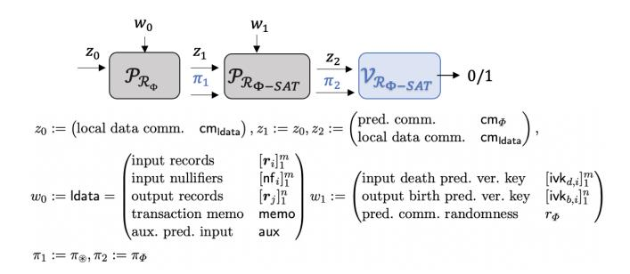
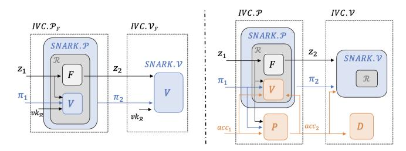
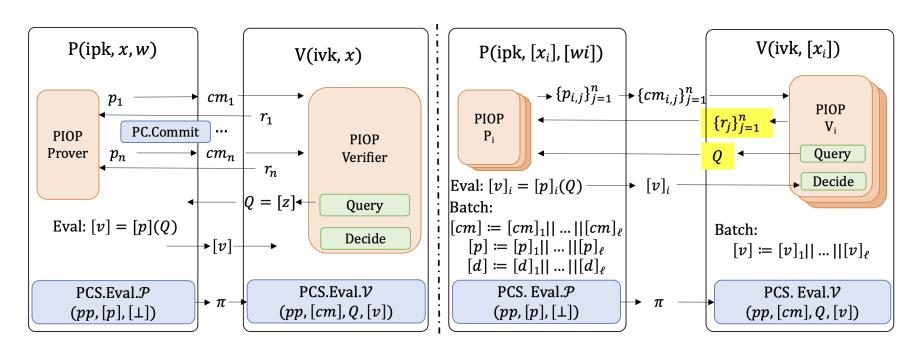
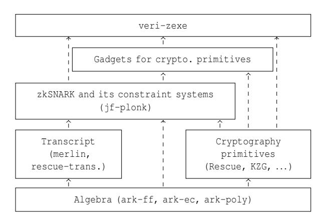
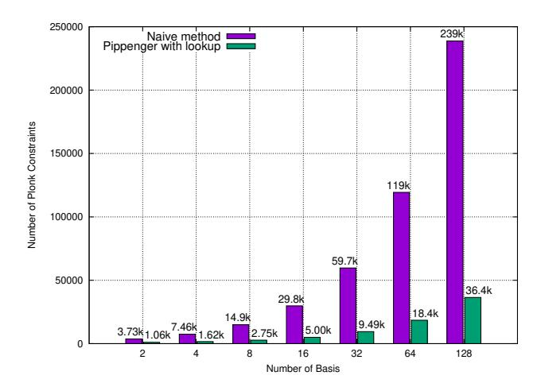

# **VERIZEXE: Decentralized Private Computation with Universal Setup**

Alex Luoyuan Xiong<sup>1</sup>, Binyi Chen<sup>2</sup>, Zhenfei Zhang<sup>3</sup>, Benedikt Bünz<sup>4</sup>, Ben Fisch<sup>5</sup>, Fernando Krell<sup>6</sup>, and Philippe Camacho<sup>7</sup>

1,2,3,4,5,6,7 Espresso Systems

<sup>1</sup>National University of Singapore

<sup>4</sup>Stanford University

<sup>5</sup>Yale University

#### **Abstract**

Traditional blockchain systems execute program state transitions *on-chain*, requiring each network node participating in state-machine replication to re-compute every step of the program when validating transactions. This limits both scalability and privacy. Recently, Bowe *et al.* introduced a primitive called *decentralized private computation* (DPC) and provided an instantiation called ZEXE, which allows users to execute arbitrary computations *off-chain* without revealing the program logic to the network. Moreover, transaction validation takes only constant time, independent of the off-chain computation. However, ZEXE required a separate trusted setup for each application, which is highly impractical. Prior attempts to remove this per-application setup incurred significant performance loss.

We propose a new DPC instantiation VERIZEXE that is highly efficient and requires only a single universal setup to support an arbitrary number of applications. Our benchmark improves the state-of-the-art by 9x in transaction generation time and by 3.4x in memory usage. Along the way, we also design efficient gadgets for variable-base multi-scalar multiplication and modular arithmetic within the PLONK constraint system, leading to a PLONK verifier gadget using only  $\sim 21k$  constraints.

### 1 Introduction

Distributed ledgers are replicated state machines maintained by a network of potentially faulty nodes via a distributed consensus algorithm. The state machine might range from a specialized accounting system, as in Bitcoin [48], to a Turing complete virtual machine, as in Ethereum [56], where any user can instantiate a stateful program called a *smart contract*. These platforms are resilient to failures or even malicious behavior by a subset of the network nodes. This resilience enables a new class of applications in cryptocurrencies, governance, digital collectibles, and more. Unfortunately, privacy, which is paramount for many applications, is disregarded in ledger systems like Bitcoin and Ethereum.

There is a rich literature of work attempting to improve privacy guarantees on distributed ledgers [6,17,22,23,43,49]. The Zerocash protocol [6] is a privacy-preserving payment system that achieves user anonymity and amount confidentiality in transactions. Hawk [43] proposes a smart-contract framework that preserves program data privacy. Zether [17] enables confidential transactions among publicly known smart contracts and hides the identities of transacting parties within a small anonymity set. All of these prior designs, however, are either limited to a fixed functionality (e.g., payments) or lack function privacy, i.e. transactions do not hide which smart contract is being executed. ZEXE [14] addresses this by proposing a new cryptographic primitive called decentralized private computation (DPC) scheme that achieves both data privacy and function privacy for arbitrary user-defined programs. The scheme hides from the network nodes both the states and the logic of the programs being called in each transaction. Users in DPC schemes execute computations offline and update the ledger by sending a transaction with a publicly verifiable cryptographic proof attached, attesting to the correctness of the computation.

The core building block in a DPC construction is a Succinct Non-interactive ARgument of Knowledge (SNARK) proving system [9]. A SNARK system for a binary relation  $\mathcal{R}$  provides a prover algorithm  $\mathcal{P}(x, w)$  that on any valid *public inputs* and private witness pair  $(x, w) \in \mathcal{R}$  outputs a valid and succinct proof  $\pi$ , and a verifier algorithm  $\mathcal{V}(x,\pi)$  that always accepts valid proofs and rejects invalid proofs with overwhelming probability. A zkSNARK proof additionally guarantees the zero-knowledge property, thus leaking no information about the witness w. We generally encode  $\mathcal{R}$  using "circuit" or various constraint systems, which outputs 1 on input (x, w) if and only if  $(x, w) \in \mathcal{R}$ . The SNARK system may also require a trusted setup procedure to generate a structured reference string (SRS), which is an input to both  $\mathcal{P}$  and  $\mathcal{V}$ . A SNARK system is *universal* if it has a single setup to generate a single SRS that can be reused for all circuits, and non-universal if it requires a new setup per circuit. The original ZEXE [14] system uses a non-universal scheme [36, 38], thus requiring

<span id="page-1-1"></span>

| Implementation       | Universal Setup | Transaction Generation | Memory   | Verification | Proof Size |
|----------------------|-----------------|------------------------|----------|--------------|------------|
| Original ZEXE [14]   | Х               | 14.3 s                 | 6.56 GB  | 15 ms        | 0.482 KB   |
| SnarkVM testnet-2    | ✓               | 151.4 s                | 22.81 GB | 15 ms        | 0.482 KB   |
| VERIZEXE (this work) | ✓               | 16.9 s                 | 6.61 GB  | 18 ms        | 4.138 KB   |

Table 1: Comparison of three DPC implementations for 2-input-2-output transaction. Both verification time and proof size are constant and independent of transaction dimension (number of input and output records), whereas transaction generation time and memory usage grow with larger transaction dimensions. Details in § 4.

a trusted setup for every application. As this is extraordinarily inconvenient in practice, the authors also suggest an alternative instantiation from universal SNARKs [24], which requires a one-time setup to support all future applications up to maximum circuit complexity. However, the performance of this alternative instantiation is significantly worse than the original protocol due to the higher complexity of the universal SNARK verification logic and the fact that ZEXE requires producing a proof for a circuit that encodes the SNARK verification logic. Specifically, its transaction generation speed is an order of magnitude slower than that in the original ZEXE. Hence we ask the following question:

**Problem 1.** Can we obtain DPC with universal setup without sacrificing transaction generation speed?

### 1.1 Our Contributions

We answer the above question in the affirmative. The contributions of this paper are:

- VERIZEXE, a DPC scheme instantiation that supports both one-time universal system setup and efficient transaction generation comparable to ZEXE (see Table 1), while keeping constant on-chain verification cost independent of offline computation.
- Constraint designs for efficient variable-base MSM and modular arithmetics, leading to a PLONK verifier gadget taking only ~ 21k PLONK constraints<sup>2</sup> which are of independent interests.<sup>3</sup>
- Implementation (open-sourced<sup>4</sup>, written in Rust) and evaluation of VERIZEXE showing its practicality and most notably its 9x improvement on transaction generation time and 3.4x improvement on memory usage over the prior state-of-the-art.

## <span id="page-1-6"></span>1.2 DPC Background and Use Cases

In a DPC scheme, the distributed ledger keeps track of *records*, the basic unit of data, each consisting of a data payload (state), a *birth*  $\Phi_b$  and *death*  $\Phi_d$  predicate governing the rules of its creation and consumption (program logic). A transaction, by consuming existing records and creating new records, represents the resulting state transition from some offline program execution. Execution correctness is captured in relation  $\mathcal{R}_e$  which enforces ⓐ the existence and rightful ownership of the consumed records; ⓑ valid openings of new record commitments and consumed records *nullifiers*; and ⓒ satisfiability of death predicates of all consumed records and birth predicates of newly created records. For efficiency reason,  $\mathcal{R}_e$  is split into  $\mathcal{R}_{\text{utxo}}$  for condition ⓐ and ⓑ, and  $\mathcal{R}_{\Phi}$  for condition ⓒ.

The life cycle of transactions starts with (1) a user (or a group collectively) executing programs offline by assembling existing records, creating new records with updated payload, and generating two zkSNARK proofs (one for  $\mathcal{R}_{utxo}$  and one for  $\mathcal{R}_{\Phi}$ ) to testify the transaction validity. For  $\mathcal{R}_{\Phi}$ , users first generate several inner proofs each attesting to the satisfiability of one of the relevant predicates, then further generate a single *outer proofs* attesting the correctness of all inner proofs. Then 2 users submit their transactions, containing unlinkable nullifiers of consumed records and hiding commitments of new records together with two zkSNARK proofs which reveal nothing about the program data or the predicates/programs involved, to ledger maintainers. Upon receiving transactions, 3 ledger maintainers verify SNARK proofs and update global states by inserting new record commitments and old record nullifiers into the ledger.

A motivating use case is a permissionless multi-asset trading platform that minimizes front-running, censorship, and traffic analysis. Trades on public blockchains like Ethereum have no privacy, leading to front-running arbitrage by the miners [25], and deanonymization as a service.<sup>5</sup> For blockchains with only data privacy, even though the exact amount and trading accounts are hidden, the programs the transaction is interacting with are still visible, which leaks the asset types involved in a trade. This metadata alone can result in preferential censorship by miners who want to block transactions of certain asset types, and traffic analysis with pattern association of side information off-chain which compromises privacy.

<span id="page-1-2"></span><span id="page-1-0"></span><sup>1</sup>https://github.com/AleoHO/snarkVM/tree/testnet1

<sup>&</sup>lt;sup>2</sup>The PLONK constraint system is very extensible from just add and mul gate to customized gates (TURBOPLONK), to support the lookup argument (ULTRAPLONK). These different flavors only affect the concrete encodings of the same constraint logic. Technically we encode a TURBOPLONK verifier in a ULTRAPLONK constraint system using 21k constraints.

<span id="page-1-3"></span><sup>&</sup>lt;sup>3</sup>Another promising application of our PLONK verifier gadget is *private zkRollup* protocols (such as Aztec [29]) which aggregates already private transactions into a single rollup transaction with proof attesting to the correctness of all private transactions, achieving higher computation compression for the blockchain validator (who now only needs to verify the final rollup proof) while maintaining privacy.

<span id="page-1-4"></span><sup>4</sup>https://github.com/EspressoSystems/veri-zexe

<span id="page-1-5"></span><sup>&</sup>lt;sup>5</sup>Companies like Chain Analysis and TRM Labs can track and deanonymize real identities behind most Bitcoin and Ethereum addresses and offer it as a service.

Luckily, DPC-based blockchains would guarantee both data and function privacy of trading transactions, leaking no exploitable information to the miners or the public, thus greatly eliminating the previous issues.

We refer to the original paper [\[14\]](#page-14-4) for detailed definitions, security properties of the DPC model, and more example applications.

# <span id="page-2-1"></span>1.3 Our Techniques

ZEXE [\[14\]](#page-14-4) instantiates both the outer proof and the inner predicate proofs with SNARK schemes that require predicate-specific trusted setups. Instead, we propose the use of SNARKs with universal setup parameters that can be reused for all predicates. To make VERIZEXE efficient we need to overcome several obstacles when encoding the verifier logic of a universal SNARK inside a circuit:

- Pairing checks: SNARKs that utilize pairing-based *Polynomial Commitment Scheme* (PCS) (such as KZG [\[40\]](#page-15-6) and its variants [\[24\]](#page-14-6), see definitions in Appx. [B.2\)](#page-17-0) require some pairing operations in their verification logic, which is very expensive and requires a large number of constraints in a circuit. [6](#page-2-0)
- Multi-Scalar Multiplications: There are more variablebased MSM operations in the verification steps of universal SNARKs than their non-universal counterparts, which results in high circuit complexity with naïve implementation.
- Polynomial evaluations over non-native field: The predicate (inner) proofs and final outer proof are generated in different circuits over different finite fields, thus polynomial evaluations over the inner fields will be simulated in an outer circuit with a different field, which involves high overheads.
- Fiat-Shamir transform: Unrolling all the challenges generated by FS transform requires applying a hash function many times. However, commonly used hash functions are not SNARK friendly and result in high circuit costs.

We present an overview of our techniques that drastically reduce the outer circuit complexity whose proof generation dominates transaction generation cost.

Lightweight Verifier Circuit from Accumulation Scheme. Inspired by Halo [\[16\]](#page-14-9), we move out the expensive pairing check from the SNARK verifier circuit and delay the final proof verification step to ledger validators. Intuitively, the verification logic of universal SNARKs with pairing-based

PCS culminates in producing 2G<sup>1</sup> points for the final bilinear pairing check. Instead of carrying out the full proof verification in the circuit, we output the 2G<sup>1</sup> points as public inputs and attach them to the transaction validity proof. To ensure these two points reveal no information about the underlying predicates, we further mask them by simultaneously applying a blinding factor on both points so that the masked points preserve the pairing check result. The actual pairing check will be executed by the ledger maintainer who receives the transaction validity proof and the two masked points.

Instance Merging. As briefly explained, the outer circuit needs to verify *m*+*n* universal SNARK proofs for *m* death predicates and *n* birth predicates in an *m*-input-*n*-output transaction (W.L.O.G. we assume *m* = *n*). We halve the number of proofs the outer circuit needs to verify (from 2*m* to *m*) by merging each pair of death predicate and birth predicate into a single larger predicate. The critical precondition for this technique to have positive net savings is that: verifying one proof for a merged statement twice as large requires significantly fewer constraints than verifying two proofs for two statements; which holds for SNARKs such as PLONK [\[31\]](#page-14-10).

Assume that the original circuit size bound for birth/death predicates is *N*, the merging technique simply left/right pad another *N* dummy gates to birth/death predicate circuits respectively before arithmetizing them into polynomials that constitute the proving keys. The key observation is that with additive homomorphic polynomial commitment schemes (such as [\[40\]](#page-15-6)), the commitment to the addition of two polynomials is simply the addition of their polynomial commitments.Therefore, by adding a pair of verification keys of any padded birth predicate and any padded death predicate, the verifier can obtain the verification key of the merged predicate and thus be able to verify the proof for the merged predicate.

Notice that theoretically, one can merge more than two predicates, but in the DPC context, merging a pair of birth and death predicates hits the sweet spot of flexibility and efficiency improvement. This is because circuit/predicate key preprocessing happens beforehand in the offline phase, and instance merging-then-proving happens later in the online phase. For example, if we merge 3 predicates, then during the circuit key generation phase, we will have to decide which *N*-out-of-3*N* slots (in the merged circuit) should a particular predicate be assigned to, which restricts it from merging with other predicates that occupy the same *N* slots. In contrast, our merging of a death and a birth predicate requires easy slot allocation and allows for arbitrary assembly of death/birth predicates in a transaction.

Proof Batching. Instead of generating and verifying *m* proofs separately, we exploit the proof batching technique to achieve a lower amortized cost. We leverage the fact that most universal SNARKs are cryptographically compiled from a *Polynomial Interactive Oracle Proof* (PIOP) using a PCS and

<span id="page-2-0"></span><sup>6</sup>Note that this is not a unique problem for universal SNARKs, as many non-universal counterparts [\[36,](#page-15-4) [38\]](#page-15-5) also need pairing checks.

many choices of PCS support batch opening which reduces opening proof size and amortizes verification cost. Thus, we present a generic compiler in § [3.3](#page-6-0) to transform a PIOP-based SNARK into a batched prover and verifier for a list of NP relations. In the case of KZG-PLONK, batching ℓ relations reduces the total proof size by 5(ℓ−1)G<sup>1</sup> elements by sharing the same quotient polynomial and the same opening polynomials; reduces the number of MSM operation by 7(ℓ−1) and the number of pairing operation by (ℓ−1). Batching TURBO-PLONK with more selector polynomials and wire polynomials leads to even greater savings. Since both the MSM gadget and pairing gadget are expensive, we would noticeably reduce outer circuit complexity by batch verifying *m* merged predicate.

Next, we present techniques that are tailored for (customized) PLONK-based constraint systems that support lookup gates.

Variable-base MSM via Online Lookup Table. Instead of naïvely enforcing variable-base MSM computation, we design a Pippenger-base MSM gadget and further reduce its complexity by relying on a special variant of lookup argument called *online lookup table argument*. Recall that Pippenger algorithm [\[51\]](#page-15-7) reduces a *b*-bit MSM into *b*/*c* instances of *c*-bit MSMs (*c* < *b*) and finally sums them together. When computing a *c*-bit MSM, instead of unrolling the exact Pippenger algorithm in the circuit which is very expensive, we utilize a lookup table containing all resulting points from the scalar multiplications between the base point and all 2 *<sup>c</sup>* −1 possible scalar values. With such a lookup table, any *c*-bit scalar multiplication on this specific base point becomes a table query rather than an elliptic curve group operation. Given that these bases are unfixed, the lookup table cannot be pre-processed – table values are only known during the online proving phase. Such online lookup tables are already possible with [\[30\]](#page-14-11) although their presentation is limited to preprocessed query tables whose values are known ahead of time. We provide detailed gadget descriptions and circuit sizes in § [3.4.](#page-7-0)

Polynomial Evaluation over Non-native Field. To facilitate polynomial evaluation over a non-native field, we device efficient modular multiplication and modular addition gadgets by leveraging range check via lookup argument [\[30\]](#page-14-11). Compared to other modular arithmetic gadget designs, ours take advantage of (a) clever ULTRAPLONK constraint system design to do range-check with little to no additional circuit cost; (b) specialized use case of two-chain curves for depth-2 proof recursion (instead of cycling curves for deeper proof recursions), which allows us to safely assume finer-grained requirements on the sizes of two fields to make our circuit simpler. We provide detailed gadget descriptions in § [3.5.](#page-8-0)

SNARK-friendly Symmetric Primitives. To reduce the number of non-algebraic operations in the circuit, we instantiate symmetric primitives used such as commitment schemes, Pseudorandom Function (PRF), and Collision-resistant Hash (CRH) with SNARK-friendly candidates which are designed to work natively with finite fields involving mostly algebraic operations. We specify our concrete implementations in § [4.1,](#page-11-1) most of which are based on Rescue hash functions [\[2\]](#page-14-12). More importantly, we carefully design customized gates in our TUR-BOPLONK (Def. [2\)](#page-19-0) to optimize for these rescue operations. Our Fiat-Shamir transcript uses Sponge-based hash from Rescue permutation so that verifier challenge derivation is much cheaper in the circuit. We further designed an optimized predicate commitment gadget in § [3.6](#page-11-2) to ensure two circuits over different fields are committing to the same list of predicates. Particularly, the number of non-native hash operations in our gadget does not grow with the number of predicates committed.

## 1.4 Related Works

We refer readers to Section 1.2 in [\[14\]](#page-14-4) for a comprehensive literature review on privacy-preserving computation on ledgers. Even though there are alternative private smart contract designs proposed afterwards [\[4,](#page-14-13) [41,](#page-15-8) [52](#page-15-9)[–54\]](#page-15-10) with different tradeoffs and limitations, ZEXE remains the only concrete construction of DPC to date. DPC schemes like ZEXE and VERIZEXE have both data privacy and function privacy while maintaining high expressiveness. (see Appx. [A\)](#page-15-11).

Universal SNARKs. Our construction makes heavy use of Universal SNARKs [\[37\]](#page-15-12), which strikes a good balance between efficiency and acceptable trust assumption. These systems support a universal and constantly *updatable* SRS [\[37\]](#page-15-12) where anyone can contribute to the SRS in a verifiable way. As long as one of the contributors is honest, then no trapdoor exists. SNARKs with fully transparent setups [\[5,](#page-14-14) [18,](#page-14-15) [20\]](#page-14-16) usually have worse performance or a much larger proof size.

We choose variants of PLONK [\[31\]](#page-14-10) for our implementations primarily due to their performance, customizable gates, and importantly its support for lookup argument [\[13,](#page-14-17)[30\]](#page-14-11) that some of our optimization techniques depend on. We provide a more detailed literature review of Universal SNARKs in Appx. [A.](#page-16-0)

## 2 Preliminaries

We denote [*n*] as the set {1,...,*n*} ⊆ N, λ ∈ N as the security parameter, negl(λ) as a *negligible* function in λ if it vanishes faster than the inverse of any polynomial in λ. A probability is overwhelming if it is 1−negl(λ) for a negligible function negl(λ). Further, we use *efficient algorithms* to refer to probabilistic polynomial time algorithms in λ.

We provide formal definitions and security properties of *Commitment Scheme*, *Polynomial Commitment Scheme* (PCS), *indexed relation*, *(preprocessing) succinct non-interactive argument of knowledge* (SNARK), and *incrementally verifiable computation* (IVC), in Appx. [B.](#page-16-1)

# <span id="page-4-2"></span>3 VERIZEXE: Practical ZEXE with Universal SNARKs

To tackle the challenges of efficiently instantiating the DPC scheme with universal SNARKs described in Sec. [1.3,](#page-2-1) we propose numerous optimization techniques many of which can be applied to protocols beyond DPC. With all optimizations applied, we expect to bring VERIZEXE to the realm of practicality. Detailed benchmark is reported in Sec. [4.](#page-11-0)

# <span id="page-4-3"></span>3.1 Lightweight Verifier Circuit from Accumulation Scheme

We apply a technique called *Accumulation Scheme* (AS), originally introduced in [\[16\]](#page-14-9) and later generalized in [\[19\]](#page-14-18), to move the expensive pairing check out of the SNARK verifier circuit. While the technique is not new, we try to cast part of the transaction generation procedure into an *incrementally verifiable computation* (Appx. [B\)](#page-16-1) and show explicitly how accumulation schemes can improve the performance of ZEXE.

The core observations are that (i) proving satisfiability of user-defined predicates can be modeled as a two-step IVC, and (ii) original ZEXE instantiated this IVC using SNARK composition. To obtain a more lightweight IVC prover, we construct this IVC using a SNARK with an accumulation scheme. The key observation is that the verification of many universal SNARKs under the PIOP+PCS paradigm is efficient except for the final polynomial opening check. And with the help of an AC for the PCS, these opening checks can be separated from the SNARK verifier logic and delayed to another *decider* algorithm executed much later.

Modeling DPC executions as IVCs. As introduced in § [1.2,](#page-1-6) one of the proofs generated during transaction building is for the NP relation R<sup>Φ</sup> (for condition <sup>c</sup> ). As shown in Fig. [1,](#page-4-0) the process of proving R<sup>Φ</sup> can be modeled as a two-step IVC. In the first step, users produce SNARK proofs certifying all relevant predicates are satisfied over some local data ldata of that transaction. To achieve *function privacy*, SNARK proofs for predicates-SAT are not directly posted on the ledger. Instead, an outer proof π<sup>Φ</sup> is generated in the second step attesting to the correctness of these predicate proofs, by taking predicate proofs and their verification keys as secret witnesses and running the SNARK verifier inside the outer circuit. Finally, ledger maintainers run the IVC verifier to verify the outer proof which reveals nothing about the actual predicates involved in the transaction. To ensure consistency of records used in Rutxo and RΦ, commitments to the local data cmldata and list of predicates cm<sup>Φ</sup> involved are returned as public

<span id="page-4-0"></span>

Figure 1: Casting R<sup>Φ</sup> proving into a two-step IVC (with different step function at each step).

<span id="page-4-1"></span>

Figure 2: IVC from SNARK compositions (left) v.s. IVC from accumulation schemes (right). Blue boxes are SNARK prover P and verifier V for the relation R, and orange boxes are accumulation prover *P*, verifier *V* (more lightweight than a SNARK verifier) and decider *D*. *z*1,*z*2,π1,π<sup>2</sup> in both schemes are the same as those in Fig. [1](#page-4-0) where *F* is the step function that calculates the predicate commitment cm<sup>Φ</sup> using Pedersen Commitment over the hashes of the predicate verifying keys. There are a few inputs dropped from the diagram for visual clarity, *e*.*g*. witness *w*<sup>1</sup> as an input to the IVC prover in both diagrams; SNARK verifying key *vk*<sup>R</sup> for the SNARK verifier inside the IVC verifier on the right diagram.

outputs. Note that when applying proof batching technique (see § [3.3\)](#page-6-0), the IVC proof from the first step will be a single batched proof denoted as π<sup>⊛</sup> instead of a list of predicate proofs.

ZEXE: IVC from SNARK composition. Next, we explain how the original ZEXE instantiates this IVC using SNARK composition (see the left half of Fig. [2\)](#page-4-1). For a general IVC, at each step, the prover will receive the state *z* and an IVC proof π from the last computation step, compute the next state by applying the step function *F* to get the new state *z* ′ , and create another IVC proof π ′ for the statement "*F*(*z*) = *z* ′ ∧*V*(*z*,π) = 1" where *V* is a SNARK verifier. The fact that we have to embed the entire SNARK verifier logic inside the IVC prover's circuit is where the complexity comes from. For example, the pairing checks in KZG for any PIOP+KZG universal SNARK are very expensive in the circuit and will slow down the proof generation significantly.

VERIZEXE: IVC from accumulation schemes. Finally, we give a high-level intuition on leveraging an accumulation scheme for SNARK to defer the heavy-lifting during the SNARK verification to the IVC verifier, thus liberating the IVC prover from a complex circuit (see the right half of Fig. [2\)](#page-4-1).At each step, the IVC prover receives an additional *accumulator* acc*<sup>i</sup>* (think of the tuple (acc*<sup>i</sup>* ,π*i*) as the new IVC

proof), and eventually, the accumulator will be validated by a decider algorithm as part of the IVC verifier logic. The core idea is: at the second step, the IVC prover will receive the predicate proof  $\pi_{\circledast}$  and an empty accumulator  $acc_1 = \bot$ ; then instead of verifying the predicate proof entirely, we partially verify it (e.g. compute everything except the pairing check in case of PIOP+KZG SNARKs); the expensive steps in verification are delayed to the IVC verifier via the accumulator (e.g.  $acc_2$  would contain the final two  $\mathbb{G}_1$  elements used in KZG opening proof check). Informally, our accumulation prover will compute the group elements for PCS opening proof check, our accumulation verifier will ensure correct accumulations (i.e. correct derivation of the two  $\mathbb{G}_1$  elements in KZG), our IVC prover only embeds the accumulation verifier's logic in its circuit which is much more lightweight than a SNARK verifier, and finally, our IVC verifier (transaction verification on-chain in ZEXE) will run a SNARK verifier for  $\pi_2 := \pi_{\Phi}$ and a decider algorithm which completes the PCS opening proof check (e.g. the final pairing check in KZG).

We emphasize that the accumulation must be zero-knowledge – the accumulator  $\mathsf{acc}_2$  and the proof  $\pi_V$  shouldn't reveal anything about the predicates being accumulated. In the context of an AS for PLONK with KZG, this means the two  $\mathbb{G}_1$  elements for pairing must be randomly masked and the randomizer is an additional secret witness for the accumulation verifier. Note that authors of [19] already showed how to make accumulation schemes for inner-product-argument-based and pairing-based PCSs zero knowledge in their Appendix A and Section 8.

### <span id="page-5-0"></span>3.2 Instance Merging

Recall that a transaction builder needs to generate predicate (inner) proofs for all death predicates of input records and birth predicates of output records. We describe a method to merge two proving instances (*e.g.* a birth predicate and a death predicate) into one by exploiting the algebraic nature of preprocessing in a SNARK (Appx. B) and the homomorphism of polynomial commitment schemes (Appx. B.2), thus halving the number of proofs the outer circuit needs to verify.

**Technique.** In a SNARK based on polynomial IOP (such as *Algebraic Holographic Proof* (AHP) in MARLIN, and *idealized low-degree protocol* in PLONK), the preprocessing of circuit involves an *arithmetization* process where constraints in an algebraic circuit (or equivalent computational models) are being transformed into constraints about polynomials. The resulting proving key ipk usually contains these index polynomials and the verifying key ivk contains the commitments to these index polynomials. During arithmetization, for a birth predicate circuit  $C_1$  of size n, we pad the circuit to size of 2n, with  $C_1$  being right padded (last n gates are dummy), and compute the proving key and verification key as usual; for a death predicate circuit  $C_2$  of size n, we perform similar

operations but left pad the circuit (first n gates are dummy). Subsequently, whenever we want to merge  $C_1$  and  $C_2$ , we can construct a *merged* circuit of size 2n just by adding the two padded circuits while maintaining overall circuit satisfiability. The *merged* proving key can be easily obtained via the addition of two polynomials of the same degree, and the *merged* verification key (i.e. the commitments) can be similarly derived thanks to the additive homomorphism of PCS (such as KZG10 and its variants).

**Syntax.** We proceed to propose a slightly modified syntax for SNARKs that support instance merging. A *k-Mergeable SNARK* scheme

$$\mathsf{SNARK}_{\oplus}^{\mathsf{k}} = (\mathcal{G}, \mathcal{I}, \mathcal{M}_{\mathsf{ipk}}, \mathcal{M}_{\mathsf{ivk}}, \mathcal{M}_{\mathrm{w}}, \mathcal{P}, \mathcal{V})$$

supports merging k slotted instances into one single merged instance, where a slotted instance is labeled with a slot  $\in [k]$ , and only a batch of non-overlapping instance  $\{\mathsf{slot}_i\}$  where  $\mathsf{slot}_i \neq \mathsf{slot}_j$  for any  $i \neq j, i, j \in [k]$  can be merged together. For simplicity, we present the variant we will use to improve ZEXE with k=2 which allows for the merging of a death and a birth predicates into one.

- srs  $\leftarrow$  SNARK $_{\oplus}$ . $\mathcal{G}(\lambda, N)$ : same as SNARK. $\mathcal{G}$  except N = 2n where n is the size bound for each instance.
- (ipk<sub>b</sub>,ivk<sub>b</sub>)  $\leftarrow$  SNARK<sub> $\oplus$ </sub>. $\mathcal{I}^{srs}(\Phi_b,b)$ : Given circuit description  $\Phi_b$ , slot number  $b \in [2]$ , and oracle access to SRS srs, it deterministically outputs the slotted proving key and verifying key (ipk<sub>b</sub>,ivk<sub>b</sub>). The relation for the merged instance is  $\mathcal{R}_{\oplus} := \{(\mathbb{x}_0||\mathbb{x}_1,\mathbb{w}_0||\mathbb{w}_1) : \phi_0(\mathbb{x}_0,\mathbb{w}_0) = 1 \land \phi_1(\mathbb{x}_1,\mathbb{w}_1) = 1\}.$
- ipk ← SNARK<sub>⊕</sub>.M<sub>ipk</sub>(ipk<sub>0</sub>,ipk<sub>1</sub>): Given any two complementarily slotted proving keys ipk<sub>0</sub>,ipk<sub>1</sub>, it outputs a merged proving key ipk.
- ivk ← SNARK<sub>⊕</sub>.M<sub>ivk</sub>(ivk<sub>0</sub>,ivk<sub>1</sub>): Given any two complementarily slotted verifying keys ipk<sub>0</sub>,ipk<sub>1</sub>, it outputs a merged verifying key ivk.
- w ← SNARK<sub>⊕</sub>.M<sub>w</sub>(w<sub>0</sub>, w<sub>1</sub>): Given any two witnesses w<sub>0</sub>, w<sub>1</sub> corresponding to relations R<sub>Φ0</sub>, R<sub>Φ1</sub>, it outputs a merged witness w for R<sub>⊕</sub>.
- $\pi \leftarrow \mathsf{SNARK}_{\oplus} . \mathcal{P}(\mathsf{ipk}, \mathbb{x}, \mathbb{w})$ : same as  $\mathsf{SNARK}. \mathcal{P}$  except N = 2n.
- $b \leftarrow \mathsf{SNARK}_{\oplus} . \mathcal{V}(\mathsf{ivk}, \mathbb{x}, \pi)$ : same as  $\mathsf{SNARK}. \mathcal{V}$  except N = 2n.

We present a concrete construction of such a technique for PLONK in Appx. E.

**Analysis.** A clear trade-off we make here is halving the number of proving instances by doubling the circuit size of each instance. Concretely in ZEXE's context, given an minput-m-output transaction, we have 2m predicate proofs (m death and m birth) to be verified in the outer circuit, which is over a larger field with more expensive computation within it. Now by merging each pair of  $(\Phi_{b,i}, \Phi_{d,i})_{i=1}^m \mapsto [\phi_i']_{i=1}^m$ , we reduce the number of inner predicate proofs to m, potentially lowering the outer circuit complexity. The concrete net saving is dependent on the choice of SNARK proof system for predicate circuits. Assume a circuit of size n, the proof for the circuit satisfiability can be checked by a verifier gadget using  $C_n$  constraints; while a verifier gadget for a circuit of size 2n takes  $C_{2n} = C_n + \delta$  constraints. Our instance merging techniques effectively reduce the outer circuit complexity from roughly  $2m \cdot C_n$  to  $m \cdot C_{2n}$ , which is a significant saving as long as  $\delta \ll C_n$ . In the case of a PLONK verifier gadget,  $\delta$  is very small and attributed to a few additional modular arithmetic constraints from computing the polynomial evaluations that are dependent on the doubled evaluation domain size; whereas  $C_n$  is orders of magnitude larger. Meanwhile, inevitably there is an additional cost associated with a larger circuit per inner instance. The only noticeable cost boils down to running polynomial interpolations using FFT over a domain size of 2n instead of n during inner proof generation - effectively 2 FFT of the size n v.s. 1 FFT over the size of 2*n*. Given that the running time of FFT is  $O(n \cdot \log(n))$ , the increased cost is really negligible compared to the efficiency gain from a simpler outer circuit.

## <span id="page-6-0"></span>3.3 Proof Batching

We describe a generic compiler that transforms a public-coin non-interactive argument that proves *a single* relation into an argument that batch proves a list of relations while preserving all security properties. Notice that one could trivially run multiple instances of the argument protocol independently in parallel. Our compiler below is non-trivial as it reduces the total communication complexity (thus the final proof size) and the total verification computation, which in turn ultimately reduces the overall verifier circuit complexity in ZEXE compared to verifying them individually.

**Syntax.** A SNARK that supports proof batching shares most of the syntax from SNARK except that the proving and verification algorithm now accepts a list of instances, witnesses, and proofs instead of one:

- $\pi_{\circledast} \leftarrow \mathsf{SNARK}.\mathcal{P}_{\circledast}([\mathsf{ipk}_i]_{i=1}^{\ell}, [\mathtt{x}_i]_{i=1}^{\ell}, [\mathtt{w}_i]_{i=1}^{\ell})$ : Given a list of  $\ell$  proving keys, instances and witnesses, it proves them in batch and outputs a proof  $\pi_{\circledast}$ .
- $b \leftarrow \mathsf{SNARK}.\mathcal{V}_\circledast([\mathsf{ivk}_i]_{i=1}^\ell, [\mathtt{x}_i]_{i=1}^\ell, \pi_\circledast)$ : Given a list of  $\ell$  verifying keys, instances and an aggregated proof, it outputs a success bit b.

We explain the high-level techniques below and present a concrete construction in Appx. E.

**Technique.** MARLIN presents a compiler that combines any public-coin AHP/PIOP for a relation  $\mathcal{R}$  and an extractable polynomial commitment scheme to obtain a public-coin preprocessing argument with universal SRS for the same relation (see Theorem 1 in [24]). The universal SNARKs we use also fit into this construction paradigm, and we summarize it schematically in Fig. 3. To extend the above paradigm and support batching, the core idea is to leverage the batch opening of PCS, which reduces opening proof size and amortizes verification costs. We observe that many existing PCSs have a *linear combination scheme*, and thus support batch openings of multiple polynomials at multiple points (proven in Theorem 3 of [12] on private aggregation scheme).

Next, we summarize the general paradigm and its batching extension in Fig. 3. On the left side of Fig. 3 is an interactive argument between a Prover  $\mathcal{P}$  and a Verifier  $\mathcal{V}$  both of whom are running an information-theoretic PIOP as a sub-protocol. The prover starts by running the PIOP prover with the given instance x and witness w, where in each round it produces a polynomial  $p_i$  to be committed into cm<sub>i</sub> and sent over to the verifier. Meanwhile, the verifier V who internally runs the PIOP verifier randomly samples a coin  $r_i$  in each round, and at the end of n-th round, outputs a query set Q containing algebraic queries such as "evaluate  $\{p_i\}$  at point  $r_i$ " or some polynomial identity testing. Upon receiving the queries,  $\mathcal{P}$ calculates the replies as a list of evaluated values [v] and returns to  $\mathcal{V}$  who will decide whether the replied values are acceptable. Additionally,  $\mathcal{P}$  has to prove that the replies to algebraic queries are consistent with committed polynomials by running PCS.Eval. $\mathcal{P}$  as a sub-procedure whose opening proof will be verified by  $\mathcal{V}$  who runs PCS. Eval.  $\mathcal{V}$ .

On the right side of Fig. 3 is an interactive argument, compiled from the one on the left, for a list of relations  $\{\mathcal{R}_i\}_{i=1}^\ell$  with the same size bound. In j-th round  $(j \in [n])$ , the i-th PIOP prover  $(i \in [\ell])$ , sends over the committed polynomial for that round  $\{p_{i,j}\}$  and the PIOP verifier would replied with a random coin  $r_j$  after it receives all polynomials from  $\ell$  PIOP provers. After n rounds of polynomial commitments and coin flips, the PIOP verifier outputs a single query set Q for all  $\ell$  relations, and the size of this set should be the same as that of a single PIOP run. Finally,  $\mathcal{P}$  and  $\mathcal{V}$  run batch opening of PCS over all polynomials at those query points.

Note that a strawman (yet non-trivial) compiler would run  $\ell$  PIOP instances in parallel, where the verifier produces  $\ell$  random challenges  $\{r_{i,j}\}_{j=0}^n$  (in total  $\ell \cdot n$  challenges) and  $\ell$  query set  $Q_i$ . Subsequently the PCS.Open will proceed to prove opening of polynomials  $\left\{\{p_{i,j}\}_{j=1}^n\right\}_{i=1}^\ell$  at different subsets in  $Q:=\bigcup\{Q_i\}$ . In contrast, our compiler utilizes the same random challenges (in total n) and the same query set Q, independent of the number of batched relations  $\ell$ , so that

<span id="page-7-1"></span>

Figure 3: Generic compiler for batching PIOP-based SNARKs.

the batched opening of PCS is even simpler. Intuitively our compiler preserves security since these random challenges are only sent *after* receiving the committed polynomials (for that round) from all of the  $\ell$  PIOP provers, and the query set is constructed *after* finishing the n rounds of all PIOPs, thus there won't be any knowledge soundness compromise (although the knowledge extractor requires slight modifications).

# <span id="page-7-0"></span>3.4 Variable-base Multi-Scalar Multiplication via Online Lookup Table

We generalize the lookup table argument in [30] by enabling a variant we call *online lookup table* to constrain MSM in the circuit more efficiently.

**Motivation.** Recall that a b-bit multi-scalar multiplication (MSM) problem of size  $n \in \mathbb{N}$  is to compute  $Q = \Sigma_{i \in [n]}(s_i \cdot P_i)$  where  $s_i \in [0, 2^b)$  are scalars,  $P_i \in \mathbb{G}$  are bases,  $\cdot$  is scalar multiplication, and + is group addition. When all bases are fixed and known in advance, we call such instance a fixed-base MSM (fMSM); otherwise variable-base MSM (vMSM).

During verification of inner proofs in the outer circuit in ZEXE, there are some vMSM computations where the bases are commitments to witness polynomials inside proofs or commitments to preprocessed circuit descriptions inside verifying keys (note that verifying keys for user-defined predicates are dynamic). On a high level, we employ Pippenger-like  $[51]^7$  strategy by reducing a b-bit MSM into b/c instances of c-bit MSMs (c < b), and finally summing them together. Particularly, when computing a c-bit MSM, instead of unrolling the exact Pippenger algorithm in the circuit which is very expensive,  $^8$  we utilize a lookup table containing all resulting points

from the scalar multiplications between the base point and all  $2^c - 1$  possible scalar values. With such a lookup table, any c-bit scalar multiplication on this specific base point becomes a table query rather than an elliptic curve group operation. Given that these bases are unfixed, the lookup table cannot be pre-processed – table values are only known during the online proving phase which gives rise to our following technique.

Pre-processed v.s. Online Lookup Table. PLOOKUP [30] presents a polynomial IOP (PIOP) protocol for checking values of a *query table*  $f := (f_1, \dots, f_n) \in \mathbb{F}^n$  are contained in the values of a *lookup table t* :=  $(t_1, ..., t_d) \in \mathbb{F}^d$ . They further generalize the protocol to support vector lookup where each entry in the query table and lookup table is a vector (*i.e.*  $f_i, t_i \in \mathbb{F}^w$ ); and to support multiple tables by adding an additional column for table index and concatenating multiple tables into one. However, the presentation in [30] only considers pre-processed lookup tables where values in the lookup tables are predefined and fixed. The key observation is that the PIOP protocol for lookup relations works regardless of how the query table and the lookup table are constructed – whether those values are known in advance or determined during the online phase of the protocol run. Intuitively, the PIOP for online lookup tables still preserves soundness because online columns constructed by the prover are committed first (sent to the verifier for oracle access), before any verifier-initiated checks are carried out.

**Optimized MSM Circuit.** With the online lookup table in our toolbox, we proceed to present an optimized circuit for MSM.

We denote an elliptic curve point addition gadget  $\odot_{\mathsf{add}}$ , point doubling gadget  $\odot_{\mathsf{double}}$ , linear combination gadget  $\odot_{\mathsf{lc}}$  for k terms, lookup gadget (for either filling entry in query or lookup table)  $\odot_{\mathsf{lookup}}$ . Then our overall circuit size (number of gates) is dominated by:

<span id="page-7-2"></span><sup>&</sup>lt;sup>7</sup>We only use a special case of a simplified Pippenger algorithm which is sometimes referred to as "the bucket method". For a detailed literature review and comparisons among different variants of Pippenger's predecessors, please see [7].

<span id="page-7-3"></span><sup>&</sup>lt;sup>8</sup>For each c-bit MSM, there are  $2^c-1$  buckets each representing a possible non-zero scalar. We need to compute the "bucket sum"  $\{S_1,\ldots,S_{2^c-1}\in\mathbb{G}\}$  by adding all base points that are supposed to multiply with that the scalar (e.g.  $S_i$  is computed by adding all bases that multiply with i, with  $i\in[1,2^c-1]$ ), then finally the MSM result is computed as  $\sum_{i\in[2^c-1]}i\cdot S_i$ . We note that the main circuit complexity does not come from point additions, but from

maintaining  $2^c-1$  bucket sums and selectively updating the correct bucket sum for each base and its scalar – which is trivial outside the circuit, but expensive to enforce inside the circuit.

```
Inputs: Base point variables: [P_1, \ldots, P_n], scalar variables: [s_1, \ldots, s_n] where scalar values \in [0, 2^b).
Outputs: A point variable Q = \sum_{i \in [n]} s_i \cdot P_i.
Circuit: We break b-bit MSM into m := b/c instances of c-bit MSM and finally summing over m points.
   1. For i \in \{1...n\}:
          (a) Compute (2 \cdot P_i, \dots, (2^c - 1) \cdot P_i) using repeated point addition from P_i.
          (b) Create online lookup table: \mathcal{T}_i = [(0, 0_{\mathbb{G}}), (1, P_i), (2, 2 \cdot P_i), \dots, (2^c - 1, (2^c - 1) \cdot P_i)].
          (c) Decompose s_i into m chunks of c-bit value [s_{i,0},\ldots,s_{i,m-1}], such that s_i = \sum_{j=0}^{m-1} s_{i,j} \cdot 2^{cj} (we don't need to further range-check s_{i,j}, as it is
               implicitly constrained later in lookup gates).
  2. For j = \{0 \dots m - 1\}:
```

- <span id="page-8-3"></span><span id="page-8-2"></span>
  - (a) For  $i = \{0...n\}$ :
    - i. Create a point variable  $Q_{i,j}$  for the value  $s_{i,j} \cdot P_i$ .
    - ii. Add an entry to query table  $(s_{i,j}, Q_{i,j})$  (lookup argument will check if  $(s_{i,j}, Q_{i,j}) \in \mathcal{T}_i$ ).
  - (b) Compute window sum:  $\mathsf{wsum}_j = \sum_{i \in [n]} Q_{i,j}$ .
- <span id="page-8-6"></span><span id="page-8-5"></span><span id="page-8-4"></span>3. Compute  $Q = \sum_{j=0}^{m-1} \operatorname{wsum}_j \cdot 2^{cj}$ .

Figure 4: Optimized variable-base MSM using online lookup tables.

$$n \cdot \left(\underbrace{(2^{c} - 2) \odot_{\mathsf{add}}}_{\mathsf{step 1a}} + \underbrace{2^{c} \odot_{\mathsf{lookup}}}_{\mathsf{step 1b}} + \underbrace{\frac{m - 1}{k} \odot_{\mathsf{lc}}}_{\mathsf{step 1c}}\right) + m \cdot \left(\underbrace{n \odot_{\mathsf{lookup}}}_{\mathsf{step 2adii}} + \underbrace{n \odot_{\mathsf{add}}}_{\mathsf{step 2b}}\right) + \underbrace{m \odot_{\mathsf{add}} + b \odot_{\mathsf{double}}}_{\mathsf{step 3}}$$

As a point of reference, with the TURBOPLONK circuit used to generate benchmark number in § 4, which supports linear combination of k = 4 terms using 1 gate, elliptic curve point addition and doubling using 2 gate, a lookup entry or query using 1 gate, a 256-bit vMSM of size 128 takes only around 34,516 gates with chosen chunk size  $c = \log(n) \approx 5$ . In contrast with the naïve circuit implementation, the expected number of gates required is around 230,0009 – our optimized circuit is more than 6.5 factors smaller.

Remark 1. Step 1b and 2(a)ii in Fig. 4 involves creating multiple online lookup tables and later querying from one of them. To achieve this, we implicitly apply the multiple table techniques presented in [30] by adding an extra domain separator column both in the merged lookup table and the merged query table. Furthermore, we note that in a TUR-BOPLONK constraint system, with 3 (preprocessed) selector polynomials (2 domain separator polynomials and 1 polynomial for the fixed scalar value in the online lookup table) and 5 wire polynomials (2 for point variables in the lookup table, 3 for the key-value tuple in the query table), we can do an entry creation for both the lookup table and query table in a single gate, thus reducing the total number of constraints required. (at the cost of longer proving and verifying keys). Specifically, instead of  $(n \cdot 2^c + m \cdot n) \odot_{lookup}$ , we could just use  $\max(n \cdot 2^c, m \cdot n) \odot_{\mathsf{lookup}}$ .

## <span id="page-8-0"></span>**Polynomial Evaluation over Non-native** Field

Inner proofs for predicate satisfiability and outer proofs for inner proof correctness are generated by circuits over different finite fields. Therefore, when running the inner proof verifier in the outer circuit, any polynomial evaluations would require modular arithmetics over a non-native field. In this section, we present efficient gadgets for two main building blocks: modular multiplications for evaluating each monomial and modular additions for summing over evaluations of all monomials. The stepping stone of our modular arithmetic gadgets is a range proof gadget that uses a lookup table introduced in [30].

Let p,q be the sizes of two fields where  $p^2 > q > p$ , we want to show how to emulate modular arithmetics over  $\mathbb{F}_p$  in a circuit over the field  $\mathbb{F}_q$ . The common theme behind our design is enforcing: (a) an equivalent equation over integers expressing the congruence relation of the modular equation and (b) both sides of the equation won't overflow or underflow the native field size q at any intermediate step. For example, to constrain modular operation  $z' \equiv x \cdot y \pmod{p}$ , we ensure there exist witnesses w such that (i) z' + pw = xy over integers, and (ii) arithmetic operations that simulate computations of z' + pw, xy never exceeds the range [0, q).

Assume that we already have a linear combination gadget  $\odot_{lc}$  for  $k_{lc}$  terms, and a preprocessed range table (with size  $K := 2^k$ ) that enables us to constrain a variable x to be in the range [0, K). We start by constructing a more general range-check circuit and then build the modular addition/multiplication gadgets on top of it.

<span id="page-8-7"></span><sup>&</sup>lt;sup>9</sup>Roughly, a naïve variable-base MSM can be done by decomposing the scalars to binary representation, then performing conditional addition based on each bit, then finally adding all points together. The decomposing scalars takes  $nb/k \odot_{lc}$ ; the multiplication takes  $6bn \odot_{add}$  and final combining takes  $n \odot_{\mathsf{add}}$  which adds up to 229,632.

```
Public Parameters: K \in [0,q), \ell \in \mathbb{N} where K^{\ell} < q Input: x \in \mathbb{F}_q Relation: x \in [0,K^{\ell}) Circuit:

1. Create variables x_0,\ldots,x_{\ell-1} and constrain x=x_0+K\cdot x_1+K^2\cdot x_2+\ldots+K^{\ell-1}\cdot x_{\ell-1}.

2. Range check variables x_0,\ldots,x_{\ell-1}\in [0,K).
```

Figure 5: Range proof gadget.

**Range proofs.** We present a range proof gadget with the circuit size:  $n_{\mathsf{range}}(\ell) := \lceil \frac{\ell-1}{k_{\mathsf{lc}}} \rceil \odot_{\mathsf{lc}} + \ell \odot_{\mathsf{rg}}$ .

**Modular multiplications.** Since we assume  $p^2 > q$ , we can't directly multiply  $x,y \in \mathbb{F}_p$  in circuits over  $\mathbb{F}_q$ . Instead we choose to break each  $\mathbb{F}_p$  element into two limbs with a splitting parameter m such that  $2^{2m} \ge p$ , so that we can represent any  $x \in \mathbb{F}_p$  as  $(x_0,x_1) \in [0,2^m)^2$  such that  $x = x_0 + 2^m x_1$ . With the range proof gadget for the range  $[0,K^\ell)$  in mind (where  $K=2^k$ ), we recommend fixing m by finding the minimum  $\ell \in \mathbb{N}$  such that  $2^{2\ell \ell} \ge p$  (namely we denote  $m := \ell k$ ).

The intuition for proving  $x \cdot y = z \pmod{p}$  is to find a witness  $w \in \mathbb{F}_p$  such that  $x \cdot y = z + p \cdot w$  holds over integers and that both sides won't overflow  $\mathbb{F}_q$ . Specifically:

$$\begin{split} (x_0 + 2^m \cdot x_1) \cdot (y_0 + 2^m \cdot y_1) &= z_0 + 2^m \cdot z_1 + (w_0 + 2^m \cdot w_1) \cdot (p_0 + 2^m \cdot p_1) \\ & \qquad \qquad \updownarrow \\ z_0 + w_0 \cdot p_0 - x_0 \cdot y_0 + 2^m \cdot (z_1 + w_0 \cdot p_1 + w_1 \cdot p_0 - x_0 \cdot y_1 - x_1 \cdot y_0) \\ & \qquad \qquad + 2^{2m} \cdot (w_1 \cdot p_1 - x_1 \cdot y_1) = 0 \\ & \qquad \qquad \updownarrow \\ \begin{cases} z_0 + w_0 \cdot p_0 - x_0 \cdot y_0 - 2^m \cdot c_0' = 0 \\ z_1 + w_0 \cdot p_1 + w_1 \cdot p_0 - x_0 \cdot y_1 - x_1 \cdot y_0 + c_0' - 2^m \cdot c_1' = 0 \\ w_1 \cdot p_1 - x_1 \cdot y_1 + c_1' = 0 \end{cases} \end{split}$$

for some  $c_0', c_1'$  carriers bounded by  $-2^m \le c_0' < 2^{m+1}$  and  $-2^{m+1} \le c_1' < 2^{m+2}$ . We present the modular multiplication gadget in Fig. 6 with the following notes:

- To optimize gadget circuit size, we assume that the limbs of input x, y are already in the range  $[0, 2^m)$  without further checking.
- We shift the actual carriers  $c'_0, c'_1$  to  $c_0, c_1$  in order to have a positive range and upper-bounded by a power of K to utilize our range proof gadget.
- Witness  $w \in \mathbb{F}_p$  must exist since we assume both  $x, y \in \mathbb{F}_p$  even though we only constrain them to range  $[0, 2^{2m})$  which is bigger than [0, p).

```
 \begin{array}{l} ^{10} \text{Since } z_0 + w_0 \cdot p_0 \in [0, 2^m + 2^{2m}), x_0 \cdot y_0 \in [0, 2^{2m}), \text{ we know } \frac{0 - 2^{2m}}{2^m} = \\ -2^m \leq c_0' < \frac{2^m + 2^{2m} - 0}{2^m} = 2^m + 1 < 2^{m+1}. \\ \text{Similarly since } z_1 + w_0 \cdot p_1 + w_1 \cdot p_0 + c_0' \in [-2^m, 2^m + 2^{2m+1} + 2^{m+1}), x_0 \cdot \\ y_1 + x_1 \cdot y_0 \in [0, 2^{2m+1}), \text{ we know } \frac{-2^m - 2^{2m+1}}{2^m} = -1 - 2^{m+1} < -2^{m+1} < c_1' < \frac{2^m + 2^{2m+1} + 2^{m+1} - 0}{2^m} < 2^{m+2}. \end{array}
```

#### <span id="page-9-1"></span>**Public Parameters:**

- predefined field sizes:  $p^2 > q > p$ .
- range of  $\odot_{rg}$ :  $K = 2^k \in [0, q)$
- splitting parameter m such that  $2^{2m}=2^{2\ell k}\geq p$  for a minimum  $\ell\in\mathbb{N}$
- limbs of prime  $(p_0, p_1)$  such that  $p = p_0 + 2^m \cdot p_1$
- additional requirement:  $k \ge 3 \land q > 2^{2m+k+1}$

```
Input: (x_0, x_1), (y_0, y_1) \in [0, 2^m)^2 such that x = x_0 + 2^m \cdot x_1 \in \mathbb{F}_p, y = y_0 + 2^m \cdot y_1 \in \mathbb{F}_p

Witness: (w_0, w_1), (z_0, z_1)

Relation: (x_0 + 2^m \cdot x_1) \cdot (y_0 + 2^m \cdot y_1) = z_0 + 2^m \cdot z_1 + (w_0 + 2^m \cdot w_1) \cdot (p_0 + 2^m \cdot p_1) over integers
```

- 1. Range check  $w_0, w_1, z_0, z_1 \in [0, 2^m)$
- <span id="page-9-4"></span>2. Compute carrier  $c_0'$  and  $c_0 = c_0' + 2^m$ , range check  $c_0 \in [0, 2^{m+k})$  and constrain  $z_0 + w_0 \cdot p_0 = x_0 \cdot y_0 + 2^m \cdot (c_0 - 2^m)$
- <span id="page-9-5"></span>3. Compute carrier  $c_1'$  and  $c_1 = c_1' + 2^{m+1}$ , range check  $c_1 \in [0, 2^{m+k})$  and constrain  $z_1 + w_0 \cdot p_1 + w_1 \cdot p_0 + (c_0 - 2^m) = x_0 \cdot y_1 + x_1 \cdot y_0 + 2^m \cdot (c_1 - 2^{m+1})$
- <span id="page-9-6"></span>4. Constrain  $w_1 \cdot p_1 + (c_1 - 2^{m+1}) = x_1 \cdot y_1$

Figure 6: Modular multiplication gadget. In circuit description, blue texts are actual circuit constraints whereas black normal text is computation outside the circuit.

• The prover must set witness z to be in the range [0,p) in order to continue feeding z as an input to the next modular multiplication gadget, even though another representation such as z+p might still satisfy the current gadget. This is because our modular multiplication gate is only composable when the inputs are strictly within [0,p) bound to guarantee the existence of witness  $w \in \mathbb{F}_p$ . It

<span id="page-9-3"></span>*Proposition* 1. The modular multiplication gadget in Fig. 6 satisfies

- **Completeness**: Given public parameters, for any inputs and their valid witnesses, the circuit for the relation should always be satisfied.
- **Soundness**: Given public parameters, for any inputs and invalid witnesses, the circuit should never be satisfied.

See the proofs in Appx. F.

Using the ULTRAPLONK constraint system specified in Def. 3, the circuit size of the modular multiplication gadget is:  $5+4\cdot n_{\rm range}(\ell)+2\cdot n_{\rm range}(\ell+1)$  ULTRAPLONK constraints. With  $k=15, k_{\rm lc}=4$ , range-check of [0,K) for free, and  $\mathbb{F}_q,\mathbb{F}_p$  be the base field and scalar field of BLS12-377 curve, our gadget uses only 23 constraints.

Remark 2 (On circuit complexity of range checks). In an ULTRAPLONK constraint system, by adding a dedicated input

<span id="page-9-2"></span><sup>&</sup>lt;sup>11</sup>Our circuit constrains  $z, w \in [0, 2^{2m})$ , hence  $z + p \cdot w$  should be in range  $[0, 2^{2m} + 2^{2m} \cdot p)$  with p a fixed public parameter. Suppose inputs  $x, y \in [0, 2^{2m})$  exceed p and  $x \cdot y$  exceeds  $2^{2m} + 2^{2m} \cdot p$  (which is possible as  $2^{2m} > p$ ), then it's impossible to find a proper witness w such that  $x \cdot y = z + p \cdot w$ .

#### <span id="page-10-0"></span>**Public Parameters:**

- predefined field sizes:  $p^2 > q > p$ .
- range of  $\odot_{\mathsf{rg}}$ :  $K = 2^k \in [0, q)$
- splitting parameter m such that  $c \cdot p \ge 2^{2m} \ge p$  for a minimum  $c \in \mathbb{N}$
- maximal number of summards allowed:  $N < \frac{K-1}{C} + 1$
- additional requirement:  $\frac{q}{p} > c + K$

**Input:**  $x_1, ..., x_N \in [0, 2^{2m})$ 

Witness: w, y

**Relation:**  $y + p \cdot w = x_1 + ... + x_N$  over integers

Circuit:

- 1. Range check  $y \in [0, 2^{2m}), w \in [0, K)$
- <span id="page-10-3"></span>2. Constrain  $y + p \cdot w = x_1 + \ldots + x_N$

Figure 7: Modular addition gadget.

wire to each gate (an additional wire polynomial), we can piggyback the range-checking of a variable on any existing gate instead of requiring a dedicated new gate. As long as the number of range checks is fewer than the total number of gates used for the rest of the proof relation, we don't have to increase circuit size, in which case we effectively support range checks "for free".

Remark 3. While there are alternative designs for emulating non-native modular multiplication such as [28], those designs usually are more general and applicable for any p,q even when q < p. In contrast, we have a specialized use case of two-chain curves for depth-2 proof recursion (instead of cycling curves for deeper proof recursions) in mind, therefore we can safely assume finer-grained requirements on p,q to make our circuit more efficient.

**Modular additions.** The intuition for proving  $y = x_1 + \ldots + x_N \pmod{p}$  is to find a witness  $w \in \mathbb{F}_p$  such that  $y + p \cdot w = x_1 + \ldots + x_N$  over integers and that both sides won't overflow  $\mathbb{F}_q$ . Assume we take the splitting parameter m from the foregoing modular multiplication gadget, we present the modular addition gadget in Fig. 7.

<span id="page-10-2"></span>*Proposition* 2. The modular addition gadget in Fig. 7 satisfies **completeness** and **soundness**.

See the proofs in Appx. F.

The circuit size of our modular addition gadget is:  $n_{\mathsf{addmod}} = \lceil \frac{N}{k_{\mathsf{lc}}} \rceil \odot_{\mathsf{lc}} + 1 \odot_{\mathsf{rg}} + n_{\mathsf{range}}(2m)$ . With  $k = 15, k_{\mathsf{lc}} = 4$ , range-check of [0, K) for free, and  $\mathbb{F}_q, \mathbb{F}_p$  be the base field and scalar field of BLS12-377 curve, our gadget uses only  $\lceil \frac{N}{4} \rceil + 6$  constraints for simulating an addition of N terms.

### 3.6 SNARK-friendly Symmetric Primitives

Recall that the circuit for relation  $\mathcal{R}_e$ , which governs the rules of valid record creation and consumption, requires constraining some symmetric cryptographic primitives such as

commitment schemes, pseudo-random functions (PRF), and collision-resistant hashes (CRH). However, some standard implementations of these primitives involve many non-algebraic operations (*e.g.* bit-wise XOR, rotate in SHA256) which take lots of gates to constrain in an algebraic circuit. There are two main ways to constrain these primitives inside the circuit more efficiently:

- 1. precompute a lookup table containing legitimate (input, output) tuples<sup>12</sup> and the prover argues the witnesses (input and output of intermediate, non-algebraic steps) belong to the table [30].
- 2. use SNARK-friendly primitives specifically designed to work natively with finite field elements by using mostly algebraic computations (notably new hash functions: Rescue and Vision [2], Poseidon [34], MiMC [1]).

Generally, the latter approach produces smaller circuits at the cost of reliance on newer, less time-tested designs which are often much slower outside the circuit due to a lack of hardware acceleration. The former approach may allow better candidates with better security bounds or relies on weaker cryptographic assumptions.

**Fiat-Shamir Transcript.** Many SNARKs are made non-interactive by applying Fiat-Shamir transformation [27] on a public-coin interactive argument where random challenges sent from the verifier are deterministically simulated by hashing all previous transcripts between the prover and the verifier. The heuristic security of these SNARKs assumes these hash functions as random oracles. In practice, these random oracles are instantiated using Blake2s or the keccak permutation in SHA3, all of which incur high circuit complexity as their internals entail many non-algebraic operations. Since the verifier logic includes deriving the verifier challenges in the transcript which should be constrained in the outer circuit, we are motivated to use one of the techniques above to reduce its circuit complexity.

As a point of reference, Halo2 [26] designed a highly optimized circuit for SHA256 using lookup table with an overall cost of 2099 TURBOPLONK constraints; whereas CAP protocol [44] designed a CRH gadget by using Rescue permutation in a sponge construction with only 148 TURBOPLONK constraints. Granted that the arithemtizations in those two TURBOPLONK designs are slightly different, such numbers can only be used for informal comparison. We decide to use a Rescue-based hash when constraining verifier challenges derivation from the transcripts for its better circuit efficiency, knowing that it is still a philosophical question whether these SNARK-friendly hashes suffice as random oracles.

<span id="page-10-1"></span> $<sup>^{12}</sup>$ For instance, to assist bit-wise XOR between any two 8-bit integers, we can build a table of size  $2^{16}$  of all possible two integer inputs and their XOR outputs – namely each entry is a tuple  $(x, y, x \oplus y)$ .

<span id="page-11-2"></span>Predicate Commitments. To ensure that death/birth predicates involved in Rutxo and R<sup>Φ</sup> are consistent, [\[14\]](#page-14-4) proposes to make the hiding commitment cm<sup>Φ</sup> to the predicates in a transaction as a public input for both circuits so that the verifier can check their equality. Concretely, the original ZEXE instantiates CRH with Pedersen hash, COM with Blake2s hash where the message is appended with a randomizer for the hiding property. The primary circuit cost comes from constraining non-algebraic Blake2s hash on a message size of *m*+*n*+1 for an *m*-input-*n*-output transaction.

We emphasize that directly switching Blake2s to a SNARKfriendly hash is not immediately more advantageous, since we need to constrain this hash function in two different fields (over F*<sup>r</sup>* for Rutxo and over F*<sup>p</sup>* for RΦ), and constraining algebraic hashes over non-native fields is probably more expensive as it requires many range checks and modular arithmetics. Worse, the number of non-native operations grows linearly with the message size since longer messages require more invocations of the hash function.

In Appx. [G,](#page-25-0) we propose an efficient solution whose nonnative operations do not grow regardless of the number of predicates committed.

## <span id="page-11-0"></span>4 Implementation and Evaluation

# <span id="page-11-1"></span>4.1 System Implementation

We implemented the DPC scheme and applied all optimizations (§ [3\)](#page-4-2) except the predicate commitment technique.The resulting system is a ZEXE that only requires a one-time universal setup to produce the system parameter required for all future user-defined predicates which we affectionately call VERIZEXE. Our code base, written in Rust, follows the stack shown in Fig. [8:](#page-11-3) we utilized arkworks library [\[3\]](#page-14-25) as the underlying algebra backend for finite fields, elliptic curves, and polynomial operations; necessary cryptographic primitives including zkSNARKs and their circuit constraints are built on top; finally, a VERIZEXE library that instantiates the DPC scheme using all building blocks below.

We break down our concrete instantiations of cryptographic building blocks used to generate benchmarks in § [4.2](#page-11-4) in Appx. [H.](#page-26-0)

## <span id="page-11-4"></span>4.2 Experimental Evaluation

Metrics and evaluation methodology. As an instantiation of the DPC scheme, our measurements focus on the resources required (including time, memory usage, and storage) during the execution of the three main algorithms of a DPC scheme (namely system setup, transaction generation, and verification). Particularly, the primary target of our optimization has been the circuit complexity of the NP relation R<sup>Φ</sup> (namely the outer circuit) whose SNARK proof generation dominates the cost of transaction generation – which directly affects the

<span id="page-11-3"></span>

Figure 8: Stack of libraries comprising VERIZEXE.

usability and practicality of the final private computation system. To wit, we also provide microbenchmarks on the circuit costs of important cryptographic building blocks used. Note that we do not provide evaluations on dimensions or parts that our optimizations have mild or no effect on, such as the transaction size besides its validity proof size.

All our reported data are measured on an AWS EC2 instance running Ubuntu 20.04. The server has 64 cores (AMD EPYC 7R13 at 2.65 GHz) and 128 GB of RAM.

General benchmark. We first compare our system against other DPC implementations on important metrics. To the best of our knowledge, the most efficient and actively maintained implementation is *snarkVM* by the Aleo team many of whom are the co-authors of [\[14\]](#page-14-4). While there are a few versions of DPC instantiations inside snarkVM, we focus on its testnet-1 (the same implementation in Section 9 of [\[14\]](#page-14-4)) and testnet-2 versions (see Table [1\)](#page-1-1). [13](#page-11-5)

Here we outline the technical difference between our system and snarkVM's. First, snarkVM chooses to verify SNARK proof for Rutxo together with predicate SNARK proofs inside its outer circuit, thus producing only a single outer proof instead of the two proofs per transaction as described in Section 7 of the ZEXE paper. To ensure a fair comparison, we have modified their code to accurately reflect the original paper as our VERIZEXE does. SnarkVM testnet-1 uses GM17 [\[38\]](#page-15-5) for birth/death predicates each of which requires a trusted setup. SnarkVM testnet-2 uses universal SNARK Marlin [\[24\]](#page-14-6) for predicates and this will serve as the primary benchmark to gauge the improvements gained from our optimizations.

As shown in Table [2,](#page-12-0) we achieve a 10.6 ∼ 11.8x improvement on outer proof generation, and a 9 ∼ 10x on overall

<span id="page-11-5"></span><sup>13</sup>We note that snarkVM had shifted away from the original DPC design by removing the notion of death/birth predicates altogether since their testnet-3, therefore we only use their earlier testnet-2 version when it still faithfully instantiates the DPC model in the original paper. The design and performance of this new DPC model are outside the scope of this paper.

<span id="page-12-0"></span>

|                   | System Setup |               | Transaction Generation               |            |          | Verification |               |                 |
|-------------------|--------------|---------------|--------------------------------------|------------|----------|--------------|---------------|-----------------|
| Tx. Dim.          | Time (s)     | SRS size (MB) | $\mathcal{R}_{\Phi}$ (outer circuit) |            |          |              |               |                 |
|                   |              |               | Constraints                          | Prover (s) | Time (s) | Memory (GB)  | Verifier (ms) | Proof Size (KB) |
| snarkVM testnet-2 |              |               | R1CS                                 |            |          |              |               |                 |
| $2 \times 2$      | 176.8        | 5,254.2       | 4,235,068                            | 138.5      | 151.4    | 22.8         | 15            | 0.482           |
| $3 \times 3$      | 246.0        | 7,056.6       | 6,330,496                            | 202.7      | 223.0    | 26.8         | 21            | 0.482           |
| $4 \times 4$      | 370.1        | 10,454.9      | 8,447,588                            | 293.2      | 321.1    | 40.6         | 21            | 0.482           |
| VERIZEXE          |              |               | ULTRAPLONK                           |            |          |              |               |                 |
| $2 \times 2$      | 11.8         | 33.1          | 87,176                               | 13.1       | 16.9     | 6.6          | 18            | 4.138           |
| $3 \times 3$      | 18.4         | 66.2          | 126,076                              | 24.7       | 29.2     | 8.8          | 18            | 4.138           |
| $4 \times 4$      | 19.1         | 66.2          | 141,492                              | 24.8       | 32.4     | 9.3          | 18            | 4.138           |

Table 2: Performance comparison against the state-of-the-art DPC implementation across different transaction dimensions (e.g. 2 × 2 means 2-input-2-output transaction). The "Prover" column refers to the prover time for the outer circuit whereas the "Time" column refers to the overall transaction generation time. snarkVM uses Groth16 for both  $\mathcal{R}_{ubo}$  and  $\mathcal{R}_{\Phi}$ , Marlin for birth/death predicates; whereas VeriZexe uses TurboPlonk for both  $\mathcal{R}_{ubo}$  and birth/death predicates, UltraPlonk for  $\mathcal{R}_{\Phi}$ . Notice that the SRS size for snarkVM contains the universal SRS of Marlin and preprocessed Groth16 proving keys of the inner and outer circuits; whereas that for VeriZexe only contains two universal SRS, one for  $\mathcal{R}_{ubo}$  and predicate circuits, the other for the outer circuit. Further note that the number of constraints reported for snarkVM are referring to R1CS constraints whereas the number for VeriZexe are UltraPlonk constraints. All death and birth predicates require  $2^{15}$  constraints in their respective constraint systems.

transaction generation speed; the latter is the most important bottleneck and the determining factor of the usability of a DPC system. Notwithstanding the impossible task of directly comparing numbers of R1CS constraints to numbers of PLONK constraints, it is evident that our optimizations have kept the outer circuit complexity is relatively low which results in faster proof generations. We also observe a  $3\sim4.3x$  improvement in memory usage during transaction generation, this helps alleviates the hardware requirements for users.

Astute readers may notice the non-linear slowdown in VER-IZEXE's performance from  $2 \times 2$  to  $3 \times 3$ . This is caused by the large number of range checks invoked by non-native rescue permutation pushing the evaluation domain size for FFT to a higher power-of-two, thus effectively increasing the cost across the board from universal SRS generation to proving key indexing to proving  $^{14}$ .

For the Setup algorithm, our VERIZEXE is also notably faster. We note that it is a one-time, universal setup for both candidates, thus it is arguably less important in practice. We do want to highlight another significant difference in SRS size – snarkVM has a much larger SRS since it requires storing preprocessed proving keys of the  $\mathcal{R}_{\text{utxo}}$  and  $\mathcal{R}_{\Phi}$  (outer) circuits (Groth16's trusted setups are circuit-dependent), whereas VERIZEXE only contains two universal SRS. We stress that SRS size matters in practice as they are the (partial) size of the system parameter a user needs to download from ledger maintainers when he first joins the system.

**Microbenchmarks.** Since most of our techniques are attempts to reduce the outer circuit complexity, we now provide a microbenchmark on concrete circuit costs for major components in Table 3. Among them, one of the highlights is our PLONK verifier gadget only taking roughly 21k UL-

<span id="page-12-2"></span>

| Gadgets                                                                                                        | Field of Operation                                                           | # Constraints                                                                                                                                                       |  |
|----------------------------------------------------------------------------------------------------------------|------------------------------------------------------------------------------|---------------------------------------------------------------------------------------------------------------------------------------------------------------------|--|
| Rescue Permutation                                                                                             | native over BLS<br>native over BW<br>non-native over BW                      | $n_r = 388$ $n_p = 148$ $n_{pn} = 23,760^*$                                                                                                                         |  |
| CRH (input: $\mathbb{F}^{\ell}$ , output: $\mathbb{F}^{k}$ )                                                   | native over BLS<br>native over BW                                            | $(\lceil \frac{\ell}{3} \rceil + k - 1) \cdot n_r + 4$ $(\lceil \frac{\ell}{3} \rceil + k - 1) \cdot n_p + 4$                                                       |  |
| Commitment (input: $\mathbb{F}^{\ell}$ )                                                                       | native over BLS<br>non-native over BW6                                       | $\lceil \frac{\ell+1}{3} \rceil \cdot n_r + 4$ $\lceil \frac{\ell+1}{3} \rceil \cdot n_{nn} + 4^*$                                                                  |  |
| PRF (input: $\mathbb{F}^{\ell}$ ) Merkle Path (depth: $\ell$ ) ECC Add Mod Add (input: $\mathbb{F}_r^{\ell}$ ) | native over BLS<br>native over BLS<br>native over both<br>non-native over BW | $ \begin{bmatrix} \frac{\ell}{4} \\   \end{bmatrix} \cdot n_r + 4 \\ (5 + n_r) \cdot \ell + n_r \\ 2 \\   \begin{bmatrix} \frac{\ell}{4} \\   \end{bmatrix} + 6^* $ |  |
| Mod Mul (input: $\mathbb{F}_r^2$ ) PLONK Verifier                                                              | non-native over BW                                                           | 23*                                                                                                                                                                 |  |
| 1 proof<br>2 proofs<br>3 proofs                                                                                | native over BW<br>native over BW<br>native over BW                           | 20,232*<br>31,407*<br>42,407*                                                                                                                                       |  |
| 4 proofs                                                                                                       | native over BW                                                               | 53,735*                                                                                                                                                             |  |

Table 3: Number of PLONK constraints for major cryptographic building blocks and algebraic operations. These numbers are TURBOPLONK constraints (see Def. 2), unless annotated with \* which refers to ULTRAPLONK constraints (see Def. 3). Furthermore, we denote the scalar field of BLS12-377 as  $\mathbb{F}_p$ , and the scalar field of BW6-761 as  $\mathbb{F}_p$ .

<span id="page-12-3"></span>

|        | Inner Proofs |             | Outer Proof |             |  |
|--------|--------------|-------------|-------------|-------------|--|
|        | Prover (s)   | Memory (GB) | Prover (s)  | Memory (GB) |  |
| Phone  | 46.3         | 1.1         | 270.0       | 2.6         |  |
| Laptop | 5.8          | 1.8         | 32.2        | 3.4         |  |
| Server | 3.2          | 5.0         | 12.7        | 6.6         |  |

Table 4: Proof generation time and memory usages for 2x2-transactions across different hardware environments. The first row simulates a phone environment with 4 CPU, 8GB RAM at 2.3 GHz. The second row simulates a customer-grade laptop environment with 16 CPU, 32GB RAM at 2.5 GHz. The third row simulates a powerful server environment with 64 CPU, 128GB RAM at 2.95 GHz.

<span id="page-12-1"></span><sup>&</sup>lt;sup>14</sup>We could further reduce the number of non-native operations when we implement the optimized predicate commitment in § 3.6.

<span id="page-13-0"></span>

Figure 9: Circuit complexity for variable-based MSM

TRAPLONK constraints for verifying a single TURBOPLONK proof. This is made possible primarily thanks to highly efficient modular arithmetic gates (see § 3.5) for polynomial evaluation over non-native field and compact variable-based MSM gadget (see § 3.4). To illustrates the improvement attributed to our Pippenger-based vMSM gadget relying on the online lookup table technique, we provide a benchmark against a naïve implementation in Fig. 9.

**Practicality.** With significant improvements in memory usage, DPC transaction generations are possible on consumergrade laptops or even on phones for the first time. As illustrated in Table 4, there is a general trade-off between prover time and peak memory usage – more cores enable higher parallelism which leads to faster proof generation at the cost of higher memory usage partially due to the overhead from multi-threading management.

Another observation is that inner proofs generations are easily manageable even for lower-resource hardware whereas the outer-proof generation is much more demanding. In quest of a balance between privacy and speed, resource-limited devices could produce inner proofs on-device, preserving the data privacy (all record states), and outsource the outer proof to a more powerful server, leaking only the predicates used in this transaction and nothing else. Note that the final transaction is still completely private to the world, we only sacrifice function privacy to the server. Alternatively, one could also use Delegable DPC (Sec.5 of [14]) which enables delegation of the entire transaction generation to untrusted workers who will learn about all transaction details but never produce valid transactions with invalid witnesses or without user's authorization. Our open-sourced VERIZEXE implementation supports Delegable DPC.

**Threat Model and Security Proof.** We emphasize that VERIZEXE is a concrete efficient construction of the DPC

scheme, thus inherits all of its threat models, security properties, and DPC model level security proof. As long as our instantiations of cryptographic building blocks satisfy the necessary properties, then the ideal functionalities and security goals of DPC will be achieved.

The extra cryptographic assumptions, compared to [14], are Rescue permutation in Appx. H as a secure Pseudorandom Permutation and Rescue-based Hash as a random oracle.

Furthermore, our ULTRAPLONK are constraint system designs, not modifications to the underlying PLONK PIOP. The knowledge soundness error is proportional to the maximum degree of each gate times the number of gates. In our case, the maximum degree is 6 v.s. 2 in vanilla PLONK circuit; over the 256-bit field, the security difference is negligible (from Schwartz-Zippel lemma)

# References

- <span id="page-14-22"></span>[1] Martin R. Albrecht, Lorenzo Grassi, Christian Rechberger, Arnab Roy, and Tyge Tiessen. Mimc: Efficient encryption and cryptographic hashing with minimal multiplicative complexity. In *Advances in Cryptology - ASIACRYPT 2016 - 22nd International Conference on the Theory and Application of Cryptology and Information Security, Hanoi, Vietnam, December 4-8, 2016, Proceedings, Part I*, 2016.
- <span id="page-14-12"></span>[2] Abdelrahaman Aly, Tomer Ashur, Eli Ben-Sasson, Siemen Dhooghe, and Alan Szepieniec. Design of symmetric-key primitives for advanced cryptographic protocols. *IACR Trans. Symmetric Cryptol.*, 2020:1–45, 2020.
- <span id="page-14-25"></span>[3] arkworks contributors. arkworks zksnark ecosystem. [https://](https://arkworks.rs) [arkworks.rs](https://arkworks.rs), 2022.
- <span id="page-14-13"></span>[4] Aritra Banerjee, Michael Clear, and Hitesh Tewari. zkhawk: Practical private smart contracts from mpc-based hawk. *2021 3rd Conference on Blockchain Research & Applications for Innovative Networks and Services (BRAINS)*, pages 245–248, 2021.
- <span id="page-14-14"></span>[5] Eli Ben-Sasson, Iddo Bentov, Yinon Horesh, and Michael Riabzev. Scalable, transparent, and post-quantum secure computational integrity. *IACR Cryptol. ePrint Arch.*, 2018.
- <span id="page-14-0"></span>[6] Eli Ben Sasson, Alessandro Chiesa, Christina Garman, Matthew Green, Ian Miers, Eran Tromer, and Madars Virza. Zerocash: Decentralized anonymous payments from bitcoin. In *2014 IEEE Symposium on Security and Privacy*, pages 459–474, 2014.
- <span id="page-14-20"></span>[7] Daniel Bernstein. Pippenger's exponentiation algorithm, 01 2002. [https://cr.yp.to/papers/](https://cr.yp.to/papers/pippenger-20020118-retypeset20220327.pdf) [pippenger-20020118-retypeset20220327.pdf](https://cr.yp.to/papers/pippenger-20020118-retypeset20220327.pdf).
- <span id="page-14-31"></span>[8] Guido Bertoni, Joan Daemen, Michaël Peeters, and Gilles Van Assche. Sponge functions. In *ECRYPT hash workshop*. Citeseer, 2007.
- <span id="page-14-5"></span>[9] Nir Bitansky, Ran Canetti, Alessandro Chiesa, and Eran Tromer. From extractable collision resistance to succinct non-interactive arguments of knowledge, and back again. In *Proceedings of the 3rd Innovations in Theoretical Computer Science Conference*, ITCS '12. Association for Computing Machinery, 2012.
- <span id="page-14-27"></span>[10] Nir Bitansky, Alessandro Chiesa, Yuval Ishai, Rafail Ostrovsky, and Omer Paneth. Succinct non-interactive arguments via linear interactive proofs. In *TCC*, 2012.
- <span id="page-14-26"></span>[11] Manuel Blum, Paul Feldman, and Silvio Micali. Non-interactive zeroknowledge and its applications. In *Proceedings of the Twentieth Annual ACM Symposium on Theory of Computing*, STOC '88. Association for Computing Machinery, 1988.
- <span id="page-14-19"></span>[12] Dan Boneh, Justin Drake, Ben Fisch, and Ariel Gabizon. Halo infinite: Proof-carrying data from additive polynomial commitments. In Tal Malkin and Chris Peikert, editors, *Advances in Cryptology – CRYPTO 2021*, pages 649–680, Cham, 2021. Springer International Publishing.
- <span id="page-14-17"></span>[13] Jonathan Bootle, Andrea Cerulli, Jens Groth, Sune Kristian Jakobsen, and Mary Maller. Nearly linear-time zero-knowledge proofs for correct program execution. In *IACR Cryptol. ePrint Arch.*, 2018.
- <span id="page-14-4"></span>[14] Sean Bowe, Alessandro Chiesa, Matthew Green, Ian Miers, Pratyush Mishra, and Howard Wu. Zexe: Enabling decentralized private computation. In *2020 IEEE Symposium on Security and Privacy (SP)*, pages 947–964, 2020.
- <span id="page-14-29"></span>[15] Sean Bowe, Ariel Gabizon, and Matthew D. Green. A multi-party protocol for constructing the public parameters of the pinocchio zksnark. In *Financial Cryptography and Data Security - FC 2018 International Workshops, BITCOIN, VOTING, and WTSC, Nieuwpoort, Curaçao, March 2, 2018, Revised Selected Papers*, Lecture Notes in Computer Science, 2018.
- <span id="page-14-9"></span>[16] Sean Bowe, Jack Grigg, and Daira Hopwood. Recursive proof composition without a trusted setup. Cryptology ePrint Archive, Report 2019/1021, 2019. <https://ia.cr/2019/1021>.

- <span id="page-14-1"></span>[17] Benedikt Bünz, Shashank Agrawal, Mahdi Zamani, and Dan Boneh. Zether: Towards privacy in a smart contract world. In Joseph Bonneau and Nadia Heninger, editors, *Financial Cryptography and Data Security*, pages 423–443, Cham, 2020.
- <span id="page-14-15"></span>[18] Benedikt Bünz, Jonathan Bootle, Dan Boneh, Andrew Poelstra, Pieter Wuille, and Gregory Maxwell. Bulletproofs: Short proofs for confidential transactions and more. *2018 IEEE Symposium on Security and Privacy (SP)*, pages 315–334, 2018.
- <span id="page-14-18"></span>[19] Benedikt Bünz, Alessandro Chiesa, Pratyush Mishra, and Nicholas Spooner. Proof-carrying data from accumulation schemes. *IACR Cryptol. ePrint Arch.*, 2020:499, 2020.
- <span id="page-14-16"></span>[20] Benedikt Bünz, Ben Fisch, and Alan Szepieniec. Transparent snarks from dark compilers. In *39th Annual International Conference on the Theory and Applications of Cryptographic Techniques, Zagreb, Croatia, May 10–14, 2020, Proceedings*, volume 12105 of *Lecture Notes in Computer Science*. Springer, 2020.
- <span id="page-14-30"></span>[21] Matteo Campanelli, Antonio Faonio, Dario Fiore, Anaïs Querol, and Hadrián Rodríguez. Lunar: A toolbox for more efficient universal and updatable zksnarks and commit-and-prove extensions. In *Advances in Cryptology - ASIACRYPT 2021 - 27th International Conference on the Theory and Application of Cryptology and Information Security, Singapore, December 6-10, 2021, Proceedings, Part III*, 2021.
- <span id="page-14-2"></span>[22] Ethan Cecchetti, Fan Zhang, Yan Ji, Ahmed E. Kosba, Ari Juels, and Elaine Shi. Solidus: Confidential distributed ledger transactions via pvorm. *Proceedings of the 2017 ACM SIGSAC Conference on Computer and Communications Security*, 2017.
- <span id="page-14-3"></span>[23] Raymond Cheng, Fan Zhang, Jernej Kos, Warren He, Nicholas Hynes, Noah M. Johnson, Ari Juels, Andrew K. Miller, and Dawn Xiaodong Song. Ekiden: A platform for confidentiality-preserving, trustworthy, and performant smart contracts. *2019 IEEE European Symposium on Security and Privacy (EuroS&P)*, pages 185–200, 2019.
- <span id="page-14-6"></span>[24] Alessandro Chiesa, Yuncong Hu, Mary Maller, Pratyush Mishra, Noah Vesely, and Nicholas Ward. Marlin: Preprocessing zksnarks with universal and updatable srs. In *Annual International Conference on the Theory and Applications of Cryptographic Techniques*, pages 738–768. Springer, Cham, 2020.
- <span id="page-14-8"></span>[25] Philip Daian, Steven Goldfeder, Tyler Kell, Yunqi Li, Xueyuan Zhao, Iddo Bentov, Lorenz Breidenbach, and Ari Juels. Flash boys 2.0: Frontrunning, transaction reordering, and consensus instability in decentralized exchanges. *CoRR*, abs/1904.05234, 2019.
- <span id="page-14-24"></span>[26] The halo2 book. <https://zcash.github.io/halo2/index.html>. Accessed: 2022-04-26.
- <span id="page-14-23"></span>[27] Amos Fiat and Adi Shamir. How to prove yourself: Practical solutions to identification and signature problems. In Andrew M. Odlyzko, editor, *Advances in Cryptology — CRYPTO' 86*, pages 186–194, Berlin, Heidelberg, 1987. Springer Berlin Heidelberg.
- <span id="page-14-21"></span>[28] Ariel Gabizon. Aztec emulated field and group operations. [https:](https://hackmd.io/LoEG5nRHQe-PvstVaD51Yw) [//hackmd.io/LoEG5nRHQe-PvstVaD51Yw](https://hackmd.io/LoEG5nRHQe-PvstVaD51Yw). Accessed: 2022-04-26.
- <span id="page-14-7"></span>[29] Ariel Gabizon, Zac Williamson, and Tom Walton-Pocock. Aztec yellow paper. <https://hackmd.io/@aztec-network/ByzgNxBfd>. Accessed: 2022-09-26.
- <span id="page-14-11"></span>[30] Ariel Gabizon and Zachary J Williamson. plookup: A simplified polynomial protocol for lookup tables. *IACR Cryptol. ePrint Arch.*, 2020:315, 2020.
- <span id="page-14-10"></span>[31] Ariel Gabizon, Zachary J Williamson, and Oana Ciobotaru. Plonk: Permutations over lagrange-bases for oecumenical noninteractive arguments of knowledge. *IACR Cryptol. ePrint Arch.*, 2019:953, 2019.
- <span id="page-14-28"></span>[32] Rosario Gennaro, Craig Gentry, Bryan Parno, and Mariana Raykova. Quadratic span programs and succinct nizks without pcps. In *Advances in Cryptology - EUROCRYPT 2013, 32nd Annual International Conference on the Theory and Applications of Cryptographic Techniques, Athens, Greece, May 26-30, 2013. Proceedings*, Lecture Notes in Computer Science, 2013.

- <span id="page-15-16"></span>[33] S Goldwasser, S Micali, and C Rackoff. The knowledge complexity of interactive proof-systems. In *Proceedings of the Seventeenth Annual ACM Symposium on Theory of Computing*, STOC '85, New York, NY, USA, 1985. Association for Computing Machinery.
- <span id="page-15-13"></span>[34] Lorenzo Grassi, Dmitry Khovratovich, Christian Rechberger, Arnab Roy, and Markus Schofnegger. Poseidon: A new hash function for zero-knowledge proof systems. In *USENIX Security Symposium*, 2021.
- <span id="page-15-19"></span>[35] Jens Groth. Short pairing-based non-interactive zero-knowledge arguments. In *ASIACRYPT*, 2010.
- <span id="page-15-4"></span>[36] Jens Groth. On the size of pairing-based non-interactive arguments. In *Annual international conference on the theory and applications of cryptographic techniques*, pages 305–326. Springer, 2016.
- <span id="page-15-12"></span>[37] Jens Groth, Markulf Kohlweiss, Mary Maller, Sarah Meiklejohn, and Ian Miers. Updatable and universal common reference strings with applications to zk-snarks. In Hovav Shacham and Alexandra Boldyreva, editors, *Advances in Cryptology – CRYPTO 2018*, pages 698–728, Cham, 2018. Springer International Publishing.
- <span id="page-15-5"></span>[38] Jens Groth and Mary Maller. Snarky signatures: Minimal signatures of knowledge from simulation-extractable snarks. In Jonathan Katz and Hovav Shacham, editors, *Advances in Cryptology – CRYPTO 2017*, pages 581–612, Cham, 2017. Springer International Publishing.
- <span id="page-15-23"></span>[39] Youssef El Housni and Aurore Guillevic. Optimized and secure pairingfriendly elliptic curves suitable for one layer proof composition. *IACR Cryptol. ePrint Arch.*, 2020:351, 2020.
- <span id="page-15-6"></span>[40] Aniket Kate, Gregory M. Zaverucha, and Ian Goldberg. Constant-size commitments to polynomials and their applications. In Masayuki Abe, editor, *Advances in Cryptology - ASIACRYPT 2010*, pages 177–194, Berlin, Heidelberg, 2010. Springer Berlin Heidelberg.
- <span id="page-15-8"></span>[41] Thomas Kerber, Aggelos Kiayias, and Markulf Kohlweiss. Kachina – foundations of private smart contracts. *2021 IEEE 34th Computer Security Foundations Symposium (CSF)*, pages 1–16, 2021.
- <span id="page-15-17"></span>[42] Joe Kilian. A note on efficient zero-knowledge proofs and arguments (extended abstract). In *Proceedings of the Twenty-Fourth Annual ACM Symposium on Theory of Computing*, STOC '92. Association for Computing Machinery, 1992.
- <span id="page-15-2"></span>[43] Ahmed E. Kosba, Andrew K. Miller, Elaine Shi, Zikai Wen, and Charalampos Papamanthou. Hawk: The blockchain model of cryptography and privacy-preserving smart contracts. *2016 IEEE Symposium on Security and Privacy (SP)*, pages 839–858, 2016.
- <span id="page-15-14"></span>[44] Fernando Krell, Binyi Chen, Philippe Camacho, and Alex Xiong. Configurable asset privacy: Specification. [https:](https://raw.githubusercontent.com/EspressoSystems/cap/master/cap-specification.pdf) [//raw.githubusercontent.com/EspressoSystems/cap/](https://raw.githubusercontent.com/EspressoSystems/cap/master/cap-specification.pdf) [master/cap-specification.pdf](https://raw.githubusercontent.com/EspressoSystems/cap/master/cap-specification.pdf), 2021. Accessed: 2022-04- 25.
- <span id="page-15-20"></span>[45] Mary Maller, Sean Bowe, Markulf Kohlweiss, and Sarah Meiklejohn. Sonic: Zero-knowledge snarks from linear-size universal and updatable structured reference strings. In *Proceedings of the 2019 ACM SIGSAC Conference on Computer and Communications Security*, CCS '19, page 2111–2128, New York, NY, USA, 2019. Association for Computing Machinery.
- <span id="page-15-24"></span>[46] Bart Mennink, Reza Reyhanitabar, and Damian Vizár. Security of full-state keyed sponge and duplex: Applications to authenticated encryption. In *International Conference on the Theory and Application of Cryptology and Information Security*, pages 465–489. Springer, 2015.
- <span id="page-15-18"></span>[47] Silvio Micali. Computationally sound proofs. *SIAM Journal on Computing*, 2000.
- <span id="page-15-0"></span>[48] Satoshi Nakamoto. Bitcoin: A peer-to-peer electronic cash system, Dec 2008. Accessed: 2015-07-01.
- <span id="page-15-3"></span>[49] Neha Narula, Willy Vasquez, and Madars Virza. zkledger: Privacypreserving auditing for distributed ledgers. In *IACR Cryptol. ePrint Arch.*, 2018.

- <span id="page-15-22"></span>[50] Luke Pearson, Joshua Fitzgerald, Héctor Masip, Marta Bellés-Muñoz, and Jose Luis Muñoz-Tapia. Plonkup: Reconciling plonk with plookup. Cryptology ePrint Archive, Report 2022/086, 2022. [https://ia.cr/](https://ia.cr/2022/086) [2022/086](https://ia.cr/2022/086).
- <span id="page-15-7"></span>[51] Nicholas Pippenger. On the evaluation of powers and monomials. *SIAM Journal on Computing*, 9(2):230–250, 1980.
- <span id="page-15-9"></span>[52] Ravital Solomon and Ghada Almashaqbeh. smartfhe: Privacypreserving smart contracts from fully homomorphic encryption. *IACR Cryptol. ePrint Arch.*, 2021:133, 2021.
- <span id="page-15-15"></span>[53] Samuel Steffen, Benjamin Bichsel, Roger Baumgartner, and Martin Vechev. Zeestar: Private smart contracts by homomorphic encryption and zero-knowledge proofs. In *2022 IEEE Symposium on Security and Privacy (SP)*, pages 1543–1543. IEEE Computer Society, 2022.
- <span id="page-15-10"></span>[54] Samuel Steffen, Benjamin Bichsel, Mario Gersbach, Noa Melchior, Petar Tsankov, and Martin T. Vechev. zkay: Specifying and enforcing data privacy in smart contracts. *Proceedings of the 2019 ACM SIGSAC Conference on Computer and Communications Security*, 2019.
- <span id="page-15-21"></span>[55] Paul Valiant. Incrementally verifiable computation or proofs of knowledge imply time/space efficiency. In *Proceedings of the 5th Conference on Theory of Cryptography*, TCC'08, page 1–18, Berlin, Heidelberg, 2008. Springer-Verlag.
- <span id="page-15-1"></span>[56] Gavin Wood et al. Ethereum: A secure decentralised generalised transaction ledger. *Ethereum project yellow paper*, 151(2014):1–32, 2014.

## A Related Work

<span id="page-15-11"></span>Private Smart Contracts. Since the exciting work of ZEXE [\[14\]](#page-14-4), there have been more works on privacy-preserving smart contracts. ZKay [\[54\]](#page-15-10) observes the difficulty of expressing programs in low-level circuits correctly, and designs a high-level language to annotate private data with explicit ownership. Zkay provides a compiler transforming zkay contracts into Solidity contracts on Ethereum that leverages encryption for privacy and NIZK proofs for correctness. Unfortunately, transactions in Zkay cannot operate on "foreign values" (values owned by parties other than the caller), a limitation addressed by ZeeStar [\[53\]](#page-15-15) which uses additive homomorphic encryption to allow the simple addition of foreign values. Zkay and ZeeStar lower the barrier for non-cryptographers to write contracts in higher-level language but have many restrictions and limited expressiveness.

Meanwhile, zkHawk [\[4\]](#page-14-13) extends Hawk [\[43\]](#page-15-2) by replacing the minimal trusted manager who will learn the private inputs from users with an MPC protocol. To avoid running a SNARK prover in MPC which is prohibitively expensive, they simplify the Hawk framework by assuming a "freeze-compute-finalize" three-phase process for program execution. To enforce the correct payout of the original deposits from the "freeze" phase during the "finalize" phase or contract closure, zkHawk uses sigma protocols and homomorphic commitments, similar to techniques used in confidential transactions. While this model is perfect for applications like sealed bid auctions, it is arguably restricted since many applications run forever without a clear closure yet require frequent intermediate on-chain state commitments.

SmartFHE [52] is the first to use fully-homomorphic encryption in the blockchain model and allow multi-user computation on-chain with hidden function inputs and outputs. Additionally, to mitigate concurrency issues, SmartFHE introduces account locking to freeze account balance or states from unintended updates when some private transactions are still in the mempool. Inevitably, the biggest obstacle is still the staggering cost of FHE for arbitrary computation.

Kachina [41] provides a unified universal composable (UC) model on private smart contracts which claims to be an overarching framework to capture ZEXE, Hawk, Zether, and more while preserving their original privacy guarantees. One of the novelties of Kachina is introducing the concept of *state oracle transcript* and model read/write of private and public states as query/response from the local and public oracles. Transactions are further allowed to declare inter-dependencies, which together with the public oracle transcripts are supposed to help with the concurrency issue. However, it remains to be demonstrated how to achieve flexible composability of contracts and complex interactions among contracts in Kachina. Particularly, [41] did not offer concrete construction that improves ZEXE.

In short, ZEXE remains the only concrete private smart contract construction to date that offers both data privacy and function privacy with rich expressiveness.

<span id="page-16-0"></span>Universal SNARKs. Zero-knowledge proof [33] allows a prover to convince a verifier of an NP statement without revealing any extra information. Subsequent works lead to non-interactive proofs [11] in the common reference string model and arguments with sublinear communication [42, 47] where malicious provers are computationally bounded. In the recent decade, a long line of work [9, 10, 32, 35, 36, 38] has focused on succinct non-interactive argument of knowledge (SNARK) with succinct proofs, sometimes of constant size, and fast verification. These SNARKs usually rely on some heavy offline pre-processing to generate a circuit-specific structured reference string (SRS) to facilitate faster online verification. Even though some constructions like Groth16 are highly efficient and widely deployed, sampling of the SRS would require a trusted setup for each circuit, instantiated using a secure multi-party ceremony [15] that takes months in practice, which is highly unsustainable. One way around this is using an argument system with a transparent setup depending on only uniformly random reference strings without any toxic trapdoor; however, they usually result in larger proof size [5] or non-succinct (linear) verification cost [18]. Another alternative is using a universal and updatable model [37] where a circuit-independent SRS is generated when the system boots up, and any party can update the SRS in a verifiable way; the trapdoor is unknown to all parties as long as at least one contributor is honest. Sonic [45] presents the first efficient universal SNARK construction, followed up by Marlin [24], Plonk [31], and Lunar [21] to further improve the efficiency

of the proof system.

Universal SNARKs strike a good balance between efficiency and acceptable trust assumption. We choose variants of Plonk for our implementations primarily due to its excellent performance, customizable gates, and importantly its support for lookup argument [13, 30] that some of our optimization techniques depend on.

# <span id="page-16-1"></span>**B** Cryptographic Primitives: Definitions and Security Properties

## **B.1** Commitment Scheme

A commitment scheme COM = (COM.Setup, COM.Commit, COM.Open) is a triple of efficient algorithms where:

- $pp_{COM} \stackrel{\$}{\leftarrow} COM.Setup(1^{\lambda})$  generates a public parameter given the security parameter;
- cm ← COM.Commit(pp<sub>COM</sub>, m; r) produces a commitment cm given the message from a message space to be committed (m ∈ M<sub>ppCOM</sub>), and an explicit randomness r ← R<sub>ppCOM</sub> from the randomness space;
- $b \leftarrow \mathsf{COM}.\mathsf{Open}(\mathsf{pp}_{\mathsf{COM}},\mathsf{cm},m,r)$  checks whether (m,r) is an *opening* of the commitment cm, and outputs a bit  $b \in \{0,1\}$  representing accept if b=1, and reject otherwise.

Informally, a commitment scheme is called **binding** if once a message is committed, it is infeasible to later open to a different message; and it is called **hiding** if the commitments of any two messages are indistinguishable from one another.

Formally, COM is:

• Computationally Binding if for all efficient adversaries A, there exists a negligible function  $negl(\cdot)$  such that:

$$\Pr\left[\begin{array}{c}b_0 = b_1 \neq 0\\ \land x_0 \neq x_1\end{array}\middle| \begin{array}{l}\mathsf{pp}_{\mathsf{COM}} \leftarrow \mathsf{COM.Setup}(1^\lambda)\\ (\mathsf{cm}, x_0, x_1, r_0, r_1) \leftarrow \mathcal{A}(\mathsf{pp}_{\mathsf{COM}})\\ b_0 \leftarrow \mathsf{COM.Open}(\mathsf{pp}_{\mathsf{COM}}, \mathsf{cm}, x_0, r_0)\\ b_1 \leftarrow \mathsf{COM.Open}(\mathsf{pp}_{\mathsf{COM}}, \mathsf{cm}, x_1, r_1)\end{array}\right]\\ \leq \mathsf{negl}(\lambda)$$

if  $\text{negl}(\lambda) = 0$ , then we say the scheme is perfectly binding.

• Statistically Hiding if for all unbounded adversaries A,

there exists a negligible function  $negl(\cdot)$  such that:

$$| \Pr \left[ b = \hat{b} \middle| \begin{array}{c} \mathsf{pp}_{\mathsf{COM}} \leftarrow \mathsf{COM.Setup}(1^{\lambda}); \\ b \overset{\$}{\leftarrow} \{0,1\}, r \overset{\$}{\leftarrow} \mathcal{R}_{\mathsf{pp}_{\mathsf{COM}}}, \\ (x_0, x_1) \leftarrow \mathcal{A}(\mathsf{pp}_{\mathsf{COM}}) \\ \mathsf{cm} \leftarrow \mathsf{COM.Commit}(\mathsf{pp}_{\mathsf{COM}}, x_b; r) \\ \hat{b} \leftarrow \mathcal{A}(\mathsf{pp}_{\mathsf{COM}}, \mathsf{cm}) \end{array} \right] - \frac{1}{2} | \\ \leq \mathsf{negl}(\lambda)$$

if  $negl(\lambda) = 0$ , then we say the scheme is perfectly hiding.

### <span id="page-17-0"></span>**B.2** Polynomial Commitment Scheme

Introduced in [40], *Polynomial Commitment Schemes* (PCS) enables a prover to commit to a polynomial  $f \in \mathbb{F}[X]$ , and later open the commitment c at any point  $z \in \mathbb{F}$  by producing an *evaluation proof*  $\pi$  attesting that "the opened value is consistent with committed polynomial and f(z) = y". A polynomial commitment scheme is a tuple of algorithms PCS = (Setup, Commit, Open, Eval) where (Setup, Commit, Open) is a binding commitment scheme for a message space  $\mathbb{F}[X]$  of polynomials over a finite field  $\mathbb{F}$ , and:

•  $(\bot,b) \leftarrow \mathsf{PCS}.\mathsf{Eval}(\mathcal{P}(\mathsf{pp}_{\mathsf{PCS}},f,r),\mathcal{V}(\mathsf{pp}_{\mathsf{PCS}},\mathsf{cm},z,y))$  is a public-coin interactive protocol between the prover  $\mathcal{P}$  who has a list of polynomials and opening hints  $\{f_i,r_i\}_{i=1}^n$ , where  $f_i \in \mathbb{F}^{< d}[X]$ ; and the verifier  $\mathcal{V}$  who has the common input  $\mathsf{pp}_{\mathsf{PCS}}$  and a list of commitments, evaluation points, and their evaluations  $\{\mathsf{cm}_i,z_i,y_i\}_{i=1}^n$  where  $(\mathsf{cm}_i,z_i,y_i) \in \mathbb{G} \times \mathbb{F}^2$ . The verifier outputs  $b \in \{0,1\}$  and the prover has no output. The purpose of the protocol is to convince the verifier that for  $\forall i \in [n], f_i(z_i) = y_i$  and  $\deg(f_i) < d$ .

A PCS is **correct** if for all degree bound  $d \in \mathbb{N}$  and efficient adversaries A:

$$\Pr \begin{bmatrix} \left\{ b_{1,i} \right\}_{i=1}^{n} & | \mathsf{pp}_{\mathsf{PCS}} \leftarrow \mathsf{PCS}.\mathsf{Setup}(1^{\lambda}, d) \\ (d, f, r, z) \leftarrow \mathcal{A}(\mathsf{pp}_{\mathsf{PCS}}) \\ \mathsf{For} \ i \in [n] : \\ \mathsf{cm}_{i} \leftarrow \mathsf{PCS}.\mathsf{Commit}(\mathsf{pp}_{\mathsf{PCS}}, f_{i}; r_{i}) \\ b_{1,i} \leftarrow \mathsf{PCS}.\mathsf{Open}(\mathsf{pp}_{\mathsf{PCS}}, \mathsf{cm}_{i}, f_{i}, r_{i}) \\ y_{i} \leftarrow f_{i}(z_{i}) \\ (\bot, b_{2}) \leftarrow \mathsf{PCS}.\mathsf{Eval} \begin{pmatrix} \mathcal{P}(\mathsf{pp}_{\mathsf{PCS}}, f, r), \\ \mathcal{V}(\mathsf{pp}_{\mathsf{PCS}}, \mathsf{cm}, z, y) \end{pmatrix} \end{bmatrix} = 1$$

A PCS has knowledge soundness if PCS. Eval has knowl-

edge soundness as an interactive argument for  $\mathcal{R}_{\mathsf{Eval}}(\mathsf{pp}_{\mathsf{PCS}})$ :

$$\mathcal{R}_{\mathsf{Eval}}(\mathsf{pp}_{\mathsf{PCS}}) = \left\{ \begin{array}{l} (\mathbb{x} = (\mathsf{cm}, z, y, d), \mathbb{w} = (f, r)) : \\ \mathsf{For} \ i \in [n] : \\ f_i \in \mathbb{F}[x] \ \land \ \deg(f_i) < d \\ \land \ f_i(z_i) = y_i \\ \land \ \mathsf{PCS.Open}(\mathsf{pp}_{\mathsf{PCS}}, \mathsf{cm}_i, f_i, r_i) = 1 \end{array} \right\}$$

**Linearly Additive Homomorphism.** A PCS is *linearly additively homomorphic* if it holds the following property: let  $[C_i]_{i=1}^n$  commit to  $[f_i]_{i=1}^n$ , then  $\sum_{i=1}^n a_i \circ C_i$  commits to  $\sum_{i=1}^n a_i \cdot f_i$  for any  $a_i \in \mathbb{F}$ . Here, arithmetics operations for  $f_i$  are over  $\mathbb{F}[X]$ ; and  $\circ$  is the addition over the commitment space (e.g. it is the group addition in [40]).

#### <span id="page-17-1"></span>**B.3** Indexed Relation

We define an *indexed relation*  $\mathcal{R}$  as a set of (i, x, w), where i is the index that describes the circuit; x consists of the (public) instances that hold the assignments to a subset of wires; and w is the witness that holds the assignments to the remaining wires in the circuit. The corresponding *indexed language* is defined as:  $\mathcal{L}(\mathcal{R}) := \{(i, x) : \exists w \text{ s.t. } (i, x, w) \in \mathcal{R}\}$ . We further denote  $\mathcal{R}_N$  for a relation with an upper-bounded circuit |i| < N where  $N \in \mathbb{N}$  is the size bound. When there is no ambiguity, we use  $i = \Phi$  to represent the indexing of circuit for the relation:  $\mathcal{R}_{\Phi} := \{(x, w) : \Phi(x, w) = 1\}$ ; and refer to  $\Phi$  as a *predicate*.

# B.4 Pre-processing SNARK with Universal SRS

A (pre-processing) non-interactive argument of knowledge (NARK) is a tuple of efficient algorithms NARK =  $(\mathcal{G}, \mathcal{I}, \mathcal{P}, \mathcal{V})$  where:

- srs ← NARK.*G*(λ, N) is a probabilistic algorithm that generates a structured reference string srs from the security parameter λ and a size bound N for the circuit.
- (ipk,ivk) ← NARK. T<sup>srs</sup>(i) is a deterministic algorithm that, given a circuit description i and oracle access to srs, generates an index proving key ipk and index verifying key ivk for this particular circuit.
- $\pi \leftarrow \mathsf{NARK}.\mathcal{P}(\mathsf{ipk}, \mathbb{x}, \mathbb{w})$  is a probabilistic prover algorithm that, given an index proving key ipk corresponding to some relation  $\mathcal{R}_{\Phi}$ , an instance  $\mathbb{x}$ , and a witness  $\mathbb{w}$ , returns a NARK proof  $\pi$ .
- $b \leftarrow \mathsf{NARK}.\mathcal{V}(\mathsf{ivk}, \mathbb{x}, \pi)$  is a verifier algorithm that, given the index verifying key  $\mathsf{ivk}$ , the instance  $\mathbb{x}$ , and the proof  $\pi$ , outputs a bit b where b=1 indicates successful verification, b=0 otherwise.

A NARK scheme NARK =  $(\mathcal{G}, \mathcal{I}, \mathcal{P}, \mathcal{V})$  for relation  $\mathcal{R}_{\Phi}$  needs to the following properties to hold:

Completeness. For all size bound N ∈ N, all adversaries
 A:

$$Pr \begin{bmatrix} (\textbf{x}, \textbf{w}) \notin \mathcal{R}_{\Phi} \\ \lor \\ \mathsf{NARK}.\mathcal{V}(\mathsf{ivk}, \textbf{x}, \pi) = 1 \end{bmatrix} \begin{bmatrix} \mathsf{srs} \overset{\$}{\leftarrow} \mathsf{NARK}.\mathcal{G}(\lambda, N) \\ (\Phi, \textbf{x}, \textbf{w}) \leftarrow \mathcal{A}(\mathsf{srs}) \\ (\mathsf{ivk}, \mathsf{ipk}) \overset{\$}{\leftarrow} \mathsf{NARK}.\mathcal{I}^{\mathsf{srs}}(\Phi) \\ \pi \overset{\$}{\leftarrow} \mathsf{NARK}.\mathcal{P}(\mathsf{ipk}, \textbf{x}, \textbf{w}) \end{bmatrix} = 1$$

• Adaptive Knowledge Soundness. For all  $N \in \mathbb{N}$ , all efficient adversaries  $\mathcal{A} = (\mathcal{A}_1, \mathcal{A}_2)$  with state st, there exists a knowledge extractor  $\mathcal{E}^{\mathcal{A}}$  with oracle access to  $\mathcal{A}$ , such that:

$$\Pr\left[\begin{array}{c} (\textbf{x},\textbf{w}) \notin \mathcal{R}_{\Phi} \\ \land \\ \mathsf{NARK}.\mathcal{V}(\mathsf{ivk},\textbf{x},\pi) = 1 \\ \end{array} \middle| \begin{array}{c} \mathsf{srs} \overset{\$}{\leftarrow} \mathsf{NARK}.\mathcal{G}(\lambda,N) \\ (\Phi,\textbf{x},\mathsf{st}) \leftarrow \mathcal{A}_1(\mathsf{srs}) \\ (\mathsf{ivk},\mathsf{ipk}) \overset{\$}{\leftarrow} \mathsf{NARK}.\mathcal{I}^{\mathsf{srs}}(\Phi) \\ \pi \leftarrow \mathcal{A}_2(\mathsf{st}) \\ \texttt{w} \leftarrow \mathcal{E}^{\mathcal{A}}(\mathsf{srs},\Phi,\textbf{x},\mathsf{ipk},\mathsf{ivk}) \\ \end{array} \right] \\ < \mathsf{negl}(\lambda)$$

A NARK scheme can additionally satisfy the following optional properties:

• Statistical Zero-knowledge. For all  $N \in \mathbb{N}$ , all *unbounded* adversaries  $\mathcal{A} = (\mathcal{A}_1, \mathcal{A}_2)$ , there exists an efficient simulator<sup>15</sup>  $\mathcal{S} = (\mathcal{S}_1, \mathcal{S}_2)$ :

$$\left| \begin{array}{l} \Pr \left[ \begin{pmatrix} (\mathbb{x}, \mathbb{w}) \in \mathcal{R}_{\Phi} \\ \wedge \\ \mathcal{A}_{2}(\mathsf{st}, \pi) = 1 \\ \end{array} \right| \begin{pmatrix} \mathsf{srs} \xleftarrow{\$} \mathsf{NARK}.\mathcal{G}(1^{\lambda}, N) \\ (\Phi, \mathbb{x}, \mathbb{w}, \mathsf{st}) \leftarrow \mathcal{A}_{1}(\mathsf{srs}) \\ (\mathsf{ivk}, \mathsf{ipk}) \xleftarrow{\$} \mathsf{NARK}.\mathcal{T}^{\mathsf{srs}}(\Phi) \\ \pi \leftarrow \mathsf{NARK}.\mathcal{P}(\mathsf{ipk}, \mathbb{x}, \mathbb{w}) \\ \end{pmatrix} \right| \\ - \Pr \left[ \begin{pmatrix} (\mathbb{x}, \mathbb{w}) \in \mathcal{R}_{\Phi} \\ \wedge \\ \mathcal{A}_{2}(\mathsf{st}, \pi) = 1 \\ \end{pmatrix} \begin{pmatrix} (\mathsf{srs}, \tau) \xleftarrow{\$} \mathcal{S}_{1}(1^{\lambda}, N) \\ (\Phi, \mathbb{x}, \mathbb{w}, \mathsf{st}) \leftarrow \mathcal{A}_{1}(\mathsf{srs}) \\ \pi \leftarrow \mathcal{S}_{2}(\tau, \Phi, \mathbb{x}) \\ \end{pmatrix} \right] \\ \leq \mathsf{negl}(\lambda)$$

- Succinctness. A NARK scheme is said *succinct* (and thus denoted as SNARK) if there exists a universal polynomial poly (independent of relation  $\mathcal{R}_{\Phi}$ ) such that:
  - The indexer algorithm NARK. $\mathcal{I}^{srs}$  runs in  $poly_{\lambda}(|\Phi|)$  time, namely, it is polynomial in the circuit size and independent from the public parameter srs size.
  - The proof size  $|\pi|$  is bounded by  $poly(\lambda)$ .

<span id="page-18-1"></span>
$$\underbrace{z_0}_{\mathcal{P}_{F_0}} \underbrace{z_1}_{\underline{x_1}} \underbrace{\mathcal{P}_{F_1}}_{\mathcal{P}_{F_1}} \dots \underbrace{z_{t-1}}_{\underline{x_{t-1}}} \underbrace{\mathcal{P}_{F_{t-1}}}_{\mathcal{P}_{F_{t-1}}} \underbrace{z_t}_{\underline{x_t}} \underbrace{z_t}_{\underline{x_t}} \underbrace{z_t}_{\underline{x_t}} \underbrace{z_t}_{\mathcal{V}_{F_t}} \longrightarrow 0/1$$

Figure 10: Incrementally Verifiable Computation.

– The verifier NARK. $\mathcal V$  runs in  $\mathsf{poly}(\lambda + |\mathbb x|)$  time. Particularly if is independent from the size of the predicate  $\Phi$  (equivalently the circuit i).

Furthermore, when the structured referenced string srs is independent from all subsequent relations  $\mathcal{R}_N$ , we refer to these NARKs as *universal* since their SRS can be universally applied to all relations of a bounded size N. Universal (S)NARKs are of tremendous interest because they obviate the requirement of a "circuit-specific" srs and thus a dedicated setup ceremony for each relation. Usually, SNARK with universal srs are also *updateable* [37], allowing anyone to efficiently update the SRS thus reducing the trust assumption on the setup ceremony during NARK. $\mathcal{G}$ .

# **B.5** Incrementally Verifiable Computation (IVC)

The notion of *incrementally verifiable computation* (IVC), introduced by Valiant [55], describes a machine that outputs the updated state in each step of computation, along with a proof attesting to the correctness of all historical computation steps. As shown in Fig. 10, an IVC starts with an initial state  $z_0$  and takes t steps to compute the function  $F_0 \circ F_1 \circ \ldots \circ F_{t-1}$  and outputs the final state  $z_t$ . In each step, an IVC prover takes in the state  $z_i$ , some optional witness  $w_i$ , and integrity proof  $\pi_i$  from the last step, apply the computation  $F_i$  and outputs the new state  $z_{i+1}$  together with a new proof attesting correctness of  $\pi_i$  and correctness of state transitions  $z_{i+1} = F_i(z_i)$ . An IVC verifier can "jump in" at any step  $i \in [t]$ , verify the  $(z_i, \pi_i)$ , and be convinced that the state is correct since all historical computations are incrementally verified.

For simpler presentation and W.L.O.G., we assume that  $F = F_0 = \ldots = F_{t-1}$ . An IVC for a step function  $F : \mathcal{X} \mapsto \mathcal{X}$  is a tuple of efficient algorithms IVC =  $(\mathcal{P}_F, \mathcal{V}_F)$  that follows these properties:

• Completeness. For all inputs  $z \in \mathcal{X}$ , witnesses w and proofs  $\pi$ :

$$\Pr\left[z' = F(z, w) \land \mathcal{V}_F(z', \pi') = 1 \mid (z', \pi') \leftarrow \mathcal{P}_F(z, w, \pi)\right] = 1$$

• **Knowledge Soundness.** For all efficient adversaries A, there exists an efficient knowledge extractor  $\mathcal{E}_A$ , such that:

$$\Pr \begin{bmatrix} \mathcal{V}_F(z_t, \pi) = 0 \\ \forall \\ \forall i \in [t-1], z_{i+1} = F(z_i, w_i) \end{bmatrix} \begin{cases} (z_t, \pi) \leftarrow \mathcal{A} \\ \{z_i, w_i\}_{i=1}^{t-1} \leftarrow \mathcal{E}_{\mathcal{A}} \end{bmatrix} \\ \geq 1 - \mathsf{negl}(\lambda)$$

<span id="page-18-0"></span> $<sup>^{15}\</sup>text{We}$  change a bit the syntax of the NARK.  $\!\mathcal{G}$  algorithm in order to return the trapdoor  $\tau.$ 

### C PLONK Constraint Systems

A PLONK (and its variants) constraint system over a finite field  $\mathbb{F}$  consists of many *gates*, each of which has a predefined number of wires where each wire is to be assigned with a value in the witness vector. Each gate implies an algebraic relation among all wire values and the exact relation is configurable via some selectors to collectively select the exact function applied, and a *public input wire* to be assigned with values of the public input of an NP relation. Value assignments for all wires are described using an index vector that connects each wire with a specific value in the witness vector. For an NP relation expressed in this constraint system, the index vector, the selectors and the field  $\mathbb{F}$  constitute the circuit description. Such constraint system is satisfied if and only if some "local constraints" (i.e. algebraic functions at each gate) are fulfilled and some "regional/global constraints" across different/all gates (e.g. all wire values respect the index vector connection) are fulfilled.

We denote  $n, m, \ell$  the number of gates, length of witness vector, and the number of public inputs respectively. We adopt definitions of PLONK and its variants to indexed relations (defined in Appx. B.3) below.

<span id="page-19-3"></span>*Definition* 1 (Plonk indexed relation). The indexed relation  $\mathcal{R}_{plonk}$  is the set of all triples:

$$\left(\mathbf{i} = (\mathbb{F}, n, m, \ell, a, \mathcal{Q}), \mathbf{x} = (w_j)_{j \in [\ell]}, \mathbf{w} = (w_j)_{j \in [\ell+1, m]}\right)$$

where the index vector  $a \in [m]^{3n}$ , selectors are  $\mathcal{Q} := (q_L, q_R, q_O, q_M, q_C) \in (\mathbb{F}^n)^5$ , such that  $\forall i \in [n]$ ,

$$(q_L)_i \cdot w_{a_i} + (q_R)_i \cdot w_{a_{n+i}} + (q_M)_i \cdot w_{a_i} w_{a_{n+i}} + (q_C)_i + \mathsf{PI}_i$$
  
=  $(q_O)_i \cdot w_{a_{2n+i}}$ 

where 
$$PI_i = w_i$$
 for  $i \in [\ell]$  and  $PI_i = 0$  for  $i \in [\ell + 1, n]$ .

Next, we propose a TURBOPLONK constraint system that allows for customized gates beyond just addition and multiplication gate. However, we note that TURBOPLONK proof system has a higher per-gate cost for proof generation and higher fan-in resulting in a slightly larger proof size and more polynomial to interpolate during proving. Fortunately, our design is extremely efficient for NP relations that involve heavy Rescue computation (*e.g.* Merkle proof verification in a Merkle tree instantiated with Rescue hash) and elliptic curve operations, since the total constraints required are significantly reduced, the overall efficiency will be improved.

<span id="page-19-0"></span>*Definition* 2 (TURBOPLONK indexed relation). The indexed relation  $\mathcal{R}_{tplonk}$  is the set of all triples:

$$\left(\mathbb{i}=(\mathbb{F},n,m,\ell,a,\mathcal{Q}),\mathbb{x}=(w_j)_{j\in[\ell]},\mathbb{w}=(w_j)_{j\in[\ell+1,m]}\right)$$

where the index vector  $a \in [m]^{5n}$ , selectors are  $Q := (q_1, q_2, q_3, q_4, q_{M_{1,2}}, q_{M_{3,4}}, q_0, q_C, q_{H_1}, q_{H_2}, q_{H_3}, q_{H_4}, q_{ecc}) \in$ 

 $\mathbb{F}^{n\times 13}$ , such that  $\forall i\in [n]$ ,

$$\begin{split} (q_O)_i \cdot w_{a_{4n+i}} &= (q_1)_i \cdot w_{a_i} + (q_2)_i \cdot w_{a_{n+i}} \\ &+ (q_3)_i \cdot w_{a_{2n+i}} + (q_4)_i \cdot w_{a_{3n+i}} \\ &+ (q_{M_{1,2}})_i \cdot w_{a_i} w_{a_{n+i}} + (q_{M_{3,4}})_i \cdot w_{a_{2n+i}} w_{a_{3n+i}} \\ &+ (q_{H_1})_i \cdot w_{a_i}^5 + (q_{H_2})_i \cdot w_{a_{n+i}}^5 \\ &+ (q_{H_3})_i \cdot w_{a_{2n+i}}^5 + (q_{H_4})_i \cdot w_{a_{3n+i}}^5 \\ &+ (q_{ecc})_i \cdot w_{a_i} w_{a_{n+i}} w_{a_{2n+i}} w_{a_{3n+i}} w_{a_{4n+i}} \\ &+ (q_C)_i + \mathsf{PI}_i \end{split}$$

where  $\mathsf{PI}_i = w_i$  for  $i \in [\ell]$  and  $\mathsf{PI}_i = 0$  for  $i \in [\ell+1,n]$ .

Furthermore, to minimize the number of gates used for range proofs and multi-scalar multiplications, we integrate the techniques from Plookup [30] with the previous TUR-BOPLONK constraint system and propose a customized UL-TRAPLONK constraint system. The system is mainly used for outer-layer circuits, where we need to simulate non-native field arithmetics (whose circuit is dominated by range proofs), as well as the Pippenger-based multi-scalar multiplications (which require lookup over online key-value tables). The ULTRAPLONK constraint system extends TURBOPLONK by further introducing the following:

- To enable efficient range proofs, it introduces a preprocessed range table  $\mathcal{T}_{rg} \in \mathbb{F}^n$ , an additional wire to each gate, and an index vector  $a_{rg} \in [m]^n$ , such that for each  $i \in [n]$ , the witness value  $w_{(a_{rg})_i}$  is in the range table  $\mathcal{T}_{rg}$ .
- To support multiple online lookup tables <sup>16</sup>, each containing key-value tuples where the "keys" are scalars and the "values" are affine point variables (*i.e.* two variables for the *x* and *y* coordinates)<sup>17</sup>, it introduces the following:
  - 1. A merged, preprocessed table  $\mathcal{T}_{key} \in \mathbb{F}^n$  containing predefined "keys" in the key-value entries across all sub-tables.
  - 2. A lookup selector  $q_K \in \mathbb{F}^n$  to indicate whether a gate is performing online table entry insertion and query table insertion.
  - 3. Two domain separator selectors  $q_{lt}$ ,  $q_{qt}$  for indicating the exact lookup sub-table and query sub-table an entry in the final merged table belongs to.

More precisely, the *i*-th entry in our merged online lookup table is a key-value tuple  $\mathcal{T}_i := (q_K)_i \cdot [(q_{lt})_i, (\mathcal{T}_{key})_i, w_{a_{3n+i}}, w_{a_{4n+i}}]$ ; the *i*-th entry in our merged online query table is a key-value tuple  $\mathcal{Q}_i := (q_K)_i \cdot [(q_{qt})_i, w_{a_i}, w_{a_{n+i}}, w_{a_{2n+i}}]$ . The witness vector and

<span id="page-19-1"></span><sup>&</sup>lt;sup>16</sup>We merged multiple sub-tables into a single one by adding an additional column for table index in both the online lookup sub-tables and online query sub-tables, which results in two additional "domain separator" selectors.

<span id="page-19-2"></span><sup>&</sup>lt;sup>17</sup>The "values" type here is a pair of variables, but we can easily support "value" type of a single variable by filling the other one with zero variables.

index vector should satisfy that  $\forall i \in [n], \mathcal{Q}_i \in \mathcal{T} := (\mathcal{T}_j)_{j \in [n]}$ .

<span id="page-20-1"></span>Definition 3 (ULTRAPLONK indexed relation). The indexed relation  $\mathcal{R}_{uplonk}$  is the set of all triples (i, x, w) where

$$\begin{split} &\dot{\mathbf{i}} = (\mathbb{F}, n, m, \ell, a, a_{\mathsf{rg}}, \mathcal{Q}, \mathcal{T}_{\mathsf{rg}}, \mathcal{T}_{\mathit{key}}) \\ &\mathbf{x} = (w_j)_{j \in [\ell]} \\ &\mathbf{w} = (w_j)_{j \in [\ell+1, m]} \end{split}$$

where the TURBOPLONK index vector  $a \in [m]^{5n}$ , the index vector for the range wire:  $a_{\rm rg} \in [m]^n$ , selectors are:  $\mathcal{Q} := (q_1,q_2,q_3,q_4,q_{M_{1,2}},q_{M_{3,4}},q_O,q_C,q_{H_1},q_{H_2},q_{H_3},q_{H_4},q_{ecc},q_K,q_{lt},q_{qt}) \in \mathbb{F}^{n \times 16}$ , such that:

- 1.  $((\mathbb{F}, n, m, \ell, a, \mathcal{Q}), \mathbb{X}, \mathbb{W}) \in \mathcal{R}_{\mathsf{tplonk}}$ .
- 2.  $\forall i \in [n], w_{(a_{rg})_i} \in \mathcal{T}_{rg}$ .
- 3.  $\forall i \in [n]$ , the query key-value tuple

$$Q_i := (q_K)_i \cdot [(q_{qt})_i, w_{a_i}, w_{a_{n+i}}, w_{a_{2n+i}}]$$

is in the lookup table

$$\mathcal{T} := \left\{ \mathcal{T}_j = (q_K)_j \cdot \left[ (q_{lt})_j, (\mathcal{T}_{key})_j, w_{a_{3n+j}}, w_{a_{4n+j}} \right] \right\}_{j \in [n]}$$

Here  $a \cdot b$  denotes the element-wise multiplications between scalar a and vector b.

## D ULTRAPLONK Proof Systems

We present a Polynomial IOP for the ULTRAPLONK indexed relation  $\mathcal{R}_{uplonk}$  (Def. 3) in Fig. 11 and follow notations similar to [31] and [30].

Let  $\mathbb{F}$  be a finite field of prime order  $p, H \subset \mathbb{F}^*$  the multiplicative subgroup containing the n-th roots of unity where  $\omega$  is the generator of the subgroup, namely  $H := \{1, \omega, \omega^2, \dots, \omega^{n-1}\}$ . The Lagrange polynomial  $\mathcal{L}_i(X) \in \mathbb{F}^{< n}[X]$  over H is defined as  $\mathcal{L}_i(X) = \frac{\omega^i(X^n-1)}{n(X-\omega^i)}$  so that  $\mathcal{L}_i(x) = 1$  when  $x = \omega^i$  and  $\mathcal{L}_i(x) = 0$  elsewhere. The vanishing polynomial  $Z_H(X)$  over H is defined as  $Z_H(X) = (X-1)(X-\omega)\dots(X-\omega^{n-1}) = X^n-1$  so that  $\forall x \in H, Z_H(x) = 0$ .

### <span id="page-20-2"></span>**D.1** Witness transformation

Given an ULTRAPLONK indexed relation  $\mathcal{R}_{\text{uplonk}} := (i, \mathbf{x} = (w_j)_{j \in [\ell]}, \mathbf{w} = (w_j)_{j \in [\ell+1,m]})$  with  $i = (\mathbb{F}, n, m, \ell, a, a_{\text{rg}}, \mathcal{Q}, \mathcal{T}_{\text{rg}}, \mathcal{T}_{key})$ , we show how to transform the index vector  $a' = (a, a_{\text{rg}}) \in [m]^{5n} \times [m]^n$  into a permutation:  $\sigma : [6n] \to [6n]$  and transform  $\mathcal{R}_{\text{uplonk}}$  into an equivalent relation:  $\mathcal{R}'_{\text{uplonk}} := (i, \mathbf{x} = (w'_i)_{i \in [\ell]}, \mathbf{w} = (w'_i)_{i \in [\ell+1,6n]})$  with  $i = (\mathbb{F}, n, m, \ell, \sigma, \mathcal{Q}, \mathcal{T}_{\text{rg}}, \mathcal{T}_{key})$ .

- 1. Define a partition  $\mathcal{P}_1, \ldots, \mathcal{P}_m$  corresponding to m values in the witness vector, such that for each  $j \in [m]$ :  $\mathcal{P}_j = \{i \in [6n] : a_i' = w_j\}$ . Intuitively,  $\mathcal{P}_i$  is the set of gate wire identifiers whose assignments map to the same witness value  $w_j$ .
- 2. Define a permutation  $\sigma : [6n] \to [6n]$  such that for each  $j \in [m]$ , the restriction of  $\sigma$  on input  $\mathcal{P}_j$  forms a cycle going over all elements in  $\mathcal{P}_j$ .
- 3. Define a new instance-witness vector  $(w_i')_{i \in [6n]}$  such that for each  $j \in [m]$  and each  $i \in \mathcal{P}_j$ , we have  $w_i' = w_j$ . It is easy to see that this *copy constraint* holds if and only if  $\forall i \in [6n], w_i' = w_{\sigma(i)}'$ .

## <span id="page-20-3"></span>**D.2** Polynomial Interpolation

During arithmetization, we turn relations among some vectors indexed by gates into relations among some polynomials indexed by elements in a multiplicative subgroup H – a process that involves polynomial interpolations. For vectors  $v = (v_i)_{i \in [n]}$  of size n, the same as the subgroup order, we interpolate using Lagrange polynomial and expressed as  $p_{\nu}(X) = \sum_{i \in [n]} \mathcal{L}_i(X) \cdot \nu_i \in \mathbb{F}^{< n}[X]$ . In practice, one should use (Inverse) Fast Fourier Transform (IFFT/FFT) to efficiently compute the coefficients of  $p_{\nu}(X)$  from the data points  $(v_i)_{i\in[n]}$ . For vectors of size kn for some  $k\in\mathbb{N}$ , we use kpolynomials over k non-overlapping cosets of H to interpolate all data points. In our case, we need to find  $\{k_i\}_{i\in[6]}$ such that  $k_1H, \ldots, k_6H$  are disjoint cosets of H in order to interpolate polynomials from a vector of size 6n. We choose the cosets using the following algorithm: let  $N \ge |H|$  be a global constant that is a multiple of |H|. We pick  $k_1 = 1$ and pick random  $k_2, \dots k_6$  such that  $(k_i^{-1} \cdot k_i)^N \neq 1$  for every  $i, j \in [6], i \neq j$  because every elements  $x \in H$  satisfies  $x^N = 1$ , and that: aH = bH if and only if  $a^{-1} \cdot b \in H$ .

# <span id="page-20-0"></span>E PLONK with Merging, Batching and Accumulation

We present a scheme Plonk' based on the vanilla PLONK in Def. 1 and that incorporates instance merging (§ 3.2), proof batching (§ 3.3), and lightweight verifier via accumulation scheme technique (§ 3.1). The presentation can be easily adapted to TURBOPLONK which is what we use for inner predicate circuits in ZEXE since it minimizes the circuit complexity of the outer proof. Details of Plonk' = (Setup, Index, MergePK, MergeVK, MergeWit, BatchProve, BatchPartialVfy, Decide) are shown below.

For generating a  $n_{pf}$ -input- $n_{pf}$ -output transaction via DPC.Execute<sup>L</sup>, the user will take  $n_{pf}$  pair of input death predicate and output birth predicate  $(\Phi_d, \Phi_b)$  and preprocess them via Plonk'.Index to get proving keys and verification keys. The user then passes  $n_{pf}$  pair of proving keys, verification keys,

#### Preprocessing Phase:

The indexer I takes as input an indexed instance i = (F,*n*,*m*, ℓ,σ,Q,Trg,T*key*) and outputs the following polynomial oracles:

• The selector polynomials that interpolates selector vectors in Q:

$$q_1(X) = \sum_{i \in [n]} \mathcal{L}_i(X) \cdot (q_1)_i , \ldots, q_{qt}(X) = \sum_{i \in [n]} \mathcal{L}_i(X) \cdot (q_{qt})_i .$$

- <span id="page-21-0"></span>• Define σ ∗ := σ◦ *f*<sup>σ</sup> : [6*n*] 7→ *k*1*H* ∪...∪*k*6*H*, where *f*<sup>σ</sup> := *i* 7→ *k*<sup>1</sup> ·ω *i* ,...,5*n*+*i* 7→ *k*<sup>6</sup> ·ω *<sup>i</sup>* ∀*i* ∈ [*n*]. The identity polynomials *S*ID*j*(*X*) = *k <sup>j</sup>X* for each *j* ∈ [6], and the permutation polynomials *S*σ*j*(*X*) = ∑*i*∈[*n*] σ ∗ ((*j* −1)*n*+*i*)·L*i*(*X*) that encodes σ ∗ for each *j* ∈ [6].
- The preprocessed table polynomials

$$\mathcal{T}_{\mathsf{rg}}(X) = \sum_{i \in [n]} \mathcal{L}_i(X) \cdot (\mathcal{T}_{\mathsf{rg}})_i \,, \, \mathcal{T}_{\textit{key}}(X) = \sum_{i \in [n]} \mathcal{L}_i(X) \cdot (\mathcal{T}_{\textit{key}})_i$$

Prover Inputs: The prover P takes as input the indexed relation i, the online public instance x = (*wi*)*i*∈[ℓ] , and the online witness w = (*wi*)*i*∈[ℓ+1,6*n*] . (WLOG we assume *w*6*<sup>n</sup>* = 0,(*qK*)*<sup>n</sup>* = 0.)

Verifier Inputs: The verifier V takes as input F, the online public instance x = (*wi*)*i*∈[ℓ] , and the oracle access to polynomials the indexer generates. Online Phase:

#### Round 1

- 1. P computes the public input polynomial PI(*X*) = ∑*i*∈[ℓ] L*i*(*X*)·(*w*)*<sup>i</sup>*
- 2. P computes and sends V polynomials *f*1(*X*),..., *f*6(*X*) such that for every *i* ∈ [6], *fi*(*X*) interpolates (*w*(*i*−1)*n*+<sup>1</sup> ,...,*win*) over *H*.

## Round 2

- 1. V sends P a random challenge τ ∈ F.
- 2. P computes the merged query polynomial:

$$\mathcal{Q}^*(X) := f_6(X) + \tau \cdot q_K(X) \cdot \left(q_{qt}(X) + \tau \cdot f_1(X) + \tau^2 \cdot f_2(X) + \tau^3 \cdot f_3(X)\right),$$

and the merged lookup table polynomial:

$$\mathcal{T}^*(X) := \mathcal{T}_{\mathsf{rg}}(X) + \operatorname{\tau} \cdot q_K(X) \cdot \left(q_{lt}(X) + \operatorname{\tau} \cdot \mathcal{T}_{key}(X) + \operatorname{\tau}^2 \cdot f_4(X) + \operatorname{\tau}^3 \cdot f_5(X)\right).$$

(*q* <sup>∗</sup> = (Q<sup>∗</sup> (ω *i* ))*i*∈[*n*] is the merged query vector, *t* <sup>∗</sup> = (T∗(ω *i* ))*i*∈[*n*] is the lookup table vector)

3. Let *s* be the vector (*q* ∗ ,*t* ∗ ) sorted by *t* ∗ . We represent *s* by the vectors *h*1,*h*<sup>2</sup> ∈ F *n* as follows*[a](#page-21-1)*

$$h_1 = (s_1, s_3, \dots, s_{2n-1}), \quad h_2 = (s_2, s_4, \dots, s_{2n})$$

P computes the sorted polynomial *h*1(*X*),*h*2(*X*) ∈ F <*n* [*X*] and sends them to V:

$$h_1(X) = \sum_{i \in [n]} s_{2i-1} \cdot \mathcal{L}_i(X), \quad h_2(X) = \sum_{i \in [n]} s_{2i} \cdot \mathcal{L}_i(X)$$

#### Round 3

- 1. V sends random challenges β, γ ∈ F.
- 2. P computes Plonk permutation polynomial *z*1(*X*) and Plookup permutation polynomial *z*2(*X*) and sends to V:

*i*=1

$$z_{1}(X) = \mathcal{L}_{1}(X) + \sum_{i=1}^{n-1} \left( \mathcal{L}_{i+1}(X) \cdot \prod_{j=1}^{i} \prod_{\ell=1}^{6} \frac{w_{(\ell-1)n+j} + \beta k_{\ell} w^{j-1} + \gamma}{w_{(\ell-1)n+j} + \beta \sigma^{*}((\ell-1)n+j) + \gamma} \right),$$

$$z_{2}(X) = \mathcal{L}_{1}(X) + \sum_{i=1}^{n-1} \left( \mathcal{L}_{i+1}(X) \cdot \prod_{i=1}^{i} \frac{(1+\beta)(\gamma + q^{*}_{j})(\gamma(1+\beta) + t^{*}_{j} + \beta t^{*}_{j+1})}{(\gamma(1+\beta) + s_{2j-1} + \beta s_{2j})(\gamma(1+\beta) + s_{2j} + \beta s_{2j+1})} \right)$$

.

*j*=1

## (Online Phase) Round 4:

- 1. V computes a random challenge α ∈ F.
- 2. P computes some intermediate polynomials:

$$\begin{split} F_{gate}(X) &= q_1(X) f_1(X) + q_2(X) f_2(X) + q_3(X) f_3(X) + q_4(X) f_x(X) + q_{M_{1,2}}(X) f_1(X) f_2(X) + q_{M_{3,4}}(X) f_3(X) f_4(X) \\ &+ q_{H_1}(X) f_1(X)^5 + q_{H_2}(X) f_2(X)^5 + q_{H_3}(X) f_3(X)^5 + q_{H_4}(X) f_4(X)^5 + q_{ecc}(X) f_1(X) f_2(X) f_3(X) f_4(X) f_5(X) + q_C(X) + \text{PI}(X) - q_O(x) f_5(X) \\ F_{z_1,1} &= \mathcal{L}_1(X) \cdot (z_1(X) - 1), \quad F_{z_1,2} &= z_1(X) \cdot \left( \prod_{i=1}^6 f_i(X) + \beta S_{\text{ID}i}(X) + \gamma \right) - z_1(\omega X) \cdot \left( \prod_{i=1}^6 f_i(X) + \beta S_{\sigma i}(X) + \gamma \right), \quad F_{z_2,1} &= \mathcal{L}_1(X) \cdot (z_2(X) - 1) \\ F_{z_2,2} &= z_2(X) \cdot (1 + \beta) (\gamma + \mathcal{Q}^*(X)) (\gamma (1 + \beta) + \mathcal{T}^*(X) + \beta \mathcal{T}^*(X) \cdot \omega) - z_2(\omega X) \cdot (\gamma (1 + \beta) + h_1(X) + \beta h_2(X)) (\gamma (1 + \beta) + h_2(X) + \beta h_1(X) \cdot \omega) \end{split}$$

3. P computes polynomial

$$F(X) := F_{gate}(X) + \alpha F_{z_1,1}(X) + \alpha^2 F_{z_1,2}(X) + \alpha^3 F_{z_2,1}(X) + \alpha^4 F_{z_2,2}(X)$$

and sends V the quotient polynomial *t*(*X*) := *F*(*X*) *ZH* (*X*) .

## Verification Phase:

- 1. V computes public input polynomial PI(*X*) defined in online phase round 1.
- 2. V checks the polynomial identity

$$F(X) \stackrel{?}{=} t(X)Z_H(X)$$

where *F*(*X*) is defined above in online phase round 4, and can be evaluated given oracle access to the indexer's preprocessed polynomials, polynomials sent by P, and the public input polynomial PI(*X*). We note that the check is equivalent to checking *F*(*X*) = 0,∀*x* ∈ *H*.

<span id="page-21-1"></span>*<sup>a</sup>*We borrow the alternating method from [\[50\]](#page-15-22) to split *s* into even and odd halves instead of lower and upper halves as in the original [\[30\]](#page-14-11) to save one polynomial identity check used to ensure *h*<sup>1</sup> and *h*<sup>2</sup> are overlapped. 22

and witnesses into MergePK, MergeVK, MergeWit to get  $n_{\rm pf}$  number of merged keys/witnesses. Subsequently, the user generates a batched inner predicate proof for all  $2n_{\rm pf}$  predicates via BatchProve whose correctness will be checked inside the outer circuit that embeds the logic in BatchPartialVfy. Finally, a ledger maintainer will check the outer proof and run Decide on the accumulator outputted by BatchPartialVfy to determine the validity of the transaction.

 $\mathsf{Setup}(\lambda,N)\to\mathsf{srs}$ 

- *inputs:* security parameter  $\lambda$ , and upper bound for merged-instance circuit N=2n (where n is the size bound for a single instance)
- outputs: public parameter srs
- 1. Run Setup of the [40] PCS to get srs :=  $([1]_1, [x]_1, \dots, [x^{N+5}], [1]_2, [x]_2)$ .

 $\mathsf{Index}(\mathsf{srs}, \Phi, b) \to (\mathsf{ipk}, \mathsf{ivk})$ 

- inputs:
  - public parameter srs
  - predicate  $\Phi$  (whose circuit size is bounded by n)
  - bit b indicating whether  $\Phi$  is a birth or death predicate
- outputs: circuit proving key ipk and verification key ivk
- 1. Compute all selectors  $Q \in (\mathbb{F}^n)^5$  and the wire permutation  $\sigma : [3n] \mapsto [3n]$  from predicate  $\Phi$  (similar to the process in Appx. D.1).
- 2. Find coset representatives  $\{k_1, k_2\}$  such that  $H, k_1 H, k_2 H \subset \mathbb{F}^*$  are non-overlapping cosets (similar to the process in Appx. D.2). Note  $H = \{1, \omega, \omega^2, \dots, \omega^N\}$  is a multiplicative subgroup of size N. Derive  $\sigma^*$  as:

$$\underbrace{\begin{bmatrix} 3n \end{bmatrix} \stackrel{\sigma}{\mapsto} [3n] \mapsto [6n]}_{\sigma'} \stackrel{f_{\sigma'}}{\mapsto} H \cup k_1 H \cup k_2 H}$$

$$\sigma'(i) := \begin{cases} \sigma(i) & 0 < \sigma(i) \le n \\ \sigma(i) + n & n < \sigma(i) \le 2n \\ \sigma(i) + 2n & 2n < \sigma(i) \le 3n \end{cases}$$

$$f_{\sigma'}(i) := \begin{cases} \omega^i & 0 < \sigma'(i) \le N \\ k_1 \cdot \omega^i & N < \sigma'(i) \le 2N \\ k_2 \cdot \omega^i & 2N < \sigma'(i) \le 3N \end{cases}$$

$$\begin{aligned} 3. \text{ If } b &= 0, \\ q_L(X) &= \sum_{i=1}^n (q_L)_i \cdot \mathcal{L}_i(X) \\ q_R(X) &= \sum_{i=1}^n (q_R)_i \cdot \mathcal{L}_i(X) \\ q_O(X) &= \sum_{i=1}^n (q_O)_i \cdot \mathcal{L}_i(X) \\ q_M(X) &= \sum_{i=1}^n (q_M)_i \cdot \mathcal{L}_i(X) \\ q_C(X) &= \sum_{i=1}^n (q_C)_i \cdot \mathcal{L}_i(X) \\ q_C(X) &= \sum_{i=1}^n (q_C)_i \cdot \mathcal{L}_i(X) \\ S_{\sigma 1}(X) &= \sum_{i=1}^n \sigma^*(i) \cdot \mathcal{L}_i(X) \\ S_{\sigma 2}(X) &= \sum_{i=1}^n \sigma^*(n+i) \cdot \mathcal{L}_i(X) \\ S_{\sigma 3}(X) &= \sum_{i=1}^n \sigma^*(2n+i) \cdot \mathcal{L}_i(X) \end{aligned}$$

If 
$$b=1$$
 
$$\begin{aligned} q_L(X) &= \sum_{i=1}^n (q_L)_i \cdot \mathcal{L}_{n+i}(X) \\ q_R(X) &= \sum_{i=1}^n (q_R)_i \cdot \mathcal{L}_{n+i}(X) \\ q_O(X) &= \sum_{i=1}^n (q_O)_i \cdot \mathcal{L}_{n+i}(X) \\ q_M(X) &= \sum_{i=1}^n (q_M)_i \cdot \mathcal{L}_{n+i}(X) \\ q_C(X) &= \sum_{i=1}^n (q_C)_i \cdot \mathcal{L}_{n+i}(X) \\ S_{\sigma 1}(X) &= \sum_{i=1}^n (\sigma^*(i) + n) \cdot \mathcal{L}_{n+i}(X) \\ S_{\sigma 2}(X) &= \sum_{i=1}^n (\sigma^*(n+i) + n) \cdot \mathcal{L}_{n+i}(X) \\ S_{\sigma 3}(X) &= \sum_{i=1}^n (\sigma^*(2n+i) + n) \cdot \mathcal{L}_{n+i}(X) \end{aligned}$$

4. Output proving key:

$$\mathsf{ipk} := (q_L(X), q_R(X), q_O(X), q_M(X), q_C(X), S_{\sigma 1}(X), S_{\sigma 2}(X), S_{\sigma 3}(X))$$
 and verification key:

$$\mathsf{ivk} := ([q_L]_1, [q_R]_1, [q_O]_1, [q_M]_1, [q_C]_1, [S_{\sigma 1}]_1, [S_{\sigma 2}]_1, [S_{\sigma 3}]_1)$$

## $\mathsf{MergePK}(\mathsf{ipk}_b,\mathsf{ipk}_d) \to \mathsf{ipk}_\oplus$

- inputs: a birth predicate proving key ipk<sub>b</sub> and a death predicate proving key ipk<sub>d</sub>.
- *outputs:* a merged proving key ipk<sub>⊕</sub>.
- 1. Parse two input proving keys:

$$\begin{split} \mathrm{ipk}_b &:= \left(q_L^b(X), q_R^b(X), q_O^b(X), q_M^b(X), q_C^b(X), \mathcal{S}_{\sigma_1}^b(X), \mathcal{S}_{\sigma_2}^b(X), \mathcal{S}_{\sigma_3}^b(X)\right) \\ \mathrm{ipk}_d &:= \left(q_L^d(X), q_R^d(X), q_O^d(X), q_M^d(X), q_C^d(X), \mathcal{S}_{\sigma_1}^d(X), \mathcal{S}_{\sigma_2}^d(X), \mathcal{S}_{\sigma_3}^d(X)\right) \end{split}$$

2. Homomorphically add each element in the two verification keys:

$$q_I^{\oplus}(X) = q_I^b(X) + q_I^d(X), \dots, S_{\sigma_3}^{\oplus}(X) = S_{\sigma_3}^b(X) + S_{\sigma_3}^d(X)$$

3. Output the merged verification key

$$\mathsf{ipk}_{\oplus} := \left( \begin{smallmatrix} q_L^{\oplus}(X), q_R^{\oplus}(X), q_O^{\oplus}(X), q_M^{\oplus}(X), q_C^{\oplus}(X), \\ S_{\sigma \mathsf{I}}^{\oplus}(X), S_{\sigma \mathsf{2}}^{\oplus}(X), S_{\sigma \mathsf{3}}^{\oplus}(X) \end{smallmatrix} \right)$$

#### $MergeVK(ivk_b, ivk_d) \rightarrow ivk_{\oplus}$

- *inputs*: a birth predicate verification key ivk<sub>b</sub> and a death predicate verification key ivk<sub>d</sub>.
- *outputs:* a merged verification key ivk<sub>⊕</sub>.
- 1. Parse two input verification keys:

$$\begin{split} \mathrm{ivk}_b &:= \left([q_L^b]_1, [q_R^b]_1, [q_O^b]_1, [q_M^b]_1, [q_C^b]_1, [S_{\sigma 1}^b]_1, [S_{\sigma 2}^b]_1, [S_{\sigma 3}^b]_1\right) \\ \mathrm{ivk}_d &:= \left([q_L^d]_1, [q_R^d]_1, [q_O^d]_1, [q_M^d]_1, [q_C^d]_1, [S_{\sigma 1}^d]_1, [S_{\sigma 2}^d]_1, [S_{\sigma 3}^d]_1\right) \end{split}$$

2. Homomorphically add each element in the two proving keys:

$$[q_L^{\oplus}]_1 = [q_L^b]_1 + [q_L^d]_1, \dots, [S_{\sigma^3}^{\oplus}]_1 = [S_{\sigma^3}^b]_1 + [S_{\sigma^3}^d]_1$$

3. Output the merged proving key:

$$\mathsf{ivk}_{\oplus} := \left([q_L^{\oplus}]_1, [q_R^{\oplus}]_1, [q_Q^{\oplus}]_1, [q_M^{\oplus}]_1, [q_C^{\oplus}]_1, [S_{\mathbf{G}1}^{\oplus}]_1, [S_{\mathbf{G}2}^{\oplus}]_1, [S_{\mathbf{G}3}^{\oplus}]_1\right)$$

## $\mathsf{MergeWit}(\mathbb{w}_b,\mathbb{w}_d) \to \mathbb{w}_\oplus$

- inputs: birth predicate witness  $w_b$  and death predicate witness  $w_d$
- outputs: merged witness w⊕
- 1. Parse birth and death witness  $\in \mathbb{F}^{3n}$  (witness from the indexed relation is transformed as in Appx. D.1 first):

$$\mathbf{w}_b = (w_{b,1}, \dots, w_{b,3n}), \quad \mathbf{w}_d = (w_{d,1}, \dots, w_{d,3n})$$

2. Outputs merged witness  $\in \mathbb{F}^{3N}$  where N = 2n:

$$\mathbb{W}_{\oplus} = \begin{pmatrix} w_{b,1}, \dots, w_{b,n}, w_{d,1}, \dots, w_{d,n}, \\ w_{b,n+1}, \dots, w_{b,2n}, w_{d,n+1}, \dots, w_{d,2n}, \\ w_{b,2n+1}, \dots, w_{b,3n}, w_{d,2n+1}, \dots, w_{d,3n} \end{pmatrix}$$

where the merged public instance is  $x_{\oplus} = (w_{b,1}, \dots, w_{b,\ell}, w_{d,1}, \dots, w_{d,\ell})$ 

 $\mathsf{BatchProve}(\mathsf{srs},[\mathbf{x}_{\oplus,i}]_{i=1}^{n_{\mathsf{pf}}},[\mathbf{w}_{\oplus,i}]_{i=1}^{n_{\mathsf{pf}}},[\mathsf{ipk}_{\oplus,i}]_{i=1}^{n_{\mathsf{pf}}}) \to \pi_\circledast$ 

- inputs:
  - public parameter srs
  - list of merged instances, merged witnesses, and merged proving keys  $[x_{\oplus,i}]_{i=1}^{n_{\rm pf}}, [w_{\oplus,i}]_{i=1}^{n_{\rm pf}}, [{\rm ipk}_{\oplus,i}]_{i=1}^{n_{\rm pf}}$  where  $n_{\rm pf}$  denotes the number of instances to be proven.
- outputs: a batched proof  $\pi_{\circledast}$

#### Round 1:

• For each  $i \in [n_{pf}]$ , compute wire polynomials  $a_i(X), b_i(X), c_i(X)$  as in Round 1 of [31]<sup>18</sup>, and outputs  $([a_i]_1, [b_i]_1, [c_i]_1)_{i \in [n_{pf}]}$ .

#### Round 2:

- Compute permutation challenge  $\beta = H(\text{transcript}, 0), \gamma = H(\text{transcript}, 1).$
- For each  $i \in [n_{pf}]$ , compute permutation polynomials  $z_i(X)$  as in Round 2 of [31], and outputs  $([z_i]_1)_{i \in [n_{pf}]}$ .

### Round 3:

- Compute quotient challenge  $\alpha = H(\text{transcript})$ .
- For each  $i \in [n_{pf}]$ ,
  - Parse merged instance  $\mathbf{x}_{\oplus,i} = (x_i)_{i \in [2\ell]}$ , compute public input polynomial:  $\mathsf{PI}_i(X) = \sum_{i=1}^\ell (x_i \cdot \mathcal{L}_i(X) + x_{i+\ell} \cdot \mathcal{L}_{n+i}(X))$

- Compute the following intermediate polynomials:

$$\begin{split} F_{\textit{gate},i}(X) &= a_i(X)q_L^i(X) + b_i(X)q_R^i(X) \\ &+ a_i(X)b_i(X)q_M^i(X) + \mathsf{PI}_i(X) - c_i(X)q_O^i(X) \\ F_{\sigma 1,i}(X) &= (a_i(X) + \beta X + \gamma)(b_i(X) + \beta k_1 X + \gamma) \\ &\times (c_i(X) + \beta k_2 X + \gamma) \cdot z_i(X) \\ &- (a_i(X) + \beta S_{\sigma 1}^i(X) + \gamma)(b_i(X) + \beta S_{\sigma 2}^i(X) + \gamma) \\ &\times (c_i(X) + \beta S_{\sigma 3}^i(X) + \gamma) \cdot z_i(\omega X) \\ F_{\sigma 2,i}(X) &= (z_i(X) - 1) \cdot \mathcal{L}_1(X) \end{split}$$

• Compute the *batched quotient polynomial* (note |H| = N = 2n):

$$\begin{split} t(X) &= Z_H^{-1}(X) \times \\ &\left( \sum_{i=1}^{n_{\text{pf}}} \alpha^{3i-3} \left( F_{gate,i}(X) + \alpha F_{\sigma 1,i}(X) + \alpha^2 F_{\sigma 2,i}(X) \right) \right) \end{split}$$

• Split t(X) into  $t_1(X), t_2(X), t_3(X)$  as in Round 3 of [31], and outputs  $([t_1]_1, [t_2]_1, [t_3]_1)$ .

#### Round 4:

- Compute evaluation challenge  $\mathfrak{z} = H(\text{transcript})$ .
- For each  $i \in [n_{pf}]$ , compute and output opening evaluations:

$$\bar{a}_i = a_i(\mathfrak{z}), \bar{b}_i = b_i(\mathfrak{z}), \bar{c}_i = c_i(\mathfrak{z})$$

$$\bar{s}_{\sigma_1,i} = S^i_{\sigma_1}(\mathfrak{z}), \bar{s}_{\sigma_2,i} = S^i_{\sigma_2}(\mathfrak{z}), \bar{z}_{\omega,i} = z_i(\mathfrak{z}\omega)$$

#### Round 5:

- Compute opening challenge v = H(transcript).
- For each  $i \in [n_{pf}]$ , compute the following intermediate polynomials:
  - Numerator polynomial of the quotient polynomial:

$$\begin{split} r_i(X) &= \bar{a}_i q_L^i(X) + \bar{b}_i q_R^i(X) + \bar{a}_i \bar{b}_i q_M^i(X) \\ &+ q_C^i(X) + \mathsf{PI}(\mathfrak{z}) - \bar{c}_i q_O^i(X) \\ &+ \alpha \cdot \left[ (\bar{a}_i + \beta \mathfrak{z} + \gamma) (\bar{b}_i + \beta k_1 \mathfrak{z} + \gamma) (\bar{c}_i + \beta k_2 \mathfrak{z} + \gamma) \cdot z_i(X) \right. \\ &- (\bar{a}_i + \beta \bar{s}_{\sigma_1,i} + \gamma) (\bar{b}_i + \beta \bar{s}_{\sigma_2,i} + \gamma) (\bar{a}_i + \beta \bar{s}_{\sigma_3,i} + \gamma) \cdot \bar{z}_{\omega,i} \right] \\ &+ \alpha^2 \cdot \left[ (z_i(X) - 1) \mathcal{L}_1(\mathfrak{z}) \right] \end{split}$$

- Polynomials evaluated at evaluation point 3:

$$g_{\mathfrak{z},i}(X) = \begin{pmatrix} v \cdot (a_i(X) - \bar{a}_i) \\ + v^2 \cdot (b_i(X) - \bar{b}_i) \\ + v^3 \cdot (c_i(X) - \bar{c}_i) \\ + v^4 \cdot (S_{\sigma_1}^i(X) - \bar{s}_{\sigma_1,i}) \\ + v^5 \cdot (S_{\sigma_2}^i(X) - \bar{s}_{\sigma_2,i}) \end{pmatrix}$$

- Polynomial(s) evaluated at evaluation point 3ω:

$$g_{\mathfrak{z}\omega,i}(X) = z_i(X) - \bar{z}_{\omega,i}$$

<span id="page-23-0"></span><sup>&</sup>lt;sup>18</sup>Referring to the protocol presented in Section 8.3, similarly for all consequent steps

• Compute the batched linearization polynomial:

$$\begin{split} r(X) &= \sum_{i=1}^{n_{\mathsf{pf}}} \alpha^{3i-3} \cdot r_i(X) \\ &- Z_H(\mathfrak{z}) \cdot \left( t_1(X) + \mathfrak{z}^N t_2(X) + \mathfrak{z}^{2N} t_3(X) \right) \end{split}$$

• Compute the batched opening proof polynomials:

$$\begin{split} W_{\mathfrak{z}}(X) &= \frac{r(X) + \sum_{i=1}^{n_{\mathsf{pf}}} v^{6i-6} \cdot g_{\mathfrak{z},i}}{X - \mathfrak{z}} \\ W_{\mathfrak{z}\omega}(X) &= \frac{\sum_{i=1}^{n_{\mathsf{pf}}} v^{i-1} \cdot g_{\mathfrak{z}\omega,i}}{X - \mathfrak{z}\omega} \end{split}$$

• Outputs their commitments:  $[W_3]_1, [W_{30}]_1$ .

#### **Final Round:**

- Compute multi-point evaluation challenge u = H(transcript).
- $i \in [n_{\mathsf{pf}}],$  define: For  $([a_i]_1,[b_i]_1,[c_i]_1,[z_i]_1,\bar{a}_i,\bar{b}_i,\bar{c}_i,\bar{s}_{\sigma_1,i},\bar{s}_{\sigma_2,i},\bar{z}_{\omega,i}),$ outputs batched proof:

$$\pi_\circledast := \left([t_1]_1, [t_1]_2, [t_3]_1, [W_{\mathfrak{z}}]_1, [W_{\mathfrak{z}\omega}]_1, [\pi_i]_{i \in [n_{\mathsf{pf}}]}\right).$$

Remark 4. Since we only use Plonk' for the inner predicate proofs, we don't need it to be zero-knowledge, as long as the SNARK proof for the outer circuit is zero-knowledge, then we would satisfy the function privacy of ZEXE. Specifically, we don't need random blinding scalars for wire polynomials in Round 1 and permutation polynomials in Round 2 as in [31].  $\mathsf{BatchPartialVfy}(\mathsf{srs}, [\mathbf{x}_{\oplus, i}]_{i=1}^{n_{\mathsf{pf}}}, [\mathsf{ivk}_{\oplus, i}]_{i=1}^{n_{\mathsf{pf}}}, \pi_\circledast, s) \to \xi$ 

- inputs:
  - public parameter srs
  - list of merged instances, merged verification keys  $\left[\mathbb{X}_{+}\right]_{i=1}^{n_{\text{pf}}},\left[\mathsf{ivk}_{+}\right]_{i=1}^{n_{\text{pf}}}$
  - the batched proof for all relations  $\pi_{\Re}$
  - masking randomness  $s \in \mathbb{F}$
- outputs: an accumulator  $\xi$  containing two group elements to checked in a pairing equation in Decider in the accumulation scheme.
- 1. Validate all field elements and group elements in  $\pi_{\circledast}$ .
- 2. Compute challenges  $\alpha, \beta, \gamma, 3, \nu, u \in \mathbb{F}$  as in the BatchProve from the common inputs, public inputs, and elements of  $\pi_{\circledast}$ .
- 3. Compute:

$$\begin{split} [A]_1 &= [W_{\mathfrak{z}}]_1 + u[W_{\mathfrak{z}\omega}]_1 \\ [B]_1 &= \mathfrak{z}[W_{\mathfrak{z}}]_1 + u\mathfrak{z}\omega[W_{\mathfrak{z}\omega}]_1 \\ &+ \underbrace{\left[r(X) + \sum_{i=1}^{n_{\mathsf{pf}}} v^{6i-6} g_{\mathfrak{z},i}(X)\right]_1 + u\left[\sum_{i=1}^{n_{\mathsf{pf}}} v^{i-1} g_{\mathfrak{z}\omega,i}(X)\right]_1}_{1} + u\underbrace{\left[r(X) + \sum_{i=1}^{n_{\mathsf{pf}}} v^{6i-6} g_{\mathfrak{z},i}(X)\right]_1 + u\left[\sum_{i=1}^{n_{\mathsf{pf}}} v^{i-1} g_{\mathfrak{z}\omega,i}(X)\right]_1}_{1} \end{split}$$

4. Mask both elements for hiding property:

$$[\tilde{A}]_1 = [A]_1 + s[x]_1, \quad [\tilde{B}]_1 = [B]_1 + s[1]_1$$

where  $[x]_1$ ,  $[1]_1$  are in srs.

5. Outputs  $\xi := ([\tilde{A}]_1, [\tilde{B}]_1)$ .

## $\mathsf{Decide}(\mathsf{srs}, \xi) \to b$

- inputs: public parameter srs and the accumulator (partial verification state) ξ
- *outputs*: accept or reject bit  $b \in \{0, 1\}$
- 1. Parse  $\xi := ([\tilde{A}]_1, [\tilde{B}]_1)$ , get  $[1]_2, [x]_2$  from srs.
- 2. Check  $e([\tilde{A}]_1, [1]_2) \stackrel{?}{=} e([\tilde{B}]_1, [x]_2)$ , if equal output b = 1; output b = 0 otherwise.

## <span id="page-24-0"></span>Modular Arithmetic Gadgets: Security **Proof**

We proceed to provide detailed proof of the security properties of our modular arithmetic gadgets. Given a set of relevant public parameters (and prerequisite assumption about them), a circuit design (w.r.t. a relation) has completeness when for any inputs and their valid witnesses, the circuit should always be satisfied; soundness when for any inputs and invalid witnesses, the circuit should never be satisfied.

Proof for Proposition 1. Soundness is straightforward since any invalid witnesses  $w_0, w_1, z_0, z_1 \in \mathbb{F}_q$ , either they are out of bound  $\in [2^m, q)$  thus failed the first range check in the gadget, or they are values  $\in [0,2^m)$  that breaks the equation 1 and by violating any one of equation 1b,1c,1d, the corresponding steps in the gadget will fail.

$$(x_0 + 2^m \cdot x_1) \cdot (y_0 + 2^m \cdot y_1)$$
 (1)

<span id="page-24-1"></span>
$$= z_0 + 2^m \cdot z_1 + (w_0 + 2^m \cdot w_1) \cdot (p_0 + 2^m \cdot p_1)$$
 (1a)

<span id="page-24-4"></span><span id="page-24-3"></span><span id="page-24-2"></span>

$$\int z_0 + w_0 \cdot p_0 - x_0 \cdot v_0 - 2^m \cdot c_0' = 0 \tag{1b}$$

$$\begin{cases} z_0 + w_0 \cdot p_0 - x_0 \cdot y_0 - 2^m \cdot c_0' = 0 & \text{(1b)} \\ z_1 + w_0 \cdot p_1 + w_1 \cdot p_0 - x_0 \cdot y_1 - x_1 \cdot y_0 + c_0' - 2^m \cdot c_1' = 0 & \text{(1c)} \\ w_1 \cdot p_1 - x_1 \cdot y_1 + c_1' = 0 & \text{(1d)} \end{cases}$$

$$w_1 \cdot p_1 - x_1 \cdot v_1 + c_1' = 0 \tag{1d}$$

For completeness, we need to further argue that (i) calculations within the circuit won't overflow or underflow  $\mathbb{F}_q$  at all steps; and (ii) there exists at least one witness for any possible inputs.

To see why (i) is true (with honest provers who follow the protocol and prepare witnesses and intermediate values like carriers  $c_0, c_1$  properly):

• In step 2, LHS is  $z_0+w_0\cdot p_0\in [0,2^m+2^{2m}];$  RHS is  $x_0\cdot y_0+2^m\cdot (c_0-2^m)\in [0,2^{2m}+2^m\cdot (2^{m+k}-2^m))\in [0,2^{2m+k}).$  Since  $q>2^{2m+k+1},$  both LHS and RHS won't overflow. Note that RHS  $\geq 0$  because  $c_0' \geq -2^m$  and  $c_0 = c_0' + 2^m$ .

- In step 3, LHS is  $z_1 + w_0 \cdot p_1 + w_1 \cdot p_0 + (c_0 2^m) \in [0, 2^m + 2^{2m} \cdot 2 + 2^{m+k} 2^m) \in [0, 2^{2m+1} + 2^{m+k})$ ; RHS is  $x_0 \cdot y_1 + x_1 \cdot y_0 + 2^m \cdot (c_1 2^{m+1}) \in [0, 2^{2m} \cdot 2 + 2^m \cdot 2^{m+2}) \in [0, 2^{2m+3})$ . Since  $q > 2^{2m+k+1} \land K \le 3$ , both LHS and RHS won't overflow.
- In step 4, LHS is  $w_1 \cdot p_1 + (c_1 2^{m+1}) \in [0, 2^{2m} + 2^{m+2}) \in [0, 2^{2m+1})$ ; RHS is  $x_1 \cdot y_1 \in [0, 2^{2m})$ . Clearly both sides won't overflow.

To see why (ii) is true, we emphasize that inputs x, y are assumed to be the canonical representation of  $\mathbb{F}_p$  (namely,  $x, y \in [0, p)$ ). Since for  $x \cdot y = z + p \cdot w$  (the actual relation is expressed limb-wise),  $x \cdot y \in [0, p^2)$  and  $p \cdot w \in [0, p \cdot 2^{2m})$ , given that  $2^{2m} > p$ , we know ensure existence of at least one  $w \in [0, 2^{2m})$  for any inputs x, y.

*Proof for Proposition 2.* For *soundness*, it is straightforward, invalid witnesses w, y are either out of proper range and failed the range check in the first step of the circuit, or they are in range but violate the relation  $y + p \cdot w = x_1 + \ldots + x_N$  which will failed the second step.

For *completeness*, we need to further argue that (i) calculations within the circuit won't overflow or underflow  $\mathbb{F}_q$  at all steps; and (ii) there *exists* at least one witness for any possible inputs.

To see why (i) is true: given  $N < \frac{K-1}{c} + 1, c \cdot p \ge 2^{2m} \ge p, \frac{q}{p} > c + K$  in step 2,

LHS is 
$$0 \le y + p \cdot w < 2^{2m} + 2^{2m} \cdot K < 2^{2m+k+1}$$
; RHS is  $0 \le x_1 + \ldots + x_N < N \cdot 2^{2m} ) < (\frac{K}{c} + 1) \cdot 2^{2m} < (\frac{K}{c} + 1) \cdot 2^{2m} < (\frac{K}{c} + 1) \cdot 2^{2m} < (\frac{K}{c} + 1) \cdot 2^{2m} < (\frac{K}{c} + 1) \cdot 2^{2m} < (\frac{K}{c} + 1) \cdot 2^{2m} < (\frac{K}{c} + 1) \cdot 2^{2m} < (\frac{K}{c} + 1) \cdot 2^{2m} < (\frac{K}{c} + 1) \cdot 2^{2m} < (\frac{K}{c} + 1) \cdot 2^{2m} < (\frac{K}{c} + 1) \cdot 2^{2m} < (\frac{K}{c} + 1) \cdot 2^{2m} < (\frac{K}{c} + 1) \cdot 2^{2m} < (\frac{K}{c} + 1) \cdot 2^{2m} < (\frac{K}{c} + 1) \cdot 2^{2m} < (\frac{K}{c} + 1) \cdot 2^{2m} < (\frac{K}{c} + 1) \cdot 2^{2m} < (\frac{K}{c} + 1) \cdot 2^{2m} < (\frac{K}{c} + 1) \cdot 2^{2m} < (\frac{K}{c} + 1) \cdot 2^{2m} < (\frac{K}{c} + 1) \cdot 2^{2m} < (\frac{K}{c} + 1) \cdot 2^{2m} < (\frac{K}{c} + 1) \cdot 2^{2m} < (\frac{K}{c} + 1) \cdot 2^{2m} < (\frac{K}{c} + 1) \cdot 2^{2m} < (\frac{K}{c} + 1) \cdot 2^{2m} < (\frac{K}{c} + 1) \cdot 2^{2m} < (\frac{K}{c} + 1) \cdot 2^{2m} < (\frac{K}{c} + 1) \cdot 2^{2m} < (\frac{K}{c} + 1) \cdot 2^{2m} < (\frac{K}{c} + 1) \cdot 2^{2m} < (\frac{K}{c} + 1) \cdot 2^{2m} < (\frac{K}{c} + 1) \cdot 2^{2m} < (\frac{K}{c} + 1) \cdot 2^{2m} < (\frac{K}{c} + 1) \cdot 2^{2m} < (\frac{K}{c} + 1) \cdot 2^{2m} < (\frac{K}{c} + 1) \cdot 2^{2m} < (\frac{K}{c} + 1) \cdot 2^{2m} < (\frac{K}{c} + 1) \cdot 2^{2m} < (\frac{K}{c} + 1) \cdot 2^{2m} < (\frac{K}{c} + 1) \cdot 2^{2m} < (\frac{K}{c} + 1) \cdot 2^{2m} < (\frac{K}{c} + 1) \cdot 2^{2m} < (\frac{K}{c} + 1) \cdot 2^{2m} < (\frac{K}{c} + 1) \cdot 2^{2m} < (\frac{K}{c} + 1) \cdot 2^{2m} < (\frac{K}{c} + 1) \cdot 2^{2m} < (\frac{K}{c} + 1) \cdot 2^{2m} < (\frac{K}{c} + 1) \cdot 2^{2m} < (\frac{K}{c} + 1) \cdot 2^{2m} < (\frac{K}{c} + 1) \cdot 2^{2m} < (\frac{K}{c} + 1) \cdot 2^{2m} < (\frac{K}{c} + 1) \cdot 2^{2m} < (\frac{K}{c} + 1) \cdot 2^{2m} < (\frac{K}{c} + 1) \cdot 2^{2m} < (\frac{K}{c} + 1) \cdot 2^{2m} < (\frac{K}{c} + 1) \cdot 2^{2m} < (\frac{K}{c} + 1) \cdot 2^{2m} < (\frac{K}{c} + 1) \cdot 2^{2m} < (\frac{K}{c} + 1) \cdot 2^{2m} < (\frac{K}{c} + 1) \cdot 2^{2m} < (\frac{K}{c} + 1) \cdot 2^{2m} < (\frac{K}{c} + 1) \cdot 2^{2m} < (\frac{K}{c} + 1) \cdot 2^{2m} < (\frac{K}{c} + 1) \cdot 2^{2m} < (\frac{K}{c} + 1) \cdot 2^{2m} < (\frac{K}{c} + 1) \cdot 2^{2m} < (\frac{K}{c} + 1) \cdot 2^{2m} < (\frac{K}{c} + 1) \cdot 2^{2m} < (\frac{K}{c} + 1) \cdot 2^{2m} < (\frac{K}{c} + 1) \cdot 2^{2m} < (\frac{K}{c} + 1) \cdot 2^{2m} < (\frac{K}{c} + 1) \cdot 2^{2m} < (\frac{K}{c} + 1) \cdot 2^{2m} < (\frac{K}{c} + 1) \cdot 2^{2m} < (\frac{K}{c} + 1) \cdot 2^{2m} < (\frac{K}{c} + 1) \cdot 2^{2m} < (\frac{K}{c} + 1) \cdot 2^$ 

To see why (ii) is true: since the tight upper bound of LHS is bigger than a loose upper bound of RHS:

$$2^{2m} + K \cdot p \ge (K + c - 1) \cdot p$$
$$> (\frac{K - 1}{c} + 1) \cdot cp > (\frac{K - 1}{c} + 1) \cdot 2^{2m} > N \cdot 2^{2m}$$

there must exists some witnesses w, y for any inputs.  $\square$ 

## <span id="page-25-0"></span>**G** Optimized Predicate Commitment

For efficiency reason, we split  $\mathcal{R}_e$  into two relations: an extended UTXO relation  $\mathcal{R}_{\text{utxo}}$  that checks the well-formedness of input and output records among other things, and a predicates satisfiability relation  $\mathcal{R}_{\Phi}$  that checks inner proofs for death/birth predicates of the input/output records. The circuit for  $\mathcal{R}_{\Phi}$  takes a list of inner proofs and their corresponding verification keys as secret witnesses and checks their validity. To ensure that death/birth predicates involved in  $\mathcal{R}_{\text{utxo}}$  and  $\mathcal{R}_{\Phi}$  are consistent, [14] proposes to make the hiding commitment cm $_{\Phi}$  to the predicates in a transaction as a public input for both circuits so that the verifier can check their equality (see

```
Predicate commitment in \mathcal{R}_{utxo}
              x_{utxo} = (pred. commitment)
                              (input death pred. hashes
output birth pred. hashes
pred. comm. randomness
Circuit (over \mathbb{F}_r)
    1. The predicate commitment is valid:
                      \mathsf{cm}_{\Phi} = \mathsf{COM}.\mathsf{Commit}([\mathsf{pid}_{d,i}]_1^m \parallel [\mathsf{pid}_{b,i}]_1^n; r_{\Phi})
                               = Blake2s([\operatorname{pid}_{d,i}]_1^m \parallel [\operatorname{pid}_{b,i}]_1^n \parallel r_{\Phi})
                                Predicate commitment in \mathcal{R}_{\Phi}
               x_{\Phi} = (pred. commitment
                            input death pred. ver. key
                            output birth pred. ver. key
pred. comm. randomness
Circuit (over \mathbb{F}_n)
    1. For each i \in \{1, ..., m\}: the death predicate hash is computed
          correctly: pid_{d,i} = CRH.Eval(pp_{CRH}, ivk_{d,i}).
    2. For each j \in \{1, ..., n\}: the birth predicate hash is computed
          correctly: pid_{b,j} = CRH.Eval(pp_{CRH}, ivk_{b,j}).
    3. The predicate commitment is valid:
                     \mathsf{cm}_\Phi = \mathsf{COM}.\mathsf{Commit}([\mathsf{pid}_{d,i}]_1^m \parallel [\mathsf{pid}_{b,j}]_1^n; r_\Phi)
                               = Blake2s([\operatorname{pid}_{d\,i}]_1^m \parallel [\operatorname{pid}_{b\,i}]_1^n \parallel r_{\Phi})
```

Figure 12: Relation snippet for predicate commitment in [14].

Fig. 12). Furthermore, the authors suggest committing to the collision-resistant hashes of the predicate verification keys instead, to reduce the cost of computing  $cm_{\Phi}$  in the circuit.

Concretely, the original ZEXE instantiates CRH with Pedersen hash, COM with Blake2s hash where the message is appended with a randomizer for the hiding property. The primary circuit cost comes from constraining non-algebraic Blake2s hash on a message size of m+n+1 for an m-input-n-output transaction. We emphasize that directly switching Blake2s to a SNARK-friendly hash is not immediately more advantageous, since we need to constrain this hash function in two different fields (over  $\mathbb{F}_r$  for  $\mathcal{R}_{\text{utxo}}$  and over  $\mathbb{F}_p$  for  $\mathcal{R}_{\Phi}$ ), and constraining algebraic hashes over non-native fields is probably more expensive as it requires many range checks and modular arithmetics. Worse, the number of non-native operations grows linearly with the message size since longer messages require more invocations of the hash function.

We present an optimized circuit in Fig. 13. The high-level idea is to encode the list of predicate hashes/identifiers as the coefficients of a univariate polynomial and commit to these predicates by evaluating this polynomial at a binding point.

Let  $\mathsf{HCOM}_1: \mathbb{F}_r^{m+n} \mapsto \mathbb{F}_r, \mathsf{HCOM}_2: \mathbb{F}_p^{m+n} \mapsto \mathbb{F}_r$  be two hash-based commitment scheme with different message spaces but the same digest space. In practice, we can instantiate  $\mathsf{HCOM}_1, \mathsf{HCOM}_2, \mathsf{COM}$  with  $\mathsf{SNARK}$ -friendly, hash-

<span id="page-26-1"></span>Predicate commitment in 
$$\mathcal{R}_{\text{utxo}}$$

$$\mathbb{E}_{\text{utxo}} = \begin{pmatrix} \text{pred. comm.} & \mathsf{cm}_{\Phi} \in \mathbb{F}_r \\ \text{pred. bindings} & c_1, c_2 \in \mathbb{F}_r \end{pmatrix}$$

$$\mathbb{E}_{\text{utxo}} = \begin{pmatrix} \text{input death pred. hashes} & [\mathsf{pid}_{d,i}]_1^m \\ \text{output birth pred. hashes} & [\mathsf{pid}_{b,j}]_1^n \\ \text{pred. comm. randomness} & r_{\Phi} \in \mathbb{F}_r \end{pmatrix}$$

pred. binding factor

#### Circuit (over $\mathbb{F}_r$ )

- 1. Check predicate binding is correct:  $c_1$  HCOM<sub>1</sub>. Commit(pp<sub>HCOM<sub>1</sub></sub>, [pid<sub>d,i</sub>]<sub>1</sub><sup>m</sup> || [pid<sub>b,j</sub>]<sub>1</sub><sup>n</sup>;  $r_{\Phi,1}$ ).
- 2. The predicate commitment is valid:  $cm_{\Phi} = COM.Commit(pp_{COM}, p_{utxo}(c); r_{\Phi})$  where  $c = c_1 + c_2$  and  $p_{utxo}(X) = \sum_{i=1}^{m} \operatorname{pid}_{d,i} \cdot X^{i-1} + \sum_{j=1}^{n} \operatorname{pid}_{b,j} \cdot X^{m+j-1}$ .

#### Predicate commitment in $\mathcal{R}_{\Phi}$

$$\begin{split} \mathbf{x}_{\Phi} &= \begin{pmatrix} \text{pred. comm.} & \mathsf{cm}_{\Phi} \\ \text{pred. bindings} & c_1, c_2 \in \mathbb{F}_r \end{pmatrix} \\ \mathbf{w}_{\Phi} &= \begin{pmatrix} \text{input death pred. ver. key} & [\mathsf{ivk}_{d,i}]_1^m \\ \text{output birth pred. ver. key} & [\mathsf{ivk}_{b,j}]_1^n \\ \text{pred. comm. randomness} & r_{\Phi} \in \mathbb{F}_r \\ \text{pred. binding factor} & r_{\Phi,2} \in \mathbb{F}_p \end{pmatrix} \end{split}$$

#### **Circuit** (over $\mathbb{F}_p$ )

- 1. For each  $i \in \{1, ..., m\}$ : the death predicate hash is computed correctly:  $\mathsf{pid}_{d,i} = \mathsf{CRH}.\mathsf{Eval}(\mathsf{pp}_{\mathsf{CRH}}, \mathsf{ivk}_{d,i}).$
- 2. For each  $j \in \{1, \dots, n\}$ : the birth predicate hash is computed correctly:  $\mathsf{pid}_{b,j} = \mathsf{CRH}.\mathsf{Eval}(\mathsf{pp}_{\mathsf{CRH}}, \mathsf{ivk}_{b,j}).$
- 3. Check predicate binding is correct:  $c_2 = HCOM_2.Commit(pp_{HCOM_2}, [pid_{d,i}]_1^m || [pid_{b,j}]_1^n; r_{\Phi,2}).$
- <span id="page-26-2"></span>4. The predicate commitment is valid:  $\mathsf{cm}_\Phi = \mathsf{COM}.\mathsf{Commit}(\mathsf{pp}_{\mathsf{COM}},p_\Phi(c);r_\Phi)$  where  $c = c_1 + c_2$  and  $p_\Phi(X) = \sum_{i=1}^m \mathsf{pid}_{d,i} \cdot X^{i-1} + \sum_{j=1}^n \mathsf{pid}_{b,j} \cdot X^{m+j-1}$ . (addition, polynomial evaluation, and commitment are all computed over non-native field  $\mathbb{F}_r$ )

Figure 13: Relation snippet for optimized predicate commitment.

based commitments, and use modular arithmetic gadgets introduced in § 3.5 during step 4 of the predicate commitment circuit in  $\mathcal{R}_{\Phi}$ .

Remark 5. Compared to the naïve solution of directly switching Blake2s to a SNARK-friendly hash, the main efficiency of our design in Fig. 13 comes from the fact that our nonnative operations do not grow with message size (number of predicates committed). Because  $HCOM_1, HCOM_2$  computations, used to bind all predicate identifiers and whose costs increase linearly with the input message size, are over the native field of their respective circuits and involve no modular arithmetics; whereas the only step involving non-native operations (the COM.Commit in  $\mathcal{R}_{\Phi}$  circuit) enjoys a fixed-size input, thus fixed cost, regardless of the number of predicates to be committed.

*Proposition* 3. Assuming HCOM<sub>1</sub>, HCOM<sub>2</sub> are random oracles, COM is a hiding commitment scheme, then the circuits in Fig. 13 ensure that the list of predicates being used in two circuits are consistent with overwhelming probability w.r.t.

the randomly sampled binding factors  $r_{\Phi,1} \in \mathbb{F}_r, r_{\Phi,2} \in \mathbb{F}_p$ , and the predicate commitment randomness  $r_{\Phi} \in \mathbb{F}_r$ , and that  $cm_{\Phi}, c_1, c_2$  reveals nothing about the predicates involved.

informal proof. Since  $\operatorname{cm}_{\Phi}, c_1, c_2$  are public inputs, we know  $\operatorname{cm}_{\Phi}, c = c_1 + c_2$  are guaranteed to be equal across two circuits. If  $\mathcal{R}_{\mathsf{utxo}}$  and  $\mathcal{R}_{\Phi}$  commit to two different lists of predicates, then the two polynomials would be different:  $p_{\mathsf{utxo}}(X) \neq p_{\Phi}$ . Given  $\operatorname{cm}_{\Phi} = \mathsf{COM}.\mathsf{Commit}(\mathsf{pp}_{\mathsf{COM}}, p_{\mathsf{utxo}}(c); r_{\Phi}) = \mathsf{COM}.\mathsf{Commit}(\mathsf{pp}_{\mathsf{COM}}, p_{\Phi}(c); r_{\Phi})$ , there are two cases:

- $p_{\text{utxo}}(c) \neq p_{\Phi}(c)$ : this means we open cm $_{\Phi}$  to two different messages which break the computational binding property of COM.
- $p_{\text{utxo}}(c) = p_{\Phi}(c)$ : two different polynomials  $\in \mathbb{F}_r^{< m+n-1}$  only evaluate to the same value at the same random point c (generated from random oracles) with negligible probability of  $\frac{m+n-1}{|\mathbb{F}_r|}$  based on the Schwartz-Zippel lemma.

Therefore, we can conclude that the predicates are consistent across these two relations with overwhelming probability.

Furthermore, since COM is hiding,  $HCOM_1$ ,  $HCOM_2$  are random oracles, with randomly sampled randomnesses  $r_{\Phi,1}, r_{\Phi,2}, r_{\Phi}$ , we know that  $cm_{\Phi}, c_1, c_2$  reveals nothing about their committed messages.

## <span id="page-26-0"></span>**H** System Implementation Details

Elliptic Curves. We use two pairing-friendly elliptic curves  $E_{\rm BLS}, E_{\rm BW}$  in a similar fashion as [14] to support one layer of proof composition, and one twisted edwards curve  $E_{\rm Ed/BLS}$  whose base field matches the prime order subgroup of  $E_{\rm BLS}$ . Inner proofs are generated over the BLS12-377 curve (inner circuits are over its scalar fields), and outer proofs are generated over the BW6-761 curve [39] (outer circuits are over its scalar field which matches the base field of BLS12-377). Additionally, for some cryptographic primitives that require a DLP-hard group (e.g. transaction signing in delegable DPC), we use the twisted Edwards curve whose base field is the scalar field of the BLS12-377 curve.

**Pseudorandom Permutation.** Many of our following primitives are built from an algebraic pseudorandom permutation using *Rescue* algorithm [2].

The Rescue PRP is defined by a square matrix **MDS** of size  $w \times w$  (in our instantiation w=4), an initial constants vector **IC**, and a key-scheduling constant vector **C** and a key-scheduling matrix **K**. We set the number of rounds  $n_r=12$ . For the S-box parameter  $\alpha$ , we set  $\alpha=11$  for BLS12-377's scalar field (used by the inner circuit) and  $\alpha=5$  for BLS12-377's base field (used by the outer circuit). Note that during key scheduling, the key injection vectors can be preprocessed yielding a much faster generation of round keys. Formally, our

Rescue instance works over a field  $\mathbb{F}$ , with keys and inputs of size 4 field elements:  $m' \leftarrow \mathsf{PRP}(k,m)$  where  $k,m,m' \in \mathbb{F}^4$ .

For our PRF and hash function below, we need a fixed-key permutation as a building block rather than the full Rescue PRP. We build this by setting the key to the 0 vector:  $m' \leftarrow \text{FixedKeyPRP}(m) = \text{PRP}([0,0,0,0],m)$  where  $m,m' \in \mathbb{F}^4$ .

**Pseudorandom Function.** We build a sponge-based PRF from the fixed-key Rescue permutation. The construction follows the Full-State Keyed Sponge (FKS) paradigm (see Algorithm 1 in [46]) but here is simplified to output a single field element. The PRF takes a secret key k of one field element, a message m of fixed length:  $y \leftarrow \mathsf{PRF}_n(k,x)$  where  $k, y \in \mathbb{F}, x \in \mathbb{F}^n$ .

The Full-State Keyed Sponge construction works as follows: it set the initial state with zeroes and the key in the last slot. Then it divides the input into chunks of Rescue's state size, and absorbs them sequentially by 1) adding the chunk to the state, and 2) calling the Rescue permutation to produce a new state. After the input has been absorbed, it outputs the first element of the state <sup>19</sup>.

**CRH.** We build our collision-resistant hash (CRH) using the Sponge construction [8] on top of our Rescue fixed-key permutation. In our instantiation of Rescue, the permutation state is of width 4: 3 slots for the *rate* and 1 for the *capacity* of the sponge construction. We provide two instantiations of the sponge-based CRH. The first one assumes the input length is multiple of the rate. The second one applies the following simple padding before calling the Sponge CRH: append the field element 1 to the input, then append zeroes as necessary until the length is multiple of the rate. In short, we have a family of CRH that supports  $H: \mathbb{F}^* \mapsto \mathbb{F}$  for an arbitrary number of field elements as the pre-image.

Merkle Tree. The append-only ledger L is instantiated using a Merkle tree to accumulate all published record commitments and to generate membership proofs for old input records inside a transaction. Specifically, we implemented a ternary Merkle tree (branch factor is 3) using our Rescuebased CRH introduced above. Notice that the permutation in our hash function takes in 4 field elements, out of which the last one is reserved for padding to avoid prefixing attacks. Thus, a ternary Merkle tree is tailored for our hash function in terms of circuit constraints. Our Merkle tree is of fixed height, a parameter initialized during system setup, and it is incremental meaning it is possible to dynamically insert new leaves and update the Merkle root in time  $O(\log M)$  where M is the maximum number of leaves allowed. For details on domain separation for different types of nodes in the prevention

of prefixing attacks and other formal security proofs, please refer to Section 4.1.8 in [44].

**Commitments.** We build a Rescue-based commitment scheme that takes in a message  $m \in \mathbb{F}^n$  of some fixed length n and a randomly sampled blinding factor s, outputs a hiding commitment  $c \leftarrow \mathsf{Commit}_n(s,m) = \mathsf{CRH}(s||m||0)$  where 0 are padded zeros so that the total input to CRH is of multiples of its rate (*i.e.* 3), CRH is the first instantiation of rescue-based CRH introduced above, and  $c \in \mathbb{F}$ . Intuitively, the binding and hiding property of our commitment scheme is derived from the collision resistance and one-wayness of the rescue permutation respectively. We further note that we can safely pad zeros to the fixed-length input messages because any message input of mismatching length should be rejected.

**SNARK.** We instantiate the SNARKs using KZG-based PLONK [31]. Concretely, our predicate circuit and circuit for the relation  $\mathcal{R}_{\text{utxo}}$  uses our TURBOPLONK constraint system over  $E_{\text{BLS}}$  (see Def. 2) with customized gates optimized for rescue-based statements; while our outer circuit for the relation  $\mathcal{R}_{\Phi}$  uses our ULTRAPLONK constraint system over  $E_{\text{BW}}$  (see Def. 3) with lookup table for efficient range proofs and variable-base MSM gadgets. We further extend the normal capability of a zkSNARK to support instance merging, proof batching and lightweight verifier gadget for our outer SNARK. Note that our inner circuits don't need to be zero-knowledge, only the outer circuit requires zero-knowledge to reveal nothing about the predicate verification keys used in order to achieve the function privacy of a DPC scheme.

<span id="page-27-0"></span><sup>&</sup>lt;sup>19</sup>For arbitrary length output, the squeeze phase proceeds as in a sponge construction: the rate part of the state is output, then the permutation is applied to the state to produce more output chunks until desired output length is achieved