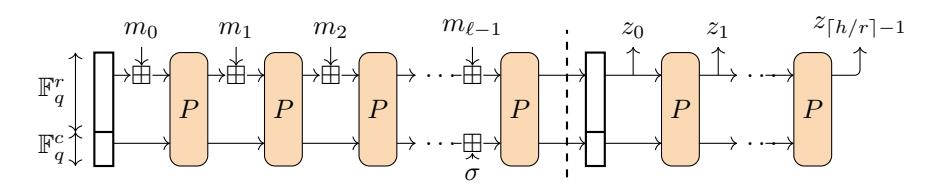
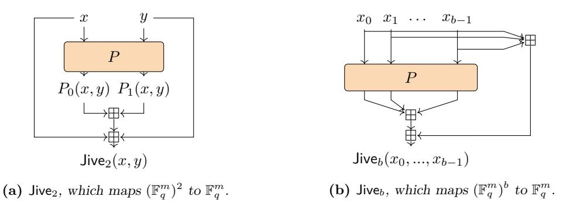
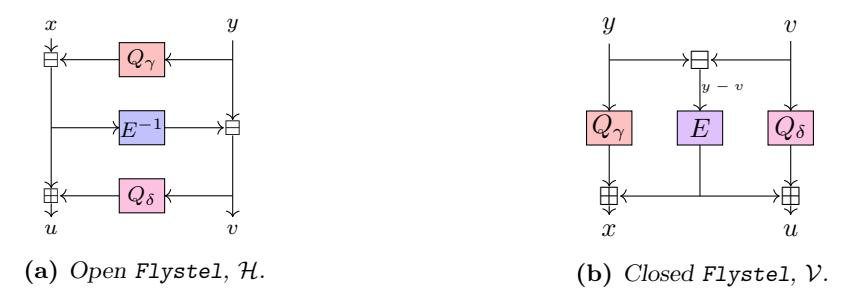
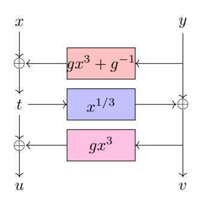
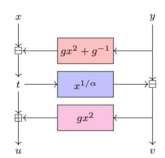
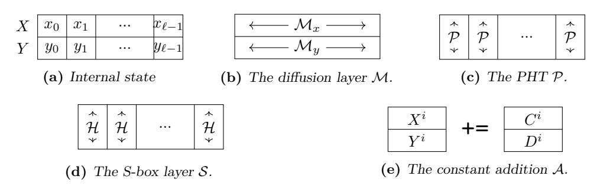
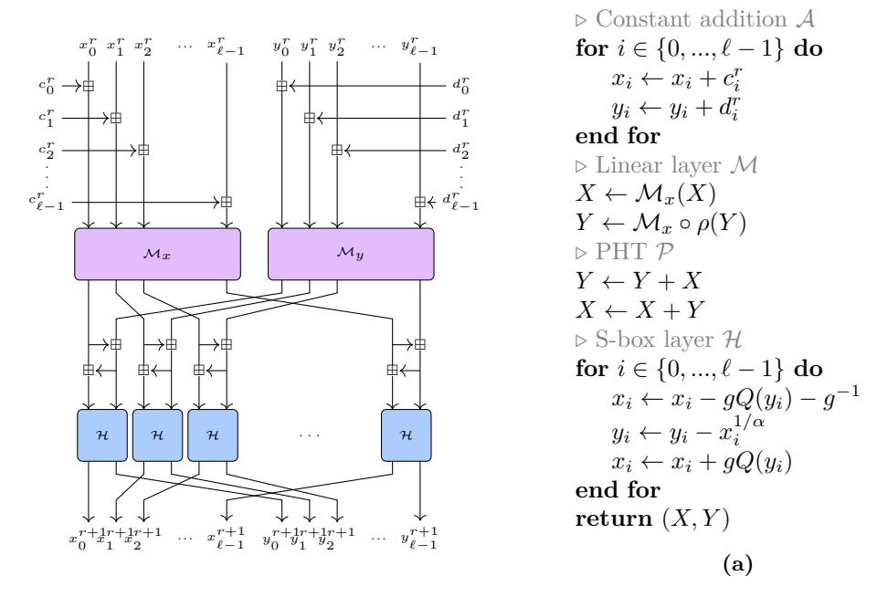
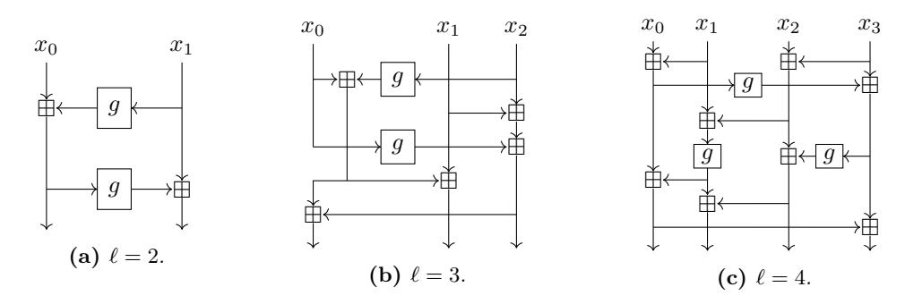
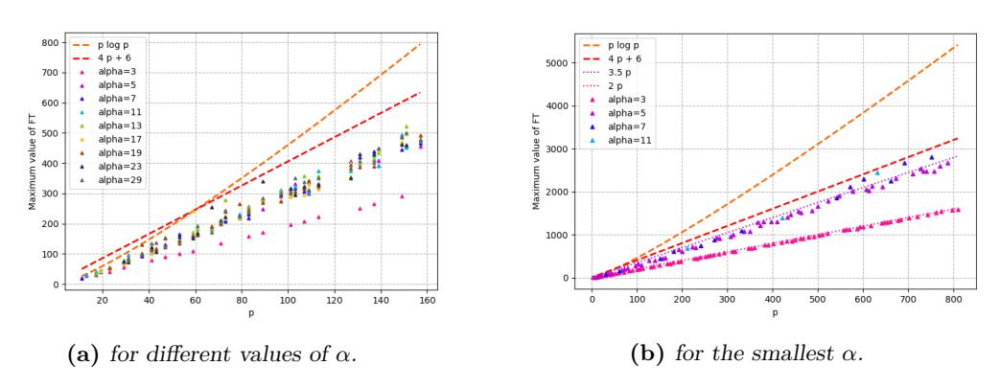
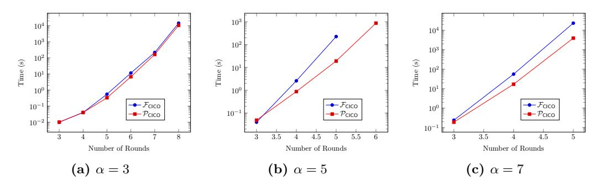

# **New Design Techniques for Efficient Arithmetization-Oriented Hash Functions:** Anemoi **Permutations and** Jive **Compression Mode**

Clémence Bouvier<sup>1</sup>*,*<sup>2</sup> , Pierre Briaud<sup>1</sup>*,*<sup>2</sup> , Pyrros Chaidos<sup>3</sup> , Léo Perrin<sup>2</sup> , Robin Salen<sup>4</sup> , Vesselin Velichkov<sup>5</sup>*,*<sup>6</sup> , Danny Willems<sup>7</sup>*,*<sup>8</sup>

> Sorbonne University, France, 2 Inria, France National & Kapodistrian University of Athens, Greece, Toposware, Inc., USA University of Edinburgh, Scotland Clearmatics, England Nomadic Labs, France LIX, France [anemoi@inria.fr](mailto:anemoi@inria.fr)

**Abstract.** Advanced cryptographic protocols such as Zero-knowledge (ZK) proofs of knowledge, widely used in cryptocurrency applications such as Zcash, Monero, Filecoin, Tezos, Topos, demand new cryptographic hash functions that are efficient not only over the binary field F2, but also over large fields of prime characteristic F. This need has been acknowledged by the wider community and new so-called *Arithmetization-Oriented* (AO) hash functions have been proposed, e.g. MiMC-Hash, Rescue–Prime, Poseidon, Reinforced Concrete and Griffin to name a few. In this paper we propose Anemoi: a new family of ZK-friendly permutations, that can be used to construct efficient hash functions and compression functions. The main features of these algorithms are that 1) they are designed to be efficient within multiple proof systems (e.g. Groth16, Plonk, etc.), 2) they contain dedicated functions optimised for specific applications (namely Merkle tree hashing and general purpose hashing), 3) they have highly competitive performance e.g. about a factor of 2 improvement over Poseidon and Rescue–Prime in terms of R1CS constraints, a 21%- 35% Plonk constraint reduction over a highly optimized Poseidon implementation, as well as competitive native performance, running between two and three times

faster than Rescue–Prime, depending on the field size. On the theoretical side, Anemoi pushes further the frontier in understanding the design principles that are truly entailed by arithmetization-orientation. In particular, we identify and exploit a previously unknown relationship between CCZ-equivalence and arithmetization-orientation. In addition, we propose two new standalone components that can be easily reused in new designs. One is a new S-box called Flystel, based on the well-studied butterfly structure, and the second is Jive – a new mode of operation, inspired by the "Latin dance" symmetric algorithms (Salsa, ChaCha and derivatives). Our design is a conservative one: it uses a very classical Substitution-Permutation Network structure, and our detailed analysis of algebraic attacks highlights can be of independent interest.

**Keywords:** Anemoi · Flystel · Jive · Arithmetization-oriented · Hash functions · CCZ-equivalence · Plonk · R1CS · AIR · Merkle tree · Zero-knowledge · Arithmetic circuits

## 1 Introduction

In recent years we have seen a rapid surge of interest in the practical application of an old cryptographic construction known as zero-knowledge (ZK) proofs of knowledge. Such protocols allow a prover P to convince a verifier V that a certain statement x is true without revealing any additional information beyond the fact that it is verifiably correct. Such a piece of information may, for example, be that the result of a specified complex computation is 1. ZK proofs of knowledge, and more generally computational integrity proofs, allow V to verify that the result of the proven computation is correct without having to perform the computation herself. In fact, to verify correctness, V does not even need to know some of the details of the computation e.g., its intermediate values or any potentially secret inputs.

ZK proof systems have been introduced with the seminal work of Micali, Goldwasser and Rackoff back in 1989 [GMR89]. Traditionally, ZK protocols were deployed to allow a prover to keep some elements of a computation secret (e.g. a private key). More recently, the blockchain ecosystem has witnessed a rise of a category of ZK protocols, namely Succinct Non-Interactive Arguments of Knowledge (ZK-SNARKs), that leverages their succinctness property to relieve the verifier from the necessity to perform an expensive computation for which it may not have sufficient resources (in terms of space as well as computational power). The increased interest in such protocols today is largely driven by the latest advancements in digital currencies such as Bitcoin, Ethereum, Tezos, Topos, etc. In particular, ZK proofs make it possible to add privacy on a public blockchain (e.g. Zcash [BCG+14]) and to perform off-chain computation verifiable by network nodes with significantly limited resources, improving scalability.

The computation performed by P and verified by V in a ZK proof is often expressed as an arithmetic circuit composed of *gates* (algebraic operations e.g. multiplication or addition) connected by *wires*. The quantities that pass over the wires and are operated on by the gates are elements of a field  $\mathbb{F}_q$ , where  $q \geq 2$ .

Cryptographic hash functions are fundamental to practical ZK applications. They are often used for testing membership of some element(s) by means of Merkle trees. They can also be used as part of the ZK protocol itself e.g. by compressing multiple public inputs to a single hash. The modified protocol has a reduced input footprint, and the collision resistance of the hash function implies that security is not impacted. This is relevant in proof systems where the verifier's costs are proportional to the number of public inputs such as Groth16 [Gro16].

Modern cryptographic hash functions such as SHA2, SHA3 and BLAKE are designed over vector spaces of the binary field  $\mathbb{F}_2$  (i.e. they work over bits), while ZK protocols often operate over  $\mathbb{F}_q$  for a large q – usually a prime number. Therefore the efficient execution of ZK protocols in applications such as Zcash or Filecoin, that aim to process millions of transactions per day, imposes the need for new hash functions designed to be natively efficient in  $\mathbb{F}_q$  – the so-called Arithmetization-Oriented (AO) designs. The need for new arithmetization-oriented hash functions has been acknowledged by both researchers and engineers. As a result, the past couple of years have seen a surge of new proposals of hash functions that operate natively in  $\mathbb{F}_q$  for q prime, enabling efficient verification: MiMC-Hash [AGR<sup>+</sup>16], Poseidon [GKR<sup>+</sup>21], Rescue-Prime [AAB<sup>+</sup>20, SAD20] and Griffin [GHR<sup>+</sup>22] to name a few. Another line of work, including Reinforced Concrete [GKL<sup>+</sup>22] and Tip5 [SLST23], aims at exploiting lookup tables for more efficient native computations, while remaining practical inside proving systems. This additional requirement for lookup tables however reduces the compatibility of these hash functions within the space of proving systems, and hence limiting the chances of global adoption.

The Design Requirements of Arithmetization-Orientation. Building upon the works mentioned above as well as on the study of practical use cases, we have identified several

properties and design requirements that are expected from arithmetization-oriented hash functions.

**Evaluation vs. Verification.** The operation for which the efficiency of an AO primitive is the most crucial is not its *evaluation*, but rather its *verification*. Concretely, while the cost of evaluating = () given remains important, the step with the harshest constraints is a verification: given both and , checking if is indeed equal to () should be "efficient", where the exact meaning of "efficient" depends on the proof system considered.

**-to-1 compression.** One of the main use cases for AO hash functions is in Merkle trees. In this context, rather than a hash function taking arbitrarily long inputs, protocol designers need a compression function mapping to finite field elements, meaning a compression factor of (often, = 2).

**Primitive Factories.** Rather than a single primitive or a small family of primitives (such as for instance AES-128/192/256), AO hash functions are defined for a vast number of field sizes and security levels. In fact, we would argue that algorithms like Poseidon are *primitive factories*[1](#page-2-0) , and that the task of the cryptanalysts is not only to assess whether specific instances are secure. Rather, it is to verify if such factories can return weak algorithms. Furthermore, since the protocols and arithmetization techniques vary, a factory should be able to output primitives optimized for each use case.

**Performance constraints.** The space and time complexities of proving systems depend on the size (i.e. the number of gates) of the arithmetized program that is being verified. Therefore, it is crucial for practical applications to minimize the number of gates. Otherwise, the cost of a proof may be so high as to make it unusable, as the computational cost of the prover is often the bottleneck of an entire system. AIR-based systems additionally require keeping constraint degrees low for practical applications. Furthermore, good conventional CPU architecture performance is still required as real world applications tend to use the primitives both outside and inside the circuit.

**Outline of our Contributions.** In this paper, we study each of the specific design requirements of AO, and provide new tools to satisfy them. First, we present the necessary theoretical background in Section [2.](#page-3-0)

We then present two building blocks. First, in Section [3](#page-4-0) we introduce a new mode of operation, Jive, which turns a public permutation into a -to-1 compression function. Its main advantage is that it compresses an input consisting of words using a permutation operating on a state consisting of words, unlike the sponge structure which needs a bigger state in order to accomodate a capacity. Then, in Section [4,](#page-6-0) we argue that the asymmetry between the evaluation and the verification of a function is best framed in terms of *CCZ-equivalence*. Using this insight, we propose a new family of non-linear components (S-boxes) operating on F 2 which we call Flystel: they allow both a high degree evaluation, and a low degree verification.

In a natural progression, we use the Flystel structure to construct a new permutation factory: Anemoi. It uses the familiar Substitution-Permutation Network (SPN) structure, which simplifies our security analysis. Its specification is given in Section [5,](#page-10-0) and our initial cryptanalysis is presented in Section [6.](#page-16-0) We combine all these results together in Section [7,](#page-19-0) where we show via detailed benchmarks that combining the Anemoi permutations with the Jive mode of operation allows us to compete with the best AO hash functions in the literature in terms of performance, and to substantially outclass them in some contexts.

<span id="page-2-0"></span><sup>1</sup>"Factory" is here used in the sense of the programming design pattern, i.e. it is an object returning functions.

In particular, in the case of Plonk, we can compute more than twice as many hashes for a fixed number of constraints as is possible with Poseidon, which to the best of our knowledge was the best until now. We conclude the paper in Section 8.

## <span id="page-3-0"></span>2 Theoretical Background

In what follows, q is an integer corresponding to the size of the field  $\mathbb{F}_q$ , so that q=p for some prime number p or  $q=2^n$ . In particular, for binary fields  $\mathbb{F}_{2^n}$ , we focus on the case where n is odd as it is harder to build low degree permutations otherwise. As usual, the symbols "+" and "×" denote respectively the addition and multiplication operations over  $\mathbb{F}_q$ . We also let  $m \geq 1$  be an integer corresponding to the number of field elements we are operating on. We denote by  $\langle a,b \rangle$  the usual scalar product of  $a \in \mathbb{F}_q^m$  and  $b \in \mathbb{F}_q^m$  which is such that  $\langle a,b \rangle = \sum_{i=0}^{m-1} a_i b_i$ .

Below, we consider a function  $F: \mathbb{F}_q^m \to \mathbb{F}_q^m$ , and recall some of the concepts behind the use and analysis of functions to design symmetric cryptographic primitives. We first recall the definitions of their differential and linear properties, and then that of CCZ-equivalence. While the latter has seldom been used in practice so far, it plays a crucial role in our work.

**Differential Properties.** The Difference Distribution Table (DDT) of function F is the two dimensional array  $\delta_F$ , where  $\delta_F[a,b] = \#\{x \in \mathbb{F}_q^m | F(x+a) - F(x) = b\}$ . The maximum value of  $\delta_F[a,b]$  for  $a \neq 0$  is the differential uniformity [Nyb94] of F.

**Linear Properties.** While a general formula that works both when q is a power of two and a prime can be given, it is simpler to treat the two cases separately, especially given that the reader is probably familiar with the case of characteristic 2. If  $q=2^n$ , then the Walsh transform of the component  $\langle b,F\rangle:\mathbb{F}_q\to\mathbb{F}_2$  for any  $b\in\mathbb{F}_q\setminus\{0\}$  is  $\mathcal{W}_{\langle b,F\rangle}(a)=\sum_{x\in\mathbb{F}_{2n}^m}(-1)^{\langle a,x\rangle+\langle b,F(x)\rangle}.$

Otherwise, when q = p the Fourier transform of a function  $f : \mathbb{F}_p^m \to \mathbb{F}_p$  is the function  $\mathcal{W}_f : \mathbb{F}_p^m \to \mathbb{C}$  such that

$$\mathcal{W}_f(a) = \sum_{x \in \mathbb{F}_p^m} \exp\left(\frac{2\pi i \left(\langle a, x \rangle - f(x)\right)}{p}\right).$$

For a vectorial function  $F: \mathbb{F}_q^m \to \mathbb{F}_q^m$ , we consider the Fourier transform of each of its components, i.e. of all the linear combinations  $\langle b, F \rangle$ .

**CCZ-Equivalence [CCZ98].** Let  $F: \mathbb{F}_q^m \to \mathbb{F}_q^m$  and  $G: \mathbb{F}_q^m \to \mathbb{F}_q^m$  be two functions. They are *affine-equivalent* if there exist two affine permutations  $\mu: \mathbb{F}_q^m \to \mathbb{F}_q^m$  and  $\eta: \mathbb{F}_q^m \to \mathbb{F}_q^m$  such that  $F = \eta \circ G \circ \mu$ . This can alternatively be written using the *graphs* of these functions:

$$\Gamma_F = \underbrace{\left\{ \left( x, F(x) \right) \mid x \in \mathbb{F}_q^m \right\}}_{\text{graph of } F} = \mathcal{L}(\Gamma_G) = \left\{ \mathcal{L}\left( x, G(x) \right) \mid x \in \mathbb{F}_q^m \right\},$$

where  $\mathcal{L}$  is the affine permutation defined by  $\mathcal{L}(x,y) = (\eta(x), \mu^{-1}(y))$ . If we allow  $\mathcal{L}$  to be any affine permutation,<sup>2</sup> we obtain CCZ-equivalence.

<span id="page-3-1"></span><sup>&</sup>lt;sup>2</sup>Starting from a given function F, applying any affine permutation of  $\mathbb{F}_q^2$  to its graph is unlikely to yield the graph of another function G. Indeed, this would require that the left hand side of  $\mathcal{L}(x, F(x))$  takes all the values in  $\mathbb{F}_q$  as x goes through  $\mathbb{F}_q$ , which is a priori not the case. A mapping  $\mathcal{L}$  that does yield the graph of another function is called "admissible", a concept that was extensively studied in [CP19].

**Definition 1** (CCZ-Equivalence). Let F and G be functions of  $\mathbb{F}_q^m$ . We say that they are CCZ-equivalent if there exists an affine permutation  $\mathcal{L}: (\mathbb{F}_q^m)^2 \to (\mathbb{F}_q^m)^2$  such that  $\Gamma_F = \mathcal{L}(\Gamma_G)$ .

An important property of CCZ-equivalence that is instrumental in our work is that it preserves the differential spectrum and the squared Walsh coefficients. In other words, all functions within the same CCZ-equivalence class share the same differential and linear properties and hence offer the same resilience against differential and linear attacks. It also means that it is sufficient to investigate these properties for a single member of a CCZ-equivalence class.

Another relevant property of CCZ-equivalence is that it does *not* preserve the degree of the function. In fact, there are known cases where a low-degree function is CCZ-equivalent to a higher-degree one. It is most notably the case of the so-called *butterfly structure*, originally introduced in [PUB16], and then further generalized in two different ways in [CDP17] and [LTYW18].

## <span id="page-4-0"></span>3 Modes of Operation

In advanced protocols, hash functions are used for two purposes. The first is to emulate a random oracle, in particular to return the "fingerprint" or digest of a message of arbitrary length. The idea is that this fixed length digest is simpler to sign than the full message. The second use is as a compression function within a Merkle-tree: in this case, the hash function H is used to map two inputs of size n to an output of size n, and the security of the higher level scheme relies on its collision resistance. While a general purpose hash function like SHA-3 [BDPA13, Dwo15] or an arithmetization-friendly one can safely be used for both cases, for improved efficiency we chose a full hash function only for the random oracle case (Section 3.1). Indeed, the specific constraints of the Merkle-tree case can be satisfied more efficiently using a dedicated structure that remains permutation-based, and which we introduce in Section 3.2. SAGE implementations of both modes are provided in Appendix C.

## <span id="page-4-1"></span>3.1 Random Oracle: the Sponge Structure

A random oracle is essentially a theoretical function that picks each output uniformly at random while keeping track of its previous outputs in order to remain a deterministic function. The sponge construction is a convenient approach to try to emulate this behaviour. First introduced by Bertoni et al. in [BDPVA07], this method was most notably used to design SHA-3. It is also how most arithmetization-oriented hash functions have been designed, e.g. Rescue-Prime, gMiMC-Hash, POSEIDON [GKR+21], and Reinforced Concrete. Such hash functions can easily be tweaked into eXtendable Output Functions (XOF) [Dwo15] should the need arise.

The overall principle of the sponge construction is best explained by the diagram in Figure 1. In this paper, we slightly modify the original approach to operate on elements of  $\mathbb{F}_q$  instead of  $\mathbb{F}_2$ . The main component of the structure is a permutation P operating on  $\mathbb{F}_q^{r+c}$ , where both r and c are non-zero integers. The rate r is the size of the outer part of the state, while c is the capacity and corresponds to the size of the inner part of the state. The digest consists of h elements of  $\mathbb{F}_q$ . Then, to process a message m consisting of elements of  $\mathbb{F}_q$ , we apply the following operations.

**Padding.** A basic padding works as follows: append  $1 \in \mathbb{F}_q$  to the message followed by enough zeroes so that the total length is a multiple of r, and then divide the result into blocks  $m_0,...,m_{\ell-1}$  of r elements.

However, with this approach, we may end up using one more call to P in the case where the length of the message was already a multiple of r. A more efficient approach is presented in [Hir16]: if the length of the message is already a multiple of r, then we do not append further blocks to it. Instead, we add a constant to the capacity before squeezing. This is summarized as the addition of  $\sigma$  which is equal to 0 if the message length is not a multiple of r, and to 1 otherwise (see Figure 1). This variant also has the advantage of gracefully handling the case where r=1.

**Absorption.** For each message block  $m_i$ , we add it into the outer part of the state, and then apply P on the full state.

**Squeezing.** We extract  $\min(h, r)$  elements from the outer part of the state to generate the first elements of the digest. If h > r, we apply P and then extract additional elements again from the rate registers, repeating this process until the desired digest length is reached.

<span id="page-5-1"></span>

Figure 1: Sponge construction with the modification of [Hir16].

The security of a sponge rests on the properties of its permutation. Informally, the only special property of the permutation should be the existence of an efficient implementation. Its differential, linear, algebraic, etc. properties should be similar to those expected from a permutation picked uniformly at random from the set of all permutations.

Following a flat sponge claim [BDPVA07], the designers of such an algorithm can essentially claim that any attack against it will have a complexity equivalent to at least  $q^{c/2}$  calls to the permutation (provided  $h \geq c$ ,  $h \log_2 q \geq 2s$  and  $c \log_2 q \geq 2s$ ). Thus, a flat sponge claim states that a sponge-based hash function provides  $c |\log_2 q|/2$  bits of security.

#### <span id="page-5-0"></span>3.2 Merkle Compression Function: the Jive Mode

One of the main use cases for an arithmetization-oriented hash function is as a compression function in a Merkle tree. This case could be easily handled using a regular hashing mode, such as the sponge structure discussed above. However, due to the specifics of this use case, it is possible to use a more efficient mode.

In a Merkle tree, the elements considered are in  $\mathbb{F}_q^m$ , where m is chosen so that  $m\lfloor \log_2 q \rfloor \geq n$ , where n is the intended security level. We then need to hash two such elements to obtain a new one. As a consequence, unlike in the usual case, the input size is fixed, and is equal to exactly twice the digest size. Given a permutation of  $(\mathbb{F}_q^m)^2$ , we can thus construct a suitable hash function by plugging it into the following mode.

**Definition 2** (Jive). Consider a permutation P defined as follows:

$$P: \begin{cases} (\mathbb{F}_q^m)^b & \to (\mathbb{F}_q^m)^b \\ (x_0, ..., x_{b-1}) & \mapsto (P_0(x_0, ..., x_{b-1}), ..., P_{b-1}(x_0, ..., x_{b-1})) \end{cases},$$

so that it operates on bm elements of  $\mathbb{F}_q$ , where  $P_i(x_0,\ldots,x_{b-1}):0\leq i< b$  refers to the i-th element in  $\mathbb{F}_q^m$  of the output  $P(x_0,\ldots,x_{b-1})$  from P. The Jive mode is built from P



Figure 2: The Jive mode turning a permutation into a compression function.

by defining the following one way function  $\mathsf{Jive}_b(P)$ :

$$\mathsf{Jive}_b(P) : \begin{cases} (\mathbb{F}_q^m)^b & \to \mathbb{F}_q^m \\ (x_0,...,x_{b-1}) & \mapsto \sum_{i=0}^{b-1} \left(x_i + P_i(x_0,...,x_{b-1})\right) \end{cases}.$$

This approach can be seen as a permutation-based variant of the Davies-Meyer mode which, like the latter, crucially relies on a feedforward to ensure one-wayness. Alternatively, it can be interpreted as a truncated instance of the mode used in the "Latin dance" ciphers ChaCha and Salsa [Ber08], which is also based on a public permutation combined with a feedforward. Incidentally, we called it Jive after another Latin dance.

If used inside a Merkle tree, this mode can save some computations. For example, in the case where the fan-in b is equal to 2, a sponge would use a permutation operating on  $(\mathbb{F}_q^m)^3$  in order to leave one vector of  $\mathbb{F}_q^m$  free for the capacity. Using  $\mathsf{Jive}_2$  instead, we only need a permutation of  $(\mathbb{F}_q^m)^2$ . The trade-off of course is that, unlike a sponge-based approach, the relevance of  $\mathsf{Jive}$  is restricted to some specific cases.

## <span id="page-6-0"></span>4 The Flystel Structure

The performance metrics for AO algorithms differ substantially from the usual ones in symmetric cryptography. Neither the number of CPU cycles, nor the RAM consumption or the code size are the dominant factors. Pin-pointing exactly what is needed for the various protocols relying on arithmetization is a difficult task as each protocol has its own subtleties. For example, Plonk offers custom gates, which add complexity and a small overall overhead but can drastically decrease the cost of a particular operation, while other proof systems might not. On the other hand, additions are essentially free for R1CS or AIR, but not for Plonk. In addition, permutations of a sequence of elements are likely to incur cost in Plonk or AIR (via copy-constraints), but are free in R1CS.

In this section, we present a family of non-linear components that provide both the cryptographic properties that we need to ensure the security of our primitives, and efficient implementations across proof systems, which we call *open Flystel*. It uses—and highlights—the connection between arithmetization-orientation and CCZ-equivalence.

### 4.1 On CCZ-Equivalence and Arithmetization-Orientation

In order for a function F to be arithmetization-oriented, it is necessary that verifying whether y = F(x) can be done using few multiplications in a specific field (whose size is dictated by other parts of the protocol). A very straight-forward initial approach is to use a function F which, itself, can be evaluated using a small number of multiplications: both

MiMC-Hash [AGR<sup>+</sup>16] and Poseidon [GKR<sup>+</sup>21] work in this way. The downside is that using a low degree round function may imply vulnerability to attacks based on polynomial solving, known as *algebraic attacks*. As a consequence, these algorithms have to use a high number of rounds.

A first breakthrough on this topic was made by the designers of Rescue–Prime [AAB+20]. They noticed that for a permutation F, checking if y = F(x) is equivalent to checking if  $x = F^{-1}(y)$ . It allows them to use both  $x^{\alpha}$  and  $x^{1/\alpha}$  (where  $x \mapsto x^{\alpha}$  is a permutation of the field used) in their round function, with  $\alpha$  chosen so as to minimize the number of multiplications. It means that both can be verified using a (cheap) evaluation of  $x^{\alpha}$ , and at the same time that the degree of the round function is very high as  $1/\alpha$  is a dense integer of  $\mathbb{Z}/(q-1)\mathbb{Z}$ . As a consequence, much fewer rounds are needed to prevent algebraic attacks.

We go further and propose a generalization of this insight. So far, we have seen that AO implies that a function or its inverse must have a particular implementation property (low number of multiplications). In fact, we claim the following:

A subfunction is arithmetization-oriented if it is **CCZ-equivalent** to a function that can be verified efficiently.

The above should come as no surprise since a permutation and its inverse are known to be CCZ-equivalent [BCP06]. In that sense, this insight is a natural generalization of the one of the Rescue-Prime designers.

Exploiting this idea is simple: suppose that F and G are such that  $\Gamma_F = \mathcal{L}(\Gamma_G)$ , where  $\mathcal{L}: (x,y) \mapsto (\mathcal{L}_L(x,y), \mathcal{L}_R(x,y))$  is an affine permutation, and where G can be efficiently verified. Then we can use F to construct an AO algorithm: checking if y = F(x) is equivalent to checking if  $\mathcal{L}_R(x,y) = G(\mathcal{L}_L(x,y))$ , which only involves G and linear functions: it is efficient.

Below, we present a first component based on this idea: the Flystel. Nevertheless, we hope that further research in discrete mathematics will lead to new non-linear components that are even better suited to this use case: we need more permutations with good cryptographic properties (including a high degree) that are CCZ-equivalent to functions with a low number of multiplications.

#### 4.2 High Level View of the Flystel Structure

Let  $Q_{\gamma}: \mathbb{F}_q \to \mathbb{F}_q$  and  $Q_{\delta}: \mathbb{F}_q \to \mathbb{F}_q$  be two quadratic functions, and let  $E: \mathbb{F}_q \to \mathbb{F}_q$  be a permutation. Then, the *Flystel* is a pair of functions relying on  $Q_{\gamma}, Q_{\delta}$  and E. The *open Flystel* is the permutation of  $(\mathbb{F}_q)^2$  obtained using a 3-round Feistel network with  $Q_{\gamma}, E^{-1}$ , and  $Q_{\delta}$  as round functions, as depicted in Figure 3a. It is denoted  $\mathcal{H}$ , so that  $\mathcal{H}(x,y)=(u,v)$  is evaluated as follows:

1.
$$x \leftarrow x - Q_{\gamma}(y)$$
, 3.  $x \leftarrow x + Q_{\delta}(y)$ ,
2.  $y \leftarrow y - E^{-1}(x)$ , 4.  $u \leftarrow x$ ,  $v \leftarrow y$ .

We define by  $\mathcal{V}: (y,v) \mapsto (R_{\gamma}(y,v), R_{\delta}(y,v))$  the closed Flystel function over  $\mathbb{F}_q^2$ , where  $R_{\gamma}: (y,v) \mapsto E(y-v) + Q_{\gamma}(y)$  and  $R_{\delta}: (y,v) \mapsto E(y-v) + Q_{\delta}(v)$ .

Our terminology of "open" for the permutation and "closed" for the function is based on the relation between the Flystel and the butterfly structure, as detailed later. In particular, the two Flystels are linked in the following way.

**Proposition 1.** For a given tuple  $(Q_{\gamma}, E, Q_{\delta})$ , the corresponding closed and open Flystel are CCZ-equivalent.



<span id="page-8-3"></span><span id="page-8-0"></span>Figure 3: The Flystel structure (both variants are CCZ-equivalent).

*Proof.* Let  $(u, v) = \mathcal{H}(x, y)$ . Then it holds that  $v = y - E^{-1}(x - Q_{\gamma}(y))$ , so that we can write  $x = E(y - v) + Q_{\gamma}(y)$ . Similarly, we have that  $u = Q_{\delta}(v) + E(y - v)$ . Consider now the set  $\Gamma_{\mathcal{H}} = \{((x, y), \mathcal{H}(x, y)), (x, y) \in \mathbb{F}_q^2\}$ . By definition, we have

$$\Gamma_{\mathcal{H}} = \{((x,y),(u,v)),(x,y) \in \mathbb{F}_q^2\} = \mathcal{L}(\{((y,v),(x,u)),(x,y) \in \mathbb{F}_q^2\})$$

where  $\mathcal{L}$  is the permutation of  $(\mathbb{F}_q^2)^2$  such that  $\mathcal{L}^{-1}((x,y),(u,v))=((y,v),(x,u))$ , which is linear. Using the equalities we established at the beginning of this proof, we can write:

$$\mathcal{L}^{-1}(\Gamma_{\mathcal{H}}) = \left\{ ((y, v), (x, u)), (x, y) \in \mathbb{F}_q^2 \right\}$$

$$= \left\{ ((y, v), (Q_{\gamma}(y) + E(y - v), Q_{\delta}(v) + E(y - v)) \right\}, (y, v) \in \mathbb{F}_q^2 \right\} = \Gamma_{\mathcal{V}}.$$

We deduce that  $\Gamma_{\mathcal{H}} = \mathcal{L}(\Gamma_{\mathcal{V}})$ , so the two functions are CCZ-equivalent.

This simple proposition has two crucial corollaries on which we will rely in the remainder of the paper. The first is that it suffices to investigate the differential and linear properties of the closed butterfly to obtain results on the open one.

**Corollary 1.** The open and closed Flystel structures have identical differential and linear properties. More precisely, the set of the values in the DDT of both functions is the same, and the set of the square of the Fourier coefficients of the components is also the same.

The second corollary is the key reason behind the relevance of the Flystel structure in the arithmetization-oriented setting and is stated below.

<span id="page-8-1"></span>Corollary 2. Verifying that  $(u, v) = \mathcal{H}(x, y)$  is equivalent to verifying that  $(x, u) = \mathcal{V}(y, v)$ .

Indeed, Corollary 2 means that it is possible to encode the verification of the evaluation of the high degree open Flystel using the polynomial representation of the low degree closed Flystel.

In characteristic 2, quadratic mappings correspond to different exponents than in the general case. As a consequence, when giving concrete instantiations of the Flystel structure, we need to treat this case separately. To highlight the difference, we call  $Flystel_2$  the instances used in characteristic 2, and  $Flystel_p$  the instances used in odd prime characteristic.

### <span id="page-8-2"></span>4.3 Characteristic 2

Let  $q=2^n$ , with n odd. Furthermore, let  $\alpha=2^i+1$  be such that  $\gcd(i,n)=1$ , so that  $x\mapsto x^\alpha$  is a permutation of  $\mathbb{F}_q$ . In this case, the Flystel<sub>2</sub> structure with  $Q_\gamma(x)=Q_\delta(x)=\beta x^\alpha$ , with  $\beta\neq 0$ , and with  $E(x)=x^\alpha$  is a degenerate generalized butterfly structure. It was studied in [LTYW18] as a generalization of the structure

introduced in [PUB16], which was also refined in [CDP17]. We recall the following particular case<sup>3</sup> in Theorems 3, 4 and 5 of [LTYW18].

<span id="page-9-3"></span>**Proposition 2** ([LTYW18]). Let  $q = 2^n$  with n odd,  $E = x \mapsto x^{\alpha}$ , where  $\alpha = 2^i + 1$  is such that gcd(i, n) = 1, and  $Q_{\gamma} = Q_{\delta} = x \mapsto \beta x^{\alpha}$ , where  $\beta \neq 0$  Then the Flystel<sub>2</sub> structures defined by the functions  $Q_{\gamma}, E$ , and  $Q_{\delta}$  have differential uniformity equal to 4, linearity equal to  $2^{n+1}$ , and algebraic degree of n.

In practice, to prevent some attacks (see Section A.3), we instead use  $Q_{\gamma}(x) = \beta x^3 + \gamma$  and  $Q_{\delta}(x) = \beta x^3 + \delta$ , where  $\beta, \gamma, \delta$  are constants in  $\mathbb{F}_q$  such that  $\gamma \neq \delta$  and  $\beta \neq 0$ . The particular values of those constants are not essential to the properties of the construction as long as the noted requirements are satisfied. For simplicity we set  $\beta = g, \gamma = g^{-1}$  and  $\delta = 0$  with g being a generator of the multiplicative subgroup of the field  $\mathbb{F}_q$ . This results in  $Q_{\gamma}: x \mapsto gx^3 + g^{-1}$  and  $Q_{\delta}: x \mapsto gx^3$  as depicted in Figure 4a.





- <span id="page-9-1"></span>(a) Flystel<sub>2</sub> in characteristic 2.
- (b) Flystel, in odd prime characteristic.

**Figure 4:** The two variants of the open Flystel, mapping (x, y) to (u, v).

### 4.4 Odd Characteristic

When q=p, the three functions of the Flystel<sub>p</sub> structure are resp.:  $Q_{\gamma}: x \mapsto gx^2 + g^{-1}$ ,  $E: x \mapsto x^{\alpha}$ , and  $Q_{\delta}: x \mapsto gx^2$ , where  $\alpha, g \in \mathbb{F}_q$  and g again is a generator of the multiplicative subgroup of the field  $\mathbb{F}_q$ .

**Differential Properties.** Such structures have a low differential uniformity.

<span id="page-9-4"></span>**Proposition 3.** Let q=p be a prime number,  $E=x\mapsto x^{\alpha}$ , where  $\alpha$  is such that  $\gcd(\alpha,p-1)=1$ , and  $Q_{\gamma}=x\mapsto gx^2+g^{-1}$ ,  $Q_{\delta}=x\mapsto gx^2$ . Then the Flystel<sub>p</sub> structures defined by the functions  $Q_{\gamma}$ , E, and  $Q_{\delta}$  has a differential uniformity equal to  $\alpha-1$ .

*Proof.* Let a, b, c, d be elements of  $\mathbb{F}_p$  such that  $(a, b) \neq (0, 0)$ . To investigate the differential uniformity of  $\mathcal{V}: (y, v) \mapsto (R_{\gamma}(y, v), R_{\delta}(y, v))$ , we look at the number of solutions (y, v) of (1).

<span id="page-9-2"></span>
$$\begin{cases}
R_{\gamma}(y+a,v+b) - R_{\gamma}(y,v) = c \\
R_{\delta}(y+a,v+b) - R_{\delta}(y,v) = d
\end{cases}$$
(1)

<span id="page-9-0"></span><sup>&</sup>lt;sup>3</sup>The result of Li et al. covers all generalized butterflies, not just those corresponding to Flystel structures. In a Flystel, the first parameter (which we will denote a) is set to 1. Their results for the differential uniformity and the linearity hold only when  $\beta \neq (1+a)^{\alpha}$ , meaning that we simply need to make sure that  $\beta \neq 0$ . For the algebraic degree, the condition they give in their Theorem 5 to have a degree equal to n+1 degenerates into  $\beta^{2^{i+1}} = \beta^{2^{i}+1}$ , which is never the case as i>0.

We have:

$$\begin{cases} (y+a-(v+b))^{\alpha}+g^{-1}+g(y+a)^2-(y-v)^{\alpha}-g^{-1}-gy^2 & = c\\ (y+a-(v+b))^{\alpha}+g(v+b)^2-(y-v)^{\alpha}-gv^2 & = d \; . \end{cases}$$

We get:

$$c - d = g(y+a)^{2} - gy^{2} + gv^{2} - g(v+b)^{2},$$

which is equivalent to:

$$v = (2b)^{-1} (2ay + a^2 - b^2 - g^{-1}(c - d))$$
.

As a consequence, we know that can be expressed as an affine polynomial in . We then have that the first equation is an equation in of degree − 1 (since the terms cancel out), and thus has at most − 1 solutions for . In the end, we have at most − 1 solutions (*,* ) for the system (since for each value of , there is one ).

**Linear Properties.** We do not have a theoretical bound on the correlation for the Flystel<sup>p</sup> structure, but we provide informal arguments supporting its security against linear cryptanalysis attacks. Notice first that Flystel<sup>p</sup> is defined by the functions *,* −<sup>1</sup> and , where and are quadratic. Given that the function 2 is bent (i.e. its correlations are the lowest possible), we argue that a linear trail which would activate just one of these functions should be expected to have a very low correlation. In Appendix [A,](#page-29-0) we give a conjecture supported by experimental results, stating that the linearity of Flystel<sup>p</sup> is lower than log .

**Invariant Subset.** Regardless of the characteristic, it holds that ℋ (()*,* ) = (()*,* ). Thus, setting = would mean that Flystel is the identity over a subset of size , which is why we use constant additions to ensure ≠ . Nevertheless, this only ensures that the open Flystel is a translation over the set {(()*,* )*,*  ∈ F}, which remains cryptographically weak. While a priori undesirable, the impact of this property can be mitigated. First, the subset over which it has a simple expression is not an affine space. Second, as we show in Appendix [A.3,](#page-30-0) the propagation of such patterns can be broken via the linear layer.

**Degree.** Given the structure of the open Flystelp, its degree is lower bounded by the inverse of modulo − 1, a quantity which in practice corresponds to a dense integer of Z*/*(−1)Z. We deduce that one call to the open Flystel<sup>p</sup> is likely to be of maximum degree and is therefore sufficient to thwart attacks that exploit the low degree of a component, such as higher order differentials.

## **4.5 Implementation Aspects**

For direct computation, or witness calculation, one can simply implement the open Flystel. For the verification however, we also have the option to use the closed Flystel structure, since there is no requirement for the various verification steps to be performed in a particular order as long as consistency is enforced. In this case, the cost is one multiplication for and , and as many as are needed to compute ↦→ . This can be implemented using a technique slightly more subtle than basic fast exponentiation, instead relying on addition chains as discussed for example in [\[BC90\]](#page-24-2). Good addition chains can be found using the addChain tool [\[McL21\]](#page-27-5). They are also particularly useful for implementing ↦→ <sup>1</sup>*/*.

## <span id="page-10-0"></span>**5 Description of Anemoi**

In this section, we present new primitives, and the way to deterministically construct all of their variants. At their core are the Anemoi permutations, that operate on F 2*ℓ* for any field size q that is either a prime number or a power of two, and for positive integer  $\ell$ . The round function of these permutations is presented in Section 5.1: for each value of  $\ell$ , and for each value of q, there is a unique round function.

In order to build the primitives themselves, we need also to consider the security level required as it will influence the number of rounds of the permutation (note that the security level will also influence the size of the internal state). The procedures to follow to define higher level algorithms are described in Section 5.2. We then provide some specific instances in Section 5.3.

### <span id="page-11-0"></span>5.1 Round Function

A round function is a permutation of  $\mathbb{F}_q^{2\ell}$ , where  $\ell > 0$  is an integer, and where q is either a prime number or a power of 2 with a bitlength of at least 10.4

In order to define it, we organize its state into a rectangle of elements of  $\mathbb{F}_q$  of dimension  $2 \times \ell$ . The elements in the first row are denoted  $(x_0,...,x_{\ell-1})$ , and those in the second row are  $(y_0,...,y_{\ell-1})$  (see Figure 5a). We refer to vectors of  $\mathbb{F}_q^\ell$  using the same upper-case letters, e.g.  $(x_0,...,x_{\ell-1})$  is denoted X. Subscripts correspond to indices within a vector of  $\mathbb{F}_q^\ell$ , and superscripts to round indices, so  $X^i$  is the top part of the state at the start of round i. We let g be a specific generator of the multiplicative subgroup of the field  $\mathbb{F}_q$ . If q is prime, then g is the smallest such generator using the usual integer ordering. Otherwise, we have that  $\mathbb{F}_q = \mathbb{F}_{2^n} = \mathbb{F}_2[x]/p(x)$ , where p is an irreducible polynomial of degree n, in which case we let g be one of its roots.

The function applied during round r is denoted  $R_r$ . It has the structure of a classical Substitution-Permutation Network, whose components are described below: first the linear layer, then the S-box layer, and finally the constant addition. The overall action of each of these operations on the state is summarized in Figure 5, and a complete round is represented in Figure 6.

<span id="page-11-3"></span><span id="page-11-2"></span>

<span id="page-11-5"></span><span id="page-11-4"></span>Figure 5: The internal state of Anemoi and its basic operations.

**Constant Additions**  $\mathcal{A}$ . We let  $x_j \leftarrow x_j + c^i_j$  and  $y_j \leftarrow y_j + d^i_j$ , where  $c^i_j \in \mathbb{F}_q$  and  $d^i_j \in \mathbb{F}_q$  are round constants that depend on both the position (index j) and the round (index i). The aim is to increase the complexity of the algebraic expression of multiple rounds of the primitive and to prevent the appearance of patterns that an attacker could leverage in their attack.

They are derived using the digits of  $\pi$  using the following procedure. We let

$$\begin{split} (\pi_0,\pi_1) &= \\ (1415926535897932384626433832795028841971693993751058209749445923078164062862089986280348253421170679\\ 8214808651328230664709384460955058223172535940812848111745028410270193852110555964462294895493038196) \end{split}$$

<span id="page-11-1"></span><sup>&</sup>lt;sup>4</sup>The field order must have a bitlength of at least 10 bits. The aim of this restriction is to ensure that e.g. MDS matrices can be found as those might not be defined for small field sizes.

<span id="page-12-0"></span>

**Figure 6:**  $R_r$ , the r-th round of Anemoi, applied on the state  $(X,Y) \in \mathbb{F}_q^{\ell} \times \mathbb{F}_q^{\ell}$ , where  $X = (x_0, ..., x_{\ell-1})$  and  $Y = (y_0, ..., y_{\ell-1})$ .

be the first and second blocks of 100 digits of  $\pi$ . We derive the round constants  $c_j^i$  and  $d_j^i$  by applying an open Flystel with the same parameters as in the round function on the pair  $(\pi_0^i, \pi_1^i)$ , where superscripts are exponents, so that

$$\begin{cases} c_j^i &= g(\pi_0^i)^2 + \left(\pi_0^i + \pi_1^j\right)^{\alpha} \\ d_j^i &= g(\pi_1^j)^2 + \left(\pi_0^i + \pi_1^j\right)^{\alpha} + g^{-1} \end{cases},$$

where the computations are done in  $\mathbb{F}_q$ . When  $q=2^n$ ,  $\pi_0$  and  $\pi_1$  are cast to field elements using the usual mapping sending  $\sum_{k=0}^{n-1} x_i 2^i$  to  $\sum_{k=0}^{n-1} x_i g^i$ , where  $(x_0,...,x_{n-1})$  is the binary representation of x modulo  $2^n$ .

**Diffusion Layer**  $\mathcal{M}$ . If  $\ell > 1$ , then the diffusion layer  $\mathcal{M}$  operates on X and Y separately, so that

$$\mathcal{M}(X,Y) = (\mathcal{M}_x(X), \mathcal{M}_y(Y))$$
,

as summarized in Figure 5b. The linear permutations  $\mathcal{M}_x$  and  $\mathcal{M}_y$  are closely related, but differ in order to break the column structure imposed by the non-linear layer (see below). More precisely, we impose that  $\mathcal{M}_x$  is a matrix of size  $\ell \times \ell$  of  $\mathbb{F}_q$  with maximum diffusion, i.e. such that its branching number is equal to  $\ell + 1$ . We then construct  $\mathcal{M}_y$  as  $\mathcal{M}_y = \mathcal{M}_x \circ \rho$ , where  $\rho$  is a simple word permutation:  $\rho(x_0, ..., x_{\ell-1}) = (x_1, ..., x_{\ell-1}, x_0)$ .

The specifics of the linear permutation  $\mathcal{M}_x$  then depend on the value of  $\ell$ . Furthermore, in order for our permutation to best satisfy different proof systems, we use different techniques to construct them. At a high level, there are two different situations:

• if  $\ell$  is small, then the field size is expected to be large in order for the permutation to operate on a state large enough to offer security against generic attacks, meaning

<span id="page-12-1"></span><sup>&</sup>lt;sup>5</sup>Recall that the branching number of a linear permutation L is the minimum over  $x \neq 0$  of hw(x) + hw(L(x)), where hw(x) denotes the Hamming weight of x.

that this case is expected to happen when using pairing-based proof systems like Groth16 or standard Plonk which require large scalar fields for security.

• if  $\ell$  is large, then the situation is the opposite, meaning that we would expect the field size to be smaller and thus to correspond to e.g. fields used in FRI-based proving systems.

In the Plonk case, additions have a non-negligible cost during verification. As a consequence, when  $\ell$  is at most equal to 4, we use linear layers requiring a number of additions as small as possible. To this end, we adapt results from [DL18] where Duval and Leurent present generic matrix constructions with a minimal number of additions. Their goal was to limit the number of XORs needed to implement a linear layer, which was especially welcome in the context of lightweight cryptography. In fact, one of their matrices has been used by the designers of Saturnin [CDL<sup>+</sup>20] precisely for this reason. More generally, we think this surprising connection between lightweight and arithmetization-oriented symmetric cryptography is interesting in itself: limiting the total number of additions can be important in both cases. As the approach of [DL18] is general enough that their matrices can work in most fields, we thus opt to use their matrices. In practice, when  $\ell \in \{2,3,4\}$ , we use the matrix  $\mathcal{M}_x^{\ell}$  where

$$\mathcal{M}_{x}^{2} = \left[ \begin{smallmatrix} 1 & & & & & & & & & & & & & & & & & &$$

If  $\ell = 1$ , then there is a unique column in the internal state, so  $\mathcal{M}_x^1$  is the identity.

Low-addition implementations are shown in Appendix C, and the corresponding diagrams are given in Figure 7. As [DL18] contains several different matrices for each number of inputs, we based our matrices on their candidates that have the lowest number of additions, and the least symmetries.

<span id="page-13-0"></span>

Figure 7: Diagram representations of  $\mathcal{M}_x$ .

In the AIR (STARK) case, linear operations are essentially free. Thus, the dominating constraint on a linear layer is its native implementation cost, i.e. the time it takes for a C or Rust program to evaluate  $\mathcal{M}_x(x)$ . To minimize this cost, we need to minimize the value of the coefficients appearing in the matrix. To this end, we use the circulant matrix where the first row is the smallest in the lexicographic order, and such that the overall matrix is MDS. A script implementing this generation method is provided in Appendix C.

**Pseudo-Hadamard transform**  $\mathcal{P}$ . To destroy some undesirable involutive patterns at the S-box level, we use a linear layer, namely the Pseudo-Hadamard transform (PHT), to have diffusion on the rows. In particular, this means that we still have a linear layer when  $\ell=1$ . The PHT has good properties since it can be easily implemented with:  $Y \leftarrow Y + X$  and  $X \leftarrow X + Y$  and is also relevant against algebraic attacks (see Section 6.2).

**S-box Layer .** Let ℋ be an open Flystel operating over F 2 . Then we let

$$S(X,Y) = (\mathcal{H}(x_0, y_0), ..., \mathcal{H}(x_{\ell-1}, y_{\ell-1})),$$

as summarized in Figure [5d.](#page-11-5) A Flystel instance is defined by 4 parameters, regardless of whether it is a Flystel<sup>p</sup> or Flystel2: the exponent , the multiplier , and the two added constants and . First, as mentionned in Section [4.3,](#page-8-2) we let = : setting = 1 would lead to the invariant space (Section [A.3\)](#page-30-0) having equation ( 2 *,* ), which we deem too simple; is then the most natural non-trivial constant. Furthermore, in order to break the symmetry of the Flystel, we impose that ̸= . We thus let = 0 and = <sup>−</sup><sup>1</sup> as this value is both different from 1 and while retaining a simple definition.

All that remains is to choose the exponent . If = 2, then we let = 3: we have to use a Gold exponent (i.e. of the shape 2 + 1), and 3 always works since is odd. Otherwise, when is prime, the process is a bit more involved as a higher value allows using fewer rounds to thwart Gröbner-basis-based attacks, but is also more expensive. Users should use the value of that yields the most efficient algorithm according to their metrics.

## <span id="page-14-0"></span>**5.2 Higher Level Algorithms**

**Anemoi.** The Anemoi permutation iterates rounds of the round function described in Figure [6,](#page-12-0) followed by a call to the linear layer ℳ:

Anemoi
$$_{q,\alpha,\ell} = \mathcal{M} \circ \mathsf{R}_{n_r-1} \circ ... \circ \mathsf{R}_0$$
 .

In symmetric cryptography, we usually *remove* outer linear layers, e.g. in the AES. That is because they don't contribute to the cryptographic strength of a block cipher (e.g. can be removed "for free" by an adversary). In the case of a sponge construction however, the adversary only controls a part of the state, namely the outer part (the rate). Thus, starting/finishing with a diffusion layer ensures that this control is spread across the full state in a way which is not aligned with the non-linear layer. A similar goal could be achieved using *indirect injection*, as is done in Esch [\[BBC](#page-24-3)<sup>+</sup>20].

The number of rounds is computed using the following rule that is derived from our security analysis in Section [6.](#page-16-0)

More precisely, we focus on algebraic attacks since it appears to be the bottleneck. Indeed, we only need to activate few S-boxes to prevent statistical attacks. In prime characteristic we have an upper bound that is (−1)*/*<sup>2</sup> for the probability of a differential transition for one S-box, and that is conjectured to be log */* for a linear transition. In the case where = 2, similar arguments hold: the best differential probability is 4*/*2 <sup>2</sup>, and the best linear probability is around 2 <sup>−</sup> (see Appendix [A](#page-29-0) for more details). Let be the required security level, and (*, ℓ,* ) be the parameters imposed by the use case. As we believe that a construction with more branches gives more freedom to the attacker, we choose a security margin that increases with the size of the internal state, but setting a maximum of 5 additional rounds. In Section [6.2,](#page-17-0) we study two models for algebraic attacks. We fix the number of rounds by considering the first model, which is easier to study, and add a security margin of 2 rounds to take into account the second model. Whilst it is not clear whether the second model actually outperforms the first, its complexity is more difficult to estimate and we opt to increase the safety margin as a conservative measure. Then the number of rounds is the smallest value satisfying both of the following conditions:

<span id="page-14-1"></span>
$$n_r \ge \max \left\{ 8, \underbrace{\min(5, 1+\ell)}_{\text{security margin}} + \underbrace{2 + \min \left\{ r \in \mathbb{N} \mid \mathcal{C}_{alg(r)} \ge 2^s \right\}}_{\text{to prevent algebraic attacks, see Sec. 6.2}} \right\},$$
 (2)

Table 1: Number of Rounds of Anemoi.

| $\alpha$   | 3  | 5  | 7  | 11 |
|------------|----|----|----|----|
| $\ell = 1$ | 21 | 21 | 20 | 19 |
| $\ell=2$   | 14 | 14 | 13 | 13 |
| $\ell = 3$ | 12 | 12 | 12 | 11 |
| $\ell = 4$ | 12 | 12 | 11 | 11 |
| $\ell = 6$ | 10 | 10 | 10 | 10 |
| $\ell = 8$ | 10 | 10 | 9  | 9  |
|            |    |    |    |    |

<span id="page-15-1"></span>

| (a) | When | s | = | 128. |
|-----|------|---|---|------|
|     |      |   |   |      |

| α          | 3  | 5  | 7  | 11 |
|------------|----|----|----|----|
| $\ell = 1$ | 37 | 37 | 36 | 35 |
| $\ell = 2$ | 22 | 22 | 21 | 21 |
| $\ell = 3$ | 17 | 17 | 17 | 17 |
| $\ell = 4$ | 16 | 16 | 15 | 15 |
| $\ell = 6$ | 13 | 13 | 13 | 13 |
| $\ell = 8$ | 12 | 12 | 11 | 11 |
| $\ell = 8$ | 12 | 12 | 11 | 11 |

<span id="page-15-2"></span>**(b)** When s = 256.

where
$$C_{alg(r)} = {4\ell r + \kappa_{\alpha} \choose 2\ell r}^2$$
 when  $q = p$  and  $C_{alg(r)} = \ell r \cdot 9^{2\ell r}$  when  $q = 2^n$ .

We compute the number of rounds needed both for a security level of 128 bits (Table 1a), and of 256 bits (Table 1b). Note that the values of the digest size h and of the state size  $2\ell n = 2\ell \log_2(q)$  must be coherent with the desired security level.

**AnemoiSponge.** This function is a "regular" hash function, in the sense that it should be able to process messages of arbitrary length. We therefore rely on the sponge construction detailed in Section 3, where r words are used as the rate, c are used as the capacity, and where the permutation is the **Anemoi** instance operating on  $\mathbb{F}_q^{r+c}$ . Note that the inner workings of **Anemoi** imply that r+c must be even.

AnemoiJive. We can construct a compression function mapping b-to-1 vectors of  $\mathbb{F}_q^m$  elements, using  $\mathsf{Jive}_b$  and an Anemoi instance operating on bm elements of  $\mathbb{F}_q$ . The only constraint is, again, that bm must be even.

**Security Claims.** All the Anemoi permutations generated as defined above can be used safely to construct cryptographic primitives with the given security level. In particular, we make a "hermetic sponge" claim about all the hash functions AnemoiSponge generated as above, and we claim that all the AnemoiJive functions are secure b-to-1 compression functions (provided of course that the state size is chosen correctly).

### <span id="page-15-0"></span>5.3 Specific Instances

In this section, we present some examples of functions in the Anemoi family that are defined over different fields, aim for different APIs (both AnemoiSponge and AnemoiJive), and for a security level of 127 bits.

We consider the case of the BLS12-381 curve, in which case  $(\lceil \log_2(q) \rceil, \alpha, g) = (255, 5, 7)$ , and the case of the BN-254 curve, in which case  $(\lceil \log_2(q) \rceil, \alpha, g) = (254, 5, 2)$ . In both cases, we aim for 127 bits of security. We decided to consider these two curves because they have been historically used in SNARKs and have been deployed in production in projects that use Arithmetization-Oriented hash functions like ZCash or Ethereum.

AnemoiJive. AnemoiJive-BLS12-381 and AnemoiJive-BN-254 are Merkle Compression functions mapping two elements of  $\mathbb{F}_q$  to a unique one. In order to reach a security level of 127 bits,  $\ell=1$  is sufficient in both cases. The underlying permutations of the compression functions then use the following components.

**S-box.**  $\mathcal{H}$  uses the parameters g and  $\alpha$  corresponding to the elliptic curve.

**Linear layer.** As *ℓ* = 1, we use the Pseudo-Hadamard transform:

$$\begin{bmatrix} 2 & 1 \\ 1 & 1 \end{bmatrix} \tag{3}$$

**Round Constants.** These are generated as described in Section [5.1.](#page-11-0)

**Number of Rounds.** Using Equation [\(2\)](#page-14-1), we obtain that 19 rounds are needed for a security level of 127 bits.

Round is then defined as R : (*,* ) ↦→ ℋ ∘ ℳ( + *,*  + ), and we define the compression functions as follows. Let (*,* ) be the input, and be the Anemoi instance defined by := ℳ ∘ R<sup>18</sup> ∘ *...* ∘ R0. Then AnemoiJive(*,* ) is evaluated as follows: first, let (*,* ) ← (*,* ), then, return + + + .

**Security Claims.** The best way to find collisions in AnemoiJive-BLS12-381 (respectively AnemoiJive-BN-254) is to rely on a generic collision search. Since the output is an element of F with log<sup>2</sup> () ≥ 254, this is expected to require about 2 <sup>127</sup> function calls on average.

**AnemoiSponge.** AnemoiSponge-BLS12-381 and AnemoiSponge-BN-254 are hash functions mapping a sequence {}0≤*<* of elements of F to an element of F, where is a positive integer. It is constructed using a sponge which relies on Anemoi as the permutation. We aim to provide about 127 bits of security, meaning that a capacity of 1 word of F is enough in both cases. We then pick an identical rate, so that = = 1, and thus *ℓ* = 1. The permutations used are then the same as for AnemoiJive-BLS12-381 and AnemoiJive-BN-254.

**Security Claims.** We claim that AnemoiSponge-BLS12-381 and AnemoiSponge-BN-254 provide 127 bits of security against all known attacks.

## <span id="page-16-0"></span>**6 Security Analysis**

The security of AnemoiSponge and AnemoiJive is reduced to the security of their inner permutation, namely the Anemoi family. In this section, we argue that the latter has sufficient security level.

## **6.1 "Classical" Attacks**

We call "classical" attacks those that have been used to target algorithms designed over (F2) . As we argue below, we do not expect those to be a significant problem. More detailed arguments are provided in Appendix [A.](#page-29-0)

Statistical attacks like differential and linear cryptanalysis exploit patterns that exist at the S-box level, and which are then propagated through the linear layers to form so-called "trails". As the Flystel has excellent differential and linear properties, we do not expect those to pose a threat (especially given that our linear layers are MDS).

For integral attacks and invariant subspaces, we rely on the fact that our round structure is not "aligned", meaning that the non-linear and linear layers operate over different alphabets (the columns and the rows). As a consequence, the propagation of the patterns exploited by these attacks is hindered. Similarly, thanks to the MDS matrix, truncated differentials, boomerang attacks and MitM attacks also do not pose a threat.

We refer the reader to Appendix [A](#page-29-0) for a more detailed security analysis of the proposed constructions with respect to classical attacks.

## <span id="page-17-0"></span>**6.2 Algebraic Attacks**

Gröbner basis attacks may constitute the main threat as is usually the case for this type of primitives. Since we are mainly interested in a minimal condition on the number of rounds to reach a security of 2 bits, we allow ourselves to *underestimate* complexity in several places, out of caution. We focus on the following version of the CICO (Constrained Input Constrained Output) problem, stated for *ℓ* = 1:

**Definition 3.** Let : F 2 → F 2 be a permutation. The CICO problem consists in finding (in*,* out) ∈ F 2 such that (0*,* in) = (0*,* out).

### **6.2.1 Intermediate variables.**

There are plenty of ways to model CICO as an algebraic system. We start from the one which consists in introducing equations and variables at each round. Such an approach was already proposed to study similar arithmetization-oriented primitives [\[DGGK21,](#page-26-8) [BSGL20,](#page-25-9) [GØSW23\]](#page-26-9). It applies to Anemoi for any *ℓ* ≥ 1 but for practical reasons a large part of our experiments has been restricted to *ℓ* = 1. We now present our analysis of this particular case but we will also indicate how to deal with several columns. For 0 ≤ ≤ − 1, let us define and by

$$(x_{j+1},y_{j+1}) = \mathsf{R}_j(x_j,y_j) \Leftrightarrow \left\{ \begin{array}{ll} f_j := f(x_j,y_j,x_{j+1},y_{j+1}) &= 0 \\ g_j := g(x_j,y_j,x_{j+1},y_{j+1}) &= 0, \end{array} \right.$$

where R is the round function and where and are closely related to the verification equations.

<span id="page-17-1"></span>**Modeling 1.** *We consider the system* ℱ ⊂ F[0*, . . . , ,* 0*, . . . ,*  ] *containing the round equations and for* 0 ≤ ≤ − 1*.*

The CICO system ℱCICO is simply Modeling [1](#page-17-1) in which we fix <sup>0</sup> = 0 and = 0. This system can be seen as containing 2 equations and variables when *ℓ* = 1 and 2*ℓ* in the general case. To solve it, we apply the standard *zero-dimensional* strategy:

- 1. Compute a Gröbner basis drl for a DRL ordering [\[Lou94,](#page-27-6) Definition 1.4.3],
- 2. Compute a new Gröbner basis lex for the LEX ordering by using the FGLM algorithm [\[FGLM93\]](#page-26-10) on drl.

For Step 1, the running time of Gröbner basis algorithms such as F4 [\[Fau99\]](#page-26-11) or F5 [\[Fau02\]](#page-26-12) is usually estimated by evaluating the *solving degree* of the system denoted by solv. This degree can be informally defined as the maximal degree of a polynomial which occurs during the Gröbner basis computation. Once solv is known, a generic estimate for the cost of F4/F5 is

<span id="page-17-2"></span>
$$\mathcal{O}\left(\binom{d_{\text{solv}} + n_v}{n_v}\right)^{\omega}\right) \tag{4}$$

field operations, where is our number of variables and where 2 ≤ ≤ 3 is a linear algebra constant. We stress that this estimation is heuristic and it is an upper bound that does not take into account the structure or the sparsity of the given Macaulay matrices. In particular, to use it as a guidance, we will adopt the conservative = 2 for the linear algebra constant. Regarding Step 2, the complexity of FGLM is in ( · deg (CICO) ), where CICO := ⟨ℱCICO⟩ is the ideal generated by the system and where deg (CICO) is the *degree* of this ideal.

#### **Characteristic 2.**

In even characteristic, we derive the number of rounds from the following Estimate [1.](#page-18-0)

<span id="page-18-0"></span>**Estimate 1.** *We estimate the cost of solving* ℱCICO *in even characteristic by one of the FGLM steps. This step has complexity*

$$\mathcal{O}(\ell n_r \cdot 9^{\omega \ell n_r}),$$

*where ℓ is the number of columns and is the linear algebra exponent from the FGLM algorithm.*

More details are provided in Appendix [B.1](#page-30-1) below, where we focus on the case *ℓ* = 1. In short, Estimate [1](#page-18-0) comes from the fact that the cost of the Gröbner basis computation on ℱCICO is mostly independent from the number of rounds and that the cost of FGLM can be approximated by the one on a generic system containing 2*ℓ* cubic equations.

## **6.2.2 Odd characteristic.**

The ℱCICO system behaves differently in odd characteristic since the dominant cost corresponds to the Gröbner basis computation. We derive the number of rounds from the following Estimate [2,](#page-18-1) where exp is the experimental solving degree of ℱCICO given in Conjecture [1.](#page-18-2)

<span id="page-18-2"></span>**Conjecture 1** (From experiments for *ℓ* = 1)**.** *We have*

$$d_{exp} \ge 2n_r + \kappa_{\alpha}$$

*where is a constant depending only on . We found* <sup>3</sup> = 1*,* <sup>5</sup> = 2*,* <sup>7</sup> = 4*,* <sup>9</sup> = 7 *and* = 9 *for*[6](#page-18-3) ≥ 11*.*

<span id="page-18-1"></span>**Estimate 2.** *In odd characteristic, we estimate the cost of solving* ℱCICO *for ℓ* = 1 *by one of the Gröbner basis steps. By using Equation* [\(4\)](#page-17-2)*, it has complexity*

$$\mathcal{O}\left( \begin{pmatrix} d_{exp} + 2n_r \\ 2n_r \end{pmatrix}^{\omega} \right),\,$$

*where exp is given in Conjecture [1](#page-18-2) and where is a linear algebra constant.*

Appendix [B.2](#page-31-0) contains more details on Conjecture [1](#page-18-2) and Estimate [2.](#page-18-1) There, we also compare ℱCICO to another system denoted by CICO which seems to take advantage of the particularities of our design but which does not seem to bring an improvement, at least asymptotically. Still, we add 2 extra rounds on top of Estimate [2](#page-18-1) to ensure that these equations will not jeopardize security if exploited in a more ingenious way. We find it interesting that the complexities corresponding to the resolution of each system are extremely similar, despite their a priori significantly different structures.

When *ℓ >* 1, the number of equations and variables in ℱCICO is naturally multiplied by *ℓ* and thus experiments were extremely difficult to conduct. We generalize Conjecture [1](#page-18-2) to *ℓ >* 1 by replacing 2 by 2*ℓ* everywhere, which is natural when looking at the expressions of the Macaulay bound. Similarly, we note that the bounds given for Rescue in [\[BSGL20\]](#page-25-9) exhibit this extra *ℓ* factor. We adjust the number of variables := 2*ℓ* accordingly to obtain the final estimate.

<span id="page-18-3"></span><sup>6</sup>We would expect the value of to keep increasing with but the computations needed to estimate it become too costly as increases.

## <span id="page-19-0"></span>7 Benchmarks

In this section, we compare various instances of Rescue-Prime, POSEIDON, GRIFFIN and Anemoi with respect to SNARK metrics: R1CS (Section 7.1) and Plonk (Section 7.2), and STARK: AIR (Section 7.3). For Plonk performance, we will also conduct a comparison with Reinforced Concrete.

Due to the increasing number of projects revolving around zk-STARKs, which do not require an algebraic group with large underlying fields, we also illustrate native performance comparison of 2-to-1 compression functions based on Rescue-Prime, Poseidon and Anemoi on a 64-bit field used in various projects ([add22], [Zer22]).

To do so, we need to set the parameters. Then, let  $\mathbb{F}_q$ , where q=p, be a prime field, and let t be the number of field elements we operate on  $(t=2\ell \text{ for Anemoi})$ . Besides, let s denote the security level in bits,  $n_r$  the number of rounds, and  $\mathcal{C}_{\alpha}$  the cost of an exponentiation  $x\mapsto x^{\alpha}$ .

Rescue–Prime requires  $1.5 \cdot \max\{5, \lceil (s+2)/4t \rceil\}$  rounds when  $\alpha=3$  and  $1.5 \cdot \max\{5, \lceil (s+3)/5.5t \rceil\}$  rounds when  $\alpha=5$  (see [AAB<sup>+</sup>20, SAD20]). Poseidon has  $n_r=\mathsf{RF}+\mathsf{RP}$  rounds. While the bound is a complex expression, in our setting and for the safety margin recommended by the authors, it holds that  $\mathsf{RF}=8$ , and that  $\mathsf{RP}$  must be higher than (or equal to)  $1.075 \cdot (\lceil \log_{\alpha}(2) \cdot \min\{s, \log_2(p)\} \rceil + \lceil \log_a t \rceil - \mathsf{RF})$ . Griffin requires at least  $\lceil 1.2 \max\{6, 1 + R_\mathsf{GB}\} \rceil$  rounds where  $R_\mathsf{GB}$  is the smallest integer such that  $\min\left\{\binom{R_\mathsf{GB}\cdot(\alpha+t)+1}{1+t\cdot R_\mathsf{GB}}, \binom{\alpha^{R_\mathsf{GB}}+1+R_\mathsf{GB}}{1+R_\mathsf{GB}}\right\} \ge 2^{s/2}$ .

In the following, we use the  $n_r$  values from Section 5.2.

## <span id="page-19-1"></span>7.1 R1CS Systems

We first estimate the number of constraints for R1CS. Using the *closed Flystel* of Figure 3b, we obtain the following verification equations for the S-Box:

<span id="page-19-3"></span>
$$\begin{cases} (y-v)^{\alpha} + \beta y^2 + \gamma - x = 0\\ (y-v)^{\alpha} + \beta v^2 + \delta - u = 0 \end{cases}$$
 (5)

Then, evaluating one S-Box costs  $\mathcal{C}_{\alpha}$  constraints to obtain  $(y-v)^{\alpha}$ , and 1 constraint for each of the two quadratics. For Rescue-Prime and Poseidon, each S-Box costs  $\mathcal{C}_{\alpha}$  constraints. For Griffin, each S-Box costs  $2 \cdot \mathcal{C}_{\alpha}$  constraints for the first two words, and 1 constraint for each squaring of L and each word of the remaining state. As a consequence, when using Rescue-Prime, Poseidon, Griffin and Anemoi as hash functions in sponge mode, the number of constraints is respectively  $\mathcal{C}_{\alpha} \cdot 2t \cdot n_r$ ,  $\mathcal{C}_{\alpha} \cdot (t \operatorname{RF} + \operatorname{RP})$ ,  $(\mathcal{C}_{\alpha} + t - 2) \cdot 2n_r$  and  $(\mathcal{C}_{\alpha} + 2) \cdot (\frac{t}{2} \cdot n_r)$ .

We compare the number of constraints for those four schemes in Table 2. As we can see, the Anemoi permutations are consistently much more efficient than both Poseidon and Rescue-Prime by about a factor 2. Anemoi and Griffin are on par, and Anemoi takes the advantage for  $\alpha=3$ .

#### <span id="page-19-2"></span>7.2 Plonk

For ease of exposition, we will consider rounds to be shifted so that constant additions and linear operations come after the S-box. As for R1CS, we again investigate Equation (5). In standard Plonk (i.e 3 wires and no custom gates), evaluating an S-Box costs 1 constraint to derive w = y - v and  $\mathcal{C}_{\alpha}$  constraints to obtain  $w^{\alpha}$ , 1 constraint for each of the two quadratics, and 1 each for the sums on x, u. The total cost for the S-box layer with 3 wires is  $(\mathcal{C}_{\alpha} + 5)\frac{t}{2}$ .

The constant additions can be folded into the  $n_r + 1$  linear layers and can thus be disregarded. For t = 2, the linear layer consists of the PHT, which requires 2 constraints.

| Table 2: Total R1CS | Plonk and AIR | cost for several ha | sh functions | (s = 128). |
|---------------------|---------------|---------------------|--------------|------------|
|---------------------|---------------|---------------------|--------------|------------|

<span id="page-20-0"></span>

|       | t | Rescue' | Poseidon | Griffin | Anemoi |
|-------|---|---------|----------|---------|--------|
|       | 2 | 208     | 198      | -       | 76     |
|       | 3 | 216     | 214      | 96      | -      |
| R1CS  | 4 | 224     | 232      | 112     | 96     |
|       | 6 | 216     | 264      | -       | 120    |
|       | 8 | 256     | 296      | 176     | 160    |
| Plonk | 2 | 312     | 380      | -       | 189    |
|       | 3 | 432     | 594      | 197     | -      |
|       | 4 | 560     | 824      | 260     | 308    |
|       | 6 | 756     | 1344     | -       | 444    |
|       | 8 | 1152    | 1920     | 574     | 624    |
| AIR   | 2 | 156     | 300      | -       | 126    |
|       | 3 | 162     | 324      | 144     | -      |
|       | 4 | 168     | 348      | 168     | 168    |
|       | 6 | 162     | 396      | -       | 216    |
|       | 8 | 192     | 480      | 264     | 288    |

|       | t | Rescue' | Poseidon | Griffin | Anemoi |
|-------|---|---------|----------|---------|--------|
|       | 2 | 240     | 216      | -       | 95     |
|       | 3 | 252     | 240      | 96      | -      |
| R1CS  | 4 | 264     | 264      | 110     | 120    |
|       | 6 | 288     | 315      | -       | 150    |
|       | 8 | 384     | 363      | 162     | 200    |
|       | 2 | 320     | 344      | -       | 210    |
|       | 3 | 420     | 512      | 173     | -      |
| Plonk | 4 | 528     | 696      | 222     | 336    |
|       | 6 | 768     | 1125     | -       | 480    |
|       | 8 | 1280    | 1609     | 492     | 672    |
|       | 2 | 200     | 360      | -       | 210    |
|       | 3 | 210     | 405      | 180     | -      |
| AIR   | 4 | 220     | 440      | 220     | 280    |
|       | 6 | 240     | 540      | -       | 360    |
|       | 8 | 320     | 640      | 360     | 480    |

(a) when  $\alpha = 3$ .

**(b)** when  $\alpha = 5$ .

For t > 2, the linear layer itself consists of 2 separate matrix-vector multiplications, each producing  $\frac{t}{2}$  sums of  $\frac{t}{2}$  terms, requiring  $t \cdot (\frac{t}{2} - 1)$  constraints, in addition to a cost of t constraints for the PHT. However, the number of constraints per matrix multiplication can be reduced by choosing MDS matrices lowering the number of additions. For the matrices given for t = 6 and t = 8 in 5.1, we have respectively a cost of 10 and 16 per linear layer.

Poseidon uses simpler S-Boxes, each costing  $\mathcal{C}_{\alpha}$  constraints. Full rounds use t S-boxes whereas partial ones use only one. Using the optimisation described in the Supplementary Material of [GKR<sup>+</sup>21], the linear layer costs  $t \cdot (t-1)$  constraints for the full rounds and 2t-2 constraints for the partial rounds. Rescue-Prime uses t standard and t inverted S-Boxes, each costing  $\mathcal{C}_{\alpha}$ . Each round also utilizes 2 independent linear layers each costing  $t \cdot (t-1)$  constraints for all rounds.

For Griffin, the cost of the S-BOX is  $2 \cdot C_{\alpha} + 3 + 4 \cdot (t-3)$ . Regarding the linear layer, the matrix used for t=3 can be computed in 5 constraints. For t=4, the cost of one multiplication by the matrix they chose is 8. By observing intermediate variables from the S-BOX computation which can be reused in the linear layer computation, Griffin gives 222 constraints for t=4 (resp. 492 for t=8).

We then compare the number of constraints for these four schemes in Table 2. Anemoi is consistently ahead of Rescue-Prime and Poseidon with a significant margin, but for larger t, our performances are slightly worse than Griffin, since our strategy to compute the security margin is different: we try to take into account the greater freedom given by the larger number of branches, which impacts our number of rounds.

#### 7.2.1 Plonk Optimizations.

One of the more fruitful, but also challenging aspects of Plonk is its ability to extend the expressive power of the constraints at a reasonable cost. In the analysis, the linear layer cost dominates that of the S-Boxes. This is particularly impactful for Poseidon, as the efficiency benefit of its partial rounds is negated. The recent work of Ambrona et al. [ASTW22] presents a set of generic and tailored optimizations for Plonk applicable to Poseidon.

While an exhaustive comparison of optimization options is beyond the scope of this work, real-world usage implies that a reasonable set of optimizations have been applied before deployment. For this reason, we perform a minimal comparison between: Poseidon as optimized by Ambrona et al., and Reinforced Concrete [GKL $^+$ 22] which was built with Plonk optimizations in mind, and Anemoi. As Poseidon and Reinforced Concrete are sponge based we use  $s=128, \alpha=5$  and t=3 to represent popular deployment choices,

<span id="page-21-0"></span>**Table 3:** Constraints comparison of several hash functions for Plonk with an additional custom gate to compute . We fix = 128, and prime field sizes of 256.

|                     | 𝑡      | Constraints |
|---------------------|--------|-------------|
| Poseidon            | 3<br>2 | 110<br>88   |
| Reinforced Concrete | 3<br>2 | 378<br>236  |
| Griffin             | 3      | 125         |
| AnemoiJive          | 2      | 86          |
|                     |        |             |

|  | (a) With 3 wires. |
|--|-------------------|
|  |                   |

|                     | 𝑡      | Constraints |
|---------------------|--------|-------------|
| Poseidon            | 3<br>2 | 98<br>82    |
| Reinforced Concrete | 3<br>2 | 267<br>174  |
| Griffin             | 3      | 111         |
| AnemoiJive          | 2      | 64          |
|                     |        |             |

**(b)** With 4 wires.

while we set = 2 for Anemoi, using the Jive<sup>2</sup> mode For comparison we also extrapolate a Jive<sup>2</sup> version of Poseidon with the optimizations of [\[ASTW22\]](#page-24-5), and Reinforced Concrete.

We use one of the constraint systems used by Ambrona et al. [\[ASTW22\]](#page-24-5): a 3-wire constraint system with a 5 , as well as selectors for the next constraint wires:

$$q_L.a + q_R.b + q_O.c + q_M.a.b + q_5.c^5 + q_{L'}.a' + q_{R'}.b' + q_{O'}.c'$$
.

At a base level, the relations we need to express for one AnemoiJive<sup>2</sup> round are

$$1. \ y - v - w = 0$$

4.
$$\tilde{u} - 2u - v - \rho = 0$$

2.
$$w^5 + \beta yy + \gamma - x = 0$$

$$3. \ w^5 + \beta vv + \delta - u = 0$$

$$5. \ \tilde{v} - u - v - \kappa = 0$$

where *,* ˜ ˜ are the values of *,*  after the linear layer and *,*  are derived from round constants. We can save one constraint by calculating ˜ directly and eliminating . We also need to make sure that the relations fit into the available wires, and make sure that the last constraint leaves the "next constraint" wires free, so that each set of round constraints can be followed by any constraint without restriction. To accomplish this, we also need to perform some reordering. Setting ′ = + 2 and ′ = − , the end result is:

1.
$$w^5 + \beta yy + \gamma - x = 0$$
, for:  $(a, b, c) = (y, y, w)$ ,  $(a', b, c') = (x, \_, \_)$ ,

2.
$$y - v - w = 0$$
, for:  $(a, b, c) = (x, y, w)$ ,  $(a', b, c') = (v, \_, \_)$ ,

3.
$$2w^5 + 2\beta vv + \rho' + v - \tilde{u} = 0$$
, for:  $(a, b, c) = (v, v, w)$ ,  $(a', b, c') = (\tilde{u}, \underline{\ \ \ \ \ \ )}$ ,

4.
$$\tilde{v} - \tilde{u} + u - \kappa' = 0$$
, for:  $(a, b, c) = (\tilde{u}, \tilde{v}, u), (a', b', c') = (\_, \_, \_)$ .

Thus, we are able to perform one AnemoiJive round in 4 constraints, and 2 additional constraints to account for the initial linear layer. We can fold the final Jive<sup>2</sup> addition into the final constraint (using the "next" wires), and ensuring the initial layer constraints are directly below it. With four wires, we can eliminate , by having the 5th power gate operate on −. Rounds are reduced to 3 constraints, and we need only 1 extra constraint for the first linear layer as we handle <sup>0</sup> inline.

We summarize our findings in Table [3.](#page-21-0) We extrapolate the = 2 costs for Poseidon and Reinforced Concrete by assuming a Jive<sup>2</sup> mode of operation is feasible at no additional overhead or increase in rounds. Against the next-best proposed system, Poseidon for = 3 as optimized by [\[ASTW22\]](#page-24-5) we achieve a 21% reduction when using 3 wires and 35% when using 4.We note that while the costs between Poseidon, Anemoi and Griffin are directly comparable as they use the same features (namely <sup>5</sup> and "next constraint" selectors), Reinforced Concrete leverages lookup tables [\[GKL](#page-26-4)<sup>+</sup>22, [GW20\]](#page-26-13) instead. We do note that by [\[ASTW22,](#page-24-5) Table 2], the additional overhead (compared to standard Plonk) for the custom gates we describe is between 10% and 40%.

#### 7.2.2 Plonk optimisations with an additional quadratic custom gate

We can go further in the optimisation given above by extending Plonk with a custom gate to compute the square of a wire, which adds a negligeable overhead to the prover and the verifier time. In the 3-wires setting, having the quadratic custom gate on the wire b frees a wire in the constraints given above and allow us to compute two rounds in 5 constraints as described below  $^{7}$ , giving a total number of constraints of 56.

```
1. w_0^2 + w_0 y_0 + w_0 - x_0 - y_0 + y_1 + q_c, where: (a, b, c) = (y_0, w_0, x_0) and (a', b, c') = (y_1, \dots, w_0), (a', b, c') = (y_1, w_1, w_0) and (a', b, c') = (y_0, x_2, y_0), where: (a, b, c) = (y_1, w_1, w_0) and (a', b, c') = (y_0, x_2, y_0), (a', b, c') = (w_1, y_1, y_0), (a', b, c') = (w_1, y_1, y_0), and (a', b, c') = (w_1, y_1, y_0), and (a', b, c') = (w_0, y_0, y_0).

5. w_0^5 + y_0^2 - x_0 + q_c, where: (a, b, c) = (w_0, y_0, x_0), and (a', b, c') = (w_0, y_0, x_0), and (a', b, c') = (w_0, y_0, x_0).
```

### <span id="page-22-0"></span>7.3 AIR

Finally, we also study the performance of Anemoi in the Algebraic Intermediate Representation (AIR) arithmetization used in STARKs [BBHR18]. Here, the relevant quantities are: the width of the computation state w, the number of computation steps T, and the maximum degree of the constraints  $d_{\rm max}$ . While there are several ways to estimate the cost of a given AIR program given the above quantities, we will consider the total cost to be expressed as  $w \cdot T \cdot d_{\rm max}$ , following [AAB<sup>+</sup>20].

For Rescue-Prime, Griffin and Anemoi, we have  $w=t,\,T=n_r$  and  $d_{\max}=\alpha$ . For Poseidon, we have  $w=t,\,T=\mathsf{RF}+\lceil\mathsf{RP}/t\rceil$  and  $d_{\max}=\alpha$ .

We then compare the total cost for these four schemes in Table 2. Anemoi and GRIFFIN are quite similar, and close to Rescue-Prime.

#### 7.4 Native performance

Outside of proving systems, Anemoi performance can challenge other algebraic hash functions, especially in Merkle trees thanks to its Jive mode. In particular in STARKs settings where one can use small cryptographic fields, Anemoi offers the best balance in terms of native evaluation and number of constraints. In Table 4, we illustrate the running time of a 2-to-1 compression method with AnemoiJive, Rescue–Prime, Poseidon and Griffin over the 64 bits prime field  $\mathbb{F}_p$  with  $p=2^{64}-2^{32}+1$ . Each instantiation has a 4 field elements (32 bytes) digest size to ensure 128 bits security<sup>8</sup>. Rescue–Prime, Poseidon and Griffin have been evaluated with two instantiations: a regular of width 12 with rate 8, capable of compressing two digests with one permutation using the sponge construction, and an instantiation of width 8 with rate 4 using Jive as compression mode. All experiments were performed on an  $Intel(R)\ Core(TM)\ i7-9750H\ CPU\ @\ 2.60GHz$ . We present average times in microseconds of each experiment running for 5 seconds. Standard deviations are negligible. All instantiations have been implemented in Rust.

<span id="page-22-2"></span><span id="page-22-1"></span><sup>&</sup>lt;sup>7</sup>For readability, the selectors values have been omitted

<sup>&</sup>lt;sup>8</sup>We refer here to original instantiations, in opposition to a common practice in the industry to tweak parameters (typically the MDS matrix layer). All instantiations here are original, paper versions for fair comparison.

<span id="page-23-1"></span>**Table 4:** Native performance comparison of 2-to-1 compression functions for  $\mathbb{F}_p$  with  $p = 2^{64} - 2^{32} + 1$ . We fix s = 128. Times are given in  $\mu s$ . Rescue–Prime is denoted by RP.

| RP-12 | RP-8 | Poseidon-12 | Poseidon-8 | GRIFFIN-12 | GRIFFIN-8 | Anemoi-8 |
|-------|------|-------------|------------|------------|-----------|----------|
| 15.67 | 9.13 | 5.87        | 2.69       | 2.87       | 2.59      | 4.21     |

<span id="page-23-2"></span>**Table 5:** Native performance comparison of a permutation for the scalar field of BLS12-381. We fix s=128. Griffin is instantiated with a state size of 3 and Anemoi, Rescue-Prime and Poseidon with a state size of 2. Times are in  $\mu s$ .

| Rescue-Prime | Poseidon | GRIFFIN | Anemoi |
|--------------|----------|---------|--------|
| 206          | 9.2      | 74.18   | 128.29 |

In Table 5, we compare the native performance with Rescue–Prime, Poseidon and Griffin with a state size useful for applications like Merkle tree over the scalar field of BLS12-381. For small state size, the dominant computation for Anemoi (like Rescue–Prime and Griffin) is  $x^{1/d}$  and can be implemented using an appropriate addition chain. All experiments were performed on an Intel(R) Core(TM) i7-8565U CPU @ 1.80GHz. We present average times in microseconds of each experiment running for 2 seconds. Standard deviations are in the order of tens of nanoseconds. Our implementation uses C via FFI through an OCaml binding, but this introduces a negligible overhead.

## <span id="page-23-0"></span>8 Conclusion

We have made several contributions towards both the theoretical understanding and the practical use of arithmetization-oriented hash functions. Our main contribution is of course Anemoi, a family of permutations that are efficient across various arithmetization methods, yielding gains from 10% up to more than 50% depending on the context, over existing designs. Furthermore, in order to be able to design its main component, the Flystel structure, we had to first identify the link between arithmetization-orientation and CCZ-equivalence. We hope that functions such as the Flystel construction as well as similar ones will be studied by mathematicians as we believe those to be of independent interest.

Finally, we provided a new simple mode, Jive<sub>b</sub>, which adds to the growing list of permutation-based modes of operation providing a b-to-1 compression function, of particular relevance in Merkle trees. It allows us to further improve upon the state-of-the-art, so that Anemoi Jive requires only 56 Plonk constraints in total (when 3 wires and 2 custom gates are used), compared to the best sponge-based instance of Poseidon which requires 98 constraints with 4 wires (or 110 with 3) and 1 custom gate. With only one custom gate, Anemoi Jive requires 64 constraints for 4 wires (or 86 with 3).

Recent work by Liu et al. [LPP<sup>+</sup>22] has demonstrated the potential for further optimizations leveraging our design: by using 4 custom gates they are able to reduce the cost of a 4-to-1 Jive instance to just over 1 constraint per round (16 constraints for 14 rounds)<sup>9</sup>. This compares favorably to the highly optimized and customized version of POSEIDON specified in Mina [MRR<sup>+</sup>] which performs 2:1 compression using 15 wires and 11 constraints (at 55 rounds, 5 rounds per constraint).

<span id="page-23-3"></span><sup>&</sup>lt;sup>9</sup>Liu et al. originally utilized an earlier version of this work specifying 12 rounds in this setting.

## **Acknowledgements**

We thank the reviewers of CRYPTO 2023 for providing insightful comments which helped improve the clarity of this paper. In particular, we would like to thank the shepherd for their assistance in finalizing the paper. We are also grateful to Markulf Kohlweiss, Antoine Rondelet and Duncan Tebbs for proofreading an earlier draft of this paper, and for providing insightful comments and suggestions. Additionally, we extend our thanks to Duncan Tebbs for providing an independent estimation of the Flystel circuit cost in terms of R1CS constraints. The work of Léo Perrin is supported by the European Research Council (ERC, grant agreement no. 101041545 "ReSCALE"). We thank Tomer Ashur for pointing out a mistake in Figure [1](#page-5-1) in a previous version of the paper. We also thank Miguel Ambrona and Raphaël Toledo for the idea of the quadratic custom gate and their contribution to the Plonk implementation.

## **References**

- <span id="page-24-1"></span>[AAB<sup>+</sup>20] Abdelrahaman Aly, Tomer Ashur, Eli Ben-Sasson, Siemen Dhooghe, and Alan Szepieniec. Design of symmetric-key primitives for advanced cryptographic protocols. *IACR Trans. Symm. Cryptol.*, 2020(3):1–45, 2020.
- <span id="page-24-4"></span>[add22] Polygon miden. Repository <https://github.com/maticnetwork/miden>, September 2022.
- <span id="page-24-0"></span>[AGR<sup>+</sup>16] Martin R. Albrecht, Lorenzo Grassi, Christian Rechberger, Arnab Roy, and Tyge Tiessen. MiMC: Efficient encryption and cryptographic hashing with minimal multiplicative complexity. In Jung Hee Cheon and Tsuyoshi Takagi, editors, *ASIACRYPT 2016, Part I*, volume 10031 of *LNCS*, pages 191–219. Springer, Heidelberg, December 2016.
- <span id="page-24-5"></span>[ASTW22] Miguel Ambrona, Anne-Laure Schmitt, Raphael R. Toledo, and Danny Willems. New optimization techniques for plonk's arithmetization. Cryptology ePrint Archive, Paper 2022/462, 2022. [https://eprint.iacr.org/2022/](https://eprint.iacr.org/2022/462) [462](https://eprint.iacr.org/2022/462).
- <span id="page-24-3"></span>[BBC<sup>+</sup>20] Christof Beierle, Alex Biryukov, Luan Cardoso dos Santos, Johann Großschädl, Léo Perrin, Aleksei Udovenko, Vesselin Velichkov, and Qingju Wang. Lightweight AEAD and hashing using the Sparkle permutation family. *IACR Trans. Symm. Cryptol.*, 2020(S1):208–261, 2020.
- <span id="page-24-6"></span>[BBHR18] Eli Ben-Sasson, Iddo Bentov, Yinon Horesh, and Michael Riabzev. Scalable, transparent, and post-quantum secure computational integrity. Cryptology ePrint Archive, Report 2018/046, 2018. [https://eprint.iacr.org/2018/](https://eprint.iacr.org/2018/046) [046](https://eprint.iacr.org/2018/046).
- <span id="page-24-2"></span>[BC90] Jurjen N. Bos and Matthijs J. Coster. Addition chain heuristics. In Gilles Brassard, editor, *CRYPTO'89*, volume 435 of *LNCS*, pages 400–407. Springer, Heidelberg, August 1990.
- <span id="page-24-7"></span>[BCD<sup>+</sup>20] Tim Beyne, Anne Canteaut, Itai Dinur, Maria Eichlseder, Gregor Leander, Gaëtan Leurent, María Naya-Plasencia, Léo Perrin, Yu Sasaki, Yosuke Todo, and Friedrich Wiemer. Out of oddity - new cryptanalytic techniques against symmetric primitives optimized for integrity proof systems. In Daniele Micciancio and Thomas Ristenpart, editors, *CRYPTO 2020, Part III*, volume 12172 of *LNCS*, pages 299–328. Springer, Heidelberg, August 2020.

- <span id="page-25-0"></span>[BCG<sup>+</sup>14] Eli Ben-Sasson, Alessandro Chiesa, Christina Garman, Matthew Green, Ian Miers, Eran Tromer, and Madars Virza. Zerocash: Decentralized anonymous payments from bitcoin. In *2014 IEEE Symposium on Security and Privacy*, pages 459–474. IEEE Computer Society Press, May 2014.
- <span id="page-25-7"></span>[BCP06] Lilya Budaghyan, Claude Carlet, and Alexander Pott. New classes of almost bent and almost perfect nonlinear polynomials. *IEEE Transactions on Information Theory*, 52(3):1141–1152, 2006.
- <span id="page-25-4"></span>[BDPA13] Guido Bertoni, Joan Daemen, Michaël Peeters, and Gilles Van Assche. Keccak. In Thomas Johansson and Phong Q. Nguyen, editors, *EUROCRYPT 2013*, volume 7881 of *LNCS*, pages 313–314. Springer, Heidelberg, May 2013.
- <span id="page-25-5"></span>[BDPVA07] Guido Bertoni, Joan Daemen, Michaël Peeters, and Gilles Van Assche. Sponge functions. In *ECRYPT hash workshop*, number 9. Citeseer, 2007.
- <span id="page-25-6"></span>[Ber08] Daniel J Bernstein. The Salsa20 family of stream ciphers. In *New stream cipher designs*, pages 84–97. Springer, 2008.
- <span id="page-25-11"></span>[BS01] Alex Biryukov and Adi Shamir. Structural cryptanalysis of SASAS. In Birgit Pfitzmann, editor, *EUROCRYPT 2001*, volume 2045 of *LNCS*, pages 394–405. Springer, Heidelberg, May 2001.
- <span id="page-25-12"></span>[BS10] Alex Biryukov and Adi Shamir. Structural cryptanalysis of SASAS. *Journal of Cryptology*, 23(4):505–518, October 2010.
- <span id="page-25-9"></span>[BSGL20] Eli Ben-Sasson, Lior Goldberg, and David Levit. Stark friendly hash – survey and recommendation. Cryptology ePrint Archive, Report 2020/948, 2020. <https://ia.cr/2020/948>.
- <span id="page-25-10"></span>[BSV07] Thomas Baignères, Jacques Stern, and Serge Vaudenay. Linear cryptanalysis of non binary ciphers. In Carlisle M. Adams, Ali Miri, and Michael J. Wiener, editors, *SAC 2007*, volume 4876 of *LNCS*, pages 184–211. Springer, Heidelberg, August 2007.
- <span id="page-25-1"></span>[CCZ98] Claude Carlet, Pascale Charpin, and Victor Zinoviev. Codes, bent functions and permutations suitable for DES-like cryptosystems. *Designs, Codes and Cryptography*, 15(2):125–156, 1998.
- <span id="page-25-8"></span>[CDL<sup>+</sup>20] Anne Canteaut, Sébastien Duval, Gaëtan Leurent, María Naya-Plasencia, Léo Perrin, Thomas Pornin, and André Schrottenloher. Saturnin: a suite of lightweight symmetric algorithms for post-quantum security. *IACR Trans. Symm. Cryptol.*, 2020(S1):160–207, 2020.
- <span id="page-25-3"></span>[CDP17] A. Canteaut, S. Duval, and L. Perrin. A generalisation of Dillon's APN permutation with the best known differential and nonlinear properties for all fields of size 2 4+2 . *IEEE Transactions on Information Theory*, 63(11):7575– 7591, Nov 2017.
- <span id="page-25-13"></span>[CLO15] David A. Cox, John Little, and Donal O'Shea. *Ideals, Varieties, and Algorithms*. Springer International Publishing, 2015.
- <span id="page-25-2"></span>[CP19] Anne Canteaut and Léo Perrin. On CCZ-equivalence, extended-affine equivalence, and function twisting. *Finite Fields and Their Applications*, 56:209–246, 2019.

- <span id="page-26-8"></span>[DGGK21] Christoph Dobraunig, Lorenzo Grassi, Anna Guinet, and Daniël Kuijsters. Ciminion: Symmetric encryption based on toffoli-gates over large finite fields. Springer-Verlag, 2021.
- <span id="page-26-7"></span>[DL18] Sébastien Duval and Gaëtan Leurent. MDS matrices with lightweight circuits. *IACR Trans. Symm. Cryptol.*, 2018(2):48–78, 2018.
- <span id="page-26-5"></span>[Dwo15] Morris Dworkin. Sha-3 standard: Permutation-based hash and extendableoutput functions, 2015-08-04 2015.
- <span id="page-26-11"></span>[Fau99] Jean-Charles Faugére. A new efficient algorithm for computing gröbner bases (f4). *Journal of Pure and Applied Algebra*, 139(1):61–88, 1999.
- <span id="page-26-12"></span>[Fau02] Jean Charles Faugère. A new efficient algorithm for computing gröbner bases without reduction to zero (f5). In *Proceedings of the 2002 International Symposium on Symbolic and Algebraic Computation*, ISSAC '02, pages 75–83, New York, NY, USA, 2002. Association for Computing Machinery.
- <span id="page-26-10"></span>[FGLM93] J.C. Faugère, P. Gianni, D. Lazard, and T. Mora. Efficient computation of zero-dimensional gröbner bases by change of ordering. *Journal of Symbolic Computation*, 16(4):329–344, 1993.
- <span id="page-26-3"></span>[GHR<sup>+</sup>22] Lorenzo Grassi, Yonglin Hao, Christian Rechberger, Markus Schofnegger, Roman Walch, and Qingju Wang. A new feistel approach meets fluid-SPN: Griffin for zero-knowledge applications. Cryptology ePrint Archive, Report 2022/403, 2022. <https://eprint.iacr.org/2022/403>.
- <span id="page-26-4"></span>[GKL<sup>+</sup>22] Lorenzo Grassi, Dmitry Khovratovich, Reinhard Lüftenegger, Christian Rechberger, Markus Schofnegger, and Roman Walch. Reinforced concrete: A fast hash function for verifiable computation. In *Proceedings of the 2022 ACM SIGSAC Conference on Computer and Communications Security*, CCS '22, pages 1323–1335. Association for Computing Machinery, 2022.
- <span id="page-26-2"></span>[GKR<sup>+</sup>21] Lorenzo Grassi, Dmitry Khovratovich, Christian Rechberger, Arnab Roy, and Markus Schofnegger. Poseidon: A new hash function for zero-knowledge proof systems. In Michael Bailey and Rachel Greenstadt, editors, *USENIX Security 2021*, pages 519–535. USENIX Association, August 2021.
- <span id="page-26-0"></span>[GMR89] Shafi Goldwasser, Silvio Micali, and Charles Rackoff. The knowledge complexity of interactive proof systems. *SIAM Journal on Computing*, 18(1):186–208, 1989.
- <span id="page-26-9"></span>[GØSW23] Lorenzo Grassi, Morten Øygarden, Markus Schofnegger, and Roman Walch. From farfalle to megafono via ciminion: The PRF hydra for MPC applications. In Carmit Hazay and Martijn Stam, editors, *EUROCRYPT 2023, Part IV*, volume 14007 of *LNCS*, pages 255–286. Springer, Heidelberg, April 2023.
- <span id="page-26-1"></span>[Gro16] Jens Groth. On the size of pairing-based non-interactive arguments. In Marc Fischlin and Jean-Sébastien Coron, editors, *EUROCRYPT 2016, Part II*, volume 9666 of *LNCS*, pages 305–326. Springer, Heidelberg, May 2016.
- <span id="page-26-13"></span>[GW20] Ariel Gabizon and Zachary J. Williamson. plookup: A simplified polynomial protocol for lookup tables. Cryptology ePrint Archive, Report 2020/315, 2020. <https://eprint.iacr.org/2020/315>.
- <span id="page-26-6"></span>[Hir16] Shoichi Hirose. Sequential hashing with minimum padding. In *NIST Workshop on Lightweight Cryptography 2016*. National Institute of Standards and Technology (NIST), 2016.

- <span id="page-27-10"></span>[Knu95] Lars R. Knudsen. Truncated and higher order differentials. In Bart Preneel, editor, *FSE'94*, volume 1008 of *LNCS*, pages 196–211. Springer, Heidelberg, December 1995.
- <span id="page-27-6"></span>[Lou94] W.W.A.P. Loustaunau. *An Introduction to Grobner Bases*. American Mathematical Soc., 1994.
- <span id="page-27-8"></span>[LPP<sup>+</sup>22] Jianwei Liu, Harshad Patil, Akhil Sai Peddireddy, Kevin Singh, Haifeng Sun, Huachuang Sun, and Weikeng Chen. An efficient verifiable state for zk-evm and beyond from the anemoi hash function. Cryptology ePrint Archive, Paper 2022/1487, 2022. <https://eprint.iacr.org/2022/1487>.
- <span id="page-27-4"></span>[LTYW18] Yongqiang Li, Shizhu Tian, Yuyin Yu, and Mingsheng Wang. On the generalization of butterfly structure. *IACR Trans. Symm. Cryptol.*, 2018(1):160–179, 2018.
- <span id="page-27-5"></span>[McL21] Michael B. McLoughlin. addchain: Cryptographic addition chain generation in go. Repository <https://github.com/mmcloughlin/addchain>, October 2021.
- <span id="page-27-9"></span>[MRR<sup>+</sup>] Izaak Meckler, Vanishree Rao, Matthew Ryan, Anaïs Querol, Joseph Spadavecchia, and David Wong. Mina book, kimchi specification. [https:](https://o1-labs.github.io/proof-systems/specs/kimchi.html#poseidon) [//o1-labs.github.io/proof-systems/specs/kimchi.html#poseidon](https://o1-labs.github.io/proof-systems/specs/kimchi.html#poseidon).
- <span id="page-27-2"></span>[Nyb94] Kaisa Nyberg. Differentially uniform mappings for cryptography. In Tor Helleseth, editor, *EUROCRYPT'93*, volume 765 of *LNCS*, pages 55–64. Springer, Heidelberg, May 1994.
- <span id="page-27-3"></span>[PUB16] Léo Perrin, Aleksei Udovenko, and Alex Biryukov. Cryptanalysis of a theorem: Decomposing the only known solution to the big APN problem. In Matthew Robshaw and Jonathan Katz, editors, *CRYPTO 2016, Part II*, volume 9815 of *LNCS*, pages 93–122. Springer, Heidelberg, August 2016.
- <span id="page-27-0"></span>[SAD20] Alan Szepieniec, Tomer Ashur, and Siemen Dhooghe. Rescue-prime: a standard specification (SoK). Cryptology ePrint Archive, Report 2020/1143, 2020. <https://eprint.iacr.org/2020/1143>.
- <span id="page-27-1"></span>[SLST23] Alan Szepieniec, Alexander Lemmens, Jan Ferdinand Sauer, and Bobbin Threadbare. The tip5 hash function for recursive starks. Cryptology ePrint Archive, Paper 2023/107, 2023. <https://eprint.iacr.org/2023/107>.
- <span id="page-27-7"></span>[Zer22] Polygon Zero. Plonky2. Repository [https://github.com/mir-protocol/](https://github.com/mir-protocol/plonky2) [plonky2](https://github.com/mir-protocol/plonky2), September 2022.

**Supporting Material**

## <span id="page-29-0"></span>A Details of our Security Analysis

#### A.1 Differential and Linear Attacks

In this part, we argue that differential and linear attacks can be prevented by the Flystel construction, thanks to the differential and linear properties of the scheme as presented in Section 5.

Differential attacks exploit the probability distribution of a given non-zero input difference leading to a given output difference after a certain number of rounds. As established in Proposition 2 for the Flystel<sub>2</sub> and in Proposition 3 for the Flystel<sub>p</sub>, the differential uniformity of a Flystel is low (namely 4 in the former case and  $(\alpha - 1)$  in the latter). As a consequence, the probability of any transition of the form  $\mathcal{H}(x+a,y+b) - \mathcal{H}(x,y) = (c,d)$  is small: it is upper bounded by  $(\alpha - 1)/q^2$ . Given that q is typically bigger than  $2^{63}$ , we only need to activate 3 S-boxes to obtain more than 128 bits of security, and 5 for 256 bits.

A similar argument holds for linear attacks. As for the differential uniformity, the correlation increases slowly with q according to Conjecture 1.

<span id="page-29-1"></span>Conjecture 1. If q = p is a prime number, then the maximum module of the Walsh transform of  $\mathcal{H}$  satisfies

$$\max_{a \in \mathbb{F}_p^m, b \in \left(\mathbb{F}_p^m\right)^*} |\mathcal{W}_{\langle b, \mathcal{H} \rangle}(a)| \leq p \log p.$$

More precisely it appears that for any value of  $\alpha$ , 4p+6 might even be a better bound, but for  $\alpha=3$ , it seems that the most suitable bound is 2p, and for  $\alpha=5$ , 3.5p. While the most general case remains a conjecture at the time of writing, this result holds for small values of p ( $p \le 809$ ), as can be seen in Figure 8.

<span id="page-29-2"></span>

Figure 8: The maximum value of the module of the Walsh transform of  $\mathcal{H}$ .

As a consequence, it is again sufficient to activate a few S-boxes to prevent the existence of high correlation linear trails. Indeed, as established in [BSV07], a linear attack against F becomes possible when the squared modulus of  $\mathcal{W}_{\langle b,F\rangle}(a)$  for some  $a,b\in\mathbb{F}_q^m$  is high enough. Roughly speaking, the data complexity of a linear attack is around  $1/|\mathcal{W}_{\langle b,F\rangle}(a)|^2$ , so activating a few S-boxes will be sufficient for this quantity to drop below  $2^{-s}$ , where s is the intended security level.

For both attacks, the activation of many S-boxes is further helped by our use of MDS diffusion matrices. The structure  $\mathcal{M}$ , based on two parallel MDS matrices  $\mathcal{M}_x$  and  $\mathcal{M}_y$ , ensures that at least  $\ell+1$  S-boxes are active in every pair of rounds.

#### A.2 Integral Attacks

A classical integral attack tracks the evolution of simple patterns through the rounds. Consider a function of  $\mathbb{F}_q^\ell$ . As explained in [BS01, BS10], a multiset of elements of  $\mathbb{F}_q^\ell$  can have a word be saturated (i.e. this word takes all possible values exactly once), be constant, have a sum equal to zero, or not yield any specific pattern. These patterns are denoted "\*", "C", "0", and "?" respectively. For example, through an S-box layer, (\*, C, ..., C) is mapped to (\*, C..., C), while the application of an MDS matrix maps (\*, C, ..., C) to (\*, \*, ..., \*).

In our case, such attacks do not pose a significant threat. First, the open Flystel is a 3-round Feistel network where the center round function is a permutation, so that the only integral pattern is of the form  $(*,C) \leadsto (?,*)$ . As a consequence, patterns at the word level cannot be propagated over two full rounds since we would need to consider open Flystel instances where one of the inputs has the ? pattern. Patterns at the open Flystel level are a bit more promising, i.e. saturating a full column using  $q^2$  queries would lead to having fully saturated columns after one round, a pattern destroyed by the following linear layer (see [BS01, BS10] for a more thorough treatment of such generic integral attacks against SPNs).

As shown in  $[BCD^+20]$ , a new direction can be used in  $\mathbb{F}_p$ : instead of saturating a word of  $\mathbb{F}_q$ , it is possible instead to saturate a multiplicative subgroup. Against some algorithms like gMiMC-Hash, this approach is promising as the diffusion is slow and the only non-linear operations are monomials—under which subgroups are stable. In our case, subgroups will not be stable through an open  $\mathsf{Flystel}_p$  call because of its three internal addition/subtractions and constant additions.

In binary fields, primitives with low algebraic degree are potentially vulnerable to higher order differential cryptanalysis [Knu95], which are themselves closely related to integral attacks. The open Flystel<sub>2</sub> is an efficient counter-measure against such attacks since open butterflies operating on  $(\mathbb{F}_{2^n})^2$  are known to have an algebraic degree equal to n (see Proposition 2). As shown in [BCD<sup>+</sup>20], a low degree can also be leveraged in the case where q is prime. Still, a similar argument will hold: the degree of  $x \mapsto x^{1/\alpha}$  is too high to allow any meaningful pattern to emerge.

### <span id="page-30-0"></span>A.3 Invariant Subspaces

Remember that, regardless of the characteristic, it always holds that  $\mathcal{H}(Q_i(y), y) = (Q_f(y), y)$ . For each Flystel instance in the round function (i.e., for each column in the state), the probability that an input is in this set is equal to 1/q. As this pattern is non-linear, we deem it unlikely that it is preserved by the combination of the constant addition and the linear layer with a probability higher than chance, meaning that this pattern will be activated in inner rounds with a negligible probability.

That being said, it is a pattern that can be used to simplify the equations modeling a call to Anemoi during an algebraic attack: if an attacker has some degrees of freedom, then forcing the emergence of such a pattern within some Flystel instances is the best strategy to simplify these equations.

## B Details on Algebraic Attacks

#### <span id="page-30-1"></span>**B.1** Algebraic Attacks in Characteristic 2

We now present the details on  $\mathcal{F}_{\mathsf{CICO}}$  which motivate Estimate 1.

**Gröbner basis step.** We observe that the Gröbner basis computation on  $\mathcal{F}_{CICO}$  is cheap. This is due to the following lemma, whose proof is by computation since we simply have 2 polynomials per round when  $\ell=1$ .

<span id="page-31-4"></span>**Lemma 1.** We consider the polynomial ring  $\mathbb{F}_q[x_0, y_0, \dots, x_{n_r}, y_{n_r}]$  endowed with the grevlex ordering. For  $0 \le i \le n_r - 1$ , let  $\{f_i, g_i\}$  denote the two cubic equations at round i (which involve  $x_i, y_i, x_{i+1}$  and  $y_{i+1}$ ). Then, the set of leading monomials in the reduced Gröbner basis of  $\{f_i, g_i\}$  is

<span id="page-31-1"></span> $\left\{y_{i+1}^5, x_i y_{i+1}^3, x_i^3, x_i y_{i+1}\right\}. \tag{6}$

Moreover, the set of leading monomials in the reduced Gröbner basis of  $\{x_0, f_0, g_0\}$  is

<span id="page-31-2"></span>
$$\left\{x_0, y_0^2 y_1, y_0^3, y_0 y_1^3, y_1^5\right\}. \tag{7}$$

All these individual Gröbner bases are obtained in degree 5.

Indeed, the leading monomials in two distinct sets defined by Equation (6) for  $1 \le i \ne j \le n_r - 1$  are always coprime to each other and they are also coprime to those in Equation (7) and to  $x_{n_r}$  (which corresponds to the second CICO constraint). Using Buchberger's Second Criterion<sup>10</sup>, this shows that the Gröbner basis computation on  $\mathcal{F}_{\text{CICO}}$  terminates in degree 5 since one only needs to compute the individual Gröbner bases of Lemma 1.

Note that this result is only valid for  $\ell=1$ . When  $\ell>1$ , one can expect a similar behaviour for  $\mathcal{F}_{\mathsf{CICO}}$  in the sense that the Gröbner basis computation could only depend on the polynomials of a given round (e.g., on  $\ell$ ) or on the contrary an overlap between the sets of leading terms. In this second case, the complexity will be higher as it will depend on  $n_r$ . Our experiments for  $\ell=2$  and  $n_r\in\{1..3\}$  suggest the latter but we have not been able to draw a more precise conclusion. For this reason and since this choice is conservative, we only consider FGLM in Estimate 1 even when  $\ell>1$ .

**FGLM step.** Using the generic Bezout bound for a system of  $2n_r$  cubic equations and with  $I_{\text{CICO}} := \langle \mathcal{F}_{\text{CICO}} \rangle$ , we obtain

$$\deg\left(I_{\mathsf{CICO}}\right) \le 3^{2n_r} \ .$$

Also, from experiments it seems that this bound is tight as we always have  $\deg(I_{\text{CICO}}) = 3^{2n_r}$ . Therefore, we estimate the complexity of the FGLM step when  $\ell = 1$  to be  $\mathcal{O}(n_r \cdot 3^{2n_r})$ . Based on the expression of the Bezout bound for a system of  $2\ell n_r$  cubic polynomials, we also propose  $\mathcal{O}(\ell n_r \cdot 3^{2\ell n_r})$  in the general case.

### <span id="page-31-0"></span>B.2 Algebraic Attacks in Odd Characteristic

Strategy with half less equations and variables. We now describe the system  $\mathcal{P}_{\mathsf{CICO}}$  mentioned in the main text. The inputs  $(x_0, y_0)$  are still seen as variables. This time, there is only one unknown  $v_i$  and one equation  $p_i$  in  $x_0, y_0, v_0, \ldots, v_i$  per round instead of the former  $\{f_i, g_i\}$  in  $x_i, y_i, x_{i+1}$  and  $y_{i+1}$ . Let us denote by  $(x_i, y_i)$  the output after round i-1. After adding the round constants and applying the linear layer, we obtain

$$(x_i', y_i') := (\mathcal{M}_x(x_i, y_i)[0] + c_i, \mathcal{M}_x(x_i, y_i)[1] + d_i).$$

We then set a new variable

<span id="page-31-6"></span>
$$v_i := y_i' - y_{i+1}, \tag{8}$$

and we consider the equation

<span id="page-31-5"></span>
$$p_i := v_i^{\alpha} - (x_i' - (\beta y_i'^2 + \gamma)) = 0.$$
(9)

Note that we also have

$$x_{i+1} = x_i' - \beta \gamma y_i'^2 + \beta y_{i+1}^2 + \delta.$$
 (10)

<span id="page-31-3"></span> $<sup>^{10}\</sup>mathrm{see}$  for instance [CLO15, §2, Proposition 4]

<span id="page-32-3"></span>

**Figure 9:** Comparison in odd characteristic for *ℓ* = 1.

<span id="page-32-0"></span>**Modeling 2.** *We consider the system* := {0*, . . . ,* −1} *in the polynomial ring* F[0*,* 0*,* 0*, . . . ,* −1]*, where is given by Equation* [\(9\)](#page-31-5)*. It contains equations in* + 2 *variables.*

The CICO system CICO is then obtained from by fixing the variable <sup>0</sup> = 0 and by adding the equation in 0*,* 0*,* 0*, . . . ,* −<sup>1</sup> which corresponds to the constraint = 0 and which is not a linear equation anymore. Note that actually belongs to F[0*,* 0*,* 0*, . . . ,*  ].

The rationale behind Modeling [2](#page-32-0) is that it contains half less equations and variables than Modeling [1.](#page-17-1) More importantly and perhaps surprisingly, the degree of the 's only increases linearly with the number of rounds[11](#page-32-1) while one could expect an exponential increase. This is only due to the particular shape of the polynomials and . Note however that these observations do not guarantee better performance for this second strategy, in particular because the degrees of the polynomials in Modeling [1](#page-17-1) are constant. One can indeed imagine that the solving degree of CICO will increase more quickly than the one of ℱCICO. In particular, this very fact may prevail over the smaller system size after a certain number of rounds.

**Experiments for Gröbner bases.** Practical results for both modelings are shown in Table [6](#page-32-2) and Figure [9](#page-32-3) below. Even if the strategy based on Modeling [2](#page-32-0) seems more efficient for a small number of rounds, the trends for = 3 suggest that both approaches should behave similarly for more rounds.

<span id="page-32-2"></span>**Table 6:** Gröbner Basis computation in odd characteristic for both strategies when *ℓ* = 1.

| 𝛼 | 𝑛𝑟 | 𝑑solv(ℱCICO) | Total Time ℱCICO (s) | 𝛼 | 𝑛𝑟 | Degrees             | 𝑑solv(𝒫CICO) | Total Time 𝒫CICO (s) |
|---|----|--------------|----------------------|---|----|---------------------|--------------|----------------------|
|   |    |              |                      |   |    |                     |              |                      |
| 3 | 3  | 7            | 0.010                | 3 | 3  | 3,4,6               | 7            | 0.010                |
|   | 4  | 9            | 0.040                |   | 4  | 3,4,6,8             | 10           | 0.040                |
|   | 5  | 11           | 0.550                |   | 5  | 3,4,6,8,10          | 11           | 0.329                |
|   | 6  | 13           | 11.429               |   | 6  | 3,4,6,8,10,12       | 12           | 6.639                |
|   | 7  | 15           | 216.620              |   | 7  | 3,4,6,8,10,12,14    | 15           | 163.870              |
|   | 8  | 17           | 14450.530            |   | 8  | 3,4,6,8,10,12,14,16 | 16           | 10575.610            |
| 5 | 3  | 8            | 0.040                | 5 | 3  | 5,5,6               | 11           | 0.049                |
|   | 4  | 10           | 2.599                |   | 4  | 5,5,6,8             | 15           | 0.879                |
|   | 5  | 12           | 226.330              |   | 5  | 5,5,6,8,10          | 19           | 19.129               |
|   |    |              |                      |   | 6  | 5,5,6,8,10,12       | 23           | 875.379              |
| 7 | 3  | 10           | 0.240                | 7 | 3  | 7,7,7               | 12           | 0.190                |
|   | 4  | 12           | 55.420               |   | 4  | 7,7,7,8             | 17           | 16.870               |
|   | 5  | 14           | 23042.180            |   | 5  | 7,7,7,8,10          | 22           | 3903.280             |

From these results and since Modeling [2](#page-32-0) seems more complicated to analyze than Modeling [1](#page-17-1) from a theoretical perspective, we focus on the latter to derive Estimate [2](#page-18-1) and we conservatively add 2 extra rounds to this estimate. Actually, it might be possible to view Equation [\(8\)](#page-31-6) as a change of variables. From Modeling [1,](#page-17-1) one then obtains Modeling

<span id="page-32-1"></span><sup>11</sup>from round such that is not the term of maximal degree in .

<span id="page-33-1"></span>**Table 7:** Solving degree of ℱCICO for higher values of .

| 𝛼  | Values of 𝑑solv(ℱCICO) for 2 ≤ 𝑛𝑟<br>≤ 4 |
|----|------------------------------------------|
| 9  | 10, 13, 15                               |
| 11 | 12, 15, 18                               |

[2](#page-32-0) by using a particular monomial ordering which gets rid of the variables. Stating that Modeling [2](#page-32-0) performs better than Modeling [1](#page-17-1) indicates that we have found a more appropriate order than the DRL ordering on the same initial set of equations. This is not a standard approach in algebraic cryptanalysis and overall we have not pursued further in a formal comparison between these two strategies[12](#page-33-0) .

**Gröbner basis step for ℱCICO.** From Table [6](#page-32-2) and the following Table [7,](#page-33-1) we also deduce the experimental degree bound exp. Even for high values of , theoretical considerations lead us to think that the increase of this degree will be only by two after a few rounds, which motivates Conjecture [1.](#page-18-2) Plugging this value into Equation [\(4\)](#page-17-2) yields the final cost of Estimate [2.](#page-18-1)

**FGLM step.** Contrary to the even characteristic case, this step is negligible. The Bezout bound for CICO := ⟨ℱCICO⟩ yields deg (CICO) ≤ 2 but we observed a much smaller degree:

<span id="page-33-2"></span>**Conjecture 2** (From experiments)**.** *We have deg* (CICO) = ( + 2) *.*

The proof of this result is left for future work and may require more insight on the underlying ideal. Actually, even by adopting the Bezout bound instead of Conjecture [2](#page-33-2) as well as = 2, a very rough upper-bound for Step 2 is ( 2 · 2 2 · <sup>2</sup> ) and this is already below the cost given in Estimate [2.](#page-18-1) Finally, we want to mention that we obtained the same result as in Conjecture [2](#page-33-2) for the ideal CICO := ⟨CICO⟩ in the polynomial ring F[0*,* 0*,* 0*, . . . ,* −1]. Once again, this may suggest a stronger connection between Modeling [1](#page-17-1) and Modeling [2.](#page-32-0)

<span id="page-33-0"></span><sup>12</sup>for instance, we would probably need to work over the larger polynomial ring F[0*,* 0*, . . . , , ,* 0*, . . . ,* −1] before selecting the relevant equations/variables.

## <span id="page-34-0"></span>**C Reference Implementation**

A full reference implementation of Anemoi, including AnemoiJive and AnemoiSponge, is provided in our GitHub[13](#page-34-1) repository. It contains various routines to evaluate these functions and to generate the corresponding systems of equations as well. Nevertheless, we include some snippets from this implementation below. First, we provide the linear layers.

```
1 def M_2 ( x_input , b):
2 """ Adapted from a pseudo - Hadamard transform """
3 x = x_input [:]
4 x [0] += b* x [1]
5 x [1] += b* x [0]
6 return x
8 def M_3 ( x_input , b):
9 """ Adapted from figure 6 of [ DL18 ]. """
10 x = x_input [:]
11 t = x [0] + b*x [2]
12 x [2] += x [1]
13 x [2] += b* x [0]
14 x [0] = t + x [2]
15 x [1] += t
16 return x
18
19 def M_4 ( x_input , b):
20 """ Adapted from figure 8 of [ DL18 ]. """
21 x = x_input [:]
22 x [0] += x [1]
23 x [2] += x [3]
24 x [3] += b* x [0]
25 x [1] = b *( x [1] + x [2])
26 x [0] += x [1]
27 x [2] += b* x [3]
28 x [1] += x [2]
29 x [3] += x [0]
30 return x
32 def circulant_mds_matrix ( field , l , coeff_upper_limit = None ) :
33 if coeff_upper_limit == None :
34 coeff_upper_limit = l +1
35 assert ( coeff_upper_limit > l )
36 for v in itertools . combinations_with_replacement ( range (1 , coeff_upper_limit ) , l):
37 mat = matrix . circulant ( list (v)) . change_ring ( field )
38 if is_mds ( mat ) :
39 return ( mat )
40 # For large cases , the method may not return any valid matrix ,
41 # hence the need to increase the limit further .
42 return circulant_mds_matrix ( field , l , coeff_upper_limit +1)
```

<span id="page-34-1"></span><https://github.com/anemoi-hash/anemoi-hash>

Then, the following function computes the number of rounds.

```
1 def get_n_rounds (s , l , alpha ):
2 """ Returns the number of rounds needed in Anemoi ( based on the
3 complexity of algebraic attacks ).
4
5 """
6 r = 0
7 complexity = 0
8 kappa = {3:1 , 5:2 , 7:4 , 9:7 , 11:9}
9 assert alpha in kappa
10 while complexity < 2** s:
11 r += 1
12 complexity = binomial (
13 4* l*r + kappa [ alpha ],
14 2* l*r
15 ) **2
16 r += 2 # considering the second model
17 r += min (5 , l +1) # security margin
18 return max (8 , r)
```

Finally, the two modes in which Anemoi can be plugged are implemented by the following functions. They both take an input P which must implement a permutation. Concretely, it must be such that calling P(x) on a list x of elements of the relevant field returns a list of elements of the same field of the same size.

```
1 def jive (P , b , _x ):
2 """ Returns an output b times smaller than _x using the Jive mode of
3 operation and the permutation P.
4
5 """
6 if b < 2:
7 raise Exception ("b must be at least equal to 2")
8 if P. input_size () % b != 0:
9 raise Exception ("b must divide the input size !")
10 c = P . input_size () / b # length of the compressed output
11 # Output size check : we allow the output size to be 3 bits shorter than
12 # the theoretical target , as commonly used finite fields usually have a
13 # characteristic size slightly under a power of two .
14 if c * P.F. cardinality () . nbits () < 2 * P. security_level - 3:
15 raise Exception (f" digest size is too small for the targeted security level !")
17 x = _x [:]
18 u = P (x)
19 compressed = []
20 for i in range (0 , c ):
21 compressed . append ( sum (x[ i+c*j ] + u[i +c*j ]
22 for j in range (0 , b )))
23 return compressed
25 def sponge_hash (P , r , h , _x ) :
26 """ Uses Hirose 's variant of the sponge construction to hash the
27 message x using the permutation P with rate r, outputting a digest
28 of size h.
30 """
31 x = _x [:]
32 if P. input_size () <= r:
33 raise Exception (" rate must be strictly smaller than state size !")
34
35 # Digest size and capacity check : we allow the digest size to be 3 bits
36 # shorter than the theoretical target , as commonly used finite fields
37 # usually have a characteristic size slightly under a power of two .
38 if h * P.F. cardinality () . nbits () < 2 * P. security_level - 3:
39 raise Exception (f" digest size is too small for the targeted security level !")
40 capacity = P. input_size () - r
41 if capacity * P.F . cardinality () . nbits () < 2 * P. security_level - 3:
42 raise Exception (f" capacity is too small for the targeted security level !")
44 # message padding (and domain separator computation )
45 if len (x) % r == 0 and len (x) != 0:
46 sigma = 1
47 else :
48 sigma = 0
49 x += [1]
50 x += (len (x) % r ) *[0]
51 padded_x = [[ x[ pos +i ] for i in range (0 , r) ]
52 for pos in range (0 , len( x) , r)]
```

```
53 # absorption phase
54 internal_state = [0] * P. input_size ()
55 for pos in range (0 , len ( padded_x ) ):
56 for i in range (0 , r ):
57 internal_state [i] += padded_x [ pos ][ i]
58 internal_state = P( internal_state )
59 if pos == len ( padded_x ) -1:
60 # adding sigma if it is the last block
61 internal_state [ -1] += sigma
62 # squeezing
63 digest = []
64 pos = 0
65 while len ( digest ) < h:
66 digest . append ( internal_state [ pos ])
67 pos += 1
68 if pos == r :
69 pos = 0
70 internal_state = P( internal_state )
71 return digest
```