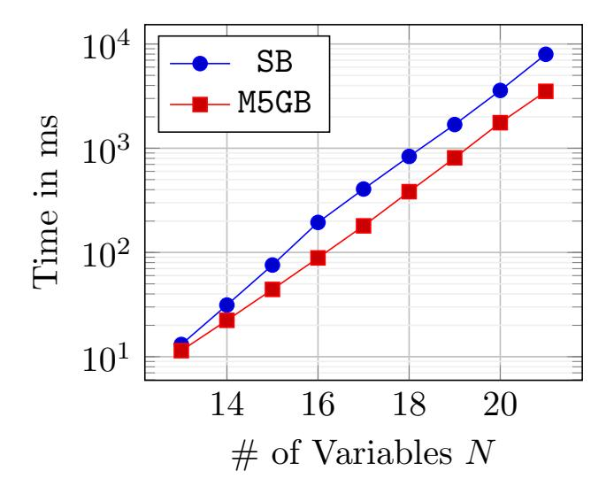
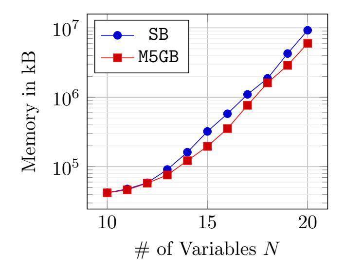
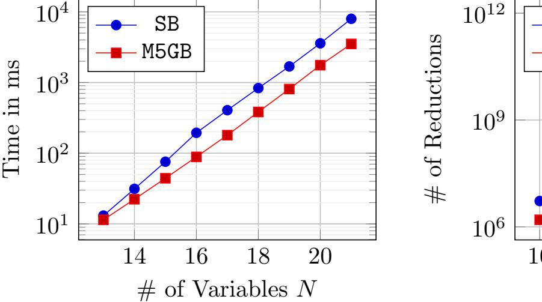
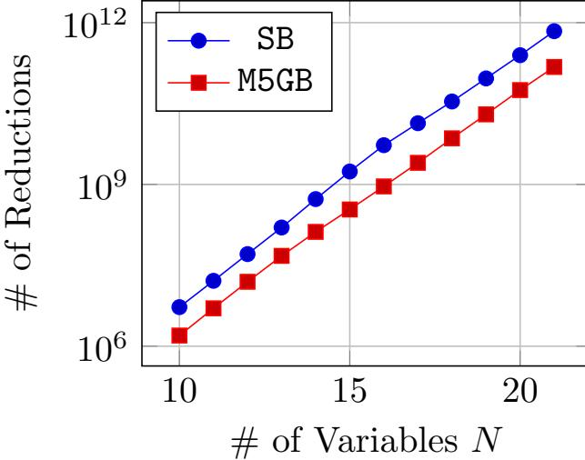
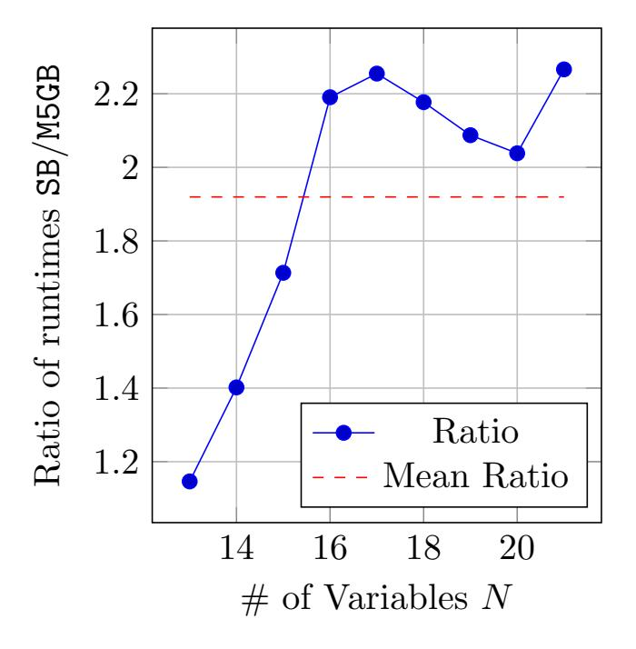
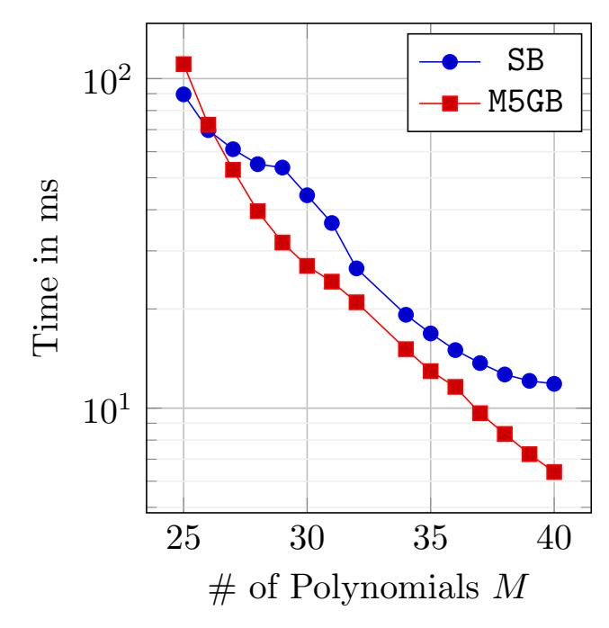

{0}------------------------------------------------

# A Signature-Based Gr¨obner Basis Algorithm with Tail-Reduced Reductors (M5GB)

Manuel Hauke<sup>a</sup> , Lukas Lamster<sup>b</sup> , Reinhard L¨ufteneggerb,<sup>∗</sup> , Christian Rechberger<sup>b</sup>

#### Abstract

Gr¨obner bases are an important tool in computational algebra and, especially in cryptography, often serve as a boilerplate for solving systems of polynomial equations. Research regarding (efficient) algorithms for computing Gr¨obner bases spans a large body of dedicated work that stretches over the last six decades. The pioneering work of Bruno Buchberger in 1965 can be considered as the blueprint for all subsequent Gr¨obner basis algorithms to date. Among the most efficient algorithms in this line of work are signature-based Gr¨obner basis algorithms, with the first of its kind published in the late 1990s by Jean-Charles Faug`ere under the name F5. In addition to signature-based approaches, Rusydi Makarim and Marc Stevens investigated a different direction to efficiently compute Gr¨obner bases, which they published in 2017 with their algorithm M4GB. The ideas behind M4GB and signature-based approaches are conceptually orthogonal to each other because each approach addresses a different source of inefficiency in Buchberger's initial algorithm by different means.

We amalgamate those orthogonal ideas and devise a new Gr¨obner basis algorithm, called M5GB, that combines the concepts of both worlds. In that capacity, M5GB merges strong signature-criteria to eliminate redundant S-pairs with concepts for fast polynomial reductions borrowed from M4GB. We provide proofs of termination and correctness and a proof-of-concept implementation in C++ by means of the Mathic library. The comparison with a state-of-the-art signature-based Gr¨obner basis algorithm (implemented via the same library) validates our expectations of an overall faster runtime for quadratic overdefined polynomial systems that have been used in comparisons before in the literature and are also part of cryptanalytic challenges.

Keywords: Gr¨obner basis, signature-based, M4GB, tail-reduction

a Institute of Analysis and Number Theory, Graz University of Technology, Steyrergasse 30/II, 8010 Graz, Austria

b Institute of Applied Information Processing and Communications, Graz University of Technology, Inffeldgasse 16a, 8010 Graz, Austria

<sup>⋆</sup>Author list in alphabetical order; see [https://www.ams.org/profession/leaders/](https://www.ams.org/profession/leaders/CultureStatement04.pdf) [CultureStatement04.pdf](https://www.ams.org/profession/leaders/CultureStatement04.pdf).

<sup>∗</sup>Corresponding author

Email address: reinhard.lueftenegger@iaik.tugraz.at (Reinhard L¨uftenegger)

{1}------------------------------------------------

# 1. Introduction

Gr¨obner bases are an essential tool in commutative algebra and algebraic geometry. Several important applications in these areas are (a) the Ideal Equality Problem, characterizing the equality of two ideals through the reduced Gr¨obner bases of their sets of generators, (b) the Ideal Membership Problem, characterizing whether a polynomial belongs to a given ideal via the division remainder modulo the respective (reduced) Gr¨obner basis, and (c) the Elimination Problem, eliminating variables from a system of polynomial equations through, e.g., lexicographic Gr¨obner bases. There are many more applications of Gr¨obner bases in signal and image processing, robotics, automated geometric theorem proving, and solving systems of polynomial equations [\[BW98\]](#page-20-0), [\[Ab l10\]](#page-19-0).

Especially in cryptography, both public-key and symmetric cryptography, the problem of solving systems of polynomial equations arises in different contexts, ranging from block cipher and hash function analysis [\[ACG](#page-19-1)+19, [BPW06\]](#page-20-1) to the analysis of asymmetric encryption and signature schemes [\[TPD21,](#page-22-0) [FJ03\]](#page-21-0). The applicability of Gr¨obner bases to cryptanalysis has been one of the driving factors for research on efficient algorithms for computing them. In general, the pioneering Buchberger algorithm for computing Gr¨obner bases devised by Bruno Buchberger and published in 1965 [\[Buc65,](#page-20-2) [Buc76\]](#page-20-3) can be considered highly inefficient, mainly due to the excessive amount of redundant computations that do not provide any new information for the eventual Gr¨obner basis. In more detail, the Buchberger algorithm repeatedly reduces so-called S-pairs [\[CLO15,](#page-20-4) p.84], adds all non-zero remainders to the current basis and repeats this process until all S-pairs reduce to zero with respect to the current basis. During the process of repeatedly reducing S-pairs, often many of those S-pairs reduce to zero and thus they do not provide any new information. To tackle this inefficiency, further criteria have been developed to streamline the Buchberger algorithm by detecting and discarding S-pairs that would otherwise reduce to zero. The work by Gebauer and M¨oller [\[GM88\]](#page-21-1) implements these criteria and presents a more efficient instantiation of the Buchberger algorithm.

A different approach, initially investigated by Buchberger [\[Buc83a,](#page-20-5) [Buc83b\]](#page-20-6) and Lazard [\[Laz79,](#page-21-2) [Laz83,](#page-21-3) [Laz01\]](#page-21-4) and further developed by Faug`ere in 1999 [\[Fau99\]](#page-21-5), relates the problem of reducing S-pairs to the problem of reducing matrices. The basic underlying idea is that for a degree bound large enough and all term multiples of the initial polynomials up to this degree, the matrix containing the corresponding coefficients of the term multiples yields, after Gaussian row reduction, a Gr¨obner basis of the ideal generated by the initial polynomials. Rather than choosing a degree bound large enough and constructing one large matrix, Faug`ere's F4 algorithm in [\[Fau99\]](#page-21-5) constructs matrices for smaller degrees, row-reduces the corresponding smaller matrices and continues in this fashion until a Gr¨obner basis is found. Compared to the Buchberger algorithm, the advantage of F4 is that S-pairs are reduced in parallel rather than sequentially. This advantage is the main source of the particular efficiency of F4 and 

{2}------------------------------------------------

some of the fastest Gr¨obner basis implementations to date rely on this approach, as, e.g., the implementation in the computer algebra system Magma.

Signature-based Gr¨obner basis algorithms are another line of work regarding more efficient instantiations of the Buchberger algorithm. In the F5 algorithm introduced by Faug`ere in 2002 [\[Fau02\]](#page-21-6), so-called signatures help to keep track from which initial polynomials some S-pair has been calculated. The information from the signatures allows to detect whether a S-pair reduces to zero without having to carry out the reduction. Thus, the main idea of signature-based criteria is reducing the amount of redundant reductions. For a particular class of polynomial systems, called regular sequences, F5 does not carry out any redundant reduction at all. The F5 algorithm and other signature-based Gr¨obner basis algorithms have later been incorporated into the rewrite framework published by Christian Eder and Bjarke Roune [\[ER13\]](#page-20-7). The rewrite framework generalizes many different (signature-based) approaches for computing Gr¨obner bases and unifies them under the umbrella of a single comprehensive framework.

Compared to the approaches discussed above, Rusydi Makarim and Marc Stevens present an orthogonal concept for computing Gr¨obner bases [\[MS17\]](#page-21-7): their M4GB algorithm is based on the Gebauer-M¨oller version of the Buchberger algorithm, with the difference that reductions of S-pairs are carried out with tail-reduced reductors. In addition, these tail-reduced reductors are stored for potential later reuse. The main advantage of this approach is that no new reducible terms are introduced into the reduction remainder, which allows reducing S-pairs in a term-wise and recursive manner. This results in a fast polynomial reduction routine. The downside, however, is that any reductor has to be tail-reduced first, and the overall advantage of this approach depends on how often the algorithm is able to reuse already constructed and stored tail-reduced reductors.

## 1.1. Our Contribution

We present a new algorithm for computing Gr¨obner bases, called M5GB, which combines the strengths of M4GB [\[MS17\]](#page-21-7) and signature-based Gr¨obner basis algorithms like F5 [\[Fau02\]](#page-21-6). We provide proofs of termination and correctness for M5GB. In particular, we show how one can adapt the fast reduction routine used in M4GB to work with the signature-based criteria from F5-like algorithms. This creates a generic optimization that can be used for any signature-based Gr¨obner basis algorithm that does not use a matrix approach for polynomial reduction. The question of merging the fast reduction routine from M4GB with signature-based criteria arises naturally but resolving it is a non-trivial task that requires technical care, especially when it comes to algorithmic efficiency. To date, and to the best of our knowledge, no algorithm in this line of work has been published yet.

For a proof-of-concept implementation, we concentrate on the signaturebased algorithm SB from Stillman and Roune [\[RS12\]](#page-22-1), also called SigGB in the reference implementation [\[Rou13b\]](#page-21-8), and adapt this algorithm to be compatible with an M4GB-like reduction routine. We show that using the same library for implementing SB and M5GB, we obtain a significant, scalable speed-up for dense, 

{3}------------------------------------------------

quadratic, overdefined systems. These systems are used for benchmark purposes in the original article about M4GB by Makarim and Stevens [\[MS17\]](#page-21-7) and are posed as a problem instance in the MQ Challenge [\[Tak15\]](#page-22-2).

#### 1.2. Related Work

Compared to our approach for computing Gr¨obner bases in M5GB, there exist related but different approaches in the literature. Here, we briefly discuss the main conceptual differences. One difference applies to all discussed algorithms below: we state our M5GB algorithm in the rewrite framework [\[ER13\]](#page-20-7), while the below algorithms adopt the basic structure of F5. The rewrite framework comprises the original F5 algorithm as a special instantiation.

F4/5. Albrecht and Perry [\[AP10\]](#page-19-2) describe an algorithm that combines F4-style reduction with F5-like signature criteria. This means, [\[AP10\]](#page-19-2) integrates - like M5GB - a fast reduction routine with signature-based criteria to discard S-pairs. The difference to M5GB is that their algorithm F4/5 uses the same linear algebra approach for reducing S-pairs as F4, and thus conceptionally resembles Matrix-F5 [\[BFS15\]](#page-20-8) rather than M5GB. Hence, it is the reduction of S-pairs that distinguishes F4/5 and M5GB: the former algorithm uses F4-style reduction, while the latter one uses M4GB-style reduction. For a more detailed differentiation between the respective reduction routines in F4 and M4GB we refer to [\[MS17,](#page-21-7) Chapter 4.2].

F5C and F5R. Eder and Perry [\[EP10\]](#page-20-9) present a variant of Faug`ere's original F5 algorithm which works with reduced intermediate Gr¨obner bases rather than non-reduced ones. This results in fewer S-pairs to consider for checking the signature criteria and, eventually, fewer polynomial reductions. Eder and Perry differentiate their approach called F5C, "F5 Computing by reduced Gr¨obner bases", from the approach devised by Stegers [\[Ste06\]](#page-22-3) for which they use the denomination F5R, "F5 Reducing by reduced Gr¨obner bases". In [\[Ste06\]](#page-22-3), Stegers' F5R algorithm uses reduced intermediate bases only for polynomial reductions, however, it still uses unreduced intermediate bases for computing new S-pairs. In contrast, F5C uses reduced intermediate bases for, both, polynomial reductions and generating new S-pairs. To summarize, the advantage of F5R over F5 is faster polynomial reductions, while the advantage of F5C over F5R is a lower number of S-pairs to compute. The main conceptual difference between F5C and M5GB is, again, the reduction routine: F5C uses ordinary polynomial reduction while M5GB uses M4GB-style reduction.

#### 2. Preliminaries

Any work treating the theory behind Gr¨obner bases and, in particular, describing different algorithms to compute Gr¨obner bases is faced with the challenge of having to introduce a significant amount of definitions and denominations. On top of that, there are often considerable notational differences between different authors. This being said, in Section [2.1](#page-4-0) we pay attention to stay close 

{4}------------------------------------------------

to commonly shared denominations and to find a balance between a rigorous and compact nomenclature.

Furthermore, in Section 2.2 and Section 2.3 we give brief accounts of M4GB and signature-based algorithms for computing Gröbner bases, respectively. We describe these algorithms only to the extent that we are able to sketch their core ideas needed for our presentation of M5GB in Section 3. We assume some familiarity with these algorithms from the reader, although the core ideas should become apparent without any deeper prior knowledge.

#### <span id="page-4-0"></span>2.1. Preliminary Definitions

We work with polynomials in the variables  $X_1, \ldots, X_n$  over a finite field  $\mathbb{F}$ , i.e., with the polynomial ring  $P := \mathbb{F}[X_1, \ldots, X_n]$ . A term is a power product of variables, while a monomial is a product of coefficient and term. By T we denote the set of all terms in P. For a polynomial  $f \in P$ , the set T(f) shall denote the set of all terms of f. For a term  $t \in T(f)$ , the corresponding coefficient is denoted as  $C_t(f)$ . We define the free P-module  $P^m$  with generators  $e_1 := (1,0,\ldots,0)$ , ...,  $e_m := (0,\ldots,0,1)$ . As for polynomials, a module term is an element in  $P^m$  of the form  $te_i$ , while a module monomial is an element of the form  $c \cdot te_i$ , for  $c \in \mathbb{F}$ ,  $t \in T$  and  $1 \le i \le m$ . The set of all module terms in  $P^m$  is denoted by  $T_m$ .

Throughout this article, we write module elements  $f, g, \ldots$  in  $P^m$  in bold-face, whereas polynomials  $f, g, \ldots$  in P are written in normal style. We denote a term order on T and a compatible order extension to module terms in  $T_m$  by the same sign  $\leq$ . We believe, this ambiguity is justified by an easier notation and causes no deeper confusion because the context clarifies whether  $\leq$  relates polynomials or module elements. For a given term order  $\leq$ , the leading term of a polynomial  $f \in P$ , denoted by LT(f), is defined as the  $\leq$ -maximum term in T(f) and the leading coefficient as the associated coefficient of LT(f). In a similar fashion, the module leading term MLT(f) and module leading monomial MLM(f) are defined for a module element  $f \in P^m$  and a compatible order extension  $\leq$ . The polynomial  $Tail(f) := f - LC(f) \cdot LT(f)$  is called the tail of f.

Given a finite set of non-zero polynomials  $F := \{f_1, \ldots, f_m\} \subseteq P \setminus \{0\}$ , the module homomorphism  $\varphi_F : P^m \to P$  given by  $(p_1, \ldots, p_m) \mapsto \sum_i p_i f_i$  connects the module and polynomial perspective. Usually, the underlying set F is clear, therefore we often omit the subscript and just write  $\varphi$  instead of  $\varphi_F$ . Using the canonical generators of  $P^m$ , we can also write  $\varphi : \sum_i p_i e_i \mapsto \sum_i p_i f_i$ . Any module element  $h \in P^m$  with  $\varphi(h) = 0$  is called a *syzygy*. The *signature* of a module element  $f \in P^m$  is given by  $\operatorname{Sig}(f) := \operatorname{MLT}(f) \in T_m$ ; of course, always relative to some compatible order extension  $\leq$ .

For a finite set of polynomials  $G \subseteq P \setminus \{0\}$ , a non-zero polynomial f is said to be reducible with respect to G, if there exist a term  $t \in T(f)$  and an element  $g \in G$  such that  $LT(g) \mid t$ . If u := t/LT(g) and  $c := C_t(f)$ , we denote the reduction itself by  $f \longrightarrow_G f - c \cdot ug$ .

<span id="page-4-1"></span>An order extension is called compatible, if  $\forall u, v \in T \ \forall 1 \leq i \leq m : u \leq v \Rightarrow ue_i \leq ve_i$ .

{5}------------------------------------------------

The element  $c \cdot ug$  is called a reductor of f. If  $t = \mathrm{LT}(f)$ , the reduction step is also called a top-reduction, otherwise a tail-reduction and the corresponding reductors are called top-reductor and tail-reductor, respectively. If a polynomial is not reducible (or tail-reducible) with respect to G, it is called irreducible (or tail-irreducible) with respect to G. For the sake of notational convenience, any non-zero scalar multiple  $d \cdot ug$ ,  $d \in \mathbb{F} \setminus \{0\}$ , is also called a reductor of f. This is why we often drop the scalar coefficient and just call ug a reductor of f. If f reduces to  $h \in P$  in finitely many reduction steps with respect to G, we denote this by  $f \longrightarrow_{G,*} h$ . This also includes the case in which no reduction steps are done at all, hence  $f \longrightarrow_{G} f$  is trivially valid. We call a polynomial  $f' \in P$  to be a normal form of f with respect to G if  $f \longrightarrow_{G,*} f'$  and f' is irreducible with respect to G. We use the denomination

$$f \mod G := \{ f' \in P : f' \text{ a normal form of } f \text{ w.r.t. } G \}$$

to write down the set of all normal forms of a polynomial f.

**Remark.** Usually, we omit the specification with respect to G and presume it to be clear from the context; whenever necessary, we explicitly mention the underlying set G. The same applies for Sig-reductions defined below. Furthermore, we often do not mention nor incorporate the underlying (module) term order in our definitions and terminology. Again, the aim is having a lighter notation.

For a finite set of module elements  $G \subseteq P^m \setminus \{0\}$ , a non-zero module element  $f \in P^m \setminus \{0\}$  is said to be Sig-reducible with respect to G if there exist a term  $t \in T(\varphi(\mathbf{f}))$  and an element  $\mathbf{g} \in \mathbf{G}$  such that the following two properties hold: (i)  $LT(\varphi(g)) \mid t$ , in which case we set  $u := t/LT(\varphi(g))$ ; (ii)  $Sig(f) \ge Sig(ug)$ . If these properties are fulfilled, we define  $\boldsymbol{f} - c \cdot u\boldsymbol{g}$  as the outcome of the Sigreduction, where  $c := C_t(\varphi(\mathbf{f}))/LC(\varphi(\mathbf{g}))$ , and denote the Sig-reduction itself by  $f \longrightarrow_{\mathbf{G}} f - c \cdot u\mathbf{g}$ . In particular, the element  $c \cdot u\mathbf{g}$  is called a Sig-reductor of f. If Sig(f) > Sig(ug), we call it a regular Sig-reduction, otherwise a singular Sig-reduction. We denote a regular Sig-reduction by  $f \longrightarrow_{G,reg} h$ and, analogously, any finite number of regular Sig-reductions on f to a module element h by  $f \longrightarrow_{G,reg,*} h$ . We say  $f \longrightarrow_{G,*} 0$  if  $f \longrightarrow_{G,*} h$  for a syzygy **h**. This notation is justified by  $\varphi(\mathbf{h}) = 0$ . We believe, the definitions of Sigtop-reduction, Sig-tail-reduction, Sig-irreducible, Sig-tail-irreducible, regularly Sig-irreducible, regularly Sig-tail-irreducible,  $f \longrightarrow_{G,*} h$  are clear without any further explication. In some cases it is convenient to speak of ordinarily reducing a module element  $f \in P^m$  (i.e., without above constraint (ii) regarding the signatures), when, in fact, we mean reducing the corresponding polynomial  $\varphi(\mathbf{f}) \in P$ .

We say  $f' \in P^m$  is a (regular) Sig-normal form of f if  $f \longrightarrow_{G,reg,*} f'$  and f' is (regularly) Sig-irreducible. We denote by  $f \mod G$  the set of all Sig-normal forms of f with respect to G, and by  $f \mod_{reg} G$  the set of all regular Sig-normal forms with respect to G. For a pair of module elements  $f, g \in P^m$  we define the S-pair of f and g as

$$\mathrm{Spair}(\boldsymbol{f},\boldsymbol{g})\coloneqq \left(\frac{\ell}{LM(\varphi(\boldsymbol{f}))}\boldsymbol{f},\frac{\ell}{LM(\varphi(\boldsymbol{g}))}\boldsymbol{g}\right)\coloneqq (u\boldsymbol{f},v\boldsymbol{g})$$

{6}------------------------------------------------

where l := lcm(LT(φ(f)), LT(φ(g))). We call Spair(f, g) regular if Sig (uf) ̸= Sig (vg) and singular otherwise.

Let F := {f1, ..., fm} ⊆ P \ {0} be a set of polynomials, I := ⟨F⟩ the ideal generated by F and s ∈ T<sup>m</sup> a module term. A set of module elements G ⊆ P <sup>m</sup> \ {0} is defined to be a Sig-Gr¨obner basis of I up to signature s if

$$\forall f \in P^m : \operatorname{Sig}(f) < s \Longrightarrow f \longrightarrow_{G,*} 0.$$

The set G is called a Sig-Gr¨obner basis of I if G is a Sig-Gr¨obner basis up to every s ∈ P <sup>m</sup> (i.e., for all possible signatures s). The dependence on the set F (and thus the ideal I) is implicitly contained in the condition f −→G,<sup>∗</sup> 0, since for φ = φ<sup>F</sup> this implies φ(f) −→φ(G),<sup>∗</sup> 0. [2](#page-6-1)

A total order ⪯ on G with Sig (f) | Sig (g) =⇒ f ⪯ g, for all f, g ∈ G, is called a rewrite order. We assume that all elements in G have distinct signatures, hence, the notion of a rewrite order is well-defined. For s ∈ Tm, f ∈ P <sup>m</sup> and u ∈ T, the element uf ∈ P <sup>m</sup> is called the canonical rewriter of signature s with respect to G if G = ∅ or if Sig (uf) = s and f = max⪯{g ∈ G : Sig (g) | s}. Instead of this bulky denomination, we often just say "the canonical rewriter of s", because the set G will be clear from the context.

# <span id="page-6-0"></span>2.2. M4GB Algorithm

In 2017 Rusydi Makarim and Marc Stevens published a new algorithm for computing Gr¨obner bases called M4GB. The main innovation of M4GB is a fast polynomial reduction routine that only uses tail-reduced reductors in each reduction step. In addition, M4GB maintains a set of already used (tail-reduced) reductors and thus allows to reuse reductors. We describe a variant of M4GB which is sketched in the performance section of [\[MS17,](#page-21-7) Sec. 4.1]. This variant outputs the same result as the original M4GB algorithm, albeit it is considered more performant due to time savings in the update process of the set of reductors. The authors of M4GB call this variant a lazy variant, whereas we simply refer to this variant as M4GB. Here, we only describe the core ideas and those parts of M4GB that are relevant for our new Gr¨obner basis algorithm M5GB in Section [3.](#page-9-0) In particular, we focus on the reduction of polynomials in M4GB. For a more detailed description of M4GB we refer the reader to the original article [\[MS17\]](#page-21-7).

The M4GB algorithm essentially follows the basic outline of the textbook Buchberger algorithm [\[Buc76\]](#page-20-3), which is "Select, Reduce, Update": selecting an S-pair, reducing it, and adding the reduced S-pair to the current basis in case it is nonzero. Whenever a nonzero reduced S-pair is added to the current basis, the set of S-pairs is updated. In M4GB, updating the set of S-pairs is achieved via the Gebauer-M¨oller criteria [\[GM88\]](#page-21-1). This process is repeated until all S-pairs have been processed. In addition to the basic "Select, Reduce, Update" triad,

<span id="page-6-1"></span><sup>2</sup>The notion of Sig-Gr¨obner bases is motivated by the fact that if G is a Sig-Gr¨obner basis, then φ(G) is a Gr¨obner basis.

{7}------------------------------------------------

M4GB is characterised by the following two distinct properties: (a) it performs reductions only with tail-reduced reductors and, (b) it maintains a list of already used (tail-reduced) reductors for future use. The benefit of these two properties are faster reductions because (b) allows to reuse an already constructed (tailreduced) reductor instead of re-constructing it again, while (a) ensures that during a reduction no new reducible terms are introduced into the resulting polynomial.

More formally, let G denote the current basis and TG(f) the set of reducible terms of f ∈ P with respect to G. Assume M4GB reduces a term t in a polynomial p by an appropriate reductor m and m is not tail-irreducible with respect to G. Then, for further reducing the result of the reduction p − m, all terms in

$$T_G(p-m) = (T_G(p) \cup T_G(m)) \setminus \{t\}$$

would have to be reduced modulo G. However, if m is tail-irreducible we have by definition TG(m) ⊆ {LT(m)} = {t}, hence

$$T_G(p-m) = T_G(p) \setminus \{t\},\$$

and only terms in T(p) \ {t} need to be reduced modulo G. This is the main conceptual advantage of M4GB and its fast reduction routine.

Throughout all computations, M4GB maintains a set of reductors M ⊇ G, i.e., a set of monomial multiples of the current basis elements. All elements in M have unique leading terms, which is why the current basis G can be referenced only by its leading terms L. Nevertheless, we refer to L as the intermediate (or current) basis. The original formulation of M4GB in [\[MS17\]](#page-21-7) proactively updates the whole set M in advance whenever a new basis element is generated. In contrast, the variant of M4GB that we describe (and that the authors of [\[MS17\]](#page-21-7) implement) updates the elements in M only on-demand.[3](#page-7-1) This means, only when an element m ∈ M is reused, the algorithm checks if it needs to be tailreduced with respect to the elements referenced by L. This leads to a lazy implementation of the update process of M. Although not explicitly stated in [\[MS17\]](#page-21-7), for this lazy variant of M4GB the authors implicitly use the concept of generations: the generation of a reductor m ∈ M is the cardinality |L| of the intermediate basis L when m was added to M. Keeping track of the generation has the following purpose: whenever a reductor m ∈ M is reused during the execution of M4GB and the generation of m is equal to the current generation, then we know m is tail-irreducible with respect to the current basis L and it can be used reused without any further considerations. If the generation of m is strictly smaller than the current generation, m needs to updated.

## <span id="page-7-0"></span>2.3. Signature-Based Algorithms

In the textbook version of the Buchberger algorithm, many of the S-pairs will be reduced to zero, which means they do not contribute any new information

<span id="page-7-1"></span><sup>3</sup>When we speak of updating the set of reductors M, this is conceptionally different from updating the set of S-pairs. The former one is specific to M4GB, while the latter one is an essential feature of all Gr¨obner basis algorithms.

{8}------------------------------------------------

to the eventual Gröbner basis. Hence, a reduction to zero is redundant work, and it would be nice to have an oracle detecting whether or not an S-pair will be reduced to zero without having to carry out the actual reduction. There are criteria known to improve the textbook Buchberger algorithm in this regard (i.e., Buchberger's Product and Chain Criterion, realized in the Gebauer-Möller instantiation [GM88] of the Buchberger algorithm), but still many redundant reductions to zero might occur. In the following, a change of perspective helps to establish even stronger criteria for detecting redundant reductions to zero. Let f be a polynomial in the ideal generated by the polynomials  $f_1, \ldots, f_m \in P$ , i.e.,  $f \in \langle f_1, ..., f_m \rangle$ . Then f can be written as  $f = \sum_{i=1}^m p_i f_i$ , for some polynomials  $p_1, \ldots, p_m \in P$  (which are not necessarily unique). This notation of f motivates a new perspective: f cannot only be considered as polynomial but also as module element  $(p_1,\ldots,p_m)\in P^m$ . Adopting the module's perspective, it is possible to introduce a new concept called *signatures* for detecting unnecessary S-pair reductions. The main idea behind signatures is, roughly speaking, to keep track of how the polynomials generated during a Gröbner basis computation depend on the original input polynomials. More concretely, this means a signature-based algorithm not only processes information coming from a polynomial f itself but also from the vector  $(p_1, \ldots, p_m)$  constituting the relation  $f = \sum_i p_i f_i$ , where the  $f_i$  would be the original input polynomials. On the one hand, this idea aims at exploiting zero-relations between the input polynomials (i.e., syzygies from the module perspective) to detect redundant reductions; on the other hand, it uses the (more subtle) fact that different polynomial combinations of the input polynomials (i.e., different module elements from the module perspective) can have the same reduction remainder. Thus only one of these reductions need to be performed. The former observation is the basis for the so-called syzygy criterion, while the latter observation leads to the rewrite-criterion (see Line 8 and 4, respectively, in Algorithm 1).

With above motivation of signatures at hand, we state the signature equivalent of Buchberger's S-pair criterion. The fundamental theorem underlying all signature-based algorithms is the following result.

<span id="page-8-0"></span>**Theorem 1** ([ER13], Theorem 3). Let  $\mathbf{s} \in T_m$  be a module term and  $\mathbf{G} \subseteq P^m$  be a finite set of module elements. If for all  $\mathbf{p} \in P^m$  with  $\mathbf{p}$  a regular S-pair of elements in  $\mathbf{G}$  or  $\mathbf{p}$  a canonical basis vector  $\mathbf{e}_i$  (and  $\mathrm{Sig}(\mathbf{p}) < \mathbf{s}$ , resp.) it holds that  $\mathbf{p} \bmod_{\mathrm{reg}} \mathbf{G}$  contains a syzygy or a singularly Sig-top-reducible element, then  $\mathbf{G}$  is a signature Gröbner basis (up to  $\mathbf{s}$ , resp.).

The following two observations explicate how signatures help to detect unnecessary reductions to zero in advance: assume we have a Gröbner basis  $G \subseteq P^m$  up to signature  $s \in T_m$ . First, one can show that for any two regularly Sig-irreducible module elements  $f, g \in P^m$  it holds

$$\operatorname{Sig}(\boldsymbol{f}) = \operatorname{Sig}(\boldsymbol{g}) = \boldsymbol{s} \Longrightarrow \varphi(\boldsymbol{f}) = c \cdot \varphi(\boldsymbol{g})$$

for some  $c \in \mathbb{F} \setminus \{0\}$ . Second, if there exists a syzygy  $\mathbf{h} \in P^m$  with Sig  $(\mathbf{h}) \mid \mathbf{s}$ , then

$$\forall \mathbf{f} \in P^m \text{ with } \operatorname{Sig}(\mathbf{f}) = \mathbf{s} : \mathbf{f} \longrightarrow_{\mathbf{G},*} 0.$$

{9}------------------------------------------------

The salient points are: (a) we only need to Sig-reduce one element with a given signature (we will choose the one which is 'easier' to handle). Hence, in a signature-based algorithm, instead of an S-pair with a given signature, we are free to choose any module element with the same signature and reduce this element to check whether the current signature provides new information for our eventual Gr¨obner basis. This approach is called rewriting and Gr¨obner basis algorithms based on this approach are called rewrite algorithms [\[ER13\]](#page-20-7); (b) if we know that the signature of the element to be reduced is a multiple of the signature of a syzygy, we can skip the computation of the reduction at all. This is why a signature-based algorithm always keeps track of syzygy signatures and stores them separately.

This is all we intend to say about the ideas behind signature-based and rewrite Gr¨obner basis algorithms and, in particular, we do not state a pseudo code for them. The basic ideas we adopt from the signature and rewriting approach for our M5GB algorithm are evident from Algorithm [1.](#page-11-2) For a more indepth motivation and treatment of signature-based and rewrite Gr¨obner basis algorithms we refer to the comprehensive survey article [\[EF17\]](#page-20-10).

# <span id="page-9-0"></span>3. M5GB Algorithm

In this section, we present our new Gr¨obner basis algorithm M5GB that amalgamates the core ideas of (signature-based) rewrite algorithms with the main ideas of M4GB. For this amalgamation to be viable, we introduce a new concept called signature flags. On a high level, signature flags play a similar role as generations in M4GB and allow to efficiently fuse the ideas behind signature-based algorithms and M4GB, respectively. As such, M5GB is an algorithm which aims to combine the strengths of both worlds: (a) fast reduction of polynomials due to the M4GB-like reduction routine; (b) strong criteria for discarding redundant S-pairs adopted from signature-based algorithms.

## <span id="page-9-1"></span>3.1. New Definitions

Since M5GB works with Sig-tail-irreducible reductors up to some signature s, we explicate this concept in a formal definition. In the following let G ⊆ P <sup>m</sup>\{0} be a non-empty and finite set of non-zero module elements.

We call a term t ∈ T Sig-reducible with respect to G and up to s, if there exist u ∈ T, g ∈ G such that LT(φ(ug)) = t and Sig (ug) < s. A module element f ∈ P <sup>m</sup> is called Sig-reducible with respect to G and up to s, if there exists a term t ∈ T(φ(f)) that is Sig-reducible with respect to G and up to s. We denote such a reduction step by f −→G,<sup>s</sup> f − c · ug, for an appropriate scalar c ∈ F\ {0}. For a given set of terms D ⊆ T(φ(f)), we call f Sig-reducible with respect to G, D and up to s if there exists a reductor ug of f such that LT(φ(ug)) = d for some d ∈ D and Sig (ug) < s. Such a reduction step is denoted by f −→G,s,D f − c · ug.

Remark. In particular, for s = Sig (f) and D = T(φ(f)), the reduction f −→G,s,D f − c · ug describes a regular Sig-reduction f −→G,reg f − c · ug. 

{10}------------------------------------------------

This means, our new view  $\longrightarrow_{G,s,D}$  on signature-based reductions contains regular Sig-reductions as special case. Moreover, if we choose  $D = T(Tail(\varphi(\mathbf{f})))$ , we allow all regular Sig-reductions except for a top-reduction. These two special cases are the instantations of D we are most interested in, although the statements below, e.g., Lemma 1, can be applied for arbitrary  $D \subseteq T(\varphi(\mathbf{f}))$ .

As highlighted in Section 2.1, we often do not explicitly mention the set G. In the same manner, we define  $f \longrightarrow_{G,s,*} h$ ,  $f \longrightarrow_{G,s,D,*} h$ , Sig-irreducible up to s, Sig-irreducible with respect to D and up to s, Sig-tail-irreducible up to s. A normal form of f with respect to G and up to s is an element  $f' \in P^m$  that is Sig-irreducible with respect to G and up to s and for which it holds  $f \longrightarrow_{G,s,*} f'$ . We denote the set of all normal forms of f with respect to G and up to f by  $f \mod_s G$ . For a set of terms  $f \subseteq T(\varphi(f))$ , a normal form of f with respect to f0, f1 and up to f2 is an element  $f' \in F^m$ 2. We denote the set of all normal forms of f3 with respect to f4. We denote the set of all normal forms of f5 with respect to f6 and up to f7. We denote the set of all normal forms of f2 with respect to f3 and up to f4 with respect to f5.

As in M4GB, the generation Gen(m) of a reductor  $m \in M$  is defined as the cardinality of the set G at the time m is constructed. <sup>4</sup> We denote the instance of G at this time with  $G_{Gen(m)}$ . For a module element  $f \in P^m$  the signature flag with respect to G is defined as

$$\operatorname{Flag}(\boldsymbol{f}) := \min \{ \operatorname{Sig}(v\boldsymbol{g}) : \boldsymbol{g} \in \boldsymbol{G}, v \in T, v\boldsymbol{g} \text{ a tail-reductor of } \boldsymbol{f} \},$$

or Flag  $(f) := \infty$  if f is tail-irreducible. The symbol  $\infty$  can be understood as a formal symbol added to  $T_m$  with the simple property that

$$\forall s \in T_m : s < \infty.$$

#### <span id="page-10-1"></span>3.2. Description of M5GB

The overall structure of M5GB is depicted in Algorithm 1 and resembles the basic structure of a rewrite Gröbner basis algorithm (as outlined in [ER13]) with signature-based criteria to discard redundant S-pairs (see Line 4, 5, 6) and the fundamental "Select, Reduce, Update" triad from the Buchberger algorithm [Buc76]. In particular, M5GB processes S-pairs in strictly increasing signature and keeps track of syzygy signatures in a separate set H (Line 8). If a new basis element is found (Line 10), the Update routine (Algorithm 2) for the current basis G and the current set of S-pairs P is triggered. The steps in Update are governed by the same principles as in any other signature-based algorithm, with the difference, that Update detects whether a basis element  $e_i$  has been processed and thus extends the set of syzygy signatures H accordingly (Algorithm 2, Line 3). The main innovations of M5GB are incorporated into the reduction routine Reduce described in Algorithm 3. In the following, we discuss the novel features as well as the intricacies of Reduce more comprehensively.

<span id="page-10-0"></span> $<sup>^4</sup>$ Here, the term "constructed" also encompasses the case when  $\bm{m}$  is updated, or in other words, "re-constructed".

{11}------------------------------------------------

#### Algorithm 1: M5GB

```
Input: Non-zero input polynomials F = {f1, ..., fm}, a rewrite order, a
          term order on T and a compatible order extension on Tm
  Output: A Gr¨obner basis G of the ideal generated by F
1 G := ∅; M := ∅; H := ∅
2 P := {ei : i ∈ {1, ..., m}}
3 while P ̸= ∅
4 Select f ∈ P with minimal signature s = Sig (f) and ug the
       canonical rewriter of s w.r.t G.
5 P := P \{p ∈ P : Sig (p) = s}
6 if s is not divisible by some h ∈ H then
7 (M, f
               ′
               ) := Reduce(f, φ(f), s,M, G)
8 if f
            ′ = 0 then
9 H := H ∪ {s}
10 else
11 (G, P , H) := Update(f
                                  ′
                                   , G, P , H)
12 return φ(G)
```

# <span id="page-11-5"></span><span id="page-11-4"></span><span id="page-11-0"></span>Algorithm 2: Update

```
Input: Current basis G, set of S-pairs P and set of syzygy signatures
         H, new basis element f
 Output: Updated G, P and H
1 P := P ∪ {Spair(f, g) : g ∈ G, Spair(f, g) regular}
2 G := G ∪ {f}
3 if Sig (f) = ei then // f comes from a basis element ei
4 H := H ∪ {Sig (φ(g)ei − φ(ei)g) : g ∈ G}
5 return (G, P , H)
```

<span id="page-11-7"></span>As in M4GB, the Reduce routine keeps track of previously used reductors and stores them in a set M. The key feature of M4GB, namely, working with tailreduced reductors, is implemented in Reduce as well. The difference to M4GB and a crucial point is that whenever a reductor m ∈ P <sup>m</sup> is added to M, it need not be fully tail-irreducible with respect to G but only Sig-tail-irreducible up to the current signature s. This property is an important part of our efficient amalgamation of signature-based algorithms with M4GB: by Theorem [1,](#page-8-0) signature-based algorithms work with regular Sig-reductions and hence, only those terms in T(Tail(m))) need be reduced that have a reducer with signature smaller than s. We formalized this particular property in the definitions in Section [3.1.](#page-9-1)

Again, as in M4GB, elements in M are updated in a lazy manner, meaning only on-demand when they are reused and not proactively whenever a new basis element is added to G.

Remark. In the context of M5GB, updating an element of M alludes to the process of restoring its Sig-tail-irreducibility with respect to the current basis 

{12}------------------------------------------------

G and up to the current signature s.

Below, we consider the two scenarios when some element m ∈ M stops being Sig-tail-irreducible and thus needed to be updated in case it was reused:

- <span id="page-12-1"></span>(1) A new element is added to G which regularly Sig-tail-reduces m.
- <span id="page-12-0"></span>(2) An existing tail-reductor of m becomes a valid Sig-tail-reductor in light of the current signature s.

The aspect in [\(2\)](#page-12-0) needs some clarification. Assume, at the time m was added to M it was regularly Sig-tail-irreducible up to some signature r but not ordinarily tail-irreducible (i.e., φ(m) is not tail-irreducible with respect to φ(G)). This means, at the time m was added to M there was some basis element multiple ug which tail-reduced m but the reduction was not a valid regular Sig-tailreduction up to r, because r ≤ Sig (ug). If the current signature s fulfills s > Sig (ug), the reductor ug becomes a valid reductor for a regular Sig-tailreduction.

To resolve [\(1\)](#page-12-1), we use the concept of 'generations' (adopted from M4GB). All reductors added to M are equipped with a generation (the cardinality of G at the time m is created). Everytime a new basis element is added to G, the generation increases and thus, any reductor in M being reused and having a strictly smaller generation than the current one needs to be updated (Algorithm [3,](#page-13-1) Line [6\)](#page-13-2). To resolve [\(2\)](#page-12-0), we use the new concept of 'signature flags'. All reductors added to M are equipped with a signature flag. The idea of a signature flag is to define it as the minimal signature for which [\(2\)](#page-12-0) occurs. Consequently, if the signature flag of a reductor being reused is smaller than the current signature, the reductor needs to be updated (Algorithm [3,](#page-13-1) Line [9](#page-13-3) and [12\)](#page-13-4).

## 3.3. Termination and Correctness

Before we prove termination and correctness, we want to shed more light on the particular update process of reductors in Reduce. For this, we come back to the two situations in Section [3.2](#page-10-1) when a reductor m ∈ M stops being Sig-tailirreducible with respect to the current basis G and up to the current signature s. Here, we state them more formally and by means of our new definitions from Section [3.1.](#page-9-1) Case [\(1\)](#page-12-1) in Section [3.2](#page-10-1) corresponds to

$$\exists t \in T(\mathrm{Tail}(\boldsymbol{m})), \boldsymbol{g} \in \boldsymbol{G} \setminus \boldsymbol{G}_{\mathrm{Gen}(\boldsymbol{m})}, v \in T : \mathrm{Sig}(v\boldsymbol{g}) < \boldsymbol{s} \wedge \mathrm{LT}(\varphi(v\boldsymbol{g})) = t,$$

whereas case [\(2\)](#page-12-0) is characterised by

$$\exists t \in T(\mathrm{Tail}(\boldsymbol{m})), \boldsymbol{g} \in \boldsymbol{G}_{\mathrm{Gen}(\boldsymbol{m})}, v \in T : \mathrm{Sig}\left(v\boldsymbol{g}\right) < \boldsymbol{s} \wedge \mathrm{LT}(\varphi(v\boldsymbol{g})) = t.$$

This is the reason why Reduce only needs to Sig-reduce with respect to G \ GGen(m) in Line [8](#page-13-5) whenever an update due to an older generation is necessary and the same reasoning applies to Line [10](#page-13-6) and GGen(m) .

The outline of M5GB follows the same outline as a rewrite basis algorithm, with only the reduction routine Reduce being different. Since M5GB always calls

{13}------------------------------------------------

## Algorithm 3: Reduce

```
Input: f ∈ P
              m, polynomial p ∈ P with T(p) ⊆ T(φ(f)), signature s,
         current basis G, current set of reductors M ⊆ P
                                                 m
  Output: Possibly extended set M, Sig-normal form
           f
            ′ ∈ f mods,T(p) G with respect to T(p) and up to s
1 f
   ′
     := f
2 for t ∈ T(p) do
3 if ∃m ∈ M : LT(φ(m)) = t then
4 Select such m
5 m′
           := m
6 if Gen (m) < |G| then
7 M := M\{m}
8 (M,m′
                 ) := Reduce(m, Tail(φ(m)), s, G\GGen(m)
                                                    ,M)
9 if Flag(m) < s then
10 (M,m′
                    ) := Reduce(m′
                                 , Tail(φ(m′
                                          )), s, GGen(m)
                                                      ,M)
11 (M,m′
                 ) := UpdateM(M,m′
                                  , G)
12 else if Flag(m) < s then
13 M := M\{m}
14 (M,m′
                 ) := Reduce(m′
                              , Tail(φ(m′
                                       )), s, G,M)
15 (M,m′
                 ) := UpdateM(M,m′
                                  , G)
16 f
         ′
          := f
              ′ − Ct(φ(f
                       ′
                       )) · m′
17 else if ∃g ∈ G : LT(φ(g)) | t, Sig (ug) < s, u := t/LT(φ(g)) then
18 Select such g
19 (M,m′
              ) := Reduce(ug, Tail(φ(ug)), s, G,M)
20 (M,m′
              ) := UpdateM(M,m′
                               , G)
21 f
         ′
          := f
              ′ − Ct(φ(f
                       ′
                       )) · m′
22 return (M, f
              ′
               );
```

<span id="page-13-4"></span>Reduce with the arguments (f, φ(f), s,M, G) and it holds s = Sig (f), we only need to prove correctness and termination of Reduce to argue correctness and termination for M5GB. We begin with an important lemma. In essence, Lemma [1](#page-13-0) explains why Reduce correctly computes a Sig-normal form with respect to a given set of terms D and up to signature s. We emphasize that the usage of Sig-tail-irreducible reductors is crucial here, without it, the statement would be wrong.

<span id="page-13-0"></span>Lemma 1. Let f ∈ P <sup>m</sup>, s ∈ T<sup>m</sup> ∪ {∞} and G ⊆ P <sup>m</sup>. Let TG,s,D(f) denote the set of all terms in D ⊆ T(φ(f)) that are Sig-reducible with respect to G and up to signature s. For each t ∈ TG,s,D(f), let m<sup>t</sup> denote a reductor of t with Sig (mt) < s which is Sig-tail-irreducible with respect to G and up to s. Then

$$f' \coloneqq f - \sum_{t \in T_{G,s,D}(f)} c_t(f) \cdot m_t \in f \text{ mod}_{s,D} G.$$

{14}------------------------------------------------

## Algorithm 4: UpdateM

Input: Current set of reductors M, reductor m' to be normalized and equipped with generation and signature flag, current basis GOutput: Updated set M and updated m'

```
1 m' \coloneqq LC(\varphi(m'))^{-1} \cdot m'
```

2  $Flag(\boldsymbol{m'}) \coloneqq \min\{Flag(t) : t \in T(Tail(\varphi(\boldsymbol{m'})))\}$ 

з Gen $(m') \coloneqq |G|$ 

4  $M \coloneqq M \cup \{m'\}$ 

5 return (M, m')

*Proof.* Because all  $m_t$  are Sig-tail-irreducible up to s, we have

$$T_{G,s,D}(f') \subseteq \left(T_{G,s,D}(f) \cup \bigcup_{t \in T_{G,s,D}(f)} T_{G,s,D}(m_t)\right) \setminus T_{G,s,D}(f) = \emptyset,$$

so it follows that f' is Sig-irreducible with respect to D and up to s. We are left to show that  $f \longrightarrow_{G,s,D,*} f'$ . To do so, we proceed inductively: assume by hypothesis that for a fixed  $n \in \mathbb{N}$ , we have that

$$\boldsymbol{f} \longrightarrow_{\boldsymbol{G},\boldsymbol{s},D,*} \boldsymbol{f_n} := \boldsymbol{f} - \sum_{t \in S} c_t(f) \cdot \boldsymbol{m_t}$$

holds for arbitrary  $S \subseteq T_{G,s,D}(f)$  with |S| = n. If  $S = T_{G,s,D}(f)$ , then  $f' = f_n$  and the claim holds trivially. Otherwise, let  $t_0 \in T_{G,s,D}(f) \setminus S$ . We need to show that  $f_n \longrightarrow_{G,s,D,*} f_n - c_{t_0} m_{t_0}$ . As  $\operatorname{Sig}(f) = \operatorname{Sig}(f_n)$ , it suffices to show that  $t_0 \in T_{G,s,D}(f_n)$ . As  $m_t$  is Sig-tail-irreducible by assumption for every  $t \in S$ , we have  $t_0 \notin \bigcup_{t \in S} T(m_t)$  and in particular,  $t_0 \in T_{G,s,D}(f_n)$  follows. This concludes the proof.

**Theorem 2.** Reduce terminates and correctly computes a Sig-normal form  $f' \in f \mod_{s,T(p)} G$ .

*Proof.* For termination, we note that whenever Reduce is processing a term t in recursion level  $n \in \mathbb{N}_0$  and calls itself, all terms being processed in the following recursion level n+1 regarding t are strictly smaller than t. This is because whenever Reduce calls itself in level n while processing a term t, it calls itself on  $\mathrm{Tail}(v)$  of some polynomial v with  $\mathrm{LT}(v)=t$  and thus for any subsequent term u in level n+1 regarding t it holds u < t. Hence, the recursion depth of Reduce must be finite. Since at a given recursion level only finitely many terms are being processed, we conclude that Reduce eventually terminates.

To argue correctness, in view of Lemma 1, it suffices to prove that for every  $t \in T(p)$ , a potential reductor  $m'_{t}$  is Sig-tail-irreducible up to s and fulfills  $Sig(m'_{t}) < s$ .

It is clear that Reduce reaches the end of a recursive path if and only if it processes a reductor where it does not call itself anymore. Looking at Algorithm 3, this is the case if and only if Reduce is being called with (f, T(p), s, G, M)

{15}------------------------------------------------

such that every t ∈ T(p) is either (i) Sig-irreducible with respect to G and up to s or (ii) there already exists a reductor m ∈ M with Gen (m) = |G| and Flag(m) ≥ s. By the definitions of generation and signature flag and by the construction of elements in M, (ii) is equivalent with Sig (m) < s and m being Sig-tail-irreducible with respect to G and up to s. Using Lemma [1,](#page-13-0) we deduce that the reduction remainder f ′ ∈ f mods,T(p) G. If f ′ serves as a reductor m′ t in a recursion level above, note that Sig (f) < s and hence, also Sig (f ′ ) < s follows.

#### 4. Implementation & Performance

In this section, we discuss some implementation details and the performance of our M5GB algorithm. We base our implementation on the Mathic C++-library developed by Roune [\[Rou13a\]](#page-21-9). In Mathic, we integrate our algorithm as a new module into the MathicGB Gr¨obner basis module. Using the Mathic framework allows us to directly compare the performance of M5GB against the signaturebased algorithm SB presented by Roune and Stillman [\[RS12\]](#page-22-1). Keeping the same naming convention as in [\[RS12\]](#page-22-1), we refer to their signature-based Gr¨obner basis algorithm as SB. As we optimize our implementation of the reduction routine outlined in Algorithm [3,](#page-13-1) there are minor differences to the pseudocode. These differences have no impact on the overall behaviour or correctness of the algorithm. Instead, they aim to leverage the language-specific advantages of C++ to create a competitive proof-of-concept implementation. The source code of our implementation of M5GB is available under [https://extgit.iaik.tugraz.](https://extgit.iaik.tugraz.at/krypto/m5gb.git) [at/krypto/m5gb.git](https://extgit.iaik.tugraz.at/krypto/m5gb.git).

We show that using the same library for implementing SB and M5GB, we obtain a significant, scalable speed-up for dense, quadratic, overdefined polynomial systems. These systems are used for benchmark purposes in the original article about M4GB by Makarim and Stevens [\[MS17\]](#page-21-7) and are posed as a problem instance in the MQ Challenge [\[Tak15\]](#page-22-2).

We also performed informal tests for other systems, e.g., some canonical test systems in the literature like katsura, eco or cyclic. Most of the results indicated that the performance of M5GB falls behind that of SB. We conjecture several reasons behind these results. First, creating tail-reduced reductors is time-consuming and, depending on the structure of the polynomial system, may not yield an overall advantage compared to using ordinary reductors. Second, due to the recursive nature of the M4GB-style reductions, we cannot use the efficient data structures that Mathic uses to increase the performance of their implementation. Lastly, and connected to the previous point, since M5GB uses M4GB-style reduction, our algorithm also inherits the disadvantages of M4GB. This is further evidenced by the outcomes of informal comparisons between M4GB and M5GB. Although these two algorithms are implemented in a substantially different way, we found that whenever M5GB performed poorly this also was the case for M4GB. However, to provide a more reliable conclusion in this regard, further and more systematic experiments are needed. This, as well, includes 

{16}------------------------------------------------

implementing M4GB and M5GB in a more comparable manner. We leave this open for future work.

## 4.1. Implementation Details

The original signature-based algorithm SB of Roune and Stillman [\[RS12,](#page-22-1) [Rou13b\]](#page-21-8) does not use signature flags and generations. Thus, we extend the underlying data structures such that generations and signature flags are supported. Both generations and signature flags are implemented on term and polynomial granularity. Each polynomial stores its generation as an integer value. An unordered map I, that maps term hashes to generations, stores the generations of irreducible terms. We do not need to store additional information for reducible terms, as they always cause a reducer lookup in the current basis or a lookup in the current set of tail-reduced reductors M.

Contrary to the pseudocode, we do not explicitly calculate and store signature flags when terms and module elements are stored in I or M. Instead, we only store the information on whether a term has a dividing leading term in the base. Only those terms may have a signature flag that is not ∞. We encode this information using a single bit in the generation integer. If a term or polynomial has a finite flag, we calculate and store the actual signature flag on the first subsequent access. This approach allows us to calculate signature flags only for elements where the flag is actually needed by the algorithm. Thus, we avoid unnecessary flag computations and also reduce the memory overhead. For systems where most signature flags are infinite, this optimization allows us to skip most of the flag logic, which leads to a further increase in the performance of our implementation.

## 4.2. Performance Metrics

We evaluate our implementation of M5GB by computing the Gr¨obner basis for overdefined dense quadratic systems with an increasing number of variables N and M = 2N polynomials over F101, unless stated otherwise. The variable count ranges from N = 5 to N = 21. For each N, we generate 10 distinct equation systems that are certain to have a solution. The performance metrics for each N are computed as the arithmetic mean of the metric over all 10 system instances. In our evaluation, we consider the following three metrics.

Time per Basis Element. The time spent per basis element is the primary indicator of the performance of our algorithm. A lower amount of time per basis element indicates a faster implementation. The resulting time per basis element is computed as the overall runtime divided by the number of elements that reside in the final Gr¨obner basis.

Peak Memory Usage. We monitor the memory consumption of the implementations using the time-program on Linux. While we could track all memory allocations in the program through instrumentation-based monitoring, we chose to measure the overall memory footprint instead, as it can become a limiting factor when calculating large bases.

{17}------------------------------------------------

<span id="page-17-0"></span>



- (a) The mean time spent per basis element calculated over 10 dense quadratic systems per variable count.
- (b) The mean memory consumption depending on the number of variables, averaged over 10 systems.

Figure 1: The mean runtime and peak memory consumption for overdefined quadratic polynomial systems with increasing variable count N and M = 2N polynomials over F101.

Number of Reductions. As a third metric, we keep track of the number of actual reductions. A reduction (or reduction step) in this context is a single step in the process of reducing a polynomial (with respect to some set of divisors). We extend the existing SB implementation such that each reduction step is counted. Likewise, we keep track of reduction steps in M5GB as well. Then, for a fixed polynomial system, we compare the respective number of reductions in SB and M5GB.

#### 4.3. Evaluation and Discussion

Figure [1a](#page-17-0) illustrates the arithmetic mean of the measured timing results. The obtained results show that our implementation outperforms SB for dense quadratic systems in all tested systems. For both implementations, the time per basis element approximately doubles with each variable. Nevertheless, the runtime of M5GB consistently stays below the runtime of SB in any of the tested systems. Our evaluation shows that the runtime ration between SB and M5GB fluctuates over different values for N. Figure [3a](#page-19-3) depicts the ratio between the arithmetic means of runtimes depending on the variable count N. After a slight drop between N = 17 and N = 20, for larger systems with N = 21 the performance advantage of M5GB starts to increase again.

As we are particularly interested in dense quadratic systems, we also evaluate the performance depending on the number of polynomials M for a fixed number of variables N. We find that decreasing the number of polynomials negatively influences the runtime and the performance gain of M5GB compared to SB. For all evaluated systems, increasing the equation count reduces the runtime for both implementations. The runtime ratio is not strongly influenced by increasing the number of polynomials M. Figure [3b](#page-19-3) illustrates the runtime

{18}------------------------------------------------

<span id="page-18-0"></span>



(a) The mean time spent per basis element calculated over 10 dense quadratic systems per variable count. (b) The mean number of reductions steps for SB and M5GB.

Figure 2: Comparison between mean runtime spent per basis element and the mean number of reduction steps. The average is the arithmetic mean over 10 runs for dense, overdefined, quadratic polynomial systems over F101.

changes depending on the number of provided polynomials M. Our baseline system has N = 15 variables, and we vary the equation count. Our evaluation demonstrates that once M ≥ 1.8 ·N holds, our implementation outperforms the classic implementation for the tested systems. From these results, we conjecture that M5GB will continue to outperform the classic algorithm for even larger systems, as long as they are sufficiently overdefined.

Figure [1b](#page-17-0) shows the memory consumption of both implementations on a logarithmic scale. As depicted, M5GB tends to use less memory than the SB implementation. We can see that memory consumption increases exponentially. This is unsurprising, given that the number of possible S-pairs also grows exponentially. We could further reduce the memory footprint by design choices in the implementation. This, however, would not improve the memory growth behaviour of the algorithm itself. For the peak memory consumption metric, we were not able to test systems with N = 21, as the memory profiling imposes an additional runtime overhead.

In Figure [2b](#page-18-0) we see that the number of actually performed reductions is significantly lower in M5GB than in SB. A comparison of Figure [2a](#page-18-0) and Figure [2b](#page-18-0) indicates that the number of reductions is a good indicator of the time cost. Note that the ratio between the reduction counts is larger than the actual ratio of runtimes in Figure [3a.](#page-19-3) As our implementation is meant as a proof of concept, this observation leads to the assumption that a well-optimized implementation might lead to even higher performance gains.

{19}------------------------------------------------

<span id="page-19-3"></span>



(a) Ratio of runtimes between SB and M5GB. The mean ratio is approximately 1.9.

(b) Runtime per basis element for an overdefined system over F<sup>101</sup> with N = 15 variables and a varying number of M polynomials.

Figure 3: Ratio of runtimes between SB and M5GB for a varying variable count and runtimes of SB and M5GB for a fixed number of variables N and a varying number of polynomials M over F101.

#### 5. Future Work

As future work we plan to implement our M5GB algorithm via the dedicated and optimized implementation of M4GB. It is the optimized implementation of M4GB that holds some of the top rankings in the MQ challenge [\[Tak15\]](#page-22-2). Also, this would allow to draw a more stressable comparison between M5GB and M4GB.

## References

- <span id="page-19-0"></span>[Ab l10] Rafa l Ab lamowicz. Some Applications of Gr¨obner Bases in Robotics and Engineering. In Eduardo Bayro-Corrochano and Gerik Scheuermann, editors, Geometric Algebra Computing in Engineering and Computer Science, pages 495–517. Springer, 2010.
- <span id="page-19-2"></span><span id="page-19-1"></span>[ACG<sup>+</sup>19] Martin Albrecht, Carlos Cid, Lorenzo Grassi, Dmitry Khovratovich, Reinhard L¨uftenegger, Christian Rechberger, and Markus Schofnegger. Algebraic Cryptanalysis of STARK-Friendly Designs: Application to MARVELlous and MiMC. In ASIACRYPT, volume 11923 of LNCS, pages 371–397. Springer, 2019.
  - [AP10] Martin Albrecht and John Perry. F4/5. arXiv preprint arXiv:1006.4933v2, 2010.

{20}------------------------------------------------

- <span id="page-20-8"></span>[BFS15] Magali Bardet, Jean-Charles Faug`ere, and Bruno Salvy. On the Complexity of the F5 Gr¨obner Basis Algorithm. Journal of Symbolic Computation, 70:49–70, 2015.
- <span id="page-20-1"></span>[BPW06] Johannes Buchmann, Andrei Pyshkin, and Ralf-Philipp Weinmann. Block Ciphers Sensitive to Gr¨obner Basis Attacks. In David Pointcheval, editor, Topics in Cryptology, The Cryptographers' Track at the RSA Conference (CT-RSA), San Jose, CA, USA, February 13-17, Proceedings, volume 3860 of Lecture Notes in Computer Science, pages 313–331. Springer, 2006.
  - [Buc65] Bruno Buchberger. Ein Algorithmus zum Auffinden der Basiselemente des Restklassenringes nach einem nulldimensionalen Polynomideal. PhD Thesis, University of Innsbruck, 1965.
- <span id="page-20-3"></span><span id="page-20-2"></span>[Buc76] Bruno Buchberger. A Theoretical Basis for the Reduction of Polynomials to Canonical Forms. SIGSAM Bulletin, 10(3):19–29, 1976.
- <span id="page-20-5"></span>[Buc83a] Bruno Buchberger. Gr¨obner Bases, Gaussian Elimination and Euclidean Algorithm. In Invited Colloquium Talk at University of Grenoble, IMAG Institute, 1983.
- <span id="page-20-6"></span>[Buc83b] Bruno Buchberger. Miscellaneous Results on Gr¨obner Bases for Polynomial Ideals II. Technical Report 83/1. In University of Delaware, Department of Computer and Information Sciences, 1983.
- <span id="page-20-0"></span>[BW98] Bruno Buchberger and Franz Winkler, editors. Gr¨obner Bases and Applications, volume 251 of London Mathematical Society Lecture Note Series. Cambridge University Press, 1998.
- <span id="page-20-10"></span><span id="page-20-9"></span><span id="page-20-7"></span><span id="page-20-4"></span>[CLO15] David A. Cox, John Little, and Donal O'Shea. Ideals, Varieties, and Algorithms: An Introduction to Computational Algebraic Geometry and Commutative Algebra . Undergraduate Texts in Mathematics. Springer, 4th edition, 2015.
  - [EF17] Christian Eder and Jean-Charles Faug`ere. A Survey on Signature-Based Algorithms for Computing Gr¨obner Bases. Journal of Symbolic Computation, 80:719–784, 2017.
  - [EP10] Christian Eder and John Perry. F5C: A Variant of Faugere's F5 Algorithm with Reduced Gr¨obner bases. Journal of Symbolic Computation, 45(12):1442–1458, 2010.
  - [ER13] Christian Eder and Bjarke Hammersholt Roune. Signature Rewriting in Gr¨obner Basis Computation. In Manuel Kauers, editor, Proceedings of the International Symposium on Symbolic and Algebraic Computation (ISSAC), pages 331–338. ACM, 2013.

{21}------------------------------------------------

- <span id="page-21-5"></span>[Fau99] Jean-Charles Faug`ere. A New Efficient Algorithm For Computing Gr¨obner Bases (F4). Journal of Pure and Applied Algebra, 139(1- 3):61–88, 1999.
- <span id="page-21-6"></span>[Fau02] Jean-Charles Faug`ere. A New Efficient Algorithm for Computing Gr¨obner Bases Without Reduction to Zero (F5). In T. Mora, editor, Proceedings of the International Symposium on Symbolic and Algebraic Computation (ISSAC), pages 75–83. ACM, 2002.
- <span id="page-21-0"></span>[FJ03] Jean-Charles Faug`ere and Antoine Joux. Algebraic cryptanalysis of hidden field equation (HFE) cryptosystems using gr¨obner bases. In Dan Boneh, editor, Advances in Cryptology (CRYPTO), 23rd Annual International Cryptology Conference, Santa Barbara, California, USA, August 17-21, Proceedings, volume 2729 of Lecture Notes in Computer Science, pages 44–60. Springer, 2003.
- <span id="page-21-1"></span>[GM88] R¨udiger Gebauer and Hans Michael M¨oller. On an Installation of Buchberger's Algorithm. Journal of Symbolic Computation, 6:275– 286, 1988.
- <span id="page-21-2"></span>[Laz79] Daniel Lazard. Systems of Algebraic Equations. In Edward W. Ng, editor, Symbolic and Algebraic Computation (EUROSAM), An International Symposium on Symbolic and Algebraic Computation, Marseille, France, June, Proceedings, volume 72 of Lecture Notes in Computer Science, pages 88–94. Springer, 1979.
- <span id="page-21-3"></span>[Laz83] Daniel Lazard. Gr¨obner Bases, Gaussian Elimination and Resolution of Systems of Algebraic Equations. In J. A. van Hulzen, editor, Computer Algebra (EUROCAL), European Computer Algebra Conference, London, England, March 28-30, Proceedings, volume 162 of Lecture Notes in Computer Science, pages 146–156. Springer, 1983.
- <span id="page-21-4"></span>[Laz01] Daniel Lazard. Solving Systems of Algebraic Equations. SIGSAM Bulletin, 35(3):11–37, 2001.
- <span id="page-21-7"></span>[MS17] Rusydi H. Makarim and Marc Stevens. M4GB: An Efficient Gr¨obner-Basis Algorithm. In Michael A. Burr, Chee K. Yap, and Mohab Safey El Din, editors, Proceedings of the International Symposium on Symbolic and Algebraic Computation (ISSAC), pages 293–300. ACM, 2017.
- <span id="page-21-9"></span>[Rou13a] Bjarke Hammersholt Roune. mathic. GitHub repository, Commit: 66b5d74f8417459414cbf3753cfa9a0128483cbd, 2013. https://github.com/broune/mathic.
- <span id="page-21-8"></span>[Rou13b] Bjarke Hammersholt Roune. mathicgb. GitHub repository, Commit: c72c945ba8e18e68e5650e7e4982b86e558abe6c, 2013. https://github.com/broune/mathicgb.

{22}------------------------------------------------

- <span id="page-22-1"></span>[RS12] Bjarke Hammersholt Roune and Michael Stillman. Practical gr¨obner basis computation. In Proceedings of the International Symposium on Symbolic and Algebraic Computation (ISSAC), pages 203–210, 2012.
- <span id="page-22-3"></span>[Ste06] Till Stegers. Faug`ere's F5 Algorithm Revisited. PhD Thesis, University of Darmstadt, 2006.
- <span id="page-22-2"></span>[Tak15] Takanori Yasuda, Okayama University of Science. Fukuoka MQ Challenge. https://www.mqchallenge.org/, 2015. Accessed: 2022- 05-17.
- <span id="page-22-0"></span>[TPD21] Chengdong Tao, Albrecht Petzoldt, and Jintai Ding. Efficient Key Recovery for All HFE Signature Variants. In Tal Malkin and Chris Peikert, editors, Advances in Cryptology (CRYPTO), 41st Annual International Cryptology Conference, Virtual Event, August 16-20, Proceedings, Part I, volume 12825 of Lecture Notes in Computer Science, pages 70–93. Springer, 2021.