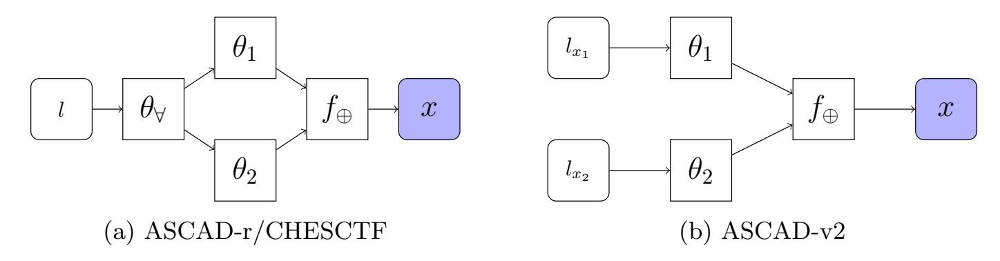
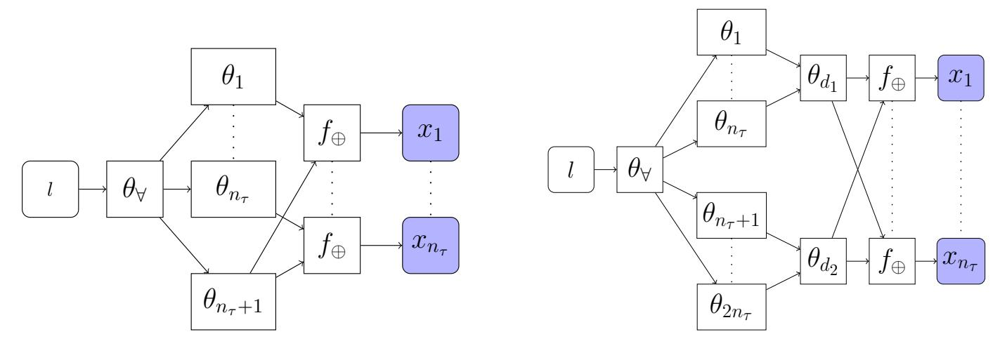
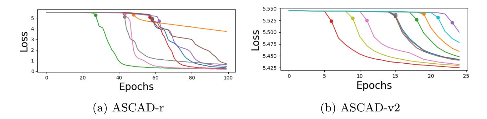
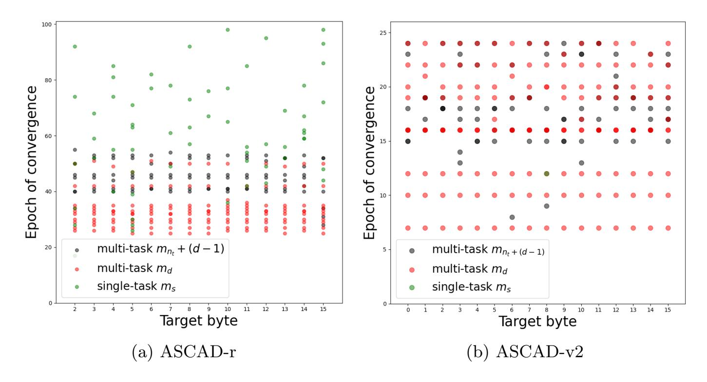
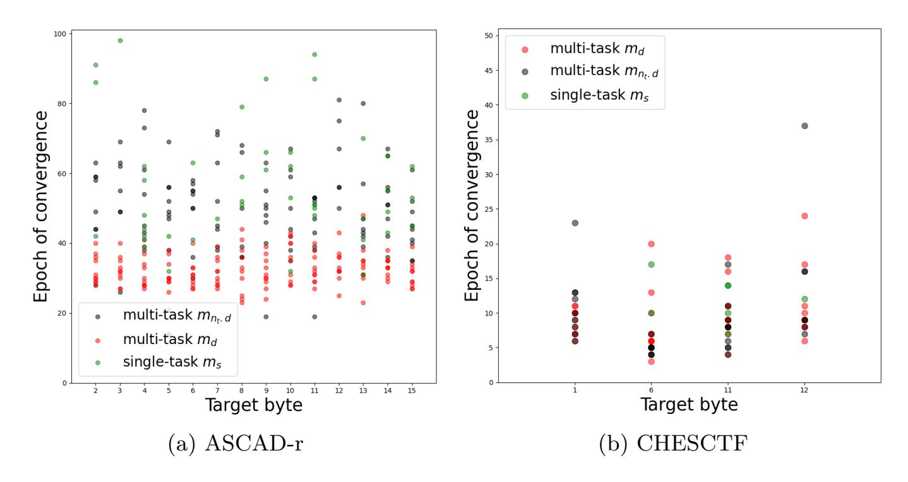
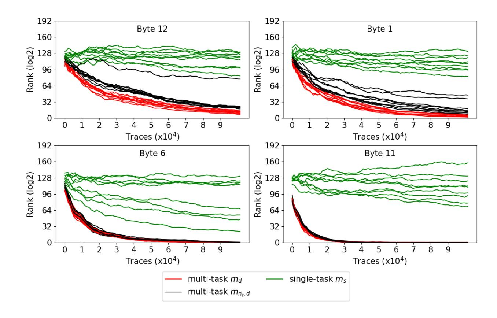
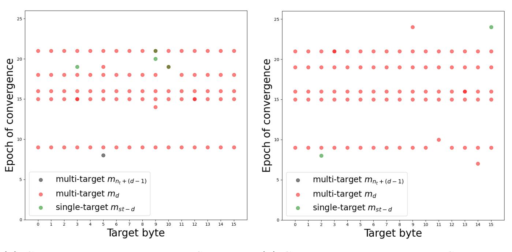

{0}------------------------------------------------

# Exploring Multi-Task Learning in the Context of Masked AES Implementations

Thomas Marquet1 and Elisabeth Oswald1,2[0000−0001−7502−3184] first-name.last-name@aau.at

1 Digital Age Research Center (D!ARC), University of Klagenfurt, Austria 2 University of Birmingham, UK

Abstract. Deep learning is very efficient at breaking masked implementations even when the attacker does not assume knowledge of the masks. However, recent works pointed out a significant challenge: overcoming the initial learning plateau. This paper discusses the advantages of multi-task learning to break through the initial plateau consistently. We investigate different ways of applying multi-task learning against masked AES implementations (via the ASCAD-r, ASCAD-v2, and CHESCTF-2023 datasets) under the assumption that the attacker cannot access masks during training. We offer evidence that multi-task learning significantly increases the consistency of convergence and performance of deep neural networks. Our work provides a wide range of experiments to understand the benefits of multi-task strategies over the current single-task stateof-the-art. Furthermore, such strategies achieve novel milestones against protected implementations as we propose models that defeat all masks of the affine masking on ASCAD-v2 for the first time.

Keywords: Side Channel Attacks · Masking · Deep Learning · Multi-Task Learning

# 1 Introduction

Deep learning techniques have quickly become an alternative to classical statistics in the context of profiled side-channel attacks because of their unrivaled ability to utilise information across many tracepoints efficiently. The approach taken by many deep learning architectures still somewhat depends on the thinking found in traditional statistics-based attacks: a single intermediate target is learned at a time (thus, a network is trained for each intermediate).

Recent publications have begun to move beyond this single-task learning paradigm towards a multi-task learning approach: Mahgrebi [\[6\]](#page-18-0) explores a deep learning architecture to learn two intermediate values (bit-wise) on an AES implementation simultaneously; Masure and Strullu [\[9\]](#page-18-1) revisit Mahgrebi's idea and learn many intermediate values simultaneously. They set a new record for a "nondissecting" approach for the ASCAD-v2 dataset and successfully recovered the key bytes with 60 traces when assuming knowledge of the masks during profiling. 

{1}------------------------------------------------

Their paper concludes by reflecting on the potential power of multi-task learning: "A further study of the advantages and drawbacks of such paradigm is yet to be done. Still, this could lead the SCA practitioner towards new milestones against protected implementations." (p. 21, [\[9\]](#page-18-1)). Marquet et Oswald [\[7\]](#page-18-2) further explore this multi-task learning and provide evidence that multi-task learning models have an edge over single-task models in a scenario where knowledge of the masks during training is not assumed.

### 1.1 Breaking free of the "Plateau"

The "plateau" effect is a common problem when training deep learning models. This situation happens when the network encounters challenging topographies during the gradient descent, for example, being stuck in a local minimum. Masure et al. [\[8\]](#page-18-3) discuss this problem in a side-channel context in the presence of masking. The authors link related works reporting similar learning curves. During the first epochs, the loss function marginally decreases until a sudden exponential drop happens for a few epochs before returning to "linear" learning. The authors interpret this phenomenon using the stochastic nature of deep learning. The gradient descent is stuck at the beginning, as no single point in the trace gives up information about the target in a straightforward manner (no first-order leakage), and the weights are initialised at random. This leads to very weak feedback from the back-propagation and indicates that a certain amount of luck on the initial starting point is involved.

Masure et al. [\[8\]](#page-18-3) empirically demonstrate that the complexity of passing the plateau is exponential with the number of shares, as the feedback signal given by the labels is less and less related to the given inputs. Backed with classical deep learning literature, the authors hypothesize that the complexity of passing the plateau does not come from the choice of hyperparameters but rather the number of steps needed by the gradient descent to reach sufficient learning. This leaves the deep learning practitioners hints on how to improve model design.

### 1.2 Summary of Contributions and Outline

We discuss the ability of multi-task learning to break through the initial plateau consistently regardless of the initialization. We propose a novel idea for improving multi-task designs to focus the gradient flow and further improve deep learning models in a side-channel context. We focus on the application of multi-task learning in the context of the masked AES-128 implementations that are the basis of the ASCAD-r and ASCAD-v2 databases introduced in Prouff et al. [\[14\]](#page-19-0) and Masure et Strullu [\[9\]](#page-18-1). We continue those experiments on the new CHESCTF-2023 dataset [\[16\]](#page-19-1). After providing some notation and background in Sect. [2,](#page-3-0) we introduce multi-task learning in Sect. [3,](#page-7-0) and our multi-task designs in Sect. [4.](#page-8-0) Finally, we present our experimental results in Sect. [5](#page-10-0) on both datasets. Our innovations can be succinctly listed as follows:

{2}------------------------------------------------

### Contributions

- We show that multi-task models reduce the variance introduced by the initialisation of the weights in the convergence of models.
- We propose to leverage multi-task learning to enable collaboration between different intermediates and/or different bytes of the same intermediates.
- We provide evidence that multi-task learning allows an attacker to leverage constraints to "guide" the learning of the model.
- We provide experimental evidence that such constraints are beneficial to the overall performance of the model but also its convergence speed.
- We compare novel multi-task architectures against state-of-the-art singletask designs.

With profiled attacks, the most challenging setting is the one where knowledge of the countermeasures is not assumed. In the context of masked implementations, we would then assume that —because of a lack of access to internal randomness— the training data cannot be labeled with masks or masked values, but only the (unmasked) intermediate values. Again, due to the absence of randomness information, a point of interest selection might not be feasible. Given that the application of multi-task learning to masked implementations is based on designing branches that learn masks and masked values, it is non-trivial to come up with a way to apply multi-task learning when masks are unknown. For this reason, we target multiple bytes at the same time to leverage common features between the masks of the targets. For example, a mask might be shared across bytes, but also, in the case of a state mask, the leakage of each byte of the mask might depend on the same underlying operations.

Reproducing experiments. In order to make our experiments reproducible, we provide our code via a git repository (see link below). For convenience, we provide links to all utilsed data below as well.

- [ASCAD-r](https://drive.google.com/file/d/1Y44zvuohznNqxaDXht7y4Z1EQJWf1nhQ/view)
- [ASCAD-v2](https://drive.google.com/file/d/1I-LLqYpTRuHGXmzFRPDyp8zBrj3GBnUG/view)
- [Github](https://github.com/sca-research/exploring-multi-task-SCA)

## 1.3 Related works

Hu et al. [\[5\]](#page-18-4) explains that it can be beneficial to use the data from the processing of the AES state bytes to train a single model representing an intermediate value. This is possible in the case of many software implementations because each state byte undergoes the same operations (the same sequence of Assembly instructions), which means that their leakage is very similar. Ngo et al. [\[10,](#page-18-5)[11\]](#page-18-6) shows a similar technique to reduce the size of the dataset to attack a masked Saber implementation.

Ngo et al. [\[10\]](#page-18-5) and later on, Masure et al. [\[8\]](#page-18-3) consider the possibility of assuming the presence of masking during the training of two models and propagating a 

{3}------------------------------------------------

loss on the combined probabilities from both outputs. Such training relieves the network by giving it a better understanding of what it should learn. The first authors, however, present bit-wise designs, while the latter's designs are over one hot encoded byte.

In the side-channel community, Mahgrebi [\[6\]](#page-18-0) was the first to pick up on the idea of multi-task learning. Followed by Masure and Strullu [\[9\]](#page-18-1) along with the first attacks on the ASCAD-v2 database. The core idea behind the existing architectures in these two previous works is that each intermediate value is learned by an independent branch of the deep net and that all branches are connected to several shared layers dealing with the higher-level features. This is the canonical design of multi-task networks, as summarised in [\[15\]](#page-19-2). Even though the work Masure and Strullu [\[9\]](#page-18-1) introduces multi-task learning in a scenario where randomness is not known, their designs do not take advantage of the idea of Masure et al. [\[8\]](#page-18-3), which demonstrate the benefits of layers that perform combined probabilities between two branches of a network to encode the masking scheme in the architecture. Marquet et Oswald. [\[7\]](#page-18-2) showcase the benefits of said principles in a multi-task architecture. In a scenario where masks are unknown but shared, they demonstrate the superiority of multi-task learning over single-task learning. Finally, Bursztein et al. [\[1\]](#page-18-7) presents SCANET, a multi-task architecture defeating multiple countermeasures against protected implementations of ECC. They also complete their investigation by discussing the performance of their architecture on the ASCAD-v2 dataset with full knowledge of the countermeasures during profiling.

# 2 Preliminaries

We stick to as simple notation as possible and stay with the variable naming conventions of the ASCAD databases: upper case letters denote sets (which we overload and simultaneously use as random variables), and lower case letters denote realisations of the random variables (and equivalently elements of a set). All variable/set names are taken (without renaming) from the original papers (implementations/data sets), such that "matching up" of our work with these original implementations is straightforward. The index i refers to the ith state byte, and we generally drop any indexing referring to points within a trace from our notation.

### 2.1 Profiling based on Deep Learning

We consider side-channel attacks that operate in two stages: a leakage identification stage, where (if necessary) points of interest are selected and deep neural networks are trained, and a leakage exploitation stage, where the trained nets are used as classifiers in the context of differential side-channel attacks. During the leakage identification stage, traces are collected from a clone of the target device using random keys and plaintexts. After a variable amount of pre-processing, depending on the dataset, a model mθz with hyperparameters θz is trained to 

{4}------------------------------------------------

recover the intermediate information Z = φ(P, K) about one or multiple 8-bit key chunks (single-task or multi-task). Once the classifiers are trained, an attack dataset of Na traces is collected on the target device, but this time with an unknown fixed key k ∗ and random plaintexts p. The i-th trace li is fed to the classifiers in order to recover the predictions gi = mθ(li). Finally the key guesses d[k] is recovered using :

$$d[k] = \sum_{i=1}^{N_a} \log(g_i[z_i]), \text{ where } z_i = \varphi(p_i, k)$$

Training Methodology We use the same methodology across all datasets. To enable meaningful comparisons, we train each approach with the same learning rate and optimizer. We compare each approach's abilities to learn a given task x with a given set of hyperparameters θx, initialized with the same weight values. This means that regardless of whether it is a single-task or a multi-task, each task xi is learned using the same amount of weights and biases. The only difference between models is how the branches are connected.

As per good practice, we divide the available data into training data, validation data, and attack data. All training happens on the training data set. We validate a learned model on a validation set of size Nv. During this validation phase, we monitor the validation accuracy. Our best training model is selected based on the best validation loss, and we use a Tensorflow callback to retrieve this model.

### 2.2 Data Sets and Corresponding Notation

Our work is based on the ASCAD datasets as well as the new CHESCTF-2023 dataset, which are all based on masked AES implementations. We assume familiarity with low-order masking, as we keep the following text as short as possible.

ASCAD-r The original ASCAD database (v1) features one data set of a masked AES implementation (on a simple 8-bit microcontroller) with varying keys, which we utilize in our work. The database is generous; each side channel trace offers many data points for inclusion in training. The dataset contains the information that relates to the masked computation of the AES SubBytes operation. The masking scheme is a simple two-share scheme, which precomputes a masked AES S-Box Table SubBytes∗ prior to encryption. The accompanying write-up for the database already performs an analysis to highlight the leakiest intermediate variables, which are the masked input and output of the SubBytes operation (ti ⊕ rin, si ⊕ ri) as well as the two involved masks ri and rin respectively the state mask, and the SubBytes input mask. We select in the dataset 60k traces from the random key split for training (Nt = 50k traces) and validation (Nv = 10k traces), and 10k from the fixed key split for the attack dataset (Na = 10k traces).

{5}------------------------------------------------

Several papers have reported results for this database for a variety of network architectures and approaches. Our approach is to work with the raw traces (thus no points of interest selection take place). With this setting in mind, the best previous work is Perin et al. [\[13\]](#page-19-3), which reached single trace success for some key bytes — culminating in 3 traces for the most resilient key bytes.

ASCAD-v2 The ASCAD-v2 dataset contains traces from a masked and shuffled AES implementation (on a more complex 32-bit architecture); however, the shuffling is disabled in this work. The full dataset contains 800k traces with random keys and inputs. Each trace has 1 million sample points. The masking scheme is slightly more complex. It uses both a non-zero multiplicative mask β, as well as a Boolean mask α, i.e., each intermediate value x is represented by three shares: (x ⊗ β ⊕ α,β, α) (the multiplication must be understood over the appropriate finite field). We take a special interest in the masked SubBytes inputs rm ⊗ tj ⊕ rin, outputs rm ⊗ sj ⊕ rout, the multiplicative mask rm, and the corresponding additive masks rin and rout. We craft our dataset with a subsampling using a moving average in the way of Perin et al. [\[13\]](#page-19-3) on ASCADr. This divides the number of total samples by 4. We extract from the traces the points of interest of the masks using SnR analysis and the samples related to the first round of SubBytes operation. After shuffling all traces, we split the available data into training (Nt = 450k traces), validation (Nv = 45k traces), and attack (Na = 5k traces) data sets.

This dataset has successful attacks in two situations where the countermeasures are toned down. The first one by Masure et Strullu. [\[9\]](#page-18-1) has a successful attack without requiring the knowledge of the permutations but also without requiring the knowledge of the multiplicative mask. The paper Marquet et Oswald. [\[7\]](#page-18-2) provides successful attacks when the additive mask rin is unknown. The best results for a full key recovery attack depend on the scenario. For a scenario where knowledge of masks and permutations is assumed during profiling but not during an attack, the best attack of Masure et Strullu. [\[9\]](#page-18-1) takes 60 traces. In the same scenario, Bursztein et al. [\[1\]](#page-18-7) reach full key recovery with around 80 traces. Wu et al. [\[21\]](#page-19-4) present two non-profiled attacks on the dataset. The first utilises the fact that each byte shares the same masks to perform collision attacks and recover most of the key bytes with around 70k traces. The second attack takes advantage of the fact that an intermediate value of 0 effectively removes the multiplicative mask. Using correlations between the SubBytes patterns and the pattern of the additive mask, they show decreasing key ranks with around 500k attack traces. Finally, the best attacks of Marquet et Oswald. [\[7\]](#page-18-2) take 21 traces, assuming knowledge of permutations and the multiplicative mask rm during attack and profiling.

CHESCTF-2023 (Spartan-6). The CHESCTF-2023 contained two datasets. Both are based on an AES implementation, using a 32-bit datapath with stateof-the-art Hardware Private Circuits (HPC) masking [\[3\]](#page-18-8) (two shares). We elect to use the dataset that was released without information about the masks: this 

{6}------------------------------------------------

requires training without the knowledge of masks (thus, the situation is akin to what we have in the selected ASCAD datasets). This dataset was sampled from a Spartan-6 FPGA. Adopting the notation from the ASCAD datasets, the S-box inputs can be represented as ti ⊕ ri for each 8-bit chunk. We do not preprocess the traces, but we extract the samples related to the clock cycles of the S-box computation. The winning strategy on this target is taking advantage of the transition leakages on the S-box input wires. On the last column bytes (1,6,11,12), the transitions leak the full value of the bytes since they transition to zero. Therefore, those specific bytes leak significantly stronger than the others, and our discussion will be limited to those bytes. There is no state of the art on this dataset besides the challenge participants, with the winner reaching a full key rank of 268 with 901k traces [\[16\]](#page-19-1).

### 2.3 Custom layers: Xor and inverse multGF256

Masure et al. [\[8\]](#page-18-3) introduced the idea of using custom layers. They calculate the conditional probabilities using FFTs between the softmax layers of two models trained during the same process. Our implementation calculates the conditional probabilities directly using a parallelized version of the following computations. Given two vectors x and y of size 256 :

$$f_{\oplus}(x,y)[i] = \sum_{j=0}^{255} x[j] \times y[i \oplus j] \quad \forall i \in [0,255]$$
 (1)

$$f_{\otimes}(x,y)[i] = x[0] + \sum_{j=1}^{255} x[j] \times y[i \otimes j] \quad \forall i \in [0,255]$$
 (2)

The function f⊗ has to discriminate the first case where j = 0, being a null element. We decided that, in this case, the probabilities of x should be unchanged.

### 2.4 Single-task designs

We define a single-task model as a model that is trained using the knowledge of only one label. In our scenario, where access to internal randomness is not assumed, this means that we have a model labeled with the unmasked value of an intermediate. State-of-the-art single-task designs against masked implementations are composed of d-branches networks in the like of Masure et al. [\[9\]](#page-18-1) and Ngo et al. .[\[10\]](#page-18-5), one for each share. We note each branch's hyperparameters θ1, ..., θd. If points of interest from each share cannot be extracted and fed directly to the respective branch, the same trace points are fed to all the branches after passing through a shared part of the network used to process the inputs θ∀. Examples of such architectures are given in Figure [1.](#page-7-1)

{7}------------------------------------------------

Fig. 1: Single-task architectures using d=2 branches.

### 3 Multi-Task Learning

Multi-task learning has been introduced by Caruana [2] and has become state-of-the-art in many pattern recognition domains. Multi-task models benefit from the knowledge of multiple labels during training through collaboration among all tasks. Given N tasks  $x_i$ , the respective set of hyperparameters  $\theta_{x_i}$ , the resulting loss  $\mathcal{L}_{x_i}$  and the associated weight  $\lambda_i$ , the multi-task learning objective can be defined as the weighted sum:

$$\mathcal{L}_{mtl}(\theta) = \sum_{i=1}^{N} \lambda_i \mathcal{L}_{x_i}(\theta_{x_i})$$

Hard-parameter sharing. To enable collaboration of tasks within the network, one must introduce relationships between each task's hyperparameters. One way to achieve this is through hard-parameter sharing. Considering two tasks  $x_1$  and  $x_2$ , with the underlying hyperparameters  $\theta_{x_1}$ ,  $\theta_{x_2}$  related to their respective tasks, hard-parameter sharing can be defined as the requirement that at least some hyperparameters are shared between the tasks:  $\theta_{x_1} \cap \theta_{x_2} \neq \emptyset$ . By this logic, sharing convolutions or layers at the beginning of the network is already hard-parameter sharing. However, sharing layers close to the input is usually made to share higher-level features. Going further down the network with shared layers means, on the contrary, sharing lower-level features. The difficulty of sharing the latter comes from the fact that the output must be different but obtained with similar inputs and the same weights. Once relationships are established between the hyperparameters of different tasks, according to Caruana [2] and Ruder [15], multi-task learning brings potential benefits such as:

- **Input explainability**: Assuming two tasks  $x_1$  and  $x_2$ , the inputs l given to the network could be explained using  $l = f(x_1, x_2) + \epsilon_{noise}$ . Approximating the function f through the weights of the network is expected to be easier if it has knowledge of  $x_1$  and  $x_2$ .
- Noise cancellation: If  $x_1$  and  $x_2$  share features, the gradient will be averaged over both tasks, therefore reducing the noise.

{8}------------------------------------------------

- Eavesdropping: If x1 has a stronger signal-to-noise ratio than x2 and both share features. Then, training both at the same time is beneficial for x2, as the shared features will be highlighted by x1.
- Representation bias: Constraining the network by encoding relationships between tasks prevents the gradient from falling into local minima that do not benefit all tasks. This reduces the search problem by removing unfitting weight representations.

# 4 Multi-task designs

### 4.1 Competition or collaboration

One of the main drawbacks of multi-task learning is the possibility of two tasks competing against each other. Understanding the potential collaboration between tasks is key to successful multi-task design. It is not clear if straightforward multi-task learning using high-level parameter sharing as presented in Caruana [\[2\]](#page-18-9), and then applied to the side-channel domain [\[6,](#page-18-0)[19](#page-19-5)[,1,](#page-18-7)[9\]](#page-18-1) is beneficial. The potential competition between multiple gradients can damage the learning of one or multiple tasks, as explained in Standley et al. [\[17\]](#page-19-6) or in Yu et al. [\[22\]](#page-19-7). Special care has to be ensured so that tasks are effectively collaborating with each other. Marquet et Oswald [\[7\]](#page-18-2) introduce the idea that one can utilise the knowledge of a shared mask between multiple bytes of a targeted intermediate. It is by encoding known relationships into the network that the superiority of multi-task learning can be leveraged. With this philosophy in mind, we expand on the idea of masks that are not shared.

### 4.2 Parameter sharing

The idea of using d-branch networks can be utilized in the context of multi-task learning. If we call nt the number of tasks, then the corresponding multi-task network has nt × d branches. In this section, we explain three different ways to connect the different tasks through hard-parameter sharing, with the aim of enabling positive collaboration between the tasks.

To compare these multi-task designs with a suitable single-task reference design, we proceed as follows: if leakages are extracted, and no shared layer θ∀ is introduced in the network, then parts related to each task are completely independent of each other. Training the resulting network is equivalent to training nt single-task models in parallel, and we will use this strategy to train suitable single-task reference networks.

High-level parameter sharing. The classical use of multi-task learning introduced by Caruana [\[2\]](#page-18-9) is based on the utilization of shared layers to process the input. In our designs, we use a set of layers θ∀ close to the inputs to perform extraction of interesting information and propagate this information to each branch of the network. The intuition is that the multiple tasks will collaborate to explain the given inputs and share their knowledge at this level. In the case 

{9}------------------------------------------------

of the ASCAD-v2 dataset, those layers are not used because the inputs are extracted manually, like in Figure. 1b.

Shared randomness. In a single-task context, regardless of whether (or not) a mask is shared between multiple intermediates, the information gained about the common randomness cannot be transmitted to the other classifiers. In a multi-task context where all intermediates share the same randomness, one can design a network with  $n_t + (d-1)$  branches. Each task  $x_i$ , will benefit from the individual hyperparameters  $\theta_i$ , while sharing the common randomness hyperparameters such that  $\theta_{x_i} = \{\theta_i, \theta_{n_t+1}, \dots, \theta_{n_t+d-1}\}$  and  $\theta_{x_1} \cap \dots \cap \theta_{x_{n_t}} = \{\theta_{n_t+1}, \dots, \theta_{n_t+d-1}\}$ . For the shared randomness, each branch connects the tasks to allow collaboration. The  $f_{\oplus}$  layer acts as a constraint, forcing each branch to take a very specific representation (conditional probabilities). The cumulative effect of those constraints, thanks to multi-task learning, is a natural improvement.

- (a) Architecture with shared randomness and high-level parameter sharing
- (b) Architecture with high-level and low-level parameter sharing

Fig. 2: Examples of multi-task architectures using different parameter sharing with d=2 shares

Low-level parameter sharing. To maximize the sharing of weights for all tasks, we design models that share the same weights for the resp. prediction head leading to the introduction of  $\theta_{d_i}$  in Figure. 2b. The resulting network possesses d-branches even though it is learning  $n_t$  tasks. This additional layer encourages the preceding layers to agree on weights that are consistent across all bytes. This strategy may help, especially initially, when the network is initialized to a random initial state, which may, in turn, enable it to overcome the initial "plateau".

Strategies, where one leverages the common features between bytes, are very successful in a single-task scenario [5,10,4,11]. Our strategy is an adaptation of such a technique in a multi-task learning scenario. Since a single-task scenario requires extraction and alignment of the related samples, a direct adaptation would also require such a constraint. However, we can design models in case such

{10}------------------------------------------------

extraction is not possible. At least nt ×d individual layers have to be introduced in order to create nt channels that will be fed to the shared layers. Therefore, our modeling does not need the extraction and alignment of each byte leakage in the trace, as it is done by the network instead of being a pre-processing step.

# 5 Results

Overcoming the initial plateau is the main interest of this paper. With this in mind, we take a special interest in which epoch the model converges. Throughout our experiments, we wish to discuss the performance of our designs against single-task learning but also the improvement from sharing weights at a lower level of the network. To do so, we train our designs ten times using a different seed for the initialization of each weight. We then observe the properties of the different architectures with respect to multiple starting points. Initialisation of the training procedure has a significant impact on the potential convergence of a deep learning architecture, especially in SCA, as showed in Wu et al. [\[20\]](#page-19-8). Each design possesses the same number of weights for each task; the difference is the total amount of weights, as some weights are used multiple times. This technique aims to efficiently utilize all the information available in one trace to maximize the chances of breaking through the initial plateau. We take a special interest in the following metrics: the number of traces Twin to recover the key, ratio of seeds nwin/nseeds leading to a full recovery of the key and finally the epoch of convergence ec. The epoch ec can be clearly identified manually on the ASCAD datasets, as the learning slope drastically changes when the model reaches convergence. Examples of such slopes are given in Masure et al. [\[8\]](#page-18-3), Timon [\[18\]](#page-19-9), Perin and Picek [\[12\]](#page-18-11). To automate the process, we regress the next epoch loss value based on the previous epochs and observe when the squared difference between the regressed loss and the real value is above a threshold. We give an example of such a process in Figure [3,](#page-11-0) where we plot the losses and the selected epochs of convergence for each seed of one model type. However, the loss changes on the CHESCTF are minimal because of the low learning rate used to capture the weak signal. Therefore, on this dataset, we note the epoch of convergence ec as the first epoch where the validation loss is under the random guess of cross entropy. This method of acquisition is less meaningful as a model can converge and not immediately generalise to the validation split.

### 5.1 Leveraging common masks with a shared branch

In the special case where each byte of an intermediate shares a mask, we can take advantage of architectures with a shared branch. Such weaknesses are found in both ASCAD datasets. On ASCAD-r, all bytes of the SubBytes inputs share a strongly leaking mask rin, and on ASCAD-v2, all bytes share rm and rin for the S-box inputs, and rm and rout for the S-box outputs.

{11}------------------------------------------------

Fig. 3: Examples of the acquisition of the epoch of convergence for all seeds of one model type.

ASCAD-r The targeted leakage pair is (t ⊕ rin, rin). Using the raw traces, we train a baseline multi-task model in the likes of Figure [2a](#page-9-0) noted mnt+(d−1) which posses high-level parameter sharing, and share the mask branch across all intermediates. We extend this design with low-level parameter sharing that we note md. Finally, we train 14 single-task models ms according to the design in Figure [1a.](#page-7-1) We show a scatter plot of the epochs of convergence for each target byte and all approaches in Figure [4a.](#page-12-0) Then, we perform a full key recovery attack, 1000 times over 100 randomly picked raw traces from the attack dataset, and note the results in Table [1.](#page-12-1)

ASCAD-v2 To further investigate the impact of constraints on multi-task models, we experiment with a scenario where only the additive mask rout is unknown. Knowledge of rm is given to the network during profiling and attack, reducing the masking scheme's complexity. The targets are the S-box outputs, rm ⊗ s ⊕ rout, and the mask rout. To increase the difference in performance between each approach, we reduce the size of the training dataset to only 225k traces. The architectures used in this experiment are the same as in the previous one, with a multi-input design in the likes of Figure [1b](#page-7-1) since the dataset is extracted. Again, we show a scatter plot of the epochs of convergence for each target byte and all approaches in Figure [4b](#page-12-0) and note the performance metrics of an attack with 200 traces over 1000 experiments in Table [1.](#page-12-1)

On the ASCAD-r dataset Figure [4a,](#page-12-0) we first see that the learning of singletask models varies greatly. Depending on the seed, the st converges around the epoch 20, 30, or 70, or not at all. The baseline multi-task model mnt+(d−1) converges consistently between epochs 40 and 60 for the successful seeds. We can observe that once a few bytes converge, it triggers the convergence of the others since the learning about the mask is shared. This is especially true for the multi-task models md, converging consistently under 35 epochs with a few outliers.

Looking at Figure [4b,](#page-12-0) we observe a similar scenario on the ASCAD-v2 dataset. The baseline model does not converge systematically, either struggling to make sense of the samples or needing more epochs. The performance of the md model also coincides with the previous dataset, as it consistently outper-

{12}------------------------------------------------

Fig. 4: Epoch of convergence for all seeds and targeted bytes in the scenario where the mask is shared across them.

forms the baseline model and manages to converge on all seeds. Finally, on this intermediate, only one single-task model managed to learn its target byte. This is another example of the superiority of multi-task approaches, especially in this scenario where masks are shared among different intermediates.

Table 1: Performance metrics for the experiment leveraging a shared mask

|            | ASCAD-r |             |      | ASCAD-v2  |      |             |       |           |
|------------|---------|-------------|------|-----------|------|-------------|-------|-----------|
| Model type | fr      | nwin/nseeds | Twin | best Twin | fr   | nwin/nseeds | Twin  | best Twin |
| ms         | 0.56    | 0.0         | >100 | >100      | 0.99 | 0.0         | >200  | >200      |
| mnt+(d−1)  | 0.4     | 0.6         | 4.33 | 4         | 0.4  | 0.6         | 134   | 98        |
| md         | 0.0     | 1.0         | 5.8  | 2         | 0.0  | 1.0         | 118.1 | 92        |

No seed allowed the single-task models to recover all bytes on both datasets. The baseline multi-task model mnt+(d−1) recovers the full key with six seeds also on both datasets, while the multi-task model with low-level parameter sharing md is successful on all seeds. Trace-wise, the baseline multi-task model is, on average, more performant than the md model on the ASCAD-r dataset. This is a bias in the mean calculation from more difficult seeds that are excluded since they are not successful with the baseline multi-task model. The baseline multi-task model is also outperformed by the model with low-level parameter sharing.

We can observe in that scenario that multi-task learning is vastly superior to single-task learning in terms of consistency. Moreover, the more the multi-task models are constrained through parameter sharing, the more consistent they 

{13}------------------------------------------------

are. Many multi-task-induced effects can be the cause of this improvement in consistency. The first one is the regularisation from the shared mask. All bytes collaborate to learn the mask, and therefore, the branch of the mask benefits from multiple gradients. In addition, the weights from individual bytes are not free to explore representations that do not benefit others. This effect is further reinforced by the sharing of low-level weights. As the model mt2d improves significantly, the baseline model m0, in convergence speed, but also in the success of convergence.

### 5.2 Leveraging different masks using low-level parameter sharing

When masks are not shared, it is not possible to train one expert shared among all tasks as in the previous section. However, it is still possible to use lowlevel parameter sharing on both sides of the masking scheme in the manner of Figure [2b.](#page-9-0) We note this model md. The baseline multi-task model mnt.d is naturally the same model but without low-level parameter sharing. The single models st are again submodels of the latter design.

ASCAD-r. The targeted leakage pair in this experiment is the S-box outputs with the state mask (s ⊕ r, r), which is the most common target point on this dataset. We continue with the scatter plot of the epochs of convergence for each target byte and for all approaches in Figure [5a](#page-14-0) and note the metrics and the performance of a full key recovery targeting the S-boxes output in the same setup as the previous experiment in Table [2.](#page-14-1)

CHESCTF The targeted leakage pair can be noted as (t⊕r, r), corresponding to the S-box inputs with the state mask. The specificity of this dataset is that both share leaks at the same samples, and all targeted bytes are within the same 32-bit word. Since each 8-bit chunk is not a "repetition" of the same piece of code or wire, their leakage features are different. This allows us to observe the impact of low-level parameter sharing in a case where it is not optimal. Moreover, since we are only targeting four tasks at a time, we benefit less from multi-tasking than in the previous experiments. We plot the epoch where the validation loss crosses the random guess threshold in Figure [5b](#page-14-0) and the rank evolution of each targeted byte over 100 iterations of an attack using 102400 traces in Figure [6.](#page-15-0)

Figure [5a](#page-14-0) shows similar results to those in the previous scenario on ASCAD-r. Single-task models ms are inconsistent and mostly converge after the multi-task models. Looking closely, one can see that some bytes do not possess even one successful seed in this experiment. Moving on to the multi-task models, we can see, overall, the epoch of convergence being a lot more inconsistent than in the previous experiments where the mask was shared by all bytes. This indicates that the shared mask strongly benefits the training process. While for the single-task models, the number of successful convergences is inferior to the previous experiment, the baseline model mnt.d learns overall seeds, more bytes. This can be explained by the highest signal-to-noise ratio. The design md successfully

{14}------------------------------------------------

Fig. 5: Epoch of convergence for all seeds and targeted bytes, in a scenario where randomness is not shared

converges on all seeds. The sharing of weights managed to force collaboration between each byte, leading to consistent learning. We also observe a faster convergence for the latter model than any other one, once again hinting at its superior learning ability.

Table 2: Performance metrics for the experiment leveraging a shared mask

|            | ASCAD-r |             |      |           |  |
|------------|---------|-------------|------|-----------|--|
| Model type | fr      | nwin/nseeds | Twin | best Twin |  |
| ms         | 0.69    | 0.0         | >100 | >100      |  |
| mnt.d      | 0.21    | 0.4         | 6    | 5         |  |
| md         | 0.0     | 1.0         | 2.13 | 2         |  |

From Table [2,](#page-14-1) we observe that no seed led to successful key recovery using the single-task models ms. Furthermore, no seed allowed byte 12 to converge, and therefore, even by picking the best models across all seeds, a successful attack would not have been possible. The baseline model mnt.d succeeded on four seeds to recover the key, with an average performance of 6 traces. Finally, hardparameter sharing successfully improved the success rate of multi-task models, as md recovers the full key with around two traces on average. However, even though all seeds led to convergence, 100 traces were not enough for two seeds, as the learning suffered from too much overfitting.

On the CHESCTF dataset Figure [5b,](#page-14-0) we observe when the model generalizes enough to be better than a random guess. All approaches generalise enough, if they do, around the same epochs, with a slight advantage for multi-task learning. 

{15}------------------------------------------------

This is due to the relatively high number of traces and low number of tasks. Additionally, said tasks are not expected to collaborate at a low level since they are different chunks from the same 32-bit word. Still, the model md, benefiting from the regularization induced by having to share more weights, generalize over all seeds, while 21% of the time, the model mnt.d fail to gather enough information. This failure rate is even more considerable for single-task models with 69%.

Fig. 6: Key rank evolution for all targeted bytes and for each seed

Looking at the key ranking Figure [6,](#page-15-0) we can observe first that the two lower bytes in the word, bytes 12 and 1, are harder to learn and recover than the two higher bytes, 6 and 11. We can observe a clear ranking of the designs, the best being the model with low-level parameter sharing md, which takes full advantage of the regularization induced by having fewer weights. Second, the baseline multi-task model mnt.d, struggling to recover the designated key byte only on a couple of seeds. Finally, the single-task model is able to reduce the key ranks. The difference between the two multi-task models is small; however, as they learn the full word and not a single 8-bit chunk, they clearly outperform the single-task approach thanks to the high-level shared parameters.

### 5.3 Leveraging different targets masked by the same randomness

On the ASCAD-v2 dataset, the affine masking scheme shares the multiplicative mask between rm ⊗ sj ⊕ rout and rm ⊗ tj ⊕ rin. We design multi-target models that learn the unmasked S-box input and output at the same time, allowing 

{16}------------------------------------------------

us to take advantage of the shared multiplicative mask. We expect branches learning the different intermediates to collaborate on how to fit rm. Based on this idea, we train the two usual models, mnt+(d−1) and its counterpart md using low-level parameter sharing. Finally, to understand the impact of training multiple intermediates, we additionally train a model without this "multi-target" approach. In this section, only multi-task models are trained. We note this model mst−d, as it learns only tj through the triplet (rm⊗tj⊕rin , rm , rin), using low-level parameter sharing. We note the main performance metrics after performing the usual full key recovery in Table [3](#page-17-0) and plot the evolution of the losses in Figure [7b.](#page-16-0)

- (a) Convergences related to the S-box inputs tj
- (b) Convergences related to the S-box outputs sj

Fig. 7: Epoch of convergence for all seeds and targeted intermediates

The single-target model mst−d, trained using only the labels from the unmasked S-box inputs, fails to converge consistently, even though the leakage from the S-box inputs triplet is considerably higher than the second triplet linked to the S-box outputs. Moreover, the model mnt+(d−1), using a multi-target strategy during training but no low-level parameter sharing, also fails to converge consistently. Only the model md leveraging a multi-target strategy during training and low-level hard-parameter sharing converge multiple times. This feat, repeated five times while the other model never converges, is a testimony to the importance of linking potential collaboration between intermediates even during training.

Observing the performances of the different models on a full key recovery attack, we see that every seed leading to convergence during training also leads to successful attacks with good performances. Our best model recovers the full key in only 16 traces and is, to the best of our knowledge, the best attack on

{17}------------------------------------------------

Table 3: Performance metrics against the full affine masking on ASCAD-v2

| Model type nwin/nseeds |     | Twin | best Twin |
|------------------------|-----|------|-----------|
| mst−d                  | 0.0 | >200 | >200      |
| mnt+(d−1)              | 0.0 | >200 | >200      |
| md                     | 0.5 | 17.6 | 16        |

ASCAD-v2, even in this simplified scenario, where PoIs from the masks are assumed and permutations are disabled.

# 6 Conclusion

Among all our experiments, we can observe that hard-parameter sharing allows to focus the propagation of losses towards fewer weights. This reduces redundancy inside the network and increases the quality of the learning. However, one has to be assured of the collaboration between the targets of the network, as losses can compete as much as they can collaborate. Overall, multi-task learning seems to have a clear edge over single-task approaches, especially in the context of a side-channel evaluation. The key takeaways are the following :

- Multi-task learning is a natural improvement of single-task learning in a scenario where the knowledge of randomness cannot be accessed.
- Low-level parameter sharing allows multi-task learning to benefit from the learning of multiple bytes at the same time, even when the masks are not shared.
- Multi-task learning breaks through the initial plateau more consistently
- Constraints on the network further increase the previous point.
- Multi-task learning allows an attacker to take advantage of multi-target strategies even during profiling.

Our results contribute to the research of multi-task deep learning models in the context of side-channel key recovery attacks. We extend previous results from Marquet et Oswald [\[7\]](#page-18-2) to more challenging scenarios where masks are not shared by multiple potential targets but also show positive interaction between intermediates. We show that linking potential common features and accumulating constraints on the network benefits the network by reducing overfitting and further enables models to lead successful attacks. In addition, we target the multiple masks of the ASCAD-v2 and successfully build an attack using the previously introduced concepts. We suggest that more complex architectures, adding helpful constraints on the network, would further improve the chances of an attacker finding successful attacks.

Acknowledgments Thomas Marquet and Elisabeth Oswald have been supported in part by the European Research Council (ERC) under the European Union's Horizon 2020 research and innovation program (grant agreement No 725042).

{18}------------------------------------------------

# References

- 1. Bursztein, E., Invernizzi, L., Kr´al, K., Moghimi, D., Picod, J.M., Zhang, M.: Generic attacks against cryptographic hardware through long-range deep learning (2023)
- 2. Caruana, R.: Multitask learning. In: Thrun, S., Pratt, L.Y. (eds.) Learning to Learn, pp. 95–133. Springer (1998). [https://doi.org/10.1007/978-1-4615-5529-2](https://doi.org/10.1007/978-1-4615-5529-2_5) 5, [https://doi.org/10.1007/978-1-4615-5529-2\\_5](https://doi.org/10.1007/978-1-4615-5529-2_5)
- 3. Cassiers, G., Gr´egoire, B., Levi, I., Standaert, F.X.: Hardware Private Circuits: From Trivial Composition to Full Verification. IEEE Transactions on Computers (Sep 2020). [https://doi.org/10.1109/tc.2020.3022979,](https://doi.org/10.1109/tc.2020.3022979) [https://inria.hal.](https://inria.hal.science/hal-03133227) [science/hal-03133227](https://inria.hal.science/hal-03133227)
- 4. Dubrova, E., Ngo, K., G¨artner, J., Wang, R.: Breaking a fifth-order masked implementation of crystals-kyber by copy-paste. In: Proceedings of the 10th ACM Asia Public-Key Cryptography Workshop. p. 10–20. APKC '23, Association for Computing Machinery, New York, NY, USA (2023). [https://doi.org/10.1145/3591866.3593072,](https://doi.org/10.1145/3591866.3593072) [https://doi.org/10.1145/3591866.](https://doi.org/10.1145/3591866.3593072) [3593072](https://doi.org/10.1145/3591866.3593072)
- 5. Hu, F., Wang, H., Wang, J.: Cross-subkey deep-learning side-channel analysis. Cryptology ePrint Archive, Report 2021/1328 (2021), [https://eprint.iacr.org/](https://eprint.iacr.org/2021/1328) [2021/1328](https://eprint.iacr.org/2021/1328)
- 6. Maghrebi, H.: Deep learning based side-channel attack: a new profiling methodology based on multi-label classification. Cryptology ePrint Archive, Report 2020/436 (2020), <https://eprint.iacr.org/2020/436>
- 7. Marquet, T., Oswald, E.: A comparison of multi-task learning and singletask learning approaches. Cryptology ePrint Archive, Paper 2023/611 (2023). [https://doi.org/10.1007/978-3-031-16815-4,](https://doi.org/10.1007/978-3-031-16815-4) [https://eprint.iacr.org/2023/](https://eprint.iacr.org/2023/611) [611](https://eprint.iacr.org/2023/611), <https://eprint.iacr.org/2023/611>
- 8. Masure, L., Cristiani, V., Lecomte, M., Standaert, F.X.: Don't learn what you already know: Scheme-aware modeling for profiling side-channel analysis against masking. IACR Transactions on Cryptographic Hardware and Embedded Systems 2023(1), 32–59 (Nov 2022). [https://doi.org/10.46586/tches.v2023.i1.32-59,](https://doi.org/10.46586/tches.v2023.i1.32-59) [https:](https://tches.iacr.org/index.php/TCHES/article/view/9946) [//tches.iacr.org/index.php/TCHES/article/view/9946](https://tches.iacr.org/index.php/TCHES/article/view/9946)
- 9. Masure, L., Strullu, R.: Side-channel analysis against anssi's protected aes implementation on arm: end-to-end attacks with multi-task learning. Journal of Cryptographic Engineering 13, 1–19 (03 2023). [https://doi.org/10.1007/s13389-](https://doi.org/10.1007/s13389-023-00311-7) [023-00311-7](https://doi.org/10.1007/s13389-023-00311-7)
- 10. Ngo, K., Dubrova, E., Guo, Q., Johansson, T.: A side-channel attack on a masked ind-cca secure saber kem implementation. IACR Transactions on Cryptographic Hardware and Embedded Systems 2021(4), 676–707 (Aug 2021). [https://doi.org/10.46586/tches.v2021.i4.676-707,](https://doi.org/10.46586/tches.v2021.i4.676-707) [https://tches.](https://tches.iacr.org/index.php/TCHES/article/view/9079) [iacr.org/index.php/TCHES/article/view/9079](https://tches.iacr.org/index.php/TCHES/article/view/9079)
- 11. Ngo, K., Wang, R., Dubrova, E., Paulsrud, N.: Higher-order boolean masking does not prevent side-channel attacks on lwe/lwr-based pke/kems. In: 2023 IEEE 53rd International Symposium on Multiple-Valued Logic (ISMVL). pp. 190–195 (2023). <https://doi.org/10.1109/ISMVL57333.2023.00044>
- 12. Perin, G., Picek, S.: On the influence of optimizers in deep learning-based sidechannel analysis. In: Dunkelman, O., Jacobson, Jr., M.J., O'Flynn, C. (eds.) Selected Areas in Cryptography. pp. 615–636. Springer International Publishing, Cham (2021)

{19}------------------------------------------------

- 13. Perin, G., Wu, L., Picek, S.: Exploring feature selection scenarios for deep learning-based side-channel analysis. IACR Transactions on Cryptographic Hardware and Embedded Systems 2022(4), 828–861 (Aug 2022). [https://doi.org/10.46586/tches.v2022.i4.828-861,](https://doi.org/10.46586/tches.v2022.i4.828-861) [https://tches.iacr.org/](https://tches.iacr.org/index.php/TCHES/article/view/9842) [index.php/TCHES/article/view/9842](https://tches.iacr.org/index.php/TCHES/article/view/9842)
- 14. Prouff, E., Strullu, R., Benadjila, R., Cagli, E., Canovas, C.: Study of deep learning techniques for side-channel analysis and introduction to ascad database. IACR Cryptol. ePrint Arch. 2018, 53 (2018), [https://api.semanticscholar.org/](https://api.semanticscholar.org/CorpusID:41991837) [CorpusID:41991837](https://api.semanticscholar.org/CorpusID:41991837)
- 15. Ruder, S.: An overview of multi-task learning in deep neural networks. CoRR abs/1706.05098 (2017)
- 16. SIMPLE-Crypto: Smaesh-challenge leaderboard (2023/2023), [https:](https://smaesh-challenge.simple-crypto.org/leaderboard.html) [//smaesh-challenge.simple-crypto.org/leaderboard.html](https://smaesh-challenge.simple-crypto.org/leaderboard.html)
- 17. Standley, T., Zamir, A., Chen, D., Guibas, L.J., Malik, J., Savarese, S.: Which tasks should be learned together in multi-task learning? CoRR abs/1905.07553 (2019), <http://arxiv.org/abs/1905.07553>
- 18. Timon, B.: Non-profiled deep learning-based side-channel attacks with sensitivity analysis. IACR Transactions on Cryptographic Hardware and Embedded Systems 2019(2), 107–131 (Feb 2019). [https://doi.org/10.13154/tches.v2019.i2.107-](https://doi.org/10.13154/tches.v2019.i2.107-131) [131,](https://doi.org/10.13154/tches.v2019.i2.107-131) <https://tches.iacr.org/index.php/TCHES/article/view/7387>
- 19. Weissbart, L., Picek, S.: Lightweight but not easy: Side-channel analysis of the ascon authenticated cipher on a 32-bit microcontroller. Cryptology ePrint Archive, Paper 2023/1598 (2023), <https://eprint.iacr.org/2023/1598>, [https:](https://eprint.iacr.org/2023/1598) [//eprint.iacr.org/2023/1598](https://eprint.iacr.org/2023/1598)
- 20. Wu, L., Perin, G., Picek, S.: On the evaluation of deep learning-based side-channel analysis. In: Balasch, J., O'Flynn, C. (eds.) Constructive Side-Channel Analysis and Secure Design. pp. 49–71. Springer International Publishing, Cham (2022)
- 21. Wu, L., Perin, G., Picek, S.: Not so difficult in the end: Breaking the ascadv2 dataset. Cryptology ePrint Archive (2023)
- 22. Yu, T., Kumar, S., Gupta, A., Levine, S., Hausman, K., Finn, C.: Gradient surgery for multi-task learning. CoRR abs/2001.06782 (2020), [https://arxiv.org/abs/](https://arxiv.org/abs/2001.06782) [2001.06782](https://arxiv.org/abs/2001.06782)