{0}------------------------------------------------

# New record in the number of qubits for a quantum implementation of AES

Zhenqiang Li1,2, Fei Gao1,\*, Sujuan Qin1, and Qiaoyan Wen1

gaof@bupt.edu.cn; qsujuan@bupt.edu.cn; wqy@bupt.edu.cn

**Abstract.** Optimizing the quantum circuit for implementing Advanced Encryption Standard (AES) is crucial for estimating the necessary resources in attacking AES by Grover algorithm. Previous studies have reduced the number of qubits required for the quantum circuits of AES-128/-192/-256 from 984/1112/1336 to 270/334/398, which is close to the optimal value of 256/320/384. It becomes a challenging task to further optimize them. Aiming at this task, we find a method about how the quantum circuit of AES S-box can be designed with the help of automation tool LIGHTER-R. Particularly, the multiplicative inversion in  $F_{28}$ , which is the main part of S-box, is converted into the multiplicative inversion (and multiplication) in  $F_{24}$ , then the latter can be implemented by LIGHTER-R because its search space is small enough. By this method, we construct the quantum circuits of S-box for mapping  $|a\rangle|0\rangle$ to  $|a\rangle|S(a)\rangle$  and  $|a\rangle|b\rangle$  to  $|a\rangle|b\oplus S(a)\rangle$  with 20 qubits instead of 22 in the previous studies. Besides, we introduce new techniques to reduce the number of qubits required by the S-box circuit for mapping  $|a\rangle$  to  $|S(a)\rangle$ from 22 in the previous studies to 16. Accordingly, we synthesize the quantum circuits of AES-128/-192/-256 with 264/328/392 qubits, which implies a new record.

**Keywords:** AES · S-box · quantum circuit · multiplication inversion

## 1 Introduction

The parallelism of quantum computing makes quantum computers have significant speed-up compared with classical computers in certain specific problems, such as solving linear systems [1–3], classification [4–8], dimensionality reduction [9–12], linear regression [12–14], association rule mining [15], anomaly detection [16,17] and so on. Quantum algorithms, such as Shor [18], Grover [19] and Simon [20], seriously threaten the security of modern cryptography. Although the scale of quantum computers is not enough to break through the cryptographic primitives so far, with the development of technology, these quantum algorithms

State Key Laboratory of Networking and Switching Technology, Beijing University of Posts and Telecommunications, Beijing, 100876, China

&lt;sup>2 Henan Key Laboratory of Network Cryptography Technology, Zhengzhou, 450001, China

\* Corresponding author

{1}------------------------------------------------

will be realized in the future. Thus, accurately estimating the actual arrival time of quantum threat is the key to ensuring the steady renewal of the cryptosystem. With the steady development of quantum computing hardware, evaluating the minimum quantum resources required to realize Shor, Grover, Simon and other cryptanalysis quantum algorithms has become one of the main factors affecting the actual arrival time of quantum threat. For example, because *T*-depth and number of qubits realized by current quantum computers are limited, they are regarded as the main optimization goal in most previous studies about the quantum circuit implementations of the above algorithms.

It is significant to estimate the cost of Grover algorithm attacking Advanced Encryption Standard (AES) [21]. On the one hand, AES is one of the most studied and popular symmetric ciphers in the world. On the other hand, the cost was used as the benchmark to define different security levels of post-quantum public-key schemes when the National Institute of Standards and Technology (NIST) [22] called for proposals to the standardization of post-quantum cryptography. In the implementation, the quantum circuit of AES is the core of Grover oracle, which is the most complicated part of the whole algorithm. For this reason, optimizing the quantum circuit of AES becomes an important method of reducing the quantum resources required for Grover algorithm attacking AES. While among the tasks in optimizing the quantum circuit of AES, how to use less resources to realize AES S-box, the only non-linear component, is one of the main influencing factors.

Some quantum circuits of AES were designed to reduce the *T*-depth. In 2020, Jaques et al. [23] constructed a quantum circuit of S-box for *|a⟩|b⟩ → |a⟩|b ⊕ S*(*a*)*⟩* (*a*, *b* and *S*(*a*) are 8-bit vectors) with *T*-depth 6, and then synthesized the quantum circuit of AES-128 with a *T*-depth of 120. In 2022, Li et al. [24] proposed the S-box circuits for *|a⟩|***0***⟩ → |a⟩|S*(*a*)*⟩* and *|a⟩|b⟩ → |a⟩|b ⊕ S*(*a*)*⟩* with *T*-depth 4, and then reduced the *T*-depth required for the quantum circuit of AES-128 to 80. Huang et al. [25] gave the circuit for *|a⟩|b⟩ → |a⟩|b ⊕ S*(*a*)*⟩* with a *T*-depth of 3, and then further reduced the *T*-depth required for the quantum circuit of AES-128 to 60.

At the same time, quite a few quantum circuits of AES were designed to reduce the number of qubits (see Table 1). In 2016, Grassl et al. [26] implemented the quantum circuit of AES-128 with 984 qubits by presenting the 40 qubits quantum circuit of S-box for *C*1 : *|a⟩|***0***⟩ → |a⟩|S*(*a*)*⟩* and introducing zig-zag method for round function iteration. In 2018, Almazrooie et al. [27] reduced the number of qubits required for the quantum circuit of AES-128 to 976 by finding an improved key expansion iteration method. In 2020, Langenberg et al. [28] constructed the S-box circuit for *C*1 with 32 qubits and completed key expansion iteration by zig-zag method, then realized the quantum circuit of AES-128 with 864 qubits. Zou et al. [29] proposed circuit for *C*1 with 22 qubits, and gave an improved zig-zag method for round function iteration and key expansion iteration by introducing the 23 qubits quantum circuits of S-box and its inverse for *C*2 : *|a⟩|b⟩ → |a⟩|b ⊕ S*(*a*)*⟩* and *C*3 : *|a⟩|S*(*a*)*⟩ → |***0***⟩|S*(*a*)*⟩*, then used 512 qubits to construct the quantum circuit of AES-128. In 2022, Wang et al. [30] 

{2}------------------------------------------------

synthesized the 400 qubits quantum circuit of AES-128 by giving straight-line method for key expansion iteration. Huang et al. [25] proposed the S-box circuit for  $C_2$  with 22 qubits, and introduced straight-line method for round function iteration by giving the 22 qubits quantum circuit of S-box for  $C_4: |a\rangle \rightarrow |S(a)\rangle$ , then implemented the quantum circuit of AES-128 with 374 qubits. In the same period as Huang et al., Li et al. [24] synthesized the quantum circuit of AES-128 with 270 qubits by presenting the 22 qubits quantum circuits of S-box for  $C_1$ ,  $C_2$  and  $C_4$  as well as adopting straight-line method for round function iteration.

**Table 1.** Summary of the number of qubits required for implementing AES-128. "R-FIM" and "KSIM" represent round function iteration method and key expansion iteration method respectively.

| Schemes        | S-box( $#$ qubits)                                                                           | RFIM(#qubits)           | KSIM(#qubits)         | #Total qubits |
|----------------|----------------------------------------------------------------------------------------------|-------------------------|-----------------------|---------------|
| $\boxed{[26]}$ | $\mathcal{C}_1(40)$                                                                          | Zig-zag(536)            | Pipeline(448)         | 984           |
| $\boxed{[27]}$ | $C_1(64)$                                                                                    | Zig-zag(560)            | Pipeline(416)         | 976           |
| $\boxed{[28]}$ | $\mathcal{C}_1(32)$                                                                          | Zig-zag(528)            | Zig-zag(352)          | 880           |
| [29]           | ${\cal C}_1(22) \ {\cal C}_2(23) \ {\cal C}_3(23)$                                           | Improved zig-zag(256)   | Improved zig-zag(256) | 512           |
| [30]           | $\mathcal{C}_2(32)$                                                                          | Improved $zig-zag(256)$ | Straight-line(144)    | 400           |
| [25]           | $ \begin{array}{c} \mathcal{C}_2(22) \\ \mathcal{C}_4(22) \end{array} $                      | Straight-line(240)      | Straight-line(134)    | 374           |
| [24]           | $ \begin{array}{c} \mathcal{C}_1(22) \\ \mathcal{C}_2(22) \\ \mathcal{C}_4(22) \end{array} $ | Straight-line(142)      | Straight-line(128)    | 270           |
| Ours           | $ \mathcal{C}_1(20) \\ \mathcal{C}_2(20) \\ \mathcal{C}_4(16) $                              | Straight-line $(136)$   | Straight-line $(128)$ | 264           |

It can be seen that the number of qubits required for the quantum circuit of AES has been greatly improved through the efforts of scholars, approaching the optimal value of 256/320/384. It seems that further reducing them has become a challenging task. In this work, we study how the AES S-box can be constructed with fewer qubits, thereby reducing the number of qubits required for the quantum circuit of AES. Note that any mention of qubits in this work refers to logical qubits.

#### 1.1 Our Contributions

We find a method to construct the quantum circuit of AES S-box with the help of automation tool LIGHTER-R, which can reduce the number of qubits required by  $C_1$  and  $C_2$  from 22 in the previous studies [24, 25, 29] to 20. Particularly, the quantum circuit of the multiplicative inversion in  $F_{28}$  is the main factor affecting the number of qubits required by the quantum circuit of S-box.

{3}------------------------------------------------

But there is no automatic tool to optimize it. Dasu et al. [31] presented an automatic tool, namely LIGHTER-R, that can generate the quantum circuit of effectively implementing the multiplicative inversion in  $F_{2^4}$ . Unfortunately, the tool LIGHTER-R cannot give the quantum circuit of implementing the multiplicative inversion in  $F_{2^8}$  since it requires greater search space. We find that the multiplicative inversion in  $F_{2^8}$  can be computed through multiplicative inversion (and multiplication) in  $F_{2^4}$ , and the latter can be realized by the tool LIGHTER-R.

We introduce a new technique to construct the quantum circuit of S-box for  $C_4: |\boldsymbol{a}\rangle \to |S(\boldsymbol{a})\rangle$  with only 16 qubits instead of 22 in the previous studies [24,25]. Different from connecting  $C_1: |\boldsymbol{a}\rangle|\boldsymbol{0}\rangle \to |\boldsymbol{a}\rangle|S(\boldsymbol{a})\rangle$  and  $C_3: |\boldsymbol{a}\rangle|S(\boldsymbol{a})\rangle \to |\boldsymbol{0}\rangle|S(\boldsymbol{a})\rangle$  to obtain  $C_4$ , we synthesize it in a direct way.

We find that uncomputation for removing ancilla qubits (i.e., reinstate the initial state  $|\mathbf{0}\rangle$ ) in some cases can be completed with less Toffoli and CNOT gates (without adding additional qubits). Therefore, our S-box circuit for  $\mathcal{C}_1$  also requires fewer Toffoli and CNOT gates than the previous studies [24, 29]. Note that the number of Toffoli and CNOT gates is often regarded as secondary optimization goal.

By employing the above quantum circuits of S-box, we synthesize the quantum circuit of AES-128 with 264 qubits instead of 270 in a previous study [24], which implies a new record. Similarly, we also synthesize the quantum circuits of AES-192/-256 with 328/392 qubits instead of 334/398 in a previous study [24].

The rest of this paper is organized as follows. In Section 2, we introduce some quantum gates and briefly review the S-box of AES. In Section 3, we use the tool LIGHTER-R to obtain the quantum circuit of implementing the multiplicative inversion in  $F_{2^4}$ . In Section 4, our quantum circuits of S-box are given. In Section 5, we synthesize the quantum circuit of AES. In Section 6, we conclude the paper.

#### 2 Preliminaries

#### 2.1 Quantum Gates

Unlike a classical bit, a qubit is a two dimensional state and can be the superposition defined as  $|\psi\rangle = \alpha|0\rangle + \beta|1\rangle$ , where  $\alpha$  and  $\beta$  are complex numbers with  $|\alpha|^2 + |\beta|^2 = 1$ , and  $|0\rangle = {1 \choose 0}$ ,  $|1\rangle = {0 \choose 1}$ . An *n*-qubit state  $|u\rangle_n$  can be described as a unit vectors in  $\mathbb{C}^{2^n}$ . In this paper, we also write  $|u\rangle_n$  as  $|u\rangle$ . Particularly, when *n*-qubit state is in  $|0\cdots 0\rangle$ , we abbreviate it as  $|0^n\rangle$ 

We clarify two types of qubits to avoid the confusion.

- **Input and output qubits** are used to store input and output information of quantum computation. Note that it is generally not necessary to eliminate the input and output qubits.
- **Ancilla qubits** store some intermediate values, which shall be eliminated at the end of the quantum circuit. Note that the input state of ancilla qubits takes generally  $|\mathbf{0}\rangle$ .

{4}------------------------------------------------

Any reversible quantum computation can be described by performing a sequence of unitary transformations on an n-qubit state. A unitary transformation U is a matrix in  $\mathbb{C}^{2^n \times 2^n}$  satisfying  $UU^{\dagger} = I$  ( $U^{\dagger}$  is the conjugate-transpose of U, I is identity transformations). In quantum implementation, any unitary transformation can be approximated arbitrarily closely using a universal quantum gate set. Toffoli, CNOT and NOT gate are a common universal quantum gates, as shown in Figure 1.

- NOT/X gate: NOT $|a\rangle = |\bar{a}\rangle = |1 \oplus a\rangle$ , this gate inverts the state of a single qubit (see Figure 1(a));
- CNOT gate:  $\text{CNOT}|a\rangle|b\rangle = |a\rangle|b\oplus a\rangle$ , this gate adds the first qubit to the second qubit. The first and second qubits are called control qubit and target qubit respectively(see Figure 1(b));
- Toffoli/CCNOT/C2(X) gate: Toffoli $|a\rangle|b\rangle|c\rangle = |a\rangle|b\rangle|c\oplus a\cdot b\rangle$ , the gate adds the result of multiplication of the first two qubits to the third qubit. The first two qubits are control qubits and the third qubit is target qubit (see Figure 1(c)). This gate can be generalized with Tofn/Cn-1(X) gate, where first n-1 qubits are used as control control qubits and the last qubit is target qubit.

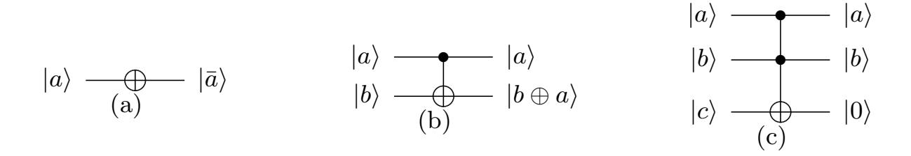

Fig. 1. Universal quantum gates (a) NOT gate (b) CNOT gate (c) Toffoli gate.

The Toffoli-depth is defined as the minimum number of stages of parallel applications of Toffoli-gates in a circuit, where parallel Toffoli-gates are allowed when they are acting on different qubits. CNOT and NOT gates typically are much cheaper than the Toffoli gate. Therefore, the Toffoli depth, instead of circuit depth, is defined the time cost of quantum computation. Note that the Toffoli gate can be decomposed into Clifford+T gates [32, 33], and T-gates is expensive than Clifford gates.

#### 2.2 The S-box of AES

Algebraic structure of S-box. The non-linear transformation S-box first takes a byte input  $\mathbf{a} \in F_{2^8} = F_2[x]/(x^8 + x^4 + x^3 + x + 1)$ , then replaces  $\mathbf{a}$  with its multiplicative inversion  $\mathbf{a}^{-1}$  (when  $\mathbf{a} = \mathbf{0}$ , set  $\mathbf{a}^{-1} = \mathbf{0}$ ), and finally performs an affine transformation which is composed of multiplication by an invertible matrix and the addition of a constant vector. Specifically, the S-box transformation is expressed as

$$S(\boldsymbol{a}) = A\boldsymbol{a}^{-1} \oplus \boldsymbol{c},\tag{1}$$

{5}------------------------------------------------

where

$$A = \begin{pmatrix} 1 & 0 & 0 & 0 & 1 & 1 & 1 & 1 \\ 1 & 1 & 0 & 0 & 0 & 1 & 1 & 1 \\ 1 & 1 & 1 & 0 & 0 & 0 & 1 & 1 \\ 1 & 1 & 1 & 1 & 1 & 0 & 0 & 0 & 1 \\ 1 & 1 & 1 & 1 & 1 & 0 & 0 & 0 & 0 \\ 0 & 1 & 1 & 1 & 1 & 1 & 0 & 0 & 0 \\ 0 & 0 & 1 & 1 & 1 & 1 & 1 & 0 & 0 \\ 0 & 0 & 0 & 1 & 1 & 1 & 1 & 1 & 1 & 1 &$$

The computation of S-box can be divided into two steps, i.e., computing the multiplicative inversion *a −*1 and performing the affine transformation. The affine transformation can be implemented with CNOT and NOT gates only. Thus, how to realize the quantum circuit of finding *a −*1 with low costs becomes one of the main factor optimizing the quantum circuit of S-box.

**A decomposition of S-box.** In Ref. [34], Wolkerstorfer et al. constructed the following composite field *F*(24) 2 isomorphic to *F*2 8 ,

- **–** The field polynomial of *F*2 4 is *x* 4 + *x* + 1;
- **–** The field polynomial of *F*(24) 2 is *x* 2 + *x* + *λ*, where *λ* := *x* 3 + *x* 2 + *x ∈ F*2 4 .

Due to isomorphism, the mapping matrix *M* : *F*2 8 *→ F*(24) 2 and its inverse matrix *M−*1 : *F*(24) 2 *→ F*2 8 are determined as

$$M = \begin{pmatrix} 1 & 0 & 1 & 0 & 0 & 0 & 0 & 0 \\ 1 & 0 & 1 & 0 & 1 & 1 & 0 & 0 \\ 1 & 1 & 0 & 1 & 0 & 0 & 1 & 0 \\ 0 & 1 & 1 & 1 & 0 & 0 & 0 & 0 \\ 0 & 0 & 0 & 1 & 0 & 1 & 0 & 0 \\ 1 & 0 & 0 & 0 & 0 & 1 & 1 & 0 \\ 0 & 0 & 0 & 0 & 0 & 1 & 1 & 0 \\ 0 & 1 & 1 & 1 & 0 & 0 & 0 & 1 \end{pmatrix}, \quad M^{-1} = \begin{pmatrix} 1 & 0 & 1 & 1 & 0 & 1 & 0 & 0 \\ 1 & 0 & 0 & 1 & 1 & 1 & 1 & 0 \\ 0 & 1 & 1 & 1 & 0 & 1 & 0 & 0 \\ 1 & 0 & 1 & 1 & 0 & 0 & 1 & 0 \\ 1 & 0 & 1 & 1 & 0 & 0 & 0 & 0 \\ 0 & 0 & 0 & 1 & 0 & 0 & 0 & 1 \end{pmatrix}. \tag{2}$$

Based on the composite field *F*(24) 2 , AES's S-box can be rewritten as

$$S(\boldsymbol{a}) = AM^{-1}(M\boldsymbol{a})^{-1} \oplus \boldsymbol{c}, \boldsymbol{a} \in F_{2^8}. \tag{3}$$

The multiplication by invertible matrices *M*, *AM−*1 (merging of matrices *A* and *M−*1 ) and the addition of a constant vector *c* can be implemented with CNOT and NOT gates only. Thus, the key to optimizing the S-box circuit becomes how the quantum circuit of finding (*Ma*) *−*1 (*Ma ∈ F*(24) 2 ) can be implemented with low costs.

As pointed out in Ref. [34], any element *p ∈ F*(24) 2 can be represented as a linear polynomial with coefficients in *F*2 4 , i.e., *p* = *p*0 + *p*1*x*, *p*0*, p*1 *∈ F*2 4 , and its multiplicative inversion *p −*1 can be expressed as

$$\mathbf{p}^{-1} = (\mathbf{p}^{17})^{-1}(p_0 + p_1) + (\mathbf{p}^{17})^{-1}p_1x := n_0 + n_1x,$$
  

$$\mathbf{p}^{17} = p_1^2 \times \lambda + (p_0 + p_1)p_0 \in F_{2^4}.$$
(4)

{6}------------------------------------------------

where  $\lambda := x^3 + x^2 + x \in F_{2^4}$ . It is necessary for finding  $p^{-1}$  to compute  $(p_0 + p_1)p_0, p_1^2 \times \lambda, (p^{17})^{-1}(p_0 + p_1)$  and  $(p^{17})^{-1}p_1$ , which mainly involve the multiplication (including constant multiplication  $p_1^2 \times \lambda$ ) and multiplicative inversion operations in  $F_{2^4}$ .

It can be seen that the implementation of S-box can be divided into three modules, i.e., the multiplication in  $F_{2^4}$ , the multiplicative inversion in  $F_{2^4}$ , the multiplication by invertible matrices M,  $AM^{-1}$  and the addition of a constant vector  $\boldsymbol{c}$ .

# 3 Quantum Circuit of Implementing the Multiplicative Inversion in $F_{2^4}$

Some quantum circuits of implementing the multiplicative inversion in  $F_{2^4}$  have been proposed. Almazrooie et al. [27] constructed it by employing the quantum circuit of implementing the multiplication in  $F_{2^4}$  many times. Saravanan et al. [35], Chung et al. [36] and Wang et al. [30] implemented it respectively based on a composite field  $F_{(2^2)^2}$ . Recently, Li et al. [24] constructed it by converting its classical circuit in Ref. [37] into a quantum version. See Table 3 for specific resource estimates.

**Table 2.** Lookup table of the multiplicative inversion in  $F_{24}$ .

| $\overline{x}$ |   |   |   |   |   |   |   |   |   |   |   |   |   |   |   |   |
|----------------|---|---|---|---|---|---|---|---|---|---|---|---|---|---|---|---|
| $x^{-1}$       | 0 | 1 | 9 | E | D | В | 7 | 6 | F | 2 | С | 5 | A | 4 | 3 | 8 |

In Ref. [31], Dasu et al. presented an automation tool, namely LIGHTER-R1, which can give the quantum circuit implementation of any 4-bit S-box based on lookup table. The tool LIGHTER-R has been widely applied in the quantum circuit implementation of lightweight cryptography [38–40]. We found that the multiplicative inversion in  $F_{24}$  can be seen as a 4-bit S-box, whose lookup table is shown in Table 2. Thus, to obtain the quantum circuit of implementing the multiplicative inversion in  $F_{24}$ , we employ the tool LIGHTER-R directly. The resulting circuit is shown in Figure 2.

The Tof4/C3(X)/CCCNOT gate in the dashed box of Figure 2 realizes the function of  $|a\rangle|b\rangle|c\rangle|d\rangle \rightarrow |a\rangle|b\rangle|c\rangle|d\oplus abc\rangle$  and can be decomposed by some Toffoli gates with an ancilla qubit (see Figure 3). Specifically, if the ancilla qubit is an unknown quantum state  $|g\rangle$ , CCCNOT gate can be decomposed by using the circuit in Figure 3(a). And if the state of  $|g\rangle$  is known to be  $|0\rangle$ , the last Toffoli gate in Figure 3(a) is unnecessary which corresponds to Figure 3(b). Thus, according to Figure 2 and Figure 3, we can obtain two quantum circuits of implementing the multiplicative inversion in  $F_{2^4}$  for  $F_{2^4}inv_0: |\mathbf{b}\rangle|0\rangle \rightarrow |\mathbf{b}^{-1}\rangle|0\rangle$  and  $F_{2^4}inv_1: |\mathbf{b}\rangle|g\rangle \rightarrow |\mathbf{b}^{-1}\rangle|g\rangle$ . These two quantum circuits will be used to

The source code of LIGHTER-R is available at https://github.com/vdasu/lighter-r

{7}------------------------------------------------

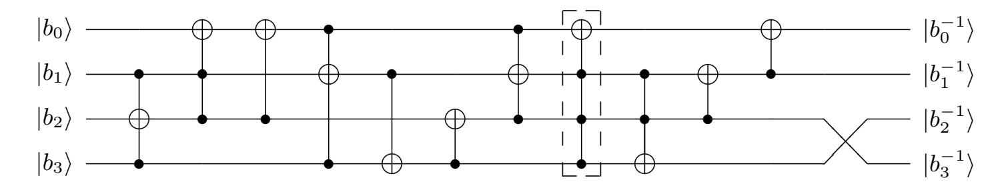

**Fig. 2.** Quantum circuit of implementing the multiplicative inversion in  $F_{2^4}$ . Here,  $\boldsymbol{b} = (b_0, b_1, b_2, b_3)$  and its inverse  $\boldsymbol{b}^{-1} = (b_0^{-1}, b_1^{-1}, b_2^{-1}, b_3^{-1})$  are the input vector and output vector, respectively. Note that  $\boldsymbol{b}$  corresponds to an element in  $F_{2^4}$ . Swap operation only changes the index of qubits and does not require quantum gates.

implement the quantum circuit of AES (8-bit) S-box. In the process, if there is an idle quantum state  $|0\rangle$ , we use  $F_{2^4}inv_0$ . Otherwise, we use  $F_{2^4}inv_1$ .

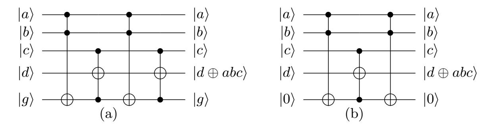

Fig. 3. Quantum circuits of CCCNOT

The resource estimates of these two quantum circuits for  $F_{24}inv_0$  and  $F_{24}inv_1$  are given in Table 3. Compared with the previous studies, our quantum circuits require fewer qubits.

**Table 3.** Quantum resource estimates for the implementation of the multiplicative inversion in  $F_{2^4}$ . #Toffoli/CNOT mean the number of Toffoli and CNOT gates. #qubits means the number of qubits.

| Schemes        | #qubits | #CNOT | #Toffoli | Toffoli depth |
|----------------|---------|-------|----------|---------------|
| [35]           | 18      | 22    | 9        | 4             |
| $\boxed{[27]}$ | 16      | 47    | 48       | 39            |
| [36]           | 16      | /     | 9        | 6             |
| [30]           | 8       | 20    | 14       | 14            |
| $\boxed{[24]}$ | 6       | 22    | 6        | 6             |
| Ours           | 5       | 5     | 8        | 8             |
|                | 5       | 5     | 9        | 9             |

{8}------------------------------------------------

# 4 Quantum Circuits of S-box

In the section, we propose three quantum circuits of S-box for  $C_1: |\boldsymbol{a}\rangle |\boldsymbol{0}\rangle \rightarrow |\boldsymbol{a}\rangle |S(\boldsymbol{a})\rangle$ ,  $C_2: |\boldsymbol{a}\rangle |\boldsymbol{b}\rangle \rightarrow |\boldsymbol{a}\rangle |\boldsymbol{b}\oplus S(\boldsymbol{a})\rangle$  and  $C_4: |\boldsymbol{a}\rangle \rightarrow |S(\boldsymbol{a})\rangle$  respectively2. Along the way, we directly adopt Li et al.'s [24] quantum circuits, including  $U_M$ ,  $U_{AM^{-1}}$ , Mul,  $B_-Mul$  and  $U_{q^2\lambda}$ .

- $-U_M: |\boldsymbol{x}\rangle \to |M\boldsymbol{x}\rangle$  requires 8 qubits, 15 CNOT gates and a total depth of 8;  $U_{AM^{-1}}: |\boldsymbol{x}\rangle \to |AM^{-1}\boldsymbol{x}\rangle$  requires 8 qubits, 26 CNOT gates and a total depth of 10. Here,  $\boldsymbol{x} \in F_{2^8}$ . Matrices A and M are referred in Eq.(1) and Eq.(2) respectively.
- $Mul: |\mathbf{f}\rangle|\mathbf{g}\rangle|0^4\rangle \rightarrow |\mathbf{f}\rangle|\mathbf{g}\rangle|\mathbf{f}\cdot\mathbf{g}\rangle$  requires 12 qubits, 9 Toffoli gates, 23 CNOT gates and a Toffoli depth of 6;  $B_-Mul: |\mathbf{f}\rangle|\mathbf{g}\rangle|\mathbf{h}\rangle \rightarrow |\mathbf{f}\rangle|\mathbf{g}\rangle|\mathbf{h}\oplus\mathbf{f}\cdot\mathbf{g}\rangle$  requires 12 qubits, 9 Toffoli gates, 28 CNOT gates and Toffoli depth 6. Here,  $\mathbf{f}, \mathbf{g}, \mathbf{h} \in F_{2^4}$ ;
- $-U_{q^2\lambda}:|q\rangle \to |q^2 \times \lambda\rangle$  requires 4 qubits, 3 CNOT gates and a total depth of 3. Here  $\lambda:=x^3+x^2+x\in F_{2^4}, q$  is an arbitrary element in  $F_{2^4}$ .

# 4.1 Quantum Circuit of S-box for $C_1$

In order to implement the quantum circuit of S-box for  $C_1$ , we first propose a quantum circuit of finding  $\mathbf{p}^{-1}$  for  $|\mathbf{p}\rangle|\mathbf{0}\rangle \to |\mathbf{p}\rangle|\mathbf{p}^{-1}\rangle$ . Here  $\mathbf{p}=p_0+p_1x\in F_{(2^4)^2}$  and its multiplicative inversion is  $\mathbf{p}^{-1}=(\mathbf{p}^{17})^{-1}(p_0+p_1)+(\mathbf{p}^{17})^{-1}p_1x:=n_0+n_1x$ .

We divide into four steps, i.e., computing  $p^{17}$ , calculating the multiplicative inversion  $(p^{17})^{-1}$  of  $p^{17}$ , obtaining  $p^{-1}$  and uncomputation (i.e., clear up ancilla qubits), to construct the quantum circuit for  $|p\rangle|0\rangle \rightarrow |p\rangle|p^{-1}\rangle$ . Specifically, we first give the quantum circuit for  $U_{p^{17}}: |\boldsymbol{p}\rangle|0^4\rangle = |\boldsymbol{p}_0\rangle|\boldsymbol{p}_1\rangle|0^4\rangle \rightarrow |\boldsymbol{p}\rangle|\boldsymbol{p}^{17}\rangle$ . According to  $p^{17} = p_1^2 \times \lambda + (p_0 + p_1)p_0 \in F_{2^4}$ ,  $U_{p^{17}}$  can be realized by performing  $Mul, U_{p_1^2\lambda}$  (take  $q := p_1$ ) and some CNOT gates (see the red box in Figure 4). Then  $|(\mathbf{p}^{17})^{-1}\rangle$  is obtained by performing  $F_{24}inv_0$  on  $|\mathbf{p}^{17}\rangle|0\rangle$ . Here, instead of adding a new qubit, we use a idle quantum state  $|0\rangle$  from output qubits as ancilla qubit. Next  $|p^{-1}\rangle = |(p^{17})^{-1}(p_0 + p_1)\rangle|(p^{17})^{-1}p_1\rangle := |n_0\rangle|n_1\rangle$  is obtained in output qubits by performing Mul two times. At this time, the circuit is in state  $|\boldsymbol{p}\rangle|(\boldsymbol{p}^{17})^{-1}\rangle|\boldsymbol{p}^{-1}\rangle$ . In the end,  $|(\boldsymbol{p}^{17})^{-1}\rangle$  in ancilla qubits has to be removed for the reuse, i.e., completing uncomputation. As mentioned in Ref. [24], the general idea of completing the uncomputation is to perform  $F_{2^4}inv_1^{\dagger}$  (since there is no idle quantum state  $|0\rangle$ ) and  $U_{p^{17}}^{\dagger}$  on  $|\boldsymbol{p}\rangle|(\boldsymbol{p}^{17})^{-1}\rangle$ . However, due to  $(\boldsymbol{p}^{17})^{-1}=$  $(\boldsymbol{p}^{-1})^{17}, (\boldsymbol{p}^{17})^{-1}$  can also be expressed as  $n_1^2 \times \lambda + (n_1 + n_0)n_0$ . Therefore, we only apply  $U_{p^{17}}^{\dagger}$  (the inverse circuit of  $U_{p^{17}}$ ) to implement  $U_{(p^{-1})^{17}}^{\dagger}:|\boldsymbol{p}^{-1}\rangle|(\boldsymbol{p}^{17})^{-1}\rangle=$  $|p^{-1}\rangle|(p^{-1})^{17}\rangle \rightarrow |p^{-1}\rangle|\mathbf{0}\rangle$ . The resulting quantum circuit, as shown in Figure 4, requires 20 qubits instead of 22 in a previous study [24].

The code that verifies the correctness of these S-box circuits is available at https://github.com/lzq192921/quantum-circuit-implementation-of-AES.git

{9}------------------------------------------------

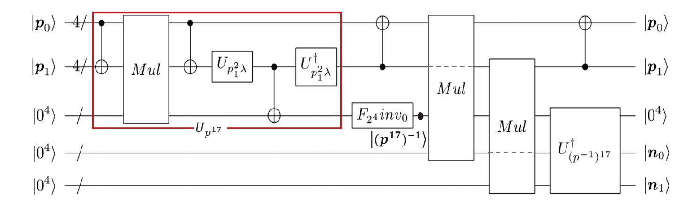

Fig. 4. Quantum circuit for  $|\mathbf{p}\rangle|0^{12}\rangle \to |\mathbf{p}\rangle|\mathbf{p}^{-1}\rangle|0^4\rangle$ .  $\mathbf{p}=(p_0,p_1)$  and  $\mathbf{p}^{-1}=(n_0,n_1)$  are 8-bit input and output vectors respectively. CNOT gates between four qubit-sized wires should be read as multiple parallel CNOT gates applied bitwise. Dashed lines indicate wires that are not used in the corresponding circuit of the square box. Using  $U_{q^2\lambda}$  to implement  $U_{p_1^2\lambda}^{\dagger}$  due to  $p_1 \in F_{2^4}$ .  $U_{p_1^2\lambda}^{\dagger}$  is implemented by the inverse circuit of  $U_{p_1^2\lambda}$ . A quantum state  $|0\rangle$  from output qubits is used as ancilla qubit of  $F_{2^4}inv_0$ .

By combining the quantum circuit in Figure 4 with  $U_M$  and  $U_{AM^{-1}}$ , we obtain the quantum circuit of S-box for  $C_1$  in Figure 5, which requires 20 qubits.

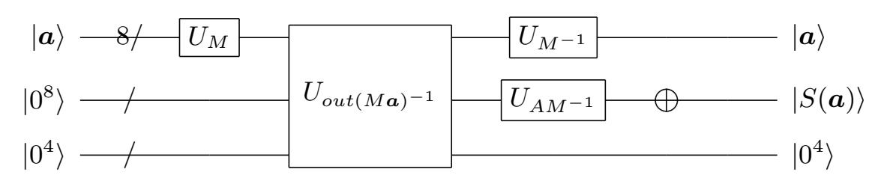

Fig. 5. Quantum circuit of the S-box for  $C_1: |\boldsymbol{a}\rangle|0^{12}\rangle \to |\boldsymbol{a}\rangle|S(\boldsymbol{a})\rangle|0^4\rangle$ . The input is one element  $\boldsymbol{a} \in F_{2^8}$ . The output is  $S(\boldsymbol{a})$ .  $U_{out(M\boldsymbol{a})^{-1}}: |M\boldsymbol{a}\rangle|0\rangle \to |M\boldsymbol{a}\rangle|(M\boldsymbol{a})^{-1}\rangle$  is implemented by the quantum circuit in Figure 4 since  $M\boldsymbol{a}$  is contained in  $F_{(2^4)^2}$ .  $U_{M^{-1}}$  is implemented by the inverse circuit of  $U_M$ .  $\oplus$  represents that the constant vector  $\boldsymbol{c}$  is added by flipping four qubits with four NOT gates.

The quantum resource estimates of  $C_1$  are shown in Table 4. Compared with the previous studies, our S-box circuit for  $C_1$  requires less quantum resources including the number of qubites.

**Table 4.** Comparison of our S-box circuit for  $C_1$  with previous works.

| Schemes        | #qubits | #Toffoli | #CNOT | #NOT | Toffoli Depth |
|----------------|---------|----------|-------|------|---------------|
| ours           | 20      | 44       | 197   | 4    | 32            |
| $\boxed{[24]}$ | 22      | 48       | 236   | 4    | 36            |
| $\boxed{[29]}$ | 22      | 52       | 326   | 4    | 41            |
| ${[28]}$       | 32      | 55       | 314   | 4    | 40            |
| [26]           | 40      | 512      | 369   | 4    | 144           |

{10}------------------------------------------------

Remark 1. Compared with the circuit of Li et al., our circuit is different in two aspects. First, we take an idle qubit from output qubits as ancilla qubits and then compute  $(p^{-1})^{17}$  by  $F_{2^4}inv_0$ . Second, we find that uncomputation can be completed only by performing circuit  $U_{p^{17}}^{\dagger}$  without  $F_{2^4}inv_1^{\dagger}$ . As a result, our S-box circuit for  $C_1$  requires not only fewer qubits, but also fewer Toffoli gates and lower Toffoli-depth. Cost estimates can be found in Table 4.

Our results shows that uncomputation for removing ancilla qubits (i.e., reinstate the initial state  $|\mathbf{0}\rangle$ ) can be optimized when the algebraic relationship between the value in ancilla qubits and f(x) is simpler than that between x and the value in ancilla qubits. Here, assume that f(x) is an arbitrary invertible nonlinear transformation, the goal circuit  $U_f:|x\rangle|\mathbf{0}\rangle \to |x\rangle|f(x)\rangle$  is implemented by introducing some ancilla qubits. For example, in Figure 4, x:=p,  $f(x):=p^{-1}$ , after getting the output information  $p^{-1}$ , as analyzed above, the value  $(p^{17})^{-1}$  in ancilla qubits has simpler algebraic relationship with  $p^{-1}$  than with p.

# 4.2 Quantum Circuit of S-box for $C_2$

In order to implement the quantum circuit of S-box for  $C_2$ , we first proposed an improved quantum circuit for  $|\mathbf{p}\rangle|\mathbf{h}\rangle \to |\mathbf{p}\rangle|\mathbf{h}\oplus\mathbf{p}^{-1}\rangle$ .

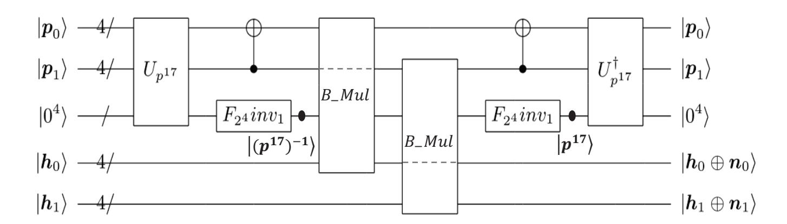

Fig. 6. Quantum circuit for  $|\mathbf{p}\rangle|\mathbf{h}\rangle|0^4\rangle \to |\mathbf{p}\rangle|\mathbf{h}\oplus\mathbf{p}^{-1}\rangle|0^4\rangle$ .  $\mathbf{h}=(h_0,h_1)$  is an arbitrary 8-bit vector.  $F_{2^4}inv_1$  applies an unknown quantum state  $|g\rangle$  from output qubits as its ancilla qubit, which is returned to the same state at the end of the circuit.

Similar to Figure 4, we divide into four steps to implement  $|\boldsymbol{p}\rangle|\boldsymbol{h}\rangle \to |\boldsymbol{p}\rangle|\boldsymbol{h}\oplus \boldsymbol{p}^{-1}\rangle$ . First,  $|\boldsymbol{p}^{17}\rangle$  is obtained by performing  $U_{p^{17}}$  on  $|\boldsymbol{p}\rangle|0^4\rangle$ . However, unlike Figure 4, we only use  $F_{2^4}inv_1$  to compute  $|(\boldsymbol{p}^{17})^{-1}\rangle$  since there is no idle quantum state  $|0\rangle$ . The input state in output qubits is  $|\boldsymbol{h}\rangle = |\boldsymbol{h}_0\rangle|\boldsymbol{h}_1\rangle$  instead of  $|0^8\rangle$ . Next,  $|\boldsymbol{h}\oplus\boldsymbol{p}^{-1}\rangle = |\boldsymbol{h}_0\oplus\boldsymbol{n}_0\rangle|\boldsymbol{h}_1\oplus\boldsymbol{n}_1\rangle$  is obtained by using  $B_-Mul$  twice instead of Mul. In the end, we need to clean up  $|(\boldsymbol{p}^{17})^{-1}\rangle$ . Unfortunately, the removal has to be completed by  $F_{2^4}inv_1$  and  $U_{p^{17}}^{\dagger}$  because the output qubits are in state  $|\boldsymbol{h}\oplus\boldsymbol{p}^{-1}\rangle$  instead of  $|\boldsymbol{p}\rangle$ . Note that because of the same function, we only use  $F_{2^4}inv_1$  instead of  $F_{2^4}inv_1^{\dagger}$  (i.e.,  $|\boldsymbol{b}^{-1}\rangle|g\rangle \to |\boldsymbol{b}\rangle|g\rangle$ ,  $(\boldsymbol{b}^{-1})^{-1} = \boldsymbol{b}$ ). The resulting

{11}------------------------------------------------

quantum circuit, as shown in Figure 6, requires 20 qubits instead of 22 in a previous study [24].

By combining the quantum circuit in Figure 6 with  $U_M$  and  $U_{AM^{-1}}$ , we construct the quantum circuit of S-box for  $C_2 : |\boldsymbol{a}\rangle|\boldsymbol{b}\rangle|0^4\rangle \to |\boldsymbol{a}\rangle|\boldsymbol{b}\oplus S(\boldsymbol{a})\rangle|0^4\rangle$  in Figure 7, whose number of qubits is 20.

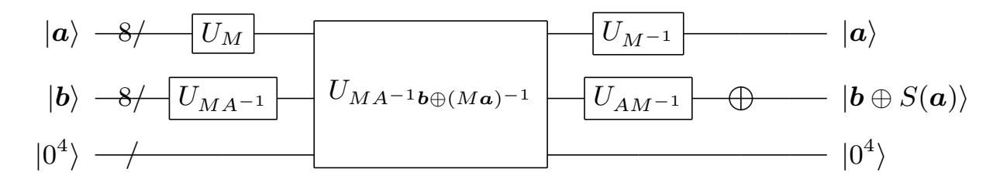

Fig. 7. Quantum circuit for  $C_2: |\boldsymbol{a}\rangle|\boldsymbol{b}\rangle|0^4\rangle \to |\boldsymbol{a}\rangle|\boldsymbol{b}\oplus S(\boldsymbol{a})\rangle|0^4\rangle$ .  $U_{MA^{-1}\boldsymbol{b}\oplus(M\boldsymbol{a})^{-1}}: |M\boldsymbol{a}\rangle|MA^{-1}\boldsymbol{b}\rangle \to |M\boldsymbol{a}\rangle|MA^{-1}\boldsymbol{b}\oplus(M\boldsymbol{a})^{-1}\rangle$  is implemented by the quantum circuit in Figure 6 because  $MA^{-1}\boldsymbol{b}$  and  $M\boldsymbol{a}$  are contained in  $F_{(2^4)^2}$ .  $U_{MA^{-1}}$  is implemented by the inverse circuit of  $U_{AM^{-1}}$ .

Table 5 summarizes the quantum resources needed to realize  $C_2$ . Compared with previous studies, our S-box circuit for  $C_2$  requires fewer qubits.

| Schemes        | # qubits | #Toffoli | #CNOT | #NOT | Toffoli Depth |
|----------------|----------|----------|-------|------|---------------|
| ours           | 20       | 54       | 238   | 4    | 42            |
| $\boxed{[24]}$ | 22       | 48       | 272   | 4    | 36            |
| $\boxed{[25]}$ | 22       | 52       | 336   | 4    | 41            |
| [29]           | 23       | 68       | 352   | 4    | 60            |
| [30]           | 32       | 55       | 322   | 4    | 40            |

**Table 5.** Comparison of our S-box circuit for  $C_2$  with previous works.

Remark 2. Compared with the circuit of Li et al., we take an idle qubit from output qubits as ancilla qubits and then compute  $(p^{-1})^{17}$  by  $F_{24}inv_1$ , resulting in a reduction in the number of qubits. Cost estimates can be found in Table 5.

#### 4.3 Quantum Circuit of S-box for $C_4$

Based on the idea mentioned in [41], Li et al [24] and Huang et al. [25] realized the goal by connecting two quantum circuits for  $|a\rangle|0\rangle \rightarrow |a\rangle|S(a)\rangle$  and  $|a\rangle|S(a)\rangle \rightarrow |0\rangle|S(a)\rangle$ . Here, different from the previous method, we realize the goal by proposing a quantum circuit for  $|p\rangle \rightarrow |p^{-1}\rangle$ .

Similar to Figure 4, we first obtain  $|\mathbf{p}^{17}\rangle$  by performing  $U_{p^{17}}$  on  $|\mathbf{p}\rangle|0^4\rangle$ , and then compute  $|(\mathbf{p}^{17})^{-1}\rangle$  by performing  $F_{2^4}inv_0$  on  $|\mathbf{p}^{17}\rangle|0\rangle$  (since there is idle quantum state  $|0\rangle$ ). Next, we perform the circuit  $In\_Mul$  in Figure 9 of Observation 1 twice to obtain  $|\mathbf{n}_0\rangle$  and  $|\mathbf{n}_1\rangle$  respectively, i.e., the circuit is in

{12}------------------------------------------------

state  $|\boldsymbol{n}_1\rangle|0^4\rangle|(\boldsymbol{p}^{17})^{-1}\rangle|\boldsymbol{n}_0\rangle$ . Along the way, instead of adding additional qubits,  $|\boldsymbol{p}_0\rangle$  is removed for gaining storage space to place  $\boldsymbol{n}_1$  after obtaining  $|\boldsymbol{n}_0\rangle$ . In the end,  $|(\boldsymbol{p}^{17})^{-1}\rangle$  is removed by executing  $U^{\dagger}_{(p^{-1})^{17}}$  on  $|\boldsymbol{n}_0\rangle|\boldsymbol{n}_1\rangle|(\boldsymbol{p}^{17})^{-1}\rangle=|\boldsymbol{p}^{-1}\rangle|(\boldsymbol{p}^{17})^{-1}\rangle$ . The resulting quantum circuit, as shown in Figure 8, requires 16 qubits.

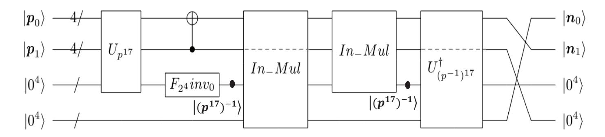

**Fig. 8.** Quantum circuit for  $|\boldsymbol{p}\rangle|0^8\rangle \rightarrow |\boldsymbol{p}^{-1}\rangle|0^8\rangle$ .

Observation 1 The quantum circuit for  $In\_Mul : |f\rangle|g\rangle|0\rangle \rightarrow |0\rangle|g\rangle|f \cdot g\rangle$  can not only get  $f \cdot g$ , but also release storage space to place other values if f is useless in subsequent operations.  $In\_Mul$  can be implemented as follows

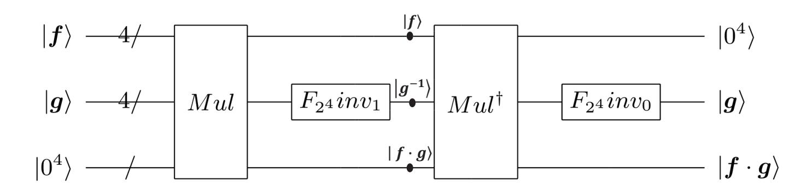

Fig. 9. Quantum circuit for  $In_-Mul: |f\rangle|g\rangle|0\rangle \rightarrow |0\rangle|g\rangle|f\cdot g\rangle$ .

Due to  $(\mathbf{f} \cdot \mathbf{g}) \cdot \mathbf{g}^{-1} = \mathbf{f}$ , the circuit  $Mul^{\dagger} (|\mathbf{f}\rangle|\mathbf{g}\rangle|\mathbf{f} \cdot \mathbf{g}\rangle \rightarrow |\mathbf{f}\rangle|\mathbf{g}\rangle|\mathbf{0}\rangle)$  is used to convert  $|\mathbf{f}\rangle|\mathbf{g}^{-1}\rangle|\mathbf{f} \cdot \mathbf{g}\rangle$  into  $|\mathbf{0}\rangle|\mathbf{g}^{-1}\rangle|\mathbf{f} \cdot \mathbf{g}\rangle$ . At this moment, there exist an idle quantum state  $|\mathbf{0}\rangle$ , so  $|\mathbf{g}^{-1}\rangle$  is converted back into  $|\mathbf{g}\rangle$  by  $F_{2^4}inv_0$ .

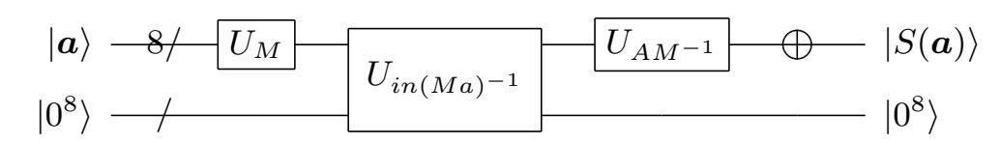

Fig. 10. Quantum circuit for  $C_4: |\boldsymbol{a}\rangle|0^8\rangle \to |S(\boldsymbol{a})\rangle|0^8\rangle$ .  $U_{in(Ma)^{-1}}: |\boldsymbol{a}\rangle \to |(M\boldsymbol{a})^{-1}\rangle$  is implemented by the quantum circuit in Figure 8 because  $M\boldsymbol{a}$  is contained in  $F_{(2^4)^2}$ .

{13}------------------------------------------------

By combining the quantum circuit in Figure 8 with  $U_M$  and  $U_{AM^{-1}}$ , we obtain the S-box circuit for  $C_4$ :  $|a\rangle|0^8\rangle \rightarrow |S(a)\rangle|0^8\rangle$  in Figure 10, which requires 16 qubits.

Table 6 summarizes the quantum resources needed to implement the S-box circuit for  $C_4$ . Compared with previous studies, our S-box circuit for  $C_4$  requires fewer qubits.

| Schemes        | #qubits | #Toffoli | #CNOT | #NOT | Toffoli depth |
|----------------|---------|----------|-------|------|---------------|
| Ours           | 16      | 96       | 244   | 4    | 78            |
| $\boxed{[24]}$ | 22      | 96       | 410   | 4    | 71            |
| $\boxed{[25]}$ | 22      | 104      | 694   | 12   | 82            |

**Table 6.** Comparison of our S-box circuit for  $C_4$  with previous works.

In order to reduce the number of qubits, we often would like to compute f(x) with a in-place circuit, i.e.,  $|x\rangle \to |f(x)\rangle$ . For example, we directly obtain the in-place quantum circuit  $F_{2^4}inv_0$  by the tool LIGHTER-R. However, for some complex functions f(x) (e.g. the multiplicative inversion in  $F_{2^8}$ ), directly designing an in-place quantum circuit is difficult. As mentioned in Ref. [25], a natural idea is to construct an in-place circuit based on out-of-place subcircuits. Huang et al. [25] proposed an in-place quantum circuit for  $|x\rangle \to |f(x)\rangle$  by connecting two out-of-place circuit  $|x\rangle|\mathbf{0}\rangle \to |x\rangle|f(x)\rangle$  and  $|f^{-1}(y)\rangle|y\rangle \to |\mathbf{0}\rangle|y\rangle$  ( $f^{-1}$  is invertible function of f). Thus, their in-place circuit requires at least 4n qubits if  $f(x): \{0,1\}^{2n} \to \{0,1\}^{2n}$  is an arbitrary invertible nonlinear transformation. By connecting  $|a\rangle|\mathbf{0}\rangle \to |a\rangle|S(a)\rangle$  and  $|a\rangle|S(a)\rangle \to |\mathbf{0}\rangle|S(a)\rangle$ , Huang et al. [25] and Li et al. [24] gave the quantum circuit of S-box for  $C_4$ , whose cost estimates can be found in Table 6.

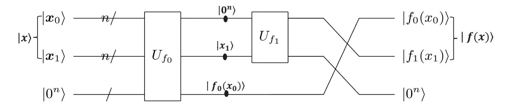

Fig. 11. An in-place quantum circuit for  $|\mathbf{x}\rangle \to |f(\mathbf{x})\rangle$ .  $U_{f_0}: |\mathbf{x}_0\rangle_n |\mathbf{0}\rangle_n \to |\mathbf{0}\rangle_n |f_0(x_0)\rangle_n$  and  $U_{f_1}: |\mathbf{x}_1\rangle_n |\mathbf{0}\rangle_n \to |\mathbf{0}\rangle_n |f_1(x_1)\rangle_n$ .

**Observation 2**  $|x\rangle \to |f(x)\rangle$  can be constructed with at least 3n qubits, If f(x) can be expressed as  $f(x) = f_0(x_0) \parallel f_1(x_1) \ (f_0(x_0), f_1(x_1) : \{0, 1\}^n \to \{0, 1\}^n$  are invertible nonlinear transformation) when x is divided into  $x_0$  and  $x_1$ , i.e.,  $x := x_0 \parallel x_1$ . Figure 11 shows the circuit.

{14}------------------------------------------------

 $|\boldsymbol{x}_0\rangle$  is removed to gain storage space to place  $f_1(x_1)$  only when it is useless in subsequent operations. In our circuit for  $|\boldsymbol{p}\rangle \to |\boldsymbol{p}^{-1}\rangle$ ,  $x:=\boldsymbol{p}=\boldsymbol{p}_0 \parallel \boldsymbol{p}_1$  and  $f(x):=\boldsymbol{p}^{-1}=f_0(x_0) \parallel f_1(x_1)$  (note  $f_0(x_0):=(\boldsymbol{p}^{17})^{-1}(p_0+p_1), f_1(x_1):=(\boldsymbol{p}^{17})^{-1}p_1)$ ,  $U_{f_0}$  and  $U_{f_1}$  are implemented with the circuit in Figure 9  $((\boldsymbol{p}^{17})^{-1})$  is computed in ancilla qubits which is regard as constant in  $f_0(x_0)$  and  $f_1(x_1)$ .

# 5 Quantum circuit implementations of AES

AES is a family of iterative block ciphers, which encrypts 16 bytes (i.e., 128 bits) plaintexts and consists of round function and key expansion. The subroutines of round function includes SubBytes, ShiftRows, MixColumns and AddRoundKey (note the last round does not perform the MixColumns). The subroutines of key expansion include SubWord, RotWord and Roon. AES's three instances AES-128 (10 iterations), AES-192 (12 iterations) and AES-256 (14 iterations) correspond to the key lengths of 128, 192 and 256 bits respectively. The full specification of AES can be found in Ref. [21].

In the present study, we implement the SubBytes (applying 16 S-box substitutions) and SubWord (applying 4 S-box substitutions) by the S-box circuits in Section 4. For other linear operations, the ShiftRows and Rotword can be implemented by appropriate rewiring. The MixColumns can be implemented with 368 CNOT gates [42]. The AddRoundKey is implemented with 128 CNOT gates. The Rcon is implemented by applying NOT gates.

In the following, we introduce the methods of round function iteration and key expansion iteration, then synthesize the quantum circuit of AES.

#### 5.1 Method of Round Function Iteration

As shown in Table 1, quite a few round function iteration methods were introduced. Grassl et al. [26] proposed the zig-zag method, which requires 512 + 24 = 536 qubits (24 is the number of ancilla qubits required by their S-box circuit for  $C_1$ ), to implement the round function iteration of AES-128. Almazrooie et al. [27] and Langenberg et al. [28] employed the zig-zag method to complete the iteration. Zou et al. [29] proposed an improved zig-zag method which requires at least 256 qubits. Wang et al. [30] realized the iteration by the improved zig-zag method. Recently, Li et al. [24] presented a straight-line method, which requires 128 + 14 = 142 qubits (14 is the number of ancilla qubits required by their S-box circuit for  $C_4$ ). To make a tradeoff between the number of qubits and Toffoli depth, Huang et al. [25] completed the iteration by the straight-line method with  $128 + 8 \times 14 = 240$  qubits (i.e., running S-box circuit for  $C_4$  eight time simultaneously in constructing the SubBytes of  $R_i$ ).

We also apply Li et al.'s straight-line method to realize the round function iteration of AES-128. From Figure 10, we can see that our S-box circuit for  $C_4$  reduces the number of ancilla qubits from 14 in the previous studies [24, 25] to 8. As a result, the number of qubits required to implement the round

{15}------------------------------------------------

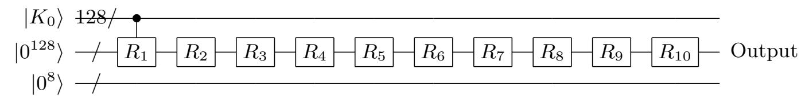

**Fig. 12.** Straight-line method for the round function iteration of AES-128. *Ri* means the round *i* (*i* = 1*,* 2*, · · · ,* 10). *|K*0*⟩* is the 128-bit input key and is used to key expansion.

function iteration of AES-128 becomes 128+8=136. Figure 12 shows the straightline method for the round function iteration of AES-128. Similarly, the round function iteration of AES-192/-256 can also be implemented with 136/136 qubits.

*Remark 3.* We can also make a trade-off between the number of qubits and Toffoli depth by adding the number of S-box circuit for *C*4 in parallel. That is, if we implement *k* S-box circuits for *C*4 in parallel (*k* divided by 16) each time in constructing the SubBytes of *Ri* (*i >* 1), the number of qubits required for the round function iteration of AES-128/-192/-256 becomes 128 + 8*k*.

## **5.2 Method of key expansion Iteration**

Some key expansion iteration methods were proposed. Grassl et al. [26] proposed the pipeline method, which requires at least 448 + 24 = 472 qubits (24 is the number of ancilla qubits required by their S-box circuit for *C*1) , to implement the key expansion iteration of AES-128. Then Almazrooie et al [27] presented an improved pipeline method which requires at least 416 + 48 = 464 qubits. Langenberg et al. [28] found that the zig-zag method can be used to complete the key expansion iteration, which requires 352+ 16 = 368 qubits. Zou et al. [29] proposed an improved zig-zag method to realize the iteration, which requires 256 + 7 = 263 (7 is the number of ancilla qubits required by Zou et al.'s S-box circuit for *C*2). Wang et al. [30] presented a straight-line method to implement the key expansion iteration, which requires 128 + 16 qubits. To make a tradeoff between the number of qubits and Toffoli depth, Jaques et al. [23] completed the iteration by the straight-line method with 128+4*×*121 = 612 qubits (i.e., running S-box circuit for *C*2 four time simultaneously in constructing the SubWord of *Ki*) Li et al. [24] and Huang et al. [25] adopted the straight-line method to complete the iteration.

Here, we apply the straight-line method to implement the key expansion iteration of AES-128. Because our S-box circuit for *C*2 requires 4 ancilla (see Figure 7), we can realize the key expansion iteration of AES-128 with 128+4=132 qubits. Figure 13 shows the quantum circuit of implementing the key expansion in *i*-th round. Similarly, we perform the key expansion iteration of AES-192/-256 with 196/260 qubits. Of course, as a trade-off between the number of qubits and Toffoli depth, the number of qubits can also be 128 + 4*h/*192 + 4*h/*256 + 4*h* for the key expansion iteration of AES-128/-192/-256 (*h* is the number of running S-box circuit for *C*2 in parallel when the SubWord is constructed).

{16}------------------------------------------------

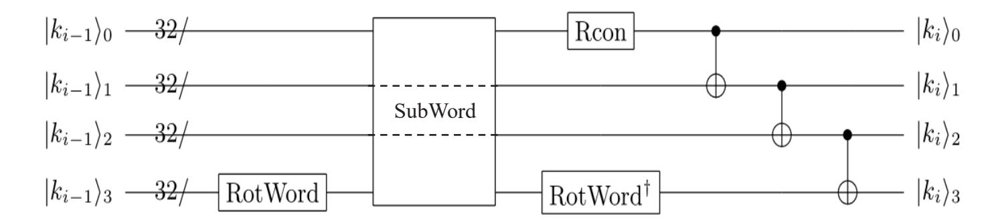

**Fig. 13.** The quantum circuit of implementing the key expansion of AES-128 in *i*-th round for KeyExpan. : *|Ki−*1*⟩ → |Ki⟩*. *Ki−*1 and *Ki* are *i −* 1-th and *i*-th round key respectively. *|ki⟩j* means *j*-th word of round key *Ki*.

*Remark 4.* In synthesizing the quantum circuit of AES, if the SubBytes in *Ri* and SubWord in key expansion are not constructed simultaneously, we can reuse idle qubits, which is applied to implemented the round function iteration, to construct the SubWord. Thus, as the previous studies [24,26–30], they implement the key expansion without adding additional ancilla (see Table 1). Otherwise, as a trade-off between the number of qubits and Toffoli depth, it is necessary to add new qubits as the previous study [23, 25].

#### **5.3 Quantum Circuits for implementing AES**

Based on the straight-line method above, we synthesize the quantum circuit of AES-128 with 264 qubits, where 136 qubits and 128 qubits are used to complete the round function iteration and key expansion iteration. Note that 8 ancilla qubits in round function iteration are reused to implement the key expansion iteration.

First, as mentioned in the previous studies [24–26, 29], to save qubits, *R*0 which adds the key *K*0 on plaintext *m* (whitening step) is implemented by apply NOT gates on some specific qubits of *|K*0*⟩* (at most 128 NOT gates). Then when *|R*0*⟩* is used to compute the SubBytes in *R*1 later, *|R*0*⟩* is reinstated *|K*0*⟩* by applying NOT gates (at most 128 NOT gates). Particularly, the SubBytes in *R*1 is constructed by running our S-box circuit for *C*1 sixteen times. The depth of *C*1 is 3. The SubWord in *K*1 is constructed by running the S-box circuit for *C*2 four times. The depth of *C*2 is 2. After realizing the SubWord, as Figure 14, we perform the Rotword and Rcon to obtain *K*1 while ShiftRows, MixColumns are implemented. At last, the AddRoundKey is implemented by performing 128 CNOT in parallel. The quantum circuit for realizing *R*0 and *R*1 is shown in Figure 13. It can be seen that SubBytes and SubWord cannot be constructed in parallel. Therefore, realizing *R*0 and *R*1 require Toffoli depth 3 *×* 32 + 2 *×* 42 = 180. Besides, these two round require 16 *×* 44 + 4 *×* 54 = 920 Toffoli gates, 197*×*16+238*×*4+96+368+128 = 4696 CNOT gates and 256+4*×*20+1 = 337 NOT gates.

Then, we implement *Ri* (*i >* 1), whose circuit is shown in Figure 15. Because *C*4 requires 8 ancilla qubits (see Figure 10), we run the S-box circuit for *C*4

{17}------------------------------------------------

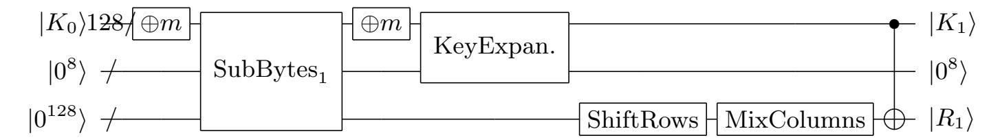

**Fig. 14.** The implementation of  $R_0$  and  $R_1$  of AES-128.  $\oplus m$  means that plaintext m is added on  $K_0$  by NOT gates, whose output is  $|R_0\rangle$ . SubBytes1 implements the SubBytes in  $R_1$  with the S-box circuit for  $C_1$ . KeyExpan. is the circuit of key expansion in Figure 13, which is used to obtain round key  $K_1$ .  $|0^8\rangle$  are reused as ancilla qubits of KeyExpan. and SubBytes1.

sixteen times in order to construct the SubBytes. The depth of  $C_4$  is 16, i.e., the Toffoli-depth is  $78 \times 16 = 1248$ . Similarly, because  $C_2$  requires 4 ancilla qubits (see Figure 7), two S-box transformations in SubWord of  $K_i$  can be implemented in parallel. Thus, the depth of  $C_2$  required for constructing the SubWord is 2, i.e., the Toffoli-depth is  $42 \times 2 = 84$ . After realizing the SubWord, we perform the Rotword and Rcon to obtain  $K_i$  while ShiftRows, MixColumns are implemented. The AddRoundKey is finally implemented by performing 128 CNOT in parallel. As a result,  $R_i$  can be constructed with Toffoli depth 1248+84=1332 since the SubBytes and SubWord cannot be implemented in parallel. Besides,  $R_i$  requires  $16 \times 96 + 4 * 54 = 1752$  Toffoli gates,  $244 \times 16 + 238 \times 4 + 96 + 368 + 128 = 5448$  CNOT gates ( $R_{10}$  does not perform the MixColumns and requires  $244 \times 16 + 238 \times 4 + 368 + 128 = 5448$  CNOT gates) and  $4 \times 20 + 1 = 81$  NOT gates ( $R_{9}$  and  $R_{10}$  require  $4 \times 20 + 4 = 84$  NOT gates).

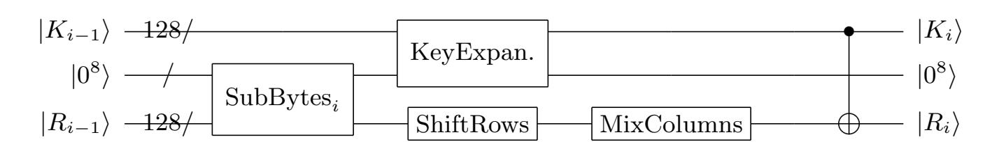

**Fig. 15.** The implementation of the *i*-th round (i.e.,  $R_i$ ) of AES-128 (i > 1). SubBytesi implements the SubBytes in  $R_i$  with the S-box circuit for  $C_4$ .

At last, combining the quantum circuit in Figure 14 and Figure 15, we can obtain the quantum circuit of implementing AES-128. Similarly, the quantum circuit of AES-192/-256 can be implemented with 334/398 qubits, respectively. Table 7 gives the quantum resources required for implementing AES. Obviously, our improved quantum circuits of S-box result in a reduction of the number of qubits.

Remark 5. We can make a trade-off between the number of qubits and Toffolidepth. From Figure 7 and Figure 10, it can be seen that the number of ancilla qubits required for two S-box circuit for  $C_2$  is the same as the number of ancilla qubits required for one S-box circuit for  $C_4$ . We regard two parallel circuit for  $C_2$  as a whole circuit, and call such circuit and  $C_4$ , double-width S-box circuit-

{18}------------------------------------------------

|         |      |     |       |        |      | Algorithm Scheme #qubits #Toffoli #CNOT #NOT Toffoli depth |
|---------|------|-----|-------|--------|------|------------------------------------------------------------|
| AES-128 | ours | 264 | 16688 | 53360  | 1072 | 12168                                                      |
|         | [24] | 270 | 16508 | 81652  | 1072 | 11008                                                      |
|         | ours | 328 | 16664 | 53496  | 1072 | 1472                                                       |
|         | [25] | 374 | 17888 | 126016 | 2528 | 1558                                                       |
| AES-192 | Ours | 328 | 19328 | 60736  | 1160 | 14496                                                      |
|         | [24] | 334 | 19196 | 94180  | 1160 | 13144                                                      |
| AES-256 | Ours | 392 | 23480 | 74472  | 1367 | 17412                                                      |
|         | [24] | 398 | 23228 | 114476 | 1367 | 15756                                                      |

**Table 7.** Quantum resources for implementing AES.

s. In this case, 18 double-width S-box circuits are required in constructing the SubBytes and SubWord of *Ri* (*i >* 1). If *p* double-width S-box circuits is implemented in parallel (*p* divided by 18, i.e., *p* = 1*,* 2*,* 3*,* 6*,* 9*,* 18), the number of qubits required for AES-128 will be 256 + 8*p*.

- **–** When *p* = 1, the quantum circuit of implementing AES-128 can be obtained by combining Figure 14 and Figure 15;
- **–** When *p >* 1, the Toffoli-depth of constructing the SubBytes and SubWord in *Ri* (*i >* 1) becomes 78 *×* 18*/p* = 1404*/p*.
  - *•* When *p* = 2, the depth of S-box circuit for *C*1 in constructing the Sub-Bytes of *R*1 is 3, i.e, the Toffoli-depth is 32 *×* 3 = 96. And the depth of S-box circuit for *C*2 in constructing the SubWord of round key *K*1 becomes 1, i.e., the Toffoli-depth is 42. Thus, *R*1 is implemented with a Toffoli-depth of 138;
  - *•* When *p* = 3 or 6, the Toffoli-depth of SubBytes in constructing *R*1 is 32 *×* 2 = 64. And the Toffoli-depth of SubWord in constructing the round key *K*1 becomes 36. Thus, *R*1 is implemented with a Toffoli-depth of 100. Here, the SubWord is constructed with the S-box circuit for *C*2 in Ref. [24] because it requires lower Toffoli-depth and the ancilla qubits is also sufficient at this time;
  - *•* When *p* = 9 or 18, the Toffoli-depth of SubBytes in constructing *R*1 is 32. And the Toffoli-depth of SubWord in constructing the round key *K*1 becomes 36. Thus, *R*1 is implemented with a Toffoli-depth of 68. Figure 7 also gives the quantum resources required of AES-128 when *p* = 9.

# **6 Conclusion**

In this study, we set a new record of the number of qubits required to synthesize the quantum circuit of AES. First, we find a method to realize the quantum circuit of AES S-box with the help of automation tool LIGHTER-R. Specifically, the main part of S-box, i.e., the multiplicative inversion in *F*2 8 , is computed 

{19}------------------------------------------------

through the multiplicative inversion (and multiplication) in *F*2 4 , then the quantum circuit implementation of the latter is obtained by the tool LIGHTER-R. Based on this, the quantum circuits of S-box for *C*1 : *|a⟩|***0***⟩ → |a⟩|S*(*a*)*⟩* and *C*2 : *|a⟩|b⟩ → |a⟩|b ⊕ S*(*a*)*⟩* are constructed with 20 qubits instead of 22 in the previous studies respectively. Second, by introducing new techniques, we reduce the number of qubits required by the S-box circuit for *C*4 : *|a⟩ → |S*(*a*)*⟩* from 22 in the previous studies to 16. At last, by applying these S-box circuits for *C*1, *C*2 and *C*4, we synthesize the quantum circuits of AES-128/-192/-256 with 264/328/392 qubits instead of 270/334/398 in the previous studies.

Some inspirations can be drawn from our results. On the one hand, automated tools, for example the LIGHTER-R, should be fully utilized. On the other hand, similar to our circuit for *|a⟩ → |S*(*a*)*⟩*, we should design the goal circuit directly as far as possible instead of using the previous trivial method, i.e., connecting two circuits. Particularly, since other symmetric ciphers (such as S-M4 and Camellia) also use a similar S-box, their quantum circuits might be optimized by our methods.

#### **Acknowledgements**

This work is supported by National Natural Science Foundation of China (Grant Nos. 61972048, 62272056, 61976024) and Henan Key Laboratory of Network Cryptography Technology (LNCT2021-A10).

# **References**

- 1. Aram W Harrow, Avinatan Hassidim, and Seth Lloyd. Quantum algorithm for linear systems of equations. *Physical Review Letters*, 103(15):150502, 2009.
- 2. Linchun Wan, Chaohua Yu, Shijie Pan, Fei Gao, Qiaoyan Wen, and Sujuan Qin. Asymptotic quantum algorithm for the toeplitz systems. *Physical Review A*, 97(6):062322, 2018.
- 3. Hailing Liu, Yusen Wu, Linchun Wan, Shijie Pan, Sujuan Qin, Fei Gao, and Qiaoyan Wen. Variational quantum algorithm for the poisson equation. *Physical Review A*, 104(2):022418, 2021.
- 4. Seth Lloyd, Masoud Mohseni, and Patrick Rebentrost. Quantum algorithms for supervised and unsupervised machine learning. arXiv preprint arXiv:1307.0411, 2013.
- 5. Nathan Wiebe, Daniel Braun, and Seth Lloyd. Quantum algorithm for data fitting. *Physical Review Letters*, 109(5):050505, 2012.
- 6. Patrick Rebentrost, Masoud Mohseni, and Seth Lloyd. Quantum support vector machine for big data classification. *Physical Review Letters*, 113(13):130503, 2014.
- 7. Zekun Ye, Lvzhou Li, Haozhen Situ, and Yuyi Wang. Quantum speedup for twin support vector machines. *arXiv preprint arXiv:1902.08907*, 2019.
- 8. Qingyu Li, Yuhan Huang, Shan Jin, Xiaokai Hou, and Xiaoting Wang. Quantum spectral clustering algorithm for unsupervised learning. arXiv preprint arXiv:2203.03132, 2022.
- 9. Seth Lloyd, Masoud Mohseni, and Patrick Rebentrost. Quantum principal component analysis. *Nature Physics*, 10(9):631–633, 2014.

{20}------------------------------------------------

- 10. Iris Cong and Luming Duan. Quantum discriminant analysis for dimensionality reduction and classification. *New Journal of Physics*, 18(7):073011, 2016.
- 11. Shijie Pan, Linchun Wan, Hailing Liu, Qingle Wang, Sujuan Qin, Qiaoyan Wen, and Fei Gao. Improved quantum algorithm for a-optimal projection. *Physical Review A*, 102(5):052402, 2020.
- 12. Chaohua Yu, Fei Gao, Song Lin, and Jingbo Wang. Quantum data compression by principal component analysis. *Quantum Information Processing*, 18(8):1–20, 2019.
- 13. Guoming Wang. Quantum algorithm for linear regression. *Physical Review A*, 96(1):012335, 2017.
- 14. Chaohua Yu, Fei Gao, and Qiaoyan Wen. An improved quantum algorithm for ridge regression. *IEEE Transactions on Knowledge and Data Engineering*, 33(3):858– 866, 2019.
- 15. Chaohua Yu, Fei Gao, Qingle Wang, and Qiaoyan Wen. Quantum algorithm for association rules mining. *Physical Review A*, 94(4):042311, 2016.
- 16. Nana Liu and Patrick Rebentrost. Quantum machine learning for quantum anomaly detection. *Physical Review A*, 97(4):042315, 2018.
- 17. Mingchao Guo, Hailing Liu, Yongmei Li, Wenmin Li, Fei Gao, Sujuan Qin, and Qiaoyan Wen. Quantum algorithms for anomaly detection using amplitude estimation. *Physica A: Statistical Mechanics and its Applications*, 604:127936, 2022.
- 18. Peter W. Shor. Polynomial-time algorithms for prime factorization and discrete logarithms on a quantum computer. *SIAM Journal on Computing*, 26(5):1484– 1509, 1997.
- 19. Lov K Grover. A fast quantum mechanical algorithm for database search. In Gary L. Miller, editor, *Proceedings of the twenty-eighth annual ACM symposium on Theory of computing*, pages 212–219, New York, NY, USA, 1996. ACM.
- 20. Daniel R Simon. On the power of quantum computation. *SIAM journal on computing*, 26(5):1474–1483, 1997.
- 21. Daemen Joan and Rijmen Vincent. Specification for the advanced encryption standard (aes). *FIPS 197*, 2001.
- 22. NIST. Submission requirements and evaluation criteria for the post-quantum cryptography standardization process. 2016.
- 23. Samuel Jaques, Michael Naehrig, Martin Roetteler, and Fernando Virdia. Implementing grover oracles for quantum key search on aes and lowmc. In Anne Canteaut and Yuval Ishai, editors, *Advances in Cryptology – EUROCRYPT 2020*, pages 280–310, Cham, 2020. Springer.
- 24. Zhenqiang Li, Binbin Cai, Hongwei Sun, Hailing Liu, Linchun Wan, Sujuan Qin, Qiaoyan Wen, and Fei Gao. Novel quantum circuit implementation of advanced encryption standard with low costs. *Science China Physics, Mechanics* & *Astronomy*, 65(9):1–16, 2022.
- 25. Zhenyu Huang and Siwei Sun. Synthesizing quantum circuits of aes with lower t-depth and less qubits. Cryptology ePrint Archive, Paper 2022/620, 2022.
- 26. Markus Grassl, Brandon Langenberg, Martin Roetteler, and Rainer Steinwandt. Applying grover's algorithm to aes: Quantum resource estimates. In Tsuyoshi Takagi, editor, *Post-Quantum Cryptography*, pages 29–43, Cham, 2016. Springer.
- 27. Mishal Almazrooie, Azman Samsudin, Rosni Abdullah, and Kussay N Mutter. Quantum reversible circuit of aes-128. *Quantum Information Processing*, 17(5):1– 30, 2018.
- 28. Brandon Langenberg, Hai Pham, and Rainer Steinwandt. Reducing the cost of implementing the advanced encryption standard as a quantum circuit. *IEEE Transactions on Quantum Engineering*, 1:1–12, 2020.

{21}------------------------------------------------

- 29. Jian Zou, Zihao Wei, Siwei Sun, Ximeng Liu, and Wenling Wu. Quantum circuit implementations of aes with fewer qubits. In Shiho Moriai and Huaxiong Wang, editors, *Advances in Cryptology – ASIACRYPT 2020*, pages 697–726, Cham, 2020. Springer.
- 30. Zeguo Wang, Shijie Wei, and Guilu Long. A quantum circuit design of aes requiring fewer quantum qubits and gate operations. *Frontiers of Physics*, 17(4):1–7, 2022.
- 31. Vishnu Asutosh Dasu, Anubhab Baksi, Sumanta Sarkar, and Anupam Chattopadhyay. Lighter-r: optimized reversible circuit implementation for sboxes. In *2019 32nd IEEE International System-on-Chip Conference (SOCC)*, pages 260–265. IEEE, 2019.
- 32. Peter Selinger. Quantum circuits of t-depth one. *Physical Review A*, 87(4):042302, 2013.
- 33. Matthew Amy, Dmitri Maslov, Michele Mosca, and Martin Roetteler. A meetin-the-middle algorithm for fast synthesis of depth-optimal quantum circuits. *IEEE Transactions on Computer-Aided Design of Integrated Circuits and Systems*, 32(6):818–830, 2013.
- 34. Johannes Wolkerstorfer, Elisabeth Oswald, and Mario Lamberger. An asic implementation of the aes sboxes. In Bart Preneel, editor, *Topics in Cryptology - CT-RSA 2002*, pages 67–78, Berlin, Heidelberg, 2002. Springer.
- 35. P Saravanan and P Kalpana. Novel reversible design of advanced encryption standard cryptographic algorithm for wireless sensor networks. *Wireless Personal Communications*, 100(4):1427–1458, 2018.
- 36. Doyoung Chung, Seungkwang Lee, Dooho Choi, and Jooyoung Lee. Alternative tower field construction for quantum implementation of the aes s-box. *IEEE Transactions on Computers*, 71(10):2553–2564, 2022.
- 37. Joan Boyar and Ren´e Peralta. A new combinational logic minimization technique with applications to cryptology. In Paola Festa, editor, *Experimental Algorithms*, pages 178–189, Berlin, Heidelberg, 2010. Springer.
- 38. Kyungbae Jang, Gyeongju Song, Hyunji Kim, and Hwajeong Seo. Grover on simplified aes. In *2021 IEEE International Conference on Consumer Electronics-Asia (ICCE-Asia)*, pages 1–4. IEEE, 2021.
- 39. Kyungbae Jang, Gyeongju Song, Hyunjun Kim, Hyeokdong Kwon, Hyunji Kim, and Hwajeong Seo. Efficient implementation of present and gift on quantum computers. *Applied Sciences*, 11(11):4776, 2021.
- 40. Anubhab Baksi, Kyungbae Jang, Gyeongju Song, Hwajeong Seo, and Zejun Xiang. Quantum implementation and resource estimates for rectangle and knot. *Quantum Information Processing*, 20(12):1–24, 2021.
- 41. Matthew Amy, Olivia Di Matteo, Vlad Gheorghiu, Michele Mosca, Alex Parent, and John Schanck. Estimating the cost of generic quantum pre-image attacks on sha-2 and sha-3. In Roberto Avanzi and Howard Heys, editors, *Selected Areas in Cryptography – SAC 2016*, pages 317–337, Cham, 2017. Springer.
- 42. Zejun Xiang, Xiangyoung Zeng, Da Lin, Zhenzhen Bao, and Shasha Zhang. Optimizing implementations of linear layers. *IACR Transactions on Symmetric Cryptology*, 2020(2):120–145, 2020.