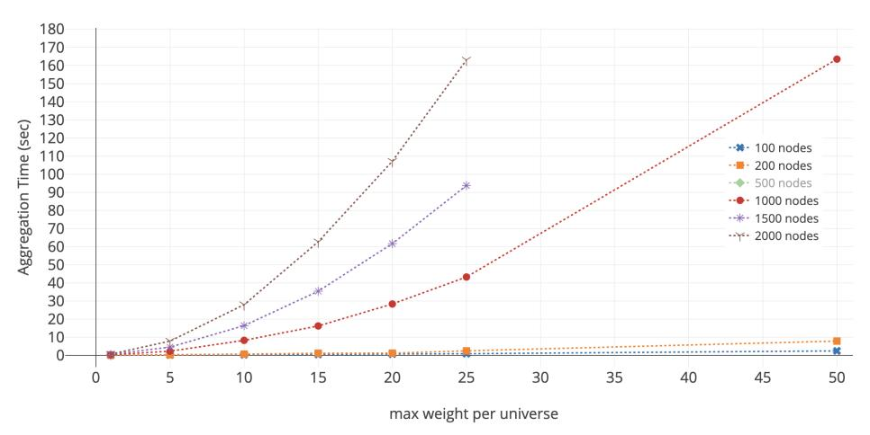

{0}------------------------------------------------

# Threshold Signatures in the Multiverse

Leemon Baird‡, Sanjam Garg\*§, Abhishek Jain†, Pratyay Mukherjee¶, Rohit Sinha‡‡, Mingyuan Wang\*, Yinuo Zhang\*

\* UC Berkeley † Johns Hopkins University ‡ Swirlds Labs § NTT Research ¶ Supra ‡‡ Meta

Abstract—We introduce a new notion of multiverse threshold signatures (MTS). In an MTS scheme, multiple universes – each defined by a set of (possibly overlapping) signers, their weights, and a specific security threshold – can co-exist. A universe can be (adaptively) created via a non-interactive asynchronous setup. Crucially, each party in the multiverse holds constant-sized keys and releases compact signatures with size and computation time both independent of the number of universes. Given sufficient partial signatures over a message from the members of a specific universe, an aggregator can produce a short aggregate signature relative to that universe.

We construct an MTS scheme building on BLS signatures. Our scheme is practical, and can be used to reduce bandwidth complexity and computational costs in decentralized oracle networks. As an example data point, consider a multiverse containing 2000 nodes and 100 universes (parameters inspired by Chainlink's use in the wild), each of which contains arbitrarily large subsets of nodes and arbitrary thresholds. Each node computes and outputs 1 group element as its partial signature; the aggregator performs under 0.7 seconds of work for each aggregate signature, and the final signature of size 192 bytes takes 6.4 ms (or 198K EVM gas units) to verify. For this setting, prior approaches, when used to construct MTS, yield schemes that have one of the following drawbacks: (i) partial signatures that are  $48 \times$  larger, (ii) have aggregation times 311 $\times$  worse, or (iii) have signature size 39 $\times$  and verification gas costs 3.38× larger. We also provide an opensource implementation and a detailed evaluation.

#### I. INTRODUCTION

A threshold signature scheme [25], [26] allows for distributing a secret signing key among multiple parties such that each party can (non-interactively) generate a partial signature over any message m using its key share.2 Given sufficiently many partial signatures, an un-

1The second author was supported in part by DARPA under Agreement No. HR00112020026, AFOSR Award FA9550-19-1-0200, NSF CNS Award 1936826, and research grants by the Sloan Foundation, and Visa Inc. The third author was supported in part by NSF CNS-1814919, NSF CAREER 1942789, Johns Hopkins University Catalyst award, AFOSR Award FA9550-19-1-0200, Office of Naval Research Grant N00014-19-1-2294, JP Morgan Faculty Award, and research gifts from Ethereum, Stellar and Cisco. Any opinions, findings and conclusions, or recommendations in this material are those of the authors and do not necessarily reflect the views of the United States Government or DARPA. Part of the work was done when the fourth, fifth, and seventh authors were at Swirlds Labs, and the third author visited UC Berkeley.

2Our work primarily focuses on non-interactive signing. We remark that some threshold signature schemes only support interactive signing.

trusted aggregator can combine them into a compact signature attesting that a threshold number of signers signed m. Threshold signatures have seen widespread use in recent years, especially within the blockchain ecosystem [43]. Furthermore, efforts to standardize threshold cryptosystems have already begun [39].

Threshold signatures have traditionally been studied in a static setting where the signers and the threshold are fixed and all verifiers have the *same* belief (i.e., trust) in the signers. However, as we discuss shortly, emerging applications in blockchains involve verifiers who do *not* necessarily share the same beliefs. In particular, each verifier might live in its own *universe*, where it trusts only a specific subset of signers and wishes to choose its own security threshold. We ask whether it is possible to design threshold signature schemes where multiple such universes can co-exist.

A naïve approach to handle this scenario involves simply executing a fresh instance of a threshold signature scheme for each universe. This, however, leads to highly impractical solutions even for modest choices of parameters (see discussion later in this section). The main goal of our work is to address this scalability challenge.

Multiverse Threshold Signatures. We introduce a new notion of *multiverse threshold signatures* (MTS), where at any time, a verifier can define a new *universe* containing any subset of the parties present in the system. The *multiverse* is the set of all such (possibly overlapping) universes with possibly different security thresholds. A party signs a message irrespective of what (or how many) universes it is in, and an aggregator can take a threshold number of partial signatures corresponding to a universe and produce a short aggregate signature (independent of the size of the universe) that can be verified under the specific universe's verification key.

An MTS scheme must satisfy the following properties:

- 1) **non-interactive setup**: a universe involving any set of parties can be setup via a non-interactive protocol.
- 2) **compact keys**: each party's state is oblivious to the universes that it belongs to. In particular, each party's key material (and state) is independent of the number of universes that it participates in.
- 3) **compact partial signatures**: each party's partial sig-

{1}------------------------------------------------

nature is compact, i.e., it is independent of the number of universes the party belongs to. In particular, its partial signature should be *reusable* for computing aggregate signatures across different universes.

4) fast aggregation and verification: it should take constant time to verify an aggregated signature for any universe. In the best case, aggregation will be linear in the number of partial signatures – we require that this aggregation be concretely efficient.

The security requirements are similar to that of standard threshold signatures. Namely, we require that an aggregate signature associated with a universe can only be verified when a threshold number of parties in that universe have signed the corresponding message.

Our multiverse model is inspired by an important scaling issue that arises in oracle networks for smart contracts, which rely heavily on threshold signatures.

Application: Decentralized Oracle Networks. Oracles enable smart contracts to perform transactions based on off-chain data, such as issuing DeFi transactions based on the exchange rate of tokens or automatically protecting user funds during an undercollateralization event (e.g., unforeseen fractional reserve practices from offchain custodians [\[1\]](#page-13-4)). In Chainlink [\[19\]](#page-13-5), [\[27\]](#page-13-6),[3](#page-1-0) whenever the data feed's value (e.g., MKR/ETH exchange rate) fluctuates beyond a limit, the oracle nodes collectively agree on a new value to submit on-chain along with a threshold signature that is verified by the smart contract.

Historically, smart contract authors have shared the same data feed, whenever possible, typically to offset high gas costs on platforms such as Ethereum. However, with substantially higher throughput and lower fees on the next generation of smart contract platforms, and with the increased set of applications with diverse security and cost profiles, the one-size-fits-all approach is no longer adequate. For instance, contracts that perform autonomous real-time auditing of collateral prefer the (proof-of-reserve [\[1\]](#page-13-4)) data feed to be fulfilled by a set of highly reputed and rigorously audited oracle nodes [\[6\]](#page-13-7); such contracts may also choose higher thresholds for the signature. On the opposite end of the spectrum, contracts with lower security needs (e.g., sports betting) may opt for lower-cost oracle nodes and latency-sensitive applications may choose highly available nodes, or opt for lower security thresholds for the signatures. Indeed, Chainlink's users already have the appropriate knobs – i.e., choice of oracle nodes (with reputation scores), signing threshold, etc. This scenario naturally maps to our multiverse setting since each separate preference can be modeled as a separate universe with a specific subset of all nodes and a specific threshold.

As signature verification is done by a smart contract, it places additional efficiency requirements for MTS. In particular, we need the verification EVM gas costs to be small.

Drawbacks of existing approaches. While the notion of MTS is new to this paper, we observe the drawbacks of existing approaches in realizing MTS. As discussed earlier, a na¨ıve approach for the multiverse setting can be obtained by implementing an independent copy of a threshold signature scheme for every universe. It is not hard to see, however, that such a solution quickly runs into scalability issues. A node that belongs to n different universes would need to use n different signing keys to sign the same message n-many times, generating n-many partial signatures, which are then broadcast to the aggregator. Hence, the state size, signature size, and computation all scale linearly with n. Consider some data points based on the metrics reported by ChainLink. For example, even with 20 universes, and each universe spanning an average of 500 (active) nodes who will sign the message, an aggregator receives 0.46 MB worth of partial signatures, for a single message (data feed), or more challengingly, nearly 1 GB traffic for over 2000 data feeds served by the Chainlink network[4](#page-1-1) . This is for a single message! This approach quickly exhausts bandwidth on a peer-to-peer network. The problem becomes completely unmanageable in the weighted setting,[5](#page-1-2) as both the network traffic and the signer's computation are linear in the weights.

To avoid such scaling issues, one can devise an alternative solution by using succinct non-interactive arguments of knowledge (SNARK) [\[11\]](#page-13-8), [\[12\]](#page-13-9). The highlevel idea is to design an aggregator who computes a SNARK attesting to having witnessed a threshold number of signatures over a message. This approach, however, yields prohibitive aggregation costs. Even using state-of-the-art SNARKs (such as PLONK [\[29\]](#page-13-10)) and the most efficient signature schemes such as EdDSA [\[10\]](#page-13-11) results in aggregation time in the order of a few minutes for modest choices of parameters (see Section [VI\)](#page-10-0). Moreover, even such performance numbers are only possible when we instantiate EdDSA with SNARK-friendly hash functions such as MiMc [\[7\]](#page-13-12), whose security is not well-understood. Finally, we note that this approach inherently makes non-black-box use of the hash function

3At the time of writing, Chainlink is the largest oracle network, comprising over 300 participant nodes, serving over 2000 data feeds, and generating over \$4.5M USD in monthly revenue for the participants.

4 In Chainlink's protocol [\[19\]](#page-13-5), for each message to be signed, there is a single leader who prepares the message and requests all nodes (that are supporting the relevant price feed, for instance) to sign it.

5 In a weighted setting, instead of a T out of N access structure, parties are assigned different weights, and aggregation is possible only when partial signatures are produced by parties whose combined weight is larger or equal to the threshold. A special case of this is the standard threshold setting, in that each party has equal weight.

{2}------------------------------------------------

and therefore does not yield a security proof in the Random Oracle Model.

We also consider the Micali et. al.'s [\[38\]](#page-13-13) SNARK approach specialized to the signature setting for obtaining smaller aggregation times. However, this reduction in aggregation time is at the cost of a larger signature size and an increase in the verification gas cost, which is undesirable for our application.

Finally, one may wonder if multisignatures [\[14\]](#page-13-14), [\[37\]](#page-13-15) can be used to construct multiverse threshold signatures. In particular, every party samples its own public key/secret key pair; the public key of each universe would be the public keys of all the users in the universe. To aggregate partial signatures, the aggregator generates a multisignature[6](#page-2-0) on all the partial signatures to certify that enough parties from the universe sign the message. The apparent advantages of this approach are that: 1) a party's private key is oblivious to the universes that it belongs to; 2) there is no setup phase; and, 3) in the weighted setting, the aggregator's computation is independent of weights, providing off-chain scalability in the case of oracle networks. However, the multisig approach has prohibitive performance and cost concerns on the verification side. For instance, the aggregated signature itself needs to contain the information regarding which set of parties have signed; thus, the signature size is linear in the universe size. On that note, the universe's public verification key and the verification time also grow linearly in the size of the universe. In the case of oracle networks, these drawbacks make the smart contract prohibitively expensive; on Ethereum, it takes up to 60 million gas to set up the smart contract for 2000 signers, which is prohibitive. We provide a cost analysis for the multisignature-based approach (on Ethereum smart contracts) in Section [VI.](#page-10-0)

Advantages of MTS. We now describe how the efficiency features of MTS can help address the shortcomings of existing approaches. Recall that while selecting a data feed, a smart contract specifies an access structure, which includes the set of oracle nodes, their weights, and a threshold. Hence, a data feed maps to a universe, wherein the highly reputed oracle nodes would typically be members of a large number of universes.

The compact partial signatures property of MTS addresses the bandwidth concern: the bandwidth reduces from 1 GB to 1 MB for the data point discussed above. Second, regardless of the node's weight or the number of smart contracts (universes), each node must only keep a compact key of size the security parameter κ = 128 bits, and does not require any information about its universes during signing. Finally, due to the noninteractive asynchronous setup property, nodes can go offline without being penalized (though economic incentives encourage honest participation); that is, a node can come online and participate in a universe's creation independently of other nodes. Compare this to the setup for BLS, where parties engage in an interactive DKG protocol [\[24\]](#page-13-16), [\[33\]](#page-13-17). The signing phase is identical to BLS, so parties operate non-interactively, and a threshold number of correct participants is sufficient to construct an aggregate signature. We stress that having a compact state and a non-interactive setup not only makes the system efficient, but also greatly simplifies its design.

Our Contribution. The contribution of this work is two-fold: we first present formal definitions of multiverse threshold signatures. Second, we give the first construction of an MTS scheme building on the BLS signature. We prove that our scheme satisfies existential unforgeability based on the knowledge of exponent assumption [\[23\]](#page-13-18). We provide an open-source implementation of our scheme at [http://github.com/rsinha/mts.](http://github.com/rsinha/mts) We then present a detailed evaluation of our MTS scheme, where we show that it is practical for application to decentralized oracle networks.

# II. TECHNICAL OVERVIEW

In this section, we give a high-level overview of our construction of the BLS-based [\[16\]](#page-13-19) multiverse threshold signature scheme. For simplicity, the presentation in this section only considers the unweighted setting, but it naturally extends to the weighted setting.

## *A. The Multiverse Model*

A multiverse is a possibly overlapping set of universes each containing an arbitrary subset of all parties {P1, P2, . . .} in the system and a specific threshold. When a new party Pi enters the system, it chooses a private key ski and publishes the corresponding public key pki . Then, the online parties engage in a separate setup phase for each universe, where each party independently contributes randomness to the public parameters unique to that universe. Once a universe is set up, it can be used to produce threshold signatures. During signing, each party Pi uses its private key ski to sign a message m, and the partial signature is broadcasted or sent to an aggregator – this step is totally agnostic of any universe. For each universe, there is a separate aggregating procedure which combines the partial signatures for that particular universe. Crucially, the partial signatures are "reusable" so that the same partial signature can be used in an unlimited number of aggregation procedures across multiple universes to produce many signatures on the same message. Each aggregated signature verifies only with respect to a specific universe.

6Note that this aggregate signature is not unique, as any multisignature aggregated from enough partial signatures will pass verification.

{3}------------------------------------------------

The setup phase can happen concurrently with other setups or signing phases. Moreover, both the setup and signing phases are fully asynchronous and non-interactive, and they require honest participation from only a threshold (say, T) number of parties.

We emphasize that, in our model, we do not assume the aggregator to be honest for unforgeability.

#### B. Construction

**Background on Threshold BLS.** We start by recalling the standard threshold BLS signature scheme. Let G be a group with a prime order p and a generator g where the standard pairing-based assumption holds. Let H be a cryptographic hash function that maps messages to group elements. In the threshold BLS signature scheme, there is a setup phase, in that a random secret key  $\mathsf{sk} \leftarrow \mathbb{F}_p$  is sampled and shared among the parties using Shamir secret sharing for a threshold T; the public key is set to be  $pk = g^{sk}$ . Let  $sk_i$  be party-i's share. To ensure complete decentralization the setup is implemented by an interactive distributed key generation (DKG) protocol such as [33]. To sign a message m, party i uses  $sk_i$  to compute  $H(m)^{sk_i}$  as its (partial) signature. Given at least T signatures  $\{H(m)^{sk_i}\}_i$ , one can simply use Lagrange interpolation to compute the aggregated threshold signature  $H(m)^{sk}$ , which verifies as  $e(\mathsf{pk}, H(m)) = e(g, H(m)^{\mathsf{sk}}).$ 

Extending Threshold BLS to the Multiverse. To extend this scheme from a single universe to a multiverse setting, one encounters several roadblocks. First, a naïve approach is to simply repeat the threshold BLS for every universe. That is, to create a new universe, involving parties will engage in a fresh instance of the DKG protocol to generate new secret shares of this new universe. As mentioned before, this runs into a scalability issue as for each party the size of the secret key, the computation, and the corresponding signatures all grow linearly with the number of universes. Recall that, we need our signatures to be generated independently of any universe. However, it appears hard to achieve if the setup phase generates correlated shares of the secret-keys – this makes the individual secret-key shares compatible only with one public-key and hence one universe. Therefore we change the setup phase in a way, which ensures that the individual secret-keys are compatible with different public-keys.

Our Approach. We let each party pick its own secret key *independently* and publish the corresponding public-key. Then each universe combines a different combination of the public-keys to compute a universe-specific public-key. In more detail, suppose a universe consists of parties  $P_1, P_2, \ldots, P_N$  with a threshold T. Then each party  $P_i$  chooses an independent secret-key

ski  $\leftarrow \mathbb{F}_p$  and publishes the public-key  $\mathsf{pk}_i = g^{\mathsf{sk}_i}$ . Note that the secret keys  $\mathsf{sk}_1, \ldots, \mathsf{sk}_N$  implicitly defines a degree-(N-1) polynomial f (hidden from all parties) where  $f(i) = \mathsf{sk}_i$ . Moreover, any evaluation of this polynomial, and in particular the verification key  $\mathsf{pk} = g^{f(0)}$ , can be constructed via Lagrange interpolation in the exponent. Now, we notice that if N-T points on this polynomial f are somehow made public, this effectively reduces the degree of the polynomial f from N-1 to T-1. For instance, suppose  $f(-1), f(-2), \ldots, f(-(N-T))$  are publicly known. Then, given any T signatures  $\{H(m)^{\mathsf{sk}_i}\}_i$ , an aggregator can compute  $H(m)^{f(-1)}, \ldots, H(m)^{f(-(N-T))}$  locally and subsequently is able to compute the aggregated signatures  $\sigma = H(m)^{f(0)}$ .

Although this approach works for a single universe, it breaks down when used directly in a multiverse setting. The crux of the problem stems from the fact that since the evaluations for different polynomials (corresponding to different universes) collide, it ends up revealing too many linear equations. Let us elaborate with an example. Consider four parties among which  $P_1$  and  $P_2$  are honest, but  $P_3$  and  $P_4$  are controlled by the adversary. Now consider a universe U that consists of  $P_1, P_2, P_3$  and has a threshold 2, which means the evaluation  $f_U(-1)$ is public where  $f_U$  is the secret degree-2 polynomial corresponding to universe U. Again, assume another universe U' consisting of  $P_1, P_2$  and  $P_4$  with threshold 2 – this implies the point  $f_{U'}(-1)$  of polynomial  $f_{U'}$  is also public. Now note that, since  $f_U(-1)$  and  $f_{U'}(-1)$ each reveal one linear relation about the honest party's secret keys sk1 and sk2, the malicious parties could potentially use them to reconstruct sk1 and sk2 entirely!

To resolve this issue in the multiverse setting, we refrain from publishing additional points explicitly to reduce the threshold, but instead change how verification works and use the additional points in the exponent (which, as mentioned above, everyone can compute from the public keys). Without loss of generality, suppose that  $P_1, P_2, \ldots, P_T$  sign a message m. Each party  $P_i$  publishes  $H(m)^{f(i)}$  as a partial signature. Additionally, one can compute the public points  $g^{f(j)}$  for  $j \in \{-1, -2, \ldots\}$ . The challenge is now to use these together to ensure verification as well as unforgeability.

&lt;sup>7For instance, by Lagrange interpolation over degree-2 polynomial, we have f(-1) = 6f(1) - 8f(2) + 3f(3). In the first universe with ordering  $P_1, P_2, \widetilde{P}_3$ , the adversary learns  $6\mathsf{sk}_1 - 8\mathsf{sk}_2$ . In the second universe with ordering  $\widetilde{P}_4$ ,  $P_1$ , and  $P_2$ , it learns  $-8\mathsf{sk}_1 + 3\mathsf{sk}_2$ . In any field  $\mathbb{F}$ , where (6, -8) and (-8, 3) are linearly independent, the adversary could fully reconstruct  $\mathsf{sk}_1$  and  $\mathsf{sk}_2$ .

{4}------------------------------------------------

To see this, we first express the secret key as follows:

$$f(0) = \underbrace{\lambda_{-1} f(-1) + \dots + \lambda_{-(N-T)} f(-(N-T))}_{\text{Public Points}} + \underbrace{\lambda_{1} f(1) + \dots + \lambda_{T} f(T)}_{\text{Partial Signatures}},$$

where the  $\lambda_i$ 's are the appropriate Lagrange coefficients. For the ease of notation, let us write  $f(0) = f^{\mathsf{pub}}(0) + f^{\mathsf{par}}(0)$ , where  $f^{\mathsf{pub}}(0)$  stands for the public points part and  $f^{\mathsf{par}}(0)$  stands for the partial signature part. We observe that

$$\begin{split} e\left(g,H(m)^{f(0)}\right) &= e\left(g,H(m)^{f^{\mathsf{pub}}(0)+f^{\mathsf{par}}(0)}\right) \\ &= e\left(g^{f^{\mathsf{pub}}(0)},H(m)\right) \cdot e\left(g,H(m)^{f^{\mathsf{par}}(0)}\right). \end{split}$$

Therefore, the verification procedure could check

$$e\left(\frac{\mathsf{pk}}{\sigma^{\mathsf{pub}}}, H(m)\right) = e(g, \sigma^{\mathsf{par}}),$$
 (1)

where the aggregator computes the threshold signature  $\sigma^{\rm par}=H(m)^{f^{\rm par}(0)}$  from the partial signatures and the verifier later computes  $\sigma^{\rm pub}=g^{f^{\rm pub}(0)}$  from the public points. Note that, both these computations require the knowledge of participating sets (as Langrage coefficients depend on that information). This becomes a problem for the verifier, as by definition threshold signature verification should be agnostic about the participating sets. Furthermore, the verification procedure needs to perform O(N) amount of work to compute  $\sigma^{\rm pub}$  incurring significant computation cost.

A potential way to resolve this issue could be to ask the aggregator to also compute  $\sigma^{\text{pub}}$ . The verifier would then verify the aggregated signature  $(\sigma^{\text{pub}}, \sigma^{\text{par}})$  by checking Equation 1. However, one can see that this construction is not secure. Note that for any  $\alpha \in \mathbb{F}_p$ ,

$$\left(\sigma^{\mathrm{pub}},\sigma^{\mathrm{par}}\right) = \left(\mathrm{pk}\cdot g^{-\alpha}\,,\,H(m)^{\alpha}\right)$$

is a signature that will pass Equation 1 violating unforgeability completely. This attack is due to the fact that  $\sigma^{\text{pub}}$  is not the correct aggregation of the public points. Rather, the adversary intentionally picks  $\sigma^{\text{pub}}$  such that it knows the exponent of  $pk/\sigma^{\text{pub}}$ , namely,  $\alpha$ .

Our construction handles this issue via a different route. During the setup of a universe, we ask the parties to engage in a one-round protocol to collectively raise the public points to some random power  $k \in \mathbb{F}_p$ . In particular, we ask party  $P_i$  to pick a random  $k_i \leftarrow \mathbb{F}_p$  and send

$$g^{k_i}, \left(\left(g^{f(-1)}\right)^{k_i}, \left(g^{f(-2)}\right)^{k_i}, \dots, \left(g^{f(-(N-T))}\right)^{k_i}\right).$$

The final public parameter pp of the universe shall be

$$\left(g^k, \left(\left(g^{f(-1)}\right)^k, \left(g^{f(-2)}\right)^k, \dots, \left(g^{f(-(N-T))}\right)^k\right)\right)$$

where  $k = \sum_{i} k_{i}$ . An aggregator now additionally computes  $\sigma_{1}^{\text{pub}}$  that needs to pass a second verification equation:

$$e(\sigma^{\mathsf{pub}}, g^k) = e(\sigma_1^{\mathsf{pub}}, g). \tag{2}$$

This check ensures that as long as  $\sigma^{\text{pub}}$  is a linear combination of the public points, one can compute  $\sigma_1^{\text{pub}}$  by using the same linear combination on the public parameter. Alternatively, if  $\sigma^{\text{pub}}$  is not a linear combination of the public points, one can not find the unique  $\sigma_1^{\text{pub}}$  that passes Equation 2 except with negligible probability. Unforgeability follows from the fact that as long as  $\sigma^{\text{pub}}$  is a linear combination of the public points, the adversary never knows the exponent of pk/ $\sigma^{\text{pub}}$  and without knowing that one can not forge a signature. Hence, we prove existential unforgeability assuming a variant of the widely used *knowledge of exponent* assumption [23].

The above modification leads to a one-round setup phase. However, this also requires a stateful aggregator, because the aggregator needs to use the entire public parameter pp during aggregation and, hence, needs to maintain it in its local state.

**Handling Offline Parties.** One salient feature about the setup phase is that it does not require all parties to be online. In particular, the security only relies on the presence of one honest party who contributes a random  $k_i$  to the random power k. Therefore, with a corruption threshold of T-1, the setup of a universe is successful as long as  $\geqslant T$  parties participate in the setup phase.

**Extension to the weighted setting.** One can extend our scheme to the weighted setting via the standard virtualization approach. That is, if party  $P_i$  has weight  $W_i$ , it participates in the protocol as  $W_i$  (virtual) parties, by computing  $W_i$  partial signatures. To that end,  $P_i$ persists a  $\kappa$ -bit secret key, and uses PRG expansion to derive  $W_i$  secret values. Crucially, we also allow a party to have different weights in different universes. A subtle issue here is that we want the signing step to be agnostic to any universe. Hence, if a party has different weights in different universes, it is unclear how many partial signatures it should compute. Motivated by our applications, we assume that there is an upper bound B on the maximum weights. Consequently, each party derives B keys from the  $\kappa$ -bit secret, and releases B partial signatures on each message.

Strong Unforgeability. An astute reader may find that the signatures that will pass our verification algorithms are not unique. Indeed, suppose > T number of parties have signed the message; there are multiple ways to aggregate the signature. Namely, the aggregator could

&lt;sup>8The actual protocol computes  $k=\sum_i \alpha_i\cdot k_i$ , where  $\alpha_i$  is the output of the random oracle on input  $(g^{k_1},\ldots,g^{k_n},g^{k_i})$ . Similar to [14], this is to prevent attacks from rushing adversaries.

{5}------------------------------------------------

use any subset (with size  $\geqslant T$ ) of partial signatures to compute the aggregated signature. Hence, if there are enough partial signatures, one may find exponentially many *correctly* aggregated signatures. Consequently, it is unclear how one defines strong unforgeability for our scheme. Achieving strong unforgeability without harming efficiency is a fascinating open problem.

#### III. PRELIMINARIES

Let  $\mathbb{N}$  be the set of all natural numbers  $\{1, 2, \ldots\}$  For any integer n, [n] refers to the set of integers  $\{1, 2, \ldots, n\}$ . For any integers n < m, [n:m] refers to the set  $\{n+1, \ldots, m\}$ . For any vector  $\vec{v}$ , we use  $\vec{v}[i]$  to denote the ith coordinate of  $\vec{v}$  and  $\vec{v}[:i]$  to denote the slicing up to the ith element.

We use  $\kappa$  as the security parameter. A function  $f(\kappa)$  is negligible if for all polynomial  $p(\kappa)$ ,  $f(\kappa) < 1/p(\kappa)$  for all large enough  $\kappa$ .

For any vectors  $\vec{a}, \vec{b}$  over a field  $\mathbb{F}_p$ , we use  $\langle \vec{a}, \vec{b} \rangle$  to denote vector inner product. We use  $g^{\vec{a}}$  to denote the vector  $g^{a_1}, g^{a_2}, \ldots, g^{a_k}$ , where  $\vec{a} = (a_1, \ldots, a_k)$ . Similarly, if  $\vec{a} \in G^k$  is a vector over a group G of order p and  $\vec{b} \in \mathbb{F}_p^k$ ,  $\langle \vec{a}, \vec{b} \rangle$  denote vector inner product over the exponents. That is,

$$\left\langle \vec{a}, \vec{b} \right\rangle = \prod_{i=1}^{k} \vec{a}[i]^{\vec{b}[i]} \in G.$$

A machine is probabilistic polynomial time (PPT) if it is a probabilistic algorithm that runs in time  $poly(\kappa)$ .

**Definition 1** (co-CDH Assumption). A pairing group  $(G_1, G_2)$  with generator  $g_1, g_2$  and a bilinear pairing  $e: G_1 \times G_2 \to G_T$  satisfies the co-CDH assumption if, for all PPT adversary  $\mathcal{A}$ , it holds that

$$\Pr\left[\mathcal{A}(g_1, g_2, g_1^s, g_2^s, g_2^r) = g_2^{sr} : s, r \leftarrow \mathbb{F}\right] = \mathsf{negl}(\kappa).$$

**Definition 2** (Knowledge Assumption). With respect to (1) groups  $G_1, G_2$  of prime order p and its generator  $g_1, g_2$  and (2) a random oracle  $H: \{0,1\}^* \to G_2$ , the knowledge assumption states that for all polynomial  $N = \operatorname{poly}(\kappa)$  and stateful PPT adversary  $\mathcal{A} = (\mathcal{A}_1, \mathcal{A}_2)$ , there exists a knowledge extractor  $\mathcal{E}$  such that, for all  $s, r \in \mathbb{F}$  and  $h_1, \ldots, h_N \in G_1$ , we have

$$\Pr \begin{bmatrix} k' \leftarrow \mathbb{F}_{p}, \ \alpha \leftarrow \mathbb{F}_{p} \\ (y = x^{k}) \land & (\{h_{i}^{k''}\}_{i \in [N]}, g_{2}^{k''}) = \mathcal{A}_{1}(\{h_{i}^{k'}\}_{i \in [N]}, g_{2}^{k'}) \\ (x \neq \prod_{i \in [N]} (h_{i})^{b_{i}}) : \ g_{2}^{k} = (g_{2}^{k'})^{\alpha} \cdot g_{2}^{k''}, \ h_{i}^{k} = (h_{i}^{k'})^{\alpha} \cdot h_{i}^{k''} \\ (x, y) = \mathcal{A}_{2}^{H}(\alpha, g_{2}^{k}, \{h_{i}, h_{i}^{k}\}_{i \in [N]}) \\ \mathcal{E}^{H}(\alpha, \mathcal{A}, g_{2}^{k}, \{h_{i}, h_{i}^{k}\}_{i \in [N]}) = \vec{b} \\ = \mathsf{negl}(\kappa), \end{cases}$$

where both  $\mathcal{A}$  and  $\mathcal{E}$  takes  $g_1, g_2, g_1^s, g_2^s, g_2^r$  as public input.

Our knowledge assumption is similar to the knowledge-of-exponent (KEA) assumption [9], [23] except that we consider an oracle-aided adversary A, which has access to a random oracle H.

**Definition 3** (BLS Signature [16]). The BLS signature scheme consists of the following tuple of algorithms (KGen, Sign, Verify): Let  $e(G_1, G_2) \to G_T$  be a non-degenerate, efficiently computable, bilinear pairing between  $G_1, G_2$  of prime order p and target group  $G_T$ . Let  $g_1$  be the generator of  $G_1$ . Furthermore let  $H: \{0,1\}^* \to G_2$  be a random oracle.

- KGen $(1^{\kappa})$ : Sample  $s \leftarrow \mathbb{F}_p$  and set verification key as VK =  $g_1^s$  and the signing key as sk = s.
- Sign(m, sk): Output  $\sigma = H(m)^{sk}$ .
- Verify(VK,  $m, \sigma$ ) : Output 1 if  $e(g_1, \sigma) = e(VK, H(m))$ . Otherwise, output 0.

Boneh et. al. [16] proved the strong unforgeability property assuming the co-CDH assumption.

Our construction also uses the following noninteractive zero-knowledge proof of knowledge for the discrete log problem.

**Definition 4** (NIZKPoK for DL). A NIZKPoK of discrete log problem consists of a tuple of algorithms  $(Gen, \mathcal{P}, \mathcal{V}, \mathcal{S}, \mathcal{E})$  that satisfies the following guarantees.

• Correctness. For all  $x \in \mathbb{F}_p$ ,

$$\Pr\left[\mathcal{V}(\mathsf{crs}, g^x, \pi) = 1 \ : \ \frac{\mathsf{crs} \leftarrow \mathsf{Gen}(1^\kappa)}{\pi \leftarrow \mathcal{P}(\mathsf{crs}, g^x, x)}\right] = 1.$$

- Zero-knowledge. There exists a simulator S such that for all  $g^x$ , the output of  $S(g^x)$  is indistinguishable from the output of  $P(crs, g^x, x)$ .
- Simulation Extraction. For all PPT  $\mathcal{A}$  and  $x \in \mathbb{F}_p$ ,

$$\Pr \begin{bmatrix} (\mathcal{V}(\mathsf{crs}, g^x, \pi) = 1) & \mathsf{crs} \leftarrow \mathsf{Gen}(1^\kappa) \\ \wedge (\mathcal{E}(\mathcal{A}, g^x, \pi) \neq x) & : & \pi = \mathcal{A}^{\mathcal{S}}(\mathsf{crs}, g^x) \end{bmatrix} = \mathsf{negl}(\kappa).$$

Construction of NIZKPoK for DL. One can construct a NIZKPoK for DL based on Schnorr's protocol.

#### **Schnorr NIZKPoK for DL:**

- Gen $(1^{\kappa})$ : Sample random oracle crs = H.
- $\mathcal{P}(\mathsf{crs}, g^x, x)$ : Sample  $r \leftarrow \mathbb{F}_p$ . Compute  $c = H(g, g^x, g^r)$  and  $z = r + c \cdot x$ . Output  $(g^r, c, z)$ .
- $\mathcal{V}(\operatorname{crs}, g^x, \pi = (g^r, c, z))$ : Output 1 if

$$c = H(g, g^x, g^r) \wedge g^z = g^r \cdot (g^x)^c.$$

Correctness is trivial. The simulation for zero knowledge is straightforward by programming the random oracle. The simulation extraction property follows from the forking lemma [41].

{6}------------------------------------------------

## IV. MULTIVERSE THRESHOLD SIGNATURE SCHEME

In this section, we present the formal definition for a *Multiverse Threshold Signature Scheme.* We write {P1, P2, . . .} for all the parties in the system. We write {W1, W2, . . .} for their corresponding weights where without loss of generality we assume that Wi ∈ N.

Definition 5 (Weighted Threshold Access Structure). An access structure Λ over a set U ⊆ {P1, P2, . . .} of parties is a weighted threshold access structure with a threshold T if it associates a weight with each party in this particular set; and any subset S ⊆ U is called P authorized (which we denote as S ∈ Λ) if and only if i∈S Wi ⩾ T.

Definition 6 (Universe). A *universe* (U,Λ) is specified by an arbitrary subset U of all parties {P1, P2 . . .} and an access structure Λ over U.

We also consider the standard notion of (unweighted) threshold access structure, which is a special case where Wi = 1 for each i in each universe.

Definition 7 (Multiverse Signature Scheme). A multiverse signature scheme is a tuple of PPT algorithms denoted by Σ = (KGen,UGenon,UGenoff, Sign, Aggregate, Verify) defined as follows:

- (pk,sk) ← KGen(1κ ): On input the security parameter 1 κ , output a public-secret key pair (pk,sk).
- ρ ← UGenon((U,Λ),sk) : On input a universe (U,Λ) and secret key sk, it samples a message ρ.
- (VK, pp) = UGenoff((U,Λ), ρ) : On input a universe (U,Λ) and all party's messages ρ, it outputs a verification key VK and public parameters pp.
- σ ← Sign(sk, m) : On input the secret key sk and message m, output a partial signature σ.
- σ = Aggregate((U,Λ), pp, σ) : On input the universe (U,Λ), the public parameter pp, a set of signatures σ, output an aggregated signature σ.
- b = Verify(VK, σ, m) : On input the verification key VK, a signature σ and a message m, output either b = 0 (reject) or b = 1 (accept).

Remark 1. The universe setup consists of two phases. During the online phase, every party samples one message ρ ← UGenon using its private key and private randomness. In the offline phase, the verification key and the public parameter of the universe can be computed via the *deterministic* function UGenoff using all parties' messages. Notably, one party can reuse the same secret key for the setup of multiple universes without storing any additional information in its secret state.

To formalize the security of our scheme, we define the following oracles (OKGen, OCorrupt, OSign, OUGen), which allows the adversary to interact with the challenger. These oracles[9](#page-6-0) allow the adversary to add new honest parties to the system, set up any universes, corrupt parties, and request partial signatures in *an arbitrary interleaved manner*. The challenger maintains a state which includes the following:

- H is the set of honest parties;
- M is the set of malicious parties;
- L is the set of universes that have already been setup;
- Tm is the set of honest parties which have already signed the message m;
- ski is the secret key of an honest party Pi ;
- ω(U,Λ),i is the randomness of Pi used during setup of the universe (U,Λ);
- ρ(U,Λ), the messages of honest parties during setup of the universe (U,Λ).

All the sets are all initialized as ∅ and all the variables are initialized as ⊥.

$$\mathcal{O}\mathsf{KGen}^\mathsf{state}(P_i)$$

1) If Pi ̸∈ H ∪ M then generate (pki ,ski) ← KGen(1λ ), update H = H ∪ {Pi} and output pki . Otherwise, output ⊥.

# OCorruptstate(Pi)

- 1) Update M = M ∪ {Pi}.
- 2) If Pi ∈ H then update H = H\{Pi}, and output ski . Otherwise, output ⊥.

$$\mathcal{O}\mathsf{Sign}^{\mathsf{state}}(P_i, m)$$

1) If Pi ∈ H then update Tm = Tm ∪ {Pi} and output Sign(sk, m), else output ⊥.

$$\mathcal{O}\mathsf{UGen}^\mathsf{state}(U,\Lambda)$$

1) update L = L ∪ {(U,Λ)}. For each Pi ∈ H ∩ U, set ρi ← UGenon((U,Λ),ski). Finally, set ρ(U,Λ) = {ρi}Pi∈H∩U , and output ρ(U,Λ).

Definition 8 (Correctness). A multiverse signature scheme Σ satisfies correctness if for any PPT adversary[10](#page-6-1) A with oracle access to OKGen, OCorrupt, OSign, and OUGen, the output of the Correctness−GameA(1κ ) defined in Figure [1](#page-7-0) is 1 with probability at least 1−negl(κ).

9The adversary is allowed to directly add malicious parties without using these oracles.

10For the sake of simplicity, we assume that the adversary is restricted to instantiate a universe for a (Λ, U) only once. We stress that this assumption is made only for simplicity and our schemes remain secure even if the same universe is instantiated multiple times.

{7}------------------------------------------------

1) The adversary outputs a universe (U,Λ) and the messages of the corrupted parties in that universe. Also, it outputs a message m and a set of partial signatures for parties in set S:

$$((U,\Lambda), \{\rho_i\}_{P_i \in M \cap U}, m, \{\sigma_j\}_{P_j \in S}) \leftarrow \mathcal{A}(1^{\kappa}).$$

2) The verification key and public parameter are computed as follows:

$$(\mathsf{VK},\mathsf{pp}) = \mathsf{UGen}_{\mathsf{off}}((U,\Lambda),\overline{\rho}_{(U,\Lambda)}\|\{\rho_i\}_{P_i\in M\cap U}).$$
 Among these let  $S'\subseteq S$  denotes the subset where all partial signatures  $\{\sigma_j\}_{j\in S'}$  are honestly computed (hence, correct) by calling  $\mathcal{O}\mathsf{Sign}(P_j,m).$ 

- 3) The output of this game is 1 if and only if at least one of the following conditions is met.
  - All parties in the universe are corrupted at setup. That is, ρ(Λ,U) = ∅.
  - The subset of correct signatures is not an authorized subset. That is, S ′ ∈/ Λ.
  - The aggregated signature verifies. That is, Verify(VK, σ, m) = 1, where

$$\sigma = \mathsf{Aggregate}((U, \Lambda), \mathsf{pp}, \{\sigma_j\}_{P_j \in S}).$$

Fig. 1: Correctness − GameA(1κ )

Definition 9 (Security). A multiverse signature scheme Σ satisfies security if for any PPT adversary A with oracle access to OKGen, OCorrupt, OSign, and OUGen, the output of the following Forgery−GameA(1κ ) defined in Figure [2](#page-7-1) is 1 with at most negl(κ) probability.[11](#page-7-2)

1) The adversary outputs a universe (U,Λ) and the UGenon message of the corrupted parties in that universe. Additionally, it outputs a message m and a signature σ. That is,

$$((U,\Lambda), \{\rho_i\}_{P_i \in M \cap U}, m, \sigma) \leftarrow \mathcal{A}(1^{\kappa}).$$

- 2) The verification key and public parameter are computed. That is, (VK, pp) = UGenoff((U,Λ), ρ(U,Λ)∥{ρi}Pi∈M∩U ).
- 3) The output of this game is 1 only if all of the following conditions are met.
  - The adversary has not acquired sufficient partial signatures of m; i.e. M ∪ Tm ∈/ Λ.

• The signature verifies, i.e.,

$$\mathsf{Verify}(\mathsf{VK},\sigma,m)=1.$$

Fig. 2: Forgery – Game 
$$^{\mathcal{A}}(1^{\kappa})$$

On our security notion and comparison to [\[8\]](#page-13-22). In a recent work, Bellare et. al. [\[8\]](#page-13-22) investigate the subtleties in the security definitions of threshold signature schemes. In particular they look into unforgeability which guarantees that the adversary should not be able to produce any "non-trivial forgery" except with negligible probability.[12](#page-7-3) In particular, based on what makes a "trivial forgery", they define various levels of security.

We note that our definition considers the strongest possible security as a forgery is only considered nontrivial as long as < T − c honest parties sign the message (which is captured by M ∪ Tm ∈/ Λ in our definition). Besides achieving the strongest existential unforgeability notion, our definitions are stronger in the following aspects.

- We consider malicious security even for the universe setup phase together with the signing phase. In most prior works, the security of setup phase is considered separately [\[33\]](#page-13-17).
- The multiverse setting is novel to our work. Hence, the adversary could interleave the universe setup and signing requests in an arbitrary manner.
- Our correctness guarantee is also stronger in that even if some parties submit invalid signatures, the aggregate signature should still be correct with overwhelming probability as long as a sufficient amount of partial signatures are honestly generated.

Finally, as we discussed earlier, our scheme is weaker in that we do not achieve strong unforgeability.

# V. THE PROTOCOL

*A. Multiverse Threshold Signature Protocol for Weighted Threshold Access Structure*

In this section, we present a multiverse signature protocol for weighted threshold access structure.

# Notation and Building Blocks.

- Let G1, G2 be prime-order groups with g1, g2 as their respective generators. Let p be the order of G1 and G2. Let e(G1, G2) → GT be a bilinear map between G1, G2 and the target group GT .
- Let {P1, P2, . . . } be a list of all the parties in the system. We assume that there exists an upper bound B such that for any universe (U,Λ),

11We note that our security game allows the adversary to launch nonmalleability attacks. For instance, the adversary could copy an honest party's public key (and its corresponding NIZKPoK) as its own public key. Intuitively, these attacks, however, are not helpful for producing a valid forgery. Our security proof implicitly proves this.

12In the non-threshold setting a "trivial forgery" is simply defined by the signatures obtained by querying the signing oracle.

{8}------------------------------------------------

every party  $P_i \in U$  has weight  $W_i \leq B$ .

- Let  $H:\{0,1\}^* \to G_2$  and  $H':\{0,1\}^* \to \mathbb{F}_p$ be a random oracle.
- Let  $F:\{0,1\}^{\kappa} \to \mathbb{F}_p^B$  be a PRG.

# Description of KGen( $1^{\kappa}$ ):

- 1) Sample a random PRG seed  $s \leftarrow \{0,1\}^{\kappa}$ .
- 2) Output  $(\mathsf{pk} = g_1^{F(s)}, \mathsf{sk} = s) \in G_1^B \times \{0, 1\}^{\kappa}$ .

## Description of UGenon( $(U, \Lambda)$ , sk):

- 1) Parse  $(U, \Lambda) = \left( \{ (\mathsf{pk}_i, P_i, W_i) \}_{i=1}^{|U|}, T \right)$ . Assume parties are indexed by some canonical ordering. Let j be the index s.t.  $g_1^{F(sk)} = pk_i$ .
- 2) Let  $W = \sum_{i \in [|U|]} W_i$ . We shall reconstruct the degree-(W-1) polynomial defined by the W public keys of the parties in the universe, where party  $P_i$  specifies  $W_i$  points.
- 3) In particular, let  $pk_i^* = pk_i[1:W_i]$  and

$$\overline{\mathsf{pk}} = \mathsf{pk}_1^* \| \mathsf{pk}_2^* \| \cdots \| \mathsf{pk}_N^* \in G_1^W.$$

Define a polynomial  $f \in \mathbb{F}_p[X]$  of degree W-1 such that  $g_1^{f(x)} = \overline{\mathsf{pk}}[x]$  for  $x \in [W]$ .

- 4) Interpolate these points on the exponents:  $evals_0 = \{g_1^{f(x)} \mid x \in \{-(W-T), \dots, -1, 0\}\}.$
- 5) Sample  $k \leftarrow \mathbb{F}_p$ , then compute  $evals_1 = \{ g_1^{k \cdot f(x)} \mid x \in \{ -(W - T), \dots, -1 \} \}.$
- 6) Compute NIZKPoK  $\pi^{DLog}$  for each group element in  $pk_i$  using witness F(sk).
- 7) Output  $\rho = (\text{evals}_1, g_2^k, \pi^{\mathsf{DLog}}).$

#### Description of $\mathsf{UGen}_{\mathsf{off}}((U,\Lambda),\overline{\rho})$ :

- 1) Repeat the same steps in UGenon and compute  $evals_0 = \{q_1^{f(x)} \mid x \in \{-(W-T), \dots, -1\}\}.$
- 2) Parse  $\overline{\rho} = \{\rho_1, \dots, \rho_{N'}\}$  and initialize  $Q = \emptyset$ .
- 3) For each  $i \in [N']$ , parse

$$\rho_i = \left( \mathsf{evals}_{1,i}, g_2^{k_i}, \pi_i^{\mathsf{DLog}} \right)$$
 .

- 4) Add i to Q if the proof  $\pi_i^{\mathsf{DLog}}$  verifies and  $e(\mathsf{evals}_{1,i}, g_2) = e(\mathsf{evals}_{0,i}, g_2^{k_i}).$
- 5) Let  $\alpha_i = H'(\lbrace g_2^{k_j} \rbrace_{j \in Q}, g_2^{k_i})$  and evals1 be the (coordinate-wise) linear combination of all elements in  $\{\text{evals}_{1,i}\}_{i\in Q}$  with coefficients  $\alpha_i$ .
- 6) Set pp = (evals0, evals1), and set VK = $(VK_0 = g_1^{f(0)}, VK_1 = \prod_{i \in Q} (g_2^{k_i})^{\alpha_i}).$

7) Output (VK, pp).

Description of Sign(sk, m):

1) Output signature  $\sigma = H(m)^{F(sk)} \in G_2^B$ .

Description of Aggregate( $(U, \Lambda), pp, \overline{\sigma}$ ):

- 1) Parse  $(U, \Lambda) = (\{(\mathsf{pk}_i, P_i, W_i)\}_{i=1}^{|U|}, T)$ . Assume parties are indexed by some canonical ordering.
- 2) Parse  $\overline{\sigma} = {\{\sigma_i\}_{P_i \in S}}$ . Initiate an empty set Q. Sample a random vector  $\vec{r} \leftarrow \mathbb{F}_p^B$ . For each  $P_i \in S \cap U$ , add  $P_i$  to Q if

$$e(\langle \mathsf{pk}_i, \vec{r} \rangle, H(m)) = e(g_1, \langle \sigma_i, \vec{r} \rangle).$$

- 3) Let X be the set of evaluation points corresponding to parties in Q. For instance, if  $Q = \{1, 3\}, X = [1: W_1] \cup [W_1 + W_2 + 1:$  $W_1 + W_2 + W_3$ ].
- 4) Let  $\lambda_i$  be the Lagrange coefficients satisfying

$$f(0) = \sum_{i \in X \cup [-(W-T):-1]} \lambda_i \cdot f(i).$$

Note that  $\lambda_i$  are determined by the set X.

- 5) We write  $\{\lambda_i\}_{i\in X}$  in short as  $\vec{\lambda}^{par}$  and
- $\{\lambda_i\}_{i\in[-(W-T):1]}$  in short as  $\vec{\lambda}^{\mathsf{pub}}$ 6) Parse  $\mathsf{pp} = \left(\vec{B}, \vec{A}\right) \in G_1^{2(W-T)}$ . Compute  $\sigma_0' := \langle \vec{B}, \vec{\lambda}^{\mathsf{pub}} \rangle$  and  $\sigma_1' := \langle \vec{A}, \vec{\lambda}^{\mathsf{pub}} \rangle$ .
- 7) Let  $\vec{\sigma}$  be the concatenation of  $\sigma_i$ 's where  $P_i \in$ Q. Compute  $\sigma' := \langle \vec{\sigma}, \lambda^{\mathsf{par}} \rangle$ .
- 8) Output  $\sigma = (\sigma', \sigma'_0, \sigma'_1)$ .

Description of Verify(VK,  $\sigma$ , m):

- 1) Parse  $VK = (VK_0, VK_1), \sigma = (\sigma', \sigma'_0, \sigma'_1).$
- 2) Output 1 (and 0 otherwise) if it holds that

$$\begin{cases} e(\mathsf{VK}_0/\sigma_0', H(m)) = e(g_1, \sigma') \\ e(\sigma_1', g_2) = e(\sigma_0', \mathsf{VK}_1) \end{cases}.$$

#### B. Correctness

We now show via the following theorem that our construction satisfies correctness according to Definition 8.

**Theorem 1.** Let us assume that the NIZKPoK proof system for DLOG is complete with probability 1. Then our MTS scheme is correct with overwhelming probability.

**Proof.** In our proof, we use the same notations for all variables that appeared in our description of the scheme in Section V-A.

{9}------------------------------------------------

Suppose at the end of Correctness-Game, the adversary  $\mathcal{A}$  outputs:  $((U,\Lambda),\{\rho_i\}_{P_i\in M\cap U},m,\{\sigma_j\}_{P_j\in S})$ . Let  $S'\subseteq S$  be the subset of signatures that are honestly generated. We would like to show that with all but negligible probability, if  $(U\not\subseteq M)\land (S'\in\Lambda)$  Then  $\mathsf{Verify}(\mathsf{VK},\sigma,m)=1$ , where  $\sigma=\mathsf{Aggregate}((U,\Lambda),\mathsf{pp},\{\sigma_j\}_{P_j\in S})$ .

As  $U \not\subseteq M$ , there exists some  $P^* \in U \cap H$ . Therefore,  $\rho^* \in \overline{\rho}_{\Lambda,U}$  is honestly computed by the oracle  $\mathcal{O}\mathsf{UGen}^{\mathsf{state}}(U,\Lambda)$ . Now consider running  $\mathsf{UGen}_{\mathsf{off}}((U,\Lambda),\overline{\rho}_{\Lambda,U}\|\{\rho_i\}_{P_i\in M\cap U})$ : since  $\rho^*$  is honestly computed, we must have  $P^*\in Q$  and thus  $Q\neq\emptyset$ . Now for all  $P_j\in Q$ , since  $e(\mathsf{evals}_{1,j},g_2)=e(\mathsf{evals}_0,g_2^{k_j})$ , we have  $e(\mathsf{evals}_1,g_2)=e(\mathsf{evals}_0,\mathsf{VK}_1)$ . Therefore it always holds that  $e(\sigma_1',g_2)=e(\langle\mathsf{evals}_1,\vec{\lambda}^\mathsf{par}\rangle,g_2)=e(\langle\mathsf{evals}_0,\vec{\lambda}^\mathsf{par}\rangle,\mathsf{VK}_1)=e(\sigma_0',\mathsf{VK}_1)$ . Thus verifier's first check will pass.

For any  $P_j \in S'$ , since  $\sigma_j$  is the output of  $\mathcal{A}$ 's query to  $\mathcal{O} \text{Sign}(P_j, m)$ , we have  $\sigma_j = H(m)^{F(\mathsf{sk}_j)}$  and, thus,  $e(\langle \mathsf{pk}_j, \vec{r} \rangle, H(m)) = e(g_1, \langle \sigma_j, \vec{r} \rangle)$  for any  $\vec{r}$ . Therefore  $S' \subseteq Q$ .

We further claim that with all but negligible probability, for all  $P_j \in Q \setminus S'$ , we have  $\sigma_j = H(m)^{F(\mathsf{sk}_j)}$ . To prove this, notice that if  $\sigma_j \neq H(m)^{F(\mathsf{sk}_j)}$ , then

$$\Pr_{\vec{r}}[e(\langle \mathsf{pk}_j, \vec{r} \rangle, H(m)) = e(g_1, \langle \sigma_j, \vec{r} \rangle)] \leqslant 1/|\mathbb{F}_p|.$$

By a union bound,

$$\Pr[\exists P_j \in Q \setminus S' : \sigma_j \neq H(m)^{F(\mathsf{sk}_j)}] \leqslant \frac{|Q \setminus S'|}{|\mathbb{F}_p|},$$

which is negligible in  $\kappa$ . Since  $S' \in \Lambda$  and  $S' \subseteq Q$ , we have  $Q \in \Lambda$ , and thus  $\sum_{P_i \in Q} W_i = |X| \geqslant T$ . Since f(x) is a degree W-1 polynomial, it can be interpolated correctly using its evaluations at  $X \cup \{T-W,\ldots,-1\}$ . Let  $f(0) = \sum_{x \in X \bigcup \{T-W,\ldots,-1\}} \lambda_x \cdot f(x)$ . Notice that

$$e(\mathsf{VK}_0/\sigma_0', H(m)) = e(g_1, H(m)^{f(0) - \sum_{x \in \{T - W, \dots, -1\}} f(x) \cdot \lambda_x})$$
  
=  $e(g_1, H(m)^{\sum_{x \in X} f(x) \cdot \lambda_x}) = e(g_1, \sigma').$ 

Thus  $\mathsf{Verify}(\mathsf{VK},\sigma,m)=1$  with  $1-\mathsf{negl}(\kappa)$  probability. *C. Security* 

We prove the security/unforgeability of our scheme according to Definition 9 via the following theorem.

**Theorem 2.** In addition to the knowledge assumption (Assumption 2), let us assume that the underlying NIZKPoK proof system for DLOG is sound with overwhelming probability. Then the security of our MTS construction can be reduced to the co-CDH assumption (Definition 1).

Due to the space limit, we shall only give an overview of the proof in the main body. The full security proof is deferred to Appendix A.

**Proof Overview.** Our security proof reduces the security of our MTS scheme to the security of the co-CDH assumption. In particular, given an adversary  $\mathcal{A}$  that breaks the MTS scheme with non-negligible probability, we construct an adversary  $\mathcal{A}^*$  that breaks co-CDH with non-negligible probability.

On a high level,  $\mathcal{A}^*$  interacts with an external challenger for the co-CDH security game. It receives the challenge  $g_1^s$ ,  $g_2^s$ , and  $g_2^r$  from the challenger and proceeds to interact with the adversary  $\mathcal{A}$ . When it simulates the MTS security game,  $\mathcal{A}^*$  will embed the challenge  $g_1^s$  as the public key of some random honest parties. For the other honest parties, it samples their secret keys honestly. Additionally,  $\mathcal{A}^*$  will program the random oracle H and embed the challenge  $g_2^r$  as the hash H(m) of a few random messages. For the other messages, it honestly samples a random r' and sets  $H(m) = g_2^{r'}$ . In the end, we show that if  $\mathcal{A}$  successfully produces a forgery for the MTS game, we could use it to compute  $g_2^{rs}$  with some non-negligible probability. Below, we highlight some technical challenges.

**Oracle queries.**  $\mathcal{A}^*$  can answer most queries by  $\mathcal{A}$  directly with a few exceptions. First, suppose  $\mathcal{A}$  requests an honest party with embedded challenge  $g_1^s$  as its public key to sign a message m with the embedded challenge  $g_2^r$  as its hash value H(m).  $\mathcal{A}^*$  cannot compute the partial signature  $H(m)^s$  as it does not know neither s nor r. However, by carefully choosing the embedding probability, we will ensure that this never happens with a non-negligible probability.

Second, since we allow  $\mathcal{A}$  to adaptively corrupt parties, it may decide to corrupt an honest party with the embedded challenge  $g^s$  as its public key. Again, we cannot give the secret state of this party as we do not know s. However, with a non-negligible probability,  $\mathcal{A}$  will not corrupt any honest parties with an embedded challenge. This is because  $\mathcal{A}$  succeeds with a non-negligible probability in the MTS game, and  $\mathcal{A}$  only succeeds if it does not corrupt all parties. Therefore, with a non-negligible probability,  $\mathcal{A}$  does not corrupt any parties where we embed the challenges, as there are very few of them. Therefore  $\mathcal{A}^*$  can successfully answer all of  $\mathcal{A}$  queries with a non-negligible probability.

**Solve co-CDH challenge.** Conditioned on (1)  $\mathcal{A}^*$  can successfully answer all of  $\mathcal{A}$  queries and (2)  $\mathcal{A}$  indeed successfully generates a forgery, we now need to argue that we can solve the co-CDH problem and compute  $g_2^{sr}$ . Note that  $\mathcal{A}$  produces a signature  $(\sigma, \sigma_0, \sigma_1)$  such that

$$\begin{cases} e(\mathsf{VK}_0/\sigma_0, H(m)) = e(g_1, \sigma) \\ e(\sigma_1, g_2) = e(\sigma_0, \mathsf{VK}_1) \end{cases}$$

Our plan is to show that with a non-negligible probability  $VK_0/\sigma_0$  can be written as  $g_1^{a\cdot s+b}$  for some  $a\neq 0$  and b that  $\mathcal{A}^*$  knows. If so,  $\sigma$  must be equal to  $H(m)^{a\cdot s+b}$ .

{10}------------------------------------------------

And, consequently, if H(m) is a hash value with the embedded challenge  $g_2^r$  (which happens independently with a non-negligible probability), we can easily use  $\sigma$  to compute  $g_2^{sr}$ .

To argue this, we invoke the knowledge assumption to argue that the only way that  $\mathcal{A}$  can compute  $\sigma_0$  and  $\sigma_1$  that pass the second equation is by a linear combination of the public points, and one can extract such a linear combination. Consequently, one can write  $VK_0/\sigma_0$  directly as some linear combination of all parties' public keys. Furthermore, by relying on the knowledge extraction property of the NIZKPoK scheme, we can extract the malicious parties' secret keys. Henceforth, we know all the exponents of public keys in the linear combination, except for those with embedded challenges, which means  $VK_0/\sigma_0$  can indeed be written as  $g_1^{a \cdot s + b}$ .

Next, we note that  $a \neq 0$  with high probability, as we pick a random honest party to embed the challenge; therefore, no matter what linear relation the adversary chooses to aggregate the public points, one can prove that  $a \neq 0$  with high probability.

**Security Loss.** Our proof shows that if the adversary  $\mathcal{A}$  succeeds in the MTS game with some non-negligible probability  $\delta$ , then  $\mathcal{A}^*$  succeeds in solving the co-CDH problem with some non-negligible probability  $\delta'$ . We emphasize that our security proof does not optimize the security loss between  $\delta'$  and  $\delta$ . Note that this security loss affects the choices of security parameters and, henceforth, all parameters in our scheme, e.g., signature size, aggregation/verification time, etc. Therefore, tighter security loss will potentially lead to more efficient construction. We leave this as exciting future works.

#### VI. IMPLEMENTATION AND EVALUATION

We implement our MTS construction in Rust and release it open-source at https://github.com/rsinha/mts. We use the BLS12-381 pairing-based curve [15], and the hashing to elliptic curve method defined in [28]. For efficiency, we implement multi-exponentiation of group elements (within the aggregator) using Pippenger's method [17], [40], which, for n group elements, requires  $O(n / \log(n))$  running time as opposed to O(n).

For a fair comparison of all schemes, we only implement the single-threaded version of our algorithms, though there are obvious opportunities for parallelism. All experiments are run on a Macbook Pro with M1 Pro chip and 32 GB RAM. We also report EVM gas costs14 for publishing and verifying signatures on-chain.

We measure the performance of signing, verification, and aggregation algorithms. We compare our MTS construction against alternative threshold signature schemes, when adapted to the multiverse setting. These include: 1) generic zk-SNARK approach; 2) compact certificates in Micali et. al. [38]; 3) (vanilla) threshold BLS; and, 4) multisignature based on BLS. These are described below.

**Aggregation using zk-SNARKs.** The aggregator can function as a prover who convinces the verifier that it knows a threshold number of valid signatures, each verifiable under a distinct public key. To set up this experiment, we use the gnark library [2] to create a circuit composing multiple instances of the signature verification circuit.15 For fairness, we choose the most SNARK-friendly signature scheme available in the gnark library, which is EdDSA signatures – with the gnark frontend, a single EdDSA verification produces roughly 6.2K constraints in the Groth16 system [35] and 13.1K constraints in the PLONK system [29]. To get a ballpark estimate, we will assume the verifier has the entire address book mapping nodes to their public keys; alternatively, the proof can be constructed with respect to a commitment to the address book, but that only adds to the prover (aggregator) running time that we report. Note that this approach computes the MiMc [7] hash function, used in the signature scheme as a random oracle, inside the SNARK circuit. As we show later, the aggregator's running time is prohibitively expensive.

Compact Certificates. Micali et. al. [38] introduce compact certificates, based on non-interactive proofs of knowledge in the random oracle model. The certificate proves that signers have a sufficient total weight, while only including logarithmic number of individual signatures. As we show later, the certificate size is orders of magnitude larger than ours, incurring a heavy gas cost.

**Threshold BLS.** The (vanilla) threshold BLS system uses a BLS scheme that is setup by a distributed key generation (DKG) protocol, such as Gennaro et. al. [33] or with the recent improvements in [44]. Recall that a party produces independent partial signatures for each universe; not surprisingly, as we show later, the network bandwidth usage is prohibitively expensive.

BLS Multisignature. We also test MTS based on BLS multisignatures [14], [37], where rogue key attacks are addressed via proofs-of-possession in a setup phase – see Appendix B for details on this construction. In this scheme: 1) the aggregate signature contains the identity of each signer; and, 2) the aggregate public

 $^{13}$ Note that  $\mathcal{A}$  is an oracle-aided circuit that has access to the random oracle H. In particular, our knowledge assumption assumes that one could extract from such oracle-aided circuits.

 $^{14}$  Our calculation uses the pre-compiled gas costs for alt\_bn128 curve as defined in EIP-1108 [22]: ECADD costs 150, ECMUL costs 6000, and k pairings cost  $35,000\cdot k+45,000$ . The gas cost for each 32-byte storage slot is 20000.

&lt;sup>15Alternatively, we could have produced k independent Groth16 proofs, and aggregated them using Bunz et. al. [20] (implemented in [30]), that results in  $O(\log(k))$  sized proofs. Recursive composition techniques also exist [18], but they are relatively inefficient.

{11}------------------------------------------------

key is computed by the verifier (e.g. smart contract) by aggregating the public keys of all signers. As we show later, this scheme has expensive (on-chain) verification cost, both in the setup cost (storing linear public keys) and operation cost (multiplying linear group elements).

## *A. Signature Size*

We report the signature size in Table [I.](#page-12-0) Depending on the scheme, a signature has several components: G1 and G2 denote group elements (of size 48 and 96 bytes, respectively) from the source groups of the pairings curve, and F denotes field elements (of size 32 bytes). Except for compact certificates and BLS multisig, all other schemes produce an aggregate signature of constant size, with threshold BLS producing the shortest signature of size 1 group element (48 bytes).

Compact certificates use logarithmic size proofs; for 128-bit security, soundness requires them to output a certificate of size 7.5-12 KB for 100 parties, and roughly 40-250 KB for 10K parties – Table [I](#page-12-0) includes a data point for threshold that is 80% of total weight, and the signature is even larger for lower thresholds.[16](#page-11-0) In fact, for a few hundred nodes, the certificate is larger than simply outputting all signatures, due to the overheads of the Merkle paths – their approach is targeted towards networks with millions of nodes, but that is orders of magnitude larger than any existing blockchain network (Bitcoin has 10K nodes). Therefore, compact certificates are impractical for our use case, especially since the aggregate signature is published and verified on-chain.

BLS multisig produces a linear size aggregate signature, as the aggregator must communicate which parties have signed (1 bit per party). Though asymptotically worse, it fares better in practice compared to compact certificates; for n nodes, the signature must have 1 group element and n bits – for practical values of n, say 1000 nodes, we have a 224 byte signature.

## *B. Verification Time*

Table [I](#page-12-0) also reports verification complexity, in algebraic operations, wall clock time, and Ethereum virtual machine (EVM) gas units (computed using [\[3\]](#page-13-34)) – we report the EVM gas cost for both smart contract setup (where the verification key is stored on-chain) and persignature verification. Algebraic operations are of several types: H denotes hash functions, P denotes pairing operations, while group operations in G1 are either exponentiations or multiplications. Again, with the exception of compact certificates and BLS multisig, all schemes have constant time.

16Irrespective of the number of nodes and weights, the certificate contains the following number of signatures (in addition to the Merkle path hashes) for 128-bit security : 1343 for T = 0.55W, 702 for T = 0.6 W, 380 for T = 0.7 W, 272 for T = 0.8W, and 217 for T = 0.9W.

Verifying compact certificates has the highest gas cost. We are also under-approximating here, as we only include the gas cost of computing keccak256 hashes (costing 28 gas units [\[4\]](#page-13-35)) in the Merkle paths and the EdDSA (over Curve25519) signatures (costing 2000 gas units [\[5\]](#page-13-36)); i.e., we are not including the cost of verifying the proof against the commitment to the public key set.

BLS multisigs require linear group additions to compute the aggregate key, causing the gas cost to exceed that of MTS verification beyond a few hundred signers. It also requires the smart contract setup to store n public keys on-chain, which comes out to 60 million gas for 2000 nodes (roughly \$1460 at the time of writing).

The summary of our analysis here is that compact certificates and BLS multisignatures have high verification complexity, when used in the multiverse setting.

## *C. Bandwidth Requirement*

We now analyze the inbound bandwidth complexity from the point of view of the aggregator. The bandwidth is a proxy for network traffic flowing over P2P channels in the oracle network. We report the results in Table [II,](#page-12-1) for select parameters of network size, weight (per party), and the number of universes.

All three of compact certificates, multisig, and zk-SNARK based approaches use similar bandwidth, as each party sends one signature – bandwidth is independent of the weight or the number of universes.

In our MTS scheme, the bandwidth is linear in the weight, but constant in the number of universes. Our conclusion from this study is that while MTS is worse than the SNARK approach for large weights, the bandwidth is still under 10 MB for reasonable weights, and therefore not problematic for practical parameters. In contrast, the threshold BLS scheme uses a little under 1 GB for 100 universes, for weight B = 50 – this is for one message, and is quickly unmanageable for our setting, as Chainlink concurrently serves several hundreds of data feeds (with separate message for each feed).

The summary of the bandwidth analysis here is that the na¨ıve application of threshold BLS to the multiverse setting is not at all scalable.

## *D. Aggregation Time*

*1) Unweighted Setting:* We start with the unweighted setting because it is a default or natural setting in several applications of threshold signatures. Table [III](#page-12-2) displays the running time of the aggregator for the different schemes in the unweighted setting (i.e., B = 1). We measure how the running time increases as the size of the network grows (while keeping the threshold to be a fixed fraction T = W/2, where W = n equals the number of nodes). Since aggregation is performed for each universe separately, the reported running time is

{12}------------------------------------------------

TABLE I: Signature Size and Verification Time

| Scheme                  | Signature Size          | Verify Operations             | Verify Time | EVM Gas (Setup / Verify) |
|-------------------------|-------------------------|-------------------------------|-------------|--------------------------|
| zk-SNARK (Groth16)      | 2 G1, 1 G2 (192 B)      | 3 P, 1 G1 exp                 | 13 ms       | 300,000 / 203,000        |
| Comp. Cert. (T = 0.8W)  | 272 G1, 272 F (17.5 KB) | 272 H, 816 G1 mul, 544 G1 exp | 190 ms      | 20,000 / > 672,000       |
| Threshold BLS           | 1 G1 (48 B)             | 2 P                           | 3.51 ms     | 60,000 / 118,500         |
| Multisig BLS (n = 2000) | 1 G2, n bits (224 B)    | n G1 mul, 2 P                 | 5.12 ms     | 60,000,000 / 415,000     |
| MTS                     | 2 G1, 1 G2 (192 B)      | 4 P, 1 G1 mul                 | 6.43 ms     | 90,000 / 198,500         |

TABLE II: Bandwidth Analysis of Aggregation (MBs)

| Nodes, Weight, Universes | Comp. Cert. and SNARK | Thresold BLS | Multisig BLS | MTS   |
|--------------------------------|--------------------------|-----------------|-----------------|-------|
| 500, 1, 1                      | 0.031                    | 0.023           | 0.047           | 0.047 |
| 500, 1, 100                    | 0.031                    | 2.29            | 0.047           | 0.047 |
| 500, 50, 1                     | 0.031                    | 1.14            | 0.047           | 2.28  |
| 500, 50, 100                   | 0.031                    | 114.44          | 0.047           | 2.28  |
| 1000, 1, 1                     | 0.062                    | 0.047           | 0.091           | 0.094 |
| 1000, 1, 100                   | 0.062                    | 4.58            | 0.091           | 0.094 |
| 1000, 50, 1                    | 0.062                    | 2.29            | 0.091           | 4.58  |
| 1000, 50, 100                  | 0.062                    | 229             | 0.091           | 4.58  |
| 2000, 1, 1                     | 0.125                    | 0.091           | 0.18            | 0.188 |
| 2000, 1, 100                   | 0.125                    | 9.16            | 0.18            | 0.188 |
| 2000, 50, 1                    | 0.125                    | 4.58            | 0.18            | 9.16  |
| 2000, 50, 100                  | 0.125                    | 457             | 0.18            | 9.16  |

TABLE III: Unweighted Aggregation Time (sec)

| Nodes | Groth16 / PLONK | Thr. BLS | Mul. BLS | MTS   |
|-------|-----------------|----------|----------|-------|
| 100   | 11.25 / 6.97    | 0.011    | 0.00029  | 0.027 |
| 200   | 24.50 / 14.62   | 0.019    | 0.00057  | 0.046 |
| 500   | 71.14 / 39.29   | 0.057    | 0.0015   | 0.11  |
| 1000  | 186.34 / 126.34 | 0.126    | 0.0029   | 0.25  |
| 1500  | 289.26 / 218.97 | 0.2      | 0.0044   | 0.42  |
| 2000  | 484.37 / 302.90 | 0.282    | 0.0058   | 0.61  |

for each universe. All experiments are run on a single CPU core for a fair comparison amongst all schemes.

Both threshold and multisig BLS allow for efficient aggregation, wherein multisig requires at most n group multiplications. The SNARK prover is too inefficient for networks beyond a few hundred parties, as any latency beyond 30 seconds is too long for our setting.

Fig. 3: MTS Aggregation Running Time

*2) Weighted Setting:* One valuable property of compact certificates, multisig, and SNARK is that aggregation is independent of the weights (compact certificates do depend on the threshold); so their performance in the weighted setting is same as Table [III](#page-12-2) above. Nevertheless, despite being asymptotically worse, we show that MTS aggregation is significantly more efficient for reasonable weight parameters (e.g., for B < 25). See Figure [3](#page-12-3) for an exhaustive benchmarking of MTS aggregation. MTS aggregation is roughly twice the running time of threshold BLS, as MTS performs multiexponentiation in both groups G1 and G2 to compute the three group elements within the signature.

We find that the majority of time is spent in computing Lagrange coefficients, which is a quadratic operation. Tomescu et al. [\[44\]](#page-13-30) shows how to make this computation quasi-linear, by using FFT and evaluating polynomials at roots-of-unity, and we can borrow their techniques.

# VII. PRIOR WORKS

We briefly summarize the existing works on threshold signatures. Since their introduction [\[25\]](#page-13-0), [\[26\]](#page-13-1), a large body of works has studied the security for threshold signature of prominent signature schemes such as ECDSA signature [\[21\]](#page-13-37), [\[31\]](#page-13-38), [\[32\]](#page-13-39), [\[34\]](#page-13-40), Schnorr signature [\[36\]](#page-13-41), and BLS signature [\[13\]](#page-13-42). On the other hand, threshold signature schemes could be generically implemented by using any signature schemes and succinct non-interactive proofs [\[11\]](#page-13-8), [\[12\]](#page-13-9). Recently, Micali et. al. [\[38\]](#page-13-13) uses this approach to construct threshold signatures specially tailored for the weighted setting. Finally, multisignatures [\[14\]](#page-13-14), [\[37\]](#page-13-15) could be viewed as a special case of the threshold signature, where the aggregate signature certifies that all parties have signed the message.

## VIII. CONCLUSION

We propose a multiverse threshold signature scheme, with compact keys, compact partial signatures, and a non-interactive setup. The final signature size is compact, and allows for fast verification, even on smart contracts. Experiments show that the scheme is practical for application in decentralized oracle networks for blockchains.

## IX. ACKNOWLEDGEMENTS

We thank the anonymous reviewers for their insightful suggestions for the paper.

{13}------------------------------------------------

## REFERENCES

- [1] https://chain.link/proof-of-reserve/.
- [2] https://docs.gnark.consensys.net/.
- [3] https://eips.ethereum.org/EIPS/eip-2537.
- [4] https://eips.ethereum.org/EIPS/eip-2666.
- [5] https://eips.ethereum.org/EIPS/eip-665.
- [6] https://reputation.link/.
- [7] M. Albrecht, L. Grassi, C. Rechberger, A. Roy, and T. Tiessen. Mimc: Efficient encryption and cryptographic hashing with minimal multiplicative complexity. In J. H. Cheon and T. Takagi, editors, *Advances in Cryptology – ASIACRYPT 2016*, pages 191– 219, Berlin, Heidelberg, 2016. Springer Berlin Heidelberg.
- [8] M. Bellare, E. Crites, C. Komlo, M. Maller, S. Tessaro, and C. Zhu. Better than Advertised Security for Non-Interactive Threshold Signatures. In *CRYPTO'22*, 2022.
- [9] M. Bellare and A. Palacio. The knowledge-of-exponent assumptions and 3-round zero-knowledge protocols. In M. Franklin, editor, *CRYPTO 2004*, volume 3152 of *LNCS*, pages 273–289. Springer, Heidelberg, Aug. 2004.
- [10] D. J. Bernstein, N. Duif, T. Lange, P. Schwabe, and B.-Y. Yang. High-speed high-security signatures. In *Proceedings of the 13th International Conference on Cryptographic Hardware and Embedded Systems*, CHES'11, page 124–142, Berlin, Heidelberg, 2011. Springer-Verlag.
- [11] N. Bitansky, R. Canetti, A. Chiesa, S. Goldwasser, H. Lin, A. Rubinstein, and E. Tromer. The hunting of the SNARK. *J. Cryptol.*, 30(4):989–1066, 2017.
- [12] N. Bitansky, R. Canetti, A. Chiesa, and E. Tromer. From extractable collision resistance to succinct non-interactive arguments of knowledge, and back again. In S. Goldwasser, editor, *ITCS 2012*, pages 326–349. ACM, Jan. 2012.
- [13] A. Boldyreva. Threshold signatures, multisignatures and blind signatures based on the gap-Diffie-Hellman-group signature scheme. In Y. Desmedt, editor, *PKC 2003*, volume 2567 of *LNCS*, pages 31–46. Springer, Heidelberg, Jan. 2003.
- [14] D. Boneh, M. Drijvers, and G. Neven. Compact multi-signatures for smaller blockchains. In T. Peyrin and S. Galbraith, editors, *ASIACRYPT 2018, Part II*, volume 11273 of *LNCS*, pages 435– 464. Springer, Heidelberg, Dec. 2018.
- [15] D. Boneh, S. Gorbunov, R. S. Wahby, H. Wee, C. A. Wood, and Z. Zhang. BLS Signatures. Internet-Draft draft-irtf-cfrg-blssignature-05, Internet Engineering Task Force, June 2022. Work in Progress.
- [16] D. Boneh, B. Lynn, and H. Shacham. Short signatures from the Weil pairing. In C. Boyd, editor, *ASIACRYPT 2001*, volume 2248 of *LNCS*, pages 514–532. Springer, Heidelberg, Dec. 2001.
- [17] Bootle, Jonathan. Efficient Multi-Exponentiation. [https://jbootle.](https://jbootle.github.io/Misc/pippenger.pdf) [github.io/Misc/pippenger.pdf.](https://jbootle.github.io/Misc/pippenger.pdf)
- [18] S. Bowe, A. Chiesa, M. Green, I. Miers, P. Mishra, and H. Wu. ZEXE: enabling decentralized private computation. In *IEEE Symposium on Security and Privacy*, pages 947–964. IEEE, 2020.
- [19] L. Breidenbach, C. Cachin, B. Chan, A. Coventry, S. Ellis, A. Juels, F. Koushanfar, A. Miller, B. Magauran, D. Moroz, et al. Chainlink 2.0: Next steps in the evolution of decentralized oracle networks. *Chainlink Labs*, 2021.
- [20] B. Bunz, M. Maller, P. Mishra, N. Tyagi, and P. Vesely. Proofs ¨ for inner pairing products and applications. Cryptology ePrint Archive, Paper 2019/1177, 2019. [https://eprint.iacr.org/2019/](https://eprint.iacr.org/2019/1177) [1177.](https://eprint.iacr.org/2019/1177)
- [21] R. Canetti, R. Gennaro, S. Goldfeder, N. Makriyannis, and U. Peled. UC non-interactive, proactive, threshold ECDSA with identifiable aborts. In J. Ligatti, X. Ou, J. Katz, and G. Vigna, editors, *ACM CCS 2020*, pages 1769–1787. ACM Press, Nov. 2020.
- [22] A. S. Cardozo and Z. Williamson. Eip-1108: Reduce alt bn128 precompile gas costs.
- [23] I. Damgard. Towards practical public key systems secure against ˚ chosen ciphertext attacks. In J. Feigenbaum, editor, *CRYPTO'91*, volume 576 of *LNCS*, pages 445–456. Springer, Heidelberg, Aug. 1992.

- [24] S. Das, T. Yurek, Z. Xiang, A. Miller, L. Kokoris-Kogias, and L. Ren. Practical asynchronous distributed key generation. In *2022 IEEE Symposium on Security and Privacy (SP)*, pages 2518–2534, 2022.
- [25] Y. Desmedt. Society and group oriented cryptography: A new concept. In C. Pomerance, editor, *CRYPTO'87*, volume 293 of *LNCS*, pages 120–127. Springer, Heidelberg, Aug. 1988.
- [26] Y. Desmedt and Y. Frankel. Threshold cryptosystems. In G. Brassard, editor, *CRYPTO'89*, volume 435 of *LNCS*, pages 307–315. Springer, Heidelberg, Aug. 1990.
- [27] S. Ellis, A. Juels, and S. Nazarov. Chainlink: A decentralized oracle network. *Retrieved March*, 11:2018, 2017.
- [28] A. Faz-Hernandez, S. Scott, N. Sullivan, R. S. Wahby, and C. A. ´ Wood. Hashing to Elliptic Curves. Internet-Draft draft-irtfcfrg-hash-to-curve-12, Internet Engineering Task Force. Work in Progress.
- [29] A. Gabizon, Z. J. Williamson, and O. Ciobotaru. Plonk: Permutations over lagrange-bases for oecumenical noninteractive arguments of knowledge. Cryptology ePrint Archive, Paper 2019/953, 2019. [https://eprint.iacr.org/2019/953.](https://eprint.iacr.org/2019/953)
- [30] N. Gailly, M. Maller, and A. Nitulescu. Snarkpack: Practical snark aggregation. Cryptology ePrint Archive, Paper 2021/529, 2021. [https://eprint.iacr.org/2021/529.](https://eprint.iacr.org/2021/529)
- [31] R. Gennaro and S. Goldfeder. Fast multiparty threshold ECDSA with fast trustless setup. In D. Lie, M. Mannan, M. Backes, and X. Wang, editors, *ACM CCS 2018*, pages 1179–1194. ACM Press, Oct. 2018.
- [32] R. Gennaro, S. Jarecki, H. Krawczyk, and T. Rabin. Robust threshold DSS signatures. In U. M. Maurer, editor, *EURO-CRYPT'96*, volume 1070 of *LNCS*, pages 354–371. Springer, Heidelberg, May 1996.
- [33] R. Gennaro, S. Jarecki, H. Krawczyk, and T. Rabin. Secure distributed key generation for discrete-log based cryptosystems. *J. Cryptology*, 20:51–83, 2007.
- [34] R. Gennaro, S. Jarecki, H. Krawczyk, and T. Rabin. Secure distributed key generation for discrete-log based cryptosystems. *Journal of Cryptology*, 20(1):51–83, Jan. 2007.
- [35] J. Groth. On the size of pairing-based non-interactive arguments. In M. Fischlin and J.-S. Coron, editors, *Advances in Cryptology – EUROCRYPT 2016*, pages 305–326, Berlin, Heidelberg, 2016. Springer Berlin Heidelberg.
- [36] C. Komlo and I. Goldberg. FROST: flexible round-optimized schnorr threshold signatures. In *Selected Areas in Cryptography - SAC 2020 - 27th International Conference, Halifax, NS, Canada (Virtual Event), October 21-23, 2020, Revised Selected Papers*, pages 34–65, 2020.
- [37] S. Micali, K. Ohta, and L. Reyzin. Accountable-subgroup multisignatures: Extended abstract. In M. K. Reiter and P. Samarati, editors, *ACM CCS 2001*, pages 245–254. ACM Press, Nov. 2001.
- [38] S. Micali, L. Reyzin, G. Vlachos, R. S. Wahby, and N. Zeldovich. Compact certificates of collective knowledge. In *2021 IEEE Symposium on Security and Privacy (SP)*, pages 626–641, 2021.
- [39] N. I. of Standards and Technology. Multi-party threshold cryptography, 2018–present.
- [40] N. Pippenger. On the evaluation of powers and monomials. *SIAM Journal on Computing*, 9(2):230–250, 1980.
- [41] D. Pointcheval and J. Stern. Security arguments for digital signatures and blind signatures. *Journal of Cryptology*, 13(3):361–396, June 2000.
- [42] T. Ristenpart and S. Yilek. The power of proofs-of-possession: Securing multiparty signatures against rogue-key attacks. In M. Naor, editor, *Advances in Cryptology - EUROCRYPT 2007*, pages 228–245, Berlin, Heidelberg, 2007. Springer Berlin Heidelberg.
- [43] C. Stathakopoulous and C. Cachin. Threshold signatures for blockchain systems. *Swiss Federal Institute of Technology*, 30, 2017.
- [44] A. Tomescu, R. Chen, Y. Zheng, I. Abraham, B. Pinkas, G. G. Gueta, and S. Devadas. Towards scalable threshold cryptosystems. In *2020 IEEE Symposium on Security and Privacy (SP)*, pages 877–893, 2020.

{14}------------------------------------------------

#### **APPENDIX**

## A. The Security of our MTS Scheme

In this section, we show that our construction satisfies security according to Definition 9. We formally prove Theorem 2. In our proof, we use the same notations for all variables that appeared in our description of the scheme in Section V-A.

Suppose there exists an adversary  $\mathcal{A}$  which breaks the security of the multiverse signature scheme; we show how to construct another adversary  $\mathcal{A}^*$ , using  $\mathcal{A}$  as a subroutine, to break the co-CDH assumption.

**Simulation Strategy.**  $A^*$  will receive the challenge  $(g_1^s, g_2^s, g_2^r)$  from the external challenger and proceed to interact with A. It embeds the challenge  $g_1^s$  as the honest party's public key with an appropriate probability. It also embeds the  $g_2^s$  as the answer of the random oracle query with an appropriate probability. When  $\mathcal{A}$ requests a partial signature from the honest party with the embedded public key on a message with the embedded challenge,  $A^*$  aborts as it cannot compute the partial signature. When the adversary tries to corrupt an honest party with the embedded challenge,  $A^*$  aborts as it cannot explain the secret state of the honest party. Our objective is to prove that: when the adversary A correctly forges a signature in the multiverse game, we shall use it to solve the co-CDH challenge. Additionally, we need to prove that this happens with non-negligible probability.

The formal description of  $A^*$  is presented below.

# Notations.

- 1) Let  $\Sigma$  be the multiverse signature scheme as described in V-A using the pairing groups  $(G_1, G_2, e)$  and random oracle H.
- 2) Let  $\mathcal{A}$  be an adversary which breaks the security of the multiverse signature scheme  $\Sigma$  with some non-negligible probability  $p_1(\kappa)$ .
- 3) Let  $q_H$  be the upper bound on the number of times that  $\mathcal{A}$  queries the random oracle. Let  $\kappa^c$  be the upper bound on the total number of parties in the system. Note that both are upper bounded by the size of the circuit  $\mathcal{A}$ .
- 4) Let  $\mathcal{E}$  be the knowledge extractor given in the knowledge assumption (see Definition 2). Let  $(\mathcal{E}_{\text{NIZKPoK}}, \mathcal{S}_{\text{NIZKPoK}})$  be the knowledge extractor and simulator given in NIZKPoK for DL (see Definition 4).

## Description of adversary $A^*$ :

1) Initiate state as described in IV. Furthermore, initiate an empty set R (This is the set of parties with the embedded challenge). Run the

adversary  $\mathcal{A}$  on input  $1^{\kappa}$ . Respond to its oracle queries as follows:

- a) (Response to H(m))
  - Sample a random  $a \leftarrow \mathbb{F}$ . With probability  $1/q_H$ , set H(m) as  $g_2^r \cdot g_2^a$ . Otherwise, set H(m) as  $g_2^a$ .
- b) (Response to  $\mathcal{O}\mathsf{KGen}^{\mathsf{state}}(P_i)$ )
  - If  $P_i \in H \cup M$  output  $\perp$ .
  - Otherwise, sample  $(\mathsf{pk}_i, \mathsf{sk}_i) \leftarrow \mathsf{KGen}(1^\kappa)$ . Then sample vector  $\vec{\gamma}_i \in \mathbb{F}_p^B$  such that for each  $j \in [B]$ , with probability  $\frac{1}{\kappa^{c+1}}$ ,  $\vec{\gamma}_i[j] \leftarrow \mathbb{F}_p$  is randomly sampled, and otherwise being zero. Reset  $\mathsf{pk}_i \leftarrow \mathsf{pk}_i \cdot (g_1^s)^{\vec{\gamma}_i}$ , and add  $(P_i, \vec{\gamma}_i)$  to R if  $\vec{\gamma}_i \neq 0^B$ .
  - Let  $H = H \cup \{P_i\}$  and output  $\mathsf{pk}_i$ .
- c) (Response to  $\mathcal{O}\mathsf{Corrupt}^{\mathsf{state}}(P_i)$ )
  - Set  $M = M \cup \{P_i\}$ .
  - If  $P_i \in H$  then set  $H = H \setminus \{P_i\}$ . If  $P_i \notin R$ , output  $\mathsf{sk}_i$ . Otherwise, declare failure.
- d) (Response to  $\mathcal{O}\mathsf{UGen}^{\mathsf{state}}(U,\Lambda)$ )
  - Set  $L = L \cup \{(U, \Lambda)\}$ . For each  $P_i \in H \cap U$ , if  $P_i \notin R$ , honestly compute  $\rho_i = (\operatorname{evals}_1, g_2^k, \pi^{\operatorname{DLog}}) \leftarrow \operatorname{UGen_{on}}((U, \Lambda), \operatorname{sk}_i)$  using the secret  $\operatorname{sk}_i$ . Otherwise, simulate the proof  $\pi^{\operatorname{DLog}}$  as  $\pi^{\operatorname{DLog}} \leftarrow \mathcal{S}_{\operatorname{NIZKPoK}}(\operatorname{pk}_i)$ .
  - Set  $\overline{\rho}_{(U,\Lambda)} = {\{\rho_i\}_{P_i \in H \cap U}}$  and output it.
- e) (Response to  $\mathcal{O}\mathsf{Sign}^{\mathsf{state}}(P_i, m)$ )
  - If  $P_i \notin H$ , output  $\perp$ . Otherwise set  $T_m = T_m \cup \{P_i\}$ .
  - If  $P_i \notin R$ , output Sign(ski, m).
  - If  $P_i \in R$ , check if H(m) is embedded with  $g_2^r$ . If not, suppose  $H(m) = g_2^a$ . Answer it by raising the secret key to the a-th power. If H(m) is embedded with  $g_2^r$ , declare failure and abort the protocol.
- 2) Let  $((U,\Lambda), \{\rho_i\}_{P_i \in M \cap U}, \sigma, m)$  be  $\mathcal{A}$ 's output. For each  $P_i \in M \cap U$ , extract  $P_i$ 's secret vector  $\vec{s}_i = F(\mathsf{sk}_i)$ :  $\vec{s}_i \leftarrow \mathcal{E}_{\mathsf{NIZKPoK}}(\mathcal{A}, \pi_i^{\mathsf{DLog}}, \mathsf{pk}_i)$ . Let  $(\mathsf{VK}, \mathsf{pp}) = \mathsf{UGen}_{\mathsf{off}}((U,\Lambda), \overline{\rho}_{(U,\Lambda)} \| \{\rho_i\}_{P_i \in M \cap U})$ . Parse  $\mathsf{pp} = (\vec{B}, \vec{A})$  and  $\mathsf{VK} = (\mathsf{VK}_0, \mathsf{VK}_1)$ .
- 3) If  $U \cap R = \emptyset$ , declare failure. Otherwise, using  $(\{\vec{s}_i\}_{P_i \in U}, \{\vec{\gamma}_i\}_{P_i \in R})$ , compute  $(\alpha_0, \beta_0, \vec{\alpha}, \vec{\beta})$  such that  $\mathsf{VK}_0 = (g_1^s)^{\alpha_0} \cdot g_1^{\beta_0}$  and  $\vec{B} = (g_1^s)^{\vec{\gamma}} \cdot g_1^{\vec{\beta}}$ . This can be achieved as follows: Consider the matrix  $L \in \mathbb{F}_p^{W \times (W-T+1)}$  where

{15}------------------------------------------------

each column consists of the Lagrange coefficients that map  $[f(1),\ldots,f(W)]$  to  $[f(T-W),\ldots,f(0)]$ . Let  $\mathsf{sk}_U$  be the concatenation of  $\vec{s}_i$  for each  $P_i \in U$ , and  $\vec{\gamma}_U$  be the concatenation of  $\vec{\gamma}_i$  for  $p_i \in U$  (where  $\vec{\gamma}_i = 0^B$  for  $j \notin R$ ). Then compute  $[\vec{\beta},\beta_0] = \mathsf{sk}_U \cdot M$  and  $[\vec{\alpha},\alpha_0] = \vec{\gamma}_U \cdot M$ .

- 4) If H(m) is not embedded with the challenge  $g_2^r$ , declare failure. Otherwise, assume  $H(m) = g_2^a \cdot g_2^r$ .
- 5) If  $M \cup T_m \notin \Lambda$  and  $Verify(VK, \sigma, m) = 1$  and m is not queried to the external challenger, then do the following:
  - a) Parse  $\sigma = (\sigma', \sigma'_0, \sigma'_1)$ . Then using  $\mathcal{E}(\mathcal{A}, \mathsf{pp})$ , extract  $\vec{\lambda} \in \mathbb{F}_p^{W-T}$  such that  $\sigma'_0 \coloneqq \langle \vec{B}, \vec{\lambda}_1 \rangle$ , and  $\sigma'_1 \coloneqq \langle \vec{A}, \vec{\lambda}_1 \rangle$ . Write  $\alpha_1 = \langle \vec{\alpha}, \vec{\lambda} \rangle$  and  $\beta_1 = \langle \vec{\beta}, \vec{\lambda} \rangle$ , so that  $\sigma'_0 = (g_1^s)^{\alpha_1} \cdot g_1^{\beta_1}$ .
  - b) If  $\alpha_0 \neq \alpha_1$ , output the answer

$$g_2^{rs} = (\sigma' \cdot H(m)^{\beta_1 - \beta_0})^{(\alpha_0 - \alpha_1)^{-1}} \cdot (g_2^s)^{-a}.$$

c) Otherwise, declare failure.

#### Analysis of $A^*$ 's winning probability.

To analyze  $\mathcal{A}^*$  winning probability, we first use a sequence of hybrids to argue that  $\mathcal{A}$  cannot distinguish whether it is interacting with  $\mathcal{A}^*$  or the real MTS game.

**Hybrid 0.** : In this experiment, when  $\mathcal{A}^*$  interacts with  $\mathcal{A}$ , it uses the real view. That is, it does not embed any challenges (henceforth, it also uses the honest proof of NIZKPoK instead of a simulated one). The point is that, since this is the real experiment,  $\mathcal{A}$  will successfully produce a forgery in the MTS game with a non-negligible probability.

Next, we switch to the description of our adversary  $\mathcal{A}^*$  in the following two hybrids.

**Hybrid 1.** : In this hybrid, we embed the challenges, but still use the secret s to generate the NIZKPoK proof. That is, we first sample  $s \leftarrow \mathbb{F}_p$  and define  $(g_1^s) = g_1^s$ . Whenever  $\mathcal{A}$  queries  $\mathcal{O}\mathsf{KGen}^\mathsf{state}(P_i)$ , first sample vector  $\vec{\gamma}_i \in \mathbb{F}_p^B$  such that for each  $j \in [B]$ , with probability  $\frac{1}{\kappa^{c+1}}$ ,  $\vec{\gamma}_i[j] \leftarrow \mathbb{F}_p$  is randomly sampled, and otherwise being zero. If  $\vec{\gamma}_i = 0^B$ , then sample  $(\mathsf{pk}_i, \mathsf{sk}_i) \leftarrow \mathsf{KGen}(1^\kappa)$ , otherwise sample  $\vec{s}_i \leftarrow \mathbb{F}_p^B$  directly instead of a PRG seed, and then set  $\mathsf{pk}_i = g_1^{\vec{s}_i}$ . Finally Reset  $\mathsf{pk}_i \leftarrow \mathsf{pk}_i \cdot (g_1^s)^{\vec{\gamma}_i}$ . Later, whenever  $\mathcal{A}$  queries  $\mathcal{O}\mathsf{Sign}^\mathsf{state}(P_i, m)$ , we compute  $\sigma = H(m)^{s \cdot \vec{\gamma}_i + (F(\mathsf{sk}_i) \text{ or } \vec{s}_i)}$  accordingly. Since we never release the secret seed  $\mathsf{sk}_i$  for  $P_i \in R$ , this hybrid is indistinguishable from the previous hybrid due to the security of PRG.

**Hybrid 2.** : In this hybrid, we simulate the NIZKPoK proof. Specifically, whenever  $\mathcal{A}$  queries  $\mathcal{O}\mathsf{UGen}^{\mathsf{state}}(U,\Lambda)$ , for all  $P_i \in R \cap U$ , instead of honestly compute  $\rho_i = (\mathsf{evals}_1, g_2^k, \pi^{\mathsf{DLog}}) \leftarrow \mathsf{UGen}_{\mathsf{on}}((U,\Lambda),\mathsf{sk}_i)$  using the secret  $\mathsf{sk}_i$ . We simulate the proof  $\pi^{\mathsf{DLog}}$  using the simulator of NIZKPoK. Indistinguishability immediately follows from the zero-knowledge property.

**Hybrid 3.**: In this hybrid, we also program the random oracle and embed the challenge  $g_2^r$ . Additionally, we will also declare failure at those places where (1) we cannot answer without the knowledge of s or r (in particular, at step 2(c) and 2(e)) and (2)  $A^*$  fails since it did not successfully embed a challenge (in particular, at step 3 and 4). Note that, the only difference from hybrid 2 is that  $A^*$  will now sometimes declare failure and abort. For example, it happens if the adversary corrupts an honest party. However, conditioned on  $\mathcal{A}^*$  succeeding in producing a forgery, these failures will not happen with an *independent* and non-negligible probability. For instance, for each partial signature requested, there is a probability of  $1/q_H \cdot 1/\kappa^{c+1}$  that we will embed both the public key and the hash H(m). Therefore, for each partial signature, there is a probability  $1/q_H \cdot 1/\kappa^{c+1}$ of failure. Since the adversary requests at most  $q_H \cdot \kappa^c$ partial signatures. The probability that  $A^*$  never fail is at least  $(1-1/q_H \cdot 1/\kappa^{c+1})^{q_H \cdot \kappa^c}$ , which is non-negligible. Similarly, we could bound the other failure probability. We note that this analysis is entirely analogous to the security proof of the BLS signature as one program the random oracle and embed the challenges. We refer the readers to [16] for a more elaborated analysis of this.

Therefore, we have established that when  $\mathcal{A}^*$  interacts with  $\mathcal{A}$ ,  $\mathcal{A}$  will successfully output forgery at step 2 with a non-negligible probability. Finally, we analyze the probability that  $\mathcal{A}^*$  successfully transforms the output of  $\mathcal{A}$  to the solution of the co-CDH challenge.

Invoking Knowledge Assumption. Next, we argue that, at step 5,  $\mathcal{A}^*$  will indeed be able to extract a linear combination  $\vec{\lambda}$ . Indeed, we could invoke Assumption 2 where the group element  $h_1, \ldots, h_N$  corresponds to the public points of the polynomial  $g_1^{f(-1)}, g_1^{f(-2)}, \ldots$ . The random exponent k' corresponds to some honest party's  $k_i$ . (Since the adversary succeeds in producing a forgery, there must be an honest party within the universe.) The maliciously chosen k'' corresponds to  $\sum_{j\neq i} \alpha_j \cdot k_j$ . Finally, the exponent k corresponds to  $k = \alpha \cdot k' + k'' = \sum_i \alpha_i \cdot k_i$ . Now, we fix all the randomness of  $\mathcal{A}^*$  and  $\{\alpha_j\}_{j\neq i}$  and treat  $\mathcal{A}$  as an oracle-aided circuit17 that plays the security game of Assumption 2 and outputs two elements  $\sigma_0, \sigma_1$ . Since

 $^{17}$ Here,  $\mathcal{A}$  has access to the random oracle H.

{16}------------------------------------------------

 $\sigma_0, \sigma_1$  passes the pairing  $e(\sigma_0, g_2^k) = e(\sigma_1, g_2)$ , it clearly satisfies  $\sigma_1 = \sigma_0^k$ . Therefore, Assumption 2 claims that there is an extractor that extracts a linear combination except for a negligible failure probability. In the rest of the analysis, we assume that  $\mathcal{A}^*$  successfully extracts a linear combination. Now, the only case left where  $\mathcal{A}^*$  might abort is the following bad event.

Bad : { In step 5(b), 
$$(\alpha_0 - \alpha_1) = 0$$
 }.

This event corresponds to that the random linear combination of s is 0, which makes it useless in producing a solution to the co-CDH problem.

We next argue that this bad event does not happen with a non-negligible probability. Let  $\vec{\lambda}$  be defined as in the description of  $\mathcal{A}^*$ . Given such  $\vec{\lambda}$ , we have:

$$\alpha_1 - \alpha_0 = \left\langle [\vec{\alpha}, \alpha_0], [\vec{\lambda}, -1] \right\rangle = \vec{\gamma}_U \cdot M \cdot [\vec{\lambda}, -1]^T.$$

Let  $\vec{\gamma}_T := [\vec{\lambda}, -1] \cdot M^T$ . Since M is full row rank (its rank is W - T + 1), and  $[\vec{\lambda}, -1] \neq 0^{W - T + 1}$ ,  $\vec{\gamma}_T$  contains less than W - T + 1 zero entries. Since  $\mathcal{A}$ 's total weight is at most T - 1, by pigeonhole principle there must exist some index i such that:

- 1)  $\vec{\gamma}_T[i] \neq 0$ ;
- 2) with probability  $\frac{1}{\kappa^{c+1}}$ ,  $\vec{\gamma}_U[i] \leftarrow \mathbb{F}_p$  is randomly sampled, and otherwise being zero.

Then with probability at least  $\frac{1}{\kappa^{c+1}}$ , there exists some index i such that:

- 1)  $\vec{\gamma}_T[i] \neq 0$ ;
- 2)  $\vec{\gamma}_U[i] \leftarrow \mathbb{F}_p$  is randomly sampled.

Let  $\vec{\gamma}_T^*$  and  $\vec{\gamma}_U^*$  be the truncated vectors that only consist of these indexes. Then

$$\Pr[\alpha_1 - \alpha_0 = 0] = \Pr_{\vec{\gamma}_U}[\langle \vec{\gamma}_U^*, \vec{\gamma}_T^* \rangle = 0] \leqslant 1/|\mathbb{F}_p|.$$

Overall, we have

$$\Pr[\alpha_1 - \alpha_0 = 0] \le 1 - \frac{1}{\kappa^{c+1}} + \frac{1}{|\mathbb{F}_p|} \le 1 - \frac{1}{\kappa^{O(1)}}.$$

Therefore, with a non-negligible probability  $\alpha_0 - \alpha_1 \neq 0$ .

To conclude, we have shown that with a non-negligible probability,  $\mathcal{A}^*$  outputs some solution. Finally, we verify that, when the bad event does not happen,  $\mathcal{A}^*$  indeed outputs a valid solution. To see this, observe that  $\sigma' = (H(m)^s)^{(\alpha_0-\alpha_1)} \cdot H(m)^{\beta_0-\beta_1}$  and  $H(m) = g_2^r \cdot g_2^a$ . Thus,  $\left(\sigma' \cdot H(m)^{\beta_1-\beta_0}\right)^{(\alpha_0-\alpha_1)^{-1}} \cdot (g_2^s)^{-a} = (g_2^r \cdot g_2^a)^s \cdot (g_2^s)^{-a} = g_2^{sr}$ .

In conclusion,  $A^*$  wins with a non-negligible probability.

## B. MTS Construction based on BLS Multisignature

We now present an alternative construction of MTS for weighted threshold access structure, based on BLS multisignatures with Proof of Possession (PoP) [42].

## Notation and Building Blocks.

- Let  $G_1, G_2$  be prime-order groups with  $g_1, g_2$  as their respective generators. Let p be the order of  $G_1$  and  $G_2$ . Let  $e(G_1, G_2) \to G_T$  be a bilinear map between  $G_1, G_2$  and the target group  $G_T$ .
- Let  $\{P_1, P_2, \dots\}$  be a list of all the parties in the system.
- Let  $H: \{0,1\}^* \to G_2$  be a random oracle.

Description of  $\mathsf{KGen}(1^{\kappa})$ :

1) Sample  $\mathsf{sk} \leftarrow \mathbb{F}_p$ . Output  $(\mathsf{pk} = g_1^{\mathsf{sk}}, \mathsf{sk})$ .

Description of  $\mathsf{UGen}_{\mathsf{on}}((U,\Lambda),\mathsf{sk})$ :

- 1) Parse  $(U, \Lambda) = \left( \{ (\mathsf{pk}_i, P_i, W_i) \}_{i=1}^{|U|}, T \right)$ . Assume parties are indexed by some canonical ordering. Let j be the index s.t.  $g_1^{\mathsf{sk}} = \mathsf{pk}_j$ .
- 2) Compute PoP  $\pi^{\mathsf{DLog}}$  for the group element  $\mathsf{pk}_j$  using witness  $\mathsf{sk}$ . Output  $\rho = \pi^{\mathsf{DLog}}$ .

Description of  $\mathsf{UGen}_{\mathsf{off}}((U,\Lambda),\overline{\rho})$ :

- 1) Parse  $(U, \Lambda) = (\{(\mathsf{pk}_i, P_i, W_i)\}_{i=1}^{|U|}, T).$
- 2) Parse  $\overline{\rho} = {\rho_1, \dots, \rho_{N'}}.$
- 3) For each  $i \in [N']$ , parse  $\rho_i = \pi_i^{\mathsf{DLog}}$
- 4) For each  $i \in [N']$ , remove  $(\mathsf{pk}_i, P_i, W_i)$  from U if  $\pi_i^{\mathsf{DLog}}$  is not a verifying PoP.
- 5) Set pp =  $\perp$ , and set VK =  $(U, \Lambda)$ .
- 6) Output (VK, pp).

Description of Sign(sk, m):

1) Output signature  $\sigma = H(m)^{sk} \in G_2$ .

Description of Aggregate( $(U, \Lambda), pp, \overline{\sigma}$ ):

- 1) Parse  $\overline{\sigma} = {\{\sigma_i\}_{P_i \in S}}$ .
- 2) Set  $\sigma' = \prod_{P_i \in S} \sigma_i$ .
- 3) Output  $\sigma = (\sigma', S)$ .

Description of Verify(VK,  $\sigma$ , m):

- 1) Parse VK =  $((U, \Lambda), \overline{\rho})$ .
- 2) Parse  $(U, \Lambda) = (\{(\mathsf{pk}_i, P_i, W_i)\}_{i=1}^{|U|}, T).$
- 3) Parse  $\sigma = (\sigma', S)$ .
- 4) Compute  $VK' = \prod_{p_i \in S} pk_i$ .
- 5) Output 1 if  $e(VK', H(m)) = e(g_1, \sigma') \land \sum_{P_i \in S} W_i \geqslant T$ ; output 0 otherwise.

We compare our MTS construction (section V-A) with the above multisig-based scheme in section VI.