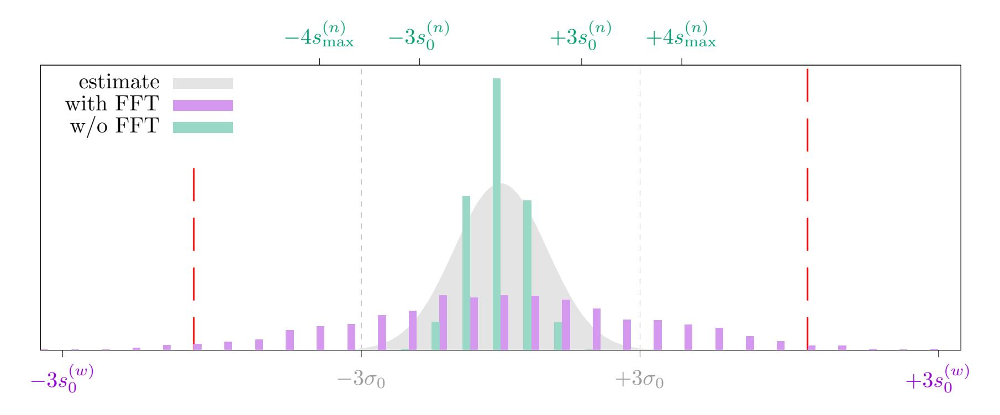

{0}------------------------------------------------

# A Practical TFHE-Based Multi-Key Homomorphic Encryption with Linear Complexity and Low Noise Growth<sup>⋆</sup>

Yavuz Akın<sup>1</sup> , Jakub Klemsa1,2() , and Melek Önen<sup>1</sup>

<sup>1</sup> EURECOM Sophia-Antipolis, France {yavuz.akin,jakub.klemsa,melek.onen}@eurecom.fr <sup>2</sup> Czech Technical University in Prague Prague, Czech Republic

Abstract. Fully Homomorphic Encryption enables arbitrary computations over encrypted data and it has a multitude of applications, e.g., secure cloud computing in healthcare or finance. Multi-Key Homomorphic Encryption (MKHE) further allows to process encrypted data from multiple sources: the data can be encrypted with keys owned by different parties. In this paper, we propose a new variant of MKHE instantiated with the TFHE scheme. Compared to previous attempts by Chen et al. and by Kwak et al., our scheme achieves computation runtime that is linear in the number of involved parties and it outperforms the faster scheme by a factor of 4.5-6.9×, at the cost of a slightly extended pre-computation. In addition, for our scheme, we propose and practically evaluate parameters for up to 128 parties, which enjoy the same estimated security as parameters suggested for the previous schemes (100 bits). It is also worth noting that our scheme—unlike the previous schemes—did not experience any error in any of our nine setups, each running 1 000 trials.

Keywords: Multi-key homomorphic encryption · TFHE scheme · Secure cloud computing

## 1 Introduction

For the first time publicly discovered in 2009 by Gentry [\[15\]](#page-21-0), Fully Homomorphic Encryption (FHE) refers to a cryptosystem that allows for an evaluation of an arbitrary computable function over encrypted data[3](#page-0-0) . With FHE, a secure cloud-aided computation, between a user (U) and a semitrusted cloud (C), may proceed as follows:

- U generates secret keys sk, and evaluation keys ek, which she sends to C;
- U encrypts her sensitive data d with sk, and sends the encrypted data to C;
- C employs ek to evaluate function f, homomorphically, over the encrypted user data (without ever decrypting it), yielding an encryption of f(d), which it sends back to U;
- U decrypts the message from C with sk, obtaining the desired result: f(d) in plain.

<sup>⋆</sup> This work was supported by the MESRI-BMBF French-German joint project UPCARE (ANR-20-CYAL-0003-01), and by the Grant Agency of CTU in Prague, grant No. SGS21/160/OHK3/3T/13. This is the full version of the paper.

<span id="page-0-0"></span><sup>3</sup> For a basic overview of the evolution of FHE schemes, we refer to a survey by Acar et al. [\[1\]](#page-20-0) (from 2018; note that for implementations, much progress has been made since then).

{1}------------------------------------------------

In such a setup, there is one party that holds all the secret keying material. In case the data originate from multiple sources, *Multi-Key (Fully) Homomorphic Encryption* (MKHE) comes into play. First proposed by López-Alt et al. [20], MKHE is a primitive that enables the homomorphic evaluation over data encrypted with multiple different, unrelated keys. This allows to relax the intrinsic restriction of a standard FHE, which demands a single data owner.

Previous Work. Following the seminal work of López-Alt et al. [20], different approaches to design an MKHE scheme have emerged: first attempts require a fixed list of parties at the beginning of the protocol [13, 25], others allow parties to join dynamically [6, 27], Chen et al. [9] extend the plaintext space from a single bit to a ring. Later, Chen et al. [7] propose an MKHE scheme based on the TFHE scheme [12], and they claim to be the first to practically implement an MKHE scheme; in this paper, we refer to their scheme as CCS. The evaluation complexity of their scheme is quadratic in the number of parties and authors only run experiments with up to 8 parties. The CCS scheme is improved in recent work by Kwak et al. [19], who achieve quasi-linear complexity (actually quadratic, but with a very low coefficient at the quadratic term); in this paper, we refer to their scheme as KMS. Parallel to CCS and KMS, which are both based on TFHE, there exist other promising schemes: e.g., [8], defined for BFV [5, 14] and CKKS [11], improved in [17] to achieve linear complexity, or [23], implemented in the Lattigo Library [24], which requires to first construct a common public key; also referred to as the Multi-Party HE (MPHE). The capabilities/use-cases of TFHE and other schemes are fairly different, therefore we solely focus on the comparison of TFHE-based MKHE.

Our Contributions. We propose a new TFHE-based MKHE scheme with a linear evaluation complexity and with a sufficiently low error rate, which allows for a practical instantiation with an order of hundreds of parties while achieving evaluation times proportional to those of plain TFHE. More concretely, our scheme builds upon the following technical ideas (k is the number of parties):

**Summation of RLWE keys:** Instead of *concatenation* of RLWE keys (in certain sense proposed in both CCS and KMS), our scheme works with RLWE encryptions under the *sum* of RLWE keys of individual parties, i.e.,  $Z = \sum_{q=1}^{k} z^{(q)}$ . As a result, this particular improvement decreases the evaluation complexity from quadratic to linear.

Ternary distribution for RLWE keys: Widely adopted by existing FHE implementations [16, 24, 22, 29], zero-centered ternary distribution  $\zeta: (-1,0,1) \to (p,1-2p,p)$  works well as a distribution of the coefficients of RLWE keys; we suggest  $p \approx 0.1135$ . It helps reduce the growth of a certain noise term by a factor of k, which in turn helps find more efficient TFHE parameters.

Avoid FFT in pre-computations: In our experiments, we notice an unexpected error growth for higher numbers of parties and we verify that the source of these errors is Fast Fourier Transform (FFT), which is used for fast polynomial multiplication. To keep the evaluation times low and to decrease the number of errors at the same time, we suggest replacing FFT with an exact method just in the pre-computation phase. We also show that FFT causes a considerable amount of errors in KMS, however, replacing FFT in its pre-computations is unfortunately not sufficient.

We provide two variants of our scheme:

**Static variant:** the list of parties is fixed – the evaluation cost is independent of the number of parties who provide their inputs and the result is encrypted with all keys; and

{2}------------------------------------------------

**Dynamic variant:** the computation cost is proportional to the number of participating parties, and the result is only encrypted with their keys (i.e., any subset of parties can go offline).

The variants only differ in pre-computation algorithms which in turn affect security assumptions. Performance-wise, given a fixed number of parties, the variants are equivalent (it only depends on the parameters of TFHE) and the evaluation complexity is linear in the number of involved parties. The construction of our scheme remains similar to that of plain TFHE, making it possible to adopt prospective advances of TFHE (or its implementation) to our scheme.

Next, we analyze and practically evaluate our scheme, and we compare it with previous attempts:

- We support our scheme by a theoretical noise-growth & security analysis. Thanks to the low noise growth, we instantiate our scheme with as many as 128 parties. We also show that our scheme is secure in the semi-honest model. In addition, we informally outline possible countermeasures in case there is a malicious party;
- We design and evaluate a deep experimental study, which may help evaluate future schemes. In particular, we suggest simulating the NAND gate to measure errors more realistically. Compared to the KMS scheme, we achieve 4.5-6.9× better bootstrapping times, while using the same implementation of TFHE and parameters with the same estimated security (100 bits). The bootstrapping times are around 140 ms per party (with an experimental implementation);
- We extend previous work by providing an experimental evaluation of the probability of errors. For our scheme, the measured noises fall within the expected bounds, which are designed to satisfy the rule of  $4\sigma$  (probability of 1 in 15787) we indeed do not encounter *any* error in any of our 9000 trials in total.

**Paper Outline.** We recall the TFHE scheme in a form of a detailed technical description in Section 2 and we present our scheme in Section 3. We analyze security, correctness & noise growth, and performance of our scheme in Section 4, which is followed by a thorough experimental evaluation in Section 5. We conclude our paper in Section 6.

## <span id="page-2-0"></span>2 Preliminaries

In this section, we recall the basic variant of the TFHE scheme [12]. Later in this paper, we refer to some of the algorithms and/or definitions.

**Symbols & Notation.** Throughout the paper, we use the following symbols & notation:

- $\mathbb{B}$ : the set of binary coefficients  $\{0,1\}\subset\mathbb{Z}$ ,
- $\mathbb{T}$ : the additive group  $\mathbb{R}/\mathbb{Z}$  referred to as the torus (i.e., real numbers modulo 1),
- $-\mathbb{Z}_n$ : the quotient ring  $\mathbb{Z}/n\mathbb{Z}$  (or its additive group),
- $-M^{(N)}[X]$ : the set of polynomials modulo  $X^N+1$ , with coefficients from M and with  $N\in\mathbb{N}$ ,
- \$: the uniform distribution,
- $-a \stackrel{\alpha}{\leftarrow} M$ : the draw of random variable a from M with distribution  $\alpha$  (for  $\alpha \in \mathbb{R}$ , we consider the zero-centered /discrete/ Gaussian draw with standard deviation  $\alpha$ ),
- E[X], Var[X]: the expectation and the variance of random variable X, respectively.

We use logarithm base 2 throughout this paper.

{3}------------------------------------------------

#### 2.1 Overview of TFHE

In short, the TFHE scheme is based on the Learning With Errors (LWE) encryption scheme introduced by Regev [28]. TFHE employs two variants, originally referred to as T(R)LWE, which stands for (Ring) LWE over the Torus. The ring variant (later shortly RLWE; introduced in [21]) is defined by polynomial degree  $N=2^{\nu}$  (with  $\nu\in\mathbb{N}$ ), dimension  $n\in\mathbb{N}$ , noise distribution  $\xi$  over the torus, and key distribution  $\zeta$  over the integers (generalized to respective polynomials  $\operatorname{mod} X^N+1$ ). Informally, to encrypt torus polynomial  $m\in\mathbb{T}^{(N)}[X]$ , RLWE outputs the pair  $(b=m-\langle\mathbf{z},\mathbf{a}\rangle+e,\mathbf{a})$ , referred to as the RLWE sample, where  $\mathbf{z} \stackrel{\zeta}{\leftarrow} (\mathbb{Z}^{(N)}[X])^n$  is a secret key,  $e\stackrel{\xi}{\leftarrow} \mathbb{T}^{(N)}[X]$  is an error term (aka. noise), and  $\mathbf{a} \stackrel{\$}{\leftarrow} (\mathbb{T}^{(N)}[X])^n$  is a random mask. To decrypt, the function  $\varphi_{\mathbf{z}}(b,\mathbf{a})=b+\langle\mathbf{z},\mathbf{a}\rangle=m+e$  is evaluated, also referred to as the phase. Internally, RLWE samples are further used to build so-called RGSW samples, which encrypt integer polynomials, and which allow for homomorphic multiplication of integer-torus polynomials. It is widely believed that RLWE sample  $(b,\mathbf{a})$  is computationally indistinguishable from a random element of  $(\mathbb{T}^{(N)}[X])^{1+n}$  (later shortly random-like), provided that adequate parameters are chosen. If  $\mathbf{a}=\mathbf{0}$  and e=0, we talk about a trivial sample. The plain variant (later shortly LWE) operates with plain torus elements instead of polynomials.

Bootstrapping. By its construction, (R)LWE is additively homomorphic: the sum of samples encrypts the sum of plaintexts. There is however an issue: the error terms also add up, i.e., the average noise of the result grows. To deal with this issue, TFHE (as well as other fully homomorphic encryption schemes) defines a routine referred to as bootstrapping. In case of TFHE, bootstrapping not only refreshes the noise of an input sample to a fixed level (on average), it is also capable of evaluating a custom Look-Up Table (LUT), which makes TFHE fully homomorphic. Find an illustration of the operation flow in Figure 1.

$$\underbrace{\{m_i\}}_{\substack{\text{input}\\\text{message(s)}}} \xrightarrow{\text{EWE}} \underbrace{\{(b_i, \mathbf{a}_i)\}}_{\substack{\text{fresh}/\\\text{bootstrapped}\\\text{sample(s)}}} \xrightarrow{\substack{\text{hom.}\\\text{addition}}} \underbrace{\sum(b_i, \mathbf{a}_i)}_{\substack{\text{to be bootstrapped}\\\text{strapped}\\\text{(high noise)}}} \underbrace{(\tilde{b}, \tilde{\mathbf{a}}) \xrightarrow{\text{BlindRotate,}}}_{\substack{\text{KeySwitch}}} \underbrace{(b', \mathbf{a}')}_{\substack{\text{freshly}\\\text{bootstrapped}\\\text{(low noise)}}} \cdots \cdots$$

**Fig. 1.** The flow of TFHE: homomorphic addition and bootstrapping, which is composed of other operations. The output sample  $(b', \mathbf{a}')$  may proceed to another homomorphic addition, or to the output and decryption.

**Decomposition.** One of the cornerstone operations of TFHE's bootstrapping is the decomposition of torus elements into a series of (signed) integers. For this purpose, decomposition defines two positive integer parameters: the *decomposition base* (denoted B; we only consider B as a power of two) and the *decomposition depth* (denoted d). We denote  $\mathbf{g} := (1/B, 1/B^2, \dots, 1/B^d)$ , referred to as the *gadget vector*. Decomposition of  $\mu \in \mathbb{T} \sim [-1/2, 1/2)$ , denoted  $\mathbf{g}^{-1}(\mu) \in [-B/2, B/2)^d$ , returns a vector of d signed digits, for which it holds

<span id="page-3-0"></span>
$$\left|\mu - \langle \mathbf{g}, \mathbf{g}^{-1}(\mu)\rangle\right| \le 1/2B^d,$$
 (1)

{4}------------------------------------------------

i.e.,  $\mathbf{g}^{-1}(\mu)$  gives the first d digits of base-B representation of  $\mu$  in the alphabet [-B/2, B/2). For  $k \in \mathbb{N}$ , we denote

$$\mathbf{G}_k \coloneqq \mathbf{I}_k \otimes \mathbf{g},\tag{2}$$

where  $\mathbf{I}_k$  is identity matrix of size k and  $\otimes$  stands for the tensor product, i.e.,  $\mathbf{G}_k \in \mathbb{T}^{kd \times k}$ , referred to as the *gadget matrix*. We generalize  $\mathbf{g}^{-1}$  to torus polynomials and we simplify  $\mathbf{G}_2 =: \mathbf{G}$ .

## <span id="page-4-0"></span>2.2 Description of TFHE

In this paper, we focus on the basic variant of TFHE with a Boolean message space: true and false are encoded into  $\mathbb{T} \sim [-1/2, 1/2)$  as -1/8 and 1/8, respectively. To homomorphically evaluate the NAND gate over input samples  $\mathbf{c}_{1,2}$ , the sum  $(1/8, \mathbf{0}) - \mathbf{c}_1 - \mathbf{c}_2$  is bootstrapped with a LUT, which holds 1/8 and -1/8 for the positive and for the negative half of  $\mathbb{T}$ , respectively.

Below, we provide a technical description of the TFHE scheme in a form of self-descriptive algorithms. Parameters and secret keys are considered implicit inputs.

- TFHE.Setup( $1^{\lambda}$ ): Given security parameter  $\lambda$ , generate parameters for:
- LWE encryption: dimension n, standard deviation  $\alpha > 0$  (of the noise);
- LWE decomposition: base B', depth d';
- set up LWE gadget vector:  $\mathbf{g}' \leftarrow (1/B', 1/B'^2, \dots, 1/B'^{d'});$
- RLWE encryption: polynomial degree N (a power of two), standard deviation  $\beta > 0$ ;
- RLWE decomposition: base B, depth d;
- set up RLWE gadget vector:  $\mathbf{g} \leftarrow (1/B, 1/B^2, \dots, 1/B^d)$ .

Other input parameters of the Setup algorithm may include the maximal allowed probability of error, or the plaintext space size (for other than Boolean circuits).

- TFHE.SecKeyGen(): Generate secret keys for:
- LWE encryption:  $\mathbf{s} \stackrel{\$}{\leftarrow} \mathbb{B}^n$ ;
- RLWE encryption:  $z \stackrel{\$}{\leftarrow} \mathbb{B}^{(N)}[X]$ , (alternatively  $z_i \stackrel{\zeta}{\leftarrow} \{-1,0,1\}$  for some distribution  $\zeta$ ).

For LWE key  $\mathbf{s} \in \mathbb{B}^n$ , we denote  $\bar{\mathbf{s}} \coloneqq (1, \mathbf{s}) \in \mathbb{B}^{1+n}$  the extended secret key, similarly for an RLWE key  $z \in \mathbb{Z}^{(N)}[X]$ , we denote  $\bar{\mathbf{z}} \coloneqq (1, z) \in \mathbb{Z}^{(N)}[X]^2$ .

- o <u>TFHE.LweSymEncr( $\mu$ )</u>: Given message  $\mu \in \mathbb{T}$ , sample fresh mask  $\mathbf{a} \stackrel{\$}{\leftarrow} \mathbb{T}^n$  and noise  $e \stackrel{\alpha}{\leftarrow} \mathbb{T}$ . Evaluate  $b \leftarrow -\langle \mathbf{s}, \mathbf{a} \rangle + \mu + e$  and output  $\bar{\mathbf{c}} = (b, \mathbf{a}) \in \mathbb{T}^{1+n}$ , an LWE encryption of  $\mu$ . This algorithm is used as the main encryption algorithm of the scheme. We generalize this as well as subsequent algorithms to input vectors and proceed element-by-element.
- o TFHE.RLweSymEncr $(m, a = \emptyset, z_{in} = z)$ : Given message  $m \in \mathbb{T}^{(N)}[X]$ , sample fresh mask  $a \stackrel{\$}{\leftarrow} \mathbb{T}^{(N)}[X]$ , unless explicitly given. If the pair  $(a, z_{in})$  has been used before, output  $\bot$ . Otherwise, sample fresh noise  $e \in \mathbb{T}^{(N)}[X]$ ,  $e_i \stackrel{\beta}{\leftarrow} \mathbb{T}$ , and evaluate  $b \leftarrow -z_{in} \cdot a + m + e$ . Output  $\bar{\mathbf{c}} = (b, a) \in \mathbb{T}^{(N)}[X]^2$ , an RLWE encryption of m. In case a is given, we may limit the output to only b.

{5}------------------------------------------------

- $\circ$  TFHE. (R) LwePhase( $\bar{\mathbf{c}}$ ): Given (R) LWE sample  $\bar{\mathbf{c}}$ , evaluate and output  $\varphi \leftarrow \langle \bar{\mathbf{s}}, \bar{\mathbf{c}} \rangle$ , where  $\bar{\mathbf{s}}$  is respective (R) LWE extended secret key.
- TFHE.EncrBool(b): Set  $\mu = \pm 1/8$  for b true or false, respectively. Output LweSymEncr( $\mu$ ).
- TFHE.DecrBool( $\bar{\mathbf{c}}$ ): Output LwePhase( $\bar{\mathbf{c}}$ ) > 0, assuming  $\mathbb{T} \sim [-1/2, 1/2)$ .
- o TFHE.RgswEncr(m): Given  $m \in \mathbb{Z}^{(N)}[X]$ , evaluate  $\mathbf{Z} \leftarrow \text{RLweSymEncr}(\mathbf{0})$ , where  $\mathbf{0}$  is a vector of 2d zero polynomials (i.e.,  $\mathbf{Z} \in (\mathbb{T}^{(N)}[X])^{2d \times 2}$ ). Output  $\mathbf{Z} + m \cdot \mathbf{G}$ , an RGSW sample of m.
- o TFHE.Prod(BK, (b, a)): Given RGSW sample BK of  $s \in \mathbb{Z}^{(N)}[X]$ , and RLWE sample (b, a) of  $m \in \mathbb{T}^{(N)}[X]$ , evaluate and output:

$$(b', a') \leftarrow \begin{pmatrix} \mathbf{g}^{-1}(b) \\ \mathbf{g}^{-1}(a) \end{pmatrix}^T \cdot \mathsf{BK} =: \mathsf{BK} \boxdot (b, a), \tag{3}$$

which is an RLWE sample of  $s \cdot m \in \mathbb{T}^{(N)}[X]$ ; in TFHE also referred to as the external product.

- <span id="page-5-0"></span>o TFHE.BlindRotate  $(\bar{\mathbf{c}}, \{\mathsf{BK}_i\}_{i=1}^n, tv)$ : Given  $\bar{\mathbf{c}} = (b, a_1, \dots, a_n) \in \mathbb{T}^{1+n}$ , an LWE sample of  $\mu \in \mathbb{T}$  under key  $\mathbf{s} \in \mathbb{B}^n$ ;  $(\mathsf{BK}_i)_{i=1}^n$ , RGSW samples of  $\mathbf{s}_i$  under RLWE key z (aka. blind-rotate keys); and RLWE<sub>z</sub> $(tv) \in \mathbb{T}^{(N)}[X]^2$ , (usually trivial) RLWE sample of  $tv \in \mathbb{T}^{(N)}[X]$  (aka. test vector), evaluate:
- 1:  $\tilde{b} \leftarrow \lfloor 2Nb \rfloor$ ,  $\tilde{a}_i \leftarrow \lfloor 2Na_i \rfloor$  for  $1 \le i \le n$
- 2:  $\mathsf{ACC} \leftarrow X^{\tilde{b}} \cdot \mathsf{RLWE}(tv)$
- 3: **for** i = 1, ..., n **do**
- 4:  $\mathsf{ACC} \leftarrow \mathsf{ACC} + \mathsf{Prod}(\mathsf{BK}_i, X^{\tilde{a}_i} \cdot \mathsf{ACC} \mathsf{ACC}) \quad \triangleright \mathsf{ACC} \text{ or } X^{\tilde{a}_i} \cdot \mathsf{ACC} \text{ if } \mathbf{s}_i = 0 \text{ or } \mathbf{s}_i = 1, \text{ resp.}$

Output ACC = RLWE<sub>z</sub>( $X^{\tilde{\varphi}} \cdot tv$ ), an RLWE encryption of test vector "rotated" by  $\tilde{\varphi}$ , where  $\tilde{\varphi} = \lfloor 2Nb \rceil + s_1 \lfloor 2Na_1 \rceil + \ldots + s_n \lfloor 2Na_n \rceil \approx 2N(\bar{\mathbf{s}} \cdot \bar{\mathbf{c}}) \approx 2N\mu$ .

- TFHE.KeyExtract(z): Given RLWE key  $z \in \mathbb{Z}^{(N)}[X]$ , output  $\mathbf{z}^* \leftarrow (z_0, -z_{N-1}, \dots, -z_1)$ .
- o TFHE.SampleExtract(b,a): Given RLWE sample  $(b,a) \in \mathbb{T}^{(N)}[X]^2$  of  $m \in \mathbb{T}^{(N)}[X]$  under RLWE key  $z \in \mathbb{Z}^{(N)}[X]$ , output LWE sample  $(b',\mathbf{a}') \leftarrow (b_0,a_1,\ldots,a_N) \in \mathbb{T}^{1+N}$  of  $m_0 \in \mathbb{T}$  (the constant term of m) under the extracted LWE key  $\mathbf{z}^* = \text{KeyExtract}(z)$ .
- o TFHE.KeySwitchKeyGen(): For  $j \in [1, N]$ , evaluate and output a key-switching key for  $z_j$  and s:  $\overline{\mathsf{KS}_j} \leftarrow \mathsf{LweSymEncr}(\mathbf{z}_j^* \cdot \mathbf{g}')$ , where  $\mathbf{z}^* \leftarrow \mathsf{KeyExtract}(z)$ .  $\mathsf{KS}_j$  is a d'-tuple of LWE samples of  $\mathbf{g}'$ -respective fractions of  $\mathbf{z}_j^*$  under the key s.
- o TFHE.KeySwitch $(\bar{\mathbf{c}}', \{\mathsf{KS}_j\}_{j=1}^N)$ : Given LWE sample  $\bar{\mathbf{c}}' = (b', a'_1, \dots, a'_N) \in \mathbb{T}^{1+N}$  (extraction of an RLWE sample), which encrypts  $\mu \in \mathbb{T}$  under the extraction of an RLWE key  $\mathbf{z}^* = \mathsf{KeyExtract}(z)$ , and a set of key-switching keys for z and  $\mathbf{s}$ , evaluate and output

<span id="page-5-1"></span>
$$\bar{\mathbf{c}}'' \leftarrow (b', \mathbf{0}) + \sum_{j=1}^{N} \mathbf{g}'^{-1} (a'_j)^T \cdot \mathsf{KS}_j, \tag{4}$$

which is an LWE sample of the same  $\mu \in \mathbb{T}$  under the LWE key s.

{6}------------------------------------------------

- o TFHE.Bootstrap $(\bar{\mathbf{c}}, tv, \{\mathsf{BK}_i\}_{i=1}^n, \{\mathsf{KS}_j\}_{j=1}^N)$ : Given LWE sample  $\bar{\mathbf{c}}$  of  $\mu \in \mathbb{T}$  under LWE key  $\mathbf{s}$ , test vector  $tv \in \mathbb{T}^{(N)}[X]$  that encodes a LUT, and two sets of keys for blind-rotate and for key-switching (aka. bootstrapping keys the evaluation keys of TFHE), evaluate:
- 1:  $\bar{\mathbf{c}}' \leftarrow \mathsf{BlindRotate}(\bar{\mathbf{c}}, \{\mathsf{BK}_i\}_{i=1}^n, tv);$
- 2:  $\bar{\mathbf{c}}'' \leftarrow \texttt{KeySwitch}(\texttt{SampleExtract}(\bar{\mathbf{c}}'), \{\texttt{KS}_j\}_{j=1}^N).$

Output  $\bar{\mathbf{c}}''$ , which is an LWE sample of—vaguely speaking—"evaluation of the LUT at  $\mu$ ", under the key  $\mathbf{s}$ , with a refreshed noise. Details on the encoding of the LUT are out of the scope of this paper.

- $\circ$  TFHE.Add( $\overline{\mathbf{c}}_1, \overline{\mathbf{c}}_2$ ): Output  $\overline{\mathbf{c}}_1 + \overline{\mathbf{c}}_2$ , which encrypts the sum of input plaintexts. Using just "+".
- o TFHE.NAND( $\overline{\mathbf{c}}_1, \overline{\mathbf{c}}_2, \{\mathsf{BK}_i\}_{i=1}^n, \{\mathsf{KS}_j\}_{j=1}^N$ ): Given encryptions of bools  $b_1$  and  $b_2$  under LWE key  $\mathbf{s}$ , and bootstrapping keys for  $\mathbf{s}$  and z, set the test vector as  $tv \leftarrow 1/8 \cdot (1 + X + X^2 + \ldots + X^{N-1})$ . Output  $\overline{\mathbf{c}}'' \leftarrow \mathsf{Bootstrap}(1/8 \overline{\mathbf{c}}_1 \overline{\mathbf{c}}_2, tv, \{\mathsf{BK}_i\}_{i=1}^n, \{\mathsf{KS}_j\}_{j=1}^N)$ , which is an encryption of  $\neg (b_1 \land b_2)$  under the key  $\mathbf{s}$ .

## <span id="page-6-0"></span>3 Our TFHE-Based Multi-Key Scheme

In this section, we first recall the notion of Multi-Key Homomorphic Encryption (MKHE) and we propose two variants of MKHE. Then, we summarize ideas and changes that lead from the standard TFHE scheme [12] towards our proposal of MKHE – we outline the format of multi-key bootstrapping keys, and we comment on a ternary distribution for RLWE keys. Finally, we provide a technical description of our scheme, which we denote AKÖ (by authors' initials).

### 3.1 MKHE and Our Variants

In addition to the capabilities of a standard FHE scheme, given in the introduction, an MKHE scheme:

- (i) runs a homomorphic evaluation over ciphertexts encrypted with unrelated keys of multiple parties (accompanied by corresponding evaluation keys); and
- (ii) requires the collaboration of all involved parties, holding the individual keys, to decrypt the result.

Note that there exist multiple approaches to reveal the result: e.g., one outlined in [7], referred to as *Distributed Decryption*, or one described in [23], referred to as *Collective Public-Key Switching*. We propose our scheme in two variants:

**Static variant:** the list of parties is fixed at the beginning of the protocol, then evaluation keys are jointly calculated – no matter how many parties join a computation, the evaluation time is also fixed and the result is encrypted with all the keys; and

**Dynamic variant:** after a "global" list of parties is fixed, evaluation keys are jointly calculated, however, only a subset of parties may join a computation – the evaluation cost is proportional to the size of the subset and the result is only encrypted with respective keys (i.e., the remaining parties can go offline). If a party joins later, a part of the joint pre-calculation of evaluation keys needs to be executed in addition, as opposed to CCS [7] and KMS [19].

Note that in many practical use cases—in particular, if we require semi-honest parties—the (global) list of parties is fixed, e.g., hospitals may constitute the parties. In addition, the pre-calculation protocol is indeed lightweight.

{7}------------------------------------------------

### <span id="page-7-3"></span>3.2 Towards the AKÖ Scheme

As outlined in the introduction, our scheme is based on the three following ideas:

- <span id="page-7-0"></span>(i) create RLWE samples encrypted under the sum of RLWE keys of individual parties,
- <span id="page-7-1"></span>(ii) use a ternary (zero-centered) distribution for individual RLWE keys, and
- <span id="page-7-2"></span>(iii) avoid Fast Fourier Transform (FFT) in pre-computations.

Below, we discuss (i) and (ii), leaving (iii) for the experimental part (Section 5).

(R)LWE Keys & Bootstrapping Keys. First, we outline the structure of the secret (R)LWE keys, which are unrelated and owned by multiple parties, based on which we propose a structure of respective bootstrapping keys. Note that secret keys of individual parties are *never* revealed to any other party, however, the description of AKÖ involves all of them.

The underlying (and never reconstructed) LWE key is the *concatenation* of individual keys, i.e.,  $\mathbf{s} \coloneqq \left(\mathbf{s}^{(1)}, \mathbf{s}^{(2)}, \dots, \mathbf{s}^{(k)}\right) \in \mathbb{B}^{kn}$ , where  $\mathbf{s}^{(p)} \in \mathbb{B}^n$  are secret LWE keys of individual parties. We refer to  $\mathbf{s}$  as the *common* LWE key. For RLWE keys, we consider their summation, i.e.,  $Z \coloneqq \sum_{p} z^{(p)}$ , which we refer to as the common RLWE key. Note that this particular improvement decreases the computational complexity (as well as the blind-rotate key sizes) from  $O(k^2)$  to O(k).

For bootstrapping keys, we follow the original construction of TFHE, where we use the common (R)LWE keys. For blind-rotate keys, we generate an RGSW sample of each bit of the common LWE key  $\mathbf{s} = (\mathbf{s}^{(1)}, \dots, \mathbf{s}^{(k)})$ , under the common RLWE key  $Z = \sum_{p} z^{(p)}$ . In addition, any party shall neither leak its own secrets nor require the secrets of others. For this purpose, we employ RLWE public key encryption [21]. Let us outline the desired form of a blind-rotate key for bit s:

$$\mathsf{BK}_{s} = \begin{pmatrix} \mathbf{b}^{\Delta} + s \cdot \mathbf{g} & \mathbf{a}^{\Delta} \\ \mathbf{b}^{\Box} & \mathbf{a}^{\Box} + s \cdot \mathbf{g} \end{pmatrix}, \quad \mathsf{BK}_{s} \in (\mathbb{T}^{(N)}[X])^{2d \times 2}, \tag{5}$$

where  $(\mathbf{b}^{\Delta}, \mathbf{a}^{\Delta})$  and  $(\mathbf{b}^{\Box}, \mathbf{a}^{\Box})$  hold d+d RLWE encryptions of zero under the key Z; cf. TFHE.Rgsw-Encr. For key-switching keys, we need to generate an LWE sample of the sum of j-th coefficients of individual RLWE secret keys  $z^{(p)}$ , under the common LWE key  $\mathbf{s}$ , for  $j \in [0, N-1]$ . Here a simple concatenation of masks (values  $\mathbf{a}$ ) and a summation of masked values (values b) do the job. With such keys, bootstrapping itself is identical to that of the original TFHE.

Ternary Distribution for RLWE Keys. For individual RLWE keys, we suggest to use zero-centered ternary distribution  $\zeta_p \colon (-1,0,1) \to (p,1-2p,p)$ , parameterized by  $p \in (0,1/2)$ , which is widely adopted by the main FHE libraries like HElib [16], Lattigo [24], SEAL [22], or HEAAN [29]. Although not adopted in CCS nor in KMS, in our scheme, a zero-centered distribution for RLWE keys is particularly useful, since we sum the keys into a common key, which is then also zero-centered. This helps reduce the blind-rotate noise from  $O(k^3)$  to  $O(k^2)$ , which in turn helps find more efficient TFHE parameters.

It is worth noting that for "small" values of p, such keys are also referred to as sparse keys (in particular with a fixed/limited Hamming weight), and there exist specially tailored attacks [10, 31]. At this point, we motivate the choice of p solely by keeping the information entropy of  $\zeta_p$  equal to 1 bit, however, there is no intuition—let alone a proof—that the estimated security would be

{8}------------------------------------------------

at least similar (more on concrete security estimates in Section 5.1 and Appendix C.2). For the information entropy of  $\zeta_p$ , we have

$$H(\zeta_p) = -2p\log(p) - (1 - 2p)\log(1 - 2p) \stackrel{!}{=} 1,$$
(6)

which gives a numerical solution of  $p \approx 0.1135$ . For  $z_i \sim \zeta_p$ , we have  $\mathsf{Var}[z_i] = 2p \approx 0.227$ .

## 3.3 Technical Description of AKÖ

We provide a technical description of AKÖ in the same form as for the TFHE scheme in Section 2.2. We mark algorithms that differ fundamentally from their TFHE counterparts with  $\bullet$ , existing algorithms (possibly slightly modified) are marked with  $\circ$ . Algorithms with index q are executed locally at the respective party. We remind that encryption algorithms naturally generalize to vector inputs.

Static Variant of AKÖ. Below, we provide algorithms for the static variant of AKÖ:

- AKÖ. Setup $(1^{\lambda}, k)$ : Given security parameter  $\lambda$  and the number of parties k, generate and distribute to all k parties the same parameters as generated by the TFHE. Setup $(1^{\lambda})$  algorithm (n.b., k is taken into account, hence the parameters differ from those given by TFHE. Setup $(1^{\lambda})$ ), and a common random polynomial (CRP)  $\underline{a} \stackrel{\$}{\leftarrow} \mathbb{T}^{(N)}[X]$ .
- $\circ \ \mathtt{AK\ddot{O}}.\mathtt{SecKeyGen}_q() \colon \mathtt{Generate} \ \mathtt{secret} \ \mathtt{keys} \ \mathbf{s}^{(q)} \xleftarrow{\$} \mathbb{B}^n \ \mathtt{and} \ z^{(q)} \in \mathbb{Z}^{(N)}[X], \ \mathtt{s.t.} \ z_i^{(q)} \xleftarrow{\zeta_p} \{-1,0,1\}.$
- o  $\underline{\mathsf{AK\ddot{O}}\ldots}$ : (R)LweSymEncr<sub>q</sub>, (R)LwePhase<sub>q</sub>, DecrBool<sub>q</sub>, KeyExtract, Prod, BlindRotate, Sample-Extract, KeySwitch, Add, Bootstrap, and NAND are the same as in TFHE.
- $\begin{array}{l} \circ \ \ \underline{\operatorname{AK\"O}}. \ \operatorname{RLwePubEncr} \big(m, (b, a)\big) \colon \text{ Given message } m \in \mathbb{T}^{(N)}[X] \text{ and public key } (b, a) \in \mathbb{T}^{(N)}[X]^2 \\ (\text{an RLWE sample of } 0 \in \mathbb{T}^{(N)}[X] \text{ under key } z \in \mathbb{Z}^{(N)}[X]), \text{ generate temporary RLWE key } r^{(q)}, \\ \text{s.t. } r_i^{(q)} \xleftarrow{\zeta} \{-1, 0, 1\}. \text{ Evaluate } b' \leftarrow \operatorname{RLweSymEncr}_q(m, b, r^{(q)}) \text{ and } a' \leftarrow \operatorname{RLweSymEncr}_q(0, a, r^{(q)}). \\ \text{Output } (b', a'), \text{ which is an RLWE sample of } m \text{ under the key } z. \end{array}$
- o AKÖ.RLweRevPubEncr(m,(b,a)): Proceed as RLwePubEncr, with a difference in the evaluation of  $b' \leftarrow \mathtt{RLweSymEncr}_q(0,b,r^{(q)})$  and  $a' \leftarrow \mathtt{RLweSymEncr}_q(m,a,r^{(q)})$ , where only m and 0 are swapped, i.e., m is added to the right-hand side instead of the left-hand side.
- AKÖ.BlindRotKeyGen<sub>q</sub>(): Calculate and broadcast public key  $b^{(q)} \leftarrow \texttt{RLweSymEncr}_q(0,\underline{a})$ , using the CRP  $\underline{a}$  as the mask. Evaluate  $B = \sum_{p=1}^k b^{(p)}$  (n.b.,  $(B,\underline{a})$  is an RLWE sample of zero under the common RLWE key  $Z = \sum_{p=1}^k z^{(p)}$ , hence it may serve as a common public key). Finally, for  $j \in [1,n]$ , output the blind-rotate key (related to  $s_j^{(q)}$  and Z):

$$\mathsf{BK}_{j}^{(q)} \leftarrow \begin{pmatrix} \mathsf{RLwePubEncr}_{q} \big( \mathbf{s}_{j}^{(q)} \cdot \mathbf{g}, (B, \underline{a}) \big) \\ \mathsf{RLweRevPubEncr}_{q} \big( \mathbf{s}_{j}^{(q)} \cdot \mathbf{g}, (B, \underline{a}) \big) \end{pmatrix}, \tag{7}$$

which is an RGSW sample of the j-th bit of  $\mathbf{s}^{(q)}$ , under the common RLWE key Z.

{9}------------------------------------------------

• AKÖ.KeySwitchKeyGen<sub>q</sub>(): For  $i \in [1, N]$ , broadcast  $[\mathbf{b}_i^{(q)} | \mathbf{A}_i^{(q)}] \leftarrow \mathtt{LweSymEncr}_q(\mathbf{z}_i^{(q)*} \cdot \mathbf{g}')$ , where  $\mathbf{z}^{(q)*} \leftarrow \mathtt{KeyExtract}(z^{(q)})$ . Aggregate and for  $i \in [1, N]$ , output the *key-switching key* (for  $Z_i = \sum_p z_i^{(p)}$  and  $\mathbf{s} = (\mathbf{s}^{(1)}, \dots, \mathbf{s}^{(k)})$ ):

$$\mathsf{KS}_{i} = \left[ \sum_{p=1}^{k} \mathbf{b}_{i}^{(p)} \mid \mathbf{A}_{i}^{(1)}, \mathbf{A}_{i}^{(2)}, \dots, \mathbf{A}_{i}^{(k)} \right], \tag{8}$$

which is a d'-tuple of LWE samples of  $\mathbf{g}'$ -respective fractions of  $\mathbf{Z}_i^*$  under the common LWE key  $\mathbf{s}$ . Here,  $\mathbf{Z}_i^*$  is the i-th element of the extraction of the common RLWE key  $Z = \sum_p z^{(p)}$ , i.e.,  $\mathbf{Z}^* = \text{KeyExtract}(Z)$ .

Changes to AKÖ towards the Dynamic Variant. For the dynamic variant, we provide modified versions of BlindRotKeyGen and KeySwitchKeyGen; other algorithms are the same as in the static variant. Note that, in case we allow a party to join later, all temporary keys need to be stored permanently and both algorithms need to be (partially) repeated. This causes a slight pre-computation overhead over CCS and KMS.

- AKÖ.BlindRotKeyGen\_dyn $_q()$ : Calculate and broadcast public key  $b^{(q)}$  as described in the AKÖ.BlindRotKeyGen $_q()$  algorithm. Then, for  $j \in [1, n]$ :
- 1: generate two vectors of d temporary RLWE keys  $\mathbf{r}_{j}^{(q)}$  and  $\mathbf{r}_{j}^{\prime(q)}$  (with coefficients distributed  $\sim \zeta_{p}$ )
- $\text{2: for } p \in [1,k], \, p \neq q, \, \text{output } \mathbf{b}_{q,j}^{\Delta(p)} \leftarrow \mathtt{RLweSymEncr}_q(0,b^{(p)},\mathbf{r}_j^{(q)})$
- 3: output  $\mathbf{b}_{q,j}^{\Delta(q)} \leftarrow \mathtt{RLweSymEncr}_q(\mathbf{s}_j^{(q)} \cdot \mathbf{g}, b^{(q)}, \mathbf{r}_j^{(q)})$
- 4: output  $\mathbf{a}_{q,j}^{\Delta} \leftarrow \mathtt{RLweSymEncr}_q(0,\underline{a},\mathbf{r}_j^{(q)})$
- 5: for  $p \in [1, k]$ , output  $\mathbf{b}_{q, j}^{\square(p)} \leftarrow \mathtt{RLweSymEncr}_q(0, b^{(p)}, \mathbf{r'}_j^{(q)})$
- 6: output  $\mathbf{a}_{q,j}^{\square} \leftarrow \mathtt{RLweSymEncr}_q(\mathbf{s}_j^{(q)} \cdot \mathbf{g}, \underline{a}, \mathbf{r'}_j^{(q)})$

To construct the j-th blind-rotate key of party q, related to subset of parties  $S \ni q$ , evaluate

<span id="page-9-0"></span>
$$\mathsf{BK}_{j,\mathcal{S}}^{(q)} \leftarrow \begin{pmatrix} \sum_{p \in \mathcal{S}} \mathbf{b}_{q,j}^{\Delta(p)} & \mathbf{a}_{q,j}^{\Delta} \\ \sum_{p \in \mathcal{S}} \mathbf{b}_{q,j}^{\Box(p)} & \mathbf{a}_{q,j}^{\Box} \end{pmatrix}, \tag{9}$$

which is an RGSW sample of  $\mathbf{s}_{j}^{(q)}$  under the subset RLWE key  $Z_{\mathcal{S}} = \sum_{p \in \mathcal{S}} z^{(p)}$ . N.b.,  $\mathsf{BK}_{j,\mathcal{S}}^{(q)}$  is only calculated at runtime, once  $\mathcal{S}$  is known.

• AKÖ. KeySwitchKeyGen\_dyn $_q$ (): Proceed as AKÖ. KeySwitchKeyGen $_q$ (), while instead of outputting aggregated KS $_i$ 's, aggregate relevant parts at runtime, once  $\mathcal S$  is known. I.e.,

$$\mathsf{KS}_{i,\mathcal{S}} = \left[ \sum_{p \in \mathcal{S}} \mathbf{b}_i^{(p)} \mid \left( \mathbf{A}_i^{(p)} \right)_{p \in \mathcal{S}} \right]. \tag{10}$$

**Possible Improvements.** In [7], authors suggest an improvement that decreases the noise growth of key-switching, which can also be applied in our scheme; we provide more details in Appendix A.

{10}------------------------------------------------

## <span id="page-10-0"></span>4 Theoretical Analysis of Our Scheme

In this section, we provide a theoretical analysis of our AKÖ scheme with respect to security, correctness (noise growth), and performance.

#### 4.1 Security

We assume that all parties follow the protocol *honestly-but-curiously* (i.e., we assume the semi-honest model). Before we comment on each algorithm that may leak secrets, let us recall what *is* secure and what *is not* in LWE (selected methods; also holds for RLWE):

- $\checkmark$  re-use secret key **s** with fresh mask **a** and fresh noise e;
- $\checkmark$  re-use common random mask  $\underline{\mathbf{a}}$  with multiple distinct secret keys  $\mathbf{s}^{(p)}$  and fresh noises  $e^{(p)}$ ;
- **X** publish  $\langle \mathbf{s}, \mathbf{a} \rangle$  in any form (e.g., release the phase  $\varphi$  or the noise e);
- **X** re-use the pair  $(\mathbf{s}, \mathbf{a})$  with fresh noises  $e_i$ .

Below, we show that if all parties act semi-honestly, our scheme is secure in both of its variants. Note that rather than formal security proofs, we provide informal sketches. In selected cases, we also briefly discuss what issues may rise with a malicious party and we outline possible countermeasures.

Public Key Encryption. In AKÖ, there are two algorithms for public key encryption: RLwe(Rev) – PubEncr(m,(b,a)). Basically, they re-use a common random mask (the public key pair (b,a)) with fresh temporary key  $r^{(q)}$ . Provided that b and a are indistinguishable from random (random-like), it does not play a role to which part the message m is added/encrypted, i.e., both variants are secure.

Blind-Rotate Key Generation (static variant). Provided that CRP  $\underline{a}$  is random-like, which is trivial to achieve in the random oracle model, we can assume that (our)  $b^{(q)}$  is random-like. Assuming that other parties act honestly, also their  $b^{(p)}$ 's are random-like, hence the sum B is random-like, too. With  $(B,\underline{a})$  random-like, public key encryption algorithms are secure, hence  $AK\ddot{O}.BlindRotKeyGen_q$  is secure, too.

Blind-Rotate Key Generation (dynamic variant). In this variant, party q re-uses temporary secret key  $r^{(q)}$  for encryption of zeros using public keys  $b^{(p)}$  of other parties, and for encryption of own secret key  $\mathbf{s}^{(q)}$ . This is secure provided that  $b^{(p)}$ 's are random-like, which is true if generated honestly.

Key-Switching Key Generation (both variants). The AKÖ.KeySwitchKeyGen( $_{q}$  algorithms employ the standard LWE encryption, hence they are both secure.

**Summary.** We have shown that if all parties act semi-honestly, our scheme is secure in both of its variants. We also outline possible countermeasures if there is a malicious party. However, we leave a rigorous discussion on threat models that involve malicious actors for the future work.

{11}------------------------------------------------

On the Presence of a Malicious Party. Although we assume that *all* parties are semi-honest, we comment briefly and informally on the possible presence of a malicious party. First, note that there is another *insecure* thing in LWE:

 $\mathbf{X}$  use malicious common mask  $\mathbf{\underline{a}}$  (in particular in RLWE).

For this issue, let us outline an RLWE key recovery attack, given an encryption oracle:

- 1. the attacker provides malicious common mask (public key)  $a' = 1/4 + 0 \cdot X + \ldots + 0 \cdot X^{N-1}$ ;
- 2. the victim encrypts 0 with her secret key z as  $(b = -z \cdot a' + e, a') = (-1/4 z + e, 1/4)$ ;
- 3. the attacker rounds the coefficients of  $4b \in [-2,2)^{(N)}[X]$  to integers, yielding the secret key z.

Blind-Rotate Key Generation (static variant). In case there is malicious party p', it may wait for others and collect their  $b^{(p)}$ 's, then it may publish malicious  $b^{(p')} = 1/4 - \sum_{p \neq p'} b^{(p)}$ , i.e., B = 1/4 (cf. the attack outlined before). However, such an attack can be mitigated easily: each party p first commits on  $b^{(p)}$  before publishing it, i.e., before learning b's of others. Then, even if some b's are malicious, the aggregate B can be considered random-like: indeed, it is sufficient that one party (us) provides an unpredictable random-like  $b^{(q)}$ .

Blind-Rotate Key Generation (dynamic variant). In case there is malicious party p', an attack with  $b^{(p')} = 1/4$  (or similar) could be mounted; let us outline a possible mitigation:

- parties generate and distribute all keys normally;
- a series of bootstraps with some dummy data is performed;
- the results are checked for correctness: the protocol halts unless everything is correct.

Recall that this is just a *proposal* of a possible countermeasure and we only provide a brief reasoning: To generate malicious and functional  $b^{(p')}$ , i.e.,  $b^{(p')}$  of a specific form (e.g., 1/4) and  $b^{(p')} = -z^{(p')} \cdot \underline{a} + e$ , the attacker p' would need to find short vectors/polynomials  $z^{(p')}$  and e that solve the equation, which is considered intractable. If the attacker finds some solution to  $z^{(p')}$  and e, which is not short, the noise growth is expected be enormous, hence it is very likely to destroy the correctness and the protocol halts.

#### <span id="page-11-0"></span>4.2 Correctness & Noise Growth

The most challenging part of all LWE-based schemes is to estimate the noise growth across various operations. First, we provide estimates of the noise growth of blind-rotate and key-switching, next, we combine them into an estimate of the noise of a freshly bootstrapped sample. Finally, we identify the maximum of error, which may cause incorrect bootstrapping. By default, we evaluate all noises for the static variant, while for the dynamic variant, we provide more comments in the proofs.

Noise Growth of Blind-Rotate. In the following lemma and theorem, we provide an estimate of the noise growth during blind-rotate, without considering any implementation aspects.

<span id="page-11-1"></span>Lemma 1 (Correctness & Noise Growth of AKÖ.Prod). Given RGSW sample BK generated by the AKÖ.BlindRotKeyGen algorithm, which encrypts constant polynomial  $s \in \mathbb{Z}^{(N)}[X]$  under the common RLWE  $key\ Z = \sum_p z^{(p)}$ , and RLWE sample  $\bar{\mathbf{c}} = (b,a)$  that encrypts  $m \in \mathbb{T}^{(N)}[X]$  under

{12}------------------------------------------------

the same key, the AKÖ. Prod algorithm returns RLWE sample  $\bar{\mathbf{c}}' = (b', a')$  that encrypts  $s \cdot m$  under Z with additional noise  $e_{\texttt{Prod}}$ , given by  $\langle \bar{\mathbf{Z}}, \bar{\mathbf{c}}' \rangle = s \cdot \langle \bar{\mathbf{Z}}, \bar{\mathbf{c}} \rangle + e_{\texttt{Prod}}$ , for which

$$\operatorname{Var}[e_{\operatorname{Prod}}] \approx N dV_B \beta^2 (3 + 6pkN) + s^2 \varepsilon^2 (1 + 2pkN), \tag{11}$$

where

- $-\varepsilon^2 := 1/12B^{2d}$  is the variance of (real-valued) uniform distribution on  $[-1/2B^d, 1/2B^d)$ ,  $-V_B := (B^2+2)/12$  is the mean of squares of (integer valued) uniform distribution on [-B/2, B/2)(assuming B is even),
- other notation and parameters are as per the AKÖ. Setup algorithm, and
- we refer to the two terms as the blind-rotate key error and the decomposition error, respectively.

If this error is sufficiently small, it holds  $\langle \bar{\mathbf{Z}}, \bar{\mathbf{c}}' \rangle \approx s \cdot \langle \bar{\mathbf{Z}}, \bar{\mathbf{c}} \rangle$ , i.e., the AKÖ. Prod algorithm is indeed multiplicatively homomorphic.

*Proof.* Find the proof in Appendix B.1. For the dynamic variant, we have  $(3 + k \cdot 6pN) \rightarrow (1 + k \cdot 6pN)$ k(2+6pN) in the BK error term, which we consider practically negligible as  $6pN \approx 700$ . 

<span id="page-12-0"></span>Theorem 1 (Noise Growth of Blind-Rotate). The AKÖ. BlindRotate algorithm returns a sample with noise variance given by

$$\operatorname{Var}[\langle \bar{\mathbf{Z}}, \mathsf{ACC} \rangle] \approx \underbrace{knNdV_B \beta^2 (3 + 6pkN)}_{\mathsf{BK}\ error} + \underbrace{\frac{1}{2} \cdot kn\varepsilon^2 (1 + 2pkN)}_{decomp.\ error} + \underbrace{\operatorname{Var}[tv]}_{usually\ 0}. \tag{12}$$

The resulting ACC encrypts  $X^{\langle \tilde{\mathbf{s}}, (\tilde{b}, \tilde{\mathbf{a}}) \rangle} \cdot tv$ .

*Proof.* Find the proof in Appendix B.2. For the dynamic variant,  $(3+6pkN) \rightarrow (1+2k+6pkN)$ .

Noise Growth of Key-Switching. In the following theorem, we provide an estimate of the noise growth during key-switching, which holds for both variants.

<span id="page-12-1"></span>Theorem 2 (Noise Growth of Key-Switching). The AKÖ. KeySwitch algorithm returns a sample that encrypts the same message as the input sample, while changing the key from  $\mathbf{Z}^*$  to  $\mathbf{s}$ , with additional noise  $e_{KS}$ , given by  $\langle \bar{\mathbf{s}}, \bar{\mathbf{c}}'' \rangle = \langle \bar{\mathbf{Z}}^*, \bar{\mathbf{c}}' \rangle + e_{KS}$ , for which

$$\operatorname{Var}[e_{\mathsf{KS}}] \approx \underbrace{Nkd'V_{B'}\beta'^{2}}_{\mathsf{KS}\ error} + \underbrace{2pkN\varepsilon'^{2}}_{decomp.\ error}. \tag{13}$$

If the error is sufficiently small, it holds  $\langle \bar{\mathbf{s}}, \bar{\mathbf{c}}'' \rangle \approx \langle \bar{\mathbf{Z}}^*, \bar{\mathbf{c}}' \rangle$ .

*Proof.* Find the proof in Appendix B.3. For the dynamic variant, key-switching keys are structurally equivalent, hence this estimate holds in the same form.  

{13}------------------------------------------------

Noise of a Freshly Bootstrapped Sample. In the following corollary, we combine noise estimates of blind-rotate and key-switching, yielding a noise estimate of a freshly bootstrapped sample. For the dynamic variant, the BK error term is changed according to Theorem 1.

Corollary 1 (Noise of a Freshly Bootstrapped Sample). The AKÖ.Bootstrap algorithm returns a sample with noise variance given by

<span id="page-13-0"></span>
$$V_0 \approx \underbrace{3knNdV_B\beta^2(1+2pkN)}_{\text{BK }error} + \underbrace{\frac{1}{2kn\varepsilon^2(1+2pkN)}}_{\text{b.-r. }decomp.} + \underbrace{Nkd'V_{B'}\beta'^2}_{\text{KS }error} + \underbrace{2pkN\varepsilon'^2}_{\text{k.-s. }decomp.}$$
(14)

For the dynamic variant, the BK error term is changed according to Theorem 1.

**Maximum of Error.** During homomorphic evaluations, freshly bootstrapped samples get homomorphically added/subtracted, before being possibly bootstrapped again; cf. Figure 1. Before a noisy sample gets blindly rotated, it gets scaled and rounded to  $Z_{2N}$ ; cf. line 1 of BlindRotate. In the following lemma, we evaluate the variance of such a rounding error.

Lemma 2 (Rounding Error of Blind-Rotate). The rounding step on line 1 of the AKÖ.Blind-Rotate algorithm induces an additional error with variance (in the torus scale) given by

$$\operatorname{Var}\left[\left\langle \bar{\mathbf{s}}, \frac{1}{2N} \cdot (\tilde{b}, \tilde{\mathbf{a}}) - (b, \mathbf{a}) \right\rangle\right] = \frac{1 + \frac{kn}{2}}{48N^2} =: V_{round}(N, n, k). \tag{15}$$

*Proof.* Each of the 1 + kn values of  $(b, \mathbf{a})$  gets rounded to the closest multiple of 1/2N, i.e., the error is uniform on the interval (-1/4N, 1/4N]. The result follows.

After rounding, the noise gets refreshed inside the BlindRotate algorithm. It follows that the maximum of error across the whole computation appears right after rounding of the sample to-be-bootstrapped. We focus on this error in the experimental part, since it may cause incorrect blind-rotation, in turn, incorrect LUT evaluation. In the following corollary, we evaluate the variance of the maximal error throughout the calculation and we define quantity  $\kappa$ , which is a scaling factor of normal distribution N(0,1).

Corollary 2 (Maximum of Error). The maximum average error throughout homomorphic computation is achieved inside the AKÖ. Bootstrap algorithm by the rounded sample  $1/2N \cdot (\tilde{b}, \tilde{\mathbf{a}})$ . Its variance is given by

<span id="page-13-1"></span>
$$V_{\text{max}} \approx \max \left\{ \sum_{i} k_i^2 \right\} \cdot V_0 + V_{round}, \tag{16}$$

where  $k_i$  are coefficients of linear combinations of independent, freshly bootstrapped samples, which are evaluated during homomorphic calculations, before being bootstrapped (e.g.,  $\sum k_i^2 = 2$  for the NAND gate evaluation). We denote

<span id="page-13-2"></span>
$$\kappa \coloneqq \frac{\delta/2}{\sqrt{V_{\text{max}}}} = \frac{\delta}{2\sigma_{\text{max}}},\tag{17}$$

where  $\delta$  is the distance of encodings that are to be distinguished (e.g., 1/4 for encoding of bools).

We use  $\kappa$  to estimate the probability of correct blind rotation (CBRot). E.g., for  $\kappa = 3$ , we have  $\Pr[CBRot] \approx 99.73\% \approx 1/370$  (aka. rule of  $3\sigma$ ), however, we rather lean to  $\kappa = 4$  with  $\Pr[CBRot] \approx 1/15787$ . Since the maximum of error is achieved within blind-rotate, it dominates the overall probability of correct bootstrapping (CBStrap), i.e., we assume  $\Pr[CBStrap] \approx \Pr[CBRot]$ .

{14}------------------------------------------------

#### <span id="page-14-6"></span>4.3 Performance

Since the structure of all components in both variants of AKÖ is equivalent to that of plain TFHE with only  $n \to kn$  (due to LWE key concatenation), we evaluate the performance characteristics very briefly: AKÖ.BlindRotate is dominated by  $4d \cdot kn$  degree-N polynomial multiplications, whereas AKÖ.KeySwitch is dominated by  $Nd' \cdot (1+kn)$  torus multiplications, followed by 1+kn summations of Nd' elements. Using FFT for polynomial multiplication, for bootstrapping, we have the complexity of  $O(N \log N \cdot 4dkn) + O(Nd' \cdot (1+kn))$ .

For key sizes, we have  $|\mathsf{BK}| = 4dNkn \cdot |\mathbb{T}_{\mathsf{RLWE}}|$  and  $|\mathsf{KS}| = d'N(1+kn) \cdot |\mathbb{T}_{\mathsf{LWE}}|$ , where  $|\mathbb{T}_{(\mathsf{R})\mathsf{LWE}}|$  denotes the size of respective torus representation.

## <span id="page-14-0"></span>5 Experimental Evaluation

For a fair comparison, we implement our AKÖ scheme<sup>4</sup> side by side with previous schemes CCS [7] and KMS [19]. These are implemented in a fork [30] of a library<sup>5</sup> [26] that implements TFHE in Julia. For the sake of simplicity, we implement only the static variant on AKÖ – recall that performance-wise, the two variants are equivalent, for noise growth, the differences are negligible.

In this section, we first comment on errors induced by existing TFHE implementations. Then, we introduce type-1 and type-2 decryption errors that one may encounter during TFHE-based homomorphic evaluations. Finally, we provide three kinds of results of our experiments:

- <span id="page-14-3"></span>1. for all the three schemes (CCS, KMS, and AKO) and selected parameter sets, we measure the performance, the noise variances, and the amount of decryption errors of the two types,
- <span id="page-14-4"></span>2. we demonstrate the effect of FFT during the pre-computation phase of AKÖ with 32 parties,
- <span id="page-14-5"></span>3. we compare the performance of all the three schemes with a *fixed parameter set* tailored for 16 parties, with different numbers of actually participating parties (i.e., the dynamic variant).

We run our experiments on a machine with an Intel Core i7-7800X processor and 128 GB of RAM.

Implementation Errors. The major source of errors that stem from a particular implementation of the TFHE scheme is Fast Fourier Transform (FFT), which is used for fast modular polynomial multiplication in RLWE; find a study on FFT errors in [18]. Also, the finite representation of the torus (e.g., 64-bit integers) changes the errors slightly, however, we neglect this contribution as long as the precision (e.g.,  $2^{-64}$ ) is smaller than the standard deviation of the (R)LWE noise. Note that these kinds of errors are not taken into account in Section 4.2, which solely focuses on the theoretical noise growth of the scheme itself.

The magnitude of the FFT error depends on (i) the finite torus representation (i.e., the precision of coefficients of multiplied polynomials), and on (ii) particular FFT implementation (e.g., what float representation is chosen); find a study on FFT errors in [18].

Due to the excessive noise that we observe for higher numbers of parties with our scheme, we suggest replacing FFT in pre-computations (i.e., in blind-rotate key generation) with an exact method. This leads to an increase of the pre-computation costs (n.b., it has no effect on the bootstrapping time), however, in Section 5.2, we show that the benefit is worth it – the pre-computation time indeed shows to be slower, yet it is not prohibitive.

<span id="page-14-1"></span><sup>&</sup>lt;sup>4</sup> Available at https://gitlab.eurecom.fr/fakub/3-gen-mk-tfhe as the 3gen variant.

<span id="page-14-2"></span><sup>&</sup>lt;sup>5</sup> As noted by the authors, the code serves solely as a proof-of-concept.

{15}------------------------------------------------

<span id="page-15-1"></span>Types of Decryption Errors. The ultimate goal of noise analysis is to keep the probability of obtaining an incorrect result reasonably low. Below, we describe two types of decryption errors, which originate from bootstrapping, and which we measure in our experiments. N.b., the principle of BlindRotate is the same across the three schemes, hence it is well-defined for all of them.

<span id="page-15-3"></span>Note 1. For the notion of correct decryption, we always assume symmetric intervals around encodings. E.g., for the Boolean variant of TFHE, which encodes true and false as  $\pm 1/8$ , we only consider the "correct" interval for true as (0, 1/4), although (0, 1/2) would work, too. Hence in the Boolean variant, actual incorrect decryption & decoding would be half less likely than what we actually measure.

Fresh Bootstrap Error. We bootstrap (ideally) noiseless sample  $\mathbf{c}$  of  $\mu$ , i.e., BlindRotate rotates the test vector "correctly", meaning that  $\tilde{\varphi}/2N \approx \mu$  selects the correct position from the test vector. Then, we evaluate the probability of the resulting phase  $\varphi' = \langle \bar{\mathbf{s}}, \bar{\mathbf{c}}' \rangle$  falling outside the correct interval. We refer to this error as the type-1 error, denoted  $\mathsf{Err}_1$ . Note that this probability relates to the noise of a correctly blind-rotated, freshly bootstrapped sample. It can be estimated from  $V_0$ ; see (14).

Blind Rotate Error. Let us consider a homomorphic sum of two independent, freshly bootstrapped samples (cf. Figure 1). We evaluate the probability that the sum, after the rounding step inside BlindRotate, selects a value at an *incorrect* position from the test vector, which encodes the LUT (as discussed in Section 4.2). We refer to this error as the type-2 error, denoted  $Err_2$ . It can be estimated from  $V_{max}$ ; see (16). We evaluate  $Err_2$  by simulating the NAND gate:

<span id="page-15-4"></span>fresh 
$$\mathbf{c}_1 \xrightarrow{\text{Bootstrap}} \mathbf{c}_1'$$
fresh  $\mathbf{c}_2 \xrightarrow{\text{Bootstrap}} \mathbf{c}_2'$ 

$$\begin{cases} (1/8 - \mathbf{c}_1' - \mathbf{c}_2') \to \text{eval. } \tilde{\varphi} \text{ of BlindRotate} \to \text{check } \tilde{\varphi}/2N \stackrel{?}{\in} (0, 1/4). \end{cases}$$
(18)

#### <span id="page-15-0"></span>5.1 Experiment #1: Thorough Comparison of Performance & Errors

For the three schemes—CCS, KMS, and AKÖ—we measure the main quantities: the bootstrapping time (median), the variance  $V_0$  of a freshly bootstrapped sample (defined in (14)), the scaling factor  $\kappa$  (defined in (17)), and the number of errors of both types. We extend the previous work – there is no experimental evaluation of noises/errors in CCS nor in KMS. In all experiments, we replace FFT in pre-computations with an exact method. For CCS and KMS, we employ the parameters suggested by the original authors, and we estimate their security with the lattice-estimator by Albrecht et al. [2, 3]. We obtain an estimate of about 100 bits, therefore for our scheme, we also suggest parameters with estimated 100-bit security. We provide more details on concrete security estimates of the parameters of CCS and KMS, and those of AKÖ in Appendix C.1 and C.2, respectively. The parameters and the results for CCS, KMS, and AKÖ can be found in Table 1, 2 and 3, respectively.

<span id="page-15-2"></span>In the results for CCS, we may notice that for 2 to 8 parties, the measured value of  $\kappa$ , denoted  $\kappa^{(m)}$ , agrees with the calculated value  $\kappa^{(c)}$ , whereas for 16 parties (n.b., parameters added in KMS [19]), the measured value  $\kappa^{(m)}$  drops significantly, which indicates an unexpected error growth.

In the results for KMS, we may notice a similar drop of  $\kappa$  – here it occurs for all numbers of parties – we suppose that this is caused by FFT in bootstrapping (more on FFT later in Section 5.2). For both experiments, we further use  $\kappa^{(m)}$  and Z-values of the normal distribution to evaluate the expected rate of Err<sub>2</sub>, which is in perfect accordance with the measured one.

{16}------------------------------------------------

A Practical TFHE-Based Multi-Key Homomorphic Encryption

<span id="page-16-1"></span><span id="page-16-0"></span>**Table 1.** Parameters, bootstrapping times ( $t_B$ ; median), noises and errors of the CCS scheme [7], with original parameters and without FFT in pre-computations (i.e., using precise calculations); parameters for 16 parties and key sizes taken from [19]. Labels <sup>(c)</sup> and <sup>(m)</sup> refer to calculated and measured values, respectively. Running 1000 trials, i.e., evaluating 2000 bootstraps; cf. (18). N.b., the actual error rate of a NAND gate would be approximately half of Err<sub>2</sub>; cf. Note 1.

| $\overline{k}$ | LWE |                      |                    |    |       | UniEnc               |         | keys | $t_B$ | $V_0^{(c)}$ | $V_0^{(m)} \mid_{\kappa^{(c)}}$ |             | $\kappa^{(m)}$ | Err <sub>1,2</sub> |     | Exp. |                  |
|----------------|-----|----------------------|--------------------|----|-------|----------------------|---------|------|-------|-------------|---------------------------------|-------------|----------------|--------------------|-----|------|------------------|
| κ              | n   | $\alpha$             | B'                 | d' | N     | $\beta$              | B d     |      | [MB]  | [s]         | $10^{-4}$                       | $[10^{-4}]$ |                | κ` ′               | [‰] |      | Err <sub>2</sub> |
| 2              |     |                      | $\sigma^2$ $\circ$ |    | 1 024 | $3.72 \cdot 10^{-9}$ | $2^9$   | 3    | 95    | .58         | 16.2                            | 14.6        | 2.19           | 2.30               | 1   | 24   | 21               |
| 4              | 560 | $3.05 \cdot 10^{-5}$ |                    | 8  |       |                      | $2^8$   | 4    | 108   | 2.4         | 19.1                            | 18.6        | 2.01           | 2.04               | 3   | 41   | 41               |
| 8              | 8   | 3.03 · 10            | <b>4</b>           | 0  |       |                      | $2^{6}$ | 5    | 121   | 10          | 6.36                            | 6.27        | 3.39           | 3.41               | 0   | 0    | .65              |
| 16             |     |                      |                    |    |       |                      | $2^2$   | 12   | 214   | 86          | 2.15                            | 34.5        | 5.07           | 1.49               | 29  | 128  | 136              |

**Table 2.** Parameters, bootstrapping times ( $t_B$ ; median), noises and errors of the KMS scheme [19], with original parameters and without FFT in pre-computations (key sizes taken from [19]). Running 1 000 trials.

| $-\frac{1}{k}$ | LWE |                    |         |   | RGS     | SW   RLEV             |          | UniEnc        |         | keys          | $t_B$      | $V_0^{(c)}$ | $V_0^{(m)}$ | $\kappa^{(c)}$ | $\kappa^{(m)}$ | Err <sub>1,2</sub> |      | Exp. |      |                  |     |
|----------------|-----|--------------------|---------|---|---------|-----------------------|----------|---------------|---------|---------------|------------|-------------|-------------|----------------|----------------|--------------------|------|------|------|------------------|-----|
|                | n   | $\alpha$           | B' $d'$ | N | $\beta$ | $\mid B \mid$         | d        | $\mid B \mid$ | d       | $\mid B \mid$ | d          | [MB]        | [s]         | $10^{-4}$      | $[10^{-4}]$    |                    | K` ' | [‰]  |      | Err <sub>2</sub> |     |
| 2              |     |                    |         |   |         |                       | $2^{13}$ | 3             | $2^7$   | 2             | $  2^{10}$ | 3           | 215         | .61            | .458           | 11.5               | 12.7 | 2.60 | 1.5  | 12               | 9.3 |
| 4              |     |                    |         |   |         | $2^8$                 | 5        | $2^8$         | 2       | $2^{6}$       | 7          | 286         | 2.1         | .915           | 15.3           | 8.97               | 2.26 | 4    | 29   | 24               |     |
| 8              | 560 | $3.05\cdot10^{-5}$ | $2^2$   | 8 | 2 048   | $4.63 \cdot 10^{-18}$ | $2^{11}$ | 4             | $2^{6}$ | 3             | $2^4$      | 8           | 251         | 5.4            | 1.83           | 17.1               | 6.34 | 2.13 | 3    | 35               | 33  |
| 16             |     |                    |         |   |         |                       | $2^{9}$  | 5             | $2^{6}$ | 3             | $2^4$      | 9           | 286         | 15             | 3.66           | 32.0               | 4.49 | 1.56 | 22.5 | 122              | 119 |
| 32             |     |                    |         |   |         |                       | $2^8$    | 6             | $2^7$   | 3             | $2^2$      | 16          | 322         | 35             | 7.32           | 30.1               | 3.17 | 1.60 | 23   | 109              | 110 |

{17}------------------------------------------------

<span id="page-17-1"></span>Table 3. Parameters, key sizes (calculated), bootstrapping times (tB; median), noises and errors of the static variant of AKÖ, without FFT in pre-computations. Running 1 000 trials, no errors of type Err<sup>2</sup> (let alone Err1) experienced. <sup>∗</sup>For 256 and 512 parties, we exceed the limit of RAM (128 GB). ∗∗For 512 parties, better parameters could be found – the practical size of the torus representation (64-bit) poses the limit.

|       |     | LWE         |        |        |       | RLWE        |         |   | keys | tB  | (c)<br>V<br>0 | (m)<br>V<br>0 | (c)  | (m)<br>κ |
|-------|-----|-------------|--------|--------|-------|-------------|---------|---|------|-----|---------------|---------------|------|----------|
| k     | n   | log2<br>(α) | ′<br>B | ′<br>d | N     | log2<br>(β) | B       | d | [GB] | [s] | [10−4<br>]    | [10−4<br>]    | κ    |          |
| 2     | 520 | −13.52      | 23     | 3      | 1 024 | −30.70      | 7<br>2  | 2 | .08  | .19 | 4.69          | 4.18          | 4.04 | 4.27     |
| 3     | 510 | −13.26      | 22     | 5      |       |             | 7<br>2  | 2 | .13  | .31 | 4.64          | 4.40          | 4.04 | 4.14     |
| 4     | 510 | −13.26      | 22     | 5      |       |             | 6<br>2  | 3 | .24  | .56 | 3.96          | 2.02          | 4.33 | 5.93     |
| 5     | 520 | −13.52      | 22     | 5      |       |             | 6<br>2  | 3 | .31  | .73 | 3.76          | 1.91          | 4.41 | 6.00     |
| 8     | 540 | −14.04      | 22     | 5      |       |             | 4<br>2  | 4 | .66  | 1.2 | 4.43          | 4.20          | 4.01 | 4.11     |
| 16    | 590 | −15.34      | 23     | 4      |       |             | 26<br>2 | 1 | .93  | 1.8 | 4.56          | 1.02          | 4.04 | 7.90     |
| 32    | 620 | −16.12      | 23     | 4      |       | −62.00      | 26<br>2 | 1 | 2.0  | 4.3 | 3.58          | 1.21          | 4.38 | 6.78     |
| 64    | 650 | −16.90      | 23     | 4      | 2 048 |             | 25<br>2 | 1 | 4.1  | 8.6 | 3.41          | 1.80          | 4.20 | 5.25     |
| 128   | 670 | −17.42      | 23     | 5      |       |             | 24<br>2 | 1 | 9.1  | 18  | 2.40          | .486          | 4.15 | 5.47     |
| 256∗  | 740 | −19.24      | 22     | 8      |       |             | 18<br>2 | 2 | 37   | –   | .187          | –             | 4.00 | –        |
| 512∗∗ | 730 | −18.98      | 23     | 5      | 4 096 | −62.00      | 227     | 1 | 80   | –   | 2.53          | –             | 4.01 | –        |

For our AKÖ scheme, the results do not show any error of any type. Regarding the values of κ (also V0), we measure lower noise than expected – this we suppose to be caused by a certain statistical dependency of variables – indeed, our estimates of noise variances are based on an assumption that variables are independent, which is not always fully satisfied. We are able to run AKÖ with up to 128 parties, while the only limitation for 256 parties appears to be the size of RAM. We believe that with more RAM (>128 GB) or with a more optimized implementation, it would be possible to practically instantiate the scheme with even more parties. For this purpose, we provide parameter sets for 256 and even for 512 parties, where other technical limits are reached: in particular the speed of the lattice-estimator and the size of a machine word, which efficiently implements the torus.

## <span id="page-17-0"></span>5.2 Experiment [#2:](#page-14-4) The Effect of FFT in Pre-computations

As outlined previously, polynomial multiplication in RLWE—when implemented using FFT—introduces additional error, on top of the standard RLWE noise. In this experiment, we compare noises of freshly bootstrapped samples: once with FFT in blind-rotate key generation (induces additional errors), once without FFT (we use an exact method instead). For this comparison, we choose our AKÖ scheme with 32 parties; find the results in Figure [2.](#page-18-0) Note that within bootstrapping, we still employ FFT, i.e., the performance of evaluation is not affected.

In the plot, we may notice a tremendous growth of the noise of a freshly bootstrapped sample in case FFT is employed for blind-rotate key generation: in almost 4% of such cases, even a freshly bootstrapped sample gets decrypted incorrectly (i.e., Err<sup>1</sup> ≈ 4%), which corresponds to violet bars outside the interval delimited by the red dashed lines. On the other hand, such a growth does not 

{18}------------------------------------------------

occur for lower numbers of parties, hence we suggest verifying whether in the particular case, the effect of FFT is remarkable, or negligible, and then decide accordingly. Recall that pre-computations with FFT are much faster (e.g., for 64 parties, we have 33 s vs. 212 s of the total pre-computation time).



<span id="page-18-0"></span>Fig. 2. Noises of freshly bootstrapped samples of the static variant of AKÖ with 32 parties (parameters as per Table 3), comparing blind-rotate keys generated with and without the use of FFT, running 2 000 bootstraps. Red dashed lines mark the boundaries of the correct interval; cf. Note 1. The values  $s_0^{(\cdot)}$  and  $s_{\text{max}}^{(\cdot)}$  refer to the sample standard deviation of a freshly bootstrapped sample and that of a rounded sample within blind-rotate (cf. (16); calculated from respective  $s_0$ ), respectively. Labels  $s_0^{(u)}$  and  $s_0^{(u)}$  refer to with FFT and no FFT, respectively. N.b., the values  $s_0^{(u)}$  are far outside the graph.

Unexpected Error Growth in KMS. For the KMS scheme, we observe an unexpected error growth (cf. Table 2), which we suppose to be caused by FFT in bootstrapping (i.e., evaluation). We replace all FFTs in the entire computation of KMS—including bootstrapping—with an exact method, and we re-run Experiment #1 with the KMS scheme, using the same setup. Due to a prohibitively slow evaluation ( $\sim 40\times$  slower), we only re-run the experiment for 2 parties. We obtain  $V_0^{(m)} \approx 5.58 \cdot 10^{-4}$ , which is still much more than the expected value  $V_0^{(c)} \approx 0.458 \cdot 10^{-4}$ , but it already makes the standard deviation about 30% smaller, compared to the "with FFT in bootstrapping" case. Also, it increases the value of  $\kappa^{(m)}$  from 2.60 to 3.73 and it results in no type-2 errors. At least partially, this confirms our hypothesis that the unexpected error growth in KMS is caused by FFT in evaluation.

A possible theoretical explanation can be found in the design of KMS: in the blind-rotate of KMS, we may observe that there are (up to) four nested FFTs: one in the circled  $\star$  product, followed by three inside ExtProd: one in the  $\odot$  product and two in NewHbProd. Compared with AKÖ, where there is just one level of FFT inside blind-rotate in Prod, this is likely the most significant practical improvement over KMS.

{19}------------------------------------------------

## 5.3 Experiment [#3:](#page-14-5) Performance Comparison

We extend the performance comparison of CCS and KMS, presented in Figure 2 of KMS [\[19\]](#page-21-6) (which we re-run on our machine), by the performances of our AKÖ scheme. Note that the setup of that experiment corresponds to the dynamic variant – recall that performance-wise, the dynamic variant is equivalent to the static variant, which is implemented in our experimental library. For each scheme, we employ its own parameter set tailored for 16 parties (cf. Table [1,](#page-16-0) [2](#page-16-1) and [3\)](#page-17-1), while we instantiate it with different numbers of actually participating parties; find the results in Figure [3.](#page-19-0)

## 0 4 8 12 16 2-party 4-party 8-party 16-party 22 84 4.5× 5.7× 6.5× 6.9× Bootstrapping time [s] CCS KMS ours

## <span id="page-19-0"></span>Speed-up of our scheme over KMS

Fig. 3. Comparison of median bootstrapping times of the CCS scheme [\[7\]](#page-20-3), the KMS scheme [\[19\]](#page-21-6), and our AKÖ scheme. 100 runs with respective parameters for 16 parties were executed. N.b., FFT in precomputations does not affect performance.

## 5.4 Discussion

The goal of our experiments is to show the practical usability of our AKÖ scheme: we compare its performance as well as the probability of errors with previous schemes – CCS [\[7\]](#page-20-3) and KMS [\[19\]](#page-21-6).

In terms of bootstrapping time, AKÖ runs faster than both previous attempts (cf. Figure [3\)](#page-19-0). Also, the theoretical complexity of AKÖ is linear in the number of parties (cf. Section [4.3\)](#page-14-6), as opposed to quadratic and quasi-linear for CCS and KMS, respectively.

To evaluate the number of errors that may occur during bootstrapping, we propose a new method that simulates the rounding step of BlindRotate (cf. [\(18\)](#page-15-4)), which is the same across all the three schemes. Our experiments show that both CCS and KMS suffer from a considerably high error rate (cf. Table [1](#page-16-0) and [2,](#page-16-1) respectively): for CCS, the original parameters are rather poor; for KMS, it seems that there are too many nested FFT's in bootstrapping – we show that FFT in evaluation—at least partially—causes the unexpected error growth.

To sum up, AKÖ significantly outperforms both CCS & KMS in terms of bootstrapping time and/or error rate. The major practical limitation of the CCS scheme is the quadratic growth 

{20}------------------------------------------------

<span id="page-20-9"></span>of the bootstrapping time, whereas the KMS scheme suffers from the additional error growth in implementation. A disadvantage of AKÖ is that it requires (a small amount of) additional precomputations if a new party decides to join the computation in the dynamic variant. Also AKÖ does not enable parallelization, as opposed to KMS.

## <span id="page-20-6"></span>6 Conclusion

We propose a new TFHE-based MKHE scheme named AKÖ in two variants, depending on whether only a subset of parties is desired to take part in a homomorphic computation. We implement AKÖ side-by-side with other similar schemes CCS and KMS, and we show its practical usability in thorough experimentation, where we also suggest secure & reliable parameters. Thanks to its low noise growth, AKÖ can be instantiated with hundreds of parties; namely, we tested up to 128 parties in our experiments. Compared to previous schemes, AKÖ achieves much faster bootstrapping times, however, a slight overhead of pre-computations is induced. For KMS, we show that FFT errors are prohibitive for its practical deployment – unfortunately, replacing FFT in pre-computations is not enough.

Besides benchmarking, we suggest emulating (a part of) the NAND gate to achieve a more realistic error analysis: the measured amount of errors shows to be in perfect accordance with the expected amount. This method may help future schemes to evaluate their practical reliability.

Future Work. We plan to extend the threat model to assume malicious parties, formally. For implementation, we would like to experimentally verify the improvement of key-switching proposed by [\[7\]](#page-20-3) (discussed in Appendix [A\)](#page-22-0). Another interesting topic might be to extend the message space to more than Boolean.

## References

- <span id="page-20-0"></span>1. Acar, A., Aksu, H., Uluagac, A.S., Conti, M.: A survey on homomorphic encryption schemes: Theory and implementation. ACM Computing Surveys (Csur) 51(4), 1–35 (2018)
- <span id="page-20-7"></span>2. Albrecht, M.R., contributors: Security Estimates for Lattice Problems. [https://github.com/malb/](https://github.com/malb/lattice-estimator) [lattice-estimator](https://github.com/malb/lattice-estimator) (2022)
- <span id="page-20-8"></span>3. Albrecht, M.R., Player, R., Scott, S.: On the concrete hardness of learning with errors. Journal of Mathematical Cryptology 9(3), 169–203 (2015)
- <span id="page-20-10"></span>4. Booth, A.D.: A signed binary multiplication technique. The Quarterly Journal of Mechanics and Applied Mathematics 4(2), 236–240 (1951)
- <span id="page-20-5"></span>5. Brakerski, Z.: Fully homomorphic encryption without modulus switching from classical gapsvp. In: Annual Cryptology Conference. pp. 868–886. Springer (2012)
- <span id="page-20-1"></span>6. Brakerski, Z., Perlman, R.: Lattice-based fully dynamic multi-key fhe with short ciphertexts. In: Annual International Cryptology Conference. pp. 190–213. Springer (2016)
- <span id="page-20-3"></span>7. Chen, H., Chillotti, I., Song, Y.: Multi-key homomorphic encryption from tfhe. In: International Conference on the Theory and Application of Cryptology and Information Security. pp. 446–472. Springer (2019)
- <span id="page-20-4"></span>8. Chen, H., Dai, W., Kim, M., Song, Y.: Efficient multi-key homomorphic encryption with packed ciphertexts with application to oblivious neural network inference. In: Proceedings of the 2019 ACM SIGSAC Conference on Computer and Communications Security. pp. 395–412 (2019)
- <span id="page-20-2"></span>9. Chen, L., Zhang, Z., Wang, X.: Batched multi-hop multi-key fhe from ring-lwe with compact ciphertext extension. In: Theory of Cryptography Conference. pp. 597–627. Springer (2017)

{21}------------------------------------------------

- <span id="page-21-17"></span>10. Cheon, J.H., Hhan, M., Hong, S., Son, Y.: A hybrid of dual and meet-in-the-middle attack on sparse and ternary secret lwe. IEEE Access 7, 89497–89506 (2019)
- <span id="page-21-22"></span><span id="page-21-8"></span>11. Cheon, J.H., Kim, A., Kim, M., Song, Y.: Homomorphic encryption for arithmetic of approximate numbers. In: International Conference on the Theory and Application of Cryptology and Information Security. pp. 409–437. Springer (2017)
- <span id="page-21-5"></span>12. Chillotti, I., Gama, N., Georgieva, M., Izabachène, M.: TFHE: fast fully homomorphic encryption over the torus. Journal of Cryptology 33(1), 34–91 (2020)
- <span id="page-21-2"></span>13. Clear, M., McGoldrick, C.: Multi-identity and multi-key leveled fhe from learning with errors. In: Annual Cryptology Conference. pp. 630–656. Springer (2015)
- <span id="page-21-7"></span>14. Fan, J., Vercauteren, F.: Somewhat Practical Fully Homomorphic Encryption. Cryptology ePrint Archive, Paper 2012/144 (2012), <https://ia.cr/2012/144>
- <span id="page-21-0"></span>15. Gentry, C.: Fully homomorphic encryption using ideal lattices. In: Proceedings of the forty-first annual ACM symposium on Theory of computing. pp. 169–178 (2009)
- <span id="page-21-12"></span>16. Halevi, S., Shoup, V.: Design and implementation of a homomorphic-encryption library. IBM Research (Manuscript) 6(12-15), 8–36 (2013)
- <span id="page-21-9"></span>17. Kim, T., Kwak, H., Lee, D., Seo, J., Song, Y.: Asymptotically Faster Multi-Key Homomorphic Encryption from Homomorphic Gadget Decomposition. Cryptology ePrint Archive, Paper 2022/347 (2022), <https://ia.cr/2022/347>
- <span id="page-21-21"></span>18. Klemsa, J.: Fast and error-free negacyclic integer convolution using extended fourier transform. In: Cyber Security Cryptography and Machine Learning: 5th International Symposium, CSCML 2021, Be'er Sheva, Israel, July 8–9, 2021, Proceedings. pp. 282–300. Springer (2021)
- <span id="page-21-6"></span>19. Kwak, H., Min, S., Song, Y.: Towards Practical Multi-key TFHE: Parallelizable, Key-Compatible, Quasi-linear Complexity. Cryptology ePrint Archive, Paper 2022/1460 (2022), [https://ia.cr/2022/](https://ia.cr/2022/1460) [1460](https://ia.cr/2022/1460)
- <span id="page-21-1"></span>20. López-Alt, A., Tromer, E., Vaikuntanathan, V.: On-the-fly multiparty computation on the cloud via multikey fully homomorphic encryption. In: Proceedings of the forty-fourth annual ACM symposium on Theory of computing. pp. 1219–1234 (2012)
- <span id="page-21-16"></span>21. Lyubashevsky, V., Peikert, C., Regev, O.: On ideal lattices and learning with errors over rings. In: Annual International Conference on the Theory and Applications of Cryptographic Techniques. pp. 1–23. Springer (2010)
- <span id="page-21-13"></span>22. Microsoft: SEAL (release 4.1). <https://github.com/Microsoft/SEAL> (Jan 2023)
- <span id="page-21-10"></span>23. Mouchet, C., Troncoso-Pastoriza, J., Bossuat, J.P., Hubaux, J.P.: Multiparty homomorphic encryption from ring-learning-with-errors. Proceedings on Privacy Enhancing Technologies pp. 291–311 (2021)
- <span id="page-21-11"></span>24. Mouchet, C.V., Bossuat, J.P., Troncoso-Pastoriza, J.R., Hubaux, J.P.: Lattigo: A multiparty homomorphic encryption library in go. In: Proceedings of the 8th Workshop on Encrypted Computing and Applied Homomorphic Cryptography. pp. 64–70. No. CONF (2020)
- <span id="page-21-3"></span>25. Mukherjee, P., Wichs, D.: Two round multiparty computation via multi-key fhe. In: Annual International Conference on the Theory and Applications of Cryptographic Techniques. pp. 735–763. Springer (2016)
- <span id="page-21-20"></span>26. NuCypher: TFHE.jl. <https://github.com/nucypher/TFHE.jl> (2022)
- <span id="page-21-4"></span>27. Peikert, C., Shiehian, S.: Multi-key fhe from lwe, revisited. In: Theory of cryptography conference. pp. 217–238. Springer (2016)
- <span id="page-21-15"></span>28. Regev, O.: On lattices, learning with errors, random linear codes, and cryptography. In: Proceedings of the thirty-seventh annual ACM symposium on Theory of computing. pp. 84–93 (2005)
- <span id="page-21-14"></span>29. SNUCrypto: HEAAN (release 1.1). <https://github.com/snucrypto/HEAAN> (2018)
- <span id="page-21-19"></span>30. SNUPrivacy: MK-TFHE. <https://github.com/SNUPrivacy/MKTFHE> (2022)
- <span id="page-21-18"></span>31. Son, Y., Cheon, J.H.: Revisiting the hybrid attack on sparse secret lwe and application to he parameters. In: Proceedings of the 7th ACM Workshop on Encrypted Computing & Applied Homomorphic Cryptography. pp. 11–20 (2019)

{22}------------------------------------------------

## **Appendix**

#### <span id="page-22-0"></span>Possible Improvement of Key-Switching $\mathbf{A}$

In [7], authors suggest to pre-compute multiples of key-switching keys: the aim is to decrease the contribution of noise from the key-switching keys. On the one hand, the performance may improve by choosing more efficient parameters, on the other hand, the size of key-switching keys may grow significantly.

Instead of encrypting  $\mathbf{z}_{i}^{(q)*}\mathbf{g}'$ , authors suggest to encrypt its multiples by integers in [1, B'/2]. Then, in the KeySwitch algorithm, instead of multiplication of a key-switching key  $KS_i$  by decomposition digits of  $\mathbf{g}'^{-1}(a_i)$ , cf. (4), an appropriate pre-computed multiple of  $\mathsf{KS}_i$  is used (with appropriate sign). In case B' is "too big" for practical considerations, we rather suggest to encrypt multiples of  $\mathbf{z}_i^{(q)*}\mathbf{g}'$  only by powers of two in [1, B'/2], and then combine these multiples to reach the digits of  $\mathbf{g}'^{-1}(a_i')$ . For this purpose, we suggest to employ a signed binary representation with the lowest Hamming weight, also referred to as the Non-Adjacent Form (NAF; [4]).

#### Proofs of Noise Analysis $\mathbf{B}$

#### <span id="page-22-1"></span>B.1 Noise Growth of Homomorphic Product

Lemma 1. Given RGSW sample BK generated by the AKÖ.BlindRotKeyGen algorithm, which encrypts constant polynomial  $s \in \mathbb{Z}^{(N)}[X]$  under the common RLWE key  $Z = \sum_{p} z^{(p)}$ , and RLWE  $sample \ \bar{\mathbf{c}} = (b,a) \ that \ encrypts \ m \in \mathbb{T}^{(N)}[X] \ under \ the \ same \ key, \ the \ \mathtt{AK\ddot{O}.Prod} \ algorithm \ re$ turns RLWE sample  $\bar{\mathbf{c}}' = (b', a')$  that encrypts  $s \cdot m$  under Z with additional noise  $e_{\texttt{Prod}}$ , given by  $\langle \bar{\mathbf{Z}}, \bar{\mathbf{c}}' \rangle = s \cdot \langle \bar{\mathbf{Z}}, \bar{\mathbf{c}} \rangle + e_{\texttt{Prod}}, \text{ for which}$ 

$$\operatorname{Var}[e_{\operatorname{Prod}}] \approx N dV_B \beta^2 (3 + 6pkN) + s^2 \varepsilon^2 (1 + 2pkN), \tag{19}$$

where

- $-\varepsilon^2 := 1/12B^{2d}$  is the variance of (real-valued) uniform distribution on  $[-1/2B^d, 1/2B^d)$ ,  $-V_B := (B^2+2)/12$  is the mean of squares of (integer valued) uniform distribution on [-B/2, B/2)(assuming B is even),
- other notation and parameters are as per the AKO. Setup algorithm, and
- we refer to the two terms as the blind-rotate key error and the decomposition error, respectively.

If this error is sufficiently small, it holds  $\langle \bar{\mathbf{Z}}, \bar{\mathbf{c}}' \rangle \approx s \cdot \langle \bar{\mathbf{Z}}, \bar{\mathbf{c}} \rangle$ , i.e., the AKÖ. Prod algorithm is indeed multiplicatively homomorphic.

Proof. We unfold the construction of BK and multiplication within the AKÖ.Prod algorithm:

$$\bar{\mathbf{c}}' = \left( \left\langle \mathbf{g}^{-1}(b), -r \cdot \mathbf{B} + s \cdot \mathbf{g} + \mathbf{e}_1 \right\rangle + \left\langle \mathbf{g}^{-1}(a), -r \cdot \mathbf{B}' + \mathbf{e}_1' \right\rangle, 
\left\langle \mathbf{g}^{-1}(b), -r \cdot \mathbf{a} + \mathbf{e}_2 \right\rangle + \left\langle \mathbf{g}^{-1}(a), -r \cdot \mathbf{a}' + s \cdot \mathbf{g} + \mathbf{e}_2' \right\rangle \right).$$
(20)

{23}------------------------------------------------

Then we write

$$\langle \bar{\mathbf{Z}}, \bar{\mathbf{c}}' \rangle = \langle \mathbf{g}^{-1}(b), -r\mathbf{B} + s\mathbf{g} + \mathbf{e}_{1} \rangle + \langle \mathbf{g}^{-1}(a), -r\mathbf{B}' + \mathbf{e}'_{1} \rangle + \\
+ Z \langle \mathbf{g}^{-1}(b), -r\mathbf{a} + \mathbf{e}_{2} \rangle + Z \langle \mathbf{g}^{-1}(a), -r\mathbf{a}' + s\mathbf{g} + \mathbf{e}'_{2} \rangle = \\
= \langle \mathbf{g}^{-1}(b), r \sum_{p=1}^{k} z^{(p)} \mathbf{a} - r \sum_{p=1}^{k} \mathbf{e}^{(p)} + s\mathbf{g} + \mathbf{e}_{1} \rangle + \langle \mathbf{g}^{-1}(a), r \sum_{p=1}^{k} z^{(p)} \mathbf{a}' - r \sum_{p=1}^{k} \mathbf{e}'^{(p)} + \mathbf{e}'_{1} \rangle + \\
+ \langle \mathbf{g}^{-1}(b), -Zr\mathbf{a} + \mathbf{e}_{2} \rangle + \langle \mathbf{g}^{-1}(a), -Zr\mathbf{a}' + Zs\mathbf{g} + Z\mathbf{e}'_{2} \rangle = \\
= \langle \mathbf{g}^{-1}(b), s\mathbf{g} - r \sum_{p=1}^{k} \mathbf{e}^{(p)} + \mathbf{e}_{1} + \mathbf{e}_{2} \rangle + \langle \mathbf{g}^{-1}(a), Zs\mathbf{g} - r \sum_{p=1}^{k} \mathbf{e}'^{(p)} + \mathbf{e}'_{1} + Z\mathbf{e}'_{2} \rangle = \\
= s \left( \langle \mathbf{g}^{-1}(b), \mathbf{g} \rangle \pm b \right) + Zs \left( \langle \mathbf{g}^{-1}(a), \mathbf{g} \rangle \pm a \right) + \\
+ \langle \mathbf{g}^{-1}(b), -r \sum_{p=1}^{k} \mathbf{e}^{(p)} + \mathbf{e}_{1} + \mathbf{e}_{2} \rangle + \langle \mathbf{g}^{-1}(a), -r \sum_{p=1}^{k} \mathbf{e}'^{(p)} + \mathbf{e}'_{1} + Z\mathbf{e}'_{2} \rangle = \\
= s \cdot (b + Za) + \\
 \langle \mathbf{z}, \mathbf{e} \rangle + \\
 \langle \mathbf{z}, \mathbf{e} \rangle + \\
 \langle \mathbf{z}, \mathbf{e}, \rangle + \\
 \langle \mathbf{z}, \mathbf{e}, \rangle + \\
 \langle \mathbf{z}, \mathbf{e}, \rangle + \\
 \langle \mathbf{z}, \mathbf{e}, \rangle + \\
 \langle \mathbf{z}, \mathbf{e}, \rangle + \\
 \langle \mathbf{z}, \mathbf{e}, \rangle + \\
 \langle \mathbf{z}, \mathbf{e}, \rangle + \\
 \langle \mathbf{z}, \mathbf{e}, \rangle + \\
 \langle \mathbf{z}, \mathbf{e}, \rangle + \\
 \langle \mathbf{z}, \mathbf{e}, \rangle + \\
 \langle \mathbf{z}, \mathbf{e}, \rangle + \\
 \langle \mathbf{z}, \mathbf{e}, \rangle + \\
 \langle \mathbf{z}, \mathbf{e}, \rangle + \\
 \langle \mathbf{z}, \mathbf{e}, \rangle + \\
 \langle \mathbf{z}, \mathbf{e}, \rangle + \\
 \langle \mathbf{z}, \mathbf{e}, \rangle + \\
 \langle \mathbf{z}, \mathbf{e}, \rangle + \\
 \langle \mathbf{z}, \mathbf{e}, \rangle + \\
 \langle \mathbf{z}, \mathbf{e}, \rangle + \\
 \langle \mathbf{z}, \mathbf{e}, \rangle + \\
 \langle \mathbf{z}, \mathbf{e}, \rangle + \\
 \langle \mathbf{z}, \mathbf{e}, \rangle + \\
 \langle \mathbf{z}, \mathbf{e}, \rangle + \\
 \langle \mathbf{z}, \mathbf{e}, \rangle + \\
 \langle \mathbf{z}, \mathbf{e}, \rangle + \\
 \langle \mathbf{z}, \mathbf{e}, \rangle + \\
 \langle \mathbf{z}, \mathbf{e}, \rangle + \\
 \langle \mathbf{z}, \mathbf{e}, \rangle + \\
 \langle \mathbf{z}, \mathbf{e}, \rangle + \\
 \langle \mathbf{z}, \mathbf{e}, \rangle + \\
 \langle \mathbf{z}, \mathbf{e}, \rangle + \\
 \langle \mathbf{z}, \mathbf{e}, \rangle + \\
 \langle \mathbf{z}, \mathbf{e}, \rangle + \\
 \langle \mathbf{z}, \mathbf{e}, \rangle + \\
 \langle \mathbf{z}, \mathbf{e}, \rangle + \\
 \langle \mathbf{z}, \mathbf{e}, \rangle + \\
 \langle \mathbf{z}, \mathbf{e}, \rangle + \\
 \langle \mathbf{z}, \mathbf{e}, \rangle + \\
 \langle \mathbf{z}, \mathbf{e}, \rangle + \\
 \langle \mathbf{z}, \mathbf{e}, \rangle + \\
 \langle \mathbf{z}, \mathbf{e}, \rangle + \\
 \langle \mathbf{z}, \mathbf{e}, \rangle + \\
 \langle \mathbf{z}, \mathbf{e}, \rangle + \\
 \langle \mathbf{z}, \mathbf{e}, \rangle + \\
 \langle \mathbf{z}, \mathbf{e}, \rangle + \\
 \langle \mathbf{z}, \mathbf{e}, \rangle + \\
 \langle \mathbf{z}, \mathbf{e}, \rangle + \\
 \langle \mathbf{z}, \mathbf{e}, \rangle + \\
 \langle \mathbf{z}, \mathbf{e}, \rangle + \\
 \langle \mathbf{z}, \mathbf{e}, \rangle + \\
 \langle \mathbf{z}, \mathbf{e}, \rangle + \\
 \langle \mathbf{z}, \mathbf{e}, \rangle + \\
 \langle \mathbf{z}, \mathbf{e}, \rangle + \\
 \langle \mathbf{$$

<span id="page-23-1"></span><span id="page-23-0"></span>
$$-r\sum_{p=1}^{k}\langle \mathbf{g}^{-1}(b), \mathbf{e}^{(p)}\rangle_d - r\sum_{p=1}^{k}\langle \mathbf{g}^{-1}(a), \mathbf{e'}^{(p)}\rangle_d +$$

$$(22)$$

<span id="page-23-3"></span>
$$+\langle \mathbf{g}^{-1}(b), \mathbf{e}_1 + \mathbf{e}_2 \rangle_d + \langle \mathbf{g}^{-1}(a), \mathbf{e}_1' + Z \mathbf{e}_2' \rangle_d. \tag{23}$$

Note that

- the decomposition error has a uniform distribution on  $[-1/2B^d, 1/2B^d)$ , hence variance of  $\varepsilon^2$ ;
- decomposition digits have a uniform distribution on [-B/2, B/2), hence mean of squares of  $V_B$ .

We evaluate the variance for each term and the result follows:

- (21):  $\operatorname{Var}[\cdot] = s^2 \varepsilon^2 (1 + 2pkN)$ , since we multiply the second term by  $Z = \sum_p z^{(p)}$ , which is a sum of k polynomials, each with N coefficients with variance of 2p and zero mean;
- (22):  $Var[\cdot] = 2 \cdot 2pkN^2dV_B\beta^2$ , since there are two identical independent terms, where we multiply a polynomial r, which has N coefficients with variance of 2p, with a sum of k independent terms, each of which is an inner product of size d, where we multiply two polynomials of N coefficients: one of them has  $V_B$  mean of squares and the other has variance of  $\beta^2$  and zero mean<sup>6</sup>;
- (23):  $Var[\cdot] = (3 + 2pkN)NdV_B\beta^2$ , since we sum four independent error terms with variance of  $\beta^2$ , one of which is multiplied by Z (a sum of k polynomials of N coefficients with variance of 2p).

<span id="page-23-2"></span>For the dynamic variant, we exchange  $\mathbf{e}_1 \to \sum_p \mathbf{e}_1^{(p)}$ , respectively for  $\mathbf{e}_1'$ , in the proof. Here,  $\sum_p \mathbf{e}_1^{(p)}$  emerges from the sum of  $\mathbf{b}_{q,j}^{\Delta(p)}$ ; cf. (9). This changes  $(3+2pkN) \to (1+2k+2pkN)$  in (23).  $\Box$ 6 It holds  $\mathsf{Var}[X \cdot Y] = \mathsf{E}[X^2] \cdot \mathsf{Var}[Y]$  for independent variables with  $\mathsf{E}[Y] = 0$ .

{24}------------------------------------------------

#### <span id="page-24-0"></span>B.2 Noise Growth of Blind-Rotate

**Theorem 1.** The AKÖ.BlindRotate algorithm returns a sample with noise variance given by

$$\operatorname{Var}[\langle \bar{\mathbf{Z}}, \mathsf{ACC} \rangle] \approx \underbrace{knNdV_B \beta^2 (3 + 6pkN)}_{\mathsf{BK}\ error} + \underbrace{\frac{1}{2} \cdot kn\varepsilon^2 (1 + 2pkN)}_{decomp.\ error} + \underbrace{\operatorname{Var}[tv]}_{usually\ 0}. \tag{24}$$

The resulting ACC encrypts  $X^{\langle \bar{\mathbf{s}}, (\tilde{b}, \tilde{\mathbf{a}}) \rangle} \cdot tv$ .

*Proof.* In the AKÖ.BlindRotate algorithm, the (usually noiseless) sample tv gets gradually multiplied by BK's, we write:

$$\begin{split} & \left\langle \bar{\mathbf{Z}},\mathsf{ACC} + \mathtt{AK\ddot{0}}.\mathsf{Prod}(\mathsf{BK},X^a \cdot \mathsf{ACC} - \mathsf{ACC}) \right\rangle = \\ &= \left\langle \bar{\mathbf{Z}},\mathsf{ACC} \right\rangle + s \cdot \left\langle \bar{\mathbf{Z}},X^a \cdot \mathsf{ACC} - \mathsf{ACC} \right\rangle + e_{\mathsf{Prod}}(s) = \\ &= \left\langle \bar{\mathbf{Z}},X^{s \cdot a} \cdot \mathsf{ACC} \right\rangle + e_{\mathsf{Prod}}(s), \end{split} \tag{25}$$

i.e., with each step, the noise grows by the additive term  $e_{Prod}(s)$ . The length of the common LWE key **s** is kn, the mean of squares of  $\mathbf{s}_i$  is 1/2, hence the result follows.

#### <span id="page-24-1"></span>B.3 Noise Growth of Key-Switching

Theorem 2. The AKÖ.KeySwitch algorithm returns a sample that encrypts the same message as the input sample, while changing the key from  $\mathbf{Z}^*$  to  $\mathbf{s}$ , with additional noise  $e_{\mathsf{KS}}$ , given by  $\langle \bar{\mathbf{s}}, \bar{\mathbf{c}}'' \rangle = \langle \bar{\mathbf{Z}}^*, \bar{\mathbf{c}}' \rangle + e_{\mathsf{KS}}$ , for which

$$\operatorname{Var}[e_{\mathsf{KS}}] \approx \underbrace{Nkd'V_{B'}\beta'^2}_{\mathsf{KS}\ error} + \underbrace{2pkN\varepsilon'^2}_{decomp.\ error}. \tag{26}$$

If the error is sufficiently small, it holds  $\langle \bar{\mathbf{s}}, \bar{\mathbf{c}}'' \rangle \approx \langle \bar{\mathbf{Z}}^*, \bar{\mathbf{c}}' \rangle$ .

*Proof.* We write (for clarity with indexes that indicate the length of inner products):

$$\langle \bar{\mathbf{s}}, \bar{\mathbf{c}}'' \rangle = \left\langle (1, \mathbf{s}), (b', \mathbf{0}) + \sum_{j=1}^{N} \mathbf{g}'^{-1} (a'_{j})^{T} \cdot \mathsf{KS}_{j} \right\rangle_{1+kn} =$$

$$= b' + \sum_{j=1}^{N} \left\langle (1, \mathbf{s}), \mathbf{g}'^{-1} (a'_{j})^{T} \cdot \left[ -\mathbf{A}_{j} \mathbf{s} + \mathbf{Z}_{j}^{*} \mathbf{g}' + \sum_{p=1}^{k} \mathbf{e}_{j}^{(p)} \mid \mathbf{A}_{j} \right] \right\rangle_{1+kn} =$$

$$= b' - \sum_{j=1}^{N} \left\langle \mathbf{g}'^{-1} (a'_{j}), \mathbf{A}_{j} \mathbf{s} \right\rangle_{d'} + \sum_{j=1}^{N} \mathbf{Z}_{j}^{*} \left( \left\langle \mathbf{g}'^{-1} (a'_{j}), \mathbf{g}' \right\rangle_{d'} \pm a'_{j} \right) + \sum_{j=1}^{N} \left\langle \mathbf{g}'^{-1} (a'_{j}), \mathbf{e}_{j} \right\rangle_{d'} +$$

$$+ \sum_{j=1}^{N} \left\langle \mathbf{s}, \mathbf{g}'^{-1} (a'_{j})^{T} \cdot \mathbf{A}_{j} \right\rangle_{kn} =$$

$$= b' + \left\langle \mathbf{Z}^{*}, \mathbf{a}' \right\rangle_{N} + \sum_{j=1}^{N} \mathbf{Z}_{j}^{*} \left( \left\langle \mathbf{g}'^{-1} (a'_{j}), \mathbf{g}' \right\rangle_{d'} - a'_{j} \right) + \sum_{j=1}^{N} \left\langle \mathbf{g}'^{-1} (a'_{j}), \mathbf{e}_{j} \right\rangle_{d'}, \tag{27}$$

while the decomposition error term has variance of  $2pkN\varepsilon'^2$  and the other term has variance of  $Nkd'V_{B'}\beta'^2$  (n.b.,  $\mathbf{e}_j$  is a sum of k error terms), where  $\varepsilon'^2 := 1/12B'^{2d'}$  and  $V_{B'} := (B'^2+2)/12$  are respectively analogical to  $\varepsilon^2$  and  $V_B$ , introduced in Lemma 1. The result follows.

{25}------------------------------------------------

## C Security Estimates of (R)LWE Parameters

## <span id="page-25-1"></span>C.1 Parameters of CCS [\[7\]](#page-20-3) and KMS [\[19\]](#page-21-6)

We outline the usage of the lattice-estimator [\[2\]](#page-20-7) for the purpose of security estimation of parameters of (R)LWE over the torus, considering a finite representation of the torus (the base-line Julia implementation [\[26\]](#page-21-20) employs 32 bits for LWE and 64 bits for RLWE). As the final security estimate, we take the largest rop value – the documentation of the estimator (e.g., in /estimator/lwe\_guess.py) states:

```
rop: Total number of word operations (approx. CPU cycles)
```

Below, we present a sample output of the estimator on the LWE parameters that are shared by CCS and KMS:

```
sage: from estimator import *
     from estimator.lwe_parameters import LWEParameters
     from estimator.nd import NoiseDistribution as ND
sage: LWE.estimate(LWEParameters(n=560, q=2^32, Xs=ND.Uniform(0,1),
     Xe=ND.DiscreteGaussianAlpha(3.05*10^(-5), 2^32), m=sage.all.oo))
# bkw :: rop: approx. 2^144.3, m: ...
# usvp :: rop: approx. 2^103.2, red: ...
# --- other lines with rop higher than 100 ---
# dual_hybrid :: rop: approx. 2^99.4, mem: ...
```

from which we read 99.4 ≈ 100 bits of security. For the RLWE parameters of CCS and KMS, we obtain 106.7 and 110.6 bits, respectively, both for the dual\_hybrid attack.

## <span id="page-25-0"></span>C.2 Parameters of Our Scheme

We generate our parameters using our highly experimental tool[7](#page-25-2) , therefore, we provide the parameters "as-is", with no guarantees on their optimality. In our tool, we set the target security at 100 bits, which we verify with the lattice-estimator [\[2\]](#page-20-7). Recall that for RLWE keys, we suggest to use a ternary distribution ζ<sup>p</sup> : (−1, 0, 1) → (p, 1 − 2p, p) with p ≈ 0.1135; see Section [3.2,](#page-7-3) where we also mention some recent attacks on sparse keys [\[10,](#page-21-17) [31\]](#page-21-18), both of which are considered by the estimator.

In case a new attack on sparse keys occurs, we suggest to increase the value of p, until the key is not "sparse" – e.g., in the lattice-estimator (e.g., in estimator/nd.py), authors consider "sparse" keys as follows:

```
We consider a~distribution "sparse" if its density is < 1/2.
```

Then, new parameters would need to be generated to reflect this change, however, we believe that this would pose no obstacle. Indeed, the most important property of the ternary keys with respect to the noise growth is that they are zero-centered, which remains untouched.

Below, we provide an output of the estimator for our RLWE parameters, taking into account the ternary distribution with p = 0.113546, which corresponds to 116.27 out of 1 024:

<span id="page-25-2"></span><sup>7</sup> Available at <https://gitlab.eurecom.fr/fakub/tfhe-param-testing> in the mk-tfhe branch.

{26}------------------------------------------------

```
# -- N = 1024 ------------------------------------------------------------------
sage: LWE.estimate(LWEParameters(n=1024, q=2^64, Xs=ND.SparseTernary(1024, p=116.27),
      Xe=ND.DiscreteGaussianAlpha(2^(-30.7), 2^64), m=sage.all.oo))
# usvp :: rop: approx. 2^99.9 (other /higher/ values omitted)
We also check the estimate for uniform binary key distribution, replacing the ternary distribution,
and we obtain rop: approx. 2ˆ98.3, i.e., the estimate is actually higher for the ternary distribu-
tion. Next, for N = 2 048, we obtain:
# -- N = 2048 n.b., runs around 4 hours! ---------------------------------
sage: LWE.estimate(LWEParameters(n=2048, q=2^64, Xs=ND.SparseTernary(2048, p=2*116.27),
      Xe=ND.DiscreteGaussianAlpha(2^(-63.0), 2^64), m=sage.all.oo))
# bdd :: rop: approx. 2^101.2
# bdd_hybrid :: rop: approx. 2^101.2
  Then, for selected LWE parameters, we obtain:
# -- n = 520 -------------------------------------------------------------------
sage: LWE.estimate(LWEParameters(n=520, q=2^64, Xs=ND.Uniform(0,1),
      Xe=ND.DiscreteGaussianAlpha(2^(-13.52), 2^64), m=sage.all.oo))
# dual_hybrid :: rop: approx. 2^100.2 (other /higher/ values omitted)
We verify with q=2ˆ32, so that we may represent torus in LWE with a 32-bit type:
sage: LWE.estimate(LWEParameters(n=520, q=2^32, Xs=ND.Uniform(0,1),
      Xe=ND.DiscreteGaussianAlpha(2^(-13.52), 2^32), m=sage.all.oo))
# dual_hybrid :: rop: approx. 2^100.2
Other selected parameters give:
# -- n = 510 -------------------------------------------------------------------
sage: LWE.estimate(LWEParameters(n=510, q=2^64, Xs=ND.Uniform(0,1),
      Xe=ND.DiscreteGaussianAlpha(2^(-13.26), 2^64), m=sage.all.oo))
# dual_hybrid :: rop: approx. 2^99.8
# with q=2^32 also rop: approx. 2^99.8
# ...
# -- n = 670 -------------------------------------------------------------------
sage: LWE.estimate(LWEParameters(n=670, q=2^64, Xs=ND.Uniform(0,1),
      Xe=ND.DiscreteGaussianAlpha(2^(-17.42), 2^64), m=sage.all.oo))
# dual_hybrid :: rop: approx. 2^104.9
# with q=2^32 also rop: approx. 2^104.9
# -- n = 740 -------------------------------------------------------------------
sage: LWE.estimate(LWEParameters(n=740, q=2^64, Xs=ND.Uniform(0,1),
      Xe=ND.DiscreteGaussianAlpha(2^(-19.24), 2^64), m=sage.all.oo))
# dual_hybrid :: rop: approx. 2^106.7
```

For all parameter combinations, the lattice-estimator gives around or more than 100 bits of security, even with q=2ˆ32.