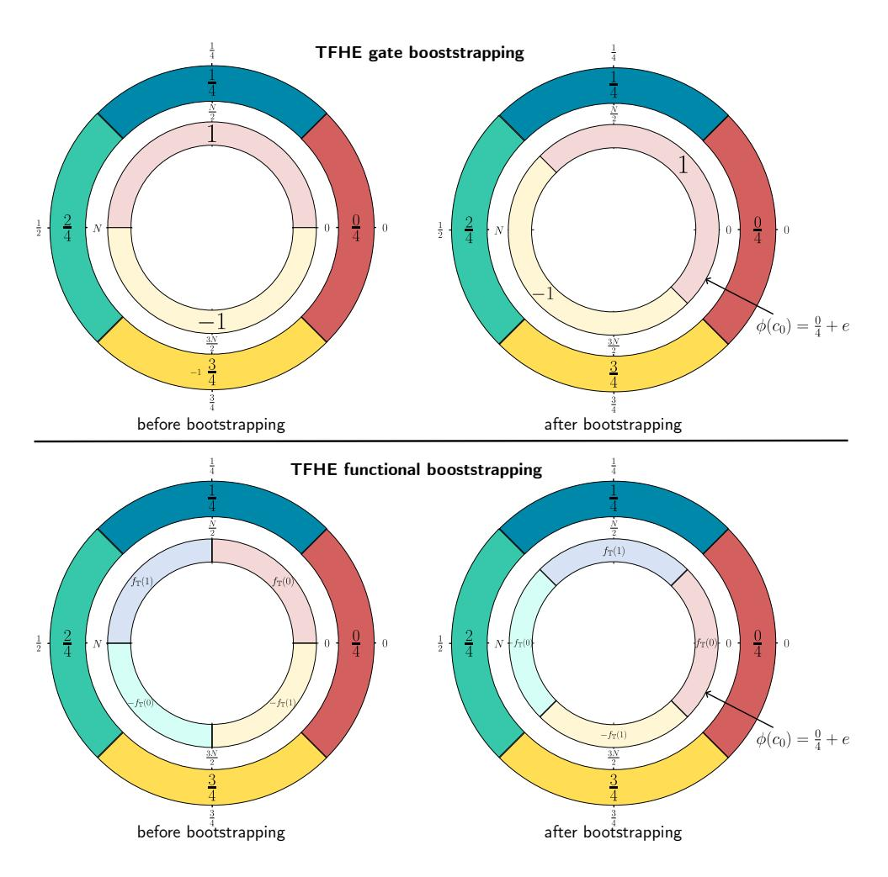
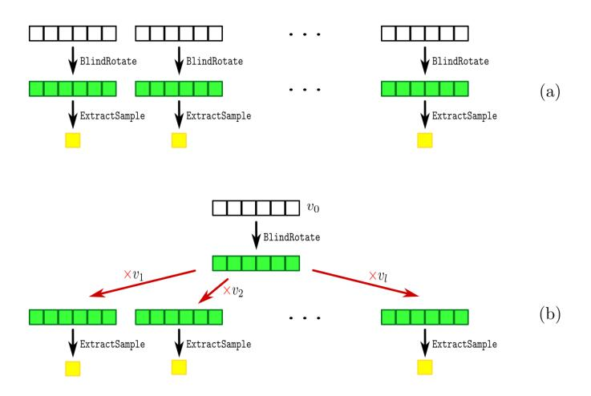
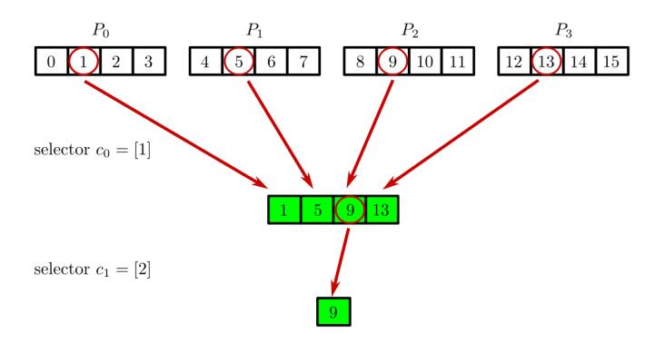
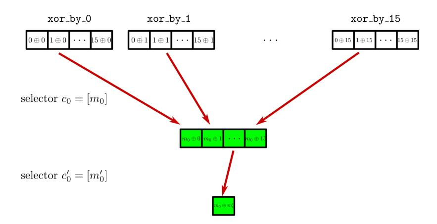

{0}------------------------------------------------

# At Last! A Homomorphic AES Evaluation in Less than 30 Seconds by Means of TFHE <sup>⋆</sup>

Daphné Trama, Pierre-Emmanuel Clet, Aymen Boudguiga, and Renaud Sirdey

Université Paris-Saclay, CEA-List, Palaiseau, France daphne.trama@cea.fr pierre-emmanuel.clet@cea.fr aymen.boudguiga@cea.fr renaud.sirdey@cea.fr

Abstract. Since the pioneering work of Gentry, Halevi, and Smart in 2012 [18], the state of the art on transciphering has moved away from work on AES to focus on new symmetric algorithms that are better suited for a homomorphic execution. Yet, with recent advances in homomorphic cryptosystems, the question arises as to where we stand today. Especially since AES execution is the application that may be chosen by NIST in the FHE part of its future call for threshold encryption. In this paper, we propose an AES implementation using TFHE programmable bootstrapping which runs in less than a minute on an average laptop. We detail the transformations carried out on the original AES code as well as the optimized FHE operators we developed to lead to a more efficient homomorphic evaluation. We also duly give several execution times on different machines, depending on the type of execution (sequential or parallelized). These times vary from 4.5 minutes (resp. 54 secs) for sequential (resp. parallel) execution on a standard laptop down to 28 seconds for a parallelized execution over 16 threads on a multi-core workstation.

Keywords: AES, Fully Homomorphic Encryption, Transciphering, TFHE, Programmable Bootstrapping.

# 1 Introduction

With recent advances in FHE, is a homomorphic AES still as impractical as it was ten years ago? The work of Gentry, Halevi, and Smart [18] in 2012 pushed research towards new symmetric cryptosystems designed primarily to be faster to evaluate over FHE. Indeed, they performed an AES-128 homomorphic evaluation with BGV using HElib, with now obsolete parameters that did not allow bootstrapping. They then obtained an execution time of 4.1 minutes, but without allowing further operations on the final ciphertext. With bootstrapping, thus allowing further calculations after the homomorphic execution of the AES, their runtime grew to 17.5 minutes. So neither of these two approaches could be used in practice. Since transciphering (the ability to homomorphically turn low overhead symmetrically encrypted data

<sup>⋆</sup> This paper will appear in the proceedings of WAHC'23.

{1}------------------------------------------------

into homomorphically encrypted ones) is an important issue for FHE practicality, several teams then decided to create new symmetric cryptosystems, whose encryption operations were specifically chosen to be more rapidly executed in the homomorphic domain. As of today, there are many proposals, from block ciphers (LowMC [1], PRINCE [6], CHAGHRI [2]) to stream ciphers (Elisabeth [15], PASTA [17], Kreyvium [8]). Each comes with its pros and cons. For instance, PRINCE [6] is a block cipher especially created to be lightweight and, although it was initially proposed independently of Gentry's breakthrough on FHE, has a number of desirable properties with respect to homomorphic execution: a moderate number of rounds, small depth (for a block-cipher) and a low gate count/footprint of the decryption and encryption functions. PRINCE was one of the first symmetric algorithms for which an FHE execution attempt was done [21]. LowMC [1], on the other hand, is the first block cipher explicitly designed with FHE and MPC in mind. Although demonstrating competitive FHE execution performances at the time of proposal, its design was intrinsically bit-oriented while the FHE state of the art has moved away from bitlevel FHE operations due to the relative inefficiency of this latter approach. In 2022 Ashur et al. presented CHAGHRI [2], an FHE-friendly block cipher enabling efficient transciphering in BGV-like schemes. A complete CHAGHRI circuit can be implemented using 16 multiplications, 48 Frobenius automorphisms, and 32 rotations. The authors implemented it with HElib in order to compare it with Gentry et al. work on AES. Although their implementation is claimed to be 63% faster than [18], an attack on CHAGHRI has recently been proposed [22]. Also introduced in 2022, Elisabeth is a family of stream ciphers especially designed to be efficient for Hybrid Homomorphic Encryption (HHE). The authors use TFHE and propose a Rust implementation (using the Concrete library) of Elisabeth-4, that is to say, a cryptosystem in which inputs are on 4 bits. So it would take 32 executions of the cipher to obtain a 128-bits ciphertext. Before Elisabeth, the PASTA cryptosystem, implemented with BGV/BFV proposed an optimized cipher for integer HHE use cases. They also benchmark several HHE schemes, using the HElib library. But the use of a non-bootstrapping-able scheme limits the number of operations to be further performed on the ciphertexts. Kreyvium is a stream cipher, which is a variant of Trivium [7] (a stream cipher belonging to the eSTREAM portfolio). The main motivation for introducing Kreyvium was to propose an FHE-friendly symmetric primitive with 128-bits of security, based on the sound design rationals of Trivium. Additionally, the state of the art also includes homomorphic evaluation of several variants of the Grain-128 stream cipher by means of TFHE either in gate-bootstrapping mode or exploiting its functional bootstrapping capabilities [4, 3]. Often compared to the homomorphic execution times of AES as a guarantee of efficiency, none of these cryptosystems has been standardized (with the notable exception of Grain-128, which was a finalist in the recent NIST competition on lightweight cryptography). Yet, an "efficient-by-FHE-standards" homomorphic AES execution remains interesting for the research community working on transciphering, even if it does not bring any revolution. This is especially so, since AES execution may be the application chosen by NIST in the FHE part of its future call for proposals on threshold encryption<sup>1</sup> .

<sup>1</sup> https://csrc.nist.gov/Projects/threshold-cryptography.

{2}------------------------------------------------

Contribution— In this paper, we propose an AES implementation using TFHE programmable bootstrapping, which runs in less than a minute on a standard laptop PC. We first detail the modifications carried out on the original AES code as well as the optimized FHE operators we developed to lead to an efficient homomorphic evaluation of the algorithm. Then we give details about the benchmark made to determine which decomposition basis to use to have a faster evaluation of the algorithm. We finally provide experimental execution times on different machines, depending on the type of execution (sequential or parallelized).

Paper Ogranization— This paper is organized as follows: Section 2 reviews the basics of the TFHE cryptosystem and gives the necessary details of the tree-based method for bootstrapping with multi-input ciphertexts and its optimization with multi-value bootstrapping. Section 3 gives a brief reminder on the AES. Section 4 provides a detailed exposition of our approaches to transform the original AES code and implement the most optimized and efficient version of it with TFHE programmable bootstrapping. Section 5 presents the performances and results of our methods.

## 2 TFHE Preliminaries

#### 2.1 Notations

Let  $\mathbb{T} = \mathbb{R}/\mathbb{Z}$  be the real torus, that is to say, the additive group of real numbers modulo 1 ( $\mathbb{R} \mod 1$ ). We will denote by  $\mathbb{T}_N[X]^n$  the set of vectors of size n whose coefficients are polynomials of  $\mathbb{T}[X] \mod (X^N+1)$ . N is usually a power of 2. Let  $\mathbb{B} = \{0,1\}$ .  $\langle , \rangle$  denotes the inner product.

#### 2.2 TFHE Scheme

The TFHE scheme is a fully homomorphic encryption scheme introduced in 2016 in [10] and implemented as the TFHE library <sup>2</sup>. TFHE defines three structures to encrypt plaintexts, which we summarize below as fresh encryptions of 0:

- **TLWE sample**: A pair  $(a,b) \in \mathbb{T}^{n+1}$ , where a is uniformly sampled from  $\mathbb{T}^n$  and  $b = \langle a,s \rangle + e$ . The secret key s is uniformly sampled from  $\mathbb{B}^n$ , and the error  $e \in \mathbb{T}$  is sampled from a Gaussian distribution with mean 0 and standard deviation  $\sigma$ .
- **TRLWE sample**: A pair  $(a,b) \in \mathbb{T}_N[X]^{k+1}$ , where a is uniformly sampled from  $\mathbb{T}_N[X]^k$  and  $b = \langle a,s \rangle + e$ . The secret key s is uniformly sampled from  $\mathbb{B}_N[X]^k$ , the error  $e \in \mathbb{T}$  is a polynomial with random coefficients sampled from a Gaussian distribution with mean 0 and standard deviation  $\sigma$ . One usually chooses k=1; therefore, a and b are vectors of size 1 whose coefficient is a polynomial.
- **TRGSW sample**: a vector of (k+1)l TRLWE fresh samples.

Let  $\mathcal{M}$  denote the discrete message space  $(\mathcal{M} \in \mathbb{T}_N[X])$  or  $\mathcal{M} \in \mathbb{T}$ . To encrypt a message  $m \in \mathcal{M}$ , we add what is called a *noiseless trivial* ciphertext (0,m) to a fresh encryption of 0. We denote by  $c = (a,b) + (0,m) = (a,b+m) \in T(R)LWE_{\mathfrak{s}}(m)$  the

<sup>&</sup>lt;sup>2</sup> https://tfhe.github.io/tfhe/

{3}------------------------------------------------

T(R)LWE encryption of m with key s. A message  $m \in \mathbb{Z}[X]$  can also be encrypted in TRGSW samples by adding  $m \cdot H$  to a TRGSW sample of 0, where H is a gadget decomposition matrix. As we will not explicitly need such an operation in this paper, more details about TRGSW can be found in [10].

To decrypt a ciphertext c, we first calculate its phase  $\phi(c) = b - \langle a, s \rangle = m + e$ . Then, we need to remove the error, which is achieved by rounding the phase to the nearest valid value in  $\mathcal{M}$ . This procedure fails if the error exceeds half the distance between two elements of  $\mathcal{M}$ .

### 2.3 TFHE Bootstrapping

Bootstrapping is the operation that reduces the noise of a ciphertext, thus allowing further homomorphic calculations. It relies on three basic operations, which we briefly review in this section.

- **BlindRotate**: rotates a polynomial encrypted as a TRLWE ciphertext by an encrypted index (under the form of a TLWE encryption). It takes several inputs: a ciphertext  $c \in \text{TRLWE}_k(m)$ , a vector  $(a_1, \dots, a_p, b)$  where  $\forall i, a_i \in \mathbb{Z}_{2N}$ , and a TRGSW ciphertext encrypting the secret key  $s = (s_1, \dots, s_p)$ . It returns a ciphertext  $c' \in \text{TRLWE}_k(m \cdot X^{\langle a, s \rangle b})$ . This paper will refer to this algorithm as **BlindRotate**.
- **TLWE Sample Extract**: extracts a coefficient of a TRLWE ciphertext and converts it into a TLWE ciphertext. It takes as inputs both a ciphertext  $c \in \text{TRLWE}_s(m)$  and an index  $p \in \{0, \dots, N-1\}$ . The result is a TLWE ciphertext  $c' \in \text{TLWE}_s(m_i)$  where  $m_i$  is the  $i^{th}$  coefficient of the polynomial m. This paper will refer to this algorithm as SampleExtract.
- **Public Functional Keyswitching**: allows the switching of keys and parameters from p ciphertexts  $c_i \in \text{TLWE}_k(m_i)$  to one  $c' \in \text{T}(R)\text{LWE}_s(f(m_1, \dots, m_p))$  where f is a public linear morphism between  $\mathbb{T}^p$  and  $\mathbb{T}_N[X]$ . That is to say, this operation not only allows the packing of TLWE ciphertexts in a TRLWE ciphertext, but it can also evaluate a linear function f over the input TLWEs. This paper will refer to this algorithm as KeySwitch.

It is important to note that, during a BlindRotate operation, an excessive noise level in the input TLWE ciphertext (the encrypted index which we use to rotate the polynomial) can lead to errors in the bootstrapping output resulting in incorrect ciphertexts (i.e., ciphertext which does not decrypt to correct calculation results). This has implications for parameters and data representation choices (number of digits and basis).

Algorithm 1 shows the TFHE Gate Bootstrapping [10], which aims to evaluate a binary gate operation homomorphically and reduce the output ciphertext noise at the same time. To that end, 0 and 1 are respectively encoded as 0 and  $\frac{1}{2}$  over  $\mathbb{T}$ . The first step of this algorithm consists of selecting a value  $\hat{m} \in \mathbb{T}$ , which will be used afterward to compute the coefficients of the polynomial, which will rotate during the BlindRotate. We call this polynomial testv as seen in Step 3. Note that for any  $p \in [0,2N]$  (where [0,2N] corresponds to the set of integers  $\{0,\cdots,2N\}$ ), the constant term of  $testv \cdot X^p$  is  $\hat{m}$  if  $p \in [0,2N]$  and  $-\hat{m}$  otherwise. Step 4 returns an

{4}------------------------------------------------

accumulator  $ACC \in \text{TRLWE}_{s'}(testv \cdot X^{\langle \overline{a},s \rangle - b})$ . Indeed, the constant term of ACC is  $-\hat{m}$  if c is an encryption of 0 and  $\hat{m}$  if c is an encryption of  $\frac{1}{2}$ . Then step 5 creates a new ciphertext  $\overline{c}$  by extracting the constant term in position 0 from ACC and adding  $(0,\hat{m})$ . Thus,  $\overline{c}$  corresponds to an encryption of 0 if c is an encryption of 0 and m otherwise. On the other hand, if c is an encryption of  $\frac{1}{2}$  and if we choose  $m = \frac{1}{2}$ , the algorithm returns a fresh ciphertext of  $\frac{1}{2}$ , that is to say the encoding of 1.

In Fig. 1, we present an example of TFHE gate bootstrapping algorithm with  $\mathbb{Z}_4 = \{0,1,2,3\}$  as input space. The outer circle in Fig. 1 corresponds to the plaintext encoding in  $\mathbb{T}$  as  $\{0,\frac{1}{4},\frac{2}{4},\frac{3}{4}\}$ . Meanwhile, the inner circle sets the coefficients of the test polynomial testv to 1, i.e.,  $\hat{m} = \frac{1}{4}$ . Then, we rotate the test polynomial during the bootstrapping by the phase  $\phi(c_0)$  of the input ciphertext  $c_0$ . In our example, we obtain as bootstrapping output either an encryption of the encoding of 1 for positive inputs  $\{0,\frac{1}{4}\}$ , or an encryption of the encoding of -1 for negative inputs  $\{\frac{2}{4},\frac{3}{4}\}$ .

### Algorithm 1 TFHE gate bootstrapping [10]

**Require:** a constant  $m \in \mathbb{T}$ , a TLWE sample  $c = (a,b) \in \text{TLWE}_s(x \cdot \frac{1}{2})$  with  $x \in \mathbb{B}$ , a bootstrapping key  $BK_{s \to s'} = (BK_i \in \text{TRGSW}_{S'}(s_i))_{i \in [\![1,n]\!]}$  where S' is the TRLWE interpretation of a secret key s'.

**Ensure:** a TLWE sample  $\bar{c} \in \text{TLWE}_s(x.m)$ 

- 1: Let  $\hat{m} = \frac{1}{2}m \in \mathbb{T}$  (pick one of the two possible values)
- 2: Let  $\overline{b} = \lfloor 2Nb \rfloor$  and  $\overline{a_i} = \lfloor 2Na_i \rfloor \in \mathbb{Z}, \forall i \in [1,n]$
- 3: Let  $testv := (1 + X + \dots + X^{N-1}) \cdot X^{\frac{N}{2}} \cdot \hat{m} \in \mathbb{T}_N[X]$
- 4:  $ACC \leftarrow \texttt{BlindRotate}((0, testv), (\overline{a}_1, ..., \overline{a}_n, \overline{b}), (BK_1, ..., BK_n))$
- 5:  $\bar{c} = (0, \hat{m}) + SampleExtract(ACC)$
- 6: return KeySwitch<sub>s' $\rightarrow$ s</sub>( $\bar{c}$ )

#### 2.4 TFHE Functional Bootstrapping

We can use Look-Up Tables to compute functions during the bootstrapping operation. To do so, we replace the coefficients of the test polynomial testv with the corresponding values of the LUT. Let us assume that we want to evaluate the function  $f_{\mathbb{T}}$  via a LUT. Then, if we retrieve the  $i^{th}$  coefficient of testv, we actually get  $f_{\mathbb{T}}(m_i)$  where  $m_i$  is the encrypted input to the bootstrapping. We refer to this idea by programmable or functional bootstrapping [11, 20, 25, 12, 14].

In Fig. 1, we give an example of functional bootstrapping with  $\mathbb{Z}_4 = \{0,1,2,3\}$  as input space. We encode the images of  $\{0,\frac{1}{4}\}$  by  $f_{\mathbb{T}}$  as coefficients of the test polynomial (in the inner circle). Meanwhile, we deduce the images of  $\{\frac{2}{4},\frac{3}{4}\}$  by negacyclicity. Indeed, in  $\mathbb{T}$ , we can encode negacyclic functions, i.e., antiperiodic functions with period  $\frac{1}{2}$  (verifying  $f_{\mathbb{T}}(x) = -f_{\mathbb{T}}(x+\frac{1}{2})$ ), where [0,0.5[ corresponds to positive values and [0.5,1[ to negative ones. In our example, if we encrypt one of the following values  $\{0,\frac{1}{4},\frac{2}{4},\frac{3}{4}\}$  and we give it as input to the functional bootstrapping algorithm, we get  $\{f_{\mathbb{T}}(0),f_{\mathbb{T}}(1),-f_{\mathbb{T}}(0),-f_{\mathbb{T}}(1)\}$ , respectively.

{5}------------------------------------------------



Fig. 1: TFHE Bootstrapping examples: the outer circles describe the inputs to the bootstrapping (i.e., ciphertexts over  $\mathbb{T}$ ). Meanwhile, the inner circles represent the coefficients of the test polynomial testv. One of these coefficients is extracted as the output of the bootstrapping after the BlindRotate.

Almost all of the functional bootstrapping methods from state of the art ([11, 20, 25, 12, 14]) take as input a single ciphertext. In 2021, Guimarães  $et\ al.$ , [19] discussed two methods for performing functional bootstrapping with larger plaintexts. They combine several bootstrappings with different encrypted inputs by using a tree or a chain structure. The ciphertexts are encryptions of digits that come from the decomposition of plaintexts in a certain basis B.

#### 2.5 Tree-based Method

Let  $B,B',d\in\mathbb{N}^*$  and m be an integer message. B and B' are the basis on which to decompose the message. We then have  $m=\sum_{i=0}^{d-1}m_iB^i$ , with  $m_i\in \llbracket 0,B-1\rrbracket$ . From this decomposition, we obtain d TLWE encryptions  $(c_0,c_1,\cdots,c_{d-1})$  of  $(m_0,m_1,\cdots,m_{d-1})$  on half of the torus  $\mathbb{T}$ . We denote  $f:\llbracket 0,B-1\rrbracket^d\to \llbracket 0,B'-1\rrbracket$  the target function and define g as the following bijection:

$$\begin{array}{c} g: \ [\![0,\!B\!-\!1]\!]^d \to \ [\![0,\!B^d\!-\!1]\!] \\ (a_0,\!a_1,\!\cdots,\!a_{d-1}) \mapsto \sum_{i=0}^{d-1} a_i \!\cdot\! B^i \end{array}$$

{6}------------------------------------------------

We then encode a LUT for f under the form of  $B^{d-1}$  TRLWE ciphertexts. Each of these ciphertexts encodes a polynomial  $P_i$  such that:

$$P_i(X) = \sum_{j=0}^{B-1} \sum_{k=0}^{\frac{N}{B}-1} f \circ g^{-1} (j \cdot B^{d-1} + i) \cdot X^{j \cdot \frac{N}{B} + k}$$

Then, we apply the BlindRotateAndExtract (the BlindRotate directly followed by the SampleExtract in position 0) to each test polynomial  $testv = \text{TRLWE}(P_i)$  with  $c_0$  as a selector. We obtain  $B^{d-1}$  TLWE ciphertexts, each corresponding to the encryption of  $f \circ g^{-1}(m_{d-1} \cdot B^{d-1} + i)$ , for  $i \in [0, B^{d-1} - 1]$ .

Finally, we use the KeySwitch operation from TLWE to TRLWE to gather them into  $B^{d-2}$  encrypted TRLWE, corresponding to the LUT of h, with:

$$h: [0,B-1]^{d-1} \to [0,B'-1]$$
  
 $(a_0,a_1,\dots,a_{d-2}) \mapsto f(a_0,a_1,\dots,a_{d-2},m_{d-1})$ 

We then repeat this operation, using the ciphertext  $c_i$  at step i, until we obtain a single TLWE ciphertext of  $f(m_0, m_1, \dots, m_{d-1})$ . Note that the tree-based method must be run independently as many times as the number of digits in the output.

#### 2.6 Multi-Value Bootstrapping

Multi-Value Bootstrapping (MVB) [9] refers to the method for evaluating k different LUTs on a single input with a single bootstrapping. MVB factors the test polynomial  $P_{f_i}$  associated with the function  $f_i$  into a product of two polynomials  $v_0$  and  $v_i$ , where  $v_0$  is a common factor to all  $P_{f_i}$ . In practice, we have:

$$(1+X+\cdots+X^{N-1})\cdot(1-X)\equiv 2 \mod (X^N+1)$$

Now by writing  $P_{f_i}$  in the form  $P_{f_i} = \sum_{j=0}^{N-1} \alpha_{i,j} X^j$  with  $\alpha_{i,j} \in \mathbb{Z}$ , we get from the previous equation:

$$P_{f_i} = \frac{1}{2} \cdot (1 + X + \dots + X^{N-1}) \cdot (1 - X) \cdot P_{f_i} \mod (X^N + 1)$$
  
=  $v_0 \cdot v_i \mod (X^N + 1)$ 

where:

$$v_0 = \frac{1}{2} \cdot (1 + X + \dots + X^{N-1})$$

$$v_i = \alpha_{i,0} + \alpha_{i,N-1} + (\alpha_{i,1} - \alpha_{i,0}) \cdot X + \dots$$

$$+ (\alpha_{i,N-1} - \alpha_{i,N-2}) \cdot X^{N-1}$$

This factorization makes it possible to compute many LUTs using a unique bootstrapping. Indeed, it is enough to initialize the test polynomial testv with the value of  $v_0$  during bootstrapping. Then, after the BlindRotate operation, one has to multiply

{7}------------------------------------------------



Fig. 2: Illustration of the MVB optimization. (a) represents the classic method to process several bootstrapping, while (b) represents the MVB optimization. As seen here, it reduces the number of BlindRotate operations, which is the most expansive one of the bootstrapping.

the obtained ACC by each  $v_i$  corresponding to the LUT of  $f_i$  to get  $ACC_i$ . Figure 2 illustrates the advantage of this method.

This optimization reduces the number of bootstrapping required for an operation and, thus, the overall computation time.

### 3 A Short Reminder on the AES

Advanced Encryption Standard (AES) is the name given to the Rijndael algorithm, the winner of the NIST standardization competition in 2000 [16]. It is a symmetric block cipher, defined to work with different key sizes. Several rounds are applied to the original message to obtain an encrypted message. Each round consists of the same operations performed in the same order. We chose to work on the 128-bits AES, which uses 10 rounds. The ciphertext is composed of 16 bytes such as  $c = c_0 c_1 \cdots c_{15} \in (\mathbb{F}_{2^8})^{16}$  and is encoded in what we call a *state matrix* in the following way:

$$\begin{pmatrix} c_0 & c_4 & c_8 & c_{12} \\ c_1 & c_5 & c_9 & c_{13} \\ c_2 & c_6 & c_{10} & c_{14} \\ c_3 & c_7 & c_{11} & c_{15} \end{pmatrix}$$

The round operations affect this matrix as follows:

- SubBytes: the SubBytes operation is the only non-linear transformation of the cipher. It is a permutation consisting of an S-box applied to the bytes of the state matrix. As it acts on the individual bytes of the state, it can be parallelized for efficient execution.
- AddRoundKey: before the encryption, the secret key is "expanded" into several round keys. The encryption process relies only on these round keys and not the initial secret key. In this transformation, the state is modified by combining it with a round key with the bitwise XOR operation. Of course, to do so, the size

{8}------------------------------------------------

of each round key is equal to the size of the ciphertext (in our case, 128 bits encoded in a round key matrix to match the state matrix). That is to say, we have at round  $i \in \{0, \dots, 9\}$ :

$$\begin{pmatrix} c_{0} & c_{4} & c_{8} & c_{12} \\ c_{1} & c_{5} & c_{9} & c_{13} \\ c_{2} & c_{6} & c_{10} & c_{14} \\ c_{3} & c_{7} & c_{11} & c_{15} \end{pmatrix} \oplus \begin{pmatrix} k_{i,0} & k_{i,4} & k_{i,8} & k_{i,12} \\ k_{i,1} & k_{i,5} & k_{i,9} & k_{i,13} \\ k_{i,2} & k_{i,6} & k_{i,10} & k_{i,14} \\ k_{i,3} & k_{i,7} & k_{i,11} & k_{i,15} \end{pmatrix} = \begin{pmatrix} c_{0} \oplus k_{i,0} & c_{4} \oplus k_{i,4} & c_{8} \oplus k_{i,8} & c_{12} \oplus k_{i,12} \\ c_{1} \oplus k_{i,1} & c_{5} \oplus k_{i,5} & c_{9} \oplus k_{i,9} & c_{13} \oplus k_{i,13} \\ c_{2} \oplus k_{i,2} & c_{6} \oplus k_{i,6} & c_{10} \oplus k_{i,10} & c_{14} \oplus k_{i,14} \\ c_{3} \oplus k_{i,3} & c_{7} \oplus k_{i,7} & c_{11} \oplus k_{i,11} & c_{15} \oplus k_{i,15} \end{pmatrix}$$

- ShiftRows: the ShiftRows step is a byte transposition that cyclically shifts the rows of the state over different offsets. For AES-128, row 0 is shifted over 0 bytes, row 1 over 1 byte, row 2 over 2 bytes and row 3 over 3 bytes. As this operation only alters the position of the bytes in the state matrix, it does not require a homomorphic equivalent (instead of shifting regular bytes, we shift homomorphic bytes).
- MixColumns: the MixColumns step is operating on the state column by column via matrix multiplication. However in practice, the authors do not implement the naive matrix product but work with each byte of the state matrix individually. They use a mix of scalar GF(256) multiplication and XOR, as visible in the original code. Therefore, this operation can be parallelized.

A typical execution of the 128-bits AES begins with the first AddRoundKey directly followed by the first iteration of the rounds. Each round proceeds as follows:

- 1. SubBytes
- 2. ShiftRows
- 3. MixColumns
- 4. AddRoundKey

Except for the last round, which does not require the MixColumns step.

About the Key Expansion—Key expansion is an operation that may be performed once and for all, from the secret key. Indeed, from the 128-bit key are derived eleven 128-bit round keys, which are used in the AddRoundKey operation. As a result, to evaluate the AES encryption or decryption algorithm, a server only needs to know the round keys. This operation, consisting of XOR and GF(256) multiplication, is expensive in the homomorphic domain. It is therefore more efficient for a client to generate its own key, derive the round keys, and then homomorphically encrypt them. Sending these eleven homomorphically encrypted round keys is faster than creating the initial key, encrypting it in homomorphic, and sending it to a server to perform the Key Schedule in the homomorphic domain. For these reasons, we remove the key schedule from the encrypted-domain computations.

{9}------------------------------------------------

# 4 AES goes homomorphic

To use the full potential of programmable bootstrapping, we aim to transform the AES algorithm into a succession of LUT evaluations. The permutation given by the Sbox is already in LUT form, so all that remains is to modify the multiplication in GF(256) and XOR operations. These are binary operations, which are not immediate to put into LUT form. Indeed, evaluating a LUT is like dereferencing an array from an encrypted index. The LUT evaluation operator, therefore, takes only one input: this encrypted index. If possible, these operations should thus be transformed into unary table indirection operations. Since AES works on a byte-by-byte basis, LUTs must take 8-bits encrypted indexes and return an evaluation of this index on 8 bits. In this section, we explain the various steps involved in transforming the original code into the sequence of 8-bits-to-8-bits LUTs required for efficient homomorphic execution.

### 4.1 Optimizing the Original AES Code

The first step towards the homomorphization of a symmetric cryptosystem is to look at the original code for small changes that would ease the transition. AES makes no exception. However, we quickly observed that the proposed C++ implementation (given by the creators of the AES in [16]) is only "pseudo" 8-bits, as a carry that requires an additional ninth bit is necessary for specific bytes operations.

Indeed, this occurs during the GF(256) multiplication of two integers (see Fig. 3). To compute this operation efficiently, the authors use a generator α=X+1 of the message space GF(256)∼=**F**2[X]/⟨X8+X4+X3+X+1⟩. From this, they construct two tables of 256 elements. The first one is Logtable, defined such as Logtable[α i ]=i. The second is Alogtable where Alogtable[i]=α i . Then, instead of a naive GF(256) multiplication, the result is obtained with a simple sum of logs and two table indirections. Consequently and as seen in Figure 3, when the mul(word8 a, word8 b) function is called, two 8-bits integers representing the logs are added together. And this sum may exceed 255, which is why the authors apply a %255 to the result. We must change the whole function structure to avoid this overhead and have an actual 8-bits implementation. But it also implies some more profound changes in the entire code.

```
word8 mul(word8 a, word8 b) {
  /* multiply two elements of GF(256)
  * required for MixColumns and InvMixColumns
  */
  if (a && b) return Alogtable[(Logtable[a] + Logtable[b])%255];
  else return 0;
}
```

Fig. 3: The original GF(256) multiplication implementation given in [16]. The sum of Logtable[a] + Logtable[b] may exceed 255. Therefore, this operation requires more than 8 bits in practice, which is unsuitable for a homomorphic evaluation with an 8-bits processor.

{10}------------------------------------------------

We deal with this issue by observing that there are only a few calls to the mul function throughout the algorithm. During these calls, the parameter a only takes six different values. Indeed, a careful reading of the code shows that a∈{2,3,9,b,d,e}. This means that we can separate the mul(a,b) function into six mul\_a(b) functions, with a∈{2,3,9,b,d,e} by removing the variable a of the parameters and just encoding the correct values in the corresponding new functions. Then, to work around the problematic addition of two 8-bits integers, we compute and hardcode six tables Tlog\_a such that Tlog\_a[b]=(Logtable[a]+Logtable[b])%255. This pre-calculation of the tables enables us to eliminate the problem of the "pseudo" 8-bits implementation. At the same time, this allows us to avoid an explicit modulo operation, which is difficult to efficiently perform in the homomorphic domain. To optimize a step further and reduce the number of tables indirections per encrypted index, we finally consider the six new T\_a tables such that T\_a[b] =Alogtable[Tlog\_a[b]] and use them directly into our implementation.

We now have six functions of the following form:

```
word8 mul_a(word8 b) {
    if (b) return T_a[b];
    else return 0;
}
```

It is a simple function, but regarding a homomorphic evaluation, we want our function to be as light as possible regarding the number of operations performed. This is why, to avoid an explicit evaluation of the if condition on b (which should be performed via a conditional assignment as FHE disallows branching for obvious reasons), we modified the T\_a tables so that they consider the case where b=0. That is to say, for every a∈{2,3,9,b,d,e}, T\_a[0]=0. So our final implementations of the GF(256) multiplications are straightforward and only require one indirection, as seen in Figure 4.

```
word8 mul_a(word8 b) {
  return T_a[b];
}
```

Fig. 4: Our final GF(256) multiplication operator. The new multiplication functions are very simple and easy to execute in the homomorphic domain, thanks to pre-calculation and table hardcoding.

Therefore, this work on the multiplication functions allows us to operate with only one indirection instead of three indirections, an addition, a modulo operation, and an if condition in the original code version. These changes allow us to convert the initial binary GF(256) multiplication operator into several unary ones, which is ideal for a LUT transformation.

When looking for other possible optimizations, we realized we achieved an optimal or nearly optimal form regarding LUT factorization and, thus, LUT-based homo

{11}------------------------------------------------

morphic evaluation (at least when starting from the standard AES implementation). Indeed, the structure of the MixColumns instructions prevent further factorization. For example, if one considers the following instructions (in MixColumn):

```
b[0][j] = mul_2(a[0][j]) ^ mul_3(a[1][j]) ^ a[2][j] ^ a[3][j];
b[1][j] = mul_2(a[1][j]) ^ mul_3(a[2][j]) ^ a[3][j] ^ a[0][j];
b[2][j] = mul_2(a[2][j]) ^ mul_3(a[3][j]) ^ a[0][j] ^ a[1][j];
b[3][j] = mul_2(a[3][j]) ^ mul_3(a[0][j]) ^ a[1][j] ^ a[2][j];
```

where a denotes the state matrix, then, although the mul\_2 and mul\_3 LUTs could directly embed the Sbox LUT (assuming the indices are made consistent with the effect of ShiftRows) the two last terms cannot (since they do not require any GF(256) multiplication, hence there is no LUT to factor the Sbox LUT with). For instance, a[0][j] is used via mul\_2 in b[0][j] calculations and then as is for the others (b[1][j], b[2][j], b[3][j]). Finally, as an additional optimization, we have merged the AddRoundKey function with the SubBytes one, as the first always precedes the second one, for increased parallelism efficiency.

### 4.2 And Finally Going Homomorphic for Real

To make the most of TFHE programmable bootstrapping, we implement all operations (XOR, Sbox, GF(256) multiplication) via LUT evaluations. As we now have a ciphertext-by-cleartext GF(256) multiplication function that is performed only by means of a unique indirection, this causes no issue. And by definition, the Sbox is a LUT. So, the actual work here is to transform the XOR into a LUT. The XOR is a binary operation in which, in our case, inputs are bytes. That means we need a 256×256 table to encode our XOR. As it is a binary operation, we must either use the tree-based method (recalled in Sect. 2.5) or the chaining method, both introduced in [19], which allows bootstrapping with several entries. Table 1 compares the parameters needed depending on the method. In this table, B<sup>g</sup> and l denote the basis and levels associated with the gadget decomposition, BKS and t denote the decomposition basis and the precision of the decomposition of the KeySwitch. Finally, q denotes the size of the used plaintext size (meaning that the torus is discretized on q values), and ϵ is the error probability of one MVB evaluation or one evaluation of the chaining method. We also give the noises associated with the TRLWE and TLWE ciphertexts. Note that these parameters are not universal; other parameters with another error probability could also work. Given a message space of size B, the chaining method requires using a plaintext space of size 2B<sup>2</sup> (instead of only 2×B for the tree-based method). As such, the size of the parameters dramatically increases as the basis B increases. This growth of parameters jeopardizes the other speed improvements that could come with the chaining method. Relying on this comparison, we chose to work with the tree-based method, which is thus more efficient in our case.

On top of this, the MVB optimization (Sect. 2.6) allows us to evaluate a LUT with two input digits and one output digit in only two bootstrappings. Still, as the parameters needed for calculation in basis 256 are significantly larger (we have to work on the discretized torus on 512 values, using only the positive half), it will not be efficient. Indeed, we need to use the cyclotomic polynomial X<sup>32768</sup>+1, which results

{12}------------------------------------------------

| -                 |       |      |       |   |            |          |   |     |           |                       |                       |
|-------------------|-------|------|-------|---|------------|----------|---|-----|-----------|-----------------------|-----------------------|
|                   | basis | n    | N     | l |            | $B_{KS}$ |   |     | 1         | TRLWE noise           | TLWE noise            |
| chaining method   | 4     | 850  | 2048  | 2 | 1          |          |   |     | l         | 0.0                   | $1.27 \times 10^{-6}$ |
|                   |       |      |       |   | 1          |          |   |     | l         | =                     | $5.6 \times 10^{-8}$  |
|                   | 16    | 1100 | 32768 | 1 | 4294967296 | 8192     | 2 | 512 | $2^{-30}$ | $1.4 \times 10^{-8}$  | $10^{-248}$           |
| tree-based method | 4     | 700  | 1024  | 5 | 16         | 1024     | 2 | _   |           |                       | $1.9 \times 10^{-5}$  |
|                   | 8     | 700  | 2048  | 2 |            | 1024     |   |     | l         |                       | $1.9 \times 10^{-5}$  |
|                   | 16    | 1024 | 2048  | 3 | 256        | 1024     | 2 | 32  | $2^{-23}$ | $9.6 \times 10^{-11}$ | $6.5 \times 10^{-8}$  |

Table 1: Parameter sets depending on the LUT evaluation method and the chosen decomposition basis ( $\lambda \approx 128$ ).

in a very slow bootstrapping and a non-implementable small variance (still for 135 bits of security according to the lattice-estimator). Recall that the parameter sets given for the chaining method are for illustration purposes as we do not use that method in the paper and just aim at showing that the tree-based method is more practical for basis 16. This makes it interesting to break down the messages into smaller bases and to use the tree-based method for every LUT evaluation. For example, in order to perform an indirection into a 256 8-bits entries LUT, when working in basis 16, we have to split the original table into two 256 4-bits entries. For each of these two tables, we apply a two levels tree-based method where, as illustrated by Figure 5 with the LUT of the identity function, the first level extracts one encrypted 4-bits value from each block of 16 values (assuming, as we do, that the first digit contains the least significant 4 bits) in the original table. This leads to a 16 (encrypted) 4-bits entries table, and the second level extracts the encrypted 4-bits value from the latter.



Fig. 5: Illustration of the tree\_based method on the identity function. The message is  $m=9=1\cdot 4^0+2\cdot 4^1$  and its encryption is  $c=(c_0,c_1)=([1],[2])$ . Red arrows indicate bootstrappings.

More generally, the number  $N_{boot}$  of bootstrapping needed with the tree-based method increases with the number of input digits d and the number of output digits d' as well as the basis B chosen for the decomposition. In fact, for a complete evaluation of a LUT via the classic tree-based method, we have  $N_{boot} = d' \times \sum_{i=0}^{d-1} B^i$  and with the MVB, we have  $NB'_{boot} = d' \times (1 + \sum_{i=0}^{d-2} B^i)$ . Table 2 provides the number of

{13}------------------------------------------------

bootstrapping per operation (256×8bits LUT dereferencing and 8-bits-by-8-bits XOR) depending on the decomposition basis for the ciphertexts (using the MVB-optimized tree-based method).

Table 2: Number of bootstrapping for one XOR or one LUT evaluation (using MVB) depending on the decomposition basis.

|     | basis # XOR # LUT |    |
|-----|-------------------|----|
| 256 | 2                 | 1  |
| 16  | 4                 | 4  |
| 8   | 6                 | 30 |
| 4   | 8                 | 88 |

Although the tree-based method requires more operations, the smaller the decomposition basis, the smaller the parameters to be used. Small ciphertext sizes allow small parameters and, therefore, faster operations. A tradeoff must therefore be achieved between the number of bootstrapping operations performed and the parameters' size. For this reason, we produce a benchmark of the execution time of LUT evaluation depending on the ciphertext decomposition.

We consider the following different decompositions:

- basis 256: it is not a decomposition per se, but we have to be sure that this basis is not the most advantageous one
- basis 16: the message is decomposed into two digits in basis 16 (4 bits per digit)
- basis 8: the message is decomposed into three digits in basis 8 (3 bits per digit, but only 2 bits for the most significant digit)
- basis 4: the message is decomposed into four digits in basis 4 (2 bits per digit)

For this, we first implemented an efficient homomorphic operator to evaluate any LUT using TFHE programmable bootstrapping and MVB. We then used it with our different decompositions and their associated parameter sets. The results of this experiment are given in Table 3. It is thus clear that basis 16 is the optimal choice regarding the execution time per LUT evaluation as well as for a full AES execution (as the overall number of LUT evaluations is independent of the basis choice). Note that there is no linearity between the timings due to the number of multiplications involved by the MVB during the first bootstrapping. Additionally, Table 4 provides the number of bootstrapping needed with the MVB optimization for a full AES evaluation, depending on the decomposition basis. We now have everything needed to obtain homomorphic versions of the mul\_a functions. To do so, as already emphasized, we decompose every table T\_a into two tables of 256 basis 16 digits, i.e., one per digit of the decomposition. We do the same with the Sbox table. Finally, we use a similar approach to create the 4-bits-by-4-bits XOR operator. We do so by means of a 16×16 table with 4-bit entries, which is much easier to handle than a 256×256 (with 8-bits entries) needed without the decomposition (yet another pro for the basis 16 decomposition). This being done, we now have duly "translated" our optimized-for-FHE version of the AES code into a real homomorphic one.

{14}------------------------------------------------

Table 3: Unitary timings for bootstrapping and full LUT evaluation depending on basis and parameter choices (λ≈128).

|     | basis single boot. complete |           | n   | N          |
|-----|-----------------------------|-----------|-----|------------|
|     |                             | LUT eval. |     |            |
| 256 | 1.5s                        | 1.5 s     |     | 1024 32768 |
| 16  | 0.029s                      | 0.3 s     |     | 1024 2048  |
| 8   | 0.015s                      | 1.4 s     | 700 | 2048       |
| 4   | 0.007s                      | 2.0 s     | 700 | 1024       |

Table 4: Number of operations and the corresponding number of bootstrapping depending on decomposition basis. Readers are reminded that AES-128 consists of a RoundKey, followed by 9 classic rounds and a final round that does not include the MixColumns operation.

|     | basis function |     | # XOR # LUT # Boot |       |
|-----|----------------|-----|--------------------|-------|
|     | AddRoundKey 16 |     | 0                  | 32    |
|     | SubBytes       | 0   | 16                 | 16    |
| 256 | MixColumns     | 48  | 32                 | 128   |
|     | Round          | 64  | 48                 | 176   |
|     | Full AES       | 608 | 448                | 1664  |
|     | AddRoundKey 16 |     | 0                  | 64    |
|     | SubBytes       | 0   | 16                 | 64    |
| 16  | MixColumns     | 48  | 32                 | 320   |
|     | Round          | 64  | 48                 | 448   |
|     | Full AES       | 608 | 448                | 4224  |
|     | AddRoundKey 16 |     | 0                  | 96    |
|     | SubBytes       | 0   | 16                 | 480   |
| 8   | MixColumns     | 48  | 32                 | 1248  |
|     | Round          | 64  | 48                 | 1824  |
|     | Full AES       | 608 | 448                | 17088 |
|     | AddRoundKey 16 |     | 0                  | 128   |
| 4   | SubBytes       | 0   | 16                 | 1408  |
|     | MixColumns     | 48  | 32                 | 3200  |
|     | Round          | 64  | 48                 | 4736  |
|     | Full AES       | 608 | 448                | 44288 |
|     |                |     |                    |       |

### 4.3 Details about the Homomorphization of the XOR Operator

Following the previous section, we give details about our homomorphic XOR operator, which is a relevant concrete example of our tree-based method approach. On the one hand, we have to transform the classic 8-bits-to-8-bits XOR operator to fit the chosen decomposition basis, and on the other hand, we have to transform it so we can evaluate it via a LUT. As already emphasized (Table 3), basis 16 is the best one for our AES homomorphic execution attempt. This means that we decompose our messages on the following form m = m0+m<sup>1</sup> ·16 and that the corresponding ciphertext is a vector of the form c=(c0,c1)=([m0],[m1]). So, to compute the XOR

{15}------------------------------------------------

of two ciphertexts c and c' in basis 16, we have to compute:

$$c \oplus c' = (c_0, c_1) \oplus (c'_0, c'_1) = (c_0 \oplus c'_0, c_1 \oplus c'_1)$$

We thus have to evaluate a 4-bits-by-4-bits XOR on the ciphertexts. For this, we dereference the double input table of 4-bits XOR, which has size  $16 \times 16$ . The tricky part is to choose the correct way to construct the test polynomials from this table for the tree-based method. Indeed, on the first step of the tree-based method, we have 16 test polynomials. Each one must encode the coefficient of a unary XOR. That is to say, the first polynomial  $P_0$  encodes the values of the unary operation  $\text{xor\_by\_0}(i)$  such that for  $i \in \{0,1,\cdots,15\}$   $\text{xor\_by\_0}(i) = i \oplus 0$ , the second polynomial  $P_1$  encodes  $\text{xor\_by\_1}$ , etc. So when applying the bootstrapping on these polynomials with selector  $c_0 = [m_0]$ , we obtain 16 new ciphertexts encoding  $\text{xor\_by\_m0}$  that we put together on a polynomial  $P_{final}$ . We then apply the bootstrapping on the new polynomial  $P_{final}$  with selector  $c_0' = [m_0']$ , and we obtain the final results, which is an encryption of  $c_0 \oplus c_0'$ . The method is illustrated in Fig. 6.



Fig. 6: The principle of the tree-based method applied to the XOR with basis 16. The green color indicates that the content of the box is encrypted.

By using the same method, we can easily compute  $c_1 \oplus c'_1$ , and thus obtain the vector  $c \oplus c' = (c_0 \oplus c'_0, c_1 \oplus c'_1)$  encoding  $m \oplus m'$ .

### 4.4 Remarks and Perspectives on LUT Evaluated Operations

In this section, we briefly present our various operations in a unified way and illustrate that it allows to express more general operations than needed for our AES execution attempt. A distinction must be made between ciphertext-ciphertext binary operators and cleartext-ciphertext binary operators. The latter is the case of the GF(256) multiplication operator in the AES algorithm, which we turned into several unary operators (the  $\mathfrak{mul}_a$  functions, which could easily have been as many as 256 if it had been required). Regarding the case of ciphertext-ciphertext operators, we can divide them into two types: the bitwise ones and the others.

Bitwise ciphertext-ciphertext operator - The AES implementation requires an XOR operation, which can finally be implemented using the same tool as for 

{16}------------------------------------------------

the unary functions (Sbox, mul\_a). Slightly loosely speaking, let us say that our 8-bits-to-4-bits table dereferencing tool takes the following form  $LUT(c_0,c_1,table)$  and in basis 16  $LUT(c_0,c_1,table) = table[c_0+c_1\cdot16]$ . To evaluate the unary operator of the Sbox (or mul\_a), one must call  $LUT(c_0,c_1, Sbox_0)$  and then  $LUT(c_0,c_1, Sbox_1)$ , where Sbox\_0 and Sbox\_1 respectively denote the LSB and MSB of Sbox, to obtain the two result digits and reform  $Sbox[c_0+c_1\cdot16]$  (respectively  $LUT(c_0,c_1, mul_a_0)$  and  $LUT(c_0,c_1, mul_a_1)$ ). But for XOR, we use  $LUT(c_0,c'_0, XOR)$  and then  $LUT(c_1,c'_1, XOR)$  as explained above. In the first case, we use the same ciphertexts on different tables; in the second case, we use different ciphertexts on the same table. This means a binary bitwise homomorphic operator is as easy (and costly) to implement as a unary non-bitwise operator. Furthermore, such a binary operator can easily be adapted to any bitwise operation (AND, NOR, etc.) or unary operation by modifying the initial polynomials accordingly.

Non-bitwise ciphertext-ciphertext operator - Although not needed for AES, the case of non-bitwise ciphertext-ciphertext operators is a bit more involved. Let us take the example of the addition of two encrypted basis 256 messages c and c' decomposed in basis 16. Two different tables with 256 4-bits entries then come into play: ADD, which encodes the addition of two digits, and CAR, which handles the carry. So, using the same dereferencing tool as above, a simple addition over  $\mathbb{Z}_{256}$  can be broken down into 4 invocations of the operator:

```
LUT (c_0, c'_0, ADD) = res_0

LUT (c_0, c'_0, CAR) = r

LUT (c_1, c'_1, ADD) = v

LUT (v, r, ADD) = res_1
```

where  $res_0 + res_1 \cdot 16 = c + c'$ . The basic dereferencing tool is the same for all of these cases and is, in essence, universal, although on a case-by-case basis, there might be more optimized methods for certain operations (e.g., by combining the tree-based and chain-based methods, the latter being, for example, more efficient for carry computations). This gives interesting perspectives for building a more general optimized "instruction set".

### 5 Experimental results

#### 5.1 TFHE Library Implementation

We worked with TFHElib<sup>3</sup> using the parameters given in Table 1 for the tree-based method with basis 16. As a reminder, we take  $B_g = 256$  and l = 3 as the basis and levels associated with the gadget decomposition. For the KeySwitch, we take  $B_{KS} = 1024$ 

<sup>&</sup>lt;sup>3</sup> https://tfhe.github.io/tfhe/

{17}------------------------------------------------

and t=2 as the decomposition basis and the precision of the decomposition. Finally, as we work with a plaintext space of size 16, we work on the discretized torus on q=32 values. We chose these parameters specifically to enable MVB evaluation with error probability ϵ=2<sup>−</sup><sup>23</sup>. According to the lattice estimator<sup>4</sup> , these give us at least 128 bits of security. The first step was to implement the tree-based method and its MVB optimization. Indeed, none of these methods are part of the TFHE library. Furthermore, we had to adapt the code to be able to use vectors of TLWE and TRLWE samples (as our ciphertexts are decomposed into 2 digits in basis 16, we put them in vectors of 2 elements). Then, we modified the MVB operator to turn it into a generic LUT evaluation tool. This new operator takes as input a vector of ciphertexts, the number d of input digits, the number d ′ of output digits, the decomposition basis B and the LUT to be evaluated. Depending on how it is called, this operator can perform our XOR as well as our GF(256) multiplications and Sbox.

## 5.2 Parallelization

The purpose of transciphering is to avoid transferring large ciphertexts. Since a server has more computing power than a client, it can efficiently exploit several cores to parallelize computations and optimize execution times. With that respect, AES is naturally parallelizable up to a certain degree: within each round step, operations can be performed simultaneously on each byte of the state matrix (except for the ShiftRows step). This is why, in continuing our work, we use the OpenMP library to parallelize our code and optimize the execution times of our homomorphic AES. We run our tests on two machines. The first one is a 12th Gen Intel(R) Core(TM) i7-12700H CPU (using six cores) laptop with 64 Gib total system memory with an Ubuntu 22.04.2 LTS server. The second is an AMD EPYC 7702P 64-cores Processor server with an Ubuntu 20.04.6 LTS server. In the following sections, we will refer to them respectively as i7-laptop and AMD-server.

Table 5: Our execution times compared to the state of the art (the "i7-server" time corresponds to an extrapolation of the speedup observed with 16 threads on the AMD-server from the i7-laptop sequential time as we did not have an i7-based server to perform experiments).

|                                                             | execution time           | time ratio |
|-------------------------------------------------------------|--------------------------|------------|
| i7-laptop (1 thread)                                        | 4.5 mins = 270 secs 9. 4 |            |
| i7-laptop (6 threads)                                       | 54.31 secs               | 1.9        |
| AMD-server (1 thread)                                       | 5.7 mins = 342 secs 11.9 |            |
| AMD-server (16 threads)                                     | 36.39 secs               | 1.3        |
| "i7-server" (16 threads)                                    | 28.73 secs               | 1          |
| Gentry et al. [18] (1 thread)                               | 18 mins                  | 37.6       |
| Mella and Susella [23] (1 thread)                           | 22 mins                  | 45.9       |
| Stracovsky et al. [24] (16 threads) 4.2 mins = 252 secs 8.8 |                          |            |

<sup>4</sup> https://github.com/malb/lattice-estimator

{18}------------------------------------------------

Using the OpenMP library, we first parallelize onto the six cores on the i7 laptop. As it is a standard laptop, it is interesting to see how a partially parallelized homomorphic AES can work. Indeed, it gives a reasonable hint of the potential of a larger scale parallelization. That is why we parallelize every round function, except for the ShiftRows one, as it only involves ciphertexts reorganization within the state matrix. Still, thanks to OpenMP, we could use 16 cores for a larger-scale parallelization on the AMD-server (which hosts 64 cores in total). As the server has less powerful cores, it is slower than the i7-laptop in sequential time. But, by running a sequential execution and a full parallelized one, we can measure the speedup factor induced by parallelization. For instance, the execution parallelized on 16 cores is 9.5 times faster than the sequential one on the AMD-server. Results can be found in Table 5. The last column of this table indicates the ratio between the (fastest) "i7-server" time and the other (slower) ones.

A perspective is to go further in the parallelization of the AES evaluation. Indeed, we can also parallelize the tree-based method and execute the computation of each decomposition digit at the same time. This method will need 32 cores, but it can divide the execution time almost by 2.

### 5.3 Computation Times

This section summarizes the results of our implementations in Table 5. Even if our measured speedups are not linear in the number of cores, we improve the state of the art as the so far best-known implementation runs in 4.2 minutes with 16-thread parallelization [24] using the standard programmable bootstrapping in base 16 as implemented in Zama's Concrete <sup>5</sup> . However, note that no implementation details were provided (to the best of our knowledge) beyond a poster presented by Stracovsky et al. at FHE.org 2022 [24]. In [18], Gentry et al. use a packed implementation with BGV so that each slot can hold a state byte. The round operations are computed as single linear transformations over GF(2<sup>8</sup> ) <sup>16</sup>. These linear transformations combine several permutations that are computed via automorphism evaluation and additions. In [23], Mella and Susella improve these latter results by using an optimized data representation to further factor some of these operations in ciphertext slots. As they relied heavily on batching, these works focused primarily on optimizing the amortized time metric which is relevant only when one has to perform many independent AES executions in parallel. As Table 5 shows, we obtain a sequential time comparable to [24] on i7-laptop and a very improved one with parallel execution. Indeed, our parallelized version on i7-laptop is 4.6 times more efficient than Stracovsky et al.'s [24] and almost 20 times more efficient than Gentry et al.'s. [18] in terms of latency. Furthermore, our parallelized version on AMD-server is almost 7 times faster than [24] and 30 times faster than [18] as it only takes 3% of its execution time.

<sup>5</sup> https://github.com/zama-ai/concrete

{19}------------------------------------------------

# 6 Conclusion

In this paper, we have proposed a homomorphic AES implementation relying on two encrypted-domain "instructions", a unary 256-by-8 bits table indirection, and a binary 8-bit XOR instruction, both running over encryptions of nibbles (the cute name for hex digits) and relying on functional bootstrapping for efficiency. Our work illustrates that, even when starting from the standard AES implementation, this approach significantly improves the state of the art of homomorphic AES execution timings. In terms of perspectives, beyond improved parallelism, it would be interesting to consider other non-standard forms for the AES as a starting point in a search for ones that may lead to smaller numbers of homomorphic operations (i.e., in fine, fewer bootstrapping). For example, a non-public implementation optimized for constrained embedded systems by inlining, loop unrolling, and careful instructions reorganization was brought to our attention. In our terms, such an implementation would lead to 68 XOR and 32 LUT per AES round (vs. 64 XOR and 48 LUT when starting from the standard implementation as we did). Although we do not expect to gain one or more orders of magnitude, this could lead to an additional 10% performance improvement, at least in the sequential execution times we report in this paper (as this version appears more difficult to parallelize at first glance). We could also try to exploit the emerging full-Torus functional bootstrapping methods, such as ComBo [13], which may allow smaller parameters and, thus, faster bootstrapping evaluations. Another approach that could potentially lead to further timing improvements would be to investigate how the techniques introduced in [5] may help to either or both increase the basis size or factor larger portions of the AES algorithm in single WoP-PBS operator evaluations. Yet another interesting perspective would be, as hinted in Sect. 4.4, to extend the embryonic "instruction set" defined in this paper in order to apply this approach to other algorithms more easily.

# Acknowledgements

This work was supported by the France 2030 ANR Project ANR-22-PECY-003 SecureCompute. The authors also would like to thank Nicolas Belleville for sharing with them the non-standard AES implementation referred to in the conclusion.

# References

- 1. Albrecht, M., Rechberger, C., Schneider, T., Tiessen, T., Zohner, M.: Ciphers for mpc and fhe. Cryptology ePrint Archive, Paper 2016/687 (2016), https://eprint.iacr.org/2016/687, https://eprint.iacr.org/2016/687
- 2. Ashur, T., Mahzoun, M., Toprakhisar, D.: Chaghri a fhe-friendly block cipher. In: Proceedings of the 2022 ACM SIGSAC Conference on Computer and Communications Security. p. 139–150. CCS '22, Association for Computing Machinery, New York, NY, USA (2022). https://doi.org/10.1145/3548606.3559364, https://doi.org/10.1145/3548606.3559364
- 3. Bendoukha, A.A., Boudguiga, A., Sirdey, R.: Revisiting stream-cipher-based homomorphic transciphering in the tfhe era. In: Foundations and Practice of Security:

{20}------------------------------------------------

- 14th International Symposium, FPS 2021, Paris, France, December 7–10, 2021, Revised Selected Papers. p. 19–33. Springer-Verlag, Berlin, Heidelberg (2021). https://doi.org/10.1007/978-3-031-08147-7\_2
- 4. Bendoukha, A., Clet, P.E., Boudguiga, A., Sirdey, R.: Optimized stream-cipher-based transciphering by means of functional bootstrapping. DBSEC (in press) (2023), https://eprint.iacr.org/2016/687, https://eprint.iacr.org/2016/687
- 5. Bergerat, L., Boudi, A., Bourgerie, Q., Chillotti, I., Ligier, D., Orfila, J.B., Tap, S.: Parameter optimization and larger precision for (t)fhe. Cryptology ePrint Archive, Paper 2022/704 (2022), https://eprint.iacr.org/2022/704, https://eprint.iacr.org/2022/704
- 6. Borghoff, J., Canteaut, A., Güneysu, T., Kavun, E.B., Knezevic, M., Knudsen, L.R., Leander, G., Nikov, V., Paar, C., Rechberger, C., Rombouts, P., Thomsen, S.S., Yalçin, T.: Prince - a low-latency block cipher for pervasive computing applications - extended abstract. In: International Conference on the Theory and Application of Cryptology and Information Security (2012)
- 7. Cannière, C.D., Preneel, B.: Trivium. In: Robshaw, M.J.B., Billet, O. (eds.) New Stream Cipher Designs - The eSTREAM Finalists, Lecture Notes in Computer Science, vol. 4986, pp. 244–266. Springer (2008). https://doi.org/10.1007/978-3-540-68351-3\\_18, https://doi.org/10.1007/978-3-540-68351-3\_18
- 8. Canteaut, A., Carpov, S., Fontaine, C., Lepoint, T., Naya-Plasencia, M., Paillier, P., Sirdey, R.: Stream ciphers: A practical solution for efficient homomorphicciphertext compression. Cryptology ePrint Archive, Paper 2015/113 (2015), https://eprint.iacr.org/2015/113, https://eprint.iacr.org/2015/113
- 9. Carpov, S., Izabachène, M., Mollimard, V.: New techniques for multi-value input homomorphic evaluation and applications. Cryptology ePrint Archive, Paper 2018/622 (2018), https://eprint.iacr.org/2018/622
- 10. Chillotti, I., Gama, N., Georgieva, M., Izabachène, M.: TFHE: Fast fully homomorphic encryption library (August 2016), https://tfhe.github.io/tfhe/
- 11. Chillotti, I., Joye, M., Paillier, P.: Programmable bootstrapping enables efficient homomorphic inference of deep neural networks. In: Dolev, S., Margalit, O., Pinkas, B., Schwarzmann, A. (eds.) Cyber Security Cryptography and Machine Learning. pp. 1–19. Springer International Publishing, Cham (2021)
- 12. Chillotti, I., Ligier, D., Orfila, J.B., Tap, S.: Improved programmable bootstrapping with larger precision and efficient arithmetic circuits for tfhe. Cryptology ePrint Archive, Report 2021/729 (2021), https://ia.cr/2021/729
- 13. Clet, P.E., Boudguiga, A., Sirdey, R., Zuber, M.: Combo: A novel functional bootstrapping method for efficient evaluation of nonlinear functions in the encrypted domain. In: El Mrabet, N., De Feo, L., Duquesne, S. (eds.) Progress in Cryptology - AFRICACRYPT 2023. pp. 317–343. Springer Nature Switzerland, Cham (2023)
- 14. Clet, P.E., Zuber, M., Boudguiga, A., Sirdey, R., Gouy-Pailler, C.: Putting up the swiss army knife of homomorphic calculations by means of tfhe functional bootstrapping. Cryptology ePrint Archive, Paper 2022/149 (2022), https://eprint.iacr.org/2022/149
- 15. Cosseron, O., Hoffmann, C., Méaux, P., Standaert, F.X.: Towards globally optimized hybrid homomorphic encryption - featuring the elisabeth stream cipher. Cryptology ePrint Archive, Paper 2022/180 (2022), https://eprint.iacr.org/2022/180, https://eprint.iacr.org/2022/180
- 16. Daemen, J., Rijmen, V.: The Design of Rijndael: AES The Advanced Encryption Standard (Information Security and Cryptography). Springer, 1 edn. (2002)
- 17. Dobraunig, C., Grassi, L., Helminger, L., Rechberger, C., Schofnegger, M., Walch, R.: Pasta: A case for hybrid homomorphic encryption. IACR Cryptol. ePrint Arch. 2021, 731 (2021)

{21}------------------------------------------------

- 18. Gentry, C., Halevi, S., Smart, N.P.: Homomorphic evaluation of the aes circuit. In: Safavi-Naini, R., Canetti, R. (eds.) Advances in Cryptology – CRYPTO 2012. pp. 850–867. Springer Berlin Heidelberg, Berlin, Heidelberg (2012)
- 19. Guimarães, A., Borin, E., Aranha, D.F.: Revisiting the functional bootstrap in tfhe. IACR Transactions on Cryptographic Hardware and Embedded Systems 2021(2), 229–253 (Feb 2021). https://doi.org/10.46586/tches.v2021.i2.229-253
- 20. Kluczniak, K., Schild, L.: FDFB: Full domain functional bootstrapping towards practical fully homomorphic encryption. Cryptology ePrint Archive, Report 2021/1135 (2021), https://ia.cr/2021/1135
- 21. Lepoint, T., Naehrig, M.: A comparison of the homomorphic encryption schemes fv and yashe. In: Pointcheval, D., Vergnaud, D. (eds.) Progress in Cryptology – AFRICACRYPT 2014. pp. 318–335. Springer International Publishing, Cham (2014)
- 22. Liu, F., Anand, R., Wang, L., Meier, W., Isobe, T.: Coefficient grouping: Breaking chaghri and more. In: Hazay, C., Stam, M. (eds.) Advances in Cryptology – EUROCRYPT 2023. pp. 287–317. Springer Nature Switzerland, Cham (2023)
- 23. Mella, S., Susella, R.: On the homomorphic computation of symmetric cryptographic primitives. In: Stam, M. (ed.) Cryptography and Coding. pp. 28–44. Springer Berlin Heidelberg, Berlin, Heidelberg (2013)
- 24. Stracovsky, R., Mahdavi, R.A., Kerschbaum, F.: Faster evaluation of aes using tfhe. Poster Session, FHE.Org (2022)
- 25. Yang, Z., Xie, X., Shen, H., Chen, S., Zhou, J.: Tota: Fully homomorphic encryption with smaller parameters and stronger security. Cryptology ePrint Archive, Report 2021/1347 (2021), https://ia.cr/2021/1347